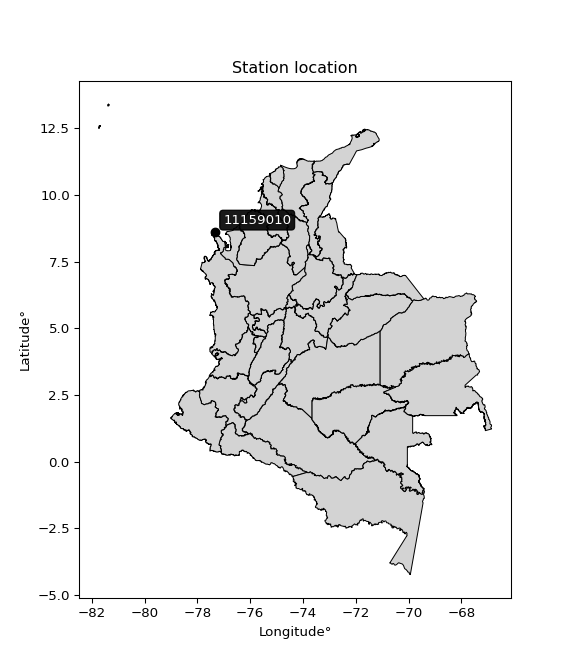

<div align="center">


</div>

# PMax24h Station (Rain): 11159010

Maximum Precipitation in 24 hours (PMax24h) is the greatest amount of rainfall for a specific duration that is meteorologically possible for a given location, acting as a "worst-case" scenario for extreme storms, crucial for designing safety-critical infrastructure like bridges, river deviations, dams, spillways, and nuclear plants to prevent catastrophic failure. The PMax24h is related with the Probable Maximum Precipitation (PMP) and it is calculated by hydrologists using meteorological data to determine the upper limit of extreme rainfall, often leading to the Probable Maximum Flood (PMF) for flood control design, and is increasingly being studied for climate change impacts. Probable Maximum Precipitation (PMP) is the theoretical upper limit of rainfall, a deterministic estimate for extreme events, while probability distributions (like GEV, Gumbel) describe the likelihood and frequency of various precipitation amounts, including rare ones, showing how often events occur, with PMP representing the extreme end of these distributions, used for critical infrastructure design to ensure safety against the worst conceivable weather, unlike standard statistical forecasts which cover typical probabilities.

The most common probability distributions in hydrology, used for analyzing floods, rainfall, and streamflow, include the Normal, Log-Normal, Gumbel, Gamma (including Log-Pearson Type III), and Generalized Extreme Value (GEV) distributions, often chosen based on the data´s skewness and whether modeling extremes or general conditions, with Gumbel and GEV popular for extreme events like floods, while the Normal distribution serves as a baseline, though often requiring transformations for skewed hydrological data. These distributions help in designing water infrastructure, managing water resources, and forecasting hydrologic events.

> Hydrological data often isn´t perfectly normal (it´s skewed), so different distributions are needed for different applications, such as: **Flood Frequency Analysis**: Using Gumbel, GEV, or Log-Pearson Type III for predicting extreme flood magnitudes and their return periods, **Rainfall Analysis**: Normal for annual totals, but Log-Normal, Weibull, or GEV for intensity or extreme daily rainfall, **Streamflow Modeling**: Gamma and Log-Normal for maximum flows, GEV for minimum flows, and Kappa for daily flows.

<div align="center">

</img>

</div>


## A. General information


### 1. General running parameters

• app_version: _v20260225_. • runtime: _2026-02-28 16:54:07.457399_. • Python version: _3.14.0_. • SciPy version: _1.16.3_. • Pandas version: _2.3.3_. • NumPy version: _2.3.5_. • Stations dataset (station_dataset_file): _dataset/pmax24h_in/automatic_colombia_2003_2025.csv_. • Stations catalog (station_catalog_file): _dataset/CNE.xls_. • Minimum year to eval til year_max (date_min): _1900_. • Maximum year to eval since year_min (date_max): _2025_. • Creates, save and include plots into reports (create_plot): _False_. • Plot only fit distributions with Δo > Δ (plot_only_fit): _True_. • Plot only simple graphs avoiding multiple CDFs and multiple Extreme values plots (plot_only_simple): _False_. • Eval low extreme values, if False, evaluates high extreme values (low_extreme): _False_. • Eval every SciPy distribution as logarithmic (pdist_logarithmic_on): _True_. • Standard deviation normalized (ddof): _1.0_. • Return periods to eval in years (Tr): _[2, 2.33, 5, 10, 15, 20, 25, 50, 75, 100, 200, 250, 500, 750, 1000]_. • Minimum data sample per station, 0 means any (minimum_sample): _5_. • Z-Score maximum threshold to adjust a value, 0 means disable (zscore_max): _3.5_. • Z-Score minimum threshold to adjust a value, 0 means disable (zscore_min): _-2.5_. • Avoid zeros, e.g. rain = 0 (avoid_zeros): _True_. • Avoid null values (avoid_nans): _True_. 

:file_folder:Table: [dataset.csv](../../dataset/pmax24h_in/automatic_colombia_2003_2025.csv)

> Delta Degrees of Freedom (DDOF): is a parameter used in the formulas for calculating variance and standard deviation. When ddof=0, the divisor is $N$ (the total number of observations) and this is used when your data set is the entire population. When ddof=1, the divisor is $N-1$ and this is used when your data set is a sample drawn from a larger population. Using $N-1$ provides an unbiased estimate of the population variance (known as Bessel´s correction).


### 2. Station info and location

|   id |   CODIGO | NOMBRE                     | CATEGORIA            | TECNOLOGIA                | ESTADO     | FECHA_INSTALACION   |   FECHA_SUSPENSION |   ALTITUD |   LATITUD |   LONGITUD | DEPARTAMENTO   | MUNICIPIO   | AREA_OPERATIVA                      | ENTIDAD                                                     | AREA_HIDROGRAFICA   | ZONA_HIDROGRAFICA   | SUBZONA_HIDROGRAFICA                | CORRIENTE   | Catalogo   |   Version |
|-----:|---------:|:---------------------------|:---------------------|:--------------------------|:-----------|:--------------------|-------------------:|----------:|----------:|-----------:|:---------------|:------------|:------------------------------------|:------------------------------------------------------------|:--------------------|:--------------------|:------------------------------------|:------------|:-----------|----------:|
|    0 | 11159010 | CAPURGANA - AUT [11159010] | Meteorologica Marina | Automática con Telemetría | Suspendida | 15/08/1995          |                nan |         1 |      8.62 |     -77.33 | Choco          | Acandí      | Area Operativa 01 - Antioquia-Chocó | INSTITUTO DE HIDROLOGIA METEOROLOGIA Y ESTUDIOS AMBIENTALES | Caribe              | Atrato - Darién     | Río Tolo y otros Directos al Caribe | Mar Caribe  | CNE_IDEAM  |  20251226 |

<div align="center">

Dynamic map: [:earth_americas:Google](http://maps.google.com/maps?q=8.62,-77.33) [:earth_americas:OSM](https://www.openstreetmap.org/#map=18/8.62/-77.33&layers=P) [:earth_americas:Bing](https://www.bing.com/maps?cp=8.62~-77.33&lvl=18) [:earth_americas:Apple](https://maps.apple.com/frame?center=8.62%2C-77.33&span=0.003%2C0.006)

</div>


<div align="center">

```geojson
{
  "type": "Feature",
  "geometry": {
    "type": "Point", 
    "coordinates": [-77.33, 8.62]
  }, 
  "properties": {
    "Name": "11159010"
  }
}
```

</div>


### 3. Discrete values table and plot

<div align="center">

|               |           0 |            1 |           2 |            3 |           4 |           5 |           6 |            7 |            8 |           9 |          10 |          11 |         12 |
|:--------------|------------:|-------------:|------------:|-------------:|------------:|------------:|------------:|-------------:|-------------:|------------:|------------:|------------:|-----------:|
| Date          | 2007        | 2008         | 2009        | 2010         | 2011        | 2012        | 2013        | 2014         | 2015         | 2016        | 2017        | 2018        | 2019       |
| Value         |   90.6      |  126.8       |   95.2      |  131.9       |   13.5      |   14.6      |   85        |  151.5       |  150.5       |   52.5      |   56.4      |   57.4      |  816.6     |
| Value_initial |   90.6      |  126.8       |   95.2      |  131.9       |   13.5      |   14.6      |   85        |  151.5       |  150.5       |   52.5      |   56.4      |   57.4      |  816.6     |
| count         |   13        |   13         |   13        |   13         |   13        |   13        |   13        |   13         |   13         |   13        |   13        |   13        |   13       |
| mean          |  141.731    |  141.731     |  141.731    |  141.731     |  141.731    |  141.731    |  141.731    |  141.731     |  141.731     |  141.731    |  141.731    |  141.731    |  141.731   |
| std           |  207.946    |  207.946     |  207.946    |  207.946     |  207.946    |  207.946    |  207.946    |  207.946     |  207.946     |  207.946    |  207.946    |  207.946    |  207.946   |
| zscore        |   -0.245885 |   -0.0718012 |   -0.223764 |   -0.0472756 |   -0.616654 |   -0.611364 |   -0.272815 |    0.0469796 |    0.0421707 |   -0.429105 |   -0.410351 |   -0.405542 |    3.24541 |


</div>


> The initial value (value_initial) correspond to the initial obtained or null completed value, and value (value) is adjusted only when the initial value is outside the valid range (outlier) definite through the Z-Score value. If Z-Score is active, values out of range or outliers are replaced with the station mean value. A Z-Score (or standard score) measures how many standard deviations a data point is from the mean of a dataset, indicating its relative position; positive scores mean above the mean, negative mean below, and a score of zero is exactly at the mean, allowing for comparison of values from different distributions. It´s calculated using the formula $z=(x–μ)/σ$, where $x$ is the data point, $μ$ is the mean, and $σ$ is the standard deviation, helping identify outliers and understand probability.
>
> <sub>**Note**: In this study, "completing" (filling gaps in) and "extending" (forecasting or lengthening the historical record) rainfall data series are avoided for certain critical analyses because they introduce artificial bias and uncertainty, which can distort the statistics of rare events (extremes), alter day-to-day variability, and compromise the integrity and homogeneity of the original data. Some reasons against Completing/Extending rainfall data are: **Distortion of Extremes and Variability**: The primary issue is that most gap-filling or extension methods rely on averaging or regression with nearby stations, which inherently smooths the data. Rainfall is highly variable in space and time, with a large percentage of zero values and occasional large storms. Infilling methods often underestimate the highest values and overestimate the lowest (zero) values, which severely distorts analyses focused on flood frequency, drought severity, and intensity-duration-frequency (IDF) curves, **Loss of Data Homogeneity**: Infilled or extended data are synthetic estimates, not actual measurements. Combining these estimates with observed data can violate the assumption of data homogeneity, which requires that the data properties do not change over time. Inhomogeneity can lead to incorrect conclusions about long-term trends or changes in climate patterns, **Propagation of Errors**: Errors and biases from the original data (e.g., wind-induced undercatch, instrument errors, site changes) or the data used for imputation can propagate through the analysis, leading to unreliable hydrological models and inaccurate predictions, **Compromised Statistical Integrity**: For statistical analyses, especially those involving the frequency of events, using artificial data can introduce time bias or autocorrelation that doesn´t exist in reality, making it difficult to assess the true probability of events, **Difficulty in Validation**: It is difficult to accurately validate the quality of filled or extended data, especially for past periods where ground-truth measurements are unavailable. The reliability of imputation techniques heavily depends on the density of the surrounding station network and the complexity of the local topography.</sub>


### 4. Active continuous probability distributions from SciPy (80 of 104 available)

A Probability Density Function (PDF) describes the relative likelihood of a continuous random variable falling within a specific range, where the total area under its curve equals 1, and the area over any interval gives the actual probability for that range. Unlike discrete probabilities (like rolling a die), a PDF shows density, not direct probability for a single point (which is zero), with higher points indicating higher likelihood, often visualized as a bell curve for normal distributions.

A log of a probability density function (log-PDF) is simply the logarithm of the PDF´s value, denoted as $log(f(x))$, useful for converting multiplication of probabilities into addition, improving numerical stability with tiny numbers, and connecting to information theory concepts like entropy. Instead of dealing with very small probabilities (e.g., 0.000001), log-PDFs use negative numbers (e.g., $log(0.00001) ≈ -11.51$ that are easier for computers to handle, preventing underflow errors and simplifying complex calculations. In this study, each active probability distribution from SciPy is also evaluated in the $log$ form.

[scipy.stats](https://docs.scipy.org/doc/scipy/reference/stats.html) is a Python´s powerful submodule within the SciPy library for comprehensive statistical analysis, offering over 130 probability distributions (like Normal, Poisson, etc.), functions for descriptive stats (mean, variance), hypothesis testing (t-tests, chi-square), random variable generation, and statistical tests, making it essential for data science, modeling, and research. It provides tools to explore, model, and draw conclusions from data efficiently, working seamlessly with [NumPy](https://numpy.org/).

<div align="center">

|   id | p_dist           |   n_parameter | fit_method   | label                                                                       | active   | ref                                                                                                      |
|-----:|:-----------------|--------------:|:-------------|:----------------------------------------------------------------------------|:---------|:---------------------------------------------------------------------------------------------------------|
|    0 | alpha            |             3 | MLE          | Alpha                                                                       | True     | [:mortar_board:](https://docs.scipy.org/doc/scipy/reference/generated/scipy.stats.alpha.html)            |
|    1 | anglit           |             2 | MM           | Anglit                                                                      | True     | [:mortar_board:](https://docs.scipy.org/doc/scipy/reference/generated/scipy.stats.anglit.html)           |
|    2 | arcsine          |             2 | MM           | Arcsine                                                                     | True     | [:mortar_board:](https://docs.scipy.org/doc/scipy/reference/generated/scipy.stats.arcsine.html)          |
|    3 | argus            |             3 | MLE          | Argus                                                                       | True     | [:mortar_board:](https://docs.scipy.org/doc/scipy/reference/generated/scipy.stats.argus.html)            |
|    4 | beta             |             4 | MLE          | Beta                                                                        | True     | [:mortar_board:](https://docs.scipy.org/doc/scipy/reference/generated/scipy.stats.beta.html)             |
|    5 | betaprime        |             4 | MLE          | Beta prime                                                                  | True     | [:mortar_board:](https://docs.scipy.org/doc/scipy/reference/generated/scipy.stats.betaprime.html)        |
|    6 | bradford         |             3 | MLE          | Bradford                                                                    | True     | [:mortar_board:](https://docs.scipy.org/doc/scipy/reference/generated/scipy.stats.bradford.html)         |
|    7 | burr             |             4 | MLE          | Burr (Type III)                                                             | True     | [:mortar_board:](https://docs.scipy.org/doc/scipy/reference/generated/scipy.stats.burr.html)             |
|    8 | burr12           |             4 | MLE          | Burr (Type III) 12                                                          | True     | [:mortar_board:](https://docs.scipy.org/doc/scipy/reference/generated/scipy.stats.burr12.html)           |
|    9 | cosine           |             2 | MLE          | Cosine                                                                      | True     | [:mortar_board:](https://docs.scipy.org/doc/scipy/reference/generated/scipy.stats.cosine.html)           |
|   10 | crystalball      |             4 | MLE          | Crystalball                                                                 | True     | [:mortar_board:](https://docs.scipy.org/doc/scipy/reference/generated/scipy.stats.crystalball.html)      |
|   11 | dgamma           |             3 | MLE          | Double gamma                                                                | True     | [:mortar_board:](https://docs.scipy.org/doc/scipy/reference/generated/scipy.stats.dgamma.html)           |
|   12 | dweibull         |             3 | MLE          | Double Weibull                                                              | True     | [:mortar_board:](https://docs.scipy.org/doc/scipy/reference/generated/scipy.stats.dweibull.html)         |
|   13 | erlang           |             3 | MLE          | Erlang                                                                      | True     | [:mortar_board:](https://docs.scipy.org/doc/scipy/reference/generated/scipy.stats.erlang.html)           |
|   14 | exponnorm        |             3 | MLE          | Exponentially modified Normal                                               | True     | [:mortar_board:](https://docs.scipy.org/doc/scipy/reference/generated/scipy.stats.exponnorm.html)        |
|   15 | exponpow         |             3 | MLE          | Exponential power                                                           | True     | [:mortar_board:](https://docs.scipy.org/doc/scipy/reference/generated/scipy.stats.exponpow.html)         |
|   16 | exponweib        |             4 | MLE          | Exponentiated Weibull                                                       | True     | [:mortar_board:](https://docs.scipy.org/doc/scipy/reference/generated/scipy.stats.exponweib.html)        |
|   17 | f                |             4 | MLE          | F                                                                           | True     | [:mortar_board:](https://docs.scipy.org/doc/scipy/reference/generated/scipy.stats.f.html)                |
|   18 | fatiguelife      |             3 | MLE          | Fatigue-life (Birnbaum-Saunders)                                            | True     | [:mortar_board:](https://docs.scipy.org/doc/scipy/reference/generated/scipy.stats.fatiguelife.html)      |
|   19 | foldnorm         |             3 | MM           | Fold Normal                                                                 | True     | [:mortar_board:](https://docs.scipy.org/doc/scipy/reference/generated/scipy.stats.foldnorm.html)         |
|   20 | gamma            |             3 | MLE          | Gamma                                                                       | True     | [:mortar_board:](https://docs.scipy.org/doc/scipy/reference/generated/scipy.stats.gamma.html)            |
|   21 | gausshyper       |             6 | MLE          | Gauss hypergeometric                                                        | True     | [:mortar_board:](https://docs.scipy.org/doc/scipy/reference/generated/scipy.stats.gausshyper.html)       |
|   22 | genexpon         |             5 | MLE          | Generalized exponential                                                     | True     | [:mortar_board:](https://docs.scipy.org/doc/scipy/reference/generated/scipy.stats.genexpon.html)         |
|   23 | genextreme       |             3 | MLE          | Generalized exponential                                                     | True     | [:mortar_board:](https://docs.scipy.org/doc/scipy/reference/generated/scipy.stats.genextreme.html)       |
|   24 | gengamma         |             4 | MLE          | Generalized gamma                                                           | True     | [:mortar_board:](https://docs.scipy.org/doc/scipy/reference/generated/scipy.stats.gengamma.html)         |
|   25 | genhalflogistic  |             3 | MLE          | Generalized half-logistic                                                   | True     | [:mortar_board:](https://docs.scipy.org/doc/scipy/reference/generated/scipy.stats.genhalflogistic.html)  |
|   26 | genlogistic      |             3 | MLE          | Generalized logistic                                                        | True     | [:mortar_board:](https://docs.scipy.org/doc/scipy/reference/generated/scipy.stats.genlogistic.html)      |
|   27 | gennorm          |             3 | MLE          | Generalized Normal                                                          | True     | [:mortar_board:](https://docs.scipy.org/doc/scipy/reference/generated/scipy.stats.gennorm.html)          |
|   28 | genpareto        |             3 | MLE          | Generalized Pareto                                                          | True     | [:mortar_board:](https://docs.scipy.org/doc/scipy/reference/generated/scipy.stats.genpareto.html)        |
|   29 | gompertz         |             3 | MLE          | Gompertz (or truncated Gumbel)                                              | True     | [:mortar_board:](https://docs.scipy.org/doc/scipy/reference/generated/scipy.stats.gompertz.html)         |
|   30 | gumbel_l         |             2 | MM           | Gumbel Left Skew                                                            | True     | [:mortar_board:](https://docs.scipy.org/doc/scipy/reference/generated/scipy.stats.gumbel_l.html)         |
|   31 | gumbel_r         |             2 | MM           | Gumbel Right Skew                                                           | True     | [:mortar_board:](https://docs.scipy.org/doc/scipy/reference/generated/scipy.stats.gumbel_r.html)         |
|   32 | halfgennorm      |             3 | MLE          | Upper half of a generalized normal                                          | True     | [:mortar_board:](https://docs.scipy.org/doc/scipy/reference/generated/scipy.stats.halfgennorm.html)      |
|   33 | halflogistic     |             2 | MM           | Half-logistic                                                               | True     | [:mortar_board:](https://docs.scipy.org/doc/scipy/reference/generated/scipy.stats.halflogistic.html)     |
|   34 | halfnorm         |             2 | MM           | Half Normal                                                                 | True     | [:mortar_board:](https://docs.scipy.org/doc/scipy/reference/generated/scipy.stats.halfnorm.html)         |
|   35 | hypsecant        |             2 | MM           | hyperbolic secant                                                           | True     | [:mortar_board:](https://docs.scipy.org/doc/scipy/reference/generated/scipy.stats.hypsecant.html)        |
|   36 | invgamma         |             3 | MLE          | Inverted gamma                                                              | True     | [:mortar_board:](https://docs.scipy.org/doc/scipy/reference/generated/scipy.stats.invgamma.html)         |
|   37 | invgauss         |             3 | MLE          | Inverse Gaussian                                                            | True     | [:mortar_board:](https://docs.scipy.org/doc/scipy/reference/generated/scipy.stats.invgauss.html)         |
|   38 | invweibull       |             3 | MLE          | Inverted Weibull                                                            | True     | [:mortar_board:](https://docs.scipy.org/doc/scipy/reference/generated/scipy.stats.invweibull.html)       |
|   39 | johnsonsb        |             4 | MLE          | Johnson SB                                                                  | True     | [:mortar_board:](https://docs.scipy.org/doc/scipy/reference/generated/scipy.stats.johnsonsb.html)        |
|   40 | johnsonsu        |             4 | MLE          | Johnson Su                                                                  | True     | [:mortar_board:](https://docs.scipy.org/doc/scipy/reference/generated/scipy.stats.johnsonsu.html)        |
|   41 | kappa3           |             3 | MLE          | Kappa 3                                                                     | True     | [:mortar_board:](https://docs.scipy.org/doc/scipy/reference/generated/scipy.stats.kappa3.html)           |
|   42 | kappa4           |             4 | MLE          | Kappa 4                                                                     | True     | [:mortar_board:](https://docs.scipy.org/doc/scipy/reference/generated/scipy.stats.kappa4.html)           |
|   43 | ksone            |             3 | MLE          | Kolmogorov-Smirnov one-sided test statistic distribution                    | True     | [:mortar_board:](https://docs.scipy.org/doc/scipy/reference/generated/scipy.stats.ksone.html)            |
|   44 | kstwobign        |             2 | MLE          | Limiting distribution of scaled Kolmogorov-Smirnov two-sided test statistic | True     | [:mortar_board:](https://docs.scipy.org/doc/scipy/reference/generated/scipy.stats.kstwobign.html)        |
|   45 | laplace          |             2 | MM           | Laplace                                                                     | True     | [:mortar_board:](https://docs.scipy.org/doc/scipy/reference/generated/scipy.stats.laplace.html)          |
|   46 | levy_l           |             2 | MLE          | Left-skewed Levy                                                            | True     | [:mortar_board:](https://docs.scipy.org/doc/scipy/reference/generated/scipy.stats.levy_l.html)           |
|   47 | loggamma         |             3 | MLE          | Log gamma                                                                   | True     | [:mortar_board:](https://docs.scipy.org/doc/scipy/reference/generated/scipy.stats.loggamma.html)         |
|   48 | logistic         |             2 | MM           | Logistic (or Sech-squared)                                                  | True     | [:mortar_board:](https://docs.scipy.org/doc/scipy/reference/generated/scipy.stats.logistic.html)         |
|   49 | loglaplace       |             3 | MLE          | Log-Laplace                                                                 | True     | [:mortar_board:](https://docs.scipy.org/doc/scipy/reference/generated/scipy.stats.loglaplace.html)       |
|   50 | lomax            |             3 | MLE          | Lomax (Pareto of the second kind)                                           | True     | [:mortar_board:](https://docs.scipy.org/doc/scipy/reference/generated/scipy.stats.lomax.html)            |
|   51 | maxwell          |             2 | MM           | Maxwell                                                                     | True     | [:mortar_board:](https://docs.scipy.org/doc/scipy/reference/generated/scipy.stats.maxwell.html)          |
|   52 | mielke           |             4 | MLE          | Mielke Beta-Kappa / Dagum                                                   | True     | [:mortar_board:](https://docs.scipy.org/doc/scipy/reference/generated/scipy.stats.mielke.html)           |
|   53 | moyal            |             2 | MM           | Moyal                                                                       | True     | [:mortar_board:](https://docs.scipy.org/doc/scipy/reference/generated/scipy.stats.moyal.html)            |
|   54 | nakagami         |             3 | MLE          | Nakagami                                                                    | True     | [:mortar_board:](https://docs.scipy.org/doc/scipy/reference/generated/scipy.stats.nakagami.html)         |
|   55 | ncf              |             5 | MLE          | Non-central F distribution                                                  | True     | [:mortar_board:](https://docs.scipy.org/doc/scipy/reference/generated/scipy.stats.ncf.html)              |
|   56 | nct              |             4 | MLE          | Non-central Student’s t                                                     | True     | [:mortar_board:](https://docs.scipy.org/doc/scipy/reference/generated/scipy.stats.nct.html)              |
|   57 | norm             |             2 | MM           | Normal                                                                      | True     | [:mortar_board:](https://docs.scipy.org/doc/scipy/reference/generated/scipy.stats.norm.html)             |
|   58 | pearson3         |             3 | MM           | Pearson type III                                                            | True     | [:mortar_board:](https://docs.scipy.org/doc/scipy/reference/generated/scipy.stats.pearson3.html)         |
|   59 | powerlaw         |             3 | MLE          | Power-function                                                              | True     | [:mortar_board:](https://docs.scipy.org/doc/scipy/reference/generated/scipy.stats.powerlaw.html)         |
|   60 | rayleigh         |             2 | MM           | Rayleigh                                                                    | True     | [:mortar_board:](https://docs.scipy.org/doc/scipy/reference/generated/scipy.stats.rayleigh.html)         |
|   61 | rdist            |             3 | MLE          | R-distributed (symmetric beta)                                              | True     | [:mortar_board:](https://docs.scipy.org/doc/scipy/reference/generated/scipy.stats.rdist.html)            |
|   62 | rice             |             3 | MLE          | Rice                                                                        | True     | [:mortar_board:](https://docs.scipy.org/doc/scipy/reference/generated/scipy.stats.rice.html)             |
|   63 | semicircular     |             2 | MM           | Semicircular                                                                | True     | [:mortar_board:](https://docs.scipy.org/doc/scipy/reference/generated/scipy.stats.semicircular.html)     |
|   64 | skewnorm         |             3 | MLE          | Skew normal                                                                 | True     | [:mortar_board:](https://docs.scipy.org/doc/scipy/reference/generated/scipy.stats.skewnorm.html)         |
|   65 | t                |             3 | MLE          | Student’s t                                                                 | True     | [:mortar_board:](https://docs.scipy.org/doc/scipy/reference/generated/scipy.stats.t.html)                |
|   66 | trapezoid        |             4 | MLE          | Trapezoid                                                                   | True     | [:mortar_board:](https://docs.scipy.org/doc/scipy/reference/generated/scipy.stats.trapezoid.html)        |
|   67 | triang           |             3 | MLE          | Triangular                                                                  | True     | [:mortar_board:](https://docs.scipy.org/doc/scipy/reference/generated/scipy.stats.triang.html)           |
|   68 | truncexpon       |             3 | MLE          | Truncated exponential                                                       | True     | [:mortar_board:](https://docs.scipy.org/doc/scipy/reference/generated/scipy.stats.truncexpon.html)       |
|   69 | truncnorm        |             4 | MLE          | Truncated normal                                                            | True     | [:mortar_board:](https://docs.scipy.org/doc/scipy/reference/generated/scipy.stats.truncnorm.html)        |
|   70 | truncpareto      |             4 | MLE          | Upper truncated Pareto                                                      | True     | [:mortar_board:](https://docs.scipy.org/doc/scipy/reference/generated/scipy.stats.truncpareto.html)      |
|   71 | truncweibull_min |             5 | MLE          | Doubly truncated Weibull minimum                                            | True     | [:mortar_board:](https://docs.scipy.org/doc/scipy/reference/generated/scipy.stats.truncweibull_min.html) |
|   72 | tukeylambda      |             3 | MLE          | Tukey-Lamdba                                                                | True     | [:mortar_board:](https://docs.scipy.org/doc/scipy/reference/generated/scipy.stats.tukeylambda.html)      |
|   73 | uniform          |             2 | MLE          | Uniform                                                                     | True     | [:mortar_board:](https://docs.scipy.org/doc/scipy/reference/generated/scipy.stats.uniform.html)          |
|   74 | vonmises         |             3 | MLE          | Von Mises                                                                   | True     | [:mortar_board:](https://docs.scipy.org/doc/scipy/reference/generated/scipy.stats.vonmises.html)         |
|   75 | vonmises_line    |             3 | MLE          | Von Mises line                                                              | True     | [:mortar_board:](https://docs.scipy.org/doc/scipy/reference/generated/scipy.stats.vonmises_line.html)    |
|   76 | wald             |             2 | MM           | Wald                                                                        | True     | [:mortar_board:](https://docs.scipy.org/doc/scipy/reference/generated/scipy.stats.wald.html)             |
|   77 | weibull_max      |             3 | MLE          | Weibull maximum                                                             | True     | [:mortar_board:](https://docs.scipy.org/doc/scipy/reference/generated/scipy.stats.weibull_max.html)      |
|   78 | weibull_min      |             3 | MLE          | Weibull minimum                                                             | True     | [:mortar_board:](https://docs.scipy.org/doc/scipy/reference/generated/scipy.stats.weibull_min.html)      |
|   79 | wrapcauchy       |             3 | MLE          | Wrapped  Cauchy                                                             | True     | [:mortar_board:](https://docs.scipy.org/doc/scipy/reference/generated/scipy.stats.wrapcauchy.html)       |

</div>

> **n_parameter:** # arguments & localization & scale.
>
> **Fit methods:** (MLE) maximum likelihood, (MM) L-moments.
>
>**Inactive** (With the only purpose of prevent loops, zero divisions, infinite values, over high estimated values or horizontal trending for recurrence intervals estimations, the follow distributions were disabled.)**:** lognorm, norminvgauss, powernorm, powerlognorm, cauchy, halfcauchy, foldcauchy, skewcauchy, chi2, expon, fisk, genhyperbolic, geninvgauss, gibrat, kstwo, laplace_asymmetric, levy, levy_stable, ncx2, pareto, rel_breitwigner, recipinvgauss, studentized_range, loguniform, 


## B. Probability (PDF) vs. Empirical (EDF) distributions functions

A continuous probability distribution (CPD) describes probabilities for variables that can take any value within a range (like rain any time), unlike discrete variables with specific outcomes (like temperature). It uses a Probability Density Function (PDF), a curve where the total area under it equals 1, and the probability of the variable falling within an interval (a to b) is found by calculating the area under the curve between those points. A key feature is that the probability of hitting any single exact value is zero, so probabilities are always expressed for ranges, e.g., $P(a ≤ X ≤ b)$.

<div align="center">

Distributions parameters from station values
|     |   station | p_dist              |   n |              loc |            scale | shape                  | shape1                | shape2                 | shape3             |
|----:|----------:|:--------------------|----:|-----------------:|-----------------:|:-----------------------|:----------------------|:-----------------------|:-------------------|
|   0 |  11159010 | alpha               |  13 |     -4.79027     |     52.2471      | 0.5417253009070744     |                       |                        |                    |
|   1 |  11159010 | anglit              |  13 |    141.731       |    584.46        |                        |                       |                        |                    |
|   2 |  11159010 | arcsine             |  13 |   -140.812       |    565.086       |                        |                       |                        |                    |
|   3 |  11159010 | argus               |  13 |   -456.358       |   1299.83        | 1.0869019679555783e-07 |                       |                        |                    |
|   4 |  11159010 | beta                |  13 |     13.5         |  25006.1         | 0.5024122425866129     | 113.83613419230603    |                        |                    |
|   5 |  11159010 | betaprime           |  13 |     13.4983      |    173.504       | 0.758303376107781      | 2.1483766107336417    |                        |                    |
|   6 |  11159010 | bradford            |  13 |     12.776       |    804.005       | 64.29878355278399      |                       |                        |                    |
|   7 |  11159010 | burr                |  13 |     -0.489147    |    102.426       | 2.126151875309935      | 0.7597583467690634    |                        |                    |
|   8 |  11159010 | burr12              |  13 |     -1.33594     |     14.5756      | 176.23695799663682     | 0.0032348638176138275 |                        |                    |
|   9 |  11159010 | cosine              |  13 |     84.7772      |     36.5898      |                        |                       |                        |                    |
|  10 |  11159010 | crystalball         |  13 |    141.731       |    199.788       | 7527.945044377581      | 19203.303012283606    |                        |                    |
|  11 |  11159010 | dgamma              |  13 |     90.6         |    161.838       | 0.5846273729728657     |                       |                        |                    |
|  12 |  11159010 | dweibull            |  13 |     85           |    126.931       | 0.7167711450651544     |                       |                        |                    |
|  13 |  11159010 | erlang              |  13 |     13.5         |    174.352       | 0.43801543045532343    |                       |                        |                    |
|  14 |  11159010 | exponnorm           |  13 |     13.2066      |      0.106064    | 1210.8091633434651     |                       |                        |                    |
|  15 |  11159010 | exponpow            |  13 |     13.5         |    384.201       | 0.4271464286008291     |                       |                        |                    |
|  16 |  11159010 | exponweib           |  13 |     13.5         |     42.1277      | 1.535040764641115      | 0.4937109091525862    |                        |                    |
|  17 |  11159010 | f                   |  13 |     13.5         |     79.4967      | 1.12408801838752       | 3.6347945698434487    |                        |                    |
|  18 |  11159010 | fatiguelife         |  13 |      1.02834     |     82.1257      | 1.1989597376393315     |                       |                        |                    |
|  19 |  11159010 | foldnorm            |  13 |   -156.59        |    373.589       | 0.0017838875705792688  |                       |                        |                    |
|  20 |  11159010 | gamma               |  13 |     13.5         |    168.663       | 0.6817080843398156     |                       |                        |                    |
|  21 |  11159010 | gausshyper          |  13 |     13.5         |   1206.22        | 0.3552157115349881     | 1.4513731339876528    | 1.4570433060710006     | 1.3002446637018672 |
|  22 |  11159010 | genexpon            |  13 |     13.5         |    212.681       | 1.6587508980817187     | 7.22294501832754e-09  | 1.8193193516076505     |                    |
|  23 |  11159010 | genextreme          |  13 |     15.6172      |     12.8683      | -6.077834148732292     |                       |                        |                    |
|  24 |  11159010 | gengamma            |  13 |     13.5         |     38.079       | 1.478209737979523      | 0.5615228954661245    |                        |                    |
|  25 |  11159010 | genhalflogistic     |  13 |    -72.6435      |    146.818       | 1.9523205229264632e-09 |                       |                        |                    |
|  26 |  11159010 | genlogistic         |  13 |   -546.271       |     81.2709      | 2203.516583812562      |                       |                        |                    |
|  27 |  11159010 | gennorm             |  13 |     85           |      0.0186844   | 0.20961984959511004    |                       |                        |                    |
|  28 |  11159010 | genpareto           |  13 |     13.5         |     81.9288      | 0.35407646793426395    |                       |                        |                    |
|  29 |  11159010 | gompertz            |  13 |     13.436       | 174542           | 1355.2391499981927     |                       |                        |                    |
|  30 |  11159010 | gumbel_l            |  13 |    231.646       |    155.774       |                        |                       |                        |                    |
|  31 |  11159010 | gumbel_r            |  13 |     51.8155      |    155.774       |                        |                       |                        |                    |
|  32 |  11159010 | halfgennorm         |  13 |     13.5         |      9.80553     | 0.4204732497779785     |                       |                        |                    |
|  33 |  11159010 | halflogistic        |  13 |    -95.0646      |    170.812       |                        |                       |                        |                    |
|  34 |  11159010 | halfnorm            |  13 |   -122.71        |    331.428       |                        |                       |                        |                    |
|  35 |  11159010 | hypsecant           |  13 |    141.731       |    127.189       |                        |                       |                        |                    |
|  36 |  11159010 | invgamma            |  13 |    -24.0276      |    208.58        | 2.2825074406347863     |                       |                        |                    |
|  37 |  11159010 | invgauss            |  13 |     -4.80825     |    101.661       | 1.4414430620061869     |                       |                        |                    |
|  38 |  11159010 | invweibull          |  13 |     13.4873      |      2.50511     | 0.28624185783621797    |                       |                        |                    |
|  39 |  11159010 | johnsonsb           |  13 |      2.96331     |  31195           | 5.565395150384422      | 0.9271458525182057    |                        |                    |
|  40 |  11159010 | johnsonsu           |  13 |      2.71879     |      0.434284    | -5.518366008564069     | 0.9389669590740874    |                        |                    |
|  41 |  11159010 | kappa3              |  13 |     13.5         |     84.911       | 2.092048260276022      |                       |                        |                    |
|  42 |  11159010 | kappa4              |  13 |    -64.7195      |    900.772       | 1.0951815501060456     | 1.0188460364098992    |                        |                    |
|  43 |  11159010 | ksone               |  13 |    -66.81        |    963.72        | 1.0                    |                       |                        |                    |
|  44 |  11159010 | kstwobign           |  13 |   -301.282       |    531.724       |                        |                       |                        |                    |
|  45 |  11159010 | laplace             |  13 |    141.731       |    141.272       |                        |                       |                        |                    |
|  46 |  11159010 | levy_l              |  13 |    897.862       |    479.262       |                        |                       |                        |                    |
|  47 |  11159010 | loggamma            |  13 | -76339.5         |   9875.69        | 2309.807312343443      |                       |                        |                    |
|  48 |  11159010 | logistic            |  13 |    141.731       |    110.149       |                        |                       |                        |                    |
|  49 |  11159010 | loglaplace          |  13 |     -0.229963    |     90.83        | 1.412361470682797      |                       |                        |                    |
|  50 |  11159010 | lomax               |  13 |     13.5         |    239.443       | 2.8767424949292586     |                       |                        |                    |
|  51 |  11159010 | maxwell             |  13 |   -331.683       |    296.668       |                        |                       |                        |                    |
|  52 |  11159010 | mielke              |  13 |     13.5         |    133.454       | 0.7038001232472393     | 1.8961574599723114    |                        |                    |
|  53 |  11159010 | moyal               |  13 |     27.4791      |     89.9362      |                        |                       |                        |                    |
|  54 |  11159010 | nakagami            |  13 |     13.5         |    301.783       | 0.12469937415003954    |                       |                        |                    |
|  55 |  11159010 | ncf                 |  13 |     -0.104085    |     41.6622      | 4.096693095573405      | 4.9197085969394205    | 3.926867379972805      |                    |
|  56 |  11159010 | nct                 |  13 |     -0.129307    |     35.1651      | 1.8633687512877843     | 2.043314331007461     |                        |                    |
|  57 |  11159010 | norm                |  13 |    141.731       |    199.788       |                        |                       |                        |                    |
|  58 |  11159010 | pearson3            |  13 |    141.731       |    199.788       | 2.902044583952872      |                       |                        |                    |
|  59 |  11159010 | powerlaw            |  13 |     13.5         |    803.1         | 0.18424791574327323    |                       |                        |                    |
|  60 |  11159010 | rayleigh            |  13 |   -240.476       |    304.957       |                        |                       |                        |                    |
|  61 |  11159010 | rdist               |  13 |    -75.1576      |    226.658       | 1.3698923354704355     |                       |                        |                    |
|  62 |  11159010 | rice                |  13 |   -119.999       |    232.828       | 0.00027481418915940316 |                       |                        |                    |
|  63 |  11159010 | semicircular        |  13 |    141.731       |    399.576       |                        |                       |                        |                    |
|  64 |  11159010 | skewnorm            |  13 |     13.4998      |    237.38        | 6832358.768280726      |                       |                        |                    |
|  65 |  11159010 | t                   |  13 |     86.0154      |     41.4626      | 1.4309406766653723     |                       |                        |                    |
|  66 |  11159010 | trapezoid           |  13 |    -70.1505      |    963.72        | 1.0                    | 1.0                   |                        |                    |
|  67 |  11159010 | triang              |  13 |     13.5         |    870.713       | 4.418183730331642e-11  |                       |                        |                    |
|  68 |  11159010 | truncexpon          |  13 |    -53.2681      |    622.987       | 1.3962864847098        |                       |                        |                    |
|  69 |  11159010 | truncnorm           |  13 | -36297.2         |   2599.75        | 13.966981313315237     | 851.193805509221      |                        |                    |
|  70 |  11159010 | truncpareto         |  13 |   -129.876       |    143.376       | 1.7550515768944572     | 6.601352799888419     |                        |                    |
|  71 |  11159010 | truncweibull_min    |  13 |      9.63009     |    902.719       | 0.21472047357102342    | 0.00428682447735527   | 0.9555119773134524     |                    |
|  72 |  11159010 | tukeylambda         |  13 |    -62.4306      |    262.131       | 1.2253095963189975     |                       |                        |                    |
|  73 |  11159010 | uniform             |  13 |     13.5         |    803.1         |                        |                       |                        |                    |
|  74 |  11159010 | vonmises            |  13 |      0.914545    |      1           | 1.179721219845299      |                       |                        |                    |
|  75 |  11159010 | vonmises_line       |  13 |     85.7784      |     64.7498      | 2.504672339378642      |                       |                        |                    |
|  76 |  11159010 | wald                |  13 |    -58.0573      |    199.788       |                        |                       |                        |                    |
|  77 |  11159010 | weibull_max         |  13 |    816.6         |      1.8319      | 0.10807054058989571    |                       |                        |                    |
|  78 |  11159010 | weibull_min         |  13 |     13.5         |    146.669       | 0.8080411666141438     |                       |                        |                    |
|  79 |  11159010 | wrapcauchy          |  13 |     13.4999      |    127.817       | 0.6394184583079757     |                       |                        |                    |
|  80 |  11159010 | logalpha            |  13 |    -15.8251      |    401.339       | 19.877815414147996     |                       |                        |                    |
|  81 |  11159010 | loganglit           |  13 |      4.40742     |      2.94519     |                        |                       |                        |                    |
|  82 |  11159010 | logarcsine          |  13 |      2.98364     |      2.84756     |                        |                       |                        |                    |
|  83 |  11159010 | logargus            |  13 |      1.69821     |      5.1237      | 8.389095656803114e-05  |                       |                        |                    |
|  84 |  11159010 | logbeta             |  13 |    -19.0008      |  91043.2         | 540.754081238335       | 2102648.475721929     |                        |                    |
|  85 |  11159010 | logbetaprime        |  13 |    -10.851       |    176.907       | 247.6412503225364      | 2871.7437498009403    |                        |                    |
|  86 |  11159010 | logbradford         |  13 |      2.60268     |      4.10249     | 1.0739935358862178     |                       |                        |                    |
|  87 |  11159010 | logburr             |  13 |     -0.0618399   |      5.00793     | 12.413541230059991     | 0.42849222792941266   |                        |                    |
|  88 |  11159010 | logburr12           |  13 |     -1.99187e+06 |      1.99188e+06 | 3693566.728269697      | 1.030656584626903     |                        |                    |
|  89 |  11159010 | logcosine           |  13 |      4.4633      |      0.931203    |                        |                       |                        |                    |
|  90 |  11159010 | logcrystalball      |  13 |      4.55392     |      0.867734    | 1.1011105237368262     | 2919.942477642256     |                        |                    |
|  91 |  11159010 | logdgamma           |  13 |      4.50645     |      0.871383    | 0.7754357246433394     |                       |                        |                    |
|  92 |  11159010 | logdweibull         |  13 |      4.50645     |      0.749687    | 0.9464256500813345     |                       |                        |                    |
|  93 |  11159010 | logerlang           |  13 |    -17.0747      |      0.0471614   | 455.49686360771136     |                       |                        |                    |
|  94 |  11159010 | logexponnorm        |  13 |      3.9069      |      0.873561    | 0.5729575643042035     |                       |                        |                    |
|  95 |  11159010 | logexponpow         |  13 |      2.60269     |      1.27204     | 0.4501336545895791     |                       |                        |                    |
|  96 |  11159010 | logexponweib        |  13 |      2.60269     |      1.13416     | 1.1009495859625376     | 0.7823404673020674    |                        |                    |
|  97 |  11159010 | logf                |  13 |    -19.297       |     23.7039      | 1121.7201989963403     | 101276.07578194783    |                        |                    |
|  98 |  11159010 | logfatiguelife      |  13 |    -29.8257      |     34.2184      | 0.029399621563753336   |                       |                        |                    |
|  99 |  11159010 | logfoldnorm         |  13 |      2.0988      |      1.02711     | 2.238940219744122      |                       |                        |                    |
| 100 |  11159010 | loggamma            |  13 |    -17.2091      |      0.0468864   | 461.0391053037479      |                       |                        |                    |
| 101 |  11159010 | loggausshyper       |  13 |      2.60269     |      4.10647     | 0.9355493616794077     | 1.0439995858951616    | 0.8318918944836133     | 1.2747192510575882 |
| 102 |  11159010 | loggenexpon         |  13 |      2.50794     |      0.124108    | 0.018216318114239863   | 22.548297748667125    | 0.00021470570491181114 |                    |
| 103 |  11159010 | loggenextreme       |  13 |      4.03357     |      1.00028     | 0.23866535286250926    |                       |                        |                    |
| 104 |  11159010 | loggengamma         |  13 |      2.60269     |      1.10664     | 1.118995910086102      | 0.7743834507018156    |                        |                    |
| 105 |  11159010 | loggenhalflogistic  |  13 |      2.60269     |      1.8678      | 0.388945391352576      |                       |                        |                    |
| 106 |  11159010 | loggenlogistic      |  13 |      4.64142     |      0.469008    | 0.7405702708764068     |                       |                        |                    |
| 107 |  11159010 | loggennorm          |  13 |      4.50645     |      0.404665    | 0.733622612615487      |                       |                        |                    |
| 108 |  11159010 | loggenpareto        |  13 |     -0.0106541   |     11.0803      | -1.6498782685179592    |                       |                        |                    |
| 109 |  11159010 | loggompertz         |  13 |      2.60269     |      1.533       | 0.32606817843050917    |                       |                        |                    |
| 110 |  11159010 | loggumbel_l         |  13 |      4.86052     |      0.784971    |                        |                       |                        |                    |
| 111 |  11159010 | loggumbel_r         |  13 |      3.95432     |      0.784971    |                        |                       |                        |                    |
| 112 |  11159010 | loghalfgennorm      |  13 |      2.60269     |      3.45963     | 4.136077629740399      |                       |                        |                    |
| 113 |  11159010 | loghalflogistic     |  13 |      3.21419     |      0.860733    |                        |                       |                        |                    |
| 114 |  11159010 | loghalfnorm         |  13 |      3.07483     |      1.67015     |                        |                       |                        |                    |
| 115 |  11159010 | loghypsecant        |  13 |      4.40742     |      0.640926    |                        |                       |                        |                    |
| 116 |  11159010 | loginvgamma         |  13 |    -12.0317      |   4352.14        | 265.8361834941254      |                       |                        |                    |
| 117 |  11159010 | loginvgauss         |  13 |     -3.67795     |    499           | 0.016214184337872327   |                       |                        |                    |
| 118 |  11159010 | loginvweibull       |  13 |     -1.65753e+08 |      1.65753e+08 | 167930997.43188763     |                       |                        |                    |
| 119 |  11159010 | logjohnsonsb        |  13 |    -20.3524      |    100.326       | 20.692896366945043     | 18.532391647823665    |                        |                    |
| 120 |  11159010 | logjohnsonsu        |  13 |      4.67323     |      0.517648    | 0.2934463791579136     | 0.8934800101777967    |                        |                    |
| 121 |  11159010 | logkappa3           |  13 |      2.60269     |      4.05244     | 212.93104225683902     |                       |                        |                    |
| 122 |  11159010 | logkappa4           |  13 |      2.14971     |      4.67266     | 1.1074873678589021     | 1.0229316469048364    |                        |                    |
| 123 |  11159010 | logksone            |  13 |      2.19244     |      4.92295     | 1.0                    |                       |                        |                    |
| 124 |  11159010 | logkstwobign        |  13 |      0.371451    |      4.62998     |                        |                       |                        |                    |
| 125 |  11159010 | loglaplace          |  13 |      4.40742     |      0.71189     |                        |                       |                        |                    |
| 126 |  11159010 | loglevy_l           |  13 |      6.96434     |      1.5231      |                        |                       |                        |                    |
| 127 |  11159010 | logloggamma         |  13 |   -217.483       |     32.1228      | 1000.2933689810905     |                       |                        |                    |
| 128 |  11159010 | loglogistic         |  13 |      4.40742     |      0.555058    |                        |                       |                        |                    |
| 129 |  11159010 | logloglaplace       |  13 |     -0.00234521  |      4.5088      | 5.900431521675488      |                       |                        |                    |
| 130 |  11159010 | loglomax            |  13 |      2.60269     |      2.78437e+06 | 1666591.57122102       |                       |                        |                    |
| 131 |  11159010 | logmaxwell          |  13 |      2.02181     |      1.49496     |                        |                       |                        |                    |
| 132 |  11159010 | logmielke           |  13 |      1.56139     |      3.53467     | 2.8836975998198064     | 8.962315517687795     |                        |                    |
| 133 |  11159010 | logmoyal            |  13 |      3.83169     |      0.453203    |                        |                       |                        |                    |
| 134 |  11159010 | lognakagami         |  13 |     -9.93151     |     14.3742      | 50.86250427733719      |                       |                        |                    |
| 135 |  11159010 | logncf              |  13 |    -13.6198      |      9.70241     | 721.9229994196294      | 2075.712960743709     | 618.1220259029924      |                    |
| 136 |  11159010 | lognct              |  13 |      4.7655      |      0.519932    | 1.8619020112351365     | -0.46470954657285474  |                        |                    |
| 137 |  11159010 | lognorm             |  13 |      4.40742     |      1.00676     |                        |                       |                        |                    |
| 138 |  11159010 | logpearson3         |  13 |      4.40742     |      1.00676     | 0.11815287942627797    |                       |                        |                    |
| 139 |  11159010 | logpowerlaw         |  13 |      2.60269     |      4.10246     | 0.26811582665026956    |                       |                        |                    |
| 140 |  11159010 | lograyleigh         |  13 |      2.48142     |      1.53673     |                        |                       |                        |                    |
| 141 |  11159010 | logrdist            |  13 |      3.81163     |      1.20896     | 1.1563177770225619     |                       |                        |                    |
| 142 |  11159010 | logrice             |  13 |      2.04455     |      1.1107      | 1.8295580735098094     |                       |                        |                    |
| 143 |  11159010 | logsemicircular     |  13 |      4.40742     |      2.01352     |                        |                       |                        |                    |
| 144 |  11159010 | logskewnorm         |  13 |      3.76762     |      1.19287     | 0.9105444413509447     |                       |                        |                    |
| 145 |  11159010 | logt                |  13 |      4.31972     |      0.91974     | 7.721824474360711      |                       |                        |                    |
| 146 |  11159010 | logtrapezoid        |  13 |      2.19244     |      4.92295     | 1.0                    | 1.0                   |                        |                    |
| 147 |  11159010 | logtriang           |  13 |      1.98159     |      5.10666     | 0.4944264764577777     |                       |                        |                    |
| 148 |  11159010 | logtruncexpon       |  13 |      2.60269     |      4.87367     | 0.8417605463836935     |                       |                        |                    |
| 149 |  11159010 | logtruncnorm        |  13 |     -0.399967    |      1.96425     | 2.2200781500128666     | 3.6173145307690815    |                        |                    |
| 150 |  11159010 | logtruncpareto      |  13 |      2.60269     |      3.49375e-06 | 0.00221164326422726    | 1174230.0898376238    |                        |                    |
| 151 |  11159010 | logtruncweibull_min |  13 |      2.59278     |      5.10477     | 0.9239485368066661     | 0.0019410875917986032 | 0.8055927149335383     |                    |
| 152 |  11159010 | logtukeylambda      |  13 |      3.81164     |      1.56042     | 1.2907241023061018     |                       |                        |                    |
| 153 |  11159010 | loguniform          |  13 |      2.60269     |      4.10246     |                        |                       |                        |                    |
| 154 |  11159010 | logvonmises         |  13 |     -1.88255     |      1           | 1.6267633077982835     |                       |                        |                    |
| 155 |  11159010 | logvonmises_line    |  13 |      4.56826     |      0.680193    | 1.1120778944635612     |                       |                        |                    |
| 156 |  11159010 | logwald             |  13 |      3.40066     |      1.00675     |                        |                       |                        |                    |
| 157 |  11159010 | logweibull_max      |  13 |      6.70515     |      1.95893     | 0.3620499356915899     |                       |                        |                    |
| 158 |  11159010 | logweibull_min      |  13 |      1.64216     |      3.09203     | 2.973299020336553      |                       |                        |                    |
| 159 |  11159010 | logwrapcauchy       |  13 |      2.40026     |      0.685145    | 2.504397895995976e-06  |                       |                        |                    |

</div>

> **loc** (Location parameter): This shifts the distribution along the x-axis. For many common distributions, like the normal (Gaussian) distribution, loc represents the mean $μ$. For others, like the uniform distribution, it might represent the minimum value, or for the beta distribution, the left end of the support interval.
>
> **scale** (Scale parameter): This determines the width or spread of the distribution. For the normal distribution, scale represents the standard deviation $σ$. For a uniform distribution, it defines the length of the interval (from $loc$ to $loc + scale$).
>
> **shape** (Shape parameters): Refers to parameters that define the specific form of a probability distribution, distinct from its location (loc) and scale (scale). These parameters are required arguments for most distribution functions. For example, a normal (Gaussian) distribution is fully defined by its location (mean) and scale (standard deviation), so it has no specific shape parameters beyond loc and scale. However, other distributions have intrinsic properties that need specification, as Gamma distribution that takes a shape parameter, often named $a$ or $alpha$.


### 0. Cumulative distribution values - CDF (160 evaluated)

Cumulative Distribution Function (CDF), denoted as $F$<sub>$X$</sub>$(x)$, is a function that gives the probability that a random variable $X$ will take a value less than or equal to a specific value, $x$ (i.e., $(P(X≥x)$. It essentially "accumulates" probabilities from a given point up to the far right (positive infinity), providing a complete picture of the distribution´s probabilities for both discrete (like rain) and continuous (like temperature) variables, helping to find probabilities over ranges or above certain values. Each station is evaluated separately ordering the $x$ values ascending, calculating the CDF and PDF values for the activated distributions and their logarithmic forms.

<div align="center">

CDF ordered by x ascending and calculating $log(f(x))$ separately
|   id |   Station |   date |     x |   count |    mean |     std |     zscore |   Value_initial |   station |   m |     alpha |   alpha_pdf |   anglit |   anglit_pdf |   arcsine |   arcsine_pdf |    argus |   argus_pdf |        beta |        beta_pdf |   betaprime |   betaprime_pdf |   bradford |   bradford_pdf |      burr |    burr_pdf |    burr12 |   burr12_pdf |    cosine |   cosine_pdf |   crystalball |   crystalball_pdf |   dgamma |     dgamma_pdf |   dweibull |   dweibull_pdf |      erlang |   erlang_pdf |   exponnorm |   exponnorm_pdf |    exponpow |   exponpow_pdf |   exponweib |   exponweib_pdf |           f |          f_pdf |   fatiguelife |   fatiguelife_pdf |   foldnorm |   foldnorm_pdf |       gamma |     gamma_pdf |   gausshyper |   gausshyper_pdf |    genexpon |   genexpon_pdf |   genextreme |   genextreme_pdf |    gengamma |   gengamma_pdf |   genhalflogistic |   genhalflogistic_pdf |   genlogistic |   genlogistic_pdf |   gennorm |   gennorm_pdf |   genpareto |   genpareto_pdf |   gompertz |   gompertz_pdf |   gumbel_l |   gumbel_l_pdf |   gumbel_r |   gumbel_r_pdf |   halfgennorm |   halfgennorm_pdf |   halflogistic |   halflogistic_pdf |   halfnorm |   halfnorm_pdf |   hypsecant |   hypsecant_pdf |   invgamma |   invgamma_pdf |   invgauss |   invgauss_pdf |   invweibull |   invweibull_pdf |   johnsonsb |   johnsonsb_pdf |   johnsonsu |   johnsonsu_pdf |      kappa3 |   kappa3_pdf |      kappa4 |   kappa4_pdf |     ksone |   ksone_pdf |   kstwobign |   kstwobign_pdf |   laplace |   laplace_pdf |   levy_l |   levy_l_pdf |   loggamma |   loggamma_pdf |   logistic |   logistic_pdf |   loglaplace |   loglaplace_pdf |       lomax |   lomax_pdf |   maxwell |   maxwell_pdf |      mielke |   mielke_pdf |    moyal |   moyal_pdf |    nakagami |   nakagami_pdf |       ncf |     ncf_pdf |       nct |     nct_pdf |     norm |    norm_pdf |   pearson3 |   pearson3_pdf |    powerlaw |   powerlaw_pdf |   rayleigh |   rayleigh_pdf |    rdist |    rdist_pdf |     rice |    rice_pdf |   semicircular |   semicircular_pdf |   skewnorm |   skewnorm_pdf |        t |       t_pdf |   trapezoid |   trapezoid_pdf |      triang |   triang_pdf |   truncexpon |   truncexpon_pdf |   truncnorm |   truncnorm_pdf |   truncpareto |   truncpareto_pdf |   truncweibull_min |   truncweibull_min_pdf |   tukeylambda |   tukeylambda_pdf |    uniform |   uniform_pdf |   vonmises |   vonmises_pdf |   vonmises_line |   vonmises_line_pdf |     wald |    wald_pdf |   weibull_max |   weibull_max_pdf |   weibull_min |   weibull_min_pdf |   wrapcauchy |   wrapcauchy_pdf |   logalpha |   logalpha_pdf |   loganglit |   loganglit_pdf |   logarcsine |   logarcsine_pdf |   logargus |   logargus_pdf |   logbeta |   logbeta_pdf |   logbetaprime |   logbetaprime_pdf |   logbradford |   logbradford_pdf |   logburr |   logburr_pdf |   logburr12 |   logburr12_pdf |   logcosine |   logcosine_pdf |   logcrystalball |   logcrystalball_pdf |   logdgamma |   logdgamma_pdf |   logdweibull |   logdweibull_pdf |   logerlang |   logerlang_pdf |   logexponnorm |   logexponnorm_pdf |   logexponpow |   logexponpow_pdf |   logexponweib |   logexponweib_pdf |      logf |   logf_pdf |   logfatiguelife |   logfatiguelife_pdf |   logfoldnorm |   logfoldnorm_pdf |   loggausshyper |   loggausshyper_pdf |   loggenexpon |   loggenexpon_pdf |   loggenextreme |   loggenextreme_pdf |   loggengamma |   loggengamma_pdf |   loggenhalflogistic |   loggenhalflogistic_pdf |   loggenlogistic |   loggenlogistic_pdf |   loggennorm |   loggennorm_pdf |   loggenpareto |   loggenpareto_pdf |   loggompertz |   loggompertz_pdf |   loggumbel_l |   loggumbel_l_pdf |   loggumbel_r |   loggumbel_r_pdf |   loghalfgennorm |   loghalfgennorm_pdf |   loghalflogistic |   loghalflogistic_pdf |   loghalfnorm |   loghalfnorm_pdf |   loghypsecant |   loghypsecant_pdf |   loginvgamma |   loginvgamma_pdf |   loginvgauss |   loginvgauss_pdf |   loginvweibull |   loginvweibull_pdf |   logjohnsonsb |   logjohnsonsb_pdf |   logjohnsonsu |   logjohnsonsu_pdf |   logkappa3 |   logkappa3_pdf |   logkappa4 |   logkappa4_pdf |   logksone |   logksone_pdf |   logkstwobign |   logkstwobign_pdf |   loglevy_l |   loglevy_l_pdf |   logloggamma |   logloggamma_pdf |   loglogistic |   loglogistic_pdf |   logloglaplace |   logloglaplace_pdf |    loglomax |   loglomax_pdf |   logmaxwell |   logmaxwell_pdf |   logmielke |   logmielke_pdf |    logmoyal |   logmoyal_pdf |   lognakagami |   lognakagami_pdf |    logncf |   logncf_pdf |    lognct |   lognct_pdf |   lognorm |   lognorm_pdf |   logpearson3 |   logpearson3_pdf |   logpowerlaw |   logpowerlaw_pdf |   lograyleigh |   lograyleigh_pdf |    logrdist |   logrdist_pdf |   logrice |   logrice_pdf |   logsemicircular |   logsemicircular_pdf |   logskewnorm |   logskewnorm_pdf |      logt |   logt_pdf |   logtrapezoid |   logtrapezoid_pdf |   logtriang |   logtriang_pdf |   logtruncexpon |   logtruncexpon_pdf |   logtruncnorm |   logtruncnorm_pdf |   logtruncpareto |   logtruncpareto_pdf |   logtruncweibull_min |   logtruncweibull_min_pdf |   logtukeylambda |   logtukeylambda_pdf |   loguniform |   loguniform_pdf |   logvonmises |   logvonmises_pdf |   logvonmises_line |   logvonmises_line_pdf |   logwald |   logwald_pdf |   logweibull_max |   logweibull_max_pdf |   logweibull_min |   logweibull_min_pdf |   logwrapcauchy |   logwrapcauchy_pdf |
|-----:|----------:|-------:|------:|--------:|--------:|--------:|-----------:|----------------:|----------:|----:|----------:|------------:|---------:|-------------:|----------:|--------------:|---------:|------------:|------------:|----------------:|------------:|----------------:|-----------:|---------------:|----------:|------------:|----------:|-------------:|----------:|-------------:|--------------:|------------------:|---------:|---------------:|-----------:|---------------:|------------:|-------------:|------------:|----------------:|------------:|---------------:|------------:|----------------:|------------:|---------------:|--------------:|------------------:|-----------:|---------------:|------------:|--------------:|-------------:|-----------------:|------------:|---------------:|-------------:|-----------------:|------------:|---------------:|------------------:|----------------------:|--------------:|------------------:|----------:|--------------:|------------:|----------------:|-----------:|---------------:|-----------:|---------------:|-----------:|---------------:|--------------:|------------------:|---------------:|-------------------:|-----------:|---------------:|------------:|----------------:|-----------:|---------------:|-----------:|---------------:|-------------:|-----------------:|------------:|----------------:|------------:|----------------:|------------:|-------------:|------------:|-------------:|----------:|------------:|------------:|----------------:|----------:|--------------:|---------:|-------------:|-----------:|---------------:|-----------:|---------------:|-------------:|-----------------:|------------:|------------:|----------:|--------------:|------------:|-------------:|---------:|------------:|------------:|---------------:|----------:|------------:|----------:|------------:|---------:|------------:|-----------:|---------------:|------------:|---------------:|-----------:|---------------:|---------:|-------------:|---------:|------------:|---------------:|-------------------:|-----------:|---------------:|---------:|------------:|------------:|----------------:|------------:|-------------:|-------------:|-----------------:|------------:|----------------:|--------------:|------------------:|-------------------:|-----------------------:|--------------:|------------------:|-----------:|--------------:|-----------:|---------------:|----------------:|--------------------:|---------:|------------:|--------------:|------------------:|--------------:|------------------:|-------------:|-----------------:|-----------:|---------------:|------------:|----------------:|-------------:|-----------------:|-----------:|---------------:|----------:|--------------:|---------------:|-------------------:|--------------:|------------------:|----------:|--------------:|------------:|----------------:|------------:|----------------:|-----------------:|---------------------:|------------:|----------------:|--------------:|------------------:|------------:|----------------:|---------------:|-------------------:|--------------:|------------------:|---------------:|-------------------:|----------:|-----------:|-----------------:|---------------------:|--------------:|------------------:|----------------:|--------------------:|--------------:|------------------:|----------------:|--------------------:|--------------:|------------------:|---------------------:|-------------------------:|-----------------:|---------------------:|-------------:|-----------------:|---------------:|-------------------:|--------------:|------------------:|--------------:|------------------:|--------------:|------------------:|-----------------:|---------------------:|------------------:|----------------------:|--------------:|------------------:|---------------:|-------------------:|--------------:|------------------:|--------------:|------------------:|----------------:|--------------------:|---------------:|-------------------:|---------------:|-------------------:|------------:|----------------:|------------:|----------------:|-----------:|---------------:|---------------:|-------------------:|------------:|----------------:|--------------:|------------------:|--------------:|------------------:|----------------:|--------------------:|------------:|---------------:|-------------:|-----------------:|------------:|----------------:|------------:|---------------:|--------------:|------------------:|----------:|-------------:|----------:|-------------:|----------:|--------------:|--------------:|------------------:|--------------:|------------------:|--------------:|------------------:|------------:|---------------:|----------:|--------------:|------------------:|----------------------:|--------------:|------------------:|----------:|-----------:|---------------:|-------------------:|------------:|----------------:|----------------:|--------------------:|---------------:|-------------------:|-----------------:|---------------------:|----------------------:|--------------------------:|-----------------:|---------------------:|-------------:|-----------------:|--------------:|------------------:|-------------------:|-----------------------:|----------:|--------------:|-----------------:|---------------------:|-----------------:|---------------------:|----------------:|--------------------:|
|    0 |  11159010 |   2011 |  13.5 |      13 | 141.731 | 207.946 | -0.616654  |            13.5 |  11159010 |   1 | 0.0146053 |  0.00605571 | 0.287573 |   0.00154889 |  0.350052 |    0.0012643  | 0.189448 | 0.000777869 | 2.91467e-09 | 824366          |  0.00029309 |     0.132597    |  0.0134698 |    0.0180896   | 0.0396804 | 0.00451646  | 0.0101799 |  0.0364272   | 0.0419993 |   0.00274758 |      0.260491 |       0.00162512  | 0.192109 |    0.0017113   |   0.257721 |    0.00171223  | 4.07315e-08 |  1.00436e+07 |  0.00228274 |     0.00774695  | 5.29649e-08 |    6.36803e+06 | 3.88964e-13 |   165.948       | 1.92311e-08 | 4474.1         |     0.0347416 |       0.0075908   |   0.351097 |    0.00192546  | 4.72857e-12 | 907.336       |  7.02337e-07 |      1.40445e+08 | 2.83785e-08 |    0.00779923  |  0.000745005 |     67.8577      | 2.12478e-14 |    9.92859     |          0.285233 |           0.00312852  |      0.105718 |       0.00292141  |  0.149718 |   0.00117004  | 1.20397e-07 |     0.0122057   | 0.00049647 |    0.0077607   |   0.218467 |    0.0012367   |   0.278355 |    0.00228521  |     0         |       0.0350102   |       0.307507 |        0.0026504   |   0.318913 |    0.00221245  |    0.222733 |     0.00161175  |  0.0374085 |     0.00446343 |  0.0356807 |    0.00612662  |    0.0107042 |      1.09329     |   0.0325109 |     0.00640088  |   0.0320624 |      0.00625605 | 2.27111e-12 |  0.00827566  | 2.70404e-15 |   0.0270853  | 0.0833333 |  0.00103765 |    0.12531  |     0.00240454  |  0.201728 |   0.00142794  | 0.538366 |  0.000253264 |  0.0336658 |      0.0788006 |   0.237913 |    0.00164605  |    0.0396258 |        0.0556628 | 2.16518e-08 | 0.0120143   |  0.283603 |    0.00185034 | 1.03776e-05 |  0.660134    | 0.279779 | 0.0026734   | 4.91097e-05 |    3.44747e+09 | 0.0373288 | 0.00510771  | 0.0471534 | 0.00283676  | 0.260491 | 0.00162512  |   0.21987  |    0.0108005   | 0.000558546 |    5.79337e+10 |   0.293053 |    0.00193065  | 0.656535 |   0.00182911 | 0.151582 | 0.00208938  |       0.299261 |         0.00150897 |  0         |    0.00336121  | 0.134689 | 0.00203312  |  0.00753417 |     0.000180134 | 8.99584e-09 |  0.00229697  |     0.13506  |      0.00191636  | 0.000137285 |     0.00539896  |   4.60881e-16 |       0.0127037   |         3.9952e-06 |            0.0348742   |      0.669902 |        0.00225372 | 0          |    0.00124517 |    2.50716 |      0.375305  |       0.0613652 |          0.00223574 | 0.227633 | 0.00524153  |      0.14518  |       3.7701e-05  |   3.74772e-14 |       8.52394     |  3.69877e-07 |      0.00566131  |  0.0286362 |      0.0773683 |   0.0295046 |      0.11491    |     0        |         0        |  0.0463771 |       0.101737 | 0.0338551 |     0.0788152 |      0.0324724 |          0.0786995 |   4.66039e-06 |          0.358874 | 0.0348571 |     0.0695564 |   0.0325231 |       0.0583753 |   0.0371505 |       0.100088  |       nan        |          nan         |   0.0367399 |       0.0454018 |     0.0446506 |         0.053623  |   0.0336314 |       0.0787797 |      0.0303836 |          0.0745991 |   1.10222e-07 |       1.11723e+08 |    5.36424e-14 |        104.04      | 0.0338617 |  0.0788211 |        0.0337973 |            0.078781  |     0.0370305 |         0.0936069 |     1.70959e-15 |            3.6017   |     0.0152007 |         0.173872  |       0.0325983 |           0.0831729 |   4.31146e-14 |        84.1277    |          1.74774e-09 |                0.267695  |        0.0396083 |            0.0617427 |    0.0414574 |        0.0452311 |       0.258244 |           0.109588 |    1.7399e-09 |         0.212699  |     0.0547838 |       0.0678433   |    0.00371605 |         0.0264871 |      4.28536e-11 |            0.318287  |          0        |             0         |      0        |         0         |      0.0380599 |          0.0592413 |     0.0297906 |         0.078258  |     0.026496  |         0.0775035 |       0.0236545 |           0.0897312 |      0.0339824 |          0.0789537 |      0.0572697 |          0.0480788 | 2.37084e-11 |         0.24063 | 3.92541e-15 |        7.58452  |  0.0833333 |        0.20313 |      0.0256482 |           0.110633 |    0.445435 |       0.0453909 |     0.0388537 |         0.0813167 |     0.0372757 |          0.064653 |       0.019643  |           0.0444916 | 1.32273e-07 |      0.598552  |    0.0149142 |        0.0747201 |   0.0294722 |       0.0816164 | 0.000104344 |     0.0018366  |     0.0343244 |         0.0791062 | 0.0328076 |    0.0791211 | 0.0572676 |    0.0447554 |  0.036518 |     0.0794683 |     0.0328669 |         0.0785489 |   5.24055e-05 |       3.16395e+10 |    0.00310879 |         0.0511918 | 0.000859403 |      21.047    | 0.0246301 |     0.0914527 |         0.0197272 |              0.140202 |     0.0330096 |         0.0776175 | 0.0501064 |  0.0827476 |     0.00694444 |          0.033855  |   0.0299192 |       0.0963424 |     2.27709e-07 |            0.360574 |     0          |          0         |      3.48707e-12 |        20797.8       |           1.17115e-09 |                  0.521793 |      3.23297e-12 |             0.640561 |    0         |         0.243756 |       1.03993 |         0.0620076 |          0.0100001 |              0.0597488 |  0        |     0         |         0.27067  |          0.031217    |        0.0304547 |            0.0928219 |       0.0470239 |            0.232295 |
|    1 |  11159010 |   2012 |  14.6 |      13 | 141.731 | 207.946 | -0.611364  |            14.6 |  11159010 |   2 | 0.0221931 |  0.00773833 | 0.289278 |   0.00155161 |  0.351441 |    0.0012615  | 0.190304 | 0.000779415 | 0.0786108   |      0.0357861  |  0.0398357  |     0.0271341   |  0.0325841 |    0.0167008   | 0.0447564 | 0.00471108  | 0.0495963 |  0.0340003   | 0.0450888 |   0.00286986 |      0.262281 |       0.00163085  | 0.194003 |    0.00173329  |   0.259615 |    0.0017324   | 0.122507    |  0.0485681   |  0.0107914  |     0.00770274  | 0.0818841   |    0.0317234   | 0.0556945   |     0.035287    | 0.0683767   |    0.0347105   |     0.043387  |       0.00810672  |   0.353214 |    0.00192287  | 0.0356533   |   0.02201     |  0.126068    |      0.040646    | 0.00854249  |    0.00773261  |  0.328324    |      0.0546947   | 0.0371671   |    0.0265239   |          0.288671 |           0.0031218   |      0.108959 |       0.00297052  |  0.151016 |   0.00119164  | 0.0133053   |     0.0119863   | 0.00899691 |    0.00769474  |   0.219831 |    0.00124329  |   0.280871 |    0.00228964  |     0.0292011 |       0.0235013   |       0.31042  |        0.00264513  |   0.321345 |    0.00220942  |    0.224512 |     0.00162242  |  0.04248   |     0.00475578 |  0.0426594 |    0.0065527   |    0.283232  |      0.0919125   |   0.0398002 |     0.0068405   |   0.0391907 |      0.00669354 | 0.00910299  |  0.008275    | 0.00238069  |   0.0019762  | 0.0844747 |  0.00103765 |    0.127967 |     0.00242716  |  0.203304 |   0.0014391   | 0.538645 |  0.000253651 |  0.0403111 |      0.0910643 |   0.239728 |    0.00165465  |    0.0442349 |        0.0621373 | 0.013099    | 0.0118027   |  0.28564  |    0.00185412 | 0.0341435   |  0.021843    | 0.282721 | 0.00267603  | 0.201912    |    0.0457787   | 0.0431073 | 0.00539508  | 0.0503668 | 0.00300669  | 0.262281 | 0.00163085  |   0.231386 |    0.0101555   | 0.296776    |    0.0497094   |   0.295178 |    0.00193318  | 0.658548 |   0.00183172 | 0.153887 | 0.00210087  |       0.300922 |         0.00151045 |  0.0036979 |    0.00336118  | 0.136954 | 0.00208499  |  0.00773362 |     0.000182503 | 0.00252508  |  0.00229407  |     0.137166 |      0.00191298  | 0.00605863  |     0.00536715  |   0.0138278   |       0.012439    |         0.0343951  |            0.0281678   |      0.672381 |        0.00225447 | 0.00136969 |    0.00124517 |    2.83989 |      0.193096  |       0.063872  |          0.0023225  | 0.233386 | 0.00521799  |      0.145221 |       3.77579e-05 |   0.0190019   |       0.013825    |  0.00622705  |      0.00565924  |  0.0352224 |      0.0910227 |   0.039167  |      0.131735   |     0        |         0        |  0.0546793 |       0.110226 | 0.0404996 |     0.091026  |      0.0391227 |          0.0913007 |   0.0278316   |          0.351663 | 0.0406623 |     0.0788097 |   0.03742   |       0.0668296 |   0.0455093 |       0.113408  |       nan        |          nan         |   0.0404788 |       0.0501431 |     0.0490601 |         0.0590513 |   0.0402752 |       0.0910494 |      0.0367053 |          0.0870251 |   0.281056    |       1.56684     |    0.093541    |          0.966313  | 0.0405065 |  0.0910319 |        0.0404395 |            0.0910034 |     0.044744  |         0.103561  |     0.0360416   |            0.42586  |     0.0296626 |         0.195203  |       0.0396354 |           0.0967013 |   0.0892127   |         0.928151  |          0.0211388   |                0.272012  |        0.0447463 |            0.0695902 |    0.045173  |        0.0497156 |       0.266861 |           0.110424 |    0.0169488  |         0.220056  |     0.0603558 |       0.0745207   |    0.00632202 |         0.0407823 |      0.024932    |            0.318287  |          0        |             0         |      0        |         0         |      0.0429935 |          0.0668765 |     0.0364397 |         0.0917335 |     0.0331277 |         0.0920681 |       0.0314756 |           0.11029   |      0.0406375 |          0.0911593 |      0.0612065 |          0.0525198 | 0.018849    |         0.24063 | 0.0273997   |        0.315909 |  0.0992449 |        0.20313 |      0.0353111 |           0.136317 |    0.449034 |       0.0464931 |     0.0456644 |         0.0927461 |     0.0426843 |          0.073618 |       0.0233951 |           0.0514434 | 0.0458036   |      0.571136  |    0.0215184 |        0.0941622 |   0.0363282 |       0.0935629 | 0.000372255 |     0.00556467 |     0.0409884 |         0.0912327 | 0.0394914 |    0.0917314 | 0.0609391 |    0.0490725 |  0.043191 |     0.0910861 |     0.0394995 |         0.090996  |   0.346003    |       1.18431     |    0.00839975 |         0.0838115 | 0.0937783   |       0.698095 | 0.0323703 |     0.106279  |         0.0316196 |              0.162717 |     0.0395614 |         0.0898637 | 0.0570036 |  0.0935428 |     0.00984955 |          0.0403193 |   0.0379417 |       0.108493  |     0.0280189   |            0.354825 |     0          |          0         |      0.719909    |            0.907253  |           0.0362315   |                  0.432923 |      0.0387508   |             0.465316 |    0.0190939 |         0.243756 |       1.04511 |         0.0702744 |          0.0147671 |              0.0621237 |  0        |     0         |         0.273142 |          0.0318919   |        0.0382942 |            0.107475  |       0.0652199 |            0.232295 |
|    2 |  11159010 |   2016 |  52.5 |      13 | 141.731 | 207.946 | -0.429105  |            52.5 |  11159010 |   3 | 0.503685  |  0.00839926 | 0.349689 |   0.00163184 |  0.397723 |    0.00118736 | 0.220838 | 0.000831416 | 0.446477    |      0.0051084  |  0.468359   |     0.00647358  |  0.342084  |    0.00458168  | 0.291743  | 0.00713614  | 0.525214  |  0.00502781  | 0.23672   |   0.00711397 |      0.327572 |       0.00180728  | 0.278803 |    0.00291837  |   0.34309  |    0.00284973  | 0.548418    |  0.00526082  |  0.26359    |     0.00573425  | 0.366825    |    0.00380304  | 0.477837    |     0.00552249  | 0.452591    |    0.00525068  |     0.34707   |       0.00614755  |   0.424302 |    0.00182611  | 0.371534    |   0.00564655  |  0.439388    |      0.00378653  | 0.262265    |    0.00575377  |  0.538384    |      0.00140636  | 0.44139     |    0.0060181   |          0.40213  |           0.00285487  |      0.248868 |       0.00425766  |  0.218864 |   0.00276144  | 0.355907    |     0.00672768  | 0.261658   |    0.00573418  |   0.271396 |    0.00148095  |   0.369496 |    0.0023616   |     0.421382  |       0.00586315  |       0.40695  |        0.00244243  |   0.402954 |    0.00209346  |    0.29303  |     0.001992    |  0.310146  |     0.00731099 |  0.336663  |    0.00667319  |    0.633996  |      0.00211985  |   0.34132   |     0.00687893  |   0.338993  |      0.00690307 | 0.309201    |  0.00724788  | 0.0619255   |   0.00145051 | 0.123802  |  0.00103765 |    0.232134 |     0.00300099  |  0.265863 |   0.00188193  | 0.548519 |  0.000267624 |  0.333187  |      0.366147  |   0.307871 |    0.00193453  |    0.267001  |        0.375059  | 0.352149    | 0.0066933   |  0.357942 |    0.00195005 | 0.406493    |  0.00668676  | 0.384225 | 0.00264334  | 0.491528    |    0.00313743  | 0.314998  | 0.00709114  | 0.271763  | 0.00761837  | 0.327572 | 0.00180728  |   0.458026 |    0.0040035   | 0.572734    |    0.00270577  |   0.369653 |    0.0019858   | 0.730108 |   0.00195762 | 0.240014 | 0.00241836  |       0.359025 |         0.001553   |  0.130501  |    0.00331615  | 0.265635 | 0.00516678  |  0.0161971  |     0.000264118 | 0.0875756   |  0.00219409  |     0.207507 |      0.00180007  | 0.190094    |     0.0043779   |   0.357463    |       0.00654716  |         0.383293   |            0.00427826  |      0.758437 |        0.00229027 | 0.0485618  |    0.00124517 |    8.87472 |      0.154631  |       0.226779  |          0.00659308 | 0.410014 | 0.00405077  |      0.146691 |       3.98228e-05 |   0.290284    |       0.00504207  |  0.194201    |      0.00389276  |  0.342265  |      0.376587  |   0.350674  |      0.324041   |     0.398438 |         0.23545  |  0.277748  |       0.231984 | 0.332783  |     0.365667  |      0.335432  |          0.368444  |   0.417019    |          0.264746 | 0.303413  |     0.376394  |   0.295392  |       0.387847  |   0.332345  |       0.317541  |         0.291259 |            0.342647  |   0.209077  |       0.285647  |     0.238481  |         0.306233  |   0.333237  |       0.366272  |      0.33465   |          0.379524  |   0.834837    |       0.157907    |    0.65807     |          0.222198  | 0.332804  |  0.365686  |        0.33288   |            0.365858  |     0.335001  |         0.354814  |     0.450343    |            0.265275 |     0.419984  |         0.349666  |       0.341376  |           0.360538  |   0.643207    |         0.22346   |          0.403089    |                0.312609  |        0.292122  |            0.373706  |    0.213005  |        0.293243  |       0.418659 |           0.128393 |    0.371689   |         0.324109  |     0.272291  |       0.294667    |    0.370921   |         0.468638  |      0.430524    |            0.311701  |          0.408419 |             0.484002  |      0.404221 |         0.415028  |      0.294234  |          0.396437  |     0.343204  |         0.377794  |     0.348602  |         0.381183  |       0.388384  |           0.372146  |      0.332945  |          0.365628  |      0.238569  |          0.314384  | 0.326805    |         0.24063 | 0.361456    |        0.241466 |  0.359209  |        0.20313 |      0.415106  |           0.359145 |    0.523605 |       0.0734024 |     0.329002  |         0.354422  |     0.309039  |          0.384705 |       0.233577  |           0.347755  | 0.556433    |      0.265497  |    0.359119  |        0.387174  |   0.324018  |       0.377684  | 0.385819    |     0.524127   |     0.332177  |         0.364273  | 0.336213  |    0.368534  | 0.23877   |    0.327678  |  0.328663 |     0.359129  |     0.334396  |         0.368041  |   0.743492    |       0.146777    |    0.370851   |         0.394134  | 0.543475    |       0.292675 | 0.342838  |     0.364731  |         0.359961  |              0.308296 |     0.332992  |         0.368781  | 0.353454  |  0.385689  |     0.129031   |          0.145932  |   0.303819  |       0.307008  |     0.427392    |            0.27288  |     5.3834e-07 |          1.32305   |      0.922023    |            0.0520002 |           0.455512    |                  0.267579 |      0.558499    |             0.39252  |    0.331051  |         0.243756 |       1.3098  |         0.389765  |          0.216762  |              0.352289  |  0.412451 |     0.800044  |         0.32309  |          0.0481577   |        0.346181  |            0.356265  |       0.362508  |            0.232293 |
|    3 |  11159010 |   2017 |  56.4 |      13 | 141.731 | 207.946 | -0.410351  |            56.4 |  11159010 |   4 | 0.534669  |  0.00751018 | 0.356067 |   0.00163856 |  0.402342 |    0.00118177 | 0.22409  | 0.000836621 | 0.465759    |      0.00478667 |  0.492665   |     0.00600045  |  0.359317  |    0.00426333  | 0.31942   | 0.00705041  | 0.543772  |  0.00450493  | 0.265142  |   0.00745556 |      0.334651 |       0.00182276  | 0.290581 |    0.00312671  |   0.354592 |    0.00305386  | 0.568167    |  0.00487615  |  0.285618   |     0.00556273  | 0.381201    |    0.00357468  | 0.498529    |     0.00509862  | 0.472333    |    0.00488162  |     0.370359  |       0.00579992  |   0.431403 |    0.00181537  | 0.392972    |   0.00535262  |  0.453651    |      0.00353467  | 0.284366    |    0.00558139  |  0.543596    |      0.0012708   | 0.46403     |    0.00560049  |          0.413204 |           0.00282413  |      0.265621 |       0.00433148  |  0.230331 |   0.0031333   | 0.381438    |     0.00636914  | 0.283686   |    0.00556322  |   0.277221 |    0.00150636  |   0.378705 |    0.00236061  |     0.443426  |       0.00545002  |       0.416431 |        0.00241958  |   0.411093 |    0.00208033  |    0.300871 |     0.0020287   |  0.338233  |     0.00708785 |  0.362032  |    0.00633839  |    0.641817  |      0.00189848  |   0.367499  |     0.00654763  |   0.365276  |      0.00657611 | 0.337085    |  0.00704969  | 0.067559    |   0.00143867 | 0.127848  |  0.00103765 |    0.243908 |     0.00303639  |  0.273305 |   0.00193461  | 0.549566 |  0.000269133 |  0.359783  |      0.375876  |   0.315466 |    0.0019605   |    0.295275  |        0.414777  | 0.37756     | 0.00634193  |  0.365559 |    0.00195609 | 0.431902    |  0.00634763  | 0.394506 | 0.00262853  | 0.503328    |    0.00291954  | 0.342211  | 0.00686099  | 0.301516  | 0.00762508  | 0.334651 | 0.00182276  |   0.473221 |    0.00379268  | 0.58288     |    0.00250337  |   0.377401 |    0.0019875   | 0.737778 |   0.00197574 | 0.249493 | 0.0024422   |       0.365088 |         0.00155648 |  0.143416  |    0.00330677  | 0.286691 | 0.00563374  |  0.0172435  |     0.000272516 | 0.0961124   |  0.0021838   |     0.214505 |      0.00178884  | 0.20699     |     0.00428702  |   0.382265    |       0.00617641  |         0.399334   |            0.00395652  |      0.767379 |        0.00229531 | 0.053418   |    0.00124517 |    9.17122 |      0.204723  |       0.253434  |          0.00707232 | 0.425571 | 0.00392722  |      0.146847 |       4.00475e-05 |   0.309501    |       0.00481661  |  0.208917    |      0.00365523  |  0.369531  |      0.384129  |   0.374061  |      0.32859    |     0.415172 |         0.231748 |  0.294568  |       0.237459 | 0.359347  |     0.375472  |      0.362173  |          0.377635  |   0.43586     |          0.261132 | 0.331148  |     0.397587  |   0.323928  |       0.408311  |   0.35533   |       0.323858  |         0.316489 |            0.36131   |   0.230748  |       0.320091  |     0.261554  |         0.338404  |   0.359841  |       0.375998  |      0.362213  |          0.389473  |   0.84575     |       0.146861    |    0.673551    |          0.21003   | 0.359369  |  0.375492  |        0.359456  |            0.375649  |     0.360785  |         0.364602  |     0.469187    |            0.260701 |     0.444953  |         0.347082  |       0.367476  |           0.367679  |   0.65879     |         0.211616  |          0.425476    |                0.312181  |        0.319727  |            0.396594  |    0.235346  |        0.331355  |       0.427907 |           0.129738 |    0.39502    |         0.327007  |     0.294067  |       0.313171    |    0.404444   |         0.466412  |      0.452805    |            0.31016   |          0.442501 |             0.467155  |      0.433616 |         0.405316  |      0.323578  |          0.422292  |     0.370574  |         0.385802  |     0.376154  |         0.387498  |       0.414976  |           0.369783  |      0.359506  |          0.375448  |      0.262473  |          0.353547  | 0.344047    |         0.24063 | 0.37872     |        0.2404   |  0.373765  |        0.20313 |      0.440688  |           0.35466  |    0.528944 |       0.0756396 |     0.354785  |         0.364985  |     0.337262  |          0.40269  |       0.259626  |           0.379672  | 0.575056    |      0.254351  |    0.387003  |        0.390776  |   0.351688  |       0.394464  | 0.422955    |     0.511667   |     0.358644  |         0.374181  | 0.362959  |    0.37769   | 0.263708  |    0.369041  |  0.354785 |     0.369711  |     0.361119  |         0.377528  |   0.753812    |       0.141357    |    0.399122   |         0.394656  | 0.564524    |       0.29498  | 0.369255  |     0.372348  |         0.382139  |              0.310641 |     0.359779  |         0.378574  | 0.381531  |  0.397602  |     0.1397     |          0.151846  |   0.326216  |       0.318123  |     0.446803    |            0.268897 |     0.0910479  |          1.21931   |      0.925654    |            0.0493885 |           0.474511    |                  0.262756 |      0.586648    |             0.393195 |    0.348518  |         0.243756 |       1.33839 |         0.408036  |          0.243158  |              0.384399  |  0.466638 |     0.713678  |         0.326589 |          0.0495078   |        0.371973  |            0.363393  |       0.379153  |            0.232293 |
|    4 |  11159010 |   2018 |  57.4 |      13 | 141.731 | 207.946 | -0.405542  |            57.4 |  11159010 |   5 | 0.542074  |  0.00730114 | 0.357706 |   0.00164023 |  0.403524 |    0.00118039 | 0.224928 | 0.000837951 | 0.470507    |      0.00471076 |  0.498609   |     0.00588769  |  0.363542  |    0.0041887   | 0.326456  | 0.00702224  | 0.548217  |  0.0043851   | 0.272639  |   0.00753762 |      0.336476 |       0.00182663  | 0.293737 |    0.00318511  |   0.357674 |    0.00311161  | 0.572998    |  0.00478588  |  0.291159   |     0.00551958  | 0.384748    |    0.0035212   | 0.503578    |     0.00499917  | 0.477171    |    0.00479448  |     0.376116  |       0.00571537  |   0.433217 |    0.00181259  | 0.398289    |   0.00528209  |  0.457156    |      0.00347597  | 0.289926    |    0.00553803  |  0.544852    |      0.00124001  | 0.46958     |    0.00550146  |          0.416024 |           0.00281616  |      0.269961 |       0.00434845  |  0.233519 |   0.00324353  | 0.387763    |     0.00628111  | 0.289228   |    0.00552022  |   0.278731 |    0.00151289  |   0.381065 |    0.00236012  |     0.448827  |       0.00535221  |       0.418848 |        0.00241367  |   0.413172 |    0.00207693  |    0.302904 |     0.00203802  |  0.345291  |     0.00702637 |  0.368328  |    0.00625449  |    0.64369   |      0.00184843  |   0.374005  |     0.00646417  |   0.37181   |      0.00649352 | 0.344109    |  0.00699712  | 0.0689962   |   0.00143583 | 0.128886  |  0.00103765 |    0.246948 |     0.00304477  |  0.275247 |   0.00194835  | 0.549835 |  0.000269522 |  0.366408  |      0.377999  |   0.31743  |    0.00196705  |    0.302656  |        0.425144  | 0.383859    | 0.0062556   |  0.367516 |    0.00195752 | 0.438208    |  0.00626446  | 0.397132 | 0.00262446  | 0.506222    |    0.00286914  | 0.349041  | 0.00679916  | 0.309135  | 0.00761333  | 0.336476 | 0.00182663  |   0.476989 |    0.00374226  | 0.58536     |    0.00245675  |   0.379388 |    0.00198783  | 0.739756 |   0.00198059 | 0.251938 | 0.00244804  |       0.366645 |         0.00155735 |  0.146721  |    0.00330422  | 0.292385 | 0.00575558  |  0.0175171  |     0.000274669 | 0.0982949   |  0.00218116  |     0.216293 |      0.00178597  | 0.211266    |     0.00426403  |   0.388396    |       0.00608597  |         0.403253   |            0.00388196  |      0.769675 |        0.00229665 | 0.0546632  |    0.00124517 |    9.47629 |      0.374502  |       0.260566  |          0.00719131 | 0.429482 | 0.00389596  |      0.146887 |       4.01055e-05 |   0.314291    |       0.00476209  |  0.212542    |      0.00359573  |  0.376296  |      0.385678  |   0.379845  |      0.329587   |     0.419238 |         0.230961 |  0.298753  |       0.238772 | 0.365965  |     0.377615  |      0.368828  |          0.379617  |   0.440442    |          0.260261 | 0.33818   |     0.402627  |   0.331146  |       0.41301   |   0.361034  |       0.325271  |         0.322877 |            0.365659  |   0.236454  |       0.329396  |     0.267576  |         0.346897  |   0.366468  |       0.378119  |      0.369077  |          0.391607  |   0.848309    |       0.144294    |    0.677217    |          0.207177  | 0.365987  |  0.377635  |        0.366077  |            0.377787  |     0.367212  |         0.366772  |     0.473759    |            0.259604 |     0.451046  |         0.346297  |       0.373952  |           0.369177  |   0.662484    |         0.208836  |          0.430961    |                0.312016  |        0.326745  |            0.402008  |    0.24126   |        0.341686  |       0.43019  |           0.130076 |    0.400773   |         0.327633  |     0.299611  |       0.317747    |    0.412632   |         0.465318  |      0.458252    |            0.309744  |          0.450674 |             0.462915  |      0.440718 |         0.402855  |      0.331053  |          0.428314  |     0.37737   |         0.387466  |     0.382976  |         0.388737  |       0.421468  |           0.368939  |      0.366124  |          0.377595  |      0.268776  |          0.363833  | 0.348276    |         0.24063 | 0.382943    |        0.240149 |  0.377335  |        0.20313 |      0.44691   |           0.353379 |    0.530278 |       0.0762054 |     0.361221  |         0.367347  |     0.344376  |          0.40677  |       0.266371  |           0.387846  | 0.579502    |      0.251689  |    0.393876  |        0.391373  |   0.358656  |       0.398423  | 0.431915    |     0.508007   |     0.36524   |         0.376353  | 0.369615  |    0.379664  | 0.270288  |    0.379783  |  0.361304 |     0.372066  |     0.367772  |         0.379585  |   0.756286    |       0.140098    |    0.406057   |         0.394522  | 0.569715    |       0.295694 | 0.375814  |     0.373976  |         0.387603  |              0.311152 |     0.366451  |         0.380703  | 0.388542  |  0.400178  |     0.142381   |          0.153296  |   0.331832  |       0.32085   |     0.45152     |            0.267929 |     0.112262   |          1.19489   |      0.926517    |            0.0487875 |           0.479119    |                  0.261596 |      0.59356     |             0.393403 |    0.352802  |         0.243756 |       1.3456  |         0.412159  |          0.249982  |              0.392204  |  0.479006 |     0.693749  |         0.327462 |          0.0498495   |        0.378373  |            0.364927  |       0.383235  |            0.232293 |
|    5 |  11159010 |   2013 |  85   |      13 | 141.731 | 207.946 | -0.272815  |            85   |  11159010 |   6 | 0.685535  |  0.00365899 | 0.403543 |   0.00167884 |  0.43565  |    0.00115001 | 0.248555 | 0.000873903 | 0.578242    |      0.00326189 |  0.627479   |     0.0036972   |  0.45786   |    0.00282424  | 0.503309  | 0.00565775  | 0.637291  |  0.00239508  | 0.501939  |   0.00869934 |      0.388223 |       0.00191793  | 0.422542 |    0.00791137  |   0.5      |   93.0149      | 0.679049    |  0.00310571  |  0.428242   |     0.00445215  | 0.466568    |    0.00253042  | 0.613043    |     0.00316761  | 0.584008    |    0.00314262  |     0.507396  |       0.0039621   |   0.482157 |    0.00173276  | 0.522331    |   0.00383982  |  0.536465    |      0.00241017  | 0.427444    |    0.00446549  |  0.570974    |      0.000736323 | 0.592165    |    0.00359962  |          0.490614 |           0.00258586  |      0.39357  |       0.00451484  |  0.5      |   0.328266    | 0.532558    |     0.00435863  | 0.426373   |    0.00445578  |   0.322998 |    0.00169531  |   0.44569  |    0.00231217  |     0.567826  |       0.0034902   |       0.48315  |        0.00224389  |   0.469153 |    0.00197816  |    0.362509 |     0.0022728   |  0.513446  |     0.00515515 |  0.512741  |    0.00434183  |    0.681717  |      0.00104547  |   0.523845  |     0.0045125   |   0.522573  |      0.00454525 | 0.515637    |  0.00540766  | 0.107743    |   0.00137713 | 0.157525  |  0.00103765 |    0.333166 |     0.00316985  |  0.334633 |   0.00236872  | 0.557425 |  0.000280635 |  0.520149  |      0.395313  |   0.374014 |    0.00212555  |    0.524142  |        0.668444  | 0.528425    | 0.00436286  |  0.421916 |    0.00197863 | 0.583693    |  0.00439843  | 0.467653 | 0.00247483  | 0.571432    |    0.00198084  | 0.511903  | 0.00501614  | 0.501591  | 0.00606337  | 0.388223 | 0.00191793  |   0.564956 |    0.00273351  | 0.640404    |    0.00165025  |   0.434219 |    0.00198012  | 0.796653 |   0.00215857 | 0.321327 | 0.0025665   |       0.409919 |         0.0015771  |  0.236742  |    0.00321215  | 0.491715 | 0.00815719  |  0.0259182  |     0.000334104 | 0.15749     |  0.00210835  |     0.26451  |      0.00170857  | 0.320632    |     0.00367554  |   0.527617    |       0.00416714  |         0.489707   |            0.00256899  |      0.833666 |        0.00234418 | 0.08903    |    0.00124517 |   13.9708  |      0.0481873 |       0.492908  |          0.00911047 | 0.525856 | 0.00311514  |      0.148016 |       4.1771e-05  |   0.428553    |       0.00361384  |  0.291982    |      0.00226526  |  0.530265  |      0.38865   |   0.511961  |      0.33944    |     0.507877 |         0.223636 |  0.397829  |       0.264839 | 0.519659  |     0.395468  |      0.522527  |          0.393449  |   0.538993    |          0.242207 | 0.514052  |     0.478559  |   0.507596  |       0.467812  |   0.492942  |       0.341785  |         0.481273 |            0.429266  |   0.431041  |       0.804054  |     0.453726  |         0.653622  |   0.520249  |       0.395382  |      0.527603  |          0.404699  |   0.895318    |       0.0984825   |    0.74759     |          0.154537  | 0.519689  |  0.395487  |        0.519813  |            0.395493  |     0.517164  |         0.388066  |     0.57118     |            0.23734  |     0.581703  |         0.315337  |       0.521892  |           0.375986  |   0.733752    |         0.157288  |          0.551875    |                0.301797  |        0.503203  |            0.480231  |    0.443857  |        0.787047  |       0.482859 |           0.138538 |    0.53082    |         0.331405  |     0.444136  |       0.415838    |    0.584606   |         0.399794  |      0.577432    |            0.295756  |          0.612937 |             0.362661  |      0.587203 |         0.341616  |      0.517488  |          0.495891  |     0.532512  |         0.392654  |     0.536776  |         0.384944  |       0.559641  |           0.329118  |      0.519833  |          0.395574  |      0.463179  |          0.62633   | 0.442749    |         0.24063 | 0.476249    |        0.235424 |  0.457085  |        0.20313 |      0.578082  |           0.311144 |    0.562944 |       0.0909033 |     0.512222  |         0.392678  |     0.515862  |          0.44995  |       0.459673  |           0.610185  | 0.667565    |      0.198979  |    0.546397  |        0.377199  |   0.528777  |       0.456178  | 0.610303    |     0.393986   |     0.51862   |         0.395225  | 0.523293  |    0.393298  | 0.470053  |    0.628798  |  0.513957 |     0.396019  |     0.521795  |         0.395088  |   0.806552    |       0.117529    |    0.557092   |         0.367832  | 0.691498    |       0.33254  | 0.526254  |     0.383745  |         0.511138  |              0.316123 |     0.521141  |         0.397127  | 0.551453  |  0.415764  |     0.208927   |          0.185696  |   0.469754  |       0.381749  |     0.552585    |            0.247192 |     0.487321   |          0.744725  |      0.94346     |            0.038357  |           0.577021    |                  0.237751 |      0.74961     |             0.403504 |    0.448502  |         0.243756 |       1.51911 |         0.454378  |          0.433423  |              0.523381  |  0.681705 |     0.376116  |         0.3487   |          0.0587874   |        0.525234  |            0.375493  |       0.474435  |            0.232292 |
|    6 |  11159010 |   2007 |  90.6 |      13 | 141.731 | 207.946 | -0.245885  |            90.6 |  11159010 |   7 | 0.704832  |  0.00324454 | 0.412962 |   0.00168486 |  0.442078 |    0.0011455  | 0.253468 | 0.000881014 | 0.595942    |      0.00306314 |  0.647333   |     0.00339962  |  0.473175  |    0.00264915  | 0.534055  | 0.00532288  | 0.650056  |  0.00217003  | 0.550549  |   0.00864446 |      0.399004 |       0.00193249  | 0.5      | 7093.15        |   0.55064  |    0.00614174  | 0.695805    |  0.00288276  |  0.452638   |     0.00426218  | 0.480363    |    0.00239875  | 0.630103    |     0.00293034  | 0.600973    |    0.00292069  |     0.528862  |       0.00370856  |   0.491813 |    0.00171585  | 0.543227    |   0.00362633  |  0.549567    |      0.00227209  | 0.451913    |    0.00427466  |  0.574933    |      0.000679099 | 0.611586    |    0.00334145  |          0.504959 |           0.00253722  |      0.418776 |       0.00448424  |  0.637467 |   0.0120475   | 0.556128    |     0.00406371  | 0.450791   |    0.00426625  |   0.332596 |    0.00173245  |   0.458591 |    0.00229509  |     0.586657  |       0.00324036  |       0.495616 |        0.00220818  |   0.480172 |    0.00195705  |    0.375351 |     0.0023132   |  0.541318  |     0.00480206 |  0.536212  |    0.00404519  |    0.687316  |      0.000956643 |   0.548232  |     0.0042015   |   0.547139  |      0.00423266 | 0.545009    |  0.00508325  | 0.11543     |   0.00136832 | 0.163336  |  0.00103765 |    0.350927 |     0.00317233  |  0.348165 |   0.00246451  | 0.559003 |  0.000282981 |  0.54529   |      0.392494  |   0.385991 |    0.00215165  |    0.564935  |        0.611141  | 0.552028    | 0.00407117  |  0.432997 |    0.00197864 | 0.607471    |  0.00409747  | 0.481408 | 0.00243747  | 0.582206    |    0.00186971  | 0.539059  | 0.00468564  | 0.534367  | 0.00564265  | 0.399004 | 0.00193249  |   0.579851 |    0.00258869  | 0.649364    |    0.0015518   |   0.445294 |    0.00197476  | 0.80888  |   0.0022092  | 0.335741 | 0.00258062  |       0.418759 |         0.00158014 |  0.254665  |    0.00318852  | 0.537288 | 0.00807738  |  0.0278229  |     0.000346163 | 0.169256    |  0.00209358  |     0.274035 |      0.00169329  | 0.340908    |     0.00356638  |   0.550141    |       0.00388199  |         0.503628   |            0.0024064   |      0.846829 |        0.00235706 | 0.096003   |    0.00124517 |   14.9242  |      0.096724  |       0.543834  |          0.00904909 | 0.542911 | 0.00297715  |      0.148251 |       4.2125e-05  |   0.448294    |       0.00343886  |  0.304108    |      0.00206934  |  0.554911  |      0.383655  |   0.5336    |      0.338769   |     0.522158 |         0.22411  |  0.414842  |       0.268419 | 0.544812  |     0.392737  |      0.547531  |          0.390107  |   0.55436     |          0.239507 | 0.54467   |     0.480579  |   0.537391  |       0.465632  |   0.514749  |       0.341643  |         0.508766 |            0.432163  |   0.5       |    1118.73      |     0.5       |         3.97968   |   0.545393  |       0.392551  |      0.553299  |          0.40049   |   0.901415    |       0.0927014   |    0.757227    |          0.147632  | 0.544843  |  0.392754  |        0.544966  |            0.392732  |     0.541874  |         0.386281  |     0.586218    |            0.23407  |     0.6016    |         0.3083    |       0.545774  |           0.37242   |   0.743568    |         0.150487  |          0.57104     |                0.298896  |        0.533912  |            0.481765  |    0.5       |        1.0186    |       0.491747 |           0.140108 |    0.551922   |         0.329951  |     0.4711    |       0.42917     |    0.609625   |         0.384358  |      0.5962      |            0.292487  |          0.635551 |             0.34626   |      0.608656 |         0.330852  |      0.548989  |          0.49077   |     0.55742   |         0.387872  |     0.561156  |         0.379062  |       0.58035   |           0.319933  |      0.544994  |          0.392864  |      0.50413   |          0.655379  | 0.458102    |         0.24063 | 0.491249    |        0.234791 |  0.470045  |        0.20313 |      0.597663  |           0.3026   |    0.568833 |       0.093728  |     0.537244  |         0.391409  |     0.544487  |          0.446838 |       0.5       |           0.654324  | 0.680022    |      0.191524  |    0.570255  |        0.370473  |   0.557931  |       0.457215  | 0.634787    |     0.373523   |     0.543765  |         0.392694  | 0.548287  |    0.389925  | 0.51097   |    0.651939  |  0.53918  |     0.394349  |     0.546911  |         0.391964  |   0.813958    |       0.114633    |    0.580312   |         0.359887  | 0.713079    |       0.344374 | 0.55064   |     0.380438  |         0.531298  |              0.315789 |     0.546388  |         0.39401   | 0.577818  |  0.410337  |     0.220943   |          0.190961  |   0.494426  |       0.391646  |     0.568254    |            0.243977 |     0.532976   |          0.687049  |      0.945866    |            0.0370687 |           0.592077    |                  0.234202 |      0.775448    |             0.406507 |    0.464054  |         0.243756 |       1.54801 |         0.450909  |          0.467084  |              0.53093   |  0.704617 |     0.342728  |         0.352505 |          0.0605235   |        0.549113  |            0.372817  |       0.489256  |            0.232292 |
|    7 |  11159010 |   2009 |  95.2 |      13 | 141.731 | 207.946 | -0.223764  |            95.2 |  11159010 |   8 | 0.71907   |  0.00295239 | 0.420723 |   0.00168934 |  0.447339 |    0.00114218 | 0.257534 | 0.000886807 | 0.609687    |      0.00291474 |  0.662458   |     0.0031797   |  0.485061  |    0.00252078  | 0.557909  | 0.00504912  | 0.659662  |  0.0020099   | 0.590062  |   0.00852414 |      0.407919 |       0.0019434   | 0.5692   |    0.00863814  |   0.57568  |    0.00489366  | 0.70868     |  0.00271773  |  0.471897   |     0.00411222  | 0.491169    |    0.00230103  | 0.643175    |     0.00275611  | 0.614024    |    0.00275635  |     0.545478  |       0.00351858  |   0.499674 |    0.0017018   | 0.559532    |   0.00346427  |  0.559781    |      0.00217024  | 0.471228    |    0.00412402  |  0.577961    |      0.000638124 | 0.62651     |    0.00315     |          0.516538 |           0.00249694  |      0.439319 |       0.00444544  |  0.681473 |   0.00773853  | 0.574301    |     0.00384008  | 0.470069   |    0.0041166   |   0.340635 |    0.00176288  |   0.469113 |    0.00227944  |     0.601132  |       0.00305561  |       0.505705 |        0.0021786   |   0.489134 |    0.00193946  |    0.386064 |     0.00234403  |  0.562769  |     0.00452717 |  0.554298  |    0.00382101  |    0.691568  |      0.000893433 |   0.567008  |     0.00396512  |   0.566056  |      0.00399479 | 0.567791    |  0.00482295  | 0.121708    |   0.0013616  | 0.168109  |  0.00103765 |    0.365514 |     0.00316925  |  0.359688 |   0.00254608  | 0.56031  |  0.000284932 |  0.564652  |      0.389253  |   0.395934 |    0.00217134  |    0.594173  |        0.570069  | 0.57024     | 0.00384971  |  0.442097 |    0.00197761 | 0.625782    |  0.00386608  | 0.492547 | 0.00240546  | 0.590617    |    0.00178833  | 0.560016  | 0.00442812  | 0.559538  | 0.0053026   | 0.407919 | 0.0019434   |   0.591505 |    0.0024796   | 0.656334    |    0.00148015  |   0.454366 |    0.00196945  | 0.819148 |   0.00225625 | 0.347634 | 0.00258977  |       0.426033 |         0.0015824  |  0.269285  |    0.00316792  | 0.573941 | 0.00783364  |  0.0294381  |     0.000356069 | 0.178858    |  0.00208144  |     0.281795 |      0.00168083  | 0.357112    |     0.00347914  |   0.567498    |       0.00366731  |         0.51442    |            0.00228789  |      0.857698 |        0.00236878 | 0.101731   |    0.00124517 |   15.5141  |      0.375071  |       0.585099  |          0.0088741  | 0.556355 | 0.00286885  |      0.148446 |       4.24201e-05 |   0.463802    |       0.00330522  |  0.313288    |      0.00192443  |  0.573795  |      0.378837  |   0.550356  |      0.337811   |     0.533273 |         0.224794 |  0.428201  |       0.271058 | 0.564188  |     0.389559  |      0.566766  |          0.386487  |   0.566171    |          0.237452 | 0.568455  |     0.47955   |   0.560363  |       0.461686  |   0.531655  |       0.340981  |         0.530191 |            0.432809  |   0.557063  |       0.865178  |     0.536784  |         0.676411  |   0.564758  |       0.3893    |      0.573028  |          0.396074  |   0.9059      |       0.0884678   |    0.764412    |          0.142532  | 0.56422   |  0.389576  |        0.564341  |            0.389533  |     0.560949  |         0.383878  |     0.597749    |            0.231589 |     0.616728  |         0.302539  |       0.564133  |           0.368828  |   0.750896    |         0.145456  |          0.585782    |                0.296397  |        0.557746  |            0.480345  |    0.544659  |        0.822233  |       0.498718 |           0.141371 |    0.568225   |         0.328384  |     0.492591  |       0.438546    |    0.628355   |         0.371944  |      0.610618    |            0.289729  |          0.652388 |             0.333663  |      0.624833 |         0.322406  |      0.573128  |          0.483592  |     0.576517  |         0.383177  |     0.579798  |         0.373625  |       0.596011  |           0.312487  |      0.564376  |          0.389702  |      0.536955  |          0.668695  | 0.470019    |         0.24063 | 0.502866    |        0.234321 |  0.480106  |        0.20313 |      0.612481  |           0.295783 |    0.573532 |       0.0960202 |     0.556582  |         0.389363  |     0.566515  |          0.442432 |       0.531212  |           0.606813  | 0.689368    |      0.185929  |    0.588458  |        0.364543  |   0.58055   |       0.455898  | 0.652896    |     0.357815   |     0.563142  |         0.389672  | 0.567512  |    0.386281  | 0.543526  |    0.661427  |  0.558655 |     0.391971  |     0.566242  |         0.388495  |   0.819582    |       0.112499    |    0.597971   |         0.353175  | 0.730402    |       0.355535 | 0.569398  |     0.376964  |         0.546927  |              0.31531  |     0.565819  |         0.390518  | 0.598005  |  0.404677  |     0.230501   |          0.195048  |   0.513637  |       0.384133  |     0.580276    |            0.24151  |     0.56595    |          0.644908  |      0.947678    |            0.0361268 |           0.603609    |                  0.231503 |      0.795647    |             0.409243 |    0.476127  |         0.243756 |       1.57023 |         0.446204  |          0.49345   |              0.533275  |  0.721002 |     0.319301  |         0.355537 |          0.0619378   |        0.567508  |            0.369911  |       0.500761  |            0.232292 |
|    8 |  11159010 |   2008 | 126.8 |      13 | 141.731 | 207.946 | -0.0718012 |           126.8 |  11159010 |   9 | 0.789691  |  0.00168724 | 0.474465 |   0.00170875 |  0.483171 |    0.00112817 | 0.286173 | 0.000925401 | 0.68869     |      0.0021467  |  0.744122   |     0.00209268  |  0.553821  |    0.00189122  | 0.68991   | 0.00338389  | 0.7104    |  0.00128849  | 0.827959  |   0.00613252 |      0.470214 |       0.00199126  | 0.71556  |    0.00301625  |   0.681525 |    0.0024633   | 0.780273    |  0.00188663  |  0.58709    |     0.00321524  | 0.555338    |    0.0018015   | 0.715462    |     0.00190109  | 0.686928    |    0.00193188  |     0.639898  |       0.00253776  |   0.551885 |    0.00160175  | 0.654225    |   0.00258848  |  0.619572    |      0.00165901  | 0.586729    |    0.00322319  |  0.594798    |      0.00044875  | 0.709474    |    0.00218675  |          0.591014 |           0.00221603  |      0.572588 |       0.00392795  |  0.803666 |   0.00213172  | 0.675539    |     0.00265852  | 0.585427   |    0.00322106  |   0.39959  |    0.00196627  |   0.539055 |    0.00213837  |     0.681783  |       0.00213304  |       0.571294 |        0.00197183  |   0.548451 |    0.00181335  |    0.462719 |     0.00248551  |  0.680304  |     0.00301891 |  0.655089  |    0.00265352  |    0.714733  |      0.000606372 |   0.671062  |     0.00271863  |   0.670875  |      0.00273757 | 0.694469    |  0.00327087  | 0.164113    |   0.0013245  | 0.200899  |  0.00103765 |    0.464107 |     0.00304298  |  0.449852 |   0.00318431  | 0.569532 |  0.000298946 |  0.671818  |      0.35417   |   0.466164 |    0.00225926  |    0.728682  |        0.381124  | 0.671928    | 0.00267555  |  0.5042   |    0.001946   | 0.726626    |  0.00260436  | 0.56482  | 0.00216372  | 0.640204    |    0.00138737  | 0.675893  | 0.00300251  | 0.694289  | 0.00335514  | 0.470214 | 0.00199126  |   0.660063 |    0.00190185  | 0.697092    |    0.00113361  |   0.515789 |    0.00191228  | 0.898117 |   0.00285521 | 0.429821 | 0.00259588  |       0.476217 |         0.00159212 |  0.366848  |    0.00299935  | 0.768921 | 0.00435621  |  0.041765   |     0.000424117 | 0.243314    |  0.00199808  |     0.333585 |      0.0015977   | 0.458205    |     0.00293457  |   0.664346    |       0.00255361  |         0.576753   |            0.00171383  |      0.934308 |        0.00249947 | 0.141078   |    0.00124517 |   20.5824  |      0.364697  |       0.820459  |          0.00560434 | 0.636537 | 0.00223681  |      0.149819 |       4.45577e-05 |   0.555911    |       0.0025709   |  0.361892    |      0.001226    |  0.676934  |      0.337334  |   0.645622  |      0.324818   |     0.598876 |         0.234804 |  0.507819  |       0.283705 | 0.671487  |     0.35476   |      0.672893  |          0.349903  |   0.632596    |          0.226221 | 0.700385  |     0.428745  |   0.685833  |       0.405181  |   0.627881  |       0.327842  |         0.65198  |            0.409508  |   0.719621  |       0.40502   |     0.6869    |         0.412622  |   0.671929  |       0.354161  |      0.681075  |          0.353384  |   0.928139    |       0.0676833   |    0.801442    |          0.116874  | 0.671522  |  0.354768  |        0.671616  |            0.35462   |     0.667291  |         0.353742  |     0.662164    |            0.218111 |     0.698241  |         0.265279  |       0.665565  |           0.335687  |   0.788806    |         0.120051  |          0.668229    |                0.277682  |        0.689774  |            0.429538  |    0.712861  |        0.42556   |       0.540375 |           0.149571 |    0.660255   |         0.311516  |     0.623729  |       0.468532    |    0.724328   |         0.297595  |      0.690964    |            0.269706  |          0.737943 |             0.264565  |      0.710153 |         0.27284   |      0.701215  |          0.400673  |     0.680924  |         0.341625  |     0.681067  |         0.329906  |       0.679044  |           0.266292  |      0.671726  |          0.354962  |      0.719322  |          0.55286   | 0.538991    |         0.24063 | 0.569675    |        0.231938 |  0.538329  |        0.20313 |      0.691403  |           0.254583 |    0.603152 |       0.111265  |     0.6647    |         0.360382  |     0.686551  |          0.387705 |       0.672881  |           0.398382  | 0.73834     |      0.156617  |    0.686974  |        0.320397  |   0.706194  |       0.410112  | 0.743052    |     0.27347    |     0.670593  |         0.355668  | 0.673562  |    0.349573  | 0.723592  |    0.550881  |  0.667226 |     0.360917  |     0.673029  |         0.352377  |   0.850229    |       0.101771    |    0.692852   |         0.307104  | 0.848306    |       0.503025 | 0.673089  |     0.342804  |         0.636515  |              0.308699 |     0.673124  |         0.353872  | 0.707083  |  0.351208  |     0.289798   |          0.218702  |   0.61751   |       0.340652  |     0.647504    |            0.227716 |     0.720092   |          0.441546  |      0.957339    |            0.0314943 |           0.667816    |                  0.216747 |      0.916391    |             0.438648 |    0.545995  |         0.243756 |       1.69104 |         0.389181  |          0.642069  |              0.487836  |  0.796629 |     0.21658   |         0.3746   |          0.0714985   |        0.669748  |            0.339918  |       0.567343  |            0.232293 |
|    9 |  11159010 |   2010 | 131.9 |      13 | 141.731 | 207.946 | -0.0472756 |           131.9 |  11159010 |  10 | 0.797966  |  0.00156016 | 0.483183 |   0.00171001 |  0.488923 |    0.00112727 | 0.290908 | 0.000931425 | 0.699394    |      0.00205218 |  0.75447    |     0.00196712  |  0.563276  |    0.00181795  | 0.706599  | 0.00316319  | 0.716773  |  0.0012119   | 0.857798  |   0.00556401 |      0.480378 |       0.00199441  | 0.730289 |    0.00276698  |   0.693644 |    0.00229354  | 0.789639    |  0.00178746  |  0.603166   |     0.00309005  | 0.564368    |    0.00174046  | 0.724902    |     0.00180199  | 0.696529    |    0.00183431  |     0.652533  |       0.0024185   |   0.560012 |    0.00158511  | 0.667138    |   0.00247643  |  0.627875    |      0.00159775  | 0.602845    |    0.0030975   |  0.597033    |      0.000427922 | 0.720331    |    0.00207251  |          0.602199 |           0.00217057  |      0.592338 |       0.00381634  |  0.813886 |   0.00188495  | 0.688723    |     0.00251331  | 0.601533   |    0.00309601  |   0.409698 |    0.00199751  |   0.549891 |    0.0021111   |     0.692381  |       0.00202438  |       0.581265 |        0.00193819  |   0.557645 |    0.00179225  |    0.475421 |     0.00249519  |  0.695218  |     0.00283196 |  0.668258  |    0.00251229  |    0.717745  |      0.000575404 |   0.684535  |     0.00256663  |   0.68444   |      0.00258402 | 0.71062     |  0.00306486  | 0.170855    |   0.00131961 | 0.206191  |  0.00103765 |    0.47954  |     0.00300851  |  0.466389 |   0.00330137  | 0.571063 |  0.000301312 |  0.685653  |      0.347462  |   0.477702 |    0.00226514  |    0.743302  |        0.360587  | 0.685199    | 0.00253072  |  0.514102 |    0.00193708 | 0.7395      |  0.00244623  | 0.57575  | 0.00212253  | 0.647157    |    0.0013401   | 0.690744  | 0.0028235   | 0.710778  | 0.00311424  | 0.480378 | 0.00199441  |   0.669575 |    0.00182917  | 0.70277     |    0.00109361  |   0.52551  |    0.00189991  | 0.913172 |   0.0030596  | 0.443041 | 0.00258809  |       0.484339 |         0.00159276 |  0.382065  |    0.00296807  | 0.789821 | 0.00384906  |  0.043956   |     0.000435099 | 0.25347     |  0.00198463  |     0.3417   |      0.00158467  | 0.472968    |     0.002855    |   0.677021    |       0.00241888  |         0.585323   |            0.00164764  |      0.947148 |        0.00253747 | 0.147429   |    0.00124517 |   21.1932  |      0.226657  |       0.847381  |          0.00495607 | 0.647725 | 0.00215109  |      0.150048 |       4.49219e-05 |   0.568777    |       0.00247541  |  0.367945    |      0.00114912  |  0.690096  |      0.330167  |   0.658376  |      0.322054   |     0.60818  |         0.23713  |  0.519033  |       0.285064 | 0.685346  |     0.348076  |      0.686558  |          0.343096  |   0.641488    |          0.224758 | 0.717053  |     0.416488  |   0.70159   |       0.393891  |   0.64075   |       0.324835  |         0.668002 |            0.402947  |   0.735041  |       0.377577  |     0.702708  |         0.389467  |   0.685764  |       0.347446  |      0.694859  |          0.345629  |   0.93076     |       0.0652526   |    0.805989    |          0.113796  | 0.685381  |  0.348082  |        0.685469  |            0.347924  |     0.681121  |         0.347661  |     0.67073     |            0.216362 |     0.708594  |         0.259775  |       0.678686  |           0.329735  |   0.793479    |         0.116991  |          0.679117    |                0.274547  |        0.706483  |            0.417751  |    0.729033  |        0.395209  |       0.546298 |           0.150837 |    0.672473   |         0.308138  |     0.642207  |       0.468476    |    0.735864   |         0.287522  |      0.701534    |            0.266383  |          0.748201 |             0.25571   |      0.720777 |         0.266032  |      0.716725  |          0.385905  |     0.694253  |         0.33435   |     0.693934  |         0.322622  |       0.689416  |           0.259771  |      0.685593  |          0.348281  |      0.740456  |          0.518743  | 0.54848     |         0.24063 | 0.578815    |        0.231652 |  0.546339  |        0.20313 |      0.701328  |           0.248834 |    0.607587 |       0.113665  |     0.678793  |         0.354329  |     0.701633  |          0.377157 |       0.688159  |           0.37671   | 0.744443    |      0.152964  |    0.699469  |        0.313315  |   0.722152  |       0.3991    | 0.753628    |     0.263003   |     0.684489  |         0.349069  | 0.687213  |    0.342752  | 0.744693  |    0.519013  |  0.681335 |     0.354586  |     0.686791  |         0.345575  |   0.854217    |       0.10048     |    0.704824   |         0.300063  | 0.869103    |       0.554982 | 0.686483  |     0.336476  |         0.64866   |              0.307263 |     0.686943  |         0.346959  | 0.720747  |  0.341737  |     0.298486   |          0.221956  |   0.630825  |       0.334671  |     0.656448    |            0.225881 |     0.737045   |          0.418426  |      0.95857     |            0.0309482 |           0.676325    |                  0.214824 |      0.933842    |             0.446788 |    0.555607  |         0.243756 |       1.70618 |         0.378218  |          0.661053  |              0.474836  |  0.804956 |     0.20586   |         0.377449 |          0.0730326   |        0.683041  |            0.334215  |       0.576503  |            0.232293 |
|   10 |  11159010 |   2015 | 150.5 |      13 | 141.731 | 207.946 |  0.0421707 |           150.5 |  11159010 |  11 | 0.823407  |  0.00119876 | 0.515002 |   0.00171021 |  0.509881 |    0.00112713 | 0.308433 | 0.000952894 | 0.734689    |      0.00175407 |  0.787351   |     0.00158686  |  0.594905  |    0.00159286  | 0.758747  | 0.00247326  | 0.737107  |  0.000987093 | 0.941004  |   0.00337752 |      0.517505 |       0.0019949   | 0.775191 |    0.00211358  |   0.731667 |    0.00182754  | 0.819907    |  0.00148011  |  0.656673   |     0.00267341  | 0.594883    |    0.0015478   | 0.755475    |     0.0014993   | 0.72773     |    0.00153375  |     0.693914  |       0.00204606  |   0.588923 |    0.00152343  | 0.709747    |   0.00211721  |  0.655744    |      0.00140643  | 0.656475    |    0.00267923  |  0.604383    |      0.000365496 | 0.755462    |    0.00172034  |          0.641039 |           0.00200613  |      0.659309 |       0.00337904  |  0.842894 |   0.00129649  | 0.731094    |     0.00206157  | 0.655154   |    0.00267968  |   0.447871 |    0.00210529  |   0.588178 |    0.00200393  |     0.72679   |       0.00169031  |       0.616176 |        0.00181582  |   0.590256 |    0.00171392  |    0.521929 |     0.00249671  |  0.742297  |     0.00225606 |  0.710752  |    0.00207581  |    0.727548  |      0.000483464 |   0.727713  |     0.00209651  |   0.727895  |      0.00210899 | 0.76135     |  0.00241583  | 0.195247    |   0.00130362 | 0.225491  |  0.00103765 |    0.534159 |     0.00285875  |  0.530093 |   0.00332627  | 0.576749 |  0.000310205 |  0.729882  |      0.322487  |   0.519893 |    0.00226606  |    0.786723  |        0.299593  | 0.7279      | 0.00207936  |  0.549773 |    0.00189634 | 0.780232    |  0.0019543   | 0.61382  | 0.00197083  | 0.670662    |    0.00119329  | 0.73787   | 0.0022676   | 0.761592  | 0.00238657  | 0.517505 | 0.0019949   |   0.701368 |    0.00159742  | 0.721919    |    0.000970891 |   0.560383 |    0.0018482   | 0.988748 |   0.00770991 | 0.490786 | 0.00254095  |       0.51397  |         0.00159285 |  0.436152  |    0.00284556  | 0.847368 | 0.00245099  |  0.0524213  |     0.000475153 | 0.289928    |  0.00193556  |     0.370739 |      0.00153806  | 0.523495    |     0.00258259  |   0.71797     |       0.00200209  |         0.613999   |            0.00144491  |      0.996878 |        0.00299947 | 0.170589   |    0.00124517 |   24.1432  |      0.174793  |       0.919368  |          0.00288386 | 0.685051 | 0.00187049  |      0.150896 |       4.62993e-05 |   0.611858    |       0.00216656  |  0.387102    |      0.000923649 |  0.731981  |      0.304448  |   0.700169  |      0.31114    |     0.64008  |         0.247112 |  0.556903  |       0.28887  | 0.72966   |     0.32315   |      0.730199  |          0.31799   |   0.670822    |          0.22     | 0.768974  |     0.369328  |   0.750872  |       0.352502  |   0.682842  |       0.312804  |         0.719463 |            0.376065  |   0.779699  |       0.30332   |     0.749528  |         0.322882  |   0.729989  |       0.322448  |      0.738625  |          0.317376  |   0.938863    |       0.0577553   |    0.820356    |          0.104177  | 0.729695  |  0.323151  |        0.72976   |            0.322966  |     0.725505  |         0.324571  |     0.698895    |            0.210675 |     0.741629  |         0.240993  |       0.720778  |           0.307975  |   0.80827     |         0.107411  |          0.714597    |                0.263108  |        0.758711  |            0.372874  |    0.775446  |        0.312766  |       0.56649  |           0.155366 |    0.712287   |         0.295006  |     0.703554  |       0.459183    |    0.771619   |         0.254854  |      0.735892    |            0.254243  |          0.780045 |             0.227439  |      0.75438  |         0.243479  |      0.76429   |          0.335064  |     0.736658  |         0.308109  |     0.734813  |         0.29682   |       0.722252  |           0.238096  |      0.729934  |          0.323352  |      0.801147  |          0.402235  | 0.580224    |         0.24063 | 0.609315    |        0.230762 |  0.573136  |        0.20313 |      0.732891  |           0.22972  |    0.623142 |       0.122326  |     0.724051  |         0.331104  |     0.7489    |          0.338791 |       0.733534  |           0.313431  | 0.763846    |      0.14135   |    0.739181  |        0.288491  |   0.772064  |       0.356253  | 0.786123    |     0.230226   |     0.72895   |         0.324372  | 0.730806  |    0.317604  | 0.805736  |    0.406226  |  0.726568 |     0.330495  |     0.730756  |         0.320385  |   0.8672      |       0.0964263   |    0.742818   |         0.275807  | 0.977628    |       1.9545   | 0.729363  |     0.313083  |         0.68883   |              0.301486 |     0.731064  |         0.321367  | 0.763626  |  0.30789   |     0.328485   |          0.232842  |   0.673654  |       0.314659  |     0.685846    |            0.219849 |     0.787509   |          0.348503  |      0.962538    |            0.0292514 |           0.704249    |                  0.208562 |      0.996314    |             0.536255 |    0.587763  |         0.243756 |       1.75348 |         0.338277  |          0.720428  |              0.423645  |  0.82997  |     0.174427  |         0.387445 |          0.0786463   |        0.725758  |            0.312867  |       0.607147  |            0.232293 |
|   11 |  11159010 |   2014 | 151.5 |      13 | 141.731 | 207.946 |  0.0469796 |           151.5 |  11159010 |  12 | 0.824598  |  0.00118294 | 0.516712 |   0.00171003 |  0.511008 |    0.00112726 | 0.309387 | 0.000954025 | 0.736436    |      0.00173982 |  0.788929   |     0.00156933  |  0.596492  |    0.00158233  | 0.761204  | 0.00244095  | 0.738089  |  0.000976971 | 0.944324  |   0.00326203 |      0.5195   |       0.00199444  | 0.777291 |    0.00208616  |   0.733484 |    0.00180739  | 0.82138     |  0.00146564  |  0.659336   |     0.00265267  | 0.596426    |    0.00153857  | 0.756967    |     0.00148523  | 0.729256    |    0.00151968  |     0.695952  |       0.00202842  |   0.590445 |    0.00152008  | 0.711856    |   0.00209982  |  0.657146    |      0.00139735  | 0.659144    |    0.00265842  |  0.604747    |      0.000362632 | 0.757174    |    0.00170384  |          0.64304  |           0.00199737  |      0.662676 |       0.00335477  |  0.844179 |   0.00127386  | 0.733145    |     0.00204031  | 0.657823   |    0.00265895  |   0.449979 |    0.00211076  |   0.590179 |    0.00199788  |     0.728473  |       0.00167469  |       0.617988 |        0.00180927  |   0.591967 |    0.00170965  |    0.524425 |     0.00249529  |  0.744539  |     0.00222927 |  0.712817  |    0.00205536  |    0.728029  |      0.00047928  |   0.729798  |     0.00207449  |   0.729992  |      0.00208674 | 0.76375     |  0.00238522  | 0.19655     |   0.00130283 | 0.226528  |  0.00103765 |    0.537013 |     0.00284979  |  0.533408 |   0.00330281  | 0.57706  |  0.000310696 |  0.732014  |      0.321143  |   0.522158 |    0.0022652   |    0.788698  |        0.296819  | 0.729969    | 0.00205809  |  0.551668 |    0.00189379 | 0.782175    |  0.00193123  | 0.615787 | 0.00196267  | 0.671852    |    0.00118635  | 0.740125  | 0.00224156  | 0.763962  | 0.00235341  | 0.5195   | 0.00199444  |   0.70296  |    0.00158624  | 0.722887    |    0.000965148 |   0.56223  |    0.00184514  | 1        | 119.232      | 0.493325 | 0.00253763  |       0.515563 |         0.00159276 |  0.438994  |    0.00283863  | 0.84979  | 0.00239373  |  0.0528976  |     0.000477306 | 0.291862    |  0.00193292  |     0.372276 |      0.00153559  | 0.526071    |     0.0025687   |   0.719962    |       0.00198255  |         0.615439   |            0.00143544  |      1        |        0.00381241 | 0.171834   |    0.00124517 |   24.4215  |      0.365692  |       0.922205  |          0.00279108 | 0.686915 | 0.00185672  |      0.150942 |       4.63756e-05 |   0.614017    |       0.0021515   |  0.388021    |      0.000913557 |  0.733993  |      0.303099  |   0.702228  |      0.310526   |     0.641719 |         0.247716 |  0.558816  |       0.28903  | 0.731795  |     0.321808  |      0.7323    |          0.316648  |   0.672278    |          0.219766 | 0.771411  |     0.366774  |   0.753199  |       0.350319  |   0.684911  |       0.312123  |         0.721949 |            0.374536  |   0.781697  |       0.300148  |     0.751656  |         0.319916  |   0.73212   |       0.321104  |      0.740722  |          0.315881  |   0.939244    |       0.057403    |    0.821044    |          0.10372   | 0.731831  |  0.321808  |        0.731895  |            0.321623  |     0.72765   |         0.323312  |     0.700289    |            0.210396 |     0.743222  |         0.240039  |       0.722814  |           0.306817  |   0.80898     |         0.106955  |          0.716337    |                0.262496  |        0.761172  |            0.370456  |    0.777506  |        0.309257  |       0.567519 |           0.155606 |    0.714238   |         0.294273  |     0.706593  |       0.458328    |    0.773302   |         0.253264  |      0.737573    |            0.253592  |          0.781547 |             0.226077  |      0.755989 |         0.242358  |      0.7665    |          0.33251   |     0.738694  |         0.306728  |     0.736774  |         0.295478  |       0.723825  |           0.237019  |      0.732071  |          0.32201   |      0.803792  |          0.396646  | 0.581817    |         0.24063 | 0.610843    |        0.230721 |  0.574481  |        0.20313 |      0.734409  |           0.228769 |    0.623953 |       0.122788  |     0.72624   |         0.32983   |     0.751137  |          0.336776 |       0.7356    |           0.310591  | 0.76478     |      0.140791  |    0.741087  |        0.287209  |   0.774416  |       0.35391   | 0.787643    |     0.228672   |     0.731094  |         0.323039  | 0.732905  |    0.31626   | 0.808408  |    0.400655  |  0.728753 |     0.329181  |     0.732873  |         0.319035  |   0.867838    |       0.0962329   |    0.74464    |         0.274568  | 1           |  650004        | 0.731432  |     0.31183   |         0.690825  |              0.301155 |     0.733188  |         0.319997  | 0.76566   |  0.306128  |     0.330028   |          0.233389  |   0.675735  |       0.313654  |     0.687301    |            0.219551 |     0.789807   |          0.345277  |      0.962732    |            0.0291711 |           0.705629    |                  0.208254 |      1           |             0.640804 |    0.589377  |         0.243756 |       1.75572 |         0.336176  |          0.723224  |              0.420842  |  0.83112  |     0.17301   |         0.387967 |          0.0789496   |        0.727827  |            0.311712  |       0.608685  |            0.232293 |
|   12 |  11159010 |   2019 | 816.6 |      13 | 141.731 | 207.946 |  3.24541   |           816.6 |  11159010 |  13 | 0.968442  |  3.9033e-05 | 1        |   0          |  1        |    0          | 0.991721 | 0.000457247 | 0.99348     |      3.3997e-05 |  0.983436   |     3.70166e-05 |  0.999947  |    0.000293134 | 0.990909  | 2.34057e-05 | 0.899344  |  7.01571e-05 | 1         |   0          |      0.999635 |       6.64674e-06 | 0.998165 |    1.22311e-05 |   0.985045 |    5.14216e-05 | 0.998104    |  1.20079e-05 |  0.998081   |     1.49445e-05 | 0.946925    |    0.000152242 | 0.978955    |     5.52431e-05 | 0.962607    |    6.70921e-05 |     0.990953  |       4.33063e-05 |   0.990812 |    7.17808e-05 | 0.996292    |   2.32351e-05 |  0.968675    |      0.000142629 | 0.998096    |    1.48532e-05 |  0.686315    |      5.29269e-05 | 0.989145    |    3.89402e-05 |          0.995327 |           3.17533e-05 |      0.999885 |       1.41332e-06 |  0.979873 |   3.39109e-05 | 0.98544     |     3.97491e-05 | 0.998071   |    1.50496e-05 |   1        |    7.52458e-20 |   0.992651 |    4.70003e-05 |     0.97806   |       5.96347e-05 |       0.990428 |        5.57709e-05 |   0.995405 |    4.33868e-05 |    0.996841 |     2.48336e-05 |  0.98672   |     3.3383e-05 |  0.987726  |    4.59873e-05 |    0.825529  |      5.64133e-05 |   0.986415  |     4.06853e-05 |   0.986392  |      4.0175e-05 | 0.991036    |  2.30292e-05 | 0.996489    |   0.00123535 | 0.916667  |  0.00103765 |    0.99971  |     4.58108e-06 |  0.99579  |   2.98019e-05 | 0.984839 |  0.000624728 |  0.986844  |      0.0314149 |   0.997821 |    1.97359e-05 |    0.980175  |        0.0278489 | 0.985476    | 4.00755e-05 |  0.998167 |    2.2492e-05 | 0.987925    |  2.78776e-05 | 0.990077 | 5.51624e-05 | 0.962883    |    0.000134239 | 0.987498  | 3.30682e-05 | 0.987695  | 2.78595e-05 | 0.999635 | 6.64674e-06 |   0.983523 |    6.52867e-05 | 1           |    0.000229421 |   0.99754  |    2.79596e-05 | 1        |   0          | 0.999694 | 5.29133e-06 |       1        |         0          |  0.999283  |    1.09911e-05 | 0.993989 | 1.17355e-05 |  0.846645   |     0.00190954  | 0.99397     |  0.000178365 |     1        |      0.000527987 | 0.987526    |     6.88303e-05 |   1           |       7.01133e-05 |         0.98546    |            0.000270428 |      1        |        0          | 1          |    0.00124517 |  130.158   |      0.191144  |       1         |          0          | 0.984324 | 5.92213e-05 |      0.963306 |       3.42336e+10 |   0.98076     |       7.64794e-05 |  0.999999    |      0.00566131  |  0.980513  |      0.0374469 |   0.999973  |      0.00355467 |     1        |         0        |  0.990436  |       0.121453 | 0.987007  |     0.0312383 |      0.985431  |          0.0330337 |   0.999998    |          0.173036 | 0.98996   |     0.0181101 |   0.986802  |       0.0248454 |   0.989785  |       0.0440231 |         0.993801 |            0.0200304 |   0.974444  |       0.0313353 |     0.968623  |         0.0373922 |   0.986851  |       0.0313931 |      0.983443  |          0.0317222 |   0.988218    |       0.0119159   |    0.92874     |          0.0370294 | 0.987015  |  0.0312247 |        0.986951  |            0.0312865 |     0.987642  |         0.0311935 |     0.999519    |            0.125407 |     0.965881  |         0.0498556 |       0.98585   |           0.038739  |   0.921622    |         0.0394547 |          0.985962    |                0.0512153 |        0.991006  |            0.0189752 |    0.969801  |        0.0319665 |       1        |      132222        |    0.987858   |         0.0375191 |     0.999972  |       0.000373408 |    0.970382   |         0.0371674 |      0.983947    |            0.0420696 |          0.965946 |             0.0388898 |      0.970269 |         0.0450006 |      0.982347  |          0.0275288 |     0.983466  |         0.0342623 |     0.978885  |         0.0387115 |       0.943037  |           0.0560359 |      0.98718   |          0.031018  |      0.984171  |          0.0168999 | 0.986886    |         0.22609 | 0.996885    |        0.244378 |  0.916667  |        0.20313 |      0.952621  |           0.055992 |    0.984654 |       0.197613  |     0.988847  |         0.0295527 |     0.984321  |          0.027805 |       0.95201   |           0.0422156 | 0.914183    |      0.0513661 |    0.979786  |        0.0387301 |   0.989099  |       0.0185722 | 0.966501    |     0.0369358  |     0.987364  |         0.0309255 | 0.985478  |    0.0329101 | 0.983148  |    0.0150432 |  0.988764 |     0.0293019 |     0.986328  |         0.0319318 |   1           |       0.0653549   |    0.977113   |         0.0409344 | 1           |       0        | 0.985649  |     0.0336544 |         1         |              0        |     0.986299  |         0.0318458 | 0.983556  |  0.0273278 |     0.840278   |          0.372405  |   0.988868  |       0.0581137 |     0.999999    |            0.15539  |     0.999996   |          0.0224192 |      1           |            0.0171727 |           1           |                  0.145909 |      1           |             0        |    1         |         0.243756 |       1.98208 |         0.030092  |          1         |              0.0576887 |  0.962971 |     0.0301376 |         0.999997 |          1.13539e+09 |        0.986869  |            0.0334106 |       0.999999  |            0.232295 |


</div>

An Empirical Distribution Function (EDF) is a step-function estimate of a true cumulative distribution function (CDF) based on observed sample data, representing the proportion of data points less than or equal to a given value. It is calculated by ordering your data and jumping up by $1/n$ (where $n$ is sample size) at each unique data point, allowing analysis without assuming an underlying population distribution, and it gets closer to the true CDF as the sample size grows. For the empirical probability calculations, the parameter $m$ correspond to the order number which means the position of the $x$ values in an ascending order list.

The Kolmogorov-Smirnov (K-S) test is a non-parametric statistical test used to determine if a sample data set comes from a specific theoretical distribution (one-sample) or if two different samples come from the same underlying distribution (two-sample), by comparing their cumulative distribution functions (CDFs). It calculates the maximum vertical difference (D statistic) between these functions, with a small p-value indicating a significant difference and rejection of the null hypothesis (that the data/samples match).


### 1. EDF California (1923)

California´s estimates the true probability distribution of water-related data (like rainfall, streamflow) using observed samples, crucial for risk assessment.

<div align="center">


$P=m/n$


</div>


**1.1. Empirical values**

<div align="center">

|                | 0                   | 1                   | 2                   | 3                  | 4                   | 5                   | 6                  | 7                  | 8                  | 9                  | 10                 | 11                 | 12             |
|:---------------|:--------------------|:--------------------|:--------------------|:-------------------|:--------------------|:--------------------|:-------------------|:-------------------|:-------------------|:-------------------|:-------------------|:-------------------|:---------------|
| date           | 2011                | 2012                | 2016                | 2017               | 2018                | 2013                | 2007               | 2009               | 2008               | 2010               | 2015               | 2014               | 2019           |
| x              | 13.5                | 14.6                | 52.5                | 56.4               | 57.4                | 85.0                | 90.6               | 95.2               | 126.8              | 131.9              | 150.5              | 151.5              | 816.6          |
| m              | 1                   | 2                   | 3                   | 4                  | 5                   | 6                   | 7                  | 8                  | 9                  | 10                 | 11                 | 12                 | 13             |
| empirical_dist | edf_california      | edf_california      | edf_california      | edf_california     | edf_california      | edf_california      | edf_california     | edf_california     | edf_california     | edf_california     | edf_california     | edf_california     | edf_california |
| empirical      | 0.07692307692307693 | 0.15384615384615385 | 0.23076923076923078 | 0.3076923076923077 | 0.38461538461538464 | 0.46153846153846156 | 0.5384615384615384 | 0.6153846153846154 | 0.6923076923076923 | 0.7692307692307693 | 0.8461538461538461 | 0.9230769230769231 | 1.0            |
| empirical_tr   | 1.0833333333333333  | 1.1818181818181819  | 1.3                 | 1.4444444444444444 | 1.625               | 1.8571428571428572  | 2.1666666666666665 | 2.6                | 3.25               | 4.333333333333334  | 6.5                | 13.000000000000009 | inf            |

</div>


**1.2. Kolmogorov-Smirnov fit test (sorted by Δ)**


<div align="center">

|                | 0                   | 1                   | 2                   | 3                   | 4                   | 5                   | 6                   | 7                   | 8                   | 9                   | 10                  | 11                  | 12                  | 13                  | 14                  | 15                  | 16                  | 17                  | 18                  | 19                  | 20                  | 21                  | 22                  | 23                  | 24                  | 25                  | 26                  | 27                  | 28                  | 29                  | 30                  | 31                  | 32                  | 33                  | 34                  | 35                  | 36                  | 37                  | 38                  | 39                  | 40                  | 41                  | 42                  | 43                  | 44                  | 45                  | 46                  | 47                  | 48                  | 49                  | 50                  | 51                  | 52                  | 53                  | 54                  | 55                  | 56                  | 57                  | 58                  | 59                  | 60                  | 61                  | 62                  | 63                  | 64                  | 65                  | 66                  | 67                  | 68                  | 69                  | 70                  | 71                  | 72                  | 73                  | 74                  | 75                  | 76                  | 77                  | 78                  | 79                  | 80                  | 81                  | 82                  | 83                  | 84                  | 85                  | 86                  | 87                  | 88                  | 89                  | 90                  | 91                  | 92                  | 93                  | 94                  | 95                  | 96                  | 97                  | 98                  | 99                  | 100                 | 101                 | 102                 | 103                 | 104                 | 105                 | 106                 | 107                 | 108                 | 109                 | 110                 | 111                 | 112                 | 113                 | 114                 | 115                 | 116                 | 117                 | 118                 | 119                 | 120                 | 121                 | 122                 | 123                 | 124                 | 125                 | 126                 | 127                 | 128                 | 129                 | 130                 | 131                 | 132                 | 133                 | 134                 | 135                 | 136                 | 137                 | 138                 | 139                 | 140                 | 141                 | 142                 | 143                 | 144                 | 145                 | 146                 | 147                 | 148                 | 149                 | 150                 | 151                 | 152                 | 153                 | 154                 | 155                 | 156                 | 157                 | 158                 | 159                 |
|:---------------|:--------------------|:--------------------|:--------------------|:--------------------|:--------------------|:--------------------|:--------------------|:--------------------|:--------------------|:--------------------|:--------------------|:--------------------|:--------------------|:--------------------|:--------------------|:--------------------|:--------------------|:--------------------|:--------------------|:--------------------|:--------------------|:--------------------|:--------------------|:--------------------|:--------------------|:--------------------|:--------------------|:--------------------|:--------------------|:--------------------|:--------------------|:--------------------|:--------------------|:--------------------|:--------------------|:--------------------|:--------------------|:--------------------|:--------------------|:--------------------|:--------------------|:--------------------|:--------------------|:--------------------|:--------------------|:--------------------|:--------------------|:--------------------|:--------------------|:--------------------|:--------------------|:--------------------|:--------------------|:--------------------|:--------------------|:--------------------|:--------------------|:--------------------|:--------------------|:--------------------|:--------------------|:--------------------|:--------------------|:--------------------|:--------------------|:--------------------|:--------------------|:--------------------|:--------------------|:--------------------|:--------------------|:--------------------|:--------------------|:--------------------|:--------------------|:--------------------|:--------------------|:--------------------|:--------------------|:--------------------|:--------------------|:--------------------|:--------------------|:--------------------|:--------------------|:--------------------|:--------------------|:--------------------|:--------------------|:--------------------|:--------------------|:--------------------|:--------------------|:--------------------|:--------------------|:--------------------|:--------------------|:--------------------|:--------------------|:--------------------|:--------------------|:--------------------|:--------------------|:--------------------|:--------------------|:--------------------|:--------------------|:--------------------|:--------------------|:--------------------|:--------------------|:--------------------|:--------------------|:--------------------|:--------------------|:--------------------|:--------------------|:--------------------|:--------------------|:--------------------|:--------------------|:--------------------|:--------------------|:--------------------|:--------------------|:--------------------|:--------------------|:--------------------|:--------------------|:--------------------|:--------------------|:--------------------|:--------------------|:--------------------|:--------------------|:--------------------|:--------------------|:--------------------|:--------------------|:--------------------|:--------------------|:--------------------|:--------------------|:--------------------|:--------------------|:--------------------|:--------------------|:--------------------|:--------------------|:--------------------|:--------------------|:--------------------|:--------------------|:--------------------|:--------------------|:--------------------|:--------------------|:--------------------|:--------------------|:--------------------|
| station        | 11159010            | 11159010            | 11159010            | 11159010            | 11159010            | 11159010            | 11159010            | 11159010            | 11159010            | 11159010            | 11159010            | 11159010            | 11159010            | 11159010            | 11159010            | 11159010            | 11159010            | 11159010            | 11159010            | 11159010            | 11159010            | 11159010            | 11159010            | 11159010            | 11159010            | 11159010            | 11159010            | 11159010            | 11159010            | 11159010            | 11159010            | 11159010            | 11159010            | 11159010            | 11159010            | 11159010            | 11159010            | 11159010            | 11159010            | 11159010            | 11159010            | 11159010            | 11159010            | 11159010            | 11159010            | 11159010            | 11159010            | 11159010            | 11159010            | 11159010            | 11159010            | 11159010            | 11159010            | 11159010            | 11159010            | 11159010            | 11159010            | 11159010            | 11159010            | 11159010            | 11159010            | 11159010            | 11159010            | 11159010            | 11159010            | 11159010            | 11159010            | 11159010            | 11159010            | 11159010            | 11159010            | 11159010            | 11159010            | 11159010            | 11159010            | 11159010            | 11159010            | 11159010            | 11159010            | 11159010            | 11159010            | 11159010            | 11159010            | 11159010            | 11159010            | 11159010            | 11159010            | 11159010            | 11159010            | 11159010            | 11159010            | 11159010            | 11159010            | 11159010            | 11159010            | 11159010            | 11159010            | 11159010            | 11159010            | 11159010            | 11159010            | 11159010            | 11159010            | 11159010            | 11159010            | 11159010            | 11159010            | 11159010            | 11159010            | 11159010            | 11159010            | 11159010            | 11159010            | 11159010            | 11159010            | 11159010            | 11159010            | 11159010            | 11159010            | 11159010            | 11159010            | 11159010            | 11159010            | 11159010            | 11159010            | 11159010            | 11159010            | 11159010            | 11159010            | 11159010            | 11159010            | 11159010            | 11159010            | 11159010            | 11159010            | 11159010            | 11159010            | 11159010            | 11159010            | 11159010            | 11159010            | 11159010            | 11159010            | 11159010            | 11159010            | 11159010            | 11159010            | 11159010            | 11159010            | 11159010            | 11159010            | 11159010            | 11159010            | 11159010            | 11159010            | 11159010            | 11159010            | 11159010            | 11159010            | 11159010            |
| empirical_dist | edf_california      | edf_california      | edf_california      | edf_california      | edf_california      | edf_california      | edf_california      | edf_california      | edf_california      | edf_california      | edf_california      | edf_california      | edf_california      | edf_california      | edf_california      | edf_california      | edf_california      | edf_california      | edf_california      | edf_california      | edf_california      | edf_california      | edf_california      | edf_california      | edf_california      | edf_california      | edf_california      | edf_california      | edf_california      | edf_california      | edf_california      | edf_california      | edf_california      | edf_california      | edf_california      | edf_california      | edf_california      | edf_california      | edf_california      | edf_california      | edf_california      | edf_california      | edf_california      | edf_california      | edf_california      | edf_california      | edf_california      | edf_california      | edf_california      | edf_california      | edf_california      | edf_california      | edf_california      | edf_california      | edf_california      | edf_california      | edf_california      | edf_california      | edf_california      | edf_california      | edf_california      | edf_california      | edf_california      | edf_california      | edf_california      | edf_california      | edf_california      | edf_california      | edf_california      | edf_california      | edf_california      | edf_california      | edf_california      | edf_california      | edf_california      | edf_california      | edf_california      | edf_california      | edf_california      | edf_california      | edf_california      | edf_california      | edf_california      | edf_california      | edf_california      | edf_california      | edf_california      | edf_california      | edf_california      | edf_california      | edf_california      | edf_california      | edf_california      | edf_california      | edf_california      | edf_california      | edf_california      | edf_california      | edf_california      | edf_california      | edf_california      | edf_california      | edf_california      | edf_california      | edf_california      | edf_california      | edf_california      | edf_california      | edf_california      | edf_california      | edf_california      | edf_california      | edf_california      | edf_california      | edf_california      | edf_california      | edf_california      | edf_california      | edf_california      | edf_california      | edf_california      | edf_california      | edf_california      | edf_california      | edf_california      | edf_california      | edf_california      | edf_california      | edf_california      | edf_california      | edf_california      | edf_california      | edf_california      | edf_california      | edf_california      | edf_california      | edf_california      | edf_california      | edf_california      | edf_california      | edf_california      | edf_california      | edf_california      | edf_california      | edf_california      | edf_california      | edf_california      | edf_california      | edf_california      | edf_california      | edf_california      | edf_california      | edf_california      | edf_california      | edf_california      | edf_california      | edf_california      | edf_california      | edf_california      | edf_california      |
| p_dist         | t                   | lognct              | logjohnsonsu        | vonmises_line       | loglaplace          | loglaplace          | cosine              | loggennorm          | dgamma              | logdgamma           | logmielke           | loggumbel_r         | gennorm             | logburr             | logmoyal            | loghypsecant        | logt                | nct                 | kappa3              | burr                | loggenlogistic      | logburr12           | logdweibull         | loglogistic         | loghalfnorm         | mielke              | loghalflogistic     | lograyleigh         | invgamma            | logmaxwell          | logexponnorm        | ncf                 | loginvgamma         | loginvgauss         | logloglaplace       | logkstwobign        | logalpha            | loggenexpon         | dweibull            | logskewnorm         | genpareto           | logncf              | logpearson3         | logbetaprime        | logerlang           | logjohnsonsb        | loggamma            | loggamma            | logfatiguelife      | logf                | logbeta             | logrice             | lognakagami         | johnsonsu           | lomax               | johnsonsb           | lognorm             | halfgennorm         | logweibull_min      | logfoldnorm         | logloggamma         | loginvweibull       | loghalfgennorm      | logvonmises_line    | loggenextreme       | logcrystalball      | truncpareto         | loggenhalflogistic  | loggompertz         | invgauss            | gengamma            | gamma               | beta                | loggumbel_l         | logwald             | loganglit           | f                   | loggausshyper       | logtruncweibull_min | fatiguelife         | pearson3            | logsemicircular     | logtruncexpon       | wald                | betaprime           | logcosine           | exponweib           | logtriang           | logbradford         | genlogistic         | nakagami            | exponnorm           | genexpon            | gompertz            | gausshyper          | logtruncnorm        | alpha               | genhalflogistic     | logarcsine          | burr12              | halflogistic        | moyal               | truncweibull_min    | weibull_min         | logkappa4           | logrdist            | logwrapcauchy       | erlang              | genextreme          | loglomax            | bradford            | exponpow            | logtukeylambda      | halfnorm            | foldnorm            | gumbel_r            | loguniform          | logkappa3           | powerlaw            | logksone            | loggenpareto        | rayleigh            | logargus            | loglevy_l           | maxwell             | kstwobign           | laplace             | truncnorm           | hypsecant           | logistic            | invweibull          | crystalball         | norm                | anglit              | semicircular        | arcsine             | loggengamma         | logexponweib        | rice                | levy_l              | gumbel_l            | skewnorm            | logpowerlaw         | wrapcauchy          | logweibull_max      | truncexpon          | rdist               | tukeylambda         | logtrapezoid        | logexponpow         | argus               | triang              | logtruncpareto      | ksone               | kappa4              | uniform             | weibull_max         | trapezoid           | logvonmises         | vonmises            |
| delta          | 0.09222993198828733 | 0.11466902495359821 | 0.1192849357731981  | 0.12815117699866763 | 0.13437907902826418 | 0.13437907902826418 | 0.1356517863287815  | 0.1455708978182706  | 0.14578622974557742 | 0.1481609787510309  | 0.14866141906134978 | 0.14977502808642185 | 0.1510964094828144  | 0.15166566403268944 | 0.15504986920159908 | 0.1565768689779018  | 0.1574172487291533  | 0.15911521089492675 | 0.15932685296184435 | 0.16187265266840745 | 0.16190501417403114 | 0.16987755121755888 | 0.17142077297273262 | 0.17194011278942245 | 0.17345208239865612 | 0.1757234337642426  | 0.17764956776186974 | 0.17843642967956985 | 0.17853763165394887 | 0.18198998412325507 | 0.18235477632462538 | 0.18295195967674605 | 0.1843829395088642  | 0.18630266145338437 | 0.18747708099017701 | 0.1886680332840982  | 0.18908440880357036 | 0.1892148041986887  | 0.1895929796188942  | 0.1898890018836188  | 0.18993178483093376 | 0.19017182195869042 | 0.19020403020634136 | 0.19077663406604062 | 0.1909564820487103  | 0.19100622012240465 | 0.19106336544011004 | 0.19106336544011004 | 0.1911824198456601  | 0.19124578637994993 | 0.19128174702359257 | 0.19164485530503106 | 0.19198309779427547 | 0.1930845137148245  | 0.19310788953217606 | 0.193278495084935   | 0.19432439970314264 | 0.19460433788979636 | 0.19525030505450935 | 0.19542656318764728 | 0.19683709306116148 | 0.19925217173437226 | 0.19975432178778812 | 0.19985282411610306 | 0.20026337084006762 | 0.20112797880653865 | 0.20311474919537087 | 0.20673988853624536 | 0.20883888010369245 | 0.21025974798707792 | 0.2106211956957328  | 0.2112210356935118  | 0.2157081755880187  | 0.2164843837136048  | 0.22016621473047893 | 0.22084895769614477 | 0.22182172360834657 | 0.22278762227819615 | 0.22474227322622303 | 0.22712538249527126 | 0.2272571875213275  | 0.2322516353774482  | 0.2357759735672007  | 0.23616201259818603 | 0.23758969063218327 | 0.238166090506436   | 0.2470681983225959  | 0.24734196845846312 | 0.250799144699966   | 0.2604007861164166  | 0.2607590054774058  | 0.26374076927905654 | 0.2639333856707189  | 0.2652535119032364  | 0.2659312351074742  | 0.2723530636274737  | 0.272915825729471   | 0.2800366128578988  | 0.28135801801193905 | 0.2944447004753918  | 0.3050887140842732  | 0.30728997784055334 | 0.3076376471196809  | 0.3090596364067588  | 0.31223422999953165 | 0.3127059680570839  | 0.314391927451084   | 0.3176489267945278  | 0.3183302291996727  | 0.3256641371473397  | 0.3265845095492148  | 0.3266510116999336  | 0.3277297367861421  | 0.3311095417011225  | 0.3326320005536596  | 0.33289796895989576 | 0.3336997883373155  | 0.3412596903735964  | 0.3419642718806804  | 0.34859597746058346 | 0.35555765297959097 | 0.36084720081182    | 0.3642608034427124  | 0.36851210866751133 | 0.37140914807167336 | 0.3860640842177676  | 0.3896692624134619  | 0.397005844029359   | 0.39865194789140956 | 0.4009186742951705  | 0.40322663523734986 | 0.40357721520331025 | 0.40357723071165774 | 0.40636505708225    | 0.4075137708836878  | 0.4120688132509006  | 0.41243754755137624 | 0.42730125192612417 | 0.42975208890814337 | 0.46144271994895275 | 0.47309811775505606 | 0.48408324959739146 | 0.5127226563439073  | 0.5350563078115422  | 0.5351097526925641  | 0.5508010644724188  | 0.5796117864177626  | 0.5929787993280475  | 0.5930485662006793  | 0.6040676136876992  | 0.6136901851174076  | 0.6312146128544331  | 0.691253819554474   | 0.6965484708293823  | 0.7265265017643838  | 0.7512427803798742  | 0.7721348036230605  | 0.8701793573659394  | 1.079027697967903   | 129.1582750210201   |
| deltao         | 0.35149047353100005 | 0.35149047353100005 | 0.35149047353100005 | 0.35149047353100005 | 0.35149047353100005 | 0.35149047353100005 | 0.35149047353100005 | 0.35149047353100005 | 0.35149047353100005 | 0.35149047353100005 | 0.35149047353100005 | 0.35149047353100005 | 0.35149047353100005 | 0.35149047353100005 | 0.35149047353100005 | 0.35149047353100005 | 0.35149047353100005 | 0.35149047353100005 | 0.35149047353100005 | 0.35149047353100005 | 0.35149047353100005 | 0.35149047353100005 | 0.35149047353100005 | 0.35149047353100005 | 0.35149047353100005 | 0.35149047353100005 | 0.35149047353100005 | 0.35149047353100005 | 0.35149047353100005 | 0.35149047353100005 | 0.35149047353100005 | 0.35149047353100005 | 0.35149047353100005 | 0.35149047353100005 | 0.35149047353100005 | 0.35149047353100005 | 0.35149047353100005 | 0.35149047353100005 | 0.35149047353100005 | 0.35149047353100005 | 0.35149047353100005 | 0.35149047353100005 | 0.35149047353100005 | 0.35149047353100005 | 0.35149047353100005 | 0.35149047353100005 | 0.35149047353100005 | 0.35149047353100005 | 0.35149047353100005 | 0.35149047353100005 | 0.35149047353100005 | 0.35149047353100005 | 0.35149047353100005 | 0.35149047353100005 | 0.35149047353100005 | 0.35149047353100005 | 0.35149047353100005 | 0.35149047353100005 | 0.35149047353100005 | 0.35149047353100005 | 0.35149047353100005 | 0.35149047353100005 | 0.35149047353100005 | 0.35149047353100005 | 0.35149047353100005 | 0.35149047353100005 | 0.35149047353100005 | 0.35149047353100005 | 0.35149047353100005 | 0.35149047353100005 | 0.35149047353100005 | 0.35149047353100005 | 0.35149047353100005 | 0.35149047353100005 | 0.35149047353100005 | 0.35149047353100005 | 0.35149047353100005 | 0.35149047353100005 | 0.35149047353100005 | 0.35149047353100005 | 0.35149047353100005 | 0.35149047353100005 | 0.35149047353100005 | 0.35149047353100005 | 0.35149047353100005 | 0.35149047353100005 | 0.35149047353100005 | 0.35149047353100005 | 0.35149047353100005 | 0.35149047353100005 | 0.35149047353100005 | 0.35149047353100005 | 0.35149047353100005 | 0.35149047353100005 | 0.35149047353100005 | 0.35149047353100005 | 0.35149047353100005 | 0.35149047353100005 | 0.35149047353100005 | 0.35149047353100005 | 0.35149047353100005 | 0.35149047353100005 | 0.35149047353100005 | 0.35149047353100005 | 0.35149047353100005 | 0.35149047353100005 | 0.35149047353100005 | 0.35149047353100005 | 0.35149047353100005 | 0.35149047353100005 | 0.35149047353100005 | 0.35149047353100005 | 0.35149047353100005 | 0.35149047353100005 | 0.35149047353100005 | 0.35149047353100005 | 0.35149047353100005 | 0.35149047353100005 | 0.35149047353100005 | 0.35149047353100005 | 0.35149047353100005 | 0.35149047353100005 | 0.35149047353100005 | 0.35149047353100005 | 0.35149047353100005 | 0.35149047353100005 | 0.35149047353100005 | 0.35149047353100005 | 0.35149047353100005 | 0.35149047353100005 | 0.35149047353100005 | 0.35149047353100005 | 0.35149047353100005 | 0.35149047353100005 | 0.35149047353100005 | 0.35149047353100005 | 0.35149047353100005 | 0.35149047353100005 | 0.35149047353100005 | 0.35149047353100005 | 0.35149047353100005 | 0.35149047353100005 | 0.35149047353100005 | 0.35149047353100005 | 0.35149047353100005 | 0.35149047353100005 | 0.35149047353100005 | 0.35149047353100005 | 0.35149047353100005 | 0.35149047353100005 | 0.35149047353100005 | 0.35149047353100005 | 0.35149047353100005 | 0.35149047353100005 | 0.35149047353100005 | 0.35149047353100005 | 0.35149047353100005 | 0.35149047353100005 | 0.35149047353100005 | 0.35149047353100005 |
| eval           | Δo > Δ              | Δo > Δ              | Δo > Δ              | Δo > Δ              | Δo > Δ              | Δo > Δ              | Δo > Δ              | Δo > Δ              | Δo > Δ              | Δo > Δ              | Δo > Δ              | Δo > Δ              | Δo > Δ              | Δo > Δ              | Δo > Δ              | Δo > Δ              | Δo > Δ              | Δo > Δ              | Δo > Δ              | Δo > Δ              | Δo > Δ              | Δo > Δ              | Δo > Δ              | Δo > Δ              | Δo > Δ              | Δo > Δ              | Δo > Δ              | Δo > Δ              | Δo > Δ              | Δo > Δ              | Δo > Δ              | Δo > Δ              | Δo > Δ              | Δo > Δ              | Δo > Δ              | Δo > Δ              | Δo > Δ              | Δo > Δ              | Δo > Δ              | Δo > Δ              | Δo > Δ              | Δo > Δ              | Δo > Δ              | Δo > Δ              | Δo > Δ              | Δo > Δ              | Δo > Δ              | Δo > Δ              | Δo > Δ              | Δo > Δ              | Δo > Δ              | Δo > Δ              | Δo > Δ              | Δo > Δ              | Δo > Δ              | Δo > Δ              | Δo > Δ              | Δo > Δ              | Δo > Δ              | Δo > Δ              | Δo > Δ              | Δo > Δ              | Δo > Δ              | Δo > Δ              | Δo > Δ              | Δo > Δ              | Δo > Δ              | Δo > Δ              | Δo > Δ              | Δo > Δ              | Δo > Δ              | Δo > Δ              | Δo > Δ              | Δo > Δ              | Δo > Δ              | Δo > Δ              | Δo > Δ              | Δo > Δ              | Δo > Δ              | Δo > Δ              | Δo > Δ              | Δo > Δ              | Δo > Δ              | Δo > Δ              | Δo > Δ              | Δo > Δ              | Δo > Δ              | Δo > Δ              | Δo > Δ              | Δo > Δ              | Δo > Δ              | Δo > Δ              | Δo > Δ              | Δo > Δ              | Δo > Δ              | Δo > Δ              | Δo > Δ              | Δo > Δ              | Δo > Δ              | Δo > Δ              | Δo > Δ              | Δo > Δ              | Δo > Δ              | Δo > Δ              | Δo > Δ              | Δo > Δ              | Δo > Δ              | Δo > Δ              | Δo > Δ              | Δo > Δ              | Δo > Δ              | Δo > Δ              | Δo > Δ              | Δo > Δ              | Δo > Δ              | Δo > Δ              | Δo > Δ              | Δo > Δ              | Δo > Δ              | Δo > Δ              | Δo <= Δ             | Δo <= Δ             | Δo <= Δ             | Δo <= Δ             | Δo <= Δ             | Δo <= Δ             | Δo <= Δ             | Δo <= Δ             | Δo <= Δ             | Δo <= Δ             | Δo <= Δ             | Δo <= Δ             | Δo <= Δ             | Δo <= Δ             | Δo <= Δ             | Δo <= Δ             | Δo <= Δ             | Δo <= Δ             | Δo <= Δ             | Δo <= Δ             | Δo <= Δ             | Δo <= Δ             | Δo <= Δ             | Δo <= Δ             | Δo <= Δ             | Δo <= Δ             | Δo <= Δ             | Δo <= Δ             | Δo <= Δ             | Δo <= Δ             | Δo <= Δ             | Δo <= Δ             | Δo <= Δ             | Δo <= Δ             | Δo <= Δ             | Δo <= Δ             | Δo <= Δ             | Δo <= Δ             | Δo <= Δ             | Δo <= Δ             |
| fit            | 1                   | 1                   | 1                   | 1                   | 1                   | 1                   | 1                   | 1                   | 1                   | 1                   | 1                   | 1                   | 1                   | 1                   | 1                   | 1                   | 1                   | 1                   | 1                   | 1                   | 1                   | 1                   | 1                   | 1                   | 1                   | 1                   | 1                   | 1                   | 1                   | 1                   | 1                   | 1                   | 1                   | 1                   | 1                   | 1                   | 1                   | 1                   | 1                   | 1                   | 1                   | 1                   | 1                   | 1                   | 1                   | 1                   | 1                   | 1                   | 1                   | 1                   | 1                   | 1                   | 1                   | 1                   | 1                   | 1                   | 1                   | 1                   | 1                   | 1                   | 1                   | 1                   | 1                   | 1                   | 1                   | 1                   | 1                   | 1                   | 1                   | 1                   | 1                   | 1                   | 1                   | 1                   | 1                   | 1                   | 1                   | 1                   | 1                   | 1                   | 1                   | 1                   | 1                   | 1                   | 1                   | 1                   | 1                   | 1                   | 1                   | 1                   | 1                   | 1                   | 1                   | 1                   | 1                   | 1                   | 1                   | 1                   | 1                   | 1                   | 1                   | 1                   | 1                   | 1                   | 1                   | 1                   | 1                   | 1                   | 1                   | 1                   | 1                   | 1                   | 1                   | 1                   | 1                   | 1                   | 1                   | 1                   | 1                   | 1                   | 0                   | 0                   | 0                   | 0                   | 0                   | 0                   | 0                   | 0                   | 0                   | 0                   | 0                   | 0                   | 0                   | 0                   | 0                   | 0                   | 0                   | 0                   | 0                   | 0                   | 0                   | 0                   | 0                   | 0                   | 0                   | 0                   | 0                   | 0                   | 0                   | 0                   | 0                   | 0                   | 0                   | 0                   | 0                   | 0                   | 0                   | 0                   | 0                   | 0                   |
| n              | 13                  | 13                  | 13                  | 13                  | 13                  | 13                  | 13                  | 13                  | 13                  | 13                  | 13                  | 13                  | 13                  | 13                  | 13                  | 13                  | 13                  | 13                  | 13                  | 13                  | 13                  | 13                  | 13                  | 13                  | 13                  | 13                  | 13                  | 13                  | 13                  | 13                  | 13                  | 13                  | 13                  | 13                  | 13                  | 13                  | 13                  | 13                  | 13                  | 13                  | 13                  | 13                  | 13                  | 13                  | 13                  | 13                  | 13                  | 13                  | 13                  | 13                  | 13                  | 13                  | 13                  | 13                  | 13                  | 13                  | 13                  | 13                  | 13                  | 13                  | 13                  | 13                  | 13                  | 13                  | 13                  | 13                  | 13                  | 13                  | 13                  | 13                  | 13                  | 13                  | 13                  | 13                  | 13                  | 13                  | 13                  | 13                  | 13                  | 13                  | 13                  | 13                  | 13                  | 13                  | 13                  | 13                  | 13                  | 13                  | 13                  | 13                  | 13                  | 13                  | 13                  | 13                  | 13                  | 13                  | 13                  | 13                  | 13                  | 13                  | 13                  | 13                  | 13                  | 13                  | 13                  | 13                  | 13                  | 13                  | 13                  | 13                  | 13                  | 13                  | 13                  | 13                  | 13                  | 13                  | 13                  | 13                  | 13                  | 13                  | 13                  | 13                  | 13                  | 13                  | 13                  | 13                  | 13                  | 13                  | 13                  | 13                  | 13                  | 13                  | 13                  | 13                  | 13                  | 13                  | 13                  | 13                  | 13                  | 13                  | 13                  | 13                  | 13                  | 13                  | 13                  | 13                  | 13                  | 13                  | 13                  | 13                  | 13                  | 13                  | 13                  | 13                  | 13                  | 13                  | 13                  | 13                  | 13                  | 13                  |
| best_fit       | 1                   | 0                   | 0                   | 0                   | 0                   | 0                   | 0                   | 0                   | 0                   | 0                   | 0                   | 0                   | 0                   | 0                   | 0                   | 0                   | 0                   | 0                   | 0                   | 0                   | 0                   | 0                   | 0                   | 0                   | 0                   | 0                   | 0                   | 0                   | 0                   | 0                   | 0                   | 0                   | 0                   | 0                   | 0                   | 0                   | 0                   | 0                   | 0                   | 0                   | 0                   | 0                   | 0                   | 0                   | 0                   | 0                   | 0                   | 0                   | 0                   | 0                   | 0                   | 0                   | 0                   | 0                   | 0                   | 0                   | 0                   | 0                   | 0                   | 0                   | 0                   | 0                   | 0                   | 0                   | 0                   | 0                   | 0                   | 0                   | 0                   | 0                   | 0                   | 0                   | 0                   | 0                   | 0                   | 0                   | 0                   | 0                   | 0                   | 0                   | 0                   | 0                   | 0                   | 0                   | 0                   | 0                   | 0                   | 0                   | 0                   | 0                   | 0                   | 0                   | 0                   | 0                   | 0                   | 0                   | 0                   | 0                   | 0                   | 0                   | 0                   | 0                   | 0                   | 0                   | 0                   | 0                   | 0                   | 0                   | 0                   | 0                   | 0                   | 0                   | 0                   | 0                   | 0                   | 0                   | 0                   | 0                   | 0                   | 0                   | 0                   | 0                   | 0                   | 0                   | 0                   | 0                   | 0                   | 0                   | 0                   | 0                   | 0                   | 0                   | 0                   | 0                   | 0                   | 0                   | 0                   | 0                   | 0                   | 0                   | 0                   | 0                   | 0                   | 0                   | 0                   | 0                   | 0                   | 0                   | 0                   | 0                   | 0                   | 0                   | 0                   | 0                   | 0                   | 0                   | 0                   | 0                   | 0                   | 0                   |
| best_fit_sort  | 1                   | 2                   | 3                   | 4                   | 5                   | 6                   | 7                   | 8                   | 9                   | 10                  | 11                  | 12                  | 13                  | 14                  | 15                  | 16                  | 17                  | 18                  | 19                  | 20                  | 21                  | 22                  | 23                  | 24                  | 25                  | 26                  | 27                  | 28                  | 29                  | 30                  | 31                  | 32                  | 33                  | 34                  | 35                  | 36                  | 37                  | 38                  | 39                  | 40                  | 41                  | 42                  | 43                  | 44                  | 45                  | 46                  | 47                  | 48                  | 49                  | 50                  | 51                  | 52                  | 53                  | 54                  | 55                  | 56                  | 57                  | 58                  | 59                  | 60                  | 61                  | 62                  | 63                  | 64                  | 65                  | 66                  | 67                  | 68                  | 69                  | 70                  | 71                  | 72                  | 73                  | 74                  | 75                  | 76                  | 77                  | 78                  | 79                  | 80                  | 81                  | 82                  | 83                  | 84                  | 85                  | 86                  | 87                  | 88                  | 89                  | 90                  | 91                  | 92                  | 93                  | 94                  | 95                  | 96                  | 97                  | 98                  | 99                  | 100                 | 101                 | 102                 | 103                 | 104                 | 105                 | 106                 | 107                 | 108                 | 109                 | 110                 | 111                 | 112                 | 113                 | 114                 | 115                 | 116                 | 117                 | 118                 | 119                 | 120                 | 121                 | 122                 | 123                 | 124                 | 125                 | 126                 | 127                 | 128                 | 129                 | 130                 | 131                 | 132                 | 133                 | 134                 | 135                 | 136                 | 137                 | 138                 | 139                 | 140                 | 141                 | 142                 | 143                 | 144                 | 145                 | 146                 | 147                 | 148                 | 149                 | 150                 | 151                 | 152                 | 153                 | 154                 | 155                 | 156                 | 157                 | 158                 | 159                 | 160                 |

</div>


**1.3. Best fit**

<div align="center">

|   id |   station | empirical_dist   | p_dist   |     delta |   deltao | eval   |   fit |   n |   best_fit |   best_fit_sort |
|-----:|----------:|:-----------------|:---------|----------:|---------:|:-------|------:|----:|-----------:|----------------:|
|    0 |  11159010 | edf_california   | t        | 0.0922299 |  0.35149 | Δo > Δ |     1 |  13 |          1 |               1 |

</div>


### 2. EDF Hazen (1930)

Hazen method for plotting positions is a formula used to estimate the empirical cumulative probability distribution of flood events or other hydrological data. This formula often results in biased estimations, particularly when extrapolating to extreme events (high return periods).

<div align="center">


$P=(m-0.5)/n$


</div>


**2.1. Empirical values**

<div align="center">

|                | 0                    | 1                   | 2                   | 3                  | 4                   | 5                  | 6         | 7                  | 8                  | 9                  | 10                 | 11                 | 12                 |
|:---------------|:---------------------|:--------------------|:--------------------|:-------------------|:--------------------|:-------------------|:----------|:-------------------|:-------------------|:-------------------|:-------------------|:-------------------|:-------------------|
| date           | 2011                 | 2012                | 2016                | 2017               | 2018                | 2013               | 2007      | 2009               | 2008               | 2010               | 2015               | 2014               | 2019               |
| x              | 13.5                 | 14.6                | 52.5                | 56.4               | 57.4                | 85.0               | 90.6      | 95.2               | 126.8              | 131.9              | 150.5              | 151.5              | 816.6              |
| m              | 1                    | 2                   | 3                   | 4                  | 5                   | 6                  | 7         | 8                  | 9                  | 10                 | 11                 | 12                 | 13                 |
| empirical_dist | edf_hazen            | edf_hazen           | edf_hazen           | edf_hazen          | edf_hazen           | edf_hazen          | edf_hazen | edf_hazen          | edf_hazen          | edf_hazen          | edf_hazen          | edf_hazen          | edf_hazen          |
| empirical      | 0.038461538461538464 | 0.11538461538461539 | 0.19230769230769232 | 0.2692307692307692 | 0.34615384615384615 | 0.4230769230769231 | 0.5       | 0.5769230769230769 | 0.6538461538461539 | 0.7307692307692307 | 0.8076923076923077 | 0.8846153846153846 | 0.9615384615384616 |
| empirical_tr   | 1.04                 | 1.1304347826086958  | 1.2380952380952381  | 1.3684210526315788 | 1.5294117647058822  | 1.7333333333333334 | 2.0       | 2.3636363636363633 | 2.888888888888889  | 3.7142857142857135 | 5.2                | 8.666666666666664  | 26.000000000000018 |

</div>


**2.2. Kolmogorov-Smirnov fit test (sorted by Δ)**


<div align="center">

|                | 0                   | 1                   | 2                   | 3                   | 4                   | 5                   | 6                   | 7                   | 8                   | 9                   | 10                  | 11                  | 12                  | 13                  | 14                  | 15                  | 16                  | 17                  | 18                  | 19                  | 20                  | 21                  | 22                  | 23                  | 24                  | 25                  | 26                  | 27                  | 28                  | 29                  | 30                  | 31                  | 32                  | 33                  | 34                  | 35                  | 36                  | 37                  | 38                  | 39                  | 40                  | 41                  | 42                  | 43                  | 44                  | 45                  | 46                  | 47                  | 48                  | 49                  | 50                  | 51                  | 52                  | 53                  | 54                  | 55                  | 56                  | 57                  | 58                  | 59                  | 60                  | 61                  | 62                  | 63                  | 64                  | 65                  | 66                  | 67                  | 68                  | 69                  | 70                  | 71                  | 72                  | 73                  | 74                  | 75                  | 76                  | 77                  | 78                  | 79                  | 80                  | 81                  | 82                  | 83                  | 84                  | 85                  | 86                  | 87                  | 88                  | 89                  | 90                  | 91                  | 92                  | 93                  | 94                  | 95                  | 96                  | 97                  | 98                  | 99                  | 100                 | 101                 | 102                 | 103                 | 104                 | 105                 | 106                 | 107                 | 108                 | 109                 | 110                 | 111                 | 112                 | 113                 | 114                 | 115                 | 116                 | 117                 | 118                 | 119                 | 120                 | 121                 | 122                 | 123                 | 124                 | 125                 | 126                 | 127                 | 128                 | 129                 | 130                 | 131                 | 132                 | 133                 | 134                 | 135                 | 136                 | 137                 | 138                 | 139                 | 140                 | 141                 | 142                 | 143                 | 144                 | 145                 | 146                 | 147                 | 148                 | 149                 | 150                 | 151                 | 152                 | 153                 | 154                 | 155                 | 156                 | 157                 | 158                 | 159                 |
|:---------------|:--------------------|:--------------------|:--------------------|:--------------------|:--------------------|:--------------------|:--------------------|:--------------------|:--------------------|:--------------------|:--------------------|:--------------------|:--------------------|:--------------------|:--------------------|:--------------------|:--------------------|:--------------------|:--------------------|:--------------------|:--------------------|:--------------------|:--------------------|:--------------------|:--------------------|:--------------------|:--------------------|:--------------------|:--------------------|:--------------------|:--------------------|:--------------------|:--------------------|:--------------------|:--------------------|:--------------------|:--------------------|:--------------------|:--------------------|:--------------------|:--------------------|:--------------------|:--------------------|:--------------------|:--------------------|:--------------------|:--------------------|:--------------------|:--------------------|:--------------------|:--------------------|:--------------------|:--------------------|:--------------------|:--------------------|:--------------------|:--------------------|:--------------------|:--------------------|:--------------------|:--------------------|:--------------------|:--------------------|:--------------------|:--------------------|:--------------------|:--------------------|:--------------------|:--------------------|:--------------------|:--------------------|:--------------------|:--------------------|:--------------------|:--------------------|:--------------------|:--------------------|:--------------------|:--------------------|:--------------------|:--------------------|:--------------------|:--------------------|:--------------------|:--------------------|:--------------------|:--------------------|:--------------------|:--------------------|:--------------------|:--------------------|:--------------------|:--------------------|:--------------------|:--------------------|:--------------------|:--------------------|:--------------------|:--------------------|:--------------------|:--------------------|:--------------------|:--------------------|:--------------------|:--------------------|:--------------------|:--------------------|:--------------------|:--------------------|:--------------------|:--------------------|:--------------------|:--------------------|:--------------------|:--------------------|:--------------------|:--------------------|:--------------------|:--------------------|:--------------------|:--------------------|:--------------------|:--------------------|:--------------------|:--------------------|:--------------------|:--------------------|:--------------------|:--------------------|:--------------------|:--------------------|:--------------------|:--------------------|:--------------------|:--------------------|:--------------------|:--------------------|:--------------------|:--------------------|:--------------------|:--------------------|:--------------------|:--------------------|:--------------------|:--------------------|:--------------------|:--------------------|:--------------------|:--------------------|:--------------------|:--------------------|:--------------------|:--------------------|:--------------------|:--------------------|:--------------------|:--------------------|:--------------------|:--------------------|:--------------------|
| station        | 11159010            | 11159010            | 11159010            | 11159010            | 11159010            | 11159010            | 11159010            | 11159010            | 11159010            | 11159010            | 11159010            | 11159010            | 11159010            | 11159010            | 11159010            | 11159010            | 11159010            | 11159010            | 11159010            | 11159010            | 11159010            | 11159010            | 11159010            | 11159010            | 11159010            | 11159010            | 11159010            | 11159010            | 11159010            | 11159010            | 11159010            | 11159010            | 11159010            | 11159010            | 11159010            | 11159010            | 11159010            | 11159010            | 11159010            | 11159010            | 11159010            | 11159010            | 11159010            | 11159010            | 11159010            | 11159010            | 11159010            | 11159010            | 11159010            | 11159010            | 11159010            | 11159010            | 11159010            | 11159010            | 11159010            | 11159010            | 11159010            | 11159010            | 11159010            | 11159010            | 11159010            | 11159010            | 11159010            | 11159010            | 11159010            | 11159010            | 11159010            | 11159010            | 11159010            | 11159010            | 11159010            | 11159010            | 11159010            | 11159010            | 11159010            | 11159010            | 11159010            | 11159010            | 11159010            | 11159010            | 11159010            | 11159010            | 11159010            | 11159010            | 11159010            | 11159010            | 11159010            | 11159010            | 11159010            | 11159010            | 11159010            | 11159010            | 11159010            | 11159010            | 11159010            | 11159010            | 11159010            | 11159010            | 11159010            | 11159010            | 11159010            | 11159010            | 11159010            | 11159010            | 11159010            | 11159010            | 11159010            | 11159010            | 11159010            | 11159010            | 11159010            | 11159010            | 11159010            | 11159010            | 11159010            | 11159010            | 11159010            | 11159010            | 11159010            | 11159010            | 11159010            | 11159010            | 11159010            | 11159010            | 11159010            | 11159010            | 11159010            | 11159010            | 11159010            | 11159010            | 11159010            | 11159010            | 11159010            | 11159010            | 11159010            | 11159010            | 11159010            | 11159010            | 11159010            | 11159010            | 11159010            | 11159010            | 11159010            | 11159010            | 11159010            | 11159010            | 11159010            | 11159010            | 11159010            | 11159010            | 11159010            | 11159010            | 11159010            | 11159010            | 11159010            | 11159010            | 11159010            | 11159010            | 11159010            | 11159010            |
| empirical_dist | edf_hazen           | edf_hazen           | edf_hazen           | edf_hazen           | edf_hazen           | edf_hazen           | edf_hazen           | edf_hazen           | edf_hazen           | edf_hazen           | edf_hazen           | edf_hazen           | edf_hazen           | edf_hazen           | edf_hazen           | edf_hazen           | edf_hazen           | edf_hazen           | edf_hazen           | edf_hazen           | edf_hazen           | edf_hazen           | edf_hazen           | edf_hazen           | edf_hazen           | edf_hazen           | edf_hazen           | edf_hazen           | edf_hazen           | edf_hazen           | edf_hazen           | edf_hazen           | edf_hazen           | edf_hazen           | edf_hazen           | edf_hazen           | edf_hazen           | edf_hazen           | edf_hazen           | edf_hazen           | edf_hazen           | edf_hazen           | edf_hazen           | edf_hazen           | edf_hazen           | edf_hazen           | edf_hazen           | edf_hazen           | edf_hazen           | edf_hazen           | edf_hazen           | edf_hazen           | edf_hazen           | edf_hazen           | edf_hazen           | edf_hazen           | edf_hazen           | edf_hazen           | edf_hazen           | edf_hazen           | edf_hazen           | edf_hazen           | edf_hazen           | edf_hazen           | edf_hazen           | edf_hazen           | edf_hazen           | edf_hazen           | edf_hazen           | edf_hazen           | edf_hazen           | edf_hazen           | edf_hazen           | edf_hazen           | edf_hazen           | edf_hazen           | edf_hazen           | edf_hazen           | edf_hazen           | edf_hazen           | edf_hazen           | edf_hazen           | edf_hazen           | edf_hazen           | edf_hazen           | edf_hazen           | edf_hazen           | edf_hazen           | edf_hazen           | edf_hazen           | edf_hazen           | edf_hazen           | edf_hazen           | edf_hazen           | edf_hazen           | edf_hazen           | edf_hazen           | edf_hazen           | edf_hazen           | edf_hazen           | edf_hazen           | edf_hazen           | edf_hazen           | edf_hazen           | edf_hazen           | edf_hazen           | edf_hazen           | edf_hazen           | edf_hazen           | edf_hazen           | edf_hazen           | edf_hazen           | edf_hazen           | edf_hazen           | edf_hazen           | edf_hazen           | edf_hazen           | edf_hazen           | edf_hazen           | edf_hazen           | edf_hazen           | edf_hazen           | edf_hazen           | edf_hazen           | edf_hazen           | edf_hazen           | edf_hazen           | edf_hazen           | edf_hazen           | edf_hazen           | edf_hazen           | edf_hazen           | edf_hazen           | edf_hazen           | edf_hazen           | edf_hazen           | edf_hazen           | edf_hazen           | edf_hazen           | edf_hazen           | edf_hazen           | edf_hazen           | edf_hazen           | edf_hazen           | edf_hazen           | edf_hazen           | edf_hazen           | edf_hazen           | edf_hazen           | edf_hazen           | edf_hazen           | edf_hazen           | edf_hazen           | edf_hazen           | edf_hazen           | edf_hazen           | edf_hazen           | edf_hazen           | edf_hazen           | edf_hazen           |
| p_dist         | lognct              | logjohnsonsu        | loglaplace          | loglaplace          | loggennorm          | logdgamma           | logburr             | t                   | loghypsecant        | nct                 | kappa3              | burr                | loggenlogistic      | logburr12           | logmielke           | logdweibull         | loglogistic         | invgamma            | logexponnorm        | ncf                 | logloglaplace       | gennorm             | logalpha            | loginvgamma         | logskewnorm         | logncf              | logpearson3         | logbetaprime        | logerlang           | logjohnsonsb        | loggamma            | loggamma            | logfatiguelife      | logf                | logbeta             | logrice             | lognakagami         | dgamma              | johnsonsu           | johnsonsb           | lognorm             | loginvgauss         | logweibull_min      | logfoldnorm         | logloggamma         | lomax               | logt                | logvonmises_line    | loggenextreme       | logcrystalball      | genpareto           | truncpareto         | vonmises_line       | logmaxwell          | invgauss            | cosine              | loggumbel_l         | lograyleigh         | loggumbel_r         | gamma               | loggompertz         | loganglit           | fatiguelife         | logmoyal            | logsemicircular     | loginvweibull       | logcosine           | logtriang           | loggenhalflogistic  | loghalfnorm         | mielke              | loghalflogistic     | wald                | dweibull            | genlogistic         | logkstwobign        | logbradford         | exponnorm           | genexpon            | gompertz            | loggenexpon         | halfgennorm         | logtruncnorm        | logtruncexpon       | loghalfgennorm      | logarcsine          | genhalflogistic     | gausshyper          | gengamma            | beta                | loggausshyper       | logwald             | f                   | logtruncweibull_min | pearson3            | moyal               | halflogistic        | truncweibull_min    | weibull_min         | logkappa4           | logwrapcauchy       | betaprime           | exponweib           | bradford            | exponpow            | halfnorm            | gumbel_r            | loguniform          | nakagami            | logkappa3           | logksone            | alpha               | foldnorm            | loggenpareto        | rayleigh            | logargus            | burr12              | maxwell             | genextreme          | kstwobign           | logrdist            | laplace             | erlang              | truncnorm           | hypsecant           | logistic            | loglomax            | crystalball         | norm                | logtukeylambda      | anglit              | semicircular        | arcsine             | powerlaw            | rice                | loglevy_l           | gumbel_l            | invweibull          | skewnorm            | loggengamma         | logexponweib        | wrapcauchy          | logweibull_max      | levy_l              | truncexpon          | logpowerlaw         | logtrapezoid        | argus               | triang              | rdist               | tukeylambda         | logexponpow         | ksone               | kappa4              | uniform             | logtruncpareto      | weibull_max         | trapezoid           | logvonmises         | vonmises            |
| delta          | 0.07620748649205966 | 0.08082339731165955 | 0.10106477366257344 | 0.10106477366257344 | 0.10710935935673205 | 0.10969944028949241 | 0.1132041255711509  | 0.11507481093232053 | 0.11811533051636325 | 0.1206536724333882  | 0.1208653145003058  | 0.1234111142068689  | 0.12344347571249259 | 0.13141601275602033 | 0.13171035844300963 | 0.13295923451119407 | 0.1334785743278839  | 0.14007609319241032 | 0.14389323786308683 | 0.1444904212152075  | 0.14901554252863847 | 0.14982018818153064 | 0.1506228703420318  | 0.15089679493273514 | 0.15142746342208024 | 0.15171028349715188 | 0.1517424917448028  | 0.15231509560450207 | 0.15249494358717175 | 0.1525446816608661  | 0.1526018269785715  | 0.1526018269785715  | 0.15272088138412154 | 0.1527842479184114  | 0.15282020856205403 | 0.1531833168434925  | 0.15352155933273692 | 0.1536474573450972  | 0.15462297525328594 | 0.15481695662339645 | 0.1558628612416041  | 0.15629405290084689 | 0.1567887665929708  | 0.15696502472610874 | 0.15837555459962294 | 0.15984164656479635 | 0.16114648516283944 | 0.1613912856545645  | 0.16180183237852908 | 0.1626664403450001  | 0.16359924237597415 | 0.16515575386696266 | 0.16661271546020606 | 0.16681121846907213 | 0.17179820952553937 | 0.17411332479031993 | 0.17802284525206624 | 0.1785430973701734  | 0.17861303759257582 | 0.1792262321666038  | 0.17938110872895166 | 0.18238741923460622 | 0.1886638440337327  | 0.19351140766313754 | 0.19379009691590965 | 0.1960758667875799  | 0.19970455204489745 | 0.20888042999692458 | 0.21078121310411582 | 0.21191362086019458 | 0.21418497222578106 | 0.2161111062234082  | 0.21770680705767978 | 0.21925920627632198 | 0.22193924765487805 | 0.22279876948104596 | 0.22471161875080112 | 0.225279230817518   | 0.22547184720918034 | 0.22679197344169788 | 0.22767634266022715 | 0.22907450360536977 | 0.2338915251659352  | 0.2350844875041255  | 0.2382158602493266  | 0.2428964795504005  | 0.24677144583716146 | 0.24707988461227334 | 0.24908273415727125 | 0.2541697140495571  | 0.2580351930123126  | 0.2586277531920174  | 0.26028326206988506 | 0.2632038116877615  | 0.26571872598286594 | 0.2688284393790148  | 0.26904585061922914 | 0.26917610865814234 | 0.2705980979452203  | 0.2737726915379931  | 0.27593038898954547 | 0.2760512290937217  | 0.2855297367841344  | 0.28812297108767626 | 0.28818947323839506 | 0.29264800323958395 | 0.2944364304983572  | 0.29523824987577696 | 0.29922054393894426 | 0.30279815191205783 | 0.3101344389990449  | 0.3113773641910095  | 0.31263582408099233 | 0.3170961145180524  | 0.32238566235028143 | 0.32579926498117384 | 0.3329062389369303  | 0.3329476096101348  | 0.3460766752655451  | 0.34760254575622906 | 0.3511675065186224  | 0.35120772395192335 | 0.35611046525606627 | 0.35854430556782046 | 0.360190409429871   | 0.3624571358336319  | 0.3641256756088782  | 0.3651156767417717  | 0.3651156922501192  | 0.3661912752476806  | 0.36790351862071147 | 0.36905223242214924 | 0.37360727478936206 | 0.3804258103422189  | 0.3912905504466048  | 0.4069736471290498  | 0.4346365792935175  | 0.44168817369888835 | 0.4456217111358529  | 0.45089908601291473 | 0.46576279038766266 | 0.49659476935000374 | 0.4966482142310255  | 0.49990425841049124 | 0.5123395260108803  | 0.5511841948054459  | 0.5545870277391407  | 0.575228646655869   | 0.5927530743928946  | 0.618073324879301   | 0.631440337789586   | 0.6425291521492377  | 0.6580869323678438  | 0.6880649633028453  | 0.7127812419183357  | 0.7297153580160125  | 0.733673265161522   | 0.8317178189044009  | 1.1174892364294415  | 129.19673655948165  |
| deltao         | 0.35149047353100005 | 0.35149047353100005 | 0.35149047353100005 | 0.35149047353100005 | 0.35149047353100005 | 0.35149047353100005 | 0.35149047353100005 | 0.35149047353100005 | 0.35149047353100005 | 0.35149047353100005 | 0.35149047353100005 | 0.35149047353100005 | 0.35149047353100005 | 0.35149047353100005 | 0.35149047353100005 | 0.35149047353100005 | 0.35149047353100005 | 0.35149047353100005 | 0.35149047353100005 | 0.35149047353100005 | 0.35149047353100005 | 0.35149047353100005 | 0.35149047353100005 | 0.35149047353100005 | 0.35149047353100005 | 0.35149047353100005 | 0.35149047353100005 | 0.35149047353100005 | 0.35149047353100005 | 0.35149047353100005 | 0.35149047353100005 | 0.35149047353100005 | 0.35149047353100005 | 0.35149047353100005 | 0.35149047353100005 | 0.35149047353100005 | 0.35149047353100005 | 0.35149047353100005 | 0.35149047353100005 | 0.35149047353100005 | 0.35149047353100005 | 0.35149047353100005 | 0.35149047353100005 | 0.35149047353100005 | 0.35149047353100005 | 0.35149047353100005 | 0.35149047353100005 | 0.35149047353100005 | 0.35149047353100005 | 0.35149047353100005 | 0.35149047353100005 | 0.35149047353100005 | 0.35149047353100005 | 0.35149047353100005 | 0.35149047353100005 | 0.35149047353100005 | 0.35149047353100005 | 0.35149047353100005 | 0.35149047353100005 | 0.35149047353100005 | 0.35149047353100005 | 0.35149047353100005 | 0.35149047353100005 | 0.35149047353100005 | 0.35149047353100005 | 0.35149047353100005 | 0.35149047353100005 | 0.35149047353100005 | 0.35149047353100005 | 0.35149047353100005 | 0.35149047353100005 | 0.35149047353100005 | 0.35149047353100005 | 0.35149047353100005 | 0.35149047353100005 | 0.35149047353100005 | 0.35149047353100005 | 0.35149047353100005 | 0.35149047353100005 | 0.35149047353100005 | 0.35149047353100005 | 0.35149047353100005 | 0.35149047353100005 | 0.35149047353100005 | 0.35149047353100005 | 0.35149047353100005 | 0.35149047353100005 | 0.35149047353100005 | 0.35149047353100005 | 0.35149047353100005 | 0.35149047353100005 | 0.35149047353100005 | 0.35149047353100005 | 0.35149047353100005 | 0.35149047353100005 | 0.35149047353100005 | 0.35149047353100005 | 0.35149047353100005 | 0.35149047353100005 | 0.35149047353100005 | 0.35149047353100005 | 0.35149047353100005 | 0.35149047353100005 | 0.35149047353100005 | 0.35149047353100005 | 0.35149047353100005 | 0.35149047353100005 | 0.35149047353100005 | 0.35149047353100005 | 0.35149047353100005 | 0.35149047353100005 | 0.35149047353100005 | 0.35149047353100005 | 0.35149047353100005 | 0.35149047353100005 | 0.35149047353100005 | 0.35149047353100005 | 0.35149047353100005 | 0.35149047353100005 | 0.35149047353100005 | 0.35149047353100005 | 0.35149047353100005 | 0.35149047353100005 | 0.35149047353100005 | 0.35149047353100005 | 0.35149047353100005 | 0.35149047353100005 | 0.35149047353100005 | 0.35149047353100005 | 0.35149047353100005 | 0.35149047353100005 | 0.35149047353100005 | 0.35149047353100005 | 0.35149047353100005 | 0.35149047353100005 | 0.35149047353100005 | 0.35149047353100005 | 0.35149047353100005 | 0.35149047353100005 | 0.35149047353100005 | 0.35149047353100005 | 0.35149047353100005 | 0.35149047353100005 | 0.35149047353100005 | 0.35149047353100005 | 0.35149047353100005 | 0.35149047353100005 | 0.35149047353100005 | 0.35149047353100005 | 0.35149047353100005 | 0.35149047353100005 | 0.35149047353100005 | 0.35149047353100005 | 0.35149047353100005 | 0.35149047353100005 | 0.35149047353100005 | 0.35149047353100005 | 0.35149047353100005 | 0.35149047353100005 | 0.35149047353100005 |
| eval           | Δo > Δ              | Δo > Δ              | Δo > Δ              | Δo > Δ              | Δo > Δ              | Δo > Δ              | Δo > Δ              | Δo > Δ              | Δo > Δ              | Δo > Δ              | Δo > Δ              | Δo > Δ              | Δo > Δ              | Δo > Δ              | Δo > Δ              | Δo > Δ              | Δo > Δ              | Δo > Δ              | Δo > Δ              | Δo > Δ              | Δo > Δ              | Δo > Δ              | Δo > Δ              | Δo > Δ              | Δo > Δ              | Δo > Δ              | Δo > Δ              | Δo > Δ              | Δo > Δ              | Δo > Δ              | Δo > Δ              | Δo > Δ              | Δo > Δ              | Δo > Δ              | Δo > Δ              | Δo > Δ              | Δo > Δ              | Δo > Δ              | Δo > Δ              | Δo > Δ              | Δo > Δ              | Δo > Δ              | Δo > Δ              | Δo > Δ              | Δo > Δ              | Δo > Δ              | Δo > Δ              | Δo > Δ              | Δo > Δ              | Δo > Δ              | Δo > Δ              | Δo > Δ              | Δo > Δ              | Δo > Δ              | Δo > Δ              | Δo > Δ              | Δo > Δ              | Δo > Δ              | Δo > Δ              | Δo > Δ              | Δo > Δ              | Δo > Δ              | Δo > Δ              | Δo > Δ              | Δo > Δ              | Δo > Δ              | Δo > Δ              | Δo > Δ              | Δo > Δ              | Δo > Δ              | Δo > Δ              | Δo > Δ              | Δo > Δ              | Δo > Δ              | Δo > Δ              | Δo > Δ              | Δo > Δ              | Δo > Δ              | Δo > Δ              | Δo > Δ              | Δo > Δ              | Δo > Δ              | Δo > Δ              | Δo > Δ              | Δo > Δ              | Δo > Δ              | Δo > Δ              | Δo > Δ              | Δo > Δ              | Δo > Δ              | Δo > Δ              | Δo > Δ              | Δo > Δ              | Δo > Δ              | Δo > Δ              | Δo > Δ              | Δo > Δ              | Δo > Δ              | Δo > Δ              | Δo > Δ              | Δo > Δ              | Δo > Δ              | Δo > Δ              | Δo > Δ              | Δo > Δ              | Δo > Δ              | Δo > Δ              | Δo > Δ              | Δo > Δ              | Δo > Δ              | Δo > Δ              | Δo > Δ              | Δo > Δ              | Δo > Δ              | Δo > Δ              | Δo > Δ              | Δo > Δ              | Δo > Δ              | Δo > Δ              | Δo > Δ              | Δo > Δ              | Δo > Δ              | Δo <= Δ             | Δo <= Δ             | Δo <= Δ             | Δo <= Δ             | Δo <= Δ             | Δo <= Δ             | Δo <= Δ             | Δo <= Δ             | Δo <= Δ             | Δo <= Δ             | Δo <= Δ             | Δo <= Δ             | Δo <= Δ             | Δo <= Δ             | Δo <= Δ             | Δo <= Δ             | Δo <= Δ             | Δo <= Δ             | Δo <= Δ             | Δo <= Δ             | Δo <= Δ             | Δo <= Δ             | Δo <= Δ             | Δo <= Δ             | Δo <= Δ             | Δo <= Δ             | Δo <= Δ             | Δo <= Δ             | Δo <= Δ             | Δo <= Δ             | Δo <= Δ             | Δo <= Δ             | Δo <= Δ             | Δo <= Δ             | Δo <= Δ             | Δo <= Δ             | Δo <= Δ             | Δo <= Δ             |
| fit            | 1                   | 1                   | 1                   | 1                   | 1                   | 1                   | 1                   | 1                   | 1                   | 1                   | 1                   | 1                   | 1                   | 1                   | 1                   | 1                   | 1                   | 1                   | 1                   | 1                   | 1                   | 1                   | 1                   | 1                   | 1                   | 1                   | 1                   | 1                   | 1                   | 1                   | 1                   | 1                   | 1                   | 1                   | 1                   | 1                   | 1                   | 1                   | 1                   | 1                   | 1                   | 1                   | 1                   | 1                   | 1                   | 1                   | 1                   | 1                   | 1                   | 1                   | 1                   | 1                   | 1                   | 1                   | 1                   | 1                   | 1                   | 1                   | 1                   | 1                   | 1                   | 1                   | 1                   | 1                   | 1                   | 1                   | 1                   | 1                   | 1                   | 1                   | 1                   | 1                   | 1                   | 1                   | 1                   | 1                   | 1                   | 1                   | 1                   | 1                   | 1                   | 1                   | 1                   | 1                   | 1                   | 1                   | 1                   | 1                   | 1                   | 1                   | 1                   | 1                   | 1                   | 1                   | 1                   | 1                   | 1                   | 1                   | 1                   | 1                   | 1                   | 1                   | 1                   | 1                   | 1                   | 1                   | 1                   | 1                   | 1                   | 1                   | 1                   | 1                   | 1                   | 1                   | 1                   | 1                   | 1                   | 1                   | 1                   | 1                   | 1                   | 1                   | 0                   | 0                   | 0                   | 0                   | 0                   | 0                   | 0                   | 0                   | 0                   | 0                   | 0                   | 0                   | 0                   | 0                   | 0                   | 0                   | 0                   | 0                   | 0                   | 0                   | 0                   | 0                   | 0                   | 0                   | 0                   | 0                   | 0                   | 0                   | 0                   | 0                   | 0                   | 0                   | 0                   | 0                   | 0                   | 0                   | 0                   | 0                   |
| n              | 13                  | 13                  | 13                  | 13                  | 13                  | 13                  | 13                  | 13                  | 13                  | 13                  | 13                  | 13                  | 13                  | 13                  | 13                  | 13                  | 13                  | 13                  | 13                  | 13                  | 13                  | 13                  | 13                  | 13                  | 13                  | 13                  | 13                  | 13                  | 13                  | 13                  | 13                  | 13                  | 13                  | 13                  | 13                  | 13                  | 13                  | 13                  | 13                  | 13                  | 13                  | 13                  | 13                  | 13                  | 13                  | 13                  | 13                  | 13                  | 13                  | 13                  | 13                  | 13                  | 13                  | 13                  | 13                  | 13                  | 13                  | 13                  | 13                  | 13                  | 13                  | 13                  | 13                  | 13                  | 13                  | 13                  | 13                  | 13                  | 13                  | 13                  | 13                  | 13                  | 13                  | 13                  | 13                  | 13                  | 13                  | 13                  | 13                  | 13                  | 13                  | 13                  | 13                  | 13                  | 13                  | 13                  | 13                  | 13                  | 13                  | 13                  | 13                  | 13                  | 13                  | 13                  | 13                  | 13                  | 13                  | 13                  | 13                  | 13                  | 13                  | 13                  | 13                  | 13                  | 13                  | 13                  | 13                  | 13                  | 13                  | 13                  | 13                  | 13                  | 13                  | 13                  | 13                  | 13                  | 13                  | 13                  | 13                  | 13                  | 13                  | 13                  | 13                  | 13                  | 13                  | 13                  | 13                  | 13                  | 13                  | 13                  | 13                  | 13                  | 13                  | 13                  | 13                  | 13                  | 13                  | 13                  | 13                  | 13                  | 13                  | 13                  | 13                  | 13                  | 13                  | 13                  | 13                  | 13                  | 13                  | 13                  | 13                  | 13                  | 13                  | 13                  | 13                  | 13                  | 13                  | 13                  | 13                  | 13                  |
| best_fit       | 1                   | 0                   | 0                   | 0                   | 0                   | 0                   | 0                   | 0                   | 0                   | 0                   | 0                   | 0                   | 0                   | 0                   | 0                   | 0                   | 0                   | 0                   | 0                   | 0                   | 0                   | 0                   | 0                   | 0                   | 0                   | 0                   | 0                   | 0                   | 0                   | 0                   | 0                   | 0                   | 0                   | 0                   | 0                   | 0                   | 0                   | 0                   | 0                   | 0                   | 0                   | 0                   | 0                   | 0                   | 0                   | 0                   | 0                   | 0                   | 0                   | 0                   | 0                   | 0                   | 0                   | 0                   | 0                   | 0                   | 0                   | 0                   | 0                   | 0                   | 0                   | 0                   | 0                   | 0                   | 0                   | 0                   | 0                   | 0                   | 0                   | 0                   | 0                   | 0                   | 0                   | 0                   | 0                   | 0                   | 0                   | 0                   | 0                   | 0                   | 0                   | 0                   | 0                   | 0                   | 0                   | 0                   | 0                   | 0                   | 0                   | 0                   | 0                   | 0                   | 0                   | 0                   | 0                   | 0                   | 0                   | 0                   | 0                   | 0                   | 0                   | 0                   | 0                   | 0                   | 0                   | 0                   | 0                   | 0                   | 0                   | 0                   | 0                   | 0                   | 0                   | 0                   | 0                   | 0                   | 0                   | 0                   | 0                   | 0                   | 0                   | 0                   | 0                   | 0                   | 0                   | 0                   | 0                   | 0                   | 0                   | 0                   | 0                   | 0                   | 0                   | 0                   | 0                   | 0                   | 0                   | 0                   | 0                   | 0                   | 0                   | 0                   | 0                   | 0                   | 0                   | 0                   | 0                   | 0                   | 0                   | 0                   | 0                   | 0                   | 0                   | 0                   | 0                   | 0                   | 0                   | 0                   | 0                   | 0                   |
| best_fit_sort  | 1                   | 2                   | 3                   | 4                   | 5                   | 6                   | 7                   | 8                   | 9                   | 10                  | 11                  | 12                  | 13                  | 14                  | 15                  | 16                  | 17                  | 18                  | 19                  | 20                  | 21                  | 22                  | 23                  | 24                  | 25                  | 26                  | 27                  | 28                  | 29                  | 30                  | 31                  | 32                  | 33                  | 34                  | 35                  | 36                  | 37                  | 38                  | 39                  | 40                  | 41                  | 42                  | 43                  | 44                  | 45                  | 46                  | 47                  | 48                  | 49                  | 50                  | 51                  | 52                  | 53                  | 54                  | 55                  | 56                  | 57                  | 58                  | 59                  | 60                  | 61                  | 62                  | 63                  | 64                  | 65                  | 66                  | 67                  | 68                  | 69                  | 70                  | 71                  | 72                  | 73                  | 74                  | 75                  | 76                  | 77                  | 78                  | 79                  | 80                  | 81                  | 82                  | 83                  | 84                  | 85                  | 86                  | 87                  | 88                  | 89                  | 90                  | 91                  | 92                  | 93                  | 94                  | 95                  | 96                  | 97                  | 98                  | 99                  | 100                 | 101                 | 102                 | 103                 | 104                 | 105                 | 106                 | 107                 | 108                 | 109                 | 110                 | 111                 | 112                 | 113                 | 114                 | 115                 | 116                 | 117                 | 118                 | 119                 | 120                 | 121                 | 122                 | 123                 | 124                 | 125                 | 126                 | 127                 | 128                 | 129                 | 130                 | 131                 | 132                 | 133                 | 134                 | 135                 | 136                 | 137                 | 138                 | 139                 | 140                 | 141                 | 142                 | 143                 | 144                 | 145                 | 146                 | 147                 | 148                 | 149                 | 150                 | 151                 | 152                 | 153                 | 154                 | 155                 | 156                 | 157                 | 158                 | 159                 | 160                 |

</div>


**2.3. Best fit**

<div align="center">

|   id |   station | empirical_dist   | p_dist   |     delta |   deltao | eval   |   fit |   n |   best_fit |   best_fit_sort |
|-----:|----------:|:-----------------|:---------|----------:|---------:|:-------|------:|----:|-----------:|----------------:|
|    0 |  11159010 | edf_hazen        | lognct   | 0.0762075 |  0.35149 | Δo > Δ |     1 |  13 |          1 |               1 |

</div>


### 3. EDF Weibull (1939)

Weibull plotting position formula is an empirical method used to estimate the non-exceedance probability or plotting position for a set of observed data, is often recommended or widely used in practice, particularly in flood frequency analysis.

<div align="center">


$P=m/(n+1)$


</div>


**3.1. Empirical values**

<div align="center">

|                | 0                   | 1                   | 2                   | 3                  | 4                   | 5                   | 6           | 7                  | 8                  | 9                  | 10                 | 11                 | 12                 |
|:---------------|:--------------------|:--------------------|:--------------------|:-------------------|:--------------------|:--------------------|:------------|:-------------------|:-------------------|:-------------------|:-------------------|:-------------------|:-------------------|
| date           | 2011                | 2012                | 2016                | 2017               | 2018                | 2013                | 2007        | 2009               | 2008               | 2010               | 2015               | 2014               | 2019               |
| x              | 13.5                | 14.6                | 52.5                | 56.4               | 57.4                | 85.0                | 90.6        | 95.2               | 126.8              | 131.9              | 150.5              | 151.5              | 816.6              |
| m              | 1                   | 2                   | 3                   | 4                  | 5                   | 6                   | 7           | 8                  | 9                  | 10                 | 11                 | 12                 | 13                 |
| empirical_dist | edf_weibull         | edf_weibull         | edf_weibull         | edf_weibull        | edf_weibull         | edf_weibull         | edf_weibull | edf_weibull        | edf_weibull        | edf_weibull        | edf_weibull        | edf_weibull        | edf_weibull        |
| empirical      | 0.07142857142857142 | 0.14285714285714285 | 0.21428571428571427 | 0.2857142857142857 | 0.35714285714285715 | 0.42857142857142855 | 0.5         | 0.5714285714285714 | 0.6428571428571429 | 0.7142857142857143 | 0.7857142857142857 | 0.8571428571428571 | 0.9285714285714286 |
| empirical_tr   | 1.0769230769230769  | 1.1666666666666665  | 1.2727272727272727  | 1.4                | 1.5555555555555558  | 1.75                | 2.0         | 2.333333333333333  | 2.8000000000000003 | 3.5                | 4.666666666666666  | 6.999999999999997  | 14.000000000000007 |

</div>


**3.2. Kolmogorov-Smirnov fit test (sorted by Δ)**


<div align="center">

|                | 0                   | 1                   | 2                   | 3                   | 4                   | 5                   | 6                   | 7                   | 8                   | 9                   | 10                  | 11                  | 12                  | 13                  | 14                  | 15                  | 16                  | 17                  | 18                  | 19                  | 20                  | 21                  | 22                  | 23                  | 24                  | 25                  | 26                  | 27                  | 28                  | 29                  | 30                  | 31                  | 32                  | 33                  | 34                  | 35                  | 36                  | 37                  | 38                  | 39                  | 40                  | 41                  | 42                  | 43                  | 44                  | 45                  | 46                  | 47                  | 48                  | 49                  | 50                  | 51                  | 52                  | 53                  | 54                  | 55                  | 56                  | 57                  | 58                  | 59                  | 60                  | 61                  | 62                  | 63                  | 64                  | 65                  | 66                  | 67                  | 68                  | 69                  | 70                  | 71                  | 72                  | 73                  | 74                  | 75                  | 76                  | 77                  | 78                  | 79                  | 80                  | 81                  | 82                  | 83                  | 84                  | 85                  | 86                  | 87                  | 88                  | 89                  | 90                  | 91                  | 92                  | 93                  | 94                  | 95                  | 96                  | 97                  | 98                  | 99                  | 100                 | 101                 | 102                 | 103                 | 104                 | 105                 | 106                 | 107                 | 108                 | 109                 | 110                 | 111                 | 112                 | 113                 | 114                 | 115                 | 116                 | 117                 | 118                 | 119                 | 120                 | 121                 | 122                 | 123                 | 124                 | 125                 | 126                 | 127                 | 128                 | 129                 | 130                 | 131                 | 132                 | 133                 | 134                 | 135                 | 136                 | 137                 | 138                 | 139                 | 140                 | 141                 | 142                 | 143                 | 144                 | 145                 | 146                 | 147                 | 148                 | 149                 | 150                 | 151                 | 152                 | 153                 | 154                 | 155                 | 156                 | 157                 | 158                 | 159                 |
|:---------------|:--------------------|:--------------------|:--------------------|:--------------------|:--------------------|:--------------------|:--------------------|:--------------------|:--------------------|:--------------------|:--------------------|:--------------------|:--------------------|:--------------------|:--------------------|:--------------------|:--------------------|:--------------------|:--------------------|:--------------------|:--------------------|:--------------------|:--------------------|:--------------------|:--------------------|:--------------------|:--------------------|:--------------------|:--------------------|:--------------------|:--------------------|:--------------------|:--------------------|:--------------------|:--------------------|:--------------------|:--------------------|:--------------------|:--------------------|:--------------------|:--------------------|:--------------------|:--------------------|:--------------------|:--------------------|:--------------------|:--------------------|:--------------------|:--------------------|:--------------------|:--------------------|:--------------------|:--------------------|:--------------------|:--------------------|:--------------------|:--------------------|:--------------------|:--------------------|:--------------------|:--------------------|:--------------------|:--------------------|:--------------------|:--------------------|:--------------------|:--------------------|:--------------------|:--------------------|:--------------------|:--------------------|:--------------------|:--------------------|:--------------------|:--------------------|:--------------------|:--------------------|:--------------------|:--------------------|:--------------------|:--------------------|:--------------------|:--------------------|:--------------------|:--------------------|:--------------------|:--------------------|:--------------------|:--------------------|:--------------------|:--------------------|:--------------------|:--------------------|:--------------------|:--------------------|:--------------------|:--------------------|:--------------------|:--------------------|:--------------------|:--------------------|:--------------------|:--------------------|:--------------------|:--------------------|:--------------------|:--------------------|:--------------------|:--------------------|:--------------------|:--------------------|:--------------------|:--------------------|:--------------------|:--------------------|:--------------------|:--------------------|:--------------------|:--------------------|:--------------------|:--------------------|:--------------------|:--------------------|:--------------------|:--------------------|:--------------------|:--------------------|:--------------------|:--------------------|:--------------------|:--------------------|:--------------------|:--------------------|:--------------------|:--------------------|:--------------------|:--------------------|:--------------------|:--------------------|:--------------------|:--------------------|:--------------------|:--------------------|:--------------------|:--------------------|:--------------------|:--------------------|:--------------------|:--------------------|:--------------------|:--------------------|:--------------------|:--------------------|:--------------------|:--------------------|:--------------------|:--------------------|:--------------------|:--------------------|:--------------------|
| station        | 11159010            | 11159010            | 11159010            | 11159010            | 11159010            | 11159010            | 11159010            | 11159010            | 11159010            | 11159010            | 11159010            | 11159010            | 11159010            | 11159010            | 11159010            | 11159010            | 11159010            | 11159010            | 11159010            | 11159010            | 11159010            | 11159010            | 11159010            | 11159010            | 11159010            | 11159010            | 11159010            | 11159010            | 11159010            | 11159010            | 11159010            | 11159010            | 11159010            | 11159010            | 11159010            | 11159010            | 11159010            | 11159010            | 11159010            | 11159010            | 11159010            | 11159010            | 11159010            | 11159010            | 11159010            | 11159010            | 11159010            | 11159010            | 11159010            | 11159010            | 11159010            | 11159010            | 11159010            | 11159010            | 11159010            | 11159010            | 11159010            | 11159010            | 11159010            | 11159010            | 11159010            | 11159010            | 11159010            | 11159010            | 11159010            | 11159010            | 11159010            | 11159010            | 11159010            | 11159010            | 11159010            | 11159010            | 11159010            | 11159010            | 11159010            | 11159010            | 11159010            | 11159010            | 11159010            | 11159010            | 11159010            | 11159010            | 11159010            | 11159010            | 11159010            | 11159010            | 11159010            | 11159010            | 11159010            | 11159010            | 11159010            | 11159010            | 11159010            | 11159010            | 11159010            | 11159010            | 11159010            | 11159010            | 11159010            | 11159010            | 11159010            | 11159010            | 11159010            | 11159010            | 11159010            | 11159010            | 11159010            | 11159010            | 11159010            | 11159010            | 11159010            | 11159010            | 11159010            | 11159010            | 11159010            | 11159010            | 11159010            | 11159010            | 11159010            | 11159010            | 11159010            | 11159010            | 11159010            | 11159010            | 11159010            | 11159010            | 11159010            | 11159010            | 11159010            | 11159010            | 11159010            | 11159010            | 11159010            | 11159010            | 11159010            | 11159010            | 11159010            | 11159010            | 11159010            | 11159010            | 11159010            | 11159010            | 11159010            | 11159010            | 11159010            | 11159010            | 11159010            | 11159010            | 11159010            | 11159010            | 11159010            | 11159010            | 11159010            | 11159010            | 11159010            | 11159010            | 11159010            | 11159010            | 11159010            | 11159010            |
| empirical_dist | edf_weibull         | edf_weibull         | edf_weibull         | edf_weibull         | edf_weibull         | edf_weibull         | edf_weibull         | edf_weibull         | edf_weibull         | edf_weibull         | edf_weibull         | edf_weibull         | edf_weibull         | edf_weibull         | edf_weibull         | edf_weibull         | edf_weibull         | edf_weibull         | edf_weibull         | edf_weibull         | edf_weibull         | edf_weibull         | edf_weibull         | edf_weibull         | edf_weibull         | edf_weibull         | edf_weibull         | edf_weibull         | edf_weibull         | edf_weibull         | edf_weibull         | edf_weibull         | edf_weibull         | edf_weibull         | edf_weibull         | edf_weibull         | edf_weibull         | edf_weibull         | edf_weibull         | edf_weibull         | edf_weibull         | edf_weibull         | edf_weibull         | edf_weibull         | edf_weibull         | edf_weibull         | edf_weibull         | edf_weibull         | edf_weibull         | edf_weibull         | edf_weibull         | edf_weibull         | edf_weibull         | edf_weibull         | edf_weibull         | edf_weibull         | edf_weibull         | edf_weibull         | edf_weibull         | edf_weibull         | edf_weibull         | edf_weibull         | edf_weibull         | edf_weibull         | edf_weibull         | edf_weibull         | edf_weibull         | edf_weibull         | edf_weibull         | edf_weibull         | edf_weibull         | edf_weibull         | edf_weibull         | edf_weibull         | edf_weibull         | edf_weibull         | edf_weibull         | edf_weibull         | edf_weibull         | edf_weibull         | edf_weibull         | edf_weibull         | edf_weibull         | edf_weibull         | edf_weibull         | edf_weibull         | edf_weibull         | edf_weibull         | edf_weibull         | edf_weibull         | edf_weibull         | edf_weibull         | edf_weibull         | edf_weibull         | edf_weibull         | edf_weibull         | edf_weibull         | edf_weibull         | edf_weibull         | edf_weibull         | edf_weibull         | edf_weibull         | edf_weibull         | edf_weibull         | edf_weibull         | edf_weibull         | edf_weibull         | edf_weibull         | edf_weibull         | edf_weibull         | edf_weibull         | edf_weibull         | edf_weibull         | edf_weibull         | edf_weibull         | edf_weibull         | edf_weibull         | edf_weibull         | edf_weibull         | edf_weibull         | edf_weibull         | edf_weibull         | edf_weibull         | edf_weibull         | edf_weibull         | edf_weibull         | edf_weibull         | edf_weibull         | edf_weibull         | edf_weibull         | edf_weibull         | edf_weibull         | edf_weibull         | edf_weibull         | edf_weibull         | edf_weibull         | edf_weibull         | edf_weibull         | edf_weibull         | edf_weibull         | edf_weibull         | edf_weibull         | edf_weibull         | edf_weibull         | edf_weibull         | edf_weibull         | edf_weibull         | edf_weibull         | edf_weibull         | edf_weibull         | edf_weibull         | edf_weibull         | edf_weibull         | edf_weibull         | edf_weibull         | edf_weibull         | edf_weibull         | edf_weibull         | edf_weibull         | edf_weibull         |
| p_dist         | lognct              | logjohnsonsu        | nct                 | burr                | loggenlogistic      | loglaplace          | loglaplace          | loghypsecant        | logburr             | logburr12           | logdweibull         | loglogistic         | logmielke           | invgamma            | loggennorm          | ncf                 | logexponnorm        | dgamma              | logdgamma           | logloglaplace       | logskewnorm         | logncf              | logpearson3         | logbetaprime        | logerlang           | logjohnsonsb        | loggamma            | loggamma            | logfatiguelife      | logf                | logbeta             | lognakagami         | t                   | johnsonsu           | johnsonsb           | logalpha            | lognorm             | logrice             | loginvgamma         | logfoldnorm         | logloggamma         | logweibull_min      | kappa3              | logvonmises_line    | loginvgauss         | loggenextreme       | logcrystalball      | lomax               | logt                | genpareto           | truncpareto         | invgauss            | logmaxwell          | loggumbel_l         | loganglit           | lograyleigh         | loggumbel_r         | gamma               | loggompertz         | gennorm             | fatiguelife         | logsemicircular     | logcosine           | loginvweibull       | vonmises_line       | logtriang           | logmoyal            | cosine              | dweibull            | loggenhalflogistic  | loghalfnorm         | mielke              | loghalflogistic     | genlogistic         | wald                | exponnorm           | genexpon            | gompertz            | logkstwobign        | logbradford         | loggenexpon         | halfgennorm         | logtruncexpon       | genhalflogistic     | logarcsine          | loghalfgennorm      | gausshyper          | gengamma            | beta                | loggausshyper       | f                   | halflogistic        | logtruncweibull_min | moyal               | truncweibull_min    | weibull_min         | pearson3            | logtruncnorm        | logkappa4           | logwrapcauchy       | logwald             | betaprime           | bradford            | exponpow            | exponweib           | halfnorm            | gumbel_r            | loguniform          | logkappa3           | nakagami            | foldnorm            | logksone            | alpha               | loggenpareto        | rayleigh            | logargus            | maxwell             | burr12              | kstwobign           | laplace             | genextreme          | logrdist            | truncnorm           | hypsecant           | erlang              | logistic            | crystalball         | norm                | anglit              | semicircular        | loglomax            | logtukeylambda      | arcsine             | powerlaw            | rice                | loglevy_l           | gumbel_l            | skewnorm            | invweibull          | loggengamma         | logexponweib        | levy_l              | wrapcauchy          | logweibull_max      | truncexpon          | logtrapezoid        | logpowerlaw         | argus               | triang              | rdist               | tukeylambda         | logexponpow         | ksone               | kappa4              | uniform             | weibull_max         | logtruncpareto      | trapezoid           | logvonmises         | vonmises            |
| delta          | 0.08685485960755951 | 0.08836654932101806 | 0.09318114496086072 | 0.098100706599351   | 0.0981108730156023  | 0.09862221519121223 | 0.09862221519121223 | 0.09986363407658644 | 0.10219488568797772 | 0.10543715474045401 | 0.10548670703866658 | 0.10600604685535642 | 0.10973233646498767 | 0.11260356571988284 | 0.11588268033462329 | 0.11701789374268001 | 0.12036418266957274 | 0.12068042437806423 | 0.12068845127850342 | 0.12154301505611098 | 0.12395493594955276 | 0.12423775602462439 | 0.12426996427227532 | 0.12484256813197459 | 0.12502241611464426 | 0.1250721541883386  | 0.125129299506044   | 0.125129299506044   | 0.12524835391159406 | 0.1253117204458839  | 0.12534768108952654 | 0.12604903186020944 | 0.12606382192133148 | 0.12715044778075846 | 0.12734442915086897 | 0.12797892743356756 | 0.1283903337690766  | 0.1285523719643525  | 0.12891877295471318 | 0.12949249725358125 | 0.13090302712709545 | 0.13189494420990297 | 0.1337541562193821  | 0.13391875818203702 | 0.13431603092282493 | 0.1343293049060016  | 0.13519391287247262 | 0.1378636245867744  | 0.1391684631848175  | 0.1416212203979522  | 0.1431777318889407  | 0.14432568205301188 | 0.14483319649105017 | 0.15055031777953876 | 0.15491489176207873 | 0.15656507539215145 | 0.15663501561455387 | 0.15724821018858184 | 0.1574030867509297  | 0.1608091991705416  | 0.16119131656120522 | 0.16631756944338216 | 0.17223202457236997 | 0.17409784480955795 | 0.177601726449217   | 0.1814079025243971  | 0.18173173056734632 | 0.18510233577933088 | 0.18629217330928902 | 0.18880319112609387 | 0.18993559888217262 | 0.1922069502477591  | 0.19413308424538625 | 0.19446672018235056 | 0.19572878507965782 | 0.1978067033449905  | 0.19799931973665286 | 0.1993194459691704  | 0.200820747503024   | 0.20273359677277916 | 0.2056983206822052  | 0.2070964816273478  | 0.21310646552610354 | 0.2141025469238328  | 0.21542395207787302 | 0.21623783827130463 | 0.2251018626342514  | 0.2271047121792493  | 0.2321916920715352  | 0.23605717103429066 | 0.23830524009186307 | 0.23915464815020715 | 0.24122578970973954 | 0.2413559119064873  | 0.24170358118561486 | 0.2431255704726928  | 0.24374070400484402 | 0.2448805361549462  | 0.24630016406546562 | 0.24845786151701799 | 0.25313324769751194 | 0.2540732071156998  | 0.2606504436151488  | 0.26071694576586757 | 0.2635517148061124  | 0.26517547576705647 | 0.26696390302582973 | 0.2677657224032495  | 0.27532562443953035 | 0.27724252196092236 | 0.27966879111395937 | 0.28266191152651743 | 0.28939934221298746 | 0.28962358704552493 | 0.29491313487775395 | 0.29832673750864636 | 0.3054750821376073  | 0.31092821695890827 | 0.3201300182837016  | 0.32373519647939586 | 0.3240986532875231  | 0.3291894845406004  | 0.331071778095293   | 0.33271788195734353 | 0.33413244327804426 | 0.33498460836110444 | 0.3376431492692442  | 0.3376431647775917  | 0.340430991148184   | 0.34157970494962175 | 0.3421476536308562  | 0.34421325326965857 | 0.3461347473168346  | 0.3584477883641969  | 0.36381802297407734 | 0.37400661416201686 | 0.40716405182099    | 0.41814918366332543 | 0.41971015172086634 | 0.4289210640348927  | 0.44378476840964065 | 0.4669372254434583  | 0.46912224187747625 | 0.469175686758498   | 0.48486699853835274 | 0.5271145002666133  | 0.5292061728274239  | 0.5477561191833415  | 0.5652805469203672  | 0.585106291912268   | 0.598473304822553   | 0.6205511301712157  | 0.6306144048953163  | 0.6605924358303178  | 0.6853087144458081  | 0.7062007376889945  | 0.7077373360379905  | 0.8042452914318734  | 1.0955112144514196  | 129.2297035924487   |
| deltao         | 0.35149047353100005 | 0.35149047353100005 | 0.35149047353100005 | 0.35149047353100005 | 0.35149047353100005 | 0.35149047353100005 | 0.35149047353100005 | 0.35149047353100005 | 0.35149047353100005 | 0.35149047353100005 | 0.35149047353100005 | 0.35149047353100005 | 0.35149047353100005 | 0.35149047353100005 | 0.35149047353100005 | 0.35149047353100005 | 0.35149047353100005 | 0.35149047353100005 | 0.35149047353100005 | 0.35149047353100005 | 0.35149047353100005 | 0.35149047353100005 | 0.35149047353100005 | 0.35149047353100005 | 0.35149047353100005 | 0.35149047353100005 | 0.35149047353100005 | 0.35149047353100005 | 0.35149047353100005 | 0.35149047353100005 | 0.35149047353100005 | 0.35149047353100005 | 0.35149047353100005 | 0.35149047353100005 | 0.35149047353100005 | 0.35149047353100005 | 0.35149047353100005 | 0.35149047353100005 | 0.35149047353100005 | 0.35149047353100005 | 0.35149047353100005 | 0.35149047353100005 | 0.35149047353100005 | 0.35149047353100005 | 0.35149047353100005 | 0.35149047353100005 | 0.35149047353100005 | 0.35149047353100005 | 0.35149047353100005 | 0.35149047353100005 | 0.35149047353100005 | 0.35149047353100005 | 0.35149047353100005 | 0.35149047353100005 | 0.35149047353100005 | 0.35149047353100005 | 0.35149047353100005 | 0.35149047353100005 | 0.35149047353100005 | 0.35149047353100005 | 0.35149047353100005 | 0.35149047353100005 | 0.35149047353100005 | 0.35149047353100005 | 0.35149047353100005 | 0.35149047353100005 | 0.35149047353100005 | 0.35149047353100005 | 0.35149047353100005 | 0.35149047353100005 | 0.35149047353100005 | 0.35149047353100005 | 0.35149047353100005 | 0.35149047353100005 | 0.35149047353100005 | 0.35149047353100005 | 0.35149047353100005 | 0.35149047353100005 | 0.35149047353100005 | 0.35149047353100005 | 0.35149047353100005 | 0.35149047353100005 | 0.35149047353100005 | 0.35149047353100005 | 0.35149047353100005 | 0.35149047353100005 | 0.35149047353100005 | 0.35149047353100005 | 0.35149047353100005 | 0.35149047353100005 | 0.35149047353100005 | 0.35149047353100005 | 0.35149047353100005 | 0.35149047353100005 | 0.35149047353100005 | 0.35149047353100005 | 0.35149047353100005 | 0.35149047353100005 | 0.35149047353100005 | 0.35149047353100005 | 0.35149047353100005 | 0.35149047353100005 | 0.35149047353100005 | 0.35149047353100005 | 0.35149047353100005 | 0.35149047353100005 | 0.35149047353100005 | 0.35149047353100005 | 0.35149047353100005 | 0.35149047353100005 | 0.35149047353100005 | 0.35149047353100005 | 0.35149047353100005 | 0.35149047353100005 | 0.35149047353100005 | 0.35149047353100005 | 0.35149047353100005 | 0.35149047353100005 | 0.35149047353100005 | 0.35149047353100005 | 0.35149047353100005 | 0.35149047353100005 | 0.35149047353100005 | 0.35149047353100005 | 0.35149047353100005 | 0.35149047353100005 | 0.35149047353100005 | 0.35149047353100005 | 0.35149047353100005 | 0.35149047353100005 | 0.35149047353100005 | 0.35149047353100005 | 0.35149047353100005 | 0.35149047353100005 | 0.35149047353100005 | 0.35149047353100005 | 0.35149047353100005 | 0.35149047353100005 | 0.35149047353100005 | 0.35149047353100005 | 0.35149047353100005 | 0.35149047353100005 | 0.35149047353100005 | 0.35149047353100005 | 0.35149047353100005 | 0.35149047353100005 | 0.35149047353100005 | 0.35149047353100005 | 0.35149047353100005 | 0.35149047353100005 | 0.35149047353100005 | 0.35149047353100005 | 0.35149047353100005 | 0.35149047353100005 | 0.35149047353100005 | 0.35149047353100005 | 0.35149047353100005 | 0.35149047353100005 | 0.35149047353100005 | 0.35149047353100005 |
| eval           | Δo > Δ              | Δo > Δ              | Δo > Δ              | Δo > Δ              | Δo > Δ              | Δo > Δ              | Δo > Δ              | Δo > Δ              | Δo > Δ              | Δo > Δ              | Δo > Δ              | Δo > Δ              | Δo > Δ              | Δo > Δ              | Δo > Δ              | Δo > Δ              | Δo > Δ              | Δo > Δ              | Δo > Δ              | Δo > Δ              | Δo > Δ              | Δo > Δ              | Δo > Δ              | Δo > Δ              | Δo > Δ              | Δo > Δ              | Δo > Δ              | Δo > Δ              | Δo > Δ              | Δo > Δ              | Δo > Δ              | Δo > Δ              | Δo > Δ              | Δo > Δ              | Δo > Δ              | Δo > Δ              | Δo > Δ              | Δo > Δ              | Δo > Δ              | Δo > Δ              | Δo > Δ              | Δo > Δ              | Δo > Δ              | Δo > Δ              | Δo > Δ              | Δo > Δ              | Δo > Δ              | Δo > Δ              | Δo > Δ              | Δo > Δ              | Δo > Δ              | Δo > Δ              | Δo > Δ              | Δo > Δ              | Δo > Δ              | Δo > Δ              | Δo > Δ              | Δo > Δ              | Δo > Δ              | Δo > Δ              | Δo > Δ              | Δo > Δ              | Δo > Δ              | Δo > Δ              | Δo > Δ              | Δo > Δ              | Δo > Δ              | Δo > Δ              | Δo > Δ              | Δo > Δ              | Δo > Δ              | Δo > Δ              | Δo > Δ              | Δo > Δ              | Δo > Δ              | Δo > Δ              | Δo > Δ              | Δo > Δ              | Δo > Δ              | Δo > Δ              | Δo > Δ              | Δo > Δ              | Δo > Δ              | Δo > Δ              | Δo > Δ              | Δo > Δ              | Δo > Δ              | Δo > Δ              | Δo > Δ              | Δo > Δ              | Δo > Δ              | Δo > Δ              | Δo > Δ              | Δo > Δ              | Δo > Δ              | Δo > Δ              | Δo > Δ              | Δo > Δ              | Δo > Δ              | Δo > Δ              | Δo > Δ              | Δo > Δ              | Δo > Δ              | Δo > Δ              | Δo > Δ              | Δo > Δ              | Δo > Δ              | Δo > Δ              | Δo > Δ              | Δo > Δ              | Δo > Δ              | Δo > Δ              | Δo > Δ              | Δo > Δ              | Δo > Δ              | Δo > Δ              | Δo > Δ              | Δo > Δ              | Δo > Δ              | Δo > Δ              | Δo > Δ              | Δo > Δ              | Δo > Δ              | Δo > Δ              | Δo > Δ              | Δo > Δ              | Δo > Δ              | Δo > Δ              | Δo > Δ              | Δo > Δ              | Δo > Δ              | Δo > Δ              | Δo > Δ              | Δo <= Δ             | Δo <= Δ             | Δo <= Δ             | Δo <= Δ             | Δo <= Δ             | Δo <= Δ             | Δo <= Δ             | Δo <= Δ             | Δo <= Δ             | Δo <= Δ             | Δo <= Δ             | Δo <= Δ             | Δo <= Δ             | Δo <= Δ             | Δo <= Δ             | Δo <= Δ             | Δo <= Δ             | Δo <= Δ             | Δo <= Δ             | Δo <= Δ             | Δo <= Δ             | Δo <= Δ             | Δo <= Δ             | Δo <= Δ             | Δo <= Δ             | Δo <= Δ             | Δo <= Δ             |
| fit            | 1                   | 1                   | 1                   | 1                   | 1                   | 1                   | 1                   | 1                   | 1                   | 1                   | 1                   | 1                   | 1                   | 1                   | 1                   | 1                   | 1                   | 1                   | 1                   | 1                   | 1                   | 1                   | 1                   | 1                   | 1                   | 1                   | 1                   | 1                   | 1                   | 1                   | 1                   | 1                   | 1                   | 1                   | 1                   | 1                   | 1                   | 1                   | 1                   | 1                   | 1                   | 1                   | 1                   | 1                   | 1                   | 1                   | 1                   | 1                   | 1                   | 1                   | 1                   | 1                   | 1                   | 1                   | 1                   | 1                   | 1                   | 1                   | 1                   | 1                   | 1                   | 1                   | 1                   | 1                   | 1                   | 1                   | 1                   | 1                   | 1                   | 1                   | 1                   | 1                   | 1                   | 1                   | 1                   | 1                   | 1                   | 1                   | 1                   | 1                   | 1                   | 1                   | 1                   | 1                   | 1                   | 1                   | 1                   | 1                   | 1                   | 1                   | 1                   | 1                   | 1                   | 1                   | 1                   | 1                   | 1                   | 1                   | 1                   | 1                   | 1                   | 1                   | 1                   | 1                   | 1                   | 1                   | 1                   | 1                   | 1                   | 1                   | 1                   | 1                   | 1                   | 1                   | 1                   | 1                   | 1                   | 1                   | 1                   | 1                   | 1                   | 1                   | 1                   | 1                   | 1                   | 1                   | 1                   | 1                   | 1                   | 1                   | 1                   | 1                   | 1                   | 0                   | 0                   | 0                   | 0                   | 0                   | 0                   | 0                   | 0                   | 0                   | 0                   | 0                   | 0                   | 0                   | 0                   | 0                   | 0                   | 0                   | 0                   | 0                   | 0                   | 0                   | 0                   | 0                   | 0                   | 0                   | 0                   | 0                   |
| n              | 13                  | 13                  | 13                  | 13                  | 13                  | 13                  | 13                  | 13                  | 13                  | 13                  | 13                  | 13                  | 13                  | 13                  | 13                  | 13                  | 13                  | 13                  | 13                  | 13                  | 13                  | 13                  | 13                  | 13                  | 13                  | 13                  | 13                  | 13                  | 13                  | 13                  | 13                  | 13                  | 13                  | 13                  | 13                  | 13                  | 13                  | 13                  | 13                  | 13                  | 13                  | 13                  | 13                  | 13                  | 13                  | 13                  | 13                  | 13                  | 13                  | 13                  | 13                  | 13                  | 13                  | 13                  | 13                  | 13                  | 13                  | 13                  | 13                  | 13                  | 13                  | 13                  | 13                  | 13                  | 13                  | 13                  | 13                  | 13                  | 13                  | 13                  | 13                  | 13                  | 13                  | 13                  | 13                  | 13                  | 13                  | 13                  | 13                  | 13                  | 13                  | 13                  | 13                  | 13                  | 13                  | 13                  | 13                  | 13                  | 13                  | 13                  | 13                  | 13                  | 13                  | 13                  | 13                  | 13                  | 13                  | 13                  | 13                  | 13                  | 13                  | 13                  | 13                  | 13                  | 13                  | 13                  | 13                  | 13                  | 13                  | 13                  | 13                  | 13                  | 13                  | 13                  | 13                  | 13                  | 13                  | 13                  | 13                  | 13                  | 13                  | 13                  | 13                  | 13                  | 13                  | 13                  | 13                  | 13                  | 13                  | 13                  | 13                  | 13                  | 13                  | 13                  | 13                  | 13                  | 13                  | 13                  | 13                  | 13                  | 13                  | 13                  | 13                  | 13                  | 13                  | 13                  | 13                  | 13                  | 13                  | 13                  | 13                  | 13                  | 13                  | 13                  | 13                  | 13                  | 13                  | 13                  | 13                  | 13                  |
| best_fit       | 1                   | 0                   | 0                   | 0                   | 0                   | 0                   | 0                   | 0                   | 0                   | 0                   | 0                   | 0                   | 0                   | 0                   | 0                   | 0                   | 0                   | 0                   | 0                   | 0                   | 0                   | 0                   | 0                   | 0                   | 0                   | 0                   | 0                   | 0                   | 0                   | 0                   | 0                   | 0                   | 0                   | 0                   | 0                   | 0                   | 0                   | 0                   | 0                   | 0                   | 0                   | 0                   | 0                   | 0                   | 0                   | 0                   | 0                   | 0                   | 0                   | 0                   | 0                   | 0                   | 0                   | 0                   | 0                   | 0                   | 0                   | 0                   | 0                   | 0                   | 0                   | 0                   | 0                   | 0                   | 0                   | 0                   | 0                   | 0                   | 0                   | 0                   | 0                   | 0                   | 0                   | 0                   | 0                   | 0                   | 0                   | 0                   | 0                   | 0                   | 0                   | 0                   | 0                   | 0                   | 0                   | 0                   | 0                   | 0                   | 0                   | 0                   | 0                   | 0                   | 0                   | 0                   | 0                   | 0                   | 0                   | 0                   | 0                   | 0                   | 0                   | 0                   | 0                   | 0                   | 0                   | 0                   | 0                   | 0                   | 0                   | 0                   | 0                   | 0                   | 0                   | 0                   | 0                   | 0                   | 0                   | 0                   | 0                   | 0                   | 0                   | 0                   | 0                   | 0                   | 0                   | 0                   | 0                   | 0                   | 0                   | 0                   | 0                   | 0                   | 0                   | 0                   | 0                   | 0                   | 0                   | 0                   | 0                   | 0                   | 0                   | 0                   | 0                   | 0                   | 0                   | 0                   | 0                   | 0                   | 0                   | 0                   | 0                   | 0                   | 0                   | 0                   | 0                   | 0                   | 0                   | 0                   | 0                   | 0                   |
| best_fit_sort  | 1                   | 2                   | 3                   | 4                   | 5                   | 6                   | 7                   | 8                   | 9                   | 10                  | 11                  | 12                  | 13                  | 14                  | 15                  | 16                  | 17                  | 18                  | 19                  | 20                  | 21                  | 22                  | 23                  | 24                  | 25                  | 26                  | 27                  | 28                  | 29                  | 30                  | 31                  | 32                  | 33                  | 34                  | 35                  | 36                  | 37                  | 38                  | 39                  | 40                  | 41                  | 42                  | 43                  | 44                  | 45                  | 46                  | 47                  | 48                  | 49                  | 50                  | 51                  | 52                  | 53                  | 54                  | 55                  | 56                  | 57                  | 58                  | 59                  | 60                  | 61                  | 62                  | 63                  | 64                  | 65                  | 66                  | 67                  | 68                  | 69                  | 70                  | 71                  | 72                  | 73                  | 74                  | 75                  | 76                  | 77                  | 78                  | 79                  | 80                  | 81                  | 82                  | 83                  | 84                  | 85                  | 86                  | 87                  | 88                  | 89                  | 90                  | 91                  | 92                  | 93                  | 94                  | 95                  | 96                  | 97                  | 98                  | 99                  | 100                 | 101                 | 102                 | 103                 | 104                 | 105                 | 106                 | 107                 | 108                 | 109                 | 110                 | 111                 | 112                 | 113                 | 114                 | 115                 | 116                 | 117                 | 118                 | 119                 | 120                 | 121                 | 122                 | 123                 | 124                 | 125                 | 126                 | 127                 | 128                 | 129                 | 130                 | 131                 | 132                 | 133                 | 134                 | 135                 | 136                 | 137                 | 138                 | 139                 | 140                 | 141                 | 142                 | 143                 | 144                 | 145                 | 146                 | 147                 | 148                 | 149                 | 150                 | 151                 | 152                 | 153                 | 154                 | 155                 | 156                 | 157                 | 158                 | 159                 | 160                 |

</div>


**3.3. Best fit**

<div align="center">

|   id |   station | empirical_dist   | p_dist   |     delta |   deltao | eval   |   fit |   n |   best_fit |   best_fit_sort |
|-----:|----------:|:-----------------|:---------|----------:|---------:|:-------|------:|----:|-----------:|----------------:|
|    0 |  11159010 | edf_weibull      | lognct   | 0.0868549 |  0.35149 | Δo > Δ |     1 |  13 |          1 |               1 |

</div>


### 4. EDF Beard (1943)

The Beard formula (or Beard´s plotting position formula) in hydrology is used to estimate the empirical non-exceedance probability _(P)_ of a flood event (or other extreme hydrological data point) within a given dataset.

<div align="center">


$P=(m-0.31)/(n+0.38)$


</div>


**4.1. Empirical values**

<div align="center">

|                | 0                    | 1                   | 2                   | 3                   | 4                  | 5                  | 6         | 7                  | 8                  | 9                  | 10                 | 11                 | 12                 |
|:---------------|:---------------------|:--------------------|:--------------------|:--------------------|:-------------------|:-------------------|:----------|:-------------------|:-------------------|:-------------------|:-------------------|:-------------------|:-------------------|
| date           | 2011                 | 2012                | 2016                | 2017                | 2018               | 2013               | 2007      | 2009               | 2008               | 2010               | 2015               | 2014               | 2019               |
| x              | 13.5                 | 14.6                | 52.5                | 56.4                | 57.4               | 85.0               | 90.6      | 95.2               | 126.8              | 131.9              | 150.5              | 151.5              | 816.6              |
| m              | 1                    | 2                   | 3                   | 4                   | 5                  | 6                  | 7         | 8                  | 9                  | 10                 | 11                 | 12                 | 13                 |
| empirical_dist | edf_beard            | edf_beard           | edf_beard           | edf_beard           | edf_beard          | edf_beard          | edf_beard | edf_beard          | edf_beard          | edf_beard          | edf_beard          | edf_beard          | edf_beard          |
| empirical      | 0.051569506726457395 | 0.12630792227204782 | 0.20104633781763825 | 0.27578475336322866 | 0.3505231689088191 | 0.4252615844544096 | 0.5       | 0.5747384155455905 | 0.6494768310911808 | 0.7242152466367712 | 0.7989536621823616 | 0.8736920777279521 | 0.9484304932735426 |
| empirical_tr   | 1.0543735224586288   | 1.1445680068434558  | 1.2516370439663236  | 1.3808049535603715  | 1.5397008055235901 | 1.739921976592978  | 2.0       | 2.351493848857645  | 2.852878464818763  | 3.6260162601626    | 4.973977695167283  | 7.917159763313605  | 19.391304347826072 |

</div>


**4.2. Kolmogorov-Smirnov fit test (sorted by Δ)**


<div align="center">

|                | 0                   | 1                   | 2                   | 3                   | 4                   | 5                   | 6                   | 7                   | 8                   | 9                   | 10                  | 11                  | 12                  | 13                  | 14                  | 15                  | 16                  | 17                  | 18                  | 19                  | 20                  | 21                  | 22                  | 23                  | 24                  | 25                  | 26                  | 27                  | 28                  | 29                  | 30                  | 31                  | 32                  | 33                  | 34                  | 35                  | 36                  | 37                  | 38                  | 39                  | 40                  | 41                  | 42                  | 43                  | 44                  | 45                  | 46                  | 47                  | 48                  | 49                  | 50                  | 51                  | 52                  | 53                  | 54                  | 55                  | 56                  | 57                  | 58                  | 59                  | 60                  | 61                  | 62                  | 63                  | 64                  | 65                  | 66                  | 67                  | 68                  | 69                  | 70                  | 71                  | 72                  | 73                  | 74                  | 75                  | 76                  | 77                  | 78                  | 79                  | 80                  | 81                  | 82                  | 83                  | 84                  | 85                  | 86                  | 87                  | 88                  | 89                  | 90                  | 91                  | 92                  | 93                  | 94                  | 95                  | 96                  | 97                  | 98                  | 99                  | 100                 | 101                 | 102                 | 103                 | 104                 | 105                 | 106                 | 107                 | 108                 | 109                 | 110                 | 111                 | 112                 | 113                 | 114                 | 115                 | 116                 | 117                 | 118                 | 119                 | 120                 | 121                 | 122                 | 123                 | 124                 | 125                 | 126                 | 127                 | 128                 | 129                 | 130                 | 131                 | 132                 | 133                 | 134                 | 135                 | 136                 | 137                 | 138                 | 139                 | 140                 | 141                 | 142                 | 143                 | 144                 | 145                 | 146                 | 147                 | 148                 | 149                 | 150                 | 151                 | 152                 | 153                 | 154                 | 155                 | 156                 | 157                 | 158                 | 159                 |
|:---------------|:--------------------|:--------------------|:--------------------|:--------------------|:--------------------|:--------------------|:--------------------|:--------------------|:--------------------|:--------------------|:--------------------|:--------------------|:--------------------|:--------------------|:--------------------|:--------------------|:--------------------|:--------------------|:--------------------|:--------------------|:--------------------|:--------------------|:--------------------|:--------------------|:--------------------|:--------------------|:--------------------|:--------------------|:--------------------|:--------------------|:--------------------|:--------------------|:--------------------|:--------------------|:--------------------|:--------------------|:--------------------|:--------------------|:--------------------|:--------------------|:--------------------|:--------------------|:--------------------|:--------------------|:--------------------|:--------------------|:--------------------|:--------------------|:--------------------|:--------------------|:--------------------|:--------------------|:--------------------|:--------------------|:--------------------|:--------------------|:--------------------|:--------------------|:--------------------|:--------------------|:--------------------|:--------------------|:--------------------|:--------------------|:--------------------|:--------------------|:--------------------|:--------------------|:--------------------|:--------------------|:--------------------|:--------------------|:--------------------|:--------------------|:--------------------|:--------------------|:--------------------|:--------------------|:--------------------|:--------------------|:--------------------|:--------------------|:--------------------|:--------------------|:--------------------|:--------------------|:--------------------|:--------------------|:--------------------|:--------------------|:--------------------|:--------------------|:--------------------|:--------------------|:--------------------|:--------------------|:--------------------|:--------------------|:--------------------|:--------------------|:--------------------|:--------------------|:--------------------|:--------------------|:--------------------|:--------------------|:--------------------|:--------------------|:--------------------|:--------------------|:--------------------|:--------------------|:--------------------|:--------------------|:--------------------|:--------------------|:--------------------|:--------------------|:--------------------|:--------------------|:--------------------|:--------------------|:--------------------|:--------------------|:--------------------|:--------------------|:--------------------|:--------------------|:--------------------|:--------------------|:--------------------|:--------------------|:--------------------|:--------------------|:--------------------|:--------------------|:--------------------|:--------------------|:--------------------|:--------------------|:--------------------|:--------------------|:--------------------|:--------------------|:--------------------|:--------------------|:--------------------|:--------------------|:--------------------|:--------------------|:--------------------|:--------------------|:--------------------|:--------------------|:--------------------|:--------------------|:--------------------|:--------------------|:--------------------|:--------------------|
| station        | 11159010            | 11159010            | 11159010            | 11159010            | 11159010            | 11159010            | 11159010            | 11159010            | 11159010            | 11159010            | 11159010            | 11159010            | 11159010            | 11159010            | 11159010            | 11159010            | 11159010            | 11159010            | 11159010            | 11159010            | 11159010            | 11159010            | 11159010            | 11159010            | 11159010            | 11159010            | 11159010            | 11159010            | 11159010            | 11159010            | 11159010            | 11159010            | 11159010            | 11159010            | 11159010            | 11159010            | 11159010            | 11159010            | 11159010            | 11159010            | 11159010            | 11159010            | 11159010            | 11159010            | 11159010            | 11159010            | 11159010            | 11159010            | 11159010            | 11159010            | 11159010            | 11159010            | 11159010            | 11159010            | 11159010            | 11159010            | 11159010            | 11159010            | 11159010            | 11159010            | 11159010            | 11159010            | 11159010            | 11159010            | 11159010            | 11159010            | 11159010            | 11159010            | 11159010            | 11159010            | 11159010            | 11159010            | 11159010            | 11159010            | 11159010            | 11159010            | 11159010            | 11159010            | 11159010            | 11159010            | 11159010            | 11159010            | 11159010            | 11159010            | 11159010            | 11159010            | 11159010            | 11159010            | 11159010            | 11159010            | 11159010            | 11159010            | 11159010            | 11159010            | 11159010            | 11159010            | 11159010            | 11159010            | 11159010            | 11159010            | 11159010            | 11159010            | 11159010            | 11159010            | 11159010            | 11159010            | 11159010            | 11159010            | 11159010            | 11159010            | 11159010            | 11159010            | 11159010            | 11159010            | 11159010            | 11159010            | 11159010            | 11159010            | 11159010            | 11159010            | 11159010            | 11159010            | 11159010            | 11159010            | 11159010            | 11159010            | 11159010            | 11159010            | 11159010            | 11159010            | 11159010            | 11159010            | 11159010            | 11159010            | 11159010            | 11159010            | 11159010            | 11159010            | 11159010            | 11159010            | 11159010            | 11159010            | 11159010            | 11159010            | 11159010            | 11159010            | 11159010            | 11159010            | 11159010            | 11159010            | 11159010            | 11159010            | 11159010            | 11159010            | 11159010            | 11159010            | 11159010            | 11159010            | 11159010            | 11159010            |
| empirical_dist | edf_beard           | edf_beard           | edf_beard           | edf_beard           | edf_beard           | edf_beard           | edf_beard           | edf_beard           | edf_beard           | edf_beard           | edf_beard           | edf_beard           | edf_beard           | edf_beard           | edf_beard           | edf_beard           | edf_beard           | edf_beard           | edf_beard           | edf_beard           | edf_beard           | edf_beard           | edf_beard           | edf_beard           | edf_beard           | edf_beard           | edf_beard           | edf_beard           | edf_beard           | edf_beard           | edf_beard           | edf_beard           | edf_beard           | edf_beard           | edf_beard           | edf_beard           | edf_beard           | edf_beard           | edf_beard           | edf_beard           | edf_beard           | edf_beard           | edf_beard           | edf_beard           | edf_beard           | edf_beard           | edf_beard           | edf_beard           | edf_beard           | edf_beard           | edf_beard           | edf_beard           | edf_beard           | edf_beard           | edf_beard           | edf_beard           | edf_beard           | edf_beard           | edf_beard           | edf_beard           | edf_beard           | edf_beard           | edf_beard           | edf_beard           | edf_beard           | edf_beard           | edf_beard           | edf_beard           | edf_beard           | edf_beard           | edf_beard           | edf_beard           | edf_beard           | edf_beard           | edf_beard           | edf_beard           | edf_beard           | edf_beard           | edf_beard           | edf_beard           | edf_beard           | edf_beard           | edf_beard           | edf_beard           | edf_beard           | edf_beard           | edf_beard           | edf_beard           | edf_beard           | edf_beard           | edf_beard           | edf_beard           | edf_beard           | edf_beard           | edf_beard           | edf_beard           | edf_beard           | edf_beard           | edf_beard           | edf_beard           | edf_beard           | edf_beard           | edf_beard           | edf_beard           | edf_beard           | edf_beard           | edf_beard           | edf_beard           | edf_beard           | edf_beard           | edf_beard           | edf_beard           | edf_beard           | edf_beard           | edf_beard           | edf_beard           | edf_beard           | edf_beard           | edf_beard           | edf_beard           | edf_beard           | edf_beard           | edf_beard           | edf_beard           | edf_beard           | edf_beard           | edf_beard           | edf_beard           | edf_beard           | edf_beard           | edf_beard           | edf_beard           | edf_beard           | edf_beard           | edf_beard           | edf_beard           | edf_beard           | edf_beard           | edf_beard           | edf_beard           | edf_beard           | edf_beard           | edf_beard           | edf_beard           | edf_beard           | edf_beard           | edf_beard           | edf_beard           | edf_beard           | edf_beard           | edf_beard           | edf_beard           | edf_beard           | edf_beard           | edf_beard           | edf_beard           | edf_beard           | edf_beard           | edf_beard           | edf_beard           |
| p_dist         | lognct              | logjohnsonsu        | loglaplace          | loglaplace          | logburr             | loghypsecant        | loggennorm          | nct                 | burr                | loggenlogistic      | logdgamma           | kappa3              | t                   | logburr12           | logdweibull         | loglogistic         | logmielke           | invgamma            | ncf                 | logexponnorm        | logloglaplace       | logskewnorm         | dgamma              | logncf              | logpearson3         | logalpha            | logbetaprime        | logerlang           | logjohnsonsb        | loggamma            | loggamma            | logfatiguelife      | logf                | logbeta             | loginvgamma         | logrice             | lognakagami         | johnsonsu           | johnsonsb           | lognorm             | logweibull_min      | logfoldnorm         | logloggamma         | loginvgauss         | logvonmises_line    | loggenextreme       | lomax               | logcrystalball      | logt                | gennorm             | genpareto           | truncpareto         | logmaxwell          | invgauss            | loggumbel_l         | lograyleigh         | loggumbel_r         | gamma               | loggompertz         | vonmises_line       | loganglit           | fatiguelife         | cosine              | logsemicircular     | logmoyal            | loginvweibull       | logcosine           | logtriang           | loggenhalflogistic  | loghalfnorm         | mielke              | dweibull            | loghalflogistic     | wald                | genlogistic         | logkstwobign        | exponnorm           | genexpon            | gompertz            | logbradford         | loggenexpon         | halfgennorm         | logtruncexpon       | loghalfgennorm      | logarcsine          | genhalflogistic     | logtruncnorm        | gausshyper          | gengamma            | beta                | loggausshyper       | f                   | logtruncweibull_min | halflogistic        | logwald             | pearson3            | moyal               | truncweibull_min    | weibull_min         | logkappa4           | logwrapcauchy       | betaprime           | exponweib           | bradford            | exponpow            | halfnorm            | gumbel_r            | loguniform          | nakagami            | logkappa3           | logksone            | foldnorm            | alpha               | loggenpareto        | rayleigh            | logargus            | maxwell             | burr12              | kstwobign           | genextreme          | laplace             | logrdist            | erlang              | truncnorm           | hypsecant           | logistic            | crystalball         | norm                | loglomax            | anglit              | logtukeylambda      | semicircular        | arcsine             | powerlaw            | rice                | loglevy_l           | gumbel_l            | invweibull          | skewnorm            | loggengamma         | logexponweib        | wrapcauchy          | logweibull_max      | levy_l              | truncexpon          | logpowerlaw         | logtrapezoid        | argus               | triang              | rdist               | tukeylambda         | logexponpow         | ksone               | kappa4              | uniform             | logtruncpareto      | weibull_max         | trapezoid           | logvonmises         | vonmises            |
| delta          | 0.08023517137352149 | 0.08174686108698004 | 0.09888011228508692 | 0.09888011228508692 | 0.10236650316498158 | 0.10719202362893077 | 0.10926299210058527 | 0.10973036554595572 | 0.11248780731943642 | 0.11252016882506011 | 0.1140687630444654  | 0.11720493563428708 | 0.11944413368729356 | 0.12049270586858785 | 0.12203592762376159 | 0.12255526744045142 | 0.12297171293306369 | 0.12915278630497784 | 0.13356711432777502 | 0.13360355913764876 | 0.13809223564120598 | 0.14050415653464776 | 0.14053948908017827 | 0.1407869766097194  | 0.14081918485737033 | 0.14121830390164358 | 0.1413917887170696  | 0.14157163669973927 | 0.14162137477343362 | 0.14167852009113902 | 0.14167852009113902 | 0.14179757449668906 | 0.1418609410309789  | 0.14189690167462155 | 0.1421581494227892  | 0.14226000995606003 | 0.14259825244530444 | 0.14369966836585346 | 0.14389364973596397 | 0.1449395543541716  | 0.14586545970553833 | 0.14604171783867625 | 0.14745224771219045 | 0.14755540739090095 | 0.15046797876713203 | 0.1508785254910966  | 0.15110300105485042 | 0.15174313345756762 | 0.1524078396528935  | 0.15418951093650368 | 0.1548605968660282  | 0.15641710835701672 | 0.1580725729591262  | 0.1608749026381069  | 0.16709953836463376 | 0.16980445186022747 | 0.1698743920826299  | 0.17048758665665786 | 0.17064246321900572 | 0.1709820382151791  | 0.17146411234717374 | 0.17774053714630023 | 0.17848264754529297 | 0.18286679002847717 | 0.18504157468436527 | 0.18733722127763397 | 0.18878124515746497 | 0.1979571231094921  | 0.2020425675941699  | 0.20317497535024864 | 0.20544632671583513 | 0.20615123801140306 | 0.20737246071346227 | 0.20896816154773384 | 0.21101594076744556 | 0.21406012397110002 | 0.2143559239300855  | 0.21454854032174786 | 0.2158686665542654  | 0.21597297324085518 | 0.21893769715028122 | 0.22033585809542383 | 0.22634584199417956 | 0.22947721473938065 | 0.23197317266296802 | 0.23366347757224254 | 0.23826084792090818 | 0.2383412391023274  | 0.24034408864732532 | 0.24543106853961122 | 0.24929654750236668 | 0.2515446165599391  | 0.25446516617781556 | 0.25593788235431025 | 0.2564430918145309  | 0.25698008047292004 | 0.2579051324915823  | 0.25825280177070986 | 0.2596747910577878  | 0.2628493846505606  | 0.265007082102113   | 0.2673125835837758  | 0.27679109127418844 | 0.2771996642002438  | 0.2772661663509626  | 0.28172469635215147 | 0.28351312361092473 | 0.2843149429883445  | 0.29048189842899835 | 0.29187484502462535 | 0.29921113211161243 | 0.2995278558160734  | 0.3026387186810635  | 0.30617280763061994 | 0.31146235546284895 | 0.31487595809374136 | 0.3220243027227023  | 0.3241675934269843  | 0.3366792388687966  | 0.3373380297555991  | 0.34028441706449086 | 0.3424288610086764  | 0.3473718197461203  | 0.347620998680388   | 0.34926710254243853 | 0.35153382894619944 | 0.3541923698543392  | 0.3541923853626867  | 0.35538703009893224 | 0.356980211733279   | 0.3574526297377346  | 0.35812892553471676 | 0.3626839679019296  | 0.37168716483227293 | 0.38036724355917234 | 0.3938656788641309  | 0.42371327240608503 | 0.4329495281889424  | 0.43469840424842043 | 0.44216044050296877 | 0.4570241448777167  | 0.48567146246257126 | 0.485724907343593   | 0.4867962901455723  | 0.5014162191234477  | 0.5424455492954999  | 0.5436637208517083  | 0.5643053397684366  | 0.5818297675054622  | 0.604965356614382   | 0.618332369524667   | 0.6337905066392917  | 0.6471636254804113  | 0.6771416564154128  | 0.7018579350309031  | 0.7209767125060665  | 0.7227499582740895  | 0.8207945120169684  | 1.1087505909194957  | 129.20984452774655  |
| deltao         | 0.35149047353100005 | 0.35149047353100005 | 0.35149047353100005 | 0.35149047353100005 | 0.35149047353100005 | 0.35149047353100005 | 0.35149047353100005 | 0.35149047353100005 | 0.35149047353100005 | 0.35149047353100005 | 0.35149047353100005 | 0.35149047353100005 | 0.35149047353100005 | 0.35149047353100005 | 0.35149047353100005 | 0.35149047353100005 | 0.35149047353100005 | 0.35149047353100005 | 0.35149047353100005 | 0.35149047353100005 | 0.35149047353100005 | 0.35149047353100005 | 0.35149047353100005 | 0.35149047353100005 | 0.35149047353100005 | 0.35149047353100005 | 0.35149047353100005 | 0.35149047353100005 | 0.35149047353100005 | 0.35149047353100005 | 0.35149047353100005 | 0.35149047353100005 | 0.35149047353100005 | 0.35149047353100005 | 0.35149047353100005 | 0.35149047353100005 | 0.35149047353100005 | 0.35149047353100005 | 0.35149047353100005 | 0.35149047353100005 | 0.35149047353100005 | 0.35149047353100005 | 0.35149047353100005 | 0.35149047353100005 | 0.35149047353100005 | 0.35149047353100005 | 0.35149047353100005 | 0.35149047353100005 | 0.35149047353100005 | 0.35149047353100005 | 0.35149047353100005 | 0.35149047353100005 | 0.35149047353100005 | 0.35149047353100005 | 0.35149047353100005 | 0.35149047353100005 | 0.35149047353100005 | 0.35149047353100005 | 0.35149047353100005 | 0.35149047353100005 | 0.35149047353100005 | 0.35149047353100005 | 0.35149047353100005 | 0.35149047353100005 | 0.35149047353100005 | 0.35149047353100005 | 0.35149047353100005 | 0.35149047353100005 | 0.35149047353100005 | 0.35149047353100005 | 0.35149047353100005 | 0.35149047353100005 | 0.35149047353100005 | 0.35149047353100005 | 0.35149047353100005 | 0.35149047353100005 | 0.35149047353100005 | 0.35149047353100005 | 0.35149047353100005 | 0.35149047353100005 | 0.35149047353100005 | 0.35149047353100005 | 0.35149047353100005 | 0.35149047353100005 | 0.35149047353100005 | 0.35149047353100005 | 0.35149047353100005 | 0.35149047353100005 | 0.35149047353100005 | 0.35149047353100005 | 0.35149047353100005 | 0.35149047353100005 | 0.35149047353100005 | 0.35149047353100005 | 0.35149047353100005 | 0.35149047353100005 | 0.35149047353100005 | 0.35149047353100005 | 0.35149047353100005 | 0.35149047353100005 | 0.35149047353100005 | 0.35149047353100005 | 0.35149047353100005 | 0.35149047353100005 | 0.35149047353100005 | 0.35149047353100005 | 0.35149047353100005 | 0.35149047353100005 | 0.35149047353100005 | 0.35149047353100005 | 0.35149047353100005 | 0.35149047353100005 | 0.35149047353100005 | 0.35149047353100005 | 0.35149047353100005 | 0.35149047353100005 | 0.35149047353100005 | 0.35149047353100005 | 0.35149047353100005 | 0.35149047353100005 | 0.35149047353100005 | 0.35149047353100005 | 0.35149047353100005 | 0.35149047353100005 | 0.35149047353100005 | 0.35149047353100005 | 0.35149047353100005 | 0.35149047353100005 | 0.35149047353100005 | 0.35149047353100005 | 0.35149047353100005 | 0.35149047353100005 | 0.35149047353100005 | 0.35149047353100005 | 0.35149047353100005 | 0.35149047353100005 | 0.35149047353100005 | 0.35149047353100005 | 0.35149047353100005 | 0.35149047353100005 | 0.35149047353100005 | 0.35149047353100005 | 0.35149047353100005 | 0.35149047353100005 | 0.35149047353100005 | 0.35149047353100005 | 0.35149047353100005 | 0.35149047353100005 | 0.35149047353100005 | 0.35149047353100005 | 0.35149047353100005 | 0.35149047353100005 | 0.35149047353100005 | 0.35149047353100005 | 0.35149047353100005 | 0.35149047353100005 | 0.35149047353100005 | 0.35149047353100005 | 0.35149047353100005 | 0.35149047353100005 |
| eval           | Δo > Δ              | Δo > Δ              | Δo > Δ              | Δo > Δ              | Δo > Δ              | Δo > Δ              | Δo > Δ              | Δo > Δ              | Δo > Δ              | Δo > Δ              | Δo > Δ              | Δo > Δ              | Δo > Δ              | Δo > Δ              | Δo > Δ              | Δo > Δ              | Δo > Δ              | Δo > Δ              | Δo > Δ              | Δo > Δ              | Δo > Δ              | Δo > Δ              | Δo > Δ              | Δo > Δ              | Δo > Δ              | Δo > Δ              | Δo > Δ              | Δo > Δ              | Δo > Δ              | Δo > Δ              | Δo > Δ              | Δo > Δ              | Δo > Δ              | Δo > Δ              | Δo > Δ              | Δo > Δ              | Δo > Δ              | Δo > Δ              | Δo > Δ              | Δo > Δ              | Δo > Δ              | Δo > Δ              | Δo > Δ              | Δo > Δ              | Δo > Δ              | Δo > Δ              | Δo > Δ              | Δo > Δ              | Δo > Δ              | Δo > Δ              | Δo > Δ              | Δo > Δ              | Δo > Δ              | Δo > Δ              | Δo > Δ              | Δo > Δ              | Δo > Δ              | Δo > Δ              | Δo > Δ              | Δo > Δ              | Δo > Δ              | Δo > Δ              | Δo > Δ              | Δo > Δ              | Δo > Δ              | Δo > Δ              | Δo > Δ              | Δo > Δ              | Δo > Δ              | Δo > Δ              | Δo > Δ              | Δo > Δ              | Δo > Δ              | Δo > Δ              | Δo > Δ              | Δo > Δ              | Δo > Δ              | Δo > Δ              | Δo > Δ              | Δo > Δ              | Δo > Δ              | Δo > Δ              | Δo > Δ              | Δo > Δ              | Δo > Δ              | Δo > Δ              | Δo > Δ              | Δo > Δ              | Δo > Δ              | Δo > Δ              | Δo > Δ              | Δo > Δ              | Δo > Δ              | Δo > Δ              | Δo > Δ              | Δo > Δ              | Δo > Δ              | Δo > Δ              | Δo > Δ              | Δo > Δ              | Δo > Δ              | Δo > Δ              | Δo > Δ              | Δo > Δ              | Δo > Δ              | Δo > Δ              | Δo > Δ              | Δo > Δ              | Δo > Δ              | Δo > Δ              | Δo > Δ              | Δo > Δ              | Δo > Δ              | Δo > Δ              | Δo > Δ              | Δo > Δ              | Δo > Δ              | Δo > Δ              | Δo > Δ              | Δo > Δ              | Δo > Δ              | Δo > Δ              | Δo > Δ              | Δo > Δ              | Δo > Δ              | Δo <= Δ             | Δo <= Δ             | Δo <= Δ             | Δo <= Δ             | Δo <= Δ             | Δo <= Δ             | Δo <= Δ             | Δo <= Δ             | Δo <= Δ             | Δo <= Δ             | Δo <= Δ             | Δo <= Δ             | Δo <= Δ             | Δo <= Δ             | Δo <= Δ             | Δo <= Δ             | Δo <= Δ             | Δo <= Δ             | Δo <= Δ             | Δo <= Δ             | Δo <= Δ             | Δo <= Δ             | Δo <= Δ             | Δo <= Δ             | Δo <= Δ             | Δo <= Δ             | Δo <= Δ             | Δo <= Δ             | Δo <= Δ             | Δo <= Δ             | Δo <= Δ             | Δo <= Δ             | Δo <= Δ             | Δo <= Δ             | Δo <= Δ             |
| fit            | 1                   | 1                   | 1                   | 1                   | 1                   | 1                   | 1                   | 1                   | 1                   | 1                   | 1                   | 1                   | 1                   | 1                   | 1                   | 1                   | 1                   | 1                   | 1                   | 1                   | 1                   | 1                   | 1                   | 1                   | 1                   | 1                   | 1                   | 1                   | 1                   | 1                   | 1                   | 1                   | 1                   | 1                   | 1                   | 1                   | 1                   | 1                   | 1                   | 1                   | 1                   | 1                   | 1                   | 1                   | 1                   | 1                   | 1                   | 1                   | 1                   | 1                   | 1                   | 1                   | 1                   | 1                   | 1                   | 1                   | 1                   | 1                   | 1                   | 1                   | 1                   | 1                   | 1                   | 1                   | 1                   | 1                   | 1                   | 1                   | 1                   | 1                   | 1                   | 1                   | 1                   | 1                   | 1                   | 1                   | 1                   | 1                   | 1                   | 1                   | 1                   | 1                   | 1                   | 1                   | 1                   | 1                   | 1                   | 1                   | 1                   | 1                   | 1                   | 1                   | 1                   | 1                   | 1                   | 1                   | 1                   | 1                   | 1                   | 1                   | 1                   | 1                   | 1                   | 1                   | 1                   | 1                   | 1                   | 1                   | 1                   | 1                   | 1                   | 1                   | 1                   | 1                   | 1                   | 1                   | 1                   | 1                   | 1                   | 1                   | 1                   | 1                   | 1                   | 1                   | 1                   | 0                   | 0                   | 0                   | 0                   | 0                   | 0                   | 0                   | 0                   | 0                   | 0                   | 0                   | 0                   | 0                   | 0                   | 0                   | 0                   | 0                   | 0                   | 0                   | 0                   | 0                   | 0                   | 0                   | 0                   | 0                   | 0                   | 0                   | 0                   | 0                   | 0                   | 0                   | 0                   | 0                   | 0                   | 0                   |
| n              | 13                  | 13                  | 13                  | 13                  | 13                  | 13                  | 13                  | 13                  | 13                  | 13                  | 13                  | 13                  | 13                  | 13                  | 13                  | 13                  | 13                  | 13                  | 13                  | 13                  | 13                  | 13                  | 13                  | 13                  | 13                  | 13                  | 13                  | 13                  | 13                  | 13                  | 13                  | 13                  | 13                  | 13                  | 13                  | 13                  | 13                  | 13                  | 13                  | 13                  | 13                  | 13                  | 13                  | 13                  | 13                  | 13                  | 13                  | 13                  | 13                  | 13                  | 13                  | 13                  | 13                  | 13                  | 13                  | 13                  | 13                  | 13                  | 13                  | 13                  | 13                  | 13                  | 13                  | 13                  | 13                  | 13                  | 13                  | 13                  | 13                  | 13                  | 13                  | 13                  | 13                  | 13                  | 13                  | 13                  | 13                  | 13                  | 13                  | 13                  | 13                  | 13                  | 13                  | 13                  | 13                  | 13                  | 13                  | 13                  | 13                  | 13                  | 13                  | 13                  | 13                  | 13                  | 13                  | 13                  | 13                  | 13                  | 13                  | 13                  | 13                  | 13                  | 13                  | 13                  | 13                  | 13                  | 13                  | 13                  | 13                  | 13                  | 13                  | 13                  | 13                  | 13                  | 13                  | 13                  | 13                  | 13                  | 13                  | 13                  | 13                  | 13                  | 13                  | 13                  | 13                  | 13                  | 13                  | 13                  | 13                  | 13                  | 13                  | 13                  | 13                  | 13                  | 13                  | 13                  | 13                  | 13                  | 13                  | 13                  | 13                  | 13                  | 13                  | 13                  | 13                  | 13                  | 13                  | 13                  | 13                  | 13                  | 13                  | 13                  | 13                  | 13                  | 13                  | 13                  | 13                  | 13                  | 13                  | 13                  |
| best_fit       | 1                   | 0                   | 0                   | 0                   | 0                   | 0                   | 0                   | 0                   | 0                   | 0                   | 0                   | 0                   | 0                   | 0                   | 0                   | 0                   | 0                   | 0                   | 0                   | 0                   | 0                   | 0                   | 0                   | 0                   | 0                   | 0                   | 0                   | 0                   | 0                   | 0                   | 0                   | 0                   | 0                   | 0                   | 0                   | 0                   | 0                   | 0                   | 0                   | 0                   | 0                   | 0                   | 0                   | 0                   | 0                   | 0                   | 0                   | 0                   | 0                   | 0                   | 0                   | 0                   | 0                   | 0                   | 0                   | 0                   | 0                   | 0                   | 0                   | 0                   | 0                   | 0                   | 0                   | 0                   | 0                   | 0                   | 0                   | 0                   | 0                   | 0                   | 0                   | 0                   | 0                   | 0                   | 0                   | 0                   | 0                   | 0                   | 0                   | 0                   | 0                   | 0                   | 0                   | 0                   | 0                   | 0                   | 0                   | 0                   | 0                   | 0                   | 0                   | 0                   | 0                   | 0                   | 0                   | 0                   | 0                   | 0                   | 0                   | 0                   | 0                   | 0                   | 0                   | 0                   | 0                   | 0                   | 0                   | 0                   | 0                   | 0                   | 0                   | 0                   | 0                   | 0                   | 0                   | 0                   | 0                   | 0                   | 0                   | 0                   | 0                   | 0                   | 0                   | 0                   | 0                   | 0                   | 0                   | 0                   | 0                   | 0                   | 0                   | 0                   | 0                   | 0                   | 0                   | 0                   | 0                   | 0                   | 0                   | 0                   | 0                   | 0                   | 0                   | 0                   | 0                   | 0                   | 0                   | 0                   | 0                   | 0                   | 0                   | 0                   | 0                   | 0                   | 0                   | 0                   | 0                   | 0                   | 0                   | 0                   |
| best_fit_sort  | 1                   | 2                   | 3                   | 4                   | 5                   | 6                   | 7                   | 8                   | 9                   | 10                  | 11                  | 12                  | 13                  | 14                  | 15                  | 16                  | 17                  | 18                  | 19                  | 20                  | 21                  | 22                  | 23                  | 24                  | 25                  | 26                  | 27                  | 28                  | 29                  | 30                  | 31                  | 32                  | 33                  | 34                  | 35                  | 36                  | 37                  | 38                  | 39                  | 40                  | 41                  | 42                  | 43                  | 44                  | 45                  | 46                  | 47                  | 48                  | 49                  | 50                  | 51                  | 52                  | 53                  | 54                  | 55                  | 56                  | 57                  | 58                  | 59                  | 60                  | 61                  | 62                  | 63                  | 64                  | 65                  | 66                  | 67                  | 68                  | 69                  | 70                  | 71                  | 72                  | 73                  | 74                  | 75                  | 76                  | 77                  | 78                  | 79                  | 80                  | 81                  | 82                  | 83                  | 84                  | 85                  | 86                  | 87                  | 88                  | 89                  | 90                  | 91                  | 92                  | 93                  | 94                  | 95                  | 96                  | 97                  | 98                  | 99                  | 100                 | 101                 | 102                 | 103                 | 104                 | 105                 | 106                 | 107                 | 108                 | 109                 | 110                 | 111                 | 112                 | 113                 | 114                 | 115                 | 116                 | 117                 | 118                 | 119                 | 120                 | 121                 | 122                 | 123                 | 124                 | 125                 | 126                 | 127                 | 128                 | 129                 | 130                 | 131                 | 132                 | 133                 | 134                 | 135                 | 136                 | 137                 | 138                 | 139                 | 140                 | 141                 | 142                 | 143                 | 144                 | 145                 | 146                 | 147                 | 148                 | 149                 | 150                 | 151                 | 152                 | 153                 | 154                 | 155                 | 156                 | 157                 | 158                 | 159                 | 160                 |

</div>


**4.3. Best fit**

<div align="center">

|   id |   station | empirical_dist   | p_dist   |     delta |   deltao | eval   |   fit |   n |   best_fit |   best_fit_sort |
|-----:|----------:|:-----------------|:---------|----------:|---------:|:-------|------:|----:|-----------:|----------------:|
|    0 |  11159010 | edf_beard        | lognct   | 0.0802352 |  0.35149 | Δo > Δ |     1 |  13 |          1 |               1 |

</div>


### 5. EDF Chegodayev (1955)

The Chegodayev formula is an empirical plotting position formula used in hydrological frequency analysis to estimate the exceedance probability or return period of a specific event from a set of observed data. It is primarily used for plotting observed data points on probability paper to fit a theoretical distribution, particularly for analyzing extreme events like maximum flood flows or rainfall intensities. The constant _b_ value in the generalized plotting position formula is 0.3.

<div align="center">


$P=(m-b)/(n+1-2b)$


</div>


**5.1. Empirical values**

<div align="center">

|                | 0                   | 1                   | 2                   | 3                   | 4                   | 5                  | 6              | 7                  | 8                  | 9                  | 10                 | 11                 | 12                 |
|:---------------|:--------------------|:--------------------|:--------------------|:--------------------|:--------------------|:-------------------|:---------------|:-------------------|:-------------------|:-------------------|:-------------------|:-------------------|:-------------------|
| date           | 2011                | 2012                | 2016                | 2017                | 2018                | 2013               | 2007           | 2009               | 2008               | 2010               | 2015               | 2014               | 2019               |
| x              | 13.5                | 14.6                | 52.5                | 56.4                | 57.4                | 85.0               | 90.6           | 95.2               | 126.8              | 131.9              | 150.5              | 151.5              | 816.6              |
| m              | 1                   | 2                   | 3                   | 4                   | 5                   | 6                  | 7              | 8                  | 9                  | 10                 | 11                 | 12                 | 13                 |
| empirical_dist | edf_chegodayev      | edf_chegodayev      | edf_chegodayev      | edf_chegodayev      | edf_chegodayev      | edf_chegodayev     | edf_chegodayev | edf_chegodayev     | edf_chegodayev     | edf_chegodayev     | edf_chegodayev     | edf_chegodayev     | edf_chegodayev     |
| empirical      | 0.05223880597014925 | 0.12686567164179105 | 0.20149253731343283 | 0.27611940298507465 | 0.35074626865671643 | 0.4253731343283582 | 0.5            | 0.5746268656716418 | 0.6492537313432835 | 0.7238805970149254 | 0.7985074626865671 | 0.8731343283582089 | 0.9477611940298507 |
| empirical_tr   | 1.0551181102362206  | 1.1452991452991454  | 1.252336448598131   | 1.3814432989690721  | 1.5402298850574714  | 1.7402597402597402 | 2.0            | 2.350877192982456  | 2.851063829787233  | 3.6216216216216215 | 4.962962962962962  | 7.882352941176468  | 19.142857142857128 |

</div>


**5.2. Kolmogorov-Smirnov fit test (sorted by Δ)**


<div align="center">

|                | 0                   | 1                   | 2                   | 3                   | 4                   | 5                   | 6                   | 7                   | 8                   | 9                   | 10                  | 11                  | 12                  | 13                  | 14                  | 15                  | 16                  | 17                  | 18                  | 19                  | 20                  | 21                  | 22                  | 23                  | 24                  | 25                  | 26                  | 27                  | 28                  | 29                  | 30                  | 31                  | 32                  | 33                  | 34                  | 35                  | 36                  | 37                  | 38                  | 39                  | 40                  | 41                  | 42                  | 43                  | 44                  | 45                  | 46                  | 47                  | 48                  | 49                  | 50                  | 51                  | 52                  | 53                  | 54                  | 55                  | 56                  | 57                  | 58                  | 59                  | 60                  | 61                  | 62                  | 63                  | 64                  | 65                  | 66                  | 67                  | 68                  | 69                  | 70                  | 71                  | 72                  | 73                  | 74                  | 75                  | 76                  | 77                  | 78                  | 79                  | 80                  | 81                  | 82                  | 83                  | 84                  | 85                  | 86                  | 87                  | 88                  | 89                  | 90                  | 91                  | 92                  | 93                  | 94                  | 95                  | 96                  | 97                  | 98                  | 99                  | 100                 | 101                 | 102                 | 103                 | 104                 | 105                 | 106                 | 107                 | 108                 | 109                 | 110                 | 111                 | 112                 | 113                 | 114                 | 115                 | 116                 | 117                 | 118                 | 119                 | 120                 | 121                 | 122                 | 123                 | 124                 | 125                 | 126                 | 127                 | 128                 | 129                 | 130                 | 131                 | 132                 | 133                 | 134                 | 135                 | 136                 | 137                 | 138                 | 139                 | 140                 | 141                 | 142                 | 143                 | 144                 | 145                 | 146                 | 147                 | 148                 | 149                 | 150                 | 151                 | 152                 | 153                 | 154                 | 155                 | 156                 | 157                 | 158                 | 159                 |
|:---------------|:--------------------|:--------------------|:--------------------|:--------------------|:--------------------|:--------------------|:--------------------|:--------------------|:--------------------|:--------------------|:--------------------|:--------------------|:--------------------|:--------------------|:--------------------|:--------------------|:--------------------|:--------------------|:--------------------|:--------------------|:--------------------|:--------------------|:--------------------|:--------------------|:--------------------|:--------------------|:--------------------|:--------------------|:--------------------|:--------------------|:--------------------|:--------------------|:--------------------|:--------------------|:--------------------|:--------------------|:--------------------|:--------------------|:--------------------|:--------------------|:--------------------|:--------------------|:--------------------|:--------------------|:--------------------|:--------------------|:--------------------|:--------------------|:--------------------|:--------------------|:--------------------|:--------------------|:--------------------|:--------------------|:--------------------|:--------------------|:--------------------|:--------------------|:--------------------|:--------------------|:--------------------|:--------------------|:--------------------|:--------------------|:--------------------|:--------------------|:--------------------|:--------------------|:--------------------|:--------------------|:--------------------|:--------------------|:--------------------|:--------------------|:--------------------|:--------------------|:--------------------|:--------------------|:--------------------|:--------------------|:--------------------|:--------------------|:--------------------|:--------------------|:--------------------|:--------------------|:--------------------|:--------------------|:--------------------|:--------------------|:--------------------|:--------------------|:--------------------|:--------------------|:--------------------|:--------------------|:--------------------|:--------------------|:--------------------|:--------------------|:--------------------|:--------------------|:--------------------|:--------------------|:--------------------|:--------------------|:--------------------|:--------------------|:--------------------|:--------------------|:--------------------|:--------------------|:--------------------|:--------------------|:--------------------|:--------------------|:--------------------|:--------------------|:--------------------|:--------------------|:--------------------|:--------------------|:--------------------|:--------------------|:--------------------|:--------------------|:--------------------|:--------------------|:--------------------|:--------------------|:--------------------|:--------------------|:--------------------|:--------------------|:--------------------|:--------------------|:--------------------|:--------------------|:--------------------|:--------------------|:--------------------|:--------------------|:--------------------|:--------------------|:--------------------|:--------------------|:--------------------|:--------------------|:--------------------|:--------------------|:--------------------|:--------------------|:--------------------|:--------------------|:--------------------|:--------------------|:--------------------|:--------------------|:--------------------|:--------------------|
| station        | 11159010            | 11159010            | 11159010            | 11159010            | 11159010            | 11159010            | 11159010            | 11159010            | 11159010            | 11159010            | 11159010            | 11159010            | 11159010            | 11159010            | 11159010            | 11159010            | 11159010            | 11159010            | 11159010            | 11159010            | 11159010            | 11159010            | 11159010            | 11159010            | 11159010            | 11159010            | 11159010            | 11159010            | 11159010            | 11159010            | 11159010            | 11159010            | 11159010            | 11159010            | 11159010            | 11159010            | 11159010            | 11159010            | 11159010            | 11159010            | 11159010            | 11159010            | 11159010            | 11159010            | 11159010            | 11159010            | 11159010            | 11159010            | 11159010            | 11159010            | 11159010            | 11159010            | 11159010            | 11159010            | 11159010            | 11159010            | 11159010            | 11159010            | 11159010            | 11159010            | 11159010            | 11159010            | 11159010            | 11159010            | 11159010            | 11159010            | 11159010            | 11159010            | 11159010            | 11159010            | 11159010            | 11159010            | 11159010            | 11159010            | 11159010            | 11159010            | 11159010            | 11159010            | 11159010            | 11159010            | 11159010            | 11159010            | 11159010            | 11159010            | 11159010            | 11159010            | 11159010            | 11159010            | 11159010            | 11159010            | 11159010            | 11159010            | 11159010            | 11159010            | 11159010            | 11159010            | 11159010            | 11159010            | 11159010            | 11159010            | 11159010            | 11159010            | 11159010            | 11159010            | 11159010            | 11159010            | 11159010            | 11159010            | 11159010            | 11159010            | 11159010            | 11159010            | 11159010            | 11159010            | 11159010            | 11159010            | 11159010            | 11159010            | 11159010            | 11159010            | 11159010            | 11159010            | 11159010            | 11159010            | 11159010            | 11159010            | 11159010            | 11159010            | 11159010            | 11159010            | 11159010            | 11159010            | 11159010            | 11159010            | 11159010            | 11159010            | 11159010            | 11159010            | 11159010            | 11159010            | 11159010            | 11159010            | 11159010            | 11159010            | 11159010            | 11159010            | 11159010            | 11159010            | 11159010            | 11159010            | 11159010            | 11159010            | 11159010            | 11159010            | 11159010            | 11159010            | 11159010            | 11159010            | 11159010            | 11159010            |
| empirical_dist | edf_chegodayev      | edf_chegodayev      | edf_chegodayev      | edf_chegodayev      | edf_chegodayev      | edf_chegodayev      | edf_chegodayev      | edf_chegodayev      | edf_chegodayev      | edf_chegodayev      | edf_chegodayev      | edf_chegodayev      | edf_chegodayev      | edf_chegodayev      | edf_chegodayev      | edf_chegodayev      | edf_chegodayev      | edf_chegodayev      | edf_chegodayev      | edf_chegodayev      | edf_chegodayev      | edf_chegodayev      | edf_chegodayev      | edf_chegodayev      | edf_chegodayev      | edf_chegodayev      | edf_chegodayev      | edf_chegodayev      | edf_chegodayev      | edf_chegodayev      | edf_chegodayev      | edf_chegodayev      | edf_chegodayev      | edf_chegodayev      | edf_chegodayev      | edf_chegodayev      | edf_chegodayev      | edf_chegodayev      | edf_chegodayev      | edf_chegodayev      | edf_chegodayev      | edf_chegodayev      | edf_chegodayev      | edf_chegodayev      | edf_chegodayev      | edf_chegodayev      | edf_chegodayev      | edf_chegodayev      | edf_chegodayev      | edf_chegodayev      | edf_chegodayev      | edf_chegodayev      | edf_chegodayev      | edf_chegodayev      | edf_chegodayev      | edf_chegodayev      | edf_chegodayev      | edf_chegodayev      | edf_chegodayev      | edf_chegodayev      | edf_chegodayev      | edf_chegodayev      | edf_chegodayev      | edf_chegodayev      | edf_chegodayev      | edf_chegodayev      | edf_chegodayev      | edf_chegodayev      | edf_chegodayev      | edf_chegodayev      | edf_chegodayev      | edf_chegodayev      | edf_chegodayev      | edf_chegodayev      | edf_chegodayev      | edf_chegodayev      | edf_chegodayev      | edf_chegodayev      | edf_chegodayev      | edf_chegodayev      | edf_chegodayev      | edf_chegodayev      | edf_chegodayev      | edf_chegodayev      | edf_chegodayev      | edf_chegodayev      | edf_chegodayev      | edf_chegodayev      | edf_chegodayev      | edf_chegodayev      | edf_chegodayev      | edf_chegodayev      | edf_chegodayev      | edf_chegodayev      | edf_chegodayev      | edf_chegodayev      | edf_chegodayev      | edf_chegodayev      | edf_chegodayev      | edf_chegodayev      | edf_chegodayev      | edf_chegodayev      | edf_chegodayev      | edf_chegodayev      | edf_chegodayev      | edf_chegodayev      | edf_chegodayev      | edf_chegodayev      | edf_chegodayev      | edf_chegodayev      | edf_chegodayev      | edf_chegodayev      | edf_chegodayev      | edf_chegodayev      | edf_chegodayev      | edf_chegodayev      | edf_chegodayev      | edf_chegodayev      | edf_chegodayev      | edf_chegodayev      | edf_chegodayev      | edf_chegodayev      | edf_chegodayev      | edf_chegodayev      | edf_chegodayev      | edf_chegodayev      | edf_chegodayev      | edf_chegodayev      | edf_chegodayev      | edf_chegodayev      | edf_chegodayev      | edf_chegodayev      | edf_chegodayev      | edf_chegodayev      | edf_chegodayev      | edf_chegodayev      | edf_chegodayev      | edf_chegodayev      | edf_chegodayev      | edf_chegodayev      | edf_chegodayev      | edf_chegodayev      | edf_chegodayev      | edf_chegodayev      | edf_chegodayev      | edf_chegodayev      | edf_chegodayev      | edf_chegodayev      | edf_chegodayev      | edf_chegodayev      | edf_chegodayev      | edf_chegodayev      | edf_chegodayev      | edf_chegodayev      | edf_chegodayev      | edf_chegodayev      | edf_chegodayev      | edf_chegodayev      | edf_chegodayev      | edf_chegodayev      |
| p_dist         | lognct              | logjohnsonsu        | loglaplace          | loglaplace          | logburr             | loghypsecant        | nct                 | loggennorm          | burr                | loggenlogistic      | logdgamma           | kappa3              | t                   | logburr12           | logdweibull         | loglogistic         | logmielke           | invgamma            | ncf                 | logexponnorm        | logloglaplace       | dgamma              | logskewnorm         | logncf              | logpearson3         | logalpha            | logbetaprime        | logerlang           | logjohnsonsb        | loggamma            | loggamma            | logfatiguelife      | logf                | logbeta             | logrice             | loginvgamma         | lognakagami         | johnsonsu           | johnsonsb           | lognorm             | logweibull_min      | logfoldnorm         | logloggamma         | loginvgauss         | logvonmises_line    | loggenextreme       | lomax               | logcrystalball      | logt                | gennorm             | genpareto           | truncpareto         | logmaxwell          | invgauss            | loggumbel_l         | lograyleigh         | loggumbel_r         | gamma               | loggompertz         | loganglit           | vonmises_line       | fatiguelife         | cosine              | logsemicircular     | logmoyal            | loginvweibull       | logcosine           | logtriang           | loggenhalflogistic  | loghalfnorm         | mielke              | dweibull            | loghalflogistic     | wald                | genlogistic         | logkstwobign        | exponnorm           | genexpon            | gompertz            | logbradford         | loggenexpon         | halfgennorm         | logtruncexpon       | loghalfgennorm      | logarcsine          | genhalflogistic     | gausshyper          | logtruncnorm        | gengamma            | beta                | loggausshyper       | f                   | logtruncweibull_min | halflogistic        | logwald             | pearson3            | moyal               | truncweibull_min    | weibull_min         | logkappa4           | logwrapcauchy       | betaprime           | exponweib           | bradford            | exponpow            | halfnorm            | gumbel_r            | loguniform          | nakagami            | logkappa3           | logksone            | foldnorm            | alpha               | loggenpareto        | rayleigh            | logargus            | maxwell             | burr12              | kstwobign           | genextreme          | laplace             | logrdist            | erlang              | truncnorm           | hypsecant           | logistic            | crystalball         | norm                | loglomax            | anglit              | logtukeylambda      | semicircular        | arcsine             | powerlaw            | rice                | loglevy_l           | gumbel_l            | invweibull          | skewnorm            | loggengamma         | logexponweib        | wrapcauchy          | logweibull_max      | levy_l              | truncexpon          | logpowerlaw         | logtrapezoid        | argus               | triang              | rdist               | tukeylambda         | logexponpow         | ksone               | kappa4              | uniform             | logtruncpareto      | weibull_max         | trapezoid           | logvonmises         | vonmises            |
| delta          | 0.08045827112141879 | 0.08196996083487734 | 0.0987685624111383  | 0.0987685624111383  | 0.101920303669187   | 0.10663427425918759 | 0.10917261617621254 | 0.10948609184848257 | 0.11193005794969324 | 0.11196241945531693 | 0.1142918627923627  | 0.11776268500403031 | 0.11966723343519092 | 0.11993495649884467 | 0.12147817825401841 | 0.12199751807070824 | 0.12252551343726911 | 0.12859503693523466 | 0.13300936495803184 | 0.13315735964185418 | 0.1375344862714628  | 0.1398701898364864  | 0.13994640716490458 | 0.14022922723997622 | 0.14026143548762715 | 0.140772104405849   | 0.1408340393473264  | 0.1410138873299961  | 0.14106362540369044 | 0.14112077072139584 | 0.14112077072139584 | 0.14123982512694588 | 0.14130319166123573 | 0.14133915230487837 | 0.14170226058631685 | 0.14171194992699462 | 0.14204050307556126 | 0.14314191899611028 | 0.1433359003662208  | 0.14438180498442843 | 0.14530771033579515 | 0.14548396846893308 | 0.14689449834244728 | 0.14710920789510637 | 0.14991022939738885 | 0.15032077612135342 | 0.15065680155905584 | 0.15118538408782445 | 0.15196164015709893 | 0.15441261068440104 | 0.15441439737023363 | 0.15597090886122214 | 0.1576263734633316  | 0.1603171532683637  | 0.16654178899489058 | 0.1693582523644329  | 0.1694281925868353  | 0.17004138716086328 | 0.17019626372321114 | 0.17090636297743056 | 0.17120513796307646 | 0.17718278777655705 | 0.17870574729319033 | 0.182309040658734   | 0.18493002481041665 | 0.1868910217818394  | 0.1882234957877218  | 0.19739937373974892 | 0.2015963680983753  | 0.20272877585445406 | 0.20500012722004055 | 0.2054819387677112  | 0.2069262612176677  | 0.20852196205193926 | 0.2104581913977024  | 0.21361392447530544 | 0.21379817456034234 | 0.21399079095200468 | 0.21531091718452222 | 0.2155267737450606  | 0.21849149765448664 | 0.21988965859962925 | 0.22589964249838498 | 0.22903101524358607 | 0.23141542329322484 | 0.23299417832855068 | 0.23789503960653283 | 0.23848394766880548 | 0.23989788915153074 | 0.24498486904381664 | 0.2488503480065721  | 0.2510984170641445  | 0.25401896668202095 | 0.2552685831106184  | 0.2563315419405823  | 0.2565338809771255  | 0.25734738312183914 | 0.2576950524009667  | 0.2591170416880446  | 0.26229163528081745 | 0.2644493327323698  | 0.26686638408798125 | 0.27634489177839383 | 0.2766419148305006  | 0.2767084169812194  | 0.2811669469824083  | 0.28295537424118156 | 0.2837571936186013  | 0.2900356989332038  | 0.2913170956548822  | 0.29865338274186926 | 0.29885855657238153 | 0.3021925191852689  | 0.30561505826087676 | 0.3109046060931058  | 0.3143182087239982  | 0.32146655335295915 | 0.3237213939311897  | 0.3361214894990534  | 0.3368918302598045  | 0.3397266676947477  | 0.3419826615128818  | 0.3469256202503257  | 0.3470632493106448  | 0.34870935317269536 | 0.35097607957645627 | 0.35363462048459604 | 0.35363463599294354 | 0.35494083060313764 | 0.3564224623635358  | 0.35700643024194    | 0.3575711761649736  | 0.3621262185321864  | 0.3712409653364783  | 0.37980949418942916 | 0.393196379620439   | 0.42315552303634185 | 0.4325033286931478  | 0.43414065487867726 | 0.44171424100717416 | 0.4565779453819221  | 0.4851137130928281  | 0.48516715797384985 | 0.48612699090188044 | 0.5008584697537046  | 0.5419993497997053  | 0.543105971481965   | 0.5637475903986934  | 0.5812720181357189  | 0.6042960573706901  | 0.6176630702809751  | 0.6333443071434971  | 0.6466058761106681  | 0.6765839070456696  | 0.70130018566116    | 0.7205305130102719  | 0.7221922089043463  | 0.8202367626472252  | 1.108304391423701   | 129.21051382699025  |
| deltao         | 0.35149047353100005 | 0.35149047353100005 | 0.35149047353100005 | 0.35149047353100005 | 0.35149047353100005 | 0.35149047353100005 | 0.35149047353100005 | 0.35149047353100005 | 0.35149047353100005 | 0.35149047353100005 | 0.35149047353100005 | 0.35149047353100005 | 0.35149047353100005 | 0.35149047353100005 | 0.35149047353100005 | 0.35149047353100005 | 0.35149047353100005 | 0.35149047353100005 | 0.35149047353100005 | 0.35149047353100005 | 0.35149047353100005 | 0.35149047353100005 | 0.35149047353100005 | 0.35149047353100005 | 0.35149047353100005 | 0.35149047353100005 | 0.35149047353100005 | 0.35149047353100005 | 0.35149047353100005 | 0.35149047353100005 | 0.35149047353100005 | 0.35149047353100005 | 0.35149047353100005 | 0.35149047353100005 | 0.35149047353100005 | 0.35149047353100005 | 0.35149047353100005 | 0.35149047353100005 | 0.35149047353100005 | 0.35149047353100005 | 0.35149047353100005 | 0.35149047353100005 | 0.35149047353100005 | 0.35149047353100005 | 0.35149047353100005 | 0.35149047353100005 | 0.35149047353100005 | 0.35149047353100005 | 0.35149047353100005 | 0.35149047353100005 | 0.35149047353100005 | 0.35149047353100005 | 0.35149047353100005 | 0.35149047353100005 | 0.35149047353100005 | 0.35149047353100005 | 0.35149047353100005 | 0.35149047353100005 | 0.35149047353100005 | 0.35149047353100005 | 0.35149047353100005 | 0.35149047353100005 | 0.35149047353100005 | 0.35149047353100005 | 0.35149047353100005 | 0.35149047353100005 | 0.35149047353100005 | 0.35149047353100005 | 0.35149047353100005 | 0.35149047353100005 | 0.35149047353100005 | 0.35149047353100005 | 0.35149047353100005 | 0.35149047353100005 | 0.35149047353100005 | 0.35149047353100005 | 0.35149047353100005 | 0.35149047353100005 | 0.35149047353100005 | 0.35149047353100005 | 0.35149047353100005 | 0.35149047353100005 | 0.35149047353100005 | 0.35149047353100005 | 0.35149047353100005 | 0.35149047353100005 | 0.35149047353100005 | 0.35149047353100005 | 0.35149047353100005 | 0.35149047353100005 | 0.35149047353100005 | 0.35149047353100005 | 0.35149047353100005 | 0.35149047353100005 | 0.35149047353100005 | 0.35149047353100005 | 0.35149047353100005 | 0.35149047353100005 | 0.35149047353100005 | 0.35149047353100005 | 0.35149047353100005 | 0.35149047353100005 | 0.35149047353100005 | 0.35149047353100005 | 0.35149047353100005 | 0.35149047353100005 | 0.35149047353100005 | 0.35149047353100005 | 0.35149047353100005 | 0.35149047353100005 | 0.35149047353100005 | 0.35149047353100005 | 0.35149047353100005 | 0.35149047353100005 | 0.35149047353100005 | 0.35149047353100005 | 0.35149047353100005 | 0.35149047353100005 | 0.35149047353100005 | 0.35149047353100005 | 0.35149047353100005 | 0.35149047353100005 | 0.35149047353100005 | 0.35149047353100005 | 0.35149047353100005 | 0.35149047353100005 | 0.35149047353100005 | 0.35149047353100005 | 0.35149047353100005 | 0.35149047353100005 | 0.35149047353100005 | 0.35149047353100005 | 0.35149047353100005 | 0.35149047353100005 | 0.35149047353100005 | 0.35149047353100005 | 0.35149047353100005 | 0.35149047353100005 | 0.35149047353100005 | 0.35149047353100005 | 0.35149047353100005 | 0.35149047353100005 | 0.35149047353100005 | 0.35149047353100005 | 0.35149047353100005 | 0.35149047353100005 | 0.35149047353100005 | 0.35149047353100005 | 0.35149047353100005 | 0.35149047353100005 | 0.35149047353100005 | 0.35149047353100005 | 0.35149047353100005 | 0.35149047353100005 | 0.35149047353100005 | 0.35149047353100005 | 0.35149047353100005 | 0.35149047353100005 | 0.35149047353100005 | 0.35149047353100005 |
| eval           | Δo > Δ              | Δo > Δ              | Δo > Δ              | Δo > Δ              | Δo > Δ              | Δo > Δ              | Δo > Δ              | Δo > Δ              | Δo > Δ              | Δo > Δ              | Δo > Δ              | Δo > Δ              | Δo > Δ              | Δo > Δ              | Δo > Δ              | Δo > Δ              | Δo > Δ              | Δo > Δ              | Δo > Δ              | Δo > Δ              | Δo > Δ              | Δo > Δ              | Δo > Δ              | Δo > Δ              | Δo > Δ              | Δo > Δ              | Δo > Δ              | Δo > Δ              | Δo > Δ              | Δo > Δ              | Δo > Δ              | Δo > Δ              | Δo > Δ              | Δo > Δ              | Δo > Δ              | Δo > Δ              | Δo > Δ              | Δo > Δ              | Δo > Δ              | Δo > Δ              | Δo > Δ              | Δo > Δ              | Δo > Δ              | Δo > Δ              | Δo > Δ              | Δo > Δ              | Δo > Δ              | Δo > Δ              | Δo > Δ              | Δo > Δ              | Δo > Δ              | Δo > Δ              | Δo > Δ              | Δo > Δ              | Δo > Δ              | Δo > Δ              | Δo > Δ              | Δo > Δ              | Δo > Δ              | Δo > Δ              | Δo > Δ              | Δo > Δ              | Δo > Δ              | Δo > Δ              | Δo > Δ              | Δo > Δ              | Δo > Δ              | Δo > Δ              | Δo > Δ              | Δo > Δ              | Δo > Δ              | Δo > Δ              | Δo > Δ              | Δo > Δ              | Δo > Δ              | Δo > Δ              | Δo > Δ              | Δo > Δ              | Δo > Δ              | Δo > Δ              | Δo > Δ              | Δo > Δ              | Δo > Δ              | Δo > Δ              | Δo > Δ              | Δo > Δ              | Δo > Δ              | Δo > Δ              | Δo > Δ              | Δo > Δ              | Δo > Δ              | Δo > Δ              | Δo > Δ              | Δo > Δ              | Δo > Δ              | Δo > Δ              | Δo > Δ              | Δo > Δ              | Δo > Δ              | Δo > Δ              | Δo > Δ              | Δo > Δ              | Δo > Δ              | Δo > Δ              | Δo > Δ              | Δo > Δ              | Δo > Δ              | Δo > Δ              | Δo > Δ              | Δo > Δ              | Δo > Δ              | Δo > Δ              | Δo > Δ              | Δo > Δ              | Δo > Δ              | Δo > Δ              | Δo > Δ              | Δo > Δ              | Δo > Δ              | Δo > Δ              | Δo > Δ              | Δo > Δ              | Δo > Δ              | Δo > Δ              | Δo > Δ              | Δo > Δ              | Δo <= Δ             | Δo <= Δ             | Δo <= Δ             | Δo <= Δ             | Δo <= Δ             | Δo <= Δ             | Δo <= Δ             | Δo <= Δ             | Δo <= Δ             | Δo <= Δ             | Δo <= Δ             | Δo <= Δ             | Δo <= Δ             | Δo <= Δ             | Δo <= Δ             | Δo <= Δ             | Δo <= Δ             | Δo <= Δ             | Δo <= Δ             | Δo <= Δ             | Δo <= Δ             | Δo <= Δ             | Δo <= Δ             | Δo <= Δ             | Δo <= Δ             | Δo <= Δ             | Δo <= Δ             | Δo <= Δ             | Δo <= Δ             | Δo <= Δ             | Δo <= Δ             | Δo <= Δ             | Δo <= Δ             | Δo <= Δ             |
| fit            | 1                   | 1                   | 1                   | 1                   | 1                   | 1                   | 1                   | 1                   | 1                   | 1                   | 1                   | 1                   | 1                   | 1                   | 1                   | 1                   | 1                   | 1                   | 1                   | 1                   | 1                   | 1                   | 1                   | 1                   | 1                   | 1                   | 1                   | 1                   | 1                   | 1                   | 1                   | 1                   | 1                   | 1                   | 1                   | 1                   | 1                   | 1                   | 1                   | 1                   | 1                   | 1                   | 1                   | 1                   | 1                   | 1                   | 1                   | 1                   | 1                   | 1                   | 1                   | 1                   | 1                   | 1                   | 1                   | 1                   | 1                   | 1                   | 1                   | 1                   | 1                   | 1                   | 1                   | 1                   | 1                   | 1                   | 1                   | 1                   | 1                   | 1                   | 1                   | 1                   | 1                   | 1                   | 1                   | 1                   | 1                   | 1                   | 1                   | 1                   | 1                   | 1                   | 1                   | 1                   | 1                   | 1                   | 1                   | 1                   | 1                   | 1                   | 1                   | 1                   | 1                   | 1                   | 1                   | 1                   | 1                   | 1                   | 1                   | 1                   | 1                   | 1                   | 1                   | 1                   | 1                   | 1                   | 1                   | 1                   | 1                   | 1                   | 1                   | 1                   | 1                   | 1                   | 1                   | 1                   | 1                   | 1                   | 1                   | 1                   | 1                   | 1                   | 1                   | 1                   | 1                   | 1                   | 0                   | 0                   | 0                   | 0                   | 0                   | 0                   | 0                   | 0                   | 0                   | 0                   | 0                   | 0                   | 0                   | 0                   | 0                   | 0                   | 0                   | 0                   | 0                   | 0                   | 0                   | 0                   | 0                   | 0                   | 0                   | 0                   | 0                   | 0                   | 0                   | 0                   | 0                   | 0                   | 0                   | 0                   |
| n              | 13                  | 13                  | 13                  | 13                  | 13                  | 13                  | 13                  | 13                  | 13                  | 13                  | 13                  | 13                  | 13                  | 13                  | 13                  | 13                  | 13                  | 13                  | 13                  | 13                  | 13                  | 13                  | 13                  | 13                  | 13                  | 13                  | 13                  | 13                  | 13                  | 13                  | 13                  | 13                  | 13                  | 13                  | 13                  | 13                  | 13                  | 13                  | 13                  | 13                  | 13                  | 13                  | 13                  | 13                  | 13                  | 13                  | 13                  | 13                  | 13                  | 13                  | 13                  | 13                  | 13                  | 13                  | 13                  | 13                  | 13                  | 13                  | 13                  | 13                  | 13                  | 13                  | 13                  | 13                  | 13                  | 13                  | 13                  | 13                  | 13                  | 13                  | 13                  | 13                  | 13                  | 13                  | 13                  | 13                  | 13                  | 13                  | 13                  | 13                  | 13                  | 13                  | 13                  | 13                  | 13                  | 13                  | 13                  | 13                  | 13                  | 13                  | 13                  | 13                  | 13                  | 13                  | 13                  | 13                  | 13                  | 13                  | 13                  | 13                  | 13                  | 13                  | 13                  | 13                  | 13                  | 13                  | 13                  | 13                  | 13                  | 13                  | 13                  | 13                  | 13                  | 13                  | 13                  | 13                  | 13                  | 13                  | 13                  | 13                  | 13                  | 13                  | 13                  | 13                  | 13                  | 13                  | 13                  | 13                  | 13                  | 13                  | 13                  | 13                  | 13                  | 13                  | 13                  | 13                  | 13                  | 13                  | 13                  | 13                  | 13                  | 13                  | 13                  | 13                  | 13                  | 13                  | 13                  | 13                  | 13                  | 13                  | 13                  | 13                  | 13                  | 13                  | 13                  | 13                  | 13                  | 13                  | 13                  | 13                  |
| best_fit       | 1                   | 0                   | 0                   | 0                   | 0                   | 0                   | 0                   | 0                   | 0                   | 0                   | 0                   | 0                   | 0                   | 0                   | 0                   | 0                   | 0                   | 0                   | 0                   | 0                   | 0                   | 0                   | 0                   | 0                   | 0                   | 0                   | 0                   | 0                   | 0                   | 0                   | 0                   | 0                   | 0                   | 0                   | 0                   | 0                   | 0                   | 0                   | 0                   | 0                   | 0                   | 0                   | 0                   | 0                   | 0                   | 0                   | 0                   | 0                   | 0                   | 0                   | 0                   | 0                   | 0                   | 0                   | 0                   | 0                   | 0                   | 0                   | 0                   | 0                   | 0                   | 0                   | 0                   | 0                   | 0                   | 0                   | 0                   | 0                   | 0                   | 0                   | 0                   | 0                   | 0                   | 0                   | 0                   | 0                   | 0                   | 0                   | 0                   | 0                   | 0                   | 0                   | 0                   | 0                   | 0                   | 0                   | 0                   | 0                   | 0                   | 0                   | 0                   | 0                   | 0                   | 0                   | 0                   | 0                   | 0                   | 0                   | 0                   | 0                   | 0                   | 0                   | 0                   | 0                   | 0                   | 0                   | 0                   | 0                   | 0                   | 0                   | 0                   | 0                   | 0                   | 0                   | 0                   | 0                   | 0                   | 0                   | 0                   | 0                   | 0                   | 0                   | 0                   | 0                   | 0                   | 0                   | 0                   | 0                   | 0                   | 0                   | 0                   | 0                   | 0                   | 0                   | 0                   | 0                   | 0                   | 0                   | 0                   | 0                   | 0                   | 0                   | 0                   | 0                   | 0                   | 0                   | 0                   | 0                   | 0                   | 0                   | 0                   | 0                   | 0                   | 0                   | 0                   | 0                   | 0                   | 0                   | 0                   | 0                   |
| best_fit_sort  | 1                   | 2                   | 3                   | 4                   | 5                   | 6                   | 7                   | 8                   | 9                   | 10                  | 11                  | 12                  | 13                  | 14                  | 15                  | 16                  | 17                  | 18                  | 19                  | 20                  | 21                  | 22                  | 23                  | 24                  | 25                  | 26                  | 27                  | 28                  | 29                  | 30                  | 31                  | 32                  | 33                  | 34                  | 35                  | 36                  | 37                  | 38                  | 39                  | 40                  | 41                  | 42                  | 43                  | 44                  | 45                  | 46                  | 47                  | 48                  | 49                  | 50                  | 51                  | 52                  | 53                  | 54                  | 55                  | 56                  | 57                  | 58                  | 59                  | 60                  | 61                  | 62                  | 63                  | 64                  | 65                  | 66                  | 67                  | 68                  | 69                  | 70                  | 71                  | 72                  | 73                  | 74                  | 75                  | 76                  | 77                  | 78                  | 79                  | 80                  | 81                  | 82                  | 83                  | 84                  | 85                  | 86                  | 87                  | 88                  | 89                  | 90                  | 91                  | 92                  | 93                  | 94                  | 95                  | 96                  | 97                  | 98                  | 99                  | 100                 | 101                 | 102                 | 103                 | 104                 | 105                 | 106                 | 107                 | 108                 | 109                 | 110                 | 111                 | 112                 | 113                 | 114                 | 115                 | 116                 | 117                 | 118                 | 119                 | 120                 | 121                 | 122                 | 123                 | 124                 | 125                 | 126                 | 127                 | 128                 | 129                 | 130                 | 131                 | 132                 | 133                 | 134                 | 135                 | 136                 | 137                 | 138                 | 139                 | 140                 | 141                 | 142                 | 143                 | 144                 | 145                 | 146                 | 147                 | 148                 | 149                 | 150                 | 151                 | 152                 | 153                 | 154                 | 155                 | 156                 | 157                 | 158                 | 159                 | 160                 |

</div>


**5.3. Best fit**

<div align="center">

|   id |   station | empirical_dist   | p_dist   |     delta |   deltao | eval   |   fit |   n |   best_fit |   best_fit_sort |
|-----:|----------:|:-----------------|:---------|----------:|---------:|:-------|------:|----:|-----------:|----------------:|
|    0 |  11159010 | edf_chegodayev   | lognct   | 0.0804583 |  0.35149 | Δo > Δ |     1 |  13 |          1 |               1 |

</div>


### 6. EDF Blom (1958)

The Blom formula is a specific "plotting position" formula used in hydrology and statistical analysis to estimate the empirical cumulative probability (or non-exceedance probability) of a data series. It is particularly recommended for data that are approximately normally distributed. The constant _a_ is set to 0.375 (or 3/8).

<div align="center">


$P=(m-a)/(n+1-2a)$


</div>


**6.1. Empirical values**

<div align="center">

|                | 0                   | 1                   | 2                   | 3                   | 4                  | 5                   | 6        | 7                  | 8                  | 9                  | 10                 | 11                 | 12                 |
|:---------------|:--------------------|:--------------------|:--------------------|:--------------------|:-------------------|:--------------------|:---------|:-------------------|:-------------------|:-------------------|:-------------------|:-------------------|:-------------------|
| date           | 2011                | 2012                | 2016                | 2017                | 2018               | 2013                | 2007     | 2009               | 2008               | 2010               | 2015               | 2014               | 2019               |
| x              | 13.5                | 14.6                | 52.5                | 56.4                | 57.4               | 85.0                | 90.6     | 95.2               | 126.8              | 131.9              | 150.5              | 151.5              | 816.6              |
| m              | 1                   | 2                   | 3                   | 4                   | 5                  | 6                   | 7        | 8                  | 9                  | 10                 | 11                 | 12                 | 13                 |
| empirical_dist | edf_blom            | edf_blom            | edf_blom            | edf_blom            | edf_blom           | edf_blom            | edf_blom | edf_blom           | edf_blom           | edf_blom           | edf_blom           | edf_blom           | edf_blom           |
| empirical      | 0.04716981132075472 | 0.12264150943396226 | 0.19811320754716982 | 0.27358490566037735 | 0.3490566037735849 | 0.42452830188679247 | 0.5      | 0.5754716981132075 | 0.6509433962264151 | 0.7264150943396226 | 0.8018867924528302 | 0.8773584905660378 | 0.9528301886792453 |
| empirical_tr   | 1.0495049504950495  | 1.139784946236559   | 1.2470588235294118  | 1.3766233766233766  | 1.5362318840579712 | 1.737704918032787   | 2.0      | 2.3555555555555556 | 2.8648648648648645 | 3.6551724137931028 | 5.047619047619048  | 8.153846153846155  | 21.200000000000006 |

</div>


**6.2. Kolmogorov-Smirnov fit test (sorted by Δ)**


<div align="center">

|                | 0                   | 1                   | 2                   | 3                   | 4                   | 5                   | 6                   | 7                   | 8                   | 9                   | 10                  | 11                  | 12                  | 13                  | 14                  | 15                  | 16                  | 17                  | 18                  | 19                  | 20                  | 21                  | 22                  | 23                  | 24                  | 25                  | 26                  | 27                  | 28                  | 29                  | 30                  | 31                  | 32                  | 33                  | 34                  | 35                  | 36                  | 37                  | 38                  | 39                  | 40                  | 41                  | 42                  | 43                  | 44                  | 45                  | 46                  | 47                  | 48                  | 49                  | 50                  | 51                  | 52                  | 53                  | 54                  | 55                  | 56                  | 57                  | 58                  | 59                  | 60                  | 61                  | 62                  | 63                  | 64                  | 65                  | 66                  | 67                  | 68                  | 69                  | 70                  | 71                  | 72                  | 73                  | 74                  | 75                  | 76                  | 77                  | 78                  | 79                  | 80                  | 81                  | 82                  | 83                  | 84                  | 85                  | 86                  | 87                  | 88                  | 89                  | 90                  | 91                  | 92                  | 93                  | 94                  | 95                  | 96                  | 97                  | 98                  | 99                  | 100                 | 101                 | 102                 | 103                 | 104                 | 105                 | 106                 | 107                 | 108                 | 109                 | 110                 | 111                 | 112                 | 113                 | 114                 | 115                 | 116                 | 117                 | 118                 | 119                 | 120                 | 121                 | 122                 | 123                 | 124                 | 125                 | 126                 | 127                 | 128                 | 129                 | 130                 | 131                 | 132                 | 133                 | 134                 | 135                 | 136                 | 137                 | 138                 | 139                 | 140                 | 141                 | 142                 | 143                 | 144                 | 145                 | 146                 | 147                 | 148                 | 149                 | 150                 | 151                 | 152                 | 153                 | 154                 | 155                 | 156                 | 157                 | 158                 | 159                 |
|:---------------|:--------------------|:--------------------|:--------------------|:--------------------|:--------------------|:--------------------|:--------------------|:--------------------|:--------------------|:--------------------|:--------------------|:--------------------|:--------------------|:--------------------|:--------------------|:--------------------|:--------------------|:--------------------|:--------------------|:--------------------|:--------------------|:--------------------|:--------------------|:--------------------|:--------------------|:--------------------|:--------------------|:--------------------|:--------------------|:--------------------|:--------------------|:--------------------|:--------------------|:--------------------|:--------------------|:--------------------|:--------------------|:--------------------|:--------------------|:--------------------|:--------------------|:--------------------|:--------------------|:--------------------|:--------------------|:--------------------|:--------------------|:--------------------|:--------------------|:--------------------|:--------------------|:--------------------|:--------------------|:--------------------|:--------------------|:--------------------|:--------------------|:--------------------|:--------------------|:--------------------|:--------------------|:--------------------|:--------------------|:--------------------|:--------------------|:--------------------|:--------------------|:--------------------|:--------------------|:--------------------|:--------------------|:--------------------|:--------------------|:--------------------|:--------------------|:--------------------|:--------------------|:--------------------|:--------------------|:--------------------|:--------------------|:--------------------|:--------------------|:--------------------|:--------------------|:--------------------|:--------------------|:--------------------|:--------------------|:--------------------|:--------------------|:--------------------|:--------------------|:--------------------|:--------------------|:--------------------|:--------------------|:--------------------|:--------------------|:--------------------|:--------------------|:--------------------|:--------------------|:--------------------|:--------------------|:--------------------|:--------------------|:--------------------|:--------------------|:--------------------|:--------------------|:--------------------|:--------------------|:--------------------|:--------------------|:--------------------|:--------------------|:--------------------|:--------------------|:--------------------|:--------------------|:--------------------|:--------------------|:--------------------|:--------------------|:--------------------|:--------------------|:--------------------|:--------------------|:--------------------|:--------------------|:--------------------|:--------------------|:--------------------|:--------------------|:--------------------|:--------------------|:--------------------|:--------------------|:--------------------|:--------------------|:--------------------|:--------------------|:--------------------|:--------------------|:--------------------|:--------------------|:--------------------|:--------------------|:--------------------|:--------------------|:--------------------|:--------------------|:--------------------|:--------------------|:--------------------|:--------------------|:--------------------|:--------------------|:--------------------|
| station        | 11159010            | 11159010            | 11159010            | 11159010            | 11159010            | 11159010            | 11159010            | 11159010            | 11159010            | 11159010            | 11159010            | 11159010            | 11159010            | 11159010            | 11159010            | 11159010            | 11159010            | 11159010            | 11159010            | 11159010            | 11159010            | 11159010            | 11159010            | 11159010            | 11159010            | 11159010            | 11159010            | 11159010            | 11159010            | 11159010            | 11159010            | 11159010            | 11159010            | 11159010            | 11159010            | 11159010            | 11159010            | 11159010            | 11159010            | 11159010            | 11159010            | 11159010            | 11159010            | 11159010            | 11159010            | 11159010            | 11159010            | 11159010            | 11159010            | 11159010            | 11159010            | 11159010            | 11159010            | 11159010            | 11159010            | 11159010            | 11159010            | 11159010            | 11159010            | 11159010            | 11159010            | 11159010            | 11159010            | 11159010            | 11159010            | 11159010            | 11159010            | 11159010            | 11159010            | 11159010            | 11159010            | 11159010            | 11159010            | 11159010            | 11159010            | 11159010            | 11159010            | 11159010            | 11159010            | 11159010            | 11159010            | 11159010            | 11159010            | 11159010            | 11159010            | 11159010            | 11159010            | 11159010            | 11159010            | 11159010            | 11159010            | 11159010            | 11159010            | 11159010            | 11159010            | 11159010            | 11159010            | 11159010            | 11159010            | 11159010            | 11159010            | 11159010            | 11159010            | 11159010            | 11159010            | 11159010            | 11159010            | 11159010            | 11159010            | 11159010            | 11159010            | 11159010            | 11159010            | 11159010            | 11159010            | 11159010            | 11159010            | 11159010            | 11159010            | 11159010            | 11159010            | 11159010            | 11159010            | 11159010            | 11159010            | 11159010            | 11159010            | 11159010            | 11159010            | 11159010            | 11159010            | 11159010            | 11159010            | 11159010            | 11159010            | 11159010            | 11159010            | 11159010            | 11159010            | 11159010            | 11159010            | 11159010            | 11159010            | 11159010            | 11159010            | 11159010            | 11159010            | 11159010            | 11159010            | 11159010            | 11159010            | 11159010            | 11159010            | 11159010            | 11159010            | 11159010            | 11159010            | 11159010            | 11159010            | 11159010            |
| empirical_dist | edf_blom            | edf_blom            | edf_blom            | edf_blom            | edf_blom            | edf_blom            | edf_blom            | edf_blom            | edf_blom            | edf_blom            | edf_blom            | edf_blom            | edf_blom            | edf_blom            | edf_blom            | edf_blom            | edf_blom            | edf_blom            | edf_blom            | edf_blom            | edf_blom            | edf_blom            | edf_blom            | edf_blom            | edf_blom            | edf_blom            | edf_blom            | edf_blom            | edf_blom            | edf_blom            | edf_blom            | edf_blom            | edf_blom            | edf_blom            | edf_blom            | edf_blom            | edf_blom            | edf_blom            | edf_blom            | edf_blom            | edf_blom            | edf_blom            | edf_blom            | edf_blom            | edf_blom            | edf_blom            | edf_blom            | edf_blom            | edf_blom            | edf_blom            | edf_blom            | edf_blom            | edf_blom            | edf_blom            | edf_blom            | edf_blom            | edf_blom            | edf_blom            | edf_blom            | edf_blom            | edf_blom            | edf_blom            | edf_blom            | edf_blom            | edf_blom            | edf_blom            | edf_blom            | edf_blom            | edf_blom            | edf_blom            | edf_blom            | edf_blom            | edf_blom            | edf_blom            | edf_blom            | edf_blom            | edf_blom            | edf_blom            | edf_blom            | edf_blom            | edf_blom            | edf_blom            | edf_blom            | edf_blom            | edf_blom            | edf_blom            | edf_blom            | edf_blom            | edf_blom            | edf_blom            | edf_blom            | edf_blom            | edf_blom            | edf_blom            | edf_blom            | edf_blom            | edf_blom            | edf_blom            | edf_blom            | edf_blom            | edf_blom            | edf_blom            | edf_blom            | edf_blom            | edf_blom            | edf_blom            | edf_blom            | edf_blom            | edf_blom            | edf_blom            | edf_blom            | edf_blom            | edf_blom            | edf_blom            | edf_blom            | edf_blom            | edf_blom            | edf_blom            | edf_blom            | edf_blom            | edf_blom            | edf_blom            | edf_blom            | edf_blom            | edf_blom            | edf_blom            | edf_blom            | edf_blom            | edf_blom            | edf_blom            | edf_blom            | edf_blom            | edf_blom            | edf_blom            | edf_blom            | edf_blom            | edf_blom            | edf_blom            | edf_blom            | edf_blom            | edf_blom            | edf_blom            | edf_blom            | edf_blom            | edf_blom            | edf_blom            | edf_blom            | edf_blom            | edf_blom            | edf_blom            | edf_blom            | edf_blom            | edf_blom            | edf_blom            | edf_blom            | edf_blom            | edf_blom            | edf_blom            | edf_blom            | edf_blom            |
| p_dist         | lognct              | logjohnsonsu        | loglaplace          | loglaplace          | logburr             | loggennorm          | loghypsecant        | logdgamma           | nct                 | kappa3              | burr                | loggenlogistic      | t                   | logburr12           | logdweibull         | logmielke           | loglogistic         | invgamma            | logexponnorm        | ncf                 | logloglaplace       | logalpha            | logskewnorm         | logncf              | logpearson3         | dgamma              | logbetaprime        | loginvgamma         | logerlang           | logjohnsonsb        | loggamma            | loggamma            | logfatiguelife      | logf                | logbeta             | logrice             | lognakagami         | johnsonsu           | johnsonsb           | lognorm             | logweibull_min      | logfoldnorm         | loginvgauss         | logloggamma         | gennorm             | lomax               | logvonmises_line    | loggenextreme       | logt                | logcrystalball      | genpareto           | truncpareto         | logmaxwell          | invgauss            | vonmises_line       | loggumbel_l         | lograyleigh         | loggumbel_r         | gamma               | loggompertz         | loganglit           | cosine              | fatiguelife         | logsemicircular     | logmoyal            | loginvweibull       | logcosine           | logtriang           | loggenhalflogistic  | loghalfnorm         | mielke              | loghalflogistic     | dweibull            | wald                | genlogistic         | logkstwobign        | exponnorm           | genexpon            | logbradford         | gompertz            | loggenexpon         | halfgennorm         | logtruncexpon       | loghalfgennorm      | logarcsine          | logtruncnorm        | genhalflogistic     | gausshyper          | gengamma            | beta                | loggausshyper       | f                   | logwald             | logtruncweibull_min | pearson3            | halflogistic        | moyal               | truncweibull_min    | weibull_min         | logkappa4           | logwrapcauchy       | betaprime           | exponweib           | bradford            | exponpow            | halfnorm            | gumbel_r            | loguniform          | nakagami            | logkappa3           | logksone            | foldnorm            | alpha               | loggenpareto        | rayleigh            | logargus            | maxwell             | burr12              | genextreme          | kstwobign           | laplace             | logrdist            | erlang              | truncnorm           | hypsecant           | logistic            | crystalball         | norm                | loglomax            | logtukeylambda      | anglit              | semicircular        | arcsine             | powerlaw            | rice                | loglevy_l           | gumbel_l            | invweibull          | skewnorm            | loggengamma         | logexponweib        | wrapcauchy          | logweibull_max      | levy_l              | truncexpon          | logpowerlaw         | logtrapezoid        | argus               | triang              | rdist               | tukeylambda         | logexponpow         | ksone               | kappa4              | uniform             | logtruncpareto      | weibull_max         | trapezoid           | logvonmises         | vonmises            |
| delta          | 0.07876860623828724 | 0.0802802959517458  | 0.09961339485270404 | 0.09961339485270404 | 0.10594723152180407 | 0.10779642696535102 | 0.11085843646701643 | 0.11260219790923115 | 0.11339677838404139 | 0.11360842045095898 | 0.11615422015752208 | 0.11618658166314577 | 0.11797756855205932 | 0.12415911870667351 | 0.12570234046184725 | 0.12590484320353212 | 0.12622168027853709 | 0.1328191991430635  | 0.13663634381374    | 0.13723352716586068 | 0.14175864847929165 | 0.14415143417211201 | 0.14417056937273343 | 0.14445338944780506 | 0.144485597695456   | 0.14493918448588095 | 0.14505820155515525 | 0.14509127969325764 | 0.14523804953782493 | 0.14528778761151928 | 0.14534493292922468 | 0.14534493292922468 | 0.14546398733477472 | 0.14552735386906457 | 0.1455633145127072  | 0.1459264227941457  | 0.1462646652833901  | 0.14736608120393913 | 0.14756006257404963 | 0.14860596719225727 | 0.149531872543624   | 0.14970813067676192 | 0.15048853766136938 | 0.15111866055027612 | 0.15272294580126944 | 0.15403613132531885 | 0.1541343916052177  | 0.15454493832918226 | 0.15534096992336194 | 0.1554095462956533  | 0.15779372713649664 | 0.15935023862748515 | 0.16100570322959462 | 0.16454131547619255 | 0.16951547307994486 | 0.17076595120271942 | 0.1727375821306959  | 0.17280752235309832 | 0.1734207169271263  | 0.17357559348947416 | 0.1751305251852594  | 0.17701608241005873 | 0.1814069499843859  | 0.18653320286656283 | 0.18770589242366004 | 0.1902703515481024  | 0.19244765799555064 | 0.20162353594757776 | 0.20497569786463832 | 0.20610810562071707 | 0.20837945698630356 | 0.2103055909839307  | 0.21055093341710573 | 0.21190129181820228 | 0.21468235360553123 | 0.21699325424156846 | 0.21802233676817118 | 0.21821495315983352 | 0.2189061035113236  | 0.21953507939235106 | 0.22187082742074965 | 0.22326898836589226 | 0.229278972264648   | 0.23241034500984908 | 0.23563958550105368 | 0.23679428278567394 | 0.23806317297794521 | 0.24127436937279584 | 0.24327721891779375 | 0.24836419881007965 | 0.2522296777728351  | 0.2544777468304075  | 0.257176374382148   | 0.257398296448284   | 0.25991321074338847 | 0.26033757776001293 | 0.261571545329668   | 0.2619192146087955  | 0.26334120389587345 | 0.2665157974886463  | 0.26867349494019865 | 0.27024571385424423 | 0.27972422154465687 | 0.28086607703832944 | 0.28093257918904824 | 0.28539110919023714 | 0.2871795364490104  | 0.28798135582643014 | 0.2934150286994668  | 0.295541257862711   | 0.3028775449496981  | 0.30392755122177606 | 0.30557184895153194 | 0.3098392204687056  | 0.3151287683009346  | 0.318542370931827   | 0.325690715560788   | 0.32710072369745274 | 0.34027116002606755 | 0.34034565170688225 | 0.3439508299025765  | 0.34536199127914485 | 0.35030495001658873 | 0.35128741151847365 | 0.3529335153805242  | 0.3552002417842851  | 0.3578587826924249  | 0.3578587982007724  | 0.3583201603694007  | 0.36038576000820305 | 0.36064662457136465 | 0.3617953383728024  | 0.36635038074001525 | 0.37462029510274136 | 0.384033656397258   | 0.39826537426983355 | 0.4273796852441707  | 0.4358826584594108  | 0.4383648170865061  | 0.4450935707734372  | 0.45995727514818513 | 0.4893378753006569  | 0.4893913201816787  | 0.49119598555127497 | 0.5050826319615334  | 0.5453786795659683  | 0.547330133689794   | 0.5679717526065222  | 0.5854961803435479  | 0.6093650520200847  | 0.6227320649303697  | 0.6367236369097602  | 0.650830038318497   | 0.6808080692534985  | 0.7055243478689888  | 0.7239098427765349  | 0.7264163711121752  | 0.8244609248550541  | 1.111683721189964   | 129.20544483234085  |
| deltao         | 0.35149047353100005 | 0.35149047353100005 | 0.35149047353100005 | 0.35149047353100005 | 0.35149047353100005 | 0.35149047353100005 | 0.35149047353100005 | 0.35149047353100005 | 0.35149047353100005 | 0.35149047353100005 | 0.35149047353100005 | 0.35149047353100005 | 0.35149047353100005 | 0.35149047353100005 | 0.35149047353100005 | 0.35149047353100005 | 0.35149047353100005 | 0.35149047353100005 | 0.35149047353100005 | 0.35149047353100005 | 0.35149047353100005 | 0.35149047353100005 | 0.35149047353100005 | 0.35149047353100005 | 0.35149047353100005 | 0.35149047353100005 | 0.35149047353100005 | 0.35149047353100005 | 0.35149047353100005 | 0.35149047353100005 | 0.35149047353100005 | 0.35149047353100005 | 0.35149047353100005 | 0.35149047353100005 | 0.35149047353100005 | 0.35149047353100005 | 0.35149047353100005 | 0.35149047353100005 | 0.35149047353100005 | 0.35149047353100005 | 0.35149047353100005 | 0.35149047353100005 | 0.35149047353100005 | 0.35149047353100005 | 0.35149047353100005 | 0.35149047353100005 | 0.35149047353100005 | 0.35149047353100005 | 0.35149047353100005 | 0.35149047353100005 | 0.35149047353100005 | 0.35149047353100005 | 0.35149047353100005 | 0.35149047353100005 | 0.35149047353100005 | 0.35149047353100005 | 0.35149047353100005 | 0.35149047353100005 | 0.35149047353100005 | 0.35149047353100005 | 0.35149047353100005 | 0.35149047353100005 | 0.35149047353100005 | 0.35149047353100005 | 0.35149047353100005 | 0.35149047353100005 | 0.35149047353100005 | 0.35149047353100005 | 0.35149047353100005 | 0.35149047353100005 | 0.35149047353100005 | 0.35149047353100005 | 0.35149047353100005 | 0.35149047353100005 | 0.35149047353100005 | 0.35149047353100005 | 0.35149047353100005 | 0.35149047353100005 | 0.35149047353100005 | 0.35149047353100005 | 0.35149047353100005 | 0.35149047353100005 | 0.35149047353100005 | 0.35149047353100005 | 0.35149047353100005 | 0.35149047353100005 | 0.35149047353100005 | 0.35149047353100005 | 0.35149047353100005 | 0.35149047353100005 | 0.35149047353100005 | 0.35149047353100005 | 0.35149047353100005 | 0.35149047353100005 | 0.35149047353100005 | 0.35149047353100005 | 0.35149047353100005 | 0.35149047353100005 | 0.35149047353100005 | 0.35149047353100005 | 0.35149047353100005 | 0.35149047353100005 | 0.35149047353100005 | 0.35149047353100005 | 0.35149047353100005 | 0.35149047353100005 | 0.35149047353100005 | 0.35149047353100005 | 0.35149047353100005 | 0.35149047353100005 | 0.35149047353100005 | 0.35149047353100005 | 0.35149047353100005 | 0.35149047353100005 | 0.35149047353100005 | 0.35149047353100005 | 0.35149047353100005 | 0.35149047353100005 | 0.35149047353100005 | 0.35149047353100005 | 0.35149047353100005 | 0.35149047353100005 | 0.35149047353100005 | 0.35149047353100005 | 0.35149047353100005 | 0.35149047353100005 | 0.35149047353100005 | 0.35149047353100005 | 0.35149047353100005 | 0.35149047353100005 | 0.35149047353100005 | 0.35149047353100005 | 0.35149047353100005 | 0.35149047353100005 | 0.35149047353100005 | 0.35149047353100005 | 0.35149047353100005 | 0.35149047353100005 | 0.35149047353100005 | 0.35149047353100005 | 0.35149047353100005 | 0.35149047353100005 | 0.35149047353100005 | 0.35149047353100005 | 0.35149047353100005 | 0.35149047353100005 | 0.35149047353100005 | 0.35149047353100005 | 0.35149047353100005 | 0.35149047353100005 | 0.35149047353100005 | 0.35149047353100005 | 0.35149047353100005 | 0.35149047353100005 | 0.35149047353100005 | 0.35149047353100005 | 0.35149047353100005 | 0.35149047353100005 | 0.35149047353100005 | 0.35149047353100005 |
| eval           | Δo > Δ              | Δo > Δ              | Δo > Δ              | Δo > Δ              | Δo > Δ              | Δo > Δ              | Δo > Δ              | Δo > Δ              | Δo > Δ              | Δo > Δ              | Δo > Δ              | Δo > Δ              | Δo > Δ              | Δo > Δ              | Δo > Δ              | Δo > Δ              | Δo > Δ              | Δo > Δ              | Δo > Δ              | Δo > Δ              | Δo > Δ              | Δo > Δ              | Δo > Δ              | Δo > Δ              | Δo > Δ              | Δo > Δ              | Δo > Δ              | Δo > Δ              | Δo > Δ              | Δo > Δ              | Δo > Δ              | Δo > Δ              | Δo > Δ              | Δo > Δ              | Δo > Δ              | Δo > Δ              | Δo > Δ              | Δo > Δ              | Δo > Δ              | Δo > Δ              | Δo > Δ              | Δo > Δ              | Δo > Δ              | Δo > Δ              | Δo > Δ              | Δo > Δ              | Δo > Δ              | Δo > Δ              | Δo > Δ              | Δo > Δ              | Δo > Δ              | Δo > Δ              | Δo > Δ              | Δo > Δ              | Δo > Δ              | Δo > Δ              | Δo > Δ              | Δo > Δ              | Δo > Δ              | Δo > Δ              | Δo > Δ              | Δo > Δ              | Δo > Δ              | Δo > Δ              | Δo > Δ              | Δo > Δ              | Δo > Δ              | Δo > Δ              | Δo > Δ              | Δo > Δ              | Δo > Δ              | Δo > Δ              | Δo > Δ              | Δo > Δ              | Δo > Δ              | Δo > Δ              | Δo > Δ              | Δo > Δ              | Δo > Δ              | Δo > Δ              | Δo > Δ              | Δo > Δ              | Δo > Δ              | Δo > Δ              | Δo > Δ              | Δo > Δ              | Δo > Δ              | Δo > Δ              | Δo > Δ              | Δo > Δ              | Δo > Δ              | Δo > Δ              | Δo > Δ              | Δo > Δ              | Δo > Δ              | Δo > Δ              | Δo > Δ              | Δo > Δ              | Δo > Δ              | Δo > Δ              | Δo > Δ              | Δo > Δ              | Δo > Δ              | Δo > Δ              | Δo > Δ              | Δo > Δ              | Δo > Δ              | Δo > Δ              | Δo > Δ              | Δo > Δ              | Δo > Δ              | Δo > Δ              | Δo > Δ              | Δo > Δ              | Δo > Δ              | Δo > Δ              | Δo > Δ              | Δo > Δ              | Δo > Δ              | Δo > Δ              | Δo > Δ              | Δo > Δ              | Δo > Δ              | Δo > Δ              | Δo <= Δ             | Δo <= Δ             | Δo <= Δ             | Δo <= Δ             | Δo <= Δ             | Δo <= Δ             | Δo <= Δ             | Δo <= Δ             | Δo <= Δ             | Δo <= Δ             | Δo <= Δ             | Δo <= Δ             | Δo <= Δ             | Δo <= Δ             | Δo <= Δ             | Δo <= Δ             | Δo <= Δ             | Δo <= Δ             | Δo <= Δ             | Δo <= Δ             | Δo <= Δ             | Δo <= Δ             | Δo <= Δ             | Δo <= Δ             | Δo <= Δ             | Δo <= Δ             | Δo <= Δ             | Δo <= Δ             | Δo <= Δ             | Δo <= Δ             | Δo <= Δ             | Δo <= Δ             | Δo <= Δ             | Δo <= Δ             | Δo <= Δ             | Δo <= Δ             |
| fit            | 1                   | 1                   | 1                   | 1                   | 1                   | 1                   | 1                   | 1                   | 1                   | 1                   | 1                   | 1                   | 1                   | 1                   | 1                   | 1                   | 1                   | 1                   | 1                   | 1                   | 1                   | 1                   | 1                   | 1                   | 1                   | 1                   | 1                   | 1                   | 1                   | 1                   | 1                   | 1                   | 1                   | 1                   | 1                   | 1                   | 1                   | 1                   | 1                   | 1                   | 1                   | 1                   | 1                   | 1                   | 1                   | 1                   | 1                   | 1                   | 1                   | 1                   | 1                   | 1                   | 1                   | 1                   | 1                   | 1                   | 1                   | 1                   | 1                   | 1                   | 1                   | 1                   | 1                   | 1                   | 1                   | 1                   | 1                   | 1                   | 1                   | 1                   | 1                   | 1                   | 1                   | 1                   | 1                   | 1                   | 1                   | 1                   | 1                   | 1                   | 1                   | 1                   | 1                   | 1                   | 1                   | 1                   | 1                   | 1                   | 1                   | 1                   | 1                   | 1                   | 1                   | 1                   | 1                   | 1                   | 1                   | 1                   | 1                   | 1                   | 1                   | 1                   | 1                   | 1                   | 1                   | 1                   | 1                   | 1                   | 1                   | 1                   | 1                   | 1                   | 1                   | 1                   | 1                   | 1                   | 1                   | 1                   | 1                   | 1                   | 1                   | 1                   | 1                   | 1                   | 0                   | 0                   | 0                   | 0                   | 0                   | 0                   | 0                   | 0                   | 0                   | 0                   | 0                   | 0                   | 0                   | 0                   | 0                   | 0                   | 0                   | 0                   | 0                   | 0                   | 0                   | 0                   | 0                   | 0                   | 0                   | 0                   | 0                   | 0                   | 0                   | 0                   | 0                   | 0                   | 0                   | 0                   | 0                   | 0                   |
| n              | 13                  | 13                  | 13                  | 13                  | 13                  | 13                  | 13                  | 13                  | 13                  | 13                  | 13                  | 13                  | 13                  | 13                  | 13                  | 13                  | 13                  | 13                  | 13                  | 13                  | 13                  | 13                  | 13                  | 13                  | 13                  | 13                  | 13                  | 13                  | 13                  | 13                  | 13                  | 13                  | 13                  | 13                  | 13                  | 13                  | 13                  | 13                  | 13                  | 13                  | 13                  | 13                  | 13                  | 13                  | 13                  | 13                  | 13                  | 13                  | 13                  | 13                  | 13                  | 13                  | 13                  | 13                  | 13                  | 13                  | 13                  | 13                  | 13                  | 13                  | 13                  | 13                  | 13                  | 13                  | 13                  | 13                  | 13                  | 13                  | 13                  | 13                  | 13                  | 13                  | 13                  | 13                  | 13                  | 13                  | 13                  | 13                  | 13                  | 13                  | 13                  | 13                  | 13                  | 13                  | 13                  | 13                  | 13                  | 13                  | 13                  | 13                  | 13                  | 13                  | 13                  | 13                  | 13                  | 13                  | 13                  | 13                  | 13                  | 13                  | 13                  | 13                  | 13                  | 13                  | 13                  | 13                  | 13                  | 13                  | 13                  | 13                  | 13                  | 13                  | 13                  | 13                  | 13                  | 13                  | 13                  | 13                  | 13                  | 13                  | 13                  | 13                  | 13                  | 13                  | 13                  | 13                  | 13                  | 13                  | 13                  | 13                  | 13                  | 13                  | 13                  | 13                  | 13                  | 13                  | 13                  | 13                  | 13                  | 13                  | 13                  | 13                  | 13                  | 13                  | 13                  | 13                  | 13                  | 13                  | 13                  | 13                  | 13                  | 13                  | 13                  | 13                  | 13                  | 13                  | 13                  | 13                  | 13                  | 13                  |
| best_fit       | 1                   | 0                   | 0                   | 0                   | 0                   | 0                   | 0                   | 0                   | 0                   | 0                   | 0                   | 0                   | 0                   | 0                   | 0                   | 0                   | 0                   | 0                   | 0                   | 0                   | 0                   | 0                   | 0                   | 0                   | 0                   | 0                   | 0                   | 0                   | 0                   | 0                   | 0                   | 0                   | 0                   | 0                   | 0                   | 0                   | 0                   | 0                   | 0                   | 0                   | 0                   | 0                   | 0                   | 0                   | 0                   | 0                   | 0                   | 0                   | 0                   | 0                   | 0                   | 0                   | 0                   | 0                   | 0                   | 0                   | 0                   | 0                   | 0                   | 0                   | 0                   | 0                   | 0                   | 0                   | 0                   | 0                   | 0                   | 0                   | 0                   | 0                   | 0                   | 0                   | 0                   | 0                   | 0                   | 0                   | 0                   | 0                   | 0                   | 0                   | 0                   | 0                   | 0                   | 0                   | 0                   | 0                   | 0                   | 0                   | 0                   | 0                   | 0                   | 0                   | 0                   | 0                   | 0                   | 0                   | 0                   | 0                   | 0                   | 0                   | 0                   | 0                   | 0                   | 0                   | 0                   | 0                   | 0                   | 0                   | 0                   | 0                   | 0                   | 0                   | 0                   | 0                   | 0                   | 0                   | 0                   | 0                   | 0                   | 0                   | 0                   | 0                   | 0                   | 0                   | 0                   | 0                   | 0                   | 0                   | 0                   | 0                   | 0                   | 0                   | 0                   | 0                   | 0                   | 0                   | 0                   | 0                   | 0                   | 0                   | 0                   | 0                   | 0                   | 0                   | 0                   | 0                   | 0                   | 0                   | 0                   | 0                   | 0                   | 0                   | 0                   | 0                   | 0                   | 0                   | 0                   | 0                   | 0                   | 0                   |
| best_fit_sort  | 1                   | 2                   | 3                   | 4                   | 5                   | 6                   | 7                   | 8                   | 9                   | 10                  | 11                  | 12                  | 13                  | 14                  | 15                  | 16                  | 17                  | 18                  | 19                  | 20                  | 21                  | 22                  | 23                  | 24                  | 25                  | 26                  | 27                  | 28                  | 29                  | 30                  | 31                  | 32                  | 33                  | 34                  | 35                  | 36                  | 37                  | 38                  | 39                  | 40                  | 41                  | 42                  | 43                  | 44                  | 45                  | 46                  | 47                  | 48                  | 49                  | 50                  | 51                  | 52                  | 53                  | 54                  | 55                  | 56                  | 57                  | 58                  | 59                  | 60                  | 61                  | 62                  | 63                  | 64                  | 65                  | 66                  | 67                  | 68                  | 69                  | 70                  | 71                  | 72                  | 73                  | 74                  | 75                  | 76                  | 77                  | 78                  | 79                  | 80                  | 81                  | 82                  | 83                  | 84                  | 85                  | 86                  | 87                  | 88                  | 89                  | 90                  | 91                  | 92                  | 93                  | 94                  | 95                  | 96                  | 97                  | 98                  | 99                  | 100                 | 101                 | 102                 | 103                 | 104                 | 105                 | 106                 | 107                 | 108                 | 109                 | 110                 | 111                 | 112                 | 113                 | 114                 | 115                 | 116                 | 117                 | 118                 | 119                 | 120                 | 121                 | 122                 | 123                 | 124                 | 125                 | 126                 | 127                 | 128                 | 129                 | 130                 | 131                 | 132                 | 133                 | 134                 | 135                 | 136                 | 137                 | 138                 | 139                 | 140                 | 141                 | 142                 | 143                 | 144                 | 145                 | 146                 | 147                 | 148                 | 149                 | 150                 | 151                 | 152                 | 153                 | 154                 | 155                 | 156                 | 157                 | 158                 | 159                 | 160                 |

</div>


**6.3. Best fit**

<div align="center">

|   id |   station | empirical_dist   | p_dist   |     delta |   deltao | eval   |   fit |   n |   best_fit |   best_fit_sort |
|-----:|----------:|:-----------------|:---------|----------:|---------:|:-------|------:|----:|-----------:|----------------:|
|    0 |  11159010 | edf_blom         | lognct   | 0.0787686 |  0.35149 | Δo > Δ |     1 |  13 |          1 |               1 |

</div>


### 7. EDF Tukey (1962)

In hydrology, the Tukey formula is used as a plotting position formula to estimate the empirical probability or frequency of a flood event (or other hydrological data). The formula parameter is given as _c=0.333_ (or 1/3).

<div align="center">


$P=(m-c)/(n+1-2c)$


</div>


**7.1. Empirical values**

<div align="center">

|                | 0                  | 1                  | 2         | 3                  | 4                  | 5                  | 6         | 7                 | 8                 | 9                  | 10                | 11        | 12                 |
|:---------------|:-------------------|:-------------------|:----------|:-------------------|:-------------------|:-------------------|:----------|:------------------|:------------------|:-------------------|:------------------|:----------|:-------------------|
| date           | 2011               | 2012               | 2016      | 2017               | 2018               | 2013               | 2007      | 2009              | 2008              | 2010               | 2015              | 2014      | 2019               |
| x              | 13.5               | 14.6               | 52.5      | 56.4               | 57.4               | 85.0               | 90.6      | 95.2              | 126.8             | 131.9              | 150.5             | 151.5     | 816.6              |
| m              | 1                  | 2                  | 3         | 4                  | 5                  | 6                  | 7         | 8                 | 9                 | 10                 | 11                | 12        | 13                 |
| empirical_dist | edf_tukey          | edf_tukey          | edf_tukey | edf_tukey          | edf_tukey          | edf_tukey          | edf_tukey | edf_tukey         | edf_tukey         | edf_tukey          | edf_tukey         | edf_tukey | edf_tukey          |
| empirical      | 0.05               | 0.125              | 0.2       | 0.275              | 0.35               | 0.425              | 0.5       | 0.575             | 0.65              | 0.725              | 0.8               | 0.875     | 0.95               |
| empirical_tr   | 1.0526315789473684 | 1.1428571428571428 | 1.25      | 1.3793103448275863 | 1.5384615384615383 | 1.7391304347826089 | 2.0       | 2.352941176470588 | 2.857142857142857 | 3.6363636363636362 | 5.000000000000001 | 8.0       | 19.999999999999982 |

</div>


**7.2. Kolmogorov-Smirnov fit test (sorted by Δ)**


<div align="center">

|                | 0                   | 1                   | 2                   | 3                   | 4                   | 5                   | 6                   | 7                   | 8                   | 9                   | 10                  | 11                  | 12                  | 13                  | 14                  | 15                  | 16                  | 17                  | 18                  | 19                  | 20                  | 21                  | 22                  | 23                  | 24                  | 25                  | 26                  | 27                  | 28                  | 29                  | 30                  | 31                  | 32                  | 33                  | 34                  | 35                  | 36                  | 37                  | 38                  | 39                  | 40                  | 41                  | 42                  | 43                  | 44                  | 45                  | 46                  | 47                  | 48                  | 49                  | 50                  | 51                  | 52                  | 53                  | 54                  | 55                  | 56                  | 57                  | 58                  | 59                  | 60                  | 61                  | 62                  | 63                  | 64                  | 65                  | 66                  | 67                  | 68                  | 69                  | 70                  | 71                  | 72                  | 73                  | 74                  | 75                  | 76                  | 77                  | 78                  | 79                  | 80                  | 81                  | 82                  | 83                  | 84                  | 85                  | 86                  | 87                  | 88                  | 89                  | 90                  | 91                  | 92                  | 93                  | 94                  | 95                  | 96                  | 97                  | 98                  | 99                  | 100                 | 101                 | 102                 | 103                 | 104                 | 105                 | 106                 | 107                 | 108                 | 109                 | 110                 | 111                 | 112                 | 113                 | 114                 | 115                 | 116                 | 117                 | 118                 | 119                 | 120                 | 121                 | 122                 | 123                 | 124                 | 125                 | 126                 | 127                 | 128                 | 129                 | 130                 | 131                 | 132                 | 133                 | 134                 | 135                 | 136                 | 137                 | 138                 | 139                 | 140                 | 141                 | 142                 | 143                 | 144                 | 145                 | 146                 | 147                 | 148                 | 149                 | 150                 | 151                 | 152                 | 153                 | 154                 | 155                 | 156                 | 157                 | 158                 | 159                 |
|:---------------|:--------------------|:--------------------|:--------------------|:--------------------|:--------------------|:--------------------|:--------------------|:--------------------|:--------------------|:--------------------|:--------------------|:--------------------|:--------------------|:--------------------|:--------------------|:--------------------|:--------------------|:--------------------|:--------------------|:--------------------|:--------------------|:--------------------|:--------------------|:--------------------|:--------------------|:--------------------|:--------------------|:--------------------|:--------------------|:--------------------|:--------------------|:--------------------|:--------------------|:--------------------|:--------------------|:--------------------|:--------------------|:--------------------|:--------------------|:--------------------|:--------------------|:--------------------|:--------------------|:--------------------|:--------------------|:--------------------|:--------------------|:--------------------|:--------------------|:--------------------|:--------------------|:--------------------|:--------------------|:--------------------|:--------------------|:--------------------|:--------------------|:--------------------|:--------------------|:--------------------|:--------------------|:--------------------|:--------------------|:--------------------|:--------------------|:--------------------|:--------------------|:--------------------|:--------------------|:--------------------|:--------------------|:--------------------|:--------------------|:--------------------|:--------------------|:--------------------|:--------------------|:--------------------|:--------------------|:--------------------|:--------------------|:--------------------|:--------------------|:--------------------|:--------------------|:--------------------|:--------------------|:--------------------|:--------------------|:--------------------|:--------------------|:--------------------|:--------------------|:--------------------|:--------------------|:--------------------|:--------------------|:--------------------|:--------------------|:--------------------|:--------------------|:--------------------|:--------------------|:--------------------|:--------------------|:--------------------|:--------------------|:--------------------|:--------------------|:--------------------|:--------------------|:--------------------|:--------------------|:--------------------|:--------------------|:--------------------|:--------------------|:--------------------|:--------------------|:--------------------|:--------------------|:--------------------|:--------------------|:--------------------|:--------------------|:--------------------|:--------------------|:--------------------|:--------------------|:--------------------|:--------------------|:--------------------|:--------------------|:--------------------|:--------------------|:--------------------|:--------------------|:--------------------|:--------------------|:--------------------|:--------------------|:--------------------|:--------------------|:--------------------|:--------------------|:--------------------|:--------------------|:--------------------|:--------------------|:--------------------|:--------------------|:--------------------|:--------------------|:--------------------|:--------------------|:--------------------|:--------------------|:--------------------|:--------------------|:--------------------|
| station        | 11159010            | 11159010            | 11159010            | 11159010            | 11159010            | 11159010            | 11159010            | 11159010            | 11159010            | 11159010            | 11159010            | 11159010            | 11159010            | 11159010            | 11159010            | 11159010            | 11159010            | 11159010            | 11159010            | 11159010            | 11159010            | 11159010            | 11159010            | 11159010            | 11159010            | 11159010            | 11159010            | 11159010            | 11159010            | 11159010            | 11159010            | 11159010            | 11159010            | 11159010            | 11159010            | 11159010            | 11159010            | 11159010            | 11159010            | 11159010            | 11159010            | 11159010            | 11159010            | 11159010            | 11159010            | 11159010            | 11159010            | 11159010            | 11159010            | 11159010            | 11159010            | 11159010            | 11159010            | 11159010            | 11159010            | 11159010            | 11159010            | 11159010            | 11159010            | 11159010            | 11159010            | 11159010            | 11159010            | 11159010            | 11159010            | 11159010            | 11159010            | 11159010            | 11159010            | 11159010            | 11159010            | 11159010            | 11159010            | 11159010            | 11159010            | 11159010            | 11159010            | 11159010            | 11159010            | 11159010            | 11159010            | 11159010            | 11159010            | 11159010            | 11159010            | 11159010            | 11159010            | 11159010            | 11159010            | 11159010            | 11159010            | 11159010            | 11159010            | 11159010            | 11159010            | 11159010            | 11159010            | 11159010            | 11159010            | 11159010            | 11159010            | 11159010            | 11159010            | 11159010            | 11159010            | 11159010            | 11159010            | 11159010            | 11159010            | 11159010            | 11159010            | 11159010            | 11159010            | 11159010            | 11159010            | 11159010            | 11159010            | 11159010            | 11159010            | 11159010            | 11159010            | 11159010            | 11159010            | 11159010            | 11159010            | 11159010            | 11159010            | 11159010            | 11159010            | 11159010            | 11159010            | 11159010            | 11159010            | 11159010            | 11159010            | 11159010            | 11159010            | 11159010            | 11159010            | 11159010            | 11159010            | 11159010            | 11159010            | 11159010            | 11159010            | 11159010            | 11159010            | 11159010            | 11159010            | 11159010            | 11159010            | 11159010            | 11159010            | 11159010            | 11159010            | 11159010            | 11159010            | 11159010            | 11159010            | 11159010            |
| empirical_dist | edf_tukey           | edf_tukey           | edf_tukey           | edf_tukey           | edf_tukey           | edf_tukey           | edf_tukey           | edf_tukey           | edf_tukey           | edf_tukey           | edf_tukey           | edf_tukey           | edf_tukey           | edf_tukey           | edf_tukey           | edf_tukey           | edf_tukey           | edf_tukey           | edf_tukey           | edf_tukey           | edf_tukey           | edf_tukey           | edf_tukey           | edf_tukey           | edf_tukey           | edf_tukey           | edf_tukey           | edf_tukey           | edf_tukey           | edf_tukey           | edf_tukey           | edf_tukey           | edf_tukey           | edf_tukey           | edf_tukey           | edf_tukey           | edf_tukey           | edf_tukey           | edf_tukey           | edf_tukey           | edf_tukey           | edf_tukey           | edf_tukey           | edf_tukey           | edf_tukey           | edf_tukey           | edf_tukey           | edf_tukey           | edf_tukey           | edf_tukey           | edf_tukey           | edf_tukey           | edf_tukey           | edf_tukey           | edf_tukey           | edf_tukey           | edf_tukey           | edf_tukey           | edf_tukey           | edf_tukey           | edf_tukey           | edf_tukey           | edf_tukey           | edf_tukey           | edf_tukey           | edf_tukey           | edf_tukey           | edf_tukey           | edf_tukey           | edf_tukey           | edf_tukey           | edf_tukey           | edf_tukey           | edf_tukey           | edf_tukey           | edf_tukey           | edf_tukey           | edf_tukey           | edf_tukey           | edf_tukey           | edf_tukey           | edf_tukey           | edf_tukey           | edf_tukey           | edf_tukey           | edf_tukey           | edf_tukey           | edf_tukey           | edf_tukey           | edf_tukey           | edf_tukey           | edf_tukey           | edf_tukey           | edf_tukey           | edf_tukey           | edf_tukey           | edf_tukey           | edf_tukey           | edf_tukey           | edf_tukey           | edf_tukey           | edf_tukey           | edf_tukey           | edf_tukey           | edf_tukey           | edf_tukey           | edf_tukey           | edf_tukey           | edf_tukey           | edf_tukey           | edf_tukey           | edf_tukey           | edf_tukey           | edf_tukey           | edf_tukey           | edf_tukey           | edf_tukey           | edf_tukey           | edf_tukey           | edf_tukey           | edf_tukey           | edf_tukey           | edf_tukey           | edf_tukey           | edf_tukey           | edf_tukey           | edf_tukey           | edf_tukey           | edf_tukey           | edf_tukey           | edf_tukey           | edf_tukey           | edf_tukey           | edf_tukey           | edf_tukey           | edf_tukey           | edf_tukey           | edf_tukey           | edf_tukey           | edf_tukey           | edf_tukey           | edf_tukey           | edf_tukey           | edf_tukey           | edf_tukey           | edf_tukey           | edf_tukey           | edf_tukey           | edf_tukey           | edf_tukey           | edf_tukey           | edf_tukey           | edf_tukey           | edf_tukey           | edf_tukey           | edf_tukey           | edf_tukey           | edf_tukey           | edf_tukey           | edf_tukey           |
| p_dist         | lognct              | logjohnsonsu        | loglaplace          | loglaplace          | logburr             | loghypsecant        | loggennorm          | nct                 | logdgamma           | burr                | loggenlogistic      | kappa3              | t                   | logburr12           | logdweibull         | loglogistic         | logmielke           | invgamma            | logexponnorm        | ncf                 | logloglaplace       | logskewnorm         | logncf              | dgamma              | logpearson3         | logalpha            | logbetaprime        | logerlang           | logjohnsonsb        | loggamma            | loggamma            | logfatiguelife      | logf                | loginvgamma         | logbeta             | logrice             | lognakagami         | johnsonsu           | johnsonsb           | lognorm             | logweibull_min      | logfoldnorm         | loginvgauss         | logloggamma         | logvonmises_line    | lomax               | loggenextreme       | logcrystalball      | logt                | gennorm             | genpareto           | truncpareto         | logmaxwell          | invgauss            | loggumbel_l         | vonmises_line       | lograyleigh         | loggumbel_r         | gamma               | loggompertz         | loganglit           | cosine              | fatiguelife         | logsemicircular     | logmoyal            | loginvweibull       | logcosine           | logtriang           | loggenhalflogistic  | loghalfnorm         | mielke              | dweibull            | loghalflogistic     | wald                | genlogistic         | logkstwobign        | exponnorm           | genexpon            | logbradford         | gompertz            | loggenexpon         | halfgennorm         | logtruncexpon       | loghalfgennorm      | logarcsine          | genhalflogistic     | logtruncnorm        | gausshyper          | gengamma            | beta                | loggausshyper       | f                   | logtruncweibull_min | logwald             | halflogistic        | pearson3            | moyal               | truncweibull_min    | weibull_min         | logkappa4           | logwrapcauchy       | betaprime           | exponweib           | bradford            | exponpow            | halfnorm            | gumbel_r            | loguniform          | nakagami            | logkappa3           | logksone            | foldnorm            | alpha               | loggenpareto        | rayleigh            | logargus            | maxwell             | burr12              | kstwobign           | genextreme          | laplace             | logrdist            | erlang              | truncnorm           | hypsecant           | logistic            | crystalball         | norm                | loglomax            | anglit              | logtukeylambda      | semicircular        | arcsine             | powerlaw            | rice                | loglevy_l           | gumbel_l            | invweibull          | skewnorm            | loggengamma         | logexponweib        | wrapcauchy          | logweibull_max      | levy_l              | truncexpon          | logpowerlaw         | logtrapezoid        | argus               | triang              | rdist               | tukeylambda         | logexponpow         | ksone               | kappa4              | uniform             | logtruncpareto      | weibull_max         | trapezoid           | logvonmises         | vonmises            |
| delta          | 0.07971200246470234 | 0.08122369217816089 | 0.09914169673949652 | 0.09914169673949652 | 0.10358874095576631 | 0.10849994590097867 | 0.10873982319176612 | 0.11103828781800362 | 0.11354559413564624 | 0.11379572959148432 | 0.11382809109710801 | 0.11589701336223926 | 0.11892096477847436 | 0.12180062814063575 | 0.12334384989580949 | 0.12386318971249932 | 0.12401805075070194 | 0.13046070857702574 | 0.134649896955287   | 0.13487503659982292 | 0.13940015791325389 | 0.14181207880669566 | 0.1420948988817673  | 0.14210899580663566 | 0.14212710712941823 | 0.14226464171928183 | 0.1426997109891175  | 0.14287955897178717 | 0.14292929704548152 | 0.14298644236318692 | 0.14298644236318692 | 0.14310549676873696 | 0.1431688633030268  | 0.14320448724042745 | 0.14320482394666945 | 0.14356793222810793 | 0.14390617471735234 | 0.14500759063790136 | 0.14520157200801187 | 0.1462474766262195  | 0.14717338197758623 | 0.14734964011072416 | 0.1486017452085392  | 0.14876016998423836 | 0.15177590103917993 | 0.15214933887248866 | 0.1521864477631445  | 0.15305105572961553 | 0.15345417747053175 | 0.15366634202768448 | 0.15590693468366645 | 0.15746344617465496 | 0.15911891077676443 | 0.1621828249101548  | 0.16840746063668166 | 0.1704588693063599  | 0.1708507896778657  | 0.17092072990026813 | 0.1715339244742961  | 0.17168880103664397 | 0.17277203461922164 | 0.17795947863647377 | 0.17904845941834813 | 0.18417471230052507 | 0.18581909997082985 | 0.1883835590952722  | 0.19008916742951287 | 0.19926504538154    | 0.20308890541180813 | 0.2042213131678869  | 0.20649266453347337 | 0.20772074473786045 | 0.2084187985311005  | 0.2100144993653721  | 0.21232386303949347 | 0.21510646178873827 | 0.2156638462021334  | 0.21585646259379576 | 0.21701931105849342 | 0.2171765888263133  | 0.21998403496791946 | 0.22138219591306207 | 0.2273921798118178  | 0.2305235525570189  | 0.23328109493501592 | 0.23523298429869993 | 0.23773767901208903 | 0.23938757691996565 | 0.24139042646496356 | 0.24647740635724946 | 0.2503428853200049  | 0.25259095437757734 | 0.2555115039954538  | 0.2567046762689405  | 0.25750738908076765 | 0.2580264182905583  | 0.2592130547636302  | 0.25956072404275776 | 0.2609827133298357  | 0.2641573069226085  | 0.2663150043741609  | 0.26835892140141404 | 0.2778374290918267  | 0.2785075864722917  | 0.2785740886230105  | 0.2830326186241994  | 0.28482104588297263 | 0.2856228652603924  | 0.2915282362466366  | 0.29318276729667325 | 0.30051905438366033 | 0.3010973625425308  | 0.30368505649870176 | 0.30748072990266784 | 0.31277027773489685 | 0.31618388036578926 | 0.32333222499475023 | 0.32521393124462256 | 0.3379871611408445  | 0.33838436757323737 | 0.34159233933653876 | 0.34347519882631466 | 0.34841815756375855 | 0.3489289209524359  | 0.35057502481448644 | 0.35284175121824735 | 0.3555002921263871  | 0.3555003076347346  | 0.3564333679165705  | 0.3582881340053269  | 0.35849896755537286 | 0.35943684780676466 | 0.3639918901739775  | 0.3727335026499112  | 0.38167516583122024 | 0.39543518559058827 | 0.42502119467813293 | 0.43399586600658063 | 0.43600632652046833 | 0.443206778320607   | 0.45807048269535494 | 0.48697938473461916 | 0.4870328296156409  | 0.4883657968720297  | 0.5027241413954957  | 0.5434918871131382  | 0.5449716431237561  | 0.5656132620404845  | 0.58313768977751    | 0.6065348633408394  | 0.6199018762511244  | 0.6348368444569299  | 0.6484715477524592  | 0.6784495786874607  | 0.7031658573029511  | 0.7220230503237048  | 0.7240578805461374  | 0.8221024342890163  | 1.1097969287371339  | 129.2082750210201   |
| deltao         | 0.35149047353100005 | 0.35149047353100005 | 0.35149047353100005 | 0.35149047353100005 | 0.35149047353100005 | 0.35149047353100005 | 0.35149047353100005 | 0.35149047353100005 | 0.35149047353100005 | 0.35149047353100005 | 0.35149047353100005 | 0.35149047353100005 | 0.35149047353100005 | 0.35149047353100005 | 0.35149047353100005 | 0.35149047353100005 | 0.35149047353100005 | 0.35149047353100005 | 0.35149047353100005 | 0.35149047353100005 | 0.35149047353100005 | 0.35149047353100005 | 0.35149047353100005 | 0.35149047353100005 | 0.35149047353100005 | 0.35149047353100005 | 0.35149047353100005 | 0.35149047353100005 | 0.35149047353100005 | 0.35149047353100005 | 0.35149047353100005 | 0.35149047353100005 | 0.35149047353100005 | 0.35149047353100005 | 0.35149047353100005 | 0.35149047353100005 | 0.35149047353100005 | 0.35149047353100005 | 0.35149047353100005 | 0.35149047353100005 | 0.35149047353100005 | 0.35149047353100005 | 0.35149047353100005 | 0.35149047353100005 | 0.35149047353100005 | 0.35149047353100005 | 0.35149047353100005 | 0.35149047353100005 | 0.35149047353100005 | 0.35149047353100005 | 0.35149047353100005 | 0.35149047353100005 | 0.35149047353100005 | 0.35149047353100005 | 0.35149047353100005 | 0.35149047353100005 | 0.35149047353100005 | 0.35149047353100005 | 0.35149047353100005 | 0.35149047353100005 | 0.35149047353100005 | 0.35149047353100005 | 0.35149047353100005 | 0.35149047353100005 | 0.35149047353100005 | 0.35149047353100005 | 0.35149047353100005 | 0.35149047353100005 | 0.35149047353100005 | 0.35149047353100005 | 0.35149047353100005 | 0.35149047353100005 | 0.35149047353100005 | 0.35149047353100005 | 0.35149047353100005 | 0.35149047353100005 | 0.35149047353100005 | 0.35149047353100005 | 0.35149047353100005 | 0.35149047353100005 | 0.35149047353100005 | 0.35149047353100005 | 0.35149047353100005 | 0.35149047353100005 | 0.35149047353100005 | 0.35149047353100005 | 0.35149047353100005 | 0.35149047353100005 | 0.35149047353100005 | 0.35149047353100005 | 0.35149047353100005 | 0.35149047353100005 | 0.35149047353100005 | 0.35149047353100005 | 0.35149047353100005 | 0.35149047353100005 | 0.35149047353100005 | 0.35149047353100005 | 0.35149047353100005 | 0.35149047353100005 | 0.35149047353100005 | 0.35149047353100005 | 0.35149047353100005 | 0.35149047353100005 | 0.35149047353100005 | 0.35149047353100005 | 0.35149047353100005 | 0.35149047353100005 | 0.35149047353100005 | 0.35149047353100005 | 0.35149047353100005 | 0.35149047353100005 | 0.35149047353100005 | 0.35149047353100005 | 0.35149047353100005 | 0.35149047353100005 | 0.35149047353100005 | 0.35149047353100005 | 0.35149047353100005 | 0.35149047353100005 | 0.35149047353100005 | 0.35149047353100005 | 0.35149047353100005 | 0.35149047353100005 | 0.35149047353100005 | 0.35149047353100005 | 0.35149047353100005 | 0.35149047353100005 | 0.35149047353100005 | 0.35149047353100005 | 0.35149047353100005 | 0.35149047353100005 | 0.35149047353100005 | 0.35149047353100005 | 0.35149047353100005 | 0.35149047353100005 | 0.35149047353100005 | 0.35149047353100005 | 0.35149047353100005 | 0.35149047353100005 | 0.35149047353100005 | 0.35149047353100005 | 0.35149047353100005 | 0.35149047353100005 | 0.35149047353100005 | 0.35149047353100005 | 0.35149047353100005 | 0.35149047353100005 | 0.35149047353100005 | 0.35149047353100005 | 0.35149047353100005 | 0.35149047353100005 | 0.35149047353100005 | 0.35149047353100005 | 0.35149047353100005 | 0.35149047353100005 | 0.35149047353100005 | 0.35149047353100005 | 0.35149047353100005 | 0.35149047353100005 |
| eval           | Δo > Δ              | Δo > Δ              | Δo > Δ              | Δo > Δ              | Δo > Δ              | Δo > Δ              | Δo > Δ              | Δo > Δ              | Δo > Δ              | Δo > Δ              | Δo > Δ              | Δo > Δ              | Δo > Δ              | Δo > Δ              | Δo > Δ              | Δo > Δ              | Δo > Δ              | Δo > Δ              | Δo > Δ              | Δo > Δ              | Δo > Δ              | Δo > Δ              | Δo > Δ              | Δo > Δ              | Δo > Δ              | Δo > Δ              | Δo > Δ              | Δo > Δ              | Δo > Δ              | Δo > Δ              | Δo > Δ              | Δo > Δ              | Δo > Δ              | Δo > Δ              | Δo > Δ              | Δo > Δ              | Δo > Δ              | Δo > Δ              | Δo > Δ              | Δo > Δ              | Δo > Δ              | Δo > Δ              | Δo > Δ              | Δo > Δ              | Δo > Δ              | Δo > Δ              | Δo > Δ              | Δo > Δ              | Δo > Δ              | Δo > Δ              | Δo > Δ              | Δo > Δ              | Δo > Δ              | Δo > Δ              | Δo > Δ              | Δo > Δ              | Δo > Δ              | Δo > Δ              | Δo > Δ              | Δo > Δ              | Δo > Δ              | Δo > Δ              | Δo > Δ              | Δo > Δ              | Δo > Δ              | Δo > Δ              | Δo > Δ              | Δo > Δ              | Δo > Δ              | Δo > Δ              | Δo > Δ              | Δo > Δ              | Δo > Δ              | Δo > Δ              | Δo > Δ              | Δo > Δ              | Δo > Δ              | Δo > Δ              | Δo > Δ              | Δo > Δ              | Δo > Δ              | Δo > Δ              | Δo > Δ              | Δo > Δ              | Δo > Δ              | Δo > Δ              | Δo > Δ              | Δo > Δ              | Δo > Δ              | Δo > Δ              | Δo > Δ              | Δo > Δ              | Δo > Δ              | Δo > Δ              | Δo > Δ              | Δo > Δ              | Δo > Δ              | Δo > Δ              | Δo > Δ              | Δo > Δ              | Δo > Δ              | Δo > Δ              | Δo > Δ              | Δo > Δ              | Δo > Δ              | Δo > Δ              | Δo > Δ              | Δo > Δ              | Δo > Δ              | Δo > Δ              | Δo > Δ              | Δo > Δ              | Δo > Δ              | Δo > Δ              | Δo > Δ              | Δo > Δ              | Δo > Δ              | Δo > Δ              | Δo > Δ              | Δo > Δ              | Δo > Δ              | Δo > Δ              | Δo > Δ              | Δo > Δ              | Δo > Δ              | Δo <= Δ             | Δo <= Δ             | Δo <= Δ             | Δo <= Δ             | Δo <= Δ             | Δo <= Δ             | Δo <= Δ             | Δo <= Δ             | Δo <= Δ             | Δo <= Δ             | Δo <= Δ             | Δo <= Δ             | Δo <= Δ             | Δo <= Δ             | Δo <= Δ             | Δo <= Δ             | Δo <= Δ             | Δo <= Δ             | Δo <= Δ             | Δo <= Δ             | Δo <= Δ             | Δo <= Δ             | Δo <= Δ             | Δo <= Δ             | Δo <= Δ             | Δo <= Δ             | Δo <= Δ             | Δo <= Δ             | Δo <= Δ             | Δo <= Δ             | Δo <= Δ             | Δo <= Δ             | Δo <= Δ             | Δo <= Δ             | Δo <= Δ             |
| fit            | 1                   | 1                   | 1                   | 1                   | 1                   | 1                   | 1                   | 1                   | 1                   | 1                   | 1                   | 1                   | 1                   | 1                   | 1                   | 1                   | 1                   | 1                   | 1                   | 1                   | 1                   | 1                   | 1                   | 1                   | 1                   | 1                   | 1                   | 1                   | 1                   | 1                   | 1                   | 1                   | 1                   | 1                   | 1                   | 1                   | 1                   | 1                   | 1                   | 1                   | 1                   | 1                   | 1                   | 1                   | 1                   | 1                   | 1                   | 1                   | 1                   | 1                   | 1                   | 1                   | 1                   | 1                   | 1                   | 1                   | 1                   | 1                   | 1                   | 1                   | 1                   | 1                   | 1                   | 1                   | 1                   | 1                   | 1                   | 1                   | 1                   | 1                   | 1                   | 1                   | 1                   | 1                   | 1                   | 1                   | 1                   | 1                   | 1                   | 1                   | 1                   | 1                   | 1                   | 1                   | 1                   | 1                   | 1                   | 1                   | 1                   | 1                   | 1                   | 1                   | 1                   | 1                   | 1                   | 1                   | 1                   | 1                   | 1                   | 1                   | 1                   | 1                   | 1                   | 1                   | 1                   | 1                   | 1                   | 1                   | 1                   | 1                   | 1                   | 1                   | 1                   | 1                   | 1                   | 1                   | 1                   | 1                   | 1                   | 1                   | 1                   | 1                   | 1                   | 1                   | 1                   | 0                   | 0                   | 0                   | 0                   | 0                   | 0                   | 0                   | 0                   | 0                   | 0                   | 0                   | 0                   | 0                   | 0                   | 0                   | 0                   | 0                   | 0                   | 0                   | 0                   | 0                   | 0                   | 0                   | 0                   | 0                   | 0                   | 0                   | 0                   | 0                   | 0                   | 0                   | 0                   | 0                   | 0                   | 0                   |
| n              | 13                  | 13                  | 13                  | 13                  | 13                  | 13                  | 13                  | 13                  | 13                  | 13                  | 13                  | 13                  | 13                  | 13                  | 13                  | 13                  | 13                  | 13                  | 13                  | 13                  | 13                  | 13                  | 13                  | 13                  | 13                  | 13                  | 13                  | 13                  | 13                  | 13                  | 13                  | 13                  | 13                  | 13                  | 13                  | 13                  | 13                  | 13                  | 13                  | 13                  | 13                  | 13                  | 13                  | 13                  | 13                  | 13                  | 13                  | 13                  | 13                  | 13                  | 13                  | 13                  | 13                  | 13                  | 13                  | 13                  | 13                  | 13                  | 13                  | 13                  | 13                  | 13                  | 13                  | 13                  | 13                  | 13                  | 13                  | 13                  | 13                  | 13                  | 13                  | 13                  | 13                  | 13                  | 13                  | 13                  | 13                  | 13                  | 13                  | 13                  | 13                  | 13                  | 13                  | 13                  | 13                  | 13                  | 13                  | 13                  | 13                  | 13                  | 13                  | 13                  | 13                  | 13                  | 13                  | 13                  | 13                  | 13                  | 13                  | 13                  | 13                  | 13                  | 13                  | 13                  | 13                  | 13                  | 13                  | 13                  | 13                  | 13                  | 13                  | 13                  | 13                  | 13                  | 13                  | 13                  | 13                  | 13                  | 13                  | 13                  | 13                  | 13                  | 13                  | 13                  | 13                  | 13                  | 13                  | 13                  | 13                  | 13                  | 13                  | 13                  | 13                  | 13                  | 13                  | 13                  | 13                  | 13                  | 13                  | 13                  | 13                  | 13                  | 13                  | 13                  | 13                  | 13                  | 13                  | 13                  | 13                  | 13                  | 13                  | 13                  | 13                  | 13                  | 13                  | 13                  | 13                  | 13                  | 13                  | 13                  |
| best_fit       | 1                   | 0                   | 0                   | 0                   | 0                   | 0                   | 0                   | 0                   | 0                   | 0                   | 0                   | 0                   | 0                   | 0                   | 0                   | 0                   | 0                   | 0                   | 0                   | 0                   | 0                   | 0                   | 0                   | 0                   | 0                   | 0                   | 0                   | 0                   | 0                   | 0                   | 0                   | 0                   | 0                   | 0                   | 0                   | 0                   | 0                   | 0                   | 0                   | 0                   | 0                   | 0                   | 0                   | 0                   | 0                   | 0                   | 0                   | 0                   | 0                   | 0                   | 0                   | 0                   | 0                   | 0                   | 0                   | 0                   | 0                   | 0                   | 0                   | 0                   | 0                   | 0                   | 0                   | 0                   | 0                   | 0                   | 0                   | 0                   | 0                   | 0                   | 0                   | 0                   | 0                   | 0                   | 0                   | 0                   | 0                   | 0                   | 0                   | 0                   | 0                   | 0                   | 0                   | 0                   | 0                   | 0                   | 0                   | 0                   | 0                   | 0                   | 0                   | 0                   | 0                   | 0                   | 0                   | 0                   | 0                   | 0                   | 0                   | 0                   | 0                   | 0                   | 0                   | 0                   | 0                   | 0                   | 0                   | 0                   | 0                   | 0                   | 0                   | 0                   | 0                   | 0                   | 0                   | 0                   | 0                   | 0                   | 0                   | 0                   | 0                   | 0                   | 0                   | 0                   | 0                   | 0                   | 0                   | 0                   | 0                   | 0                   | 0                   | 0                   | 0                   | 0                   | 0                   | 0                   | 0                   | 0                   | 0                   | 0                   | 0                   | 0                   | 0                   | 0                   | 0                   | 0                   | 0                   | 0                   | 0                   | 0                   | 0                   | 0                   | 0                   | 0                   | 0                   | 0                   | 0                   | 0                   | 0                   | 0                   |
| best_fit_sort  | 1                   | 2                   | 3                   | 4                   | 5                   | 6                   | 7                   | 8                   | 9                   | 10                  | 11                  | 12                  | 13                  | 14                  | 15                  | 16                  | 17                  | 18                  | 19                  | 20                  | 21                  | 22                  | 23                  | 24                  | 25                  | 26                  | 27                  | 28                  | 29                  | 30                  | 31                  | 32                  | 33                  | 34                  | 35                  | 36                  | 37                  | 38                  | 39                  | 40                  | 41                  | 42                  | 43                  | 44                  | 45                  | 46                  | 47                  | 48                  | 49                  | 50                  | 51                  | 52                  | 53                  | 54                  | 55                  | 56                  | 57                  | 58                  | 59                  | 60                  | 61                  | 62                  | 63                  | 64                  | 65                  | 66                  | 67                  | 68                  | 69                  | 70                  | 71                  | 72                  | 73                  | 74                  | 75                  | 76                  | 77                  | 78                  | 79                  | 80                  | 81                  | 82                  | 83                  | 84                  | 85                  | 86                  | 87                  | 88                  | 89                  | 90                  | 91                  | 92                  | 93                  | 94                  | 95                  | 96                  | 97                  | 98                  | 99                  | 100                 | 101                 | 102                 | 103                 | 104                 | 105                 | 106                 | 107                 | 108                 | 109                 | 110                 | 111                 | 112                 | 113                 | 114                 | 115                 | 116                 | 117                 | 118                 | 119                 | 120                 | 121                 | 122                 | 123                 | 124                 | 125                 | 126                 | 127                 | 128                 | 129                 | 130                 | 131                 | 132                 | 133                 | 134                 | 135                 | 136                 | 137                 | 138                 | 139                 | 140                 | 141                 | 142                 | 143                 | 144                 | 145                 | 146                 | 147                 | 148                 | 149                 | 150                 | 151                 | 152                 | 153                 | 154                 | 155                 | 156                 | 157                 | 158                 | 159                 | 160                 |

</div>


**7.3. Best fit**

<div align="center">

|   id |   station | empirical_dist   | p_dist   |    delta |   deltao | eval   |   fit |   n |   best_fit |   best_fit_sort |
|-----:|----------:|:-----------------|:---------|---------:|---------:|:-------|------:|----:|-----------:|----------------:|
|    0 |  11159010 | edf_tukey        | lognct   | 0.079712 |  0.35149 | Δo > Δ |     1 |  13 |          1 |               1 |

</div>


### 8. EDF Gringorten (1963)

Gringorten plotting position formula is essential for estimating the probability and return periods of extreme events like floods and heavy rainfall. The constant _a=0.44_.

<div align="center">


$P=(m-a)/(n+1-2a)$


</div>


**8.1. Empirical values**

<div align="center">

|                | 0                    | 1                   | 2                  | 3                   | 4                  | 5                   | 6              | 7                  | 8                  | 9                  | 10                 | 11                 | 12                 |
|:---------------|:---------------------|:--------------------|:-------------------|:--------------------|:-------------------|:--------------------|:---------------|:-------------------|:-------------------|:-------------------|:-------------------|:-------------------|:-------------------|
| date           | 2011                 | 2012                | 2016               | 2017                | 2018               | 2013                | 2007           | 2009               | 2008               | 2010               | 2015               | 2014               | 2019               |
| x              | 13.5                 | 14.6                | 52.5               | 56.4                | 57.4               | 85.0                | 90.6           | 95.2               | 126.8              | 131.9              | 150.5              | 151.5              | 816.6              |
| m              | 1                    | 2                   | 3                  | 4                   | 5                  | 6                   | 7              | 8                  | 9                  | 10                 | 11                 | 12                 | 13                 |
| empirical_dist | edf_gringorten       | edf_gringorten      | edf_gringorten     | edf_gringorten      | edf_gringorten     | edf_gringorten      | edf_gringorten | edf_gringorten     | edf_gringorten     | edf_gringorten     | edf_gringorten     | edf_gringorten     | edf_gringorten     |
| empirical      | 0.042682926829268296 | 0.11890243902439025 | 0.1951219512195122 | 0.27134146341463417 | 0.3475609756097561 | 0.42378048780487804 | 0.5            | 0.5762195121951219 | 0.6524390243902439 | 0.728658536585366  | 0.8048780487804879 | 0.8810975609756099 | 0.9573170731707318 |
| empirical_tr   | 1.0445859872611465   | 1.1349480968858132  | 1.2424242424242424 | 1.3723849372384938  | 1.5327102803738317 | 1.7354497354497356  | 2.0            | 2.359712230215827  | 2.8771929824561404 | 3.6853932584269677 | 5.125000000000001  | 8.410256410256418  | 23.42857142857147  |

</div>


**8.2. Kolmogorov-Smirnov fit test (sorted by Δ)**


<div align="center">

|                | 0                   | 1                   | 2                   | 3                   | 4                   | 5                   | 6                   | 7                   | 8                   | 9                   | 10                  | 11                  | 12                  | 13                  | 14                  | 15                  | 16                  | 17                  | 18                  | 19                  | 20                  | 21                  | 22                  | 23                  | 24                  | 25                  | 26                  | 27                  | 28                  | 29                  | 30                  | 31                  | 32                  | 33                  | 34                  | 35                  | 36                  | 37                  | 38                  | 39                  | 40                  | 41                  | 42                  | 43                  | 44                  | 45                  | 46                  | 47                  | 48                  | 49                  | 50                  | 51                  | 52                  | 53                  | 54                  | 55                  | 56                  | 57                  | 58                  | 59                  | 60                  | 61                  | 62                  | 63                  | 64                  | 65                  | 66                  | 67                  | 68                  | 69                  | 70                  | 71                  | 72                  | 73                  | 74                  | 75                  | 76                  | 77                  | 78                  | 79                  | 80                  | 81                  | 82                  | 83                  | 84                  | 85                  | 86                  | 87                  | 88                  | 89                  | 90                  | 91                  | 92                  | 93                  | 94                  | 95                  | 96                  | 97                  | 98                  | 99                  | 100                 | 101                 | 102                 | 103                 | 104                 | 105                 | 106                 | 107                 | 108                 | 109                 | 110                 | 111                 | 112                 | 113                 | 114                 | 115                 | 116                 | 117                 | 118                 | 119                 | 120                 | 121                 | 122                 | 123                 | 124                 | 125                 | 126                 | 127                 | 128                 | 129                 | 130                 | 131                 | 132                 | 133                 | 134                 | 135                 | 136                 | 137                 | 138                 | 139                 | 140                 | 141                 | 142                 | 143                 | 144                 | 145                 | 146                 | 147                 | 148                 | 149                 | 150                 | 151                 | 152                 | 153                 | 154                 | 155                 | 156                 | 157                 | 158                 | 159                 |
|:---------------|:--------------------|:--------------------|:--------------------|:--------------------|:--------------------|:--------------------|:--------------------|:--------------------|:--------------------|:--------------------|:--------------------|:--------------------|:--------------------|:--------------------|:--------------------|:--------------------|:--------------------|:--------------------|:--------------------|:--------------------|:--------------------|:--------------------|:--------------------|:--------------------|:--------------------|:--------------------|:--------------------|:--------------------|:--------------------|:--------------------|:--------------------|:--------------------|:--------------------|:--------------------|:--------------------|:--------------------|:--------------------|:--------------------|:--------------------|:--------------------|:--------------------|:--------------------|:--------------------|:--------------------|:--------------------|:--------------------|:--------------------|:--------------------|:--------------------|:--------------------|:--------------------|:--------------------|:--------------------|:--------------------|:--------------------|:--------------------|:--------------------|:--------------------|:--------------------|:--------------------|:--------------------|:--------------------|:--------------------|:--------------------|:--------------------|:--------------------|:--------------------|:--------------------|:--------------------|:--------------------|:--------------------|:--------------------|:--------------------|:--------------------|:--------------------|:--------------------|:--------------------|:--------------------|:--------------------|:--------------------|:--------------------|:--------------------|:--------------------|:--------------------|:--------------------|:--------------------|:--------------------|:--------------------|:--------------------|:--------------------|:--------------------|:--------------------|:--------------------|:--------------------|:--------------------|:--------------------|:--------------------|:--------------------|:--------------------|:--------------------|:--------------------|:--------------------|:--------------------|:--------------------|:--------------------|:--------------------|:--------------------|:--------------------|:--------------------|:--------------------|:--------------------|:--------------------|:--------------------|:--------------------|:--------------------|:--------------------|:--------------------|:--------------------|:--------------------|:--------------------|:--------------------|:--------------------|:--------------------|:--------------------|:--------------------|:--------------------|:--------------------|:--------------------|:--------------------|:--------------------|:--------------------|:--------------------|:--------------------|:--------------------|:--------------------|:--------------------|:--------------------|:--------------------|:--------------------|:--------------------|:--------------------|:--------------------|:--------------------|:--------------------|:--------------------|:--------------------|:--------------------|:--------------------|:--------------------|:--------------------|:--------------------|:--------------------|:--------------------|:--------------------|:--------------------|:--------------------|:--------------------|:--------------------|:--------------------|:--------------------|
| station        | 11159010            | 11159010            | 11159010            | 11159010            | 11159010            | 11159010            | 11159010            | 11159010            | 11159010            | 11159010            | 11159010            | 11159010            | 11159010            | 11159010            | 11159010            | 11159010            | 11159010            | 11159010            | 11159010            | 11159010            | 11159010            | 11159010            | 11159010            | 11159010            | 11159010            | 11159010            | 11159010            | 11159010            | 11159010            | 11159010            | 11159010            | 11159010            | 11159010            | 11159010            | 11159010            | 11159010            | 11159010            | 11159010            | 11159010            | 11159010            | 11159010            | 11159010            | 11159010            | 11159010            | 11159010            | 11159010            | 11159010            | 11159010            | 11159010            | 11159010            | 11159010            | 11159010            | 11159010            | 11159010            | 11159010            | 11159010            | 11159010            | 11159010            | 11159010            | 11159010            | 11159010            | 11159010            | 11159010            | 11159010            | 11159010            | 11159010            | 11159010            | 11159010            | 11159010            | 11159010            | 11159010            | 11159010            | 11159010            | 11159010            | 11159010            | 11159010            | 11159010            | 11159010            | 11159010            | 11159010            | 11159010            | 11159010            | 11159010            | 11159010            | 11159010            | 11159010            | 11159010            | 11159010            | 11159010            | 11159010            | 11159010            | 11159010            | 11159010            | 11159010            | 11159010            | 11159010            | 11159010            | 11159010            | 11159010            | 11159010            | 11159010            | 11159010            | 11159010            | 11159010            | 11159010            | 11159010            | 11159010            | 11159010            | 11159010            | 11159010            | 11159010            | 11159010            | 11159010            | 11159010            | 11159010            | 11159010            | 11159010            | 11159010            | 11159010            | 11159010            | 11159010            | 11159010            | 11159010            | 11159010            | 11159010            | 11159010            | 11159010            | 11159010            | 11159010            | 11159010            | 11159010            | 11159010            | 11159010            | 11159010            | 11159010            | 11159010            | 11159010            | 11159010            | 11159010            | 11159010            | 11159010            | 11159010            | 11159010            | 11159010            | 11159010            | 11159010            | 11159010            | 11159010            | 11159010            | 11159010            | 11159010            | 11159010            | 11159010            | 11159010            | 11159010            | 11159010            | 11159010            | 11159010            | 11159010            | 11159010            |
| empirical_dist | edf_gringorten      | edf_gringorten      | edf_gringorten      | edf_gringorten      | edf_gringorten      | edf_gringorten      | edf_gringorten      | edf_gringorten      | edf_gringorten      | edf_gringorten      | edf_gringorten      | edf_gringorten      | edf_gringorten      | edf_gringorten      | edf_gringorten      | edf_gringorten      | edf_gringorten      | edf_gringorten      | edf_gringorten      | edf_gringorten      | edf_gringorten      | edf_gringorten      | edf_gringorten      | edf_gringorten      | edf_gringorten      | edf_gringorten      | edf_gringorten      | edf_gringorten      | edf_gringorten      | edf_gringorten      | edf_gringorten      | edf_gringorten      | edf_gringorten      | edf_gringorten      | edf_gringorten      | edf_gringorten      | edf_gringorten      | edf_gringorten      | edf_gringorten      | edf_gringorten      | edf_gringorten      | edf_gringorten      | edf_gringorten      | edf_gringorten      | edf_gringorten      | edf_gringorten      | edf_gringorten      | edf_gringorten      | edf_gringorten      | edf_gringorten      | edf_gringorten      | edf_gringorten      | edf_gringorten      | edf_gringorten      | edf_gringorten      | edf_gringorten      | edf_gringorten      | edf_gringorten      | edf_gringorten      | edf_gringorten      | edf_gringorten      | edf_gringorten      | edf_gringorten      | edf_gringorten      | edf_gringorten      | edf_gringorten      | edf_gringorten      | edf_gringorten      | edf_gringorten      | edf_gringorten      | edf_gringorten      | edf_gringorten      | edf_gringorten      | edf_gringorten      | edf_gringorten      | edf_gringorten      | edf_gringorten      | edf_gringorten      | edf_gringorten      | edf_gringorten      | edf_gringorten      | edf_gringorten      | edf_gringorten      | edf_gringorten      | edf_gringorten      | edf_gringorten      | edf_gringorten      | edf_gringorten      | edf_gringorten      | edf_gringorten      | edf_gringorten      | edf_gringorten      | edf_gringorten      | edf_gringorten      | edf_gringorten      | edf_gringorten      | edf_gringorten      | edf_gringorten      | edf_gringorten      | edf_gringorten      | edf_gringorten      | edf_gringorten      | edf_gringorten      | edf_gringorten      | edf_gringorten      | edf_gringorten      | edf_gringorten      | edf_gringorten      | edf_gringorten      | edf_gringorten      | edf_gringorten      | edf_gringorten      | edf_gringorten      | edf_gringorten      | edf_gringorten      | edf_gringorten      | edf_gringorten      | edf_gringorten      | edf_gringorten      | edf_gringorten      | edf_gringorten      | edf_gringorten      | edf_gringorten      | edf_gringorten      | edf_gringorten      | edf_gringorten      | edf_gringorten      | edf_gringorten      | edf_gringorten      | edf_gringorten      | edf_gringorten      | edf_gringorten      | edf_gringorten      | edf_gringorten      | edf_gringorten      | edf_gringorten      | edf_gringorten      | edf_gringorten      | edf_gringorten      | edf_gringorten      | edf_gringorten      | edf_gringorten      | edf_gringorten      | edf_gringorten      | edf_gringorten      | edf_gringorten      | edf_gringorten      | edf_gringorten      | edf_gringorten      | edf_gringorten      | edf_gringorten      | edf_gringorten      | edf_gringorten      | edf_gringorten      | edf_gringorten      | edf_gringorten      | edf_gringorten      | edf_gringorten      | edf_gringorten      | edf_gringorten      |
| p_dist         | lognct              | logjohnsonsu        | loglaplace          | loglaplace          | loggennorm          | logburr             | logdgamma           | loghypsecant        | t                   | nct                 | kappa3              | burr                | loggenlogistic      | logburr12           | logmielke           | logdweibull         | loglogistic         | invgamma            | logexponnorm        | ncf                 | logloglaplace       | logalpha            | logskewnorm         | loginvgamma         | logncf              | logpearson3         | logbetaprime        | logerlang           | logjohnsonsb        | loggamma            | loggamma            | logfatiguelife      | logf                | logbeta             | dgamma              | logrice             | lognakagami         | johnsonsu           | gennorm             | johnsonsb           | lognorm             | logweibull_min      | logfoldnorm         | loginvgauss         | logloggamma         | lomax               | logvonmises_line    | loggenextreme       | logt                | logcrystalball      | genpareto           | truncpareto         | logmaxwell          | vonmises_line       | invgauss            | loggumbel_l         | cosine              | lograyleigh         | loggumbel_r         | gamma               | loggompertz         | loganglit           | fatiguelife         | logsemicircular     | logmoyal            | loginvweibull       | logcosine           | logtriang           | loggenhalflogistic  | loghalfnorm         | mielke              | loghalflogistic     | wald                | dweibull            | genlogistic         | logkstwobign        | exponnorm           | logbradford         | genexpon            | gompertz            | loggenexpon         | halfgennorm         | logtruncexpon       | logtruncnorm        | loghalfgennorm      | logarcsine          | genhalflogistic     | gausshyper          | gengamma            | beta                | loggausshyper       | f                   | logwald             | logtruncweibull_min | pearson3            | halflogistic        | moyal               | truncweibull_min    | weibull_min         | logkappa4           | logwrapcauchy       | betaprime           | exponweib           | bradford            | exponpow            | halfnorm            | gumbel_r            | loguniform          | nakagami            | logkappa3           | logksone            | foldnorm            | alpha               | loggenpareto        | rayleigh            | logargus            | maxwell             | burr12              | genextreme          | kstwobign           | laplace             | logrdist            | erlang              | truncnorm           | hypsecant           | logistic            | loglomax            | crystalball         | norm                | logtukeylambda      | anglit              | semicircular        | arcsine             | powerlaw            | rice                | loglevy_l           | gumbel_l            | invweibull          | skewnorm            | loggengamma         | logexponweib        | wrapcauchy          | logweibull_max      | levy_l              | truncexpon          | logpowerlaw         | logtrapezoid        | argus               | triang              | rdist               | tukeylambda         | logexponpow         | ksone               | kappa4              | uniform             | logtruncpareto      | weibull_max         | trapezoid           | logvonmises         | vonmises            |
| delta          | 0.07727297807445843 | 0.07878466778791698 | 0.10036120893461847 | 0.10036120893461847 | 0.10630079880152221 | 0.10968630193137618 | 0.11110656974540234 | 0.11459750687658854 | 0.11648194038823045 | 0.1171358487936135  | 0.11734749086053109 | 0.11989329056709419 | 0.11992565207271788 | 0.12789818911624562 | 0.12889609953118975 | 0.12944141087141936 | 0.1299607506881092  | 0.1365582695526356  | 0.14037541422331212 | 0.1409725975754328  | 0.14549771888886376 | 0.14714269049976963 | 0.14790963978230554 | 0.14808253602091526 | 0.14819245985737717 | 0.1482246681050281  | 0.14879727196472736 | 0.14897711994739704 | 0.1490268580210914  | 0.1490840033387968  | 0.1490840033387968  | 0.14920305774434683 | 0.14926642427863668 | 0.14930238492227932 | 0.14942606897736735 | 0.1496654932037178  | 0.15000373569296221 | 0.15110515161351123 | 0.15122731763744057 | 0.15129913298362174 | 0.15234503760182938 | 0.1532709429531961  | 0.15344720108633403 | 0.153479793989027   | 0.15485773095984823 | 0.15702738765297647 | 0.1578734620147898  | 0.15828400873875437 | 0.15833222625101956 | 0.1591486167052254  | 0.16078498346415426 | 0.16234149495514277 | 0.16399695955725224 | 0.168019844916116   | 0.16828038588576466 | 0.17450502161229153 | 0.17552045424622986 | 0.17572883845835352 | 0.17579877868075594 | 0.17641197325478392 | 0.17656684981713178 | 0.1788695955948315  | 0.185146020393958   | 0.19027227327613494 | 0.19069714875131766 | 0.19326160787576002 | 0.19618672840512275 | 0.20536260635714987 | 0.20796695419229594 | 0.2090993619483747  | 0.21137071331396118 | 0.21329684731158832 | 0.2148925481458599  | 0.21503781790859214 | 0.21842142401510334 | 0.21998451056922608 | 0.22176140717774329 | 0.22189735983898123 | 0.22195402356940563 | 0.22327414980192317 | 0.22486208374840727 | 0.22626024469354988 | 0.23227022859230562 | 0.23529865462184513 | 0.2354016013375067  | 0.2393786559106258  | 0.24255005746943162 | 0.24426562570045346 | 0.24626847524545137 | 0.25135545513773727 | 0.25522093410049274 | 0.25746900315806515 | 0.25792418846406245 | 0.2603895527759416  | 0.2629044670710461  | 0.26482446225149936 | 0.2653106157392401  | 0.26565828501836763 | 0.26708027430544556 | 0.2702548678982184  | 0.27241256534977076 | 0.27323697018190185 | 0.2827154778723145  | 0.28460514744790155 | 0.28467164959862035 | 0.28913017959980924 | 0.2909186068585825  | 0.29172042623600225 | 0.2964062850271244  | 0.2992803282722831  | 0.3066166153592702  | 0.3084144357132625  | 0.30856310527918956 | 0.3135782908782777  | 0.3188678387105067  | 0.32228144134139913 | 0.3294297859703601  | 0.33009198002511037 | 0.3432624163537252  | 0.34408472211645436 | 0.34768990031214864 | 0.3483532476068025  | 0.35329620634424636 | 0.35502648192804576 | 0.3566725857900963  | 0.3589393121938572  | 0.3613114166970583  | 0.361597853101997   | 0.3615978686103445  | 0.36337701633586067 | 0.36438569498093676 | 0.36553440878237453 | 0.37008945114958736 | 0.377611551430399   | 0.3877727268068301  | 0.40275225876132    | 0.4311187556537428  | 0.43887391478706844 | 0.4421038874960782  | 0.4480848271010948  | 0.46294853147584275 | 0.49307694571022903 | 0.4931303905912508  | 0.4956828700427614  | 0.5088217023711055  | 0.548369935893626   | 0.5510692040993661  | 0.5717108230160943  | 0.58923525075312    | 0.6138519365115711  | 0.6272189494218561  | 0.6397148932374177  | 0.6545691087280691  | 0.6845471396630706  | 0.7092634182785609  | 0.7269010991041926  | 0.7301554415217473  | 0.8281999952646262  | 1.1146749775176217  | 129.20095794784936  |
| deltao         | 0.35149047353100005 | 0.35149047353100005 | 0.35149047353100005 | 0.35149047353100005 | 0.35149047353100005 | 0.35149047353100005 | 0.35149047353100005 | 0.35149047353100005 | 0.35149047353100005 | 0.35149047353100005 | 0.35149047353100005 | 0.35149047353100005 | 0.35149047353100005 | 0.35149047353100005 | 0.35149047353100005 | 0.35149047353100005 | 0.35149047353100005 | 0.35149047353100005 | 0.35149047353100005 | 0.35149047353100005 | 0.35149047353100005 | 0.35149047353100005 | 0.35149047353100005 | 0.35149047353100005 | 0.35149047353100005 | 0.35149047353100005 | 0.35149047353100005 | 0.35149047353100005 | 0.35149047353100005 | 0.35149047353100005 | 0.35149047353100005 | 0.35149047353100005 | 0.35149047353100005 | 0.35149047353100005 | 0.35149047353100005 | 0.35149047353100005 | 0.35149047353100005 | 0.35149047353100005 | 0.35149047353100005 | 0.35149047353100005 | 0.35149047353100005 | 0.35149047353100005 | 0.35149047353100005 | 0.35149047353100005 | 0.35149047353100005 | 0.35149047353100005 | 0.35149047353100005 | 0.35149047353100005 | 0.35149047353100005 | 0.35149047353100005 | 0.35149047353100005 | 0.35149047353100005 | 0.35149047353100005 | 0.35149047353100005 | 0.35149047353100005 | 0.35149047353100005 | 0.35149047353100005 | 0.35149047353100005 | 0.35149047353100005 | 0.35149047353100005 | 0.35149047353100005 | 0.35149047353100005 | 0.35149047353100005 | 0.35149047353100005 | 0.35149047353100005 | 0.35149047353100005 | 0.35149047353100005 | 0.35149047353100005 | 0.35149047353100005 | 0.35149047353100005 | 0.35149047353100005 | 0.35149047353100005 | 0.35149047353100005 | 0.35149047353100005 | 0.35149047353100005 | 0.35149047353100005 | 0.35149047353100005 | 0.35149047353100005 | 0.35149047353100005 | 0.35149047353100005 | 0.35149047353100005 | 0.35149047353100005 | 0.35149047353100005 | 0.35149047353100005 | 0.35149047353100005 | 0.35149047353100005 | 0.35149047353100005 | 0.35149047353100005 | 0.35149047353100005 | 0.35149047353100005 | 0.35149047353100005 | 0.35149047353100005 | 0.35149047353100005 | 0.35149047353100005 | 0.35149047353100005 | 0.35149047353100005 | 0.35149047353100005 | 0.35149047353100005 | 0.35149047353100005 | 0.35149047353100005 | 0.35149047353100005 | 0.35149047353100005 | 0.35149047353100005 | 0.35149047353100005 | 0.35149047353100005 | 0.35149047353100005 | 0.35149047353100005 | 0.35149047353100005 | 0.35149047353100005 | 0.35149047353100005 | 0.35149047353100005 | 0.35149047353100005 | 0.35149047353100005 | 0.35149047353100005 | 0.35149047353100005 | 0.35149047353100005 | 0.35149047353100005 | 0.35149047353100005 | 0.35149047353100005 | 0.35149047353100005 | 0.35149047353100005 | 0.35149047353100005 | 0.35149047353100005 | 0.35149047353100005 | 0.35149047353100005 | 0.35149047353100005 | 0.35149047353100005 | 0.35149047353100005 | 0.35149047353100005 | 0.35149047353100005 | 0.35149047353100005 | 0.35149047353100005 | 0.35149047353100005 | 0.35149047353100005 | 0.35149047353100005 | 0.35149047353100005 | 0.35149047353100005 | 0.35149047353100005 | 0.35149047353100005 | 0.35149047353100005 | 0.35149047353100005 | 0.35149047353100005 | 0.35149047353100005 | 0.35149047353100005 | 0.35149047353100005 | 0.35149047353100005 | 0.35149047353100005 | 0.35149047353100005 | 0.35149047353100005 | 0.35149047353100005 | 0.35149047353100005 | 0.35149047353100005 | 0.35149047353100005 | 0.35149047353100005 | 0.35149047353100005 | 0.35149047353100005 | 0.35149047353100005 | 0.35149047353100005 | 0.35149047353100005 | 0.35149047353100005 |
| eval           | Δo > Δ              | Δo > Δ              | Δo > Δ              | Δo > Δ              | Δo > Δ              | Δo > Δ              | Δo > Δ              | Δo > Δ              | Δo > Δ              | Δo > Δ              | Δo > Δ              | Δo > Δ              | Δo > Δ              | Δo > Δ              | Δo > Δ              | Δo > Δ              | Δo > Δ              | Δo > Δ              | Δo > Δ              | Δo > Δ              | Δo > Δ              | Δo > Δ              | Δo > Δ              | Δo > Δ              | Δo > Δ              | Δo > Δ              | Δo > Δ              | Δo > Δ              | Δo > Δ              | Δo > Δ              | Δo > Δ              | Δo > Δ              | Δo > Δ              | Δo > Δ              | Δo > Δ              | Δo > Δ              | Δo > Δ              | Δo > Δ              | Δo > Δ              | Δo > Δ              | Δo > Δ              | Δo > Δ              | Δo > Δ              | Δo > Δ              | Δo > Δ              | Δo > Δ              | Δo > Δ              | Δo > Δ              | Δo > Δ              | Δo > Δ              | Δo > Δ              | Δo > Δ              | Δo > Δ              | Δo > Δ              | Δo > Δ              | Δo > Δ              | Δo > Δ              | Δo > Δ              | Δo > Δ              | Δo > Δ              | Δo > Δ              | Δo > Δ              | Δo > Δ              | Δo > Δ              | Δo > Δ              | Δo > Δ              | Δo > Δ              | Δo > Δ              | Δo > Δ              | Δo > Δ              | Δo > Δ              | Δo > Δ              | Δo > Δ              | Δo > Δ              | Δo > Δ              | Δo > Δ              | Δo > Δ              | Δo > Δ              | Δo > Δ              | Δo > Δ              | Δo > Δ              | Δo > Δ              | Δo > Δ              | Δo > Δ              | Δo > Δ              | Δo > Δ              | Δo > Δ              | Δo > Δ              | Δo > Δ              | Δo > Δ              | Δo > Δ              | Δo > Δ              | Δo > Δ              | Δo > Δ              | Δo > Δ              | Δo > Δ              | Δo > Δ              | Δo > Δ              | Δo > Δ              | Δo > Δ              | Δo > Δ              | Δo > Δ              | Δo > Δ              | Δo > Δ              | Δo > Δ              | Δo > Δ              | Δo > Δ              | Δo > Δ              | Δo > Δ              | Δo > Δ              | Δo > Δ              | Δo > Δ              | Δo > Δ              | Δo > Δ              | Δo > Δ              | Δo > Δ              | Δo > Δ              | Δo > Δ              | Δo > Δ              | Δo > Δ              | Δo > Δ              | Δo > Δ              | Δo <= Δ             | Δo <= Δ             | Δo <= Δ             | Δo <= Δ             | Δo <= Δ             | Δo <= Δ             | Δo <= Δ             | Δo <= Δ             | Δo <= Δ             | Δo <= Δ             | Δo <= Δ             | Δo <= Δ             | Δo <= Δ             | Δo <= Δ             | Δo <= Δ             | Δo <= Δ             | Δo <= Δ             | Δo <= Δ             | Δo <= Δ             | Δo <= Δ             | Δo <= Δ             | Δo <= Δ             | Δo <= Δ             | Δo <= Δ             | Δo <= Δ             | Δo <= Δ             | Δo <= Δ             | Δo <= Δ             | Δo <= Δ             | Δo <= Δ             | Δo <= Δ             | Δo <= Δ             | Δo <= Δ             | Δo <= Δ             | Δo <= Δ             | Δo <= Δ             | Δo <= Δ             | Δo <= Δ             |
| fit            | 1                   | 1                   | 1                   | 1                   | 1                   | 1                   | 1                   | 1                   | 1                   | 1                   | 1                   | 1                   | 1                   | 1                   | 1                   | 1                   | 1                   | 1                   | 1                   | 1                   | 1                   | 1                   | 1                   | 1                   | 1                   | 1                   | 1                   | 1                   | 1                   | 1                   | 1                   | 1                   | 1                   | 1                   | 1                   | 1                   | 1                   | 1                   | 1                   | 1                   | 1                   | 1                   | 1                   | 1                   | 1                   | 1                   | 1                   | 1                   | 1                   | 1                   | 1                   | 1                   | 1                   | 1                   | 1                   | 1                   | 1                   | 1                   | 1                   | 1                   | 1                   | 1                   | 1                   | 1                   | 1                   | 1                   | 1                   | 1                   | 1                   | 1                   | 1                   | 1                   | 1                   | 1                   | 1                   | 1                   | 1                   | 1                   | 1                   | 1                   | 1                   | 1                   | 1                   | 1                   | 1                   | 1                   | 1                   | 1                   | 1                   | 1                   | 1                   | 1                   | 1                   | 1                   | 1                   | 1                   | 1                   | 1                   | 1                   | 1                   | 1                   | 1                   | 1                   | 1                   | 1                   | 1                   | 1                   | 1                   | 1                   | 1                   | 1                   | 1                   | 1                   | 1                   | 1                   | 1                   | 1                   | 1                   | 1                   | 1                   | 1                   | 1                   | 0                   | 0                   | 0                   | 0                   | 0                   | 0                   | 0                   | 0                   | 0                   | 0                   | 0                   | 0                   | 0                   | 0                   | 0                   | 0                   | 0                   | 0                   | 0                   | 0                   | 0                   | 0                   | 0                   | 0                   | 0                   | 0                   | 0                   | 0                   | 0                   | 0                   | 0                   | 0                   | 0                   | 0                   | 0                   | 0                   | 0                   | 0                   |
| n              | 13                  | 13                  | 13                  | 13                  | 13                  | 13                  | 13                  | 13                  | 13                  | 13                  | 13                  | 13                  | 13                  | 13                  | 13                  | 13                  | 13                  | 13                  | 13                  | 13                  | 13                  | 13                  | 13                  | 13                  | 13                  | 13                  | 13                  | 13                  | 13                  | 13                  | 13                  | 13                  | 13                  | 13                  | 13                  | 13                  | 13                  | 13                  | 13                  | 13                  | 13                  | 13                  | 13                  | 13                  | 13                  | 13                  | 13                  | 13                  | 13                  | 13                  | 13                  | 13                  | 13                  | 13                  | 13                  | 13                  | 13                  | 13                  | 13                  | 13                  | 13                  | 13                  | 13                  | 13                  | 13                  | 13                  | 13                  | 13                  | 13                  | 13                  | 13                  | 13                  | 13                  | 13                  | 13                  | 13                  | 13                  | 13                  | 13                  | 13                  | 13                  | 13                  | 13                  | 13                  | 13                  | 13                  | 13                  | 13                  | 13                  | 13                  | 13                  | 13                  | 13                  | 13                  | 13                  | 13                  | 13                  | 13                  | 13                  | 13                  | 13                  | 13                  | 13                  | 13                  | 13                  | 13                  | 13                  | 13                  | 13                  | 13                  | 13                  | 13                  | 13                  | 13                  | 13                  | 13                  | 13                  | 13                  | 13                  | 13                  | 13                  | 13                  | 13                  | 13                  | 13                  | 13                  | 13                  | 13                  | 13                  | 13                  | 13                  | 13                  | 13                  | 13                  | 13                  | 13                  | 13                  | 13                  | 13                  | 13                  | 13                  | 13                  | 13                  | 13                  | 13                  | 13                  | 13                  | 13                  | 13                  | 13                  | 13                  | 13                  | 13                  | 13                  | 13                  | 13                  | 13                  | 13                  | 13                  | 13                  |
| best_fit       | 1                   | 0                   | 0                   | 0                   | 0                   | 0                   | 0                   | 0                   | 0                   | 0                   | 0                   | 0                   | 0                   | 0                   | 0                   | 0                   | 0                   | 0                   | 0                   | 0                   | 0                   | 0                   | 0                   | 0                   | 0                   | 0                   | 0                   | 0                   | 0                   | 0                   | 0                   | 0                   | 0                   | 0                   | 0                   | 0                   | 0                   | 0                   | 0                   | 0                   | 0                   | 0                   | 0                   | 0                   | 0                   | 0                   | 0                   | 0                   | 0                   | 0                   | 0                   | 0                   | 0                   | 0                   | 0                   | 0                   | 0                   | 0                   | 0                   | 0                   | 0                   | 0                   | 0                   | 0                   | 0                   | 0                   | 0                   | 0                   | 0                   | 0                   | 0                   | 0                   | 0                   | 0                   | 0                   | 0                   | 0                   | 0                   | 0                   | 0                   | 0                   | 0                   | 0                   | 0                   | 0                   | 0                   | 0                   | 0                   | 0                   | 0                   | 0                   | 0                   | 0                   | 0                   | 0                   | 0                   | 0                   | 0                   | 0                   | 0                   | 0                   | 0                   | 0                   | 0                   | 0                   | 0                   | 0                   | 0                   | 0                   | 0                   | 0                   | 0                   | 0                   | 0                   | 0                   | 0                   | 0                   | 0                   | 0                   | 0                   | 0                   | 0                   | 0                   | 0                   | 0                   | 0                   | 0                   | 0                   | 0                   | 0                   | 0                   | 0                   | 0                   | 0                   | 0                   | 0                   | 0                   | 0                   | 0                   | 0                   | 0                   | 0                   | 0                   | 0                   | 0                   | 0                   | 0                   | 0                   | 0                   | 0                   | 0                   | 0                   | 0                   | 0                   | 0                   | 0                   | 0                   | 0                   | 0                   | 0                   |
| best_fit_sort  | 1                   | 2                   | 3                   | 4                   | 5                   | 6                   | 7                   | 8                   | 9                   | 10                  | 11                  | 12                  | 13                  | 14                  | 15                  | 16                  | 17                  | 18                  | 19                  | 20                  | 21                  | 22                  | 23                  | 24                  | 25                  | 26                  | 27                  | 28                  | 29                  | 30                  | 31                  | 32                  | 33                  | 34                  | 35                  | 36                  | 37                  | 38                  | 39                  | 40                  | 41                  | 42                  | 43                  | 44                  | 45                  | 46                  | 47                  | 48                  | 49                  | 50                  | 51                  | 52                  | 53                  | 54                  | 55                  | 56                  | 57                  | 58                  | 59                  | 60                  | 61                  | 62                  | 63                  | 64                  | 65                  | 66                  | 67                  | 68                  | 69                  | 70                  | 71                  | 72                  | 73                  | 74                  | 75                  | 76                  | 77                  | 78                  | 79                  | 80                  | 81                  | 82                  | 83                  | 84                  | 85                  | 86                  | 87                  | 88                  | 89                  | 90                  | 91                  | 92                  | 93                  | 94                  | 95                  | 96                  | 97                  | 98                  | 99                  | 100                 | 101                 | 102                 | 103                 | 104                 | 105                 | 106                 | 107                 | 108                 | 109                 | 110                 | 111                 | 112                 | 113                 | 114                 | 115                 | 116                 | 117                 | 118                 | 119                 | 120                 | 121                 | 122                 | 123                 | 124                 | 125                 | 126                 | 127                 | 128                 | 129                 | 130                 | 131                 | 132                 | 133                 | 134                 | 135                 | 136                 | 137                 | 138                 | 139                 | 140                 | 141                 | 142                 | 143                 | 144                 | 145                 | 146                 | 147                 | 148                 | 149                 | 150                 | 151                 | 152                 | 153                 | 154                 | 155                 | 156                 | 157                 | 158                 | 159                 | 160                 |

</div>


**8.3. Best fit**

<div align="center">

|   id |   station | empirical_dist   | p_dist   |    delta |   deltao | eval   |   fit |   n |   best_fit |   best_fit_sort |
|-----:|----------:|:-----------------|:---------|---------:|---------:|:-------|------:|----:|-----------:|----------------:|
|    0 |  11159010 | edf_gringorten   | lognct   | 0.077273 |  0.35149 | Δo > Δ |     1 |  13 |          1 |               1 |

</div>


### 9. EDF Filliben (1975)

The specific values of the constants (0.3175) (often denoted as $alpha$) and (0.365) are derived from a method proposed by James J. Filliben in a 1975 paper. This particular formula is the mean value of the $i$-th order statistic of the normal distribution and is considered a robust and effective plotting position formula for the normal probability plot correlation coefficient test for normality.

<div align="center">


$P=(m-0.3175)/(n+0.365)$


</div>


**9.1. Empirical values**

<div align="center">

|                | 0                    | 1                   | 2                   | 3                  | 4                  | 5                   | 6            | 7                  | 8                  | 9                  | 10                | 11                 | 12                 |
|:---------------|:---------------------|:--------------------|:--------------------|:-------------------|:-------------------|:--------------------|:-------------|:-------------------|:-------------------|:-------------------|:------------------|:-------------------|:-------------------|
| date           | 2011                 | 2012                | 2016                | 2017               | 2018               | 2013                | 2007         | 2009               | 2008               | 2010               | 2015              | 2014               | 2019               |
| x              | 13.5                 | 14.6                | 52.5                | 56.4               | 57.4               | 85.0                | 90.6         | 95.2               | 126.8              | 131.9              | 150.5             | 151.5              | 816.6              |
| m              | 1                    | 2                   | 3                   | 4                  | 5                  | 6                   | 7            | 8                  | 9                  | 10                 | 11                | 12                 | 13                 |
| empirical_dist | edf_filliben         | edf_filliben        | edf_filliben        | edf_filliben       | edf_filliben       | edf_filliben        | edf_filliben | edf_filliben       | edf_filliben       | edf_filliben       | edf_filliben      | edf_filliben       | edf_filliben       |
| empirical      | 0.051066217732884396 | 0.12588851477740368 | 0.20071081182192294 | 0.2755331088664422 | 0.3503554059109615 | 0.42517770295548074 | 0.5          | 0.5748222970445193 | 0.6496445940890385 | 0.7244668911335578 | 0.799289188178077 | 0.8741114852225963 | 0.9489337822671156 |
| empirical_tr   | 1.0538143110585454   | 1.1440188315857052  | 1.2511116311724784  | 1.3803253292021689 | 1.5393031960840773 | 1.7396680767979174  | 2.0          | 2.351957765068192  | 2.8542445274959958 | 3.6293279022403255 | 4.982292637465051 | 7.943536404160473  | 19.582417582417566 |

</div>


**9.2. Kolmogorov-Smirnov fit test (sorted by Δ)**


<div align="center">

|                | 0                   | 1                   | 2                   | 3                   | 4                   | 5                   | 6                   | 7                   | 8                   | 9                   | 10                  | 11                  | 12                  | 13                  | 14                  | 15                  | 16                  | 17                  | 18                  | 19                  | 20                  | 21                  | 22                  | 23                  | 24                  | 25                  | 26                  | 27                  | 28                  | 29                  | 30                  | 31                  | 32                  | 33                  | 34                  | 35                  | 36                  | 37                  | 38                  | 39                  | 40                  | 41                  | 42                  | 43                  | 44                  | 45                  | 46                  | 47                  | 48                  | 49                  | 50                  | 51                  | 52                  | 53                  | 54                  | 55                  | 56                  | 57                  | 58                  | 59                  | 60                  | 61                  | 62                  | 63                  | 64                  | 65                  | 66                  | 67                  | 68                  | 69                  | 70                  | 71                  | 72                  | 73                  | 74                  | 75                  | 76                  | 77                  | 78                  | 79                  | 80                  | 81                  | 82                  | 83                  | 84                  | 85                  | 86                  | 87                  | 88                  | 89                  | 90                  | 91                  | 92                  | 93                  | 94                  | 95                  | 96                  | 97                  | 98                  | 99                  | 100                 | 101                 | 102                 | 103                 | 104                 | 105                 | 106                 | 107                 | 108                 | 109                 | 110                 | 111                 | 112                 | 113                 | 114                 | 115                 | 116                 | 117                 | 118                 | 119                 | 120                 | 121                 | 122                 | 123                 | 124                 | 125                 | 126                 | 127                 | 128                 | 129                 | 130                 | 131                 | 132                 | 133                 | 134                 | 135                 | 136                 | 137                 | 138                 | 139                 | 140                 | 141                 | 142                 | 143                 | 144                 | 145                 | 146                 | 147                 | 148                 | 149                 | 150                 | 151                 | 152                 | 153                 | 154                 | 155                 | 156                 | 157                 | 158                 | 159                 |
|:---------------|:--------------------|:--------------------|:--------------------|:--------------------|:--------------------|:--------------------|:--------------------|:--------------------|:--------------------|:--------------------|:--------------------|:--------------------|:--------------------|:--------------------|:--------------------|:--------------------|:--------------------|:--------------------|:--------------------|:--------------------|:--------------------|:--------------------|:--------------------|:--------------------|:--------------------|:--------------------|:--------------------|:--------------------|:--------------------|:--------------------|:--------------------|:--------------------|:--------------------|:--------------------|:--------------------|:--------------------|:--------------------|:--------------------|:--------------------|:--------------------|:--------------------|:--------------------|:--------------------|:--------------------|:--------------------|:--------------------|:--------------------|:--------------------|:--------------------|:--------------------|:--------------------|:--------------------|:--------------------|:--------------------|:--------------------|:--------------------|:--------------------|:--------------------|:--------------------|:--------------------|:--------------------|:--------------------|:--------------------|:--------------------|:--------------------|:--------------------|:--------------------|:--------------------|:--------------------|:--------------------|:--------------------|:--------------------|:--------------------|:--------------------|:--------------------|:--------------------|:--------------------|:--------------------|:--------------------|:--------------------|:--------------------|:--------------------|:--------------------|:--------------------|:--------------------|:--------------------|:--------------------|:--------------------|:--------------------|:--------------------|:--------------------|:--------------------|:--------------------|:--------------------|:--------------------|:--------------------|:--------------------|:--------------------|:--------------------|:--------------------|:--------------------|:--------------------|:--------------------|:--------------------|:--------------------|:--------------------|:--------------------|:--------------------|:--------------------|:--------------------|:--------------------|:--------------------|:--------------------|:--------------------|:--------------------|:--------------------|:--------------------|:--------------------|:--------------------|:--------------------|:--------------------|:--------------------|:--------------------|:--------------------|:--------------------|:--------------------|:--------------------|:--------------------|:--------------------|:--------------------|:--------------------|:--------------------|:--------------------|:--------------------|:--------------------|:--------------------|:--------------------|:--------------------|:--------------------|:--------------------|:--------------------|:--------------------|:--------------------|:--------------------|:--------------------|:--------------------|:--------------------|:--------------------|:--------------------|:--------------------|:--------------------|:--------------------|:--------------------|:--------------------|:--------------------|:--------------------|:--------------------|:--------------------|:--------------------|:--------------------|
| station        | 11159010            | 11159010            | 11159010            | 11159010            | 11159010            | 11159010            | 11159010            | 11159010            | 11159010            | 11159010            | 11159010            | 11159010            | 11159010            | 11159010            | 11159010            | 11159010            | 11159010            | 11159010            | 11159010            | 11159010            | 11159010            | 11159010            | 11159010            | 11159010            | 11159010            | 11159010            | 11159010            | 11159010            | 11159010            | 11159010            | 11159010            | 11159010            | 11159010            | 11159010            | 11159010            | 11159010            | 11159010            | 11159010            | 11159010            | 11159010            | 11159010            | 11159010            | 11159010            | 11159010            | 11159010            | 11159010            | 11159010            | 11159010            | 11159010            | 11159010            | 11159010            | 11159010            | 11159010            | 11159010            | 11159010            | 11159010            | 11159010            | 11159010            | 11159010            | 11159010            | 11159010            | 11159010            | 11159010            | 11159010            | 11159010            | 11159010            | 11159010            | 11159010            | 11159010            | 11159010            | 11159010            | 11159010            | 11159010            | 11159010            | 11159010            | 11159010            | 11159010            | 11159010            | 11159010            | 11159010            | 11159010            | 11159010            | 11159010            | 11159010            | 11159010            | 11159010            | 11159010            | 11159010            | 11159010            | 11159010            | 11159010            | 11159010            | 11159010            | 11159010            | 11159010            | 11159010            | 11159010            | 11159010            | 11159010            | 11159010            | 11159010            | 11159010            | 11159010            | 11159010            | 11159010            | 11159010            | 11159010            | 11159010            | 11159010            | 11159010            | 11159010            | 11159010            | 11159010            | 11159010            | 11159010            | 11159010            | 11159010            | 11159010            | 11159010            | 11159010            | 11159010            | 11159010            | 11159010            | 11159010            | 11159010            | 11159010            | 11159010            | 11159010            | 11159010            | 11159010            | 11159010            | 11159010            | 11159010            | 11159010            | 11159010            | 11159010            | 11159010            | 11159010            | 11159010            | 11159010            | 11159010            | 11159010            | 11159010            | 11159010            | 11159010            | 11159010            | 11159010            | 11159010            | 11159010            | 11159010            | 11159010            | 11159010            | 11159010            | 11159010            | 11159010            | 11159010            | 11159010            | 11159010            | 11159010            | 11159010            |
| empirical_dist | edf_filliben        | edf_filliben        | edf_filliben        | edf_filliben        | edf_filliben        | edf_filliben        | edf_filliben        | edf_filliben        | edf_filliben        | edf_filliben        | edf_filliben        | edf_filliben        | edf_filliben        | edf_filliben        | edf_filliben        | edf_filliben        | edf_filliben        | edf_filliben        | edf_filliben        | edf_filliben        | edf_filliben        | edf_filliben        | edf_filliben        | edf_filliben        | edf_filliben        | edf_filliben        | edf_filliben        | edf_filliben        | edf_filliben        | edf_filliben        | edf_filliben        | edf_filliben        | edf_filliben        | edf_filliben        | edf_filliben        | edf_filliben        | edf_filliben        | edf_filliben        | edf_filliben        | edf_filliben        | edf_filliben        | edf_filliben        | edf_filliben        | edf_filliben        | edf_filliben        | edf_filliben        | edf_filliben        | edf_filliben        | edf_filliben        | edf_filliben        | edf_filliben        | edf_filliben        | edf_filliben        | edf_filliben        | edf_filliben        | edf_filliben        | edf_filliben        | edf_filliben        | edf_filliben        | edf_filliben        | edf_filliben        | edf_filliben        | edf_filliben        | edf_filliben        | edf_filliben        | edf_filliben        | edf_filliben        | edf_filliben        | edf_filliben        | edf_filliben        | edf_filliben        | edf_filliben        | edf_filliben        | edf_filliben        | edf_filliben        | edf_filliben        | edf_filliben        | edf_filliben        | edf_filliben        | edf_filliben        | edf_filliben        | edf_filliben        | edf_filliben        | edf_filliben        | edf_filliben        | edf_filliben        | edf_filliben        | edf_filliben        | edf_filliben        | edf_filliben        | edf_filliben        | edf_filliben        | edf_filliben        | edf_filliben        | edf_filliben        | edf_filliben        | edf_filliben        | edf_filliben        | edf_filliben        | edf_filliben        | edf_filliben        | edf_filliben        | edf_filliben        | edf_filliben        | edf_filliben        | edf_filliben        | edf_filliben        | edf_filliben        | edf_filliben        | edf_filliben        | edf_filliben        | edf_filliben        | edf_filliben        | edf_filliben        | edf_filliben        | edf_filliben        | edf_filliben        | edf_filliben        | edf_filliben        | edf_filliben        | edf_filliben        | edf_filliben        | edf_filliben        | edf_filliben        | edf_filliben        | edf_filliben        | edf_filliben        | edf_filliben        | edf_filliben        | edf_filliben        | edf_filliben        | edf_filliben        | edf_filliben        | edf_filliben        | edf_filliben        | edf_filliben        | edf_filliben        | edf_filliben        | edf_filliben        | edf_filliben        | edf_filliben        | edf_filliben        | edf_filliben        | edf_filliben        | edf_filliben        | edf_filliben        | edf_filliben        | edf_filliben        | edf_filliben        | edf_filliben        | edf_filliben        | edf_filliben        | edf_filliben        | edf_filliben        | edf_filliben        | edf_filliben        | edf_filliben        | edf_filliben        | edf_filliben        | edf_filliben        |
| p_dist         | lognct              | logjohnsonsu        | loglaplace          | loglaplace          | logburr             | loghypsecant        | loggennorm          | nct                 | burr                | loggenlogistic      | logdgamma           | kappa3              | t                   | logburr12           | logdweibull         | loglogistic         | logmielke           | invgamma            | logexponnorm        | ncf                 | logloglaplace       | logskewnorm         | dgamma              | logncf              | logpearson3         | logalpha            | logbetaprime        | logerlang           | logjohnsonsb        | loggamma            | loggamma            | logfatiguelife      | logf                | logbeta             | loginvgamma         | logrice             | lognakagami         | johnsonsu           | johnsonsb           | lognorm             | logweibull_min      | logfoldnorm         | logloggamma         | loginvgauss         | logvonmises_line    | loggenextreme       | lomax               | logcrystalball      | logt                | gennorm             | genpareto           | truncpareto         | logmaxwell          | invgauss            | loggumbel_l         | lograyleigh         | loggumbel_r         | vonmises_line       | gamma               | loggompertz         | loganglit           | fatiguelife         | cosine              | logsemicircular     | logmoyal            | loginvweibull       | logcosine           | logtriang           | loggenhalflogistic  | loghalfnorm         | mielke              | dweibull            | loghalflogistic     | wald                | genlogistic         | logkstwobign        | exponnorm           | genexpon            | gompertz            | logbradford         | loggenexpon         | halfgennorm         | logtruncexpon       | loghalfgennorm      | logarcsine          | genhalflogistic     | logtruncnorm        | gausshyper          | gengamma            | beta                | loggausshyper       | f                   | logtruncweibull_min | halflogistic        | logwald             | pearson3            | moyal               | truncweibull_min    | weibull_min         | logkappa4           | logwrapcauchy       | betaprime           | exponweib           | bradford            | exponpow            | halfnorm            | gumbel_r            | loguniform          | nakagami            | logkappa3           | logksone            | foldnorm            | alpha               | loggenpareto        | rayleigh            | logargus            | maxwell             | burr12              | kstwobign           | genextreme          | laplace             | logrdist            | erlang              | truncnorm           | hypsecant           | logistic            | crystalball         | norm                | loglomax            | anglit              | logtukeylambda      | semicircular        | arcsine             | powerlaw            | rice                | loglevy_l           | gumbel_l            | invweibull          | skewnorm            | loggengamma         | logexponweib        | wrapcauchy          | logweibull_max      | levy_l              | truncexpon          | logpowerlaw         | logtrapezoid        | argus               | triang              | rdist               | tukeylambda         | logexponpow         | ksone               | kappa4              | uniform             | logtruncpareto      | weibull_max         | trapezoid           | logvonmises         | vonmises            |
| delta          | 0.08006740837566384 | 0.08157909808912239 | 0.09896399378401577 | 0.09896399378401577 | 0.1027020291606969  | 0.10761143112357496 | 0.10909522910272762 | 0.11014977304059992 | 0.11290721481408061 | 0.1129395763197043  | 0.11390100004660775 | 0.11678552813964294 | 0.11927637068943586 | 0.12091211336323204 | 0.12245533511840578 | 0.12297467493509562 | 0.12330723892877901 | 0.12957219379962204 | 0.13393908513336408 | 0.1339865218224192  | 0.13851164313585018 | 0.14092356402929196 | 0.14104277807375126 | 0.1412063841043636  | 0.14123859235201452 | 0.1415538298973589  | 0.14181119621171379 | 0.14199104419438346 | 0.14204078226807781 | 0.1420979275857832  | 0.1420979275857832  | 0.14221698199133326 | 0.1422803485256231  | 0.14231630916926574 | 0.14249367541850452 | 0.14267941745070423 | 0.14301765993994864 | 0.14411907586049766 | 0.14431305723060817 | 0.1453589618488158  | 0.14628486720018252 | 0.14646112533332045 | 0.14787165520683465 | 0.14789093338661627 | 0.15088738626177622 | 0.1512979329857408  | 0.15143852705056574 | 0.15216254095221182 | 0.15274336564860883 | 0.15402174793864598 | 0.15519612286174353 | 0.15675263435273204 | 0.1584080989548415  | 0.16129431013275108 | 0.16751894585927796 | 0.1701399778559428  | 0.1702099180783452  | 0.1708142752173214  | 0.17082311265237318 | 0.17097798921472104 | 0.17188351984181793 | 0.17815994464094442 | 0.17831488454743527 | 0.18328619752312136 | 0.18512545618329412 | 0.1876727472733493  | 0.18920065265210917 | 0.1983765306041363  | 0.2023780935898852  | 0.20351050134596396 | 0.20578185271155044 | 0.20665452700497605 | 0.2077079867091776  | 0.20930368754344916 | 0.21143534826208976 | 0.21439564996681534 | 0.2147753314247297  | 0.21496794781639206 | 0.2162880740489096  | 0.2163084992365705  | 0.21927322314599654 | 0.22067138409113915 | 0.22668136798989488 | 0.22981274073509597 | 0.23239258015761222 | 0.23416676656581553 | 0.23809308492305054 | 0.23867676509804273 | 0.24067961464304063 | 0.24576659453532654 | 0.249632073498082   | 0.2518801425556544  | 0.25480069217353085 | 0.25644117134788325 | 0.25652697331345975 | 0.2573156064686354  | 0.2583245399862265  | 0.25867220926535406 | 0.260094198552432   | 0.2632687921452048  | 0.2654264895967572  | 0.26764810957949114 | 0.27712661726990373 | 0.277619071694888   | 0.27768557384560677 | 0.28214410384679567 | 0.28393253110556893 | 0.2847343504829887  | 0.2908174244247137  | 0.29229425251926955 | 0.29963053960625663 | 0.3000311448096464  | 0.3029742446767788  | 0.30659221512526413 | 0.31188176295749315 | 0.31529536558838556 | 0.3224437102173465  | 0.3245031194226996  | 0.3370986463634408  | 0.3376735557513144  | 0.34070382455913506 | 0.3427643870043917  | 0.3477073457418356  | 0.3480404061750322  | 0.34968651003708273 | 0.35195323644084364 | 0.3546117773489834  | 0.3546117928573309  | 0.35572255609464754 | 0.3573996192279232  | 0.3577881557334499  | 0.35854833302936095 | 0.3631033753965738  | 0.3720226908279882  | 0.38078665105381654 | 0.39436896785770387 | 0.4241326799007292  | 0.4332850541846577  | 0.43511781174306463 | 0.44249596649868406 | 0.457359670873432   | 0.48609086995721545 | 0.4861443148382372  | 0.4872995791391453  | 0.5018356266180919  | 0.5427810752912152  | 0.5440831283463525  | 0.5647247472630808  | 0.5822491750001064  | 0.605468645607955   | 0.61883565851824    | 0.634126032635007   | 0.6475830329750555  | 0.677561063910057   | 0.7022773425255473  | 0.7213122385017818  | 0.7231693657687337  | 0.8212139195116126  | 1.1090861169152109  | 129.20934123875298  |
| deltao         | 0.35149047353100005 | 0.35149047353100005 | 0.35149047353100005 | 0.35149047353100005 | 0.35149047353100005 | 0.35149047353100005 | 0.35149047353100005 | 0.35149047353100005 | 0.35149047353100005 | 0.35149047353100005 | 0.35149047353100005 | 0.35149047353100005 | 0.35149047353100005 | 0.35149047353100005 | 0.35149047353100005 | 0.35149047353100005 | 0.35149047353100005 | 0.35149047353100005 | 0.35149047353100005 | 0.35149047353100005 | 0.35149047353100005 | 0.35149047353100005 | 0.35149047353100005 | 0.35149047353100005 | 0.35149047353100005 | 0.35149047353100005 | 0.35149047353100005 | 0.35149047353100005 | 0.35149047353100005 | 0.35149047353100005 | 0.35149047353100005 | 0.35149047353100005 | 0.35149047353100005 | 0.35149047353100005 | 0.35149047353100005 | 0.35149047353100005 | 0.35149047353100005 | 0.35149047353100005 | 0.35149047353100005 | 0.35149047353100005 | 0.35149047353100005 | 0.35149047353100005 | 0.35149047353100005 | 0.35149047353100005 | 0.35149047353100005 | 0.35149047353100005 | 0.35149047353100005 | 0.35149047353100005 | 0.35149047353100005 | 0.35149047353100005 | 0.35149047353100005 | 0.35149047353100005 | 0.35149047353100005 | 0.35149047353100005 | 0.35149047353100005 | 0.35149047353100005 | 0.35149047353100005 | 0.35149047353100005 | 0.35149047353100005 | 0.35149047353100005 | 0.35149047353100005 | 0.35149047353100005 | 0.35149047353100005 | 0.35149047353100005 | 0.35149047353100005 | 0.35149047353100005 | 0.35149047353100005 | 0.35149047353100005 | 0.35149047353100005 | 0.35149047353100005 | 0.35149047353100005 | 0.35149047353100005 | 0.35149047353100005 | 0.35149047353100005 | 0.35149047353100005 | 0.35149047353100005 | 0.35149047353100005 | 0.35149047353100005 | 0.35149047353100005 | 0.35149047353100005 | 0.35149047353100005 | 0.35149047353100005 | 0.35149047353100005 | 0.35149047353100005 | 0.35149047353100005 | 0.35149047353100005 | 0.35149047353100005 | 0.35149047353100005 | 0.35149047353100005 | 0.35149047353100005 | 0.35149047353100005 | 0.35149047353100005 | 0.35149047353100005 | 0.35149047353100005 | 0.35149047353100005 | 0.35149047353100005 | 0.35149047353100005 | 0.35149047353100005 | 0.35149047353100005 | 0.35149047353100005 | 0.35149047353100005 | 0.35149047353100005 | 0.35149047353100005 | 0.35149047353100005 | 0.35149047353100005 | 0.35149047353100005 | 0.35149047353100005 | 0.35149047353100005 | 0.35149047353100005 | 0.35149047353100005 | 0.35149047353100005 | 0.35149047353100005 | 0.35149047353100005 | 0.35149047353100005 | 0.35149047353100005 | 0.35149047353100005 | 0.35149047353100005 | 0.35149047353100005 | 0.35149047353100005 | 0.35149047353100005 | 0.35149047353100005 | 0.35149047353100005 | 0.35149047353100005 | 0.35149047353100005 | 0.35149047353100005 | 0.35149047353100005 | 0.35149047353100005 | 0.35149047353100005 | 0.35149047353100005 | 0.35149047353100005 | 0.35149047353100005 | 0.35149047353100005 | 0.35149047353100005 | 0.35149047353100005 | 0.35149047353100005 | 0.35149047353100005 | 0.35149047353100005 | 0.35149047353100005 | 0.35149047353100005 | 0.35149047353100005 | 0.35149047353100005 | 0.35149047353100005 | 0.35149047353100005 | 0.35149047353100005 | 0.35149047353100005 | 0.35149047353100005 | 0.35149047353100005 | 0.35149047353100005 | 0.35149047353100005 | 0.35149047353100005 | 0.35149047353100005 | 0.35149047353100005 | 0.35149047353100005 | 0.35149047353100005 | 0.35149047353100005 | 0.35149047353100005 | 0.35149047353100005 | 0.35149047353100005 | 0.35149047353100005 | 0.35149047353100005 |
| eval           | Δo > Δ              | Δo > Δ              | Δo > Δ              | Δo > Δ              | Δo > Δ              | Δo > Δ              | Δo > Δ              | Δo > Δ              | Δo > Δ              | Δo > Δ              | Δo > Δ              | Δo > Δ              | Δo > Δ              | Δo > Δ              | Δo > Δ              | Δo > Δ              | Δo > Δ              | Δo > Δ              | Δo > Δ              | Δo > Δ              | Δo > Δ              | Δo > Δ              | Δo > Δ              | Δo > Δ              | Δo > Δ              | Δo > Δ              | Δo > Δ              | Δo > Δ              | Δo > Δ              | Δo > Δ              | Δo > Δ              | Δo > Δ              | Δo > Δ              | Δo > Δ              | Δo > Δ              | Δo > Δ              | Δo > Δ              | Δo > Δ              | Δo > Δ              | Δo > Δ              | Δo > Δ              | Δo > Δ              | Δo > Δ              | Δo > Δ              | Δo > Δ              | Δo > Δ              | Δo > Δ              | Δo > Δ              | Δo > Δ              | Δo > Δ              | Δo > Δ              | Δo > Δ              | Δo > Δ              | Δo > Δ              | Δo > Δ              | Δo > Δ              | Δo > Δ              | Δo > Δ              | Δo > Δ              | Δo > Δ              | Δo > Δ              | Δo > Δ              | Δo > Δ              | Δo > Δ              | Δo > Δ              | Δo > Δ              | Δo > Δ              | Δo > Δ              | Δo > Δ              | Δo > Δ              | Δo > Δ              | Δo > Δ              | Δo > Δ              | Δo > Δ              | Δo > Δ              | Δo > Δ              | Δo > Δ              | Δo > Δ              | Δo > Δ              | Δo > Δ              | Δo > Δ              | Δo > Δ              | Δo > Δ              | Δo > Δ              | Δo > Δ              | Δo > Δ              | Δo > Δ              | Δo > Δ              | Δo > Δ              | Δo > Δ              | Δo > Δ              | Δo > Δ              | Δo > Δ              | Δo > Δ              | Δo > Δ              | Δo > Δ              | Δo > Δ              | Δo > Δ              | Δo > Δ              | Δo > Δ              | Δo > Δ              | Δo > Δ              | Δo > Δ              | Δo > Δ              | Δo > Δ              | Δo > Δ              | Δo > Δ              | Δo > Δ              | Δo > Δ              | Δo > Δ              | Δo > Δ              | Δo > Δ              | Δo > Δ              | Δo > Δ              | Δo > Δ              | Δo > Δ              | Δo > Δ              | Δo > Δ              | Δo > Δ              | Δo > Δ              | Δo > Δ              | Δo > Δ              | Δo > Δ              | Δo > Δ              | Δo > Δ              | Δo <= Δ             | Δo <= Δ             | Δo <= Δ             | Δo <= Δ             | Δo <= Δ             | Δo <= Δ             | Δo <= Δ             | Δo <= Δ             | Δo <= Δ             | Δo <= Δ             | Δo <= Δ             | Δo <= Δ             | Δo <= Δ             | Δo <= Δ             | Δo <= Δ             | Δo <= Δ             | Δo <= Δ             | Δo <= Δ             | Δo <= Δ             | Δo <= Δ             | Δo <= Δ             | Δo <= Δ             | Δo <= Δ             | Δo <= Δ             | Δo <= Δ             | Δo <= Δ             | Δo <= Δ             | Δo <= Δ             | Δo <= Δ             | Δo <= Δ             | Δo <= Δ             | Δo <= Δ             | Δo <= Δ             | Δo <= Δ             | Δo <= Δ             |
| fit            | 1                   | 1                   | 1                   | 1                   | 1                   | 1                   | 1                   | 1                   | 1                   | 1                   | 1                   | 1                   | 1                   | 1                   | 1                   | 1                   | 1                   | 1                   | 1                   | 1                   | 1                   | 1                   | 1                   | 1                   | 1                   | 1                   | 1                   | 1                   | 1                   | 1                   | 1                   | 1                   | 1                   | 1                   | 1                   | 1                   | 1                   | 1                   | 1                   | 1                   | 1                   | 1                   | 1                   | 1                   | 1                   | 1                   | 1                   | 1                   | 1                   | 1                   | 1                   | 1                   | 1                   | 1                   | 1                   | 1                   | 1                   | 1                   | 1                   | 1                   | 1                   | 1                   | 1                   | 1                   | 1                   | 1                   | 1                   | 1                   | 1                   | 1                   | 1                   | 1                   | 1                   | 1                   | 1                   | 1                   | 1                   | 1                   | 1                   | 1                   | 1                   | 1                   | 1                   | 1                   | 1                   | 1                   | 1                   | 1                   | 1                   | 1                   | 1                   | 1                   | 1                   | 1                   | 1                   | 1                   | 1                   | 1                   | 1                   | 1                   | 1                   | 1                   | 1                   | 1                   | 1                   | 1                   | 1                   | 1                   | 1                   | 1                   | 1                   | 1                   | 1                   | 1                   | 1                   | 1                   | 1                   | 1                   | 1                   | 1                   | 1                   | 1                   | 1                   | 1                   | 1                   | 0                   | 0                   | 0                   | 0                   | 0                   | 0                   | 0                   | 0                   | 0                   | 0                   | 0                   | 0                   | 0                   | 0                   | 0                   | 0                   | 0                   | 0                   | 0                   | 0                   | 0                   | 0                   | 0                   | 0                   | 0                   | 0                   | 0                   | 0                   | 0                   | 0                   | 0                   | 0                   | 0                   | 0                   | 0                   |
| n              | 13                  | 13                  | 13                  | 13                  | 13                  | 13                  | 13                  | 13                  | 13                  | 13                  | 13                  | 13                  | 13                  | 13                  | 13                  | 13                  | 13                  | 13                  | 13                  | 13                  | 13                  | 13                  | 13                  | 13                  | 13                  | 13                  | 13                  | 13                  | 13                  | 13                  | 13                  | 13                  | 13                  | 13                  | 13                  | 13                  | 13                  | 13                  | 13                  | 13                  | 13                  | 13                  | 13                  | 13                  | 13                  | 13                  | 13                  | 13                  | 13                  | 13                  | 13                  | 13                  | 13                  | 13                  | 13                  | 13                  | 13                  | 13                  | 13                  | 13                  | 13                  | 13                  | 13                  | 13                  | 13                  | 13                  | 13                  | 13                  | 13                  | 13                  | 13                  | 13                  | 13                  | 13                  | 13                  | 13                  | 13                  | 13                  | 13                  | 13                  | 13                  | 13                  | 13                  | 13                  | 13                  | 13                  | 13                  | 13                  | 13                  | 13                  | 13                  | 13                  | 13                  | 13                  | 13                  | 13                  | 13                  | 13                  | 13                  | 13                  | 13                  | 13                  | 13                  | 13                  | 13                  | 13                  | 13                  | 13                  | 13                  | 13                  | 13                  | 13                  | 13                  | 13                  | 13                  | 13                  | 13                  | 13                  | 13                  | 13                  | 13                  | 13                  | 13                  | 13                  | 13                  | 13                  | 13                  | 13                  | 13                  | 13                  | 13                  | 13                  | 13                  | 13                  | 13                  | 13                  | 13                  | 13                  | 13                  | 13                  | 13                  | 13                  | 13                  | 13                  | 13                  | 13                  | 13                  | 13                  | 13                  | 13                  | 13                  | 13                  | 13                  | 13                  | 13                  | 13                  | 13                  | 13                  | 13                  | 13                  |
| best_fit       | 1                   | 0                   | 0                   | 0                   | 0                   | 0                   | 0                   | 0                   | 0                   | 0                   | 0                   | 0                   | 0                   | 0                   | 0                   | 0                   | 0                   | 0                   | 0                   | 0                   | 0                   | 0                   | 0                   | 0                   | 0                   | 0                   | 0                   | 0                   | 0                   | 0                   | 0                   | 0                   | 0                   | 0                   | 0                   | 0                   | 0                   | 0                   | 0                   | 0                   | 0                   | 0                   | 0                   | 0                   | 0                   | 0                   | 0                   | 0                   | 0                   | 0                   | 0                   | 0                   | 0                   | 0                   | 0                   | 0                   | 0                   | 0                   | 0                   | 0                   | 0                   | 0                   | 0                   | 0                   | 0                   | 0                   | 0                   | 0                   | 0                   | 0                   | 0                   | 0                   | 0                   | 0                   | 0                   | 0                   | 0                   | 0                   | 0                   | 0                   | 0                   | 0                   | 0                   | 0                   | 0                   | 0                   | 0                   | 0                   | 0                   | 0                   | 0                   | 0                   | 0                   | 0                   | 0                   | 0                   | 0                   | 0                   | 0                   | 0                   | 0                   | 0                   | 0                   | 0                   | 0                   | 0                   | 0                   | 0                   | 0                   | 0                   | 0                   | 0                   | 0                   | 0                   | 0                   | 0                   | 0                   | 0                   | 0                   | 0                   | 0                   | 0                   | 0                   | 0                   | 0                   | 0                   | 0                   | 0                   | 0                   | 0                   | 0                   | 0                   | 0                   | 0                   | 0                   | 0                   | 0                   | 0                   | 0                   | 0                   | 0                   | 0                   | 0                   | 0                   | 0                   | 0                   | 0                   | 0                   | 0                   | 0                   | 0                   | 0                   | 0                   | 0                   | 0                   | 0                   | 0                   | 0                   | 0                   | 0                   |
| best_fit_sort  | 1                   | 2                   | 3                   | 4                   | 5                   | 6                   | 7                   | 8                   | 9                   | 10                  | 11                  | 12                  | 13                  | 14                  | 15                  | 16                  | 17                  | 18                  | 19                  | 20                  | 21                  | 22                  | 23                  | 24                  | 25                  | 26                  | 27                  | 28                  | 29                  | 30                  | 31                  | 32                  | 33                  | 34                  | 35                  | 36                  | 37                  | 38                  | 39                  | 40                  | 41                  | 42                  | 43                  | 44                  | 45                  | 46                  | 47                  | 48                  | 49                  | 50                  | 51                  | 52                  | 53                  | 54                  | 55                  | 56                  | 57                  | 58                  | 59                  | 60                  | 61                  | 62                  | 63                  | 64                  | 65                  | 66                  | 67                  | 68                  | 69                  | 70                  | 71                  | 72                  | 73                  | 74                  | 75                  | 76                  | 77                  | 78                  | 79                  | 80                  | 81                  | 82                  | 83                  | 84                  | 85                  | 86                  | 87                  | 88                  | 89                  | 90                  | 91                  | 92                  | 93                  | 94                  | 95                  | 96                  | 97                  | 98                  | 99                  | 100                 | 101                 | 102                 | 103                 | 104                 | 105                 | 106                 | 107                 | 108                 | 109                 | 110                 | 111                 | 112                 | 113                 | 114                 | 115                 | 116                 | 117                 | 118                 | 119                 | 120                 | 121                 | 122                 | 123                 | 124                 | 125                 | 126                 | 127                 | 128                 | 129                 | 130                 | 131                 | 132                 | 133                 | 134                 | 135                 | 136                 | 137                 | 138                 | 139                 | 140                 | 141                 | 142                 | 143                 | 144                 | 145                 | 146                 | 147                 | 148                 | 149                 | 150                 | 151                 | 152                 | 153                 | 154                 | 155                 | 156                 | 157                 | 158                 | 159                 | 160                 |

</div>


**9.3. Best fit**

<div align="center">

|   id |   station | empirical_dist   | p_dist   |     delta |   deltao | eval   |   fit |   n |   best_fit |   best_fit_sort |
|-----:|----------:|:-----------------|:---------|----------:|---------:|:-------|------:|----:|-----------:|----------------:|
|    0 |  11159010 | edf_filliben     | lognct   | 0.0800674 |  0.35149 | Δo > Δ |     1 |  13 |          1 |               1 |

</div>


### 10. EDF Jenkinson (1977)

The Jenkinson formula in hydrology is an empirical plotting position formula used to estimate the non-exceedance probability _(P)_ or return period _(T)_ of a given ordered observation within a sample. It is a widely used method in the frequency analysis of extreme events such as floods and rainfall, as it provides a distribution-free way to plot data. _a≈0.31_ and _b≈0.38_ are constants derived to approximate the median of the probability distribution for the given rank.

<div align="center">


$P=(m-a)/(n+b)$


</div>


**10.1. Empirical values**

<div align="center">

|                | 0                    | 1                   | 2                   | 3                   | 4                  | 5                  | 6             | 7                  | 8                  | 9                  | 10                 | 11                 | 12                 |
|:---------------|:---------------------|:--------------------|:--------------------|:--------------------|:-------------------|:-------------------|:--------------|:-------------------|:-------------------|:-------------------|:-------------------|:-------------------|:-------------------|
| date           | 2011                 | 2012                | 2016                | 2017                | 2018               | 2013               | 2007          | 2009               | 2008               | 2010               | 2015               | 2014               | 2019               |
| x              | 13.5                 | 14.6                | 52.5                | 56.4                | 57.4               | 85.0               | 90.6          | 95.2               | 126.8              | 131.9              | 150.5              | 151.5              | 816.6              |
| m              | 1                    | 2                   | 3                   | 4                   | 5                  | 6                  | 7             | 8                  | 9                  | 10                 | 11                 | 12                 | 13                 |
| empirical_dist | edf_jenkinson        | edf_jenkinson       | edf_jenkinson       | edf_jenkinson       | edf_jenkinson      | edf_jenkinson      | edf_jenkinson | edf_jenkinson      | edf_jenkinson      | edf_jenkinson      | edf_jenkinson      | edf_jenkinson      | edf_jenkinson      |
| empirical      | 0.051569506726457395 | 0.12630792227204782 | 0.20104633781763825 | 0.27578475336322866 | 0.3505231689088191 | 0.4252615844544096 | 0.5           | 0.5747384155455905 | 0.6494768310911808 | 0.7242152466367712 | 0.7989536621823616 | 0.8736920777279521 | 0.9484304932735426 |
| empirical_tr   | 1.0543735224586288   | 1.1445680068434558  | 1.2516370439663236  | 1.3808049535603715  | 1.5397008055235901 | 1.739921976592978  | 2.0           | 2.351493848857645  | 2.852878464818763  | 3.6260162601626    | 4.973977695167283  | 7.917159763313605  | 19.391304347826072 |

</div>


**10.2. Kolmogorov-Smirnov fit test (sorted by Δ)**


<div align="center">

|                | 0                   | 1                   | 2                   | 3                   | 4                   | 5                   | 6                   | 7                   | 8                   | 9                   | 10                  | 11                  | 12                  | 13                  | 14                  | 15                  | 16                  | 17                  | 18                  | 19                  | 20                  | 21                  | 22                  | 23                  | 24                  | 25                  | 26                  | 27                  | 28                  | 29                  | 30                  | 31                  | 32                  | 33                  | 34                  | 35                  | 36                  | 37                  | 38                  | 39                  | 40                  | 41                  | 42                  | 43                  | 44                  | 45                  | 46                  | 47                  | 48                  | 49                  | 50                  | 51                  | 52                  | 53                  | 54                  | 55                  | 56                  | 57                  | 58                  | 59                  | 60                  | 61                  | 62                  | 63                  | 64                  | 65                  | 66                  | 67                  | 68                  | 69                  | 70                  | 71                  | 72                  | 73                  | 74                  | 75                  | 76                  | 77                  | 78                  | 79                  | 80                  | 81                  | 82                  | 83                  | 84                  | 85                  | 86                  | 87                  | 88                  | 89                  | 90                  | 91                  | 92                  | 93                  | 94                  | 95                  | 96                  | 97                  | 98                  | 99                  | 100                 | 101                 | 102                 | 103                 | 104                 | 105                 | 106                 | 107                 | 108                 | 109                 | 110                 | 111                 | 112                 | 113                 | 114                 | 115                 | 116                 | 117                 | 118                 | 119                 | 120                 | 121                 | 122                 | 123                 | 124                 | 125                 | 126                 | 127                 | 128                 | 129                 | 130                 | 131                 | 132                 | 133                 | 134                 | 135                 | 136                 | 137                 | 138                 | 139                 | 140                 | 141                 | 142                 | 143                 | 144                 | 145                 | 146                 | 147                 | 148                 | 149                 | 150                 | 151                 | 152                 | 153                 | 154                 | 155                 | 156                 | 157                 | 158                 | 159                 |
|:---------------|:--------------------|:--------------------|:--------------------|:--------------------|:--------------------|:--------------------|:--------------------|:--------------------|:--------------------|:--------------------|:--------------------|:--------------------|:--------------------|:--------------------|:--------------------|:--------------------|:--------------------|:--------------------|:--------------------|:--------------------|:--------------------|:--------------------|:--------------------|:--------------------|:--------------------|:--------------------|:--------------------|:--------------------|:--------------------|:--------------------|:--------------------|:--------------------|:--------------------|:--------------------|:--------------------|:--------------------|:--------------------|:--------------------|:--------------------|:--------------------|:--------------------|:--------------------|:--------------------|:--------------------|:--------------------|:--------------------|:--------------------|:--------------------|:--------------------|:--------------------|:--------------------|:--------------------|:--------------------|:--------------------|:--------------------|:--------------------|:--------------------|:--------------------|:--------------------|:--------------------|:--------------------|:--------------------|:--------------------|:--------------------|:--------------------|:--------------------|:--------------------|:--------------------|:--------------------|:--------------------|:--------------------|:--------------------|:--------------------|:--------------------|:--------------------|:--------------------|:--------------------|:--------------------|:--------------------|:--------------------|:--------------------|:--------------------|:--------------------|:--------------------|:--------------------|:--------------------|:--------------------|:--------------------|:--------------------|:--------------------|:--------------------|:--------------------|:--------------------|:--------------------|:--------------------|:--------------------|:--------------------|:--------------------|:--------------------|:--------------------|:--------------------|:--------------------|:--------------------|:--------------------|:--------------------|:--------------------|:--------------------|:--------------------|:--------------------|:--------------------|:--------------------|:--------------------|:--------------------|:--------------------|:--------------------|:--------------------|:--------------------|:--------------------|:--------------------|:--------------------|:--------------------|:--------------------|:--------------------|:--------------------|:--------------------|:--------------------|:--------------------|:--------------------|:--------------------|:--------------------|:--------------------|:--------------------|:--------------------|:--------------------|:--------------------|:--------------------|:--------------------|:--------------------|:--------------------|:--------------------|:--------------------|:--------------------|:--------------------|:--------------------|:--------------------|:--------------------|:--------------------|:--------------------|:--------------------|:--------------------|:--------------------|:--------------------|:--------------------|:--------------------|:--------------------|:--------------------|:--------------------|:--------------------|:--------------------|:--------------------|
| station        | 11159010            | 11159010            | 11159010            | 11159010            | 11159010            | 11159010            | 11159010            | 11159010            | 11159010            | 11159010            | 11159010            | 11159010            | 11159010            | 11159010            | 11159010            | 11159010            | 11159010            | 11159010            | 11159010            | 11159010            | 11159010            | 11159010            | 11159010            | 11159010            | 11159010            | 11159010            | 11159010            | 11159010            | 11159010            | 11159010            | 11159010            | 11159010            | 11159010            | 11159010            | 11159010            | 11159010            | 11159010            | 11159010            | 11159010            | 11159010            | 11159010            | 11159010            | 11159010            | 11159010            | 11159010            | 11159010            | 11159010            | 11159010            | 11159010            | 11159010            | 11159010            | 11159010            | 11159010            | 11159010            | 11159010            | 11159010            | 11159010            | 11159010            | 11159010            | 11159010            | 11159010            | 11159010            | 11159010            | 11159010            | 11159010            | 11159010            | 11159010            | 11159010            | 11159010            | 11159010            | 11159010            | 11159010            | 11159010            | 11159010            | 11159010            | 11159010            | 11159010            | 11159010            | 11159010            | 11159010            | 11159010            | 11159010            | 11159010            | 11159010            | 11159010            | 11159010            | 11159010            | 11159010            | 11159010            | 11159010            | 11159010            | 11159010            | 11159010            | 11159010            | 11159010            | 11159010            | 11159010            | 11159010            | 11159010            | 11159010            | 11159010            | 11159010            | 11159010            | 11159010            | 11159010            | 11159010            | 11159010            | 11159010            | 11159010            | 11159010            | 11159010            | 11159010            | 11159010            | 11159010            | 11159010            | 11159010            | 11159010            | 11159010            | 11159010            | 11159010            | 11159010            | 11159010            | 11159010            | 11159010            | 11159010            | 11159010            | 11159010            | 11159010            | 11159010            | 11159010            | 11159010            | 11159010            | 11159010            | 11159010            | 11159010            | 11159010            | 11159010            | 11159010            | 11159010            | 11159010            | 11159010            | 11159010            | 11159010            | 11159010            | 11159010            | 11159010            | 11159010            | 11159010            | 11159010            | 11159010            | 11159010            | 11159010            | 11159010            | 11159010            | 11159010            | 11159010            | 11159010            | 11159010            | 11159010            | 11159010            |
| empirical_dist | edf_jenkinson       | edf_jenkinson       | edf_jenkinson       | edf_jenkinson       | edf_jenkinson       | edf_jenkinson       | edf_jenkinson       | edf_jenkinson       | edf_jenkinson       | edf_jenkinson       | edf_jenkinson       | edf_jenkinson       | edf_jenkinson       | edf_jenkinson       | edf_jenkinson       | edf_jenkinson       | edf_jenkinson       | edf_jenkinson       | edf_jenkinson       | edf_jenkinson       | edf_jenkinson       | edf_jenkinson       | edf_jenkinson       | edf_jenkinson       | edf_jenkinson       | edf_jenkinson       | edf_jenkinson       | edf_jenkinson       | edf_jenkinson       | edf_jenkinson       | edf_jenkinson       | edf_jenkinson       | edf_jenkinson       | edf_jenkinson       | edf_jenkinson       | edf_jenkinson       | edf_jenkinson       | edf_jenkinson       | edf_jenkinson       | edf_jenkinson       | edf_jenkinson       | edf_jenkinson       | edf_jenkinson       | edf_jenkinson       | edf_jenkinson       | edf_jenkinson       | edf_jenkinson       | edf_jenkinson       | edf_jenkinson       | edf_jenkinson       | edf_jenkinson       | edf_jenkinson       | edf_jenkinson       | edf_jenkinson       | edf_jenkinson       | edf_jenkinson       | edf_jenkinson       | edf_jenkinson       | edf_jenkinson       | edf_jenkinson       | edf_jenkinson       | edf_jenkinson       | edf_jenkinson       | edf_jenkinson       | edf_jenkinson       | edf_jenkinson       | edf_jenkinson       | edf_jenkinson       | edf_jenkinson       | edf_jenkinson       | edf_jenkinson       | edf_jenkinson       | edf_jenkinson       | edf_jenkinson       | edf_jenkinson       | edf_jenkinson       | edf_jenkinson       | edf_jenkinson       | edf_jenkinson       | edf_jenkinson       | edf_jenkinson       | edf_jenkinson       | edf_jenkinson       | edf_jenkinson       | edf_jenkinson       | edf_jenkinson       | edf_jenkinson       | edf_jenkinson       | edf_jenkinson       | edf_jenkinson       | edf_jenkinson       | edf_jenkinson       | edf_jenkinson       | edf_jenkinson       | edf_jenkinson       | edf_jenkinson       | edf_jenkinson       | edf_jenkinson       | edf_jenkinson       | edf_jenkinson       | edf_jenkinson       | edf_jenkinson       | edf_jenkinson       | edf_jenkinson       | edf_jenkinson       | edf_jenkinson       | edf_jenkinson       | edf_jenkinson       | edf_jenkinson       | edf_jenkinson       | edf_jenkinson       | edf_jenkinson       | edf_jenkinson       | edf_jenkinson       | edf_jenkinson       | edf_jenkinson       | edf_jenkinson       | edf_jenkinson       | edf_jenkinson       | edf_jenkinson       | edf_jenkinson       | edf_jenkinson       | edf_jenkinson       | edf_jenkinson       | edf_jenkinson       | edf_jenkinson       | edf_jenkinson       | edf_jenkinson       | edf_jenkinson       | edf_jenkinson       | edf_jenkinson       | edf_jenkinson       | edf_jenkinson       | edf_jenkinson       | edf_jenkinson       | edf_jenkinson       | edf_jenkinson       | edf_jenkinson       | edf_jenkinson       | edf_jenkinson       | edf_jenkinson       | edf_jenkinson       | edf_jenkinson       | edf_jenkinson       | edf_jenkinson       | edf_jenkinson       | edf_jenkinson       | edf_jenkinson       | edf_jenkinson       | edf_jenkinson       | edf_jenkinson       | edf_jenkinson       | edf_jenkinson       | edf_jenkinson       | edf_jenkinson       | edf_jenkinson       | edf_jenkinson       | edf_jenkinson       | edf_jenkinson       | edf_jenkinson       |
| p_dist         | lognct              | logjohnsonsu        | loglaplace          | loglaplace          | logburr             | loghypsecant        | loggennorm          | nct                 | burr                | loggenlogistic      | logdgamma           | kappa3              | t                   | logburr12           | logdweibull         | loglogistic         | logmielke           | invgamma            | ncf                 | logexponnorm        | logloglaplace       | logskewnorm         | dgamma              | logncf              | logpearson3         | logalpha            | logbetaprime        | logerlang           | logjohnsonsb        | loggamma            | loggamma            | logfatiguelife      | logf                | logbeta             | loginvgamma         | logrice             | lognakagami         | johnsonsu           | johnsonsb           | lognorm             | logweibull_min      | logfoldnorm         | logloggamma         | loginvgauss         | logvonmises_line    | loggenextreme       | lomax               | logcrystalball      | logt                | gennorm             | genpareto           | truncpareto         | logmaxwell          | invgauss            | loggumbel_l         | lograyleigh         | loggumbel_r         | gamma               | loggompertz         | vonmises_line       | loganglit           | fatiguelife         | cosine              | logsemicircular     | logmoyal            | loginvweibull       | logcosine           | logtriang           | loggenhalflogistic  | loghalfnorm         | mielke              | dweibull            | loghalflogistic     | wald                | genlogistic         | logkstwobign        | exponnorm           | genexpon            | gompertz            | logbradford         | loggenexpon         | halfgennorm         | logtruncexpon       | loghalfgennorm      | logarcsine          | genhalflogistic     | logtruncnorm        | gausshyper          | gengamma            | beta                | loggausshyper       | f                   | logtruncweibull_min | halflogistic        | logwald             | pearson3            | moyal               | truncweibull_min    | weibull_min         | logkappa4           | logwrapcauchy       | betaprime           | exponweib           | bradford            | exponpow            | halfnorm            | gumbel_r            | loguniform          | nakagami            | logkappa3           | logksone            | foldnorm            | alpha               | loggenpareto        | rayleigh            | logargus            | maxwell             | burr12              | kstwobign           | genextreme          | laplace             | logrdist            | erlang              | truncnorm           | hypsecant           | logistic            | crystalball         | norm                | loglomax            | anglit              | logtukeylambda      | semicircular        | arcsine             | powerlaw            | rice                | loglevy_l           | gumbel_l            | invweibull          | skewnorm            | loggengamma         | logexponweib        | wrapcauchy          | logweibull_max      | levy_l              | truncexpon          | logpowerlaw         | logtrapezoid        | argus               | triang              | rdist               | tukeylambda         | logexponpow         | ksone               | kappa4              | uniform             | logtruncpareto      | weibull_max         | trapezoid           | logvonmises         | vonmises            |
| delta          | 0.08023517137352149 | 0.08174686108698004 | 0.09888011228508692 | 0.09888011228508692 | 0.10236650316498158 | 0.10719202362893077 | 0.10926299210058527 | 0.10973036554595572 | 0.11248780731943642 | 0.11252016882506011 | 0.1140687630444654  | 0.11720493563428708 | 0.11944413368729356 | 0.12049270586858785 | 0.12203592762376159 | 0.12255526744045142 | 0.12297171293306369 | 0.12915278630497784 | 0.13356711432777502 | 0.13360355913764876 | 0.13809223564120598 | 0.14050415653464776 | 0.14053948908017827 | 0.1407869766097194  | 0.14081918485737033 | 0.14121830390164358 | 0.1413917887170696  | 0.14157163669973927 | 0.14162137477343362 | 0.14167852009113902 | 0.14167852009113902 | 0.14179757449668906 | 0.1418609410309789  | 0.14189690167462155 | 0.1421581494227892  | 0.14226000995606003 | 0.14259825244530444 | 0.14369966836585346 | 0.14389364973596397 | 0.1449395543541716  | 0.14586545970553833 | 0.14604171783867625 | 0.14745224771219045 | 0.14755540739090095 | 0.15046797876713203 | 0.1508785254910966  | 0.15110300105485042 | 0.15174313345756762 | 0.1524078396528935  | 0.15418951093650368 | 0.1548605968660282  | 0.15641710835701672 | 0.1580725729591262  | 0.1608749026381069  | 0.16709953836463376 | 0.16980445186022747 | 0.1698743920826299  | 0.17048758665665786 | 0.17064246321900572 | 0.1709820382151791  | 0.17146411234717374 | 0.17774053714630023 | 0.17848264754529297 | 0.18286679002847717 | 0.18504157468436527 | 0.18733722127763397 | 0.18878124515746497 | 0.1979571231094921  | 0.2020425675941699  | 0.20317497535024864 | 0.20544632671583513 | 0.20615123801140306 | 0.20737246071346227 | 0.20896816154773384 | 0.21101594076744556 | 0.21406012397110002 | 0.2143559239300855  | 0.21454854032174786 | 0.2158686665542654  | 0.21597297324085518 | 0.21893769715028122 | 0.22033585809542383 | 0.22634584199417956 | 0.22947721473938065 | 0.23197317266296802 | 0.23366347757224254 | 0.23826084792090818 | 0.2383412391023274  | 0.24034408864732532 | 0.24543106853961122 | 0.24929654750236668 | 0.2515446165599391  | 0.25446516617781556 | 0.25593788235431025 | 0.2564430918145309  | 0.25698008047292004 | 0.2579051324915823  | 0.25825280177070986 | 0.2596747910577878  | 0.2628493846505606  | 0.265007082102113   | 0.2673125835837758  | 0.27679109127418844 | 0.2771996642002438  | 0.2772661663509626  | 0.28172469635215147 | 0.28351312361092473 | 0.2843149429883445  | 0.29048189842899835 | 0.29187484502462535 | 0.29921113211161243 | 0.2995278558160734  | 0.3026387186810635  | 0.30617280763061994 | 0.31146235546284895 | 0.31487595809374136 | 0.3220243027227023  | 0.3241675934269843  | 0.3366792388687966  | 0.3373380297555991  | 0.34028441706449086 | 0.3424288610086764  | 0.3473718197461203  | 0.347620998680388   | 0.34926710254243853 | 0.35153382894619944 | 0.3541923698543392  | 0.3541923853626867  | 0.35538703009893224 | 0.356980211733279   | 0.3574526297377346  | 0.35812892553471676 | 0.3626839679019296  | 0.37168716483227293 | 0.38036724355917234 | 0.3938656788641309  | 0.42371327240608503 | 0.4329495281889424  | 0.43469840424842043 | 0.44216044050296877 | 0.4570241448777167  | 0.48567146246257126 | 0.485724907343593   | 0.4867962901455723  | 0.5014162191234477  | 0.5424455492954999  | 0.5436637208517083  | 0.5643053397684366  | 0.5818297675054622  | 0.604965356614382   | 0.618332369524667   | 0.6337905066392917  | 0.6471636254804113  | 0.6771416564154128  | 0.7018579350309031  | 0.7209767125060665  | 0.7227499582740895  | 0.8207945120169684  | 1.1087505909194957  | 129.20984452774655  |
| deltao         | 0.35149047353100005 | 0.35149047353100005 | 0.35149047353100005 | 0.35149047353100005 | 0.35149047353100005 | 0.35149047353100005 | 0.35149047353100005 | 0.35149047353100005 | 0.35149047353100005 | 0.35149047353100005 | 0.35149047353100005 | 0.35149047353100005 | 0.35149047353100005 | 0.35149047353100005 | 0.35149047353100005 | 0.35149047353100005 | 0.35149047353100005 | 0.35149047353100005 | 0.35149047353100005 | 0.35149047353100005 | 0.35149047353100005 | 0.35149047353100005 | 0.35149047353100005 | 0.35149047353100005 | 0.35149047353100005 | 0.35149047353100005 | 0.35149047353100005 | 0.35149047353100005 | 0.35149047353100005 | 0.35149047353100005 | 0.35149047353100005 | 0.35149047353100005 | 0.35149047353100005 | 0.35149047353100005 | 0.35149047353100005 | 0.35149047353100005 | 0.35149047353100005 | 0.35149047353100005 | 0.35149047353100005 | 0.35149047353100005 | 0.35149047353100005 | 0.35149047353100005 | 0.35149047353100005 | 0.35149047353100005 | 0.35149047353100005 | 0.35149047353100005 | 0.35149047353100005 | 0.35149047353100005 | 0.35149047353100005 | 0.35149047353100005 | 0.35149047353100005 | 0.35149047353100005 | 0.35149047353100005 | 0.35149047353100005 | 0.35149047353100005 | 0.35149047353100005 | 0.35149047353100005 | 0.35149047353100005 | 0.35149047353100005 | 0.35149047353100005 | 0.35149047353100005 | 0.35149047353100005 | 0.35149047353100005 | 0.35149047353100005 | 0.35149047353100005 | 0.35149047353100005 | 0.35149047353100005 | 0.35149047353100005 | 0.35149047353100005 | 0.35149047353100005 | 0.35149047353100005 | 0.35149047353100005 | 0.35149047353100005 | 0.35149047353100005 | 0.35149047353100005 | 0.35149047353100005 | 0.35149047353100005 | 0.35149047353100005 | 0.35149047353100005 | 0.35149047353100005 | 0.35149047353100005 | 0.35149047353100005 | 0.35149047353100005 | 0.35149047353100005 | 0.35149047353100005 | 0.35149047353100005 | 0.35149047353100005 | 0.35149047353100005 | 0.35149047353100005 | 0.35149047353100005 | 0.35149047353100005 | 0.35149047353100005 | 0.35149047353100005 | 0.35149047353100005 | 0.35149047353100005 | 0.35149047353100005 | 0.35149047353100005 | 0.35149047353100005 | 0.35149047353100005 | 0.35149047353100005 | 0.35149047353100005 | 0.35149047353100005 | 0.35149047353100005 | 0.35149047353100005 | 0.35149047353100005 | 0.35149047353100005 | 0.35149047353100005 | 0.35149047353100005 | 0.35149047353100005 | 0.35149047353100005 | 0.35149047353100005 | 0.35149047353100005 | 0.35149047353100005 | 0.35149047353100005 | 0.35149047353100005 | 0.35149047353100005 | 0.35149047353100005 | 0.35149047353100005 | 0.35149047353100005 | 0.35149047353100005 | 0.35149047353100005 | 0.35149047353100005 | 0.35149047353100005 | 0.35149047353100005 | 0.35149047353100005 | 0.35149047353100005 | 0.35149047353100005 | 0.35149047353100005 | 0.35149047353100005 | 0.35149047353100005 | 0.35149047353100005 | 0.35149047353100005 | 0.35149047353100005 | 0.35149047353100005 | 0.35149047353100005 | 0.35149047353100005 | 0.35149047353100005 | 0.35149047353100005 | 0.35149047353100005 | 0.35149047353100005 | 0.35149047353100005 | 0.35149047353100005 | 0.35149047353100005 | 0.35149047353100005 | 0.35149047353100005 | 0.35149047353100005 | 0.35149047353100005 | 0.35149047353100005 | 0.35149047353100005 | 0.35149047353100005 | 0.35149047353100005 | 0.35149047353100005 | 0.35149047353100005 | 0.35149047353100005 | 0.35149047353100005 | 0.35149047353100005 | 0.35149047353100005 | 0.35149047353100005 | 0.35149047353100005 | 0.35149047353100005 |
| eval           | Δo > Δ              | Δo > Δ              | Δo > Δ              | Δo > Δ              | Δo > Δ              | Δo > Δ              | Δo > Δ              | Δo > Δ              | Δo > Δ              | Δo > Δ              | Δo > Δ              | Δo > Δ              | Δo > Δ              | Δo > Δ              | Δo > Δ              | Δo > Δ              | Δo > Δ              | Δo > Δ              | Δo > Δ              | Δo > Δ              | Δo > Δ              | Δo > Δ              | Δo > Δ              | Δo > Δ              | Δo > Δ              | Δo > Δ              | Δo > Δ              | Δo > Δ              | Δo > Δ              | Δo > Δ              | Δo > Δ              | Δo > Δ              | Δo > Δ              | Δo > Δ              | Δo > Δ              | Δo > Δ              | Δo > Δ              | Δo > Δ              | Δo > Δ              | Δo > Δ              | Δo > Δ              | Δo > Δ              | Δo > Δ              | Δo > Δ              | Δo > Δ              | Δo > Δ              | Δo > Δ              | Δo > Δ              | Δo > Δ              | Δo > Δ              | Δo > Δ              | Δo > Δ              | Δo > Δ              | Δo > Δ              | Δo > Δ              | Δo > Δ              | Δo > Δ              | Δo > Δ              | Δo > Δ              | Δo > Δ              | Δo > Δ              | Δo > Δ              | Δo > Δ              | Δo > Δ              | Δo > Δ              | Δo > Δ              | Δo > Δ              | Δo > Δ              | Δo > Δ              | Δo > Δ              | Δo > Δ              | Δo > Δ              | Δo > Δ              | Δo > Δ              | Δo > Δ              | Δo > Δ              | Δo > Δ              | Δo > Δ              | Δo > Δ              | Δo > Δ              | Δo > Δ              | Δo > Δ              | Δo > Δ              | Δo > Δ              | Δo > Δ              | Δo > Δ              | Δo > Δ              | Δo > Δ              | Δo > Δ              | Δo > Δ              | Δo > Δ              | Δo > Δ              | Δo > Δ              | Δo > Δ              | Δo > Δ              | Δo > Δ              | Δo > Δ              | Δo > Δ              | Δo > Δ              | Δo > Δ              | Δo > Δ              | Δo > Δ              | Δo > Δ              | Δo > Δ              | Δo > Δ              | Δo > Δ              | Δo > Δ              | Δo > Δ              | Δo > Δ              | Δo > Δ              | Δo > Δ              | Δo > Δ              | Δo > Δ              | Δo > Δ              | Δo > Δ              | Δo > Δ              | Δo > Δ              | Δo > Δ              | Δo > Δ              | Δo > Δ              | Δo > Δ              | Δo > Δ              | Δo > Δ              | Δo > Δ              | Δo > Δ              | Δo <= Δ             | Δo <= Δ             | Δo <= Δ             | Δo <= Δ             | Δo <= Δ             | Δo <= Δ             | Δo <= Δ             | Δo <= Δ             | Δo <= Δ             | Δo <= Δ             | Δo <= Δ             | Δo <= Δ             | Δo <= Δ             | Δo <= Δ             | Δo <= Δ             | Δo <= Δ             | Δo <= Δ             | Δo <= Δ             | Δo <= Δ             | Δo <= Δ             | Δo <= Δ             | Δo <= Δ             | Δo <= Δ             | Δo <= Δ             | Δo <= Δ             | Δo <= Δ             | Δo <= Δ             | Δo <= Δ             | Δo <= Δ             | Δo <= Δ             | Δo <= Δ             | Δo <= Δ             | Δo <= Δ             | Δo <= Δ             | Δo <= Δ             |
| fit            | 1                   | 1                   | 1                   | 1                   | 1                   | 1                   | 1                   | 1                   | 1                   | 1                   | 1                   | 1                   | 1                   | 1                   | 1                   | 1                   | 1                   | 1                   | 1                   | 1                   | 1                   | 1                   | 1                   | 1                   | 1                   | 1                   | 1                   | 1                   | 1                   | 1                   | 1                   | 1                   | 1                   | 1                   | 1                   | 1                   | 1                   | 1                   | 1                   | 1                   | 1                   | 1                   | 1                   | 1                   | 1                   | 1                   | 1                   | 1                   | 1                   | 1                   | 1                   | 1                   | 1                   | 1                   | 1                   | 1                   | 1                   | 1                   | 1                   | 1                   | 1                   | 1                   | 1                   | 1                   | 1                   | 1                   | 1                   | 1                   | 1                   | 1                   | 1                   | 1                   | 1                   | 1                   | 1                   | 1                   | 1                   | 1                   | 1                   | 1                   | 1                   | 1                   | 1                   | 1                   | 1                   | 1                   | 1                   | 1                   | 1                   | 1                   | 1                   | 1                   | 1                   | 1                   | 1                   | 1                   | 1                   | 1                   | 1                   | 1                   | 1                   | 1                   | 1                   | 1                   | 1                   | 1                   | 1                   | 1                   | 1                   | 1                   | 1                   | 1                   | 1                   | 1                   | 1                   | 1                   | 1                   | 1                   | 1                   | 1                   | 1                   | 1                   | 1                   | 1                   | 1                   | 0                   | 0                   | 0                   | 0                   | 0                   | 0                   | 0                   | 0                   | 0                   | 0                   | 0                   | 0                   | 0                   | 0                   | 0                   | 0                   | 0                   | 0                   | 0                   | 0                   | 0                   | 0                   | 0                   | 0                   | 0                   | 0                   | 0                   | 0                   | 0                   | 0                   | 0                   | 0                   | 0                   | 0                   | 0                   |
| n              | 13                  | 13                  | 13                  | 13                  | 13                  | 13                  | 13                  | 13                  | 13                  | 13                  | 13                  | 13                  | 13                  | 13                  | 13                  | 13                  | 13                  | 13                  | 13                  | 13                  | 13                  | 13                  | 13                  | 13                  | 13                  | 13                  | 13                  | 13                  | 13                  | 13                  | 13                  | 13                  | 13                  | 13                  | 13                  | 13                  | 13                  | 13                  | 13                  | 13                  | 13                  | 13                  | 13                  | 13                  | 13                  | 13                  | 13                  | 13                  | 13                  | 13                  | 13                  | 13                  | 13                  | 13                  | 13                  | 13                  | 13                  | 13                  | 13                  | 13                  | 13                  | 13                  | 13                  | 13                  | 13                  | 13                  | 13                  | 13                  | 13                  | 13                  | 13                  | 13                  | 13                  | 13                  | 13                  | 13                  | 13                  | 13                  | 13                  | 13                  | 13                  | 13                  | 13                  | 13                  | 13                  | 13                  | 13                  | 13                  | 13                  | 13                  | 13                  | 13                  | 13                  | 13                  | 13                  | 13                  | 13                  | 13                  | 13                  | 13                  | 13                  | 13                  | 13                  | 13                  | 13                  | 13                  | 13                  | 13                  | 13                  | 13                  | 13                  | 13                  | 13                  | 13                  | 13                  | 13                  | 13                  | 13                  | 13                  | 13                  | 13                  | 13                  | 13                  | 13                  | 13                  | 13                  | 13                  | 13                  | 13                  | 13                  | 13                  | 13                  | 13                  | 13                  | 13                  | 13                  | 13                  | 13                  | 13                  | 13                  | 13                  | 13                  | 13                  | 13                  | 13                  | 13                  | 13                  | 13                  | 13                  | 13                  | 13                  | 13                  | 13                  | 13                  | 13                  | 13                  | 13                  | 13                  | 13                  | 13                  |
| best_fit       | 1                   | 0                   | 0                   | 0                   | 0                   | 0                   | 0                   | 0                   | 0                   | 0                   | 0                   | 0                   | 0                   | 0                   | 0                   | 0                   | 0                   | 0                   | 0                   | 0                   | 0                   | 0                   | 0                   | 0                   | 0                   | 0                   | 0                   | 0                   | 0                   | 0                   | 0                   | 0                   | 0                   | 0                   | 0                   | 0                   | 0                   | 0                   | 0                   | 0                   | 0                   | 0                   | 0                   | 0                   | 0                   | 0                   | 0                   | 0                   | 0                   | 0                   | 0                   | 0                   | 0                   | 0                   | 0                   | 0                   | 0                   | 0                   | 0                   | 0                   | 0                   | 0                   | 0                   | 0                   | 0                   | 0                   | 0                   | 0                   | 0                   | 0                   | 0                   | 0                   | 0                   | 0                   | 0                   | 0                   | 0                   | 0                   | 0                   | 0                   | 0                   | 0                   | 0                   | 0                   | 0                   | 0                   | 0                   | 0                   | 0                   | 0                   | 0                   | 0                   | 0                   | 0                   | 0                   | 0                   | 0                   | 0                   | 0                   | 0                   | 0                   | 0                   | 0                   | 0                   | 0                   | 0                   | 0                   | 0                   | 0                   | 0                   | 0                   | 0                   | 0                   | 0                   | 0                   | 0                   | 0                   | 0                   | 0                   | 0                   | 0                   | 0                   | 0                   | 0                   | 0                   | 0                   | 0                   | 0                   | 0                   | 0                   | 0                   | 0                   | 0                   | 0                   | 0                   | 0                   | 0                   | 0                   | 0                   | 0                   | 0                   | 0                   | 0                   | 0                   | 0                   | 0                   | 0                   | 0                   | 0                   | 0                   | 0                   | 0                   | 0                   | 0                   | 0                   | 0                   | 0                   | 0                   | 0                   | 0                   |
| best_fit_sort  | 1                   | 2                   | 3                   | 4                   | 5                   | 6                   | 7                   | 8                   | 9                   | 10                  | 11                  | 12                  | 13                  | 14                  | 15                  | 16                  | 17                  | 18                  | 19                  | 20                  | 21                  | 22                  | 23                  | 24                  | 25                  | 26                  | 27                  | 28                  | 29                  | 30                  | 31                  | 32                  | 33                  | 34                  | 35                  | 36                  | 37                  | 38                  | 39                  | 40                  | 41                  | 42                  | 43                  | 44                  | 45                  | 46                  | 47                  | 48                  | 49                  | 50                  | 51                  | 52                  | 53                  | 54                  | 55                  | 56                  | 57                  | 58                  | 59                  | 60                  | 61                  | 62                  | 63                  | 64                  | 65                  | 66                  | 67                  | 68                  | 69                  | 70                  | 71                  | 72                  | 73                  | 74                  | 75                  | 76                  | 77                  | 78                  | 79                  | 80                  | 81                  | 82                  | 83                  | 84                  | 85                  | 86                  | 87                  | 88                  | 89                  | 90                  | 91                  | 92                  | 93                  | 94                  | 95                  | 96                  | 97                  | 98                  | 99                  | 100                 | 101                 | 102                 | 103                 | 104                 | 105                 | 106                 | 107                 | 108                 | 109                 | 110                 | 111                 | 112                 | 113                 | 114                 | 115                 | 116                 | 117                 | 118                 | 119                 | 120                 | 121                 | 122                 | 123                 | 124                 | 125                 | 126                 | 127                 | 128                 | 129                 | 130                 | 131                 | 132                 | 133                 | 134                 | 135                 | 136                 | 137                 | 138                 | 139                 | 140                 | 141                 | 142                 | 143                 | 144                 | 145                 | 146                 | 147                 | 148                 | 149                 | 150                 | 151                 | 152                 | 153                 | 154                 | 155                 | 156                 | 157                 | 158                 | 159                 | 160                 |

</div>


**10.3. Best fit**

<div align="center">

|   id |   station | empirical_dist   | p_dist   |     delta |   deltao | eval   |   fit |   n |   best_fit |   best_fit_sort |
|-----:|----------:|:-----------------|:---------|----------:|---------:|:-------|------:|----:|-----------:|----------------:|
|    0 |  11159010 | edf_jenkinson    | lognct   | 0.0802352 |  0.35149 | Δo > Δ |     1 |  13 |          1 |               1 |

</div>


### 11. EDF Cunnane (1978)

Cunnane´s work in statistical hydrology has focused on the performance and evaluation of different probability distributions (such as GEV, Gumbel, Lognormal) for flood frequency estimation. _b_ is a constant, typically set to 0.4.

<div align="center">


$P=(m-b)/(n+1-2b)$


</div>


**11.1. Empirical values**

<div align="center">

|                | 0                    | 1                   | 2                  | 3                   | 4                   | 5                   | 6           | 7                  | 8                  | 9                  | 10                 | 11                 | 12                 |
|:---------------|:---------------------|:--------------------|:-------------------|:--------------------|:--------------------|:--------------------|:------------|:-------------------|:-------------------|:-------------------|:-------------------|:-------------------|:-------------------|
| date           | 2011                 | 2012                | 2016               | 2017                | 2018                | 2013                | 2007        | 2009               | 2008               | 2010               | 2015               | 2014               | 2019               |
| x              | 13.5                 | 14.6                | 52.5               | 56.4                | 57.4                | 85.0                | 90.6        | 95.2               | 126.8              | 131.9              | 150.5              | 151.5              | 816.6              |
| m              | 1                    | 2                   | 3                  | 4                   | 5                   | 6                   | 7           | 8                  | 9                  | 10                 | 11                 | 12                 | 13                 |
| empirical_dist | edf_cunnane          | edf_cunnane         | edf_cunnane        | edf_cunnane         | edf_cunnane         | edf_cunnane         | edf_cunnane | edf_cunnane        | edf_cunnane        | edf_cunnane        | edf_cunnane        | edf_cunnane        | edf_cunnane        |
| empirical      | 0.045454545454545456 | 0.12121212121212123 | 0.196969696969697  | 0.27272727272727276 | 0.34848484848484845 | 0.42424242424242425 | 0.5         | 0.5757575757575758 | 0.6515151515151515 | 0.7272727272727273 | 0.8030303030303031 | 0.8787878787878788 | 0.9545454545454546 |
| empirical_tr   | 1.0476190476190477   | 1.1379310344827587  | 1.2452830188679247 | 1.375               | 1.5348837209302324  | 1.7368421052631582  | 2.0         | 2.357142857142857  | 2.869565217391304  | 3.666666666666667  | 5.076923076923078  | 8.25               | 22.00000000000002  |

</div>


**11.2. Kolmogorov-Smirnov fit test (sorted by Δ)**


<div align="center">

|                | 0                   | 1                   | 2                   | 3                   | 4                   | 5                   | 6                   | 7                   | 8                   | 9                   | 10                  | 11                  | 12                  | 13                  | 14                  | 15                  | 16                  | 17                  | 18                  | 19                  | 20                  | 21                  | 22                  | 23                  | 24                  | 25                  | 26                  | 27                  | 28                  | 29                  | 30                  | 31                  | 32                  | 33                  | 34                  | 35                  | 36                  | 37                  | 38                  | 39                  | 40                  | 41                  | 42                  | 43                  | 44                  | 45                  | 46                  | 47                  | 48                  | 49                  | 50                  | 51                  | 52                  | 53                  | 54                  | 55                  | 56                  | 57                  | 58                  | 59                  | 60                  | 61                  | 62                  | 63                  | 64                  | 65                  | 66                  | 67                  | 68                  | 69                  | 70                  | 71                  | 72                  | 73                  | 74                  | 75                  | 76                  | 77                  | 78                  | 79                  | 80                  | 81                  | 82                  | 83                  | 84                  | 85                  | 86                  | 87                  | 88                  | 89                  | 90                  | 91                  | 92                  | 93                  | 94                  | 95                  | 96                  | 97                  | 98                  | 99                  | 100                 | 101                 | 102                 | 103                 | 104                 | 105                 | 106                 | 107                 | 108                 | 109                 | 110                 | 111                 | 112                 | 113                 | 114                 | 115                 | 116                 | 117                 | 118                 | 119                 | 120                 | 121                 | 122                 | 123                 | 124                 | 125                 | 126                 | 127                 | 128                 | 129                 | 130                 | 131                 | 132                 | 133                 | 134                 | 135                 | 136                 | 137                 | 138                 | 139                 | 140                 | 141                 | 142                 | 143                 | 144                 | 145                 | 146                 | 147                 | 148                 | 149                 | 150                 | 151                 | 152                 | 153                 | 154                 | 155                 | 156                 | 157                 | 158                 | 159                 |
|:---------------|:--------------------|:--------------------|:--------------------|:--------------------|:--------------------|:--------------------|:--------------------|:--------------------|:--------------------|:--------------------|:--------------------|:--------------------|:--------------------|:--------------------|:--------------------|:--------------------|:--------------------|:--------------------|:--------------------|:--------------------|:--------------------|:--------------------|:--------------------|:--------------------|:--------------------|:--------------------|:--------------------|:--------------------|:--------------------|:--------------------|:--------------------|:--------------------|:--------------------|:--------------------|:--------------------|:--------------------|:--------------------|:--------------------|:--------------------|:--------------------|:--------------------|:--------------------|:--------------------|:--------------------|:--------------------|:--------------------|:--------------------|:--------------------|:--------------------|:--------------------|:--------------------|:--------------------|:--------------------|:--------------------|:--------------------|:--------------------|:--------------------|:--------------------|:--------------------|:--------------------|:--------------------|:--------------------|:--------------------|:--------------------|:--------------------|:--------------------|:--------------------|:--------------------|:--------------------|:--------------------|:--------------------|:--------------------|:--------------------|:--------------------|:--------------------|:--------------------|:--------------------|:--------------------|:--------------------|:--------------------|:--------------------|:--------------------|:--------------------|:--------------------|:--------------------|:--------------------|:--------------------|:--------------------|:--------------------|:--------------------|:--------------------|:--------------------|:--------------------|:--------------------|:--------------------|:--------------------|:--------------------|:--------------------|:--------------------|:--------------------|:--------------------|:--------------------|:--------------------|:--------------------|:--------------------|:--------------------|:--------------------|:--------------------|:--------------------|:--------------------|:--------------------|:--------------------|:--------------------|:--------------------|:--------------------|:--------------------|:--------------------|:--------------------|:--------------------|:--------------------|:--------------------|:--------------------|:--------------------|:--------------------|:--------------------|:--------------------|:--------------------|:--------------------|:--------------------|:--------------------|:--------------------|:--------------------|:--------------------|:--------------------|:--------------------|:--------------------|:--------------------|:--------------------|:--------------------|:--------------------|:--------------------|:--------------------|:--------------------|:--------------------|:--------------------|:--------------------|:--------------------|:--------------------|:--------------------|:--------------------|:--------------------|:--------------------|:--------------------|:--------------------|:--------------------|:--------------------|:--------------------|:--------------------|:--------------------|:--------------------|
| station        | 11159010            | 11159010            | 11159010            | 11159010            | 11159010            | 11159010            | 11159010            | 11159010            | 11159010            | 11159010            | 11159010            | 11159010            | 11159010            | 11159010            | 11159010            | 11159010            | 11159010            | 11159010            | 11159010            | 11159010            | 11159010            | 11159010            | 11159010            | 11159010            | 11159010            | 11159010            | 11159010            | 11159010            | 11159010            | 11159010            | 11159010            | 11159010            | 11159010            | 11159010            | 11159010            | 11159010            | 11159010            | 11159010            | 11159010            | 11159010            | 11159010            | 11159010            | 11159010            | 11159010            | 11159010            | 11159010            | 11159010            | 11159010            | 11159010            | 11159010            | 11159010            | 11159010            | 11159010            | 11159010            | 11159010            | 11159010            | 11159010            | 11159010            | 11159010            | 11159010            | 11159010            | 11159010            | 11159010            | 11159010            | 11159010            | 11159010            | 11159010            | 11159010            | 11159010            | 11159010            | 11159010            | 11159010            | 11159010            | 11159010            | 11159010            | 11159010            | 11159010            | 11159010            | 11159010            | 11159010            | 11159010            | 11159010            | 11159010            | 11159010            | 11159010            | 11159010            | 11159010            | 11159010            | 11159010            | 11159010            | 11159010            | 11159010            | 11159010            | 11159010            | 11159010            | 11159010            | 11159010            | 11159010            | 11159010            | 11159010            | 11159010            | 11159010            | 11159010            | 11159010            | 11159010            | 11159010            | 11159010            | 11159010            | 11159010            | 11159010            | 11159010            | 11159010            | 11159010            | 11159010            | 11159010            | 11159010            | 11159010            | 11159010            | 11159010            | 11159010            | 11159010            | 11159010            | 11159010            | 11159010            | 11159010            | 11159010            | 11159010            | 11159010            | 11159010            | 11159010            | 11159010            | 11159010            | 11159010            | 11159010            | 11159010            | 11159010            | 11159010            | 11159010            | 11159010            | 11159010            | 11159010            | 11159010            | 11159010            | 11159010            | 11159010            | 11159010            | 11159010            | 11159010            | 11159010            | 11159010            | 11159010            | 11159010            | 11159010            | 11159010            | 11159010            | 11159010            | 11159010            | 11159010            | 11159010            | 11159010            |
| empirical_dist | edf_cunnane         | edf_cunnane         | edf_cunnane         | edf_cunnane         | edf_cunnane         | edf_cunnane         | edf_cunnane         | edf_cunnane         | edf_cunnane         | edf_cunnane         | edf_cunnane         | edf_cunnane         | edf_cunnane         | edf_cunnane         | edf_cunnane         | edf_cunnane         | edf_cunnane         | edf_cunnane         | edf_cunnane         | edf_cunnane         | edf_cunnane         | edf_cunnane         | edf_cunnane         | edf_cunnane         | edf_cunnane         | edf_cunnane         | edf_cunnane         | edf_cunnane         | edf_cunnane         | edf_cunnane         | edf_cunnane         | edf_cunnane         | edf_cunnane         | edf_cunnane         | edf_cunnane         | edf_cunnane         | edf_cunnane         | edf_cunnane         | edf_cunnane         | edf_cunnane         | edf_cunnane         | edf_cunnane         | edf_cunnane         | edf_cunnane         | edf_cunnane         | edf_cunnane         | edf_cunnane         | edf_cunnane         | edf_cunnane         | edf_cunnane         | edf_cunnane         | edf_cunnane         | edf_cunnane         | edf_cunnane         | edf_cunnane         | edf_cunnane         | edf_cunnane         | edf_cunnane         | edf_cunnane         | edf_cunnane         | edf_cunnane         | edf_cunnane         | edf_cunnane         | edf_cunnane         | edf_cunnane         | edf_cunnane         | edf_cunnane         | edf_cunnane         | edf_cunnane         | edf_cunnane         | edf_cunnane         | edf_cunnane         | edf_cunnane         | edf_cunnane         | edf_cunnane         | edf_cunnane         | edf_cunnane         | edf_cunnane         | edf_cunnane         | edf_cunnane         | edf_cunnane         | edf_cunnane         | edf_cunnane         | edf_cunnane         | edf_cunnane         | edf_cunnane         | edf_cunnane         | edf_cunnane         | edf_cunnane         | edf_cunnane         | edf_cunnane         | edf_cunnane         | edf_cunnane         | edf_cunnane         | edf_cunnane         | edf_cunnane         | edf_cunnane         | edf_cunnane         | edf_cunnane         | edf_cunnane         | edf_cunnane         | edf_cunnane         | edf_cunnane         | edf_cunnane         | edf_cunnane         | edf_cunnane         | edf_cunnane         | edf_cunnane         | edf_cunnane         | edf_cunnane         | edf_cunnane         | edf_cunnane         | edf_cunnane         | edf_cunnane         | edf_cunnane         | edf_cunnane         | edf_cunnane         | edf_cunnane         | edf_cunnane         | edf_cunnane         | edf_cunnane         | edf_cunnane         | edf_cunnane         | edf_cunnane         | edf_cunnane         | edf_cunnane         | edf_cunnane         | edf_cunnane         | edf_cunnane         | edf_cunnane         | edf_cunnane         | edf_cunnane         | edf_cunnane         | edf_cunnane         | edf_cunnane         | edf_cunnane         | edf_cunnane         | edf_cunnane         | edf_cunnane         | edf_cunnane         | edf_cunnane         | edf_cunnane         | edf_cunnane         | edf_cunnane         | edf_cunnane         | edf_cunnane         | edf_cunnane         | edf_cunnane         | edf_cunnane         | edf_cunnane         | edf_cunnane         | edf_cunnane         | edf_cunnane         | edf_cunnane         | edf_cunnane         | edf_cunnane         | edf_cunnane         | edf_cunnane         | edf_cunnane         | edf_cunnane         |
| p_dist         | lognct              | logjohnsonsu        | loglaplace          | loglaplace          | loggennorm          | logburr             | logdgamma           | loghypsecant        | nct                 | kappa3              | t                   | burr                | loggenlogistic      | logburr12           | logmielke           | logdweibull         | loglogistic         | invgamma            | logexponnorm        | ncf                 | logloglaplace       | logalpha            | logskewnorm         | logncf              | logpearson3         | loginvgamma         | logbetaprime        | dgamma              | logerlang           | logjohnsonsb        | loggamma            | loggamma            | logfatiguelife      | logf                | logbeta             | logrice             | lognakagami         | johnsonsu           | johnsonsb           | lognorm             | logweibull_min      | logfoldnorm         | loginvgauss         | gennorm             | logloggamma         | lomax               | logvonmises_line    | loggenextreme       | logt                | logcrystalball      | genpareto           | truncpareto         | logmaxwell          | invgauss            | vonmises_line       | loggumbel_l         | lograyleigh         | loggumbel_r         | gamma               | loggompertz         | cosine              | loganglit           | fatiguelife         | logsemicircular     | logmoyal            | loginvweibull       | logcosine           | logtriang           | loggenhalflogistic  | loghalfnorm         | mielke              | loghalflogistic     | dweibull            | wald                | genlogistic         | logkstwobign        | exponnorm           | genexpon            | logbradford         | gompertz            | loggenexpon         | halfgennorm         | logtruncexpon       | loghalfgennorm      | logtruncnorm        | logarcsine          | genhalflogistic     | gausshyper          | gengamma            | beta                | loggausshyper       | f                   | logwald             | logtruncweibull_min | pearson3            | halflogistic        | moyal               | truncweibull_min    | weibull_min         | logkappa4           | logwrapcauchy       | betaprime           | exponweib           | bradford            | exponpow            | halfnorm            | gumbel_r            | loguniform          | nakagami            | logkappa3           | logksone            | foldnorm            | alpha               | loggenpareto        | rayleigh            | logargus            | maxwell             | burr12              | genextreme          | kstwobign           | laplace             | logrdist            | erlang              | truncnorm           | hypsecant           | logistic            | crystalball         | norm                | loglomax            | logtukeylambda      | anglit              | semicircular        | arcsine             | powerlaw            | rice                | loglevy_l           | gumbel_l            | invweibull          | skewnorm            | loggengamma         | logexponweib        | wrapcauchy          | logweibull_max      | levy_l              | truncexpon          | logpowerlaw         | logtrapezoid        | argus               | triang              | rdist               | tukeylambda         | logexponpow         | ksone               | kappa4              | uniform             | logtruncpareto      | weibull_max         | trapezoid           | logvonmises         | vonmises            |
| delta          | 0.07819685094955081 | 0.07970854066300936 | 0.09989927249707226 | 0.09989927249707226 | 0.10722467167661459 | 0.1073766197436451  | 0.11203044262049472 | 0.11228782468885745 | 0.11482616660588241 | 0.1150378086728     | 0.11740581326332289 | 0.1175836083793631  | 0.11761596988498679 | 0.12558850692851453 | 0.12704835378100496 | 0.12713172868368827 | 0.1276510685003781  | 0.13424858736490453 | 0.13806573203558103 | 0.1386629153877017  | 0.14318803670113267 | 0.14529494474958485 | 0.14559995759457445 | 0.14588277766964608 | 0.145914985917297   | 0.14623479027073047 | 0.14648758977699627 | 0.14665445035209018 | 0.14666743775966595 | 0.1467171758333603  | 0.1467743211510657  | 0.1467743211510657  | 0.14689337555661575 | 0.1469567420909056  | 0.14699270273454823 | 0.14735581101598672 | 0.14769405350523113 | 0.14879546942578015 | 0.14898945079589065 | 0.1500353554140983  | 0.150961260765465   | 0.15113751889860294 | 0.15163204823884222 | 0.152151190512533   | 0.15254804877211714 | 0.15517964190279168 | 0.1555637798270587  | 0.15597432655102328 | 0.15648448050083477 | 0.1568389345174943  | 0.15893723771396948 | 0.160493749204958   | 0.16214921380706745 | 0.16597070369803357 | 0.16894371779120843 | 0.17219533942456045 | 0.17388109270816873 | 0.17395103293057115 | 0.17456422750459913 | 0.174719104066947   | 0.1764443271213223  | 0.17655991340710042 | 0.1828363382062269  | 0.18796259108840385 | 0.18884940300113287 | 0.19141386212557523 | 0.19387704621739166 | 0.20305292416941878 | 0.20611920844211115 | 0.2072516161981899  | 0.2095229675637764  | 0.21144910156140354 | 0.21226619928331497 | 0.2130448023956751  | 0.21611174182737225 | 0.2181367648190413  | 0.2194517249900122  | 0.21964434138167455 | 0.22004961408879645 | 0.22096446761419208 | 0.22301433799822248 | 0.2244124989433651  | 0.23042248284212083 | 0.23355385558732192 | 0.2362225274969375  | 0.2370689737228947  | 0.23977843884415445 | 0.24241787995026867 | 0.24442072949526658 | 0.24950770938755248 | 0.253373188350308   | 0.25562125740788033 | 0.25746225202651624 | 0.2585418070257568  | 0.26105672132086133 | 0.26205284362622216 | 0.263000933551509   | 0.26334860283063655 | 0.2647705921177145  | 0.2679451857104873  | 0.2701028831620397  | 0.2713892244317171  | 0.2808677321221297  | 0.28229546526017046 | 0.28236196741088926 | 0.28682049741207816 | 0.2886089246708514  | 0.28941074404827116 | 0.29455853927693965 | 0.29697064608455204 | 0.3043069331715391  | 0.3056428170879853  | 0.30671535952900475 | 0.3112686086905466  | 0.31655815652277564 | 0.31997175915366804 | 0.327120103782629   | 0.32824423427492555 | 0.34141467060354036 | 0.34177503992872327 | 0.34538021812441755 | 0.34650550185661766 | 0.35144846059406154 | 0.35271679974031467 | 0.3543629036023652  | 0.35662963000612613 | 0.3592881709142659  | 0.3592881864226134  | 0.3594636709468735  | 0.36152927058567585 | 0.36207601279320567 | 0.36322472659464344 | 0.36777976896185627 | 0.37576380568021417 | 0.385463044619099   | 0.3999806401360428  | 0.4288090734660117  | 0.4370261690368836  | 0.4397942053083471  | 0.44623708135091    | 0.46110078572565794 | 0.49076726352249794 | 0.4908207084035197  | 0.4929112514174842  | 0.5065120201833744  | 0.5465221901434412  | 0.548759521911635   | 0.5694011408283632  | 0.5869255685653889  | 0.611080317886294   | 0.624447330796579   | 0.6378671474872329  | 0.652259426540338   | 0.6822374574753395  | 0.7069537360908298  | 0.7250533533540078  | 0.7278457593340162  | 0.8258903130768951  | 1.1128272317674368  | 129.20372956647464  |
| deltao         | 0.35149047353100005 | 0.35149047353100005 | 0.35149047353100005 | 0.35149047353100005 | 0.35149047353100005 | 0.35149047353100005 | 0.35149047353100005 | 0.35149047353100005 | 0.35149047353100005 | 0.35149047353100005 | 0.35149047353100005 | 0.35149047353100005 | 0.35149047353100005 | 0.35149047353100005 | 0.35149047353100005 | 0.35149047353100005 | 0.35149047353100005 | 0.35149047353100005 | 0.35149047353100005 | 0.35149047353100005 | 0.35149047353100005 | 0.35149047353100005 | 0.35149047353100005 | 0.35149047353100005 | 0.35149047353100005 | 0.35149047353100005 | 0.35149047353100005 | 0.35149047353100005 | 0.35149047353100005 | 0.35149047353100005 | 0.35149047353100005 | 0.35149047353100005 | 0.35149047353100005 | 0.35149047353100005 | 0.35149047353100005 | 0.35149047353100005 | 0.35149047353100005 | 0.35149047353100005 | 0.35149047353100005 | 0.35149047353100005 | 0.35149047353100005 | 0.35149047353100005 | 0.35149047353100005 | 0.35149047353100005 | 0.35149047353100005 | 0.35149047353100005 | 0.35149047353100005 | 0.35149047353100005 | 0.35149047353100005 | 0.35149047353100005 | 0.35149047353100005 | 0.35149047353100005 | 0.35149047353100005 | 0.35149047353100005 | 0.35149047353100005 | 0.35149047353100005 | 0.35149047353100005 | 0.35149047353100005 | 0.35149047353100005 | 0.35149047353100005 | 0.35149047353100005 | 0.35149047353100005 | 0.35149047353100005 | 0.35149047353100005 | 0.35149047353100005 | 0.35149047353100005 | 0.35149047353100005 | 0.35149047353100005 | 0.35149047353100005 | 0.35149047353100005 | 0.35149047353100005 | 0.35149047353100005 | 0.35149047353100005 | 0.35149047353100005 | 0.35149047353100005 | 0.35149047353100005 | 0.35149047353100005 | 0.35149047353100005 | 0.35149047353100005 | 0.35149047353100005 | 0.35149047353100005 | 0.35149047353100005 | 0.35149047353100005 | 0.35149047353100005 | 0.35149047353100005 | 0.35149047353100005 | 0.35149047353100005 | 0.35149047353100005 | 0.35149047353100005 | 0.35149047353100005 | 0.35149047353100005 | 0.35149047353100005 | 0.35149047353100005 | 0.35149047353100005 | 0.35149047353100005 | 0.35149047353100005 | 0.35149047353100005 | 0.35149047353100005 | 0.35149047353100005 | 0.35149047353100005 | 0.35149047353100005 | 0.35149047353100005 | 0.35149047353100005 | 0.35149047353100005 | 0.35149047353100005 | 0.35149047353100005 | 0.35149047353100005 | 0.35149047353100005 | 0.35149047353100005 | 0.35149047353100005 | 0.35149047353100005 | 0.35149047353100005 | 0.35149047353100005 | 0.35149047353100005 | 0.35149047353100005 | 0.35149047353100005 | 0.35149047353100005 | 0.35149047353100005 | 0.35149047353100005 | 0.35149047353100005 | 0.35149047353100005 | 0.35149047353100005 | 0.35149047353100005 | 0.35149047353100005 | 0.35149047353100005 | 0.35149047353100005 | 0.35149047353100005 | 0.35149047353100005 | 0.35149047353100005 | 0.35149047353100005 | 0.35149047353100005 | 0.35149047353100005 | 0.35149047353100005 | 0.35149047353100005 | 0.35149047353100005 | 0.35149047353100005 | 0.35149047353100005 | 0.35149047353100005 | 0.35149047353100005 | 0.35149047353100005 | 0.35149047353100005 | 0.35149047353100005 | 0.35149047353100005 | 0.35149047353100005 | 0.35149047353100005 | 0.35149047353100005 | 0.35149047353100005 | 0.35149047353100005 | 0.35149047353100005 | 0.35149047353100005 | 0.35149047353100005 | 0.35149047353100005 | 0.35149047353100005 | 0.35149047353100005 | 0.35149047353100005 | 0.35149047353100005 | 0.35149047353100005 | 0.35149047353100005 | 0.35149047353100005 | 0.35149047353100005 |
| eval           | Δo > Δ              | Δo > Δ              | Δo > Δ              | Δo > Δ              | Δo > Δ              | Δo > Δ              | Δo > Δ              | Δo > Δ              | Δo > Δ              | Δo > Δ              | Δo > Δ              | Δo > Δ              | Δo > Δ              | Δo > Δ              | Δo > Δ              | Δo > Δ              | Δo > Δ              | Δo > Δ              | Δo > Δ              | Δo > Δ              | Δo > Δ              | Δo > Δ              | Δo > Δ              | Δo > Δ              | Δo > Δ              | Δo > Δ              | Δo > Δ              | Δo > Δ              | Δo > Δ              | Δo > Δ              | Δo > Δ              | Δo > Δ              | Δo > Δ              | Δo > Δ              | Δo > Δ              | Δo > Δ              | Δo > Δ              | Δo > Δ              | Δo > Δ              | Δo > Δ              | Δo > Δ              | Δo > Δ              | Δo > Δ              | Δo > Δ              | Δo > Δ              | Δo > Δ              | Δo > Δ              | Δo > Δ              | Δo > Δ              | Δo > Δ              | Δo > Δ              | Δo > Δ              | Δo > Δ              | Δo > Δ              | Δo > Δ              | Δo > Δ              | Δo > Δ              | Δo > Δ              | Δo > Δ              | Δo > Δ              | Δo > Δ              | Δo > Δ              | Δo > Δ              | Δo > Δ              | Δo > Δ              | Δo > Δ              | Δo > Δ              | Δo > Δ              | Δo > Δ              | Δo > Δ              | Δo > Δ              | Δo > Δ              | Δo > Δ              | Δo > Δ              | Δo > Δ              | Δo > Δ              | Δo > Δ              | Δo > Δ              | Δo > Δ              | Δo > Δ              | Δo > Δ              | Δo > Δ              | Δo > Δ              | Δo > Δ              | Δo > Δ              | Δo > Δ              | Δo > Δ              | Δo > Δ              | Δo > Δ              | Δo > Δ              | Δo > Δ              | Δo > Δ              | Δo > Δ              | Δo > Δ              | Δo > Δ              | Δo > Δ              | Δo > Δ              | Δo > Δ              | Δo > Δ              | Δo > Δ              | Δo > Δ              | Δo > Δ              | Δo > Δ              | Δo > Δ              | Δo > Δ              | Δo > Δ              | Δo > Δ              | Δo > Δ              | Δo > Δ              | Δo > Δ              | Δo > Δ              | Δo > Δ              | Δo > Δ              | Δo > Δ              | Δo > Δ              | Δo > Δ              | Δo > Δ              | Δo > Δ              | Δo > Δ              | Δo > Δ              | Δo > Δ              | Δo > Δ              | Δo > Δ              | Δo <= Δ             | Δo <= Δ             | Δo <= Δ             | Δo <= Δ             | Δo <= Δ             | Δo <= Δ             | Δo <= Δ             | Δo <= Δ             | Δo <= Δ             | Δo <= Δ             | Δo <= Δ             | Δo <= Δ             | Δo <= Δ             | Δo <= Δ             | Δo <= Δ             | Δo <= Δ             | Δo <= Δ             | Δo <= Δ             | Δo <= Δ             | Δo <= Δ             | Δo <= Δ             | Δo <= Δ             | Δo <= Δ             | Δo <= Δ             | Δo <= Δ             | Δo <= Δ             | Δo <= Δ             | Δo <= Δ             | Δo <= Δ             | Δo <= Δ             | Δo <= Δ             | Δo <= Δ             | Δo <= Δ             | Δo <= Δ             | Δo <= Δ             | Δo <= Δ             | Δo <= Δ             |
| fit            | 1                   | 1                   | 1                   | 1                   | 1                   | 1                   | 1                   | 1                   | 1                   | 1                   | 1                   | 1                   | 1                   | 1                   | 1                   | 1                   | 1                   | 1                   | 1                   | 1                   | 1                   | 1                   | 1                   | 1                   | 1                   | 1                   | 1                   | 1                   | 1                   | 1                   | 1                   | 1                   | 1                   | 1                   | 1                   | 1                   | 1                   | 1                   | 1                   | 1                   | 1                   | 1                   | 1                   | 1                   | 1                   | 1                   | 1                   | 1                   | 1                   | 1                   | 1                   | 1                   | 1                   | 1                   | 1                   | 1                   | 1                   | 1                   | 1                   | 1                   | 1                   | 1                   | 1                   | 1                   | 1                   | 1                   | 1                   | 1                   | 1                   | 1                   | 1                   | 1                   | 1                   | 1                   | 1                   | 1                   | 1                   | 1                   | 1                   | 1                   | 1                   | 1                   | 1                   | 1                   | 1                   | 1                   | 1                   | 1                   | 1                   | 1                   | 1                   | 1                   | 1                   | 1                   | 1                   | 1                   | 1                   | 1                   | 1                   | 1                   | 1                   | 1                   | 1                   | 1                   | 1                   | 1                   | 1                   | 1                   | 1                   | 1                   | 1                   | 1                   | 1                   | 1                   | 1                   | 1                   | 1                   | 1                   | 1                   | 1                   | 1                   | 1                   | 1                   | 0                   | 0                   | 0                   | 0                   | 0                   | 0                   | 0                   | 0                   | 0                   | 0                   | 0                   | 0                   | 0                   | 0                   | 0                   | 0                   | 0                   | 0                   | 0                   | 0                   | 0                   | 0                   | 0                   | 0                   | 0                   | 0                   | 0                   | 0                   | 0                   | 0                   | 0                   | 0                   | 0                   | 0                   | 0                   | 0                   | 0                   |
| n              | 13                  | 13                  | 13                  | 13                  | 13                  | 13                  | 13                  | 13                  | 13                  | 13                  | 13                  | 13                  | 13                  | 13                  | 13                  | 13                  | 13                  | 13                  | 13                  | 13                  | 13                  | 13                  | 13                  | 13                  | 13                  | 13                  | 13                  | 13                  | 13                  | 13                  | 13                  | 13                  | 13                  | 13                  | 13                  | 13                  | 13                  | 13                  | 13                  | 13                  | 13                  | 13                  | 13                  | 13                  | 13                  | 13                  | 13                  | 13                  | 13                  | 13                  | 13                  | 13                  | 13                  | 13                  | 13                  | 13                  | 13                  | 13                  | 13                  | 13                  | 13                  | 13                  | 13                  | 13                  | 13                  | 13                  | 13                  | 13                  | 13                  | 13                  | 13                  | 13                  | 13                  | 13                  | 13                  | 13                  | 13                  | 13                  | 13                  | 13                  | 13                  | 13                  | 13                  | 13                  | 13                  | 13                  | 13                  | 13                  | 13                  | 13                  | 13                  | 13                  | 13                  | 13                  | 13                  | 13                  | 13                  | 13                  | 13                  | 13                  | 13                  | 13                  | 13                  | 13                  | 13                  | 13                  | 13                  | 13                  | 13                  | 13                  | 13                  | 13                  | 13                  | 13                  | 13                  | 13                  | 13                  | 13                  | 13                  | 13                  | 13                  | 13                  | 13                  | 13                  | 13                  | 13                  | 13                  | 13                  | 13                  | 13                  | 13                  | 13                  | 13                  | 13                  | 13                  | 13                  | 13                  | 13                  | 13                  | 13                  | 13                  | 13                  | 13                  | 13                  | 13                  | 13                  | 13                  | 13                  | 13                  | 13                  | 13                  | 13                  | 13                  | 13                  | 13                  | 13                  | 13                  | 13                  | 13                  | 13                  |
| best_fit       | 1                   | 0                   | 0                   | 0                   | 0                   | 0                   | 0                   | 0                   | 0                   | 0                   | 0                   | 0                   | 0                   | 0                   | 0                   | 0                   | 0                   | 0                   | 0                   | 0                   | 0                   | 0                   | 0                   | 0                   | 0                   | 0                   | 0                   | 0                   | 0                   | 0                   | 0                   | 0                   | 0                   | 0                   | 0                   | 0                   | 0                   | 0                   | 0                   | 0                   | 0                   | 0                   | 0                   | 0                   | 0                   | 0                   | 0                   | 0                   | 0                   | 0                   | 0                   | 0                   | 0                   | 0                   | 0                   | 0                   | 0                   | 0                   | 0                   | 0                   | 0                   | 0                   | 0                   | 0                   | 0                   | 0                   | 0                   | 0                   | 0                   | 0                   | 0                   | 0                   | 0                   | 0                   | 0                   | 0                   | 0                   | 0                   | 0                   | 0                   | 0                   | 0                   | 0                   | 0                   | 0                   | 0                   | 0                   | 0                   | 0                   | 0                   | 0                   | 0                   | 0                   | 0                   | 0                   | 0                   | 0                   | 0                   | 0                   | 0                   | 0                   | 0                   | 0                   | 0                   | 0                   | 0                   | 0                   | 0                   | 0                   | 0                   | 0                   | 0                   | 0                   | 0                   | 0                   | 0                   | 0                   | 0                   | 0                   | 0                   | 0                   | 0                   | 0                   | 0                   | 0                   | 0                   | 0                   | 0                   | 0                   | 0                   | 0                   | 0                   | 0                   | 0                   | 0                   | 0                   | 0                   | 0                   | 0                   | 0                   | 0                   | 0                   | 0                   | 0                   | 0                   | 0                   | 0                   | 0                   | 0                   | 0                   | 0                   | 0                   | 0                   | 0                   | 0                   | 0                   | 0                   | 0                   | 0                   | 0                   |
| best_fit_sort  | 1                   | 2                   | 3                   | 4                   | 5                   | 6                   | 7                   | 8                   | 9                   | 10                  | 11                  | 12                  | 13                  | 14                  | 15                  | 16                  | 17                  | 18                  | 19                  | 20                  | 21                  | 22                  | 23                  | 24                  | 25                  | 26                  | 27                  | 28                  | 29                  | 30                  | 31                  | 32                  | 33                  | 34                  | 35                  | 36                  | 37                  | 38                  | 39                  | 40                  | 41                  | 42                  | 43                  | 44                  | 45                  | 46                  | 47                  | 48                  | 49                  | 50                  | 51                  | 52                  | 53                  | 54                  | 55                  | 56                  | 57                  | 58                  | 59                  | 60                  | 61                  | 62                  | 63                  | 64                  | 65                  | 66                  | 67                  | 68                  | 69                  | 70                  | 71                  | 72                  | 73                  | 74                  | 75                  | 76                  | 77                  | 78                  | 79                  | 80                  | 81                  | 82                  | 83                  | 84                  | 85                  | 86                  | 87                  | 88                  | 89                  | 90                  | 91                  | 92                  | 93                  | 94                  | 95                  | 96                  | 97                  | 98                  | 99                  | 100                 | 101                 | 102                 | 103                 | 104                 | 105                 | 106                 | 107                 | 108                 | 109                 | 110                 | 111                 | 112                 | 113                 | 114                 | 115                 | 116                 | 117                 | 118                 | 119                 | 120                 | 121                 | 122                 | 123                 | 124                 | 125                 | 126                 | 127                 | 128                 | 129                 | 130                 | 131                 | 132                 | 133                 | 134                 | 135                 | 136                 | 137                 | 138                 | 139                 | 140                 | 141                 | 142                 | 143                 | 144                 | 145                 | 146                 | 147                 | 148                 | 149                 | 150                 | 151                 | 152                 | 153                 | 154                 | 155                 | 156                 | 157                 | 158                 | 159                 | 160                 |

</div>


**11.3. Best fit**

<div align="center">

|   id |   station | empirical_dist   | p_dist   |     delta |   deltao | eval   |   fit |   n |   best_fit |   best_fit_sort |
|-----:|----------:|:-----------------|:---------|----------:|---------:|:-------|------:|----:|-----------:|----------------:|
|    0 |  11159010 | edf_cunnane      | lognct   | 0.0781969 |  0.35149 | Δo > Δ |     1 |  13 |          1 |               1 |

</div>


### 12. EDF Adamowski (1981)

The Adamowski formula in hydrology refers to a specific plotting position formula used for estimating the non-parametric empirical distribution of hydrological events (like flood peaks) to calculate their return periods. This formula provides an alternative to traditional parametric methods (like the Gumbel or Log Pearson Type III distributions). 

<div align="center">


$P=(m-0.25)/(n+0.5)$


</div>


**12.1. Empirical values**

<div align="center">

|                | 0                   | 1                   | 2                  | 3                  | 4                   | 5                   | 6             | 7                  | 8                  | 9                  | 10                 | 11                 | 12                 |
|:---------------|:--------------------|:--------------------|:-------------------|:-------------------|:--------------------|:--------------------|:--------------|:-------------------|:-------------------|:-------------------|:-------------------|:-------------------|:-------------------|
| date           | 2011                | 2012                | 2016               | 2017               | 2018                | 2013                | 2007          | 2009               | 2008               | 2010               | 2015               | 2014               | 2019               |
| x              | 13.5                | 14.6                | 52.5               | 56.4               | 57.4                | 85.0                | 90.6          | 95.2               | 126.8              | 131.9              | 150.5              | 151.5              | 816.6              |
| m              | 1                   | 2                   | 3                  | 4                  | 5                   | 6                   | 7             | 8                  | 9                  | 10                 | 11                 | 12                 | 13                 |
| empirical_dist | edf_adamowski       | edf_adamowski       | edf_adamowski      | edf_adamowski      | edf_adamowski       | edf_adamowski       | edf_adamowski | edf_adamowski      | edf_adamowski      | edf_adamowski      | edf_adamowski      | edf_adamowski      | edf_adamowski      |
| empirical      | 0.05555555555555555 | 0.12962962962962962 | 0.2037037037037037 | 0.2777777777777778 | 0.35185185185185186 | 0.42592592592592593 | 0.5           | 0.5740740740740741 | 0.6481481481481481 | 0.7222222222222222 | 0.7962962962962963 | 0.8703703703703703 | 0.9444444444444444 |
| empirical_tr   | 1.0588235294117647  | 1.148936170212766   | 1.255813953488372  | 1.3846153846153846 | 1.542857142857143   | 1.7419354838709677  | 2.0           | 2.3478260869565215 | 2.8421052631578947 | 3.5999999999999996 | 4.909090909090908  | 7.714285714285713  | 17.999999999999993 |

</div>


**12.2. Kolmogorov-Smirnov fit test (sorted by Δ)**


<div align="center">

|                | 0                   | 1                   | 2                   | 3                   | 4                   | 5                   | 6                   | 7                   | 8                   | 9                   | 10                  | 11                  | 12                  | 13                  | 14                  | 15                  | 16                  | 17                  | 18                  | 19                  | 20                  | 21                  | 22                  | 23                  | 24                  | 25                  | 26                  | 27                  | 28                  | 29                  | 30                  | 31                  | 32                  | 33                  | 34                  | 35                  | 36                  | 37                  | 38                  | 39                  | 40                  | 41                  | 42                  | 43                  | 44                  | 45                  | 46                  | 47                  | 48                  | 49                  | 50                  | 51                  | 52                  | 53                  | 54                  | 55                  | 56                  | 57                  | 58                  | 59                  | 60                  | 61                  | 62                  | 63                  | 64                  | 65                  | 66                  | 67                  | 68                  | 69                  | 70                  | 71                  | 72                  | 73                  | 74                  | 75                  | 76                  | 77                  | 78                  | 79                  | 80                  | 81                  | 82                  | 83                  | 84                  | 85                  | 86                  | 87                  | 88                  | 89                  | 90                  | 91                  | 92                  | 93                  | 94                  | 95                  | 96                  | 97                  | 98                  | 99                  | 100                 | 101                 | 102                 | 103                 | 104                 | 105                 | 106                 | 107                 | 108                 | 109                 | 110                 | 111                 | 112                 | 113                 | 114                 | 115                 | 116                 | 117                 | 118                 | 119                 | 120                 | 121                 | 122                 | 123                 | 124                 | 125                 | 126                 | 127                 | 128                 | 129                 | 130                 | 131                 | 132                 | 133                 | 134                 | 135                 | 136                 | 137                 | 138                 | 139                 | 140                 | 141                 | 142                 | 143                 | 144                 | 145                 | 146                 | 147                 | 148                 | 149                 | 150                 | 151                 | 152                 | 153                 | 154                 | 155                 | 156                 | 157                 | 158                 | 159                 |
|:---------------|:--------------------|:--------------------|:--------------------|:--------------------|:--------------------|:--------------------|:--------------------|:--------------------|:--------------------|:--------------------|:--------------------|:--------------------|:--------------------|:--------------------|:--------------------|:--------------------|:--------------------|:--------------------|:--------------------|:--------------------|:--------------------|:--------------------|:--------------------|:--------------------|:--------------------|:--------------------|:--------------------|:--------------------|:--------------------|:--------------------|:--------------------|:--------------------|:--------------------|:--------------------|:--------------------|:--------------------|:--------------------|:--------------------|:--------------------|:--------------------|:--------------------|:--------------------|:--------------------|:--------------------|:--------------------|:--------------------|:--------------------|:--------------------|:--------------------|:--------------------|:--------------------|:--------------------|:--------------------|:--------------------|:--------------------|:--------------------|:--------------------|:--------------------|:--------------------|:--------------------|:--------------------|:--------------------|:--------------------|:--------------------|:--------------------|:--------------------|:--------------------|:--------------------|:--------------------|:--------------------|:--------------------|:--------------------|:--------------------|:--------------------|:--------------------|:--------------------|:--------------------|:--------------------|:--------------------|:--------------------|:--------------------|:--------------------|:--------------------|:--------------------|:--------------------|:--------------------|:--------------------|:--------------------|:--------------------|:--------------------|:--------------------|:--------------------|:--------------------|:--------------------|:--------------------|:--------------------|:--------------------|:--------------------|:--------------------|:--------------------|:--------------------|:--------------------|:--------------------|:--------------------|:--------------------|:--------------------|:--------------------|:--------------------|:--------------------|:--------------------|:--------------------|:--------------------|:--------------------|:--------------------|:--------------------|:--------------------|:--------------------|:--------------------|:--------------------|:--------------------|:--------------------|:--------------------|:--------------------|:--------------------|:--------------------|:--------------------|:--------------------|:--------------------|:--------------------|:--------------------|:--------------------|:--------------------|:--------------------|:--------------------|:--------------------|:--------------------|:--------------------|:--------------------|:--------------------|:--------------------|:--------------------|:--------------------|:--------------------|:--------------------|:--------------------|:--------------------|:--------------------|:--------------------|:--------------------|:--------------------|:--------------------|:--------------------|:--------------------|:--------------------|:--------------------|:--------------------|:--------------------|:--------------------|:--------------------|:--------------------|
| station        | 11159010            | 11159010            | 11159010            | 11159010            | 11159010            | 11159010            | 11159010            | 11159010            | 11159010            | 11159010            | 11159010            | 11159010            | 11159010            | 11159010            | 11159010            | 11159010            | 11159010            | 11159010            | 11159010            | 11159010            | 11159010            | 11159010            | 11159010            | 11159010            | 11159010            | 11159010            | 11159010            | 11159010            | 11159010            | 11159010            | 11159010            | 11159010            | 11159010            | 11159010            | 11159010            | 11159010            | 11159010            | 11159010            | 11159010            | 11159010            | 11159010            | 11159010            | 11159010            | 11159010            | 11159010            | 11159010            | 11159010            | 11159010            | 11159010            | 11159010            | 11159010            | 11159010            | 11159010            | 11159010            | 11159010            | 11159010            | 11159010            | 11159010            | 11159010            | 11159010            | 11159010            | 11159010            | 11159010            | 11159010            | 11159010            | 11159010            | 11159010            | 11159010            | 11159010            | 11159010            | 11159010            | 11159010            | 11159010            | 11159010            | 11159010            | 11159010            | 11159010            | 11159010            | 11159010            | 11159010            | 11159010            | 11159010            | 11159010            | 11159010            | 11159010            | 11159010            | 11159010            | 11159010            | 11159010            | 11159010            | 11159010            | 11159010            | 11159010            | 11159010            | 11159010            | 11159010            | 11159010            | 11159010            | 11159010            | 11159010            | 11159010            | 11159010            | 11159010            | 11159010            | 11159010            | 11159010            | 11159010            | 11159010            | 11159010            | 11159010            | 11159010            | 11159010            | 11159010            | 11159010            | 11159010            | 11159010            | 11159010            | 11159010            | 11159010            | 11159010            | 11159010            | 11159010            | 11159010            | 11159010            | 11159010            | 11159010            | 11159010            | 11159010            | 11159010            | 11159010            | 11159010            | 11159010            | 11159010            | 11159010            | 11159010            | 11159010            | 11159010            | 11159010            | 11159010            | 11159010            | 11159010            | 11159010            | 11159010            | 11159010            | 11159010            | 11159010            | 11159010            | 11159010            | 11159010            | 11159010            | 11159010            | 11159010            | 11159010            | 11159010            | 11159010            | 11159010            | 11159010            | 11159010            | 11159010            | 11159010            |
| empirical_dist | edf_adamowski       | edf_adamowski       | edf_adamowski       | edf_adamowski       | edf_adamowski       | edf_adamowski       | edf_adamowski       | edf_adamowski       | edf_adamowski       | edf_adamowski       | edf_adamowski       | edf_adamowski       | edf_adamowski       | edf_adamowski       | edf_adamowski       | edf_adamowski       | edf_adamowski       | edf_adamowski       | edf_adamowski       | edf_adamowski       | edf_adamowski       | edf_adamowski       | edf_adamowski       | edf_adamowski       | edf_adamowski       | edf_adamowski       | edf_adamowski       | edf_adamowski       | edf_adamowski       | edf_adamowski       | edf_adamowski       | edf_adamowski       | edf_adamowski       | edf_adamowski       | edf_adamowski       | edf_adamowski       | edf_adamowski       | edf_adamowski       | edf_adamowski       | edf_adamowski       | edf_adamowski       | edf_adamowski       | edf_adamowski       | edf_adamowski       | edf_adamowski       | edf_adamowski       | edf_adamowski       | edf_adamowski       | edf_adamowski       | edf_adamowski       | edf_adamowski       | edf_adamowski       | edf_adamowski       | edf_adamowski       | edf_adamowski       | edf_adamowski       | edf_adamowski       | edf_adamowski       | edf_adamowski       | edf_adamowski       | edf_adamowski       | edf_adamowski       | edf_adamowski       | edf_adamowski       | edf_adamowski       | edf_adamowski       | edf_adamowski       | edf_adamowski       | edf_adamowski       | edf_adamowski       | edf_adamowski       | edf_adamowski       | edf_adamowski       | edf_adamowski       | edf_adamowski       | edf_adamowski       | edf_adamowski       | edf_adamowski       | edf_adamowski       | edf_adamowski       | edf_adamowski       | edf_adamowski       | edf_adamowski       | edf_adamowski       | edf_adamowski       | edf_adamowski       | edf_adamowski       | edf_adamowski       | edf_adamowski       | edf_adamowski       | edf_adamowski       | edf_adamowski       | edf_adamowski       | edf_adamowski       | edf_adamowski       | edf_adamowski       | edf_adamowski       | edf_adamowski       | edf_adamowski       | edf_adamowski       | edf_adamowski       | edf_adamowski       | edf_adamowski       | edf_adamowski       | edf_adamowski       | edf_adamowski       | edf_adamowski       | edf_adamowski       | edf_adamowski       | edf_adamowski       | edf_adamowski       | edf_adamowski       | edf_adamowski       | edf_adamowski       | edf_adamowski       | edf_adamowski       | edf_adamowski       | edf_adamowski       | edf_adamowski       | edf_adamowski       | edf_adamowski       | edf_adamowski       | edf_adamowski       | edf_adamowski       | edf_adamowski       | edf_adamowski       | edf_adamowski       | edf_adamowski       | edf_adamowski       | edf_adamowski       | edf_adamowski       | edf_adamowski       | edf_adamowski       | edf_adamowski       | edf_adamowski       | edf_adamowski       | edf_adamowski       | edf_adamowski       | edf_adamowski       | edf_adamowski       | edf_adamowski       | edf_adamowski       | edf_adamowski       | edf_adamowski       | edf_adamowski       | edf_adamowski       | edf_adamowski       | edf_adamowski       | edf_adamowski       | edf_adamowski       | edf_adamowski       | edf_adamowski       | edf_adamowski       | edf_adamowski       | edf_adamowski       | edf_adamowski       | edf_adamowski       | edf_adamowski       | edf_adamowski       | edf_adamowski       |
| p_dist         | lognct              | logjohnsonsu        | loglaplace          | loglaplace          | logburr             | loghypsecant        | nct                 | burr                | loggenlogistic      | loggennorm          | logdgamma           | logburr12           | logdweibull         | loglogistic         | logmielke           | kappa3              | t                   | invgamma            | ncf                 | logexponnorm        | logloglaplace       | dgamma              | logskewnorm         | logncf              | logpearson3         | logbetaprime        | logerlang           | logjohnsonsb        | loggamma            | loggamma            | logfatiguelife      | logf                | logalpha            | logbeta             | logrice             | lognakagami         | loginvgamma         | johnsonsu           | johnsonsb           | lognorm             | logweibull_min      | logfoldnorm         | logloggamma         | loginvgauss         | logvonmises_line    | loggenextreme       | logcrystalball      | lomax               | logt                | genpareto           | truncpareto         | logmaxwell          | gennorm             | invgauss            | loggumbel_l         | lograyleigh         | loggumbel_r         | gamma               | loggompertz         | loganglit           | vonmises_line       | fatiguelife         | logsemicircular     | cosine              | logmoyal            | loginvweibull       | logcosine           | logtriang           | loggenhalflogistic  | loghalfnorm         | dweibull            | mielke              | loghalflogistic     | wald                | genlogistic         | exponnorm           | genexpon            | logkstwobign        | gompertz            | logbradford         | loggenexpon         | halfgennorm         | logtruncexpon       | loghalfgennorm      | logarcsine          | genhalflogistic     | gausshyper          | gengamma            | logtruncnorm        | beta                | loggausshyper       | f                   | logtruncweibull_min | halflogistic        | pearson3            | moyal               | truncweibull_min    | logwald             | weibull_min         | logkappa4           | logwrapcauchy       | betaprime           | bradford            | exponpow            | exponweib           | halfnorm            | gumbel_r            | loguniform          | nakagami            | logkappa3           | foldnorm            | logksone            | alpha               | loggenpareto        | rayleigh            | logargus            | maxwell             | burr12              | kstwobign           | genextreme          | laplace             | logrdist            | truncnorm           | erlang              | hypsecant           | logistic            | crystalball         | norm                | loglomax            | anglit              | logtukeylambda      | semicircular        | arcsine             | powerlaw            | rice                | loglevy_l           | gumbel_l            | invweibull          | skewnorm            | loggengamma         | logexponweib        | wrapcauchy          | logweibull_max      | levy_l              | truncexpon          | logpowerlaw         | logtrapezoid        | argus               | triang              | rdist               | tukeylambda         | logexponpow         | ksone               | kappa4              | uniform             | logtruncpareto      | weibull_max         | trapezoid           | logvonmises         | vonmises            |
| delta          | 0.08156385431655422 | 0.08307554403001277 | 0.09821577081357058 | 0.09821577081357058 | 0.09970913727891614 | 0.10387031627134902 | 0.10640865818837397 | 0.10916609996185467 | 0.10919846146747836 | 0.110591675043618   | 0.11539744598749813 | 0.1171709985110061  | 0.11871422026617984 | 0.11923356008286967 | 0.12031434704699825 | 0.12052664299186888 | 0.12077281663032624 | 0.1258310789473961  | 0.13024540697019327 | 0.13094619325158333 | 0.13477052828362424 | 0.1365534402510801  | 0.137182449177066   | 0.13746526925213765 | 0.13749747749978858 | 0.13807008135948784 | 0.13824992934215752 | 0.13829966741585187 | 0.13835681273355727 | 0.13835681273355727 | 0.1384758671391073  | 0.13853923367339716 | 0.13856093801557814 | 0.1385751943170398  | 0.1391343825463631  | 0.1392765450877227  | 0.13950078353672377 | 0.1403779610082717  | 0.14057194237838222 | 0.14161784699658986 | 0.14254375234795658 | 0.1427200104810945  | 0.1441305403546087  | 0.1448980415048355  | 0.14714627140955028 | 0.14755681813351484 | 0.14842142609998588 | 0.14844563516878498 | 0.14975047376682807 | 0.15220323097996277 | 0.15375974247095128 | 0.15541520707306075 | 0.15551819387953636 | 0.15755319528052514 | 0.163777831007052   | 0.16714708597416203 | 0.16721702619656445 | 0.16783022077059243 | 0.1679850973329403  | 0.168142404989592   | 0.17231072115821178 | 0.17441882978871848 | 0.17954508267089542 | 0.17981133048832565 | 0.18437723321284893 | 0.18467985539156853 | 0.18545953779988322 | 0.19463541575191035 | 0.19938520170810445 | 0.2005176094641832  | 0.2021651891823049  | 0.2027889608297697  | 0.20471509482739683 | 0.2063107956616684  | 0.20769423340986382 | 0.21103421657250376 | 0.2112268329641661  | 0.2114027580850346  | 0.21254695919668365 | 0.21331560735478974 | 0.21628033126421578 | 0.2176784922093584  | 0.22368847610811413 | 0.22681984885331521 | 0.22865146530538627 | 0.22967742874314437 | 0.23568387321626197 | 0.23768672276125988 | 0.2395895308639409  | 0.24277370265354578 | 0.24663918161630125 | 0.24888725067387366 | 0.2518078002917501  | 0.2523821613777204  | 0.2543227145868546  | 0.25458342513400056 | 0.2549310944131281  | 0.25577875034301456 | 0.25635308370020604 | 0.2595276772929789  | 0.26168537474453124 | 0.2646552176977104  | 0.27387795684266203 | 0.2739444589933808  | 0.274133725388123   | 0.2784029889945697  | 0.280191416253343   | 0.2809932356307627  | 0.28782453254293294 | 0.2885531376670436  | 0.2955418069869752  | 0.2958894247540307  | 0.29998135279499805 | 0.3028511002730382  | 0.3081406481052672  | 0.3115542507361596  | 0.3187025953651206  | 0.32151022754091885 | 0.33335753151121483 | 0.33468066386953366 | 0.3369627097069091  | 0.33977149512261096 | 0.34429929132280623 | 0.34471445386005484 | 0.3459453951848568  | 0.3482121215886177  | 0.35087066249675747 | 0.35087067800510496 | 0.3527296642128668  | 0.35365850437569724 | 0.35479526385166915 | 0.354807218177135   | 0.35936226054434783 | 0.36902979894620747 | 0.3770455362015906  | 0.3898796300350327  | 0.4203915650485033  | 0.4302921623028769  | 0.4313766968908387  | 0.4395030746169033  | 0.45436677899165123 | 0.4823497551049895  | 0.4824031999860113  | 0.4828102413164741  | 0.498094511765866   | 0.5397881834094345  | 0.5403420134941266  | 0.5609836324108548  | 0.5785080601478805  | 0.6009793077852839  | 0.6143463206955688  | 0.6311331407532262  | 0.6438419181228295  | 0.673819949057831   | 0.6985362276733214  | 0.7183193466200011  | 0.7194282509165077  | 0.8174728046593867  | 1.10609322503343    | 129.21383057657565  |
| deltao         | 0.35149047353100005 | 0.35149047353100005 | 0.35149047353100005 | 0.35149047353100005 | 0.35149047353100005 | 0.35149047353100005 | 0.35149047353100005 | 0.35149047353100005 | 0.35149047353100005 | 0.35149047353100005 | 0.35149047353100005 | 0.35149047353100005 | 0.35149047353100005 | 0.35149047353100005 | 0.35149047353100005 | 0.35149047353100005 | 0.35149047353100005 | 0.35149047353100005 | 0.35149047353100005 | 0.35149047353100005 | 0.35149047353100005 | 0.35149047353100005 | 0.35149047353100005 | 0.35149047353100005 | 0.35149047353100005 | 0.35149047353100005 | 0.35149047353100005 | 0.35149047353100005 | 0.35149047353100005 | 0.35149047353100005 | 0.35149047353100005 | 0.35149047353100005 | 0.35149047353100005 | 0.35149047353100005 | 0.35149047353100005 | 0.35149047353100005 | 0.35149047353100005 | 0.35149047353100005 | 0.35149047353100005 | 0.35149047353100005 | 0.35149047353100005 | 0.35149047353100005 | 0.35149047353100005 | 0.35149047353100005 | 0.35149047353100005 | 0.35149047353100005 | 0.35149047353100005 | 0.35149047353100005 | 0.35149047353100005 | 0.35149047353100005 | 0.35149047353100005 | 0.35149047353100005 | 0.35149047353100005 | 0.35149047353100005 | 0.35149047353100005 | 0.35149047353100005 | 0.35149047353100005 | 0.35149047353100005 | 0.35149047353100005 | 0.35149047353100005 | 0.35149047353100005 | 0.35149047353100005 | 0.35149047353100005 | 0.35149047353100005 | 0.35149047353100005 | 0.35149047353100005 | 0.35149047353100005 | 0.35149047353100005 | 0.35149047353100005 | 0.35149047353100005 | 0.35149047353100005 | 0.35149047353100005 | 0.35149047353100005 | 0.35149047353100005 | 0.35149047353100005 | 0.35149047353100005 | 0.35149047353100005 | 0.35149047353100005 | 0.35149047353100005 | 0.35149047353100005 | 0.35149047353100005 | 0.35149047353100005 | 0.35149047353100005 | 0.35149047353100005 | 0.35149047353100005 | 0.35149047353100005 | 0.35149047353100005 | 0.35149047353100005 | 0.35149047353100005 | 0.35149047353100005 | 0.35149047353100005 | 0.35149047353100005 | 0.35149047353100005 | 0.35149047353100005 | 0.35149047353100005 | 0.35149047353100005 | 0.35149047353100005 | 0.35149047353100005 | 0.35149047353100005 | 0.35149047353100005 | 0.35149047353100005 | 0.35149047353100005 | 0.35149047353100005 | 0.35149047353100005 | 0.35149047353100005 | 0.35149047353100005 | 0.35149047353100005 | 0.35149047353100005 | 0.35149047353100005 | 0.35149047353100005 | 0.35149047353100005 | 0.35149047353100005 | 0.35149047353100005 | 0.35149047353100005 | 0.35149047353100005 | 0.35149047353100005 | 0.35149047353100005 | 0.35149047353100005 | 0.35149047353100005 | 0.35149047353100005 | 0.35149047353100005 | 0.35149047353100005 | 0.35149047353100005 | 0.35149047353100005 | 0.35149047353100005 | 0.35149047353100005 | 0.35149047353100005 | 0.35149047353100005 | 0.35149047353100005 | 0.35149047353100005 | 0.35149047353100005 | 0.35149047353100005 | 0.35149047353100005 | 0.35149047353100005 | 0.35149047353100005 | 0.35149047353100005 | 0.35149047353100005 | 0.35149047353100005 | 0.35149047353100005 | 0.35149047353100005 | 0.35149047353100005 | 0.35149047353100005 | 0.35149047353100005 | 0.35149047353100005 | 0.35149047353100005 | 0.35149047353100005 | 0.35149047353100005 | 0.35149047353100005 | 0.35149047353100005 | 0.35149047353100005 | 0.35149047353100005 | 0.35149047353100005 | 0.35149047353100005 | 0.35149047353100005 | 0.35149047353100005 | 0.35149047353100005 | 0.35149047353100005 | 0.35149047353100005 | 0.35149047353100005 | 0.35149047353100005 |
| eval           | Δo > Δ              | Δo > Δ              | Δo > Δ              | Δo > Δ              | Δo > Δ              | Δo > Δ              | Δo > Δ              | Δo > Δ              | Δo > Δ              | Δo > Δ              | Δo > Δ              | Δo > Δ              | Δo > Δ              | Δo > Δ              | Δo > Δ              | Δo > Δ              | Δo > Δ              | Δo > Δ              | Δo > Δ              | Δo > Δ              | Δo > Δ              | Δo > Δ              | Δo > Δ              | Δo > Δ              | Δo > Δ              | Δo > Δ              | Δo > Δ              | Δo > Δ              | Δo > Δ              | Δo > Δ              | Δo > Δ              | Δo > Δ              | Δo > Δ              | Δo > Δ              | Δo > Δ              | Δo > Δ              | Δo > Δ              | Δo > Δ              | Δo > Δ              | Δo > Δ              | Δo > Δ              | Δo > Δ              | Δo > Δ              | Δo > Δ              | Δo > Δ              | Δo > Δ              | Δo > Δ              | Δo > Δ              | Δo > Δ              | Δo > Δ              | Δo > Δ              | Δo > Δ              | Δo > Δ              | Δo > Δ              | Δo > Δ              | Δo > Δ              | Δo > Δ              | Δo > Δ              | Δo > Δ              | Δo > Δ              | Δo > Δ              | Δo > Δ              | Δo > Δ              | Δo > Δ              | Δo > Δ              | Δo > Δ              | Δo > Δ              | Δo > Δ              | Δo > Δ              | Δo > Δ              | Δo > Δ              | Δo > Δ              | Δo > Δ              | Δo > Δ              | Δo > Δ              | Δo > Δ              | Δo > Δ              | Δo > Δ              | Δo > Δ              | Δo > Δ              | Δo > Δ              | Δo > Δ              | Δo > Δ              | Δo > Δ              | Δo > Δ              | Δo > Δ              | Δo > Δ              | Δo > Δ              | Δo > Δ              | Δo > Δ              | Δo > Δ              | Δo > Δ              | Δo > Δ              | Δo > Δ              | Δo > Δ              | Δo > Δ              | Δo > Δ              | Δo > Δ              | Δo > Δ              | Δo > Δ              | Δo > Δ              | Δo > Δ              | Δo > Δ              | Δo > Δ              | Δo > Δ              | Δo > Δ              | Δo > Δ              | Δo > Δ              | Δo > Δ              | Δo > Δ              | Δo > Δ              | Δo > Δ              | Δo > Δ              | Δo > Δ              | Δo > Δ              | Δo > Δ              | Δo > Δ              | Δo > Δ              | Δo > Δ              | Δo > Δ              | Δo > Δ              | Δo > Δ              | Δo > Δ              | Δo > Δ              | Δo > Δ              | Δo > Δ              | Δo > Δ              | Δo > Δ              | Δo <= Δ             | Δo <= Δ             | Δo <= Δ             | Δo <= Δ             | Δo <= Δ             | Δo <= Δ             | Δo <= Δ             | Δo <= Δ             | Δo <= Δ             | Δo <= Δ             | Δo <= Δ             | Δo <= Δ             | Δo <= Δ             | Δo <= Δ             | Δo <= Δ             | Δo <= Δ             | Δo <= Δ             | Δo <= Δ             | Δo <= Δ             | Δo <= Δ             | Δo <= Δ             | Δo <= Δ             | Δo <= Δ             | Δo <= Δ             | Δo <= Δ             | Δo <= Δ             | Δo <= Δ             | Δo <= Δ             | Δo <= Δ             | Δo <= Δ             | Δo <= Δ             | Δo <= Δ             |
| fit            | 1                   | 1                   | 1                   | 1                   | 1                   | 1                   | 1                   | 1                   | 1                   | 1                   | 1                   | 1                   | 1                   | 1                   | 1                   | 1                   | 1                   | 1                   | 1                   | 1                   | 1                   | 1                   | 1                   | 1                   | 1                   | 1                   | 1                   | 1                   | 1                   | 1                   | 1                   | 1                   | 1                   | 1                   | 1                   | 1                   | 1                   | 1                   | 1                   | 1                   | 1                   | 1                   | 1                   | 1                   | 1                   | 1                   | 1                   | 1                   | 1                   | 1                   | 1                   | 1                   | 1                   | 1                   | 1                   | 1                   | 1                   | 1                   | 1                   | 1                   | 1                   | 1                   | 1                   | 1                   | 1                   | 1                   | 1                   | 1                   | 1                   | 1                   | 1                   | 1                   | 1                   | 1                   | 1                   | 1                   | 1                   | 1                   | 1                   | 1                   | 1                   | 1                   | 1                   | 1                   | 1                   | 1                   | 1                   | 1                   | 1                   | 1                   | 1                   | 1                   | 1                   | 1                   | 1                   | 1                   | 1                   | 1                   | 1                   | 1                   | 1                   | 1                   | 1                   | 1                   | 1                   | 1                   | 1                   | 1                   | 1                   | 1                   | 1                   | 1                   | 1                   | 1                   | 1                   | 1                   | 1                   | 1                   | 1                   | 1                   | 1                   | 1                   | 1                   | 1                   | 1                   | 1                   | 1                   | 1                   | 0                   | 0                   | 0                   | 0                   | 0                   | 0                   | 0                   | 0                   | 0                   | 0                   | 0                   | 0                   | 0                   | 0                   | 0                   | 0                   | 0                   | 0                   | 0                   | 0                   | 0                   | 0                   | 0                   | 0                   | 0                   | 0                   | 0                   | 0                   | 0                   | 0                   | 0                   | 0                   |
| n              | 13                  | 13                  | 13                  | 13                  | 13                  | 13                  | 13                  | 13                  | 13                  | 13                  | 13                  | 13                  | 13                  | 13                  | 13                  | 13                  | 13                  | 13                  | 13                  | 13                  | 13                  | 13                  | 13                  | 13                  | 13                  | 13                  | 13                  | 13                  | 13                  | 13                  | 13                  | 13                  | 13                  | 13                  | 13                  | 13                  | 13                  | 13                  | 13                  | 13                  | 13                  | 13                  | 13                  | 13                  | 13                  | 13                  | 13                  | 13                  | 13                  | 13                  | 13                  | 13                  | 13                  | 13                  | 13                  | 13                  | 13                  | 13                  | 13                  | 13                  | 13                  | 13                  | 13                  | 13                  | 13                  | 13                  | 13                  | 13                  | 13                  | 13                  | 13                  | 13                  | 13                  | 13                  | 13                  | 13                  | 13                  | 13                  | 13                  | 13                  | 13                  | 13                  | 13                  | 13                  | 13                  | 13                  | 13                  | 13                  | 13                  | 13                  | 13                  | 13                  | 13                  | 13                  | 13                  | 13                  | 13                  | 13                  | 13                  | 13                  | 13                  | 13                  | 13                  | 13                  | 13                  | 13                  | 13                  | 13                  | 13                  | 13                  | 13                  | 13                  | 13                  | 13                  | 13                  | 13                  | 13                  | 13                  | 13                  | 13                  | 13                  | 13                  | 13                  | 13                  | 13                  | 13                  | 13                  | 13                  | 13                  | 13                  | 13                  | 13                  | 13                  | 13                  | 13                  | 13                  | 13                  | 13                  | 13                  | 13                  | 13                  | 13                  | 13                  | 13                  | 13                  | 13                  | 13                  | 13                  | 13                  | 13                  | 13                  | 13                  | 13                  | 13                  | 13                  | 13                  | 13                  | 13                  | 13                  | 13                  |
| best_fit       | 1                   | 0                   | 0                   | 0                   | 0                   | 0                   | 0                   | 0                   | 0                   | 0                   | 0                   | 0                   | 0                   | 0                   | 0                   | 0                   | 0                   | 0                   | 0                   | 0                   | 0                   | 0                   | 0                   | 0                   | 0                   | 0                   | 0                   | 0                   | 0                   | 0                   | 0                   | 0                   | 0                   | 0                   | 0                   | 0                   | 0                   | 0                   | 0                   | 0                   | 0                   | 0                   | 0                   | 0                   | 0                   | 0                   | 0                   | 0                   | 0                   | 0                   | 0                   | 0                   | 0                   | 0                   | 0                   | 0                   | 0                   | 0                   | 0                   | 0                   | 0                   | 0                   | 0                   | 0                   | 0                   | 0                   | 0                   | 0                   | 0                   | 0                   | 0                   | 0                   | 0                   | 0                   | 0                   | 0                   | 0                   | 0                   | 0                   | 0                   | 0                   | 0                   | 0                   | 0                   | 0                   | 0                   | 0                   | 0                   | 0                   | 0                   | 0                   | 0                   | 0                   | 0                   | 0                   | 0                   | 0                   | 0                   | 0                   | 0                   | 0                   | 0                   | 0                   | 0                   | 0                   | 0                   | 0                   | 0                   | 0                   | 0                   | 0                   | 0                   | 0                   | 0                   | 0                   | 0                   | 0                   | 0                   | 0                   | 0                   | 0                   | 0                   | 0                   | 0                   | 0                   | 0                   | 0                   | 0                   | 0                   | 0                   | 0                   | 0                   | 0                   | 0                   | 0                   | 0                   | 0                   | 0                   | 0                   | 0                   | 0                   | 0                   | 0                   | 0                   | 0                   | 0                   | 0                   | 0                   | 0                   | 0                   | 0                   | 0                   | 0                   | 0                   | 0                   | 0                   | 0                   | 0                   | 0                   | 0                   |
| best_fit_sort  | 1                   | 2                   | 3                   | 4                   | 5                   | 6                   | 7                   | 8                   | 9                   | 10                  | 11                  | 12                  | 13                  | 14                  | 15                  | 16                  | 17                  | 18                  | 19                  | 20                  | 21                  | 22                  | 23                  | 24                  | 25                  | 26                  | 27                  | 28                  | 29                  | 30                  | 31                  | 32                  | 33                  | 34                  | 35                  | 36                  | 37                  | 38                  | 39                  | 40                  | 41                  | 42                  | 43                  | 44                  | 45                  | 46                  | 47                  | 48                  | 49                  | 50                  | 51                  | 52                  | 53                  | 54                  | 55                  | 56                  | 57                  | 58                  | 59                  | 60                  | 61                  | 62                  | 63                  | 64                  | 65                  | 66                  | 67                  | 68                  | 69                  | 70                  | 71                  | 72                  | 73                  | 74                  | 75                  | 76                  | 77                  | 78                  | 79                  | 80                  | 81                  | 82                  | 83                  | 84                  | 85                  | 86                  | 87                  | 88                  | 89                  | 90                  | 91                  | 92                  | 93                  | 94                  | 95                  | 96                  | 97                  | 98                  | 99                  | 100                 | 101                 | 102                 | 103                 | 104                 | 105                 | 106                 | 107                 | 108                 | 109                 | 110                 | 111                 | 112                 | 113                 | 114                 | 115                 | 116                 | 117                 | 118                 | 119                 | 120                 | 121                 | 122                 | 123                 | 124                 | 125                 | 126                 | 127                 | 128                 | 129                 | 130                 | 131                 | 132                 | 133                 | 134                 | 135                 | 136                 | 137                 | 138                 | 139                 | 140                 | 141                 | 142                 | 143                 | 144                 | 145                 | 146                 | 147                 | 148                 | 149                 | 150                 | 151                 | 152                 | 153                 | 154                 | 155                 | 156                 | 157                 | 158                 | 159                 | 160                 |

</div>


**12.3. Best fit**

<div align="center">

|   id |   station | empirical_dist   | p_dist   |     delta |   deltao | eval   |   fit |   n |   best_fit |   best_fit_sort |
|-----:|----------:|:-----------------|:---------|----------:|---------:|:-------|------:|----:|-----------:|----------------:|
|    0 |  11159010 | edf_adamowski    | lognct   | 0.0815639 |  0.35149 | Δo > Δ |     1 |  13 |          1 |               1 |

</div>


## C. Best fit & Estimate extreme values for specific return periods - Tr

Best fit in probability distribution analysis means finding the theoretical distribution (like Normal, Poisson, Exponential, etc.) that most accurately mirrors your real-world data´s patterns (shape, center, spread) for better predictions, using methods like visual checks (Q-Q plots), goodness-of-fit tests (Kolmogorov-Smirnov, Chi-Squared), and information criteria (AIC) to score and select the simplest, most representative model.


### 1. Best fit (ordered by delta Δ)

:file_folder:Table: [bestfit_11159010.csv](table/bestfit_11159010.csv)

<div align="center">

|   id |   station | empirical_dist   | p_dist   |     delta |   deltao | eval   |   fit |   n |   best_fit |   best_fit_sort |
|-----:|----------:|:-----------------|:---------|----------:|---------:|:-------|------:|----:|-----------:|----------------:|
|    0 |  11159010 | edf_hazen        | lognct   | 0.0762075 |  0.35149 | Δo > Δ |     1 |  13 |          1 |               1 |
|    1 |  11159010 | edf_gringorten   | lognct   | 0.077273  |  0.35149 | Δo > Δ |     1 |  13 |          1 |               2 |
|    2 |  11159010 | edf_cunnane      | lognct   | 0.0781969 |  0.35149 | Δo > Δ |     1 |  13 |          1 |               3 |
|    3 |  11159010 | edf_blom         | lognct   | 0.0787686 |  0.35149 | Δo > Δ |     1 |  13 |          1 |               4 |
|    4 |  11159010 | edf_tukey        | lognct   | 0.079712  |  0.35149 | Δo > Δ |     1 |  13 |          1 |               5 |
|    5 |  11159010 | edf_filliben     | lognct   | 0.0800674 |  0.35149 | Δo > Δ |     1 |  13 |          1 |               6 |
|    6 |  11159010 | edf_beard        | lognct   | 0.0802352 |  0.35149 | Δo > Δ |     1 |  13 |          1 |               7 |
|    7 |  11159010 | edf_jenkinson    | lognct   | 0.0802352 |  0.35149 | Δo > Δ |     1 |  13 |          1 |               8 |
|    8 |  11159010 | edf_chegodayev   | lognct   | 0.0804583 |  0.35149 | Δo > Δ |     1 |  13 |          1 |               9 |
|    9 |  11159010 | edf_adamowski    | lognct   | 0.0815639 |  0.35149 | Δo > Δ |     1 |  13 |          1 |              10 |
|   10 |  11159010 | edf_weibull      | lognct   | 0.0868549 |  0.35149 | Δo > Δ |     1 |  13 |          1 |              11 |
|   11 |  11159010 | edf_california   | t        | 0.0922299 |  0.35149 | Δo > Δ |     1 |  13 |          1 |              12 |

</div>


### 2. Extreme values and % difference analysis

In hydrology, a return period (or recurrence interval $Tr$) is the statistical average time between extreme events like floods or droughts of a specific magnitude, indicating how rare an event is, with a 100-year flood, for example, having a 1% chance of occurring in any given year, not that it happens exactly every century. It is a key tool for infrastructure design (like bridges or dams) and risk assessment, calculated from historical data to determine the probability of future events, although it is important to remember it is statistical average, and events can cluster or be missed.

The extreme value porcentage difference is evaluated as $pdiff = 1 - (ETrBf / ETr) * 100$, where _ETrBf_ correspond to the bestfit extreme value for a specific recurrence interval and _ETr_ correspond to the extreme value for one of the most used PDFsused in hydrology.

> risk_rate: assuming the return period as the project useful life.

:file_folder:Table: [extreme_11159010.csv](table/extreme_11159010.csv), all PDFs.  
:file_folder:Table: [extremepdiff_11159010.csv](table/extremepdiff_11159010.csv), % difference between bestfit and most used PDFs in Hydrology.

<div align="center">

Extreme values table for only best fit PDFs
|   id |      tr |   prob_l |     prob_g |      alpha |   anglit |   arcsine |   argus |      beta |   betaprime |   bradford |      burr |   burr12 |   cosine |   crystalball |   dgamma |   dweibull |   erlang |   exponnorm |   exponpow |   exponweib |         f |   fatiguelife |   foldnorm |     gamma |   gausshyper |   genexpon |      genextreme |   gengamma |   genhalflogistic |   genlogistic |   gennorm |   genpareto |   gompertz |   gumbel_l |   gumbel_r |   halfgennorm |   halflogistic |   halfnorm |   hypsecant |   invgamma |   invgauss |       invweibull |   johnsonsb |   johnsonsu |    kappa3 |   kappa4 |   ksone |   kstwobign |   laplace |   levy_l |   loggamma |   logistic |   loglaplace |     lomax |   maxwell |    mielke |     moyal |   nakagami |       ncf |       nct |    norm |   pearson3 |   powerlaw |   rayleigh |    rdist |    rice |   semicircular |   skewnorm |         t |   trapezoid |   triang |   truncexpon |   truncnorm |   truncpareto |   truncweibull_min |   tukeylambda |   uniform |   vonmises |   vonmises_line |      wald |   weibull_max |   weibull_min |   wrapcauchy |   logalpha |   loganglit |   logarcsine |   logargus |   logbeta |   logbetaprime |   logbradford |   logburr |   logburr12 |   logcosine |   logcrystalball |   logdgamma |   logdweibull |   logerlang |   logexponnorm |   logexponpow |     logexponweib |      logf |   logfatiguelife |   logfoldnorm |   loggausshyper |   loggenexpon |   loggenextreme |      loggengamma |   loggenhalflogistic |   loggenlogistic |   loggennorm |   loggenpareto |   loggompertz |   loggumbel_l |   loggumbel_r |   loghalfgennorm |   loghalflogistic |   loghalfnorm |   loghypsecant |   loginvgamma |   loginvgauss |   loginvweibull |   logjohnsonsb |   logjohnsonsu |   logkappa3 |   logkappa4 |   logksone |   logkstwobign |   loglevy_l |   logloggamma |   loglogistic |   logloglaplace |         loglomax |   logmaxwell |   logmielke |   logmoyal |   lognakagami |    logncf |           lognct |   lognorm |   logpearson3 |   logpowerlaw |   lograyleigh |   logrdist |   logrice |   logsemicircular |   logskewnorm |      logt |   logtrapezoid |   logtriang |   logtruncexpon |   logtruncnorm |   logtruncpareto |   logtruncweibull_min |   logtukeylambda |   loguniform |   logvonmises |   logvonmises_line |     logwald |   logweibull_max |   logweibull_min |   logwrapcauchy |   station |   n |   risk_rate |
|-----:|--------:|---------:|-----------:|-----------:|---------:|----------:|--------:|----------:|------------:|-----------:|----------:|---------:|---------:|--------------:|---------:|-----------:|---------:|------------:|-----------:|------------:|----------:|--------------:|-----------:|----------:|-------------:|-----------:|----------------:|-----------:|------------------:|--------------:|----------:|------------:|-----------:|-----------:|-----------:|--------------:|---------------:|-----------:|------------:|-----------:|-----------:|-----------------:|------------:|------------:|----------:|---------:|--------:|------------:|----------:|---------:|-----------:|-----------:|-------------:|----------:|----------:|----------:|----------:|-----------:|----------:|----------:|--------:|-----------:|-----------:|-----------:|---------:|--------:|---------------:|-----------:|----------:|------------:|---------:|-------------:|------------:|--------------:|-------------------:|--------------:|----------:|-----------:|----------------:|----------:|--------------:|--------------:|-------------:|-----------:|------------:|-------------:|-----------:|----------:|---------------:|--------------:|----------:|------------:|------------:|-----------------:|------------:|--------------:|------------:|---------------:|--------------:|-----------------:|----------:|-----------------:|--------------:|----------------:|--------------:|----------------:|-----------------:|---------------------:|-----------------:|-------------:|---------------:|--------------:|--------------:|--------------:|-----------------:|------------------:|--------------:|---------------:|--------------:|--------------:|----------------:|---------------:|---------------:|------------:|------------:|-----------:|---------------:|------------:|--------------:|--------------:|----------------:|-----------------:|-------------:|------------:|-----------:|--------------:|----------:|-----------------:|----------:|--------------:|--------------:|--------------:|-----------:|----------:|------------------:|--------------:|----------:|---------------:|------------:|----------------:|---------------:|-----------------:|----------------------:|-----------------:|-------------:|--------------:|-------------------:|------------:|-----------------:|-----------------:|----------------:|----------:|----:|------------:|
|    0 |    2    | 0.5      | 0.5        |    52.064  |  141.731 |   141.731 | 334.342 |   63.9819 |     57.6368 |    101.315 |   84.417  |  47.8289 |  84.7772 |       141.731 |  90.6    |    85      |  44.0966 |     102.223 |    99.1035 |     56.6894 |   62.3715 |       83.1541 |    95.3917 |   79.355  |      71.0552 |    102.374 |    33.1431      |    63.2122 |            88.652 |       109.111 |    85     |     77.8643 |    102.684 |    174.553 |    108.909 |       67.8482 |        92.5913 |    100.834 |     141.731 |    82.4333 |    82.1194 |     22.5012      |     79.8879 |     80.1856 |   82.1522 |  395.788 | 415.05  |     138.758 |   141.731 | -155.608 |    80.7828 |    141.731 |      82.0576 |   78.7375 |   124.644 |   67.9572 |   98.3127 |    55.2716 |   82.6604 |   84.738  | 141.731 |    63.8071 |    32.1612 |    118.583 | -75.1576 | 154.135 |        141.731 |    173.61  |   86.0154 |     611.302 |  268.526 |      240.778 |     141.618 |       78.6419 |             89.105 |      -62.4306 |   415.05  |   0.914545 |         85.7784 |   76.9677 |       816.538 |       106.686 |      415.05  |    78.6671 |     82.0576 |      82.0577 |    123.347 |   80.884  |        80.2811 |       72.5249 |   82.5353 |     83.6311 |     86.7733 |          88.7795 |     90.6    |        90.6   |     80.7633 |        79.4151 |       18.3329 |     30.0437      |   80.8781 |          80.853  |       81.3248 |         63.5837 |       66.2233 |         80.2065 |     31.3141      |               71.706 |          84.4348 |      90.6    |        96.0668 |       77.465  |       96.8164 |       69.5486 |          65.7336 |           64.059  |       66.7751 |        82.0576 |       78.2813 |       77.3192 |         71.3452 |        80.8495 |        90.0299 |     107.832 |     94.0431 |    104.996 |        66.8933 |     37.2034 |       82.3955 |       82.0576 |          90.6   |     42.9798      |      75.2877 |     79.7848 |    65.9324 |       81.0931 |   80.1239 |     89.0827      |   82.0576 |       80.4471 |       18.3921 |       73.0232 |    45.2239 |   79.3954 |           82.0577 |       80.6018 |   75.1679 |        291.05  |     91.9022 |         69.0225 |        86.4755 |          13.5485 |               62.2198 |          45.2244 |      104.996 |      0.152201 |            96.3764 |     59.2088 |          400.746 |          79.4877 |         94.8888 |  11159010 |  13 |    0.75     |
|    1 |    2.33 | 0.570815 | 0.429185   |    61.5694 |  183.259 |   204.072 | 397.011 |   82.7527 |     71.2687 |    136.113 |   97.7954 |  62.9321 |  92.9513 |       177.383 |  95.3887 |    94.2254 |  56.9459 |     121.835 |   135.651  |     72.8342 |   80.9169 |      102.705  |   138.765  |   98.5102 |     100.412  |    121.955 |    84.7849      |    79.2987 |           117.847 |       126.349 |    86.651 |     94.2974 |    122.342 |    205.571 |    141.945 |       85.8616 |       126.557  |    139.312 |     170.263 |    96.9979 |    99.6412 |     32.3967      |     96.1659 |     96.4004 |   95.8295 |  454.998 | 483.296 |     163.6   |   163.306 |  131.079 |    96.7218 |    173.143 |      91.482  |   95.3495 |   161.684 |   82.1253 |  129.585  |    84.6895 |   97.6762 |   97.3587 | 177.383 |    87.1667 |    51.7964 |    156.172 | -34.5016 | 182.833 |        186.271 |    201.169 |   94.8018 |     657.962 |  313.79  |      296.412 |     169.793 |       96.1096 |            123.382 |      -30.6913 |   471.922 |   1.10453  |         93.5973 |  100.345  |       816.591 |       132.726 |      619.419 |    94.4549 |    101.159  |     112.344  |    157.911 |   96.8362 |        96.204  |       97.0838 |   95.6699 |     97.3857 |    106.84   |         104.589  |     96.7933 |       100.423 |     96.6952 |        94.67   |       20.7281 |     37.3461      |   96.8282 |          96.7981 |       97.6836 |         84.8695 |       82.1315 |         96.9442 |     39.339       |               90.532 |          97.8304 |      98.4375 |       154.735  |       95.9542 |      113.196  |       82.146  |          83.1228 |           76.0174 |       81.0633 |        94.7462 |       93.7967 |       92.9468 |         87.9576 |        96.7887 |       100.125  |     144.729 |    127.425  |    148.791 |        83.0474 |     92.5265 |       98.754  |       96.131  |         101.97  |     55.4722      |      90.7373 |     93.1906 |    77.186  |       97.0968 |   96.0184 |     99.2024      |   98.2071 |       96.3288 |       22.4097 |       88.2515 |    57.6141 |   95.5587 |          102.706  |       96.4276 |   89.0701 |        369.388 |    110.995  |         91.5571 |        95.9245 |          13.631  |               82.8166 |          54.1729 |      140.392 |      0.178015 |           110.165  |     66.6112 |          549.436 |          96.0557 |        128.71   |  11159010 |  13 |    0.729209 |
|    2 |    5    | 0.8      | 0.2        |   133.217  |  329.781 |   370.313 | 598.034 |  194.534  |    158.843  |    354.253 |  169.311  | 243.948  | 122.408  |       309.877 | 163.209  |   197.356  | 137.879  |     219.895 |   361.947  |    185.065  |  210.89   |      217.786  |   322.183  |  202.652  |     299.739  |    219.859 | 19287.4         |   180.133  |           249.948 |       201.235 |   125.117 |    191.212  |    220.593 |    305.777 |    285.467 |      204.865  |       280.247  |    302.031 |     284.714 |   180.877  |   205.514  |    486.181       |    192.948  |    192.559  |  168.383  |  649.625 | 704.166 |     269.124 |   271.177 |  606.052 |   190.529  |    294.43  |     157.546  |  193.019  |   307.472 |  161.272  |  274.443  |   302.155  |  183.279  |  168.697  | 309.877 |   229.586  |   252.718  |    306.654 |  86.5458 | 297.723 |        338.267 |    317.714 |  134.634  |     791.827 |  494.818 |      520.674 |     310.334 |      202.075  |            352.416 |       70.5494 |   655.98  |   1.84626  |        123.291  |  231.213  |       816.6   |       277.808 |      776.092 |   192.072  |    211.672  |     259.637  |    348.775 |  190.575  |       191.033  |      278.577  |  164.366  |    174.867  |    226.105  |         189.868  |    161.528  |       179.468 |    190.462  |       185.576  |       43.0398 |    125.252       |  190.551  |         190.538  |      193.037  |        249.178  |      195.764  |        199.288  |    139.605       |              213.105 |         169.291  |     163.721  |       509.39   |      207.057  |      187.555  |      169.31   |         196.555  |          164.913  |      184.051  |       168.669  |      188.081  |      191.251  |        218.384  |       190.353  |       150.073  |     375.141 |    346.351  |    459.806 |       208.15   |    418.621  |      192.997  |      177.132  |         193.239 |    198.656       |     189.164  |    163.329  |   160.161  |      190.852  |  190.668  |    148.42        |  191.471  |      190.269  |       80.4404 |      188.386  |   114.099  |  192.218  |          220.92   |      189.949  |  170.531  |        731.916 |    236.135  |        260.603  |       156.138  |          17.1979 |              244.193  |          96.2173 |      359.48  |      0.325859 |           185.828  |    128.809  |          791.594 |         194.589  |        345.219  |  11159010 |  13 |    0.67232  |
|    3 |   10    | 0.9      | 0.1        |   262.397  |  412.714 |   410.445 | 694.972 |  310.668  |    272.494  |    537.886 |  250.484  | inf      | 140.205  |       397.77  | 246.552  |   331.551  | 225.64   |     308.911 |   596.187  |    331.572  |  394.593  |      339.229  |   457.909  |  303.915  |     509.577  |    308.732 |     1.84407e+06 |   297.661  |           359.652 |       262.225 |   220.628 |    305.009  |    309.735 |    361.567 |    402.365 |      353.84   |       407.88   |    422.44  |     376.106 |   281.41   |   327.542  |   6517.03        |    307.183  |    306.015  |  249.453  |  735.157 | 800.538 |     349.466 |   369.099 |  720.722 |   301.027  |    383.753 |     258.053  |  307.168  |   410.07  |  253.649  |  400.564  |   524.033  |  283.739  |  256.335  | 397.77  |   380.495  |   466.838  |    413.951 | 127.457  | 379.642 |        416.259 |    403.955 |  179.927  |     844.115 |  608.869 |      651.229 |     437.452 |      323.108  |            554.659 |      112.856  |   736.29  |   2.41573  |        144.414  |  370.095  |       816.6   |       425.22  |      798.362 |   316.28   |    321.485  |     317.83   |    511.086 |  300.734  |       304.735  |      467.699  |  241.987  |    268.436  |    355.641  |         280.301  |    273.822  |       312.928 |    300.921  |       297.38   |       89.2373 |    430.218       |  300.684  |         300.786  |      303.305  |        433.265  |      365.038  |        322.21   |    506.309       |              356.762 |         250.197  |     281.814  |       702.58   |      331.044  |      248.442  |      305.148  |         332.279  |          313.742  |      337.64   |       267.328  |      304.901  |      319.292  |        458.035  |       300.112  |       214.806  |     568.43  |    537.416  |    752.274 |       418.987  |    602.681  |      300.246  |      277.83   |         372.554 |    632.461       |     317.229  |    242.385  |   302.392  |      300.436  |  304.161  |    209.156       |  298.163  |      301.782  |      215.306  |      323.494  |   138.811  |  307.472  |          327.279  |      301.136  |  272.76   |        956.007 |    379.94   |        446.167  |       232.275  |          36.4914 |              429.972  |         122.116  |      541.804 |      0.512567 |           277.627  |    259.349  |          813.41  |         309.637  |        530.949  |  11159010 |  13 |    0.651322 |
|    4 |   15    | 0.933333 | 0.0666667  |   390.478  |  448.129 |   418.1   | 731.825 |  382.205  |    358.566  |    618.241 |  309.318  | inf      | 148.311  |       441.63  | 299.414  |   422.322  | 280.679  |     360.982 |   737.098  |    436.938  |  541.018  |      414.998  |   528.54   |  364.842  |     627.264  |    360.72  |     2.41729e+07 |   376.801  |           421.735 |       296.634 |   313.871 |    385.736  |    361.859 |    386.833 |    468.317 |      459.035  |       480.109  |    485.1   |     428.263 |   355.144  |   409.277  |  28558           |    387.459  |    385.902  |  307.844  |  763.567 | 832.662 |     392.119 |   426.379 |  755.362 |   379.078  |    432.42  |     344.402  |  387.86   |   462.711 |  321.898  |  473.76   |   648.194  |  356.184  |  323.08   | 441.63  |   474.334  |   565.762  |    469.235 | 138.138  | 421.85  |        446.673 |    448.834 |  215.727  |     860.891 |  659.396 |      701.627 |     511.611 |      400.525  |            644.979 |      126.41   |   763.06  |   2.73493  |        155.778  |  459.279  |       816.6   |       516.742 |      804.658 |   409.301  |    384.294  |     330.328  |    590.993 |  378.411  |       386.099  |      560.655  |  299.406  |    338.799  |    437.131  |         340.108  |    376.918  |       436.203 |    378.949  |       380.366  |      137.307  |    928.713       |  378.342  |         378.579  |      380.02   |        528.872  |      503.599  |        407.738  |   1129.13        |              449.786 |         308.759  |     397.632  |       756.055  |      412.469  |      282.176  |      425.448  |         424.435  |          451.482  |      463.007  |       347.687  |      390.645  |      416.698  |        695.645  |       377.4    |       272.12   |     652.887 |    621.721  |    886.427 |       607.429  |    672.819  |      374.043  |      355.048  |         567.755 |   1245.17        |     413.598  |    301.217  |   437.277  |      377.372  |  385.389  |    262.91        |  371.913  |      381.003  |      321.942  |      427.42   |   145.037  |  389.194  |          381.486  |      380.297  |  351.621  |       1041.55  |    469.054  |        541.297  |       286.808  |          66.4698 |              527.565  |         131.75   |      621.199 |      0.662346 |           346.847  |    406.499  |          815.608 |         389.511  |        612.876  |  11159010 |  13 |    0.644736 |
|    5 |   20    | 0.95     | 0.05       |   518.263  |  468.961 |   420.795 | 752.053 |  434.079  |    430.406  |    662.817 |  357.652  | inf      | 153.297  |       470.353 | 338.11   |   491.359  | 320.928  |     397.927 |   837.402  |    520.543  |  667.06   |      470.314  |   575.631  |  408.616  |     704.664  |    397.606 |     1.46491e+08 |   437.365  |           465.232 |       320.727 |   400.732 |    450.462  |    398.832 |    402.56  |    514.495 |      541.81   |       530.715  |    526.876 |     465.057 |   415.739  |   471.44   |  80420.5         |    451.026  |    449.302  |  355.73   |  777.714 | 848.724 |     420.851 |   467.02  |  773.102 |   441.223  |    466.058 |     422.677  |  452.417  |   497.648 |  378.773  |  525.597  |   732.557  |  415.072  |  379.505  | 470.353 |   542.713  |   621.446  |    505.981 | 142.704  | 449.905 |        463.543 |    478.756 |  247.252  |     869.168 |  689.516 |      728.443 |     564.137 |      455.734  |            695.505 |      133.022  |   776.445 |   2.95274  |        163.658  |  525.739  |       816.6   |       583.716 |      807.698 |   486.218  |    426.831  |     334.846  |    640.046 |  440.191  |       451.412  |      614.871  |  347.636  |    397.847  |    496.265  |         385.93   |    474.301  |       553.424 |    441.078  |       449.088  |      186.103  |   1633.65        |  440.105  |         440.479  |      440.491  |        586.428  |      623.823  |        474.31   |   2033.05        |              517.932 |         356.836  |     512.922  |       778.388  |      473.916  |      305.448  |      536.916  |         495.215  |          582.624  |      571.499  |       418.515  |      460.623  |      498      |        932.097  |       438.812  |       327.267  |     699.711 |    668.46   |    962.224 |       780.098  |    711.84   |      431.824  |      420.631  |         779.509 |   2013.56        |     493.215  |    351.025  |   567.81   |      438.386  |  450.605  |    315.949       |  429.835  |      444.308  |      399.74   |      514.366  |   147.53   |  454.323  |          415.334  |      443.648  |  419.074  |       1086.53  |    531.83   |        597.98   |       329.564  |         101.629  |              586.331  |         136.707  |      665.159 |      0.795396 |           402.714  |    568.203  |          816.162 |         452.231  |        658.464  |  11159010 |  13 |    0.641514 |
|    6 |   25    | 0.96     | 0.04       |   645.927  |  483.079 |   422.046 | 765.098 |  474.83   |    493.206  |    691.091 |  399.564  | inf      | 156.793  |       491.497 | 368.663  |   547.332  | 352.717  |     426.584 |   915.07   |    590.469  |  779.728  |      513.961  |   610.668  |  442.829  |     760.351  |    426.217 |     5.86851e+08 |   486.793  |           498.744 |       339.284 |   481.562 |    505.41   |    427.505 |    413.751 |    550.064 |      610.698  |       569.704  |    557.959 |     493.533 |   468.176  |   521.865  | 178554           |    504.334  |    502.584  |  397.234  |  786.173 | 858.361 |     442.372 |   498.544 |  784.236 |   493.598  |    491.79  |     495.448  |  507.13   |   523.585 |  428.658  |  565.777  |   795.815  |  465.62   |  429.427  | 491.497 |   596.606  |   656.998  |    533.282 | 145.143  | 470.749 |        474.487 |    501.018 |  276.123  |     874.098 |  710.07  |      745.105 |     604.829 |      497.499  |            727.703 |      136.919  |   784.476 |   3.1126   |        169.741  |  578.971  |       816.6   |       636.737 |      809.499 |   552.895  |    458.303  |     336.963  |    673.818 |  492.217  |       506.79   |      650.238  |  390.319  |    449.827  |    542.445  |         423.515  |    567.644  |       666.42  |    493.442  |       508.934  |      235.203  |   2557.17        |  492.117  |         492.623  |      491.072  |        624.786  |      731.448  |        529.15   |   3240.78        |              571.331 |         398.504  |     628.338  |       789.962  |      523.585  |      323.169  |      642.316  |         553.12   |          709.111  |      668.407  |       483.092  |      520.694  |      568.95   |       1167.73   |       490.493  |       381.783  |     729.404 |    698.039  |   1010.78  |       940.881  |    737.479  |      479.923  |      478.869  |        1007.67  |   2923.3         |     562.08   |    395.445  |   695.242  |      489.655  |  505.908  |    370.12        |  478.162  |      497.804  |      457.49   |      590.23   |   148.787  |  509.223  |          438.882  |      497.238  |  479.429  |       1114.24  |    579.427  |        635.431  |       364.648  |         138.204  |              625.387  |         139.71   |      693.015 |      0.917903 |           448.508  |    743.02   |          816.367 |         504.499  |        687.429  |  11159010 |  13 |    0.639603 |
|    7 |   50    | 0.98     | 0.02       |  1283.68   |  517.831 |   423.716 | 794.673 |  603.623  |    735.861  |    751.311 |  560.026  | inf      | 165.948  |       552.045 | 465.882  |   733.466  | 454.019  |     515.6   |  1154.09   |    836.111  | 1233.41   |      652.88   |   712.508  |  550.276  |     906.466  |    515.091 |     4.21903e+10 |   653.555  |           602.001 |       396.451 |   820.35  |    706.608  |    516.542 |    444.13  |    659.637 |      851.022  |       689.836  |    648.306 |     581.819 |   667.419  |   689.583  |      2.08432e+06 |    693.886  |    693.001  |  556.221  |  802.981 | 877.636 |     505.569 |   596.466 |  809.305 |   681.921  |    570.411 |     811.518  |  706.86   |   598.806 |  624.119  |  690.512  |   980.798  |  654.808  |  627.527  | 552.045 |   767.857  |   733.197  |    612.533 | 149.185  | 531.256 |        499.488 |    565.728 |  399.142  |     883.884 |  761.075 |      779.827 |     730.946 |      613.222  |            796.658 |      144.497  |   800.538 |   3.52305  |        188.951  |  752.776  |       816.6   |       806.861 |      813.063 |   805.626  |    546.019  |     339.812  |    757.134 |  679.011  |       708.112  |      728.086  |  561.702  |    654.302  |    684.763  |         552.407  |    997.78   |      1193.56  |    681.737  |       739.58   |      480.551  |  10827.9         |  678.857  |         679.961  |      670.397  |        711.991  |     1161.46   |        715.631  |  14527.9         |              735.769 |         557.909  |    1213.86   |       808.015  |      688.475  |      376.63   |     1115.69   |         749.314  |         1299.02   |     1053.82   |       753.777  |      744.207  |      841.047  |       2338.1    |       675.8    |       660.757  |     792.824 |    760.66   |   1115.36  |      1631.26   |    798.638  |      648.977  |      711.666  |        2386.8   |   9306.89        |     821.143  |    577.188  |  1303.51   |      672.974  |  707.026  |    679.407       |  648.76   |      691.099  |      606.306  |      879.956  |   150.676  |  706.473  |          497.808  |      691.212  |  726.033  |       1171.36  |    716.759  |        719.182  |       479.295  |         296.34   |              713.333  |         145.724  |      752.274 |      1.42705  |           586.097  |   1783.88   |          816.567 |         688.242  |        749.238  |  11159010 |  13 |    0.63583  |
|    8 |   75    | 0.986667 | 0.0133333  |  1921.17   |  533.126 |   424.026 | 806.403 |  680.137  |    918.783  |    772.529 |  680.302  | inf      | 170.32   |       584.534 | 524.007  |   850.195  | 514.722  |     567.671 |  1291.63   |    999.846  | 1591.48   |      736.026  |   767.946  |  613.793  |     973.195  |    567.079 |     5.06278e+11 |   760.097  |           662.024 |       429.678 |  1090.53  |    849.334  |    568.604 |    459.493 |    723.324 |     1010.29   |       759.668  |    697.487 |     633.413 |   815.022  |   794.599  |      8.69511e+06 |    822.864  |    823.523  |  675.611  |  808.53  | 884.06  |     540.34  |   653.747 |  819.607 |   812.031  |    615.819 |    1083.07   |  848.051  |   639.703 |  774.736  |  763.454  |  1081.66   |  792.578  |  781.892  | 584.534 |   870.206  |   760.172  |    655.649 | 150.219  | 564.174 |        509.475 |    600.953 |  503.305  |     887.123 |  783.672 |      791.845 |     804.523 |      666.955  |            821.073 |      146.932  |   805.892 |   3.68998  |        200.742  |  859.728  |       816.6   |       909.845 |      814.244 |   991.22   |    589.766  |     340.342  |    792.963 |  807.849  |       848.965  |      756.333  |  698.732  |    812.196  |    765.353  |         636.912  |   1392.33   |      1684.17  |    811.837  |       913.822  |      722.32   |  26038.3         |  807.656  |         809.273  |      792.263  |        744.861  |     1494.01   |        834.394  |  36132.7         |              828.083 |         677.292  |    1816.92   |       812.191  |      791.987  |      406.944  |     1537.89   |         875.311  |         1846.89   |     1350.21   |       977.587  |      904.857  |     1043.39   |       3500.41   |       803.412  |       962.878  |     815.811 |    782.496  |   1152.58  |      2208.07   |    825.218  |      762.747  |      894.646  |        4151.12  |  18323.2         |    1009.07   |    726.336  |  1882.56   |      798.805  |  847.799  |   1078.74        |  764.16   |      825.396  |      668.355  |     1093.5    |   151.09   |  842.483  |          523.503  |      826.194  |  926.756  |       1190.9   |    787.584  |        750.015  |       545.23   |         402.585  |              745.91   |         147.706  |      773.132 |      1.803    |           651.146  |   3057.91   |          816.589 |         811.691  |        771.052  |  11159010 |  13 |    0.634587 |
|    9 |  100    | 0.99     | 0.01       |  2558.6    |  542.221 |   424.134 | 812.95  |  734.819  |   1071.22   |    783.362 |  780.374  | inf      | 173.06   |       606.507 | 565.687  |   936.24   | 558.315  |     604.616 |  1387.98   |   1125.04   | 1898.74   |      795.7    |   805.712  |  659.1    |    1012.86   |    603.965 |     2.93892e+12 |   839.601  |           704.506 |       453.196 |  1319.72  |    963.772  |    605.533 |    469.541 |    768.4   |     1131.75   |       809.094  |    730.991 |     670.011 |   936.748  |   871.836  |      2.38951e+07 |    923.085  |    925.524  |  775.117  |  811.288 | 887.273 |     564.164 |   694.388 |  825.629 |   914.271  |    647.878 |    1329.22   |  961.007  |   667.559 |  902.376  |  815.204  |  1150.29   |  904.959  |  913.461  | 606.507 |   943.611  |   773.966  |    685.023 | 150.658  | 586.6   |        515.068 |    624.95  |  597.07   |     888.739 |  797.142 |      797.942 |     856.639 |      698.149  |            833.562 |      148.124  |   808.569 |   3.77841  |        209.478  |  937.706  |       816.6   |       984.334 |      814.833 |  1142.91   |    617.423  |     340.528  |    813.696 |  908.984  |       960.533  |      770.918  |  818.391  |    946.043  |    820.631  |         701.23   |   1765.66   |      2153.12  |    914.076  |      1059.66   |      959.705  |  49198.7         |  908.759  |         910.83   |      887.013  |        762.195  |     1773.71   |        922.114  |  69933.1         |              890.791 |         776.571  |    2437.2    |       813.855  |      868.436  |      428.08   |     1930.06   |         969.665  |         2369.22   |     1598.55   |      1175.57   |     1034.34   |     1210.02   |       4657.56   |       903.481  |      1293.5    |     828.251 |    793.564  |   1171.65  |      2717.08   |    841.162  |      850.668  |     1051.51   |        6295     |  29630.3         |    1161.14   |    859.208  |  2443.44   |      897.268  |  959.338  |   1594.1         |  853.637  |      931.303  |      702.198  |     1267.95   |   151.251  |  949.162  |          538.467  |      932.715  | 1104.06   |       1200.77  |    833.09   |        766.029  |       588.951  |         474.542  |              762.868  |         148.686  |      783.777 |      2.07948  |           688.031  |   4529.77   |          816.595 |         906.897  |        782.196  |  11159010 |  13 |    0.633968 |
|   10 |  200    | 0.995    | 0.005      |  5108.13   |  559.402 |   424.239 | 824.331 |  867.584  |   1534.48   |    799.897 | 1084.32   | inf      | 178.631  |       656.351 | 667.324  |  1153.78   | 664.83   |     693.632 |  1615.58   |   1457.54   | 2873.65   |      941.397  |   892.087  |  768.952  |    1086.11   |    692.838 |     2.01576e+14 |  1044.16   |           806.641 |       509.733 |  2019.1   |   1292.47   |    694.479 |    491.382 |    876.766 |     1453.63   |       927.92   |    807.619 |     758.18  |  1301.23   |  1066.16   |      2.71511e+08 |   1196.32   |   1206.37   | 1078.25   |  815.391 | 892.091 |     619.035 |   792.31  |  837.038 |  1198.19   |    724.783 |    2177.2    | 1284.4    |   731.29  | 1300.96   |  939.886  |  1306.81   | 1236.11   | 1327.27   | 656.351 |  1122.71   |   795.046  |    752.233 | 151.194  | 637.913 |        524.818 |    679.833 |  917.273  |     891.157 |  822.644 |      807.201 |     981.913 |      751.938  |            852.655 |      149.866  |   812.585 |   3.91569  |        231.684  | 1131.94   |       816.6   |      1168.29  |      815.717 |  1589.3    |    673.263  |     340.708  |    851.028 | 1189.4    |      1273.94   |      793.394  | 1213.08   |   1363.79   |    945.647  |         872.077  |   3139.44   |      3907.41  |   1198.01   |      1507.3    |     1870.52   | 238103           | 1189.09   |        1192.62   |     1146.08   |        789.59   |     2627.27   |       1142.01   | 358814           |             1030.06  |        1077.89   |    5066.12   |       815.724  |     1062.43   |      477.886  |     3332.18   |        1213.78   |         4311.72   |     2351.94   |      1833.18   |     1407.52   |     1705.51   |       9254.68   |      1180.52   |      2930.12   |     850.538 |    810.29   |   1200.84  |      4381.31   |    872.221  |     1089.01   |     1549.23   |       18736     |  94334           |    1600.87   |   1313.18   |  4580      |     1169.01   | 1272.83   |   5390.57        | 1097.37   |     1226.91   |      756.85   |     1779.06   |   151.425  | 1244.39   |          565.585  |     1230.2    | 1700.01   |       1215.7   |    926.572  |        790.829  |       677.336  |         616.528  |              789.184  |         150.129  |      800.02  |      2.66603  |           748.998  |  12054.5    |          816.599 |        1163.94   |        799.215  |  11159010 |  13 |    0.633042 |
|   11 |  250    | 0.996    | 0.004      |  6382.87   |  563.775 |   424.252 | 826.994 |  910.562  |   1718.38   |    803.245 | 1205.02   | inf      | 180.159  |       671.583 | 700.352  |  1226.72   | 699.504  |     722.289 |  1687.44   |   1573.89   | 3275.39   |      988.796  |   918.66   |  804.496  |    1104.04   |    721.449 |     7.84815e+14 |  1113.85   |           839.476 |       527.909 |  2293.88  |   1416.65   |    723.103 |    497.808 |    911.604 |     1566.14   |       966.121  |    831.193 |     786.562 |  1444.1    |  1130.94   |      5.93074e+08 |   1294.36   |   1308.18   | 1198.98   |  816.204 | 893.055 |     636.016 |   823.834 |  840.007 |  1301.94   |    749.472 |    2552.04   | 1406.22   |   750.908 | 1463.17   |  980.024  |  1354.8    | 1364.1    | 1496.6    | 671.583 |  1180.94   |   799.318  |    772.922 | 151.279  | 653.709 |        527.106 |    696.717 | 1057.88   |     891.64  |  829.144 |      809.07  |    1022.15  |      763.894  |            856.526 |      150.205  |   813.388 |   3.94363  |        238.915  | 1196.2    |       816.6   |      1228.78  |      815.894 |  1761.14   |    688.264  |     340.729  |    860.01  | 1291.73   |      1389.65   |      797.978  | 1382.75   |   1533.64   |    983.129  |         932.123  |   3781.52   |      4739.13  |   1301.77   |      1686.94   |     2306.82   | 400521           | 1291.39   |        1295.53   |     1239.44   |        795.319  |     2965.17   |       1214.51   | 615130           |             1070.98  |        1197.47   |    6456      |       815.994  |     1127.73   |      493.614  |     3971.65   |        1297.39   |         5226.99   |     2648.61   |      2115.04   |     1548.51   |     1897.9    |      11540.6    |      1281.48   |      3948.31   |     856.313 |    813.64   |   1206.77  |      5079.5    |    880.49   |     1174.24   |     1754.48   |       27377.5   | 136955           |    1767.22   |   1515.03   |  5606.68   |     1267.76   | 1388.62   |   8854.91        | 1184.92   |     1335.43   |      768.375  |     1974.55   |   151.449  | 1351.9    |          572.142  |     1339.41   | 1960.78   |       1218.7   |    952.031  |        795.904  |       699.849  |         651.14   |              794.578  |         150.412  |      803.309 |      2.81404  |           761.999  |  16663.9    |          816.6   |        1255.45   |        802.663  |  11159010 |  13 |    0.632858 |
|   12 |  500    | 0.998    | 0.002      | 12756.5    |  574.618 |   424.268 | 833.117 | 1044.59   |   2428.23   |    809.985 | 1671.48   | inf      | 184.223  |       716.753 | 803.722  |  1461.7    | 808.194  |     811.305 |  1906.22   |   1964.35   | 4890.04   |     1137.3    |   997.887  |  915.365  |    1146.35   |    810.323 |     5.33364e+16 |  1341.95   |           941.389 |       584.323 |  3325.38  |   1871.32   |    811.989 |    516.23  |   1019.73  |     1943.6    |      1084.69   |    901.479 |     874.724 |  1988.24   |  1338.2    |      6.70337e+09 |   1632.37   |   1663.59   | 1667.1    |  817.817 | 894.983 |     686.905 |   921.756 |  847.676 |  1667.32   |    826.043 |    4180.12   | 1850.91   |   809.449 | 2107.02   | 1104.7    |  1497.37   | 1844.32   | 2172.35   | 716.753 |  1363.32   |   807.921  |    834.652 | 151.42   | 700.838 |        532.373 |    747.059 | 1664.45   |     892.605 |  845.273 |      812.823 |    1146.88  |      789.208  |            864.322 |      150.87   |   814.994 |   3.99978  |        259.199  | 1400.52   |       816.6   |      1420.31  |      816.247 |  2400.87   |    726.915  |     340.758  |    881.02  | 1651.62   |      1801.53   |      807.234  | 2106.44   |   2206.88   |   1090.27   |        1135.5    |   6754.31   |      8657.54  |   1667.23   |      2390.07   |     4355.44   |      2.08864e+06 | 1651.16   |        1657.69   |     1563.43   |        807.13   |     4254.89   |       1441.57   |      3.40431e+06 |             1185.28  |        1659.32   |   13986.9    |       816.407  |     1339.02   |      541.631  |     6848.78   |        1572.68   |         9500.19   |     3774.33   |      3298.07   |     2062.87   |     2620.31   |      22897.3    |      1636.02   |     11263.7    |     872.015 |    820.317  |   1218.71  |      7911.61   |    902.211  |     1467.76   |     2580.61   |       97870.8   | 436022           |    2373.6    |   2414.77   | 10509      |     1613.51   | 1801.06   |  63839.7         | 1487.8    |     1719.44   |      792.055  |     2695.02   |   151.485  | 1728.89   |          587.53   |     1725.69   | 3099.47   |       1224.72  |   1018.27   |        806.173  |       751.96   |         728.019  |              805.498  |         150.968  |      809.927 |      3.14458  |           788.788  |  46657.6    |          816.6   |        1568.91   |        809.603  |  11159010 |  13 |    0.632489 |
|   13 |  750    | 0.998667 | 0.00133333 | 19130.1    |  579.418 |   424.271 | 835.578 | 1123.25   |   2962.96   |    812.244 | 2023.5    | inf      | 186.193  |       741.846 | 864.657  |  1604.76   | 872.376  |     863.376 |  2031.11   |   2213.16   | 6162.89   |     1224.94   |  1042.15   |  980.503  |    1163.74   |    862.311 |     6.28287e+17 |  1483.39   |          1000.97  |       617.303 |  4068.21  |   2193.86   |    863.963 |    526.076 |   1082.95  |     2184.25   |      1154.01   |    940.744 |     926.295 |  2392.05   |  1463.23   |      2.76683e+10 |   1854.72   |   1901.3    | 2021.74   |  818.35  | 895.625 |     715.494 |   979.037 |  851.313 |  1914.29   |    870.778 |    5578.86   | 2165.26   |   842.192 | 2607.84   | 1177.63   |  1576.67   | 2194.66   | 2700.96   | 741.846 |  1470.92   |   810.805  |    869.17  | 151.456  | 727.192 |        534.492 |    775.182 | 2181.83   |     892.927 |  852.419 |      814.08  |    1219.65  |      798.094  |            866.936 |      151.086  |   815.529 |   4.01855  |        268.226  | 1523.02   |       816.6   |      1534.77  |      816.365 |  2862.1    |    744.713  |     340.763  |    889.608 | 1894.48   |      2083.39   |      810.346  | 2723.34   |   2729.61   |   1146.32   |        1266.99   |   9494.58   |     12341.2   |   1914.27   |      2928.84   |     6249.6    |      5.62139e+06 | 1893.94   |        1902.28   |     1778.7    |        811.209  |     5207.48   |       1573.87   |      9.49051e+06 |             1243.27  |        2007.61   |   22281.9    |       816.501  |     1468.35   |      569.181  |     9417.89   |        1744.65   |        13471.8    |     4600.17   |      4276.83   |     2425.05   |     3145.92   |      34177      |      1874.85   |     22836.9    |     880.275 |    822.526  |   1222.72  |     10147.9    |    912.702  |     1661.06   |     3233.14   |      221682     | 858431           |    2799.39   |   3224.68   | 15176.6    |     1845.6    | 2083.5    | 298550           | 1688.34   |     1980.43   |      800.139  |     3207.05   |   151.492  | 1982.32   |          593.839  |     1987.94   | 4099.55   |       1226.74  |   1049.07   |        809.632  |       771.91   |         756.149  |              809.179  |         151.15   |      812.145 |      3.2652   |           797.947  |  86500.9    |          816.6   |        1773.91   |        811.93   |  11159010 |  13 |    0.632366 |
|   14 | 1000    | 0.999    | 0.001      | 25503.7    |  582.279 |   424.272 | 836.96  | 1179.15   |   3408.45   |    813.376 | 2317.17   | inf      | 187.435  |       759.122 | 908.07   |  1708.65   | 918.146  |     900.321 |  2118.36   |   2398.85   | 7254.64   |     1287.42   |  1072.71   | 1026.83   |    1173.57   |    899.197 |     3.61373e+18 |  1587.27   |          1043.23  |       640.696 |  4664.91  |   2452.47   |    900.83  |    532.702 |   1127.79  |     2363.99   |      1203.17   |    967.862 |     962.885 |  2725.29   |  1553.46   |      7.56338e+10 |   2024.01   |   2084.45   | 2318.36   |  818.614 | 895.946 |     735.299 |  1019.68  |  853.599 |  2105.9    |    902.503 |    6846.81   | 2416.76   |   864.822 | 3033.86   | 1229.38   |  1631.28   | 2480.65   | 3152.19   | 759.122 |  1547.61   |   812.251  |    893.024 | 151.471  | 745.404 |        535.683 |    794.605 | 2648.69   |     893.088 |  856.679 |      814.709 |    1271.19  |      802.627  |            868.247 |      151.193  |   815.797 |   4.02794  |        273.173  | 1611.15   |       816.6   |      1617     |      816.423 |  3235.13   |    755.527  |     340.765  |    894.466 | 2082.71   |      2303.79   |      811.908  | 3284.18   |   3173.71   |   1183.14   |        1366.24   |  12095.2    |     15884.1   |   2105.95   |      3382.87   |     8037.42   |      1.14644e+07 | 2082.11   |        2091.96   |     1943.91   |        813.287  |     5987.89   |       1666.73   |      1.98482e+07 |             1280.61  |        2298.03   |   31183.6    |       816.538  |     1562.6    |      588.507  |    11805.5    |        1871.57   |        17259.4    |     5273.77   |      5142.79   |     2713.51   |     3573.34   |      45407.1    |      2059.74   |     39479.3    |     885.908 |    823.624  |   1224.73  |     12057.9    |    919.357  |     1808.58   |     3793.61   |      410088     |      1.38817e+06 |    3137.54   |   3990.59   | 19697.8    |     2024.87   | 2304.46   |      1.11302e+06 | 1841.91   |     2183.63   |      804.217  |     3616.67   |   151.495  | 2178.2    |          597.414  |     2191.91   | 5029.24   |       1227.74  |   1067.87   |        811.368  |       782.462  |         770.724  |              811.026  |         151.239  |      813.257 |      3.32747  |           802.568  | 134856      |          816.6   |        1929.62   |        813.096  |  11159010 |  13 |    0.632305 |


</div>


<sub>**APP DISCLAIMER**: NO WARRANTY - This software is provided by [github.com/rcfdtools](https://github.com/rcfdtools) "as is", without any express or implied warranty, including warranties of merchantability, fitness for a particular purpose, or non-infringement. There is no guarantee that the software will be error-free or operate without interruption. LIMITATION OF LIABILITY - Neither the authors nor copyright holders will be liable for claims or damages arising from the software or its use. You are responsible for determining if the software is appropriate for your use and assume all associated risks, including errors, legal compliance, and data loss. NO PROFESSIONAL ADVICE - The software provides general information and does not offer professional advice. It should not replace consultation with professional advisors.</sub>