<div align="center">


</div>

# Station (rain, Pmax24h): 12015060

Probable Maximum Precipitation (PMP) is the greatest amount of rainfall for a specific duration that is meteorologically possible for a given location, acting as a "worst-case" scenario for extreme storms, crucial for designing safety-critical infrastructure like bridges, river deviations, dams, spillways, and nuclear plants to prevent catastrophic failure. PMP is calculated by hydrologists using meteorological data to determine the upper limit of extreme rainfall, often leading to the Probable Maximum Flood (PMF) for flood control design, and is increasingly being studied for climate change impacts.

<div align="center">

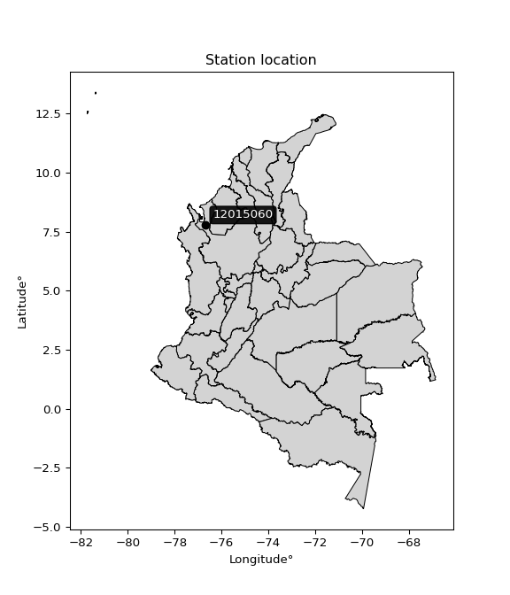</img>

</div>


## A. General information


### 1. General running parameters

• app_version: _v20251225_. • runtime: _2025-12-26 14:29:50.888910_. • Python version: _3.14.0_. • SciPy version: _1.16.3_. • Pandas version: _2.3.3_. • NumPy version: _2.3.5_. • Stations dataset (station_dataset_file): _dataset/pmax24h_in/automatic_colombia.csv_. • Stations catalog (station_catalog_file): _dataset/CNE_IDEAM.xls_. • Plot only fit distributions with Δo > Δ (plot_only_fit): _True_. • Eval low extreme values, if False, evaluates high extreme values (low_extreme): _False_. • Eval every SciPy distribution as logarithmic (pdist_logarithmic_on): _True_. • Standard deviation normalized (ddof): _1.0_. • Return periods to eval in years (Tr): _[2, 2.33, 5, 10, 15, 20, 25, 50, 75, 100, 200, 250, 500, 750, 1000]_. • Minimum data sample per station, 0 means any (minimum_sample): _5_. • Z-Score threshold to adjust a value, 0 means disable (zscore): _3.5_. • Avoid zeros, e.g. rain = 0 (avoid_zeros): _True_. • Avoid null values (avoid_nans): _True_. [:file_folder:Dataset file.](../../dataset/pmax24h_in/automatic_colombia.csv)


### 2. Station info and location

|   id |   CODIGO | NOMBRE              | CATEGORIA               | TECNOLOGIA                | ESTADO   | FECHA_INSTALACION   |   FECHA_SUSPENSION |   ALTITUD |   LATITUD |   LONGITUD | DEPARTAMENTO   | MUNICIPIO   | AREA_OPERATIVA                      | ENTIDAD                                                     | AREA_HIDROGRAFICA   | ZONA_HIDROGRAFICA   | SUBZONA_HIDROGRAFICA   |   CORRIENTE | OBSERVACION                                                                                                                                                                                      |   SUBRED | Catalogo   |
|-----:|---------:|:--------------------|:------------------------|:--------------------------|:---------|:--------------------|-------------------:|----------:|----------:|-----------:|:---------------|:------------|:------------------------------------|:------------------------------------------------------------|:--------------------|:--------------------|:-----------------------|------------:|:-------------------------------------------------------------------------------------------------------------------------------------------------------------------------------------------------|---------:|:-----------|
|    0 | 12015060 | TULENAPA [12015060] | Climatológica Ordinaria | Automática con Telemetría | Activa   | 15/08/1982          |                nan |        39 |      7.77 |     -76.67 | Antioquia      | Carepa      | Area Operativa 01 - Antioquia-Chocó | INSTITUTO DE HIDROLOGIA METEOROLOGIA Y ESTUDIOS AMBIENTALES | Caribe              | Caribe - Litoral    | Río León               |         nan | Cambio de Estado por solicitud Coordinador AO. 01 REQ 2021-006779.|03/10/2025$mvelez$Se activa la estación luego de reciente visita del grupo de automatización bajo el memorando 20253080176563 |      nan | CNE_IDEAM  |

<div align="center">

Map location in: [:earth_americas:Google](http://maps.google.com/maps?q=7.77,-76.67) [:earth_americas:OSM](https://www.openstreetmap.org/#map=18/7.77/-76.67&layers=P) [:earth_americas:Bing](https://www.bing.com/maps?cp=7.77~-76.67&lvl=18) [:earth_americas:Apple](https://maps.apple.com/frame?center=7.77%2C-76.67&span=0.003%2C0.006)

</div>


<div align="center">

```geojson
{
  "type": "Feature",
  "geometry": {
    "type": "Point", 
    "coordinates": [-76.67, 7.77]
  }, 
  "properties": {
    "Name": "12015060"
  }
}
```

</div>


### 3. Discrete values table and plot

|               |          0 |           1 |           2 |           3 |          4 |
|:--------------|-----------:|------------:|------------:|------------:|-----------:|
| Date          | 2017       | 2018        | 2019        | 2020        | 2021       |
| Value         |   27.2     |   56        |  121.6      |   66        |  128.8     |
| Value_initial |   27.2     |   56        |  121.6      |   66        |  128.8     |
| count         |    5       |    5        |    5        |    5        |    5       |
| mean          |   79.92    |   79.92     |   79.92     |   79.92     |   79.92    |
| std           |   43.7944  |   43.7944   |   43.7944   |   43.7944   |   43.7944  |
| zscore        |   -1.20381 |   -0.546188 |    0.951719 |   -0.317849 |    1.11612 |

<div align="center">

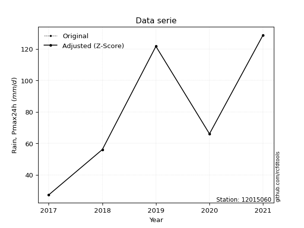</img>

</div>

> If Z-Score is active, values out of range or outliers are replaced with the station mean value.


### 4. Active continuous probability distributions from SciPy (45 of 104 available)

[scipy.stats](https://docs.scipy.org/doc/scipy/reference/stats.html) is a Python´s powerful submodule within the SciPy library for comprehensive statistical analysis, offering over 130 probability distributions (like Normal, Poisson), functions for descriptive stats (mean, variance), hypothesis testing (t-tests, chi-square), random variable generation, and statistical tests, making it essential for data science, modeling, and research. It provides tools to explore, model, and draw conclusions from data efficiently, working seamlessly with NumPy.

<div align="center">

|   id | p_dist             |   n_parameter | fit_method   | label                                                                       | active   | ref                                                                                                        |
|-----:|:-------------------|--------------:|:-------------|:----------------------------------------------------------------------------|:---------|:-----------------------------------------------------------------------------------------------------------|
|    0 | alpha              |             3 | MLE          | Alpha                                                                       | True     | [:mortar_board:](https://docs.scipy.org/doc/scipy/reference/generated/scipy.stats.alpha.html)              |
|    1 | betaprime          |             4 | MLE          | Beta prime                                                                  | True     | [:mortar_board:](https://docs.scipy.org/doc/scipy/reference/generated/scipy.stats.betaprime.html)          |
|    2 | chi2               |             3 | MLE          | Chi²                                                                        | True     | [:mortar_board:](https://docs.scipy.org/doc/scipy/reference/generated/scipy.stats.chi2.html)               |
|    3 | crystalball        |             4 | MLE          | Crystalball                                                                 | True     | [:mortar_board:](https://docs.scipy.org/doc/scipy/reference/generated/scipy.stats.crystalball.html)        |
|    4 | erlang             |             3 | MLE          | Erlang                                                                      | True     | [:mortar_board:](https://docs.scipy.org/doc/scipy/reference/generated/scipy.stats.erlang.html)             |
|    5 | expon              |             2 | MLE          | Exponential                                                                 | True     | [:mortar_board:](https://docs.scipy.org/doc/scipy/reference/generated/scipy.stats.expon.html)              |
|    6 | exponnorm          |             3 | MLE          | Exponentially modified Normal                                               | True     | [:mortar_board:](https://docs.scipy.org/doc/scipy/reference/generated/scipy.stats.exponnorm.html)          |
|    7 | f                  |             4 | MLE          | F                                                                           | True     | [:mortar_board:](https://docs.scipy.org/doc/scipy/reference/generated/scipy.stats.f.html)                  |
|    8 | fatiguelife        |             3 | MLE          | Fatigue-life (Birnbaum-Saunders)                                            | True     | [:mortar_board:](https://docs.scipy.org/doc/scipy/reference/generated/scipy.stats.fatiguelife.html)        |
|    9 | fisk               |             3 | MLE          | Fisk                                                                        | True     | [:mortar_board:](https://docs.scipy.org/doc/scipy/reference/generated/scipy.stats.fisk.html)               |
|   10 | gamma              |             3 | MLE          | Gamma                                                                       | True     | [:mortar_board:](https://docs.scipy.org/doc/scipy/reference/generated/scipy.stats.gamma.html)              |
|   11 | genexpon           |             5 | MLE          | Generalized exponential                                                     | True     | [:mortar_board:](https://docs.scipy.org/doc/scipy/reference/generated/scipy.stats.genexpon.html)           |
|   12 | genlogistic        |             3 | MLE          | Generalized logistic                                                        | True     | [:mortar_board:](https://docs.scipy.org/doc/scipy/reference/generated/scipy.stats.genlogistic.html)        |
|   13 | gibrat             |             2 | MM           | Gibrat                                                                      | True     | [:mortar_board:](https://docs.scipy.org/doc/scipy/reference/generated/scipy.stats.gibrat.html)             |
|   14 | gompertz           |             3 | MLE          | Gompertz (or truncated Gumbel)                                              | True     | [:mortar_board:](https://docs.scipy.org/doc/scipy/reference/generated/scipy.stats.gompertz.html)           |
|   15 | gumbel_l           |             2 | MM           | Gumbel Left Skew                                                            | True     | [:mortar_board:](https://docs.scipy.org/doc/scipy/reference/generated/scipy.stats.gumbel_l.html)           |
|   16 | gumbel_r           |             2 | MM           | Gumbel Right Skew                                                           | True     | [:mortar_board:](https://docs.scipy.org/doc/scipy/reference/generated/scipy.stats.gumbel_r.html)           |
|   17 | halflogistic       |             2 | MM           | Half-logistic                                                               | True     | [:mortar_board:](https://docs.scipy.org/doc/scipy/reference/generated/scipy.stats.halflogistic.html)       |
|   18 | halfnorm           |             2 | MM           | Half Normal                                                                 | True     | [:mortar_board:](https://docs.scipy.org/doc/scipy/reference/generated/scipy.stats.halfnorm.html)           |
|   19 | hypsecant          |             2 | MM           | hyperbolic secant                                                           | True     | [:mortar_board:](https://docs.scipy.org/doc/scipy/reference/generated/scipy.stats.hypsecant.html)          |
|   20 | invgamma           |             3 | MLE          | Inverted gamma                                                              | True     | [:mortar_board:](https://docs.scipy.org/doc/scipy/reference/generated/scipy.stats.invgamma.html)           |
|   21 | invgauss           |             3 | MLE          | Inverse Gaussian                                                            | True     | [:mortar_board:](https://docs.scipy.org/doc/scipy/reference/generated/scipy.stats.invgauss.html)           |
|   22 | invweibull         |             3 | MLE          | Inverted Weibull                                                            | True     | [:mortar_board:](https://docs.scipy.org/doc/scipy/reference/generated/scipy.stats.invweibull.html)         |
|   23 | johnsonsu          |             4 | MLE          | Johnson Su                                                                  | True     | [:mortar_board:](https://docs.scipy.org/doc/scipy/reference/generated/scipy.stats.johnsonsu.html)          |
|   24 | kstwobign          |             2 | MLE          | Limiting distribution of scaled Kolmogorov-Smirnov two-sided test statistic | True     | [:mortar_board:](https://docs.scipy.org/doc/scipy/reference/generated/scipy.stats.kstwobign.html)          |
|   25 | laplace            |             2 | MM           | Laplace                                                                     | True     | [:mortar_board:](https://docs.scipy.org/doc/scipy/reference/generated/scipy.stats.laplace.html)            |
|   26 | laplace_asymmetric |             3 | MLE          | Asymmetric Laplace                                                          | True     | [:mortar_board:](https://docs.scipy.org/doc/scipy/reference/generated/scipy.stats.laplace_asymmetric.html) |
|   27 | loggamma           |             3 | MLE          | Log gamma                                                                   | True     | [:mortar_board:](https://docs.scipy.org/doc/scipy/reference/generated/scipy.stats.loggamma.html)           |
|   28 | logistic           |             2 | MM           | Logistic (or Sech-squared)                                                  | True     | [:mortar_board:](https://docs.scipy.org/doc/scipy/reference/generated/scipy.stats.logistic.html)           |
|   29 | lognorm            |             3 | MLE          | Log Normal                                                                  | True     | [:mortar_board:](https://docs.scipy.org/doc/scipy/reference/generated/scipy.stats.lognorm.html)            |
|   30 | maxwell            |             2 | MM           | Maxwell                                                                     | True     | [:mortar_board:](https://docs.scipy.org/doc/scipy/reference/generated/scipy.stats.maxwell.html)            |
|   31 | mielke             |             4 | MLE          | Mielke Beta-Kappa / Dagum                                                   | True     | [:mortar_board:](https://docs.scipy.org/doc/scipy/reference/generated/scipy.stats.mielke.html)             |
|   32 | moyal              |             2 | MM           | Moyal                                                                       | True     | [:mortar_board:](https://docs.scipy.org/doc/scipy/reference/generated/scipy.stats.moyal.html)              |
|   33 | nakagami           |             3 | MLE          | Nakagami                                                                    | True     | [:mortar_board:](https://docs.scipy.org/doc/scipy/reference/generated/scipy.stats.nakagami.html)           |
|   34 | ncf                |             5 | MLE          | Non-central F distribution                                                  | True     | [:mortar_board:](https://docs.scipy.org/doc/scipy/reference/generated/scipy.stats.ncf.html)                |
|   35 | nct                |             4 | MLE          | Non-central Student’s t                                                     | True     | [:mortar_board:](https://docs.scipy.org/doc/scipy/reference/generated/scipy.stats.nct.html)                |
|   36 | norm               |             2 | MM           | Normal                                                                      | True     | [:mortar_board:](https://docs.scipy.org/doc/scipy/reference/generated/scipy.stats.norm.html)               |
|   37 | pareto             |             3 | MLE          | Pareto                                                                      | True     | [:mortar_board:](https://docs.scipy.org/doc/scipy/reference/generated/scipy.stats.pareto.html)             |
|   38 | pearson3           |             3 | MM           | Pearson type III                                                            | True     | [:mortar_board:](https://docs.scipy.org/doc/scipy/reference/generated/scipy.stats.pearson3.html)           |
|   39 | rayleigh           |             2 | MM           | Rayleigh                                                                    | True     | [:mortar_board:](https://docs.scipy.org/doc/scipy/reference/generated/scipy.stats.rayleigh.html)           |
|   40 | rice               |             3 | MLE          | Rice                                                                        | True     | [:mortar_board:](https://docs.scipy.org/doc/scipy/reference/generated/scipy.stats.rice.html)               |
|   41 | t                  |             3 | MLE          | Student’s t                                                                 | True     | [:mortar_board:](https://docs.scipy.org/doc/scipy/reference/generated/scipy.stats.t.html)                  |
|   42 | truncnorm          |             4 | MLE          | Truncated normal                                                            | True     | [:mortar_board:](https://docs.scipy.org/doc/scipy/reference/generated/scipy.stats.truncnorm.html)          |
|   43 | wald               |             2 | MM           | Wald                                                                        | True     | [:mortar_board:](https://docs.scipy.org/doc/scipy/reference/generated/scipy.stats.wald.html)               |
|   44 | weibull_min        |             3 | MLE          | Weibull minimum                                                             | True     | [:mortar_board:](https://docs.scipy.org/doc/scipy/reference/generated/scipy.stats.weibull_min.html)        |

</div>

> **n_parameter:** # arguments & localization & scale.
>
> **Fit methods:** (MLE) maximum likelihood, (MM) L-moments.
>
>**Inactive:** foldnorm, gennorm, norminvgauss, powernorm, powerlognorm, skewnorm, genextreme, anglit, arcsine, argus, beta, bradford, burr, burr12, cauchy, cosine, halfcauchy, foldcauchy, skewcauchy, wrapcauchy, dgamma, gengamma, exponweib, exponpow, truncexpon, gausshyper, genhalflogistic, genhyperbolic, geninvgauss, halfgennorm, johnsonsb, kappa4, kappa3, ksone, kstwo, loglaplace, levy, levy_l, levy_stable, ncx2, genpareto, truncpareto, lomax, powerlaw, rdist, rel_breitwigner, recipinvgauss, semicircular, studentized_range, trapezoid, triang, truncweibull_min, tukeylambda, uniform, loguniform, vonmises, vonmises_line, weibull_max, dweibull, 


## B. Probability distributions vs. Empirical distributions

A continuous probability distribution (CPD) describes probabilities for variables that can take any value within a range (like rain any time), unlike discrete variables with specific outcomes (like temperature). It uses a Probability Density Function (PDF), a curve where the total area under it equals 1, and the probability of the variable falling within an interval (a to b) is found by calculating the area under the curve between those points. A key feature is that the probability of hitting any single exact value is zero, so probabilities are always expressed for ranges, e.g., $P(a ≤ X ≤ b)$.

<div align="center">

Distributions parameters
|    |   station | p_dist                |   n |             loc |          scale | shape                 | shape1                | shape2                 | shape3   |
|---:|----------:|:----------------------|----:|----------------:|---------------:|:----------------------|:----------------------|:-----------------------|:---------|
|  0 |  12015060 | alpha                 |   5 |  -320.786       | 4066.14        | 10.241327926017721    |                       |                        |          |
|  1 |  12015060 | betaprime             |   5 |    -9.30695     | 1471.35        | 4.897364582518733     | 81.70111897040744     |                        |          |
|  2 |  12015060 | chi2                  |   5 |    27.2         |   27.0578      | 1.0541838615135237    |                       |                        |          |
|  3 |  12015060 | crystalball           |   5 |    79.92        |   39.1709      | 7419.735093346035     | 4.148763522985485     |                        |          |
|  4 |  12015060 | erlang                |   5 |  -534.91        |    2.4754      | 248.33696564361503    |                       |                        |          |
|  5 |  12015060 | expon                 |   5 |    27.2         |   52.72        |                       |                       |                        |          |
|  6 |  12015060 | exponnorm             |   5 |    77.7499      |   39.1108      | 0.0554852476395166    |                       |                        |          |
|  7 |  12015060 | f                     |   5 |    27.199       |   45.5738      | 1.2271181693864803    | 733.7639312503429     |                        |          |
|  8 |  12015060 | fatiguelife           |   5 |    27.1966      |    0.581371    | 7.615224345186739     |                       |                        |          |
|  9 |  12015060 | fisk                  |   5 |   -16.2425      |   89.0885      | 3.694563111106613     |                       |                        |          |
| 10 |  12015060 | gamma                 |   5 |  -522.714       |    2.53376     | 237.80593354366601    |                       |                        |          |
| 11 |  12015060 | genexpon              |   5 |    27.2         |    2.52767     | 0.04797068500870573   | 9.730794909359083e-08 | 0.784245057193422      |          |
| 12 |  12015060 | genlogistic           |   5 |  -150.339       |   33.6599      | 527.4555216548499     |                       |                        |          |
| 13 |  12015060 | gibrat                |   5 |    50.0375      |   18.1246      |                       |                       |                        |          |
| 14 |  12015060 | gompertz              |   5 |    27.2         |   73.0356      | 0.7303882622657987    |                       |                        |          |
| 15 |  12015060 | gumbel_l              |   5 |    97.549       |   30.5414      |                       |                       |                        |          |
| 16 |  12015060 | gumbel_r              |   5 |    62.291       |   30.5414      |                       |                       |                        |          |
| 17 |  12015060 | halflogistic          |   5 |    33.4934      |   33.4897      |                       |                       |                        |          |
| 18 |  12015060 | halfnorm              |   5 |    28.0731      |   64.9805      |                       |                       |                        |          |
| 19 |  12015060 | hypsecant             |   5 |    79.92        |   24.937       |                       |                       |                        |          |
| 20 |  12015060 | invgamma              |   5 |  -163.634       | 9040.72        | 38.12778744175979     |                       |                        |          |
| 21 |  12015060 | invgauss              |   5 |   -38.0015      |  917.385       | 0.12853340880671665   |                       |                        |          |
| 22 |  12015060 | invweibull            |   5 |    27.2         |    1.72708     | 0.0427104962659364    |                       |                        |          |
| 23 |  12015060 | johnsonsu             |   5 |   128.8         |    6.40944e-14 | 3.4231779658157158    | 0.14671373283327221   |                        |          |
| 24 |  12015060 | kstwobign             |   5 |   -55.3137      |  154.353       |                       |                       |                        |          |
| 25 |  12015060 | laplace               |   5 |    79.92        |   27.698       |                       |                       |                        |          |
| 26 |  12015060 | laplace_asymmetric    |   5 |    56           |   28.3776      | 0.6637257218594624    |                       |                        |          |
| 27 |  12015060 | loggamma              |   5 | -8993.29        | 1297.15        | 1091.2216411895222    |                       |                        |          |
| 28 |  12015060 | logistic              |   5 |    79.92        |   21.5961      |                       |                       |                        |          |
| 29 |  12015060 | lognorm               |   5 |    27.2         |    0.0328194   | 14.935217601169319    |                       |                        |          |
| 30 |  12015060 | maxwell               |   5 |   -12.8987      |   58.1655      |                       |                       |                        |          |
| 31 |  12015060 | mielke                |   5 |    -5.11968     |  134.537       | 1.7140245700657142    | 1042.6527153436414    |                        |          |
| 32 |  12015060 | moyal                 |   5 |    57.5195      |   17.6331      |                       |                       |                        |          |
| 33 |  12015060 | nakagami              |   5 |    56           |   36.602       | 0.20331914762265696   |                       |                        |          |
| 34 |  12015060 | ncf                   |   5 |    -1.40688     |   85.9547      | 5.227139728428336     | 335.5629879536491     | 0.0021472017917082958  |          |
| 35 |  12015060 | nct                   |   5 | -1383.79        |   39.1334      | 239263.02743659035    | 37.403007920954494    |                        |          |
| 36 |  12015060 | norm                  |   5 |    79.92        |   39.1709      |                       |                       |                        |          |
| 37 |  12015060 | pareto                |   5 |    26.7064      |    0.493596    | 0.2624502967064914    |                       |                        |          |
| 38 |  12015060 | pearson3              |   5 |    79.92        |   39.1709      | 0.08745855364212723   |                       |                        |          |
| 39 |  12015060 | rayleigh              |   5 |     4.98373     |   59.7905      |                       |                       |                        |          |
| 40 |  12015060 | rice                  |   5 |     7.09858     |   49.586       | 0.8836233740150461    |                       |                        |          |
| 41 |  12015060 | t                     |   5 |    79.92        |   39.1691      | 5093237.137442474     |                       |                        |          |
| 42 |  12015060 | truncnorm             |   5 |    79.92        |   39.1709      | -841.8515301962937    | 579.5403689601133     |                        |          |
| 43 |  12015060 | wald                  |   5 |    40.7491      |   39.1709      |                       |                       |                        |          |
| 44 |  12015060 | weibull_min           |   5 |    27.2         |   27.548       | 0.20125358339825195   |                       |                        |          |
| 45 |  12015060 | logalpha              |   5 |    -7.10354     |  216.052       | 19.123345205810722    |                       |                        |          |
| 46 |  12015060 | logbetaprime          |   5 |    -6.69234     |   16.5306      | 580.3968750996667     | 878.9545450166938     |                        |          |
| 47 |  12015060 | logchi2               |   5 |     3.30322     |    0.953789    | 1.1194666978837642    |                       |                        |          |
| 48 |  12015060 | logcrystalball        |   5 |     4.23544     |    0.569692    | 31.454133637244386    | 242.53791815529718    |                        |          |
| 49 |  12015060 | logerlang             |   5 |    -5.41296     |    0.0345157   | 279.3936329738489     |                       |                        |          |
| 50 |  12015060 | logexpon              |   5 |     3.30322     |    0.932227    |                       |                       |                        |          |
| 51 |  12015060 | logexponnorm          |   5 |     4.23512     |    0.569689    | 0.0005738167242806475 |                       |                        |          |
| 52 |  12015060 | logf                  |   5 |  -466.064       |  470.3         | 4699145.3170734085    | 1906145.6762826033    |                        |          |
| 53 |  12015060 | logfatiguelife        |   5 |  -128.85        |  133.084       | 0.004272077218168276  |                       |                        |          |
| 54 |  12015060 | logfisk               |   5 |    -2.30729e+07 |    2.30729e+07 | 67547619.9362025      |                       |                        |          |
| 55 |  12015060 | loggamma              |   5 |    -5.58457     |    0.0345346   | 284.2501267335574     |                       |                        |          |
| 56 |  12015060 | loggenexpon           |   5 |     3.26823     |    0.025079    | 0.011250158298817162  | 5.079782006086761     | 0.00011121437428084579 |          |
| 57 |  12015060 | loggenlogistic        |   5 |     4.85831     |    4.49752e-06 | 7.208114832231334e-06 |                       |                        |          |
| 58 |  12015060 | loggibrat             |   5 |     3.80087     |    0.263583    |                       |                       |                        |          |
| 59 |  12015060 | loggompertz           |   5 |     3.30322     |    1.24817     | 0.7804005338777589    |                       |                        |          |
| 60 |  12015060 | loggumbel_l           |   5 |     4.49184     |    0.444186    |                       |                       |                        |          |
| 61 |  12015060 | loggumbel_r           |   5 |     3.97905     |    0.444186    |                       |                       |                        |          |
| 62 |  12015060 | loghalflogistic       |   5 |     3.5602      |    0.487084    |                       |                       |                        |          |
| 63 |  12015060 | loghalfnorm           |   5 |     3.48141     |    0.945048    |                       |                       |                        |          |
| 64 |  12015060 | loghypsecant          |   5 |     4.23544     |    0.362677    |                       |                       |                        |          |
| 65 |  12015060 | loginvgamma           |   5 |    -4.85413     | 2198.59        | 243.14283382615957    |                       |                        |          |
| 66 |  12015060 | loginvgauss           |   5 |    -0.745972    |  347.379       | 0.01433120367444305   |                       |                        |          |
| 67 |  12015060 | loginvweibull         |   5 |    -1.29898e+08 |    1.29898e+08 | 243665661.58086485    |                       |                        |          |
| 68 |  12015060 | logjohnsonsu          |   5 |     4.85826     |    2.18061e-10 | 0.7326565188412262    | 0.07950299554742382   |                        |          |
| 69 |  12015060 | logkstwobign          |   5 |     1.96896     |    2.58509     |                       |                       |                        |          |
| 70 |  12015060 | loglaplace            |   5 |     4.23544     |    0.402832    |                       |                       |                        |          |
| 71 |  12015060 | loglaplace_asymmetric |   5 |     4.18965     |    0.464417    | 0.9520863226193907    |                       |                        |          |
| 72 |  12015060 | logloggamma           |   5 |     4.8583      |    2.87519e-06 | 4.624963406244502e-06 |                       |                        |          |
| 73 |  12015060 | loglogistic           |   5 |     4.23544     |    0.314087    |                       |                       |                        |          |
| 74 |  12015060 | loglognorm            |   5 |     3.30322     |    0.000920811 | 14.183218200213267    |                       |                        |          |
| 75 |  12015060 | logmaxwell            |   5 |     2.88552     |    0.845942    |                       |                       |                        |          |
| 76 |  12015060 | logmielke             |   5 |    -2.04872e+07 |    2.04872e+07 | 32281845.994796373    | 6408351480.014915     |                        |          |
| 77 |  12015060 | logmoyal              |   5 |     3.90966     |    0.256451    |                       |                       |                        |          |
| 78 |  12015060 | lognakagami           |   5 |     4.02535     |    0.550315    | 0.1354666718414517    |                       |                        |          |
| 79 |  12015060 | logncf                |   5 |   -47.0553      |   21.5176      | 16206.033519436503    | 44815.60813300732     | 22422.923193211464     |          |
| 80 |  12015060 | lognct                |   5 |    15.2028      |    0.570408    | 16856.92780376585     | -19.221987974742554   |                        |          |
| 81 |  12015060 | lognorm               |   5 |     4.23544     |    0.569691    |                       |                       |                        |          |
| 82 |  12015060 | logpareto             |   5 |     3.29393     |    0.00928816  | 0.2610880410360154    |                       |                        |          |
| 83 |  12015060 | logpearson3           |   5 |     4.23544     |    0.569692    | -0.4297589641437559   |                       |                        |          |
| 84 |  12015060 | lograyleigh           |   5 |     3.14559     |    0.869576    |                       |                       |                        |          |
| 85 |  12015060 | logrice               |   5 |     2.94883     |    0.637897    | 1.692845749421982     |                       |                        |          |
| 86 |  12015060 | logt                  |   5 |     4.23544     |    0.569694    | 599227072.7020222     |                       |                        |          |
| 87 |  12015060 | logtruncnorm          |   5 |    -0.231325    |    1.45046     | 2.934714489740533     | 3.511737730732304     |                        |          |
| 88 |  12015060 | logwald               |   5 |     3.66573     |    0.56971     |                       |                       |                        |          |
| 89 |  12015060 | logweibull_min        |   5 |    -8.9423e+06  |    8.94231e+06 | 19579398.773763105    |                       |                        |          |

</div>

> **loc** (Location parameter): This shifts the distribution along the x-axis. For many common distributions, like the normal (Gaussian) distribution, loc represents the mean $μ$. For others, like the uniform distribution, it might represent the minimum value, or for the beta distribution, the left end of the support interval.
>
> **scale** (Scale parameter): This determines the width or spread of the distribution. For the normal distribution, scale represents the standard deviation $σ$. For a uniform distribution, it defines the length of the interval (from $loc$ to $loc + scale$).
>
> **shape** (Shape parameters): Refers to parameters that define the specific form of a probability distribution, distinct from its location (loc) and scale (scale). These parameters are required arguments for most distribution functions. For example, a normal (Gaussian) distribution is fully defined by its location (mean) and scale (standard deviation), so it has no specific shape parameters beyond loc and scale. However, other distributions have intrinsic properties that need specification, as Gamma distribution that takes a shape parameter, often named $a$ or $alpha$.


### 0. Cumulative distribution values - CDF (90 evaluated)

> Ordered by x ascending and calculating $log(f(x))$ separately. 

|   id |   Station |   date |     x |   count |   mean |     std |    zscore |   Value_initial |   station |   m |     alpha |   alpha_pdf |   betaprime |   betaprime_pdf |        chi2 |        chi2_pdf |   crystalball |   crystalball_pdf |    erlang |   erlang_pdf |    expon |   expon_pdf |   exponnorm |   exponnorm_pdf |          f |      f_pdf |   fatiguelife |   fatiguelife_pdf |      fisk |   fisk_pdf |     gamma |   gamma_pdf |    genexpon |   genexpon_pdf |   genlogistic |   genlogistic_pdf |   gibrat |   gibrat_pdf |    gompertz |   gompertz_pdf |   gumbel_l |   gumbel_l_pdf |   gumbel_r |   gumbel_r_pdf |   halflogistic |   halflogistic_pdf |   halfnorm |   halfnorm_pdf |   hypsecant |   hypsecant_pdf |   invgamma |   invgamma_pdf |   invgauss |   invgauss_pdf |   invweibull |   invweibull_pdf |   johnsonsu |   johnsonsu_pdf |   kstwobign |   kstwobign_pdf |   laplace |   laplace_pdf |   laplace_asymmetric |   laplace_asymmetric_pdf |   loggamma |   loggamma_pdf |   logistic |   logistic_pdf |   lognorm |   lognorm_pdf |   maxwell |   maxwell_pdf |    mielke |   mielke_pdf |     moyal |   moyal_pdf |    nakagami |   nakagami_pdf |      ncf |    ncf_pdf |       nct |    nct_pdf |     norm |   norm_pdf |      pareto |   pareto_pdf |   pearson3 |   pearson3_pdf |   rayleigh |   rayleigh_pdf |      rice |   rice_pdf |         t |      t_pdf |   truncnorm |   truncnorm_pdf |     wald |   wald_pdf |   weibull_min |   weibull_min_pdf |   logalpha |   logalpha_pdf |   logbetaprime |   logbetaprime_pdf |     logchi2 |   logchi2_pdf |   logcrystalball |   logcrystalball_pdf |   logerlang |   logerlang_pdf |   logexpon |   logexpon_pdf |   logexponnorm |   logexponnorm_pdf |      logf |   logf_pdf |   logfatiguelife |   logfatiguelife_pdf |   logfisk |   logfisk_pdf |   loggenexpon |   loggenexpon_pdf |   loggenlogistic |   loggenlogistic_pdf |   loggibrat |   loggibrat_pdf |   loggompertz |   loggompertz_pdf |   loggumbel_l |   loggumbel_l_pdf |   loggumbel_r |   loggumbel_r_pdf |   loghalflogistic |   loghalflogistic_pdf |   loghalfnorm |   loghalfnorm_pdf |   loghypsecant |   loghypsecant_pdf |   loginvgamma |   loginvgamma_pdf |   loginvgauss |   loginvgauss_pdf |   loginvweibull |   loginvweibull_pdf |   logjohnsonsu |   logjohnsonsu_pdf |   logkstwobign |   logkstwobign_pdf |   loglaplace |   loglaplace_pdf |   loglaplace_asymmetric |   loglaplace_asymmetric_pdf |   logloggamma |   logloggamma_pdf |   loglogistic |   loglogistic_pdf |   loglognorm |   loglognorm_pdf |   logmaxwell |   logmaxwell_pdf |   logmielke |   logmielke_pdf |   logmoyal |   logmoyal_pdf |   lognakagami |   lognakagami_pdf |   logncf |   logncf_pdf |    lognct |   lognct_pdf |   logpareto |   logpareto_pdf |   logpearson3 |   logpearson3_pdf |   lograyleigh |   lograyleigh_pdf |   logrice |   logrice_pdf |      logt |   logt_pdf |   logtruncnorm |   logtruncnorm_pdf |   logwald |   logwald_pdf |   logweibull_min |   logweibull_min_pdf |
|-----:|----------:|-------:|------:|--------:|-------:|--------:|----------:|----------------:|----------:|----:|----------:|------------:|------------:|----------------:|------------:|----------------:|--------------:|------------------:|----------:|-------------:|---------:|------------:|------------:|----------------:|-----------:|-----------:|--------------:|------------------:|----------:|-----------:|----------:|------------:|------------:|---------------:|--------------:|------------------:|---------:|-------------:|------------:|---------------:|-----------:|---------------:|-----------:|---------------:|---------------:|-------------------:|-----------:|---------------:|------------:|----------------:|-----------:|---------------:|-----------:|---------------:|-------------:|-----------------:|------------:|----------------:|------------:|----------------:|----------:|--------------:|---------------------:|-------------------------:|-----------:|---------------:|-----------:|---------------:|----------:|--------------:|----------:|--------------:|----------:|-------------:|----------:|------------:|------------:|---------------:|---------:|-----------:|----------:|-----------:|---------:|-----------:|------------:|-------------:|-----------:|---------------:|-----------:|---------------:|----------:|-----------:|----------:|-----------:|------------:|----------------:|---------:|-----------:|--------------:|------------------:|-----------:|---------------:|---------------:|-------------------:|------------:|--------------:|-----------------:|---------------------:|------------:|----------------:|-----------:|---------------:|---------------:|-------------------:|----------:|-----------:|-----------------:|---------------------:|----------:|--------------:|--------------:|------------------:|-----------------:|---------------------:|------------:|----------------:|--------------:|------------------:|--------------:|------------------:|--------------:|------------------:|------------------:|----------------------:|--------------:|------------------:|---------------:|-------------------:|--------------:|------------------:|--------------:|------------------:|----------------:|--------------------:|---------------:|-------------------:|---------------:|-------------------:|-------------:|-----------------:|------------------------:|----------------------------:|--------------:|------------------:|--------------:|------------------:|-------------:|-----------------:|-------------:|-----------------:|------------:|----------------:|-----------:|---------------:|--------------:|------------------:|---------:|-------------:|----------:|-------------:|------------:|----------------:|--------------:|------------------:|--------------:|------------------:|----------:|--------------:|----------:|-----------:|---------------:|-------------------:|----------:|--------------:|-----------------:|---------------------:|
|    0 |  12015060 |   2017 |  27.2 |       5 |  79.92 | 43.7944 | -1.20381  |            27.2 |  12015060 |   1 | 0.0744469 |  0.00472642 |    0.063775 |      0.00568922 | 3.32716e-09 | 493629          |      0.089168 |        0.00411716 | 0.0856156 |   0.00425769 | 0        |  0.0189681  |    0.08916  |      0.00411749 | 0.00116109 | 0.697979   |     0.0428216 |      23.6044      | 0.0657795 | 0.00522622 | 0.0858881 |  0.0042663  | 6.60473e-07 |     0.0189782  |     0.0676112 |        0.0053975  | 0        |   0          | 5.16765e-13 |     0.0100004  |  0.0950894 |     0.0029605  |  0.0426418 |     0.00440488 |       0        |         0          |   0        |     0          |   0.0764942 |      0.00303806 |  0.0743476 |     0.00489417 |  0.0631166 |     0.00562611 |    0.0144199 |      7.34877e+11 |   0.0348837 |     0.000111276 |   0.0625477 |      0.00578684 | 0.0745316 |    0.00269086 |            0.0662807 |               0.00351903 |   0.051727 |       0.19449  |  0.0800855 |     0.00341135 | 0.0508807 |      0.183574 | 0.0757074 |    0.00514047 | 0.0867716 |   0.0046018  | 0.0181506 |  0.0032805  | 0           |    0           | 0.10014  | 0.0070476  | 0.0892834 | 0.0041199  | 0.089168 | 0.00411716 | 1.11022e-16 |  0.53171     |  0.0871371 |     0.00421427 |  0.0667028 |     0.00579998 | 0.0542365 | 0.00526137 | 0.0891581 | 0.00411701 |    0.089168 |      0.00411716 | 0        | 0          |   0.000633925 |       3.58991e+10 |   0.050769 |       0.208267 |      0.0507988 |           0.194077 | 1.99746e-09 |   2.51762e+06 |         0.050881 |             0.183575 |   0.0503188 |        0.192237 |   0        |       1.0727   |      0.0508802 |           0.183573 | 0.0510192 |   0.183919 |        0.0501527 |             0.183126 | 0.0557557 |      0.154128 |     0.0161138 |          0.472279 |         0        |             0.132571 |    0        |        0        |   1.28344e-07 |          0.625237 |     0.0665255 |          0.144673 |     0.0102636 |          0.105808 |          0        |              0        |      0        |          0        |      0.0486094 |           0.133509 |      0.048925 |          0.20056  |     0.0472406 |          0.204793 |       0.0407186 |            0.2445   |       0.130042 |        0.0108178   |      0.0473228 |           0.29304  |    0.0494235 |         0.12269  |               0.0640418 |                    0.144837 |     0.0819644 |          0.131846 |     0.0488902 |          0.148048 |    0.0227737 |      8.57936e+12 |    0.0297749 |         0.203567 |   0.0846917 |        0.133449 | 0.00110589 |      0.0248125 |   0           |       0           | 0.051954 |     0.187294 | 0.0516901 |     0.184286 | 1.11022e-16 |      28.1098    |     0.0610379 |          0.17357  |     0.0162945 |          0.205057 | 0.0379368 |      0.219719 | 0.0508818 |   0.183576 |    0           |           0        |  0        |      0        |        0.0694369 |             0.146629 |
|    1 |  12015060 |   2018 |  56   |       5 |  79.92 | 43.7944 | -0.546188 |            56   |  12015060 |   2 | 0.291053  |  0.00982068 |    0.317258 |      0.0106636  | 0.680824    |      0.00868673 |      0.270713 |        0.00845224 | 0.275057  |   0.00878236 | 0.420901 |  0.0109844  |    0.270724 |      0.00845302 | 0.542387   | 0.00902383 |     0.817437  |       0.00433337  | 0.315531  | 0.011045   | 0.27545   |  0.00877898 | 0.42107     |     0.0109871  |     0.31769   |        0.0108109  | 0.133114 |   0.036064   | 0.297465    |     0.0104218  |  0.226287  |     0.00649935 |  0.292664  |     0.0117743  |       0.323922 |         0.0133634  |   0.33264  |     0.0111956  |   0.232961  |      0.00853005 |  0.297125  |     0.00997827 |  0.319634  |     0.0108474  |    0.41199   |      0.000541793 |   0.0388227 |     0.000169496 |   0.324225  |      0.010906   | 0.210821  |    0.0076114  |            0.305812  |               0.0162364  |   0.36789  |       0.656446 |  0.248317  |     0.00864304 | 0.356145  |      0.654242 | 0.295194  |    0.009543   | 0.258626  |   0.00725284 | 0.296472  |  0.0136963  | 3.21932e-07 |    1.84239e+07 | 0.345005 | 0.00897513 | 0.270865  | 0.00845115 | 0.270713 | 0.00845224 | 0.657571    |  0.00306793  |  0.27373   |     0.00865339 |  0.305121  |     0.00991638 | 0.284072  | 0.00992432 | 0.270704  | 0.00845248 |    0.270713 |      0.00845224 | 0.259834 | 0.0259699  |   0.635411    |       0.00257063  |   0.385789 |       0.667213 |      0.367623  |           0.656324 | 0.573329    |   0.346435    |         0.356145 |             0.654241 |   0.367622  |        0.662435 |   0.539127 |       0.494378 |      0.356145  |           0.654245 | 0.356087  |   0.652869 |        0.356524  |             0.656836 | 0.328427  |      0.645712 |     0.449427  |          0.620779 |         0        |             0.421775 |    0.436207 |        1.75443  |   0.457417    |          0.605027 |     0.295219  |          0.555128 |     0.406157  |          0.823874 |          0.444229 |              0.823946 |      0.435096 |          0.7154   |      0.325132  |           0.748526 |      0.37993  |          0.672591 |     0.38369   |          0.669902 |       0.437778  |            0.67834  |       0.140839 |        0.0213318   |      0.448488  |           0.632311 |    0.296803  |         0.736791 |               0.327902  |                    0.741584 |     0.261882  |          0.421258 |     0.338743  |          0.713166 |    0.680787  |      0.0348794   |    0.388439  |         0.690821 |   0.264249  |        0.416379 | 0.424833   |      0.902903  |   7.98945e-05 |       2.43713e+10 | 0.358673 |     0.650103 | 0.355292  |     0.649031 | 0.680173    |       0.114165  |     0.333338  |          0.605927 |     0.400572  |          0.697406 | 0.373067  |      0.661113 | 0.356146  |   0.654239 |    1.62195e-06 |           2.56355  |  0.469264 |      1.25369  |        0.29516   |             0.53981  |
|    2 |  12015060 |   2020 |  66   |       5 |  79.92 | 43.7944 | -0.317849 |            66   |  12015060 |   3 | 0.393079  |  0.0104512  |    0.424222 |      0.010595   | 0.754703    |      0.00627178 |      0.361158 |        0.00956145 | 0.368477  |   0.00981268 | 0.520956 |  0.00908656 |    0.361175 |      0.00956205 | 0.622007   | 0.00702875 |     0.854685  |       0.00320262  | 0.42668   | 0.0109892  | 0.368803  |  0.00980253 | 0.521144    |     0.00908783 |     0.426478  |        0.0107888  | 0.449457 |   0.0247917  | 0.400729    |     0.0101944  |  0.299486  |     0.00816404 |  0.412449  |     0.0119602  |       0.450496 |         0.0119     |   0.440555 |     0.0103558  |   0.330885  |      0.011005   |  0.400168  |     0.010494   |  0.428157  |     0.0107142  |    0.416637  |      0.000401547 |   0.0406811 |     0.000204099 |   0.43284   |      0.0106838  | 0.302489  |    0.010921   |            0.450586  |               0.0128503  |   0.478918 |       0.686127 |  0.344216  |     0.0104524  | 0.467969  |      0.69802  | 0.393722  |    0.0100587  | 0.335328  |   0.00808159 | 0.431716  |  0.0130589  | 0.464064    |    0.018634    | 0.43302  | 0.00857067 | 0.361288  | 0.00955837 | 0.361158 | 0.00956145 | 0.682974    |  0.00211749  |  0.365939  |     0.00970441 |  0.405902  |     0.01014    | 0.386061  | 0.0103687  | 0.361152  | 0.00956184 |    0.361158 |      0.00956145 | 0.478734 | 0.0178417  |   0.657457    |       0.00190354  |   0.496863 |       0.675807 |      0.478481  |           0.684176 | 0.625431    |   0.290414    |         0.467969 |             0.698019 |   0.479685  |        0.692481 |   0.6136   |       0.414491 |      0.46797   |           0.698023 | 0.467649  |   0.696272 |        0.468714  |             0.699763 | 0.441692  |      0.721939 |     0.548026  |          0.576063 |         0        |             0.548835 |    0.651231 |        0.951494 |   0.553908    |          0.567415 |     0.397377  |          0.687114 |     0.536641  |          0.75198  |          0.569071 |              0.694089 |      0.546402 |          0.637568 |      0.459918  |           0.87072  |      0.492443 |          0.687607 |     0.495029  |          0.676351 |       0.545011  |            0.620509 |       0.14478  |        0.0270742   |      0.548309  |           0.578665 |    0.446277  |         1.10785  |               0.47547   |                    1.07532  |     0.341105  |          0.548694 |     0.463618  |          0.791743 |    0.685933  |      0.0282192   |    0.502005  |         0.683095 |   0.342333  |        0.539418 | 0.562376   |      0.761983  |   0.585246    |       0.954849    | 0.469499 |     0.690181 | 0.466261  |     0.69303  | 0.696655    |       0.0884197 |     0.439783  |          0.683558 |     0.513631  |          0.671548 | 0.483985  |      0.680933 | 0.46797   |   0.698016 |    0.357641    |           1.82675  |  0.634007 |      0.791247 |        0.394214  |             0.664821 |
|    3 |  12015060 |   2019 | 121.6 |       5 |  79.92 | 43.7944 |  0.951719 |           121.6 |  12015060 |   4 | 0.853129  |  0.00477649 |    0.849008 |      0.00429243 | 0.933323    |      0.00147426 |      0.856348 |        0.00578215 | 0.857378  |   0.00553024 | 0.833139 |  0.00316505 |    0.856347 |      0.00578147 | 0.853854   | 0.00235951 |     0.951847  |       0.000892447 | 0.833773  | 0.00371474 | 0.856965  |  0.00552728 | 0.833298    |     0.00316372 |     0.849189  |        0.00412355 | 0.91517  |   0.00217118 | 0.854801    |     0.00528831 |  0.88896   |     0.0079908  |  0.866383  |     0.0040687  |       0.865642 |         0.00374239 |   0.849937 |     0.00435826 |   0.881708  |      0.00463521 |  0.853592  |     0.00467072 |  0.849611  |     0.00418435 |    0.430454  |      0.000164162 |   0.0770681 |     0.00294482  |   0.855521  |      0.00428653 | 0.888969  |    0.00400862 |            0.850332  |               0.0035006  |   0.836063 |       0.408904 |  0.873247  |     0.00512531 | 0.839469  |      0.428019 | 0.851915  |    0.00506182 | 0.902485  |   0.0122071  | 0.870908  |  0.00362838 | 0.906447    |    0.00322508  | 0.789762 | 0.00418605 | 0.856248  | 0.005781   | 0.856348 | 0.00578215 | 0.748465    |  0.000695679 |  0.855997  |     0.00561874 |  0.850739  |     0.00486901 | 0.854252  | 0.00513857 | 0.856359  | 0.00578211 |    0.856348 |      0.00578215 | 0.892265 | 0.00261066 |   0.722321    |       0.000758511 |   0.835021 |       0.378422 |      0.833727  |           0.407128 | 0.760493    |   0.167353    |         0.839469 |             0.428019 |   0.838768  |        0.407922 |   0.799389 |       0.215195 |      0.839471  |           0.428019 | 0.838441  |   0.428124 |        0.83994   |             0.426245 | 0.825589  |      0.421545 |     0.824455  |          0.319573 |         0        |             1.46143  |    0.908775 |        0.164051 |   0.836352    |          0.339634 |     0.865282  |          0.607969 |     0.854483  |          0.302519 |          0.854726 |              0.276589 |      0.837299 |          0.318624 |      0.867971  |           0.353691 |      0.838776 |          0.386388 |     0.83266   |          0.378452 |       0.824565  |            0.298363 |       0.193775 |        0.379595    |      0.818685  |           0.306639 |    0.877107  |         0.305072 |               0.850134  |                    0.307236 |     0.911566  |          1.46633  |     0.858124  |          0.387622 |    0.69893   |      0.0163963   |    0.837182  |         0.372663 |   0.896657  |        1.41287  | 0.860302   |      0.269568  |   0.86565     |       0.238279    | 0.836045 |     0.424563 | 0.836783  |     0.430233 | 0.735173    |       0.0458871 |     0.841361  |          0.498514 |     0.836583  |          0.357699 | 0.836337  |      0.405283 | 0.839468  |   0.428019 |    0.973512    |           0.462857 |  0.88462  |      0.194504 |        0.851971  |             0.619167 |
|    4 |  12015060 |   2021 | 128.8 |       5 |  79.92 | 43.7944 |  1.11612  |           128.8 |  12015060 |   5 | 0.884375  |  0.00391978 |    0.87732  |      0.00358677 | 0.943093    |      0.00124651 |      0.89396  |        0.00467533 | 0.893366  |   0.00447906 | 0.854439 |  0.00276101 |    0.893955 |      0.00467481 | 0.869819   | 0.00208195 |     0.95783   |       0.000772791 | 0.858236  | 0.00309913 | 0.892947  |  0.00448001 | 0.854589    |     0.00275965 |     0.876344  |        0.00343613 | 0.929106 |   0.00172143 | 0.889776    |     0.00443039 |  0.938096  |     0.00563913 |  0.892877  |     0.00331249 |       0.890207 |         0.00309843 |   0.878885 |     0.00369306 |   0.910925  |      0.00352556 |  0.884182  |     0.00384307 |  0.877206  |     0.00349625 |    0.431593  |      0.000152453 |   0.99961   |     2.95089e+09 |   0.883824  |      0.00358905 | 0.914385  |    0.00309102 |            0.873528  |               0.00295806 |   0.858451 |       0.369583 |  0.905798  |     0.00395109 | 0.862859  |      0.385244 | 0.885171  |    0.0041876  | 0.992137  |   0.012594   | 0.894593  |  0.00297145 | 0.927378    |    0.00260631  | 0.818099 | 0.00369242 | 0.893855  | 0.00467537 | 0.89396  | 0.00467533 | 0.753247    |  0.000634325 |  0.892582  |     0.00455498 |  0.882836  |     0.00405796 | 0.887957  | 0.0042357  | 0.89397   | 0.0046752  |    0.89396  |      0.00467533 | 0.909291 | 0.0021373  |   0.727573    |       0.000701733 |   0.855764 |       0.342933 |      0.856031  |           0.36845  | 0.769898    |   0.15971     |         0.862858 |             0.385244 |   0.861081  |        0.367968 |   0.811394 |       0.202318 |      0.86286   |           0.385243 | 0.861844  |   0.385617 |        0.863228  |             0.383511 | 0.848526  |      0.376278 |     0.842141  |          0.295476 |         0.999927 |             1.6025   |    0.917612 |        0.143753 |   0.855173    |          0.314749 |     0.897893  |          0.524512 |     0.870962  |          0.270898 |          0.869855 |              0.249806 |      0.85486  |          0.292126 |      0.886897  |           0.305334 |      0.859924 |          0.349067 |     0.853416  |          0.3434   |       0.840996  |            0.273182 |       0.790474 |        7.06835e+07 |      0.835661  |           0.283739 |    0.893461  |         0.264476 |               0.866805  |                    0.273059 |     0.99994   |          1.60848  |     0.878994  |          0.338642 |    0.699855  |      0.0157679   |    0.857622  |         0.338186 |   0.981602  |        1.50795  | 0.874994   |      0.24172   |   0.878734    |       0.216997    | 0.859277 |     0.383224 | 0.860314  |     0.387942 | 0.737751    |       0.0437695 |     0.868583  |          0.447582 |     0.856232  |          0.325628 | 0.85855   |      0.367109 | 0.862858  |   0.385244 |    0.998381    |           0.403043 |  0.8952   |      0.173802 |        0.885453  |             0.543434 |

An Empirical Distribution Function (EDF) is a step-function estimate of a true cumulative distribution function (CDF) based on observed sample data, representing the proportion of data points less than or equal to a given value. It is calculated by ordering your data and jumping up by $1/n$ (where $n$ is sample size) at each unique data point, allowing analysis without assuming an underlying population distribution, and it gets closer to the true CDF as the sample size grows.


### 1. Empirical - EDF California (1923)

California´s estimates the true probability distribution of water-related data (like rainfall, streamflow) using observed samples, crucial for risk assessment.

<div align="center">


$P=m/n$


</div>


**1.1. Empirical values**

<div align="center">

|                | 0              | 1                  | 2              | 3                 | 4              |
|:---------------|:---------------|:-------------------|:---------------|:------------------|:---------------|
| date           | 2017           | 2018               | 2020           | 2019              | 2021           |
| x              | 27.2           | 56.0               | 66.0           | 121.6             | 128.8          |
| m              | 1              | 2                  | 3              | 4                 | 5              |
| empirical_dist | edf_california | edf_california     | edf_california | edf_california    | edf_california |
| empirical      | 0.2            | 0.4                | 0.6            | 0.8               | 1.0            |
| empirical_tr   | 1.25           | 1.6666666666666667 | 2.5            | 5.000000000000001 | inf            |

</div>


**1.2. Kolmogorov-Smirnov fit test (sorted by Δ)**


<div align="center">

|                | 0                     | 1                   | 2                  | 3                  | 4                   | 5                   | 6                   | 7                   | 8                   | 9                   | 10                  | 11                  | 12                  | 13                 | 14                  | 15                 | 16                 | 17                  | 18                  | 19                  | 20                  | 21                 | 22                 | 23                 | 24                  | 25                  | 26                  | 27                 | 28                  | 29                  | 30                 | 31                  | 32                 | 33                  | 34                  | 35                  | 36                  | 37                 | 38                  | 39                 | 40                 | 41                  | 42                  | 43                  | 44                  | 45                 | 46                 | 47                 | 48                 | 49                 | 50                 | 51                 | 52                 | 53                 | 54                  | 55                  | 56                  | 57                  | 58                  | 59                  | 60                 | 61                  | 62                 | 63                 | 64                 | 65                  | 66                 | 67                  | 68                  | 69                 | 70                 | 71                  | 72                  | 73                  | 74                 | 75                 | 76                 | 77                 | 78                  | 79                 | 80                  | 81                 | 82                  | 83                  | 84                 | 85                 | 86                 | 87                 | 88                 | 89                 |
|:---------------|:----------------------|:--------------------|:-------------------|:-------------------|:--------------------|:--------------------|:--------------------|:--------------------|:--------------------|:--------------------|:--------------------|:--------------------|:--------------------|:-------------------|:--------------------|:-------------------|:-------------------|:--------------------|:--------------------|:--------------------|:--------------------|:-------------------|:-------------------|:-------------------|:--------------------|:--------------------|:--------------------|:-------------------|:--------------------|:--------------------|:-------------------|:--------------------|:-------------------|:--------------------|:--------------------|:--------------------|:--------------------|:-------------------|:--------------------|:-------------------|:-------------------|:--------------------|:--------------------|:--------------------|:--------------------|:-------------------|:-------------------|:-------------------|:-------------------|:-------------------|:-------------------|:-------------------|:-------------------|:-------------------|:--------------------|:--------------------|:--------------------|:--------------------|:--------------------|:--------------------|:-------------------|:--------------------|:-------------------|:-------------------|:-------------------|:--------------------|:-------------------|:--------------------|:--------------------|:-------------------|:-------------------|:--------------------|:--------------------|:--------------------|:-------------------|:-------------------|:-------------------|:-------------------|:--------------------|:-------------------|:--------------------|:-------------------|:--------------------|:--------------------|:-------------------|:-------------------|:-------------------|:-------------------|:-------------------|:-------------------|
| station        | 12015060              | 12015060            | 12015060           | 12015060           | 12015060            | 12015060            | 12015060            | 12015060            | 12015060            | 12015060            | 12015060            | 12015060            | 12015060            | 12015060           | 12015060            | 12015060           | 12015060           | 12015060            | 12015060            | 12015060            | 12015060            | 12015060           | 12015060           | 12015060           | 12015060            | 12015060            | 12015060            | 12015060           | 12015060            | 12015060            | 12015060           | 12015060            | 12015060           | 12015060            | 12015060            | 12015060            | 12015060            | 12015060           | 12015060            | 12015060           | 12015060           | 12015060            | 12015060            | 12015060            | 12015060            | 12015060           | 12015060           | 12015060           | 12015060           | 12015060           | 12015060           | 12015060           | 12015060           | 12015060           | 12015060            | 12015060            | 12015060            | 12015060            | 12015060            | 12015060            | 12015060           | 12015060            | 12015060           | 12015060           | 12015060           | 12015060            | 12015060           | 12015060            | 12015060            | 12015060           | 12015060           | 12015060            | 12015060            | 12015060            | 12015060           | 12015060           | 12015060           | 12015060           | 12015060            | 12015060           | 12015060            | 12015060           | 12015060            | 12015060            | 12015060           | 12015060           | 12015060           | 12015060           | 12015060           | 12015060           |
| empirical_dist | edf_california        | edf_california      | edf_california     | edf_california     | edf_california      | edf_california      | edf_california      | edf_california      | edf_california      | edf_california      | edf_california      | edf_california      | edf_california      | edf_california     | edf_california      | edf_california     | edf_california     | edf_california      | edf_california      | edf_california      | edf_california      | edf_california     | edf_california     | edf_california     | edf_california      | edf_california      | edf_california      | edf_california     | edf_california      | edf_california      | edf_california     | edf_california      | edf_california     | edf_california      | edf_california      | edf_california      | edf_california      | edf_california     | edf_california      | edf_california     | edf_california     | edf_california      | edf_california      | edf_california      | edf_california      | edf_california     | edf_california     | edf_california     | edf_california     | edf_california     | edf_california     | edf_california     | edf_california     | edf_california     | edf_california      | edf_california      | edf_california      | edf_california      | edf_california      | edf_california      | edf_california     | edf_california      | edf_california     | edf_california     | edf_california     | edf_california      | edf_california     | edf_california      | edf_california      | edf_california     | edf_california     | edf_california      | edf_california      | edf_california      | edf_california     | edf_california     | edf_california     | edf_california     | edf_california      | edf_california     | edf_california      | edf_california     | edf_california      | edf_california      | edf_california     | edf_california     | edf_california     | edf_california     | edf_california     | edf_california     |
| p_dist         | loglaplace_asymmetric | logncf              | loggamma           | loggamma           | lognct              | logf                | logt                | logcrystalball      | lognorm             | lognorm             | logexponnorm        | logbetaprime        | logalpha            | laplace_asymmetric | logerlang           | logfatiguelife     | loginvgamma        | loglogistic         | loghypsecant        | loginvgauss         | loglaplace          | logfisk            | loginvweibull      | logpearson3        | logrice             | logkstwobign        | kstwobign           | logmaxwell         | invgauss            | fisk                | genlogistic        | betaprime           | moyal              | ncf                 | lograyleigh         | loggenexpon         | gumbel_r            | loggumbel_r        | rayleigh            | f                  | logmoyal           | invgamma            | genexpon            | loggompertz         | gompertz            | wald               | logwald            | halflogistic       | loghalfnorm        | loghalflogistic    | logexpon           | loggibrat          | expon              | halfnorm           | loggumbel_l         | logweibull_min      | maxwell             | alpha               | rice                | logchi2             | gamma              | erlang              | pearson3           | nct                | exponnorm          | crystalball         | norm               | truncnorm           | t                   | logistic           | pareto             | logmielke           | logloggamma         | mielke              | gibrat             | hypsecant          | weibull_min        | logpareto          | chi2                | laplace            | loglognorm          | gumbel_l           | lognakagami         | logtruncnorm        | nakagami           | fatiguelife        | invweibull         | logjohnsonsu       | johnsonsu          | loggenlogistic     |
| delta          | 0.13595817224573362   | 0.14804601660095335 | 0.1482730458934574 | 0.1482730458934574 | 0.14830988783087523 | 0.14898076780843805 | 0.14911821702559216 | 0.14911904640781798 | 0.14911925903742987 | 0.14911925903742987 | 0.14911983824810748 | 0.14920124541418245 | 0.14923099117774855 | 0.1494141052111866 | 0.14968122220334576 | 0.1498473490116331 | 0.1510750259212994 | 0.15110981490286726 | 0.15139057918202498 | 0.15275940735294502 | 0.15372325961910982 | 0.1583083365424549 | 0.1592813636223237 | 0.1602171961367822 | 0.16206319833267155 | 0.16433943322905153 | 0.16716010775425588 | 0.170225065479127  | 0.17184276893221773 | 0.17331992901598448 | 0.1735219217477949 | 0.17577817752130354 | 0.1818493537643473 | 0.18190084964308684 | 0.18370545215062306 | 0.18388621703028069 | 0.18755102836324417 | 0.1897364421998454 | 0.19409777977077858 | 0.1988389145311964 | 0.1988941137846704 | 0.19983241957298192 | 0.19999933952734106 | 0.19999987165619745 | 0.19999999999948326 | 0.2                | 0.2                | 0.2                | 0.2                | 0.2                | 0.2                | 0.2                | 0.2                | 0.2                | 0.20262265007780522 | 0.20578578230015088 | 0.20627768440340616 | 0.20692121073957664 | 0.21393857614175704 | 0.23010184647438792 | 0.2311973635664052 | 0.23152256537708654 | 0.234060820358569  | 0.23871181367694   | 0.2388246041222567 | 0.23884213486507833 | 0.2388421386332399 | 0.23884214858252634 | 0.23884809094979365 | 0.2557839514586015 | 0.257571089628886  | 0.25766650748646636 | 0.25889513029680256 | 0.26467201573963495 | 0.2668857378358148 | 0.2691148308111027 | 0.2724273992755579 | 0.280173318634363  | 0.28082383309018266 | 0.2975108953309666 | 0.30014531648792153 | 0.3005138126585977 | 0.39992010548748996 | 0.39999837805195615 | 0.3999996780678216 | 0.417437282603491  | 0.5684072310009347 | 0.6062249335521677 | 0.7229318557020493 | 0.8                |
| deltao         | 0.5865427407550001    | 0.5865427407550001  | 0.5865427407550001 | 0.5865427407550001 | 0.5865427407550001  | 0.5865427407550001  | 0.5865427407550001  | 0.5865427407550001  | 0.5865427407550001  | 0.5865427407550001  | 0.5865427407550001  | 0.5865427407550001  | 0.5865427407550001  | 0.5865427407550001 | 0.5865427407550001  | 0.5865427407550001 | 0.5865427407550001 | 0.5865427407550001  | 0.5865427407550001  | 0.5865427407550001  | 0.5865427407550001  | 0.5865427407550001 | 0.5865427407550001 | 0.5865427407550001 | 0.5865427407550001  | 0.5865427407550001  | 0.5865427407550001  | 0.5865427407550001 | 0.5865427407550001  | 0.5865427407550001  | 0.5865427407550001 | 0.5865427407550001  | 0.5865427407550001 | 0.5865427407550001  | 0.5865427407550001  | 0.5865427407550001  | 0.5865427407550001  | 0.5865427407550001 | 0.5865427407550001  | 0.5865427407550001 | 0.5865427407550001 | 0.5865427407550001  | 0.5865427407550001  | 0.5865427407550001  | 0.5865427407550001  | 0.5865427407550001 | 0.5865427407550001 | 0.5865427407550001 | 0.5865427407550001 | 0.5865427407550001 | 0.5865427407550001 | 0.5865427407550001 | 0.5865427407550001 | 0.5865427407550001 | 0.5865427407550001  | 0.5865427407550001  | 0.5865427407550001  | 0.5865427407550001  | 0.5865427407550001  | 0.5865427407550001  | 0.5865427407550001 | 0.5865427407550001  | 0.5865427407550001 | 0.5865427407550001 | 0.5865427407550001 | 0.5865427407550001  | 0.5865427407550001 | 0.5865427407550001  | 0.5865427407550001  | 0.5865427407550001 | 0.5865427407550001 | 0.5865427407550001  | 0.5865427407550001  | 0.5865427407550001  | 0.5865427407550001 | 0.5865427407550001 | 0.5865427407550001 | 0.5865427407550001 | 0.5865427407550001  | 0.5865427407550001 | 0.5865427407550001  | 0.5865427407550001 | 0.5865427407550001  | 0.5865427407550001  | 0.5865427407550001 | 0.5865427407550001 | 0.5865427407550001 | 0.5865427407550001 | 0.5865427407550001 | 0.5865427407550001 |
| eval           | Δo > Δ                | Δo > Δ              | Δo > Δ             | Δo > Δ             | Δo > Δ              | Δo > Δ              | Δo > Δ              | Δo > Δ              | Δo > Δ              | Δo > Δ              | Δo > Δ              | Δo > Δ              | Δo > Δ              | Δo > Δ             | Δo > Δ              | Δo > Δ             | Δo > Δ             | Δo > Δ              | Δo > Δ              | Δo > Δ              | Δo > Δ              | Δo > Δ             | Δo > Δ             | Δo > Δ             | Δo > Δ              | Δo > Δ              | Δo > Δ              | Δo > Δ             | Δo > Δ              | Δo > Δ              | Δo > Δ             | Δo > Δ              | Δo > Δ             | Δo > Δ              | Δo > Δ              | Δo > Δ              | Δo > Δ              | Δo > Δ             | Δo > Δ              | Δo > Δ             | Δo > Δ             | Δo > Δ              | Δo > Δ              | Δo > Δ              | Δo > Δ              | Δo > Δ             | Δo > Δ             | Δo > Δ             | Δo > Δ             | Δo > Δ             | Δo > Δ             | Δo > Δ             | Δo > Δ             | Δo > Δ             | Δo > Δ              | Δo > Δ              | Δo > Δ              | Δo > Δ              | Δo > Δ              | Δo > Δ              | Δo > Δ             | Δo > Δ              | Δo > Δ             | Δo > Δ             | Δo > Δ             | Δo > Δ              | Δo > Δ             | Δo > Δ              | Δo > Δ              | Δo > Δ             | Δo > Δ             | Δo > Δ              | Δo > Δ              | Δo > Δ              | Δo > Δ             | Δo > Δ             | Δo > Δ             | Δo > Δ             | Δo > Δ              | Δo > Δ             | Δo > Δ              | Δo > Δ             | Δo > Δ              | Δo > Δ              | Δo > Δ             | Δo > Δ             | Δo > Δ             | Δo <= Δ            | Δo <= Δ            | Δo <= Δ            |
| fit            | 1                     | 1                   | 1                  | 1                  | 1                   | 1                   | 1                   | 1                   | 1                   | 1                   | 1                   | 1                   | 1                   | 1                  | 1                   | 1                  | 1                  | 1                   | 1                   | 1                   | 1                   | 1                  | 1                  | 1                  | 1                   | 1                   | 1                   | 1                  | 1                   | 1                   | 1                  | 1                   | 1                  | 1                   | 1                   | 1                   | 1                   | 1                  | 1                   | 1                  | 1                  | 1                   | 1                   | 1                   | 1                   | 1                  | 1                  | 1                  | 1                  | 1                  | 1                  | 1                  | 1                  | 1                  | 1                   | 1                   | 1                   | 1                   | 1                   | 1                   | 1                  | 1                   | 1                  | 1                  | 1                  | 1                   | 1                  | 1                   | 1                   | 1                  | 1                  | 1                   | 1                   | 1                   | 1                  | 1                  | 1                  | 1                  | 1                   | 1                  | 1                   | 1                  | 1                   | 1                   | 1                  | 1                  | 1                  | 0                  | 0                  | 0                  |
| n              | 5                     | 5                   | 5                  | 5                  | 5                   | 5                   | 5                   | 5                   | 5                   | 5                   | 5                   | 5                   | 5                   | 5                  | 5                   | 5                  | 5                  | 5                   | 5                   | 5                   | 5                   | 5                  | 5                  | 5                  | 5                   | 5                   | 5                   | 5                  | 5                   | 5                   | 5                  | 5                   | 5                  | 5                   | 5                   | 5                   | 5                   | 5                  | 5                   | 5                  | 5                  | 5                   | 5                   | 5                   | 5                   | 5                  | 5                  | 5                  | 5                  | 5                  | 5                  | 5                  | 5                  | 5                  | 5                   | 5                   | 5                   | 5                   | 5                   | 5                   | 5                  | 5                   | 5                  | 5                  | 5                  | 5                   | 5                  | 5                   | 5                   | 5                  | 5                  | 5                   | 5                   | 5                   | 5                  | 5                  | 5                  | 5                  | 5                   | 5                  | 5                   | 5                  | 5                   | 5                   | 5                  | 5                  | 5                  | 5                  | 5                  | 5                  |
| best_fit       | 1                     | 0                   | 0                  | 0                  | 0                   | 0                   | 0                   | 0                   | 0                   | 0                   | 0                   | 0                   | 0                   | 0                  | 0                   | 0                  | 0                  | 0                   | 0                   | 0                   | 0                   | 0                  | 0                  | 0                  | 0                   | 0                   | 0                   | 0                  | 0                   | 0                   | 0                  | 0                   | 0                  | 0                   | 0                   | 0                   | 0                   | 0                  | 0                   | 0                  | 0                  | 0                   | 0                   | 0                   | 0                   | 0                  | 0                  | 0                  | 0                  | 0                  | 0                  | 0                  | 0                  | 0                  | 0                   | 0                   | 0                   | 0                   | 0                   | 0                   | 0                  | 0                   | 0                  | 0                  | 0                  | 0                   | 0                  | 0                   | 0                   | 0                  | 0                  | 0                   | 0                   | 0                   | 0                  | 0                  | 0                  | 0                  | 0                   | 0                  | 0                   | 0                  | 0                   | 0                   | 0                  | 0                  | 0                  | 0                  | 0                  | 0                  |
| best_fit_sort  | 1                     | 2                   | 3                  | 4                  | 5                   | 6                   | 7                   | 8                   | 9                   | 10                  | 11                  | 12                  | 13                  | 14                 | 15                  | 16                 | 17                 | 18                  | 19                  | 20                  | 21                  | 22                 | 23                 | 24                 | 25                  | 26                  | 27                  | 28                 | 29                  | 30                  | 31                 | 32                  | 33                 | 34                  | 35                  | 36                  | 37                  | 38                 | 39                  | 40                 | 41                 | 42                  | 43                  | 44                  | 45                  | 46                 | 47                 | 48                 | 49                 | 50                 | 51                 | 52                 | 53                 | 54                 | 55                  | 56                  | 57                  | 58                  | 59                  | 60                  | 61                 | 62                  | 63                 | 64                 | 65                 | 66                  | 67                 | 68                  | 69                  | 70                 | 71                 | 72                  | 73                  | 74                  | 75                 | 76                 | 77                 | 78                 | 79                  | 80                 | 81                  | 82                 | 83                  | 84                  | 85                 | 86                 | 87                 | 88                 | 89                 | 90                 |

</div>


<div align="center">

</img>

</div>


**1.3. Best fit**

<div align="center">

|   id |   station | empirical_dist   | p_dist                |    delta |   deltao | eval   |   fit |   n |   best_fit |   best_fit_sort |
|-----:|----------:|:-----------------|:----------------------|---------:|---------:|:-------|------:|----:|-----------:|----------------:|
|    0 |  12015060 | edf_california   | loglaplace_asymmetric | 0.135958 | 0.586543 | Δo > Δ |     1 |   5 |          1 |               1 |

</div>


<div align="center">

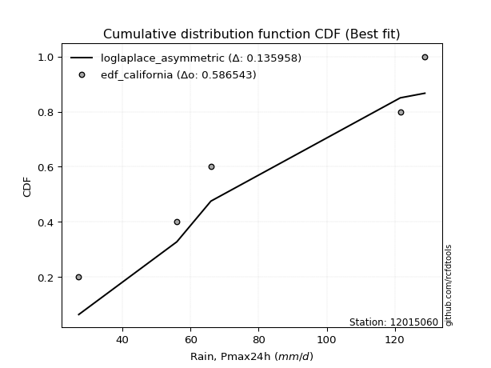</img>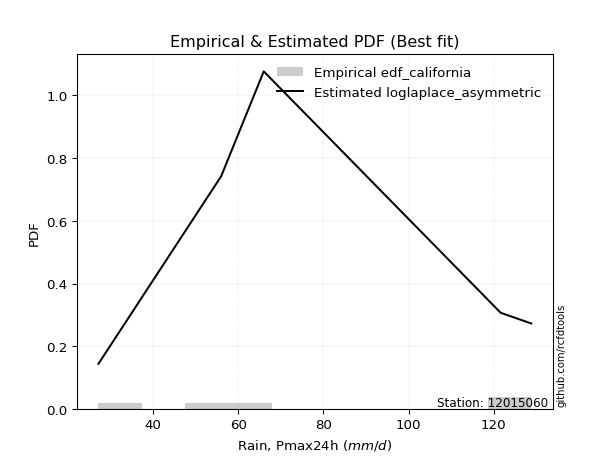</img>

</div>


### 2. Empirical - EDF Hazen (1930)

Hazen method for plotting positions is a formula used to estimate the empirical cumulative probability distribution of flood events or other hydrological data. This formula often results in biased estimations, particularly when extrapolating to extreme events (high return periods).

<div align="center">


$P=(m-0.5)/n$


</div>


**2.1. Empirical values**

<div align="center">

|                | 0                  | 1                  | 2         | 3                 | 4                  |
|:---------------|:-------------------|:-------------------|:----------|:------------------|:-------------------|
| date           | 2017               | 2018               | 2020      | 2019              | 2021               |
| x              | 27.2               | 56.0               | 66.0      | 121.6             | 128.8              |
| m              | 1                  | 2                  | 3         | 4                 | 5                  |
| empirical_dist | edf_hazen          | edf_hazen          | edf_hazen | edf_hazen         | edf_hazen          |
| empirical      | 0.1                | 0.3                | 0.5       | 0.7               | 0.9                |
| empirical_tr   | 1.1111111111111112 | 1.4285714285714286 | 2.0       | 3.333333333333333 | 10.000000000000002 |

</div>


**2.2. Kolmogorov-Smirnov fit test (sorted by Δ)**


<div align="center">

|                | 0                   | 1                   | 2                  | 3                   | 4                   | 5                   | 6                   | 7                   | 8                   | 9                   | 10                  | 11                  | 12                  | 13                 | 14                  | 15                  | 16                  | 17                  | 18                 | 19                  | 20                  | 21                 | 22                  | 23                  | 24                 | 25                  | 26                  | 27                 | 28                 | 29                  | 30                  | 31                  | 32                  | 33                    | 34                 | 35                  | 36                 | 37                  | 38                  | 39                 | 40                  | 41                  | 42                  | 43                  | 44                  | 45                  | 46                 | 47                  | 48                  | 49                  | 50                  | 51                 | 52                  | 53                  | 54                  | 55                  | 56                 | 57                  | 58                  | 59                 | 60                  | 61                  | 62                  | 63                  | 64                  | 65                  | 66                  | 67                  | 68                 | 69                  | 70                  | 71                  | 72                 | 73                 | 74                 | 75                  | 76                 | 77                  | 78                 | 79                 | 80                 | 81                 | 82                  | 83                  | 84                 | 85                 | 86                 | 87                 | 88                 | 89                 |
|:---------------|:--------------------|:--------------------|:-------------------|:--------------------|:--------------------|:--------------------|:--------------------|:--------------------|:--------------------|:--------------------|:--------------------|:--------------------|:--------------------|:-------------------|:--------------------|:--------------------|:--------------------|:--------------------|:-------------------|:--------------------|:--------------------|:-------------------|:--------------------|:--------------------|:-------------------|:--------------------|:--------------------|:-------------------|:-------------------|:--------------------|:--------------------|:--------------------|:--------------------|:----------------------|:-------------------|:--------------------|:-------------------|:--------------------|:--------------------|:-------------------|:--------------------|:--------------------|:--------------------|:--------------------|:--------------------|:--------------------|:-------------------|:--------------------|:--------------------|:--------------------|:--------------------|:-------------------|:--------------------|:--------------------|:--------------------|:--------------------|:-------------------|:--------------------|:--------------------|:-------------------|:--------------------|:--------------------|:--------------------|:--------------------|:--------------------|:--------------------|:--------------------|:--------------------|:-------------------|:--------------------|:--------------------|:--------------------|:-------------------|:-------------------|:-------------------|:--------------------|:-------------------|:--------------------|:-------------------|:-------------------|:-------------------|:-------------------|:--------------------|:--------------------|:-------------------|:-------------------|:-------------------|:-------------------|:-------------------|:-------------------|
| station        | 12015060            | 12015060            | 12015060           | 12015060            | 12015060            | 12015060            | 12015060            | 12015060            | 12015060            | 12015060            | 12015060            | 12015060            | 12015060            | 12015060           | 12015060            | 12015060            | 12015060            | 12015060            | 12015060           | 12015060            | 12015060            | 12015060           | 12015060            | 12015060            | 12015060           | 12015060            | 12015060            | 12015060           | 12015060           | 12015060            | 12015060            | 12015060            | 12015060            | 12015060              | 12015060           | 12015060            | 12015060           | 12015060            | 12015060            | 12015060           | 12015060            | 12015060            | 12015060            | 12015060            | 12015060            | 12015060            | 12015060           | 12015060            | 12015060            | 12015060            | 12015060            | 12015060           | 12015060            | 12015060            | 12015060            | 12015060            | 12015060           | 12015060            | 12015060            | 12015060           | 12015060            | 12015060            | 12015060            | 12015060            | 12015060            | 12015060            | 12015060            | 12015060            | 12015060           | 12015060            | 12015060            | 12015060            | 12015060           | 12015060           | 12015060           | 12015060            | 12015060           | 12015060            | 12015060           | 12015060           | 12015060           | 12015060           | 12015060            | 12015060            | 12015060           | 12015060           | 12015060           | 12015060           | 12015060           | 12015060           |
| empirical_dist | edf_hazen           | edf_hazen           | edf_hazen          | edf_hazen           | edf_hazen           | edf_hazen           | edf_hazen           | edf_hazen           | edf_hazen           | edf_hazen           | edf_hazen           | edf_hazen           | edf_hazen           | edf_hazen          | edf_hazen           | edf_hazen           | edf_hazen           | edf_hazen           | edf_hazen          | edf_hazen           | edf_hazen           | edf_hazen          | edf_hazen           | edf_hazen           | edf_hazen          | edf_hazen           | edf_hazen           | edf_hazen          | edf_hazen          | edf_hazen           | edf_hazen           | edf_hazen           | edf_hazen           | edf_hazen             | edf_hazen          | edf_hazen           | edf_hazen          | edf_hazen           | edf_hazen           | edf_hazen          | edf_hazen           | edf_hazen           | edf_hazen           | edf_hazen           | edf_hazen           | edf_hazen           | edf_hazen          | edf_hazen           | edf_hazen           | edf_hazen           | edf_hazen           | edf_hazen          | edf_hazen           | edf_hazen           | edf_hazen           | edf_hazen           | edf_hazen          | edf_hazen           | edf_hazen           | edf_hazen          | edf_hazen           | edf_hazen           | edf_hazen           | edf_hazen           | edf_hazen           | edf_hazen           | edf_hazen           | edf_hazen           | edf_hazen          | edf_hazen           | edf_hazen           | edf_hazen           | edf_hazen          | edf_hazen          | edf_hazen          | edf_hazen           | edf_hazen          | edf_hazen           | edf_hazen          | edf_hazen          | edf_hazen          | edf_hazen          | edf_hazen           | edf_hazen           | edf_hazen          | edf_hazen          | edf_hazen          | edf_hazen          | edf_hazen          | edf_hazen          |
| p_dist         | ncf                 | logfisk             | loginvgauss        | expon               | genexpon            | logbetaprime        | fisk                | logalpha            | logncf              | loggamma            | loggamma            | logrice             | lograyleigh         | lognct             | logmaxwell          | loghalfnorm         | loginvweibull       | logf                | logerlang          | loginvgamma         | logt                | logcrystalball     | lognorm             | lognorm             | logexponnorm       | logfatiguelife      | logpearson3         | logkstwobign       | betaprime          | genlogistic         | loggenexpon         | invgauss            | halfnorm            | loglaplace_asymmetric | laplace_asymmetric | rayleigh            | maxwell            | logweibull_min      | alpha               | invgamma           | rice                | loggumbel_r         | loghalflogistic     | gompertz            | kstwobign           | pearson3            | nct                | exponnorm           | crystalball         | norm                | truncnorm           | t                  | gamma               | erlang              | loggompertz         | loglogistic         | logmoyal           | loggumbel_l         | halflogistic        | gumbel_r           | loghypsecant        | moyal               | logistic            | loglaplace          | hypsecant           | logwald             | wald                | logmielke           | laplace            | gumbel_l            | mielke              | loggibrat           | logloggamma        | gibrat             | logexpon           | f                   | logchi2            | lognakagami         | logtruncnorm       | nakagami           | weibull_min        | pareto             | logpareto           | loglognorm          | chi2               | invweibull         | logjohnsonsu       | fatiguelife        | johnsonsu          | loggenlogistic     |
| delta          | 0.08976214703148233 | 0.12558938780210294 | 0.1326595979104115 | 0.13313860909231023 | 0.13329758398691705 | 0.13372653466591666 | 0.13377323118744244 | 0.13502114184931968 | 0.13604490390270496 | 0.13606312535096565 | 0.13606312535096565 | 0.13633732884679617 | 0.13658323180800547 | 0.1367829824831447 | 0.13718188146649557 | 0.13729899820729918 | 0.13777783146702316 | 0.13844077086247364 | 0.1387683649889111 | 0.13877611358685238 | 0.13946840303383745 | 0.1394690539440966 | 0.13946938232164185 | 0.13946938232164185 | 0.1394707335050388 | 0.13994002501896485 | 0.14136092116056576 | 0.1484883895047721 | 0.1490083817019734 | 0.14918920913318956 | 0.14942715371778031 | 0.14961128920800082 | 0.14993666357295354 | 0.15013386077343827   | 0.1503317011423122 | 0.15073905003430754 | 0.1519147574011137 | 0.15197148040664654 | 0.15312871189063004 | 0.1535915759768317 | 0.15425207206142255 | 0.15448303173990485 | 0.15472564720498527 | 0.15480098719989122 | 0.15552062471693462 | 0.15599714674351772 | 0.1562476458141071 | 0.15634736805047356 | 0.15634797847682846 | 0.15634798167943997 | 0.15634798929604898 | 0.1563592729649914 | 0.15696468133636476 | 0.15737761341676482 | 0.15741659685585668 | 0.15812407578760324 | 0.1603016127080712 | 0.16528248304091353 | 0.16564230157513637 | 0.1663827300801195 | 0.16797106593964828 | 0.17090847878980953 | 0.17324734713742984 | 0.17710712110648674 | 0.18170785981628412 | 0.18462011174920778 | 0.19226529993748598 | 0.19665665879177086 | 0.1975108953309666 | 0.20051381265859775 | 0.20248540708257523 | 0.20877504929999202 | 0.2115657571678431 | 0.2151702582162487 | 0.239127463071168  | 0.24238708549675742 | 0.2733288988386294 | 0.29992010548748993 | 0.2999983780519561 | 0.2999996780678216 | 0.3354111781906715 | 0.357571089628886  | 0.38017331863436304 | 0.38078722619296873 | 0.3808238330901827 | 0.4684072310009348 | 0.5062249335521676 | 0.517437282603491  | 0.6229318557020492 | 0.7                |
| deltao         | 0.5865427407550001  | 0.5865427407550001  | 0.5865427407550001 | 0.5865427407550001  | 0.5865427407550001  | 0.5865427407550001  | 0.5865427407550001  | 0.5865427407550001  | 0.5865427407550001  | 0.5865427407550001  | 0.5865427407550001  | 0.5865427407550001  | 0.5865427407550001  | 0.5865427407550001 | 0.5865427407550001  | 0.5865427407550001  | 0.5865427407550001  | 0.5865427407550001  | 0.5865427407550001 | 0.5865427407550001  | 0.5865427407550001  | 0.5865427407550001 | 0.5865427407550001  | 0.5865427407550001  | 0.5865427407550001 | 0.5865427407550001  | 0.5865427407550001  | 0.5865427407550001 | 0.5865427407550001 | 0.5865427407550001  | 0.5865427407550001  | 0.5865427407550001  | 0.5865427407550001  | 0.5865427407550001    | 0.5865427407550001 | 0.5865427407550001  | 0.5865427407550001 | 0.5865427407550001  | 0.5865427407550001  | 0.5865427407550001 | 0.5865427407550001  | 0.5865427407550001  | 0.5865427407550001  | 0.5865427407550001  | 0.5865427407550001  | 0.5865427407550001  | 0.5865427407550001 | 0.5865427407550001  | 0.5865427407550001  | 0.5865427407550001  | 0.5865427407550001  | 0.5865427407550001 | 0.5865427407550001  | 0.5865427407550001  | 0.5865427407550001  | 0.5865427407550001  | 0.5865427407550001 | 0.5865427407550001  | 0.5865427407550001  | 0.5865427407550001 | 0.5865427407550001  | 0.5865427407550001  | 0.5865427407550001  | 0.5865427407550001  | 0.5865427407550001  | 0.5865427407550001  | 0.5865427407550001  | 0.5865427407550001  | 0.5865427407550001 | 0.5865427407550001  | 0.5865427407550001  | 0.5865427407550001  | 0.5865427407550001 | 0.5865427407550001 | 0.5865427407550001 | 0.5865427407550001  | 0.5865427407550001 | 0.5865427407550001  | 0.5865427407550001 | 0.5865427407550001 | 0.5865427407550001 | 0.5865427407550001 | 0.5865427407550001  | 0.5865427407550001  | 0.5865427407550001 | 0.5865427407550001 | 0.5865427407550001 | 0.5865427407550001 | 0.5865427407550001 | 0.5865427407550001 |
| eval           | Δo > Δ              | Δo > Δ              | Δo > Δ             | Δo > Δ              | Δo > Δ              | Δo > Δ              | Δo > Δ              | Δo > Δ              | Δo > Δ              | Δo > Δ              | Δo > Δ              | Δo > Δ              | Δo > Δ              | Δo > Δ             | Δo > Δ              | Δo > Δ              | Δo > Δ              | Δo > Δ              | Δo > Δ             | Δo > Δ              | Δo > Δ              | Δo > Δ             | Δo > Δ              | Δo > Δ              | Δo > Δ             | Δo > Δ              | Δo > Δ              | Δo > Δ             | Δo > Δ             | Δo > Δ              | Δo > Δ              | Δo > Δ              | Δo > Δ              | Δo > Δ                | Δo > Δ             | Δo > Δ              | Δo > Δ             | Δo > Δ              | Δo > Δ              | Δo > Δ             | Δo > Δ              | Δo > Δ              | Δo > Δ              | Δo > Δ              | Δo > Δ              | Δo > Δ              | Δo > Δ             | Δo > Δ              | Δo > Δ              | Δo > Δ              | Δo > Δ              | Δo > Δ             | Δo > Δ              | Δo > Δ              | Δo > Δ              | Δo > Δ              | Δo > Δ             | Δo > Δ              | Δo > Δ              | Δo > Δ             | Δo > Δ              | Δo > Δ              | Δo > Δ              | Δo > Δ              | Δo > Δ              | Δo > Δ              | Δo > Δ              | Δo > Δ              | Δo > Δ             | Δo > Δ              | Δo > Δ              | Δo > Δ              | Δo > Δ             | Δo > Δ             | Δo > Δ             | Δo > Δ              | Δo > Δ             | Δo > Δ              | Δo > Δ             | Δo > Δ             | Δo > Δ             | Δo > Δ             | Δo > Δ              | Δo > Δ              | Δo > Δ             | Δo > Δ             | Δo > Δ             | Δo > Δ             | Δo <= Δ            | Δo <= Δ            |
| fit            | 1                   | 1                   | 1                  | 1                   | 1                   | 1                   | 1                   | 1                   | 1                   | 1                   | 1                   | 1                   | 1                   | 1                  | 1                   | 1                   | 1                   | 1                   | 1                  | 1                   | 1                   | 1                  | 1                   | 1                   | 1                  | 1                   | 1                   | 1                  | 1                  | 1                   | 1                   | 1                   | 1                   | 1                     | 1                  | 1                   | 1                  | 1                   | 1                   | 1                  | 1                   | 1                   | 1                   | 1                   | 1                   | 1                   | 1                  | 1                   | 1                   | 1                   | 1                   | 1                  | 1                   | 1                   | 1                   | 1                   | 1                  | 1                   | 1                   | 1                  | 1                   | 1                   | 1                   | 1                   | 1                   | 1                   | 1                   | 1                   | 1                  | 1                   | 1                   | 1                   | 1                  | 1                  | 1                  | 1                   | 1                  | 1                   | 1                  | 1                  | 1                  | 1                  | 1                   | 1                   | 1                  | 1                  | 1                  | 1                  | 0                  | 0                  |
| n              | 5                   | 5                   | 5                  | 5                   | 5                   | 5                   | 5                   | 5                   | 5                   | 5                   | 5                   | 5                   | 5                   | 5                  | 5                   | 5                   | 5                   | 5                   | 5                  | 5                   | 5                   | 5                  | 5                   | 5                   | 5                  | 5                   | 5                   | 5                  | 5                  | 5                   | 5                   | 5                   | 5                   | 5                     | 5                  | 5                   | 5                  | 5                   | 5                   | 5                  | 5                   | 5                   | 5                   | 5                   | 5                   | 5                   | 5                  | 5                   | 5                   | 5                   | 5                   | 5                  | 5                   | 5                   | 5                   | 5                   | 5                  | 5                   | 5                   | 5                  | 5                   | 5                   | 5                   | 5                   | 5                   | 5                   | 5                   | 5                   | 5                  | 5                   | 5                   | 5                   | 5                  | 5                  | 5                  | 5                   | 5                  | 5                   | 5                  | 5                  | 5                  | 5                  | 5                   | 5                   | 5                  | 5                  | 5                  | 5                  | 5                  | 5                  |
| best_fit       | 1                   | 0                   | 0                  | 0                   | 0                   | 0                   | 0                   | 0                   | 0                   | 0                   | 0                   | 0                   | 0                   | 0                  | 0                   | 0                   | 0                   | 0                   | 0                  | 0                   | 0                   | 0                  | 0                   | 0                   | 0                  | 0                   | 0                   | 0                  | 0                  | 0                   | 0                   | 0                   | 0                   | 0                     | 0                  | 0                   | 0                  | 0                   | 0                   | 0                  | 0                   | 0                   | 0                   | 0                   | 0                   | 0                   | 0                  | 0                   | 0                   | 0                   | 0                   | 0                  | 0                   | 0                   | 0                   | 0                   | 0                  | 0                   | 0                   | 0                  | 0                   | 0                   | 0                   | 0                   | 0                   | 0                   | 0                   | 0                   | 0                  | 0                   | 0                   | 0                   | 0                  | 0                  | 0                  | 0                   | 0                  | 0                   | 0                  | 0                  | 0                  | 0                  | 0                   | 0                   | 0                  | 0                  | 0                  | 0                  | 0                  | 0                  |
| best_fit_sort  | 1                   | 2                   | 3                  | 4                   | 5                   | 6                   | 7                   | 8                   | 9                   | 10                  | 11                  | 12                  | 13                  | 14                 | 15                  | 16                  | 17                  | 18                  | 19                 | 20                  | 21                  | 22                 | 23                  | 24                  | 25                 | 26                  | 27                  | 28                 | 29                 | 30                  | 31                  | 32                  | 33                  | 34                    | 35                 | 36                  | 37                 | 38                  | 39                  | 40                 | 41                  | 42                  | 43                  | 44                  | 45                  | 46                  | 47                 | 48                  | 49                  | 50                  | 51                  | 52                 | 53                  | 54                  | 55                  | 56                  | 57                 | 58                  | 59                  | 60                 | 61                  | 62                  | 63                  | 64                  | 65                  | 66                  | 67                  | 68                  | 69                 | 70                  | 71                  | 72                  | 73                 | 74                 | 75                 | 76                  | 77                 | 78                  | 79                 | 80                 | 81                 | 82                 | 83                  | 84                  | 85                 | 86                 | 87                 | 88                 | 89                 | 90                 |

</div>


<div align="center">

</img>

</div>


**2.3. Best fit**

<div align="center">

|   id |   station | empirical_dist   | p_dist   |     delta |   deltao | eval   |   fit |   n |   best_fit |   best_fit_sort |
|-----:|----------:|:-----------------|:---------|----------:|---------:|:-------|------:|----:|-----------:|----------------:|
|    0 |  12015060 | edf_hazen        | ncf      | 0.0897621 | 0.586543 | Δo > Δ |     1 |   5 |          1 |               1 |

</div>


<div align="center">

</img>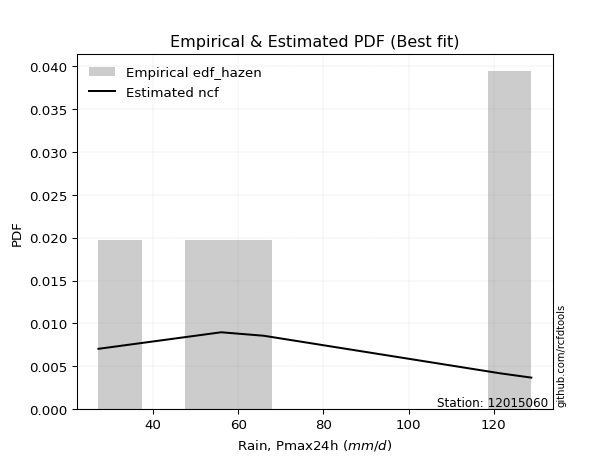</img>

</div>


### 3. Empirical - EDF Weibull (1939)

Weibull plotting position formula is an empirical method used to estimate the non-exceedance probability or plotting position for a set of observed data, is often recommended or widely used in practice, particularly in flood frequency analysis.

<div align="center">


$P=m/(n+1)$


</div>


**3.1. Empirical values**

<div align="center">

|                | 0                   | 1                  | 2           | 3                  | 4                  |
|:---------------|:--------------------|:-------------------|:------------|:-------------------|:-------------------|
| date           | 2017                | 2018               | 2020        | 2019               | 2021               |
| x              | 27.2                | 56.0               | 66.0        | 121.6              | 128.8              |
| m              | 1                   | 2                  | 3           | 4                  | 5                  |
| empirical_dist | edf_weibull         | edf_weibull        | edf_weibull | edf_weibull        | edf_weibull        |
| empirical      | 0.16666666666666666 | 0.3333333333333333 | 0.5         | 0.6666666666666666 | 0.8333333333333334 |
| empirical_tr   | 1.2                 | 1.4999999999999998 | 2.0         | 2.9999999999999996 | 6.000000000000002  |

</div>


**3.2. Kolmogorov-Smirnov fit test (sorted by Δ)**


<div align="center">

|                | 0                   | 1                   | 2                   | 3                   | 4                   | 5                  | 6                  | 7                   | 8                  | 9                   | 10                 | 11                 | 12                  | 13                  | 14                 | 15                 | 16                 | 17                  | 18                 | 19                 | 20                  | 21                  | 22                 | 23                  | 24                  | 25                  | 26                  | 27                  | 28                  | 29                  | 30                  | 31                  | 32                  | 33                  | 34                    | 35                  | 36                  | 37                  | 38                  | 39                  | 40                  | 41                  | 42                  | 43                 | 44                  | 45                  | 46                  | 47                  | 48                  | 49                 | 50                 | 51                 | 52                  | 53                 | 54                  | 55                  | 56                  | 57                  | 58                 | 59                  | 60                 | 61                  | 62                  | 63                  | 64                 | 65                  | 66                  | 67                 | 68                  | 69                 | 70                 | 71                  | 72                  | 73                  | 74                  | 75                  | 76                  | 77                 | 78                 | 79                  | 80                  | 81                 | 82                 | 83                 | 84                  | 85                  | 86                 | 87                 | 88                 | 89                 |
|:---------------|:--------------------|:--------------------|:--------------------|:--------------------|:--------------------|:-------------------|:-------------------|:--------------------|:-------------------|:--------------------|:-------------------|:-------------------|:--------------------|:--------------------|:-------------------|:-------------------|:-------------------|:--------------------|:-------------------|:-------------------|:--------------------|:--------------------|:-------------------|:--------------------|:--------------------|:--------------------|:--------------------|:--------------------|:--------------------|:--------------------|:--------------------|:--------------------|:--------------------|:--------------------|:----------------------|:--------------------|:--------------------|:--------------------|:--------------------|:--------------------|:--------------------|:--------------------|:--------------------|:-------------------|:--------------------|:--------------------|:--------------------|:--------------------|:--------------------|:-------------------|:-------------------|:-------------------|:--------------------|:-------------------|:--------------------|:--------------------|:--------------------|:--------------------|:-------------------|:--------------------|:-------------------|:--------------------|:--------------------|:--------------------|:-------------------|:--------------------|:--------------------|:-------------------|:--------------------|:-------------------|:-------------------|:--------------------|:--------------------|:--------------------|:--------------------|:--------------------|:--------------------|:-------------------|:-------------------|:--------------------|:--------------------|:-------------------|:-------------------|:-------------------|:--------------------|:--------------------|:-------------------|:-------------------|:-------------------|:-------------------|
| station        | 12015060            | 12015060            | 12015060            | 12015060            | 12015060            | 12015060           | 12015060           | 12015060            | 12015060           | 12015060            | 12015060           | 12015060           | 12015060            | 12015060            | 12015060           | 12015060           | 12015060           | 12015060            | 12015060           | 12015060           | 12015060            | 12015060            | 12015060           | 12015060            | 12015060            | 12015060            | 12015060            | 12015060            | 12015060            | 12015060            | 12015060            | 12015060            | 12015060            | 12015060            | 12015060              | 12015060            | 12015060            | 12015060            | 12015060            | 12015060            | 12015060            | 12015060            | 12015060            | 12015060           | 12015060            | 12015060            | 12015060            | 12015060            | 12015060            | 12015060           | 12015060           | 12015060           | 12015060            | 12015060           | 12015060            | 12015060            | 12015060            | 12015060            | 12015060           | 12015060            | 12015060           | 12015060            | 12015060            | 12015060            | 12015060           | 12015060            | 12015060            | 12015060           | 12015060            | 12015060           | 12015060           | 12015060            | 12015060            | 12015060            | 12015060            | 12015060            | 12015060            | 12015060           | 12015060           | 12015060            | 12015060            | 12015060           | 12015060           | 12015060           | 12015060            | 12015060            | 12015060           | 12015060           | 12015060           | 12015060           |
| empirical_dist | edf_weibull         | edf_weibull         | edf_weibull         | edf_weibull         | edf_weibull         | edf_weibull        | edf_weibull        | edf_weibull         | edf_weibull        | edf_weibull         | edf_weibull        | edf_weibull        | edf_weibull         | edf_weibull         | edf_weibull        | edf_weibull        | edf_weibull        | edf_weibull         | edf_weibull        | edf_weibull        | edf_weibull         | edf_weibull         | edf_weibull        | edf_weibull         | edf_weibull         | edf_weibull         | edf_weibull         | edf_weibull         | edf_weibull         | edf_weibull         | edf_weibull         | edf_weibull         | edf_weibull         | edf_weibull         | edf_weibull           | edf_weibull         | edf_weibull         | edf_weibull         | edf_weibull         | edf_weibull         | edf_weibull         | edf_weibull         | edf_weibull         | edf_weibull        | edf_weibull         | edf_weibull         | edf_weibull         | edf_weibull         | edf_weibull         | edf_weibull        | edf_weibull        | edf_weibull        | edf_weibull         | edf_weibull        | edf_weibull         | edf_weibull         | edf_weibull         | edf_weibull         | edf_weibull        | edf_weibull         | edf_weibull        | edf_weibull         | edf_weibull         | edf_weibull         | edf_weibull        | edf_weibull         | edf_weibull         | edf_weibull        | edf_weibull         | edf_weibull        | edf_weibull        | edf_weibull         | edf_weibull         | edf_weibull         | edf_weibull         | edf_weibull         | edf_weibull         | edf_weibull        | edf_weibull        | edf_weibull         | edf_weibull         | edf_weibull        | edf_weibull        | edf_weibull        | edf_weibull         | edf_weibull         | edf_weibull        | edf_weibull        | edf_weibull        | edf_weibull        |
| p_dist         | ncf                 | logkstwobign        | loggenexpon         | loginvweibull       | logfisk             | loginvgauss        | genexpon           | expon               | logbetaprime       | fisk                | logalpha           | logncf             | loggamma            | loggamma            | logrice            | loggompertz        | lograyleigh        | lognct              | logmaxwell         | loghalfnorm        | logf                | logerlang           | loginvgamma        | logt                | logcrystalball      | lognorm             | lognorm             | logexponnorm        | logfatiguelife      | logpearson3         | betaprime           | genlogistic         | invgauss            | halfnorm            | loglaplace_asymmetric | laplace_asymmetric  | rayleigh            | maxwell             | logweibull_min      | alpha               | invgamma            | rice                | loggumbel_r         | loghalflogistic    | gompertz            | kstwobign           | pearson3            | nct                 | exponnorm           | crystalball        | norm               | truncnorm          | t                   | gamma              | erlang              | loglogistic         | logmoyal            | loggumbel_l         | halflogistic       | gumbel_r            | loghypsecant       | moyal               | logexpon            | logistic            | f                  | loglaplace          | hypsecant           | logwald            | gumbel_l            | laplace            | wald               | logmielke           | mielke              | logchi2             | loggibrat           | logloggamma         | gibrat              | weibull_min        | pareto             | lognakagami         | logtruncnorm        | nakagami           | logpareto          | loglognorm         | chi2                | invweibull          | logjohnsonsu       | fatiguelife        | johnsonsu          | loggenlogistic     |
| delta          | 0.12309548036481566 | 0.15201835853550527 | 0.15778804855989148 | 0.15789855404687503 | 0.15892272113543626 | 0.1659929312437448 | 0.1666660061940077 | 0.16666666666666666 | 0.16705986799925   | 0.16710656452077577 | 0.168354475182653  | 0.1693782372360383 | 0.16939645868429898 | 0.16939645868429898 | 0.1696706621801295 | 0.16968519798351   | 0.1699165651413388 | 0.17011631581647801 | 0.1705152147998289 | 0.1706323315406325 | 0.17177410419580696 | 0.17210169832224442 | 0.1721094469201857 | 0.17280173636717078 | 0.17280238727742991 | 0.17280271565497518 | 0.17280271565497518 | 0.17280406683837213 | 0.17327335835229818 | 0.17469425449389908 | 0.18234171503530672 | 0.18252254246652289 | 0.18294462254133415 | 0.18326999690628687 | 0.1834671941067716    | 0.18366503447564553 | 0.18407238336764087 | 0.18524809073444704 | 0.18530481373997987 | 0.18646204522396337 | 0.18692490931016503 | 0.18758540539475588 | 0.18781636507323818 | 0.1880589805383186 | 0.18813432053322454 | 0.18885395805026794 | 0.18933048007685105 | 0.18958097914744043 | 0.18968070138380688 | 0.1896813118101618 | 0.1896813150127733 | 0.1896813226293823 | 0.18969260629832474 | 0.1902980146696981 | 0.19071094675009814 | 0.19145740912093656 | 0.19363494604140452 | 0.19861581637424686 | 0.1989756349084697 | 0.19971606341345283 | 0.2013043992729816 | 0.20424181212314285 | 0.20579412973783467 | 0.20658068047076317 | 0.2090537521634241 | 0.21044045443982007 | 0.21504119314961745 | 0.2179534450825411 | 0.22229353972881805 | 0.2223025075039412 | 0.2255986332708193 | 0.22998999212510418 | 0.23581874041590856 | 0.23999556550529605 | 0.24210838263332535 | 0.24489909050117642 | 0.24850359154958201 | 0.3020778448573382 | 0.3242377562955527 | 0.33325343882082326 | 0.33333171138528944 | 0.3333330114011549 | 0.3468399853010297 | 0.3474538928596354 | 0.34749049975684937 | 0.40174056433426814 | 0.4728916002188342 | 0.4841039492701577 | 0.5895985223687159 | 0.6666666666666666 |
| deltao         | 0.5865427407550001  | 0.5865427407550001  | 0.5865427407550001  | 0.5865427407550001  | 0.5865427407550001  | 0.5865427407550001 | 0.5865427407550001 | 0.5865427407550001  | 0.5865427407550001 | 0.5865427407550001  | 0.5865427407550001 | 0.5865427407550001 | 0.5865427407550001  | 0.5865427407550001  | 0.5865427407550001 | 0.5865427407550001 | 0.5865427407550001 | 0.5865427407550001  | 0.5865427407550001 | 0.5865427407550001 | 0.5865427407550001  | 0.5865427407550001  | 0.5865427407550001 | 0.5865427407550001  | 0.5865427407550001  | 0.5865427407550001  | 0.5865427407550001  | 0.5865427407550001  | 0.5865427407550001  | 0.5865427407550001  | 0.5865427407550001  | 0.5865427407550001  | 0.5865427407550001  | 0.5865427407550001  | 0.5865427407550001    | 0.5865427407550001  | 0.5865427407550001  | 0.5865427407550001  | 0.5865427407550001  | 0.5865427407550001  | 0.5865427407550001  | 0.5865427407550001  | 0.5865427407550001  | 0.5865427407550001 | 0.5865427407550001  | 0.5865427407550001  | 0.5865427407550001  | 0.5865427407550001  | 0.5865427407550001  | 0.5865427407550001 | 0.5865427407550001 | 0.5865427407550001 | 0.5865427407550001  | 0.5865427407550001 | 0.5865427407550001  | 0.5865427407550001  | 0.5865427407550001  | 0.5865427407550001  | 0.5865427407550001 | 0.5865427407550001  | 0.5865427407550001 | 0.5865427407550001  | 0.5865427407550001  | 0.5865427407550001  | 0.5865427407550001 | 0.5865427407550001  | 0.5865427407550001  | 0.5865427407550001 | 0.5865427407550001  | 0.5865427407550001 | 0.5865427407550001 | 0.5865427407550001  | 0.5865427407550001  | 0.5865427407550001  | 0.5865427407550001  | 0.5865427407550001  | 0.5865427407550001  | 0.5865427407550001 | 0.5865427407550001 | 0.5865427407550001  | 0.5865427407550001  | 0.5865427407550001 | 0.5865427407550001 | 0.5865427407550001 | 0.5865427407550001  | 0.5865427407550001  | 0.5865427407550001 | 0.5865427407550001 | 0.5865427407550001 | 0.5865427407550001 |
| eval           | Δo > Δ              | Δo > Δ              | Δo > Δ              | Δo > Δ              | Δo > Δ              | Δo > Δ             | Δo > Δ             | Δo > Δ              | Δo > Δ             | Δo > Δ              | Δo > Δ             | Δo > Δ             | Δo > Δ              | Δo > Δ              | Δo > Δ             | Δo > Δ             | Δo > Δ             | Δo > Δ              | Δo > Δ             | Δo > Δ             | Δo > Δ              | Δo > Δ              | Δo > Δ             | Δo > Δ              | Δo > Δ              | Δo > Δ              | Δo > Δ              | Δo > Δ              | Δo > Δ              | Δo > Δ              | Δo > Δ              | Δo > Δ              | Δo > Δ              | Δo > Δ              | Δo > Δ                | Δo > Δ              | Δo > Δ              | Δo > Δ              | Δo > Δ              | Δo > Δ              | Δo > Δ              | Δo > Δ              | Δo > Δ              | Δo > Δ             | Δo > Δ              | Δo > Δ              | Δo > Δ              | Δo > Δ              | Δo > Δ              | Δo > Δ             | Δo > Δ             | Δo > Δ             | Δo > Δ              | Δo > Δ             | Δo > Δ              | Δo > Δ              | Δo > Δ              | Δo > Δ              | Δo > Δ             | Δo > Δ              | Δo > Δ             | Δo > Δ              | Δo > Δ              | Δo > Δ              | Δo > Δ             | Δo > Δ              | Δo > Δ              | Δo > Δ             | Δo > Δ              | Δo > Δ             | Δo > Δ             | Δo > Δ              | Δo > Δ              | Δo > Δ              | Δo > Δ              | Δo > Δ              | Δo > Δ              | Δo > Δ             | Δo > Δ             | Δo > Δ              | Δo > Δ              | Δo > Δ             | Δo > Δ             | Δo > Δ             | Δo > Δ              | Δo > Δ              | Δo > Δ             | Δo > Δ             | Δo <= Δ            | Δo <= Δ            |
| fit            | 1                   | 1                   | 1                   | 1                   | 1                   | 1                  | 1                  | 1                   | 1                  | 1                   | 1                  | 1                  | 1                   | 1                   | 1                  | 1                  | 1                  | 1                   | 1                  | 1                  | 1                   | 1                   | 1                  | 1                   | 1                   | 1                   | 1                   | 1                   | 1                   | 1                   | 1                   | 1                   | 1                   | 1                   | 1                     | 1                   | 1                   | 1                   | 1                   | 1                   | 1                   | 1                   | 1                   | 1                  | 1                   | 1                   | 1                   | 1                   | 1                   | 1                  | 1                  | 1                  | 1                   | 1                  | 1                   | 1                   | 1                   | 1                   | 1                  | 1                   | 1                  | 1                   | 1                   | 1                   | 1                  | 1                   | 1                   | 1                  | 1                   | 1                  | 1                  | 1                   | 1                   | 1                   | 1                   | 1                   | 1                   | 1                  | 1                  | 1                   | 1                   | 1                  | 1                  | 1                  | 1                   | 1                   | 1                  | 1                  | 0                  | 0                  |
| n              | 5                   | 5                   | 5                   | 5                   | 5                   | 5                  | 5                  | 5                   | 5                  | 5                   | 5                  | 5                  | 5                   | 5                   | 5                  | 5                  | 5                  | 5                   | 5                  | 5                  | 5                   | 5                   | 5                  | 5                   | 5                   | 5                   | 5                   | 5                   | 5                   | 5                   | 5                   | 5                   | 5                   | 5                   | 5                     | 5                   | 5                   | 5                   | 5                   | 5                   | 5                   | 5                   | 5                   | 5                  | 5                   | 5                   | 5                   | 5                   | 5                   | 5                  | 5                  | 5                  | 5                   | 5                  | 5                   | 5                   | 5                   | 5                   | 5                  | 5                   | 5                  | 5                   | 5                   | 5                   | 5                  | 5                   | 5                   | 5                  | 5                   | 5                  | 5                  | 5                   | 5                   | 5                   | 5                   | 5                   | 5                   | 5                  | 5                  | 5                   | 5                   | 5                  | 5                  | 5                  | 5                   | 5                   | 5                  | 5                  | 5                  | 5                  |
| best_fit       | 1                   | 0                   | 0                   | 0                   | 0                   | 0                  | 0                  | 0                   | 0                  | 0                   | 0                  | 0                  | 0                   | 0                   | 0                  | 0                  | 0                  | 0                   | 0                  | 0                  | 0                   | 0                   | 0                  | 0                   | 0                   | 0                   | 0                   | 0                   | 0                   | 0                   | 0                   | 0                   | 0                   | 0                   | 0                     | 0                   | 0                   | 0                   | 0                   | 0                   | 0                   | 0                   | 0                   | 0                  | 0                   | 0                   | 0                   | 0                   | 0                   | 0                  | 0                  | 0                  | 0                   | 0                  | 0                   | 0                   | 0                   | 0                   | 0                  | 0                   | 0                  | 0                   | 0                   | 0                   | 0                  | 0                   | 0                   | 0                  | 0                   | 0                  | 0                  | 0                   | 0                   | 0                   | 0                   | 0                   | 0                   | 0                  | 0                  | 0                   | 0                   | 0                  | 0                  | 0                  | 0                   | 0                   | 0                  | 0                  | 0                  | 0                  |
| best_fit_sort  | 1                   | 2                   | 3                   | 4                   | 5                   | 6                  | 7                  | 8                   | 9                  | 10                  | 11                 | 12                 | 13                  | 14                  | 15                 | 16                 | 17                 | 18                  | 19                 | 20                 | 21                  | 22                  | 23                 | 24                  | 25                  | 26                  | 27                  | 28                  | 29                  | 30                  | 31                  | 32                  | 33                  | 34                  | 35                    | 36                  | 37                  | 38                  | 39                  | 40                  | 41                  | 42                  | 43                  | 44                 | 45                  | 46                  | 47                  | 48                  | 49                  | 50                 | 51                 | 52                 | 53                  | 54                 | 55                  | 56                  | 57                  | 58                  | 59                 | 60                  | 61                 | 62                  | 63                  | 64                  | 65                 | 66                  | 67                  | 68                 | 69                  | 70                 | 71                 | 72                  | 73                  | 74                  | 75                  | 76                  | 77                  | 78                 | 79                 | 80                  | 81                  | 82                 | 83                 | 84                 | 85                  | 86                  | 87                 | 88                 | 89                 | 90                 |

</div>


<div align="center">

</img>

</div>


**3.3. Best fit**

<div align="center">

|   id |   station | empirical_dist   | p_dist   |    delta |   deltao | eval   |   fit |   n |   best_fit |   best_fit_sort |
|-----:|----------:|:-----------------|:---------|---------:|---------:|:-------|------:|----:|-----------:|----------------:|
|    0 |  12015060 | edf_weibull      | ncf      | 0.123095 | 0.586543 | Δo > Δ |     1 |   5 |          1 |               1 |

</div>


<div align="center">

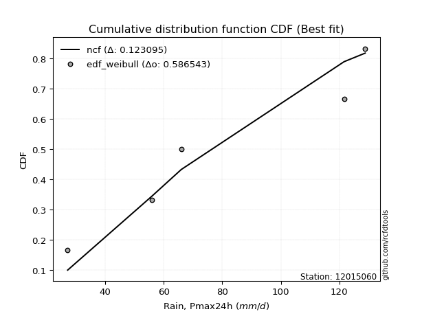</img></img>

</div>


### 4. Empirical - EDF Beard (1943)

The Beard formula (or Beard´s plotting position formula) in hydrology is used to estimate the empirical non-exceedance probability _(P)_ of a flood event (or other extreme hydrological data point) within a given dataset.

<div align="center">


$P=(m-0.31)/(n+0.38)$


</div>


**4.1. Empirical values**

<div align="center">

|                | 0                   | 1                  | 2         | 3                  | 4                  |
|:---------------|:--------------------|:-------------------|:----------|:-------------------|:-------------------|
| date           | 2017                | 2018               | 2020      | 2019               | 2021               |
| x              | 27.2                | 56.0               | 66.0      | 121.6              | 128.8              |
| m              | 1                   | 2                  | 3         | 4                  | 5                  |
| empirical_dist | edf_beard           | edf_beard          | edf_beard | edf_beard          | edf_beard          |
| empirical      | 0.12825278810408922 | 0.3141263940520446 | 0.5       | 0.6858736059479554 | 0.8717472118959109 |
| empirical_tr   | 1.1471215351812367  | 1.4579945799457996 | 2.0       | 3.183431952662722  | 7.797101449275368  |

</div>


**4.2. Kolmogorov-Smirnov fit test (sorted by Δ)**


<div align="center">

|                | 0                   | 1                   | 2                   | 3                   | 4                   | 5                  | 6                   | 7                   | 8                   | 9                   | 10                 | 11                  | 12                  | 13                  | 14                 | 15                 | 16                 | 17                 | 18                 | 19                 | 20                  | 21                  | 22                 | 23                  | 24                 | 25                  | 26                  | 27                  | 28                  | 29                  | 30                 | 31                  | 32                  | 33                  | 34                    | 35                  | 36                  | 37                  | 38                  | 39                  | 40                  | 41                  | 42                  | 43                 | 44                  | 45                  | 46                  | 47                  | 48                  | 49                  | 50                 | 51                 | 52                  | 53                  | 54                  | 55                  | 56                  | 57                  | 58                 | 59                  | 60                 | 61                  | 62                  | 63                  | 64                  | 65                 | 66                  | 67                 | 68                 | 69                  | 70                  | 71                  | 72                  | 73                  | 74                  | 75                 | 76                  | 77                  | 78                  | 79                 | 80                 | 81                 | 82                 | 83                 | 84                  | 85                  | 86                 | 87                 | 88                 | 89                 |
|:---------------|:--------------------|:--------------------|:--------------------|:--------------------|:--------------------|:-------------------|:--------------------|:--------------------|:--------------------|:--------------------|:-------------------|:--------------------|:--------------------|:--------------------|:-------------------|:-------------------|:-------------------|:-------------------|:-------------------|:-------------------|:--------------------|:--------------------|:-------------------|:--------------------|:-------------------|:--------------------|:--------------------|:--------------------|:--------------------|:--------------------|:-------------------|:--------------------|:--------------------|:--------------------|:----------------------|:--------------------|:--------------------|:--------------------|:--------------------|:--------------------|:--------------------|:--------------------|:--------------------|:-------------------|:--------------------|:--------------------|:--------------------|:--------------------|:--------------------|:--------------------|:-------------------|:-------------------|:--------------------|:--------------------|:--------------------|:--------------------|:--------------------|:--------------------|:-------------------|:--------------------|:-------------------|:--------------------|:--------------------|:--------------------|:--------------------|:-------------------|:--------------------|:-------------------|:-------------------|:--------------------|:--------------------|:--------------------|:--------------------|:--------------------|:--------------------|:-------------------|:--------------------|:--------------------|:--------------------|:-------------------|:-------------------|:-------------------|:-------------------|:-------------------|:--------------------|:--------------------|:-------------------|:-------------------|:-------------------|:-------------------|
| station        | 12015060            | 12015060            | 12015060            | 12015060            | 12015060            | 12015060           | 12015060            | 12015060            | 12015060            | 12015060            | 12015060           | 12015060            | 12015060            | 12015060            | 12015060           | 12015060           | 12015060           | 12015060           | 12015060           | 12015060           | 12015060            | 12015060            | 12015060           | 12015060            | 12015060           | 12015060            | 12015060            | 12015060            | 12015060            | 12015060            | 12015060           | 12015060            | 12015060            | 12015060            | 12015060              | 12015060            | 12015060            | 12015060            | 12015060            | 12015060            | 12015060            | 12015060            | 12015060            | 12015060           | 12015060            | 12015060            | 12015060            | 12015060            | 12015060            | 12015060            | 12015060           | 12015060           | 12015060            | 12015060            | 12015060            | 12015060            | 12015060            | 12015060            | 12015060           | 12015060            | 12015060           | 12015060            | 12015060            | 12015060            | 12015060            | 12015060           | 12015060            | 12015060           | 12015060           | 12015060            | 12015060            | 12015060            | 12015060            | 12015060            | 12015060            | 12015060           | 12015060            | 12015060            | 12015060            | 12015060           | 12015060           | 12015060           | 12015060           | 12015060           | 12015060            | 12015060            | 12015060           | 12015060           | 12015060           | 12015060           |
| empirical_dist | edf_beard           | edf_beard           | edf_beard           | edf_beard           | edf_beard           | edf_beard          | edf_beard           | edf_beard           | edf_beard           | edf_beard           | edf_beard          | edf_beard           | edf_beard           | edf_beard           | edf_beard          | edf_beard          | edf_beard          | edf_beard          | edf_beard          | edf_beard          | edf_beard           | edf_beard           | edf_beard          | edf_beard           | edf_beard          | edf_beard           | edf_beard           | edf_beard           | edf_beard           | edf_beard           | edf_beard          | edf_beard           | edf_beard           | edf_beard           | edf_beard             | edf_beard           | edf_beard           | edf_beard           | edf_beard           | edf_beard           | edf_beard           | edf_beard           | edf_beard           | edf_beard          | edf_beard           | edf_beard           | edf_beard           | edf_beard           | edf_beard           | edf_beard           | edf_beard          | edf_beard          | edf_beard           | edf_beard           | edf_beard           | edf_beard           | edf_beard           | edf_beard           | edf_beard          | edf_beard           | edf_beard          | edf_beard           | edf_beard           | edf_beard           | edf_beard           | edf_beard          | edf_beard           | edf_beard          | edf_beard          | edf_beard           | edf_beard           | edf_beard           | edf_beard           | edf_beard           | edf_beard           | edf_beard          | edf_beard           | edf_beard           | edf_beard           | edf_beard          | edf_beard          | edf_beard          | edf_beard          | edf_beard          | edf_beard           | edf_beard           | edf_beard          | edf_beard          | edf_beard          | edf_beard          |
| p_dist         | ncf                 | logkstwobign        | loggenexpon         | loginvweibull       | logfisk             | loginvgauss        | expon               | genexpon            | logbetaprime        | fisk                | logalpha           | logncf              | loggamma            | loggamma            | logrice            | loggompertz        | lograyleigh        | lognct             | logmaxwell         | loghalfnorm        | logf                | logerlang           | loginvgamma        | logt                | logcrystalball     | lognorm             | lognorm             | logexponnorm        | logfatiguelife      | logpearson3         | betaprime          | genlogistic         | invgauss            | halfnorm            | loglaplace_asymmetric | laplace_asymmetric  | rayleigh            | maxwell             | logweibull_min      | alpha               | invgamma            | rice                | loggumbel_r         | loghalflogistic    | gompertz            | kstwobign           | pearson3            | nct                 | exponnorm           | crystalball         | norm               | truncnorm          | t                   | gamma               | erlang              | loglogistic         | logmoyal            | loggumbel_l         | halflogistic       | gumbel_r            | loghypsecant       | moyal               | logistic            | loglaplace          | hypsecant           | logwald            | gumbel_l            | laplace            | wald               | logmielke           | mielke              | loggibrat           | logexpon            | logloggamma         | f                   | gibrat             | logchi2             | lognakagami         | logtruncnorm        | nakagami           | weibull_min        | pareto             | logpareto          | loglognorm         | chi2                | invweibull          | logjohnsonsu       | fatiguelife        | johnsonsu          | loggenlogistic     |
| delta          | 0.10388854108352685 | 0.13436199545272748 | 0.13858110927860268 | 0.13869161476558622 | 0.13971578185414746 | 0.146785991962456  | 0.14726500314435476 | 0.14742397803896157 | 0.14785292871796119 | 0.14789962523948696 | 0.1491475359013642 | 0.15017129795474948 | 0.15018951940301017 | 0.15018951940301017 | 0.1504637228988407 | 0.1504782587022212 | 0.15070962586005   | 0.1509093765351892 | 0.1513082755185401 | 0.1514253922593437 | 0.15256716491451816 | 0.15289475904095562 | 0.1529025076388969 | 0.15359479708588197 | 0.1535954479961411 | 0.15359577637368638 | 0.15359577637368638 | 0.15359712755708332 | 0.15406641907100938 | 0.15548731521261028 | 0.1631347757540179 | 0.16331560318523408 | 0.16373768326004534 | 0.16406305762499807 | 0.1642602548254828    | 0.16445809519435672 | 0.16486544408635206 | 0.16604115145315823 | 0.16609787445869106 | 0.16725510594267456 | 0.16771797002887623 | 0.16837846611346707 | 0.16860942579194937 | 0.1688520412570298 | 0.16892738125193574 | 0.16964701876897914 | 0.17012354079556224 | 0.17037403986615163 | 0.17047376210251808 | 0.17047437252887299 | 0.1704743757314845 | 0.1704743833480935 | 0.17048566701703594 | 0.17109107538840929 | 0.17150400746880934 | 0.17225046983964776 | 0.17442800676011572 | 0.17940887709295805 | 0.1797686956271809 | 0.18050912413216402 | 0.1820974599916928 | 0.18503487284185405 | 0.18737374118947436 | 0.19123351515853126 | 0.19583425386832864 | 0.1987465058012523 | 0.20308660044752924 | 0.2030955682226524 | 0.2063916939895305 | 0.21078305284381538 | 0.21661180113461975 | 0.22290144335203654 | 0.22500106901912337 | 0.22569215121988762 | 0.22826069144471278 | 0.2292966522682932 | 0.25920250478658474 | 0.31404649953953456 | 0.31412477210400075 | 0.3141260721198662 | 0.3212847841386269 | 0.3434446955768414 | 0.3660469245823184 | 0.3666608321409241 | 0.36669743903813806 | 0.44015444289684563 | 0.492098539500123  | 0.5033108885514463 | 0.6088054616500047 | 0.6858736059479554 |
| deltao         | 0.5865427407550001  | 0.5865427407550001  | 0.5865427407550001  | 0.5865427407550001  | 0.5865427407550001  | 0.5865427407550001 | 0.5865427407550001  | 0.5865427407550001  | 0.5865427407550001  | 0.5865427407550001  | 0.5865427407550001 | 0.5865427407550001  | 0.5865427407550001  | 0.5865427407550001  | 0.5865427407550001 | 0.5865427407550001 | 0.5865427407550001 | 0.5865427407550001 | 0.5865427407550001 | 0.5865427407550001 | 0.5865427407550001  | 0.5865427407550001  | 0.5865427407550001 | 0.5865427407550001  | 0.5865427407550001 | 0.5865427407550001  | 0.5865427407550001  | 0.5865427407550001  | 0.5865427407550001  | 0.5865427407550001  | 0.5865427407550001 | 0.5865427407550001  | 0.5865427407550001  | 0.5865427407550001  | 0.5865427407550001    | 0.5865427407550001  | 0.5865427407550001  | 0.5865427407550001  | 0.5865427407550001  | 0.5865427407550001  | 0.5865427407550001  | 0.5865427407550001  | 0.5865427407550001  | 0.5865427407550001 | 0.5865427407550001  | 0.5865427407550001  | 0.5865427407550001  | 0.5865427407550001  | 0.5865427407550001  | 0.5865427407550001  | 0.5865427407550001 | 0.5865427407550001 | 0.5865427407550001  | 0.5865427407550001  | 0.5865427407550001  | 0.5865427407550001  | 0.5865427407550001  | 0.5865427407550001  | 0.5865427407550001 | 0.5865427407550001  | 0.5865427407550001 | 0.5865427407550001  | 0.5865427407550001  | 0.5865427407550001  | 0.5865427407550001  | 0.5865427407550001 | 0.5865427407550001  | 0.5865427407550001 | 0.5865427407550001 | 0.5865427407550001  | 0.5865427407550001  | 0.5865427407550001  | 0.5865427407550001  | 0.5865427407550001  | 0.5865427407550001  | 0.5865427407550001 | 0.5865427407550001  | 0.5865427407550001  | 0.5865427407550001  | 0.5865427407550001 | 0.5865427407550001 | 0.5865427407550001 | 0.5865427407550001 | 0.5865427407550001 | 0.5865427407550001  | 0.5865427407550001  | 0.5865427407550001 | 0.5865427407550001 | 0.5865427407550001 | 0.5865427407550001 |
| eval           | Δo > Δ              | Δo > Δ              | Δo > Δ              | Δo > Δ              | Δo > Δ              | Δo > Δ             | Δo > Δ              | Δo > Δ              | Δo > Δ              | Δo > Δ              | Δo > Δ             | Δo > Δ              | Δo > Δ              | Δo > Δ              | Δo > Δ             | Δo > Δ             | Δo > Δ             | Δo > Δ             | Δo > Δ             | Δo > Δ             | Δo > Δ              | Δo > Δ              | Δo > Δ             | Δo > Δ              | Δo > Δ             | Δo > Δ              | Δo > Δ              | Δo > Δ              | Δo > Δ              | Δo > Δ              | Δo > Δ             | Δo > Δ              | Δo > Δ              | Δo > Δ              | Δo > Δ                | Δo > Δ              | Δo > Δ              | Δo > Δ              | Δo > Δ              | Δo > Δ              | Δo > Δ              | Δo > Δ              | Δo > Δ              | Δo > Δ             | Δo > Δ              | Δo > Δ              | Δo > Δ              | Δo > Δ              | Δo > Δ              | Δo > Δ              | Δo > Δ             | Δo > Δ             | Δo > Δ              | Δo > Δ              | Δo > Δ              | Δo > Δ              | Δo > Δ              | Δo > Δ              | Δo > Δ             | Δo > Δ              | Δo > Δ             | Δo > Δ              | Δo > Δ              | Δo > Δ              | Δo > Δ              | Δo > Δ             | Δo > Δ              | Δo > Δ             | Δo > Δ             | Δo > Δ              | Δo > Δ              | Δo > Δ              | Δo > Δ              | Δo > Δ              | Δo > Δ              | Δo > Δ             | Δo > Δ              | Δo > Δ              | Δo > Δ              | Δo > Δ             | Δo > Δ             | Δo > Δ             | Δo > Δ             | Δo > Δ             | Δo > Δ              | Δo > Δ              | Δo > Δ             | Δo > Δ             | Δo <= Δ            | Δo <= Δ            |
| fit            | 1                   | 1                   | 1                   | 1                   | 1                   | 1                  | 1                   | 1                   | 1                   | 1                   | 1                  | 1                   | 1                   | 1                   | 1                  | 1                  | 1                  | 1                  | 1                  | 1                  | 1                   | 1                   | 1                  | 1                   | 1                  | 1                   | 1                   | 1                   | 1                   | 1                   | 1                  | 1                   | 1                   | 1                   | 1                     | 1                   | 1                   | 1                   | 1                   | 1                   | 1                   | 1                   | 1                   | 1                  | 1                   | 1                   | 1                   | 1                   | 1                   | 1                   | 1                  | 1                  | 1                   | 1                   | 1                   | 1                   | 1                   | 1                   | 1                  | 1                   | 1                  | 1                   | 1                   | 1                   | 1                   | 1                  | 1                   | 1                  | 1                  | 1                   | 1                   | 1                   | 1                   | 1                   | 1                   | 1                  | 1                   | 1                   | 1                   | 1                  | 1                  | 1                  | 1                  | 1                  | 1                   | 1                   | 1                  | 1                  | 0                  | 0                  |
| n              | 5                   | 5                   | 5                   | 5                   | 5                   | 5                  | 5                   | 5                   | 5                   | 5                   | 5                  | 5                   | 5                   | 5                   | 5                  | 5                  | 5                  | 5                  | 5                  | 5                  | 5                   | 5                   | 5                  | 5                   | 5                  | 5                   | 5                   | 5                   | 5                   | 5                   | 5                  | 5                   | 5                   | 5                   | 5                     | 5                   | 5                   | 5                   | 5                   | 5                   | 5                   | 5                   | 5                   | 5                  | 5                   | 5                   | 5                   | 5                   | 5                   | 5                   | 5                  | 5                  | 5                   | 5                   | 5                   | 5                   | 5                   | 5                   | 5                  | 5                   | 5                  | 5                   | 5                   | 5                   | 5                   | 5                  | 5                   | 5                  | 5                  | 5                   | 5                   | 5                   | 5                   | 5                   | 5                   | 5                  | 5                   | 5                   | 5                   | 5                  | 5                  | 5                  | 5                  | 5                  | 5                   | 5                   | 5                  | 5                  | 5                  | 5                  |
| best_fit       | 1                   | 0                   | 0                   | 0                   | 0                   | 0                  | 0                   | 0                   | 0                   | 0                   | 0                  | 0                   | 0                   | 0                   | 0                  | 0                  | 0                  | 0                  | 0                  | 0                  | 0                   | 0                   | 0                  | 0                   | 0                  | 0                   | 0                   | 0                   | 0                   | 0                   | 0                  | 0                   | 0                   | 0                   | 0                     | 0                   | 0                   | 0                   | 0                   | 0                   | 0                   | 0                   | 0                   | 0                  | 0                   | 0                   | 0                   | 0                   | 0                   | 0                   | 0                  | 0                  | 0                   | 0                   | 0                   | 0                   | 0                   | 0                   | 0                  | 0                   | 0                  | 0                   | 0                   | 0                   | 0                   | 0                  | 0                   | 0                  | 0                  | 0                   | 0                   | 0                   | 0                   | 0                   | 0                   | 0                  | 0                   | 0                   | 0                   | 0                  | 0                  | 0                  | 0                  | 0                  | 0                   | 0                   | 0                  | 0                  | 0                  | 0                  |
| best_fit_sort  | 1                   | 2                   | 3                   | 4                   | 5                   | 6                  | 7                   | 8                   | 9                   | 10                  | 11                 | 12                  | 13                  | 14                  | 15                 | 16                 | 17                 | 18                 | 19                 | 20                 | 21                  | 22                  | 23                 | 24                  | 25                 | 26                  | 27                  | 28                  | 29                  | 30                  | 31                 | 32                  | 33                  | 34                  | 35                    | 36                  | 37                  | 38                  | 39                  | 40                  | 41                  | 42                  | 43                  | 44                 | 45                  | 46                  | 47                  | 48                  | 49                  | 50                  | 51                 | 52                 | 53                  | 54                  | 55                  | 56                  | 57                  | 58                  | 59                 | 60                  | 61                 | 62                  | 63                  | 64                  | 65                  | 66                 | 67                  | 68                 | 69                 | 70                  | 71                  | 72                  | 73                  | 74                  | 75                  | 76                 | 77                  | 78                  | 79                  | 80                 | 81                 | 82                 | 83                 | 84                 | 85                  | 86                  | 87                 | 88                 | 89                 | 90                 |

</div>


<div align="center">

</img>

</div>


**4.3. Best fit**

<div align="center">

|   id |   station | empirical_dist   | p_dist   |    delta |   deltao | eval   |   fit |   n |   best_fit |   best_fit_sort |
|-----:|----------:|:-----------------|:---------|---------:|---------:|:-------|------:|----:|-----------:|----------------:|
|    0 |  12015060 | edf_beard        | ncf      | 0.103889 | 0.586543 | Δo > Δ |     1 |   5 |          1 |               1 |

</div>


<div align="center">

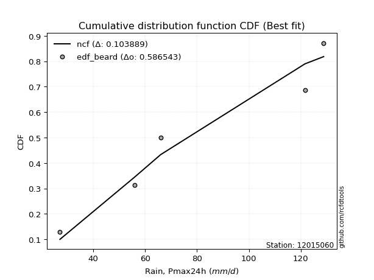</img>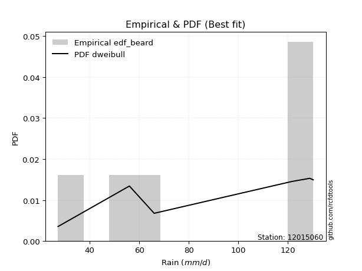</img>

</div>


### 5. Empirical - EDF Chegodayev (1955)

The Chegodayev formula is an empirical plotting position formula used in hydrological frequency analysis to estimate the exceedance probability or return period of a specific event from a set of observed data. It is primarily used for plotting observed data points on probability paper to fit a theoretical distribution, particularly for analyzing extreme events like maximum flood flows or rainfall intensities. The constant _b_ value in the generalized plotting position formula is 0.3.

<div align="center">


$P=(m-b)/(n+1-2b)$


</div>


**5.1. Empirical values**

<div align="center">

|                | 0                   | 1                   | 2              | 3                  | 4                  |
|:---------------|:--------------------|:--------------------|:---------------|:-------------------|:-------------------|
| date           | 2017                | 2018                | 2020           | 2019               | 2021               |
| x              | 27.2                | 56.0                | 66.0           | 121.6              | 128.8              |
| m              | 1                   | 2                   | 3              | 4                  | 5                  |
| empirical_dist | edf_chegodayev      | edf_chegodayev      | edf_chegodayev | edf_chegodayev     | edf_chegodayev     |
| empirical      | 0.12962962962962962 | 0.31481481481481477 | 0.5            | 0.6851851851851851 | 0.8703703703703703 |
| empirical_tr   | 1.148936170212766   | 1.4594594594594594  | 2.0            | 3.1764705882352935 | 7.714285714285713  |

</div>


**5.2. Kolmogorov-Smirnov fit test (sorted by Δ)**


<div align="center">

|                | 0                   | 1                   | 2                  | 3                   | 4                   | 5                   | 6                   | 7                   | 8                  | 9                   | 10                  | 11                 | 12                 | 13                 | 14                 | 15                  | 16                 | 17                  | 18                 | 19                  | 20                  | 21                  | 22                  | 23                 | 24                  | 25                 | 26                 | 27                  | 28                 | 29                 | 30                  | 31                 | 32                  | 33                  | 34                    | 35                  | 36                  | 37                  | 38                  | 39                  | 40                  | 41                 | 42                 | 43                 | 44                  | 45                  | 46                  | 47                  | 48                 | 49                 | 50                 | 51                  | 52                  | 53                 | 54                  | 55                  | 56                  | 57                  | 58                 | 59                  | 60                  | 61                  | 62                  | 63                  | 64                  | 65                  | 66                  | 67                  | 68                  | 69                 | 70                  | 71                  | 72                  | 73                  | 74                  | 75                  | 76                 | 77                 | 78                 | 79                  | 80                  | 81                 | 82                  | 83                  | 84                 | 85                 | 86                 | 87                 | 88                 | 89                 |
|:---------------|:--------------------|:--------------------|:-------------------|:--------------------|:--------------------|:--------------------|:--------------------|:--------------------|:-------------------|:--------------------|:--------------------|:-------------------|:-------------------|:-------------------|:-------------------|:--------------------|:-------------------|:--------------------|:-------------------|:--------------------|:--------------------|:--------------------|:--------------------|:-------------------|:--------------------|:-------------------|:-------------------|:--------------------|:-------------------|:-------------------|:--------------------|:-------------------|:--------------------|:--------------------|:----------------------|:--------------------|:--------------------|:--------------------|:--------------------|:--------------------|:--------------------|:-------------------|:-------------------|:-------------------|:--------------------|:--------------------|:--------------------|:--------------------|:-------------------|:-------------------|:-------------------|:--------------------|:--------------------|:-------------------|:--------------------|:--------------------|:--------------------|:--------------------|:-------------------|:--------------------|:--------------------|:--------------------|:--------------------|:--------------------|:--------------------|:--------------------|:--------------------|:--------------------|:--------------------|:-------------------|:--------------------|:--------------------|:--------------------|:--------------------|:--------------------|:--------------------|:-------------------|:-------------------|:-------------------|:--------------------|:--------------------|:-------------------|:--------------------|:--------------------|:-------------------|:-------------------|:-------------------|:-------------------|:-------------------|:-------------------|
| station        | 12015060            | 12015060            | 12015060           | 12015060            | 12015060            | 12015060            | 12015060            | 12015060            | 12015060           | 12015060            | 12015060            | 12015060           | 12015060           | 12015060           | 12015060           | 12015060            | 12015060           | 12015060            | 12015060           | 12015060            | 12015060            | 12015060            | 12015060            | 12015060           | 12015060            | 12015060           | 12015060           | 12015060            | 12015060           | 12015060           | 12015060            | 12015060           | 12015060            | 12015060            | 12015060              | 12015060            | 12015060            | 12015060            | 12015060            | 12015060            | 12015060            | 12015060           | 12015060           | 12015060           | 12015060            | 12015060            | 12015060            | 12015060            | 12015060           | 12015060           | 12015060           | 12015060            | 12015060            | 12015060           | 12015060            | 12015060            | 12015060            | 12015060            | 12015060           | 12015060            | 12015060            | 12015060            | 12015060            | 12015060            | 12015060            | 12015060            | 12015060            | 12015060            | 12015060            | 12015060           | 12015060            | 12015060            | 12015060            | 12015060            | 12015060            | 12015060            | 12015060           | 12015060           | 12015060           | 12015060            | 12015060            | 12015060           | 12015060            | 12015060            | 12015060           | 12015060           | 12015060           | 12015060           | 12015060           | 12015060           |
| empirical_dist | edf_chegodayev      | edf_chegodayev      | edf_chegodayev     | edf_chegodayev      | edf_chegodayev      | edf_chegodayev      | edf_chegodayev      | edf_chegodayev      | edf_chegodayev     | edf_chegodayev      | edf_chegodayev      | edf_chegodayev     | edf_chegodayev     | edf_chegodayev     | edf_chegodayev     | edf_chegodayev      | edf_chegodayev     | edf_chegodayev      | edf_chegodayev     | edf_chegodayev      | edf_chegodayev      | edf_chegodayev      | edf_chegodayev      | edf_chegodayev     | edf_chegodayev      | edf_chegodayev     | edf_chegodayev     | edf_chegodayev      | edf_chegodayev     | edf_chegodayev     | edf_chegodayev      | edf_chegodayev     | edf_chegodayev      | edf_chegodayev      | edf_chegodayev        | edf_chegodayev      | edf_chegodayev      | edf_chegodayev      | edf_chegodayev      | edf_chegodayev      | edf_chegodayev      | edf_chegodayev     | edf_chegodayev     | edf_chegodayev     | edf_chegodayev      | edf_chegodayev      | edf_chegodayev      | edf_chegodayev      | edf_chegodayev     | edf_chegodayev     | edf_chegodayev     | edf_chegodayev      | edf_chegodayev      | edf_chegodayev     | edf_chegodayev      | edf_chegodayev      | edf_chegodayev      | edf_chegodayev      | edf_chegodayev     | edf_chegodayev      | edf_chegodayev      | edf_chegodayev      | edf_chegodayev      | edf_chegodayev      | edf_chegodayev      | edf_chegodayev      | edf_chegodayev      | edf_chegodayev      | edf_chegodayev      | edf_chegodayev     | edf_chegodayev      | edf_chegodayev      | edf_chegodayev      | edf_chegodayev      | edf_chegodayev      | edf_chegodayev      | edf_chegodayev     | edf_chegodayev     | edf_chegodayev     | edf_chegodayev      | edf_chegodayev      | edf_chegodayev     | edf_chegodayev      | edf_chegodayev      | edf_chegodayev     | edf_chegodayev     | edf_chegodayev     | edf_chegodayev     | edf_chegodayev     | edf_chegodayev     |
| p_dist         | ncf                 | logkstwobign        | loggenexpon        | loginvweibull       | logfisk             | loginvgauss         | expon               | genexpon            | logbetaprime       | fisk                | logalpha            | logncf             | loggamma           | loggamma           | logrice            | loggompertz         | lograyleigh        | lognct              | logmaxwell         | loghalfnorm         | logf                | logerlang           | loginvgamma         | logt               | logcrystalball      | lognorm            | lognorm            | logexponnorm        | logfatiguelife     | logpearson3        | betaprime           | genlogistic        | invgauss            | halfnorm            | loglaplace_asymmetric | laplace_asymmetric  | rayleigh            | maxwell             | logweibull_min      | alpha               | invgamma            | rice               | loggumbel_r        | loghalflogistic    | gompertz            | kstwobign           | pearson3            | nct                 | exponnorm          | crystalball        | norm               | truncnorm           | t                   | gamma              | erlang              | loglogistic         | logmoyal            | loggumbel_l         | halflogistic       | gumbel_r            | loghypsecant        | moyal               | logistic            | loglaplace          | hypsecant           | logwald             | gumbel_l            | laplace             | wald                | logmielke          | mielke              | loggibrat           | logexpon            | logloggamma         | f                   | gibrat              | logchi2            | lognakagami        | logtruncnorm       | nakagami            | weibull_min         | pareto             | logpareto           | loglognorm          | chi2               | invweibull         | logjohnsonsu       | fatiguelife        | johnsonsu          | loggenlogistic     |
| delta          | 0.10457696184629717 | 0.13367357468995733 | 0.139269530041373  | 0.13938003552835654 | 0.14040420261691777 | 0.14747441272522632 | 0.14795342390712507 | 0.14811239880173188 | 0.1485413494807315 | 0.14858804600225728 | 0.14983595666413452 | 0.1508597187175198 | 0.1508779401657805 | 0.1508779401657805 | 0.151152143661611  | 0.15116667946499152 | 0.1513980466228203 | 0.15159779729795952 | 0.1519966962813104 | 0.15211381302211402 | 0.15325558567728848 | 0.15358317980372593 | 0.15359092840166721 | 0.1542832178486523 | 0.15428386875891142 | 0.1542841971364567 | 0.1542841971364567 | 0.15428554831985364 | 0.1547548398337797 | 0.1561757359753806 | 0.16382319651678823 | 0.1640040239480044 | 0.16442610402281566 | 0.16475147838776838 | 0.1649486755882531    | 0.16514651595712704 | 0.16555386484912238 | 0.16672957221592855 | 0.16678629522146138 | 0.16794352670544488 | 0.16840639079164654 | 0.1690668868762374 | 0.1692978465547197 | 0.1695404620198001 | 0.16961580201470605 | 0.17033543953174946 | 0.17081196155833256 | 0.17106246062892194 | 0.1711621828652884 | 0.1711627932916433 | 0.1711627964942548 | 0.17116280411086382 | 0.17117408777980625 | 0.1717794961511796 | 0.17219242823157965 | 0.17293889060241807 | 0.17511642752288603 | 0.18009729785572837 | 0.1804571163899512 | 0.18119754489493434 | 0.18278588075446311 | 0.18572329360462436 | 0.18806216195224468 | 0.19192193592130158 | 0.19652267463109896 | 0.19943492656402262 | 0.20377502121029956 | 0.20378398898542271 | 0.20708011475230081 | 0.2114714736065857 | 0.21730022189739007 | 0.22358986411480686 | 0.22431264825635322 | 0.22638057198265793 | 0.22757227068194263 | 0.22998507303106352 | 0.2585140840238146 | 0.3147349203023047 | 0.3148131928667709 | 0.31481449288263635 | 0.32059636337585673 | 0.3427562748140712 | 0.36535850381954826 | 0.36597241137815395 | 0.3660090182753679 | 0.4387776013713051 | 0.4914101187373527 | 0.5026224677886763 | 0.6081170408872344 | 0.6851851851851851 |
| deltao         | 0.5865427407550001  | 0.5865427407550001  | 0.5865427407550001 | 0.5865427407550001  | 0.5865427407550001  | 0.5865427407550001  | 0.5865427407550001  | 0.5865427407550001  | 0.5865427407550001 | 0.5865427407550001  | 0.5865427407550001  | 0.5865427407550001 | 0.5865427407550001 | 0.5865427407550001 | 0.5865427407550001 | 0.5865427407550001  | 0.5865427407550001 | 0.5865427407550001  | 0.5865427407550001 | 0.5865427407550001  | 0.5865427407550001  | 0.5865427407550001  | 0.5865427407550001  | 0.5865427407550001 | 0.5865427407550001  | 0.5865427407550001 | 0.5865427407550001 | 0.5865427407550001  | 0.5865427407550001 | 0.5865427407550001 | 0.5865427407550001  | 0.5865427407550001 | 0.5865427407550001  | 0.5865427407550001  | 0.5865427407550001    | 0.5865427407550001  | 0.5865427407550001  | 0.5865427407550001  | 0.5865427407550001  | 0.5865427407550001  | 0.5865427407550001  | 0.5865427407550001 | 0.5865427407550001 | 0.5865427407550001 | 0.5865427407550001  | 0.5865427407550001  | 0.5865427407550001  | 0.5865427407550001  | 0.5865427407550001 | 0.5865427407550001 | 0.5865427407550001 | 0.5865427407550001  | 0.5865427407550001  | 0.5865427407550001 | 0.5865427407550001  | 0.5865427407550001  | 0.5865427407550001  | 0.5865427407550001  | 0.5865427407550001 | 0.5865427407550001  | 0.5865427407550001  | 0.5865427407550001  | 0.5865427407550001  | 0.5865427407550001  | 0.5865427407550001  | 0.5865427407550001  | 0.5865427407550001  | 0.5865427407550001  | 0.5865427407550001  | 0.5865427407550001 | 0.5865427407550001  | 0.5865427407550001  | 0.5865427407550001  | 0.5865427407550001  | 0.5865427407550001  | 0.5865427407550001  | 0.5865427407550001 | 0.5865427407550001 | 0.5865427407550001 | 0.5865427407550001  | 0.5865427407550001  | 0.5865427407550001 | 0.5865427407550001  | 0.5865427407550001  | 0.5865427407550001 | 0.5865427407550001 | 0.5865427407550001 | 0.5865427407550001 | 0.5865427407550001 | 0.5865427407550001 |
| eval           | Δo > Δ              | Δo > Δ              | Δo > Δ             | Δo > Δ              | Δo > Δ              | Δo > Δ              | Δo > Δ              | Δo > Δ              | Δo > Δ             | Δo > Δ              | Δo > Δ              | Δo > Δ             | Δo > Δ             | Δo > Δ             | Δo > Δ             | Δo > Δ              | Δo > Δ             | Δo > Δ              | Δo > Δ             | Δo > Δ              | Δo > Δ              | Δo > Δ              | Δo > Δ              | Δo > Δ             | Δo > Δ              | Δo > Δ             | Δo > Δ             | Δo > Δ              | Δo > Δ             | Δo > Δ             | Δo > Δ              | Δo > Δ             | Δo > Δ              | Δo > Δ              | Δo > Δ                | Δo > Δ              | Δo > Δ              | Δo > Δ              | Δo > Δ              | Δo > Δ              | Δo > Δ              | Δo > Δ             | Δo > Δ             | Δo > Δ             | Δo > Δ              | Δo > Δ              | Δo > Δ              | Δo > Δ              | Δo > Δ             | Δo > Δ             | Δo > Δ             | Δo > Δ              | Δo > Δ              | Δo > Δ             | Δo > Δ              | Δo > Δ              | Δo > Δ              | Δo > Δ              | Δo > Δ             | Δo > Δ              | Δo > Δ              | Δo > Δ              | Δo > Δ              | Δo > Δ              | Δo > Δ              | Δo > Δ              | Δo > Δ              | Δo > Δ              | Δo > Δ              | Δo > Δ             | Δo > Δ              | Δo > Δ              | Δo > Δ              | Δo > Δ              | Δo > Δ              | Δo > Δ              | Δo > Δ             | Δo > Δ             | Δo > Δ             | Δo > Δ              | Δo > Δ              | Δo > Δ             | Δo > Δ              | Δo > Δ              | Δo > Δ             | Δo > Δ             | Δo > Δ             | Δo > Δ             | Δo <= Δ            | Δo <= Δ            |
| fit            | 1                   | 1                   | 1                  | 1                   | 1                   | 1                   | 1                   | 1                   | 1                  | 1                   | 1                   | 1                  | 1                  | 1                  | 1                  | 1                   | 1                  | 1                   | 1                  | 1                   | 1                   | 1                   | 1                   | 1                  | 1                   | 1                  | 1                  | 1                   | 1                  | 1                  | 1                   | 1                  | 1                   | 1                   | 1                     | 1                   | 1                   | 1                   | 1                   | 1                   | 1                   | 1                  | 1                  | 1                  | 1                   | 1                   | 1                   | 1                   | 1                  | 1                  | 1                  | 1                   | 1                   | 1                  | 1                   | 1                   | 1                   | 1                   | 1                  | 1                   | 1                   | 1                   | 1                   | 1                   | 1                   | 1                   | 1                   | 1                   | 1                   | 1                  | 1                   | 1                   | 1                   | 1                   | 1                   | 1                   | 1                  | 1                  | 1                  | 1                   | 1                   | 1                  | 1                   | 1                   | 1                  | 1                  | 1                  | 1                  | 0                  | 0                  |
| n              | 5                   | 5                   | 5                  | 5                   | 5                   | 5                   | 5                   | 5                   | 5                  | 5                   | 5                   | 5                  | 5                  | 5                  | 5                  | 5                   | 5                  | 5                   | 5                  | 5                   | 5                   | 5                   | 5                   | 5                  | 5                   | 5                  | 5                  | 5                   | 5                  | 5                  | 5                   | 5                  | 5                   | 5                   | 5                     | 5                   | 5                   | 5                   | 5                   | 5                   | 5                   | 5                  | 5                  | 5                  | 5                   | 5                   | 5                   | 5                   | 5                  | 5                  | 5                  | 5                   | 5                   | 5                  | 5                   | 5                   | 5                   | 5                   | 5                  | 5                   | 5                   | 5                   | 5                   | 5                   | 5                   | 5                   | 5                   | 5                   | 5                   | 5                  | 5                   | 5                   | 5                   | 5                   | 5                   | 5                   | 5                  | 5                  | 5                  | 5                   | 5                   | 5                  | 5                   | 5                   | 5                  | 5                  | 5                  | 5                  | 5                  | 5                  |
| best_fit       | 1                   | 0                   | 0                  | 0                   | 0                   | 0                   | 0                   | 0                   | 0                  | 0                   | 0                   | 0                  | 0                  | 0                  | 0                  | 0                   | 0                  | 0                   | 0                  | 0                   | 0                   | 0                   | 0                   | 0                  | 0                   | 0                  | 0                  | 0                   | 0                  | 0                  | 0                   | 0                  | 0                   | 0                   | 0                     | 0                   | 0                   | 0                   | 0                   | 0                   | 0                   | 0                  | 0                  | 0                  | 0                   | 0                   | 0                   | 0                   | 0                  | 0                  | 0                  | 0                   | 0                   | 0                  | 0                   | 0                   | 0                   | 0                   | 0                  | 0                   | 0                   | 0                   | 0                   | 0                   | 0                   | 0                   | 0                   | 0                   | 0                   | 0                  | 0                   | 0                   | 0                   | 0                   | 0                   | 0                   | 0                  | 0                  | 0                  | 0                   | 0                   | 0                  | 0                   | 0                   | 0                  | 0                  | 0                  | 0                  | 0                  | 0                  |
| best_fit_sort  | 1                   | 2                   | 3                  | 4                   | 5                   | 6                   | 7                   | 8                   | 9                  | 10                  | 11                  | 12                 | 13                 | 14                 | 15                 | 16                  | 17                 | 18                  | 19                 | 20                  | 21                  | 22                  | 23                  | 24                 | 25                  | 26                 | 27                 | 28                  | 29                 | 30                 | 31                  | 32                 | 33                  | 34                  | 35                    | 36                  | 37                  | 38                  | 39                  | 40                  | 41                  | 42                 | 43                 | 44                 | 45                  | 46                  | 47                  | 48                  | 49                 | 50                 | 51                 | 52                  | 53                  | 54                 | 55                  | 56                  | 57                  | 58                  | 59                 | 60                  | 61                  | 62                  | 63                  | 64                  | 65                  | 66                  | 67                  | 68                  | 69                  | 70                 | 71                  | 72                  | 73                  | 74                  | 75                  | 76                  | 77                 | 78                 | 79                 | 80                  | 81                  | 82                 | 83                  | 84                  | 85                 | 86                 | 87                 | 88                 | 89                 | 90                 |

</div>


<div align="center">

</img>

</div>


**5.3. Best fit**

<div align="center">

|   id |   station | empirical_dist   | p_dist   |    delta |   deltao | eval   |   fit |   n |   best_fit |   best_fit_sort |
|-----:|----------:|:-----------------|:---------|---------:|---------:|:-------|------:|----:|-----------:|----------------:|
|    0 |  12015060 | edf_chegodayev   | ncf      | 0.104577 | 0.586543 | Δo > Δ |     1 |   5 |          1 |               1 |

</div>


<div align="center">

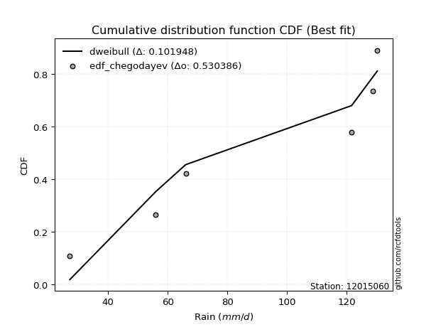</img>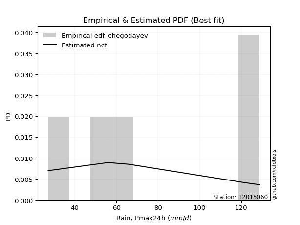</img>

</div>


### 6. Empirical - EDF Blom (1958)

The Blom formula is a specific "plotting position" formula used in hydrology and statistical analysis to estimate the empirical cumulative probability (or non-exceedance probability) of a data series. It is particularly recommended for data that are approximately normally distributed. The constant _a_ is set to 0.375 (or 3/8).

<div align="center">


$P=(m-a)/(n+1-2a)$


</div>


**6.1. Empirical values**

<div align="center">

|                | 0                   | 1                   | 2        | 3                  | 4                  |
|:---------------|:--------------------|:--------------------|:---------|:-------------------|:-------------------|
| date           | 2017                | 2018                | 2020     | 2019               | 2021               |
| x              | 27.2                | 56.0                | 66.0     | 121.6              | 128.8              |
| m              | 1                   | 2                   | 3        | 4                  | 5                  |
| empirical_dist | edf_blom            | edf_blom            | edf_blom | edf_blom           | edf_blom           |
| empirical      | 0.11904761904761904 | 0.30952380952380953 | 0.5      | 0.6904761904761905 | 0.8809523809523809 |
| empirical_tr   | 1.135135135135135   | 1.4482758620689655  | 2.0      | 3.230769230769231  | 8.399999999999999  |

</div>


**6.2. Kolmogorov-Smirnov fit test (sorted by Δ)**


<div align="center">

|                | 0                   | 1                  | 2                   | 3                   | 4                   | 5                   | 6                   | 7                   | 8                   | 9                   | 10                  | 11                  | 12                  | 13                  | 14                  | 15                  | 16                  | 17                  | 18                  | 19                  | 20                  | 21                 | 22                  | 23                  | 24                  | 25                  | 26                  | 27                 | 28                  | 29                  | 30                  | 31                  | 32                 | 33                  | 34                    | 35                 | 36                  | 37                 | 38                  | 39                  | 40                 | 41                  | 42                  | 43                  | 44                 | 45                 | 46                 | 47                 | 48                  | 49                  | 50                  | 51                  | 52                 | 53                  | 54                 | 55                  | 56                  | 57                  | 58                  | 59                 | 60                  | 61                  | 62                  | 63                  | 64                 | 65                  | 66                  | 67                  | 68                  | 69                  | 70                  | 71                 | 72                  | 73                  | 74                  | 75                  | 76                  | 77                 | 78                  | 79                 | 80                  | 81                  | 82                 | 83                 | 84                  | 85                 | 86                  | 87                 | 88                 | 89                 |
|:---------------|:--------------------|:-------------------|:--------------------|:--------------------|:--------------------|:--------------------|:--------------------|:--------------------|:--------------------|:--------------------|:--------------------|:--------------------|:--------------------|:--------------------|:--------------------|:--------------------|:--------------------|:--------------------|:--------------------|:--------------------|:--------------------|:-------------------|:--------------------|:--------------------|:--------------------|:--------------------|:--------------------|:-------------------|:--------------------|:--------------------|:--------------------|:--------------------|:-------------------|:--------------------|:----------------------|:-------------------|:--------------------|:-------------------|:--------------------|:--------------------|:-------------------|:--------------------|:--------------------|:--------------------|:-------------------|:-------------------|:-------------------|:-------------------|:--------------------|:--------------------|:--------------------|:--------------------|:-------------------|:--------------------|:-------------------|:--------------------|:--------------------|:--------------------|:--------------------|:-------------------|:--------------------|:--------------------|:--------------------|:--------------------|:-------------------|:--------------------|:--------------------|:--------------------|:--------------------|:--------------------|:--------------------|:-------------------|:--------------------|:--------------------|:--------------------|:--------------------|:--------------------|:-------------------|:--------------------|:-------------------|:--------------------|:--------------------|:-------------------|:-------------------|:--------------------|:-------------------|:--------------------|:-------------------|:-------------------|:-------------------|
| station        | 12015060            | 12015060           | 12015060            | 12015060            | 12015060            | 12015060            | 12015060            | 12015060            | 12015060            | 12015060            | 12015060            | 12015060            | 12015060            | 12015060            | 12015060            | 12015060            | 12015060            | 12015060            | 12015060            | 12015060            | 12015060            | 12015060           | 12015060            | 12015060            | 12015060            | 12015060            | 12015060            | 12015060           | 12015060            | 12015060            | 12015060            | 12015060            | 12015060           | 12015060            | 12015060              | 12015060           | 12015060            | 12015060           | 12015060            | 12015060            | 12015060           | 12015060            | 12015060            | 12015060            | 12015060           | 12015060           | 12015060           | 12015060           | 12015060            | 12015060            | 12015060            | 12015060            | 12015060           | 12015060            | 12015060           | 12015060            | 12015060            | 12015060            | 12015060            | 12015060           | 12015060            | 12015060            | 12015060            | 12015060            | 12015060           | 12015060            | 12015060            | 12015060            | 12015060            | 12015060            | 12015060            | 12015060           | 12015060            | 12015060            | 12015060            | 12015060            | 12015060            | 12015060           | 12015060            | 12015060           | 12015060            | 12015060            | 12015060           | 12015060           | 12015060            | 12015060           | 12015060            | 12015060           | 12015060           | 12015060           |
| empirical_dist | edf_blom            | edf_blom           | edf_blom            | edf_blom            | edf_blom            | edf_blom            | edf_blom            | edf_blom            | edf_blom            | edf_blom            | edf_blom            | edf_blom            | edf_blom            | edf_blom            | edf_blom            | edf_blom            | edf_blom            | edf_blom            | edf_blom            | edf_blom            | edf_blom            | edf_blom           | edf_blom            | edf_blom            | edf_blom            | edf_blom            | edf_blom            | edf_blom           | edf_blom            | edf_blom            | edf_blom            | edf_blom            | edf_blom           | edf_blom            | edf_blom              | edf_blom           | edf_blom            | edf_blom           | edf_blom            | edf_blom            | edf_blom           | edf_blom            | edf_blom            | edf_blom            | edf_blom           | edf_blom           | edf_blom           | edf_blom           | edf_blom            | edf_blom            | edf_blom            | edf_blom            | edf_blom           | edf_blom            | edf_blom           | edf_blom            | edf_blom            | edf_blom            | edf_blom            | edf_blom           | edf_blom            | edf_blom            | edf_blom            | edf_blom            | edf_blom           | edf_blom            | edf_blom            | edf_blom            | edf_blom            | edf_blom            | edf_blom            | edf_blom           | edf_blom            | edf_blom            | edf_blom            | edf_blom            | edf_blom            | edf_blom           | edf_blom            | edf_blom           | edf_blom            | edf_blom            | edf_blom           | edf_blom           | edf_blom            | edf_blom           | edf_blom            | edf_blom           | edf_blom           | edf_blom           |
| p_dist         | ncf                 | loginvweibull      | logfisk             | logkstwobign        | loggenexpon         | loginvgauss         | expon               | genexpon            | logbetaprime        | fisk                | logalpha            | logncf              | loggamma            | loggamma            | logrice             | lograyleigh         | lognct              | logmaxwell          | loghalfnorm         | loggompertz         | logf                | logerlang          | loginvgamma         | logt                | logcrystalball      | lognorm             | lognorm             | logexponnorm       | logfatiguelife      | logpearson3         | betaprime           | genlogistic         | invgauss           | halfnorm            | loglaplace_asymmetric | laplace_asymmetric | rayleigh            | maxwell            | logweibull_min      | alpha               | invgamma           | rice                | loggumbel_r         | loghalflogistic     | gompertz           | kstwobign          | pearson3           | nct                | exponnorm           | crystalball         | norm                | truncnorm           | t                  | gamma               | erlang             | loglogistic         | logmoyal            | loggumbel_l         | halflogistic        | gumbel_r           | loghypsecant        | moyal               | logistic            | loglaplace          | hypsecant          | logwald             | laplace             | gumbel_l            | wald                | logmielke           | mielke              | loggibrat          | logloggamma         | gibrat              | logexpon            | f                   | logchi2             | lognakagami        | logtruncnorm        | nakagami           | weibull_min         | pareto              | logpareto          | loglognorm         | chi2                | invweibull         | logjohnsonsu        | fatiguelife        | johnsonsu          | loggenlogistic     |
| delta          | 0.09928595655529182 | 0.1340890302373512 | 0.13511319732591243 | 0.13896457998096257 | 0.13990334419397077 | 0.14218340743422098 | 0.14266241861611972 | 0.14282139351072654 | 0.14325034418972615 | 0.14329704071125193 | 0.14454495137312917 | 0.14556871342651445 | 0.14558693487477514 | 0.14558693487477514 | 0.14586113837060566 | 0.14610704133181496 | 0.14630679200695418 | 0.14670569099030506 | 0.14682280773110867 | 0.14789278733204714 | 0.14796458038628313 | 0.1482921745127206 | 0.14829992311066187 | 0.14899221255764694 | 0.14899286346790608 | 0.14899319184545134 | 0.14899319184545134 | 0.1489945430288483 | 0.14946383454277434 | 0.15088473068437525 | 0.15853219122578288 | 0.15871301865699905 | 0.1591350987318103 | 0.15946047309676303 | 0.15965767029724776   | 0.1598555106661217 | 0.16026285955811703 | 0.1614385669249232 | 0.16149528993045603 | 0.16265252141443953 | 0.1631153855006412 | 0.16377588158523204 | 0.16400684126371434 | 0.16424945672879476 | 0.1643247967237007 | 0.1650444342407441 | 0.1655209562673272 | 0.1657714553379166 | 0.16587117757428305 | 0.16587178800063795 | 0.16587179120324946 | 0.16587179881985847 | 0.1658830824888009 | 0.16648849086017425 | 0.1669014229405743 | 0.16764788531141273 | 0.16982542223188068 | 0.17480629256472302 | 0.17516611109894586 | 0.175906539603929  | 0.17749487546345777 | 0.18043228831361902 | 0.18277115666123933 | 0.18663093063029623 | 0.1912316693400936 | 0.19414392127301727 | 0.19849298369441737 | 0.20051381265859775 | 0.20178910946129547 | 0.20618046831558035 | 0.21200921660638472 | 0.2182988588238015 | 0.22108956669165258 | 0.22469406774005818 | 0.22960365354735846 | 0.23286327597294787 | 0.26380508931481983 | 0.3094439150112995 | 0.30952218757576566 | 0.3095234875916311 | 0.32588736866686197 | 0.34804728010507646 | 0.3706495091105535 | 0.3712634166691592 | 0.37130002356637315 | 0.4493596119533157 | 0.49670112402835803 | 0.5079134730796815 | 0.6134080461782397 | 0.6904761904761905 |
| deltao         | 0.5865427407550001  | 0.5865427407550001 | 0.5865427407550001  | 0.5865427407550001  | 0.5865427407550001  | 0.5865427407550001  | 0.5865427407550001  | 0.5865427407550001  | 0.5865427407550001  | 0.5865427407550001  | 0.5865427407550001  | 0.5865427407550001  | 0.5865427407550001  | 0.5865427407550001  | 0.5865427407550001  | 0.5865427407550001  | 0.5865427407550001  | 0.5865427407550001  | 0.5865427407550001  | 0.5865427407550001  | 0.5865427407550001  | 0.5865427407550001 | 0.5865427407550001  | 0.5865427407550001  | 0.5865427407550001  | 0.5865427407550001  | 0.5865427407550001  | 0.5865427407550001 | 0.5865427407550001  | 0.5865427407550001  | 0.5865427407550001  | 0.5865427407550001  | 0.5865427407550001 | 0.5865427407550001  | 0.5865427407550001    | 0.5865427407550001 | 0.5865427407550001  | 0.5865427407550001 | 0.5865427407550001  | 0.5865427407550001  | 0.5865427407550001 | 0.5865427407550001  | 0.5865427407550001  | 0.5865427407550001  | 0.5865427407550001 | 0.5865427407550001 | 0.5865427407550001 | 0.5865427407550001 | 0.5865427407550001  | 0.5865427407550001  | 0.5865427407550001  | 0.5865427407550001  | 0.5865427407550001 | 0.5865427407550001  | 0.5865427407550001 | 0.5865427407550001  | 0.5865427407550001  | 0.5865427407550001  | 0.5865427407550001  | 0.5865427407550001 | 0.5865427407550001  | 0.5865427407550001  | 0.5865427407550001  | 0.5865427407550001  | 0.5865427407550001 | 0.5865427407550001  | 0.5865427407550001  | 0.5865427407550001  | 0.5865427407550001  | 0.5865427407550001  | 0.5865427407550001  | 0.5865427407550001 | 0.5865427407550001  | 0.5865427407550001  | 0.5865427407550001  | 0.5865427407550001  | 0.5865427407550001  | 0.5865427407550001 | 0.5865427407550001  | 0.5865427407550001 | 0.5865427407550001  | 0.5865427407550001  | 0.5865427407550001 | 0.5865427407550001 | 0.5865427407550001  | 0.5865427407550001 | 0.5865427407550001  | 0.5865427407550001 | 0.5865427407550001 | 0.5865427407550001 |
| eval           | Δo > Δ              | Δo > Δ             | Δo > Δ              | Δo > Δ              | Δo > Δ              | Δo > Δ              | Δo > Δ              | Δo > Δ              | Δo > Δ              | Δo > Δ              | Δo > Δ              | Δo > Δ              | Δo > Δ              | Δo > Δ              | Δo > Δ              | Δo > Δ              | Δo > Δ              | Δo > Δ              | Δo > Δ              | Δo > Δ              | Δo > Δ              | Δo > Δ             | Δo > Δ              | Δo > Δ              | Δo > Δ              | Δo > Δ              | Δo > Δ              | Δo > Δ             | Δo > Δ              | Δo > Δ              | Δo > Δ              | Δo > Δ              | Δo > Δ             | Δo > Δ              | Δo > Δ                | Δo > Δ             | Δo > Δ              | Δo > Δ             | Δo > Δ              | Δo > Δ              | Δo > Δ             | Δo > Δ              | Δo > Δ              | Δo > Δ              | Δo > Δ             | Δo > Δ             | Δo > Δ             | Δo > Δ             | Δo > Δ              | Δo > Δ              | Δo > Δ              | Δo > Δ              | Δo > Δ             | Δo > Δ              | Δo > Δ             | Δo > Δ              | Δo > Δ              | Δo > Δ              | Δo > Δ              | Δo > Δ             | Δo > Δ              | Δo > Δ              | Δo > Δ              | Δo > Δ              | Δo > Δ             | Δo > Δ              | Δo > Δ              | Δo > Δ              | Δo > Δ              | Δo > Δ              | Δo > Δ              | Δo > Δ             | Δo > Δ              | Δo > Δ              | Δo > Δ              | Δo > Δ              | Δo > Δ              | Δo > Δ             | Δo > Δ              | Δo > Δ             | Δo > Δ              | Δo > Δ              | Δo > Δ             | Δo > Δ             | Δo > Δ              | Δo > Δ             | Δo > Δ              | Δo > Δ             | Δo <= Δ            | Δo <= Δ            |
| fit            | 1                   | 1                  | 1                   | 1                   | 1                   | 1                   | 1                   | 1                   | 1                   | 1                   | 1                   | 1                   | 1                   | 1                   | 1                   | 1                   | 1                   | 1                   | 1                   | 1                   | 1                   | 1                  | 1                   | 1                   | 1                   | 1                   | 1                   | 1                  | 1                   | 1                   | 1                   | 1                   | 1                  | 1                   | 1                     | 1                  | 1                   | 1                  | 1                   | 1                   | 1                  | 1                   | 1                   | 1                   | 1                  | 1                  | 1                  | 1                  | 1                   | 1                   | 1                   | 1                   | 1                  | 1                   | 1                  | 1                   | 1                   | 1                   | 1                   | 1                  | 1                   | 1                   | 1                   | 1                   | 1                  | 1                   | 1                   | 1                   | 1                   | 1                   | 1                   | 1                  | 1                   | 1                   | 1                   | 1                   | 1                   | 1                  | 1                   | 1                  | 1                   | 1                   | 1                  | 1                  | 1                   | 1                  | 1                   | 1                  | 0                  | 0                  |
| n              | 5                   | 5                  | 5                   | 5                   | 5                   | 5                   | 5                   | 5                   | 5                   | 5                   | 5                   | 5                   | 5                   | 5                   | 5                   | 5                   | 5                   | 5                   | 5                   | 5                   | 5                   | 5                  | 5                   | 5                   | 5                   | 5                   | 5                   | 5                  | 5                   | 5                   | 5                   | 5                   | 5                  | 5                   | 5                     | 5                  | 5                   | 5                  | 5                   | 5                   | 5                  | 5                   | 5                   | 5                   | 5                  | 5                  | 5                  | 5                  | 5                   | 5                   | 5                   | 5                   | 5                  | 5                   | 5                  | 5                   | 5                   | 5                   | 5                   | 5                  | 5                   | 5                   | 5                   | 5                   | 5                  | 5                   | 5                   | 5                   | 5                   | 5                   | 5                   | 5                  | 5                   | 5                   | 5                   | 5                   | 5                   | 5                  | 5                   | 5                  | 5                   | 5                   | 5                  | 5                  | 5                   | 5                  | 5                   | 5                  | 5                  | 5                  |
| best_fit       | 1                   | 0                  | 0                   | 0                   | 0                   | 0                   | 0                   | 0                   | 0                   | 0                   | 0                   | 0                   | 0                   | 0                   | 0                   | 0                   | 0                   | 0                   | 0                   | 0                   | 0                   | 0                  | 0                   | 0                   | 0                   | 0                   | 0                   | 0                  | 0                   | 0                   | 0                   | 0                   | 0                  | 0                   | 0                     | 0                  | 0                   | 0                  | 0                   | 0                   | 0                  | 0                   | 0                   | 0                   | 0                  | 0                  | 0                  | 0                  | 0                   | 0                   | 0                   | 0                   | 0                  | 0                   | 0                  | 0                   | 0                   | 0                   | 0                   | 0                  | 0                   | 0                   | 0                   | 0                   | 0                  | 0                   | 0                   | 0                   | 0                   | 0                   | 0                   | 0                  | 0                   | 0                   | 0                   | 0                   | 0                   | 0                  | 0                   | 0                  | 0                   | 0                   | 0                  | 0                  | 0                   | 0                  | 0                   | 0                  | 0                  | 0                  |
| best_fit_sort  | 1                   | 2                  | 3                   | 4                   | 5                   | 6                   | 7                   | 8                   | 9                   | 10                  | 11                  | 12                  | 13                  | 14                  | 15                  | 16                  | 17                  | 18                  | 19                  | 20                  | 21                  | 22                 | 23                  | 24                  | 25                  | 26                  | 27                  | 28                 | 29                  | 30                  | 31                  | 32                  | 33                 | 34                  | 35                    | 36                 | 37                  | 38                 | 39                  | 40                  | 41                 | 42                  | 43                  | 44                  | 45                 | 46                 | 47                 | 48                 | 49                  | 50                  | 51                  | 52                  | 53                 | 54                  | 55                 | 56                  | 57                  | 58                  | 59                  | 60                 | 61                  | 62                  | 63                  | 64                  | 65                 | 66                  | 67                  | 68                  | 69                  | 70                  | 71                  | 72                 | 73                  | 74                  | 75                  | 76                  | 77                  | 78                 | 79                  | 80                 | 81                  | 82                  | 83                 | 84                 | 85                  | 86                 | 87                  | 88                 | 89                 | 90                 |

</div>


<div align="center">

</img>

</div>


**6.3. Best fit**

<div align="center">

|   id |   station | empirical_dist   | p_dist   |    delta |   deltao | eval   |   fit |   n |   best_fit |   best_fit_sort |
|-----:|----------:|:-----------------|:---------|---------:|---------:|:-------|------:|----:|-----------:|----------------:|
|    0 |  12015060 | edf_blom         | ncf      | 0.099286 | 0.586543 | Δo > Δ |     1 |   5 |          1 |               1 |

</div>


<div align="center">

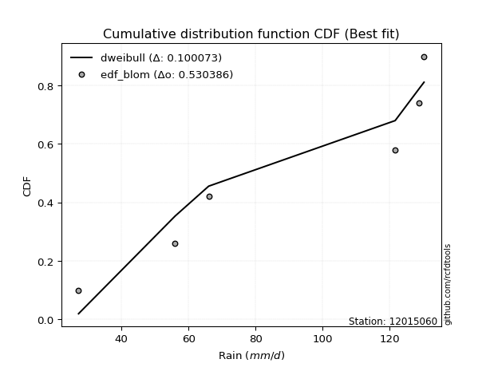</img></img>

</div>


### 7. Empirical - EDF Tukey (1962)

In hydrology, the Tukey formula is used as a plotting position formula to estimate the empirical probability or frequency of a flood event (or other hydrological data). The formula parameter is given as _c=0.333_ (or 1/3).

<div align="center">


$P=(m-c)/(n+1-2c)$


</div>


**7.1. Empirical values**

<div align="center">

|                | 0                  | 1                  | 2         | 3         | 4         |
|:---------------|:-------------------|:-------------------|:----------|:----------|:----------|
| date           | 2017               | 2018               | 2020      | 2019      | 2021      |
| x              | 27.2               | 56.0               | 66.0      | 121.6     | 128.8     |
| m              | 1                  | 2                  | 3         | 4         | 5         |
| empirical_dist | edf_tukey          | edf_tukey          | edf_tukey | edf_tukey | edf_tukey |
| empirical      | 0.125              | 0.3125             | 0.5       | 0.6875    | 0.875     |
| empirical_tr   | 1.1428571428571428 | 1.4545454545454546 | 2.0       | 3.2       | 8.0       |

</div>


**7.2. Kolmogorov-Smirnov fit test (sorted by Δ)**


<div align="center">

|                | 0                   | 1                  | 2                  | 3                   | 4                  | 5                   | 6                  | 7                  | 8                   | 9                  | 10                  | 11                  | 12                 | 13                 | 14                  | 15                  | 16                  | 17                  | 18                  | 19                  | 20                 | 21                  | 22                  | 23                 | 24                  | 25                 | 26                 | 27                  | 28                 | 29                 | 30                  | 31                  | 32                  | 33                 | 34                    | 35                  | 36                 | 37                  | 38                 | 39                 | 40                  | 41                 | 42                 | 43                  | 44                  | 45                  | 46                  | 47                  | 48                 | 49                  | 50                  | 51                  | 52                  | 53                  | 54                  | 55                 | 56                  | 57                  | 58                  | 59                  | 60                  | 61                  | 62                 | 63                 | 64                  | 65                  | 66                  | 67                  | 68                  | 69                 | 70                 | 71                  | 72                  | 73                 | 74                  | 75                 | 76                  | 77                  | 78                 | 79                 | 80                 | 81                 | 82                  | 83                 | 84                 | 85                  | 86                  | 87                 | 88                 | 89                 |
|:---------------|:--------------------|:-------------------|:-------------------|:--------------------|:-------------------|:--------------------|:-------------------|:-------------------|:--------------------|:-------------------|:--------------------|:--------------------|:-------------------|:-------------------|:--------------------|:--------------------|:--------------------|:--------------------|:--------------------|:--------------------|:-------------------|:--------------------|:--------------------|:-------------------|:--------------------|:-------------------|:-------------------|:--------------------|:-------------------|:-------------------|:--------------------|:--------------------|:--------------------|:-------------------|:----------------------|:--------------------|:-------------------|:--------------------|:-------------------|:-------------------|:--------------------|:-------------------|:-------------------|:--------------------|:--------------------|:--------------------|:--------------------|:--------------------|:-------------------|:--------------------|:--------------------|:--------------------|:--------------------|:--------------------|:--------------------|:-------------------|:--------------------|:--------------------|:--------------------|:--------------------|:--------------------|:--------------------|:-------------------|:-------------------|:--------------------|:--------------------|:--------------------|:--------------------|:--------------------|:-------------------|:-------------------|:--------------------|:--------------------|:-------------------|:--------------------|:-------------------|:--------------------|:--------------------|:-------------------|:-------------------|:-------------------|:-------------------|:--------------------|:-------------------|:-------------------|:--------------------|:--------------------|:-------------------|:-------------------|:-------------------|
| station        | 12015060            | 12015060           | 12015060           | 12015060            | 12015060           | 12015060            | 12015060           | 12015060           | 12015060            | 12015060           | 12015060            | 12015060            | 12015060           | 12015060           | 12015060            | 12015060            | 12015060            | 12015060            | 12015060            | 12015060            | 12015060           | 12015060            | 12015060            | 12015060           | 12015060            | 12015060           | 12015060           | 12015060            | 12015060           | 12015060           | 12015060            | 12015060            | 12015060            | 12015060           | 12015060              | 12015060            | 12015060           | 12015060            | 12015060           | 12015060           | 12015060            | 12015060           | 12015060           | 12015060            | 12015060            | 12015060            | 12015060            | 12015060            | 12015060           | 12015060            | 12015060            | 12015060            | 12015060            | 12015060            | 12015060            | 12015060           | 12015060            | 12015060            | 12015060            | 12015060            | 12015060            | 12015060            | 12015060           | 12015060           | 12015060            | 12015060            | 12015060            | 12015060            | 12015060            | 12015060           | 12015060           | 12015060            | 12015060            | 12015060           | 12015060            | 12015060           | 12015060            | 12015060            | 12015060           | 12015060           | 12015060           | 12015060           | 12015060            | 12015060           | 12015060           | 12015060            | 12015060            | 12015060           | 12015060           | 12015060           |
| empirical_dist | edf_tukey           | edf_tukey          | edf_tukey          | edf_tukey           | edf_tukey          | edf_tukey           | edf_tukey          | edf_tukey          | edf_tukey           | edf_tukey          | edf_tukey           | edf_tukey           | edf_tukey          | edf_tukey          | edf_tukey           | edf_tukey           | edf_tukey           | edf_tukey           | edf_tukey           | edf_tukey           | edf_tukey          | edf_tukey           | edf_tukey           | edf_tukey          | edf_tukey           | edf_tukey          | edf_tukey          | edf_tukey           | edf_tukey          | edf_tukey          | edf_tukey           | edf_tukey           | edf_tukey           | edf_tukey          | edf_tukey             | edf_tukey           | edf_tukey          | edf_tukey           | edf_tukey          | edf_tukey          | edf_tukey           | edf_tukey          | edf_tukey          | edf_tukey           | edf_tukey           | edf_tukey           | edf_tukey           | edf_tukey           | edf_tukey          | edf_tukey           | edf_tukey           | edf_tukey           | edf_tukey           | edf_tukey           | edf_tukey           | edf_tukey          | edf_tukey           | edf_tukey           | edf_tukey           | edf_tukey           | edf_tukey           | edf_tukey           | edf_tukey          | edf_tukey          | edf_tukey           | edf_tukey           | edf_tukey           | edf_tukey           | edf_tukey           | edf_tukey          | edf_tukey          | edf_tukey           | edf_tukey           | edf_tukey          | edf_tukey           | edf_tukey          | edf_tukey           | edf_tukey           | edf_tukey          | edf_tukey          | edf_tukey          | edf_tukey          | edf_tukey           | edf_tukey          | edf_tukey          | edf_tukey           | edf_tukey           | edf_tukey          | edf_tukey          | edf_tukey          |
| p_dist         | ncf                 | logkstwobign       | loggenexpon        | loginvweibull       | logfisk            | loginvgauss         | expon              | genexpon           | logbetaprime        | fisk               | logalpha            | logncf              | loggamma           | loggamma           | logrice             | loggompertz         | lograyleigh         | lognct              | logmaxwell          | loghalfnorm         | logf               | logerlang           | loginvgamma         | logt               | logcrystalball      | lognorm            | lognorm            | logexponnorm        | logfatiguelife     | logpearson3        | betaprime           | genlogistic         | invgauss            | halfnorm           | loglaplace_asymmetric | laplace_asymmetric  | rayleigh           | maxwell             | logweibull_min     | alpha              | invgamma            | rice               | loggumbel_r        | loghalflogistic     | gompertz            | kstwobign           | pearson3            | nct                 | exponnorm          | crystalball         | norm                | truncnorm           | t                   | gamma               | erlang              | loglogistic        | logmoyal            | loggumbel_l         | halflogistic        | gumbel_r            | loghypsecant        | moyal               | logistic           | loglaplace         | hypsecant           | logwald             | gumbel_l            | laplace             | wald                | logmielke          | mielke             | loggibrat           | logloggamma         | logexpon           | gibrat              | f                  | logchi2             | lognakagami         | logtruncnorm       | nakagami           | weibull_min        | pareto             | logpareto           | loglognorm         | chi2               | invweibull          | logjohnsonsu        | fatiguelife        | johnsonsu          | loggenlogistic     |
| delta          | 0.10226214703148229 | 0.1359883895047721 | 0.1369547152265581 | 0.13706522071354166 | 0.1380893878021029 | 0.14515959791041144 | 0.1456386090923102 | 0.145797583986917  | 0.14622653466591662 | 0.1462732311874424 | 0.14752114184931964 | 0.14854490390270492 | 0.1485631253509656 | 0.1485631253509656 | 0.14883732884679612 | 0.14885186465017664 | 0.14908323180800542 | 0.14928298248314464 | 0.14968188146649553 | 0.14979899820729914 | 0.1509407708624736 | 0.15126836498891105 | 0.15127611358685233 | 0.1519684030338374 | 0.15196905394409654 | 0.1519693823216418 | 0.1519693823216418 | 0.15197073350503876 | 0.1524400250189648 | 0.1538609211605657 | 0.16150838170197335 | 0.16168920913318952 | 0.16211128920800078 | 0.1624366635729535 | 0.16263386077343822   | 0.16283170114231216 | 0.1632390500343075 | 0.16441475740111366 | 0.1644714804066465 | 0.16562871189063   | 0.16609157597683166 | 0.1667520720614225 | 0.1669830317399048 | 0.16722564720498523 | 0.16730098719989117 | 0.16802062471693457 | 0.16849714674351768 | 0.16874764581410706 | 0.1688473680504735 | 0.16884797847682842 | 0.16884798167943993 | 0.16884798929604894 | 0.16885927296499137 | 0.16946468133636472 | 0.16987761341676477 | 0.1706240757876032 | 0.17280161270807115 | 0.17778248304091349 | 0.17814230157513633 | 0.17888273008011946 | 0.18047106593964823 | 0.18340847878980948 | 0.1857473471374298 | 0.1896071211064867 | 0.19420785981628408 | 0.19712011174920774 | 0.20146020639548468 | 0.20146917417060783 | 0.20476529993748593 | 0.2091566587917708 | 0.2149854070825752 | 0.22127504929999198 | 0.22406575716784305 | 0.226627463071168  | 0.22767025821624864 | 0.2298870854967574 | 0.26082889883862936 | 0.31242010548748994 | 0.3124983780519561 | 0.3124996780678216 | 0.3229111781906715 | 0.345071089628886  | 0.36767331863436303 | 0.3682872261929687 | 0.3683238330901827 | 0.44340723100093477 | 0.49372493355216757 | 0.504937282603491  | 0.6104318557020493 | 0.6875             |
| deltao         | 0.5865427407550001  | 0.5865427407550001 | 0.5865427407550001 | 0.5865427407550001  | 0.5865427407550001 | 0.5865427407550001  | 0.5865427407550001 | 0.5865427407550001 | 0.5865427407550001  | 0.5865427407550001 | 0.5865427407550001  | 0.5865427407550001  | 0.5865427407550001 | 0.5865427407550001 | 0.5865427407550001  | 0.5865427407550001  | 0.5865427407550001  | 0.5865427407550001  | 0.5865427407550001  | 0.5865427407550001  | 0.5865427407550001 | 0.5865427407550001  | 0.5865427407550001  | 0.5865427407550001 | 0.5865427407550001  | 0.5865427407550001 | 0.5865427407550001 | 0.5865427407550001  | 0.5865427407550001 | 0.5865427407550001 | 0.5865427407550001  | 0.5865427407550001  | 0.5865427407550001  | 0.5865427407550001 | 0.5865427407550001    | 0.5865427407550001  | 0.5865427407550001 | 0.5865427407550001  | 0.5865427407550001 | 0.5865427407550001 | 0.5865427407550001  | 0.5865427407550001 | 0.5865427407550001 | 0.5865427407550001  | 0.5865427407550001  | 0.5865427407550001  | 0.5865427407550001  | 0.5865427407550001  | 0.5865427407550001 | 0.5865427407550001  | 0.5865427407550001  | 0.5865427407550001  | 0.5865427407550001  | 0.5865427407550001  | 0.5865427407550001  | 0.5865427407550001 | 0.5865427407550001  | 0.5865427407550001  | 0.5865427407550001  | 0.5865427407550001  | 0.5865427407550001  | 0.5865427407550001  | 0.5865427407550001 | 0.5865427407550001 | 0.5865427407550001  | 0.5865427407550001  | 0.5865427407550001  | 0.5865427407550001  | 0.5865427407550001  | 0.5865427407550001 | 0.5865427407550001 | 0.5865427407550001  | 0.5865427407550001  | 0.5865427407550001 | 0.5865427407550001  | 0.5865427407550001 | 0.5865427407550001  | 0.5865427407550001  | 0.5865427407550001 | 0.5865427407550001 | 0.5865427407550001 | 0.5865427407550001 | 0.5865427407550001  | 0.5865427407550001 | 0.5865427407550001 | 0.5865427407550001  | 0.5865427407550001  | 0.5865427407550001 | 0.5865427407550001 | 0.5865427407550001 |
| eval           | Δo > Δ              | Δo > Δ             | Δo > Δ             | Δo > Δ              | Δo > Δ             | Δo > Δ              | Δo > Δ             | Δo > Δ             | Δo > Δ              | Δo > Δ             | Δo > Δ              | Δo > Δ              | Δo > Δ             | Δo > Δ             | Δo > Δ              | Δo > Δ              | Δo > Δ              | Δo > Δ              | Δo > Δ              | Δo > Δ              | Δo > Δ             | Δo > Δ              | Δo > Δ              | Δo > Δ             | Δo > Δ              | Δo > Δ             | Δo > Δ             | Δo > Δ              | Δo > Δ             | Δo > Δ             | Δo > Δ              | Δo > Δ              | Δo > Δ              | Δo > Δ             | Δo > Δ                | Δo > Δ              | Δo > Δ             | Δo > Δ              | Δo > Δ             | Δo > Δ             | Δo > Δ              | Δo > Δ             | Δo > Δ             | Δo > Δ              | Δo > Δ              | Δo > Δ              | Δo > Δ              | Δo > Δ              | Δo > Δ             | Δo > Δ              | Δo > Δ              | Δo > Δ              | Δo > Δ              | Δo > Δ              | Δo > Δ              | Δo > Δ             | Δo > Δ              | Δo > Δ              | Δo > Δ              | Δo > Δ              | Δo > Δ              | Δo > Δ              | Δo > Δ             | Δo > Δ             | Δo > Δ              | Δo > Δ              | Δo > Δ              | Δo > Δ              | Δo > Δ              | Δo > Δ             | Δo > Δ             | Δo > Δ              | Δo > Δ              | Δo > Δ             | Δo > Δ              | Δo > Δ             | Δo > Δ              | Δo > Δ              | Δo > Δ             | Δo > Δ             | Δo > Δ             | Δo > Δ             | Δo > Δ              | Δo > Δ             | Δo > Δ             | Δo > Δ              | Δo > Δ              | Δo > Δ             | Δo <= Δ            | Δo <= Δ            |
| fit            | 1                   | 1                  | 1                  | 1                   | 1                  | 1                   | 1                  | 1                  | 1                   | 1                  | 1                   | 1                   | 1                  | 1                  | 1                   | 1                   | 1                   | 1                   | 1                   | 1                   | 1                  | 1                   | 1                   | 1                  | 1                   | 1                  | 1                  | 1                   | 1                  | 1                  | 1                   | 1                   | 1                   | 1                  | 1                     | 1                   | 1                  | 1                   | 1                  | 1                  | 1                   | 1                  | 1                  | 1                   | 1                   | 1                   | 1                   | 1                   | 1                  | 1                   | 1                   | 1                   | 1                   | 1                   | 1                   | 1                  | 1                   | 1                   | 1                   | 1                   | 1                   | 1                   | 1                  | 1                  | 1                   | 1                   | 1                   | 1                   | 1                   | 1                  | 1                  | 1                   | 1                   | 1                  | 1                   | 1                  | 1                   | 1                   | 1                  | 1                  | 1                  | 1                  | 1                   | 1                  | 1                  | 1                   | 1                   | 1                  | 0                  | 0                  |
| n              | 5                   | 5                  | 5                  | 5                   | 5                  | 5                   | 5                  | 5                  | 5                   | 5                  | 5                   | 5                   | 5                  | 5                  | 5                   | 5                   | 5                   | 5                   | 5                   | 5                   | 5                  | 5                   | 5                   | 5                  | 5                   | 5                  | 5                  | 5                   | 5                  | 5                  | 5                   | 5                   | 5                   | 5                  | 5                     | 5                   | 5                  | 5                   | 5                  | 5                  | 5                   | 5                  | 5                  | 5                   | 5                   | 5                   | 5                   | 5                   | 5                  | 5                   | 5                   | 5                   | 5                   | 5                   | 5                   | 5                  | 5                   | 5                   | 5                   | 5                   | 5                   | 5                   | 5                  | 5                  | 5                   | 5                   | 5                   | 5                   | 5                   | 5                  | 5                  | 5                   | 5                   | 5                  | 5                   | 5                  | 5                   | 5                   | 5                  | 5                  | 5                  | 5                  | 5                   | 5                  | 5                  | 5                   | 5                   | 5                  | 5                  | 5                  |
| best_fit       | 1                   | 0                  | 0                  | 0                   | 0                  | 0                   | 0                  | 0                  | 0                   | 0                  | 0                   | 0                   | 0                  | 0                  | 0                   | 0                   | 0                   | 0                   | 0                   | 0                   | 0                  | 0                   | 0                   | 0                  | 0                   | 0                  | 0                  | 0                   | 0                  | 0                  | 0                   | 0                   | 0                   | 0                  | 0                     | 0                   | 0                  | 0                   | 0                  | 0                  | 0                   | 0                  | 0                  | 0                   | 0                   | 0                   | 0                   | 0                   | 0                  | 0                   | 0                   | 0                   | 0                   | 0                   | 0                   | 0                  | 0                   | 0                   | 0                   | 0                   | 0                   | 0                   | 0                  | 0                  | 0                   | 0                   | 0                   | 0                   | 0                   | 0                  | 0                  | 0                   | 0                   | 0                  | 0                   | 0                  | 0                   | 0                   | 0                  | 0                  | 0                  | 0                  | 0                   | 0                  | 0                  | 0                   | 0                   | 0                  | 0                  | 0                  |
| best_fit_sort  | 1                   | 2                  | 3                  | 4                   | 5                  | 6                   | 7                  | 8                  | 9                   | 10                 | 11                  | 12                  | 13                 | 14                 | 15                  | 16                  | 17                  | 18                  | 19                  | 20                  | 21                 | 22                  | 23                  | 24                 | 25                  | 26                 | 27                 | 28                  | 29                 | 30                 | 31                  | 32                  | 33                  | 34                 | 35                    | 36                  | 37                 | 38                  | 39                 | 40                 | 41                  | 42                 | 43                 | 44                  | 45                  | 46                  | 47                  | 48                  | 49                 | 50                  | 51                  | 52                  | 53                  | 54                  | 55                  | 56                 | 57                  | 58                  | 59                  | 60                  | 61                  | 62                  | 63                 | 64                 | 65                  | 66                  | 67                  | 68                  | 69                  | 70                 | 71                 | 72                  | 73                  | 74                 | 75                  | 76                 | 77                  | 78                  | 79                 | 80                 | 81                 | 82                 | 83                  | 84                 | 85                 | 86                  | 87                  | 88                 | 89                 | 90                 |

</div>


<div align="center">

</img>

</div>


**7.3. Best fit**

<div align="center">

|   id |   station | empirical_dist   | p_dist   |    delta |   deltao | eval   |   fit |   n |   best_fit |   best_fit_sort |
|-----:|----------:|:-----------------|:---------|---------:|---------:|:-------|------:|----:|-----------:|----------------:|
|    0 |  12015060 | edf_tukey        | ncf      | 0.102262 | 0.586543 | Δo > Δ |     1 |   5 |          1 |               1 |

</div>


<div align="center">

</img></img>

</div>


### 8. Empirical - EDF Gringorten (1963)

Gringorten plotting position formula is essential for estimating the probability and return periods of extreme events like floods and heavy rainfall. The constant _a=0.44_.

<div align="center">


$P=(m-a)/(n+1-2a)$


</div>


**8.1. Empirical values**

<div align="center">

|                | 0                   | 1                  | 2              | 3                 | 4                  |
|:---------------|:--------------------|:-------------------|:---------------|:------------------|:-------------------|
| date           | 2017                | 2018               | 2020           | 2019              | 2021               |
| x              | 27.2                | 56.0               | 66.0           | 121.6             | 128.8              |
| m              | 1                   | 2                  | 3              | 4                 | 5                  |
| empirical_dist | edf_gringorten      | edf_gringorten     | edf_gringorten | edf_gringorten    | edf_gringorten     |
| empirical      | 0.10937500000000001 | 0.3046875          | 0.5            | 0.6953125         | 0.8906249999999999 |
| empirical_tr   | 1.1228070175438596  | 1.4382022471910112 | 2.0            | 3.282051282051282 | 9.142857142857133  |

</div>


**8.2. Kolmogorov-Smirnov fit test (sorted by Δ)**


<div align="center">

|                | 0                   | 1                  | 2                   | 3                   | 4                  | 5                  | 6                   | 7                  | 8                   | 9                   | 10                 | 11                 | 12                  | 13                  | 14                  | 15                  | 16                  | 17                 | 18                  | 19                  | 20                 | 21                 | 22                  | 23                 | 24                 | 25                  | 26                 | 27                 | 28                 | 29                  | 30                  | 31                  | 32                  | 33                 | 34                    | 35                  | 36                 | 37                  | 38                 | 39                 | 40                  | 41                 | 42                 | 43                  | 44                  | 45                  | 46                  | 47                  | 48                 | 49                  | 50                  | 51                  | 52                  | 53                  | 54                  | 55                 | 56                  | 57                  | 58                  | 59                  | 60                  | 61                  | 62                 | 63                 | 64                  | 65                  | 66                  | 67                 | 68                  | 69                 | 70                 | 71                  | 72                  | 73                  | 74                 | 75                 | 76                  | 77                  | 78                 | 79                 | 80                 | 81                 | 82                  | 83                 | 84                 | 85                  | 86                 | 87                 | 88                 | 89                 |
|:---------------|:--------------------|:-------------------|:--------------------|:--------------------|:-------------------|:-------------------|:--------------------|:-------------------|:--------------------|:--------------------|:-------------------|:-------------------|:--------------------|:--------------------|:--------------------|:--------------------|:--------------------|:-------------------|:--------------------|:--------------------|:-------------------|:-------------------|:--------------------|:-------------------|:-------------------|:--------------------|:-------------------|:-------------------|:-------------------|:--------------------|:--------------------|:--------------------|:--------------------|:-------------------|:----------------------|:--------------------|:-------------------|:--------------------|:-------------------|:-------------------|:--------------------|:-------------------|:-------------------|:--------------------|:--------------------|:--------------------|:--------------------|:--------------------|:-------------------|:--------------------|:--------------------|:--------------------|:--------------------|:--------------------|:--------------------|:-------------------|:--------------------|:--------------------|:--------------------|:--------------------|:--------------------|:--------------------|:-------------------|:-------------------|:--------------------|:--------------------|:--------------------|:-------------------|:--------------------|:-------------------|:-------------------|:--------------------|:--------------------|:--------------------|:-------------------|:-------------------|:--------------------|:--------------------|:-------------------|:-------------------|:-------------------|:-------------------|:--------------------|:-------------------|:-------------------|:--------------------|:-------------------|:-------------------|:-------------------|:-------------------|
| station        | 12015060            | 12015060           | 12015060            | 12015060            | 12015060           | 12015060           | 12015060            | 12015060           | 12015060            | 12015060            | 12015060           | 12015060           | 12015060            | 12015060            | 12015060            | 12015060            | 12015060            | 12015060           | 12015060            | 12015060            | 12015060           | 12015060           | 12015060            | 12015060           | 12015060           | 12015060            | 12015060           | 12015060           | 12015060           | 12015060            | 12015060            | 12015060            | 12015060            | 12015060           | 12015060              | 12015060            | 12015060           | 12015060            | 12015060           | 12015060           | 12015060            | 12015060           | 12015060           | 12015060            | 12015060            | 12015060            | 12015060            | 12015060            | 12015060           | 12015060            | 12015060            | 12015060            | 12015060            | 12015060            | 12015060            | 12015060           | 12015060            | 12015060            | 12015060            | 12015060            | 12015060            | 12015060            | 12015060           | 12015060           | 12015060            | 12015060            | 12015060            | 12015060           | 12015060            | 12015060           | 12015060           | 12015060            | 12015060            | 12015060            | 12015060           | 12015060           | 12015060            | 12015060            | 12015060           | 12015060           | 12015060           | 12015060           | 12015060            | 12015060           | 12015060           | 12015060            | 12015060           | 12015060           | 12015060           | 12015060           |
| empirical_dist | edf_gringorten      | edf_gringorten     | edf_gringorten      | edf_gringorten      | edf_gringorten     | edf_gringorten     | edf_gringorten      | edf_gringorten     | edf_gringorten      | edf_gringorten      | edf_gringorten     | edf_gringorten     | edf_gringorten      | edf_gringorten      | edf_gringorten      | edf_gringorten      | edf_gringorten      | edf_gringorten     | edf_gringorten      | edf_gringorten      | edf_gringorten     | edf_gringorten     | edf_gringorten      | edf_gringorten     | edf_gringorten     | edf_gringorten      | edf_gringorten     | edf_gringorten     | edf_gringorten     | edf_gringorten      | edf_gringorten      | edf_gringorten      | edf_gringorten      | edf_gringorten     | edf_gringorten        | edf_gringorten      | edf_gringorten     | edf_gringorten      | edf_gringorten     | edf_gringorten     | edf_gringorten      | edf_gringorten     | edf_gringorten     | edf_gringorten      | edf_gringorten      | edf_gringorten      | edf_gringorten      | edf_gringorten      | edf_gringorten     | edf_gringorten      | edf_gringorten      | edf_gringorten      | edf_gringorten      | edf_gringorten      | edf_gringorten      | edf_gringorten     | edf_gringorten      | edf_gringorten      | edf_gringorten      | edf_gringorten      | edf_gringorten      | edf_gringorten      | edf_gringorten     | edf_gringorten     | edf_gringorten      | edf_gringorten      | edf_gringorten      | edf_gringorten     | edf_gringorten      | edf_gringorten     | edf_gringorten     | edf_gringorten      | edf_gringorten      | edf_gringorten      | edf_gringorten     | edf_gringorten     | edf_gringorten      | edf_gringorten      | edf_gringorten     | edf_gringorten     | edf_gringorten     | edf_gringorten     | edf_gringorten      | edf_gringorten     | edf_gringorten     | edf_gringorten      | edf_gringorten     | edf_gringorten     | edf_gringorten     | edf_gringorten     |
| p_dist         | ncf                 | logfisk            | loginvweibull       | loginvgauss         | expon              | genexpon           | logbetaprime        | fisk               | logalpha            | logncf              | loggamma           | loggamma           | logrice             | lograyleigh         | lognct              | logmaxwell          | loghalfnorm         | logf               | logerlang           | loginvgamma         | logkstwobign       | logt               | logcrystalball      | lognorm            | lognorm            | logexponnorm        | logfatiguelife     | loggenexpon        | logpearson3        | loggompertz         | betaprime           | genlogistic         | invgauss            | halfnorm           | loglaplace_asymmetric | laplace_asymmetric  | rayleigh           | maxwell             | logweibull_min     | alpha              | invgamma            | rice               | loggumbel_r        | loghalflogistic     | gompertz            | kstwobign           | pearson3            | nct                 | exponnorm          | crystalball         | norm                | truncnorm           | t                   | gamma               | erlang              | loglogistic        | logmoyal            | loggumbel_l         | halflogistic        | gumbel_r            | loghypsecant        | moyal               | logistic           | loglaplace         | hypsecant           | logwald             | wald                | laplace            | gumbel_l            | logmielke          | mielke             | loggibrat           | logloggamma         | gibrat              | logexpon           | f                  | logchi2             | lognakagami         | logtruncnorm       | nakagami           | weibull_min        | pareto             | logpareto           | loglognorm         | chi2               | invweibull          | logjohnsonsu       | fatiguelife        | johnsonsu          | loggenlogistic     |
| delta          | 0.09444964703148229 | 0.1302768878021029 | 0.13309033146702315 | 0.13734709791041144 | 0.1378261090923102 | 0.137985083986917  | 0.13841403466591662 | 0.1384607311874424 | 0.13970864184931964 | 0.14073240390270492 | 0.1407506253509656 | 0.1407506253509656 | 0.14102482884679612 | 0.14127073180800542 | 0.14147048248314464 | 0.14186938146649553 | 0.14198649820729914 | 0.1431282708624736 | 0.14345586498891105 | 0.14346361358685233 | 0.1438008895047721 | 0.1441559030338374 | 0.14415655394409654 | 0.1441568823216418 | 0.1441568823216418 | 0.14415823350503876 | 0.1446275250189648 | 0.1447396537177803 | 0.1460484211605657 | 0.15272909685585667 | 0.15369588170197335 | 0.15387670913318952 | 0.15429878920800078 | 0.1546241635729535 | 0.15482136077343822   | 0.15501920114231216 | 0.1554265500343075 | 0.15660225740111366 | 0.1566589804066465 | 0.15781621189063   | 0.15827907597683166 | 0.1589395720614225 | 0.1591705317399048 | 0.15941314720498523 | 0.15948848719989117 | 0.16020812471693457 | 0.16068464674351768 | 0.16093514581410706 | 0.1610348680504735 | 0.16103547847682842 | 0.16103548167943993 | 0.16103548929604894 | 0.16104677296499137 | 0.16165218133636472 | 0.16206511341676477 | 0.1628115757876032 | 0.16498911270807115 | 0.16996998304091349 | 0.17032980157513633 | 0.17107023008011946 | 0.17265856593964823 | 0.17559597878980948 | 0.1779348471374298 | 0.1817946211064867 | 0.18639535981628408 | 0.18930761174920774 | 0.19695279993748593 | 0.1975108953309666 | 0.20051381265859775 | 0.2013441587917708 | 0.2071729070825752 | 0.21346254929999198 | 0.21625325716784305 | 0.21985775821624864 | 0.234439963071168  | 0.2376995854967574 | 0.26864139883862936 | 0.30460760548748994 | 0.3046858780519561 | 0.3046871780678216 | 0.3307236781906715 | 0.352883589628886  | 0.37548581863436303 | 0.3760997261929687 | 0.3761363330901827 | 0.45903223100093465 | 0.5015374335521676 | 0.512749782603491  | 0.6182443557020493 | 0.6953125          |
| deltao         | 0.5865427407550001  | 0.5865427407550001 | 0.5865427407550001  | 0.5865427407550001  | 0.5865427407550001 | 0.5865427407550001 | 0.5865427407550001  | 0.5865427407550001 | 0.5865427407550001  | 0.5865427407550001  | 0.5865427407550001 | 0.5865427407550001 | 0.5865427407550001  | 0.5865427407550001  | 0.5865427407550001  | 0.5865427407550001  | 0.5865427407550001  | 0.5865427407550001 | 0.5865427407550001  | 0.5865427407550001  | 0.5865427407550001 | 0.5865427407550001 | 0.5865427407550001  | 0.5865427407550001 | 0.5865427407550001 | 0.5865427407550001  | 0.5865427407550001 | 0.5865427407550001 | 0.5865427407550001 | 0.5865427407550001  | 0.5865427407550001  | 0.5865427407550001  | 0.5865427407550001  | 0.5865427407550001 | 0.5865427407550001    | 0.5865427407550001  | 0.5865427407550001 | 0.5865427407550001  | 0.5865427407550001 | 0.5865427407550001 | 0.5865427407550001  | 0.5865427407550001 | 0.5865427407550001 | 0.5865427407550001  | 0.5865427407550001  | 0.5865427407550001  | 0.5865427407550001  | 0.5865427407550001  | 0.5865427407550001 | 0.5865427407550001  | 0.5865427407550001  | 0.5865427407550001  | 0.5865427407550001  | 0.5865427407550001  | 0.5865427407550001  | 0.5865427407550001 | 0.5865427407550001  | 0.5865427407550001  | 0.5865427407550001  | 0.5865427407550001  | 0.5865427407550001  | 0.5865427407550001  | 0.5865427407550001 | 0.5865427407550001 | 0.5865427407550001  | 0.5865427407550001  | 0.5865427407550001  | 0.5865427407550001 | 0.5865427407550001  | 0.5865427407550001 | 0.5865427407550001 | 0.5865427407550001  | 0.5865427407550001  | 0.5865427407550001  | 0.5865427407550001 | 0.5865427407550001 | 0.5865427407550001  | 0.5865427407550001  | 0.5865427407550001 | 0.5865427407550001 | 0.5865427407550001 | 0.5865427407550001 | 0.5865427407550001  | 0.5865427407550001 | 0.5865427407550001 | 0.5865427407550001  | 0.5865427407550001 | 0.5865427407550001 | 0.5865427407550001 | 0.5865427407550001 |
| eval           | Δo > Δ              | Δo > Δ             | Δo > Δ              | Δo > Δ              | Δo > Δ             | Δo > Δ             | Δo > Δ              | Δo > Δ             | Δo > Δ              | Δo > Δ              | Δo > Δ             | Δo > Δ             | Δo > Δ              | Δo > Δ              | Δo > Δ              | Δo > Δ              | Δo > Δ              | Δo > Δ             | Δo > Δ              | Δo > Δ              | Δo > Δ             | Δo > Δ             | Δo > Δ              | Δo > Δ             | Δo > Δ             | Δo > Δ              | Δo > Δ             | Δo > Δ             | Δo > Δ             | Δo > Δ              | Δo > Δ              | Δo > Δ              | Δo > Δ              | Δo > Δ             | Δo > Δ                | Δo > Δ              | Δo > Δ             | Δo > Δ              | Δo > Δ             | Δo > Δ             | Δo > Δ              | Δo > Δ             | Δo > Δ             | Δo > Δ              | Δo > Δ              | Δo > Δ              | Δo > Δ              | Δo > Δ              | Δo > Δ             | Δo > Δ              | Δo > Δ              | Δo > Δ              | Δo > Δ              | Δo > Δ              | Δo > Δ              | Δo > Δ             | Δo > Δ              | Δo > Δ              | Δo > Δ              | Δo > Δ              | Δo > Δ              | Δo > Δ              | Δo > Δ             | Δo > Δ             | Δo > Δ              | Δo > Δ              | Δo > Δ              | Δo > Δ             | Δo > Δ              | Δo > Δ             | Δo > Δ             | Δo > Δ              | Δo > Δ              | Δo > Δ              | Δo > Δ             | Δo > Δ             | Δo > Δ              | Δo > Δ              | Δo > Δ             | Δo > Δ             | Δo > Δ             | Δo > Δ             | Δo > Δ              | Δo > Δ             | Δo > Δ             | Δo > Δ              | Δo > Δ             | Δo > Δ             | Δo <= Δ            | Δo <= Δ            |
| fit            | 1                   | 1                  | 1                   | 1                   | 1                  | 1                  | 1                   | 1                  | 1                   | 1                   | 1                  | 1                  | 1                   | 1                   | 1                   | 1                   | 1                   | 1                  | 1                   | 1                   | 1                  | 1                  | 1                   | 1                  | 1                  | 1                   | 1                  | 1                  | 1                  | 1                   | 1                   | 1                   | 1                   | 1                  | 1                     | 1                   | 1                  | 1                   | 1                  | 1                  | 1                   | 1                  | 1                  | 1                   | 1                   | 1                   | 1                   | 1                   | 1                  | 1                   | 1                   | 1                   | 1                   | 1                   | 1                   | 1                  | 1                   | 1                   | 1                   | 1                   | 1                   | 1                   | 1                  | 1                  | 1                   | 1                   | 1                   | 1                  | 1                   | 1                  | 1                  | 1                   | 1                   | 1                   | 1                  | 1                  | 1                   | 1                   | 1                  | 1                  | 1                  | 1                  | 1                   | 1                  | 1                  | 1                   | 1                  | 1                  | 0                  | 0                  |
| n              | 5                   | 5                  | 5                   | 5                   | 5                  | 5                  | 5                   | 5                  | 5                   | 5                   | 5                  | 5                  | 5                   | 5                   | 5                   | 5                   | 5                   | 5                  | 5                   | 5                   | 5                  | 5                  | 5                   | 5                  | 5                  | 5                   | 5                  | 5                  | 5                  | 5                   | 5                   | 5                   | 5                   | 5                  | 5                     | 5                   | 5                  | 5                   | 5                  | 5                  | 5                   | 5                  | 5                  | 5                   | 5                   | 5                   | 5                   | 5                   | 5                  | 5                   | 5                   | 5                   | 5                   | 5                   | 5                   | 5                  | 5                   | 5                   | 5                   | 5                   | 5                   | 5                   | 5                  | 5                  | 5                   | 5                   | 5                   | 5                  | 5                   | 5                  | 5                  | 5                   | 5                   | 5                   | 5                  | 5                  | 5                   | 5                   | 5                  | 5                  | 5                  | 5                  | 5                   | 5                  | 5                  | 5                   | 5                  | 5                  | 5                  | 5                  |
| best_fit       | 1                   | 0                  | 0                   | 0                   | 0                  | 0                  | 0                   | 0                  | 0                   | 0                   | 0                  | 0                  | 0                   | 0                   | 0                   | 0                   | 0                   | 0                  | 0                   | 0                   | 0                  | 0                  | 0                   | 0                  | 0                  | 0                   | 0                  | 0                  | 0                  | 0                   | 0                   | 0                   | 0                   | 0                  | 0                     | 0                   | 0                  | 0                   | 0                  | 0                  | 0                   | 0                  | 0                  | 0                   | 0                   | 0                   | 0                   | 0                   | 0                  | 0                   | 0                   | 0                   | 0                   | 0                   | 0                   | 0                  | 0                   | 0                   | 0                   | 0                   | 0                   | 0                   | 0                  | 0                  | 0                   | 0                   | 0                   | 0                  | 0                   | 0                  | 0                  | 0                   | 0                   | 0                   | 0                  | 0                  | 0                   | 0                   | 0                  | 0                  | 0                  | 0                  | 0                   | 0                  | 0                  | 0                   | 0                  | 0                  | 0                  | 0                  |
| best_fit_sort  | 1                   | 2                  | 3                   | 4                   | 5                  | 6                  | 7                   | 8                  | 9                   | 10                  | 11                 | 12                 | 13                  | 14                  | 15                  | 16                  | 17                  | 18                 | 19                  | 20                  | 21                 | 22                 | 23                  | 24                 | 25                 | 26                  | 27                 | 28                 | 29                 | 30                  | 31                  | 32                  | 33                  | 34                 | 35                    | 36                  | 37                 | 38                  | 39                 | 40                 | 41                  | 42                 | 43                 | 44                  | 45                  | 46                  | 47                  | 48                  | 49                 | 50                  | 51                  | 52                  | 53                  | 54                  | 55                  | 56                 | 57                  | 58                  | 59                  | 60                  | 61                  | 62                  | 63                 | 64                 | 65                  | 66                  | 67                  | 68                 | 69                  | 70                 | 71                 | 72                  | 73                  | 74                  | 75                 | 76                 | 77                  | 78                  | 79                 | 80                 | 81                 | 82                 | 83                  | 84                 | 85                 | 86                  | 87                 | 88                 | 89                 | 90                 |

</div>


<div align="center">

</img>

</div>


**8.3. Best fit**

<div align="center">

|   id |   station | empirical_dist   | p_dist   |     delta |   deltao | eval   |   fit |   n |   best_fit |   best_fit_sort |
|-----:|----------:|:-----------------|:---------|----------:|---------:|:-------|------:|----:|-----------:|----------------:|
|    0 |  12015060 | edf_gringorten   | ncf      | 0.0944496 | 0.586543 | Δo > Δ |     1 |   5 |          1 |               1 |

</div>


<div align="center">

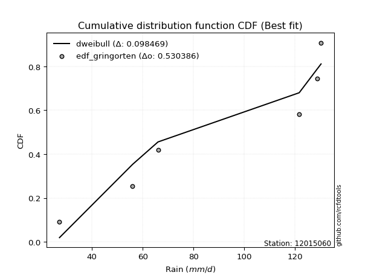</img>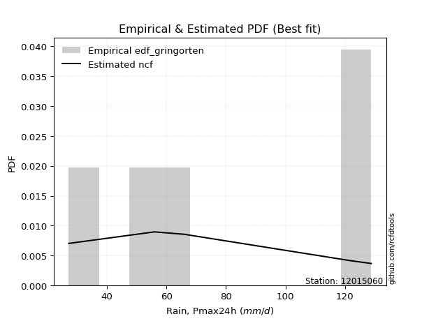</img>

</div>


### 9. Empirical - EDF Filliben (1975)

The specific values of the constants (0.3175) (often denoted as $alpha$) and (0.365) are derived from a method proposed by James J. Filliben in a 1975 paper. This particular formula is the mean value of the $i$-th order statistic of the normal distribution and is considered a robust and effective plotting position formula for the normal probability plot correlation coefficient test for normality.

<div align="center">


$P=(m-0.3175)/(n+0.365)$


</div>


**9.1. Empirical values**

<div align="center">

|                | 0                   | 1                  | 2            | 3                  | 4                  |
|:---------------|:--------------------|:-------------------|:-------------|:-------------------|:-------------------|
| date           | 2017                | 2018               | 2020         | 2019               | 2021               |
| x              | 27.2                | 56.0               | 66.0         | 121.6              | 128.8              |
| m              | 1                   | 2                  | 3            | 4                  | 5                  |
| empirical_dist | edf_filliben        | edf_filliben       | edf_filliben | edf_filliben       | edf_filliben       |
| empirical      | 0.12721342031686858 | 0.3136067101584343 | 0.5          | 0.6863932898415657 | 0.8727865796831314 |
| empirical_tr   | 1.1457554725040042  | 1.456890699253225  | 2.0          | 3.188707280832095  | 7.860805860805863  |

</div>


**9.2. Kolmogorov-Smirnov fit test (sorted by Δ)**


<div align="center">

|                | 0                   | 1                   | 2                   | 3                  | 4                   | 5                   | 6                   | 7                   | 8                   | 9                   | 10                  | 11                  | 12                  | 13                  | 14                  | 15                  | 16                  | 17                  | 18                  | 19                  | 20                  | 21                  | 22                  | 23                  | 24                  | 25                  | 26                  | 27                 | 28                  | 29                  | 30                  | 31                  | 32                 | 33                  | 34                    | 35                 | 36                  | 37                 | 38                  | 39                  | 40                 | 41                  | 42                  | 43                  | 44                 | 45                 | 46                 | 47                 | 48                  | 49                  | 50                  | 51                  | 52                 | 53                  | 54                 | 55                  | 56                  | 57                  | 58                  | 59                 | 60                  | 61                 | 62                  | 63                  | 64                 | 65                  | 66                 | 67                  | 68                  | 69                  | 70                  | 71                 | 72                  | 73                 | 74                  | 75                  | 76                 | 77                 | 78                 | 79                  | 80                 | 81                 | 82                  | 83                  | 84                 | 85                 | 86                  | 87                 | 88                 | 89                 |
|:---------------|:--------------------|:--------------------|:--------------------|:-------------------|:--------------------|:--------------------|:--------------------|:--------------------|:--------------------|:--------------------|:--------------------|:--------------------|:--------------------|:--------------------|:--------------------|:--------------------|:--------------------|:--------------------|:--------------------|:--------------------|:--------------------|:--------------------|:--------------------|:--------------------|:--------------------|:--------------------|:--------------------|:-------------------|:--------------------|:--------------------|:--------------------|:--------------------|:-------------------|:--------------------|:----------------------|:-------------------|:--------------------|:-------------------|:--------------------|:--------------------|:-------------------|:--------------------|:--------------------|:--------------------|:-------------------|:-------------------|:-------------------|:-------------------|:--------------------|:--------------------|:--------------------|:--------------------|:-------------------|:--------------------|:-------------------|:--------------------|:--------------------|:--------------------|:--------------------|:-------------------|:--------------------|:-------------------|:--------------------|:--------------------|:-------------------|:--------------------|:-------------------|:--------------------|:--------------------|:--------------------|:--------------------|:-------------------|:--------------------|:-------------------|:--------------------|:--------------------|:-------------------|:-------------------|:-------------------|:--------------------|:-------------------|:-------------------|:--------------------|:--------------------|:-------------------|:-------------------|:--------------------|:-------------------|:-------------------|:-------------------|
| station        | 12015060            | 12015060            | 12015060            | 12015060           | 12015060            | 12015060            | 12015060            | 12015060            | 12015060            | 12015060            | 12015060            | 12015060            | 12015060            | 12015060            | 12015060            | 12015060            | 12015060            | 12015060            | 12015060            | 12015060            | 12015060            | 12015060            | 12015060            | 12015060            | 12015060            | 12015060            | 12015060            | 12015060           | 12015060            | 12015060            | 12015060            | 12015060            | 12015060           | 12015060            | 12015060              | 12015060           | 12015060            | 12015060           | 12015060            | 12015060            | 12015060           | 12015060            | 12015060            | 12015060            | 12015060           | 12015060           | 12015060           | 12015060           | 12015060            | 12015060            | 12015060            | 12015060            | 12015060           | 12015060            | 12015060           | 12015060            | 12015060            | 12015060            | 12015060            | 12015060           | 12015060            | 12015060           | 12015060            | 12015060            | 12015060           | 12015060            | 12015060           | 12015060            | 12015060            | 12015060            | 12015060            | 12015060           | 12015060            | 12015060           | 12015060            | 12015060            | 12015060           | 12015060           | 12015060           | 12015060            | 12015060           | 12015060           | 12015060            | 12015060            | 12015060           | 12015060           | 12015060            | 12015060           | 12015060           | 12015060           |
| empirical_dist | edf_filliben        | edf_filliben        | edf_filliben        | edf_filliben       | edf_filliben        | edf_filliben        | edf_filliben        | edf_filliben        | edf_filliben        | edf_filliben        | edf_filliben        | edf_filliben        | edf_filliben        | edf_filliben        | edf_filliben        | edf_filliben        | edf_filliben        | edf_filliben        | edf_filliben        | edf_filliben        | edf_filliben        | edf_filliben        | edf_filliben        | edf_filliben        | edf_filliben        | edf_filliben        | edf_filliben        | edf_filliben       | edf_filliben        | edf_filliben        | edf_filliben        | edf_filliben        | edf_filliben       | edf_filliben        | edf_filliben          | edf_filliben       | edf_filliben        | edf_filliben       | edf_filliben        | edf_filliben        | edf_filliben       | edf_filliben        | edf_filliben        | edf_filliben        | edf_filliben       | edf_filliben       | edf_filliben       | edf_filliben       | edf_filliben        | edf_filliben        | edf_filliben        | edf_filliben        | edf_filliben       | edf_filliben        | edf_filliben       | edf_filliben        | edf_filliben        | edf_filliben        | edf_filliben        | edf_filliben       | edf_filliben        | edf_filliben       | edf_filliben        | edf_filliben        | edf_filliben       | edf_filliben        | edf_filliben       | edf_filliben        | edf_filliben        | edf_filliben        | edf_filliben        | edf_filliben       | edf_filliben        | edf_filliben       | edf_filliben        | edf_filliben        | edf_filliben       | edf_filliben       | edf_filliben       | edf_filliben        | edf_filliben       | edf_filliben       | edf_filliben        | edf_filliben        | edf_filliben       | edf_filliben       | edf_filliben        | edf_filliben       | edf_filliben       | edf_filliben       |
| p_dist         | ncf                 | logkstwobign        | loggenexpon         | loginvweibull      | logfisk             | loginvgauss         | expon               | genexpon            | logbetaprime        | fisk                | logalpha            | logncf              | loggamma            | loggamma            | logrice             | loggompertz         | lograyleigh         | lognct              | logmaxwell          | loghalfnorm         | logf                | logerlang           | loginvgamma         | logt                | logcrystalball      | lognorm             | lognorm             | logexponnorm       | logfatiguelife      | logpearson3         | betaprime           | genlogistic         | invgauss           | halfnorm            | loglaplace_asymmetric | laplace_asymmetric | rayleigh            | maxwell            | logweibull_min      | alpha               | invgamma           | rice                | loggumbel_r         | loghalflogistic     | gompertz           | kstwobign          | pearson3           | nct                | exponnorm           | crystalball         | norm                | truncnorm           | t                  | gamma               | erlang             | loglogistic         | logmoyal            | loggumbel_l         | halflogistic        | gumbel_r           | loghypsecant        | moyal              | logistic            | loglaplace          | hypsecant          | logwald             | gumbel_l           | laplace             | wald                | logmielke           | mielke              | loggibrat          | logloggamma         | logexpon           | gibrat              | f                   | logchi2            | lognakagami        | logtruncnorm       | nakagami            | weibull_min        | pareto             | logpareto           | loglognorm          | chi2               | invweibull         | logjohnsonsu        | fatiguelife        | johnsonsu          | loggenlogistic     |
| delta          | 0.10336885718991662 | 0.13488167934633782 | 0.13806142538499244 | 0.138171930871976  | 0.13919609796053722 | 0.14626630806884577 | 0.14674531925074452 | 0.14690429414535133 | 0.14733324482435095 | 0.14737994134587673 | 0.14862785200775397 | 0.14965161406113925 | 0.14966983550939994 | 0.14966983550939994 | 0.14994403900523046 | 0.14995857480861097 | 0.15018994196643976 | 0.15038969264157898 | 0.15078859162492986 | 0.15090570836573347 | 0.15204748102090793 | 0.15237507514734538 | 0.15238282374528667 | 0.15307511319227174 | 0.15307576410253088 | 0.15307609248007614 | 0.15307609248007614 | 0.1530774436634731 | 0.15354673517739914 | 0.15496763131900004 | 0.16261509186040768 | 0.16279591929162385 | 0.1632179993664351 | 0.16354337373138783 | 0.16374057093187255   | 0.1639384113007465 | 0.16434576019274183 | 0.165521467559548  | 0.16557819056508083 | 0.16673542204906433 | 0.167198286135266  | 0.16785878221985684 | 0.16808974189833914 | 0.16833235736341956 | 0.1684076973583255 | 0.1691273348753689 | 0.169603856901952  | 0.1698543559725414 | 0.16995407820890784 | 0.16995468863526275 | 0.16995469183787426 | 0.16995469945448327 | 0.1699659831234257 | 0.17057139149479905 | 0.1709843235751991 | 0.17173078594603752 | 0.17390832286650548 | 0.17888919319934782 | 0.17924901173357066 | 0.1799894402385538 | 0.18157777609808257 | 0.1845151889482438 | 0.18685405729586413 | 0.19071383126492103 | 0.1953145699747184 | 0.19822682190764207 | 0.202566916553919  | 0.20257588432904217 | 0.20587201009592027 | 0.21026336895020514 | 0.21609211724100952 | 0.2223817594584263 | 0.22517246732627738 | 0.2255207529127337 | 0.22877696837468298 | 0.22878037533832313 | 0.2597221886801951 | 0.3135268156459242 | 0.3136050882103904 | 0.31360638822625586 | 0.3218044680322372 | 0.3439643794704517 | 0.36656660847592876 | 0.36718051603453444 | 0.3672171229317484 | 0.4411938106840662 | 0.49261822339373323 | 0.5038305724450567 | 0.6093251455436149 | 0.6863932898415657 |
| deltao         | 0.5865427407550001  | 0.5865427407550001  | 0.5865427407550001  | 0.5865427407550001 | 0.5865427407550001  | 0.5865427407550001  | 0.5865427407550001  | 0.5865427407550001  | 0.5865427407550001  | 0.5865427407550001  | 0.5865427407550001  | 0.5865427407550001  | 0.5865427407550001  | 0.5865427407550001  | 0.5865427407550001  | 0.5865427407550001  | 0.5865427407550001  | 0.5865427407550001  | 0.5865427407550001  | 0.5865427407550001  | 0.5865427407550001  | 0.5865427407550001  | 0.5865427407550001  | 0.5865427407550001  | 0.5865427407550001  | 0.5865427407550001  | 0.5865427407550001  | 0.5865427407550001 | 0.5865427407550001  | 0.5865427407550001  | 0.5865427407550001  | 0.5865427407550001  | 0.5865427407550001 | 0.5865427407550001  | 0.5865427407550001    | 0.5865427407550001 | 0.5865427407550001  | 0.5865427407550001 | 0.5865427407550001  | 0.5865427407550001  | 0.5865427407550001 | 0.5865427407550001  | 0.5865427407550001  | 0.5865427407550001  | 0.5865427407550001 | 0.5865427407550001 | 0.5865427407550001 | 0.5865427407550001 | 0.5865427407550001  | 0.5865427407550001  | 0.5865427407550001  | 0.5865427407550001  | 0.5865427407550001 | 0.5865427407550001  | 0.5865427407550001 | 0.5865427407550001  | 0.5865427407550001  | 0.5865427407550001  | 0.5865427407550001  | 0.5865427407550001 | 0.5865427407550001  | 0.5865427407550001 | 0.5865427407550001  | 0.5865427407550001  | 0.5865427407550001 | 0.5865427407550001  | 0.5865427407550001 | 0.5865427407550001  | 0.5865427407550001  | 0.5865427407550001  | 0.5865427407550001  | 0.5865427407550001 | 0.5865427407550001  | 0.5865427407550001 | 0.5865427407550001  | 0.5865427407550001  | 0.5865427407550001 | 0.5865427407550001 | 0.5865427407550001 | 0.5865427407550001  | 0.5865427407550001 | 0.5865427407550001 | 0.5865427407550001  | 0.5865427407550001  | 0.5865427407550001 | 0.5865427407550001 | 0.5865427407550001  | 0.5865427407550001 | 0.5865427407550001 | 0.5865427407550001 |
| eval           | Δo > Δ              | Δo > Δ              | Δo > Δ              | Δo > Δ             | Δo > Δ              | Δo > Δ              | Δo > Δ              | Δo > Δ              | Δo > Δ              | Δo > Δ              | Δo > Δ              | Δo > Δ              | Δo > Δ              | Δo > Δ              | Δo > Δ              | Δo > Δ              | Δo > Δ              | Δo > Δ              | Δo > Δ              | Δo > Δ              | Δo > Δ              | Δo > Δ              | Δo > Δ              | Δo > Δ              | Δo > Δ              | Δo > Δ              | Δo > Δ              | Δo > Δ             | Δo > Δ              | Δo > Δ              | Δo > Δ              | Δo > Δ              | Δo > Δ             | Δo > Δ              | Δo > Δ                | Δo > Δ             | Δo > Δ              | Δo > Δ             | Δo > Δ              | Δo > Δ              | Δo > Δ             | Δo > Δ              | Δo > Δ              | Δo > Δ              | Δo > Δ             | Δo > Δ             | Δo > Δ             | Δo > Δ             | Δo > Δ              | Δo > Δ              | Δo > Δ              | Δo > Δ              | Δo > Δ             | Δo > Δ              | Δo > Δ             | Δo > Δ              | Δo > Δ              | Δo > Δ              | Δo > Δ              | Δo > Δ             | Δo > Δ              | Δo > Δ             | Δo > Δ              | Δo > Δ              | Δo > Δ             | Δo > Δ              | Δo > Δ             | Δo > Δ              | Δo > Δ              | Δo > Δ              | Δo > Δ              | Δo > Δ             | Δo > Δ              | Δo > Δ             | Δo > Δ              | Δo > Δ              | Δo > Δ             | Δo > Δ             | Δo > Δ             | Δo > Δ              | Δo > Δ             | Δo > Δ             | Δo > Δ              | Δo > Δ              | Δo > Δ             | Δo > Δ             | Δo > Δ              | Δo > Δ             | Δo <= Δ            | Δo <= Δ            |
| fit            | 1                   | 1                   | 1                   | 1                  | 1                   | 1                   | 1                   | 1                   | 1                   | 1                   | 1                   | 1                   | 1                   | 1                   | 1                   | 1                   | 1                   | 1                   | 1                   | 1                   | 1                   | 1                   | 1                   | 1                   | 1                   | 1                   | 1                   | 1                  | 1                   | 1                   | 1                   | 1                   | 1                  | 1                   | 1                     | 1                  | 1                   | 1                  | 1                   | 1                   | 1                  | 1                   | 1                   | 1                   | 1                  | 1                  | 1                  | 1                  | 1                   | 1                   | 1                   | 1                   | 1                  | 1                   | 1                  | 1                   | 1                   | 1                   | 1                   | 1                  | 1                   | 1                  | 1                   | 1                   | 1                  | 1                   | 1                  | 1                   | 1                   | 1                   | 1                   | 1                  | 1                   | 1                  | 1                   | 1                   | 1                  | 1                  | 1                  | 1                   | 1                  | 1                  | 1                   | 1                   | 1                  | 1                  | 1                   | 1                  | 0                  | 0                  |
| n              | 5                   | 5                   | 5                   | 5                  | 5                   | 5                   | 5                   | 5                   | 5                   | 5                   | 5                   | 5                   | 5                   | 5                   | 5                   | 5                   | 5                   | 5                   | 5                   | 5                   | 5                   | 5                   | 5                   | 5                   | 5                   | 5                   | 5                   | 5                  | 5                   | 5                   | 5                   | 5                   | 5                  | 5                   | 5                     | 5                  | 5                   | 5                  | 5                   | 5                   | 5                  | 5                   | 5                   | 5                   | 5                  | 5                  | 5                  | 5                  | 5                   | 5                   | 5                   | 5                   | 5                  | 5                   | 5                  | 5                   | 5                   | 5                   | 5                   | 5                  | 5                   | 5                  | 5                   | 5                   | 5                  | 5                   | 5                  | 5                   | 5                   | 5                   | 5                   | 5                  | 5                   | 5                  | 5                   | 5                   | 5                  | 5                  | 5                  | 5                   | 5                  | 5                  | 5                   | 5                   | 5                  | 5                  | 5                   | 5                  | 5                  | 5                  |
| best_fit       | 1                   | 0                   | 0                   | 0                  | 0                   | 0                   | 0                   | 0                   | 0                   | 0                   | 0                   | 0                   | 0                   | 0                   | 0                   | 0                   | 0                   | 0                   | 0                   | 0                   | 0                   | 0                   | 0                   | 0                   | 0                   | 0                   | 0                   | 0                  | 0                   | 0                   | 0                   | 0                   | 0                  | 0                   | 0                     | 0                  | 0                   | 0                  | 0                   | 0                   | 0                  | 0                   | 0                   | 0                   | 0                  | 0                  | 0                  | 0                  | 0                   | 0                   | 0                   | 0                   | 0                  | 0                   | 0                  | 0                   | 0                   | 0                   | 0                   | 0                  | 0                   | 0                  | 0                   | 0                   | 0                  | 0                   | 0                  | 0                   | 0                   | 0                   | 0                   | 0                  | 0                   | 0                  | 0                   | 0                   | 0                  | 0                  | 0                  | 0                   | 0                  | 0                  | 0                   | 0                   | 0                  | 0                  | 0                   | 0                  | 0                  | 0                  |
| best_fit_sort  | 1                   | 2                   | 3                   | 4                  | 5                   | 6                   | 7                   | 8                   | 9                   | 10                  | 11                  | 12                  | 13                  | 14                  | 15                  | 16                  | 17                  | 18                  | 19                  | 20                  | 21                  | 22                  | 23                  | 24                  | 25                  | 26                  | 27                  | 28                 | 29                  | 30                  | 31                  | 32                  | 33                 | 34                  | 35                    | 36                 | 37                  | 38                 | 39                  | 40                  | 41                 | 42                  | 43                  | 44                  | 45                 | 46                 | 47                 | 48                 | 49                  | 50                  | 51                  | 52                  | 53                 | 54                  | 55                 | 56                  | 57                  | 58                  | 59                  | 60                 | 61                  | 62                 | 63                  | 64                  | 65                 | 66                  | 67                 | 68                  | 69                  | 70                  | 71                  | 72                 | 73                  | 74                 | 75                  | 76                  | 77                 | 78                 | 79                 | 80                  | 81                 | 82                 | 83                  | 84                  | 85                 | 86                 | 87                  | 88                 | 89                 | 90                 |

</div>


<div align="center">

</img>

</div>


**9.3. Best fit**

<div align="center">

|   id |   station | empirical_dist   | p_dist   |    delta |   deltao | eval   |   fit |   n |   best_fit |   best_fit_sort |
|-----:|----------:|:-----------------|:---------|---------:|---------:|:-------|------:|----:|-----------:|----------------:|
|    0 |  12015060 | edf_filliben     | ncf      | 0.103369 | 0.586543 | Δo > Δ |     1 |   5 |          1 |               1 |

</div>


<div align="center">

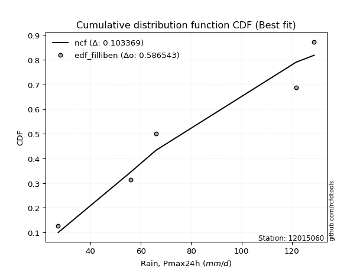</img></img>

</div>


### 10. Empirical - EDF Jenkinson (1977)

The Jenkinson formula in hydrology is an empirical plotting position formula used to estimate the non-exceedance probability _(P)_ or return period _(T)_ of a given ordered observation within a sample. It is a widely used method in the frequency analysis of extreme events such as floods and rainfall, as it provides a distribution-free way to plot data. _a≈0.31_ and _b≈0.38_ are constants derived to approximate the median of the probability distribution for the given rank.

<div align="center">


$P=(m-a)/(n+b)$


</div>


**10.1. Empirical values**

<div align="center">

|                | 0                   | 1                  | 2             | 3                  | 4                  |
|:---------------|:--------------------|:-------------------|:--------------|:-------------------|:-------------------|
| date           | 2017                | 2018               | 2020          | 2019               | 2021               |
| x              | 27.2                | 56.0               | 66.0          | 121.6              | 128.8              |
| m              | 1                   | 2                  | 3             | 4                  | 5                  |
| empirical_dist | edf_jenkinson       | edf_jenkinson      | edf_jenkinson | edf_jenkinson      | edf_jenkinson      |
| empirical      | 0.12825278810408922 | 0.3141263940520446 | 0.5           | 0.6858736059479554 | 0.8717472118959109 |
| empirical_tr   | 1.1471215351812367  | 1.4579945799457996 | 2.0           | 3.183431952662722  | 7.797101449275368  |

</div>


**10.2. Kolmogorov-Smirnov fit test (sorted by Δ)**


<div align="center">

|                | 0                   | 1                   | 2                   | 3                   | 4                   | 5                  | 6                   | 7                   | 8                   | 9                   | 10                 | 11                  | 12                  | 13                  | 14                 | 15                 | 16                 | 17                 | 18                 | 19                 | 20                  | 21                  | 22                 | 23                  | 24                 | 25                  | 26                  | 27                  | 28                  | 29                  | 30                 | 31                  | 32                  | 33                  | 34                    | 35                  | 36                  | 37                  | 38                  | 39                  | 40                  | 41                  | 42                  | 43                 | 44                  | 45                  | 46                  | 47                  | 48                  | 49                  | 50                 | 51                 | 52                  | 53                  | 54                  | 55                  | 56                  | 57                  | 58                 | 59                  | 60                 | 61                  | 62                  | 63                  | 64                  | 65                 | 66                  | 67                 | 68                 | 69                  | 70                  | 71                  | 72                  | 73                  | 74                  | 75                 | 76                  | 77                  | 78                  | 79                 | 80                 | 81                 | 82                 | 83                 | 84                  | 85                  | 86                 | 87                 | 88                 | 89                 |
|:---------------|:--------------------|:--------------------|:--------------------|:--------------------|:--------------------|:-------------------|:--------------------|:--------------------|:--------------------|:--------------------|:-------------------|:--------------------|:--------------------|:--------------------|:-------------------|:-------------------|:-------------------|:-------------------|:-------------------|:-------------------|:--------------------|:--------------------|:-------------------|:--------------------|:-------------------|:--------------------|:--------------------|:--------------------|:--------------------|:--------------------|:-------------------|:--------------------|:--------------------|:--------------------|:----------------------|:--------------------|:--------------------|:--------------------|:--------------------|:--------------------|:--------------------|:--------------------|:--------------------|:-------------------|:--------------------|:--------------------|:--------------------|:--------------------|:--------------------|:--------------------|:-------------------|:-------------------|:--------------------|:--------------------|:--------------------|:--------------------|:--------------------|:--------------------|:-------------------|:--------------------|:-------------------|:--------------------|:--------------------|:--------------------|:--------------------|:-------------------|:--------------------|:-------------------|:-------------------|:--------------------|:--------------------|:--------------------|:--------------------|:--------------------|:--------------------|:-------------------|:--------------------|:--------------------|:--------------------|:-------------------|:-------------------|:-------------------|:-------------------|:-------------------|:--------------------|:--------------------|:-------------------|:-------------------|:-------------------|:-------------------|
| station        | 12015060            | 12015060            | 12015060            | 12015060            | 12015060            | 12015060           | 12015060            | 12015060            | 12015060            | 12015060            | 12015060           | 12015060            | 12015060            | 12015060            | 12015060           | 12015060           | 12015060           | 12015060           | 12015060           | 12015060           | 12015060            | 12015060            | 12015060           | 12015060            | 12015060           | 12015060            | 12015060            | 12015060            | 12015060            | 12015060            | 12015060           | 12015060            | 12015060            | 12015060            | 12015060              | 12015060            | 12015060            | 12015060            | 12015060            | 12015060            | 12015060            | 12015060            | 12015060            | 12015060           | 12015060            | 12015060            | 12015060            | 12015060            | 12015060            | 12015060            | 12015060           | 12015060           | 12015060            | 12015060            | 12015060            | 12015060            | 12015060            | 12015060            | 12015060           | 12015060            | 12015060           | 12015060            | 12015060            | 12015060            | 12015060            | 12015060           | 12015060            | 12015060           | 12015060           | 12015060            | 12015060            | 12015060            | 12015060            | 12015060            | 12015060            | 12015060           | 12015060            | 12015060            | 12015060            | 12015060           | 12015060           | 12015060           | 12015060           | 12015060           | 12015060            | 12015060            | 12015060           | 12015060           | 12015060           | 12015060           |
| empirical_dist | edf_jenkinson       | edf_jenkinson       | edf_jenkinson       | edf_jenkinson       | edf_jenkinson       | edf_jenkinson      | edf_jenkinson       | edf_jenkinson       | edf_jenkinson       | edf_jenkinson       | edf_jenkinson      | edf_jenkinson       | edf_jenkinson       | edf_jenkinson       | edf_jenkinson      | edf_jenkinson      | edf_jenkinson      | edf_jenkinson      | edf_jenkinson      | edf_jenkinson      | edf_jenkinson       | edf_jenkinson       | edf_jenkinson      | edf_jenkinson       | edf_jenkinson      | edf_jenkinson       | edf_jenkinson       | edf_jenkinson       | edf_jenkinson       | edf_jenkinson       | edf_jenkinson      | edf_jenkinson       | edf_jenkinson       | edf_jenkinson       | edf_jenkinson         | edf_jenkinson       | edf_jenkinson       | edf_jenkinson       | edf_jenkinson       | edf_jenkinson       | edf_jenkinson       | edf_jenkinson       | edf_jenkinson       | edf_jenkinson      | edf_jenkinson       | edf_jenkinson       | edf_jenkinson       | edf_jenkinson       | edf_jenkinson       | edf_jenkinson       | edf_jenkinson      | edf_jenkinson      | edf_jenkinson       | edf_jenkinson       | edf_jenkinson       | edf_jenkinson       | edf_jenkinson       | edf_jenkinson       | edf_jenkinson      | edf_jenkinson       | edf_jenkinson      | edf_jenkinson       | edf_jenkinson       | edf_jenkinson       | edf_jenkinson       | edf_jenkinson      | edf_jenkinson       | edf_jenkinson      | edf_jenkinson      | edf_jenkinson       | edf_jenkinson       | edf_jenkinson       | edf_jenkinson       | edf_jenkinson       | edf_jenkinson       | edf_jenkinson      | edf_jenkinson       | edf_jenkinson       | edf_jenkinson       | edf_jenkinson      | edf_jenkinson      | edf_jenkinson      | edf_jenkinson      | edf_jenkinson      | edf_jenkinson       | edf_jenkinson       | edf_jenkinson      | edf_jenkinson      | edf_jenkinson      | edf_jenkinson      |
| p_dist         | ncf                 | logkstwobign        | loggenexpon         | loginvweibull       | logfisk             | loginvgauss        | expon               | genexpon            | logbetaprime        | fisk                | logalpha           | logncf              | loggamma            | loggamma            | logrice            | loggompertz        | lograyleigh        | lognct             | logmaxwell         | loghalfnorm        | logf                | logerlang           | loginvgamma        | logt                | logcrystalball     | lognorm             | lognorm             | logexponnorm        | logfatiguelife      | logpearson3         | betaprime          | genlogistic         | invgauss            | halfnorm            | loglaplace_asymmetric | laplace_asymmetric  | rayleigh            | maxwell             | logweibull_min      | alpha               | invgamma            | rice                | loggumbel_r         | loghalflogistic    | gompertz            | kstwobign           | pearson3            | nct                 | exponnorm           | crystalball         | norm               | truncnorm          | t                   | gamma               | erlang              | loglogistic         | logmoyal            | loggumbel_l         | halflogistic       | gumbel_r            | loghypsecant       | moyal               | logistic            | loglaplace          | hypsecant           | logwald            | gumbel_l            | laplace            | wald               | logmielke           | mielke              | loggibrat           | logexpon            | logloggamma         | f                   | gibrat             | logchi2             | lognakagami         | logtruncnorm        | nakagami           | weibull_min        | pareto             | logpareto          | loglognorm         | chi2                | invweibull          | logjohnsonsu       | fatiguelife        | johnsonsu          | loggenlogistic     |
| delta          | 0.10388854108352685 | 0.13436199545272748 | 0.13858110927860268 | 0.13869161476558622 | 0.13971578185414746 | 0.146785991962456  | 0.14726500314435476 | 0.14742397803896157 | 0.14785292871796119 | 0.14789962523948696 | 0.1491475359013642 | 0.15017129795474948 | 0.15018951940301017 | 0.15018951940301017 | 0.1504637228988407 | 0.1504782587022212 | 0.15070962586005   | 0.1509093765351892 | 0.1513082755185401 | 0.1514253922593437 | 0.15256716491451816 | 0.15289475904095562 | 0.1529025076388969 | 0.15359479708588197 | 0.1535954479961411 | 0.15359577637368638 | 0.15359577637368638 | 0.15359712755708332 | 0.15406641907100938 | 0.15548731521261028 | 0.1631347757540179 | 0.16331560318523408 | 0.16373768326004534 | 0.16406305762499807 | 0.1642602548254828    | 0.16445809519435672 | 0.16486544408635206 | 0.16604115145315823 | 0.16609787445869106 | 0.16725510594267456 | 0.16771797002887623 | 0.16837846611346707 | 0.16860942579194937 | 0.1688520412570298 | 0.16892738125193574 | 0.16964701876897914 | 0.17012354079556224 | 0.17037403986615163 | 0.17047376210251808 | 0.17047437252887299 | 0.1704743757314845 | 0.1704743833480935 | 0.17048566701703594 | 0.17109107538840929 | 0.17150400746880934 | 0.17225046983964776 | 0.17442800676011572 | 0.17940887709295805 | 0.1797686956271809 | 0.18050912413216402 | 0.1820974599916928 | 0.18503487284185405 | 0.18737374118947436 | 0.19123351515853126 | 0.19583425386832864 | 0.1987465058012523 | 0.20308660044752924 | 0.2030955682226524 | 0.2063916939895305 | 0.21078305284381538 | 0.21661180113461975 | 0.22290144335203654 | 0.22500106901912337 | 0.22569215121988762 | 0.22826069144471278 | 0.2292966522682932 | 0.25920250478658474 | 0.31404649953953456 | 0.31412477210400075 | 0.3141260721198662 | 0.3212847841386269 | 0.3434446955768414 | 0.3660469245823184 | 0.3666608321409241 | 0.36669743903813806 | 0.44015444289684563 | 0.492098539500123  | 0.5033108885514463 | 0.6088054616500047 | 0.6858736059479554 |
| deltao         | 0.5865427407550001  | 0.5865427407550001  | 0.5865427407550001  | 0.5865427407550001  | 0.5865427407550001  | 0.5865427407550001 | 0.5865427407550001  | 0.5865427407550001  | 0.5865427407550001  | 0.5865427407550001  | 0.5865427407550001 | 0.5865427407550001  | 0.5865427407550001  | 0.5865427407550001  | 0.5865427407550001 | 0.5865427407550001 | 0.5865427407550001 | 0.5865427407550001 | 0.5865427407550001 | 0.5865427407550001 | 0.5865427407550001  | 0.5865427407550001  | 0.5865427407550001 | 0.5865427407550001  | 0.5865427407550001 | 0.5865427407550001  | 0.5865427407550001  | 0.5865427407550001  | 0.5865427407550001  | 0.5865427407550001  | 0.5865427407550001 | 0.5865427407550001  | 0.5865427407550001  | 0.5865427407550001  | 0.5865427407550001    | 0.5865427407550001  | 0.5865427407550001  | 0.5865427407550001  | 0.5865427407550001  | 0.5865427407550001  | 0.5865427407550001  | 0.5865427407550001  | 0.5865427407550001  | 0.5865427407550001 | 0.5865427407550001  | 0.5865427407550001  | 0.5865427407550001  | 0.5865427407550001  | 0.5865427407550001  | 0.5865427407550001  | 0.5865427407550001 | 0.5865427407550001 | 0.5865427407550001  | 0.5865427407550001  | 0.5865427407550001  | 0.5865427407550001  | 0.5865427407550001  | 0.5865427407550001  | 0.5865427407550001 | 0.5865427407550001  | 0.5865427407550001 | 0.5865427407550001  | 0.5865427407550001  | 0.5865427407550001  | 0.5865427407550001  | 0.5865427407550001 | 0.5865427407550001  | 0.5865427407550001 | 0.5865427407550001 | 0.5865427407550001  | 0.5865427407550001  | 0.5865427407550001  | 0.5865427407550001  | 0.5865427407550001  | 0.5865427407550001  | 0.5865427407550001 | 0.5865427407550001  | 0.5865427407550001  | 0.5865427407550001  | 0.5865427407550001 | 0.5865427407550001 | 0.5865427407550001 | 0.5865427407550001 | 0.5865427407550001 | 0.5865427407550001  | 0.5865427407550001  | 0.5865427407550001 | 0.5865427407550001 | 0.5865427407550001 | 0.5865427407550001 |
| eval           | Δo > Δ              | Δo > Δ              | Δo > Δ              | Δo > Δ              | Δo > Δ              | Δo > Δ             | Δo > Δ              | Δo > Δ              | Δo > Δ              | Δo > Δ              | Δo > Δ             | Δo > Δ              | Δo > Δ              | Δo > Δ              | Δo > Δ             | Δo > Δ             | Δo > Δ             | Δo > Δ             | Δo > Δ             | Δo > Δ             | Δo > Δ              | Δo > Δ              | Δo > Δ             | Δo > Δ              | Δo > Δ             | Δo > Δ              | Δo > Δ              | Δo > Δ              | Δo > Δ              | Δo > Δ              | Δo > Δ             | Δo > Δ              | Δo > Δ              | Δo > Δ              | Δo > Δ                | Δo > Δ              | Δo > Δ              | Δo > Δ              | Δo > Δ              | Δo > Δ              | Δo > Δ              | Δo > Δ              | Δo > Δ              | Δo > Δ             | Δo > Δ              | Δo > Δ              | Δo > Δ              | Δo > Δ              | Δo > Δ              | Δo > Δ              | Δo > Δ             | Δo > Δ             | Δo > Δ              | Δo > Δ              | Δo > Δ              | Δo > Δ              | Δo > Δ              | Δo > Δ              | Δo > Δ             | Δo > Δ              | Δo > Δ             | Δo > Δ              | Δo > Δ              | Δo > Δ              | Δo > Δ              | Δo > Δ             | Δo > Δ              | Δo > Δ             | Δo > Δ             | Δo > Δ              | Δo > Δ              | Δo > Δ              | Δo > Δ              | Δo > Δ              | Δo > Δ              | Δo > Δ             | Δo > Δ              | Δo > Δ              | Δo > Δ              | Δo > Δ             | Δo > Δ             | Δo > Δ             | Δo > Δ             | Δo > Δ             | Δo > Δ              | Δo > Δ              | Δo > Δ             | Δo > Δ             | Δo <= Δ            | Δo <= Δ            |
| fit            | 1                   | 1                   | 1                   | 1                   | 1                   | 1                  | 1                   | 1                   | 1                   | 1                   | 1                  | 1                   | 1                   | 1                   | 1                  | 1                  | 1                  | 1                  | 1                  | 1                  | 1                   | 1                   | 1                  | 1                   | 1                  | 1                   | 1                   | 1                   | 1                   | 1                   | 1                  | 1                   | 1                   | 1                   | 1                     | 1                   | 1                   | 1                   | 1                   | 1                   | 1                   | 1                   | 1                   | 1                  | 1                   | 1                   | 1                   | 1                   | 1                   | 1                   | 1                  | 1                  | 1                   | 1                   | 1                   | 1                   | 1                   | 1                   | 1                  | 1                   | 1                  | 1                   | 1                   | 1                   | 1                   | 1                  | 1                   | 1                  | 1                  | 1                   | 1                   | 1                   | 1                   | 1                   | 1                   | 1                  | 1                   | 1                   | 1                   | 1                  | 1                  | 1                  | 1                  | 1                  | 1                   | 1                   | 1                  | 1                  | 0                  | 0                  |
| n              | 5                   | 5                   | 5                   | 5                   | 5                   | 5                  | 5                   | 5                   | 5                   | 5                   | 5                  | 5                   | 5                   | 5                   | 5                  | 5                  | 5                  | 5                  | 5                  | 5                  | 5                   | 5                   | 5                  | 5                   | 5                  | 5                   | 5                   | 5                   | 5                   | 5                   | 5                  | 5                   | 5                   | 5                   | 5                     | 5                   | 5                   | 5                   | 5                   | 5                   | 5                   | 5                   | 5                   | 5                  | 5                   | 5                   | 5                   | 5                   | 5                   | 5                   | 5                  | 5                  | 5                   | 5                   | 5                   | 5                   | 5                   | 5                   | 5                  | 5                   | 5                  | 5                   | 5                   | 5                   | 5                   | 5                  | 5                   | 5                  | 5                  | 5                   | 5                   | 5                   | 5                   | 5                   | 5                   | 5                  | 5                   | 5                   | 5                   | 5                  | 5                  | 5                  | 5                  | 5                  | 5                   | 5                   | 5                  | 5                  | 5                  | 5                  |
| best_fit       | 1                   | 0                   | 0                   | 0                   | 0                   | 0                  | 0                   | 0                   | 0                   | 0                   | 0                  | 0                   | 0                   | 0                   | 0                  | 0                  | 0                  | 0                  | 0                  | 0                  | 0                   | 0                   | 0                  | 0                   | 0                  | 0                   | 0                   | 0                   | 0                   | 0                   | 0                  | 0                   | 0                   | 0                   | 0                     | 0                   | 0                   | 0                   | 0                   | 0                   | 0                   | 0                   | 0                   | 0                  | 0                   | 0                   | 0                   | 0                   | 0                   | 0                   | 0                  | 0                  | 0                   | 0                   | 0                   | 0                   | 0                   | 0                   | 0                  | 0                   | 0                  | 0                   | 0                   | 0                   | 0                   | 0                  | 0                   | 0                  | 0                  | 0                   | 0                   | 0                   | 0                   | 0                   | 0                   | 0                  | 0                   | 0                   | 0                   | 0                  | 0                  | 0                  | 0                  | 0                  | 0                   | 0                   | 0                  | 0                  | 0                  | 0                  |
| best_fit_sort  | 1                   | 2                   | 3                   | 4                   | 5                   | 6                  | 7                   | 8                   | 9                   | 10                  | 11                 | 12                  | 13                  | 14                  | 15                 | 16                 | 17                 | 18                 | 19                 | 20                 | 21                  | 22                  | 23                 | 24                  | 25                 | 26                  | 27                  | 28                  | 29                  | 30                  | 31                 | 32                  | 33                  | 34                  | 35                    | 36                  | 37                  | 38                  | 39                  | 40                  | 41                  | 42                  | 43                  | 44                 | 45                  | 46                  | 47                  | 48                  | 49                  | 50                  | 51                 | 52                 | 53                  | 54                  | 55                  | 56                  | 57                  | 58                  | 59                 | 60                  | 61                 | 62                  | 63                  | 64                  | 65                  | 66                 | 67                  | 68                 | 69                 | 70                  | 71                  | 72                  | 73                  | 74                  | 75                  | 76                 | 77                  | 78                  | 79                  | 80                 | 81                 | 82                 | 83                 | 84                 | 85                  | 86                  | 87                 | 88                 | 89                 | 90                 |

</div>


<div align="center">

</img>

</div>


**10.3. Best fit**

<div align="center">

|   id |   station | empirical_dist   | p_dist   |    delta |   deltao | eval   |   fit |   n |   best_fit |   best_fit_sort |
|-----:|----------:|:-----------------|:---------|---------:|---------:|:-------|------:|----:|-----------:|----------------:|
|    0 |  12015060 | edf_jenkinson    | ncf      | 0.103889 | 0.586543 | Δo > Δ |     1 |   5 |          1 |               1 |

</div>


<div align="center">

</img></img>

</div>


### 11. Empirical - EDF Cunnane (1978)

Cunnane´s work in statistical hydrology has focused on the performance and evaluation of different probability distributions (such as GEV, Gumbel, Lognormal) for flood frequency estimation. _b_ is a constant, typically set to 0.4.

<div align="center">


$P=(m-b)/(n+1-2b)$


</div>


**11.1. Empirical values**

<div align="center">

|                | 0                   | 1                  | 2           | 3                  | 4                  |
|:---------------|:--------------------|:-------------------|:------------|:-------------------|:-------------------|
| date           | 2017                | 2018               | 2020        | 2019               | 2021               |
| x              | 27.2                | 56.0               | 66.0        | 121.6              | 128.8              |
| m              | 1                   | 2                  | 3           | 4                  | 5                  |
| empirical_dist | edf_cunnane         | edf_cunnane        | edf_cunnane | edf_cunnane        | edf_cunnane        |
| empirical      | 0.11538461538461538 | 0.3076923076923077 | 0.5         | 0.6923076923076923 | 0.8846153846153845 |
| empirical_tr   | 1.1304347826086958  | 1.4444444444444444 | 2.0         | 3.25               | 8.666666666666655  |

</div>


**11.2. Kolmogorov-Smirnov fit test (sorted by Δ)**


<div align="center">

|                | 0                  | 1                   | 2                  | 3                   | 4                  | 5                  | 6                  | 7                   | 8                  | 9                  | 10                  | 11                  | 12                  | 13                  | 14                  | 15                  | 16                  | 17                  | 18                  | 19                 | 20                  | 21                  | 22                  | 23                  | 24                  | 25                  | 26                  | 27                  | 28                  | 29                  | 30                  | 31                  | 32                  | 33                 | 34                    | 35                  | 36                 | 37                  | 38                 | 39                 | 40                  | 41                  | 42                  | 43                  | 44                  | 45                  | 46                 | 47                  | 48                  | 49                  | 50                  | 51                  | 52                  | 53                  | 54                  | 55                 | 56                  | 57                 | 58                  | 59                  | 60                  | 61                 | 62                 | 63                 | 64                 | 65                  | 66                 | 67                  | 68                  | 69                  | 70                 | 71                 | 72                  | 73                  | 74                  | 75                 | 76                  | 77                  | 78                  | 79                 | 80                 | 81                 | 82                 | 83                 | 84                 | 85                  | 86                  | 87                 | 88                 | 89                 |
|:---------------|:-------------------|:--------------------|:-------------------|:--------------------|:-------------------|:-------------------|:-------------------|:--------------------|:-------------------|:-------------------|:--------------------|:--------------------|:--------------------|:--------------------|:--------------------|:--------------------|:--------------------|:--------------------|:--------------------|:-------------------|:--------------------|:--------------------|:--------------------|:--------------------|:--------------------|:--------------------|:--------------------|:--------------------|:--------------------|:--------------------|:--------------------|:--------------------|:--------------------|:-------------------|:----------------------|:--------------------|:-------------------|:--------------------|:-------------------|:-------------------|:--------------------|:--------------------|:--------------------|:--------------------|:--------------------|:--------------------|:-------------------|:--------------------|:--------------------|:--------------------|:--------------------|:--------------------|:--------------------|:--------------------|:--------------------|:-------------------|:--------------------|:-------------------|:--------------------|:--------------------|:--------------------|:-------------------|:-------------------|:-------------------|:-------------------|:--------------------|:-------------------|:--------------------|:--------------------|:--------------------|:-------------------|:-------------------|:--------------------|:--------------------|:--------------------|:-------------------|:--------------------|:--------------------|:--------------------|:-------------------|:-------------------|:-------------------|:-------------------|:-------------------|:-------------------|:--------------------|:--------------------|:-------------------|:-------------------|:-------------------|
| station        | 12015060           | 12015060            | 12015060           | 12015060            | 12015060           | 12015060           | 12015060           | 12015060            | 12015060           | 12015060           | 12015060            | 12015060            | 12015060            | 12015060            | 12015060            | 12015060            | 12015060            | 12015060            | 12015060            | 12015060           | 12015060            | 12015060            | 12015060            | 12015060            | 12015060            | 12015060            | 12015060            | 12015060            | 12015060            | 12015060            | 12015060            | 12015060            | 12015060            | 12015060           | 12015060              | 12015060            | 12015060           | 12015060            | 12015060           | 12015060           | 12015060            | 12015060            | 12015060            | 12015060            | 12015060            | 12015060            | 12015060           | 12015060            | 12015060            | 12015060            | 12015060            | 12015060            | 12015060            | 12015060            | 12015060            | 12015060           | 12015060            | 12015060           | 12015060            | 12015060            | 12015060            | 12015060           | 12015060           | 12015060           | 12015060           | 12015060            | 12015060           | 12015060            | 12015060            | 12015060            | 12015060           | 12015060           | 12015060            | 12015060            | 12015060            | 12015060           | 12015060            | 12015060            | 12015060            | 12015060           | 12015060           | 12015060           | 12015060           | 12015060           | 12015060           | 12015060            | 12015060            | 12015060           | 12015060           | 12015060           |
| empirical_dist | edf_cunnane        | edf_cunnane         | edf_cunnane        | edf_cunnane         | edf_cunnane        | edf_cunnane        | edf_cunnane        | edf_cunnane         | edf_cunnane        | edf_cunnane        | edf_cunnane         | edf_cunnane         | edf_cunnane         | edf_cunnane         | edf_cunnane         | edf_cunnane         | edf_cunnane         | edf_cunnane         | edf_cunnane         | edf_cunnane        | edf_cunnane         | edf_cunnane         | edf_cunnane         | edf_cunnane         | edf_cunnane         | edf_cunnane         | edf_cunnane         | edf_cunnane         | edf_cunnane         | edf_cunnane         | edf_cunnane         | edf_cunnane         | edf_cunnane         | edf_cunnane        | edf_cunnane           | edf_cunnane         | edf_cunnane        | edf_cunnane         | edf_cunnane        | edf_cunnane        | edf_cunnane         | edf_cunnane         | edf_cunnane         | edf_cunnane         | edf_cunnane         | edf_cunnane         | edf_cunnane        | edf_cunnane         | edf_cunnane         | edf_cunnane         | edf_cunnane         | edf_cunnane         | edf_cunnane         | edf_cunnane         | edf_cunnane         | edf_cunnane        | edf_cunnane         | edf_cunnane        | edf_cunnane         | edf_cunnane         | edf_cunnane         | edf_cunnane        | edf_cunnane        | edf_cunnane        | edf_cunnane        | edf_cunnane         | edf_cunnane        | edf_cunnane         | edf_cunnane         | edf_cunnane         | edf_cunnane        | edf_cunnane        | edf_cunnane         | edf_cunnane         | edf_cunnane         | edf_cunnane        | edf_cunnane         | edf_cunnane         | edf_cunnane         | edf_cunnane        | edf_cunnane        | edf_cunnane        | edf_cunnane        | edf_cunnane        | edf_cunnane        | edf_cunnane         | edf_cunnane         | edf_cunnane        | edf_cunnane        | edf_cunnane        |
| p_dist         | ncf                | loginvweibull       | logfisk            | loginvgauss         | logkstwobign       | expon              | genexpon           | logbetaprime        | fisk               | loggenexpon        | logalpha            | logncf              | loggamma            | loggamma            | logrice             | lograyleigh         | lognct              | logmaxwell          | loghalfnorm         | logf               | logerlang           | loginvgamma         | logt                | logcrystalball      | lognorm             | lognorm             | logexponnorm        | logfatiguelife      | logpearson3         | loggompertz         | betaprime           | genlogistic         | invgauss            | halfnorm           | loglaplace_asymmetric | laplace_asymmetric  | rayleigh           | maxwell             | logweibull_min     | alpha              | invgamma            | rice                | loggumbel_r         | loghalflogistic     | gompertz            | kstwobign           | pearson3           | nct                 | exponnorm           | crystalball         | norm                | truncnorm           | t                   | gamma               | erlang              | loglogistic        | logmoyal            | loggumbel_l        | halflogistic        | gumbel_r            | loghypsecant        | moyal              | logistic           | loglaplace         | hypsecant          | logwald             | laplace            | wald                | gumbel_l            | logmielke           | mielke             | loggibrat          | logloggamma         | gibrat              | logexpon            | f                  | logchi2             | lognakagami         | logtruncnorm        | nakagami           | weibull_min        | pareto             | logpareto          | loglognorm         | chi2               | invweibull          | logjohnsonsu        | fatiguelife        | johnsonsu          | loggenlogistic     |
| delta          | 0.09745445472379   | 0.13225752840584937 | 0.1332816954944106 | 0.14035190560271915 | 0.1407960818124644 | 0.1408309167846179 | 0.1409898916792247 | 0.14141884235822433 | 0.1414655388797501 | 0.1417348460254726 | 0.14271344954162735 | 0.14373721159501263 | 0.14375543304327332 | 0.14375543304327332 | 0.14402963653910383 | 0.14427553950031313 | 0.14447529017545235 | 0.14487418915880323 | 0.14499130589960685 | 0.1461330785547813 | 0.14646067268121876 | 0.14646842127916004 | 0.14716071072614512 | 0.14716136163640425 | 0.14716169001394952 | 0.14716169001394952 | 0.14716304119734647 | 0.14763233271127252 | 0.14905322885287342 | 0.14972428916354896 | 0.15670068939428106 | 0.15688151682549722 | 0.15730359690030848 | 0.1576289712652612 | 0.15782616846574593   | 0.15802400883461987 | 0.1584313577266152 | 0.15960706509342137 | 0.1596637880989542 | 0.1608210195829377 | 0.16128388366913937 | 0.16194437975373022 | 0.16217533943221252 | 0.16241795489729294 | 0.16249329489219888 | 0.16321293240924228 | 0.1636894544358254 | 0.16393995350641477 | 0.16403967574278122 | 0.16404028616913613 | 0.16404028937174764 | 0.16404029698835665 | 0.16405158065729908 | 0.16465698902867243 | 0.16506992110907248 | 0.1658163834799109 | 0.16799392040037886 | 0.1729747907332212 | 0.17333460926744404 | 0.17407503777242717 | 0.17566337363195594 | 0.1786007864821172 | 0.1809396548297375 | 0.1847994287987944 | 0.1894001675085918 | 0.19231241944151545 | 0.1975108953309666 | 0.19995760762979364 | 0.20051381265859775 | 0.20434896648407852 | 0.2101777147748829 | 0.2164673569922997 | 0.21925806486015076 | 0.22286256590855635 | 0.23143515537886028 | 0.2346947778044497 | 0.26563659114632165 | 0.30761241317979765 | 0.30769068574426384 | 0.3076919857601293 | 0.3277188704983638 | 0.3498787819365783 | 0.3724810109420553 | 0.373094918500661  | 0.373131525397875  | 0.45302261561631924 | 0.49853262585985986 | 0.5097449749111833 | 0.6152395480097416 | 0.6923076923076923 |
| deltao         | 0.5865427407550001 | 0.5865427407550001  | 0.5865427407550001 | 0.5865427407550001  | 0.5865427407550001 | 0.5865427407550001 | 0.5865427407550001 | 0.5865427407550001  | 0.5865427407550001 | 0.5865427407550001 | 0.5865427407550001  | 0.5865427407550001  | 0.5865427407550001  | 0.5865427407550001  | 0.5865427407550001  | 0.5865427407550001  | 0.5865427407550001  | 0.5865427407550001  | 0.5865427407550001  | 0.5865427407550001 | 0.5865427407550001  | 0.5865427407550001  | 0.5865427407550001  | 0.5865427407550001  | 0.5865427407550001  | 0.5865427407550001  | 0.5865427407550001  | 0.5865427407550001  | 0.5865427407550001  | 0.5865427407550001  | 0.5865427407550001  | 0.5865427407550001  | 0.5865427407550001  | 0.5865427407550001 | 0.5865427407550001    | 0.5865427407550001  | 0.5865427407550001 | 0.5865427407550001  | 0.5865427407550001 | 0.5865427407550001 | 0.5865427407550001  | 0.5865427407550001  | 0.5865427407550001  | 0.5865427407550001  | 0.5865427407550001  | 0.5865427407550001  | 0.5865427407550001 | 0.5865427407550001  | 0.5865427407550001  | 0.5865427407550001  | 0.5865427407550001  | 0.5865427407550001  | 0.5865427407550001  | 0.5865427407550001  | 0.5865427407550001  | 0.5865427407550001 | 0.5865427407550001  | 0.5865427407550001 | 0.5865427407550001  | 0.5865427407550001  | 0.5865427407550001  | 0.5865427407550001 | 0.5865427407550001 | 0.5865427407550001 | 0.5865427407550001 | 0.5865427407550001  | 0.5865427407550001 | 0.5865427407550001  | 0.5865427407550001  | 0.5865427407550001  | 0.5865427407550001 | 0.5865427407550001 | 0.5865427407550001  | 0.5865427407550001  | 0.5865427407550001  | 0.5865427407550001 | 0.5865427407550001  | 0.5865427407550001  | 0.5865427407550001  | 0.5865427407550001 | 0.5865427407550001 | 0.5865427407550001 | 0.5865427407550001 | 0.5865427407550001 | 0.5865427407550001 | 0.5865427407550001  | 0.5865427407550001  | 0.5865427407550001 | 0.5865427407550001 | 0.5865427407550001 |
| eval           | Δo > Δ             | Δo > Δ              | Δo > Δ             | Δo > Δ              | Δo > Δ             | Δo > Δ             | Δo > Δ             | Δo > Δ              | Δo > Δ             | Δo > Δ             | Δo > Δ              | Δo > Δ              | Δo > Δ              | Δo > Δ              | Δo > Δ              | Δo > Δ              | Δo > Δ              | Δo > Δ              | Δo > Δ              | Δo > Δ             | Δo > Δ              | Δo > Δ              | Δo > Δ              | Δo > Δ              | Δo > Δ              | Δo > Δ              | Δo > Δ              | Δo > Δ              | Δo > Δ              | Δo > Δ              | Δo > Δ              | Δo > Δ              | Δo > Δ              | Δo > Δ             | Δo > Δ                | Δo > Δ              | Δo > Δ             | Δo > Δ              | Δo > Δ             | Δo > Δ             | Δo > Δ              | Δo > Δ              | Δo > Δ              | Δo > Δ              | Δo > Δ              | Δo > Δ              | Δo > Δ             | Δo > Δ              | Δo > Δ              | Δo > Δ              | Δo > Δ              | Δo > Δ              | Δo > Δ              | Δo > Δ              | Δo > Δ              | Δo > Δ             | Δo > Δ              | Δo > Δ             | Δo > Δ              | Δo > Δ              | Δo > Δ              | Δo > Δ             | Δo > Δ             | Δo > Δ             | Δo > Δ             | Δo > Δ              | Δo > Δ             | Δo > Δ              | Δo > Δ              | Δo > Δ              | Δo > Δ             | Δo > Δ             | Δo > Δ              | Δo > Δ              | Δo > Δ              | Δo > Δ             | Δo > Δ              | Δo > Δ              | Δo > Δ              | Δo > Δ             | Δo > Δ             | Δo > Δ             | Δo > Δ             | Δo > Δ             | Δo > Δ             | Δo > Δ              | Δo > Δ              | Δo > Δ             | Δo <= Δ            | Δo <= Δ            |
| fit            | 1                  | 1                   | 1                  | 1                   | 1                  | 1                  | 1                  | 1                   | 1                  | 1                  | 1                   | 1                   | 1                   | 1                   | 1                   | 1                   | 1                   | 1                   | 1                   | 1                  | 1                   | 1                   | 1                   | 1                   | 1                   | 1                   | 1                   | 1                   | 1                   | 1                   | 1                   | 1                   | 1                   | 1                  | 1                     | 1                   | 1                  | 1                   | 1                  | 1                  | 1                   | 1                   | 1                   | 1                   | 1                   | 1                   | 1                  | 1                   | 1                   | 1                   | 1                   | 1                   | 1                   | 1                   | 1                   | 1                  | 1                   | 1                  | 1                   | 1                   | 1                   | 1                  | 1                  | 1                  | 1                  | 1                   | 1                  | 1                   | 1                   | 1                   | 1                  | 1                  | 1                   | 1                   | 1                   | 1                  | 1                   | 1                   | 1                   | 1                  | 1                  | 1                  | 1                  | 1                  | 1                  | 1                   | 1                   | 1                  | 0                  | 0                  |
| n              | 5                  | 5                   | 5                  | 5                   | 5                  | 5                  | 5                  | 5                   | 5                  | 5                  | 5                   | 5                   | 5                   | 5                   | 5                   | 5                   | 5                   | 5                   | 5                   | 5                  | 5                   | 5                   | 5                   | 5                   | 5                   | 5                   | 5                   | 5                   | 5                   | 5                   | 5                   | 5                   | 5                   | 5                  | 5                     | 5                   | 5                  | 5                   | 5                  | 5                  | 5                   | 5                   | 5                   | 5                   | 5                   | 5                   | 5                  | 5                   | 5                   | 5                   | 5                   | 5                   | 5                   | 5                   | 5                   | 5                  | 5                   | 5                  | 5                   | 5                   | 5                   | 5                  | 5                  | 5                  | 5                  | 5                   | 5                  | 5                   | 5                   | 5                   | 5                  | 5                  | 5                   | 5                   | 5                   | 5                  | 5                   | 5                   | 5                   | 5                  | 5                  | 5                  | 5                  | 5                  | 5                  | 5                   | 5                   | 5                  | 5                  | 5                  |
| best_fit       | 1                  | 0                   | 0                  | 0                   | 0                  | 0                  | 0                  | 0                   | 0                  | 0                  | 0                   | 0                   | 0                   | 0                   | 0                   | 0                   | 0                   | 0                   | 0                   | 0                  | 0                   | 0                   | 0                   | 0                   | 0                   | 0                   | 0                   | 0                   | 0                   | 0                   | 0                   | 0                   | 0                   | 0                  | 0                     | 0                   | 0                  | 0                   | 0                  | 0                  | 0                   | 0                   | 0                   | 0                   | 0                   | 0                   | 0                  | 0                   | 0                   | 0                   | 0                   | 0                   | 0                   | 0                   | 0                   | 0                  | 0                   | 0                  | 0                   | 0                   | 0                   | 0                  | 0                  | 0                  | 0                  | 0                   | 0                  | 0                   | 0                   | 0                   | 0                  | 0                  | 0                   | 0                   | 0                   | 0                  | 0                   | 0                   | 0                   | 0                  | 0                  | 0                  | 0                  | 0                  | 0                  | 0                   | 0                   | 0                  | 0                  | 0                  |
| best_fit_sort  | 1                  | 2                   | 3                  | 4                   | 5                  | 6                  | 7                  | 8                   | 9                  | 10                 | 11                  | 12                  | 13                  | 14                  | 15                  | 16                  | 17                  | 18                  | 19                  | 20                 | 21                  | 22                  | 23                  | 24                  | 25                  | 26                  | 27                  | 28                  | 29                  | 30                  | 31                  | 32                  | 33                  | 34                 | 35                    | 36                  | 37                 | 38                  | 39                 | 40                 | 41                  | 42                  | 43                  | 44                  | 45                  | 46                  | 47                 | 48                  | 49                  | 50                  | 51                  | 52                  | 53                  | 54                  | 55                  | 56                 | 57                  | 58                 | 59                  | 60                  | 61                  | 62                 | 63                 | 64                 | 65                 | 66                  | 67                 | 68                  | 69                  | 70                  | 71                 | 72                 | 73                  | 74                  | 75                  | 76                 | 77                  | 78                  | 79                  | 80                 | 81                 | 82                 | 83                 | 84                 | 85                 | 86                  | 87                  | 88                 | 89                 | 90                 |

</div>


<div align="center">

</img>

</div>


**11.3. Best fit**

<div align="center">

|   id |   station | empirical_dist   | p_dist   |     delta |   deltao | eval   |   fit |   n |   best_fit |   best_fit_sort |
|-----:|----------:|:-----------------|:---------|----------:|---------:|:-------|------:|----:|-----------:|----------------:|
|    0 |  12015060 | edf_cunnane      | ncf      | 0.0974545 | 0.586543 | Δo > Δ |     1 |   5 |          1 |               1 |

</div>


<div align="center">

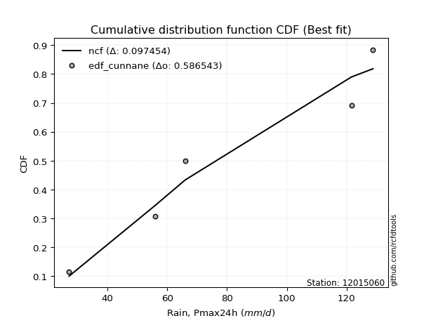</img></img>

</div>


### 12. Empirical - EDF Adamowski (1981)

The Adamowski formula in hydrology refers to a specific plotting position formula used for estimating the non-parametric empirical distribution of hydrological events (like flood peaks) to calculate their return periods. This formula provides an alternative to traditional parametric methods (like the Gumbel or Log Pearson Type III distributions). 

<div align="center">


$P=(m-0.25)/(n+0.5)$


</div>


**12.1. Empirical values**

<div align="center">

|                | 0                   | 1                  | 2             | 3                  | 4                  |
|:---------------|:--------------------|:-------------------|:--------------|:-------------------|:-------------------|
| date           | 2017                | 2018               | 2020          | 2019               | 2021               |
| x              | 27.2                | 56.0               | 66.0          | 121.6              | 128.8              |
| m              | 1                   | 2                  | 3             | 4                  | 5                  |
| empirical_dist | edf_adamowski       | edf_adamowski      | edf_adamowski | edf_adamowski      | edf_adamowski      |
| empirical      | 0.13636363636363635 | 0.3181818181818182 | 0.5           | 0.6818181818181818 | 0.8636363636363636 |
| empirical_tr   | 1.1578947368421053  | 1.4666666666666666 | 2.0           | 3.1428571428571423 | 7.333333333333334  |

</div>


**12.2. Kolmogorov-Smirnov fit test (sorted by Δ)**


<div align="center">

|                | 0                   | 1                   | 2                   | 3                  | 4                   | 5                   | 6                   | 7                   | 8                   | 9                   | 10                  | 11                  | 12                  | 13                  | 14                  | 15                  | 16                  | 17                  | 18                  | 19                  | 20                  | 21                  | 22                  | 23                  | 24                  | 25                  | 26                  | 27                 | 28                  | 29                  | 30                  | 31                  | 32                 | 33                  | 34                    | 35                 | 36                  | 37                 | 38                  | 39                  | 40                 | 41                  | 42                  | 43                  | 44                 | 45                 | 46                 | 47                 | 48                  | 49                  | 50                  | 51                  | 52                 | 53                  | 54                 | 55                  | 56                  | 57                  | 58                  | 59                 | 60                  | 61                 | 62                  | 63                  | 64                 | 65                  | 66                 | 67                  | 68                  | 69                  | 70                  | 71                 | 72                  | 73                 | 74                  | 75                  | 76                 | 77                 | 78                 | 79                 | 80                  | 81                 | 82                  | 83                  | 84                 | 85                 | 86                  | 87                  | 88                 | 89                 |
|:---------------|:--------------------|:--------------------|:--------------------|:-------------------|:--------------------|:--------------------|:--------------------|:--------------------|:--------------------|:--------------------|:--------------------|:--------------------|:--------------------|:--------------------|:--------------------|:--------------------|:--------------------|:--------------------|:--------------------|:--------------------|:--------------------|:--------------------|:--------------------|:--------------------|:--------------------|:--------------------|:--------------------|:-------------------|:--------------------|:--------------------|:--------------------|:--------------------|:-------------------|:--------------------|:----------------------|:-------------------|:--------------------|:-------------------|:--------------------|:--------------------|:-------------------|:--------------------|:--------------------|:--------------------|:-------------------|:-------------------|:-------------------|:-------------------|:--------------------|:--------------------|:--------------------|:--------------------|:-------------------|:--------------------|:-------------------|:--------------------|:--------------------|:--------------------|:--------------------|:-------------------|:--------------------|:-------------------|:--------------------|:--------------------|:-------------------|:--------------------|:-------------------|:--------------------|:--------------------|:--------------------|:--------------------|:-------------------|:--------------------|:-------------------|:--------------------|:--------------------|:-------------------|:-------------------|:-------------------|:-------------------|:--------------------|:-------------------|:--------------------|:--------------------|:-------------------|:-------------------|:--------------------|:--------------------|:-------------------|:-------------------|
| station        | 12015060            | 12015060            | 12015060            | 12015060           | 12015060            | 12015060            | 12015060            | 12015060            | 12015060            | 12015060            | 12015060            | 12015060            | 12015060            | 12015060            | 12015060            | 12015060            | 12015060            | 12015060            | 12015060            | 12015060            | 12015060            | 12015060            | 12015060            | 12015060            | 12015060            | 12015060            | 12015060            | 12015060           | 12015060            | 12015060            | 12015060            | 12015060            | 12015060           | 12015060            | 12015060              | 12015060           | 12015060            | 12015060           | 12015060            | 12015060            | 12015060           | 12015060            | 12015060            | 12015060            | 12015060           | 12015060           | 12015060           | 12015060           | 12015060            | 12015060            | 12015060            | 12015060            | 12015060           | 12015060            | 12015060           | 12015060            | 12015060            | 12015060            | 12015060            | 12015060           | 12015060            | 12015060           | 12015060            | 12015060            | 12015060           | 12015060            | 12015060           | 12015060            | 12015060            | 12015060            | 12015060            | 12015060           | 12015060            | 12015060           | 12015060            | 12015060            | 12015060           | 12015060           | 12015060           | 12015060           | 12015060            | 12015060           | 12015060            | 12015060            | 12015060           | 12015060           | 12015060            | 12015060            | 12015060           | 12015060           |
| empirical_dist | edf_adamowski       | edf_adamowski       | edf_adamowski       | edf_adamowski      | edf_adamowski       | edf_adamowski       | edf_adamowski       | edf_adamowski       | edf_adamowski       | edf_adamowski       | edf_adamowski       | edf_adamowski       | edf_adamowski       | edf_adamowski       | edf_adamowski       | edf_adamowski       | edf_adamowski       | edf_adamowski       | edf_adamowski       | edf_adamowski       | edf_adamowski       | edf_adamowski       | edf_adamowski       | edf_adamowski       | edf_adamowski       | edf_adamowski       | edf_adamowski       | edf_adamowski      | edf_adamowski       | edf_adamowski       | edf_adamowski       | edf_adamowski       | edf_adamowski      | edf_adamowski       | edf_adamowski         | edf_adamowski      | edf_adamowski       | edf_adamowski      | edf_adamowski       | edf_adamowski       | edf_adamowski      | edf_adamowski       | edf_adamowski       | edf_adamowski       | edf_adamowski      | edf_adamowski      | edf_adamowski      | edf_adamowski      | edf_adamowski       | edf_adamowski       | edf_adamowski       | edf_adamowski       | edf_adamowski      | edf_adamowski       | edf_adamowski      | edf_adamowski       | edf_adamowski       | edf_adamowski       | edf_adamowski       | edf_adamowski      | edf_adamowski       | edf_adamowski      | edf_adamowski       | edf_adamowski       | edf_adamowski      | edf_adamowski       | edf_adamowski      | edf_adamowski       | edf_adamowski       | edf_adamowski       | edf_adamowski       | edf_adamowski      | edf_adamowski       | edf_adamowski      | edf_adamowski       | edf_adamowski       | edf_adamowski      | edf_adamowski      | edf_adamowski      | edf_adamowski      | edf_adamowski       | edf_adamowski      | edf_adamowski       | edf_adamowski       | edf_adamowski      | edf_adamowski      | edf_adamowski       | edf_adamowski       | edf_adamowski      | edf_adamowski      |
| p_dist         | ncf                 | logkstwobign        | loggenexpon         | loginvweibull      | logfisk             | loginvgauss         | expon               | genexpon            | logbetaprime        | fisk                | logalpha            | logncf              | loggamma            | loggamma            | logrice             | loggompertz         | lograyleigh         | lognct              | logmaxwell          | loghalfnorm         | logf                | logerlang           | loginvgamma         | logt                | logcrystalball      | lognorm             | lognorm             | logexponnorm       | logfatiguelife      | logpearson3         | betaprime           | genlogistic         | invgauss           | halfnorm            | loglaplace_asymmetric | laplace_asymmetric | rayleigh            | maxwell            | logweibull_min      | alpha               | invgamma           | rice                | loggumbel_r         | loghalflogistic     | gompertz           | kstwobign          | pearson3           | nct                | exponnorm           | crystalball         | norm                | truncnorm           | t                  | gamma               | erlang             | loglogistic         | logmoyal            | loggumbel_l         | halflogistic        | gumbel_r           | loghypsecant        | moyal              | logistic            | loglaplace          | hypsecant          | logwald             | gumbel_l           | laplace             | wald                | logmielke           | mielke              | logexpon           | f                   | loggibrat          | logloggamma         | gibrat              | logchi2            | weibull_min        | lognakagami        | logtruncnorm       | nakagami            | pareto             | logpareto           | loglognorm          | chi2               | invweibull         | logjohnsonsu        | fatiguelife         | johnsonsu          | loggenlogistic     |
| delta          | 0.10794396521330052 | 0.13686684338399013 | 0.14263653340837634 | 0.1427470388953599 | 0.14377120598392112 | 0.15084141609222967 | 0.15132042727412842 | 0.15147940216873523 | 0.15190835284773485 | 0.15195504936926063 | 0.15320296003113787 | 0.15422672208452315 | 0.15424494353278384 | 0.15424494353278384 | 0.15451914702861436 | 0.15453368283199487 | 0.15476504998982366 | 0.15496480066496288 | 0.15536369964831376 | 0.15548081638911737 | 0.15662258904429183 | 0.15695018317072928 | 0.15695793176867057 | 0.15765022121565564 | 0.15765087212591478 | 0.15765120050346004 | 0.15765120050346004 | 0.157652551686857  | 0.15812184320078304 | 0.15954273934238394 | 0.16719019988379158 | 0.16737102731500775 | 0.167793107389819  | 0.16811848175477173 | 0.16831567895525645   | 0.1685135193241304 | 0.16892086821612573 | 0.1700965755829319 | 0.17015329858846473 | 0.17131053007244823 | 0.1717733941586499 | 0.17243389024324074 | 0.17266484992172304 | 0.17290746538680346 | 0.1729828053817094 | 0.1737024428987528 | 0.1741789649253359 | 0.1744294639959253 | 0.17452918623229174 | 0.17452979665864665 | 0.17452979986125816 | 0.17452980747786717 | 0.1745410911468096 | 0.17514649951818295 | 0.175559431598583  | 0.17630589396942142 | 0.17848343088988938 | 0.18346430122273172 | 0.18382411975695456 | 0.1845645482619377 | 0.18615288412146647 | 0.1890902969716277 | 0.19142916531924803 | 0.19528893928830493 | 0.1998896779981023 | 0.20280192993102597 | 0.2071420245773029 | 0.20715099235242607 | 0.21044711811930417 | 0.21483847697358904 | 0.22066722526439342 | 0.2209456448893498 | 0.22420526731493923 | 0.2269568674818102 | 0.22974757534966128 | 0.23335207639806688 | 0.2551470806568112 | 0.3172293600088533 | 0.3181019236693081 | 0.3181801962337743 | 0.31818149624963976 | 0.3393892714470678 | 0.36199150045254486 | 0.36260540801115054 | 0.3626420149083645 | 0.4320435946372984 | 0.48804311537034933 | 0.49925546442167285 | 0.604750037520231  | 0.6818181818181818 |
| deltao         | 0.5865427407550001  | 0.5865427407550001  | 0.5865427407550001  | 0.5865427407550001 | 0.5865427407550001  | 0.5865427407550001  | 0.5865427407550001  | 0.5865427407550001  | 0.5865427407550001  | 0.5865427407550001  | 0.5865427407550001  | 0.5865427407550001  | 0.5865427407550001  | 0.5865427407550001  | 0.5865427407550001  | 0.5865427407550001  | 0.5865427407550001  | 0.5865427407550001  | 0.5865427407550001  | 0.5865427407550001  | 0.5865427407550001  | 0.5865427407550001  | 0.5865427407550001  | 0.5865427407550001  | 0.5865427407550001  | 0.5865427407550001  | 0.5865427407550001  | 0.5865427407550001 | 0.5865427407550001  | 0.5865427407550001  | 0.5865427407550001  | 0.5865427407550001  | 0.5865427407550001 | 0.5865427407550001  | 0.5865427407550001    | 0.5865427407550001 | 0.5865427407550001  | 0.5865427407550001 | 0.5865427407550001  | 0.5865427407550001  | 0.5865427407550001 | 0.5865427407550001  | 0.5865427407550001  | 0.5865427407550001  | 0.5865427407550001 | 0.5865427407550001 | 0.5865427407550001 | 0.5865427407550001 | 0.5865427407550001  | 0.5865427407550001  | 0.5865427407550001  | 0.5865427407550001  | 0.5865427407550001 | 0.5865427407550001  | 0.5865427407550001 | 0.5865427407550001  | 0.5865427407550001  | 0.5865427407550001  | 0.5865427407550001  | 0.5865427407550001 | 0.5865427407550001  | 0.5865427407550001 | 0.5865427407550001  | 0.5865427407550001  | 0.5865427407550001 | 0.5865427407550001  | 0.5865427407550001 | 0.5865427407550001  | 0.5865427407550001  | 0.5865427407550001  | 0.5865427407550001  | 0.5865427407550001 | 0.5865427407550001  | 0.5865427407550001 | 0.5865427407550001  | 0.5865427407550001  | 0.5865427407550001 | 0.5865427407550001 | 0.5865427407550001 | 0.5865427407550001 | 0.5865427407550001  | 0.5865427407550001 | 0.5865427407550001  | 0.5865427407550001  | 0.5865427407550001 | 0.5865427407550001 | 0.5865427407550001  | 0.5865427407550001  | 0.5865427407550001 | 0.5865427407550001 |
| eval           | Δo > Δ              | Δo > Δ              | Δo > Δ              | Δo > Δ             | Δo > Δ              | Δo > Δ              | Δo > Δ              | Δo > Δ              | Δo > Δ              | Δo > Δ              | Δo > Δ              | Δo > Δ              | Δo > Δ              | Δo > Δ              | Δo > Δ              | Δo > Δ              | Δo > Δ              | Δo > Δ              | Δo > Δ              | Δo > Δ              | Δo > Δ              | Δo > Δ              | Δo > Δ              | Δo > Δ              | Δo > Δ              | Δo > Δ              | Δo > Δ              | Δo > Δ             | Δo > Δ              | Δo > Δ              | Δo > Δ              | Δo > Δ              | Δo > Δ             | Δo > Δ              | Δo > Δ                | Δo > Δ             | Δo > Δ              | Δo > Δ             | Δo > Δ              | Δo > Δ              | Δo > Δ             | Δo > Δ              | Δo > Δ              | Δo > Δ              | Δo > Δ             | Δo > Δ             | Δo > Δ             | Δo > Δ             | Δo > Δ              | Δo > Δ              | Δo > Δ              | Δo > Δ              | Δo > Δ             | Δo > Δ              | Δo > Δ             | Δo > Δ              | Δo > Δ              | Δo > Δ              | Δo > Δ              | Δo > Δ             | Δo > Δ              | Δo > Δ             | Δo > Δ              | Δo > Δ              | Δo > Δ             | Δo > Δ              | Δo > Δ             | Δo > Δ              | Δo > Δ              | Δo > Δ              | Δo > Δ              | Δo > Δ             | Δo > Δ              | Δo > Δ             | Δo > Δ              | Δo > Δ              | Δo > Δ             | Δo > Δ             | Δo > Δ             | Δo > Δ             | Δo > Δ              | Δo > Δ             | Δo > Δ              | Δo > Δ              | Δo > Δ             | Δo > Δ             | Δo > Δ              | Δo > Δ              | Δo <= Δ            | Δo <= Δ            |
| fit            | 1                   | 1                   | 1                   | 1                  | 1                   | 1                   | 1                   | 1                   | 1                   | 1                   | 1                   | 1                   | 1                   | 1                   | 1                   | 1                   | 1                   | 1                   | 1                   | 1                   | 1                   | 1                   | 1                   | 1                   | 1                   | 1                   | 1                   | 1                  | 1                   | 1                   | 1                   | 1                   | 1                  | 1                   | 1                     | 1                  | 1                   | 1                  | 1                   | 1                   | 1                  | 1                   | 1                   | 1                   | 1                  | 1                  | 1                  | 1                  | 1                   | 1                   | 1                   | 1                   | 1                  | 1                   | 1                  | 1                   | 1                   | 1                   | 1                   | 1                  | 1                   | 1                  | 1                   | 1                   | 1                  | 1                   | 1                  | 1                   | 1                   | 1                   | 1                   | 1                  | 1                   | 1                  | 1                   | 1                   | 1                  | 1                  | 1                  | 1                  | 1                   | 1                  | 1                   | 1                   | 1                  | 1                  | 1                   | 1                   | 0                  | 0                  |
| n              | 5                   | 5                   | 5                   | 5                  | 5                   | 5                   | 5                   | 5                   | 5                   | 5                   | 5                   | 5                   | 5                   | 5                   | 5                   | 5                   | 5                   | 5                   | 5                   | 5                   | 5                   | 5                   | 5                   | 5                   | 5                   | 5                   | 5                   | 5                  | 5                   | 5                   | 5                   | 5                   | 5                  | 5                   | 5                     | 5                  | 5                   | 5                  | 5                   | 5                   | 5                  | 5                   | 5                   | 5                   | 5                  | 5                  | 5                  | 5                  | 5                   | 5                   | 5                   | 5                   | 5                  | 5                   | 5                  | 5                   | 5                   | 5                   | 5                   | 5                  | 5                   | 5                  | 5                   | 5                   | 5                  | 5                   | 5                  | 5                   | 5                   | 5                   | 5                   | 5                  | 5                   | 5                  | 5                   | 5                   | 5                  | 5                  | 5                  | 5                  | 5                   | 5                  | 5                   | 5                   | 5                  | 5                  | 5                   | 5                   | 5                  | 5                  |
| best_fit       | 1                   | 0                   | 0                   | 0                  | 0                   | 0                   | 0                   | 0                   | 0                   | 0                   | 0                   | 0                   | 0                   | 0                   | 0                   | 0                   | 0                   | 0                   | 0                   | 0                   | 0                   | 0                   | 0                   | 0                   | 0                   | 0                   | 0                   | 0                  | 0                   | 0                   | 0                   | 0                   | 0                  | 0                   | 0                     | 0                  | 0                   | 0                  | 0                   | 0                   | 0                  | 0                   | 0                   | 0                   | 0                  | 0                  | 0                  | 0                  | 0                   | 0                   | 0                   | 0                   | 0                  | 0                   | 0                  | 0                   | 0                   | 0                   | 0                   | 0                  | 0                   | 0                  | 0                   | 0                   | 0                  | 0                   | 0                  | 0                   | 0                   | 0                   | 0                   | 0                  | 0                   | 0                  | 0                   | 0                   | 0                  | 0                  | 0                  | 0                  | 0                   | 0                  | 0                   | 0                   | 0                  | 0                  | 0                   | 0                   | 0                  | 0                  |
| best_fit_sort  | 1                   | 2                   | 3                   | 4                  | 5                   | 6                   | 7                   | 8                   | 9                   | 10                  | 11                  | 12                  | 13                  | 14                  | 15                  | 16                  | 17                  | 18                  | 19                  | 20                  | 21                  | 22                  | 23                  | 24                  | 25                  | 26                  | 27                  | 28                 | 29                  | 30                  | 31                  | 32                  | 33                 | 34                  | 35                    | 36                 | 37                  | 38                 | 39                  | 40                  | 41                 | 42                  | 43                  | 44                  | 45                 | 46                 | 47                 | 48                 | 49                  | 50                  | 51                  | 52                  | 53                 | 54                  | 55                 | 56                  | 57                  | 58                  | 59                  | 60                 | 61                  | 62                 | 63                  | 64                  | 65                 | 66                  | 67                 | 68                  | 69                  | 70                  | 71                  | 72                 | 73                  | 74                 | 75                  | 76                  | 77                 | 78                 | 79                 | 80                 | 81                  | 82                 | 83                  | 84                  | 85                 | 86                 | 87                  | 88                  | 89                 | 90                 |

</div>


<div align="center">

</img>

</div>


**12.3. Best fit**

<div align="center">

|   id |   station | empirical_dist   | p_dist   |    delta |   deltao | eval   |   fit |   n |   best_fit |   best_fit_sort |
|-----:|----------:|:-----------------|:---------|---------:|---------:|:-------|------:|----:|-----------:|----------------:|
|    0 |  12015060 | edf_adamowski    | ncf      | 0.107944 | 0.586543 | Δo > Δ |     1 |   5 |          1 |               1 |

</div>


<div align="center">

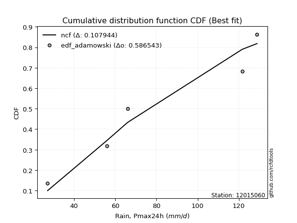</img></img>

</div>


## C. Best fit & Estimate extreme values for specific return periods - Tr


### 1. Best fit (ordered by delta Δ)

<div align="center">

|   id |   station | empirical_dist   | p_dist                |     delta |   deltao | eval   |   fit |   n |   best_fit |   best_fit_sort |
|-----:|----------:|:-----------------|:----------------------|----------:|---------:|:-------|------:|----:|-----------:|----------------:|
|    0 |  12015060 | edf_hazen        | ncf                   | 0.0897621 | 0.586543 | Δo > Δ |     1 |   5 |          1 |               1 |
|    1 |  12015060 | edf_gringorten   | ncf                   | 0.0944496 | 0.586543 | Δo > Δ |     1 |   5 |          1 |               2 |
|    2 |  12015060 | edf_cunnane      | ncf                   | 0.0974545 | 0.586543 | Δo > Δ |     1 |   5 |          1 |               3 |
|    3 |  12015060 | edf_blom         | ncf                   | 0.099286  | 0.586543 | Δo > Δ |     1 |   5 |          1 |               4 |
|    4 |  12015060 | edf_tukey        | ncf                   | 0.102262  | 0.586543 | Δo > Δ |     1 |   5 |          1 |               5 |
|    5 |  12015060 | edf_filliben     | ncf                   | 0.103369  | 0.586543 | Δo > Δ |     1 |   5 |          1 |               6 |
|    6 |  12015060 | edf_beard        | ncf                   | 0.103889  | 0.586543 | Δo > Δ |     1 |   5 |          1 |               7 |
|    7 |  12015060 | edf_jenkinson    | ncf                   | 0.103889  | 0.586543 | Δo > Δ |     1 |   5 |          1 |               8 |
|    8 |  12015060 | edf_chegodayev   | ncf                   | 0.104577  | 0.586543 | Δo > Δ |     1 |   5 |          1 |               9 |
|    9 |  12015060 | edf_adamowski    | ncf                   | 0.107944  | 0.586543 | Δo > Δ |     1 |   5 |          1 |              10 |
|   10 |  12015060 | edf_weibull      | ncf                   | 0.123095  | 0.586543 | Δo > Δ |     1 |   5 |          1 |              11 |
|   11 |  12015060 | edf_california   | loglaplace_asymmetric | 0.135958  | 0.586543 | Δo > Δ |     1 |   5 |          1 |              12 |

</div>

:file_folder:Tables: [bestfit_12015060.csv](table/bestfit_12015060.csv) | [extreme_12015060.csv](table/extreme_12015060.csv)


### 2. Extreme values

In hydrology, a return period (or recurrence interval $Tr$) is the statistical average time between extreme events like floods or droughts of a specific magnitude, indicating how rare an event is, with a 100-year flood, for example, having a 1% chance of occurring in any given year, not that it happens exactly every century. It is a key tool for infrastructure design (like bridges or dams) and risk assessment, calculated from historical data to determine the probability of future events, although it is important to remember it is statistical average, and events can cluster or be missed.

> risk_rate: assuming the return period as the project useful life.

|   id |      tr |   prob_l |     prob_g |    alpha |   betaprime |     chi2 |   crystalball |   erlang |    expon |   exponnorm |        f |   fatiguelife |    fisk |    gamma |   genexpon |   genlogistic |   gibrat |   gompertz |   gumbel_l |   gumbel_r |   halflogistic |   halfnorm |   hypsecant |   invgamma |   invgauss |     invweibull |   johnsonsu |   kstwobign |   laplace |   laplace_asymmetric |   loggamma |   logistic |   lognorm |   maxwell |   mielke |    moyal |   nakagami |      ncf |      nct |     norm |           pareto |   pearson3 |   rayleigh |     rice |        t |   truncnorm |     wald |   weibull_min |   logalpha |   logbetaprime |          logchi2 |   logcrystalball |   logerlang |   logexpon |   logexponnorm |     logf |   logfatiguelife |   logfisk |   loggenexpon |   loggenlogistic |   loggibrat |   loggompertz |   loggumbel_l |   loggumbel_r |   loghalflogistic |   loghalfnorm |   loghypsecant |   loginvgamma |   loginvgauss |   loginvweibull |    logjohnsonsu |   logkstwobign |   loglaplace |   loglaplace_asymmetric |   logloggamma |   loglogistic |    loglognorm |   logmaxwell |   logmielke |   logmoyal |   lognakagami |   logncf |   lognct |       logpareto |   logpearson3 |   lograyleigh |   logrice |     logt |   logtruncnorm |   logwald |   logweibull_min |   station |   n |   risk_rate |
|-----:|--------:|---------:|-----------:|---------:|------------:|---------:|--------------:|---------:|---------:|------------:|---------:|--------------:|--------:|---------:|-----------:|--------------:|---------:|-----------:|-----------:|-----------:|---------------:|-----------:|------------:|-----------:|-----------:|---------------:|------------:|------------:|----------:|---------------------:|-----------:|-----------:|----------:|----------:|---------:|---------:|-----------:|---------:|---------:|---------:|-----------------:|-----------:|-----------:|---------:|---------:|------------:|---------:|--------------:|-----------:|---------------:|-----------------:|-----------------:|------------:|-----------:|---------------:|---------:|-----------------:|----------:|--------------:|-----------------:|------------:|--------------:|--------------:|--------------:|------------------:|--------------:|---------------:|--------------:|--------------:|----------------:|----------------:|---------------:|-------------:|------------------------:|--------------:|--------------:|--------------:|-------------:|------------:|-----------:|--------------:|---------:|---------:|----------------:|--------------:|--------------:|----------:|---------:|---------------:|----------:|-----------------:|----------:|----:|------------:|
|    0 |    2    | 0.5      | 0.5        |  76.2464 |     73.3032 |  40.7788 |       79.92   |  78.9996 |  63.7427 |     79.9178 |  51.5836 |       27.778  |  72.846 |  78.9852 |    63.7233 |       72.9583 |  68.1622 |    75.9383 |    86.3552 |    73.4848 |        70.2856 |    71.9017 |     79.92   |    75.5699 |    72.8552 | 9234.61        |       128.8 |     72.4245 |   79.92   |              70.0294 |    68.0597 |    79.92   |   69.0924 |   76.5699 |  84.6674 |  71.4073 |    68.0472 |  74.0514 |  79.913  |  79.92   |     33.6306      |    79.3491 |    75.3817 |  77.0367 |  79.92   |     79.92   |  67.2224 |       31.6584 |    66.3072 |        68.1097 |     46.3712      |          69.0924 |     67.9652 |    51.9036 |        69.0923 |  69.1318 |          69.0119 |   71.4992 |       60.8304 |          inf     |     58.2333 |       60.1342 |       75.8711 |       62.9193 |           60.0583 |       61.4874 |        69.0924 |       66.7299 |       66.4872 |         61.4891 |  128.8          |        60.844  |      69.0924 |                 67.5601 |       83.7128 |       69.0924 |  27.2251      |      65.8066 |     83.9372 |    61.0467 |       61.3695 |  68.9773 |  69.2844 |   30.7544       |       71.9618 |       64.6792 |   67.5719 |  69.0923 |        71.8666 |   57.4415 |          76.5324 |  12015060 |   5 |    0.75     |
|    1 |    2.33 | 0.570815 | 0.429185   |  83.2872 |     80.5618 |  45.6336 |       86.9101 |  85.9816 |  71.7942 |     86.9079 |  59.2892 |       29.27   |  79.995 |  85.979  |    71.7704 |       80.1009 |  71.7031 |    83.3813 |    92.4366 |    79.9619 |        76.9451 |    79.4459 |     85.5142 |    82.6444 |    80.0624 |    1.32008e+06 |       128.8 |     79.6359 |   84.1501 |              76.559  |    75.534  |    86.0787 |   76.4859 |   83.8321 |  91.8811 |  77.5387 |    72.8302 |  83.2596 |  86.9066 |  86.9101 |     39.0969      |    86.3548 |    82.7513 |  84.1521 |  86.9097 |     86.9101 |  71.8059 |       39.1913 |    73.7527 |        75.6235 |     55.5968      |          76.4859 |     75.3576 |    59.845  |        76.4858 |  76.5505 |          76.3842 |   78.8146 |       68.6956 |          inf     |     61.3105 |       68.0108 |       82.8873 |       69.1345 |           66.1664 |       68.6177 |        74.9487 |       74.0791 |       73.9618 |         68.8492 |  128.8          |        68.6546 |      73.4765 |                 72.7852 |       90.8978 |       75.5667 |  27.5166      |      73.1374 |     91.2982 |    66.7405 |       65.0435 |  76.4618 |  76.7503 |   34.1594       |       79.4866 |       71.9968 |   75.0732 |  76.4859 |        75.4703 |   61.4012 |          83.8188 |  12015060 |   5 |    0.729209 |
|    2 |    5    | 0.8      | 0.2        | 111.795  |    111.49   |  74.1368 |      112.887  | 112.392  | 112.05   |    112.886  | 102.455  |       52.2269 | 113.41  | 112.444  |   112.004  |      111.124  |  92.089  |   112.232  |   112.083  |   108.101  |       107.078  |   111.349  |    107.954  |   111.512  |   111.154  |    3.0846e+15  |       128.8 |    110.268  |  105.299  |             109.205  |   111.974  |   109.859  |  111.599  |  112.416  | 112.994  | 105.94   |    98.1954 | 124.099  | 112.899  | 112.887  |    254.017       |   112.71   |   112.255  | 112.185  | 112.886  |    112.887  |  97.4642 |      320.306  |   111.543  |       112.498  |    157.98        |         111.599  |    111.319  |   121.946  |       111.598  | 111.831  |         111.457  |  114.803  |      113.046  |          inf     |     82.4688 |      109.962  |      110.301  |      104.095  |          102.558  |      109.13   |       103.872  |      110.807  |      112.149  |        112.516  |  128.8          |       114.676  |      99.9386 |                105.633  |      112.121  |      106.79   |   3.47147e+62 |     110.836  |    113.109  |   100.874  |       96.9518 | 112.301  | 112.246  | 2231.37         |      112.49   |      110.578  |  111.817  | 111.599  |        92.9267 |   89.1758 |         112.444  |  12015060 |   5 |    0.67232  |
|    3 |   10    | 0.9      | 0.1        | 133.035  |    135.707  | 103.522  |      130.12   | 130.317  | 148.592  |    130.121  | 145.451  |       83.7255 | 145.232 | 130.415  |   148.528  |      136.387  | 115.327  |   131.182  |   123.022  |   131.02   |       132.102  |   134.956  |    125.872  |   133.178  |   135.939  |    1.31763e+23 |       128.8 |    133.591  |  124.498  |             138.841  |   146.214  |   127.371  |  143.385  |  132.531  | 121.396  | 130.668  |   119.656  | 157.351  | 130.143  | 130.12   |   3215.43        |   130.472  |   133.292  | 131.766  | 130.117  |    130.12   | 124.694  |     1764.55   |   149.277  |       147.49   |    456.387       |         143.385  |    145.019  |   232.7    |       143.384  | 143.829  |         143.294  |  151.444  |      162.298  |          inf     |    115.626  |      151.11   |      129.321  |      145.276  |          147.582  |      153.834  |       134.796  |      146.64   |      150.557  |        167.863  |  128.8          |       169.477  |     132.129  |                148.129  |      120.639  |      137.767  | inf           |     148.503  |    121.888  |   144.532  |      143.303  | 145.119  | 144.419  |    5.13137e+28  |      138.98   |      150.156  |  146.255  | 143.385  |       106.265  |  132.508  |         132.426  |  12015060 |   5 |    0.651322 |
|    4 |   15    | 0.933333 | 0.0666667  | 144.434  |    148.981  | 121.607  |      138.719  | 139.383  | 169.968  |    138.722  | 171.584  |      104.323  | 165.745 | 139.507  |   169.892  |      150.64   | 131.355  |   140.347  |   127.975  |   143.951  |       146.263  |   147.242  |    136.098  |   144.836  |   149.673  |    2.66017e+27 |       128.8 |    145.972  |  135.729  |             156.177  |   167.32   |   136.913  |  162.487  |  142.852  | 124.109  | 145.018  |   131.168  | 175.901  | 138.748  | 138.719  |  14974.2         |   139.42   |   144.131  | 141.739  | 138.716  |    138.719  | 142.179  |     3916.74   |   173.584  |       169.213  |    873.584       |         162.487  |    165.758  |   339.589  |       162.487  | 163.082  |         162.464  |  176.115  |      195.787  |          inf     |    145.978  |      176.308  |      138.982  |      175.335  |          181.336  |      183.928  |       156.41   |      169.336  |      175.385  |        210.367  |  128.8          |       208.529  |     155.573  |                180.524  |      123.397  |      158.276  | inf           |     172.554  |    124.733  |   178.077  |      177.955  | 164.992  | 163.766  |    2.19735e+130 |      153.603  |      175.794  |  167.368  | 162.488  |       112.373  |  170.879  |         142.609  |  12015060 |   5 |    0.644736 |
|    5 |   20    | 0.95     | 0.05       | 152.215  |    158.122  | 134.728  |      144.35   | 145.365  | 185.135  |    144.354  | 190.447  |      119.572  | 181.427 | 145.507  |   185.051  |      160.618  | 143.928  |   146.215  |   131.059  |   153.005  |       156.185  |   155.432  |    143.312  |   152.8    |   159.187  |    2.74943e+30 |       128.8 |    154.313  |  143.697  |             168.477  |   182.879  |   143.508  |  176.356  |  149.702  | 125.451  | 155.182  |   138.905  | 188.779  | 144.384  | 144.35   |  44758.4         |   145.309  |   151.336  | 148.328  | 144.347  |    144.35   | 155.209  |     6450.59   |   192.002  |       185.296  |   1397.63        |         176.356  |    181.033  |   444.042  |       176.355  | 177.07   |         176.399  |  195.478  |      221.867  |          inf     |    175.265  |      194.637  |      145.357  |      200.011  |          209.487  |      207.196  |       173.712  |      186.353  |      194.23   |        246.383  |  128.801        |       239.791  |     174.688  |                207.72   |      124.762  |      174.209  | inf           |     190.63   |    126.142  |   206.444  |      206.092  | 179.486  | 177.818  |  inf            |      163.685  |      195.214  |  182.866  | 176.356  |       115.907  |  206.535  |         149.339  |  12015060 |   5 |    0.641514 |
|    6 |   25    | 0.96     | 0.04       | 158.11   |    165.084  | 145.044  |      148.496  | 149.791  | 196.899  |    148.501  | 205.233  |      131.688  | 194.33  | 149.946  |   196.809  |      168.305  | 154.409  |   150.463  |   133.253  |   159.979  |       163.829  |   161.527  |    148.895  |   158.836  |   166.46   |    5.76858e+32 |       128.8 |    160.56   |  149.878  |             178.017  |   195.311  |   148.553  |  187.316  |  154.787  | 126.251  | 163.06   |   144.681  | 198.636  | 148.533  | 148.496  | 104707           |   149.66   |   156.689  | 153.205  | 148.493  |    148.496  | 165.646  |     9206.27   |   207.019  |       198.188  |   2021.19        |         187.316  |    193.23   |   546.722  |       187.315  | 188.13   |         187.421  |  211.716  |      243.507  |          inf     |    204.125  |      209.097  |      150.07   |      221.362  |          234.122  |      226.399  |       188.406  |      200.119  |      209.608  |        278.276  |  128.805        |       266.24   |     191.118  |                231.606  |      125.577  |      187.472  | inf           |     205.263  |    126.984  |   231.505  |      230.046  | 190.977  | 188.925  |  inf            |      171.36   |      211.018  |  195.207  | 187.316  |       118.216  |  240.391  |         154.32   |  12015060 |   5 |    0.639603 |
|    7 |   50    | 0.98     | 0.02       | 175.837  |    186.145  | 177.705  |      160.367  | 162.569  | 233.442  |    160.375  | 251.874  |      170.562  | 239.206 | 162.767  |   233.332  |      191.982  | 191.357  |   162.273  |   139.209  |   181.462  |       187.383  |   179.24   |    166.205  |   176.981  |   188.594  |    8.19441e+39 |       128.8 |    178.905  |  169.077  |             207.653  |   236.13   |   163.968  |  222.616  |  169.535  | 127.841  | 187.515  |   161.509  | 228.667  | 160.414  | 160.367  |      1.46849e+06 |   162.192  |   172.227  | 167.274  | 160.364  |    160.367  | 199.723  |    24217.8    |   258.168  |       240.762  |   6484.73        |         222.616  |    233.237  |  1043.27   |       222.614  | 223.784  |         222.976  |  270.171  |      319.248  |          inf     |    349.342  |      255.265  |      163.65   |      302.548  |          329.774  |      292.925  |       242.341  |      246.347  |      262.052  |        404.884  |  129.031        |       362      |     252.677  |                324.78   |      127.197  |      234.584  | inf           |     254.368  |    128.664  |   330.392  |      317.203  | 228.198  | 224.712  |  inf            |      194.512  |      264.523  |  235.462  | 222.617  |       123.346  |  394.604  |         168.696  |  12015060 |   5 |    0.63583  |
|    8 |   75    | 0.986667 | 0.0133333  | 185.9    |    198.155  | 197.161  |      166.737  | 169.49   | 254.818  |    166.746  | 279.567  |      193.973  | 269.361 | 169.712  |   254.697  |      205.744  | 216.311  |   168.389  |   142.221  |   193.949  |       201.074  |   188.883  |    176.32   |   187.272  |   201.294  |    1.17705e+44 |       128.8 |    188.999  |  180.307  |             224.988  |   261.678  |   172.871  |  244.224  |  177.554  | 128.368  | 201.817  |   170.673  | 245.908  | 166.789  | 166.737  |      6.88362e+06 |   168.961  |   180.68   | 174.879  | 166.733  |    166.737  | 220.692  |    39514.9    |   291.59   |       267.587  |  12969.6         |         244.225  |    258.248  |  1522.48   |       244.223  | 245.632  |         244.781  |  311.024  |      370.059  |          inf     |    502.18   |      283.085  |      170.978  |      362.797  |          402.437  |      337.024  |       280.75   |      276.05   |      296.344  |        503.486  |  130.601        |       428.671  |     297.51   |                395.808  |      127.734  |      267.013  | inf           |     285.831  |    129.241  |   406.781  |      377.906  | 251.13   | 246.627  |  inf            |      207.635  |      299.128  |  260.451  | 244.226  |       125.232  |  535.32   |         176.468  |  12015060 |   5 |    0.634587 |
|    9 |  100    | 0.99     | 0.01       | 192.941  |    206.568  | 211.093  |      171.045  | 174.196  | 269.985  |    171.056  | 299.369  |      210.818  | 292.77  | 174.435  |   269.855  |      215.484  | 235.642  |   172.437  |   144.191  |   202.786  |       210.765  |   195.452  |    183.496  |   194.464  |   210.219  |    1.03075e+47 |       128.8 |    195.914  |  188.275  |             237.288  |   280.607  |   179.157  |  260.016  |  183.015  | 128.631  | 211.963  |   176.911  | 258.025  | 171.101  | 171.045  |      2.05998e+07 |   173.556  |   186.439  | 180.042  | 171.041  |    171.045  | 235.981  |    54435.1    |   317.039  |       287.547  |  21295.5         |         260.017  |    276.767  |  1990.78   |       260.015  | 261.609  |         260.735  |  343.535  |      409.282  |          inf     |    665.201  |      303.162  |      175.948  |      412.558  |          463.349  |      370.81   |       311.632  |      298.425  |      322.456  |        587.465  |  136.133        |       481.31   |     334.064  |                455.437  |      128.003  |      292.572  | inf           |     309.461  |    129.548  |   471.462  |      425.73   | 267.956  | 262.647  |  inf            |      216.78   |      325.261  |  278.864  | 260.018  |       126.213  |  668.625  |         181.745  |  12015060 |   5 |    0.633968 |
|   10 |  200    | 0.995    | 0.005      | 209.661  |    226.543  | 245.021  |      180.818  | 184.949  | 306.527  |    180.831  | 347.525  |      252.051  | 357.049 | 185.228  |   306.379  |      238.9    | 288.235  |   181.357  |   148.473  |   224.033  |       234.062  |   210.476  |    200.782  |   211.509  |   231.489  |    1.22148e+54 |       128.8 |    211.843  |  207.474  |             266.924  |   329.127  |   194.235  |  299.727  |  195.51   | 129.031  | 236.408  |   191.154  | 286.902  | 180.882  | 180.818  |      2.88975e+08 |   184.032  |   199.617  | 191.803  | 180.813  |    180.818  | 274.063  |   109228      |   384.887  |       339.018  |  71156.4         |         299.727  |    324.19   |  3798.85   |       299.725  | 301.818  |         300.918  |  436.059  |      515.556  |          128.404 |   1429.3    |      352.617  |      187.254  |      561.932  |          650.229  |      461.365  |       400.708  |      357.158  |      392.038  |        851.224  |  461.731        |       628.465  |     441.667  |                638.657  |      128.404  |      364.309  | inf           |     371.132  |    130.094  |   672.744  |      558.695  | 310.501  | 302.941  |  inf            |      238.302  |      393.971  |  325.683  | 299.729  |       127.735  | 1163.39   |         193.764  |  12015060 |   5 |    0.633042 |
|   11 |  250    | 0.996    | 0.004      | 214.989  |    232.901  | 256.037  |      183.804  | 188.256  | 318.291  |    183.818  | 363.147  |      265.489  | 380.397 | 188.548  |   318.137  |      246.428  | 307.106  |   184.012  |   149.733  |   230.863  |       241.552  |   215.097  |    206.347  |   216.929  |   238.279  |    2.29608e+56 |       128.8 |    216.772  |  213.655  |             276.464  |   345.668  |   199.075  |  313.032  |  199.357  | 129.115  | 244.278  |   195.528  | 296.118  | 183.871  | 183.804  |      6.76256e+08 |   187.248  |   203.673  | 195.41   | 183.799  |    183.804  | 286.661  |   134072      |   408.864  |       356.661  | 105241           |         313.032  |    340.344  |  4677.29   |       313.03   | 315.301  |         314.402  |  470.757  |      553.57   |          128.484 |   1880.64   |      368.847  |      190.717  |      620.621  |          725.062  |      493.443  |       434.487  |      377.62   |      416.608  |        959.009  | 3601.91         |       682.552  |     483.207  |                712.097  |      128.484  |      390.882  | inf           |     392.485  |    130.235  |   754.32   |      607.263  | 324.827  | 316.444  |  inf            |      245.086  |      417.912  |  341.524  | 313.034  |       128.047  | 1397.35   |         197.449  |  12015060 |   5 |    0.632858 |
|   12 |  500    | 0.998    | 0.002      | 231.441  |    252.474  | 290.497  |      192.66   | 198.123  | 354.834  |    192.678  | 411.988  |      307.644  | 462.51  | 198.454  |   354.66   |      269.793  | 372.322  |   191.691  |   153.345  |   252.064  |       264.799  |   228.878  |    223.632  |   233.615  |   259.23   |    2.62622e+63 |       128.8 |    231.545  |  232.854  |             306.1    |   400.097  |   214.088  |  356.063  |  210.834  | 129.305  | 268.722  |   208.541  | 324.544  | 192.736  | 192.66   |      9.48658e+09 |   196.826  |   215.776  | 206.138  | 192.655  |    192.66   | 326.721  |   241267      |   490.751  |       415.047  | 357707           |         356.064  |    393.46   |  8925.29   |       356.06   | 358.94   |         358.074  |  596.925  |      684.621  |          128.645 |   4855.13   |      420.158  |      201.003  |      844.76   |         1016.75   |      602.944  |       558.669  |      446.466  |      500.4    |       1388.46   |    9.21625e+26  |       874.146  |     638.849  |                998.569  |      128.645  |      486.26   | inf           |     463.788  |    130.616  |  1076.35   |      777.963  | 371.389  | 360.127  |  inf            |      265.748  |      498.344  |  393.238  | 356.066  |       128.679  | 2502.31   |         208.407  |  12015060 |   5 |    0.632489 |
|   13 |  750    | 0.998667 | 0.00133333 | 241.024  |    263.822  | 310.802  |      197.58   | 203.641  | 376.21   |    197.6    | 440.758  |      332.551  | 518.14  | 203.995  |   376.025  |      283.452  | 415.451  |   195.835  |   155.276  |   264.457  |       278.389  |   236.576  |    233.744  |   243.298  |   271.404  |    3.5126e+67  |       128.8 |    239.844  |  244.084  |             323.435  |   434.184  |   222.859  |  382.473  |  217.254  | 129.388  | 283.022  |   215.793  | 341.056  | 197.661  | 197.58   |      4.44693e+10 |   202.172  |   222.543  | 212.115  | 197.575  |    197.58   | 350.739  |   330274      |   544.333  |       451.854  | 735197           |         382.474  |    426.695  | 13025.1    |       382.47   | 385.748  |         384.926  |  685.754  |      771.091  |          128.699 |   9090.8    |      450.771  |      206.726  |     1011.61   |         1238.96   |      674.377  |       647.171  |      490.726  |      555.111  |       1723.8    |    5.63929e+122 |      1004.49   |     752.2    |               1216.95   |      128.698  |      552.418  | inf           |     509.175  |    130.814  |  1325.17   |      892.93   | 400.131  | 386.944  |  inf            |      277.56   |      549.891  |  425.318  | 382.476  |       128.892  | 3548.57   |         214.51   |  12015060 |   5 |    0.632366 |
|   14 | 1000    | 0.999    | 0.001      | 247.817  |    271.838  | 325.267  |      200.967  | 207.457  | 391.377  |    200.988  | 461.251  |      350.318  | 561.465 | 207.827  |   391.183  |      293.141  | 448.456  |   198.639  |   156.575  |   273.249  |       288.029  |   241.893  |    240.917  |   250.144  |   280.011  |    2.96873e+70 |       128.8 |    245.593  |  252.052  |             335.735  |   459.427  |   229.079  |  401.787  |  221.691  | 129.44   | 293.167  |   220.794  | 352.728  | 201.051  | 200.967  |      1.33078e+11 |   205.864  |   227.22   | 216.237  | 200.962  |    200.967  | 368.017  |   408002      |   585.139  |       479.226  |      1.22799e+06 |         401.788  |    451.295  | 17031.4    |       401.784  | 405.363  |         404.583  |  756.649  |      837.189  |          128.725 |  14691.2    |      472.748  |      210.669  |     1149.59   |         1425.43   |      728.591  |       718.343  |      524.053  |      596.708  |       2009.69   |  inf            |      1106.02   |     844.623  |               1400.29   |      128.725  |      604.721  | inf           |     543.115  |    130.949  |  1535.87   |      981.867  | 421.225  | 406.557  |  inf            |      285.824  |      588.596  |  448.93   | 401.79   |       128.998  | 4562.32   |         218.719  |  12015060 |   5 |    0.632305 |

<div align="center">

</img>

</div>


<div align="center">

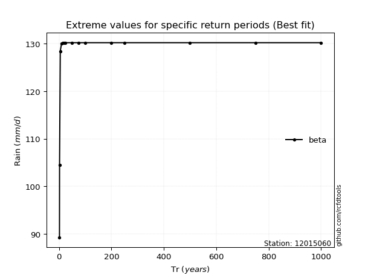</img>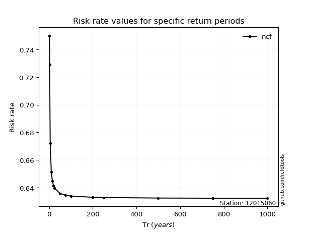</img>

</div>


<sub>**APP DISCLAIMER**: NO WARRANTY - This software is provided by [github.com/rcfdtools](https://github.com/rcfdtools) "as is", without any express or implied warranty, including warranties of merchantability, fitness for a particular purpose, or non-infringement. There is no guarantee that the software will be error-free or operate without interruption. LIMITATION OF LIABILITY - Neither the authors nor copyright holders will be liable for claims or damages arising from the software or its use. You are responsible for determining if the software is appropriate for your use and assume all associated risks, including errors, legal compliance, and data loss. NO PROFESSIONAL ADVICE - The software provides general information and does not offer professional advice. It should not replace consultation with professional advisors.</sub>