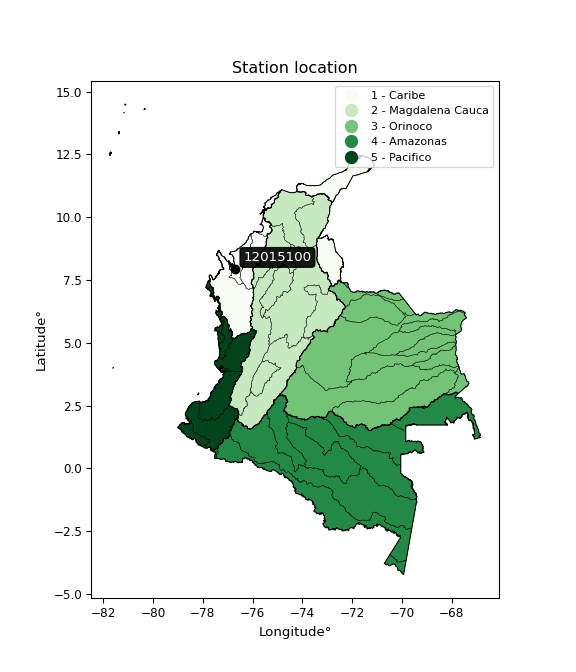

<div align="center">


</div>

# PMax24h Station (Rain, Pmax24h): 12015100

Maximum Precipitation in 24 hours (PMax24h) is the greatest amount of rainfall for a specific duration that is meteorologically possible for a given location, acting as a "worst-case" scenario for extreme storms, crucial for designing safety-critical infrastructure like bridges, river deviations, dams, spillways, and nuclear plants to prevent catastrophic failure. The PMax24h is related with the Probable Maximum Precipitation (PMP) and it is calculated by hydrologists using meteorological data to determine the upper limit of extreme rainfall, often leading to the Probable Maximum Flood (PMF) for flood control design, and is increasingly being studied for climate change impacts. Probable Maximum Precipitation (PMP) is the theoretical upper limit of rainfall, a deterministic estimate for extreme events, while probability distributions (like GEV, Gumbel) describe the likelihood and frequency of various precipitation amounts, including rare ones, showing how often events occur, with PMP representing the extreme end of these distributions, used for critical infrastructure design to ensure safety against the worst conceivable weather, unlike standard statistical forecasts which cover typical probabilities.

The most common probability distributions in hydrology, used for analyzing floods, rainfall, and streamflow, include the Normal, Log-Normal, Gumbel, Gamma (including Log-Pearson Type III), and Generalized Extreme Value (GEV) distributions, often chosen based on the data´s skewness and whether modeling extremes or general conditions, with Gumbel and GEV popular for extreme events like floods, while the Normal distribution serves as a baseline, though often requiring transformations for skewed hydrological data. These distributions help in designing water infrastructure, managing water resources, and forecasting hydrologic events.

> Hydrological data often isn´t perfectly normal (it´s skewed), so different distributions are needed for different applications, such as: **Flood Frequency Analysis**: Using Gumbel, GEV, or Log-Pearson Type III for predicting extreme flood magnitudes and their return periods, **Rainfall Analysis**: Normal for annual totals, but Log-Normal, Weibull, or GEV for intensity or extreme daily rainfall, **Streamflow Modeling**: Gamma and Log-Normal for maximum flows, GEV for minimum flows, and Kappa for daily flows.

<div align="center">

</img>

</div>


## A. General information


### 1. General running parameters

• app_version: _v20260225_. • runtime: _2026-02-27 14:50:08.749431_. • Python version: _3.14.0_. • SciPy version: _1.16.3_. • Pandas version: _2.3.3_. • NumPy version: _2.3.5_. • Stations dataset (station_dataset_file): _dataset/pmax24h_in/automatic_colombia_2003_2025.csv_. • Stations catalog (station_catalog_file): _dataset/CNE.xls_. • Minimum year to eval til year_max (date_min): _1900_. • Maximum year to eval since year_min (date_max): _2025_. • Creates, save and include plots into reports (create_plot): _False_. • Plot only fit distributions with Δo > Δ (plot_only_fit): _True_. • Plot only simple graphs avoiding multiple CDFs and multiple Extreme values plots (plot_only_simple): _False_. • Eval low extreme values, if False, evaluates high extreme values (low_extreme): _False_. • Eval every SciPy distribution as logarithmic (pdist_logarithmic_on): _True_. • Standard deviation normalized (ddof): _1.0_. • Return periods to eval in years (Tr): _[2, 2.33, 5, 10, 15, 20, 25, 50, 75, 100, 200, 250, 500, 750, 1000]_. • Minimum data sample per station, 0 means any (minimum_sample): _5_. • Z-Score maximum threshold to adjust a value, 0 means disable (zscore_max): _3.5_. • Z-Score minimum threshold to adjust a value, 0 means disable (zscore_min): _-2.5_. • Avoid zeros, e.g. rain = 0 (avoid_zeros): _True_. • Avoid null values (avoid_nans): _True_. 

:file_folder:Table: [dataset.csv](../../dataset/pmax24h_in/automatic_colombia_2003_2025.csv)

> Delta Degrees of Freedom (DDOF): is a parameter used in the formulas for calculating variance and standard deviation. When ddof=0, the divisor is $N$ (the total number of observations) and this is used when your data set is the entire population. When ddof=1, the divisor is $N-1$ and this is used when your data set is a sample drawn from a larger population. Using $N-1$ provides an unbiased estimate of the population variance (known as Bessel´s correction).


### 2. Station info and location

|   id |   CODIGO | NOMBRE                  | CATEGORIA         | TECNOLOGIA                | ESTADO   | FECHA_INSTALACION   |   FECHA_SUSPENSION |   ALTITUD |   LATITUD |   LONGITUD | DEPARTAMENTO   | MUNICIPIO   | AREA_OPERATIVA                      | ENTIDAD                                                     | AREA_HIDROGRAFICA   | ZONA_HIDROGRAFICA   | SUBZONA_HIDROGRAFICA   |   CORRIENTE | Catalogo   |   Version |
|-----:|---------:|:------------------------|:------------------|:--------------------------|:---------|:--------------------|-------------------:|----------:|----------:|-----------:|:---------------|:------------|:------------------------------------|:------------------------------------------------------------|:--------------------|:--------------------|:-----------------------|------------:|:-----------|----------:|
|    0 | 12015100 | PISTA INDIRA [12015100] | Agrometeorológica | Automática con Telemetría | Activa   | 20/09/2005          |                nan |        15 |   7.94075 |   -76.6962 | Antioquia      | Turbo       | Area Operativa 01 - Antioquia-Chocó | INSTITUTO DE HIDROLOGIA METEOROLOGIA Y ESTUDIOS AMBIENTALES | Caribe              | Caribe - Litoral    | Río León               |         nan | CNE_IDEAM  |  20251226 |

<div align="center">

Dynamic map: [:earth_americas:Google](http://maps.google.com/maps?q=7.94075,-76.69616667) [:earth_americas:OSM](https://www.openstreetmap.org/#map=18/7.94075/-76.69616667&layers=P) [:earth_americas:Bing](https://www.bing.com/maps?cp=7.94075~-76.69616667&lvl=18) [:earth_americas:Apple](https://maps.apple.com/frame?center=7.94075%2C-76.69616667&span=0.003%2C0.006)

</div>


<div align="center">

```geojson
{
  "type": "Feature",
  "geometry": {
    "type": "Point", 
    "coordinates": [-76.69616667, 7.94075]
  }, 
  "properties": {
    "Name": "12015100"
  }
}
```

</div>


### 3. Discrete values table and plot

<div align="center">

|               |          0 |           1 |           2 |            3 |           4 |            5 |           6 |          7 |           8 |          9 |         10 |           11 |
|:--------------|-----------:|------------:|------------:|-------------:|------------:|-------------:|------------:|-----------:|------------:|-----------:|-----------:|-------------:|
| Date          | 2005       | 2011        | 2012        | 2013         | 2014        | 2015         | 2016        | 2017       | 2018        | 2019       | 2020       | 2025         |
| Value         |  174       |   89        |   75        |  104.5       |   96.4      |  103.5       |   84.6      |  169.3     |   81.9      |  151.8     |   28.3     |  101.6       |
| Value_initial |  174       |   89        |   75        |  104.5       |   96.4      |  103.5       |   84.6      |  169.3     |   81.9      |  151.8     |   28.3     |  101.6       |
| count         |   12       |   12        |   12        |   12         |   12        |   12         |   12        |   12       |   12        |   12       |   12       |   12         |
| mean          |  104.992   |  104.992    |  104.992    |  104.992     |  104.992    |  104.992     |  104.992    |  104.992   |  104.992    |  104.992   |  104.992   |  104.992     |
| std           |   41.7377  |   41.7377   |   41.7377   |   41.7377    |   41.7377   |   41.7377    |   41.7377   |   41.7377  |   41.7377   |   41.7377  |   41.7377  |   41.7377    |
| zscore        |    1.65338 |   -0.383147 |   -0.718575 |   -0.0117799 |   -0.205849 |   -0.0357391 |   -0.488567 |    1.54077 |   -0.553257 |    1.12149 |   -1.83747 |   -0.0812614 |


</div>


> The initial value (value_initial) correspond to the initial obtained or null completed value, and value (value) is adjusted only when the initial value is outside the valid range (outlier) definite through the Z-Score value. If Z-Score is active, values out of range or outliers are replaced with the station mean value. A Z-Score (or standard score) measures how many standard deviations a data point is from the mean of a dataset, indicating its relative position; positive scores mean above the mean, negative mean below, and a score of zero is exactly at the mean, allowing for comparison of values from different distributions. It´s calculated using the formula $z=(x–μ)/σ$, where $x$ is the data point, $μ$ is the mean, and $σ$ is the standard deviation, helping identify outliers and understand probability.
>
> <sub>**Note**: In this study, "completing" (filling gaps in) and "extending" (forecasting or lengthening the historical record) rainfall data series are avoided for certain critical analyses because they introduce artificial bias and uncertainty, which can distort the statistics of rare events (extremes), alter day-to-day variability, and compromise the integrity and homogeneity of the original data. Some reasons against Completing/Extending rainfall data are: **Distortion of Extremes and Variability**: The primary issue is that most gap-filling or extension methods rely on averaging or regression with nearby stations, which inherently smooths the data. Rainfall is highly variable in space and time, with a large percentage of zero values and occasional large storms. Infilling methods often underestimate the highest values and overestimate the lowest (zero) values, which severely distorts analyses focused on flood frequency, drought severity, and intensity-duration-frequency (IDF) curves, **Loss of Data Homogeneity**: Infilled or extended data are synthetic estimates, not actual measurements. Combining these estimates with observed data can violate the assumption of data homogeneity, which requires that the data properties do not change over time. Inhomogeneity can lead to incorrect conclusions about long-term trends or changes in climate patterns, **Propagation of Errors**: Errors and biases from the original data (e.g., wind-induced undercatch, instrument errors, site changes) or the data used for imputation can propagate through the analysis, leading to unreliable hydrological models and inaccurate predictions, **Compromised Statistical Integrity**: For statistical analyses, especially those involving the frequency of events, using artificial data can introduce time bias or autocorrelation that doesn´t exist in reality, making it difficult to assess the true probability of events, **Difficulty in Validation**: It is difficult to accurately validate the quality of filled or extended data, especially for past periods where ground-truth measurements are unavailable. The reliability of imputation techniques heavily depends on the density of the surrounding station network and the complexity of the local topography.</sub>


### 4. Active continuous probability distributions from SciPy (80 of 104 available)

A Probability Density Function (PDF) describes the relative likelihood of a continuous random variable falling within a specific range, where the total area under its curve equals 1, and the area over any interval gives the actual probability for that range. Unlike discrete probabilities (like rolling a die), a PDF shows density, not direct probability for a single point (which is zero), with higher points indicating higher likelihood, often visualized as a bell curve for normal distributions.

A log of a probability density function (log-PDF) is simply the logarithm of the PDF´s value, denoted as $log(f(x))$, useful for converting multiplication of probabilities into addition, improving numerical stability with tiny numbers, and connecting to information theory concepts like entropy. Instead of dealing with very small probabilities (e.g., 0.000001), log-PDFs use negative numbers (e.g., $log(0.00001) ≈ -11.51$ that are easier for computers to handle, preventing underflow errors and simplifying complex calculations. In this study, each active probability distribution from SciPy is also evaluated in the $log$ form.

[scipy.stats](https://docs.scipy.org/doc/scipy/reference/stats.html) is a Python´s powerful submodule within the SciPy library for comprehensive statistical analysis, offering over 130 probability distributions (like Normal, Poisson, etc.), functions for descriptive stats (mean, variance), hypothesis testing (t-tests, chi-square), random variable generation, and statistical tests, making it essential for data science, modeling, and research. It provides tools to explore, model, and draw conclusions from data efficiently, working seamlessly with [NumPy](https://numpy.org/).

<div align="center">

|   id | p_dist           |   n_parameter | fit_method   | label                                                                       | active   | ref                                                                                                      |
|-----:|:-----------------|--------------:|:-------------|:----------------------------------------------------------------------------|:---------|:---------------------------------------------------------------------------------------------------------|
|    0 | alpha            |             3 | MLE          | Alpha                                                                       | True     | [:mortar_board:](https://docs.scipy.org/doc/scipy/reference/generated/scipy.stats.alpha.html)            |
|    1 | anglit           |             2 | MM           | Anglit                                                                      | True     | [:mortar_board:](https://docs.scipy.org/doc/scipy/reference/generated/scipy.stats.anglit.html)           |
|    2 | arcsine          |             2 | MM           | Arcsine                                                                     | True     | [:mortar_board:](https://docs.scipy.org/doc/scipy/reference/generated/scipy.stats.arcsine.html)          |
|    3 | argus            |             3 | MLE          | Argus                                                                       | True     | [:mortar_board:](https://docs.scipy.org/doc/scipy/reference/generated/scipy.stats.argus.html)            |
|    4 | beta             |             4 | MLE          | Beta                                                                        | True     | [:mortar_board:](https://docs.scipy.org/doc/scipy/reference/generated/scipy.stats.beta.html)             |
|    5 | betaprime        |             4 | MLE          | Beta prime                                                                  | True     | [:mortar_board:](https://docs.scipy.org/doc/scipy/reference/generated/scipy.stats.betaprime.html)        |
|    6 | bradford         |             3 | MLE          | Bradford                                                                    | True     | [:mortar_board:](https://docs.scipy.org/doc/scipy/reference/generated/scipy.stats.bradford.html)         |
|    7 | burr             |             4 | MLE          | Burr (Type III)                                                             | True     | [:mortar_board:](https://docs.scipy.org/doc/scipy/reference/generated/scipy.stats.burr.html)             |
|    8 | burr12           |             4 | MLE          | Burr (Type III) 12                                                          | True     | [:mortar_board:](https://docs.scipy.org/doc/scipy/reference/generated/scipy.stats.burr12.html)           |
|    9 | cosine           |             2 | MLE          | Cosine                                                                      | True     | [:mortar_board:](https://docs.scipy.org/doc/scipy/reference/generated/scipy.stats.cosine.html)           |
|   10 | crystalball      |             4 | MLE          | Crystalball                                                                 | True     | [:mortar_board:](https://docs.scipy.org/doc/scipy/reference/generated/scipy.stats.crystalball.html)      |
|   11 | dgamma           |             3 | MLE          | Double gamma                                                                | True     | [:mortar_board:](https://docs.scipy.org/doc/scipy/reference/generated/scipy.stats.dgamma.html)           |
|   12 | dweibull         |             3 | MLE          | Double Weibull                                                              | True     | [:mortar_board:](https://docs.scipy.org/doc/scipy/reference/generated/scipy.stats.dweibull.html)         |
|   13 | erlang           |             3 | MLE          | Erlang                                                                      | True     | [:mortar_board:](https://docs.scipy.org/doc/scipy/reference/generated/scipy.stats.erlang.html)           |
|   14 | exponnorm        |             3 | MLE          | Exponentially modified Normal                                               | True     | [:mortar_board:](https://docs.scipy.org/doc/scipy/reference/generated/scipy.stats.exponnorm.html)        |
|   15 | exponpow         |             3 | MLE          | Exponential power                                                           | True     | [:mortar_board:](https://docs.scipy.org/doc/scipy/reference/generated/scipy.stats.exponpow.html)         |
|   16 | exponweib        |             4 | MLE          | Exponentiated Weibull                                                       | True     | [:mortar_board:](https://docs.scipy.org/doc/scipy/reference/generated/scipy.stats.exponweib.html)        |
|   17 | f                |             4 | MLE          | F                                                                           | True     | [:mortar_board:](https://docs.scipy.org/doc/scipy/reference/generated/scipy.stats.f.html)                |
|   18 | fatiguelife      |             3 | MLE          | Fatigue-life (Birnbaum-Saunders)                                            | True     | [:mortar_board:](https://docs.scipy.org/doc/scipy/reference/generated/scipy.stats.fatiguelife.html)      |
|   19 | foldnorm         |             3 | MM           | Fold Normal                                                                 | True     | [:mortar_board:](https://docs.scipy.org/doc/scipy/reference/generated/scipy.stats.foldnorm.html)         |
|   20 | gamma            |             3 | MLE          | Gamma                                                                       | True     | [:mortar_board:](https://docs.scipy.org/doc/scipy/reference/generated/scipy.stats.gamma.html)            |
|   21 | gausshyper       |             6 | MLE          | Gauss hypergeometric                                                        | True     | [:mortar_board:](https://docs.scipy.org/doc/scipy/reference/generated/scipy.stats.gausshyper.html)       |
|   22 | genexpon         |             5 | MLE          | Generalized exponential                                                     | True     | [:mortar_board:](https://docs.scipy.org/doc/scipy/reference/generated/scipy.stats.genexpon.html)         |
|   23 | genextreme       |             3 | MLE          | Generalized exponential                                                     | True     | [:mortar_board:](https://docs.scipy.org/doc/scipy/reference/generated/scipy.stats.genextreme.html)       |
|   24 | gengamma         |             4 | MLE          | Generalized gamma                                                           | True     | [:mortar_board:](https://docs.scipy.org/doc/scipy/reference/generated/scipy.stats.gengamma.html)         |
|   25 | genhalflogistic  |             3 | MLE          | Generalized half-logistic                                                   | True     | [:mortar_board:](https://docs.scipy.org/doc/scipy/reference/generated/scipy.stats.genhalflogistic.html)  |
|   26 | genlogistic      |             3 | MLE          | Generalized logistic                                                        | True     | [:mortar_board:](https://docs.scipy.org/doc/scipy/reference/generated/scipy.stats.genlogistic.html)      |
|   27 | gennorm          |             3 | MLE          | Generalized Normal                                                          | True     | [:mortar_board:](https://docs.scipy.org/doc/scipy/reference/generated/scipy.stats.gennorm.html)          |
|   28 | genpareto        |             3 | MLE          | Generalized Pareto                                                          | True     | [:mortar_board:](https://docs.scipy.org/doc/scipy/reference/generated/scipy.stats.genpareto.html)        |
|   29 | gompertz         |             3 | MLE          | Gompertz (or truncated Gumbel)                                              | True     | [:mortar_board:](https://docs.scipy.org/doc/scipy/reference/generated/scipy.stats.gompertz.html)         |
|   30 | gumbel_l         |             2 | MM           | Gumbel Left Skew                                                            | True     | [:mortar_board:](https://docs.scipy.org/doc/scipy/reference/generated/scipy.stats.gumbel_l.html)         |
|   31 | gumbel_r         |             2 | MM           | Gumbel Right Skew                                                           | True     | [:mortar_board:](https://docs.scipy.org/doc/scipy/reference/generated/scipy.stats.gumbel_r.html)         |
|   32 | halfgennorm      |             3 | MLE          | Upper half of a generalized normal                                          | True     | [:mortar_board:](https://docs.scipy.org/doc/scipy/reference/generated/scipy.stats.halfgennorm.html)      |
|   33 | halflogistic     |             2 | MM           | Half-logistic                                                               | True     | [:mortar_board:](https://docs.scipy.org/doc/scipy/reference/generated/scipy.stats.halflogistic.html)     |
|   34 | halfnorm         |             2 | MM           | Half Normal                                                                 | True     | [:mortar_board:](https://docs.scipy.org/doc/scipy/reference/generated/scipy.stats.halfnorm.html)         |
|   35 | hypsecant        |             2 | MM           | hyperbolic secant                                                           | True     | [:mortar_board:](https://docs.scipy.org/doc/scipy/reference/generated/scipy.stats.hypsecant.html)        |
|   36 | invgamma         |             3 | MLE          | Inverted gamma                                                              | True     | [:mortar_board:](https://docs.scipy.org/doc/scipy/reference/generated/scipy.stats.invgamma.html)         |
|   37 | invgauss         |             3 | MLE          | Inverse Gaussian                                                            | True     | [:mortar_board:](https://docs.scipy.org/doc/scipy/reference/generated/scipy.stats.invgauss.html)         |
|   38 | invweibull       |             3 | MLE          | Inverted Weibull                                                            | True     | [:mortar_board:](https://docs.scipy.org/doc/scipy/reference/generated/scipy.stats.invweibull.html)       |
|   39 | johnsonsb        |             4 | MLE          | Johnson SB                                                                  | True     | [:mortar_board:](https://docs.scipy.org/doc/scipy/reference/generated/scipy.stats.johnsonsb.html)        |
|   40 | johnsonsu        |             4 | MLE          | Johnson Su                                                                  | True     | [:mortar_board:](https://docs.scipy.org/doc/scipy/reference/generated/scipy.stats.johnsonsu.html)        |
|   41 | kappa3           |             3 | MLE          | Kappa 3                                                                     | True     | [:mortar_board:](https://docs.scipy.org/doc/scipy/reference/generated/scipy.stats.kappa3.html)           |
|   42 | kappa4           |             4 | MLE          | Kappa 4                                                                     | True     | [:mortar_board:](https://docs.scipy.org/doc/scipy/reference/generated/scipy.stats.kappa4.html)           |
|   43 | ksone            |             3 | MLE          | Kolmogorov-Smirnov one-sided test statistic distribution                    | True     | [:mortar_board:](https://docs.scipy.org/doc/scipy/reference/generated/scipy.stats.ksone.html)            |
|   44 | kstwobign        |             2 | MLE          | Limiting distribution of scaled Kolmogorov-Smirnov two-sided test statistic | True     | [:mortar_board:](https://docs.scipy.org/doc/scipy/reference/generated/scipy.stats.kstwobign.html)        |
|   45 | laplace          |             2 | MM           | Laplace                                                                     | True     | [:mortar_board:](https://docs.scipy.org/doc/scipy/reference/generated/scipy.stats.laplace.html)          |
|   46 | levy_l           |             2 | MLE          | Left-skewed Levy                                                            | True     | [:mortar_board:](https://docs.scipy.org/doc/scipy/reference/generated/scipy.stats.levy_l.html)           |
|   47 | loggamma         |             3 | MLE          | Log gamma                                                                   | True     | [:mortar_board:](https://docs.scipy.org/doc/scipy/reference/generated/scipy.stats.loggamma.html)         |
|   48 | logistic         |             2 | MM           | Logistic (or Sech-squared)                                                  | True     | [:mortar_board:](https://docs.scipy.org/doc/scipy/reference/generated/scipy.stats.logistic.html)         |
|   49 | loglaplace       |             3 | MLE          | Log-Laplace                                                                 | True     | [:mortar_board:](https://docs.scipy.org/doc/scipy/reference/generated/scipy.stats.loglaplace.html)       |
|   50 | lomax            |             3 | MLE          | Lomax (Pareto of the second kind)                                           | True     | [:mortar_board:](https://docs.scipy.org/doc/scipy/reference/generated/scipy.stats.lomax.html)            |
|   51 | maxwell          |             2 | MM           | Maxwell                                                                     | True     | [:mortar_board:](https://docs.scipy.org/doc/scipy/reference/generated/scipy.stats.maxwell.html)          |
|   52 | mielke           |             4 | MLE          | Mielke Beta-Kappa / Dagum                                                   | True     | [:mortar_board:](https://docs.scipy.org/doc/scipy/reference/generated/scipy.stats.mielke.html)           |
|   53 | moyal            |             2 | MM           | Moyal                                                                       | True     | [:mortar_board:](https://docs.scipy.org/doc/scipy/reference/generated/scipy.stats.moyal.html)            |
|   54 | nakagami         |             3 | MLE          | Nakagami                                                                    | True     | [:mortar_board:](https://docs.scipy.org/doc/scipy/reference/generated/scipy.stats.nakagami.html)         |
|   55 | ncf              |             5 | MLE          | Non-central F distribution                                                  | True     | [:mortar_board:](https://docs.scipy.org/doc/scipy/reference/generated/scipy.stats.ncf.html)              |
|   56 | nct              |             4 | MLE          | Non-central Student’s t                                                     | True     | [:mortar_board:](https://docs.scipy.org/doc/scipy/reference/generated/scipy.stats.nct.html)              |
|   57 | norm             |             2 | MM           | Normal                                                                      | True     | [:mortar_board:](https://docs.scipy.org/doc/scipy/reference/generated/scipy.stats.norm.html)             |
|   58 | pearson3         |             3 | MM           | Pearson type III                                                            | True     | [:mortar_board:](https://docs.scipy.org/doc/scipy/reference/generated/scipy.stats.pearson3.html)         |
|   59 | powerlaw         |             3 | MLE          | Power-function                                                              | True     | [:mortar_board:](https://docs.scipy.org/doc/scipy/reference/generated/scipy.stats.powerlaw.html)         |
|   60 | rayleigh         |             2 | MM           | Rayleigh                                                                    | True     | [:mortar_board:](https://docs.scipy.org/doc/scipy/reference/generated/scipy.stats.rayleigh.html)         |
|   61 | rdist            |             3 | MLE          | R-distributed (symmetric beta)                                              | True     | [:mortar_board:](https://docs.scipy.org/doc/scipy/reference/generated/scipy.stats.rdist.html)            |
|   62 | rice             |             3 | MLE          | Rice                                                                        | True     | [:mortar_board:](https://docs.scipy.org/doc/scipy/reference/generated/scipy.stats.rice.html)             |
|   63 | semicircular     |             2 | MM           | Semicircular                                                                | True     | [:mortar_board:](https://docs.scipy.org/doc/scipy/reference/generated/scipy.stats.semicircular.html)     |
|   64 | skewnorm         |             3 | MLE          | Skew normal                                                                 | True     | [:mortar_board:](https://docs.scipy.org/doc/scipy/reference/generated/scipy.stats.skewnorm.html)         |
|   65 | t                |             3 | MLE          | Student’s t                                                                 | True     | [:mortar_board:](https://docs.scipy.org/doc/scipy/reference/generated/scipy.stats.t.html)                |
|   66 | trapezoid        |             4 | MLE          | Trapezoid                                                                   | True     | [:mortar_board:](https://docs.scipy.org/doc/scipy/reference/generated/scipy.stats.trapezoid.html)        |
|   67 | triang           |             3 | MLE          | Triangular                                                                  | True     | [:mortar_board:](https://docs.scipy.org/doc/scipy/reference/generated/scipy.stats.triang.html)           |
|   68 | truncexpon       |             3 | MLE          | Truncated exponential                                                       | True     | [:mortar_board:](https://docs.scipy.org/doc/scipy/reference/generated/scipy.stats.truncexpon.html)       |
|   69 | truncnorm        |             4 | MLE          | Truncated normal                                                            | True     | [:mortar_board:](https://docs.scipy.org/doc/scipy/reference/generated/scipy.stats.truncnorm.html)        |
|   70 | truncpareto      |             4 | MLE          | Upper truncated Pareto                                                      | True     | [:mortar_board:](https://docs.scipy.org/doc/scipy/reference/generated/scipy.stats.truncpareto.html)      |
|   71 | truncweibull_min |             5 | MLE          | Doubly truncated Weibull minimum                                            | True     | [:mortar_board:](https://docs.scipy.org/doc/scipy/reference/generated/scipy.stats.truncweibull_min.html) |
|   72 | tukeylambda      |             3 | MLE          | Tukey-Lamdba                                                                | True     | [:mortar_board:](https://docs.scipy.org/doc/scipy/reference/generated/scipy.stats.tukeylambda.html)      |
|   73 | uniform          |             2 | MLE          | Uniform                                                                     | True     | [:mortar_board:](https://docs.scipy.org/doc/scipy/reference/generated/scipy.stats.uniform.html)          |
|   74 | vonmises         |             3 | MLE          | Von Mises                                                                   | True     | [:mortar_board:](https://docs.scipy.org/doc/scipy/reference/generated/scipy.stats.vonmises.html)         |
|   75 | vonmises_line    |             3 | MLE          | Von Mises line                                                              | True     | [:mortar_board:](https://docs.scipy.org/doc/scipy/reference/generated/scipy.stats.vonmises_line.html)    |
|   76 | wald             |             2 | MM           | Wald                                                                        | True     | [:mortar_board:](https://docs.scipy.org/doc/scipy/reference/generated/scipy.stats.wald.html)             |
|   77 | weibull_max      |             3 | MLE          | Weibull maximum                                                             | True     | [:mortar_board:](https://docs.scipy.org/doc/scipy/reference/generated/scipy.stats.weibull_max.html)      |
|   78 | weibull_min      |             3 | MLE          | Weibull minimum                                                             | True     | [:mortar_board:](https://docs.scipy.org/doc/scipy/reference/generated/scipy.stats.weibull_min.html)      |
|   79 | wrapcauchy       |             3 | MLE          | Wrapped  Cauchy                                                             | True     | [:mortar_board:](https://docs.scipy.org/doc/scipy/reference/generated/scipy.stats.wrapcauchy.html)       |

</div>

> **n_parameter:** # arguments & localization & scale.
>
> **Fit methods:** (MLE) maximum likelihood, (MM) L-moments.
>
>**Inactive** (With the only purpose of prevent loops, zero divisions, infinite values, over high estimated values or horizontal trending for recurrence intervals estimations, the follow distributions were disabled.)**:** lognorm, norminvgauss, powernorm, powerlognorm, cauchy, halfcauchy, foldcauchy, skewcauchy, chi2, expon, fisk, genhyperbolic, geninvgauss, gibrat, kstwo, laplace_asymmetric, levy, levy_stable, ncx2, pareto, rel_breitwigner, recipinvgauss, studentized_range, loguniform, 


## B. Probability (PDF) vs. Empirical (EDF) distributions functions

A continuous probability distribution (CPD) describes probabilities for variables that can take any value within a range (like rain any time), unlike discrete variables with specific outcomes (like temperature). It uses a Probability Density Function (PDF), a curve where the total area under it equals 1, and the probability of the variable falling within an interval (a to b) is found by calculating the area under the curve between those points. A key feature is that the probability of hitting any single exact value is zero, so probabilities are always expressed for ranges, e.g., $P(a ≤ X ≤ b)$.

<div align="center">

Distributions parameters from station values
|     |   station | p_dist              |   n |               loc |            scale | shape                  | shape1                 | shape2                | shape3             |
|----:|----------:|:--------------------|----:|------------------:|-----------------:|:-----------------------|:-----------------------|:----------------------|:-------------------|
|   0 |  12015100 | alpha               |  12 |    -441.055       |   7453.02        | 13.724210980044184     |                        |                       |                    |
|   1 |  12015100 | anglit              |  12 |     104.992       |    116.901       |                        |                        |                       |                    |
|   2 |  12015100 | arcsine             |  12 |      48.4785      |    113.026       |                        |                        |                       |                    |
|   3 |  12015100 | argus               |  12 |       7.22409     |    173.469       | 3.7364009883113694e-06 |                        |                       |                    |
|   4 |  12015100 | beta                |  12 |      -4.20999     |    178.21        | 1.821048950983884      | 0.7279143643869372     |                       |                    |
|   5 |  12015100 | betaprime           |  12 |    -429.55        |      0.688644    | 139592.24124699476     | 180.83479697488684     |                       |                    |
|   6 |  12015100 | bradford            |  12 |      28.3         |    145.7         | 0.9015870743281634     |                        |                       |                    |
|   7 |  12015100 | burr                |  12 |     -39.0161      |    144.402       | 6.712687119069308      | 0.8908179110149019     |                       |                    |
|   8 |  12015100 | burr12              |  12 |      -1.6113      |     29.6392      | 398.93926560712225     | 0.002097595660767405   |                       |                    |
|   9 |  12015100 | cosine              |  12 |     105.427       |     34.661       |                        |                        |                       |                    |
|  10 |  12015100 | crystalball         |  12 |     104.992       |     39.9608      | 7015.848904956687      | 10325.97006022157      |                       |                    |
|  11 |  12015100 | dgamma              |  12 |     101.6         |     36.2029      | 0.689869484393542      |                        |                       |                    |
|  12 |  12015100 | dweibull            |  12 |     101.6         |     30.0267      | 0.8957826409632649     |                        |                       |                    |
|  13 |  12015100 | erlang              |  12 |    -167.113       |      5.87545     | 46.31215866884567      |                        |                       |                    |
|  14 |  12015100 | exponnorm           |  12 |      85.9446      |     35.3617      | 0.5386343617742537     |                        |                       |                    |
|  15 |  12015100 | exponpow            |  12 |      28.3         |      2.23048     | 0.06656954038956675    |                        |                       |                    |
|  16 |  12015100 | exponweib           |  12 |    -631.129       |    591.433       | 24.65465784051839      | 5.9175059545894815     |                       |                    |
|  17 |  12015100 | f                   |  12 |    -167.894       |    272.867       | 93.4532273305218       | 29861.585976878916     |                       |                    |
|  18 |  12015100 | fatiguelife         |  12 |      28.3         |      0.000265491 | 567.5699057003086      |                        |                       |                    |
|  19 |  12015100 | foldnorm            |  12 |     115.402       |      0.0378656   | 0.002408980229224497   |                        |                       |                    |
|  20 |  12015100 | gamma               |  12 |    -167.113       |      5.87545     | 46.312128701175645     |                        |                       |                    |
|  21 |  12015100 | gausshyper          |  12 |      16.9624      |    157.038       | 1.2840761361238238     | 0.7753718917170508     | 0.929784292948545     | 0.785454839875994  |
|  22 |  12015100 | genexpon            |  12 |      28.2999      |      2.17742     | 0.028695121565693607   | 3.278814564133948e-08  | 1.2527360572028305    |                    |
|  23 |  12015100 | genextreme          |  12 |      29.1416      |      4.74939     | -5.643406572370171     |                        |                       |                    |
|  24 |  12015100 | gengamma            |  12 |     -83.8138      |      0.583757    | 47.92711408845919      | 0.6712152402547922     |                       |                    |
|  25 |  12015100 | genhalflogistic     |  12 |      14.0167      |    166.452       | 1.0404335690858335     |                        |                       |                    |
|  26 |  12015100 | genlogistic         |  12 |      79.6718      |     26.3549      | 1.9248036511286863     |                        |                       |                    |
|  27 |  12015100 | gennorm             |  12 |     101.6         |      4.56351     | 0.4826240263405851     |                        |                       |                    |
|  28 |  12015100 | genpareto           |  12 |      -1.15869     |    289.293       | -1.6516073412964412    |                        |                       |                    |
|  29 |  12015100 | gompertz            |  12 |      16.0602      |      3.96322     | 4.508807994994937e-17  |                        |                       |                    |
|  30 |  12015100 | gumbel_l            |  12 |     122.976       |     31.1573      |                        |                        |                       |                    |
|  31 |  12015100 | gumbel_r            |  12 |      87.0072      |     31.1573      |                        |                        |                       |                    |
|  32 |  12015100 | halfgennorm         |  12 |      28.3         |      0.156464    | 0.24037497588172113    |                        |                       |                    |
|  33 |  12015100 | halflogistic        |  12 |      57.6288      |     34.1651      |                        |                        |                       |                    |
|  34 |  12015100 | halfnorm            |  12 |      52.0992      |     66.2909      |                        |                        |                       |                    |
|  35 |  12015100 | hypsecant           |  12 |     104.992       |     25.4399      |                        |                        |                       |                    |
|  36 |  12015100 | invgamma            |  12 |    -312.457       |  45473           | 110.01153350121052     |                        |                       |                    |
|  37 |  12015100 | invgauss            |  12 |    -104.237       |   5359.95        | 0.03906514394146143    |                        |                       |                    |
|  38 |  12015100 | invweibull          |  12 |      28.3         |      0.785745    | 0.05830411607168476    |                        |                       |                    |
|  39 |  12015100 | johnsonsb           |  12 |      28.2897      |    145.71        | -0.015730559800745638  | 0.1076767663553975     |                       |                    |
|  40 |  12015100 | johnsonsu           |  12 |      88.0033      |     14.9562      | -0.4325324196265943    | 0.7659583866765877     |                       |                    |
|  41 |  12015100 | kappa3              |  12 |      28.3         |    161.392       | 635.8022067632602      |                        |                       |                    |
|  42 |  12015100 | kappa4              |  12 |      13.2586      |    165.678       | 1.1000031573813163     | 1.0292882806897037     |                       |                    |
|  43 |  12015100 | ksone               |  12 |      13.73        |    174.84        | 1.0                    |                        |                       |                    |
|  44 |  12015100 | kstwobign           |  12 |     -51.3388      |    179.902       |                        |                        |                       |                    |
|  45 |  12015100 | laplace             |  12 |     104.992       |     28.2566      |                        |                        |                       |                    |
|  46 |  12015100 | levy_l              |  12 |     180.001       |     30.4283      |                        |                        |                       |                    |
|  47 |  12015100 | loggamma            |  12 |   -8569.13        |   1257.96        | 988.1406391742555      |                        |                       |                    |
|  48 |  12015100 | logistic            |  12 |     104.992       |     22.0316      |                        |                        |                       |                    |
|  49 |  12015100 | loglaplace          |  12 |      -0.319892    |    101.92        | 3.2901505413547336     |                        |                       |                    |
|  50 |  12015100 | lomax               |  12 |      28.3         |   1606.04        | 20.550937829727914     |                        |                       |                    |
|  51 |  12015100 | maxwell             |  12 |      10.3013      |     59.3384      |                        |                        |                       |                    |
|  52 |  12015100 | mielke              |  12 |    -309.002       |    402.217       | 22.177762031030156     | 17.20741139580435      |                       |                    |
|  53 |  12015100 | moyal               |  12 |      82.1395      |     17.9887      |                        |                        |                       |                    |
|  54 |  12015100 | nakagami            |  12 |      75           |     49.6679      | 0.25942085630332856    |                        |                       |                    |
|  55 |  12015100 | ncf                 |  12 |      -1.26572     |    105.033       | 12.755059192978814     | 122.78088143449797     | 7.927162708014324e-10 |                    |
|  56 |  12015100 | nct                 |  12 |      -0.161073    |     35.074       | 22.921478037754838     | 2.899058448666489      |                       |                    |
|  57 |  12015100 | norm                |  12 |     104.992       |     39.9608      |                        |                        |                       |                    |
|  58 |  12015100 | pearson3            |  12 |     104.992       |     39.9608      | 0.252745133980694      |                        |                       |                    |
|  59 |  12015100 | powerlaw            |  12 |      28.3         |    145.7         | 0.26565053281149814    |                        |                       |                    |
|  60 |  12015100 | rayleigh            |  12 |      28.5443      |     60.9962      |                        |                        |                       |                    |
|  61 |  12015100 | rdist               |  12 |      15.2921      |     89.2079      | 0.9714847780604446     |                        |                       |                    |
|  62 |  12015100 | rice                |  12 |       9.24452     |     43.8413      | 1.8974832034875995     |                        |                       |                    |
|  63 |  12015100 | semicircular        |  12 |     104.992       |     79.9216      |                        |                        |                       |                    |
|  64 |  12015100 | skewnorm            |  12 |      65.5634      |     56.1378      | 1.8540696902363856     |                        |                       |                    |
|  65 |  12015100 | t                   |  12 |     104.991       |     39.9717      | 162375.43310408393     |                        |                       |                    |
|  66 |  12015100 | trapezoid           |  12 |      13.73        |    174.84        | 1.0                    | 1.0                    |                       |                    |
|  67 |  12015100 | triang              |  12 |      -2.56145     |    176.565       | 0.9999778046624338     |                        |                       |                    |
|  68 |  12015100 | truncexpon          |  12 |      16.4262      |    213.251       | 0.7389130566977091     |                        |                       |                    |
|  69 |  12015100 | truncnorm           |  12 |     104.992       |     39.9608      | -668.0510293243645     | 598.3402933285367      |                       |                    |
|  70 |  12015100 | truncpareto         |  12 |      28.2995      |      0.000477691 | 0.09091624951514914    | 305009.618657247       |                       |                    |
|  71 |  12015100 | truncweibull_min    |  12 |      15.1386      |    229.573       | 1.3048036576325432     | 1.5270561343792278e-05 | 0.6919864087938055    |                    |
|  72 |  12015100 | tukeylambda         |  12 |      73.4402      |     56.0464      | 1.2416071784232199     |                        |                       |                    |
|  73 |  12015100 | uniform             |  12 |      28.3         |    145.7         |                        |                        |                       |                    |
|  74 |  12015100 | vonmises            |  12 |       1.67641     |      1           | 0.27066617429992984    |                        |                       |                    |
|  75 |  12015100 | vonmises_line       |  12 |     101.038       |     23.2434      | 0.5642120109369455     |                        |                       |                    |
|  76 |  12015100 | wald                |  12 |      65.0308      |     39.9608      |                        |                        |                       |                    |
|  77 |  12015100 | weibull_max         |  12 |     174           |      1.55578     | 0.19048656484336962    |                        |                       |                    |
|  78 |  12015100 | weibull_min         |  12 |       0.257794    |    117.492       | 2.826103938928527      |                        |                       |                    |
|  79 |  12015100 | wrapcauchy          |  12 |      27.1914      |     23.3654      | 3.9037669638267375e-06 |                        |                       |                    |
|  80 |  12015100 | logalpha            |  12 |     -13.5384      |    678.51        | 37.50446007736812      |                        |                       |                    |
|  81 |  12015100 | loganglit           |  12 |       4.56534     |      1.3356      |                        |                        |                       |                    |
|  82 |  12015100 | logarcsine          |  12 |       3.91963     |      1.2914      |                        |                        |                       |                    |
|  83 |  12015100 | logargus            |  12 |       2.94605     |      2.25725     | 2.0919256705346636     |                        |                       |                    |
|  84 |  12015100 | logbeta             |  12 |      -2.82527     |      7.98433     | 7.7400803177162745     | 0.41019092012552805    |                       |                    |
|  85 |  12015100 | logbetaprime        |  12 |      -4.30318     |     12.1005      | 481.10156995877605     | 658.0760431602066      |                       |                    |
|  86 |  12015100 | logbradford         |  12 |       3.34286     |      1.81623     | 1.0805971623060397     |                        |                       |                    |
|  87 |  12015100 | logburr             |  12 |  -25188.9         |  25193.6         | 146899.91487847938     | 0.510825984473257      |                       |                    |
|  88 |  12015100 | logburr12           |  12 |    -118.63        |    127.209       | 349.4100585380361      | 41219.055150324624     |                       |                    |
|  89 |  12015100 | logcosine           |  12 |       4.46462     |      0.445222    |                        |                        |                       |                    |
|  90 |  12015100 | logcrystalball      |  12 |       4.56534     |      0.456571    | 590.7876019967496      | 10.70294424923587      |                       |                    |
|  91 |  12015100 | logdgamma           |  12 |       4.62104     |      0.342409    | 0.8909542152814123     |                        |                       |                    |
|  92 |  12015100 | logdweibull         |  12 |       4.62104     |      0.341061    | 0.9026822117602191     |                        |                       |                    |
|  93 |  12015100 | logerlang           |  12 |      -3.84802     |      0.0265393   | 316.7648775873124      |                        |                       |                    |
|  94 |  12015100 | logexponnorm        |  12 |       4.565       |      0.456575    | 0.000737604857582752   |                        |                       |                    |
|  95 |  12015100 | logexponpow         |  12 |       3.34286     |      1.51441     | 0.6994405852096913     |                        |                       |                    |
|  96 |  12015100 | logexponweib        |  12 |      -3.91101e+06 |      3.91102e+06 | 0.9990235088733017     | 11100062.131335884     |                       |                    |
|  97 |  12015100 | logf                |  12 |    -642.868       |    647.435       | 5996397.514186079      | 12084383.67012177      |                       |                    |
|  98 |  12015100 | logfatiguelife      |  12 |    -338.968       |    343.534       | 0.0013242155008726698  |                        |                       |                    |
|  99 |  12015100 | logfoldnorm         |  12 |       3.95416     |      0.574091    | 0.8450762773960694     |                        |                       |                    |
| 100 |  12015100 | loggamma            |  12 |      -3.58907     |      0.0291067   | 279.92392112618194     |                        |                       |                    |
| 101 |  12015100 | loggausshyper       |  12 |       3.26448     |      1.89458     | 1.168397776550763      | 0.7477873835409802     | 1.051500404428742     | 1.0926588542763107 |
| 102 |  12015100 | loggenexpon         |  12 |       3.34286     |   7355.82        | 2014.3891646843438     | 15249.329385598594     | 3352.4549167692076    |                    |
| 103 |  12015100 | loggenextreme       |  12 |       4.57215     |      0.64243     | 1.094606250658992      |                        |                       |                    |
| 104 |  12015100 | loggengamma         |  12 |      -2.87083e+07 |      2.87083e+07 | 2.455424573909651      | 46878703.651844904     |                       |                    |
| 105 |  12015100 | loggenhalflogistic  |  12 |       3.3323      |      2.00186     | 1.0958558287877533     |                        |                       |                    |
| 106 |  12015100 | loggenlogistic      |  12 |       4.77569     |      0.179945    | 0.54754244926598       |                        |                       |                    |
| 107 |  12015100 | loggennorm          |  12 |       4.62104     |      0.0203917   | 0.40491942301844214    |                        |                       |                    |
| 108 |  12015100 | loggenpareto        |  12 |      -0.0144371   |     14.0133      | -2.7086677111385007    |                        |                       |                    |
| 109 |  12015100 | loggompertz         |  12 |       3.33994     |      0.37535     | 0.023296062422298265   |                        |                       |                    |
| 110 |  12015100 | loggumbel_l         |  12 |       4.77082     |      0.355987    |                        |                        |                       |                    |
| 111 |  12015100 | loggumbel_r         |  12 |       4.35985     |      0.355987    |                        |                        |                       |                    |
| 112 |  12015100 | loghalfgennorm      |  12 |       3.34286     |      1.81667     | 30044.46837084702      |                        |                       |                    |
| 113 |  12015100 | loghalflogistic     |  12 |       4.02426     |      0.390311    |                        |                        |                       |                    |
| 114 |  12015100 | loghalfnorm         |  12 |       3.96104     |      0.757367    |                        |                        |                       |                    |
| 115 |  12015100 | loghypsecant        |  12 |       4.56533     |      0.290662    |                        |                        |                       |                    |
| 116 |  12015100 | loginvgamma         |  12 |      -8.71025     |  10510.6         | 792.5464926069556      |                        |                       |                    |
| 117 |  12015100 | loginvgauss         |  12 |      -1.24161     |    785.6         | 0.007389541459089611   |                        |                       |                    |
| 118 |  12015100 | loginvweibull       |  12 |      -1.27524e+08 |      1.27524e+08 | 213427634.3358671      |                        |                       |                    |
| 119 |  12015100 | logjohnsonsb        |  12 |       2.90887     |      2.31258     | -0.9162926145152387    | 0.8177703424183291     |                       |                    |
| 120 |  12015100 | logjohnsonsu        |  12 |       5.73047     |      0.0161678   | 12.892810883712919     | 2.6317870301299155     |                       |                    |
| 121 |  12015100 | logkappa3           |  12 |       3.34286     |      1.81492     | 3539.106900245223      |                        |                       |                    |
| 122 |  12015100 | logkappa4           |  12 |       3.17875     |      2.09418     | 1.0852449046103985     | 1.057491082994738      |                       |                    |
| 123 |  12015100 | logksone            |  12 |       3.16124     |      2.17943     | 1.0                    |                        |                       |                    |
| 124 |  12015100 | logkstwobign        |  12 |       2.18219     |      2.74384     |                        |                        |                       |                    |
| 125 |  12015100 | loglaplace          |  12 |       4.56533     |      0.322844    |                        |                        |                       |                    |
| 126 |  12015100 | loglevy_l           |  12 |       5.20456     |      0.223636    |                        |                        |                       |                    |
| 127 |  12015100 | logloggamma         |  12 |       4.75959     |      0.357284    | 1.0206740250766861     |                        |                       |                    |
| 128 |  12015100 | loglogistic         |  12 |       4.56533     |      0.251721    |                        |                        |                       |                    |
| 129 |  12015100 | logloglaplace       |  12 |     -17.507       |     22.1266      | 74.21842056295225      |                        |                       |                    |
| 130 |  12015100 | loglomax            |  12 |       3.34286     |      1.36516e+09 | 758240579.3463311      |                        |                       |                    |
| 131 |  12015100 | logmaxwell          |  12 |       3.48349     |      0.677943    |                        |                        |                       |                    |
| 132 |  12015100 | logmielke           |  12 | -811884           | 811889           | 2563156.4770124992     | 4444350.815044758      |                       |                    |
| 133 |  12015100 | logmoyal            |  12 |       4.30424     |      0.205529    |                        |                        |                       |                    |
| 134 |  12015100 | lognakagami         |  12 |       4.31749     |      0.483751    | 0.2708584887399139     |                        |                       |                    |
| 135 |  12015100 | logncf              |  12 |     -31.3719      |     27.6582      | 18518.274297861193     | 31542.103870798615     | 5539.2167231805215    |                    |
| 136 |  12015100 | lognct              |  12 |      20.4353      |      0.443554    | 11592.492337911186     | -35.7738181303711      |                       |                    |
| 137 |  12015100 | lognorm             |  12 |       4.56533     |      0.456571    |                        |                        |                       |                    |
| 138 |  12015100 | logpearson3         |  12 |       4.56533     |      0.456571    | -1.1916649713679184    |                        |                       |                    |
| 139 |  12015100 | logpowerlaw         |  12 |       3.34286     |      1.81619     | 0.3032094531209118     |                        |                       |                    |
| 140 |  12015100 | lograyleigh         |  12 |       3.69185     |      0.696936    |                        |                        |                       |                    |
| 141 |  12015100 | logrdist            |  12 |       4.12451     |      1.03455     | 1.0395936389707416     |                        |                       |                    |
| 142 |  12015100 | logrice             |  12 |    -136.925       |      0.456533    | 309.9232396264772      |                        |                       |                    |
| 143 |  12015100 | logsemicircular     |  12 |       4.56534     |      0.91313     |                        |                        |                       |                    |
| 144 |  12015100 | logskewnorm         |  12 |       5.15906     |      0.748999    | -46596625.94593069     |                        |                       |                    |
| 145 |  12015100 | logt                |  12 |       4.57287     |      0.206703    | 1.5807311418968286     |                        |                       |                    |
| 146 |  12015100 | logtrapezoid        |  12 |       3.27396     |      1.93707     | 1.0                    | 1.0                    |                       |                    |
| 147 |  12015100 | logtriang           |  12 |       3.15972     |      1.99935     | 0.9999948086553985     |                        |                       |                    |
| 148 |  12015100 | logtruncexpon       |  12 |       3.34286     |      2.16091     | 0.8404781421046723     |                        |                       |                    |
| 149 |  12015100 | logtruncnorm        |  12 |      -0.18072     |      1.22824     | 3.661557285201221      | 4.347485641334064      |                       |                    |
| 150 |  12015100 | logtruncpareto      |  12 |       3.34285     |      8.0303e-06  | 0.09091593451001198    | 226168.61524298918     |                       |                    |
| 151 |  12015100 | logtruncweibull_min |  12 |       3.03269     |      3.85519     | 2.46041034509428       | 0.0010782401218339087  | 0.5515580601503431    |                    |
| 152 |  12015100 | logtukeylambda      |  12 |       4.25124     |      1.01717     | 1.1197731714367913     |                        |                       |                    |
| 153 |  12015100 | loguniform          |  12 |       3.34286     |      1.81619     |                        |                        |                       |                    |
| 154 |  12015100 | logvonmises         |  12 |      -1.69885     |      1           | 5.523690858829813      |                        |                       |                    |
| 155 |  12015100 | logvonmises_line    |  12 |       4.61412     |      0.404655    | 1.6245415218169246     |                        |                       |                    |
| 156 |  12015100 | logwald             |  12 |       4.10881     |      0.456526    |                        |                        |                       |                    |
| 157 |  12015100 | logweibull_max      |  12 |       5.15906     |      0.578969    | 0.8557941367081909     |                        |                       |                    |
| 158 |  12015100 | logweibull_min      |  12 |      -7.0277e+06  |      7.0277e+06  | 19913724.591816716     |                        |                       |                    |
| 159 |  12015100 | logwrapcauchy       |  12 |       3.32605     |      0.291732    | 0.016913501213496798   |                        |                       |                    |

</div>

> **loc** (Location parameter): This shifts the distribution along the x-axis. For many common distributions, like the normal (Gaussian) distribution, loc represents the mean $μ$. For others, like the uniform distribution, it might represent the minimum value, or for the beta distribution, the left end of the support interval.
>
> **scale** (Scale parameter): This determines the width or spread of the distribution. For the normal distribution, scale represents the standard deviation $σ$. For a uniform distribution, it defines the length of the interval (from $loc$ to $loc + scale$).
>
> **shape** (Shape parameters): Refers to parameters that define the specific form of a probability distribution, distinct from its location (loc) and scale (scale). These parameters are required arguments for most distribution functions. For example, a normal (Gaussian) distribution is fully defined by its location (mean) and scale (standard deviation), so it has no specific shape parameters beyond loc and scale. However, other distributions have intrinsic properties that need specification, as Gamma distribution that takes a shape parameter, often named $a$ or $alpha$.


### 0. Cumulative distribution values - CDF (160 evaluated)

Cumulative Distribution Function (CDF), denoted as $F$<sub>$X$</sub>$(x)$, is a function that gives the probability that a random variable $X$ will take a value less than or equal to a specific value, $x$ (i.e., $(P(X≥x)$. It essentially "accumulates" probabilities from a given point up to the far right (positive infinity), providing a complete picture of the distribution´s probabilities for both discrete (like rain) and continuous (like temperature) variables, helping to find probabilities over ranges or above certain values. Each station is evaluated separately ordering the $x$ values ascending, calculating the CDF and PDF values for the activated distributions and their logarithmic forms.

<div align="center">

CDF ordered by x ascending and calculating $log(f(x))$ separately
|   id |   Station |   date |     x |   count |    mean |     std |     zscore |   Value_initial |   station |   m |    alpha |   alpha_pdf |    anglit |   anglit_pdf |   arcsine |   arcsine_pdf |     argus |   argus_pdf |      beta |     beta_pdf |   betaprime |   betaprime_pdf |    bradford |   bradford_pdf |      burr |    burr_pdf |     burr12 |   burr12_pdf |    cosine |   cosine_pdf |   crystalball |   crystalball_pdf |    dgamma |   dgamma_pdf |   dweibull |   dweibull_pdf |    erlang |   erlang_pdf |   exponnorm |   exponnorm_pdf |   exponpow |   exponpow_pdf |   exponweib |   exponweib_pdf |         f |      f_pdf |   fatiguelife |   fatiguelife_pdf |   foldnorm |   foldnorm_pdf |     gamma |   gamma_pdf |   gausshyper |   gausshyper_pdf |    genexpon |   genexpon_pdf |   genextreme |   genextreme_pdf |   gengamma |   gengamma_pdf |   genhalflogistic |   genhalflogistic_pdf |   genlogistic |   genlogistic_pdf |   gennorm |   gennorm_pdf |   genpareto |   genpareto_pdf |    gompertz |   gompertz_pdf |   gumbel_l |   gumbel_l_pdf |   gumbel_r |   gumbel_r_pdf |   halfgennorm |   halfgennorm_pdf |   halflogistic |   halflogistic_pdf |   halfnorm |   halfnorm_pdf |   hypsecant |   hypsecant_pdf |   invgamma |   invgamma_pdf |   invgauss |   invgauss_pdf |   invweibull |   invweibull_pdf |   johnsonsb |   johnsonsb_pdf |   johnsonsu |   johnsonsu_pdf |      kappa3 |   kappa3_pdf |      kappa4 |   kappa4_pdf |     ksone |   ksone_pdf |   kstwobign |   kstwobign_pdf |   laplace |   laplace_pdf |   levy_l |   levy_l_pdf |   loggamma |   loggamma_pdf |   logistic |   logistic_pdf |   loglaplace |   loglaplace_pdf |      lomax |   lomax_pdf |    maxwell |   maxwell_pdf |    mielke |   mielke_pdf |       moyal |   moyal_pdf |    nakagami |    nakagami_pdf |        ncf |    ncf_pdf |       nct |    nct_pdf |      norm |   norm_pdf |   pearson3 |   pearson3_pdf |    powerlaw |   powerlaw_pdf |   rayleigh |   rayleigh_pdf |    rdist |       rdist_pdf |     rice |   rice_pdf |   semicircular |   semicircular_pdf |   skewnorm |   skewnorm_pdf |         t |      t_pdf |   trapezoid |   trapezoid_pdf |    triang |   triang_pdf |   truncexpon |   truncexpon_pdf |   truncnorm |   truncnorm_pdf |   truncpareto |   truncpareto_pdf |   truncweibull_min |   truncweibull_min_pdf |   tukeylambda |   tukeylambda_pdf |   uniform |   uniform_pdf |   vonmises |   vonmises_pdf |   vonmises_line |   vonmises_line_pdf |     wald |   wald_pdf |   weibull_max |   weibull_max_pdf |   weibull_min |   weibull_min_pdf |   wrapcauchy |   wrapcauchy_pdf |   logalpha |   logalpha_pdf |   loganglit |   loganglit_pdf |   logarcsine |   logarcsine_pdf |   logargus |   logargus_pdf |   logbeta |   logbeta_pdf |   logbetaprime |   logbetaprime_pdf |   logbradford |   logbradford_pdf |   logburr |   logburr_pdf |   logburr12 |   logburr12_pdf |   logcosine |   logcosine_pdf |   logcrystalball |   logcrystalball_pdf |   logdgamma |   logdgamma_pdf |   logdweibull |   logdweibull_pdf |   logerlang |   logerlang_pdf |   logexponnorm |   logexponnorm_pdf |   logexponpow |   logexponpow_pdf |   logexponweib |   logexponweib_pdf |       logf |   logf_pdf |   logfatiguelife |   logfatiguelife_pdf |   logfoldnorm |   logfoldnorm_pdf |   loggausshyper |   loggausshyper_pdf |   loggenexpon |   loggenexpon_pdf |   loggenextreme |   loggenextreme_pdf |   loggengamma |   loggengamma_pdf |   loggenhalflogistic |   loggenhalflogistic_pdf |   loggenlogistic |   loggenlogistic_pdf |   loggennorm |   loggennorm_pdf |   loggenpareto |   loggenpareto_pdf |   loggompertz |   loggompertz_pdf |   loggumbel_l |   loggumbel_l_pdf |   loggumbel_r |   loggumbel_r_pdf |   loghalfgennorm |   loghalfgennorm_pdf |   loghalflogistic |   loghalflogistic_pdf |   loghalfnorm |   loghalfnorm_pdf |   loghypsecant |   loghypsecant_pdf |   loginvgamma |   loginvgamma_pdf |   loginvgauss |   loginvgauss_pdf |   loginvweibull |   loginvweibull_pdf |   logjohnsonsb |   logjohnsonsb_pdf |   logjohnsonsu |   logjohnsonsu_pdf |   logkappa3 |   logkappa3_pdf |   logkappa4 |   logkappa4_pdf |   logksone |   logksone_pdf |   logkstwobign |   logkstwobign_pdf |   loglevy_l |   loglevy_l_pdf |   logloggamma |   logloggamma_pdf |   loglogistic |   loglogistic_pdf |   logloglaplace |   logloglaplace_pdf |   loglomax |   loglomax_pdf |   logmaxwell |   logmaxwell_pdf |   logmielke |   logmielke_pdf |    logmoyal |   logmoyal_pdf |   lognakagami |   lognakagami_pdf |     logncf |   logncf_pdf |     lognct |   lognct_pdf |    lognorm |   lognorm_pdf |   logpearson3 |   logpearson3_pdf |   logpowerlaw |   logpowerlaw_pdf |   lograyleigh |   lograyleigh_pdf |   logrdist |   logrdist_pdf |    logrice |   logrice_pdf |   logsemicircular |   logsemicircular_pdf |   logskewnorm |   logskewnorm_pdf |      logt |   logt_pdf |   logtrapezoid |   logtrapezoid_pdf |   logtriang |   logtriang_pdf |   logtruncexpon |   logtruncexpon_pdf |   logtruncnorm |   logtruncnorm_pdf |   logtruncpareto |   logtruncpareto_pdf |   logtruncweibull_min |   logtruncweibull_min_pdf |   logtukeylambda |   logtukeylambda_pdf |   loguniform |   loguniform_pdf |   logvonmises |   logvonmises_pdf |   logvonmises_line |   logvonmises_line_pdf |   logwald |   logwald_pdf |   logweibull_max |   logweibull_max_pdf |   logweibull_min |   logweibull_min_pdf |   logwrapcauchy |   logwrapcauchy_pdf |
|-----:|----------:|-------:|------:|--------:|--------:|--------:|-----------:|----------------:|----------:|----:|---------:|------------:|----------:|-------------:|----------:|--------------:|----------:|------------:|----------:|-------------:|------------:|----------------:|------------:|---------------:|----------:|------------:|-----------:|-------------:|----------:|-------------:|--------------:|------------------:|----------:|-------------:|-----------:|---------------:|----------:|-------------:|------------:|----------------:|-----------:|---------------:|------------:|----------------:|----------:|-----------:|--------------:|------------------:|-----------:|---------------:|----------:|------------:|-------------:|-----------------:|------------:|---------------:|-------------:|-----------------:|-----------:|---------------:|------------------:|----------------------:|--------------:|------------------:|----------:|--------------:|------------:|----------------:|------------:|---------------:|-----------:|---------------:|-----------:|---------------:|--------------:|------------------:|---------------:|-------------------:|-----------:|---------------:|------------:|----------------:|-----------:|---------------:|-----------:|---------------:|-------------:|-----------------:|------------:|----------------:|------------:|----------------:|------------:|-------------:|------------:|-------------:|----------:|------------:|------------:|----------------:|----------:|--------------:|---------:|-------------:|-----------:|---------------:|-----------:|---------------:|-------------:|-----------------:|-----------:|------------:|-----------:|--------------:|----------:|-------------:|------------:|------------:|------------:|----------------:|-----------:|-----------:|----------:|-----------:|----------:|-----------:|-----------:|---------------:|------------:|---------------:|-----------:|---------------:|---------:|----------------:|---------:|-----------:|---------------:|-------------------:|-----------:|---------------:|----------:|-----------:|------------:|----------------:|----------:|-------------:|-------------:|-----------------:|------------:|----------------:|--------------:|------------------:|-------------------:|-----------------------:|--------------:|------------------:|----------:|--------------:|-----------:|---------------:|----------------:|--------------------:|---------:|-----------:|--------------:|------------------:|--------------:|------------------:|-------------:|-----------------:|-----------:|---------------:|------------:|----------------:|-------------:|-----------------:|-----------:|---------------:|----------:|--------------:|---------------:|-------------------:|--------------:|------------------:|----------:|--------------:|------------:|----------------:|------------:|----------------:|-----------------:|---------------------:|------------:|----------------:|--------------:|------------------:|------------:|----------------:|---------------:|-------------------:|--------------:|------------------:|---------------:|-------------------:|-----------:|-----------:|-----------------:|---------------------:|--------------:|------------------:|----------------:|--------------------:|--------------:|------------------:|----------------:|--------------------:|--------------:|------------------:|---------------------:|-------------------------:|-----------------:|---------------------:|-------------:|-----------------:|---------------:|-------------------:|--------------:|------------------:|--------------:|------------------:|--------------:|------------------:|-----------------:|---------------------:|------------------:|----------------------:|--------------:|------------------:|---------------:|-------------------:|--------------:|------------------:|--------------:|------------------:|----------------:|--------------------:|---------------:|-------------------:|---------------:|-------------------:|------------:|----------------:|------------:|----------------:|-----------:|---------------:|---------------:|-------------------:|------------:|----------------:|--------------:|------------------:|--------------:|------------------:|----------------:|--------------------:|-----------:|---------------:|-------------:|-----------------:|------------:|----------------:|------------:|---------------:|--------------:|------------------:|-----------:|-------------:|-----------:|-------------:|-----------:|--------------:|--------------:|------------------:|--------------:|------------------:|--------------:|------------------:|-----------:|---------------:|-----------:|--------------:|------------------:|----------------------:|--------------:|------------------:|----------:|-----------:|---------------:|-------------------:|------------:|----------------:|----------------:|--------------------:|---------------:|-------------------:|-----------------:|---------------------:|----------------------:|--------------------------:|-----------------:|---------------------:|-------------:|-----------------:|--------------:|------------------:|-------------------:|-----------------------:|----------:|--------------:|-----------------:|---------------------:|-----------------:|---------------------:|----------------:|--------------------:|
|    0 |  12015100 |   2020 |  28.3 |      12 | 104.992 | 41.7377 | -1.83747   |            28.3 |  12015100 |   1 | 0.015578 |  0.00132353 | 0.0166411 |   0.00218855 |  0        |    0          | 0.0220603 |  0.00208562 | 0.0300011 |   0.00171493 |    0.018661 |      0.00140873 | 2.20176e-07 |     0.00962825 | 0.0103675 | 0.000915506 | 0.00767134 |   0.0270555  | 0.0195749 |   0.00179692 |     0.0274813 |        0.00158298 | 0.0362503 |   0.00111474 |  0.0540691 |     0.00146977 | 0.0185338 |   0.00141889 |   0.0232781 |      0.00148356 |   0.103305 |    1.92851e+12 |   0.0187446 |      0.00138217 | 0.0185353 | 0.00141878 |     0.0315753 |       2.7629e+08  |          0 |              0 | 0.0185338 |  0.00141889 |    0.0354317 |       0.00395406 | 1.08355e-06 |     0.0131785  |   0.00106871 |     79.504       |  0.0145634 |     0.00136969 |         0.0449125 |            0.00329169 |     0.0181677 |        0.00116148 | 0.0574447 |    0.00112401 |    0.105502 |      0.00371717 | 9.44167e-16 |    2.49609e-16 |  0.0467705 |    0.00146544  | 0.00138618 |    0.000292796 |   7.40913e-16 |        0.208527   |       0        |         0          |   0        |     0          |   0.0312102 |      0.00122486 |  0.0168288 |     0.00137312 |  0.0122948 |     0.00125608 |   0.00104838 |      1.18036e+11 |    0.148153 |     2.40797     |   0.0209012 |     0.000625486 | 9.49137e-12 |   0.00613349 | 3.13234e-15 |   0.170768   | 0.0833333 |  0.00571951 |   0.0104448 |      0.00152018 | 0.0331317 |    0.00117253 | 0.345748 |   0.0010654  | 0.00449418 |      0.0300882 |  0.0298579 |     0.00131477 |    0.0113366 |        0.0351148 | 9.9315e-09 |  0.012796   | 0.00722071 |    0.00118151 | 0.0189786 |   0.00119027 | 7.97142e-06 | 4.62259e-06 | 0           |      0          | 0.00703476 | 0.00113434 | 0.0186927 | 0.00132746 | 0.0274813 | 0.00158298 |  0.0198064 |     0.00144864 | 3.86166e-05 |    2.88752e+09 |   0        |     0          | 0.545658 |      0.00353602 | 0.016178 | 0.00175523 |     0.00484682 |         0.00224164 |  0.0152208 |     0.00124536 | 0.0275162 | 0.00158419 |  0.00694444 |     0.000953252 | 0.0305514 |   0.00197991 |     0.103678 |       0.00849086 |   0.0274813 |      0.00158298 |      0        |     278.757       |          0.0513781 |             0.00503281 |   7.10543e-15 |         0.0178355 |  0        |    0.00686342 |    4.78001 |       0.159695 |      0.00102189 |          0.00360251 | 0        | 0          |     0.0930742 |       0.000288922 |     0.0172913 |        0.00172747 |   0.00755164 |       0.00681162 | 0.00358647 |      0.0255782 |    0        |        0        |     0        |         0        |  0.0167323 |      0.0865381 | 0.0373663 |   0.0555294   |     0.00782401 |          0.0464446 |   2.55366e-06 |          0.812066 | 0.0133601 |     0.0397875 |   0.0171027 |       0.0485719 |  0.00626231 |       0.0669596 |       0.00370861 |            0.0242473 |  0.00940397 |       0.0281213 |     0.0185245 |         0.0431134 |  0.00356387 |       0.0251123 |     0.00370878 |          0.0242481 |   1.36694e-11 |      21529.3      |      0.0173713 |          0.0488258 | 0.00370587 |  0.0242298 |       0.00354579 |            0.0234582 |      0        |          0        |       0.0282634 |            0.414458 |   6.84444e-07 |          0.273852 |       0.0604054 |           0.0852802 |     0.0103532 |         0.0383442 |           0.00264541 |                 0.251218 |        0.0127777 |            0.0388667 |    0.0279937 |        0.0365144 |       0.320545 |         0.138116   |   0.000182247 |         0.0625391 |     0.0179477 |         0.0499614 |   2.75809e-08 |       1.34858e-06 |         0        |             0.550469 |          0        |              0        |      0        |          0        |     0.00949037 |           0.032646 |    0.00302022 |          0.0222   |    0.00333957 |         0.0257714 |      0.00545276 |           0.0475608 |      0.0172354 |          0.0989496 |       0.018888 |          0.0508371 |  1.3121e-08 |        0.549718 | 1.98897e-15 |        8.595    |  0.0833333 |       0.458835 |     0.00600455 |           0.066162 |    0.271101 |       0.0699409 |     0.0171509 |         0.0485376 |    0.00771791 |         0.0304239 |       0.0060708 |            0.02161  | 8.2835e-10 |       0.555421 |     0        |         0        |   0.0113513 |       0.0358211 | 3.44485e-25 |    9.09196e-23 |   0           |        0          | 0.00378223 |    0.0251382 | 0.00372324 |    0.0241787 | 0.00370859 |     0.0242472 |     0.0186154 |         0.0536416 |   1.84666e-05 |       1.26084e+10 |      0        |          0        |   0.221425 |    0.474429    | 0.00370584 |     0.0242331 |          0        |              0        |     0.0153157 |         0.0563222 | 0.0228122 |  0.0284101 |     0.00126535 |          0.0367274 |  0.00839047 |       0.0916297 |     3.14836e-07 |            0.814023 |     0          |           0        |         0        |        16797.3       |             0.0098131 |                 0.0777657 |      7.10543e-15 |             0.963648 |     0        |         0.550602 |       1.00406 |         0.0217753 |        7.88066e-11 |               0.043605 |  0        |      0        |        0.0699371 |            0.0876642 |        0.0174367 |            0.0489755 |      0.00948903 |            0.56429  |
|    1 |  12015100 |   2012 |  75   |      12 | 104.992 | 41.7377 | -0.718575  |            75   |  12015100 |   2 | 0.236351 |  0.00862736 | 0.254555  |   0.00745262 |  0.321928 |    0.00664555 | 0.220006  |  0.0062199  | 0.161478  |   0.00395787 |    0.232005 |      0.0082686  | 0.394981    |     0.00746967 | 0.206236  | 0.00897812  | 0.548273   |   0.00493415 | 0.237841  |   0.00752506 |     0.226469  |        0.00753284 | 0.161865  |   0.00554523 |  0.203868  |     0.00615925 | 0.232666  |   0.00826023 |   0.227627  |      0.00791945 |   0.909483 |    0.000537507 |   0.231695  |      0.00834992 | 0.23266   | 0.00826038 |     0.770029  |       0.0024022   |          0 |              0 | 0.232666  |  0.00826023 |    0.27058   |       0.00569591 | 0.459596    |     0.00712173 |   0.61212    |      0.00114     |  0.248836  |     0.00894807 |         0.226644  |            0.00460488 |     0.220398  |        0.00875972 | 0.170269  |    0.00492556 |    0.292109 |      0.00432937 | 1.29643e-10 |    3.27115e-11 |  0.192993  |    0.00555378  | 0.229888   |    0.0108473   |   0.520876    |        0.00407943 |       0.248886 |         0.0137283  |   0.270251 |     0.0113389  |   0.189982  |      0.00703235 |  0.236551  |     0.00852982 |  0.244071  |     0.00892706 |   0.45472    |      0.000447397 |    0.461517 |     0.00134725  |   0.150439  |     0.00902881  | 0.286434    |   0.00613349 | 0.347385    |   0.00680197 | 0.350435  |  0.00571951 |   0.292541  |      0.0092692  | 0.172985  |    0.00612193 | 0.409645 |   0.00176943 | 0.315586   |      0.744758  |  0.204028  |     0.00737128 |    0.23204   |        0.718737  | 0.445147   |  0.00689931 | 0.244315   |    0.00882212 | 0.221551  |   0.00882159 | 0.222653    | 0.0128574   | 6.71389e-09 | 245126          | 0.267995   | 0.00945816 | 0.228522  | 0.00839679 | 0.226469  | 0.00753284 |  0.231725  |     0.00815321 | 0.739147    |    0.0042046   |   0.251759 |     0.00934276 | 0.729386 |      0.00474696 | 0.236749 | 0.00791676 |     0.266832   |         0.00738341 |  0.232406  |     0.00872137 | 0.226535  | 0.00753201 |  0.122804   |     0.00400863  | 0.19297   |   0.00497593 |     0.459787 |       0.00682096 |   0.226469  |      0.00753284 |      0.949361 |       0.00100314  |          0.344584  |             0.00687963 |   0.516452    |         0.0105486 |  0.320522 |    0.00686342 |   12.1336  |       0.137136 |      0.239317   |          0.00809712 | 0.112146 | 0.0259083  |     0.110156  |       0.000467535 |     0.243085  |        0.0079708  |   0.325653   |       0.00681154 | 0.310355   |      0.75116   |    0.31866  |        0.697751 |     0.374602 |         0.533862 |  0.265844  |      0.505822  | 0.156525  |   0.234957    |     0.334596   |          0.703065  |   0.624227    |          0.514009 | 0.2361    |     0.661572  |   0.242934  |       0.598783  |  0.395762   |       0.695605  |       0.293619   |            0.754072  |  0.181021   |       0.566614  |     0.203248  |         0.544068  |  0.309649   |       0.761114  |     0.293619   |          0.754066  |   0.662066    |          0.371496 |      0.242637  |          0.596932  | 0.293001   |  0.752287  |       0.292716   |            0.756288  |      0.346261 |          0.912576 |       0.496227  |            0.495683 |   0.481063    |          0.527958 |       0.249093  |           0.375844  |     0.254702  |         0.668168  |           0.339581   |                 0.479641 |        0.237983  |            0.671519  |    0.151151  |        0.385691  |       0.488524 |         0.224378   |   0.253031    |         0.626924  |     0.244116  |         0.594255  |   0.324205    |       1.02582     |         0        |             0.550469 |          0.358915 |              1.11601  |      0.362099 |          0.943053 |     0.25652    |           0.790064 |    0.303433   |          0.759672 |    0.3222     |         0.751354  |      0.360622   |           0.615573  |      0.289947  |          0.508348  |       0.242988 |          0.58289   |  0.53577    |        0.549718 | 0.544339    |        0.526873 |  0.530526  |       0.458835 |     0.420046   |           0.604734 |    0.384403 |       0.199066  |     0.242941  |         0.599106  |    0.271978   |         0.786609  |       0.180222  |            0.61288  | 0.418025   |       0.323241 |     0.320807 |         0.83573  |   0.234586  |       0.680654  | 0.332904    |    1.17611     |   8.09418e-09 |        4.9368e+06 | 0.300219   |    0.756656  | 0.291915   |    0.752329  | 0.293619   |     0.754072  |     0.245511  |         0.567604  |   0.828009    |       0.257596    |      0.331638 |          0.860887 |   0.561335 |    0.321465    | 0.293597   |     0.754111  |          0.32935  |              0.671011 |     0.261187  |         0.566658  | 0.184573  |  0.694306  |     0.290216   |          0.556219  |  0.335326   |       0.579264  |     0.638573    |            0.518511 |     0.00308987 |           3.3541   |         0.971841 |            0.0477421 |             0.313657  |                 0.580773  |      0.535388    |             0.53425  |     0.536631 |         0.550602 |       1.27109 |         0.751885  |        0.208513    |               0.740231 |  0.326061 |      2.04839  |        0.252274  |            0.353315  |        0.243008  |            0.597178  |      0.539536   |            0.52797  |
|    2 |  12015100 |   2018 |  81.9 |      12 | 104.992 | 41.7377 | -0.553257  |            81.9 |  12015100 |   3 | 0.298911 |  0.00945983 | 0.307567  |   0.00789531 |  0.366015 |    0.00617117 | 0.26467   |  0.00671974 | 0.190038  |   0.00432295 |    0.292202 |      0.00914174 | 0.445686    |     0.00723018 | 0.273151  | 0.0103611   | 0.579723   |   0.00421133 | 0.292049  |   0.00816575 |     0.28168   |        0.00844823 | 0.206004  |   0.00736442 |  0.251908  |     0.0078526  | 0.292755  |   0.00911909 |   0.285632  |      0.00886418 |   0.912911 |    0.00045989  |   0.292558  |      0.00925146 | 0.29275   | 0.0091194  |     0.785719  |       0.0021536   |          0 |              0 | 0.292755  |  0.00911909 |    0.310355  |       0.00583192 | 0.506568    |     0.00650271 |   0.619411   |      0.000980834 |  0.313271  |     0.0096778  |         0.259309  |            0.00486705 |     0.285212  |        0.00997505 | 0.210074  |    0.00675538 |    0.322406 |      0.00445454 | 7.39364e-10 |    1.86556e-10 |  0.234769  |    0.00657176  | 0.307859   |    0.0116407   |   0.547208    |        0.00357313 |       0.340984 |         0.0129332  |   0.346962 |     0.0108793  |   0.24413   |      0.00868286 |  0.298455  |     0.00936985 |  0.308276  |     0.00963038 |   0.457597   |      0.00038913  |    0.470506 |     0.00126423  |   0.230555  |     0.0144175   | 0.328755    |   0.00613349 | 0.394065    |   0.00673053 | 0.389899  |  0.00571951 |   0.357027  |      0.00937405 | 0.22083   |    0.00781518 | 0.422426 |   0.00193949 | 0.383467   |      0.793916  |  0.259587  |     0.00872392 |    0.304759  |        0.943981  | 0.490676   |  0.00630685 | 0.30752    |    0.00945351 | 0.287013  |   0.0101014  | 0.314089    | 0.0134507   | 0.279482    |      0.0209321  | 0.334689   | 0.00981534 | 0.289914  | 0.00935626 | 0.28168   | 0.00844823 |  0.291107  |     0.00902371 | 0.766707    |    0.00379993  |   0.317903 |     0.00978186 | 0.763967 |      0.00531871 | 0.294132 | 0.00868896 |     0.318654   |         0.00762582 |  0.295819  |     0.00960807 | 0.281739  | 0.00844676 |  0.152021   |     0.00446007  | 0.228831  |   0.0054186  |     0.506099 |       0.00660379 |   0.28168   |      0.00844823 |      0.955777 |       0.000863128 |          0.392232  |             0.00692638 |   0.589318    |         0.0105789 |  0.367879 |    0.00686342 |   13.2253  |       0.161122 |      0.29936    |          0.00929365 | 0.292593 | 0.0245087  |     0.113527  |       0.000510865 |     0.30054   |        0.0086546  |   0.372652   |       0.00681153 | 0.378864   |      0.801627  |    0.381465 |        0.727385 |     0.420379 |         0.508803 |  0.313369  |      0.575384  | 0.178797  |   0.272352    |     0.398148   |          0.737892  |   0.668732    |          0.497519 | 0.300815  |     0.810689  |   0.300481  |       0.709923  |  0.457795   |       0.7118    |       0.36314    |            0.821843  |  0.238944   |       0.760556  |     0.258207  |         0.714605  |  0.37921    |       0.815461  |     0.363139   |          0.821836  |   0.693524    |          0.343658 |      0.300022  |          0.708146  | 0.362361   |  0.820002  |       0.362462   |            0.824701  |      0.425096 |          0.877406 |       0.540031  |            0.500007 |   0.526607    |          0.506369 |       0.284646  |           0.433608  |     0.318274  |         0.775627  |           0.383382   |                 0.516487 |        0.303524  |            0.818912  |    0.192317  |        0.567603  |       0.508963 |         0.240571   |   0.312695    |         0.72928   |     0.30118   |         0.703483  |   0.414925    |       1.0253      |         0        |             0.550469 |          0.452933 |              1.01823  |      0.44269  |          0.886854 |     0.333169   |           0.948118 |    0.372932   |          0.815472 |    0.390266   |         0.791339  |      0.414686   |           0.610909  |      0.337166  |          0.565612  |       0.29893  |          0.689451  |  0.584151   |        0.549718 | 0.590682    |        0.526368 |  0.570909  |       0.458835 |     0.472511   |           0.586144 |    0.403215 |       0.229634  |     0.300522  |         0.710396  |    0.346384   |         0.899417  |       0.242957  |            0.822906 | 0.44579    |       0.30782  |     0.3958   |         0.863354 |   0.301113  |       0.832002  | 0.434417    |    1.11784     |   0.308486    |        1.88541    | 0.369749   |    0.819378  | 0.361331   |    0.821246  | 0.36314    |     0.821844  |     0.299713  |         0.665149  |   0.850002    |       0.242537    |      0.408008 |          0.869786 |   0.589889 |    0.327891    | 0.363122   |     0.821901  |          0.389136 |              0.68642  |     0.314375  |         0.642186  | 0.260936  |  1.06132   |     0.341234   |          0.603131  |  0.388245   |       0.623299  |     0.683291    |            0.497817 |     0.262523   |           2.5733   |         0.975848 |            0.0434452 |             0.367037  |                 0.632238  |      0.582432    |             0.534885 |     0.58509  |         0.550602 |       1.34119 |         0.837135  |        0.281238    |               0.909678 |  0.482385 |      1.51787  |        0.285644  |            0.406474  |        0.300407  |            0.708216  |      0.586084   |            0.530039 |
|    3 |  12015100 |   2016 |  84.6 |      12 | 104.992 | 41.7377 | -0.488567  |            84.6 |  12015100 |   4 | 0.324795 |  0.0097055  | 0.329082  |   0.00803891 |  0.382493 |    0.00603936 | 0.283064  |  0.00690415 | 0.201908  |   0.00446998 |    0.317264 |      0.00941613 | 0.465086    |     0.00714059 | 0.301726  | 0.0107932   | 0.590766   |   0.00397225 | 0.314389  |   0.00837925 |     0.304924  |        0.00876458 | 0.227121  |   0.00830581 |  0.274202  |     0.00867987 | 0.31775   |   0.00938861 |   0.309999  |      0.00917912 |   0.914118 |    0.000434937 |   0.317927  |      0.00953309 | 0.317746  | 0.00938897 |     0.791417  |       0.00206842  |          0 |              0 | 0.31775   |  0.00938861 |    0.326171  |       0.00588362 | 0.523817    |     0.0062754  |   0.621989   |      0.000929552 |  0.339681  |     0.00987704 |         0.272596  |            0.00497604 |     0.312669  |        0.0103533  | 0.229625  |    0.00776351 |    0.334504 |      0.00450714 | 1.46126e-09 |    3.68705e-10 |  0.253081  |    0.00699515  | 0.339486   |    0.011771    |   0.556625    |        0.00340454 |       0.375421 |         0.0125722  |   0.376061 |     0.0106731  |   0.26847   |      0.00934569 |  0.324105  |     0.00962287 |  0.334542  |     0.00981724 |   0.458622   |      0.000370235 |    0.473887 |     0.0012407   |   0.27247   |     0.0165865   | 0.345315    |   0.00613349 | 0.412204    |   0.00670597 | 0.405342  |  0.00571951 |   0.382301  |      0.00934073 | 0.242972  |    0.00859879 | 0.427762 |   0.00201354 | 0.409421   |      0.805908  |  0.283825  |     0.00922624 |    0.336968  |        1.04375   | 0.50741    |  0.00608973 | 0.333287   |    0.00962613 | 0.314845  |   0.0105035  | 0.350358    | 0.0133913   | 0.331398    |      0.0177734  | 0.361266   | 0.00986254 | 0.315592  | 0.00965692 | 0.304924  | 0.00876458 |  0.315855  |     0.00930141 | 0.776782    |    0.00366523  |   0.344452 |     0.00987686 | 0.778731 |      0.0056284  | 0.317942 | 0.00894293 |     0.339349   |         0.00770191 |  0.322121  |     0.00986599 | 0.304978  | 0.00876287 |  0.164302   |     0.00463672  | 0.243695  |   0.00559182 |     0.523817 |       0.0065207  |   0.304924  |      0.00876458 |      0.958045 |       0.000818072 |          0.410949  |             0.0069367  |   0.617912    |         0.0106029 |  0.38641  |    0.00686342 |   13.739   |       0.170545 |      0.325043   |          0.00972508 | 0.355862 | 0.0223307  |     0.114932  |       0.000529795 |     0.324209  |        0.00887359 |   0.391044   |       0.00681152 | 0.405073   |      0.813829  |    0.405188 |        0.735145 |     0.436781 |         0.502853 |  0.332475  |      0.602881  | 0.187883  |   0.288073    |     0.422216   |          0.745716  |   0.684775    |          0.491706 | 0.328022  |     0.866826  |   0.324187  |       0.751835  |  0.480928   |       0.714305  |       0.390108   |            0.840415  |  0.265048   |       0.851126  |     0.282655  |         0.794779  |  0.405887   |       0.82888   |     0.390107   |          0.840408  |   0.70451     |          0.333849 |      0.323672  |          0.750159  | 0.38927    |  0.838593  |       0.389526   |            0.843435  |      0.453311 |          0.862167 |       0.556281  |            0.502021 |   0.542889    |          0.49752  |       0.299091  |           0.457348  |     0.344045  |         0.813166  |           0.400373   |                 0.531292 |        0.330972  |            0.873419  |    0.212317  |        0.670118  |       0.516874 |         0.247341   |   0.336962    |         0.767029  |     0.324666  |         0.744693  |   0.44796     |       1.01053     |         0        |             0.550469 |          0.485331 |              0.979287 |      0.471088 |          0.86405  |     0.364745   |           0.997734 |    0.399618   |          0.829356 |    0.416079   |         0.799766  |      0.434428   |           0.606178  |      0.355875  |          0.588192  |       0.321948 |          0.729933  |  0.601981   |        0.549718 | 0.607755    |        0.526348 |  0.585791  |       0.458835 |     0.491383   |           0.577419 |    0.410876 |       0.242918  |     0.324245  |         0.752355  |    0.376104   |         0.932182  |       0.271148  |            0.917031 | 0.455685   |       0.302324 |     0.423855 |         0.865894 |   0.329004  |       0.887549  | 0.47008     |    1.08014     |   0.365028    |        1.62018    | 0.396605   |    0.836013  | 0.388287   |    0.840291  | 0.390108   |     0.840416  |     0.32189   |         0.702377  |   0.857786    |       0.237508    |      0.436169 |          0.866062 |   0.600574 |    0.330998    | 0.390092   |     0.840479  |          0.411467 |              0.690365 |     0.335658  |         0.670155  | 0.297926  |  1.22045   |     0.361077   |          0.620419  |  0.408725   |       0.639527  |     0.699317    |            0.490401 |     0.341997   |           2.33086  |         0.977235 |            0.0420433 |             0.387851  |                 0.651129  |      0.599787    |             0.535254 |     0.602949 |         0.550602 |       1.36875 |         0.861772  |        0.311664    |               0.965536 |  0.528883 |      1.35253  |        0.29918   |            0.428447  |        0.324058  |            0.750145  |      0.603293   |            0.531157 |
|    4 |  12015100 |   2011 |  89   |      12 | 104.992 | 41.7377 | -0.383147  |            89   |  12015100 |   5 | 0.368196 |  0.00999984 | 0.364904  |   0.00823606 |  0.408679 |    0.00587252 | 0.314078  |  0.00718998 | 0.222113  |   0.00471532 |    0.359518 |      0.00977015 | 0.496192    |     0.00699926 | 0.35047   | 0.0113253   | 0.607462   |   0.00362516 | 0.351937  |   0.00867744 |     0.344511  |        0.0092151  | 0.267786  |   0.0102922  |  0.315839  |     0.0103149  | 0.359867  |   0.00973611 |   0.351375  |      0.00961051 |   0.915952 |    0.000399259 |   0.360712  |      0.00989323 | 0.359865  | 0.00973654 |     0.800234  |       0.00194145  |          0 |              0 | 0.359867  |  0.00973611 |    0.352242  |       0.00596702 | 0.550643    |     0.00592186 |   0.625913   |      0.000856118 |  0.383664  |     0.0100924  |         0.294896  |            0.00516208 |     0.359328  |        0.0108233  | 0.268386  |    0.0100075  |    0.354532 |      0.00459779 | 4.43491e-09 |    1.11902e-09 |  0.285418  |    0.00770737  | 0.391393   |    0.0117835   |   0.571051    |        0.00315817 |       0.42936  |         0.0119369  |   0.422233 |     0.0103086  |   0.311917  |      0.0103908  |  0.367177  |     0.0099337  |  0.378216  |     0.010012   |   0.460189   |      0.000343063 |    0.479277 |     0.00121131  |   0.351406  |     0.0189549   | 0.372303    |   0.00613349 | 0.441628    |   0.00666944 | 0.430508  |  0.00571951 |   0.423145  |      0.00921032 | 0.283912  |    0.0100476  | 0.436905 |   0.00214473 | 0.450615   |      0.817536  |  0.326105  |     0.00997481 |    0.39427   |        1.22124   | 0.533455   |  0.00575251 | 0.376101   |    0.0098154  | 0.362237  |   0.0110046  | 0.408583    | 0.0130257   | 0.402155    |      0.0146618  | 0.40465    | 0.00983735 | 0.358978  | 0.0100412  | 0.344511  | 0.0092151  |  0.357624  |     0.00966589 | 0.792466    |    0.00346819  |   0.388095 |     0.00994296 | 0.804898 |      0.00631071 | 0.358083 | 0.00928816 |     0.373473   |         0.00780446 |  0.366251  |     0.010168   | 0.344557  | 0.00921304 |  0.185337   |     0.00492459  | 0.26892   |   0.0058741  |     0.552214 |       0.00638754 |   0.344511  |      0.0092151  |      0.961499 |       0.000753599 |          0.441492  |             0.00694492 |   0.664679    |         0.0106585 |  0.416609 |    0.00686342 |   14.371   |       0.194141 |      0.369233   |          0.01034    | 0.446246 | 0.0188049  |     0.117336  |       0.00056343  |     0.363925  |        0.00916486 |   0.421014   |       0.00681152 | 0.44667    |      0.825497  |    0.442699 |        0.743797 |     0.462101 |         0.496483 |  0.364172  |      0.647848  | 0.203162  |   0.315166    |     0.460221   |          0.752298  |   0.70948     |          0.482886 | 0.374149  |     0.951786  |   0.363959  |       0.816782  |  0.517168   |       0.714427  |       0.433296   |            0.861536  |  0.312368   |       1.02248   |     0.326667  |         0.947977  |  0.448289   |       0.842111  |     0.433295   |          0.861529  |   0.721058    |          0.318969 |      0.363366  |          0.815358  | 0.432367   |  0.859791  |       0.432872   |            0.864714  |      0.496371 |          0.835887 |       0.581825  |            0.505715 |   0.567747    |          0.482891 |       0.32328   |           0.497462  |     0.38668   |         0.867575  |           0.427927   |                 0.55594  |        0.377343  |            0.954554  |    0.251734  |        0.903854  |       0.529704 |         0.258982   |   0.377321    |         0.824522  |     0.36405   |         0.808606  |   0.498352    |       0.974969    |         0        |             0.550469 |          0.5334   |              0.916555 |      0.513955 |          0.82653  |     0.416964   |           1.05807  |    0.442061   |          0.843229 |    0.456821   |         0.805907  |      0.464917   |           0.595943  |      0.386627  |          0.625213  |       0.360564 |          0.793218  |  0.629853   |        0.549718 | 0.634445    |        0.526506 |  0.609055  |       0.458835 |     0.52028    |           0.56213  |    0.423772 |       0.266408  |     0.364045  |         0.81736   |    0.42441    |         0.970464  |       0.321804  |            1.08584  | 0.470799   |       0.293929 |     0.467698 |         0.861948 |   0.376117  |       0.969522  | 0.523132    |    1.01084     |   0.439958    |        1.35583    | 0.439495   |    0.854163  | 0.431489   |    0.862173  | 0.433296   |     0.861537  |     0.35899   |         0.761078  |   0.869639    |       0.230135    |      0.479792 |          0.853357 |   0.617497 |    0.336766    | 0.433284   |     0.861607  |          0.446589 |              0.694721 |     0.370741  |         0.713649  | 0.366023  |  1.45983   |     0.393219   |          0.647444  |  0.441794   |       0.664895  |     0.723892    |            0.479028 |     0.451431   |           1.99403  |         0.979314 |            0.0400178 |             0.42161   |                 0.680525  |      0.626943    |             0.535985 |     0.630866 |         0.550602 |       1.41324 |         0.891411  |        0.362579    |               1.03978  |  0.591684 |      1.13214  |        0.321833  |            0.465758  |        0.363747  |            0.815193  |      0.630275   |            0.53325  |
|    5 |  12015100 |   2014 |  96.4 |      12 | 104.992 | 41.7377 | -0.205849  |            96.4 |  12015100 |   6 | 0.44313  |  0.0101886  | 0.426769  |   0.00846198 |  0.451419 |    0.00569874 | 0.368933  |  0.00762577 | 0.258586  |   0.00514655 |    0.433203 |      0.0100845  | 0.547143    |     0.00677377 | 0.435995  | 0.0116708   | 0.632421   |   0.00313837 | 0.41757   |   0.00902869 |     0.414883  |        0.00975524 | 0.363532  |   0.0166143  |  0.406143  |     0.0145458  | 0.433274  |   0.0100446  |   0.424417  |      0.010072   |   0.918717 |    0.000350148 |   0.435297  |      0.0102012  | 0.433276  | 0.0100451  |     0.813893  |       0.00175533  |          0 |              0 | 0.433274  |  0.0100446  |    0.396917  |       0.00610755 | 0.592396    |     0.00537162 |   0.631859   |      0.000754795 |  0.458796  |     0.0101513  |         0.334328  |            0.00550069 |     0.441024  |        0.0111587  | 0.365953  |    0.0176523  |    0.389165 |      0.00476601 | 2.86936e-08 |    7.23997e-09 |  0.346981  |    0.00893155  | 0.477241   |    0.0113306   |   0.593082    |        0.00280808 |       0.513455 |         0.0107766  |   0.496045 |     0.0096274  |   0.394486  |      0.0118311  |  0.441753  |     0.0101594  |  0.452634  |     0.0100402  |   0.462583   |      0.000305321 |    0.488123 |     0.00118374  |   0.491067  |     0.0178111   | 0.417691    |   0.00613349 | 0.49078     |   0.00661651 | 0.472832  |  0.00571951 |   0.489965  |      0.00881726 | 0.368909  |    0.0130557  | 0.453691 |   0.00239993 | 0.516069   |      0.817804  |  0.403724  |     0.0109266  |    0.504887  |        1.53359   | 0.574054   |  0.00522872 | 0.449166   |    0.00988002 | 0.445367  |   0.0113565  | 0.501103    | 0.0118984   | 0.498396    |      0.0116293  | 0.476543   | 0.00954554 | 0.434739  | 0.0103658  | 0.414883  | 0.00975524 |  0.43064   |     0.0100101  | 0.817057    |    0.00318725  |   0.4614   |     0.00982308 | 0.85869  |      0.0086119  | 0.428342 | 0.00965344 |     0.431695   |         0.00791939 |  0.442381  |     0.0103375  | 0.414912  | 0.00975272 |  0.22357    |     0.00540874  | 0.314145  |   0.00634884 |     0.598671 |       0.00616969 |   0.414883  |      0.00975524 |      0.966734 |       0.000664722 |          0.492871  |             0.00693722 |   0.744061    |         0.0108102 |  0.467399 |    0.00686342 |   15.5965  |       0.19879  |      0.448556   |          0.0110102  | 0.566468 | 0.0139375  |     0.121741  |       0.000629316 |     0.432982  |        0.00945656 |   0.471419   |       0.00681151 | 0.512743   |      0.825197  |    0.502374 |        0.748721 |     0.501564 |         0.492974 |  0.418894  |      0.723312  | 0.230273  |   0.365447    |     0.520274   |          0.748637  |   0.747513    |          0.469616 | 0.454929  |     1.06508   |   0.4331    |       0.912546  |  0.573939   |       0.705259  |       0.502771   |            0.873758  |  0.408583   |       1.42802   |     0.415637  |         1.3197    |  0.515754   |       0.843214  |     0.502769   |          0.873751  |   0.745632    |          0.296583 |      0.432416  |          0.911774  | 0.502966   |  0.872253  |       0.502603   |            0.876938  |      0.56129  |          0.788568 |       0.6225    |            0.513164 |   0.605343    |          0.458241 |       0.365799  |           0.569095  |     0.458914  |         0.937369  |           0.474013   |                 0.599014 |        0.458006  |            1.05884   |    0.351267  |        1.75921   |       0.551221 |         0.280557   |   0.446547    |         0.906632  |     0.432482  |         0.903093  |   0.573223    |       0.896064    |         0        |             0.550469 |          0.602588 |              0.815871 |      0.577488 |          0.763729 |     0.503473   |           1.09505  |    0.509649   |          0.845157 |    0.521026   |         0.798385  |      0.511676   |           0.573813  |      0.439036  |          0.688085  |       0.427786 |          0.888653  |  0.673759   |        0.549718 | 0.676522    |        0.527255 |  0.645702  |       0.458835 |     0.564107   |           0.534759 |    0.44679  |       0.311953  |     0.433233  |         0.913155  |    0.50315    |         0.993124  |       0.421135  |            1.41587  | 0.493762   |       0.281175 |     0.535708 |         0.837572 |   0.457947  |       1.07253   | 0.59905     |    0.8888      |   0.536995    |        1.09403    | 0.508207   |    0.862185  | 0.501062   |    0.875565  | 0.502771   |     0.873758  |     0.423433  |         0.851915  |   0.88759     |       0.219579    |      0.54666  |          0.818211 |   0.64484  |    0.348499    | 0.502764   |     0.873834  |          0.50221  |              0.69718  |     0.430433  |         0.780671  | 0.492761  |  1.66004   |     0.44663    |          0.690016  |  0.496495   |       0.704856  |     0.761454    |            0.461646 |     0.592441   |           1.55399  |         0.982394 |            0.0371816 |             0.477799  |                 0.726376  |      0.669812    |             0.537561 |     0.674842 |         0.550602 |       1.48553 |         0.913594  |        0.448923    |               1.11203  |  0.670857 |      0.864824 |        0.361645  |            0.533035  |        0.432774  |            0.911331  |      0.673022   |            0.537279 |
|    6 |  12015100 |   2025 | 101.6 |      12 | 104.992 | 41.7377 | -0.0812614 |           101.6 |  12015100 |   7 | 0.495949 |  0.0100965  | 0.471003  |   0.00853982 |  0.480885 |    0.00564267 | 0.4093    |  0.00789456 | 0.286173  |   0.00546614 |    0.48573  |      0.0100885  | 0.581974    |     0.00662383 | 0.496365  | 0.0114928   | 0.647983   |   0.00285407 | 0.464893  |   0.00915557 |     0.46618   |        0.00994744 | 0.5       | 630.102      |  0.5       |     0.589908   | 0.485592  |   0.0100487  |   0.477148  |      0.0101784  |   0.920462 |    0.000321864 |   0.488393  |      0.0101893  | 0.485596  | 0.0100492  |     0.822719  |       0.00164126  |          0 |              0 | 0.485592  |  0.0100487  |    0.428938  |       0.00620882 | 0.619393    |     0.00501584 |   0.635628   |      0.000696293 |  0.511206  |     0.00997879 |         0.363598  |            0.00576017 |     0.49888   |        0.0110477  | 0.5       |    0.0512087  |    0.414287 |      0.00489824 | 1.06563e-07 |    2.6888e-08  |  0.395619  |    0.00976773  | 0.534711   |    0.0107437   |   0.607132    |        0.00260029 |       0.567285 |         0.00992515 |   0.544768 |     0.00910765 |   0.457688  |      0.0124019  |  0.494496  |     0.0100965  |  0.504426  |     0.00985327 |   0.464112   |      0.00028338  |    0.494261 |     0.00117916  |   0.576204  |     0.0148411   | 0.449585    |   0.00613349 | 0.525102    |   0.00658488 | 0.502574  |  0.00571951 |   0.53487   |      0.00844285 | 0.443446  |    0.0156936  | 0.466706 |   0.0026109  | 0.558767   |      0.806116  |  0.461589  |     0.0112804  |    0.579244  |        1.30328   | 0.600354   |  0.00489068 | 0.500254   |    0.0097455  | 0.504209  |   0.0112246  | 0.560419    | 0.010899    | 0.554996    |      0.0102023  | 0.525298   | 0.00918831 | 0.488678  | 0.0103463  | 0.46618   | 0.00994744 |  0.48285   |     0.0100417  | 0.833185    |    0.00301959  |   0.511909 |     0.00958406 | 0.914629 |      0.0143809  | 0.478816 | 0.00973511 |     0.472992   |         0.00795837 |  0.495896  |     0.0102134  | 0.466196  | 0.00994475 |  0.25258    |     0.00574896  | 0.348027  |   0.00668245 |     0.630365 |       0.00602106 |   0.46618   |      0.00994744 |      0.970054 |       0.000613449 |          0.528899  |             0.00691757 |   0.800686    |         0.01098   |  0.503089 |    0.00686342 |   16.3776  |       0.195176 |      0.50626    |          0.0111323  | 0.63197  | 0.0113591  |     0.125153  |       0.000684318 |     0.482339  |        0.00950509 |   0.506839   |       0.00681151 | 0.555812   |      0.812802  |    0.541661 |        0.746126 |     0.527497 |         0.494813 |  0.45826   |      0.775599  | 0.250485  |   0.404964    |     0.559335   |          0.737157  |   0.771965    |          0.461277 | 0.512282  |     1.11391   |   0.4825    |       0.966429  |  0.610693   |       0.693109  |       0.548556   |            0.867299  |  0.5        |      52.8621    |     0.5       |        34.7526    |  0.559775   |       0.830929  |     0.548554   |          0.867293  |   0.760842    |          0.28252  |      0.481791  |          0.966252  | 0.547448   |  0.866029  |       0.548552   |            0.870322  |      0.601817 |          0.753744 |       0.649619  |            0.519422 |   0.628972    |          0.441214 |       0.397083  |           0.622759  |     0.50904   |         0.968557  |           0.506302   |                 0.630664 |        0.514847  |            1.1006    |    0.5       |        7.62651   |       0.566395 |         0.297541   |   0.495383    |         0.950824  |     0.481373  |         0.956538  |   0.618705    |       0.834459    |         0        |             0.550469 |          0.643722 |              0.750199 |      0.616485 |          0.720661 |     0.560637   |           1.07531  |    0.553784   |          0.833311 |    0.562592   |         0.782567  |      0.541364   |           0.556005  |      0.476345  |          0.732629  |       0.475976 |          0.944555  |  0.70264    |        0.549718 | 0.704244    |        0.528122 |  0.669808  |       0.458835 |     0.591691   |           0.515103 |    0.464133 |       0.349443  |     0.482665  |         0.967004  |    0.555103   |         0.981101  |       0.502378  |            1.66905  | 0.508321   |       0.273089 |     0.579043 |         0.810821 |   0.515442  |       1.11157   | 0.643589    |    0.806931    |   0.59109     |        0.96953    | 0.553325   |    0.853513  | 0.546961   |    0.869793  | 0.548556   |     0.867299  |     0.469678  |         0.907794  |   0.898958    |       0.21325     |      0.588841 |          0.786553 |   0.6634   |    0.358386    | 0.548554   |     0.867375  |          0.538814 |              0.695886 |     0.472568  |         0.823035  | 0.578851  |  1.58979   |     0.483617   |          0.718019  |  0.534217   |       0.731142  |     0.785415    |            0.450558 |     0.667667   |           1.3159   |         0.984304 |            0.0355175 |             0.516744  |                 0.75614   |      0.698088    |             0.538919 |     0.70377  |         0.550602 |       1.53352 |         0.91083   |        0.507775    |               1.12329  |  0.712639 |      0.7304   |        0.390963  |            0.584043  |        0.48212   |            0.965611  |      0.701327   |            0.540306 |
|    7 |  12015100 |   2015 | 103.5 |      12 | 104.992 | 41.7377 | -0.0357391 |           103.5 |  12015100 |   8 | 0.515063 |  0.0100196  | 0.487241  |   0.00855144 |  0.491597 |    0.00563446 | 0.424385  |  0.00798434 | 0.296673  |   0.00558688 |    0.504861 |      0.0100463  | 0.594509    |     0.00657068 | 0.51807   | 0.0113481   | 0.653315   |   0.00276003 | 0.482311  |   0.00917643 |     0.485112  |        0.00997638 | 0.570664  |   0.0248698  |  0.540453  |     0.0182791  | 0.504649  |   0.0100075  |   0.496484  |      0.010171   |   0.921065 |    0.000312558 |   0.507708  |      0.0101393  | 0.504654  | 0.0100079  |     0.8258    |       0.00160249  |          0 |              0 | 0.504649  |  0.0100075  |    0.440771  |       0.00624677 | 0.628805    |     0.00489181 |   0.636932   |      0.000677016 |  0.530071  |     0.00987588 |         0.374636  |            0.00585986 |     0.519774  |        0.0109405  | 0.563294  |    0.026596   |    0.423642 |      0.0049499  | 1.72112e-07 |    4.34273e-08 |  0.414455  |    0.0100583   | 0.554886   |    0.0104895   |   0.612006    |        0.00253087 |       0.585846 |         0.00961193 |   0.561887 |     0.00891114 |   0.481347  |      0.0124908  |  0.51362   |     0.0100301  |  0.523049  |     0.00974704 |   0.464644   |      0.000276124 |    0.496503 |     0.00118043  |   0.603323  |     0.0137098   | 0.461238    |   0.00613349 | 0.537603    |   0.00657436 | 0.513441  |  0.00571951 |   0.550769  |      0.00829096 | 0.47429   |    0.0167851  | 0.471747 |   0.00269575 | 0.573647   |      0.799846  |  0.48308   |     0.0113344  |    0.602712  |        1.23059   | 0.609534   |  0.00477294 | 0.518694   |    0.0096622  | 0.525427  |   0.0111034  | 0.580764    | 0.0105155   | 0.573956    |      0.00976114 | 0.54261    | 0.00903278 | 0.508286  | 0.0102898  | 0.485112  | 0.00997638 |  0.501903  |     0.0100103  | 0.838869    |    0.00296338  |   0.530012 |     0.00946862 | 0.949193 |      0.0247271  | 0.497309 | 0.0097279  |     0.488119   |         0.00796416 |  0.515219  |     0.0101225  | 0.485122  | 0.00997367 |  0.263622   |     0.00587327  | 0.360839  |   0.00680434 |     0.641754 |       0.00596766 |   0.485112  |      0.00997638 |      0.971203 |       0.00059656  |          0.542033  |             0.00690776 |   0.821624    |         0.0110616 |  0.516129 |    0.00686342 |   16.7475  |       0.168338 |      0.527387   |          0.011099   | 0.652784 | 0.0105619  |     0.126474  |       0.000706591 |     0.500387  |        0.00949019 |   0.519781   |       0.00681151 | 0.570812   |      0.806237  |    0.555468 |        0.744108 |     0.536678 |         0.496259 |  0.472805  |      0.794426  | 0.25813   |   0.420404    |     0.572941   |          0.731481  |   0.780485    |          0.458407 | 0.533024  |     1.12438   |   0.500561  |       0.982849  |  0.623486   |       0.6877    |       0.564582   |            0.862304  |  0.537817   |       1.76696   |     0.534794  |         1.63476   |  0.575111   |       0.82424   |     0.564579   |          0.862299  |   0.766031    |          0.27768  |      0.499851  |          0.982909  | 0.563433   |  0.86113   |       0.564632   |            0.865244  |      0.615663 |          0.740821 |       0.659266  |            0.521941 |   0.637091    |          0.435093 |       0.408808  |           0.643094  |     0.527059  |         0.976153  |           0.518097   |                 0.642546 |        0.535319  |            1.1086    |    0.572873  |        2.91515   |       0.571969 |         0.304192   |   0.513123    |         0.963819  |     0.49925   |         0.972909  |   0.633956    |       0.811664    |         0        |             0.550469 |          0.65741  |              0.727384 |      0.629695 |          0.705249 |     0.580428   |           1.06035  |    0.569165   |          0.826763 |    0.577023   |         0.775082  |      0.551603   |           0.549224  |      0.49007   |          0.74895   |       0.493642 |          0.962217  |  0.712825   |        0.549718 | 0.714033    |        0.528507 |  0.678309  |       0.458835 |     0.601168   |           0.507935 |    0.470745 |       0.364475  |     0.500736  |         0.9834    |    0.573199   |         0.971878  |       0.532349  |            1.56721  | 0.513355   |       0.270293 |     0.593963 |         0.799614 |   0.536106  |       1.1183    | 0.658276    |    0.778518    |   0.608693    |        0.930984   | 0.569088   |    0.847873  | 0.563034   |    0.865016  | 0.564582   |     0.862305  |     0.48667   |         0.926232  |   0.902889    |       0.211123    |      0.6033   |          0.774026 |   0.670077 |    0.362369    | 0.564581   |     0.86238   |          0.551699 |              0.694877 |     0.487952  |         0.837533  | 0.607771  |  1.5294    |     0.497012   |          0.727895  |  0.547849   |       0.740412  |     0.793727    |            0.446711 |     0.691342   |           1.2404   |         0.984956 |            0.0349642 |             0.530851  |                 0.766548  |      0.708078    |             0.539467 |     0.713971 |         0.550602 |       1.55036 |         0.906556  |        0.528562    |               1.11995  |  0.725786 |      0.689218 |        0.401963  |            0.603518  |        0.500167  |            0.982198  |      0.711348   |            0.541424 |
|    8 |  12015100 |   2013 | 104.5 |      12 | 104.992 | 41.7377 | -0.0117799 |           104.5 |  12015100 |   9 | 0.525058 |  0.00997029 | 0.495794  |   0.00855392 |  0.497231 |    0.00563271 | 0.432392  |  0.00802969 | 0.302292  |   0.00565136 |    0.514892 |      0.010015   | 0.601066    |     0.00654305 | 0.529373  | 0.0112563   | 0.656052   |   0.00271244 | 0.49149   |   0.00918188 |     0.495092  |        0.00998258 | 0.593555  |   0.0212189  |  0.557966  |     0.0168245  | 0.514642  |   0.00997683 |   0.506649  |      0.0101573  |   0.921375 |    0.000307856 |   0.51783   |      0.0101036  | 0.514647  | 0.00997727 |     0.827393  |       0.00158266  |          0 |              0 | 0.514642  |  0.00997683 |    0.447028  |       0.00626699 | 0.633664    |     0.00482777 |   0.637604   |      0.000667273 |  0.539917  |     0.00981378 |         0.380523  |            0.00591343 |     0.53068   |        0.0108708  | 0.587945  |    0.0229298  |    0.428606 |      0.00497788 | 2.21509e-07 |    5.58912e-08 |  0.424588  |    0.0102067   | 0.565305   |    0.0103489   |   0.614519    |        0.00249561 |       0.595375 |         0.00944719 |   0.570745 |     0.00880652 |   0.493849  |      0.0125099  |  0.523628  |     0.00998637 |  0.532765  |     0.00968364 |   0.464918   |      0.000272452 |    0.497684 |     0.00118172  |   0.616742  |     0.0131312   | 0.467372    |   0.00613349 | 0.544175    |   0.00656904 | 0.51916   |  0.00571951 |   0.559018  |      0.00820833 | 0.491375  |    0.0173898  | 0.474466 |   0.00274225 | 0.58132    |      0.796167  |  0.494421  |     0.0113459  |    0.61437   |        1.19448   | 0.614276   |  0.00471216 | 0.528331   |    0.00961146 | 0.536492  |   0.0110251  | 0.591178    | 0.010312    | 0.583607    |      0.00954213 | 0.551599   | 0.00894629 | 0.518557  | 0.0102499  | 0.495092  | 0.00998258 |  0.511901  |     0.00998484 | 0.841818    |    0.00293477  |   0.539447 |     0.00940231 | 1        | 192337          | 0.507032 | 0.00971616 |     0.496084   |         0.0079654  |  0.525313  |     0.0100656  | 0.495099  | 0.00997985 |  0.269527   |     0.00593869  | 0.367676  |   0.0068685  |     0.647708 |       0.00593974 |   0.495092  |      0.00998258 |      0.971796 |       0.000588024 |          0.548938  |             0.00690205 |   0.832709    |         0.0111102 |  0.522992 |    0.00686342 |   16.8955  |       0.130687 |      0.53847    |          0.0110648  | 0.663148 | 0.0101697  |     0.127187  |       0.000718838 |     0.509871  |        0.00947539 |   0.526593   |       0.00681151 | 0.578546   |      0.802397  |    0.562617 |        0.742835 |     0.541454 |         0.497178 |  0.480491  |      0.804258  | 0.262212  |   0.428767    |     0.579959   |          0.728214  |   0.784886    |          0.456931 | 0.543855  |     1.12824   |   0.51005   |       0.990737  |  0.630084   |       0.684667  |       0.572858   |            0.859166  |  0.55417    |       1.64148   |     0.549924  |         1.51854   |  0.583018   |       0.820303  |     0.572856   |          0.859161  |   0.768689    |          0.275193 |      0.509341  |          0.990925  | 0.571695   |  0.858044  |       0.572937   |            0.862057  |      0.622754 |          0.73399  |       0.664291  |            0.52332  |   0.641259    |          0.431897 |       0.415044  |           0.653959  |     0.536461  |         0.979334  |           0.524305   |                 0.648872 |        0.545992  |            1.11122   |    0.598463  |        2.44124   |       0.574911 |         0.307798   |   0.52242     |         0.969946  |     0.508643  |         0.980796  |   0.641703    |       0.799688    |         0        |             0.550469 |          0.664347 |              0.715637 |      0.636438 |          0.697217 |     0.59058    |           1.05108  |    0.577096   |          0.822896 |    0.584456   |         0.770827  |      0.556867   |           0.545613  |      0.497312  |          0.757545  |       0.502936 |          0.970869  |  0.718111   |        0.549718 | 0.719116    |        0.528724 |  0.682721  |       0.458835 |     0.606034   |           0.504174 |    0.474289 |       0.372702  |     0.51023   |         0.991273  |    0.582517   |         0.966114  |       0.547175  |            1.51687  | 0.515947   |       0.268853 |     0.601623 |         0.793464 |   0.546869  |       1.12021   | 0.665692    |    0.763926    |   0.617552    |        0.911859   | 0.577225   |    0.844429  | 0.571337   |    0.861985  | 0.572858   |     0.859167  |     0.495621  |         0.935471  |   0.904914    |       0.210038    |      0.61071  |          0.767274 |   0.673572 |    0.36455     | 0.572858   |     0.859241  |          0.558377 |              0.694239 |     0.496041  |         0.844954  | 0.622302  |  1.49251   |     0.504036   |          0.73302   |  0.554992   |       0.745223  |     0.798013    |            0.444728 |     0.703088   |           1.20283  |         0.985291 |            0.0346836 |             0.538247  |                 0.77193   |      0.713267    |             0.539767 |     0.719265 |         0.550602 |       1.55906 |         0.903671  |        0.539316    |               1.11673  |  0.732315 |      0.668976 |        0.407817  |            0.613958  |        0.50965   |            0.990178  |      0.716557   |            0.542013 |
|    9 |  12015100 |   2019 | 151.8 |      12 | 104.992 | 41.7377 |  1.12149   |           151.8 |  12015100 |  10 | 0.875505 |  0.00435278 | 0.858963  |   0.00595476 |  0.810677 |    0.0100522  | 0.831245  |  0.00796513 | 0.662513  |   0.0103709  |    0.876985 |      0.00456796 | 0.883328    |     0.00545753 | 0.880217  | 0.00368084  | 0.747348   |   0.00137814 | 0.867794  |   0.00565147 |     0.879272  |        0.00502729 | 0.925422  |   0.00237285 |  0.897491  |     0.00289865 | 0.876549  |   0.00459162 |   0.880038  |      0.00465608 |   0.932292 |    0.000176045 |   0.879299  |      0.00450694 | 0.876554  | 0.0045913  |     0.885256  |       0.000942836 |          1 |              0 | 0.876549  |  0.00459162 |    0.774519  |       0.00794658 | 0.80359     |     0.0025884  |   0.661575   |      0.000392156 |  0.879072  |     0.00418154 |         0.739381  |            0.00981304 |     0.886201  |        0.0039375  | 0.906606  |    0.00212674 |    0.713684 |      0.00780882 | 0.0332099   |    0.00823881  |  0.919712  |    0.00649918  | 0.882507   |    0.00354019  |   0.704034    |        0.00144743 |       0.880543 |         0.00328763 |   0.867416 |     0.00388421 |   0.899727  |      0.00387669 |  0.877593  |     0.00440944 |  0.869095  |     0.00424037 |   0.474909   |      0.000166949 |    0.567128 |     0.0022504   |   0.888726  |     0.00221622  | 0.757486    |   0.00613349 | 0.851509    |   0.00648747 | 0.789693  |  0.00571951 |   0.843916  |      0.00391309 | 0.904602  |    0.00337615 | 0.701076 |   0.00856758 | 0.830234   |      0.50035   |  0.893272  |     0.00432731 |    0.878689  |        0.375757  | 0.781833   |  0.00259233 | 0.872092   |    0.00445311 | 0.888207  |   0.00375664 | 0.885306    | 0.00316591  | 0.870756    |      0.00354873 | 0.855247   | 0.0039274  | 0.879247  | 0.0043793  | 0.879272  | 0.00502729 |  0.876921  |     0.00464821 | 0.957036    |    0.0020586   |   0.870184 |     0.00430061 | 1        |      0          | 0.874883 | 0.00486953 |     0.850279   |         0.00645643 |  0.875569  |     0.00435821 | 0.87921   | 0.00502769 |  0.623616   |     0.00903333  | 0.764322  |   0.00990302 |     0.899681 |       0.00475816 |   0.879272  |      0.00502729 |      0.992964 |       0.000347231 |          0.863804  |             0.00632835 |   1           |         0         |  0.847632 |    0.00686342 |   24.3649  |       0.193121 |      0.9127     |          0.00457739 | 0.902615 | 0.00227491 |     0.190291  |       0.00270912  |     0.87163   |        0.00491442 |   0.848779   |       0.0068116  | 0.828598   |      0.501017  |    0.816213 |        0.579982 |     0.750454 |         0.698158 |  0.844926  |      1.0739    | 0.531511  |   1.29565     |     0.81163    |          0.483665  |   0.945644    |          0.406163 | 0.888588  |     0.5464    |   0.871572  |       0.7448    |  0.850646   |       0.469111  |       0.841693   |            0.52921   |  0.866525   |       0.412846  |     0.843056  |         0.408837  |  0.837248   |       0.502553  |     0.84169    |          0.529213  |   0.854913    |          0.190346 |      0.871706  |          0.747409  | 0.840557   |  0.530443  |       0.842305   |            0.529087  |      0.84177  |          0.432617 |       0.878836  |            0.674437 |   0.778871    |          0.305773 |       0.768121  |           1.35629   |     0.867395  |         0.652521  |           0.828573   |                 1.04786  |        0.883588  |            0.543934  |    0.880454  |        0.269653  |       0.738678 |         0.706829   |   0.869717    |         0.715489  |     0.868437  |         0.749593  |   0.856054    |       0.373748    |         0        |             0.550469 |          0.856181 |              0.341975 |      0.838963 |          0.394509 |     0.869805   |           0.43554  |    0.832736   |          0.507438 |    0.823575   |         0.481951  |      0.730964   |           0.38339   |      0.845306  |          1.07061   |       0.869062 |          0.790178  |  0.923363   |        0.549718 | 0.919998    |        0.556189 |  0.85404   |       0.458835 |     0.765824   |           0.351684 |    0.732355 |       1.31448   |     0.871724  |         0.744109  |    0.860135   |         0.477921  |       0.869     |            0.431548 | 0.606605   |       0.2185   |     0.839126 |         0.461039 |   0.883607  |       0.538682  | 0.861702    |    0.333055    |   0.853714    |        0.412341   | 0.840487   |    0.518915  | 0.841503   |    0.532259  | 0.841693   |     0.52921   |     0.867093  |         0.875138  |   0.97659     |       0.176288    |      0.838435 |          0.442634 |   0.840891 |    0.619201    | 0.84171    |     0.529219  |          0.804899 |              0.603487 |     0.855401  |         1.04773   | 0.902851  |  0.278102  |     0.814883   |          0.932036  |  0.868116   |       0.932035  |     0.95051     |            0.374157 |     0.962237   |           0.347519 |         0.996552 |            0.0263644 |             0.863784  |                 0.966551  |      0.918651    |             0.568167 |     0.924848 |         0.550602 |       1.84026 |         0.542457  |        0.862038    |               0.525646 |  0.885644 |      0.240202 |        0.747989  |            1.36178   |        0.871629  |            0.746724  |      0.923072   |            0.562208 |
|   10 |  12015100 |   2017 | 169.3 |      12 | 104.992 | 41.7377 |  1.54077   |           169.3 |  12015100 |  11 | 0.934892 |  0.00253996 | 0.945653  |   0.00387852 |  1        |    0          | 0.954718  |  0.0057593  | 0.887087  |   0.0172656  |    0.938837 |      0.00260889 | 0.976019    |     0.00514191 | 0.929566  | 0.00210048  | 0.769184   |   0.00113012 | 0.946595  |   0.00335812 |     0.946223  |        0.00273469 | 0.956914  |   0.0013337  |  0.937001  |     0.00172675 | 0.9388    |   0.00262838 |   0.942066  |      0.00255827 |   0.935141 |    0.000150751 |   0.940256  |      0.00256962 | 0.9388    | 0.00262813 |     0.900429  |       0.000796576 |          1 |              0 | 0.9388    |  0.00262838 |    0.932733  |       0.0111203  | 0.844043    |     0.00205529 |   0.667949   |      0.000338745 |  0.936273  |     0.00245663 |         0.934808  |            0.0128971  |     0.938814  |        0.0022126  | 0.935789  |    0.00129772 |    0.888158 |      0.0144078  | 0.938834    |    0.0431236   |  0.987999  |    0.0017035   | 0.931205   |    0.00213022  |   0.727399    |        0.00123232 |       0.92667  |         0.00206765 |   0.922935 |     0.00252197 |   0.949286  |      0.00198505 |  0.93751   |     0.00254502 |  0.927911  |     0.00257388 |   0.477639   |      0.000145937 |    0.637021 |     0.0088817   |   0.919474  |     0.00138443  | 0.864822    |   0.00613349 | 0.966173    |   0.00668847 | 0.889785  |  0.00571951 |   0.901263  |      0.00269151 | 0.948646  |    0.00181741 | 0.908259 |   0.0151689  | 0.879023   |      0.394837  |  0.948774  |     0.00220602 |    0.913478  |        0.267999  | 0.822608   |  0.00208672 | 0.933619   |    0.00266461 | 0.938211  |   0.0021004  | 0.929331    | 0.00195912  | 0.921803    |      0.00234654 | 0.911357   | 0.0025573  | 0.938222  | 0.00248147 | 0.946223  | 0.00273469 |  0.93979   |     0.00264342 | 0.991327    |    0.00186771  |   0.930229 |     0.00263957 | 1        |      0          | 0.940886 | 0.00276769 |     0.94972    |         0.00472962 |  0.935387  |     0.00257666 | 0.946176  | 0.00273581 |  0.791717   |     0.0101783   | 0.947448  |   0.0110257  |     0.979624 |       0.00438328 |   0.946223  |      0.00273469 |      0.998613 |       0.000300493 |          0.971906  |             0.00602091 |   1           |         0         |  0.967742 |    0.00686342 |   27.1409  |       0.138868 |      0.982788   |          0.00364507 | 0.934489 | 0.00144201 |     0.291004  |       0.0145589   |     0.938926  |        0.00285452 |   0.967982   |       0.00681162 | 0.877438   |      0.395218  |    0.875001 |        0.495236 |     0.840519 |         1.02632  |  0.954878  |      0.879722  | 0.75111   |   3.6675      |     0.859559   |          0.395255  |   0.989255    |          0.39339  | 0.936222  |     0.337514  |   0.938772  |       0.482811  |  0.897191   |       0.383383  |       0.892589   |            0.404849  |  0.904603   |       0.292426  |     0.881478  |         0.301608  |  0.885932   |       0.391005  |     0.892586   |          0.404853  |   0.874531    |          0.169532 |      0.939097  |          0.483573  | 0.891611   |  0.406478  |       0.893152   |            0.404122  |      0.884204 |          0.346299 |       0.963894  |            0.989109 |   0.810327    |          0.271147 |       0.941004  |           1.90902   |     0.927467  |         0.448208  |           0.957626   |                 1.38217  |        0.931526  |            0.344402  |    0.905274  |        0.191604  |       0.855582 |         1.94709    |   0.935003    |         0.477361  |     0.936437  |         0.492048  |   0.891907    |       0.286607    |         0.984686 |             0.550469 |          0.889313 |              0.267891 |      0.877812 |          0.31905  |     0.909891   |           0.30589  |    0.881982   |          0.396401 |    0.870828   |         0.385184  |      0.770216   |           0.336552  |      0.956196  |          0.87905   |       0.940898 |          0.517218  |  0.983342   |        0.549718 | 0.982524    |        0.603534 |  0.904102  |       0.458835 |     0.801876   |           0.309566 |    0.920159 |       2.06749   |     0.938848  |         0.482173  |    0.904639   |         0.342711  |       0.908473  |            0.30006  | 0.629738   |       0.205652 |     0.883951 |         0.362183 |   0.931133  |       0.342095  | 0.893722    |    0.257012    |   0.893432    |        0.318636   | 0.890522   |    0.399365  | 0.892678   |    0.406895  | 0.892589   |     0.404849  |     0.948439  |         0.592455  |   0.995404    |       0.168724    |      0.88164  |          0.350854 |   0.931578 |    1.30431     | 0.892606   |     0.404838  |          0.867817 |              0.546894 |     0.970836  |         1.06456   | 0.92727   |  0.178852  |     0.919748   |          0.990193  |  0.972787   |       0.986625  |     0.99032     |            0.355734 |     0.993798   |           0.23759  |         0.999332 |            0.024615  |             0.972001  |                 1.0165    |      0.982277    |             0.608826 |     0.984923 |         0.550602 |       1.89201 |         0.407945  |        0.909554    |               0.353211 |  0.908674 |      0.184829 |        0.929193  |            2.13264   |        0.93898   |            0.483542  |      0.984548   |            0.564236 |
|   11 |  12015100 |   2005 | 174   |      12 | 104.992 | 41.7377 |  1.65338   |           174   |  12015100 |  12 | 0.945925 |  0.00216247 | 0.962422  |   0.00325357 |  1        |    0          | 0.979181  |  0.00457402 | 1         | 143.929      |    0.950114 |      0.00219814 | 1           |     0.00506327 | 0.938727  | 0.00180562  | 0.774365   |   0.00107518 | 0.960988  |   0.00277153 |     0.957907  |        0.00224752 | 0.962732  |   0.00114719 |  0.944591  |     0.00150814 | 0.950162  |   0.00221466 |   0.953059  |      0.00212925 |   0.935836 |    0.000145057 |   0.951364  |      0.00216526 | 0.950161  | 0.00221446 |     0.904091  |       0.000762383 |          1 |              0 | 0.950162  |  0.00221466 |    1         |      16.536      | 0.85341     |     0.00193185 |   0.669513   |      0.000326681 |  0.946957  |     0.00209695 |         1         |            0.0500924  |     0.948413  |        0.00188004 | 0.941532  |    0.00114982 |    1        |   6811.04       | 0.999893    |    0.000245871 |  0.994159  |    0.000964075 | 0.940545   |    0.00185032  |   0.733075    |        0.00118328 |       0.935792 |         0.00181901 |   0.934067 |     0.00221927 |   0.957814  |      0.00165343 |  0.948539  |     0.00215616 |  0.939164  |     0.00222124 |   0.478313   |      0.000141159 |    0.999945 |     7.56393e+08 |   0.925619  |     0.00123434  | 0.893649    |   0.00613349 | 0.998335    |   0.00728099 | 0.916667  |  0.00571951 |   0.913255  |      0.00241526 | 0.956516  |    0.00153891 | 0.975667 |   0.0118616  | 0.889486   |      0.369495  |  0.958204  |     0.00181782 |    0.920514  |        0.246205  | 0.832137   |  0.00196933 | 0.945216   |    0.00227721 | 0.94733   |   0.0017883  | 0.937967    | 0.00172075  | 0.932204    |      0.0020834  | 0.92267    | 0.00226168 | 0.948958  | 0.00209545 | 0.957907  | 0.00224752 |  0.951201  |     0.00222059 | 1           |    0.00182327  |   0.941768 |     0.0022766  | 1        |      0          | 0.952803 | 0.00231211 |     0.970342   |         0.0040181  |  0.946595  |     0.00219991 | 0.957865  | 0.00224867 |  0.840278   |     0.0104858   | 0.999978  |   0.0113272  |     1        |       0.00428773 |   0.957907  |      0.00224752 |      1        |       0.000289934 |          1         |             0.00593355 |   1           |         0         |  1        |    0.00686342 |   27.9441  |       0.122682 |      0.999787   |          0.00360237 | 0.940885 | 0.00128321 |     0.997247  |       9.21229e+09 |     0.951246  |        0.00239574 |   0.999997   |       0.00681162 | 0.887912   |      0.369898  |    0.888243 |        0.4718   |     0.871405 |         1.25408  |  0.977205  |      0.73949   | 0.999999  |   3.39509e+08 |     0.870085   |          0.373655  |   0.999985    |          0.390309 | 0.944881  |     0.295648  |   0.951083  |       0.416643  |  0.907388   |       0.36142   |       0.903266   |            0.375148  |  0.912277   |       0.268417  |     0.889436  |         0.27993   |  0.896273   |       0.364442  |     0.903264   |          0.375152  |   0.879105    |          0.164571 |      0.951421  |          0.416888  | 0.902334   |  0.376837  |       0.903808   |            0.374319  |      0.893405 |          0.325803 |       1         |         3570.42     |   0.817637    |          0.262773 |       1         |          37.2496    |     0.939054  |         0.398307  |           1          |                24.8407   |        0.940392  |            0.303812  |    0.910318  |        0.177093  |       0.999999 |         8.2766e+08 |   0.947243    |         0.416796  |     0.949006  |         0.426307  |   0.899493    |       0.267645    |         0.999759 |             0.550245 |          0.896424 |              0.251624 |      0.886307 |          0.301512 |     0.917898   |           0.279343 |    0.892473   |          0.369932 |    0.881057   |         0.362056  |      0.779277   |           0.325258  |      0.978087  |          0.704697  |       0.954054 |          0.44375   |  0.998394   |        0.54786  | 0.999981    |        0.8933   |  0.916667  |       0.458835 |     0.810213   |           0.299399 |    0.973365 |       1.66507   |     0.951142  |         0.416069  |    0.913619   |         0.313519  |       0.916327  |            0.27398  | 0.635326   |       0.202547 |     0.89355  |         0.339031 |   0.939945  |       0.302156  | 0.900534    |    0.240717    |   0.90187     |        0.297797   | 0.901065   |    0.370841  | 0.903408   |    0.376928  | 0.903266   |     0.375148  |     0.96343   |         0.501366  |   1           |       0.166948    |      0.890952 |          0.329398 |   1        |    5.33981e+06 | 0.903283   |     0.375134  |          0.882561 |              0.529693 |     1         |         1.06527   | 0.931924  |  0.161452  |     0.947063   |          1.00479   |  0.999992   |       1.00033   |     1           |            0.351254 |     1          |           0.215696 |         1        |            0.0242104 |             1         |                 1.02843   |      0.999594    |             0.706072 |     1        |         0.550602 |       1.90274 |         0.376402  |        0.918732    |               0.3176   |  0.913577 |      0.173405 |        1         |          202.303     |        0.951305  |            0.417005  |      1          |            0.564323 |


</div>

An Empirical Distribution Function (EDF) is a step-function estimate of a true cumulative distribution function (CDF) based on observed sample data, representing the proportion of data points less than or equal to a given value. It is calculated by ordering your data and jumping up by $1/n$ (where $n$ is sample size) at each unique data point, allowing analysis without assuming an underlying population distribution, and it gets closer to the true CDF as the sample size grows. For the empirical probability calculations, the parameter $m$ correspond to the order number which means the position of the $x$ values in an ascending order list.

The Kolmogorov-Smirnov (K-S) test is a non-parametric statistical test used to determine if a sample data set comes from a specific theoretical distribution (one-sample) or if two different samples come from the same underlying distribution (two-sample), by comparing their cumulative distribution functions (CDFs). It calculates the maximum vertical difference (D statistic) between these functions, with a small p-value indicating a significant difference and rejection of the null hypothesis (that the data/samples match).


### 1. EDF California (1923)

California´s estimates the true probability distribution of water-related data (like rainfall, streamflow) using observed samples, crucial for risk assessment.

<div align="center">


$P=m/n$


</div>


**1.1. Empirical values**

<div align="center">

|                | 0                   | 1                   | 2                  | 3                  | 4                  | 5              | 6                  | 7                  | 8              | 9                  | 10                 | 11             |
|:---------------|:--------------------|:--------------------|:-------------------|:-------------------|:-------------------|:---------------|:-------------------|:-------------------|:---------------|:-------------------|:-------------------|:---------------|
| date           | 2020                | 2012                | 2018               | 2016               | 2011               | 2014           | 2025               | 2015               | 2013           | 2019               | 2017               | 2005           |
| x              | 28.3                | 75.0                | 81.9               | 84.6               | 89.0               | 96.4           | 101.6              | 103.5              | 104.5          | 151.8              | 169.3              | 174.0          |
| m              | 1                   | 2                   | 3                  | 4                  | 5                  | 6              | 7                  | 8                  | 9              | 10                 | 11                 | 12             |
| empirical_dist | edf_california      | edf_california      | edf_california     | edf_california     | edf_california     | edf_california | edf_california     | edf_california     | edf_california | edf_california     | edf_california     | edf_california |
| empirical      | 0.08333333333333333 | 0.16666666666666666 | 0.25               | 0.3333333333333333 | 0.4166666666666667 | 0.5            | 0.5833333333333334 | 0.6666666666666666 | 0.75           | 0.8333333333333334 | 0.9166666666666666 | 1.0            |
| empirical_tr   | 1.090909090909091   | 1.2                 | 1.3333333333333333 | 1.4999999999999998 | 1.7142857142857144 | 2.0            | 2.4000000000000004 | 2.9999999999999996 | 4.0            | 6.000000000000002  | 11.999999999999995 | inf            |

</div>


**1.2. Kolmogorov-Smirnov fit test (sorted by Δ)**


<div align="center">

|                | 0                   | 1                   | 2                   | 3                   | 4                   | 5                   | 6                   | 7                   | 8                   | 9                   | 10                  | 11                  | 12                  | 13                  | 14                  | 15                  | 16                  | 17                  | 18                  | 19                  | 20                  | 21                  | 22                  | 23                  | 24                  | 25                  | 26                  | 27                  | 28                  | 29                  | 30                  | 31                  | 32                  | 33                  | 34                  | 35                  | 36                  | 37                  | 38                  | 39                  | 40                  | 41                  | 42                  | 43                  | 44                  | 45                  | 46                  | 47                  | 48                  | 49                  | 50                  | 51                  | 52                  | 53                  | 54                  | 55                  | 56                  | 57                  | 58                  | 59                  | 60                  | 61                  | 62                  | 63                  | 64                  | 65                  | 66                  | 67                  | 68                  | 69                  | 70                  | 71                  | 72                  | 73                  | 74                  | 75                  | 76                  | 77                  | 78                  | 79                  | 80                  | 81                  | 82                  | 83                  | 84                  | 85                  | 86                  | 87                  | 88                  | 89                  | 90                  | 91                  | 92                  | 93                  | 94                  | 95                  | 96                  | 97                  | 98                  | 99                  | 100                 | 101                 | 102                 | 103                 | 104                 | 105                 | 106                 | 107                 | 108                 | 109                 | 110                 | 111                 | 112                 | 113                 | 114                 | 115                 | 116                 | 117                 | 118                 | 119                 | 120                 | 121                 | 122                 | 123                 | 124                 | 125                 | 126                 | 127                 | 128                 | 129                 | 130                 | 131                 | 132                 | 133                 | 134                 | 135                 | 136                 | 137                 | 138                 | 139                 | 140                 | 141                 | 142                 | 143                 | 144                 | 145                 | 146                 | 147                 | 148                 | 149                 | 150                 | 151                 | 152                 | 153                 | 154                 | 155                 | 156                 | 157                 | 158                 | 159                 |
|:---------------|:--------------------|:--------------------|:--------------------|:--------------------|:--------------------|:--------------------|:--------------------|:--------------------|:--------------------|:--------------------|:--------------------|:--------------------|:--------------------|:--------------------|:--------------------|:--------------------|:--------------------|:--------------------|:--------------------|:--------------------|:--------------------|:--------------------|:--------------------|:--------------------|:--------------------|:--------------------|:--------------------|:--------------------|:--------------------|:--------------------|:--------------------|:--------------------|:--------------------|:--------------------|:--------------------|:--------------------|:--------------------|:--------------------|:--------------------|:--------------------|:--------------------|:--------------------|:--------------------|:--------------------|:--------------------|:--------------------|:--------------------|:--------------------|:--------------------|:--------------------|:--------------------|:--------------------|:--------------------|:--------------------|:--------------------|:--------------------|:--------------------|:--------------------|:--------------------|:--------------------|:--------------------|:--------------------|:--------------------|:--------------------|:--------------------|:--------------------|:--------------------|:--------------------|:--------------------|:--------------------|:--------------------|:--------------------|:--------------------|:--------------------|:--------------------|:--------------------|:--------------------|:--------------------|:--------------------|:--------------------|:--------------------|:--------------------|:--------------------|:--------------------|:--------------------|:--------------------|:--------------------|:--------------------|:--------------------|:--------------------|:--------------------|:--------------------|:--------------------|:--------------------|:--------------------|:--------------------|:--------------------|:--------------------|:--------------------|:--------------------|:--------------------|:--------------------|:--------------------|:--------------------|:--------------------|:--------------------|:--------------------|:--------------------|:--------------------|:--------------------|:--------------------|:--------------------|:--------------------|:--------------------|:--------------------|:--------------------|:--------------------|:--------------------|:--------------------|:--------------------|:--------------------|:--------------------|:--------------------|:--------------------|:--------------------|:--------------------|:--------------------|:--------------------|:--------------------|:--------------------|:--------------------|:--------------------|:--------------------|:--------------------|:--------------------|:--------------------|:--------------------|:--------------------|:--------------------|:--------------------|:--------------------|:--------------------|:--------------------|:--------------------|:--------------------|:--------------------|:--------------------|:--------------------|:--------------------|:--------------------|:--------------------|:--------------------|:--------------------|:--------------------|:--------------------|:--------------------|:--------------------|:--------------------|:--------------------|:--------------------|
| station        | 12015100            | 12015100            | 12015100            | 12015100            | 12015100            | 12015100            | 12015100            | 12015100            | 12015100            | 12015100            | 12015100            | 12015100            | 12015100            | 12015100            | 12015100            | 12015100            | 12015100            | 12015100            | 12015100            | 12015100            | 12015100            | 12015100            | 12015100            | 12015100            | 12015100            | 12015100            | 12015100            | 12015100            | 12015100            | 12015100            | 12015100            | 12015100            | 12015100            | 12015100            | 12015100            | 12015100            | 12015100            | 12015100            | 12015100            | 12015100            | 12015100            | 12015100            | 12015100            | 12015100            | 12015100            | 12015100            | 12015100            | 12015100            | 12015100            | 12015100            | 12015100            | 12015100            | 12015100            | 12015100            | 12015100            | 12015100            | 12015100            | 12015100            | 12015100            | 12015100            | 12015100            | 12015100            | 12015100            | 12015100            | 12015100            | 12015100            | 12015100            | 12015100            | 12015100            | 12015100            | 12015100            | 12015100            | 12015100            | 12015100            | 12015100            | 12015100            | 12015100            | 12015100            | 12015100            | 12015100            | 12015100            | 12015100            | 12015100            | 12015100            | 12015100            | 12015100            | 12015100            | 12015100            | 12015100            | 12015100            | 12015100            | 12015100            | 12015100            | 12015100            | 12015100            | 12015100            | 12015100            | 12015100            | 12015100            | 12015100            | 12015100            | 12015100            | 12015100            | 12015100            | 12015100            | 12015100            | 12015100            | 12015100            | 12015100            | 12015100            | 12015100            | 12015100            | 12015100            | 12015100            | 12015100            | 12015100            | 12015100            | 12015100            | 12015100            | 12015100            | 12015100            | 12015100            | 12015100            | 12015100            | 12015100            | 12015100            | 12015100            | 12015100            | 12015100            | 12015100            | 12015100            | 12015100            | 12015100            | 12015100            | 12015100            | 12015100            | 12015100            | 12015100            | 12015100            | 12015100            | 12015100            | 12015100            | 12015100            | 12015100            | 12015100            | 12015100            | 12015100            | 12015100            | 12015100            | 12015100            | 12015100            | 12015100            | 12015100            | 12015100            | 12015100            | 12015100            | 12015100            | 12015100            | 12015100            | 12015100            |
| empirical_dist | edf_california      | edf_california      | edf_california      | edf_california      | edf_california      | edf_california      | edf_california      | edf_california      | edf_california      | edf_california      | edf_california      | edf_california      | edf_california      | edf_california      | edf_california      | edf_california      | edf_california      | edf_california      | edf_california      | edf_california      | edf_california      | edf_california      | edf_california      | edf_california      | edf_california      | edf_california      | edf_california      | edf_california      | edf_california      | edf_california      | edf_california      | edf_california      | edf_california      | edf_california      | edf_california      | edf_california      | edf_california      | edf_california      | edf_california      | edf_california      | edf_california      | edf_california      | edf_california      | edf_california      | edf_california      | edf_california      | edf_california      | edf_california      | edf_california      | edf_california      | edf_california      | edf_california      | edf_california      | edf_california      | edf_california      | edf_california      | edf_california      | edf_california      | edf_california      | edf_california      | edf_california      | edf_california      | edf_california      | edf_california      | edf_california      | edf_california      | edf_california      | edf_california      | edf_california      | edf_california      | edf_california      | edf_california      | edf_california      | edf_california      | edf_california      | edf_california      | edf_california      | edf_california      | edf_california      | edf_california      | edf_california      | edf_california      | edf_california      | edf_california      | edf_california      | edf_california      | edf_california      | edf_california      | edf_california      | edf_california      | edf_california      | edf_california      | edf_california      | edf_california      | edf_california      | edf_california      | edf_california      | edf_california      | edf_california      | edf_california      | edf_california      | edf_california      | edf_california      | edf_california      | edf_california      | edf_california      | edf_california      | edf_california      | edf_california      | edf_california      | edf_california      | edf_california      | edf_california      | edf_california      | edf_california      | edf_california      | edf_california      | edf_california      | edf_california      | edf_california      | edf_california      | edf_california      | edf_california      | edf_california      | edf_california      | edf_california      | edf_california      | edf_california      | edf_california      | edf_california      | edf_california      | edf_california      | edf_california      | edf_california      | edf_california      | edf_california      | edf_california      | edf_california      | edf_california      | edf_california      | edf_california      | edf_california      | edf_california      | edf_california      | edf_california      | edf_california      | edf_california      | edf_california      | edf_california      | edf_california      | edf_california      | edf_california      | edf_california      | edf_california      | edf_california      | edf_california      | edf_california      | edf_california      | edf_california      | edf_california      |
| p_dist         | wald                | logt                | johnsonsu           | loglaplace          | loglaplace          | logmaxwell          | halflogistic        | dgamma              | moyal               | loghypsecant        | gennorm             | logtruncnorm        | loggumbel_r         | loggennorm          | lograyleigh         | loginvgauss         | lognakagami         | nakagami            | logerlang           | loglogistic         | loggamma            | loggamma            | logbetaprime        | logalpha            | logncf              | loginvgamma         | logfatiguelife      | lognorm             | logcrystalball      | logrice             | logexponnorm        | logf                | lognct              | halfnorm            | logfoldnorm         | logmoyal            | gumbel_r            | loganglit           | kstwobign           | logsemicircular     | dweibull            | logtriang           | loghalfnorm         | logdgamma           | ncf                 | logdweibull         | truncweibull_min    | logloglaplace       | loghalflogistic     | logmielke           | loggenlogistic      | kappa4              | logburr             | logarcsine          | gengamma            | rayleigh            | logvonmises_line    | vonmises_line       | logtruncweibull_min | mielke              | loggengamma         | invgauss            | genlogistic         | burr                | loginvweibull       | maxwell             | wrapcauchy          | skewnorm            | alpha               | loggenhalflogistic  | invgamma            | uniform             | loggompertz         | bradford            | logcosine           | ksone               | nct                 | exponweib           | logwald             | betaprime           | f                   | erlang              | gamma               | pearson3            | logloggamma         | logburr12           | weibull_min         | logweibull_min      | logexponweib        | loggumbel_l         | rice                | exponnorm           | logtrapezoid        | logjohnsonsu        | logjohnsonsb        | arcsine             | logkstwobign        | semicircular        | logskewnorm         | anglit              | logpearson3         | t                   | crystalball         | norm                | truncnorm           | logistic            | hypsecant           | cosine              | laplace             | logargus            | levy_l              | loglevy_l           | lomax               | kappa3              | genexpon            | truncexpon          | johnsonsb           | gausshyper          | loggenexpon         | argus               | genpareto           | loggenpareto        | gumbel_l            | loggausshyper       | loggenextreme       | logweibull_max      | tukeylambda         | halfgennorm         | logksone            | loglomax            | logtukeylambda      | logkappa3           | genhalflogistic     | loguniform          | logwrapcauchy       | logkappa4           | burr12              | triang              | logrdist            | genextreme          | beta                | logbradford         | logtruncexpon       | trapezoid           | logbeta             | logexponpow         | invweibull          | rdist               | powerlaw            | fatiguelife         | weibull_max         | logpowerlaw         | exponpow            | foldnorm            | truncpareto         | gompertz            | logtruncpareto      | loghalfgennorm      | logvonmises         | vonmises            |
| delta          | 0.08685197072938644 | 0.1276979838301444  | 0.133257930219996   | 0.13563023514149142 | 0.13563023514149142 | 0.15413996123233006 | 0.15462491287809543 | 0.1564452637087832  | 0.1588220687676526  | 0.15941973360745143 | 0.1620554208996181  | 0.16357679321930704 | 0.1649247069521978  | 0.1649327212389075  | 0.16497110882046642 | 0.16554440095286171 | 0.16666665857248286 | 0.16666665995278135 | 0.1669823899290409  | 0.16748275571519267 | 0.1686798668777213  | 0.1686798668777213  | 0.17004062403043418 | 0.17145360155450118 | 0.17277526796172415 | 0.17290359102277952 | 0.17706314831401782 | 0.17714157494584193 | 0.17714171136526158 | 0.1771419590724831  | 0.17714393813185392 | 0.17830484493831078 | 0.17866265119690605 | 0.17925459920398779 | 0.17959436136345427 | 0.18441715306140283 | 0.18469488196620154 | 0.18738308787600977 | 0.1909815545503205  | 0.1916225780991233  | 0.1920344029259501  | 0.1950084107529121  | 0.19543195244879516 | 0.19582962737634235 | 0.19840058027002327 | 0.20007554882288314 | 0.20106219356385668 | 0.2028248048946183  | 0.2029332003663502  | 0.20313127497086458 | 0.20400816260868848 | 0.2058254182870406  | 0.20614529213184718 | 0.20854596823651383 | 0.21008327590002507 | 0.21055266865030298 | 0.2106835173638535  | 0.21153045854070385 | 0.21175275531469573 | 0.21350808404327104 | 0.21353947918223948 | 0.2172350336063631  | 0.21931953466619014 | 0.2206269357153139  | 0.2207232063555813  | 0.22166892651979742 | 0.223407327471701   | 0.22468682396058914 | 0.2249415561116389  | 0.2256946447068039  | 0.22637166906727002 | 0.22700754975978032 | 0.22757968123918748 | 0.228314265765772   | 0.22909557975254    | 0.2308396247998169  | 0.23144331069071056 | 0.23216956859983484 | 0.23238507369931866 | 0.2351075129090756  | 0.23535297016731227 | 0.23535807382959983 | 0.23535808027184757 | 0.23809918730002866 | 0.23976973865233397 | 0.2399502799254989  | 0.24012935200351726 | 0.24034963021786404 | 0.2406590590583747  | 0.24135691294436012 | 0.24296834651179267 | 0.24335118368050224 | 0.2459641043060986  | 0.24706407996023416 | 0.25268762484442847 | 0.2527693560606829  | 0.25337961812287624 | 0.2539163700613216  | 0.2539593681366945  | 0.2542057754542079  | 0.2543794145496626  | 0.25490068514275266 | 0.25490834696667797 | 0.25490834908633125 | 0.2549083548196911  | 0.25557888699375075 | 0.256151475573462   | 0.25850952909969493 | 0.25862478811782363 | 0.26950904471089066 | 0.27553412059895965 | 0.2757108434582607  | 0.27848035135476845 | 0.28262810558234974 | 0.2929295514378769  | 0.2931208163636736  | 0.2948504284303405  | 0.30297227242702013 | 0.31439634082001966 | 0.3176075164044947  | 0.3213939451927614  | 0.32185707413367537 | 0.32541191612662657 | 0.3295602323230633  | 0.3349558269312997  | 0.342183496294008   | 0.3497858136255706  | 0.35420949964095216 | 0.3638594317380136  | 0.3646736329848991  | 0.3687216704761175  | 0.3691030992390114  | 0.3694771684470924  | 0.3699646514189495  | 0.37286965300236086 | 0.3776719993418569  | 0.3816060798360865  | 0.38232439206389085 | 0.39466789825876647 | 0.4454538207439561  | 0.44770802634389995 | 0.45756052836371175 | 0.4719067307768602  | 0.4804725048220051  | 0.48778789728599076 | 0.49539983260765097 | 0.5216868364715569  | 0.5627193408281126  | 0.572480193011814   | 0.6033628132855192  | 0.6430419305691888  | 0.6613426286774238  | 0.7428162525265545  | 0.75                | 0.7826947716952842  | 0.8001234254793311  | 0.8051747579777615  | 0.8333333333333334  | 1.1044190123869553  | 26.944144120118114  |
| deltao         | 0.36218414519599995 | 0.36218414519599995 | 0.36218414519599995 | 0.36218414519599995 | 0.36218414519599995 | 0.36218414519599995 | 0.36218414519599995 | 0.36218414519599995 | 0.36218414519599995 | 0.36218414519599995 | 0.36218414519599995 | 0.36218414519599995 | 0.36218414519599995 | 0.36218414519599995 | 0.36218414519599995 | 0.36218414519599995 | 0.36218414519599995 | 0.36218414519599995 | 0.36218414519599995 | 0.36218414519599995 | 0.36218414519599995 | 0.36218414519599995 | 0.36218414519599995 | 0.36218414519599995 | 0.36218414519599995 | 0.36218414519599995 | 0.36218414519599995 | 0.36218414519599995 | 0.36218414519599995 | 0.36218414519599995 | 0.36218414519599995 | 0.36218414519599995 | 0.36218414519599995 | 0.36218414519599995 | 0.36218414519599995 | 0.36218414519599995 | 0.36218414519599995 | 0.36218414519599995 | 0.36218414519599995 | 0.36218414519599995 | 0.36218414519599995 | 0.36218414519599995 | 0.36218414519599995 | 0.36218414519599995 | 0.36218414519599995 | 0.36218414519599995 | 0.36218414519599995 | 0.36218414519599995 | 0.36218414519599995 | 0.36218414519599995 | 0.36218414519599995 | 0.36218414519599995 | 0.36218414519599995 | 0.36218414519599995 | 0.36218414519599995 | 0.36218414519599995 | 0.36218414519599995 | 0.36218414519599995 | 0.36218414519599995 | 0.36218414519599995 | 0.36218414519599995 | 0.36218414519599995 | 0.36218414519599995 | 0.36218414519599995 | 0.36218414519599995 | 0.36218414519599995 | 0.36218414519599995 | 0.36218414519599995 | 0.36218414519599995 | 0.36218414519599995 | 0.36218414519599995 | 0.36218414519599995 | 0.36218414519599995 | 0.36218414519599995 | 0.36218414519599995 | 0.36218414519599995 | 0.36218414519599995 | 0.36218414519599995 | 0.36218414519599995 | 0.36218414519599995 | 0.36218414519599995 | 0.36218414519599995 | 0.36218414519599995 | 0.36218414519599995 | 0.36218414519599995 | 0.36218414519599995 | 0.36218414519599995 | 0.36218414519599995 | 0.36218414519599995 | 0.36218414519599995 | 0.36218414519599995 | 0.36218414519599995 | 0.36218414519599995 | 0.36218414519599995 | 0.36218414519599995 | 0.36218414519599995 | 0.36218414519599995 | 0.36218414519599995 | 0.36218414519599995 | 0.36218414519599995 | 0.36218414519599995 | 0.36218414519599995 | 0.36218414519599995 | 0.36218414519599995 | 0.36218414519599995 | 0.36218414519599995 | 0.36218414519599995 | 0.36218414519599995 | 0.36218414519599995 | 0.36218414519599995 | 0.36218414519599995 | 0.36218414519599995 | 0.36218414519599995 | 0.36218414519599995 | 0.36218414519599995 | 0.36218414519599995 | 0.36218414519599995 | 0.36218414519599995 | 0.36218414519599995 | 0.36218414519599995 | 0.36218414519599995 | 0.36218414519599995 | 0.36218414519599995 | 0.36218414519599995 | 0.36218414519599995 | 0.36218414519599995 | 0.36218414519599995 | 0.36218414519599995 | 0.36218414519599995 | 0.36218414519599995 | 0.36218414519599995 | 0.36218414519599995 | 0.36218414519599995 | 0.36218414519599995 | 0.36218414519599995 | 0.36218414519599995 | 0.36218414519599995 | 0.36218414519599995 | 0.36218414519599995 | 0.36218414519599995 | 0.36218414519599995 | 0.36218414519599995 | 0.36218414519599995 | 0.36218414519599995 | 0.36218414519599995 | 0.36218414519599995 | 0.36218414519599995 | 0.36218414519599995 | 0.36218414519599995 | 0.36218414519599995 | 0.36218414519599995 | 0.36218414519599995 | 0.36218414519599995 | 0.36218414519599995 | 0.36218414519599995 | 0.36218414519599995 | 0.36218414519599995 | 0.36218414519599995 | 0.36218414519599995 | 0.36218414519599995 |
| eval           | Δo > Δ              | Δo > Δ              | Δo > Δ              | Δo > Δ              | Δo > Δ              | Δo > Δ              | Δo > Δ              | Δo > Δ              | Δo > Δ              | Δo > Δ              | Δo > Δ              | Δo > Δ              | Δo > Δ              | Δo > Δ              | Δo > Δ              | Δo > Δ              | Δo > Δ              | Δo > Δ              | Δo > Δ              | Δo > Δ              | Δo > Δ              | Δo > Δ              | Δo > Δ              | Δo > Δ              | Δo > Δ              | Δo > Δ              | Δo > Δ              | Δo > Δ              | Δo > Δ              | Δo > Δ              | Δo > Δ              | Δo > Δ              | Δo > Δ              | Δo > Δ              | Δo > Δ              | Δo > Δ              | Δo > Δ              | Δo > Δ              | Δo > Δ              | Δo > Δ              | Δo > Δ              | Δo > Δ              | Δo > Δ              | Δo > Δ              | Δo > Δ              | Δo > Δ              | Δo > Δ              | Δo > Δ              | Δo > Δ              | Δo > Δ              | Δo > Δ              | Δo > Δ              | Δo > Δ              | Δo > Δ              | Δo > Δ              | Δo > Δ              | Δo > Δ              | Δo > Δ              | Δo > Δ              | Δo > Δ              | Δo > Δ              | Δo > Δ              | Δo > Δ              | Δo > Δ              | Δo > Δ              | Δo > Δ              | Δo > Δ              | Δo > Δ              | Δo > Δ              | Δo > Δ              | Δo > Δ              | Δo > Δ              | Δo > Δ              | Δo > Δ              | Δo > Δ              | Δo > Δ              | Δo > Δ              | Δo > Δ              | Δo > Δ              | Δo > Δ              | Δo > Δ              | Δo > Δ              | Δo > Δ              | Δo > Δ              | Δo > Δ              | Δo > Δ              | Δo > Δ              | Δo > Δ              | Δo > Δ              | Δo > Δ              | Δo > Δ              | Δo > Δ              | Δo > Δ              | Δo > Δ              | Δo > Δ              | Δo > Δ              | Δo > Δ              | Δo > Δ              | Δo > Δ              | Δo > Δ              | Δo > Δ              | Δo > Δ              | Δo > Δ              | Δo > Δ              | Δo > Δ              | Δo > Δ              | Δo > Δ              | Δo > Δ              | Δo > Δ              | Δo > Δ              | Δo > Δ              | Δo > Δ              | Δo > Δ              | Δo > Δ              | Δo > Δ              | Δo > Δ              | Δo > Δ              | Δo > Δ              | Δo > Δ              | Δo > Δ              | Δo > Δ              | Δo > Δ              | Δo > Δ              | Δo > Δ              | Δo > Δ              | Δo > Δ              | Δo > Δ              | Δo > Δ              | Δo <= Δ             | Δo <= Δ             | Δo <= Δ             | Δo <= Δ             | Δo <= Δ             | Δo <= Δ             | Δo <= Δ             | Δo <= Δ             | Δo <= Δ             | Δo <= Δ             | Δo <= Δ             | Δo <= Δ             | Δo <= Δ             | Δo <= Δ             | Δo <= Δ             | Δo <= Δ             | Δo <= Δ             | Δo <= Δ             | Δo <= Δ             | Δo <= Δ             | Δo <= Δ             | Δo <= Δ             | Δo <= Δ             | Δo <= Δ             | Δo <= Δ             | Δo <= Δ             | Δo <= Δ             | Δo <= Δ             | Δo <= Δ             | Δo <= Δ             | Δo <= Δ             | Δo <= Δ             |
| fit            | 1                   | 1                   | 1                   | 1                   | 1                   | 1                   | 1                   | 1                   | 1                   | 1                   | 1                   | 1                   | 1                   | 1                   | 1                   | 1                   | 1                   | 1                   | 1                   | 1                   | 1                   | 1                   | 1                   | 1                   | 1                   | 1                   | 1                   | 1                   | 1                   | 1                   | 1                   | 1                   | 1                   | 1                   | 1                   | 1                   | 1                   | 1                   | 1                   | 1                   | 1                   | 1                   | 1                   | 1                   | 1                   | 1                   | 1                   | 1                   | 1                   | 1                   | 1                   | 1                   | 1                   | 1                   | 1                   | 1                   | 1                   | 1                   | 1                   | 1                   | 1                   | 1                   | 1                   | 1                   | 1                   | 1                   | 1                   | 1                   | 1                   | 1                   | 1                   | 1                   | 1                   | 1                   | 1                   | 1                   | 1                   | 1                   | 1                   | 1                   | 1                   | 1                   | 1                   | 1                   | 1                   | 1                   | 1                   | 1                   | 1                   | 1                   | 1                   | 1                   | 1                   | 1                   | 1                   | 1                   | 1                   | 1                   | 1                   | 1                   | 1                   | 1                   | 1                   | 1                   | 1                   | 1                   | 1                   | 1                   | 1                   | 1                   | 1                   | 1                   | 1                   | 1                   | 1                   | 1                   | 1                   | 1                   | 1                   | 1                   | 1                   | 1                   | 1                   | 1                   | 1                   | 1                   | 1                   | 1                   | 0                   | 0                   | 0                   | 0                   | 0                   | 0                   | 0                   | 0                   | 0                   | 0                   | 0                   | 0                   | 0                   | 0                   | 0                   | 0                   | 0                   | 0                   | 0                   | 0                   | 0                   | 0                   | 0                   | 0                   | 0                   | 0                   | 0                   | 0                   | 0                   | 0                   | 0                   | 0                   |
| n              | 12                  | 12                  | 12                  | 12                  | 12                  | 12                  | 12                  | 12                  | 12                  | 12                  | 12                  | 12                  | 12                  | 12                  | 12                  | 12                  | 12                  | 12                  | 12                  | 12                  | 12                  | 12                  | 12                  | 12                  | 12                  | 12                  | 12                  | 12                  | 12                  | 12                  | 12                  | 12                  | 12                  | 12                  | 12                  | 12                  | 12                  | 12                  | 12                  | 12                  | 12                  | 12                  | 12                  | 12                  | 12                  | 12                  | 12                  | 12                  | 12                  | 12                  | 12                  | 12                  | 12                  | 12                  | 12                  | 12                  | 12                  | 12                  | 12                  | 12                  | 12                  | 12                  | 12                  | 12                  | 12                  | 12                  | 12                  | 12                  | 12                  | 12                  | 12                  | 12                  | 12                  | 12                  | 12                  | 12                  | 12                  | 12                  | 12                  | 12                  | 12                  | 12                  | 12                  | 12                  | 12                  | 12                  | 12                  | 12                  | 12                  | 12                  | 12                  | 12                  | 12                  | 12                  | 12                  | 12                  | 12                  | 12                  | 12                  | 12                  | 12                  | 12                  | 12                  | 12                  | 12                  | 12                  | 12                  | 12                  | 12                  | 12                  | 12                  | 12                  | 12                  | 12                  | 12                  | 12                  | 12                  | 12                  | 12                  | 12                  | 12                  | 12                  | 12                  | 12                  | 12                  | 12                  | 12                  | 12                  | 12                  | 12                  | 12                  | 12                  | 12                  | 12                  | 12                  | 12                  | 12                  | 12                  | 12                  | 12                  | 12                  | 12                  | 12                  | 12                  | 12                  | 12                  | 12                  | 12                  | 12                  | 12                  | 12                  | 12                  | 12                  | 12                  | 12                  | 12                  | 12                  | 12                  | 12                  | 12                  |
| best_fit       | 1                   | 0                   | 0                   | 0                   | 0                   | 0                   | 0                   | 0                   | 0                   | 0                   | 0                   | 0                   | 0                   | 0                   | 0                   | 0                   | 0                   | 0                   | 0                   | 0                   | 0                   | 0                   | 0                   | 0                   | 0                   | 0                   | 0                   | 0                   | 0                   | 0                   | 0                   | 0                   | 0                   | 0                   | 0                   | 0                   | 0                   | 0                   | 0                   | 0                   | 0                   | 0                   | 0                   | 0                   | 0                   | 0                   | 0                   | 0                   | 0                   | 0                   | 0                   | 0                   | 0                   | 0                   | 0                   | 0                   | 0                   | 0                   | 0                   | 0                   | 0                   | 0                   | 0                   | 0                   | 0                   | 0                   | 0                   | 0                   | 0                   | 0                   | 0                   | 0                   | 0                   | 0                   | 0                   | 0                   | 0                   | 0                   | 0                   | 0                   | 0                   | 0                   | 0                   | 0                   | 0                   | 0                   | 0                   | 0                   | 0                   | 0                   | 0                   | 0                   | 0                   | 0                   | 0                   | 0                   | 0                   | 0                   | 0                   | 0                   | 0                   | 0                   | 0                   | 0                   | 0                   | 0                   | 0                   | 0                   | 0                   | 0                   | 0                   | 0                   | 0                   | 0                   | 0                   | 0                   | 0                   | 0                   | 0                   | 0                   | 0                   | 0                   | 0                   | 0                   | 0                   | 0                   | 0                   | 0                   | 0                   | 0                   | 0                   | 0                   | 0                   | 0                   | 0                   | 0                   | 0                   | 0                   | 0                   | 0                   | 0                   | 0                   | 0                   | 0                   | 0                   | 0                   | 0                   | 0                   | 0                   | 0                   | 0                   | 0                   | 0                   | 0                   | 0                   | 0                   | 0                   | 0                   | 0                   | 0                   |
| best_fit_sort  | 1                   | 2                   | 3                   | 4                   | 5                   | 6                   | 7                   | 8                   | 9                   | 10                  | 11                  | 12                  | 13                  | 14                  | 15                  | 16                  | 17                  | 18                  | 19                  | 20                  | 21                  | 22                  | 23                  | 24                  | 25                  | 26                  | 27                  | 28                  | 29                  | 30                  | 31                  | 32                  | 33                  | 34                  | 35                  | 36                  | 37                  | 38                  | 39                  | 40                  | 41                  | 42                  | 43                  | 44                  | 45                  | 46                  | 47                  | 48                  | 49                  | 50                  | 51                  | 52                  | 53                  | 54                  | 55                  | 56                  | 57                  | 58                  | 59                  | 60                  | 61                  | 62                  | 63                  | 64                  | 65                  | 66                  | 67                  | 68                  | 69                  | 70                  | 71                  | 72                  | 73                  | 74                  | 75                  | 76                  | 77                  | 78                  | 79                  | 80                  | 81                  | 82                  | 83                  | 84                  | 85                  | 86                  | 87                  | 88                  | 89                  | 90                  | 91                  | 92                  | 93                  | 94                  | 95                  | 96                  | 97                  | 98                  | 99                  | 100                 | 101                 | 102                 | 103                 | 104                 | 105                 | 106                 | 107                 | 108                 | 109                 | 110                 | 111                 | 112                 | 113                 | 114                 | 115                 | 116                 | 117                 | 118                 | 119                 | 120                 | 121                 | 122                 | 123                 | 124                 | 125                 | 126                 | 127                 | 128                 | 129                 | 130                 | 131                 | 132                 | 133                 | 134                 | 135                 | 136                 | 137                 | 138                 | 139                 | 140                 | 141                 | 142                 | 143                 | 144                 | 145                 | 146                 | 147                 | 148                 | 149                 | 150                 | 151                 | 152                 | 153                 | 154                 | 155                 | 156                 | 157                 | 158                 | 159                 | 160                 |

</div>


**1.3. Best fit**

<div align="center">

|   id |   station | empirical_dist   | p_dist   |    delta |   deltao | eval   |   fit |   n |   best_fit |   best_fit_sort |
|-----:|----------:|:-----------------|:---------|---------:|---------:|:-------|------:|----:|-----------:|----------------:|
|    0 |  12015100 | edf_california   | wald     | 0.086852 | 0.362184 | Δo > Δ |     1 |  12 |          1 |               1 |

</div>


### 2. EDF Hazen (1930)

Hazen method for plotting positions is a formula used to estimate the empirical cumulative probability distribution of flood events or other hydrological data. This formula often results in biased estimations, particularly when extrapolating to extreme events (high return periods).

<div align="center">


$P=(m-0.5)/n$


</div>


**2.1. Empirical values**

<div align="center">

|                | 0                    | 1                  | 2                   | 3                  | 4         | 5                  | 6                  | 7                  | 8                  | 9                  | 10        | 11                 |
|:---------------|:---------------------|:-------------------|:--------------------|:-------------------|:----------|:-------------------|:-------------------|:-------------------|:-------------------|:-------------------|:----------|:-------------------|
| date           | 2020                 | 2012               | 2018                | 2016               | 2011      | 2014               | 2025               | 2015               | 2013               | 2019               | 2017      | 2005               |
| x              | 28.3                 | 75.0               | 81.9                | 84.6               | 89.0      | 96.4               | 101.6              | 103.5              | 104.5              | 151.8              | 169.3     | 174.0              |
| m              | 1                    | 2                  | 3                   | 4                  | 5         | 6                  | 7                  | 8                  | 9                  | 10                 | 11        | 12                 |
| empirical_dist | edf_hazen            | edf_hazen          | edf_hazen           | edf_hazen          | edf_hazen | edf_hazen          | edf_hazen          | edf_hazen          | edf_hazen          | edf_hazen          | edf_hazen | edf_hazen          |
| empirical      | 0.041666666666666664 | 0.125              | 0.20833333333333334 | 0.2916666666666667 | 0.375     | 0.4583333333333333 | 0.5416666666666666 | 0.625              | 0.7083333333333334 | 0.7916666666666666 | 0.875     | 0.9583333333333334 |
| empirical_tr   | 1.0434782608695652   | 1.1428571428571428 | 1.2631578947368423  | 1.411764705882353  | 1.6       | 1.8461538461538458 | 2.1818181818181817 | 2.6666666666666665 | 3.428571428571429  | 4.799999999999999  | 8.0       | 24.00000000000002  |

</div>


**2.2. Kolmogorov-Smirnov fit test (sorted by Δ)**


<div align="center">

|                | 0                   | 1                   | 2                   | 3                   | 4                   | 5                   | 6                   | 7                   | 8                   | 9                   | 10                  | 11                  | 12                  | 13                  | 14                  | 15                  | 16                  | 17                  | 18                  | 19                  | 20                  | 21                  | 22                  | 23                  | 24                  | 25                  | 26                  | 27                  | 28                  | 29                  | 30                  | 31                  | 32                  | 33                  | 34                  | 35                  | 36                  | 37                  | 38                  | 39                  | 40                  | 41                  | 42                  | 43                  | 44                  | 45                  | 46                  | 47                  | 48                  | 49                  | 50                  | 51                  | 52                  | 53                  | 54                  | 55                  | 56                  | 57                  | 58                  | 59                  | 60                  | 61                  | 62                  | 63                  | 64                  | 65                  | 66                  | 67                  | 68                  | 69                  | 70                  | 71                  | 72                  | 73                  | 74                  | 75                  | 76                  | 77                  | 78                  | 79                  | 80                  | 81                  | 82                  | 83                  | 84                  | 85                  | 86                  | 87                  | 88                  | 89                  | 90                  | 91                  | 92                  | 93                  | 94                  | 95                  | 96                  | 97                  | 98                  | 99                  | 100                 | 101                 | 102                 | 103                 | 104                 | 105                 | 106                 | 107                 | 108                 | 109                 | 110                 | 111                 | 112                 | 113                 | 114                 | 115                 | 116                 | 117                 | 118                 | 119                 | 120                 | 121                 | 122                 | 123                 | 124                 | 125                 | 126                 | 127                 | 128                 | 129                 | 130                 | 131                 | 132                 | 133                 | 134                 | 135                 | 136                 | 137                 | 138                 | 139                 | 140                 | 141                 | 142                 | 143                 | 144                 | 145                 | 146                 | 147                 | 148                 | 149                 | 150                 | 151                 | 152                 | 153                 | 154                 | 155                 | 156                 | 157                 | 158                 | 159                 |
|:---------------|:--------------------|:--------------------|:--------------------|:--------------------|:--------------------|:--------------------|:--------------------|:--------------------|:--------------------|:--------------------|:--------------------|:--------------------|:--------------------|:--------------------|:--------------------|:--------------------|:--------------------|:--------------------|:--------------------|:--------------------|:--------------------|:--------------------|:--------------------|:--------------------|:--------------------|:--------------------|:--------------------|:--------------------|:--------------------|:--------------------|:--------------------|:--------------------|:--------------------|:--------------------|:--------------------|:--------------------|:--------------------|:--------------------|:--------------------|:--------------------|:--------------------|:--------------------|:--------------------|:--------------------|:--------------------|:--------------------|:--------------------|:--------------------|:--------------------|:--------------------|:--------------------|:--------------------|:--------------------|:--------------------|:--------------------|:--------------------|:--------------------|:--------------------|:--------------------|:--------------------|:--------------------|:--------------------|:--------------------|:--------------------|:--------------------|:--------------------|:--------------------|:--------------------|:--------------------|:--------------------|:--------------------|:--------------------|:--------------------|:--------------------|:--------------------|:--------------------|:--------------------|:--------------------|:--------------------|:--------------------|:--------------------|:--------------------|:--------------------|:--------------------|:--------------------|:--------------------|:--------------------|:--------------------|:--------------------|:--------------------|:--------------------|:--------------------|:--------------------|:--------------------|:--------------------|:--------------------|:--------------------|:--------------------|:--------------------|:--------------------|:--------------------|:--------------------|:--------------------|:--------------------|:--------------------|:--------------------|:--------------------|:--------------------|:--------------------|:--------------------|:--------------------|:--------------------|:--------------------|:--------------------|:--------------------|:--------------------|:--------------------|:--------------------|:--------------------|:--------------------|:--------------------|:--------------------|:--------------------|:--------------------|:--------------------|:--------------------|:--------------------|:--------------------|:--------------------|:--------------------|:--------------------|:--------------------|:--------------------|:--------------------|:--------------------|:--------------------|:--------------------|:--------------------|:--------------------|:--------------------|:--------------------|:--------------------|:--------------------|:--------------------|:--------------------|:--------------------|:--------------------|:--------------------|:--------------------|:--------------------|:--------------------|:--------------------|:--------------------|:--------------------|:--------------------|:--------------------|:--------------------|:--------------------|:--------------------|:--------------------|
| station        | 12015100            | 12015100            | 12015100            | 12015100            | 12015100            | 12015100            | 12015100            | 12015100            | 12015100            | 12015100            | 12015100            | 12015100            | 12015100            | 12015100            | 12015100            | 12015100            | 12015100            | 12015100            | 12015100            | 12015100            | 12015100            | 12015100            | 12015100            | 12015100            | 12015100            | 12015100            | 12015100            | 12015100            | 12015100            | 12015100            | 12015100            | 12015100            | 12015100            | 12015100            | 12015100            | 12015100            | 12015100            | 12015100            | 12015100            | 12015100            | 12015100            | 12015100            | 12015100            | 12015100            | 12015100            | 12015100            | 12015100            | 12015100            | 12015100            | 12015100            | 12015100            | 12015100            | 12015100            | 12015100            | 12015100            | 12015100            | 12015100            | 12015100            | 12015100            | 12015100            | 12015100            | 12015100            | 12015100            | 12015100            | 12015100            | 12015100            | 12015100            | 12015100            | 12015100            | 12015100            | 12015100            | 12015100            | 12015100            | 12015100            | 12015100            | 12015100            | 12015100            | 12015100            | 12015100            | 12015100            | 12015100            | 12015100            | 12015100            | 12015100            | 12015100            | 12015100            | 12015100            | 12015100            | 12015100            | 12015100            | 12015100            | 12015100            | 12015100            | 12015100            | 12015100            | 12015100            | 12015100            | 12015100            | 12015100            | 12015100            | 12015100            | 12015100            | 12015100            | 12015100            | 12015100            | 12015100            | 12015100            | 12015100            | 12015100            | 12015100            | 12015100            | 12015100            | 12015100            | 12015100            | 12015100            | 12015100            | 12015100            | 12015100            | 12015100            | 12015100            | 12015100            | 12015100            | 12015100            | 12015100            | 12015100            | 12015100            | 12015100            | 12015100            | 12015100            | 12015100            | 12015100            | 12015100            | 12015100            | 12015100            | 12015100            | 12015100            | 12015100            | 12015100            | 12015100            | 12015100            | 12015100            | 12015100            | 12015100            | 12015100            | 12015100            | 12015100            | 12015100            | 12015100            | 12015100            | 12015100            | 12015100            | 12015100            | 12015100            | 12015100            | 12015100            | 12015100            | 12015100            | 12015100            | 12015100            | 12015100            |
| empirical_dist | edf_hazen           | edf_hazen           | edf_hazen           | edf_hazen           | edf_hazen           | edf_hazen           | edf_hazen           | edf_hazen           | edf_hazen           | edf_hazen           | edf_hazen           | edf_hazen           | edf_hazen           | edf_hazen           | edf_hazen           | edf_hazen           | edf_hazen           | edf_hazen           | edf_hazen           | edf_hazen           | edf_hazen           | edf_hazen           | edf_hazen           | edf_hazen           | edf_hazen           | edf_hazen           | edf_hazen           | edf_hazen           | edf_hazen           | edf_hazen           | edf_hazen           | edf_hazen           | edf_hazen           | edf_hazen           | edf_hazen           | edf_hazen           | edf_hazen           | edf_hazen           | edf_hazen           | edf_hazen           | edf_hazen           | edf_hazen           | edf_hazen           | edf_hazen           | edf_hazen           | edf_hazen           | edf_hazen           | edf_hazen           | edf_hazen           | edf_hazen           | edf_hazen           | edf_hazen           | edf_hazen           | edf_hazen           | edf_hazen           | edf_hazen           | edf_hazen           | edf_hazen           | edf_hazen           | edf_hazen           | edf_hazen           | edf_hazen           | edf_hazen           | edf_hazen           | edf_hazen           | edf_hazen           | edf_hazen           | edf_hazen           | edf_hazen           | edf_hazen           | edf_hazen           | edf_hazen           | edf_hazen           | edf_hazen           | edf_hazen           | edf_hazen           | edf_hazen           | edf_hazen           | edf_hazen           | edf_hazen           | edf_hazen           | edf_hazen           | edf_hazen           | edf_hazen           | edf_hazen           | edf_hazen           | edf_hazen           | edf_hazen           | edf_hazen           | edf_hazen           | edf_hazen           | edf_hazen           | edf_hazen           | edf_hazen           | edf_hazen           | edf_hazen           | edf_hazen           | edf_hazen           | edf_hazen           | edf_hazen           | edf_hazen           | edf_hazen           | edf_hazen           | edf_hazen           | edf_hazen           | edf_hazen           | edf_hazen           | edf_hazen           | edf_hazen           | edf_hazen           | edf_hazen           | edf_hazen           | edf_hazen           | edf_hazen           | edf_hazen           | edf_hazen           | edf_hazen           | edf_hazen           | edf_hazen           | edf_hazen           | edf_hazen           | edf_hazen           | edf_hazen           | edf_hazen           | edf_hazen           | edf_hazen           | edf_hazen           | edf_hazen           | edf_hazen           | edf_hazen           | edf_hazen           | edf_hazen           | edf_hazen           | edf_hazen           | edf_hazen           | edf_hazen           | edf_hazen           | edf_hazen           | edf_hazen           | edf_hazen           | edf_hazen           | edf_hazen           | edf_hazen           | edf_hazen           | edf_hazen           | edf_hazen           | edf_hazen           | edf_hazen           | edf_hazen           | edf_hazen           | edf_hazen           | edf_hazen           | edf_hazen           | edf_hazen           | edf_hazen           | edf_hazen           | edf_hazen           | edf_hazen           | edf_hazen           | edf_hazen           |
| p_dist         | johnsonsu           | loglaplace          | loglaplace          | wald                | logt                | moyal               | gennorm             | loggennorm          | lognakagami         | nakagami            | loghypsecant        | halflogistic        | dgamma              | gumbel_r            | halfnorm            | loglogistic         | dweibull            | logdgamma           | ncf                 | logdweibull         | logloglaplace       | logmielke           | loggenlogistic      | logburr             | lognct              | kstwobign           | logfatiguelife      | logf                | gengamma            | logrice             | logexponnorm        | lognorm             | logcrystalball      | rayleigh            | logvonmises_line    | vonmises_line       | logtruncnorm        | mielke              | loggengamma         | logncf              | invgauss            | genlogistic         | loginvgamma         | burr                | maxwell             | skewnorm            | alpha               | logerlang           | invgamma            | logalpha            | loggompertz         | logtruncweibull_min | nct                 | exponweib           | loggamma            | loggamma            | betaprime           | loganglit           | f                   | erlang              | gamma               | uniform             | logmaxwell          | pearson3            | loginvgauss         | logloggamma         | logburr12           | weibull_min         | logweibull_min      | logexponweib        | loggumbel_l         | wrapcauchy          | rice                | exponnorm           | logtrapezoid        | logsemicircular     | logjohnsonsu        | loggumbel_r         | lograyleigh         | logbetaprime        | logtriang           | logjohnsonsb        | arcsine             | semicircular        | logskewnorm         | anglit              | logpearson3         | t                   | crystalball         | norm                | truncnorm           | logistic            | hypsecant           | loggenhalflogistic  | cosine              | laplace             | truncweibull_min    | logfoldnorm         | kappa4              | ksone               | logmoyal            | logargus            | loginvweibull       | loghalfnorm         | kappa3              | loghalflogistic     | logarcsine          | loglevy_l           | gausshyper          | bradford            | logcosine           | logwald             | argus               | genpareto           | gumbel_l            | loggenextreme       | logkstwobign        | logweibull_max      | levy_l              | lomax               | loglomax            | genhalflogistic     | genexpon            | truncexpon          | johnsonsb           | triang              | loggenexpon         | loggenpareto        | loggausshyper       | tukeylambda         | halfgennorm         | logksone            | beta                | logtukeylambda      | logkappa3           | loguniform          | logwrapcauchy       | logkappa4           | burr12              | logrdist            | trapezoid           | logbeta             | invweibull          | genextreme          | logbradford         | logtruncexpon       | logexponpow         | weibull_max         | rdist               | powerlaw            | fatiguelife         | logpowerlaw         | foldnorm            | gompertz            | exponpow            | loghalfgennorm      | truncpareto         | logtruncpareto      | logvonmises         | vonmises            |
| delta          | 0.09705937026276701 | 0.10704024619775127 | 0.10704024619775127 | 0.110947985042254   | 0.11118413494735624 | 0.11715540210098596 | 0.12038875423295148 | 0.12326605457224082 | 0.1249999919058162  | 0.12499999328611469 | 0.13151986850026387 | 0.13265017519191055 | 0.1337555951623376  | 0.1430282152995349  | 0.14525098960529398 | 0.14697801736209543 | 0.15036773625928346 | 0.15416296070967572 | 0.15673391360335664 | 0.1584088821562165  | 0.16115813822795166 | 0.16146460830419795 | 0.16234149594202185 | 0.16447862546518055 | 0.16691480953513144 | 0.16754071236890256 | 0.16771614090228226 | 0.16800109193878326 | 0.16841660923335844 | 0.1685966202202107  | 0.16861859117622613 | 0.16861862732057875 | 0.16861865305908025 | 0.16888600198363635 | 0.16901685069718686 | 0.16986379187403722 | 0.17056992972472862 | 0.1718414173766044  | 0.17187281251557285 | 0.17521856993662305 | 0.17556836693969646 | 0.1776528679995235  | 0.1784326745895482  | 0.17896026904864726 | 0.18000225985313079 | 0.18302015729392251 | 0.18327488944497228 | 0.18464937641916213 | 0.1847050024006034  | 0.18535542329748117 | 0.18591301457252085 | 0.1886566986147446  | 0.18977664402404393 | 0.1905029019331682  | 0.19058646669787704 | 0.19058646669787704 | 0.19344084624240898 | 0.19365995432602529 | 0.19368630350064564 | 0.1936914071629332  | 0.19369141360518094 | 0.19552161976664384 | 0.19580662789899672 | 0.19643252063336203 | 0.19720049462970746 | 0.19810307198566734 | 0.19828361325883226 | 0.19846268533685063 | 0.1986829635511974  | 0.19899239239170807 | 0.1996902462776935  | 0.2006527979543174  | 0.20130167984512604 | 0.2016845170138356  | 0.20429743763943198 | 0.20435015340525242 | 0.20539741329356753 | 0.20659137361886445 | 0.20663777548713308 | 0.20959623195832994 | 0.21032599626841647 | 0.21102095817776184 | 0.21110268939401627 | 0.212249703394655   | 0.21229270147002788 | 0.2125391087875413  | 0.212712747882996   | 0.21323401847608603 | 0.21324168030001134 | 0.21324168241966462 | 0.21324168815302447 | 0.21391222032708412 | 0.2144848089067954  | 0.21458087987323893 | 0.2168428624330283  | 0.216958121451157   | 0.21958403615955757 | 0.22126102803012093 | 0.2223853548706748  | 0.22543468313886983 | 0.22608381972806949 | 0.22784237804422403 | 0.23562161927316577 | 0.23709861911546182 | 0.2409614389156831  | 0.24459986703301687 | 0.2496015176594546  | 0.2594032718264674  | 0.2613056057603535  | 0.26998093243243865 | 0.27076224641920665 | 0.27405174036598534 | 0.27594084973782806 | 0.27972727852609475 | 0.28374524945995994 | 0.2932891602646331  | 0.29504628478954287 | 0.3005168296273414  | 0.3040808721409403  | 0.3201470180214351  | 0.32300696631823245 | 0.32781050178042576 | 0.33459621810454354 | 0.3347874830303403  | 0.33651709509700717 | 0.3406577253972242  | 0.3560630074866863  | 0.363523740800342   | 0.37122689898973    | 0.3914524802922372  | 0.3958761663076188  | 0.40552609840468024 | 0.4060413596772333  | 0.4103883371427841  | 0.41076976590567804 | 0.41163131808561615 | 0.4145363196690275  | 0.41933866600852354 | 0.42327274650275315 | 0.4363345649254331  | 0.43880583815533847 | 0.4461212306193241  | 0.48002016980489026 | 0.48712048741062275 | 0.4992271950303784  | 0.5135733974435268  | 0.5370664992743176  | 0.601375263902522   | 0.6043860074947792  | 0.6141468596784806  | 0.6450294799521858  | 0.7030092953440904  | 0.7083333333333334  | 0.7584567588126644  | 0.7844829191932211  | 0.7916666666666666  | 0.8243614383619509  | 0.8468414246444281  | 1.146085679053622   | 26.985810786784782  |
| deltao         | 0.36218414519599995 | 0.36218414519599995 | 0.36218414519599995 | 0.36218414519599995 | 0.36218414519599995 | 0.36218414519599995 | 0.36218414519599995 | 0.36218414519599995 | 0.36218414519599995 | 0.36218414519599995 | 0.36218414519599995 | 0.36218414519599995 | 0.36218414519599995 | 0.36218414519599995 | 0.36218414519599995 | 0.36218414519599995 | 0.36218414519599995 | 0.36218414519599995 | 0.36218414519599995 | 0.36218414519599995 | 0.36218414519599995 | 0.36218414519599995 | 0.36218414519599995 | 0.36218414519599995 | 0.36218414519599995 | 0.36218414519599995 | 0.36218414519599995 | 0.36218414519599995 | 0.36218414519599995 | 0.36218414519599995 | 0.36218414519599995 | 0.36218414519599995 | 0.36218414519599995 | 0.36218414519599995 | 0.36218414519599995 | 0.36218414519599995 | 0.36218414519599995 | 0.36218414519599995 | 0.36218414519599995 | 0.36218414519599995 | 0.36218414519599995 | 0.36218414519599995 | 0.36218414519599995 | 0.36218414519599995 | 0.36218414519599995 | 0.36218414519599995 | 0.36218414519599995 | 0.36218414519599995 | 0.36218414519599995 | 0.36218414519599995 | 0.36218414519599995 | 0.36218414519599995 | 0.36218414519599995 | 0.36218414519599995 | 0.36218414519599995 | 0.36218414519599995 | 0.36218414519599995 | 0.36218414519599995 | 0.36218414519599995 | 0.36218414519599995 | 0.36218414519599995 | 0.36218414519599995 | 0.36218414519599995 | 0.36218414519599995 | 0.36218414519599995 | 0.36218414519599995 | 0.36218414519599995 | 0.36218414519599995 | 0.36218414519599995 | 0.36218414519599995 | 0.36218414519599995 | 0.36218414519599995 | 0.36218414519599995 | 0.36218414519599995 | 0.36218414519599995 | 0.36218414519599995 | 0.36218414519599995 | 0.36218414519599995 | 0.36218414519599995 | 0.36218414519599995 | 0.36218414519599995 | 0.36218414519599995 | 0.36218414519599995 | 0.36218414519599995 | 0.36218414519599995 | 0.36218414519599995 | 0.36218414519599995 | 0.36218414519599995 | 0.36218414519599995 | 0.36218414519599995 | 0.36218414519599995 | 0.36218414519599995 | 0.36218414519599995 | 0.36218414519599995 | 0.36218414519599995 | 0.36218414519599995 | 0.36218414519599995 | 0.36218414519599995 | 0.36218414519599995 | 0.36218414519599995 | 0.36218414519599995 | 0.36218414519599995 | 0.36218414519599995 | 0.36218414519599995 | 0.36218414519599995 | 0.36218414519599995 | 0.36218414519599995 | 0.36218414519599995 | 0.36218414519599995 | 0.36218414519599995 | 0.36218414519599995 | 0.36218414519599995 | 0.36218414519599995 | 0.36218414519599995 | 0.36218414519599995 | 0.36218414519599995 | 0.36218414519599995 | 0.36218414519599995 | 0.36218414519599995 | 0.36218414519599995 | 0.36218414519599995 | 0.36218414519599995 | 0.36218414519599995 | 0.36218414519599995 | 0.36218414519599995 | 0.36218414519599995 | 0.36218414519599995 | 0.36218414519599995 | 0.36218414519599995 | 0.36218414519599995 | 0.36218414519599995 | 0.36218414519599995 | 0.36218414519599995 | 0.36218414519599995 | 0.36218414519599995 | 0.36218414519599995 | 0.36218414519599995 | 0.36218414519599995 | 0.36218414519599995 | 0.36218414519599995 | 0.36218414519599995 | 0.36218414519599995 | 0.36218414519599995 | 0.36218414519599995 | 0.36218414519599995 | 0.36218414519599995 | 0.36218414519599995 | 0.36218414519599995 | 0.36218414519599995 | 0.36218414519599995 | 0.36218414519599995 | 0.36218414519599995 | 0.36218414519599995 | 0.36218414519599995 | 0.36218414519599995 | 0.36218414519599995 | 0.36218414519599995 | 0.36218414519599995 | 0.36218414519599995 | 0.36218414519599995 |
| eval           | Δo > Δ              | Δo > Δ              | Δo > Δ              | Δo > Δ              | Δo > Δ              | Δo > Δ              | Δo > Δ              | Δo > Δ              | Δo > Δ              | Δo > Δ              | Δo > Δ              | Δo > Δ              | Δo > Δ              | Δo > Δ              | Δo > Δ              | Δo > Δ              | Δo > Δ              | Δo > Δ              | Δo > Δ              | Δo > Δ              | Δo > Δ              | Δo > Δ              | Δo > Δ              | Δo > Δ              | Δo > Δ              | Δo > Δ              | Δo > Δ              | Δo > Δ              | Δo > Δ              | Δo > Δ              | Δo > Δ              | Δo > Δ              | Δo > Δ              | Δo > Δ              | Δo > Δ              | Δo > Δ              | Δo > Δ              | Δo > Δ              | Δo > Δ              | Δo > Δ              | Δo > Δ              | Δo > Δ              | Δo > Δ              | Δo > Δ              | Δo > Δ              | Δo > Δ              | Δo > Δ              | Δo > Δ              | Δo > Δ              | Δo > Δ              | Δo > Δ              | Δo > Δ              | Δo > Δ              | Δo > Δ              | Δo > Δ              | Δo > Δ              | Δo > Δ              | Δo > Δ              | Δo > Δ              | Δo > Δ              | Δo > Δ              | Δo > Δ              | Δo > Δ              | Δo > Δ              | Δo > Δ              | Δo > Δ              | Δo > Δ              | Δo > Δ              | Δo > Δ              | Δo > Δ              | Δo > Δ              | Δo > Δ              | Δo > Δ              | Δo > Δ              | Δo > Δ              | Δo > Δ              | Δo > Δ              | Δo > Δ              | Δo > Δ              | Δo > Δ              | Δo > Δ              | Δo > Δ              | Δo > Δ              | Δo > Δ              | Δo > Δ              | Δo > Δ              | Δo > Δ              | Δo > Δ              | Δo > Δ              | Δo > Δ              | Δo > Δ              | Δo > Δ              | Δo > Δ              | Δo > Δ              | Δo > Δ              | Δo > Δ              | Δo > Δ              | Δo > Δ              | Δo > Δ              | Δo > Δ              | Δo > Δ              | Δo > Δ              | Δo > Δ              | Δo > Δ              | Δo > Δ              | Δo > Δ              | Δo > Δ              | Δo > Δ              | Δo > Δ              | Δo > Δ              | Δo > Δ              | Δo > Δ              | Δo > Δ              | Δo > Δ              | Δo > Δ              | Δo > Δ              | Δo > Δ              | Δo > Δ              | Δo > Δ              | Δo > Δ              | Δo > Δ              | Δo > Δ              | Δo > Δ              | Δo > Δ              | Δo > Δ              | Δo > Δ              | Δo > Δ              | Δo <= Δ             | Δo <= Δ             | Δo <= Δ             | Δo <= Δ             | Δo <= Δ             | Δo <= Δ             | Δo <= Δ             | Δo <= Δ             | Δo <= Δ             | Δo <= Δ             | Δo <= Δ             | Δo <= Δ             | Δo <= Δ             | Δo <= Δ             | Δo <= Δ             | Δo <= Δ             | Δo <= Δ             | Δo <= Δ             | Δo <= Δ             | Δo <= Δ             | Δo <= Δ             | Δo <= Δ             | Δo <= Δ             | Δo <= Δ             | Δo <= Δ             | Δo <= Δ             | Δo <= Δ             | Δo <= Δ             | Δo <= Δ             | Δo <= Δ             | Δo <= Δ             | Δo <= Δ             | Δo <= Δ             |
| fit            | 1                   | 1                   | 1                   | 1                   | 1                   | 1                   | 1                   | 1                   | 1                   | 1                   | 1                   | 1                   | 1                   | 1                   | 1                   | 1                   | 1                   | 1                   | 1                   | 1                   | 1                   | 1                   | 1                   | 1                   | 1                   | 1                   | 1                   | 1                   | 1                   | 1                   | 1                   | 1                   | 1                   | 1                   | 1                   | 1                   | 1                   | 1                   | 1                   | 1                   | 1                   | 1                   | 1                   | 1                   | 1                   | 1                   | 1                   | 1                   | 1                   | 1                   | 1                   | 1                   | 1                   | 1                   | 1                   | 1                   | 1                   | 1                   | 1                   | 1                   | 1                   | 1                   | 1                   | 1                   | 1                   | 1                   | 1                   | 1                   | 1                   | 1                   | 1                   | 1                   | 1                   | 1                   | 1                   | 1                   | 1                   | 1                   | 1                   | 1                   | 1                   | 1                   | 1                   | 1                   | 1                   | 1                   | 1                   | 1                   | 1                   | 1                   | 1                   | 1                   | 1                   | 1                   | 1                   | 1                   | 1                   | 1                   | 1                   | 1                   | 1                   | 1                   | 1                   | 1                   | 1                   | 1                   | 1                   | 1                   | 1                   | 1                   | 1                   | 1                   | 1                   | 1                   | 1                   | 1                   | 1                   | 1                   | 1                   | 1                   | 1                   | 1                   | 1                   | 1                   | 1                   | 1                   | 1                   | 0                   | 0                   | 0                   | 0                   | 0                   | 0                   | 0                   | 0                   | 0                   | 0                   | 0                   | 0                   | 0                   | 0                   | 0                   | 0                   | 0                   | 0                   | 0                   | 0                   | 0                   | 0                   | 0                   | 0                   | 0                   | 0                   | 0                   | 0                   | 0                   | 0                   | 0                   | 0                   | 0                   |
| n              | 12                  | 12                  | 12                  | 12                  | 12                  | 12                  | 12                  | 12                  | 12                  | 12                  | 12                  | 12                  | 12                  | 12                  | 12                  | 12                  | 12                  | 12                  | 12                  | 12                  | 12                  | 12                  | 12                  | 12                  | 12                  | 12                  | 12                  | 12                  | 12                  | 12                  | 12                  | 12                  | 12                  | 12                  | 12                  | 12                  | 12                  | 12                  | 12                  | 12                  | 12                  | 12                  | 12                  | 12                  | 12                  | 12                  | 12                  | 12                  | 12                  | 12                  | 12                  | 12                  | 12                  | 12                  | 12                  | 12                  | 12                  | 12                  | 12                  | 12                  | 12                  | 12                  | 12                  | 12                  | 12                  | 12                  | 12                  | 12                  | 12                  | 12                  | 12                  | 12                  | 12                  | 12                  | 12                  | 12                  | 12                  | 12                  | 12                  | 12                  | 12                  | 12                  | 12                  | 12                  | 12                  | 12                  | 12                  | 12                  | 12                  | 12                  | 12                  | 12                  | 12                  | 12                  | 12                  | 12                  | 12                  | 12                  | 12                  | 12                  | 12                  | 12                  | 12                  | 12                  | 12                  | 12                  | 12                  | 12                  | 12                  | 12                  | 12                  | 12                  | 12                  | 12                  | 12                  | 12                  | 12                  | 12                  | 12                  | 12                  | 12                  | 12                  | 12                  | 12                  | 12                  | 12                  | 12                  | 12                  | 12                  | 12                  | 12                  | 12                  | 12                  | 12                  | 12                  | 12                  | 12                  | 12                  | 12                  | 12                  | 12                  | 12                  | 12                  | 12                  | 12                  | 12                  | 12                  | 12                  | 12                  | 12                  | 12                  | 12                  | 12                  | 12                  | 12                  | 12                  | 12                  | 12                  | 12                  | 12                  |
| best_fit       | 1                   | 0                   | 0                   | 0                   | 0                   | 0                   | 0                   | 0                   | 0                   | 0                   | 0                   | 0                   | 0                   | 0                   | 0                   | 0                   | 0                   | 0                   | 0                   | 0                   | 0                   | 0                   | 0                   | 0                   | 0                   | 0                   | 0                   | 0                   | 0                   | 0                   | 0                   | 0                   | 0                   | 0                   | 0                   | 0                   | 0                   | 0                   | 0                   | 0                   | 0                   | 0                   | 0                   | 0                   | 0                   | 0                   | 0                   | 0                   | 0                   | 0                   | 0                   | 0                   | 0                   | 0                   | 0                   | 0                   | 0                   | 0                   | 0                   | 0                   | 0                   | 0                   | 0                   | 0                   | 0                   | 0                   | 0                   | 0                   | 0                   | 0                   | 0                   | 0                   | 0                   | 0                   | 0                   | 0                   | 0                   | 0                   | 0                   | 0                   | 0                   | 0                   | 0                   | 0                   | 0                   | 0                   | 0                   | 0                   | 0                   | 0                   | 0                   | 0                   | 0                   | 0                   | 0                   | 0                   | 0                   | 0                   | 0                   | 0                   | 0                   | 0                   | 0                   | 0                   | 0                   | 0                   | 0                   | 0                   | 0                   | 0                   | 0                   | 0                   | 0                   | 0                   | 0                   | 0                   | 0                   | 0                   | 0                   | 0                   | 0                   | 0                   | 0                   | 0                   | 0                   | 0                   | 0                   | 0                   | 0                   | 0                   | 0                   | 0                   | 0                   | 0                   | 0                   | 0                   | 0                   | 0                   | 0                   | 0                   | 0                   | 0                   | 0                   | 0                   | 0                   | 0                   | 0                   | 0                   | 0                   | 0                   | 0                   | 0                   | 0                   | 0                   | 0                   | 0                   | 0                   | 0                   | 0                   | 0                   |
| best_fit_sort  | 1                   | 2                   | 3                   | 4                   | 5                   | 6                   | 7                   | 8                   | 9                   | 10                  | 11                  | 12                  | 13                  | 14                  | 15                  | 16                  | 17                  | 18                  | 19                  | 20                  | 21                  | 22                  | 23                  | 24                  | 25                  | 26                  | 27                  | 28                  | 29                  | 30                  | 31                  | 32                  | 33                  | 34                  | 35                  | 36                  | 37                  | 38                  | 39                  | 40                  | 41                  | 42                  | 43                  | 44                  | 45                  | 46                  | 47                  | 48                  | 49                  | 50                  | 51                  | 52                  | 53                  | 54                  | 55                  | 56                  | 57                  | 58                  | 59                  | 60                  | 61                  | 62                  | 63                  | 64                  | 65                  | 66                  | 67                  | 68                  | 69                  | 70                  | 71                  | 72                  | 73                  | 74                  | 75                  | 76                  | 77                  | 78                  | 79                  | 80                  | 81                  | 82                  | 83                  | 84                  | 85                  | 86                  | 87                  | 88                  | 89                  | 90                  | 91                  | 92                  | 93                  | 94                  | 95                  | 96                  | 97                  | 98                  | 99                  | 100                 | 101                 | 102                 | 103                 | 104                 | 105                 | 106                 | 107                 | 108                 | 109                 | 110                 | 111                 | 112                 | 113                 | 114                 | 115                 | 116                 | 117                 | 118                 | 119                 | 120                 | 121                 | 122                 | 123                 | 124                 | 125                 | 126                 | 127                 | 128                 | 129                 | 130                 | 131                 | 132                 | 133                 | 134                 | 135                 | 136                 | 137                 | 138                 | 139                 | 140                 | 141                 | 142                 | 143                 | 144                 | 145                 | 146                 | 147                 | 148                 | 149                 | 150                 | 151                 | 152                 | 153                 | 154                 | 155                 | 156                 | 157                 | 158                 | 159                 | 160                 |

</div>


**2.3. Best fit**

<div align="center">

|   id |   station | empirical_dist   | p_dist    |     delta |   deltao | eval   |   fit |   n |   best_fit |   best_fit_sort |
|-----:|----------:|:-----------------|:----------|----------:|---------:|:-------|------:|----:|-----------:|----------------:|
|    0 |  12015100 | edf_hazen        | johnsonsu | 0.0970594 | 0.362184 | Δo > Δ |     1 |  12 |          1 |               1 |

</div>


### 3. EDF Weibull (1939)

Weibull plotting position formula is an empirical method used to estimate the non-exceedance probability or plotting position for a set of observed data, is often recommended or widely used in practice, particularly in flood frequency analysis.

<div align="center">


$P=m/(n+1)$


</div>


**3.1. Empirical values**

<div align="center">

|                | 0                   | 1                   | 2                   | 3                  | 4                   | 5                   | 6                  | 7                  | 8                  | 9                  | 10                 | 11                 |
|:---------------|:--------------------|:--------------------|:--------------------|:-------------------|:--------------------|:--------------------|:-------------------|:-------------------|:-------------------|:-------------------|:-------------------|:-------------------|
| date           | 2020                | 2012                | 2018                | 2016               | 2011                | 2014                | 2025               | 2015               | 2013               | 2019               | 2017               | 2005               |
| x              | 28.3                | 75.0                | 81.9                | 84.6               | 89.0                | 96.4                | 101.6              | 103.5              | 104.5              | 151.8              | 169.3              | 174.0              |
| m              | 1                   | 2                   | 3                   | 4                  | 5                   | 6                   | 7                  | 8                  | 9                  | 10                 | 11                 | 12                 |
| empirical_dist | edf_weibull         | edf_weibull         | edf_weibull         | edf_weibull        | edf_weibull         | edf_weibull         | edf_weibull        | edf_weibull        | edf_weibull        | edf_weibull        | edf_weibull        | edf_weibull        |
| empirical      | 0.07692307692307693 | 0.15384615384615385 | 0.23076923076923078 | 0.3076923076923077 | 0.38461538461538464 | 0.46153846153846156 | 0.5384615384615384 | 0.6153846153846154 | 0.6923076923076923 | 0.7692307692307693 | 0.8461538461538461 | 0.9230769230769231 |
| empirical_tr   | 1.0833333333333333  | 1.1818181818181819  | 1.3                 | 1.4444444444444444 | 1.625               | 1.8571428571428572  | 2.1666666666666665 | 2.6                | 3.25               | 4.333333333333334  | 6.5                | 13.000000000000009 |

</div>


**3.2. Kolmogorov-Smirnov fit test (sorted by Δ)**


<div align="center">

|                | 0                   | 1                   | 2                   | 3                   | 4                   | 5                   | 6                   | 7                   | 8                   | 9                   | 10                  | 11                  | 12                  | 13                  | 14                  | 15                  | 16                  | 17                  | 18                  | 19                  | 20                  | 21                  | 22                  | 23                  | 24                  | 25                  | 26                  | 27                  | 28                  | 29                  | 30                  | 31                  | 32                  | 33                  | 34                  | 35                  | 36                  | 37                  | 38                  | 39                  | 40                  | 41                  | 42                  | 43                  | 44                  | 45                  | 46                  | 47                  | 48                  | 49                  | 50                  | 51                  | 52                  | 53                  | 54                  | 55                  | 56                  | 57                  | 58                  | 59                  | 60                  | 61                  | 62                  | 63                  | 64                  | 65                  | 66                  | 67                  | 68                  | 69                  | 70                  | 71                  | 72                  | 73                  | 74                  | 75                  | 76                  | 77                  | 78                  | 79                  | 80                  | 81                  | 82                  | 83                  | 84                  | 85                  | 86                  | 87                  | 88                  | 89                  | 90                  | 91                  | 92                  | 93                  | 94                  | 95                  | 96                  | 97                  | 98                  | 99                  | 100                 | 101                 | 102                 | 103                 | 104                 | 105                 | 106                 | 107                 | 108                 | 109                 | 110                 | 111                 | 112                 | 113                 | 114                 | 115                 | 116                 | 117                 | 118                 | 119                 | 120                 | 121                 | 122                 | 123                 | 124                 | 125                 | 126                 | 127                 | 128                 | 129                 | 130                 | 131                 | 132                 | 133                 | 134                 | 135                 | 136                 | 137                 | 138                 | 139                 | 140                 | 141                 | 142                 | 143                 | 144                 | 145                 | 146                 | 147                 | 148                 | 149                 | 150                 | 151                 | 152                 | 153                 | 154                 | 155                 | 156                 | 157                 | 158                 | 159                 |
|:---------------|:--------------------|:--------------------|:--------------------|:--------------------|:--------------------|:--------------------|:--------------------|:--------------------|:--------------------|:--------------------|:--------------------|:--------------------|:--------------------|:--------------------|:--------------------|:--------------------|:--------------------|:--------------------|:--------------------|:--------------------|:--------------------|:--------------------|:--------------------|:--------------------|:--------------------|:--------------------|:--------------------|:--------------------|:--------------------|:--------------------|:--------------------|:--------------------|:--------------------|:--------------------|:--------------------|:--------------------|:--------------------|:--------------------|:--------------------|:--------------------|:--------------------|:--------------------|:--------------------|:--------------------|:--------------------|:--------------------|:--------------------|:--------------------|:--------------------|:--------------------|:--------------------|:--------------------|:--------------------|:--------------------|:--------------------|:--------------------|:--------------------|:--------------------|:--------------------|:--------------------|:--------------------|:--------------------|:--------------------|:--------------------|:--------------------|:--------------------|:--------------------|:--------------------|:--------------------|:--------------------|:--------------------|:--------------------|:--------------------|:--------------------|:--------------------|:--------------------|:--------------------|:--------------------|:--------------------|:--------------------|:--------------------|:--------------------|:--------------------|:--------------------|:--------------------|:--------------------|:--------------------|:--------------------|:--------------------|:--------------------|:--------------------|:--------------------|:--------------------|:--------------------|:--------------------|:--------------------|:--------------------|:--------------------|:--------------------|:--------------------|:--------------------|:--------------------|:--------------------|:--------------------|:--------------------|:--------------------|:--------------------|:--------------------|:--------------------|:--------------------|:--------------------|:--------------------|:--------------------|:--------------------|:--------------------|:--------------------|:--------------------|:--------------------|:--------------------|:--------------------|:--------------------|:--------------------|:--------------------|:--------------------|:--------------------|:--------------------|:--------------------|:--------------------|:--------------------|:--------------------|:--------------------|:--------------------|:--------------------|:--------------------|:--------------------|:--------------------|:--------------------|:--------------------|:--------------------|:--------------------|:--------------------|:--------------------|:--------------------|:--------------------|:--------------------|:--------------------|:--------------------|:--------------------|:--------------------|:--------------------|:--------------------|:--------------------|:--------------------|:--------------------|:--------------------|:--------------------|:--------------------|:--------------------|:--------------------|:--------------------|
| station        | 12015100            | 12015100            | 12015100            | 12015100            | 12015100            | 12015100            | 12015100            | 12015100            | 12015100            | 12015100            | 12015100            | 12015100            | 12015100            | 12015100            | 12015100            | 12015100            | 12015100            | 12015100            | 12015100            | 12015100            | 12015100            | 12015100            | 12015100            | 12015100            | 12015100            | 12015100            | 12015100            | 12015100            | 12015100            | 12015100            | 12015100            | 12015100            | 12015100            | 12015100            | 12015100            | 12015100            | 12015100            | 12015100            | 12015100            | 12015100            | 12015100            | 12015100            | 12015100            | 12015100            | 12015100            | 12015100            | 12015100            | 12015100            | 12015100            | 12015100            | 12015100            | 12015100            | 12015100            | 12015100            | 12015100            | 12015100            | 12015100            | 12015100            | 12015100            | 12015100            | 12015100            | 12015100            | 12015100            | 12015100            | 12015100            | 12015100            | 12015100            | 12015100            | 12015100            | 12015100            | 12015100            | 12015100            | 12015100            | 12015100            | 12015100            | 12015100            | 12015100            | 12015100            | 12015100            | 12015100            | 12015100            | 12015100            | 12015100            | 12015100            | 12015100            | 12015100            | 12015100            | 12015100            | 12015100            | 12015100            | 12015100            | 12015100            | 12015100            | 12015100            | 12015100            | 12015100            | 12015100            | 12015100            | 12015100            | 12015100            | 12015100            | 12015100            | 12015100            | 12015100            | 12015100            | 12015100            | 12015100            | 12015100            | 12015100            | 12015100            | 12015100            | 12015100            | 12015100            | 12015100            | 12015100            | 12015100            | 12015100            | 12015100            | 12015100            | 12015100            | 12015100            | 12015100            | 12015100            | 12015100            | 12015100            | 12015100            | 12015100            | 12015100            | 12015100            | 12015100            | 12015100            | 12015100            | 12015100            | 12015100            | 12015100            | 12015100            | 12015100            | 12015100            | 12015100            | 12015100            | 12015100            | 12015100            | 12015100            | 12015100            | 12015100            | 12015100            | 12015100            | 12015100            | 12015100            | 12015100            | 12015100            | 12015100            | 12015100            | 12015100            | 12015100            | 12015100            | 12015100            | 12015100            | 12015100            | 12015100            |
| empirical_dist | edf_weibull         | edf_weibull         | edf_weibull         | edf_weibull         | edf_weibull         | edf_weibull         | edf_weibull         | edf_weibull         | edf_weibull         | edf_weibull         | edf_weibull         | edf_weibull         | edf_weibull         | edf_weibull         | edf_weibull         | edf_weibull         | edf_weibull         | edf_weibull         | edf_weibull         | edf_weibull         | edf_weibull         | edf_weibull         | edf_weibull         | edf_weibull         | edf_weibull         | edf_weibull         | edf_weibull         | edf_weibull         | edf_weibull         | edf_weibull         | edf_weibull         | edf_weibull         | edf_weibull         | edf_weibull         | edf_weibull         | edf_weibull         | edf_weibull         | edf_weibull         | edf_weibull         | edf_weibull         | edf_weibull         | edf_weibull         | edf_weibull         | edf_weibull         | edf_weibull         | edf_weibull         | edf_weibull         | edf_weibull         | edf_weibull         | edf_weibull         | edf_weibull         | edf_weibull         | edf_weibull         | edf_weibull         | edf_weibull         | edf_weibull         | edf_weibull         | edf_weibull         | edf_weibull         | edf_weibull         | edf_weibull         | edf_weibull         | edf_weibull         | edf_weibull         | edf_weibull         | edf_weibull         | edf_weibull         | edf_weibull         | edf_weibull         | edf_weibull         | edf_weibull         | edf_weibull         | edf_weibull         | edf_weibull         | edf_weibull         | edf_weibull         | edf_weibull         | edf_weibull         | edf_weibull         | edf_weibull         | edf_weibull         | edf_weibull         | edf_weibull         | edf_weibull         | edf_weibull         | edf_weibull         | edf_weibull         | edf_weibull         | edf_weibull         | edf_weibull         | edf_weibull         | edf_weibull         | edf_weibull         | edf_weibull         | edf_weibull         | edf_weibull         | edf_weibull         | edf_weibull         | edf_weibull         | edf_weibull         | edf_weibull         | edf_weibull         | edf_weibull         | edf_weibull         | edf_weibull         | edf_weibull         | edf_weibull         | edf_weibull         | edf_weibull         | edf_weibull         | edf_weibull         | edf_weibull         | edf_weibull         | edf_weibull         | edf_weibull         | edf_weibull         | edf_weibull         | edf_weibull         | edf_weibull         | edf_weibull         | edf_weibull         | edf_weibull         | edf_weibull         | edf_weibull         | edf_weibull         | edf_weibull         | edf_weibull         | edf_weibull         | edf_weibull         | edf_weibull         | edf_weibull         | edf_weibull         | edf_weibull         | edf_weibull         | edf_weibull         | edf_weibull         | edf_weibull         | edf_weibull         | edf_weibull         | edf_weibull         | edf_weibull         | edf_weibull         | edf_weibull         | edf_weibull         | edf_weibull         | edf_weibull         | edf_weibull         | edf_weibull         | edf_weibull         | edf_weibull         | edf_weibull         | edf_weibull         | edf_weibull         | edf_weibull         | edf_weibull         | edf_weibull         | edf_weibull         | edf_weibull         | edf_weibull         | edf_weibull         |
| p_dist         | loghypsecant        | loglaplace          | loglaplace          | halflogistic        | moyal               | loglogistic         | johnsonsu           | halfnorm            | gumbel_r            | loggennorm          | wald                | logt                | dweibull            | gennorm             | lognct              | logdgamma           | kstwobign           | logfatiguelife      | logf                | logrice             | logexponnorm        | lognorm             | logcrystalball      | ncf                 | logdweibull         | logloglaplace       | logmielke           | loggenlogistic      | logncf              | logburr             | loginvgamma         | gengamma            | rayleigh            | logvonmises_line    | vonmises_line       | lognakagami         | nakagami            | logerlang           | mielke              | loggengamma         | dgamma              | logalpha            | invgauss            | logtruncweibull_min | genlogistic         | loggamma            | loggamma            | burr                | maxwell             | loganglit           | logmaxwell          | skewnorm            | alpha               | loginvgauss         | invgamma            | uniform             | loggompertz         | wrapcauchy          | nct                 | exponweib           | logsemicircular     | betaprime           | f                   | erlang              | gamma               | lograyleigh         | pearson3            | logbetaprime        | logtriang           | logloggamma         | logburr12           | weibull_min         | logweibull_min      | logexponweib        | loggumbel_l         | loggumbel_r         | rice                | exponnorm           | loggenhalflogistic  | logtrapezoid        | logjohnsonsu        | truncweibull_min    | logtruncnorm        | kappa4              | logfoldnorm         | logjohnsonsb        | arcsine             | semicircular        | logskewnorm         | anglit              | ksone               | logpearson3         | t                   | crystalball         | norm                | truncnorm           | logistic            | hypsecant           | cosine              | laplace             | logmoyal            | loginvweibull       | logargus            | loghalfnorm         | logarcsine          | loghalflogistic     | kappa3              | loglevy_l           | bradford            | logcosine           | gausshyper          | logwald             | argus               | genpareto           | logkstwobign        | gumbel_l            | levy_l              | loggenextreme       | logweibull_max      | loglomax            | lomax               | genexpon            | truncexpon          | johnsonsb           | genhalflogistic     | triang              | loggenexpon         | loggenpareto        | loggausshyper       | tukeylambda         | halfgennorm         | logksone            | logtukeylambda      | logkappa3           | loguniform          | logwrapcauchy       | beta                | logkappa4           | burr12              | logrdist            | trapezoid           | logbeta             | invweibull          | genextreme          | logbradford         | logtruncexpon       | logexponpow         | rdist               | weibull_max         | powerlaw            | fatiguelife         | logpowerlaw         | foldnorm            | gompertz            | exponpow            | loghalfgennorm      | truncpareto         | logtruncpareto      | logvonmises         | vonmises            |
| delta          | 0.10267371465411002 | 0.10945830581946425 | 0.10945830581946425 | 0.1113119797199763  | 0.11607490611845461 | 0.11813186351594157 | 0.11949526769866436 | 0.12156229151168008 | 0.12700257427389383 | 0.13288143918762546 | 0.13338388247815136 | 0.1336200323832536  | 0.13434209523364238 | 0.13737537007266465 | 0.13806865568897758 | 0.13813731968403464 | 0.1386945585227487  | 0.1388699870561284  | 0.1391549380926294  | 0.13975046637405686 | 0.13977243733007227 | 0.1397724734744249  | 0.1397724992129264  | 0.14070827257771557 | 0.14238324113057543 | 0.14513249720231058 | 0.14543896727855687 | 0.14631585491638077 | 0.1463724160904692  | 0.14845298443953947 | 0.14958652074339435 | 0.15239096820771736 | 0.15286036095799527 | 0.15299120967154578 | 0.15383815084839614 | 0.15384614575197006 | 0.15384614713226855 | 0.15580322257300827 | 0.15581577635096333 | 0.15584717148993177 | 0.15619149259823495 | 0.15650926945132732 | 0.15954272591405538 | 0.15981054476859075 | 0.16162722697388243 | 0.1617403128517232  | 0.1617403128517232  | 0.16293462802300618 | 0.1639766188274897  | 0.16481380047987143 | 0.16696047405284287 | 0.16699451626828143 | 0.1672492484193312  | 0.1683543407835536  | 0.1686793613749623  | 0.16931524206747262 | 0.16988737354687977 | 0.17180664410816354 | 0.17375100299840285 | 0.17447726090752713 | 0.17550399955909857 | 0.1774152052167679  | 0.17766066247500456 | 0.17766576613729212 | 0.17766577257953986 | 0.17779162164097922 | 0.18040687960772095 | 0.18075007811217608 | 0.18147984242226262 | 0.18207743096002627 | 0.18225797223319118 | 0.18243704431120955 | 0.18265732252555633 | 0.182966751366067   | 0.18366460525205242 | 0.18415547618296702 | 0.18527603881948496 | 0.18565887598819453 | 0.18573472602708507 | 0.1882717966137909  | 0.18937177226792645 | 0.19073788231340372 | 0.19300582716062598 | 0.19353920102452093 | 0.1943264569675276  | 0.19499531715212076 | 0.1950770483683752  | 0.1962240623690139  | 0.1962670604443868  | 0.1965134677619002  | 0.19658852929271597 | 0.1966871068573549  | 0.19720837745044495 | 0.19721603927437026 | 0.19721604139402354 | 0.1972160471273834  | 0.19788657930144304 | 0.1984591678811543  | 0.20081722140738723 | 0.20093248042551592 | 0.20364792229217205 | 0.20677546542701192 | 0.21181673701858295 | 0.21192058495194627 | 0.22075536381330074 | 0.22216396959711943 | 0.22493579789004203 | 0.23055711798031353 | 0.2411347785862848  | 0.2419160925730528  | 0.24527996473471242 | 0.2516158429300879  | 0.259915208712187   | 0.26370163750045367 | 0.266200130943389   | 0.26771960843431886 | 0.2688244618845301  | 0.277263519238992   | 0.2844911886017003  | 0.2877505560618222  | 0.2913008641752812  | 0.3057500642583897  | 0.30594132918418643 | 0.3076709412508533  | 0.3117848607547847  | 0.32463208437158314 | 0.32721685364053243 | 0.33467758695418814 | 0.34238074514357614 | 0.36260632644608337 | 0.36703001246146494 | 0.3766799445585264  | 0.38154218329663026 | 0.3819236120595242  | 0.3827851642394623  | 0.38569016582287363 | 0.39001571865159224 | 0.3904925121623697  | 0.3944265926565993  | 0.40748841107927924 | 0.4227801971296974  | 0.43009558959368305 | 0.44476375954848    | 0.4582743335644689  | 0.4703810411842245  | 0.48472724359737296 | 0.5082203454281637  | 0.5755398536486254  | 0.5789393664666247  | 0.5853007058323267  | 0.616183326106032   | 0.6741631414979365  | 0.6923076923076923  | 0.736020861376767   | 0.7556367653470673  | 0.7692307692307693  | 0.795515284515797   | 0.8179952707982743  | 1.1172395252074683  | 27.02106719704119   |
| deltao         | 0.36218414519599995 | 0.36218414519599995 | 0.36218414519599995 | 0.36218414519599995 | 0.36218414519599995 | 0.36218414519599995 | 0.36218414519599995 | 0.36218414519599995 | 0.36218414519599995 | 0.36218414519599995 | 0.36218414519599995 | 0.36218414519599995 | 0.36218414519599995 | 0.36218414519599995 | 0.36218414519599995 | 0.36218414519599995 | 0.36218414519599995 | 0.36218414519599995 | 0.36218414519599995 | 0.36218414519599995 | 0.36218414519599995 | 0.36218414519599995 | 0.36218414519599995 | 0.36218414519599995 | 0.36218414519599995 | 0.36218414519599995 | 0.36218414519599995 | 0.36218414519599995 | 0.36218414519599995 | 0.36218414519599995 | 0.36218414519599995 | 0.36218414519599995 | 0.36218414519599995 | 0.36218414519599995 | 0.36218414519599995 | 0.36218414519599995 | 0.36218414519599995 | 0.36218414519599995 | 0.36218414519599995 | 0.36218414519599995 | 0.36218414519599995 | 0.36218414519599995 | 0.36218414519599995 | 0.36218414519599995 | 0.36218414519599995 | 0.36218414519599995 | 0.36218414519599995 | 0.36218414519599995 | 0.36218414519599995 | 0.36218414519599995 | 0.36218414519599995 | 0.36218414519599995 | 0.36218414519599995 | 0.36218414519599995 | 0.36218414519599995 | 0.36218414519599995 | 0.36218414519599995 | 0.36218414519599995 | 0.36218414519599995 | 0.36218414519599995 | 0.36218414519599995 | 0.36218414519599995 | 0.36218414519599995 | 0.36218414519599995 | 0.36218414519599995 | 0.36218414519599995 | 0.36218414519599995 | 0.36218414519599995 | 0.36218414519599995 | 0.36218414519599995 | 0.36218414519599995 | 0.36218414519599995 | 0.36218414519599995 | 0.36218414519599995 | 0.36218414519599995 | 0.36218414519599995 | 0.36218414519599995 | 0.36218414519599995 | 0.36218414519599995 | 0.36218414519599995 | 0.36218414519599995 | 0.36218414519599995 | 0.36218414519599995 | 0.36218414519599995 | 0.36218414519599995 | 0.36218414519599995 | 0.36218414519599995 | 0.36218414519599995 | 0.36218414519599995 | 0.36218414519599995 | 0.36218414519599995 | 0.36218414519599995 | 0.36218414519599995 | 0.36218414519599995 | 0.36218414519599995 | 0.36218414519599995 | 0.36218414519599995 | 0.36218414519599995 | 0.36218414519599995 | 0.36218414519599995 | 0.36218414519599995 | 0.36218414519599995 | 0.36218414519599995 | 0.36218414519599995 | 0.36218414519599995 | 0.36218414519599995 | 0.36218414519599995 | 0.36218414519599995 | 0.36218414519599995 | 0.36218414519599995 | 0.36218414519599995 | 0.36218414519599995 | 0.36218414519599995 | 0.36218414519599995 | 0.36218414519599995 | 0.36218414519599995 | 0.36218414519599995 | 0.36218414519599995 | 0.36218414519599995 | 0.36218414519599995 | 0.36218414519599995 | 0.36218414519599995 | 0.36218414519599995 | 0.36218414519599995 | 0.36218414519599995 | 0.36218414519599995 | 0.36218414519599995 | 0.36218414519599995 | 0.36218414519599995 | 0.36218414519599995 | 0.36218414519599995 | 0.36218414519599995 | 0.36218414519599995 | 0.36218414519599995 | 0.36218414519599995 | 0.36218414519599995 | 0.36218414519599995 | 0.36218414519599995 | 0.36218414519599995 | 0.36218414519599995 | 0.36218414519599995 | 0.36218414519599995 | 0.36218414519599995 | 0.36218414519599995 | 0.36218414519599995 | 0.36218414519599995 | 0.36218414519599995 | 0.36218414519599995 | 0.36218414519599995 | 0.36218414519599995 | 0.36218414519599995 | 0.36218414519599995 | 0.36218414519599995 | 0.36218414519599995 | 0.36218414519599995 | 0.36218414519599995 | 0.36218414519599995 | 0.36218414519599995 | 0.36218414519599995 | 0.36218414519599995 |
| eval           | Δo > Δ              | Δo > Δ              | Δo > Δ              | Δo > Δ              | Δo > Δ              | Δo > Δ              | Δo > Δ              | Δo > Δ              | Δo > Δ              | Δo > Δ              | Δo > Δ              | Δo > Δ              | Δo > Δ              | Δo > Δ              | Δo > Δ              | Δo > Δ              | Δo > Δ              | Δo > Δ              | Δo > Δ              | Δo > Δ              | Δo > Δ              | Δo > Δ              | Δo > Δ              | Δo > Δ              | Δo > Δ              | Δo > Δ              | Δo > Δ              | Δo > Δ              | Δo > Δ              | Δo > Δ              | Δo > Δ              | Δo > Δ              | Δo > Δ              | Δo > Δ              | Δo > Δ              | Δo > Δ              | Δo > Δ              | Δo > Δ              | Δo > Δ              | Δo > Δ              | Δo > Δ              | Δo > Δ              | Δo > Δ              | Δo > Δ              | Δo > Δ              | Δo > Δ              | Δo > Δ              | Δo > Δ              | Δo > Δ              | Δo > Δ              | Δo > Δ              | Δo > Δ              | Δo > Δ              | Δo > Δ              | Δo > Δ              | Δo > Δ              | Δo > Δ              | Δo > Δ              | Δo > Δ              | Δo > Δ              | Δo > Δ              | Δo > Δ              | Δo > Δ              | Δo > Δ              | Δo > Δ              | Δo > Δ              | Δo > Δ              | Δo > Δ              | Δo > Δ              | Δo > Δ              | Δo > Δ              | Δo > Δ              | Δo > Δ              | Δo > Δ              | Δo > Δ              | Δo > Δ              | Δo > Δ              | Δo > Δ              | Δo > Δ              | Δo > Δ              | Δo > Δ              | Δo > Δ              | Δo > Δ              | Δo > Δ              | Δo > Δ              | Δo > Δ              | Δo > Δ              | Δo > Δ              | Δo > Δ              | Δo > Δ              | Δo > Δ              | Δo > Δ              | Δo > Δ              | Δo > Δ              | Δo > Δ              | Δo > Δ              | Δo > Δ              | Δo > Δ              | Δo > Δ              | Δo > Δ              | Δo > Δ              | Δo > Δ              | Δo > Δ              | Δo > Δ              | Δo > Δ              | Δo > Δ              | Δo > Δ              | Δo > Δ              | Δo > Δ              | Δo > Δ              | Δo > Δ              | Δo > Δ              | Δo > Δ              | Δo > Δ              | Δo > Δ              | Δo > Δ              | Δo > Δ              | Δo > Δ              | Δo > Δ              | Δo > Δ              | Δo > Δ              | Δo > Δ              | Δo > Δ              | Δo > Δ              | Δo > Δ              | Δo > Δ              | Δo > Δ              | Δo > Δ              | Δo > Δ              | Δo <= Δ             | Δo <= Δ             | Δo <= Δ             | Δo <= Δ             | Δo <= Δ             | Δo <= Δ             | Δo <= Δ             | Δo <= Δ             | Δo <= Δ             | Δo <= Δ             | Δo <= Δ             | Δo <= Δ             | Δo <= Δ             | Δo <= Δ             | Δo <= Δ             | Δo <= Δ             | Δo <= Δ             | Δo <= Δ             | Δo <= Δ             | Δo <= Δ             | Δo <= Δ             | Δo <= Δ             | Δo <= Δ             | Δo <= Δ             | Δo <= Δ             | Δo <= Δ             | Δo <= Δ             | Δo <= Δ             | Δo <= Δ             | Δo <= Δ             | Δo <= Δ             |
| fit            | 1                   | 1                   | 1                   | 1                   | 1                   | 1                   | 1                   | 1                   | 1                   | 1                   | 1                   | 1                   | 1                   | 1                   | 1                   | 1                   | 1                   | 1                   | 1                   | 1                   | 1                   | 1                   | 1                   | 1                   | 1                   | 1                   | 1                   | 1                   | 1                   | 1                   | 1                   | 1                   | 1                   | 1                   | 1                   | 1                   | 1                   | 1                   | 1                   | 1                   | 1                   | 1                   | 1                   | 1                   | 1                   | 1                   | 1                   | 1                   | 1                   | 1                   | 1                   | 1                   | 1                   | 1                   | 1                   | 1                   | 1                   | 1                   | 1                   | 1                   | 1                   | 1                   | 1                   | 1                   | 1                   | 1                   | 1                   | 1                   | 1                   | 1                   | 1                   | 1                   | 1                   | 1                   | 1                   | 1                   | 1                   | 1                   | 1                   | 1                   | 1                   | 1                   | 1                   | 1                   | 1                   | 1                   | 1                   | 1                   | 1                   | 1                   | 1                   | 1                   | 1                   | 1                   | 1                   | 1                   | 1                   | 1                   | 1                   | 1                   | 1                   | 1                   | 1                   | 1                   | 1                   | 1                   | 1                   | 1                   | 1                   | 1                   | 1                   | 1                   | 1                   | 1                   | 1                   | 1                   | 1                   | 1                   | 1                   | 1                   | 1                   | 1                   | 1                   | 1                   | 1                   | 1                   | 1                   | 1                   | 1                   | 0                   | 0                   | 0                   | 0                   | 0                   | 0                   | 0                   | 0                   | 0                   | 0                   | 0                   | 0                   | 0                   | 0                   | 0                   | 0                   | 0                   | 0                   | 0                   | 0                   | 0                   | 0                   | 0                   | 0                   | 0                   | 0                   | 0                   | 0                   | 0                   | 0                   | 0                   |
| n              | 12                  | 12                  | 12                  | 12                  | 12                  | 12                  | 12                  | 12                  | 12                  | 12                  | 12                  | 12                  | 12                  | 12                  | 12                  | 12                  | 12                  | 12                  | 12                  | 12                  | 12                  | 12                  | 12                  | 12                  | 12                  | 12                  | 12                  | 12                  | 12                  | 12                  | 12                  | 12                  | 12                  | 12                  | 12                  | 12                  | 12                  | 12                  | 12                  | 12                  | 12                  | 12                  | 12                  | 12                  | 12                  | 12                  | 12                  | 12                  | 12                  | 12                  | 12                  | 12                  | 12                  | 12                  | 12                  | 12                  | 12                  | 12                  | 12                  | 12                  | 12                  | 12                  | 12                  | 12                  | 12                  | 12                  | 12                  | 12                  | 12                  | 12                  | 12                  | 12                  | 12                  | 12                  | 12                  | 12                  | 12                  | 12                  | 12                  | 12                  | 12                  | 12                  | 12                  | 12                  | 12                  | 12                  | 12                  | 12                  | 12                  | 12                  | 12                  | 12                  | 12                  | 12                  | 12                  | 12                  | 12                  | 12                  | 12                  | 12                  | 12                  | 12                  | 12                  | 12                  | 12                  | 12                  | 12                  | 12                  | 12                  | 12                  | 12                  | 12                  | 12                  | 12                  | 12                  | 12                  | 12                  | 12                  | 12                  | 12                  | 12                  | 12                  | 12                  | 12                  | 12                  | 12                  | 12                  | 12                  | 12                  | 12                  | 12                  | 12                  | 12                  | 12                  | 12                  | 12                  | 12                  | 12                  | 12                  | 12                  | 12                  | 12                  | 12                  | 12                  | 12                  | 12                  | 12                  | 12                  | 12                  | 12                  | 12                  | 12                  | 12                  | 12                  | 12                  | 12                  | 12                  | 12                  | 12                  | 12                  |
| best_fit       | 1                   | 0                   | 0                   | 0                   | 0                   | 0                   | 0                   | 0                   | 0                   | 0                   | 0                   | 0                   | 0                   | 0                   | 0                   | 0                   | 0                   | 0                   | 0                   | 0                   | 0                   | 0                   | 0                   | 0                   | 0                   | 0                   | 0                   | 0                   | 0                   | 0                   | 0                   | 0                   | 0                   | 0                   | 0                   | 0                   | 0                   | 0                   | 0                   | 0                   | 0                   | 0                   | 0                   | 0                   | 0                   | 0                   | 0                   | 0                   | 0                   | 0                   | 0                   | 0                   | 0                   | 0                   | 0                   | 0                   | 0                   | 0                   | 0                   | 0                   | 0                   | 0                   | 0                   | 0                   | 0                   | 0                   | 0                   | 0                   | 0                   | 0                   | 0                   | 0                   | 0                   | 0                   | 0                   | 0                   | 0                   | 0                   | 0                   | 0                   | 0                   | 0                   | 0                   | 0                   | 0                   | 0                   | 0                   | 0                   | 0                   | 0                   | 0                   | 0                   | 0                   | 0                   | 0                   | 0                   | 0                   | 0                   | 0                   | 0                   | 0                   | 0                   | 0                   | 0                   | 0                   | 0                   | 0                   | 0                   | 0                   | 0                   | 0                   | 0                   | 0                   | 0                   | 0                   | 0                   | 0                   | 0                   | 0                   | 0                   | 0                   | 0                   | 0                   | 0                   | 0                   | 0                   | 0                   | 0                   | 0                   | 0                   | 0                   | 0                   | 0                   | 0                   | 0                   | 0                   | 0                   | 0                   | 0                   | 0                   | 0                   | 0                   | 0                   | 0                   | 0                   | 0                   | 0                   | 0                   | 0                   | 0                   | 0                   | 0                   | 0                   | 0                   | 0                   | 0                   | 0                   | 0                   | 0                   | 0                   |
| best_fit_sort  | 1                   | 2                   | 3                   | 4                   | 5                   | 6                   | 7                   | 8                   | 9                   | 10                  | 11                  | 12                  | 13                  | 14                  | 15                  | 16                  | 17                  | 18                  | 19                  | 20                  | 21                  | 22                  | 23                  | 24                  | 25                  | 26                  | 27                  | 28                  | 29                  | 30                  | 31                  | 32                  | 33                  | 34                  | 35                  | 36                  | 37                  | 38                  | 39                  | 40                  | 41                  | 42                  | 43                  | 44                  | 45                  | 46                  | 47                  | 48                  | 49                  | 50                  | 51                  | 52                  | 53                  | 54                  | 55                  | 56                  | 57                  | 58                  | 59                  | 60                  | 61                  | 62                  | 63                  | 64                  | 65                  | 66                  | 67                  | 68                  | 69                  | 70                  | 71                  | 72                  | 73                  | 74                  | 75                  | 76                  | 77                  | 78                  | 79                  | 80                  | 81                  | 82                  | 83                  | 84                  | 85                  | 86                  | 87                  | 88                  | 89                  | 90                  | 91                  | 92                  | 93                  | 94                  | 95                  | 96                  | 97                  | 98                  | 99                  | 100                 | 101                 | 102                 | 103                 | 104                 | 105                 | 106                 | 107                 | 108                 | 109                 | 110                 | 111                 | 112                 | 113                 | 114                 | 115                 | 116                 | 117                 | 118                 | 119                 | 120                 | 121                 | 122                 | 123                 | 124                 | 125                 | 126                 | 127                 | 128                 | 129                 | 130                 | 131                 | 132                 | 133                 | 134                 | 135                 | 136                 | 137                 | 138                 | 139                 | 140                 | 141                 | 142                 | 143                 | 144                 | 145                 | 146                 | 147                 | 148                 | 149                 | 150                 | 151                 | 152                 | 153                 | 154                 | 155                 | 156                 | 157                 | 158                 | 159                 | 160                 |

</div>


**3.3. Best fit**

<div align="center">

|   id |   station | empirical_dist   | p_dist       |    delta |   deltao | eval   |   fit |   n |   best_fit |   best_fit_sort |
|-----:|----------:|:-----------------|:-------------|---------:|---------:|:-------|------:|----:|-----------:|----------------:|
|    0 |  12015100 | edf_weibull      | loghypsecant | 0.102674 | 0.362184 | Δo > Δ |     1 |  12 |          1 |               1 |

</div>


### 4. EDF Beard (1943)

The Beard formula (or Beard´s plotting position formula) in hydrology is used to estimate the empirical non-exceedance probability _(P)_ of a flood event (or other extreme hydrological data point) within a given dataset.

<div align="center">


$P=(m-0.31)/(n+0.38)$


</div>


**4.1. Empirical values**

<div align="center">

|                | 0                    | 1                   | 2                   | 3                  | 4                  | 5                  | 6                  | 7                  | 8                  | 9                  | 10                 | 11                 |
|:---------------|:---------------------|:--------------------|:--------------------|:-------------------|:-------------------|:-------------------|:-------------------|:-------------------|:-------------------|:-------------------|:-------------------|:-------------------|
| date           | 2020                 | 2012                | 2018                | 2016               | 2011               | 2014               | 2025               | 2015               | 2013               | 2019               | 2017               | 2005               |
| x              | 28.3                 | 75.0                | 81.9                | 84.6               | 89.0               | 96.4               | 101.6              | 103.5              | 104.5              | 151.8              | 169.3              | 174.0              |
| m              | 1                    | 2                   | 3                   | 4                  | 5                  | 6                  | 7                  | 8                  | 9                  | 10                 | 11                 | 12                 |
| empirical_dist | edf_beard            | edf_beard           | edf_beard           | edf_beard          | edf_beard          | edf_beard          | edf_beard          | edf_beard          | edf_beard          | edf_beard          | edf_beard          | edf_beard          |
| empirical      | 0.055735056542810975 | 0.13651050080775443 | 0.21728594507269788 | 0.2980613893376413 | 0.3788368336025848 | 0.4596122778675283 | 0.5403877221324718 | 0.6211631663974152 | 0.7019386106623585 | 0.7827140549273021 | 0.8634894991922455 | 0.9442649434571889 |
| empirical_tr   | 1.0590248075278015   | 1.1580916744621141  | 1.2776057791537667  | 1.424626006904488  | 1.6098829648894668 | 1.850523168908819  | 2.1757469244288226 | 2.6396588486140726 | 3.3550135501355    | 4.6022304832713745 | 7.325443786982245  | 17.942028985507218 |

</div>


**4.2. Kolmogorov-Smirnov fit test (sorted by Δ)**


<div align="center">

|                | 0                   | 1                   | 2                   | 3                   | 4                   | 5                   | 6                   | 7                   | 8                   | 9                   | 10                  | 11                  | 12                  | 13                  | 14                  | 15                  | 16                  | 17                  | 18                  | 19                  | 20                  | 21                  | 22                  | 23                  | 24                  | 25                  | 26                  | 27                  | 28                  | 29                  | 30                  | 31                  | 32                  | 33                  | 34                  | 35                  | 36                  | 37                  | 38                  | 39                  | 40                  | 41                  | 42                  | 43                  | 44                  | 45                  | 46                  | 47                  | 48                  | 49                  | 50                  | 51                  | 52                  | 53                  | 54                  | 55                  | 56                  | 57                  | 58                  | 59                  | 60                  | 61                  | 62                  | 63                  | 64                  | 65                  | 66                  | 67                  | 68                  | 69                  | 70                  | 71                  | 72                  | 73                  | 74                  | 75                  | 76                  | 77                  | 78                  | 79                  | 80                  | 81                  | 82                  | 83                  | 84                  | 85                  | 86                  | 87                  | 88                  | 89                  | 90                  | 91                  | 92                  | 93                  | 94                  | 95                  | 96                  | 97                  | 98                  | 99                  | 100                 | 101                 | 102                 | 103                 | 104                 | 105                 | 106                 | 107                 | 108                 | 109                 | 110                 | 111                 | 112                 | 113                 | 114                 | 115                 | 116                 | 117                 | 118                 | 119                 | 120                 | 121                 | 122                 | 123                 | 124                 | 125                 | 126                 | 127                 | 128                 | 129                 | 130                 | 131                 | 132                 | 133                 | 134                 | 135                 | 136                 | 137                 | 138                 | 139                 | 140                 | 141                 | 142                 | 143                 | 144                 | 145                 | 146                 | 147                 | 148                 | 149                 | 150                 | 151                 | 152                 | 153                 | 154                 | 155                 | 156                 | 157                 | 158                 | 159                 |
|:---------------|:--------------------|:--------------------|:--------------------|:--------------------|:--------------------|:--------------------|:--------------------|:--------------------|:--------------------|:--------------------|:--------------------|:--------------------|:--------------------|:--------------------|:--------------------|:--------------------|:--------------------|:--------------------|:--------------------|:--------------------|:--------------------|:--------------------|:--------------------|:--------------------|:--------------------|:--------------------|:--------------------|:--------------------|:--------------------|:--------------------|:--------------------|:--------------------|:--------------------|:--------------------|:--------------------|:--------------------|:--------------------|:--------------------|:--------------------|:--------------------|:--------------------|:--------------------|:--------------------|:--------------------|:--------------------|:--------------------|:--------------------|:--------------------|:--------------------|:--------------------|:--------------------|:--------------------|:--------------------|:--------------------|:--------------------|:--------------------|:--------------------|:--------------------|:--------------------|:--------------------|:--------------------|:--------------------|:--------------------|:--------------------|:--------------------|:--------------------|:--------------------|:--------------------|:--------------------|:--------------------|:--------------------|:--------------------|:--------------------|:--------------------|:--------------------|:--------------------|:--------------------|:--------------------|:--------------------|:--------------------|:--------------------|:--------------------|:--------------------|:--------------------|:--------------------|:--------------------|:--------------------|:--------------------|:--------------------|:--------------------|:--------------------|:--------------------|:--------------------|:--------------------|:--------------------|:--------------------|:--------------------|:--------------------|:--------------------|:--------------------|:--------------------|:--------------------|:--------------------|:--------------------|:--------------------|:--------------------|:--------------------|:--------------------|:--------------------|:--------------------|:--------------------|:--------------------|:--------------------|:--------------------|:--------------------|:--------------------|:--------------------|:--------------------|:--------------------|:--------------------|:--------------------|:--------------------|:--------------------|:--------------------|:--------------------|:--------------------|:--------------------|:--------------------|:--------------------|:--------------------|:--------------------|:--------------------|:--------------------|:--------------------|:--------------------|:--------------------|:--------------------|:--------------------|:--------------------|:--------------------|:--------------------|:--------------------|:--------------------|:--------------------|:--------------------|:--------------------|:--------------------|:--------------------|:--------------------|:--------------------|:--------------------|:--------------------|:--------------------|:--------------------|:--------------------|:--------------------|:--------------------|:--------------------|:--------------------|:--------------------|
| station        | 12015100            | 12015100            | 12015100            | 12015100            | 12015100            | 12015100            | 12015100            | 12015100            | 12015100            | 12015100            | 12015100            | 12015100            | 12015100            | 12015100            | 12015100            | 12015100            | 12015100            | 12015100            | 12015100            | 12015100            | 12015100            | 12015100            | 12015100            | 12015100            | 12015100            | 12015100            | 12015100            | 12015100            | 12015100            | 12015100            | 12015100            | 12015100            | 12015100            | 12015100            | 12015100            | 12015100            | 12015100            | 12015100            | 12015100            | 12015100            | 12015100            | 12015100            | 12015100            | 12015100            | 12015100            | 12015100            | 12015100            | 12015100            | 12015100            | 12015100            | 12015100            | 12015100            | 12015100            | 12015100            | 12015100            | 12015100            | 12015100            | 12015100            | 12015100            | 12015100            | 12015100            | 12015100            | 12015100            | 12015100            | 12015100            | 12015100            | 12015100            | 12015100            | 12015100            | 12015100            | 12015100            | 12015100            | 12015100            | 12015100            | 12015100            | 12015100            | 12015100            | 12015100            | 12015100            | 12015100            | 12015100            | 12015100            | 12015100            | 12015100            | 12015100            | 12015100            | 12015100            | 12015100            | 12015100            | 12015100            | 12015100            | 12015100            | 12015100            | 12015100            | 12015100            | 12015100            | 12015100            | 12015100            | 12015100            | 12015100            | 12015100            | 12015100            | 12015100            | 12015100            | 12015100            | 12015100            | 12015100            | 12015100            | 12015100            | 12015100            | 12015100            | 12015100            | 12015100            | 12015100            | 12015100            | 12015100            | 12015100            | 12015100            | 12015100            | 12015100            | 12015100            | 12015100            | 12015100            | 12015100            | 12015100            | 12015100            | 12015100            | 12015100            | 12015100            | 12015100            | 12015100            | 12015100            | 12015100            | 12015100            | 12015100            | 12015100            | 12015100            | 12015100            | 12015100            | 12015100            | 12015100            | 12015100            | 12015100            | 12015100            | 12015100            | 12015100            | 12015100            | 12015100            | 12015100            | 12015100            | 12015100            | 12015100            | 12015100            | 12015100            | 12015100            | 12015100            | 12015100            | 12015100            | 12015100            | 12015100            |
| empirical_dist | edf_beard           | edf_beard           | edf_beard           | edf_beard           | edf_beard           | edf_beard           | edf_beard           | edf_beard           | edf_beard           | edf_beard           | edf_beard           | edf_beard           | edf_beard           | edf_beard           | edf_beard           | edf_beard           | edf_beard           | edf_beard           | edf_beard           | edf_beard           | edf_beard           | edf_beard           | edf_beard           | edf_beard           | edf_beard           | edf_beard           | edf_beard           | edf_beard           | edf_beard           | edf_beard           | edf_beard           | edf_beard           | edf_beard           | edf_beard           | edf_beard           | edf_beard           | edf_beard           | edf_beard           | edf_beard           | edf_beard           | edf_beard           | edf_beard           | edf_beard           | edf_beard           | edf_beard           | edf_beard           | edf_beard           | edf_beard           | edf_beard           | edf_beard           | edf_beard           | edf_beard           | edf_beard           | edf_beard           | edf_beard           | edf_beard           | edf_beard           | edf_beard           | edf_beard           | edf_beard           | edf_beard           | edf_beard           | edf_beard           | edf_beard           | edf_beard           | edf_beard           | edf_beard           | edf_beard           | edf_beard           | edf_beard           | edf_beard           | edf_beard           | edf_beard           | edf_beard           | edf_beard           | edf_beard           | edf_beard           | edf_beard           | edf_beard           | edf_beard           | edf_beard           | edf_beard           | edf_beard           | edf_beard           | edf_beard           | edf_beard           | edf_beard           | edf_beard           | edf_beard           | edf_beard           | edf_beard           | edf_beard           | edf_beard           | edf_beard           | edf_beard           | edf_beard           | edf_beard           | edf_beard           | edf_beard           | edf_beard           | edf_beard           | edf_beard           | edf_beard           | edf_beard           | edf_beard           | edf_beard           | edf_beard           | edf_beard           | edf_beard           | edf_beard           | edf_beard           | edf_beard           | edf_beard           | edf_beard           | edf_beard           | edf_beard           | edf_beard           | edf_beard           | edf_beard           | edf_beard           | edf_beard           | edf_beard           | edf_beard           | edf_beard           | edf_beard           | edf_beard           | edf_beard           | edf_beard           | edf_beard           | edf_beard           | edf_beard           | edf_beard           | edf_beard           | edf_beard           | edf_beard           | edf_beard           | edf_beard           | edf_beard           | edf_beard           | edf_beard           | edf_beard           | edf_beard           | edf_beard           | edf_beard           | edf_beard           | edf_beard           | edf_beard           | edf_beard           | edf_beard           | edf_beard           | edf_beard           | edf_beard           | edf_beard           | edf_beard           | edf_beard           | edf_beard           | edf_beard           | edf_beard           | edf_beard           | edf_beard           |
| p_dist         | loglaplace          | loglaplace          | johnsonsu           | moyal               | wald                | loghypsecant        | logt                | halflogistic        | gennorm             | loggennorm          | halfnorm            | loglogistic         | lognakagami         | nakagami            | gumbel_r            | dgamma              | dweibull            | logdgamma           | ncf                 | logdweibull         | logloglaplace       | logmielke           | lognct              | loggenlogistic      | kstwobign           | logfatiguelife      | logf                | logrice             | logexponnorm        | lognorm             | logcrystalball      | logburr             | gengamma            | rayleigh            | logvonmises_line    | vonmises_line       | logncf              | mielke              | loggengamma         | loginvgamma         | invgauss            | genlogistic         | burr                | logerlang           | maxwell             | logalpha            | skewnorm            | alpha               | logtruncweibull_min | invgamma            | loggamma            | loggamma            | loggompertz         | logtruncnorm        | loganglit           | nct                 | uniform             | exponweib           | logmaxwell          | loginvgauss         | betaprime           | f                   | erlang              | gamma               | wrapcauchy          | pearson3            | logloggamma         | logburr12           | weibull_min         | logweibull_min      | logexponweib        | logsemicircular     | loggumbel_l         | rice                | lograyleigh         | exponnorm           | loggumbel_r         | logtrapezoid        | logbetaprime        | logtriang           | logjohnsonsu        | loggenhalflogistic  | logjohnsonsb        | arcsine             | semicircular        | logskewnorm         | anglit              | logpearson3         | t                   | crystalball         | norm                | truncnorm           | logistic            | truncweibull_min    | hypsecant           | logfoldnorm         | cosine              | laplace             | kappa4              | ksone               | logmoyal            | logargus            | loginvweibull       | loghalfnorm         | kappa3              | loghalflogistic     | logarcsine          | loglevy_l           | gausshyper          | bradford            | logcosine           | logwald             | argus               | genpareto           | gumbel_l            | logkstwobign        | loggenextreme       | levy_l              | logweibull_max      | lomax               | loglomax            | genhalflogistic     | genexpon            | truncexpon          | johnsonsb           | triang              | loggenexpon         | loggenpareto        | loggausshyper       | tukeylambda         | halfgennorm         | logksone            | logtukeylambda      | logkappa3           | beta                | loguniform          | logwrapcauchy       | logkappa4           | burr12              | logrdist            | trapezoid           | logbeta             | invweibull          | genextreme          | logbradford         | logtruncexpon       | logexponpow         | weibull_max         | rdist               | powerlaw            | fatiguelife         | logpowerlaw         | foldnorm            | gompertz            | exponpow            | loghalfgennorm      | truncpareto         | logtruncpareto      | logvonmises         | vonmises            |
| delta          | 0.09597502012293146 | 0.09597502012293146 | 0.10601198200213158 | 0.11076067943001111 | 0.11990059678161857 | 0.12000936769250944 | 0.12013674668672081 | 0.12369756345254601 | 0.12389208437613186 | 0.12710288817482562 | 0.13374048879753955 | 0.135467516554341   | 0.13651049271357063 | 0.13651049409386912 | 0.13663349262856006 | 0.14270820690170216 | 0.1439730135883086  | 0.14776823803870087 | 0.1503391909323818  | 0.15201415948524166 | 0.1547634155569768  | 0.1550698856332231  | 0.155404308727377   | 0.155946773271047   | 0.15603021156114813 | 0.15620564009452784 | 0.15649059113102884 | 0.1570861194124563  | 0.1571080903684717  | 0.15710812651282433 | 0.15710815225132582 | 0.1580839027942057  | 0.1620218865623836  | 0.1624912793126615  | 0.162622128026212   | 0.16346906920306237 | 0.16370806912886862 | 0.16544669470562956 | 0.165478089844598   | 0.16692217378179378 | 0.1691736442687216  | 0.17125814532854866 | 0.1725655463776724  | 0.1731388756114077  | 0.17360753718215594 | 0.17384492248972674 | 0.17662543462294766 | 0.17688016677399743 | 0.17714619780699017 | 0.17831027972962854 | 0.17907596589012262 | 0.17907596589012262 | 0.179518291901546   | 0.1795225414640932  | 0.18214945351827086 | 0.18338192135306908 | 0.1840111189588894  | 0.18410817926219336 | 0.1842961270912423  | 0.18568999382195303 | 0.18704612357143413 | 0.1872915808296708  | 0.18729668449195835 | 0.1872966909342061  | 0.18914229714656297 | 0.19003779796238718 | 0.1917083493146925  | 0.1918888905878574  | 0.19206796266587578 | 0.19228824088022256 | 0.19259766972073322 | 0.192839652597498   | 0.19329552360671864 | 0.19490695717415119 | 0.19512727467937865 | 0.19528979434286076 | 0.1976387618794999  | 0.19790271496845713 | 0.1980857311505755  | 0.19881549546066205 | 0.19900269062259268 | 0.2030703790654845  | 0.204626235506787   | 0.20470796672304142 | 0.20585498072368014 | 0.20589797879905303 | 0.20614438611656644 | 0.20631802521202114 | 0.20683929580511118 | 0.2068469576290365  | 0.20684695974868977 | 0.20684696548204962 | 0.20751749765610927 | 0.20807353535180315 | 0.20809008623582054 | 0.2097505272223665  | 0.21044813976205345 | 0.21056339878018215 | 0.21087485406292036 | 0.2139241823311154  | 0.21713120798870494 | 0.22144765537324917 | 0.22411111846541135 | 0.2255881183077074  | 0.23456671624470826 | 0.23564725529365232 | 0.23809101685170017 | 0.24789277101871296 | 0.25491088308937865 | 0.2584704316246842  | 0.25925174561145226 | 0.2650991286266208  | 0.2695461270668532  | 0.2733325558551199  | 0.2773505267889851  | 0.28353578398178847 | 0.28689443759365824 | 0.29001248226479603 | 0.29412210695636654 | 0.3086365172136807  | 0.308938576442088   | 0.3214157791094509  | 0.32308571729678914 | 0.32327698222258583 | 0.3250065942892527  | 0.33426300272624937 | 0.3445525066789319  | 0.3520132399925876  | 0.35971639818197554 | 0.37994197948448283 | 0.3843656654998644  | 0.39401559759692584 | 0.3988778363350297  | 0.39925926509792364 | 0.39964663700625846 | 0.40012081727786175 | 0.4030258188612731  | 0.40782816520076914 | 0.41176224569499875 | 0.4248240641176787  | 0.4324111154843636  | 0.4397265079483493  | 0.4659517799287458  | 0.47560998660286835 | 0.487716694222624   | 0.5020628966357724  | 0.5255559984665632  | 0.5924226521631575  | 0.5928755066870248  | 0.6026363588707262  | 0.6335189791444314  | 0.691498794536336   | 0.7019386106623585  | 0.7495041470732998  | 0.7729724183854667  | 0.7827140549273021  | 0.8128509375541965  | 0.8353309238366737  | 1.1345751782458675  | 26.999879176660926  |
| deltao         | 0.36218414519599995 | 0.36218414519599995 | 0.36218414519599995 | 0.36218414519599995 | 0.36218414519599995 | 0.36218414519599995 | 0.36218414519599995 | 0.36218414519599995 | 0.36218414519599995 | 0.36218414519599995 | 0.36218414519599995 | 0.36218414519599995 | 0.36218414519599995 | 0.36218414519599995 | 0.36218414519599995 | 0.36218414519599995 | 0.36218414519599995 | 0.36218414519599995 | 0.36218414519599995 | 0.36218414519599995 | 0.36218414519599995 | 0.36218414519599995 | 0.36218414519599995 | 0.36218414519599995 | 0.36218414519599995 | 0.36218414519599995 | 0.36218414519599995 | 0.36218414519599995 | 0.36218414519599995 | 0.36218414519599995 | 0.36218414519599995 | 0.36218414519599995 | 0.36218414519599995 | 0.36218414519599995 | 0.36218414519599995 | 0.36218414519599995 | 0.36218414519599995 | 0.36218414519599995 | 0.36218414519599995 | 0.36218414519599995 | 0.36218414519599995 | 0.36218414519599995 | 0.36218414519599995 | 0.36218414519599995 | 0.36218414519599995 | 0.36218414519599995 | 0.36218414519599995 | 0.36218414519599995 | 0.36218414519599995 | 0.36218414519599995 | 0.36218414519599995 | 0.36218414519599995 | 0.36218414519599995 | 0.36218414519599995 | 0.36218414519599995 | 0.36218414519599995 | 0.36218414519599995 | 0.36218414519599995 | 0.36218414519599995 | 0.36218414519599995 | 0.36218414519599995 | 0.36218414519599995 | 0.36218414519599995 | 0.36218414519599995 | 0.36218414519599995 | 0.36218414519599995 | 0.36218414519599995 | 0.36218414519599995 | 0.36218414519599995 | 0.36218414519599995 | 0.36218414519599995 | 0.36218414519599995 | 0.36218414519599995 | 0.36218414519599995 | 0.36218414519599995 | 0.36218414519599995 | 0.36218414519599995 | 0.36218414519599995 | 0.36218414519599995 | 0.36218414519599995 | 0.36218414519599995 | 0.36218414519599995 | 0.36218414519599995 | 0.36218414519599995 | 0.36218414519599995 | 0.36218414519599995 | 0.36218414519599995 | 0.36218414519599995 | 0.36218414519599995 | 0.36218414519599995 | 0.36218414519599995 | 0.36218414519599995 | 0.36218414519599995 | 0.36218414519599995 | 0.36218414519599995 | 0.36218414519599995 | 0.36218414519599995 | 0.36218414519599995 | 0.36218414519599995 | 0.36218414519599995 | 0.36218414519599995 | 0.36218414519599995 | 0.36218414519599995 | 0.36218414519599995 | 0.36218414519599995 | 0.36218414519599995 | 0.36218414519599995 | 0.36218414519599995 | 0.36218414519599995 | 0.36218414519599995 | 0.36218414519599995 | 0.36218414519599995 | 0.36218414519599995 | 0.36218414519599995 | 0.36218414519599995 | 0.36218414519599995 | 0.36218414519599995 | 0.36218414519599995 | 0.36218414519599995 | 0.36218414519599995 | 0.36218414519599995 | 0.36218414519599995 | 0.36218414519599995 | 0.36218414519599995 | 0.36218414519599995 | 0.36218414519599995 | 0.36218414519599995 | 0.36218414519599995 | 0.36218414519599995 | 0.36218414519599995 | 0.36218414519599995 | 0.36218414519599995 | 0.36218414519599995 | 0.36218414519599995 | 0.36218414519599995 | 0.36218414519599995 | 0.36218414519599995 | 0.36218414519599995 | 0.36218414519599995 | 0.36218414519599995 | 0.36218414519599995 | 0.36218414519599995 | 0.36218414519599995 | 0.36218414519599995 | 0.36218414519599995 | 0.36218414519599995 | 0.36218414519599995 | 0.36218414519599995 | 0.36218414519599995 | 0.36218414519599995 | 0.36218414519599995 | 0.36218414519599995 | 0.36218414519599995 | 0.36218414519599995 | 0.36218414519599995 | 0.36218414519599995 | 0.36218414519599995 | 0.36218414519599995 | 0.36218414519599995 | 0.36218414519599995 |
| eval           | Δo > Δ              | Δo > Δ              | Δo > Δ              | Δo > Δ              | Δo > Δ              | Δo > Δ              | Δo > Δ              | Δo > Δ              | Δo > Δ              | Δo > Δ              | Δo > Δ              | Δo > Δ              | Δo > Δ              | Δo > Δ              | Δo > Δ              | Δo > Δ              | Δo > Δ              | Δo > Δ              | Δo > Δ              | Δo > Δ              | Δo > Δ              | Δo > Δ              | Δo > Δ              | Δo > Δ              | Δo > Δ              | Δo > Δ              | Δo > Δ              | Δo > Δ              | Δo > Δ              | Δo > Δ              | Δo > Δ              | Δo > Δ              | Δo > Δ              | Δo > Δ              | Δo > Δ              | Δo > Δ              | Δo > Δ              | Δo > Δ              | Δo > Δ              | Δo > Δ              | Δo > Δ              | Δo > Δ              | Δo > Δ              | Δo > Δ              | Δo > Δ              | Δo > Δ              | Δo > Δ              | Δo > Δ              | Δo > Δ              | Δo > Δ              | Δo > Δ              | Δo > Δ              | Δo > Δ              | Δo > Δ              | Δo > Δ              | Δo > Δ              | Δo > Δ              | Δo > Δ              | Δo > Δ              | Δo > Δ              | Δo > Δ              | Δo > Δ              | Δo > Δ              | Δo > Δ              | Δo > Δ              | Δo > Δ              | Δo > Δ              | Δo > Δ              | Δo > Δ              | Δo > Δ              | Δo > Δ              | Δo > Δ              | Δo > Δ              | Δo > Δ              | Δo > Δ              | Δo > Δ              | Δo > Δ              | Δo > Δ              | Δo > Δ              | Δo > Δ              | Δo > Δ              | Δo > Δ              | Δo > Δ              | Δo > Δ              | Δo > Δ              | Δo > Δ              | Δo > Δ              | Δo > Δ              | Δo > Δ              | Δo > Δ              | Δo > Δ              | Δo > Δ              | Δo > Δ              | Δo > Δ              | Δo > Δ              | Δo > Δ              | Δo > Δ              | Δo > Δ              | Δo > Δ              | Δo > Δ              | Δo > Δ              | Δo > Δ              | Δo > Δ              | Δo > Δ              | Δo > Δ              | Δo > Δ              | Δo > Δ              | Δo > Δ              | Δo > Δ              | Δo > Δ              | Δo > Δ              | Δo > Δ              | Δo > Δ              | Δo > Δ              | Δo > Δ              | Δo > Δ              | Δo > Δ              | Δo > Δ              | Δo > Δ              | Δo > Δ              | Δo > Δ              | Δo > Δ              | Δo > Δ              | Δo > Δ              | Δo > Δ              | Δo > Δ              | Δo > Δ              | Δo > Δ              | Δo > Δ              | Δo <= Δ             | Δo <= Δ             | Δo <= Δ             | Δo <= Δ             | Δo <= Δ             | Δo <= Δ             | Δo <= Δ             | Δo <= Δ             | Δo <= Δ             | Δo <= Δ             | Δo <= Δ             | Δo <= Δ             | Δo <= Δ             | Δo <= Δ             | Δo <= Δ             | Δo <= Δ             | Δo <= Δ             | Δo <= Δ             | Δo <= Δ             | Δo <= Δ             | Δo <= Δ             | Δo <= Δ             | Δo <= Δ             | Δo <= Δ             | Δo <= Δ             | Δo <= Δ             | Δo <= Δ             | Δo <= Δ             | Δo <= Δ             | Δo <= Δ             | Δo <= Δ             |
| fit            | 1                   | 1                   | 1                   | 1                   | 1                   | 1                   | 1                   | 1                   | 1                   | 1                   | 1                   | 1                   | 1                   | 1                   | 1                   | 1                   | 1                   | 1                   | 1                   | 1                   | 1                   | 1                   | 1                   | 1                   | 1                   | 1                   | 1                   | 1                   | 1                   | 1                   | 1                   | 1                   | 1                   | 1                   | 1                   | 1                   | 1                   | 1                   | 1                   | 1                   | 1                   | 1                   | 1                   | 1                   | 1                   | 1                   | 1                   | 1                   | 1                   | 1                   | 1                   | 1                   | 1                   | 1                   | 1                   | 1                   | 1                   | 1                   | 1                   | 1                   | 1                   | 1                   | 1                   | 1                   | 1                   | 1                   | 1                   | 1                   | 1                   | 1                   | 1                   | 1                   | 1                   | 1                   | 1                   | 1                   | 1                   | 1                   | 1                   | 1                   | 1                   | 1                   | 1                   | 1                   | 1                   | 1                   | 1                   | 1                   | 1                   | 1                   | 1                   | 1                   | 1                   | 1                   | 1                   | 1                   | 1                   | 1                   | 1                   | 1                   | 1                   | 1                   | 1                   | 1                   | 1                   | 1                   | 1                   | 1                   | 1                   | 1                   | 1                   | 1                   | 1                   | 1                   | 1                   | 1                   | 1                   | 1                   | 1                   | 1                   | 1                   | 1                   | 1                   | 1                   | 1                   | 1                   | 1                   | 1                   | 1                   | 0                   | 0                   | 0                   | 0                   | 0                   | 0                   | 0                   | 0                   | 0                   | 0                   | 0                   | 0                   | 0                   | 0                   | 0                   | 0                   | 0                   | 0                   | 0                   | 0                   | 0                   | 0                   | 0                   | 0                   | 0                   | 0                   | 0                   | 0                   | 0                   | 0                   | 0                   |
| n              | 12                  | 12                  | 12                  | 12                  | 12                  | 12                  | 12                  | 12                  | 12                  | 12                  | 12                  | 12                  | 12                  | 12                  | 12                  | 12                  | 12                  | 12                  | 12                  | 12                  | 12                  | 12                  | 12                  | 12                  | 12                  | 12                  | 12                  | 12                  | 12                  | 12                  | 12                  | 12                  | 12                  | 12                  | 12                  | 12                  | 12                  | 12                  | 12                  | 12                  | 12                  | 12                  | 12                  | 12                  | 12                  | 12                  | 12                  | 12                  | 12                  | 12                  | 12                  | 12                  | 12                  | 12                  | 12                  | 12                  | 12                  | 12                  | 12                  | 12                  | 12                  | 12                  | 12                  | 12                  | 12                  | 12                  | 12                  | 12                  | 12                  | 12                  | 12                  | 12                  | 12                  | 12                  | 12                  | 12                  | 12                  | 12                  | 12                  | 12                  | 12                  | 12                  | 12                  | 12                  | 12                  | 12                  | 12                  | 12                  | 12                  | 12                  | 12                  | 12                  | 12                  | 12                  | 12                  | 12                  | 12                  | 12                  | 12                  | 12                  | 12                  | 12                  | 12                  | 12                  | 12                  | 12                  | 12                  | 12                  | 12                  | 12                  | 12                  | 12                  | 12                  | 12                  | 12                  | 12                  | 12                  | 12                  | 12                  | 12                  | 12                  | 12                  | 12                  | 12                  | 12                  | 12                  | 12                  | 12                  | 12                  | 12                  | 12                  | 12                  | 12                  | 12                  | 12                  | 12                  | 12                  | 12                  | 12                  | 12                  | 12                  | 12                  | 12                  | 12                  | 12                  | 12                  | 12                  | 12                  | 12                  | 12                  | 12                  | 12                  | 12                  | 12                  | 12                  | 12                  | 12                  | 12                  | 12                  | 12                  |
| best_fit       | 1                   | 1                   | 0                   | 0                   | 0                   | 0                   | 0                   | 0                   | 0                   | 0                   | 0                   | 0                   | 0                   | 0                   | 0                   | 0                   | 0                   | 0                   | 0                   | 0                   | 0                   | 0                   | 0                   | 0                   | 0                   | 0                   | 0                   | 0                   | 0                   | 0                   | 0                   | 0                   | 0                   | 0                   | 0                   | 0                   | 0                   | 0                   | 0                   | 0                   | 0                   | 0                   | 0                   | 0                   | 0                   | 0                   | 0                   | 0                   | 0                   | 0                   | 0                   | 0                   | 0                   | 0                   | 0                   | 0                   | 0                   | 0                   | 0                   | 0                   | 0                   | 0                   | 0                   | 0                   | 0                   | 0                   | 0                   | 0                   | 0                   | 0                   | 0                   | 0                   | 0                   | 0                   | 0                   | 0                   | 0                   | 0                   | 0                   | 0                   | 0                   | 0                   | 0                   | 0                   | 0                   | 0                   | 0                   | 0                   | 0                   | 0                   | 0                   | 0                   | 0                   | 0                   | 0                   | 0                   | 0                   | 0                   | 0                   | 0                   | 0                   | 0                   | 0                   | 0                   | 0                   | 0                   | 0                   | 0                   | 0                   | 0                   | 0                   | 0                   | 0                   | 0                   | 0                   | 0                   | 0                   | 0                   | 0                   | 0                   | 0                   | 0                   | 0                   | 0                   | 0                   | 0                   | 0                   | 0                   | 0                   | 0                   | 0                   | 0                   | 0                   | 0                   | 0                   | 0                   | 0                   | 0                   | 0                   | 0                   | 0                   | 0                   | 0                   | 0                   | 0                   | 0                   | 0                   | 0                   | 0                   | 0                   | 0                   | 0                   | 0                   | 0                   | 0                   | 0                   | 0                   | 0                   | 0                   | 0                   |
| best_fit_sort  | 1                   | 2                   | 3                   | 4                   | 5                   | 6                   | 7                   | 8                   | 9                   | 10                  | 11                  | 12                  | 13                  | 14                  | 15                  | 16                  | 17                  | 18                  | 19                  | 20                  | 21                  | 22                  | 23                  | 24                  | 25                  | 26                  | 27                  | 28                  | 29                  | 30                  | 31                  | 32                  | 33                  | 34                  | 35                  | 36                  | 37                  | 38                  | 39                  | 40                  | 41                  | 42                  | 43                  | 44                  | 45                  | 46                  | 47                  | 48                  | 49                  | 50                  | 51                  | 52                  | 53                  | 54                  | 55                  | 56                  | 57                  | 58                  | 59                  | 60                  | 61                  | 62                  | 63                  | 64                  | 65                  | 66                  | 67                  | 68                  | 69                  | 70                  | 71                  | 72                  | 73                  | 74                  | 75                  | 76                  | 77                  | 78                  | 79                  | 80                  | 81                  | 82                  | 83                  | 84                  | 85                  | 86                  | 87                  | 88                  | 89                  | 90                  | 91                  | 92                  | 93                  | 94                  | 95                  | 96                  | 97                  | 98                  | 99                  | 100                 | 101                 | 102                 | 103                 | 104                 | 105                 | 106                 | 107                 | 108                 | 109                 | 110                 | 111                 | 112                 | 113                 | 114                 | 115                 | 116                 | 117                 | 118                 | 119                 | 120                 | 121                 | 122                 | 123                 | 124                 | 125                 | 126                 | 127                 | 128                 | 129                 | 130                 | 131                 | 132                 | 133                 | 134                 | 135                 | 136                 | 137                 | 138                 | 139                 | 140                 | 141                 | 142                 | 143                 | 144                 | 145                 | 146                 | 147                 | 148                 | 149                 | 150                 | 151                 | 152                 | 153                 | 154                 | 155                 | 156                 | 157                 | 158                 | 159                 | 160                 |

</div>


**4.3. Best fit**

<div align="center">

|   id |   station | empirical_dist   | p_dist     |    delta |   deltao | eval   |   fit |   n |   best_fit |   best_fit_sort |
|-----:|----------:|:-----------------|:-----------|---------:|---------:|:-------|------:|----:|-----------:|----------------:|
|    0 |  12015100 | edf_beard        | loglaplace | 0.095975 | 0.362184 | Δo > Δ |     1 |  12 |          1 |               1 |
|    1 |  12015100 | edf_beard        | loglaplace | 0.095975 | 0.362184 | Δo > Δ |     1 |  12 |          1 |               2 |

</div>


### 5. EDF Chegodayev (1955)

The Chegodayev formula is an empirical plotting position formula used in hydrological frequency analysis to estimate the exceedance probability or return period of a specific event from a set of observed data. It is primarily used for plotting observed data points on probability paper to fit a theoretical distribution, particularly for analyzing extreme events like maximum flood flows or rainfall intensities. The constant _b_ value in the generalized plotting position formula is 0.3.

<div align="center">


$P=(m-b)/(n+1-2b)$


</div>


**5.1. Empirical values**

<div align="center">

|                | 0                  | 1                   | 2                   | 3                   | 4                  | 5                  | 6                  | 7                  | 8                  | 9                 | 10                 | 11                 |
|:---------------|:-------------------|:--------------------|:--------------------|:--------------------|:-------------------|:-------------------|:-------------------|:-------------------|:-------------------|:------------------|:-------------------|:-------------------|
| date           | 2020               | 2012                | 2018                | 2016                | 2011               | 2014               | 2025               | 2015               | 2013               | 2019              | 2017               | 2005               |
| x              | 28.3               | 75.0                | 81.9                | 84.6                | 89.0               | 96.4               | 101.6              | 103.5              | 104.5              | 151.8             | 169.3              | 174.0              |
| m              | 1                  | 2                   | 3                   | 4                   | 5                  | 6                  | 7                  | 8                  | 9                  | 10                | 11                 | 12                 |
| empirical_dist | edf_chegodayev     | edf_chegodayev      | edf_chegodayev      | edf_chegodayev      | edf_chegodayev     | edf_chegodayev     | edf_chegodayev     | edf_chegodayev     | edf_chegodayev     | edf_chegodayev    | edf_chegodayev     | edf_chegodayev     |
| empirical      | 0.0564516129032258 | 0.13709677419354838 | 0.21774193548387097 | 0.29838709677419356 | 0.3790322580645161 | 0.4596774193548387 | 0.5403225806451613 | 0.6209677419354839 | 0.7016129032258064 | 0.782258064516129 | 0.8629032258064515 | 0.9435483870967741 |
| empirical_tr   | 1.0598290598290598 | 1.158878504672897   | 1.2783505154639176  | 1.425287356321839   | 1.6103896103896105 | 1.8507462686567164 | 2.1754385964912277 | 2.6382978723404253 | 3.3513513513513504 | 4.592592592592592 | 7.294117647058818  | 17.714285714285694 |

</div>


**5.2. Kolmogorov-Smirnov fit test (sorted by Δ)**


<div align="center">

|                | 0                   | 1                   | 2                   | 3                   | 4                   | 5                   | 6                   | 7                   | 8                   | 9                   | 10                  | 11                  | 12                  | 13                  | 14                  | 15                  | 16                  | 17                  | 18                  | 19                  | 20                  | 21                  | 22                  | 23                  | 24                  | 25                  | 26                  | 27                  | 28                  | 29                  | 30                  | 31                  | 32                  | 33                  | 34                  | 35                  | 36                  | 37                  | 38                  | 39                  | 40                  | 41                  | 42                  | 43                  | 44                  | 45                  | 46                  | 47                  | 48                  | 49                  | 50                  | 51                  | 52                  | 53                  | 54                  | 55                  | 56                  | 57                  | 58                  | 59                  | 60                  | 61                  | 62                  | 63                  | 64                  | 65                  | 66                  | 67                  | 68                  | 69                  | 70                  | 71                  | 72                  | 73                  | 74                  | 75                  | 76                  | 77                  | 78                  | 79                  | 80                  | 81                  | 82                  | 83                  | 84                  | 85                  | 86                  | 87                  | 88                  | 89                  | 90                  | 91                  | 92                  | 93                  | 94                  | 95                  | 96                  | 97                  | 98                  | 99                  | 100                 | 101                 | 102                 | 103                 | 104                 | 105                 | 106                 | 107                 | 108                 | 109                 | 110                 | 111                 | 112                 | 113                 | 114                 | 115                 | 116                 | 117                 | 118                 | 119                 | 120                 | 121                 | 122                 | 123                 | 124                 | 125                 | 126                 | 127                 | 128                 | 129                 | 130                 | 131                 | 132                 | 133                 | 134                 | 135                 | 136                 | 137                 | 138                 | 139                 | 140                 | 141                 | 142                 | 143                 | 144                 | 145                 | 146                 | 147                 | 148                 | 149                 | 150                 | 151                 | 152                 | 153                 | 154                 | 155                 | 156                 | 157                 | 158                 | 159                 |
|:---------------|:--------------------|:--------------------|:--------------------|:--------------------|:--------------------|:--------------------|:--------------------|:--------------------|:--------------------|:--------------------|:--------------------|:--------------------|:--------------------|:--------------------|:--------------------|:--------------------|:--------------------|:--------------------|:--------------------|:--------------------|:--------------------|:--------------------|:--------------------|:--------------------|:--------------------|:--------------------|:--------------------|:--------------------|:--------------------|:--------------------|:--------------------|:--------------------|:--------------------|:--------------------|:--------------------|:--------------------|:--------------------|:--------------------|:--------------------|:--------------------|:--------------------|:--------------------|:--------------------|:--------------------|:--------------------|:--------------------|:--------------------|:--------------------|:--------------------|:--------------------|:--------------------|:--------------------|:--------------------|:--------------------|:--------------------|:--------------------|:--------------------|:--------------------|:--------------------|:--------------------|:--------------------|:--------------------|:--------------------|:--------------------|:--------------------|:--------------------|:--------------------|:--------------------|:--------------------|:--------------------|:--------------------|:--------------------|:--------------------|:--------------------|:--------------------|:--------------------|:--------------------|:--------------------|:--------------------|:--------------------|:--------------------|:--------------------|:--------------------|:--------------------|:--------------------|:--------------------|:--------------------|:--------------------|:--------------------|:--------------------|:--------------------|:--------------------|:--------------------|:--------------------|:--------------------|:--------------------|:--------------------|:--------------------|:--------------------|:--------------------|:--------------------|:--------------------|:--------------------|:--------------------|:--------------------|:--------------------|:--------------------|:--------------------|:--------------------|:--------------------|:--------------------|:--------------------|:--------------------|:--------------------|:--------------------|:--------------------|:--------------------|:--------------------|:--------------------|:--------------------|:--------------------|:--------------------|:--------------------|:--------------------|:--------------------|:--------------------|:--------------------|:--------------------|:--------------------|:--------------------|:--------------------|:--------------------|:--------------------|:--------------------|:--------------------|:--------------------|:--------------------|:--------------------|:--------------------|:--------------------|:--------------------|:--------------------|:--------------------|:--------------------|:--------------------|:--------------------|:--------------------|:--------------------|:--------------------|:--------------------|:--------------------|:--------------------|:--------------------|:--------------------|:--------------------|:--------------------|:--------------------|:--------------------|:--------------------|:--------------------|
| station        | 12015100            | 12015100            | 12015100            | 12015100            | 12015100            | 12015100            | 12015100            | 12015100            | 12015100            | 12015100            | 12015100            | 12015100            | 12015100            | 12015100            | 12015100            | 12015100            | 12015100            | 12015100            | 12015100            | 12015100            | 12015100            | 12015100            | 12015100            | 12015100            | 12015100            | 12015100            | 12015100            | 12015100            | 12015100            | 12015100            | 12015100            | 12015100            | 12015100            | 12015100            | 12015100            | 12015100            | 12015100            | 12015100            | 12015100            | 12015100            | 12015100            | 12015100            | 12015100            | 12015100            | 12015100            | 12015100            | 12015100            | 12015100            | 12015100            | 12015100            | 12015100            | 12015100            | 12015100            | 12015100            | 12015100            | 12015100            | 12015100            | 12015100            | 12015100            | 12015100            | 12015100            | 12015100            | 12015100            | 12015100            | 12015100            | 12015100            | 12015100            | 12015100            | 12015100            | 12015100            | 12015100            | 12015100            | 12015100            | 12015100            | 12015100            | 12015100            | 12015100            | 12015100            | 12015100            | 12015100            | 12015100            | 12015100            | 12015100            | 12015100            | 12015100            | 12015100            | 12015100            | 12015100            | 12015100            | 12015100            | 12015100            | 12015100            | 12015100            | 12015100            | 12015100            | 12015100            | 12015100            | 12015100            | 12015100            | 12015100            | 12015100            | 12015100            | 12015100            | 12015100            | 12015100            | 12015100            | 12015100            | 12015100            | 12015100            | 12015100            | 12015100            | 12015100            | 12015100            | 12015100            | 12015100            | 12015100            | 12015100            | 12015100            | 12015100            | 12015100            | 12015100            | 12015100            | 12015100            | 12015100            | 12015100            | 12015100            | 12015100            | 12015100            | 12015100            | 12015100            | 12015100            | 12015100            | 12015100            | 12015100            | 12015100            | 12015100            | 12015100            | 12015100            | 12015100            | 12015100            | 12015100            | 12015100            | 12015100            | 12015100            | 12015100            | 12015100            | 12015100            | 12015100            | 12015100            | 12015100            | 12015100            | 12015100            | 12015100            | 12015100            | 12015100            | 12015100            | 12015100            | 12015100            | 12015100            | 12015100            |
| empirical_dist | edf_chegodayev      | edf_chegodayev      | edf_chegodayev      | edf_chegodayev      | edf_chegodayev      | edf_chegodayev      | edf_chegodayev      | edf_chegodayev      | edf_chegodayev      | edf_chegodayev      | edf_chegodayev      | edf_chegodayev      | edf_chegodayev      | edf_chegodayev      | edf_chegodayev      | edf_chegodayev      | edf_chegodayev      | edf_chegodayev      | edf_chegodayev      | edf_chegodayev      | edf_chegodayev      | edf_chegodayev      | edf_chegodayev      | edf_chegodayev      | edf_chegodayev      | edf_chegodayev      | edf_chegodayev      | edf_chegodayev      | edf_chegodayev      | edf_chegodayev      | edf_chegodayev      | edf_chegodayev      | edf_chegodayev      | edf_chegodayev      | edf_chegodayev      | edf_chegodayev      | edf_chegodayev      | edf_chegodayev      | edf_chegodayev      | edf_chegodayev      | edf_chegodayev      | edf_chegodayev      | edf_chegodayev      | edf_chegodayev      | edf_chegodayev      | edf_chegodayev      | edf_chegodayev      | edf_chegodayev      | edf_chegodayev      | edf_chegodayev      | edf_chegodayev      | edf_chegodayev      | edf_chegodayev      | edf_chegodayev      | edf_chegodayev      | edf_chegodayev      | edf_chegodayev      | edf_chegodayev      | edf_chegodayev      | edf_chegodayev      | edf_chegodayev      | edf_chegodayev      | edf_chegodayev      | edf_chegodayev      | edf_chegodayev      | edf_chegodayev      | edf_chegodayev      | edf_chegodayev      | edf_chegodayev      | edf_chegodayev      | edf_chegodayev      | edf_chegodayev      | edf_chegodayev      | edf_chegodayev      | edf_chegodayev      | edf_chegodayev      | edf_chegodayev      | edf_chegodayev      | edf_chegodayev      | edf_chegodayev      | edf_chegodayev      | edf_chegodayev      | edf_chegodayev      | edf_chegodayev      | edf_chegodayev      | edf_chegodayev      | edf_chegodayev      | edf_chegodayev      | edf_chegodayev      | edf_chegodayev      | edf_chegodayev      | edf_chegodayev      | edf_chegodayev      | edf_chegodayev      | edf_chegodayev      | edf_chegodayev      | edf_chegodayev      | edf_chegodayev      | edf_chegodayev      | edf_chegodayev      | edf_chegodayev      | edf_chegodayev      | edf_chegodayev      | edf_chegodayev      | edf_chegodayev      | edf_chegodayev      | edf_chegodayev      | edf_chegodayev      | edf_chegodayev      | edf_chegodayev      | edf_chegodayev      | edf_chegodayev      | edf_chegodayev      | edf_chegodayev      | edf_chegodayev      | edf_chegodayev      | edf_chegodayev      | edf_chegodayev      | edf_chegodayev      | edf_chegodayev      | edf_chegodayev      | edf_chegodayev      | edf_chegodayev      | edf_chegodayev      | edf_chegodayev      | edf_chegodayev      | edf_chegodayev      | edf_chegodayev      | edf_chegodayev      | edf_chegodayev      | edf_chegodayev      | edf_chegodayev      | edf_chegodayev      | edf_chegodayev      | edf_chegodayev      | edf_chegodayev      | edf_chegodayev      | edf_chegodayev      | edf_chegodayev      | edf_chegodayev      | edf_chegodayev      | edf_chegodayev      | edf_chegodayev      | edf_chegodayev      | edf_chegodayev      | edf_chegodayev      | edf_chegodayev      | edf_chegodayev      | edf_chegodayev      | edf_chegodayev      | edf_chegodayev      | edf_chegodayev      | edf_chegodayev      | edf_chegodayev      | edf_chegodayev      | edf_chegodayev      | edf_chegodayev      | edf_chegodayev      | edf_chegodayev      | edf_chegodayev      |
| p_dist         | loglaplace          | loglaplace          | johnsonsu           | moyal               | loghypsecant        | wald                | logt                | halflogistic        | gennorm             | loggennorm          | halfnorm            | loglogistic         | gumbel_r            | lognakagami         | nakagami            | dgamma              | dweibull            | logdgamma           | ncf                 | logdweibull         | logloglaplace       | logmielke           | lognct              | kstwobign           | logfatiguelife      | loggenlogistic      | logf                | logrice             | logexponnorm        | lognorm             | logcrystalball      | logburr             | gengamma            | rayleigh            | logvonmises_line    | logncf              | vonmises_line       | mielke              | loggengamma         | loginvgamma         | invgauss            | genlogistic         | burr                | logerlang           | logalpha            | maxwell             | skewnorm            | alpha               | logtruncweibull_min | invgamma            | loggamma            | loggamma            | loggompertz         | logtruncnorm        | loganglit           | nct                 | uniform             | logmaxwell          | exponweib           | loginvgauss         | betaprime           | f                   | erlang              | gamma               | wrapcauchy          | pearson3            | logloggamma         | logburr12           | weibull_min         | logweibull_min      | logsemicircular     | logexponweib        | loggumbel_l         | lograyleigh         | rice                | exponnorm           | loggumbel_r         | logbetaprime        | logtrapezoid        | logtriang           | logjohnsonsu        | loggenhalflogistic  | logjohnsonsb        | arcsine             | semicircular        | logskewnorm         | anglit              | logpearson3         | t                   | crystalball         | norm                | truncnorm           | logistic            | truncweibull_min    | hypsecant           | logfoldnorm         | cosine              | laplace             | kappa4              | ksone               | logmoyal            | logargus            | loginvweibull       | loghalfnorm         | kappa3              | loghalflogistic     | logarcsine          | loglevy_l           | gausshyper          | bradford            | logcosine           | logwald             | argus               | genpareto           | gumbel_l            | logkstwobign        | loggenextreme       | levy_l              | logweibull_max      | lomax               | loglomax            | genhalflogistic     | genexpon            | truncexpon          | johnsonsb           | triang              | loggenexpon         | loggenpareto        | loggausshyper       | tukeylambda         | halfgennorm         | logksone            | logtukeylambda      | logkappa3           | beta                | loguniform          | logwrapcauchy       | logkappa4           | burr12              | logrdist            | trapezoid           | logbeta             | invweibull          | genextreme          | logbradford         | logtruncexpon       | logexponpow         | weibull_max         | rdist               | powerlaw            | fatiguelife         | logpowerlaw         | foldnorm            | gompertz            | exponpow            | loghalfgennorm      | truncpareto         | logtruncpareto      | logvonmises         | vonmises            |
| delta          | 0.09643101053410452 | 0.09643101053410452 | 0.10646797241330463 | 0.11043497199345897 | 0.1194230943067155  | 0.12035658719279163 | 0.12059273709789387 | 0.12324157304137293 | 0.12434807478730492 | 0.12729831263675695 | 0.1331542154117456  | 0.13488124316854705 | 0.13630778519200792 | 0.13709676609936458 | 0.13709676747966307 | 0.14316419731287522 | 0.14364730615175647 | 0.14744253060214874 | 0.15001348349582966 | 0.15168845204868953 | 0.15443770812042468 | 0.15474417819667097 | 0.15481803534158306 | 0.15544393817535418 | 0.15561936670873389 | 0.15562106583449486 | 0.1559043177452349  | 0.15649984602666234 | 0.15652181698267775 | 0.15652185312703037 | 0.15652187886553187 | 0.15775819535765356 | 0.16169617912583145 | 0.16216557187610936 | 0.16229642058965987 | 0.16312179574307467 | 0.16314336176651023 | 0.16512098726907742 | 0.16515238240804586 | 0.16633590039599983 | 0.16884793683216948 | 0.17093243789199652 | 0.17223983894112027 | 0.17255260222561375 | 0.1732586491039328  | 0.1732818297456038  | 0.17629972718639553 | 0.1765544593374453  | 0.17655992442119622 | 0.1779845722930764  | 0.17848969250432867 | 0.17848969250432867 | 0.17919258446499386 | 0.17997853187526625 | 0.1815631801324769  | 0.18305621391651694 | 0.18342484557309546 | 0.18370985370544834 | 0.18378247182564122 | 0.18510372043615908 | 0.186720416134882   | 0.18696587339311865 | 0.18697097705540622 | 0.18697098349765395 | 0.18855602376076902 | 0.18971209052583504 | 0.19138264187814036 | 0.19156318315130527 | 0.19174225522932364 | 0.19196253344367042 | 0.19225337921170405 | 0.19227196228418109 | 0.1929698161701665  | 0.1945410012935847  | 0.19458124973759905 | 0.19496408690630862 | 0.19718277146832683 | 0.19749945776478156 | 0.197577007531905   | 0.1982292220748681  | 0.19867698318604055 | 0.20248410567969055 | 0.20430052807023485 | 0.2043822592864893  | 0.205529273287128   | 0.2055722713625009  | 0.2058186786800143  | 0.205992317775469   | 0.20651358836855904 | 0.20652125019248435 | 0.20652125231213764 | 0.20652125804549748 | 0.20719179021955714 | 0.2074872619660092  | 0.2077643787992684  | 0.20916425383657256 | 0.21012243232550132 | 0.21023769134363002 | 0.2102885806771264  | 0.21333790894532145 | 0.21667521757753186 | 0.22112194793669704 | 0.2235248450796174  | 0.22500184492191344 | 0.23424100880815613 | 0.23519126488247924 | 0.23750474346590622 | 0.247306497632919   | 0.2545851756528265  | 0.25788415823889027 | 0.2586654722256583  | 0.2646431382154477  | 0.2692204196303011  | 0.27300684841856776 | 0.27702481935243295 | 0.2829495105959945  | 0.2865687301571061  | 0.2892959259043812  | 0.2937963995198144  | 0.3080502438278867  | 0.3082220200816732  | 0.32109007167289877 | 0.32249944391099516 | 0.3226907088367919  | 0.3244203209034588  | 0.33393729528969723 | 0.3439662332931379  | 0.3514269666067936  | 0.3591301247961816  | 0.37935570609868885 | 0.3837793921140704  | 0.39342932421113186 | 0.39829156294923573 | 0.39867299171212967 | 0.39932092956970633 | 0.3995345438920678  | 0.4024395454754791  | 0.40724189181497517 | 0.4111759723092048  | 0.4242377907318847  | 0.4320854080478115  | 0.43940080051179714 | 0.465235223568331   | 0.4750237132170744  | 0.48713042083683    | 0.5014766232499784  | 0.5249697250807692  | 0.5919666617519845  | 0.5922892333012308  | 0.6020500854849322  | 0.6329327057586375  | 0.690912521150542   | 0.7016129032258064  | 0.7490481566621268  | 0.7723861449996727  | 0.782258064516129   | 0.8122646641684025  | 0.8347446504508798  | 1.1339889048600735  | 27.00059573302134   |
| deltao         | 0.36218414519599995 | 0.36218414519599995 | 0.36218414519599995 | 0.36218414519599995 | 0.36218414519599995 | 0.36218414519599995 | 0.36218414519599995 | 0.36218414519599995 | 0.36218414519599995 | 0.36218414519599995 | 0.36218414519599995 | 0.36218414519599995 | 0.36218414519599995 | 0.36218414519599995 | 0.36218414519599995 | 0.36218414519599995 | 0.36218414519599995 | 0.36218414519599995 | 0.36218414519599995 | 0.36218414519599995 | 0.36218414519599995 | 0.36218414519599995 | 0.36218414519599995 | 0.36218414519599995 | 0.36218414519599995 | 0.36218414519599995 | 0.36218414519599995 | 0.36218414519599995 | 0.36218414519599995 | 0.36218414519599995 | 0.36218414519599995 | 0.36218414519599995 | 0.36218414519599995 | 0.36218414519599995 | 0.36218414519599995 | 0.36218414519599995 | 0.36218414519599995 | 0.36218414519599995 | 0.36218414519599995 | 0.36218414519599995 | 0.36218414519599995 | 0.36218414519599995 | 0.36218414519599995 | 0.36218414519599995 | 0.36218414519599995 | 0.36218414519599995 | 0.36218414519599995 | 0.36218414519599995 | 0.36218414519599995 | 0.36218414519599995 | 0.36218414519599995 | 0.36218414519599995 | 0.36218414519599995 | 0.36218414519599995 | 0.36218414519599995 | 0.36218414519599995 | 0.36218414519599995 | 0.36218414519599995 | 0.36218414519599995 | 0.36218414519599995 | 0.36218414519599995 | 0.36218414519599995 | 0.36218414519599995 | 0.36218414519599995 | 0.36218414519599995 | 0.36218414519599995 | 0.36218414519599995 | 0.36218414519599995 | 0.36218414519599995 | 0.36218414519599995 | 0.36218414519599995 | 0.36218414519599995 | 0.36218414519599995 | 0.36218414519599995 | 0.36218414519599995 | 0.36218414519599995 | 0.36218414519599995 | 0.36218414519599995 | 0.36218414519599995 | 0.36218414519599995 | 0.36218414519599995 | 0.36218414519599995 | 0.36218414519599995 | 0.36218414519599995 | 0.36218414519599995 | 0.36218414519599995 | 0.36218414519599995 | 0.36218414519599995 | 0.36218414519599995 | 0.36218414519599995 | 0.36218414519599995 | 0.36218414519599995 | 0.36218414519599995 | 0.36218414519599995 | 0.36218414519599995 | 0.36218414519599995 | 0.36218414519599995 | 0.36218414519599995 | 0.36218414519599995 | 0.36218414519599995 | 0.36218414519599995 | 0.36218414519599995 | 0.36218414519599995 | 0.36218414519599995 | 0.36218414519599995 | 0.36218414519599995 | 0.36218414519599995 | 0.36218414519599995 | 0.36218414519599995 | 0.36218414519599995 | 0.36218414519599995 | 0.36218414519599995 | 0.36218414519599995 | 0.36218414519599995 | 0.36218414519599995 | 0.36218414519599995 | 0.36218414519599995 | 0.36218414519599995 | 0.36218414519599995 | 0.36218414519599995 | 0.36218414519599995 | 0.36218414519599995 | 0.36218414519599995 | 0.36218414519599995 | 0.36218414519599995 | 0.36218414519599995 | 0.36218414519599995 | 0.36218414519599995 | 0.36218414519599995 | 0.36218414519599995 | 0.36218414519599995 | 0.36218414519599995 | 0.36218414519599995 | 0.36218414519599995 | 0.36218414519599995 | 0.36218414519599995 | 0.36218414519599995 | 0.36218414519599995 | 0.36218414519599995 | 0.36218414519599995 | 0.36218414519599995 | 0.36218414519599995 | 0.36218414519599995 | 0.36218414519599995 | 0.36218414519599995 | 0.36218414519599995 | 0.36218414519599995 | 0.36218414519599995 | 0.36218414519599995 | 0.36218414519599995 | 0.36218414519599995 | 0.36218414519599995 | 0.36218414519599995 | 0.36218414519599995 | 0.36218414519599995 | 0.36218414519599995 | 0.36218414519599995 | 0.36218414519599995 | 0.36218414519599995 | 0.36218414519599995 |
| eval           | Δo > Δ              | Δo > Δ              | Δo > Δ              | Δo > Δ              | Δo > Δ              | Δo > Δ              | Δo > Δ              | Δo > Δ              | Δo > Δ              | Δo > Δ              | Δo > Δ              | Δo > Δ              | Δo > Δ              | Δo > Δ              | Δo > Δ              | Δo > Δ              | Δo > Δ              | Δo > Δ              | Δo > Δ              | Δo > Δ              | Δo > Δ              | Δo > Δ              | Δo > Δ              | Δo > Δ              | Δo > Δ              | Δo > Δ              | Δo > Δ              | Δo > Δ              | Δo > Δ              | Δo > Δ              | Δo > Δ              | Δo > Δ              | Δo > Δ              | Δo > Δ              | Δo > Δ              | Δo > Δ              | Δo > Δ              | Δo > Δ              | Δo > Δ              | Δo > Δ              | Δo > Δ              | Δo > Δ              | Δo > Δ              | Δo > Δ              | Δo > Δ              | Δo > Δ              | Δo > Δ              | Δo > Δ              | Δo > Δ              | Δo > Δ              | Δo > Δ              | Δo > Δ              | Δo > Δ              | Δo > Δ              | Δo > Δ              | Δo > Δ              | Δo > Δ              | Δo > Δ              | Δo > Δ              | Δo > Δ              | Δo > Δ              | Δo > Δ              | Δo > Δ              | Δo > Δ              | Δo > Δ              | Δo > Δ              | Δo > Δ              | Δo > Δ              | Δo > Δ              | Δo > Δ              | Δo > Δ              | Δo > Δ              | Δo > Δ              | Δo > Δ              | Δo > Δ              | Δo > Δ              | Δo > Δ              | Δo > Δ              | Δo > Δ              | Δo > Δ              | Δo > Δ              | Δo > Δ              | Δo > Δ              | Δo > Δ              | Δo > Δ              | Δo > Δ              | Δo > Δ              | Δo > Δ              | Δo > Δ              | Δo > Δ              | Δo > Δ              | Δo > Δ              | Δo > Δ              | Δo > Δ              | Δo > Δ              | Δo > Δ              | Δo > Δ              | Δo > Δ              | Δo > Δ              | Δo > Δ              | Δo > Δ              | Δo > Δ              | Δo > Δ              | Δo > Δ              | Δo > Δ              | Δo > Δ              | Δo > Δ              | Δo > Δ              | Δo > Δ              | Δo > Δ              | Δo > Δ              | Δo > Δ              | Δo > Δ              | Δo > Δ              | Δo > Δ              | Δo > Δ              | Δo > Δ              | Δo > Δ              | Δo > Δ              | Δo > Δ              | Δo > Δ              | Δo > Δ              | Δo > Δ              | Δo > Δ              | Δo > Δ              | Δo > Δ              | Δo > Δ              | Δo > Δ              | Δo > Δ              | Δo <= Δ             | Δo <= Δ             | Δo <= Δ             | Δo <= Δ             | Δo <= Δ             | Δo <= Δ             | Δo <= Δ             | Δo <= Δ             | Δo <= Δ             | Δo <= Δ             | Δo <= Δ             | Δo <= Δ             | Δo <= Δ             | Δo <= Δ             | Δo <= Δ             | Δo <= Δ             | Δo <= Δ             | Δo <= Δ             | Δo <= Δ             | Δo <= Δ             | Δo <= Δ             | Δo <= Δ             | Δo <= Δ             | Δo <= Δ             | Δo <= Δ             | Δo <= Δ             | Δo <= Δ             | Δo <= Δ             | Δo <= Δ             | Δo <= Δ             | Δo <= Δ             |
| fit            | 1                   | 1                   | 1                   | 1                   | 1                   | 1                   | 1                   | 1                   | 1                   | 1                   | 1                   | 1                   | 1                   | 1                   | 1                   | 1                   | 1                   | 1                   | 1                   | 1                   | 1                   | 1                   | 1                   | 1                   | 1                   | 1                   | 1                   | 1                   | 1                   | 1                   | 1                   | 1                   | 1                   | 1                   | 1                   | 1                   | 1                   | 1                   | 1                   | 1                   | 1                   | 1                   | 1                   | 1                   | 1                   | 1                   | 1                   | 1                   | 1                   | 1                   | 1                   | 1                   | 1                   | 1                   | 1                   | 1                   | 1                   | 1                   | 1                   | 1                   | 1                   | 1                   | 1                   | 1                   | 1                   | 1                   | 1                   | 1                   | 1                   | 1                   | 1                   | 1                   | 1                   | 1                   | 1                   | 1                   | 1                   | 1                   | 1                   | 1                   | 1                   | 1                   | 1                   | 1                   | 1                   | 1                   | 1                   | 1                   | 1                   | 1                   | 1                   | 1                   | 1                   | 1                   | 1                   | 1                   | 1                   | 1                   | 1                   | 1                   | 1                   | 1                   | 1                   | 1                   | 1                   | 1                   | 1                   | 1                   | 1                   | 1                   | 1                   | 1                   | 1                   | 1                   | 1                   | 1                   | 1                   | 1                   | 1                   | 1                   | 1                   | 1                   | 1                   | 1                   | 1                   | 1                   | 1                   | 1                   | 1                   | 0                   | 0                   | 0                   | 0                   | 0                   | 0                   | 0                   | 0                   | 0                   | 0                   | 0                   | 0                   | 0                   | 0                   | 0                   | 0                   | 0                   | 0                   | 0                   | 0                   | 0                   | 0                   | 0                   | 0                   | 0                   | 0                   | 0                   | 0                   | 0                   | 0                   | 0                   |
| n              | 12                  | 12                  | 12                  | 12                  | 12                  | 12                  | 12                  | 12                  | 12                  | 12                  | 12                  | 12                  | 12                  | 12                  | 12                  | 12                  | 12                  | 12                  | 12                  | 12                  | 12                  | 12                  | 12                  | 12                  | 12                  | 12                  | 12                  | 12                  | 12                  | 12                  | 12                  | 12                  | 12                  | 12                  | 12                  | 12                  | 12                  | 12                  | 12                  | 12                  | 12                  | 12                  | 12                  | 12                  | 12                  | 12                  | 12                  | 12                  | 12                  | 12                  | 12                  | 12                  | 12                  | 12                  | 12                  | 12                  | 12                  | 12                  | 12                  | 12                  | 12                  | 12                  | 12                  | 12                  | 12                  | 12                  | 12                  | 12                  | 12                  | 12                  | 12                  | 12                  | 12                  | 12                  | 12                  | 12                  | 12                  | 12                  | 12                  | 12                  | 12                  | 12                  | 12                  | 12                  | 12                  | 12                  | 12                  | 12                  | 12                  | 12                  | 12                  | 12                  | 12                  | 12                  | 12                  | 12                  | 12                  | 12                  | 12                  | 12                  | 12                  | 12                  | 12                  | 12                  | 12                  | 12                  | 12                  | 12                  | 12                  | 12                  | 12                  | 12                  | 12                  | 12                  | 12                  | 12                  | 12                  | 12                  | 12                  | 12                  | 12                  | 12                  | 12                  | 12                  | 12                  | 12                  | 12                  | 12                  | 12                  | 12                  | 12                  | 12                  | 12                  | 12                  | 12                  | 12                  | 12                  | 12                  | 12                  | 12                  | 12                  | 12                  | 12                  | 12                  | 12                  | 12                  | 12                  | 12                  | 12                  | 12                  | 12                  | 12                  | 12                  | 12                  | 12                  | 12                  | 12                  | 12                  | 12                  | 12                  |
| best_fit       | 1                   | 1                   | 0                   | 0                   | 0                   | 0                   | 0                   | 0                   | 0                   | 0                   | 0                   | 0                   | 0                   | 0                   | 0                   | 0                   | 0                   | 0                   | 0                   | 0                   | 0                   | 0                   | 0                   | 0                   | 0                   | 0                   | 0                   | 0                   | 0                   | 0                   | 0                   | 0                   | 0                   | 0                   | 0                   | 0                   | 0                   | 0                   | 0                   | 0                   | 0                   | 0                   | 0                   | 0                   | 0                   | 0                   | 0                   | 0                   | 0                   | 0                   | 0                   | 0                   | 0                   | 0                   | 0                   | 0                   | 0                   | 0                   | 0                   | 0                   | 0                   | 0                   | 0                   | 0                   | 0                   | 0                   | 0                   | 0                   | 0                   | 0                   | 0                   | 0                   | 0                   | 0                   | 0                   | 0                   | 0                   | 0                   | 0                   | 0                   | 0                   | 0                   | 0                   | 0                   | 0                   | 0                   | 0                   | 0                   | 0                   | 0                   | 0                   | 0                   | 0                   | 0                   | 0                   | 0                   | 0                   | 0                   | 0                   | 0                   | 0                   | 0                   | 0                   | 0                   | 0                   | 0                   | 0                   | 0                   | 0                   | 0                   | 0                   | 0                   | 0                   | 0                   | 0                   | 0                   | 0                   | 0                   | 0                   | 0                   | 0                   | 0                   | 0                   | 0                   | 0                   | 0                   | 0                   | 0                   | 0                   | 0                   | 0                   | 0                   | 0                   | 0                   | 0                   | 0                   | 0                   | 0                   | 0                   | 0                   | 0                   | 0                   | 0                   | 0                   | 0                   | 0                   | 0                   | 0                   | 0                   | 0                   | 0                   | 0                   | 0                   | 0                   | 0                   | 0                   | 0                   | 0                   | 0                   | 0                   |
| best_fit_sort  | 1                   | 2                   | 3                   | 4                   | 5                   | 6                   | 7                   | 8                   | 9                   | 10                  | 11                  | 12                  | 13                  | 14                  | 15                  | 16                  | 17                  | 18                  | 19                  | 20                  | 21                  | 22                  | 23                  | 24                  | 25                  | 26                  | 27                  | 28                  | 29                  | 30                  | 31                  | 32                  | 33                  | 34                  | 35                  | 36                  | 37                  | 38                  | 39                  | 40                  | 41                  | 42                  | 43                  | 44                  | 45                  | 46                  | 47                  | 48                  | 49                  | 50                  | 51                  | 52                  | 53                  | 54                  | 55                  | 56                  | 57                  | 58                  | 59                  | 60                  | 61                  | 62                  | 63                  | 64                  | 65                  | 66                  | 67                  | 68                  | 69                  | 70                  | 71                  | 72                  | 73                  | 74                  | 75                  | 76                  | 77                  | 78                  | 79                  | 80                  | 81                  | 82                  | 83                  | 84                  | 85                  | 86                  | 87                  | 88                  | 89                  | 90                  | 91                  | 92                  | 93                  | 94                  | 95                  | 96                  | 97                  | 98                  | 99                  | 100                 | 101                 | 102                 | 103                 | 104                 | 105                 | 106                 | 107                 | 108                 | 109                 | 110                 | 111                 | 112                 | 113                 | 114                 | 115                 | 116                 | 117                 | 118                 | 119                 | 120                 | 121                 | 122                 | 123                 | 124                 | 125                 | 126                 | 127                 | 128                 | 129                 | 130                 | 131                 | 132                 | 133                 | 134                 | 135                 | 136                 | 137                 | 138                 | 139                 | 140                 | 141                 | 142                 | 143                 | 144                 | 145                 | 146                 | 147                 | 148                 | 149                 | 150                 | 151                 | 152                 | 153                 | 154                 | 155                 | 156                 | 157                 | 158                 | 159                 | 160                 |

</div>


**5.3. Best fit**

<div align="center">

|   id |   station | empirical_dist   | p_dist     |    delta |   deltao | eval   |   fit |   n |   best_fit |   best_fit_sort |
|-----:|----------:|:-----------------|:-----------|---------:|---------:|:-------|------:|----:|-----------:|----------------:|
|    0 |  12015100 | edf_chegodayev   | loglaplace | 0.096431 | 0.362184 | Δo > Δ |     1 |  12 |          1 |               1 |
|    1 |  12015100 | edf_chegodayev   | loglaplace | 0.096431 | 0.362184 | Δo > Δ |     1 |  12 |          1 |               2 |

</div>


### 6. EDF Blom (1958)

The Blom formula is a specific "plotting position" formula used in hydrology and statistical analysis to estimate the empirical cumulative probability (or non-exceedance probability) of a data series. It is particularly recommended for data that are approximately normally distributed. The constant _a_ is set to 0.375 (or 3/8).

<div align="center">


$P=(m-a)/(n+1-2a)$


</div>


**6.1. Empirical values**

<div align="center">

|                | 0                   | 1                  | 2                   | 3                   | 4                   | 5                   | 6                  | 7                  | 8                  | 9                  | 10                 | 11                 |
|:---------------|:--------------------|:-------------------|:--------------------|:--------------------|:--------------------|:--------------------|:-------------------|:-------------------|:-------------------|:-------------------|:-------------------|:-------------------|
| date           | 2020                | 2012               | 2018                | 2016                | 2011                | 2014                | 2025               | 2015               | 2013               | 2019               | 2017               | 2005               |
| x              | 28.3                | 75.0               | 81.9                | 84.6                | 89.0                | 96.4                | 101.6              | 103.5              | 104.5              | 151.8              | 169.3              | 174.0              |
| m              | 1                   | 2                  | 3                   | 4                   | 5                   | 6                   | 7                  | 8                  | 9                  | 10                 | 11                 | 12                 |
| empirical_dist | edf_blom            | edf_blom           | edf_blom            | edf_blom            | edf_blom            | edf_blom            | edf_blom           | edf_blom           | edf_blom           | edf_blom           | edf_blom           | edf_blom           |
| empirical      | 0.05102040816326531 | 0.1326530612244898 | 0.21428571428571427 | 0.29591836734693877 | 0.37755102040816324 | 0.45918367346938777 | 0.5408163265306123 | 0.6224489795918368 | 0.7040816326530612 | 0.7857142857142857 | 0.8673469387755102 | 0.9489795918367347 |
| empirical_tr   | 1.053763440860215   | 1.1529411764705884 | 1.2727272727272727  | 1.4202898550724639  | 1.6065573770491803  | 1.8490566037735847  | 2.177777777777778  | 2.6486486486486487 | 3.3793103448275863 | 4.666666666666666  | 7.5384615384615365 | 19.60000000000002  |

</div>


**6.2. Kolmogorov-Smirnov fit test (sorted by Δ)**


<div align="center">

|                | 0                   | 1                   | 2                   | 3                   | 4                   | 5                   | 6                   | 7                   | 8                   | 9                   | 10                  | 11                  | 12                  | 13                  | 14                  | 15                  | 16                  | 17                  | 18                  | 19                  | 20                  | 21                  | 22                  | 23                  | 24                  | 25                  | 26                  | 27                  | 28                  | 29                  | 30                  | 31                  | 32                  | 33                  | 34                  | 35                  | 36                  | 37                  | 38                  | 39                  | 40                  | 41                  | 42                  | 43                  | 44                  | 45                  | 46                  | 47                  | 48                  | 49                  | 50                  | 51                  | 52                  | 53                  | 54                  | 55                  | 56                  | 57                  | 58                  | 59                  | 60                  | 61                  | 62                  | 63                  | 64                  | 65                  | 66                  | 67                  | 68                  | 69                  | 70                  | 71                  | 72                  | 73                  | 74                  | 75                  | 76                  | 77                  | 78                  | 79                  | 80                  | 81                  | 82                  | 83                  | 84                  | 85                  | 86                  | 87                  | 88                  | 89                  | 90                  | 91                  | 92                  | 93                  | 94                  | 95                  | 96                  | 97                  | 98                  | 99                  | 100                 | 101                 | 102                 | 103                 | 104                 | 105                 | 106                 | 107                 | 108                 | 109                 | 110                 | 111                 | 112                 | 113                 | 114                 | 115                 | 116                 | 117                 | 118                 | 119                 | 120                 | 121                 | 122                 | 123                 | 124                 | 125                 | 126                 | 127                 | 128                 | 129                 | 130                 | 131                 | 132                 | 133                 | 134                 | 135                 | 136                 | 137                 | 138                 | 139                 | 140                 | 141                 | 142                 | 143                 | 144                 | 145                 | 146                 | 147                 | 148                 | 149                 | 150                 | 151                 | 152                 | 153                 | 154                 | 155                 | 156                 | 157                 | 158                 | 159                 |
|:---------------|:--------------------|:--------------------|:--------------------|:--------------------|:--------------------|:--------------------|:--------------------|:--------------------|:--------------------|:--------------------|:--------------------|:--------------------|:--------------------|:--------------------|:--------------------|:--------------------|:--------------------|:--------------------|:--------------------|:--------------------|:--------------------|:--------------------|:--------------------|:--------------------|:--------------------|:--------------------|:--------------------|:--------------------|:--------------------|:--------------------|:--------------------|:--------------------|:--------------------|:--------------------|:--------------------|:--------------------|:--------------------|:--------------------|:--------------------|:--------------------|:--------------------|:--------------------|:--------------------|:--------------------|:--------------------|:--------------------|:--------------------|:--------------------|:--------------------|:--------------------|:--------------------|:--------------------|:--------------------|:--------------------|:--------------------|:--------------------|:--------------------|:--------------------|:--------------------|:--------------------|:--------------------|:--------------------|:--------------------|:--------------------|:--------------------|:--------------------|:--------------------|:--------------------|:--------------------|:--------------------|:--------------------|:--------------------|:--------------------|:--------------------|:--------------------|:--------------------|:--------------------|:--------------------|:--------------------|:--------------------|:--------------------|:--------------------|:--------------------|:--------------------|:--------------------|:--------------------|:--------------------|:--------------------|:--------------------|:--------------------|:--------------------|:--------------------|:--------------------|:--------------------|:--------------------|:--------------------|:--------------------|:--------------------|:--------------------|:--------------------|:--------------------|:--------------------|:--------------------|:--------------------|:--------------------|:--------------------|:--------------------|:--------------------|:--------------------|:--------------------|:--------------------|:--------------------|:--------------------|:--------------------|:--------------------|:--------------------|:--------------------|:--------------------|:--------------------|:--------------------|:--------------------|:--------------------|:--------------------|:--------------------|:--------------------|:--------------------|:--------------------|:--------------------|:--------------------|:--------------------|:--------------------|:--------------------|:--------------------|:--------------------|:--------------------|:--------------------|:--------------------|:--------------------|:--------------------|:--------------------|:--------------------|:--------------------|:--------------------|:--------------------|:--------------------|:--------------------|:--------------------|:--------------------|:--------------------|:--------------------|:--------------------|:--------------------|:--------------------|:--------------------|:--------------------|:--------------------|:--------------------|:--------------------|:--------------------|:--------------------|
| station        | 12015100            | 12015100            | 12015100            | 12015100            | 12015100            | 12015100            | 12015100            | 12015100            | 12015100            | 12015100            | 12015100            | 12015100            | 12015100            | 12015100            | 12015100            | 12015100            | 12015100            | 12015100            | 12015100            | 12015100            | 12015100            | 12015100            | 12015100            | 12015100            | 12015100            | 12015100            | 12015100            | 12015100            | 12015100            | 12015100            | 12015100            | 12015100            | 12015100            | 12015100            | 12015100            | 12015100            | 12015100            | 12015100            | 12015100            | 12015100            | 12015100            | 12015100            | 12015100            | 12015100            | 12015100            | 12015100            | 12015100            | 12015100            | 12015100            | 12015100            | 12015100            | 12015100            | 12015100            | 12015100            | 12015100            | 12015100            | 12015100            | 12015100            | 12015100            | 12015100            | 12015100            | 12015100            | 12015100            | 12015100            | 12015100            | 12015100            | 12015100            | 12015100            | 12015100            | 12015100            | 12015100            | 12015100            | 12015100            | 12015100            | 12015100            | 12015100            | 12015100            | 12015100            | 12015100            | 12015100            | 12015100            | 12015100            | 12015100            | 12015100            | 12015100            | 12015100            | 12015100            | 12015100            | 12015100            | 12015100            | 12015100            | 12015100            | 12015100            | 12015100            | 12015100            | 12015100            | 12015100            | 12015100            | 12015100            | 12015100            | 12015100            | 12015100            | 12015100            | 12015100            | 12015100            | 12015100            | 12015100            | 12015100            | 12015100            | 12015100            | 12015100            | 12015100            | 12015100            | 12015100            | 12015100            | 12015100            | 12015100            | 12015100            | 12015100            | 12015100            | 12015100            | 12015100            | 12015100            | 12015100            | 12015100            | 12015100            | 12015100            | 12015100            | 12015100            | 12015100            | 12015100            | 12015100            | 12015100            | 12015100            | 12015100            | 12015100            | 12015100            | 12015100            | 12015100            | 12015100            | 12015100            | 12015100            | 12015100            | 12015100            | 12015100            | 12015100            | 12015100            | 12015100            | 12015100            | 12015100            | 12015100            | 12015100            | 12015100            | 12015100            | 12015100            | 12015100            | 12015100            | 12015100            | 12015100            | 12015100            |
| empirical_dist | edf_blom            | edf_blom            | edf_blom            | edf_blom            | edf_blom            | edf_blom            | edf_blom            | edf_blom            | edf_blom            | edf_blom            | edf_blom            | edf_blom            | edf_blom            | edf_blom            | edf_blom            | edf_blom            | edf_blom            | edf_blom            | edf_blom            | edf_blom            | edf_blom            | edf_blom            | edf_blom            | edf_blom            | edf_blom            | edf_blom            | edf_blom            | edf_blom            | edf_blom            | edf_blom            | edf_blom            | edf_blom            | edf_blom            | edf_blom            | edf_blom            | edf_blom            | edf_blom            | edf_blom            | edf_blom            | edf_blom            | edf_blom            | edf_blom            | edf_blom            | edf_blom            | edf_blom            | edf_blom            | edf_blom            | edf_blom            | edf_blom            | edf_blom            | edf_blom            | edf_blom            | edf_blom            | edf_blom            | edf_blom            | edf_blom            | edf_blom            | edf_blom            | edf_blom            | edf_blom            | edf_blom            | edf_blom            | edf_blom            | edf_blom            | edf_blom            | edf_blom            | edf_blom            | edf_blom            | edf_blom            | edf_blom            | edf_blom            | edf_blom            | edf_blom            | edf_blom            | edf_blom            | edf_blom            | edf_blom            | edf_blom            | edf_blom            | edf_blom            | edf_blom            | edf_blom            | edf_blom            | edf_blom            | edf_blom            | edf_blom            | edf_blom            | edf_blom            | edf_blom            | edf_blom            | edf_blom            | edf_blom            | edf_blom            | edf_blom            | edf_blom            | edf_blom            | edf_blom            | edf_blom            | edf_blom            | edf_blom            | edf_blom            | edf_blom            | edf_blom            | edf_blom            | edf_blom            | edf_blom            | edf_blom            | edf_blom            | edf_blom            | edf_blom            | edf_blom            | edf_blom            | edf_blom            | edf_blom            | edf_blom            | edf_blom            | edf_blom            | edf_blom            | edf_blom            | edf_blom            | edf_blom            | edf_blom            | edf_blom            | edf_blom            | edf_blom            | edf_blom            | edf_blom            | edf_blom            | edf_blom            | edf_blom            | edf_blom            | edf_blom            | edf_blom            | edf_blom            | edf_blom            | edf_blom            | edf_blom            | edf_blom            | edf_blom            | edf_blom            | edf_blom            | edf_blom            | edf_blom            | edf_blom            | edf_blom            | edf_blom            | edf_blom            | edf_blom            | edf_blom            | edf_blom            | edf_blom            | edf_blom            | edf_blom            | edf_blom            | edf_blom            | edf_blom            | edf_blom            | edf_blom            | edf_blom            | edf_blom            |
| p_dist         | loglaplace          | loglaplace          | johnsonsu           | moyal               | wald                | logt                | gennorm             | loghypsecant        | loggennorm          | halflogistic        | lognakagami         | nakagami            | halfnorm            | gumbel_r            | loglogistic         | dgamma              | dweibull            | logdgamma           | ncf                 | logdweibull         | logloglaplace       | logmielke           | loggenlogistic      | lognct              | kstwobign           | logfatiguelife      | logburr             | logf                | logrice             | logexponnorm        | lognorm             | logcrystalball      | gengamma            | rayleigh            | logvonmises_line    | vonmises_line       | logncf              | mielke              | loggengamma         | loginvgamma         | invgauss            | genlogistic         | burr                | maxwell             | logtruncnorm        | logerlang           | logalpha            | skewnorm            | alpha               | invgamma            | logtruncweibull_min | loggompertz         | loggamma            | loggamma            | nct                 | loganglit           | exponweib           | uniform             | logmaxwell          | betaprime           | f                   | erlang              | gamma               | loginvgauss         | pearson3            | wrapcauchy          | logloggamma         | logburr12           | weibull_min         | logweibull_min      | logexponweib        | loggumbel_l         | logsemicircular     | rice                | exponnorm           | lograyleigh         | logtrapezoid        | loggumbel_r         | logjohnsonsu        | logbetaprime        | logtriang           | logjohnsonsb        | arcsine             | loggenhalflogistic  | semicircular        | logskewnorm         | anglit              | logpearson3         | t                   | crystalball         | norm                | truncnorm           | logistic            | hypsecant           | truncweibull_min    | cosine              | laplace             | logfoldnorm         | kappa4              | ksone               | logmoyal            | logargus            | loginvweibull       | loghalfnorm         | kappa3              | loghalflogistic     | logarcsine          | loglevy_l           | gausshyper          | bradford            | logcosine           | logwald             | argus               | genpareto           | gumbel_l            | logkstwobign        | loggenextreme       | levy_l              | logweibull_max      | lomax               | loglomax            | genhalflogistic     | genexpon            | truncexpon          | johnsonsb           | triang              | loggenexpon         | loggenpareto        | loggausshyper       | tukeylambda         | halfgennorm         | logksone            | beta                | logtukeylambda      | logkappa3           | loguniform          | logwrapcauchy       | logkappa4           | burr12              | logrdist            | trapezoid           | logbeta             | invweibull          | genextreme          | logbradford         | logtruncexpon       | logexponpow         | weibull_max         | rdist               | powerlaw            | fatiguelife         | logpowerlaw         | foldnorm            | gompertz            | exponpow            | loghalfgennorm      | truncpareto         | logtruncpareto      | logvonmises         | vonmises            |
| delta          | 0.09938718497326146 | 0.09938718497326146 | 0.10301175121514794 | 0.11290370142071382 | 0.11690036599463494 | 0.11713651589973717 | 0.12089185358914822 | 0.12386680727577407 | 0.12581707498040406 | 0.12669779423952962 | 0.132653053130306   | 0.1326530545106045  | 0.13759792838080417 | 0.13877651461926277 | 0.13932495613760562 | 0.13970797611471852 | 0.14611603557901132 | 0.14991126002940358 | 0.1524822129230845  | 0.15415718147594437 | 0.15690643754767952 | 0.1572129076239258  | 0.1580897952617497  | 0.15926174831064163 | 0.15988765114441275 | 0.16006307967779246 | 0.1602269247849084  | 0.16034803071429346 | 0.1609435589957209  | 0.16096552995173632 | 0.16096556609608895 | 0.16096559183459044 | 0.1641649085530863  | 0.1646343013033642  | 0.16476515001691472 | 0.16561209119376508 | 0.16756550871213324 | 0.16758971669633227 | 0.1676211118353007  | 0.1707796133650584  | 0.17131666625942432 | 0.17340116731925137 | 0.17470856836837512 | 0.17575055917285864 | 0.17652231067710955 | 0.17699631519467232 | 0.17770236207299137 | 0.17876845661365037 | 0.17902318876470014 | 0.18045330172033125 | 0.1810036373902548  | 0.1816613138922487  | 0.18293340547338724 | 0.18293340547338724 | 0.1855249433437718  | 0.18600689310153548 | 0.18625120125289607 | 0.18786855854215403 | 0.18815356667450692 | 0.18918914556213684 | 0.1894346028203735  | 0.18943970648266106 | 0.1894397129249088  | 0.18954743340521765 | 0.1921808199530899  | 0.1929997367298276  | 0.1938513713053952  | 0.19403191257856012 | 0.1942109846565785  | 0.19443126287092527 | 0.19474069171143593 | 0.19543854559742135 | 0.19669709218076262 | 0.1970499791648539  | 0.19743281633356347 | 0.19898471426264328 | 0.20004573695915984 | 0.20063899266648352 | 0.2011457126132954  | 0.20194317073384013 | 0.20267293504392667 | 0.2067692574974897  | 0.20685098871374413 | 0.20692781864874912 | 0.20799800271438285 | 0.20804100078975574 | 0.20828740810726915 | 0.20846104720272385 | 0.2089823177958139  | 0.2089899796197392  | 0.20898998173939248 | 0.20898998747275233 | 0.20966051964681198 | 0.21023310822652325 | 0.21193097493506777 | 0.21259116175275616 | 0.21270642077088486 | 0.21360796680563113 | 0.21473229364618499 | 0.21778162191438002 | 0.22013143877568855 | 0.22359067736395188 | 0.22796855804867597 | 0.229445557890972   | 0.23670973823541097 | 0.23864748608063593 | 0.2419484564349648  | 0.25175021060197755 | 0.25705390508008136 | 0.26232787120794887 | 0.2631091851947168  | 0.2680993594136044  | 0.2716891490575559  | 0.2754755778458226  | 0.2794935487796878  | 0.28739322356505304 | 0.28903745958436095 | 0.2947271306443417  | 0.29626512894706925 | 0.31249395679694525 | 0.3136532248216338  | 0.3235588011001536  | 0.3269431568800537  | 0.3271344218058505  | 0.3288640338725174  | 0.3364060247169521  | 0.34840994626219646 | 0.35587067957585217 | 0.3635738377652402  | 0.3837994190677474  | 0.38822310508312896 | 0.3978730371801904  | 0.4017896589969612  | 0.4027352759182943  | 0.4031167046811882  | 0.4039782568611263  | 0.40688325844453765 | 0.4116856047840337  | 0.4156196852782633  | 0.42868150370094327 | 0.4345541374750663  | 0.441869529939052   | 0.47066642830829164 | 0.4794674261861329  | 0.49157413380588855 | 0.505920336219037   | 0.5294134380498278  | 0.5954228829501411  | 0.5967329462702894  | 0.6064937984539908  | 0.637376418727696   | 0.6953562341196006  | 0.7040816326530612  | 0.7525043778602835  | 0.7768298579687313  | 0.7857142857142857  | 0.816708377137461   | 0.8391883634199383  | 1.1384326178291322  | 26.99516452828138   |
| deltao         | 0.36218414519599995 | 0.36218414519599995 | 0.36218414519599995 | 0.36218414519599995 | 0.36218414519599995 | 0.36218414519599995 | 0.36218414519599995 | 0.36218414519599995 | 0.36218414519599995 | 0.36218414519599995 | 0.36218414519599995 | 0.36218414519599995 | 0.36218414519599995 | 0.36218414519599995 | 0.36218414519599995 | 0.36218414519599995 | 0.36218414519599995 | 0.36218414519599995 | 0.36218414519599995 | 0.36218414519599995 | 0.36218414519599995 | 0.36218414519599995 | 0.36218414519599995 | 0.36218414519599995 | 0.36218414519599995 | 0.36218414519599995 | 0.36218414519599995 | 0.36218414519599995 | 0.36218414519599995 | 0.36218414519599995 | 0.36218414519599995 | 0.36218414519599995 | 0.36218414519599995 | 0.36218414519599995 | 0.36218414519599995 | 0.36218414519599995 | 0.36218414519599995 | 0.36218414519599995 | 0.36218414519599995 | 0.36218414519599995 | 0.36218414519599995 | 0.36218414519599995 | 0.36218414519599995 | 0.36218414519599995 | 0.36218414519599995 | 0.36218414519599995 | 0.36218414519599995 | 0.36218414519599995 | 0.36218414519599995 | 0.36218414519599995 | 0.36218414519599995 | 0.36218414519599995 | 0.36218414519599995 | 0.36218414519599995 | 0.36218414519599995 | 0.36218414519599995 | 0.36218414519599995 | 0.36218414519599995 | 0.36218414519599995 | 0.36218414519599995 | 0.36218414519599995 | 0.36218414519599995 | 0.36218414519599995 | 0.36218414519599995 | 0.36218414519599995 | 0.36218414519599995 | 0.36218414519599995 | 0.36218414519599995 | 0.36218414519599995 | 0.36218414519599995 | 0.36218414519599995 | 0.36218414519599995 | 0.36218414519599995 | 0.36218414519599995 | 0.36218414519599995 | 0.36218414519599995 | 0.36218414519599995 | 0.36218414519599995 | 0.36218414519599995 | 0.36218414519599995 | 0.36218414519599995 | 0.36218414519599995 | 0.36218414519599995 | 0.36218414519599995 | 0.36218414519599995 | 0.36218414519599995 | 0.36218414519599995 | 0.36218414519599995 | 0.36218414519599995 | 0.36218414519599995 | 0.36218414519599995 | 0.36218414519599995 | 0.36218414519599995 | 0.36218414519599995 | 0.36218414519599995 | 0.36218414519599995 | 0.36218414519599995 | 0.36218414519599995 | 0.36218414519599995 | 0.36218414519599995 | 0.36218414519599995 | 0.36218414519599995 | 0.36218414519599995 | 0.36218414519599995 | 0.36218414519599995 | 0.36218414519599995 | 0.36218414519599995 | 0.36218414519599995 | 0.36218414519599995 | 0.36218414519599995 | 0.36218414519599995 | 0.36218414519599995 | 0.36218414519599995 | 0.36218414519599995 | 0.36218414519599995 | 0.36218414519599995 | 0.36218414519599995 | 0.36218414519599995 | 0.36218414519599995 | 0.36218414519599995 | 0.36218414519599995 | 0.36218414519599995 | 0.36218414519599995 | 0.36218414519599995 | 0.36218414519599995 | 0.36218414519599995 | 0.36218414519599995 | 0.36218414519599995 | 0.36218414519599995 | 0.36218414519599995 | 0.36218414519599995 | 0.36218414519599995 | 0.36218414519599995 | 0.36218414519599995 | 0.36218414519599995 | 0.36218414519599995 | 0.36218414519599995 | 0.36218414519599995 | 0.36218414519599995 | 0.36218414519599995 | 0.36218414519599995 | 0.36218414519599995 | 0.36218414519599995 | 0.36218414519599995 | 0.36218414519599995 | 0.36218414519599995 | 0.36218414519599995 | 0.36218414519599995 | 0.36218414519599995 | 0.36218414519599995 | 0.36218414519599995 | 0.36218414519599995 | 0.36218414519599995 | 0.36218414519599995 | 0.36218414519599995 | 0.36218414519599995 | 0.36218414519599995 | 0.36218414519599995 | 0.36218414519599995 | 0.36218414519599995 |
| eval           | Δo > Δ              | Δo > Δ              | Δo > Δ              | Δo > Δ              | Δo > Δ              | Δo > Δ              | Δo > Δ              | Δo > Δ              | Δo > Δ              | Δo > Δ              | Δo > Δ              | Δo > Δ              | Δo > Δ              | Δo > Δ              | Δo > Δ              | Δo > Δ              | Δo > Δ              | Δo > Δ              | Δo > Δ              | Δo > Δ              | Δo > Δ              | Δo > Δ              | Δo > Δ              | Δo > Δ              | Δo > Δ              | Δo > Δ              | Δo > Δ              | Δo > Δ              | Δo > Δ              | Δo > Δ              | Δo > Δ              | Δo > Δ              | Δo > Δ              | Δo > Δ              | Δo > Δ              | Δo > Δ              | Δo > Δ              | Δo > Δ              | Δo > Δ              | Δo > Δ              | Δo > Δ              | Δo > Δ              | Δo > Δ              | Δo > Δ              | Δo > Δ              | Δo > Δ              | Δo > Δ              | Δo > Δ              | Δo > Δ              | Δo > Δ              | Δo > Δ              | Δo > Δ              | Δo > Δ              | Δo > Δ              | Δo > Δ              | Δo > Δ              | Δo > Δ              | Δo > Δ              | Δo > Δ              | Δo > Δ              | Δo > Δ              | Δo > Δ              | Δo > Δ              | Δo > Δ              | Δo > Δ              | Δo > Δ              | Δo > Δ              | Δo > Δ              | Δo > Δ              | Δo > Δ              | Δo > Δ              | Δo > Δ              | Δo > Δ              | Δo > Δ              | Δo > Δ              | Δo > Δ              | Δo > Δ              | Δo > Δ              | Δo > Δ              | Δo > Δ              | Δo > Δ              | Δo > Δ              | Δo > Δ              | Δo > Δ              | Δo > Δ              | Δo > Δ              | Δo > Δ              | Δo > Δ              | Δo > Δ              | Δo > Δ              | Δo > Δ              | Δo > Δ              | Δo > Δ              | Δo > Δ              | Δo > Δ              | Δo > Δ              | Δo > Δ              | Δo > Δ              | Δo > Δ              | Δo > Δ              | Δo > Δ              | Δo > Δ              | Δo > Δ              | Δo > Δ              | Δo > Δ              | Δo > Δ              | Δo > Δ              | Δo > Δ              | Δo > Δ              | Δo > Δ              | Δo > Δ              | Δo > Δ              | Δo > Δ              | Δo > Δ              | Δo > Δ              | Δo > Δ              | Δo > Δ              | Δo > Δ              | Δo > Δ              | Δo > Δ              | Δo > Δ              | Δo > Δ              | Δo > Δ              | Δo > Δ              | Δo > Δ              | Δo > Δ              | Δo > Δ              | Δo > Δ              | Δo <= Δ             | Δo <= Δ             | Δo <= Δ             | Δo <= Δ             | Δo <= Δ             | Δo <= Δ             | Δo <= Δ             | Δo <= Δ             | Δo <= Δ             | Δo <= Δ             | Δo <= Δ             | Δo <= Δ             | Δo <= Δ             | Δo <= Δ             | Δo <= Δ             | Δo <= Δ             | Δo <= Δ             | Δo <= Δ             | Δo <= Δ             | Δo <= Δ             | Δo <= Δ             | Δo <= Δ             | Δo <= Δ             | Δo <= Δ             | Δo <= Δ             | Δo <= Δ             | Δo <= Δ             | Δo <= Δ             | Δo <= Δ             | Δo <= Δ             | Δo <= Δ             | Δo <= Δ             |
| fit            | 1                   | 1                   | 1                   | 1                   | 1                   | 1                   | 1                   | 1                   | 1                   | 1                   | 1                   | 1                   | 1                   | 1                   | 1                   | 1                   | 1                   | 1                   | 1                   | 1                   | 1                   | 1                   | 1                   | 1                   | 1                   | 1                   | 1                   | 1                   | 1                   | 1                   | 1                   | 1                   | 1                   | 1                   | 1                   | 1                   | 1                   | 1                   | 1                   | 1                   | 1                   | 1                   | 1                   | 1                   | 1                   | 1                   | 1                   | 1                   | 1                   | 1                   | 1                   | 1                   | 1                   | 1                   | 1                   | 1                   | 1                   | 1                   | 1                   | 1                   | 1                   | 1                   | 1                   | 1                   | 1                   | 1                   | 1                   | 1                   | 1                   | 1                   | 1                   | 1                   | 1                   | 1                   | 1                   | 1                   | 1                   | 1                   | 1                   | 1                   | 1                   | 1                   | 1                   | 1                   | 1                   | 1                   | 1                   | 1                   | 1                   | 1                   | 1                   | 1                   | 1                   | 1                   | 1                   | 1                   | 1                   | 1                   | 1                   | 1                   | 1                   | 1                   | 1                   | 1                   | 1                   | 1                   | 1                   | 1                   | 1                   | 1                   | 1                   | 1                   | 1                   | 1                   | 1                   | 1                   | 1                   | 1                   | 1                   | 1                   | 1                   | 1                   | 1                   | 1                   | 1                   | 1                   | 1                   | 1                   | 0                   | 0                   | 0                   | 0                   | 0                   | 0                   | 0                   | 0                   | 0                   | 0                   | 0                   | 0                   | 0                   | 0                   | 0                   | 0                   | 0                   | 0                   | 0                   | 0                   | 0                   | 0                   | 0                   | 0                   | 0                   | 0                   | 0                   | 0                   | 0                   | 0                   | 0                   | 0                   |
| n              | 12                  | 12                  | 12                  | 12                  | 12                  | 12                  | 12                  | 12                  | 12                  | 12                  | 12                  | 12                  | 12                  | 12                  | 12                  | 12                  | 12                  | 12                  | 12                  | 12                  | 12                  | 12                  | 12                  | 12                  | 12                  | 12                  | 12                  | 12                  | 12                  | 12                  | 12                  | 12                  | 12                  | 12                  | 12                  | 12                  | 12                  | 12                  | 12                  | 12                  | 12                  | 12                  | 12                  | 12                  | 12                  | 12                  | 12                  | 12                  | 12                  | 12                  | 12                  | 12                  | 12                  | 12                  | 12                  | 12                  | 12                  | 12                  | 12                  | 12                  | 12                  | 12                  | 12                  | 12                  | 12                  | 12                  | 12                  | 12                  | 12                  | 12                  | 12                  | 12                  | 12                  | 12                  | 12                  | 12                  | 12                  | 12                  | 12                  | 12                  | 12                  | 12                  | 12                  | 12                  | 12                  | 12                  | 12                  | 12                  | 12                  | 12                  | 12                  | 12                  | 12                  | 12                  | 12                  | 12                  | 12                  | 12                  | 12                  | 12                  | 12                  | 12                  | 12                  | 12                  | 12                  | 12                  | 12                  | 12                  | 12                  | 12                  | 12                  | 12                  | 12                  | 12                  | 12                  | 12                  | 12                  | 12                  | 12                  | 12                  | 12                  | 12                  | 12                  | 12                  | 12                  | 12                  | 12                  | 12                  | 12                  | 12                  | 12                  | 12                  | 12                  | 12                  | 12                  | 12                  | 12                  | 12                  | 12                  | 12                  | 12                  | 12                  | 12                  | 12                  | 12                  | 12                  | 12                  | 12                  | 12                  | 12                  | 12                  | 12                  | 12                  | 12                  | 12                  | 12                  | 12                  | 12                  | 12                  | 12                  |
| best_fit       | 1                   | 1                   | 0                   | 0                   | 0                   | 0                   | 0                   | 0                   | 0                   | 0                   | 0                   | 0                   | 0                   | 0                   | 0                   | 0                   | 0                   | 0                   | 0                   | 0                   | 0                   | 0                   | 0                   | 0                   | 0                   | 0                   | 0                   | 0                   | 0                   | 0                   | 0                   | 0                   | 0                   | 0                   | 0                   | 0                   | 0                   | 0                   | 0                   | 0                   | 0                   | 0                   | 0                   | 0                   | 0                   | 0                   | 0                   | 0                   | 0                   | 0                   | 0                   | 0                   | 0                   | 0                   | 0                   | 0                   | 0                   | 0                   | 0                   | 0                   | 0                   | 0                   | 0                   | 0                   | 0                   | 0                   | 0                   | 0                   | 0                   | 0                   | 0                   | 0                   | 0                   | 0                   | 0                   | 0                   | 0                   | 0                   | 0                   | 0                   | 0                   | 0                   | 0                   | 0                   | 0                   | 0                   | 0                   | 0                   | 0                   | 0                   | 0                   | 0                   | 0                   | 0                   | 0                   | 0                   | 0                   | 0                   | 0                   | 0                   | 0                   | 0                   | 0                   | 0                   | 0                   | 0                   | 0                   | 0                   | 0                   | 0                   | 0                   | 0                   | 0                   | 0                   | 0                   | 0                   | 0                   | 0                   | 0                   | 0                   | 0                   | 0                   | 0                   | 0                   | 0                   | 0                   | 0                   | 0                   | 0                   | 0                   | 0                   | 0                   | 0                   | 0                   | 0                   | 0                   | 0                   | 0                   | 0                   | 0                   | 0                   | 0                   | 0                   | 0                   | 0                   | 0                   | 0                   | 0                   | 0                   | 0                   | 0                   | 0                   | 0                   | 0                   | 0                   | 0                   | 0                   | 0                   | 0                   | 0                   |
| best_fit_sort  | 1                   | 2                   | 3                   | 4                   | 5                   | 6                   | 7                   | 8                   | 9                   | 10                  | 11                  | 12                  | 13                  | 14                  | 15                  | 16                  | 17                  | 18                  | 19                  | 20                  | 21                  | 22                  | 23                  | 24                  | 25                  | 26                  | 27                  | 28                  | 29                  | 30                  | 31                  | 32                  | 33                  | 34                  | 35                  | 36                  | 37                  | 38                  | 39                  | 40                  | 41                  | 42                  | 43                  | 44                  | 45                  | 46                  | 47                  | 48                  | 49                  | 50                  | 51                  | 52                  | 53                  | 54                  | 55                  | 56                  | 57                  | 58                  | 59                  | 60                  | 61                  | 62                  | 63                  | 64                  | 65                  | 66                  | 67                  | 68                  | 69                  | 70                  | 71                  | 72                  | 73                  | 74                  | 75                  | 76                  | 77                  | 78                  | 79                  | 80                  | 81                  | 82                  | 83                  | 84                  | 85                  | 86                  | 87                  | 88                  | 89                  | 90                  | 91                  | 92                  | 93                  | 94                  | 95                  | 96                  | 97                  | 98                  | 99                  | 100                 | 101                 | 102                 | 103                 | 104                 | 105                 | 106                 | 107                 | 108                 | 109                 | 110                 | 111                 | 112                 | 113                 | 114                 | 115                 | 116                 | 117                 | 118                 | 119                 | 120                 | 121                 | 122                 | 123                 | 124                 | 125                 | 126                 | 127                 | 128                 | 129                 | 130                 | 131                 | 132                 | 133                 | 134                 | 135                 | 136                 | 137                 | 138                 | 139                 | 140                 | 141                 | 142                 | 143                 | 144                 | 145                 | 146                 | 147                 | 148                 | 149                 | 150                 | 151                 | 152                 | 153                 | 154                 | 155                 | 156                 | 157                 | 158                 | 159                 | 160                 |

</div>


**6.3. Best fit**

<div align="center">

|   id |   station | empirical_dist   | p_dist     |     delta |   deltao | eval   |   fit |   n |   best_fit |   best_fit_sort |
|-----:|----------:|:-----------------|:-----------|----------:|---------:|:-------|------:|----:|-----------:|----------------:|
|    0 |  12015100 | edf_blom         | loglaplace | 0.0993872 | 0.362184 | Δo > Δ |     1 |  12 |          1 |               1 |
|    1 |  12015100 | edf_blom         | loglaplace | 0.0993872 | 0.362184 | Δo > Δ |     1 |  12 |          1 |               2 |

</div>


### 7. EDF Tukey (1962)

In hydrology, the Tukey formula is used as a plotting position formula to estimate the empirical probability or frequency of a flood event (or other hydrological data). The formula parameter is given as _c=0.333_ (or 1/3).

<div align="center">


$P=(m-c)/(n+1-2c)$


</div>


**7.1. Empirical values**

<div align="center">

|                | 0                   | 1                   | 2                   | 3                  | 4                  | 5                  | 6                  | 7                  | 8                  | 9                  | 10                 | 11                 |
|:---------------|:--------------------|:--------------------|:--------------------|:-------------------|:-------------------|:-------------------|:-------------------|:-------------------|:-------------------|:-------------------|:-------------------|:-------------------|
| date           | 2020                | 2012                | 2018                | 2016               | 2011               | 2014               | 2025               | 2015               | 2013               | 2019               | 2017               | 2005               |
| x              | 28.3                | 75.0                | 81.9                | 84.6               | 89.0               | 96.4               | 101.6              | 103.5              | 104.5              | 151.8              | 169.3              | 174.0              |
| m              | 1                   | 2                   | 3                   | 4                  | 5                  | 6                  | 7                  | 8                  | 9                  | 10                 | 11                 | 12                 |
| empirical_dist | edf_tukey           | edf_tukey           | edf_tukey           | edf_tukey          | edf_tukey          | edf_tukey          | edf_tukey          | edf_tukey          | edf_tukey          | edf_tukey          | edf_tukey          | edf_tukey          |
| empirical      | 0.05405405405405406 | 0.13513513513513514 | 0.21621621621621623 | 0.2972972972972973 | 0.3783783783783784 | 0.4594594594594595 | 0.5405405405405406 | 0.6216216216216216 | 0.7027027027027027 | 0.7837837837837838 | 0.8648648648648649 | 0.9459459459459459 |
| empirical_tr   | 1.0571428571428572  | 1.15625             | 1.2758620689655173  | 1.4230769230769231 | 1.608695652173913  | 1.8499999999999999 | 2.1764705882352944 | 2.642857142857143  | 3.363636363636364  | 4.625              | 7.400000000000003  | 18.5               |

</div>


**7.2. Kolmogorov-Smirnov fit test (sorted by Δ)**


<div align="center">

|                | 0                   | 1                   | 2                   | 3                   | 4                   | 5                   | 6                   | 7                   | 8                   | 9                   | 10                  | 11                  | 12                  | 13                  | 14                  | 15                  | 16                  | 17                  | 18                  | 19                  | 20                  | 21                  | 22                  | 23                  | 24                  | 25                  | 26                  | 27                  | 28                  | 29                  | 30                  | 31                  | 32                  | 33                  | 34                  | 35                  | 36                  | 37                  | 38                  | 39                  | 40                  | 41                  | 42                  | 43                  | 44                  | 45                  | 46                  | 47                  | 48                  | 49                  | 50                  | 51                  | 52                  | 53                  | 54                  | 55                  | 56                  | 57                  | 58                  | 59                  | 60                  | 61                  | 62                  | 63                  | 64                  | 65                  | 66                  | 67                  | 68                  | 69                  | 70                  | 71                  | 72                  | 73                  | 74                  | 75                  | 76                  | 77                  | 78                  | 79                  | 80                  | 81                  | 82                  | 83                  | 84                  | 85                  | 86                  | 87                  | 88                  | 89                  | 90                  | 91                  | 92                  | 93                  | 94                  | 95                  | 96                  | 97                  | 98                  | 99                  | 100                 | 101                 | 102                 | 103                 | 104                 | 105                 | 106                 | 107                 | 108                 | 109                 | 110                 | 111                 | 112                 | 113                 | 114                 | 115                 | 116                 | 117                 | 118                 | 119                 | 120                 | 121                 | 122                 | 123                 | 124                 | 125                 | 126                 | 127                 | 128                 | 129                 | 130                 | 131                 | 132                 | 133                 | 134                 | 135                 | 136                 | 137                 | 138                 | 139                 | 140                 | 141                 | 142                 | 143                 | 144                 | 145                 | 146                 | 147                 | 148                 | 149                 | 150                 | 151                 | 152                 | 153                 | 154                 | 155                 | 156                 | 157                 | 158                 | 159                 |
|:---------------|:--------------------|:--------------------|:--------------------|:--------------------|:--------------------|:--------------------|:--------------------|:--------------------|:--------------------|:--------------------|:--------------------|:--------------------|:--------------------|:--------------------|:--------------------|:--------------------|:--------------------|:--------------------|:--------------------|:--------------------|:--------------------|:--------------------|:--------------------|:--------------------|:--------------------|:--------------------|:--------------------|:--------------------|:--------------------|:--------------------|:--------------------|:--------------------|:--------------------|:--------------------|:--------------------|:--------------------|:--------------------|:--------------------|:--------------------|:--------------------|:--------------------|:--------------------|:--------------------|:--------------------|:--------------------|:--------------------|:--------------------|:--------------------|:--------------------|:--------------------|:--------------------|:--------------------|:--------------------|:--------------------|:--------------------|:--------------------|:--------------------|:--------------------|:--------------------|:--------------------|:--------------------|:--------------------|:--------------------|:--------------------|:--------------------|:--------------------|:--------------------|:--------------------|:--------------------|:--------------------|:--------------------|:--------------------|:--------------------|:--------------------|:--------------------|:--------------------|:--------------------|:--------------------|:--------------------|:--------------------|:--------------------|:--------------------|:--------------------|:--------------------|:--------------------|:--------------------|:--------------------|:--------------------|:--------------------|:--------------------|:--------------------|:--------------------|:--------------------|:--------------------|:--------------------|:--------------------|:--------------------|:--------------------|:--------------------|:--------------------|:--------------------|:--------------------|:--------------------|:--------------------|:--------------------|:--------------------|:--------------------|:--------------------|:--------------------|:--------------------|:--------------------|:--------------------|:--------------------|:--------------------|:--------------------|:--------------------|:--------------------|:--------------------|:--------------------|:--------------------|:--------------------|:--------------------|:--------------------|:--------------------|:--------------------|:--------------------|:--------------------|:--------------------|:--------------------|:--------------------|:--------------------|:--------------------|:--------------------|:--------------------|:--------------------|:--------------------|:--------------------|:--------------------|:--------------------|:--------------------|:--------------------|:--------------------|:--------------------|:--------------------|:--------------------|:--------------------|:--------------------|:--------------------|:--------------------|:--------------------|:--------------------|:--------------------|:--------------------|:--------------------|:--------------------|:--------------------|:--------------------|:--------------------|:--------------------|:--------------------|
| station        | 12015100            | 12015100            | 12015100            | 12015100            | 12015100            | 12015100            | 12015100            | 12015100            | 12015100            | 12015100            | 12015100            | 12015100            | 12015100            | 12015100            | 12015100            | 12015100            | 12015100            | 12015100            | 12015100            | 12015100            | 12015100            | 12015100            | 12015100            | 12015100            | 12015100            | 12015100            | 12015100            | 12015100            | 12015100            | 12015100            | 12015100            | 12015100            | 12015100            | 12015100            | 12015100            | 12015100            | 12015100            | 12015100            | 12015100            | 12015100            | 12015100            | 12015100            | 12015100            | 12015100            | 12015100            | 12015100            | 12015100            | 12015100            | 12015100            | 12015100            | 12015100            | 12015100            | 12015100            | 12015100            | 12015100            | 12015100            | 12015100            | 12015100            | 12015100            | 12015100            | 12015100            | 12015100            | 12015100            | 12015100            | 12015100            | 12015100            | 12015100            | 12015100            | 12015100            | 12015100            | 12015100            | 12015100            | 12015100            | 12015100            | 12015100            | 12015100            | 12015100            | 12015100            | 12015100            | 12015100            | 12015100            | 12015100            | 12015100            | 12015100            | 12015100            | 12015100            | 12015100            | 12015100            | 12015100            | 12015100            | 12015100            | 12015100            | 12015100            | 12015100            | 12015100            | 12015100            | 12015100            | 12015100            | 12015100            | 12015100            | 12015100            | 12015100            | 12015100            | 12015100            | 12015100            | 12015100            | 12015100            | 12015100            | 12015100            | 12015100            | 12015100            | 12015100            | 12015100            | 12015100            | 12015100            | 12015100            | 12015100            | 12015100            | 12015100            | 12015100            | 12015100            | 12015100            | 12015100            | 12015100            | 12015100            | 12015100            | 12015100            | 12015100            | 12015100            | 12015100            | 12015100            | 12015100            | 12015100            | 12015100            | 12015100            | 12015100            | 12015100            | 12015100            | 12015100            | 12015100            | 12015100            | 12015100            | 12015100            | 12015100            | 12015100            | 12015100            | 12015100            | 12015100            | 12015100            | 12015100            | 12015100            | 12015100            | 12015100            | 12015100            | 12015100            | 12015100            | 12015100            | 12015100            | 12015100            | 12015100            |
| empirical_dist | edf_tukey           | edf_tukey           | edf_tukey           | edf_tukey           | edf_tukey           | edf_tukey           | edf_tukey           | edf_tukey           | edf_tukey           | edf_tukey           | edf_tukey           | edf_tukey           | edf_tukey           | edf_tukey           | edf_tukey           | edf_tukey           | edf_tukey           | edf_tukey           | edf_tukey           | edf_tukey           | edf_tukey           | edf_tukey           | edf_tukey           | edf_tukey           | edf_tukey           | edf_tukey           | edf_tukey           | edf_tukey           | edf_tukey           | edf_tukey           | edf_tukey           | edf_tukey           | edf_tukey           | edf_tukey           | edf_tukey           | edf_tukey           | edf_tukey           | edf_tukey           | edf_tukey           | edf_tukey           | edf_tukey           | edf_tukey           | edf_tukey           | edf_tukey           | edf_tukey           | edf_tukey           | edf_tukey           | edf_tukey           | edf_tukey           | edf_tukey           | edf_tukey           | edf_tukey           | edf_tukey           | edf_tukey           | edf_tukey           | edf_tukey           | edf_tukey           | edf_tukey           | edf_tukey           | edf_tukey           | edf_tukey           | edf_tukey           | edf_tukey           | edf_tukey           | edf_tukey           | edf_tukey           | edf_tukey           | edf_tukey           | edf_tukey           | edf_tukey           | edf_tukey           | edf_tukey           | edf_tukey           | edf_tukey           | edf_tukey           | edf_tukey           | edf_tukey           | edf_tukey           | edf_tukey           | edf_tukey           | edf_tukey           | edf_tukey           | edf_tukey           | edf_tukey           | edf_tukey           | edf_tukey           | edf_tukey           | edf_tukey           | edf_tukey           | edf_tukey           | edf_tukey           | edf_tukey           | edf_tukey           | edf_tukey           | edf_tukey           | edf_tukey           | edf_tukey           | edf_tukey           | edf_tukey           | edf_tukey           | edf_tukey           | edf_tukey           | edf_tukey           | edf_tukey           | edf_tukey           | edf_tukey           | edf_tukey           | edf_tukey           | edf_tukey           | edf_tukey           | edf_tukey           | edf_tukey           | edf_tukey           | edf_tukey           | edf_tukey           | edf_tukey           | edf_tukey           | edf_tukey           | edf_tukey           | edf_tukey           | edf_tukey           | edf_tukey           | edf_tukey           | edf_tukey           | edf_tukey           | edf_tukey           | edf_tukey           | edf_tukey           | edf_tukey           | edf_tukey           | edf_tukey           | edf_tukey           | edf_tukey           | edf_tukey           | edf_tukey           | edf_tukey           | edf_tukey           | edf_tukey           | edf_tukey           | edf_tukey           | edf_tukey           | edf_tukey           | edf_tukey           | edf_tukey           | edf_tukey           | edf_tukey           | edf_tukey           | edf_tukey           | edf_tukey           | edf_tukey           | edf_tukey           | edf_tukey           | edf_tukey           | edf_tukey           | edf_tukey           | edf_tukey           | edf_tukey           | edf_tukey           | edf_tukey           | edf_tukey           |
| p_dist         | loglaplace          | loglaplace          | johnsonsu           | moyal               | wald                | logt                | loghypsecant        | gennorm             | halflogistic        | loggennorm          | halfnorm            | lognakagami         | nakagami            | loglogistic         | gumbel_r            | dgamma              | dweibull            | logdgamma           | ncf                 | logdweibull         | logloglaplace       | logmielke           | loggenlogistic      | lognct              | kstwobign           | logfatiguelife      | logf                | logrice             | logexponnorm        | lognorm             | logcrystalball      | logburr             | gengamma            | rayleigh            | logvonmises_line    | vonmises_line       | logncf              | mielke              | loggengamma         | loginvgamma         | invgauss            | genlogistic         | burr                | maxwell             | logerlang           | logalpha            | skewnorm            | alpha               | logtruncnorm        | logtruncweibull_min | invgamma            | loggompertz         | loggamma            | loggamma            | loganglit           | nct                 | exponweib           | uniform             | logmaxwell          | loginvgauss         | betaprime           | f                   | erlang              | gamma               | wrapcauchy          | pearson3            | logloggamma         | logburr12           | weibull_min         | logweibull_min      | logexponweib        | loggumbel_l         | logsemicircular     | rice                | exponnorm           | lograyleigh         | logtrapezoid        | loggumbel_r         | logbetaprime        | logjohnsonsu        | logtriang           | loggenhalflogistic  | logjohnsonsb        | arcsine             | semicircular        | logskewnorm         | anglit              | logpearson3         | t                   | crystalball         | norm                | truncnorm           | logistic            | hypsecant           | truncweibull_min    | logfoldnorm         | cosine              | laplace             | kappa4              | ksone               | logmoyal            | logargus            | loginvweibull       | loghalfnorm         | kappa3              | loghalflogistic     | logarcsine          | loglevy_l           | gausshyper          | bradford            | logcosine           | logwald             | argus               | genpareto           | gumbel_l            | logkstwobign        | loggenextreme       | levy_l              | logweibull_max      | lomax               | loglomax            | genhalflogistic     | genexpon            | truncexpon          | johnsonsb           | triang              | loggenexpon         | loggenpareto        | loggausshyper       | tukeylambda         | halfgennorm         | logksone            | logtukeylambda      | beta                | logkappa3           | loguniform          | logwrapcauchy       | logkappa4           | burr12              | logrdist            | trapezoid           | logbeta             | invweibull          | genextreme          | logbradford         | logtruncexpon       | logexponpow         | weibull_max         | rdist               | powerlaw            | fatiguelife         | logpowerlaw         | foldnorm            | gompertz            | exponpow            | loghalfgennorm      | truncpareto         | logtruncpareto      | logvonmises         | vonmises            |
| delta          | 0.09690511106261612 | 0.09690511106261612 | 0.10494225314564987 | 0.11152477147035533 | 0.11883086792513686 | 0.1190670178302391  | 0.12138473336512873 | 0.12282235551965015 | 0.12476729230902767 | 0.12664443295061922 | 0.13511585447015884 | 0.13513512704095135 | 0.13513512842124983 | 0.13684288222696028 | 0.13739758466890428 | 0.14163847804522045 | 0.14473710562865283 | 0.1485323300790451  | 0.15110328297272602 | 0.15277825152558588 | 0.15552750759732104 | 0.15583397767356733 | 0.15671086531139122 | 0.1567796743999963  | 0.1574055772337674  | 0.15758100576714712 | 0.15786595680364812 | 0.15846148508507557 | 0.158483456041091   | 0.1584834921854436  | 0.1584835179239451  | 0.15884799483454992 | 0.1627859786027278  | 0.16325537135300572 | 0.16338622006655623 | 0.1642331612434066  | 0.1650834348014879  | 0.16621078674597378 | 0.16624218188494222 | 0.16829753945441306 | 0.16993773630906583 | 0.17202223736889288 | 0.17332963841801663 | 0.17437162922250016 | 0.17451424128402698 | 0.17522028816234603 | 0.17738952666329189 | 0.17764425881434165 | 0.17845281260761148 | 0.17852156347960946 | 0.17907437176997276 | 0.18028238394189022 | 0.1804513315627419  | 0.1804513315627419  | 0.18352481919089014 | 0.1841460133934133  | 0.18487227130253758 | 0.1853864846315087  | 0.18567149276386158 | 0.18706535949457231 | 0.18781021561177835 | 0.188055672870015   | 0.18806077653230258 | 0.1880607829745503  | 0.19051766281918225 | 0.1908018900027314  | 0.19247244135503672 | 0.19265298262820163 | 0.19283205470622    | 0.19305233292056678 | 0.19336176176107744 | 0.19405961564706287 | 0.19421501827011728 | 0.1956710492144954  | 0.19605388638320498 | 0.19650264035199794 | 0.19866680700880135 | 0.19870849073598157 | 0.1994610968231948  | 0.1997667826629369  | 0.20019086113328133 | 0.20444574473810379 | 0.2053903275471312  | 0.20547205876338565 | 0.20661907276402436 | 0.20666207083939725 | 0.20690847815691066 | 0.20708211725236536 | 0.2076033878454554  | 0.2076110496693807  | 0.207611051789034   | 0.20761105752239384 | 0.2082815896964535  | 0.20885417827616476 | 0.20944890102442243 | 0.2111258928949858  | 0.21121223180239768 | 0.21132749082052638 | 0.21225021973553965 | 0.2152995480037347  | 0.2182009368451866  | 0.2222117474135934  | 0.22548648413803063 | 0.22696348398032667 | 0.23533080828505248 | 0.23671698415013398 | 0.23946638252431945 | 0.24926813669133224 | 0.25567497512972287 | 0.2598457972973035  | 0.2606271112840715  | 0.26616885748310243 | 0.27031021910719744 | 0.2740966478954641  | 0.2781146188293293  | 0.2849111496544077  | 0.28765852963400246 | 0.29169348475355295 | 0.29488619899671076 | 0.31001188288629994 | 0.310619578930845   | 0.3221798711497951  | 0.3244610829694084  | 0.32465234789520514 | 0.326381959961872   | 0.3350270947665936  | 0.34592787235155115 | 0.35338860566520686 | 0.36109176385459485 | 0.3813173451571021  | 0.38574103117248365 | 0.3953909632695451  | 0.40025320200764897 | 0.4004107290466027  | 0.4006346307705429  | 0.401496182950481   | 0.40440118453389234 | 0.4092035308733884  | 0.413137611367618   | 0.42619942979029796 | 0.43317520752470784 | 0.4404905999886935  | 0.46763278241750283 | 0.4769853522754876  | 0.48909205989524324 | 0.5034382623083917  | 0.5269313641391824  | 0.5934923810196393  | 0.594250872359644   | 0.6040117245433454  | 0.6348943448170508  | 0.6928741602089552  | 0.7027027027027027  | 0.7505738759297815  | 0.7743477840580859  | 0.7837837837837838  | 0.8142263032268158  | 0.8367062895092929  | 1.135950543918487   | 26.998198174172167  |
| deltao         | 0.36218414519599995 | 0.36218414519599995 | 0.36218414519599995 | 0.36218414519599995 | 0.36218414519599995 | 0.36218414519599995 | 0.36218414519599995 | 0.36218414519599995 | 0.36218414519599995 | 0.36218414519599995 | 0.36218414519599995 | 0.36218414519599995 | 0.36218414519599995 | 0.36218414519599995 | 0.36218414519599995 | 0.36218414519599995 | 0.36218414519599995 | 0.36218414519599995 | 0.36218414519599995 | 0.36218414519599995 | 0.36218414519599995 | 0.36218414519599995 | 0.36218414519599995 | 0.36218414519599995 | 0.36218414519599995 | 0.36218414519599995 | 0.36218414519599995 | 0.36218414519599995 | 0.36218414519599995 | 0.36218414519599995 | 0.36218414519599995 | 0.36218414519599995 | 0.36218414519599995 | 0.36218414519599995 | 0.36218414519599995 | 0.36218414519599995 | 0.36218414519599995 | 0.36218414519599995 | 0.36218414519599995 | 0.36218414519599995 | 0.36218414519599995 | 0.36218414519599995 | 0.36218414519599995 | 0.36218414519599995 | 0.36218414519599995 | 0.36218414519599995 | 0.36218414519599995 | 0.36218414519599995 | 0.36218414519599995 | 0.36218414519599995 | 0.36218414519599995 | 0.36218414519599995 | 0.36218414519599995 | 0.36218414519599995 | 0.36218414519599995 | 0.36218414519599995 | 0.36218414519599995 | 0.36218414519599995 | 0.36218414519599995 | 0.36218414519599995 | 0.36218414519599995 | 0.36218414519599995 | 0.36218414519599995 | 0.36218414519599995 | 0.36218414519599995 | 0.36218414519599995 | 0.36218414519599995 | 0.36218414519599995 | 0.36218414519599995 | 0.36218414519599995 | 0.36218414519599995 | 0.36218414519599995 | 0.36218414519599995 | 0.36218414519599995 | 0.36218414519599995 | 0.36218414519599995 | 0.36218414519599995 | 0.36218414519599995 | 0.36218414519599995 | 0.36218414519599995 | 0.36218414519599995 | 0.36218414519599995 | 0.36218414519599995 | 0.36218414519599995 | 0.36218414519599995 | 0.36218414519599995 | 0.36218414519599995 | 0.36218414519599995 | 0.36218414519599995 | 0.36218414519599995 | 0.36218414519599995 | 0.36218414519599995 | 0.36218414519599995 | 0.36218414519599995 | 0.36218414519599995 | 0.36218414519599995 | 0.36218414519599995 | 0.36218414519599995 | 0.36218414519599995 | 0.36218414519599995 | 0.36218414519599995 | 0.36218414519599995 | 0.36218414519599995 | 0.36218414519599995 | 0.36218414519599995 | 0.36218414519599995 | 0.36218414519599995 | 0.36218414519599995 | 0.36218414519599995 | 0.36218414519599995 | 0.36218414519599995 | 0.36218414519599995 | 0.36218414519599995 | 0.36218414519599995 | 0.36218414519599995 | 0.36218414519599995 | 0.36218414519599995 | 0.36218414519599995 | 0.36218414519599995 | 0.36218414519599995 | 0.36218414519599995 | 0.36218414519599995 | 0.36218414519599995 | 0.36218414519599995 | 0.36218414519599995 | 0.36218414519599995 | 0.36218414519599995 | 0.36218414519599995 | 0.36218414519599995 | 0.36218414519599995 | 0.36218414519599995 | 0.36218414519599995 | 0.36218414519599995 | 0.36218414519599995 | 0.36218414519599995 | 0.36218414519599995 | 0.36218414519599995 | 0.36218414519599995 | 0.36218414519599995 | 0.36218414519599995 | 0.36218414519599995 | 0.36218414519599995 | 0.36218414519599995 | 0.36218414519599995 | 0.36218414519599995 | 0.36218414519599995 | 0.36218414519599995 | 0.36218414519599995 | 0.36218414519599995 | 0.36218414519599995 | 0.36218414519599995 | 0.36218414519599995 | 0.36218414519599995 | 0.36218414519599995 | 0.36218414519599995 | 0.36218414519599995 | 0.36218414519599995 | 0.36218414519599995 | 0.36218414519599995 | 0.36218414519599995 |
| eval           | Δo > Δ              | Δo > Δ              | Δo > Δ              | Δo > Δ              | Δo > Δ              | Δo > Δ              | Δo > Δ              | Δo > Δ              | Δo > Δ              | Δo > Δ              | Δo > Δ              | Δo > Δ              | Δo > Δ              | Δo > Δ              | Δo > Δ              | Δo > Δ              | Δo > Δ              | Δo > Δ              | Δo > Δ              | Δo > Δ              | Δo > Δ              | Δo > Δ              | Δo > Δ              | Δo > Δ              | Δo > Δ              | Δo > Δ              | Δo > Δ              | Δo > Δ              | Δo > Δ              | Δo > Δ              | Δo > Δ              | Δo > Δ              | Δo > Δ              | Δo > Δ              | Δo > Δ              | Δo > Δ              | Δo > Δ              | Δo > Δ              | Δo > Δ              | Δo > Δ              | Δo > Δ              | Δo > Δ              | Δo > Δ              | Δo > Δ              | Δo > Δ              | Δo > Δ              | Δo > Δ              | Δo > Δ              | Δo > Δ              | Δo > Δ              | Δo > Δ              | Δo > Δ              | Δo > Δ              | Δo > Δ              | Δo > Δ              | Δo > Δ              | Δo > Δ              | Δo > Δ              | Δo > Δ              | Δo > Δ              | Δo > Δ              | Δo > Δ              | Δo > Δ              | Δo > Δ              | Δo > Δ              | Δo > Δ              | Δo > Δ              | Δo > Δ              | Δo > Δ              | Δo > Δ              | Δo > Δ              | Δo > Δ              | Δo > Δ              | Δo > Δ              | Δo > Δ              | Δo > Δ              | Δo > Δ              | Δo > Δ              | Δo > Δ              | Δo > Δ              | Δo > Δ              | Δo > Δ              | Δo > Δ              | Δo > Δ              | Δo > Δ              | Δo > Δ              | Δo > Δ              | Δo > Δ              | Δo > Δ              | Δo > Δ              | Δo > Δ              | Δo > Δ              | Δo > Δ              | Δo > Δ              | Δo > Δ              | Δo > Δ              | Δo > Δ              | Δo > Δ              | Δo > Δ              | Δo > Δ              | Δo > Δ              | Δo > Δ              | Δo > Δ              | Δo > Δ              | Δo > Δ              | Δo > Δ              | Δo > Δ              | Δo > Δ              | Δo > Δ              | Δo > Δ              | Δo > Δ              | Δo > Δ              | Δo > Δ              | Δo > Δ              | Δo > Δ              | Δo > Δ              | Δo > Δ              | Δo > Δ              | Δo > Δ              | Δo > Δ              | Δo > Δ              | Δo > Δ              | Δo > Δ              | Δo > Δ              | Δo > Δ              | Δo > Δ              | Δo > Δ              | Δo > Δ              | Δo > Δ              | Δo <= Δ             | Δo <= Δ             | Δo <= Δ             | Δo <= Δ             | Δo <= Δ             | Δo <= Δ             | Δo <= Δ             | Δo <= Δ             | Δo <= Δ             | Δo <= Δ             | Δo <= Δ             | Δo <= Δ             | Δo <= Δ             | Δo <= Δ             | Δo <= Δ             | Δo <= Δ             | Δo <= Δ             | Δo <= Δ             | Δo <= Δ             | Δo <= Δ             | Δo <= Δ             | Δo <= Δ             | Δo <= Δ             | Δo <= Δ             | Δo <= Δ             | Δo <= Δ             | Δo <= Δ             | Δo <= Δ             | Δo <= Δ             | Δo <= Δ             | Δo <= Δ             |
| fit            | 1                   | 1                   | 1                   | 1                   | 1                   | 1                   | 1                   | 1                   | 1                   | 1                   | 1                   | 1                   | 1                   | 1                   | 1                   | 1                   | 1                   | 1                   | 1                   | 1                   | 1                   | 1                   | 1                   | 1                   | 1                   | 1                   | 1                   | 1                   | 1                   | 1                   | 1                   | 1                   | 1                   | 1                   | 1                   | 1                   | 1                   | 1                   | 1                   | 1                   | 1                   | 1                   | 1                   | 1                   | 1                   | 1                   | 1                   | 1                   | 1                   | 1                   | 1                   | 1                   | 1                   | 1                   | 1                   | 1                   | 1                   | 1                   | 1                   | 1                   | 1                   | 1                   | 1                   | 1                   | 1                   | 1                   | 1                   | 1                   | 1                   | 1                   | 1                   | 1                   | 1                   | 1                   | 1                   | 1                   | 1                   | 1                   | 1                   | 1                   | 1                   | 1                   | 1                   | 1                   | 1                   | 1                   | 1                   | 1                   | 1                   | 1                   | 1                   | 1                   | 1                   | 1                   | 1                   | 1                   | 1                   | 1                   | 1                   | 1                   | 1                   | 1                   | 1                   | 1                   | 1                   | 1                   | 1                   | 1                   | 1                   | 1                   | 1                   | 1                   | 1                   | 1                   | 1                   | 1                   | 1                   | 1                   | 1                   | 1                   | 1                   | 1                   | 1                   | 1                   | 1                   | 1                   | 1                   | 1                   | 1                   | 0                   | 0                   | 0                   | 0                   | 0                   | 0                   | 0                   | 0                   | 0                   | 0                   | 0                   | 0                   | 0                   | 0                   | 0                   | 0                   | 0                   | 0                   | 0                   | 0                   | 0                   | 0                   | 0                   | 0                   | 0                   | 0                   | 0                   | 0                   | 0                   | 0                   | 0                   |
| n              | 12                  | 12                  | 12                  | 12                  | 12                  | 12                  | 12                  | 12                  | 12                  | 12                  | 12                  | 12                  | 12                  | 12                  | 12                  | 12                  | 12                  | 12                  | 12                  | 12                  | 12                  | 12                  | 12                  | 12                  | 12                  | 12                  | 12                  | 12                  | 12                  | 12                  | 12                  | 12                  | 12                  | 12                  | 12                  | 12                  | 12                  | 12                  | 12                  | 12                  | 12                  | 12                  | 12                  | 12                  | 12                  | 12                  | 12                  | 12                  | 12                  | 12                  | 12                  | 12                  | 12                  | 12                  | 12                  | 12                  | 12                  | 12                  | 12                  | 12                  | 12                  | 12                  | 12                  | 12                  | 12                  | 12                  | 12                  | 12                  | 12                  | 12                  | 12                  | 12                  | 12                  | 12                  | 12                  | 12                  | 12                  | 12                  | 12                  | 12                  | 12                  | 12                  | 12                  | 12                  | 12                  | 12                  | 12                  | 12                  | 12                  | 12                  | 12                  | 12                  | 12                  | 12                  | 12                  | 12                  | 12                  | 12                  | 12                  | 12                  | 12                  | 12                  | 12                  | 12                  | 12                  | 12                  | 12                  | 12                  | 12                  | 12                  | 12                  | 12                  | 12                  | 12                  | 12                  | 12                  | 12                  | 12                  | 12                  | 12                  | 12                  | 12                  | 12                  | 12                  | 12                  | 12                  | 12                  | 12                  | 12                  | 12                  | 12                  | 12                  | 12                  | 12                  | 12                  | 12                  | 12                  | 12                  | 12                  | 12                  | 12                  | 12                  | 12                  | 12                  | 12                  | 12                  | 12                  | 12                  | 12                  | 12                  | 12                  | 12                  | 12                  | 12                  | 12                  | 12                  | 12                  | 12                  | 12                  | 12                  |
| best_fit       | 1                   | 1                   | 0                   | 0                   | 0                   | 0                   | 0                   | 0                   | 0                   | 0                   | 0                   | 0                   | 0                   | 0                   | 0                   | 0                   | 0                   | 0                   | 0                   | 0                   | 0                   | 0                   | 0                   | 0                   | 0                   | 0                   | 0                   | 0                   | 0                   | 0                   | 0                   | 0                   | 0                   | 0                   | 0                   | 0                   | 0                   | 0                   | 0                   | 0                   | 0                   | 0                   | 0                   | 0                   | 0                   | 0                   | 0                   | 0                   | 0                   | 0                   | 0                   | 0                   | 0                   | 0                   | 0                   | 0                   | 0                   | 0                   | 0                   | 0                   | 0                   | 0                   | 0                   | 0                   | 0                   | 0                   | 0                   | 0                   | 0                   | 0                   | 0                   | 0                   | 0                   | 0                   | 0                   | 0                   | 0                   | 0                   | 0                   | 0                   | 0                   | 0                   | 0                   | 0                   | 0                   | 0                   | 0                   | 0                   | 0                   | 0                   | 0                   | 0                   | 0                   | 0                   | 0                   | 0                   | 0                   | 0                   | 0                   | 0                   | 0                   | 0                   | 0                   | 0                   | 0                   | 0                   | 0                   | 0                   | 0                   | 0                   | 0                   | 0                   | 0                   | 0                   | 0                   | 0                   | 0                   | 0                   | 0                   | 0                   | 0                   | 0                   | 0                   | 0                   | 0                   | 0                   | 0                   | 0                   | 0                   | 0                   | 0                   | 0                   | 0                   | 0                   | 0                   | 0                   | 0                   | 0                   | 0                   | 0                   | 0                   | 0                   | 0                   | 0                   | 0                   | 0                   | 0                   | 0                   | 0                   | 0                   | 0                   | 0                   | 0                   | 0                   | 0                   | 0                   | 0                   | 0                   | 0                   | 0                   |
| best_fit_sort  | 1                   | 2                   | 3                   | 4                   | 5                   | 6                   | 7                   | 8                   | 9                   | 10                  | 11                  | 12                  | 13                  | 14                  | 15                  | 16                  | 17                  | 18                  | 19                  | 20                  | 21                  | 22                  | 23                  | 24                  | 25                  | 26                  | 27                  | 28                  | 29                  | 30                  | 31                  | 32                  | 33                  | 34                  | 35                  | 36                  | 37                  | 38                  | 39                  | 40                  | 41                  | 42                  | 43                  | 44                  | 45                  | 46                  | 47                  | 48                  | 49                  | 50                  | 51                  | 52                  | 53                  | 54                  | 55                  | 56                  | 57                  | 58                  | 59                  | 60                  | 61                  | 62                  | 63                  | 64                  | 65                  | 66                  | 67                  | 68                  | 69                  | 70                  | 71                  | 72                  | 73                  | 74                  | 75                  | 76                  | 77                  | 78                  | 79                  | 80                  | 81                  | 82                  | 83                  | 84                  | 85                  | 86                  | 87                  | 88                  | 89                  | 90                  | 91                  | 92                  | 93                  | 94                  | 95                  | 96                  | 97                  | 98                  | 99                  | 100                 | 101                 | 102                 | 103                 | 104                 | 105                 | 106                 | 107                 | 108                 | 109                 | 110                 | 111                 | 112                 | 113                 | 114                 | 115                 | 116                 | 117                 | 118                 | 119                 | 120                 | 121                 | 122                 | 123                 | 124                 | 125                 | 126                 | 127                 | 128                 | 129                 | 130                 | 131                 | 132                 | 133                 | 134                 | 135                 | 136                 | 137                 | 138                 | 139                 | 140                 | 141                 | 142                 | 143                 | 144                 | 145                 | 146                 | 147                 | 148                 | 149                 | 150                 | 151                 | 152                 | 153                 | 154                 | 155                 | 156                 | 157                 | 158                 | 159                 | 160                 |

</div>


**7.3. Best fit**

<div align="center">

|   id |   station | empirical_dist   | p_dist     |     delta |   deltao | eval   |   fit |   n |   best_fit |   best_fit_sort |
|-----:|----------:|:-----------------|:-----------|----------:|---------:|:-------|------:|----:|-----------:|----------------:|
|    0 |  12015100 | edf_tukey        | loglaplace | 0.0969051 | 0.362184 | Δo > Δ |     1 |  12 |          1 |               1 |
|    1 |  12015100 | edf_tukey        | loglaplace | 0.0969051 | 0.362184 | Δo > Δ |     1 |  12 |          1 |               2 |

</div>


### 8. EDF Gringorten (1963)

Gringorten plotting position formula is essential for estimating the probability and return periods of extreme events like floods and heavy rainfall. The constant _a=0.44_.

<div align="center">


$P=(m-a)/(n+1-2a)$


</div>


**8.1. Empirical values**

<div align="center">

|                | 0                   | 1                   | 2                   | 3                   | 4                   | 5                   | 6                  | 7                  | 8                  | 9                  | 10                 | 11                 |
|:---------------|:--------------------|:--------------------|:--------------------|:--------------------|:--------------------|:--------------------|:-------------------|:-------------------|:-------------------|:-------------------|:-------------------|:-------------------|
| date           | 2020                | 2012                | 2018                | 2016                | 2011                | 2014                | 2025               | 2015               | 2013               | 2019               | 2017               | 2005               |
| x              | 28.3                | 75.0                | 81.9                | 84.6                | 89.0                | 96.4                | 101.6              | 103.5              | 104.5              | 151.8              | 169.3              | 174.0              |
| m              | 1                   | 2                   | 3                   | 4                   | 5                   | 6                   | 7                  | 8                  | 9                  | 10                 | 11                 | 12                 |
| empirical_dist | edf_gringorten      | edf_gringorten      | edf_gringorten      | edf_gringorten      | edf_gringorten      | edf_gringorten      | edf_gringorten     | edf_gringorten     | edf_gringorten     | edf_gringorten     | edf_gringorten     | edf_gringorten     |
| empirical      | 0.04620462046204621 | 0.12871287128712872 | 0.21122112211221125 | 0.29372937293729373 | 0.37623762376237624 | 0.45874587458745875 | 0.5412541254125413 | 0.6237623762376238 | 0.7062706270627064 | 0.7887788778877889 | 0.8712871287128714 | 0.9537953795379539 |
| empirical_tr   | 1.0484429065743945  | 1.1477272727272727  | 1.2677824267782427  | 1.4158878504672898  | 1.6031746031746033  | 1.8475609756097562  | 2.179856115107914  | 2.6578947368421053 | 3.4044943820224733 | 4.734375000000003  | 7.769230769230775  | 21.642857142857192 |

</div>


**8.2. Kolmogorov-Smirnov fit test (sorted by Δ)**


<div align="center">

|                | 0                   | 1                   | 2                   | 3                   | 4                   | 5                   | 6                   | 7                   | 8                   | 9                   | 10                  | 11                  | 12                  | 13                  | 14                  | 15                  | 16                  | 17                  | 18                  | 19                  | 20                  | 21                  | 22                  | 23                  | 24                  | 25                  | 26                  | 27                  | 28                  | 29                  | 30                  | 31                  | 32                  | 33                  | 34                  | 35                  | 36                  | 37                  | 38                  | 39                  | 40                  | 41                  | 42                  | 43                  | 44                  | 45                  | 46                  | 47                  | 48                  | 49                  | 50                  | 51                  | 52                  | 53                  | 54                  | 55                  | 56                  | 57                  | 58                  | 59                  | 60                  | 61                  | 62                  | 63                  | 64                  | 65                  | 66                  | 67                  | 68                  | 69                  | 70                  | 71                  | 72                  | 73                  | 74                  | 75                  | 76                  | 77                  | 78                  | 79                  | 80                  | 81                  | 82                  | 83                  | 84                  | 85                  | 86                  | 87                  | 88                  | 89                  | 90                  | 91                  | 92                  | 93                  | 94                  | 95                  | 96                  | 97                  | 98                  | 99                  | 100                 | 101                 | 102                 | 103                 | 104                 | 105                 | 106                 | 107                 | 108                 | 109                 | 110                 | 111                 | 112                 | 113                 | 114                 | 115                 | 116                 | 117                 | 118                 | 119                 | 120                 | 121                 | 122                 | 123                 | 124                 | 125                 | 126                 | 127                 | 128                 | 129                 | 130                 | 131                 | 132                 | 133                 | 134                 | 135                 | 136                 | 137                 | 138                 | 139                 | 140                 | 141                 | 142                 | 143                 | 144                 | 145                 | 146                 | 147                 | 148                 | 149                 | 150                 | 151                 | 152                 | 153                 | 154                 | 155                 | 156                 | 157                 | 158                 | 159                 |
|:---------------|:--------------------|:--------------------|:--------------------|:--------------------|:--------------------|:--------------------|:--------------------|:--------------------|:--------------------|:--------------------|:--------------------|:--------------------|:--------------------|:--------------------|:--------------------|:--------------------|:--------------------|:--------------------|:--------------------|:--------------------|:--------------------|:--------------------|:--------------------|:--------------------|:--------------------|:--------------------|:--------------------|:--------------------|:--------------------|:--------------------|:--------------------|:--------------------|:--------------------|:--------------------|:--------------------|:--------------------|:--------------------|:--------------------|:--------------------|:--------------------|:--------------------|:--------------------|:--------------------|:--------------------|:--------------------|:--------------------|:--------------------|:--------------------|:--------------------|:--------------------|:--------------------|:--------------------|:--------------------|:--------------------|:--------------------|:--------------------|:--------------------|:--------------------|:--------------------|:--------------------|:--------------------|:--------------------|:--------------------|:--------------------|:--------------------|:--------------------|:--------------------|:--------------------|:--------------------|:--------------------|:--------------------|:--------------------|:--------------------|:--------------------|:--------------------|:--------------------|:--------------------|:--------------------|:--------------------|:--------------------|:--------------------|:--------------------|:--------------------|:--------------------|:--------------------|:--------------------|:--------------------|:--------------------|:--------------------|:--------------------|:--------------------|:--------------------|:--------------------|:--------------------|:--------------------|:--------------------|:--------------------|:--------------------|:--------------------|:--------------------|:--------------------|:--------------------|:--------------------|:--------------------|:--------------------|:--------------------|:--------------------|:--------------------|:--------------------|:--------------------|:--------------------|:--------------------|:--------------------|:--------------------|:--------------------|:--------------------|:--------------------|:--------------------|:--------------------|:--------------------|:--------------------|:--------------------|:--------------------|:--------------------|:--------------------|:--------------------|:--------------------|:--------------------|:--------------------|:--------------------|:--------------------|:--------------------|:--------------------|:--------------------|:--------------------|:--------------------|:--------------------|:--------------------|:--------------------|:--------------------|:--------------------|:--------------------|:--------------------|:--------------------|:--------------------|:--------------------|:--------------------|:--------------------|:--------------------|:--------------------|:--------------------|:--------------------|:--------------------|:--------------------|:--------------------|:--------------------|:--------------------|:--------------------|:--------------------|:--------------------|
| station        | 12015100            | 12015100            | 12015100            | 12015100            | 12015100            | 12015100            | 12015100            | 12015100            | 12015100            | 12015100            | 12015100            | 12015100            | 12015100            | 12015100            | 12015100            | 12015100            | 12015100            | 12015100            | 12015100            | 12015100            | 12015100            | 12015100            | 12015100            | 12015100            | 12015100            | 12015100            | 12015100            | 12015100            | 12015100            | 12015100            | 12015100            | 12015100            | 12015100            | 12015100            | 12015100            | 12015100            | 12015100            | 12015100            | 12015100            | 12015100            | 12015100            | 12015100            | 12015100            | 12015100            | 12015100            | 12015100            | 12015100            | 12015100            | 12015100            | 12015100            | 12015100            | 12015100            | 12015100            | 12015100            | 12015100            | 12015100            | 12015100            | 12015100            | 12015100            | 12015100            | 12015100            | 12015100            | 12015100            | 12015100            | 12015100            | 12015100            | 12015100            | 12015100            | 12015100            | 12015100            | 12015100            | 12015100            | 12015100            | 12015100            | 12015100            | 12015100            | 12015100            | 12015100            | 12015100            | 12015100            | 12015100            | 12015100            | 12015100            | 12015100            | 12015100            | 12015100            | 12015100            | 12015100            | 12015100            | 12015100            | 12015100            | 12015100            | 12015100            | 12015100            | 12015100            | 12015100            | 12015100            | 12015100            | 12015100            | 12015100            | 12015100            | 12015100            | 12015100            | 12015100            | 12015100            | 12015100            | 12015100            | 12015100            | 12015100            | 12015100            | 12015100            | 12015100            | 12015100            | 12015100            | 12015100            | 12015100            | 12015100            | 12015100            | 12015100            | 12015100            | 12015100            | 12015100            | 12015100            | 12015100            | 12015100            | 12015100            | 12015100            | 12015100            | 12015100            | 12015100            | 12015100            | 12015100            | 12015100            | 12015100            | 12015100            | 12015100            | 12015100            | 12015100            | 12015100            | 12015100            | 12015100            | 12015100            | 12015100            | 12015100            | 12015100            | 12015100            | 12015100            | 12015100            | 12015100            | 12015100            | 12015100            | 12015100            | 12015100            | 12015100            | 12015100            | 12015100            | 12015100            | 12015100            | 12015100            | 12015100            |
| empirical_dist | edf_gringorten      | edf_gringorten      | edf_gringorten      | edf_gringorten      | edf_gringorten      | edf_gringorten      | edf_gringorten      | edf_gringorten      | edf_gringorten      | edf_gringorten      | edf_gringorten      | edf_gringorten      | edf_gringorten      | edf_gringorten      | edf_gringorten      | edf_gringorten      | edf_gringorten      | edf_gringorten      | edf_gringorten      | edf_gringorten      | edf_gringorten      | edf_gringorten      | edf_gringorten      | edf_gringorten      | edf_gringorten      | edf_gringorten      | edf_gringorten      | edf_gringorten      | edf_gringorten      | edf_gringorten      | edf_gringorten      | edf_gringorten      | edf_gringorten      | edf_gringorten      | edf_gringorten      | edf_gringorten      | edf_gringorten      | edf_gringorten      | edf_gringorten      | edf_gringorten      | edf_gringorten      | edf_gringorten      | edf_gringorten      | edf_gringorten      | edf_gringorten      | edf_gringorten      | edf_gringorten      | edf_gringorten      | edf_gringorten      | edf_gringorten      | edf_gringorten      | edf_gringorten      | edf_gringorten      | edf_gringorten      | edf_gringorten      | edf_gringorten      | edf_gringorten      | edf_gringorten      | edf_gringorten      | edf_gringorten      | edf_gringorten      | edf_gringorten      | edf_gringorten      | edf_gringorten      | edf_gringorten      | edf_gringorten      | edf_gringorten      | edf_gringorten      | edf_gringorten      | edf_gringorten      | edf_gringorten      | edf_gringorten      | edf_gringorten      | edf_gringorten      | edf_gringorten      | edf_gringorten      | edf_gringorten      | edf_gringorten      | edf_gringorten      | edf_gringorten      | edf_gringorten      | edf_gringorten      | edf_gringorten      | edf_gringorten      | edf_gringorten      | edf_gringorten      | edf_gringorten      | edf_gringorten      | edf_gringorten      | edf_gringorten      | edf_gringorten      | edf_gringorten      | edf_gringorten      | edf_gringorten      | edf_gringorten      | edf_gringorten      | edf_gringorten      | edf_gringorten      | edf_gringorten      | edf_gringorten      | edf_gringorten      | edf_gringorten      | edf_gringorten      | edf_gringorten      | edf_gringorten      | edf_gringorten      | edf_gringorten      | edf_gringorten      | edf_gringorten      | edf_gringorten      | edf_gringorten      | edf_gringorten      | edf_gringorten      | edf_gringorten      | edf_gringorten      | edf_gringorten      | edf_gringorten      | edf_gringorten      | edf_gringorten      | edf_gringorten      | edf_gringorten      | edf_gringorten      | edf_gringorten      | edf_gringorten      | edf_gringorten      | edf_gringorten      | edf_gringorten      | edf_gringorten      | edf_gringorten      | edf_gringorten      | edf_gringorten      | edf_gringorten      | edf_gringorten      | edf_gringorten      | edf_gringorten      | edf_gringorten      | edf_gringorten      | edf_gringorten      | edf_gringorten      | edf_gringorten      | edf_gringorten      | edf_gringorten      | edf_gringorten      | edf_gringorten      | edf_gringorten      | edf_gringorten      | edf_gringorten      | edf_gringorten      | edf_gringorten      | edf_gringorten      | edf_gringorten      | edf_gringorten      | edf_gringorten      | edf_gringorten      | edf_gringorten      | edf_gringorten      | edf_gringorten      | edf_gringorten      | edf_gringorten      | edf_gringorten      |
| p_dist         | johnsonsu           | loglaplace          | loglaplace          | wald                | logt                | moyal               | gennorm             | loggennorm          | loghypsecant        | lognakagami         | nakagami            | halflogistic        | dgamma              | gumbel_r            | halfnorm            | loglogistic         | dweibull            | logdgamma           | ncf                 | logdweibull         | logloglaplace       | logmielke           | loggenlogistic      | logburr             | lognct              | kstwobign           | logfatiguelife      | logf                | logrice             | logexponnorm        | lognorm             | logcrystalball      | gengamma            | rayleigh            | logvonmises_line    | vonmises_line       | mielke              | loggengamma         | logncf              | logtruncnorm        | invgauss            | loginvgamma         | genlogistic         | burr                | maxwell             | logerlang           | skewnorm            | alpha               | logalpha            | invgamma            | loggompertz         | logtruncweibull_min | loggamma            | loggamma            | nct                 | exponweib           | loganglit           | betaprime           | f                   | erlang              | gamma               | uniform             | logmaxwell          | loginvgauss         | pearson3            | logloggamma         | logburr12           | weibull_min         | logweibull_min      | logexponweib        | wrapcauchy          | loggumbel_l         | rice                | exponnorm           | logsemicircular     | logtrapezoid        | lograyleigh         | logjohnsonsu        | loggumbel_r         | logbetaprime        | logtriang           | logjohnsonsb        | arcsine             | semicircular        | logskewnorm         | anglit              | logpearson3         | loggenhalflogistic  | t                   | crystalball         | norm                | truncnorm           | logistic            | hypsecant           | cosine              | laplace             | truncweibull_min    | logfoldnorm         | kappa4              | ksone               | logmoyal            | logargus            | loginvweibull       | loghalfnorm         | kappa3              | loghalflogistic     | logarcsine          | loglevy_l           | gausshyper          | bradford            | logcosine           | logwald             | argus               | genpareto           | gumbel_l            | loggenextreme       | logkstwobign        | logweibull_max      | levy_l              | lomax               | loglomax            | genhalflogistic     | genexpon            | truncexpon          | johnsonsb           | triang              | loggenexpon         | loggenpareto        | loggausshyper       | tukeylambda         | halfgennorm         | logksone            | beta                | logtukeylambda      | logkappa3           | loguniform          | logwrapcauchy       | logkappa4           | burr12              | logrdist            | trapezoid           | logbeta             | invweibull          | genextreme          | logbradford         | logtruncexpon       | logexponpow         | weibull_max         | rdist               | powerlaw            | fatiguelife         | logpowerlaw         | foldnorm            | gompertz            | exponpow            | loghalfgennorm      | truncpareto         | logtruncpareto      | logvonmises         | vonmises            |
| delta          | 0.09994715904164475 | 0.10332737491062255 | 0.10332737491062255 | 0.11383577382113175 | 0.11407192372623398 | 0.11509269583035897 | 0.11832604796232449 | 0.12450367833461706 | 0.12780699721313515 | 0.12871286319294492 | 0.1287128645732434  | 0.12976238641303264 | 0.13664338394121534 | 0.14096550902890792 | 0.14153811831816526 | 0.1432651460749667  | 0.14830502998865647 | 0.15210025443904873 | 0.15467120733272965 | 0.15634617588558952 | 0.15909543195732467 | 0.15940190203357096 | 0.16027878967139486 | 0.16241591919455356 | 0.16320193824800272 | 0.16382784108177384 | 0.16400326961515355 | 0.16428822065165455 | 0.164883748933082   | 0.1649057198890974  | 0.16490575603345003 | 0.16490578177195153 | 0.16635390296273145 | 0.16682329571300936 | 0.16695414442655987 | 0.16780108560341023 | 0.16977871110597742 | 0.16981010624494586 | 0.17150569864949433 | 0.17345771850360636 | 0.17350566066906947 | 0.17471980330241949 | 0.17559016172889652 | 0.17689756277802027 | 0.1779395535825038  | 0.1809365051320334  | 0.18095745102329552 | 0.1812121831743453  | 0.18164255201035245 | 0.1826422961299764  | 0.18385030830189386 | 0.18494382732761588 | 0.18687359541074833 | 0.18687359541074833 | 0.18771393775341694 | 0.18844019566254122 | 0.18994708303889657 | 0.191378139971782   | 0.19162359723001865 | 0.19162870089230621 | 0.19162870733455395 | 0.19180874847951512 | 0.192093756611868   | 0.19348762334257874 | 0.19436981436273504 | 0.19604036571504035 | 0.19622090698820527 | 0.19639997906622364 | 0.19662025728057042 | 0.19692968612108108 | 0.19693992666718868 | 0.1976275400070665  | 0.19923897357449905 | 0.19962181074320862 | 0.2006372821181237  | 0.202234731368805   | 0.20292490420000436 | 0.20333470702294054 | 0.20370358483998655 | 0.20588336067120122 | 0.20661312498128775 | 0.20895825190713485 | 0.20903998312338928 | 0.210186997124028   | 0.2102299951994009  | 0.2104764025169143  | 0.210650041612369   | 0.2108680085861102  | 0.21117131220545904 | 0.21117897402938435 | 0.21117897614903763 | 0.21117898188239748 | 0.21184951405645713 | 0.2124221026361684  | 0.21478015616240131 | 0.21489541518053001 | 0.21587116487242886 | 0.21754815674299222 | 0.21867248358354607 | 0.2217218118517411  | 0.22319603094919158 | 0.22577967177359703 | 0.23190874798603706 | 0.2333857478283331  | 0.23889873264505612 | 0.24171207825413896 | 0.24588864637232588 | 0.25569040053933867 | 0.2592428994897265  | 0.26626806114530993 | 0.26704937513207794 | 0.2711639515871074  | 0.2738781434672011  | 0.27766457225546776 | 0.28168254318933295 | 0.2912264539940061  | 0.29133341350241415 | 0.2984541233567144  | 0.2995429183455608  | 0.31643414673430637 | 0.318469012522853   | 0.32574779550979877 | 0.3308833468174148  | 0.33107461174321157 | 0.33280422380987845 | 0.33859501912659723 | 0.3523501361995576  | 0.3598108695132133  | 0.3675140277026013  | 0.3877396090051085  | 0.3921632950204901  | 0.4018132271175515  | 0.4039786534066063  | 0.4066754658556554  | 0.4070568946185493  | 0.40791844679848743 | 0.41082344838189877 | 0.4156257947213948  | 0.41955987521562443 | 0.4326216936383044  | 0.4367431318847115  | 0.44405852434869714 | 0.4754822160095108  | 0.48340761612349403 | 0.49551432374324966 | 0.5098605261563981  | 0.5333536279871889  | 0.5984874751236444  | 0.6006731362076505  | 0.6104339883913519  | 0.6413166086650571  | 0.6992964240569617  | 0.7062706270627064  | 0.7555689700337866  | 0.7807700479060924  | 0.7887788778877889  | 0.8206485670748221  | 0.8431285533572994  | 1.1423728077664932  | 26.99034874058016   |
| deltao         | 0.36218414519599995 | 0.36218414519599995 | 0.36218414519599995 | 0.36218414519599995 | 0.36218414519599995 | 0.36218414519599995 | 0.36218414519599995 | 0.36218414519599995 | 0.36218414519599995 | 0.36218414519599995 | 0.36218414519599995 | 0.36218414519599995 | 0.36218414519599995 | 0.36218414519599995 | 0.36218414519599995 | 0.36218414519599995 | 0.36218414519599995 | 0.36218414519599995 | 0.36218414519599995 | 0.36218414519599995 | 0.36218414519599995 | 0.36218414519599995 | 0.36218414519599995 | 0.36218414519599995 | 0.36218414519599995 | 0.36218414519599995 | 0.36218414519599995 | 0.36218414519599995 | 0.36218414519599995 | 0.36218414519599995 | 0.36218414519599995 | 0.36218414519599995 | 0.36218414519599995 | 0.36218414519599995 | 0.36218414519599995 | 0.36218414519599995 | 0.36218414519599995 | 0.36218414519599995 | 0.36218414519599995 | 0.36218414519599995 | 0.36218414519599995 | 0.36218414519599995 | 0.36218414519599995 | 0.36218414519599995 | 0.36218414519599995 | 0.36218414519599995 | 0.36218414519599995 | 0.36218414519599995 | 0.36218414519599995 | 0.36218414519599995 | 0.36218414519599995 | 0.36218414519599995 | 0.36218414519599995 | 0.36218414519599995 | 0.36218414519599995 | 0.36218414519599995 | 0.36218414519599995 | 0.36218414519599995 | 0.36218414519599995 | 0.36218414519599995 | 0.36218414519599995 | 0.36218414519599995 | 0.36218414519599995 | 0.36218414519599995 | 0.36218414519599995 | 0.36218414519599995 | 0.36218414519599995 | 0.36218414519599995 | 0.36218414519599995 | 0.36218414519599995 | 0.36218414519599995 | 0.36218414519599995 | 0.36218414519599995 | 0.36218414519599995 | 0.36218414519599995 | 0.36218414519599995 | 0.36218414519599995 | 0.36218414519599995 | 0.36218414519599995 | 0.36218414519599995 | 0.36218414519599995 | 0.36218414519599995 | 0.36218414519599995 | 0.36218414519599995 | 0.36218414519599995 | 0.36218414519599995 | 0.36218414519599995 | 0.36218414519599995 | 0.36218414519599995 | 0.36218414519599995 | 0.36218414519599995 | 0.36218414519599995 | 0.36218414519599995 | 0.36218414519599995 | 0.36218414519599995 | 0.36218414519599995 | 0.36218414519599995 | 0.36218414519599995 | 0.36218414519599995 | 0.36218414519599995 | 0.36218414519599995 | 0.36218414519599995 | 0.36218414519599995 | 0.36218414519599995 | 0.36218414519599995 | 0.36218414519599995 | 0.36218414519599995 | 0.36218414519599995 | 0.36218414519599995 | 0.36218414519599995 | 0.36218414519599995 | 0.36218414519599995 | 0.36218414519599995 | 0.36218414519599995 | 0.36218414519599995 | 0.36218414519599995 | 0.36218414519599995 | 0.36218414519599995 | 0.36218414519599995 | 0.36218414519599995 | 0.36218414519599995 | 0.36218414519599995 | 0.36218414519599995 | 0.36218414519599995 | 0.36218414519599995 | 0.36218414519599995 | 0.36218414519599995 | 0.36218414519599995 | 0.36218414519599995 | 0.36218414519599995 | 0.36218414519599995 | 0.36218414519599995 | 0.36218414519599995 | 0.36218414519599995 | 0.36218414519599995 | 0.36218414519599995 | 0.36218414519599995 | 0.36218414519599995 | 0.36218414519599995 | 0.36218414519599995 | 0.36218414519599995 | 0.36218414519599995 | 0.36218414519599995 | 0.36218414519599995 | 0.36218414519599995 | 0.36218414519599995 | 0.36218414519599995 | 0.36218414519599995 | 0.36218414519599995 | 0.36218414519599995 | 0.36218414519599995 | 0.36218414519599995 | 0.36218414519599995 | 0.36218414519599995 | 0.36218414519599995 | 0.36218414519599995 | 0.36218414519599995 | 0.36218414519599995 | 0.36218414519599995 | 0.36218414519599995 |
| eval           | Δo > Δ              | Δo > Δ              | Δo > Δ              | Δo > Δ              | Δo > Δ              | Δo > Δ              | Δo > Δ              | Δo > Δ              | Δo > Δ              | Δo > Δ              | Δo > Δ              | Δo > Δ              | Δo > Δ              | Δo > Δ              | Δo > Δ              | Δo > Δ              | Δo > Δ              | Δo > Δ              | Δo > Δ              | Δo > Δ              | Δo > Δ              | Δo > Δ              | Δo > Δ              | Δo > Δ              | Δo > Δ              | Δo > Δ              | Δo > Δ              | Δo > Δ              | Δo > Δ              | Δo > Δ              | Δo > Δ              | Δo > Δ              | Δo > Δ              | Δo > Δ              | Δo > Δ              | Δo > Δ              | Δo > Δ              | Δo > Δ              | Δo > Δ              | Δo > Δ              | Δo > Δ              | Δo > Δ              | Δo > Δ              | Δo > Δ              | Δo > Δ              | Δo > Δ              | Δo > Δ              | Δo > Δ              | Δo > Δ              | Δo > Δ              | Δo > Δ              | Δo > Δ              | Δo > Δ              | Δo > Δ              | Δo > Δ              | Δo > Δ              | Δo > Δ              | Δo > Δ              | Δo > Δ              | Δo > Δ              | Δo > Δ              | Δo > Δ              | Δo > Δ              | Δo > Δ              | Δo > Δ              | Δo > Δ              | Δo > Δ              | Δo > Δ              | Δo > Δ              | Δo > Δ              | Δo > Δ              | Δo > Δ              | Δo > Δ              | Δo > Δ              | Δo > Δ              | Δo > Δ              | Δo > Δ              | Δo > Δ              | Δo > Δ              | Δo > Δ              | Δo > Δ              | Δo > Δ              | Δo > Δ              | Δo > Δ              | Δo > Δ              | Δo > Δ              | Δo > Δ              | Δo > Δ              | Δo > Δ              | Δo > Δ              | Δo > Δ              | Δo > Δ              | Δo > Δ              | Δo > Δ              | Δo > Δ              | Δo > Δ              | Δo > Δ              | Δo > Δ              | Δo > Δ              | Δo > Δ              | Δo > Δ              | Δo > Δ              | Δo > Δ              | Δo > Δ              | Δo > Δ              | Δo > Δ              | Δo > Δ              | Δo > Δ              | Δo > Δ              | Δo > Δ              | Δo > Δ              | Δo > Δ              | Δo > Δ              | Δo > Δ              | Δo > Δ              | Δo > Δ              | Δo > Δ              | Δo > Δ              | Δo > Δ              | Δo > Δ              | Δo > Δ              | Δo > Δ              | Δo > Δ              | Δo > Δ              | Δo > Δ              | Δo > Δ              | Δo > Δ              | Δo > Δ              | Δo <= Δ             | Δo <= Δ             | Δo <= Δ             | Δo <= Δ             | Δo <= Δ             | Δo <= Δ             | Δo <= Δ             | Δo <= Δ             | Δo <= Δ             | Δo <= Δ             | Δo <= Δ             | Δo <= Δ             | Δo <= Δ             | Δo <= Δ             | Δo <= Δ             | Δo <= Δ             | Δo <= Δ             | Δo <= Δ             | Δo <= Δ             | Δo <= Δ             | Δo <= Δ             | Δo <= Δ             | Δo <= Δ             | Δo <= Δ             | Δo <= Δ             | Δo <= Δ             | Δo <= Δ             | Δo <= Δ             | Δo <= Δ             | Δo <= Δ             | Δo <= Δ             | Δo <= Δ             |
| fit            | 1                   | 1                   | 1                   | 1                   | 1                   | 1                   | 1                   | 1                   | 1                   | 1                   | 1                   | 1                   | 1                   | 1                   | 1                   | 1                   | 1                   | 1                   | 1                   | 1                   | 1                   | 1                   | 1                   | 1                   | 1                   | 1                   | 1                   | 1                   | 1                   | 1                   | 1                   | 1                   | 1                   | 1                   | 1                   | 1                   | 1                   | 1                   | 1                   | 1                   | 1                   | 1                   | 1                   | 1                   | 1                   | 1                   | 1                   | 1                   | 1                   | 1                   | 1                   | 1                   | 1                   | 1                   | 1                   | 1                   | 1                   | 1                   | 1                   | 1                   | 1                   | 1                   | 1                   | 1                   | 1                   | 1                   | 1                   | 1                   | 1                   | 1                   | 1                   | 1                   | 1                   | 1                   | 1                   | 1                   | 1                   | 1                   | 1                   | 1                   | 1                   | 1                   | 1                   | 1                   | 1                   | 1                   | 1                   | 1                   | 1                   | 1                   | 1                   | 1                   | 1                   | 1                   | 1                   | 1                   | 1                   | 1                   | 1                   | 1                   | 1                   | 1                   | 1                   | 1                   | 1                   | 1                   | 1                   | 1                   | 1                   | 1                   | 1                   | 1                   | 1                   | 1                   | 1                   | 1                   | 1                   | 1                   | 1                   | 1                   | 1                   | 1                   | 1                   | 1                   | 1                   | 1                   | 1                   | 1                   | 0                   | 0                   | 0                   | 0                   | 0                   | 0                   | 0                   | 0                   | 0                   | 0                   | 0                   | 0                   | 0                   | 0                   | 0                   | 0                   | 0                   | 0                   | 0                   | 0                   | 0                   | 0                   | 0                   | 0                   | 0                   | 0                   | 0                   | 0                   | 0                   | 0                   | 0                   | 0                   |
| n              | 12                  | 12                  | 12                  | 12                  | 12                  | 12                  | 12                  | 12                  | 12                  | 12                  | 12                  | 12                  | 12                  | 12                  | 12                  | 12                  | 12                  | 12                  | 12                  | 12                  | 12                  | 12                  | 12                  | 12                  | 12                  | 12                  | 12                  | 12                  | 12                  | 12                  | 12                  | 12                  | 12                  | 12                  | 12                  | 12                  | 12                  | 12                  | 12                  | 12                  | 12                  | 12                  | 12                  | 12                  | 12                  | 12                  | 12                  | 12                  | 12                  | 12                  | 12                  | 12                  | 12                  | 12                  | 12                  | 12                  | 12                  | 12                  | 12                  | 12                  | 12                  | 12                  | 12                  | 12                  | 12                  | 12                  | 12                  | 12                  | 12                  | 12                  | 12                  | 12                  | 12                  | 12                  | 12                  | 12                  | 12                  | 12                  | 12                  | 12                  | 12                  | 12                  | 12                  | 12                  | 12                  | 12                  | 12                  | 12                  | 12                  | 12                  | 12                  | 12                  | 12                  | 12                  | 12                  | 12                  | 12                  | 12                  | 12                  | 12                  | 12                  | 12                  | 12                  | 12                  | 12                  | 12                  | 12                  | 12                  | 12                  | 12                  | 12                  | 12                  | 12                  | 12                  | 12                  | 12                  | 12                  | 12                  | 12                  | 12                  | 12                  | 12                  | 12                  | 12                  | 12                  | 12                  | 12                  | 12                  | 12                  | 12                  | 12                  | 12                  | 12                  | 12                  | 12                  | 12                  | 12                  | 12                  | 12                  | 12                  | 12                  | 12                  | 12                  | 12                  | 12                  | 12                  | 12                  | 12                  | 12                  | 12                  | 12                  | 12                  | 12                  | 12                  | 12                  | 12                  | 12                  | 12                  | 12                  | 12                  |
| best_fit       | 1                   | 0                   | 0                   | 0                   | 0                   | 0                   | 0                   | 0                   | 0                   | 0                   | 0                   | 0                   | 0                   | 0                   | 0                   | 0                   | 0                   | 0                   | 0                   | 0                   | 0                   | 0                   | 0                   | 0                   | 0                   | 0                   | 0                   | 0                   | 0                   | 0                   | 0                   | 0                   | 0                   | 0                   | 0                   | 0                   | 0                   | 0                   | 0                   | 0                   | 0                   | 0                   | 0                   | 0                   | 0                   | 0                   | 0                   | 0                   | 0                   | 0                   | 0                   | 0                   | 0                   | 0                   | 0                   | 0                   | 0                   | 0                   | 0                   | 0                   | 0                   | 0                   | 0                   | 0                   | 0                   | 0                   | 0                   | 0                   | 0                   | 0                   | 0                   | 0                   | 0                   | 0                   | 0                   | 0                   | 0                   | 0                   | 0                   | 0                   | 0                   | 0                   | 0                   | 0                   | 0                   | 0                   | 0                   | 0                   | 0                   | 0                   | 0                   | 0                   | 0                   | 0                   | 0                   | 0                   | 0                   | 0                   | 0                   | 0                   | 0                   | 0                   | 0                   | 0                   | 0                   | 0                   | 0                   | 0                   | 0                   | 0                   | 0                   | 0                   | 0                   | 0                   | 0                   | 0                   | 0                   | 0                   | 0                   | 0                   | 0                   | 0                   | 0                   | 0                   | 0                   | 0                   | 0                   | 0                   | 0                   | 0                   | 0                   | 0                   | 0                   | 0                   | 0                   | 0                   | 0                   | 0                   | 0                   | 0                   | 0                   | 0                   | 0                   | 0                   | 0                   | 0                   | 0                   | 0                   | 0                   | 0                   | 0                   | 0                   | 0                   | 0                   | 0                   | 0                   | 0                   | 0                   | 0                   | 0                   |
| best_fit_sort  | 1                   | 2                   | 3                   | 4                   | 5                   | 6                   | 7                   | 8                   | 9                   | 10                  | 11                  | 12                  | 13                  | 14                  | 15                  | 16                  | 17                  | 18                  | 19                  | 20                  | 21                  | 22                  | 23                  | 24                  | 25                  | 26                  | 27                  | 28                  | 29                  | 30                  | 31                  | 32                  | 33                  | 34                  | 35                  | 36                  | 37                  | 38                  | 39                  | 40                  | 41                  | 42                  | 43                  | 44                  | 45                  | 46                  | 47                  | 48                  | 49                  | 50                  | 51                  | 52                  | 53                  | 54                  | 55                  | 56                  | 57                  | 58                  | 59                  | 60                  | 61                  | 62                  | 63                  | 64                  | 65                  | 66                  | 67                  | 68                  | 69                  | 70                  | 71                  | 72                  | 73                  | 74                  | 75                  | 76                  | 77                  | 78                  | 79                  | 80                  | 81                  | 82                  | 83                  | 84                  | 85                  | 86                  | 87                  | 88                  | 89                  | 90                  | 91                  | 92                  | 93                  | 94                  | 95                  | 96                  | 97                  | 98                  | 99                  | 100                 | 101                 | 102                 | 103                 | 104                 | 105                 | 106                 | 107                 | 108                 | 109                 | 110                 | 111                 | 112                 | 113                 | 114                 | 115                 | 116                 | 117                 | 118                 | 119                 | 120                 | 121                 | 122                 | 123                 | 124                 | 125                 | 126                 | 127                 | 128                 | 129                 | 130                 | 131                 | 132                 | 133                 | 134                 | 135                 | 136                 | 137                 | 138                 | 139                 | 140                 | 141                 | 142                 | 143                 | 144                 | 145                 | 146                 | 147                 | 148                 | 149                 | 150                 | 151                 | 152                 | 153                 | 154                 | 155                 | 156                 | 157                 | 158                 | 159                 | 160                 |

</div>


**8.3. Best fit**

<div align="center">

|   id |   station | empirical_dist   | p_dist    |     delta |   deltao | eval   |   fit |   n |   best_fit |   best_fit_sort |
|-----:|----------:|:-----------------|:----------|----------:|---------:|:-------|------:|----:|-----------:|----------------:|
|    0 |  12015100 | edf_gringorten   | johnsonsu | 0.0999472 | 0.362184 | Δo > Δ |     1 |  12 |          1 |               1 |

</div>


### 9. EDF Filliben (1975)

The specific values of the constants (0.3175) (often denoted as $alpha$) and (0.365) are derived from a method proposed by James J. Filliben in a 1975 paper. This particular formula is the mean value of the $i$-th order statistic of the normal distribution and is considered a robust and effective plotting position formula for the normal probability plot correlation coefficient test for normality.

<div align="center">


$P=(m-0.3175)/(n+0.365)$


</div>


**9.1. Empirical values**

<div align="center">

|                | 0                   | 1                   | 2                   | 3                   | 4                  | 5                  | 6                  | 7                  | 8                  | 9                  | 10                 | 11                 |
|:---------------|:--------------------|:--------------------|:--------------------|:--------------------|:-------------------|:-------------------|:-------------------|:-------------------|:-------------------|:-------------------|:-------------------|:-------------------|
| date           | 2020                | 2012                | 2018                | 2016                | 2011               | 2014               | 2025               | 2015               | 2013               | 2019               | 2017               | 2005               |
| x              | 28.3                | 75.0                | 81.9                | 84.6                | 89.0               | 96.4               | 101.6              | 103.5              | 104.5              | 151.8              | 169.3              | 174.0              |
| m              | 1                   | 2                   | 3                   | 4                   | 5                  | 6                  | 7                  | 8                  | 9                  | 10                 | 11                 | 12                 |
| empirical_dist | edf_filliben        | edf_filliben        | edf_filliben        | edf_filliben        | edf_filliben       | edf_filliben       | edf_filliben       | edf_filliben       | edf_filliben       | edf_filliben       | edf_filliben       | edf_filliben       |
| empirical      | 0.05519611807521229 | 0.13606955115244643 | 0.21694298422968056 | 0.29781641730691466 | 0.3786898503841488 | 0.4595632834613829 | 0.540436716538617  | 0.6213101496158512 | 0.7021835826930852 | 0.7830570157703194 | 0.8639304488475535 | 0.9448038819247876 |
| empirical_tr   | 1.0584207147442757  | 1.1575005850690383  | 1.2770462174025305  | 1.4241289951050964  | 1.609502115196876  | 1.8503554059109617 | 2.1759788825340958 | 2.6406833956219966 | 3.357773251866937  | 4.6095060577819185 | 7.349182763744426  | 18.117216117216078 |

</div>


**9.2. Kolmogorov-Smirnov fit test (sorted by Δ)**


<div align="center">

|                | 0                   | 1                   | 2                   | 3                   | 4                   | 5                   | 6                   | 7                   | 8                   | 9                   | 10                  | 11                  | 12                  | 13                  | 14                  | 15                  | 16                  | 17                  | 18                  | 19                  | 20                  | 21                  | 22                  | 23                  | 24                  | 25                  | 26                  | 27                  | 28                  | 29                  | 30                  | 31                  | 32                  | 33                  | 34                  | 35                  | 36                  | 37                  | 38                  | 39                  | 40                  | 41                  | 42                  | 43                  | 44                  | 45                  | 46                  | 47                  | 48                  | 49                  | 50                  | 51                  | 52                  | 53                  | 54                  | 55                  | 56                  | 57                  | 58                  | 59                  | 60                  | 61                  | 62                  | 63                  | 64                  | 65                  | 66                  | 67                  | 68                  | 69                  | 70                  | 71                  | 72                  | 73                  | 74                  | 75                  | 76                  | 77                  | 78                  | 79                  | 80                  | 81                  | 82                  | 83                  | 84                  | 85                  | 86                  | 87                  | 88                  | 89                  | 90                  | 91                  | 92                  | 93                  | 94                  | 95                  | 96                  | 97                  | 98                  | 99                  | 100                 | 101                 | 102                 | 103                 | 104                 | 105                 | 106                 | 107                 | 108                 | 109                 | 110                 | 111                 | 112                 | 113                 | 114                 | 115                 | 116                 | 117                 | 118                 | 119                 | 120                 | 121                 | 122                 | 123                 | 124                 | 125                 | 126                 | 127                 | 128                 | 129                 | 130                 | 131                 | 132                 | 133                 | 134                 | 135                 | 136                 | 137                 | 138                 | 139                 | 140                 | 141                 | 142                 | 143                 | 144                 | 145                 | 146                 | 147                 | 148                 | 149                 | 150                 | 151                 | 152                 | 153                 | 154                 | 155                 | 156                 | 157                 | 158                 | 159                 |
|:---------------|:--------------------|:--------------------|:--------------------|:--------------------|:--------------------|:--------------------|:--------------------|:--------------------|:--------------------|:--------------------|:--------------------|:--------------------|:--------------------|:--------------------|:--------------------|:--------------------|:--------------------|:--------------------|:--------------------|:--------------------|:--------------------|:--------------------|:--------------------|:--------------------|:--------------------|:--------------------|:--------------------|:--------------------|:--------------------|:--------------------|:--------------------|:--------------------|:--------------------|:--------------------|:--------------------|:--------------------|:--------------------|:--------------------|:--------------------|:--------------------|:--------------------|:--------------------|:--------------------|:--------------------|:--------------------|:--------------------|:--------------------|:--------------------|:--------------------|:--------------------|:--------------------|:--------------------|:--------------------|:--------------------|:--------------------|:--------------------|:--------------------|:--------------------|:--------------------|:--------------------|:--------------------|:--------------------|:--------------------|:--------------------|:--------------------|:--------------------|:--------------------|:--------------------|:--------------------|:--------------------|:--------------------|:--------------------|:--------------------|:--------------------|:--------------------|:--------------------|:--------------------|:--------------------|:--------------------|:--------------------|:--------------------|:--------------------|:--------------------|:--------------------|:--------------------|:--------------------|:--------------------|:--------------------|:--------------------|:--------------------|:--------------------|:--------------------|:--------------------|:--------------------|:--------------------|:--------------------|:--------------------|:--------------------|:--------------------|:--------------------|:--------------------|:--------------------|:--------------------|:--------------------|:--------------------|:--------------------|:--------------------|:--------------------|:--------------------|:--------------------|:--------------------|:--------------------|:--------------------|:--------------------|:--------------------|:--------------------|:--------------------|:--------------------|:--------------------|:--------------------|:--------------------|:--------------------|:--------------------|:--------------------|:--------------------|:--------------------|:--------------------|:--------------------|:--------------------|:--------------------|:--------------------|:--------------------|:--------------------|:--------------------|:--------------------|:--------------------|:--------------------|:--------------------|:--------------------|:--------------------|:--------------------|:--------------------|:--------------------|:--------------------|:--------------------|:--------------------|:--------------------|:--------------------|:--------------------|:--------------------|:--------------------|:--------------------|:--------------------|:--------------------|:--------------------|:--------------------|:--------------------|:--------------------|:--------------------|:--------------------|
| station        | 12015100            | 12015100            | 12015100            | 12015100            | 12015100            | 12015100            | 12015100            | 12015100            | 12015100            | 12015100            | 12015100            | 12015100            | 12015100            | 12015100            | 12015100            | 12015100            | 12015100            | 12015100            | 12015100            | 12015100            | 12015100            | 12015100            | 12015100            | 12015100            | 12015100            | 12015100            | 12015100            | 12015100            | 12015100            | 12015100            | 12015100            | 12015100            | 12015100            | 12015100            | 12015100            | 12015100            | 12015100            | 12015100            | 12015100            | 12015100            | 12015100            | 12015100            | 12015100            | 12015100            | 12015100            | 12015100            | 12015100            | 12015100            | 12015100            | 12015100            | 12015100            | 12015100            | 12015100            | 12015100            | 12015100            | 12015100            | 12015100            | 12015100            | 12015100            | 12015100            | 12015100            | 12015100            | 12015100            | 12015100            | 12015100            | 12015100            | 12015100            | 12015100            | 12015100            | 12015100            | 12015100            | 12015100            | 12015100            | 12015100            | 12015100            | 12015100            | 12015100            | 12015100            | 12015100            | 12015100            | 12015100            | 12015100            | 12015100            | 12015100            | 12015100            | 12015100            | 12015100            | 12015100            | 12015100            | 12015100            | 12015100            | 12015100            | 12015100            | 12015100            | 12015100            | 12015100            | 12015100            | 12015100            | 12015100            | 12015100            | 12015100            | 12015100            | 12015100            | 12015100            | 12015100            | 12015100            | 12015100            | 12015100            | 12015100            | 12015100            | 12015100            | 12015100            | 12015100            | 12015100            | 12015100            | 12015100            | 12015100            | 12015100            | 12015100            | 12015100            | 12015100            | 12015100            | 12015100            | 12015100            | 12015100            | 12015100            | 12015100            | 12015100            | 12015100            | 12015100            | 12015100            | 12015100            | 12015100            | 12015100            | 12015100            | 12015100            | 12015100            | 12015100            | 12015100            | 12015100            | 12015100            | 12015100            | 12015100            | 12015100            | 12015100            | 12015100            | 12015100            | 12015100            | 12015100            | 12015100            | 12015100            | 12015100            | 12015100            | 12015100            | 12015100            | 12015100            | 12015100            | 12015100            | 12015100            | 12015100            |
| empirical_dist | edf_filliben        | edf_filliben        | edf_filliben        | edf_filliben        | edf_filliben        | edf_filliben        | edf_filliben        | edf_filliben        | edf_filliben        | edf_filliben        | edf_filliben        | edf_filliben        | edf_filliben        | edf_filliben        | edf_filliben        | edf_filliben        | edf_filliben        | edf_filliben        | edf_filliben        | edf_filliben        | edf_filliben        | edf_filliben        | edf_filliben        | edf_filliben        | edf_filliben        | edf_filliben        | edf_filliben        | edf_filliben        | edf_filliben        | edf_filliben        | edf_filliben        | edf_filliben        | edf_filliben        | edf_filliben        | edf_filliben        | edf_filliben        | edf_filliben        | edf_filliben        | edf_filliben        | edf_filliben        | edf_filliben        | edf_filliben        | edf_filliben        | edf_filliben        | edf_filliben        | edf_filliben        | edf_filliben        | edf_filliben        | edf_filliben        | edf_filliben        | edf_filliben        | edf_filliben        | edf_filliben        | edf_filliben        | edf_filliben        | edf_filliben        | edf_filliben        | edf_filliben        | edf_filliben        | edf_filliben        | edf_filliben        | edf_filliben        | edf_filliben        | edf_filliben        | edf_filliben        | edf_filliben        | edf_filliben        | edf_filliben        | edf_filliben        | edf_filliben        | edf_filliben        | edf_filliben        | edf_filliben        | edf_filliben        | edf_filliben        | edf_filliben        | edf_filliben        | edf_filliben        | edf_filliben        | edf_filliben        | edf_filliben        | edf_filliben        | edf_filliben        | edf_filliben        | edf_filliben        | edf_filliben        | edf_filliben        | edf_filliben        | edf_filliben        | edf_filliben        | edf_filliben        | edf_filliben        | edf_filliben        | edf_filliben        | edf_filliben        | edf_filliben        | edf_filliben        | edf_filliben        | edf_filliben        | edf_filliben        | edf_filliben        | edf_filliben        | edf_filliben        | edf_filliben        | edf_filliben        | edf_filliben        | edf_filliben        | edf_filliben        | edf_filliben        | edf_filliben        | edf_filliben        | edf_filliben        | edf_filliben        | edf_filliben        | edf_filliben        | edf_filliben        | edf_filliben        | edf_filliben        | edf_filliben        | edf_filliben        | edf_filliben        | edf_filliben        | edf_filliben        | edf_filliben        | edf_filliben        | edf_filliben        | edf_filliben        | edf_filliben        | edf_filliben        | edf_filliben        | edf_filliben        | edf_filliben        | edf_filliben        | edf_filliben        | edf_filliben        | edf_filliben        | edf_filliben        | edf_filliben        | edf_filliben        | edf_filliben        | edf_filliben        | edf_filliben        | edf_filliben        | edf_filliben        | edf_filliben        | edf_filliben        | edf_filliben        | edf_filliben        | edf_filliben        | edf_filliben        | edf_filliben        | edf_filliben        | edf_filliben        | edf_filliben        | edf_filliben        | edf_filliben        | edf_filliben        | edf_filliben        | edf_filliben        | edf_filliben        |
| p_dist         | loglaplace          | loglaplace          | johnsonsu           | moyal               | wald                | logt                | loghypsecant        | gennorm             | halflogistic        | loggennorm          | halfnorm            | loglogistic         | lognakagami         | nakagami            | gumbel_r            | dgamma              | dweibull            | logdgamma           | ncf                 | logdweibull         | logloglaplace       | logmielke           | lognct              | loggenlogistic      | kstwobign           | logfatiguelife      | logf                | logrice             | logexponnorm        | lognorm             | logcrystalball      | logburr             | gengamma            | rayleigh            | logvonmises_line    | vonmises_line       | logncf              | mielke              | loggengamma         | loginvgamma         | invgauss            | genlogistic         | burr                | logerlang           | maxwell             | logalpha            | skewnorm            | alpha               | logtruncweibull_min | invgamma            | logtruncnorm        | loggamma            | loggamma            | loggompertz         | loganglit           | nct                 | exponweib           | uniform             | logmaxwell          | loginvgauss         | betaprime           | f                   | erlang              | gamma               | wrapcauchy          | pearson3            | logloggamma         | logburr12           | weibull_min         | logweibull_min      | logexponweib        | logsemicircular     | loggumbel_l         | rice                | exponnorm           | lograyleigh         | loggumbel_r         | logtrapezoid        | logbetaprime        | logjohnsonsu        | logtriang           | loggenhalflogistic  | logjohnsonsb        | arcsine             | semicircular        | logskewnorm         | anglit              | logpearson3         | t                   | crystalball         | norm                | truncnorm           | logistic            | hypsecant           | truncweibull_min    | logfoldnorm         | cosine              | laplace             | kappa4              | ksone               | logmoyal            | logargus            | loginvweibull       | loghalfnorm         | kappa3              | loghalflogistic     | logarcsine          | loglevy_l           | gausshyper          | bradford            | logcosine           | logwald             | argus               | genpareto           | gumbel_l            | logkstwobign        | loggenextreme       | levy_l              | logweibull_max      | lomax               | loglomax            | genhalflogistic     | genexpon            | truncexpon          | johnsonsb           | triang              | loggenexpon         | loggenpareto        | loggausshyper       | tukeylambda         | halfgennorm         | logksone            | logtukeylambda      | logkappa3           | beta                | loguniform          | logwrapcauchy       | logkappa4           | burr12              | logrdist            | trapezoid           | logbeta             | invweibull          | genextreme          | logbradford         | logtruncexpon       | logexponpow         | weibull_max         | rdist               | powerlaw            | fatiguelife         | logpowerlaw         | foldnorm            | gompertz            | exponpow            | loghalfgennorm      | truncpareto         | logtruncpareto      | logvonmises         | vonmises            |
| delta          | 0.09597069504530484 | 0.09597069504530484 | 0.10566902115911425 | 0.11100565146073782 | 0.11955763593860125 | 0.11979378584370348 | 0.12045031734781744 | 0.12354912353311454 | 0.12404052429556334 | 0.12695590495638964 | 0.13418143845284755 | 0.135908466209649   | 0.13606954305826263 | 0.13606954443856112 | 0.13687846465928677 | 0.14236524605868484 | 0.14421798561903532 | 0.14801321006942758 | 0.1505841629631085  | 0.15225913151596837 | 0.15500838758770352 | 0.1553148576639498  | 0.155845258382685   | 0.1561917453017737  | 0.15647116121645613 | 0.15664658974983584 | 0.15693154078633684 | 0.15752706906776429 | 0.1575490400237797  | 0.15754907616813232 | 0.15754910190663382 | 0.1583288748249324  | 0.1622668585931103  | 0.1627362513433882  | 0.16286710005693872 | 0.16371404123378908 | 0.16414901878417662 | 0.16569166673635627 | 0.1657230618753247  | 0.16736312343710177 | 0.16941861629944832 | 0.17150311735927537 | 0.17281051840839912 | 0.1735798252667157  | 0.17385250921288264 | 0.17428587214503474 | 0.17687040665367437 | 0.17712513880472414 | 0.17758714746229817 | 0.17855525176035525 | 0.17917958062107586 | 0.17951691554543062 | 0.17951691554543062 | 0.1797632639322727  | 0.18259040317357886 | 0.1836268933837958  | 0.18435315129292007 | 0.1844520686141974  | 0.1847370767465503  | 0.18613094347726103 | 0.18729109560216084 | 0.1875365528603975  | 0.18754165652268506 | 0.1875416629649328  | 0.18958324680187097 | 0.1902827699931139  | 0.1919533213454192  | 0.19213386261858412 | 0.1923129346966025  | 0.19253321291094927 | 0.19284264175145993 | 0.193280602252806   | 0.19354049563744535 | 0.1951519292048779  | 0.19553476637358747 | 0.19556822433468665 | 0.19798172272251724 | 0.19814768699918384 | 0.1985266808058835  | 0.1992476626533194  | 0.19925644511597004 | 0.2035113287207925  | 0.2048712075375137  | 0.20495293875376813 | 0.20609995275440685 | 0.20614295082977974 | 0.20638935814729314 | 0.20656299724274785 | 0.2070842678358379  | 0.2070919296597632  | 0.20709193177941648 | 0.20709193751277633 | 0.20776246968683598 | 0.20833505826654725 | 0.20851448500711114 | 0.2101914768776745  | 0.21069311179278016 | 0.21080837081090886 | 0.21131580371822836 | 0.2143651319864234  | 0.21747416883172227 | 0.22169262740397588 | 0.22455206812071934 | 0.2260290679630154  | 0.23481168827543497 | 0.23599021613666965 | 0.23853196650700817 | 0.24833372067402096 | 0.25515585512010536 | 0.25891138127999225 | 0.2596926952667602  | 0.2654420894696381  | 0.2697910990975799  | 0.2735775278858466  | 0.2775954988197118  | 0.2839767336370964  | 0.28713940962438494 | 0.2905514207323947  | 0.29436707898709324 | 0.3090774668689886  | 0.30947751490968667 | 0.3216607511401776  | 0.3235266669520971  | 0.3237179318778939  | 0.32544754394456077 | 0.3345079747569761  | 0.34499345633423983 | 0.35245418964789554 | 0.3601573478372836  | 0.38038292913979077 | 0.38480661515517234 | 0.3944565472522338  | 0.39931878599033765 | 0.3997002147532316  | 0.3998916090369852  | 0.4005617669331697  | 0.40346676851658103 | 0.4082691148560771  | 0.4122031953503067  | 0.42526501377298664 | 0.4326560875150903  | 0.439971479979076   | 0.4664907183963445  | 0.4760509362581763  | 0.4881576438779319  | 0.5025038462910804  | 0.5259969481218711  | 0.5927656130061749  | 0.5933164563423328  | 0.6030773085260341  | 0.6339599287997394  | 0.691939744191644   | 0.7021835826930852  | 0.7498471079163171  | 0.7734133680407747  | 0.7830570157703194  | 0.8132918872095044  | 0.8357718734919817  | 1.1350161279011757  | 26.999340238193327  |
| deltao         | 0.36218414519599995 | 0.36218414519599995 | 0.36218414519599995 | 0.36218414519599995 | 0.36218414519599995 | 0.36218414519599995 | 0.36218414519599995 | 0.36218414519599995 | 0.36218414519599995 | 0.36218414519599995 | 0.36218414519599995 | 0.36218414519599995 | 0.36218414519599995 | 0.36218414519599995 | 0.36218414519599995 | 0.36218414519599995 | 0.36218414519599995 | 0.36218414519599995 | 0.36218414519599995 | 0.36218414519599995 | 0.36218414519599995 | 0.36218414519599995 | 0.36218414519599995 | 0.36218414519599995 | 0.36218414519599995 | 0.36218414519599995 | 0.36218414519599995 | 0.36218414519599995 | 0.36218414519599995 | 0.36218414519599995 | 0.36218414519599995 | 0.36218414519599995 | 0.36218414519599995 | 0.36218414519599995 | 0.36218414519599995 | 0.36218414519599995 | 0.36218414519599995 | 0.36218414519599995 | 0.36218414519599995 | 0.36218414519599995 | 0.36218414519599995 | 0.36218414519599995 | 0.36218414519599995 | 0.36218414519599995 | 0.36218414519599995 | 0.36218414519599995 | 0.36218414519599995 | 0.36218414519599995 | 0.36218414519599995 | 0.36218414519599995 | 0.36218414519599995 | 0.36218414519599995 | 0.36218414519599995 | 0.36218414519599995 | 0.36218414519599995 | 0.36218414519599995 | 0.36218414519599995 | 0.36218414519599995 | 0.36218414519599995 | 0.36218414519599995 | 0.36218414519599995 | 0.36218414519599995 | 0.36218414519599995 | 0.36218414519599995 | 0.36218414519599995 | 0.36218414519599995 | 0.36218414519599995 | 0.36218414519599995 | 0.36218414519599995 | 0.36218414519599995 | 0.36218414519599995 | 0.36218414519599995 | 0.36218414519599995 | 0.36218414519599995 | 0.36218414519599995 | 0.36218414519599995 | 0.36218414519599995 | 0.36218414519599995 | 0.36218414519599995 | 0.36218414519599995 | 0.36218414519599995 | 0.36218414519599995 | 0.36218414519599995 | 0.36218414519599995 | 0.36218414519599995 | 0.36218414519599995 | 0.36218414519599995 | 0.36218414519599995 | 0.36218414519599995 | 0.36218414519599995 | 0.36218414519599995 | 0.36218414519599995 | 0.36218414519599995 | 0.36218414519599995 | 0.36218414519599995 | 0.36218414519599995 | 0.36218414519599995 | 0.36218414519599995 | 0.36218414519599995 | 0.36218414519599995 | 0.36218414519599995 | 0.36218414519599995 | 0.36218414519599995 | 0.36218414519599995 | 0.36218414519599995 | 0.36218414519599995 | 0.36218414519599995 | 0.36218414519599995 | 0.36218414519599995 | 0.36218414519599995 | 0.36218414519599995 | 0.36218414519599995 | 0.36218414519599995 | 0.36218414519599995 | 0.36218414519599995 | 0.36218414519599995 | 0.36218414519599995 | 0.36218414519599995 | 0.36218414519599995 | 0.36218414519599995 | 0.36218414519599995 | 0.36218414519599995 | 0.36218414519599995 | 0.36218414519599995 | 0.36218414519599995 | 0.36218414519599995 | 0.36218414519599995 | 0.36218414519599995 | 0.36218414519599995 | 0.36218414519599995 | 0.36218414519599995 | 0.36218414519599995 | 0.36218414519599995 | 0.36218414519599995 | 0.36218414519599995 | 0.36218414519599995 | 0.36218414519599995 | 0.36218414519599995 | 0.36218414519599995 | 0.36218414519599995 | 0.36218414519599995 | 0.36218414519599995 | 0.36218414519599995 | 0.36218414519599995 | 0.36218414519599995 | 0.36218414519599995 | 0.36218414519599995 | 0.36218414519599995 | 0.36218414519599995 | 0.36218414519599995 | 0.36218414519599995 | 0.36218414519599995 | 0.36218414519599995 | 0.36218414519599995 | 0.36218414519599995 | 0.36218414519599995 | 0.36218414519599995 | 0.36218414519599995 | 0.36218414519599995 | 0.36218414519599995 |
| eval           | Δo > Δ              | Δo > Δ              | Δo > Δ              | Δo > Δ              | Δo > Δ              | Δo > Δ              | Δo > Δ              | Δo > Δ              | Δo > Δ              | Δo > Δ              | Δo > Δ              | Δo > Δ              | Δo > Δ              | Δo > Δ              | Δo > Δ              | Δo > Δ              | Δo > Δ              | Δo > Δ              | Δo > Δ              | Δo > Δ              | Δo > Δ              | Δo > Δ              | Δo > Δ              | Δo > Δ              | Δo > Δ              | Δo > Δ              | Δo > Δ              | Δo > Δ              | Δo > Δ              | Δo > Δ              | Δo > Δ              | Δo > Δ              | Δo > Δ              | Δo > Δ              | Δo > Δ              | Δo > Δ              | Δo > Δ              | Δo > Δ              | Δo > Δ              | Δo > Δ              | Δo > Δ              | Δo > Δ              | Δo > Δ              | Δo > Δ              | Δo > Δ              | Δo > Δ              | Δo > Δ              | Δo > Δ              | Δo > Δ              | Δo > Δ              | Δo > Δ              | Δo > Δ              | Δo > Δ              | Δo > Δ              | Δo > Δ              | Δo > Δ              | Δo > Δ              | Δo > Δ              | Δo > Δ              | Δo > Δ              | Δo > Δ              | Δo > Δ              | Δo > Δ              | Δo > Δ              | Δo > Δ              | Δo > Δ              | Δo > Δ              | Δo > Δ              | Δo > Δ              | Δo > Δ              | Δo > Δ              | Δo > Δ              | Δo > Δ              | Δo > Δ              | Δo > Δ              | Δo > Δ              | Δo > Δ              | Δo > Δ              | Δo > Δ              | Δo > Δ              | Δo > Δ              | Δo > Δ              | Δo > Δ              | Δo > Δ              | Δo > Δ              | Δo > Δ              | Δo > Δ              | Δo > Δ              | Δo > Δ              | Δo > Δ              | Δo > Δ              | Δo > Δ              | Δo > Δ              | Δo > Δ              | Δo > Δ              | Δo > Δ              | Δo > Δ              | Δo > Δ              | Δo > Δ              | Δo > Δ              | Δo > Δ              | Δo > Δ              | Δo > Δ              | Δo > Δ              | Δo > Δ              | Δo > Δ              | Δo > Δ              | Δo > Δ              | Δo > Δ              | Δo > Δ              | Δo > Δ              | Δo > Δ              | Δo > Δ              | Δo > Δ              | Δo > Δ              | Δo > Δ              | Δo > Δ              | Δo > Δ              | Δo > Δ              | Δo > Δ              | Δo > Δ              | Δo > Δ              | Δo > Δ              | Δo > Δ              | Δo > Δ              | Δo > Δ              | Δo > Δ              | Δo > Δ              | Δo > Δ              | Δo <= Δ             | Δo <= Δ             | Δo <= Δ             | Δo <= Δ             | Δo <= Δ             | Δo <= Δ             | Δo <= Δ             | Δo <= Δ             | Δo <= Δ             | Δo <= Δ             | Δo <= Δ             | Δo <= Δ             | Δo <= Δ             | Δo <= Δ             | Δo <= Δ             | Δo <= Δ             | Δo <= Δ             | Δo <= Δ             | Δo <= Δ             | Δo <= Δ             | Δo <= Δ             | Δo <= Δ             | Δo <= Δ             | Δo <= Δ             | Δo <= Δ             | Δo <= Δ             | Δo <= Δ             | Δo <= Δ             | Δo <= Δ             | Δo <= Δ             | Δo <= Δ             |
| fit            | 1                   | 1                   | 1                   | 1                   | 1                   | 1                   | 1                   | 1                   | 1                   | 1                   | 1                   | 1                   | 1                   | 1                   | 1                   | 1                   | 1                   | 1                   | 1                   | 1                   | 1                   | 1                   | 1                   | 1                   | 1                   | 1                   | 1                   | 1                   | 1                   | 1                   | 1                   | 1                   | 1                   | 1                   | 1                   | 1                   | 1                   | 1                   | 1                   | 1                   | 1                   | 1                   | 1                   | 1                   | 1                   | 1                   | 1                   | 1                   | 1                   | 1                   | 1                   | 1                   | 1                   | 1                   | 1                   | 1                   | 1                   | 1                   | 1                   | 1                   | 1                   | 1                   | 1                   | 1                   | 1                   | 1                   | 1                   | 1                   | 1                   | 1                   | 1                   | 1                   | 1                   | 1                   | 1                   | 1                   | 1                   | 1                   | 1                   | 1                   | 1                   | 1                   | 1                   | 1                   | 1                   | 1                   | 1                   | 1                   | 1                   | 1                   | 1                   | 1                   | 1                   | 1                   | 1                   | 1                   | 1                   | 1                   | 1                   | 1                   | 1                   | 1                   | 1                   | 1                   | 1                   | 1                   | 1                   | 1                   | 1                   | 1                   | 1                   | 1                   | 1                   | 1                   | 1                   | 1                   | 1                   | 1                   | 1                   | 1                   | 1                   | 1                   | 1                   | 1                   | 1                   | 1                   | 1                   | 1                   | 1                   | 0                   | 0                   | 0                   | 0                   | 0                   | 0                   | 0                   | 0                   | 0                   | 0                   | 0                   | 0                   | 0                   | 0                   | 0                   | 0                   | 0                   | 0                   | 0                   | 0                   | 0                   | 0                   | 0                   | 0                   | 0                   | 0                   | 0                   | 0                   | 0                   | 0                   | 0                   |
| n              | 12                  | 12                  | 12                  | 12                  | 12                  | 12                  | 12                  | 12                  | 12                  | 12                  | 12                  | 12                  | 12                  | 12                  | 12                  | 12                  | 12                  | 12                  | 12                  | 12                  | 12                  | 12                  | 12                  | 12                  | 12                  | 12                  | 12                  | 12                  | 12                  | 12                  | 12                  | 12                  | 12                  | 12                  | 12                  | 12                  | 12                  | 12                  | 12                  | 12                  | 12                  | 12                  | 12                  | 12                  | 12                  | 12                  | 12                  | 12                  | 12                  | 12                  | 12                  | 12                  | 12                  | 12                  | 12                  | 12                  | 12                  | 12                  | 12                  | 12                  | 12                  | 12                  | 12                  | 12                  | 12                  | 12                  | 12                  | 12                  | 12                  | 12                  | 12                  | 12                  | 12                  | 12                  | 12                  | 12                  | 12                  | 12                  | 12                  | 12                  | 12                  | 12                  | 12                  | 12                  | 12                  | 12                  | 12                  | 12                  | 12                  | 12                  | 12                  | 12                  | 12                  | 12                  | 12                  | 12                  | 12                  | 12                  | 12                  | 12                  | 12                  | 12                  | 12                  | 12                  | 12                  | 12                  | 12                  | 12                  | 12                  | 12                  | 12                  | 12                  | 12                  | 12                  | 12                  | 12                  | 12                  | 12                  | 12                  | 12                  | 12                  | 12                  | 12                  | 12                  | 12                  | 12                  | 12                  | 12                  | 12                  | 12                  | 12                  | 12                  | 12                  | 12                  | 12                  | 12                  | 12                  | 12                  | 12                  | 12                  | 12                  | 12                  | 12                  | 12                  | 12                  | 12                  | 12                  | 12                  | 12                  | 12                  | 12                  | 12                  | 12                  | 12                  | 12                  | 12                  | 12                  | 12                  | 12                  | 12                  |
| best_fit       | 1                   | 1                   | 0                   | 0                   | 0                   | 0                   | 0                   | 0                   | 0                   | 0                   | 0                   | 0                   | 0                   | 0                   | 0                   | 0                   | 0                   | 0                   | 0                   | 0                   | 0                   | 0                   | 0                   | 0                   | 0                   | 0                   | 0                   | 0                   | 0                   | 0                   | 0                   | 0                   | 0                   | 0                   | 0                   | 0                   | 0                   | 0                   | 0                   | 0                   | 0                   | 0                   | 0                   | 0                   | 0                   | 0                   | 0                   | 0                   | 0                   | 0                   | 0                   | 0                   | 0                   | 0                   | 0                   | 0                   | 0                   | 0                   | 0                   | 0                   | 0                   | 0                   | 0                   | 0                   | 0                   | 0                   | 0                   | 0                   | 0                   | 0                   | 0                   | 0                   | 0                   | 0                   | 0                   | 0                   | 0                   | 0                   | 0                   | 0                   | 0                   | 0                   | 0                   | 0                   | 0                   | 0                   | 0                   | 0                   | 0                   | 0                   | 0                   | 0                   | 0                   | 0                   | 0                   | 0                   | 0                   | 0                   | 0                   | 0                   | 0                   | 0                   | 0                   | 0                   | 0                   | 0                   | 0                   | 0                   | 0                   | 0                   | 0                   | 0                   | 0                   | 0                   | 0                   | 0                   | 0                   | 0                   | 0                   | 0                   | 0                   | 0                   | 0                   | 0                   | 0                   | 0                   | 0                   | 0                   | 0                   | 0                   | 0                   | 0                   | 0                   | 0                   | 0                   | 0                   | 0                   | 0                   | 0                   | 0                   | 0                   | 0                   | 0                   | 0                   | 0                   | 0                   | 0                   | 0                   | 0                   | 0                   | 0                   | 0                   | 0                   | 0                   | 0                   | 0                   | 0                   | 0                   | 0                   | 0                   |
| best_fit_sort  | 1                   | 2                   | 3                   | 4                   | 5                   | 6                   | 7                   | 8                   | 9                   | 10                  | 11                  | 12                  | 13                  | 14                  | 15                  | 16                  | 17                  | 18                  | 19                  | 20                  | 21                  | 22                  | 23                  | 24                  | 25                  | 26                  | 27                  | 28                  | 29                  | 30                  | 31                  | 32                  | 33                  | 34                  | 35                  | 36                  | 37                  | 38                  | 39                  | 40                  | 41                  | 42                  | 43                  | 44                  | 45                  | 46                  | 47                  | 48                  | 49                  | 50                  | 51                  | 52                  | 53                  | 54                  | 55                  | 56                  | 57                  | 58                  | 59                  | 60                  | 61                  | 62                  | 63                  | 64                  | 65                  | 66                  | 67                  | 68                  | 69                  | 70                  | 71                  | 72                  | 73                  | 74                  | 75                  | 76                  | 77                  | 78                  | 79                  | 80                  | 81                  | 82                  | 83                  | 84                  | 85                  | 86                  | 87                  | 88                  | 89                  | 90                  | 91                  | 92                  | 93                  | 94                  | 95                  | 96                  | 97                  | 98                  | 99                  | 100                 | 101                 | 102                 | 103                 | 104                 | 105                 | 106                 | 107                 | 108                 | 109                 | 110                 | 111                 | 112                 | 113                 | 114                 | 115                 | 116                 | 117                 | 118                 | 119                 | 120                 | 121                 | 122                 | 123                 | 124                 | 125                 | 126                 | 127                 | 128                 | 129                 | 130                 | 131                 | 132                 | 133                 | 134                 | 135                 | 136                 | 137                 | 138                 | 139                 | 140                 | 141                 | 142                 | 143                 | 144                 | 145                 | 146                 | 147                 | 148                 | 149                 | 150                 | 151                 | 152                 | 153                 | 154                 | 155                 | 156                 | 157                 | 158                 | 159                 | 160                 |

</div>


**9.3. Best fit**

<div align="center">

|   id |   station | empirical_dist   | p_dist     |     delta |   deltao | eval   |   fit |   n |   best_fit |   best_fit_sort |
|-----:|----------:|:-----------------|:-----------|----------:|---------:|:-------|------:|----:|-----------:|----------------:|
|    0 |  12015100 | edf_filliben     | loglaplace | 0.0959707 | 0.362184 | Δo > Δ |     1 |  12 |          1 |               1 |
|    1 |  12015100 | edf_filliben     | loglaplace | 0.0959707 | 0.362184 | Δo > Δ |     1 |  12 |          1 |               2 |

</div>


### 10. EDF Jenkinson (1977)

The Jenkinson formula in hydrology is an empirical plotting position formula used to estimate the non-exceedance probability _(P)_ or return period _(T)_ of a given ordered observation within a sample. It is a widely used method in the frequency analysis of extreme events such as floods and rainfall, as it provides a distribution-free way to plot data. _a≈0.31_ and _b≈0.38_ are constants derived to approximate the median of the probability distribution for the given rank.

<div align="center">


$P=(m-a)/(n+b)$


</div>


**10.1. Empirical values**

<div align="center">

|                | 0                    | 1                   | 2                   | 3                  | 4                  | 5                  | 6                  | 7                  | 8                  | 9                  | 10                 | 11                 |
|:---------------|:---------------------|:--------------------|:--------------------|:-------------------|:-------------------|:-------------------|:-------------------|:-------------------|:-------------------|:-------------------|:-------------------|:-------------------|
| date           | 2020                 | 2012                | 2018                | 2016               | 2011               | 2014               | 2025               | 2015               | 2013               | 2019               | 2017               | 2005               |
| x              | 28.3                 | 75.0                | 81.9                | 84.6               | 89.0               | 96.4               | 101.6              | 103.5              | 104.5              | 151.8              | 169.3              | 174.0              |
| m              | 1                    | 2                   | 3                   | 4                  | 5                  | 6                  | 7                  | 8                  | 9                  | 10                 | 11                 | 12                 |
| empirical_dist | edf_jenkinson        | edf_jenkinson       | edf_jenkinson       | edf_jenkinson      | edf_jenkinson      | edf_jenkinson      | edf_jenkinson      | edf_jenkinson      | edf_jenkinson      | edf_jenkinson      | edf_jenkinson      | edf_jenkinson      |
| empirical      | 0.055735056542810975 | 0.13651050080775443 | 0.21728594507269788 | 0.2980613893376413 | 0.3788368336025848 | 0.4596122778675283 | 0.5403877221324718 | 0.6211631663974152 | 0.7019386106623585 | 0.7827140549273021 | 0.8634894991922455 | 0.9442649434571889 |
| empirical_tr   | 1.0590248075278015   | 1.1580916744621141  | 1.2776057791537667  | 1.424626006904488  | 1.6098829648894668 | 1.850523168908819  | 2.1757469244288226 | 2.6396588486140726 | 3.3550135501355    | 4.6022304832713745 | 7.325443786982245  | 17.942028985507218 |

</div>


**10.2. Kolmogorov-Smirnov fit test (sorted by Δ)**


<div align="center">

|                | 0                   | 1                   | 2                   | 3                   | 4                   | 5                   | 6                   | 7                   | 8                   | 9                   | 10                  | 11                  | 12                  | 13                  | 14                  | 15                  | 16                  | 17                  | 18                  | 19                  | 20                  | 21                  | 22                  | 23                  | 24                  | 25                  | 26                  | 27                  | 28                  | 29                  | 30                  | 31                  | 32                  | 33                  | 34                  | 35                  | 36                  | 37                  | 38                  | 39                  | 40                  | 41                  | 42                  | 43                  | 44                  | 45                  | 46                  | 47                  | 48                  | 49                  | 50                  | 51                  | 52                  | 53                  | 54                  | 55                  | 56                  | 57                  | 58                  | 59                  | 60                  | 61                  | 62                  | 63                  | 64                  | 65                  | 66                  | 67                  | 68                  | 69                  | 70                  | 71                  | 72                  | 73                  | 74                  | 75                  | 76                  | 77                  | 78                  | 79                  | 80                  | 81                  | 82                  | 83                  | 84                  | 85                  | 86                  | 87                  | 88                  | 89                  | 90                  | 91                  | 92                  | 93                  | 94                  | 95                  | 96                  | 97                  | 98                  | 99                  | 100                 | 101                 | 102                 | 103                 | 104                 | 105                 | 106                 | 107                 | 108                 | 109                 | 110                 | 111                 | 112                 | 113                 | 114                 | 115                 | 116                 | 117                 | 118                 | 119                 | 120                 | 121                 | 122                 | 123                 | 124                 | 125                 | 126                 | 127                 | 128                 | 129                 | 130                 | 131                 | 132                 | 133                 | 134                 | 135                 | 136                 | 137                 | 138                 | 139                 | 140                 | 141                 | 142                 | 143                 | 144                 | 145                 | 146                 | 147                 | 148                 | 149                 | 150                 | 151                 | 152                 | 153                 | 154                 | 155                 | 156                 | 157                 | 158                 | 159                 |
|:---------------|:--------------------|:--------------------|:--------------------|:--------------------|:--------------------|:--------------------|:--------------------|:--------------------|:--------------------|:--------------------|:--------------------|:--------------------|:--------------------|:--------------------|:--------------------|:--------------------|:--------------------|:--------------------|:--------------------|:--------------------|:--------------------|:--------------------|:--------------------|:--------------------|:--------------------|:--------------------|:--------------------|:--------------------|:--------------------|:--------------------|:--------------------|:--------------------|:--------------------|:--------------------|:--------------------|:--------------------|:--------------------|:--------------------|:--------------------|:--------------------|:--------------------|:--------------------|:--------------------|:--------------------|:--------------------|:--------------------|:--------------------|:--------------------|:--------------------|:--------------------|:--------------------|:--------------------|:--------------------|:--------------------|:--------------------|:--------------------|:--------------------|:--------------------|:--------------------|:--------------------|:--------------------|:--------------------|:--------------------|:--------------------|:--------------------|:--------------------|:--------------------|:--------------------|:--------------------|:--------------------|:--------------------|:--------------------|:--------------------|:--------------------|:--------------------|:--------------------|:--------------------|:--------------------|:--------------------|:--------------------|:--------------------|:--------------------|:--------------------|:--------------------|:--------------------|:--------------------|:--------------------|:--------------------|:--------------------|:--------------------|:--------------------|:--------------------|:--------------------|:--------------------|:--------------------|:--------------------|:--------------------|:--------------------|:--------------------|:--------------------|:--------------------|:--------------------|:--------------------|:--------------------|:--------------------|:--------------------|:--------------------|:--------------------|:--------------------|:--------------------|:--------------------|:--------------------|:--------------------|:--------------------|:--------------------|:--------------------|:--------------------|:--------------------|:--------------------|:--------------------|:--------------------|:--------------------|:--------------------|:--------------------|:--------------------|:--------------------|:--------------------|:--------------------|:--------------------|:--------------------|:--------------------|:--------------------|:--------------------|:--------------------|:--------------------|:--------------------|:--------------------|:--------------------|:--------------------|:--------------------|:--------------------|:--------------------|:--------------------|:--------------------|:--------------------|:--------------------|:--------------------|:--------------------|:--------------------|:--------------------|:--------------------|:--------------------|:--------------------|:--------------------|:--------------------|:--------------------|:--------------------|:--------------------|:--------------------|:--------------------|
| station        | 12015100            | 12015100            | 12015100            | 12015100            | 12015100            | 12015100            | 12015100            | 12015100            | 12015100            | 12015100            | 12015100            | 12015100            | 12015100            | 12015100            | 12015100            | 12015100            | 12015100            | 12015100            | 12015100            | 12015100            | 12015100            | 12015100            | 12015100            | 12015100            | 12015100            | 12015100            | 12015100            | 12015100            | 12015100            | 12015100            | 12015100            | 12015100            | 12015100            | 12015100            | 12015100            | 12015100            | 12015100            | 12015100            | 12015100            | 12015100            | 12015100            | 12015100            | 12015100            | 12015100            | 12015100            | 12015100            | 12015100            | 12015100            | 12015100            | 12015100            | 12015100            | 12015100            | 12015100            | 12015100            | 12015100            | 12015100            | 12015100            | 12015100            | 12015100            | 12015100            | 12015100            | 12015100            | 12015100            | 12015100            | 12015100            | 12015100            | 12015100            | 12015100            | 12015100            | 12015100            | 12015100            | 12015100            | 12015100            | 12015100            | 12015100            | 12015100            | 12015100            | 12015100            | 12015100            | 12015100            | 12015100            | 12015100            | 12015100            | 12015100            | 12015100            | 12015100            | 12015100            | 12015100            | 12015100            | 12015100            | 12015100            | 12015100            | 12015100            | 12015100            | 12015100            | 12015100            | 12015100            | 12015100            | 12015100            | 12015100            | 12015100            | 12015100            | 12015100            | 12015100            | 12015100            | 12015100            | 12015100            | 12015100            | 12015100            | 12015100            | 12015100            | 12015100            | 12015100            | 12015100            | 12015100            | 12015100            | 12015100            | 12015100            | 12015100            | 12015100            | 12015100            | 12015100            | 12015100            | 12015100            | 12015100            | 12015100            | 12015100            | 12015100            | 12015100            | 12015100            | 12015100            | 12015100            | 12015100            | 12015100            | 12015100            | 12015100            | 12015100            | 12015100            | 12015100            | 12015100            | 12015100            | 12015100            | 12015100            | 12015100            | 12015100            | 12015100            | 12015100            | 12015100            | 12015100            | 12015100            | 12015100            | 12015100            | 12015100            | 12015100            | 12015100            | 12015100            | 12015100            | 12015100            | 12015100            | 12015100            |
| empirical_dist | edf_jenkinson       | edf_jenkinson       | edf_jenkinson       | edf_jenkinson       | edf_jenkinson       | edf_jenkinson       | edf_jenkinson       | edf_jenkinson       | edf_jenkinson       | edf_jenkinson       | edf_jenkinson       | edf_jenkinson       | edf_jenkinson       | edf_jenkinson       | edf_jenkinson       | edf_jenkinson       | edf_jenkinson       | edf_jenkinson       | edf_jenkinson       | edf_jenkinson       | edf_jenkinson       | edf_jenkinson       | edf_jenkinson       | edf_jenkinson       | edf_jenkinson       | edf_jenkinson       | edf_jenkinson       | edf_jenkinson       | edf_jenkinson       | edf_jenkinson       | edf_jenkinson       | edf_jenkinson       | edf_jenkinson       | edf_jenkinson       | edf_jenkinson       | edf_jenkinson       | edf_jenkinson       | edf_jenkinson       | edf_jenkinson       | edf_jenkinson       | edf_jenkinson       | edf_jenkinson       | edf_jenkinson       | edf_jenkinson       | edf_jenkinson       | edf_jenkinson       | edf_jenkinson       | edf_jenkinson       | edf_jenkinson       | edf_jenkinson       | edf_jenkinson       | edf_jenkinson       | edf_jenkinson       | edf_jenkinson       | edf_jenkinson       | edf_jenkinson       | edf_jenkinson       | edf_jenkinson       | edf_jenkinson       | edf_jenkinson       | edf_jenkinson       | edf_jenkinson       | edf_jenkinson       | edf_jenkinson       | edf_jenkinson       | edf_jenkinson       | edf_jenkinson       | edf_jenkinson       | edf_jenkinson       | edf_jenkinson       | edf_jenkinson       | edf_jenkinson       | edf_jenkinson       | edf_jenkinson       | edf_jenkinson       | edf_jenkinson       | edf_jenkinson       | edf_jenkinson       | edf_jenkinson       | edf_jenkinson       | edf_jenkinson       | edf_jenkinson       | edf_jenkinson       | edf_jenkinson       | edf_jenkinson       | edf_jenkinson       | edf_jenkinson       | edf_jenkinson       | edf_jenkinson       | edf_jenkinson       | edf_jenkinson       | edf_jenkinson       | edf_jenkinson       | edf_jenkinson       | edf_jenkinson       | edf_jenkinson       | edf_jenkinson       | edf_jenkinson       | edf_jenkinson       | edf_jenkinson       | edf_jenkinson       | edf_jenkinson       | edf_jenkinson       | edf_jenkinson       | edf_jenkinson       | edf_jenkinson       | edf_jenkinson       | edf_jenkinson       | edf_jenkinson       | edf_jenkinson       | edf_jenkinson       | edf_jenkinson       | edf_jenkinson       | edf_jenkinson       | edf_jenkinson       | edf_jenkinson       | edf_jenkinson       | edf_jenkinson       | edf_jenkinson       | edf_jenkinson       | edf_jenkinson       | edf_jenkinson       | edf_jenkinson       | edf_jenkinson       | edf_jenkinson       | edf_jenkinson       | edf_jenkinson       | edf_jenkinson       | edf_jenkinson       | edf_jenkinson       | edf_jenkinson       | edf_jenkinson       | edf_jenkinson       | edf_jenkinson       | edf_jenkinson       | edf_jenkinson       | edf_jenkinson       | edf_jenkinson       | edf_jenkinson       | edf_jenkinson       | edf_jenkinson       | edf_jenkinson       | edf_jenkinson       | edf_jenkinson       | edf_jenkinson       | edf_jenkinson       | edf_jenkinson       | edf_jenkinson       | edf_jenkinson       | edf_jenkinson       | edf_jenkinson       | edf_jenkinson       | edf_jenkinson       | edf_jenkinson       | edf_jenkinson       | edf_jenkinson       | edf_jenkinson       | edf_jenkinson       | edf_jenkinson       | edf_jenkinson       |
| p_dist         | loglaplace          | loglaplace          | johnsonsu           | moyal               | wald                | loghypsecant        | logt                | halflogistic        | gennorm             | loggennorm          | halfnorm            | loglogistic         | lognakagami         | nakagami            | gumbel_r            | dgamma              | dweibull            | logdgamma           | ncf                 | logdweibull         | logloglaplace       | logmielke           | lognct              | loggenlogistic      | kstwobign           | logfatiguelife      | logf                | logrice             | logexponnorm        | lognorm             | logcrystalball      | logburr             | gengamma            | rayleigh            | logvonmises_line    | vonmises_line       | logncf              | mielke              | loggengamma         | loginvgamma         | invgauss            | genlogistic         | burr                | logerlang           | maxwell             | logalpha            | skewnorm            | alpha               | logtruncweibull_min | invgamma            | loggamma            | loggamma            | loggompertz         | logtruncnorm        | loganglit           | nct                 | uniform             | exponweib           | logmaxwell          | loginvgauss         | betaprime           | f                   | erlang              | gamma               | wrapcauchy          | pearson3            | logloggamma         | logburr12           | weibull_min         | logweibull_min      | logexponweib        | logsemicircular     | loggumbel_l         | rice                | lograyleigh         | exponnorm           | loggumbel_r         | logtrapezoid        | logbetaprime        | logtriang           | logjohnsonsu        | loggenhalflogistic  | logjohnsonsb        | arcsine             | semicircular        | logskewnorm         | anglit              | logpearson3         | t                   | crystalball         | norm                | truncnorm           | logistic            | truncweibull_min    | hypsecant           | logfoldnorm         | cosine              | laplace             | kappa4              | ksone               | logmoyal            | logargus            | loginvweibull       | loghalfnorm         | kappa3              | loghalflogistic     | logarcsine          | loglevy_l           | gausshyper          | bradford            | logcosine           | logwald             | argus               | genpareto           | gumbel_l            | logkstwobign        | loggenextreme       | levy_l              | logweibull_max      | lomax               | loglomax            | genhalflogistic     | genexpon            | truncexpon          | johnsonsb           | triang              | loggenexpon         | loggenpareto        | loggausshyper       | tukeylambda         | halfgennorm         | logksone            | logtukeylambda      | logkappa3           | beta                | loguniform          | logwrapcauchy       | logkappa4           | burr12              | logrdist            | trapezoid           | logbeta             | invweibull          | genextreme          | logbradford         | logtruncexpon       | logexponpow         | weibull_max         | rdist               | powerlaw            | fatiguelife         | logpowerlaw         | foldnorm            | gompertz            | exponpow            | loghalfgennorm      | truncpareto         | logtruncpareto      | logvonmises         | vonmises            |
| delta          | 0.09597502012293146 | 0.09597502012293146 | 0.10601198200213158 | 0.11076067943001111 | 0.11990059678161857 | 0.12000936769250944 | 0.12013674668672081 | 0.12369756345254601 | 0.12389208437613186 | 0.12710288817482562 | 0.13374048879753955 | 0.135467516554341   | 0.13651049271357063 | 0.13651049409386912 | 0.13663349262856006 | 0.14270820690170216 | 0.1439730135883086  | 0.14776823803870087 | 0.1503391909323818  | 0.15201415948524166 | 0.1547634155569768  | 0.1550698856332231  | 0.155404308727377   | 0.155946773271047   | 0.15603021156114813 | 0.15620564009452784 | 0.15649059113102884 | 0.1570861194124563  | 0.1571080903684717  | 0.15710812651282433 | 0.15710815225132582 | 0.1580839027942057  | 0.1620218865623836  | 0.1624912793126615  | 0.162622128026212   | 0.16346906920306237 | 0.16370806912886862 | 0.16544669470562956 | 0.165478089844598   | 0.16692217378179378 | 0.1691736442687216  | 0.17125814532854866 | 0.1725655463776724  | 0.1731388756114077  | 0.17360753718215594 | 0.17384492248972674 | 0.17662543462294766 | 0.17688016677399743 | 0.17714619780699017 | 0.17831027972962854 | 0.17907596589012262 | 0.17907596589012262 | 0.179518291901546   | 0.1795225414640932  | 0.18214945351827086 | 0.18338192135306908 | 0.1840111189588894  | 0.18410817926219336 | 0.1842961270912423  | 0.18568999382195303 | 0.18704612357143413 | 0.1872915808296708  | 0.18729668449195835 | 0.1872966909342061  | 0.18914229714656297 | 0.19003779796238718 | 0.1917083493146925  | 0.1918888905878574  | 0.19206796266587578 | 0.19228824088022256 | 0.19259766972073322 | 0.192839652597498   | 0.19329552360671864 | 0.19490695717415119 | 0.19512727467937865 | 0.19528979434286076 | 0.1976387618794999  | 0.19790271496845713 | 0.1980857311505755  | 0.19881549546066205 | 0.19900269062259268 | 0.2030703790654845  | 0.204626235506787   | 0.20470796672304142 | 0.20585498072368014 | 0.20589797879905303 | 0.20614438611656644 | 0.20631802521202114 | 0.20683929580511118 | 0.2068469576290365  | 0.20684695974868977 | 0.20684696548204962 | 0.20751749765610927 | 0.20807353535180315 | 0.20809008623582054 | 0.2097505272223665  | 0.21044813976205345 | 0.21056339878018215 | 0.21087485406292036 | 0.2139241823311154  | 0.21713120798870494 | 0.22144765537324917 | 0.22411111846541135 | 0.2255881183077074  | 0.23456671624470826 | 0.23564725529365232 | 0.23809101685170017 | 0.24789277101871296 | 0.25491088308937865 | 0.2584704316246842  | 0.25925174561145226 | 0.2650991286266208  | 0.2695461270668532  | 0.2733325558551199  | 0.2773505267889851  | 0.28353578398178847 | 0.28689443759365824 | 0.29001248226479603 | 0.29412210695636654 | 0.3086365172136807  | 0.308938576442088   | 0.3214157791094509  | 0.32308571729678914 | 0.32327698222258583 | 0.3250065942892527  | 0.33426300272624937 | 0.3445525066789319  | 0.3520132399925876  | 0.35971639818197554 | 0.37994197948448283 | 0.3843656654998644  | 0.39401559759692584 | 0.3988778363350297  | 0.39925926509792364 | 0.39964663700625846 | 0.40012081727786175 | 0.4030258188612731  | 0.40782816520076914 | 0.41176224569499875 | 0.4248240641176787  | 0.4324111154843636  | 0.4397265079483493  | 0.4659517799287458  | 0.47560998660286835 | 0.487716694222624   | 0.5020628966357724  | 0.5255559984665632  | 0.5924226521631575  | 0.5928755066870248  | 0.6026363588707262  | 0.6335189791444314  | 0.691498794536336   | 0.7019386106623585  | 0.7495041470732998  | 0.7729724183854667  | 0.7827140549273021  | 0.8128509375541965  | 0.8353309238366737  | 1.1345751782458675  | 26.999879176660926  |
| deltao         | 0.36218414519599995 | 0.36218414519599995 | 0.36218414519599995 | 0.36218414519599995 | 0.36218414519599995 | 0.36218414519599995 | 0.36218414519599995 | 0.36218414519599995 | 0.36218414519599995 | 0.36218414519599995 | 0.36218414519599995 | 0.36218414519599995 | 0.36218414519599995 | 0.36218414519599995 | 0.36218414519599995 | 0.36218414519599995 | 0.36218414519599995 | 0.36218414519599995 | 0.36218414519599995 | 0.36218414519599995 | 0.36218414519599995 | 0.36218414519599995 | 0.36218414519599995 | 0.36218414519599995 | 0.36218414519599995 | 0.36218414519599995 | 0.36218414519599995 | 0.36218414519599995 | 0.36218414519599995 | 0.36218414519599995 | 0.36218414519599995 | 0.36218414519599995 | 0.36218414519599995 | 0.36218414519599995 | 0.36218414519599995 | 0.36218414519599995 | 0.36218414519599995 | 0.36218414519599995 | 0.36218414519599995 | 0.36218414519599995 | 0.36218414519599995 | 0.36218414519599995 | 0.36218414519599995 | 0.36218414519599995 | 0.36218414519599995 | 0.36218414519599995 | 0.36218414519599995 | 0.36218414519599995 | 0.36218414519599995 | 0.36218414519599995 | 0.36218414519599995 | 0.36218414519599995 | 0.36218414519599995 | 0.36218414519599995 | 0.36218414519599995 | 0.36218414519599995 | 0.36218414519599995 | 0.36218414519599995 | 0.36218414519599995 | 0.36218414519599995 | 0.36218414519599995 | 0.36218414519599995 | 0.36218414519599995 | 0.36218414519599995 | 0.36218414519599995 | 0.36218414519599995 | 0.36218414519599995 | 0.36218414519599995 | 0.36218414519599995 | 0.36218414519599995 | 0.36218414519599995 | 0.36218414519599995 | 0.36218414519599995 | 0.36218414519599995 | 0.36218414519599995 | 0.36218414519599995 | 0.36218414519599995 | 0.36218414519599995 | 0.36218414519599995 | 0.36218414519599995 | 0.36218414519599995 | 0.36218414519599995 | 0.36218414519599995 | 0.36218414519599995 | 0.36218414519599995 | 0.36218414519599995 | 0.36218414519599995 | 0.36218414519599995 | 0.36218414519599995 | 0.36218414519599995 | 0.36218414519599995 | 0.36218414519599995 | 0.36218414519599995 | 0.36218414519599995 | 0.36218414519599995 | 0.36218414519599995 | 0.36218414519599995 | 0.36218414519599995 | 0.36218414519599995 | 0.36218414519599995 | 0.36218414519599995 | 0.36218414519599995 | 0.36218414519599995 | 0.36218414519599995 | 0.36218414519599995 | 0.36218414519599995 | 0.36218414519599995 | 0.36218414519599995 | 0.36218414519599995 | 0.36218414519599995 | 0.36218414519599995 | 0.36218414519599995 | 0.36218414519599995 | 0.36218414519599995 | 0.36218414519599995 | 0.36218414519599995 | 0.36218414519599995 | 0.36218414519599995 | 0.36218414519599995 | 0.36218414519599995 | 0.36218414519599995 | 0.36218414519599995 | 0.36218414519599995 | 0.36218414519599995 | 0.36218414519599995 | 0.36218414519599995 | 0.36218414519599995 | 0.36218414519599995 | 0.36218414519599995 | 0.36218414519599995 | 0.36218414519599995 | 0.36218414519599995 | 0.36218414519599995 | 0.36218414519599995 | 0.36218414519599995 | 0.36218414519599995 | 0.36218414519599995 | 0.36218414519599995 | 0.36218414519599995 | 0.36218414519599995 | 0.36218414519599995 | 0.36218414519599995 | 0.36218414519599995 | 0.36218414519599995 | 0.36218414519599995 | 0.36218414519599995 | 0.36218414519599995 | 0.36218414519599995 | 0.36218414519599995 | 0.36218414519599995 | 0.36218414519599995 | 0.36218414519599995 | 0.36218414519599995 | 0.36218414519599995 | 0.36218414519599995 | 0.36218414519599995 | 0.36218414519599995 | 0.36218414519599995 | 0.36218414519599995 | 0.36218414519599995 |
| eval           | Δo > Δ              | Δo > Δ              | Δo > Δ              | Δo > Δ              | Δo > Δ              | Δo > Δ              | Δo > Δ              | Δo > Δ              | Δo > Δ              | Δo > Δ              | Δo > Δ              | Δo > Δ              | Δo > Δ              | Δo > Δ              | Δo > Δ              | Δo > Δ              | Δo > Δ              | Δo > Δ              | Δo > Δ              | Δo > Δ              | Δo > Δ              | Δo > Δ              | Δo > Δ              | Δo > Δ              | Δo > Δ              | Δo > Δ              | Δo > Δ              | Δo > Δ              | Δo > Δ              | Δo > Δ              | Δo > Δ              | Δo > Δ              | Δo > Δ              | Δo > Δ              | Δo > Δ              | Δo > Δ              | Δo > Δ              | Δo > Δ              | Δo > Δ              | Δo > Δ              | Δo > Δ              | Δo > Δ              | Δo > Δ              | Δo > Δ              | Δo > Δ              | Δo > Δ              | Δo > Δ              | Δo > Δ              | Δo > Δ              | Δo > Δ              | Δo > Δ              | Δo > Δ              | Δo > Δ              | Δo > Δ              | Δo > Δ              | Δo > Δ              | Δo > Δ              | Δo > Δ              | Δo > Δ              | Δo > Δ              | Δo > Δ              | Δo > Δ              | Δo > Δ              | Δo > Δ              | Δo > Δ              | Δo > Δ              | Δo > Δ              | Δo > Δ              | Δo > Δ              | Δo > Δ              | Δo > Δ              | Δo > Δ              | Δo > Δ              | Δo > Δ              | Δo > Δ              | Δo > Δ              | Δo > Δ              | Δo > Δ              | Δo > Δ              | Δo > Δ              | Δo > Δ              | Δo > Δ              | Δo > Δ              | Δo > Δ              | Δo > Δ              | Δo > Δ              | Δo > Δ              | Δo > Δ              | Δo > Δ              | Δo > Δ              | Δo > Δ              | Δo > Δ              | Δo > Δ              | Δo > Δ              | Δo > Δ              | Δo > Δ              | Δo > Δ              | Δo > Δ              | Δo > Δ              | Δo > Δ              | Δo > Δ              | Δo > Δ              | Δo > Δ              | Δo > Δ              | Δo > Δ              | Δo > Δ              | Δo > Δ              | Δo > Δ              | Δo > Δ              | Δo > Δ              | Δo > Δ              | Δo > Δ              | Δo > Δ              | Δo > Δ              | Δo > Δ              | Δo > Δ              | Δo > Δ              | Δo > Δ              | Δo > Δ              | Δo > Δ              | Δo > Δ              | Δo > Δ              | Δo > Δ              | Δo > Δ              | Δo > Δ              | Δo > Δ              | Δo > Δ              | Δo > Δ              | Δo > Δ              | Δo <= Δ             | Δo <= Δ             | Δo <= Δ             | Δo <= Δ             | Δo <= Δ             | Δo <= Δ             | Δo <= Δ             | Δo <= Δ             | Δo <= Δ             | Δo <= Δ             | Δo <= Δ             | Δo <= Δ             | Δo <= Δ             | Δo <= Δ             | Δo <= Δ             | Δo <= Δ             | Δo <= Δ             | Δo <= Δ             | Δo <= Δ             | Δo <= Δ             | Δo <= Δ             | Δo <= Δ             | Δo <= Δ             | Δo <= Δ             | Δo <= Δ             | Δo <= Δ             | Δo <= Δ             | Δo <= Δ             | Δo <= Δ             | Δo <= Δ             | Δo <= Δ             |
| fit            | 1                   | 1                   | 1                   | 1                   | 1                   | 1                   | 1                   | 1                   | 1                   | 1                   | 1                   | 1                   | 1                   | 1                   | 1                   | 1                   | 1                   | 1                   | 1                   | 1                   | 1                   | 1                   | 1                   | 1                   | 1                   | 1                   | 1                   | 1                   | 1                   | 1                   | 1                   | 1                   | 1                   | 1                   | 1                   | 1                   | 1                   | 1                   | 1                   | 1                   | 1                   | 1                   | 1                   | 1                   | 1                   | 1                   | 1                   | 1                   | 1                   | 1                   | 1                   | 1                   | 1                   | 1                   | 1                   | 1                   | 1                   | 1                   | 1                   | 1                   | 1                   | 1                   | 1                   | 1                   | 1                   | 1                   | 1                   | 1                   | 1                   | 1                   | 1                   | 1                   | 1                   | 1                   | 1                   | 1                   | 1                   | 1                   | 1                   | 1                   | 1                   | 1                   | 1                   | 1                   | 1                   | 1                   | 1                   | 1                   | 1                   | 1                   | 1                   | 1                   | 1                   | 1                   | 1                   | 1                   | 1                   | 1                   | 1                   | 1                   | 1                   | 1                   | 1                   | 1                   | 1                   | 1                   | 1                   | 1                   | 1                   | 1                   | 1                   | 1                   | 1                   | 1                   | 1                   | 1                   | 1                   | 1                   | 1                   | 1                   | 1                   | 1                   | 1                   | 1                   | 1                   | 1                   | 1                   | 1                   | 1                   | 0                   | 0                   | 0                   | 0                   | 0                   | 0                   | 0                   | 0                   | 0                   | 0                   | 0                   | 0                   | 0                   | 0                   | 0                   | 0                   | 0                   | 0                   | 0                   | 0                   | 0                   | 0                   | 0                   | 0                   | 0                   | 0                   | 0                   | 0                   | 0                   | 0                   | 0                   |
| n              | 12                  | 12                  | 12                  | 12                  | 12                  | 12                  | 12                  | 12                  | 12                  | 12                  | 12                  | 12                  | 12                  | 12                  | 12                  | 12                  | 12                  | 12                  | 12                  | 12                  | 12                  | 12                  | 12                  | 12                  | 12                  | 12                  | 12                  | 12                  | 12                  | 12                  | 12                  | 12                  | 12                  | 12                  | 12                  | 12                  | 12                  | 12                  | 12                  | 12                  | 12                  | 12                  | 12                  | 12                  | 12                  | 12                  | 12                  | 12                  | 12                  | 12                  | 12                  | 12                  | 12                  | 12                  | 12                  | 12                  | 12                  | 12                  | 12                  | 12                  | 12                  | 12                  | 12                  | 12                  | 12                  | 12                  | 12                  | 12                  | 12                  | 12                  | 12                  | 12                  | 12                  | 12                  | 12                  | 12                  | 12                  | 12                  | 12                  | 12                  | 12                  | 12                  | 12                  | 12                  | 12                  | 12                  | 12                  | 12                  | 12                  | 12                  | 12                  | 12                  | 12                  | 12                  | 12                  | 12                  | 12                  | 12                  | 12                  | 12                  | 12                  | 12                  | 12                  | 12                  | 12                  | 12                  | 12                  | 12                  | 12                  | 12                  | 12                  | 12                  | 12                  | 12                  | 12                  | 12                  | 12                  | 12                  | 12                  | 12                  | 12                  | 12                  | 12                  | 12                  | 12                  | 12                  | 12                  | 12                  | 12                  | 12                  | 12                  | 12                  | 12                  | 12                  | 12                  | 12                  | 12                  | 12                  | 12                  | 12                  | 12                  | 12                  | 12                  | 12                  | 12                  | 12                  | 12                  | 12                  | 12                  | 12                  | 12                  | 12                  | 12                  | 12                  | 12                  | 12                  | 12                  | 12                  | 12                  | 12                  |
| best_fit       | 1                   | 1                   | 0                   | 0                   | 0                   | 0                   | 0                   | 0                   | 0                   | 0                   | 0                   | 0                   | 0                   | 0                   | 0                   | 0                   | 0                   | 0                   | 0                   | 0                   | 0                   | 0                   | 0                   | 0                   | 0                   | 0                   | 0                   | 0                   | 0                   | 0                   | 0                   | 0                   | 0                   | 0                   | 0                   | 0                   | 0                   | 0                   | 0                   | 0                   | 0                   | 0                   | 0                   | 0                   | 0                   | 0                   | 0                   | 0                   | 0                   | 0                   | 0                   | 0                   | 0                   | 0                   | 0                   | 0                   | 0                   | 0                   | 0                   | 0                   | 0                   | 0                   | 0                   | 0                   | 0                   | 0                   | 0                   | 0                   | 0                   | 0                   | 0                   | 0                   | 0                   | 0                   | 0                   | 0                   | 0                   | 0                   | 0                   | 0                   | 0                   | 0                   | 0                   | 0                   | 0                   | 0                   | 0                   | 0                   | 0                   | 0                   | 0                   | 0                   | 0                   | 0                   | 0                   | 0                   | 0                   | 0                   | 0                   | 0                   | 0                   | 0                   | 0                   | 0                   | 0                   | 0                   | 0                   | 0                   | 0                   | 0                   | 0                   | 0                   | 0                   | 0                   | 0                   | 0                   | 0                   | 0                   | 0                   | 0                   | 0                   | 0                   | 0                   | 0                   | 0                   | 0                   | 0                   | 0                   | 0                   | 0                   | 0                   | 0                   | 0                   | 0                   | 0                   | 0                   | 0                   | 0                   | 0                   | 0                   | 0                   | 0                   | 0                   | 0                   | 0                   | 0                   | 0                   | 0                   | 0                   | 0                   | 0                   | 0                   | 0                   | 0                   | 0                   | 0                   | 0                   | 0                   | 0                   | 0                   |
| best_fit_sort  | 1                   | 2                   | 3                   | 4                   | 5                   | 6                   | 7                   | 8                   | 9                   | 10                  | 11                  | 12                  | 13                  | 14                  | 15                  | 16                  | 17                  | 18                  | 19                  | 20                  | 21                  | 22                  | 23                  | 24                  | 25                  | 26                  | 27                  | 28                  | 29                  | 30                  | 31                  | 32                  | 33                  | 34                  | 35                  | 36                  | 37                  | 38                  | 39                  | 40                  | 41                  | 42                  | 43                  | 44                  | 45                  | 46                  | 47                  | 48                  | 49                  | 50                  | 51                  | 52                  | 53                  | 54                  | 55                  | 56                  | 57                  | 58                  | 59                  | 60                  | 61                  | 62                  | 63                  | 64                  | 65                  | 66                  | 67                  | 68                  | 69                  | 70                  | 71                  | 72                  | 73                  | 74                  | 75                  | 76                  | 77                  | 78                  | 79                  | 80                  | 81                  | 82                  | 83                  | 84                  | 85                  | 86                  | 87                  | 88                  | 89                  | 90                  | 91                  | 92                  | 93                  | 94                  | 95                  | 96                  | 97                  | 98                  | 99                  | 100                 | 101                 | 102                 | 103                 | 104                 | 105                 | 106                 | 107                 | 108                 | 109                 | 110                 | 111                 | 112                 | 113                 | 114                 | 115                 | 116                 | 117                 | 118                 | 119                 | 120                 | 121                 | 122                 | 123                 | 124                 | 125                 | 126                 | 127                 | 128                 | 129                 | 130                 | 131                 | 132                 | 133                 | 134                 | 135                 | 136                 | 137                 | 138                 | 139                 | 140                 | 141                 | 142                 | 143                 | 144                 | 145                 | 146                 | 147                 | 148                 | 149                 | 150                 | 151                 | 152                 | 153                 | 154                 | 155                 | 156                 | 157                 | 158                 | 159                 | 160                 |

</div>


**10.3. Best fit**

<div align="center">

|   id |   station | empirical_dist   | p_dist     |    delta |   deltao | eval   |   fit |   n |   best_fit |   best_fit_sort |
|-----:|----------:|:-----------------|:-----------|---------:|---------:|:-------|------:|----:|-----------:|----------------:|
|    0 |  12015100 | edf_jenkinson    | loglaplace | 0.095975 | 0.362184 | Δo > Δ |     1 |  12 |          1 |               1 |
|    1 |  12015100 | edf_jenkinson    | loglaplace | 0.095975 | 0.362184 | Δo > Δ |     1 |  12 |          1 |               2 |

</div>


### 11. EDF Cunnane (1978)

Cunnane´s work in statistical hydrology has focused on the performance and evaluation of different probability distributions (such as GEV, Gumbel, Lognormal) for flood frequency estimation. _b_ is a constant, typically set to 0.4.

<div align="center">


$P=(m-b)/(n+1-2b)$


</div>


**11.1. Empirical values**

<div align="center">

|                | 0                   | 1                   | 2                   | 3                  | 4                  | 5                   | 6                  | 7                  | 8                  | 9                  | 10                 | 11                 |
|:---------------|:--------------------|:--------------------|:--------------------|:-------------------|:-------------------|:--------------------|:-------------------|:-------------------|:-------------------|:-------------------|:-------------------|:-------------------|
| date           | 2020                | 2012                | 2018                | 2016               | 2011               | 2014                | 2025               | 2015               | 2013               | 2019               | 2017               | 2005               |
| x              | 28.3                | 75.0                | 81.9                | 84.6               | 89.0               | 96.4                | 101.6              | 103.5              | 104.5              | 151.8              | 169.3              | 174.0              |
| m              | 1                   | 2                   | 3                   | 4                  | 5                  | 6                   | 7                  | 8                  | 9                  | 10                 | 11                 | 12                 |
| empirical_dist | edf_cunnane         | edf_cunnane         | edf_cunnane         | edf_cunnane        | edf_cunnane        | edf_cunnane         | edf_cunnane        | edf_cunnane        | edf_cunnane        | edf_cunnane        | edf_cunnane        | edf_cunnane        |
| empirical      | 0.04918032786885246 | 0.13114754098360656 | 0.21311475409836067 | 0.2950819672131148 | 0.3770491803278688 | 0.45901639344262296 | 0.5409836065573771 | 0.6229508196721312 | 0.7049180327868853 | 0.7868852459016393 | 0.8688524590163935 | 0.9508196721311476 |
| empirical_tr   | 1.0517241379310345  | 1.150943396226415   | 1.2708333333333333  | 1.418604651162791  | 1.6052631578947367 | 1.8484848484848486  | 2.178571428571429  | 2.6521739130434785 | 3.388888888888889  | 4.692307692307692  | 7.625000000000004  | 20.333333333333357 |

</div>


**11.2. Kolmogorov-Smirnov fit test (sorted by Δ)**


<div align="center">

|                | 0                   | 1                   | 2                   | 3                   | 4                   | 5                   | 6                   | 7                   | 8                   | 9                   | 10                  | 11                  | 12                  | 13                  | 14                  | 15                  | 16                  | 17                  | 18                  | 19                  | 20                  | 21                  | 22                  | 23                  | 24                  | 25                  | 26                  | 27                  | 28                  | 29                  | 30                  | 31                  | 32                  | 33                  | 34                  | 35                  | 36                  | 37                  | 38                  | 39                  | 40                  | 41                  | 42                  | 43                  | 44                  | 45                  | 46                  | 47                  | 48                  | 49                  | 50                  | 51                  | 52                  | 53                  | 54                  | 55                  | 56                  | 57                  | 58                  | 59                  | 60                  | 61                  | 62                  | 63                  | 64                  | 65                  | 66                  | 67                  | 68                  | 69                  | 70                  | 71                  | 72                  | 73                  | 74                  | 75                  | 76                  | 77                  | 78                  | 79                  | 80                  | 81                  | 82                  | 83                  | 84                  | 85                  | 86                  | 87                  | 88                  | 89                  | 90                  | 91                  | 92                  | 93                  | 94                  | 95                  | 96                  | 97                  | 98                  | 99                  | 100                 | 101                 | 102                 | 103                 | 104                 | 105                 | 106                 | 107                 | 108                 | 109                 | 110                 | 111                 | 112                 | 113                 | 114                 | 115                 | 116                 | 117                 | 118                 | 119                 | 120                 | 121                 | 122                 | 123                 | 124                 | 125                 | 126                 | 127                 | 128                 | 129                 | 130                 | 131                 | 132                 | 133                 | 134                 | 135                 | 136                 | 137                 | 138                 | 139                 | 140                 | 141                 | 142                 | 143                 | 144                 | 145                 | 146                 | 147                 | 148                 | 149                 | 150                 | 151                 | 152                 | 153                 | 154                 | 155                 | 156                 | 157                 | 158                 | 159                 |
|:---------------|:--------------------|:--------------------|:--------------------|:--------------------|:--------------------|:--------------------|:--------------------|:--------------------|:--------------------|:--------------------|:--------------------|:--------------------|:--------------------|:--------------------|:--------------------|:--------------------|:--------------------|:--------------------|:--------------------|:--------------------|:--------------------|:--------------------|:--------------------|:--------------------|:--------------------|:--------------------|:--------------------|:--------------------|:--------------------|:--------------------|:--------------------|:--------------------|:--------------------|:--------------------|:--------------------|:--------------------|:--------------------|:--------------------|:--------------------|:--------------------|:--------------------|:--------------------|:--------------------|:--------------------|:--------------------|:--------------------|:--------------------|:--------------------|:--------------------|:--------------------|:--------------------|:--------------------|:--------------------|:--------------------|:--------------------|:--------------------|:--------------------|:--------------------|:--------------------|:--------------------|:--------------------|:--------------------|:--------------------|:--------------------|:--------------------|:--------------------|:--------------------|:--------------------|:--------------------|:--------------------|:--------------------|:--------------------|:--------------------|:--------------------|:--------------------|:--------------------|:--------------------|:--------------------|:--------------------|:--------------------|:--------------------|:--------------------|:--------------------|:--------------------|:--------------------|:--------------------|:--------------------|:--------------------|:--------------------|:--------------------|:--------------------|:--------------------|:--------------------|:--------------------|:--------------------|:--------------------|:--------------------|:--------------------|:--------------------|:--------------------|:--------------------|:--------------------|:--------------------|:--------------------|:--------------------|:--------------------|:--------------------|:--------------------|:--------------------|:--------------------|:--------------------|:--------------------|:--------------------|:--------------------|:--------------------|:--------------------|:--------------------|:--------------------|:--------------------|:--------------------|:--------------------|:--------------------|:--------------------|:--------------------|:--------------------|:--------------------|:--------------------|:--------------------|:--------------------|:--------------------|:--------------------|:--------------------|:--------------------|:--------------------|:--------------------|:--------------------|:--------------------|:--------------------|:--------------------|:--------------------|:--------------------|:--------------------|:--------------------|:--------------------|:--------------------|:--------------------|:--------------------|:--------------------|:--------------------|:--------------------|:--------------------|:--------------------|:--------------------|:--------------------|:--------------------|:--------------------|:--------------------|:--------------------|:--------------------|:--------------------|
| station        | 12015100            | 12015100            | 12015100            | 12015100            | 12015100            | 12015100            | 12015100            | 12015100            | 12015100            | 12015100            | 12015100            | 12015100            | 12015100            | 12015100            | 12015100            | 12015100            | 12015100            | 12015100            | 12015100            | 12015100            | 12015100            | 12015100            | 12015100            | 12015100            | 12015100            | 12015100            | 12015100            | 12015100            | 12015100            | 12015100            | 12015100            | 12015100            | 12015100            | 12015100            | 12015100            | 12015100            | 12015100            | 12015100            | 12015100            | 12015100            | 12015100            | 12015100            | 12015100            | 12015100            | 12015100            | 12015100            | 12015100            | 12015100            | 12015100            | 12015100            | 12015100            | 12015100            | 12015100            | 12015100            | 12015100            | 12015100            | 12015100            | 12015100            | 12015100            | 12015100            | 12015100            | 12015100            | 12015100            | 12015100            | 12015100            | 12015100            | 12015100            | 12015100            | 12015100            | 12015100            | 12015100            | 12015100            | 12015100            | 12015100            | 12015100            | 12015100            | 12015100            | 12015100            | 12015100            | 12015100            | 12015100            | 12015100            | 12015100            | 12015100            | 12015100            | 12015100            | 12015100            | 12015100            | 12015100            | 12015100            | 12015100            | 12015100            | 12015100            | 12015100            | 12015100            | 12015100            | 12015100            | 12015100            | 12015100            | 12015100            | 12015100            | 12015100            | 12015100            | 12015100            | 12015100            | 12015100            | 12015100            | 12015100            | 12015100            | 12015100            | 12015100            | 12015100            | 12015100            | 12015100            | 12015100            | 12015100            | 12015100            | 12015100            | 12015100            | 12015100            | 12015100            | 12015100            | 12015100            | 12015100            | 12015100            | 12015100            | 12015100            | 12015100            | 12015100            | 12015100            | 12015100            | 12015100            | 12015100            | 12015100            | 12015100            | 12015100            | 12015100            | 12015100            | 12015100            | 12015100            | 12015100            | 12015100            | 12015100            | 12015100            | 12015100            | 12015100            | 12015100            | 12015100            | 12015100            | 12015100            | 12015100            | 12015100            | 12015100            | 12015100            | 12015100            | 12015100            | 12015100            | 12015100            | 12015100            | 12015100            |
| empirical_dist | edf_cunnane         | edf_cunnane         | edf_cunnane         | edf_cunnane         | edf_cunnane         | edf_cunnane         | edf_cunnane         | edf_cunnane         | edf_cunnane         | edf_cunnane         | edf_cunnane         | edf_cunnane         | edf_cunnane         | edf_cunnane         | edf_cunnane         | edf_cunnane         | edf_cunnane         | edf_cunnane         | edf_cunnane         | edf_cunnane         | edf_cunnane         | edf_cunnane         | edf_cunnane         | edf_cunnane         | edf_cunnane         | edf_cunnane         | edf_cunnane         | edf_cunnane         | edf_cunnane         | edf_cunnane         | edf_cunnane         | edf_cunnane         | edf_cunnane         | edf_cunnane         | edf_cunnane         | edf_cunnane         | edf_cunnane         | edf_cunnane         | edf_cunnane         | edf_cunnane         | edf_cunnane         | edf_cunnane         | edf_cunnane         | edf_cunnane         | edf_cunnane         | edf_cunnane         | edf_cunnane         | edf_cunnane         | edf_cunnane         | edf_cunnane         | edf_cunnane         | edf_cunnane         | edf_cunnane         | edf_cunnane         | edf_cunnane         | edf_cunnane         | edf_cunnane         | edf_cunnane         | edf_cunnane         | edf_cunnane         | edf_cunnane         | edf_cunnane         | edf_cunnane         | edf_cunnane         | edf_cunnane         | edf_cunnane         | edf_cunnane         | edf_cunnane         | edf_cunnane         | edf_cunnane         | edf_cunnane         | edf_cunnane         | edf_cunnane         | edf_cunnane         | edf_cunnane         | edf_cunnane         | edf_cunnane         | edf_cunnane         | edf_cunnane         | edf_cunnane         | edf_cunnane         | edf_cunnane         | edf_cunnane         | edf_cunnane         | edf_cunnane         | edf_cunnane         | edf_cunnane         | edf_cunnane         | edf_cunnane         | edf_cunnane         | edf_cunnane         | edf_cunnane         | edf_cunnane         | edf_cunnane         | edf_cunnane         | edf_cunnane         | edf_cunnane         | edf_cunnane         | edf_cunnane         | edf_cunnane         | edf_cunnane         | edf_cunnane         | edf_cunnane         | edf_cunnane         | edf_cunnane         | edf_cunnane         | edf_cunnane         | edf_cunnane         | edf_cunnane         | edf_cunnane         | edf_cunnane         | edf_cunnane         | edf_cunnane         | edf_cunnane         | edf_cunnane         | edf_cunnane         | edf_cunnane         | edf_cunnane         | edf_cunnane         | edf_cunnane         | edf_cunnane         | edf_cunnane         | edf_cunnane         | edf_cunnane         | edf_cunnane         | edf_cunnane         | edf_cunnane         | edf_cunnane         | edf_cunnane         | edf_cunnane         | edf_cunnane         | edf_cunnane         | edf_cunnane         | edf_cunnane         | edf_cunnane         | edf_cunnane         | edf_cunnane         | edf_cunnane         | edf_cunnane         | edf_cunnane         | edf_cunnane         | edf_cunnane         | edf_cunnane         | edf_cunnane         | edf_cunnane         | edf_cunnane         | edf_cunnane         | edf_cunnane         | edf_cunnane         | edf_cunnane         | edf_cunnane         | edf_cunnane         | edf_cunnane         | edf_cunnane         | edf_cunnane         | edf_cunnane         | edf_cunnane         | edf_cunnane         | edf_cunnane         | edf_cunnane         |
| p_dist         | loglaplace          | loglaplace          | johnsonsu           | moyal               | wald                | logt                | gennorm             | loggennorm          | loghypsecant        | halflogistic        | lognakagami         | nakagami            | dgamma              | halfnorm            | gumbel_r            | loglogistic         | dweibull            | logdgamma           | ncf                 | logdweibull         | logloglaplace       | logmielke           | loggenlogistic      | lognct              | logburr             | kstwobign           | logfatiguelife      | logf                | logrice             | logexponnorm        | lognorm             | logcrystalball      | gengamma            | rayleigh            | logvonmises_line    | vonmises_line       | mielke              | loggengamma         | logncf              | invgauss            | loginvgamma         | genlogistic         | logtruncnorm        | burr                | maxwell             | logerlang           | logalpha            | skewnorm            | alpha               | invgamma            | loggompertz         | logtruncweibull_min | loggamma            | loggamma            | nct                 | exponweib           | loganglit           | uniform             | logmaxwell          | betaprime           | f                   | erlang              | gamma               | loginvgauss         | pearson3            | wrapcauchy          | logloggamma         | logburr12           | weibull_min         | logweibull_min      | logexponweib        | loggumbel_l         | rice                | logsemicircular     | exponnorm           | lograyleigh         | logtrapezoid        | loggumbel_r         | logjohnsonsu        | logbetaprime        | logtriang           | logjohnsonsb        | arcsine             | loggenhalflogistic  | semicircular        | logskewnorm         | anglit              | logpearson3         | t                   | crystalball         | norm                | truncnorm           | logistic            | hypsecant           | cosine              | truncweibull_min    | laplace             | logfoldnorm         | kappa4              | ksone               | logmoyal            | logargus            | loginvweibull       | loghalfnorm         | kappa3              | loghalflogistic     | logarcsine          | loglevy_l           | gausshyper          | bradford            | logcosine           | logwald             | argus               | genpareto           | gumbel_l            | logkstwobign        | loggenextreme       | levy_l              | logweibull_max      | lomax               | loglomax            | genhalflogistic     | genexpon            | truncexpon          | johnsonsb           | triang              | loggenexpon         | loggenpareto        | loggausshyper       | tukeylambda         | halfgennorm         | logksone            | beta                | logtukeylambda      | logkappa3           | loguniform          | logwrapcauchy       | logkappa4           | burr12              | logrdist            | trapezoid           | logbeta             | invweibull          | genextreme          | logbradford         | logtruncexpon       | logexponpow         | weibull_max         | rdist               | powerlaw            | fatiguelife         | logpowerlaw         | foldnorm            | gompertz            | exponpow            | loghalfgennorm      | truncpareto         | logtruncpareto      | logvonmises         | vonmises            |
| delta          | 0.1008927052141447  | 0.1008927052141447  | 0.10184079102779431 | 0.11374010155453784 | 0.1157294058072813  | 0.11596555571238354 | 0.11972089340179459 | 0.12531523490010965 | 0.1253723275166573  | 0.12786875442688322 | 0.13114753288942277 | 0.13114753426972126 | 0.1385370159273649  | 0.13910344862168741 | 0.1396129147530868  | 0.14083047637848886 | 0.14695243571283534 | 0.1507476601632276  | 0.15331861305690853 | 0.1549935816097684  | 0.15774283768150354 | 0.15804930775774984 | 0.15892619539557373 | 0.16076726855152487 | 0.16106332491873243 | 0.161393171385296   | 0.1615685999186757  | 0.1618535509551767  | 0.16244907923660415 | 0.16247105019261956 | 0.1624710863369722  | 0.16247111207547368 | 0.16500130868691032 | 0.16547070143718823 | 0.16560155015073874 | 0.1664484913275891  | 0.1684261168301563  | 0.16845751196912473 | 0.16907102895301648 | 0.17215306639324834 | 0.17228513360594164 | 0.1742375674530754  | 0.17535135048975592 | 0.17554496850219914 | 0.17658695930668267 | 0.17850183543555556 | 0.1792078823138746  | 0.1796048567474744  | 0.17985958889852416 | 0.18128970185415527 | 0.18249771402607273 | 0.18250915763113804 | 0.18443892571427048 | 0.18443892571427048 | 0.1863613434775958  | 0.1870876013867201  | 0.18751241334241872 | 0.18937407878303728 | 0.18965908691539016 | 0.19002554569596086 | 0.19027100295419752 | 0.19027610661648509 | 0.19027611305873282 | 0.1910529536461009  | 0.1930172200869139  | 0.19450525697071083 | 0.19468777143921923 | 0.19486831271238414 | 0.1950473847904025  | 0.1952676630047493  | 0.19557709184525995 | 0.19627494573124538 | 0.19788637929867792 | 0.19820261242164586 | 0.1982692164673875  | 0.20049023450352652 | 0.20088213709298386 | 0.20180995285383713 | 0.2019821127471194  | 0.20344869097472337 | 0.2041784552848099  | 0.20760565763131372 | 0.20768738884756816 | 0.20843333888963236 | 0.20883440284820687 | 0.20887740092357976 | 0.20912380824109317 | 0.20929744733654787 | 0.2098187179296379  | 0.20982637975356322 | 0.2098263818732165  | 0.20982638760657635 | 0.210496919780636   | 0.21106950836034727 | 0.21342756188658019 | 0.213436495175951   | 0.21354282090470889 | 0.21511348704651437 | 0.21623781388706823 | 0.21928714215526326 | 0.22130239896304216 | 0.2244270774977759  | 0.2294740782895592  | 0.23095107813185525 | 0.237546138369235   | 0.23981844626798954 | 0.24345397667584803 | 0.2532557308428608  | 0.2578903052139054  | 0.2638333914488321  | 0.26461470543560006 | 0.269270319600958   | 0.27252554919137995 | 0.27631197797964663 | 0.2803299489135118  | 0.2888987438059363  | 0.28987385971818497 | 0.29656721093875454 | 0.29710152908089327 | 0.3139994770378285  | 0.3154933051160467  | 0.32439520123397764 | 0.32844867712093695 | 0.32863994204673375 | 0.33036955411340063 | 0.3372424248507761  | 0.3499154665030797  | 0.3573761998167354  | 0.36507935800612346 | 0.38530493930863063 | 0.3897286253240122  | 0.39937855742107364 | 0.4026260591307852  | 0.4042407961591775  | 0.40462222492207145 | 0.40548377710200956 | 0.4083887786854209  | 0.41319112502491695 | 0.41712520551914656 | 0.4301870239418265  | 0.43539053760889035 | 0.442705930072876   | 0.4725065086027045  | 0.48097294642701616 | 0.4930796540467718  | 0.5074258564599202  | 0.530918958290711   | 0.5965938431374949  | 0.5982384665111726  | 0.607999318694874   | 0.6388819389685793  | 0.6968617543604838  | 0.7049180327868853  | 0.7536753380476371  | 0.7783353782096145  | 0.7868852459016393  | 0.8182138973783443  | 0.8406938836608215  | 1.1399381380700155  | 26.993324447986968  |
| deltao         | 0.36218414519599995 | 0.36218414519599995 | 0.36218414519599995 | 0.36218414519599995 | 0.36218414519599995 | 0.36218414519599995 | 0.36218414519599995 | 0.36218414519599995 | 0.36218414519599995 | 0.36218414519599995 | 0.36218414519599995 | 0.36218414519599995 | 0.36218414519599995 | 0.36218414519599995 | 0.36218414519599995 | 0.36218414519599995 | 0.36218414519599995 | 0.36218414519599995 | 0.36218414519599995 | 0.36218414519599995 | 0.36218414519599995 | 0.36218414519599995 | 0.36218414519599995 | 0.36218414519599995 | 0.36218414519599995 | 0.36218414519599995 | 0.36218414519599995 | 0.36218414519599995 | 0.36218414519599995 | 0.36218414519599995 | 0.36218414519599995 | 0.36218414519599995 | 0.36218414519599995 | 0.36218414519599995 | 0.36218414519599995 | 0.36218414519599995 | 0.36218414519599995 | 0.36218414519599995 | 0.36218414519599995 | 0.36218414519599995 | 0.36218414519599995 | 0.36218414519599995 | 0.36218414519599995 | 0.36218414519599995 | 0.36218414519599995 | 0.36218414519599995 | 0.36218414519599995 | 0.36218414519599995 | 0.36218414519599995 | 0.36218414519599995 | 0.36218414519599995 | 0.36218414519599995 | 0.36218414519599995 | 0.36218414519599995 | 0.36218414519599995 | 0.36218414519599995 | 0.36218414519599995 | 0.36218414519599995 | 0.36218414519599995 | 0.36218414519599995 | 0.36218414519599995 | 0.36218414519599995 | 0.36218414519599995 | 0.36218414519599995 | 0.36218414519599995 | 0.36218414519599995 | 0.36218414519599995 | 0.36218414519599995 | 0.36218414519599995 | 0.36218414519599995 | 0.36218414519599995 | 0.36218414519599995 | 0.36218414519599995 | 0.36218414519599995 | 0.36218414519599995 | 0.36218414519599995 | 0.36218414519599995 | 0.36218414519599995 | 0.36218414519599995 | 0.36218414519599995 | 0.36218414519599995 | 0.36218414519599995 | 0.36218414519599995 | 0.36218414519599995 | 0.36218414519599995 | 0.36218414519599995 | 0.36218414519599995 | 0.36218414519599995 | 0.36218414519599995 | 0.36218414519599995 | 0.36218414519599995 | 0.36218414519599995 | 0.36218414519599995 | 0.36218414519599995 | 0.36218414519599995 | 0.36218414519599995 | 0.36218414519599995 | 0.36218414519599995 | 0.36218414519599995 | 0.36218414519599995 | 0.36218414519599995 | 0.36218414519599995 | 0.36218414519599995 | 0.36218414519599995 | 0.36218414519599995 | 0.36218414519599995 | 0.36218414519599995 | 0.36218414519599995 | 0.36218414519599995 | 0.36218414519599995 | 0.36218414519599995 | 0.36218414519599995 | 0.36218414519599995 | 0.36218414519599995 | 0.36218414519599995 | 0.36218414519599995 | 0.36218414519599995 | 0.36218414519599995 | 0.36218414519599995 | 0.36218414519599995 | 0.36218414519599995 | 0.36218414519599995 | 0.36218414519599995 | 0.36218414519599995 | 0.36218414519599995 | 0.36218414519599995 | 0.36218414519599995 | 0.36218414519599995 | 0.36218414519599995 | 0.36218414519599995 | 0.36218414519599995 | 0.36218414519599995 | 0.36218414519599995 | 0.36218414519599995 | 0.36218414519599995 | 0.36218414519599995 | 0.36218414519599995 | 0.36218414519599995 | 0.36218414519599995 | 0.36218414519599995 | 0.36218414519599995 | 0.36218414519599995 | 0.36218414519599995 | 0.36218414519599995 | 0.36218414519599995 | 0.36218414519599995 | 0.36218414519599995 | 0.36218414519599995 | 0.36218414519599995 | 0.36218414519599995 | 0.36218414519599995 | 0.36218414519599995 | 0.36218414519599995 | 0.36218414519599995 | 0.36218414519599995 | 0.36218414519599995 | 0.36218414519599995 | 0.36218414519599995 | 0.36218414519599995 | 0.36218414519599995 |
| eval           | Δo > Δ              | Δo > Δ              | Δo > Δ              | Δo > Δ              | Δo > Δ              | Δo > Δ              | Δo > Δ              | Δo > Δ              | Δo > Δ              | Δo > Δ              | Δo > Δ              | Δo > Δ              | Δo > Δ              | Δo > Δ              | Δo > Δ              | Δo > Δ              | Δo > Δ              | Δo > Δ              | Δo > Δ              | Δo > Δ              | Δo > Δ              | Δo > Δ              | Δo > Δ              | Δo > Δ              | Δo > Δ              | Δo > Δ              | Δo > Δ              | Δo > Δ              | Δo > Δ              | Δo > Δ              | Δo > Δ              | Δo > Δ              | Δo > Δ              | Δo > Δ              | Δo > Δ              | Δo > Δ              | Δo > Δ              | Δo > Δ              | Δo > Δ              | Δo > Δ              | Δo > Δ              | Δo > Δ              | Δo > Δ              | Δo > Δ              | Δo > Δ              | Δo > Δ              | Δo > Δ              | Δo > Δ              | Δo > Δ              | Δo > Δ              | Δo > Δ              | Δo > Δ              | Δo > Δ              | Δo > Δ              | Δo > Δ              | Δo > Δ              | Δo > Δ              | Δo > Δ              | Δo > Δ              | Δo > Δ              | Δo > Δ              | Δo > Δ              | Δo > Δ              | Δo > Δ              | Δo > Δ              | Δo > Δ              | Δo > Δ              | Δo > Δ              | Δo > Δ              | Δo > Δ              | Δo > Δ              | Δo > Δ              | Δo > Δ              | Δo > Δ              | Δo > Δ              | Δo > Δ              | Δo > Δ              | Δo > Δ              | Δo > Δ              | Δo > Δ              | Δo > Δ              | Δo > Δ              | Δo > Δ              | Δo > Δ              | Δo > Δ              | Δo > Δ              | Δo > Δ              | Δo > Δ              | Δo > Δ              | Δo > Δ              | Δo > Δ              | Δo > Δ              | Δo > Δ              | Δo > Δ              | Δo > Δ              | Δo > Δ              | Δo > Δ              | Δo > Δ              | Δo > Δ              | Δo > Δ              | Δo > Δ              | Δo > Δ              | Δo > Δ              | Δo > Δ              | Δo > Δ              | Δo > Δ              | Δo > Δ              | Δo > Δ              | Δo > Δ              | Δo > Δ              | Δo > Δ              | Δo > Δ              | Δo > Δ              | Δo > Δ              | Δo > Δ              | Δo > Δ              | Δo > Δ              | Δo > Δ              | Δo > Δ              | Δo > Δ              | Δo > Δ              | Δo > Δ              | Δo > Δ              | Δo > Δ              | Δo > Δ              | Δo > Δ              | Δo > Δ              | Δo > Δ              | Δo <= Δ             | Δo <= Δ             | Δo <= Δ             | Δo <= Δ             | Δo <= Δ             | Δo <= Δ             | Δo <= Δ             | Δo <= Δ             | Δo <= Δ             | Δo <= Δ             | Δo <= Δ             | Δo <= Δ             | Δo <= Δ             | Δo <= Δ             | Δo <= Δ             | Δo <= Δ             | Δo <= Δ             | Δo <= Δ             | Δo <= Δ             | Δo <= Δ             | Δo <= Δ             | Δo <= Δ             | Δo <= Δ             | Δo <= Δ             | Δo <= Δ             | Δo <= Δ             | Δo <= Δ             | Δo <= Δ             | Δo <= Δ             | Δo <= Δ             | Δo <= Δ             | Δo <= Δ             |
| fit            | 1                   | 1                   | 1                   | 1                   | 1                   | 1                   | 1                   | 1                   | 1                   | 1                   | 1                   | 1                   | 1                   | 1                   | 1                   | 1                   | 1                   | 1                   | 1                   | 1                   | 1                   | 1                   | 1                   | 1                   | 1                   | 1                   | 1                   | 1                   | 1                   | 1                   | 1                   | 1                   | 1                   | 1                   | 1                   | 1                   | 1                   | 1                   | 1                   | 1                   | 1                   | 1                   | 1                   | 1                   | 1                   | 1                   | 1                   | 1                   | 1                   | 1                   | 1                   | 1                   | 1                   | 1                   | 1                   | 1                   | 1                   | 1                   | 1                   | 1                   | 1                   | 1                   | 1                   | 1                   | 1                   | 1                   | 1                   | 1                   | 1                   | 1                   | 1                   | 1                   | 1                   | 1                   | 1                   | 1                   | 1                   | 1                   | 1                   | 1                   | 1                   | 1                   | 1                   | 1                   | 1                   | 1                   | 1                   | 1                   | 1                   | 1                   | 1                   | 1                   | 1                   | 1                   | 1                   | 1                   | 1                   | 1                   | 1                   | 1                   | 1                   | 1                   | 1                   | 1                   | 1                   | 1                   | 1                   | 1                   | 1                   | 1                   | 1                   | 1                   | 1                   | 1                   | 1                   | 1                   | 1                   | 1                   | 1                   | 1                   | 1                   | 1                   | 1                   | 1                   | 1                   | 1                   | 1                   | 1                   | 0                   | 0                   | 0                   | 0                   | 0                   | 0                   | 0                   | 0                   | 0                   | 0                   | 0                   | 0                   | 0                   | 0                   | 0                   | 0                   | 0                   | 0                   | 0                   | 0                   | 0                   | 0                   | 0                   | 0                   | 0                   | 0                   | 0                   | 0                   | 0                   | 0                   | 0                   | 0                   |
| n              | 12                  | 12                  | 12                  | 12                  | 12                  | 12                  | 12                  | 12                  | 12                  | 12                  | 12                  | 12                  | 12                  | 12                  | 12                  | 12                  | 12                  | 12                  | 12                  | 12                  | 12                  | 12                  | 12                  | 12                  | 12                  | 12                  | 12                  | 12                  | 12                  | 12                  | 12                  | 12                  | 12                  | 12                  | 12                  | 12                  | 12                  | 12                  | 12                  | 12                  | 12                  | 12                  | 12                  | 12                  | 12                  | 12                  | 12                  | 12                  | 12                  | 12                  | 12                  | 12                  | 12                  | 12                  | 12                  | 12                  | 12                  | 12                  | 12                  | 12                  | 12                  | 12                  | 12                  | 12                  | 12                  | 12                  | 12                  | 12                  | 12                  | 12                  | 12                  | 12                  | 12                  | 12                  | 12                  | 12                  | 12                  | 12                  | 12                  | 12                  | 12                  | 12                  | 12                  | 12                  | 12                  | 12                  | 12                  | 12                  | 12                  | 12                  | 12                  | 12                  | 12                  | 12                  | 12                  | 12                  | 12                  | 12                  | 12                  | 12                  | 12                  | 12                  | 12                  | 12                  | 12                  | 12                  | 12                  | 12                  | 12                  | 12                  | 12                  | 12                  | 12                  | 12                  | 12                  | 12                  | 12                  | 12                  | 12                  | 12                  | 12                  | 12                  | 12                  | 12                  | 12                  | 12                  | 12                  | 12                  | 12                  | 12                  | 12                  | 12                  | 12                  | 12                  | 12                  | 12                  | 12                  | 12                  | 12                  | 12                  | 12                  | 12                  | 12                  | 12                  | 12                  | 12                  | 12                  | 12                  | 12                  | 12                  | 12                  | 12                  | 12                  | 12                  | 12                  | 12                  | 12                  | 12                  | 12                  | 12                  |
| best_fit       | 1                   | 1                   | 0                   | 0                   | 0                   | 0                   | 0                   | 0                   | 0                   | 0                   | 0                   | 0                   | 0                   | 0                   | 0                   | 0                   | 0                   | 0                   | 0                   | 0                   | 0                   | 0                   | 0                   | 0                   | 0                   | 0                   | 0                   | 0                   | 0                   | 0                   | 0                   | 0                   | 0                   | 0                   | 0                   | 0                   | 0                   | 0                   | 0                   | 0                   | 0                   | 0                   | 0                   | 0                   | 0                   | 0                   | 0                   | 0                   | 0                   | 0                   | 0                   | 0                   | 0                   | 0                   | 0                   | 0                   | 0                   | 0                   | 0                   | 0                   | 0                   | 0                   | 0                   | 0                   | 0                   | 0                   | 0                   | 0                   | 0                   | 0                   | 0                   | 0                   | 0                   | 0                   | 0                   | 0                   | 0                   | 0                   | 0                   | 0                   | 0                   | 0                   | 0                   | 0                   | 0                   | 0                   | 0                   | 0                   | 0                   | 0                   | 0                   | 0                   | 0                   | 0                   | 0                   | 0                   | 0                   | 0                   | 0                   | 0                   | 0                   | 0                   | 0                   | 0                   | 0                   | 0                   | 0                   | 0                   | 0                   | 0                   | 0                   | 0                   | 0                   | 0                   | 0                   | 0                   | 0                   | 0                   | 0                   | 0                   | 0                   | 0                   | 0                   | 0                   | 0                   | 0                   | 0                   | 0                   | 0                   | 0                   | 0                   | 0                   | 0                   | 0                   | 0                   | 0                   | 0                   | 0                   | 0                   | 0                   | 0                   | 0                   | 0                   | 0                   | 0                   | 0                   | 0                   | 0                   | 0                   | 0                   | 0                   | 0                   | 0                   | 0                   | 0                   | 0                   | 0                   | 0                   | 0                   | 0                   |
| best_fit_sort  | 1                   | 2                   | 3                   | 4                   | 5                   | 6                   | 7                   | 8                   | 9                   | 10                  | 11                  | 12                  | 13                  | 14                  | 15                  | 16                  | 17                  | 18                  | 19                  | 20                  | 21                  | 22                  | 23                  | 24                  | 25                  | 26                  | 27                  | 28                  | 29                  | 30                  | 31                  | 32                  | 33                  | 34                  | 35                  | 36                  | 37                  | 38                  | 39                  | 40                  | 41                  | 42                  | 43                  | 44                  | 45                  | 46                  | 47                  | 48                  | 49                  | 50                  | 51                  | 52                  | 53                  | 54                  | 55                  | 56                  | 57                  | 58                  | 59                  | 60                  | 61                  | 62                  | 63                  | 64                  | 65                  | 66                  | 67                  | 68                  | 69                  | 70                  | 71                  | 72                  | 73                  | 74                  | 75                  | 76                  | 77                  | 78                  | 79                  | 80                  | 81                  | 82                  | 83                  | 84                  | 85                  | 86                  | 87                  | 88                  | 89                  | 90                  | 91                  | 92                  | 93                  | 94                  | 95                  | 96                  | 97                  | 98                  | 99                  | 100                 | 101                 | 102                 | 103                 | 104                 | 105                 | 106                 | 107                 | 108                 | 109                 | 110                 | 111                 | 112                 | 113                 | 114                 | 115                 | 116                 | 117                 | 118                 | 119                 | 120                 | 121                 | 122                 | 123                 | 124                 | 125                 | 126                 | 127                 | 128                 | 129                 | 130                 | 131                 | 132                 | 133                 | 134                 | 135                 | 136                 | 137                 | 138                 | 139                 | 140                 | 141                 | 142                 | 143                 | 144                 | 145                 | 146                 | 147                 | 148                 | 149                 | 150                 | 151                 | 152                 | 153                 | 154                 | 155                 | 156                 | 157                 | 158                 | 159                 | 160                 |

</div>


**11.3. Best fit**

<div align="center">

|   id |   station | empirical_dist   | p_dist     |    delta |   deltao | eval   |   fit |   n |   best_fit |   best_fit_sort |
|-----:|----------:|:-----------------|:-----------|---------:|---------:|:-------|------:|----:|-----------:|----------------:|
|    0 |  12015100 | edf_cunnane      | loglaplace | 0.100893 | 0.362184 | Δo > Δ |     1 |  12 |          1 |               1 |
|    1 |  12015100 | edf_cunnane      | loglaplace | 0.100893 | 0.362184 | Δo > Δ |     1 |  12 |          1 |               2 |

</div>


### 12. EDF Adamowski (1981)

The Adamowski formula in hydrology refers to a specific plotting position formula used for estimating the non-parametric empirical distribution of hydrological events (like flood peaks) to calculate their return periods. This formula provides an alternative to traditional parametric methods (like the Gumbel or Log Pearson Type III distributions). 

<div align="center">


$P=(m-0.25)/(n+0.5)$


</div>


**12.1. Empirical values**

<div align="center">

|                | 0                  | 1                  | 2                 | 3                  | 4                  | 5                  | 6                 | 7                  | 8                 | 9                 | 10                | 11                 |
|:---------------|:-------------------|:-------------------|:------------------|:-------------------|:-------------------|:-------------------|:------------------|:-------------------|:------------------|:------------------|:------------------|:-------------------|
| date           | 2020               | 2012               | 2018              | 2016               | 2011               | 2014               | 2025              | 2015               | 2013              | 2019              | 2017              | 2005               |
| x              | 28.3               | 75.0               | 81.9              | 84.6               | 89.0               | 96.4               | 101.6             | 103.5              | 104.5             | 151.8             | 169.3             | 174.0              |
| m              | 1                  | 2                  | 3                 | 4                  | 5                  | 6                  | 7                 | 8                  | 9                 | 10                | 11                | 12                 |
| empirical_dist | edf_adamowski      | edf_adamowski      | edf_adamowski     | edf_adamowski      | edf_adamowski      | edf_adamowski      | edf_adamowski     | edf_adamowski      | edf_adamowski     | edf_adamowski     | edf_adamowski     | edf_adamowski      |
| empirical      | 0.06               | 0.14               | 0.22              | 0.3                | 0.38               | 0.46               | 0.54              | 0.62               | 0.7               | 0.78              | 0.86              | 0.94               |
| empirical_tr   | 1.0638297872340425 | 1.1627906976744187 | 1.282051282051282 | 1.4285714285714286 | 1.6129032258064517 | 1.8518518518518516 | 2.173913043478261 | 2.6315789473684212 | 3.333333333333333 | 4.545454545454546 | 7.142857142857142 | 16.666666666666654 |

</div>


**12.2. Kolmogorov-Smirnov fit test (sorted by Δ)**


<div align="center">

|                | 0                   | 1                   | 2                   | 3                   | 4                   | 5                   | 6                   | 7                   | 8                   | 9                   | 10                  | 11                  | 12                  | 13                  | 14                  | 15                  | 16                  | 17                  | 18                  | 19                  | 20                  | 21                  | 22                  | 23                  | 24                  | 25                  | 26                  | 27                  | 28                  | 29                  | 30                  | 31                  | 32                  | 33                  | 34                  | 35                  | 36                  | 37                  | 38                  | 39                  | 40                  | 41                  | 42                  | 43                  | 44                  | 45                  | 46                  | 47                  | 48                  | 49                  | 50                  | 51                  | 52                  | 53                  | 54                  | 55                  | 56                  | 57                  | 58                  | 59                  | 60                  | 61                  | 62                  | 63                  | 64                  | 65                  | 66                  | 67                  | 68                  | 69                  | 70                  | 71                  | 72                  | 73                  | 74                  | 75                  | 76                  | 77                  | 78                  | 79                  | 80                  | 81                  | 82                  | 83                  | 84                  | 85                  | 86                  | 87                  | 88                  | 89                  | 90                  | 91                  | 92                  | 93                  | 94                  | 95                  | 96                  | 97                  | 98                  | 99                  | 100                 | 101                 | 102                 | 103                 | 104                 | 105                 | 106                 | 107                 | 108                 | 109                 | 110                 | 111                 | 112                 | 113                 | 114                 | 115                 | 116                 | 117                 | 118                 | 119                 | 120                 | 121                 | 122                 | 123                 | 124                 | 125                 | 126                 | 127                 | 128                 | 129                 | 130                 | 131                 | 132                 | 133                 | 134                 | 135                 | 136                 | 137                 | 138                 | 139                 | 140                 | 141                 | 142                 | 143                 | 144                 | 145                 | 146                 | 147                 | 148                 | 149                 | 150                 | 151                 | 152                 | 153                 | 154                 | 155                 | 156                 | 157                 | 158                 | 159                 |
|:---------------|:--------------------|:--------------------|:--------------------|:--------------------|:--------------------|:--------------------|:--------------------|:--------------------|:--------------------|:--------------------|:--------------------|:--------------------|:--------------------|:--------------------|:--------------------|:--------------------|:--------------------|:--------------------|:--------------------|:--------------------|:--------------------|:--------------------|:--------------------|:--------------------|:--------------------|:--------------------|:--------------------|:--------------------|:--------------------|:--------------------|:--------------------|:--------------------|:--------------------|:--------------------|:--------------------|:--------------------|:--------------------|:--------------------|:--------------------|:--------------------|:--------------------|:--------------------|:--------------------|:--------------------|:--------------------|:--------------------|:--------------------|:--------------------|:--------------------|:--------------------|:--------------------|:--------------------|:--------------------|:--------------------|:--------------------|:--------------------|:--------------------|:--------------------|:--------------------|:--------------------|:--------------------|:--------------------|:--------------------|:--------------------|:--------------------|:--------------------|:--------------------|:--------------------|:--------------------|:--------------------|:--------------------|:--------------------|:--------------------|:--------------------|:--------------------|:--------------------|:--------------------|:--------------------|:--------------------|:--------------------|:--------------------|:--------------------|:--------------------|:--------------------|:--------------------|:--------------------|:--------------------|:--------------------|:--------------------|:--------------------|:--------------------|:--------------------|:--------------------|:--------------------|:--------------------|:--------------------|:--------------------|:--------------------|:--------------------|:--------------------|:--------------------|:--------------------|:--------------------|:--------------------|:--------------------|:--------------------|:--------------------|:--------------------|:--------------------|:--------------------|:--------------------|:--------------------|:--------------------|:--------------------|:--------------------|:--------------------|:--------------------|:--------------------|:--------------------|:--------------------|:--------------------|:--------------------|:--------------------|:--------------------|:--------------------|:--------------------|:--------------------|:--------------------|:--------------------|:--------------------|:--------------------|:--------------------|:--------------------|:--------------------|:--------------------|:--------------------|:--------------------|:--------------------|:--------------------|:--------------------|:--------------------|:--------------------|:--------------------|:--------------------|:--------------------|:--------------------|:--------------------|:--------------------|:--------------------|:--------------------|:--------------------|:--------------------|:--------------------|:--------------------|:--------------------|:--------------------|:--------------------|:--------------------|:--------------------|:--------------------|
| station        | 12015100            | 12015100            | 12015100            | 12015100            | 12015100            | 12015100            | 12015100            | 12015100            | 12015100            | 12015100            | 12015100            | 12015100            | 12015100            | 12015100            | 12015100            | 12015100            | 12015100            | 12015100            | 12015100            | 12015100            | 12015100            | 12015100            | 12015100            | 12015100            | 12015100            | 12015100            | 12015100            | 12015100            | 12015100            | 12015100            | 12015100            | 12015100            | 12015100            | 12015100            | 12015100            | 12015100            | 12015100            | 12015100            | 12015100            | 12015100            | 12015100            | 12015100            | 12015100            | 12015100            | 12015100            | 12015100            | 12015100            | 12015100            | 12015100            | 12015100            | 12015100            | 12015100            | 12015100            | 12015100            | 12015100            | 12015100            | 12015100            | 12015100            | 12015100            | 12015100            | 12015100            | 12015100            | 12015100            | 12015100            | 12015100            | 12015100            | 12015100            | 12015100            | 12015100            | 12015100            | 12015100            | 12015100            | 12015100            | 12015100            | 12015100            | 12015100            | 12015100            | 12015100            | 12015100            | 12015100            | 12015100            | 12015100            | 12015100            | 12015100            | 12015100            | 12015100            | 12015100            | 12015100            | 12015100            | 12015100            | 12015100            | 12015100            | 12015100            | 12015100            | 12015100            | 12015100            | 12015100            | 12015100            | 12015100            | 12015100            | 12015100            | 12015100            | 12015100            | 12015100            | 12015100            | 12015100            | 12015100            | 12015100            | 12015100            | 12015100            | 12015100            | 12015100            | 12015100            | 12015100            | 12015100            | 12015100            | 12015100            | 12015100            | 12015100            | 12015100            | 12015100            | 12015100            | 12015100            | 12015100            | 12015100            | 12015100            | 12015100            | 12015100            | 12015100            | 12015100            | 12015100            | 12015100            | 12015100            | 12015100            | 12015100            | 12015100            | 12015100            | 12015100            | 12015100            | 12015100            | 12015100            | 12015100            | 12015100            | 12015100            | 12015100            | 12015100            | 12015100            | 12015100            | 12015100            | 12015100            | 12015100            | 12015100            | 12015100            | 12015100            | 12015100            | 12015100            | 12015100            | 12015100            | 12015100            | 12015100            |
| empirical_dist | edf_adamowski       | edf_adamowski       | edf_adamowski       | edf_adamowski       | edf_adamowski       | edf_adamowski       | edf_adamowski       | edf_adamowski       | edf_adamowski       | edf_adamowski       | edf_adamowski       | edf_adamowski       | edf_adamowski       | edf_adamowski       | edf_adamowski       | edf_adamowski       | edf_adamowski       | edf_adamowski       | edf_adamowski       | edf_adamowski       | edf_adamowski       | edf_adamowski       | edf_adamowski       | edf_adamowski       | edf_adamowski       | edf_adamowski       | edf_adamowski       | edf_adamowski       | edf_adamowski       | edf_adamowski       | edf_adamowski       | edf_adamowski       | edf_adamowski       | edf_adamowski       | edf_adamowski       | edf_adamowski       | edf_adamowski       | edf_adamowski       | edf_adamowski       | edf_adamowski       | edf_adamowski       | edf_adamowski       | edf_adamowski       | edf_adamowski       | edf_adamowski       | edf_adamowski       | edf_adamowski       | edf_adamowski       | edf_adamowski       | edf_adamowski       | edf_adamowski       | edf_adamowski       | edf_adamowski       | edf_adamowski       | edf_adamowski       | edf_adamowski       | edf_adamowski       | edf_adamowski       | edf_adamowski       | edf_adamowski       | edf_adamowski       | edf_adamowski       | edf_adamowski       | edf_adamowski       | edf_adamowski       | edf_adamowski       | edf_adamowski       | edf_adamowski       | edf_adamowski       | edf_adamowski       | edf_adamowski       | edf_adamowski       | edf_adamowski       | edf_adamowski       | edf_adamowski       | edf_adamowski       | edf_adamowski       | edf_adamowski       | edf_adamowski       | edf_adamowski       | edf_adamowski       | edf_adamowski       | edf_adamowski       | edf_adamowski       | edf_adamowski       | edf_adamowski       | edf_adamowski       | edf_adamowski       | edf_adamowski       | edf_adamowski       | edf_adamowski       | edf_adamowski       | edf_adamowski       | edf_adamowski       | edf_adamowski       | edf_adamowski       | edf_adamowski       | edf_adamowski       | edf_adamowski       | edf_adamowski       | edf_adamowski       | edf_adamowski       | edf_adamowski       | edf_adamowski       | edf_adamowski       | edf_adamowski       | edf_adamowski       | edf_adamowski       | edf_adamowski       | edf_adamowski       | edf_adamowski       | edf_adamowski       | edf_adamowski       | edf_adamowski       | edf_adamowski       | edf_adamowski       | edf_adamowski       | edf_adamowski       | edf_adamowski       | edf_adamowski       | edf_adamowski       | edf_adamowski       | edf_adamowski       | edf_adamowski       | edf_adamowski       | edf_adamowski       | edf_adamowski       | edf_adamowski       | edf_adamowski       | edf_adamowski       | edf_adamowski       | edf_adamowski       | edf_adamowski       | edf_adamowski       | edf_adamowski       | edf_adamowski       | edf_adamowski       | edf_adamowski       | edf_adamowski       | edf_adamowski       | edf_adamowski       | edf_adamowski       | edf_adamowski       | edf_adamowski       | edf_adamowski       | edf_adamowski       | edf_adamowski       | edf_adamowski       | edf_adamowski       | edf_adamowski       | edf_adamowski       | edf_adamowski       | edf_adamowski       | edf_adamowski       | edf_adamowski       | edf_adamowski       | edf_adamowski       | edf_adamowski       | edf_adamowski       | edf_adamowski       |
| p_dist         | loglaplace          | loglaplace          | johnsonsu           | moyal               | loghypsecant        | halflogistic        | wald                | logt                | gennorm             | loggennorm          | halfnorm            | loglogistic         | gumbel_r            | lognakagami         | nakagami            | dweibull            | dgamma              | logdgamma           | ncf                 | logdweibull         | lognct              | kstwobign           | logfatiguelife      | logloglaplace       | logf                | logmielke           | logrice             | logexponnorm        | lognorm             | logcrystalball      | loggenlogistic      | logburr             | gengamma            | logncf              | rayleigh            | logvonmises_line    | vonmises_line       | loginvgamma         | mielke              | loggengamma         | invgauss            | genlogistic         | logerlang           | logalpha            | burr                | maxwell             | logtruncweibull_min | skewnorm            | alpha               | loggamma            | loggamma            | invgamma            | loggompertz         | loganglit           | uniform             | logmaxwell          | nct                 | exponweib           | loginvgauss         | logtruncnorm        | betaprime           | f                   | erlang              | gamma               | wrapcauchy          | pearson3            | logsemicircular     | logloggamma         | logburr12           | weibull_min         | logweibull_min      | logexponweib        | loggumbel_l         | lograyleigh         | rice                | exponnorm           | logbetaprime        | loggumbel_r         | logtriang           | logtrapezoid        | logjohnsonsu        | loggenhalflogistic  | logjohnsonsb        | arcsine             | semicircular        | logskewnorm         | anglit              | logpearson3         | truncweibull_min    | t                   | crystalball         | norm                | truncnorm           | logistic            | hypsecant           | logfoldnorm         | kappa4              | cosine              | laplace             | ksone               | logmoyal            | logargus            | loginvweibull       | loghalfnorm         | kappa3              | loghalflogistic     | logarcsine          | loglevy_l           | gausshyper          | bradford            | logcosine           | logwald             | argus               | genpareto           | gumbel_l            | logkstwobign        | loggenextreme       | levy_l              | logweibull_max      | loglomax            | lomax               | genhalflogistic     | genexpon            | truncexpon          | johnsonsb           | triang              | loggenexpon         | loggenpareto        | loggausshyper       | tukeylambda         | halfgennorm         | logksone            | logtukeylambda      | logkappa3           | loguniform          | beta                | logwrapcauchy       | logkappa4           | burr12              | logrdist            | trapezoid           | logbeta             | invweibull          | genextreme          | logbradford         | logtruncexpon       | logexponpow         | rdist               | weibull_max         | powerlaw            | fatiguelife         | logpowerlaw         | foldnorm            | gompertz            | exponpow            | loghalfgennorm      | truncpareto         | logtruncpareto      | logvonmises         | vonmises            |
| delta          | 0.0986890750502335  | 0.0986890750502335  | 0.10872603692943361 | 0.10882206876765255 | 0.11651986850026386 | 0.1209835085252439  | 0.12261465170892061 | 0.12285080161402284 | 0.1266061393034339  | 0.12826605457224083 | 0.13025098960529397 | 0.1319780173620954  | 0.1346948819662015  | 0.13999999190581622 | 0.1399999932861147  | 0.14203440292595004 | 0.1454222618290042  | 0.1458296273763423  | 0.14840058027002323 | 0.1500755488228831  | 0.15191480953513142 | 0.15254071236890254 | 0.15271614090228225 | 0.15282480489461825 | 0.15300109193878325 | 0.15313127497086454 | 0.1535966202202107  | 0.15361859117622612 | 0.15361862732057874 | 0.15361865305908023 | 0.15400816260868844 | 0.15614529213184714 | 0.16008327590002502 | 0.16021856993662303 | 0.16055266865030293 | 0.16068351736385345 | 0.1615304585407038  | 0.1634326745895482  | 0.163508084043271   | 0.16353947918223943 | 0.16723503360636305 | 0.1693195346661901  | 0.1696493764191621  | 0.17035542329748116 | 0.17062693571531384 | 0.17166892651979737 | 0.1736566986147446  | 0.1746868239605891  | 0.17494155611163886 | 0.17558646669787703 | 0.17558646669787703 | 0.17637166906726998 | 0.17757968123918744 | 0.17865995432602527 | 0.18052161976664383 | 0.1808066278989967  | 0.1814433106907105  | 0.1821695685998348  | 0.18220049462970744 | 0.18223659639139522 | 0.18510751290907557 | 0.18535297016731223 | 0.1853580738295998  | 0.18535808027184753 | 0.18565279795431738 | 0.18809918730002861 | 0.1893501534052524  | 0.18976973865233393 | 0.18995027992549884 | 0.19012935200351722 | 0.190349630217864   | 0.19065905905837466 | 0.19135691294436008 | 0.19163777548713307 | 0.19296834651179262 | 0.1933511836805022  | 0.19459623195832992 | 0.1949247069521978  | 0.19532599626841646 | 0.19596410430609856 | 0.19706407996023412 | 0.19958087987323891 | 0.20268762484442843 | 0.20276935606068286 | 0.20391637006132157 | 0.20395936813669446 | 0.20420577545420787 | 0.20437941454966257 | 0.20458403615955756 | 0.20490068514275261 | 0.20490834696667792 | 0.2049083490863312  | 0.20490835481969105 | 0.2055788869937507  | 0.20615147557346197 | 0.20626102803012092 | 0.20738535487067478 | 0.2085095290996949  | 0.2086247881178236  | 0.21043468313886982 | 0.21441715306140283 | 0.2195090447108906  | 0.22062161927316576 | 0.22268981572117705 | 0.2326281055823497  | 0.2329332003663502  | 0.23460151765945458 | 0.24440327182646737 | 0.2529722724270201  | 0.25498093243243863 | 0.25576224641920664 | 0.2623850736993186  | 0.26760751640449465 | 0.27139394519276133 | 0.2754119161266265  | 0.28004628478954285 | 0.28495582693129967 | 0.285747538807607   | 0.29218349629400797 | 0.304673632984899   | 0.30514701802143507 | 0.31947716844709234 | 0.31959621810454353 | 0.31978748303034027 | 0.32151709509700716 | 0.3323243920638908  | 0.3410630074866863  | 0.348523740800342   | 0.35622689898973    | 0.3764524802922372  | 0.3808761663076188  | 0.3905260984046802  | 0.3953883371427841  | 0.39576976590567803 | 0.39663131808561614 | 0.3977080263438999  | 0.3995363196690275  | 0.40433866600852353 | 0.40827274650275314 | 0.4213345649254331  | 0.43047250482200505 | 0.4377878972859907  | 0.46168683647155684 | 0.47212048741062274 | 0.48422719503037837 | 0.4985733974435268  | 0.5220664992743176  | 0.5893860074947792  | 0.5897085972358556  | 0.5991468596784806  | 0.6300294799521858  | 0.6880092953440904  | 0.7                 | 0.7467900921459978  | 0.7694829191932211  | 0.78                | 0.8093614383619508  | 0.8318414246444281  | 1.131085679053622   | 27.004144120118113  |
| deltao         | 0.36218414519599995 | 0.36218414519599995 | 0.36218414519599995 | 0.36218414519599995 | 0.36218414519599995 | 0.36218414519599995 | 0.36218414519599995 | 0.36218414519599995 | 0.36218414519599995 | 0.36218414519599995 | 0.36218414519599995 | 0.36218414519599995 | 0.36218414519599995 | 0.36218414519599995 | 0.36218414519599995 | 0.36218414519599995 | 0.36218414519599995 | 0.36218414519599995 | 0.36218414519599995 | 0.36218414519599995 | 0.36218414519599995 | 0.36218414519599995 | 0.36218414519599995 | 0.36218414519599995 | 0.36218414519599995 | 0.36218414519599995 | 0.36218414519599995 | 0.36218414519599995 | 0.36218414519599995 | 0.36218414519599995 | 0.36218414519599995 | 0.36218414519599995 | 0.36218414519599995 | 0.36218414519599995 | 0.36218414519599995 | 0.36218414519599995 | 0.36218414519599995 | 0.36218414519599995 | 0.36218414519599995 | 0.36218414519599995 | 0.36218414519599995 | 0.36218414519599995 | 0.36218414519599995 | 0.36218414519599995 | 0.36218414519599995 | 0.36218414519599995 | 0.36218414519599995 | 0.36218414519599995 | 0.36218414519599995 | 0.36218414519599995 | 0.36218414519599995 | 0.36218414519599995 | 0.36218414519599995 | 0.36218414519599995 | 0.36218414519599995 | 0.36218414519599995 | 0.36218414519599995 | 0.36218414519599995 | 0.36218414519599995 | 0.36218414519599995 | 0.36218414519599995 | 0.36218414519599995 | 0.36218414519599995 | 0.36218414519599995 | 0.36218414519599995 | 0.36218414519599995 | 0.36218414519599995 | 0.36218414519599995 | 0.36218414519599995 | 0.36218414519599995 | 0.36218414519599995 | 0.36218414519599995 | 0.36218414519599995 | 0.36218414519599995 | 0.36218414519599995 | 0.36218414519599995 | 0.36218414519599995 | 0.36218414519599995 | 0.36218414519599995 | 0.36218414519599995 | 0.36218414519599995 | 0.36218414519599995 | 0.36218414519599995 | 0.36218414519599995 | 0.36218414519599995 | 0.36218414519599995 | 0.36218414519599995 | 0.36218414519599995 | 0.36218414519599995 | 0.36218414519599995 | 0.36218414519599995 | 0.36218414519599995 | 0.36218414519599995 | 0.36218414519599995 | 0.36218414519599995 | 0.36218414519599995 | 0.36218414519599995 | 0.36218414519599995 | 0.36218414519599995 | 0.36218414519599995 | 0.36218414519599995 | 0.36218414519599995 | 0.36218414519599995 | 0.36218414519599995 | 0.36218414519599995 | 0.36218414519599995 | 0.36218414519599995 | 0.36218414519599995 | 0.36218414519599995 | 0.36218414519599995 | 0.36218414519599995 | 0.36218414519599995 | 0.36218414519599995 | 0.36218414519599995 | 0.36218414519599995 | 0.36218414519599995 | 0.36218414519599995 | 0.36218414519599995 | 0.36218414519599995 | 0.36218414519599995 | 0.36218414519599995 | 0.36218414519599995 | 0.36218414519599995 | 0.36218414519599995 | 0.36218414519599995 | 0.36218414519599995 | 0.36218414519599995 | 0.36218414519599995 | 0.36218414519599995 | 0.36218414519599995 | 0.36218414519599995 | 0.36218414519599995 | 0.36218414519599995 | 0.36218414519599995 | 0.36218414519599995 | 0.36218414519599995 | 0.36218414519599995 | 0.36218414519599995 | 0.36218414519599995 | 0.36218414519599995 | 0.36218414519599995 | 0.36218414519599995 | 0.36218414519599995 | 0.36218414519599995 | 0.36218414519599995 | 0.36218414519599995 | 0.36218414519599995 | 0.36218414519599995 | 0.36218414519599995 | 0.36218414519599995 | 0.36218414519599995 | 0.36218414519599995 | 0.36218414519599995 | 0.36218414519599995 | 0.36218414519599995 | 0.36218414519599995 | 0.36218414519599995 | 0.36218414519599995 | 0.36218414519599995 | 0.36218414519599995 |
| eval           | Δo > Δ              | Δo > Δ              | Δo > Δ              | Δo > Δ              | Δo > Δ              | Δo > Δ              | Δo > Δ              | Δo > Δ              | Δo > Δ              | Δo > Δ              | Δo > Δ              | Δo > Δ              | Δo > Δ              | Δo > Δ              | Δo > Δ              | Δo > Δ              | Δo > Δ              | Δo > Δ              | Δo > Δ              | Δo > Δ              | Δo > Δ              | Δo > Δ              | Δo > Δ              | Δo > Δ              | Δo > Δ              | Δo > Δ              | Δo > Δ              | Δo > Δ              | Δo > Δ              | Δo > Δ              | Δo > Δ              | Δo > Δ              | Δo > Δ              | Δo > Δ              | Δo > Δ              | Δo > Δ              | Δo > Δ              | Δo > Δ              | Δo > Δ              | Δo > Δ              | Δo > Δ              | Δo > Δ              | Δo > Δ              | Δo > Δ              | Δo > Δ              | Δo > Δ              | Δo > Δ              | Δo > Δ              | Δo > Δ              | Δo > Δ              | Δo > Δ              | Δo > Δ              | Δo > Δ              | Δo > Δ              | Δo > Δ              | Δo > Δ              | Δo > Δ              | Δo > Δ              | Δo > Δ              | Δo > Δ              | Δo > Δ              | Δo > Δ              | Δo > Δ              | Δo > Δ              | Δo > Δ              | Δo > Δ              | Δo > Δ              | Δo > Δ              | Δo > Δ              | Δo > Δ              | Δo > Δ              | Δo > Δ              | Δo > Δ              | Δo > Δ              | Δo > Δ              | Δo > Δ              | Δo > Δ              | Δo > Δ              | Δo > Δ              | Δo > Δ              | Δo > Δ              | Δo > Δ              | Δo > Δ              | Δo > Δ              | Δo > Δ              | Δo > Δ              | Δo > Δ              | Δo > Δ              | Δo > Δ              | Δo > Δ              | Δo > Δ              | Δo > Δ              | Δo > Δ              | Δo > Δ              | Δo > Δ              | Δo > Δ              | Δo > Δ              | Δo > Δ              | Δo > Δ              | Δo > Δ              | Δo > Δ              | Δo > Δ              | Δo > Δ              | Δo > Δ              | Δo > Δ              | Δo > Δ              | Δo > Δ              | Δo > Δ              | Δo > Δ              | Δo > Δ              | Δo > Δ              | Δo > Δ              | Δo > Δ              | Δo > Δ              | Δo > Δ              | Δo > Δ              | Δo > Δ              | Δo > Δ              | Δo > Δ              | Δo > Δ              | Δo > Δ              | Δo > Δ              | Δo > Δ              | Δo > Δ              | Δo > Δ              | Δo > Δ              | Δo > Δ              | Δo > Δ              | Δo > Δ              | Δo <= Δ             | Δo <= Δ             | Δo <= Δ             | Δo <= Δ             | Δo <= Δ             | Δo <= Δ             | Δo <= Δ             | Δo <= Δ             | Δo <= Δ             | Δo <= Δ             | Δo <= Δ             | Δo <= Δ             | Δo <= Δ             | Δo <= Δ             | Δo <= Δ             | Δo <= Δ             | Δo <= Δ             | Δo <= Δ             | Δo <= Δ             | Δo <= Δ             | Δo <= Δ             | Δo <= Δ             | Δo <= Δ             | Δo <= Δ             | Δo <= Δ             | Δo <= Δ             | Δo <= Δ             | Δo <= Δ             | Δo <= Δ             | Δo <= Δ             | Δo <= Δ             |
| fit            | 1                   | 1                   | 1                   | 1                   | 1                   | 1                   | 1                   | 1                   | 1                   | 1                   | 1                   | 1                   | 1                   | 1                   | 1                   | 1                   | 1                   | 1                   | 1                   | 1                   | 1                   | 1                   | 1                   | 1                   | 1                   | 1                   | 1                   | 1                   | 1                   | 1                   | 1                   | 1                   | 1                   | 1                   | 1                   | 1                   | 1                   | 1                   | 1                   | 1                   | 1                   | 1                   | 1                   | 1                   | 1                   | 1                   | 1                   | 1                   | 1                   | 1                   | 1                   | 1                   | 1                   | 1                   | 1                   | 1                   | 1                   | 1                   | 1                   | 1                   | 1                   | 1                   | 1                   | 1                   | 1                   | 1                   | 1                   | 1                   | 1                   | 1                   | 1                   | 1                   | 1                   | 1                   | 1                   | 1                   | 1                   | 1                   | 1                   | 1                   | 1                   | 1                   | 1                   | 1                   | 1                   | 1                   | 1                   | 1                   | 1                   | 1                   | 1                   | 1                   | 1                   | 1                   | 1                   | 1                   | 1                   | 1                   | 1                   | 1                   | 1                   | 1                   | 1                   | 1                   | 1                   | 1                   | 1                   | 1                   | 1                   | 1                   | 1                   | 1                   | 1                   | 1                   | 1                   | 1                   | 1                   | 1                   | 1                   | 1                   | 1                   | 1                   | 1                   | 1                   | 1                   | 1                   | 1                   | 1                   | 1                   | 0                   | 0                   | 0                   | 0                   | 0                   | 0                   | 0                   | 0                   | 0                   | 0                   | 0                   | 0                   | 0                   | 0                   | 0                   | 0                   | 0                   | 0                   | 0                   | 0                   | 0                   | 0                   | 0                   | 0                   | 0                   | 0                   | 0                   | 0                   | 0                   | 0                   | 0                   |
| n              | 12                  | 12                  | 12                  | 12                  | 12                  | 12                  | 12                  | 12                  | 12                  | 12                  | 12                  | 12                  | 12                  | 12                  | 12                  | 12                  | 12                  | 12                  | 12                  | 12                  | 12                  | 12                  | 12                  | 12                  | 12                  | 12                  | 12                  | 12                  | 12                  | 12                  | 12                  | 12                  | 12                  | 12                  | 12                  | 12                  | 12                  | 12                  | 12                  | 12                  | 12                  | 12                  | 12                  | 12                  | 12                  | 12                  | 12                  | 12                  | 12                  | 12                  | 12                  | 12                  | 12                  | 12                  | 12                  | 12                  | 12                  | 12                  | 12                  | 12                  | 12                  | 12                  | 12                  | 12                  | 12                  | 12                  | 12                  | 12                  | 12                  | 12                  | 12                  | 12                  | 12                  | 12                  | 12                  | 12                  | 12                  | 12                  | 12                  | 12                  | 12                  | 12                  | 12                  | 12                  | 12                  | 12                  | 12                  | 12                  | 12                  | 12                  | 12                  | 12                  | 12                  | 12                  | 12                  | 12                  | 12                  | 12                  | 12                  | 12                  | 12                  | 12                  | 12                  | 12                  | 12                  | 12                  | 12                  | 12                  | 12                  | 12                  | 12                  | 12                  | 12                  | 12                  | 12                  | 12                  | 12                  | 12                  | 12                  | 12                  | 12                  | 12                  | 12                  | 12                  | 12                  | 12                  | 12                  | 12                  | 12                  | 12                  | 12                  | 12                  | 12                  | 12                  | 12                  | 12                  | 12                  | 12                  | 12                  | 12                  | 12                  | 12                  | 12                  | 12                  | 12                  | 12                  | 12                  | 12                  | 12                  | 12                  | 12                  | 12                  | 12                  | 12                  | 12                  | 12                  | 12                  | 12                  | 12                  | 12                  |
| best_fit       | 1                   | 1                   | 0                   | 0                   | 0                   | 0                   | 0                   | 0                   | 0                   | 0                   | 0                   | 0                   | 0                   | 0                   | 0                   | 0                   | 0                   | 0                   | 0                   | 0                   | 0                   | 0                   | 0                   | 0                   | 0                   | 0                   | 0                   | 0                   | 0                   | 0                   | 0                   | 0                   | 0                   | 0                   | 0                   | 0                   | 0                   | 0                   | 0                   | 0                   | 0                   | 0                   | 0                   | 0                   | 0                   | 0                   | 0                   | 0                   | 0                   | 0                   | 0                   | 0                   | 0                   | 0                   | 0                   | 0                   | 0                   | 0                   | 0                   | 0                   | 0                   | 0                   | 0                   | 0                   | 0                   | 0                   | 0                   | 0                   | 0                   | 0                   | 0                   | 0                   | 0                   | 0                   | 0                   | 0                   | 0                   | 0                   | 0                   | 0                   | 0                   | 0                   | 0                   | 0                   | 0                   | 0                   | 0                   | 0                   | 0                   | 0                   | 0                   | 0                   | 0                   | 0                   | 0                   | 0                   | 0                   | 0                   | 0                   | 0                   | 0                   | 0                   | 0                   | 0                   | 0                   | 0                   | 0                   | 0                   | 0                   | 0                   | 0                   | 0                   | 0                   | 0                   | 0                   | 0                   | 0                   | 0                   | 0                   | 0                   | 0                   | 0                   | 0                   | 0                   | 0                   | 0                   | 0                   | 0                   | 0                   | 0                   | 0                   | 0                   | 0                   | 0                   | 0                   | 0                   | 0                   | 0                   | 0                   | 0                   | 0                   | 0                   | 0                   | 0                   | 0                   | 0                   | 0                   | 0                   | 0                   | 0                   | 0                   | 0                   | 0                   | 0                   | 0                   | 0                   | 0                   | 0                   | 0                   | 0                   |
| best_fit_sort  | 1                   | 2                   | 3                   | 4                   | 5                   | 6                   | 7                   | 8                   | 9                   | 10                  | 11                  | 12                  | 13                  | 14                  | 15                  | 16                  | 17                  | 18                  | 19                  | 20                  | 21                  | 22                  | 23                  | 24                  | 25                  | 26                  | 27                  | 28                  | 29                  | 30                  | 31                  | 32                  | 33                  | 34                  | 35                  | 36                  | 37                  | 38                  | 39                  | 40                  | 41                  | 42                  | 43                  | 44                  | 45                  | 46                  | 47                  | 48                  | 49                  | 50                  | 51                  | 52                  | 53                  | 54                  | 55                  | 56                  | 57                  | 58                  | 59                  | 60                  | 61                  | 62                  | 63                  | 64                  | 65                  | 66                  | 67                  | 68                  | 69                  | 70                  | 71                  | 72                  | 73                  | 74                  | 75                  | 76                  | 77                  | 78                  | 79                  | 80                  | 81                  | 82                  | 83                  | 84                  | 85                  | 86                  | 87                  | 88                  | 89                  | 90                  | 91                  | 92                  | 93                  | 94                  | 95                  | 96                  | 97                  | 98                  | 99                  | 100                 | 101                 | 102                 | 103                 | 104                 | 105                 | 106                 | 107                 | 108                 | 109                 | 110                 | 111                 | 112                 | 113                 | 114                 | 115                 | 116                 | 117                 | 118                 | 119                 | 120                 | 121                 | 122                 | 123                 | 124                 | 125                 | 126                 | 127                 | 128                 | 129                 | 130                 | 131                 | 132                 | 133                 | 134                 | 135                 | 136                 | 137                 | 138                 | 139                 | 140                 | 141                 | 142                 | 143                 | 144                 | 145                 | 146                 | 147                 | 148                 | 149                 | 150                 | 151                 | 152                 | 153                 | 154                 | 155                 | 156                 | 157                 | 158                 | 159                 | 160                 |

</div>


**12.3. Best fit**

<div align="center">

|   id |   station | empirical_dist   | p_dist     |     delta |   deltao | eval   |   fit |   n |   best_fit |   best_fit_sort |
|-----:|----------:|:-----------------|:-----------|----------:|---------:|:-------|------:|----:|-----------:|----------------:|
|    0 |  12015100 | edf_adamowski    | loglaplace | 0.0986891 | 0.362184 | Δo > Δ |     1 |  12 |          1 |               1 |
|    1 |  12015100 | edf_adamowski    | loglaplace | 0.0986891 | 0.362184 | Δo > Δ |     1 |  12 |          1 |               2 |

</div>


## C. Best fit & Estimate extreme values for specific return periods - Tr

Best fit in probability distribution analysis means finding the theoretical distribution (like Normal, Poisson, Exponential, etc.) that most accurately mirrors your real-world data´s patterns (shape, center, spread) for better predictions, using methods like visual checks (Q-Q plots), goodness-of-fit tests (Kolmogorov-Smirnov, Chi-Squared), and information criteria (AIC) to score and select the simplest, most representative model.


### 1. Best fit (ordered by delta Δ)

:file_folder:Table: [bestfit_12015100.csv](table/bestfit_12015100.csv)

<div align="center">

|   id |   station | empirical_dist   | p_dist       |     delta |   deltao | eval   |   fit |   n |   best_fit |   best_fit_sort |
|-----:|----------:|:-----------------|:-------------|----------:|---------:|:-------|------:|----:|-----------:|----------------:|
|    0 |  12015100 | edf_california   | wald         | 0.086852  | 0.362184 | Δo > Δ |     1 |  12 |          1 |               1 |
|    1 |  12015100 | edf_filliben     | loglaplace   | 0.0959707 | 0.362184 | Δo > Δ |     1 |  12 |          1 |               2 |
|    2 |  12015100 | edf_filliben     | loglaplace   | 0.0959707 | 0.362184 | Δo > Δ |     1 |  12 |          1 |               3 |
|    3 |  12015100 | edf_jenkinson    | loglaplace   | 0.095975  | 0.362184 | Δo > Δ |     1 |  12 |          1 |               4 |
|    4 |  12015100 | edf_beard        | loglaplace   | 0.095975  | 0.362184 | Δo > Δ |     1 |  12 |          1 |               5 |
|    5 |  12015100 | edf_jenkinson    | loglaplace   | 0.095975  | 0.362184 | Δo > Δ |     1 |  12 |          1 |               6 |
|    6 |  12015100 | edf_beard        | loglaplace   | 0.095975  | 0.362184 | Δo > Δ |     1 |  12 |          1 |               7 |
|    7 |  12015100 | edf_chegodayev   | loglaplace   | 0.096431  | 0.362184 | Δo > Δ |     1 |  12 |          1 |               8 |
|    8 |  12015100 | edf_chegodayev   | loglaplace   | 0.096431  | 0.362184 | Δo > Δ |     1 |  12 |          1 |               9 |
|    9 |  12015100 | edf_tukey        | loglaplace   | 0.0969051 | 0.362184 | Δo > Δ |     1 |  12 |          1 |              10 |
|   10 |  12015100 | edf_tukey        | loglaplace   | 0.0969051 | 0.362184 | Δo > Δ |     1 |  12 |          1 |              11 |
|   11 |  12015100 | edf_hazen        | johnsonsu    | 0.0970594 | 0.362184 | Δo > Δ |     1 |  12 |          1 |              12 |
|   12 |  12015100 | edf_adamowski    | loglaplace   | 0.0986891 | 0.362184 | Δo > Δ |     1 |  12 |          1 |              13 |
|   13 |  12015100 | edf_adamowski    | loglaplace   | 0.0986891 | 0.362184 | Δo > Δ |     1 |  12 |          1 |              14 |
|   14 |  12015100 | edf_blom         | loglaplace   | 0.0993872 | 0.362184 | Δo > Δ |     1 |  12 |          1 |              15 |
|   15 |  12015100 | edf_blom         | loglaplace   | 0.0993872 | 0.362184 | Δo > Δ |     1 |  12 |          1 |              16 |
|   16 |  12015100 | edf_gringorten   | johnsonsu    | 0.0999472 | 0.362184 | Δo > Δ |     1 |  12 |          1 |              17 |
|   17 |  12015100 | edf_cunnane      | loglaplace   | 0.100893  | 0.362184 | Δo > Δ |     1 |  12 |          1 |              18 |
|   18 |  12015100 | edf_cunnane      | loglaplace   | 0.100893  | 0.362184 | Δo > Δ |     1 |  12 |          1 |              19 |
|   19 |  12015100 | edf_weibull      | loghypsecant | 0.102674  | 0.362184 | Δo > Δ |     1 |  12 |          1 |              20 |

</div>


### 2. Extreme values and % difference analysis

In hydrology, a return period (or recurrence interval $Tr$) is the statistical average time between extreme events like floods or droughts of a specific magnitude, indicating how rare an event is, with a 100-year flood, for example, having a 1% chance of occurring in any given year, not that it happens exactly every century. It is a key tool for infrastructure design (like bridges or dams) and risk assessment, calculated from historical data to determine the probability of future events, although it is important to remember it is statistical average, and events can cluster or be missed.

The extreme value porcentage difference is evaluated as $pdiff = 1 - (ETrBf / ETr) * 100$, where _ETrBf_ correspond to the bestfit extreme value for a specific recurrence interval and _ETr_ correspond to the extreme value for one of the most used PDFsused in hydrology.

> risk_rate: assuming the return period as the project useful life.

:file_folder:Table: [extreme_12015100.csv](table/extreme_12015100.csv), all PDFs.  
:file_folder:Table: [extremepdiff_12015100.csv](table/extremepdiff_12015100.csv), % difference between bestfit and most used PDFs in Hydrology.

<div align="center">

Extreme values table for only best fit PDFs
|   id |      tr |   prob_l |     prob_g |   alpha |   anglit |   arcsine |   argus |    beta |   betaprime |   bradford |    burr |   burr12 |   cosine |   crystalball |   dgamma |   dweibull |   erlang |   exponnorm |    exponpow |   exponweib |       f |   fatiguelife |   foldnorm |   gamma |   gausshyper |   genexpon |       genextreme |   gengamma |   genhalflogistic |   genlogistic |   gennorm |   genpareto |   gompertz |   gumbel_l |   gumbel_r |   halfgennorm |   halflogistic |   halfnorm |   hypsecant |   invgamma |   invgauss |      invweibull |   johnsonsb |   johnsonsu |   kappa3 |   kappa4 |   ksone |   kstwobign |   laplace |   levy_l |   loggamma |   logistic |   loglaplace |    lomax |   maxwell |   mielke |    moyal |   nakagami |      ncf |     nct |    norm |   pearson3 |   powerlaw |   rayleigh |    rdist |    rice |   semicircular |   skewnorm |       t |   trapezoid |   triang |   truncexpon |   truncnorm |   truncpareto |   truncweibull_min |   tukeylambda |   uniform |   vonmises |   vonmises_line |     wald |   weibull_max |   weibull_min |   wrapcauchy |   logalpha |   loganglit |   logarcsine |   logargus |   logbeta |   logbetaprime |   logbradford |   logburr |   logburr12 |   logcosine |   logcrystalball |   logdgamma |   logdweibull |   logerlang |   logexponnorm |   logexponpow |   logexponweib |     logf |   logfatiguelife |   logfoldnorm |   loggausshyper |   loggenexpon |   loggenextreme |   loggengamma |   loggenhalflogistic |   loggenlogistic |   loggennorm |   loggenpareto |   loggompertz |   loggumbel_l |   loggumbel_r |   loghalfgennorm |   loghalflogistic |   loghalfnorm |   loghypsecant |   loginvgamma |   loginvgauss |   loginvweibull |   logjohnsonsb |   logjohnsonsu |   logkappa3 |   logkappa4 |   logksone |   logkstwobign |   loglevy_l |   logloggamma |   loglogistic |   logloglaplace |         loglomax |   logmaxwell |   logmielke |   logmoyal |   lognakagami |   logncf |   lognct |   lognorm |   logpearson3 |   logpowerlaw |   lograyleigh |   logrdist |   logrice |   logsemicircular |   logskewnorm |        logt |   logtrapezoid |   logtriang |   logtruncexpon |   logtruncnorm |   logtruncpareto |   logtruncweibull_min |   logtukeylambda |   loguniform |   logvonmises |   logvonmises_line |   logwald |   logweibull_max |   logweibull_min |   logwrapcauchy |   station |   n |   risk_rate |
|-----:|--------:|---------:|-----------:|--------:|---------:|----------:|--------:|--------:|------------:|-----------:|--------:|---------:|---------:|--------------:|---------:|-----------:|---------:|------------:|------------:|------------:|--------:|--------------:|-----------:|--------:|-------------:|-----------:|-----------------:|-----------:|------------------:|--------------:|----------:|------------:|-----------:|-----------:|-----------:|--------------:|---------------:|-----------:|------------:|-----------:|-----------:|----------------:|------------:|------------:|---------:|---------:|--------:|------------:|----------:|---------:|-----------:|-----------:|-------------:|---------:|----------:|---------:|---------:|-----------:|---------:|--------:|--------:|-----------:|-----------:|-----------:|---------:|--------:|---------------:|-----------:|--------:|------------:|---------:|-------------:|------------:|--------------:|-------------------:|--------------:|----------:|-----------:|----------------:|---------:|--------------:|--------------:|-------------:|-----------:|------------:|-------------:|-----------:|----------:|---------------:|--------------:|----------:|------------:|------------:|-----------------:|------------:|--------------:|------------:|---------------:|--------------:|---------------:|---------:|-----------------:|--------------:|----------------:|--------------:|----------------:|--------------:|---------------------:|-----------------:|-------------:|---------------:|--------------:|--------------:|--------------:|-----------------:|------------------:|--------------:|---------------:|--------------:|--------------:|----------------:|---------------:|---------------:|------------:|------------:|-----------:|---------------:|------------:|--------------:|--------------:|----------------:|-----------------:|-------------:|------------:|-----------:|--------------:|---------:|---------:|----------:|--------------:|--------------:|--------------:|-----------:|----------:|------------------:|--------------:|------------:|---------------:|------------:|----------------:|---------------:|-----------------:|----------------------:|-----------------:|-------------:|--------------:|-------------------:|----------:|-----------------:|-----------------:|----------------:|----------:|----:|------------:|
|    0 |    2    | 0.5      | 0.5        | 102.001 |  104.992 |   104.992 | 112.747 | 133.87  |     103.016 |    89.5447 | 101.917 |  66.2466 |  105.427 |       104.992 |  101.6   |    101.6   |  103.036 |     103.846 |     28.3001 |     102.741 | 103.035 |       28.3003 |    115.427 | 103.036 |      112.836 |    80.8966 |     34.9586      |    100.48  |           122.989 |       101.701 |   101.6   |     118.25  |    163.775 |    111.557 |    98.4267 |       70.1372 |         95.163 |    96.8117 |     104.992 |    102.146 |    101.151 |   450.342       |     106.457 |     96.9051 |  109.82  |  97.7944 | 101.15  |      97.543 |   104.992 |  113.116 |    94.5268 |    104.992 |      96.0948 |  83.3927 |   101.574 |  101.225 |  96.3074 |    96.5382 |  98.8772 | 102.696 | 104.992 |    103.31  |    39.0221 |    100.362 |  15.2921 | 103.777 |        104.992 |    102.002 | 104.991 |     137.361 |  122.288 |      80.9785 |     104.992 |       28.3467 |            97.4278 |       73.4402 |   101.15  |    1.67641 |         101.038 |  92.038  |       173.773 |       103.459 |      100.596 |    94.9246 |     96.0949 |      96.0947 |    107.027 |   147.918 |        93.8302 |       59.5298 |   100.482 |     103.441 |     86.8878 |          96.0948 |     101.6   |       101.6   |     94.6179 |         96.095 |       51.844  |        103.516 |  96.2145 |          96.1143 |       89.3878 |         75.5729 |       77.761  |         117.461 |       100.654 |              100.585 |          100.234 |      101.6   |        78.8589 |       102.094 |       103.58  |       89.1506 |           28.3   |           85.889  |       87.5212 |        96.0948 |       95.3065 |       93.9023 |         94.4688 |        104.871 |        104.184 |      28.3   |     68.9522 |    70.1726 |        85.8767 |     111.384 |       103.423 |       96.0948 |         101.456 |     98.5761      |      92.4149 |     100.194 |    87.0178 |       93.3193 |  95.4869 |  96.2832 |   96.0948 |       104.989 |       34.0392 |       91.1434 |    61.8375 |   96.0955 |           96.0949 |       104.99  |     96.8212 |        103.925 |     96.8797 |         58.2949 |        91.2828 |          28.3207 |               99.3564 |          70.1922 |      70.1726 |      0.182893 |            100.899 |   82.8764 |          119.316 |          103.482 |         69.5851 |  12015100 |  12 |    0.75     |
|    1 |    2.33 | 0.570815 | 0.429185   | 109.156 |  113.298 |   117.461 | 121.11  | 142.258 |     110.157 |    99.9214 | 108.25  |  79.833  |  113.17  |       112.123 |  103.506 |    105.285 |  110.203 |     110.88  |     28.3014 |     109.814 | 110.203 |       31.024  |    115.432 | 110.203 |      123.609 |    92.4852 |     50.3373      |    107.685 |           132.523 |       108.247 |   103.79  |     130.678 |    164.564 |    117.761 |   105.034  |       88.9254 |        101.957 |   104.508  |     110.699 |    109.289 |    108.489 | 16062.9         |     153.391 |    101.24   |  121.365 | 108.562  | 113.531 |     105.948 |   109.307 |  131.318 |   103.135  |    111.275 |     100.951  |  95.7831 |   108.983 |  107.655 | 102.562  |   103.179  | 106.672  | 109.67  | 112.123 |    110.473 |    45.9533 |    107.88  |  35.3632 | 111.124 |        113.9   |    109.093 | 112.124 |     145.826 |  130.836 |      91.9322 |     112.123 |       28.4087 |           107.674  |       80.15   |   111.468 |    2.02397 |         107.443 |  96.7139 |       173.925 |       110.993 |      110.992 |   103.5    |    105.661  |     110.808  |    116.094 |   156.118 |       103.2    |       67.7336 |   107.021 |     110.971 |     95.9743 |         104.252  |     105.601 |       106.015 |    102.963  |        104.252 |       60.0417 |        111.044 | 104.393  |         104.243  |       97.5773 |         87.0801 |       89.5684 |         127.423 |       108.215 |              111.979 |          106.858 |      103.428 |       103.107  |       109.774 |       111.189 |       96.1417 |           28.3   |           92.8207 |       95.5653 |       102.569  |      103.707  |      102.676  |        107.231  |        114.556 |        111.86  |      28.3   |     78.8668 |    81.8834 |        97.6222 |     127.327 |       110.949 |      103.247  |         106.187 |    129.774       |     100.578  |     106.757 |    93.4643 |       99.5445 | 103.711  | 104.437  |  104.252  |       112.931 |       37.6626 |       99.319  |    77.2386 |  104.252  |          106.391  |       113.805 |    101.09   |        114.143 |    106.727  |         66.063  |        95.0959 |          28.3473 |              108.935  |          80.1401 |      79.804  |      0.197709 |            107.509 |   87.424  |          129.618 |          111.016 |         79.5726 |  12015100 |  12 |    0.729209 |
|    2 |    5    | 0.8      | 0.2        | 137.479 |  142.605 |   150.712 | 147.938 | 163.528 |     137.837 |   136.933  | 135.11  | inf      |  141.074 |       138.624 |  122.13  |    128.835 |  137.946 |     137.724 |     29.4918 |     137.347 | 137.945 |       88.8796 |    115.45  | 137.946 |      154.956 |   150.426  |   4021.3         |    136.392 |           157.735 |       134.918 |   122.848 |     161.725 |    167.114 |    137.803 |   133.741  |      248.146  |        132.697 |   137.054  |     133.591 |    137.32  |    138.102 |     1.16951e+11 |     173.949 |    126.053  |  158.731 | 143.849  | 153.602 |     141.65  |   130.883 |  161.474 |   143.359  |    135.534 |     129.173  | 159.132  |   138.143 |  134.101 | 131.536  |   135.237  | 139.564  | 137.094 | 138.624 |    138.04  |    91.2009 |    137.979 |  88.2149 | 138.799 |        144.302 |    137.435 | 138.632 |     170.112 |  155.362 |     131.817  |     138.624 |       31.1403 |           141.844  |      101.538  |   144.86  |    3.29458 |         132.218 | 122.89   |       173.999 |       139.298 |      144.639 |   143.794  |    147.682  |     162.02   |    145.606 |   171.245 |       148.263  |      108.034  |   133.601 |     139.289 |    137.347  |         141.118  |     133.33  |       138.466 |    141.66   |        141.119 |      117.869  |        139.308 | 141.397  |         140.98   |      138.876  |        133.783  |      163.103  |         155.309 |       138.455 |              147.618 |          134.197 |      124.398 |       162.863  |       139.083 |       139.802 |      133.461  |           28.3   |          131.875  |      138.608  |       133.232  |      142.856  |      144.853  |        185.954  |        145.488 |        140.186 |      28.3   |    121.691  |   134.934  |       168.281  |     158.919 |       139.258 |      136.223  |         133.552 |    513.141       |     140.342  |     134.065 |   130.141  |      135.397  | 141.199  | 141.217  |  141.118  |       141.277 |       67.5535 |      140.084  |   141.121  |  141.114  |          150.576  |       143.926 |    122.384  |        149.384 |    140.891  |        104.968  |       114.717  |          29.4653 |              141.947  |         122.603  |     121.003  |      0.264661 |            137.338 |  117.897  |          157.388 |          139.308 |        121.728  |  12015100 |  12 |    0.67232  |
|    3 |   10    | 0.9      | 0.1        | 157.934 |  159.193 |   158.739 | 160.875 | 170.03  |     157.248 |   154.871  | 157.693 | inf      |  157.932 |       156.204 |  142.673 |    152.677 |  157.326 |     156.398 |     60.5851 |     156.732 | 157.325 |      168.763  |    115.464 | 157.326 |      166.173 |   203.022  | 275783           |    157.195 |           166.525 |       155.513 |   148.834 |     170.093 |    168.533 |    148.962 |   157.123  |      509.698  |        158.226 |   161.138  |     151.87  |    157.295 |    159.911 |     4.54748e+16 |     173.999 |    157.298  |  175.035 | 159.255  | 171.086 |     168.833 |   150.469 |  168.754 |   179.213  |    153.4   |     161.569  | 218.713  |   158.664 |  155.11  | 156.763  |   160.929  | 165.094  | 156.912 | 156.204 |    157.163 |   126.297  |    159.44  | 100.493  | 157.38  |        159.902 |    157.894 | 156.217 |     179.598 |  164.941 |     151.867  |     156.204 |       45.3734 |           157.564  |      110.457  |   159.43  |    4.00343 |         149.101 | 150.668  |       174     |       158.083 |      159.32  |   180.035  |    178.499  |     177.582  |    159.936 |   173.492 |       189.999  |      135.917  |   155.15  |     158.108 |    170.555  |         172.51   |     166.719 |       181.065 |    175.813  |        172.511 |      199.51   |        158.053 | 172.935  |         172.264  |      177.644  |        156.505  |      258.494  |         165.517 |       160.244 |              161.831 |          156.752 |      164.878 |       172.248  |       158.838 |       158.812 |      174.331  |           28.3   |          176.532  |      182.509  |       164.177  |      177.676  |      183.992  |        291.162  |        159.83  |        158.258 |     145.484 |    146.409  |   167.793  |       254.735  |     167.654 |       158.078 |      167.072  |         164.791 |   1787.4         |     177.424  |     156.797 |   173.615  |      172.919  | 173.503  | 172.454  |  172.51   |       157.91  |      102.098  |      179.012  |   164.43   |  172.502  |          179.954  |       158.37  |    150.285  |        165.939 |    157.034  |        133.169  |       132.005  |          35.6117 |              157.543  |         146.875  |     145.102  |      0.3226   |            164.997 |  161.93   |          166.885 |          158.077 |        145.689  |  12015100 |  12 |    0.651322 |
|    4 |   15    | 0.933333 | 0.0666667  | 168.693 |  166.276 |   160.27  | 165.793 | 171.736 |     167.265 |   161.111  | 171.148 | inf      |  165.612 |       164.976 |  155.336 |    167.239 |  167.293 |     166.089 |    157.885  |     166.726 | 167.293 |      221.009  |    115.471 | 167.293 |      169.354 |   233.789  |      3.00746e+06 |    168.126 |           169.186 |       166.922 |   167.453 |     172     |    169.176 |    154.016 |   170.314  |      726.721  |        172.673 |   173.671  |     162.303 |    167.704 |    171.478 |     6.47844e+19 |     174     |    180.761  |  180.47  | 164.344  | 176.914 |     183.264 |   161.926 |  170.953 |   200.617  |    163.134 |     184.166  | 254.509  |   169.193 |  167.065 | 171.403  |   174.546  | 179.038  | 167.395 | 164.976 |    166.958 |   140.674  |    170.498 | 102.753  | 166.699 |        165.985 |    168.513 | 164.992 |     182.641 |  168.015 |     158.992  |     164.976 |       61.642  |           162.954  |      113.31   |   164.287 |    4.26637 |         156.511 | 168.506  |       174     |       167.406 |      164.213 |   201.818  |    193.545  |     180.716  |    165.385 |   173.811 |       215.541  |      147.288  |   167.885 |     167.455 |    188.236  |         190.697  |     190.375 |       213.186 |    196.077  |        190.699 |      262.972  |        167.351 | 191.217  |         190.391  |      201.175  |        163.551  |      331.41   |         168.614 |       171.594 |              166.241 |          170.202 |      204.165 |       173.414  |       168.713 |       168.252 |      202.689  |           28.3   |          208.21   |      210.606  |       184.96   |      198.451  |      208.008  |        374.973  |        165.188 |        166.928 |     154.578 |    155.467  |   180.437  |       317.45   |     170.386 |       167.427 |      186.726  |         186.522 |   3709.05        |     200.104  |     170.408 |   205.226  |      196.813  | 192.367  | 190.52   |  190.697  |       165.288 |      120.234  |      203.121  |   169.525  |  190.687  |          192.906  |       163.433 |    175.55   |        171.63  |    162.596  |        145.058  |       141.09   |          43.8904 |              162.928  |         155.756  |     154.158  |      0.356901 |            183.055 |  198.532  |          169.627 |          167.389 |        154.595  |  12015100 |  12 |    0.644736 |
|    5 |   20    | 0.95     | 0.05       | 175.95  |  170.443 |   160.809 | 168.492 | 172.478 |     173.948 |   164.282  | 180.966 | inf      |  170.334 |       170.721 |  164.507 |    177.784 |  173.927 |     172.603 |    326.363  |     173.377 | 173.927 |      259.69   |    115.476 | 173.927 |      170.792 |   255.619  |      1.60232e+07 |    175.489 |           170.463 |       174.857 |   182.134 |     172.757 |    169.576 |    157.162 |   179.551  |      913.748  |        182.795 |   182.027  |     169.662 |    174.686 |    179.308 |     1.04619e+22 |     174     |    200.138  |  183.187 | 166.869  | 179.828 |     192.985 |   170.055 |  172.08  |   216.113  |    169.862 |     202.09   | 280.338  |   176.181 |  175.533 | 181.771  |   183.669  | 188.628  | 174.502 | 170.721 |    173.465 |   148.417  |    177.848 | 103.532  | 172.816 |        169.359 |    175.591 | 170.739 |     184.143 |  169.531 |     162.646  |     170.721 |       75.6413 |           165.682  |      114.701  |   166.715 |    4.40186 |         160.608 | 181.799  |       174     |       173.485 |      166.66  |   217.658  |    202.982  |     181.832  |    168.375 |   173.906 |       234.302  |      153.44   |   177.178 |     173.552 |    200.008  |         203.635  |     209.285 |       239.907 |    210.697  |        203.636 |      316.072  |        173.414 | 204.226  |         203.287  |      218.319  |        166.802  |      392.639  |         170.09  |       179.191 |              168.357 |          180.06  |      242.892 |       173.731  |       175.176 |       174.409 |      225.249  |           28.3   |          233.734  |      231.703  |       201.185  |      213.491  |      225.685  |        447.636  |        168.132 |        172.459 |     159.337 |    160.119  |   187.111  |       368.185  |     171.803 |       173.527 |      201.646  |         203.74  |   6225.96        |     216.735  |     180.405 |   231.037  |      214.633  | 205.848  | 203.358  |  203.635  |       169.75  |      131.157  |      220.915  |   171.409  |  203.623  |          200.488  |       166.017 |    200.563  |        174.509 |    165.412  |        151.593  |       146.838  |          52.3702 |              165.658  |         160.322  |     158.895  |      0.381721 |            197.145 |  231.092  |          170.895 |          173.461 |        159.239  |  12015100 |  12 |    0.641514 |
|    6 |   25    | 0.96     | 0.04       | 181.403 |  173.267 |   161.059 | 170.233 | 172.881 |     178.931 |   166.201  | 188.778 | inf      |  173.646 |       174.951 |  171.705 |    186.071 |  178.865 |     177.495 |    559.609  |     178.324 | 178.866 |      290.424  |    115.479 | 178.865 |      171.593 |   272.551  |      5.8128e+07  |    181.013 |           171.21  |       180.947 |   194.346 |     173.14  |    169.861 |    159.4   |   186.665  |     1079.43   |        190.593 |   188.244  |     175.358 |    179.912 |    185.203 |     5.2536e+23  |     174     |    216.891  |  184.818 | 168.375  | 181.576 |     200.267 |   176.36  |  172.787 |   228.339  |    175.009 |     217.186  | 300.623  |   181.369 |  182.122 | 189.808  |   190.471  | 195.925  | 179.864 | 174.951 |    178.301 |   153.246  |    183.308 | 103.888  | 177.325 |        171.548 |    180.856 | 174.969 |     185.038 |  170.435 |     164.869  |     174.951 |       87.0454 |           167.328  |      115.52   |   168.172 |    4.48417 |         163.181 | 192.447  |       174     |       177.945 |      168.128 |   230.196  |    209.637  |     182.353  |    170.302 |   173.946 |       249.259  |      157.291  |   184.583 |     178.026 |    208.701  |         213.716  |     225.293 |       263.213 |    222.204  |        213.718 |      362.29   |        177.861 | 214.366  |         213.337  |      231.894  |        168.623  |      446.376  |         170.947 |       184.864 |              169.59  |          187.94  |      281.481 |       173.853  |       179.928 |       178.927 |      244.323  |           28.3   |          255.514  |      248.759  |       214.712  |      225.359  |      239.801  |        513.071  |        170.043 |        176.45  |     162.262 |    162.937  |   191.234  |       411.432  |     172.697 |       178.003 |      213.859  |         218.235 |   9304.37        |     229.969  |     188.406 |   253.255  |      228.958  | 216.388  | 213.354  |  213.716  |       172.84  |      138.418  |      235.138  |   172.307  |  213.703  |          205.566  |       167.585 |    226.055  |        176.247 |    167.113  |        155.723  |       150.837  |          60.3824 |              167.308  |         163.092  |     161.808  |      0.401338 |            208.924 |  260.983  |          171.617 |          177.915 |        162.09   |  12015100 |  12 |    0.639603 |
|    7 |   50    | 0.98     | 0.02       | 197.568 |  180.218 |   161.393 | 174.18  | 173.569 |     193.506 |   170.075  | 214.383 | inf      |  182.318 |       187.061 |  194.423 |    212.334 |  193.265 |     192.039 |   2430.87   |     192.697 | 193.268 |      389.032  |    115.49  | 193.265 |      173.015 |   325.148  |      3.07864e+09 |    197.333 |           172.658 |       199.626 |   236.802 |     173.726 |    170.634 |    165.476 |   208.581  |     1722.11   |        214.622 |   206.315  |     193.016 |    195.295 |    202.714 |     9.11929e+28 |     174     |    279.801  |  188.079 | 171.354  | 185.073 |     221.649 |   195.946 |  174.378 |   267.644  |    190.735 |     271.655  | 365.057  |   196.414 |  202.853 | 214.757  |   210.271  | 217.983  | 195.886 | 187.061 |    192.37  |   163.33   |    199.16  | 104.353  | 190.264 |        176.549 |    196.159 | 187.083 |     186.813 |  172.227 |     169.386  |     187.061 |      119.953  |           170.647  |      117.111  |   171.086 |    4.65046 |         168.537 | 227.211  |       174     |       190.64  |      171.064 |   270.742  |    226.964  |     183.05   |    174.671 |   173.99  |       298.208  |      165.377  |   208.979 |     190.768 |    233.293  |         245.432  |     283.563 |       352.954 |    259.042  |        245.434 |      537.11   |        190.515 | 246.278  |         244.958  |      275.73   |        171.847  |      655.229  |         172.58  |       201.475 |              171.945 |          214.03  |      478.163 |       173.977  |       193.5   |       191.79  |      313.843  |          167.865 |          336.226  |      305.804  |       262.712  |      263.528  |      286.143  |        781.098  |        174.481 |        187.485 |     168.274 |    168.591  |   199.754  |       570.069  |     174.73  |       190.752 |      255.951  |         270.527 |  32409.5         |     273.1    |     214.946 |   336.787  |      276.328  | 249.737  | 244.763  |  245.431  |       180.765 |      154.777  |      281.826  |   173.552  |  245.413  |          217.652  |       170.763 |    369.775  |        179.748 |    170.54   |        164.491  |       160.584  |          90.5512 |              170.635  |         168.666  |     167.793  |      0.464882 |            249.789 |  388.234  |          172.949 |          190.591 |        167.941  |  12015100 |  12 |    0.63583  |
|    8 |   75    | 0.986667 | 0.0133333  | 206.592 |  183.277 |   161.455 | 175.746 | 173.753 |     201.517 |   171.378  | 230.449 | inf      |  186.46  |       193.559 |  207.908 |    228.015 |  201.149 |     200.223 |   5016.33   |     200.518 | 201.154 |      448.418  |    115.495 | 201.149 |      173.416 |   355.915  |      3.09313e+10 |    206.402 |           173.123 |       210.448 |   264.761 |     173.86  |    171.025 |    168.549 |   221.32   |     2198.34   |        228.589 |   216.152  |     203.336 |    203.811 |    212.502 |     1.01242e+32 |     174     |    325.289  |  189.166 | 172.332  | 186.239 |     233.413 |   207.403 |  175.032 |   291.673  |    199.817 |     309.647  | 403.769  |   204.594 |  215.24  | 229.346  |   221.051  | 230.556  | 204.924 | 193.559 |    200.054 |   166.821  |    207.784 | 104.436  | 197.222 |        178.546 |    204.49  | 193.584 |     187.4   |  172.821 |     170.913  |     193.559 |      135.036  |           171.761  |      117.622  |   172.057 |    4.70623 |         170.367 | 248.603  |       174     |       197.401 |      172.043 |   295.706  |    235.037  |     183.18   |    176.402 |   173.996 |       328.748  |      168.191  |   224.415 |     197.558 |    246.039  |         264.347  |     324.596 |       420.419 |    281.458  |        264.35  |      663.894  |        197.253 | 265.319  |         263.821  |      302.624  |        172.744  |      813.365  |         173.091 |       210.604 |              172.685 |          230.628 |      686.197 |       173.992  |       200.755 |       198.643 |      363.012  |          169.91  |          394.395  |      342.178  |       295.587  |      286.879  |      315.172  |        997.236  |        176.327 |        193.153 |     170.327 |    170.458  |   202.677  |       682.105  |     175.571 |       197.546 |      283.939  |         307.034 |  67253.2         |     299.854  |     231.865 |   397.878  |      306.119  | 269.76   | 263.469  |  264.347  |       184.455 |      160.839  |      311.01   |   173.794  |  264.326  |          222.677  |       171.836 |    552.288  |        180.922 |    171.69   |        167.574  |       164.537  |         108.799  |              171.753  |         170.518  |     169.837  |      0.504306 |            274.561 |  495.713  |          173.347 |          197.341 |        169.937  |  12015100 |  12 |    0.634587 |
|    9 |  100    | 0.99     | 0.01       | 212.841 |  185.096 |   161.477 | 176.619 | 173.834 |     207.012 |   172.031  | 242.399 | inf      |  189.056 |       197.954 |  217.545 |    239.267 |  206.545 |     205.931 |   7979.97   |     205.842 | 206.551 |      491.148  |    115.499 | 206.545 |      173.597 |   377.745  |      1.58345e+11 |    212.661 |           173.351 |       218.097 |   285.98  |     173.913 |    171.28  |    170.559 |   230.336  |     2586.24   |        238.475 |   222.853  |     210.656 |    209.678 |    219.28  |     1.44803e+34 |     174     |    361.997  |  189.709 | 172.816  | 186.822 |     241.473 |   215.532 |  175.415 |   309.23   |    206.229 |     339.784  | 431.702  |   210.166 |  224.171 | 239.697  |   228.391  | 239.362  | 211.227 | 197.954 |    205.305 |   168.591  |    213.659 | 104.465  | 201.933 |        179.665 |    210.165 | 197.98  |     187.694 |  173.117 |     171.68   |     197.954 |      143.577  |           172.319  |      117.872  |   172.543 |    4.73415 |         171.287 | 264.199  |       174     |       201.952 |      172.532 |   314.027  |    239.973  |     183.225  |    177.368 |   173.998 |       351.34   |      169.621  |   235.967 |     202.13  |    254.381  |         277.96   |     357.337 |       476.59  |    297.791  |        277.963 |      766.106  |        201.789 | 279.027  |         277.398  |      322.3    |        173.144  |      945.332  |         173.337 |       216.862 |              173.041 |          243.09  |      907.603 |       173.997  |       205.649 |       203.257 |      402.4    |          170.942 |          441.55   |      369.404  |       321.373  |      303.951  |      336.704  |       1185.46   |        177.399 |        196.883 |     171.363 |    171.38   |   204.155  |       771.332  |     176.066 |       202.122 |      305.522  |         336.027 | 112890           |     319.562  |     244.582 |   447.827  |      328.222  | 284.228  | 276.919  |  277.96   |       186.732 |      163.996  |      332.604  |   173.882  |  277.937  |          225.541  |       172.374 |    785.812  |        181.511 |    172.266  |        169.148  |       166.687  |         120.659  |              172.313  |         171.437  |     170.868  |      0.533493 |            290.85  |  592.399  |          173.534 |          201.885 |        170.944  |  12015100 |  12 |    0.633968 |
|   10 |  200    | 0.995    | 0.005      | 227.474 |  188.533 |   161.498 | 178.138 | 173.936 |     219.715 |   173.014  | 273.259 | inf      |  194.333 |       207.924 |  240.953 |    266.764 |  218.974 |     219.463 |  21283.4    |     218.004 | 218.983 |      595.745  |    115.508 | 218.974 |      173.835 |   430.341  |      8.02794e+12 |    227.242 |           173.685 |       236.466 |   341.775 |     173.972 |    171.836 |    174.928 |   252.011  |     3709.59   |        262.242 |   238.18   |     228.291 |    223.316 |    235.14  |     2.20098e+39 |     174     |    467.624  |  190.535 | 173.533  | 187.696 |     260.038 |   235.118 |  176.139 |   353.39   |    221.611 |     425      | 500.633  |   222.913 |  246.231 | 264.635  |   245.16   | 260.275  | 226.137 | 207.924 |    217.377 |   171.277  |    227.102 | 104.492  | 212.633 |        181.615 |    223.144 | 207.952 |     188.132 |  173.56  |     172.837  |     207.924 |      157.818  |           173.158  |      118.238  |   173.272 |    4.77607 |         172.672 | 303.049  |       174     |       212.211 |      173.266 |   360.411  |    249.583  |     183.269  |    179.047 |   174     |       409.152  |      171.796  |   266.094 |     212.439 |    272.225  |         311.495  |     450.692 |       647.29  |    338.715  |        311.499 |     1058.79   |        212.01  | 312.808  |         310.852  |      371.842  |        173.661  |     1346.38   |         173.69  |       231.297 |              173.552 |          275.735 |     1930.74  |       173.999  |       216.709 |       213.66  |      515.478  |          172.502 |          579.297  |      440.099  |       393.111  |      346.934  |      392.021  |       1796.41   |        179.39  |        205.027 |     172.929 |    172.738  |   206.392  |      1023.79   |     177.005 |       212.439 |      364.224  |         418.234 | 393226           |     369.663  |     277.948 |   595.463  |      384.896  | 320.069  | 310.013  |  311.495  |       191.273 |      168.895  |      387.825  |   173.969  |  311.466  |          230.623  |       173.185 |   2513.95   |        182.395 |    173.133  |        171.549  |       170.166  |         143.278  |              173.155  |         172.797  |     172.427  |      0.608724 |            321.531 |  923.357  |          173.793 |          212.126 |        172.465  |  12015100 |  12 |    0.633042 |
|   11 |  250    | 0.996    | 0.004      | 232.078 |  189.407 |   161.5   | 178.494 | 173.953 |     223.664 |   173.211  | 283.866 | inf      |  195.78  |       210.971 |  248.537 |    275.723 |  222.825 |     223.773 |  28194.9    |     221.738 | 222.836 |      629.833  |    115.511 | 222.825 |      173.876 |   447.274  |      2.8362e+13  |    231.805 |           173.751 |       242.367 |   361.132 |     173.981 |    171.999 |    176.213 |   258.979  |     4132.92   |        269.883 |   242.895  |     233.968 |    227.578 |    240.122 |     1.01977e+41 |     174     |    507.384  |  190.708 | 173.675  | 187.871 |     265.784 |   241.423 |  176.328 |   368.195  |    226.55  |     456.747  | 523.323  |   226.837 |  253.507 | 272.664  |   250.313  | 266.934  | 230.873 | 210.971 |    221.111 |   171.818  |    231.24  | 104.495  | 215.907 |        182.073 |    227.137 | 211     |     188.22  |  173.648 |     173.069  |     210.971 |      160.891  |           173.327  |      118.309  |   173.417 |    4.78446 |         172.949 | 315.902  |       174     |       215.328 |      173.413 |   376.057  |    252.089  |     183.274  |    179.44  |   174     |       428.837  |      172.235  |   276.546 |     215.573 |    277.331  |         322.529  |     485.729 |       715.12  |    352.39   |        322.533 |     1168.24   |        215.114 | 323.926  |         321.861  |      388.458  |        173.748  |     1505.36   |         173.757 |       235.773 |              173.649 |          287.106 |     2523.57  |       174      |       220.076 |       216.821 |      558.195  |          172.816 |          632.137  |      464.457  |       419.454  |      361.361  |      410.927  |       2053.24   |        179.894 |        207.427 |     173.244 |    173.003  |   206.842  |      1117.55   |     177.251 |       215.574 |      385.366  |         448.959 | 587655           |     386.612  |     289.585 |   652.666  |      404.203  | 331.921  | 320.89   |  322.529  |       192.495 |      169.899  |      406.602  |   173.98   |  322.498  |          231.832  |       173.348 |   4127.78   |        182.572 |    173.306  |        172.035  |       170.903  |         148.673  |              173.324  |         173.065  |     172.741  |      0.634645 |            328.616 | 1069.4    |          173.841 |          215.237 |        172.771  |  12015100 |  12 |    0.632858 |
|   12 |  500    | 0.998    | 0.002      | 246.11  |  191.576 |   161.504 | 179.311 | 173.982 |     235.562 |   173.605  | 319.102 | inf      |  199.631 |       220.005 |  272.218 |    303.852 |  234.391 |     237.082 |  61976.9    |     232.843 | 234.405 |      736.767  |    115.519 | 234.391 |      173.949 |   499.87   |      1.4257e+15  |    245.638 |           173.879 |       260.675 |   425.568 |     173.994 |    172.468 |    179.898 |   280.607  |     5660.78   |        293.599 |   256.953  |     251.602 |    240.481 |    255.277 |     1.51032e+46 |     174     |    651.463  |  191.097 | 173.954  | 188.22  |     283.001 |   261.009 |  176.814 |   416.136  |    241.865 |     571.296  | 595.396  |   238.546 |  276.69  | 297.601  |   265.654  | 287.445  | 245.458 | 220.005 |    232.309 |   172.906  |    243.587 | 104.499  | 225.624 |        183.126 |    239.042 | 220.038 |     188.395 |  173.825 |     173.534  |     220.005 |      167.277  |           173.663  |      118.448  |   173.709 |    4.80123 |         173.504 | 356.769  |       174     |       224.518 |      173.707 |   427.031  |    258.413  |     183.281  |    180.343 |   174     |       493.562  |      173.118  |   311.614 |     224.815 |    291.392  |         357.602  |     613.13  |       977.599 |    396.523  |        357.606 |     1560.98   |        224.269 | 359.28   |         356.862  |      442.245  |        173.9    |     2116.93   |         173.886 |       249.221 |              173.836 |          325.411 |     6271.09  |       174      |       230.024 |       226.144 |      714.667  |          173.445 |          828.851  |      545.381  |       513.078  |      408.133  |      473.335  |       3108.61   |        181.149 |        214.301 |     173.875 |    173.522  |   207.746  |      1453.17   |     177.886 |       224.824 |      459.058  |         560.317 |      2.04695e+06 |     441.951  |     328.841 |   867.826  |      467.625  | 369.785  | 355.426  |  357.602  |       195.692 |      171.933  |      468.206  |   173.995  |  357.564  |          234.639  |       173.674 |  32752      |        182.927 |    173.654  |        173.013  |       172.42   |         160.527  |              173.662  |         173.593  |     173.369  |      0.721583 |            343.668 | 1705.7    |          173.929 |          224.41  |        173.384  |  12015100 |  12 |    0.632489 |
|   13 |  750    | 0.998667 | 0.00133333 | 254.16  |  192.536 |   161.504 | 179.639 | 173.99  |     242.295 |   173.737  | 341.44  | inf      |  201.496 |       225.024 |  286.143 |    320.502 |  240.91  |     244.833 |  93373.8    |     239.023 | 240.928 |      799.948  |    115.523 | 240.91  |      173.97  |   530.637  |      1.40799e+16 |    253.52  |           173.921 |       271.374 |   466.268 |     173.997 |    172.719 |    181.867 |   293.25   |     6716.55   |        307.463 |   264.807  |     261.917 |    247.825 |    263.944 |     1.59139e+49 |     174     |    751.895  |  191.265 | 174.045  | 188.337 |     292.674 |   272.466 |  177.045 |   445.614  |    250.813 |     651.196  | 638.698  |   245.095 |  290.675 | 312.189  |   274.21   | 299.347  | 253.929 | 225.024 |    238.609 |   173.27   |    250.491 | 104.499  | 231.028 |        183.55  |    245.693 | 225.058 |     188.453 |  173.884 |     173.689  |     225.024 |      169.479  |           173.775  |      118.494  |   173.806 |    4.80682 |         173.689 | 381.273  |       174     |       229.59  |      173.805 |   458.606  |    261.264  |     183.283  |    180.706 |   174     |       534.074  |      173.414  |   334.112 |     229.917 |    298.46   |         378.708  |     702.787 |      1176.14  |    423.558  |        378.713 |     1831.06   |        229.32  | 380.563  |         377.929  |      475.288  |        173.942  |     2575.13   |         173.927 |       256.801 |              173.895 |          350.101 |    11295.3   |       174      |       235.526 |       231.289 |      825.737  |          173.655 |          971.098  |      596.58   |       577.253  |      436.938  |      512.583  |       3961.58   |        181.716 |        217.962 |     174.087 |    173.69   |   208.048  |      1684.16   |     178.188 |       229.931 |      508.472  |         638.47  |      4.24764e+06 |     476.288  |     354.182 |  1025.22   |      507.23   | 392.704  | 376.183  |  378.708  |       197.211 |      172.618  |      506.638  |   173.998  |  378.665  |          235.779  |       173.782 | 180197      |        183.045 |    173.77   |        173.341  |       172.939  |         164.825  |              173.774  |         173.766  |     173.579  |      0.777749 |            348.924 | 2256.71   |          173.956 |          229.472 |        173.589  |  12015100 |  12 |    0.632366 |
|   14 | 1000    | 0.999    | 0.001      | 259.814 |  193.108 |   161.505 | 179.824 | 173.993 |     246.983 |   173.803  | 358.121 | inf      |  202.673 |       228.48  |  296.052 |    332.396 |  245.438 |     250.324 | 122510      |     243.28  | 245.458 |      845.017  |    115.526 | 245.438 |      173.979 |   552.467  |      7.14644e+16 |    259.029 |           173.941 |       278.963 |   496.487 |     173.998 |    172.887 |    183.192 |   302.219  |     7544.33   |        317.297 |   270.231  |     269.236 |    252.956 |    270.017 |     2.21768e+51 |     174     |    831.259  |  191.369 | 174.091  | 188.395 |     299.375 |   280.595 |  177.191 |   467.201  |    257.158 |     714.574  | 669.942  |   249.621 |  300.795 | 322.539  |   280.112  | 307.76   | 259.924 | 228.48  |    242.981 |   173.452  |    255.262 | 104.5    | 234.75  |        183.789 |    250.286 | 228.515 |     188.483 |  173.914 |     173.767  |     228.48  |      170.595  |           173.832  |      118.516  |   173.854 |    4.80962 |         173.781 | 398.898  |       174     |       233.068 |      173.854 |   481.838  |    262.977  |     183.283  |    180.91  |   174     |       564.071  |      173.562  |   351.04  |     233.417 |    303.007  |         393.959  |     774.309 |      1342.14  |    443.309  |        393.964 |     2042.37   |        232.783 | 395.945  |         393.155  |      499.465  |        173.961  |     2955.19   |         173.947 |       262.064 |              173.923 |          368.733 |    17590.4   |       174      |       239.304 |       234.818 |      914.838  |          173.76  |         1086.57   |      634.718  |       627.598  |      458.054  |      541.734  |       4705.03   |        182.06  |        220.417 |     174.194 |    173.772  |   208.199  |      1865.39   |     178.379 |       233.433 |      546.705  |         700.75  |      7.13004e+06 |     501.567  |     373.324 |  1153.91   |      536.495  | 409.325  | 391.17   |  393.959  |       198.158 |      172.962  |      535.024  |   173.999  |  393.913  |          236.421  |       173.837 | 810828      |        183.104 |    173.828  |        173.506  |       173.202  |         167.044  |              173.831  |         173.851  |     173.684  |      0.820446 |            351.592 | 2760.11   |          173.969 |          232.942 |        173.692  |  12015100 |  12 |    0.632305 |


</div>


<sub>**APP DISCLAIMER**: NO WARRANTY - This software is provided by [github.com/rcfdtools](https://github.com/rcfdtools) "as is", without any express or implied warranty, including warranties of merchantability, fitness for a particular purpose, or non-infringement. There is no guarantee that the software will be error-free or operate without interruption. LIMITATION OF LIABILITY - Neither the authors nor copyright holders will be liable for claims or damages arising from the software or its use. You are responsible for determining if the software is appropriate for your use and assume all associated risks, including errors, legal compliance, and data loss. NO PROFESSIONAL ADVICE - The software provides general information and does not offer professional advice. It should not replace consultation with professional advisors.</sub>