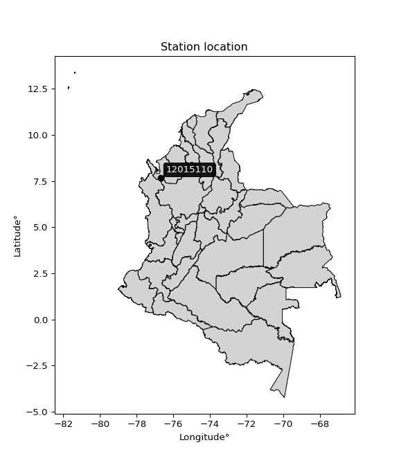

<div align="center">


</div>

# PMP Station (Rain, Pmax24h): 12015110

Probable Maximum Precipitation (PMP) is the greatest amount of rainfall for a specific duration that is meteorologically possible for a given location, acting as a "worst-case" scenario for extreme storms, crucial for designing safety-critical infrastructure like bridges, river deviations, dams, spillways, and nuclear plants to prevent catastrophic failure. PMP is calculated by hydrologists using meteorological data to determine the upper limit of extreme rainfall, often leading to the Probable Maximum Flood (PMF) for flood control design, and is increasingly being studied for climate change impacts. Probable Maximum Precipitation (PMP) is the theoretical upper limit of rainfall, a deterministic estimate for extreme events, while probability distributions (like GEV, Gumbel) describe the likelihood and frequency of various precipitation amounts, including rare ones, showing how often events occur, with PMP representing the extreme end of these distributions, used for critical infrastructure design to ensure safety against the worst conceivable weather, unlike standard statistical forecasts which cover typical probabilities.

The most common probability distributions in hydrology, used for analyzing floods, rainfall, and streamflow, include the Normal, Log-Normal, Gumbel, Gamma (including Log-Pearson Type III), and Generalized Extreme Value (GEV) distributions, often chosen based on the data´s skewness and whether modeling extremes or general conditions, with Gumbel and GEV popular for extreme events like floods, while the Normal distribution serves as a baseline, though often requiring transformations for skewed hydrological data. These distributions help in designing water infrastructure, managing water resources, and forecasting hydrologic events.

> Hydrological data often isn´t perfectly normal (it´s skewed), so different distributions are needed for different applications, such as: **Flood Frequency Analysis**: Using Gumbel, GEV, or Log-Pearson Type III for predicting extreme flood magnitudes and their return periods, **Rainfall Analysis**: Normal for annual totals, but Log-Normal, Weibull, or GEV for intensity or extreme daily rainfall, **Streamflow Modeling**: Gamma and Log-Normal for maximum flows, GEV for minimum flows, and Kappa for daily flows.

<div align="center">

</img>

</div>


## A. General information


### 1. General running parameters

• app_version: _v20260113_. • runtime: _2026-01-13 16:28:34.738620_. • Python version: _3.14.0_. • SciPy version: _1.16.3_. • Pandas version: _2.3.3_. • NumPy version: _2.3.5_. • Stations dataset (station_dataset_file): _dataset/pmax24h_in/automatic_colombia_2003_2025.csv_. • Stations catalog (station_catalog_file): _dataset/CNE.xls_. • Minimum year to eval til year_max (date_min): _1900_. • Maximum year to eval since year_min (date_max): _2025_. • Creates, save and include plots into reports (create_plot): _False_. • Plot only fit distributions with Δo > Δ (plot_only_fit): _True_. • Plot only simple graphs avoiding multiple CDFs and multiple Extreme values plots (plot_only_simple): _True_. • Eval low extreme values, if False, evaluates high extreme values (low_extreme): _False_. • Eval every SciPy distribution as logarithmic (pdist_logarithmic_on): _True_. • Standard deviation normalized (ddof): _1.0_. • Return periods to eval in years (Tr): _[2, 2.33, 5, 10, 15, 20, 25, 50, 75, 100, 200, 250, 500, 750, 1000]_. • Minimum data sample per station, 0 means any (minimum_sample): _5_. • Z-Score maximum threshold to adjust a value, 0 means disable (zscore_max): _3.5_. • Z-Score minimum threshold to adjust a value, 0 means disable (zscore_min): _-2.5_. • Avoid zeros, e.g. rain = 0 (avoid_zeros): _True_. • Avoid null values (avoid_nans): _True_. 

:file_folder:Table: [dataset.csv](../../dataset/pmax24h_in/automatic_colombia_2003_2025.csv)

> Delta Degrees of Freedom (DDOF): is a parameter used in the formulas for calculating variance and standard deviation. When ddof=0, the divisor is $N$ (the total number of observations) and this is used when your data set is the entire population. When ddof=1, the divisor is $N-1$ and this is used when your data set is a sample drawn from a larger population. Using $N-1$ provides an unbiased estimate of the population variance (known as Bessel´s correction).


### 2. Station info and location

|   id |   CODIGO | NOMBRE               | CATEGORIA         | TECNOLOGIA                | ESTADO     | FECHA_INSTALACION   | FECHA_SUSPENSION   |   ALTITUD |   LATITUD |   LONGITUD | DEPARTAMENTO   | MUNICIPIO   | AREA_OPERATIVA                      | ENTIDAD                                                     | AREA_HIDROGRAFICA   | ZONA_HIDROGRAFICA   | SUBZONA_HIDROGRAFICA   |   CORRIENTE | Catalogo   |   Version |
|-----:|---------:|:---------------------|:------------------|:--------------------------|:-----------|:--------------------|:-------------------|----------:|----------:|-----------:|:---------------|:------------|:------------------------------------|:------------------------------------------------------------|:--------------------|:--------------------|:-----------------------|------------:|:-----------|----------:|
|    0 | 12015110 | CHIGORODO [12015110] | Agrometeorológica | Automática con Telemetría | Suspendida | 18/09/2005          | 18/11/2025         |        44 |   7.67114 |   -76.6941 | Antioquia      | Chigorodó   | Area Operativa 01 - Antioquia-Chocó | INSTITUTO DE HIDROLOGIA METEOROLOGIA Y ESTUDIOS AMBIENTALES | Caribe              | Caribe - Litoral    | Río León               |         nan | CNE_IDEAM  |  20251226 |

<div align="center">

Dynamic map: [:earth_americas:Google](http://maps.google.com/maps?q=7.671138889,-76.69405556) [:earth_americas:OSM](https://www.openstreetmap.org/#map=18/7.671138889/-76.69405556&layers=P) [:earth_americas:Bing](https://www.bing.com/maps?cp=7.671138889~-76.69405556&lvl=18) [:earth_americas:Apple](https://maps.apple.com/frame?center=7.671138889%2C-76.69405556&span=0.003%2C0.006)

</div>


<div align="center">

```geojson
{
  "type": "Feature",
  "geometry": {
    "type": "Point", 
    "coordinates": [-76.69405556, 7.671138889]
  }, 
  "properties": {
    "Name": "12015110"
  }
}
```

</div>


### 3. Discrete values table and plot

<div align="center">

|               |          0 |          1 |          2 |          3 |           4 |           5 |           6 |           7 |           8 |           9 |          10 |         11 |         12 |          13 |
|:--------------|-----------:|-----------:|-----------:|-----------:|------------:|------------:|------------:|------------:|------------:|------------:|------------:|-----------:|-----------:|------------:|
| Date          | 2005       | 2006       | 2011       | 2012       | 2013        | 2014        | 2015        | 2016        | 2017        | 2018        | 2019        | 2020       | 2021       | 2022        |
| Value         |  138.5     |   57.9     |   51.1     |  110.5     |   91.2      |   95.8      |   76.3      |   94.9      |  101.7      |   68.1      |   94.4      |   26.7     |  109.8     |   90.3      |
| Value_initial |  138.5     |   57.9     |   51.1     |  110.5     |   91.2      |   95.8      |   76.3      |   94.9      |  101.7      |   68.1      |   94.4      |   26.7     |  109.8     |   90.3      |
| count         |   14       |   14       |   14       |   14       |   14        |   14        |   14        |   14        |   14        |   14        |   14        |   14       |   14       |   14        |
| mean          |   86.2286  |   86.2286  |   86.2286  |   86.2286  |   86.2286   |   86.2286   |   86.2286   |   86.2286   |   86.2286   |   86.2286   |   86.2286   |   86.2286  |   86.2286  |   86.2286   |
| std           |   28.2824  |   28.2824  |   28.2824  |   28.2824  |   28.2824   |   28.2824   |   28.2824   |   28.2824   |   28.2824   |   28.2824   |   28.2824   |   28.2824  |   28.2824  |   28.2824   |
| zscore        |    1.84819 |   -1.00163 |   -1.24206 |    0.85818 |    0.175778 |    0.338423 |   -0.351051 |    0.306601 |    0.547033 |   -0.640983 |    0.288922 |   -2.10479 |    0.83343 |    0.143956 |


</div>


> The initial value (value_initial) correspond to the initial obtained or null completed value, and value (value) is adjusted only when the initial value is outside the valid range (outlier) definite through the Z-Score value. If Z-Score is active, values out of range or outliers are replaced with the station mean value. A Z-Score (or standard score) measures how many standard deviations a data point is from the mean of a dataset, indicating its relative position; positive scores mean above the mean, negative mean below, and a score of zero is exactly at the mean, allowing for comparison of values from different distributions. It´s calculated using the formula $z=(x–μ)/σ$, where $x$ is the data point, $μ$ is the mean, and $σ$ is the standard deviation, helping identify outliers and understand probability.
>
> <sub>**Note**: In this study, "completing" (filling gaps in) and "extending" (forecasting or lengthening the historical record) rainfall data series are avoided for certain critical analyses because they introduce artificial bias and uncertainty, which can distort the statistics of rare events (extremes), alter day-to-day variability, and compromise the integrity and homogeneity of the original data. Some reasons against Completing/Extending rainfall data are: **Distortion of Extremes and Variability**: The primary issue is that most gap-filling or extension methods rely on averaging or regression with nearby stations, which inherently smooths the data. Rainfall is highly variable in space and time, with a large percentage of zero values and occasional large storms. Infilling methods often underestimate the highest values and overestimate the lowest (zero) values, which severely distorts analyses focused on flood frequency, drought severity, and intensity-duration-frequency (IDF) curves, **Loss of Data Homogeneity**: Infilled or extended data are synthetic estimates, not actual measurements. Combining these estimates with observed data can violate the assumption of data homogeneity, which requires that the data properties do not change over time. Inhomogeneity can lead to incorrect conclusions about long-term trends or changes in climate patterns, **Propagation of Errors**: Errors and biases from the original data (e.g., wind-induced undercatch, instrument errors, site changes) or the data used for imputation can propagate through the analysis, leading to unreliable hydrological models and inaccurate predictions, **Compromised Statistical Integrity**: For statistical analyses, especially those involving the frequency of events, using artificial data can introduce time bias or autocorrelation that doesn´t exist in reality, making it difficult to assess the true probability of events, **Difficulty in Validation**: It is difficult to accurately validate the quality of filled or extended data, especially for past periods where ground-truth measurements are unavailable. The reliability of imputation techniques heavily depends on the density of the surrounding station network and the complexity of the local topography.</sub>


### 4. Active continuous probability distributions from SciPy (45 of 104 available)

A Probability Density Function (PDF) describes the relative likelihood of a continuous random variable falling within a specific range, where the total area under its curve equals 1, and the area over any interval gives the actual probability for that range. Unlike discrete probabilities (like rolling a die), a PDF shows density, not direct probability for a single point (which is zero), with higher points indicating higher likelihood, often visualized as a bell curve for normal distributions.

A log of a probability density function (log-PDF) is simply the logarithm of the PDF´s value, denoted as $log(f(x))$, useful for converting multiplication of probabilities into addition, improving numerical stability with tiny numbers, and connecting to information theory concepts like entropy. Instead of dealing with very small probabilities (e.g., 0.000001), log-PDFs use negative numbers (e.g., $log(0.00001) ≈ -11.51$ that are easier for computers to handle, preventing underflow errors and simplifying complex calculations. In this study, each active probability distribution from SciPy is also evaluated in the $log$ form.

[scipy.stats](https://docs.scipy.org/doc/scipy/reference/stats.html) is a Python´s powerful submodule within the SciPy library for comprehensive statistical analysis, offering over 130 probability distributions (like Normal, Poisson), functions for descriptive stats (mean, variance), hypothesis testing (t-tests, chi-square), random variable generation, and statistical tests, making it essential for data science, modeling, and research. It provides tools to explore, model, and draw conclusions from data efficiently, working seamlessly with NumPy.

<div align="center">

|   id | p_dist             |   n_parameter | fit_method   | label                                                                       | active   | ref                                                                                                        |
|-----:|:-------------------|--------------:|:-------------|:----------------------------------------------------------------------------|:---------|:-----------------------------------------------------------------------------------------------------------|
|    0 | alpha              |             3 | MLE          | Alpha                                                                       | True     | [:mortar_board:](https://docs.scipy.org/doc/scipy/reference/generated/scipy.stats.alpha.html)              |
|    1 | betaprime          |             4 | MLE          | Beta prime                                                                  | True     | [:mortar_board:](https://docs.scipy.org/doc/scipy/reference/generated/scipy.stats.betaprime.html)          |
|    2 | chi2               |             3 | MLE          | Chi²                                                                        | True     | [:mortar_board:](https://docs.scipy.org/doc/scipy/reference/generated/scipy.stats.chi2.html)               |
|    3 | crystalball        |             4 | MLE          | Crystalball                                                                 | True     | [:mortar_board:](https://docs.scipy.org/doc/scipy/reference/generated/scipy.stats.crystalball.html)        |
|    4 | dweibull           |             3 | MLE          | Double Weibull                                                              | True     | [:mortar_board:](https://docs.scipy.org/doc/scipy/reference/generated/scipy.stats.dweibull.html)           |
|    5 | erlang             |             3 | MLE          | Erlang                                                                      | True     | [:mortar_board:](https://docs.scipy.org/doc/scipy/reference/generated/scipy.stats.erlang.html)             |
|    6 | expon              |             2 | MLE          | Exponential                                                                 | True     | [:mortar_board:](https://docs.scipy.org/doc/scipy/reference/generated/scipy.stats.expon.html)              |
|    7 | exponnorm          |             3 | MLE          | Exponentially modified Normal                                               | True     | [:mortar_board:](https://docs.scipy.org/doc/scipy/reference/generated/scipy.stats.exponnorm.html)          |
|    8 | f                  |             4 | MLE          | F                                                                           | True     | [:mortar_board:](https://docs.scipy.org/doc/scipy/reference/generated/scipy.stats.f.html)                  |
|    9 | fatiguelife        |             3 | MLE          | Fatigue-life (Birnbaum-Saunders)                                            | True     | [:mortar_board:](https://docs.scipy.org/doc/scipy/reference/generated/scipy.stats.fatiguelife.html)        |
|   10 | fisk               |             3 | MLE          | Fisk                                                                        | True     | [:mortar_board:](https://docs.scipy.org/doc/scipy/reference/generated/scipy.stats.fisk.html)               |
|   11 | gamma              |             3 | MLE          | Gamma                                                                       | True     | [:mortar_board:](https://docs.scipy.org/doc/scipy/reference/generated/scipy.stats.gamma.html)              |
|   12 | genexpon           |             5 | MLE          | Generalized exponential                                                     | True     | [:mortar_board:](https://docs.scipy.org/doc/scipy/reference/generated/scipy.stats.genexpon.html)           |
|   13 | genlogistic        |             3 | MLE          | Generalized logistic                                                        | True     | [:mortar_board:](https://docs.scipy.org/doc/scipy/reference/generated/scipy.stats.genlogistic.html)        |
|   14 | gibrat             |             2 | MM           | Gibrat                                                                      | True     | [:mortar_board:](https://docs.scipy.org/doc/scipy/reference/generated/scipy.stats.gibrat.html)             |
|   15 | gompertz           |             3 | MLE          | Gompertz (or truncated Gumbel)                                              | True     | [:mortar_board:](https://docs.scipy.org/doc/scipy/reference/generated/scipy.stats.gompertz.html)           |
|   16 | gumbel_l           |             2 | MM           | Gumbel Left Skew                                                            | True     | [:mortar_board:](https://docs.scipy.org/doc/scipy/reference/generated/scipy.stats.gumbel_l.html)           |
|   17 | gumbel_r           |             2 | MM           | Gumbel Right Skew                                                           | True     | [:mortar_board:](https://docs.scipy.org/doc/scipy/reference/generated/scipy.stats.gumbel_r.html)           |
|   18 | halflogistic       |             2 | MM           | Half-logistic                                                               | True     | [:mortar_board:](https://docs.scipy.org/doc/scipy/reference/generated/scipy.stats.halflogistic.html)       |
|   19 | halfnorm           |             2 | MM           | Half Normal                                                                 | True     | [:mortar_board:](https://docs.scipy.org/doc/scipy/reference/generated/scipy.stats.halfnorm.html)           |
|   20 | hypsecant          |             2 | MM           | hyperbolic secant                                                           | True     | [:mortar_board:](https://docs.scipy.org/doc/scipy/reference/generated/scipy.stats.hypsecant.html)          |
|   21 | invgamma           |             3 | MLE          | Inverted gamma                                                              | True     | [:mortar_board:](https://docs.scipy.org/doc/scipy/reference/generated/scipy.stats.invgamma.html)           |
|   22 | invgauss           |             3 | MLE          | Inverse Gaussian                                                            | True     | [:mortar_board:](https://docs.scipy.org/doc/scipy/reference/generated/scipy.stats.invgauss.html)           |
|   23 | invweibull         |             3 | MLE          | Inverted Weibull                                                            | True     | [:mortar_board:](https://docs.scipy.org/doc/scipy/reference/generated/scipy.stats.invweibull.html)         |
|   24 | kappa4             |             4 | MLE          | Kappa 4                                                                     | True     | [:mortar_board:](https://docs.scipy.org/doc/scipy/reference/generated/scipy.stats.kappa4.html)             |
|   25 | kstwobign          |             2 | MLE          | Limiting distribution of scaled Kolmogorov-Smirnov two-sided test statistic | True     | [:mortar_board:](https://docs.scipy.org/doc/scipy/reference/generated/scipy.stats.kstwobign.html)          |
|   26 | laplace            |             2 | MM           | Laplace                                                                     | True     | [:mortar_board:](https://docs.scipy.org/doc/scipy/reference/generated/scipy.stats.laplace.html)            |
|   27 | laplace_asymmetric |             3 | MLE          | Asymmetric Laplace                                                          | True     | [:mortar_board:](https://docs.scipy.org/doc/scipy/reference/generated/scipy.stats.laplace_asymmetric.html) |
|   28 | loggamma           |             3 | MLE          | Log gamma                                                                   | True     | [:mortar_board:](https://docs.scipy.org/doc/scipy/reference/generated/scipy.stats.loggamma.html)           |
|   29 | logistic           |             2 | MM           | Logistic (or Sech-squared)                                                  | True     | [:mortar_board:](https://docs.scipy.org/doc/scipy/reference/generated/scipy.stats.logistic.html)           |
|   30 | lognorm            |             3 | MLE          | Log Normal                                                                  | True     | [:mortar_board:](https://docs.scipy.org/doc/scipy/reference/generated/scipy.stats.lognorm.html)            |
|   31 | maxwell            |             2 | MM           | Maxwell                                                                     | True     | [:mortar_board:](https://docs.scipy.org/doc/scipy/reference/generated/scipy.stats.maxwell.html)            |
|   32 | mielke             |             4 | MLE          | Mielke Beta-Kappa / Dagum                                                   | True     | [:mortar_board:](https://docs.scipy.org/doc/scipy/reference/generated/scipy.stats.mielke.html)             |
|   33 | moyal              |             2 | MM           | Moyal                                                                       | True     | [:mortar_board:](https://docs.scipy.org/doc/scipy/reference/generated/scipy.stats.moyal.html)              |
|   34 | nakagami           |             3 | MLE          | Nakagami                                                                    | True     | [:mortar_board:](https://docs.scipy.org/doc/scipy/reference/generated/scipy.stats.nakagami.html)           |
|   35 | ncf                |             5 | MLE          | Non-central F distribution                                                  | True     | [:mortar_board:](https://docs.scipy.org/doc/scipy/reference/generated/scipy.stats.ncf.html)                |
|   36 | nct                |             4 | MLE          | Non-central Student’s t                                                     | True     | [:mortar_board:](https://docs.scipy.org/doc/scipy/reference/generated/scipy.stats.nct.html)                |
|   37 | norm               |             2 | MM           | Normal                                                                      | True     | [:mortar_board:](https://docs.scipy.org/doc/scipy/reference/generated/scipy.stats.norm.html)               |
|   38 | pearson3           |             3 | MM           | Pearson type III                                                            | True     | [:mortar_board:](https://docs.scipy.org/doc/scipy/reference/generated/scipy.stats.pearson3.html)           |
|   39 | rayleigh           |             2 | MM           | Rayleigh                                                                    | True     | [:mortar_board:](https://docs.scipy.org/doc/scipy/reference/generated/scipy.stats.rayleigh.html)           |
|   40 | rice               |             3 | MLE          | Rice                                                                        | True     | [:mortar_board:](https://docs.scipy.org/doc/scipy/reference/generated/scipy.stats.rice.html)               |
|   41 | t                  |             3 | MLE          | Student’s t                                                                 | True     | [:mortar_board:](https://docs.scipy.org/doc/scipy/reference/generated/scipy.stats.t.html)                  |
|   42 | truncnorm          |             4 | MLE          | Truncated normal                                                            | True     | [:mortar_board:](https://docs.scipy.org/doc/scipy/reference/generated/scipy.stats.truncnorm.html)          |
|   43 | wald               |             2 | MM           | Wald                                                                        | True     | [:mortar_board:](https://docs.scipy.org/doc/scipy/reference/generated/scipy.stats.wald.html)               |
|   44 | weibull_min        |             3 | MLE          | Weibull minimum                                                             | True     | [:mortar_board:](https://docs.scipy.org/doc/scipy/reference/generated/scipy.stats.weibull_min.html)        |

</div>

> **n_parameter:** # arguments & localization & scale.
>
> **Fit methods:** (MLE) maximum likelihood, (MM) L-moments.
>
>**Inactive** (With the only purpose of prevent loops, zero divisions, infinite values, over high estimated values or horizontal trending for recurrence intervals estimations, the follow distributions were disabled.)**:** foldnorm, gennorm, norminvgauss, powernorm, powerlognorm, skewnorm, genextreme, anglit, arcsine, argus, beta, bradford, burr, burr12, cauchy, cosine, halfcauchy, foldcauchy, skewcauchy, wrapcauchy, dgamma, gengamma, exponweib, exponpow, truncexpon, gausshyper, genhalflogistic, genhyperbolic, geninvgauss, halfgennorm, johnsonsb, johnsonsu, kappa3, ksone, kstwo, loglaplace, levy, levy_l, levy_stable, ncx2, pareto, genpareto, truncpareto, lomax, powerlaw, rdist, rel_breitwigner, recipinvgauss, semicircular, studentized_range, trapezoid, triang, truncweibull_min, tukeylambda, uniform, loguniform, vonmises, vonmises_line, weibull_max, 


## B. Probability (PDF) vs. Empirical (EDF) distributions functions

A continuous probability distribution (CPD) describes probabilities for variables that can take any value within a range (like rain any time), unlike discrete variables with specific outcomes (like temperature). It uses a Probability Density Function (PDF), a curve where the total area under it equals 1, and the probability of the variable falling within an interval (a to b) is found by calculating the area under the curve between those points. A key feature is that the probability of hitting any single exact value is zero, so probabilities are always expressed for ranges, e.g., $P(a ≤ X ≤ b)$.

<div align="center">

Distributions parameters from station values
|    |   station | p_dist                |   n |              loc |           scale | shape                  | shape1                 | shape2                | shape3   |
|---:|----------:|:----------------------|----:|-----------------:|----------------:|:-----------------------|:-----------------------|:----------------------|:---------|
|  0 |  12015110 | alpha                 |  14 |   -474.593       | 11050           | 19.754354411865535     |                        |                       |          |
|  1 |  12015110 | betaprime             |  14 |   -364.471       | 59871.7         | 261.47488472066834     | 34754.51803080362      |                       |          |
|  2 |  12015110 | chi2                  |  14 |   -272.39        |     1.08222     | 331.32906646247534     |                        |                       |          |
|  3 |  12015110 | crystalball           |  14 |     86.2286      |    27.2536      | 7880.449209787778      | 114.12542985623057     |                       |          |
|  4 |  12015110 | dweibull              |  14 |     94.9         |    20.0769      | 0.8793045864500331     |                        |                       |          |
|  5 |  12015110 | erlang                |  14 |   -403.475       |     1.57274     | 311.32959831284575     |                        |                       |          |
|  6 |  12015110 | expon                 |  14 |     26.7         |    59.5286      |                        |                        |                       |          |
|  7 |  12015110 | exponnorm             |  14 |     86.205       |    27.2536      | 0.000869972696313047   |                        |                       |          |
|  8 |  12015110 | f                     |  14 |  -9777.04        |  9863.15        | 283106.5593681642      | 3462430.4810742363     |                       |          |
|  9 |  12015110 | fatiguelife           |  14 |     26.7         |     0.000254896 | 573.1534928202714      |                        |                       |          |
| 10 |  12015110 | fisk                  |  14 |     -1.524e+09   |     1.524e+09   | 99497246.87694132      |                        |                       |          |
| 11 |  12015110 | gamma                 |  14 |   -408.704       |     1.55032     | 319.122307739293       |                        |                       |          |
| 12 |  12015110 | genexpon              |  14 |     26.6999      |     1.39        | 0.023276434622623746   | 2.1170692647640474e-07 | 1.3025479816651366    |          |
| 13 |  12015110 | genlogistic           |  14 |    101.668       |    10.6773      | 0.4858177843469329     |                        |                       |          |
| 14 |  12015110 | gibrat                |  14 |     65.4375      |    12.6104      |                        |                        |                       |          |
| 15 |  12015110 | gompertz              |  14 |     17.7601      |     4.02374     | 1.297463541794032e-12  |                        |                       |          |
| 16 |  12015110 | gumbel_l              |  14 |     98.4942      |    21.2496      |                        |                        |                       |          |
| 17 |  12015110 | gumbel_r              |  14 |     73.963       |    21.2496      |                        |                        |                       |          |
| 18 |  12015110 | halflogistic          |  14 |     53.9266      |    23.3009      |                        |                        |                       |          |
| 19 |  12015110 | halfnorm              |  14 |     50.1555      |    45.2109      |                        |                        |                       |          |
| 20 |  12015110 | hypsecant             |  14 |     86.2286      |    17.3502      |                        |                        |                       |          |
| 21 |  12015110 | invgamma              |  14 |   -287.048       | 65898.5         | 177.6723855928989      |                        |                       |          |
| 22 |  12015110 | invgauss              |  14 |    -77.3254      |  4654.64        | 0.035085836382515695   |                        |                       |          |
| 23 |  12015110 | invweibull            |  14 |     26.7         |     1.09727     | 0.06647748957247779    |                        |                       |          |
| 24 |  12015110 | kappa4                |  14 |     15.3904      |   125.406       | 1.099215656677504      | 1.0182628668152423     |                       |          |
| 25 |  12015110 | kstwobign             |  14 |    -32.1057      |   135.759       |                        |                        |                       |          |
| 26 |  12015110 | laplace               |  14 |     86.2286      |    19.2712      |                        |                        |                       |          |
| 27 |  12015110 | laplace_asymmetric    |  14 |     94.9         |    18.8965      | 1.2554325594453433     |                        |                       |          |
| 28 |  12015110 | loggamma              |  14 |    -33.583       |    66.8476      | 6.496387460878422      |                        |                       |          |
| 29 |  12015110 | logistic              |  14 |     86.2286      |    15.0257      |                        |                        |                       |          |
| 30 |  12015110 | lognorm               |  14 |     -1.85508e+06 |     1.85516e+06 | 1.4690745691213555e-05 |                        |                       |          |
| 31 |  12015110 | maxwell               |  14 |     21.6489      |    40.4693      |                        |                        |                       |          |
| 32 |  12015110 | mielke                |  14 |     -1.75703     |   113.036       | 2.927216794322863      | 12.403825733974028     |                       |          |
| 33 |  12015110 | moyal                 |  14 |     70.6432      |    12.2684      |                        |                        |                       |          |
| 34 |  12015110 | nakagami              |  14 |     47.2538      |    47.9409      | 0.8422706076162991     |                        |                       |          |
| 35 |  12015110 | ncf                   |  14 |   -464.53        |   479.141       | 792.4535623950519      | 44309.04359576189      | 119.66460532197195    |          |
| 36 |  12015110 | nct                   |  14 |  -2090.88        |    27.2232      | 1240423.407961362      | 79.97231743900008      |                       |          |
| 37 |  12015110 | norm                  |  14 |     86.2286      |    27.2536      |                        |                        |                       |          |
| 38 |  12015110 | pearson3              |  14 |     86.2286      |    27.2537      | -0.38034210472779695   |                        |                       |          |
| 39 |  12015110 | rayleigh              |  14 |     34.0908      |    41.5999      |                        |                        |                       |          |
| 40 |  12015110 | rice                  |  14 |     40.5859      |    23.8986      | 1.7960317225575264     |                        |                       |          |
| 41 |  12015110 | t                     |  14 |     86.2282      |    27.2534      | 2811980.904011948      |                        |                       |          |
| 42 |  12015110 | truncnorm             |  14 |     86.2286      |    27.2536      | -348.6614089374517     | 131.00063812270486     |                       |          |
| 43 |  12015110 | wald                  |  14 |     58.975       |    27.2536      |                        |                        |                       |          |
| 44 |  12015110 | weibull_min           |  14 |    -39.1196      |   136.01        | 5.3440104052725825     |                        |                       |          |
| 45 |  12015110 | logalpha              |  14 |    -10.4232      |   522.946       | 35.360490136103394     |                        |                       |          |
| 46 |  12015110 | logbetaprime          |  14 |     -5.25838     |    11.542       | 739.2726211178056      | 885.0074729564271      |                       |          |
| 47 |  12015110 | logchi2               |  14 |      3.28466     |     0.998906    | 1.0370473784710827     |                        |                       |          |
| 48 |  12015110 | logcrystalball        |  14 |      4.39059     |     0.398309    | 5.877506804682006      | 1.0300249682087044     |                       |          |
| 49 |  12015110 | logdweibull           |  14 |      4.55282     |     0.224826    | 0.5656393512371765     |                        |                       |          |
| 50 |  12015110 | logerlang             |  14 |     -2.29882     |     0.0265574   | 251.5890738139194      |                        |                       |          |
| 51 |  12015110 | logexpon              |  14 |      3.28466     |     1.10592     |                        |                        |                       |          |
| 52 |  12015110 | logexponnorm          |  14 |      4.39031     |     0.398309    | 0.00068558663770638    |                        |                       |          |
| 53 |  12015110 | logf                  |  14 |   -321.235       |   325.627       | 1351500.7230807375     | 65542896.52745554      |                       |          |
| 54 |  12015110 | logfatiguelife        |  14 |   -354.068       |   358.459       | 0.0011077040691030281  |                        |                       |          |
| 55 |  12015110 | logfisk               |  14 |     -9.91278e+07 |     9.91278e+07 | 492557794.4037806      |                        |                       |          |
| 56 |  12015110 | loggamma              |  14 |     -3.07179     |     0.0233102   | 319.70593141759446     |                        |                       |          |
| 57 |  12015110 | loggenexpon           |  14 |      3.23438     |     0.013882    | 0.0009797575120804236  | 4.124118993510288      | 5.722376448062468e-05 |          |
| 58 |  12015110 | loggenlogistic        |  14 |      4.71391     |     0.0816403   | 0.2322861159368661     |                        |                       |          |
| 59 |  12015110 | loggibrat             |  14 |      4.08677     |     0.184274    |                        |                        |                       |          |
| 60 |  12015110 | loggompertz           |  14 |      3.28291     |     0.287739    | 0.012113003542821358   |                        |                       |          |
| 61 |  12015110 | loggumbel_l           |  14 |      4.56985     |     0.310561    |                        |                        |                       |          |
| 62 |  12015110 | loggumbel_r           |  14 |      4.21133     |     0.310561    |                        |                        |                       |          |
| 63 |  12015110 | loghalflogistic       |  14 |      3.91848     |     0.340555    |                        |                        |                       |          |
| 64 |  12015110 | loghalfnorm           |  14 |      3.86336     |     0.660774    |                        |                        |                       |          |
| 65 |  12015110 | loghypsecant          |  14 |      4.39059     |     0.253572    |                        |                        |                       |          |
| 66 |  12015110 | loginvgamma           |  14 |     -6.02907     |  6501.29        | 625.3887458585914      |                        |                       |          |
| 67 |  12015110 | loginvgauss           |  14 |     -1.03679     |   847.168       | 0.00639483396247037    |                        |                       |          |
| 68 |  12015110 | loginvweibull         |  14 |     -6.17395e+07 |     6.17395e+07 | 121437873.25154853     |                        |                       |          |
| 69 |  12015110 | logkappa4             |  14 |      3.22576     |     1.96662     | 1.028311874376227      | 1.1533681453421916     |                       |          |
| 70 |  12015110 | logkstwobign          |  14 |      2.28321     |     2.42528     |                        |                        |                       |          |
| 71 |  12015110 | loglaplace            |  14 |      4.39059     |     0.281647    |                        |                        |                       |          |
| 72 |  12015110 | loglaplace_asymmetric |  14 |      4.56226     |     0.223101    | 1.4386665469650888     |                        |                       |          |
| 73 |  12015110 | logloggamma           |  14 |      4.7242      |     0.184183    | 0.5325598695716358     |                        |                       |          |
| 74 |  12015110 | loglogistic           |  14 |      4.39059     |     0.219599    |                        |                        |                       |          |
| 75 |  12015110 | loglognorm            |  14 | -32764.7         | 32769.1         | 1.2155132645326067e-05 |                        |                       |          |
| 76 |  12015110 | logmaxwell            |  14 |      3.44681     |     0.591423    |                        |                        |                       |          |
| 77 |  12015110 | logmielke             |  14 |  -3534.32        |  3539.04        | 10090.2905530446       | 44698.14708314599      |                       |          |
| 78 |  12015110 | logmoyal              |  14 |      4.16281     |     0.179302    |                        |                        |                       |          |
| 79 |  12015110 | lognakagami           |  14 |      3.6998      |     0.81166     | 1.994574778399357      |                        |                       |          |
| 80 |  12015110 | logncf                |  14 |    -49.4147      |    39.8207      | 43857.5687714864       | 149159.79911377054     | 15397.111569632778    |          |
| 81 |  12015110 | lognct                |  14 |    -20.363       |     0.373217    | 13021.681628114322     | 66.32017881235205      |                       |          |
| 82 |  12015110 | lognorm               |  14 |      4.39059     |     0.398309    |                        |                        |                       |          |
| 83 |  12015110 | logpearson3           |  14 |      4.39059     |     0.39831     | -1.4046265084597578    |                        |                       |          |
| 84 |  12015110 | lograyleigh           |  14 |      3.62863     |     0.607951    |                        |                        |                       |          |
| 85 |  12015110 | logrice               |  14 |   -146.182       |     0.398302    | 378.03396227220213     |                        |                       |          |
| 86 |  12015110 | logt                  |  14 |      4.53247     |     0.174829    | 1.511141079994787      |                        |                       |          |
| 87 |  12015110 | logtruncnorm          |  14 |     -0.0510924   |     1.77916     | 2.2395767494109986     | 2.800170102834622      |                       |          |
| 88 |  12015110 | logwald               |  14 |      3.99228     |     0.398308    |                        |                        |                       |          |
| 89 |  12015110 | logweibull_min        |  14 |     -1.00375e+07 |     1.00375e+07 | 36316883.659427285     |                        |                       |          |

</div>

> **loc** (Location parameter): This shifts the distribution along the x-axis. For many common distributions, like the normal (Gaussian) distribution, loc represents the mean $μ$. For others, like the uniform distribution, it might represent the minimum value, or for the beta distribution, the left end of the support interval.
>
> **scale** (Scale parameter): This determines the width or spread of the distribution. For the normal distribution, scale represents the standard deviation $σ$. For a uniform distribution, it defines the length of the interval (from $loc$ to $loc + scale$).
>
> **shape** (Shape parameters): Refers to parameters that define the specific form of a probability distribution, distinct from its location (loc) and scale (scale). These parameters are required arguments for most distribution functions. For example, a normal (Gaussian) distribution is fully defined by its location (mean) and scale (standard deviation), so it has no specific shape parameters beyond loc and scale. However, other distributions have intrinsic properties that need specification, as Gamma distribution that takes a shape parameter, often named $a$ or $alpha$.


### 0. Cumulative distribution values - CDF (90 evaluated)

Cumulative Distribution Function (CDF), denoted as $F$<sub>$X$</sub>$(x)$, is a function that gives the probability that a random variable $X$ will take a value less than or equal to a specific value, $x$ (i.e., $(P(X≥x)$. It essentially "accumulates" probabilities from a given point up to the far right (positive infinity), providing a complete picture of the distribution´s probabilities for both discrete (like rain) and continuous (like temperature) variables, helping to find probabilities over ranges or above certain values. Each station is evaluated separately ordering the $x$ values ascending, calculating the CDF and PDF values for the activated distributions and their logarithmic forms.

<div align="center">

CDF ordered by x ascending and calculating $log(f(x))$ separately
|   id |   Station |   date |     x |   count |    mean |     std |    zscore |   Value_initial |   station |   m |     alpha |   alpha_pdf |   betaprime |   betaprime_pdf |      chi2 |   chi2_pdf |   crystalball |   crystalball_pdf |   dweibull |   dweibull_pdf |    erlang |   erlang_pdf |    expon |   expon_pdf |   exponnorm |   exponnorm_pdf |         f |      f_pdf |   fatiguelife |   fatiguelife_pdf |      fisk |   fisk_pdf |     gamma |   gamma_pdf |    genexpon |   genexpon_pdf |   genlogistic |   genlogistic_pdf |    gibrat |   gibrat_pdf |    gompertz |   gompertz_pdf |   gumbel_l |   gumbel_l_pdf |   gumbel_r |   gumbel_r_pdf |   halflogistic |   halflogistic_pdf |   halfnorm |   halfnorm_pdf |   hypsecant |   hypsecant_pdf |   invgamma |   invgamma_pdf |   invgauss |   invgauss_pdf |   invweibull |   invweibull_pdf |      kappa4 |   kappa4_pdf |   kstwobign |   kstwobign_pdf |   laplace |   laplace_pdf |   laplace_asymmetric |   laplace_asymmetric_pdf |   loggamma |   loggamma_pdf |   logistic |   logistic_pdf |    lognorm |   lognorm_pdf |    maxwell |   maxwell_pdf |    mielke |   mielke_pdf |       moyal |   moyal_pdf |   nakagami |   nakagami_pdf |       ncf |    ncf_pdf |       nct |    nct_pdf |      norm |   norm_pdf |   pearson3 |   pearson3_pdf |   rayleigh |   rayleigh_pdf |      rice |   rice_pdf |         t |      t_pdf |   truncnorm |   truncnorm_pdf |     wald |   wald_pdf |   weibull_min |   weibull_min_pdf |   logalpha |   logalpha_pdf |   logbetaprime |   logbetaprime_pdf |     logchi2 |   logchi2_pdf |   logcrystalball |   logcrystalball_pdf |   logdweibull |   logdweibull_pdf |   logerlang |   logerlang_pdf |   logexpon |   logexpon_pdf |   logexponnorm |   logexponnorm_pdf |      logf |   logf_pdf |   logfatiguelife |   logfatiguelife_pdf |    logfisk |   logfisk_pdf |   loggenexpon |   loggenexpon_pdf |   loggenlogistic |   loggenlogistic_pdf |   loggibrat |   loggibrat_pdf |   loggompertz |   loggompertz_pdf |   loggumbel_l |   loggumbel_l_pdf |   loggumbel_r |   loggumbel_r_pdf |   loghalflogistic |   loghalflogistic_pdf |   loghalfnorm |   loghalfnorm_pdf |   loghypsecant |   loghypsecant_pdf |   loginvgamma |   loginvgamma_pdf |   loginvgauss |   loginvgauss_pdf |   loginvweibull |   loginvweibull_pdf |   logkappa4 |   logkappa4_pdf |   logkstwobign |   logkstwobign_pdf |   loglaplace |   loglaplace_pdf |   loglaplace_asymmetric |   loglaplace_asymmetric_pdf |   logloggamma |   logloggamma_pdf |   loglogistic |   loglogistic_pdf |   loglognorm |   loglognorm_pdf |   logmaxwell |   logmaxwell_pdf |   logmielke |   logmielke_pdf |   logmoyal |   logmoyal_pdf |   lognakagami |   lognakagami_pdf |     logncf |   logncf_pdf |     lognct |   lognct_pdf |   logpearson3 |   logpearson3_pdf |   lograyleigh |   lograyleigh_pdf |    logrice |   logrice_pdf |      logt |   logt_pdf |   logtruncnorm |   logtruncnorm_pdf |   logwald |   logwald_pdf |   logweibull_min |   logweibull_min_pdf |
|-----:|----------:|-------:|------:|--------:|--------:|--------:|----------:|----------------:|----------:|----:|----------:|------------:|------------:|----------------:|----------:|-----------:|--------------:|------------------:|-----------:|---------------:|----------:|-------------:|---------:|------------:|------------:|----------------:|----------:|-----------:|--------------:|------------------:|----------:|-----------:|----------:|------------:|------------:|---------------:|--------------:|------------------:|----------:|-------------:|------------:|---------------:|-----------:|---------------:|-----------:|---------------:|---------------:|-------------------:|-----------:|---------------:|------------:|----------------:|-----------:|---------------:|-----------:|---------------:|-------------:|-----------------:|------------:|-------------:|------------:|----------------:|----------:|--------------:|---------------------:|-------------------------:|-----------:|---------------:|-----------:|---------------:|-----------:|--------------:|-----------:|--------------:|----------:|-------------:|------------:|------------:|-----------:|---------------:|----------:|-----------:|----------:|-----------:|----------:|-----------:|-----------:|---------------:|-----------:|---------------:|----------:|-----------:|----------:|-----------:|------------:|----------------:|---------:|-----------:|--------------:|------------------:|-----------:|---------------:|---------------:|-------------------:|------------:|--------------:|-----------------:|---------------------:|--------------:|------------------:|------------:|----------------:|-----------:|---------------:|---------------:|-------------------:|----------:|-----------:|-----------------:|---------------------:|-----------:|--------------:|--------------:|------------------:|-----------------:|---------------------:|------------:|----------------:|--------------:|------------------:|--------------:|------------------:|--------------:|------------------:|------------------:|----------------------:|--------------:|------------------:|---------------:|-------------------:|--------------:|------------------:|--------------:|------------------:|----------------:|--------------------:|------------:|----------------:|---------------:|-------------------:|-------------:|-----------------:|------------------------:|----------------------------:|--------------:|------------------:|--------------:|------------------:|-------------:|-----------------:|-------------:|-----------------:|------------:|----------------:|-----------:|---------------:|--------------:|------------------:|-----------:|-------------:|-----------:|-------------:|--------------:|------------------:|--------------:|------------------:|-----------:|--------------:|----------:|-----------:|---------------:|-------------------:|----------:|--------------:|-----------------:|---------------------:|
|    0 |  12015110 |   2020 |  26.7 |      14 | 86.2286 | 28.2824 | -2.10479  |            26.7 |  12015110 |   1 | 0.0110524 |  0.00127872 |   0.0138766 |      0.00139305 | 0.0125512 | 0.00131646 |     0.0144722 |        0.00134739 |  0.0266769 |     0.00100804 | 0.0133024 |   0.00134196 | 0        |  0.0167987  |   0.014472  |      0.00134738 | 0.0145251 | 0.00135688 |     0.0310359 |       2.92903e+08 | 0.0181299 | 0.00116219 | 0.0133491 |  0.00134716 | 1.17616e-06 |     0.0167456  |     0.0329918 |        0.00149979 | 0         |   0          | 1.06702e-11 |    2.97427e-12 |  0.0335199 |    0.0015507   | 9.6502e-05 |    4.19892e-05 |      0         |         0          |   0        |     0          |   0.0205903 |      0.00118592 |  0.0101927 |     0.00121812 | 0.00947821 |     0.00134479 |  0.000102213 |      1.75737e+10 | 3.05829e-15 |   0.220039   |  0.00807007 |      0.00166743 | 0.022774  |    0.00118176 |            0.034523  |               0.00145524 | 0.00296316 |      0.0241518 |  0.0186739 |     0.00121959 | 0.00274703 |     0.0212159 | 0.00051472 |   0.000304756 | 0.0176406 |   0.0018146  | 2.03657e-09 | 3.06181e-09 |  0         |     0          | 0.0124372 | 0.00125645 | 0.0144828 | 0.0013482  | 0.0144722 | 0.00134739 |   0.022726 |     0.00157374 |  0         |     0          | 0         | 0          | 0.0144721 | 0.00134739 |   0.0144722 |      0.00134739 | 0        | 0          |     0.0204648 |        0.00164445 | 0.00264375 |      0.0227182 |     0.00775233 |          0.0498567 | 8.62178e-09 |   1.00669e+07 |        0.0027471 |            0.0212159 |     0.0349529 |        0.0414791  |  0.00303745 |       0.0247759 |   0        |       0.904222 |     0.00274709 |          0.0212163 | 0.0027965 |  0.0215092 |       0.00264556 |            0.0206349 | 0.00304889 |     0.0151035 |    0.00508354 |          0.131474 |        0.0171362 |            0.0487567 |    0        |        0        |   7.39769e-05 |         0.0423511 |     0.0158239 |         0.0505474 |   2.61104e-09 |       1.66162e-07 |         0         |              0        |     0         |          0        |      0.0081233 |           0.032032 |    0.00245678 |         0.0212838 |    0.00259417 |         0.0233892 |      0.00325346 |           0.0366557 |  0.00301662 |        0.602101 |     0.00437372 |          0.0588337 |   0.00985506 |        0.0349908 |               0.0125928 |                    0.039234 |     0.0175375 |          0.050696 |    0.00645715 |         0.0292143 |   0.00274688 |        0.0212154 |     0        |         0        |   0.0168827 |       0.0481543 | 5.5668e-31 |    2.09487e-28 |     0         |          0        | 0.00290034 |     0.022429 | 0.00293886 |    0.0225325 |     0.0183896 |         0.0560684 |      0        |          0        | 0.00274674 |     0.0212143 | 0.0191435 |  0.0227043 |    0           |           0        | 0         |      0        |       0.00984023 |            0.0354273 |
|    1 |  12015110 |   2011 |  51.1 |      14 | 86.2286 | 28.2824 | -1.24206  |            51.1 |  12015110 |   2 | 0.102857  |  0.00716274 |   0.103725  |      0.00680469 | 0.10085   | 0.00678983 |     0.0987077 |        0.00637851 |  0.0686502 |     0.0027365  | 0.10096   |   0.00669229 | 0.336275 |  0.0111497  |   0.0987069 |      0.00637846 | 0.0994253 | 0.00642583 |     0.705335  |       0.00381472  | 0.0832573 | 0.00498307 | 0.101378  |  0.00672107 | 0.335419    |     0.0111289  |     0.0997484 |        0.00449909 | 0         |   0          | 5.146e-09   |    1.27923e-09 |  0.101914  |    0.00454292  | 0.0532525  |    0.00734952  |      0         |         0          |   0.016668 |     0.0176442  |   0.0835735 |      0.00476171 |  0.100915  |     0.0071826  | 0.115301   |     0.00817963 |  0.443227    |      0.000982564 | 0.24668     |   0.00921845 |  0.153236   |      0.0102553  | 0.0807823 |    0.00419186 |            0.0965586 |               0.0040702  | 0.141067   |      0.559379  |  0.0880326 |     0.00534303 | 0.125721   |     0.518899  | 0.087659   |   0.00801242  | 0.108062  |   0.00598399 | 0.0265736   | 0.0061664   |  0.0130552 |     0.00570103 | 0.0955569 | 0.00640706 | 0.0987484 | 0.00637985 | 0.0987077 | 0.00637851 |   0.104057 |     0.00572904 |  0.0801913 |     0.00904058 | 0.0198336 | 0.00387125 | 0.0987082 | 0.00637857 |   0.0987077 |      0.0063785  | 0        | 0          |     0.105521  |        0.00590834 | 0.143636   |      0.574585  |     0.169744   |          0.551026  | 0.565921    |   0.363302    |        0.125722  |            0.518899  |     0.0848766 |        0.137537   |  0.142423   |       0.559951  |   0.443979 |       0.502766 |     0.125723   |          0.518904  | 0.125893  |  0.517456  |       0.124992   |            0.519073  | 0.0714588  |     0.3297    |    0.294322   |          0.653354 |        0.108645  |            0.309099  |    0        |        0        |   0.0989568   |         0.364236  |     0.121007  |         0.365053  |   0.0868038   |       0.683144    |         0.0224726 |              1.46745  |     0.0848719 |          1.20066  |      0.104139  |           0.403401 |    0.139143   |         0.564306  |    0.149646   |         0.586684  |      0.202353   |           0.635926  |  0.364479   |        0.561921 |     0.256711   |          0.672993  |   0.0987622  |        0.350659  |               0.0951558 |                    0.296465 |     0.114052  |          0.326844 |    0.11104    |         0.449502  |   0.125723   |        0.518906  |     0.121626 |         0.651677 |   0.10751   |       0.306579  | 0.0582352  |    0.701118    |     0.0124949 |          0.201394 | 0.129988   |     0.529329 | 0.128874   |    0.523796  |     0.123645  |         0.344669  |      0.118357 |          0.727896 | 0.125721   |     0.518909  | 0.0552386 |  0.127902  |    0.000549436 |           1.82452  | 0         |      0        |       0.0983647  |            0.337786  |
|    2 |  12015110 |   2006 |  57.9 |      14 | 86.2286 | 28.2824 | -1.00163  |            57.9 |  12015110 |   3 | 0.159378  |  0.00945778 |   0.157381  |      0.0089883  | 0.154556  | 0.00901808 |     0.1493    |        0.00852847 |  0.0902679 |     0.00367224 | 0.153893  |   0.00889194 | 0.407923 |  0.0099461  |   0.149298  |      0.00852842 | 0.150366  | 0.00858277 |     0.729205  |       0.00323925  | 0.124016  | 0.00709252 | 0.154535  |  0.00892888 | 0.406946    |     0.00993117 |     0.135409  |        0.00606062 | 0         |   0          | 2.78936e-08 |    6.93259e-09 |  0.137593  |    0.00600768  | 0.118888   |    0.0119146   |      0.0850559 |         0.0213031  |   0.13601  |     0.017391   |   0.122842  |      0.00690572 |  0.157796  |     0.00954483 | 0.178655   |     0.0104038  |  0.449112    |      0.000765997 | 0.308689    |   0.00902872 |  0.228363   |      0.0117055  | 0.114964  |    0.00596555 |            0.12861   |               0.00542127 | 0.22213    |      0.735652  |  0.131777  |     0.00761439 | 0.202368   |     0.707853  | 0.151107   |   0.0105917   | 0.153991  |   0.00755323 | 0.0927762   | 0.013308    |  0.0713649 |     0.0110394  | 0.146455  | 0.0085848  | 0.149348  | 0.00852943 | 0.1493    | 0.00852847 |   0.149085 |     0.00755408 |  0.151076  |     0.0116796  | 0.0559835 | 0.00683293 | 0.149301  | 0.00852857 |   0.1493    |      0.00852847 | 0        | 0          |     0.151622  |        0.00768379 | 0.226659   |      0.750942  |     0.246785   |          0.678965  | 0.608072    |   0.313547    |        0.202368  |            0.707853  |     0.104951  |        0.18756    |  0.22336    |       0.732882  |   0.503373 |       0.449061 |     0.20237    |          0.707859  | 0.202261  |  0.704806  |       0.201745   |            0.709418  | 0.125241   |     0.544372  |    0.377364   |          0.671431 |        0.15501   |            0.440896  |    0        |        0        |   0.154176    |         0.527816  |     0.175397  |         0.512064  |   0.195031    |       1.02652     |         0.203041  |              1.40767  |     0.232497  |          1.15587  |      0.167973  |           0.63211  |    0.221023   |         0.74337   |    0.233594   |         0.752621  |      0.286608   |           0.704472  |  0.435113   |        0.569152 |     0.342627   |          0.695446  |   0.153899   |        0.546423  |               0.140436  |                    0.43754  |     0.162927  |          0.462867 |    0.180754   |         0.674328  |   0.20237    |        0.70786   |     0.21579  |         0.845599 |   0.153518  |       0.437674  | 0.181294   |    1.21716     |     0.0595117 |          0.578163 | 0.207789   |     0.715347 | 0.205898   |    0.708607  |     0.174278  |         0.471304  |      0.221378 |          0.90603  | 0.20237    |     0.707872  | 0.0758801 |  0.211923  |    0.211304    |           1.55515  | 0.0364744 |      1.83497  |       0.150171   |            0.500326  |
|    3 |  12015110 |   2018 |  68.1 |      14 | 86.2286 | 28.2824 | -0.640983 |            68.1 |  12015110 |   4 | 0.271928  |  0.0124496  |   0.265186  |      0.0120406  | 0.262953  | 0.0121208  |     0.252968  |        0.0117329  |  0.137755  |     0.00582651 | 0.261007  |   0.0120087  | 0.501157 |  0.00837989 |   0.252966  |      0.0117329  | 0.254581  | 0.0117822  |     0.759018  |       0.00264588  | 0.21602   | 0.0110567  | 0.262069  |  0.0120524  | 0.500065    |     0.00837182 |     0.212701  |        0.00927792 | 0.0599441 |   0.0447076  | 3.51918e-07 |    8.74608e-08 |  0.212764  |    0.00886268  | 0.267742   |    0.0166033   |      0.295094  |         0.0195898  |   0.308564 |     0.0163113  |   0.21532   |      0.0114852  |  0.271736  |     0.0126296  | 0.298275   |     0.0128092  |  0.455859    |      0.00057503  | 0.399665    |   0.00882165 |  0.352802   |      0.0124244  | 0.195176  |    0.0101278  |            0.197699  |               0.00833352 | 0.356769   |      0.90774   |  0.23032   |     0.011798   | 0.335119   |     0.914777  | 0.275011   |   0.0134422   | 0.244302  |   0.0102109  | 0.26734     | 0.019497    |  0.209972  |     0.0155451  | 0.250595  | 0.0117504  | 0.253021  | 0.0117327  | 0.252968  | 0.0117329  |   0.24139  |     0.0105626  |  0.284074  |     0.0140695  | 0.150952  | 0.0118326  | 0.25297   | 0.011733   |   0.252968  |      0.0117329  | 0.202982 | 0.039022   |     0.24462   |        0.010562   | 0.36325    |      0.915107  |     0.367508   |          0.797088  | 0.654726    |   0.263776    |        0.335119  |            0.914777  |     0.143774  |        0.305442   |  0.35715    |       0.900184  |   0.571145 |       0.387781 |     0.335122   |          0.914782  | 0.334363  |  0.910012  |       0.334882   |            0.917821  | 0.242788   |     0.913495  |    0.48564    |          0.656497 |        0.24584   |            0.697807  |    0.375596 |        2.82694  |   0.261744    |         0.80968   |     0.277608  |         0.756415  |   0.37931     |       1.184       |         0.417062  |              1.21281  |     0.411633  |          1.043    |      0.301391  |           1.01878  |    0.356897   |         0.914269  |    0.368948   |         0.897998  |      0.403252   |           0.720354  |  0.52843    |        0.581737 |     0.454209   |          0.671575  |   0.273802   |        0.972144  |               0.232825  |                    0.725384 |     0.25708   |          0.7123   |    0.31597    |         0.984213  |   0.335122   |        0.914777  |     0.36605  |         0.981391 |   0.243749  |       0.693722  | 0.39518    |    1.31793     |     0.200597  |          1.14417  | 0.341142   |     0.914085 | 0.338164   |    0.907896  |     0.267406  |         0.686116  |      0.377901 |          0.997001 | 0.335124   |     0.914802  | 0.127776  |  0.471189  |    0.438537    |           1.25451  | 0.426573  |      1.96585  |       0.253744   |            0.790263  |
|    4 |  12015110 |   2015 |  76.3 |      14 | 86.2286 | 28.2824 | -0.351051 |            76.3 |  12015110 |   5 | 0.380597  |  0.0138701  |   0.371451  |      0.0137177  | 0.369927  | 0.0138049  |     0.357816  |        0.0136983  |  0.196289  |     0.00867647 | 0.367301  |   0.0137577  | 0.56535  |  0.00730154 |   0.357814  |      0.0136983  | 0.359761  | 0.0137277  |     0.779243  |       0.00230178  | 0.320025  | 0.0142071  | 0.368715  |  0.0137983  | 0.56421     |     0.00729767 |     0.30197   |        0.0125714  | 0.440696  |   0.0363199  | 2.70081e-06 |    6.71219e-07 |  0.296639  |    0.0116474   | 0.408259   |    0.0172117   |      0.446321  |         0.0171838  |   0.436924 |     0.0149307  |   0.327046  |      0.015704   |  0.382056  |     0.014085   | 0.407135   |     0.0135523  |  0.460155    |      0.000478703 | 0.471473    |   0.00869749 |  0.453442   |      0.0120033  | 0.29869   |    0.0154993  |            0.279331  |               0.0117745  | 0.463427   |      0.957     |  0.340566  |     0.0149464  | 0.444181   |     0.991769  | 0.390202   |   0.0144463   | 0.337485  |   0.0125292  | 0.427136    | 0.0188393   |  0.34387   |     0.0167918  | 0.355191  | 0.0136112  | 0.357862  | 0.0136969  | 0.357816  | 0.0136983  |   0.337498 |     0.0128095  |  0.402352  |     0.014577   | 0.263566  | 0.0154797  | 0.357819  | 0.0136984  |   0.357816  |      0.0136983  | 0.472442 | 0.0260181  |     0.340276  |        0.012705   | 0.470239   |      0.955237  |     0.460453   |          0.83028   | 0.683082    |   0.235807    |        0.444181  |            0.991769  |     0.187075  |        0.476865   |  0.462815   |       0.947392  |   0.613043 |       0.349895 |     0.444185   |          0.991771  | 0.442861  |  0.986773  |       0.444313   |            0.995075  | 0.360657   |     1.14575   |    0.558611   |          0.624555 |        0.339171  |            0.955839  |    0.616614 |        1.54004  |   0.366432    |         1.03158   |     0.374342  |         0.944754  |   0.510576    |       1.10515     |         0.544871  |              1.03231  |     0.52432   |          0.936296 |      0.430374  |           1.22539  |    0.464095   |         0.959688  |    0.473338   |         0.927434  |      0.483744   |           0.690975  |  0.595207   |        0.593394 |     0.52838    |          0.630662  |   0.409971   |        1.45562   |               0.331794  |                    1.03373  |     0.350472  |          0.936058 |    0.436688   |         1.12018   |   0.444184   |        0.991763  |     0.478547 |         0.985267 |   0.33662   |       0.952135  | 0.535758   |    1.13741     |     0.346351  |          1.38624  | 0.449741   |     0.984382 | 0.446164   |    0.980266  |     0.355519  |         0.867206  |      0.490516 |          0.973245 | 0.444189   |     0.991792  | 0.202983  |  0.902973  |    0.570679    |           1.07386  | 0.605658  |      1.24238  |       0.35701    |            1.0274    |
|    5 |  12015110 |   2022 |  90.3 |      14 | 86.2286 | 28.2824 |  0.143956 |            90.3 |  12015110 |   6 | 0.576598  |  0.0135592  |   0.569326  |      0.0139604  | 0.568734  | 0.0139978  |     0.559377  |        0.0144757  |  0.380274  |     0.0198965  | 0.566489  |   0.0140956  | 0.65644  |  0.00577134 |   0.559375  |      0.0144757  | 0.561379  | 0.0144535  |     0.808263  |       0.00186969  | 0.540005  | 0.0162173  | 0.56832   |  0.014111   | 0.655284    |     0.00577255 |     0.516238  |        0.0174661  | 0.751379  |   0.0127438  | 8.76073e-05 |    2.17717e-05 |  0.493399  |    0.0162123   | 0.629039   |    0.0137226   |      0.653001  |         0.0123083  |   0.625426 |     0.0118984  |   0.574019  |      0.0178524  |  0.580848  |     0.0137207  | 0.592032   |     0.0124204  |  0.466048    |      0.00037191  | 0.592079    |   0.00854209 |  0.60953    |      0.0101346  | 0.595222  |    0.0210043  |            0.503978  |               0.021244   | 0.622093   |      0.902054  |  0.56733   |     0.0163364  | 0.611248   |     0.96239   | 0.589129   |   0.0134579   | 0.538611  |   0.0158822  | 0.653555    | 0.0131965   |  0.572225  |     0.0151849  | 0.554101  | 0.0142031  | 0.559393  | 0.014473   | 0.559377  | 0.0144757  |   0.534757 |     0.0148509  |  0.598622  |     0.013037   | 0.5048    | 0.017965   | 0.559382  | 0.0144758  |   0.559377  |      0.0144757  | 0.721588 | 0.0117644  |     0.535543  |        0.0147077  | 0.627511   |      0.888155  |     0.598738   |          0.795146  | 0.719831    |   0.201753    |        0.611248  |            0.962389  |     0.326638  |        1.58318    |  0.61986    |       0.8932    |   0.667718 |       0.300457 |     0.611251   |          0.962388  | 0.609196  |  0.959094  |       0.61187    |            0.964655  | 0.56576    |     1.22074   |    0.658188   |          0.553829 |        0.539752  |            1.42773   |    0.792503 |        0.687313 |   0.56362     |         1.27598   |     0.553672  |         1.15937   |   0.676534    |       0.851271    |         0.69543   |              0.75814  |     0.667065  |          0.755655 |      0.636863  |           1.14105  |    0.622643   |         0.898178  |    0.625365   |         0.85641   |      0.593705   |           0.608849  |  0.697054   |        0.617417 |     0.628083   |          0.55035   |   0.664712   |        1.19045   |               0.560808  |                    1.74724  |     0.537546  |          1.27195  |    0.625399   |         1.06683   |   0.611249   |        0.962377  |     0.636759 |         0.873231 |   0.537144  |       1.43396   | 0.698673   |    0.799136    |     0.582984  |          1.34518  | 0.61492    |     0.9484   | 0.611027   |    0.948899  |     0.525411  |         1.14553   |      0.644617 |          0.840854 | 0.611259   |     0.962402  | 0.443206  |  1.90633   |    0.731798    |           0.84651  | 0.760528  |      0.668422 |       0.556206   |            1.30446   |
|    6 |  12015110 |   2013 |  91.2 |      14 | 86.2286 | 28.2824 |  0.175778 |            91.2 |  12015110 |   7 | 0.588744  |  0.0134286  |   0.581845  |      0.0138572  | 0.581285  | 0.0138903  |     0.572371  |        0.0143966  |  0.398849  |     0.021424   | 0.579131  |   0.0139954  | 0.661595 |  0.00568474 |   0.572369  |      0.0143966  | 0.574351  | 0.0143713  |     0.809936  |       0.00184665  | 0.554562  | 0.0161274  | 0.580975  |  0.0140087  | 0.660441    |     0.0056862  |     0.532022  |        0.0176032  | 0.762509  |   0.0119977  | 0.000109566 |    2.72284e-05 |  0.508087  |    0.0164234   | 0.641249   |    0.0134088   |      0.66394   |         0.0119992  |   0.63604  |     0.0116877  |   0.589984  |      0.017618   |  0.593135  |     0.0135827  | 0.603142   |     0.0122671  |  0.46638     |      0.00036664  | 0.599763    |   0.00853405 |  0.618586   |      0.00998876 | 0.613691  |    0.0200459  |            0.523465  |               0.0220654  | 0.631002   |      0.894452  |  0.581969  |     0.016191   | 0.620757   |     0.955346  | 0.60117    |   0.0132983   | 0.552959  |   0.0159984  | 0.665258    | 0.0128122   |  0.585794  |     0.0149659  | 0.566847  | 0.014118   | 0.572384  | 0.0143939  | 0.572371  | 0.0143966  |   0.54813  |     0.0148632  |  0.610276  |     0.0128611  | 0.520943  | 0.017905   | 0.572376  | 0.0143967  |   0.572371  |      0.0143966  | 0.731931 | 0.0112259  |     0.548789  |        0.0147249  | 0.636279   |      0.880052  |     0.606599   |          0.790159  | 0.721823    |   0.199972    |        0.620758  |            0.955346  |     0.343515  |        1.83405    |  0.628681   |       0.885787  |   0.670684 |       0.297774 |     0.620761   |          0.955344  | 0.618674  |  0.952217  |       0.621402   |            0.957509  | 0.577826   |     1.21213   |    0.663657   |          0.549032 |        0.554034  |            1.45232   |    0.799174 |        0.658382 |   0.576307    |         1.28233   |     0.565204  |         1.16606   |   0.684894    |       0.834705    |         0.702873  |              0.74286  |     0.674504  |          0.744669 |      0.648085  |           1.12189  |    0.631511   |         0.890265  |    0.63382    |         0.848581  |      0.599715   |           0.603132  |  0.703186   |        0.619192 |     0.633516   |          0.545221  |   0.676312   |        1.14927   |               0.578407  |                    1.80207  |     0.550238  |          1.28733  |    0.635918   |         1.05431   |   0.620759   |        0.955334  |     0.645371 |         0.863331 |   0.551495  |       1.45985   | 0.706506   |    0.780479    |     0.596247  |          1.32932  | 0.62429    |     0.941182 | 0.620403   |    0.941963  |     0.536845  |         1.16028   |      0.652906 |          0.830557 | 0.620769   |     0.955357  | 0.462244  |  1.93121   |    0.740133    |           0.834504 | 0.767046  |      0.646164 |       0.569184   |            1.31257   |
|    7 |  12015110 |   2019 |  94.4 |      14 | 86.2286 | 28.2824 |  0.288922 |            94.4 |  12015110 |   8 | 0.630867  |  0.0128769  |   0.625477  |      0.013387   | 0.624999  | 0.0134052  |     0.617846  |        0.0139947  |  0.480928  |     0.0328916  | 0.623219  |   0.0135325  | 0.679306 |  0.00538722 |   0.617844  |      0.0139947  | 0.619729  | 0.0139591  |     0.815718  |       0.00176836  | 0.605405  | 0.0155964  | 0.625092  |  0.0135376  | 0.678158    |     0.00538952 |     0.588776  |        0.0177855  | 0.797148  |   0.00974871 | 0.000242679 |    6.03046e-05 |  0.561657  |    0.0170133   | 0.682346   |    0.0122734   |      0.700608  |         0.0109255  |   0.672234 |     0.0109328  |   0.644661  |      0.016484   |  0.635706  |     0.0130023  | 0.641458   |     0.0116675  |  0.467525    |      0.000349042 | 0.627029    |   0.00850716 |  0.649706   |      0.00945919 | 0.672795  |    0.0169789  |            0.599058  |               0.0252519  | 0.661351   |      0.864842  |  0.632703  |     0.0154661  | 0.653229   |     0.926769  | 0.642734   |   0.0126617   | 0.604597  |   0.0162228  | 0.704121    | 0.0114899   |  0.632348  |     0.0141126  | 0.611408  | 0.0137047  | 0.61785   | 0.013992   | 0.617846  | 0.0139947  |   0.5956   |     0.0147699  |  0.650369  |     0.0121845  | 0.57764   | 0.0174751  | 0.617852  | 0.0139948  |   0.617846  |      0.0139947  | 0.76507  | 0.00954198 |     0.595852  |        0.0146548  | 0.666105   |      0.848955  |     0.633522   |          0.770607  | 0.728615    |   0.193947    |        0.653229  |            0.926769  |     0.443534  |        5.69105    |  0.658745   |       0.856942  |   0.680795 |       0.288632 |     0.653233   |          0.926766  | 0.651048  |  0.924259  |       0.653942   |            0.928554  | 0.618978   |     1.17189   |    0.682298   |          0.531949 |        0.605426  |            1.524     |    0.82029  |        0.568909 |   0.620778    |         1.29388   |     0.60572   |         1.18159   |   0.712688    |       0.77729     |         0.727591  |              0.690948 |     0.699526  |          0.706457 |      0.68553   |           1.04804  |    0.661699   |         0.859697  |    0.662582   |         0.818841  |      0.620166   |           0.582795  |  0.724651   |        0.625793 |     0.652008   |          0.527205  |   0.713616   |        1.01682   |               0.644015  |                    2.00648  |     0.595449  |          1.33222  |    0.671446   |         1.00458   |   0.653229   |        0.926756  |     0.674523 |         0.826861 |   0.603234  |       1.5367    | 0.73233    |    0.717766    |     0.641025  |          1.26539  | 0.656265   |     0.91221  | 0.652422   |    0.913949  |     0.5777    |         1.20804   |      0.680912 |          0.793313 | 0.653241   |     0.926777  | 0.529338  |  1.93905   |    0.768206    |           0.793874 | 0.788084  |      0.575554 |       0.614796   |            1.32957   |
|    8 |  12015110 |   2016 |  94.9 |      14 | 86.2286 | 28.2824 |  0.306601 |            94.9 |  12015110 |   9 | 0.637281  |  0.0127794  |   0.632149  |      0.0132998  | 0.63168   | 0.0133158  |     0.624824  |        0.0139156  |  0.5       |     1.47556    | 0.629964  |   0.0134459  | 0.681989 |  0.00534216 |   0.624822  |      0.0139156  | 0.626688  | 0.0138785  |     0.8166    |       0.00175662  | 0.613176  | 0.0154855  | 0.631839  |  0.0134497  | 0.680841    |     0.00534458 |     0.597665  |        0.0177677  | 0.801946  |   0.00944647 | 0.000274784 |    6.82815e-05 |  0.570181  |    0.0170797   | 0.688438   |    0.0120951   |      0.706029  |         0.0107619  |   0.677671 |     0.0108145  |   0.65285   |      0.0162713  |  0.642182  |     0.0129     | 0.647267   |     0.0115671  |  0.467698    |      0.000346442 | 0.631281    |   0.00850319 |  0.654415   |      0.00937529 | 0.681176  |    0.0165441  |            0.611818  |               0.0257897  | 0.665907   |      0.859897  |  0.640401  |     0.0153262  | 0.658112   |     0.921857  | 0.649038   |   0.0125534   | 0.61271   |   0.0162276  | 0.709816    | 0.0112906   |  0.639369  |     0.0139701  | 0.618241  | 0.0136252  | 0.624827  | 0.0139129  | 0.624824  | 0.0139156  |   0.602977 |     0.0147357  |  0.656433  |     0.0120724  | 0.586354  | 0.0173785  | 0.624829  | 0.0139157  |   0.624824  |      0.0139156  | 0.769782 | 0.00930785 |     0.603172  |        0.0146249  | 0.670576   |      0.843818  |     0.637584   |          0.767323  | 0.729637    |   0.193046    |        0.658112  |            0.921857  |     0.5       |        1.6794e+06 |  0.663259   |       0.852127  |   0.682316 |       0.287257 |     0.658115   |          0.921854  | 0.655918  |  0.919447  |       0.658834   |            0.923582  | 0.625149   |     1.16441   |    0.685101   |          0.529281 |        0.6135    |            1.53251   |    0.823262 |        0.556579 |   0.627614    |         1.2941    |     0.611966  |         1.18282   |   0.716771    |       0.768558    |         0.73122   |              0.683175 |     0.703243  |          0.700611 |      0.691035  |           1.03594  |    0.666227   |         0.854622  |    0.666895   |         0.813964  |      0.623236   |           0.579626  |  0.72796    |        0.626868 |     0.654786   |          0.524426  |   0.718937   |        0.997925  |               0.654702  |                    2.03978  |     0.602501  |          1.33773  |    0.676731   |         0.996206  |   0.658112   |        0.921844  |     0.678876 |         0.821021 |   0.611377  |       1.54608   | 0.736097   |    0.708473    |     0.647681  |          1.25451  | 0.661071   |     0.907267 | 0.657237   |    0.909148  |     0.584099  |         1.21479   |      0.685088 |          0.787434 | 0.658123   |     0.921864  | 0.539557  |  1.92928   |    0.772384    |           0.787802 | 0.791098  |      0.565596 |       0.621822   |            1.33051   |
|    9 |  12015110 |   2014 |  95.8 |      14 | 86.2286 | 28.2824 |  0.338423 |            95.8 |  12015110 |  10 | 0.648701  |  0.012597   |   0.644045  |      0.0131342  | 0.643589  | 0.0131463  |     0.63728   |        0.0137627  |  0.531564  |     0.0298432  | 0.641992  |   0.013281   | 0.68676  |  0.005262   |   0.637278  |      0.0137627  | 0.63911   | 0.013723   |     0.818171  |       0.00173579  | 0.627017  | 0.0152685  | 0.643869  |  0.0132825  | 0.685615    |     0.00526463 |     0.61363   |        0.0177026  | 0.810214  |   0.00893132 | 0.00034365  |    8.53912e-05 |  0.585599  |    0.0171794   | 0.699179   |    0.0117744   |      0.715584  |         0.0104704  |   0.687308 |     0.0106014  |   0.667315  |      0.0158695  |  0.653707  |     0.0127089  | 0.657595   |     0.0113823  |  0.468008    |      0.000341858 | 0.638931    |   0.00849621 |  0.662785   |      0.00922375 | 0.695723  |    0.0157892  |            0.634348  |               0.0242929  | 0.673981   |      0.850807  |  0.654076  |     0.0150582  | 0.66677    |     0.912745  | 0.660246   |   0.0123532   | 0.627311  |   0.0162132  | 0.719818    | 0.0109374   |  0.651824  |     0.0137083  | 0.630436  | 0.0134726  | 0.637281  | 0.01376    | 0.63728   | 0.0137627  |   0.616206 |     0.0146608  |  0.667207  |     0.011867   | 0.601909  | 0.0171855  | 0.637286  | 0.0137627  |   0.63728   |      0.0137627  | 0.777976 | 0.00890401 |     0.616305  |        0.014558   | 0.678497   |      0.834409  |     0.644798   |          0.761272  | 0.731452    |   0.191451    |        0.66677   |            0.912745  |     0.576647  |        4.22159    |  0.671261   |       0.843279  |   0.685016 |       0.284816 |     0.666774   |          0.912742  | 0.664554  |  0.910516  |       0.667508   |            0.914362  | 0.636074   |     1.15022   |    0.690075   |          0.524485 |        0.62803   |            1.54568   |    0.828415 |        0.535367 |   0.639826    |         1.2934    |     0.623138  |         1.18422   |   0.723952    |       0.753019    |         0.737604  |              0.669409 |     0.709807  |          0.690176 |      0.700709  |           1.01392  |    0.67425    |         0.845313  |    0.674536   |         0.805054  |      0.62868    |           0.573935  |  0.733886   |        0.628835 |     0.659712   |          0.519449  |   0.728201   |        0.965035  |               0.674241  |                    2.10065  |     0.615171  |          1.34653  |    0.686061   |         0.980791  |   0.666771   |        0.912732  |     0.686576 |         0.810435 |   0.626042  |       1.56081   | 0.742707   |    0.692081    |     0.659428  |          1.23444  | 0.669592   |     0.898118 | 0.665777   |    0.90025   |     0.595621  |         1.22639   |      0.69247  |          0.776827 | 0.666782   |     0.912751  | 0.557659  |  1.90496   |    0.779769    |           0.777049 | 0.796354  |      0.548324 |       0.634384   |            1.331     |
|   10 |  12015110 |   2017 | 101.7 |      14 | 86.2286 | 28.2824 |  0.547033 |           101.7 |  12015110 |  11 | 0.719093  |  0.0112175  |   0.717813  |      0.011808   | 0.71736   | 0.0117986  |     0.714875  |        0.0124597  |  0.660107  |     0.0169642  | 0.716616  |   0.0119488  | 0.716317 |  0.00476549 |   0.714873  |      0.0124597  | 0.71643   | 0.0124074  |     0.828029  |       0.00160844  | 0.711901  | 0.0133902  | 0.718459  |  0.0119357  | 0.715191    |     0.00476936 |     0.714608  |        0.0162332  | 0.854575  |   0.00629773 | 0.00148824  |    0.000369591 |  0.687403  |    0.0171062   | 0.762546   |    0.0097282   |      0.771951  |         0.00867114 |   0.745751 |     0.00921398 |   0.752319  |      0.0128779  |  0.724586  |     0.0112704  | 0.720961   |     0.0100742  |  0.469942    |      0.000314549 | 0.688934    |   0.00845542 |  0.714257   |      0.00822454 | 0.775969  |    0.0116251  |            0.752923  |               0.0164151  | 0.722962   |      0.786533  |  0.736851  |     0.0129047  | 0.719399   |     0.846008  | 0.72896    |   0.0109057   | 0.721     |   0.0152991  | 0.777916    | 0.00881359  |  0.72736   |     0.0118678  | 0.706393  | 0.0122037  | 0.714861  | 0.0124574  | 0.714875  | 0.0124597  |   0.700372 |     0.0137508  |  0.733045  |     0.0104294  | 0.698411  | 0.0153834  | 0.71488   | 0.0124597  |   0.714875  |      0.0124597  | 0.823726 | 0.00672915 |     0.700035  |        0.0137067  | 0.726454   |      0.768856  |     0.689042   |          0.717974  | 0.742601    |   0.181764    |        0.719399  |            0.846008  |     0.700806  |        1.25579    |  0.719842   |       0.780747  |   0.701586 |       0.269832 |     0.719403   |          0.846004  | 0.717086  |  0.844979  |       0.720213   |            0.846916  | 0.701684   |     1.04011   |    0.720496   |          0.493346 |        0.721288  |            1.54945   |    0.85686  |        0.422131 |   0.716261    |         1.25413   |     0.69363   |         1.167     |   0.76607     |       0.657338    |         0.775088  |              0.586158 |     0.749091  |          0.62465  |      0.756978  |           0.867964 |    0.72287    |         0.780042  |    0.720852   |         0.743542  |      0.661889   |           0.537236  |  0.771873   |        0.642883 |     0.689811   |          0.487751  |   0.780167   |        0.780526  |               0.778424  |                    1.42883  |     0.696547  |          1.36508  |    0.741527   |         0.872791  |   0.719399   |        0.845995  |     0.732926 |         0.739713 |   0.720487  |       1.57346   | 0.781106   |    0.594854    |     0.729061  |          1.09194  | 0.721351   |     0.831697 | 0.717709   |    0.835293  |     0.670774  |         1.28324   |      0.736837 |          0.707309 | 0.719411   |     0.846008  | 0.663342  |  1.59573   |    0.824236    |           0.711829 | 0.826158  |      0.452792 |       0.713225   |            1.296     |
|   11 |  12015110 |   2021 | 109.8 |      14 | 86.2286 | 28.2824 |  0.83343  |           109.8 |  12015110 |  12 | 0.8012    |  0.00902561 |   0.804496  |      0.00953947 | 0.803899  | 0.00951659 |     0.806451  |        0.0100705  |  0.768342  |     0.0105177  | 0.804323  |   0.00964801 | 0.752407 |  0.00415923 |   0.806449  |      0.0100706  | 0.807554  | 0.0100136  |     0.840424  |       0.00145589  | 0.80744   | 0.0101509  | 0.80599   |  0.00961859 | 0.751318    |     0.00416439 |     0.83015   |        0.0120228  | 0.895781  |   0.00407676 | 0.0110876   |    0.00274021  |  0.817758  |    0.0146004   | 0.830963   |    0.00724106  |      0.833335  |         0.00655668 |   0.812914 |     0.00739212 |   0.839837  |      0.00884655 |  0.806804  |     0.00900276 | 0.794835   |     0.00816219 |  0.47236     |      0.000283411 | 0.757243    |   0.00841386 |  0.775411   |      0.00688734 | 0.852848  |    0.00763585 |            0.855748  |               0.00958368 | 0.779664   |      0.691467  |  0.827604  |     0.00949544 | 0.780373   |     0.742652  | 0.808521   |   0.00872431  | 0.832232  |   0.0118088  | 0.839339    | 0.00645852  |  0.812754  |     0.00922103 | 0.796345  | 0.00993722 | 0.806421  | 0.0100692  | 0.806451  | 0.0100705  |   0.803197 |     0.0114668  |  0.809115  |     0.00835095 | 0.809385  | 0.0118915  | 0.806456  | 0.0100704  |   0.806451  |      0.0100705  | 0.869434 | 0.00470332 |     0.802797  |        0.0114891  | 0.781794   |      0.673958  |     0.741605   |          0.652203  | 0.756084    |   0.170293    |        0.780373  |            0.742651  |     0.771447  |        0.693956   |  0.776198   |       0.688255  |   0.721564 |       0.251768 |     0.780376   |          0.742646  | 0.778041  |  0.743182  |       0.781222   |            0.742682  | 0.774887   |     0.866765  |    0.756729   |          0.45209  |        0.832169  |            1.29413   |    0.884954 |        0.317309 |   0.80753     |         1.11033   |     0.77998   |         1.07264   |   0.812037    |       0.544415    |         0.816245  |              0.490001 |     0.793813  |          0.543109 |      0.816366  |           0.684684 |    0.779057   |         0.684701  |    0.774507   |         0.655492  |      0.701232   |           0.48953   |  0.821995   |        0.666543 |     0.725631   |          0.447156  |   0.832534   |        0.594594  |               0.864822  |                    0.871698 |     0.798384  |          1.2668   |    0.802642   |         0.721348  |   0.780372   |        0.742641  |     0.785945 |         0.643377 |   0.833286  |       1.3167    | 0.822437   |    0.486894    |     0.804988  |          0.887659 | 0.781284   |     0.729981 | 0.777976   |    0.735034  |     0.770062  |         1.29318   |      0.787517 |          0.61515  | 0.780385   |     0.742644  | 0.765697  |  1.08312   |    0.875798    |           0.635096 | 0.857064  |      0.358271 |       0.807595   |            1.14735   |
|   12 |  12015110 |   2012 | 110.5 |      14 | 86.2286 | 28.2824 |  0.85818  |           110.5 |  12015110 |  13 | 0.807449  |  0.0088311  |   0.811101  |      0.00933179 | 0.810488  | 0.00930864 |     0.813422  |        0.00984602 |  0.775568  |     0.0101333  | 0.811003  |   0.00943669 | 0.755301 |  0.00411061 |   0.81342   |      0.00984607 | 0.814485  | 0.00978937 |     0.841439  |       0.00144375  | 0.814446  | 0.00986643 | 0.812649  |  0.00940617 | 0.754216    |     0.00411586 |     0.83842   |        0.0116065  | 0.898584  |   0.00393469 | 0.0131805   |    0.003254    |  0.827858  |    0.0142531   | 0.835964   |    0.00704858  |      0.837867  |         0.00639414 |   0.818036 |     0.00724179 |   0.845921  |      0.00853775 |  0.813036  |     0.00880251 | 0.800491   |     0.00799791 |  0.472557    |      0.000281004 | 0.763132    |   0.00841112 |  0.780193   |      0.00677577 | 0.858097  |    0.00736346 |            0.862303  |               0.00914819 | 0.784032   |      0.683162  |  0.83415   |     0.00920716 | 0.785064   |     0.73345   | 0.814561   |   0.00853441  | 0.840364  |   0.0114265  | 0.843798    | 0.00628403  |  0.819131  |     0.00899651 | 0.803227  | 0.00972611 | 0.813391  | 0.00984475 | 0.813422  | 0.00984602 |   0.81114  |     0.0112262  |  0.814898  |     0.00817281 | 0.817595  | 0.011564   | 0.813427  | 0.00984593 |   0.813422  |      0.00984602 | 0.872678 | 0.0045656  |     0.810757  |        0.0112523  | 0.786051   |      0.665751  |     0.745731   |          0.646352  | 0.757163    |   0.169386    |        0.785064  |            0.73345   |     0.775774  |        0.668319   |  0.780546   |       0.680171  |   0.72316  |       0.250325 |     0.785067   |          0.733444  | 0.782735  |  0.734105  |       0.785912   |            0.733412  | 0.780347   |     0.8517    |    0.759591   |          0.448631 |        0.840287  |            1.26049   |    0.886948 |        0.310161 |   0.814534    |         1.09382   |     0.78676   |         1.06107   |   0.815469    |       0.535642    |         0.819335  |              0.48258  |     0.797243  |          0.536521 |      0.820671  |           0.67039  |    0.783382   |         0.676422  |    0.778648   |         0.647907  |      0.70433    |           0.485585  |  0.826239   |        0.66891  |     0.728462   |          0.443814  |   0.836271   |        0.581328  |               0.870249  |                    0.836698 |     0.806386  |          1.25146  |    0.807186   |         0.708729  |   0.785062   |        0.733439  |     0.790008 |         0.635274 |   0.841544  |       1.28199   | 0.825505   |    0.478761    |     0.810574  |          0.870429 | 0.785894   |     0.720967 | 0.782619   |    0.726116  |     0.778269  |         1.28956   |      0.791402 |          0.60749  | 0.785075   |     0.733442  | 0.772458  |  1.04472   |    0.879815    |           0.629065 | 0.859319  |      0.351564 |       0.814831   |            1.12988   |
|   13 |  12015110 |   2005 | 138.5 |      14 | 86.2286 | 28.2824 |  1.84819  |           138.5 |  12015110 |  14 | 0.958279  |  0.00262136 |   0.966364  |      0.00248416 | 0.965569  | 0.0024999  |     0.972442  |        0.00232644 |  0.9308    |     0.00275993 | 0.967214  |   0.0024665  | 0.847118 |  0.00256821 |   0.972442  |      0.00232648 | 0.972483  | 0.0023137  |     0.876056  |       0.0010575   | 0.964675  | 0.0022248  | 0.96782   |  0.0024349  | 0.846213    |     0.0025753  |     0.984925  |        0.0013795  | 0.960523  |   0.00116689 | 0.999999    |    2.99799e-06 |  0.9986    |    0.000433045 | 0.953159   |    0.00215189  |      0.948318  |         0.0021607  |   0.949305 |     0.00261553 |   0.968731  |      0.00179935 |  0.961283  |     0.00251176 | 0.944353   |     0.00281499 |  0.479329    |      0.00020959  | 0.999557    |   0.00918213 |  0.915027   |      0.00314554 | 0.966812  |    0.00172217 |            0.97857   |               0.00142378 | 0.904492   |      0.388256  |  0.970078  |     0.00193177 | 0.912521   |     0.399165  | 0.960465   |   0.00254363  | 0.984417  |   0.00132277 | 0.949811    | 0.00204276  |  0.965973  |     0.002369   | 0.965621  | 0.00258798 | 0.972418  | 0.00232746 | 0.972442  | 0.00232644 |   0.984328 |     0.00196191 |  0.957133  |     0.00258629 | 0.982912  | 0.00181905 | 0.972444  | 0.00232635 |   0.972442  |      0.00232645 | 0.949825 | 0.00156356 |     0.984451  |        0.00194792 | 0.903419   |      0.379508  |     0.866814   |          0.42426   | 0.792074    |   0.140904    |        0.912521  |            0.399165  |     0.869303  |        0.262376   |  0.901151   |       0.39198   |   0.774297 |       0.204085 |     0.912523   |          0.399159  | 0.910742  |  0.402846  |       0.913156   |            0.397642  | 0.916057   |     0.382092  |    0.847092   |          0.327361 |        0.98438   |            0.183536  |    0.935976 |        0.148458 |   0.975477    |         0.317069  |     0.959152  |         0.420623  |   0.906126    |       0.287618    |         0.902658  |              0.271921 |     0.893806  |          0.327446 |      0.924751  |           0.294001 |    0.902698   |         0.385662  |    0.894503   |         0.383076  |      0.798689   |           0.35313   |  1          |       67.2709   |     0.815706   |          0.331044  |   0.926572   |        0.26071   |               0.969759  |                    0.195007 |     0.985334  |          0.274484 |    0.921313   |         0.330127  |   0.912518   |        0.399164  |     0.901961 |         0.364638 |   0.985633  |       0.174477  | 0.90651    |    0.259509    |     0.943579  |          0.345726 | 0.911484   |     0.395388 | 0.909558   |    0.401398  |     0.996048  |         0.288951  |      0.899148 |          0.355334 | 0.912529   |     0.399145  | 0.905064  |  0.300521  |    1           |           0.444445 | 0.917877  |      0.187393 |       0.978036   |            0.30344   |


</div>

An Empirical Distribution Function (EDF) is a step-function estimate of a true cumulative distribution function (CDF) based on observed sample data, representing the proportion of data points less than or equal to a given value. It is calculated by ordering your data and jumping up by $1/n$ (where $n$ is sample size) at each unique data point, allowing analysis without assuming an underlying population distribution, and it gets closer to the true CDF as the sample size grows. For the empirical probability calculations, the parameter $m$ correspond to the order number which means the position of the $x$ values in an ascending order list.

The Kolmogorov-Smirnov (K-S) test is a non-parametric statistical test used to determine if a sample data set comes from a specific theoretical distribution (one-sample) or if two different samples come from the same underlying distribution (two-sample), by comparing their cumulative distribution functions (CDFs). It calculates the maximum vertical difference (D statistic) between these functions, with a small p-value indicating a significant difference and rejection of the null hypothesis (that the data/samples match).


### 1. EDF California (1923)

California´s estimates the true probability distribution of water-related data (like rainfall, streamflow) using observed samples, crucial for risk assessment.

<div align="center">


$P=m/n$


</div>


**1.1. Empirical values**

<div align="center">

|                | 0                   | 1                   | 2                   | 3                  | 4                   | 5                   | 6              | 7                  | 8                  | 9                  | 10                 | 11                 | 12                 | 13             |
|:---------------|:--------------------|:--------------------|:--------------------|:-------------------|:--------------------|:--------------------|:---------------|:-------------------|:-------------------|:-------------------|:-------------------|:-------------------|:-------------------|:---------------|
| date           | 2020                | 2011                | 2006                | 2018               | 2015                | 2022                | 2013           | 2019               | 2016               | 2014               | 2017               | 2021               | 2012               | 2005           |
| x              | 26.7                | 51.1                | 57.9                | 68.1               | 76.3                | 90.3                | 91.2           | 94.4               | 94.9               | 95.8               | 101.7              | 109.8              | 110.5              | 138.5          |
| m              | 1                   | 2                   | 3                   | 4                  | 5                   | 6                   | 7              | 8                  | 9                  | 10                 | 11                 | 12                 | 13                 | 14             |
| empirical_dist | edf_california      | edf_california      | edf_california      | edf_california     | edf_california      | edf_california      | edf_california | edf_california     | edf_california     | edf_california     | edf_california     | edf_california     | edf_california     | edf_california |
| empirical      | 0.07142857142857142 | 0.14285714285714285 | 0.21428571428571427 | 0.2857142857142857 | 0.35714285714285715 | 0.42857142857142855 | 0.5            | 0.5714285714285714 | 0.6428571428571429 | 0.7142857142857143 | 0.7857142857142857 | 0.8571428571428571 | 0.9285714285714286 | 1.0            |
| empirical_tr   | 1.0769230769230769  | 1.1666666666666665  | 1.2727272727272727  | 1.4                | 1.5555555555555558  | 1.75                | 2.0            | 2.333333333333333  | 2.8000000000000003 | 3.5                | 4.666666666666666  | 6.999999999999997  | 14.000000000000007 | inf            |

</div>


**1.2. Kolmogorov-Smirnov fit test (sorted by Δ)**


<div align="center">

|                | 0                   | 1                  | 2                   | 3                   | 4                   | 5                  | 6                   | 7                  | 8                  | 9                  | 10                  | 11                  | 12                  | 13                  | 14                 | 15                 | 16                  | 17                  | 18                    | 19                 | 20                  | 21                  | 22                 | 23                 | 24                  | 25                  | 26                | 27                  | 28                  | 29                  | 30                  | 31                 | 32                  | 33                  | 34                  | 35                  | 36                 | 37                  | 38                  | 39                 | 40                  | 41                  | 42                  | 43                 | 44                  | 45                  | 46                  | 47                  | 48                  | 49                 | 50                  | 51                  | 52                 | 53                  | 54                 | 55                  | 56                  | 57                  | 58                 | 59                  | 60                  | 61                 | 62                 | 63                  | 64                  | 65                  | 66                  | 67                 | 68                  | 69                 | 70                  | 71                  | 72                  | 73                  | 74                  | 75                  | 76                  | 77                  | 78                 | 79                 | 80                  | 81                 | 82                 | 83                 | 84                  | 85                  | 86                  | 87                 | 88                 | 89                 |
|:---------------|:--------------------|:-------------------|:--------------------|:--------------------|:--------------------|:-------------------|:--------------------|:-------------------|:-------------------|:-------------------|:--------------------|:--------------------|:--------------------|:--------------------|:-------------------|:-------------------|:--------------------|:--------------------|:----------------------|:-------------------|:--------------------|:--------------------|:-------------------|:-------------------|:--------------------|:--------------------|:------------------|:--------------------|:--------------------|:--------------------|:--------------------|:-------------------|:--------------------|:--------------------|:--------------------|:--------------------|:-------------------|:--------------------|:--------------------|:-------------------|:--------------------|:--------------------|:--------------------|:-------------------|:--------------------|:--------------------|:--------------------|:--------------------|:--------------------|:-------------------|:--------------------|:--------------------|:-------------------|:--------------------|:-------------------|:--------------------|:--------------------|:--------------------|:-------------------|:--------------------|:--------------------|:-------------------|:-------------------|:--------------------|:--------------------|:--------------------|:--------------------|:-------------------|:--------------------|:-------------------|:--------------------|:--------------------|:--------------------|:--------------------|:--------------------|:--------------------|:--------------------|:--------------------|:-------------------|:-------------------|:--------------------|:-------------------|:-------------------|:-------------------|:--------------------|:--------------------|:--------------------|:-------------------|:-------------------|:-------------------|
| station        | 12015110            | 12015110           | 12015110            | 12015110            | 12015110            | 12015110           | 12015110            | 12015110           | 12015110           | 12015110           | 12015110            | 12015110            | 12015110            | 12015110            | 12015110           | 12015110           | 12015110            | 12015110            | 12015110              | 12015110           | 12015110            | 12015110            | 12015110           | 12015110           | 12015110            | 12015110            | 12015110          | 12015110            | 12015110            | 12015110            | 12015110            | 12015110           | 12015110            | 12015110            | 12015110            | 12015110            | 12015110           | 12015110            | 12015110            | 12015110           | 12015110            | 12015110            | 12015110            | 12015110           | 12015110            | 12015110            | 12015110            | 12015110            | 12015110            | 12015110           | 12015110            | 12015110            | 12015110           | 12015110            | 12015110           | 12015110            | 12015110            | 12015110            | 12015110           | 12015110            | 12015110            | 12015110           | 12015110           | 12015110            | 12015110            | 12015110            | 12015110            | 12015110           | 12015110            | 12015110           | 12015110            | 12015110            | 12015110            | 12015110            | 12015110            | 12015110            | 12015110            | 12015110            | 12015110           | 12015110           | 12015110            | 12015110           | 12015110           | 12015110           | 12015110            | 12015110            | 12015110            | 12015110           | 12015110           | 12015110           |
| empirical_dist | edf_california      | edf_california     | edf_california      | edf_california      | edf_california      | edf_california     | edf_california      | edf_california     | edf_california     | edf_california     | edf_california      | edf_california      | edf_california      | edf_california      | edf_california     | edf_california     | edf_california      | edf_california      | edf_california        | edf_california     | edf_california      | edf_california      | edf_california     | edf_california     | edf_california      | edf_california      | edf_california    | edf_california      | edf_california      | edf_california      | edf_california      | edf_california     | edf_california      | edf_california      | edf_california      | edf_california      | edf_california     | edf_california      | edf_california      | edf_california     | edf_california      | edf_california      | edf_california      | edf_california     | edf_california      | edf_california      | edf_california      | edf_california      | edf_california      | edf_california     | edf_california      | edf_california      | edf_california     | edf_california      | edf_california     | edf_california      | edf_california      | edf_california      | edf_california     | edf_california      | edf_california      | edf_california     | edf_california     | edf_california      | edf_california      | edf_california      | edf_california      | edf_california     | edf_california      | edf_california     | edf_california      | edf_california      | edf_california      | edf_california      | edf_california      | edf_california      | edf_california      | edf_california      | edf_california     | edf_california     | edf_california      | edf_california     | edf_california     | edf_california     | edf_california      | edf_california      | edf_california      | edf_california     | edf_california     | edf_california     |
| p_dist         | laplace_asymmetric  | genlogistic        | logmielke           | mielke              | loggenlogistic      | fisk               | pearson3            | weibull_min        | logloggamma        | ncf                | logweibull_min      | gumbel_l            | exponnorm           | truncnorm           | norm               | crystalball        | t                   | nct                 | loglaplace_asymmetric | f                  | loggompertz         | erlang              | logistic           | gamma              | chi2                | betaprime           | loggumbel_l       | nakagami            | hypsecant           | alpha               | logfisk             | logpearson3        | invgamma            | lognakagami         | logt                | rice                | maxwell            | invgauss            | kappa4              | laplace            | rayleigh            | logdweibull         | logf                | kstwobign          | lognct              | lognorm             | lognorm             | logcrystalball      | loglognorm          | logexponnorm       | logrice             | dweibull            | logbetaprime       | logfatiguelife      | logncf             | logerlang           | loggamma            | loggamma            | loginvgamma        | loginvgauss         | loglogistic         | halfnorm           | logalpha           | logkstwobign        | gumbel_r            | logmaxwell          | loghypsecant        | lograyleigh        | loginvweibull       | halflogistic       | moyal               | genexpon            | expon               | loggenexpon         | loglaplace          | loghalfnorm         | loggumbel_r         | loghalflogistic     | logkappa4          | logmoyal           | wald                | logexpon           | logtruncnorm       | gibrat             | logwald             | loggibrat           | logchi2             | invweibull         | fatiguelife        | gompertz           |
| delta          | 0.08801548303597875 | 0.1006559492915774 | 0.10857292452187245 | 0.11003974825946211 | 0.11118019202335055 | 0.1141255890101911 | 0.11743174095412989 | 0.1178146118322817 | 0.1221851750699392 | 0.1255297885849444 | 0.12763479696206254 | 0.12868645634551323 | 0.13080341866307693 | 0.13080568061192982 | 0.1308057371155082 | 0.1308057374271238 | 0.13081082706277064 | 0.13082113314067995 | 0.13223671907937457   | 0.1328074440184997 | 0.13504854966502006 | 0.13791757422185186 | 0.1387581274500415 | 0.1397484207159448 | 0.14016306533629047 | 0.14075430788549942 | 0.141811737254955 | 0.14365349447443326 | 0.14544747956390786 | 0.14802685569006574 | 0.14822436270945094 | 0.1503024326910748 | 0.15227615029925196 | 0.15477400980553938 | 0.15793875292383244 | 0.15830218526726927 | 0.1605580641039644 | 0.16346027724047513 | 0.16543980810512737 | 0.1666507546610861 | 0.17005013358997229 | 0.17006753558371054 | 0.18062437970117956 | 0.1809587722271327 | 0.18245512814614845 | 0.18267610223569114 | 0.18267610223569114 | 0.18267622582498716 | 0.18267732127399988 | 0.1826800502249613 | 0.18268744142321597 | 0.18272221428517488 | 0.1828406812078276 | 0.18329879955730505 | 0.1863482081683377 | 0.19128810990048978 | 0.19352194254723049 | 0.19352194254723049 | 0.1940712636472129 | 0.19679367301819134 | 0.19682769957765728 | 0.1968547467686888 | 0.1989391414478609 | 0.20010960113175424 | 0.20046788363991014 | 0.20818775938297146 | 0.20829153149511997 | 0.2160460559663417 | 0.22424117891652484 | 0.2244299076078617 | 0.22498326845862954 | 0.22671287089275088 | 0.22786892129396025 | 0.22961703990596755 | 0.23614021453949935 | 0.23849333008742885 | 0.24796225651748155 | 0.26685890155095754 | 0.2684824656346794 | 0.2701015194093492 | 0.29301658075193887 | 0.3011220645231965 | 0.3032261077809278 | 0.3228080199919869 | 0.33195704627038175 | 0.36393131962333897 | 0.42306342628182897 | 0.5206708828526823 | 0.5624777003608123 | 0.9153909529860997 |
| deltao         | 0.343224222286      | 0.343224222286     | 0.343224222286      | 0.343224222286      | 0.343224222286      | 0.343224222286     | 0.343224222286      | 0.343224222286     | 0.343224222286     | 0.343224222286     | 0.343224222286      | 0.343224222286      | 0.343224222286      | 0.343224222286      | 0.343224222286     | 0.343224222286     | 0.343224222286      | 0.343224222286      | 0.343224222286        | 0.343224222286     | 0.343224222286      | 0.343224222286      | 0.343224222286     | 0.343224222286     | 0.343224222286      | 0.343224222286      | 0.343224222286    | 0.343224222286      | 0.343224222286      | 0.343224222286      | 0.343224222286      | 0.343224222286     | 0.343224222286      | 0.343224222286      | 0.343224222286      | 0.343224222286      | 0.343224222286     | 0.343224222286      | 0.343224222286      | 0.343224222286     | 0.343224222286      | 0.343224222286      | 0.343224222286      | 0.343224222286     | 0.343224222286      | 0.343224222286      | 0.343224222286      | 0.343224222286      | 0.343224222286      | 0.343224222286     | 0.343224222286      | 0.343224222286      | 0.343224222286     | 0.343224222286      | 0.343224222286     | 0.343224222286      | 0.343224222286      | 0.343224222286      | 0.343224222286     | 0.343224222286      | 0.343224222286      | 0.343224222286     | 0.343224222286     | 0.343224222286      | 0.343224222286      | 0.343224222286      | 0.343224222286      | 0.343224222286     | 0.343224222286      | 0.343224222286     | 0.343224222286      | 0.343224222286      | 0.343224222286      | 0.343224222286      | 0.343224222286      | 0.343224222286      | 0.343224222286      | 0.343224222286      | 0.343224222286     | 0.343224222286     | 0.343224222286      | 0.343224222286     | 0.343224222286     | 0.343224222286     | 0.343224222286      | 0.343224222286      | 0.343224222286      | 0.343224222286     | 0.343224222286     | 0.343224222286     |
| eval           | Δo > Δ              | Δo > Δ             | Δo > Δ              | Δo > Δ              | Δo > Δ              | Δo > Δ             | Δo > Δ              | Δo > Δ             | Δo > Δ             | Δo > Δ             | Δo > Δ              | Δo > Δ              | Δo > Δ              | Δo > Δ              | Δo > Δ             | Δo > Δ             | Δo > Δ              | Δo > Δ              | Δo > Δ                | Δo > Δ             | Δo > Δ              | Δo > Δ              | Δo > Δ             | Δo > Δ             | Δo > Δ              | Δo > Δ              | Δo > Δ            | Δo > Δ              | Δo > Δ              | Δo > Δ              | Δo > Δ              | Δo > Δ             | Δo > Δ              | Δo > Δ              | Δo > Δ              | Δo > Δ              | Δo > Δ             | Δo > Δ              | Δo > Δ              | Δo > Δ             | Δo > Δ              | Δo > Δ              | Δo > Δ              | Δo > Δ             | Δo > Δ              | Δo > Δ              | Δo > Δ              | Δo > Δ              | Δo > Δ              | Δo > Δ             | Δo > Δ              | Δo > Δ              | Δo > Δ             | Δo > Δ              | Δo > Δ             | Δo > Δ              | Δo > Δ              | Δo > Δ              | Δo > Δ             | Δo > Δ              | Δo > Δ              | Δo > Δ             | Δo > Δ             | Δo > Δ              | Δo > Δ              | Δo > Δ              | Δo > Δ              | Δo > Δ             | Δo > Δ              | Δo > Δ             | Δo > Δ              | Δo > Δ              | Δo > Δ              | Δo > Δ              | Δo > Δ              | Δo > Δ              | Δo > Δ              | Δo > Δ              | Δo > Δ             | Δo > Δ             | Δo > Δ              | Δo > Δ             | Δo > Δ             | Δo > Δ             | Δo > Δ              | Δo <= Δ             | Δo <= Δ             | Δo <= Δ            | Δo <= Δ            | Δo <= Δ            |
| fit            | 1                   | 1                  | 1                   | 1                   | 1                   | 1                  | 1                   | 1                  | 1                  | 1                  | 1                   | 1                   | 1                   | 1                   | 1                  | 1                  | 1                   | 1                   | 1                     | 1                  | 1                   | 1                   | 1                  | 1                  | 1                   | 1                   | 1                 | 1                   | 1                   | 1                   | 1                   | 1                  | 1                   | 1                   | 1                   | 1                   | 1                  | 1                   | 1                   | 1                  | 1                   | 1                   | 1                   | 1                  | 1                   | 1                   | 1                   | 1                   | 1                   | 1                  | 1                   | 1                   | 1                  | 1                   | 1                  | 1                   | 1                   | 1                   | 1                  | 1                   | 1                   | 1                  | 1                  | 1                   | 1                   | 1                   | 1                   | 1                  | 1                   | 1                  | 1                   | 1                   | 1                   | 1                   | 1                   | 1                   | 1                   | 1                   | 1                  | 1                  | 1                   | 1                  | 1                  | 1                  | 1                   | 0                   | 0                   | 0                  | 0                  | 0                  |
| n              | 14                  | 14                 | 14                  | 14                  | 14                  | 14                 | 14                  | 14                 | 14                 | 14                 | 14                  | 14                  | 14                  | 14                  | 14                 | 14                 | 14                  | 14                  | 14                    | 14                 | 14                  | 14                  | 14                 | 14                 | 14                  | 14                  | 14                | 14                  | 14                  | 14                  | 14                  | 14                 | 14                  | 14                  | 14                  | 14                  | 14                 | 14                  | 14                  | 14                 | 14                  | 14                  | 14                  | 14                 | 14                  | 14                  | 14                  | 14                  | 14                  | 14                 | 14                  | 14                  | 14                 | 14                  | 14                 | 14                  | 14                  | 14                  | 14                 | 14                  | 14                  | 14                 | 14                 | 14                  | 14                  | 14                  | 14                  | 14                 | 14                  | 14                 | 14                  | 14                  | 14                  | 14                  | 14                  | 14                  | 14                  | 14                  | 14                 | 14                 | 14                  | 14                 | 14                 | 14                 | 14                  | 14                  | 14                  | 14                 | 14                 | 14                 |
| best_fit       | 1                   | 0                  | 0                   | 0                   | 0                   | 0                  | 0                   | 0                  | 0                  | 0                  | 0                   | 0                   | 0                   | 0                   | 0                  | 0                  | 0                   | 0                   | 0                     | 0                  | 0                   | 0                   | 0                  | 0                  | 0                   | 0                   | 0                 | 0                   | 0                   | 0                   | 0                   | 0                  | 0                   | 0                   | 0                   | 0                   | 0                  | 0                   | 0                   | 0                  | 0                   | 0                   | 0                   | 0                  | 0                   | 0                   | 0                   | 0                   | 0                   | 0                  | 0                   | 0                   | 0                  | 0                   | 0                  | 0                   | 0                   | 0                   | 0                  | 0                   | 0                   | 0                  | 0                  | 0                   | 0                   | 0                   | 0                   | 0                  | 0                   | 0                  | 0                   | 0                   | 0                   | 0                   | 0                   | 0                   | 0                   | 0                   | 0                  | 0                  | 0                   | 0                  | 0                  | 0                  | 0                   | 0                   | 0                   | 0                  | 0                  | 0                  |
| best_fit_sort  | 1                   | 2                  | 3                   | 4                   | 5                   | 6                  | 7                   | 8                  | 9                  | 10                 | 11                  | 12                  | 13                  | 14                  | 15                 | 16                 | 17                  | 18                  | 19                    | 20                 | 21                  | 22                  | 23                 | 24                 | 25                  | 26                  | 27                | 28                  | 29                  | 30                  | 31                  | 32                 | 33                  | 34                  | 35                  | 36                  | 37                 | 38                  | 39                  | 40                 | 41                  | 42                  | 43                  | 44                 | 45                  | 46                  | 47                  | 48                  | 49                  | 50                 | 51                  | 52                  | 53                 | 54                  | 55                 | 56                  | 57                  | 58                  | 59                 | 60                  | 61                  | 62                 | 63                 | 64                  | 65                  | 66                  | 67                  | 68                 | 69                  | 70                 | 71                  | 72                  | 73                  | 74                  | 75                  | 76                  | 77                  | 78                  | 79                 | 80                 | 81                  | 82                 | 83                 | 84                 | 85                  | 86                  | 87                  | 88                 | 89                 | 90                 |

</div>


**1.3. Best fit**

<div align="center">

|   id |   station | empirical_dist   | p_dist             |     delta |   deltao | eval   |   fit |   n |   best_fit |   best_fit_sort |
|-----:|----------:|:-----------------|:-------------------|----------:|---------:|:-------|------:|----:|-----------:|----------------:|
|    0 |  12015110 | edf_california   | laplace_asymmetric | 0.0880155 | 0.343224 | Δo > Δ |     1 |  14 |          1 |               1 |

</div>


### 2. EDF Hazen (1930)

Hazen method for plotting positions is a formula used to estimate the empirical cumulative probability distribution of flood events or other hydrological data. This formula often results in biased estimations, particularly when extrapolating to extreme events (high return periods).

<div align="center">


$P=(m-0.5)/n$


</div>


**2.1. Empirical values**

<div align="center">

|                | 0                   | 1                   | 2                   | 3                  | 4                   | 5                   | 6                  | 7                  | 8                  | 9                  | 10        | 11                 | 12                 | 13                 |
|:---------------|:--------------------|:--------------------|:--------------------|:-------------------|:--------------------|:--------------------|:-------------------|:-------------------|:-------------------|:-------------------|:----------|:-------------------|:-------------------|:-------------------|
| date           | 2020                | 2011                | 2006                | 2018               | 2015                | 2022                | 2013               | 2019               | 2016               | 2014               | 2017      | 2021               | 2012               | 2005               |
| x              | 26.7                | 51.1                | 57.9                | 68.1               | 76.3                | 90.3                | 91.2               | 94.4               | 94.9               | 95.8               | 101.7     | 109.8              | 110.5              | 138.5              |
| m              | 1                   | 2                   | 3                   | 4                  | 5                   | 6                   | 7                  | 8                  | 9                  | 10                 | 11        | 12                 | 13                 | 14                 |
| empirical_dist | edf_hazen           | edf_hazen           | edf_hazen           | edf_hazen          | edf_hazen           | edf_hazen           | edf_hazen          | edf_hazen          | edf_hazen          | edf_hazen          | edf_hazen | edf_hazen          | edf_hazen          | edf_hazen          |
| empirical      | 0.03571428571428571 | 0.10714285714285714 | 0.17857142857142858 | 0.25               | 0.32142857142857145 | 0.39285714285714285 | 0.4642857142857143 | 0.5357142857142857 | 0.6071428571428571 | 0.6785714285714286 | 0.75      | 0.8214285714285714 | 0.8928571428571429 | 0.9642857142857143 |
| empirical_tr   | 1.037037037037037   | 1.1199999999999999  | 1.2173913043478262  | 1.3333333333333333 | 1.4736842105263157  | 1.6470588235294117  | 1.8666666666666667 | 2.1538461538461537 | 2.545454545454545  | 3.1111111111111116 | 4.0       | 5.599999999999999  | 9.333333333333337  | 28.000000000000014 |

</div>


**2.2. Kolmogorov-Smirnov fit test (sorted by Δ)**


<div align="center">

|                | 0                   | 1                   | 2                   | 3                   | 4                   | 5                   | 6                   | 7                   | 8                   | 9                   | 10                  | 11                 | 12                  | 13                  | 14                | 15                  | 16                 | 17                  | 18                  | 19                  | 20                 | 21                 | 22                  | 23                  | 24                    | 25                 | 26                  | 27                  | 28                  | 29                 | 30                 | 31                  | 32                  | 33                  | 34                  | 35                  | 36                  | 37                 | 38                 | 39                  | 40                  | 41                  | 42                  | 43                  | 44                 | 45                  | 46                 | 47                  | 48                  | 49                  | 50                  | 51                  | 52                | 53                  | 54                  | 55                 | 56                  | 57                  | 58                  | 59                 | 60                  | 61                  | 62                 | 63                 | 64                  | 65                  | 66                  | 67                  | 68                 | 69                 | 70                  | 71                 | 72                  | 73                  | 74                  | 75                  | 76                  | 77                  | 78                 | 79                 | 80                  | 81                 | 82                 | 83                 | 84                  | 85                  | 86                  | 87                  | 88                 | 89                |
|:---------------|:--------------------|:--------------------|:--------------------|:--------------------|:--------------------|:--------------------|:--------------------|:--------------------|:--------------------|:--------------------|:--------------------|:-------------------|:--------------------|:--------------------|:------------------|:--------------------|:-------------------|:--------------------|:--------------------|:--------------------|:-------------------|:-------------------|:--------------------|:--------------------|:----------------------|:-------------------|:--------------------|:--------------------|:--------------------|:-------------------|:-------------------|:--------------------|:--------------------|:--------------------|:--------------------|:--------------------|:--------------------|:-------------------|:-------------------|:--------------------|:--------------------|:--------------------|:--------------------|:--------------------|:-------------------|:--------------------|:-------------------|:--------------------|:--------------------|:--------------------|:--------------------|:--------------------|:------------------|:--------------------|:--------------------|:-------------------|:--------------------|:--------------------|:--------------------|:-------------------|:--------------------|:--------------------|:-------------------|:-------------------|:--------------------|:--------------------|:--------------------|:--------------------|:-------------------|:-------------------|:--------------------|:-------------------|:--------------------|:--------------------|:--------------------|:--------------------|:--------------------|:--------------------|:-------------------|:-------------------|:--------------------|:-------------------|:-------------------|:-------------------|:--------------------|:--------------------|:--------------------|:--------------------|:-------------------|:------------------|
| station        | 12015110            | 12015110            | 12015110            | 12015110            | 12015110            | 12015110            | 12015110            | 12015110            | 12015110            | 12015110            | 12015110            | 12015110           | 12015110            | 12015110            | 12015110          | 12015110            | 12015110           | 12015110            | 12015110            | 12015110            | 12015110           | 12015110           | 12015110            | 12015110            | 12015110              | 12015110           | 12015110            | 12015110            | 12015110            | 12015110           | 12015110           | 12015110            | 12015110            | 12015110            | 12015110            | 12015110            | 12015110            | 12015110           | 12015110           | 12015110            | 12015110            | 12015110            | 12015110            | 12015110            | 12015110           | 12015110            | 12015110           | 12015110            | 12015110            | 12015110            | 12015110            | 12015110            | 12015110          | 12015110            | 12015110            | 12015110           | 12015110            | 12015110            | 12015110            | 12015110           | 12015110            | 12015110            | 12015110           | 12015110           | 12015110            | 12015110            | 12015110            | 12015110            | 12015110           | 12015110           | 12015110            | 12015110           | 12015110            | 12015110            | 12015110            | 12015110            | 12015110            | 12015110            | 12015110           | 12015110           | 12015110            | 12015110           | 12015110           | 12015110           | 12015110            | 12015110            | 12015110            | 12015110            | 12015110           | 12015110          |
| empirical_dist | edf_hazen           | edf_hazen           | edf_hazen           | edf_hazen           | edf_hazen           | edf_hazen           | edf_hazen           | edf_hazen           | edf_hazen           | edf_hazen           | edf_hazen           | edf_hazen          | edf_hazen           | edf_hazen           | edf_hazen         | edf_hazen           | edf_hazen          | edf_hazen           | edf_hazen           | edf_hazen           | edf_hazen          | edf_hazen          | edf_hazen           | edf_hazen           | edf_hazen             | edf_hazen          | edf_hazen           | edf_hazen           | edf_hazen           | edf_hazen          | edf_hazen          | edf_hazen           | edf_hazen           | edf_hazen           | edf_hazen           | edf_hazen           | edf_hazen           | edf_hazen          | edf_hazen          | edf_hazen           | edf_hazen           | edf_hazen           | edf_hazen           | edf_hazen           | edf_hazen          | edf_hazen           | edf_hazen          | edf_hazen           | edf_hazen           | edf_hazen           | edf_hazen           | edf_hazen           | edf_hazen         | edf_hazen           | edf_hazen           | edf_hazen          | edf_hazen           | edf_hazen           | edf_hazen           | edf_hazen          | edf_hazen           | edf_hazen           | edf_hazen          | edf_hazen          | edf_hazen           | edf_hazen           | edf_hazen           | edf_hazen           | edf_hazen          | edf_hazen          | edf_hazen           | edf_hazen          | edf_hazen           | edf_hazen           | edf_hazen           | edf_hazen           | edf_hazen           | edf_hazen           | edf_hazen          | edf_hazen          | edf_hazen           | edf_hazen          | edf_hazen          | edf_hazen          | edf_hazen           | edf_hazen           | edf_hazen           | edf_hazen           | edf_hazen          | edf_hazen         |
| p_dist         | gumbel_l            | laplace_asymmetric  | logt                | rice                | genlogistic         | logpearson3         | logdweibull         | pearson3            | weibull_min         | logmielke           | logloggamma         | mielke             | loggenlogistic      | dweibull            | fisk              | loggumbel_l         | ncf                | logweibull_min      | exponnorm           | truncnorm           | norm               | crystalball        | t                   | nct                 | loglaplace_asymmetric | f                  | loggompertz         | logfisk             | erlang              | logistic           | gamma              | chi2                | betaprime           | nakagami            | hypsecant           | alpha               | invgamma            | lognakagami        | maxwell            | invgauss            | kappa4              | loginvweibull       | laplace             | rayleigh            | logbetaprime       | logf                | kstwobign          | lognct              | lognorm             | lognorm             | logcrystalball      | loglognorm          | logexponnorm      | logrice             | logfatiguelife      | logncf             | logerlang           | loggamma            | loggamma            | loginvgamma        | loginvgauss         | loglogistic         | halfnorm           | logalpha           | logkstwobign        | gumbel_r            | logmaxwell          | loghypsecant        | lograyleigh        | halflogistic       | moyal               | genexpon           | expon               | loggenexpon         | loglaplace          | loghalfnorm         | loggumbel_r         | loghalflogistic     | logkappa4          | logmoyal           | wald                | logexpon           | logtruncnorm       | gibrat             | logwald             | loggibrat           | logchi2             | invweibull          | fatiguelife        | gompertz          |
| delta          | 0.10054216470198613 | 0.11112092304352578 | 0.12222446720954674 | 0.12258789955298358 | 0.12338066303955736 | 0.13255383579379781 | 0.13435324986942485 | 0.14189991177604738 | 0.14268581716779843 | 0.14428721023615815 | 0.14468933643947263 | 0.1457540339737478 | 0.14689447773763625 | 0.14700792857088918 | 0.147147718250961 | 0.16081449517854457 | 0.1612440742992301 | 0.16334908267634823 | 0.16651770437736263 | 0.16651996632621552 | 0.1665200228297939 | 0.1665200231414095 | 0.16652511277705634 | 0.16653541885496564 | 0.16795100479366026   | 0.1685217297327854 | 0.17076283537930576 | 0.17290330520678282 | 0.17363185993613756 | 0.1744724131643272 | 0.1754627064302305 | 0.17587735105057617 | 0.17646859359978512 | 0.17936778018871896 | 0.18116176527819355 | 0.18374114140435144 | 0.18799043601353765 | 0.1901267868780781 | 0.1962723498182501 | 0.19917456295476083 | 0.19922203297512214 | 0.20084789206373715 | 0.20236504037537179 | 0.20576441930425798 | 0.2058809983372904 | 0.21633866541546526 | 0.2166730579414184 | 0.21816941386043415 | 0.21839038794997684 | 0.21839038794997684 | 0.21839051153927286 | 0.21839160698828558 | 0.218394335939247 | 0.21840172713750167 | 0.21901308527159075 | 0.2220624938826234 | 0.22700239561477548 | 0.22923622826151618 | 0.22923622826151618 | 0.2297855493614986 | 0.23250795873247704 | 0.23254198529194298 | 0.2325690324829745 | 0.2346534271621466 | 0.23522572807396364 | 0.23618216935419584 | 0.24390204509725716 | 0.24400581720940567 | 0.2517603416806274 | 0.2601441933221474 | 0.26069755417291524 | 0.2624271566070366 | 0.26358320700824595 | 0.26533132562025324 | 0.27185450025378505 | 0.27420761580171454 | 0.28367654223176725 | 0.30257318726524324 | 0.3041967513489651 | 0.3058158051236349 | 0.32873086646622457 | 0.3368363502374822 | 0.3389403934952135 | 0.3585223057062726 | 0.36767133198466745 | 0.39964560533762467 | 0.45877771199611467 | 0.48495659713839656 | 0.5981919860750982 | 0.879676667271814 |
| deltao         | 0.343224222286      | 0.343224222286      | 0.343224222286      | 0.343224222286      | 0.343224222286      | 0.343224222286      | 0.343224222286      | 0.343224222286      | 0.343224222286      | 0.343224222286      | 0.343224222286      | 0.343224222286     | 0.343224222286      | 0.343224222286      | 0.343224222286    | 0.343224222286      | 0.343224222286     | 0.343224222286      | 0.343224222286      | 0.343224222286      | 0.343224222286     | 0.343224222286     | 0.343224222286      | 0.343224222286      | 0.343224222286        | 0.343224222286     | 0.343224222286      | 0.343224222286      | 0.343224222286      | 0.343224222286     | 0.343224222286     | 0.343224222286      | 0.343224222286      | 0.343224222286      | 0.343224222286      | 0.343224222286      | 0.343224222286      | 0.343224222286     | 0.343224222286     | 0.343224222286      | 0.343224222286      | 0.343224222286      | 0.343224222286      | 0.343224222286      | 0.343224222286     | 0.343224222286      | 0.343224222286     | 0.343224222286      | 0.343224222286      | 0.343224222286      | 0.343224222286      | 0.343224222286      | 0.343224222286    | 0.343224222286      | 0.343224222286      | 0.343224222286     | 0.343224222286      | 0.343224222286      | 0.343224222286      | 0.343224222286     | 0.343224222286      | 0.343224222286      | 0.343224222286     | 0.343224222286     | 0.343224222286      | 0.343224222286      | 0.343224222286      | 0.343224222286      | 0.343224222286     | 0.343224222286     | 0.343224222286      | 0.343224222286     | 0.343224222286      | 0.343224222286      | 0.343224222286      | 0.343224222286      | 0.343224222286      | 0.343224222286      | 0.343224222286     | 0.343224222286     | 0.343224222286      | 0.343224222286     | 0.343224222286     | 0.343224222286     | 0.343224222286      | 0.343224222286      | 0.343224222286      | 0.343224222286      | 0.343224222286     | 0.343224222286    |
| eval           | Δo > Δ              | Δo > Δ              | Δo > Δ              | Δo > Δ              | Δo > Δ              | Δo > Δ              | Δo > Δ              | Δo > Δ              | Δo > Δ              | Δo > Δ              | Δo > Δ              | Δo > Δ             | Δo > Δ              | Δo > Δ              | Δo > Δ            | Δo > Δ              | Δo > Δ             | Δo > Δ              | Δo > Δ              | Δo > Δ              | Δo > Δ             | Δo > Δ             | Δo > Δ              | Δo > Δ              | Δo > Δ                | Δo > Δ             | Δo > Δ              | Δo > Δ              | Δo > Δ              | Δo > Δ             | Δo > Δ             | Δo > Δ              | Δo > Δ              | Δo > Δ              | Δo > Δ              | Δo > Δ              | Δo > Δ              | Δo > Δ             | Δo > Δ             | Δo > Δ              | Δo > Δ              | Δo > Δ              | Δo > Δ              | Δo > Δ              | Δo > Δ             | Δo > Δ              | Δo > Δ             | Δo > Δ              | Δo > Δ              | Δo > Δ              | Δo > Δ              | Δo > Δ              | Δo > Δ            | Δo > Δ              | Δo > Δ              | Δo > Δ             | Δo > Δ              | Δo > Δ              | Δo > Δ              | Δo > Δ             | Δo > Δ              | Δo > Δ              | Δo > Δ             | Δo > Δ             | Δo > Δ              | Δo > Δ              | Δo > Δ              | Δo > Δ              | Δo > Δ             | Δo > Δ             | Δo > Δ              | Δo > Δ             | Δo > Δ              | Δo > Δ              | Δo > Δ              | Δo > Δ              | Δo > Δ              | Δo > Δ              | Δo > Δ             | Δo > Δ             | Δo > Δ              | Δo > Δ             | Δo > Δ             | Δo <= Δ            | Δo <= Δ             | Δo <= Δ             | Δo <= Δ             | Δo <= Δ             | Δo <= Δ            | Δo <= Δ           |
| fit            | 1                   | 1                   | 1                   | 1                   | 1                   | 1                   | 1                   | 1                   | 1                   | 1                   | 1                   | 1                  | 1                   | 1                   | 1                 | 1                   | 1                  | 1                   | 1                   | 1                   | 1                  | 1                  | 1                   | 1                   | 1                     | 1                  | 1                   | 1                   | 1                   | 1                  | 1                  | 1                   | 1                   | 1                   | 1                   | 1                   | 1                   | 1                  | 1                  | 1                   | 1                   | 1                   | 1                   | 1                   | 1                  | 1                   | 1                  | 1                   | 1                   | 1                   | 1                   | 1                   | 1                 | 1                   | 1                   | 1                  | 1                   | 1                   | 1                   | 1                  | 1                   | 1                   | 1                  | 1                  | 1                   | 1                   | 1                   | 1                   | 1                  | 1                  | 1                   | 1                  | 1                   | 1                   | 1                   | 1                   | 1                   | 1                   | 1                  | 1                  | 1                   | 1                  | 1                  | 0                  | 0                   | 0                   | 0                   | 0                   | 0                  | 0                 |
| n              | 14                  | 14                  | 14                  | 14                  | 14                  | 14                  | 14                  | 14                  | 14                  | 14                  | 14                  | 14                 | 14                  | 14                  | 14                | 14                  | 14                 | 14                  | 14                  | 14                  | 14                 | 14                 | 14                  | 14                  | 14                    | 14                 | 14                  | 14                  | 14                  | 14                 | 14                 | 14                  | 14                  | 14                  | 14                  | 14                  | 14                  | 14                 | 14                 | 14                  | 14                  | 14                  | 14                  | 14                  | 14                 | 14                  | 14                 | 14                  | 14                  | 14                  | 14                  | 14                  | 14                | 14                  | 14                  | 14                 | 14                  | 14                  | 14                  | 14                 | 14                  | 14                  | 14                 | 14                 | 14                  | 14                  | 14                  | 14                  | 14                 | 14                 | 14                  | 14                 | 14                  | 14                  | 14                  | 14                  | 14                  | 14                  | 14                 | 14                 | 14                  | 14                 | 14                 | 14                 | 14                  | 14                  | 14                  | 14                  | 14                 | 14                |
| best_fit       | 1                   | 0                   | 0                   | 0                   | 0                   | 0                   | 0                   | 0                   | 0                   | 0                   | 0                   | 0                  | 0                   | 0                   | 0                 | 0                   | 0                  | 0                   | 0                   | 0                   | 0                  | 0                  | 0                   | 0                   | 0                     | 0                  | 0                   | 0                   | 0                   | 0                  | 0                  | 0                   | 0                   | 0                   | 0                   | 0                   | 0                   | 0                  | 0                  | 0                   | 0                   | 0                   | 0                   | 0                   | 0                  | 0                   | 0                  | 0                   | 0                   | 0                   | 0                   | 0                   | 0                 | 0                   | 0                   | 0                  | 0                   | 0                   | 0                   | 0                  | 0                   | 0                   | 0                  | 0                  | 0                   | 0                   | 0                   | 0                   | 0                  | 0                  | 0                   | 0                  | 0                   | 0                   | 0                   | 0                   | 0                   | 0                   | 0                  | 0                  | 0                   | 0                  | 0                  | 0                  | 0                   | 0                   | 0                   | 0                   | 0                  | 0                 |
| best_fit_sort  | 1                   | 2                   | 3                   | 4                   | 5                   | 6                   | 7                   | 8                   | 9                   | 10                  | 11                  | 12                 | 13                  | 14                  | 15                | 16                  | 17                 | 18                  | 19                  | 20                  | 21                 | 22                 | 23                  | 24                  | 25                    | 26                 | 27                  | 28                  | 29                  | 30                 | 31                 | 32                  | 33                  | 34                  | 35                  | 36                  | 37                  | 38                 | 39                 | 40                  | 41                  | 42                  | 43                  | 44                  | 45                 | 46                  | 47                 | 48                  | 49                  | 50                  | 51                  | 52                  | 53                | 54                  | 55                  | 56                 | 57                  | 58                  | 59                  | 60                 | 61                  | 62                  | 63                 | 64                 | 65                  | 66                  | 67                  | 68                  | 69                 | 70                 | 71                  | 72                 | 73                  | 74                  | 75                  | 76                  | 77                  | 78                  | 79                 | 80                 | 81                  | 82                 | 83                 | 84                 | 85                  | 86                  | 87                  | 88                  | 89                 | 90                |

</div>


**2.3. Best fit**

<div align="center">

|   id |   station | empirical_dist   | p_dist   |    delta |   deltao | eval   |   fit |   n |   best_fit |   best_fit_sort |
|-----:|----------:|:-----------------|:---------|---------:|---------:|:-------|------:|----:|-----------:|----------------:|
|    0 |  12015110 | edf_hazen        | gumbel_l | 0.100542 | 0.343224 | Δo > Δ |     1 |  14 |          1 |               1 |

</div>


### 3. EDF Weibull (1939)

Weibull plotting position formula is an empirical method used to estimate the non-exceedance probability or plotting position for a set of observed data, is often recommended or widely used in practice, particularly in flood frequency analysis.

<div align="center">


$P=m/(n+1)$


</div>


**3.1. Empirical values**

<div align="center">

|                | 0                   | 1                   | 2           | 3                   | 4                  | 5                  | 6                  | 7                  | 8           | 9                  | 10                 | 11                | 12                 | 13                 |
|:---------------|:--------------------|:--------------------|:------------|:--------------------|:-------------------|:-------------------|:-------------------|:-------------------|:------------|:-------------------|:-------------------|:------------------|:-------------------|:-------------------|
| date           | 2020                | 2011                | 2006        | 2018                | 2015               | 2022               | 2013               | 2019               | 2016        | 2014               | 2017               | 2021              | 2012               | 2005               |
| x              | 26.7                | 51.1                | 57.9        | 68.1                | 76.3               | 90.3               | 91.2               | 94.4               | 94.9        | 95.8               | 101.7              | 109.8             | 110.5              | 138.5              |
| m              | 1                   | 2                   | 3           | 4                   | 5                  | 6                  | 7                  | 8                  | 9           | 10                 | 11                 | 12                | 13                 | 14                 |
| empirical_dist | edf_weibull         | edf_weibull         | edf_weibull | edf_weibull         | edf_weibull        | edf_weibull        | edf_weibull        | edf_weibull        | edf_weibull | edf_weibull        | edf_weibull        | edf_weibull       | edf_weibull        | edf_weibull        |
| empirical      | 0.06666666666666667 | 0.13333333333333333 | 0.2         | 0.26666666666666666 | 0.3333333333333333 | 0.4                | 0.4666666666666667 | 0.5333333333333333 | 0.6         | 0.6666666666666666 | 0.7333333333333333 | 0.8               | 0.8666666666666667 | 0.9333333333333333 |
| empirical_tr   | 1.0714285714285714  | 1.1538461538461537  | 1.25        | 1.3636363636363635  | 1.4999999999999998 | 1.6666666666666667 | 1.875              | 2.142857142857143  | 2.5         | 2.9999999999999996 | 3.749999999999999  | 5.000000000000001 | 7.500000000000002  | 15.000000000000004 |

</div>


**3.2. Kolmogorov-Smirnov fit test (sorted by Δ)**


<div align="center">

|                | 0                   | 1                  | 2                   | 3                   | 4                  | 5                   | 6                  | 7                   | 8                   | 9                   | 10                 | 11                  | 12                  | 13                | 14                 | 15                 | 16                  | 17                  | 18                  | 19                  | 20                  | 21                  | 22                  | 23                  | 24                    | 25                  | 26                  | 27                  | 28                  | 29                  | 30                 | 31                | 32                  | 33                 | 34                  | 35                  | 36                  | 37                  | 38                  | 39                  | 40                  | 41                  | 42                 | 43                 | 44                  | 45                  | 46                  | 47                  | 48                  | 49                  | 50                  | 51                 | 52                  | 53                 | 54                  | 55                  | 56                 | 57                | 58                | 59                 | 60                  | 61                 | 62                  | 63                  | 64                  | 65                  | 66                  | 67                 | 68                 | 69                 | 70                  | 71                 | 72                 | 73                  | 74                 | 75                  | 76                 | 77                  | 78                  | 79                 | 80                  | 81                 | 82                 | 83                 | 84                 | 85                 | 86                 | 87                 | 88                | 89                 |
|:---------------|:--------------------|:-------------------|:--------------------|:--------------------|:-------------------|:--------------------|:-------------------|:--------------------|:--------------------|:--------------------|:-------------------|:--------------------|:--------------------|:------------------|:-------------------|:-------------------|:--------------------|:--------------------|:--------------------|:--------------------|:--------------------|:--------------------|:--------------------|:--------------------|:----------------------|:--------------------|:--------------------|:--------------------|:--------------------|:--------------------|:-------------------|:------------------|:--------------------|:-------------------|:--------------------|:--------------------|:--------------------|:--------------------|:--------------------|:--------------------|:--------------------|:--------------------|:-------------------|:-------------------|:--------------------|:--------------------|:--------------------|:--------------------|:--------------------|:--------------------|:--------------------|:-------------------|:--------------------|:-------------------|:--------------------|:--------------------|:-------------------|:------------------|:------------------|:-------------------|:--------------------|:-------------------|:--------------------|:--------------------|:--------------------|:--------------------|:--------------------|:-------------------|:-------------------|:-------------------|:--------------------|:-------------------|:-------------------|:--------------------|:-------------------|:--------------------|:-------------------|:--------------------|:--------------------|:-------------------|:--------------------|:-------------------|:-------------------|:-------------------|:-------------------|:-------------------|:-------------------|:-------------------|:------------------|:-------------------|
| station        | 12015110            | 12015110           | 12015110            | 12015110            | 12015110           | 12015110            | 12015110           | 12015110            | 12015110            | 12015110            | 12015110           | 12015110            | 12015110            | 12015110          | 12015110           | 12015110           | 12015110            | 12015110            | 12015110            | 12015110            | 12015110            | 12015110            | 12015110            | 12015110            | 12015110              | 12015110            | 12015110            | 12015110            | 12015110            | 12015110            | 12015110           | 12015110          | 12015110            | 12015110           | 12015110            | 12015110            | 12015110            | 12015110            | 12015110            | 12015110            | 12015110            | 12015110            | 12015110           | 12015110           | 12015110            | 12015110            | 12015110            | 12015110            | 12015110            | 12015110            | 12015110            | 12015110           | 12015110            | 12015110           | 12015110            | 12015110            | 12015110           | 12015110          | 12015110          | 12015110           | 12015110            | 12015110           | 12015110            | 12015110            | 12015110            | 12015110            | 12015110            | 12015110           | 12015110           | 12015110           | 12015110            | 12015110           | 12015110           | 12015110            | 12015110           | 12015110            | 12015110           | 12015110            | 12015110            | 12015110           | 12015110            | 12015110           | 12015110           | 12015110           | 12015110           | 12015110           | 12015110           | 12015110           | 12015110          | 12015110           |
| empirical_dist | edf_weibull         | edf_weibull        | edf_weibull         | edf_weibull         | edf_weibull        | edf_weibull         | edf_weibull        | edf_weibull         | edf_weibull         | edf_weibull         | edf_weibull        | edf_weibull         | edf_weibull         | edf_weibull       | edf_weibull        | edf_weibull        | edf_weibull         | edf_weibull         | edf_weibull         | edf_weibull         | edf_weibull         | edf_weibull         | edf_weibull         | edf_weibull         | edf_weibull           | edf_weibull         | edf_weibull         | edf_weibull         | edf_weibull         | edf_weibull         | edf_weibull        | edf_weibull       | edf_weibull         | edf_weibull        | edf_weibull         | edf_weibull         | edf_weibull         | edf_weibull         | edf_weibull         | edf_weibull         | edf_weibull         | edf_weibull         | edf_weibull        | edf_weibull        | edf_weibull         | edf_weibull         | edf_weibull         | edf_weibull         | edf_weibull         | edf_weibull         | edf_weibull         | edf_weibull        | edf_weibull         | edf_weibull        | edf_weibull         | edf_weibull         | edf_weibull        | edf_weibull       | edf_weibull       | edf_weibull        | edf_weibull         | edf_weibull        | edf_weibull         | edf_weibull         | edf_weibull         | edf_weibull         | edf_weibull         | edf_weibull        | edf_weibull        | edf_weibull        | edf_weibull         | edf_weibull        | edf_weibull        | edf_weibull         | edf_weibull        | edf_weibull         | edf_weibull        | edf_weibull         | edf_weibull         | edf_weibull        | edf_weibull         | edf_weibull        | edf_weibull        | edf_weibull        | edf_weibull        | edf_weibull        | edf_weibull        | edf_weibull        | edf_weibull       | edf_weibull        |
| p_dist         | gumbel_l            | laplace_asymmetric | genlogistic         | logpearson3         | pearson3           | weibull_min         | dweibull           | logmielke           | logloggamma         | mielke              | logt               | loggenlogistic      | fisk                | rice              | logdweibull        | loggumbel_l        | ncf                 | logweibull_min      | exponnorm           | truncnorm           | norm                | crystalball         | t                   | nct                 | loglaplace_asymmetric | f                   | loggompertz         | logfisk             | erlang              | logistic            | gamma              | chi2              | betaprime           | nakagami           | hypsecant           | alpha               | invgamma            | lognakagami         | maxwell             | invgauss            | kappa4              | loginvweibull       | laplace            | rayleigh           | logbetaprime        | logf                | kstwobign           | lognct              | lognorm             | lognorm             | logcrystalball      | loglognorm         | logexponnorm        | logrice            | logfatiguelife      | logncf              | logerlang          | loggamma          | loggamma          | loginvgamma        | loginvgauss         | loglogistic        | halfnorm            | logalpha            | logkstwobign        | gumbel_r            | logmaxwell          | loghypsecant       | lograyleigh        | halflogistic       | moyal               | genexpon           | expon              | loggenexpon         | loglaplace         | loghalfnorm         | loggumbel_r        | loghalflogistic     | logkappa4           | logmoyal           | logexpon            | wald               | logtruncnorm       | gibrat             | logwald            | loggibrat          | logchi2            | invweibull         | fatiguelife       | gompertz           |
| delta          | 0.09339930755912895 | 0.1039780659006686 | 0.11623780589670019 | 0.12541097865094064 | 0.1347570546331902 | 0.13554296002494126 | 0.1370444422725079 | 0.13714435309330097 | 0.13754647929661545 | 0.13861117683089064 | 0.1388911338762134 | 0.13975162059477908 | 0.14000486110810384 | 0.144016470981555 | 0.1462580117741867 | 0.1536716380356874 | 0.15410121715637293 | 0.15620622553349106 | 0.15937484723450546 | 0.15937710918335835 | 0.15937716568693672 | 0.15937716599855234 | 0.15938225563419917 | 0.15939256171210847 | 0.1608081476508031    | 0.16137887258992822 | 0.16361997823644858 | 0.16576044806392565 | 0.16648900279328038 | 0.16732955602147004 | 0.1683198492873733 | 0.168734493907719 | 0.16932573645692794 | 0.1722249230458618 | 0.17401890813533638 | 0.17659828426149426 | 0.18084757887068048 | 0.18298392973522093 | 0.18912949267539292 | 0.19203170581190365 | 0.19207917583226497 | 0.19370503492087998 | 0.1952221832325146 | 0.1986215621614008 | 0.19873814119443323 | 0.20919580827260809 | 0.20953020079856122 | 0.21102655671757697 | 0.21124753080711967 | 0.21124753080711967 | 0.21124765439641568 | 0.2112487498454284 | 0.21125147879638984 | 0.2112588699946445 | 0.21187022812873357 | 0.21491963673976622 | 0.2198595384719183 | 0.222093371118659 | 0.222093371118659 | 0.2226426922186414 | 0.22536510158961987 | 0.2253991281490858 | 0.22542617534011733 | 0.22751057001928943 | 0.22808287093110646 | 0.22903931221133866 | 0.23675918795439999 | 0.2368629600665485 | 0.2446174845377702 | 0.2530013361792902 | 0.25355469703005806 | 0.2552842994641794 | 0.2564403498653888 | 0.25818846847739607 | 0.2647116431109279 | 0.26706475865885737 | 0.2765336850889101 | 0.29543033012238606 | 0.29705389420610795 | 0.2986729479807777 | 0.31064587404700605 | 0.3215880093233674 | 0.3317975363523563 | 0.3513794485634154 | 0.3605284748418103 | 0.3925027481947675 | 0.4325872358056385 | 0.4540042161860156 | 0.572001509884622 | 0.8534861910813378 |
| deltao         | 0.343224222286      | 0.343224222286     | 0.343224222286      | 0.343224222286      | 0.343224222286     | 0.343224222286      | 0.343224222286     | 0.343224222286      | 0.343224222286      | 0.343224222286      | 0.343224222286     | 0.343224222286      | 0.343224222286      | 0.343224222286    | 0.343224222286     | 0.343224222286     | 0.343224222286      | 0.343224222286      | 0.343224222286      | 0.343224222286      | 0.343224222286      | 0.343224222286      | 0.343224222286      | 0.343224222286      | 0.343224222286        | 0.343224222286      | 0.343224222286      | 0.343224222286      | 0.343224222286      | 0.343224222286      | 0.343224222286     | 0.343224222286    | 0.343224222286      | 0.343224222286     | 0.343224222286      | 0.343224222286      | 0.343224222286      | 0.343224222286      | 0.343224222286      | 0.343224222286      | 0.343224222286      | 0.343224222286      | 0.343224222286     | 0.343224222286     | 0.343224222286      | 0.343224222286      | 0.343224222286      | 0.343224222286      | 0.343224222286      | 0.343224222286      | 0.343224222286      | 0.343224222286     | 0.343224222286      | 0.343224222286     | 0.343224222286      | 0.343224222286      | 0.343224222286     | 0.343224222286    | 0.343224222286    | 0.343224222286     | 0.343224222286      | 0.343224222286     | 0.343224222286      | 0.343224222286      | 0.343224222286      | 0.343224222286      | 0.343224222286      | 0.343224222286     | 0.343224222286     | 0.343224222286     | 0.343224222286      | 0.343224222286     | 0.343224222286     | 0.343224222286      | 0.343224222286     | 0.343224222286      | 0.343224222286     | 0.343224222286      | 0.343224222286      | 0.343224222286     | 0.343224222286      | 0.343224222286     | 0.343224222286     | 0.343224222286     | 0.343224222286     | 0.343224222286     | 0.343224222286     | 0.343224222286     | 0.343224222286    | 0.343224222286     |
| eval           | Δo > Δ              | Δo > Δ             | Δo > Δ              | Δo > Δ              | Δo > Δ             | Δo > Δ              | Δo > Δ             | Δo > Δ              | Δo > Δ              | Δo > Δ              | Δo > Δ             | Δo > Δ              | Δo > Δ              | Δo > Δ            | Δo > Δ             | Δo > Δ             | Δo > Δ              | Δo > Δ              | Δo > Δ              | Δo > Δ              | Δo > Δ              | Δo > Δ              | Δo > Δ              | Δo > Δ              | Δo > Δ                | Δo > Δ              | Δo > Δ              | Δo > Δ              | Δo > Δ              | Δo > Δ              | Δo > Δ             | Δo > Δ            | Δo > Δ              | Δo > Δ             | Δo > Δ              | Δo > Δ              | Δo > Δ              | Δo > Δ              | Δo > Δ              | Δo > Δ              | Δo > Δ              | Δo > Δ              | Δo > Δ             | Δo > Δ             | Δo > Δ              | Δo > Δ              | Δo > Δ              | Δo > Δ              | Δo > Δ              | Δo > Δ              | Δo > Δ              | Δo > Δ             | Δo > Δ              | Δo > Δ             | Δo > Δ              | Δo > Δ              | Δo > Δ             | Δo > Δ            | Δo > Δ            | Δo > Δ             | Δo > Δ              | Δo > Δ             | Δo > Δ              | Δo > Δ              | Δo > Δ              | Δo > Δ              | Δo > Δ              | Δo > Δ             | Δo > Δ             | Δo > Δ             | Δo > Δ              | Δo > Δ             | Δo > Δ             | Δo > Δ              | Δo > Δ             | Δo > Δ              | Δo > Δ             | Δo > Δ              | Δo > Δ              | Δo > Δ             | Δo > Δ              | Δo > Δ             | Δo > Δ             | Δo <= Δ            | Δo <= Δ            | Δo <= Δ            | Δo <= Δ            | Δo <= Δ            | Δo <= Δ           | Δo <= Δ            |
| fit            | 1                   | 1                  | 1                   | 1                   | 1                  | 1                   | 1                  | 1                   | 1                   | 1                   | 1                  | 1                   | 1                   | 1                 | 1                  | 1                  | 1                   | 1                   | 1                   | 1                   | 1                   | 1                   | 1                   | 1                   | 1                     | 1                   | 1                   | 1                   | 1                   | 1                   | 1                  | 1                 | 1                   | 1                  | 1                   | 1                   | 1                   | 1                   | 1                   | 1                   | 1                   | 1                   | 1                  | 1                  | 1                   | 1                   | 1                   | 1                   | 1                   | 1                   | 1                   | 1                  | 1                   | 1                  | 1                   | 1                   | 1                  | 1                 | 1                 | 1                  | 1                   | 1                  | 1                   | 1                   | 1                   | 1                   | 1                   | 1                  | 1                  | 1                  | 1                   | 1                  | 1                  | 1                   | 1                  | 1                   | 1                  | 1                   | 1                   | 1                  | 1                   | 1                  | 1                  | 0                  | 0                  | 0                  | 0                  | 0                  | 0                 | 0                  |
| n              | 14                  | 14                 | 14                  | 14                  | 14                 | 14                  | 14                 | 14                  | 14                  | 14                  | 14                 | 14                  | 14                  | 14                | 14                 | 14                 | 14                  | 14                  | 14                  | 14                  | 14                  | 14                  | 14                  | 14                  | 14                    | 14                  | 14                  | 14                  | 14                  | 14                  | 14                 | 14                | 14                  | 14                 | 14                  | 14                  | 14                  | 14                  | 14                  | 14                  | 14                  | 14                  | 14                 | 14                 | 14                  | 14                  | 14                  | 14                  | 14                  | 14                  | 14                  | 14                 | 14                  | 14                 | 14                  | 14                  | 14                 | 14                | 14                | 14                 | 14                  | 14                 | 14                  | 14                  | 14                  | 14                  | 14                  | 14                 | 14                 | 14                 | 14                  | 14                 | 14                 | 14                  | 14                 | 14                  | 14                 | 14                  | 14                  | 14                 | 14                  | 14                 | 14                 | 14                 | 14                 | 14                 | 14                 | 14                 | 14                | 14                 |
| best_fit       | 1                   | 0                  | 0                   | 0                   | 0                  | 0                   | 0                  | 0                   | 0                   | 0                   | 0                  | 0                   | 0                   | 0                 | 0                  | 0                  | 0                   | 0                   | 0                   | 0                   | 0                   | 0                   | 0                   | 0                   | 0                     | 0                   | 0                   | 0                   | 0                   | 0                   | 0                  | 0                 | 0                   | 0                  | 0                   | 0                   | 0                   | 0                   | 0                   | 0                   | 0                   | 0                   | 0                  | 0                  | 0                   | 0                   | 0                   | 0                   | 0                   | 0                   | 0                   | 0                  | 0                   | 0                  | 0                   | 0                   | 0                  | 0                 | 0                 | 0                  | 0                   | 0                  | 0                   | 0                   | 0                   | 0                   | 0                   | 0                  | 0                  | 0                  | 0                   | 0                  | 0                  | 0                   | 0                  | 0                   | 0                  | 0                   | 0                   | 0                  | 0                   | 0                  | 0                  | 0                  | 0                  | 0                  | 0                  | 0                  | 0                 | 0                  |
| best_fit_sort  | 1                   | 2                  | 3                   | 4                   | 5                  | 6                   | 7                  | 8                   | 9                   | 10                  | 11                 | 12                  | 13                  | 14                | 15                 | 16                 | 17                  | 18                  | 19                  | 20                  | 21                  | 22                  | 23                  | 24                  | 25                    | 26                  | 27                  | 28                  | 29                  | 30                  | 31                 | 32                | 33                  | 34                 | 35                  | 36                  | 37                  | 38                  | 39                  | 40                  | 41                  | 42                  | 43                 | 44                 | 45                  | 46                  | 47                  | 48                  | 49                  | 50                  | 51                  | 52                 | 53                  | 54                 | 55                  | 56                  | 57                 | 58                | 59                | 60                 | 61                  | 62                 | 63                  | 64                  | 65                  | 66                  | 67                  | 68                 | 69                 | 70                 | 71                  | 72                 | 73                 | 74                  | 75                 | 76                  | 77                 | 78                  | 79                  | 80                 | 81                  | 82                 | 83                 | 84                 | 85                 | 86                 | 87                 | 88                 | 89                | 90                 |

</div>


**3.3. Best fit**

<div align="center">

|   id |   station | empirical_dist   | p_dist   |     delta |   deltao | eval   |   fit |   n |   best_fit |   best_fit_sort |
|-----:|----------:|:-----------------|:---------|----------:|---------:|:-------|------:|----:|-----------:|----------------:|
|    0 |  12015110 | edf_weibull      | gumbel_l | 0.0933993 | 0.343224 | Δo > Δ |     1 |  14 |          1 |               1 |

</div>


### 4. EDF Beard (1943)

The Beard formula (or Beard´s plotting position formula) in hydrology is used to estimate the empirical non-exceedance probability _(P)_ of a flood event (or other extreme hydrological data point) within a given dataset.

<div align="center">


$P=(m-0.31)/(n+0.38)$


</div>


**4.1. Empirical values**

<div align="center">

|                | 0                   | 1                   | 2                  | 3                  | 4                   | 5                  | 6                   | 7                  | 8                  | 9                  | 10                 | 11                 | 12                 | 13                 |
|:---------------|:--------------------|:--------------------|:-------------------|:-------------------|:--------------------|:-------------------|:--------------------|:-------------------|:-------------------|:-------------------|:-------------------|:-------------------|:-------------------|:-------------------|
| date           | 2020                | 2011                | 2006               | 2018               | 2015                | 2022               | 2013                | 2019               | 2016               | 2014               | 2017               | 2021               | 2012               | 2005               |
| x              | 26.7                | 51.1                | 57.9               | 68.1               | 76.3                | 90.3               | 91.2                | 94.4               | 94.9               | 95.8               | 101.7              | 109.8              | 110.5              | 138.5              |
| m              | 1                   | 2                   | 3                  | 4                  | 5                   | 6                  | 7                   | 8                  | 9                  | 10                 | 11                 | 12                 | 13                 | 14                 |
| empirical_dist | edf_beard           | edf_beard           | edf_beard          | edf_beard          | edf_beard           | edf_beard          | edf_beard           | edf_beard          | edf_beard          | edf_beard          | edf_beard          | edf_beard          | edf_beard          | edf_beard          |
| empirical      | 0.04798331015299026 | 0.11752433936022252 | 0.1870653685674548 | 0.256606397774687  | 0.32614742698191934 | 0.3956884561891516 | 0.46522948539638387 | 0.5347705146036161 | 0.6043115438108483 | 0.6738525730180805 | 0.7433936022253128 | 0.8129346314325451 | 0.8824756606397773 | 0.9520166898470096 |
| empirical_tr   | 1.0504017531044558  | 1.1331757289204099  | 1.2301112061591104 | 1.3451824134705332 | 1.4840041279669762  | 1.6547756041426929 | 1.869960988296489   | 2.1494768310911807 | 2.527240773286467  | 3.066098081023453  | 3.8970189701897002 | 5.345724907063193  | 8.50887573964496   | 20.84057971014487  |

</div>


**4.2. Kolmogorov-Smirnov fit test (sorted by Δ)**


<div align="center">

|                | 0                   | 1                   | 2                  | 3                   | 4                   | 5                  | 6                   | 7                   | 8                   | 9                  | 10                  | 11                  | 12                  | 13                 | 14                  | 15                  | 16                  | 17                  | 18                  | 19                  | 20                  | 21                  | 22                  | 23                 | 24                    | 25                  | 26                | 27                  | 28                 | 29                  | 30                  | 31                 | 32                  | 33                 | 34                 | 35                  | 36                 | 37                  | 38                  | 39                  | 40                 | 41                 | 42                  | 43                  | 44                  | 45                 | 46                  | 47                 | 48                  | 49                  | 50                 | 51                  | 52                  | 53                 | 54                | 55                  | 56                  | 57                  | 58                  | 59                  | 60                  | 61                  | 62                  | 63                  | 64                  | 65                  | 66                 | 67                  | 68                  | 69                  | 70                 | 71                 | 72                 | 73                 | 74                 | 75                 | 76                 | 77                 | 78                  | 79                 | 80                 | 81                 | 82                  | 83                 | 84                 | 85                 | 86                  | 87                  | 88                 | 89                 |
|:---------------|:--------------------|:--------------------|:-------------------|:--------------------|:--------------------|:-------------------|:--------------------|:--------------------|:--------------------|:-------------------|:--------------------|:--------------------|:--------------------|:-------------------|:--------------------|:--------------------|:--------------------|:--------------------|:--------------------|:--------------------|:--------------------|:--------------------|:--------------------|:-------------------|:----------------------|:--------------------|:------------------|:--------------------|:-------------------|:--------------------|:--------------------|:-------------------|:--------------------|:-------------------|:-------------------|:--------------------|:-------------------|:--------------------|:--------------------|:--------------------|:-------------------|:-------------------|:--------------------|:--------------------|:--------------------|:-------------------|:--------------------|:-------------------|:--------------------|:--------------------|:-------------------|:--------------------|:--------------------|:-------------------|:------------------|:--------------------|:--------------------|:--------------------|:--------------------|:--------------------|:--------------------|:--------------------|:--------------------|:--------------------|:--------------------|:--------------------|:-------------------|:--------------------|:--------------------|:--------------------|:-------------------|:-------------------|:-------------------|:-------------------|:-------------------|:-------------------|:-------------------|:-------------------|:--------------------|:-------------------|:-------------------|:-------------------|:--------------------|:-------------------|:-------------------|:-------------------|:--------------------|:--------------------|:-------------------|:-------------------|
| station        | 12015110            | 12015110            | 12015110           | 12015110            | 12015110            | 12015110           | 12015110            | 12015110            | 12015110            | 12015110           | 12015110            | 12015110            | 12015110            | 12015110           | 12015110            | 12015110            | 12015110            | 12015110            | 12015110            | 12015110            | 12015110            | 12015110            | 12015110            | 12015110           | 12015110              | 12015110            | 12015110          | 12015110            | 12015110           | 12015110            | 12015110            | 12015110           | 12015110            | 12015110           | 12015110           | 12015110            | 12015110           | 12015110            | 12015110            | 12015110            | 12015110           | 12015110           | 12015110            | 12015110            | 12015110            | 12015110           | 12015110            | 12015110           | 12015110            | 12015110            | 12015110           | 12015110            | 12015110            | 12015110           | 12015110          | 12015110            | 12015110            | 12015110            | 12015110            | 12015110            | 12015110            | 12015110            | 12015110            | 12015110            | 12015110            | 12015110            | 12015110           | 12015110            | 12015110            | 12015110            | 12015110           | 12015110           | 12015110           | 12015110           | 12015110           | 12015110           | 12015110           | 12015110           | 12015110            | 12015110           | 12015110           | 12015110           | 12015110            | 12015110           | 12015110           | 12015110           | 12015110            | 12015110            | 12015110           | 12015110           |
| empirical_dist | edf_beard           | edf_beard           | edf_beard          | edf_beard           | edf_beard           | edf_beard          | edf_beard           | edf_beard           | edf_beard           | edf_beard          | edf_beard           | edf_beard           | edf_beard           | edf_beard          | edf_beard           | edf_beard           | edf_beard           | edf_beard           | edf_beard           | edf_beard           | edf_beard           | edf_beard           | edf_beard           | edf_beard          | edf_beard             | edf_beard           | edf_beard         | edf_beard           | edf_beard          | edf_beard           | edf_beard           | edf_beard          | edf_beard           | edf_beard          | edf_beard          | edf_beard           | edf_beard          | edf_beard           | edf_beard           | edf_beard           | edf_beard          | edf_beard          | edf_beard           | edf_beard           | edf_beard           | edf_beard          | edf_beard           | edf_beard          | edf_beard           | edf_beard           | edf_beard          | edf_beard           | edf_beard           | edf_beard          | edf_beard         | edf_beard           | edf_beard           | edf_beard           | edf_beard           | edf_beard           | edf_beard           | edf_beard           | edf_beard           | edf_beard           | edf_beard           | edf_beard           | edf_beard          | edf_beard           | edf_beard           | edf_beard           | edf_beard          | edf_beard          | edf_beard          | edf_beard          | edf_beard          | edf_beard          | edf_beard          | edf_beard          | edf_beard           | edf_beard          | edf_beard          | edf_beard          | edf_beard           | edf_beard          | edf_beard          | edf_beard          | edf_beard           | edf_beard           | edf_beard          | edf_beard          |
| p_dist         | gumbel_l            | laplace_asymmetric  | genlogistic        | logt                | logpearson3         | rice               | pearson3            | logdweibull         | weibull_min         | logmielke          | logloggamma         | dweibull            | mielke              | loggenlogistic     | fisk                | loggumbel_l         | ncf                 | logweibull_min      | exponnorm           | truncnorm           | norm                | crystalball         | t                   | nct                | loglaplace_asymmetric | f                   | loggompertz       | logfisk             | erlang             | logistic            | gamma               | chi2               | betaprime           | nakagami           | hypsecant          | alpha               | invgamma           | lognakagami         | maxwell             | invgauss            | kappa4             | loginvweibull      | laplace             | rayleigh            | logbetaprime        | logf               | kstwobign           | lognct             | lognorm             | lognorm             | logcrystalball     | loglognorm          | logexponnorm        | logrice            | logfatiguelife    | logncf              | logerlang           | loggamma            | loggamma            | loginvgamma         | loginvgauss         | loglogistic         | halfnorm            | logalpha            | logkstwobign        | gumbel_r            | logmaxwell         | loghypsecant        | lograyleigh         | halflogistic        | moyal              | genexpon           | expon              | loggenexpon        | loglaplace         | loghalfnorm        | loggumbel_r        | loghalflogistic    | logkappa4           | logmoyal           | wald               | logexpon           | logtruncnorm        | gibrat             | logwald            | loggibrat          | logchi2             | invweibull          | fatiguelife        | gompertz           |
| delta          | 0.09771085136997737 | 0.10828960971151702 | 0.1205493497075486 | 0.12883086498423377 | 0.12972252246178906 | 0.1310818395490098 | 0.13906859844403863 | 0.13907210542277273 | 0.13985450383578968 | 0.1414558969041494 | 0.14185802310746387 | 0.14228907301754112 | 0.14292272064173905 | 0.1440631644056275 | 0.14431640491895226 | 0.15798318184653581 | 0.15841276096722134 | 0.16051776934433948 | 0.16368639104535387 | 0.16368865299420676 | 0.16368870949778513 | 0.16368870980940076 | 0.16369379944504758 | 0.1637041055229569 | 0.1651196914616515    | 0.16569041640077664 | 0.167931522047297 | 0.17007199187477406 | 0.1708005466041288 | 0.17164109983231846 | 0.17263139309822173 | 0.1730460377185674 | 0.17363728026777636 | 0.1765364668567102 | 0.1783304519461848 | 0.18090982807234268 | 0.1851591226815289 | 0.18729547354606935 | 0.19344103648624134 | 0.19634324962275207 | 0.1963907196431134 | 0.1980165787317284 | 0.19953372704336303 | 0.20293310597224923 | 0.20304968500528164 | 0.2135073520834565 | 0.21384174460940963 | 0.2153381005284254 | 0.21555907461796808 | 0.21555907461796808 | 0.2155591982072641 | 0.21556029365627682 | 0.21556302260723825 | 0.2155704138054929 | 0.216181771939582 | 0.21923118055061463 | 0.22417108228276672 | 0.22640491492950743 | 0.22640491492950743 | 0.22695423602948983 | 0.22967664540046828 | 0.22971067195993422 | 0.22973771915096575 | 0.23182211383013784 | 0.23239441474195488 | 0.23335085602218708 | 0.2410707317652484 | 0.24117450387739692 | 0.24892902834861863 | 0.25731287999013863 | 0.2578662408409065 | 0.2595958432750278 | 0.2607518936762372 | 0.2625000122882445 | 0.2690231869217763 | 0.2713763024697058 | 0.2808452288997585 | 0.2997418739332345 | 0.30136543801695637 | 0.3029844917916261 | 0.3258995531342158 | 0.3264548680201168 | 0.33610908016320473 | 0.3556909923742638 | 0.3648400186526587 | 0.3968142920056159 | 0.44839622977874927 | 0.47268757269969186 | 0.5878105038577327 | 0.8692951850544485 |
| deltao         | 0.343224222286      | 0.343224222286      | 0.343224222286     | 0.343224222286      | 0.343224222286      | 0.343224222286     | 0.343224222286      | 0.343224222286      | 0.343224222286      | 0.343224222286     | 0.343224222286      | 0.343224222286      | 0.343224222286      | 0.343224222286     | 0.343224222286      | 0.343224222286      | 0.343224222286      | 0.343224222286      | 0.343224222286      | 0.343224222286      | 0.343224222286      | 0.343224222286      | 0.343224222286      | 0.343224222286     | 0.343224222286        | 0.343224222286      | 0.343224222286    | 0.343224222286      | 0.343224222286     | 0.343224222286      | 0.343224222286      | 0.343224222286     | 0.343224222286      | 0.343224222286     | 0.343224222286     | 0.343224222286      | 0.343224222286     | 0.343224222286      | 0.343224222286      | 0.343224222286      | 0.343224222286     | 0.343224222286     | 0.343224222286      | 0.343224222286      | 0.343224222286      | 0.343224222286     | 0.343224222286      | 0.343224222286     | 0.343224222286      | 0.343224222286      | 0.343224222286     | 0.343224222286      | 0.343224222286      | 0.343224222286     | 0.343224222286    | 0.343224222286      | 0.343224222286      | 0.343224222286      | 0.343224222286      | 0.343224222286      | 0.343224222286      | 0.343224222286      | 0.343224222286      | 0.343224222286      | 0.343224222286      | 0.343224222286      | 0.343224222286     | 0.343224222286      | 0.343224222286      | 0.343224222286      | 0.343224222286     | 0.343224222286     | 0.343224222286     | 0.343224222286     | 0.343224222286     | 0.343224222286     | 0.343224222286     | 0.343224222286     | 0.343224222286      | 0.343224222286     | 0.343224222286     | 0.343224222286     | 0.343224222286      | 0.343224222286     | 0.343224222286     | 0.343224222286     | 0.343224222286      | 0.343224222286      | 0.343224222286     | 0.343224222286     |
| eval           | Δo > Δ              | Δo > Δ              | Δo > Δ             | Δo > Δ              | Δo > Δ              | Δo > Δ             | Δo > Δ              | Δo > Δ              | Δo > Δ              | Δo > Δ             | Δo > Δ              | Δo > Δ              | Δo > Δ              | Δo > Δ             | Δo > Δ              | Δo > Δ              | Δo > Δ              | Δo > Δ              | Δo > Δ              | Δo > Δ              | Δo > Δ              | Δo > Δ              | Δo > Δ              | Δo > Δ             | Δo > Δ                | Δo > Δ              | Δo > Δ            | Δo > Δ              | Δo > Δ             | Δo > Δ              | Δo > Δ              | Δo > Δ             | Δo > Δ              | Δo > Δ             | Δo > Δ             | Δo > Δ              | Δo > Δ             | Δo > Δ              | Δo > Δ              | Δo > Δ              | Δo > Δ             | Δo > Δ             | Δo > Δ              | Δo > Δ              | Δo > Δ              | Δo > Δ             | Δo > Δ              | Δo > Δ             | Δo > Δ              | Δo > Δ              | Δo > Δ             | Δo > Δ              | Δo > Δ              | Δo > Δ             | Δo > Δ            | Δo > Δ              | Δo > Δ              | Δo > Δ              | Δo > Δ              | Δo > Δ              | Δo > Δ              | Δo > Δ              | Δo > Δ              | Δo > Δ              | Δo > Δ              | Δo > Δ              | Δo > Δ             | Δo > Δ              | Δo > Δ              | Δo > Δ              | Δo > Δ             | Δo > Δ             | Δo > Δ             | Δo > Δ             | Δo > Δ             | Δo > Δ             | Δo > Δ             | Δo > Δ             | Δo > Δ              | Δo > Δ             | Δo > Δ             | Δo > Δ             | Δo > Δ              | Δo <= Δ            | Δo <= Δ            | Δo <= Δ            | Δo <= Δ             | Δo <= Δ             | Δo <= Δ            | Δo <= Δ            |
| fit            | 1                   | 1                   | 1                  | 1                   | 1                   | 1                  | 1                   | 1                   | 1                   | 1                  | 1                   | 1                   | 1                   | 1                  | 1                   | 1                   | 1                   | 1                   | 1                   | 1                   | 1                   | 1                   | 1                   | 1                  | 1                     | 1                   | 1                 | 1                   | 1                  | 1                   | 1                   | 1                  | 1                   | 1                  | 1                  | 1                   | 1                  | 1                   | 1                   | 1                   | 1                  | 1                  | 1                   | 1                   | 1                   | 1                  | 1                   | 1                  | 1                   | 1                   | 1                  | 1                   | 1                   | 1                  | 1                 | 1                   | 1                   | 1                   | 1                   | 1                   | 1                   | 1                   | 1                   | 1                   | 1                   | 1                   | 1                  | 1                   | 1                   | 1                   | 1                  | 1                  | 1                  | 1                  | 1                  | 1                  | 1                  | 1                  | 1                   | 1                  | 1                  | 1                  | 1                   | 0                  | 0                  | 0                  | 0                   | 0                   | 0                  | 0                  |
| n              | 14                  | 14                  | 14                 | 14                  | 14                  | 14                 | 14                  | 14                  | 14                  | 14                 | 14                  | 14                  | 14                  | 14                 | 14                  | 14                  | 14                  | 14                  | 14                  | 14                  | 14                  | 14                  | 14                  | 14                 | 14                    | 14                  | 14                | 14                  | 14                 | 14                  | 14                  | 14                 | 14                  | 14                 | 14                 | 14                  | 14                 | 14                  | 14                  | 14                  | 14                 | 14                 | 14                  | 14                  | 14                  | 14                 | 14                  | 14                 | 14                  | 14                  | 14                 | 14                  | 14                  | 14                 | 14                | 14                  | 14                  | 14                  | 14                  | 14                  | 14                  | 14                  | 14                  | 14                  | 14                  | 14                  | 14                 | 14                  | 14                  | 14                  | 14                 | 14                 | 14                 | 14                 | 14                 | 14                 | 14                 | 14                 | 14                  | 14                 | 14                 | 14                 | 14                  | 14                 | 14                 | 14                 | 14                  | 14                  | 14                 | 14                 |
| best_fit       | 1                   | 0                   | 0                  | 0                   | 0                   | 0                  | 0                   | 0                   | 0                   | 0                  | 0                   | 0                   | 0                   | 0                  | 0                   | 0                   | 0                   | 0                   | 0                   | 0                   | 0                   | 0                   | 0                   | 0                  | 0                     | 0                   | 0                 | 0                   | 0                  | 0                   | 0                   | 0                  | 0                   | 0                  | 0                  | 0                   | 0                  | 0                   | 0                   | 0                   | 0                  | 0                  | 0                   | 0                   | 0                   | 0                  | 0                   | 0                  | 0                   | 0                   | 0                  | 0                   | 0                   | 0                  | 0                 | 0                   | 0                   | 0                   | 0                   | 0                   | 0                   | 0                   | 0                   | 0                   | 0                   | 0                   | 0                  | 0                   | 0                   | 0                   | 0                  | 0                  | 0                  | 0                  | 0                  | 0                  | 0                  | 0                  | 0                   | 0                  | 0                  | 0                  | 0                   | 0                  | 0                  | 0                  | 0                   | 0                   | 0                  | 0                  |
| best_fit_sort  | 1                   | 2                   | 3                  | 4                   | 5                   | 6                  | 7                   | 8                   | 9                   | 10                 | 11                  | 12                  | 13                  | 14                 | 15                  | 16                  | 17                  | 18                  | 19                  | 20                  | 21                  | 22                  | 23                  | 24                 | 25                    | 26                  | 27                | 28                  | 29                 | 30                  | 31                  | 32                 | 33                  | 34                 | 35                 | 36                  | 37                 | 38                  | 39                  | 40                  | 41                 | 42                 | 43                  | 44                  | 45                  | 46                 | 47                  | 48                 | 49                  | 50                  | 51                 | 52                  | 53                  | 54                 | 55                | 56                  | 57                  | 58                  | 59                  | 60                  | 61                  | 62                  | 63                  | 64                  | 65                  | 66                  | 67                 | 68                  | 69                  | 70                  | 71                 | 72                 | 73                 | 74                 | 75                 | 76                 | 77                 | 78                 | 79                  | 80                 | 81                 | 82                 | 83                  | 84                 | 85                 | 86                 | 87                  | 88                  | 89                 | 90                 |

</div>


**4.3. Best fit**

<div align="center">

|   id |   station | empirical_dist   | p_dist   |     delta |   deltao | eval   |   fit |   n |   best_fit |   best_fit_sort |
|-----:|----------:|:-----------------|:---------|----------:|---------:|:-------|------:|----:|-----------:|----------------:|
|    0 |  12015110 | edf_beard        | gumbel_l | 0.0977109 | 0.343224 | Δo > Δ |     1 |  14 |          1 |               1 |

</div>


### 5. EDF Chegodayev (1955)

The Chegodayev formula is an empirical plotting position formula used in hydrological frequency analysis to estimate the exceedance probability or return period of a specific event from a set of observed data. It is primarily used for plotting observed data points on probability paper to fit a theoretical distribution, particularly for analyzing extreme events like maximum flood flows or rainfall intensities. The constant _b_ value in the generalized plotting position formula is 0.3.

<div align="center">


$P=(m-b)/(n+1-2b)$


</div>


**5.1. Empirical values**

<div align="center">

|                | 0                    | 1                   | 2                  | 3                  | 4                  | 5                  | 6                  | 7                  | 8                  | 9                 | 10                 | 11                 | 12                 | 13                 |
|:---------------|:---------------------|:--------------------|:-------------------|:-------------------|:-------------------|:-------------------|:-------------------|:-------------------|:-------------------|:------------------|:-------------------|:-------------------|:-------------------|:-------------------|
| date           | 2020                 | 2011                | 2006               | 2018               | 2015               | 2022               | 2013               | 2019               | 2016               | 2014              | 2017               | 2021               | 2012               | 2005               |
| x              | 26.7                 | 51.1                | 57.9               | 68.1               | 76.3               | 90.3               | 91.2               | 94.4               | 94.9               | 95.8              | 101.7              | 109.8              | 110.5              | 138.5              |
| m              | 1                    | 2                   | 3                  | 4                  | 5                  | 6                  | 7                  | 8                  | 9                  | 10                | 11                 | 12                 | 13                 | 14                 |
| empirical_dist | edf_chegodayev       | edf_chegodayev      | edf_chegodayev     | edf_chegodayev     | edf_chegodayev     | edf_chegodayev     | edf_chegodayev     | edf_chegodayev     | edf_chegodayev     | edf_chegodayev    | edf_chegodayev     | edf_chegodayev     | edf_chegodayev     | edf_chegodayev     |
| empirical      | 0.048611111111111105 | 0.11805555555555555 | 0.1875             | 0.2569444444444445 | 0.3263888888888889 | 0.3958333333333333 | 0.4652777777777778 | 0.5347222222222222 | 0.6041666666666666 | 0.673611111111111 | 0.7430555555555555 | 0.8124999999999999 | 0.8819444444444444 | 0.9513888888888888 |
| empirical_tr   | 1.051094890510949    | 1.1338582677165354  | 1.2307692307692308 | 1.3457943925233644 | 1.4845360824742266 | 1.6551724137931032 | 1.87012987012987   | 2.1492537313432836 | 2.526315789473684  | 3.063829787234042 | 3.8918918918918908 | 5.33333333333333   | 8.470588235294116  | 20.57142857142855  |

</div>


**5.2. Kolmogorov-Smirnov fit test (sorted by Δ)**


<div align="center">

|                | 0                   | 1                   | 2                  | 3                   | 4                   | 5                 | 6                   | 7                  | 8                   | 9                   | 10                  | 11                  | 12                  | 13                 | 14                  | 15                 | 16                  | 17                  | 18                  | 19                  | 20                  | 21                  | 22                  | 23                  | 24                    | 25                  | 26                 | 27                  | 28                 | 29                  | 30                  | 31                 | 32                  | 33                 | 34                 | 35                  | 36                 | 37                  | 38                  | 39                  | 40                  | 41                 | 42                  | 43                  | 44                  | 45                 | 46                  | 47                  | 48                  | 49                  | 50                 | 51                  | 52                  | 53                 | 54                  | 55                  | 56                | 57                  | 58                  | 59                  | 60                  | 61                 | 62                  | 63                  | 64                  | 65                  | 66                 | 67                 | 68                  | 69                 | 70                  | 71                 | 72                 | 73                 | 74                 | 75                 | 76                 | 77                  | 78                  | 79                 | 80                 | 81                 | 82                | 83                 | 84                | 85                 | 86                  | 87                 | 88                 | 89                 |
|:---------------|:--------------------|:--------------------|:-------------------|:--------------------|:--------------------|:------------------|:--------------------|:-------------------|:--------------------|:--------------------|:--------------------|:--------------------|:--------------------|:-------------------|:--------------------|:-------------------|:--------------------|:--------------------|:--------------------|:--------------------|:--------------------|:--------------------|:--------------------|:--------------------|:----------------------|:--------------------|:-------------------|:--------------------|:-------------------|:--------------------|:--------------------|:-------------------|:--------------------|:-------------------|:-------------------|:--------------------|:-------------------|:--------------------|:--------------------|:--------------------|:--------------------|:-------------------|:--------------------|:--------------------|:--------------------|:-------------------|:--------------------|:--------------------|:--------------------|:--------------------|:-------------------|:--------------------|:--------------------|:-------------------|:--------------------|:--------------------|:------------------|:--------------------|:--------------------|:--------------------|:--------------------|:-------------------|:--------------------|:--------------------|:--------------------|:--------------------|:-------------------|:-------------------|:--------------------|:-------------------|:--------------------|:-------------------|:-------------------|:-------------------|:-------------------|:-------------------|:-------------------|:--------------------|:--------------------|:-------------------|:-------------------|:-------------------|:------------------|:-------------------|:------------------|:-------------------|:--------------------|:-------------------|:-------------------|:-------------------|
| station        | 12015110            | 12015110            | 12015110           | 12015110            | 12015110            | 12015110          | 12015110            | 12015110           | 12015110            | 12015110            | 12015110            | 12015110            | 12015110            | 12015110           | 12015110            | 12015110           | 12015110            | 12015110            | 12015110            | 12015110            | 12015110            | 12015110            | 12015110            | 12015110            | 12015110              | 12015110            | 12015110           | 12015110            | 12015110           | 12015110            | 12015110            | 12015110           | 12015110            | 12015110           | 12015110           | 12015110            | 12015110           | 12015110            | 12015110            | 12015110            | 12015110            | 12015110           | 12015110            | 12015110            | 12015110            | 12015110           | 12015110            | 12015110            | 12015110            | 12015110            | 12015110           | 12015110            | 12015110            | 12015110           | 12015110            | 12015110            | 12015110          | 12015110            | 12015110            | 12015110            | 12015110            | 12015110           | 12015110            | 12015110            | 12015110            | 12015110            | 12015110           | 12015110           | 12015110            | 12015110           | 12015110            | 12015110           | 12015110           | 12015110           | 12015110           | 12015110           | 12015110           | 12015110            | 12015110            | 12015110           | 12015110           | 12015110           | 12015110          | 12015110           | 12015110          | 12015110           | 12015110            | 12015110           | 12015110           | 12015110           |
| empirical_dist | edf_chegodayev      | edf_chegodayev      | edf_chegodayev     | edf_chegodayev      | edf_chegodayev      | edf_chegodayev    | edf_chegodayev      | edf_chegodayev     | edf_chegodayev      | edf_chegodayev      | edf_chegodayev      | edf_chegodayev      | edf_chegodayev      | edf_chegodayev     | edf_chegodayev      | edf_chegodayev     | edf_chegodayev      | edf_chegodayev      | edf_chegodayev      | edf_chegodayev      | edf_chegodayev      | edf_chegodayev      | edf_chegodayev      | edf_chegodayev      | edf_chegodayev        | edf_chegodayev      | edf_chegodayev     | edf_chegodayev      | edf_chegodayev     | edf_chegodayev      | edf_chegodayev      | edf_chegodayev     | edf_chegodayev      | edf_chegodayev     | edf_chegodayev     | edf_chegodayev      | edf_chegodayev     | edf_chegodayev      | edf_chegodayev      | edf_chegodayev      | edf_chegodayev      | edf_chegodayev     | edf_chegodayev      | edf_chegodayev      | edf_chegodayev      | edf_chegodayev     | edf_chegodayev      | edf_chegodayev      | edf_chegodayev      | edf_chegodayev      | edf_chegodayev     | edf_chegodayev      | edf_chegodayev      | edf_chegodayev     | edf_chegodayev      | edf_chegodayev      | edf_chegodayev    | edf_chegodayev      | edf_chegodayev      | edf_chegodayev      | edf_chegodayev      | edf_chegodayev     | edf_chegodayev      | edf_chegodayev      | edf_chegodayev      | edf_chegodayev      | edf_chegodayev     | edf_chegodayev     | edf_chegodayev      | edf_chegodayev     | edf_chegodayev      | edf_chegodayev     | edf_chegodayev     | edf_chegodayev     | edf_chegodayev     | edf_chegodayev     | edf_chegodayev     | edf_chegodayev      | edf_chegodayev      | edf_chegodayev     | edf_chegodayev     | edf_chegodayev     | edf_chegodayev    | edf_chegodayev     | edf_chegodayev    | edf_chegodayev     | edf_chegodayev      | edf_chegodayev     | edf_chegodayev     | edf_chegodayev     |
| p_dist         | gumbel_l            | laplace_asymmetric  | genlogistic        | logt                | logpearson3         | rice              | pearson3            | logdweibull        | weibull_min         | logmielke           | logloggamma         | dweibull            | mielke              | loggenlogistic     | fisk                | loggumbel_l        | ncf                 | logweibull_min      | exponnorm           | truncnorm           | norm                | crystalball         | t                   | nct                 | loglaplace_asymmetric | f                   | loggompertz        | logfisk             | erlang             | logistic            | gamma               | chi2               | betaprime           | nakagami           | hypsecant          | alpha               | invgamma           | lognakagami         | maxwell             | invgauss            | kappa4              | loginvweibull      | laplace             | rayleigh            | logbetaprime        | logf               | kstwobign           | lognct              | lognorm             | lognorm             | logcrystalball     | loglognorm          | logexponnorm        | logrice            | logfatiguelife      | logncf              | logerlang         | loggamma            | loggamma            | loginvgamma         | loginvgauss         | loglogistic        | halfnorm            | logalpha            | logkstwobign        | gumbel_r            | logmaxwell         | loghypsecant       | lograyleigh         | halflogistic       | moyal               | genexpon           | expon              | loggenexpon        | loglaplace         | loghalfnorm        | loggumbel_r        | loghalflogistic     | logkappa4           | logmoyal           | wald               | logexpon           | logtruncnorm      | gibrat             | logwald           | loggibrat          | logchi2             | invweibull         | fatiguelife        | gompertz           |
| delta          | 0.09756597422579566 | 0.10814473256733531 | 0.1204044725633669 | 0.12916891165399122 | 0.12957764531760735 | 0.131516470981555 | 0.13892372129985692 | 0.1393135673297423 | 0.13970962669160797 | 0.14131101975996768 | 0.14171314596328216 | 0.14204761111057163 | 0.14277784349755734 | 0.1439182872614458 | 0.14417152777477055 | 0.1578383047023541 | 0.15826788382303963 | 0.16037289220015777 | 0.16354151390117216 | 0.16354377585002505 | 0.16354383235360342 | 0.16354383266521905 | 0.16354892230086587 | 0.16355922837877518 | 0.1649748143174698    | 0.16554553925659493 | 0.1677866449031153 | 0.16992711473059235 | 0.1706556694599471 | 0.17149622268813675 | 0.17248651595404002 | 0.1729011605743857 | 0.17349240312359465 | 0.1763915897125285 | 0.1781855748020031 | 0.18076495092816097 | 0.1850142455373472 | 0.18715059640188764 | 0.19329615934205963 | 0.19619837247857036 | 0.19624584249893168 | 0.1978717015875467 | 0.19938884989918132 | 0.20278822882806752 | 0.20290480786109993 | 0.2133624749392748 | 0.21369686746522792 | 0.21519322338424368 | 0.21541419747378637 | 0.21541419747378637 | 0.2154143210630824 | 0.21541541651209511 | 0.21541814546305654 | 0.2154255366613112 | 0.21603689479540028 | 0.21908630340643293 | 0.224026205138585 | 0.22626003778532572 | 0.22626003778532572 | 0.22680935888530812 | 0.22953176825628657 | 0.2295657948157525 | 0.22959284200678404 | 0.23167723668595613 | 0.23224953759777317 | 0.23320597887800537 | 0.2409258546210667 | 0.2410296267332152 | 0.24878415120443692 | 0.2571680028459569 | 0.25772136369672477 | 0.2594509661308461 | 0.2606070165320555 | 0.2623551351440628 | 0.2688783097775946 | 0.2712314253255241 | 0.2807003517555768 | 0.29959699678905277 | 0.30122056087277466 | 0.3028396146474444 | 0.3257546759900341 | 0.3259236518247838 | 0.335964203019023 | 0.3555461152300821 | 0.364695141508477 | 0.3966694148614342 | 0.44786501358341624 | 0.4720597717415711 | 0.5872792876623997 | 0.8687639688591156 |
| deltao         | 0.343224222286      | 0.343224222286      | 0.343224222286     | 0.343224222286      | 0.343224222286      | 0.343224222286    | 0.343224222286      | 0.343224222286     | 0.343224222286      | 0.343224222286      | 0.343224222286      | 0.343224222286      | 0.343224222286      | 0.343224222286     | 0.343224222286      | 0.343224222286     | 0.343224222286      | 0.343224222286      | 0.343224222286      | 0.343224222286      | 0.343224222286      | 0.343224222286      | 0.343224222286      | 0.343224222286      | 0.343224222286        | 0.343224222286      | 0.343224222286     | 0.343224222286      | 0.343224222286     | 0.343224222286      | 0.343224222286      | 0.343224222286     | 0.343224222286      | 0.343224222286     | 0.343224222286     | 0.343224222286      | 0.343224222286     | 0.343224222286      | 0.343224222286      | 0.343224222286      | 0.343224222286      | 0.343224222286     | 0.343224222286      | 0.343224222286      | 0.343224222286      | 0.343224222286     | 0.343224222286      | 0.343224222286      | 0.343224222286      | 0.343224222286      | 0.343224222286     | 0.343224222286      | 0.343224222286      | 0.343224222286     | 0.343224222286      | 0.343224222286      | 0.343224222286    | 0.343224222286      | 0.343224222286      | 0.343224222286      | 0.343224222286      | 0.343224222286     | 0.343224222286      | 0.343224222286      | 0.343224222286      | 0.343224222286      | 0.343224222286     | 0.343224222286     | 0.343224222286      | 0.343224222286     | 0.343224222286      | 0.343224222286     | 0.343224222286     | 0.343224222286     | 0.343224222286     | 0.343224222286     | 0.343224222286     | 0.343224222286      | 0.343224222286      | 0.343224222286     | 0.343224222286     | 0.343224222286     | 0.343224222286    | 0.343224222286     | 0.343224222286    | 0.343224222286     | 0.343224222286      | 0.343224222286     | 0.343224222286     | 0.343224222286     |
| eval           | Δo > Δ              | Δo > Δ              | Δo > Δ             | Δo > Δ              | Δo > Δ              | Δo > Δ            | Δo > Δ              | Δo > Δ             | Δo > Δ              | Δo > Δ              | Δo > Δ              | Δo > Δ              | Δo > Δ              | Δo > Δ             | Δo > Δ              | Δo > Δ             | Δo > Δ              | Δo > Δ              | Δo > Δ              | Δo > Δ              | Δo > Δ              | Δo > Δ              | Δo > Δ              | Δo > Δ              | Δo > Δ                | Δo > Δ              | Δo > Δ             | Δo > Δ              | Δo > Δ             | Δo > Δ              | Δo > Δ              | Δo > Δ             | Δo > Δ              | Δo > Δ             | Δo > Δ             | Δo > Δ              | Δo > Δ             | Δo > Δ              | Δo > Δ              | Δo > Δ              | Δo > Δ              | Δo > Δ             | Δo > Δ              | Δo > Δ              | Δo > Δ              | Δo > Δ             | Δo > Δ              | Δo > Δ              | Δo > Δ              | Δo > Δ              | Δo > Δ             | Δo > Δ              | Δo > Δ              | Δo > Δ             | Δo > Δ              | Δo > Δ              | Δo > Δ            | Δo > Δ              | Δo > Δ              | Δo > Δ              | Δo > Δ              | Δo > Δ             | Δo > Δ              | Δo > Δ              | Δo > Δ              | Δo > Δ              | Δo > Δ             | Δo > Δ             | Δo > Δ              | Δo > Δ             | Δo > Δ              | Δo > Δ             | Δo > Δ             | Δo > Δ             | Δo > Δ             | Δo > Δ             | Δo > Δ             | Δo > Δ              | Δo > Δ              | Δo > Δ             | Δo > Δ             | Δo > Δ             | Δo > Δ            | Δo <= Δ            | Δo <= Δ           | Δo <= Δ            | Δo <= Δ             | Δo <= Δ            | Δo <= Δ            | Δo <= Δ            |
| fit            | 1                   | 1                   | 1                  | 1                   | 1                   | 1                 | 1                   | 1                  | 1                   | 1                   | 1                   | 1                   | 1                   | 1                  | 1                   | 1                  | 1                   | 1                   | 1                   | 1                   | 1                   | 1                   | 1                   | 1                   | 1                     | 1                   | 1                  | 1                   | 1                  | 1                   | 1                   | 1                  | 1                   | 1                  | 1                  | 1                   | 1                  | 1                   | 1                   | 1                   | 1                   | 1                  | 1                   | 1                   | 1                   | 1                  | 1                   | 1                   | 1                   | 1                   | 1                  | 1                   | 1                   | 1                  | 1                   | 1                   | 1                 | 1                   | 1                   | 1                   | 1                   | 1                  | 1                   | 1                   | 1                   | 1                   | 1                  | 1                  | 1                   | 1                  | 1                   | 1                  | 1                  | 1                  | 1                  | 1                  | 1                  | 1                   | 1                   | 1                  | 1                  | 1                  | 1                 | 0                  | 0                 | 0                  | 0                   | 0                  | 0                  | 0                  |
| n              | 14                  | 14                  | 14                 | 14                  | 14                  | 14                | 14                  | 14                 | 14                  | 14                  | 14                  | 14                  | 14                  | 14                 | 14                  | 14                 | 14                  | 14                  | 14                  | 14                  | 14                  | 14                  | 14                  | 14                  | 14                    | 14                  | 14                 | 14                  | 14                 | 14                  | 14                  | 14                 | 14                  | 14                 | 14                 | 14                  | 14                 | 14                  | 14                  | 14                  | 14                  | 14                 | 14                  | 14                  | 14                  | 14                 | 14                  | 14                  | 14                  | 14                  | 14                 | 14                  | 14                  | 14                 | 14                  | 14                  | 14                | 14                  | 14                  | 14                  | 14                  | 14                 | 14                  | 14                  | 14                  | 14                  | 14                 | 14                 | 14                  | 14                 | 14                  | 14                 | 14                 | 14                 | 14                 | 14                 | 14                 | 14                  | 14                  | 14                 | 14                 | 14                 | 14                | 14                 | 14                | 14                 | 14                  | 14                 | 14                 | 14                 |
| best_fit       | 1                   | 0                   | 0                  | 0                   | 0                   | 0                 | 0                   | 0                  | 0                   | 0                   | 0                   | 0                   | 0                   | 0                  | 0                   | 0                  | 0                   | 0                   | 0                   | 0                   | 0                   | 0                   | 0                   | 0                   | 0                     | 0                   | 0                  | 0                   | 0                  | 0                   | 0                   | 0                  | 0                   | 0                  | 0                  | 0                   | 0                  | 0                   | 0                   | 0                   | 0                   | 0                  | 0                   | 0                   | 0                   | 0                  | 0                   | 0                   | 0                   | 0                   | 0                  | 0                   | 0                   | 0                  | 0                   | 0                   | 0                 | 0                   | 0                   | 0                   | 0                   | 0                  | 0                   | 0                   | 0                   | 0                   | 0                  | 0                  | 0                   | 0                  | 0                   | 0                  | 0                  | 0                  | 0                  | 0                  | 0                  | 0                   | 0                   | 0                  | 0                  | 0                  | 0                 | 0                  | 0                 | 0                  | 0                   | 0                  | 0                  | 0                  |
| best_fit_sort  | 1                   | 2                   | 3                  | 4                   | 5                   | 6                 | 7                   | 8                  | 9                   | 10                  | 11                  | 12                  | 13                  | 14                 | 15                  | 16                 | 17                  | 18                  | 19                  | 20                  | 21                  | 22                  | 23                  | 24                  | 25                    | 26                  | 27                 | 28                  | 29                 | 30                  | 31                  | 32                 | 33                  | 34                 | 35                 | 36                  | 37                 | 38                  | 39                  | 40                  | 41                  | 42                 | 43                  | 44                  | 45                  | 46                 | 47                  | 48                  | 49                  | 50                  | 51                 | 52                  | 53                  | 54                 | 55                  | 56                  | 57                | 58                  | 59                  | 60                  | 61                  | 62                 | 63                  | 64                  | 65                  | 66                  | 67                 | 68                 | 69                  | 70                 | 71                  | 72                 | 73                 | 74                 | 75                 | 76                 | 77                 | 78                  | 79                  | 80                 | 81                 | 82                 | 83                | 84                 | 85                | 86                 | 87                  | 88                 | 89                 | 90                 |

</div>


**5.3. Best fit**

<div align="center">

|   id |   station | empirical_dist   | p_dist   |    delta |   deltao | eval   |   fit |   n |   best_fit |   best_fit_sort |
|-----:|----------:|:-----------------|:---------|---------:|---------:|:-------|------:|----:|-----------:|----------------:|
|    0 |  12015110 | edf_chegodayev   | gumbel_l | 0.097566 | 0.343224 | Δo > Δ |     1 |  14 |          1 |               1 |

</div>


### 6. EDF Blom (1958)

The Blom formula is a specific "plotting position" formula used in hydrology and statistical analysis to estimate the empirical cumulative probability (or non-exceedance probability) of a data series. It is particularly recommended for data that are approximately normally distributed. The constant _a_ is set to 0.375 (or 3/8).

<div align="center">


$P=(m-a)/(n+1-2a)$


</div>


**6.1. Empirical values**

<div align="center">

|                | 0                    | 1                   | 2                   | 3                  | 4                   | 5                   | 6                  | 7                  | 8                  | 9                  | 10                 | 11                 | 12                 | 13                 |
|:---------------|:---------------------|:--------------------|:--------------------|:-------------------|:--------------------|:--------------------|:-------------------|:-------------------|:-------------------|:-------------------|:-------------------|:-------------------|:-------------------|:-------------------|
| date           | 2020                 | 2011                | 2006                | 2018               | 2015                | 2022                | 2013               | 2019               | 2016               | 2014               | 2017               | 2021               | 2012               | 2005               |
| x              | 26.7                 | 51.1                | 57.9                | 68.1               | 76.3                | 90.3                | 91.2               | 94.4               | 94.9               | 95.8               | 101.7              | 109.8              | 110.5              | 138.5              |
| m              | 1                    | 2                   | 3                   | 4                  | 5                   | 6                   | 7                  | 8                  | 9                  | 10                 | 11                 | 12                 | 13                 | 14                 |
| empirical_dist | edf_blom             | edf_blom            | edf_blom            | edf_blom           | edf_blom            | edf_blom            | edf_blom           | edf_blom           | edf_blom           | edf_blom           | edf_blom           | edf_blom           | edf_blom           | edf_blom           |
| empirical      | 0.043859649122807015 | 0.11403508771929824 | 0.18421052631578946 | 0.2543859649122807 | 0.32456140350877194 | 0.39473684210526316 | 0.4649122807017544 | 0.5350877192982456 | 0.6052631578947368 | 0.6754385964912281 | 0.7456140350877193 | 0.8157894736842105 | 0.8859649122807017 | 0.956140350877193  |
| empirical_tr   | 1.0458715596330275   | 1.1287128712871288  | 1.2258064516129032  | 1.3411764705882354 | 1.4805194805194806  | 1.6521739130434783  | 1.8688524590163935 | 2.150943396226415  | 2.533333333333333  | 3.081081081081081  | 3.9310344827586206 | 5.428571428571428  | 8.769230769230768  | 22.799999999999986 |

</div>


**6.2. Kolmogorov-Smirnov fit test (sorted by Δ)**


<div align="center">

|                | 0                   | 1                   | 2                   | 3                   | 4                   | 5                  | 6                   | 7                   | 8                   | 9                   | 10                 | 11                 | 12                  | 13                  | 14                 | 15                  | 16                  | 17                  | 18                  | 19                 | 20                  | 21                 | 22                  | 23                  | 24                    | 25                  | 26                  | 27                 | 28                  | 29                 | 30                  | 31                  | 32                 | 33                  | 34                  | 35                  | 36                  | 37                 | 38                  | 39                 | 40                  | 41                  | 42                  | 43                  | 44                  | 45                  | 46                  | 47                  | 48                  | 49                  | 50                  | 51                  | 52                 | 53                  | 54                  | 55                  | 56                  | 57                  | 58                  | 59                  | 60                  | 61                  | 62                 | 63                  | 64                  | 65                  | 66                  | 67                  | 68                  | 69                 | 70                 | 71                  | 72                  | 73                  | 74                  | 75                  | 76                  | 77                 | 78                 | 79                  | 80                  | 81                 | 82                 | 83                  | 84                  | 85                  | 86                  | 87                 | 88                | 89                 |
|:---------------|:--------------------|:--------------------|:--------------------|:--------------------|:--------------------|:-------------------|:--------------------|:--------------------|:--------------------|:--------------------|:-------------------|:-------------------|:--------------------|:--------------------|:-------------------|:--------------------|:--------------------|:--------------------|:--------------------|:-------------------|:--------------------|:-------------------|:--------------------|:--------------------|:----------------------|:--------------------|:--------------------|:-------------------|:--------------------|:-------------------|:--------------------|:--------------------|:-------------------|:--------------------|:--------------------|:--------------------|:--------------------|:-------------------|:--------------------|:-------------------|:--------------------|:--------------------|:--------------------|:--------------------|:--------------------|:--------------------|:--------------------|:--------------------|:--------------------|:--------------------|:--------------------|:--------------------|:-------------------|:--------------------|:--------------------|:--------------------|:--------------------|:--------------------|:--------------------|:--------------------|:--------------------|:--------------------|:-------------------|:--------------------|:--------------------|:--------------------|:--------------------|:--------------------|:--------------------|:-------------------|:-------------------|:--------------------|:--------------------|:--------------------|:--------------------|:--------------------|:--------------------|:-------------------|:-------------------|:--------------------|:--------------------|:-------------------|:-------------------|:--------------------|:--------------------|:--------------------|:--------------------|:-------------------|:------------------|:-------------------|
| station        | 12015110            | 12015110            | 12015110            | 12015110            | 12015110            | 12015110           | 12015110            | 12015110            | 12015110            | 12015110            | 12015110           | 12015110           | 12015110            | 12015110            | 12015110           | 12015110            | 12015110            | 12015110            | 12015110            | 12015110           | 12015110            | 12015110           | 12015110            | 12015110            | 12015110              | 12015110            | 12015110            | 12015110           | 12015110            | 12015110           | 12015110            | 12015110            | 12015110           | 12015110            | 12015110            | 12015110            | 12015110            | 12015110           | 12015110            | 12015110           | 12015110            | 12015110            | 12015110            | 12015110            | 12015110            | 12015110            | 12015110            | 12015110            | 12015110            | 12015110            | 12015110            | 12015110            | 12015110           | 12015110            | 12015110            | 12015110            | 12015110            | 12015110            | 12015110            | 12015110            | 12015110            | 12015110            | 12015110           | 12015110            | 12015110            | 12015110            | 12015110            | 12015110            | 12015110            | 12015110           | 12015110           | 12015110            | 12015110            | 12015110            | 12015110            | 12015110            | 12015110            | 12015110           | 12015110           | 12015110            | 12015110            | 12015110           | 12015110           | 12015110            | 12015110            | 12015110            | 12015110            | 12015110           | 12015110          | 12015110           |
| empirical_dist | edf_blom            | edf_blom            | edf_blom            | edf_blom            | edf_blom            | edf_blom           | edf_blom            | edf_blom            | edf_blom            | edf_blom            | edf_blom           | edf_blom           | edf_blom            | edf_blom            | edf_blom           | edf_blom            | edf_blom            | edf_blom            | edf_blom            | edf_blom           | edf_blom            | edf_blom           | edf_blom            | edf_blom            | edf_blom              | edf_blom            | edf_blom            | edf_blom           | edf_blom            | edf_blom           | edf_blom            | edf_blom            | edf_blom           | edf_blom            | edf_blom            | edf_blom            | edf_blom            | edf_blom           | edf_blom            | edf_blom           | edf_blom            | edf_blom            | edf_blom            | edf_blom            | edf_blom            | edf_blom            | edf_blom            | edf_blom            | edf_blom            | edf_blom            | edf_blom            | edf_blom            | edf_blom           | edf_blom            | edf_blom            | edf_blom            | edf_blom            | edf_blom            | edf_blom            | edf_blom            | edf_blom            | edf_blom            | edf_blom           | edf_blom            | edf_blom            | edf_blom            | edf_blom            | edf_blom            | edf_blom            | edf_blom           | edf_blom           | edf_blom            | edf_blom            | edf_blom            | edf_blom            | edf_blom            | edf_blom            | edf_blom           | edf_blom           | edf_blom            | edf_blom            | edf_blom           | edf_blom           | edf_blom            | edf_blom            | edf_blom            | edf_blom            | edf_blom           | edf_blom          | edf_blom           |
| p_dist         | gumbel_l            | laplace_asymmetric  | genlogistic         | logt                | rice                | logpearson3        | logdweibull         | pearson3            | weibull_min         | logmielke           | logloggamma        | mielke             | dweibull            | loggenlogistic      | fisk               | loggumbel_l         | ncf                 | logweibull_min      | exponnorm           | truncnorm          | norm                | crystalball        | t                   | nct                 | loglaplace_asymmetric | f                   | loggompertz         | logfisk            | erlang              | logistic           | gamma               | chi2                | betaprime          | nakagami            | hypsecant           | alpha               | invgamma            | lognakagami        | maxwell             | invgauss           | kappa4              | loginvweibull       | laplace             | rayleigh            | logbetaprime        | logf                | kstwobign           | lognct              | lognorm             | lognorm             | logcrystalball      | loglognorm          | logexponnorm       | logrice             | logfatiguelife      | logncf              | logerlang           | loggamma            | loggamma            | loginvgamma         | loginvgauss         | loglogistic         | halfnorm           | logalpha            | logkstwobign        | gumbel_r            | logmaxwell          | loghypsecant        | lograyleigh         | halflogistic       | moyal              | genexpon            | expon               | loggenexpon         | loglaplace          | loghalfnorm         | loggumbel_r         | loghalflogistic    | logkappa4          | logmoyal            | wald                | logexpon           | logtruncnorm       | gibrat              | logwald             | loggibrat           | logchi2             | invweibull         | fatiguelife       | gompertz           |
| delta          | 0.09866246545386581 | 0.10924122379540546 | 0.12150096379143704 | 0.12661043212182746 | 0.12822699729734446 | 0.1306741365456775 | 0.13748608194962533 | 0.14002021252792707 | 0.14080611791967812 | 0.14240751098803783 | 0.1428096371913523 | 0.1438743347256275 | 0.14387509649068864 | 0.14501477848951594 | 0.1452680190028407 | 0.15893479593042426 | 0.15936437505110979 | 0.16146938342822792 | 0.16463800512924232 | 0.1646402670780952 | 0.16464032358167358 | 0.1646403238932892 | 0.16464541352893602 | 0.16465571960684533 | 0.16607130554553995   | 0.16664203048466508 | 0.16888313613118544 | 0.1710236059586625 | 0.17175216068801724 | 0.1725927139162069 | 0.17358300718211017 | 0.17399765180245585 | 0.1745888943516648 | 0.17748808094059865 | 0.17928206603007324 | 0.18186144215623112 | 0.18611073676541734 | 0.1882470876299578 | 0.19439265057012978 | 0.1972948637066405 | 0.19734233372700183 | 0.19896819281561684 | 0.20048534112725147 | 0.20388472005613767 | 0.20400129908917009 | 0.21445896616734494 | 0.21479335869329808 | 0.21628971461231383 | 0.21651068870185652 | 0.21651068870185652 | 0.21651081229115254 | 0.21651190774016527 | 0.2165146366911267 | 0.21652202788938135 | 0.21713338602347043 | 0.22018279463450308 | 0.22512269636665516 | 0.22735652901339587 | 0.22735652901339587 | 0.22790585011337827 | 0.23062825948435672 | 0.23066228604382266 | 0.2306893332348542 | 0.23277372791402628 | 0.23334602882584332 | 0.23430247010607552 | 0.24202234584913684 | 0.24212611796128536 | 0.24988064243250707 | 0.2582644940740271 | 0.2588178549247949 | 0.26054745735891627 | 0.26170350776012563 | 0.26345162637213293 | 0.26997480100566473 | 0.27232791655359423 | 0.28179684298364693 | 0.3006934880171229 | 0.3023170521008448 | 0.30393610587551456 | 0.32685116721810425 | 0.3299441196610411 | 0.3370606942470932 | 0.35664260645815227 | 0.36579163273654713 | 0.39776590608950435 | 0.45188548141967355 | 0.4768112337298752 | 0.591299755498657 | 0.8727844366953729 |
| deltao         | 0.343224222286      | 0.343224222286      | 0.343224222286      | 0.343224222286      | 0.343224222286      | 0.343224222286     | 0.343224222286      | 0.343224222286      | 0.343224222286      | 0.343224222286      | 0.343224222286     | 0.343224222286     | 0.343224222286      | 0.343224222286      | 0.343224222286     | 0.343224222286      | 0.343224222286      | 0.343224222286      | 0.343224222286      | 0.343224222286     | 0.343224222286      | 0.343224222286     | 0.343224222286      | 0.343224222286      | 0.343224222286        | 0.343224222286      | 0.343224222286      | 0.343224222286     | 0.343224222286      | 0.343224222286     | 0.343224222286      | 0.343224222286      | 0.343224222286     | 0.343224222286      | 0.343224222286      | 0.343224222286      | 0.343224222286      | 0.343224222286     | 0.343224222286      | 0.343224222286     | 0.343224222286      | 0.343224222286      | 0.343224222286      | 0.343224222286      | 0.343224222286      | 0.343224222286      | 0.343224222286      | 0.343224222286      | 0.343224222286      | 0.343224222286      | 0.343224222286      | 0.343224222286      | 0.343224222286     | 0.343224222286      | 0.343224222286      | 0.343224222286      | 0.343224222286      | 0.343224222286      | 0.343224222286      | 0.343224222286      | 0.343224222286      | 0.343224222286      | 0.343224222286     | 0.343224222286      | 0.343224222286      | 0.343224222286      | 0.343224222286      | 0.343224222286      | 0.343224222286      | 0.343224222286     | 0.343224222286     | 0.343224222286      | 0.343224222286      | 0.343224222286      | 0.343224222286      | 0.343224222286      | 0.343224222286      | 0.343224222286     | 0.343224222286     | 0.343224222286      | 0.343224222286      | 0.343224222286     | 0.343224222286     | 0.343224222286      | 0.343224222286      | 0.343224222286      | 0.343224222286      | 0.343224222286     | 0.343224222286    | 0.343224222286     |
| eval           | Δo > Δ              | Δo > Δ              | Δo > Δ              | Δo > Δ              | Δo > Δ              | Δo > Δ             | Δo > Δ              | Δo > Δ              | Δo > Δ              | Δo > Δ              | Δo > Δ             | Δo > Δ             | Δo > Δ              | Δo > Δ              | Δo > Δ             | Δo > Δ              | Δo > Δ              | Δo > Δ              | Δo > Δ              | Δo > Δ             | Δo > Δ              | Δo > Δ             | Δo > Δ              | Δo > Δ              | Δo > Δ                | Δo > Δ              | Δo > Δ              | Δo > Δ             | Δo > Δ              | Δo > Δ             | Δo > Δ              | Δo > Δ              | Δo > Δ             | Δo > Δ              | Δo > Δ              | Δo > Δ              | Δo > Δ              | Δo > Δ             | Δo > Δ              | Δo > Δ             | Δo > Δ              | Δo > Δ              | Δo > Δ              | Δo > Δ              | Δo > Δ              | Δo > Δ              | Δo > Δ              | Δo > Δ              | Δo > Δ              | Δo > Δ              | Δo > Δ              | Δo > Δ              | Δo > Δ             | Δo > Δ              | Δo > Δ              | Δo > Δ              | Δo > Δ              | Δo > Δ              | Δo > Δ              | Δo > Δ              | Δo > Δ              | Δo > Δ              | Δo > Δ             | Δo > Δ              | Δo > Δ              | Δo > Δ              | Δo > Δ              | Δo > Δ              | Δo > Δ              | Δo > Δ             | Δo > Δ             | Δo > Δ              | Δo > Δ              | Δo > Δ              | Δo > Δ              | Δo > Δ              | Δo > Δ              | Δo > Δ             | Δo > Δ             | Δo > Δ              | Δo > Δ              | Δo > Δ             | Δo > Δ             | Δo <= Δ             | Δo <= Δ             | Δo <= Δ             | Δo <= Δ             | Δo <= Δ            | Δo <= Δ           | Δo <= Δ            |
| fit            | 1                   | 1                   | 1                   | 1                   | 1                   | 1                  | 1                   | 1                   | 1                   | 1                   | 1                  | 1                  | 1                   | 1                   | 1                  | 1                   | 1                   | 1                   | 1                   | 1                  | 1                   | 1                  | 1                   | 1                   | 1                     | 1                   | 1                   | 1                  | 1                   | 1                  | 1                   | 1                   | 1                  | 1                   | 1                   | 1                   | 1                   | 1                  | 1                   | 1                  | 1                   | 1                   | 1                   | 1                   | 1                   | 1                   | 1                   | 1                   | 1                   | 1                   | 1                   | 1                   | 1                  | 1                   | 1                   | 1                   | 1                   | 1                   | 1                   | 1                   | 1                   | 1                   | 1                  | 1                   | 1                   | 1                   | 1                   | 1                   | 1                   | 1                  | 1                  | 1                   | 1                   | 1                   | 1                   | 1                   | 1                   | 1                  | 1                  | 1                   | 1                   | 1                  | 1                  | 0                   | 0                   | 0                   | 0                   | 0                  | 0                 | 0                  |
| n              | 14                  | 14                  | 14                  | 14                  | 14                  | 14                 | 14                  | 14                  | 14                  | 14                  | 14                 | 14                 | 14                  | 14                  | 14                 | 14                  | 14                  | 14                  | 14                  | 14                 | 14                  | 14                 | 14                  | 14                  | 14                    | 14                  | 14                  | 14                 | 14                  | 14                 | 14                  | 14                  | 14                 | 14                  | 14                  | 14                  | 14                  | 14                 | 14                  | 14                 | 14                  | 14                  | 14                  | 14                  | 14                  | 14                  | 14                  | 14                  | 14                  | 14                  | 14                  | 14                  | 14                 | 14                  | 14                  | 14                  | 14                  | 14                  | 14                  | 14                  | 14                  | 14                  | 14                 | 14                  | 14                  | 14                  | 14                  | 14                  | 14                  | 14                 | 14                 | 14                  | 14                  | 14                  | 14                  | 14                  | 14                  | 14                 | 14                 | 14                  | 14                  | 14                 | 14                 | 14                  | 14                  | 14                  | 14                  | 14                 | 14                | 14                 |
| best_fit       | 1                   | 0                   | 0                   | 0                   | 0                   | 0                  | 0                   | 0                   | 0                   | 0                   | 0                  | 0                  | 0                   | 0                   | 0                  | 0                   | 0                   | 0                   | 0                   | 0                  | 0                   | 0                  | 0                   | 0                   | 0                     | 0                   | 0                   | 0                  | 0                   | 0                  | 0                   | 0                   | 0                  | 0                   | 0                   | 0                   | 0                   | 0                  | 0                   | 0                  | 0                   | 0                   | 0                   | 0                   | 0                   | 0                   | 0                   | 0                   | 0                   | 0                   | 0                   | 0                   | 0                  | 0                   | 0                   | 0                   | 0                   | 0                   | 0                   | 0                   | 0                   | 0                   | 0                  | 0                   | 0                   | 0                   | 0                   | 0                   | 0                   | 0                  | 0                  | 0                   | 0                   | 0                   | 0                   | 0                   | 0                   | 0                  | 0                  | 0                   | 0                   | 0                  | 0                  | 0                   | 0                   | 0                   | 0                   | 0                  | 0                 | 0                  |
| best_fit_sort  | 1                   | 2                   | 3                   | 4                   | 5                   | 6                  | 7                   | 8                   | 9                   | 10                  | 11                 | 12                 | 13                  | 14                  | 15                 | 16                  | 17                  | 18                  | 19                  | 20                 | 21                  | 22                 | 23                  | 24                  | 25                    | 26                  | 27                  | 28                 | 29                  | 30                 | 31                  | 32                  | 33                 | 34                  | 35                  | 36                  | 37                  | 38                 | 39                  | 40                 | 41                  | 42                  | 43                  | 44                  | 45                  | 46                  | 47                  | 48                  | 49                  | 50                  | 51                  | 52                  | 53                 | 54                  | 55                  | 56                  | 57                  | 58                  | 59                  | 60                  | 61                  | 62                  | 63                 | 64                  | 65                  | 66                  | 67                  | 68                  | 69                  | 70                 | 71                 | 72                  | 73                  | 74                  | 75                  | 76                  | 77                  | 78                 | 79                 | 80                  | 81                  | 82                 | 83                 | 84                  | 85                  | 86                  | 87                  | 88                 | 89                | 90                 |

</div>


**6.3. Best fit**

<div align="center">

|   id |   station | empirical_dist   | p_dist   |     delta |   deltao | eval   |   fit |   n |   best_fit |   best_fit_sort |
|-----:|----------:|:-----------------|:---------|----------:|---------:|:-------|------:|----:|-----------:|----------------:|
|    0 |  12015110 | edf_blom         | gumbel_l | 0.0986625 | 0.343224 | Δo > Δ |     1 |  14 |          1 |               1 |

</div>


### 7. EDF Tukey (1962)

In hydrology, the Tukey formula is used as a plotting position formula to estimate the empirical probability or frequency of a flood event (or other hydrological data). The formula parameter is given as _c=0.333_ (or 1/3).

<div align="center">


$P=(m-c)/(n+1-2c)$


</div>


**7.1. Empirical values**

<div align="center">

|                | 0                    | 1                   | 2                   | 3                  | 4                   | 5                  | 6                   | 7                  | 8                  | 9                  | 10                 | 11                | 12                 | 13                 |
|:---------------|:---------------------|:--------------------|:--------------------|:-------------------|:--------------------|:-------------------|:--------------------|:-------------------|:-------------------|:-------------------|:-------------------|:------------------|:-------------------|:-------------------|
| date           | 2020                 | 2011                | 2006                | 2018               | 2015                | 2022               | 2013                | 2019               | 2016               | 2014               | 2017               | 2021              | 2012               | 2005               |
| x              | 26.7                 | 51.1                | 57.9                | 68.1               | 76.3                | 90.3               | 91.2                | 94.4               | 94.9               | 95.8               | 101.7              | 109.8             | 110.5              | 138.5              |
| m              | 1                    | 2                   | 3                   | 4                  | 5                   | 6                  | 7                   | 8                  | 9                  | 10                 | 11                 | 12                | 13                 | 14                 |
| empirical_dist | edf_tukey            | edf_tukey           | edf_tukey           | edf_tukey          | edf_tukey           | edf_tukey          | edf_tukey           | edf_tukey          | edf_tukey          | edf_tukey          | edf_tukey          | edf_tukey         | edf_tukey          | edf_tukey          |
| empirical      | 0.046511627906976744 | 0.11627906976744186 | 0.18604651162790697 | 0.2558139534883721 | 0.32558139534883723 | 0.3953488372093023 | 0.46511627906976744 | 0.5348837209302325 | 0.6046511627906976 | 0.6744186046511628 | 0.7441860465116279 | 0.813953488372093 | 0.8837209302325582 | 0.9534883720930233 |
| empirical_tr   | 1.048780487804878    | 1.131578947368421   | 1.2285714285714286  | 1.34375            | 1.4827586206896552  | 1.653846153846154  | 1.8695652173913042  | 2.15               | 2.5294117647058822 | 3.071428571428571  | 3.9090909090909087 | 5.375             | 8.600000000000001  | 21.500000000000014 |

</div>


**7.2. Kolmogorov-Smirnov fit test (sorted by Δ)**


<div align="center">

|                | 0                   | 1                   | 2                  | 3                   | 4                   | 5                   | 6                   | 7                   | 8                   | 9                  | 10                  | 11                  | 12                  | 13                 | 14                  | 15                 | 16                  | 17                  | 18                  | 19                  | 20                  | 21                  | 22                  | 23                 | 24                    | 25                  | 26                 | 27                  | 28                 | 29                  | 30                  | 31                 | 32                  | 33                 | 34                 | 35                  | 36                 | 37                  | 38                  | 39                  | 40                  | 41                 | 42                  | 43                  | 44                  | 45                 | 46                  | 47                 | 48                  | 49                  | 50                 | 51                  | 52                  | 53                 | 54                 | 55                  | 56                  | 57                  | 58                  | 59                  | 60                  | 61                  | 62                  | 63                  | 64                  | 65                  | 66                 | 67                  | 68                  | 69                  | 70                 | 71                 | 72                 | 73                 | 74                 | 75                 | 76                 | 77                 | 78                  | 79                 | 80                 | 81                 | 82                  | 83                 | 84                | 85                 | 86               | 87                  | 88                 | 89                 |
|:---------------|:--------------------|:--------------------|:-------------------|:--------------------|:--------------------|:--------------------|:--------------------|:--------------------|:--------------------|:-------------------|:--------------------|:--------------------|:--------------------|:-------------------|:--------------------|:-------------------|:--------------------|:--------------------|:--------------------|:--------------------|:--------------------|:--------------------|:--------------------|:-------------------|:----------------------|:--------------------|:-------------------|:--------------------|:-------------------|:--------------------|:--------------------|:-------------------|:--------------------|:-------------------|:-------------------|:--------------------|:-------------------|:--------------------|:--------------------|:--------------------|:--------------------|:-------------------|:--------------------|:--------------------|:--------------------|:-------------------|:--------------------|:-------------------|:--------------------|:--------------------|:-------------------|:--------------------|:--------------------|:-------------------|:-------------------|:--------------------|:--------------------|:--------------------|:--------------------|:--------------------|:--------------------|:--------------------|:--------------------|:--------------------|:--------------------|:--------------------|:-------------------|:--------------------|:--------------------|:--------------------|:-------------------|:-------------------|:-------------------|:-------------------|:-------------------|:-------------------|:-------------------|:-------------------|:--------------------|:-------------------|:-------------------|:-------------------|:--------------------|:-------------------|:------------------|:-------------------|:-----------------|:--------------------|:-------------------|:-------------------|
| station        | 12015110            | 12015110            | 12015110           | 12015110            | 12015110            | 12015110            | 12015110            | 12015110            | 12015110            | 12015110           | 12015110            | 12015110            | 12015110            | 12015110           | 12015110            | 12015110           | 12015110            | 12015110            | 12015110            | 12015110            | 12015110            | 12015110            | 12015110            | 12015110           | 12015110              | 12015110            | 12015110           | 12015110            | 12015110           | 12015110            | 12015110            | 12015110           | 12015110            | 12015110           | 12015110           | 12015110            | 12015110           | 12015110            | 12015110            | 12015110            | 12015110            | 12015110           | 12015110            | 12015110            | 12015110            | 12015110           | 12015110            | 12015110           | 12015110            | 12015110            | 12015110           | 12015110            | 12015110            | 12015110           | 12015110           | 12015110            | 12015110            | 12015110            | 12015110            | 12015110            | 12015110            | 12015110            | 12015110            | 12015110            | 12015110            | 12015110            | 12015110           | 12015110            | 12015110            | 12015110            | 12015110           | 12015110           | 12015110           | 12015110           | 12015110           | 12015110           | 12015110           | 12015110           | 12015110            | 12015110           | 12015110           | 12015110           | 12015110            | 12015110           | 12015110          | 12015110           | 12015110         | 12015110            | 12015110           | 12015110           |
| empirical_dist | edf_tukey           | edf_tukey           | edf_tukey          | edf_tukey           | edf_tukey           | edf_tukey           | edf_tukey           | edf_tukey           | edf_tukey           | edf_tukey          | edf_tukey           | edf_tukey           | edf_tukey           | edf_tukey          | edf_tukey           | edf_tukey          | edf_tukey           | edf_tukey           | edf_tukey           | edf_tukey           | edf_tukey           | edf_tukey           | edf_tukey           | edf_tukey          | edf_tukey             | edf_tukey           | edf_tukey          | edf_tukey           | edf_tukey          | edf_tukey           | edf_tukey           | edf_tukey          | edf_tukey           | edf_tukey          | edf_tukey          | edf_tukey           | edf_tukey          | edf_tukey           | edf_tukey           | edf_tukey           | edf_tukey           | edf_tukey          | edf_tukey           | edf_tukey           | edf_tukey           | edf_tukey          | edf_tukey           | edf_tukey          | edf_tukey           | edf_tukey           | edf_tukey          | edf_tukey           | edf_tukey           | edf_tukey          | edf_tukey          | edf_tukey           | edf_tukey           | edf_tukey           | edf_tukey           | edf_tukey           | edf_tukey           | edf_tukey           | edf_tukey           | edf_tukey           | edf_tukey           | edf_tukey           | edf_tukey          | edf_tukey           | edf_tukey           | edf_tukey           | edf_tukey          | edf_tukey          | edf_tukey          | edf_tukey          | edf_tukey          | edf_tukey          | edf_tukey          | edf_tukey          | edf_tukey           | edf_tukey          | edf_tukey          | edf_tukey          | edf_tukey           | edf_tukey          | edf_tukey         | edf_tukey          | edf_tukey        | edf_tukey           | edf_tukey          | edf_tukey          |
| p_dist         | gumbel_l            | laplace_asymmetric  | genlogistic        | logt                | logpearson3         | rice                | logdweibull         | pearson3            | weibull_min         | logmielke          | logloggamma         | dweibull            | mielke              | loggenlogistic     | fisk                | loggumbel_l        | ncf                 | logweibull_min      | exponnorm           | truncnorm           | norm                | crystalball         | t                   | nct                | loglaplace_asymmetric | f                   | loggompertz        | logfisk             | erlang             | logistic            | gamma               | chi2               | betaprime           | nakagami           | hypsecant          | alpha               | invgamma           | lognakagami         | maxwell             | invgauss            | kappa4              | loginvweibull      | laplace             | rayleigh            | logbetaprime        | logf               | kstwobign           | lognct             | lognorm             | lognorm             | logcrystalball     | loglognorm          | logexponnorm        | logrice            | logfatiguelife     | logncf              | logerlang           | loggamma            | loggamma            | loginvgamma         | loginvgauss         | loglogistic         | halfnorm            | logalpha            | logkstwobign        | gumbel_r            | logmaxwell         | loghypsecant        | lograyleigh         | halflogistic        | moyal              | genexpon           | expon              | loggenexpon        | loglaplace         | loghalfnorm        | loggumbel_r        | loghalflogistic    | logkappa4           | logmoyal           | wald               | logexpon           | logtruncnorm        | gibrat             | logwald           | loggibrat          | logchi2          | invweibull          | fatiguelife        | gompertz           |
| delta          | 0.09805047034982667 | 0.10862922869136632 | 0.1208889686873979 | 0.12803842069791885 | 0.13006214144163836 | 0.13006298260946197 | 0.13850607378969063 | 0.13940821742388793 | 0.14019412281563898 | 0.1417955158839987 | 0.14219764208731317 | 0.14285510465062334 | 0.14326233962158835 | 0.1444027833854768 | 0.14465602389880156 | 0.1583228008263851 | 0.15875237994707064 | 0.16085738832418878 | 0.16402601002520317 | 0.16402827197405606 | 0.16402832847763443 | 0.16402832878925006 | 0.16403341842489688 | 0.1640437245028062 | 0.1654593104415008    | 0.16603003538062594 | 0.1682711410271463 | 0.17041161085462336 | 0.1711401655839781 | 0.17198071881216775 | 0.17297101207807103 | 0.1733856566984167 | 0.17397689924762566 | 0.1768760858365595 | 0.1786700709260341 | 0.18124944705219198 | 0.1854987416613782 | 0.18763509252591865 | 0.19378065546609063 | 0.19668286860260137 | 0.19673033862296269 | 0.1983561977115777 | 0.19987334602321233 | 0.20327272495209853 | 0.20338930398513094 | 0.2138469710633058 | 0.21418136358925893 | 0.2156777195082747 | 0.21589869359781738 | 0.21589869359781738 | 0.2158988171871134 | 0.21589991263612612 | 0.21590264158708755 | 0.2159100327853422 | 0.2165213909194313 | 0.21957079953046393 | 0.22451070126261602 | 0.22674453390935673 | 0.22674453390935673 | 0.22729385500933913 | 0.23001626438031758 | 0.23005029093978352 | 0.23007733813081505 | 0.23216173280998714 | 0.23273403372180418 | 0.23369047500203638 | 0.2414103507450977 | 0.24151412285724622 | 0.24926864732846793 | 0.25765249896998793 | 0.2582058598207558 | 0.2599354622548771 | 0.2610915126560865 | 0.2628396312680938 | 0.2693628059016256 | 0.2717159214495551 | 0.2811848478796078 | 0.3000814929130838 | 0.30170505699680567 | 0.3033241107714754 | 0.3262391721140651 | 0.3277001376128975 | 0.33644869914305403 | 0.3560306113541131 | 0.365179637632508 | 0.3971539109854652 | 0.44964149937153 | 0.47415925494570554 | 0.5890557734505134 | 0.8705404546472293 |
| deltao         | 0.343224222286      | 0.343224222286      | 0.343224222286     | 0.343224222286      | 0.343224222286      | 0.343224222286      | 0.343224222286      | 0.343224222286      | 0.343224222286      | 0.343224222286     | 0.343224222286      | 0.343224222286      | 0.343224222286      | 0.343224222286     | 0.343224222286      | 0.343224222286     | 0.343224222286      | 0.343224222286      | 0.343224222286      | 0.343224222286      | 0.343224222286      | 0.343224222286      | 0.343224222286      | 0.343224222286     | 0.343224222286        | 0.343224222286      | 0.343224222286     | 0.343224222286      | 0.343224222286     | 0.343224222286      | 0.343224222286      | 0.343224222286     | 0.343224222286      | 0.343224222286     | 0.343224222286     | 0.343224222286      | 0.343224222286     | 0.343224222286      | 0.343224222286      | 0.343224222286      | 0.343224222286      | 0.343224222286     | 0.343224222286      | 0.343224222286      | 0.343224222286      | 0.343224222286     | 0.343224222286      | 0.343224222286     | 0.343224222286      | 0.343224222286      | 0.343224222286     | 0.343224222286      | 0.343224222286      | 0.343224222286     | 0.343224222286     | 0.343224222286      | 0.343224222286      | 0.343224222286      | 0.343224222286      | 0.343224222286      | 0.343224222286      | 0.343224222286      | 0.343224222286      | 0.343224222286      | 0.343224222286      | 0.343224222286      | 0.343224222286     | 0.343224222286      | 0.343224222286      | 0.343224222286      | 0.343224222286     | 0.343224222286     | 0.343224222286     | 0.343224222286     | 0.343224222286     | 0.343224222286     | 0.343224222286     | 0.343224222286     | 0.343224222286      | 0.343224222286     | 0.343224222286     | 0.343224222286     | 0.343224222286      | 0.343224222286     | 0.343224222286    | 0.343224222286     | 0.343224222286   | 0.343224222286      | 0.343224222286     | 0.343224222286     |
| eval           | Δo > Δ              | Δo > Δ              | Δo > Δ             | Δo > Δ              | Δo > Δ              | Δo > Δ              | Δo > Δ              | Δo > Δ              | Δo > Δ              | Δo > Δ             | Δo > Δ              | Δo > Δ              | Δo > Δ              | Δo > Δ             | Δo > Δ              | Δo > Δ             | Δo > Δ              | Δo > Δ              | Δo > Δ              | Δo > Δ              | Δo > Δ              | Δo > Δ              | Δo > Δ              | Δo > Δ             | Δo > Δ                | Δo > Δ              | Δo > Δ             | Δo > Δ              | Δo > Δ             | Δo > Δ              | Δo > Δ              | Δo > Δ             | Δo > Δ              | Δo > Δ             | Δo > Δ             | Δo > Δ              | Δo > Δ             | Δo > Δ              | Δo > Δ              | Δo > Δ              | Δo > Δ              | Δo > Δ             | Δo > Δ              | Δo > Δ              | Δo > Δ              | Δo > Δ             | Δo > Δ              | Δo > Δ             | Δo > Δ              | Δo > Δ              | Δo > Δ             | Δo > Δ              | Δo > Δ              | Δo > Δ             | Δo > Δ             | Δo > Δ              | Δo > Δ              | Δo > Δ              | Δo > Δ              | Δo > Δ              | Δo > Δ              | Δo > Δ              | Δo > Δ              | Δo > Δ              | Δo > Δ              | Δo > Δ              | Δo > Δ             | Δo > Δ              | Δo > Δ              | Δo > Δ              | Δo > Δ             | Δo > Δ             | Δo > Δ             | Δo > Δ             | Δo > Δ             | Δo > Δ             | Δo > Δ             | Δo > Δ             | Δo > Δ              | Δo > Δ             | Δo > Δ             | Δo > Δ             | Δo > Δ              | Δo <= Δ            | Δo <= Δ           | Δo <= Δ            | Δo <= Δ          | Δo <= Δ             | Δo <= Δ            | Δo <= Δ            |
| fit            | 1                   | 1                   | 1                  | 1                   | 1                   | 1                   | 1                   | 1                   | 1                   | 1                  | 1                   | 1                   | 1                   | 1                  | 1                   | 1                  | 1                   | 1                   | 1                   | 1                   | 1                   | 1                   | 1                   | 1                  | 1                     | 1                   | 1                  | 1                   | 1                  | 1                   | 1                   | 1                  | 1                   | 1                  | 1                  | 1                   | 1                  | 1                   | 1                   | 1                   | 1                   | 1                  | 1                   | 1                   | 1                   | 1                  | 1                   | 1                  | 1                   | 1                   | 1                  | 1                   | 1                   | 1                  | 1                  | 1                   | 1                   | 1                   | 1                   | 1                   | 1                   | 1                   | 1                   | 1                   | 1                   | 1                   | 1                  | 1                   | 1                   | 1                   | 1                  | 1                  | 1                  | 1                  | 1                  | 1                  | 1                  | 1                  | 1                   | 1                  | 1                  | 1                  | 1                   | 0                  | 0                 | 0                  | 0                | 0                   | 0                  | 0                  |
| n              | 14                  | 14                  | 14                 | 14                  | 14                  | 14                  | 14                  | 14                  | 14                  | 14                 | 14                  | 14                  | 14                  | 14                 | 14                  | 14                 | 14                  | 14                  | 14                  | 14                  | 14                  | 14                  | 14                  | 14                 | 14                    | 14                  | 14                 | 14                  | 14                 | 14                  | 14                  | 14                 | 14                  | 14                 | 14                 | 14                  | 14                 | 14                  | 14                  | 14                  | 14                  | 14                 | 14                  | 14                  | 14                  | 14                 | 14                  | 14                 | 14                  | 14                  | 14                 | 14                  | 14                  | 14                 | 14                 | 14                  | 14                  | 14                  | 14                  | 14                  | 14                  | 14                  | 14                  | 14                  | 14                  | 14                  | 14                 | 14                  | 14                  | 14                  | 14                 | 14                 | 14                 | 14                 | 14                 | 14                 | 14                 | 14                 | 14                  | 14                 | 14                 | 14                 | 14                  | 14                 | 14                | 14                 | 14               | 14                  | 14                 | 14                 |
| best_fit       | 1                   | 0                   | 0                  | 0                   | 0                   | 0                   | 0                   | 0                   | 0                   | 0                  | 0                   | 0                   | 0                   | 0                  | 0                   | 0                  | 0                   | 0                   | 0                   | 0                   | 0                   | 0                   | 0                   | 0                  | 0                     | 0                   | 0                  | 0                   | 0                  | 0                   | 0                   | 0                  | 0                   | 0                  | 0                  | 0                   | 0                  | 0                   | 0                   | 0                   | 0                   | 0                  | 0                   | 0                   | 0                   | 0                  | 0                   | 0                  | 0                   | 0                   | 0                  | 0                   | 0                   | 0                  | 0                  | 0                   | 0                   | 0                   | 0                   | 0                   | 0                   | 0                   | 0                   | 0                   | 0                   | 0                   | 0                  | 0                   | 0                   | 0                   | 0                  | 0                  | 0                  | 0                  | 0                  | 0                  | 0                  | 0                  | 0                   | 0                  | 0                  | 0                  | 0                   | 0                  | 0                 | 0                  | 0                | 0                   | 0                  | 0                  |
| best_fit_sort  | 1                   | 2                   | 3                  | 4                   | 5                   | 6                   | 7                   | 8                   | 9                   | 10                 | 11                  | 12                  | 13                  | 14                 | 15                  | 16                 | 17                  | 18                  | 19                  | 20                  | 21                  | 22                  | 23                  | 24                 | 25                    | 26                  | 27                 | 28                  | 29                 | 30                  | 31                  | 32                 | 33                  | 34                 | 35                 | 36                  | 37                 | 38                  | 39                  | 40                  | 41                  | 42                 | 43                  | 44                  | 45                  | 46                 | 47                  | 48                 | 49                  | 50                  | 51                 | 52                  | 53                  | 54                 | 55                 | 56                  | 57                  | 58                  | 59                  | 60                  | 61                  | 62                  | 63                  | 64                  | 65                  | 66                  | 67                 | 68                  | 69                  | 70                  | 71                 | 72                 | 73                 | 74                 | 75                 | 76                 | 77                 | 78                 | 79                  | 80                 | 81                 | 82                 | 83                  | 84                 | 85                | 86                 | 87               | 88                  | 89                 | 90                 |

</div>


**7.3. Best fit**

<div align="center">

|   id |   station | empirical_dist   | p_dist   |     delta |   deltao | eval   |   fit |   n |   best_fit |   best_fit_sort |
|-----:|----------:|:-----------------|:---------|----------:|---------:|:-------|------:|----:|-----------:|----------------:|
|    0 |  12015110 | edf_tukey        | gumbel_l | 0.0980505 | 0.343224 | Δo > Δ |     1 |  14 |          1 |               1 |

</div>


### 8. EDF Gringorten (1963)

Gringorten plotting position formula is essential for estimating the probability and return periods of extreme events like floods and heavy rainfall. The constant _a=0.44_.

<div align="center">


$P=(m-a)/(n+1-2a)$


</div>


**8.1. Empirical values**

<div align="center">

|                | 0                  | 1                  | 2                  | 3                  | 4                   | 5                  | 6                   | 7                  | 8                  | 9                  | 10                 | 11                 | 12                 | 13                 |
|:---------------|:-------------------|:-------------------|:-------------------|:-------------------|:--------------------|:-------------------|:--------------------|:-------------------|:-------------------|:-------------------|:-------------------|:-------------------|:-------------------|:-------------------|
| date           | 2020               | 2011               | 2006               | 2018               | 2015                | 2022               | 2013                | 2019               | 2016               | 2014               | 2017               | 2021               | 2012               | 2005               |
| x              | 26.7               | 51.1               | 57.9               | 68.1               | 76.3                | 90.3               | 91.2                | 94.4               | 94.9               | 95.8               | 101.7              | 109.8              | 110.5              | 138.5              |
| m              | 1                  | 2                  | 3                  | 4                  | 5                   | 6                  | 7                   | 8                  | 9                  | 10                 | 11                 | 12                 | 13                 | 14                 |
| empirical_dist | edf_gringorten     | edf_gringorten     | edf_gringorten     | edf_gringorten     | edf_gringorten      | edf_gringorten     | edf_gringorten      | edf_gringorten     | edf_gringorten     | edf_gringorten     | edf_gringorten     | edf_gringorten     | edf_gringorten     | edf_gringorten     |
| empirical      | 0.0396600566572238 | 0.1104815864022663 | 0.1813031161473088 | 0.2521246458923513 | 0.32294617563739375 | 0.3937677053824363 | 0.46458923512747874 | 0.5354107648725213 | 0.6062322946175638 | 0.6770538243626063 | 0.7478753541076488 | 0.8186968838526913 | 0.8895184135977338 | 0.9603399433427763 |
| empirical_tr   | 1.041297935103245  | 1.124203821656051  | 1.221453287197232  | 1.3371212121212122 | 1.4769874476987446  | 1.6495327102803736 | 1.8677248677248677  | 2.152439024390244  | 2.539568345323741  | 3.096491228070176  | 3.966292134831462  | 5.5156250000000036 | 9.051282051282055  | 25.214285714285765 |

</div>


**8.2. Kolmogorov-Smirnov fit test (sorted by Δ)**


<div align="center">

|                | 0                  | 1                   | 2                   | 3                   | 4                  | 5                  | 6                   | 7                   | 8                 | 9                   | 10                 | 11                 | 12                  | 13                  | 14                 | 15                  | 16                  | 17                 | 18                 | 19                 | 20                  | 21                 | 22                  | 23                  | 24                    | 25                  | 26                  | 27                 | 28                  | 29                 | 30                  | 31                  | 32                 | 33                  | 34                  | 35                  | 36                  | 37                  | 38                  | 39                 | 40                  | 41                  | 42                  | 43                  | 44                  | 45                  | 46                  | 47                  | 48                  | 49                  | 50                  | 51                  | 52                  | 53                  | 54                  | 55                  | 56                  | 57                  | 58                  | 59                  | 60                  | 61                  | 62                  | 63                  | 64                 | 65                 | 66                  | 67                  | 68                  | 69                  | 70                 | 71                  | 72                 | 73                 | 74                 | 75                 | 76                 | 77                 | 78                 | 79                  | 80                  | 81                  | 82                  | 83                  | 84                | 85                  | 86                 | 87                  | 88                | 89                 |
|:---------------|:-------------------|:--------------------|:--------------------|:--------------------|:-------------------|:-------------------|:--------------------|:--------------------|:------------------|:--------------------|:-------------------|:-------------------|:--------------------|:--------------------|:-------------------|:--------------------|:--------------------|:-------------------|:-------------------|:-------------------|:--------------------|:-------------------|:--------------------|:--------------------|:----------------------|:--------------------|:--------------------|:-------------------|:--------------------|:-------------------|:--------------------|:--------------------|:-------------------|:--------------------|:--------------------|:--------------------|:--------------------|:--------------------|:--------------------|:-------------------|:--------------------|:--------------------|:--------------------|:--------------------|:--------------------|:--------------------|:--------------------|:--------------------|:--------------------|:--------------------|:--------------------|:--------------------|:--------------------|:--------------------|:--------------------|:--------------------|:--------------------|:--------------------|:--------------------|:--------------------|:--------------------|:--------------------|:--------------------|:--------------------|:-------------------|:-------------------|:--------------------|:--------------------|:--------------------|:--------------------|:-------------------|:--------------------|:-------------------|:-------------------|:-------------------|:-------------------|:-------------------|:-------------------|:-------------------|:--------------------|:--------------------|:--------------------|:--------------------|:--------------------|:------------------|:--------------------|:-------------------|:--------------------|:------------------|:-------------------|
| station        | 12015110           | 12015110            | 12015110            | 12015110            | 12015110           | 12015110           | 12015110            | 12015110            | 12015110          | 12015110            | 12015110           | 12015110           | 12015110            | 12015110            | 12015110           | 12015110            | 12015110            | 12015110           | 12015110           | 12015110           | 12015110            | 12015110           | 12015110            | 12015110            | 12015110              | 12015110            | 12015110            | 12015110           | 12015110            | 12015110           | 12015110            | 12015110            | 12015110           | 12015110            | 12015110            | 12015110            | 12015110            | 12015110            | 12015110            | 12015110           | 12015110            | 12015110            | 12015110            | 12015110            | 12015110            | 12015110            | 12015110            | 12015110            | 12015110            | 12015110            | 12015110            | 12015110            | 12015110            | 12015110            | 12015110            | 12015110            | 12015110            | 12015110            | 12015110            | 12015110            | 12015110            | 12015110            | 12015110            | 12015110            | 12015110           | 12015110           | 12015110            | 12015110            | 12015110            | 12015110            | 12015110           | 12015110            | 12015110           | 12015110           | 12015110           | 12015110           | 12015110           | 12015110           | 12015110           | 12015110            | 12015110            | 12015110            | 12015110            | 12015110            | 12015110          | 12015110            | 12015110           | 12015110            | 12015110          | 12015110           |
| empirical_dist | edf_gringorten     | edf_gringorten      | edf_gringorten      | edf_gringorten      | edf_gringorten     | edf_gringorten     | edf_gringorten      | edf_gringorten      | edf_gringorten    | edf_gringorten      | edf_gringorten     | edf_gringorten     | edf_gringorten      | edf_gringorten      | edf_gringorten     | edf_gringorten      | edf_gringorten      | edf_gringorten     | edf_gringorten     | edf_gringorten     | edf_gringorten      | edf_gringorten     | edf_gringorten      | edf_gringorten      | edf_gringorten        | edf_gringorten      | edf_gringorten      | edf_gringorten     | edf_gringorten      | edf_gringorten     | edf_gringorten      | edf_gringorten      | edf_gringorten     | edf_gringorten      | edf_gringorten      | edf_gringorten      | edf_gringorten      | edf_gringorten      | edf_gringorten      | edf_gringorten     | edf_gringorten      | edf_gringorten      | edf_gringorten      | edf_gringorten      | edf_gringorten      | edf_gringorten      | edf_gringorten      | edf_gringorten      | edf_gringorten      | edf_gringorten      | edf_gringorten      | edf_gringorten      | edf_gringorten      | edf_gringorten      | edf_gringorten      | edf_gringorten      | edf_gringorten      | edf_gringorten      | edf_gringorten      | edf_gringorten      | edf_gringorten      | edf_gringorten      | edf_gringorten      | edf_gringorten      | edf_gringorten     | edf_gringorten     | edf_gringorten      | edf_gringorten      | edf_gringorten      | edf_gringorten      | edf_gringorten     | edf_gringorten      | edf_gringorten     | edf_gringorten     | edf_gringorten     | edf_gringorten     | edf_gringorten     | edf_gringorten     | edf_gringorten     | edf_gringorten      | edf_gringorten      | edf_gringorten      | edf_gringorten      | edf_gringorten      | edf_gringorten    | edf_gringorten      | edf_gringorten     | edf_gringorten      | edf_gringorten    | edf_gringorten     |
| p_dist         | gumbel_l           | laplace_asymmetric  | genlogistic         | logt                | rice               | logpearson3        | logdweibull         | pearson3            | weibull_min       | logmielke           | logloggamma        | mielke             | dweibull            | loggenlogistic      | fisk               | loggumbel_l         | ncf                 | logweibull_min     | exponnorm          | truncnorm          | norm                | crystalball        | t                   | nct                 | loglaplace_asymmetric | f                   | loggompertz         | logfisk            | erlang              | logistic           | gamma               | chi2                | betaprime          | nakagami            | hypsecant           | alpha               | invgamma            | lognakagami         | maxwell             | invgauss           | kappa4              | loginvweibull       | laplace             | rayleigh            | logbetaprime        | logf                | kstwobign           | lognct              | lognorm             | lognorm             | logcrystalball      | loglognorm          | logexponnorm        | logrice             | logfatiguelife      | logncf              | logerlang           | loggamma            | loggamma            | loginvgamma         | loginvgauss         | loglogistic         | halfnorm            | logalpha            | logkstwobign       | gumbel_r           | logmaxwell          | loghypsecant        | lograyleigh         | halflogistic        | moyal              | genexpon            | expon              | loggenexpon        | loglaplace         | loghalfnorm        | loggumbel_r        | loghalflogistic    | logkappa4          | logmoyal            | wald                | logexpon            | logtruncnorm        | gibrat              | logwald           | loggibrat           | logchi2            | invweibull          | fatiguelife       | gompertz           |
| delta          | 0.0996316021766927 | 0.11021036051823235 | 0.12247010051426394 | 0.12434911310189803 | 0.1253195871288638 | 0.1316432732685044 | 0.13587085407824714 | 0.14098934925075396 | 0.141775254642505 | 0.14337664771086472 | 0.1437787739141792 | 0.1448434714484544 | 0.14549032436206688 | 0.14598391521234283 | 0.1462371557256676 | 0.15990393265325115 | 0.16033351177393668 | 0.1624385201510548 | 0.1656071418520692 | 0.1656094038009221 | 0.16560946030450047 | 0.1656094606161161 | 0.16561455025176292 | 0.16562485632967222 | 0.16704044226836684   | 0.16761116720749197 | 0.16985227285401233 | 0.1719927426814894 | 0.17272129741084413 | 0.1735618506390338 | 0.17455214390493706 | 0.17496678852528275 | 0.1755580310744917 | 0.17845721766342554 | 0.18025120275290013 | 0.18283057887905801 | 0.18707987348824423 | 0.18921622435278468 | 0.19536178729295667 | 0.1982640004294674 | 0.19831147044982872 | 0.19993732953844373 | 0.20145447785007836 | 0.20485385677896456 | 0.20497043581199698 | 0.21542810289017184 | 0.21576249541612497 | 0.21725885133514072 | 0.21747982542468342 | 0.21747982542468342 | 0.21747994901397943 | 0.21748104446299216 | 0.21748377341395358 | 0.21749116461220824 | 0.21810252274629732 | 0.22115193135732997 | 0.22609183308948205 | 0.22832566573622276 | 0.22832566573622276 | 0.22887498683620516 | 0.23159739620718361 | 0.23163142276664955 | 0.23165846995768108 | 0.23374286463685318 | 0.2343151655486702 | 0.2352716068289024 | 0.24299148257196374 | 0.24309525468411225 | 0.25084977915533396 | 0.25923363079685396 | 0.2597869916476218 | 0.26151659408174316 | 0.2626726444829525 | 0.2644207630949598 | 0.2709439377284916 | 0.2732970532764211 | 0.2827659797064738 | 0.3016626247399498 | 0.3032861888236717 | 0.30490524259834145 | 0.32782030394093115 | 0.33349762097807306 | 0.33802983096992006 | 0.35761174318097916 | 0.366760769459374 | 0.39873504281233124 | 0.4554389827367055 | 0.48101082619545854 | 0.594853256815689 | 0.8763379380124049 |
| deltao         | 0.343224222286     | 0.343224222286      | 0.343224222286      | 0.343224222286      | 0.343224222286     | 0.343224222286     | 0.343224222286      | 0.343224222286      | 0.343224222286    | 0.343224222286      | 0.343224222286     | 0.343224222286     | 0.343224222286      | 0.343224222286      | 0.343224222286     | 0.343224222286      | 0.343224222286      | 0.343224222286     | 0.343224222286     | 0.343224222286     | 0.343224222286      | 0.343224222286     | 0.343224222286      | 0.343224222286      | 0.343224222286        | 0.343224222286      | 0.343224222286      | 0.343224222286     | 0.343224222286      | 0.343224222286     | 0.343224222286      | 0.343224222286      | 0.343224222286     | 0.343224222286      | 0.343224222286      | 0.343224222286      | 0.343224222286      | 0.343224222286      | 0.343224222286      | 0.343224222286     | 0.343224222286      | 0.343224222286      | 0.343224222286      | 0.343224222286      | 0.343224222286      | 0.343224222286      | 0.343224222286      | 0.343224222286      | 0.343224222286      | 0.343224222286      | 0.343224222286      | 0.343224222286      | 0.343224222286      | 0.343224222286      | 0.343224222286      | 0.343224222286      | 0.343224222286      | 0.343224222286      | 0.343224222286      | 0.343224222286      | 0.343224222286      | 0.343224222286      | 0.343224222286      | 0.343224222286      | 0.343224222286     | 0.343224222286     | 0.343224222286      | 0.343224222286      | 0.343224222286      | 0.343224222286      | 0.343224222286     | 0.343224222286      | 0.343224222286     | 0.343224222286     | 0.343224222286     | 0.343224222286     | 0.343224222286     | 0.343224222286     | 0.343224222286     | 0.343224222286      | 0.343224222286      | 0.343224222286      | 0.343224222286      | 0.343224222286      | 0.343224222286    | 0.343224222286      | 0.343224222286     | 0.343224222286      | 0.343224222286    | 0.343224222286     |
| eval           | Δo > Δ             | Δo > Δ              | Δo > Δ              | Δo > Δ              | Δo > Δ             | Δo > Δ             | Δo > Δ              | Δo > Δ              | Δo > Δ            | Δo > Δ              | Δo > Δ             | Δo > Δ             | Δo > Δ              | Δo > Δ              | Δo > Δ             | Δo > Δ              | Δo > Δ              | Δo > Δ             | Δo > Δ             | Δo > Δ             | Δo > Δ              | Δo > Δ             | Δo > Δ              | Δo > Δ              | Δo > Δ                | Δo > Δ              | Δo > Δ              | Δo > Δ             | Δo > Δ              | Δo > Δ             | Δo > Δ              | Δo > Δ              | Δo > Δ             | Δo > Δ              | Δo > Δ              | Δo > Δ              | Δo > Δ              | Δo > Δ              | Δo > Δ              | Δo > Δ             | Δo > Δ              | Δo > Δ              | Δo > Δ              | Δo > Δ              | Δo > Δ              | Δo > Δ              | Δo > Δ              | Δo > Δ              | Δo > Δ              | Δo > Δ              | Δo > Δ              | Δo > Δ              | Δo > Δ              | Δo > Δ              | Δo > Δ              | Δo > Δ              | Δo > Δ              | Δo > Δ              | Δo > Δ              | Δo > Δ              | Δo > Δ              | Δo > Δ              | Δo > Δ              | Δo > Δ              | Δo > Δ             | Δo > Δ             | Δo > Δ              | Δo > Δ              | Δo > Δ              | Δo > Δ              | Δo > Δ             | Δo > Δ              | Δo > Δ             | Δo > Δ             | Δo > Δ             | Δo > Δ             | Δo > Δ             | Δo > Δ             | Δo > Δ             | Δo > Δ              | Δo > Δ              | Δo > Δ              | Δo > Δ              | Δo <= Δ             | Δo <= Δ           | Δo <= Δ             | Δo <= Δ            | Δo <= Δ             | Δo <= Δ           | Δo <= Δ            |
| fit            | 1                  | 1                   | 1                   | 1                   | 1                  | 1                  | 1                   | 1                   | 1                 | 1                   | 1                  | 1                  | 1                   | 1                   | 1                  | 1                   | 1                   | 1                  | 1                  | 1                  | 1                   | 1                  | 1                   | 1                   | 1                     | 1                   | 1                   | 1                  | 1                   | 1                  | 1                   | 1                   | 1                  | 1                   | 1                   | 1                   | 1                   | 1                   | 1                   | 1                  | 1                   | 1                   | 1                   | 1                   | 1                   | 1                   | 1                   | 1                   | 1                   | 1                   | 1                   | 1                   | 1                   | 1                   | 1                   | 1                   | 1                   | 1                   | 1                   | 1                   | 1                   | 1                   | 1                   | 1                   | 1                  | 1                  | 1                   | 1                   | 1                   | 1                   | 1                  | 1                   | 1                  | 1                  | 1                  | 1                  | 1                  | 1                  | 1                  | 1                   | 1                   | 1                   | 1                   | 0                   | 0                 | 0                   | 0                  | 0                   | 0                 | 0                  |
| n              | 14                 | 14                  | 14                  | 14                  | 14                 | 14                 | 14                  | 14                  | 14                | 14                  | 14                 | 14                 | 14                  | 14                  | 14                 | 14                  | 14                  | 14                 | 14                 | 14                 | 14                  | 14                 | 14                  | 14                  | 14                    | 14                  | 14                  | 14                 | 14                  | 14                 | 14                  | 14                  | 14                 | 14                  | 14                  | 14                  | 14                  | 14                  | 14                  | 14                 | 14                  | 14                  | 14                  | 14                  | 14                  | 14                  | 14                  | 14                  | 14                  | 14                  | 14                  | 14                  | 14                  | 14                  | 14                  | 14                  | 14                  | 14                  | 14                  | 14                  | 14                  | 14                  | 14                  | 14                  | 14                 | 14                 | 14                  | 14                  | 14                  | 14                  | 14                 | 14                  | 14                 | 14                 | 14                 | 14                 | 14                 | 14                 | 14                 | 14                  | 14                  | 14                  | 14                  | 14                  | 14                | 14                  | 14                 | 14                  | 14                | 14                 |
| best_fit       | 1                  | 0                   | 0                   | 0                   | 0                  | 0                  | 0                   | 0                   | 0                 | 0                   | 0                  | 0                  | 0                   | 0                   | 0                  | 0                   | 0                   | 0                  | 0                  | 0                  | 0                   | 0                  | 0                   | 0                   | 0                     | 0                   | 0                   | 0                  | 0                   | 0                  | 0                   | 0                   | 0                  | 0                   | 0                   | 0                   | 0                   | 0                   | 0                   | 0                  | 0                   | 0                   | 0                   | 0                   | 0                   | 0                   | 0                   | 0                   | 0                   | 0                   | 0                   | 0                   | 0                   | 0                   | 0                   | 0                   | 0                   | 0                   | 0                   | 0                   | 0                   | 0                   | 0                   | 0                   | 0                  | 0                  | 0                   | 0                   | 0                   | 0                   | 0                  | 0                   | 0                  | 0                  | 0                  | 0                  | 0                  | 0                  | 0                  | 0                   | 0                   | 0                   | 0                   | 0                   | 0                 | 0                   | 0                  | 0                   | 0                 | 0                  |
| best_fit_sort  | 1                  | 2                   | 3                   | 4                   | 5                  | 6                  | 7                   | 8                   | 9                 | 10                  | 11                 | 12                 | 13                  | 14                  | 15                 | 16                  | 17                  | 18                 | 19                 | 20                 | 21                  | 22                 | 23                  | 24                  | 25                    | 26                  | 27                  | 28                 | 29                  | 30                 | 31                  | 32                  | 33                 | 34                  | 35                  | 36                  | 37                  | 38                  | 39                  | 40                 | 41                  | 42                  | 43                  | 44                  | 45                  | 46                  | 47                  | 48                  | 49                  | 50                  | 51                  | 52                  | 53                  | 54                  | 55                  | 56                  | 57                  | 58                  | 59                  | 60                  | 61                  | 62                  | 63                  | 64                  | 65                 | 66                 | 67                  | 68                  | 69                  | 70                  | 71                 | 72                  | 73                 | 74                 | 75                 | 76                 | 77                 | 78                 | 79                 | 80                  | 81                  | 82                  | 83                  | 84                  | 85                | 86                  | 87                 | 88                  | 89                | 90                 |

</div>


**8.3. Best fit**

<div align="center">

|   id |   station | empirical_dist   | p_dist   |     delta |   deltao | eval   |   fit |   n |   best_fit |   best_fit_sort |
|-----:|----------:|:-----------------|:---------|----------:|---------:|:-------|------:|----:|-----------:|----------------:|
|    0 |  12015110 | edf_gringorten   | gumbel_l | 0.0996316 | 0.343224 | Δo > Δ |     1 |  14 |          1 |               1 |

</div>


### 9. EDF Filliben (1975)

The specific values of the constants (0.3175) (often denoted as $alpha$) and (0.365) are derived from a method proposed by James J. Filliben in a 1975 paper. This particular formula is the mean value of the $i$-th order statistic of the normal distribution and is considered a robust and effective plotting position formula for the normal probability plot correlation coefficient test for normality.

<div align="center">


$P=(m-0.3175)/(n+0.365)$


</div>


**9.1. Empirical values**

<div align="center">

|                | 0                   | 1                   | 2                   | 3                   | 4                  | 5                  | 6                   | 7                  | 8                  | 9                  | 10                | 11                 | 12                 | 13                 |
|:---------------|:--------------------|:--------------------|:--------------------|:--------------------|:-------------------|:-------------------|:--------------------|:-------------------|:-------------------|:-------------------|:------------------|:-------------------|:-------------------|:-------------------|
| date           | 2020                | 2011                | 2006                | 2018                | 2015               | 2022               | 2013                | 2019               | 2016               | 2014               | 2017              | 2021               | 2012               | 2005               |
| x              | 26.7                | 51.1                | 57.9                | 68.1                | 76.3               | 90.3               | 91.2                | 94.4               | 94.9               | 95.8               | 101.7             | 109.8              | 110.5              | 138.5              |
| m              | 1                   | 2                   | 3                   | 4                   | 5                  | 6                  | 7                   | 8                  | 9                  | 10                 | 11                | 12                 | 13                 | 14                 |
| empirical_dist | edf_filliben        | edf_filliben        | edf_filliben        | edf_filliben        | edf_filliben       | edf_filliben       | edf_filliben        | edf_filliben       | edf_filliben       | edf_filliben       | edf_filliben      | edf_filliben       | edf_filliben       | edf_filliben       |
| empirical      | 0.04751131221719457 | 0.11712495649147234 | 0.18673860076575008 | 0.25635224504002785 | 0.3259658893143056 | 0.3955795335885834 | 0.46519317786286113 | 0.5348068221371389 | 0.6044204664114166 | 0.6740341106856943 | 0.743647754959972 | 0.8132613992342499 | 0.8828750435085276 | 0.9524886877828054 |
| empirical_tr   | 1.0498812351543945  | 1.132663118470333   | 1.2296169484271346  | 1.3447226772759187  | 1.4836044410018074 | 1.6544773970630582 | 1.8698340383989585  | 2.1496445940890387 | 2.5279366476022873 | 3.0678056593699936 | 3.900882552613712 | 5.355079217148182  | 8.537890044576521  | 21.047619047619023 |

</div>


**9.2. Kolmogorov-Smirnov fit test (sorted by Δ)**


<div align="center">

|                | 0                   | 1                   | 2                   | 3                  | 4                   | 5                   | 6                   | 7                   | 8                  | 9                  | 10                 | 11                  | 12                  | 13                  | 14                  | 15                  | 16                  | 17                 | 18                 | 19                  | 20                  | 21                  | 22                 | 23                 | 24                    | 25                  | 26                  | 27                  | 28                  | 29                  | 30                  | 31                  | 32                  | 33                  | 34                  | 35                 | 36                  | 37                  | 38                  | 39                 | 40                 | 41                  | 42                  | 43                  | 44                  | 45                  | 46                  | 47                 | 48                 | 49                 | 50                  | 51                  | 52                  | 53                  | 54                 | 55                  | 56                  | 57                  | 58                  | 59                  | 60                 | 61                  | 62                  | 63                  | 64                 | 65                 | 66                  | 67                  | 68                  | 69                  | 70                 | 71                  | 72                 | 73                 | 74                 | 75                | 76                 | 77                 | 78                 | 79                  | 80                  | 81                | 82                  | 83                  | 84                 | 85                 | 86                  | 87                  | 88                 | 89                 |
|:---------------|:--------------------|:--------------------|:--------------------|:-------------------|:--------------------|:--------------------|:--------------------|:--------------------|:-------------------|:-------------------|:-------------------|:--------------------|:--------------------|:--------------------|:--------------------|:--------------------|:--------------------|:-------------------|:-------------------|:--------------------|:--------------------|:--------------------|:-------------------|:-------------------|:----------------------|:--------------------|:--------------------|:--------------------|:--------------------|:--------------------|:--------------------|:--------------------|:--------------------|:--------------------|:--------------------|:-------------------|:--------------------|:--------------------|:--------------------|:-------------------|:-------------------|:--------------------|:--------------------|:--------------------|:--------------------|:--------------------|:--------------------|:-------------------|:-------------------|:-------------------|:--------------------|:--------------------|:--------------------|:--------------------|:-------------------|:--------------------|:--------------------|:--------------------|:--------------------|:--------------------|:-------------------|:--------------------|:--------------------|:--------------------|:-------------------|:-------------------|:--------------------|:--------------------|:--------------------|:--------------------|:-------------------|:--------------------|:-------------------|:-------------------|:-------------------|:------------------|:-------------------|:-------------------|:-------------------|:--------------------|:--------------------|:------------------|:--------------------|:--------------------|:-------------------|:-------------------|:--------------------|:--------------------|:-------------------|:-------------------|
| station        | 12015110            | 12015110            | 12015110            | 12015110           | 12015110            | 12015110            | 12015110            | 12015110            | 12015110           | 12015110           | 12015110           | 12015110            | 12015110            | 12015110            | 12015110            | 12015110            | 12015110            | 12015110           | 12015110           | 12015110            | 12015110            | 12015110            | 12015110           | 12015110           | 12015110              | 12015110            | 12015110            | 12015110            | 12015110            | 12015110            | 12015110            | 12015110            | 12015110            | 12015110            | 12015110            | 12015110           | 12015110            | 12015110            | 12015110            | 12015110           | 12015110           | 12015110            | 12015110            | 12015110            | 12015110            | 12015110            | 12015110            | 12015110           | 12015110           | 12015110           | 12015110            | 12015110            | 12015110            | 12015110            | 12015110           | 12015110            | 12015110            | 12015110            | 12015110            | 12015110            | 12015110           | 12015110            | 12015110            | 12015110            | 12015110           | 12015110           | 12015110            | 12015110            | 12015110            | 12015110            | 12015110           | 12015110            | 12015110           | 12015110           | 12015110           | 12015110          | 12015110           | 12015110           | 12015110           | 12015110            | 12015110            | 12015110          | 12015110            | 12015110            | 12015110           | 12015110           | 12015110            | 12015110            | 12015110           | 12015110           |
| empirical_dist | edf_filliben        | edf_filliben        | edf_filliben        | edf_filliben       | edf_filliben        | edf_filliben        | edf_filliben        | edf_filliben        | edf_filliben       | edf_filliben       | edf_filliben       | edf_filliben        | edf_filliben        | edf_filliben        | edf_filliben        | edf_filliben        | edf_filliben        | edf_filliben       | edf_filliben       | edf_filliben        | edf_filliben        | edf_filliben        | edf_filliben       | edf_filliben       | edf_filliben          | edf_filliben        | edf_filliben        | edf_filliben        | edf_filliben        | edf_filliben        | edf_filliben        | edf_filliben        | edf_filliben        | edf_filliben        | edf_filliben        | edf_filliben       | edf_filliben        | edf_filliben        | edf_filliben        | edf_filliben       | edf_filliben       | edf_filliben        | edf_filliben        | edf_filliben        | edf_filliben        | edf_filliben        | edf_filliben        | edf_filliben       | edf_filliben       | edf_filliben       | edf_filliben        | edf_filliben        | edf_filliben        | edf_filliben        | edf_filliben       | edf_filliben        | edf_filliben        | edf_filliben        | edf_filliben        | edf_filliben        | edf_filliben       | edf_filliben        | edf_filliben        | edf_filliben        | edf_filliben       | edf_filliben       | edf_filliben        | edf_filliben        | edf_filliben        | edf_filliben        | edf_filliben       | edf_filliben        | edf_filliben       | edf_filliben       | edf_filliben       | edf_filliben      | edf_filliben       | edf_filliben       | edf_filliben       | edf_filliben        | edf_filliben        | edf_filliben      | edf_filliben        | edf_filliben        | edf_filliben       | edf_filliben       | edf_filliben        | edf_filliben        | edf_filliben       | edf_filliben       |
| p_dist         | gumbel_l            | laplace_asymmetric  | genlogistic         | logt               | logpearson3         | rice                | logdweibull         | pearson3            | weibull_min        | logmielke          | logloggamma        | dweibull            | mielke              | loggenlogistic      | fisk                | loggumbel_l         | ncf                 | logweibull_min     | exponnorm          | truncnorm           | norm                | crystalball         | t                  | nct                | loglaplace_asymmetric | f                   | loggompertz         | logfisk             | erlang              | logistic            | gamma               | chi2                | betaprime           | nakagami            | hypsecant           | alpha              | invgamma            | lognakagami         | maxwell             | invgauss           | kappa4             | loginvweibull       | laplace             | rayleigh            | logbetaprime        | logf                | kstwobign           | lognct             | lognorm            | lognorm            | logcrystalball      | loglognorm          | logexponnorm        | logrice             | logfatiguelife     | logncf              | logerlang           | loggamma            | loggamma            | loginvgamma         | loginvgauss        | loglogistic         | halfnorm            | logalpha            | logkstwobign       | gumbel_r           | logmaxwell          | loghypsecant        | lograyleigh         | halflogistic        | moyal              | genexpon            | expon              | loggenexpon        | loglaplace         | loghalfnorm       | loggumbel_r        | loghalflogistic    | logkappa4          | logmoyal            | wald                | logexpon          | logtruncnorm        | gibrat              | logwald            | loggibrat          | logchi2             | invweibull          | fatiguelife        | gompertz           |
| delta          | 0.09781977397054559 | 0.10839853231208524 | 0.12065827230811682 | 0.1285767122495746 | 0.12983144506235728 | 0.13075507174730508 | 0.13889056775515898 | 0.13917752104460684 | 0.1399634264363579 | 0.1415648195047176 | 0.1419669457080321 | 0.14247061068515487 | 0.14303164324230727 | 0.14417208700619571 | 0.14442532751952047 | 0.15809210444710403 | 0.15852168356778956 | 0.1606266919449077 | 0.1637953136459221 | 0.16379757559477498 | 0.16379763209835335 | 0.16379763240996897 | 0.1638027220456158 | 0.1638130281235251 | 0.16522861406221973   | 0.16579933900134486 | 0.16804044464786522 | 0.17018091447534228 | 0.17090946920469702 | 0.17175002243288667 | 0.17274031569878995 | 0.17315496031913563 | 0.17374620286834458 | 0.17664538945727842 | 0.17843937454675302 | 0.1810187506729109 | 0.18526804528209712 | 0.18740439614663756 | 0.19354995908680955 | 0.1964521722233203 | 0.1964996422436816 | 0.19812550133229662 | 0.19964264964393125 | 0.20304202857281745 | 0.20315860760584986 | 0.21361627468402472 | 0.21395066720997785 | 0.2154470231289936 | 0.2156679972185363 | 0.2156679972185363 | 0.21566812080783232 | 0.21566921625684504 | 0.21567194520780647 | 0.21567933640606113 | 0.2162906945401502 | 0.21934010315118285 | 0.22428000488333494 | 0.22651383753007565 | 0.22651383753007565 | 0.22706315863005805 | 0.2297855680010365 | 0.22981959456050244 | 0.22984664175153396 | 0.23193103643070606 | 0.2325033373425231 | 0.2334597786227553 | 0.24117965436581662 | 0.24128342647796513 | 0.24903795094918685 | 0.25742180259070685 | 0.2579751634414747 | 0.25970476587559604 | 0.2608608162768054 | 0.2626089348888127 | 0.2691321095223445 | 0.271485225070274 | 0.2809541515003267 | 0.2998507965338027 | 0.3014743606175246 | 0.30309341439219434 | 0.32600847573478403 | 0.326854250888867 | 0.33621800276377295 | 0.35579991497483204 | 0.3649489412532269 | 0.3969232146061841 | 0.44879561264749945 | 0.47315957063548764 | 0.5882098867264829 | 0.8696945679231988 |
| deltao         | 0.343224222286      | 0.343224222286      | 0.343224222286      | 0.343224222286     | 0.343224222286      | 0.343224222286      | 0.343224222286      | 0.343224222286      | 0.343224222286     | 0.343224222286     | 0.343224222286     | 0.343224222286      | 0.343224222286      | 0.343224222286      | 0.343224222286      | 0.343224222286      | 0.343224222286      | 0.343224222286     | 0.343224222286     | 0.343224222286      | 0.343224222286      | 0.343224222286      | 0.343224222286     | 0.343224222286     | 0.343224222286        | 0.343224222286      | 0.343224222286      | 0.343224222286      | 0.343224222286      | 0.343224222286      | 0.343224222286      | 0.343224222286      | 0.343224222286      | 0.343224222286      | 0.343224222286      | 0.343224222286     | 0.343224222286      | 0.343224222286      | 0.343224222286      | 0.343224222286     | 0.343224222286     | 0.343224222286      | 0.343224222286      | 0.343224222286      | 0.343224222286      | 0.343224222286      | 0.343224222286      | 0.343224222286     | 0.343224222286     | 0.343224222286     | 0.343224222286      | 0.343224222286      | 0.343224222286      | 0.343224222286      | 0.343224222286     | 0.343224222286      | 0.343224222286      | 0.343224222286      | 0.343224222286      | 0.343224222286      | 0.343224222286     | 0.343224222286      | 0.343224222286      | 0.343224222286      | 0.343224222286     | 0.343224222286     | 0.343224222286      | 0.343224222286      | 0.343224222286      | 0.343224222286      | 0.343224222286     | 0.343224222286      | 0.343224222286     | 0.343224222286     | 0.343224222286     | 0.343224222286    | 0.343224222286     | 0.343224222286     | 0.343224222286     | 0.343224222286      | 0.343224222286      | 0.343224222286    | 0.343224222286      | 0.343224222286      | 0.343224222286     | 0.343224222286     | 0.343224222286      | 0.343224222286      | 0.343224222286     | 0.343224222286     |
| eval           | Δo > Δ              | Δo > Δ              | Δo > Δ              | Δo > Δ             | Δo > Δ              | Δo > Δ              | Δo > Δ              | Δo > Δ              | Δo > Δ             | Δo > Δ             | Δo > Δ             | Δo > Δ              | Δo > Δ              | Δo > Δ              | Δo > Δ              | Δo > Δ              | Δo > Δ              | Δo > Δ             | Δo > Δ             | Δo > Δ              | Δo > Δ              | Δo > Δ              | Δo > Δ             | Δo > Δ             | Δo > Δ                | Δo > Δ              | Δo > Δ              | Δo > Δ              | Δo > Δ              | Δo > Δ              | Δo > Δ              | Δo > Δ              | Δo > Δ              | Δo > Δ              | Δo > Δ              | Δo > Δ             | Δo > Δ              | Δo > Δ              | Δo > Δ              | Δo > Δ             | Δo > Δ             | Δo > Δ              | Δo > Δ              | Δo > Δ              | Δo > Δ              | Δo > Δ              | Δo > Δ              | Δo > Δ             | Δo > Δ             | Δo > Δ             | Δo > Δ              | Δo > Δ              | Δo > Δ              | Δo > Δ              | Δo > Δ             | Δo > Δ              | Δo > Δ              | Δo > Δ              | Δo > Δ              | Δo > Δ              | Δo > Δ             | Δo > Δ              | Δo > Δ              | Δo > Δ              | Δo > Δ             | Δo > Δ             | Δo > Δ              | Δo > Δ              | Δo > Δ              | Δo > Δ              | Δo > Δ             | Δo > Δ              | Δo > Δ             | Δo > Δ             | Δo > Δ             | Δo > Δ            | Δo > Δ             | Δo > Δ             | Δo > Δ             | Δo > Δ              | Δo > Δ              | Δo > Δ            | Δo > Δ              | Δo <= Δ             | Δo <= Δ            | Δo <= Δ            | Δo <= Δ             | Δo <= Δ             | Δo <= Δ            | Δo <= Δ            |
| fit            | 1                   | 1                   | 1                   | 1                  | 1                   | 1                   | 1                   | 1                   | 1                  | 1                  | 1                  | 1                   | 1                   | 1                   | 1                   | 1                   | 1                   | 1                  | 1                  | 1                   | 1                   | 1                   | 1                  | 1                  | 1                     | 1                   | 1                   | 1                   | 1                   | 1                   | 1                   | 1                   | 1                   | 1                   | 1                   | 1                  | 1                   | 1                   | 1                   | 1                  | 1                  | 1                   | 1                   | 1                   | 1                   | 1                   | 1                   | 1                  | 1                  | 1                  | 1                   | 1                   | 1                   | 1                   | 1                  | 1                   | 1                   | 1                   | 1                   | 1                   | 1                  | 1                   | 1                   | 1                   | 1                  | 1                  | 1                   | 1                   | 1                   | 1                   | 1                  | 1                   | 1                  | 1                  | 1                  | 1                 | 1                  | 1                  | 1                  | 1                   | 1                   | 1                 | 1                   | 0                   | 0                  | 0                  | 0                   | 0                   | 0                  | 0                  |
| n              | 14                  | 14                  | 14                  | 14                 | 14                  | 14                  | 14                  | 14                  | 14                 | 14                 | 14                 | 14                  | 14                  | 14                  | 14                  | 14                  | 14                  | 14                 | 14                 | 14                  | 14                  | 14                  | 14                 | 14                 | 14                    | 14                  | 14                  | 14                  | 14                  | 14                  | 14                  | 14                  | 14                  | 14                  | 14                  | 14                 | 14                  | 14                  | 14                  | 14                 | 14                 | 14                  | 14                  | 14                  | 14                  | 14                  | 14                  | 14                 | 14                 | 14                 | 14                  | 14                  | 14                  | 14                  | 14                 | 14                  | 14                  | 14                  | 14                  | 14                  | 14                 | 14                  | 14                  | 14                  | 14                 | 14                 | 14                  | 14                  | 14                  | 14                  | 14                 | 14                  | 14                 | 14                 | 14                 | 14                | 14                 | 14                 | 14                 | 14                  | 14                  | 14                | 14                  | 14                  | 14                 | 14                 | 14                  | 14                  | 14                 | 14                 |
| best_fit       | 1                   | 0                   | 0                   | 0                  | 0                   | 0                   | 0                   | 0                   | 0                  | 0                  | 0                  | 0                   | 0                   | 0                   | 0                   | 0                   | 0                   | 0                  | 0                  | 0                   | 0                   | 0                   | 0                  | 0                  | 0                     | 0                   | 0                   | 0                   | 0                   | 0                   | 0                   | 0                   | 0                   | 0                   | 0                   | 0                  | 0                   | 0                   | 0                   | 0                  | 0                  | 0                   | 0                   | 0                   | 0                   | 0                   | 0                   | 0                  | 0                  | 0                  | 0                   | 0                   | 0                   | 0                   | 0                  | 0                   | 0                   | 0                   | 0                   | 0                   | 0                  | 0                   | 0                   | 0                   | 0                  | 0                  | 0                   | 0                   | 0                   | 0                   | 0                  | 0                   | 0                  | 0                  | 0                  | 0                 | 0                  | 0                  | 0                  | 0                   | 0                   | 0                 | 0                   | 0                   | 0                  | 0                  | 0                   | 0                   | 0                  | 0                  |
| best_fit_sort  | 1                   | 2                   | 3                   | 4                  | 5                   | 6                   | 7                   | 8                   | 9                  | 10                 | 11                 | 12                  | 13                  | 14                  | 15                  | 16                  | 17                  | 18                 | 19                 | 20                  | 21                  | 22                  | 23                 | 24                 | 25                    | 26                  | 27                  | 28                  | 29                  | 30                  | 31                  | 32                  | 33                  | 34                  | 35                  | 36                 | 37                  | 38                  | 39                  | 40                 | 41                 | 42                  | 43                  | 44                  | 45                  | 46                  | 47                  | 48                 | 49                 | 50                 | 51                  | 52                  | 53                  | 54                  | 55                 | 56                  | 57                  | 58                  | 59                  | 60                  | 61                 | 62                  | 63                  | 64                  | 65                 | 66                 | 67                  | 68                  | 69                  | 70                  | 71                 | 72                  | 73                 | 74                 | 75                 | 76                | 77                 | 78                 | 79                 | 80                  | 81                  | 82                | 83                  | 84                  | 85                 | 86                 | 87                  | 88                  | 89                 | 90                 |

</div>


**9.3. Best fit**

<div align="center">

|   id |   station | empirical_dist   | p_dist   |     delta |   deltao | eval   |   fit |   n |   best_fit |   best_fit_sort |
|-----:|----------:|:-----------------|:---------|----------:|---------:|:-------|------:|----:|-----------:|----------------:|
|    0 |  12015110 | edf_filliben     | gumbel_l | 0.0978198 | 0.343224 | Δo > Δ |     1 |  14 |          1 |               1 |

</div>


### 10. EDF Jenkinson (1977)

The Jenkinson formula in hydrology is an empirical plotting position formula used to estimate the non-exceedance probability _(P)_ or return period _(T)_ of a given ordered observation within a sample. It is a widely used method in the frequency analysis of extreme events such as floods and rainfall, as it provides a distribution-free way to plot data. _a≈0.31_ and _b≈0.38_ are constants derived to approximate the median of the probability distribution for the given rank.

<div align="center">


$P=(m-a)/(n+b)$


</div>


**10.1. Empirical values**

<div align="center">

|                | 0                   | 1                   | 2                  | 3                  | 4                   | 5                  | 6                   | 7                  | 8                  | 9                  | 10                 | 11                 | 12                 | 13                 |
|:---------------|:--------------------|:--------------------|:-------------------|:-------------------|:--------------------|:-------------------|:--------------------|:-------------------|:-------------------|:-------------------|:-------------------|:-------------------|:-------------------|:-------------------|
| date           | 2020                | 2011                | 2006               | 2018               | 2015                | 2022               | 2013                | 2019               | 2016               | 2014               | 2017               | 2021               | 2012               | 2005               |
| x              | 26.7                | 51.1                | 57.9               | 68.1               | 76.3                | 90.3               | 91.2                | 94.4               | 94.9               | 95.8               | 101.7              | 109.8              | 110.5              | 138.5              |
| m              | 1                   | 2                   | 3                  | 4                  | 5                   | 6                  | 7                   | 8                  | 9                  | 10                 | 11                 | 12                 | 13                 | 14                 |
| empirical_dist | edf_jenkinson       | edf_jenkinson       | edf_jenkinson      | edf_jenkinson      | edf_jenkinson       | edf_jenkinson      | edf_jenkinson       | edf_jenkinson      | edf_jenkinson      | edf_jenkinson      | edf_jenkinson      | edf_jenkinson      | edf_jenkinson      | edf_jenkinson      |
| empirical      | 0.04798331015299026 | 0.11752433936022252 | 0.1870653685674548 | 0.256606397774687  | 0.32614742698191934 | 0.3956884561891516 | 0.46522948539638387 | 0.5347705146036161 | 0.6043115438108483 | 0.6738525730180805 | 0.7433936022253128 | 0.8129346314325451 | 0.8824756606397773 | 0.9520166898470096 |
| empirical_tr   | 1.0504017531044558  | 1.1331757289204099  | 1.2301112061591104 | 1.3451824134705332 | 1.4840041279669762  | 1.6547756041426929 | 1.869960988296489   | 2.1494768310911807 | 2.527240773286467  | 3.066098081023453  | 3.8970189701897002 | 5.345724907063193  | 8.50887573964496   | 20.84057971014487  |

</div>


**10.2. Kolmogorov-Smirnov fit test (sorted by Δ)**


<div align="center">

|                | 0                   | 1                   | 2                  | 3                   | 4                   | 5                  | 6                   | 7                   | 8                   | 9                  | 10                  | 11                  | 12                  | 13                 | 14                  | 15                  | 16                  | 17                  | 18                  | 19                  | 20                  | 21                  | 22                  | 23                 | 24                    | 25                  | 26                | 27                  | 28                 | 29                  | 30                  | 31                 | 32                  | 33                 | 34                 | 35                  | 36                 | 37                  | 38                  | 39                  | 40                 | 41                 | 42                  | 43                  | 44                  | 45                 | 46                  | 47                 | 48                  | 49                  | 50                 | 51                  | 52                  | 53                 | 54                | 55                  | 56                  | 57                  | 58                  | 59                  | 60                  | 61                  | 62                  | 63                  | 64                  | 65                  | 66                 | 67                  | 68                  | 69                  | 70                 | 71                 | 72                 | 73                 | 74                 | 75                 | 76                 | 77                 | 78                  | 79                 | 80                 | 81                 | 82                  | 83                 | 84                 | 85                 | 86                  | 87                  | 88                 | 89                 |
|:---------------|:--------------------|:--------------------|:-------------------|:--------------------|:--------------------|:-------------------|:--------------------|:--------------------|:--------------------|:-------------------|:--------------------|:--------------------|:--------------------|:-------------------|:--------------------|:--------------------|:--------------------|:--------------------|:--------------------|:--------------------|:--------------------|:--------------------|:--------------------|:-------------------|:----------------------|:--------------------|:------------------|:--------------------|:-------------------|:--------------------|:--------------------|:-------------------|:--------------------|:-------------------|:-------------------|:--------------------|:-------------------|:--------------------|:--------------------|:--------------------|:-------------------|:-------------------|:--------------------|:--------------------|:--------------------|:-------------------|:--------------------|:-------------------|:--------------------|:--------------------|:-------------------|:--------------------|:--------------------|:-------------------|:------------------|:--------------------|:--------------------|:--------------------|:--------------------|:--------------------|:--------------------|:--------------------|:--------------------|:--------------------|:--------------------|:--------------------|:-------------------|:--------------------|:--------------------|:--------------------|:-------------------|:-------------------|:-------------------|:-------------------|:-------------------|:-------------------|:-------------------|:-------------------|:--------------------|:-------------------|:-------------------|:-------------------|:--------------------|:-------------------|:-------------------|:-------------------|:--------------------|:--------------------|:-------------------|:-------------------|
| station        | 12015110            | 12015110            | 12015110           | 12015110            | 12015110            | 12015110           | 12015110            | 12015110            | 12015110            | 12015110           | 12015110            | 12015110            | 12015110            | 12015110           | 12015110            | 12015110            | 12015110            | 12015110            | 12015110            | 12015110            | 12015110            | 12015110            | 12015110            | 12015110           | 12015110              | 12015110            | 12015110          | 12015110            | 12015110           | 12015110            | 12015110            | 12015110           | 12015110            | 12015110           | 12015110           | 12015110            | 12015110           | 12015110            | 12015110            | 12015110            | 12015110           | 12015110           | 12015110            | 12015110            | 12015110            | 12015110           | 12015110            | 12015110           | 12015110            | 12015110            | 12015110           | 12015110            | 12015110            | 12015110           | 12015110          | 12015110            | 12015110            | 12015110            | 12015110            | 12015110            | 12015110            | 12015110            | 12015110            | 12015110            | 12015110            | 12015110            | 12015110           | 12015110            | 12015110            | 12015110            | 12015110           | 12015110           | 12015110           | 12015110           | 12015110           | 12015110           | 12015110           | 12015110           | 12015110            | 12015110           | 12015110           | 12015110           | 12015110            | 12015110           | 12015110           | 12015110           | 12015110            | 12015110            | 12015110           | 12015110           |
| empirical_dist | edf_jenkinson       | edf_jenkinson       | edf_jenkinson      | edf_jenkinson       | edf_jenkinson       | edf_jenkinson      | edf_jenkinson       | edf_jenkinson       | edf_jenkinson       | edf_jenkinson      | edf_jenkinson       | edf_jenkinson       | edf_jenkinson       | edf_jenkinson      | edf_jenkinson       | edf_jenkinson       | edf_jenkinson       | edf_jenkinson       | edf_jenkinson       | edf_jenkinson       | edf_jenkinson       | edf_jenkinson       | edf_jenkinson       | edf_jenkinson      | edf_jenkinson         | edf_jenkinson       | edf_jenkinson     | edf_jenkinson       | edf_jenkinson      | edf_jenkinson       | edf_jenkinson       | edf_jenkinson      | edf_jenkinson       | edf_jenkinson      | edf_jenkinson      | edf_jenkinson       | edf_jenkinson      | edf_jenkinson       | edf_jenkinson       | edf_jenkinson       | edf_jenkinson      | edf_jenkinson      | edf_jenkinson       | edf_jenkinson       | edf_jenkinson       | edf_jenkinson      | edf_jenkinson       | edf_jenkinson      | edf_jenkinson       | edf_jenkinson       | edf_jenkinson      | edf_jenkinson       | edf_jenkinson       | edf_jenkinson      | edf_jenkinson     | edf_jenkinson       | edf_jenkinson       | edf_jenkinson       | edf_jenkinson       | edf_jenkinson       | edf_jenkinson       | edf_jenkinson       | edf_jenkinson       | edf_jenkinson       | edf_jenkinson       | edf_jenkinson       | edf_jenkinson      | edf_jenkinson       | edf_jenkinson       | edf_jenkinson       | edf_jenkinson      | edf_jenkinson      | edf_jenkinson      | edf_jenkinson      | edf_jenkinson      | edf_jenkinson      | edf_jenkinson      | edf_jenkinson      | edf_jenkinson       | edf_jenkinson      | edf_jenkinson      | edf_jenkinson      | edf_jenkinson       | edf_jenkinson      | edf_jenkinson      | edf_jenkinson      | edf_jenkinson       | edf_jenkinson       | edf_jenkinson      | edf_jenkinson      |
| p_dist         | gumbel_l            | laplace_asymmetric  | genlogistic        | logt                | logpearson3         | rice               | pearson3            | logdweibull         | weibull_min         | logmielke          | logloggamma         | dweibull            | mielke              | loggenlogistic     | fisk                | loggumbel_l         | ncf                 | logweibull_min      | exponnorm           | truncnorm           | norm                | crystalball         | t                   | nct                | loglaplace_asymmetric | f                   | loggompertz       | logfisk             | erlang             | logistic            | gamma               | chi2               | betaprime           | nakagami           | hypsecant          | alpha               | invgamma           | lognakagami         | maxwell             | invgauss            | kappa4             | loginvweibull      | laplace             | rayleigh            | logbetaprime        | logf               | kstwobign           | lognct             | lognorm             | lognorm             | logcrystalball     | loglognorm          | logexponnorm        | logrice            | logfatiguelife    | logncf              | logerlang           | loggamma            | loggamma            | loginvgamma         | loginvgauss         | loglogistic         | halfnorm            | logalpha            | logkstwobign        | gumbel_r            | logmaxwell         | loghypsecant        | lograyleigh         | halflogistic        | moyal              | genexpon           | expon              | loggenexpon        | loglaplace         | loghalfnorm        | loggumbel_r        | loghalflogistic    | logkappa4           | logmoyal           | wald               | logexpon           | logtruncnorm        | gibrat             | logwald            | loggibrat          | logchi2             | invweibull          | fatiguelife        | gompertz           |
| delta          | 0.09771085136997737 | 0.10828960971151702 | 0.1205493497075486 | 0.12883086498423377 | 0.12972252246178906 | 0.1310818395490098 | 0.13906859844403863 | 0.13907210542277273 | 0.13985450383578968 | 0.1414558969041494 | 0.14185802310746387 | 0.14228907301754112 | 0.14292272064173905 | 0.1440631644056275 | 0.14431640491895226 | 0.15798318184653581 | 0.15841276096722134 | 0.16051776934433948 | 0.16368639104535387 | 0.16368865299420676 | 0.16368870949778513 | 0.16368870980940076 | 0.16369379944504758 | 0.1637041055229569 | 0.1651196914616515    | 0.16569041640077664 | 0.167931522047297 | 0.17007199187477406 | 0.1708005466041288 | 0.17164109983231846 | 0.17263139309822173 | 0.1730460377185674 | 0.17363728026777636 | 0.1765364668567102 | 0.1783304519461848 | 0.18090982807234268 | 0.1851591226815289 | 0.18729547354606935 | 0.19344103648624134 | 0.19634324962275207 | 0.1963907196431134 | 0.1980165787317284 | 0.19953372704336303 | 0.20293310597224923 | 0.20304968500528164 | 0.2135073520834565 | 0.21384174460940963 | 0.2153381005284254 | 0.21555907461796808 | 0.21555907461796808 | 0.2155591982072641 | 0.21556029365627682 | 0.21556302260723825 | 0.2155704138054929 | 0.216181771939582 | 0.21923118055061463 | 0.22417108228276672 | 0.22640491492950743 | 0.22640491492950743 | 0.22695423602948983 | 0.22967664540046828 | 0.22971067195993422 | 0.22973771915096575 | 0.23182211383013784 | 0.23239441474195488 | 0.23335085602218708 | 0.2410707317652484 | 0.24117450387739692 | 0.24892902834861863 | 0.25731287999013863 | 0.2578662408409065 | 0.2595958432750278 | 0.2607518936762372 | 0.2625000122882445 | 0.2690231869217763 | 0.2713763024697058 | 0.2808452288997585 | 0.2997418739332345 | 0.30136543801695637 | 0.3029844917916261 | 0.3258995531342158 | 0.3264548680201168 | 0.33610908016320473 | 0.3556909923742638 | 0.3648400186526587 | 0.3968142920056159 | 0.44839622977874927 | 0.47268757269969186 | 0.5878105038577327 | 0.8692951850544485 |
| deltao         | 0.343224222286      | 0.343224222286      | 0.343224222286     | 0.343224222286      | 0.343224222286      | 0.343224222286     | 0.343224222286      | 0.343224222286      | 0.343224222286      | 0.343224222286     | 0.343224222286      | 0.343224222286      | 0.343224222286      | 0.343224222286     | 0.343224222286      | 0.343224222286      | 0.343224222286      | 0.343224222286      | 0.343224222286      | 0.343224222286      | 0.343224222286      | 0.343224222286      | 0.343224222286      | 0.343224222286     | 0.343224222286        | 0.343224222286      | 0.343224222286    | 0.343224222286      | 0.343224222286     | 0.343224222286      | 0.343224222286      | 0.343224222286     | 0.343224222286      | 0.343224222286     | 0.343224222286     | 0.343224222286      | 0.343224222286     | 0.343224222286      | 0.343224222286      | 0.343224222286      | 0.343224222286     | 0.343224222286     | 0.343224222286      | 0.343224222286      | 0.343224222286      | 0.343224222286     | 0.343224222286      | 0.343224222286     | 0.343224222286      | 0.343224222286      | 0.343224222286     | 0.343224222286      | 0.343224222286      | 0.343224222286     | 0.343224222286    | 0.343224222286      | 0.343224222286      | 0.343224222286      | 0.343224222286      | 0.343224222286      | 0.343224222286      | 0.343224222286      | 0.343224222286      | 0.343224222286      | 0.343224222286      | 0.343224222286      | 0.343224222286     | 0.343224222286      | 0.343224222286      | 0.343224222286      | 0.343224222286     | 0.343224222286     | 0.343224222286     | 0.343224222286     | 0.343224222286     | 0.343224222286     | 0.343224222286     | 0.343224222286     | 0.343224222286      | 0.343224222286     | 0.343224222286     | 0.343224222286     | 0.343224222286      | 0.343224222286     | 0.343224222286     | 0.343224222286     | 0.343224222286      | 0.343224222286      | 0.343224222286     | 0.343224222286     |
| eval           | Δo > Δ              | Δo > Δ              | Δo > Δ             | Δo > Δ              | Δo > Δ              | Δo > Δ             | Δo > Δ              | Δo > Δ              | Δo > Δ              | Δo > Δ             | Δo > Δ              | Δo > Δ              | Δo > Δ              | Δo > Δ             | Δo > Δ              | Δo > Δ              | Δo > Δ              | Δo > Δ              | Δo > Δ              | Δo > Δ              | Δo > Δ              | Δo > Δ              | Δo > Δ              | Δo > Δ             | Δo > Δ                | Δo > Δ              | Δo > Δ            | Δo > Δ              | Δo > Δ             | Δo > Δ              | Δo > Δ              | Δo > Δ             | Δo > Δ              | Δo > Δ             | Δo > Δ             | Δo > Δ              | Δo > Δ             | Δo > Δ              | Δo > Δ              | Δo > Δ              | Δo > Δ             | Δo > Δ             | Δo > Δ              | Δo > Δ              | Δo > Δ              | Δo > Δ             | Δo > Δ              | Δo > Δ             | Δo > Δ              | Δo > Δ              | Δo > Δ             | Δo > Δ              | Δo > Δ              | Δo > Δ             | Δo > Δ            | Δo > Δ              | Δo > Δ              | Δo > Δ              | Δo > Δ              | Δo > Δ              | Δo > Δ              | Δo > Δ              | Δo > Δ              | Δo > Δ              | Δo > Δ              | Δo > Δ              | Δo > Δ             | Δo > Δ              | Δo > Δ              | Δo > Δ              | Δo > Δ             | Δo > Δ             | Δo > Δ             | Δo > Δ             | Δo > Δ             | Δo > Δ             | Δo > Δ             | Δo > Δ             | Δo > Δ              | Δo > Δ             | Δo > Δ             | Δo > Δ             | Δo > Δ              | Δo <= Δ            | Δo <= Δ            | Δo <= Δ            | Δo <= Δ             | Δo <= Δ             | Δo <= Δ            | Δo <= Δ            |
| fit            | 1                   | 1                   | 1                  | 1                   | 1                   | 1                  | 1                   | 1                   | 1                   | 1                  | 1                   | 1                   | 1                   | 1                  | 1                   | 1                   | 1                   | 1                   | 1                   | 1                   | 1                   | 1                   | 1                   | 1                  | 1                     | 1                   | 1                 | 1                   | 1                  | 1                   | 1                   | 1                  | 1                   | 1                  | 1                  | 1                   | 1                  | 1                   | 1                   | 1                   | 1                  | 1                  | 1                   | 1                   | 1                   | 1                  | 1                   | 1                  | 1                   | 1                   | 1                  | 1                   | 1                   | 1                  | 1                 | 1                   | 1                   | 1                   | 1                   | 1                   | 1                   | 1                   | 1                   | 1                   | 1                   | 1                   | 1                  | 1                   | 1                   | 1                   | 1                  | 1                  | 1                  | 1                  | 1                  | 1                  | 1                  | 1                  | 1                   | 1                  | 1                  | 1                  | 1                   | 0                  | 0                  | 0                  | 0                   | 0                   | 0                  | 0                  |
| n              | 14                  | 14                  | 14                 | 14                  | 14                  | 14                 | 14                  | 14                  | 14                  | 14                 | 14                  | 14                  | 14                  | 14                 | 14                  | 14                  | 14                  | 14                  | 14                  | 14                  | 14                  | 14                  | 14                  | 14                 | 14                    | 14                  | 14                | 14                  | 14                 | 14                  | 14                  | 14                 | 14                  | 14                 | 14                 | 14                  | 14                 | 14                  | 14                  | 14                  | 14                 | 14                 | 14                  | 14                  | 14                  | 14                 | 14                  | 14                 | 14                  | 14                  | 14                 | 14                  | 14                  | 14                 | 14                | 14                  | 14                  | 14                  | 14                  | 14                  | 14                  | 14                  | 14                  | 14                  | 14                  | 14                  | 14                 | 14                  | 14                  | 14                  | 14                 | 14                 | 14                 | 14                 | 14                 | 14                 | 14                 | 14                 | 14                  | 14                 | 14                 | 14                 | 14                  | 14                 | 14                 | 14                 | 14                  | 14                  | 14                 | 14                 |
| best_fit       | 1                   | 0                   | 0                  | 0                   | 0                   | 0                  | 0                   | 0                   | 0                   | 0                  | 0                   | 0                   | 0                   | 0                  | 0                   | 0                   | 0                   | 0                   | 0                   | 0                   | 0                   | 0                   | 0                   | 0                  | 0                     | 0                   | 0                 | 0                   | 0                  | 0                   | 0                   | 0                  | 0                   | 0                  | 0                  | 0                   | 0                  | 0                   | 0                   | 0                   | 0                  | 0                  | 0                   | 0                   | 0                   | 0                  | 0                   | 0                  | 0                   | 0                   | 0                  | 0                   | 0                   | 0                  | 0                 | 0                   | 0                   | 0                   | 0                   | 0                   | 0                   | 0                   | 0                   | 0                   | 0                   | 0                   | 0                  | 0                   | 0                   | 0                   | 0                  | 0                  | 0                  | 0                  | 0                  | 0                  | 0                  | 0                  | 0                   | 0                  | 0                  | 0                  | 0                   | 0                  | 0                  | 0                  | 0                   | 0                   | 0                  | 0                  |
| best_fit_sort  | 1                   | 2                   | 3                  | 4                   | 5                   | 6                  | 7                   | 8                   | 9                   | 10                 | 11                  | 12                  | 13                  | 14                 | 15                  | 16                  | 17                  | 18                  | 19                  | 20                  | 21                  | 22                  | 23                  | 24                 | 25                    | 26                  | 27                | 28                  | 29                 | 30                  | 31                  | 32                 | 33                  | 34                 | 35                 | 36                  | 37                 | 38                  | 39                  | 40                  | 41                 | 42                 | 43                  | 44                  | 45                  | 46                 | 47                  | 48                 | 49                  | 50                  | 51                 | 52                  | 53                  | 54                 | 55                | 56                  | 57                  | 58                  | 59                  | 60                  | 61                  | 62                  | 63                  | 64                  | 65                  | 66                  | 67                 | 68                  | 69                  | 70                  | 71                 | 72                 | 73                 | 74                 | 75                 | 76                 | 77                 | 78                 | 79                  | 80                 | 81                 | 82                 | 83                  | 84                 | 85                 | 86                 | 87                  | 88                  | 89                 | 90                 |

</div>


**10.3. Best fit**

<div align="center">

|   id |   station | empirical_dist   | p_dist   |     delta |   deltao | eval   |   fit |   n |   best_fit |   best_fit_sort |
|-----:|----------:|:-----------------|:---------|----------:|---------:|:-------|------:|----:|-----------:|----------------:|
|    0 |  12015110 | edf_jenkinson    | gumbel_l | 0.0977109 | 0.343224 | Δo > Δ |     1 |  14 |          1 |               1 |

</div>


### 11. EDF Cunnane (1978)

Cunnane´s work in statistical hydrology has focused on the performance and evaluation of different probability distributions (such as GEV, Gumbel, Lognormal) for flood frequency estimation. _b_ is a constant, typically set to 0.4.

<div align="center">


$P=(m-b)/(n+1-2b)$


</div>


**11.1. Empirical values**

<div align="center">

|                | 0                   | 1                   | 2                   | 3                  | 4                  | 5                   | 6                  | 7                  | 8                  | 9                  | 10                 | 11                 | 12                 | 13                 |
|:---------------|:--------------------|:--------------------|:--------------------|:-------------------|:-------------------|:--------------------|:-------------------|:-------------------|:-------------------|:-------------------|:-------------------|:-------------------|:-------------------|:-------------------|
| date           | 2020                | 2011                | 2006                | 2018               | 2015               | 2022                | 2013               | 2019               | 2016               | 2014               | 2017               | 2021               | 2012               | 2005               |
| x              | 26.7                | 51.1                | 57.9                | 68.1               | 76.3               | 90.3                | 91.2               | 94.4               | 94.9               | 95.8               | 101.7              | 109.8              | 110.5              | 138.5              |
| m              | 1                   | 2                   | 3                   | 4                  | 5                  | 6                   | 7                  | 8                  | 9                  | 10                 | 11                 | 12                 | 13                 | 14                 |
| empirical_dist | edf_cunnane         | edf_cunnane         | edf_cunnane         | edf_cunnane        | edf_cunnane        | edf_cunnane         | edf_cunnane        | edf_cunnane        | edf_cunnane        | edf_cunnane        | edf_cunnane        | edf_cunnane        | edf_cunnane        | edf_cunnane        |
| empirical      | 0.04225352112676056 | 0.11267605633802819 | 0.18309859154929578 | 0.2535211267605634 | 0.323943661971831  | 0.39436619718309857 | 0.4647887323943662 | 0.5352112676056338 | 0.6056338028169014 | 0.676056338028169  | 0.7464788732394366 | 0.8169014084507042 | 0.8873239436619719 | 0.9577464788732395 |
| empirical_tr   | 1.0441176470588234  | 1.126984126984127   | 1.2241379310344827  | 1.3396226415094339 | 1.4791666666666667 | 1.6511627906976742  | 1.8684210526315792 | 2.1515151515151514 | 2.5357142857142856 | 3.0869565217391304 | 3.9444444444444446 | 5.461538461538463  | 8.875000000000004  | 23.6666666666667   |

</div>


**11.2. Kolmogorov-Smirnov fit test (sorted by Δ)**


<div align="center">

|                | 0                   | 1                   | 2                   | 3                   | 4                   | 5                  | 6                  | 7                   | 8                   | 9                   | 10                 | 11                 | 12                  | 13                  | 14                 | 15                  | 16                  | 17                  | 18                 | 19                 | 20                  | 21                 | 22                  | 23                  | 24                    | 25                  | 26                  | 27                 | 28                  | 29                 | 30                  | 31                  | 32                 | 33                  | 34                  | 35                  | 36                  | 37                  | 38                  | 39                 | 40                  | 41                  | 42                  | 43                  | 44                  | 45                  | 46                  | 47                  | 48                  | 49                  | 50                  | 51                  | 52                 | 53                  | 54                  | 55                  | 56                  | 57                  | 58                  | 59                  | 60                  | 61                  | 62                  | 63                  | 64                  | 65                  | 66                  | 67                  | 68                  | 69                  | 70                 | 71                  | 72                  | 73                  | 74                  | 75                 | 76                  | 77                 | 78                 | 79                  | 80                  | 81                 | 82                  | 83                  | 84                  | 85                  | 86                  | 87                  | 88                 | 89                |
|:---------------|:--------------------|:--------------------|:--------------------|:--------------------|:--------------------|:-------------------|:-------------------|:--------------------|:--------------------|:--------------------|:-------------------|:-------------------|:--------------------|:--------------------|:-------------------|:--------------------|:--------------------|:--------------------|:-------------------|:-------------------|:--------------------|:-------------------|:--------------------|:--------------------|:----------------------|:--------------------|:--------------------|:-------------------|:--------------------|:-------------------|:--------------------|:--------------------|:-------------------|:--------------------|:--------------------|:--------------------|:--------------------|:--------------------|:--------------------|:-------------------|:--------------------|:--------------------|:--------------------|:--------------------|:--------------------|:--------------------|:--------------------|:--------------------|:--------------------|:--------------------|:--------------------|:--------------------|:-------------------|:--------------------|:--------------------|:--------------------|:--------------------|:--------------------|:--------------------|:--------------------|:--------------------|:--------------------|:--------------------|:--------------------|:--------------------|:--------------------|:--------------------|:--------------------|:--------------------|:--------------------|:-------------------|:--------------------|:--------------------|:--------------------|:--------------------|:-------------------|:--------------------|:-------------------|:-------------------|:--------------------|:--------------------|:-------------------|:--------------------|:--------------------|:--------------------|:--------------------|:--------------------|:--------------------|:-------------------|:------------------|
| station        | 12015110            | 12015110            | 12015110            | 12015110            | 12015110            | 12015110           | 12015110           | 12015110            | 12015110            | 12015110            | 12015110           | 12015110           | 12015110            | 12015110            | 12015110           | 12015110            | 12015110            | 12015110            | 12015110           | 12015110           | 12015110            | 12015110           | 12015110            | 12015110            | 12015110              | 12015110            | 12015110            | 12015110           | 12015110            | 12015110           | 12015110            | 12015110            | 12015110           | 12015110            | 12015110            | 12015110            | 12015110            | 12015110            | 12015110            | 12015110           | 12015110            | 12015110            | 12015110            | 12015110            | 12015110            | 12015110            | 12015110            | 12015110            | 12015110            | 12015110            | 12015110            | 12015110            | 12015110           | 12015110            | 12015110            | 12015110            | 12015110            | 12015110            | 12015110            | 12015110            | 12015110            | 12015110            | 12015110            | 12015110            | 12015110            | 12015110            | 12015110            | 12015110            | 12015110            | 12015110            | 12015110           | 12015110            | 12015110            | 12015110            | 12015110            | 12015110           | 12015110            | 12015110           | 12015110           | 12015110            | 12015110            | 12015110           | 12015110            | 12015110            | 12015110            | 12015110            | 12015110            | 12015110            | 12015110           | 12015110          |
| empirical_dist | edf_cunnane         | edf_cunnane         | edf_cunnane         | edf_cunnane         | edf_cunnane         | edf_cunnane        | edf_cunnane        | edf_cunnane         | edf_cunnane         | edf_cunnane         | edf_cunnane        | edf_cunnane        | edf_cunnane         | edf_cunnane         | edf_cunnane        | edf_cunnane         | edf_cunnane         | edf_cunnane         | edf_cunnane        | edf_cunnane        | edf_cunnane         | edf_cunnane        | edf_cunnane         | edf_cunnane         | edf_cunnane           | edf_cunnane         | edf_cunnane         | edf_cunnane        | edf_cunnane         | edf_cunnane        | edf_cunnane         | edf_cunnane         | edf_cunnane        | edf_cunnane         | edf_cunnane         | edf_cunnane         | edf_cunnane         | edf_cunnane         | edf_cunnane         | edf_cunnane        | edf_cunnane         | edf_cunnane         | edf_cunnane         | edf_cunnane         | edf_cunnane         | edf_cunnane         | edf_cunnane         | edf_cunnane         | edf_cunnane         | edf_cunnane         | edf_cunnane         | edf_cunnane         | edf_cunnane        | edf_cunnane         | edf_cunnane         | edf_cunnane         | edf_cunnane         | edf_cunnane         | edf_cunnane         | edf_cunnane         | edf_cunnane         | edf_cunnane         | edf_cunnane         | edf_cunnane         | edf_cunnane         | edf_cunnane         | edf_cunnane         | edf_cunnane         | edf_cunnane         | edf_cunnane         | edf_cunnane        | edf_cunnane         | edf_cunnane         | edf_cunnane         | edf_cunnane         | edf_cunnane        | edf_cunnane         | edf_cunnane        | edf_cunnane        | edf_cunnane         | edf_cunnane         | edf_cunnane        | edf_cunnane         | edf_cunnane         | edf_cunnane         | edf_cunnane         | edf_cunnane         | edf_cunnane         | edf_cunnane        | edf_cunnane       |
| p_dist         | gumbel_l            | laplace_asymmetric  | genlogistic         | logt                | rice                | logpearson3        | logdweibull        | pearson3            | weibull_min         | logmielke           | logloggamma        | mielke             | dweibull            | loggenlogistic      | fisk               | loggumbel_l         | ncf                 | logweibull_min      | exponnorm          | truncnorm          | norm                | crystalball        | t                   | nct                 | loglaplace_asymmetric | f                   | loggompertz         | logfisk            | erlang              | logistic           | gamma               | chi2                | betaprime          | nakagami            | hypsecant           | alpha               | invgamma            | lognakagami         | maxwell             | invgauss           | kappa4              | loginvweibull       | laplace             | rayleigh            | logbetaprime        | logf                | kstwobign           | lognct              | lognorm             | lognorm             | logcrystalball      | loglognorm          | logexponnorm       | logrice             | logfatiguelife      | logncf              | logerlang           | loggamma            | loggamma            | loginvgamma         | loginvgauss         | loglogistic         | halfnorm            | logalpha            | logkstwobign        | gumbel_r            | logmaxwell          | loghypsecant        | lograyleigh         | halflogistic        | moyal              | genexpon            | expon               | loggenexpon         | loglaplace          | loghalfnorm        | loggumbel_r         | loghalflogistic    | logkappa4          | logmoyal            | wald                | logexpon           | logtruncnorm        | gibrat              | logwald             | loggibrat           | logchi2             | invweibull          | fatiguelife        | gompertz          |
| delta          | 0.09903311037603041 | 0.10961186871757006 | 0.12187160871360164 | 0.12574559397011012 | 0.12711506253085078 | 0.1310447814678421 | 0.1368683404126844 | 0.14039085745009167 | 0.14117676284184272 | 0.14277815591020243 | 0.1431802821135169 | 0.1442449796477921 | 0.14449283802762958 | 0.14538542341168054 | 0.1456386639250053 | 0.15930544085258885 | 0.15973501997327438 | 0.16184002835039252 | 0.1650086500514069 | 0.1650109120002598 | 0.16501096850383817 | 0.1650109688154538 | 0.16501605845110062 | 0.16502636452900993 | 0.16644195046770455   | 0.16701267540682968 | 0.16925378105335004 | 0.1713942508808271 | 0.17212280561018184 | 0.1729633588383715 | 0.17395365210427477 | 0.17436829672462045 | 0.1749595392738294 | 0.17785872586276325 | 0.17965271095223784 | 0.18223208707839572 | 0.18648138168758194 | 0.18861773255212239 | 0.19476329549229437 | 0.1976655086288051 | 0.19771297864916643 | 0.19933883773778144 | 0.20085598604941607 | 0.20425536497830227 | 0.20437194401133468 | 0.21482961108950954 | 0.21516400361546267 | 0.21666035953447843 | 0.21688133362402112 | 0.21688133362402112 | 0.21688145721331714 | 0.21688255266232986 | 0.2168852816132913 | 0.21689267281154595 | 0.21750403094563503 | 0.22055343955666767 | 0.22549334128881976 | 0.22772717393556047 | 0.22772717393556047 | 0.22827649503554287 | 0.23099890440652132 | 0.23103293096598726 | 0.23105997815701879 | 0.23314437283619088 | 0.23371667374800792 | 0.23467311502824012 | 0.24239299077130144 | 0.24249676288344996 | 0.25025128735467167 | 0.25863513899619167 | 0.2591884998469595 | 0.26091810228108087 | 0.26207415268229023 | 0.26382227129429753 | 0.27034544592782933 | 0.2726985614757588 | 0.28216748790581153 | 0.3010641329392875 | 0.3026876970230094 | 0.30430675079767916 | 0.32722181214026885 | 0.3313031510423112 | 0.33743133916925777 | 0.35701325138031687 | 0.36616227765871173 | 0.39813655101166895 | 0.45324451280094363 | 0.47841736172592175 | 0.5926587868799271 | 0.874143468076643 |
| deltao         | 0.343224222286      | 0.343224222286      | 0.343224222286      | 0.343224222286      | 0.343224222286      | 0.343224222286     | 0.343224222286     | 0.343224222286      | 0.343224222286      | 0.343224222286      | 0.343224222286     | 0.343224222286     | 0.343224222286      | 0.343224222286      | 0.343224222286     | 0.343224222286      | 0.343224222286      | 0.343224222286      | 0.343224222286     | 0.343224222286     | 0.343224222286      | 0.343224222286     | 0.343224222286      | 0.343224222286      | 0.343224222286        | 0.343224222286      | 0.343224222286      | 0.343224222286     | 0.343224222286      | 0.343224222286     | 0.343224222286      | 0.343224222286      | 0.343224222286     | 0.343224222286      | 0.343224222286      | 0.343224222286      | 0.343224222286      | 0.343224222286      | 0.343224222286      | 0.343224222286     | 0.343224222286      | 0.343224222286      | 0.343224222286      | 0.343224222286      | 0.343224222286      | 0.343224222286      | 0.343224222286      | 0.343224222286      | 0.343224222286      | 0.343224222286      | 0.343224222286      | 0.343224222286      | 0.343224222286     | 0.343224222286      | 0.343224222286      | 0.343224222286      | 0.343224222286      | 0.343224222286      | 0.343224222286      | 0.343224222286      | 0.343224222286      | 0.343224222286      | 0.343224222286      | 0.343224222286      | 0.343224222286      | 0.343224222286      | 0.343224222286      | 0.343224222286      | 0.343224222286      | 0.343224222286      | 0.343224222286     | 0.343224222286      | 0.343224222286      | 0.343224222286      | 0.343224222286      | 0.343224222286     | 0.343224222286      | 0.343224222286     | 0.343224222286     | 0.343224222286      | 0.343224222286      | 0.343224222286     | 0.343224222286      | 0.343224222286      | 0.343224222286      | 0.343224222286      | 0.343224222286      | 0.343224222286      | 0.343224222286     | 0.343224222286    |
| eval           | Δo > Δ              | Δo > Δ              | Δo > Δ              | Δo > Δ              | Δo > Δ              | Δo > Δ             | Δo > Δ             | Δo > Δ              | Δo > Δ              | Δo > Δ              | Δo > Δ             | Δo > Δ             | Δo > Δ              | Δo > Δ              | Δo > Δ             | Δo > Δ              | Δo > Δ              | Δo > Δ              | Δo > Δ             | Δo > Δ             | Δo > Δ              | Δo > Δ             | Δo > Δ              | Δo > Δ              | Δo > Δ                | Δo > Δ              | Δo > Δ              | Δo > Δ             | Δo > Δ              | Δo > Δ             | Δo > Δ              | Δo > Δ              | Δo > Δ             | Δo > Δ              | Δo > Δ              | Δo > Δ              | Δo > Δ              | Δo > Δ              | Δo > Δ              | Δo > Δ             | Δo > Δ              | Δo > Δ              | Δo > Δ              | Δo > Δ              | Δo > Δ              | Δo > Δ              | Δo > Δ              | Δo > Δ              | Δo > Δ              | Δo > Δ              | Δo > Δ              | Δo > Δ              | Δo > Δ             | Δo > Δ              | Δo > Δ              | Δo > Δ              | Δo > Δ              | Δo > Δ              | Δo > Δ              | Δo > Δ              | Δo > Δ              | Δo > Δ              | Δo > Δ              | Δo > Δ              | Δo > Δ              | Δo > Δ              | Δo > Δ              | Δo > Δ              | Δo > Δ              | Δo > Δ              | Δo > Δ             | Δo > Δ              | Δo > Δ              | Δo > Δ              | Δo > Δ              | Δo > Δ             | Δo > Δ              | Δo > Δ             | Δo > Δ             | Δo > Δ              | Δo > Δ              | Δo > Δ             | Δo > Δ              | Δo <= Δ             | Δo <= Δ             | Δo <= Δ             | Δo <= Δ             | Δo <= Δ             | Δo <= Δ            | Δo <= Δ           |
| fit            | 1                   | 1                   | 1                   | 1                   | 1                   | 1                  | 1                  | 1                   | 1                   | 1                   | 1                  | 1                  | 1                   | 1                   | 1                  | 1                   | 1                   | 1                   | 1                  | 1                  | 1                   | 1                  | 1                   | 1                   | 1                     | 1                   | 1                   | 1                  | 1                   | 1                  | 1                   | 1                   | 1                  | 1                   | 1                   | 1                   | 1                   | 1                   | 1                   | 1                  | 1                   | 1                   | 1                   | 1                   | 1                   | 1                   | 1                   | 1                   | 1                   | 1                   | 1                   | 1                   | 1                  | 1                   | 1                   | 1                   | 1                   | 1                   | 1                   | 1                   | 1                   | 1                   | 1                   | 1                   | 1                   | 1                   | 1                   | 1                   | 1                   | 1                   | 1                  | 1                   | 1                   | 1                   | 1                   | 1                  | 1                   | 1                  | 1                  | 1                   | 1                   | 1                  | 1                   | 0                   | 0                   | 0                   | 0                   | 0                   | 0                  | 0                 |
| n              | 14                  | 14                  | 14                  | 14                  | 14                  | 14                 | 14                 | 14                  | 14                  | 14                  | 14                 | 14                 | 14                  | 14                  | 14                 | 14                  | 14                  | 14                  | 14                 | 14                 | 14                  | 14                 | 14                  | 14                  | 14                    | 14                  | 14                  | 14                 | 14                  | 14                 | 14                  | 14                  | 14                 | 14                  | 14                  | 14                  | 14                  | 14                  | 14                  | 14                 | 14                  | 14                  | 14                  | 14                  | 14                  | 14                  | 14                  | 14                  | 14                  | 14                  | 14                  | 14                  | 14                 | 14                  | 14                  | 14                  | 14                  | 14                  | 14                  | 14                  | 14                  | 14                  | 14                  | 14                  | 14                  | 14                  | 14                  | 14                  | 14                  | 14                  | 14                 | 14                  | 14                  | 14                  | 14                  | 14                 | 14                  | 14                 | 14                 | 14                  | 14                  | 14                 | 14                  | 14                  | 14                  | 14                  | 14                  | 14                  | 14                 | 14                |
| best_fit       | 1                   | 0                   | 0                   | 0                   | 0                   | 0                  | 0                  | 0                   | 0                   | 0                   | 0                  | 0                  | 0                   | 0                   | 0                  | 0                   | 0                   | 0                   | 0                  | 0                  | 0                   | 0                  | 0                   | 0                   | 0                     | 0                   | 0                   | 0                  | 0                   | 0                  | 0                   | 0                   | 0                  | 0                   | 0                   | 0                   | 0                   | 0                   | 0                   | 0                  | 0                   | 0                   | 0                   | 0                   | 0                   | 0                   | 0                   | 0                   | 0                   | 0                   | 0                   | 0                   | 0                  | 0                   | 0                   | 0                   | 0                   | 0                   | 0                   | 0                   | 0                   | 0                   | 0                   | 0                   | 0                   | 0                   | 0                   | 0                   | 0                   | 0                   | 0                  | 0                   | 0                   | 0                   | 0                   | 0                  | 0                   | 0                  | 0                  | 0                   | 0                   | 0                  | 0                   | 0                   | 0                   | 0                   | 0                   | 0                   | 0                  | 0                 |
| best_fit_sort  | 1                   | 2                   | 3                   | 4                   | 5                   | 6                  | 7                  | 8                   | 9                   | 10                  | 11                 | 12                 | 13                  | 14                  | 15                 | 16                  | 17                  | 18                  | 19                 | 20                 | 21                  | 22                 | 23                  | 24                  | 25                    | 26                  | 27                  | 28                 | 29                  | 30                 | 31                  | 32                  | 33                 | 34                  | 35                  | 36                  | 37                  | 38                  | 39                  | 40                 | 41                  | 42                  | 43                  | 44                  | 45                  | 46                  | 47                  | 48                  | 49                  | 50                  | 51                  | 52                  | 53                 | 54                  | 55                  | 56                  | 57                  | 58                  | 59                  | 60                  | 61                  | 62                  | 63                  | 64                  | 65                  | 66                  | 67                  | 68                  | 69                  | 70                  | 71                 | 72                  | 73                  | 74                  | 75                  | 76                 | 77                  | 78                 | 79                 | 80                  | 81                  | 82                 | 83                  | 84                  | 85                  | 86                  | 87                  | 88                  | 89                 | 90                |

</div>


**11.3. Best fit**

<div align="center">

|   id |   station | empirical_dist   | p_dist   |     delta |   deltao | eval   |   fit |   n |   best_fit |   best_fit_sort |
|-----:|----------:|:-----------------|:---------|----------:|---------:|:-------|------:|----:|-----------:|----------------:|
|    0 |  12015110 | edf_cunnane      | gumbel_l | 0.0990331 | 0.343224 | Δo > Δ |     1 |  14 |          1 |               1 |

</div>


### 12. EDF Adamowski (1981)

The Adamowski formula in hydrology refers to a specific plotting position formula used for estimating the non-parametric empirical distribution of hydrological events (like flood peaks) to calculate their return periods. This formula provides an alternative to traditional parametric methods (like the Gumbel or Log Pearson Type III distributions). 

<div align="center">


$P=(m-0.25)/(n+0.5)$


</div>


**12.1. Empirical values**

<div align="center">

|                | 0                   | 1                  | 2                  | 3                   | 4                  | 5                   | 6                   | 7                  | 8                  | 9                  | 10                 | 11                 | 12                 | 13                 |
|:---------------|:--------------------|:-------------------|:-------------------|:--------------------|:-------------------|:--------------------|:--------------------|:-------------------|:-------------------|:-------------------|:-------------------|:-------------------|:-------------------|:-------------------|
| date           | 2020                | 2011               | 2006               | 2018                | 2015               | 2022                | 2013                | 2019               | 2016               | 2014               | 2017               | 2021               | 2012               | 2005               |
| x              | 26.7                | 51.1               | 57.9               | 68.1                | 76.3               | 90.3                | 91.2                | 94.4               | 94.9               | 95.8               | 101.7              | 109.8              | 110.5              | 138.5              |
| m              | 1                   | 2                  | 3                  | 4                   | 5                  | 6                   | 7                   | 8                  | 9                  | 10                 | 11                 | 12                 | 13                 | 14                 |
| empirical_dist | edf_adamowski       | edf_adamowski      | edf_adamowski      | edf_adamowski       | edf_adamowski      | edf_adamowski       | edf_adamowski       | edf_adamowski      | edf_adamowski      | edf_adamowski      | edf_adamowski      | edf_adamowski      | edf_adamowski      | edf_adamowski      |
| empirical      | 0.05172413793103448 | 0.1206896551724138 | 0.1896551724137931 | 0.25862068965517243 | 0.3275862068965517 | 0.39655172413793105 | 0.46551724137931033 | 0.5344827586206896 | 0.603448275862069  | 0.6724137931034483 | 0.7413793103448276 | 0.8103448275862069 | 0.8793103448275862 | 0.9482758620689655 |
| empirical_tr   | 1.0545454545454545  | 1.1372549019607843 | 1.2340425531914894 | 1.3488372093023255  | 1.4871794871794872 | 1.6571428571428573  | 1.8709677419354835  | 2.148148148148148  | 2.5217391304347827 | 3.0526315789473686 | 3.866666666666667  | 5.272727272727272  | 8.285714285714285  | 19.333333333333336 |

</div>


**12.2. Kolmogorov-Smirnov fit test (sorted by Δ)**


<div align="center">

|                | 0                   | 1                   | 2                   | 3                  | 4                   | 5                  | 6                   | 7                   | 8                  | 9                   | 10                  | 11                  | 12                 | 13                  | 14                 | 15                  | 16                 | 17                  | 18                  | 19                  | 20                 | 21                 | 22                  | 23                  | 24                    | 25                 | 26                  | 27                  | 28                  | 29                | 30                  | 31                  | 32                  | 33                  | 34                  | 35                  | 36                  | 37                 | 38                 | 39                  | 40                  | 41                  | 42                  | 43                  | 44                 | 45                  | 46                 | 47                  | 48                  | 49                  | 50                  | 51                  | 52                 | 53                  | 54                  | 55                 | 56                  | 57                  | 58                  | 59                  | 60                  | 61                  | 62                 | 63                 | 64                  | 65                  | 66                  | 67                  | 68                  | 69                 | 70                  | 71                 | 72                  | 73                  | 74                  | 75                  | 76                  | 77                  | 78                 | 79                 | 80                  | 81                  | 82                 | 83                 | 84                  | 85                  | 86                | 87                 | 88                 | 89                 |
|:---------------|:--------------------|:--------------------|:--------------------|:-------------------|:--------------------|:-------------------|:--------------------|:--------------------|:-------------------|:--------------------|:--------------------|:--------------------|:-------------------|:--------------------|:-------------------|:--------------------|:-------------------|:--------------------|:--------------------|:--------------------|:-------------------|:-------------------|:--------------------|:--------------------|:----------------------|:-------------------|:--------------------|:--------------------|:--------------------|:------------------|:--------------------|:--------------------|:--------------------|:--------------------|:--------------------|:--------------------|:--------------------|:-------------------|:-------------------|:--------------------|:--------------------|:--------------------|:--------------------|:--------------------|:-------------------|:--------------------|:-------------------|:--------------------|:--------------------|:--------------------|:--------------------|:--------------------|:-------------------|:--------------------|:--------------------|:-------------------|:--------------------|:--------------------|:--------------------|:--------------------|:--------------------|:--------------------|:-------------------|:-------------------|:--------------------|:--------------------|:--------------------|:--------------------|:--------------------|:-------------------|:--------------------|:-------------------|:--------------------|:--------------------|:--------------------|:--------------------|:--------------------|:--------------------|:-------------------|:-------------------|:--------------------|:--------------------|:-------------------|:-------------------|:--------------------|:--------------------|:------------------|:-------------------|:-------------------|:-------------------|
| station        | 12015110            | 12015110            | 12015110            | 12015110           | 12015110            | 12015110           | 12015110            | 12015110            | 12015110           | 12015110            | 12015110            | 12015110            | 12015110           | 12015110            | 12015110           | 12015110            | 12015110           | 12015110            | 12015110            | 12015110            | 12015110           | 12015110           | 12015110            | 12015110            | 12015110              | 12015110           | 12015110            | 12015110            | 12015110            | 12015110          | 12015110            | 12015110            | 12015110            | 12015110            | 12015110            | 12015110            | 12015110            | 12015110           | 12015110           | 12015110            | 12015110            | 12015110            | 12015110            | 12015110            | 12015110           | 12015110            | 12015110           | 12015110            | 12015110            | 12015110            | 12015110            | 12015110            | 12015110           | 12015110            | 12015110            | 12015110           | 12015110            | 12015110            | 12015110            | 12015110            | 12015110            | 12015110            | 12015110           | 12015110           | 12015110            | 12015110            | 12015110            | 12015110            | 12015110            | 12015110           | 12015110            | 12015110           | 12015110            | 12015110            | 12015110            | 12015110            | 12015110            | 12015110            | 12015110           | 12015110           | 12015110            | 12015110            | 12015110           | 12015110           | 12015110            | 12015110            | 12015110          | 12015110           | 12015110           | 12015110           |
| empirical_dist | edf_adamowski       | edf_adamowski       | edf_adamowski       | edf_adamowski      | edf_adamowski       | edf_adamowski      | edf_adamowski       | edf_adamowski       | edf_adamowski      | edf_adamowski       | edf_adamowski       | edf_adamowski       | edf_adamowski      | edf_adamowski       | edf_adamowski      | edf_adamowski       | edf_adamowski      | edf_adamowski       | edf_adamowski       | edf_adamowski       | edf_adamowski      | edf_adamowski      | edf_adamowski       | edf_adamowski       | edf_adamowski         | edf_adamowski      | edf_adamowski       | edf_adamowski       | edf_adamowski       | edf_adamowski     | edf_adamowski       | edf_adamowski       | edf_adamowski       | edf_adamowski       | edf_adamowski       | edf_adamowski       | edf_adamowski       | edf_adamowski      | edf_adamowski      | edf_adamowski       | edf_adamowski       | edf_adamowski       | edf_adamowski       | edf_adamowski       | edf_adamowski      | edf_adamowski       | edf_adamowski      | edf_adamowski       | edf_adamowski       | edf_adamowski       | edf_adamowski       | edf_adamowski       | edf_adamowski      | edf_adamowski       | edf_adamowski       | edf_adamowski      | edf_adamowski       | edf_adamowski       | edf_adamowski       | edf_adamowski       | edf_adamowski       | edf_adamowski       | edf_adamowski      | edf_adamowski      | edf_adamowski       | edf_adamowski       | edf_adamowski       | edf_adamowski       | edf_adamowski       | edf_adamowski      | edf_adamowski       | edf_adamowski      | edf_adamowski       | edf_adamowski       | edf_adamowski       | edf_adamowski       | edf_adamowski       | edf_adamowski       | edf_adamowski      | edf_adamowski      | edf_adamowski       | edf_adamowski       | edf_adamowski      | edf_adamowski      | edf_adamowski       | edf_adamowski       | edf_adamowski     | edf_adamowski      | edf_adamowski      | edf_adamowski      |
| p_dist         | gumbel_l            | laplace_asymmetric  | genlogistic         | logpearson3        | logt                | rice               | pearson3            | weibull_min         | logdweibull        | logmielke           | dweibull            | logloggamma         | mielke             | loggenlogistic      | fisk               | loggumbel_l         | ncf                | logweibull_min      | exponnorm           | truncnorm           | norm               | crystalball        | t                   | nct                 | loglaplace_asymmetric | f                  | loggompertz         | logfisk             | erlang              | logistic          | gamma               | chi2                | betaprime           | nakagami            | hypsecant           | alpha               | invgamma            | lognakagami        | maxwell            | invgauss            | kappa4              | loginvweibull       | laplace             | rayleigh            | logbetaprime       | logf                | kstwobign          | lognct              | lognorm             | lognorm             | logcrystalball      | loglognorm          | logexponnorm       | logrice             | logfatiguelife      | logncf             | logerlang           | loggamma            | loggamma            | loginvgamma         | loginvgauss         | loglogistic         | halfnorm           | logalpha           | logkstwobign        | gumbel_r            | logmaxwell          | loghypsecant        | lograyleigh         | halflogistic       | moyal               | genexpon           | expon               | loggenexpon         | loglaplace          | loghalfnorm         | loggumbel_r         | loghalflogistic     | logkappa4          | logmoyal           | logexpon            | wald                | logtruncnorm       | gibrat             | logwald             | loggibrat           | logchi2           | invweibull         | fatiguelife        | gompertz           |
| delta          | 0.09684758342119792 | 0.10742634176273758 | 0.11968608175876916 | 0.1288592545130096 | 0.13084515686471918 | 0.1336716433953481 | 0.13820533049525918 | 0.13899123588701023 | 0.1405108853374051 | 0.14059262895536995 | 0.14085029310290886 | 0.14099475515868443 | 0.1420594526929596 | 0.14319989645684805 | 0.1434531369701728 | 0.15711991389775637 | 0.1575494930184419 | 0.15965450139556003 | 0.16282312309657443 | 0.16282538504542732 | 0.1628254415490057 | 0.1628254418606213 | 0.16283053149626814 | 0.16284083757417744 | 0.16425642351287206   | 0.1648271484519972 | 0.16706825409851755 | 0.16920872392599462 | 0.16993727865534936 | 0.170777831883539 | 0.17176812514944229 | 0.17218276976978797 | 0.17277401231899692 | 0.17567319890793076 | 0.17746718399740535 | 0.18004656012356324 | 0.18429585473274945 | 0.1864322055972899 | 0.1925777685374619 | 0.19547998167397262 | 0.19552745169433394 | 0.19715331078294895 | 0.19867045909458358 | 0.20206983802346978 | 0.2021864170565022 | 0.21264408413467706 | 0.2129784766606302 | 0.21447483257964595 | 0.21469580666918864 | 0.21469580666918864 | 0.21469593025848466 | 0.21469702570749738 | 0.2146997546584588 | 0.21470714585671347 | 0.21531850399080255 | 0.2183679126018352 | 0.22330781433398728 | 0.22554164698072798 | 0.22554164698072798 | 0.22609096808071039 | 0.22881337745168884 | 0.22884740401115478 | 0.2288744512021863 | 0.2309588458813584 | 0.23153114679317544 | 0.23248758807340764 | 0.24020746381646896 | 0.24031123592861747 | 0.24806576039983919 | 0.2564496120413592 | 0.25700297289212704 | 0.2587325753262484 | 0.25988862572745774 | 0.26163674433946504 | 0.26815991897299685 | 0.27051303452092634 | 0.27998196095097905 | 0.29887860598445504 | 0.3005021700681769 | 0.3021212238428467 | 0.32328955220792555 | 0.32503628518543637 | 0.3352458122144253 | 0.3548277244254844 | 0.36397675070387925 | 0.39595102405683646 | 0.445230913966558 | 0.4689467449216478 | 0.5846451880455414 | 0.8661298692422573 |
| deltao         | 0.343224222286      | 0.343224222286      | 0.343224222286      | 0.343224222286     | 0.343224222286      | 0.343224222286     | 0.343224222286      | 0.343224222286      | 0.343224222286     | 0.343224222286      | 0.343224222286      | 0.343224222286      | 0.343224222286     | 0.343224222286      | 0.343224222286     | 0.343224222286      | 0.343224222286     | 0.343224222286      | 0.343224222286      | 0.343224222286      | 0.343224222286     | 0.343224222286     | 0.343224222286      | 0.343224222286      | 0.343224222286        | 0.343224222286     | 0.343224222286      | 0.343224222286      | 0.343224222286      | 0.343224222286    | 0.343224222286      | 0.343224222286      | 0.343224222286      | 0.343224222286      | 0.343224222286      | 0.343224222286      | 0.343224222286      | 0.343224222286     | 0.343224222286     | 0.343224222286      | 0.343224222286      | 0.343224222286      | 0.343224222286      | 0.343224222286      | 0.343224222286     | 0.343224222286      | 0.343224222286     | 0.343224222286      | 0.343224222286      | 0.343224222286      | 0.343224222286      | 0.343224222286      | 0.343224222286     | 0.343224222286      | 0.343224222286      | 0.343224222286     | 0.343224222286      | 0.343224222286      | 0.343224222286      | 0.343224222286      | 0.343224222286      | 0.343224222286      | 0.343224222286     | 0.343224222286     | 0.343224222286      | 0.343224222286      | 0.343224222286      | 0.343224222286      | 0.343224222286      | 0.343224222286     | 0.343224222286      | 0.343224222286     | 0.343224222286      | 0.343224222286      | 0.343224222286      | 0.343224222286      | 0.343224222286      | 0.343224222286      | 0.343224222286     | 0.343224222286     | 0.343224222286      | 0.343224222286      | 0.343224222286     | 0.343224222286     | 0.343224222286      | 0.343224222286      | 0.343224222286    | 0.343224222286     | 0.343224222286     | 0.343224222286     |
| eval           | Δo > Δ              | Δo > Δ              | Δo > Δ              | Δo > Δ             | Δo > Δ              | Δo > Δ             | Δo > Δ              | Δo > Δ              | Δo > Δ             | Δo > Δ              | Δo > Δ              | Δo > Δ              | Δo > Δ             | Δo > Δ              | Δo > Δ             | Δo > Δ              | Δo > Δ             | Δo > Δ              | Δo > Δ              | Δo > Δ              | Δo > Δ             | Δo > Δ             | Δo > Δ              | Δo > Δ              | Δo > Δ                | Δo > Δ             | Δo > Δ              | Δo > Δ              | Δo > Δ              | Δo > Δ            | Δo > Δ              | Δo > Δ              | Δo > Δ              | Δo > Δ              | Δo > Δ              | Δo > Δ              | Δo > Δ              | Δo > Δ             | Δo > Δ             | Δo > Δ              | Δo > Δ              | Δo > Δ              | Δo > Δ              | Δo > Δ              | Δo > Δ             | Δo > Δ              | Δo > Δ             | Δo > Δ              | Δo > Δ              | Δo > Δ              | Δo > Δ              | Δo > Δ              | Δo > Δ             | Δo > Δ              | Δo > Δ              | Δo > Δ             | Δo > Δ              | Δo > Δ              | Δo > Δ              | Δo > Δ              | Δo > Δ              | Δo > Δ              | Δo > Δ             | Δo > Δ             | Δo > Δ              | Δo > Δ              | Δo > Δ              | Δo > Δ              | Δo > Δ              | Δo > Δ             | Δo > Δ              | Δo > Δ             | Δo > Δ              | Δo > Δ              | Δo > Δ              | Δo > Δ              | Δo > Δ              | Δo > Δ              | Δo > Δ             | Δo > Δ             | Δo > Δ              | Δo > Δ              | Δo > Δ             | Δo <= Δ            | Δo <= Δ             | Δo <= Δ             | Δo <= Δ           | Δo <= Δ            | Δo <= Δ            | Δo <= Δ            |
| fit            | 1                   | 1                   | 1                   | 1                  | 1                   | 1                  | 1                   | 1                   | 1                  | 1                   | 1                   | 1                   | 1                  | 1                   | 1                  | 1                   | 1                  | 1                   | 1                   | 1                   | 1                  | 1                  | 1                   | 1                   | 1                     | 1                  | 1                   | 1                   | 1                   | 1                 | 1                   | 1                   | 1                   | 1                   | 1                   | 1                   | 1                   | 1                  | 1                  | 1                   | 1                   | 1                   | 1                   | 1                   | 1                  | 1                   | 1                  | 1                   | 1                   | 1                   | 1                   | 1                   | 1                  | 1                   | 1                   | 1                  | 1                   | 1                   | 1                   | 1                   | 1                   | 1                   | 1                  | 1                  | 1                   | 1                   | 1                   | 1                   | 1                   | 1                  | 1                   | 1                  | 1                   | 1                   | 1                   | 1                   | 1                   | 1                   | 1                  | 1                  | 1                   | 1                   | 1                  | 0                  | 0                   | 0                   | 0                 | 0                  | 0                  | 0                  |
| n              | 14                  | 14                  | 14                  | 14                 | 14                  | 14                 | 14                  | 14                  | 14                 | 14                  | 14                  | 14                  | 14                 | 14                  | 14                 | 14                  | 14                 | 14                  | 14                  | 14                  | 14                 | 14                 | 14                  | 14                  | 14                    | 14                 | 14                  | 14                  | 14                  | 14                | 14                  | 14                  | 14                  | 14                  | 14                  | 14                  | 14                  | 14                 | 14                 | 14                  | 14                  | 14                  | 14                  | 14                  | 14                 | 14                  | 14                 | 14                  | 14                  | 14                  | 14                  | 14                  | 14                 | 14                  | 14                  | 14                 | 14                  | 14                  | 14                  | 14                  | 14                  | 14                  | 14                 | 14                 | 14                  | 14                  | 14                  | 14                  | 14                  | 14                 | 14                  | 14                 | 14                  | 14                  | 14                  | 14                  | 14                  | 14                  | 14                 | 14                 | 14                  | 14                  | 14                 | 14                 | 14                  | 14                  | 14                | 14                 | 14                 | 14                 |
| best_fit       | 1                   | 0                   | 0                   | 0                  | 0                   | 0                  | 0                   | 0                   | 0                  | 0                   | 0                   | 0                   | 0                  | 0                   | 0                  | 0                   | 0                  | 0                   | 0                   | 0                   | 0                  | 0                  | 0                   | 0                   | 0                     | 0                  | 0                   | 0                   | 0                   | 0                 | 0                   | 0                   | 0                   | 0                   | 0                   | 0                   | 0                   | 0                  | 0                  | 0                   | 0                   | 0                   | 0                   | 0                   | 0                  | 0                   | 0                  | 0                   | 0                   | 0                   | 0                   | 0                   | 0                  | 0                   | 0                   | 0                  | 0                   | 0                   | 0                   | 0                   | 0                   | 0                   | 0                  | 0                  | 0                   | 0                   | 0                   | 0                   | 0                   | 0                  | 0                   | 0                  | 0                   | 0                   | 0                   | 0                   | 0                   | 0                   | 0                  | 0                  | 0                   | 0                   | 0                  | 0                  | 0                   | 0                   | 0                 | 0                  | 0                  | 0                  |
| best_fit_sort  | 1                   | 2                   | 3                   | 4                  | 5                   | 6                  | 7                   | 8                   | 9                  | 10                  | 11                  | 12                  | 13                 | 14                  | 15                 | 16                  | 17                 | 18                  | 19                  | 20                  | 21                 | 22                 | 23                  | 24                  | 25                    | 26                 | 27                  | 28                  | 29                  | 30                | 31                  | 32                  | 33                  | 34                  | 35                  | 36                  | 37                  | 38                 | 39                 | 40                  | 41                  | 42                  | 43                  | 44                  | 45                 | 46                  | 47                 | 48                  | 49                  | 50                  | 51                  | 52                  | 53                 | 54                  | 55                  | 56                 | 57                  | 58                  | 59                  | 60                  | 61                  | 62                  | 63                 | 64                 | 65                  | 66                  | 67                  | 68                  | 69                  | 70                 | 71                  | 72                 | 73                  | 74                  | 75                  | 76                  | 77                  | 78                  | 79                 | 80                 | 81                  | 82                  | 83                 | 84                 | 85                  | 86                  | 87                | 88                 | 89                 | 90                 |

</div>


**12.3. Best fit**

<div align="center">

|   id |   station | empirical_dist   | p_dist   |     delta |   deltao | eval   |   fit |   n |   best_fit |   best_fit_sort |
|-----:|----------:|:-----------------|:---------|----------:|---------:|:-------|------:|----:|-----------:|----------------:|
|    0 |  12015110 | edf_adamowski    | gumbel_l | 0.0968476 | 0.343224 | Δo > Δ |     1 |  14 |          1 |               1 |

</div>


## C. Best fit & Estimate extreme values for specific return periods - Tr

Best fit in probability distribution analysis means finding the theoretical distribution (like Normal, Poisson, Exponential) that most accurately mirrors your real-world data´s patterns (shape, center, spread) for better predictions, using methods like visual checks (Q-Q plots), goodness-of-fit tests (Kolmogorov-Smirnov, Chi-Squared), and information criteria (AIC) to score and select the simplest, most representative model.


### 1. Best fit (ordered by delta Δ)

:file_folder:Table: [bestfit_12015110.csv](table/bestfit_12015110.csv)

<div align="center">

|   id |   station | empirical_dist   | p_dist             |     delta |   deltao | eval   |   fit |   n |   best_fit |   best_fit_sort |
|-----:|----------:|:-----------------|:-------------------|----------:|---------:|:-------|------:|----:|-----------:|----------------:|
|    0 |  12015110 | edf_california   | laplace_asymmetric | 0.0880155 | 0.343224 | Δo > Δ |     1 |  14 |          1 |               1 |
|    1 |  12015110 | edf_weibull      | gumbel_l           | 0.0933993 | 0.343224 | Δo > Δ |     1 |  14 |          1 |               2 |
|    2 |  12015110 | edf_adamowski    | gumbel_l           | 0.0968476 | 0.343224 | Δo > Δ |     1 |  14 |          1 |               3 |
|    3 |  12015110 | edf_chegodayev   | gumbel_l           | 0.097566  | 0.343224 | Δo > Δ |     1 |  14 |          1 |               4 |
|    4 |  12015110 | edf_jenkinson    | gumbel_l           | 0.0977109 | 0.343224 | Δo > Δ |     1 |  14 |          1 |               5 |
|    5 |  12015110 | edf_beard        | gumbel_l           | 0.0977109 | 0.343224 | Δo > Δ |     1 |  14 |          1 |               6 |
|    6 |  12015110 | edf_filliben     | gumbel_l           | 0.0978198 | 0.343224 | Δo > Δ |     1 |  14 |          1 |               7 |
|    7 |  12015110 | edf_tukey        | gumbel_l           | 0.0980505 | 0.343224 | Δo > Δ |     1 |  14 |          1 |               8 |
|    8 |  12015110 | edf_blom         | gumbel_l           | 0.0986625 | 0.343224 | Δo > Δ |     1 |  14 |          1 |               9 |
|    9 |  12015110 | edf_cunnane      | gumbel_l           | 0.0990331 | 0.343224 | Δo > Δ |     1 |  14 |          1 |              10 |
|   10 |  12015110 | edf_gringorten   | gumbel_l           | 0.0996316 | 0.343224 | Δo > Δ |     1 |  14 |          1 |              11 |
|   11 |  12015110 | edf_hazen        | gumbel_l           | 0.100542  | 0.343224 | Δo > Δ |     1 |  14 |          1 |              12 |

</div>


### 2. Extreme values and % difference analysis

In hydrology, a return period (or recurrence interval $Tr$) is the statistical average time between extreme events like floods or droughts of a specific magnitude, indicating how rare an event is, with a 100-year flood, for example, having a 1% chance of occurring in any given year, not that it happens exactly every century. It is a key tool for infrastructure design (like bridges or dams) and risk assessment, calculated from historical data to determine the probability of future events, although it is important to remember it is statistical average, and events can cluster or be missed.

The extreme value porcentage difference is evaluated as $pdiff = 1 - (ETrBf / ETr) * 100$, where _ETrBf_ correspond to the bestfit extreme value for a specific recurrence interval and _ETr_ correspond to the extreme value for one of the most used PDFsused in hydrology.

> risk_rate: assuming the return period as the project useful life.

:file_folder:Table: [extreme_12015110.csv](table/extreme_12015110.csv), all PDFs.  
:file_folder:Table: [extremepdiff_12015110.csv](table/extremepdiff_12015110.csv), % difference between bestfit and most used PDFs in Hydrology.

<div align="center">

Extreme values table for only best fit PDFs
|   id |      tr |   prob_l |     prob_g |    alpha |   betaprime |     chi2 |   crystalball |   dweibull |   erlang |    expon |   exponnorm |        f |   fatiguelife |     fisk |    gamma |   genexpon |   genlogistic |   gibrat |   gompertz |   gumbel_l |   gumbel_r |   halflogistic |   halfnorm |   hypsecant |   invgamma |   invgauss |     invweibull |   kappa4 |   kstwobign |   laplace |   laplace_asymmetric |   loggamma |   logistic |   lognorm |   maxwell |   mielke |    moyal |   nakagami |      ncf |      nct |     norm |   pearson3 |   rayleigh |     rice |        t |   truncnorm |     wald |   weibull_min |   logalpha |   logbetaprime |          logchi2 |   logcrystalball |   logdweibull |   logerlang |   logexpon |   logexponnorm |     logf |   logfatiguelife |   logfisk |   loggenexpon |   loggenlogistic |   loggibrat |   loggompertz |   loggumbel_l |   loggumbel_r |   loghalflogistic |   loghalfnorm |   loghypsecant |   loginvgamma |   loginvgauss |   loginvweibull |   logkappa4 |   logkstwobign |   loglaplace |   loglaplace_asymmetric |   logloggamma |   loglogistic |   loglognorm |   logmaxwell |   logmielke |   logmoyal |   lognakagami |   logncf |   lognct |   logpearson3 |   lograyleigh |   logrice |        logt |   logtruncnorm |   logwald |   logweibull_min |   station |   n |   risk_rate |
|-----:|--------:|---------:|-----------:|---------:|------------:|---------:|--------------:|-----------:|---------:|---------:|------------:|---------:|--------------:|---------:|---------:|-----------:|--------------:|---------:|-----------:|-----------:|-----------:|---------------:|-----------:|------------:|-----------:|-----------:|---------------:|---------:|------------:|----------:|---------------------:|-----------:|-----------:|----------:|----------:|---------:|---------:|-----------:|---------:|---------:|---------:|-----------:|-----------:|---------:|---------:|------------:|---------:|--------------:|-----------:|---------------:|-----------------:|-----------------:|--------------:|------------:|-----------:|---------------:|---------:|-----------------:|----------:|--------------:|-----------------:|------------:|--------------:|--------------:|--------------:|------------------:|--------------:|---------------:|--------------:|--------------:|----------------:|------------:|---------------:|-------------:|------------------------:|--------------:|--------------:|-------------:|-------------:|------------:|-----------:|--------------:|---------:|---------:|--------------:|--------------:|----------:|------------:|---------------:|----------:|-----------------:|----------:|----:|------------:|
|    0 |    2    | 0.5      | 0.5        |  84.7753 |     85.4022 |  85.4602 |       86.2286 |    94.9    |  85.6416 |  67.9621 |     86.2287 |  86.0877 |       26.7003 |  87.8437 |  85.5213 |    68.0922 |       89.3657 |  78.0479 |    126.417 |    90.7059 |    81.7512 |        79.5253 |    80.6498 |     86.2286 |    84.5481 |    83.1786 |  298.798       |  79.588  |     80.2448 |   86.2286 |              90.112  |    79.2691 |    86.2286 |   80.6877 |   83.8977 |  87.8386 |  80.3058 |    85.6944 |  86.523  |  86.2268 |  86.2286 |    87.9524 |    83.071  |  90.0329 |  86.2282 |     86.2286 |  77.3941 |       87.8747 |    78.7152 |        80.0188 |     43.4259      |          80.6877 |       94.9    |     79.3514 |    57.4681 |        80.6874 |  80.8167 |          80.6626 |   85.6177 |       69.6116 |          87.7538 |     71.5966 |       85.8298 |       86.1442 |       75.5769 |           73.1574 |       74.3697 |        80.6877 |       79.2078 |       78.528  |         78.1285 |     64.8402 |        72.9889 |      80.6877 |                 87.0341 |       87.6208 |       80.6877 |      80.6875 |      77.9856 |     87.9311 |    73.9971 |       85.0419 |  80.2766 |  80.5819 |       88.289  |       77.049  |   80.687  |     92.9882 |        71.6414 |   70.9143 |          86.4237 |  12015110 |  14 |    0.75     |
|    1 |    2.33 | 0.570815 | 0.429185   |  89.8744 |     90.4068 |  90.4488 |       91.092  |    97.2691 |  90.6073 |  77.0533 |     91.0922 |  90.9542 |       29.367  |  92.2118 |  90.477  |    77.2121 |       93.3903 |  80.5115 |    127.219 |    94.9372 |    86.2577 |        84.1587 |    85.8987 |     90.1208 |    89.5716 |    88.6103 | 6636.75        |  87.8141 |     86.5874 |   89.1717 |              93.2543 |    85.4069 |    90.5136 |   86.6316 |   88.9504 |  92.312  |  84.5718 |    90.2072 |  91.4814 |  91.0911 |  91.092  |    92.7268 |    88.1985 |  94.0103 |  91.0916 |     91.092  |  80.5831 |       92.6959 |    84.847  |        87.214  |     51.799       |          86.6316 |       95.6728 |     85.5654 |    68.0422 |        86.6313 |  86.7996 |          86.586  |   90.6752 |       77.8142 |          92.2502 |     74.2211 |       90.8099 |       91.6394 |       80.7221 |           78.2832 |       80.2995 |        85.4106 |       85.3419 |       84.8604 |         87.0233 |     73.2155 |        81.7459 |      84.2341 |                 90.8141 |       92.6565 |       85.9024 |      86.6315 |      83.9621 |     92.4016 |    78.7574 |       89.4909 |  86.2559 |  86.601  |       93.8619 |       83.0445 |   86.6307 |     96.4679 |        76.3097 |   74.2976 |          91.3134 |  12015110 |  14 |    0.729209 |
|    2 |    5    | 0.8      | 0.2        | 109.667  |    109.332  | 109.393  |      109.166  |   113.077  | 109.355  | 122.508  |    109.166  | 109.054  |       86.0118 | 109.078  | 109.183  |   122.81   |      107.43   |  94.6953 |    129.807 |   108.607  |   105.836  |       105.124  |   108.096  |    105.733  |   109.053  |   110.439  |    6.90803e+09 | 114.887  |    113.53   |  103.887  |             104.882  |   113.176  |   107.059  |  112.822  |  108.838  | 107.219  | 104.332  |   108.449  | 110.17   | 109.169  | 109.166  |   109.522  |   108.726  | 109.023  | 109.165  |    109.166  |  98.4351 |      109.557  |   112.89   |       120.898  |    146.702       |         112.822  |      115.06   |    113.799  |   158.314  |       112.822  | 113.194  |         112.687  |  113.169  |      121.589  |         107.218  |     91.3147 |      109.064  |      111.904  |      107.463  |          106.352  |      111.072  |       107.302  |      113.318  |      114.325  |        139.017  |    106.205  |       132.281  |     104.445  |                103.329  |      109.94   |      109.401  |     112.822  |     112.281  |    107.177  |   105.127  |      109.19   | 112.728  | 113.244  |      112.387  |      112.098  |  112.82   |    113.705  |        98.3769 |   96.4462 |         109.081  |  12015110 |  14 |    0.67232  |
|    3 |   10    | 0.9      | 0.1        | 123.582  |    122.173  | 122.315  |      121.156  |   129.394  | 122.049  | 163.77   |    121.156  | 121.075  |      164.224  | 121.499  | 121.846  |   164.202  |      116.809  | 110.863  |    131.248 |   116.217  |   121.782  |       122.535  |   124.521  |    118.2    |   122.722  |   126.43   |    5.51903e+14 | 126.8    |    134.043  |  117.244  |             115.315  |   136.934  |   119.243  |  134.43   |  122.833  | 116.642  | 121.537  |   121.546  | 122.796  | 121.161  | 121.156  |   119.859  |   123.363  | 119.119  | 121.155  |    121.156  | 117.38   |      119.863  |   137.274  |       151.029  |    431.003       |         134.43   |      159.859  |    138.096  |   340.749  |       134.429  | 135.005  |         134.222  |  133.231  |      167.195  |         116.658  |    115.65   |      120.824  |      125.069  |      135.667  |          137.17   |      141.209  |       128.747  |      137.544  |      140.543  |        203.591  |    122.89   |       190.83   |     126.961  |                115.054  |      120.184  |      130.725  |     134.43   |     137.763  |    116.4    |   135.181  |      125.472  | 134.711  | 135.36   |      122.117  |      138.834  |  134.427  |    136.276  |       114.195  |  127.214  |         120.431  |  12015110 |  14 |    0.651322 |
|    4 |   15    | 0.933333 | 0.0666667  | 130.776  |    128.667  | 128.87   |      127.139  |   139.436  | 128.461  | 187.906  |    127.139  | 127.077  |      215.376  | 128.266  | 128.241  |   188.415  |      121.741  | 122.015  |    131.901 |   119.664  |   130.779  |       132.388  |   133.068  |    125.315  |   129.777  |   134.887  |    3.21971e+17 | 130.76   |    144.932  |  125.058  |             121.418  |   150.767  |   125.882  |  146.714  |  130.014  | 121.563  | 131.522  |   128.308  | 129.165  | 127.146  | 127.139  |   124.782  |   130.904  | 124.186  | 127.138  |    127.139  | 129.546  |      124.762  |   151.635  |       169.069  |    837.521       |         146.714  |      206.15   |    152.295  |   533.553  |       146.713  | 147.418  |         146.467  |  145.621  |      197.029  |         121.583  |    136.119  |      126.568  |      131.53   |      154.731  |          158.416  |      159.999  |       142.855  |      151.77   |      156.214  |        252.489  |    128.498  |       231.812  |     142.32   |                122.521  |      124.962  |      144.044  |     146.715  |     153.006  |    121.188  |   156.419  |      134.723  | 147.261  | 147.983  |      126.108  |      155.01   |  146.71   |    156.704  |       121.035  |  151.968  |         125.953  |  12015110 |  14 |    0.644736 |
|    5 |   20    | 0.95     | 0.05       | 135.582  |    132.951  | 133.202  |      131.057  |   146.736  | 132.687  | 205.032  |    131.057  | 131.009  |      253.248  | 132.944  | 132.456  |   205.594  |      125.105  | 130.763  |    132.307 |   121.809  |   137.078  |       139.291  |   138.767  |    130.334  |   134.485  |   140.602  |    2.7827e+19  | 132.732  |    152.268  |  130.602  |             125.748  |   160.642  |   130.471  |  155.36   |  134.78   | 124.945  | 138.593  |   132.806  | 133.361  | 131.065  | 131.057  |   127.923  |   135.917  | 127.513  | 131.056  |    131.057  | 138.612  |      127.888  |   161.957  |       182.154  |   1356.63        |         155.36   |      253.42   |    162.452  |   733.415  |       155.36   | 156.16   |         155.087  |  154.851  |      219.753  |         124.966  |    154.68   |      130.283  |      135.72   |      169.652  |          175.233  |      173.896  |       153.729  |      161.978  |      167.576  |        293.559  |    131.245  |       264.272  |     154.332  |                128.111  |      127.981  |      154.036  |     155.362  |     164.043  |    124.469  |   173.449  |      141.228  | 156.117  | 156.889  |      128.41   |      166.791  |  155.357  |    176.889  |       124.865  |  173.498  |         129.517  |  12015110 |  14 |    0.641514 |
|    6 |   25    | 0.96     | 0.04       | 139.169  |    136.12   | 136.41   |      133.941  |   152.486  | 135.813  | 218.315  |    133.941  | 133.905  |      283.338  | 136.522  | 135.573  |   218.92   |      127.66   | 138.055  |    132.596 |   123.336  |   141.93   |       144.61   |   143.007  |    134.219  |   137.996  |   144.9    |    8.63366e+20 | 133.912  |    157.763  |  134.902  |             129.107  |   168.356  |   133.981  |  162.049  |  138.318  | 127.537  | 144.074  |   136.149  | 136.463  | 133.95   | 133.941  |   130.194  |   139.641  | 129.965  | 133.94   |    133.941  | 145.874  |      130.148  |   170.064  |       192.495  |   1982.42        |         162.049  |      301.735  |    170.401  |   938.696  |       162.049  | 162.926  |         161.756  |  162.305  |      238.322  |         127.56   |    172.074  |      132.993  |      138.782  |      182.12   |          189.399  |      185.013  |       162.708  |      169.984  |      176.553  |        329.695  |    132.856  |       291.529  |     164.342  |                132.621  |      130.15   |      162.144  |     162.051  |     172.748  |    126.981  |   187.915  |      146.258  | 162.981  | 163.79   |      129.951  |      176.121  |  162.046  |    197.412  |       127.316  |  192.923  |         132.114  |  12015110 |  14 |    0.639603 |
|    7 |   50    | 0.98     | 0.02       | 149.677  |    145.271  | 145.69   |      142.201  |   170.773  | 144.83   | 259.577  |    142.201  | 142.199  |      379.883  | 147.455  | 144.565  |   260.312  |      135.399  | 163.762  |    133.381 |   127.48   |   156.878  |       160.997  |   155.332  |    146.262  |   148.267  |   157.645  |    3.4002e+25  | 136.256  |    173.899  |  148.26   |             139.54   |   192.751  |   144.706  |  182.84   |  148.579  | 135.574  | 161.089  |   145.855  | 145.403  | 142.212  | 142.201  |   136.502  |   150.452  | 137.005  | 142.2    |    142.201  | 169.583  |      136.439  |   195.929  |       225.826  |   6593           |         182.84   |      560.448  |    195.6    |  2020.42   |       182.84   | 183.969  |         182.487  |  187.377  |      301.612  |         135.601  |    250.528  |      140.643  |      147.447  |      226.584  |          240.655  |      221.529  |       194.022  |      195.469  |      205.497  |        471.435  |    135.933  |       388.927  |     199.771  |                147.671  |      136.126  |      189.659  |     182.843  |     200.696  |    134.751  |   240.969  |      161.868  | 184.377  | 185.299  |      133.68   |      206.265  |  182.836  |    312.279  |       132.607  |  272.816  |         139.431  |  12015110 |  14 |    0.63583  |
|    8 |   75    | 0.986667 | 0.0133333  | 155.465  |    150.226  | 150.726  |      146.633  |   181.733  | 149.709  | 283.714  |    146.633  | 146.652  |      438.026  | 153.769  | 149.43   |   284.525  |      139.84   | 181.124  |    133.778 |   129.575  |   165.565  |       170.523  |   162.041  |    153.3    |   153.914  |   164.756  |    1.59395e+28 | 137.031  |    182.776  |  156.074  |             145.643  |   207.391  |   150.9    |  195.075  |  154.158  | 140.343  | 171.04   |   151.137  | 150.237  | 146.645  | 146.633  |   139.77   |   156.334  | 140.791  | 146.632  |    146.633  | 184.172  |      139.709  |   211.618  |       246.271  |  13493.6         |         195.075  |      848.246  |    210.77   |  3163.62   |       195.074  | 196.362  |         194.688  |  203.586  |      342.856  |         140.373  |    322.881  |      144.679  |      152.033  |      257.26   |          276.606  |      244.351  |       215.042  |      210.886  |      223.263  |        580.355  |    136.886  |       455.77   |     223.939  |                157.254  |      139.198  |      207.63   |     195.078  |     217.744  |    139.353  |   278.688  |      171.038  | 197.012  | 197.996  |      135.293  |      224.779  |  195.07   |    456.725  |       134.499  |  337.655  |         143.284  |  12015110 |  14 |    0.634587 |
|    9 |  100    | 0.99     | 0.01       | 159.442  |    153.596  | 154.155  |      149.63   |   189.614  | 153.026  | 300.839  |    149.63   | 149.664  |      479.862  | 158.227  | 152.736  |   301.704  |      142.967  | 194.574  |    134.037 |   130.946  |   171.714  |       177.266  |   166.611  |    158.293  |   157.788  |   169.676  |    1.23846e+30 | 137.416  |    188.859  |  161.618  |             149.973  |   217.971  |   155.274  |  203.811  |  157.958  | 143.781  | 178.099  |   154.736  | 153.52   | 149.644  | 149.63   |   141.935  |   160.34   | 143.355  | 149.629  |    149.63   | 194.81   |      141.881  |   223.032  |       261.241  |  22537.7         |         203.811  |     1164.27   |    221.752  |  4348.67   |       203.81   | 205.215  |         203.401  |  215.867  |      374.145  |         143.814  |    393.006  |      147.382  |      155.109  |      281.449  |          305.252  |      261.231  |       231.319  |      222.083  |      236.28   |        672.333  |    137.34   |       508.086  |     242.839  |                164.429  |      141.226  |      221.334  |     203.815  |     230.178  |    142.667  |   308.976  |      177.578  | 206.052  | 207.08   |      136.244  |      238.335  |  203.805  |    640.216  |       135.471  |  394.447  |         145.861  |  12015110 |  14 |    0.633968 |
|   10 |  200    | 0.995    | 0.005      | 168.65   |    161.293  | 161.999  |      156.429  |   208.92   | 160.596  | 342.101  |    156.429  | 156.5    |      582.27   | 168.921  | 160.284  |   343.096  |      150.45   | 231.167  |    134.601 |   133.925  |   186.497  |       193.475  |   177.064  |    170.32   |   166.745  |   181.169  |    4.34128e+34 | 137.989  |    202.868  |  174.976  |             160.406  |   244.189  |   165.764  |  225.104  |  166.652  | 152.31   | 195.107  |   162.97   | 161.011  | 156.445  | 156.429  |   146.711  |   169.509  | 149.18   | 156.428  |    156.429  | 221.306  |      146.693  |   251.585  |       299.011  |  78633.9         |         225.104  |     2691.61   |    249.037  |  9359.93   |       225.103  | 226.807  |         224.642  |  248.433  |      456.924  |         152.354  |    670.846  |      153.434  |      162.012  |      349.323  |          386.853  |      304.35   |       275.772  |      250.023  |      269.166  |        957.602  |    137.977  |       652.575  |     295.19   |                183.088  |      145.686  |      258.009  |     225.109  |     261.361  |    150.881  |   396.167  |      193.493  | 228.152  | 229.28   |      138.026  |      272.507  |  225.097  |   1983.84   |       136.964  |  580.982  |         151.625  |  12015110 |  14 |    0.633042 |
|   11 |  250    | 0.996    | 0.004      | 171.517  |    163.661  | 164.415  |      158.507  |   215.224  | 162.924  | 355.385  |    158.507  | 158.589  |      615.645  | 172.354  | 162.604  |   356.422  |      152.849  | 244.296  |    134.767 |   134.802  |   191.249  |       198.686  |   180.28   |    174.192  |   169.529  |   184.775  |    1.25512e+36 | 138.102  |    207.204  |  179.276  |             163.765  |   252.864  |   169.132  |  232.045  |  169.328  | 155.14   | 200.582  |   165.504  | 163.313  | 158.524  | 158.507  |   148.133  |   172.331  | 150.962  | 158.506  |    158.507  | 230.071  |      148.133  |   261.115  |       311.711  | 117993           |         232.045  |     3603.85   |    258.085  | 11979.8    |       232.044  | 233.849  |         231.567  |  259.897  |      485.925  |         155.189  |    812.729  |      155.262  |      164.101  |      374.448  |          417.468  |      318.996  |       291.827  |      259.328  |      280.239  |       1072.92   |    138.096  |       705.128  |     314.338  |                189.534  |      147.013  |      271.026  |     232.05   |     271.786  |    153.603  |   429.172  |      198.673  | 235.374  | 236.533  |      138.477  |      283.981  |  232.038  |   3233.63   |       137.268  |  660.388  |         153.363  |  12015110 |  14 |    0.632858 |
|   12 |  500    | 0.998    | 0.002      | 180.173  |    170.723  | 171.632  |      164.669  |   235.054  | 169.862  | 396.647  |    164.669  | 164.788  |      720.341  | 183.002  | 169.52   |   397.814  |      160.283  | 289.671  |    135.243 |   137.315  |   205.999  |       214.86   |   189.868  |    186.218  |   177.921  |   195.733  |    4.30064e+40 | 138.328  |    220.197  |  192.634  |             174.198  |   280.598  |   179.577  |  253.911  |  177.314  | 164.228  | 217.59   |   173.065  | 170.17   | 164.688  | 164.669  |   152.251  |   180.752  | 156.252  | 164.668  |    164.669  | 257.943  |      152.323  |   291.851  |       352.959  | 420039           |         253.911  |     9539.02   |    287.079  | 25784.8    |       253.91   | 256.048  |         253.387  |  298.923  |      583.88   |         164.295  |   1577.27   |      160.625  |      170.24   |      464.531  |          528.797  |      366.98   |       347.904  |      289.269  |      316.261  |       1526.97   |    138.318  |       889.353  |     382.103  |                211.043  |      150.85   |      315.725  |     253.918  |     305.429  |    162.34   |   550.278  |      214.969  | 258.187  | 259.439  |      139.59   |      321.17   |  253.903  |  25622.8    |       137.88   |  992.445  |         158.459  |  12015110 |  14 |    0.632489 |
|   13 |  750    | 0.998667 | 0.00133333 | 185.083  |    174.673  | 175.674  |      168.092  |   246.817  | 173.74   | 420.784  |    168.092  | 168.232  |      782.2    | 189.223  | 173.386  |   422.027  |      164.623  | 319.679  |    135.497 |   138.658  |   214.623  |       224.316  |   195.224  |    193.253  |   182.671  |   201.992  |    1.92575e+43 | 138.402  |    227.496  |  200.448  |             180.301  |   297.405  |   185.68   |  266.937  |  181.78   | 169.768  | 227.539  |   177.292  | 174.001  | 168.112  | 168.092  |   154.474  |   185.46   | 159.194  | 168.091  |    168.092  | 274.654  |      154.6    |   310.672  |       378.413  | 887724           |         266.937  |    17649.5    |    304.695  | 40374.5    |       266.935  | 269.28   |         266.387  |  324.381  |      647.041  |         169.849  |   2445.37   |      163.568  |      173.615  |      526.922  |          607.165  |      396.864  |       385.577  |      307.553  |      338.538  |       1876.86   |    138.386  |      1013.22   |     428.328  |                224.738  |      152.923  |      345.177  |     266.945  |     326.031  |    167.661  |   636.399  |      224.659  | 271.816  | 273.12   |      140.081  |      344.049  |  266.928  | 144650      |       138.086  | 1267      |         161.251  |  12015110 |  14 |    0.632366 |
|   14 | 1000    | 0.999    | 0.001      | 188.506  |    177.404  | 178.472  |      170.449  |   255.231  | 176.42   | 437.909  |    170.449  | 170.604  |      826.326  | 193.634  | 176.057  |   439.206  |      167.7    | 342.643  |    135.669 |   139.562  |   220.739  |       231.023  |   198.923  |    198.244  |   185.978  |   206.374  |    1.46252e+45 | 138.439  |    232.553  |  205.992  |             184.631  |   309.604  |   190.008  |  276.291  |  184.867  | 173.805  | 234.598  |   180.213  | 176.647  | 170.47   | 170.449  |   155.978  |   188.714  | 161.221  | 170.448  |    170.449  | 286.675  |      156.148  |   324.422  |       397.097  |      1.51288e+06 |         276.291  |    27867.3    |    317.501  | 55498.3    |       276.29   | 278.786  |         275.725  |  343.739  |      694.643  |         173.898  |   3420.41   |      165.578  |      175.924  |      576.196  |          669.7    |      418.911  |       414.755  |      320.888  |      354.913  |       2172.64   |    138.418  |      1109.01   |     464.478  |                234.992  |      154.327  |      367.714  |     276.3    |     341.076  |    171.536  |   705.558  |      231.61   | 281.622  | 282.962  |      140.373  |      360.806  |  276.281  | 676144      |       138.189  | 1510.34   |         163.158  |  12015110 |  14 |    0.632305 |


</div>


<sub>**APP DISCLAIMER**: NO WARRANTY - This software is provided by [github.com/rcfdtools](https://github.com/rcfdtools) "as is", without any express or implied warranty, including warranties of merchantability, fitness for a particular purpose, or non-infringement. There is no guarantee that the software will be error-free or operate without interruption. LIMITATION OF LIABILITY - Neither the authors nor copyright holders will be liable for claims or damages arising from the software or its use. You are responsible for determining if the software is appropriate for your use and assume all associated risks, including errors, legal compliance, and data loss. NO PROFESSIONAL ADVICE - The software provides general information and does not offer professional advice. It should not replace consultation with professional advisors.</sub>