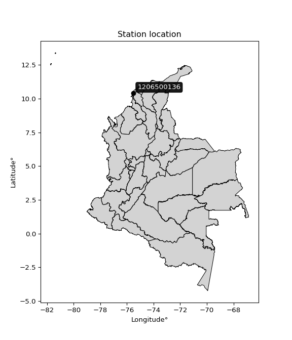

<div align="center">


</div>

# PMP Station (Rain, Pmax24h): 1206500136

Probable Maximum Precipitation (PMP) is the greatest amount of rainfall for a specific duration that is meteorologically possible for a given location, acting as a "worst-case" scenario for extreme storms, crucial for designing safety-critical infrastructure like bridges, river deviations, dams, spillways, and nuclear plants to prevent catastrophic failure. PMP is calculated by hydrologists using meteorological data to determine the upper limit of extreme rainfall, often leading to the Probable Maximum Flood (PMF) for flood control design, and is increasingly being studied for climate change impacts. Probable Maximum Precipitation (PMP) is the theoretical upper limit of rainfall, a deterministic estimate for extreme events, while probability distributions (like GEV, Gumbel) describe the likelihood and frequency of various precipitation amounts, including rare ones, showing how often events occur, with PMP representing the extreme end of these distributions, used for critical infrastructure design to ensure safety against the worst conceivable weather, unlike standard statistical forecasts which cover typical probabilities.

The most common probability distributions in hydrology, used for analyzing floods, rainfall, and streamflow, include the Normal, Log-Normal, Gumbel, Gamma (including Log-Pearson Type III), and Generalized Extreme Value (GEV) distributions, often chosen based on the data´s skewness and whether modeling extremes or general conditions, with Gumbel and GEV popular for extreme events like floods, while the Normal distribution serves as a baseline, though often requiring transformations for skewed hydrological data. These distributions help in designing water infrastructure, managing water resources, and forecasting hydrologic events.

> Hydrological data often isn´t perfectly normal (it´s skewed), so different distributions are needed for different applications, such as: **Flood Frequency Analysis**: Using Gumbel, GEV, or Log-Pearson Type III for predicting extreme flood magnitudes and their return periods, **Rainfall Analysis**: Normal for annual totals, but Log-Normal, Weibull, or GEV for intensity or extreme daily rainfall, **Streamflow Modeling**: Gamma and Log-Normal for maximum flows, GEV for minimum flows, and Kappa for daily flows.

<div align="center">

</img>

</div>


## A. General information


### 1. General running parameters

• app_version: _v20260108_. • runtime: _2026-01-08 18:05:13.093906_. • Python version: _3.14.0_. • SciPy version: _1.16.3_. • Pandas version: _2.3.3_. • NumPy version: _2.3.5_. • Stations dataset (station_dataset_file): _dataset/pmax24h_in/automatic_colombia_2003_2024.csv_. • Stations catalog (station_catalog_file): _dataset/CNE.xls_. • Minimum year to eval til year_max (date_min): _1900_. • Maximum year to eval since year_min (date_max): _2024_. • Creates, save and include plots into reports (create_plot): _False_. • Plot only fit distributions with Δo > Δ (plot_only_fit): _True_. • Plot only simple graphs avoiding multiple CDFs and multiple Extreme values plots (plot_only_simple): _False_. • Eval low extreme values, if False, evaluates high extreme values (low_extreme): _False_. • Eval every SciPy distribution as logarithmic (pdist_logarithmic_on): _True_. • Standard deviation normalized (ddof): _1.0_. • Return periods to eval in years (Tr): _[2, 2.33, 5, 10, 15, 20, 25, 50, 75, 100, 200, 250, 500, 750, 1000]_. • Minimum data sample per station, 0 means any (minimum_sample): _5_. • Z-Score maximum threshold to adjust a value, 0 means disable (zscore_max): _3.5_. • Z-Score minimum threshold to adjust a value, 0 means disable (zscore_min): _-2.5_. • Avoid zeros, e.g. rain = 0 (avoid_zeros): _True_. • Avoid null values (avoid_nans): _True_. 

:file_folder:Table: [dataset.csv](../../dataset/pmax24h_in/automatic_colombia_2003_2024.csv)

> Delta Degrees of Freedom (DDOF): is a parameter used in the formulas for calculating variance and standard deviation. When ddof=0, the divisor is $N$ (the total number of observations) and this is used when your data set is the entire population. When ddof=1, the divisor is $N-1$ and this is used when your data set is a sample drawn from a larger population. Using $N-1$ provides an unbiased estimate of the population variance (known as Bessel´s correction).


### 2. Station info and location

|   id |     CODIGO | NOMBRE                                          | CATEGORIA               | TECNOLOGIA                | ESTADO   | FECHA_INSTALACION   |   FECHA_SUSPENSION |   ALTITUD |   LATITUD |   LONGITUD | DEPARTAMENTO   | MUNICIPIO           | AREA_OPERATIVA                              | ENTIDAD                                                     | AREA_HIDROGRAFICA   | ZONA_HIDROGRAFICA   | SUBZONA_HIDROGRAFICA       |   CORRIENTE | Catalogo   |   Version |
|-----:|-----------:|:------------------------------------------------|:------------------------|:--------------------------|:---------|:--------------------|-------------------:|----------:|----------:|-----------:|:---------------|:--------------------|:--------------------------------------------|:------------------------------------------------------------|:--------------------|:--------------------|:---------------------------|------------:|:-----------|----------:|
|    0 | 1206500136 | UNIVERSIDAD UNAD CARTAGENA - AUT   [1206500136] | Climatológica Principal | Automática con Telemetría | Activa   | 19/09/2018          |                nan |        46 |   10.4003 |   -75.5133 | Bolivar        | Cartagena De Indias | Area Operativa 02 - Atlántico-Bolivar-Sucre | INSTITUTO DE HIDROLOGIA METEOROLOGIA Y ESTUDIOS AMBIENTALES | Caribe              | Caribe - Litoral    | Arroyos Directos al Caribe |         nan | CNE_IDEAM  |  20251226 |

<div align="center">

Dynamic map: [:earth_americas:Google](http://maps.google.com/maps?q=10.400311111,-75.513280556) [:earth_americas:OSM](https://www.openstreetmap.org/#map=18/10.400311111/-75.513280556&layers=P) [:earth_americas:Bing](https://www.bing.com/maps?cp=10.400311111~-75.513280556&lvl=18) [:earth_americas:Apple](https://maps.apple.com/frame?center=10.400311111%2C-75.513280556&span=0.003%2C0.006)

</div>


<div align="center">

```geojson
{
  "type": "Feature",
  "geometry": {
    "type": "Point", 
    "coordinates": [-75.513280556, 10.400311111]
  }, 
  "properties": {
    "Name": "1206500136"
  }
}
```

</div>


### 3. Discrete values table and plot

<div align="center">

|               |           0 |          1 |           2 |          3 |            4 |
|:--------------|------------:|-----------:|------------:|-----------:|-------------:|
| Date          | 2019        | 2020       | 2021        | 2022       | 2024         |
| Value         |   69.6      |   38.2     |   47.6      |   94.4     |   62         |
| Value_initial |   69.6      |   38.2     |   47.6      |   94.4     |   62         |
| count         |    5        |    5       |    5        |    5       |    5         |
| mean          |   62.36     |   62.36    |   62.36     |   62.36    |   62.36      |
| std           |   21.6834   |   21.6834  |   21.6834   |   21.6834  |   21.6834    |
| zscore        |    0.333897 |   -1.11422 |   -0.680706 |    1.47763 |   -0.0166026 |


</div>


> The initial value (value_initial) correspond to the initial obtained or null completed value, and value (value) is adjusted only when the initial value is outside the valid range (outlier) definite through the Z-Score value. If Z-Score is active, values out of range or outliers are replaced with the station mean value. A Z-Score (or standard score) measures how many standard deviations a data point is from the mean of a dataset, indicating its relative position; positive scores mean above the mean, negative mean below, and a score of zero is exactly at the mean, allowing for comparison of values from different distributions. It´s calculated using the formula $z=(x–μ)/σ$, where $x$ is the data point, $μ$ is the mean, and $σ$ is the standard deviation, helping identify outliers and understand probability.
>
> <sub>**Note**: In this study, "completing" (filling gaps in) and "extending" (forecasting or lengthening the historical record) rainfall data series are avoided for certain critical analyses because they introduce artificial bias and uncertainty, which can distort the statistics of rare events (extremes), alter day-to-day variability, and compromise the integrity and homogeneity of the original data. Some reasons against Completing/Extending rainfall data are: **Distortion of Extremes and Variability**: The primary issue is that most gap-filling or extension methods rely on averaging or regression with nearby stations, which inherently smooths the data. Rainfall is highly variable in space and time, with a large percentage of zero values and occasional large storms. Infilling methods often underestimate the highest values and overestimate the lowest (zero) values, which severely distorts analyses focused on flood frequency, drought severity, and intensity-duration-frequency (IDF) curves, **Loss of Data Homogeneity**: Infilled or extended data are synthetic estimates, not actual measurements. Combining these estimates with observed data can violate the assumption of data homogeneity, which requires that the data properties do not change over time. Inhomogeneity can lead to incorrect conclusions about long-term trends or changes in climate patterns, **Propagation of Errors**: Errors and biases from the original data (e.g., wind-induced undercatch, instrument errors, site changes) or the data used for imputation can propagate through the analysis, leading to unreliable hydrological models and inaccurate predictions, **Compromised Statistical Integrity**: For statistical analyses, especially those involving the frequency of events, using artificial data can introduce time bias or autocorrelation that doesn´t exist in reality, making it difficult to assess the true probability of events, **Difficulty in Validation**: It is difficult to accurately validate the quality of filled or extended data, especially for past periods where ground-truth measurements are unavailable. The reliability of imputation techniques heavily depends on the density of the surrounding station network and the complexity of the local topography.</sub>


### 4. Active continuous probability distributions from SciPy (43 of 104 available)

A Probability Density Function (PDF) describes the relative likelihood of a continuous random variable falling within a specific range, where the total area under its curve equals 1, and the area over any interval gives the actual probability for that range. Unlike discrete probabilities (like rolling a die), a PDF shows density, not direct probability for a single point (which is zero), with higher points indicating higher likelihood, often visualized as a bell curve for normal distributions.

A log of a probability density function (log-PDF) is simply the logarithm of the PDF´s value, denoted as $log(f(x))$, useful for converting multiplication of probabilities into addition, improving numerical stability with tiny numbers, and connecting to information theory concepts like entropy. Instead of dealing with very small probabilities (e.g., 0.000001), log-PDFs use negative numbers (e.g., $log(0.00001) ≈ -11.51$ that are easier for computers to handle, preventing underflow errors and simplifying complex calculations. In this study, each active probability distribution from SciPy is also evaluated in the $log$ form.

[scipy.stats](https://docs.scipy.org/doc/scipy/reference/stats.html) is a Python´s powerful submodule within the SciPy library for comprehensive statistical analysis, offering over 130 probability distributions (like Normal, Poisson), functions for descriptive stats (mean, variance), hypothesis testing (t-tests, chi-square), random variable generation, and statistical tests, making it essential for data science, modeling, and research. It provides tools to explore, model, and draw conclusions from data efficiently, working seamlessly with NumPy.

<div align="center">

|   id | p_dist             |   n_parameter | fit_method   | label                                                                       | active   | ref                                                                                                        |
|-----:|:-------------------|--------------:|:-------------|:----------------------------------------------------------------------------|:---------|:-----------------------------------------------------------------------------------------------------------|
|    0 | alpha              |             3 | MLE          | Alpha                                                                       | True     | [:mortar_board:](https://docs.scipy.org/doc/scipy/reference/generated/scipy.stats.alpha.html)              |
|    1 | betaprime          |             4 | MLE          | Beta prime                                                                  | True     | [:mortar_board:](https://docs.scipy.org/doc/scipy/reference/generated/scipy.stats.betaprime.html)          |
|    2 | chi2               |             3 | MLE          | Chi²                                                                        | True     | [:mortar_board:](https://docs.scipy.org/doc/scipy/reference/generated/scipy.stats.chi2.html)               |
|    3 | crystalball        |             4 | MLE          | Crystalball                                                                 | True     | [:mortar_board:](https://docs.scipy.org/doc/scipy/reference/generated/scipy.stats.crystalball.html)        |
|    4 | erlang             |             3 | MLE          | Erlang                                                                      | True     | [:mortar_board:](https://docs.scipy.org/doc/scipy/reference/generated/scipy.stats.erlang.html)             |
|    5 | expon              |             2 | MLE          | Exponential                                                                 | True     | [:mortar_board:](https://docs.scipy.org/doc/scipy/reference/generated/scipy.stats.expon.html)              |
|    6 | exponnorm          |             3 | MLE          | Exponentially modified Normal                                               | True     | [:mortar_board:](https://docs.scipy.org/doc/scipy/reference/generated/scipy.stats.exponnorm.html)          |
|    7 | f                  |             4 | MLE          | F                                                                           | True     | [:mortar_board:](https://docs.scipy.org/doc/scipy/reference/generated/scipy.stats.f.html)                  |
|    8 | fatiguelife        |             3 | MLE          | Fatigue-life (Birnbaum-Saunders)                                            | True     | [:mortar_board:](https://docs.scipy.org/doc/scipy/reference/generated/scipy.stats.fatiguelife.html)        |
|    9 | fisk               |             3 | MLE          | Fisk                                                                        | True     | [:mortar_board:](https://docs.scipy.org/doc/scipy/reference/generated/scipy.stats.fisk.html)               |
|   10 | gamma              |             3 | MLE          | Gamma                                                                       | True     | [:mortar_board:](https://docs.scipy.org/doc/scipy/reference/generated/scipy.stats.gamma.html)              |
|   11 | genexpon           |             5 | MLE          | Generalized exponential                                                     | True     | [:mortar_board:](https://docs.scipy.org/doc/scipy/reference/generated/scipy.stats.genexpon.html)           |
|   12 | genlogistic        |             3 | MLE          | Generalized logistic                                                        | True     | [:mortar_board:](https://docs.scipy.org/doc/scipy/reference/generated/scipy.stats.genlogistic.html)        |
|   13 | gibrat             |             2 | MM           | Gibrat                                                                      | True     | [:mortar_board:](https://docs.scipy.org/doc/scipy/reference/generated/scipy.stats.gibrat.html)             |
|   14 | gompertz           |             3 | MLE          | Gompertz (or truncated Gumbel)                                              | True     | [:mortar_board:](https://docs.scipy.org/doc/scipy/reference/generated/scipy.stats.gompertz.html)           |
|   15 | gumbel_l           |             2 | MM           | Gumbel Left Skew                                                            | True     | [:mortar_board:](https://docs.scipy.org/doc/scipy/reference/generated/scipy.stats.gumbel_l.html)           |
|   16 | gumbel_r           |             2 | MM           | Gumbel Right Skew                                                           | True     | [:mortar_board:](https://docs.scipy.org/doc/scipy/reference/generated/scipy.stats.gumbel_r.html)           |
|   17 | halflogistic       |             2 | MM           | Half-logistic                                                               | True     | [:mortar_board:](https://docs.scipy.org/doc/scipy/reference/generated/scipy.stats.halflogistic.html)       |
|   18 | halfnorm           |             2 | MM           | Half Normal                                                                 | True     | [:mortar_board:](https://docs.scipy.org/doc/scipy/reference/generated/scipy.stats.halfnorm.html)           |
|   19 | hypsecant          |             2 | MM           | hyperbolic secant                                                           | True     | [:mortar_board:](https://docs.scipy.org/doc/scipy/reference/generated/scipy.stats.hypsecant.html)          |
|   20 | invgamma           |             3 | MLE          | Inverted gamma                                                              | True     | [:mortar_board:](https://docs.scipy.org/doc/scipy/reference/generated/scipy.stats.invgamma.html)           |
|   21 | invgauss           |             3 | MLE          | Inverse Gaussian                                                            | True     | [:mortar_board:](https://docs.scipy.org/doc/scipy/reference/generated/scipy.stats.invgauss.html)           |
|   22 | invweibull         |             3 | MLE          | Inverted Weibull                                                            | True     | [:mortar_board:](https://docs.scipy.org/doc/scipy/reference/generated/scipy.stats.invweibull.html)         |
|   23 | kstwobign          |             2 | MLE          | Limiting distribution of scaled Kolmogorov-Smirnov two-sided test statistic | True     | [:mortar_board:](https://docs.scipy.org/doc/scipy/reference/generated/scipy.stats.kstwobign.html)          |
|   24 | laplace            |             2 | MM           | Laplace                                                                     | True     | [:mortar_board:](https://docs.scipy.org/doc/scipy/reference/generated/scipy.stats.laplace.html)            |
|   25 | laplace_asymmetric |             3 | MLE          | Asymmetric Laplace                                                          | True     | [:mortar_board:](https://docs.scipy.org/doc/scipy/reference/generated/scipy.stats.laplace_asymmetric.html) |
|   26 | loggamma           |             3 | MLE          | Log gamma                                                                   | True     | [:mortar_board:](https://docs.scipy.org/doc/scipy/reference/generated/scipy.stats.loggamma.html)           |
|   27 | logistic           |             2 | MM           | Logistic (or Sech-squared)                                                  | True     | [:mortar_board:](https://docs.scipy.org/doc/scipy/reference/generated/scipy.stats.logistic.html)           |
|   28 | lognorm            |             3 | MLE          | Log Normal                                                                  | True     | [:mortar_board:](https://docs.scipy.org/doc/scipy/reference/generated/scipy.stats.lognorm.html)            |
|   29 | maxwell            |             2 | MM           | Maxwell                                                                     | True     | [:mortar_board:](https://docs.scipy.org/doc/scipy/reference/generated/scipy.stats.maxwell.html)            |
|   30 | mielke             |             4 | MLE          | Mielke Beta-Kappa / Dagum                                                   | True     | [:mortar_board:](https://docs.scipy.org/doc/scipy/reference/generated/scipy.stats.mielke.html)             |
|   31 | moyal              |             2 | MM           | Moyal                                                                       | True     | [:mortar_board:](https://docs.scipy.org/doc/scipy/reference/generated/scipy.stats.moyal.html)              |
|   32 | nakagami           |             3 | MLE          | Nakagami                                                                    | True     | [:mortar_board:](https://docs.scipy.org/doc/scipy/reference/generated/scipy.stats.nakagami.html)           |
|   33 | ncf                |             5 | MLE          | Non-central F distribution                                                  | True     | [:mortar_board:](https://docs.scipy.org/doc/scipy/reference/generated/scipy.stats.ncf.html)                |
|   34 | nct                |             4 | MLE          | Non-central Student’s t                                                     | True     | [:mortar_board:](https://docs.scipy.org/doc/scipy/reference/generated/scipy.stats.nct.html)                |
|   35 | norm               |             2 | MM           | Normal                                                                      | True     | [:mortar_board:](https://docs.scipy.org/doc/scipy/reference/generated/scipy.stats.norm.html)               |
|   36 | pearson3           |             3 | MM           | Pearson type III                                                            | True     | [:mortar_board:](https://docs.scipy.org/doc/scipy/reference/generated/scipy.stats.pearson3.html)           |
|   37 | rayleigh           |             2 | MM           | Rayleigh                                                                    | True     | [:mortar_board:](https://docs.scipy.org/doc/scipy/reference/generated/scipy.stats.rayleigh.html)           |
|   38 | rice               |             3 | MLE          | Rice                                                                        | True     | [:mortar_board:](https://docs.scipy.org/doc/scipy/reference/generated/scipy.stats.rice.html)               |
|   39 | t                  |             3 | MLE          | Student’s t                                                                 | True     | [:mortar_board:](https://docs.scipy.org/doc/scipy/reference/generated/scipy.stats.t.html)                  |
|   40 | truncnorm          |             4 | MLE          | Truncated normal                                                            | True     | [:mortar_board:](https://docs.scipy.org/doc/scipy/reference/generated/scipy.stats.truncnorm.html)          |
|   41 | wald               |             2 | MM           | Wald                                                                        | True     | [:mortar_board:](https://docs.scipy.org/doc/scipy/reference/generated/scipy.stats.wald.html)               |
|   42 | weibull_min        |             3 | MLE          | Weibull minimum                                                             | True     | [:mortar_board:](https://docs.scipy.org/doc/scipy/reference/generated/scipy.stats.weibull_min.html)        |

</div>

> **n_parameter:** # arguments & localization & scale.
>
> **Fit methods:** (MLE) maximum likelihood, (MM) L-moments.
>
>**Inactive** (With the only purpose of prevent loops, zero divisions, infinite values, over high estimated values or horizontal trending for recurrence intervals estimations, the follow distributions were disabled.)**:** foldnorm, gennorm, norminvgauss, powernorm, powerlognorm, skewnorm, genextreme, anglit, arcsine, argus, beta, bradford, burr, burr12, cauchy, cosine, halfcauchy, foldcauchy, skewcauchy, wrapcauchy, dgamma, gengamma, exponweib, exponpow, truncexpon, gausshyper, genhalflogistic, genhyperbolic, geninvgauss, halfgennorm, johnsonsb, johnsonsu, kappa4, kappa3, ksone, kstwo, loglaplace, levy, levy_l, levy_stable, ncx2, pareto, genpareto, truncpareto, lomax, powerlaw, rdist, rel_breitwigner, recipinvgauss, semicircular, studentized_range, trapezoid, triang, truncweibull_min, tukeylambda, uniform, loguniform, vonmises, vonmises_line, weibull_max, dweibull, 


## B. Probability (PDF) vs. Empirical (EDF) distributions functions

A continuous probability distribution (CPD) describes probabilities for variables that can take any value within a range (like rain any time), unlike discrete variables with specific outcomes (like temperature). It uses a Probability Density Function (PDF), a curve where the total area under it equals 1, and the probability of the variable falling within an interval (a to b) is found by calculating the area under the curve between those points. A key feature is that the probability of hitting any single exact value is zero, so probabilities are always expressed for ranges, e.g., $P(a ≤ X ≤ b)$.

<div align="center">

Distributions parameters from station values
|    |    station | p_dist                |   n |             loc |          scale | shape                | shape1                | shape2                 | shape3   |
|---:|-----------:|:----------------------|----:|----------------:|---------------:|:---------------------|:----------------------|:-----------------------|:---------|
|  0 | 1206500136 | alpha                 |   5 |   -49.0468      |  644.89        | 5.960521223230058    |                       |                        |          |
|  1 | 1206500136 | betaprime             |   5 |    -0.714076    |    3.91844     | 170.83742922232346   | 11.591393254999787    |                        |          |
|  2 | 1206500136 | chi2                  |   5 |    38.2         |   14.8454      | 0.9907564546635604   |                       |                        |          |
|  3 | 1206500136 | crystalball           |   5 |    62.3481      |   19.4007      | 57221.35425854122    | 1760.4423761474104    |                        |          |
|  4 | 1206500136 | erlang                |   5 |    38.2         |   20.9571      | 0.7780075537551774   |                       |                        |          |
|  5 | 1206500136 | expon                 |   5 |    38.2         |   24.16        |                      |                       |                        |          |
|  6 | 1206500136 | exponnorm             |   5 |    38.1787      |    0.00635781  | 3775.631872732032    |                       |                        |          |
|  7 | 1206500136 | f                     |   5 |    -1.08272     |   57.8374      | 1361.7378708567646   | 22.271129200081027    |                        |          |
|  8 | 1206500136 | fatiguelife           |   5 |    38.2         |    1.22902e-05 | 1111.6814085540004   |                       |                        |          |
|  9 | 1206500136 | fisk                  |   5 |    27.0706      |   30.6767      | 2.687125662474755    |                       |                        |          |
| 10 | 1206500136 | gamma                 |   5 |    38.2         |   19.5107      | 0.7094341387167287   |                       |                        |          |
| 11 | 1206500136 | genexpon              |   5 |    38.2         |    2.54033     | 0.10515019555148736  | 2.174182121458968e-09 | 1.2899397624952096     |          |
| 12 | 1206500136 | genlogistic           |   5 |   -49.2003      |   15.7422      | 664.4400589932336    |                       |                        |          |
| 13 | 1206500136 | gibrat                |   5 |    47.5647      |    8.97379     |                      |                       |                        |          |
| 14 | 1206500136 | gompertz              |   5 |    38.2         |   40.925       | 0.9528208178096307   |                       |                        |          |
| 15 | 1206500136 | gumbel_l              |   5 |    71.0884      |   15.1216      |                      |                       |                        |          |
| 16 | 1206500136 | gumbel_r              |   5 |    53.6316      |   15.1216      |                      |                       |                        |          |
| 17 | 1206500136 | halflogistic          |   5 |    39.3734      |   16.5813      |                      |                       |                        |          |
| 18 | 1206500136 | halfnorm              |   5 |    36.6897      |   32.1729      |                      |                       |                        |          |
| 19 | 1206500136 | hypsecant             |   5 |    62.36        |   12.3467      |                      |                       |                        |          |
| 20 | 1206500136 | invgamma              |   5 |     0.56209     |  582.592       | 10.39885192005799    |                       |                        |          |
| 21 | 1206500136 | invgauss              |   5 |    23.3837      |  118.711       | 0.32832908815415973  |                       |                        |          |
| 22 | 1206500136 | invweibull            |   5 |    38.2         |    3.36632     | 0.051661309852829726 |                       |                        |          |
| 23 | 1206500136 | kstwobign             |   5 |    -1.60322     |   73.2386      |                      |                       |                        |          |
| 24 | 1206500136 | laplace               |   5 |    62.36        |   13.7138      |                      |                       |                        |          |
| 25 | 1206500136 | laplace_asymmetric    |   5 |    62           |   15.637       | 0.9885655223426718   |                       |                        |          |
| 26 | 1206500136 | loggamma              |   5 | -5097.97        |  718.245       | 1319.4195102949366   |                       |                        |          |
| 27 | 1206500136 | logistic              |   5 |    62.36        |   10.6926      |                      |                       |                        |          |
| 28 | 1206500136 | lognorm               |   5 |    38.2         |    0.0194801   | 14.331417731275303   |                       |                        |          |
| 29 | 1206500136 | maxwell               |   5 |    16.4039      |   28.7987      |                      |                       |                        |          |
| 30 | 1206500136 | mielke                |   5 |     0.0491063   |   12.6296      | 538.2656598555275    | 3.593143975816142     |                        |          |
| 31 | 1206500136 | moyal                 |   5 |    51.2692      |    8.73045     |                      |                       |                        |          |
| 32 | 1206500136 | nakagami              |   5 |    47.6         |   27.7743      | 0.35848780235680555  |                       |                        |          |
| 33 | 1206500136 | ncf                   |   5 |    -0.94848     |   59.8273      | 54.726639458073095   | 35.792837907411084    | 4.173329212810089e-08  |          |
| 34 | 1206500136 | nct                   |   5 |    -0.718721    |    0.349146    | 5.800847642814748    | 157.3424851036395     |                        |          |
| 35 | 1206500136 | norm                  |   5 |    62.36        |   19.3942      |                      |                       |                        |          |
| 36 | 1206500136 | pearson3              |   5 |    62.36        |   19.3942      | 0.43737591615484384  |                       |                        |          |
| 37 | 1206500136 | rayleigh              |   5 |    25.2578      |   29.6033      |                      |                       |                        |          |
| 38 | 1206500136 | rice                  |   5 |    28.2866      |   27.4139      | 0.21294873830797262  |                       |                        |          |
| 39 | 1206500136 | t                     |   5 |    62.3597      |   19.3946      | 18297267.36316517    |                       |                        |          |
| 40 | 1206500136 | truncnorm             |   5 |    62.36        |   19.3942      | -565.3678798182375   | 3534.487167077635     |                        |          |
| 41 | 1206500136 | wald                  |   5 |    42.9658      |   19.3942      |                      |                       |                        |          |
| 42 | 1206500136 | weibull_min           |   5 |    38.2         |   31.2759      | 0.2320210446663201   |                       |                        |          |
| 43 | 1206500136 | logalpha              |   5 |    -2.74814     |  148.7         | 21.8127261713988     |                       |                        |          |
| 44 | 1206500136 | logbetaprime          |   5 |    -3.91566     |    8.23205     | 841.6310220608219    | 866.639894882633      |                        |          |
| 45 | 1206500136 | logchi2               |   5 |     3.64284     |    1.00776     | 1.0089705887815241   |                       |                        |          |
| 46 | 1206500136 | logcrystalball        |   5 |     4.08462     |    0.311601    | 12.840123253122261   | 296.16496530554       |                        |          |
| 47 | 1206500136 | logerlang             |   5 |   -10.0519      |    0.00686302  | 2059.8075169101367   |                       |                        |          |
| 48 | 1206500136 | logexpon              |   5 |     3.64284     |    0.441786    |                      |                       |                        |          |
| 49 | 1206500136 | logexponnorm          |   5 |     4.07375     |    0.311411    | 0.034910777933885015 |                       |                        |          |
| 50 | 1206500136 | logf                  |   5 |    -2.09408     |    6.17177     | 1304.626104418643    | 1967.7942498252728    |                        |          |
| 51 | 1206500136 | logfatiguelife        |   5 |    -1.10922     |    5.18448     | 0.060093710076124074 |                       |                        |          |
| 52 | 1206500136 | logfisk               |   5 |   -11.072       |   15.1543      | 80.57713538003938    |                       |                        |          |
| 53 | 1206500136 | loggamma              |   5 |    -9.88917     |    0.00694216  | 2012.8719362713837   |                       |                        |          |
| 54 | 1206500136 | loggenexpon           |   5 |     3.6428      |    0.010577    | 0.014488697861574286 | 2.666211032715468     | 0.00011380582303865939 |          |
| 55 | 1206500136 | loggenlogistic        |   5 |     2.49397     |    0.278758    | 173.43826835499192   |                       |                        |          |
| 56 | 1206500136 | loggibrat             |   5 |     3.84693     |    0.144172    |                      |                       |                        |          |
| 57 | 1206500136 | loggompertz           |   5 |     3.64284     |    0.534937    | 0.5897053530114467   |                       |                        |          |
| 58 | 1206500136 | loggumbel_l           |   5 |     4.22486     |    0.242954    |                      |                       |                        |          |
| 59 | 1206500136 | loggumbel_r           |   5 |     3.94438     |    0.242954    |                      |                       |                        |          |
| 60 | 1206500136 | loghalflogistic       |   5 |     3.71532     |    0.266395    |                      |                       |                        |          |
| 61 | 1206500136 | loghalfnorm           |   5 |     3.6722      |    0.516897    |                      |                       |                        |          |
| 62 | 1206500136 | loghypsecant          |   5 |     4.08462     |    0.198371    |                      |                       |                        |          |
| 63 | 1206500136 | loginvgamma           |   5 |    -3.55569     | 4585.27        | 601.166524697886     |                       |                        |          |
| 64 | 1206500136 | loginvgauss           |   5 |     2.40064     |   45.9562      | 0.036560905277874034 |                       |                        |          |
| 65 | 1206500136 | loginvweibull         |   5 |    -1.39198e+07 |    1.39198e+07 | 49445860.33674705    |                       |                        |          |
| 66 | 1206500136 | logkstwobign          |   5 |     2.96521     |    1.27801     |                      |                       |                        |          |
| 67 | 1206500136 | loglaplace            |   5 |     4.08462     |    0.220335    |                      |                       |                        |          |
| 68 | 1206500136 | loglaplace_asymmetric |   5 |     4.12713     |    0.254285    | 1.0870613494380743   |                       |                        |          |
| 69 | 1206500136 | logloggamma           |   5 |   -50.3161      |    8.29622     | 704.851387501282     |                       |                        |          |
| 70 | 1206500136 | loglogistic           |   5 |     4.08462     |    0.171795    |                      |                       |                        |          |
| 71 | 1206500136 | loglognorm            |   5 |     3.64284     |    0.000480753 | 13.862811016902308   |                       |                        |          |
| 72 | 1206500136 | logmaxwell            |   5 |     3.34626     |    0.462701    |                      |                       |                        |          |
| 73 | 1206500136 | logmielke             |   5 |    -1.8529e+07  |    1.8529e+07  | 3257250672.3299036   | 67924139.77129057     |                        |          |
| 74 | 1206500136 | logmoyal              |   5 |     3.90643     |    0.14027     |                      |                       |                        |          |
| 75 | 1206500136 | lognakagami           |   5 |     3.64284     |    0.772235    | 0.06596169104744395  |                       |                        |          |
| 76 | 1206500136 | logncf                |   5 |     0.939142    |    1.7563      | 217.18928863840338   | 812.7791911682668     | 170.78691531482156     |          |
| 77 | 1206500136 | lognct                |   5 |    -6.5571      |    0.243584    | 1508.1465734092217   | 43.66606107574592     |                        |          |
| 78 | 1206500136 | lognorm               |   5 |     4.08462     |    0.311601    |                      |                       |                        |          |
| 79 | 1206500136 | logpearson3           |   5 |     4.08462     |    0.311601    | 0.04028089993445143  |                       |                        |          |
| 80 | 1206500136 | lograyleigh           |   5 |     3.48851     |    0.475628    |                      |                       |                        |          |
| 81 | 1206500136 | logrice               |   5 |     3.47712     |    0.378966    | 1.1161960652093326   |                       |                        |          |
| 82 | 1206500136 | logt                  |   5 |     4.08462     |    0.311601    | 9955155436.688404    |                       |                        |          |
| 83 | 1206500136 | logtruncnorm          |   5 |    -0.072981    |    0.970675    | 4.760110568091045    | 4.760110568091046     |                        |          |
| 84 | 1206500136 | logwald               |   5 |     3.77301     |    0.311612    |                      |                       |                        |          |
| 85 | 1206500136 | logweibull_min        |   5 |     3.57359     |    0.564047    | 1.5497124658906034   |                       |                        |          |

</div>

> **loc** (Location parameter): This shifts the distribution along the x-axis. For many common distributions, like the normal (Gaussian) distribution, loc represents the mean $μ$. For others, like the uniform distribution, it might represent the minimum value, or for the beta distribution, the left end of the support interval.
>
> **scale** (Scale parameter): This determines the width or spread of the distribution. For the normal distribution, scale represents the standard deviation $σ$. For a uniform distribution, it defines the length of the interval (from $loc$ to $loc + scale$).
>
> **shape** (Shape parameters): Refers to parameters that define the specific form of a probability distribution, distinct from its location (loc) and scale (scale). These parameters are required arguments for most distribution functions. For example, a normal (Gaussian) distribution is fully defined by its location (mean) and scale (standard deviation), so it has no specific shape parameters beyond loc and scale. However, other distributions have intrinsic properties that need specification, as Gamma distribution that takes a shape parameter, often named $a$ or $alpha$.


### 0. Cumulative distribution values - CDF (86 evaluated)

Cumulative Distribution Function (CDF), denoted as $F$<sub>$X$</sub>$(x)$, is a function that gives the probability that a random variable $X$ will take a value less than or equal to a specific value, $x$ (i.e., $(P(X≥x)$. It essentially "accumulates" probabilities from a given point up to the far right (positive infinity), providing a complete picture of the distribution´s probabilities for both discrete (like rain) and continuous (like temperature) variables, helping to find probabilities over ranges or above certain values. Each station is evaluated separately ordering the $x$ values ascending, calculating the CDF and PDF values for the activated distributions and their logarithmic forms.

<div align="center">

CDF ordered by x ascending and calculating $log(f(x))$ separately
|   id |    Station |   date |    x |   count |   mean |     std |     zscore |   Value_initial |    station |   m |     alpha |   alpha_pdf |   betaprime |   betaprime_pdf |        chi2 |    chi2_pdf |   crystalball |   crystalball_pdf |      erlang |   erlang_pdf |    expon |   expon_pdf |   exponnorm |   exponnorm_pdf |         f |      f_pdf |   fatiguelife |   fatiguelife_pdf |      fisk |   fisk_pdf |       gamma |     gamma_pdf |    genexpon |   genexpon_pdf |   genlogistic |   genlogistic_pdf |      gibrat |   gibrat_pdf |    gompertz |   gompertz_pdf |   gumbel_l |   gumbel_l_pdf |   gumbel_r |   gumbel_r_pdf |   halflogistic |   halflogistic_pdf |   halfnorm |   halfnorm_pdf |   hypsecant |   hypsecant_pdf |   invgamma |   invgamma_pdf |   invgauss |   invgauss_pdf |   invweibull |   invweibull_pdf |   kstwobign |   kstwobign_pdf |   laplace |   laplace_pdf |   laplace_asymmetric |   laplace_asymmetric_pdf |   loggamma |   loggamma_pdf |   logistic |   logistic_pdf |   lognorm |   lognorm_pdf |   maxwell |   maxwell_pdf |      mielke |   mielke_pdf |     moyal |   moyal_pdf |    nakagami |   nakagami_pdf |       ncf |    ncf_pdf |       nct |    nct_pdf |     norm |   norm_pdf |   pearson3 |   pearson3_pdf |   rayleigh |   rayleigh_pdf |      rice |   rice_pdf |        t |      t_pdf |   truncnorm |   truncnorm_pdf |     wald |   wald_pdf |   weibull_min |   weibull_min_pdf |   logalpha |   logalpha_pdf |   logbetaprime |   logbetaprime_pdf |     logchi2 |   logchi2_pdf |   logcrystalball |   logcrystalball_pdf |   logerlang |   logerlang_pdf |   logexpon |   logexpon_pdf |   logexponnorm |   logexponnorm_pdf |      logf |   logf_pdf |   logfatiguelife |   logfatiguelife_pdf |   logfisk |   logfisk_pdf |   loggenexpon |   loggenexpon_pdf |   loggenlogistic |   loggenlogistic_pdf |   loggibrat |   loggibrat_pdf |   loggompertz |   loggompertz_pdf |   loggumbel_l |   loggumbel_l_pdf |   loggumbel_r |   loggumbel_r_pdf |   loghalflogistic |   loghalflogistic_pdf |   loghalfnorm |   loghalfnorm_pdf |   loghypsecant |   loghypsecant_pdf |   loginvgamma |   loginvgamma_pdf |   loginvgauss |   loginvgauss_pdf |   loginvweibull |   loginvweibull_pdf |   logkstwobign |   logkstwobign_pdf |   loglaplace |   loglaplace_pdf |   loglaplace_asymmetric |   loglaplace_asymmetric_pdf |   logloggamma |   logloggamma_pdf |   loglogistic |   loglogistic_pdf |   loglognorm |   loglognorm_pdf |   logmaxwell |   logmaxwell_pdf |   logmielke |   logmielke_pdf |   logmoyal |   logmoyal_pdf |   lognakagami |   lognakagami_pdf |    logncf |   logncf_pdf |    lognct |   lognct_pdf |   logpearson3 |   logpearson3_pdf |   lograyleigh |   lograyleigh_pdf |   logrice |   logrice_pdf |      logt |   logt_pdf |   logtruncnorm |   logtruncnorm_pdf |   logwald |   logwald_pdf |   logweibull_min |   logweibull_min_pdf |
|-----:|-----------:|-------:|-----:|--------:|-------:|--------:|-----------:|----------------:|-----------:|----:|----------:|------------:|------------:|----------------:|------------:|------------:|--------------:|------------------:|------------:|-------------:|---------:|------------:|------------:|----------------:|----------:|-----------:|--------------:|------------------:|----------:|-----------:|------------:|--------------:|------------:|---------------:|--------------:|------------------:|------------:|-------------:|------------:|---------------:|-----------:|---------------:|-----------:|---------------:|---------------:|-------------------:|-----------:|---------------:|------------:|----------------:|-----------:|---------------:|-----------:|---------------:|-------------:|-----------------:|------------:|----------------:|----------:|--------------:|---------------------:|-------------------------:|-----------:|---------------:|-----------:|---------------:|----------:|--------------:|----------:|--------------:|------------:|-------------:|----------:|------------:|------------:|---------------:|----------:|-----------:|----------:|-----------:|---------:|-----------:|-----------:|---------------:|-----------:|---------------:|----------:|-----------:|---------:|-----------:|------------:|----------------:|---------:|-----------:|--------------:|------------------:|-----------:|---------------:|---------------:|-------------------:|------------:|--------------:|-----------------:|---------------------:|------------:|----------------:|-----------:|---------------:|---------------:|-------------------:|----------:|-----------:|-----------------:|---------------------:|----------:|--------------:|--------------:|------------------:|-----------------:|---------------------:|------------:|----------------:|--------------:|------------------:|--------------:|------------------:|--------------:|------------------:|------------------:|----------------------:|--------------:|------------------:|---------------:|-------------------:|--------------:|------------------:|--------------:|------------------:|----------------:|--------------------:|---------------:|-------------------:|-------------:|-----------------:|------------------------:|----------------------------:|--------------:|------------------:|--------------:|------------------:|-------------:|-----------------:|-------------:|-----------------:|------------:|----------------:|-----------:|---------------:|--------------:|------------------:|----------:|-------------:|----------:|-------------:|--------------:|------------------:|--------------:|------------------:|----------:|--------------:|----------:|-----------:|---------------:|-------------------:|----------:|--------------:|-----------------:|---------------------:|
|    0 | 1206500136 |   2020 | 38.2 |       5 |  62.36 | 21.6834 | -1.11422   |            38.2 | 1206500136 |   1 | 0.0762103 |  0.0121398  |   0.0717911 |       0.0129646 | 2.06161e-08 | 1.43732e+06 |      0.106621 |        0.00947701 | 9.95267e-13 | 108.977      | 0        |  0.0413907  | 0.000887109 |      0.0416047  | 0.0722457 | 0.0131374  |     0.0389007 |       2.32324e+10 | 0.0615421 | 0.0139445  | 1.22465e-11 | 1222.74       | 3.47653e-08 |     0.0413924  |      0.076311 |        0.0124483  | 0           |  0           | 4.77349e-11 |      0.0232821 |   0.107399 |     0.00670655 |  0.0623755 |     0.011445   |       0        |         0          |  0.0374415 |     0.0247725  |   0.0893694 |      0.00714359 |  0.0702855 |     0.0131983  |  0.0603565 |     0.0163513  |   0.00324689 |      1.3527e+11  |   0.0707799 |      0.0130768  | 0.0858734 |    0.00626184 |             0.105996 |               0.00685697 |  0.0769554 |       0.473522 |  0.0945321 |     0.00800516 | 0.0781255 |      0.468614 | 0.0973724 |    0.0119177  |   0.0611323 |    0.0159417 | 0.0345334 |  0.0103443  | 0           |     0          | 0.0772176 | 0.0123201  | 0.0655003 | 0.0140909  | 0.106431 | 0.00946799 |  0.0957147 |     0.0108495  |  0.0911424 |     0.0134222  | 0.0619184 |  0.012097  | 0.106439 | 0.00946831 |    0.106431 |      0.00946799 | 0        | 0          |   0.000234585 |       7.65925e+09 |  0.0729191 |       0.504388 |       0.12339  |           0.557338 | 1.42461e-08 |   1.61835e+07 |        0.0781252 |             0.468612 |   0.0769242 |        0.473232 |   0        |       2.26354  |      0.0781223 |           0.468618 | 0.0749747 |   0.48593  |        0.0735662 |             0.488907 | 0.0853566 |      0.42751  |   4.54604e-05 |          1.36986  |        0.0613599 |             0.609435 |   0         |        0        |   2.88639e-09 |          1.10238  |     0.0870894 |          0.342377 |     0.0314399 |          0.447705 |          0        |              0        |      0        |          0        |      0.0683916 |           0.342119 |     0.0741057 |          0.487079 |     0.0670516 |          0.555737 |       0.0617586 |            0.610865 |      0.0587217 |           0.673916 |    0.0673259 |         0.305561 |               0.0939336 |                    0.339818 |     0.0797213 |          0.466061 |     0.0709891 |          0.383887 |    0.0228097 |      8.78934e+12 |    0.0620065 |         0.576902 |   0.0601518 |        0.602    |  0.0104993 |       0.275481 |    0.00844497 |       2.50871e+12 | 0.0724997 |     0.496958 | 0.0764159 |     0.475202 |     0.0771092 |          0.473032 |     0.0512776 |          0.647203 | 0.0503532 |      0.596472 | 0.0781258 |   0.468615 |              0 |        0           |  0        |      0        |        0.0380177 |             0.834397 |
|    1 | 1206500136 |   2021 | 47.6 |       5 |  62.36 | 21.6834 | -0.680706  |            47.6 | 1206500136 |   2 | 0.238195  |  0.0213748  |   0.24512   |       0.022514  | 0.577336    | 0.0245131   |      0.223573 |        0.0154031  | 0.479952    |   0.0305964  | 0.322315 |  0.0280499  | 0.324618    |      0.0281353  | 0.247393  | 0.0226667  |     0.784269  |       0.0122509   | 0.253643  | 0.0247789  | 0.541192    |    0.0304995  | 0.322326    |     0.0280506  |      0.242352 |        0.0217971  | 1.52362e-08 |  2.46542e-06 | 0.218098    |      0.0229048 |   0.190669 |     0.0113224  |  0.22534   |     0.022206   |       0.243101 |         0.0283724  |  0.265476  |     0.0234141  |   0.187044  |      0.0142924  |  0.247374  |     0.0229216  |  0.274065  |     0.0256649  |   0.387387   |      0.00201903  |   0.242514  |      0.0220161  | 0.170429  |    0.0124276  |             0.194707 |               0.0125957  |  0.239442  |       1.00752  |  0.200945  |     0.0150166  | 0.238303  |      0.993803 | 0.240614  |    0.0180807  | nan         |  nan         | 0.21726   |  0.0263363  | 5.14771e-12 |   519.432      | 0.239179  | 0.0211566  | 0.258063  | 0.0246177  | 0.223313 | 0.0153981  |  0.231512  |     0.0177349  |  0.247837  |     0.019176   | 0.215423  |  0.019712  | 0.223323 | 0.0153981  |    0.223313 |      0.0153981  | 0.101344 | 0.0524116  |   0.53074     |       0.00876352  |  0.248215  |       1.07707  |       0.28582  |           0.902816 | 0.355969    |   0.758764    |        0.238302  |             0.993802 |   0.239321  |        1.00707  |   0.392238 |       1.37569  |      0.238303  |           0.993825 | 0.242778  |   1.03734  |        0.243138  |             1.04804  | 0.235786  |      0.972176 |   0.307197    |          1.36199  |        0.279919  |             1.27388  |   0.0137544 |        2.20944  |   0.259176    |          1.23212  |     0.201764  |          0.740398 |     0.246875  |          1.42145  |          0.270004 |              1.74008  |      0.287728 |          1.44211  |      0.201149  |           0.947851 |     0.242852  |          1.04365  |     0.262438  |          1.17403  |       0.279553  |            1.26568  |      0.292694  |           1.30488  |    0.18273   |         0.829328 |               0.208192  |                    0.753161 |     0.238107  |          0.981506 |     0.215682  |          0.984682 |    0.67072   |      0.118642    |    0.258107  |         1.15252  |   0.279357  |        1.28875  |  0.242757  |       1.67932  |    0.732929   |       0.437306    | 0.245429  |     1.06608  | 0.239815  |     1.01323  |     0.239324  |          1.00576  |     0.266325  |          1.21399  | 0.250495  |      1.15822  | 0.238304  |   0.993803 |              0 |        0           |  0.153139 |      3.4357   |        0.298989  |             1.33419  |
|    2 | 1206500136 |   2024 | 62   |       5 |  62.36 | 21.6834 | -0.0166026 |            62   | 1206500136 |   3 | 0.560862  |  0.0206201  |   0.571025  |       0.0200715 | 0.796761    | 0.00944445  |      0.492843 |        0.02056    | 0.766681    |   0.0125227  | 0.626598 |  0.0154554  | 0.629298    |      0.0154428  | 0.573361  | 0.0199593  |     0.894676  |       0.0047926   | 0.58634   | 0.0186591  | 0.812181    |    0.0111309  | 0.626613    |     0.0154554  |      0.56655  |        0.02044    | 0.682737    |  0.024684    | 0.528386    |      0.0196414 |   0.42204  |     0.0209546  |  0.562712  |     0.0213967  |       0.593007 |         0.0195504  |  0.56854   |     0.0181995  |   0.49072   |      0.02577    |  0.574783  |     0.0199     |  0.600127  |     0.018111   |   0.404989   |      0.000794602 |   0.562251  |      0.0200815  | 0.487045  |    0.0355151  |             0.49425  |               0.0319734  |  0.557304  |       1.26505  |  0.491584  |     0.0233741  | 0.554261  |      1.26844  | 0.525926  |    0.019831   | nan         |  nan         | 0.588593  |  0.0213524  | 0.473497    |     0.0219527  | 0.557554  | 0.0204379  | 0.591432  | 0.0191735  | 0.492595 | 0.0205667  |  0.521698  |     0.0205683  |  0.537094  |     0.0194079  | 0.522556  |  0.020942  | 0.492602 | 0.0205662  |    0.492595 |      0.0205667  | 0.660593 | 0.0211528  |   0.60882     |       0.00357933  |  0.573213  |       1.23379  |       0.549605 |           1.0169   | 0.508243    |   0.450138    |        0.55426   |             1.26844  |   0.557116  |        1.2651   |   0.665871 |       0.756313 |      0.554264  |           1.26843  | 0.564137  |   1.25407  |        0.565793  |             1.25054  | 0.559117  |      1.30683  |   0.625074    |          1.00483  |        0.609908  |             1.08028  |   0.746825  |        1.14166  |   0.580419    |          1.14375  |     0.48769   |          1.41033  |     0.624172  |          1.21089  |          0.648635 |              1.08724  |      0.621211 |          1.04792  |      0.5677    |           1.56846  |     0.565167  |          1.25306  |     0.593943  |          1.18017  |       0.607471  |            1.07559  |      0.619799  |           1.05897  |    0.587737  |         1.87107  |               0.541642  |                    1.95947  |     0.551771  |          1.26773  |     0.561552  |          1.43317  |    0.691048  |      0.0524703   |    0.584366  |         1.18232  |   0.61387   |        1.09254  |  0.648868  |       1.1675   |    0.81231    |       0.215952    | 0.569876  |     1.24242  | 0.558519  |     1.26388  |     0.556863  |          1.26494  |     0.594006  |          1.14612  | 0.578188  |      1.19826  | 0.554261  |   1.26844  |              0 |        0           |  0.717395 |      1.04815  |        0.621412  |             1.02948  |
|    3 | 1206500136 |   2019 | 69.6 |       5 |  62.36 | 21.6834 |  0.333897  |            69.6 | 1206500136 |   4 | 0.70026   |  0.015922   |   0.705311  |       0.0152149 | 0.855845    | 0.00635736  |      0.645723 |        0.0191757  | 0.844133    |   0.00819378 | 0.727378 |  0.011284   | 0.729899    |      0.011252   | 0.706657  | 0.0150795  |     0.924758  |       0.00324893  | 0.706379  | 0.0131046  | 0.879549    |    0.00695646 | 0.727392    |     0.0112839  |      0.704217 |        0.0156828  | 0.815497    |  0.0120935   | 0.666933    |      0.016702  |   0.595967 |     0.0242143  |  0.706209  |     0.016245   |       0.721835 |         0.0144426  |  0.693654  |     0.0146972  |   0.676794  |      0.0219056  |  0.707321  |     0.014957   |  0.718693  |     0.0132348  |   0.410226   |      0.000601395 |   0.699011  |      0.0158163  | 0.70509   |    0.0215047  |             0.687197 |               0.0197753  |  0.69624   |       1.11419  |  0.663092  |     0.0208931  | 0.694104  |      1.12559  | 0.667649  |    0.0171659  | nan         |  nan         | 0.726339  |  0.0150432  | 0.621258    |     0.0171223  | 0.696564  | 0.0159935  | 0.716671  | 0.0138842  | 0.64554  | 0.0191857  |  0.668619  |     0.0177303  |  0.674315  |     0.0164792  | 0.670525  |  0.0177111 | 0.645544 | 0.0191852  |    0.64554  |      0.0191857  | 0.783263 | 0.0121493  |   0.632458    |       0.00271834  |  0.706191  |       1.04784  |       0.662609 |           0.925216 | 0.55617     |   0.382256    |        0.694104  |             1.12559  |   0.696074  |        1.1145   |   0.742816 |       0.582146 |      0.694106  |           1.12557  | 0.70075   |   1.08718  |        0.701652  |             1.07849  | 0.700203  |      1.10447  |   0.729898    |          0.808112 |        0.721282  |             0.8446   |   0.843753  |        0.605171 |   0.704876    |          0.998611 |     0.659208  |          1.50998  |     0.746142  |          0.899344 |          0.757348 |              0.80036  |      0.730333 |          0.839372 |      0.730493  |           1.202    |     0.701439  |          1.08271  |     0.718503  |          0.963355 |       0.718527  |            0.843685 |      0.729616  |           0.839629 |    0.756073  |         1.10707  |               0.720407  |                    1.19525  |     0.692013  |          1.13265  |     0.715151  |          1.18578  |    0.696468  |      0.0420271   |    0.71073   |         0.990724 |   0.726192  |        0.848876 |  0.763012  |       0.819467 |    0.834876   |       0.176854    | 0.704225  |     1.06189  | 0.697099  |     1.10956  |     0.695852  |          1.11513  |     0.715605  |          0.94821  | 0.70706   |      1.01685  | 0.694104  |   1.12559  |              0 |        0           |  0.81226  |      0.63505  |        0.728355  |             0.819863 |
|    4 | 1206500136 |   2022 | 94.4 |       5 |  62.36 | 21.6834 |  1.47763   |            94.4 | 1206500136 |   5 | 0.928519  |  0.00427624 |   0.92474   |       0.0042488 | 0.949007    | 0.00205565  |      0.950743 |        0.00525294 | 0.956582    |   0.00220512 | 0.90233  |  0.00404264 | 0.903873    |      0.00400448 | 0.924102  | 0.00422624 |     0.972796  |       0.00107344  | 0.892096  | 0.00384179 | 0.970223    |    0.00164778 | 0.902339    |     0.00404242 |      0.929993 |        0.00428745 | 0.950766    |  0.00217512  | 0.939737    |      0.0055394 |   0.990647 |     0.00288965 |  0.934754  |     0.00417085 |       0.930122 |         0.00406701 |  0.927147  |     0.00496327 |   0.952568  |      0.00382747 |  0.922806  |     0.00420785 |  0.914341  |     0.00412889 |   0.421199   |      0.000334778 |   0.935651  |      0.00460646 | 0.95166   |    0.00352496 |             0.934783 |               0.00412302 |  0.930288  |       0.420494 |  0.952414  |     0.00423856 | 0.93131   |      0.424674 | 0.938047  |    0.00519031 | nan         |  nan         | 0.932601  |  0.00385082 | 0.898077    |     0.00625779 | 0.929597  | 0.00442597 | 0.914908  | 0.00397205 | 0.950737 | 0.00525522 |  0.940352  |     0.00498405 |  0.934622  |     0.00515813 | 0.941802  |  0.0050086 | 0.950735 | 0.00525527 |    0.950737 |      0.00525522 | 0.936901 | 0.00284708 |   0.681986    |       0.00150416  |  0.923765  |       0.400413 |       0.880484 |           0.486986 | 0.653568    |   0.268089    |        0.931309  |             0.424675 |   0.930239  |        0.420803 |   0.870986 |       0.292028 |      0.931307  |           0.424668 | 0.927823  |   0.411758 |        0.926641  |             0.409829 | 0.919537  |      0.381689 |   0.904232    |          0.365052 |        0.896235  |             0.352112 |   0.943056  |        0.163188 |   0.926476    |          0.4398   |     0.977042  |          0.356632 |     0.919867  |          0.316246 |          0.915745 |              0.302956 |      0.909631 |          0.367961 |      0.938474  |           0.308226 |     0.927257  |          0.410096 |     0.917058  |          0.37647  |       0.89408   |            0.355578 |      0.906784  |           0.361117 |    0.938832  |         0.277615 |               0.924024  |                    0.324797 |     0.931745  |          0.429229 |     0.936708  |          0.3451   |    0.706746  |      0.0274355   |    0.919354  |         0.399628 |   0.900404  |        0.345906 |  0.918959  |       0.28788  |    0.878688   |       0.117683    | 0.925124  |     0.40466  | 0.929819  |     0.41864  |     0.930262  |          0.421296 |     0.916161  |          0.39248  | 0.922348  |      0.409214 | 0.93131   |   0.424674 |              1 |        4.16811e+16 |  0.926896 |      0.209582 |        0.902847  |             0.360411 |


</div>

An Empirical Distribution Function (EDF) is a step-function estimate of a true cumulative distribution function (CDF) based on observed sample data, representing the proportion of data points less than or equal to a given value. It is calculated by ordering your data and jumping up by $1/n$ (where $n$ is sample size) at each unique data point, allowing analysis without assuming an underlying population distribution, and it gets closer to the true CDF as the sample size grows. For the empirical probability calculations, the parameter $m$ correspond to the order number which means the position of the $x$ values in an ascending order list.

The Kolmogorov-Smirnov (K-S) test is a non-parametric statistical test used to determine if a sample data set comes from a specific theoretical distribution (one-sample) or if two different samples come from the same underlying distribution (two-sample), by comparing their cumulative distribution functions (CDFs). It calculates the maximum vertical difference (D statistic) between these functions, with a small p-value indicating a significant difference and rejection of the null hypothesis (that the data/samples match).


### 1. EDF California (1923)

California´s estimates the true probability distribution of water-related data (like rainfall, streamflow) using observed samples, crucial for risk assessment.

<div align="center">


$P=m/n$


</div>


**1.1. Empirical values**

<div align="center">

|                | 0              | 1                  | 2              | 3                 | 4              |
|:---------------|:---------------|:-------------------|:---------------|:------------------|:---------------|
| date           | 2020           | 2021               | 2024           | 2019              | 2022           |
| x              | 38.2           | 47.6               | 62.0           | 69.6              | 94.4           |
| m              | 1              | 2                  | 3              | 4                 | 5              |
| empirical_dist | edf_california | edf_california     | edf_california | edf_california    | edf_california |
| empirical      | 0.2            | 0.4                | 0.6            | 0.8               | 1.0            |
| empirical_tr   | 1.25           | 1.6666666666666667 | 2.5            | 5.000000000000001 | inf            |

</div>


**1.2. Kolmogorov-Smirnov fit test (sorted by Δ)**


<div align="center">

|                | 0                  | 1                  | 2                   | 3                   | 4                   | 5                  | 6                  | 7                  | 8                   | 9                   | 10                  | 11                  | 12                  | 13                  | 14                  | 15                  | 16                  | 17                 | 18                  | 19                  | 20                  | 21                  | 22                  | 23                 | 24                 | 25                  | 26                  | 27                  | 28                  | 29                  | 30                 | 31                  | 32                  | 33                  | 34                  | 35                  | 36                  | 37                 | 38                  | 39                  | 40                  | 41                 | 42                 | 43                 | 44                  | 45                  | 46                  | 47                 | 48                  | 49                 | 50                  | 51                  | 52                    | 53                  | 54                 | 55                 | 56                  | 57                  | 58                 | 59                 | 60                  | 61                  | 62                  | 63                 | 64                 | 65                 | 66                 | 67                 | 68                  | 69                  | 70                  | 71                  | 72                  | 73                  | 74                 | 75                 | 76                 | 77                 | 78                 | 79                 | 80                  | 81                 | 82                  | 83                 | 84                 | 85                 |
|:---------------|:-------------------|:-------------------|:--------------------|:--------------------|:--------------------|:-------------------|:-------------------|:-------------------|:--------------------|:--------------------|:--------------------|:--------------------|:--------------------|:--------------------|:--------------------|:--------------------|:--------------------|:-------------------|:--------------------|:--------------------|:--------------------|:--------------------|:--------------------|:-------------------|:-------------------|:--------------------|:--------------------|:--------------------|:--------------------|:--------------------|:-------------------|:--------------------|:--------------------|:--------------------|:--------------------|:--------------------|:--------------------|:-------------------|:--------------------|:--------------------|:--------------------|:-------------------|:-------------------|:-------------------|:--------------------|:--------------------|:--------------------|:-------------------|:--------------------|:-------------------|:--------------------|:--------------------|:----------------------|:--------------------|:-------------------|:-------------------|:--------------------|:--------------------|:-------------------|:-------------------|:--------------------|:--------------------|:--------------------|:-------------------|:-------------------|:-------------------|:-------------------|:-------------------|:--------------------|:--------------------|:--------------------|:--------------------|:--------------------|:--------------------|:-------------------|:-------------------|:-------------------|:-------------------|:-------------------|:-------------------|:--------------------|:-------------------|:--------------------|:-------------------|:-------------------|:-------------------|
| station        | 1206500136         | 1206500136         | 1206500136          | 1206500136          | 1206500136          | 1206500136         | 1206500136         | 1206500136         | 1206500136          | 1206500136          | 1206500136          | 1206500136          | 1206500136          | 1206500136          | 1206500136          | 1206500136          | 1206500136          | 1206500136         | 1206500136          | 1206500136          | 1206500136          | 1206500136          | 1206500136          | 1206500136         | 1206500136         | 1206500136          | 1206500136          | 1206500136          | 1206500136          | 1206500136          | 1206500136         | 1206500136          | 1206500136          | 1206500136          | 1206500136          | 1206500136          | 1206500136          | 1206500136         | 1206500136          | 1206500136          | 1206500136          | 1206500136         | 1206500136         | 1206500136         | 1206500136          | 1206500136          | 1206500136          | 1206500136         | 1206500136          | 1206500136         | 1206500136          | 1206500136          | 1206500136            | 1206500136          | 1206500136         | 1206500136         | 1206500136          | 1206500136          | 1206500136         | 1206500136         | 1206500136          | 1206500136          | 1206500136          | 1206500136         | 1206500136         | 1206500136         | 1206500136         | 1206500136         | 1206500136          | 1206500136          | 1206500136          | 1206500136          | 1206500136          | 1206500136          | 1206500136         | 1206500136         | 1206500136         | 1206500136         | 1206500136         | 1206500136         | 1206500136          | 1206500136         | 1206500136          | 1206500136         | 1206500136         | 1206500136         |
| empirical_dist | edf_california     | edf_california     | edf_california      | edf_california      | edf_california      | edf_california     | edf_california     | edf_california     | edf_california      | edf_california      | edf_california      | edf_california      | edf_california      | edf_california      | edf_california      | edf_california      | edf_california      | edf_california     | edf_california      | edf_california      | edf_california      | edf_california      | edf_california      | edf_california     | edf_california     | edf_california      | edf_california      | edf_california      | edf_california      | edf_california      | edf_california     | edf_california      | edf_california      | edf_california      | edf_california      | edf_california      | edf_california      | edf_california     | edf_california      | edf_california      | edf_california      | edf_california     | edf_california     | edf_california     | edf_california      | edf_california      | edf_california      | edf_california     | edf_california      | edf_california     | edf_california      | edf_california      | edf_california        | edf_california      | edf_california     | edf_california     | edf_california      | edf_california      | edf_california     | edf_california     | edf_california      | edf_california      | edf_california      | edf_california     | edf_california     | edf_california     | edf_california     | edf_california     | edf_california      | edf_california      | edf_california      | edf_california      | edf_california      | edf_california      | edf_california     | edf_california     | edf_california     | edf_california     | edf_california     | edf_california     | edf_california      | edf_california     | edf_california      | edf_california     | edf_california     | edf_california     |
| p_dist         | logbetaprime       | loginvgauss        | loginvweibull       | loggenlogistic      | mielke              | invgauss           | logmielke          | logkstwobign       | logmaxwell          | nct                 | fisk                | lograyleigh         | logrice             | logalpha            | rayleigh            | f                   | invgamma            | logncf             | betaprime           | logfatiguelife      | loginvgamma         | logf                | kstwobign           | genlogistic        | maxwell            | lognct              | loggamma            | loggamma            | logpearson3         | logerlang           | ncf                | logt                | logexponnorm        | lognorm             | lognorm             | logcrystalball      | alpha               | logloggamma        | logweibull_min      | halfnorm            | logfisk             | pearson3           | loggumbel_r        | gumbel_r           | crystalball         | t                   | truncnorm           | norm               | moyal               | loglogistic        | rice                | logmoyal            | loglaplace_asymmetric | loggumbel_l         | loghypsecant       | logistic           | exponnorm           | loggenexpon         | genexpon           | chi2               | loggompertz         | gompertz            | erlang              | halflogistic       | expon              | loghalflogistic    | loghalfnorm        | logexpon           | laplace_asymmetric  | gumbel_l            | gamma               | hypsecant           | loglaplace          | laplace             | logwald            | loglognorm         | wald               | weibull_min        | lognakagami        | logchi2            | fatiguelife         | loggibrat          | gibrat              | nakagami           | invweibull         | logtruncnorm       |
| delta          | 0.1373905309853065 | 0.1375624362346769 | 0.13824144894653165 | 0.13864014087512438 | 0.13886766120247807 | 0.1396435454713573 | 0.1398482220419347 | 0.1412783418530082 | 0.14189271795028136 | 0.14193682624897752 | 0.14635670294539027 | 0.14872243010665448 | 0.14964681626103404 | 0.15178479535837575 | 0.15216340982581156 | 0.15260683646750006 | 0.15262649864767996 | 0.1545709867491018 | 0.15487959227065362 | 0.15686233962114465 | 0.15714817582594254 | 0.15722181394739476 | 0.15748589410801048 | 0.1576479817789535 | 0.1593856553042763 | 0.16018453269957786 | 0.16055801421833002 | 0.16055801421833002 | 0.16067643439254103 | 0.16067861922884635 | 0.1608208534342038 | 0.16169640288881754 | 0.16169690339741835 | 0.16169697898133928 | 0.16169697898133928 | 0.16169754911025733 | 0.16180504554292877 | 0.1618926492622687 | 0.16198234984988266 | 0.16255853015402885 | 0.16421438773130723 | 0.1684882776183592 | 0.1685601380609299 | 0.1746597318924644 | 0.17642665974515698 | 0.17667713377284888 | 0.17668725524668794 | 0.1766872566036921 | 0.18273955083832116 | 0.1843183302611232 | 0.18457716678606875 | 0.18950070605315453 | 0.19180849496919833   | 0.19823643657464018 | 0.1988505175886919 | 0.1990547877663643 | 0.19911289051626363 | 0.19995453960775386 | 0.1999999652347346 | 0.1999999793839499 | 0.19999999711360597 | 0.19999999995226508 | 0.19999999999900475 | 0.2                | 0.2                | 0.2                | 0.2                | 0.2                | 0.20529290173200002 | 0.20933052526475365 | 0.21218053371379242 | 0.21295578497733617 | 0.21726982011889093 | 0.22957133834939725 | 0.2468614824770853 | 0.2932544202722852 | 0.2986564693603756 | 0.3180143005412983 | 0.3329287629090226 | 0.3464323763079513 | 0.38426862555922947 | 0.3862455637422647 | 0.39999998476377546 | 0.3999999999948523 | 0.5788006390761777 | 0.8                |
| deltao         | 0.5865427407550001 | 0.5865427407550001 | 0.5865427407550001  | 0.5865427407550001  | 0.5865427407550001  | 0.5865427407550001 | 0.5865427407550001 | 0.5865427407550001 | 0.5865427407550001  | 0.5865427407550001  | 0.5865427407550001  | 0.5865427407550001  | 0.5865427407550001  | 0.5865427407550001  | 0.5865427407550001  | 0.5865427407550001  | 0.5865427407550001  | 0.5865427407550001 | 0.5865427407550001  | 0.5865427407550001  | 0.5865427407550001  | 0.5865427407550001  | 0.5865427407550001  | 0.5865427407550001 | 0.5865427407550001 | 0.5865427407550001  | 0.5865427407550001  | 0.5865427407550001  | 0.5865427407550001  | 0.5865427407550001  | 0.5865427407550001 | 0.5865427407550001  | 0.5865427407550001  | 0.5865427407550001  | 0.5865427407550001  | 0.5865427407550001  | 0.5865427407550001  | 0.5865427407550001 | 0.5865427407550001  | 0.5865427407550001  | 0.5865427407550001  | 0.5865427407550001 | 0.5865427407550001 | 0.5865427407550001 | 0.5865427407550001  | 0.5865427407550001  | 0.5865427407550001  | 0.5865427407550001 | 0.5865427407550001  | 0.5865427407550001 | 0.5865427407550001  | 0.5865427407550001  | 0.5865427407550001    | 0.5865427407550001  | 0.5865427407550001 | 0.5865427407550001 | 0.5865427407550001  | 0.5865427407550001  | 0.5865427407550001 | 0.5865427407550001 | 0.5865427407550001  | 0.5865427407550001  | 0.5865427407550001  | 0.5865427407550001 | 0.5865427407550001 | 0.5865427407550001 | 0.5865427407550001 | 0.5865427407550001 | 0.5865427407550001  | 0.5865427407550001  | 0.5865427407550001  | 0.5865427407550001  | 0.5865427407550001  | 0.5865427407550001  | 0.5865427407550001 | 0.5865427407550001 | 0.5865427407550001 | 0.5865427407550001 | 0.5865427407550001 | 0.5865427407550001 | 0.5865427407550001  | 0.5865427407550001 | 0.5865427407550001  | 0.5865427407550001 | 0.5865427407550001 | 0.5865427407550001 |
| eval           | Δo > Δ             | Δo > Δ             | Δo > Δ              | Δo > Δ              | Δo > Δ              | Δo > Δ             | Δo > Δ             | Δo > Δ             | Δo > Δ              | Δo > Δ              | Δo > Δ              | Δo > Δ              | Δo > Δ              | Δo > Δ              | Δo > Δ              | Δo > Δ              | Δo > Δ              | Δo > Δ             | Δo > Δ              | Δo > Δ              | Δo > Δ              | Δo > Δ              | Δo > Δ              | Δo > Δ             | Δo > Δ             | Δo > Δ              | Δo > Δ              | Δo > Δ              | Δo > Δ              | Δo > Δ              | Δo > Δ             | Δo > Δ              | Δo > Δ              | Δo > Δ              | Δo > Δ              | Δo > Δ              | Δo > Δ              | Δo > Δ             | Δo > Δ              | Δo > Δ              | Δo > Δ              | Δo > Δ             | Δo > Δ             | Δo > Δ             | Δo > Δ              | Δo > Δ              | Δo > Δ              | Δo > Δ             | Δo > Δ              | Δo > Δ             | Δo > Δ              | Δo > Δ              | Δo > Δ                | Δo > Δ              | Δo > Δ             | Δo > Δ             | Δo > Δ              | Δo > Δ              | Δo > Δ             | Δo > Δ             | Δo > Δ              | Δo > Δ              | Δo > Δ              | Δo > Δ             | Δo > Δ             | Δo > Δ             | Δo > Δ             | Δo > Δ             | Δo > Δ              | Δo > Δ              | Δo > Δ              | Δo > Δ              | Δo > Δ              | Δo > Δ              | Δo > Δ             | Δo > Δ             | Δo > Δ             | Δo > Δ             | Δo > Δ             | Δo > Δ             | Δo > Δ              | Δo > Δ             | Δo > Δ              | Δo > Δ             | Δo > Δ             | Δo <= Δ            |
| fit            | 1                  | 1                  | 1                   | 1                   | 1                   | 1                  | 1                  | 1                  | 1                   | 1                   | 1                   | 1                   | 1                   | 1                   | 1                   | 1                   | 1                   | 1                  | 1                   | 1                   | 1                   | 1                   | 1                   | 1                  | 1                  | 1                   | 1                   | 1                   | 1                   | 1                   | 1                  | 1                   | 1                   | 1                   | 1                   | 1                   | 1                   | 1                  | 1                   | 1                   | 1                   | 1                  | 1                  | 1                  | 1                   | 1                   | 1                   | 1                  | 1                   | 1                  | 1                   | 1                   | 1                     | 1                   | 1                  | 1                  | 1                   | 1                   | 1                  | 1                  | 1                   | 1                   | 1                   | 1                  | 1                  | 1                  | 1                  | 1                  | 1                   | 1                   | 1                   | 1                   | 1                   | 1                   | 1                  | 1                  | 1                  | 1                  | 1                  | 1                  | 1                   | 1                  | 1                   | 1                  | 1                  | 0                  |
| n              | 5                  | 5                  | 5                   | 5                   | 5                   | 5                  | 5                  | 5                  | 5                   | 5                   | 5                   | 5                   | 5                   | 5                   | 5                   | 5                   | 5                   | 5                  | 5                   | 5                   | 5                   | 5                   | 5                   | 5                  | 5                  | 5                   | 5                   | 5                   | 5                   | 5                   | 5                  | 5                   | 5                   | 5                   | 5                   | 5                   | 5                   | 5                  | 5                   | 5                   | 5                   | 5                  | 5                  | 5                  | 5                   | 5                   | 5                   | 5                  | 5                   | 5                  | 5                   | 5                   | 5                     | 5                   | 5                  | 5                  | 5                   | 5                   | 5                  | 5                  | 5                   | 5                   | 5                   | 5                  | 5                  | 5                  | 5                  | 5                  | 5                   | 5                   | 5                   | 5                   | 5                   | 5                   | 5                  | 5                  | 5                  | 5                  | 5                  | 5                  | 5                   | 5                  | 5                   | 5                  | 5                  | 5                  |
| best_fit       | 1                  | 0                  | 0                   | 0                   | 0                   | 0                  | 0                  | 0                  | 0                   | 0                   | 0                   | 0                   | 0                   | 0                   | 0                   | 0                   | 0                   | 0                  | 0                   | 0                   | 0                   | 0                   | 0                   | 0                  | 0                  | 0                   | 0                   | 0                   | 0                   | 0                   | 0                  | 0                   | 0                   | 0                   | 0                   | 0                   | 0                   | 0                  | 0                   | 0                   | 0                   | 0                  | 0                  | 0                  | 0                   | 0                   | 0                   | 0                  | 0                   | 0                  | 0                   | 0                   | 0                     | 0                   | 0                  | 0                  | 0                   | 0                   | 0                  | 0                  | 0                   | 0                   | 0                   | 0                  | 0                  | 0                  | 0                  | 0                  | 0                   | 0                   | 0                   | 0                   | 0                   | 0                   | 0                  | 0                  | 0                  | 0                  | 0                  | 0                  | 0                   | 0                  | 0                   | 0                  | 0                  | 0                  |
| best_fit_sort  | 1                  | 2                  | 3                   | 4                   | 5                   | 6                  | 7                  | 8                  | 9                   | 10                  | 11                  | 12                  | 13                  | 14                  | 15                  | 16                  | 17                  | 18                 | 19                  | 20                  | 21                  | 22                  | 23                  | 24                 | 25                 | 26                  | 27                  | 28                  | 29                  | 30                  | 31                 | 32                  | 33                  | 34                  | 35                  | 36                  | 37                  | 38                 | 39                  | 40                  | 41                  | 42                 | 43                 | 44                 | 45                  | 46                  | 47                  | 48                 | 49                  | 50                 | 51                  | 52                  | 53                    | 54                  | 55                 | 56                 | 57                  | 58                  | 59                 | 60                 | 61                  | 62                  | 63                  | 64                 | 65                 | 66                 | 67                 | 68                 | 69                  | 70                  | 71                  | 72                  | 73                  | 74                  | 75                 | 76                 | 77                 | 78                 | 79                 | 80                 | 81                  | 82                 | 83                  | 84                 | 85                 | 86                 |

</div>


**1.3. Best fit**

<div align="center">

|   id |    station | empirical_dist   | p_dist       |    delta |   deltao | eval   |   fit |   n |   best_fit |   best_fit_sort |
|-----:|-----------:|:-----------------|:-------------|---------:|---------:|:-------|------:|----:|-----------:|----------------:|
|    0 | 1206500136 | edf_california   | logbetaprime | 0.137391 | 0.586543 | Δo > Δ |     1 |   5 |          1 |               1 |

</div>


### 2. EDF Hazen (1930)

Hazen method for plotting positions is a formula used to estimate the empirical cumulative probability distribution of flood events or other hydrological data. This formula often results in biased estimations, particularly when extrapolating to extreme events (high return periods).

<div align="center">


$P=(m-0.5)/n$


</div>


**2.1. Empirical values**

<div align="center">

|                | 0                  | 1                  | 2         | 3                 | 4                  |
|:---------------|:-------------------|:-------------------|:----------|:------------------|:-------------------|
| date           | 2020               | 2021               | 2024      | 2019              | 2022               |
| x              | 38.2               | 47.6               | 62.0      | 69.6              | 94.4               |
| m              | 1                  | 2                  | 3         | 4                 | 5                  |
| empirical_dist | edf_hazen          | edf_hazen          | edf_hazen | edf_hazen         | edf_hazen          |
| empirical      | 0.1                | 0.3                | 0.5       | 0.7               | 0.9                |
| empirical_tr   | 1.1111111111111112 | 1.4285714285714286 | 2.0       | 3.333333333333333 | 10.000000000000002 |

</div>


**2.2. Kolmogorov-Smirnov fit test (sorted by Δ)**


<div align="center">

|                | 0                   | 1                   | 2                    | 3                   | 4                    | 5                    | 6                    | 7                  | 8                   | 9                    | 10                 | 11                  | 12                   | 13                   | 14                   | 15                  | 16                  | 17                  | 18                 | 19                 | 20                 | 21                  | 22                  | 23                  | 24                  | 25                 | 26                  | 27                  | 28                 | 29                  | 30                  | 31                  | 32                  | 33                 | 34                  | 35                  | 36                  | 37                 | 38                  | 39                  | 40                  | 41                  | 42                    | 43                 | 44                  | 45                  | 46                  | 47                  | 48                  | 49                  | 50                 | 51                  | 52                  | 53                  | 54                  | 55                 | 56                  | 57                  | 58                 | 59                  | 60                  | 61                  | 62                 | 63                  | 64                  | 65                  | 66                  | 67                 | 68                  | 69                  | 70                  | 71                  | 72                  | 73                  | 74                  | 75                 | 76                 | 77                  | 78                  | 79                 | 80                 | 81                  | 82                  | 83                 | 84                 | 85                 |
|:---------------|:--------------------|:--------------------|:---------------------|:--------------------|:---------------------|:---------------------|:---------------------|:-------------------|:--------------------|:---------------------|:-------------------|:--------------------|:---------------------|:---------------------|:---------------------|:--------------------|:--------------------|:--------------------|:-------------------|:-------------------|:-------------------|:--------------------|:--------------------|:--------------------|:--------------------|:-------------------|:--------------------|:--------------------|:-------------------|:--------------------|:--------------------|:--------------------|:--------------------|:-------------------|:--------------------|:--------------------|:--------------------|:-------------------|:--------------------|:--------------------|:--------------------|:--------------------|:----------------------|:-------------------|:--------------------|:--------------------|:--------------------|:--------------------|:--------------------|:--------------------|:-------------------|:--------------------|:--------------------|:--------------------|:--------------------|:-------------------|:--------------------|:--------------------|:-------------------|:--------------------|:--------------------|:--------------------|:-------------------|:--------------------|:--------------------|:--------------------|:--------------------|:-------------------|:--------------------|:--------------------|:--------------------|:--------------------|:--------------------|:--------------------|:--------------------|:-------------------|:-------------------|:--------------------|:--------------------|:-------------------|:-------------------|:--------------------|:--------------------|:-------------------|:-------------------|:-------------------|
| station        | 1206500136          | 1206500136          | 1206500136           | 1206500136          | 1206500136           | 1206500136           | 1206500136           | 1206500136         | 1206500136          | 1206500136           | 1206500136         | 1206500136          | 1206500136           | 1206500136           | 1206500136           | 1206500136          | 1206500136          | 1206500136          | 1206500136         | 1206500136         | 1206500136         | 1206500136          | 1206500136          | 1206500136          | 1206500136          | 1206500136         | 1206500136          | 1206500136          | 1206500136         | 1206500136          | 1206500136          | 1206500136          | 1206500136          | 1206500136         | 1206500136          | 1206500136          | 1206500136          | 1206500136         | 1206500136          | 1206500136          | 1206500136          | 1206500136          | 1206500136            | 1206500136         | 1206500136          | 1206500136          | 1206500136          | 1206500136          | 1206500136          | 1206500136          | 1206500136         | 1206500136          | 1206500136          | 1206500136          | 1206500136          | 1206500136         | 1206500136          | 1206500136          | 1206500136         | 1206500136          | 1206500136          | 1206500136          | 1206500136         | 1206500136          | 1206500136          | 1206500136          | 1206500136          | 1206500136         | 1206500136          | 1206500136          | 1206500136          | 1206500136          | 1206500136          | 1206500136          | 1206500136          | 1206500136         | 1206500136         | 1206500136          | 1206500136          | 1206500136         | 1206500136         | 1206500136          | 1206500136          | 1206500136         | 1206500136         | 1206500136         |
| empirical_dist | edf_hazen           | edf_hazen           | edf_hazen            | edf_hazen           | edf_hazen            | edf_hazen            | edf_hazen            | edf_hazen          | edf_hazen           | edf_hazen            | edf_hazen          | edf_hazen           | edf_hazen            | edf_hazen            | edf_hazen            | edf_hazen           | edf_hazen           | edf_hazen           | edf_hazen          | edf_hazen          | edf_hazen          | edf_hazen           | edf_hazen           | edf_hazen           | edf_hazen           | edf_hazen          | edf_hazen           | edf_hazen           | edf_hazen          | edf_hazen           | edf_hazen           | edf_hazen           | edf_hazen           | edf_hazen          | edf_hazen           | edf_hazen           | edf_hazen           | edf_hazen          | edf_hazen           | edf_hazen           | edf_hazen           | edf_hazen           | edf_hazen             | edf_hazen          | edf_hazen           | edf_hazen           | edf_hazen           | edf_hazen           | edf_hazen           | edf_hazen           | edf_hazen          | edf_hazen           | edf_hazen           | edf_hazen           | edf_hazen           | edf_hazen          | edf_hazen           | edf_hazen           | edf_hazen          | edf_hazen           | edf_hazen           | edf_hazen           | edf_hazen          | edf_hazen           | edf_hazen           | edf_hazen           | edf_hazen           | edf_hazen          | edf_hazen           | edf_hazen           | edf_hazen           | edf_hazen           | edf_hazen           | edf_hazen           | edf_hazen           | edf_hazen          | edf_hazen          | edf_hazen           | edf_hazen           | edf_hazen          | edf_hazen          | edf_hazen           | edf_hazen           | edf_hazen          | edf_hazen          | edf_hazen          |
| p_dist         | mielke              | logbetaprime        | rayleigh             | maxwell             | lognct               | loggamma             | loggamma             | logpearson3        | logerlang           | ncf                  | logt               | logexponnorm        | lognorm              | lognorm              | logcrystalball       | alpha               | logloggamma         | kstwobign           | logf               | logfisk            | loginvgamma        | logfatiguelife      | genlogistic         | pearson3            | halfnorm            | logncf             | betaprime           | logalpha            | f                  | gumbel_r            | invgamma            | crystalball         | t                   | truncnorm          | norm                | logrice             | loglogistic         | logmaxwell         | rice                | fisk                | moyal               | nct                 | loglaplace_asymmetric | loginvgauss        | lograyleigh         | loggumbel_l         | loghypsecant        | logistic            | loggompertz         | gompertz            | halflogistic       | invgauss            | laplace_asymmetric  | loginvweibull       | gumbel_l            | loggenlogistic     | hypsecant           | logmielke           | loglaplace         | logkstwobign        | loghalfnorm         | logweibull_min      | loggumbel_r        | loggenexpon         | expon               | genexpon            | exponnorm           | laplace            | loghalflogistic     | logmoyal            | logexpon            | wald                | logwald             | weibull_min         | logchi2             | erlang             | loggibrat          | chi2                | gibrat              | nakagami           | gamma              | loglognorm          | lognakagami         | invweibull         | fatiguelife        | logtruncnorm       |
| delta          | 0.03886766120247805 | 0.04960491285623558 | 0.052163409825811524 | 0.05938565530427628 | 0.060184532699577825 | 0.060558014218329986 | 0.060558014218329986 | 0.060676434392541  | 0.06067861922884632 | 0.060820853434203764 | 0.0616964028888175 | 0.06169690339741832 | 0.061696978981339246 | 0.061696978981339246 | 0.061697549110257294 | 0.06180504554292873 | 0.06189264926226867 | 0.06225139108426769 | 0.0641367776913695 | 0.0642143877313072 | 0.0651667241213848 | 0.06579292461244801 | 0.06654973715490409 | 0.06848827761835916 | 0.06853958969221241 | 0.0698758305784547 | 0.07102510727134503 | 0.07321291979522482 | 0.0733605715806096 | 0.07465973189246436 | 0.07478278973116748 | 0.07642665974515694 | 0.07667713377284885 | 0.0766872552466879 | 0.07668725660369208 | 0.07818754769959102 | 0.08431833026112318 | 0.0843664925172074 | 0.08457716678606872 | 0.08633980781061934 | 0.08859256891641643 | 0.09143174529101838 | 0.0918084949691983    | 0.0939432960571509 | 0.09400600264375714 | 0.09823643657464015 | 0.09885051758869187 | 0.09905478776636426 | 0.09999999711360598 | 0.09999999995226506 | 0.1                | 0.10012709674094011 | 0.10529290173199998 | 0.10747060935551955 | 0.10933052526475362 | 0.1099081971093463 | 0.11295578497733613 | 0.11386964777586217 | 0.1172698201188909 | 0.11979866061851863 | 0.12121079948439462 | 0.12141157459911867 | 0.1241719234813724 | 0.12507394440939734 | 0.12659786783280047 | 0.12661284784826976 | 0.12929818272114146 | 0.1295713383493972 | 0.14863480179213462 | 0.14886782588022707 | 0.16587135444639922 | 0.19865646936037556 | 0.21739512947260164 | 0.23074039209878522 | 0.24643237630795134 | 0.2666805471115721 | 0.2862455637422647 | 0.29676104847703755 | 0.29999998476377543 | 0.2999999999948523 | 0.3121805337137924 | 0.37072029492303954 | 0.43292876290902266 | 0.4788006390761777 | 0.4842686255592295 | 0.7                |
| deltao         | 0.5865427407550001  | 0.5865427407550001  | 0.5865427407550001   | 0.5865427407550001  | 0.5865427407550001   | 0.5865427407550001   | 0.5865427407550001   | 0.5865427407550001 | 0.5865427407550001  | 0.5865427407550001   | 0.5865427407550001 | 0.5865427407550001  | 0.5865427407550001   | 0.5865427407550001   | 0.5865427407550001   | 0.5865427407550001  | 0.5865427407550001  | 0.5865427407550001  | 0.5865427407550001 | 0.5865427407550001 | 0.5865427407550001 | 0.5865427407550001  | 0.5865427407550001  | 0.5865427407550001  | 0.5865427407550001  | 0.5865427407550001 | 0.5865427407550001  | 0.5865427407550001  | 0.5865427407550001 | 0.5865427407550001  | 0.5865427407550001  | 0.5865427407550001  | 0.5865427407550001  | 0.5865427407550001 | 0.5865427407550001  | 0.5865427407550001  | 0.5865427407550001  | 0.5865427407550001 | 0.5865427407550001  | 0.5865427407550001  | 0.5865427407550001  | 0.5865427407550001  | 0.5865427407550001    | 0.5865427407550001 | 0.5865427407550001  | 0.5865427407550001  | 0.5865427407550001  | 0.5865427407550001  | 0.5865427407550001  | 0.5865427407550001  | 0.5865427407550001 | 0.5865427407550001  | 0.5865427407550001  | 0.5865427407550001  | 0.5865427407550001  | 0.5865427407550001 | 0.5865427407550001  | 0.5865427407550001  | 0.5865427407550001 | 0.5865427407550001  | 0.5865427407550001  | 0.5865427407550001  | 0.5865427407550001 | 0.5865427407550001  | 0.5865427407550001  | 0.5865427407550001  | 0.5865427407550001  | 0.5865427407550001 | 0.5865427407550001  | 0.5865427407550001  | 0.5865427407550001  | 0.5865427407550001  | 0.5865427407550001  | 0.5865427407550001  | 0.5865427407550001  | 0.5865427407550001 | 0.5865427407550001 | 0.5865427407550001  | 0.5865427407550001  | 0.5865427407550001 | 0.5865427407550001 | 0.5865427407550001  | 0.5865427407550001  | 0.5865427407550001 | 0.5865427407550001 | 0.5865427407550001 |
| eval           | Δo > Δ              | Δo > Δ              | Δo > Δ               | Δo > Δ              | Δo > Δ               | Δo > Δ               | Δo > Δ               | Δo > Δ             | Δo > Δ              | Δo > Δ               | Δo > Δ             | Δo > Δ              | Δo > Δ               | Δo > Δ               | Δo > Δ               | Δo > Δ              | Δo > Δ              | Δo > Δ              | Δo > Δ             | Δo > Δ             | Δo > Δ             | Δo > Δ              | Δo > Δ              | Δo > Δ              | Δo > Δ              | Δo > Δ             | Δo > Δ              | Δo > Δ              | Δo > Δ             | Δo > Δ              | Δo > Δ              | Δo > Δ              | Δo > Δ              | Δo > Δ             | Δo > Δ              | Δo > Δ              | Δo > Δ              | Δo > Δ             | Δo > Δ              | Δo > Δ              | Δo > Δ              | Δo > Δ              | Δo > Δ                | Δo > Δ             | Δo > Δ              | Δo > Δ              | Δo > Δ              | Δo > Δ              | Δo > Δ              | Δo > Δ              | Δo > Δ             | Δo > Δ              | Δo > Δ              | Δo > Δ              | Δo > Δ              | Δo > Δ             | Δo > Δ              | Δo > Δ              | Δo > Δ             | Δo > Δ              | Δo > Δ              | Δo > Δ              | Δo > Δ             | Δo > Δ              | Δo > Δ              | Δo > Δ              | Δo > Δ              | Δo > Δ             | Δo > Δ              | Δo > Δ              | Δo > Δ              | Δo > Δ              | Δo > Δ              | Δo > Δ              | Δo > Δ              | Δo > Δ             | Δo > Δ             | Δo > Δ              | Δo > Δ              | Δo > Δ             | Δo > Δ             | Δo > Δ              | Δo > Δ              | Δo > Δ             | Δo > Δ             | Δo <= Δ            |
| fit            | 1                   | 1                   | 1                    | 1                   | 1                    | 1                    | 1                    | 1                  | 1                   | 1                    | 1                  | 1                   | 1                    | 1                    | 1                    | 1                   | 1                   | 1                   | 1                  | 1                  | 1                  | 1                   | 1                   | 1                   | 1                   | 1                  | 1                   | 1                   | 1                  | 1                   | 1                   | 1                   | 1                   | 1                  | 1                   | 1                   | 1                   | 1                  | 1                   | 1                   | 1                   | 1                   | 1                     | 1                  | 1                   | 1                   | 1                   | 1                   | 1                   | 1                   | 1                  | 1                   | 1                   | 1                   | 1                   | 1                  | 1                   | 1                   | 1                  | 1                   | 1                   | 1                   | 1                  | 1                   | 1                   | 1                   | 1                   | 1                  | 1                   | 1                   | 1                   | 1                   | 1                   | 1                   | 1                   | 1                  | 1                  | 1                   | 1                   | 1                  | 1                  | 1                   | 1                   | 1                  | 1                  | 0                  |
| n              | 5                   | 5                   | 5                    | 5                   | 5                    | 5                    | 5                    | 5                  | 5                   | 5                    | 5                  | 5                   | 5                    | 5                    | 5                    | 5                   | 5                   | 5                   | 5                  | 5                  | 5                  | 5                   | 5                   | 5                   | 5                   | 5                  | 5                   | 5                   | 5                  | 5                   | 5                   | 5                   | 5                   | 5                  | 5                   | 5                   | 5                   | 5                  | 5                   | 5                   | 5                   | 5                   | 5                     | 5                  | 5                   | 5                   | 5                   | 5                   | 5                   | 5                   | 5                  | 5                   | 5                   | 5                   | 5                   | 5                  | 5                   | 5                   | 5                  | 5                   | 5                   | 5                   | 5                  | 5                   | 5                   | 5                   | 5                   | 5                  | 5                   | 5                   | 5                   | 5                   | 5                   | 5                   | 5                   | 5                  | 5                  | 5                   | 5                   | 5                  | 5                  | 5                   | 5                   | 5                  | 5                  | 5                  |
| best_fit       | 1                   | 0                   | 0                    | 0                   | 0                    | 0                    | 0                    | 0                  | 0                   | 0                    | 0                  | 0                   | 0                    | 0                    | 0                    | 0                   | 0                   | 0                   | 0                  | 0                  | 0                  | 0                   | 0                   | 0                   | 0                   | 0                  | 0                   | 0                   | 0                  | 0                   | 0                   | 0                   | 0                   | 0                  | 0                   | 0                   | 0                   | 0                  | 0                   | 0                   | 0                   | 0                   | 0                     | 0                  | 0                   | 0                   | 0                   | 0                   | 0                   | 0                   | 0                  | 0                   | 0                   | 0                   | 0                   | 0                  | 0                   | 0                   | 0                  | 0                   | 0                   | 0                   | 0                  | 0                   | 0                   | 0                   | 0                   | 0                  | 0                   | 0                   | 0                   | 0                   | 0                   | 0                   | 0                   | 0                  | 0                  | 0                   | 0                   | 0                  | 0                  | 0                   | 0                   | 0                  | 0                  | 0                  |
| best_fit_sort  | 1                   | 2                   | 3                    | 4                   | 5                    | 6                    | 7                    | 8                  | 9                   | 10                   | 11                 | 12                  | 13                   | 14                   | 15                   | 16                  | 17                  | 18                  | 19                 | 20                 | 21                 | 22                  | 23                  | 24                  | 25                  | 26                 | 27                  | 28                  | 29                 | 30                  | 31                  | 32                  | 33                  | 34                 | 35                  | 36                  | 37                  | 38                 | 39                  | 40                  | 41                  | 42                  | 43                    | 44                 | 45                  | 46                  | 47                  | 48                  | 49                  | 50                  | 51                 | 52                  | 53                  | 54                  | 55                  | 56                 | 57                  | 58                  | 59                 | 60                  | 61                  | 62                  | 63                 | 64                  | 65                  | 66                  | 67                  | 68                 | 69                  | 70                  | 71                  | 72                  | 73                  | 74                  | 75                  | 76                 | 77                 | 78                  | 79                  | 80                 | 81                 | 82                  | 83                  | 84                 | 85                 | 86                 |

</div>


**2.3. Best fit**

<div align="center">

|   id |    station | empirical_dist   | p_dist   |     delta |   deltao | eval   |   fit |   n |   best_fit |   best_fit_sort |
|-----:|-----------:|:-----------------|:---------|----------:|---------:|:-------|------:|----:|-----------:|----------------:|
|    0 | 1206500136 | edf_hazen        | mielke   | 0.0388677 | 0.586543 | Δo > Δ |     1 |   5 |          1 |               1 |

</div>


### 3. EDF Weibull (1939)

Weibull plotting position formula is an empirical method used to estimate the non-exceedance probability or plotting position for a set of observed data, is often recommended or widely used in practice, particularly in flood frequency analysis.

<div align="center">


$P=m/(n+1)$


</div>


**3.1. Empirical values**

<div align="center">

|                | 0                   | 1                  | 2           | 3                  | 4                  |
|:---------------|:--------------------|:-------------------|:------------|:-------------------|:-------------------|
| date           | 2020                | 2021               | 2024        | 2019               | 2022               |
| x              | 38.2                | 47.6               | 62.0        | 69.6               | 94.4               |
| m              | 1                   | 2                  | 3           | 4                  | 5                  |
| empirical_dist | edf_weibull         | edf_weibull        | edf_weibull | edf_weibull        | edf_weibull        |
| empirical      | 0.16666666666666666 | 0.3333333333333333 | 0.5         | 0.6666666666666666 | 0.8333333333333334 |
| empirical_tr   | 1.2                 | 1.4999999999999998 | 2.0         | 2.9999999999999996 | 6.000000000000002  |

</div>


**3.2. Kolmogorov-Smirnov fit test (sorted by Δ)**


<div align="center">

|                | 0                   | 1                   | 2                   | 3                   | 4                   | 5                   | 6                   | 7                   | 8                   | 9                   | 10                  | 11                  | 12                  | 13                  | 14                  | 15                  | 16                  | 17                  | 18                  | 19                 | 20                  | 21                  | 22                  | 23                  | 24                  | 25                 | 26                  | 27                  | 28                  | 29                  | 30                  | 31                  | 32                  | 33                 | 34                  | 35                  | 36                 | 37                  | 38                  | 39                 | 40                  | 41                  | 42                  | 43                  | 44                 | 45                  | 46                  | 47                    | 48                 | 49                 | 50                  | 51                 | 52                  | 53                  | 54                 | 55                 | 56                  | 57                  | 58                  | 59                  | 60                  | 61                  | 62                 | 63                  | 64                  | 65                  | 66                  | 67                  | 68                  | 69                  | 70                  | 71                 | 72                 | 73                  | 74                 | 75                 | 76                  | 77                 | 78                 | 79                  | 80                 | 81                 | 82                  | 83                  | 84                 | 85                 |
|:---------------|:--------------------|:--------------------|:--------------------|:--------------------|:--------------------|:--------------------|:--------------------|:--------------------|:--------------------|:--------------------|:--------------------|:--------------------|:--------------------|:--------------------|:--------------------|:--------------------|:--------------------|:--------------------|:--------------------|:-------------------|:--------------------|:--------------------|:--------------------|:--------------------|:--------------------|:-------------------|:--------------------|:--------------------|:--------------------|:--------------------|:--------------------|:--------------------|:--------------------|:-------------------|:--------------------|:--------------------|:-------------------|:--------------------|:--------------------|:-------------------|:--------------------|:--------------------|:--------------------|:--------------------|:-------------------|:--------------------|:--------------------|:----------------------|:-------------------|:-------------------|:--------------------|:-------------------|:--------------------|:--------------------|:-------------------|:-------------------|:--------------------|:--------------------|:--------------------|:--------------------|:--------------------|:--------------------|:-------------------|:--------------------|:--------------------|:--------------------|:--------------------|:--------------------|:--------------------|:--------------------|:--------------------|:-------------------|:-------------------|:--------------------|:-------------------|:-------------------|:--------------------|:-------------------|:-------------------|:--------------------|:-------------------|:-------------------|:--------------------|:--------------------|:-------------------|:-------------------|
| station        | 1206500136          | 1206500136          | 1206500136          | 1206500136          | 1206500136          | 1206500136          | 1206500136          | 1206500136          | 1206500136          | 1206500136          | 1206500136          | 1206500136          | 1206500136          | 1206500136          | 1206500136          | 1206500136          | 1206500136          | 1206500136          | 1206500136          | 1206500136         | 1206500136          | 1206500136          | 1206500136          | 1206500136          | 1206500136          | 1206500136         | 1206500136          | 1206500136          | 1206500136          | 1206500136          | 1206500136          | 1206500136          | 1206500136          | 1206500136         | 1206500136          | 1206500136          | 1206500136         | 1206500136          | 1206500136          | 1206500136         | 1206500136          | 1206500136          | 1206500136          | 1206500136          | 1206500136         | 1206500136          | 1206500136          | 1206500136            | 1206500136         | 1206500136         | 1206500136          | 1206500136         | 1206500136          | 1206500136          | 1206500136         | 1206500136         | 1206500136          | 1206500136          | 1206500136          | 1206500136          | 1206500136          | 1206500136          | 1206500136         | 1206500136          | 1206500136          | 1206500136          | 1206500136          | 1206500136          | 1206500136          | 1206500136          | 1206500136          | 1206500136         | 1206500136         | 1206500136          | 1206500136         | 1206500136         | 1206500136          | 1206500136         | 1206500136         | 1206500136          | 1206500136         | 1206500136         | 1206500136          | 1206500136          | 1206500136         | 1206500136         |
| empirical_dist | edf_weibull         | edf_weibull         | edf_weibull         | edf_weibull         | edf_weibull         | edf_weibull         | edf_weibull         | edf_weibull         | edf_weibull         | edf_weibull         | edf_weibull         | edf_weibull         | edf_weibull         | edf_weibull         | edf_weibull         | edf_weibull         | edf_weibull         | edf_weibull         | edf_weibull         | edf_weibull        | edf_weibull         | edf_weibull         | edf_weibull         | edf_weibull         | edf_weibull         | edf_weibull        | edf_weibull         | edf_weibull         | edf_weibull         | edf_weibull         | edf_weibull         | edf_weibull         | edf_weibull         | edf_weibull        | edf_weibull         | edf_weibull         | edf_weibull        | edf_weibull         | edf_weibull         | edf_weibull        | edf_weibull         | edf_weibull         | edf_weibull         | edf_weibull         | edf_weibull        | edf_weibull         | edf_weibull         | edf_weibull           | edf_weibull        | edf_weibull        | edf_weibull         | edf_weibull        | edf_weibull         | edf_weibull         | edf_weibull        | edf_weibull        | edf_weibull         | edf_weibull         | edf_weibull         | edf_weibull         | edf_weibull         | edf_weibull         | edf_weibull        | edf_weibull         | edf_weibull         | edf_weibull         | edf_weibull         | edf_weibull         | edf_weibull         | edf_weibull         | edf_weibull         | edf_weibull        | edf_weibull        | edf_weibull         | edf_weibull        | edf_weibull        | edf_weibull         | edf_weibull        | edf_weibull        | edf_weibull         | edf_weibull        | edf_weibull        | edf_weibull         | edf_weibull         | edf_weibull        | edf_weibull        |
| p_dist         | logbetaprime        | logfatiguelife      | logalpha            | loginvgamma         | logncf              | f                   | logf                | betaprime           | alpha               | ncf                 | invgamma            | lognct              | genlogistic         | logerlang           | logpearson3         | loggamma            | loggamma            | logfisk             | logexponnorm        | logcrystalball     | logt                | lognorm             | lognorm             | logloggamma         | loginvgauss         | nct                | rayleigh            | kstwobign           | logmaxwell          | maxwell             | fisk                | mielke              | invgauss            | pearson3           | loginvweibull       | gumbel_r            | loggenlogistic     | logmielke           | lograyleigh         | logrice            | t                   | norm                | truncnorm           | crystalball         | loglogistic        | rice                | logkstwobign        | loglaplace_asymmetric | logweibull_min     | halfnorm           | moyal               | loghypsecant       | logistic            | loggumbel_r         | laplace_asymmetric | loggumbel_l        | hypsecant           | loglaplace          | logmoyal            | gumbel_l            | laplace             | exponnorm           | loggenexpon        | genexpon            | loggompertz         | gompertz            | loghalfnorm         | expon               | halflogistic        | loghalflogistic     | logexpon            | logchi2            | weibull_min        | logwald             | wald               | erlang             | chi2                | gamma              | loggibrat          | gibrat              | nakagami           | loglognorm         | lognakagami         | invweibull          | fatiguelife        | logtruncnorm       |
| delta          | 0.04960491285623558 | 0.09330804346432586 | 0.09374756603089364 | 0.09392389557140901 | 0.09416695649750788 | 0.09442092700743478 | 0.09448965234997664 | 0.09487552301645397 | 0.09518588153657737 | 0.09626404224195495 | 0.09638120952512898 | 0.09648573221077139 | 0.09665918167866916 | 0.09690556289386265 | 0.09692913871819142 | 0.09695470969129216 | 0.09695470969129216 | 0.09754772106464052 | 0.09797366441129074 | 0.0979761029660805 | 0.09797618285229537 | 0.09797623963235957 | 0.09797623963235957 | 0.09841164575480932 | 0.09961505819099403 | 0.1011663667238471 | 0.10128909476216019 | 0.10231724330779657 | 0.10466021304871717 | 0.10471343004083689 | 0.10512452320048313 | 0.10553432786914471 | 0.10631021213802394 | 0.1070191098424601 | 0.10747060935551955 | 0.10799306522579769 | 0.1099081971093463 | 0.11386964777586217 | 0.11538909677332114 | 0.1163134829277007 | 0.11740182434350954 | 0.11740363174083213 | 0.11740363437908974 | 0.11740962992100723 | 0.1176516635944565 | 0.11791050011940205 | 0.11979866061851863 | 0.12514182830253162   | 0.1286490165165493 | 0.1292251968206955 | 0.13213325809526932 | 0.1321838509220252 | 0.13238812109969758 | 0.13522680472759654 | 0.1386262350653333 | 0.1437087754094517 | 0.14628911831066946 | 0.15060315345222422 | 0.15616737271982117 | 0.15731411789169714 | 0.16290467168273054 | 0.16577955718293028 | 0.1666212062744205 | 0.16666663190140124 | 0.16666666378027262 | 0.16666666661893173 | 0.16666666666666666 | 0.16666666666666666 | 0.16666666666666666 | 0.16666666666666666 | 0.16666666666666666 | 0.1797657096412847 | 0.1974070587654519 | 0.21739512947260164 | 0.2319898026937089 | 0.2666805471115721 | 0.29676104847703755 | 0.3121805337137924 | 0.319578897075598  | 0.33333331809710876 | 0.3333333333281856 | 0.3373869615897062 | 0.39959542957568933 | 0.41213397240951105 | 0.4509352922258962 | 0.6666666666666666 |
| deltao         | 0.5865427407550001  | 0.5865427407550001  | 0.5865427407550001  | 0.5865427407550001  | 0.5865427407550001  | 0.5865427407550001  | 0.5865427407550001  | 0.5865427407550001  | 0.5865427407550001  | 0.5865427407550001  | 0.5865427407550001  | 0.5865427407550001  | 0.5865427407550001  | 0.5865427407550001  | 0.5865427407550001  | 0.5865427407550001  | 0.5865427407550001  | 0.5865427407550001  | 0.5865427407550001  | 0.5865427407550001 | 0.5865427407550001  | 0.5865427407550001  | 0.5865427407550001  | 0.5865427407550001  | 0.5865427407550001  | 0.5865427407550001 | 0.5865427407550001  | 0.5865427407550001  | 0.5865427407550001  | 0.5865427407550001  | 0.5865427407550001  | 0.5865427407550001  | 0.5865427407550001  | 0.5865427407550001 | 0.5865427407550001  | 0.5865427407550001  | 0.5865427407550001 | 0.5865427407550001  | 0.5865427407550001  | 0.5865427407550001 | 0.5865427407550001  | 0.5865427407550001  | 0.5865427407550001  | 0.5865427407550001  | 0.5865427407550001 | 0.5865427407550001  | 0.5865427407550001  | 0.5865427407550001    | 0.5865427407550001 | 0.5865427407550001 | 0.5865427407550001  | 0.5865427407550001 | 0.5865427407550001  | 0.5865427407550001  | 0.5865427407550001 | 0.5865427407550001 | 0.5865427407550001  | 0.5865427407550001  | 0.5865427407550001  | 0.5865427407550001  | 0.5865427407550001  | 0.5865427407550001  | 0.5865427407550001 | 0.5865427407550001  | 0.5865427407550001  | 0.5865427407550001  | 0.5865427407550001  | 0.5865427407550001  | 0.5865427407550001  | 0.5865427407550001  | 0.5865427407550001  | 0.5865427407550001 | 0.5865427407550001 | 0.5865427407550001  | 0.5865427407550001 | 0.5865427407550001 | 0.5865427407550001  | 0.5865427407550001 | 0.5865427407550001 | 0.5865427407550001  | 0.5865427407550001 | 0.5865427407550001 | 0.5865427407550001  | 0.5865427407550001  | 0.5865427407550001 | 0.5865427407550001 |
| eval           | Δo > Δ              | Δo > Δ              | Δo > Δ              | Δo > Δ              | Δo > Δ              | Δo > Δ              | Δo > Δ              | Δo > Δ              | Δo > Δ              | Δo > Δ              | Δo > Δ              | Δo > Δ              | Δo > Δ              | Δo > Δ              | Δo > Δ              | Δo > Δ              | Δo > Δ              | Δo > Δ              | Δo > Δ              | Δo > Δ             | Δo > Δ              | Δo > Δ              | Δo > Δ              | Δo > Δ              | Δo > Δ              | Δo > Δ             | Δo > Δ              | Δo > Δ              | Δo > Δ              | Δo > Δ              | Δo > Δ              | Δo > Δ              | Δo > Δ              | Δo > Δ             | Δo > Δ              | Δo > Δ              | Δo > Δ             | Δo > Δ              | Δo > Δ              | Δo > Δ             | Δo > Δ              | Δo > Δ              | Δo > Δ              | Δo > Δ              | Δo > Δ             | Δo > Δ              | Δo > Δ              | Δo > Δ                | Δo > Δ             | Δo > Δ             | Δo > Δ              | Δo > Δ             | Δo > Δ              | Δo > Δ              | Δo > Δ             | Δo > Δ             | Δo > Δ              | Δo > Δ              | Δo > Δ              | Δo > Δ              | Δo > Δ              | Δo > Δ              | Δo > Δ             | Δo > Δ              | Δo > Δ              | Δo > Δ              | Δo > Δ              | Δo > Δ              | Δo > Δ              | Δo > Δ              | Δo > Δ              | Δo > Δ             | Δo > Δ             | Δo > Δ              | Δo > Δ             | Δo > Δ             | Δo > Δ              | Δo > Δ             | Δo > Δ             | Δo > Δ              | Δo > Δ             | Δo > Δ             | Δo > Δ              | Δo > Δ              | Δo > Δ             | Δo <= Δ            |
| fit            | 1                   | 1                   | 1                   | 1                   | 1                   | 1                   | 1                   | 1                   | 1                   | 1                   | 1                   | 1                   | 1                   | 1                   | 1                   | 1                   | 1                   | 1                   | 1                   | 1                  | 1                   | 1                   | 1                   | 1                   | 1                   | 1                  | 1                   | 1                   | 1                   | 1                   | 1                   | 1                   | 1                   | 1                  | 1                   | 1                   | 1                  | 1                   | 1                   | 1                  | 1                   | 1                   | 1                   | 1                   | 1                  | 1                   | 1                   | 1                     | 1                  | 1                  | 1                   | 1                  | 1                   | 1                   | 1                  | 1                  | 1                   | 1                   | 1                   | 1                   | 1                   | 1                   | 1                  | 1                   | 1                   | 1                   | 1                   | 1                   | 1                   | 1                   | 1                   | 1                  | 1                  | 1                   | 1                  | 1                  | 1                   | 1                  | 1                  | 1                   | 1                  | 1                  | 1                   | 1                   | 1                  | 0                  |
| n              | 5                   | 5                   | 5                   | 5                   | 5                   | 5                   | 5                   | 5                   | 5                   | 5                   | 5                   | 5                   | 5                   | 5                   | 5                   | 5                   | 5                   | 5                   | 5                   | 5                  | 5                   | 5                   | 5                   | 5                   | 5                   | 5                  | 5                   | 5                   | 5                   | 5                   | 5                   | 5                   | 5                   | 5                  | 5                   | 5                   | 5                  | 5                   | 5                   | 5                  | 5                   | 5                   | 5                   | 5                   | 5                  | 5                   | 5                   | 5                     | 5                  | 5                  | 5                   | 5                  | 5                   | 5                   | 5                  | 5                  | 5                   | 5                   | 5                   | 5                   | 5                   | 5                   | 5                  | 5                   | 5                   | 5                   | 5                   | 5                   | 5                   | 5                   | 5                   | 5                  | 5                  | 5                   | 5                  | 5                  | 5                   | 5                  | 5                  | 5                   | 5                  | 5                  | 5                   | 5                   | 5                  | 5                  |
| best_fit       | 1                   | 0                   | 0                   | 0                   | 0                   | 0                   | 0                   | 0                   | 0                   | 0                   | 0                   | 0                   | 0                   | 0                   | 0                   | 0                   | 0                   | 0                   | 0                   | 0                  | 0                   | 0                   | 0                   | 0                   | 0                   | 0                  | 0                   | 0                   | 0                   | 0                   | 0                   | 0                   | 0                   | 0                  | 0                   | 0                   | 0                  | 0                   | 0                   | 0                  | 0                   | 0                   | 0                   | 0                   | 0                  | 0                   | 0                   | 0                     | 0                  | 0                  | 0                   | 0                  | 0                   | 0                   | 0                  | 0                  | 0                   | 0                   | 0                   | 0                   | 0                   | 0                   | 0                  | 0                   | 0                   | 0                   | 0                   | 0                   | 0                   | 0                   | 0                   | 0                  | 0                  | 0                   | 0                  | 0                  | 0                   | 0                  | 0                  | 0                   | 0                  | 0                  | 0                   | 0                   | 0                  | 0                  |
| best_fit_sort  | 1                   | 2                   | 3                   | 4                   | 5                   | 6                   | 7                   | 8                   | 9                   | 10                  | 11                  | 12                  | 13                  | 14                  | 15                  | 16                  | 17                  | 18                  | 19                  | 20                 | 21                  | 22                  | 23                  | 24                  | 25                  | 26                 | 27                  | 28                  | 29                  | 30                  | 31                  | 32                  | 33                  | 34                 | 35                  | 36                  | 37                 | 38                  | 39                  | 40                 | 41                  | 42                  | 43                  | 44                  | 45                 | 46                  | 47                  | 48                    | 49                 | 50                 | 51                  | 52                 | 53                  | 54                  | 55                 | 56                 | 57                  | 58                  | 59                  | 60                  | 61                  | 62                  | 63                 | 64                  | 65                  | 66                  | 67                  | 68                  | 69                  | 70                  | 71                  | 72                 | 73                 | 74                  | 75                 | 76                 | 77                  | 78                 | 79                 | 80                  | 81                 | 82                 | 83                  | 84                  | 85                 | 86                 |

</div>


**3.3. Best fit**

<div align="center">

|   id |    station | empirical_dist   | p_dist       |     delta |   deltao | eval   |   fit |   n |   best_fit |   best_fit_sort |
|-----:|-----------:|:-----------------|:-------------|----------:|---------:|:-------|------:|----:|-----------:|----------------:|
|    0 | 1206500136 | edf_weibull      | logbetaprime | 0.0496049 | 0.586543 | Δo > Δ |     1 |   5 |          1 |               1 |

</div>


### 4. EDF Beard (1943)

The Beard formula (or Beard´s plotting position formula) in hydrology is used to estimate the empirical non-exceedance probability _(P)_ of a flood event (or other extreme hydrological data point) within a given dataset.

<div align="center">


$P=(m-0.31)/(n+0.38)$


</div>


**4.1. Empirical values**

<div align="center">

|                | 0                   | 1                  | 2         | 3                  | 4                  |
|:---------------|:--------------------|:-------------------|:----------|:-------------------|:-------------------|
| date           | 2020                | 2021               | 2024      | 2019               | 2022               |
| x              | 38.2                | 47.6               | 62.0      | 69.6               | 94.4               |
| m              | 1                   | 2                  | 3         | 4                  | 5                  |
| empirical_dist | edf_beard           | edf_beard          | edf_beard | edf_beard          | edf_beard          |
| empirical      | 0.12825278810408922 | 0.3141263940520446 | 0.5       | 0.6858736059479554 | 0.8717472118959109 |
| empirical_tr   | 1.1471215351812367  | 1.4579945799457996 | 2.0       | 3.183431952662722  | 7.797101449275368  |

</div>


**4.2. Kolmogorov-Smirnov fit test (sorted by Δ)**


<div align="center">

|                | 0                   | 1                   | 2                   | 3                  | 4                   | 5                   | 6                   | 7                   | 8                   | 9                  | 10                  | 11                 | 12                  | 13                  | 14                  | 15                  | 16                  | 17                  | 18                  | 19                 | 20                  | 21                  | 22                  | 23                  | 24                  | 25                  | 26                 | 27                  | 28                  | 29                  | 30                 | 31                  | 32                  | 33                  | 34                  | 35                  | 36                  | 37                  | 38                  | 39                 | 40                  | 41                  | 42                  | 43                  | 44                  | 45                    | 46                  | 47                 | 48                  | 49                 | 50                  | 51                  | 52                  | 53                  | 54                  | 55                  | 56                 | 57                  | 58                  | 59                 | 60                  | 61                 | 62                  | 63                  | 64                  | 65                  | 66                  | 67                  | 68                  | 69                  | 70                  | 71                 | 72                  | 73                  | 74                  | 75                 | 76                  | 77                 | 78                 | 79                  | 80                 | 81                 | 82                 | 83                  | 84                  | 85                 |
|:---------------|:--------------------|:--------------------|:--------------------|:-------------------|:--------------------|:--------------------|:--------------------|:--------------------|:--------------------|:-------------------|:--------------------|:-------------------|:--------------------|:--------------------|:--------------------|:--------------------|:--------------------|:--------------------|:--------------------|:-------------------|:--------------------|:--------------------|:--------------------|:--------------------|:--------------------|:--------------------|:-------------------|:--------------------|:--------------------|:--------------------|:-------------------|:--------------------|:--------------------|:--------------------|:--------------------|:--------------------|:--------------------|:--------------------|:--------------------|:-------------------|:--------------------|:--------------------|:--------------------|:--------------------|:--------------------|:----------------------|:--------------------|:-------------------|:--------------------|:-------------------|:--------------------|:--------------------|:--------------------|:--------------------|:--------------------|:--------------------|:-------------------|:--------------------|:--------------------|:-------------------|:--------------------|:-------------------|:--------------------|:--------------------|:--------------------|:--------------------|:--------------------|:--------------------|:--------------------|:--------------------|:--------------------|:-------------------|:--------------------|:--------------------|:--------------------|:-------------------|:--------------------|:-------------------|:-------------------|:--------------------|:-------------------|:-------------------|:-------------------|:--------------------|:--------------------|:-------------------|
| station        | 1206500136          | 1206500136          | 1206500136          | 1206500136         | 1206500136          | 1206500136          | 1206500136          | 1206500136          | 1206500136          | 1206500136         | 1206500136          | 1206500136         | 1206500136          | 1206500136          | 1206500136          | 1206500136          | 1206500136          | 1206500136          | 1206500136          | 1206500136         | 1206500136          | 1206500136          | 1206500136          | 1206500136          | 1206500136          | 1206500136          | 1206500136         | 1206500136          | 1206500136          | 1206500136          | 1206500136         | 1206500136          | 1206500136          | 1206500136          | 1206500136          | 1206500136          | 1206500136          | 1206500136          | 1206500136          | 1206500136         | 1206500136          | 1206500136          | 1206500136          | 1206500136          | 1206500136          | 1206500136            | 1206500136          | 1206500136         | 1206500136          | 1206500136         | 1206500136          | 1206500136          | 1206500136          | 1206500136          | 1206500136          | 1206500136          | 1206500136         | 1206500136          | 1206500136          | 1206500136         | 1206500136          | 1206500136         | 1206500136          | 1206500136          | 1206500136          | 1206500136          | 1206500136          | 1206500136          | 1206500136          | 1206500136          | 1206500136          | 1206500136         | 1206500136          | 1206500136          | 1206500136          | 1206500136         | 1206500136          | 1206500136         | 1206500136         | 1206500136          | 1206500136         | 1206500136         | 1206500136         | 1206500136          | 1206500136          | 1206500136         |
| empirical_dist | edf_beard           | edf_beard           | edf_beard           | edf_beard          | edf_beard           | edf_beard           | edf_beard           | edf_beard           | edf_beard           | edf_beard          | edf_beard           | edf_beard          | edf_beard           | edf_beard           | edf_beard           | edf_beard           | edf_beard           | edf_beard           | edf_beard           | edf_beard          | edf_beard           | edf_beard           | edf_beard           | edf_beard           | edf_beard           | edf_beard           | edf_beard          | edf_beard           | edf_beard           | edf_beard           | edf_beard          | edf_beard           | edf_beard           | edf_beard           | edf_beard           | edf_beard           | edf_beard           | edf_beard           | edf_beard           | edf_beard          | edf_beard           | edf_beard           | edf_beard           | edf_beard           | edf_beard           | edf_beard             | edf_beard           | edf_beard          | edf_beard           | edf_beard          | edf_beard           | edf_beard           | edf_beard           | edf_beard           | edf_beard           | edf_beard           | edf_beard          | edf_beard           | edf_beard           | edf_beard          | edf_beard           | edf_beard          | edf_beard           | edf_beard           | edf_beard           | edf_beard           | edf_beard           | edf_beard           | edf_beard           | edf_beard           | edf_beard           | edf_beard          | edf_beard           | edf_beard           | edf_beard           | edf_beard          | edf_beard           | edf_beard          | edf_beard          | edf_beard           | edf_beard          | edf_beard          | edf_beard          | edf_beard           | edf_beard           | edf_beard          |
| p_dist         | logbetaprime        | rayleigh            | mielke              | logncf             | logfatiguelife      | betaprime           | loginvgamma         | logf                | kstwobign           | genlogistic        | logalpha            | f                  | maxwell             | lognct              | loggamma            | loggamma            | invgamma            | logpearson3         | logerlang           | ncf                | logt                | logexponnorm        | lognorm             | lognorm             | logcrystalball      | alpha               | logloggamma        | logrice             | logfisk             | pearson3            | logmaxwell         | fisk                | gumbel_r            | crystalball         | t                   | halfnorm            | truncnorm           | norm                | nct                 | loginvgauss        | lograyleigh         | moyal               | loglogistic         | rice                | invgauss            | loglaplace_asymmetric | loginvweibull       | loggenlogistic     | loggumbel_l         | loghypsecant       | logistic            | logmielke           | laplace_asymmetric  | logkstwobign        | logweibull_min      | gumbel_l            | loggumbel_r        | hypsecant           | loggenexpon         | genexpon           | loggompertz         | gompertz           | halflogistic        | expon               | loghalfnorm         | exponnorm           | loglaplace          | laplace             | loghalflogistic     | logmoyal            | logexpon            | wald               | weibull_min         | logwald             | logchi2             | erlang             | chi2                | loggibrat          | gamma              | gibrat              | nakagami           | loglognorm         | lognakagami        | invweibull          | fatiguelife         | logtruncnorm       |
| delta          | 0.04960491285623558 | 0.06628980387785616 | 0.06712044930656727 | 0.0698758305784547 | 0.07098873367318925 | 0.07102510727134503 | 0.07127456987798714 | 0.07134820799943936 | 0.07161228816005508 | 0.0717743758309981 | 0.07321291979522482 | 0.0733605715806096 | 0.07351204935632091 | 0.07431092675162246 | 0.07468440827037462 | 0.07468440827037462 | 0.07478278973116748 | 0.07480282844458563 | 0.07480501328089095 | 0.0749472474862484 | 0.07582279694086214 | 0.07582329744946295 | 0.07582337303338388 | 0.07582337303338388 | 0.07582394316230193 | 0.07593143959497337 | 0.0760190433143133 | 0.07818754769959102 | 0.07834078178335183 | 0.08261467167040379 | 0.0843664925172074 | 0.08633980781061934 | 0.08878612594450899 | 0.09055305379720158 | 0.09080352782489348 | 0.09081131825811806 | 0.09081364929873253 | 0.09081365065573671 | 0.09143174529101838 | 0.0939432960571509 | 0.09400600264375714 | 0.09686594489036576 | 0.09844472431316781 | 0.09870356083811335 | 0.10012709674094011 | 0.10593488902124293   | 0.10747060935551955 | 0.1099081971093463 | 0.11236283062668478 | 0.1129769116407365 | 0.11318118181840889 | 0.11386964777586217 | 0.11941929578404462 | 0.11979866061851863 | 0.12141157459911867 | 0.12345691931679825 | 0.1241719234813724 | 0.12708217902938077 | 0.12820732771184307 | 0.1282527533388238 | 0.12825278521769518 | 0.1282527880563543 | 0.12825278810408922 | 0.12825278810408922 | 0.12825278810408922 | 0.12929818272114146 | 0.13139621417093553 | 0.14369773240144185 | 0.14863480179213462 | 0.14886782588022707 | 0.16587135444639922 | 0.2127828634124202 | 0.21661399804674059 | 0.21739512947260164 | 0.21817958820386218 | 0.2666805471115721 | 0.29676104847703755 | 0.3003719577943093 | 0.3121805337137924 | 0.31412637881582006 | 0.3141263940468969 | 0.3565939008709949 | 0.418802368856978  | 0.45054785097208855 | 0.47014223150718487 | 0.6858736059479554 |
| deltao         | 0.5865427407550001  | 0.5865427407550001  | 0.5865427407550001  | 0.5865427407550001 | 0.5865427407550001  | 0.5865427407550001  | 0.5865427407550001  | 0.5865427407550001  | 0.5865427407550001  | 0.5865427407550001 | 0.5865427407550001  | 0.5865427407550001 | 0.5865427407550001  | 0.5865427407550001  | 0.5865427407550001  | 0.5865427407550001  | 0.5865427407550001  | 0.5865427407550001  | 0.5865427407550001  | 0.5865427407550001 | 0.5865427407550001  | 0.5865427407550001  | 0.5865427407550001  | 0.5865427407550001  | 0.5865427407550001  | 0.5865427407550001  | 0.5865427407550001 | 0.5865427407550001  | 0.5865427407550001  | 0.5865427407550001  | 0.5865427407550001 | 0.5865427407550001  | 0.5865427407550001  | 0.5865427407550001  | 0.5865427407550001  | 0.5865427407550001  | 0.5865427407550001  | 0.5865427407550001  | 0.5865427407550001  | 0.5865427407550001 | 0.5865427407550001  | 0.5865427407550001  | 0.5865427407550001  | 0.5865427407550001  | 0.5865427407550001  | 0.5865427407550001    | 0.5865427407550001  | 0.5865427407550001 | 0.5865427407550001  | 0.5865427407550001 | 0.5865427407550001  | 0.5865427407550001  | 0.5865427407550001  | 0.5865427407550001  | 0.5865427407550001  | 0.5865427407550001  | 0.5865427407550001 | 0.5865427407550001  | 0.5865427407550001  | 0.5865427407550001 | 0.5865427407550001  | 0.5865427407550001 | 0.5865427407550001  | 0.5865427407550001  | 0.5865427407550001  | 0.5865427407550001  | 0.5865427407550001  | 0.5865427407550001  | 0.5865427407550001  | 0.5865427407550001  | 0.5865427407550001  | 0.5865427407550001 | 0.5865427407550001  | 0.5865427407550001  | 0.5865427407550001  | 0.5865427407550001 | 0.5865427407550001  | 0.5865427407550001 | 0.5865427407550001 | 0.5865427407550001  | 0.5865427407550001 | 0.5865427407550001 | 0.5865427407550001 | 0.5865427407550001  | 0.5865427407550001  | 0.5865427407550001 |
| eval           | Δo > Δ              | Δo > Δ              | Δo > Δ              | Δo > Δ             | Δo > Δ              | Δo > Δ              | Δo > Δ              | Δo > Δ              | Δo > Δ              | Δo > Δ             | Δo > Δ              | Δo > Δ             | Δo > Δ              | Δo > Δ              | Δo > Δ              | Δo > Δ              | Δo > Δ              | Δo > Δ              | Δo > Δ              | Δo > Δ             | Δo > Δ              | Δo > Δ              | Δo > Δ              | Δo > Δ              | Δo > Δ              | Δo > Δ              | Δo > Δ             | Δo > Δ              | Δo > Δ              | Δo > Δ              | Δo > Δ             | Δo > Δ              | Δo > Δ              | Δo > Δ              | Δo > Δ              | Δo > Δ              | Δo > Δ              | Δo > Δ              | Δo > Δ              | Δo > Δ             | Δo > Δ              | Δo > Δ              | Δo > Δ              | Δo > Δ              | Δo > Δ              | Δo > Δ                | Δo > Δ              | Δo > Δ             | Δo > Δ              | Δo > Δ             | Δo > Δ              | Δo > Δ              | Δo > Δ              | Δo > Δ              | Δo > Δ              | Δo > Δ              | Δo > Δ             | Δo > Δ              | Δo > Δ              | Δo > Δ             | Δo > Δ              | Δo > Δ             | Δo > Δ              | Δo > Δ              | Δo > Δ              | Δo > Δ              | Δo > Δ              | Δo > Δ              | Δo > Δ              | Δo > Δ              | Δo > Δ              | Δo > Δ             | Δo > Δ              | Δo > Δ              | Δo > Δ              | Δo > Δ             | Δo > Δ              | Δo > Δ             | Δo > Δ             | Δo > Δ              | Δo > Δ             | Δo > Δ             | Δo > Δ             | Δo > Δ              | Δo > Δ              | Δo <= Δ            |
| fit            | 1                   | 1                   | 1                   | 1                  | 1                   | 1                   | 1                   | 1                   | 1                   | 1                  | 1                   | 1                  | 1                   | 1                   | 1                   | 1                   | 1                   | 1                   | 1                   | 1                  | 1                   | 1                   | 1                   | 1                   | 1                   | 1                   | 1                  | 1                   | 1                   | 1                   | 1                  | 1                   | 1                   | 1                   | 1                   | 1                   | 1                   | 1                   | 1                   | 1                  | 1                   | 1                   | 1                   | 1                   | 1                   | 1                     | 1                   | 1                  | 1                   | 1                  | 1                   | 1                   | 1                   | 1                   | 1                   | 1                   | 1                  | 1                   | 1                   | 1                  | 1                   | 1                  | 1                   | 1                   | 1                   | 1                   | 1                   | 1                   | 1                   | 1                   | 1                   | 1                  | 1                   | 1                   | 1                   | 1                  | 1                   | 1                  | 1                  | 1                   | 1                  | 1                  | 1                  | 1                   | 1                   | 0                  |
| n              | 5                   | 5                   | 5                   | 5                  | 5                   | 5                   | 5                   | 5                   | 5                   | 5                  | 5                   | 5                  | 5                   | 5                   | 5                   | 5                   | 5                   | 5                   | 5                   | 5                  | 5                   | 5                   | 5                   | 5                   | 5                   | 5                   | 5                  | 5                   | 5                   | 5                   | 5                  | 5                   | 5                   | 5                   | 5                   | 5                   | 5                   | 5                   | 5                   | 5                  | 5                   | 5                   | 5                   | 5                   | 5                   | 5                     | 5                   | 5                  | 5                   | 5                  | 5                   | 5                   | 5                   | 5                   | 5                   | 5                   | 5                  | 5                   | 5                   | 5                  | 5                   | 5                  | 5                   | 5                   | 5                   | 5                   | 5                   | 5                   | 5                   | 5                   | 5                   | 5                  | 5                   | 5                   | 5                   | 5                  | 5                   | 5                  | 5                  | 5                   | 5                  | 5                  | 5                  | 5                   | 5                   | 5                  |
| best_fit       | 1                   | 0                   | 0                   | 0                  | 0                   | 0                   | 0                   | 0                   | 0                   | 0                  | 0                   | 0                  | 0                   | 0                   | 0                   | 0                   | 0                   | 0                   | 0                   | 0                  | 0                   | 0                   | 0                   | 0                   | 0                   | 0                   | 0                  | 0                   | 0                   | 0                   | 0                  | 0                   | 0                   | 0                   | 0                   | 0                   | 0                   | 0                   | 0                   | 0                  | 0                   | 0                   | 0                   | 0                   | 0                   | 0                     | 0                   | 0                  | 0                   | 0                  | 0                   | 0                   | 0                   | 0                   | 0                   | 0                   | 0                  | 0                   | 0                   | 0                  | 0                   | 0                  | 0                   | 0                   | 0                   | 0                   | 0                   | 0                   | 0                   | 0                   | 0                   | 0                  | 0                   | 0                   | 0                   | 0                  | 0                   | 0                  | 0                  | 0                   | 0                  | 0                  | 0                  | 0                   | 0                   | 0                  |
| best_fit_sort  | 1                   | 2                   | 3                   | 4                  | 5                   | 6                   | 7                   | 8                   | 9                   | 10                 | 11                  | 12                 | 13                  | 14                  | 15                  | 16                  | 17                  | 18                  | 19                  | 20                 | 21                  | 22                  | 23                  | 24                  | 25                  | 26                  | 27                 | 28                  | 29                  | 30                  | 31                 | 32                  | 33                  | 34                  | 35                  | 36                  | 37                  | 38                  | 39                  | 40                 | 41                  | 42                  | 43                  | 44                  | 45                  | 46                    | 47                  | 48                 | 49                  | 50                 | 51                  | 52                  | 53                  | 54                  | 55                  | 56                  | 57                 | 58                  | 59                  | 60                 | 61                  | 62                 | 63                  | 64                  | 65                  | 66                  | 67                  | 68                  | 69                  | 70                  | 71                  | 72                 | 73                  | 74                  | 75                  | 76                 | 77                  | 78                 | 79                 | 80                  | 81                 | 82                 | 83                 | 84                  | 85                  | 86                 |

</div>


**4.3. Best fit**

<div align="center">

|   id |    station | empirical_dist   | p_dist       |     delta |   deltao | eval   |   fit |   n |   best_fit |   best_fit_sort |
|-----:|-----------:|:-----------------|:-------------|----------:|---------:|:-------|------:|----:|-----------:|----------------:|
|    0 | 1206500136 | edf_beard        | logbetaprime | 0.0496049 | 0.586543 | Δo > Δ |     1 |   5 |          1 |               1 |

</div>


### 5. EDF Chegodayev (1955)

The Chegodayev formula is an empirical plotting position formula used in hydrological frequency analysis to estimate the exceedance probability or return period of a specific event from a set of observed data. It is primarily used for plotting observed data points on probability paper to fit a theoretical distribution, particularly for analyzing extreme events like maximum flood flows or rainfall intensities. The constant _b_ value in the generalized plotting position formula is 0.3.

<div align="center">


$P=(m-b)/(n+1-2b)$


</div>


**5.1. Empirical values**

<div align="center">

|                | 0                   | 1                   | 2              | 3                  | 4                  |
|:---------------|:--------------------|:--------------------|:---------------|:-------------------|:-------------------|
| date           | 2020                | 2021                | 2024           | 2019               | 2022               |
| x              | 38.2                | 47.6                | 62.0           | 69.6               | 94.4               |
| m              | 1                   | 2                   | 3              | 4                  | 5                  |
| empirical_dist | edf_chegodayev      | edf_chegodayev      | edf_chegodayev | edf_chegodayev     | edf_chegodayev     |
| empirical      | 0.12962962962962962 | 0.31481481481481477 | 0.5            | 0.6851851851851851 | 0.8703703703703703 |
| empirical_tr   | 1.148936170212766   | 1.4594594594594594  | 2.0            | 3.1764705882352935 | 7.714285714285713  |

</div>


**5.2. Kolmogorov-Smirnov fit test (sorted by Δ)**


<div align="center">

|                | 0                   | 1                  | 2                   | 3                  | 4                   | 5                  | 6                   | 7                   | 8                   | 9                   | 10                  | 11                 | 12                  | 13                  | 14                 | 15                  | 16                  | 17                  | 18                 | 19                  | 20                  | 21                 | 22                  | 23                  | 24                  | 25                  | 26                  | 27                  | 28                  | 29                  | 30                 | 31                  | 32                  | 33                  | 34                  | 35                  | 36                  | 37                  | 38                  | 39                 | 40                  | 41                  | 42                  | 43                 | 44                  | 45                    | 46                  | 47                 | 48                  | 49                  | 50                  | 51                  | 52                  | 53                  | 54                  | 55                 | 56                 | 57                 | 58                  | 59                  | 60                 | 61                  | 62                 | 63                  | 64                  | 65                  | 66                  | 67                 | 68                  | 69                  | 70                  | 71                  | 72                  | 73                  | 74                  | 75                 | 76                  | 77                  | 78                 | 79                 | 80                  | 81                  | 82                 | 83                  | 84                 | 85                 |
|:---------------|:--------------------|:-------------------|:--------------------|:-------------------|:--------------------|:-------------------|:--------------------|:--------------------|:--------------------|:--------------------|:--------------------|:-------------------|:--------------------|:--------------------|:-------------------|:--------------------|:--------------------|:--------------------|:-------------------|:--------------------|:--------------------|:-------------------|:--------------------|:--------------------|:--------------------|:--------------------|:--------------------|:--------------------|:--------------------|:--------------------|:-------------------|:--------------------|:--------------------|:--------------------|:--------------------|:--------------------|:--------------------|:--------------------|:--------------------|:-------------------|:--------------------|:--------------------|:--------------------|:-------------------|:--------------------|:----------------------|:--------------------|:-------------------|:--------------------|:--------------------|:--------------------|:--------------------|:--------------------|:--------------------|:--------------------|:-------------------|:-------------------|:-------------------|:--------------------|:--------------------|:-------------------|:--------------------|:-------------------|:--------------------|:--------------------|:--------------------|:--------------------|:-------------------|:--------------------|:--------------------|:--------------------|:--------------------|:--------------------|:--------------------|:--------------------|:-------------------|:--------------------|:--------------------|:-------------------|:-------------------|:--------------------|:--------------------|:-------------------|:--------------------|:-------------------|:-------------------|
| station        | 1206500136          | 1206500136         | 1206500136          | 1206500136         | 1206500136          | 1206500136         | 1206500136          | 1206500136          | 1206500136          | 1206500136          | 1206500136          | 1206500136         | 1206500136          | 1206500136          | 1206500136         | 1206500136          | 1206500136          | 1206500136          | 1206500136         | 1206500136          | 1206500136          | 1206500136         | 1206500136          | 1206500136          | 1206500136          | 1206500136          | 1206500136          | 1206500136          | 1206500136          | 1206500136          | 1206500136         | 1206500136          | 1206500136          | 1206500136          | 1206500136          | 1206500136          | 1206500136          | 1206500136          | 1206500136          | 1206500136         | 1206500136          | 1206500136          | 1206500136          | 1206500136         | 1206500136          | 1206500136            | 1206500136          | 1206500136         | 1206500136          | 1206500136          | 1206500136          | 1206500136          | 1206500136          | 1206500136          | 1206500136          | 1206500136         | 1206500136         | 1206500136         | 1206500136          | 1206500136          | 1206500136         | 1206500136          | 1206500136         | 1206500136          | 1206500136          | 1206500136          | 1206500136          | 1206500136         | 1206500136          | 1206500136          | 1206500136          | 1206500136          | 1206500136          | 1206500136          | 1206500136          | 1206500136         | 1206500136          | 1206500136          | 1206500136         | 1206500136         | 1206500136          | 1206500136          | 1206500136         | 1206500136          | 1206500136         | 1206500136         |
| empirical_dist | edf_chegodayev      | edf_chegodayev     | edf_chegodayev      | edf_chegodayev     | edf_chegodayev      | edf_chegodayev     | edf_chegodayev      | edf_chegodayev      | edf_chegodayev      | edf_chegodayev      | edf_chegodayev      | edf_chegodayev     | edf_chegodayev      | edf_chegodayev      | edf_chegodayev     | edf_chegodayev      | edf_chegodayev      | edf_chegodayev      | edf_chegodayev     | edf_chegodayev      | edf_chegodayev      | edf_chegodayev     | edf_chegodayev      | edf_chegodayev      | edf_chegodayev      | edf_chegodayev      | edf_chegodayev      | edf_chegodayev      | edf_chegodayev      | edf_chegodayev      | edf_chegodayev     | edf_chegodayev      | edf_chegodayev      | edf_chegodayev      | edf_chegodayev      | edf_chegodayev      | edf_chegodayev      | edf_chegodayev      | edf_chegodayev      | edf_chegodayev     | edf_chegodayev      | edf_chegodayev      | edf_chegodayev      | edf_chegodayev     | edf_chegodayev      | edf_chegodayev        | edf_chegodayev      | edf_chegodayev     | edf_chegodayev      | edf_chegodayev      | edf_chegodayev      | edf_chegodayev      | edf_chegodayev      | edf_chegodayev      | edf_chegodayev      | edf_chegodayev     | edf_chegodayev     | edf_chegodayev     | edf_chegodayev      | edf_chegodayev      | edf_chegodayev     | edf_chegodayev      | edf_chegodayev     | edf_chegodayev      | edf_chegodayev      | edf_chegodayev      | edf_chegodayev      | edf_chegodayev     | edf_chegodayev      | edf_chegodayev      | edf_chegodayev      | edf_chegodayev      | edf_chegodayev      | edf_chegodayev      | edf_chegodayev      | edf_chegodayev     | edf_chegodayev      | edf_chegodayev      | edf_chegodayev     | edf_chegodayev     | edf_chegodayev      | edf_chegodayev      | edf_chegodayev     | edf_chegodayev      | edf_chegodayev     | edf_chegodayev     |
| p_dist         | logbetaprime        | rayleigh           | mielke              | logncf             | betaprime           | logfatiguelife     | loginvgamma         | logf                | kstwobign           | genlogistic         | logalpha            | f                  | maxwell             | invgamma            | lognct             | loggamma            | loggamma            | logpearson3         | logerlang          | ncf                 | logt                | logexponnorm       | lognorm             | lognorm             | logcrystalball      | alpha               | logloggamma         | logfisk             | logrice             | pearson3            | logmaxwell         | fisk                | gumbel_r            | crystalball         | nct                 | t                   | truncnorm           | norm                | halfnorm            | loginvgauss        | lograyleigh         | moyal               | loglogistic         | rice               | invgauss            | loglaplace_asymmetric | loginvweibull       | loggenlogistic     | loggumbel_l         | loghypsecant        | logistic            | logmielke           | logkstwobign        | laplace_asymmetric  | logweibull_min      | gumbel_l           | loggumbel_r        | hypsecant          | exponnorm           | loggenexpon         | genexpon           | loggompertz         | gompertz           | expon               | halflogistic        | loghalfnorm         | loglaplace          | laplace            | loghalflogistic     | logmoyal            | logexpon            | wald                | weibull_min         | logchi2             | logwald             | erlang             | chi2                | loggibrat           | gamma              | gibrat             | nakagami            | loglognorm          | lognakagami        | invweibull          | fatiguelife        | logtruncnorm       |
| delta          | 0.04960491285623558 | 0.0669782246406263 | 0.06849729083210768 | 0.0698758305784547 | 0.07102510727134503 | 0.0716771544359594 | 0.07196299064075729 | 0.07203662876220951 | 0.07230070892282522 | 0.07246279659376825 | 0.07321291979522482 | 0.0733605715806096 | 0.07420047011909106 | 0.07478278973116748 | 0.0749993475143926 | 0.07537282903314477 | 0.07537282903314477 | 0.07549124920735578 | 0.0754934340436611 | 0.07563566824901855 | 0.07651121770363228 | 0.0765117182122331 | 0.07651179379615403 | 0.07651179379615403 | 0.07651236392507207 | 0.07661986035774351 | 0.07670746407708345 | 0.07902920254612197 | 0.07927644589066367 | 0.08330309243317394 | 0.0843664925172074 | 0.08633980781061934 | 0.08947454670727914 | 0.09124147455997172 | 0.09143174529101838 | 0.09149194858766363 | 0.09150207006150268 | 0.09150207141850686 | 0.09218815978365846 | 0.0939432960571509 | 0.09400600264375714 | 0.09755436565313591 | 0.09913314507593796 | 0.0993919816008835 | 0.10012709674094011 | 0.10662330978401308   | 0.10747060935551955 | 0.1099081971093463 | 0.11305125138945493 | 0.11366533240350665 | 0.11386960258117904 | 0.11386964777586217 | 0.11979866061851863 | 0.12010771654681476 | 0.12141157459911867 | 0.1241453400795684 | 0.1241719234813724 | 0.1277705997921509 | 0.12929818272114146 | 0.12958416923738347 | 0.1296295948643642 | 0.12962962674323558 | 0.1296296295818947 | 0.12962962962962962 | 0.12962962962962962 | 0.12962962962962962 | 0.13208463493370567 | 0.144386153164212  | 0.14863480179213462 | 0.14886782588022707 | 0.16587135444639922 | 0.21347128417519035 | 0.21592557728397044 | 0.21680274667832167 | 0.21739512947260164 | 0.2666805471115721 | 0.29676104847703755 | 0.30106037855707946 | 0.3121805337137924 | 0.3148147995785902 | 0.31481481480966705 | 0.35590548010822476 | 0.4181139480942079 | 0.44917100944654803 | 0.4694538107444147 | 0.6851851851851851 |
| deltao         | 0.5865427407550001  | 0.5865427407550001 | 0.5865427407550001  | 0.5865427407550001 | 0.5865427407550001  | 0.5865427407550001 | 0.5865427407550001  | 0.5865427407550001  | 0.5865427407550001  | 0.5865427407550001  | 0.5865427407550001  | 0.5865427407550001 | 0.5865427407550001  | 0.5865427407550001  | 0.5865427407550001 | 0.5865427407550001  | 0.5865427407550001  | 0.5865427407550001  | 0.5865427407550001 | 0.5865427407550001  | 0.5865427407550001  | 0.5865427407550001 | 0.5865427407550001  | 0.5865427407550001  | 0.5865427407550001  | 0.5865427407550001  | 0.5865427407550001  | 0.5865427407550001  | 0.5865427407550001  | 0.5865427407550001  | 0.5865427407550001 | 0.5865427407550001  | 0.5865427407550001  | 0.5865427407550001  | 0.5865427407550001  | 0.5865427407550001  | 0.5865427407550001  | 0.5865427407550001  | 0.5865427407550001  | 0.5865427407550001 | 0.5865427407550001  | 0.5865427407550001  | 0.5865427407550001  | 0.5865427407550001 | 0.5865427407550001  | 0.5865427407550001    | 0.5865427407550001  | 0.5865427407550001 | 0.5865427407550001  | 0.5865427407550001  | 0.5865427407550001  | 0.5865427407550001  | 0.5865427407550001  | 0.5865427407550001  | 0.5865427407550001  | 0.5865427407550001 | 0.5865427407550001 | 0.5865427407550001 | 0.5865427407550001  | 0.5865427407550001  | 0.5865427407550001 | 0.5865427407550001  | 0.5865427407550001 | 0.5865427407550001  | 0.5865427407550001  | 0.5865427407550001  | 0.5865427407550001  | 0.5865427407550001 | 0.5865427407550001  | 0.5865427407550001  | 0.5865427407550001  | 0.5865427407550001  | 0.5865427407550001  | 0.5865427407550001  | 0.5865427407550001  | 0.5865427407550001 | 0.5865427407550001  | 0.5865427407550001  | 0.5865427407550001 | 0.5865427407550001 | 0.5865427407550001  | 0.5865427407550001  | 0.5865427407550001 | 0.5865427407550001  | 0.5865427407550001 | 0.5865427407550001 |
| eval           | Δo > Δ              | Δo > Δ             | Δo > Δ              | Δo > Δ             | Δo > Δ              | Δo > Δ             | Δo > Δ              | Δo > Δ              | Δo > Δ              | Δo > Δ              | Δo > Δ              | Δo > Δ             | Δo > Δ              | Δo > Δ              | Δo > Δ             | Δo > Δ              | Δo > Δ              | Δo > Δ              | Δo > Δ             | Δo > Δ              | Δo > Δ              | Δo > Δ             | Δo > Δ              | Δo > Δ              | Δo > Δ              | Δo > Δ              | Δo > Δ              | Δo > Δ              | Δo > Δ              | Δo > Δ              | Δo > Δ             | Δo > Δ              | Δo > Δ              | Δo > Δ              | Δo > Δ              | Δo > Δ              | Δo > Δ              | Δo > Δ              | Δo > Δ              | Δo > Δ             | Δo > Δ              | Δo > Δ              | Δo > Δ              | Δo > Δ             | Δo > Δ              | Δo > Δ                | Δo > Δ              | Δo > Δ             | Δo > Δ              | Δo > Δ              | Δo > Δ              | Δo > Δ              | Δo > Δ              | Δo > Δ              | Δo > Δ              | Δo > Δ             | Δo > Δ             | Δo > Δ             | Δo > Δ              | Δo > Δ              | Δo > Δ             | Δo > Δ              | Δo > Δ             | Δo > Δ              | Δo > Δ              | Δo > Δ              | Δo > Δ              | Δo > Δ             | Δo > Δ              | Δo > Δ              | Δo > Δ              | Δo > Δ              | Δo > Δ              | Δo > Δ              | Δo > Δ              | Δo > Δ             | Δo > Δ              | Δo > Δ              | Δo > Δ             | Δo > Δ             | Δo > Δ              | Δo > Δ              | Δo > Δ             | Δo > Δ              | Δo > Δ             | Δo <= Δ            |
| fit            | 1                   | 1                  | 1                   | 1                  | 1                   | 1                  | 1                   | 1                   | 1                   | 1                   | 1                   | 1                  | 1                   | 1                   | 1                  | 1                   | 1                   | 1                   | 1                  | 1                   | 1                   | 1                  | 1                   | 1                   | 1                   | 1                   | 1                   | 1                   | 1                   | 1                   | 1                  | 1                   | 1                   | 1                   | 1                   | 1                   | 1                   | 1                   | 1                   | 1                  | 1                   | 1                   | 1                   | 1                  | 1                   | 1                     | 1                   | 1                  | 1                   | 1                   | 1                   | 1                   | 1                   | 1                   | 1                   | 1                  | 1                  | 1                  | 1                   | 1                   | 1                  | 1                   | 1                  | 1                   | 1                   | 1                   | 1                   | 1                  | 1                   | 1                   | 1                   | 1                   | 1                   | 1                   | 1                   | 1                  | 1                   | 1                   | 1                  | 1                  | 1                   | 1                   | 1                  | 1                   | 1                  | 0                  |
| n              | 5                   | 5                  | 5                   | 5                  | 5                   | 5                  | 5                   | 5                   | 5                   | 5                   | 5                   | 5                  | 5                   | 5                   | 5                  | 5                   | 5                   | 5                   | 5                  | 5                   | 5                   | 5                  | 5                   | 5                   | 5                   | 5                   | 5                   | 5                   | 5                   | 5                   | 5                  | 5                   | 5                   | 5                   | 5                   | 5                   | 5                   | 5                   | 5                   | 5                  | 5                   | 5                   | 5                   | 5                  | 5                   | 5                     | 5                   | 5                  | 5                   | 5                   | 5                   | 5                   | 5                   | 5                   | 5                   | 5                  | 5                  | 5                  | 5                   | 5                   | 5                  | 5                   | 5                  | 5                   | 5                   | 5                   | 5                   | 5                  | 5                   | 5                   | 5                   | 5                   | 5                   | 5                   | 5                   | 5                  | 5                   | 5                   | 5                  | 5                  | 5                   | 5                   | 5                  | 5                   | 5                  | 5                  |
| best_fit       | 1                   | 0                  | 0                   | 0                  | 0                   | 0                  | 0                   | 0                   | 0                   | 0                   | 0                   | 0                  | 0                   | 0                   | 0                  | 0                   | 0                   | 0                   | 0                  | 0                   | 0                   | 0                  | 0                   | 0                   | 0                   | 0                   | 0                   | 0                   | 0                   | 0                   | 0                  | 0                   | 0                   | 0                   | 0                   | 0                   | 0                   | 0                   | 0                   | 0                  | 0                   | 0                   | 0                   | 0                  | 0                   | 0                     | 0                   | 0                  | 0                   | 0                   | 0                   | 0                   | 0                   | 0                   | 0                   | 0                  | 0                  | 0                  | 0                   | 0                   | 0                  | 0                   | 0                  | 0                   | 0                   | 0                   | 0                   | 0                  | 0                   | 0                   | 0                   | 0                   | 0                   | 0                   | 0                   | 0                  | 0                   | 0                   | 0                  | 0                  | 0                   | 0                   | 0                  | 0                   | 0                  | 0                  |
| best_fit_sort  | 1                   | 2                  | 3                   | 4                  | 5                   | 6                  | 7                   | 8                   | 9                   | 10                  | 11                  | 12                 | 13                  | 14                  | 15                 | 16                  | 17                  | 18                  | 19                 | 20                  | 21                  | 22                 | 23                  | 24                  | 25                  | 26                  | 27                  | 28                  | 29                  | 30                  | 31                 | 32                  | 33                  | 34                  | 35                  | 36                  | 37                  | 38                  | 39                  | 40                 | 41                  | 42                  | 43                  | 44                 | 45                  | 46                    | 47                  | 48                 | 49                  | 50                  | 51                  | 52                  | 53                  | 54                  | 55                  | 56                 | 57                 | 58                 | 59                  | 60                  | 61                 | 62                  | 63                 | 64                  | 65                  | 66                  | 67                  | 68                 | 69                  | 70                  | 71                  | 72                  | 73                  | 74                  | 75                  | 76                 | 77                  | 78                  | 79                 | 80                 | 81                  | 82                  | 83                 | 84                  | 85                 | 86                 |

</div>


**5.3. Best fit**

<div align="center">

|   id |    station | empirical_dist   | p_dist       |     delta |   deltao | eval   |   fit |   n |   best_fit |   best_fit_sort |
|-----:|-----------:|:-----------------|:-------------|----------:|---------:|:-------|------:|----:|-----------:|----------------:|
|    0 | 1206500136 | edf_chegodayev   | logbetaprime | 0.0496049 | 0.586543 | Δo > Δ |     1 |   5 |          1 |               1 |

</div>


### 6. EDF Blom (1958)

The Blom formula is a specific "plotting position" formula used in hydrology and statistical analysis to estimate the empirical cumulative probability (or non-exceedance probability) of a data series. It is particularly recommended for data that are approximately normally distributed. The constant _a_ is set to 0.375 (or 3/8).

<div align="center">


$P=(m-a)/(n+1-2a)$


</div>


**6.1. Empirical values**

<div align="center">

|                | 0                   | 1                   | 2        | 3                  | 4                  |
|:---------------|:--------------------|:--------------------|:---------|:-------------------|:-------------------|
| date           | 2020                | 2021                | 2024     | 2019               | 2022               |
| x              | 38.2                | 47.6                | 62.0     | 69.6               | 94.4               |
| m              | 1                   | 2                   | 3        | 4                  | 5                  |
| empirical_dist | edf_blom            | edf_blom            | edf_blom | edf_blom           | edf_blom           |
| empirical      | 0.11904761904761904 | 0.30952380952380953 | 0.5      | 0.6904761904761905 | 0.8809523809523809 |
| empirical_tr   | 1.135135135135135   | 1.4482758620689655  | 2.0      | 3.230769230769231  | 8.399999999999999  |

</div>


**6.2. Kolmogorov-Smirnov fit test (sorted by Δ)**


<div align="center">

|                | 0                   | 1                   | 2                   | 3                   | 4                   | 5                   | 6                   | 7                   | 8                   | 9                   | 10                 | 11                  | 12                  | 13                  | 14                  | 15                  | 16                  | 17                  | 18                  | 19                  | 20                  | 21                  | 22                  | 23                  | 24                  | 25                 | 26                  | 27                  | 28                 | 29                  | 30                  | 31                 | 32                 | 33                  | 34                 | 35                  | 36                  | 37                  | 38                  | 39                  | 40                  | 41                 | 42                  | 43                  | 44                  | 45                    | 46                  | 47                 | 48                  | 49                 | 50                 | 51                  | 52                  | 53                  | 54                  | 55                 | 56                  | 57                  | 58                  | 59                  | 60                  | 61                 | 62                  | 63                  | 64                  | 65                  | 66                  | 67                  | 68                  | 69                  | 70                  | 71                 | 72                  | 73                  | 74                  | 75                 | 76                 | 77                  | 78                 | 79                 | 80                 | 81                 | 82                 | 83                 | 84                  | 85                 |
|:---------------|:--------------------|:--------------------|:--------------------|:--------------------|:--------------------|:--------------------|:--------------------|:--------------------|:--------------------|:--------------------|:-------------------|:--------------------|:--------------------|:--------------------|:--------------------|:--------------------|:--------------------|:--------------------|:--------------------|:--------------------|:--------------------|:--------------------|:--------------------|:--------------------|:--------------------|:-------------------|:--------------------|:--------------------|:-------------------|:--------------------|:--------------------|:-------------------|:-------------------|:--------------------|:-------------------|:--------------------|:--------------------|:--------------------|:--------------------|:--------------------|:--------------------|:-------------------|:--------------------|:--------------------|:--------------------|:----------------------|:--------------------|:-------------------|:--------------------|:-------------------|:-------------------|:--------------------|:--------------------|:--------------------|:--------------------|:-------------------|:--------------------|:--------------------|:--------------------|:--------------------|:--------------------|:-------------------|:--------------------|:--------------------|:--------------------|:--------------------|:--------------------|:--------------------|:--------------------|:--------------------|:--------------------|:-------------------|:--------------------|:--------------------|:--------------------|:-------------------|:-------------------|:--------------------|:-------------------|:-------------------|:-------------------|:-------------------|:-------------------|:-------------------|:--------------------|:-------------------|
| station        | 1206500136          | 1206500136          | 1206500136          | 1206500136          | 1206500136          | 1206500136          | 1206500136          | 1206500136          | 1206500136          | 1206500136          | 1206500136         | 1206500136          | 1206500136          | 1206500136          | 1206500136          | 1206500136          | 1206500136          | 1206500136          | 1206500136          | 1206500136          | 1206500136          | 1206500136          | 1206500136          | 1206500136          | 1206500136          | 1206500136         | 1206500136          | 1206500136          | 1206500136         | 1206500136          | 1206500136          | 1206500136         | 1206500136         | 1206500136          | 1206500136         | 1206500136          | 1206500136          | 1206500136          | 1206500136          | 1206500136          | 1206500136          | 1206500136         | 1206500136          | 1206500136          | 1206500136          | 1206500136            | 1206500136          | 1206500136         | 1206500136          | 1206500136         | 1206500136         | 1206500136          | 1206500136          | 1206500136          | 1206500136          | 1206500136         | 1206500136          | 1206500136          | 1206500136          | 1206500136          | 1206500136          | 1206500136         | 1206500136          | 1206500136          | 1206500136          | 1206500136          | 1206500136          | 1206500136          | 1206500136          | 1206500136          | 1206500136          | 1206500136         | 1206500136          | 1206500136          | 1206500136          | 1206500136         | 1206500136         | 1206500136          | 1206500136         | 1206500136         | 1206500136         | 1206500136         | 1206500136         | 1206500136         | 1206500136          | 1206500136         |
| empirical_dist | edf_blom            | edf_blom            | edf_blom            | edf_blom            | edf_blom            | edf_blom            | edf_blom            | edf_blom            | edf_blom            | edf_blom            | edf_blom           | edf_blom            | edf_blom            | edf_blom            | edf_blom            | edf_blom            | edf_blom            | edf_blom            | edf_blom            | edf_blom            | edf_blom            | edf_blom            | edf_blom            | edf_blom            | edf_blom            | edf_blom           | edf_blom            | edf_blom            | edf_blom           | edf_blom            | edf_blom            | edf_blom           | edf_blom           | edf_blom            | edf_blom           | edf_blom            | edf_blom            | edf_blom            | edf_blom            | edf_blom            | edf_blom            | edf_blom           | edf_blom            | edf_blom            | edf_blom            | edf_blom              | edf_blom            | edf_blom           | edf_blom            | edf_blom           | edf_blom           | edf_blom            | edf_blom            | edf_blom            | edf_blom            | edf_blom           | edf_blom            | edf_blom            | edf_blom            | edf_blom            | edf_blom            | edf_blom           | edf_blom            | edf_blom            | edf_blom            | edf_blom            | edf_blom            | edf_blom            | edf_blom            | edf_blom            | edf_blom            | edf_blom           | edf_blom            | edf_blom            | edf_blom            | edf_blom           | edf_blom           | edf_blom            | edf_blom           | edf_blom           | edf_blom           | edf_blom           | edf_blom           | edf_blom           | edf_blom            | edf_blom           |
| p_dist         | logbetaprime        | mielke              | rayleigh            | logfatiguelife      | loginvgamma         | logf                | kstwobign           | genlogistic         | maxwell             | lognct              | logncf             | loggamma            | loggamma            | logpearson3         | logerlang           | ncf                 | betaprime           | logt                | logexponnorm        | lognorm             | lognorm             | logcrystalball      | alpha               | logloggamma         | logalpha            | f                  | logfisk             | invgamma            | pearson3           | logrice             | halfnorm            | gumbel_r           | logmaxwell         | crystalball         | t                  | truncnorm           | norm                | fisk                | nct                 | moyal               | loglogistic         | loginvgauss        | lograyleigh         | rice                | invgauss            | loglaplace_asymmetric | loginvweibull       | loggumbel_l        | loghypsecant        | logistic           | loggenlogistic     | logmielke           | laplace_asymmetric  | gumbel_l            | loggompertz         | gompertz           | halflogistic        | logkstwobign        | loghalfnorm         | logweibull_min      | hypsecant           | loggumbel_r        | loggenexpon         | expon               | genexpon            | loglaplace          | exponnorm           | laplace             | loghalflogistic     | logmoyal            | logexpon            | wald               | logwald             | weibull_min         | logchi2             | erlang             | loggibrat          | chi2                | gibrat             | nakagami           | gamma              | loglognorm         | lognakagami        | invweibull         | fatiguelife         | logtruncnorm       |
| delta          | 0.04960491285623558 | 0.05791528025009709 | 0.06168721934962107 | 0.06638614914495417 | 0.06667198534975205 | 0.06674562347120427 | 0.06700970363181999 | 0.06717179130276302 | 0.06890946482808583 | 0.06970834222338737 | 0.0698758305784547 | 0.07008182374213953 | 0.07008182374213953 | 0.07020024391635055 | 0.07020242875265587 | 0.07034466295801331 | 0.07102510727134503 | 0.07122021241262705 | 0.07122071292122786 | 0.07122078850514879 | 0.07122078850514879 | 0.07122135863406684 | 0.07132885506673828 | 0.07141645878607822 | 0.07321291979522482 | 0.0733605715806096 | 0.07373819725511674 | 0.07478278973116748 | 0.0780120871421687 | 0.07818754769959102 | 0.08160614920164788 | 0.0841835414162739 | 0.0843664925172074 | 0.08595046926896649 | 0.0862009432966584 | 0.08621106477049745 | 0.08621106612750162 | 0.08633980781061934 | 0.09143174529101838 | 0.09226336036213068 | 0.09384213978493272 | 0.0939432960571509 | 0.09400600264375714 | 0.09410097630987826 | 0.10012709674094011 | 0.10133230449300784   | 0.10747060935551955 | 0.1077602460984497 | 0.10837432711250142 | 0.1085785972901738 | 0.1099081971093463 | 0.11386964777586217 | 0.11481671125580953 | 0.11885433478856317 | 0.11904761616122501 | 0.1190476189998841 | 0.11904761904761904 | 0.11979866061851863 | 0.12121079948439462 | 0.12141157459911867 | 0.12247959450114568 | 0.1241719234813724 | 0.12507394440939734 | 0.12659786783280047 | 0.12661284784826976 | 0.12679362964270044 | 0.12929818272114146 | 0.13909514787320676 | 0.14863480179213462 | 0.14886782588022707 | 0.16587135444639922 | 0.2081802788841851 | 0.21739512947260164 | 0.22121658257497567 | 0.22738475726033225 | 0.2666805471115721 | 0.2957693732660742 | 0.29676104847703755 | 0.309523794287585  | 0.3095238095186618 | 0.3121805337137924 | 0.36119648539923   | 0.4234049533852131 | 0.4597530200285586 | 0.47474481603541996 | 0.6904761904761905 |
| deltao         | 0.5865427407550001  | 0.5865427407550001  | 0.5865427407550001  | 0.5865427407550001  | 0.5865427407550001  | 0.5865427407550001  | 0.5865427407550001  | 0.5865427407550001  | 0.5865427407550001  | 0.5865427407550001  | 0.5865427407550001 | 0.5865427407550001  | 0.5865427407550001  | 0.5865427407550001  | 0.5865427407550001  | 0.5865427407550001  | 0.5865427407550001  | 0.5865427407550001  | 0.5865427407550001  | 0.5865427407550001  | 0.5865427407550001  | 0.5865427407550001  | 0.5865427407550001  | 0.5865427407550001  | 0.5865427407550001  | 0.5865427407550001 | 0.5865427407550001  | 0.5865427407550001  | 0.5865427407550001 | 0.5865427407550001  | 0.5865427407550001  | 0.5865427407550001 | 0.5865427407550001 | 0.5865427407550001  | 0.5865427407550001 | 0.5865427407550001  | 0.5865427407550001  | 0.5865427407550001  | 0.5865427407550001  | 0.5865427407550001  | 0.5865427407550001  | 0.5865427407550001 | 0.5865427407550001  | 0.5865427407550001  | 0.5865427407550001  | 0.5865427407550001    | 0.5865427407550001  | 0.5865427407550001 | 0.5865427407550001  | 0.5865427407550001 | 0.5865427407550001 | 0.5865427407550001  | 0.5865427407550001  | 0.5865427407550001  | 0.5865427407550001  | 0.5865427407550001 | 0.5865427407550001  | 0.5865427407550001  | 0.5865427407550001  | 0.5865427407550001  | 0.5865427407550001  | 0.5865427407550001 | 0.5865427407550001  | 0.5865427407550001  | 0.5865427407550001  | 0.5865427407550001  | 0.5865427407550001  | 0.5865427407550001  | 0.5865427407550001  | 0.5865427407550001  | 0.5865427407550001  | 0.5865427407550001 | 0.5865427407550001  | 0.5865427407550001  | 0.5865427407550001  | 0.5865427407550001 | 0.5865427407550001 | 0.5865427407550001  | 0.5865427407550001 | 0.5865427407550001 | 0.5865427407550001 | 0.5865427407550001 | 0.5865427407550001 | 0.5865427407550001 | 0.5865427407550001  | 0.5865427407550001 |
| eval           | Δo > Δ              | Δo > Δ              | Δo > Δ              | Δo > Δ              | Δo > Δ              | Δo > Δ              | Δo > Δ              | Δo > Δ              | Δo > Δ              | Δo > Δ              | Δo > Δ             | Δo > Δ              | Δo > Δ              | Δo > Δ              | Δo > Δ              | Δo > Δ              | Δo > Δ              | Δo > Δ              | Δo > Δ              | Δo > Δ              | Δo > Δ              | Δo > Δ              | Δo > Δ              | Δo > Δ              | Δo > Δ              | Δo > Δ             | Δo > Δ              | Δo > Δ              | Δo > Δ             | Δo > Δ              | Δo > Δ              | Δo > Δ             | Δo > Δ             | Δo > Δ              | Δo > Δ             | Δo > Δ              | Δo > Δ              | Δo > Δ              | Δo > Δ              | Δo > Δ              | Δo > Δ              | Δo > Δ             | Δo > Δ              | Δo > Δ              | Δo > Δ              | Δo > Δ                | Δo > Δ              | Δo > Δ             | Δo > Δ              | Δo > Δ             | Δo > Δ             | Δo > Δ              | Δo > Δ              | Δo > Δ              | Δo > Δ              | Δo > Δ             | Δo > Δ              | Δo > Δ              | Δo > Δ              | Δo > Δ              | Δo > Δ              | Δo > Δ             | Δo > Δ              | Δo > Δ              | Δo > Δ              | Δo > Δ              | Δo > Δ              | Δo > Δ              | Δo > Δ              | Δo > Δ              | Δo > Δ              | Δo > Δ             | Δo > Δ              | Δo > Δ              | Δo > Δ              | Δo > Δ             | Δo > Δ             | Δo > Δ              | Δo > Δ             | Δo > Δ             | Δo > Δ             | Δo > Δ             | Δo > Δ             | Δo > Δ             | Δo > Δ              | Δo <= Δ            |
| fit            | 1                   | 1                   | 1                   | 1                   | 1                   | 1                   | 1                   | 1                   | 1                   | 1                   | 1                  | 1                   | 1                   | 1                   | 1                   | 1                   | 1                   | 1                   | 1                   | 1                   | 1                   | 1                   | 1                   | 1                   | 1                   | 1                  | 1                   | 1                   | 1                  | 1                   | 1                   | 1                  | 1                  | 1                   | 1                  | 1                   | 1                   | 1                   | 1                   | 1                   | 1                   | 1                  | 1                   | 1                   | 1                   | 1                     | 1                   | 1                  | 1                   | 1                  | 1                  | 1                   | 1                   | 1                   | 1                   | 1                  | 1                   | 1                   | 1                   | 1                   | 1                   | 1                  | 1                   | 1                   | 1                   | 1                   | 1                   | 1                   | 1                   | 1                   | 1                   | 1                  | 1                   | 1                   | 1                   | 1                  | 1                  | 1                   | 1                  | 1                  | 1                  | 1                  | 1                  | 1                  | 1                   | 0                  |
| n              | 5                   | 5                   | 5                   | 5                   | 5                   | 5                   | 5                   | 5                   | 5                   | 5                   | 5                  | 5                   | 5                   | 5                   | 5                   | 5                   | 5                   | 5                   | 5                   | 5                   | 5                   | 5                   | 5                   | 5                   | 5                   | 5                  | 5                   | 5                   | 5                  | 5                   | 5                   | 5                  | 5                  | 5                   | 5                  | 5                   | 5                   | 5                   | 5                   | 5                   | 5                   | 5                  | 5                   | 5                   | 5                   | 5                     | 5                   | 5                  | 5                   | 5                  | 5                  | 5                   | 5                   | 5                   | 5                   | 5                  | 5                   | 5                   | 5                   | 5                   | 5                   | 5                  | 5                   | 5                   | 5                   | 5                   | 5                   | 5                   | 5                   | 5                   | 5                   | 5                  | 5                   | 5                   | 5                   | 5                  | 5                  | 5                   | 5                  | 5                  | 5                  | 5                  | 5                  | 5                  | 5                   | 5                  |
| best_fit       | 1                   | 0                   | 0                   | 0                   | 0                   | 0                   | 0                   | 0                   | 0                   | 0                   | 0                  | 0                   | 0                   | 0                   | 0                   | 0                   | 0                   | 0                   | 0                   | 0                   | 0                   | 0                   | 0                   | 0                   | 0                   | 0                  | 0                   | 0                   | 0                  | 0                   | 0                   | 0                  | 0                  | 0                   | 0                  | 0                   | 0                   | 0                   | 0                   | 0                   | 0                   | 0                  | 0                   | 0                   | 0                   | 0                     | 0                   | 0                  | 0                   | 0                  | 0                  | 0                   | 0                   | 0                   | 0                   | 0                  | 0                   | 0                   | 0                   | 0                   | 0                   | 0                  | 0                   | 0                   | 0                   | 0                   | 0                   | 0                   | 0                   | 0                   | 0                   | 0                  | 0                   | 0                   | 0                   | 0                  | 0                  | 0                   | 0                  | 0                  | 0                  | 0                  | 0                  | 0                  | 0                   | 0                  |
| best_fit_sort  | 1                   | 2                   | 3                   | 4                   | 5                   | 6                   | 7                   | 8                   | 9                   | 10                  | 11                 | 12                  | 13                  | 14                  | 15                  | 16                  | 17                  | 18                  | 19                  | 20                  | 21                  | 22                  | 23                  | 24                  | 25                  | 26                 | 27                  | 28                  | 29                 | 30                  | 31                  | 32                 | 33                 | 34                  | 35                 | 36                  | 37                  | 38                  | 39                  | 40                  | 41                  | 42                 | 43                  | 44                  | 45                  | 46                    | 47                  | 48                 | 49                  | 50                 | 51                 | 52                  | 53                  | 54                  | 55                  | 56                 | 57                  | 58                  | 59                  | 60                  | 61                  | 62                 | 63                  | 64                  | 65                  | 66                  | 67                  | 68                  | 69                  | 70                  | 71                  | 72                 | 73                  | 74                  | 75                  | 76                 | 77                 | 78                  | 79                 | 80                 | 81                 | 82                 | 83                 | 84                 | 85                  | 86                 |

</div>


**6.3. Best fit**

<div align="center">

|   id |    station | empirical_dist   | p_dist       |     delta |   deltao | eval   |   fit |   n |   best_fit |   best_fit_sort |
|-----:|-----------:|:-----------------|:-------------|----------:|---------:|:-------|------:|----:|-----------:|----------------:|
|    0 | 1206500136 | edf_blom         | logbetaprime | 0.0496049 | 0.586543 | Δo > Δ |     1 |   5 |          1 |               1 |

</div>


### 7. EDF Tukey (1962)

In hydrology, the Tukey formula is used as a plotting position formula to estimate the empirical probability or frequency of a flood event (or other hydrological data). The formula parameter is given as _c=0.333_ (or 1/3).

<div align="center">


$P=(m-c)/(n+1-2c)$


</div>


**7.1. Empirical values**

<div align="center">

|                | 0                  | 1                  | 2         | 3         | 4         |
|:---------------|:-------------------|:-------------------|:----------|:----------|:----------|
| date           | 2020               | 2021               | 2024      | 2019      | 2022      |
| x              | 38.2               | 47.6               | 62.0      | 69.6      | 94.4      |
| m              | 1                  | 2                  | 3         | 4         | 5         |
| empirical_dist | edf_tukey          | edf_tukey          | edf_tukey | edf_tukey | edf_tukey |
| empirical      | 0.125              | 0.3125             | 0.5       | 0.6875    | 0.875     |
| empirical_tr   | 1.1428571428571428 | 1.4545454545454546 | 2.0       | 3.2       | 8.0       |

</div>


**7.2. Kolmogorov-Smirnov fit test (sorted by Δ)**


<div align="center">

|                | 0                   | 1                   | 2                   | 3                   | 4                   | 5                   | 6                  | 7                   | 8                   | 9                   | 10                  | 11                  | 12                 | 13                 | 14                  | 15                  | 16                  | 17                  | 18                 | 19                  | 20                  | 21                  | 22                  | 23                 | 24                  | 25                  | 26                  | 27                 | 28                  | 29                  | 30                 | 31                  | 32                  | 33                  | 34                  | 35                  | 36                  | 37                  | 38                  | 39                 | 40                  | 41                  | 42                  | 43                  | 44                  | 45                    | 46                  | 47                 | 48                  | 49                  | 50                  | 51                  | 52                 | 53                  | 54                  | 55                  | 56                 | 57                  | 58                  | 59                 | 60                 | 61                  | 62                  | 63                  | 64                  | 65                  | 66                 | 67                  | 68                  | 69                  | 70                  | 71                  | 72                  | 73                 | 74                  | 75                 | 76                  | 77                 | 78                 | 79                  | 80                 | 81                  | 82                  | 83                 | 84                 | 85                 |
|:---------------|:--------------------|:--------------------|:--------------------|:--------------------|:--------------------|:--------------------|:-------------------|:--------------------|:--------------------|:--------------------|:--------------------|:--------------------|:-------------------|:-------------------|:--------------------|:--------------------|:--------------------|:--------------------|:-------------------|:--------------------|:--------------------|:--------------------|:--------------------|:-------------------|:--------------------|:--------------------|:--------------------|:-------------------|:--------------------|:--------------------|:-------------------|:--------------------|:--------------------|:--------------------|:--------------------|:--------------------|:--------------------|:--------------------|:--------------------|:-------------------|:--------------------|:--------------------|:--------------------|:--------------------|:--------------------|:----------------------|:--------------------|:-------------------|:--------------------|:--------------------|:--------------------|:--------------------|:-------------------|:--------------------|:--------------------|:--------------------|:-------------------|:--------------------|:--------------------|:-------------------|:-------------------|:--------------------|:--------------------|:--------------------|:--------------------|:--------------------|:-------------------|:--------------------|:--------------------|:--------------------|:--------------------|:--------------------|:--------------------|:-------------------|:--------------------|:-------------------|:--------------------|:-------------------|:-------------------|:--------------------|:-------------------|:--------------------|:--------------------|:-------------------|:-------------------|:-------------------|
| station        | 1206500136          | 1206500136          | 1206500136          | 1206500136          | 1206500136          | 1206500136          | 1206500136         | 1206500136          | 1206500136          | 1206500136          | 1206500136          | 1206500136          | 1206500136         | 1206500136         | 1206500136          | 1206500136          | 1206500136          | 1206500136          | 1206500136         | 1206500136          | 1206500136          | 1206500136          | 1206500136          | 1206500136         | 1206500136          | 1206500136          | 1206500136          | 1206500136         | 1206500136          | 1206500136          | 1206500136         | 1206500136          | 1206500136          | 1206500136          | 1206500136          | 1206500136          | 1206500136          | 1206500136          | 1206500136          | 1206500136         | 1206500136          | 1206500136          | 1206500136          | 1206500136          | 1206500136          | 1206500136            | 1206500136          | 1206500136         | 1206500136          | 1206500136          | 1206500136          | 1206500136          | 1206500136         | 1206500136          | 1206500136          | 1206500136          | 1206500136         | 1206500136          | 1206500136          | 1206500136         | 1206500136         | 1206500136          | 1206500136          | 1206500136          | 1206500136          | 1206500136          | 1206500136         | 1206500136          | 1206500136          | 1206500136          | 1206500136          | 1206500136          | 1206500136          | 1206500136         | 1206500136          | 1206500136         | 1206500136          | 1206500136         | 1206500136         | 1206500136          | 1206500136         | 1206500136          | 1206500136          | 1206500136         | 1206500136         | 1206500136         |
| empirical_dist | edf_tukey           | edf_tukey           | edf_tukey           | edf_tukey           | edf_tukey           | edf_tukey           | edf_tukey          | edf_tukey           | edf_tukey           | edf_tukey           | edf_tukey           | edf_tukey           | edf_tukey          | edf_tukey          | edf_tukey           | edf_tukey           | edf_tukey           | edf_tukey           | edf_tukey          | edf_tukey           | edf_tukey           | edf_tukey           | edf_tukey           | edf_tukey          | edf_tukey           | edf_tukey           | edf_tukey           | edf_tukey          | edf_tukey           | edf_tukey           | edf_tukey          | edf_tukey           | edf_tukey           | edf_tukey           | edf_tukey           | edf_tukey           | edf_tukey           | edf_tukey           | edf_tukey           | edf_tukey          | edf_tukey           | edf_tukey           | edf_tukey           | edf_tukey           | edf_tukey           | edf_tukey             | edf_tukey           | edf_tukey          | edf_tukey           | edf_tukey           | edf_tukey           | edf_tukey           | edf_tukey          | edf_tukey           | edf_tukey           | edf_tukey           | edf_tukey          | edf_tukey           | edf_tukey           | edf_tukey          | edf_tukey          | edf_tukey           | edf_tukey           | edf_tukey           | edf_tukey           | edf_tukey           | edf_tukey          | edf_tukey           | edf_tukey           | edf_tukey           | edf_tukey           | edf_tukey           | edf_tukey           | edf_tukey          | edf_tukey           | edf_tukey          | edf_tukey           | edf_tukey          | edf_tukey          | edf_tukey           | edf_tukey          | edf_tukey           | edf_tukey           | edf_tukey          | edf_tukey          | edf_tukey          |
| p_dist         | logbetaprime        | mielke              | rayleigh            | logfatiguelife      | loginvgamma         | logf                | logncf             | kstwobign           | genlogistic         | betaprime           | maxwell             | lognct              | loggamma           | loggamma           | logpearson3         | logerlang           | logalpha            | ncf                 | f                  | logt                | logexponnorm        | lognorm             | lognorm             | logcrystalball     | alpha               | logloggamma         | invgamma            | logfisk            | logrice             | pearson3            | logmaxwell         | fisk                | gumbel_r            | halfnorm            | crystalball         | t                   | truncnorm           | norm                | nct                 | loginvgauss        | lograyleigh         | moyal               | loglogistic         | rice                | invgauss            | loglaplace_asymmetric | loginvweibull       | loggenlogistic     | loggumbel_l         | loghypsecant        | logistic            | logmielke           | laplace_asymmetric | logkstwobign        | logweibull_min      | gumbel_l            | loggumbel_r        | loggompertz         | gompertz            | halflogistic       | loghalfnorm        | loggenexpon         | hypsecant           | expon               | genexpon            | exponnorm           | loglaplace         | laplace             | loghalflogistic     | logmoyal            | logexpon            | wald                | logwald             | weibull_min        | logchi2             | erlang             | chi2                | loggibrat          | gamma              | gibrat              | nakagami           | loglognorm          | lognakagami         | invweibull         | fatiguelife        | logtruncnorm       |
| delta          | 0.04960491285623558 | 0.06386766120247805 | 0.06466340982581154 | 0.06936233962114463 | 0.06964817582594252 | 0.06972181394739474 | 0.0698758305784547 | 0.06998589410801045 | 0.07014798177895348 | 0.07102510727134503 | 0.07188565530427629 | 0.07268453269957784 | 0.07305801421833   | 0.07305801421833   | 0.07317643439254101 | 0.07317861922884633 | 0.07321291979522482 | 0.07332085343420378 | 0.0733605715806096 | 0.07419640288881751 | 0.07419690339741833 | 0.07419697898133926 | 0.07419697898133926 | 0.0741975491102573 | 0.07430504554292874 | 0.07439264926226868 | 0.07478278973116748 | 0.0767143877313072 | 0.07818754769959102 | 0.08098827761835917 | 0.0843664925172074 | 0.08633980781061934 | 0.08715973189246437 | 0.08755853015402884 | 0.08892665974515696 | 0.08917713377284886 | 0.08918725524668791 | 0.08918725660369209 | 0.09143174529101838 | 0.0939432960571509 | 0.09400600264375714 | 0.09523955083832114 | 0.09681833026112319 | 0.09707716678606873 | 0.10012709674094011 | 0.1043084949691983    | 0.10747060935551955 | 0.1099081971093463 | 0.11073643657464016 | 0.11135051758869188 | 0.11155478776636427 | 0.11386964777586217 | 0.117792901732     | 0.11979866061851863 | 0.12141157459911867 | 0.12183052526475363 | 0.1241719234813724 | 0.12499999711360597 | 0.12499999995226506 | 0.125              | 0.125              | 0.12507394440939734 | 0.12545578497733614 | 0.12659786783280047 | 0.12661284784826976 | 0.12929818272114146 | 0.1297698201188909 | 0.14207133834939722 | 0.14863480179213462 | 0.14886782588022707 | 0.16587135444639922 | 0.21115646936037558 | 0.21739512947260164 | 0.2182403920987852 | 0.22143237630795132 | 0.2666805471115721 | 0.29676104847703755 | 0.2987455637422647 | 0.3121805337137924 | 0.31249998476377544 | 0.3124999999948523 | 0.35822029492303953 | 0.42042876290902265 | 0.4538006390761777 | 0.4717686255592295 | 0.6875             |
| deltao         | 0.5865427407550001  | 0.5865427407550001  | 0.5865427407550001  | 0.5865427407550001  | 0.5865427407550001  | 0.5865427407550001  | 0.5865427407550001 | 0.5865427407550001  | 0.5865427407550001  | 0.5865427407550001  | 0.5865427407550001  | 0.5865427407550001  | 0.5865427407550001 | 0.5865427407550001 | 0.5865427407550001  | 0.5865427407550001  | 0.5865427407550001  | 0.5865427407550001  | 0.5865427407550001 | 0.5865427407550001  | 0.5865427407550001  | 0.5865427407550001  | 0.5865427407550001  | 0.5865427407550001 | 0.5865427407550001  | 0.5865427407550001  | 0.5865427407550001  | 0.5865427407550001 | 0.5865427407550001  | 0.5865427407550001  | 0.5865427407550001 | 0.5865427407550001  | 0.5865427407550001  | 0.5865427407550001  | 0.5865427407550001  | 0.5865427407550001  | 0.5865427407550001  | 0.5865427407550001  | 0.5865427407550001  | 0.5865427407550001 | 0.5865427407550001  | 0.5865427407550001  | 0.5865427407550001  | 0.5865427407550001  | 0.5865427407550001  | 0.5865427407550001    | 0.5865427407550001  | 0.5865427407550001 | 0.5865427407550001  | 0.5865427407550001  | 0.5865427407550001  | 0.5865427407550001  | 0.5865427407550001 | 0.5865427407550001  | 0.5865427407550001  | 0.5865427407550001  | 0.5865427407550001 | 0.5865427407550001  | 0.5865427407550001  | 0.5865427407550001 | 0.5865427407550001 | 0.5865427407550001  | 0.5865427407550001  | 0.5865427407550001  | 0.5865427407550001  | 0.5865427407550001  | 0.5865427407550001 | 0.5865427407550001  | 0.5865427407550001  | 0.5865427407550001  | 0.5865427407550001  | 0.5865427407550001  | 0.5865427407550001  | 0.5865427407550001 | 0.5865427407550001  | 0.5865427407550001 | 0.5865427407550001  | 0.5865427407550001 | 0.5865427407550001 | 0.5865427407550001  | 0.5865427407550001 | 0.5865427407550001  | 0.5865427407550001  | 0.5865427407550001 | 0.5865427407550001 | 0.5865427407550001 |
| eval           | Δo > Δ              | Δo > Δ              | Δo > Δ              | Δo > Δ              | Δo > Δ              | Δo > Δ              | Δo > Δ             | Δo > Δ              | Δo > Δ              | Δo > Δ              | Δo > Δ              | Δo > Δ              | Δo > Δ             | Δo > Δ             | Δo > Δ              | Δo > Δ              | Δo > Δ              | Δo > Δ              | Δo > Δ             | Δo > Δ              | Δo > Δ              | Δo > Δ              | Δo > Δ              | Δo > Δ             | Δo > Δ              | Δo > Δ              | Δo > Δ              | Δo > Δ             | Δo > Δ              | Δo > Δ              | Δo > Δ             | Δo > Δ              | Δo > Δ              | Δo > Δ              | Δo > Δ              | Δo > Δ              | Δo > Δ              | Δo > Δ              | Δo > Δ              | Δo > Δ             | Δo > Δ              | Δo > Δ              | Δo > Δ              | Δo > Δ              | Δo > Δ              | Δo > Δ                | Δo > Δ              | Δo > Δ             | Δo > Δ              | Δo > Δ              | Δo > Δ              | Δo > Δ              | Δo > Δ             | Δo > Δ              | Δo > Δ              | Δo > Δ              | Δo > Δ             | Δo > Δ              | Δo > Δ              | Δo > Δ             | Δo > Δ             | Δo > Δ              | Δo > Δ              | Δo > Δ              | Δo > Δ              | Δo > Δ              | Δo > Δ             | Δo > Δ              | Δo > Δ              | Δo > Δ              | Δo > Δ              | Δo > Δ              | Δo > Δ              | Δo > Δ             | Δo > Δ              | Δo > Δ             | Δo > Δ              | Δo > Δ             | Δo > Δ             | Δo > Δ              | Δo > Δ             | Δo > Δ              | Δo > Δ              | Δo > Δ             | Δo > Δ             | Δo <= Δ            |
| fit            | 1                   | 1                   | 1                   | 1                   | 1                   | 1                   | 1                  | 1                   | 1                   | 1                   | 1                   | 1                   | 1                  | 1                  | 1                   | 1                   | 1                   | 1                   | 1                  | 1                   | 1                   | 1                   | 1                   | 1                  | 1                   | 1                   | 1                   | 1                  | 1                   | 1                   | 1                  | 1                   | 1                   | 1                   | 1                   | 1                   | 1                   | 1                   | 1                   | 1                  | 1                   | 1                   | 1                   | 1                   | 1                   | 1                     | 1                   | 1                  | 1                   | 1                   | 1                   | 1                   | 1                  | 1                   | 1                   | 1                   | 1                  | 1                   | 1                   | 1                  | 1                  | 1                   | 1                   | 1                   | 1                   | 1                   | 1                  | 1                   | 1                   | 1                   | 1                   | 1                   | 1                   | 1                  | 1                   | 1                  | 1                   | 1                  | 1                  | 1                   | 1                  | 1                   | 1                   | 1                  | 1                  | 0                  |
| n              | 5                   | 5                   | 5                   | 5                   | 5                   | 5                   | 5                  | 5                   | 5                   | 5                   | 5                   | 5                   | 5                  | 5                  | 5                   | 5                   | 5                   | 5                   | 5                  | 5                   | 5                   | 5                   | 5                   | 5                  | 5                   | 5                   | 5                   | 5                  | 5                   | 5                   | 5                  | 5                   | 5                   | 5                   | 5                   | 5                   | 5                   | 5                   | 5                   | 5                  | 5                   | 5                   | 5                   | 5                   | 5                   | 5                     | 5                   | 5                  | 5                   | 5                   | 5                   | 5                   | 5                  | 5                   | 5                   | 5                   | 5                  | 5                   | 5                   | 5                  | 5                  | 5                   | 5                   | 5                   | 5                   | 5                   | 5                  | 5                   | 5                   | 5                   | 5                   | 5                   | 5                   | 5                  | 5                   | 5                  | 5                   | 5                  | 5                  | 5                   | 5                  | 5                   | 5                   | 5                  | 5                  | 5                  |
| best_fit       | 1                   | 0                   | 0                   | 0                   | 0                   | 0                   | 0                  | 0                   | 0                   | 0                   | 0                   | 0                   | 0                  | 0                  | 0                   | 0                   | 0                   | 0                   | 0                  | 0                   | 0                   | 0                   | 0                   | 0                  | 0                   | 0                   | 0                   | 0                  | 0                   | 0                   | 0                  | 0                   | 0                   | 0                   | 0                   | 0                   | 0                   | 0                   | 0                   | 0                  | 0                   | 0                   | 0                   | 0                   | 0                   | 0                     | 0                   | 0                  | 0                   | 0                   | 0                   | 0                   | 0                  | 0                   | 0                   | 0                   | 0                  | 0                   | 0                   | 0                  | 0                  | 0                   | 0                   | 0                   | 0                   | 0                   | 0                  | 0                   | 0                   | 0                   | 0                   | 0                   | 0                   | 0                  | 0                   | 0                  | 0                   | 0                  | 0                  | 0                   | 0                  | 0                   | 0                   | 0                  | 0                  | 0                  |
| best_fit_sort  | 1                   | 2                   | 3                   | 4                   | 5                   | 6                   | 7                  | 8                   | 9                   | 10                  | 11                  | 12                  | 13                 | 14                 | 15                  | 16                  | 17                  | 18                  | 19                 | 20                  | 21                  | 22                  | 23                  | 24                 | 25                  | 26                  | 27                  | 28                 | 29                  | 30                  | 31                 | 32                  | 33                  | 34                  | 35                  | 36                  | 37                  | 38                  | 39                  | 40                 | 41                  | 42                  | 43                  | 44                  | 45                  | 46                    | 47                  | 48                 | 49                  | 50                  | 51                  | 52                  | 53                 | 54                  | 55                  | 56                  | 57                 | 58                  | 59                  | 60                 | 61                 | 62                  | 63                  | 64                  | 65                  | 66                  | 67                 | 68                  | 69                  | 70                  | 71                  | 72                  | 73                  | 74                 | 75                  | 76                 | 77                  | 78                 | 79                 | 80                  | 81                 | 82                  | 83                  | 84                 | 85                 | 86                 |

</div>


**7.3. Best fit**

<div align="center">

|   id |    station | empirical_dist   | p_dist       |     delta |   deltao | eval   |   fit |   n |   best_fit |   best_fit_sort |
|-----:|-----------:|:-----------------|:-------------|----------:|---------:|:-------|------:|----:|-----------:|----------------:|
|    0 | 1206500136 | edf_tukey        | logbetaprime | 0.0496049 | 0.586543 | Δo > Δ |     1 |   5 |          1 |               1 |

</div>


### 8. EDF Gringorten (1963)

Gringorten plotting position formula is essential for estimating the probability and return periods of extreme events like floods and heavy rainfall. The constant _a=0.44_.

<div align="center">


$P=(m-a)/(n+1-2a)$


</div>


**8.1. Empirical values**

<div align="center">

|                | 0                   | 1                  | 2              | 3                 | 4                  |
|:---------------|:--------------------|:-------------------|:---------------|:------------------|:-------------------|
| date           | 2020                | 2021               | 2024           | 2019              | 2022               |
| x              | 38.2                | 47.6               | 62.0           | 69.6              | 94.4               |
| m              | 1                   | 2                  | 3              | 4                 | 5                  |
| empirical_dist | edf_gringorten      | edf_gringorten     | edf_gringorten | edf_gringorten    | edf_gringorten     |
| empirical      | 0.10937500000000001 | 0.3046875          | 0.5            | 0.6953125         | 0.8906249999999999 |
| empirical_tr   | 1.1228070175438596  | 1.4382022471910112 | 2.0            | 3.282051282051282 | 9.142857142857133  |

</div>


**8.2. Kolmogorov-Smirnov fit test (sorted by Δ)**


<div align="center">

|                | 0                   | 1                   | 2                    | 3                   | 4                   | 5                  | 6                   | 7                  | 8                  | 9                  | 10                  | 11                  | 12                  | 13                  | 14                  | 15                  | 16                  | 17                  | 18                 | 19                  | 20                  | 21                  | 22                 | 23                 | 24                  | 25                  | 26                  | 27                  | 28                 | 29                  | 30                  | 31                  | 32                  | 33                  | 34                  | 35                  | 36                 | 37                  | 38                  | 39                  | 40                  | 41                  | 42                 | 43                  | 44                    | 45                  | 46                  | 47                  | 48                  | 49                  | 50                  | 51                  | 52                  | 53                 | 54                 | 55                  | 56                  | 57                  | 58                  | 59                  | 60                  | 61                 | 62                 | 63                  | 64                  | 65                  | 66                  | 67                  | 68                  | 69                  | 70                  | 71                  | 72                  | 73                 | 74                 | 75                 | 76                 | 77                  | 78                  | 79                 | 80                 | 81                  | 82                  | 83                  | 84                 | 85                 |
|:---------------|:--------------------|:--------------------|:---------------------|:--------------------|:--------------------|:-------------------|:--------------------|:-------------------|:-------------------|:-------------------|:--------------------|:--------------------|:--------------------|:--------------------|:--------------------|:--------------------|:--------------------|:--------------------|:-------------------|:--------------------|:--------------------|:--------------------|:-------------------|:-------------------|:--------------------|:--------------------|:--------------------|:--------------------|:-------------------|:--------------------|:--------------------|:--------------------|:--------------------|:--------------------|:--------------------|:--------------------|:-------------------|:--------------------|:--------------------|:--------------------|:--------------------|:--------------------|:-------------------|:--------------------|:----------------------|:--------------------|:--------------------|:--------------------|:--------------------|:--------------------|:--------------------|:--------------------|:--------------------|:-------------------|:-------------------|:--------------------|:--------------------|:--------------------|:--------------------|:--------------------|:--------------------|:-------------------|:-------------------|:--------------------|:--------------------|:--------------------|:--------------------|:--------------------|:--------------------|:--------------------|:--------------------|:--------------------|:--------------------|:-------------------|:-------------------|:-------------------|:-------------------|:--------------------|:--------------------|:-------------------|:-------------------|:--------------------|:--------------------|:--------------------|:-------------------|:-------------------|
| station        | 1206500136          | 1206500136          | 1206500136           | 1206500136          | 1206500136          | 1206500136         | 1206500136          | 1206500136         | 1206500136         | 1206500136         | 1206500136          | 1206500136          | 1206500136          | 1206500136          | 1206500136          | 1206500136          | 1206500136          | 1206500136          | 1206500136         | 1206500136          | 1206500136          | 1206500136          | 1206500136         | 1206500136         | 1206500136          | 1206500136          | 1206500136          | 1206500136          | 1206500136         | 1206500136          | 1206500136          | 1206500136          | 1206500136          | 1206500136          | 1206500136          | 1206500136          | 1206500136         | 1206500136          | 1206500136          | 1206500136          | 1206500136          | 1206500136          | 1206500136         | 1206500136          | 1206500136            | 1206500136          | 1206500136          | 1206500136          | 1206500136          | 1206500136          | 1206500136          | 1206500136          | 1206500136          | 1206500136         | 1206500136         | 1206500136          | 1206500136          | 1206500136          | 1206500136          | 1206500136          | 1206500136          | 1206500136         | 1206500136         | 1206500136          | 1206500136          | 1206500136          | 1206500136          | 1206500136          | 1206500136          | 1206500136          | 1206500136          | 1206500136          | 1206500136          | 1206500136         | 1206500136         | 1206500136         | 1206500136         | 1206500136          | 1206500136          | 1206500136         | 1206500136         | 1206500136          | 1206500136          | 1206500136          | 1206500136         | 1206500136         |
| empirical_dist | edf_gringorten      | edf_gringorten      | edf_gringorten       | edf_gringorten      | edf_gringorten      | edf_gringorten     | edf_gringorten      | edf_gringorten     | edf_gringorten     | edf_gringorten     | edf_gringorten      | edf_gringorten      | edf_gringorten      | edf_gringorten      | edf_gringorten      | edf_gringorten      | edf_gringorten      | edf_gringorten      | edf_gringorten     | edf_gringorten      | edf_gringorten      | edf_gringorten      | edf_gringorten     | edf_gringorten     | edf_gringorten      | edf_gringorten      | edf_gringorten      | edf_gringorten      | edf_gringorten     | edf_gringorten      | edf_gringorten      | edf_gringorten      | edf_gringorten      | edf_gringorten      | edf_gringorten      | edf_gringorten      | edf_gringorten     | edf_gringorten      | edf_gringorten      | edf_gringorten      | edf_gringorten      | edf_gringorten      | edf_gringorten     | edf_gringorten      | edf_gringorten        | edf_gringorten      | edf_gringorten      | edf_gringorten      | edf_gringorten      | edf_gringorten      | edf_gringorten      | edf_gringorten      | edf_gringorten      | edf_gringorten     | edf_gringorten     | edf_gringorten      | edf_gringorten      | edf_gringorten      | edf_gringorten      | edf_gringorten      | edf_gringorten      | edf_gringorten     | edf_gringorten     | edf_gringorten      | edf_gringorten      | edf_gringorten      | edf_gringorten      | edf_gringorten      | edf_gringorten      | edf_gringorten      | edf_gringorten      | edf_gringorten      | edf_gringorten      | edf_gringorten     | edf_gringorten     | edf_gringorten     | edf_gringorten     | edf_gringorten      | edf_gringorten      | edf_gringorten     | edf_gringorten     | edf_gringorten      | edf_gringorten      | edf_gringorten      | edf_gringorten     | edf_gringorten     |
| p_dist         | mielke              | logbetaprime        | rayleigh             | kstwobign           | maxwell             | logf               | lognct              | loginvgamma        | loggamma           | loggamma           | logpearson3         | logerlang           | ncf                 | logfatiguelife      | logt                | logexponnorm        | lognorm             | lognorm             | logcrystalball     | alpha               | genlogistic         | logloggamma         | logfisk            | logncf             | betaprime           | halfnorm            | pearson3            | logalpha            | f                  | invgamma            | logrice             | gumbel_r            | crystalball         | t                   | truncnorm           | norm                | logmaxwell         | fisk                | moyal               | loglogistic         | rice                | nct                 | loginvgauss        | lograyleigh         | loglaplace_asymmetric | invgauss            | loggumbel_l         | loghypsecant        | logistic            | loginvweibull       | loggompertz         | gompertz            | halflogistic        | loggenlogistic     | laplace_asymmetric | logmielke           | gumbel_l            | hypsecant           | logkstwobign        | loghalfnorm         | logweibull_min      | loglaplace         | loggumbel_r        | loggenexpon         | expon               | genexpon            | exponnorm           | laplace             | loghalflogistic     | logmoyal            | logexpon            | wald                | logwald             | weibull_min        | logchi2            | erlang             | loggibrat          | chi2                | gibrat              | nakagami           | gamma              | loglognorm          | lognakagami         | invweibull          | fatiguelife        | logtruncnorm       |
| delta          | 0.04824266120247806 | 0.04960491285623558 | 0.056850909825811535 | 0.06225139108426769 | 0.06407315530427629 | 0.0641367776913695 | 0.06487203269957784 | 0.0651667241213848 | 0.06524551421833   | 0.06524551421833   | 0.06536393439254101 | 0.06536611922884633 | 0.06550835343420378 | 0.06579292461244801 | 0.06638390288881751 | 0.06638440339741833 | 0.06638447898133926 | 0.06638447898133926 | 0.0663850491102573 | 0.06649254554292874 | 0.06654973715490409 | 0.06658014926226868 | 0.0689018877313072 | 0.0698758305784547 | 0.07102510727134503 | 0.07193353015402884 | 0.07317577761835917 | 0.07321291979522482 | 0.0733605715806096 | 0.07478278973116748 | 0.07818754769959102 | 0.07934723189246437 | 0.08111415974515696 | 0.08136463377284886 | 0.08137475524668791 | 0.08137475660369209 | 0.0843664925172074 | 0.08633980781061934 | 0.08859256891641643 | 0.08900583026112319 | 0.08926466678606873 | 0.09143174529101838 | 0.0939432960571509 | 0.09400600264375714 | 0.0964959949691983    | 0.10012709674094011 | 0.10292393657464016 | 0.10353801758869188 | 0.10374228776636427 | 0.10747060935551955 | 0.10937499711360599 | 0.10937499995226507 | 0.10937500000000001 | 0.1099081971093463 | 0.109980401732     | 0.11386964777586217 | 0.11401802526475363 | 0.11764328497733614 | 0.11979866061851863 | 0.12121079948439462 | 0.12141157459911867 | 0.1219573201188909 | 0.1241719234813724 | 0.12507394440939734 | 0.12659786783280047 | 0.12661284784826976 | 0.12929818272114146 | 0.13425883834939722 | 0.14863480179213462 | 0.14886782588022707 | 0.16587135444639922 | 0.20334396936037558 | 0.21739512947260164 | 0.2260528920987852 | 0.2370573763079512 | 0.2666805471115721 | 0.2909330637422647 | 0.29676104847703755 | 0.30468748476377544 | 0.3046874999948523 | 0.3121805337137924 | 0.36603279492303953 | 0.42824126290902265 | 0.46942563907617757 | 0.4795811255592295 | 0.6953125          |
| deltao         | 0.5865427407550001  | 0.5865427407550001  | 0.5865427407550001   | 0.5865427407550001  | 0.5865427407550001  | 0.5865427407550001 | 0.5865427407550001  | 0.5865427407550001 | 0.5865427407550001 | 0.5865427407550001 | 0.5865427407550001  | 0.5865427407550001  | 0.5865427407550001  | 0.5865427407550001  | 0.5865427407550001  | 0.5865427407550001  | 0.5865427407550001  | 0.5865427407550001  | 0.5865427407550001 | 0.5865427407550001  | 0.5865427407550001  | 0.5865427407550001  | 0.5865427407550001 | 0.5865427407550001 | 0.5865427407550001  | 0.5865427407550001  | 0.5865427407550001  | 0.5865427407550001  | 0.5865427407550001 | 0.5865427407550001  | 0.5865427407550001  | 0.5865427407550001  | 0.5865427407550001  | 0.5865427407550001  | 0.5865427407550001  | 0.5865427407550001  | 0.5865427407550001 | 0.5865427407550001  | 0.5865427407550001  | 0.5865427407550001  | 0.5865427407550001  | 0.5865427407550001  | 0.5865427407550001 | 0.5865427407550001  | 0.5865427407550001    | 0.5865427407550001  | 0.5865427407550001  | 0.5865427407550001  | 0.5865427407550001  | 0.5865427407550001  | 0.5865427407550001  | 0.5865427407550001  | 0.5865427407550001  | 0.5865427407550001 | 0.5865427407550001 | 0.5865427407550001  | 0.5865427407550001  | 0.5865427407550001  | 0.5865427407550001  | 0.5865427407550001  | 0.5865427407550001  | 0.5865427407550001 | 0.5865427407550001 | 0.5865427407550001  | 0.5865427407550001  | 0.5865427407550001  | 0.5865427407550001  | 0.5865427407550001  | 0.5865427407550001  | 0.5865427407550001  | 0.5865427407550001  | 0.5865427407550001  | 0.5865427407550001  | 0.5865427407550001 | 0.5865427407550001 | 0.5865427407550001 | 0.5865427407550001 | 0.5865427407550001  | 0.5865427407550001  | 0.5865427407550001 | 0.5865427407550001 | 0.5865427407550001  | 0.5865427407550001  | 0.5865427407550001  | 0.5865427407550001 | 0.5865427407550001 |
| eval           | Δo > Δ              | Δo > Δ              | Δo > Δ               | Δo > Δ              | Δo > Δ              | Δo > Δ             | Δo > Δ              | Δo > Δ             | Δo > Δ             | Δo > Δ             | Δo > Δ              | Δo > Δ              | Δo > Δ              | Δo > Δ              | Δo > Δ              | Δo > Δ              | Δo > Δ              | Δo > Δ              | Δo > Δ             | Δo > Δ              | Δo > Δ              | Δo > Δ              | Δo > Δ             | Δo > Δ             | Δo > Δ              | Δo > Δ              | Δo > Δ              | Δo > Δ              | Δo > Δ             | Δo > Δ              | Δo > Δ              | Δo > Δ              | Δo > Δ              | Δo > Δ              | Δo > Δ              | Δo > Δ              | Δo > Δ             | Δo > Δ              | Δo > Δ              | Δo > Δ              | Δo > Δ              | Δo > Δ              | Δo > Δ             | Δo > Δ              | Δo > Δ                | Δo > Δ              | Δo > Δ              | Δo > Δ              | Δo > Δ              | Δo > Δ              | Δo > Δ              | Δo > Δ              | Δo > Δ              | Δo > Δ             | Δo > Δ             | Δo > Δ              | Δo > Δ              | Δo > Δ              | Δo > Δ              | Δo > Δ              | Δo > Δ              | Δo > Δ             | Δo > Δ             | Δo > Δ              | Δo > Δ              | Δo > Δ              | Δo > Δ              | Δo > Δ              | Δo > Δ              | Δo > Δ              | Δo > Δ              | Δo > Δ              | Δo > Δ              | Δo > Δ             | Δo > Δ             | Δo > Δ             | Δo > Δ             | Δo > Δ              | Δo > Δ              | Δo > Δ             | Δo > Δ             | Δo > Δ              | Δo > Δ              | Δo > Δ              | Δo > Δ             | Δo <= Δ            |
| fit            | 1                   | 1                   | 1                    | 1                   | 1                   | 1                  | 1                   | 1                  | 1                  | 1                  | 1                   | 1                   | 1                   | 1                   | 1                   | 1                   | 1                   | 1                   | 1                  | 1                   | 1                   | 1                   | 1                  | 1                  | 1                   | 1                   | 1                   | 1                   | 1                  | 1                   | 1                   | 1                   | 1                   | 1                   | 1                   | 1                   | 1                  | 1                   | 1                   | 1                   | 1                   | 1                   | 1                  | 1                   | 1                     | 1                   | 1                   | 1                   | 1                   | 1                   | 1                   | 1                   | 1                   | 1                  | 1                  | 1                   | 1                   | 1                   | 1                   | 1                   | 1                   | 1                  | 1                  | 1                   | 1                   | 1                   | 1                   | 1                   | 1                   | 1                   | 1                   | 1                   | 1                   | 1                  | 1                  | 1                  | 1                  | 1                   | 1                   | 1                  | 1                  | 1                   | 1                   | 1                   | 1                  | 0                  |
| n              | 5                   | 5                   | 5                    | 5                   | 5                   | 5                  | 5                   | 5                  | 5                  | 5                  | 5                   | 5                   | 5                   | 5                   | 5                   | 5                   | 5                   | 5                   | 5                  | 5                   | 5                   | 5                   | 5                  | 5                  | 5                   | 5                   | 5                   | 5                   | 5                  | 5                   | 5                   | 5                   | 5                   | 5                   | 5                   | 5                   | 5                  | 5                   | 5                   | 5                   | 5                   | 5                   | 5                  | 5                   | 5                     | 5                   | 5                   | 5                   | 5                   | 5                   | 5                   | 5                   | 5                   | 5                  | 5                  | 5                   | 5                   | 5                   | 5                   | 5                   | 5                   | 5                  | 5                  | 5                   | 5                   | 5                   | 5                   | 5                   | 5                   | 5                   | 5                   | 5                   | 5                   | 5                  | 5                  | 5                  | 5                  | 5                   | 5                   | 5                  | 5                  | 5                   | 5                   | 5                   | 5                  | 5                  |
| best_fit       | 1                   | 0                   | 0                    | 0                   | 0                   | 0                  | 0                   | 0                  | 0                  | 0                  | 0                   | 0                   | 0                   | 0                   | 0                   | 0                   | 0                   | 0                   | 0                  | 0                   | 0                   | 0                   | 0                  | 0                  | 0                   | 0                   | 0                   | 0                   | 0                  | 0                   | 0                   | 0                   | 0                   | 0                   | 0                   | 0                   | 0                  | 0                   | 0                   | 0                   | 0                   | 0                   | 0                  | 0                   | 0                     | 0                   | 0                   | 0                   | 0                   | 0                   | 0                   | 0                   | 0                   | 0                  | 0                  | 0                   | 0                   | 0                   | 0                   | 0                   | 0                   | 0                  | 0                  | 0                   | 0                   | 0                   | 0                   | 0                   | 0                   | 0                   | 0                   | 0                   | 0                   | 0                  | 0                  | 0                  | 0                  | 0                   | 0                   | 0                  | 0                  | 0                   | 0                   | 0                   | 0                  | 0                  |
| best_fit_sort  | 1                   | 2                   | 3                    | 4                   | 5                   | 6                  | 7                   | 8                  | 9                  | 10                 | 11                  | 12                  | 13                  | 14                  | 15                  | 16                  | 17                  | 18                  | 19                 | 20                  | 21                  | 22                  | 23                 | 24                 | 25                  | 26                  | 27                  | 28                  | 29                 | 30                  | 31                  | 32                  | 33                  | 34                  | 35                  | 36                  | 37                 | 38                  | 39                  | 40                  | 41                  | 42                  | 43                 | 44                  | 45                    | 46                  | 47                  | 48                  | 49                  | 50                  | 51                  | 52                  | 53                  | 54                 | 55                 | 56                  | 57                  | 58                  | 59                  | 60                  | 61                  | 62                 | 63                 | 64                  | 65                  | 66                  | 67                  | 68                  | 69                  | 70                  | 71                  | 72                  | 73                  | 74                 | 75                 | 76                 | 77                 | 78                  | 79                  | 80                 | 81                 | 82                  | 83                  | 84                  | 85                 | 86                 |

</div>


**8.3. Best fit**

<div align="center">

|   id |    station | empirical_dist   | p_dist   |     delta |   deltao | eval   |   fit |   n |   best_fit |   best_fit_sort |
|-----:|-----------:|:-----------------|:---------|----------:|---------:|:-------|------:|----:|-----------:|----------------:|
|    0 | 1206500136 | edf_gringorten   | mielke   | 0.0482427 | 0.586543 | Δo > Δ |     1 |   5 |          1 |               1 |

</div>


### 9. EDF Filliben (1975)

The specific values of the constants (0.3175) (often denoted as $alpha$) and (0.365) are derived from a method proposed by James J. Filliben in a 1975 paper. This particular formula is the mean value of the $i$-th order statistic of the normal distribution and is considered a robust and effective plotting position formula for the normal probability plot correlation coefficient test for normality.

<div align="center">


$P=(m-0.3175)/(n+0.365)$


</div>


**9.1. Empirical values**

<div align="center">

|                | 0                   | 1                  | 2            | 3                  | 4                  |
|:---------------|:--------------------|:-------------------|:-------------|:-------------------|:-------------------|
| date           | 2020                | 2021               | 2024         | 2019               | 2022               |
| x              | 38.2                | 47.6               | 62.0         | 69.6               | 94.4               |
| m              | 1                   | 2                  | 3            | 4                  | 5                  |
| empirical_dist | edf_filliben        | edf_filliben       | edf_filliben | edf_filliben       | edf_filliben       |
| empirical      | 0.12721342031686858 | 0.3136067101584343 | 0.5          | 0.6863932898415657 | 0.8727865796831314 |
| empirical_tr   | 1.1457554725040042  | 1.456890699253225  | 2.0          | 3.188707280832095  | 7.860805860805863  |

</div>


**9.2. Kolmogorov-Smirnov fit test (sorted by Δ)**


<div align="center">

|                | 0                   | 1                   | 2                   | 3                  | 4                   | 5                   | 6                   | 7                   | 8                   | 9                   | 10                  | 11                  | 12                 | 13                  | 14                  | 15                  | 16                  | 17                  | 18                  | 19                  | 20                  | 21                 | 22                  | 23                  | 24                  | 25                  | 26                  | 27                  | 28                  | 29                  | 30                 | 31                  | 32                  | 33                  | 34                  | 35                  | 36                  | 37                  | 38                  | 39                 | 40                  | 41                  | 42                  | 43                 | 44                  | 45                    | 46                  | 47                 | 48                  | 49                  | 50                  | 51                  | 52                  | 53                  | 54                  | 55                  | 56                 | 57                  | 58                  | 59                  | 60                  | 61                  | 62                  | 63                  | 64                  | 65                  | 66                  | 67                 | 68                  | 69                  | 70                  | 71                  | 72                  | 73                  | 74                  | 75                 | 76                  | 77                  | 78                 | 79                 | 80                  | 81                  | 82                  | 83                  | 84                 | 85                 |
|:---------------|:--------------------|:--------------------|:--------------------|:-------------------|:--------------------|:--------------------|:--------------------|:--------------------|:--------------------|:--------------------|:--------------------|:--------------------|:-------------------|:--------------------|:--------------------|:--------------------|:--------------------|:--------------------|:--------------------|:--------------------|:--------------------|:-------------------|:--------------------|:--------------------|:--------------------|:--------------------|:--------------------|:--------------------|:--------------------|:--------------------|:-------------------|:--------------------|:--------------------|:--------------------|:--------------------|:--------------------|:--------------------|:--------------------|:--------------------|:-------------------|:--------------------|:--------------------|:--------------------|:-------------------|:--------------------|:----------------------|:--------------------|:-------------------|:--------------------|:--------------------|:--------------------|:--------------------|:--------------------|:--------------------|:--------------------|:--------------------|:-------------------|:--------------------|:--------------------|:--------------------|:--------------------|:--------------------|:--------------------|:--------------------|:--------------------|:--------------------|:--------------------|:-------------------|:--------------------|:--------------------|:--------------------|:--------------------|:--------------------|:--------------------|:--------------------|:-------------------|:--------------------|:--------------------|:-------------------|:-------------------|:--------------------|:--------------------|:--------------------|:--------------------|:-------------------|:-------------------|
| station        | 1206500136          | 1206500136          | 1206500136          | 1206500136         | 1206500136          | 1206500136          | 1206500136          | 1206500136          | 1206500136          | 1206500136          | 1206500136          | 1206500136          | 1206500136         | 1206500136          | 1206500136          | 1206500136          | 1206500136          | 1206500136          | 1206500136          | 1206500136          | 1206500136          | 1206500136         | 1206500136          | 1206500136          | 1206500136          | 1206500136          | 1206500136          | 1206500136          | 1206500136          | 1206500136          | 1206500136         | 1206500136          | 1206500136          | 1206500136          | 1206500136          | 1206500136          | 1206500136          | 1206500136          | 1206500136          | 1206500136         | 1206500136          | 1206500136          | 1206500136          | 1206500136         | 1206500136          | 1206500136            | 1206500136          | 1206500136         | 1206500136          | 1206500136          | 1206500136          | 1206500136          | 1206500136          | 1206500136          | 1206500136          | 1206500136          | 1206500136         | 1206500136          | 1206500136          | 1206500136          | 1206500136          | 1206500136          | 1206500136          | 1206500136          | 1206500136          | 1206500136          | 1206500136          | 1206500136         | 1206500136          | 1206500136          | 1206500136          | 1206500136          | 1206500136          | 1206500136          | 1206500136          | 1206500136         | 1206500136          | 1206500136          | 1206500136         | 1206500136         | 1206500136          | 1206500136          | 1206500136          | 1206500136          | 1206500136         | 1206500136         |
| empirical_dist | edf_filliben        | edf_filliben        | edf_filliben        | edf_filliben       | edf_filliben        | edf_filliben        | edf_filliben        | edf_filliben        | edf_filliben        | edf_filliben        | edf_filliben        | edf_filliben        | edf_filliben       | edf_filliben        | edf_filliben        | edf_filliben        | edf_filliben        | edf_filliben        | edf_filliben        | edf_filliben        | edf_filliben        | edf_filliben       | edf_filliben        | edf_filliben        | edf_filliben        | edf_filliben        | edf_filliben        | edf_filliben        | edf_filliben        | edf_filliben        | edf_filliben       | edf_filliben        | edf_filliben        | edf_filliben        | edf_filliben        | edf_filliben        | edf_filliben        | edf_filliben        | edf_filliben        | edf_filliben       | edf_filliben        | edf_filliben        | edf_filliben        | edf_filliben       | edf_filliben        | edf_filliben          | edf_filliben        | edf_filliben       | edf_filliben        | edf_filliben        | edf_filliben        | edf_filliben        | edf_filliben        | edf_filliben        | edf_filliben        | edf_filliben        | edf_filliben       | edf_filliben        | edf_filliben        | edf_filliben        | edf_filliben        | edf_filliben        | edf_filliben        | edf_filliben        | edf_filliben        | edf_filliben        | edf_filliben        | edf_filliben       | edf_filliben        | edf_filliben        | edf_filliben        | edf_filliben        | edf_filliben        | edf_filliben        | edf_filliben        | edf_filliben       | edf_filliben        | edf_filliben        | edf_filliben       | edf_filliben       | edf_filliben        | edf_filliben        | edf_filliben        | edf_filliben        | edf_filliben       | edf_filliben       |
| p_dist         | logbetaprime        | rayleigh            | mielke              | logncf             | logfatiguelife      | loginvgamma         | logf                | betaprime           | kstwobign           | genlogistic         | maxwell             | logalpha            | f                  | lognct              | loggamma            | loggamma            | logpearson3         | logerlang           | ncf                 | invgamma            | logt                | logexponnorm       | lognorm             | lognorm             | logcrystalball      | alpha               | logloggamma         | logfisk             | logrice             | pearson3            | logmaxwell         | fisk                | gumbel_r            | halfnorm            | crystalball         | t                   | truncnorm           | norm                | nct                 | loginvgauss        | lograyleigh         | moyal               | loglogistic         | rice               | invgauss            | loglaplace_asymmetric | loginvweibull       | loggenlogistic     | loggumbel_l         | loghypsecant        | logistic            | logmielke           | laplace_asymmetric  | logkstwobign        | logweibull_min      | gumbel_l            | loggumbel_r        | hypsecant           | loggenexpon         | genexpon            | loggompertz         | gompertz            | halflogistic        | expon               | loghalfnorm         | exponnorm           | loglaplace          | laplace            | loghalflogistic     | logmoyal            | logexpon            | wald                | weibull_min         | logwald             | logchi2             | erlang             | chi2                | loggibrat           | gamma              | gibrat             | nakagami            | loglognorm          | lognakagami         | invweibull          | fatiguelife        | logtruncnorm       |
| delta          | 0.04960491285623558 | 0.06577011998424581 | 0.06608108151934663 | 0.0698758305784547 | 0.07046904977957891 | 0.07075488598437679 | 0.07082852410582902 | 0.07102510727134503 | 0.07109260426644473 | 0.07125469193738776 | 0.07299236546271057 | 0.07321291979522482 | 0.0733605715806096 | 0.07379124285801211 | 0.07416472437676427 | 0.07416472437676427 | 0.07428314455097529 | 0.07428532938728061 | 0.07442756359263805 | 0.07478278973116748 | 0.07530311304725179 | 0.0753036135558526 | 0.07530368913977353 | 0.07530368913977353 | 0.07530425926869158 | 0.07541175570136302 | 0.07549935942070296 | 0.07782109788974148 | 0.07818754769959102 | 0.08209498777679344 | 0.0843664925172074 | 0.08633980781061934 | 0.08826644205089865 | 0.08977195047089742 | 0.09003336990359123 | 0.09028384393128314 | 0.09029396540512219 | 0.09029396676212637 | 0.09143174529101838 | 0.0939432960571509 | 0.09400600264375714 | 0.09634626099675542 | 0.09792504041955746 | 0.098183876944503  | 0.10012709674094011 | 0.10541520512763258   | 0.10747060935551955 | 0.1099081971093463 | 0.11184314673307444 | 0.11245722774712616 | 0.11266149792479854 | 0.11386964777586217 | 0.11889961189043427 | 0.11979866061851863 | 0.12141157459911867 | 0.12293723542318791 | 0.1241719234813724 | 0.12656249513577042 | 0.12716795992462243 | 0.12721338555160316 | 0.12721341743047454 | 0.12721342026913365 | 0.12721342031686858 | 0.12721342031686858 | 0.12721342031686858 | 0.12929818272114146 | 0.13087653027732518 | 0.1431780485078315 | 0.14863480179213462 | 0.14886782588022707 | 0.16587135444639922 | 0.21226317951880985 | 0.21713368194035093 | 0.21739512947260164 | 0.21921895599108276 | 0.2666805471115721 | 0.29676104847703755 | 0.29985227390069896 | 0.3121805337137924 | 0.3136066949222097 | 0.31360671015328656 | 0.35711358476460525 | 0.41932205275058837 | 0.45158721875930913 | 0.4706619154007952 | 0.6863932898415657 |
| deltao         | 0.5865427407550001  | 0.5865427407550001  | 0.5865427407550001  | 0.5865427407550001 | 0.5865427407550001  | 0.5865427407550001  | 0.5865427407550001  | 0.5865427407550001  | 0.5865427407550001  | 0.5865427407550001  | 0.5865427407550001  | 0.5865427407550001  | 0.5865427407550001 | 0.5865427407550001  | 0.5865427407550001  | 0.5865427407550001  | 0.5865427407550001  | 0.5865427407550001  | 0.5865427407550001  | 0.5865427407550001  | 0.5865427407550001  | 0.5865427407550001 | 0.5865427407550001  | 0.5865427407550001  | 0.5865427407550001  | 0.5865427407550001  | 0.5865427407550001  | 0.5865427407550001  | 0.5865427407550001  | 0.5865427407550001  | 0.5865427407550001 | 0.5865427407550001  | 0.5865427407550001  | 0.5865427407550001  | 0.5865427407550001  | 0.5865427407550001  | 0.5865427407550001  | 0.5865427407550001  | 0.5865427407550001  | 0.5865427407550001 | 0.5865427407550001  | 0.5865427407550001  | 0.5865427407550001  | 0.5865427407550001 | 0.5865427407550001  | 0.5865427407550001    | 0.5865427407550001  | 0.5865427407550001 | 0.5865427407550001  | 0.5865427407550001  | 0.5865427407550001  | 0.5865427407550001  | 0.5865427407550001  | 0.5865427407550001  | 0.5865427407550001  | 0.5865427407550001  | 0.5865427407550001 | 0.5865427407550001  | 0.5865427407550001  | 0.5865427407550001  | 0.5865427407550001  | 0.5865427407550001  | 0.5865427407550001  | 0.5865427407550001  | 0.5865427407550001  | 0.5865427407550001  | 0.5865427407550001  | 0.5865427407550001 | 0.5865427407550001  | 0.5865427407550001  | 0.5865427407550001  | 0.5865427407550001  | 0.5865427407550001  | 0.5865427407550001  | 0.5865427407550001  | 0.5865427407550001 | 0.5865427407550001  | 0.5865427407550001  | 0.5865427407550001 | 0.5865427407550001 | 0.5865427407550001  | 0.5865427407550001  | 0.5865427407550001  | 0.5865427407550001  | 0.5865427407550001 | 0.5865427407550001 |
| eval           | Δo > Δ              | Δo > Δ              | Δo > Δ              | Δo > Δ             | Δo > Δ              | Δo > Δ              | Δo > Δ              | Δo > Δ              | Δo > Δ              | Δo > Δ              | Δo > Δ              | Δo > Δ              | Δo > Δ             | Δo > Δ              | Δo > Δ              | Δo > Δ              | Δo > Δ              | Δo > Δ              | Δo > Δ              | Δo > Δ              | Δo > Δ              | Δo > Δ             | Δo > Δ              | Δo > Δ              | Δo > Δ              | Δo > Δ              | Δo > Δ              | Δo > Δ              | Δo > Δ              | Δo > Δ              | Δo > Δ             | Δo > Δ              | Δo > Δ              | Δo > Δ              | Δo > Δ              | Δo > Δ              | Δo > Δ              | Δo > Δ              | Δo > Δ              | Δo > Δ             | Δo > Δ              | Δo > Δ              | Δo > Δ              | Δo > Δ             | Δo > Δ              | Δo > Δ                | Δo > Δ              | Δo > Δ             | Δo > Δ              | Δo > Δ              | Δo > Δ              | Δo > Δ              | Δo > Δ              | Δo > Δ              | Δo > Δ              | Δo > Δ              | Δo > Δ             | Δo > Δ              | Δo > Δ              | Δo > Δ              | Δo > Δ              | Δo > Δ              | Δo > Δ              | Δo > Δ              | Δo > Δ              | Δo > Δ              | Δo > Δ              | Δo > Δ             | Δo > Δ              | Δo > Δ              | Δo > Δ              | Δo > Δ              | Δo > Δ              | Δo > Δ              | Δo > Δ              | Δo > Δ             | Δo > Δ              | Δo > Δ              | Δo > Δ             | Δo > Δ             | Δo > Δ              | Δo > Δ              | Δo > Δ              | Δo > Δ              | Δo > Δ             | Δo <= Δ            |
| fit            | 1                   | 1                   | 1                   | 1                  | 1                   | 1                   | 1                   | 1                   | 1                   | 1                   | 1                   | 1                   | 1                  | 1                   | 1                   | 1                   | 1                   | 1                   | 1                   | 1                   | 1                   | 1                  | 1                   | 1                   | 1                   | 1                   | 1                   | 1                   | 1                   | 1                   | 1                  | 1                   | 1                   | 1                   | 1                   | 1                   | 1                   | 1                   | 1                   | 1                  | 1                   | 1                   | 1                   | 1                  | 1                   | 1                     | 1                   | 1                  | 1                   | 1                   | 1                   | 1                   | 1                   | 1                   | 1                   | 1                   | 1                  | 1                   | 1                   | 1                   | 1                   | 1                   | 1                   | 1                   | 1                   | 1                   | 1                   | 1                  | 1                   | 1                   | 1                   | 1                   | 1                   | 1                   | 1                   | 1                  | 1                   | 1                   | 1                  | 1                  | 1                   | 1                   | 1                   | 1                   | 1                  | 0                  |
| n              | 5                   | 5                   | 5                   | 5                  | 5                   | 5                   | 5                   | 5                   | 5                   | 5                   | 5                   | 5                   | 5                  | 5                   | 5                   | 5                   | 5                   | 5                   | 5                   | 5                   | 5                   | 5                  | 5                   | 5                   | 5                   | 5                   | 5                   | 5                   | 5                   | 5                   | 5                  | 5                   | 5                   | 5                   | 5                   | 5                   | 5                   | 5                   | 5                   | 5                  | 5                   | 5                   | 5                   | 5                  | 5                   | 5                     | 5                   | 5                  | 5                   | 5                   | 5                   | 5                   | 5                   | 5                   | 5                   | 5                   | 5                  | 5                   | 5                   | 5                   | 5                   | 5                   | 5                   | 5                   | 5                   | 5                   | 5                   | 5                  | 5                   | 5                   | 5                   | 5                   | 5                   | 5                   | 5                   | 5                  | 5                   | 5                   | 5                  | 5                  | 5                   | 5                   | 5                   | 5                   | 5                  | 5                  |
| best_fit       | 1                   | 0                   | 0                   | 0                  | 0                   | 0                   | 0                   | 0                   | 0                   | 0                   | 0                   | 0                   | 0                  | 0                   | 0                   | 0                   | 0                   | 0                   | 0                   | 0                   | 0                   | 0                  | 0                   | 0                   | 0                   | 0                   | 0                   | 0                   | 0                   | 0                   | 0                  | 0                   | 0                   | 0                   | 0                   | 0                   | 0                   | 0                   | 0                   | 0                  | 0                   | 0                   | 0                   | 0                  | 0                   | 0                     | 0                   | 0                  | 0                   | 0                   | 0                   | 0                   | 0                   | 0                   | 0                   | 0                   | 0                  | 0                   | 0                   | 0                   | 0                   | 0                   | 0                   | 0                   | 0                   | 0                   | 0                   | 0                  | 0                   | 0                   | 0                   | 0                   | 0                   | 0                   | 0                   | 0                  | 0                   | 0                   | 0                  | 0                  | 0                   | 0                   | 0                   | 0                   | 0                  | 0                  |
| best_fit_sort  | 1                   | 2                   | 3                   | 4                  | 5                   | 6                   | 7                   | 8                   | 9                   | 10                  | 11                  | 12                  | 13                 | 14                  | 15                  | 16                  | 17                  | 18                  | 19                  | 20                  | 21                  | 22                 | 23                  | 24                  | 25                  | 26                  | 27                  | 28                  | 29                  | 30                  | 31                 | 32                  | 33                  | 34                  | 35                  | 36                  | 37                  | 38                  | 39                  | 40                 | 41                  | 42                  | 43                  | 44                 | 45                  | 46                    | 47                  | 48                 | 49                  | 50                  | 51                  | 52                  | 53                  | 54                  | 55                  | 56                  | 57                 | 58                  | 59                  | 60                  | 61                  | 62                  | 63                  | 64                  | 65                  | 66                  | 67                  | 68                 | 69                  | 70                  | 71                  | 72                  | 73                  | 74                  | 75                  | 76                 | 77                  | 78                  | 79                 | 80                 | 81                  | 82                  | 83                  | 84                  | 85                 | 86                 |

</div>


**9.3. Best fit**

<div align="center">

|   id |    station | empirical_dist   | p_dist       |     delta |   deltao | eval   |   fit |   n |   best_fit |   best_fit_sort |
|-----:|-----------:|:-----------------|:-------------|----------:|---------:|:-------|------:|----:|-----------:|----------------:|
|    0 | 1206500136 | edf_filliben     | logbetaprime | 0.0496049 | 0.586543 | Δo > Δ |     1 |   5 |          1 |               1 |

</div>


### 10. EDF Jenkinson (1977)

The Jenkinson formula in hydrology is an empirical plotting position formula used to estimate the non-exceedance probability _(P)_ or return period _(T)_ of a given ordered observation within a sample. It is a widely used method in the frequency analysis of extreme events such as floods and rainfall, as it provides a distribution-free way to plot data. _a≈0.31_ and _b≈0.38_ are constants derived to approximate the median of the probability distribution for the given rank.

<div align="center">


$P=(m-a)/(n+b)$


</div>


**10.1. Empirical values**

<div align="center">

|                | 0                   | 1                  | 2             | 3                  | 4                  |
|:---------------|:--------------------|:-------------------|:--------------|:-------------------|:-------------------|
| date           | 2020                | 2021               | 2024          | 2019               | 2022               |
| x              | 38.2                | 47.6               | 62.0          | 69.6               | 94.4               |
| m              | 1                   | 2                  | 3             | 4                  | 5                  |
| empirical_dist | edf_jenkinson       | edf_jenkinson      | edf_jenkinson | edf_jenkinson      | edf_jenkinson      |
| empirical      | 0.12825278810408922 | 0.3141263940520446 | 0.5           | 0.6858736059479554 | 0.8717472118959109 |
| empirical_tr   | 1.1471215351812367  | 1.4579945799457996 | 2.0           | 3.183431952662722  | 7.797101449275368  |

</div>


**10.2. Kolmogorov-Smirnov fit test (sorted by Δ)**


<div align="center">

|                | 0                   | 1                   | 2                   | 3                  | 4                   | 5                   | 6                   | 7                   | 8                   | 9                  | 10                  | 11                 | 12                  | 13                  | 14                  | 15                  | 16                  | 17                  | 18                  | 19                 | 20                  | 21                  | 22                  | 23                  | 24                  | 25                  | 26                 | 27                  | 28                  | 29                  | 30                 | 31                  | 32                  | 33                  | 34                  | 35                  | 36                  | 37                  | 38                  | 39                 | 40                  | 41                  | 42                  | 43                  | 44                  | 45                    | 46                  | 47                 | 48                  | 49                 | 50                  | 51                  | 52                  | 53                  | 54                  | 55                  | 56                 | 57                  | 58                  | 59                 | 60                  | 61                 | 62                  | 63                  | 64                  | 65                  | 66                  | 67                  | 68                  | 69                  | 70                  | 71                 | 72                  | 73                  | 74                  | 75                 | 76                  | 77                 | 78                 | 79                  | 80                 | 81                 | 82                 | 83                  | 84                  | 85                 |
|:---------------|:--------------------|:--------------------|:--------------------|:-------------------|:--------------------|:--------------------|:--------------------|:--------------------|:--------------------|:-------------------|:--------------------|:-------------------|:--------------------|:--------------------|:--------------------|:--------------------|:--------------------|:--------------------|:--------------------|:-------------------|:--------------------|:--------------------|:--------------------|:--------------------|:--------------------|:--------------------|:-------------------|:--------------------|:--------------------|:--------------------|:-------------------|:--------------------|:--------------------|:--------------------|:--------------------|:--------------------|:--------------------|:--------------------|:--------------------|:-------------------|:--------------------|:--------------------|:--------------------|:--------------------|:--------------------|:----------------------|:--------------------|:-------------------|:--------------------|:-------------------|:--------------------|:--------------------|:--------------------|:--------------------|:--------------------|:--------------------|:-------------------|:--------------------|:--------------------|:-------------------|:--------------------|:-------------------|:--------------------|:--------------------|:--------------------|:--------------------|:--------------------|:--------------------|:--------------------|:--------------------|:--------------------|:-------------------|:--------------------|:--------------------|:--------------------|:-------------------|:--------------------|:-------------------|:-------------------|:--------------------|:-------------------|:-------------------|:-------------------|:--------------------|:--------------------|:-------------------|
| station        | 1206500136          | 1206500136          | 1206500136          | 1206500136         | 1206500136          | 1206500136          | 1206500136          | 1206500136          | 1206500136          | 1206500136         | 1206500136          | 1206500136         | 1206500136          | 1206500136          | 1206500136          | 1206500136          | 1206500136          | 1206500136          | 1206500136          | 1206500136         | 1206500136          | 1206500136          | 1206500136          | 1206500136          | 1206500136          | 1206500136          | 1206500136         | 1206500136          | 1206500136          | 1206500136          | 1206500136         | 1206500136          | 1206500136          | 1206500136          | 1206500136          | 1206500136          | 1206500136          | 1206500136          | 1206500136          | 1206500136         | 1206500136          | 1206500136          | 1206500136          | 1206500136          | 1206500136          | 1206500136            | 1206500136          | 1206500136         | 1206500136          | 1206500136         | 1206500136          | 1206500136          | 1206500136          | 1206500136          | 1206500136          | 1206500136          | 1206500136         | 1206500136          | 1206500136          | 1206500136         | 1206500136          | 1206500136         | 1206500136          | 1206500136          | 1206500136          | 1206500136          | 1206500136          | 1206500136          | 1206500136          | 1206500136          | 1206500136          | 1206500136         | 1206500136          | 1206500136          | 1206500136          | 1206500136         | 1206500136          | 1206500136         | 1206500136         | 1206500136          | 1206500136         | 1206500136         | 1206500136         | 1206500136          | 1206500136          | 1206500136         |
| empirical_dist | edf_jenkinson       | edf_jenkinson       | edf_jenkinson       | edf_jenkinson      | edf_jenkinson       | edf_jenkinson       | edf_jenkinson       | edf_jenkinson       | edf_jenkinson       | edf_jenkinson      | edf_jenkinson       | edf_jenkinson      | edf_jenkinson       | edf_jenkinson       | edf_jenkinson       | edf_jenkinson       | edf_jenkinson       | edf_jenkinson       | edf_jenkinson       | edf_jenkinson      | edf_jenkinson       | edf_jenkinson       | edf_jenkinson       | edf_jenkinson       | edf_jenkinson       | edf_jenkinson       | edf_jenkinson      | edf_jenkinson       | edf_jenkinson       | edf_jenkinson       | edf_jenkinson      | edf_jenkinson       | edf_jenkinson       | edf_jenkinson       | edf_jenkinson       | edf_jenkinson       | edf_jenkinson       | edf_jenkinson       | edf_jenkinson       | edf_jenkinson      | edf_jenkinson       | edf_jenkinson       | edf_jenkinson       | edf_jenkinson       | edf_jenkinson       | edf_jenkinson         | edf_jenkinson       | edf_jenkinson      | edf_jenkinson       | edf_jenkinson      | edf_jenkinson       | edf_jenkinson       | edf_jenkinson       | edf_jenkinson       | edf_jenkinson       | edf_jenkinson       | edf_jenkinson      | edf_jenkinson       | edf_jenkinson       | edf_jenkinson      | edf_jenkinson       | edf_jenkinson      | edf_jenkinson       | edf_jenkinson       | edf_jenkinson       | edf_jenkinson       | edf_jenkinson       | edf_jenkinson       | edf_jenkinson       | edf_jenkinson       | edf_jenkinson       | edf_jenkinson      | edf_jenkinson       | edf_jenkinson       | edf_jenkinson       | edf_jenkinson      | edf_jenkinson       | edf_jenkinson      | edf_jenkinson      | edf_jenkinson       | edf_jenkinson      | edf_jenkinson      | edf_jenkinson      | edf_jenkinson       | edf_jenkinson       | edf_jenkinson      |
| p_dist         | logbetaprime        | rayleigh            | mielke              | logncf             | logfatiguelife      | betaprime           | loginvgamma         | logf                | kstwobign           | genlogistic        | logalpha            | f                  | maxwell             | lognct              | loggamma            | loggamma            | invgamma            | logpearson3         | logerlang           | ncf                | logt                | logexponnorm        | lognorm             | lognorm             | logcrystalball      | alpha               | logloggamma        | logrice             | logfisk             | pearson3            | logmaxwell         | fisk                | gumbel_r            | crystalball         | t                   | halfnorm            | truncnorm           | norm                | nct                 | loginvgauss        | lograyleigh         | moyal               | loglogistic         | rice                | invgauss            | loglaplace_asymmetric | loginvweibull       | loggenlogistic     | loggumbel_l         | loghypsecant       | logistic            | logmielke           | laplace_asymmetric  | logkstwobign        | logweibull_min      | gumbel_l            | loggumbel_r        | hypsecant           | loggenexpon         | genexpon           | loggompertz         | gompertz           | halflogistic        | expon               | loghalfnorm         | exponnorm           | loglaplace          | laplace             | loghalflogistic     | logmoyal            | logexpon            | wald               | weibull_min         | logwald             | logchi2             | erlang             | chi2                | loggibrat          | gamma              | gibrat              | nakagami           | loglognorm         | lognakagami        | invweibull          | fatiguelife         | logtruncnorm       |
| delta          | 0.04960491285623558 | 0.06628980387785616 | 0.06712044930656727 | 0.0698758305784547 | 0.07098873367318925 | 0.07102510727134503 | 0.07127456987798714 | 0.07134820799943936 | 0.07161228816005508 | 0.0717743758309981 | 0.07321291979522482 | 0.0733605715806096 | 0.07351204935632091 | 0.07431092675162246 | 0.07468440827037462 | 0.07468440827037462 | 0.07478278973116748 | 0.07480282844458563 | 0.07480501328089095 | 0.0749472474862484 | 0.07582279694086214 | 0.07582329744946295 | 0.07582337303338388 | 0.07582337303338388 | 0.07582394316230193 | 0.07593143959497337 | 0.0760190433143133 | 0.07818754769959102 | 0.07834078178335183 | 0.08261467167040379 | 0.0843664925172074 | 0.08633980781061934 | 0.08878612594450899 | 0.09055305379720158 | 0.09080352782489348 | 0.09081131825811806 | 0.09081364929873253 | 0.09081365065573671 | 0.09143174529101838 | 0.0939432960571509 | 0.09400600264375714 | 0.09686594489036576 | 0.09844472431316781 | 0.09870356083811335 | 0.10012709674094011 | 0.10593488902124293   | 0.10747060935551955 | 0.1099081971093463 | 0.11236283062668478 | 0.1129769116407365 | 0.11318118181840889 | 0.11386964777586217 | 0.11941929578404462 | 0.11979866061851863 | 0.12141157459911867 | 0.12345691931679825 | 0.1241719234813724 | 0.12708217902938077 | 0.12820732771184307 | 0.1282527533388238 | 0.12825278521769518 | 0.1282527880563543 | 0.12825278810408922 | 0.12825278810408922 | 0.12825278810408922 | 0.12929818272114146 | 0.13139621417093553 | 0.14369773240144185 | 0.14863480179213462 | 0.14886782588022707 | 0.16587135444639922 | 0.2127828634124202 | 0.21661399804674059 | 0.21739512947260164 | 0.21817958820386218 | 0.2666805471115721 | 0.29676104847703755 | 0.3003719577943093 | 0.3121805337137924 | 0.31412637881582006 | 0.3141263940468969 | 0.3565939008709949 | 0.418802368856978  | 0.45054785097208855 | 0.47014223150718487 | 0.6858736059479554 |
| deltao         | 0.5865427407550001  | 0.5865427407550001  | 0.5865427407550001  | 0.5865427407550001 | 0.5865427407550001  | 0.5865427407550001  | 0.5865427407550001  | 0.5865427407550001  | 0.5865427407550001  | 0.5865427407550001 | 0.5865427407550001  | 0.5865427407550001 | 0.5865427407550001  | 0.5865427407550001  | 0.5865427407550001  | 0.5865427407550001  | 0.5865427407550001  | 0.5865427407550001  | 0.5865427407550001  | 0.5865427407550001 | 0.5865427407550001  | 0.5865427407550001  | 0.5865427407550001  | 0.5865427407550001  | 0.5865427407550001  | 0.5865427407550001  | 0.5865427407550001 | 0.5865427407550001  | 0.5865427407550001  | 0.5865427407550001  | 0.5865427407550001 | 0.5865427407550001  | 0.5865427407550001  | 0.5865427407550001  | 0.5865427407550001  | 0.5865427407550001  | 0.5865427407550001  | 0.5865427407550001  | 0.5865427407550001  | 0.5865427407550001 | 0.5865427407550001  | 0.5865427407550001  | 0.5865427407550001  | 0.5865427407550001  | 0.5865427407550001  | 0.5865427407550001    | 0.5865427407550001  | 0.5865427407550001 | 0.5865427407550001  | 0.5865427407550001 | 0.5865427407550001  | 0.5865427407550001  | 0.5865427407550001  | 0.5865427407550001  | 0.5865427407550001  | 0.5865427407550001  | 0.5865427407550001 | 0.5865427407550001  | 0.5865427407550001  | 0.5865427407550001 | 0.5865427407550001  | 0.5865427407550001 | 0.5865427407550001  | 0.5865427407550001  | 0.5865427407550001  | 0.5865427407550001  | 0.5865427407550001  | 0.5865427407550001  | 0.5865427407550001  | 0.5865427407550001  | 0.5865427407550001  | 0.5865427407550001 | 0.5865427407550001  | 0.5865427407550001  | 0.5865427407550001  | 0.5865427407550001 | 0.5865427407550001  | 0.5865427407550001 | 0.5865427407550001 | 0.5865427407550001  | 0.5865427407550001 | 0.5865427407550001 | 0.5865427407550001 | 0.5865427407550001  | 0.5865427407550001  | 0.5865427407550001 |
| eval           | Δo > Δ              | Δo > Δ              | Δo > Δ              | Δo > Δ             | Δo > Δ              | Δo > Δ              | Δo > Δ              | Δo > Δ              | Δo > Δ              | Δo > Δ             | Δo > Δ              | Δo > Δ             | Δo > Δ              | Δo > Δ              | Δo > Δ              | Δo > Δ              | Δo > Δ              | Δo > Δ              | Δo > Δ              | Δo > Δ             | Δo > Δ              | Δo > Δ              | Δo > Δ              | Δo > Δ              | Δo > Δ              | Δo > Δ              | Δo > Δ             | Δo > Δ              | Δo > Δ              | Δo > Δ              | Δo > Δ             | Δo > Δ              | Δo > Δ              | Δo > Δ              | Δo > Δ              | Δo > Δ              | Δo > Δ              | Δo > Δ              | Δo > Δ              | Δo > Δ             | Δo > Δ              | Δo > Δ              | Δo > Δ              | Δo > Δ              | Δo > Δ              | Δo > Δ                | Δo > Δ              | Δo > Δ             | Δo > Δ              | Δo > Δ             | Δo > Δ              | Δo > Δ              | Δo > Δ              | Δo > Δ              | Δo > Δ              | Δo > Δ              | Δo > Δ             | Δo > Δ              | Δo > Δ              | Δo > Δ             | Δo > Δ              | Δo > Δ             | Δo > Δ              | Δo > Δ              | Δo > Δ              | Δo > Δ              | Δo > Δ              | Δo > Δ              | Δo > Δ              | Δo > Δ              | Δo > Δ              | Δo > Δ             | Δo > Δ              | Δo > Δ              | Δo > Δ              | Δo > Δ             | Δo > Δ              | Δo > Δ             | Δo > Δ             | Δo > Δ              | Δo > Δ             | Δo > Δ             | Δo > Δ             | Δo > Δ              | Δo > Δ              | Δo <= Δ            |
| fit            | 1                   | 1                   | 1                   | 1                  | 1                   | 1                   | 1                   | 1                   | 1                   | 1                  | 1                   | 1                  | 1                   | 1                   | 1                   | 1                   | 1                   | 1                   | 1                   | 1                  | 1                   | 1                   | 1                   | 1                   | 1                   | 1                   | 1                  | 1                   | 1                   | 1                   | 1                  | 1                   | 1                   | 1                   | 1                   | 1                   | 1                   | 1                   | 1                   | 1                  | 1                   | 1                   | 1                   | 1                   | 1                   | 1                     | 1                   | 1                  | 1                   | 1                  | 1                   | 1                   | 1                   | 1                   | 1                   | 1                   | 1                  | 1                   | 1                   | 1                  | 1                   | 1                  | 1                   | 1                   | 1                   | 1                   | 1                   | 1                   | 1                   | 1                   | 1                   | 1                  | 1                   | 1                   | 1                   | 1                  | 1                   | 1                  | 1                  | 1                   | 1                  | 1                  | 1                  | 1                   | 1                   | 0                  |
| n              | 5                   | 5                   | 5                   | 5                  | 5                   | 5                   | 5                   | 5                   | 5                   | 5                  | 5                   | 5                  | 5                   | 5                   | 5                   | 5                   | 5                   | 5                   | 5                   | 5                  | 5                   | 5                   | 5                   | 5                   | 5                   | 5                   | 5                  | 5                   | 5                   | 5                   | 5                  | 5                   | 5                   | 5                   | 5                   | 5                   | 5                   | 5                   | 5                   | 5                  | 5                   | 5                   | 5                   | 5                   | 5                   | 5                     | 5                   | 5                  | 5                   | 5                  | 5                   | 5                   | 5                   | 5                   | 5                   | 5                   | 5                  | 5                   | 5                   | 5                  | 5                   | 5                  | 5                   | 5                   | 5                   | 5                   | 5                   | 5                   | 5                   | 5                   | 5                   | 5                  | 5                   | 5                   | 5                   | 5                  | 5                   | 5                  | 5                  | 5                   | 5                  | 5                  | 5                  | 5                   | 5                   | 5                  |
| best_fit       | 1                   | 0                   | 0                   | 0                  | 0                   | 0                   | 0                   | 0                   | 0                   | 0                  | 0                   | 0                  | 0                   | 0                   | 0                   | 0                   | 0                   | 0                   | 0                   | 0                  | 0                   | 0                   | 0                   | 0                   | 0                   | 0                   | 0                  | 0                   | 0                   | 0                   | 0                  | 0                   | 0                   | 0                   | 0                   | 0                   | 0                   | 0                   | 0                   | 0                  | 0                   | 0                   | 0                   | 0                   | 0                   | 0                     | 0                   | 0                  | 0                   | 0                  | 0                   | 0                   | 0                   | 0                   | 0                   | 0                   | 0                  | 0                   | 0                   | 0                  | 0                   | 0                  | 0                   | 0                   | 0                   | 0                   | 0                   | 0                   | 0                   | 0                   | 0                   | 0                  | 0                   | 0                   | 0                   | 0                  | 0                   | 0                  | 0                  | 0                   | 0                  | 0                  | 0                  | 0                   | 0                   | 0                  |
| best_fit_sort  | 1                   | 2                   | 3                   | 4                  | 5                   | 6                   | 7                   | 8                   | 9                   | 10                 | 11                  | 12                 | 13                  | 14                  | 15                  | 16                  | 17                  | 18                  | 19                  | 20                 | 21                  | 22                  | 23                  | 24                  | 25                  | 26                  | 27                 | 28                  | 29                  | 30                  | 31                 | 32                  | 33                  | 34                  | 35                  | 36                  | 37                  | 38                  | 39                  | 40                 | 41                  | 42                  | 43                  | 44                  | 45                  | 46                    | 47                  | 48                 | 49                  | 50                 | 51                  | 52                  | 53                  | 54                  | 55                  | 56                  | 57                 | 58                  | 59                  | 60                 | 61                  | 62                 | 63                  | 64                  | 65                  | 66                  | 67                  | 68                  | 69                  | 70                  | 71                  | 72                 | 73                  | 74                  | 75                  | 76                 | 77                  | 78                 | 79                 | 80                  | 81                 | 82                 | 83                 | 84                  | 85                  | 86                 |

</div>


**10.3. Best fit**

<div align="center">

|   id |    station | empirical_dist   | p_dist       |     delta |   deltao | eval   |   fit |   n |   best_fit |   best_fit_sort |
|-----:|-----------:|:-----------------|:-------------|----------:|---------:|:-------|------:|----:|-----------:|----------------:|
|    0 | 1206500136 | edf_jenkinson    | logbetaprime | 0.0496049 | 0.586543 | Δo > Δ |     1 |   5 |          1 |               1 |

</div>


### 11. EDF Cunnane (1978)

Cunnane´s work in statistical hydrology has focused on the performance and evaluation of different probability distributions (such as GEV, Gumbel, Lognormal) for flood frequency estimation. _b_ is a constant, typically set to 0.4.

<div align="center">


$P=(m-b)/(n+1-2b)$


</div>


**11.1. Empirical values**

<div align="center">

|                | 0                   | 1                  | 2           | 3                  | 4                  |
|:---------------|:--------------------|:-------------------|:------------|:-------------------|:-------------------|
| date           | 2020                | 2021               | 2024        | 2019               | 2022               |
| x              | 38.2                | 47.6               | 62.0        | 69.6               | 94.4               |
| m              | 1                   | 2                  | 3           | 4                  | 5                  |
| empirical_dist | edf_cunnane         | edf_cunnane        | edf_cunnane | edf_cunnane        | edf_cunnane        |
| empirical      | 0.11538461538461538 | 0.3076923076923077 | 0.5         | 0.6923076923076923 | 0.8846153846153845 |
| empirical_tr   | 1.1304347826086958  | 1.4444444444444444 | 2.0         | 3.25               | 8.666666666666655  |

</div>


**11.2. Kolmogorov-Smirnov fit test (sorted by Δ)**


<div align="center">

|                | 0                   | 1                    | 2                    | 3                   | 4                  | 5                   | 6                   | 7                   | 8                  | 9                   | 10                 | 11                 | 12                  | 13                  | 14                  | 15                  | 16                  | 17                  | 18                  | 19                  | 20                  | 21                 | 22                 | 23                  | 24                  | 25                  | 26                 | 27                  | 28                  | 29                 | 30                  | 31                  | 32                  | 33                 | 34                  | 35                  | 36                 | 37                  | 38                  | 39                  | 40                 | 41                  | 42                 | 43                  | 44                    | 45                  | 46                  | 47                  | 48                  | 49                  | 50                 | 51                 | 52                  | 53                  | 54                  | 55                  | 56                  | 57                  | 58                  | 59                  | 60                  | 61                 | 62                  | 63                  | 64                  | 65                  | 66                  | 67                  | 68                  | 69                  | 70                  | 71                  | 72                  | 73                 | 74                 | 75                 | 76                 | 77                  | 78                  | 79                 | 80                 | 81                 | 82                  | 83                  | 84                 | 85                 |
|:---------------|:--------------------|:---------------------|:---------------------|:--------------------|:-------------------|:--------------------|:--------------------|:--------------------|:-------------------|:--------------------|:-------------------|:-------------------|:--------------------|:--------------------|:--------------------|:--------------------|:--------------------|:--------------------|:--------------------|:--------------------|:--------------------|:-------------------|:-------------------|:--------------------|:--------------------|:--------------------|:-------------------|:--------------------|:--------------------|:-------------------|:--------------------|:--------------------|:--------------------|:-------------------|:--------------------|:--------------------|:-------------------|:--------------------|:--------------------|:--------------------|:-------------------|:--------------------|:-------------------|:--------------------|:----------------------|:--------------------|:--------------------|:--------------------|:--------------------|:--------------------|:-------------------|:-------------------|:--------------------|:--------------------|:--------------------|:--------------------|:--------------------|:--------------------|:--------------------|:--------------------|:--------------------|:-------------------|:--------------------|:--------------------|:--------------------|:--------------------|:--------------------|:--------------------|:--------------------|:--------------------|:--------------------|:--------------------|:--------------------|:-------------------|:-------------------|:-------------------|:-------------------|:--------------------|:--------------------|:-------------------|:-------------------|:-------------------|:--------------------|:--------------------|:-------------------|:-------------------|
| station        | 1206500136          | 1206500136           | 1206500136           | 1206500136          | 1206500136         | 1206500136          | 1206500136          | 1206500136          | 1206500136         | 1206500136          | 1206500136         | 1206500136         | 1206500136          | 1206500136          | 1206500136          | 1206500136          | 1206500136          | 1206500136          | 1206500136          | 1206500136          | 1206500136          | 1206500136         | 1206500136         | 1206500136          | 1206500136          | 1206500136          | 1206500136         | 1206500136          | 1206500136          | 1206500136         | 1206500136          | 1206500136          | 1206500136          | 1206500136         | 1206500136          | 1206500136          | 1206500136         | 1206500136          | 1206500136          | 1206500136          | 1206500136         | 1206500136          | 1206500136         | 1206500136          | 1206500136            | 1206500136          | 1206500136          | 1206500136          | 1206500136          | 1206500136          | 1206500136         | 1206500136         | 1206500136          | 1206500136          | 1206500136          | 1206500136          | 1206500136          | 1206500136          | 1206500136          | 1206500136          | 1206500136          | 1206500136         | 1206500136          | 1206500136          | 1206500136          | 1206500136          | 1206500136          | 1206500136          | 1206500136          | 1206500136          | 1206500136          | 1206500136          | 1206500136          | 1206500136         | 1206500136         | 1206500136         | 1206500136         | 1206500136          | 1206500136          | 1206500136         | 1206500136         | 1206500136         | 1206500136          | 1206500136          | 1206500136         | 1206500136         |
| empirical_dist | edf_cunnane         | edf_cunnane          | edf_cunnane          | edf_cunnane         | edf_cunnane        | edf_cunnane         | edf_cunnane         | edf_cunnane         | edf_cunnane        | edf_cunnane         | edf_cunnane        | edf_cunnane        | edf_cunnane         | edf_cunnane         | edf_cunnane         | edf_cunnane         | edf_cunnane         | edf_cunnane         | edf_cunnane         | edf_cunnane         | edf_cunnane         | edf_cunnane        | edf_cunnane        | edf_cunnane         | edf_cunnane         | edf_cunnane         | edf_cunnane        | edf_cunnane         | edf_cunnane         | edf_cunnane        | edf_cunnane         | edf_cunnane         | edf_cunnane         | edf_cunnane        | edf_cunnane         | edf_cunnane         | edf_cunnane        | edf_cunnane         | edf_cunnane         | edf_cunnane         | edf_cunnane        | edf_cunnane         | edf_cunnane        | edf_cunnane         | edf_cunnane           | edf_cunnane         | edf_cunnane         | edf_cunnane         | edf_cunnane         | edf_cunnane         | edf_cunnane        | edf_cunnane        | edf_cunnane         | edf_cunnane         | edf_cunnane         | edf_cunnane         | edf_cunnane         | edf_cunnane         | edf_cunnane         | edf_cunnane         | edf_cunnane         | edf_cunnane        | edf_cunnane         | edf_cunnane         | edf_cunnane         | edf_cunnane         | edf_cunnane         | edf_cunnane         | edf_cunnane         | edf_cunnane         | edf_cunnane         | edf_cunnane         | edf_cunnane         | edf_cunnane        | edf_cunnane        | edf_cunnane        | edf_cunnane        | edf_cunnane         | edf_cunnane         | edf_cunnane        | edf_cunnane        | edf_cunnane        | edf_cunnane         | edf_cunnane         | edf_cunnane        | edf_cunnane        |
| p_dist         | logbetaprime        | mielke               | rayleigh             | logf                | loginvgamma        | kstwobign           | logfatiguelife      | genlogistic         | maxwell            | lognct              | loggamma           | loggamma           | logpearson3         | logerlang           | ncf                 | logt                | logexponnorm        | lognorm             | lognorm             | logcrystalball      | alpha               | logloggamma        | logncf             | betaprime           | logfisk             | logalpha            | f                  | invgamma            | pearson3            | halfnorm           | logrice             | gumbel_r            | crystalball         | logmaxwell         | t                   | truncnorm           | norm               | fisk                | moyal               | nct                 | loglogistic        | rice                | loginvgauss        | lograyleigh         | loglaplace_asymmetric | invgauss            | loggumbel_l         | loghypsecant        | logistic            | loginvweibull       | loggenlogistic     | laplace_asymmetric | logmielke           | loggompertz         | gompertz            | halflogistic        | gumbel_l            | logkstwobign        | hypsecant           | loghalfnorm         | logweibull_min      | loggumbel_r        | loglaplace          | loggenexpon         | expon               | genexpon            | exponnorm           | laplace             | loghalflogistic     | logmoyal            | logexpon            | wald                | logwald             | weibull_min        | logchi2            | erlang             | loggibrat          | chi2                | gibrat              | nakagami           | gamma              | loglognorm         | lognakagami         | invweibull          | fatiguelife        | logtruncnorm       |
| delta          | 0.04960491285623558 | 0.054252276587093425 | 0.059855717518119245 | 0.06491412163970245 | 0.0651667241213848 | 0.06517820180031816 | 0.06579292461244801 | 0.06654973715490409 | 0.067077962996584  | 0.06787684039188555 | 0.0682503219106377 | 0.0682503219106377 | 0.06836874208484872 | 0.06837092692115404 | 0.06851316112651148 | 0.06938871058112522 | 0.06938921108972604 | 0.06938928667364697 | 0.06938928667364697 | 0.06938985680256501 | 0.06949735323523645 | 0.0695849569545764 | 0.0698758305784547 | 0.07102510727134503 | 0.07190669542361491 | 0.07321291979522482 | 0.0733605715806096 | 0.07478278973116748 | 0.07618058531066688 | 0.0779431455386442 | 0.07818754769959102 | 0.08235203958477208 | 0.08411896743746466 | 0.0843664925172074 | 0.08436944146515657 | 0.08437956293899562 | 0.0843795642959998 | 0.08633980781061934 | 0.09043185853062885 | 0.09143174529101838 | 0.0920106379534309 | 0.09226947447837644 | 0.0939432960571509 | 0.09400600264375714 | 0.09950080266150602   | 0.10012709674094011 | 0.10592874426694787 | 0.10654282528099959 | 0.10674709545867198 | 0.10747060935551955 | 0.1099081971093463 | 0.1129852094243077 | 0.11386964777586217 | 0.11538461249822135 | 0.11538461533688044 | 0.11538461538461538 | 0.11702283295706134 | 0.11979866061851863 | 0.12064809266964385 | 0.12121079948439462 | 0.12141157459911867 | 0.1241719234813724 | 0.12496212781119861 | 0.12507394440939734 | 0.12659786783280047 | 0.12661284784826976 | 0.12929818272114146 | 0.13726364604170493 | 0.14863480179213462 | 0.14886782588022707 | 0.16587135444639922 | 0.20634877705268329 | 0.21739512947260164 | 0.2230480844064775 | 0.2310477609233358 | 0.2666805471115721 | 0.2939378714345724 | 0.29676104847703755 | 0.30769229245608315 | 0.30769230768716   | 0.3121805337137924 | 0.3630279872307318 | 0.42523645521671494 | 0.46341602369156215 | 0.4765763178669218 | 0.6923076923076923 |
| deltao         | 0.5865427407550001  | 0.5865427407550001   | 0.5865427407550001   | 0.5865427407550001  | 0.5865427407550001 | 0.5865427407550001  | 0.5865427407550001  | 0.5865427407550001  | 0.5865427407550001 | 0.5865427407550001  | 0.5865427407550001 | 0.5865427407550001 | 0.5865427407550001  | 0.5865427407550001  | 0.5865427407550001  | 0.5865427407550001  | 0.5865427407550001  | 0.5865427407550001  | 0.5865427407550001  | 0.5865427407550001  | 0.5865427407550001  | 0.5865427407550001 | 0.5865427407550001 | 0.5865427407550001  | 0.5865427407550001  | 0.5865427407550001  | 0.5865427407550001 | 0.5865427407550001  | 0.5865427407550001  | 0.5865427407550001 | 0.5865427407550001  | 0.5865427407550001  | 0.5865427407550001  | 0.5865427407550001 | 0.5865427407550001  | 0.5865427407550001  | 0.5865427407550001 | 0.5865427407550001  | 0.5865427407550001  | 0.5865427407550001  | 0.5865427407550001 | 0.5865427407550001  | 0.5865427407550001 | 0.5865427407550001  | 0.5865427407550001    | 0.5865427407550001  | 0.5865427407550001  | 0.5865427407550001  | 0.5865427407550001  | 0.5865427407550001  | 0.5865427407550001 | 0.5865427407550001 | 0.5865427407550001  | 0.5865427407550001  | 0.5865427407550001  | 0.5865427407550001  | 0.5865427407550001  | 0.5865427407550001  | 0.5865427407550001  | 0.5865427407550001  | 0.5865427407550001  | 0.5865427407550001 | 0.5865427407550001  | 0.5865427407550001  | 0.5865427407550001  | 0.5865427407550001  | 0.5865427407550001  | 0.5865427407550001  | 0.5865427407550001  | 0.5865427407550001  | 0.5865427407550001  | 0.5865427407550001  | 0.5865427407550001  | 0.5865427407550001 | 0.5865427407550001 | 0.5865427407550001 | 0.5865427407550001 | 0.5865427407550001  | 0.5865427407550001  | 0.5865427407550001 | 0.5865427407550001 | 0.5865427407550001 | 0.5865427407550001  | 0.5865427407550001  | 0.5865427407550001 | 0.5865427407550001 |
| eval           | Δo > Δ              | Δo > Δ               | Δo > Δ               | Δo > Δ              | Δo > Δ             | Δo > Δ              | Δo > Δ              | Δo > Δ              | Δo > Δ             | Δo > Δ              | Δo > Δ             | Δo > Δ             | Δo > Δ              | Δo > Δ              | Δo > Δ              | Δo > Δ              | Δo > Δ              | Δo > Δ              | Δo > Δ              | Δo > Δ              | Δo > Δ              | Δo > Δ             | Δo > Δ             | Δo > Δ              | Δo > Δ              | Δo > Δ              | Δo > Δ             | Δo > Δ              | Δo > Δ              | Δo > Δ             | Δo > Δ              | Δo > Δ              | Δo > Δ              | Δo > Δ             | Δo > Δ              | Δo > Δ              | Δo > Δ             | Δo > Δ              | Δo > Δ              | Δo > Δ              | Δo > Δ             | Δo > Δ              | Δo > Δ             | Δo > Δ              | Δo > Δ                | Δo > Δ              | Δo > Δ              | Δo > Δ              | Δo > Δ              | Δo > Δ              | Δo > Δ             | Δo > Δ             | Δo > Δ              | Δo > Δ              | Δo > Δ              | Δo > Δ              | Δo > Δ              | Δo > Δ              | Δo > Δ              | Δo > Δ              | Δo > Δ              | Δo > Δ             | Δo > Δ              | Δo > Δ              | Δo > Δ              | Δo > Δ              | Δo > Δ              | Δo > Δ              | Δo > Δ              | Δo > Δ              | Δo > Δ              | Δo > Δ              | Δo > Δ              | Δo > Δ             | Δo > Δ             | Δo > Δ             | Δo > Δ             | Δo > Δ              | Δo > Δ              | Δo > Δ             | Δo > Δ             | Δo > Δ             | Δo > Δ              | Δo > Δ              | Δo > Δ             | Δo <= Δ            |
| fit            | 1                   | 1                    | 1                    | 1                   | 1                  | 1                   | 1                   | 1                   | 1                  | 1                   | 1                  | 1                  | 1                   | 1                   | 1                   | 1                   | 1                   | 1                   | 1                   | 1                   | 1                   | 1                  | 1                  | 1                   | 1                   | 1                   | 1                  | 1                   | 1                   | 1                  | 1                   | 1                   | 1                   | 1                  | 1                   | 1                   | 1                  | 1                   | 1                   | 1                   | 1                  | 1                   | 1                  | 1                   | 1                     | 1                   | 1                   | 1                   | 1                   | 1                   | 1                  | 1                  | 1                   | 1                   | 1                   | 1                   | 1                   | 1                   | 1                   | 1                   | 1                   | 1                  | 1                   | 1                   | 1                   | 1                   | 1                   | 1                   | 1                   | 1                   | 1                   | 1                   | 1                   | 1                  | 1                  | 1                  | 1                  | 1                   | 1                   | 1                  | 1                  | 1                  | 1                   | 1                   | 1                  | 0                  |
| n              | 5                   | 5                    | 5                    | 5                   | 5                  | 5                   | 5                   | 5                   | 5                  | 5                   | 5                  | 5                  | 5                   | 5                   | 5                   | 5                   | 5                   | 5                   | 5                   | 5                   | 5                   | 5                  | 5                  | 5                   | 5                   | 5                   | 5                  | 5                   | 5                   | 5                  | 5                   | 5                   | 5                   | 5                  | 5                   | 5                   | 5                  | 5                   | 5                   | 5                   | 5                  | 5                   | 5                  | 5                   | 5                     | 5                   | 5                   | 5                   | 5                   | 5                   | 5                  | 5                  | 5                   | 5                   | 5                   | 5                   | 5                   | 5                   | 5                   | 5                   | 5                   | 5                  | 5                   | 5                   | 5                   | 5                   | 5                   | 5                   | 5                   | 5                   | 5                   | 5                   | 5                   | 5                  | 5                  | 5                  | 5                  | 5                   | 5                   | 5                  | 5                  | 5                  | 5                   | 5                   | 5                  | 5                  |
| best_fit       | 1                   | 0                    | 0                    | 0                   | 0                  | 0                   | 0                   | 0                   | 0                  | 0                   | 0                  | 0                  | 0                   | 0                   | 0                   | 0                   | 0                   | 0                   | 0                   | 0                   | 0                   | 0                  | 0                  | 0                   | 0                   | 0                   | 0                  | 0                   | 0                   | 0                  | 0                   | 0                   | 0                   | 0                  | 0                   | 0                   | 0                  | 0                   | 0                   | 0                   | 0                  | 0                   | 0                  | 0                   | 0                     | 0                   | 0                   | 0                   | 0                   | 0                   | 0                  | 0                  | 0                   | 0                   | 0                   | 0                   | 0                   | 0                   | 0                   | 0                   | 0                   | 0                  | 0                   | 0                   | 0                   | 0                   | 0                   | 0                   | 0                   | 0                   | 0                   | 0                   | 0                   | 0                  | 0                  | 0                  | 0                  | 0                   | 0                   | 0                  | 0                  | 0                  | 0                   | 0                   | 0                  | 0                  |
| best_fit_sort  | 1                   | 2                    | 3                    | 4                   | 5                  | 6                   | 7                   | 8                   | 9                  | 10                  | 11                 | 12                 | 13                  | 14                  | 15                  | 16                  | 17                  | 18                  | 19                  | 20                  | 21                  | 22                 | 23                 | 24                  | 25                  | 26                  | 27                 | 28                  | 29                  | 30                 | 31                  | 32                  | 33                  | 34                 | 35                  | 36                  | 37                 | 38                  | 39                  | 40                  | 41                 | 42                  | 43                 | 44                  | 45                    | 46                  | 47                  | 48                  | 49                  | 50                  | 51                 | 52                 | 53                  | 54                  | 55                  | 56                  | 57                  | 58                  | 59                  | 60                  | 61                  | 62                 | 63                  | 64                  | 65                  | 66                  | 67                  | 68                  | 69                  | 70                  | 71                  | 72                  | 73                  | 74                 | 75                 | 76                 | 77                 | 78                  | 79                  | 80                 | 81                 | 82                 | 83                  | 84                  | 85                 | 86                 |

</div>


**11.3. Best fit**

<div align="center">

|   id |    station | empirical_dist   | p_dist       |     delta |   deltao | eval   |   fit |   n |   best_fit |   best_fit_sort |
|-----:|-----------:|:-----------------|:-------------|----------:|---------:|:-------|------:|----:|-----------:|----------------:|
|    0 | 1206500136 | edf_cunnane      | logbetaprime | 0.0496049 | 0.586543 | Δo > Δ |     1 |   5 |          1 |               1 |

</div>


### 12. EDF Adamowski (1981)

The Adamowski formula in hydrology refers to a specific plotting position formula used for estimating the non-parametric empirical distribution of hydrological events (like flood peaks) to calculate their return periods. This formula provides an alternative to traditional parametric methods (like the Gumbel or Log Pearson Type III distributions). 

<div align="center">


$P=(m-0.25)/(n+0.5)$


</div>


**12.1. Empirical values**

<div align="center">

|                | 0                   | 1                  | 2             | 3                  | 4                  |
|:---------------|:--------------------|:-------------------|:--------------|:-------------------|:-------------------|
| date           | 2020                | 2021               | 2024          | 2019               | 2022               |
| x              | 38.2                | 47.6               | 62.0          | 69.6               | 94.4               |
| m              | 1                   | 2                  | 3             | 4                  | 5                  |
| empirical_dist | edf_adamowski       | edf_adamowski      | edf_adamowski | edf_adamowski      | edf_adamowski      |
| empirical      | 0.13636363636363635 | 0.3181818181818182 | 0.5           | 0.6818181818181818 | 0.8636363636363636 |
| empirical_tr   | 1.1578947368421053  | 1.4666666666666666 | 2.0           | 3.1428571428571423 | 7.333333333333334  |

</div>


**12.2. Kolmogorov-Smirnov fit test (sorted by Δ)**


<div align="center">

|                | 0                   | 1                   | 2                   | 3                   | 4                   | 5                  | 6                   | 7                   | 8                   | 9                   | 10                  | 11                  | 12                  | 13                  | 14                  | 15                  | 16                  | 17                  | 18                  | 19                  | 20                  | 21                 | 22                  | 23                  | 24                  | 25                  | 26                  | 27                  | 28                 | 29                 | 30                  | 31                  | 32                  | 33                  | 34                 | 35                  | 36                  | 37                  | 38                  | 39                  | 40                 | 41                  | 42                  | 43                  | 44                  | 45                  | 46                 | 47                    | 48                  | 49                  | 50                  | 51                  | 52                  | 53                  | 54                  | 55                 | 56                 | 57                  | 58                  | 59                  | 60                 | 61                  | 62                 | 63                  | 64                  | 65                  | 66                  | 67                 | 68                  | 69                  | 70                  | 71                  | 72                  | 73                  | 74                  | 75                 | 76                  | 77                  | 78                 | 79                 | 80                  | 81                  | 82                  | 83                 | 84                 | 85                 |
|:---------------|:--------------------|:--------------------|:--------------------|:--------------------|:--------------------|:-------------------|:--------------------|:--------------------|:--------------------|:--------------------|:--------------------|:--------------------|:--------------------|:--------------------|:--------------------|:--------------------|:--------------------|:--------------------|:--------------------|:--------------------|:--------------------|:-------------------|:--------------------|:--------------------|:--------------------|:--------------------|:--------------------|:--------------------|:-------------------|:-------------------|:--------------------|:--------------------|:--------------------|:--------------------|:-------------------|:--------------------|:--------------------|:--------------------|:--------------------|:--------------------|:-------------------|:--------------------|:--------------------|:--------------------|:--------------------|:--------------------|:-------------------|:----------------------|:--------------------|:--------------------|:--------------------|:--------------------|:--------------------|:--------------------|:--------------------|:-------------------|:-------------------|:--------------------|:--------------------|:--------------------|:-------------------|:--------------------|:-------------------|:--------------------|:--------------------|:--------------------|:--------------------|:-------------------|:--------------------|:--------------------|:--------------------|:--------------------|:--------------------|:--------------------|:--------------------|:-------------------|:--------------------|:--------------------|:-------------------|:-------------------|:--------------------|:--------------------|:--------------------|:-------------------|:-------------------|:-------------------|
| station        | 1206500136          | 1206500136          | 1206500136          | 1206500136          | 1206500136          | 1206500136         | 1206500136          | 1206500136          | 1206500136          | 1206500136          | 1206500136          | 1206500136          | 1206500136          | 1206500136          | 1206500136          | 1206500136          | 1206500136          | 1206500136          | 1206500136          | 1206500136          | 1206500136          | 1206500136         | 1206500136          | 1206500136          | 1206500136          | 1206500136          | 1206500136          | 1206500136          | 1206500136         | 1206500136         | 1206500136          | 1206500136          | 1206500136          | 1206500136          | 1206500136         | 1206500136          | 1206500136          | 1206500136          | 1206500136          | 1206500136          | 1206500136         | 1206500136          | 1206500136          | 1206500136          | 1206500136          | 1206500136          | 1206500136         | 1206500136            | 1206500136          | 1206500136          | 1206500136          | 1206500136          | 1206500136          | 1206500136          | 1206500136          | 1206500136         | 1206500136         | 1206500136          | 1206500136          | 1206500136          | 1206500136         | 1206500136          | 1206500136         | 1206500136          | 1206500136          | 1206500136          | 1206500136          | 1206500136         | 1206500136          | 1206500136          | 1206500136          | 1206500136          | 1206500136          | 1206500136          | 1206500136          | 1206500136         | 1206500136          | 1206500136          | 1206500136         | 1206500136         | 1206500136          | 1206500136          | 1206500136          | 1206500136         | 1206500136         | 1206500136         |
| empirical_dist | edf_adamowski       | edf_adamowski       | edf_adamowski       | edf_adamowski       | edf_adamowski       | edf_adamowski      | edf_adamowski       | edf_adamowski       | edf_adamowski       | edf_adamowski       | edf_adamowski       | edf_adamowski       | edf_adamowski       | edf_adamowski       | edf_adamowski       | edf_adamowski       | edf_adamowski       | edf_adamowski       | edf_adamowski       | edf_adamowski       | edf_adamowski       | edf_adamowski      | edf_adamowski       | edf_adamowski       | edf_adamowski       | edf_adamowski       | edf_adamowski       | edf_adamowski       | edf_adamowski      | edf_adamowski      | edf_adamowski       | edf_adamowski       | edf_adamowski       | edf_adamowski       | edf_adamowski      | edf_adamowski       | edf_adamowski       | edf_adamowski       | edf_adamowski       | edf_adamowski       | edf_adamowski      | edf_adamowski       | edf_adamowski       | edf_adamowski       | edf_adamowski       | edf_adamowski       | edf_adamowski      | edf_adamowski         | edf_adamowski       | edf_adamowski       | edf_adamowski       | edf_adamowski       | edf_adamowski       | edf_adamowski       | edf_adamowski       | edf_adamowski      | edf_adamowski      | edf_adamowski       | edf_adamowski       | edf_adamowski       | edf_adamowski      | edf_adamowski       | edf_adamowski      | edf_adamowski       | edf_adamowski       | edf_adamowski       | edf_adamowski       | edf_adamowski      | edf_adamowski       | edf_adamowski       | edf_adamowski       | edf_adamowski       | edf_adamowski       | edf_adamowski       | edf_adamowski       | edf_adamowski      | edf_adamowski       | edf_adamowski       | edf_adamowski      | edf_adamowski      | edf_adamowski       | edf_adamowski       | edf_adamowski       | edf_adamowski      | edf_adamowski      | edf_adamowski      |
| p_dist         | logbetaprime        | rayleigh            | logncf              | betaprime           | logalpha            | f                  | invgamma            | logfatiguelife      | mielke              | loginvgamma         | logf                | kstwobign           | genlogistic         | maxwell             | lognct              | loggamma            | loggamma            | logpearson3         | logerlang           | ncf                 | logt                | logexponnorm       | lognorm             | lognorm             | logcrystalball      | alpha               | logloggamma         | logfisk             | logmaxwell         | logrice            | fisk                | pearson3            | nct                 | gumbel_r            | loginvgauss        | lograyleigh         | crystalball         | t                   | truncnorm           | norm                | halfnorm           | invgauss            | moyal               | loglogistic         | rice                | loginvweibull       | loggenlogistic     | loglaplace_asymmetric | logmielke           | loggumbel_l         | loghypsecant        | logistic            | logkstwobign        | logweibull_min      | laplace_asymmetric  | loggumbel_r        | gumbel_l           | hypsecant           | loglaplace          | exponnorm           | loggenexpon        | genexpon            | loggompertz        | gompertz            | expon               | loghalfnorm         | halflogistic        | laplace            | loghalflogistic     | logmoyal            | logexpon            | logchi2             | weibull_min         | wald                | logwald             | erlang             | chi2                | loggibrat           | gamma              | gibrat             | nakagami            | loglognorm          | lognakagami         | invweibull         | fatiguelife        | logtruncnorm       |
| delta          | 0.04960491285623558 | 0.07098606445912992 | 0.07275280493091996 | 0.07306141045247178 | 0.07321291979522482 | 0.0733605715806096 | 0.07478278973116748 | 0.07504415780296281 | 0.07523129756611441 | 0.07532999400776069 | 0.07540363212921292 | 0.07566771228982863 | 0.07582979996077166 | 0.07756747348609447 | 0.07836635088139601 | 0.07873983240014817 | 0.07873983240014817 | 0.07885825257435919 | 0.07886043741066451 | 0.07900267161602195 | 0.07987822107063569 | 0.0798787215792365 | 0.07987879716315743 | 0.07987879716315743 | 0.07987936729207548 | 0.07998686372474692 | 0.08007446744408686 | 0.08239620591312538 | 0.0843664925172074 | 0.0860104526246704 | 0.08633980781061934 | 0.08667009580017734 | 0.09143174529101838 | 0.09284155007428255 | 0.0939432960571509 | 0.09400600264375714 | 0.09460847792697513 | 0.09485895195466704 | 0.09486907342850609 | 0.09486907478551027 | 0.0989221665176652 | 0.10012709674094011 | 0.10183022779223902 | 0.10250014844294136 | 0.10275898496788691 | 0.10747060935551955 | 0.1099081971093463 | 0.10999031315101648   | 0.11386964777586217 | 0.11641825475645834 | 0.11703233577051006 | 0.11723660594818244 | 0.11979866061851863 | 0.12141157459911867 | 0.12347471991381817 | 0.1241719234813724 | 0.1275123434465718 | 0.13113760315915432 | 0.13545163830070908 | 0.13547652687989997 | 0.1363181759713902 | 0.13636360159837094 | 0.1363636334772423 | 0.13636363631590143 | 0.13636363636363635 | 0.13636363636363635 | 0.13636363636363635 | 0.1477531565312154 | 0.14863480179213462 | 0.14886782588022707 | 0.16587135444639922 | 0.21006873994431496 | 0.21255857391696703 | 0.21683828754219375 | 0.21739512947260164 | 0.2666805471115721 | 0.29676104847703755 | 0.30442738192408286 | 0.3121805337137924 | 0.3181818029455936 | 0.31818181817667046 | 0.35253847674122135 | 0.41474694472720447 | 0.4424370027125413 | 0.4660868073774113 | 0.6818181818181818 |
| deltao         | 0.5865427407550001  | 0.5865427407550001  | 0.5865427407550001  | 0.5865427407550001  | 0.5865427407550001  | 0.5865427407550001 | 0.5865427407550001  | 0.5865427407550001  | 0.5865427407550001  | 0.5865427407550001  | 0.5865427407550001  | 0.5865427407550001  | 0.5865427407550001  | 0.5865427407550001  | 0.5865427407550001  | 0.5865427407550001  | 0.5865427407550001  | 0.5865427407550001  | 0.5865427407550001  | 0.5865427407550001  | 0.5865427407550001  | 0.5865427407550001 | 0.5865427407550001  | 0.5865427407550001  | 0.5865427407550001  | 0.5865427407550001  | 0.5865427407550001  | 0.5865427407550001  | 0.5865427407550001 | 0.5865427407550001 | 0.5865427407550001  | 0.5865427407550001  | 0.5865427407550001  | 0.5865427407550001  | 0.5865427407550001 | 0.5865427407550001  | 0.5865427407550001  | 0.5865427407550001  | 0.5865427407550001  | 0.5865427407550001  | 0.5865427407550001 | 0.5865427407550001  | 0.5865427407550001  | 0.5865427407550001  | 0.5865427407550001  | 0.5865427407550001  | 0.5865427407550001 | 0.5865427407550001    | 0.5865427407550001  | 0.5865427407550001  | 0.5865427407550001  | 0.5865427407550001  | 0.5865427407550001  | 0.5865427407550001  | 0.5865427407550001  | 0.5865427407550001 | 0.5865427407550001 | 0.5865427407550001  | 0.5865427407550001  | 0.5865427407550001  | 0.5865427407550001 | 0.5865427407550001  | 0.5865427407550001 | 0.5865427407550001  | 0.5865427407550001  | 0.5865427407550001  | 0.5865427407550001  | 0.5865427407550001 | 0.5865427407550001  | 0.5865427407550001  | 0.5865427407550001  | 0.5865427407550001  | 0.5865427407550001  | 0.5865427407550001  | 0.5865427407550001  | 0.5865427407550001 | 0.5865427407550001  | 0.5865427407550001  | 0.5865427407550001 | 0.5865427407550001 | 0.5865427407550001  | 0.5865427407550001  | 0.5865427407550001  | 0.5865427407550001 | 0.5865427407550001 | 0.5865427407550001 |
| eval           | Δo > Δ              | Δo > Δ              | Δo > Δ              | Δo > Δ              | Δo > Δ              | Δo > Δ             | Δo > Δ              | Δo > Δ              | Δo > Δ              | Δo > Δ              | Δo > Δ              | Δo > Δ              | Δo > Δ              | Δo > Δ              | Δo > Δ              | Δo > Δ              | Δo > Δ              | Δo > Δ              | Δo > Δ              | Δo > Δ              | Δo > Δ              | Δo > Δ             | Δo > Δ              | Δo > Δ              | Δo > Δ              | Δo > Δ              | Δo > Δ              | Δo > Δ              | Δo > Δ             | Δo > Δ             | Δo > Δ              | Δo > Δ              | Δo > Δ              | Δo > Δ              | Δo > Δ             | Δo > Δ              | Δo > Δ              | Δo > Δ              | Δo > Δ              | Δo > Δ              | Δo > Δ             | Δo > Δ              | Δo > Δ              | Δo > Δ              | Δo > Δ              | Δo > Δ              | Δo > Δ             | Δo > Δ                | Δo > Δ              | Δo > Δ              | Δo > Δ              | Δo > Δ              | Δo > Δ              | Δo > Δ              | Δo > Δ              | Δo > Δ             | Δo > Δ             | Δo > Δ              | Δo > Δ              | Δo > Δ              | Δo > Δ             | Δo > Δ              | Δo > Δ             | Δo > Δ              | Δo > Δ              | Δo > Δ              | Δo > Δ              | Δo > Δ             | Δo > Δ              | Δo > Δ              | Δo > Δ              | Δo > Δ              | Δo > Δ              | Δo > Δ              | Δo > Δ              | Δo > Δ             | Δo > Δ              | Δo > Δ              | Δo > Δ             | Δo > Δ             | Δo > Δ              | Δo > Δ              | Δo > Δ              | Δo > Δ             | Δo > Δ             | Δo <= Δ            |
| fit            | 1                   | 1                   | 1                   | 1                   | 1                   | 1                  | 1                   | 1                   | 1                   | 1                   | 1                   | 1                   | 1                   | 1                   | 1                   | 1                   | 1                   | 1                   | 1                   | 1                   | 1                   | 1                  | 1                   | 1                   | 1                   | 1                   | 1                   | 1                   | 1                  | 1                  | 1                   | 1                   | 1                   | 1                   | 1                  | 1                   | 1                   | 1                   | 1                   | 1                   | 1                  | 1                   | 1                   | 1                   | 1                   | 1                   | 1                  | 1                     | 1                   | 1                   | 1                   | 1                   | 1                   | 1                   | 1                   | 1                  | 1                  | 1                   | 1                   | 1                   | 1                  | 1                   | 1                  | 1                   | 1                   | 1                   | 1                   | 1                  | 1                   | 1                   | 1                   | 1                   | 1                   | 1                   | 1                   | 1                  | 1                   | 1                   | 1                  | 1                  | 1                   | 1                   | 1                   | 1                  | 1                  | 0                  |
| n              | 5                   | 5                   | 5                   | 5                   | 5                   | 5                  | 5                   | 5                   | 5                   | 5                   | 5                   | 5                   | 5                   | 5                   | 5                   | 5                   | 5                   | 5                   | 5                   | 5                   | 5                   | 5                  | 5                   | 5                   | 5                   | 5                   | 5                   | 5                   | 5                  | 5                  | 5                   | 5                   | 5                   | 5                   | 5                  | 5                   | 5                   | 5                   | 5                   | 5                   | 5                  | 5                   | 5                   | 5                   | 5                   | 5                   | 5                  | 5                     | 5                   | 5                   | 5                   | 5                   | 5                   | 5                   | 5                   | 5                  | 5                  | 5                   | 5                   | 5                   | 5                  | 5                   | 5                  | 5                   | 5                   | 5                   | 5                   | 5                  | 5                   | 5                   | 5                   | 5                   | 5                   | 5                   | 5                   | 5                  | 5                   | 5                   | 5                  | 5                  | 5                   | 5                   | 5                   | 5                  | 5                  | 5                  |
| best_fit       | 1                   | 0                   | 0                   | 0                   | 0                   | 0                  | 0                   | 0                   | 0                   | 0                   | 0                   | 0                   | 0                   | 0                   | 0                   | 0                   | 0                   | 0                   | 0                   | 0                   | 0                   | 0                  | 0                   | 0                   | 0                   | 0                   | 0                   | 0                   | 0                  | 0                  | 0                   | 0                   | 0                   | 0                   | 0                  | 0                   | 0                   | 0                   | 0                   | 0                   | 0                  | 0                   | 0                   | 0                   | 0                   | 0                   | 0                  | 0                     | 0                   | 0                   | 0                   | 0                   | 0                   | 0                   | 0                   | 0                  | 0                  | 0                   | 0                   | 0                   | 0                  | 0                   | 0                  | 0                   | 0                   | 0                   | 0                   | 0                  | 0                   | 0                   | 0                   | 0                   | 0                   | 0                   | 0                   | 0                  | 0                   | 0                   | 0                  | 0                  | 0                   | 0                   | 0                   | 0                  | 0                  | 0                  |
| best_fit_sort  | 1                   | 2                   | 3                   | 4                   | 5                   | 6                  | 7                   | 8                   | 9                   | 10                  | 11                  | 12                  | 13                  | 14                  | 15                  | 16                  | 17                  | 18                  | 19                  | 20                  | 21                  | 22                 | 23                  | 24                  | 25                  | 26                  | 27                  | 28                  | 29                 | 30                 | 31                  | 32                  | 33                  | 34                  | 35                 | 36                  | 37                  | 38                  | 39                  | 40                  | 41                 | 42                  | 43                  | 44                  | 45                  | 46                  | 47                 | 48                    | 49                  | 50                  | 51                  | 52                  | 53                  | 54                  | 55                  | 56                 | 57                 | 58                  | 59                  | 60                  | 61                 | 62                  | 63                 | 64                  | 65                  | 66                  | 67                  | 68                 | 69                  | 70                  | 71                  | 72                  | 73                  | 74                  | 75                  | 76                 | 77                  | 78                  | 79                 | 80                 | 81                  | 82                  | 83                  | 84                 | 85                 | 86                 |

</div>


**12.3. Best fit**

<div align="center">

|   id |    station | empirical_dist   | p_dist       |     delta |   deltao | eval   |   fit |   n |   best_fit |   best_fit_sort |
|-----:|-----------:|:-----------------|:-------------|----------:|---------:|:-------|------:|----:|-----------:|----------------:|
|    0 | 1206500136 | edf_adamowski    | logbetaprime | 0.0496049 | 0.586543 | Δo > Δ |     1 |   5 |          1 |               1 |

</div>


## C. Best fit & Estimate extreme values for specific return periods - Tr

Best fit in probability distribution analysis means finding the theoretical distribution (like Normal, Poisson, Exponential) that most accurately mirrors your real-world data´s patterns (shape, center, spread) for better predictions, using methods like visual checks (Q-Q plots), goodness-of-fit tests (Kolmogorov-Smirnov, Chi-Squared), and information criteria (AIC) to score and select the simplest, most representative model.


### 1. Best fit (ordered by delta Δ)

:file_folder:Table: [bestfit_1206500136.csv](table/bestfit_1206500136.csv)

<div align="center">

|   id |    station | empirical_dist   | p_dist       |     delta |   deltao | eval   |   fit |   n |   best_fit |   best_fit_sort |
|-----:|-----------:|:-----------------|:-------------|----------:|---------:|:-------|------:|----:|-----------:|----------------:|
|    0 | 1206500136 | edf_hazen        | mielke       | 0.0388677 | 0.586543 | Δo > Δ |     1 |   5 |          1 |               1 |
|    1 | 1206500136 | edf_gringorten   | mielke       | 0.0482427 | 0.586543 | Δo > Δ |     1 |   5 |          1 |               2 |
|    2 | 1206500136 | edf_jenkinson    | logbetaprime | 0.0496049 | 0.586543 | Δo > Δ |     1 |   5 |          1 |               3 |
|    3 | 1206500136 | edf_adamowski    | logbetaprime | 0.0496049 | 0.586543 | Δo > Δ |     1 |   5 |          1 |               4 |
|    4 | 1206500136 | edf_filliben     | logbetaprime | 0.0496049 | 0.586543 | Δo > Δ |     1 |   5 |          1 |               5 |
|    5 | 1206500136 | edf_tukey        | logbetaprime | 0.0496049 | 0.586543 | Δo > Δ |     1 |   5 |          1 |               6 |
|    6 | 1206500136 | edf_blom         | logbetaprime | 0.0496049 | 0.586543 | Δo > Δ |     1 |   5 |          1 |               7 |
|    7 | 1206500136 | edf_cunnane      | logbetaprime | 0.0496049 | 0.586543 | Δo > Δ |     1 |   5 |          1 |               8 |
|    8 | 1206500136 | edf_chegodayev   | logbetaprime | 0.0496049 | 0.586543 | Δo > Δ |     1 |   5 |          1 |               9 |
|    9 | 1206500136 | edf_beard        | logbetaprime | 0.0496049 | 0.586543 | Δo > Δ |     1 |   5 |          1 |              10 |
|   10 | 1206500136 | edf_weibull      | logbetaprime | 0.0496049 | 0.586543 | Δo > Δ |     1 |   5 |          1 |              11 |
|   11 | 1206500136 | edf_california   | logbetaprime | 0.137391  | 0.586543 | Δo > Δ |     1 |   5 |          1 |              12 |

</div>


### 2. Extreme values and % difference analysis

In hydrology, a return period (or recurrence interval $Tr$) is the statistical average time between extreme events like floods or droughts of a specific magnitude, indicating how rare an event is, with a 100-year flood, for example, having a 1% chance of occurring in any given year, not that it happens exactly every century. It is a key tool for infrastructure design (like bridges or dams) and risk assessment, calculated from historical data to determine the probability of future events, although it is important to remember it is statistical average, and events can cluster or be missed.

> risk_rate: assuming the return period as the project useful life.

:file_folder:Table: [extreme_1206500136.csv](table/extreme_1206500136.csv), all PDFs.  
:file_folder:Table: [extremepdiff_1206500136.csv](table/extremepdiff_1206500136.csv), % difference between bestfit and most used PDFs in Hydrology.

<div align="center">

Extreme values table for only best fit PDFs
|   id |      tr |   prob_l |     prob_g |    alpha |   betaprime |     chi2 |   crystalball |   erlang |    expon |   exponnorm |        f |   fatiguelife |     fisk |    gamma |   genexpon |   genlogistic |   gibrat |   gompertz |   gumbel_l |   gumbel_r |   halflogistic |   halfnorm |   hypsecant |   invgamma |   invgauss |       invweibull |   kstwobign |   laplace |   laplace_asymmetric |   loggamma |   logistic |   lognorm |   maxwell |   mielke |    moyal |   nakagami |      ncf |      nct |     norm |   pearson3 |   rayleigh |     rice |        t |   truncnorm |     wald |   weibull_min |   logalpha |   logbetaprime |          logchi2 |   logcrystalball |   logerlang |   logexpon |   logexponnorm |     logf |   logfatiguelife |   logfisk |   loggenexpon |   loggenlogistic |   loggibrat |   loggompertz |   loggumbel_l |   loggumbel_r |   loghalflogistic |   loghalfnorm |   loghypsecant |   loginvgamma |   loginvgauss |   loginvweibull |   logkstwobign |   loglaplace |   loglaplace_asymmetric |   logloggamma |   loglogistic |    loglognorm |   logmaxwell |   logmielke |   logmoyal |   lognakagami |   logncf |   lognct |   logpearson3 |   lograyleigh |   logrice |     logt |   logtruncnorm |   logwald |   logweibull_min |    station |   n |   risk_rate |
|-----:|--------:|---------:|-----------:|---------:|------------:|---------:|--------------:|---------:|---------:|------------:|---------:|--------------:|---------:|---------:|-----------:|--------------:|---------:|-----------:|-----------:|-----------:|---------------:|-----------:|------------:|-----------:|-----------:|-----------------:|------------:|----------:|---------------------:|-----------:|-----------:|----------:|----------:|---------:|---------:|-----------:|---------:|---------:|---------:|-----------:|-----------:|---------:|---------:|------------:|---------:|--------------:|-----------:|---------------:|-----------------:|-----------------:|------------:|-----------:|---------------:|---------:|-----------------:|----------:|--------------:|-----------------:|------------:|--------------:|--------------:|--------------:|------------------:|--------------:|---------------:|--------------:|--------------:|----------------:|---------------:|-------------:|------------------------:|--------------:|--------------:|--------------:|-------------:|------------:|-----------:|--------------:|---------:|---------:|--------------:|--------------:|----------:|---------:|---------------:|----------:|-----------------:|-----------:|----:|------------:|
|    0 |    2    | 0.5      | 0.5        |  59.1467 |     58.6215 |  44.8361 |       62.3481 |  48.2709 |  54.9464 |     54.8175 |  58.5001 |       38.2    |  57.7473 |  46.3204 |    54.9458 |       58.8692 |  56.5385 |    60.572  |    65.5462 |    59.1738 |        57.5899 |    58.39   |     62.36   |    58.4307 |    56.9586 |   4095.83        |     59.0071 |   62.36   |              62.1809 |    59.2756 |    62.36   |   59.4195 |   60.7013 |  56.3964 |  58.1452 |    63.2319 |  59.2692 |  57.5871 |  62.36   |    60.9503 |    60.113  |  60.9306 |  62.3597 |     62.36   |  56.0732 |       44.6443 |    58.4962 |        59.0717 |     60.8904      |          59.4195 |     59.2843 |    51.8865 |        59.4193 |  58.9463 |          58.8658 |   59.2868 |       55.3225 |          56.4192 |     54.1142 |       57.8931 |       62.5404 |       56.4542 |           55.0359 |       55.7479 |        59.4195 |       58.8989 |       57.441  |         56.5038 |        55.8606 |      59.4195 |                 60.644  |       59.5308 |       59.4195 |  38.2184      |      57.8568 |     56.3062 |    55.5289 |       38.6645 |  58.6659 |  59.2188 |       59.2953 |       57.3125 |   58.1802 |  59.4194 |           94.4 |   53.7105 |          55.6362 | 1206500136 |   5 |    0.75     |
|    1 |    2.33 | 0.570815 | 0.429185   |  62.4858 |     61.9896 |  47.337  |       65.8101 |  50.9232 |  58.6362 |     58.4836 |  61.8727 |       38.6837 |  61.182  |  48.6117 |    58.6353 |       62.2093 |  58.2917 |    64.2032 |    68.5572 |    62.3808 |        60.8871 |    62.1252 |     65.1298 |    61.8013 |    60.4288 | 246131           |     62.4288 |   64.4544 |              64.5966 |    62.6677 |    65.4093 |   62.8171 |   64.2969 |  59.8296 |  61.181  |    66.7886 |  62.6542 |  60.9455 |  65.8209 |    64.4241 |    63.7618 |  64.3476 |  65.8206 |     65.8209 |  58.3425 |       53.4016 |    61.8797 |        63.3136 |     72.3901      |          62.8171 |     62.677  |    55.5081 |        62.8169 |  62.3317 |          62.2499 |   62.5593 |       58.8713 |          59.8615 |     55.6601 |       61.4834 |       65.6403 |       59.4393 |           58.0299 |       59.1958 |        62.1234 |       62.2806 |       60.8111 |         59.98   |        59.2976 |      61.4529 |                 62.9611 |       62.9415 |       62.403  |  38.4186      |      61.2977 |     59.6822 |    58.3045 |       39.4813 |  62.0469 |  62.6079 |       62.6897 |       60.7729 |   61.6208 |  62.8171 |           94.4 |   55.705  |          59.1385 | 1206500136 |   5 |    0.729209 |
|    2 |    5    | 0.8      | 0.2        |  76.9352 |     76.8939 |  62.3462 |       78.6761 |  64.8842 |  77.084  |     76.8129 |  76.8528 |       48.9585 |  78.4587 |  60.9421 |    77.0824 |       76.7174 |  68.385  |    78.6838 |    78.2845 |    76.3131 |        75.8063 |    77.921  |     76.2399 |    76.8719 |    76.7832 |      1.36933e+13 |     76.9634 |   74.9258 |              76.6746 |    77.165  |    77.1831 |   77.2365 |   78.4491 |  77.3273 |  75.2429 |    82.6188 |  77.1587 |  76.6742 |  78.6826 |    78.136  |    78.3697 |  78.0262 |  78.6826 |     78.6826 |  71.0464 |      281.402  |    76.9033 |        82.3611 |    203.048       |          77.2365 |     77.1761 |    77.7783 |        77.2364 |  77.0275 |          77.0293 |   77.1202 |       76.6329 |          77.4118 |     65.4589 |       77.2402 |       76.7441 |       74.3513 |           73.7477 |       76.2966 |        74.264  |       77.0112 |       76.498  |         77.7413 |        76.4163 |      72.7125 |                 75.2738 |       77.3359 |       75.3979 |   8.80202e+25 |      76.9473 |     76.8097 |    73.0839 |       58.739  |  76.9536 |  77.1369 |       77.1879 |       76.8492 |   77.0372 |  77.2365 |           94.4 |   68.319  |          76.7366 | 1206500136 |   5 |    0.67232  |
|    3 |   10    | 0.9      | 0.1        |  88.7804 |     89.3621 |  78.07   |       87.2111 |  78.1131 |  93.8305 |     93.4517 |  89.4477 |       63.1454 |  96.5611 |  72.8355 |    93.8282 |       88.5322 |  79.8903 |    88.4824 |    83.7003 |    87.6607 |        88.1961 |    89.6095 |     85.1117 |    89.6573 |    91.1894 |      2.7863e+19  |     88.0297 |   84.4314 |              87.6387 |    88.6877 |    85.854  |   88.5843 |   88.4087 |  95.2864 |  87.4859 |    94.7097 |  88.7665 |  90.9673 |  87.2146 |    87.945  |    88.7854 |  87.778  |  87.2148 |     87.2146 |  84.5282 |     1176.73   |    89.522  |        98.5245 |    595.109       |          88.5843 |     88.699  |   105.645  |        88.5846 |  88.9696 |          89.1397 |   90.1351 |       93.3308 |          95.4327 |     78.7489 |       89.4324 |       83.7211 |       89.2214 |           89.9906 |       92.058  |        85.6412 |       89.0422 |       90.5341 |         96.0283 |        92.6939 |      84.7103 |                 88.5239 |       88.5744 |       86.6687 | inf           |      90.3001 |     94.2901 |    88.9713 |      115.555  |  89.3344 |  88.7376 |       88.7013 |       90.8484 |   89.8484 |  88.5843 |           94.4 |   84.843  |          93.6663 | 1206500136 |   5 |    0.651322 |
|    4 |   15    | 0.933333 | 0.0666667  |  95.5656 |     96.5481 |  87.806  |       91.4702 |  85.9905 | 103.626  |    103.185  |  96.7303 |       72.4239 | 108.98   |  79.9685 |   103.624  |       95.1977 |  87.8262 |    93.2863 |    86.153  |    94.063  |        95.2076 |    95.6921 |     90.1747 |    97.093  |    99.6043 |      1.00982e+23 |     93.9045 |   89.9919 |              94.0523 |    95.0982 |    90.5783 |   94.8562 |   93.5188 | 107.2    |  94.5913 |   101.049  |  95.2663 |  99.6919 |  91.4723 |    93.0571 |    94.1521 |  92.8021 |  91.4726 |     91.4723 |  93.1856 |     2328.76   |    96.8114 |       107.896  |   1156.75        |          94.8562 |     95.1091 |   126.37   |        94.8568 |  95.7125 |          96.0145 |   98.1933 |      103.501  |         107.391  |     89.4572 |       95.9342 |       87.0861 |       98.8877 |          100.721  |      101.509  |        92.899  |       95.8589 |       98.9791 |        108.184  |       102.701  |      92.6265 |                 97.3311 |       94.7531 |       93.5034 | inf           |      98.0269 |    105.845  |    99.7306 |      178.141  |  96.4274 |  95.2119 |       95.1028 |       99.0293 |   97.1262 |  94.8562 |           94.4 |   97.505  |         104.203  | 1206500136 |   5 |    0.644736 |
|    5 |   20    | 0.95     | 0.05       | 100.383  |    101.655  |  94.8879 |       94.2594 |  91.6243 | 110.577  |    110.091  | 101.915  |       79.2935 | 118.838  |  85.0861 |   110.574  |       99.8646 |  94.0512 |    96.3822 |    87.6796 |    98.5456 |       100.12   |    99.7475 |     93.7465 |   102.405  |   105.591  |      3.13555e+25 |     97.862  |   93.9371 |              98.6028 |    99.5574 |    93.8436 |   99.2022 |   96.9102 | 116.417  |  99.6234 |   105.284  |  99.8078 | 106.112  |  94.2606 |    96.4841 |    97.7191 |  96.1412 |  94.2609 |     94.2606 |  99.6371 |     3577.49   |   101.998  |       114.571  |   1875.13        |          99.2022 |     99.568  |   143.496  |        99.203  | 100.444  |         100.854  |  104.209  |      110.927  |         116.643  |     98.8665 |      100.324  |       89.2486 |      106.272  |          108.992  |      108.343  |        98.3861 |      100.652  |      105.132  |        117.6    |       110.044  |      98.6879 |                104.106  |       99.0213 |       98.5398 | inf           |     103.516  |    114.766  |   108.129  |      241.61   | 101.448  |  99.7241 |       99.5543 |      104.871  |  102.241  |  99.2022 |           94.4 |  108.155  |         112.006  | 1206500136 |   5 |    0.641514 |
|    6 |   25    | 0.96     | 0.04       | 104.14   |    105.634  | 100.464  |       96.3126 |  96.0156 | 115.968  |    115.447  | 105.962  |       84.7517 | 127.174  |  89.0826 |   115.965  |      103.459  |  99.2408 |    98.632  |    88.766  |   101.998  |       103.905  |   102.765  |     96.5107 |   106.56   |   110.248  |      2.60532e+27 |    100.826  |   96.9972 |             102.132  |   102.979  |    96.3416 |  102.528  |   99.428  | 124.053  | 103.524  |   108.438  | 103.305  | 111.244  |  96.3131 |    99.0472 |   100.369  |  98.622  |  96.3135 |     96.3131 | 104.805  |     4862.03   |   106.043  |       119.78   |   2742.43        |         102.528  |    102.99   |   158.363  |       102.529  | 104.098  |         104.6    |  109.075  |      116.815  |         124.31   |    107.463  |      103.617  |       90.8201 |      112.335  |          115.825  |      113.724  |       102.854  |      104.36   |      110.012  |        125.407  |       115.886  |     103.661  |                109.685  |      102.28   |      102.575  | inf           |     107.79   |    122.145  |   115.122  |      304.682  | 105.349  | 103.191  |      102.969  |      109.433  |  106.193  | 102.528  |           94.4 |  117.518  |         118.26   | 1206500136 |   5 |    0.639603 |
|    7 |   50    | 0.98     | 0.02       | 116.023  |    118.176  | 118.155  |      102.192  | 109.752  | 132.714  |    132.086  | 118.743  |      102.264  | 157.63   | 101.618  |   132.711  |      114.533  | 117.534  |   104.923  |    91.7151 |   112.635  |       115.567  |   111.535  |    105.081  |   119.741  |   124.806  |      2.13344e+33 |    109.531  |  106.503  |             113.097  |   113.476  |   103.974  |  112.682  |  106.73   | 150.87   | 115.632  |   117.611  | 114.101  | 128.162  | 102.191  |   106.578  |   108.063  | 105.823  | 102.191  |    102.191  | 121.677  |    11218      |   118.811  |       136.216  |   9155.37        |         112.682  |    113.485  |   215.102  |       112.684  | 115.429  |         116.259  |  125.499  |      135.876  |         151.242  |    144.177  |      113.312  |       95.2268 |      133.27   |          139.692  |      130.932  |       118.038  |      115.886  |      125.868  |        152.87   |       134.895  |     120.766  |                128.992  |      112.193  |      115.957  | inf           |     121.207  |    147.991  |   139.845  |      605.724  | 117.576  | 113.853  |      113.441  |      123.83   |  118.444  | 112.682  |           94.4 |  154.111  |         138.895  | 1206500136 |   5 |    0.63583  |
|    8 |   75    | 0.986667 | 0.0133333  | 123.192  |    125.686  | 128.715  |      105.347  | 117.842  | 142.511  |    141.819  | 126.416  |      112.811  | 179.277  | 109.02   |   142.506  |      120.969  | 129.889  |   108.199  |    93.2064 |   118.817  |       122.345  |   116.309  |    110.089  |   127.691  |   133.392  |      5.83538e+36 |    114.32   |  112.063  |             119.51   |   119.564  |   108.382  |  118.539  |  110.7    | 169.047  | 122.713  |   122.605  | 120.413  | 138.837  | 105.345  |   110.736  |   112.248  | 109.74   | 105.345  |    105.345  | 132.059  |    17139.4    |   126.467  |       146.062  |  18792.1         |         118.539  |    119.571  |   257.3    |       118.541  | 122.084  |         123.136  |  136.166  |      147.601  |         169.5    |    175.834  |      118.662  |       97.536  |      147.188  |          155.765  |      141.371  |       127.929  |      122.676  |      135.694  |        171.517  |       146.653  |     132.051  |                141.826  |      117.885  |      124.467  | inf           |     129.19   |    165.455  |   156.694  |      883.125  | 124.847  | 120.054  |      119.511  |      132.444  |  125.628  | 118.539  |           94.4 |  182.088  |         151.879  | 1206500136 |   5 |    0.634587 |
|    9 |  100    | 0.99     | 0.01       | 128.405  |    131.108  | 136.283  |      107.481  | 123.602  | 149.461  |    148.725  | 131.966  |      120.399  | 196.69   | 114.297  |   149.456  |      125.524  | 139.461  |   110.374  |    94.1818 |   123.193  |       127.143  |   119.562  |    113.642  |   133.458  |   139.516  |      1.57993e+39 |    117.602  |  116.009  |             124.061  |   123.875  |   111.494  |  122.672  |  113.404  | 183.221  | 127.737  |   126.007  | 124.906  | 146.803  | 107.478  |   113.595  |   115.099  | 112.408  | 107.478  |    107.478  | 139.628  |    22620.5    |   132.001  |       153.169  |  31459.2         |         122.672  |    123.88   |   292.17   |       122.675  | 126.832  |         128.057  |  144.275  |      156.191  |         183.739  |    205.062  |      122.334  |       99.0766 |      157.908  |          168.247  |      148.954  |       135.444  |      127.531  |      142.94   |        186.074  |       155.296  |     140.693  |                151.698  |      121.89   |      130.848  | inf           |     134.927  |    179.046  |   169.866  |     1141.63   | 130.075  | 124.452  |      123.808  |      138.653  |  130.747  | 122.672  |           94.4 |  205.637  |         161.53   | 1206500136 |   5 |    0.633968 |
|   10 |  200    | 0.995    | 0.005      | 141.484  |    144.547  | 154.734  |      112.321  | 137.537  | 166.207  |    165.364  | 145.751  |      138.975  | 247.016  | 127.083  |   166.202  |      136.476  | 165.5    |   115.184  |    96.302  |   133.713  |       138.678  |   127      |    122.201  |   147.838  |   154.382  |      1.11372e+45 |    125.159  |  125.514  |             135.025  |   134.265  |   118.959  |  132.589  |  119.591  | 222.351  | 139.84   |   133.782  | 135.819  | 167.479  | 112.316  |   120.222  |   121.624  | 118.514  | 112.317  |    112.316  | 158.483  |    41363.1    |   145.733  |       170.762  | 110441           |         132.589  |    134.268  |   396.85   |       132.592  | 138.401  |         140.09   |  165.892  |      177.865  |         223.061  |    311.581  |      130.811  |      102.51   |      186.984  |          202.502  |      167.863  |       155.411  |      139.391  |      161.425  |        226.328  |       177.189  |     163.908  |                178.401  |      131.467  |      147.523  | inf           |     149.028  |    216.465  |   206.329  |     2048.96   | 142.949  | 135.079  |      134.161  |      153.976  |  143.183  | 132.589  |           94.4 |  278.4    |         186.379  | 1206500136 |   5 |    0.633042 |
|   11 |  250    | 0.996    | 0.004      | 145.875  |    148.997  | 160.73   |      113.8    | 142.038  | 171.598  |    170.72   | 150.325  |      145.029  | 266.15   | 131.218  |   171.593  |      139.996  | 174.843  |   116.619  |    96.9258 |   137.095  |       142.387  |   129.289  |    124.956  |   152.627  |   159.2    |      8.45023e+46 |    127.498  |  128.574  |             138.554  |   137.619  |   121.356  |  135.776  |  121.495  | 236.627  | 143.736  |   136.173  | 139.368  | 174.62   | 113.795  |   122.286  |   123.632  | 120.393  | 113.795  |    113.795  | 164.721  |    49404.3    |   150.285  |       176.578  | 166079           |         135.776  |    137.62   |   437.966  |       135.78   | 142.173  |         144.025  |  173.542  |      185.147  |         237.41   |    362.044  |      133.44   |      103.542  |      197.425  |          214.934  |      174.149  |       162.445  |      143.266  |      167.707  |        241.035  |       184.57   |     172.168  |                187.96   |      134.534  |      153.314  | inf           |     153.658  |    230.083  |   219.658  |     2450.59   | 147.186  | 138.518  |      137.501  |      159.025  |  147.225  | 135.776  |           94.4 |  307.749  |         194.885  | 1206500136 |   5 |    0.632858 |
|   12 |  500    | 0.998    | 0.002      | 160.173  |    163.245  | 179.5    |      118.186  | 156.056  | 188.345  |    187.359  | 164.999  |      164.02   | 336.736  | 144.11   |   188.339  |      150.924  | 207.133  |   120.782  |    98.7141 |   147.591  |       153.896  |   136.112  |    133.514  |   168.046  |   174.263  |      5.78479e+52 |    134.508  |  138.08   |             149.519  |   148.089  |   128.789  |  145.687  |  127.178  | 287.045  | 155.839  |   143.297  | 150.531  | 198.485  | 118.18   |   128.517  |   129.624  | 125.999  | 118.18   |    118.18   | 184.555  |    82222.2    |   164.877  |       195.161  | 595461           |         145.687  |    148.086  |   594.882  |       145.692  | 154.06   |         156.469  |  199.743  |      208.76   |         288.094  |    608.211  |      141.334  |      106.56   |      233.693  |          258.591  |      194.325  |       186.39   |      155.512  |      188.343  |        293.054  |       208.585  |     200.576  |                221.046  |      144.04   |      172.762  | inf           |     168.348  |    278.05   |   266.808  |     4165.67   | 160.672  | 149.275  |      147.926  |      175.097  |  159.923  | 145.687  |           94.4 |  423.251  |         222.989  | 1206500136 |   5 |    0.632489 |
|   13 |  750    | 0.998667 | 0.00133333 | 169.06   |    171.901  | 190.568  |      120.623  | 164.28   | 198.141  |    197.092  | 173.935  |      175.24   | 387.261  | 151.681  |   198.134  |      157.312  | 228.487  |   123.034  |    99.6698 |   153.727  |       160.625  |   139.923  |    138.521  |   177.475  |   183.139  |      1.49164e+56 |    138.446  |  143.64   |             155.932  |   154.262  |   133.131  |  151.502  |  130.356  | 321.359  | 162.919  |   147.273  | 157.173  | 213.728  | 120.615  |   132.049  |   132.975  | 129.134  | 120.616  |    120.615  | 196.447  |   107956      |   173.754  |       206.416  |      1.26408e+06 |         151.502  |    154.256  |   711.583  |       151.507  | 161.148  |         163.917  |  216.967  |      223.295  |         322.598  |    857.135  |      145.779  |      108.209  |      257.907  |          288.112  |      206.597  |       202.001  |      162.835  |      201.257  |        328.52   |       223.421  |     219.32   |                243.038  |      149.596  |      185.246  | inf           |     177.168  |    310.599  |   298.95   |     5590.69   | 168.804  | 155.634  |      154.069  |      184.782  |  167.461  | 151.502  |           94.4 |  512.366  |         240.675  | 1206500136 |   5 |    0.632366 |
|   14 | 1000    | 0.999    | 0.001      | 175.631  |    178.197  | 198.455  |      122.301  | 170.124  | 205.091  |    203.998  | 180.444  |      183.244  | 428.013  | 157.064  |   205.085  |      161.843  | 244.828  |   124.56   |   100.313  |   158.08   |       165.398  |   142.556  |    142.073  |   184.361  |   189.465  |      3.92181e+58 |    141.174  |  147.586  |             160.483  |   158.668  |   136.211  |  155.639  |  132.553  | 348.158  | 167.942  |   150.019  | 161.942  | 225.169  | 122.293  |   134.51   |   135.291  | 131.301  | 122.293  |    122.293  | 205.002  |   129671      |   180.216  |       214.582  |      2.16131e+06 |         155.639  |    158.66   |   808.019  |       155.646  | 166.243  |         169.283  |  230.132  |      233.942  |         349.551  |   1114.47   |      148.862  |      109.334  |      276.589  |          311.074  |      215.522  |       213.864  |      168.108  |      210.824  |        356.249  |       234.314  |     233.672  |                259.956  |      153.54   |      194.643  | inf           |     183.533  |    335.971  |   324.078  |     6844      | 174.691  | 160.18   |      158.452  |      191.786  |  172.863  | 155.639  |           94.4 |  587.856  |         253.813  | 1206500136 |   5 |    0.632305 |


</div>


<sub>**APP DISCLAIMER**: NO WARRANTY - This software is provided by [github.com/rcfdtools](https://github.com/rcfdtools) "as is", without any express or implied warranty, including warranties of merchantability, fitness for a particular purpose, or non-infringement. There is no guarantee that the software will be error-free or operate without interruption. LIMITATION OF LIABILITY - Neither the authors nor copyright holders will be liable for claims or damages arising from the software or its use. You are responsible for determining if the software is appropriate for your use and assume all associated risks, including errors, legal compliance, and data loss. NO PROFESSIONAL ADVICE - The software provides general information and does not offer professional advice. It should not replace consultation with professional advisors.</sub>