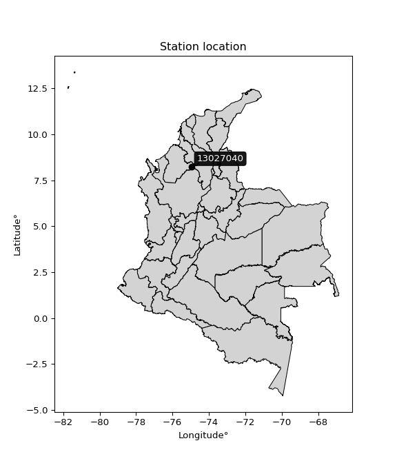

<div align="center">


</div>

# PMP Station (rain, Pmax24h): 13027040

Probable Maximum Precipitation (PMP) is the greatest amount of rainfall for a specific duration that is meteorologically possible for a given location, acting as a "worst-case" scenario for extreme storms, crucial for designing safety-critical infrastructure like bridges, river deviations, dams, spillways, and nuclear plants to prevent catastrophic failure. PMP is calculated by hydrologists using meteorological data to determine the upper limit of extreme rainfall, often leading to the Probable Maximum Flood (PMF) for flood control design, and is increasingly being studied for climate change impacts.

<div align="center">

</img>

</div>


## A. General information


### 1. General running parameters

• app_version: _v20251228_. • runtime: _2025-12-28 08:43:48.795225_. • Python version: _3.14.0_. • SciPy version: _1.16.3_. • Pandas version: _2.3.3_. • NumPy version: _2.3.5_. • Stations dataset (station_dataset_file): _dataset/pmax24h_in/automatic_colombia_2003_2024.csv_. • Stations catalog (station_catalog_file): _dataset/CNE_IDEAM.xls_. • Minimum year to eval til year_max (date_min): _1900_. • Maximum year to eval since year_min (date_max): _2024_. • Creates, save and include plots into reports (create_plot): _False_. • Plot only fit distributions with Δo > Δ (plot_only_fit): _True_. • Eval low extreme values, if False, evaluates high extreme values (low_extreme): _False_. • Eval every SciPy distribution as logarithmic (pdist_logarithmic_on): _True_. • Standard deviation normalized (ddof): _1.0_. • Return periods to eval in years (Tr): _[2, 2.33, 5, 10, 15, 20, 25, 50, 75, 100, 200, 250, 500, 750, 1000]_. • Minimum data sample per station, 0 means any (minimum_sample): _5_. • Z-Score maximum threshold to adjust a value, 0 means disable (zscore_max): _3.5_. • Z-Score minimum threshold to adjust a value, 0 means disable (zscore_min): _-2.5_. • Avoid zeros, e.g. rain = 0 (avoid_zeros): _True_. • Avoid null values (avoid_nans): _True_. [:file_folder:Dataset file.](../../dataset/pmax24h_in/automatic_colombia_2003_2024.csv)

> Delta Degrees of Freedom (DDOF): is a parameter used in the formulas for calculating variance and standard deviation. When ddof=0, the divisor is $N$ (the total number of observations) and this is used when your data set is the entire population. When ddof=1, the divisor is $N-1$ and this is used when your data set is a sample drawn from a larger population. Using $N-1$ provides an unbiased estimate of the population variance (known as Bessel´s correction).


### 2. Station info and location

|   id |   CODIGO | NOMBRE                      | CATEGORIA    | TECNOLOGIA                              | ESTADO   | FECHA_INSTALACION   |   FECHA_SUSPENSION |   ALTITUD |   LATITUD |   LONGITUD | DEPARTAMENTO   | MUNICIPIO   | AREA_OPERATIVA                              | ENTIDAD                                                     | AREA_HIDROGRAFICA   | ZONA_HIDROGRAFICA                | SUBZONA_HIDROGRAFICA       | CORRIENTE   | Catalogo   |
|-----:|---------:|:----------------------------|:-------------|:----------------------------------------|:---------|:--------------------|-------------------:|----------:|----------:|-----------:|:---------------|:------------|:--------------------------------------------|:------------------------------------------------------------|:--------------------|:---------------------------------|:---------------------------|:------------|:-----------|
|    0 | 13027040 | CANO BARRO - AUT [13027040] | Limnigráfica | Automática con Telemetría, Convencional | Activa   | 02/01/2017          |                nan |        24 |   8.23678 |   -74.9626 | Cordoba        | Ayapel      | Area Operativa 02 - Atlántico-Bolivar-Sucre | INSTITUTO DE HIDROLOGIA METEOROLOGIA Y ESTUDIOS AMBIENTALES | Magdalena Cauca     | Bajo Magdalena- Cauca -San Jorge | Bajo San Jorge - La Mojana | CAÑO BARRO  | CNE_IDEAM  |

<div align="center">

Map location in: [:earth_americas:Google](http://maps.google.com/maps?q=8.236777,-74.962588) [:earth_americas:OSM](https://www.openstreetmap.org/#map=18/8.236777/-74.962588&layers=P) [:earth_americas:Bing](https://www.bing.com/maps?cp=8.236777~-74.962588&lvl=18) [:earth_americas:Apple](https://maps.apple.com/frame?center=8.236777%2C-74.962588&span=0.003%2C0.006)

</div>


<div align="center">

```geojson
{
  "type": "Feature",
  "geometry": {
    "type": "Point", 
    "coordinates": [-74.962588, 8.236777]
  }, 
  "properties": {
    "Name": "13027040"
  }
}
```

</div>


### 3. Discrete values table and plot

|               |           0 |           1 |          2 |          3 |           4 |          5 |
|:--------------|------------:|------------:|-----------:|-----------:|------------:|-----------:|
| Date          | 2017        | 2018        | 2019       | 2020       | 2023        | 2024       |
| Value         |  109.9      |  122.6      |  151.8     |   76.3     |  102.8      |  150.3     |
| Value_initial |  109.9      |  122.6      |  151.8     |   76.3     |  102.8      |  150.3     |
| count         |    6        |    6        |    6       |    6       |    6        |    6       |
| mean          |  118.95     |  118.95     |  118.95    |  118.95    |  118.95     |  118.95    |
| std           |   29.1102   |   29.1102   |   29.1102  |   29.1102  |   29.1102   |   29.1102  |
| zscore        |   -0.310888 |    0.125386 |    1.12847 |   -1.46512 |   -0.554789 |    1.07694 |

> The initial value (value_initial) correspond to the initial obtained or null completed value, and value (value) is adjusted only when the initial value is outside the valid range definite through the Z-Score value. If Z-Score is active, values out of range or outliers are replaced with the station mean value


### 4. Active continuous probability distributions from SciPy (44 of 104 available)

[scipy.stats](https://docs.scipy.org/doc/scipy/reference/stats.html) is a Python´s powerful submodule within the SciPy library for comprehensive statistical analysis, offering over 130 probability distributions (like Normal, Poisson), functions for descriptive stats (mean, variance), hypothesis testing (t-tests, chi-square), random variable generation, and statistical tests, making it essential for data science, modeling, and research. It provides tools to explore, model, and draw conclusions from data efficiently, working seamlessly with NumPy.

<div align="center">

|   id | p_dist             |   n_parameter | fit_method   | label                                                                       | active   | ref                                                                                                        |
|-----:|:-------------------|--------------:|:-------------|:----------------------------------------------------------------------------|:---------|:-----------------------------------------------------------------------------------------------------------|
|    0 | alpha              |             3 | MLE          | Alpha                                                                       | True     | [:mortar_board:](https://docs.scipy.org/doc/scipy/reference/generated/scipy.stats.alpha.html)              |
|    1 | betaprime          |             4 | MLE          | Beta prime                                                                  | True     | [:mortar_board:](https://docs.scipy.org/doc/scipy/reference/generated/scipy.stats.betaprime.html)          |
|    2 | chi2               |             3 | MLE          | Chi²                                                                        | True     | [:mortar_board:](https://docs.scipy.org/doc/scipy/reference/generated/scipy.stats.chi2.html)               |
|    3 | crystalball        |             4 | MLE          | Crystalball                                                                 | True     | [:mortar_board:](https://docs.scipy.org/doc/scipy/reference/generated/scipy.stats.crystalball.html)        |
|    4 | erlang             |             3 | MLE          | Erlang                                                                      | True     | [:mortar_board:](https://docs.scipy.org/doc/scipy/reference/generated/scipy.stats.erlang.html)             |
|    5 | expon              |             2 | MLE          | Exponential                                                                 | True     | [:mortar_board:](https://docs.scipy.org/doc/scipy/reference/generated/scipy.stats.expon.html)              |
|    6 | exponnorm          |             3 | MLE          | Exponentially modified Normal                                               | True     | [:mortar_board:](https://docs.scipy.org/doc/scipy/reference/generated/scipy.stats.exponnorm.html)          |
|    7 | f                  |             4 | MLE          | F                                                                           | True     | [:mortar_board:](https://docs.scipy.org/doc/scipy/reference/generated/scipy.stats.f.html)                  |
|    8 | fatiguelife        |             3 | MLE          | Fatigue-life (Birnbaum-Saunders)                                            | True     | [:mortar_board:](https://docs.scipy.org/doc/scipy/reference/generated/scipy.stats.fatiguelife.html)        |
|    9 | fisk               |             3 | MLE          | Fisk                                                                        | True     | [:mortar_board:](https://docs.scipy.org/doc/scipy/reference/generated/scipy.stats.fisk.html)               |
|   10 | gamma              |             3 | MLE          | Gamma                                                                       | True     | [:mortar_board:](https://docs.scipy.org/doc/scipy/reference/generated/scipy.stats.gamma.html)              |
|   11 | genexpon           |             5 | MLE          | Generalized exponential                                                     | True     | [:mortar_board:](https://docs.scipy.org/doc/scipy/reference/generated/scipy.stats.genexpon.html)           |
|   12 | genlogistic        |             3 | MLE          | Generalized logistic                                                        | True     | [:mortar_board:](https://docs.scipy.org/doc/scipy/reference/generated/scipy.stats.genlogistic.html)        |
|   13 | gibrat             |             2 | MM           | Gibrat                                                                      | True     | [:mortar_board:](https://docs.scipy.org/doc/scipy/reference/generated/scipy.stats.gibrat.html)             |
|   14 | gompertz           |             3 | MLE          | Gompertz (or truncated Gumbel)                                              | True     | [:mortar_board:](https://docs.scipy.org/doc/scipy/reference/generated/scipy.stats.gompertz.html)           |
|   15 | gumbel_l           |             2 | MM           | Gumbel Left Skew                                                            | True     | [:mortar_board:](https://docs.scipy.org/doc/scipy/reference/generated/scipy.stats.gumbel_l.html)           |
|   16 | gumbel_r           |             2 | MM           | Gumbel Right Skew                                                           | True     | [:mortar_board:](https://docs.scipy.org/doc/scipy/reference/generated/scipy.stats.gumbel_r.html)           |
|   17 | halflogistic       |             2 | MM           | Half-logistic                                                               | True     | [:mortar_board:](https://docs.scipy.org/doc/scipy/reference/generated/scipy.stats.halflogistic.html)       |
|   18 | halfnorm           |             2 | MM           | Half Normal                                                                 | True     | [:mortar_board:](https://docs.scipy.org/doc/scipy/reference/generated/scipy.stats.halfnorm.html)           |
|   19 | hypsecant          |             2 | MM           | hyperbolic secant                                                           | True     | [:mortar_board:](https://docs.scipy.org/doc/scipy/reference/generated/scipy.stats.hypsecant.html)          |
|   20 | invgamma           |             3 | MLE          | Inverted gamma                                                              | True     | [:mortar_board:](https://docs.scipy.org/doc/scipy/reference/generated/scipy.stats.invgamma.html)           |
|   21 | invgauss           |             3 | MLE          | Inverse Gaussian                                                            | True     | [:mortar_board:](https://docs.scipy.org/doc/scipy/reference/generated/scipy.stats.invgauss.html)           |
|   22 | invweibull         |             3 | MLE          | Inverted Weibull                                                            | True     | [:mortar_board:](https://docs.scipy.org/doc/scipy/reference/generated/scipy.stats.invweibull.html)         |
|   23 | johnsonsu          |             4 | MLE          | Johnson Su                                                                  | True     | [:mortar_board:](https://docs.scipy.org/doc/scipy/reference/generated/scipy.stats.johnsonsu.html)          |
|   24 | kstwobign          |             2 | MLE          | Limiting distribution of scaled Kolmogorov-Smirnov two-sided test statistic | True     | [:mortar_board:](https://docs.scipy.org/doc/scipy/reference/generated/scipy.stats.kstwobign.html)          |
|   25 | laplace            |             2 | MM           | Laplace                                                                     | True     | [:mortar_board:](https://docs.scipy.org/doc/scipy/reference/generated/scipy.stats.laplace.html)            |
|   26 | laplace_asymmetric |             3 | MLE          | Asymmetric Laplace                                                          | True     | [:mortar_board:](https://docs.scipy.org/doc/scipy/reference/generated/scipy.stats.laplace_asymmetric.html) |
|   27 | loggamma           |             3 | MLE          | Log gamma                                                                   | True     | [:mortar_board:](https://docs.scipy.org/doc/scipy/reference/generated/scipy.stats.loggamma.html)           |
|   28 | logistic           |             2 | MM           | Logistic (or Sech-squared)                                                  | True     | [:mortar_board:](https://docs.scipy.org/doc/scipy/reference/generated/scipy.stats.logistic.html)           |
|   29 | lognorm            |             3 | MLE          | Log Normal                                                                  | True     | [:mortar_board:](https://docs.scipy.org/doc/scipy/reference/generated/scipy.stats.lognorm.html)            |
|   30 | maxwell            |             2 | MM           | Maxwell                                                                     | True     | [:mortar_board:](https://docs.scipy.org/doc/scipy/reference/generated/scipy.stats.maxwell.html)            |
|   31 | mielke             |             4 | MLE          | Mielke Beta-Kappa / Dagum                                                   | True     | [:mortar_board:](https://docs.scipy.org/doc/scipy/reference/generated/scipy.stats.mielke.html)             |
|   32 | moyal              |             2 | MM           | Moyal                                                                       | True     | [:mortar_board:](https://docs.scipy.org/doc/scipy/reference/generated/scipy.stats.moyal.html)              |
|   33 | nakagami           |             3 | MLE          | Nakagami                                                                    | True     | [:mortar_board:](https://docs.scipy.org/doc/scipy/reference/generated/scipy.stats.nakagami.html)           |
|   34 | ncf                |             5 | MLE          | Non-central F distribution                                                  | True     | [:mortar_board:](https://docs.scipy.org/doc/scipy/reference/generated/scipy.stats.ncf.html)                |
|   35 | nct                |             4 | MLE          | Non-central Student’s t                                                     | True     | [:mortar_board:](https://docs.scipy.org/doc/scipy/reference/generated/scipy.stats.nct.html)                |
|   36 | norm               |             2 | MM           | Normal                                                                      | True     | [:mortar_board:](https://docs.scipy.org/doc/scipy/reference/generated/scipy.stats.norm.html)               |
|   37 | pearson3           |             3 | MM           | Pearson type III                                                            | True     | [:mortar_board:](https://docs.scipy.org/doc/scipy/reference/generated/scipy.stats.pearson3.html)           |
|   38 | rayleigh           |             2 | MM           | Rayleigh                                                                    | True     | [:mortar_board:](https://docs.scipy.org/doc/scipy/reference/generated/scipy.stats.rayleigh.html)           |
|   39 | rice               |             3 | MLE          | Rice                                                                        | True     | [:mortar_board:](https://docs.scipy.org/doc/scipy/reference/generated/scipy.stats.rice.html)               |
|   40 | t                  |             3 | MLE          | Student’s t                                                                 | True     | [:mortar_board:](https://docs.scipy.org/doc/scipy/reference/generated/scipy.stats.t.html)                  |
|   41 | truncnorm          |             4 | MLE          | Truncated normal                                                            | True     | [:mortar_board:](https://docs.scipy.org/doc/scipy/reference/generated/scipy.stats.truncnorm.html)          |
|   42 | wald               |             2 | MM           | Wald                                                                        | True     | [:mortar_board:](https://docs.scipy.org/doc/scipy/reference/generated/scipy.stats.wald.html)               |
|   43 | weibull_min        |             3 | MLE          | Weibull minimum                                                             | True     | [:mortar_board:](https://docs.scipy.org/doc/scipy/reference/generated/scipy.stats.weibull_min.html)        |

</div>

> **n_parameter:** # arguments & localization & scale.
>
> **Fit methods:** (MLE) maximum likelihood, (MM) L-moments.
>
>**Inactive:** foldnorm, gennorm, norminvgauss, powernorm, powerlognorm, skewnorm, genextreme, anglit, arcsine, argus, beta, bradford, burr, burr12, cauchy, cosine, halfcauchy, foldcauchy, skewcauchy, wrapcauchy, dgamma, gengamma, exponweib, exponpow, truncexpon, gausshyper, genhalflogistic, genhyperbolic, geninvgauss, halfgennorm, johnsonsb, kappa4, kappa3, ksone, kstwo, loglaplace, levy, levy_l, levy_stable, ncx2, pareto, genpareto, truncpareto, lomax, powerlaw, rdist, rel_breitwigner, recipinvgauss, semicircular, studentized_range, trapezoid, triang, truncweibull_min, tukeylambda, uniform, loguniform, vonmises, vonmises_line, weibull_max, dweibull, 


## B. Probability distributions vs. Empirical distributions

A continuous probability distribution (CPD) describes probabilities for variables that can take any value within a range (like rain any time), unlike discrete variables with specific outcomes (like temperature). It uses a Probability Density Function (PDF), a curve where the total area under it equals 1, and the probability of the variable falling within an interval (a to b) is found by calculating the area under the curve between those points. A key feature is that the probability of hitting any single exact value is zero, so probabilities are always expressed for ranges, e.g., $P(a ≤ X ≤ b)$.

<div align="center">

Distributions parameters from station values
|    |   station | p_dist                |   n |              loc |            scale | shape                  | shape1                | shape2             | shape3   |
|---:|----------:|:----------------------|----:|-----------------:|-----------------:|:-----------------------|:----------------------|:-------------------|:---------|
|  0 |  13027040 | alpha                 |   6 |   -357.744       |   8498.52        | 17.902054061392242     |                       |                    |          |
|  1 |  13027040 | betaprime             |   6 |     -0.493986    |     59.4018      | 54.59160856764274      | 28.240848909086907    |                    |          |
|  2 |  13027040 | chi2                  |   6 |    -87.908       |      1.77415     | 116.46051442367295     |                       |                    |          |
|  3 |  13027040 | crystalball           |   6 |    118.95        |     26.5738      | 9926.08331144663       | 4977.854464150858     |                    |          |
|  4 |  13027040 | erlang                |   6 |   -449.426       |      1.26017     | 450.9900725082066      |                       |                    |          |
|  5 |  13027040 | expon                 |   6 |     76.3         |     42.65        |                        |                       |                    |          |
|  6 |  13027040 | exponnorm             |   6 |    118.922       |     26.5737      | 0.0010691429377771673  |                       |                    |          |
|  7 |  13027040 | f                     |   6 |  -1544.18        |   1663.1         | 7983.331689672585      | 431079.76301623264    |                    |          |
|  8 |  13027040 | fatiguelife           |   6 |     76.3         |      1.68138e-06 | 4324.180991922365      |                       |                    |          |
|  9 |  13027040 | fisk                  |   6 |     -5.56769e+08 |      5.5677e+08  | 34712418.371077456     |                       |                    |          |
| 10 |  13027040 | gamma                 |   6 |   -452.559       |      1.24622     | 458.5967389978405      |                       |                    |          |
| 11 |  13027040 | genexpon              |   6 |     76.2896      |      1.02457     | 0.02287555169281697    | 5.661767257915634e-06 | 1.3031851538483035 |          |
| 12 |  13027040 | genlogistic           |   6 |    110.296       |     17.7713      | 1.4020719978590779     |                       |                    |          |
| 13 |  13027040 | gibrat                |   6 |     98.6775      |     12.2959      |                        |                       |                    |          |
| 14 |  13027040 | gompertz              |   6 |    150.3         |      0.823658    | 0.6092857130339869     |                       |                    |          |
| 15 |  13027040 | gumbel_l              |   6 |    130.91        |     20.7195      |                        |                       |                    |          |
| 16 |  13027040 | gumbel_r              |   6 |    106.99        |     20.7195      |                        |                       |                    |          |
| 17 |  13027040 | halflogistic          |   6 |     87.4538      |     22.7197      |                        |                       |                    |          |
| 18 |  13027040 | halfnorm              |   6 |     83.7767      |     44.0832      |                        |                       |                    |          |
| 19 |  13027040 | hypsecant             |   6 |    118.95        |     16.9174      |                        |                       |                    |          |
| 20 |  13027040 | invgamma              |   6 |   -200.703       |  44805.4         | 141.21559422449303     |                       |                    |          |
| 21 |  13027040 | invgauss              |   6 |    -53.2804      |   6550.79        | 0.026202071780641923   |                       |                    |          |
| 22 |  13027040 | invweibull            |   6 |     76.3         |      1.40213     | 0.04846556947784772    |                       |                    |          |
| 23 |  13027040 | johnsonsu             |   6 |    240.759       |     16.3012      | 12.241718167897108     | 4.559897060389478     |                    |          |
| 24 |  13027040 | kstwobign             |   6 |     17.8253      |    115.534       |                        |                       |                    |          |
| 25 |  13027040 | laplace               |   6 |    118.95        |     18.7905      |                        |                       |                    |          |
| 26 |  13027040 | laplace_asymmetric    |   6 |    109.9         |     21.194       | 0.8090322172244062     |                       |                    |          |
| 27 |  13027040 | loggamma              |   6 |     -8.83725     |     68.2959      | 6.988933663775594      |                       |                    |          |
| 28 |  13027040 | logistic              |   6 |    118.95        |     14.6509      |                        |                       |                    |          |
| 29 |  13027040 | lognorm               |   6 |     76.3         |      0.121851    | 13.323390604477405     |                       |                    |          |
| 30 |  13027040 | maxwell               |   6 |     55.9811      |     39.4599      |                        |                       |                    |          |
| 31 |  13027040 | mielke                |   6 |    -21.6033      |    173.682       | 4.30601547873135       | 2969.3074885082424    |                    |          |
| 32 |  13027040 | moyal                 |   6 |    103.753       |     11.9624      |                        |                       |                    |          |
| 33 |  13027040 | nakagami              |   6 |    102.8         |     20.7459      | 0.27189350300178095    |                       |                    |          |
| 34 |  13027040 | ncf                   |   6 |     -1.13194     |      1.62766e-05 | 2.1775601079158154e-05 | 81.12393194001915     | 156.72439150552262 |          |
| 35 |  13027040 | nct                   |   6 |     -1.77972     |      0.330141    | 9.1604314248052        | 336.30209684587464    |                    |          |
| 36 |  13027040 | norm                  |   6 |    118.95        |     26.5738      |                        |                       |                    |          |
| 37 |  13027040 | pearson3              |   6 |    118.95        |     26.5738      | -0.14411224700742153   |                       |                    |          |
| 38 |  13027040 | rayleigh              |   6 |     68.1127      |     40.5623      |                        |                       |                    |          |
| 39 |  13027040 | rice                  |   6 |     61.9894      |     30.5453      | 1.4947587152590165     |                       |                    |          |
| 40 |  13027040 | t                     |   6 |    118.948       |     26.5731      | 313148.77739482606     |                       |                    |          |
| 41 |  13027040 | truncnorm             |   6 |    118.95        |     26.5738      | -799.5025470830271     | 1650.9340691645682    |                    |          |
| 42 |  13027040 | wald                  |   6 |     92.3762      |     26.5738      |                        |                       |                    |          |
| 43 |  13027040 | weibull_min           |   6 |     39.0558      |     89.1716      | 3.442919045262924      |                       |                    |          |
| 44 |  13027040 | logalpha              |   6 |     -3.79224     |    301.674       | 35.34666063837921      |                       |                    |          |
| 45 |  13027040 | logbetaprime          |   6 |     -0.84565     |      0.30714     | 4823.318649244886      | 265.18456804502864    |                    |          |
| 46 |  13027040 | logchi2               |   6 |      4.33467     |      0.930188    | 1.1235193209760217     |                       |                    |          |
| 47 |  13027040 | logcrystalball        |   6 |      4.75186     |      0.236467    | 124.11987517640895     | 10.665133114112024    |                    |          |
| 48 |  13027040 | logerlang             |   6 |      0.993519    |      0.015419    | 243.73479064501782     |                       |                    |          |
| 49 |  13027040 | logexpon              |   6 |      4.33467     |      0.417186    |                        |                       |                    |          |
| 50 |  13027040 | logexponnorm          |   6 |      4.75165     |      0.236466    | 0.0008899923603991136  |                       |                    |          |
| 51 |  13027040 | logf                  |   6 |    -89.7132      |     94.4636      | 6505281.08848642       | 333504.05931267934    |                    |          |
| 52 |  13027040 | logfatiguelife        |   6 |    -70.0662      |     74.8188      | 0.0031605422582058383  |                       |                    |          |
| 53 |  13027040 | logfisk               |   6 | -17970.2         |  17975           | 129089.69341621405     |                       |                    |          |
| 54 |  13027040 | loggamma              |   6 |      0.648439    |      0.0142288   | 288.26590684804904     |                       |                    |          |
| 55 |  13027040 | loggenexpon           |   6 |      4.33467     | 727192           | 1002403.7240205687     | 2935449.433486812     | 842748.1098475251  |          |
| 56 |  13027040 | loggenlogistic        |   6 |      5.02259     |      1.463e-06   | 5.364568182256515e-06  |                       |                    |          |
| 57 |  13027040 | loggibrat             |   6 |      4.57143     |      0.109433    |                        |                       |                    |          |
| 58 |  13027040 | loggompertz           |   6 |      4.33467     |      0.25089     | 0.15145908180745787    |                       |                    |          |
| 59 |  13027040 | loggumbel_l           |   6 |      4.85828     |      0.184372    |                        |                       |                    |          |
| 60 |  13027040 | loggumbel_r           |   6 |      4.64544     |      0.184372    |                        |                       |                    |          |
| 61 |  13027040 | loghalflogistic       |   6 |      4.47164     |      0.202134    |                        |                       |                    |          |
| 62 |  13027040 | loghalfnorm           |   6 |      4.43889     |      0.392252    |                        |                       |                    |          |
| 63 |  13027040 | loghypsecant          |   6 |      4.75186     |      0.150539    |                        |                       |                    |          |
| 64 |  13027040 | loginvgamma           |   6 |      0.571874    |   1214.29        | 291.2328518002731      |                       |                    |          |
| 65 |  13027040 | loginvgauss           |   6 |      2.65215     |    146.55        | 0.014312348100554845   |                       |                    |          |
| 66 |  13027040 | loginvweibull         |   6 |     -9.54386e+07 |      9.54386e+07 | 234208388.38750607     |                       |                    |          |
| 67 |  13027040 | logjohnsonsu          |   6 |      5.02256     |      3.77999e-15 | 2.869628197675362      | 0.1279448669736878    |                    |          |
| 68 |  13027040 | logkstwobign          |   6 |      3.78279     |      1.10685     |                        |                       |                    |          |
| 69 |  13027040 | loglaplace            |   6 |      4.75186     |      0.167207    |                        |                       |                    |          |
| 70 |  13027040 | loglaplace_asymmetric |   6 |      4.80893     |      0.189815    | 1.161609541796409      |                       |                    |          |
| 71 |  13027040 | logloggamma           |   6 |      5.02263     |      6.3209e-06  | 2.3481855510248632e-05 |                       |                    |          |
| 72 |  13027040 | loglogistic           |   6 |      4.75186     |      0.130371    |                        |                       |                    |          |
| 73 |  13027040 | loglognorm            |   6 |      4.33467     |      0.00166583  | 12.641851824307638     |                       |                    |          |
| 74 |  13027040 | logmaxwell            |   6 |      4.19153     |      0.351132    |                        |                       |                    |          |
| 75 |  13027040 | logmielke             |   6 |      4.33467     |      0.696775    | 0.5648831412010089     | 1214.51412357675      |                    |          |
| 76 |  13027040 | logmoyal              |   6 |      4.61663     |      0.106447    |                        |                       |                    |          |
| 77 |  13027040 | lognakagami           |   6 |    -48.3186      |     53.0709      | 12618.625749636005     |                       |                    |          |
| 78 |  13027040 | logncf                |   6 |    -36.1551      |     36.8022      | 95307.44664987957      | 157277.63457680243    | 10632.021188963907 |          |
| 79 |  13027040 | lognct                |   6 |      0.122481    |      0.0739666   | 202.2413844126459      | 62.3500624608197      |                    |          |
| 80 |  13027040 | lognorm               |   6 |      4.75186     |      0.236466    |                        |                       |                    |          |
| 81 |  13027040 | logpearson3           |   6 |      4.75186     |      0.236466    | -0.4623680276180392    |                       |                    |          |
| 82 |  13027040 | lograyleigh           |   6 |      4.29949     |      0.360942    |                        |                       |                    |          |
| 83 |  13027040 | logrice               |   6 |      4.18732     |      0.260269    | 1.8789087631592867     |                       |                    |          |
| 84 |  13027040 | logt                  |   6 |      4.75186     |      0.236466    | 11701791220.580147     |                       |                    |          |
| 85 |  13027040 | logtruncnorm          |   6 |     -0.0499482   |      1.3621      | 3.219020483057577      | 3.7240508255223768    |                    |          |
| 86 |  13027040 | logwald               |   6 |      4.51542     |      0.236437    |                        |                       |                    |          |
| 87 |  13027040 | logweibull_min        |   6 |     -1.77137e+06 |      1.77137e+06 | 9277120.651275203      |                       |                    |          |

</div>

> **loc** (Location parameter): This shifts the distribution along the x-axis. For many common distributions, like the normal (Gaussian) distribution, loc represents the mean $μ$. For others, like the uniform distribution, it might represent the minimum value, or for the beta distribution, the left end of the support interval.
>
> **scale** (Scale parameter): This determines the width or spread of the distribution. For the normal distribution, scale represents the standard deviation $σ$. For a uniform distribution, it defines the length of the interval (from $loc$ to $loc + scale$).
>
> **shape** (Shape parameters): Refers to parameters that define the specific form of a probability distribution, distinct from its location (loc) and scale (scale). These parameters are required arguments for most distribution functions. For example, a normal (Gaussian) distribution is fully defined by its location (mean) and scale (standard deviation), so it has no specific shape parameters beyond loc and scale. However, other distributions have intrinsic properties that need specification, as Gamma distribution that takes a shape parameter, often named $a$ or $alpha$.


### 0. Cumulative distribution values - CDF (88 evaluated)

Cumulative Distribution Function (CDF), denoted as $F$<sub>$X$</sub>$(x)$, is a function that gives the probability that a random variable $X$ will take a value less than or equal to a specific value, $x$ (i.e., $(P(X≥x)$. It essentially "accumulates" probabilities from a given point up to the far right (positive infinity), providing a complete picture of the distribution´s probabilities for both discrete (like rain) and continuous (like temperature) variables, helping to find probabilities over ranges or above certain values.

<div align="center">

CDF ordered by x ascending and calculating $log(f(x))$ separately
|   id |   Station |   date |     x |   count |   mean |     std |    zscore |   Value_initial |   station |   m |     alpha |   alpha_pdf |   betaprime |   betaprime_pdf |      chi2 |   chi2_pdf |   crystalball |   crystalball_pdf |    erlang |   erlang_pdf |    expon |   expon_pdf |   exponnorm |   exponnorm_pdf |         f |      f_pdf |   fatiguelife |   fatiguelife_pdf |     fisk |   fisk_pdf |     gamma |   gamma_pdf |    genexpon |   genexpon_pdf |   genlogistic |   genlogistic_pdf |   gibrat |   gibrat_pdf |    gompertz |   gompertz_pdf |   gumbel_l |   gumbel_l_pdf |   gumbel_r |   gumbel_r_pdf |   halflogistic |   halflogistic_pdf |   halfnorm |   halfnorm_pdf |   hypsecant |   hypsecant_pdf |   invgamma |   invgamma_pdf |   invgauss |   invgauss_pdf |   invweibull |   invweibull_pdf |   johnsonsu |   johnsonsu_pdf |   kstwobign |   kstwobign_pdf |   laplace |   laplace_pdf |   laplace_asymmetric |   laplace_asymmetric_pdf |   loggamma |   loggamma_pdf |   logistic |   logistic_pdf |   lognorm |   lognorm_pdf |   maxwell |   maxwell_pdf |    mielke |   mielke_pdf |      moyal |   moyal_pdf |    nakagami |    nakagami_pdf |       ncf |    ncf_pdf |       nct |    nct_pdf |      norm |   norm_pdf |   pearson3 |   pearson3_pdf |   rayleigh |   rayleigh_pdf |      rice |   rice_pdf |         t |      t_pdf |   truncnorm |   truncnorm_pdf |     wald |   wald_pdf |   weibull_min |   weibull_min_pdf |   logalpha |   logalpha_pdf |   logbetaprime |   logbetaprime_pdf |     logchi2 |   logchi2_pdf |   logcrystalball |   logcrystalball_pdf |   logerlang |   logerlang_pdf |   logexpon |   logexpon_pdf |   logexponnorm |   logexponnorm_pdf |      logf |   logf_pdf |   logfatiguelife |   logfatiguelife_pdf |   logfisk |   logfisk_pdf |   loggenexpon |   loggenexpon_pdf |   loggenlogistic |   loggenlogistic_pdf |   loggibrat |   loggibrat_pdf |   loggompertz |   loggompertz_pdf |   loggumbel_l |   loggumbel_l_pdf |   loggumbel_r |   loggumbel_r_pdf |   loghalflogistic |   loghalflogistic_pdf |   loghalfnorm |   loghalfnorm_pdf |   loghypsecant |   loghypsecant_pdf |   loginvgamma |   loginvgamma_pdf |   loginvgauss |   loginvgauss_pdf |   loginvweibull |   loginvweibull_pdf |   logjohnsonsu |   logjohnsonsu_pdf |   logkstwobign |   logkstwobign_pdf |   loglaplace |   loglaplace_pdf |   loglaplace_asymmetric |   loglaplace_asymmetric_pdf |   logloggamma |   logloggamma_pdf |   loglogistic |   loglogistic_pdf |   loglognorm |   loglognorm_pdf |   logmaxwell |   logmaxwell_pdf |   logmielke |   logmielke_pdf |    logmoyal |   logmoyal_pdf |   lognakagami |   lognakagami_pdf |    logncf |   logncf_pdf |    lognct |   lognct_pdf |   logpearson3 |   logpearson3_pdf |   lograyleigh |   lograyleigh_pdf |   logrice |   logrice_pdf |      logt |   logt_pdf |   logtruncnorm |   logtruncnorm_pdf |   logwald |   logwald_pdf |   logweibull_min |   logweibull_min_pdf |
|-----:|----------:|-------:|------:|--------:|-------:|--------:|----------:|----------------:|----------:|----:|----------:|------------:|------------:|----------------:|----------:|-----------:|--------------:|------------------:|----------:|-------------:|---------:|------------:|------------:|----------------:|----------:|-----------:|--------------:|------------------:|---------:|-----------:|----------:|------------:|------------:|---------------:|--------------:|------------------:|---------:|-------------:|------------:|---------------:|-----------:|---------------:|-----------:|---------------:|---------------:|-------------------:|-----------:|---------------:|------------:|----------------:|-----------:|---------------:|-----------:|---------------:|-------------:|-----------------:|------------:|----------------:|------------:|----------------:|----------:|--------------:|---------------------:|-------------------------:|-----------:|---------------:|-----------:|---------------:|----------:|--------------:|----------:|--------------:|----------:|-------------:|-----------:|------------:|------------:|----------------:|----------:|-----------:|----------:|-----------:|----------:|-----------:|-----------:|---------------:|-----------:|---------------:|----------:|-----------:|----------:|-----------:|------------:|----------------:|---------:|-----------:|--------------:|------------------:|-----------:|---------------:|---------------:|-------------------:|------------:|--------------:|-----------------:|---------------------:|------------:|----------------:|-----------:|---------------:|---------------:|-------------------:|----------:|-----------:|-----------------:|---------------------:|----------:|--------------:|--------------:|------------------:|-----------------:|---------------------:|------------:|----------------:|--------------:|------------------:|--------------:|------------------:|--------------:|------------------:|------------------:|----------------------:|--------------:|------------------:|---------------:|-------------------:|--------------:|------------------:|--------------:|------------------:|----------------:|--------------------:|---------------:|-------------------:|---------------:|-------------------:|-------------:|-----------------:|------------------------:|----------------------------:|--------------:|------------------:|--------------:|------------------:|-------------:|-----------------:|-------------:|-----------------:|------------:|----------------:|------------:|---------------:|--------------:|------------------:|----------:|-------------:|----------:|-------------:|--------------:|------------------:|--------------:|------------------:|----------:|--------------:|----------:|-----------:|---------------:|-------------------:|----------:|--------------:|-----------------:|---------------------:|
|    0 |  13027040 |   2020 |  76.3 |       6 | 118.95 | 29.1102 | -1.46512  |            76.3 |  13027040 |   1 | 0.0466918 |  0.00440458 |   0.0369834 |      0.0046812  | 0.0500879 | 0.00445015 |     0.0542511 |        0.004141   | 0.0528677 |   0.00424389 | 0        |  0.0234467  |   0.0542506 |      0.00414099 | 0.0533444 | 0.00415999 |     0.0732084 |       2.36696e+12 | 0.064537 | 0.00376396 | 0.0521608 |  0.00420945 | 0.000232386 |     0.0223218  |     0.0564041 |        0.00387755 | 0        |   0          | 0           |       0        |  0.0691636 |     0.00321989 |  0.0122977 |     0.00261056 |       0        |         0          |   0        |     0          |   0.0510578 |      0.00300513 |  0.0466277 |     0.00437922 |  0.0476781 |     0.00479699 |   0.00850677 |      1.38297e+11 |   0.0707849 |      0.00373654 |   0.0401091 |      0.00592096 | 0.0516686 |    0.00274971 |            0.0557478 |               0.00325123 |  0.0390695 |       0.375847 |  0.0516086 |     0.00334076 | 0.0388449 |      0.355838 | 0.0335557 |    0.00469565 | 0.0847203 |   0.00372619 | 0.00163129 | 0.000735269 | 0           |      0          | 0.0348518 | 0.00424874 | 0.0319679 | 0.00500825 | 0.0542511 | 0.004141   |  0.0581196 |     0.00406528 |  0.0201647 |     0.00487584 | 0.0360989 | 0.0050656  | 0.0542567 | 0.00414143 |   0.0542511 |      0.004141   | 0        | 0          |     0.0482894 |        0.0043544  |  0.0380597 |       0.377989 |       0.109567 |           0.586891 | 2.77933e-09 |   1.75788e+06 |         0.038845 |             0.355837 |    0.037594 |        0.3682   |   0        |       2.39701  |      0.0388448 |           0.355837 | 0.0393132 |   0.360301 |        0.0381579 |             0.352669 | 0.0433248 |      0.29767  |   1.03596e-08 |          1.37846  |         0        |             0.294301 |    0        |        0        |   5.98643e-10 |          0.603688 |     0.0567541 |          0.298919 |    0.00453796 |          0.132794 |          0        |              0        |      0        |          0        |       0.039789 |           0.263622 |     0.0358323 |          0.369771 |     0.0367179 |          0.402431 |       0.0973825 |            0.556608 |      0.0777868 |        0.0270698   |      0.0351745 |           0.568809 |    0.0412471 |         0.246683 |               0.0668422 |                    0.303152 |     0.0776359 |          0.288414 |     0.0391658 |          0.288653 |    0.0126947 |      2.92069e+12 |    0.0171451 |         0.347507 | 3.85741e-09 |     2.45332e+06 | 0.000169939 |      0.0119972 |     0.0385733 |          0.355111 | 0.0381378 |     0.353465 | 0.0353084 |     0.371109 |     0.0500987 |          0.348367 |    0.00474079 |          0.268816 | 0.0290005 |      0.413457 | 0.0388446 |   0.355837 |    1.70671e-05 |           3.02067  |  0        |      0        |        0.0605606 |             0.307368 |
|    1 |  13027040 |   2023 | 102.8 |       6 | 118.95 | 29.1102 | -0.554789 |           102.8 |  13027040 |   2 | 0.290757  |  0.0137323  |   0.314784  |      0.0149433  | 0.287932  | 0.013287   |     0.27168   |        0.0124811  | 0.277035  |   0.012755   | 0.462774 |  0.0125962  |   0.271679  |      0.0124811  | 0.273057  | 0.0125991  |     0.820715  |       0.00453407  | 0.26471  | 0.012135   | 0.275735  |  0.0127604  | 0.446801    |     0.0123543  |     0.27294   |        0.0130046  | 0.137241 |   0.0532632  | 0           |       0        |  0.227031  |     0.00960697 |  0.294009  |     0.0173705  |       0.325448 |         0.0196764  |   0.333918 |     0.0164903  |   0.233937  |      0.0126165  |  0.287887  |     0.0135538  |  0.305422  |     0.0139348  |   0.420112   |      0.000666329 |   0.250331  |      0.0104381  |   0.348384  |      0.0146004  | 0.211692  |    0.0112659  |            0.261472  |               0.0152492  |  0.318939  |       1.507    |  0.249306  |     0.0127741  | 0.307287  |      1.48621  | 0.296284  |    0.0140806  | 0.237663  |   0.00822631 | 0.298037   | 0.0201946   | 4.41346e-09 | 168884          | 0.296786  | 0.0146894  | 0.338642  | 0.0154949  | 0.27168   | 0.0124811  |  0.266634  |     0.0120148  |  0.306255  |     0.014626   | 0.28898   | 0.0133372  | 0.271705  | 0.012482   |   0.27168   |      0.0124811  | 0.262797 | 0.038162   |     0.270084  |        0.0124117  |  0.32269   |       1.52517  |       0.371017 |           1.09989  | 0.379715    |   0.645016    |         0.307286 |             1.4862   |    0.316399 |        1.5104   |   0.510602 |       1.17309  |      0.307287  |           1.48621  | 0.309525  |   1.48884  |        0.305995  |             1.48581  | 0.278128  |      1.44189  |   0.449432    |          1.40817  |         0        |             0.878073 |    0.281397 |        5.50006  |   0.292144    |          1.40215  |     0.254971  |          1.18936  |    0.342657   |          1.99051  |          0.378753 |              2.11876  |      0.378919 |          1.80017  |       0.270995 |           1.59045  |     0.31856   |          1.51311  |     0.337096  |          1.54467  |       0.326067  |            0.896719 |      0.0889196 |        0.0528281   |      0.402946  |           1.50932  |    0.245298  |         1.46703  |               0.258365  |                    1.17177  |     0.234981  |          0.872943 |     0.286316  |          1.56737  |    0.659213  |      0.0973107   |    0.335881  |         1.62925  | 0.619043    |     1.173       | 0.353961    |      2.26074   |     0.30736   |          1.48901  | 0.306497  |     1.48683  | 0.323027  |     1.54135  |     0.287166  |          1.33737  |    0.347112   |          1.67032  | 0.321114  |      1.51492  | 0.307287  |   1.48621  |    0.64208     |           1.45791  |  0.361784 |      3.73697  |        0.257459  |             1.15763  |
|    2 |  13027040 |   2017 | 109.9 |       6 | 118.95 | 29.1102 | -0.310888 |           109.9 |  13027040 |   3 | 0.393192  |  0.0149443  |   0.422959  |      0.0153132  | 0.387327  | 0.0145529  |     0.366717  |        0.0141668  | 0.373574  |   0.0143029  | 0.545159 |  0.0106645  |   0.366717  |      0.0141668  | 0.368829  | 0.0142502  |     0.849383  |       0.00359669  | 0.359169 | 0.01435    | 0.372384  |  0.014328   | 0.527916    |     0.0105428  |     0.372486  |        0.0148575  | 0.46361  |   0.0354004  | 0           |       0        |  0.30425   |     0.0121814  |  0.419377  |     0.0175888  |       0.45737  |         0.0174037  |   0.446545 |     0.0151849  |   0.337305  |      0.0164108  |  0.38905   |     0.0147708  |  0.4079    |     0.0147523  |   0.424301   |      0.000524695 |   0.332044  |      0.0125535  |   0.450888  |      0.0141272  | 0.308889  |    0.0164385  |            0.3956    |               0.0230715  |  0.424498  |       1.63502  |  0.350303  |     0.0155342  | 0.412499  |      1.64635  | 0.399559  |    0.0148428  | 0.301826  |   0.00988316 | 0.439265   | 0.0191257   | 0.431287    |      0.0322142  | 0.404625  | 0.0154694  | 0.447658  | 0.0150089  | 0.366717  | 0.0141668  |  0.358755  |     0.0138344  |  0.411781  |     0.0149396  | 0.387786  | 0.0143635  | 0.366748  | 0.0141676  |   0.366717  |      0.0141668  | 0.488957 | 0.0256745  |     0.364201  |        0.0139932  |  0.429134  |       1.64256  |       0.445789 |           1.13242  | 0.420159    |   0.569516    |         0.412496 |             1.64635  |    0.42227  |        1.64074  |   0.582998 |       0.999558 |      0.412498  |           1.64635  | 0.414769  |   1.64461  |        0.411192  |             1.64628  | 0.383638  |      1.69818  |   0.539213    |          1.27661  |         0        |             1.12172  |    0.562688 |        3.0749   |   0.391699    |          1.57244  |     0.344801  |          1.50255  |    0.474467   |          1.91865  |          0.510794 |              1.82821  |      0.493681 |          1.63105  |       0.391597 |           1.99303  |     0.423996  |          1.62466  |     0.443289  |          1.61525  |       0.386259  |            0.901676 |      0.0928527 |        0.0658318   |      0.501121  |           1.41926  |    0.365729  |         2.18729  |               0.349768  |                    1.58631  |     0.30115   |          1.11876  |     0.401055  |          1.84251  |    0.665057  |      0.0789704   |    0.44675   |         1.67011  | 0.693925    |     1.07424     | 0.498188    |      2.01818   |     0.412752  |          1.64884  | 0.411711  |     1.64571  | 0.430248  |     1.64885  |     0.384264  |          1.56058  |    0.458996   |          1.66142  | 0.42665   |      1.62776  | 0.412499  |   1.64636  |    0.731649    |           1.23027  |  0.563023 |      2.37893  |        0.344481  |             1.4499   |
|    3 |  13027040 |   2018 | 122.6 |       6 | 118.95 | 29.1102 |  0.125386 |           122.6 |  13027040 |   4 | 0.582962  |  0.0143754  |   0.607649  |      0.0133255  | 0.573924  | 0.0142945  |     0.554624  |        0.0148716  | 0.561046  |   0.0146679  | 0.662294 |  0.00791807 |   0.554624  |      0.0148717  | 0.557099  | 0.0148405  |     0.887538  |       0.0025036   | 0.553006 | 0.0154114  | 0.560335  |  0.0147139  | 0.644496    |     0.00793926 |     0.566167  |        0.0148973  | 0.747152 |   0.0133633  | 0           |       0        |  0.488094  |     0.0165438  |  0.624519  |     0.0141898  |       0.648945 |         0.0127394  |   0.62151  |     0.0122814  |   0.56815   |      0.0183859  |  0.577121  |     0.0142963  |  0.591578  |     0.0136869  |   0.429947   |      0.00037989  |   0.510883  |      0.0152455  |   0.616691  |      0.0117736  | 0.588273  |    0.0219114  |            0.627795  |               0.014208   |  0.603314  |       1.58047  |  0.561963  |     0.0168017  | 0.595353  |      1.63868  | 0.584705  |    0.0138594  | 0.448915  |   0.0134049  | 0.649202   | 0.0136788   | 0.720904    |      0.0162599  | 0.594861  | 0.0139616  | 0.621387  | 0.0120805  | 0.554624  | 0.0148716  |  0.545289  |     0.0150129  |  0.594334  |     0.0134344  | 0.571389  | 0.0140946  | 0.554662  | 0.0148719  |   0.554624  |      0.0148716  | 0.717695 | 0.0122747  |     0.550208  |        0.0148099  |  0.607609  |       1.56725  |       0.568695 |           1.09781  | 0.477188    |   0.478728    |         0.59535  |             1.63867  |    0.601779 |        1.58679  |   0.679154 |       0.769073 |      0.595353  |           1.63868  | 0.597059  |   1.63065  |        0.594046  |             1.63876  | 0.577184  |      1.75262  |   0.665582    |          1.03177  |         0        |             1.67507  |    0.780779 |        1.24421  |   0.57318     |          1.70608  |     0.534734  |          1.93086  |    0.662327   |          1.48003  |          0.682782 |              1.32043  |      0.654509 |          1.30354  |       0.617878 |           1.97113  |     0.600279  |          1.54733  |     0.615274  |          1.48389  |       0.483187  |            0.862459 |      0.101952  |        0.106596    |      0.643566  |           1.17344  |    0.644578  |         2.12564  |               0.574348  |                    2.60486  |     0.452081  |          1.67946  |     0.60772   |          1.8286   |    0.672577  |      0.0602133   |    0.622284  |         1.49734  | 0.804672    |     0.958443    | 0.68529     |      1.39908   |     0.595788  |          1.63934  | 0.594359  |     1.63576  | 0.608341  |     1.55487  |     0.566888  |          1.72584  |    0.630667   |          1.44423  | 0.60415   |      1.56755  | 0.595353  |   1.63868  |    0.848879    |           0.926878 |  0.749241 |      1.19167  |        0.527079  |             1.8547   |
|    4 |  13027040 |   2024 | 150.3 |       6 | 118.95 | 29.1102 |  1.07694  |           150.3 |  13027040 |   5 | 0.879828  |  0.00659323 |   0.87055   |      0.0058225  | 0.875988  | 0.00687697 |     0.880946  |        0.00748579 | 0.878593  |   0.0072712  | 0.823609 |  0.00413578 |   0.880947  |      0.00748577 | 0.880784  | 0.00740069 |     0.937509  |       0.00127473  | 0.874331 | 0.00685035 | 0.878832  |  0.00728312 | 0.808493    |     0.00427683 |     0.869047  |        0.00653137 | 0.924313 |   0.00276126 | 1.41491e-08 |       0.739731 |  0.92187   |     0.00961333 |  0.883687  |     0.00527377 |       0.881638 |         0.00490133 |   0.868711 |     0.00579668 |   0.901017  |      0.00575712 |  0.87535   |     0.00672599 |  0.872702  |     0.00636888 |   0.438179   |      0.000236796 |   0.890718  |      0.00928456 |   0.855829  |      0.00571694 | 0.905725  |    0.00501715 |            0.870709  |               0.00493536 |  0.860789  |       0.880619 |  0.894711  |     0.00642982 | 0.864942  |      0.918448 | 0.873576  |    0.00663815 | 0.956646  |   0.0239631  | 0.886361   | 0.0047176   | 0.958905    |      0.00335956 | 0.873418  | 0.0061345  | 0.854433  | 0.00524441 | 0.880946  | 0.00748579 |  0.883119  |     0.0078403  |  0.871618  |     0.00641306 | 0.87504   | 0.00708672 | 0.880971  | 0.00748488 |   0.880946  |      0.00748579 | 0.903373 | 0.00339002 |     0.882508  |        0.00778667 |  0.860938  |       0.862156 |       0.767036 |           0.815908 | 0.562413    |   0.366879    |         0.86494  |             0.918455 |    0.860188 |        0.883353 |   0.803104 |       0.471962 |      0.864942  |           0.91845  | 0.864922  |   0.912467 |        0.863811  |             0.920507 | 0.854974  |      0.890466 |   0.830638    |          0.605504 |         0        |             3.53534  |    0.918369 |        0.342133 |   0.878425    |          1.0945   |     0.900723  |          1.24376  |    0.872427   |          0.645788 |          0.871238 |              0.595999 |      0.856449 |          0.697899 |       0.888546 |           0.72533  |     0.851965  |          0.869704 |     0.852994  |          0.817401 |       0.64326   |            0.696476 |      0.190003  |        3.49629     |      0.8308    |           0.678182 |    0.894889  |         0.628628 |               0.877636  |                    0.748831 |     0.963547  |          3.57953  |     0.880824  |          0.805191 |    0.682716  |      0.0415755   |    0.859452  |         0.807045 | 0.984656    |     0.820425    | 0.876301    |      0.576356  |     0.865193  |          0.916731 | 0.863507  |     0.918711 | 0.858349  |     0.850543 |     0.871728  |          1.07954  |    0.857994   |          0.77734  | 0.86076   |      0.884466 | 0.864943  |   0.918447 |    0.994731    |           0.53762  |  0.896156 |      0.414331 |        0.886537  |             1.29322  |
|    5 |  13027040 |   2019 | 151.8 |       6 | 118.95 | 29.1102 |  1.12847  |           151.8 |  13027040 |   6 | 0.889405  |  0.00617875 |   0.879033  |      0.00549138 | 0.885985  | 0.00645395 |     0.891804  |        0.00699238 | 0.889149  |   0.00680526 | 0.829705 |  0.00399285 |   0.891805  |      0.00699237 | 0.89152   | 0.00691515 |     0.939389  |       0.00123226  | 0.884252 | 0.00638114 | 0.889404  |  0.00681467 | 0.814802    |     0.00413593 |     0.87853   |        0.00611536 | 0.928312 |   0.00257421 | 0.957381    |       0.194803 |  0.93548   |     0.00853468 |  0.891351  |     0.00494801 |       0.88878  |         0.00462308 |   0.877185 |     0.00550336 |   0.909297  |      0.00528925 |  0.885128  |     0.0063136  |  0.881975  |     0.00599742 |   0.438531   |      0.000232052 |   0.904117  |      0.00857994 |   0.864201  |      0.00544694 | 0.912958  |    0.00463221 |            0.877905  |               0.0046607  |  0.869342  |       0.841868 |  0.903974  |     0.00592489 | 0.873853  |      0.876109 | 0.883242  |    0.0062514  | 0.993101  |   0.0244527  | 0.893224   | 0.00443624  | 0.963688    |      0.0030228  | 0.882344  | 0.00577012 | 0.862098  | 0.00497734 | 0.891804  | 0.00699238 |  0.89448   |     0.00730856 |  0.880967  |     0.00605455 | 0.885349  | 0.00666044 | 0.891827  | 0.00699147 |   0.891804  |      0.00699238 | 0.908306 | 0.0031901  |     0.893802  |        0.00727231 |  0.869311  |       0.824333 |       0.775051 |           0.798278 | 0.566035    |   0.362607    |         0.87385  |             0.876117 |    0.868767 |        0.84446  |   0.807735 |       0.46086  |      0.873852  |           0.876111 | 0.873775  |   0.870568 |        0.872742  |             0.878297 | 0.863595  |      0.845978 |   0.836563    |          0.587763 |         0.999898 |             3.66645  |    0.921677 |        0.324297 |   0.889022    |          1.03944  |     0.912635  |          1.15509  |    0.878693   |          0.61632  |          0.877032 |              0.570945 |      0.863252 |          0.672313 |       0.89553  |           0.681582 |     0.860421  |          0.833386 |     0.860946  |          0.784056 |       0.65013   |            0.686967 |      0.997535  |        2.34769e+11 |      0.837429  |           0.657008 |    0.90095   |         0.592381 |               0.884851  |                    0.704678 |     0.999757  |          3.71398  |     0.888591  |          0.759353 |    0.683126  |      0.0409529   |    0.867299  |         0.773471 | 0.992778    |     0.81525     | 0.881896    |      0.550683  |     0.874086  |          0.874401 | 0.872422  |     0.876703 | 0.866613  |     0.813801 |     0.882184  |          1.02623  |    0.865558   |          0.746181 | 0.869352  |      0.846092 | 0.873853  |   0.876108 |    0.999998    |           0.523233 |  0.900178 |      0.395701 |        0.898982  |             1.21284  |


</div>

An Empirical Distribution Function (EDF) is a step-function estimate of a true cumulative distribution function (CDF) based on observed sample data, representing the proportion of data points less than or equal to a given value. It is calculated by ordering your data and jumping up by $1/n$ (where $n$ is sample size) at each unique data point, allowing analysis without assuming an underlying population distribution, and it gets closer to the true CDF as the sample size grows.


### 1. Empirical - EDF California (1923)

California´s estimates the true probability distribution of water-related data (like rainfall, streamflow) using observed samples, crucial for risk assessment.

<div align="center">


$P=m/n$


</div>


**1.1. Empirical values**

<div align="center">

|                | 0                   | 1                  | 2              | 3                  | 4                  | 5              |
|:---------------|:--------------------|:-------------------|:---------------|:-------------------|:-------------------|:---------------|
| date           | 2020                | 2023               | 2017           | 2018               | 2024               | 2019           |
| x              | 76.3                | 102.8              | 109.9          | 122.6              | 150.3              | 151.8          |
| m              | 1                   | 2                  | 3              | 4                  | 5                  | 6              |
| empirical_dist | edf_california      | edf_california     | edf_california | edf_california     | edf_california     | edf_california |
| empirical      | 0.16666666666666666 | 0.3333333333333333 | 0.5            | 0.6666666666666666 | 0.8333333333333334 | 1.0            |
| empirical_tr   | 1.2                 | 1.4999999999999998 | 2.0            | 2.9999999999999996 | 6.000000000000002  | inf            |

</div>


**1.2. Kolmogorov-Smirnov fit test (sorted by Δ)**


<div align="center">

|                | 0                   | 1                  | 2                   | 3                   | 4                   | 5                   | 6                   | 7                   | 8                   | 9                  | 10                  | 11                 | 12                  | 13                  | 14                  | 15                  | 16                  | 17                  | 18                 | 19                  | 20                  | 21                  | 22                  | 23                  | 24                  | 25                  | 26                  | 27                  | 28                  | 29                  | 30                 | 31                  | 32                  | 33                  | 34                  | 35                 | 36                  | 37                 | 38                  | 39                  | 40                  | 41                  | 42                  | 43                  | 44                 | 45                  | 46                  | 47                  | 48                    | 49                 | 50                  | 51                  | 52                 | 53                 | 54                 | 55                  | 56                 | 57                 | 58                 | 59                  | 60                  | 61                  | 62                  | 63                  | 64                  | 65                  | 66                  | 67                  | 68                  | 69                  | 70                 | 71                  | 72                  | 73                  | 74                 | 75                  | 76                 | 77                  | 78                  | 79                | 80                 | 81                 | 82                  | 83                  | 84                 | 85                 | 86                 | 87                 |
|:---------------|:--------------------|:-------------------|:--------------------|:--------------------|:--------------------|:--------------------|:--------------------|:--------------------|:--------------------|:-------------------|:--------------------|:-------------------|:--------------------|:--------------------|:--------------------|:--------------------|:--------------------|:--------------------|:-------------------|:--------------------|:--------------------|:--------------------|:--------------------|:--------------------|:--------------------|:--------------------|:--------------------|:--------------------|:--------------------|:--------------------|:-------------------|:--------------------|:--------------------|:--------------------|:--------------------|:-------------------|:--------------------|:-------------------|:--------------------|:--------------------|:--------------------|:--------------------|:--------------------|:--------------------|:-------------------|:--------------------|:--------------------|:--------------------|:----------------------|:-------------------|:--------------------|:--------------------|:-------------------|:-------------------|:-------------------|:--------------------|:-------------------|:-------------------|:-------------------|:--------------------|:--------------------|:--------------------|:--------------------|:--------------------|:--------------------|:--------------------|:--------------------|:--------------------|:--------------------|:--------------------|:-------------------|:--------------------|:--------------------|:--------------------|:-------------------|:--------------------|:-------------------|:--------------------|:--------------------|:------------------|:-------------------|:-------------------|:--------------------|:--------------------|:-------------------|:-------------------|:-------------------|:-------------------|
| station        | 13027040            | 13027040           | 13027040            | 13027040            | 13027040            | 13027040            | 13027040            | 13027040            | 13027040            | 13027040           | 13027040            | 13027040           | 13027040            | 13027040            | 13027040            | 13027040            | 13027040            | 13027040            | 13027040           | 13027040            | 13027040            | 13027040            | 13027040            | 13027040            | 13027040            | 13027040            | 13027040            | 13027040            | 13027040            | 13027040            | 13027040           | 13027040            | 13027040            | 13027040            | 13027040            | 13027040           | 13027040            | 13027040           | 13027040            | 13027040            | 13027040            | 13027040            | 13027040            | 13027040            | 13027040           | 13027040            | 13027040            | 13027040            | 13027040              | 13027040           | 13027040            | 13027040            | 13027040           | 13027040           | 13027040           | 13027040            | 13027040           | 13027040           | 13027040           | 13027040            | 13027040            | 13027040            | 13027040            | 13027040            | 13027040            | 13027040            | 13027040            | 13027040            | 13027040            | 13027040            | 13027040           | 13027040            | 13027040            | 13027040            | 13027040           | 13027040            | 13027040           | 13027040            | 13027040            | 13027040          | 13027040           | 13027040           | 13027040            | 13027040            | 13027040           | 13027040           | 13027040           | 13027040           |
| empirical_dist | edf_california      | edf_california     | edf_california      | edf_california      | edf_california      | edf_california      | edf_california      | edf_california      | edf_california      | edf_california     | edf_california      | edf_california     | edf_california      | edf_california      | edf_california      | edf_california      | edf_california      | edf_california      | edf_california     | edf_california      | edf_california      | edf_california      | edf_california      | edf_california      | edf_california      | edf_california      | edf_california      | edf_california      | edf_california      | edf_california      | edf_california     | edf_california      | edf_california      | edf_california      | edf_california      | edf_california     | edf_california      | edf_california     | edf_california      | edf_california      | edf_california      | edf_california      | edf_california      | edf_california      | edf_california     | edf_california      | edf_california      | edf_california      | edf_california        | edf_california     | edf_california      | edf_california      | edf_california     | edf_california     | edf_california     | edf_california      | edf_california     | edf_california     | edf_california     | edf_california      | edf_california      | edf_california      | edf_california      | edf_california      | edf_california      | edf_california      | edf_california      | edf_california      | edf_california      | edf_california      | edf_california     | edf_california      | edf_california      | edf_california      | edf_california     | edf_california      | edf_california     | edf_california      | edf_california      | edf_california    | edf_california     | edf_california     | edf_california      | edf_california      | edf_california     | edf_california     | edf_california     | edf_california     |
| p_dist         | chi2                | logpearson3        | invgauss            | alpha               | invgamma            | laplace_asymmetric  | erlang              | loghypsecant        | logf                | loglogistic        | genlogistic         | gamma              | logcrystalball      | lognorm             | lognorm             | logexponnorm        | logt                | lognakagami         | logfatiguelife     | logncf              | betaprime           | rice                | loggamma            | loggamma            | logalpha            | f                   | logerlang           | ncf                 | maxwell             | t                   | truncnorm          | norm                | crystalball         | exponnorm           | lognct              | loglaplace         | kstwobign           | weibull_min        | logfisk             | logrice             | nct                 | loginvgauss         | loginvgamma         | fisk                | pearson3           | rayleigh            | logmaxwell          | logistic            | loglaplace_asymmetric | gumbel_r           | loggumbel_l         | logweibull_min      | lograyleigh        | loggumbel_r        | logkstwobign       | hypsecant           | moyal              | logmoyal           | loggenexpon        | loggompertz         | loghalfnorm         | loggibrat           | halfnorm            | halflogistic        | wald                | logwald             | loghalflogistic     | johnsonsu           | expon               | genexpon            | laplace            | logexpon            | gumbel_l            | gibrat              | logloggamma        | mielke              | logbetaprime       | logmielke           | logtruncnorm        | loglognorm        | nakagami           | loginvweibull      | logchi2             | fatiguelife         | invweibull         | logjohnsonsu       | gompertz           | loggenlogistic     |
| delta          | 0.11657872917948131 | 0.1178157578298814 | 0.11898858754306985 | 0.11997488443331251 | 0.12003892727799931 | 0.12209546441717145 | 0.12642550810820746 | 0.12687767922796986 | 0.12735348732718416 | 0.1275008490181529 | 0.12751386821995186 | 0.1276158346475989 | 0.12782169312192634 | 0.12782180818406563 | 0.12782180818406563 | 0.12782187241455664 | 0.12782202682077237 | 0.12809337907417484 | 0.1285088031134572 | 0.12852888048803587 | 0.12968322001214383 | 0.13056778711707068 | 0.13065829637794468 | 0.13065829637794468 | 0.13068881200363958 | 0.13117077601904042 | 0.13123326601792107 | 0.13181487324601834 | 0.13311096873337297 | 0.13325159889506988 | 0.1332827318027614 | 0.13328274399351975 | 0.13328274556856595 | 0.13328302168201134 | 0.13338737011405177 | 0.1342706322180653 | 0.13579903302939422 | 0.1357992792587785 | 0.13640533205413274 | 0.13766617888184382 | 0.13790215517224524 | 0.13905446119365417 | 0.13957940593253992 | 0.14083102396612368 | 0.1412445776238141 | 0.14650197155649203 | 0.14952152848004002 | 0.14969716183758885 | 0.15023229816902944   | 0.1543689527979853 | 0.15519866238154278 | 0.15551900385452028 | 0.1619258796310689 | 0.1621287110817075 | 0.1625708499898454 | 0.16269535731137563 | 0.1650353752776324 | 0.1664967274394682 | 0.1666666563071059 | 0.16666666606802402 | 0.16666666666666666 | 0.16666666666666666 | 0.16666666666666666 | 0.16666666666666666 | 0.16666666666666666 | 0.16666666666666666 | 0.16666666666666666 | 0.16795616833237703 | 0.17029505252553312 | 0.18519848390156401 | 0.1911107188031697 | 0.19226450046661658 | 0.19575026066904405 | 0.19609245334777547 | 0.2145855306547495 | 0.21775212679493416 | 0.2249488170602132 | 0.28570944697170103 | 0.30874637443012415 | 0.325879359017155 | 0.3333333289198781 | 0.3498703429658966 | 0.43396514778981554 | 0.48738155771146935 | 0.5614690660369137 | 0.6433303631819434 | 0.8333333191842263 | 0.8333333333333334 |
| deltao         | 0.530385761606      | 0.530385761606     | 0.530385761606      | 0.530385761606      | 0.530385761606      | 0.530385761606      | 0.530385761606      | 0.530385761606      | 0.530385761606      | 0.530385761606     | 0.530385761606      | 0.530385761606     | 0.530385761606      | 0.530385761606      | 0.530385761606      | 0.530385761606      | 0.530385761606      | 0.530385761606      | 0.530385761606     | 0.530385761606      | 0.530385761606      | 0.530385761606      | 0.530385761606      | 0.530385761606      | 0.530385761606      | 0.530385761606      | 0.530385761606      | 0.530385761606      | 0.530385761606      | 0.530385761606      | 0.530385761606     | 0.530385761606      | 0.530385761606      | 0.530385761606      | 0.530385761606      | 0.530385761606     | 0.530385761606      | 0.530385761606     | 0.530385761606      | 0.530385761606      | 0.530385761606      | 0.530385761606      | 0.530385761606      | 0.530385761606      | 0.530385761606     | 0.530385761606      | 0.530385761606      | 0.530385761606      | 0.530385761606        | 0.530385761606     | 0.530385761606      | 0.530385761606      | 0.530385761606     | 0.530385761606     | 0.530385761606     | 0.530385761606      | 0.530385761606     | 0.530385761606     | 0.530385761606     | 0.530385761606      | 0.530385761606      | 0.530385761606      | 0.530385761606      | 0.530385761606      | 0.530385761606      | 0.530385761606      | 0.530385761606      | 0.530385761606      | 0.530385761606      | 0.530385761606      | 0.530385761606     | 0.530385761606      | 0.530385761606      | 0.530385761606      | 0.530385761606     | 0.530385761606      | 0.530385761606     | 0.530385761606      | 0.530385761606      | 0.530385761606    | 0.530385761606     | 0.530385761606     | 0.530385761606      | 0.530385761606      | 0.530385761606     | 0.530385761606     | 0.530385761606     | 0.530385761606     |
| eval           | Δo > Δ              | Δo > Δ             | Δo > Δ              | Δo > Δ              | Δo > Δ              | Δo > Δ              | Δo > Δ              | Δo > Δ              | Δo > Δ              | Δo > Δ             | Δo > Δ              | Δo > Δ             | Δo > Δ              | Δo > Δ              | Δo > Δ              | Δo > Δ              | Δo > Δ              | Δo > Δ              | Δo > Δ             | Δo > Δ              | Δo > Δ              | Δo > Δ              | Δo > Δ              | Δo > Δ              | Δo > Δ              | Δo > Δ              | Δo > Δ              | Δo > Δ              | Δo > Δ              | Δo > Δ              | Δo > Δ             | Δo > Δ              | Δo > Δ              | Δo > Δ              | Δo > Δ              | Δo > Δ             | Δo > Δ              | Δo > Δ             | Δo > Δ              | Δo > Δ              | Δo > Δ              | Δo > Δ              | Δo > Δ              | Δo > Δ              | Δo > Δ             | Δo > Δ              | Δo > Δ              | Δo > Δ              | Δo > Δ                | Δo > Δ             | Δo > Δ              | Δo > Δ              | Δo > Δ             | Δo > Δ             | Δo > Δ             | Δo > Δ              | Δo > Δ             | Δo > Δ             | Δo > Δ             | Δo > Δ              | Δo > Δ              | Δo > Δ              | Δo > Δ              | Δo > Δ              | Δo > Δ              | Δo > Δ              | Δo > Δ              | Δo > Δ              | Δo > Δ              | Δo > Δ              | Δo > Δ             | Δo > Δ              | Δo > Δ              | Δo > Δ              | Δo > Δ             | Δo > Δ              | Δo > Δ             | Δo > Δ              | Δo > Δ              | Δo > Δ            | Δo > Δ             | Δo > Δ             | Δo > Δ              | Δo > Δ              | Δo <= Δ            | Δo <= Δ            | Δo <= Δ            | Δo <= Δ            |
| fit            | 1                   | 1                  | 1                   | 1                   | 1                   | 1                   | 1                   | 1                   | 1                   | 1                  | 1                   | 1                  | 1                   | 1                   | 1                   | 1                   | 1                   | 1                   | 1                  | 1                   | 1                   | 1                   | 1                   | 1                   | 1                   | 1                   | 1                   | 1                   | 1                   | 1                   | 1                  | 1                   | 1                   | 1                   | 1                   | 1                  | 1                   | 1                  | 1                   | 1                   | 1                   | 1                   | 1                   | 1                   | 1                  | 1                   | 1                   | 1                   | 1                     | 1                  | 1                   | 1                   | 1                  | 1                  | 1                  | 1                   | 1                  | 1                  | 1                  | 1                   | 1                   | 1                   | 1                   | 1                   | 1                   | 1                   | 1                   | 1                   | 1                   | 1                   | 1                  | 1                   | 1                   | 1                   | 1                  | 1                   | 1                  | 1                   | 1                   | 1                 | 1                  | 1                  | 1                   | 1                   | 0                  | 0                  | 0                  | 0                  |
| n              | 6                   | 6                  | 6                   | 6                   | 6                   | 6                   | 6                   | 6                   | 6                   | 6                  | 6                   | 6                  | 6                   | 6                   | 6                   | 6                   | 6                   | 6                   | 6                  | 6                   | 6                   | 6                   | 6                   | 6                   | 6                   | 6                   | 6                   | 6                   | 6                   | 6                   | 6                  | 6                   | 6                   | 6                   | 6                   | 6                  | 6                   | 6                  | 6                   | 6                   | 6                   | 6                   | 6                   | 6                   | 6                  | 6                   | 6                   | 6                   | 6                     | 6                  | 6                   | 6                   | 6                  | 6                  | 6                  | 6                   | 6                  | 6                  | 6                  | 6                   | 6                   | 6                   | 6                   | 6                   | 6                   | 6                   | 6                   | 6                   | 6                   | 6                   | 6                  | 6                   | 6                   | 6                   | 6                  | 6                   | 6                  | 6                   | 6                   | 6                 | 6                  | 6                  | 6                   | 6                   | 6                  | 6                  | 6                  | 6                  |
| best_fit       | 1                   | 0                  | 0                   | 0                   | 0                   | 0                   | 0                   | 0                   | 0                   | 0                  | 0                   | 0                  | 0                   | 0                   | 0                   | 0                   | 0                   | 0                   | 0                  | 0                   | 0                   | 0                   | 0                   | 0                   | 0                   | 0                   | 0                   | 0                   | 0                   | 0                   | 0                  | 0                   | 0                   | 0                   | 0                   | 0                  | 0                   | 0                  | 0                   | 0                   | 0                   | 0                   | 0                   | 0                   | 0                  | 0                   | 0                   | 0                   | 0                     | 0                  | 0                   | 0                   | 0                  | 0                  | 0                  | 0                   | 0                  | 0                  | 0                  | 0                   | 0                   | 0                   | 0                   | 0                   | 0                   | 0                   | 0                   | 0                   | 0                   | 0                   | 0                  | 0                   | 0                   | 0                   | 0                  | 0                   | 0                  | 0                   | 0                   | 0                 | 0                  | 0                  | 0                   | 0                   | 0                  | 0                  | 0                  | 0                  |
| best_fit_sort  | 1                   | 2                  | 3                   | 4                   | 5                   | 6                   | 7                   | 8                   | 9                   | 10                 | 11                  | 12                 | 13                  | 14                  | 15                  | 16                  | 17                  | 18                  | 19                 | 20                  | 21                  | 22                  | 23                  | 24                  | 25                  | 26                  | 27                  | 28                  | 29                  | 30                  | 31                 | 32                  | 33                  | 34                  | 35                  | 36                 | 37                  | 38                 | 39                  | 40                  | 41                  | 42                  | 43                  | 44                  | 45                 | 46                  | 47                  | 48                  | 49                    | 50                 | 51                  | 52                  | 53                 | 54                 | 55                 | 56                  | 57                 | 58                 | 59                 | 60                  | 61                  | 62                  | 63                  | 64                  | 65                  | 66                  | 67                  | 68                  | 69                  | 70                  | 71                 | 72                  | 73                  | 74                  | 75                 | 76                  | 77                 | 78                  | 79                  | 80                | 81                 | 82                 | 83                  | 84                  | 85                 | 86                 | 87                 | 88                 |

</div>


**1.3. Best fit**

<div align="center">

|   id |   station | empirical_dist   | p_dist   |    delta |   deltao | eval   |   fit |   n |   best_fit |   best_fit_sort |
|-----:|----------:|:-----------------|:---------|---------:|---------:|:-------|------:|----:|-----------:|----------------:|
|    0 |  13027040 | edf_california   | chi2     | 0.116579 | 0.530386 | Δo > Δ |     1 |   6 |          1 |               1 |

</div>


### 2. Empirical - EDF Hazen (1930)

Hazen method for plotting positions is a formula used to estimate the empirical cumulative probability distribution of flood events or other hydrological data. This formula often results in biased estimations, particularly when extrapolating to extreme events (high return periods).

<div align="center">


$P=(m-0.5)/n$


</div>


**2.1. Empirical values**

<div align="center">

|                | 0                   | 1                  | 2                  | 3                  | 4         | 5                  |
|:---------------|:--------------------|:-------------------|:-------------------|:-------------------|:----------|:-------------------|
| date           | 2020                | 2023               | 2017               | 2018               | 2024      | 2019               |
| x              | 76.3                | 102.8              | 109.9              | 122.6              | 150.3     | 151.8              |
| m              | 1                   | 2                  | 3                  | 4                  | 5         | 6                  |
| empirical_dist | edf_hazen           | edf_hazen          | edf_hazen          | edf_hazen          | edf_hazen | edf_hazen          |
| empirical      | 0.08333333333333333 | 0.25               | 0.4166666666666667 | 0.5833333333333334 | 0.75      | 0.9166666666666666 |
| empirical_tr   | 1.090909090909091   | 1.3333333333333333 | 1.7142857142857144 | 2.4000000000000004 | 4.0       | 11.999999999999995 |

</div>


**2.2. Kolmogorov-Smirnov fit test (sorted by Δ)**


<div align="center">

|                | 0                   | 1                   | 2                   | 3                   | 4                   | 5                   | 6                   | 7                   | 8                   | 9                   | 10                 | 11                 | 12                  | 13                  | 14                  | 15                 | 16                  | 17                  | 18                  | 19                  | 20                 | 21                  | 22                  | 23                 | 24                  | 25                 | 26                  | 27                  | 28                  | 29                  | 30                  | 31                  | 32                 | 33                 | 34                  | 35                 | 36                  | 37                    | 38                  | 39                  | 40                  | 41                 | 42                  | 43                 | 44                  | 45                  | 46                 | 47                  | 48                  | 49                  | 50                  | 51                 | 52                  | 53                  | 54                  | 55                  | 56                  | 57                 | 58                  | 59                  | 60                  | 61                  | 62                 | 63                  | 64                  | 65                  | 66                  | 67                 | 68                 | 69                 | 70                  | 71                  | 72                  | 73                 | 74                  | 75                  | 76                  | 77                 | 78                 | 79                  | 80                  | 81                  | 82                 | 83                  | 84                 | 85                 | 86                 | 87             |
|:---------------|:--------------------|:--------------------|:--------------------|:--------------------|:--------------------|:--------------------|:--------------------|:--------------------|:--------------------|:--------------------|:-------------------|:-------------------|:--------------------|:--------------------|:--------------------|:-------------------|:--------------------|:--------------------|:--------------------|:--------------------|:-------------------|:--------------------|:--------------------|:-------------------|:--------------------|:-------------------|:--------------------|:--------------------|:--------------------|:--------------------|:--------------------|:--------------------|:-------------------|:-------------------|:--------------------|:-------------------|:--------------------|:----------------------|:--------------------|:--------------------|:--------------------|:-------------------|:--------------------|:-------------------|:--------------------|:--------------------|:-------------------|:--------------------|:--------------------|:--------------------|:--------------------|:-------------------|:--------------------|:--------------------|:--------------------|:--------------------|:--------------------|:-------------------|:--------------------|:--------------------|:--------------------|:--------------------|:-------------------|:--------------------|:--------------------|:--------------------|:--------------------|:-------------------|:-------------------|:-------------------|:--------------------|:--------------------|:--------------------|:-------------------|:--------------------|:--------------------|:--------------------|:-------------------|:-------------------|:--------------------|:--------------------|:--------------------|:-------------------|:--------------------|:-------------------|:-------------------|:-------------------|:---------------|
| station        | 13027040            | 13027040            | 13027040            | 13027040            | 13027040            | 13027040            | 13027040            | 13027040            | 13027040            | 13027040            | 13027040           | 13027040           | 13027040            | 13027040            | 13027040            | 13027040           | 13027040            | 13027040            | 13027040            | 13027040            | 13027040           | 13027040            | 13027040            | 13027040           | 13027040            | 13027040           | 13027040            | 13027040            | 13027040            | 13027040            | 13027040            | 13027040            | 13027040           | 13027040           | 13027040            | 13027040           | 13027040            | 13027040              | 13027040            | 13027040            | 13027040            | 13027040           | 13027040            | 13027040           | 13027040            | 13027040            | 13027040           | 13027040            | 13027040            | 13027040            | 13027040            | 13027040           | 13027040            | 13027040            | 13027040            | 13027040            | 13027040            | 13027040           | 13027040            | 13027040            | 13027040            | 13027040            | 13027040           | 13027040            | 13027040            | 13027040            | 13027040            | 13027040           | 13027040           | 13027040           | 13027040            | 13027040            | 13027040            | 13027040           | 13027040            | 13027040            | 13027040            | 13027040           | 13027040           | 13027040            | 13027040            | 13027040            | 13027040           | 13027040            | 13027040           | 13027040           | 13027040           | 13027040       |
| empirical_dist | edf_hazen           | edf_hazen           | edf_hazen           | edf_hazen           | edf_hazen           | edf_hazen           | edf_hazen           | edf_hazen           | edf_hazen           | edf_hazen           | edf_hazen          | edf_hazen          | edf_hazen           | edf_hazen           | edf_hazen           | edf_hazen          | edf_hazen           | edf_hazen           | edf_hazen           | edf_hazen           | edf_hazen          | edf_hazen           | edf_hazen           | edf_hazen          | edf_hazen           | edf_hazen          | edf_hazen           | edf_hazen           | edf_hazen           | edf_hazen           | edf_hazen           | edf_hazen           | edf_hazen          | edf_hazen          | edf_hazen           | edf_hazen          | edf_hazen           | edf_hazen             | edf_hazen           | edf_hazen           | edf_hazen           | edf_hazen          | edf_hazen           | edf_hazen          | edf_hazen           | edf_hazen           | edf_hazen          | edf_hazen           | edf_hazen           | edf_hazen           | edf_hazen           | edf_hazen          | edf_hazen           | edf_hazen           | edf_hazen           | edf_hazen           | edf_hazen           | edf_hazen          | edf_hazen           | edf_hazen           | edf_hazen           | edf_hazen           | edf_hazen          | edf_hazen           | edf_hazen           | edf_hazen           | edf_hazen           | edf_hazen          | edf_hazen          | edf_hazen          | edf_hazen           | edf_hazen           | edf_hazen           | edf_hazen          | edf_hazen           | edf_hazen           | edf_hazen           | edf_hazen          | edf_hazen          | edf_hazen           | edf_hazen           | edf_hazen           | edf_hazen          | edf_hazen           | edf_hazen          | edf_hazen          | edf_hazen          | edf_hazen      |
| p_dist         | loginvgamma         | loginvgauss         | nct                 | logfisk             | kstwobign           | lograyleigh         | lognct              | logmaxwell          | logerlang           | logrice             | loggamma           | loggamma           | logalpha            | logncf              | logfatiguelife      | logf               | logcrystalball      | logexponnorm        | lognorm             | lognorm             | logt               | lognakagami         | halfnorm            | genlogistic        | betaprime           | laplace_asymmetric | rayleigh            | logpearson3         | loggumbel_r         | invgauss            | ncf                 | maxwell             | fisk               | rice               | invgamma            | chi2               | logmoyal            | loglaplace_asymmetric | loggompertz         | erlang              | loghalflogistic     | gamma              | loghalfnorm         | alpha              | f                   | loglogistic         | crystalball        | norm                | truncnorm           | exponnorm           | t                   | halflogistic       | weibull_min         | pearson3            | gumbel_r            | moyal               | logweibull_min      | loghypsecant       | johnsonsu           | logbetaprime        | logistic            | loglaplace          | loggumbel_l        | hypsecant           | logkstwobign        | wald                | laplace             | logwald            | gumbel_l           | gibrat             | genexpon            | loggibrat           | loggenexpon         | mielke             | expon               | logloggamma         | nakagami            | logexpon           | loginvweibull      | logchi2             | logmielke           | logtruncnorm        | loglognorm         | invweibull          | logjohnsonsu       | fatiguelife        | gompertz           | loggenlogistic |
| delta          | 0.10196466160701279 | 0.10299429272933258 | 0.10443300458735716 | 0.10497373686521472 | 0.10582910089202069 | 0.10799405991681377 | 0.10834915075968599 | 0.10945213315692948 | 0.11018804030049267 | 0.11075959856405204 | 0.1107894525672678 | 0.1107894525672678 | 0.11093772388265088 | 0.11350749124468007 | 0.11381120462611372 | 0.1149221464699508 | 0.11493996686025632 | 0.11494198191166283 | 0.11494239303215115 | 0.11494239303215115 | 0.1149428807768701 | 0.11519307829269632 | 0.11871125642653468 | 0.1190473808936634 | 0.12054953869604756 | 0.1207094524728135 | 0.12161753899037386 | 0.12172808623529008 | 0.12242745022502421 | 0.12270153927239036 | 0.12341780190070872 | 0.12357579723996404 | 0.1243312673221385 | 0.1250397021580658 | 0.12534968723946194 | 0.1259882117126483 | 0.12630103783242264 | 0.1276359403199666    | 0.12842536178963226 | 0.12859266416938542 | 0.12875309247790562 | 0.1288318681986419 | 0.12891903328121207 | 0.1298275603402257 | 0.13078410626550863 | 0.13082363745194225 | 0.1309464838577472 | 0.13094648606455483 | 0.13094649207295794 | 0.13094730023028656 | 0.13097111088708102 | 0.1316384133879518 | 0.13250841842289218 | 0.13311944439656032 | 0.13368687002013657 | 0.13636051870259303 | 0.13653664452958847 | 0.1385459628390271 | 0.14071816332654674 | 0.14161548372687982 | 0.14471141486645545 | 0.14488896762432768 | 0.1507225279030071 | 0.15101674896641903 | 0.15294582078461172 | 0.15337267890595285 | 0.15572501967575458 | 0.1659078253903583 | 0.1718696208538819 | 0.1743125625488806 | 0.19680112589541732 | 0.19744570570849762 | 0.19943212813583355 | 0.2066464110261741 | 0.21277402318492122 | 0.21354677832358948 | 0.24999999558654476 | 0.2606020061622638 | 0.2665370096325632 | 0.35063181445648217 | 0.36904278030503435 | 0.39207970776345746 | 0.4092126923504883 | 0.47813573270358034 | 0.5599970298486099 | 0.5707148910448027 | 0.7499999858508929 | 0.75           |
| deltao         | 0.530385761606      | 0.530385761606      | 0.530385761606      | 0.530385761606      | 0.530385761606      | 0.530385761606      | 0.530385761606      | 0.530385761606      | 0.530385761606      | 0.530385761606      | 0.530385761606     | 0.530385761606     | 0.530385761606      | 0.530385761606      | 0.530385761606      | 0.530385761606     | 0.530385761606      | 0.530385761606      | 0.530385761606      | 0.530385761606      | 0.530385761606     | 0.530385761606      | 0.530385761606      | 0.530385761606     | 0.530385761606      | 0.530385761606     | 0.530385761606      | 0.530385761606      | 0.530385761606      | 0.530385761606      | 0.530385761606      | 0.530385761606      | 0.530385761606     | 0.530385761606     | 0.530385761606      | 0.530385761606     | 0.530385761606      | 0.530385761606        | 0.530385761606      | 0.530385761606      | 0.530385761606      | 0.530385761606     | 0.530385761606      | 0.530385761606     | 0.530385761606      | 0.530385761606      | 0.530385761606     | 0.530385761606      | 0.530385761606      | 0.530385761606      | 0.530385761606      | 0.530385761606     | 0.530385761606      | 0.530385761606      | 0.530385761606      | 0.530385761606      | 0.530385761606      | 0.530385761606     | 0.530385761606      | 0.530385761606      | 0.530385761606      | 0.530385761606      | 0.530385761606     | 0.530385761606      | 0.530385761606      | 0.530385761606      | 0.530385761606      | 0.530385761606     | 0.530385761606     | 0.530385761606     | 0.530385761606      | 0.530385761606      | 0.530385761606      | 0.530385761606     | 0.530385761606      | 0.530385761606      | 0.530385761606      | 0.530385761606     | 0.530385761606     | 0.530385761606      | 0.530385761606      | 0.530385761606      | 0.530385761606     | 0.530385761606      | 0.530385761606     | 0.530385761606     | 0.530385761606     | 0.530385761606 |
| eval           | Δo > Δ              | Δo > Δ              | Δo > Δ              | Δo > Δ              | Δo > Δ              | Δo > Δ              | Δo > Δ              | Δo > Δ              | Δo > Δ              | Δo > Δ              | Δo > Δ             | Δo > Δ             | Δo > Δ              | Δo > Δ              | Δo > Δ              | Δo > Δ             | Δo > Δ              | Δo > Δ              | Δo > Δ              | Δo > Δ              | Δo > Δ             | Δo > Δ              | Δo > Δ              | Δo > Δ             | Δo > Δ              | Δo > Δ             | Δo > Δ              | Δo > Δ              | Δo > Δ              | Δo > Δ              | Δo > Δ              | Δo > Δ              | Δo > Δ             | Δo > Δ             | Δo > Δ              | Δo > Δ             | Δo > Δ              | Δo > Δ                | Δo > Δ              | Δo > Δ              | Δo > Δ              | Δo > Δ             | Δo > Δ              | Δo > Δ             | Δo > Δ              | Δo > Δ              | Δo > Δ             | Δo > Δ              | Δo > Δ              | Δo > Δ              | Δo > Δ              | Δo > Δ             | Δo > Δ              | Δo > Δ              | Δo > Δ              | Δo > Δ              | Δo > Δ              | Δo > Δ             | Δo > Δ              | Δo > Δ              | Δo > Δ              | Δo > Δ              | Δo > Δ             | Δo > Δ              | Δo > Δ              | Δo > Δ              | Δo > Δ              | Δo > Δ             | Δo > Δ             | Δo > Δ             | Δo > Δ              | Δo > Δ              | Δo > Δ              | Δo > Δ             | Δo > Δ              | Δo > Δ              | Δo > Δ              | Δo > Δ             | Δo > Δ             | Δo > Δ              | Δo > Δ              | Δo > Δ              | Δo > Δ             | Δo > Δ              | Δo <= Δ            | Δo <= Δ            | Δo <= Δ            | Δo <= Δ        |
| fit            | 1                   | 1                   | 1                   | 1                   | 1                   | 1                   | 1                   | 1                   | 1                   | 1                   | 1                  | 1                  | 1                   | 1                   | 1                   | 1                  | 1                   | 1                   | 1                   | 1                   | 1                  | 1                   | 1                   | 1                  | 1                   | 1                  | 1                   | 1                   | 1                   | 1                   | 1                   | 1                   | 1                  | 1                  | 1                   | 1                  | 1                   | 1                     | 1                   | 1                   | 1                   | 1                  | 1                   | 1                  | 1                   | 1                   | 1                  | 1                   | 1                   | 1                   | 1                   | 1                  | 1                   | 1                   | 1                   | 1                   | 1                   | 1                  | 1                   | 1                   | 1                   | 1                   | 1                  | 1                   | 1                   | 1                   | 1                   | 1                  | 1                  | 1                  | 1                   | 1                   | 1                   | 1                  | 1                   | 1                   | 1                   | 1                  | 1                  | 1                   | 1                   | 1                   | 1                  | 1                   | 0                  | 0                  | 0                  | 0              |
| n              | 6                   | 6                   | 6                   | 6                   | 6                   | 6                   | 6                   | 6                   | 6                   | 6                   | 6                  | 6                  | 6                   | 6                   | 6                   | 6                  | 6                   | 6                   | 6                   | 6                   | 6                  | 6                   | 6                   | 6                  | 6                   | 6                  | 6                   | 6                   | 6                   | 6                   | 6                   | 6                   | 6                  | 6                  | 6                   | 6                  | 6                   | 6                     | 6                   | 6                   | 6                   | 6                  | 6                   | 6                  | 6                   | 6                   | 6                  | 6                   | 6                   | 6                   | 6                   | 6                  | 6                   | 6                   | 6                   | 6                   | 6                   | 6                  | 6                   | 6                   | 6                   | 6                   | 6                  | 6                   | 6                   | 6                   | 6                   | 6                  | 6                  | 6                  | 6                   | 6                   | 6                   | 6                  | 6                   | 6                   | 6                   | 6                  | 6                  | 6                   | 6                   | 6                   | 6                  | 6                   | 6                  | 6                  | 6                  | 6              |
| best_fit       | 1                   | 0                   | 0                   | 0                   | 0                   | 0                   | 0                   | 0                   | 0                   | 0                   | 0                  | 0                  | 0                   | 0                   | 0                   | 0                  | 0                   | 0                   | 0                   | 0                   | 0                  | 0                   | 0                   | 0                  | 0                   | 0                  | 0                   | 0                   | 0                   | 0                   | 0                   | 0                   | 0                  | 0                  | 0                   | 0                  | 0                   | 0                     | 0                   | 0                   | 0                   | 0                  | 0                   | 0                  | 0                   | 0                   | 0                  | 0                   | 0                   | 0                   | 0                   | 0                  | 0                   | 0                   | 0                   | 0                   | 0                   | 0                  | 0                   | 0                   | 0                   | 0                   | 0                  | 0                   | 0                   | 0                   | 0                   | 0                  | 0                  | 0                  | 0                   | 0                   | 0                   | 0                  | 0                   | 0                   | 0                   | 0                  | 0                  | 0                   | 0                   | 0                   | 0                  | 0                   | 0                  | 0                  | 0                  | 0              |
| best_fit_sort  | 1                   | 2                   | 3                   | 4                   | 5                   | 6                   | 7                   | 8                   | 9                   | 10                  | 11                 | 12                 | 13                  | 14                  | 15                  | 16                 | 17                  | 18                  | 19                  | 20                  | 21                 | 22                  | 23                  | 24                 | 25                  | 26                 | 27                  | 28                  | 29                  | 30                  | 31                  | 32                  | 33                 | 34                 | 35                  | 36                 | 37                  | 38                    | 39                  | 40                  | 41                  | 42                 | 43                  | 44                 | 45                  | 46                  | 47                 | 48                  | 49                  | 50                  | 51                  | 52                 | 53                  | 54                  | 55                  | 56                  | 57                  | 58                 | 59                  | 60                  | 61                  | 62                  | 63                 | 64                  | 65                  | 66                  | 67                  | 68                 | 69                 | 70                 | 71                  | 72                  | 73                  | 74                 | 75                  | 76                  | 77                  | 78                 | 79                 | 80                  | 81                  | 82                  | 83                 | 84                  | 85                 | 86                 | 87                 | 88             |

</div>


**2.3. Best fit**

<div align="center">

|   id |   station | empirical_dist   | p_dist      |    delta |   deltao | eval   |   fit |   n |   best_fit |   best_fit_sort |
|-----:|----------:|:-----------------|:------------|---------:|---------:|:-------|------:|----:|-----------:|----------------:|
|    0 |  13027040 | edf_hazen        | loginvgamma | 0.101965 | 0.530386 | Δo > Δ |     1 |   6 |          1 |               1 |

</div>


### 3. Empirical - EDF Weibull (1939)

Weibull plotting position formula is an empirical method used to estimate the non-exceedance probability or plotting position for a set of observed data, is often recommended or widely used in practice, particularly in flood frequency analysis.

<div align="center">


$P=m/(n+1)$


</div>


**3.1. Empirical values**

<div align="center">

|                | 0                   | 1                  | 2                   | 3                  | 4                  | 5                  |
|:---------------|:--------------------|:-------------------|:--------------------|:-------------------|:-------------------|:-------------------|
| date           | 2020                | 2023               | 2017                | 2018               | 2024               | 2019               |
| x              | 76.3                | 102.8              | 109.9               | 122.6              | 150.3              | 151.8              |
| m              | 1                   | 2                  | 3                   | 4                  | 5                  | 6                  |
| empirical_dist | edf_weibull         | edf_weibull        | edf_weibull         | edf_weibull        | edf_weibull        | edf_weibull        |
| empirical      | 0.14285714285714285 | 0.2857142857142857 | 0.42857142857142855 | 0.5714285714285714 | 0.7142857142857143 | 0.8571428571428571 |
| empirical_tr   | 1.1666666666666665  | 1.4                | 1.75                | 2.333333333333333  | 3.5                | 6.999999999999997  |

</div>


**3.2. Kolmogorov-Smirnov fit test (sorted by Δ)**


<div align="center">

|                | 0                   | 1                   | 2                   | 3                   | 4                   | 5                   | 6                  | 7                   | 8                   | 9                   | 10                  | 11                  | 12                  | 13                 | 14                 | 15                  | 16                  | 17                  | 18                 | 19                | 20                  | 21                  | 22                  | 23                 | 24                  | 25                  | 26                 | 27                  | 28                 | 29                  | 30                  | 31                  | 32                 | 33                  | 34                  | 35                  | 36                 | 37                 | 38                  | 39                  | 40                | 41                  | 42                    | 43                  | 44                  | 45                  | 46                 | 47                 | 48                  | 49                  | 50                 | 51                  | 52                  | 53                  | 54                  | 55                 | 56                  | 57                  | 58                  | 59                  | 60                  | 61                 | 62                  | 63                  | 64                  | 65                  | 66                  | 67                 | 68                  | 69                  | 70                  | 71                  | 72                 | 73                 | 74                 | 75                 | 76                 | 77                  | 78                 | 79                  | 80                  | 81                  | 82                 | 83                 | 84                 | 85                | 86                 | 87                 |
|:---------------|:--------------------|:--------------------|:--------------------|:--------------------|:--------------------|:--------------------|:-------------------|:--------------------|:--------------------|:--------------------|:--------------------|:--------------------|:--------------------|:-------------------|:-------------------|:--------------------|:--------------------|:--------------------|:-------------------|:------------------|:--------------------|:--------------------|:--------------------|:-------------------|:--------------------|:--------------------|:-------------------|:--------------------|:-------------------|:--------------------|:--------------------|:--------------------|:-------------------|:--------------------|:--------------------|:--------------------|:-------------------|:-------------------|:--------------------|:--------------------|:------------------|:--------------------|:----------------------|:--------------------|:--------------------|:--------------------|:-------------------|:-------------------|:--------------------|:--------------------|:-------------------|:--------------------|:--------------------|:--------------------|:--------------------|:-------------------|:--------------------|:--------------------|:--------------------|:--------------------|:--------------------|:-------------------|:--------------------|:--------------------|:--------------------|:--------------------|:--------------------|:-------------------|:--------------------|:--------------------|:--------------------|:--------------------|:-------------------|:-------------------|:-------------------|:-------------------|:-------------------|:--------------------|:-------------------|:--------------------|:--------------------|:--------------------|:-------------------|:-------------------|:-------------------|:------------------|:-------------------|:-------------------|
| station        | 13027040            | 13027040            | 13027040            | 13027040            | 13027040            | 13027040            | 13027040           | 13027040            | 13027040            | 13027040            | 13027040            | 13027040            | 13027040            | 13027040           | 13027040           | 13027040            | 13027040            | 13027040            | 13027040           | 13027040          | 13027040            | 13027040            | 13027040            | 13027040           | 13027040            | 13027040            | 13027040           | 13027040            | 13027040           | 13027040            | 13027040            | 13027040            | 13027040           | 13027040            | 13027040            | 13027040            | 13027040           | 13027040           | 13027040            | 13027040            | 13027040          | 13027040            | 13027040              | 13027040            | 13027040            | 13027040            | 13027040           | 13027040           | 13027040            | 13027040            | 13027040           | 13027040            | 13027040            | 13027040            | 13027040            | 13027040           | 13027040            | 13027040            | 13027040            | 13027040            | 13027040            | 13027040           | 13027040            | 13027040            | 13027040            | 13027040            | 13027040            | 13027040           | 13027040            | 13027040            | 13027040            | 13027040            | 13027040           | 13027040           | 13027040           | 13027040           | 13027040           | 13027040            | 13027040           | 13027040            | 13027040            | 13027040            | 13027040           | 13027040           | 13027040           | 13027040          | 13027040           | 13027040           |
| empirical_dist | edf_weibull         | edf_weibull         | edf_weibull         | edf_weibull         | edf_weibull         | edf_weibull         | edf_weibull        | edf_weibull         | edf_weibull         | edf_weibull         | edf_weibull         | edf_weibull         | edf_weibull         | edf_weibull        | edf_weibull        | edf_weibull         | edf_weibull         | edf_weibull         | edf_weibull        | edf_weibull       | edf_weibull         | edf_weibull         | edf_weibull         | edf_weibull        | edf_weibull         | edf_weibull         | edf_weibull        | edf_weibull         | edf_weibull        | edf_weibull         | edf_weibull         | edf_weibull         | edf_weibull        | edf_weibull         | edf_weibull         | edf_weibull         | edf_weibull        | edf_weibull        | edf_weibull         | edf_weibull         | edf_weibull       | edf_weibull         | edf_weibull           | edf_weibull         | edf_weibull         | edf_weibull         | edf_weibull        | edf_weibull        | edf_weibull         | edf_weibull         | edf_weibull        | edf_weibull         | edf_weibull         | edf_weibull         | edf_weibull         | edf_weibull        | edf_weibull         | edf_weibull         | edf_weibull         | edf_weibull         | edf_weibull         | edf_weibull        | edf_weibull         | edf_weibull         | edf_weibull         | edf_weibull         | edf_weibull         | edf_weibull        | edf_weibull         | edf_weibull         | edf_weibull         | edf_weibull         | edf_weibull        | edf_weibull        | edf_weibull        | edf_weibull        | edf_weibull        | edf_weibull         | edf_weibull        | edf_weibull         | edf_weibull         | edf_weibull         | edf_weibull        | edf_weibull        | edf_weibull        | edf_weibull       | edf_weibull        | edf_weibull        |
| p_dist         | logbetaprime        | logkstwobign        | loginvgamma         | loginvgauss         | nct                 | logfisk             | kstwobign          | loghalfnorm         | lograyleigh         | lognct              | logmaxwell          | logerlang           | logrice             | loggamma           | loggamma           | logalpha            | logncf              | logfatiguelife      | logf               | logcrystalball    | logexponnorm        | lognorm             | lognorm             | logt               | lognakagami         | halfnorm            | genlogistic        | betaprime           | laplace_asymmetric | loghalflogistic     | rayleigh            | logpearson3         | loggumbel_r        | invgauss            | ncf                 | maxwell             | fisk               | rice               | invgamma            | genexpon            | chi2              | logmoyal            | loglaplace_asymmetric | loggenexpon         | loggompertz         | erlang              | gamma              | alpha              | f                   | loglogistic         | crystalball        | norm                | truncnorm           | exponnorm           | t                   | halflogistic       | weibull_min         | pearson3            | gumbel_r            | moyal               | logweibull_min      | loghypsecant       | johnsonsu           | expon               | logistic            | loglaplace          | logwald             | loggumbel_l        | hypsecant           | wald                | laplace             | loginvweibull       | gumbel_l           | loggibrat          | gibrat             | logexpon           | mielke             | logloggamma         | nakagami           | logchi2             | logmielke           | logtruncnorm        | loglognorm         | invweibull         | logjohnsonsu       | fatiguelife       | gompertz           | loggenlogistic     |
| delta          | 0.08530247238243338 | 0.11723153507032602 | 0.13767894732129848 | 0.13870857844361828 | 0.14014729030164286 | 0.14068802257950042 | 0.1415433866063064 | 0.14285714285714285 | 0.14370834563109947 | 0.14406343647397168 | 0.14516641887121517 | 0.14590232601477837 | 0.14647388427833774 | 0.1465037382815535 | 0.1465037382815535 | 0.14665200959693658 | 0.14922177695896577 | 0.14952549034039941 | 0.1506364321842365 | 0.150654252574542 | 0.15065626762594853 | 0.15065667874643685 | 0.15065667874643685 | 0.1506571664911558 | 0.15090736400698201 | 0.15442554214082038 | 0.1547616666079491 | 0.15626382441033326 | 0.1564237381870992 | 0.15695268101829607 | 0.15733182470465956 | 0.15744237194957578 | 0.1581417359393099 | 0.15841582498667606 | 0.15913208761499442 | 0.15929008295424973 | 0.1600455530364242 | 0.1607539878723515 | 0.16106397295374764 | 0.16108684018113162 | 0.161702497426934 | 0.16201532354670833 | 0.1633502260342523    | 0.16371784242154785 | 0.16413964750391796 | 0.16430694988367112 | 0.1645461539129276 | 0.1655418460545114 | 0.16649839197979432 | 0.16653792316622795 | 0.1666607695720329 | 0.16666077177884053 | 0.16666077778724364 | 0.16666158594457225 | 0.16668539660136672 | 0.1673526991022375 | 0.16822270413717788 | 0.16883373011084601 | 0.16940115573442227 | 0.17207480441687872 | 0.17225093024387417 | 0.1742602485533128 | 0.17643244904083244 | 0.17705973747063553 | 0.18042570058074114 | 0.18060325333861338 | 0.18187061182913145 | 0.1864368136172928 | 0.18673103468070473 | 0.18908696462023855 | 0.19143930539004028 | 0.20701320010875368 | 0.2075839065681676 | 0.2093504676132596 | 0.2100268482631663 | 0.2248877204479781 | 0.2423606967404598 | 0.24926106403787518 | 0.2857142813008305 | 0.29110800493267264 | 0.33332849459074865 | 0.35636542204917177 | 0.3734984066362026 | 0.4186119231797708 | 0.5242827441343243 | 0.535000605330517 | 0.7142857001366072 | 0.7142857142857143 |
| deltao         | 0.530385761606      | 0.530385761606      | 0.530385761606      | 0.530385761606      | 0.530385761606      | 0.530385761606      | 0.530385761606     | 0.530385761606      | 0.530385761606      | 0.530385761606      | 0.530385761606      | 0.530385761606      | 0.530385761606      | 0.530385761606     | 0.530385761606     | 0.530385761606      | 0.530385761606      | 0.530385761606      | 0.530385761606     | 0.530385761606    | 0.530385761606      | 0.530385761606      | 0.530385761606      | 0.530385761606     | 0.530385761606      | 0.530385761606      | 0.530385761606     | 0.530385761606      | 0.530385761606     | 0.530385761606      | 0.530385761606      | 0.530385761606      | 0.530385761606     | 0.530385761606      | 0.530385761606      | 0.530385761606      | 0.530385761606     | 0.530385761606     | 0.530385761606      | 0.530385761606      | 0.530385761606    | 0.530385761606      | 0.530385761606        | 0.530385761606      | 0.530385761606      | 0.530385761606      | 0.530385761606     | 0.530385761606     | 0.530385761606      | 0.530385761606      | 0.530385761606     | 0.530385761606      | 0.530385761606      | 0.530385761606      | 0.530385761606      | 0.530385761606     | 0.530385761606      | 0.530385761606      | 0.530385761606      | 0.530385761606      | 0.530385761606      | 0.530385761606     | 0.530385761606      | 0.530385761606      | 0.530385761606      | 0.530385761606      | 0.530385761606      | 0.530385761606     | 0.530385761606      | 0.530385761606      | 0.530385761606      | 0.530385761606      | 0.530385761606     | 0.530385761606     | 0.530385761606     | 0.530385761606     | 0.530385761606     | 0.530385761606      | 0.530385761606     | 0.530385761606      | 0.530385761606      | 0.530385761606      | 0.530385761606     | 0.530385761606     | 0.530385761606     | 0.530385761606    | 0.530385761606     | 0.530385761606     |
| eval           | Δo > Δ              | Δo > Δ              | Δo > Δ              | Δo > Δ              | Δo > Δ              | Δo > Δ              | Δo > Δ             | Δo > Δ              | Δo > Δ              | Δo > Δ              | Δo > Δ              | Δo > Δ              | Δo > Δ              | Δo > Δ             | Δo > Δ             | Δo > Δ              | Δo > Δ              | Δo > Δ              | Δo > Δ             | Δo > Δ            | Δo > Δ              | Δo > Δ              | Δo > Δ              | Δo > Δ             | Δo > Δ              | Δo > Δ              | Δo > Δ             | Δo > Δ              | Δo > Δ             | Δo > Δ              | Δo > Δ              | Δo > Δ              | Δo > Δ             | Δo > Δ              | Δo > Δ              | Δo > Δ              | Δo > Δ             | Δo > Δ             | Δo > Δ              | Δo > Δ              | Δo > Δ            | Δo > Δ              | Δo > Δ                | Δo > Δ              | Δo > Δ              | Δo > Δ              | Δo > Δ             | Δo > Δ             | Δo > Δ              | Δo > Δ              | Δo > Δ             | Δo > Δ              | Δo > Δ              | Δo > Δ              | Δo > Δ              | Δo > Δ             | Δo > Δ              | Δo > Δ              | Δo > Δ              | Δo > Δ              | Δo > Δ              | Δo > Δ             | Δo > Δ              | Δo > Δ              | Δo > Δ              | Δo > Δ              | Δo > Δ              | Δo > Δ             | Δo > Δ              | Δo > Δ              | Δo > Δ              | Δo > Δ              | Δo > Δ             | Δo > Δ             | Δo > Δ             | Δo > Δ             | Δo > Δ             | Δo > Δ              | Δo > Δ             | Δo > Δ              | Δo > Δ              | Δo > Δ              | Δo > Δ             | Δo > Δ             | Δo > Δ             | Δo <= Δ           | Δo <= Δ            | Δo <= Δ            |
| fit            | 1                   | 1                   | 1                   | 1                   | 1                   | 1                   | 1                  | 1                   | 1                   | 1                   | 1                   | 1                   | 1                   | 1                  | 1                  | 1                   | 1                   | 1                   | 1                  | 1                 | 1                   | 1                   | 1                   | 1                  | 1                   | 1                   | 1                  | 1                   | 1                  | 1                   | 1                   | 1                   | 1                  | 1                   | 1                   | 1                   | 1                  | 1                  | 1                   | 1                   | 1                 | 1                   | 1                     | 1                   | 1                   | 1                   | 1                  | 1                  | 1                   | 1                   | 1                  | 1                   | 1                   | 1                   | 1                   | 1                  | 1                   | 1                   | 1                   | 1                   | 1                   | 1                  | 1                   | 1                   | 1                   | 1                   | 1                   | 1                  | 1                   | 1                   | 1                   | 1                   | 1                  | 1                  | 1                  | 1                  | 1                  | 1                   | 1                  | 1                   | 1                   | 1                   | 1                  | 1                  | 1                  | 0                 | 0                  | 0                  |
| n              | 6                   | 6                   | 6                   | 6                   | 6                   | 6                   | 6                  | 6                   | 6                   | 6                   | 6                   | 6                   | 6                   | 6                  | 6                  | 6                   | 6                   | 6                   | 6                  | 6                 | 6                   | 6                   | 6                   | 6                  | 6                   | 6                   | 6                  | 6                   | 6                  | 6                   | 6                   | 6                   | 6                  | 6                   | 6                   | 6                   | 6                  | 6                  | 6                   | 6                   | 6                 | 6                   | 6                     | 6                   | 6                   | 6                   | 6                  | 6                  | 6                   | 6                   | 6                  | 6                   | 6                   | 6                   | 6                   | 6                  | 6                   | 6                   | 6                   | 6                   | 6                   | 6                  | 6                   | 6                   | 6                   | 6                   | 6                   | 6                  | 6                   | 6                   | 6                   | 6                   | 6                  | 6                  | 6                  | 6                  | 6                  | 6                   | 6                  | 6                   | 6                   | 6                   | 6                  | 6                  | 6                  | 6                 | 6                  | 6                  |
| best_fit       | 1                   | 0                   | 0                   | 0                   | 0                   | 0                   | 0                  | 0                   | 0                   | 0                   | 0                   | 0                   | 0                   | 0                  | 0                  | 0                   | 0                   | 0                   | 0                  | 0                 | 0                   | 0                   | 0                   | 0                  | 0                   | 0                   | 0                  | 0                   | 0                  | 0                   | 0                   | 0                   | 0                  | 0                   | 0                   | 0                   | 0                  | 0                  | 0                   | 0                   | 0                 | 0                   | 0                     | 0                   | 0                   | 0                   | 0                  | 0                  | 0                   | 0                   | 0                  | 0                   | 0                   | 0                   | 0                   | 0                  | 0                   | 0                   | 0                   | 0                   | 0                   | 0                  | 0                   | 0                   | 0                   | 0                   | 0                   | 0                  | 0                   | 0                   | 0                   | 0                   | 0                  | 0                  | 0                  | 0                  | 0                  | 0                   | 0                  | 0                   | 0                   | 0                   | 0                  | 0                  | 0                  | 0                 | 0                  | 0                  |
| best_fit_sort  | 1                   | 2                   | 3                   | 4                   | 5                   | 6                   | 7                  | 8                   | 9                   | 10                  | 11                  | 12                  | 13                  | 14                 | 15                 | 16                  | 17                  | 18                  | 19                 | 20                | 21                  | 22                  | 23                  | 24                 | 25                  | 26                  | 27                 | 28                  | 29                 | 30                  | 31                  | 32                  | 33                 | 34                  | 35                  | 36                  | 37                 | 38                 | 39                  | 40                  | 41                | 42                  | 43                    | 44                  | 45                  | 46                  | 47                 | 48                 | 49                  | 50                  | 51                 | 52                  | 53                  | 54                  | 55                  | 56                 | 57                  | 58                  | 59                  | 60                  | 61                  | 62                 | 63                  | 64                  | 65                  | 66                  | 67                  | 68                 | 69                  | 70                  | 71                  | 72                  | 73                 | 74                 | 75                 | 76                 | 77                 | 78                  | 79                 | 80                  | 81                  | 82                  | 83                 | 84                 | 85                 | 86                | 87                 | 88                 |

</div>


**3.3. Best fit**

<div align="center">

|   id |   station | empirical_dist   | p_dist       |     delta |   deltao | eval   |   fit |   n |   best_fit |   best_fit_sort |
|-----:|----------:|:-----------------|:-------------|----------:|---------:|:-------|------:|----:|-----------:|----------------:|
|    0 |  13027040 | edf_weibull      | logbetaprime | 0.0853025 | 0.530386 | Δo > Δ |     1 |   6 |          1 |               1 |

</div>


### 4. Empirical - EDF Beard (1943)

The Beard formula (or Beard´s plotting position formula) in hydrology is used to estimate the empirical non-exceedance probability _(P)_ of a flood event (or other extreme hydrological data point) within a given dataset.

<div align="center">


$P=(m-0.31)/(n+0.38)$


</div>


**4.1. Empirical values**

<div align="center">

|                | 0                   | 1                   | 2                  | 3                  | 4                  | 5                  |
|:---------------|:--------------------|:--------------------|:-------------------|:-------------------|:-------------------|:-------------------|
| date           | 2020                | 2023                | 2017               | 2018               | 2024               | 2019               |
| x              | 76.3                | 102.8               | 109.9              | 122.6              | 150.3              | 151.8              |
| m              | 1                   | 2                   | 3                  | 4                  | 5                  | 6                  |
| empirical_dist | edf_beard           | edf_beard           | edf_beard          | edf_beard          | edf_beard          | edf_beard          |
| empirical      | 0.10815047021943573 | 0.26489028213166144 | 0.4216300940438871 | 0.5783699059561128 | 0.7351097178683387 | 0.8918495297805643 |
| empirical_tr   | 1.1212653778558874  | 1.3603411513859276  | 1.7289972899728996 | 2.3717472118959106 | 3.7751479289940844 | 9.246376811594207  |

</div>


**4.2. Kolmogorov-Smirnov fit test (sorted by Δ)**


<div align="center">

|                | 0                  | 1                   | 2                   | 3                   | 4                   | 5                   | 6                   | 7                   | 8                   | 9                  | 10                | 11                  | 12                  | 13                  | 14                 | 15                 | 16                  | 17                  | 18                  | 19                  | 20                  | 21                  | 22                  | 23                  | 24                | 25                  | 26                 | 27                  | 28                 | 29                 | 30                 | 31                  | 32                  | 33                  | 34                  | 35                  | 36                  | 37                  | 38                  | 39                  | 40                  | 41                    | 42                 | 43                  | 44                  | 45                  | 46                  | 47                  | 48                  | 49                  | 50                  | 51                  | 52                  | 53                  | 54                 | 55                  | 56                 | 57                  | 58                 | 59                  | 60                  | 61                  | 62                | 63                  | 64                  | 65                  | 66                 | 67                  | 68                  | 69                  | 70                  | 71                  | 72                 | 73                  | 74                  | 75                 | 76                 | 77                  | 78                 | 79                  | 80                 | 81                | 82                  | 83                | 84                 | 85                 | 86                 | 87                 |
|:---------------|:-------------------|:--------------------|:--------------------|:--------------------|:--------------------|:--------------------|:--------------------|:--------------------|:--------------------|:-------------------|:------------------|:--------------------|:--------------------|:--------------------|:-------------------|:-------------------|:--------------------|:--------------------|:--------------------|:--------------------|:--------------------|:--------------------|:--------------------|:--------------------|:------------------|:--------------------|:-------------------|:--------------------|:-------------------|:-------------------|:-------------------|:--------------------|:--------------------|:--------------------|:--------------------|:--------------------|:--------------------|:--------------------|:--------------------|:--------------------|:--------------------|:----------------------|:-------------------|:--------------------|:--------------------|:--------------------|:--------------------|:--------------------|:--------------------|:--------------------|:--------------------|:--------------------|:--------------------|:--------------------|:-------------------|:--------------------|:-------------------|:--------------------|:-------------------|:--------------------|:--------------------|:--------------------|:------------------|:--------------------|:--------------------|:--------------------|:-------------------|:--------------------|:--------------------|:--------------------|:--------------------|:--------------------|:-------------------|:--------------------|:--------------------|:-------------------|:-------------------|:--------------------|:-------------------|:--------------------|:-------------------|:------------------|:--------------------|:------------------|:-------------------|:-------------------|:-------------------|:-------------------|
| station        | 13027040           | 13027040            | 13027040            | 13027040            | 13027040            | 13027040            | 13027040            | 13027040            | 13027040            | 13027040           | 13027040          | 13027040            | 13027040            | 13027040            | 13027040           | 13027040           | 13027040            | 13027040            | 13027040            | 13027040            | 13027040            | 13027040            | 13027040            | 13027040            | 13027040          | 13027040            | 13027040           | 13027040            | 13027040           | 13027040           | 13027040           | 13027040            | 13027040            | 13027040            | 13027040            | 13027040            | 13027040            | 13027040            | 13027040            | 13027040            | 13027040            | 13027040              | 13027040           | 13027040            | 13027040            | 13027040            | 13027040            | 13027040            | 13027040            | 13027040            | 13027040            | 13027040            | 13027040            | 13027040            | 13027040           | 13027040            | 13027040           | 13027040            | 13027040           | 13027040            | 13027040            | 13027040            | 13027040          | 13027040            | 13027040            | 13027040            | 13027040           | 13027040            | 13027040            | 13027040            | 13027040            | 13027040            | 13027040           | 13027040            | 13027040            | 13027040           | 13027040           | 13027040            | 13027040           | 13027040            | 13027040           | 13027040          | 13027040            | 13027040          | 13027040           | 13027040           | 13027040           | 13027040           |
| empirical_dist | edf_beard          | edf_beard           | edf_beard           | edf_beard           | edf_beard           | edf_beard           | edf_beard           | edf_beard           | edf_beard           | edf_beard          | edf_beard         | edf_beard           | edf_beard           | edf_beard           | edf_beard          | edf_beard          | edf_beard           | edf_beard           | edf_beard           | edf_beard           | edf_beard           | edf_beard           | edf_beard           | edf_beard           | edf_beard         | edf_beard           | edf_beard          | edf_beard           | edf_beard          | edf_beard          | edf_beard          | edf_beard           | edf_beard           | edf_beard           | edf_beard           | edf_beard           | edf_beard           | edf_beard           | edf_beard           | edf_beard           | edf_beard           | edf_beard             | edf_beard          | edf_beard           | edf_beard           | edf_beard           | edf_beard           | edf_beard           | edf_beard           | edf_beard           | edf_beard           | edf_beard           | edf_beard           | edf_beard           | edf_beard          | edf_beard           | edf_beard          | edf_beard           | edf_beard          | edf_beard           | edf_beard           | edf_beard           | edf_beard         | edf_beard           | edf_beard           | edf_beard           | edf_beard          | edf_beard           | edf_beard           | edf_beard           | edf_beard           | edf_beard           | edf_beard          | edf_beard           | edf_beard           | edf_beard          | edf_beard          | edf_beard           | edf_beard          | edf_beard           | edf_beard          | edf_beard         | edf_beard           | edf_beard         | edf_beard          | edf_beard          | edf_beard          | edf_beard          |
| p_dist         | logbetaprime       | loginvgamma         | loginvgauss         | nct                 | logfisk             | kstwobign           | loghalfnorm         | lograyleigh         | lognct              | logmaxwell         | logerlang         | logrice             | loggamma            | loggamma            | logalpha           | logncf             | logfatiguelife      | logf                | logcrystalball      | logexponnorm        | lognorm             | lognorm             | logt                | lognakagami         | halfnorm          | genlogistic         | betaprime          | laplace_asymmetric  | loghalflogistic    | rayleigh           | logpearson3        | loggumbel_r         | invgauss            | logkstwobign        | ncf                 | maxwell             | fisk                | rice                | invgamma            | chi2                | logmoyal            | loglaplace_asymmetric | loggompertz        | erlang              | gamma               | alpha               | f                   | loglogistic         | crystalball         | norm                | truncnorm           | exponnorm           | t                   | halflogistic        | weibull_min        | pearson3            | gumbel_r           | moyal               | logweibull_min     | loghypsecant        | johnsonsu           | logistic            | loglaplace        | loggumbel_l         | hypsecant           | wald                | laplace            | logwald             | genexpon            | loggenexpon         | gumbel_l            | gibrat              | expon              | loggibrat           | mielke              | logloggamma        | loginvweibull      | logexpon            | nakagami           | logchi2             | logmielke          | logtruncnorm      | loglognorm          | invweibull        | logjohnsonsu       | fatiguelife        | gompertz           | loggenlogistic     |
| delta          | 0.1167983468407775 | 0.11685494373867411 | 0.11788457486099391 | 0.11932328671901848 | 0.11986401899687604 | 0.12071938302368201 | 0.12133963278729554 | 0.12288434204847509 | 0.12323943289134731 | 0.1243424152885908 | 0.125078322432154 | 0.12564988069571337 | 0.12567973469892912 | 0.12567973469892912 | 0.1258280060143122 | 0.1283977733763414 | 0.12870148675777504 | 0.12981242860161213 | 0.12983024899191764 | 0.12983226404332415 | 0.12983267516381247 | 0.12983267516381247 | 0.12983316290853142 | 0.13008336042435764 | 0.133601538558196 | 0.13393766302532473 | 0.1354398208277089 | 0.13559973460447483 | 0.1361286774356717 | 0.1365078211220352 | 0.1366183683669514 | 0.13731773235668554 | 0.13759182140405168 | 0.13805553865295028 | 0.13830808403237005 | 0.13846607937162536 | 0.13922154945379983 | 0.13992998428972714 | 0.14023996937112326 | 0.14087849384430962 | 0.14119131996408396 | 0.14252622245162794   | 0.1433156439212936 | 0.14348294630104674 | 0.14372215033030322 | 0.14471784247188701 | 0.14567438839716995 | 0.14571391958360358 | 0.14583676598940853 | 0.14583676819621616 | 0.14583677420461927 | 0.14583758236194788 | 0.14586139301874235 | 0.14652869551961312 | 0.1473987005545535 | 0.14800972652822164 | 0.1485771521517979 | 0.15125080083425435 | 0.1514269266612498 | 0.15343624497068842 | 0.15560844545820807 | 0.15960169699811677 | 0.159779249755989 | 0.16561281003466843 | 0.16590703109808036 | 0.16826296103761418 | 0.1706153018074159 | 0.17087125276757886 | 0.18191084376375588 | 0.18454184600417212 | 0.18675990298554324 | 0.18920284468054194 | 0.1978837410532598 | 0.20240913308571817 | 0.22153669315783542 | 0.2284370604552508 | 0.2417198727464609 | 0.24571172403060237 | 0.2648902777182062 | 0.32581467757037985 | 0.3541524981733729 | 0.377189425631796 | 0.39432241021882686 | 0.453318595817478 | 0.5451067477169487 | 0.5558246089131412 | 0.7351097037192316 | 0.7351097178683387 |
| deltao         | 0.530385761606     | 0.530385761606      | 0.530385761606      | 0.530385761606      | 0.530385761606      | 0.530385761606      | 0.530385761606      | 0.530385761606      | 0.530385761606      | 0.530385761606     | 0.530385761606    | 0.530385761606      | 0.530385761606      | 0.530385761606      | 0.530385761606     | 0.530385761606     | 0.530385761606      | 0.530385761606      | 0.530385761606      | 0.530385761606      | 0.530385761606      | 0.530385761606      | 0.530385761606      | 0.530385761606      | 0.530385761606    | 0.530385761606      | 0.530385761606     | 0.530385761606      | 0.530385761606     | 0.530385761606     | 0.530385761606     | 0.530385761606      | 0.530385761606      | 0.530385761606      | 0.530385761606      | 0.530385761606      | 0.530385761606      | 0.530385761606      | 0.530385761606      | 0.530385761606      | 0.530385761606      | 0.530385761606        | 0.530385761606     | 0.530385761606      | 0.530385761606      | 0.530385761606      | 0.530385761606      | 0.530385761606      | 0.530385761606      | 0.530385761606      | 0.530385761606      | 0.530385761606      | 0.530385761606      | 0.530385761606      | 0.530385761606     | 0.530385761606      | 0.530385761606     | 0.530385761606      | 0.530385761606     | 0.530385761606      | 0.530385761606      | 0.530385761606      | 0.530385761606    | 0.530385761606      | 0.530385761606      | 0.530385761606      | 0.530385761606     | 0.530385761606      | 0.530385761606      | 0.530385761606      | 0.530385761606      | 0.530385761606      | 0.530385761606     | 0.530385761606      | 0.530385761606      | 0.530385761606     | 0.530385761606     | 0.530385761606      | 0.530385761606     | 0.530385761606      | 0.530385761606     | 0.530385761606    | 0.530385761606      | 0.530385761606    | 0.530385761606     | 0.530385761606     | 0.530385761606     | 0.530385761606     |
| eval           | Δo > Δ             | Δo > Δ              | Δo > Δ              | Δo > Δ              | Δo > Δ              | Δo > Δ              | Δo > Δ              | Δo > Δ              | Δo > Δ              | Δo > Δ             | Δo > Δ            | Δo > Δ              | Δo > Δ              | Δo > Δ              | Δo > Δ             | Δo > Δ             | Δo > Δ              | Δo > Δ              | Δo > Δ              | Δo > Δ              | Δo > Δ              | Δo > Δ              | Δo > Δ              | Δo > Δ              | Δo > Δ            | Δo > Δ              | Δo > Δ             | Δo > Δ              | Δo > Δ             | Δo > Δ             | Δo > Δ             | Δo > Δ              | Δo > Δ              | Δo > Δ              | Δo > Δ              | Δo > Δ              | Δo > Δ              | Δo > Δ              | Δo > Δ              | Δo > Δ              | Δo > Δ              | Δo > Δ                | Δo > Δ             | Δo > Δ              | Δo > Δ              | Δo > Δ              | Δo > Δ              | Δo > Δ              | Δo > Δ              | Δo > Δ              | Δo > Δ              | Δo > Δ              | Δo > Δ              | Δo > Δ              | Δo > Δ             | Δo > Δ              | Δo > Δ             | Δo > Δ              | Δo > Δ             | Δo > Δ              | Δo > Δ              | Δo > Δ              | Δo > Δ            | Δo > Δ              | Δo > Δ              | Δo > Δ              | Δo > Δ             | Δo > Δ              | Δo > Δ              | Δo > Δ              | Δo > Δ              | Δo > Δ              | Δo > Δ             | Δo > Δ              | Δo > Δ              | Δo > Δ             | Δo > Δ             | Δo > Δ              | Δo > Δ             | Δo > Δ              | Δo > Δ             | Δo > Δ            | Δo > Δ              | Δo > Δ            | Δo <= Δ            | Δo <= Δ            | Δo <= Δ            | Δo <= Δ            |
| fit            | 1                  | 1                   | 1                   | 1                   | 1                   | 1                   | 1                   | 1                   | 1                   | 1                  | 1                 | 1                   | 1                   | 1                   | 1                  | 1                  | 1                   | 1                   | 1                   | 1                   | 1                   | 1                   | 1                   | 1                   | 1                 | 1                   | 1                  | 1                   | 1                  | 1                  | 1                  | 1                   | 1                   | 1                   | 1                   | 1                   | 1                   | 1                   | 1                   | 1                   | 1                   | 1                     | 1                  | 1                   | 1                   | 1                   | 1                   | 1                   | 1                   | 1                   | 1                   | 1                   | 1                   | 1                   | 1                  | 1                   | 1                  | 1                   | 1                  | 1                   | 1                   | 1                   | 1                 | 1                   | 1                   | 1                   | 1                  | 1                   | 1                   | 1                   | 1                   | 1                   | 1                  | 1                   | 1                   | 1                  | 1                  | 1                   | 1                  | 1                   | 1                  | 1                 | 1                   | 1                 | 0                  | 0                  | 0                  | 0                  |
| n              | 6                  | 6                   | 6                   | 6                   | 6                   | 6                   | 6                   | 6                   | 6                   | 6                  | 6                 | 6                   | 6                   | 6                   | 6                  | 6                  | 6                   | 6                   | 6                   | 6                   | 6                   | 6                   | 6                   | 6                   | 6                 | 6                   | 6                  | 6                   | 6                  | 6                  | 6                  | 6                   | 6                   | 6                   | 6                   | 6                   | 6                   | 6                   | 6                   | 6                   | 6                   | 6                     | 6                  | 6                   | 6                   | 6                   | 6                   | 6                   | 6                   | 6                   | 6                   | 6                   | 6                   | 6                   | 6                  | 6                   | 6                  | 6                   | 6                  | 6                   | 6                   | 6                   | 6                 | 6                   | 6                   | 6                   | 6                  | 6                   | 6                   | 6                   | 6                   | 6                   | 6                  | 6                   | 6                   | 6                  | 6                  | 6                   | 6                  | 6                   | 6                  | 6                 | 6                   | 6                 | 6                  | 6                  | 6                  | 6                  |
| best_fit       | 1                  | 0                   | 0                   | 0                   | 0                   | 0                   | 0                   | 0                   | 0                   | 0                  | 0                 | 0                   | 0                   | 0                   | 0                  | 0                  | 0                   | 0                   | 0                   | 0                   | 0                   | 0                   | 0                   | 0                   | 0                 | 0                   | 0                  | 0                   | 0                  | 0                  | 0                  | 0                   | 0                   | 0                   | 0                   | 0                   | 0                   | 0                   | 0                   | 0                   | 0                   | 0                     | 0                  | 0                   | 0                   | 0                   | 0                   | 0                   | 0                   | 0                   | 0                   | 0                   | 0                   | 0                   | 0                  | 0                   | 0                  | 0                   | 0                  | 0                   | 0                   | 0                   | 0                 | 0                   | 0                   | 0                   | 0                  | 0                   | 0                   | 0                   | 0                   | 0                   | 0                  | 0                   | 0                   | 0                  | 0                  | 0                   | 0                  | 0                   | 0                  | 0                 | 0                   | 0                 | 0                  | 0                  | 0                  | 0                  |
| best_fit_sort  | 1                  | 2                   | 3                   | 4                   | 5                   | 6                   | 7                   | 8                   | 9                   | 10                 | 11                | 12                  | 13                  | 14                  | 15                 | 16                 | 17                  | 18                  | 19                  | 20                  | 21                  | 22                  | 23                  | 24                  | 25                | 26                  | 27                 | 28                  | 29                 | 30                 | 31                 | 32                  | 33                  | 34                  | 35                  | 36                  | 37                  | 38                  | 39                  | 40                  | 41                  | 42                    | 43                 | 44                  | 45                  | 46                  | 47                  | 48                  | 49                  | 50                  | 51                  | 52                  | 53                  | 54                  | 55                 | 56                  | 57                 | 58                  | 59                 | 60                  | 61                  | 62                  | 63                | 64                  | 65                  | 66                  | 67                 | 68                  | 69                  | 70                  | 71                  | 72                  | 73                 | 74                  | 75                  | 76                 | 77                 | 78                  | 79                 | 80                  | 81                 | 82                | 83                  | 84                | 85                 | 86                 | 87                 | 88                 |

</div>


**4.3. Best fit**

<div align="center">

|   id |   station | empirical_dist   | p_dist       |    delta |   deltao | eval   |   fit |   n |   best_fit |   best_fit_sort |
|-----:|----------:|:-----------------|:-------------|---------:|---------:|:-------|------:|----:|-----------:|----------------:|
|    0 |  13027040 | edf_beard        | logbetaprime | 0.116798 | 0.530386 | Δo > Δ |     1 |   6 |          1 |               1 |

</div>


### 5. Empirical - EDF Chegodayev (1955)

The Chegodayev formula is an empirical plotting position formula used in hydrological frequency analysis to estimate the exceedance probability or return period of a specific event from a set of observed data. It is primarily used for plotting observed data points on probability paper to fit a theoretical distribution, particularly for analyzing extreme events like maximum flood flows or rainfall intensities. The constant _b_ value in the generalized plotting position formula is 0.3.

<div align="center">


$P=(m-b)/(n+1-2b)$


</div>


**5.1. Empirical values**

<div align="center">

|                | 0                   | 1                  | 2                  | 3                  | 4                 | 5                 |
|:---------------|:--------------------|:-------------------|:-------------------|:-------------------|:------------------|:------------------|
| date           | 2020                | 2023               | 2017               | 2018               | 2024              | 2019              |
| x              | 76.3                | 102.8              | 109.9              | 122.6              | 150.3             | 151.8             |
| m              | 1                   | 2                  | 3                  | 4                  | 5                 | 6                 |
| empirical_dist | edf_chegodayev      | edf_chegodayev     | edf_chegodayev     | edf_chegodayev     | edf_chegodayev    | edf_chegodayev    |
| empirical      | 0.10937499999999999 | 0.265625           | 0.421875           | 0.578125           | 0.734375          | 0.890625          |
| empirical_tr   | 1.1228070175438596  | 1.3617021276595744 | 1.7297297297297298 | 2.3703703703703702 | 3.764705882352941 | 9.142857142857142 |

</div>


**5.2. Kolmogorov-Smirnov fit test (sorted by Δ)**


<div align="center">

|                | 0                   | 1                   | 2                   | 3                   | 4                   | 5                   | 6                   | 7                   | 8                   | 9                   | 10                  | 11                  | 12                 | 13                 | 14                  | 15                  | 16                  | 17                 | 18                  | 19                  | 20                  | 21                  | 22                 | 23                  | 24                  | 25                 | 26                  | 27                 | 28                  | 29                  | 30                  | 31                  | 32                  | 33                  | 34                  | 35                  | 36                 | 37                 | 38                  | 39                 | 40                  | 41                    | 42                  | 43                  | 44                 | 45                 | 46                  | 47                  | 48                 | 49                  | 50                  | 51                  | 52                  | 53                 | 54                  | 55                  | 56                  | 57                  | 58                  | 59                 | 60                  | 61                  | 62                  | 63                 | 64                  | 65                  | 66                  | 67                  | 68                  | 69                  | 70                 | 71                 | 72                  | 73                | 74                 | 75                  | 76                  | 77                 | 78                 | 79                  | 80                  | 81                  | 82                 | 83                 | 84                 | 85                 | 86                 | 87             |
|:---------------|:--------------------|:--------------------|:--------------------|:--------------------|:--------------------|:--------------------|:--------------------|:--------------------|:--------------------|:--------------------|:--------------------|:--------------------|:-------------------|:-------------------|:--------------------|:--------------------|:--------------------|:-------------------|:--------------------|:--------------------|:--------------------|:--------------------|:-------------------|:--------------------|:--------------------|:-------------------|:--------------------|:-------------------|:--------------------|:--------------------|:--------------------|:--------------------|:--------------------|:--------------------|:--------------------|:--------------------|:-------------------|:-------------------|:--------------------|:-------------------|:--------------------|:----------------------|:--------------------|:--------------------|:-------------------|:-------------------|:--------------------|:--------------------|:-------------------|:--------------------|:--------------------|:--------------------|:--------------------|:-------------------|:--------------------|:--------------------|:--------------------|:--------------------|:--------------------|:-------------------|:--------------------|:--------------------|:--------------------|:-------------------|:--------------------|:--------------------|:--------------------|:--------------------|:--------------------|:--------------------|:-------------------|:-------------------|:--------------------|:------------------|:-------------------|:--------------------|:--------------------|:-------------------|:-------------------|:--------------------|:--------------------|:--------------------|:-------------------|:-------------------|:-------------------|:-------------------|:-------------------|:---------------|
| station        | 13027040            | 13027040            | 13027040            | 13027040            | 13027040            | 13027040            | 13027040            | 13027040            | 13027040            | 13027040            | 13027040            | 13027040            | 13027040           | 13027040           | 13027040            | 13027040            | 13027040            | 13027040           | 13027040            | 13027040            | 13027040            | 13027040            | 13027040           | 13027040            | 13027040            | 13027040           | 13027040            | 13027040           | 13027040            | 13027040            | 13027040            | 13027040            | 13027040            | 13027040            | 13027040            | 13027040            | 13027040           | 13027040           | 13027040            | 13027040           | 13027040            | 13027040              | 13027040            | 13027040            | 13027040           | 13027040           | 13027040            | 13027040            | 13027040           | 13027040            | 13027040            | 13027040            | 13027040            | 13027040           | 13027040            | 13027040            | 13027040            | 13027040            | 13027040            | 13027040           | 13027040            | 13027040            | 13027040            | 13027040           | 13027040            | 13027040            | 13027040            | 13027040            | 13027040            | 13027040            | 13027040           | 13027040           | 13027040            | 13027040          | 13027040           | 13027040            | 13027040            | 13027040           | 13027040           | 13027040            | 13027040            | 13027040            | 13027040           | 13027040           | 13027040           | 13027040           | 13027040           | 13027040       |
| empirical_dist | edf_chegodayev      | edf_chegodayev      | edf_chegodayev      | edf_chegodayev      | edf_chegodayev      | edf_chegodayev      | edf_chegodayev      | edf_chegodayev      | edf_chegodayev      | edf_chegodayev      | edf_chegodayev      | edf_chegodayev      | edf_chegodayev     | edf_chegodayev     | edf_chegodayev      | edf_chegodayev      | edf_chegodayev      | edf_chegodayev     | edf_chegodayev      | edf_chegodayev      | edf_chegodayev      | edf_chegodayev      | edf_chegodayev     | edf_chegodayev      | edf_chegodayev      | edf_chegodayev     | edf_chegodayev      | edf_chegodayev     | edf_chegodayev      | edf_chegodayev      | edf_chegodayev      | edf_chegodayev      | edf_chegodayev      | edf_chegodayev      | edf_chegodayev      | edf_chegodayev      | edf_chegodayev     | edf_chegodayev     | edf_chegodayev      | edf_chegodayev     | edf_chegodayev      | edf_chegodayev        | edf_chegodayev      | edf_chegodayev      | edf_chegodayev     | edf_chegodayev     | edf_chegodayev      | edf_chegodayev      | edf_chegodayev     | edf_chegodayev      | edf_chegodayev      | edf_chegodayev      | edf_chegodayev      | edf_chegodayev     | edf_chegodayev      | edf_chegodayev      | edf_chegodayev      | edf_chegodayev      | edf_chegodayev      | edf_chegodayev     | edf_chegodayev      | edf_chegodayev      | edf_chegodayev      | edf_chegodayev     | edf_chegodayev      | edf_chegodayev      | edf_chegodayev      | edf_chegodayev      | edf_chegodayev      | edf_chegodayev      | edf_chegodayev     | edf_chegodayev     | edf_chegodayev      | edf_chegodayev    | edf_chegodayev     | edf_chegodayev      | edf_chegodayev      | edf_chegodayev     | edf_chegodayev     | edf_chegodayev      | edf_chegodayev      | edf_chegodayev      | edf_chegodayev     | edf_chegodayev     | edf_chegodayev     | edf_chegodayev     | edf_chegodayev     | edf_chegodayev |
| p_dist         | logbetaprime        | loginvgamma         | loginvgauss         | nct                 | logfisk             | kstwobign           | loghalfnorm         | lograyleigh         | lognct              | logmaxwell          | logerlang           | logrice             | loggamma           | loggamma           | logalpha            | logncf              | logfatiguelife      | logf               | logcrystalball      | logexponnorm        | lognorm             | lognorm             | logt               | lognakagami         | halfnorm            | genlogistic        | betaprime           | laplace_asymmetric | loghalflogistic     | rayleigh            | logkstwobign        | logpearson3         | loggumbel_r         | invgauss            | ncf                 | maxwell             | fisk               | rice               | invgamma            | chi2               | logmoyal            | loglaplace_asymmetric | loggompertz         | erlang              | gamma              | alpha              | f                   | loglogistic         | crystalball        | norm                | truncnorm           | exponnorm           | t                   | halflogistic       | weibull_min         | pearson3            | gumbel_r            | moyal               | logweibull_min      | loghypsecant       | johnsonsu           | logistic            | loglaplace          | loggumbel_l        | hypsecant           | wald                | logwald             | laplace             | genexpon            | loggenexpon         | gumbel_l           | gibrat             | expon               | loggibrat         | mielke             | logloggamma         | loginvweibull       | logexpon           | nakagami           | logchi2             | logmielke           | logtruncnorm        | loglognorm         | invweibull         | logjohnsonsu       | fatiguelife        | gompertz           | loggenlogistic |
| delta          | 0.11557381706021319 | 0.11758966160701279 | 0.11861929272933258 | 0.12005800458735716 | 0.12059873686521472 | 0.12145410089202069 | 0.12207435065563421 | 0.12361905991681377 | 0.12397415075968599 | 0.12507713315692948 | 0.12581304030049267 | 0.12638459856405204 | 0.1264144525672678 | 0.1264144525672678 | 0.12656272388265088 | 0.12913249124468007 | 0.12943620462611372 | 0.1305471464699508 | 0.13056496686025632 | 0.13056698191166283 | 0.13056739303215115 | 0.13056739303215115 | 0.1305678807768701 | 0.13081807829269632 | 0.13433625642653468 | 0.1346723808936634 | 0.13617453869604756 | 0.1363344524728135 | 0.13686339530401037 | 0.13724253899037386 | 0.13732082078461172 | 0.13735308623529008 | 0.13805245022502421 | 0.13832653927239036 | 0.13904280190070872 | 0.13920079723996404 | 0.1399562673221385 | 0.1406647021580658 | 0.14097468723946194 | 0.1416132117126483 | 0.14192603783242264 | 0.1432609403199666    | 0.14405036178963226 | 0.14421766416938542 | 0.1444568681986419 | 0.1454525603402257 | 0.14640910626550863 | 0.14644863745194225 | 0.1465714838577472 | 0.14657148606455483 | 0.14657149207295794 | 0.14657230023028656 | 0.14659611088708102 | 0.1472634133879518 | 0.14813341842289218 | 0.14874444439656032 | 0.14931187002013657 | 0.15198551870259303 | 0.15216164452958847 | 0.1541709628390271 | 0.15634316332654674 | 0.16033641486645545 | 0.16051396762432768 | 0.1663475279030071 | 0.16664174896641903 | 0.16899767890595285 | 0.17111615872369168 | 0.17135001967575458 | 0.18117612589541732 | 0.18380712813583355 | 0.1874946208538819 | 0.1899375625488806 | 0.19714902318492122 | 0.202654039041831 | 0.2222714110261741 | 0.22917177832358948 | 0.24049534296589659 | 0.2449770061622638 | 0.2656249955865448 | 0.32459014778981554 | 0.35341778030503435 | 0.37645470776345746 | 0.3935876923504883 | 0.4520940660369137 | 0.5443720298486099 | 0.5550898910448027 | 0.7343749858508929 | 0.734375       |
| deltao         | 0.530385761606      | 0.530385761606      | 0.530385761606      | 0.530385761606      | 0.530385761606      | 0.530385761606      | 0.530385761606      | 0.530385761606      | 0.530385761606      | 0.530385761606      | 0.530385761606      | 0.530385761606      | 0.530385761606     | 0.530385761606     | 0.530385761606      | 0.530385761606      | 0.530385761606      | 0.530385761606     | 0.530385761606      | 0.530385761606      | 0.530385761606      | 0.530385761606      | 0.530385761606     | 0.530385761606      | 0.530385761606      | 0.530385761606     | 0.530385761606      | 0.530385761606     | 0.530385761606      | 0.530385761606      | 0.530385761606      | 0.530385761606      | 0.530385761606      | 0.530385761606      | 0.530385761606      | 0.530385761606      | 0.530385761606     | 0.530385761606     | 0.530385761606      | 0.530385761606     | 0.530385761606      | 0.530385761606        | 0.530385761606      | 0.530385761606      | 0.530385761606     | 0.530385761606     | 0.530385761606      | 0.530385761606      | 0.530385761606     | 0.530385761606      | 0.530385761606      | 0.530385761606      | 0.530385761606      | 0.530385761606     | 0.530385761606      | 0.530385761606      | 0.530385761606      | 0.530385761606      | 0.530385761606      | 0.530385761606     | 0.530385761606      | 0.530385761606      | 0.530385761606      | 0.530385761606     | 0.530385761606      | 0.530385761606      | 0.530385761606      | 0.530385761606      | 0.530385761606      | 0.530385761606      | 0.530385761606     | 0.530385761606     | 0.530385761606      | 0.530385761606    | 0.530385761606     | 0.530385761606      | 0.530385761606      | 0.530385761606     | 0.530385761606     | 0.530385761606      | 0.530385761606      | 0.530385761606      | 0.530385761606     | 0.530385761606     | 0.530385761606     | 0.530385761606     | 0.530385761606     | 0.530385761606 |
| eval           | Δo > Δ              | Δo > Δ              | Δo > Δ              | Δo > Δ              | Δo > Δ              | Δo > Δ              | Δo > Δ              | Δo > Δ              | Δo > Δ              | Δo > Δ              | Δo > Δ              | Δo > Δ              | Δo > Δ             | Δo > Δ             | Δo > Δ              | Δo > Δ              | Δo > Δ              | Δo > Δ             | Δo > Δ              | Δo > Δ              | Δo > Δ              | Δo > Δ              | Δo > Δ             | Δo > Δ              | Δo > Δ              | Δo > Δ             | Δo > Δ              | Δo > Δ             | Δo > Δ              | Δo > Δ              | Δo > Δ              | Δo > Δ              | Δo > Δ              | Δo > Δ              | Δo > Δ              | Δo > Δ              | Δo > Δ             | Δo > Δ             | Δo > Δ              | Δo > Δ             | Δo > Δ              | Δo > Δ                | Δo > Δ              | Δo > Δ              | Δo > Δ             | Δo > Δ             | Δo > Δ              | Δo > Δ              | Δo > Δ             | Δo > Δ              | Δo > Δ              | Δo > Δ              | Δo > Δ              | Δo > Δ             | Δo > Δ              | Δo > Δ              | Δo > Δ              | Δo > Δ              | Δo > Δ              | Δo > Δ             | Δo > Δ              | Δo > Δ              | Δo > Δ              | Δo > Δ             | Δo > Δ              | Δo > Δ              | Δo > Δ              | Δo > Δ              | Δo > Δ              | Δo > Δ              | Δo > Δ             | Δo > Δ             | Δo > Δ              | Δo > Δ            | Δo > Δ             | Δo > Δ              | Δo > Δ              | Δo > Δ             | Δo > Δ             | Δo > Δ              | Δo > Δ              | Δo > Δ              | Δo > Δ             | Δo > Δ             | Δo <= Δ            | Δo <= Δ            | Δo <= Δ            | Δo <= Δ        |
| fit            | 1                   | 1                   | 1                   | 1                   | 1                   | 1                   | 1                   | 1                   | 1                   | 1                   | 1                   | 1                   | 1                  | 1                  | 1                   | 1                   | 1                   | 1                  | 1                   | 1                   | 1                   | 1                   | 1                  | 1                   | 1                   | 1                  | 1                   | 1                  | 1                   | 1                   | 1                   | 1                   | 1                   | 1                   | 1                   | 1                   | 1                  | 1                  | 1                   | 1                  | 1                   | 1                     | 1                   | 1                   | 1                  | 1                  | 1                   | 1                   | 1                  | 1                   | 1                   | 1                   | 1                   | 1                  | 1                   | 1                   | 1                   | 1                   | 1                   | 1                  | 1                   | 1                   | 1                   | 1                  | 1                   | 1                   | 1                   | 1                   | 1                   | 1                   | 1                  | 1                  | 1                   | 1                 | 1                  | 1                   | 1                   | 1                  | 1                  | 1                   | 1                   | 1                   | 1                  | 1                  | 0                  | 0                  | 0                  | 0              |
| n              | 6                   | 6                   | 6                   | 6                   | 6                   | 6                   | 6                   | 6                   | 6                   | 6                   | 6                   | 6                   | 6                  | 6                  | 6                   | 6                   | 6                   | 6                  | 6                   | 6                   | 6                   | 6                   | 6                  | 6                   | 6                   | 6                  | 6                   | 6                  | 6                   | 6                   | 6                   | 6                   | 6                   | 6                   | 6                   | 6                   | 6                  | 6                  | 6                   | 6                  | 6                   | 6                     | 6                   | 6                   | 6                  | 6                  | 6                   | 6                   | 6                  | 6                   | 6                   | 6                   | 6                   | 6                  | 6                   | 6                   | 6                   | 6                   | 6                   | 6                  | 6                   | 6                   | 6                   | 6                  | 6                   | 6                   | 6                   | 6                   | 6                   | 6                   | 6                  | 6                  | 6                   | 6                 | 6                  | 6                   | 6                   | 6                  | 6                  | 6                   | 6                   | 6                   | 6                  | 6                  | 6                  | 6                  | 6                  | 6              |
| best_fit       | 1                   | 0                   | 0                   | 0                   | 0                   | 0                   | 0                   | 0                   | 0                   | 0                   | 0                   | 0                   | 0                  | 0                  | 0                   | 0                   | 0                   | 0                  | 0                   | 0                   | 0                   | 0                   | 0                  | 0                   | 0                   | 0                  | 0                   | 0                  | 0                   | 0                   | 0                   | 0                   | 0                   | 0                   | 0                   | 0                   | 0                  | 0                  | 0                   | 0                  | 0                   | 0                     | 0                   | 0                   | 0                  | 0                  | 0                   | 0                   | 0                  | 0                   | 0                   | 0                   | 0                   | 0                  | 0                   | 0                   | 0                   | 0                   | 0                   | 0                  | 0                   | 0                   | 0                   | 0                  | 0                   | 0                   | 0                   | 0                   | 0                   | 0                   | 0                  | 0                  | 0                   | 0                 | 0                  | 0                   | 0                   | 0                  | 0                  | 0                   | 0                   | 0                   | 0                  | 0                  | 0                  | 0                  | 0                  | 0              |
| best_fit_sort  | 1                   | 2                   | 3                   | 4                   | 5                   | 6                   | 7                   | 8                   | 9                   | 10                  | 11                  | 12                  | 13                 | 14                 | 15                  | 16                  | 17                  | 18                 | 19                  | 20                  | 21                  | 22                  | 23                 | 24                  | 25                  | 26                 | 27                  | 28                 | 29                  | 30                  | 31                  | 32                  | 33                  | 34                  | 35                  | 36                  | 37                 | 38                 | 39                  | 40                 | 41                  | 42                    | 43                  | 44                  | 45                 | 46                 | 47                  | 48                  | 49                 | 50                  | 51                  | 52                  | 53                  | 54                 | 55                  | 56                  | 57                  | 58                  | 59                  | 60                 | 61                  | 62                  | 63                  | 64                 | 65                  | 66                  | 67                  | 68                  | 69                  | 70                  | 71                 | 72                 | 73                  | 74                | 75                 | 76                  | 77                  | 78                 | 79                 | 80                  | 81                  | 82                  | 83                 | 84                 | 85                 | 86                 | 87                 | 88             |

</div>


**5.3. Best fit**

<div align="center">

|   id |   station | empirical_dist   | p_dist       |    delta |   deltao | eval   |   fit |   n |   best_fit |   best_fit_sort |
|-----:|----------:|:-----------------|:-------------|---------:|---------:|:-------|------:|----:|-----------:|----------------:|
|    0 |  13027040 | edf_chegodayev   | logbetaprime | 0.115574 | 0.530386 | Δo > Δ |     1 |   6 |          1 |               1 |

</div>


### 6. Empirical - EDF Blom (1958)

The Blom formula is a specific "plotting position" formula used in hydrology and statistical analysis to estimate the empirical cumulative probability (or non-exceedance probability) of a data series. It is particularly recommended for data that are approximately normally distributed. The constant _a_ is set to 0.375 (or 3/8).

<div align="center">


$P=(m-a)/(n+1-2a)$


</div>


**6.1. Empirical values**

<div align="center">

|                | 0                  | 1                  | 2                  | 3                 | 4                 | 5                  |
|:---------------|:-------------------|:-------------------|:-------------------|:------------------|:------------------|:-------------------|
| date           | 2020               | 2023               | 2017               | 2018              | 2024              | 2019               |
| x              | 76.3               | 102.8              | 109.9              | 122.6             | 150.3             | 151.8              |
| m              | 1                  | 2                  | 3                  | 4                 | 5                 | 6                  |
| empirical_dist | edf_blom           | edf_blom           | edf_blom           | edf_blom          | edf_blom          | edf_blom           |
| empirical      | 0.1                | 0.26               | 0.42               | 0.58              | 0.74              | 0.9                |
| empirical_tr   | 1.1111111111111112 | 1.3513513513513513 | 1.7241379310344827 | 2.380952380952381 | 3.846153846153846 | 10.000000000000002 |

</div>


**6.2. Kolmogorov-Smirnov fit test (sorted by Δ)**


<div align="center">

|                | 0                  | 1                   | 2                   | 3                   | 4                  | 5                   | 6                 | 7                   | 8                   | 9                   | 10                  | 11                  | 12                  | 13                 | 14                  | 15                  | 16                  | 17                  | 18                  | 19                  | 20                  | 21                 | 22                  | 23                  | 24                 | 25                 | 26                  | 27                  | 28                  | 29                  | 30                 | 31                  | 32                  | 33                  | 34                  | 35                  | 36                  | 37                  | 38                 | 39                  | 40                    | 41                  | 42                  | 43                 | 44                 | 45                  | 46                  | 47                  | 48                  | 49                  | 50                  | 51                  | 52                 | 53                 | 54                 | 55                  | 56                  | 57                  | 58                  | 59                 | 60                  | 61                  | 62                 | 63                  | 64                  | 65                  | 66                 | 67                  | 68                  | 69                  | 70                 | 71                  | 72                  | 73                  | 74                 | 75                 | 76                 | 77                 | 78                 | 79                  | 80                  | 81                  | 82                 | 83                  | 84                 | 85                 | 86                 | 87             |
|:---------------|:-------------------|:--------------------|:--------------------|:--------------------|:-------------------|:--------------------|:------------------|:--------------------|:--------------------|:--------------------|:--------------------|:--------------------|:--------------------|:-------------------|:--------------------|:--------------------|:--------------------|:--------------------|:--------------------|:--------------------|:--------------------|:-------------------|:--------------------|:--------------------|:-------------------|:-------------------|:--------------------|:--------------------|:--------------------|:--------------------|:-------------------|:--------------------|:--------------------|:--------------------|:--------------------|:--------------------|:--------------------|:--------------------|:-------------------|:--------------------|:----------------------|:--------------------|:--------------------|:-------------------|:-------------------|:--------------------|:--------------------|:--------------------|:--------------------|:--------------------|:--------------------|:--------------------|:-------------------|:-------------------|:-------------------|:--------------------|:--------------------|:--------------------|:--------------------|:-------------------|:--------------------|:--------------------|:-------------------|:--------------------|:--------------------|:--------------------|:-------------------|:--------------------|:--------------------|:--------------------|:-------------------|:--------------------|:--------------------|:--------------------|:-------------------|:-------------------|:-------------------|:-------------------|:-------------------|:--------------------|:--------------------|:--------------------|:-------------------|:--------------------|:-------------------|:-------------------|:-------------------|:---------------|
| station        | 13027040           | 13027040            | 13027040            | 13027040            | 13027040           | 13027040            | 13027040          | 13027040            | 13027040            | 13027040            | 13027040            | 13027040            | 13027040            | 13027040           | 13027040            | 13027040            | 13027040            | 13027040            | 13027040            | 13027040            | 13027040            | 13027040           | 13027040            | 13027040            | 13027040           | 13027040           | 13027040            | 13027040            | 13027040            | 13027040            | 13027040           | 13027040            | 13027040            | 13027040            | 13027040            | 13027040            | 13027040            | 13027040            | 13027040           | 13027040            | 13027040              | 13027040            | 13027040            | 13027040           | 13027040           | 13027040            | 13027040            | 13027040            | 13027040            | 13027040            | 13027040            | 13027040            | 13027040           | 13027040           | 13027040           | 13027040            | 13027040            | 13027040            | 13027040            | 13027040           | 13027040            | 13027040            | 13027040           | 13027040            | 13027040            | 13027040            | 13027040           | 13027040            | 13027040            | 13027040            | 13027040           | 13027040            | 13027040            | 13027040            | 13027040           | 13027040           | 13027040           | 13027040           | 13027040           | 13027040            | 13027040            | 13027040            | 13027040           | 13027040            | 13027040           | 13027040           | 13027040           | 13027040       |
| empirical_dist | edf_blom           | edf_blom            | edf_blom            | edf_blom            | edf_blom           | edf_blom            | edf_blom          | edf_blom            | edf_blom            | edf_blom            | edf_blom            | edf_blom            | edf_blom            | edf_blom           | edf_blom            | edf_blom            | edf_blom            | edf_blom            | edf_blom            | edf_blom            | edf_blom            | edf_blom           | edf_blom            | edf_blom            | edf_blom           | edf_blom           | edf_blom            | edf_blom            | edf_blom            | edf_blom            | edf_blom           | edf_blom            | edf_blom            | edf_blom            | edf_blom            | edf_blom            | edf_blom            | edf_blom            | edf_blom           | edf_blom            | edf_blom              | edf_blom            | edf_blom            | edf_blom           | edf_blom           | edf_blom            | edf_blom            | edf_blom            | edf_blom            | edf_blom            | edf_blom            | edf_blom            | edf_blom           | edf_blom           | edf_blom           | edf_blom            | edf_blom            | edf_blom            | edf_blom            | edf_blom           | edf_blom            | edf_blom            | edf_blom           | edf_blom            | edf_blom            | edf_blom            | edf_blom           | edf_blom            | edf_blom            | edf_blom            | edf_blom           | edf_blom            | edf_blom            | edf_blom            | edf_blom           | edf_blom           | edf_blom           | edf_blom           | edf_blom           | edf_blom            | edf_blom            | edf_blom            | edf_blom           | edf_blom            | edf_blom           | edf_blom           | edf_blom           | edf_blom       |
| p_dist         | loginvgamma        | loginvgauss         | nct                 | logfisk             | kstwobign          | lograyleigh         | lognct            | loghalfnorm         | logmaxwell          | logerlang           | logrice             | loggamma            | loggamma            | logalpha           | logncf              | logfatiguelife      | logf                | logcrystalball      | logexponnorm        | lognorm             | lognorm             | logt               | logbetaprime        | lognakagami         | halfnorm           | genlogistic        | betaprime           | laplace_asymmetric  | loghalflogistic     | rayleigh            | logpearson3        | loggumbel_r         | invgauss            | ncf                 | maxwell             | fisk                | rice                | invgamma            | chi2               | logmoyal            | loglaplace_asymmetric | loggompertz         | erlang              | gamma              | alpha              | f                   | loglogistic         | crystalball         | norm                | truncnorm           | exponnorm           | t                   | halflogistic       | weibull_min        | logkstwobign       | pearson3            | gumbel_r            | moyal               | logweibull_min      | loghypsecant       | johnsonsu           | logistic            | loglaplace         | loggumbel_l         | hypsecant           | wald                | laplace            | logwald             | gumbel_l            | gibrat              | genexpon           | loggenexpon         | loggibrat           | expon               | mielke             | logloggamma        | loginvweibull      | logexpon           | nakagami           | logchi2             | logmielke           | logtruncnorm        | loglognorm         | invweibull          | logjohnsonsu       | fatiguelife        | gompertz           | loggenlogistic |
| delta          | 0.1119646616070128 | 0.11299429272933259 | 0.11443300458735717 | 0.11497373686521473 | 0.1158291008920207 | 0.11799405991681378 | 0.118349150759686 | 0.11891903328121206 | 0.11945213315692949 | 0.12018804030049268 | 0.12075959856405205 | 0.12078945256726781 | 0.12078945256726781 | 0.1209377238826509 | 0.12350749124468008 | 0.12381120462611372 | 0.12492214646995081 | 0.12493996686025632 | 0.12494198191166284 | 0.12494239303215116 | 0.12494239303215116 | 0.1249428807768701 | 0.12494881706021321 | 0.12519307829269632 | 0.1287112564265347 | 0.1290473808936634 | 0.13054953869604757 | 0.13070945247281351 | 0.13123839530401038 | 0.13161753899037387 | 0.1317280862352901 | 0.13242745022502422 | 0.13270153927239037 | 0.13341780190070873 | 0.13357579723996404 | 0.13433126732213851 | 0.13503970215806582 | 0.13534968723946195 | 0.1359882117126483 | 0.13630103783242264 | 0.13763594031996662   | 0.13842536178963227 | 0.13859266416938543 | 0.1388318681986419 | 0.1398275603402257 | 0.14078410626550864 | 0.14082363745194226 | 0.14094648385774722 | 0.14094648606455484 | 0.14094649207295795 | 0.14094730023028657 | 0.14097111088708103 | 0.1416384133879518 | 0.1425084184228922 | 0.1429458207846117 | 0.14311944439656032 | 0.14368687002013658 | 0.14636051870259303 | 0.14653664452958848 | 0.1485459628390271 | 0.15071816332654675 | 0.15471141486645545 | 0.1548889676243277 | 0.16072252790300712 | 0.16101674896641904 | 0.16337267890595286 | 0.1657250196757546 | 0.16924115872369172 | 0.18186962085388192 | 0.18431256254888062 | 0.1868011258954173 | 0.18943212813583354 | 0.20077903904183103 | 0.20277402318492121 | 0.2166464110261741 | 0.2235467783235895 | 0.2498703429658966 | 0.2506020061622638 | 0.2599999955865448 | 0.33396514778981556 | 0.35904278030503434 | 0.38207970776345745 | 0.3992126923504883 | 0.46146906603691373 | 0.5499970298486099 | 0.5607148910448027 | 0.7399999858508929 | 0.74           |
| deltao         | 0.530385761606     | 0.530385761606      | 0.530385761606      | 0.530385761606      | 0.530385761606     | 0.530385761606      | 0.530385761606    | 0.530385761606      | 0.530385761606      | 0.530385761606      | 0.530385761606      | 0.530385761606      | 0.530385761606      | 0.530385761606     | 0.530385761606      | 0.530385761606      | 0.530385761606      | 0.530385761606      | 0.530385761606      | 0.530385761606      | 0.530385761606      | 0.530385761606     | 0.530385761606      | 0.530385761606      | 0.530385761606     | 0.530385761606     | 0.530385761606      | 0.530385761606      | 0.530385761606      | 0.530385761606      | 0.530385761606     | 0.530385761606      | 0.530385761606      | 0.530385761606      | 0.530385761606      | 0.530385761606      | 0.530385761606      | 0.530385761606      | 0.530385761606     | 0.530385761606      | 0.530385761606        | 0.530385761606      | 0.530385761606      | 0.530385761606     | 0.530385761606     | 0.530385761606      | 0.530385761606      | 0.530385761606      | 0.530385761606      | 0.530385761606      | 0.530385761606      | 0.530385761606      | 0.530385761606     | 0.530385761606     | 0.530385761606     | 0.530385761606      | 0.530385761606      | 0.530385761606      | 0.530385761606      | 0.530385761606     | 0.530385761606      | 0.530385761606      | 0.530385761606     | 0.530385761606      | 0.530385761606      | 0.530385761606      | 0.530385761606     | 0.530385761606      | 0.530385761606      | 0.530385761606      | 0.530385761606     | 0.530385761606      | 0.530385761606      | 0.530385761606      | 0.530385761606     | 0.530385761606     | 0.530385761606     | 0.530385761606     | 0.530385761606     | 0.530385761606      | 0.530385761606      | 0.530385761606      | 0.530385761606     | 0.530385761606      | 0.530385761606     | 0.530385761606     | 0.530385761606     | 0.530385761606 |
| eval           | Δo > Δ             | Δo > Δ              | Δo > Δ              | Δo > Δ              | Δo > Δ             | Δo > Δ              | Δo > Δ            | Δo > Δ              | Δo > Δ              | Δo > Δ              | Δo > Δ              | Δo > Δ              | Δo > Δ              | Δo > Δ             | Δo > Δ              | Δo > Δ              | Δo > Δ              | Δo > Δ              | Δo > Δ              | Δo > Δ              | Δo > Δ              | Δo > Δ             | Δo > Δ              | Δo > Δ              | Δo > Δ             | Δo > Δ             | Δo > Δ              | Δo > Δ              | Δo > Δ              | Δo > Δ              | Δo > Δ             | Δo > Δ              | Δo > Δ              | Δo > Δ              | Δo > Δ              | Δo > Δ              | Δo > Δ              | Δo > Δ              | Δo > Δ             | Δo > Δ              | Δo > Δ                | Δo > Δ              | Δo > Δ              | Δo > Δ             | Δo > Δ             | Δo > Δ              | Δo > Δ              | Δo > Δ              | Δo > Δ              | Δo > Δ              | Δo > Δ              | Δo > Δ              | Δo > Δ             | Δo > Δ             | Δo > Δ             | Δo > Δ              | Δo > Δ              | Δo > Δ              | Δo > Δ              | Δo > Δ             | Δo > Δ              | Δo > Δ              | Δo > Δ             | Δo > Δ              | Δo > Δ              | Δo > Δ              | Δo > Δ             | Δo > Δ              | Δo > Δ              | Δo > Δ              | Δo > Δ             | Δo > Δ              | Δo > Δ              | Δo > Δ              | Δo > Δ             | Δo > Δ             | Δo > Δ             | Δo > Δ             | Δo > Δ             | Δo > Δ              | Δo > Δ              | Δo > Δ              | Δo > Δ             | Δo > Δ              | Δo <= Δ            | Δo <= Δ            | Δo <= Δ            | Δo <= Δ        |
| fit            | 1                  | 1                   | 1                   | 1                   | 1                  | 1                   | 1                 | 1                   | 1                   | 1                   | 1                   | 1                   | 1                   | 1                  | 1                   | 1                   | 1                   | 1                   | 1                   | 1                   | 1                   | 1                  | 1                   | 1                   | 1                  | 1                  | 1                   | 1                   | 1                   | 1                   | 1                  | 1                   | 1                   | 1                   | 1                   | 1                   | 1                   | 1                   | 1                  | 1                   | 1                     | 1                   | 1                   | 1                  | 1                  | 1                   | 1                   | 1                   | 1                   | 1                   | 1                   | 1                   | 1                  | 1                  | 1                  | 1                   | 1                   | 1                   | 1                   | 1                  | 1                   | 1                   | 1                  | 1                   | 1                   | 1                   | 1                  | 1                   | 1                   | 1                   | 1                  | 1                   | 1                   | 1                   | 1                  | 1                  | 1                  | 1                  | 1                  | 1                   | 1                   | 1                   | 1                  | 1                   | 0                  | 0                  | 0                  | 0              |
| n              | 6                  | 6                   | 6                   | 6                   | 6                  | 6                   | 6                 | 6                   | 6                   | 6                   | 6                   | 6                   | 6                   | 6                  | 6                   | 6                   | 6                   | 6                   | 6                   | 6                   | 6                   | 6                  | 6                   | 6                   | 6                  | 6                  | 6                   | 6                   | 6                   | 6                   | 6                  | 6                   | 6                   | 6                   | 6                   | 6                   | 6                   | 6                   | 6                  | 6                   | 6                     | 6                   | 6                   | 6                  | 6                  | 6                   | 6                   | 6                   | 6                   | 6                   | 6                   | 6                   | 6                  | 6                  | 6                  | 6                   | 6                   | 6                   | 6                   | 6                  | 6                   | 6                   | 6                  | 6                   | 6                   | 6                   | 6                  | 6                   | 6                   | 6                   | 6                  | 6                   | 6                   | 6                   | 6                  | 6                  | 6                  | 6                  | 6                  | 6                   | 6                   | 6                   | 6                  | 6                   | 6                  | 6                  | 6                  | 6              |
| best_fit       | 1                  | 0                   | 0                   | 0                   | 0                  | 0                   | 0                 | 0                   | 0                   | 0                   | 0                   | 0                   | 0                   | 0                  | 0                   | 0                   | 0                   | 0                   | 0                   | 0                   | 0                   | 0                  | 0                   | 0                   | 0                  | 0                  | 0                   | 0                   | 0                   | 0                   | 0                  | 0                   | 0                   | 0                   | 0                   | 0                   | 0                   | 0                   | 0                  | 0                   | 0                     | 0                   | 0                   | 0                  | 0                  | 0                   | 0                   | 0                   | 0                   | 0                   | 0                   | 0                   | 0                  | 0                  | 0                  | 0                   | 0                   | 0                   | 0                   | 0                  | 0                   | 0                   | 0                  | 0                   | 0                   | 0                   | 0                  | 0                   | 0                   | 0                   | 0                  | 0                   | 0                   | 0                   | 0                  | 0                  | 0                  | 0                  | 0                  | 0                   | 0                   | 0                   | 0                  | 0                   | 0                  | 0                  | 0                  | 0              |
| best_fit_sort  | 1                  | 2                   | 3                   | 4                   | 5                  | 6                   | 7                 | 8                   | 9                   | 10                  | 11                  | 12                  | 13                  | 14                 | 15                  | 16                  | 17                  | 18                  | 19                  | 20                  | 21                  | 22                 | 23                  | 24                  | 25                 | 26                 | 27                  | 28                  | 29                  | 30                  | 31                 | 32                  | 33                  | 34                  | 35                  | 36                  | 37                  | 38                  | 39                 | 40                  | 41                    | 42                  | 43                  | 44                 | 45                 | 46                  | 47                  | 48                  | 49                  | 50                  | 51                  | 52                  | 53                 | 54                 | 55                 | 56                  | 57                  | 58                  | 59                  | 60                 | 61                  | 62                  | 63                 | 64                  | 65                  | 66                  | 67                 | 68                  | 69                  | 70                  | 71                 | 72                  | 73                  | 74                  | 75                 | 76                 | 77                 | 78                 | 79                 | 80                  | 81                  | 82                  | 83                 | 84                  | 85                 | 86                 | 87                 | 88             |

</div>


**6.3. Best fit**

<div align="center">

|   id |   station | empirical_dist   | p_dist      |    delta |   deltao | eval   |   fit |   n |   best_fit |   best_fit_sort |
|-----:|----------:|:-----------------|:------------|---------:|---------:|:-------|------:|----:|-----------:|----------------:|
|    0 |  13027040 | edf_blom         | loginvgamma | 0.111965 | 0.530386 | Δo > Δ |     1 |   6 |          1 |               1 |

</div>


### 7. Empirical - EDF Tukey (1962)

In hydrology, the Tukey formula is used as a plotting position formula to estimate the empirical probability or frequency of a flood event (or other hydrological data). The formula parameter is given as _c=0.333_ (or 1/3).

<div align="center">


$P=(m-c)/(n+1-2c)$


</div>


**7.1. Empirical values**

<div align="center">

|                | 0                   | 1                  | 2                   | 3                  | 4                  | 5                  |
|:---------------|:--------------------|:-------------------|:--------------------|:-------------------|:-------------------|:-------------------|
| date           | 2020                | 2023               | 2017                | 2018               | 2024               | 2019               |
| x              | 76.3                | 102.8              | 109.9               | 122.6              | 150.3              | 151.8              |
| m              | 1                   | 2                  | 3                   | 4                  | 5                  | 6                  |
| empirical_dist | edf_tukey           | edf_tukey          | edf_tukey           | edf_tukey          | edf_tukey          | edf_tukey          |
| empirical      | 0.10526315789473684 | 0.2631578947368421 | 0.42105263157894735 | 0.5789473684210527 | 0.7368421052631579 | 0.8947368421052632 |
| empirical_tr   | 1.1176470588235294  | 1.357142857142857  | 1.7272727272727273  | 2.375              | 3.7999999999999994 | 9.5                |

</div>


**7.2. Kolmogorov-Smirnov fit test (sorted by Δ)**


<div align="center">

|                | 0                   | 1                   | 2                  | 3                   | 4                   | 5                   | 6                   | 7                   | 8                   | 9                   | 10                  | 11                  | 12                  | 13                  | 14                  | 15                  | 16                  | 17                  | 18                  | 19                  | 20                 | 21                 | 22                  | 23                  | 24                  | 25                  | 26                 | 27                  | 28                  | 29                | 30                  | 31                  | 32                 | 33                  | 34                  | 35                  | 36                  | 37                  | 38                  | 39                  | 40                  | 41                    | 42                 | 43                  | 44                  | 45                  | 46                  | 47                 | 48                  | 49                  | 50                 | 51                 | 52                  | 53                  | 54                  | 55                  | 56                  | 57                  | 58                  | 59                  | 60                 | 61                 | 62                  | 63                  | 64                  | 65                | 66                  | 67                  | 68                  | 69                  | 70                  | 71                  | 72                  | 73                  | 74                  | 75                  | 76                  | 77                  | 78                 | 79                 | 80                  | 81                 | 82                 | 83                 | 84                 | 85                 | 86                 | 87                 |
|:---------------|:--------------------|:--------------------|:-------------------|:--------------------|:--------------------|:--------------------|:--------------------|:--------------------|:--------------------|:--------------------|:--------------------|:--------------------|:--------------------|:--------------------|:--------------------|:--------------------|:--------------------|:--------------------|:--------------------|:--------------------|:-------------------|:-------------------|:--------------------|:--------------------|:--------------------|:--------------------|:-------------------|:--------------------|:--------------------|:------------------|:--------------------|:--------------------|:-------------------|:--------------------|:--------------------|:--------------------|:--------------------|:--------------------|:--------------------|:--------------------|:--------------------|:----------------------|:-------------------|:--------------------|:--------------------|:--------------------|:--------------------|:-------------------|:--------------------|:--------------------|:-------------------|:-------------------|:--------------------|:--------------------|:--------------------|:--------------------|:--------------------|:--------------------|:--------------------|:--------------------|:-------------------|:-------------------|:--------------------|:--------------------|:--------------------|:------------------|:--------------------|:--------------------|:--------------------|:--------------------|:--------------------|:--------------------|:--------------------|:--------------------|:--------------------|:--------------------|:--------------------|:--------------------|:-------------------|:-------------------|:--------------------|:-------------------|:-------------------|:-------------------|:-------------------|:-------------------|:-------------------|:-------------------|
| station        | 13027040            | 13027040            | 13027040           | 13027040            | 13027040            | 13027040            | 13027040            | 13027040            | 13027040            | 13027040            | 13027040            | 13027040            | 13027040            | 13027040            | 13027040            | 13027040            | 13027040            | 13027040            | 13027040            | 13027040            | 13027040           | 13027040           | 13027040            | 13027040            | 13027040            | 13027040            | 13027040           | 13027040            | 13027040            | 13027040          | 13027040            | 13027040            | 13027040           | 13027040            | 13027040            | 13027040            | 13027040            | 13027040            | 13027040            | 13027040            | 13027040            | 13027040              | 13027040           | 13027040            | 13027040            | 13027040            | 13027040            | 13027040           | 13027040            | 13027040            | 13027040           | 13027040           | 13027040            | 13027040            | 13027040            | 13027040            | 13027040            | 13027040            | 13027040            | 13027040            | 13027040           | 13027040           | 13027040            | 13027040            | 13027040            | 13027040          | 13027040            | 13027040            | 13027040            | 13027040            | 13027040            | 13027040            | 13027040            | 13027040            | 13027040            | 13027040            | 13027040            | 13027040            | 13027040           | 13027040           | 13027040            | 13027040           | 13027040           | 13027040           | 13027040           | 13027040           | 13027040           | 13027040           |
| empirical_dist | edf_tukey           | edf_tukey           | edf_tukey          | edf_tukey           | edf_tukey           | edf_tukey           | edf_tukey           | edf_tukey           | edf_tukey           | edf_tukey           | edf_tukey           | edf_tukey           | edf_tukey           | edf_tukey           | edf_tukey           | edf_tukey           | edf_tukey           | edf_tukey           | edf_tukey           | edf_tukey           | edf_tukey          | edf_tukey          | edf_tukey           | edf_tukey           | edf_tukey           | edf_tukey           | edf_tukey          | edf_tukey           | edf_tukey           | edf_tukey         | edf_tukey           | edf_tukey           | edf_tukey          | edf_tukey           | edf_tukey           | edf_tukey           | edf_tukey           | edf_tukey           | edf_tukey           | edf_tukey           | edf_tukey           | edf_tukey             | edf_tukey          | edf_tukey           | edf_tukey           | edf_tukey           | edf_tukey           | edf_tukey          | edf_tukey           | edf_tukey           | edf_tukey          | edf_tukey          | edf_tukey           | edf_tukey           | edf_tukey           | edf_tukey           | edf_tukey           | edf_tukey           | edf_tukey           | edf_tukey           | edf_tukey          | edf_tukey          | edf_tukey           | edf_tukey           | edf_tukey           | edf_tukey         | edf_tukey           | edf_tukey           | edf_tukey           | edf_tukey           | edf_tukey           | edf_tukey           | edf_tukey           | edf_tukey           | edf_tukey           | edf_tukey           | edf_tukey           | edf_tukey           | edf_tukey          | edf_tukey          | edf_tukey           | edf_tukey          | edf_tukey          | edf_tukey          | edf_tukey          | edf_tukey          | edf_tukey          | edf_tukey          |
| p_dist         | loginvgamma         | loginvgauss         | nct                | logfisk             | kstwobign           | loghalfnorm         | logbetaprime        | lograyleigh         | lognct              | logmaxwell          | logerlang           | logrice             | loggamma            | loggamma            | logalpha            | logncf              | logfatiguelife      | logf                | logcrystalball      | logexponnorm        | lognorm            | lognorm            | logt                | lognakagami         | halfnorm            | genlogistic         | betaprime          | laplace_asymmetric  | loghalflogistic     | rayleigh          | logpearson3         | loggumbel_r         | invgauss           | ncf                 | maxwell             | fisk                | rice                | invgamma            | chi2                | logmoyal            | logkstwobign        | loglaplace_asymmetric | loggompertz        | erlang              | gamma               | alpha               | f                   | loglogistic        | crystalball         | norm                | truncnorm          | exponnorm          | t                   | halflogistic        | weibull_min         | pearson3            | gumbel_r            | moyal               | logweibull_min      | loghypsecant        | johnsonsu          | logistic           | loglaplace          | loggumbel_l         | hypsecant           | wald              | laplace             | logwald             | genexpon            | gumbel_l            | loggenexpon         | gibrat              | expon               | loggibrat           | mielke              | logloggamma         | loginvweibull       | logexpon            | nakagami           | logchi2            | logmielke           | logtruncnorm       | loglognorm         | invweibull         | logjohnsonsu       | fatiguelife        | gompertz           | loggenlogistic     |
| delta          | 0.11512255634385493 | 0.11615218746617473 | 0.1175908993241993 | 0.11813163160205686 | 0.11898699562886283 | 0.11960724539247636 | 0.11968565916547635 | 0.12115195465365591 | 0.12150704549652813 | 0.12261002789377162 | 0.12334593503733482 | 0.12391749330089419 | 0.12394734730410994 | 0.12394734730410994 | 0.12409561861949303 | 0.12666538598152222 | 0.12696909936295586 | 0.12808004120679295 | 0.12809786159709846 | 0.12809987664850497 | 0.1281002877689933 | 0.1281002877689933 | 0.12810077551371224 | 0.12835097302953846 | 0.13186915116337683 | 0.13220527563050555 | 0.1337074334328897 | 0.13386734720965565 | 0.13439629004085252 | 0.134775433727216 | 0.13488598097213222 | 0.13558534496186636 | 0.1358594340092325 | 0.13657569663755087 | 0.13673369197680618 | 0.13748916205898065 | 0.13819759689490796 | 0.13850758197630408 | 0.13914610644949044 | 0.13945893256926478 | 0.13978792604776963 | 0.14079383505680876   | 0.1415832565264744 | 0.14175055890622756 | 0.14198976293548404 | 0.14298545507706784 | 0.14394200100235077 | 0.1439815321887844 | 0.14410437859458936 | 0.14410438080139698 | 0.1441043868098001 | 0.1441051949671287 | 0.14412900562392317 | 0.14479630812479394 | 0.14566631315973433 | 0.14627733913340246 | 0.14684476475697872 | 0.14951841343943517 | 0.14969453926643062 | 0.15170385757586924 | 0.1538760580633889 | 0.1578693096032976 | 0.15804686236116983 | 0.16388042263984925 | 0.16417464370326118 | 0.166530573642795 | 0.16888291441259673 | 0.17029379030263903 | 0.18364323115857523 | 0.18502751559072406 | 0.18627423339899146 | 0.18747045728572276 | 0.19961612844807913 | 0.20183167062077834 | 0.21980430576301624 | 0.22670467306043163 | 0.24460718507115975 | 0.24744411142542172 | 0.2631578903233869 | 0.3287019898950787 | 0.35588488556819226 | 0.3789218130266154 | 0.3960547976136462 | 0.4562059081421769 | 0.5468391351117678 | 0.5575569963079605 | 0.7368420911140507 | 0.7368421052631579 |
| deltao         | 0.530385761606      | 0.530385761606      | 0.530385761606     | 0.530385761606      | 0.530385761606      | 0.530385761606      | 0.530385761606      | 0.530385761606      | 0.530385761606      | 0.530385761606      | 0.530385761606      | 0.530385761606      | 0.530385761606      | 0.530385761606      | 0.530385761606      | 0.530385761606      | 0.530385761606      | 0.530385761606      | 0.530385761606      | 0.530385761606      | 0.530385761606     | 0.530385761606     | 0.530385761606      | 0.530385761606      | 0.530385761606      | 0.530385761606      | 0.530385761606     | 0.530385761606      | 0.530385761606      | 0.530385761606    | 0.530385761606      | 0.530385761606      | 0.530385761606     | 0.530385761606      | 0.530385761606      | 0.530385761606      | 0.530385761606      | 0.530385761606      | 0.530385761606      | 0.530385761606      | 0.530385761606      | 0.530385761606        | 0.530385761606     | 0.530385761606      | 0.530385761606      | 0.530385761606      | 0.530385761606      | 0.530385761606     | 0.530385761606      | 0.530385761606      | 0.530385761606     | 0.530385761606     | 0.530385761606      | 0.530385761606      | 0.530385761606      | 0.530385761606      | 0.530385761606      | 0.530385761606      | 0.530385761606      | 0.530385761606      | 0.530385761606     | 0.530385761606     | 0.530385761606      | 0.530385761606      | 0.530385761606      | 0.530385761606    | 0.530385761606      | 0.530385761606      | 0.530385761606      | 0.530385761606      | 0.530385761606      | 0.530385761606      | 0.530385761606      | 0.530385761606      | 0.530385761606      | 0.530385761606      | 0.530385761606      | 0.530385761606      | 0.530385761606     | 0.530385761606     | 0.530385761606      | 0.530385761606     | 0.530385761606     | 0.530385761606     | 0.530385761606     | 0.530385761606     | 0.530385761606     | 0.530385761606     |
| eval           | Δo > Δ              | Δo > Δ              | Δo > Δ             | Δo > Δ              | Δo > Δ              | Δo > Δ              | Δo > Δ              | Δo > Δ              | Δo > Δ              | Δo > Δ              | Δo > Δ              | Δo > Δ              | Δo > Δ              | Δo > Δ              | Δo > Δ              | Δo > Δ              | Δo > Δ              | Δo > Δ              | Δo > Δ              | Δo > Δ              | Δo > Δ             | Δo > Δ             | Δo > Δ              | Δo > Δ              | Δo > Δ              | Δo > Δ              | Δo > Δ             | Δo > Δ              | Δo > Δ              | Δo > Δ            | Δo > Δ              | Δo > Δ              | Δo > Δ             | Δo > Δ              | Δo > Δ              | Δo > Δ              | Δo > Δ              | Δo > Δ              | Δo > Δ              | Δo > Δ              | Δo > Δ              | Δo > Δ                | Δo > Δ             | Δo > Δ              | Δo > Δ              | Δo > Δ              | Δo > Δ              | Δo > Δ             | Δo > Δ              | Δo > Δ              | Δo > Δ             | Δo > Δ             | Δo > Δ              | Δo > Δ              | Δo > Δ              | Δo > Δ              | Δo > Δ              | Δo > Δ              | Δo > Δ              | Δo > Δ              | Δo > Δ             | Δo > Δ             | Δo > Δ              | Δo > Δ              | Δo > Δ              | Δo > Δ            | Δo > Δ              | Δo > Δ              | Δo > Δ              | Δo > Δ              | Δo > Δ              | Δo > Δ              | Δo > Δ              | Δo > Δ              | Δo > Δ              | Δo > Δ              | Δo > Δ              | Δo > Δ              | Δo > Δ             | Δo > Δ             | Δo > Δ              | Δo > Δ             | Δo > Δ             | Δo > Δ             | Δo <= Δ            | Δo <= Δ            | Δo <= Δ            | Δo <= Δ            |
| fit            | 1                   | 1                   | 1                  | 1                   | 1                   | 1                   | 1                   | 1                   | 1                   | 1                   | 1                   | 1                   | 1                   | 1                   | 1                   | 1                   | 1                   | 1                   | 1                   | 1                   | 1                  | 1                  | 1                   | 1                   | 1                   | 1                   | 1                  | 1                   | 1                   | 1                 | 1                   | 1                   | 1                  | 1                   | 1                   | 1                   | 1                   | 1                   | 1                   | 1                   | 1                   | 1                     | 1                  | 1                   | 1                   | 1                   | 1                   | 1                  | 1                   | 1                   | 1                  | 1                  | 1                   | 1                   | 1                   | 1                   | 1                   | 1                   | 1                   | 1                   | 1                  | 1                  | 1                   | 1                   | 1                   | 1                 | 1                   | 1                   | 1                   | 1                   | 1                   | 1                   | 1                   | 1                   | 1                   | 1                   | 1                   | 1                   | 1                  | 1                  | 1                   | 1                  | 1                  | 1                  | 0                  | 0                  | 0                  | 0                  |
| n              | 6                   | 6                   | 6                  | 6                   | 6                   | 6                   | 6                   | 6                   | 6                   | 6                   | 6                   | 6                   | 6                   | 6                   | 6                   | 6                   | 6                   | 6                   | 6                   | 6                   | 6                  | 6                  | 6                   | 6                   | 6                   | 6                   | 6                  | 6                   | 6                   | 6                 | 6                   | 6                   | 6                  | 6                   | 6                   | 6                   | 6                   | 6                   | 6                   | 6                   | 6                   | 6                     | 6                  | 6                   | 6                   | 6                   | 6                   | 6                  | 6                   | 6                   | 6                  | 6                  | 6                   | 6                   | 6                   | 6                   | 6                   | 6                   | 6                   | 6                   | 6                  | 6                  | 6                   | 6                   | 6                   | 6                 | 6                   | 6                   | 6                   | 6                   | 6                   | 6                   | 6                   | 6                   | 6                   | 6                   | 6                   | 6                   | 6                  | 6                  | 6                   | 6                  | 6                  | 6                  | 6                  | 6                  | 6                  | 6                  |
| best_fit       | 1                   | 0                   | 0                  | 0                   | 0                   | 0                   | 0                   | 0                   | 0                   | 0                   | 0                   | 0                   | 0                   | 0                   | 0                   | 0                   | 0                   | 0                   | 0                   | 0                   | 0                  | 0                  | 0                   | 0                   | 0                   | 0                   | 0                  | 0                   | 0                   | 0                 | 0                   | 0                   | 0                  | 0                   | 0                   | 0                   | 0                   | 0                   | 0                   | 0                   | 0                   | 0                     | 0                  | 0                   | 0                   | 0                   | 0                   | 0                  | 0                   | 0                   | 0                  | 0                  | 0                   | 0                   | 0                   | 0                   | 0                   | 0                   | 0                   | 0                   | 0                  | 0                  | 0                   | 0                   | 0                   | 0                 | 0                   | 0                   | 0                   | 0                   | 0                   | 0                   | 0                   | 0                   | 0                   | 0                   | 0                   | 0                   | 0                  | 0                  | 0                   | 0                  | 0                  | 0                  | 0                  | 0                  | 0                  | 0                  |
| best_fit_sort  | 1                   | 2                   | 3                  | 4                   | 5                   | 6                   | 7                   | 8                   | 9                   | 10                  | 11                  | 12                  | 13                  | 14                  | 15                  | 16                  | 17                  | 18                  | 19                  | 20                  | 21                 | 22                 | 23                  | 24                  | 25                  | 26                  | 27                 | 28                  | 29                  | 30                | 31                  | 32                  | 33                 | 34                  | 35                  | 36                  | 37                  | 38                  | 39                  | 40                  | 41                  | 42                    | 43                 | 44                  | 45                  | 46                  | 47                  | 48                 | 49                  | 50                  | 51                 | 52                 | 53                  | 54                  | 55                  | 56                  | 57                  | 58                  | 59                  | 60                  | 61                 | 62                 | 63                  | 64                  | 65                  | 66                | 67                  | 68                  | 69                  | 70                  | 71                  | 72                  | 73                  | 74                  | 75                  | 76                  | 77                  | 78                  | 79                 | 80                 | 81                  | 82                 | 83                 | 84                 | 85                 | 86                 | 87                 | 88                 |

</div>


**7.3. Best fit**

<div align="center">

|   id |   station | empirical_dist   | p_dist      |    delta |   deltao | eval   |   fit |   n |   best_fit |   best_fit_sort |
|-----:|----------:|:-----------------|:------------|---------:|---------:|:-------|------:|----:|-----------:|----------------:|
|    0 |  13027040 | edf_tukey        | loginvgamma | 0.115123 | 0.530386 | Δo > Δ |     1 |   6 |          1 |               1 |

</div>


### 8. Empirical - EDF Gringorten (1963)

Gringorten plotting position formula is essential for estimating the probability and return periods of extreme events like floods and heavy rainfall. The constant _a=0.44_.

<div align="center">


$P=(m-a)/(n+1-2a)$


</div>


**8.1. Empirical values**

<div align="center">

|                | 0                   | 1                  | 2                   | 3                  | 4                  | 5                  |
|:---------------|:--------------------|:-------------------|:--------------------|:-------------------|:-------------------|:-------------------|
| date           | 2020                | 2023               | 2017                | 2018               | 2024               | 2019               |
| x              | 76.3                | 102.8              | 109.9               | 122.6              | 150.3              | 151.8              |
| m              | 1                   | 2                  | 3                   | 4                  | 5                  | 6                  |
| empirical_dist | edf_gringorten      | edf_gringorten     | edf_gringorten      | edf_gringorten     | edf_gringorten     | edf_gringorten     |
| empirical      | 0.09150326797385622 | 0.2549019607843137 | 0.41830065359477125 | 0.5816993464052288 | 0.7450980392156862 | 0.9084967320261437 |
| empirical_tr   | 1.1007194244604317  | 1.3421052631578947 | 1.7191011235955058  | 2.3906250000000004 | 3.9230769230769216 | 10.928571428571415 |

</div>


**8.2. Kolmogorov-Smirnov fit test (sorted by Δ)**


<div align="center">

|                | 0                  | 1                  | 2                   | 3                   | 4                   | 5                   | 6                  | 7                  | 8                   | 9                   | 10                  | 11                  | 12                 | 13                  | 14                  | 15                  | 16                  | 17                  | 18                  | 19                  | 20                  | 21                  | 22                 | 23                  | 24                  | 25                  | 26                  | 27                 | 28                  | 29                 | 30                  | 31                  | 32                  | 33                  | 34                  | 35                  | 36                  | 37                 | 38                  | 39                    | 40                  | 41                  | 42                  | 43                  | 44                 | 45                  | 46                  | 47                  | 48                  | 49                  | 50                  | 51                  | 52                 | 53                | 54                  | 55                 | 56                  | 57                 | 58                 | 59                  | 60                | 61                  | 62                 | 63                  | 64                  | 65                  | 66                 | 67                  | 68                  | 69                  | 70                 | 71                  | 72                 | 73                  | 74                 | 75                 | 76                 | 77                 | 78                  | 79                 | 80                  | 81                  | 82                 | 83                 | 84                 | 85                | 86                 | 87                 |
|:---------------|:-------------------|:-------------------|:--------------------|:--------------------|:--------------------|:--------------------|:-------------------|:-------------------|:--------------------|:--------------------|:--------------------|:--------------------|:-------------------|:--------------------|:--------------------|:--------------------|:--------------------|:--------------------|:--------------------|:--------------------|:--------------------|:--------------------|:-------------------|:--------------------|:--------------------|:--------------------|:--------------------|:-------------------|:--------------------|:-------------------|:--------------------|:--------------------|:--------------------|:--------------------|:--------------------|:--------------------|:--------------------|:-------------------|:--------------------|:----------------------|:--------------------|:--------------------|:--------------------|:--------------------|:-------------------|:--------------------|:--------------------|:--------------------|:--------------------|:--------------------|:--------------------|:--------------------|:-------------------|:------------------|:--------------------|:-------------------|:--------------------|:-------------------|:-------------------|:--------------------|:------------------|:--------------------|:-------------------|:--------------------|:--------------------|:--------------------|:-------------------|:--------------------|:--------------------|:--------------------|:-------------------|:--------------------|:-------------------|:--------------------|:-------------------|:-------------------|:-------------------|:-------------------|:--------------------|:-------------------|:--------------------|:--------------------|:-------------------|:-------------------|:-------------------|:------------------|:-------------------|:-------------------|
| station        | 13027040           | 13027040           | 13027040            | 13027040            | 13027040            | 13027040            | 13027040           | 13027040           | 13027040            | 13027040            | 13027040            | 13027040            | 13027040           | 13027040            | 13027040            | 13027040            | 13027040            | 13027040            | 13027040            | 13027040            | 13027040            | 13027040            | 13027040           | 13027040            | 13027040            | 13027040            | 13027040            | 13027040           | 13027040            | 13027040           | 13027040            | 13027040            | 13027040            | 13027040            | 13027040            | 13027040            | 13027040            | 13027040           | 13027040            | 13027040              | 13027040            | 13027040            | 13027040            | 13027040            | 13027040           | 13027040            | 13027040            | 13027040            | 13027040            | 13027040            | 13027040            | 13027040            | 13027040           | 13027040          | 13027040            | 13027040           | 13027040            | 13027040           | 13027040           | 13027040            | 13027040          | 13027040            | 13027040           | 13027040            | 13027040            | 13027040            | 13027040           | 13027040            | 13027040            | 13027040            | 13027040           | 13027040            | 13027040           | 13027040            | 13027040           | 13027040           | 13027040           | 13027040           | 13027040            | 13027040           | 13027040            | 13027040            | 13027040           | 13027040           | 13027040           | 13027040          | 13027040           | 13027040           |
| empirical_dist | edf_gringorten     | edf_gringorten     | edf_gringorten      | edf_gringorten      | edf_gringorten      | edf_gringorten      | edf_gringorten     | edf_gringorten     | edf_gringorten      | edf_gringorten      | edf_gringorten      | edf_gringorten      | edf_gringorten     | edf_gringorten      | edf_gringorten      | edf_gringorten      | edf_gringorten      | edf_gringorten      | edf_gringorten      | edf_gringorten      | edf_gringorten      | edf_gringorten      | edf_gringorten     | edf_gringorten      | edf_gringorten      | edf_gringorten      | edf_gringorten      | edf_gringorten     | edf_gringorten      | edf_gringorten     | edf_gringorten      | edf_gringorten      | edf_gringorten      | edf_gringorten      | edf_gringorten      | edf_gringorten      | edf_gringorten      | edf_gringorten     | edf_gringorten      | edf_gringorten        | edf_gringorten      | edf_gringorten      | edf_gringorten      | edf_gringorten      | edf_gringorten     | edf_gringorten      | edf_gringorten      | edf_gringorten      | edf_gringorten      | edf_gringorten      | edf_gringorten      | edf_gringorten      | edf_gringorten     | edf_gringorten    | edf_gringorten      | edf_gringorten     | edf_gringorten      | edf_gringorten     | edf_gringorten     | edf_gringorten      | edf_gringorten    | edf_gringorten      | edf_gringorten     | edf_gringorten      | edf_gringorten      | edf_gringorten      | edf_gringorten     | edf_gringorten      | edf_gringorten      | edf_gringorten      | edf_gringorten     | edf_gringorten      | edf_gringorten     | edf_gringorten      | edf_gringorten     | edf_gringorten     | edf_gringorten     | edf_gringorten     | edf_gringorten      | edf_gringorten     | edf_gringorten      | edf_gringorten      | edf_gringorten     | edf_gringorten     | edf_gringorten     | edf_gringorten    | edf_gringorten     | edf_gringorten     |
| p_dist         | loginvgamma        | loginvgauss        | nct                 | logfisk             | kstwobign           | lograyleigh         | lognct             | logmaxwell         | logerlang           | logrice             | loggamma            | loggamma            | logalpha           | logncf              | logfatiguelife      | logf                | logcrystalball      | logexponnorm        | lognorm             | lognorm             | logt                | lognakagami         | halfnorm           | genlogistic         | loghalfnorm         | betaprime           | laplace_asymmetric  | loghalflogistic    | rayleigh            | logpearson3        | loggumbel_r         | invgauss            | ncf                 | maxwell             | fisk                | rice                | invgamma            | chi2               | logmoyal            | loglaplace_asymmetric | loggompertz         | logbetaprime        | erlang              | gamma               | alpha              | f                   | loglogistic         | crystalball         | norm                | truncnorm           | exponnorm           | t                   | halflogistic       | weibull_min       | pearson3            | gumbel_r           | moyal               | logweibull_min     | loghypsecant       | johnsonsu           | logkstwobign      | logistic            | loglaplace         | loggumbel_l         | hypsecant           | wald                | laplace            | logwald             | gumbel_l            | gibrat              | genexpon           | loggenexpon         | loggibrat          | expon               | mielke             | logloggamma        | nakagami           | logexpon           | loginvweibull       | logchi2            | logmielke           | logtruncnorm        | loglognorm         | invweibull         | logjohnsonsu       | fatiguelife       | gompertz           | loggenlogistic     |
| delta          | 0.1068666223913266 | 0.1078962535136464 | 0.10933496537167098 | 0.10987569764952854 | 0.11073106167633451 | 0.11289602070112759 | 0.1132511115439998 | 0.1143540939412433 | 0.11509000108480649 | 0.11566155934836586 | 0.11569141335158162 | 0.11569141335158162 | 0.1158396846669647 | 0.11840945202899389 | 0.11871316541042753 | 0.11982410725426462 | 0.11984192764457013 | 0.11984394269597665 | 0.11984435381646497 | 0.11984435381646497 | 0.11984484156118391 | 0.12009503907701014 | 0.1236132172108485 | 0.12394934167797722 | 0.12401707249689836 | 0.12545149948036138 | 0.12561141325712732 | 0.1261403560883242 | 0.12651949977468768 | 0.1266300470196039 | 0.12732941100933803 | 0.12760350005670418 | 0.12831976268502254 | 0.12847775802427785 | 0.12923322810645232 | 0.12994166294237963 | 0.13025164802377576 | 0.1308901724969621 | 0.13120299861673645 | 0.13253790110428043   | 0.13332732257394608 | 0.13344554908635686 | 0.13349462495369924 | 0.13373382898295572 | 0.1347295211245395 | 0.13568606704982245 | 0.13572559823625607 | 0.13584844464206103 | 0.13584844684886865 | 0.13584845285727176 | 0.13584926101460038 | 0.13587307167139484 | 0.1365403741722656 | 0.137410379207206 | 0.13802140518087413 | 0.1385888308044504 | 0.14126247948690684 | 0.1414386053139023 | 0.1434479236233409 | 0.14562012411086056 | 0.148043860000298 | 0.14961337565076926 | 0.1497909284086415 | 0.15562448868732093 | 0.15591870975073285 | 0.15827463969026667 | 0.1606269804600684 | 0.16754181231846288 | 0.17677158163819573 | 0.17921452333319443 | 0.1918991651111036 | 0.19453016735151984 | 0.1990796926366022 | 0.20787206240060752 | 0.2115483718104879 | 0.2184487391079033 | 0.2549019563708585 | 0.2557000453779501 | 0.25836707499204026 | 0.3424618798159592 | 0.36414081952072064 | 0.38717774697914376 | 0.4043107315661746 | 0.4699657980630574 | 0.5550950690642962 | 0.565812930260489 | 0.7450980250665791 | 0.7450980392156862 |
| deltao         | 0.530385761606     | 0.530385761606     | 0.530385761606      | 0.530385761606      | 0.530385761606      | 0.530385761606      | 0.530385761606     | 0.530385761606     | 0.530385761606      | 0.530385761606      | 0.530385761606      | 0.530385761606      | 0.530385761606     | 0.530385761606      | 0.530385761606      | 0.530385761606      | 0.530385761606      | 0.530385761606      | 0.530385761606      | 0.530385761606      | 0.530385761606      | 0.530385761606      | 0.530385761606     | 0.530385761606      | 0.530385761606      | 0.530385761606      | 0.530385761606      | 0.530385761606     | 0.530385761606      | 0.530385761606     | 0.530385761606      | 0.530385761606      | 0.530385761606      | 0.530385761606      | 0.530385761606      | 0.530385761606      | 0.530385761606      | 0.530385761606     | 0.530385761606      | 0.530385761606        | 0.530385761606      | 0.530385761606      | 0.530385761606      | 0.530385761606      | 0.530385761606     | 0.530385761606      | 0.530385761606      | 0.530385761606      | 0.530385761606      | 0.530385761606      | 0.530385761606      | 0.530385761606      | 0.530385761606     | 0.530385761606    | 0.530385761606      | 0.530385761606     | 0.530385761606      | 0.530385761606     | 0.530385761606     | 0.530385761606      | 0.530385761606    | 0.530385761606      | 0.530385761606     | 0.530385761606      | 0.530385761606      | 0.530385761606      | 0.530385761606     | 0.530385761606      | 0.530385761606      | 0.530385761606      | 0.530385761606     | 0.530385761606      | 0.530385761606     | 0.530385761606      | 0.530385761606     | 0.530385761606     | 0.530385761606     | 0.530385761606     | 0.530385761606      | 0.530385761606     | 0.530385761606      | 0.530385761606      | 0.530385761606     | 0.530385761606     | 0.530385761606     | 0.530385761606    | 0.530385761606     | 0.530385761606     |
| eval           | Δo > Δ             | Δo > Δ             | Δo > Δ              | Δo > Δ              | Δo > Δ              | Δo > Δ              | Δo > Δ             | Δo > Δ             | Δo > Δ              | Δo > Δ              | Δo > Δ              | Δo > Δ              | Δo > Δ             | Δo > Δ              | Δo > Δ              | Δo > Δ              | Δo > Δ              | Δo > Δ              | Δo > Δ              | Δo > Δ              | Δo > Δ              | Δo > Δ              | Δo > Δ             | Δo > Δ              | Δo > Δ              | Δo > Δ              | Δo > Δ              | Δo > Δ             | Δo > Δ              | Δo > Δ             | Δo > Δ              | Δo > Δ              | Δo > Δ              | Δo > Δ              | Δo > Δ              | Δo > Δ              | Δo > Δ              | Δo > Δ             | Δo > Δ              | Δo > Δ                | Δo > Δ              | Δo > Δ              | Δo > Δ              | Δo > Δ              | Δo > Δ             | Δo > Δ              | Δo > Δ              | Δo > Δ              | Δo > Δ              | Δo > Δ              | Δo > Δ              | Δo > Δ              | Δo > Δ             | Δo > Δ            | Δo > Δ              | Δo > Δ             | Δo > Δ              | Δo > Δ             | Δo > Δ             | Δo > Δ              | Δo > Δ            | Δo > Δ              | Δo > Δ             | Δo > Δ              | Δo > Δ              | Δo > Δ              | Δo > Δ             | Δo > Δ              | Δo > Δ              | Δo > Δ              | Δo > Δ             | Δo > Δ              | Δo > Δ             | Δo > Δ              | Δo > Δ             | Δo > Δ             | Δo > Δ             | Δo > Δ             | Δo > Δ              | Δo > Δ             | Δo > Δ              | Δo > Δ              | Δo > Δ             | Δo > Δ             | Δo <= Δ            | Δo <= Δ           | Δo <= Δ            | Δo <= Δ            |
| fit            | 1                  | 1                  | 1                   | 1                   | 1                   | 1                   | 1                  | 1                  | 1                   | 1                   | 1                   | 1                   | 1                  | 1                   | 1                   | 1                   | 1                   | 1                   | 1                   | 1                   | 1                   | 1                   | 1                  | 1                   | 1                   | 1                   | 1                   | 1                  | 1                   | 1                  | 1                   | 1                   | 1                   | 1                   | 1                   | 1                   | 1                   | 1                  | 1                   | 1                     | 1                   | 1                   | 1                   | 1                   | 1                  | 1                   | 1                   | 1                   | 1                   | 1                   | 1                   | 1                   | 1                  | 1                 | 1                   | 1                  | 1                   | 1                  | 1                  | 1                   | 1                 | 1                   | 1                  | 1                   | 1                   | 1                   | 1                  | 1                   | 1                   | 1                   | 1                  | 1                   | 1                  | 1                   | 1                  | 1                  | 1                  | 1                  | 1                   | 1                  | 1                   | 1                   | 1                  | 1                  | 0                  | 0                 | 0                  | 0                  |
| n              | 6                  | 6                  | 6                   | 6                   | 6                   | 6                   | 6                  | 6                  | 6                   | 6                   | 6                   | 6                   | 6                  | 6                   | 6                   | 6                   | 6                   | 6                   | 6                   | 6                   | 6                   | 6                   | 6                  | 6                   | 6                   | 6                   | 6                   | 6                  | 6                   | 6                  | 6                   | 6                   | 6                   | 6                   | 6                   | 6                   | 6                   | 6                  | 6                   | 6                     | 6                   | 6                   | 6                   | 6                   | 6                  | 6                   | 6                   | 6                   | 6                   | 6                   | 6                   | 6                   | 6                  | 6                 | 6                   | 6                  | 6                   | 6                  | 6                  | 6                   | 6                 | 6                   | 6                  | 6                   | 6                   | 6                   | 6                  | 6                   | 6                   | 6                   | 6                  | 6                   | 6                  | 6                   | 6                  | 6                  | 6                  | 6                  | 6                   | 6                  | 6                   | 6                   | 6                  | 6                  | 6                  | 6                 | 6                  | 6                  |
| best_fit       | 1                  | 0                  | 0                   | 0                   | 0                   | 0                   | 0                  | 0                  | 0                   | 0                   | 0                   | 0                   | 0                  | 0                   | 0                   | 0                   | 0                   | 0                   | 0                   | 0                   | 0                   | 0                   | 0                  | 0                   | 0                   | 0                   | 0                   | 0                  | 0                   | 0                  | 0                   | 0                   | 0                   | 0                   | 0                   | 0                   | 0                   | 0                  | 0                   | 0                     | 0                   | 0                   | 0                   | 0                   | 0                  | 0                   | 0                   | 0                   | 0                   | 0                   | 0                   | 0                   | 0                  | 0                 | 0                   | 0                  | 0                   | 0                  | 0                  | 0                   | 0                 | 0                   | 0                  | 0                   | 0                   | 0                   | 0                  | 0                   | 0                   | 0                   | 0                  | 0                   | 0                  | 0                   | 0                  | 0                  | 0                  | 0                  | 0                   | 0                  | 0                   | 0                   | 0                  | 0                  | 0                  | 0                 | 0                  | 0                  |
| best_fit_sort  | 1                  | 2                  | 3                   | 4                   | 5                   | 6                   | 7                  | 8                  | 9                   | 10                  | 11                  | 12                  | 13                 | 14                  | 15                  | 16                  | 17                  | 18                  | 19                  | 20                  | 21                  | 22                  | 23                 | 24                  | 25                  | 26                  | 27                  | 28                 | 29                  | 30                 | 31                  | 32                  | 33                  | 34                  | 35                  | 36                  | 37                  | 38                 | 39                  | 40                    | 41                  | 42                  | 43                  | 44                  | 45                 | 46                  | 47                  | 48                  | 49                  | 50                  | 51                  | 52                  | 53                 | 54                | 55                  | 56                 | 57                  | 58                 | 59                 | 60                  | 61                | 62                  | 63                 | 64                  | 65                  | 66                  | 67                 | 68                  | 69                  | 70                  | 71                 | 72                  | 73                 | 74                  | 75                 | 76                 | 77                 | 78                 | 79                  | 80                 | 81                  | 82                  | 83                 | 84                 | 85                 | 86                | 87                 | 88                 |

</div>


**8.3. Best fit**

<div align="center">

|   id |   station | empirical_dist   | p_dist      |    delta |   deltao | eval   |   fit |   n |   best_fit |   best_fit_sort |
|-----:|----------:|:-----------------|:------------|---------:|---------:|:-------|------:|----:|-----------:|----------------:|
|    0 |  13027040 | edf_gringorten   | loginvgamma | 0.106867 | 0.530386 | Δo > Δ |     1 |   6 |          1 |               1 |

</div>


### 9. Empirical - EDF Filliben (1975)

The specific values of the constants (0.3175) (often denoted as $alpha$) and (0.365) are derived from a method proposed by James J. Filliben in a 1975 paper. This particular formula is the mean value of the $i$-th order statistic of the normal distribution and is considered a robust and effective plotting position formula for the normal probability plot correlation coefficient test for normality.

<div align="center">


$P=(m-0.3175)/(n+0.365)$


</div>


**9.1. Empirical values**

<div align="center">

|                | 0                   | 1                   | 2                  | 3                  | 4                  | 5                  |
|:---------------|:--------------------|:--------------------|:-------------------|:-------------------|:-------------------|:-------------------|
| date           | 2020                | 2023                | 2017               | 2018               | 2024               | 2019               |
| x              | 76.3                | 102.8               | 109.9              | 122.6              | 150.3              | 151.8              |
| m              | 1                   | 2                   | 3                  | 4                  | 5                  | 6                  |
| empirical_dist | edf_filliben        | edf_filliben        | edf_filliben       | edf_filliben       | edf_filliben       | edf_filliben       |
| empirical      | 0.10722702278083267 | 0.26433621366849963 | 0.4214454045561665 | 0.5785545954438335 | 0.7356637863315004 | 0.8927729772191673 |
| empirical_tr   | 1.1201055873295205  | 1.3593166043780034  | 1.7284453496266123 | 2.3727865796831313 | 3.783060921248143  | 9.326007326007321  |

</div>


**9.2. Kolmogorov-Smirnov fit test (sorted by Δ)**


<div align="center">

|                | 0                   | 1                   | 2                   | 3                   | 4                   | 5                   | 6                   | 7                   | 8                   | 9                   | 10                  | 11                  | 12                  | 13                  | 14                  | 15                  | 16                 | 17                  | 18                 | 19                 | 20                  | 21                  | 22                  | 23                 | 24                  | 25                  | 26                  | 27                  | 28                  | 29                  | 30                  | 31                 | 32                  | 33                 | 34                 | 35                 | 36                  | 37                 | 38                 | 39                  | 40                 | 41                    | 42                  | 43                | 44                  | 45                  | 46                 | 47                  | 48                  | 49                 | 50                  | 51                  | 52                 | 53                  | 54                  | 55                 | 56                  | 57                 | 58                  | 59                  | 60                  | 61                  | 62                  | 63                  | 64                 | 65                  | 66                  | 67                 | 68                  | 69                  | 70                  | 71                 | 72                 | 73                  | 74                  | 75                  | 76                  | 77                  | 78                 | 79                 | 80                 | 81                  | 82                  | 83                | 84                 | 85                 | 86                 | 87                 |
|:---------------|:--------------------|:--------------------|:--------------------|:--------------------|:--------------------|:--------------------|:--------------------|:--------------------|:--------------------|:--------------------|:--------------------|:--------------------|:--------------------|:--------------------|:--------------------|:--------------------|:-------------------|:--------------------|:-------------------|:-------------------|:--------------------|:--------------------|:--------------------|:-------------------|:--------------------|:--------------------|:--------------------|:--------------------|:--------------------|:--------------------|:--------------------|:-------------------|:--------------------|:-------------------|:-------------------|:-------------------|:--------------------|:-------------------|:-------------------|:--------------------|:-------------------|:----------------------|:--------------------|:------------------|:--------------------|:--------------------|:-------------------|:--------------------|:--------------------|:-------------------|:--------------------|:--------------------|:-------------------|:--------------------|:--------------------|:-------------------|:--------------------|:-------------------|:--------------------|:--------------------|:--------------------|:--------------------|:--------------------|:--------------------|:-------------------|:--------------------|:--------------------|:-------------------|:--------------------|:--------------------|:--------------------|:-------------------|:-------------------|:--------------------|:--------------------|:--------------------|:--------------------|:--------------------|:-------------------|:-------------------|:-------------------|:--------------------|:--------------------|:------------------|:-------------------|:-------------------|:-------------------|:-------------------|
| station        | 13027040            | 13027040            | 13027040            | 13027040            | 13027040            | 13027040            | 13027040            | 13027040            | 13027040            | 13027040            | 13027040            | 13027040            | 13027040            | 13027040            | 13027040            | 13027040            | 13027040           | 13027040            | 13027040           | 13027040           | 13027040            | 13027040            | 13027040            | 13027040           | 13027040            | 13027040            | 13027040            | 13027040            | 13027040            | 13027040            | 13027040            | 13027040           | 13027040            | 13027040           | 13027040           | 13027040           | 13027040            | 13027040           | 13027040           | 13027040            | 13027040           | 13027040              | 13027040            | 13027040          | 13027040            | 13027040            | 13027040           | 13027040            | 13027040            | 13027040           | 13027040            | 13027040            | 13027040           | 13027040            | 13027040            | 13027040           | 13027040            | 13027040           | 13027040            | 13027040            | 13027040            | 13027040            | 13027040            | 13027040            | 13027040           | 13027040            | 13027040            | 13027040           | 13027040            | 13027040            | 13027040            | 13027040           | 13027040           | 13027040            | 13027040            | 13027040            | 13027040            | 13027040            | 13027040           | 13027040           | 13027040           | 13027040            | 13027040            | 13027040          | 13027040           | 13027040           | 13027040           | 13027040           |
| empirical_dist | edf_filliben        | edf_filliben        | edf_filliben        | edf_filliben        | edf_filliben        | edf_filliben        | edf_filliben        | edf_filliben        | edf_filliben        | edf_filliben        | edf_filliben        | edf_filliben        | edf_filliben        | edf_filliben        | edf_filliben        | edf_filliben        | edf_filliben       | edf_filliben        | edf_filliben       | edf_filliben       | edf_filliben        | edf_filliben        | edf_filliben        | edf_filliben       | edf_filliben        | edf_filliben        | edf_filliben        | edf_filliben        | edf_filliben        | edf_filliben        | edf_filliben        | edf_filliben       | edf_filliben        | edf_filliben       | edf_filliben       | edf_filliben       | edf_filliben        | edf_filliben       | edf_filliben       | edf_filliben        | edf_filliben       | edf_filliben          | edf_filliben        | edf_filliben      | edf_filliben        | edf_filliben        | edf_filliben       | edf_filliben        | edf_filliben        | edf_filliben       | edf_filliben        | edf_filliben        | edf_filliben       | edf_filliben        | edf_filliben        | edf_filliben       | edf_filliben        | edf_filliben       | edf_filliben        | edf_filliben        | edf_filliben        | edf_filliben        | edf_filliben        | edf_filliben        | edf_filliben       | edf_filliben        | edf_filliben        | edf_filliben       | edf_filliben        | edf_filliben        | edf_filliben        | edf_filliben       | edf_filliben       | edf_filliben        | edf_filliben        | edf_filliben        | edf_filliben        | edf_filliben        | edf_filliben       | edf_filliben       | edf_filliben       | edf_filliben        | edf_filliben        | edf_filliben      | edf_filliben       | edf_filliben       | edf_filliben       | edf_filliben       |
| p_dist         | loginvgamma         | loginvgauss         | logbetaprime        | nct                 | logfisk             | kstwobign           | loghalfnorm         | lograyleigh         | lognct              | logmaxwell          | logerlang           | logrice             | loggamma            | loggamma            | logalpha            | logncf              | logfatiguelife     | logf                | logcrystalball     | logexponnorm       | lognorm             | lognorm             | logt                | lognakagami        | halfnorm            | genlogistic         | betaprime           | laplace_asymmetric  | loghalflogistic     | rayleigh            | logpearson3         | loggumbel_r        | invgauss            | ncf                | maxwell            | logkstwobign       | fisk                | rice               | invgamma           | chi2                | logmoyal           | loglaplace_asymmetric | loggompertz         | erlang            | gamma               | alpha               | f                  | loglogistic         | crystalball         | norm               | truncnorm           | exponnorm           | t                  | halflogistic        | weibull_min         | pearson3           | gumbel_r            | moyal              | logweibull_min      | loghypsecant        | johnsonsu           | logistic            | loglaplace          | loggumbel_l         | hypsecant          | wald                | laplace             | logwald            | genexpon            | loggenexpon         | gumbel_l            | gibrat             | expon              | loggibrat           | mielke              | logloggamma         | loginvweibull       | logexpon            | nakagami           | logchi2            | logmielke          | logtruncnorm        | loglognorm          | invweibull        | logjohnsonsu       | fatiguelife        | gompertz           | loggenlogistic     |
| delta          | 0.11630087527551236 | 0.11733050639783216 | 0.11772179427938045 | 0.11876921825585673 | 0.11930995053371429 | 0.12016531456052026 | 0.12078556432413379 | 0.12233027358531334 | 0.12268536442818556 | 0.12378834682542905 | 0.12452425396899225 | 0.12509581223255162 | 0.12512566623576737 | 0.12512566623576737 | 0.12527393755115046 | 0.12784370491317965 | 0.1281474182946133 | 0.12925836013845038 | 0.1292761805287559 | 0.1292781955801624 | 0.12927860670065072 | 0.12927860670065072 | 0.12927909444536967 | 0.1295292919611959 | 0.13304747009503426 | 0.13338359456216298 | 0.13488575236454714 | 0.13504566614131308 | 0.13557460897250995 | 0.13595375265887344 | 0.13606429990378965 | 0.1367636638935238 | 0.13703775294088993 | 0.1377540155692083 | 0.1379120109084636 | 0.1386096071161121 | 0.13866748099063808 | 0.1393759158265654 | 0.1396859009079615 | 0.14032442538114787 | 0.1406372515009222 | 0.1419721539884662    | 0.14276157545813184 | 0.142928877837885 | 0.14316808186714147 | 0.14416377400872527 | 0.1451203199340082 | 0.14515985112044183 | 0.14528269752624678 | 0.1452826997330544 | 0.14528270574145752 | 0.14528351389878613 | 0.1453073245555806 | 0.14597462705645137 | 0.14684463209139176 | 0.1474556580650599 | 0.14802308368863615 | 0.1506967323710926 | 0.15087285819808804 | 0.15288217650752667 | 0.15505437699504632 | 0.15904762853495502 | 0.15922518129282726 | 0.16505874157150668 | 0.1653529626349186 | 0.16770889257445243 | 0.17006123334425416 | 0.1706865632798582 | 0.18246491222691769 | 0.18509591446733392 | 0.18620583452238149 | 0.1886487762173802 | 0.1984378095164216 | 0.20222444359799752 | 0.22098262469467367 | 0.22788299199208906 | 0.24264332018506385 | 0.24626579249376418 | 0.2643362092550444 | 0.3267381250089828 | 0.3547065666365347 | 0.37774349409495783 | 0.39487647868198866 | 0.454242043256081 | 0.5456608161801104 | 0.5563786773763031 | 0.7356637721823933 | 0.7356637863315004 |
| deltao         | 0.530385761606      | 0.530385761606      | 0.530385761606      | 0.530385761606      | 0.530385761606      | 0.530385761606      | 0.530385761606      | 0.530385761606      | 0.530385761606      | 0.530385761606      | 0.530385761606      | 0.530385761606      | 0.530385761606      | 0.530385761606      | 0.530385761606      | 0.530385761606      | 0.530385761606     | 0.530385761606      | 0.530385761606     | 0.530385761606     | 0.530385761606      | 0.530385761606      | 0.530385761606      | 0.530385761606     | 0.530385761606      | 0.530385761606      | 0.530385761606      | 0.530385761606      | 0.530385761606      | 0.530385761606      | 0.530385761606      | 0.530385761606     | 0.530385761606      | 0.530385761606     | 0.530385761606     | 0.530385761606     | 0.530385761606      | 0.530385761606     | 0.530385761606     | 0.530385761606      | 0.530385761606     | 0.530385761606        | 0.530385761606      | 0.530385761606    | 0.530385761606      | 0.530385761606      | 0.530385761606     | 0.530385761606      | 0.530385761606      | 0.530385761606     | 0.530385761606      | 0.530385761606      | 0.530385761606     | 0.530385761606      | 0.530385761606      | 0.530385761606     | 0.530385761606      | 0.530385761606     | 0.530385761606      | 0.530385761606      | 0.530385761606      | 0.530385761606      | 0.530385761606      | 0.530385761606      | 0.530385761606     | 0.530385761606      | 0.530385761606      | 0.530385761606     | 0.530385761606      | 0.530385761606      | 0.530385761606      | 0.530385761606     | 0.530385761606     | 0.530385761606      | 0.530385761606      | 0.530385761606      | 0.530385761606      | 0.530385761606      | 0.530385761606     | 0.530385761606     | 0.530385761606     | 0.530385761606      | 0.530385761606      | 0.530385761606    | 0.530385761606     | 0.530385761606     | 0.530385761606     | 0.530385761606     |
| eval           | Δo > Δ              | Δo > Δ              | Δo > Δ              | Δo > Δ              | Δo > Δ              | Δo > Δ              | Δo > Δ              | Δo > Δ              | Δo > Δ              | Δo > Δ              | Δo > Δ              | Δo > Δ              | Δo > Δ              | Δo > Δ              | Δo > Δ              | Δo > Δ              | Δo > Δ             | Δo > Δ              | Δo > Δ             | Δo > Δ             | Δo > Δ              | Δo > Δ              | Δo > Δ              | Δo > Δ             | Δo > Δ              | Δo > Δ              | Δo > Δ              | Δo > Δ              | Δo > Δ              | Δo > Δ              | Δo > Δ              | Δo > Δ             | Δo > Δ              | Δo > Δ             | Δo > Δ             | Δo > Δ             | Δo > Δ              | Δo > Δ             | Δo > Δ             | Δo > Δ              | Δo > Δ             | Δo > Δ                | Δo > Δ              | Δo > Δ            | Δo > Δ              | Δo > Δ              | Δo > Δ             | Δo > Δ              | Δo > Δ              | Δo > Δ             | Δo > Δ              | Δo > Δ              | Δo > Δ             | Δo > Δ              | Δo > Δ              | Δo > Δ             | Δo > Δ              | Δo > Δ             | Δo > Δ              | Δo > Δ              | Δo > Δ              | Δo > Δ              | Δo > Δ              | Δo > Δ              | Δo > Δ             | Δo > Δ              | Δo > Δ              | Δo > Δ             | Δo > Δ              | Δo > Δ              | Δo > Δ              | Δo > Δ             | Δo > Δ             | Δo > Δ              | Δo > Δ              | Δo > Δ              | Δo > Δ              | Δo > Δ              | Δo > Δ             | Δo > Δ             | Δo > Δ             | Δo > Δ              | Δo > Δ              | Δo > Δ            | Δo <= Δ            | Δo <= Δ            | Δo <= Δ            | Δo <= Δ            |
| fit            | 1                   | 1                   | 1                   | 1                   | 1                   | 1                   | 1                   | 1                   | 1                   | 1                   | 1                   | 1                   | 1                   | 1                   | 1                   | 1                   | 1                  | 1                   | 1                  | 1                  | 1                   | 1                   | 1                   | 1                  | 1                   | 1                   | 1                   | 1                   | 1                   | 1                   | 1                   | 1                  | 1                   | 1                  | 1                  | 1                  | 1                   | 1                  | 1                  | 1                   | 1                  | 1                     | 1                   | 1                 | 1                   | 1                   | 1                  | 1                   | 1                   | 1                  | 1                   | 1                   | 1                  | 1                   | 1                   | 1                  | 1                   | 1                  | 1                   | 1                   | 1                   | 1                   | 1                   | 1                   | 1                  | 1                   | 1                   | 1                  | 1                   | 1                   | 1                   | 1                  | 1                  | 1                   | 1                   | 1                   | 1                   | 1                   | 1                  | 1                  | 1                  | 1                   | 1                   | 1                 | 0                  | 0                  | 0                  | 0                  |
| n              | 6                   | 6                   | 6                   | 6                   | 6                   | 6                   | 6                   | 6                   | 6                   | 6                   | 6                   | 6                   | 6                   | 6                   | 6                   | 6                   | 6                  | 6                   | 6                  | 6                  | 6                   | 6                   | 6                   | 6                  | 6                   | 6                   | 6                   | 6                   | 6                   | 6                   | 6                   | 6                  | 6                   | 6                  | 6                  | 6                  | 6                   | 6                  | 6                  | 6                   | 6                  | 6                     | 6                   | 6                 | 6                   | 6                   | 6                  | 6                   | 6                   | 6                  | 6                   | 6                   | 6                  | 6                   | 6                   | 6                  | 6                   | 6                  | 6                   | 6                   | 6                   | 6                   | 6                   | 6                   | 6                  | 6                   | 6                   | 6                  | 6                   | 6                   | 6                   | 6                  | 6                  | 6                   | 6                   | 6                   | 6                   | 6                   | 6                  | 6                  | 6                  | 6                   | 6                   | 6                 | 6                  | 6                  | 6                  | 6                  |
| best_fit       | 1                   | 0                   | 0                   | 0                   | 0                   | 0                   | 0                   | 0                   | 0                   | 0                   | 0                   | 0                   | 0                   | 0                   | 0                   | 0                   | 0                  | 0                   | 0                  | 0                  | 0                   | 0                   | 0                   | 0                  | 0                   | 0                   | 0                   | 0                   | 0                   | 0                   | 0                   | 0                  | 0                   | 0                  | 0                  | 0                  | 0                   | 0                  | 0                  | 0                   | 0                  | 0                     | 0                   | 0                 | 0                   | 0                   | 0                  | 0                   | 0                   | 0                  | 0                   | 0                   | 0                  | 0                   | 0                   | 0                  | 0                   | 0                  | 0                   | 0                   | 0                   | 0                   | 0                   | 0                   | 0                  | 0                   | 0                   | 0                  | 0                   | 0                   | 0                   | 0                  | 0                  | 0                   | 0                   | 0                   | 0                   | 0                   | 0                  | 0                  | 0                  | 0                   | 0                   | 0                 | 0                  | 0                  | 0                  | 0                  |
| best_fit_sort  | 1                   | 2                   | 3                   | 4                   | 5                   | 6                   | 7                   | 8                   | 9                   | 10                  | 11                  | 12                  | 13                  | 14                  | 15                  | 16                  | 17                 | 18                  | 19                 | 20                 | 21                  | 22                  | 23                  | 24                 | 25                  | 26                  | 27                  | 28                  | 29                  | 30                  | 31                  | 32                 | 33                  | 34                 | 35                 | 36                 | 37                  | 38                 | 39                 | 40                  | 41                 | 42                    | 43                  | 44                | 45                  | 46                  | 47                 | 48                  | 49                  | 50                 | 51                  | 52                  | 53                 | 54                  | 55                  | 56                 | 57                  | 58                 | 59                  | 60                  | 61                  | 62                  | 63                  | 64                  | 65                 | 66                  | 67                  | 68                 | 69                  | 70                  | 71                  | 72                 | 73                 | 74                  | 75                  | 76                  | 77                  | 78                  | 79                 | 80                 | 81                 | 82                  | 83                  | 84                | 85                 | 86                 | 87                 | 88                 |

</div>


**9.3. Best fit**

<div align="center">

|   id |   station | empirical_dist   | p_dist      |    delta |   deltao | eval   |   fit |   n |   best_fit |   best_fit_sort |
|-----:|----------:|:-----------------|:------------|---------:|---------:|:-------|------:|----:|-----------:|----------------:|
|    0 |  13027040 | edf_filliben     | loginvgamma | 0.116301 | 0.530386 | Δo > Δ |     1 |   6 |          1 |               1 |

</div>


### 10. Empirical - EDF Jenkinson (1977)

The Jenkinson formula in hydrology is an empirical plotting position formula used to estimate the non-exceedance probability _(P)_ or return period _(T)_ of a given ordered observation within a sample. It is a widely used method in the frequency analysis of extreme events such as floods and rainfall, as it provides a distribution-free way to plot data. _a≈0.31_ and _b≈0.38_ are constants derived to approximate the median of the probability distribution for the given rank.

<div align="center">


$P=(m-a)/(n+b)$


</div>


**10.1. Empirical values**

<div align="center">

|                | 0                   | 1                   | 2                  | 3                  | 4                  | 5                  |
|:---------------|:--------------------|:--------------------|:-------------------|:-------------------|:-------------------|:-------------------|
| date           | 2020                | 2023                | 2017               | 2018               | 2024               | 2019               |
| x              | 76.3                | 102.8               | 109.9              | 122.6              | 150.3              | 151.8              |
| m              | 1                   | 2                   | 3                  | 4                  | 5                  | 6                  |
| empirical_dist | edf_jenkinson       | edf_jenkinson       | edf_jenkinson      | edf_jenkinson      | edf_jenkinson      | edf_jenkinson      |
| empirical      | 0.10815047021943573 | 0.26489028213166144 | 0.4216300940438871 | 0.5783699059561128 | 0.7351097178683387 | 0.8918495297805643 |
| empirical_tr   | 1.1212653778558874  | 1.3603411513859276  | 1.7289972899728996 | 2.3717472118959106 | 3.7751479289940844 | 9.246376811594207  |

</div>


**10.2. Kolmogorov-Smirnov fit test (sorted by Δ)**


<div align="center">

|                | 0                  | 1                   | 2                   | 3                   | 4                   | 5                   | 6                   | 7                   | 8                   | 9                  | 10                | 11                  | 12                  | 13                  | 14                 | 15                 | 16                  | 17                  | 18                  | 19                  | 20                  | 21                  | 22                  | 23                  | 24                | 25                  | 26                 | 27                  | 28                 | 29                 | 30                 | 31                  | 32                  | 33                  | 34                  | 35                  | 36                  | 37                  | 38                  | 39                  | 40                  | 41                    | 42                 | 43                  | 44                  | 45                  | 46                  | 47                  | 48                  | 49                  | 50                  | 51                  | 52                  | 53                  | 54                 | 55                  | 56                 | 57                  | 58                 | 59                  | 60                  | 61                  | 62                | 63                  | 64                  | 65                  | 66                 | 67                  | 68                  | 69                  | 70                  | 71                  | 72                 | 73                  | 74                  | 75                 | 76                 | 77                  | 78                 | 79                  | 80                 | 81                | 82                  | 83                | 84                 | 85                 | 86                 | 87                 |
|:---------------|:-------------------|:--------------------|:--------------------|:--------------------|:--------------------|:--------------------|:--------------------|:--------------------|:--------------------|:-------------------|:------------------|:--------------------|:--------------------|:--------------------|:-------------------|:-------------------|:--------------------|:--------------------|:--------------------|:--------------------|:--------------------|:--------------------|:--------------------|:--------------------|:------------------|:--------------------|:-------------------|:--------------------|:-------------------|:-------------------|:-------------------|:--------------------|:--------------------|:--------------------|:--------------------|:--------------------|:--------------------|:--------------------|:--------------------|:--------------------|:--------------------|:----------------------|:-------------------|:--------------------|:--------------------|:--------------------|:--------------------|:--------------------|:--------------------|:--------------------|:--------------------|:--------------------|:--------------------|:--------------------|:-------------------|:--------------------|:-------------------|:--------------------|:-------------------|:--------------------|:--------------------|:--------------------|:------------------|:--------------------|:--------------------|:--------------------|:-------------------|:--------------------|:--------------------|:--------------------|:--------------------|:--------------------|:-------------------|:--------------------|:--------------------|:-------------------|:-------------------|:--------------------|:-------------------|:--------------------|:-------------------|:------------------|:--------------------|:------------------|:-------------------|:-------------------|:-------------------|:-------------------|
| station        | 13027040           | 13027040            | 13027040            | 13027040            | 13027040            | 13027040            | 13027040            | 13027040            | 13027040            | 13027040           | 13027040          | 13027040            | 13027040            | 13027040            | 13027040           | 13027040           | 13027040            | 13027040            | 13027040            | 13027040            | 13027040            | 13027040            | 13027040            | 13027040            | 13027040          | 13027040            | 13027040           | 13027040            | 13027040           | 13027040           | 13027040           | 13027040            | 13027040            | 13027040            | 13027040            | 13027040            | 13027040            | 13027040            | 13027040            | 13027040            | 13027040            | 13027040              | 13027040           | 13027040            | 13027040            | 13027040            | 13027040            | 13027040            | 13027040            | 13027040            | 13027040            | 13027040            | 13027040            | 13027040            | 13027040           | 13027040            | 13027040           | 13027040            | 13027040           | 13027040            | 13027040            | 13027040            | 13027040          | 13027040            | 13027040            | 13027040            | 13027040           | 13027040            | 13027040            | 13027040            | 13027040            | 13027040            | 13027040           | 13027040            | 13027040            | 13027040           | 13027040           | 13027040            | 13027040           | 13027040            | 13027040           | 13027040          | 13027040            | 13027040          | 13027040           | 13027040           | 13027040           | 13027040           |
| empirical_dist | edf_jenkinson      | edf_jenkinson       | edf_jenkinson       | edf_jenkinson       | edf_jenkinson       | edf_jenkinson       | edf_jenkinson       | edf_jenkinson       | edf_jenkinson       | edf_jenkinson      | edf_jenkinson     | edf_jenkinson       | edf_jenkinson       | edf_jenkinson       | edf_jenkinson      | edf_jenkinson      | edf_jenkinson       | edf_jenkinson       | edf_jenkinson       | edf_jenkinson       | edf_jenkinson       | edf_jenkinson       | edf_jenkinson       | edf_jenkinson       | edf_jenkinson     | edf_jenkinson       | edf_jenkinson      | edf_jenkinson       | edf_jenkinson      | edf_jenkinson      | edf_jenkinson      | edf_jenkinson       | edf_jenkinson       | edf_jenkinson       | edf_jenkinson       | edf_jenkinson       | edf_jenkinson       | edf_jenkinson       | edf_jenkinson       | edf_jenkinson       | edf_jenkinson       | edf_jenkinson         | edf_jenkinson      | edf_jenkinson       | edf_jenkinson       | edf_jenkinson       | edf_jenkinson       | edf_jenkinson       | edf_jenkinson       | edf_jenkinson       | edf_jenkinson       | edf_jenkinson       | edf_jenkinson       | edf_jenkinson       | edf_jenkinson      | edf_jenkinson       | edf_jenkinson      | edf_jenkinson       | edf_jenkinson      | edf_jenkinson       | edf_jenkinson       | edf_jenkinson       | edf_jenkinson     | edf_jenkinson       | edf_jenkinson       | edf_jenkinson       | edf_jenkinson      | edf_jenkinson       | edf_jenkinson       | edf_jenkinson       | edf_jenkinson       | edf_jenkinson       | edf_jenkinson      | edf_jenkinson       | edf_jenkinson       | edf_jenkinson      | edf_jenkinson      | edf_jenkinson       | edf_jenkinson      | edf_jenkinson       | edf_jenkinson      | edf_jenkinson     | edf_jenkinson       | edf_jenkinson     | edf_jenkinson      | edf_jenkinson      | edf_jenkinson      | edf_jenkinson      |
| p_dist         | logbetaprime       | loginvgamma         | loginvgauss         | nct                 | logfisk             | kstwobign           | loghalfnorm         | lograyleigh         | lognct              | logmaxwell         | logerlang         | logrice             | loggamma            | loggamma            | logalpha           | logncf             | logfatiguelife      | logf                | logcrystalball      | logexponnorm        | lognorm             | lognorm             | logt                | lognakagami         | halfnorm          | genlogistic         | betaprime          | laplace_asymmetric  | loghalflogistic    | rayleigh           | logpearson3        | loggumbel_r         | invgauss            | logkstwobign        | ncf                 | maxwell             | fisk                | rice                | invgamma            | chi2                | logmoyal            | loglaplace_asymmetric | loggompertz        | erlang              | gamma               | alpha               | f                   | loglogistic         | crystalball         | norm                | truncnorm           | exponnorm           | t                   | halflogistic        | weibull_min        | pearson3            | gumbel_r           | moyal               | logweibull_min     | loghypsecant        | johnsonsu           | logistic            | loglaplace        | loggumbel_l         | hypsecant           | wald                | laplace            | logwald             | genexpon            | loggenexpon         | gumbel_l            | gibrat              | expon              | loggibrat           | mielke              | logloggamma        | loginvweibull      | logexpon            | nakagami           | logchi2             | logmielke          | logtruncnorm      | loglognorm          | invweibull        | logjohnsonsu       | fatiguelife        | gompertz           | loggenlogistic     |
| delta          | 0.1167983468407775 | 0.11685494373867411 | 0.11788457486099391 | 0.11932328671901848 | 0.11986401899687604 | 0.12071938302368201 | 0.12133963278729554 | 0.12288434204847509 | 0.12323943289134731 | 0.1243424152885908 | 0.125078322432154 | 0.12564988069571337 | 0.12567973469892912 | 0.12567973469892912 | 0.1258280060143122 | 0.1283977733763414 | 0.12870148675777504 | 0.12981242860161213 | 0.12983024899191764 | 0.12983226404332415 | 0.12983267516381247 | 0.12983267516381247 | 0.12983316290853142 | 0.13008336042435764 | 0.133601538558196 | 0.13393766302532473 | 0.1354398208277089 | 0.13559973460447483 | 0.1361286774356717 | 0.1365078211220352 | 0.1366183683669514 | 0.13731773235668554 | 0.13759182140405168 | 0.13805553865295028 | 0.13830808403237005 | 0.13846607937162536 | 0.13922154945379983 | 0.13992998428972714 | 0.14023996937112326 | 0.14087849384430962 | 0.14119131996408396 | 0.14252622245162794   | 0.1433156439212936 | 0.14348294630104674 | 0.14372215033030322 | 0.14471784247188701 | 0.14567438839716995 | 0.14571391958360358 | 0.14583676598940853 | 0.14583676819621616 | 0.14583677420461927 | 0.14583758236194788 | 0.14586139301874235 | 0.14652869551961312 | 0.1473987005545535 | 0.14800972652822164 | 0.1485771521517979 | 0.15125080083425435 | 0.1514269266612498 | 0.15343624497068842 | 0.15560844545820807 | 0.15960169699811677 | 0.159779249755989 | 0.16561281003466843 | 0.16590703109808036 | 0.16826296103761418 | 0.1706153018074159 | 0.17087125276757886 | 0.18191084376375588 | 0.18454184600417212 | 0.18675990298554324 | 0.18920284468054194 | 0.1978837410532598 | 0.20240913308571817 | 0.22153669315783542 | 0.2284370604552508 | 0.2417198727464609 | 0.24571172403060237 | 0.2648902777182062 | 0.32581467757037985 | 0.3541524981733729 | 0.377189425631796 | 0.39432241021882686 | 0.453318595817478 | 0.5451067477169487 | 0.5558246089131412 | 0.7351097037192316 | 0.7351097178683387 |
| deltao         | 0.530385761606     | 0.530385761606      | 0.530385761606      | 0.530385761606      | 0.530385761606      | 0.530385761606      | 0.530385761606      | 0.530385761606      | 0.530385761606      | 0.530385761606     | 0.530385761606    | 0.530385761606      | 0.530385761606      | 0.530385761606      | 0.530385761606     | 0.530385761606     | 0.530385761606      | 0.530385761606      | 0.530385761606      | 0.530385761606      | 0.530385761606      | 0.530385761606      | 0.530385761606      | 0.530385761606      | 0.530385761606    | 0.530385761606      | 0.530385761606     | 0.530385761606      | 0.530385761606     | 0.530385761606     | 0.530385761606     | 0.530385761606      | 0.530385761606      | 0.530385761606      | 0.530385761606      | 0.530385761606      | 0.530385761606      | 0.530385761606      | 0.530385761606      | 0.530385761606      | 0.530385761606      | 0.530385761606        | 0.530385761606     | 0.530385761606      | 0.530385761606      | 0.530385761606      | 0.530385761606      | 0.530385761606      | 0.530385761606      | 0.530385761606      | 0.530385761606      | 0.530385761606      | 0.530385761606      | 0.530385761606      | 0.530385761606     | 0.530385761606      | 0.530385761606     | 0.530385761606      | 0.530385761606     | 0.530385761606      | 0.530385761606      | 0.530385761606      | 0.530385761606    | 0.530385761606      | 0.530385761606      | 0.530385761606      | 0.530385761606     | 0.530385761606      | 0.530385761606      | 0.530385761606      | 0.530385761606      | 0.530385761606      | 0.530385761606     | 0.530385761606      | 0.530385761606      | 0.530385761606     | 0.530385761606     | 0.530385761606      | 0.530385761606     | 0.530385761606      | 0.530385761606     | 0.530385761606    | 0.530385761606      | 0.530385761606    | 0.530385761606     | 0.530385761606     | 0.530385761606     | 0.530385761606     |
| eval           | Δo > Δ             | Δo > Δ              | Δo > Δ              | Δo > Δ              | Δo > Δ              | Δo > Δ              | Δo > Δ              | Δo > Δ              | Δo > Δ              | Δo > Δ             | Δo > Δ            | Δo > Δ              | Δo > Δ              | Δo > Δ              | Δo > Δ             | Δo > Δ             | Δo > Δ              | Δo > Δ              | Δo > Δ              | Δo > Δ              | Δo > Δ              | Δo > Δ              | Δo > Δ              | Δo > Δ              | Δo > Δ            | Δo > Δ              | Δo > Δ             | Δo > Δ              | Δo > Δ             | Δo > Δ             | Δo > Δ             | Δo > Δ              | Δo > Δ              | Δo > Δ              | Δo > Δ              | Δo > Δ              | Δo > Δ              | Δo > Δ              | Δo > Δ              | Δo > Δ              | Δo > Δ              | Δo > Δ                | Δo > Δ             | Δo > Δ              | Δo > Δ              | Δo > Δ              | Δo > Δ              | Δo > Δ              | Δo > Δ              | Δo > Δ              | Δo > Δ              | Δo > Δ              | Δo > Δ              | Δo > Δ              | Δo > Δ             | Δo > Δ              | Δo > Δ             | Δo > Δ              | Δo > Δ             | Δo > Δ              | Δo > Δ              | Δo > Δ              | Δo > Δ            | Δo > Δ              | Δo > Δ              | Δo > Δ              | Δo > Δ             | Δo > Δ              | Δo > Δ              | Δo > Δ              | Δo > Δ              | Δo > Δ              | Δo > Δ             | Δo > Δ              | Δo > Δ              | Δo > Δ             | Δo > Δ             | Δo > Δ              | Δo > Δ             | Δo > Δ              | Δo > Δ             | Δo > Δ            | Δo > Δ              | Δo > Δ            | Δo <= Δ            | Δo <= Δ            | Δo <= Δ            | Δo <= Δ            |
| fit            | 1                  | 1                   | 1                   | 1                   | 1                   | 1                   | 1                   | 1                   | 1                   | 1                  | 1                 | 1                   | 1                   | 1                   | 1                  | 1                  | 1                   | 1                   | 1                   | 1                   | 1                   | 1                   | 1                   | 1                   | 1                 | 1                   | 1                  | 1                   | 1                  | 1                  | 1                  | 1                   | 1                   | 1                   | 1                   | 1                   | 1                   | 1                   | 1                   | 1                   | 1                   | 1                     | 1                  | 1                   | 1                   | 1                   | 1                   | 1                   | 1                   | 1                   | 1                   | 1                   | 1                   | 1                   | 1                  | 1                   | 1                  | 1                   | 1                  | 1                   | 1                   | 1                   | 1                 | 1                   | 1                   | 1                   | 1                  | 1                   | 1                   | 1                   | 1                   | 1                   | 1                  | 1                   | 1                   | 1                  | 1                  | 1                   | 1                  | 1                   | 1                  | 1                 | 1                   | 1                 | 0                  | 0                  | 0                  | 0                  |
| n              | 6                  | 6                   | 6                   | 6                   | 6                   | 6                   | 6                   | 6                   | 6                   | 6                  | 6                 | 6                   | 6                   | 6                   | 6                  | 6                  | 6                   | 6                   | 6                   | 6                   | 6                   | 6                   | 6                   | 6                   | 6                 | 6                   | 6                  | 6                   | 6                  | 6                  | 6                  | 6                   | 6                   | 6                   | 6                   | 6                   | 6                   | 6                   | 6                   | 6                   | 6                   | 6                     | 6                  | 6                   | 6                   | 6                   | 6                   | 6                   | 6                   | 6                   | 6                   | 6                   | 6                   | 6                   | 6                  | 6                   | 6                  | 6                   | 6                  | 6                   | 6                   | 6                   | 6                 | 6                   | 6                   | 6                   | 6                  | 6                   | 6                   | 6                   | 6                   | 6                   | 6                  | 6                   | 6                   | 6                  | 6                  | 6                   | 6                  | 6                   | 6                  | 6                 | 6                   | 6                 | 6                  | 6                  | 6                  | 6                  |
| best_fit       | 1                  | 0                   | 0                   | 0                   | 0                   | 0                   | 0                   | 0                   | 0                   | 0                  | 0                 | 0                   | 0                   | 0                   | 0                  | 0                  | 0                   | 0                   | 0                   | 0                   | 0                   | 0                   | 0                   | 0                   | 0                 | 0                   | 0                  | 0                   | 0                  | 0                  | 0                  | 0                   | 0                   | 0                   | 0                   | 0                   | 0                   | 0                   | 0                   | 0                   | 0                   | 0                     | 0                  | 0                   | 0                   | 0                   | 0                   | 0                   | 0                   | 0                   | 0                   | 0                   | 0                   | 0                   | 0                  | 0                   | 0                  | 0                   | 0                  | 0                   | 0                   | 0                   | 0                 | 0                   | 0                   | 0                   | 0                  | 0                   | 0                   | 0                   | 0                   | 0                   | 0                  | 0                   | 0                   | 0                  | 0                  | 0                   | 0                  | 0                   | 0                  | 0                 | 0                   | 0                 | 0                  | 0                  | 0                  | 0                  |
| best_fit_sort  | 1                  | 2                   | 3                   | 4                   | 5                   | 6                   | 7                   | 8                   | 9                   | 10                 | 11                | 12                  | 13                  | 14                  | 15                 | 16                 | 17                  | 18                  | 19                  | 20                  | 21                  | 22                  | 23                  | 24                  | 25                | 26                  | 27                 | 28                  | 29                 | 30                 | 31                 | 32                  | 33                  | 34                  | 35                  | 36                  | 37                  | 38                  | 39                  | 40                  | 41                  | 42                    | 43                 | 44                  | 45                  | 46                  | 47                  | 48                  | 49                  | 50                  | 51                  | 52                  | 53                  | 54                  | 55                 | 56                  | 57                 | 58                  | 59                 | 60                  | 61                  | 62                  | 63                | 64                  | 65                  | 66                  | 67                 | 68                  | 69                  | 70                  | 71                  | 72                  | 73                 | 74                  | 75                  | 76                 | 77                 | 78                  | 79                 | 80                  | 81                 | 82                | 83                  | 84                | 85                 | 86                 | 87                 | 88                 |

</div>


**10.3. Best fit**

<div align="center">

|   id |   station | empirical_dist   | p_dist       |    delta |   deltao | eval   |   fit |   n |   best_fit |   best_fit_sort |
|-----:|----------:|:-----------------|:-------------|---------:|---------:|:-------|------:|----:|-----------:|----------------:|
|    0 |  13027040 | edf_jenkinson    | logbetaprime | 0.116798 | 0.530386 | Δo > Δ |     1 |   6 |          1 |               1 |

</div>


### 11. Empirical - EDF Cunnane (1978)

Cunnane´s work in statistical hydrology has focused on the performance and evaluation of different probability distributions (such as GEV, Gumbel, Lognormal) for flood frequency estimation. _b_ is a constant, typically set to 0.4.

<div align="center">


$P=(m-b)/(n+1-2b)$


</div>


**11.1. Empirical values**

<div align="center">

|                | 0                  | 1                   | 2                   | 3                  | 4                  | 5                  |
|:---------------|:-------------------|:--------------------|:--------------------|:-------------------|:-------------------|:-------------------|
| date           | 2020               | 2023                | 2017                | 2018               | 2024               | 2019               |
| x              | 76.3               | 102.8               | 109.9               | 122.6              | 150.3              | 151.8              |
| m              | 1                  | 2                   | 3                   | 4                  | 5                  | 6                  |
| empirical_dist | edf_cunnane        | edf_cunnane         | edf_cunnane         | edf_cunnane        | edf_cunnane        | edf_cunnane        |
| empirical      | 0.0967741935483871 | 0.25806451612903225 | 0.41935483870967744 | 0.5806451612903226 | 0.7419354838709676 | 0.9032258064516128 |
| empirical_tr   | 1.1071428571428572 | 1.3478260869565217  | 1.7222222222222225  | 2.384615384615385  | 3.8749999999999982 | 10.333333333333318 |

</div>


**11.2. Kolmogorov-Smirnov fit test (sorted by Δ)**


<div align="center">

|                | 0                   | 1                   | 2                   | 3                   | 4                   | 5                   | 6                   | 7                   | 8                   | 9                  | 10                  | 11                  | 12                  | 13                  | 14                  | 15                  | 16                  | 17                  | 18                  | 19                  | 20                  | 21                  | 22                  | 23                  | 24                  | 25                  | 26                  | 27                  | 28                  | 29                  | 30                  | 31                  | 32                  | 33                  | 34                 | 35                  | 36                  | 37                 | 38                  | 39                | 40                    | 41                  | 42                  | 43                  | 44                  | 45                | 46                  | 47                  | 48                 | 49                 | 50                  | 51                  | 52                  | 53                  | 54                  | 55                  | 56                 | 57                  | 58                  | 59                  | 60                 | 61                 | 62                  | 63                  | 64                 | 65                  | 66                  | 67                  | 68                  | 69                  | 70                  | 71                 | 72                  | 73                  | 74                  | 75                  | 76                  | 77                  | 78                  | 79                 | 80                 | 81                 | 82                  | 83                 | 84                 | 85                 | 86                 | 87                 |
|:---------------|:--------------------|:--------------------|:--------------------|:--------------------|:--------------------|:--------------------|:--------------------|:--------------------|:--------------------|:-------------------|:--------------------|:--------------------|:--------------------|:--------------------|:--------------------|:--------------------|:--------------------|:--------------------|:--------------------|:--------------------|:--------------------|:--------------------|:--------------------|:--------------------|:--------------------|:--------------------|:--------------------|:--------------------|:--------------------|:--------------------|:--------------------|:--------------------|:--------------------|:--------------------|:-------------------|:--------------------|:--------------------|:-------------------|:--------------------|:------------------|:----------------------|:--------------------|:--------------------|:--------------------|:--------------------|:------------------|:--------------------|:--------------------|:-------------------|:-------------------|:--------------------|:--------------------|:--------------------|:--------------------|:--------------------|:--------------------|:-------------------|:--------------------|:--------------------|:--------------------|:-------------------|:-------------------|:--------------------|:--------------------|:-------------------|:--------------------|:--------------------|:--------------------|:--------------------|:--------------------|:--------------------|:-------------------|:--------------------|:--------------------|:--------------------|:--------------------|:--------------------|:--------------------|:--------------------|:-------------------|:-------------------|:-------------------|:--------------------|:-------------------|:-------------------|:-------------------|:-------------------|:-------------------|
| station        | 13027040            | 13027040            | 13027040            | 13027040            | 13027040            | 13027040            | 13027040            | 13027040            | 13027040            | 13027040           | 13027040            | 13027040            | 13027040            | 13027040            | 13027040            | 13027040            | 13027040            | 13027040            | 13027040            | 13027040            | 13027040            | 13027040            | 13027040            | 13027040            | 13027040            | 13027040            | 13027040            | 13027040            | 13027040            | 13027040            | 13027040            | 13027040            | 13027040            | 13027040            | 13027040           | 13027040            | 13027040            | 13027040           | 13027040            | 13027040          | 13027040              | 13027040            | 13027040            | 13027040            | 13027040            | 13027040          | 13027040            | 13027040            | 13027040           | 13027040           | 13027040            | 13027040            | 13027040            | 13027040            | 13027040            | 13027040            | 13027040           | 13027040            | 13027040            | 13027040            | 13027040           | 13027040           | 13027040            | 13027040            | 13027040           | 13027040            | 13027040            | 13027040            | 13027040            | 13027040            | 13027040            | 13027040           | 13027040            | 13027040            | 13027040            | 13027040            | 13027040            | 13027040            | 13027040            | 13027040           | 13027040           | 13027040           | 13027040            | 13027040           | 13027040           | 13027040           | 13027040           | 13027040           |
| empirical_dist | edf_cunnane         | edf_cunnane         | edf_cunnane         | edf_cunnane         | edf_cunnane         | edf_cunnane         | edf_cunnane         | edf_cunnane         | edf_cunnane         | edf_cunnane        | edf_cunnane         | edf_cunnane         | edf_cunnane         | edf_cunnane         | edf_cunnane         | edf_cunnane         | edf_cunnane         | edf_cunnane         | edf_cunnane         | edf_cunnane         | edf_cunnane         | edf_cunnane         | edf_cunnane         | edf_cunnane         | edf_cunnane         | edf_cunnane         | edf_cunnane         | edf_cunnane         | edf_cunnane         | edf_cunnane         | edf_cunnane         | edf_cunnane         | edf_cunnane         | edf_cunnane         | edf_cunnane        | edf_cunnane         | edf_cunnane         | edf_cunnane        | edf_cunnane         | edf_cunnane       | edf_cunnane           | edf_cunnane         | edf_cunnane         | edf_cunnane         | edf_cunnane         | edf_cunnane       | edf_cunnane         | edf_cunnane         | edf_cunnane        | edf_cunnane        | edf_cunnane         | edf_cunnane         | edf_cunnane         | edf_cunnane         | edf_cunnane         | edf_cunnane         | edf_cunnane        | edf_cunnane         | edf_cunnane         | edf_cunnane         | edf_cunnane        | edf_cunnane        | edf_cunnane         | edf_cunnane         | edf_cunnane        | edf_cunnane         | edf_cunnane         | edf_cunnane         | edf_cunnane         | edf_cunnane         | edf_cunnane         | edf_cunnane        | edf_cunnane         | edf_cunnane         | edf_cunnane         | edf_cunnane         | edf_cunnane         | edf_cunnane         | edf_cunnane         | edf_cunnane        | edf_cunnane        | edf_cunnane        | edf_cunnane         | edf_cunnane        | edf_cunnane        | edf_cunnane        | edf_cunnane        | edf_cunnane        |
| p_dist         | loginvgamma         | loginvgauss         | nct                 | logfisk             | kstwobign           | lograyleigh         | lognct              | logmaxwell          | logerlang           | logrice            | loggamma            | loggamma            | logalpha            | loghalfnorm         | logncf              | logfatiguelife      | logf                | logcrystalball      | logexponnorm        | lognorm             | lognorm             | logt                | lognakagami         | halfnorm            | genlogistic         | logbetaprime        | betaprime           | laplace_asymmetric  | loghalflogistic     | rayleigh            | logpearson3         | loggumbel_r         | invgauss            | ncf                 | maxwell            | fisk                | rice                | invgamma           | chi2                | logmoyal          | loglaplace_asymmetric | loggompertz         | erlang              | gamma               | alpha               | f                 | loglogistic         | crystalball         | norm               | truncnorm          | exponnorm           | t                   | halflogistic        | weibull_min         | pearson3            | gumbel_r            | moyal              | logweibull_min      | logkstwobign        | loghypsecant        | johnsonsu          | logistic           | loglaplace          | loggumbel_l         | hypsecant          | wald                | laplace             | logwald             | gumbel_l            | gibrat              | genexpon            | loggenexpon        | loggibrat           | expon               | mielke              | logloggamma         | logexpon            | loginvweibull       | nakagami            | logchi2            | logmielke          | logtruncnorm       | loglognorm          | invweibull         | logjohnsonsu       | fatiguelife        | gompertz           | loggenlogistic     |
| delta          | 0.11002917773604515 | 0.11105880885836494 | 0.11249752071638952 | 0.11303825299424708 | 0.11389361702105305 | 0.11605857604584613 | 0.11641366688871835 | 0.11751664928596184 | 0.11825255642952504 | 0.1188241146930844 | 0.11885396869630016 | 0.11885396869630016 | 0.11900224001168325 | 0.12085451715217982 | 0.12157200737371243 | 0.12187572075514608 | 0.12298666259898317 | 0.12300448298928868 | 0.12300649804069519 | 0.12300690916118351 | 0.12300690916118351 | 0.12300739690590246 | 0.12325759442172868 | 0.12677577255556705 | 0.12711189702269576 | 0.12817462351182596 | 0.12861405482507993 | 0.12877396860184587 | 0.12930291143304273 | 0.12968205511940623 | 0.12979260236432244 | 0.13049196635405658 | 0.13076605540142272 | 0.13148231802974109 | 0.1316403133689964 | 0.13239578345117087 | 0.13310421828709817 | 0.1334142033684943 | 0.13405272784168065 | 0.134365553961455 | 0.13570045644899897   | 0.13648987791866463 | 0.13665718029841778 | 0.13689638432767426 | 0.13789207646925805 | 0.138848622394541 | 0.13888815358097462 | 0.13901099998677957 | 0.1390110021935872 | 0.1390110082019903 | 0.13901181635931892 | 0.13903562701611338 | 0.13970292951698415 | 0.14057293455192454 | 0.14118396052559268 | 0.14175138614916893 | 0.1444250348316254 | 0.14460116065862083 | 0.14488130465557947 | 0.14661047896805945 | 0.1487826794555791 | 0.1527759309954878 | 0.15295348375336004 | 0.15878704403203947 | 0.1590812650954514 | 0.16143719503498521 | 0.16378953580478695 | 0.16859599743336906 | 0.17993413698291427 | 0.18237707867791297 | 0.18873660976638507 | 0.1913676120068013 | 0.20013387775150837 | 0.20470950705588897 | 0.21471092715520645 | 0.22161129445262184 | 0.25253749003323156 | 0.25309614941750935 | 0.25806451171557704 | 0.3371909542414283 | 0.3609782641760021 | 0.3840151916344252 | 0.40114817622145604 | 0.4646948724885265 | 0.5519325137195776 | 0.5626503749157704 | 0.7419354697218605 | 0.7419354838709676 |
| deltao         | 0.530385761606      | 0.530385761606      | 0.530385761606      | 0.530385761606      | 0.530385761606      | 0.530385761606      | 0.530385761606      | 0.530385761606      | 0.530385761606      | 0.530385761606     | 0.530385761606      | 0.530385761606      | 0.530385761606      | 0.530385761606      | 0.530385761606      | 0.530385761606      | 0.530385761606      | 0.530385761606      | 0.530385761606      | 0.530385761606      | 0.530385761606      | 0.530385761606      | 0.530385761606      | 0.530385761606      | 0.530385761606      | 0.530385761606      | 0.530385761606      | 0.530385761606      | 0.530385761606      | 0.530385761606      | 0.530385761606      | 0.530385761606      | 0.530385761606      | 0.530385761606      | 0.530385761606     | 0.530385761606      | 0.530385761606      | 0.530385761606     | 0.530385761606      | 0.530385761606    | 0.530385761606        | 0.530385761606      | 0.530385761606      | 0.530385761606      | 0.530385761606      | 0.530385761606    | 0.530385761606      | 0.530385761606      | 0.530385761606     | 0.530385761606     | 0.530385761606      | 0.530385761606      | 0.530385761606      | 0.530385761606      | 0.530385761606      | 0.530385761606      | 0.530385761606     | 0.530385761606      | 0.530385761606      | 0.530385761606      | 0.530385761606     | 0.530385761606     | 0.530385761606      | 0.530385761606      | 0.530385761606     | 0.530385761606      | 0.530385761606      | 0.530385761606      | 0.530385761606      | 0.530385761606      | 0.530385761606      | 0.530385761606     | 0.530385761606      | 0.530385761606      | 0.530385761606      | 0.530385761606      | 0.530385761606      | 0.530385761606      | 0.530385761606      | 0.530385761606     | 0.530385761606     | 0.530385761606     | 0.530385761606      | 0.530385761606     | 0.530385761606     | 0.530385761606     | 0.530385761606     | 0.530385761606     |
| eval           | Δo > Δ              | Δo > Δ              | Δo > Δ              | Δo > Δ              | Δo > Δ              | Δo > Δ              | Δo > Δ              | Δo > Δ              | Δo > Δ              | Δo > Δ             | Δo > Δ              | Δo > Δ              | Δo > Δ              | Δo > Δ              | Δo > Δ              | Δo > Δ              | Δo > Δ              | Δo > Δ              | Δo > Δ              | Δo > Δ              | Δo > Δ              | Δo > Δ              | Δo > Δ              | Δo > Δ              | Δo > Δ              | Δo > Δ              | Δo > Δ              | Δo > Δ              | Δo > Δ              | Δo > Δ              | Δo > Δ              | Δo > Δ              | Δo > Δ              | Δo > Δ              | Δo > Δ             | Δo > Δ              | Δo > Δ              | Δo > Δ             | Δo > Δ              | Δo > Δ            | Δo > Δ                | Δo > Δ              | Δo > Δ              | Δo > Δ              | Δo > Δ              | Δo > Δ            | Δo > Δ              | Δo > Δ              | Δo > Δ             | Δo > Δ             | Δo > Δ              | Δo > Δ              | Δo > Δ              | Δo > Δ              | Δo > Δ              | Δo > Δ              | Δo > Δ             | Δo > Δ              | Δo > Δ              | Δo > Δ              | Δo > Δ             | Δo > Δ             | Δo > Δ              | Δo > Δ              | Δo > Δ             | Δo > Δ              | Δo > Δ              | Δo > Δ              | Δo > Δ              | Δo > Δ              | Δo > Δ              | Δo > Δ             | Δo > Δ              | Δo > Δ              | Δo > Δ              | Δo > Δ              | Δo > Δ              | Δo > Δ              | Δo > Δ              | Δo > Δ             | Δo > Δ             | Δo > Δ             | Δo > Δ              | Δo > Δ             | Δo <= Δ            | Δo <= Δ            | Δo <= Δ            | Δo <= Δ            |
| fit            | 1                   | 1                   | 1                   | 1                   | 1                   | 1                   | 1                   | 1                   | 1                   | 1                  | 1                   | 1                   | 1                   | 1                   | 1                   | 1                   | 1                   | 1                   | 1                   | 1                   | 1                   | 1                   | 1                   | 1                   | 1                   | 1                   | 1                   | 1                   | 1                   | 1                   | 1                   | 1                   | 1                   | 1                   | 1                  | 1                   | 1                   | 1                  | 1                   | 1                 | 1                     | 1                   | 1                   | 1                   | 1                   | 1                 | 1                   | 1                   | 1                  | 1                  | 1                   | 1                   | 1                   | 1                   | 1                   | 1                   | 1                  | 1                   | 1                   | 1                   | 1                  | 1                  | 1                   | 1                   | 1                  | 1                   | 1                   | 1                   | 1                   | 1                   | 1                   | 1                  | 1                   | 1                   | 1                   | 1                   | 1                   | 1                   | 1                   | 1                  | 1                  | 1                  | 1                   | 1                  | 0                  | 0                  | 0                  | 0                  |
| n              | 6                   | 6                   | 6                   | 6                   | 6                   | 6                   | 6                   | 6                   | 6                   | 6                  | 6                   | 6                   | 6                   | 6                   | 6                   | 6                   | 6                   | 6                   | 6                   | 6                   | 6                   | 6                   | 6                   | 6                   | 6                   | 6                   | 6                   | 6                   | 6                   | 6                   | 6                   | 6                   | 6                   | 6                   | 6                  | 6                   | 6                   | 6                  | 6                   | 6                 | 6                     | 6                   | 6                   | 6                   | 6                   | 6                 | 6                   | 6                   | 6                  | 6                  | 6                   | 6                   | 6                   | 6                   | 6                   | 6                   | 6                  | 6                   | 6                   | 6                   | 6                  | 6                  | 6                   | 6                   | 6                  | 6                   | 6                   | 6                   | 6                   | 6                   | 6                   | 6                  | 6                   | 6                   | 6                   | 6                   | 6                   | 6                   | 6                   | 6                  | 6                  | 6                  | 6                   | 6                  | 6                  | 6                  | 6                  | 6                  |
| best_fit       | 1                   | 0                   | 0                   | 0                   | 0                   | 0                   | 0                   | 0                   | 0                   | 0                  | 0                   | 0                   | 0                   | 0                   | 0                   | 0                   | 0                   | 0                   | 0                   | 0                   | 0                   | 0                   | 0                   | 0                   | 0                   | 0                   | 0                   | 0                   | 0                   | 0                   | 0                   | 0                   | 0                   | 0                   | 0                  | 0                   | 0                   | 0                  | 0                   | 0                 | 0                     | 0                   | 0                   | 0                   | 0                   | 0                 | 0                   | 0                   | 0                  | 0                  | 0                   | 0                   | 0                   | 0                   | 0                   | 0                   | 0                  | 0                   | 0                   | 0                   | 0                  | 0                  | 0                   | 0                   | 0                  | 0                   | 0                   | 0                   | 0                   | 0                   | 0                   | 0                  | 0                   | 0                   | 0                   | 0                   | 0                   | 0                   | 0                   | 0                  | 0                  | 0                  | 0                   | 0                  | 0                  | 0                  | 0                  | 0                  |
| best_fit_sort  | 1                   | 2                   | 3                   | 4                   | 5                   | 6                   | 7                   | 8                   | 9                   | 10                 | 11                  | 12                  | 13                  | 14                  | 15                  | 16                  | 17                  | 18                  | 19                  | 20                  | 21                  | 22                  | 23                  | 24                  | 25                  | 26                  | 27                  | 28                  | 29                  | 30                  | 31                  | 32                  | 33                  | 34                  | 35                 | 36                  | 37                  | 38                 | 39                  | 40                | 41                    | 42                  | 43                  | 44                  | 45                  | 46                | 47                  | 48                  | 49                 | 50                 | 51                  | 52                  | 53                  | 54                  | 55                  | 56                  | 57                 | 58                  | 59                  | 60                  | 61                 | 62                 | 63                  | 64                  | 65                 | 66                  | 67                  | 68                  | 69                  | 70                  | 71                  | 72                 | 73                  | 74                  | 75                  | 76                  | 77                  | 78                  | 79                  | 80                 | 81                 | 82                 | 83                  | 84                 | 85                 | 86                 | 87                 | 88                 |

</div>


**11.3. Best fit**

<div align="center">

|   id |   station | empirical_dist   | p_dist      |    delta |   deltao | eval   |   fit |   n |   best_fit |   best_fit_sort |
|-----:|----------:|:-----------------|:------------|---------:|---------:|:-------|------:|----:|-----------:|----------------:|
|    0 |  13027040 | edf_cunnane      | loginvgamma | 0.110029 | 0.530386 | Δo > Δ |     1 |   6 |          1 |               1 |

</div>


### 12. Empirical - EDF Adamowski (1981)

The Adamowski formula in hydrology refers to a specific plotting position formula used for estimating the non-parametric empirical distribution of hydrological events (like flood peaks) to calculate their return periods. This formula provides an alternative to traditional parametric methods (like the Gumbel or Log Pearson Type III distributions). 

<div align="center">


$P=(m-0.25)/(n+0.5)$


</div>


**12.1. Empirical values**

<div align="center">

|                | 0                   | 1                  | 2                  | 3                  | 4                  | 5                  |
|:---------------|:--------------------|:-------------------|:-------------------|:-------------------|:-------------------|:-------------------|
| date           | 2020                | 2023               | 2017               | 2018               | 2024               | 2019               |
| x              | 76.3                | 102.8              | 109.9              | 122.6              | 150.3              | 151.8              |
| m              | 1                   | 2                  | 3                  | 4                  | 5                  | 6                  |
| empirical_dist | edf_adamowski       | edf_adamowski      | edf_adamowski      | edf_adamowski      | edf_adamowski      | edf_adamowski      |
| empirical      | 0.11538461538461539 | 0.2692307692307692 | 0.4230769230769231 | 0.5769230769230769 | 0.7307692307692307 | 0.8846153846153846 |
| empirical_tr   | 1.1304347826086958  | 1.3684210526315788 | 1.7333333333333334 | 2.3636363636363633 | 3.7142857142857135 | 8.666666666666664  |

</div>


**12.2. Kolmogorov-Smirnov fit test (sorted by Δ)**


<div align="center">

|                | 0                   | 1                   | 2                   | 3                   | 4                   | 5                   | 6                   | 7                   | 8                   | 9                   | 10                  | 11                  | 12                  | 13                  | 14                  | 15                  | 16                | 17                 | 18                  | 19                 | 20                 | 21                  | 22                  | 23                  | 24                 | 25                  | 26                  | 27                  | 28                  | 29                  | 30                  | 31                  | 32                 | 33                  | 34                | 35                 | 36                  | 37                 | 38                 | 39                  | 40                 | 41                    | 42                  | 43                 | 44                  | 45                  | 46                 | 47                  | 48                  | 49                 | 50                  | 51                  | 52                 | 53                  | 54                  | 55                 | 56                  | 57                 | 58                  | 59                  | 60                  | 61                  | 62                  | 63                  | 64                 | 65                 | 66                  | 67                  | 68                 | 69                  | 70                  | 71                | 72                  | 73                  | 74                  | 75                  | 76                  | 77                 | 78                | 79                 | 80                  | 81                  | 82                 | 83                 | 84                 | 85                 | 86                 | 87                 |
|:---------------|:--------------------|:--------------------|:--------------------|:--------------------|:--------------------|:--------------------|:--------------------|:--------------------|:--------------------|:--------------------|:--------------------|:--------------------|:--------------------|:--------------------|:--------------------|:--------------------|:------------------|:-------------------|:--------------------|:-------------------|:-------------------|:--------------------|:--------------------|:--------------------|:-------------------|:--------------------|:--------------------|:--------------------|:--------------------|:--------------------|:--------------------|:--------------------|:-------------------|:--------------------|:------------------|:-------------------|:--------------------|:-------------------|:-------------------|:--------------------|:-------------------|:----------------------|:--------------------|:-------------------|:--------------------|:--------------------|:-------------------|:--------------------|:--------------------|:-------------------|:--------------------|:--------------------|:-------------------|:--------------------|:--------------------|:-------------------|:--------------------|:-------------------|:--------------------|:--------------------|:--------------------|:--------------------|:--------------------|:--------------------|:-------------------|:-------------------|:--------------------|:--------------------|:-------------------|:--------------------|:--------------------|:------------------|:--------------------|:--------------------|:--------------------|:--------------------|:--------------------|:-------------------|:------------------|:-------------------|:--------------------|:--------------------|:-------------------|:-------------------|:-------------------|:-------------------|:-------------------|:-------------------|
| station        | 13027040            | 13027040            | 13027040            | 13027040            | 13027040            | 13027040            | 13027040            | 13027040            | 13027040            | 13027040            | 13027040            | 13027040            | 13027040            | 13027040            | 13027040            | 13027040            | 13027040          | 13027040           | 13027040            | 13027040           | 13027040           | 13027040            | 13027040            | 13027040            | 13027040           | 13027040            | 13027040            | 13027040            | 13027040            | 13027040            | 13027040            | 13027040            | 13027040           | 13027040            | 13027040          | 13027040           | 13027040            | 13027040           | 13027040           | 13027040            | 13027040           | 13027040              | 13027040            | 13027040           | 13027040            | 13027040            | 13027040           | 13027040            | 13027040            | 13027040           | 13027040            | 13027040            | 13027040           | 13027040            | 13027040            | 13027040           | 13027040            | 13027040           | 13027040            | 13027040            | 13027040            | 13027040            | 13027040            | 13027040            | 13027040           | 13027040           | 13027040            | 13027040            | 13027040           | 13027040            | 13027040            | 13027040          | 13027040            | 13027040            | 13027040            | 13027040            | 13027040            | 13027040           | 13027040          | 13027040           | 13027040            | 13027040            | 13027040           | 13027040           | 13027040           | 13027040           | 13027040           | 13027040           |
| empirical_dist | edf_adamowski       | edf_adamowski       | edf_adamowski       | edf_adamowski       | edf_adamowski       | edf_adamowski       | edf_adamowski       | edf_adamowski       | edf_adamowski       | edf_adamowski       | edf_adamowski       | edf_adamowski       | edf_adamowski       | edf_adamowski       | edf_adamowski       | edf_adamowski       | edf_adamowski     | edf_adamowski      | edf_adamowski       | edf_adamowski      | edf_adamowski      | edf_adamowski       | edf_adamowski       | edf_adamowski       | edf_adamowski      | edf_adamowski       | edf_adamowski       | edf_adamowski       | edf_adamowski       | edf_adamowski       | edf_adamowski       | edf_adamowski       | edf_adamowski      | edf_adamowski       | edf_adamowski     | edf_adamowski      | edf_adamowski       | edf_adamowski      | edf_adamowski      | edf_adamowski       | edf_adamowski      | edf_adamowski         | edf_adamowski       | edf_adamowski      | edf_adamowski       | edf_adamowski       | edf_adamowski      | edf_adamowski       | edf_adamowski       | edf_adamowski      | edf_adamowski       | edf_adamowski       | edf_adamowski      | edf_adamowski       | edf_adamowski       | edf_adamowski      | edf_adamowski       | edf_adamowski      | edf_adamowski       | edf_adamowski       | edf_adamowski       | edf_adamowski       | edf_adamowski       | edf_adamowski       | edf_adamowski      | edf_adamowski      | edf_adamowski       | edf_adamowski       | edf_adamowski      | edf_adamowski       | edf_adamowski       | edf_adamowski     | edf_adamowski       | edf_adamowski       | edf_adamowski       | edf_adamowski       | edf_adamowski       | edf_adamowski      | edf_adamowski     | edf_adamowski      | edf_adamowski       | edf_adamowski       | edf_adamowski      | edf_adamowski      | edf_adamowski      | edf_adamowski      | edf_adamowski      | edf_adamowski      |
| p_dist         | logbetaprime        | loginvgamma         | loginvgauss         | nct                 | logfisk             | kstwobign           | loghalfnorm         | lograyleigh         | lognct              | logmaxwell          | logerlang           | logrice             | loggamma            | loggamma            | logalpha            | logncf              | logfatiguelife    | logkstwobign       | logf                | logcrystalball     | logexponnorm       | lognorm             | lognorm             | logt                | lognakagami        | halfnorm            | genlogistic         | betaprime           | laplace_asymmetric  | loghalflogistic     | rayleigh            | logpearson3         | loggumbel_r        | invgauss            | ncf               | maxwell            | fisk                | rice               | invgamma           | chi2                | logmoyal           | loglaplace_asymmetric | loggompertz         | erlang             | gamma               | alpha               | f                  | loglogistic         | crystalball         | norm               | truncnorm           | exponnorm           | t                  | halflogistic        | weibull_min         | pearson3           | gumbel_r            | moyal              | logweibull_min      | loghypsecant        | johnsonsu           | logistic            | loglaplace          | loggumbel_l         | hypsecant          | logwald            | wald                | laplace             | genexpon           | loggenexpon         | gumbel_l            | expon             | gibrat              | loggibrat           | mielke              | logloggamma         | loginvweibull       | logexpon           | nakagami          | logchi2            | logmielke           | logtruncnorm        | loglognorm         | invweibull         | logjohnsonsu       | fatiguelife        | gompertz           | loggenlogistic     |
| delta          | 0.10956420167559777 | 0.12119543083778206 | 0.12222506196010186 | 0.12366377381812643 | 0.12420450609598399 | 0.12505987012278996 | 0.12568011988640349 | 0.12722482914758304 | 0.12757991999045526 | 0.12868290238769875 | 0.12941880953126195 | 0.12999036779482132 | 0.13002022179803707 | 0.13002022179803707 | 0.13016849311342016 | 0.13273826047544934 | 0.133041973856883 | 0.1337150515538425 | 0.13415291570072008 | 0.1341707360910256 | 0.1341727511424321 | 0.13417316226292042 | 0.13417316226292042 | 0.13417365000763937 | 0.1344238475234656 | 0.13794202565730396 | 0.13827815012443267 | 0.13978030792681684 | 0.13994022170358278 | 0.14046916453477964 | 0.14084830822114314 | 0.14095885546605935 | 0.1416582194557935 | 0.14193230850315963 | 0.142648571131478 | 0.1428065664707333 | 0.14356203655290778 | 0.1442704713888351 | 0.1445804564702312 | 0.14521898094341756 | 0.1455318070631919 | 0.14686670955073589   | 0.14765613102040154 | 0.1478234334001547 | 0.14806263742941117 | 0.14905832957099496 | 0.1500148754962779 | 0.15005440668271153 | 0.15017725308851648 | 0.1501772552953241 | 0.15017726130372722 | 0.15017806946105583 | 0.1502018801178503 | 0.15086918261872106 | 0.15173918765366146 | 0.1523502136273296 | 0.15291763925090585 | 0.1555912879333623 | 0.15576741376035774 | 0.15777673206979637 | 0.15994893255731601 | 0.16394218409722472 | 0.16411973685509695 | 0.16995329713377638 | 0.1702475181971883 | 0.1723180818006148 | 0.17260344813672213 | 0.17495578890652386 | 0.1775703566646481 | 0.18020135890506433 | 0.19110039008465118 | 0.193543253954152 | 0.19354333177964989 | 0.20385596211875412 | 0.22587718025694337 | 0.23277754755435875 | 0.23448572758128117 | 0.2413712369314946 | 0.269230764817314 | 0.3185805324052001 | 0.34981201107426513 | 0.37284893853268825 | 0.3899819231197191 | 0.4460844506522983 | 0.5407662606178407 | 0.5514841218140334 | 0.7307692166201236 | 0.7307692307692307 |
| deltao         | 0.530385761606      | 0.530385761606      | 0.530385761606      | 0.530385761606      | 0.530385761606      | 0.530385761606      | 0.530385761606      | 0.530385761606      | 0.530385761606      | 0.530385761606      | 0.530385761606      | 0.530385761606      | 0.530385761606      | 0.530385761606      | 0.530385761606      | 0.530385761606      | 0.530385761606    | 0.530385761606     | 0.530385761606      | 0.530385761606     | 0.530385761606     | 0.530385761606      | 0.530385761606      | 0.530385761606      | 0.530385761606     | 0.530385761606      | 0.530385761606      | 0.530385761606      | 0.530385761606      | 0.530385761606      | 0.530385761606      | 0.530385761606      | 0.530385761606     | 0.530385761606      | 0.530385761606    | 0.530385761606     | 0.530385761606      | 0.530385761606     | 0.530385761606     | 0.530385761606      | 0.530385761606     | 0.530385761606        | 0.530385761606      | 0.530385761606     | 0.530385761606      | 0.530385761606      | 0.530385761606     | 0.530385761606      | 0.530385761606      | 0.530385761606     | 0.530385761606      | 0.530385761606      | 0.530385761606     | 0.530385761606      | 0.530385761606      | 0.530385761606     | 0.530385761606      | 0.530385761606     | 0.530385761606      | 0.530385761606      | 0.530385761606      | 0.530385761606      | 0.530385761606      | 0.530385761606      | 0.530385761606     | 0.530385761606     | 0.530385761606      | 0.530385761606      | 0.530385761606     | 0.530385761606      | 0.530385761606      | 0.530385761606    | 0.530385761606      | 0.530385761606      | 0.530385761606      | 0.530385761606      | 0.530385761606      | 0.530385761606     | 0.530385761606    | 0.530385761606     | 0.530385761606      | 0.530385761606      | 0.530385761606     | 0.530385761606     | 0.530385761606     | 0.530385761606     | 0.530385761606     | 0.530385761606     |
| eval           | Δo > Δ              | Δo > Δ              | Δo > Δ              | Δo > Δ              | Δo > Δ              | Δo > Δ              | Δo > Δ              | Δo > Δ              | Δo > Δ              | Δo > Δ              | Δo > Δ              | Δo > Δ              | Δo > Δ              | Δo > Δ              | Δo > Δ              | Δo > Δ              | Δo > Δ            | Δo > Δ             | Δo > Δ              | Δo > Δ             | Δo > Δ             | Δo > Δ              | Δo > Δ              | Δo > Δ              | Δo > Δ             | Δo > Δ              | Δo > Δ              | Δo > Δ              | Δo > Δ              | Δo > Δ              | Δo > Δ              | Δo > Δ              | Δo > Δ             | Δo > Δ              | Δo > Δ            | Δo > Δ             | Δo > Δ              | Δo > Δ             | Δo > Δ             | Δo > Δ              | Δo > Δ             | Δo > Δ                | Δo > Δ              | Δo > Δ             | Δo > Δ              | Δo > Δ              | Δo > Δ             | Δo > Δ              | Δo > Δ              | Δo > Δ             | Δo > Δ              | Δo > Δ              | Δo > Δ             | Δo > Δ              | Δo > Δ              | Δo > Δ             | Δo > Δ              | Δo > Δ             | Δo > Δ              | Δo > Δ              | Δo > Δ              | Δo > Δ              | Δo > Δ              | Δo > Δ              | Δo > Δ             | Δo > Δ             | Δo > Δ              | Δo > Δ              | Δo > Δ             | Δo > Δ              | Δo > Δ              | Δo > Δ            | Δo > Δ              | Δo > Δ              | Δo > Δ              | Δo > Δ              | Δo > Δ              | Δo > Δ             | Δo > Δ            | Δo > Δ             | Δo > Δ              | Δo > Δ              | Δo > Δ             | Δo > Δ             | Δo <= Δ            | Δo <= Δ            | Δo <= Δ            | Δo <= Δ            |
| fit            | 1                   | 1                   | 1                   | 1                   | 1                   | 1                   | 1                   | 1                   | 1                   | 1                   | 1                   | 1                   | 1                   | 1                   | 1                   | 1                   | 1                 | 1                  | 1                   | 1                  | 1                  | 1                   | 1                   | 1                   | 1                  | 1                   | 1                   | 1                   | 1                   | 1                   | 1                   | 1                   | 1                  | 1                   | 1                 | 1                  | 1                   | 1                  | 1                  | 1                   | 1                  | 1                     | 1                   | 1                  | 1                   | 1                   | 1                  | 1                   | 1                   | 1                  | 1                   | 1                   | 1                  | 1                   | 1                   | 1                  | 1                   | 1                  | 1                   | 1                   | 1                   | 1                   | 1                   | 1                   | 1                  | 1                  | 1                   | 1                   | 1                  | 1                   | 1                   | 1                 | 1                   | 1                   | 1                   | 1                   | 1                   | 1                  | 1                 | 1                  | 1                   | 1                   | 1                  | 1                  | 0                  | 0                  | 0                  | 0                  |
| n              | 6                   | 6                   | 6                   | 6                   | 6                   | 6                   | 6                   | 6                   | 6                   | 6                   | 6                   | 6                   | 6                   | 6                   | 6                   | 6                   | 6                 | 6                  | 6                   | 6                  | 6                  | 6                   | 6                   | 6                   | 6                  | 6                   | 6                   | 6                   | 6                   | 6                   | 6                   | 6                   | 6                  | 6                   | 6                 | 6                  | 6                   | 6                  | 6                  | 6                   | 6                  | 6                     | 6                   | 6                  | 6                   | 6                   | 6                  | 6                   | 6                   | 6                  | 6                   | 6                   | 6                  | 6                   | 6                   | 6                  | 6                   | 6                  | 6                   | 6                   | 6                   | 6                   | 6                   | 6                   | 6                  | 6                  | 6                   | 6                   | 6                  | 6                   | 6                   | 6                 | 6                   | 6                   | 6                   | 6                   | 6                   | 6                  | 6                 | 6                  | 6                   | 6                   | 6                  | 6                  | 6                  | 6                  | 6                  | 6                  |
| best_fit       | 1                   | 0                   | 0                   | 0                   | 0                   | 0                   | 0                   | 0                   | 0                   | 0                   | 0                   | 0                   | 0                   | 0                   | 0                   | 0                   | 0                 | 0                  | 0                   | 0                  | 0                  | 0                   | 0                   | 0                   | 0                  | 0                   | 0                   | 0                   | 0                   | 0                   | 0                   | 0                   | 0                  | 0                   | 0                 | 0                  | 0                   | 0                  | 0                  | 0                   | 0                  | 0                     | 0                   | 0                  | 0                   | 0                   | 0                  | 0                   | 0                   | 0                  | 0                   | 0                   | 0                  | 0                   | 0                   | 0                  | 0                   | 0                  | 0                   | 0                   | 0                   | 0                   | 0                   | 0                   | 0                  | 0                  | 0                   | 0                   | 0                  | 0                   | 0                   | 0                 | 0                   | 0                   | 0                   | 0                   | 0                   | 0                  | 0                 | 0                  | 0                   | 0                   | 0                  | 0                  | 0                  | 0                  | 0                  | 0                  |
| best_fit_sort  | 1                   | 2                   | 3                   | 4                   | 5                   | 6                   | 7                   | 8                   | 9                   | 10                  | 11                  | 12                  | 13                  | 14                  | 15                  | 16                  | 17                | 18                 | 19                  | 20                 | 21                 | 22                  | 23                  | 24                  | 25                 | 26                  | 27                  | 28                  | 29                  | 30                  | 31                  | 32                  | 33                 | 34                  | 35                | 36                 | 37                  | 38                 | 39                 | 40                  | 41                 | 42                    | 43                  | 44                 | 45                  | 46                  | 47                 | 48                  | 49                  | 50                 | 51                  | 52                  | 53                 | 54                  | 55                  | 56                 | 57                  | 58                 | 59                  | 60                  | 61                  | 62                  | 63                  | 64                  | 65                 | 66                 | 67                  | 68                  | 69                 | 70                  | 71                  | 72                | 73                  | 74                  | 75                  | 76                  | 77                  | 78                 | 79                | 80                 | 81                  | 82                  | 83                 | 84                 | 85                 | 86                 | 87                 | 88                 |

</div>


**12.3. Best fit**

<div align="center">

|   id |   station | empirical_dist   | p_dist       |    delta |   deltao | eval   |   fit |   n |   best_fit |   best_fit_sort |
|-----:|----------:|:-----------------|:-------------|---------:|---------:|:-------|------:|----:|-----------:|----------------:|
|    0 |  13027040 | edf_adamowski    | logbetaprime | 0.109564 | 0.530386 | Δo > Δ |     1 |   6 |          1 |               1 |

</div>


## C. Best fit & Estimate extreme values for specific return periods - Tr


### 1. Best fit (ordered by delta Δ)

<div align="center">

|   id |   station | empirical_dist   | p_dist       |     delta |   deltao | eval   |   fit |   n |   best_fit |   best_fit_sort |
|-----:|----------:|:-----------------|:-------------|----------:|---------:|:-------|------:|----:|-----------:|----------------:|
|    0 |  13027040 | edf_weibull      | logbetaprime | 0.0853025 | 0.530386 | Δo > Δ |     1 |   6 |          1 |               1 |
|    1 |  13027040 | edf_hazen        | loginvgamma  | 0.101965  | 0.530386 | Δo > Δ |     1 |   6 |          1 |               2 |
|    2 |  13027040 | edf_gringorten   | loginvgamma  | 0.106867  | 0.530386 | Δo > Δ |     1 |   6 |          1 |               3 |
|    3 |  13027040 | edf_adamowski    | logbetaprime | 0.109564  | 0.530386 | Δo > Δ |     1 |   6 |          1 |               4 |
|    4 |  13027040 | edf_cunnane      | loginvgamma  | 0.110029  | 0.530386 | Δo > Δ |     1 |   6 |          1 |               5 |
|    5 |  13027040 | edf_blom         | loginvgamma  | 0.111965  | 0.530386 | Δo > Δ |     1 |   6 |          1 |               6 |
|    6 |  13027040 | edf_tukey        | loginvgamma  | 0.115123  | 0.530386 | Δo > Δ |     1 |   6 |          1 |               7 |
|    7 |  13027040 | edf_chegodayev   | logbetaprime | 0.115574  | 0.530386 | Δo > Δ |     1 |   6 |          1 |               8 |
|    8 |  13027040 | edf_filliben     | loginvgamma  | 0.116301  | 0.530386 | Δo > Δ |     1 |   6 |          1 |               9 |
|    9 |  13027040 | edf_california   | chi2         | 0.116579  | 0.530386 | Δo > Δ |     1 |   6 |          1 |              10 |
|   10 |  13027040 | edf_jenkinson    | logbetaprime | 0.116798  | 0.530386 | Δo > Δ |     1 |   6 |          1 |              11 |
|   11 |  13027040 | edf_beard        | logbetaprime | 0.116798  | 0.530386 | Δo > Δ |     1 |   6 |          1 |              12 |

</div>

:file_folder:Tables: [bestfit_13027040.csv](table/bestfit_13027040.csv) | [extreme_13027040.csv](table/extreme_13027040.csv)


### 2. Extreme values

In hydrology, a return period (or recurrence interval $Tr$) is the statistical average time between extreme events like floods or droughts of a specific magnitude, indicating how rare an event is, with a 100-year flood, for example, having a 1% chance of occurring in any given year, not that it happens exactly every century. It is a key tool for infrastructure design (like bridges or dams) and risk assessment, calculated from historical data to determine the probability of future events, although it is important to remember it is statistical average, and events can cluster or be missed.

> risk_rate: assuming the return period as the project useful life.

|   id |      tr |   prob_l |     prob_g |   alpha |   betaprime |    chi2 |   crystalball |   erlang |   expon |   exponnorm |       f |   fatiguelife |    fisk |   gamma |   genexpon |   genlogistic |   gibrat |   gompertz |   gumbel_l |   gumbel_r |   halflogistic |   halfnorm |   hypsecant |   invgamma |   invgauss |       invweibull |   johnsonsu |   kstwobign |   laplace |   laplace_asymmetric |   loggamma |   logistic |   lognorm |   maxwell |   mielke |   moyal |   nakagami |     ncf |     nct |    norm |   pearson3 |   rayleigh |    rice |       t |   truncnorm |    wald |   weibull_min |   logalpha |   logbetaprime |          logchi2 |   logcrystalball |   logerlang |   logexpon |   logexponnorm |    logf |   logfatiguelife |   logfisk |   loggenexpon |   loggenlogistic |   loggibrat |   loggompertz |   loggumbel_l |   loggumbel_r |   loghalflogistic |   loghalfnorm |   loghypsecant |   loginvgamma |   loginvgauss |   loginvweibull |   logjohnsonsu |   logkstwobign |   loglaplace |   loglaplace_asymmetric |   logloggamma |   loglogistic |    loglognorm |   logmaxwell |   logmielke |   logmoyal |   lognakagami |   logncf |   lognct |   logpearson3 |   lograyleigh |   logrice |    logt |   logtruncnorm |   logwald |   logweibull_min |   station |   n |   risk_rate |
|-----:|--------:|---------:|-----------:|--------:|------------:|--------:|--------------:|---------:|--------:|------------:|--------:|--------------:|--------:|--------:|-----------:|--------------:|---------:|-----------:|-----------:|-----------:|---------------:|-----------:|------------:|-----------:|-----------:|-----------------:|------------:|------------:|----------:|---------------------:|-----------:|-----------:|----------:|----------:|---------:|--------:|-----------:|--------:|--------:|--------:|-----------:|-----------:|--------:|--------:|------------:|--------:|--------------:|-----------:|---------------:|-----------------:|-----------------:|------------:|-----------:|---------------:|--------:|-----------------:|----------:|--------------:|-----------------:|------------:|--------------:|--------------:|--------------:|------------------:|--------------:|---------------:|--------------:|--------------:|----------------:|---------------:|---------------:|-------------:|------------------------:|--------------:|--------------:|--------------:|-------------:|------------:|-----------:|--------------:|---------:|---------:|--------------:|--------------:|----------:|--------:|---------------:|----------:|-----------------:|----------:|----:|------------:|
|    0 |    2    | 0.5      | 0.5        | 116.979 |     114.994 | 117.529 |       118.95  |  118.481 | 105.863 |     118.95  | 118.782 |       76.3    | 119.186 | 118.54  |    107.327 |       118.242 |  110.973 |    150.926 |    123.316 |    114.584 |        112.414 |    113.51  |     118.95  |    117.331 |    116.149 |   2774.47        |     121.884 |     113.438 |   118.95  |              114.868 |    115.05  |    118.95  |   115.799 |   116.677 |  126.255 | 113.175 |    112.205 | 116.104 | 113.459 | 118.95  |    119.588 |    115.871 | 117.623 | 118.948 |     118.95  | 110.336 |       119.223 |    114.718 |        115.286 |    128.803       |          115.8   |     115.185 |    101.885 |        115.799 | 115.656 |          115.889 |   117.401 |       106.654 |          inf     |     107.864 |       117.43  |       120.386 |       111.387 |           109.258 |       110.328 |        115.799 |       115.138 |       113.834 |         125.03  |        151.798 |        109.813 |      115.799 |                 118.909 |       125.97  |       115.799 |  76.4272      |      113.481 |      76.3   |    109.999 |       115.774 |  115.858 |  114.633 |       117.922 |       112.67  |   114.932 | 115.799 |        94.2168 |   107.256 |          120.805 |  13027040 |   6 |    0.75     |
|    1 |    2.33 | 0.570815 | 0.429185   | 121.759 |     119.901 | 122.383 |       123.692 |  123.268 | 112.376 |     123.692 | 123.527 |       77.3012 | 123.761 | 123.314 |    114.166 |       122.913 |  113.376 |    151.017 |    127.441 |    118.978 |        116.932 |    118.628 |     122.745 |    122.16  |    121.098 | 214589           |     126.49  |     118.836 |   121.82  |              118.868 |    120.133 |    123.128 |   120.79  |   121.604 |  130.874 | 117.335 |    114.974 | 120.901 | 118.595 | 123.692 |    124.305 |    120.871 | 122.559 | 123.69  |     123.692 | 113.445 |       123.996 |    119.795 |        122.837 |    153.83        |          120.791 |     120.256 |    108.588 |        120.79  | 120.657 |          120.886 |   122.156 |       112.715 |          inf     |     110.194 |       122.43  |       124.888 |       115.829 |           113.739 |       115.468 |        119.777 |       120.314 |       119.057 |         136.316 |        151.8   |        115.641 |      118.794 |                 122.433 |       130.543 |       120.186 |  77.5228      |      118.567 |      76.3   |    114.147 |       120.76  |  120.86  |  119.721 |       122.879 |       117.796 |   120.05  | 120.79  |        98.1684 |   110.265 |          125.486 |  13027040 |   6 |    0.729209 |
|    2 |    5    | 0.8      | 0.2        | 140.398 |     140.284 | 141.087 |       141.315 |  141.293 | 144.943 |     141.315 | 141.241 |       98.5693 | 141.422 | 141.287 |    148.357 |       141.525 |  127.206 |    151.364 |    140.77  |    138.068 |        137.374 |    140.272 |     137.968 |    140.985 |    140.778 |      3.86884e+13 |     142.126 |     141.764 |   136.168 |              138.872 |    141.446 |    139.26  |   141.298 |   140.995 |  143.307 | 136.602 |    128.148 | 140.442 | 141.412 | 141.315 |    141.481 |    140.886 | 141.368 | 141.312 |     141.315 | 130.852 |       141.445 |    141.266 |        156.804 |    426.96        |          141.299 |     141.547 |    149.322 |        141.298 | 141.247 |          141.446 |   142.398 |       143.373 |          inf     |     124.628 |       141.199 |       140.614 |       137.275 |           136.425 |       139.991 |        137.152 |       142.458 |       141.864 |         198.427 |        151.8   |        144.049 |      134.972 |                 138.705 |       142.96  |       138.739 |   1.23871e+32 |      140.897 |     122.005 |    135.495 |       141.256 |  141.465 |  141.486 |       141.782 |       140.76  |   141.466 | 141.298 |       116.69   |   128.735 |          141.886 |  13027040 |   6 |    0.67232  |
|    3 |   10    | 0.9      | 0.1        | 153.584 |     155.943 | 154.082 |       153.006 |  153.456 | 174.505 |     153.006 | 153.063 |      127.935  | 154.429 | 153.413 |    179.395 |       155.622 |  142.97  |    151.588 |    148.19  |    153.617 |        154.351 |    156.287 |     150.124 |    154.286 |    155.009 |      2.05152e+20 |     151.326 |     159.221 |   149.192 |              157.03  |    158     |    151.141 |   156.789 |   154.642 |  147.88  | 153.377 |    138.617 | 155.075 | 160.675 | 153.006 |    152.569 |    155.158 | 154.111 | 153.002 |     153.006 | 149.325 |       152.67  |    158.152 |        185.775 |   1203.26        |          156.79  |     158.11  |    199.393 |        156.789 | 156.839 |          157.008 |   159.42  |       173.179 |          inf     |     143.4   |       153.461 |       150.213 |       157.644 |           158.668 |       161.432 |        152.82  |       160.151 |       160.591 |         269.405 |        151.8   |        170.272 |      151.558 |                 155.34  |       147.565 |       154.21  | inf           |      159.089 |     136.032 |    157.309 |       156.751 |  157.085 |  158.879 |       154.594 |       159.821 |   157.955 | 156.789 |       130.128  |   151.732 |          151.928 |  13027040 |   6 |    0.651322 |
|    4 |   15    | 0.933333 | 0.0666667  | 160.428 |     164.49  | 160.745 |       158.84  |  159.587 | 191.798 |     158.839 | 158.983 |      147.141  | 161.516 | 159.525 |    197.551 |       163.379 |  153.844 |    151.696 |    151.551 |    162.389 |        163.958 |    164.622 |     157.062 |    161.18  |    162.479 |      1.27638e+24 |     155.601 |     168.489 |   156.811 |              167.652 |    167.088 |    157.615 |   165.144 |   161.644 |  149.318 | 163.113 |    144.156 | 162.935 | 171.869 | 158.84  |    158.013 |    162.511 | 160.523 | 158.836 |     158.84  | 161.187 |       158.15  |    167.502 |        202.655 |   2268.07        |          165.144 |     167.213 |    236.142 |        165.144 | 165.261 |          165.412 |   169.536 |       191.934 |          inf     |     157.971 |       159.463 |       154.773 |       170.443 |           172.827 |       173.859 |        162.551 |       170.05  |       171.25  |         320.135 |        151.8   |        186.081 |      162.189 |                 165.98  |       149.017 |       163.353 | inf           |      169.316 |     141.364 |    171.545 |       165.112 |  165.529 |  168.614 |       161.021 |       170.628 |   166.936 | 165.143 |       136.066  |   168.622 |          156.707 |  13027040 |   6 |    0.644736 |
|    5 |   20    | 0.95     | 0.05       | 165.01  |     170.376 | 165.172 |       162.66  |  163.625 | 204.068 |     162.66  | 162.868 |      161.36   | 166.414 | 163.55  |    210.432 |       168.76  |  162.373 |    151.764 |    153.643 |    168.531 |        170.689 |    170.178 |     161.956 |    165.792 |    167.507 |      5.78592e+26 |     158.293 |     174.732 |   162.217 |              175.188 |    173.365 |    162.089 |   170.854 |   166.291 |  150.022 | 170.008 |    147.865 | 168.299 | 179.869 | 162.66  |    161.545 |    167.399 | 164.737 | 162.657 |     162.66  | 170.027 |       161.694 |    173.994 |        214.72  |   3588.26        |          170.855 |     173.504 |    266.254 |        170.854 | 171.024 |          171.161 |   176.901 |       205.941 |          inf     |     170.43  |       163.344 |       157.681 |       180.018 |           183.493 |       182.671 |        169.787 |       176.964 |       178.768 |         361.239 |        151.8   |        197.55  |      170.182 |                 173.969 |       149.728 |       169.988 | inf           |      176.464 |     144.166 |    182.399 |       170.829 |  171.308 |  175.415 |       165.233 |       178.213 |   173.106 | 170.854 |       139.438  |   182.42  |          159.757 |  13027040 |   6 |    0.641514 |
|    6 |   25    | 0.96     | 0.04       | 168.436 |     174.862 | 168.465 |       165.472 |  166.608 | 213.585 |     165.472 | 165.731 |      172.658  | 170.161 | 166.524 |    220.424 |       172.885 |  169.484 |    151.814 |    155.131 |    173.263 |        175.875 |    174.313 |     165.743 |    169.236 |    171.279 |      6.43416e+28 |     160.222 |     179.408 |   166.41  |              181.034 |    178.158 |    165.511 |   175.184 |   169.74  |  150.44  | 175.352 |    150.63  | 172.362 | 186.13  | 165.472 |    164.129 |    171.03  | 167.846 | 165.469 |     165.472 | 177.107 |       164.28  |    178.97  |        224.159 |   5143.64        |          175.185 |     178.311 |    292.23  |        175.184 | 175.395 |          175.522 |   182.75  |       217.243 |          inf     |     181.564 |       166.176 |       159.783 |       187.759 |           192.157 |       189.516 |        175.607 |       182.286 |       184.596 |         396.465 |        151.8   |        206.601 |      176.651 |                 180.43  |       150.151 |       175.245 | inf           |      181.965 |     145.893 |    191.283 |       175.165 |  175.694 |  180.652 |       168.33  |       184.066 |   177.801 | 175.184 |       141.616  |   194.281 |          161.963 |  13027040 |   6 |    0.639603 |
|    7 |   50    | 0.98     | 0.02       | 178.498 |     188.474 | 178.047 |       173.526 |  175.205 | 243.148 |     173.526 | 173.949 |      208.907  | 181.609 | 175.093 |    251.462 |       185.516 |  194.55  |    151.951 |    159.172 |    187.837 |        191.854 |    186.33  |     177.486 |    179.341 |    182.414 |      1.29306e+35 |     165.509 |     193.139 |   179.434 |              199.192 |    192.747 |    175.969 |   188.199 |   179.746 |  151.266 | 191.943 |    158.676 | 184.56  | 206.021 | 173.526 |    171.451 |    181.572 | 176.778 | 173.522 |     173.526 | 200.225 |       171.578 |    194.213 |        254.095 |  16047.2         |          188.2   |     192.951 |    390.221 |        188.199 | 188.552 |          188.644 |   201.847 |       255.055 |          inf     |     226.941 |       174.159 |       165.633 |       213.758 |           221.511 |       210.904 |        194.95  |       198.71  |       202.791 |         528.066 |        151.8   |        235.649 |      198.359 |                 202.069 |       150.987 |       192.335 | inf           |      198.909 |     149.451 |    221.714 |       188.203 |  188.9   |  196.82  |       177.174 |       202.167 |   191.993 | 188.199 |       146.38   |   238.649 |          168.108 |  13027040 |   6 |    0.63583  |
|    8 |   75    | 0.986667 | 0.0133333  | 184.057 |     196.277 | 183.284 |       177.847 |  179.85  | 260.441 |     177.847 | 178.369 |      230.738  | 188.221 | 179.723 |    269.618 |       192.825 |  211.479 |    152.022 |    161.216 |    196.308 |        201.142 |    192.871 |     184.349 |    184.913 |    188.597 |      5.95988e+38 |     168.208 |     200.694 |   187.053 |              209.814 |    201.136 |    182.009 |   195.577 |   185.185 |  151.538 | 201.646 |    163.057 | 191.468 | 218.048 | 177.847 |    175.334 |    187.306 | 181.586 | 177.843 |     177.847 | 214.451 |       175.429 |    203.046 |        272.138 |  31562.8         |          195.578 |     201.377 |    462.14  |        195.577 | 196.019 |          196.09  |   213.773 |       279.279 |          inf     |     263.844 |       178.365 |       168.672 |       230.494 |           240.594 |       223.544 |        207.225 |       208.307 |       213.567 |         623.796 |        151.8   |        253.337 |      212.273 |                 215.91  |       151.262 |       202.955 | inf           |      208.774 |     150.669 |    241.706 |       195.596 |  196.4   |  206.274 |       181.892 |       212.752 |   200.086 | 195.577 |       148.106  |   270.85  |          171.304 |  13027040 |   6 |    0.634587 |
|    9 |  100    | 0.99     | 0.01       | 187.883 |     201.766 | 186.864 |       180.77  |  183.005 | 272.711 |     180.77  | 181.363 |      246.446  | 192.89  | 182.867 |    282.5   |       197.989 |  224.593 |    152.068 |    162.552 |    202.303 |        207.716 |    197.328 |     189.217 |    188.744 |    192.864 |      2.33456e+41 |     169.98  |     205.871 |   192.459 |              217.35  |    207.046 |    186.273 |   200.73  |   188.89  |  151.674 | 208.529 |    166.041 | 196.292 | 226.79  | 180.77  |    177.941 |    191.213 | 184.844 | 180.766 |     180.77  | 224.823 |       178.008 |    209.298 |        285.217 |  51207.2         |          200.731 |     207.317 |    521.07  |        200.73  | 201.239 |          201.294 |   222.615 |       297.507 |          inf     |     296.509 |       181.179 |       170.69  |       243.125 |           255.086 |       232.587 |        216.399 |       215.136 |       221.295 |         701.863 |        151.8   |        266.217 |      222.734 |                 226.302 |       151.4   |       210.804 | inf           |      215.772 |     151.284 |    256.973 |       200.762 |  201.645 |  213.004 |       185.068 |       220.278 |   205.76  | 200.73  |       148.999  |   297.034 |          173.427 |  13027040 |   6 |    0.633968 |
|   10 |  200    | 0.995    | 0.005      | 196.765 |     214.886 | 195.097 |       187.4   |  190.199 | 302.273 |     187.399 | 188.168 |      284.896  | 204.088 | 190.038 |    313.537 |       210.383 |  260.273 |    152.171 |    165.457 |    216.717 |        223.521 |    207.52  |     200.944 |    197.621 |    202.796 |      3.9991e+47  |     173.85  |     217.793 |   205.484 |              235.508 |    221.202 |    196.502 |   212.928 |   197.367 |  151.878 | 225.113 |    172.856 | 207.71  | 248.658 | 187.4   |    183.802 |    200.153 | 192.247 | 187.396 |     187.4   | 250.658 |       183.784 |    224.374 |        317.786 | 166173           |          212.929 |     221.553 |    695.796 |        212.928 | 213.608 |          213.625 |   245.345 |       345.339 |          inf     |     407.33  |       187.469 |       175.16  |       276.396 |           293.6   |       254.666 |        240.202 |       231.718 |       240.268 |         931.892 |        151.8   |        298.43  |      250.104 |                 253.442 |       151.605 |       230.892 | inf           |      232.677 |     152.215 |    297.836 |       212.995 |  214.078 |  229.355 |       192.215 |       238.517 |   219.251 | 212.928 |       150.375  |   373.797 |          178.132 |  13027040 |   6 |    0.633042 |
|   11 |  250    | 0.996    | 0.004      | 199.537 |     219.09  | 197.645 |       189.426 |  192.409 | 311.79  |     189.425 | 190.251 |      297.427  | 207.684 | 192.239 |    323.529 |       214.364 |  273.075 |    152.202 |    166.312 |    221.351 |        228.602 |    210.655 |     204.719 |    200.387 |    205.902 |      4.03667e+49 |     174.992 |     221.483 |   209.677 |              241.354 |    225.745 |    199.786 |   216.802 |   199.977 |  151.921 | 230.451 |    174.951 | 211.337 | 255.963 | 189.426 |    185.577 |    202.905 | 194.513 | 189.422 |     189.426 | 259.205 |       185.529 |    229.242 |        328.615 | 243447           |          216.803 |     226.125 |    763.68  |        216.802 | 217.54  |          217.543 |   253.124 |       362.013 |          inf     |     456.486 |       189.366 |       176.498 |       288.032 |           307.177 |       261.871 |        248.408 |       237.108 |       246.495 |        1020.81  |        151.8   |        309.167 |      259.612 |                 262.854 |       151.646 |       237.739 | inf           |      238.143 |     152.402 |    312.327 |       216.881 |  218.032 |  234.674 |       194.381 |       244.43  |   223.552 | 216.802 |       150.656  |   403.331 |          179.541 |  13027040 |   6 |    0.632858 |
|   12 |  500    | 0.998    | 0.002      | 207.923 |     232.13  | 205.287 |       195.434 |  198.99  | 341.353 |     195.434 | 196.438 |      336.737  | 218.833 | 198.798 |    354.567 |       226.713 |  317.318 |    152.29  |    168.762 |    235.733 |        244.373 |    220.004 |     216.446 |    208.74  |    215.316 |      6.70224e+55 |     178.272 |     232.54  |   222.701 |              259.512 |    239.855 |    209.97  |   228.708 |   207.763 |  152.015 | 247.035 |    181.188 | 222.49  | 279.569 | 195.434 |    190.802 |    211.115 | 201.242 | 195.43  |     195.434 | 286.381 |       190.647 |    244.455 |        363.419 | 803207           |          228.709 |     240.335 |   1019.76  |        228.708 | 229.636 |          229.598 |   278.852 |       418.209 |          151.721 |     676.761 |       194.923 |       180.388 |       327.357 |           353.447 |       284.587 |        275.729 |       254.056 |       266.264 |        1354.53  |        151.8   |        343.716 |      291.513 |                 294.378 |       151.728 |       260.291 | inf           |      255.229 |     152.779 |    361.991 |       228.828 |  230.202 |  251.409 |       200.745 |       262.957 |   236.825 | 228.708 |       151.224  |   513.658 |          183.641 |  13027040 |   6 |    0.632489 |
|   13 |  750    | 0.998667 | 0.00133333 | 212.692 |     239.763 | 209.59  |       198.771 |  202.665 | 358.646 |     198.771 | 199.882 |      359.963  | 225.348 | 202.461 |    372.723 |       233.929 |  346.577 |    152.337 |    170.072 |    244.141 |        253.593 |    225.227 |     223.305 |    213.479 |    220.676 |      2.90094e+59 |     180.028 |     238.752 |   230.32  |              270.134 |    248.126 |    215.921 |   235.603 |   212.118 |  152.054 | 256.736 |    184.667 | 228.954 | 294.07  | 198.771 |    193.678 |    215.707 | 204.986 | 198.767 |     198.771 | 302.676 |       193.456 |    253.436 |        384.65  |      1.62212e+06 |          235.604 |     248.67  |   1207.7   |        235.603 | 236.647 |          236.585 |   295.076 |       454.447 |          151.749 |     878.071 |       197.966 |       182.503 |       352.789 |           383.661 |       298.124 |        293.084 |       264.136 |       278.152 |        1598.1   |        151.8   |        364.791 |      311.962 |                 314.543 |       151.755 |       274.444 | inf           |      265.314 |     152.908 |    394.626 |       235.749 |  237.261 |  261.371 |       204.239 |       273.923 |   244.543 | 235.602 |       151.416  |   593.796 |          185.871 |  13027040 |   6 |    0.632366 |
|   14 | 1000    | 0.999    | 0.001      | 216.022 |     245.188 | 212.575 |       201.069 |  205.204 | 370.916 |     201.069 | 202.255 |      376.53   | 229.967 | 204.99  |    385.605 |       239.046 |  368.968 |    152.37  |    170.953 |    250.106 |        260.133 |    228.834 |     228.172 |    216.785 |    224.421 |      1.10134e+62 |     181.209 |     243.055 |   235.726 |              277.67  |    254.008 |    220.14  |   240.47  |   215.128 |  152.079 | 263.618 |    187.067 | 233.521 | 304.691 | 201.069 |    195.647 |    218.88  | 207.566 | 201.065 |     201.069 | 314.397 |       195.375 |    259.853 |        400.128 |      2.67572e+06 |          240.471 |     254.601 |   1361.7   |        240.47  | 241.601 |          241.52  |   307.151 |       481.802 |          151.763 |    1071.7   |       200.044 |       183.94  |       372.018 |           406.646 |       307.847 |        306.055 |       271.371 |       286.743 |        1796.99  |        151.8   |        380.145 |      327.335 |                 329.682 |       151.769 |       284.945 | inf           |      272.516 |     152.977 |    419.551 |       240.637 |  242.249 |  268.525 |       206.624 |       281.767 |   250.006 | 240.47  |       151.511  |   659.065 |          187.387 |  13027040 |   6 |    0.632305 |

<sub>**APP DISCLAIMER**: NO WARRANTY - This software is provided by [github.com/rcfdtools](https://github.com/rcfdtools) "as is", without any express or implied warranty, including warranties of merchantability, fitness for a particular purpose, or non-infringement. There is no guarantee that the software will be error-free or operate without interruption. LIMITATION OF LIABILITY - Neither the authors nor copyright holders will be liable for claims or damages arising from the software or its use. You are responsible for determining if the software is appropriate for your use and assume all associated risks, including errors, legal compliance, and data loss. NO PROFESSIONAL ADVICE - The software provides general information and does not offer professional advice. It should not replace consultation with professional advisors.</sub>