<div align="center">


</div>

# PMax24h Station (Rain): 1303500074

Maximum Precipitation in 24 hours (PMax24h) is the greatest amount of rainfall for a specific duration that is meteorologically possible for a given location, acting as a "worst-case" scenario for extreme storms, crucial for designing safety-critical infrastructure like bridges, river deviations, dams, spillways, and nuclear plants to prevent catastrophic failure. The PMax24h is related with the Probable Maximum Precipitation (PMP) and it is calculated by hydrologists using meteorological data to determine the upper limit of extreme rainfall, often leading to the Probable Maximum Flood (PMF) for flood control design, and is increasingly being studied for climate change impacts. Probable Maximum Precipitation (PMP) is the theoretical upper limit of rainfall, a deterministic estimate for extreme events, while probability distributions (like GEV, Gumbel) describe the likelihood and frequency of various precipitation amounts, including rare ones, showing how often events occur, with PMP representing the extreme end of these distributions, used for critical infrastructure design to ensure safety against the worst conceivable weather, unlike standard statistical forecasts which cover typical probabilities.

The most common probability distributions in hydrology, used for analyzing floods, rainfall, and streamflow, include the Normal, Log-Normal, Gumbel, Gamma (including Log-Pearson Type III), and Generalized Extreme Value (GEV) distributions, often chosen based on the data´s skewness and whether modeling extremes or general conditions, with Gumbel and GEV popular for extreme events like floods, while the Normal distribution serves as a baseline, though often requiring transformations for skewed hydrological data. These distributions help in designing water infrastructure, managing water resources, and forecasting hydrologic events.

> Hydrological data often isn´t perfectly normal (it´s skewed), so different distributions are needed for different applications, such as: **Flood Frequency Analysis**: Using Gumbel, GEV, or Log-Pearson Type III for predicting extreme flood magnitudes and their return periods, **Rainfall Analysis**: Normal for annual totals, but Log-Normal, Weibull, or GEV for intensity or extreme daily rainfall, **Streamflow Modeling**: Gamma and Log-Normal for maximum flows, GEV for minimum flows, and Kappa for daily flows.

<div align="center">

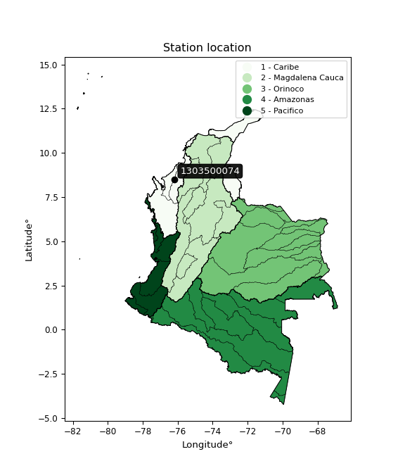</img>

</div>


## A. General information


### 1. General running parameters

• app_version: _v20260312_. • runtime: _2026-03-12 07:15:23.203550_. • Python version: _3.14.0_. • SciPy version: _1.16.3_. • Pandas version: _2.3.3_. • NumPy version: _2.3.5_. • Stations dataset (station_dataset_file): _dataset/pmax24h_in/automatic_colombia_2003_2025.csv_. • Stations catalog (station_catalog_file): _dataset/CNE.xls_. • Minimum year to eval til year_max (date_min): _1900_. • Maximum year to eval since year_min (date_max): _2025_. • Creates, save and include plots into reports (create_plot): _True_. • Plot only fit distributions with Δo > Δ (plot_only_fit): _True_. • Plot only simple graphs avoiding multiple CDFs and multiple Extreme values plots (plot_only_simple): _True_. • Eval low extreme values, if False, evaluates high extreme values (low_extreme): _False_. • Eval every SciPy distribution as logarithmic (pdist_logarithmic_on): _True_. • Standard deviation normalized (ddof): _1.0_. • Return periods to eval in years (Tr): _[2, 2.33, 5, 10, 15, 20, 25, 50, 75, 100, 200, 250, 500, 750, 1000]_. • Minimum data sample per station, 0 means any (minimum_sample): _5_. • Z-Score maximum threshold to adjust a value, 0 means disable (zscore_max): _3.5_. • Z-Score minimum threshold to adjust a value, 0 means disable (zscore_min): _-2.5_. • Avoid zeros, e.g. rain = 0 (avoid_zeros): _True_. • Avoid null values (avoid_nans): _True_. 

:file_folder:Table: [dataset.csv](../../dataset/pmax24h_in/automatic_colombia_2003_2025.csv)

> Delta Degrees of Freedom (DDOF): is a parameter used in the formulas for calculating variance and standard deviation. When ddof=0, the divisor is $N$ (the total number of observations) and this is used when your data set is the entire population. When ddof=1, the divisor is $N-1$ and this is used when your data set is a sample drawn from a larger population. Using $N-1$ provides an unbiased estimate of the population variance (known as Bessel´s correction).


### 2. Station info and location

|   id |     CODIGO | NOMBRE                        | CATEGORIA               | TECNOLOGIA                | ESTADO           | FECHA_INSTALACION   |   FECHA_SUSPENSION |   ALTITUD |   LATITUD |   LONGITUD | DEPARTAMENTO   | MUNICIPIO   | AREA_OPERATIVA                              | ENTIDAD                                                     | AREA_HIDROGRAFICA   | ZONA_HIDROGRAFICA   | SUBZONA_HIDROGRAFICA   |   CORRIENTE | Catalogo   |   Version |
|-----:|-----------:|:------------------------------|:------------------------|:--------------------------|:-----------------|:--------------------|-------------------:|----------:|----------:|-----------:|:---------------|:------------|:--------------------------------------------|:------------------------------------------------------------|:--------------------|:--------------------|:-----------------------|------------:|:-----------|----------:|
|    0 | 1303500074 | LOMA VERDE - AUT [1303500074] | Climatológica Principal | Automática con Telemetría | En Mantenimiento | 19/04/2017          |                nan |        82 |   8.50878 |   -76.1754 | Cordoba        | Montería    | Area Operativa 02 - Atlántico-Bolivar-Sucre | INSTITUTO DE HIDROLOGIA METEOROLOGIA Y ESTUDIOS AMBIENTALES | Caribe              | Sinú                | Bajo Sinú              |         nan | CNE_IDEAM  |  20251226 |

<div align="center">

Dynamic map: [:earth_americas:Google](http://maps.google.com/maps?q=8.508777778,-76.175416667) [:earth_americas:OSM](https://www.openstreetmap.org/#map=18/8.508777778/-76.175416667&layers=P) [:earth_americas:Bing](https://www.bing.com/maps?cp=8.508777778~-76.175416667&lvl=18) [:earth_americas:Apple](https://maps.apple.com/frame?center=8.508777778%2C-76.175416667&span=0.003%2C0.006)

</div>


<div align="center">

```geojson
{
  "type": "Feature",
  "geometry": {
    "type": "Point", 
    "coordinates": [-76.175416667, 8.508777778]
  }, 
  "properties": {
    "Name": "1303500074"
  }
}
```

</div>


### 3. Discrete values table and plot

<div align="center">

|               |          0 |           1 |           2 |           3 |            4 |
|:--------------|-----------:|------------:|------------:|------------:|-------------:|
| Date          | 2019       | 2020        | 2021        | 2022        | 2025         |
| Value         |  169.8     |   63.6      |   82        |   75.8      |  100.8       |
| Value_initial |  169.8     |   63.6      |   82        |   75.8      |  100.8       |
| count         |    5       |    5        |    5        |    5        |    5         |
| mean          |   98.4     |   98.4      |   98.4      |   98.4      |   98.4       |
| std           |   42.1144  |   42.1144   |   42.1144   |   42.1144   |   42.1144    |
| zscore        |    1.69538 |   -0.826321 |   -0.389416 |   -0.536634 |    0.0569877 |


</div>


<div align="center">

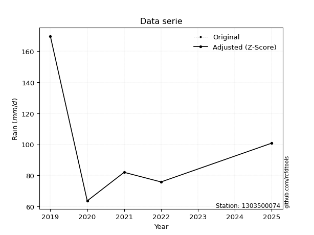</img>

</div>


> The initial value (value_initial) correspond to the initial obtained or null completed value, and value (value) is adjusted only when the initial value is outside the valid range (outlier) definite through the Z-Score value. If Z-Score is active, values out of range or outliers are replaced with the station mean value. A Z-Score (or standard score) measures how many standard deviations a data point is from the mean of a dataset, indicating its relative position; positive scores mean above the mean, negative mean below, and a score of zero is exactly at the mean, allowing for comparison of values from different distributions. It´s calculated using the formula $z=(x–μ)/σ$, where $x$ is the data point, $μ$ is the mean, and $σ$ is the standard deviation, helping identify outliers and understand probability.
>
> <sub>**Note**: In this study, "completing" (filling gaps in) and "extending" (forecasting or lengthening the historical record) rainfall data series are avoided for certain critical analyses because they introduce artificial bias and uncertainty, which can distort the statistics of rare events (extremes), alter day-to-day variability, and compromise the integrity and homogeneity of the original data. Some reasons against Completing/Extending rainfall data are: **Distortion of Extremes and Variability**: The primary issue is that most gap-filling or extension methods rely on averaging or regression with nearby stations, which inherently smooths the data. Rainfall is highly variable in space and time, with a large percentage of zero values and occasional large storms. Infilling methods often underestimate the highest values and overestimate the lowest (zero) values, which severely distorts analyses focused on flood frequency, drought severity, and intensity-duration-frequency (IDF) curves, **Loss of Data Homogeneity**: Infilled or extended data are synthetic estimates, not actual measurements. Combining these estimates with observed data can violate the assumption of data homogeneity, which requires that the data properties do not change over time. Inhomogeneity can lead to incorrect conclusions about long-term trends or changes in climate patterns, **Propagation of Errors**: Errors and biases from the original data (e.g., wind-induced undercatch, instrument errors, site changes) or the data used for imputation can propagate through the analysis, leading to unreliable hydrological models and inaccurate predictions, **Compromised Statistical Integrity**: For statistical analyses, especially those involving the frequency of events, using artificial data can introduce time bias or autocorrelation that doesn´t exist in reality, making it difficult to assess the true probability of events, **Difficulty in Validation**: It is difficult to accurately validate the quality of filled or extended data, especially for past periods where ground-truth measurements are unavailable. The reliability of imputation techniques heavily depends on the density of the surrounding station network and the complexity of the local topography.</sub>


### 4. Active continuous probability distributions from SciPy (80 of 104 available)

A Probability Density Function (PDF) describes the relative likelihood of a continuous random variable falling within a specific range, where the total area under its curve equals 1, and the area over any interval gives the actual probability for that range. Unlike discrete probabilities (like rolling a die), a PDF shows density, not direct probability for a single point (which is zero), with higher points indicating higher likelihood, often visualized as a bell curve for normal distributions.

A log of a probability density function (log-PDF) is simply the logarithm of the PDF´s value, denoted as $log(f(x))$, useful for converting multiplication of probabilities into addition, improving numerical stability with tiny numbers, and connecting to information theory concepts like entropy. Instead of dealing with very small probabilities (e.g., 0.000001), log-PDFs use negative numbers (e.g., $log(0.00001) ≈ -11.51$ that are easier for computers to handle, preventing underflow errors and simplifying complex calculations. In this study, each active probability distribution from SciPy is also evaluated in the $log$ form.

[scipy.stats](https://docs.scipy.org/doc/scipy/reference/stats.html) is a Python´s powerful submodule within the SciPy library for comprehensive statistical analysis, offering over 130 probability distributions (like Normal, Poisson, etc.), functions for descriptive stats (mean, variance), hypothesis testing (t-tests, chi-square), random variable generation, and statistical tests, making it essential for data science, modeling, and research. It provides tools to explore, model, and draw conclusions from data efficiently, working seamlessly with [NumPy](https://numpy.org/).

<div align="center">

|   id | p_dist           |   n_parameter | fit_method   | label                                                                       | active   | ref                                                                                                      |
|-----:|:-----------------|--------------:|:-------------|:----------------------------------------------------------------------------|:---------|:---------------------------------------------------------------------------------------------------------|
|    0 | alpha            |             3 | MLE          | Alpha                                                                       | True     | [:mortar_board:](https://docs.scipy.org/doc/scipy/reference/generated/scipy.stats.alpha.html)            |
|    1 | anglit           |             2 | MM           | Anglit                                                                      | True     | [:mortar_board:](https://docs.scipy.org/doc/scipy/reference/generated/scipy.stats.anglit.html)           |
|    2 | arcsine          |             2 | MM           | Arcsine                                                                     | True     | [:mortar_board:](https://docs.scipy.org/doc/scipy/reference/generated/scipy.stats.arcsine.html)          |
|    3 | argus            |             3 | MLE          | Argus                                                                       | True     | [:mortar_board:](https://docs.scipy.org/doc/scipy/reference/generated/scipy.stats.argus.html)            |
|    4 | beta             |             4 | MLE          | Beta                                                                        | True     | [:mortar_board:](https://docs.scipy.org/doc/scipy/reference/generated/scipy.stats.beta.html)             |
|    5 | betaprime        |             4 | MLE          | Beta prime                                                                  | True     | [:mortar_board:](https://docs.scipy.org/doc/scipy/reference/generated/scipy.stats.betaprime.html)        |
|    6 | bradford         |             3 | MLE          | Bradford                                                                    | True     | [:mortar_board:](https://docs.scipy.org/doc/scipy/reference/generated/scipy.stats.bradford.html)         |
|    7 | burr             |             4 | MLE          | Burr (Type III)                                                             | True     | [:mortar_board:](https://docs.scipy.org/doc/scipy/reference/generated/scipy.stats.burr.html)             |
|    8 | burr12           |             4 | MLE          | Burr (Type III) 12                                                          | True     | [:mortar_board:](https://docs.scipy.org/doc/scipy/reference/generated/scipy.stats.burr12.html)           |
|    9 | cosine           |             2 | MLE          | Cosine                                                                      | True     | [:mortar_board:](https://docs.scipy.org/doc/scipy/reference/generated/scipy.stats.cosine.html)           |
|   10 | crystalball      |             4 | MLE          | Crystalball                                                                 | True     | [:mortar_board:](https://docs.scipy.org/doc/scipy/reference/generated/scipy.stats.crystalball.html)      |
|   11 | dgamma           |             3 | MLE          | Double gamma                                                                | True     | [:mortar_board:](https://docs.scipy.org/doc/scipy/reference/generated/scipy.stats.dgamma.html)           |
|   12 | dweibull         |             3 | MLE          | Double Weibull                                                              | True     | [:mortar_board:](https://docs.scipy.org/doc/scipy/reference/generated/scipy.stats.dweibull.html)         |
|   13 | erlang           |             3 | MLE          | Erlang                                                                      | True     | [:mortar_board:](https://docs.scipy.org/doc/scipy/reference/generated/scipy.stats.erlang.html)           |
|   14 | exponnorm        |             3 | MLE          | Exponentially modified Normal                                               | True     | [:mortar_board:](https://docs.scipy.org/doc/scipy/reference/generated/scipy.stats.exponnorm.html)        |
|   15 | exponpow         |             3 | MLE          | Exponential power                                                           | True     | [:mortar_board:](https://docs.scipy.org/doc/scipy/reference/generated/scipy.stats.exponpow.html)         |
|   16 | exponweib        |             4 | MLE          | Exponentiated Weibull                                                       | True     | [:mortar_board:](https://docs.scipy.org/doc/scipy/reference/generated/scipy.stats.exponweib.html)        |
|   17 | f                |             4 | MLE          | F                                                                           | True     | [:mortar_board:](https://docs.scipy.org/doc/scipy/reference/generated/scipy.stats.f.html)                |
|   18 | fatiguelife      |             3 | MLE          | Fatigue-life (Birnbaum-Saunders)                                            | True     | [:mortar_board:](https://docs.scipy.org/doc/scipy/reference/generated/scipy.stats.fatiguelife.html)      |
|   19 | foldnorm         |             3 | MM           | Fold Normal                                                                 | True     | [:mortar_board:](https://docs.scipy.org/doc/scipy/reference/generated/scipy.stats.foldnorm.html)         |
|   20 | gamma            |             3 | MLE          | Gamma                                                                       | True     | [:mortar_board:](https://docs.scipy.org/doc/scipy/reference/generated/scipy.stats.gamma.html)            |
|   21 | gausshyper       |             6 | MLE          | Gauss hypergeometric                                                        | True     | [:mortar_board:](https://docs.scipy.org/doc/scipy/reference/generated/scipy.stats.gausshyper.html)       |
|   22 | genexpon         |             5 | MLE          | Generalized exponential                                                     | True     | [:mortar_board:](https://docs.scipy.org/doc/scipy/reference/generated/scipy.stats.genexpon.html)         |
|   23 | genextreme       |             3 | MLE          | Generalized exponential                                                     | True     | [:mortar_board:](https://docs.scipy.org/doc/scipy/reference/generated/scipy.stats.genextreme.html)       |
|   24 | gengamma         |             4 | MLE          | Generalized gamma                                                           | True     | [:mortar_board:](https://docs.scipy.org/doc/scipy/reference/generated/scipy.stats.gengamma.html)         |
|   25 | genhalflogistic  |             3 | MLE          | Generalized half-logistic                                                   | True     | [:mortar_board:](https://docs.scipy.org/doc/scipy/reference/generated/scipy.stats.genhalflogistic.html)  |
|   26 | genlogistic      |             3 | MLE          | Generalized logistic                                                        | True     | [:mortar_board:](https://docs.scipy.org/doc/scipy/reference/generated/scipy.stats.genlogistic.html)      |
|   27 | gennorm          |             3 | MLE          | Generalized Normal                                                          | True     | [:mortar_board:](https://docs.scipy.org/doc/scipy/reference/generated/scipy.stats.gennorm.html)          |
|   28 | genpareto        |             3 | MLE          | Generalized Pareto                                                          | True     | [:mortar_board:](https://docs.scipy.org/doc/scipy/reference/generated/scipy.stats.genpareto.html)        |
|   29 | gompertz         |             3 | MLE          | Gompertz (or truncated Gumbel)                                              | True     | [:mortar_board:](https://docs.scipy.org/doc/scipy/reference/generated/scipy.stats.gompertz.html)         |
|   30 | gumbel_l         |             2 | MM           | Gumbel Left Skew                                                            | True     | [:mortar_board:](https://docs.scipy.org/doc/scipy/reference/generated/scipy.stats.gumbel_l.html)         |
|   31 | gumbel_r         |             2 | MM           | Gumbel Right Skew                                                           | True     | [:mortar_board:](https://docs.scipy.org/doc/scipy/reference/generated/scipy.stats.gumbel_r.html)         |
|   32 | halfgennorm      |             3 | MLE          | Upper half of a generalized normal                                          | True     | [:mortar_board:](https://docs.scipy.org/doc/scipy/reference/generated/scipy.stats.halfgennorm.html)      |
|   33 | halflogistic     |             2 | MM           | Half-logistic                                                               | True     | [:mortar_board:](https://docs.scipy.org/doc/scipy/reference/generated/scipy.stats.halflogistic.html)     |
|   34 | halfnorm         |             2 | MM           | Half Normal                                                                 | True     | [:mortar_board:](https://docs.scipy.org/doc/scipy/reference/generated/scipy.stats.halfnorm.html)         |
|   35 | hypsecant        |             2 | MM           | hyperbolic secant                                                           | True     | [:mortar_board:](https://docs.scipy.org/doc/scipy/reference/generated/scipy.stats.hypsecant.html)        |
|   36 | invgamma         |             3 | MLE          | Inverted gamma                                                              | True     | [:mortar_board:](https://docs.scipy.org/doc/scipy/reference/generated/scipy.stats.invgamma.html)         |
|   37 | invgauss         |             3 | MLE          | Inverse Gaussian                                                            | True     | [:mortar_board:](https://docs.scipy.org/doc/scipy/reference/generated/scipy.stats.invgauss.html)         |
|   38 | invweibull       |             3 | MLE          | Inverted Weibull                                                            | True     | [:mortar_board:](https://docs.scipy.org/doc/scipy/reference/generated/scipy.stats.invweibull.html)       |
|   39 | johnsonsb        |             4 | MLE          | Johnson SB                                                                  | True     | [:mortar_board:](https://docs.scipy.org/doc/scipy/reference/generated/scipy.stats.johnsonsb.html)        |
|   40 | johnsonsu        |             4 | MLE          | Johnson Su                                                                  | True     | [:mortar_board:](https://docs.scipy.org/doc/scipy/reference/generated/scipy.stats.johnsonsu.html)        |
|   41 | kappa3           |             3 | MLE          | Kappa 3                                                                     | True     | [:mortar_board:](https://docs.scipy.org/doc/scipy/reference/generated/scipy.stats.kappa3.html)           |
|   42 | kappa4           |             4 | MLE          | Kappa 4                                                                     | True     | [:mortar_board:](https://docs.scipy.org/doc/scipy/reference/generated/scipy.stats.kappa4.html)           |
|   43 | ksone            |             3 | MLE          | Kolmogorov-Smirnov one-sided test statistic distribution                    | True     | [:mortar_board:](https://docs.scipy.org/doc/scipy/reference/generated/scipy.stats.ksone.html)            |
|   44 | kstwobign        |             2 | MLE          | Limiting distribution of scaled Kolmogorov-Smirnov two-sided test statistic | True     | [:mortar_board:](https://docs.scipy.org/doc/scipy/reference/generated/scipy.stats.kstwobign.html)        |
|   45 | laplace          |             2 | MM           | Laplace                                                                     | True     | [:mortar_board:](https://docs.scipy.org/doc/scipy/reference/generated/scipy.stats.laplace.html)          |
|   46 | levy_l           |             2 | MLE          | Left-skewed Levy                                                            | True     | [:mortar_board:](https://docs.scipy.org/doc/scipy/reference/generated/scipy.stats.levy_l.html)           |
|   47 | loggamma         |             3 | MLE          | Log gamma                                                                   | True     | [:mortar_board:](https://docs.scipy.org/doc/scipy/reference/generated/scipy.stats.loggamma.html)         |
|   48 | logistic         |             2 | MM           | Logistic (or Sech-squared)                                                  | True     | [:mortar_board:](https://docs.scipy.org/doc/scipy/reference/generated/scipy.stats.logistic.html)         |
|   49 | loglaplace       |             3 | MLE          | Log-Laplace                                                                 | True     | [:mortar_board:](https://docs.scipy.org/doc/scipy/reference/generated/scipy.stats.loglaplace.html)       |
|   50 | lomax            |             3 | MLE          | Lomax (Pareto of the second kind)                                           | True     | [:mortar_board:](https://docs.scipy.org/doc/scipy/reference/generated/scipy.stats.lomax.html)            |
|   51 | maxwell          |             2 | MM           | Maxwell                                                                     | True     | [:mortar_board:](https://docs.scipy.org/doc/scipy/reference/generated/scipy.stats.maxwell.html)          |
|   52 | mielke           |             4 | MLE          | Mielke Beta-Kappa / Dagum                                                   | True     | [:mortar_board:](https://docs.scipy.org/doc/scipy/reference/generated/scipy.stats.mielke.html)           |
|   53 | moyal            |             2 | MM           | Moyal                                                                       | True     | [:mortar_board:](https://docs.scipy.org/doc/scipy/reference/generated/scipy.stats.moyal.html)            |
|   54 | nakagami         |             3 | MLE          | Nakagami                                                                    | True     | [:mortar_board:](https://docs.scipy.org/doc/scipy/reference/generated/scipy.stats.nakagami.html)         |
|   55 | ncf              |             5 | MLE          | Non-central F distribution                                                  | True     | [:mortar_board:](https://docs.scipy.org/doc/scipy/reference/generated/scipy.stats.ncf.html)              |
|   56 | nct              |             4 | MLE          | Non-central Student’s t                                                     | True     | [:mortar_board:](https://docs.scipy.org/doc/scipy/reference/generated/scipy.stats.nct.html)              |
|   57 | norm             |             2 | MM           | Normal                                                                      | True     | [:mortar_board:](https://docs.scipy.org/doc/scipy/reference/generated/scipy.stats.norm.html)             |
|   58 | pearson3         |             3 | MM           | Pearson type III                                                            | True     | [:mortar_board:](https://docs.scipy.org/doc/scipy/reference/generated/scipy.stats.pearson3.html)         |
|   59 | powerlaw         |             3 | MLE          | Power-function                                                              | True     | [:mortar_board:](https://docs.scipy.org/doc/scipy/reference/generated/scipy.stats.powerlaw.html)         |
|   60 | rayleigh         |             2 | MM           | Rayleigh                                                                    | True     | [:mortar_board:](https://docs.scipy.org/doc/scipy/reference/generated/scipy.stats.rayleigh.html)         |
|   61 | rdist            |             3 | MLE          | R-distributed (symmetric beta)                                              | True     | [:mortar_board:](https://docs.scipy.org/doc/scipy/reference/generated/scipy.stats.rdist.html)            |
|   62 | rice             |             3 | MLE          | Rice                                                                        | True     | [:mortar_board:](https://docs.scipy.org/doc/scipy/reference/generated/scipy.stats.rice.html)             |
|   63 | semicircular     |             2 | MM           | Semicircular                                                                | True     | [:mortar_board:](https://docs.scipy.org/doc/scipy/reference/generated/scipy.stats.semicircular.html)     |
|   64 | skewnorm         |             3 | MLE          | Skew normal                                                                 | True     | [:mortar_board:](https://docs.scipy.org/doc/scipy/reference/generated/scipy.stats.skewnorm.html)         |
|   65 | t                |             3 | MLE          | Student’s t                                                                 | True     | [:mortar_board:](https://docs.scipy.org/doc/scipy/reference/generated/scipy.stats.t.html)                |
|   66 | trapezoid        |             4 | MLE          | Trapezoid                                                                   | True     | [:mortar_board:](https://docs.scipy.org/doc/scipy/reference/generated/scipy.stats.trapezoid.html)        |
|   67 | triang           |             3 | MLE          | Triangular                                                                  | True     | [:mortar_board:](https://docs.scipy.org/doc/scipy/reference/generated/scipy.stats.triang.html)           |
|   68 | truncexpon       |             3 | MLE          | Truncated exponential                                                       | True     | [:mortar_board:](https://docs.scipy.org/doc/scipy/reference/generated/scipy.stats.truncexpon.html)       |
|   69 | truncnorm        |             4 | MLE          | Truncated normal                                                            | True     | [:mortar_board:](https://docs.scipy.org/doc/scipy/reference/generated/scipy.stats.truncnorm.html)        |
|   70 | truncpareto      |             4 | MLE          | Upper truncated Pareto                                                      | True     | [:mortar_board:](https://docs.scipy.org/doc/scipy/reference/generated/scipy.stats.truncpareto.html)      |
|   71 | truncweibull_min |             5 | MLE          | Doubly truncated Weibull minimum                                            | True     | [:mortar_board:](https://docs.scipy.org/doc/scipy/reference/generated/scipy.stats.truncweibull_min.html) |
|   72 | tukeylambda      |             3 | MLE          | Tukey-Lamdba                                                                | True     | [:mortar_board:](https://docs.scipy.org/doc/scipy/reference/generated/scipy.stats.tukeylambda.html)      |
|   73 | uniform          |             2 | MLE          | Uniform                                                                     | True     | [:mortar_board:](https://docs.scipy.org/doc/scipy/reference/generated/scipy.stats.uniform.html)          |
|   74 | vonmises         |             3 | MLE          | Von Mises                                                                   | True     | [:mortar_board:](https://docs.scipy.org/doc/scipy/reference/generated/scipy.stats.vonmises.html)         |
|   75 | vonmises_line    |             3 | MLE          | Von Mises line                                                              | True     | [:mortar_board:](https://docs.scipy.org/doc/scipy/reference/generated/scipy.stats.vonmises_line.html)    |
|   76 | wald             |             2 | MM           | Wald                                                                        | True     | [:mortar_board:](https://docs.scipy.org/doc/scipy/reference/generated/scipy.stats.wald.html)             |
|   77 | weibull_max      |             3 | MLE          | Weibull maximum                                                             | True     | [:mortar_board:](https://docs.scipy.org/doc/scipy/reference/generated/scipy.stats.weibull_max.html)      |
|   78 | weibull_min      |             3 | MLE          | Weibull minimum                                                             | True     | [:mortar_board:](https://docs.scipy.org/doc/scipy/reference/generated/scipy.stats.weibull_min.html)      |
|   79 | wrapcauchy       |             3 | MLE          | Wrapped  Cauchy                                                             | True     | [:mortar_board:](https://docs.scipy.org/doc/scipy/reference/generated/scipy.stats.wrapcauchy.html)       |

</div>

> **n_parameter:** # arguments & localization & scale.
>
> **Fit methods:** (MLE) maximum likelihood, (MM) L-moments.
>
>**Inactive** (With the only purpose of prevent loops, zero divisions, infinite values, over high estimated values or horizontal trending for recurrence intervals estimations, the follow distributions were disabled.)**:** lognorm, norminvgauss, powernorm, powerlognorm, cauchy, halfcauchy, foldcauchy, skewcauchy, chi2, expon, fisk, genhyperbolic, geninvgauss, gibrat, kstwo, laplace_asymmetric, levy, levy_stable, ncx2, pareto, rel_breitwigner, recipinvgauss, studentized_range, loguniform, 


## B. Probability (PDF) vs. Empirical (EDF) distributions functions

A continuous probability distribution (CPD) describes probabilities for variables that can take any value within a range (like rain any time), unlike discrete variables with specific outcomes (like temperature). It uses a Probability Density Function (PDF), a curve where the total area under it equals 1, and the probability of the variable falling within an interval (a to b) is found by calculating the area under the curve between those points. A key feature is that the probability of hitting any single exact value is zero, so probabilities are always expressed for ranges, e.g., $P(a ≤ X ≤ b)$.

<div align="center">

Distributions parameters from station values
|     |    station | p_dist              |   n |              loc |          scale | shape                  | shape1                | shape2                | shape3             |
|----:|-----------:|:--------------------|----:|-----------------:|---------------:|:-----------------------|:----------------------|:----------------------|:-------------------|
|   0 | 1303500074 | alpha               |   5 |      40.614      |   76.1111      | 1.7422571631015729     |                       |                       |                    |
|   1 | 1303500074 | anglit              |   5 |      98.4        |  110.195       |                        |                       |                       |                    |
|   2 | 1303500074 | arcsine             |   5 |      45.1291     |  106.542       |                        |                       |                       |                    |
|   3 | 1303500074 | argus               |   5 |      16.7617     |  161.155       | 2.261808561856706e-06  |                       |                       |                    |
|   4 | 1303500074 | beta                |   5 |      63.6        |  106.296       | 0.15666867838719395    | 0.4656952610960303    |                       |                    |
|   5 | 1303500074 | betaprime           |   5 |      -1.23575    |    4.10829     | 226.75424267065497     | 10.423927462591251    |                       |                    |
|   6 | 1303500074 | bradford            |   5 |      63.5836     |  106.807       | 72.77735998768689      |                       |                       |                    |
|   7 | 1303500074 | burr                |   5 |      -0.317631   |   23.8123      | 4.121549733531573      | 146.04740533172458    |                       |                    |
|   8 | 1303500074 | burr12              |   5 |      -2.43515    |   65.6794      | 736.2318739749801      | 0.0036751883013654736 |                       |                    |
|   9 | 1303500074 | cosine              |   5 |     104.374      |   31.9511      |                        |                       |                       |                    |
|  10 | 1303500074 | crystalball         |   5 |      98.4        |   37.6682      | 6845.622660118883      | 9159.847160867026     |                       |                    |
|  11 | 1303500074 | dgamma              |   5 |      82          |   42.0442      | 0.3664901766053701     |                       |                       |                    |
|  12 | 1303500074 | dweibull            |   5 |      75.8        |   32.4136      | 0.8661660150434889     |                       |                       |                    |
|  13 | 1303500074 | erlang              |   5 |      63.6        |   30.1384      | 0.14441310700193694    |                       |                       |                    |
|  14 | 1303500074 | exponnorm           |   5 |      63.5664     |    0.0102309   | 3405.7444647828215     |                       |                       |                    |
|  15 | 1303500074 | exponpow            |   5 |      63.6        |    7.85061     | 0.1305800436054621     |                       |                       |                    |
|  16 | 1303500074 | exponweib           |   5 |      63.6        |   35.5322      | 0.9791336266763833     | 0.9045729808380698    |                       |                    |
|  17 | 1303500074 | f                   |   5 |      52.8993     |   24.8875      | 50724.62606799623      | 3.793509714040627     |                       |                    |
|  18 | 1303500074 | fatiguelife         |   5 |      63.6        |    3.73165e-06 | 2894.5828880498634     |                       |                       |                    |
|  19 | 1303500074 | foldnorm            |   5 |      47.9108     |   62.2204      | 0.17420213708768784    |                       |                       |                    |
|  20 | 1303500074 | gamma               |   5 |      63.6        |   36.3289      | 0.13744273082006664    |                       |                       |                    |
|  21 | 1303500074 | gausshyper          |   5 |      63.6        |  107.784       | 0.49184629089575593    | 0.7949480944829805    | 1.3071827012023967    | 1.3037482463911485 |
|  22 | 1303500074 | genexpon            |   5 |      63.6        |   44.9162      | 1.290693915704946      | 0.24079831585649342   | 3.264988208078068e-10 |                    |
|  23 | 1303500074 | genextreme          |   5 |      64.6215     |    6.27068     | -6.13877904968644      |                       |                       |                    |
|  24 | 1303500074 | gengamma            |   5 |      63.6        |   35.5324      | 0.9791323935843389     | 0.9045684555780134    |                       |                    |
|  25 | 1303500074 | genhalflogistic     |   5 |      55.6246     |  120.656       | 1.0567608502327919     |                       |                       |                    |
|  26 | 1303500074 | genlogistic         |   5 |     -97.6217     |   23.931       | 1841.4981557758156     |                       |                       |                    |
|  27 | 1303500074 | gennorm             |   5 |      82          |    0.061246    | 0.2645563234673336     |                       |                       |                    |
|  28 | 1303500074 | genpareto           |   5 |      -1.1692     |  280.926       | -1.643137711389901     |                       |                       |                    |
|  29 | 1303500074 | gompertz            |   5 |      63.6        |    3.42816e+13 | 906084842437.4065      |                       |                       |                    |
|  30 | 1303500074 | gumbel_l            |   5 |     115.353      |   29.3698      |                        |                       |                       |                    |
|  31 | 1303500074 | gumbel_r            |   5 |      81.4473     |   29.3698      |                        |                       |                       |                    |
|  32 | 1303500074 | halfgennorm         |   5 |      63.6        |    0.0564283   | 0.25269601297308997    |                       |                       |                    |
|  33 | 1303500074 | halflogistic        |   5 |      53.7544     |   32.205       |                        |                       |                       |                    |
|  34 | 1303500074 | halfnorm            |   5 |      48.542      |   62.4877      |                        |                       |                       |                    |
|  35 | 1303500074 | hypsecant           |   5 |      98.4        |   23.9803      |                        |                       |                       |                    |
|  36 | 1303500074 | invgamma            |   5 |      52.8985     |   47.2049      | 1.8967254610610635     |                       |                       |                    |
|  37 | 1303500074 | invgauss            |   5 |      57.9338     |   27.365       | 1.478761749626306      |                       |                       |                    |
|  38 | 1303500074 | invweibull          |   5 |      63.6        |    1.33279     | 0.04475445557858694    |                       |                       |                    |
|  39 | 1303500074 | johnsonsb           |   5 |      63.6        |  106.2         | 0.7502041120227637     | 0.04657761248604198   |                       |                    |
|  40 | 1303500074 | johnsonsu           |   5 |      63.6        |    4.10666e-11 | -2.8936080798881516    | 0.1389452893584746    |                       |                    |
|  41 | 1303500074 | kappa3              |   5 |      63.6        |   83.2935      | 9.454722131233666      |                       |                       |                    |
|  42 | 1303500074 | kappa4              |   5 |      51.1572     |  119.531       | 1.1162337985986284     | 1.0060258427605406    |                       |                    |
|  43 | 1303500074 | ksone               |   5 |      52.98       |  127.44        | 1.0                    |                       |                       |                    |
|  44 | 1303500074 | kstwobign           |   5 |      -5.29556    |  120.082       |                        |                       |                       |                    |
|  45 | 1303500074 | laplace             |   5 |      98.4        |   26.6355      |                        |                       |                       |                    |
|  46 | 1303500074 | levy_l              |   5 |     177.038      |   27.7015      |                        |                       |                       |                    |
|  47 | 1303500074 | loggamma            |   5 |  -14599          | 1892.81        | 2356.7600241755554     |                       |                       |                    |
|  48 | 1303500074 | logistic            |   5 |      98.4        |   20.7676      |                        |                       |                       |                    |
|  49 | 1303500074 | loglaplace          |   5 |      -0.251571   |   82.2516      | 3.956440064150087      |                       |                       |                    |
|  50 | 1303500074 | lomax               |   5 |      63.6        |    3.31553e+11 | 3599425376.97062       |                       |                       |                    |
|  51 | 1303500074 | maxwell             |   5 |       9.1421     |   55.9341      |                        |                       |                       |                    |
|  52 | 1303500074 | mielke              |   5 |      36.1165     |    1.68231     | 4537.252738788873      | 2.3567543888386373    |                       |                    |
|  53 | 1303500074 | moyal               |   5 |      76.8589     |   16.9567      |                        |                       |                       |                    |
|  54 | 1303500074 | nakagami            |   5 |      63.6        |   68.6197      | 0.27996305559296375    |                       |                       |                    |
|  55 | 1303500074 | ncf                 |   5 |      -3.30927    |   91.8147      | 265.35159785202427     | 22.10534882261897     | 0.5508844063124838    |                    |
|  56 | 1303500074 | nct                 |   5 |      -0.450338   |    1.40761     | 5.781497598437788      | 60.2788831760503      |                       |                    |
|  57 | 1303500074 | norm                |   5 |      98.4        |   37.6682      |                        |                       |                       |                    |
|  58 | 1303500074 | pearson3            |   5 |      98.4        |   37.6682      | 1.1447288543926897     |                       |                       |                    |
|  59 | 1303500074 | powerlaw            |   5 |      63.6        |  106.2         | 0.11845781604744628    |                       |                       |                    |
|  60 | 1303500074 | rayleigh            |   5 |      26.3385     |   57.4968      |                        |                       |                       |                    |
|  61 | 1303500074 | rdist               |   5 |      82.2397     |   18.6397      | 1.3288861059704264     |                       |                       |                    |
|  62 | 1303500074 | rice                |   5 |      40.97       |   48.5649      | 0.00029858138300379623 |                       |                       |                    |
|  63 | 1303500074 | semicircular        |   5 |      98.4        |   75.3365      |                        |                       |                       |                    |
|  64 | 1303500074 | skewnorm            |   5 |      63.6        |   51.2869      | 18587047.187780757     |                       |                       |                    |
|  65 | 1303500074 | t                   |   5 |      98.4001     |   37.6636      | 451448.76890837797     |                       |                       |                    |
|  66 | 1303500074 | trapezoid           |   5 |      52.98       |  127.44        | 1.0                    | 1.0                   |                       |                    |
|  67 | 1303500074 | triang              |   5 |       4.99313    |  164.807       | 0.999999999991189      |                       |                       |                    |
|  68 | 1303500074 | truncexpon          |   5 |      63.6        |   89.202       | 1.1905570612892418     |                       |                       |                    |
|  69 | 1303500074 | truncnorm           |   5 | -152417          | 2397.5         | 63.599898272454816     | 176.52431041545378    |                       |                    |
|  70 | 1303500074 | truncpareto         |   5 |      63.3229     |    0.277058    | 0.26487308892721795    | 384.3137483596575     |                       |                    |
|  71 | 1303500074 | truncweibull_min    |   5 |      63.6        |   97.9847      | 0.9696750670632268     | 3.683594029652081e-17 | 1.084385799015935     |                    |
|  72 | 1303500074 | tukeylambda         |   5 |      82.2        |   25.5198      | 1.3720343609784436     |                       |                       |                    |
|  73 | 1303500074 | uniform             |   5 |      63.6        |  106.2         |                        |                       |                       |                    |
|  74 | 1303500074 | vonmises            |   5 |       0.380829   |    1           | 23.387697720766827     |                       |                       |                    |
|  75 | 1303500074 | vonmises_line       |   5 |      88.7119     |   25.8111      | 1.0383693929002473     |                       |                       |                    |
|  76 | 1303500074 | wald                |   5 |      60.7318     |   37.6682      |                        |                       |                       |                    |
|  77 | 1303500074 | weibull_max         |   5 |     169.8        |    1.53473     | 0.19324443321527912    |                       |                       |                    |
|  78 | 1303500074 | weibull_min         |   5 |      63.6        |   34.9626      | 0.1377018508446959     |                       |                       |                    |
|  79 | 1303500074 | wrapcauchy          |   5 |      63.6        |   16.9023      | 0.5850262938291755     |                       |                       |                    |
|  80 | 1303500074 | logalpha            |   5 |       3.51611    |    3.13362     | 3.4171523348747748     |                       |                       |                    |
|  81 | 1303500074 | loganglit           |   5 |       4.52704    |    0.988437    |                        |                       |                       |                    |
|  82 | 1303500074 | logarcsine          |   5 |       4.04919    |    0.955697    |                        |                       |                       |                    |
|  83 | 1303500074 | logargus            |   5 |       3.79146    |    1.41565     | 3.822555401258285e-05  |                       |                       |                    |
|  84 | 1303500074 | logbeta             |   5 |       4.15261    |    1.15751     | 0.3957688161685548     | 0.9239320279349945    |                       |                    |
|  85 | 1303500074 | logbetaprime        |   5 |      -1.10379    |    9.75586     | 463.13849340138745     | 804.2327659607984     |                       |                    |
|  86 | 1303500074 | logbradford         |   5 |       4.15261    |    0.98201     | 0.9847746508948687     |                       |                       |                    |
|  87 | 1303500074 | logburr             |   5 |       2.69492    |    0.603189    | 7.467939356907918      | 1929.1144369785266    |                       |                    |
|  88 | 1303500074 | logburr12           |   5 |    -188.708      |  192.855       | 138954.61251422524     | 0.003662012261115437  |                       |                    |
|  89 | 1303500074 | logcosine           |   5 |       4.56757    |    0.283296    |                        |                       |                       |                    |
|  90 | 1303500074 | logcrystalball      |   5 |       4.52704    |    0.337881    | 1755.3824343035176     | 60.259412294670625    |                       |                    |
|  91 | 1303500074 | logdgamma           |   5 |       4.40672    |    0.266579    | 0.6948200929067987     |                       |                       |                    |
|  92 | 1303500074 | logdweibull         |   5 |       4.40672    |    0.266584    | 0.7895209780252638     |                       |                       |                    |
|  93 | 1303500074 | logerlang           |   5 |       4.15261    |    0.483137    | 0.14477977409669027    |                       |                       |                    |
|  94 | 1303500074 | logexponnorm        |   5 |       4.15228    |    9.82289e-05 | 3783.331481443769      |                       |                       |                    |
|  95 | 1303500074 | logexponpow         |   5 |       4.15261    |    1.78863     | 0.16377606259446537    |                       |                       |                    |
|  96 | 1303500074 | logexponweib        |   5 |       4.15261    |    0.684646    | 0.1219375518695015     | 1.0784925765333       |                       |                    |
|  97 | 1303500074 | logf                |   5 |       4.15261    |    0.437808    | 1.1463690380025495     | 2097.568647316508     |                       |                    |
|  98 | 1303500074 | logfatiguelife      |   5 |       4.07473    |    0.31397     | 0.927212253592006      |                       |                       |                    |
|  99 | 1303500074 | logfoldnorm         |   5 |       4.03232    |    0.423361    | 1.0026640639829667     |                       |                       |                    |
| 100 | 1303500074 | loggamma            |   5 |       4.15261    |    0.403761    | 0.4858298173129978     |                       |                       |                    |
| 101 | 1303500074 | loggausshyper       |   5 |       4.15261    |    1.28883     | 0.14475939047707304    | 1.3791865742240241    | 1.4825658655975733    | 0.8940656877916959 |
| 102 | 1303500074 | loggenexpon         |   5 |       4.15261    |    0.682488    | 1.7395478026823339     | 0.17809570540865988   | 1.2776480802720105    |                    |
| 103 | 1303500074 | loggenextreme       |   5 |       4.34276    |    0.213013    | -0.26488379005391616   |                       |                       |                    |
| 104 | 1303500074 | loggengamma         |   5 |       4.15261    |    0.907588    | 0.3179363668227061     | 1.489215506123314     |                       |                    |
| 105 | 1303500074 | loggenhalflogistic  |   5 |       4.04108    |    1.16527     | 1.0655934515578709     |                       |                       |                    |
| 106 | 1303500074 | loggenlogistic      |   5 |       2.7382     |    0.243712    | 825.0365847063545      |                       |                       |                    |
| 107 | 1303500074 | loggennorm          |   5 |       4.40672    |    0.0102921   | 0.38378138549885366    |                       |                       |                    |
| 108 | 1303500074 | loggenpareto        |   5 |      -0.0200386  |   17.9954      | -3.491086526108127     |                       |                       |                    |
| 109 | 1303500074 | loggompertz         |   5 |       4.15261    |    2.24119     | 5.104671629745116      |                       |                       |                    |
| 110 | 1303500074 | loggumbel_l         |   5 |       4.6791     |    0.263445    |                        |                       |                       |                    |
| 111 | 1303500074 | loggumbel_r         |   5 |       4.37497    |    0.263445    |                        |                       |                       |                    |
| 112 | 1303500074 | loghalfgennorm      |   5 |       4.15259    |    1.22952e-08 | 0.12812833728354       |                       |                       |                    |
| 113 | 1303500074 | loghalflogistic     |   5 |       4.12657    |    0.288876    |                        |                       |                       |                    |
| 114 | 1303500074 | loghalfnorm         |   5 |       4.07982    |    0.56051     |                        |                       |                       |                    |
| 115 | 1303500074 | loghypsecant        |   5 |       4.52704    |    0.215102    |                        |                       |                       |                    |
| 116 | 1303500074 | loginvgamma         |   5 |      -0.29957    | 1065.95        | 222.2226737666085      |                       |                       |                    |
| 117 | 1303500074 | loginvgauss         |   5 |       4.02109    |    0.811936    | 0.6231415444194408     |                       |                       |                    |
| 118 | 1303500074 | loginvweibull       |   5 |       3.53856    |    0.804204    | 3.775212933562937      |                       |                       |                    |
| 119 | 1303500074 | logjohnsonsb        |   5 |       4.15261    |    2.01469     | 1.1930349675104974     | 0.08536304041580377   |                       |                    |
| 120 | 1303500074 | logjohnsonsu        |   5 |       4.05349    |    0.00403954  | -6.532492134547833     | 1.262436299973119     |                       |                    |
| 121 | 1303500074 | logkappa3           |   5 |       4.15261    |    0.981585    | 3711.9326791761705     |                       |                       |                    |
| 122 | 1303500074 | logkappa4           |   5 |       4.05991    |    1.17122     | 1.0862651322632493     | 1.0825172849996108    |                       |                    |
| 123 | 1303500074 | logksone            |   5 |       4.05441    |    1.17841     | 1.0                    |                       |                       |                    |
| 124 | 1303500074 | logkstwobign        |   5 |       3.50639    |    1.1752      |                        |                       |                       |                    |
| 125 | 1303500074 | loglaplace          |   5 |       4.52704    |    0.238918    |                        |                       |                       |                    |
| 126 | 1303500074 | loglevy_l           |   5 |       5.19475    |    0.230083    |                        |                       |                       |                    |
| 127 | 1303500074 | logloggamma         |   5 |     -83.3749     |   12.2509      | 1306.9260140257718     |                       |                       |                    |
| 128 | 1303500074 | loglogistic         |   5 |       4.52704    |    0.186284    |                        |                       |                       |                    |
| 129 | 1303500074 | logloglaplace       |   5 |      -0.0117125  |    4.41843     | 18.15803640263526      |                       |                       |                    |
| 130 | 1303500074 | loglomax            |   5 |       4.15261    |   19.1003      | 49.98363471490899      |                       |                       |                    |
| 131 | 1303500074 | logmaxwell          |   5 |       3.7264     |    0.501724    |                        |                       |                       |                    |
| 132 | 1303500074 | logmielke           |   5 |       2.58156    |    1.05118     | 364.3805375459906      | 7.405626958757303     |                       |                    |
| 133 | 1303500074 | logmoyal            |   5 |       4.33382    |    0.1521      |                        |                       |                       |                    |
| 134 | 1303500074 | lognakagami         |   5 |       4.15261    |    0.632032    | 0.21677779345091022    |                       |                       |                    |
| 135 | 1303500074 | logncf              |   5 |       3.89101    |    0.486049    | 985.7275709236935      | 8.119324511063338     | 6.867464507352186     |                    |
| 136 | 1303500074 | lognct              |   5 |       0.296683   |    0.077749    | 90.84084943097156      | 53.91403958791332     |                       |                    |
| 137 | 1303500074 | lognorm             |   5 |       4.52704    |    0.337881    |                        |                       |                       |                    |
| 138 | 1303500074 | logpearson3         |   5 |       4.52704    |    0.337881    | 0.8442046612964341     |                       |                       |                    |
| 139 | 1303500074 | logpowerlaw         |   5 |       4.15261    |    0.982008    | 0.12997028904891056    |                       |                       |                    |
| 140 | 1303500074 | lograyleigh         |   5 |       3.88065    |    0.515742    |                        |                       |                       |                    |
| 141 | 1303500074 | logrdist            |   5 |       4.72968    |    0.577065    | 1.0678833195522677     |                       |                       |                    |
| 142 | 1303500074 | logrice             |   5 |       3.97419    |    0.458149    | 0.0002615940462130556  |                       |                       |                    |
| 143 | 1303500074 | logsemicircular     |   5 |       4.52704    |    0.675762    |                        |                       |                       |                    |
| 144 | 1303500074 | logskewnorm         |   5 |       4.15261    |    0.504327    | 17222180.462096132     |                       |                       |                    |
| 145 | 1303500074 | logt                |   5 |       4.52704    |    0.33788     | 828284527.6911176      |                       |                       |                    |
| 146 | 1303500074 | logtrapezoid        |   5 |       4.05441    |    1.17841     | 1.0                    | 1.0                   |                       |                    |
| 147 | 1303500074 | logtriang           |   5 |       3.69506    |    1.43957     | 0.9999996929559603     |                       |                       |                    |
| 148 | 1303500074 | logtruncexpon       |   5 |       4.15261    |    1.08342     | 0.9064049780648129     |                       |                       |                    |
| 149 | 1303500074 | logtruncnorm        |   5 |      -0.097506   |    1.02955     | 5.0819725353404115     | 5.081972535340412     |                       |                    |
| 150 | 1303500074 | logtruncpareto      |   5 |       4.14822    |    0.00329332  | 3.714508307470544e-08  | 299.5159205381162     |                       |                    |
| 151 | 1303500074 | logtruncweibull_min |   5 |       4.1508     |    1.16775     | 1.013477631844122      | 7.130197907272698e-09 | 0.8425149528648483    |                    |
| 152 | 1303500074 | logtukeylambda      |   5 |       4.64362    |    0.575609    | 1.1723100801027482     |                       |                       |                    |
| 153 | 1303500074 | loguniform          |   5 |       4.15261    |    0.982008    |                        |                       |                       |                    |
| 154 | 1303500074 | logvonmises         |   5 |      -1.76176    |    1           | 9.240593076741662      |                       |                       |                    |
| 155 | 1303500074 | logvonmises_line    |   5 |       4.63273    |    0.159759    | 0.013211088859241363   |                       |                       |                    |
| 156 | 1303500074 | logwald             |   5 |       4.18919    |    0.337854    |                        |                       |                       |                    |
| 157 | 1303500074 | logweibull_max      |   5 |       9.7999e+06 |    9.7999e+06  | 40127711.734442346     |                       |                       |                    |
| 158 | 1303500074 | logweibull_min      |   5 |       4.15261    |    0.0394401   | 0.3930574364845128     |                       |                       |                    |
| 159 | 1303500074 | logwrapcauchy       |   5 |       4.15261    |    0.156291    | 0.5                    |                       |                       |                    |

</div>

> **loc** (Location parameter): This shifts the distribution along the x-axis. For many common distributions, like the normal (Gaussian) distribution, loc represents the mean $μ$. For others, like the uniform distribution, it might represent the minimum value, or for the beta distribution, the left end of the support interval.
>
> **scale** (Scale parameter): This determines the width or spread of the distribution. For the normal distribution, scale represents the standard deviation $σ$. For a uniform distribution, it defines the length of the interval (from $loc$ to $loc + scale$).
>
> **shape** (Shape parameters): Refers to parameters that define the specific form of a probability distribution, distinct from its location (loc) and scale (scale). These parameters are required arguments for most distribution functions. For example, a normal (Gaussian) distribution is fully defined by its location (mean) and scale (standard deviation), so it has no specific shape parameters beyond loc and scale. However, other distributions have intrinsic properties that need specification, as Gamma distribution that takes a shape parameter, often named $a$ or $alpha$.


### 0. Cumulative distribution values - CDF (160 evaluated)

Cumulative Distribution Function (CDF), denoted as $F$<sub>$X$</sub>$(x)$, is a function that gives the probability that a random variable $X$ will take a value less than or equal to a specific value, $x$ (i.e., $(P(X≥x)$. It essentially "accumulates" probabilities from a given point up to the far right (positive infinity), providing a complete picture of the distribution´s probabilities for both discrete (like rain) and continuous (like temperature) variables, helping to find probabilities over ranges or above certain values. Each station is evaluated separately ordering the $x$ values ascending, calculating the CDF and PDF values for the activated distributions and their logarithmic forms.

<div align="center">

CDF ordered by x ascending and calculating $log(f(x))$ separately
|   id |    Station |   date |     x |   count |   mean |     std |     zscore |   Value_initial |    station |   m |     alpha |   alpha_pdf |   anglit |   anglit_pdf |   arcsine |   arcsine_pdf |    argus |   argus_pdf |       beta |    beta_pdf |   betaprime |   betaprime_pdf |   bradford |   bradford_pdf |      burr |   burr_pdf |    burr12 |   burr12_pdf |   cosine |   cosine_pdf |   crystalball |   crystalball_pdf |   dgamma |   dgamma_pdf |   dweibull |   dweibull_pdf |     erlang |   erlang_pdf |   exponnorm |   exponnorm_pdf |   exponpow |   exponpow_pdf |   exponweib |   exponweib_pdf |         f |      f_pdf |   fatiguelife |   fatiguelife_pdf |   foldnorm |   foldnorm_pdf |     gamma |   gamma_pdf |   gausshyper |   gausshyper_pdf |    genexpon |   genexpon_pdf |   genextreme |   genextreme_pdf |    gengamma |   gengamma_pdf |   genhalflogistic |   genhalflogistic_pdf |   genlogistic |   genlogistic_pdf |   gennorm |   gennorm_pdf |   genpareto |   genpareto_pdf |    gompertz |   gompertz_pdf |   gumbel_l |   gumbel_l_pdf |   gumbel_r |   gumbel_r_pdf |   halfgennorm |   halfgennorm_pdf |   halflogistic |   halflogistic_pdf |   halfnorm |   halfnorm_pdf |   hypsecant |   hypsecant_pdf |   invgamma |   invgamma_pdf |   invgauss |   invgauss_pdf |   invweibull |   invweibull_pdf |   johnsonsb |   johnsonsb_pdf |   johnsonsu |   johnsonsu_pdf |      kappa3 |   kappa3_pdf |      kappa4 |   kappa4_pdf |     ksone |   ksone_pdf |   kstwobign |   kstwobign_pdf |   laplace |   laplace_pdf |   levy_l |   levy_l_pdf |    loggamma |   loggamma_pdf |   logistic |   logistic_pdf |   loglaplace |   loglaplace_pdf |       lomax |   lomax_pdf |   maxwell |   maxwell_pdf |   mielke |   mielke_pdf |    moyal |   moyal_pdf |    nakagami |   nakagami_pdf |      ncf |    ncf_pdf |      nct |    nct_pdf |     norm |   norm_pdf |   pearson3 |   pearson3_pdf |   powerlaw |   powerlaw_pdf |   rayleigh |   rayleigh_pdf |       rdist |    rdist_pdf |     rice |   rice_pdf |   semicircular |   semicircular_pdf |   skewnorm |   skewnorm_pdf |        t |      t_pdf |   trapezoid |   trapezoid_pdf |   triang |   triang_pdf |   truncexpon |   truncexpon_pdf |   truncnorm |   truncnorm_pdf |   truncpareto |   truncpareto_pdf |   truncweibull_min |   truncweibull_min_pdf |   tukeylambda |   tukeylambda_pdf |   uniform |   uniform_pdf |   vonmises |   vonmises_pdf |   vonmises_line |   vonmises_line_pdf |        wald |   wald_pdf |   weibull_max |   weibull_max_pdf |   weibull_min |   weibull_min_pdf |   wrapcauchy |   wrapcauchy_pdf |   logalpha |   logalpha_pdf |   loganglit |   loganglit_pdf |   logarcsine |   logarcsine_pdf |   logargus |   logargus_pdf |     logbeta |   logbeta_pdf |   logbetaprime |   logbetaprime_pdf |   logbradford |   logbradford_pdf |   logburr |   logburr_pdf |   logburr12 |   logburr12_pdf |   logcosine |   logcosine_pdf |   logcrystalball |   logcrystalball_pdf |   logdgamma |   logdgamma_pdf |   logdweibull |   logdweibull_pdf |   logerlang |   logerlang_pdf |   logexponnorm |   logexponnorm_pdf |   logexponpow |   logexponpow_pdf |   logexponweib |   logexponweib_pdf |        logf |    logf_pdf |   logfatiguelife |   logfatiguelife_pdf |   logfoldnorm |   logfoldnorm_pdf |   loggausshyper |   loggausshyper_pdf |   loggenexpon |   loggenexpon_pdf |   loggenextreme |   loggenextreme_pdf |   loggengamma |   loggengamma_pdf |   loggenhalflogistic |   loggenhalflogistic_pdf |   loggenlogistic |   loggenlogistic_pdf |   loggennorm |   loggennorm_pdf |   loggenpareto |   loggenpareto_pdf |   loggompertz |   loggompertz_pdf |   loggumbel_l |   loggumbel_l_pdf |   loggumbel_r |   loggumbel_r_pdf |   loghalfgennorm |   loghalfgennorm_pdf |   loghalflogistic |   loghalflogistic_pdf |   loghalfnorm |   loghalfnorm_pdf |   loghypsecant |   loghypsecant_pdf |   loginvgamma |   loginvgamma_pdf |   loginvgauss |   loginvgauss_pdf |   loginvweibull |   loginvweibull_pdf |   logjohnsonsb |   logjohnsonsb_pdf |   logjohnsonsu |   logjohnsonsu_pdf |   logkappa3 |   logkappa3_pdf |   logkappa4 |   logkappa4_pdf |   logksone |   logksone_pdf |   logkstwobign |   logkstwobign_pdf |   loglevy_l |   loglevy_l_pdf |   logloggamma |   logloggamma_pdf |   loglogistic |   loglogistic_pdf |   logloglaplace |   logloglaplace_pdf |    loglomax |   loglomax_pdf |   logmaxwell |   logmaxwell_pdf |   logmielke |   logmielke_pdf |   logmoyal |   logmoyal_pdf |   lognakagami |   lognakagami_pdf |    logncf |   logncf_pdf |   lognct |   lognct_pdf |   lognorm |   lognorm_pdf |   logpearson3 |   logpearson3_pdf |   logpowerlaw |   logpowerlaw_pdf |   lograyleigh |   lograyleigh_pdf |   logrdist |   logrdist_pdf |   logrice |   logrice_pdf |   logsemicircular |   logsemicircular_pdf |   logskewnorm |   logskewnorm_pdf |     logt |   logt_pdf |   logtrapezoid |   logtrapezoid_pdf |   logtriang |   logtriang_pdf |   logtruncexpon |   logtruncexpon_pdf |   logtruncnorm |   logtruncnorm_pdf |   logtruncpareto |   logtruncpareto_pdf |   logtruncweibull_min |   logtruncweibull_min_pdf |   logtukeylambda |   logtukeylambda_pdf |   loguniform |   loguniform_pdf |   logvonmises |   logvonmises_pdf |   logvonmises_line |   logvonmises_line_pdf |   logwald |   logwald_pdf |   logweibull_max |   logweibull_max_pdf |   logweibull_min |   logweibull_min_pdf |   logwrapcauchy |   logwrapcauchy_pdf |
|-----:|-----------:|-------:|------:|--------:|-------:|--------:|-----------:|----------------:|-----------:|----:|----------:|------------:|---------:|-------------:|----------:|--------------:|---------:|------------:|-----------:|------------:|------------:|----------------:|-----------:|---------------:|----------:|-----------:|----------:|-------------:|---------:|-------------:|--------------:|------------------:|---------:|-------------:|-----------:|---------------:|-----------:|-------------:|------------:|----------------:|-----------:|---------------:|------------:|----------------:|----------:|-----------:|--------------:|------------------:|-----------:|---------------:|----------:|------------:|-------------:|-----------------:|------------:|---------------:|-------------:|-----------------:|------------:|---------------:|------------------:|----------------------:|--------------:|------------------:|----------:|--------------:|------------:|----------------:|------------:|---------------:|-----------:|---------------:|-----------:|---------------:|--------------:|------------------:|---------------:|-------------------:|-----------:|---------------:|------------:|----------------:|-----------:|---------------:|-----------:|---------------:|-------------:|-----------------:|------------:|----------------:|------------:|----------------:|------------:|-------------:|------------:|-------------:|----------:|------------:|------------:|----------------:|----------:|--------------:|---------:|-------------:|------------:|---------------:|-----------:|---------------:|-------------:|-----------------:|------------:|------------:|----------:|--------------:|---------:|-------------:|---------:|------------:|------------:|---------------:|---------:|-----------:|---------:|-----------:|---------:|-----------:|-----------:|---------------:|-----------:|---------------:|-----------:|---------------:|------------:|-------------:|---------:|-----------:|---------------:|-------------------:|-----------:|---------------:|---------:|-----------:|------------:|----------------:|---------:|-------------:|-------------:|-----------------:|------------:|----------------:|--------------:|------------------:|-------------------:|-----------------------:|--------------:|------------------:|----------:|--------------:|-----------:|---------------:|----------------:|--------------------:|------------:|-----------:|--------------:|------------------:|--------------:|------------------:|-------------:|-----------------:|-----------:|---------------:|------------:|----------------:|-------------:|-----------------:|-----------:|---------------:|------------:|--------------:|---------------:|-------------------:|--------------:|------------------:|----------:|--------------:|------------:|----------------:|------------:|----------------:|-----------------:|---------------------:|------------:|----------------:|--------------:|------------------:|------------:|----------------:|---------------:|-------------------:|--------------:|------------------:|---------------:|-------------------:|------------:|------------:|-----------------:|---------------------:|--------------:|------------------:|----------------:|--------------------:|--------------:|------------------:|----------------:|--------------------:|--------------:|------------------:|---------------------:|-------------------------:|-----------------:|---------------------:|-------------:|-----------------:|---------------:|-------------------:|--------------:|------------------:|--------------:|------------------:|--------------:|------------------:|-----------------:|---------------------:|------------------:|----------------------:|--------------:|------------------:|---------------:|-------------------:|--------------:|------------------:|--------------:|------------------:|----------------:|--------------------:|---------------:|-------------------:|---------------:|-------------------:|------------:|----------------:|------------:|----------------:|-----------:|---------------:|---------------:|-------------------:|------------:|----------------:|--------------:|------------------:|--------------:|------------------:|----------------:|--------------------:|------------:|---------------:|-------------:|-----------------:|------------:|----------------:|-----------:|---------------:|--------------:|------------------:|----------:|-------------:|---------:|-------------:|----------:|--------------:|--------------:|------------------:|--------------:|------------------:|--------------:|------------------:|-----------:|---------------:|----------:|--------------:|------------------:|----------------------:|--------------:|------------------:|---------:|-----------:|---------------:|-------------------:|------------:|----------------:|----------------:|--------------------:|---------------:|-------------------:|-----------------:|---------------------:|----------------------:|--------------------------:|-----------------:|---------------------:|-------------:|-----------------:|--------------:|------------------:|-------------------:|-----------------------:|----------:|--------------:|-----------------:|---------------------:|-----------------:|---------------------:|----------------:|--------------------:|
|    0 | 1303500074 |   2020 |  63.6 |       5 |   98.4 | 42.1144 | -0.826321  |            63.6 | 1303500074 |   1 | 0.0608083 | 0.0174973   | 0.204778 |   0.00732411 |  0.273399 |    0.00789205 | 0.123993 |  0.00517688 | 0.00237816 | 5.24365e+10 |    0.123528 |      0.010934   | 0.00257659 |     0.156678   | 0.0842411 |  0.0133261 | 0.0145761 |   0.0396347  | 0.1446   |   0.0064278  |      0.177781 |        0.0069119  | 0.12797  |  0.00533856  |   0.32559  |    0.00991606  | 0.00592121 |  1.20345e+11 | 0.000964203 |      0.0286572  |  0.0108551 |    1.99482e+11 | 1.24566e-14 |      1.55273    | 0.0573669 | 0.0197154  |      0.102442 |       4.08564e+11 |   0.196143 |     0.012247   | 0.0073974 | 1.43091e+11 |  1.42937e-08 |      1.00187e+06 | 8.36867e-12 |     0.0287356  |  0.000799625 |    157.103       | 1.25677e-14 |     1.56657    |         0.0342479 |            0.00444999 |      0.112678 |        0.0102735  |  0.14905  |   0.00511233  |    0.251577 |      0.00428893 | 2.44142e-15 |     0.0264307  |   0.157754 |    0.0049234   |   0.159429 |     0.00996726 |   5.20977e-09 |       0.773379    |       0.151679 |         0.0151684  |   0.190426 |     0.0124033  |    0.146512 |      0.00589621 |  0.0573675 |     0.0197157  |  0.0530406 |     0.0259408  |    0.0128682 |      3.5282e+11  |    0.162436 |     1.61076e+12 |  0.00242913 |     2.20765e+07 | 2.56193e-08 |   0.00946667 | 5.09058e-15 |   0.383852   | 0.0833333 |  0.00784683 |    0.102969 |      0.00970827 |  0.135379 |    0.00508267 | 0.378811 |   0.00153815 | 8.54138e-08 |     4.6721e+07 |   0.157667 |     0.00639498 |     0.104318 |         0.436625 | 3.98423e-11 |  0.0108562  |  0.186147 |    0.00841774 |      nan |          nan | 0.139299 |  0.0116613  | 8.71519e-10 | 68678          | 0.125262 | 0.010726   | 0.107579 | 0.0118026  | 0.177781 | 0.0069119  |   0.16683  |     0.0110511  |  0.0121339 |     2.0229e+11 |   0.18941  |     0.0091364  | 1.82752e-11 | 2933.87      | 0.102881 | 0.00860776 |       0.216749 |         0.00749477 |   0        |     0.0155573  | 0.177751 | 0.006912   |  0.00694444 |      0.0013078  | 0.126458 |   0.00431547 |  1.44328e-07 |       0.0161083  |    0        |      0.0265342  |   1.39954e-16 |        1.20515    |        1.67964e-16 |             0.0462066  |   1.51935e-10 |         0.0391765 |  0        |     0.0094162 |    10.9679 |       0.339348 |        0.206945 |          0.00858713 | 0.000762567 | 0.00185551 |      0.103549 |       0.000427283 |    0.00688148 |       1.32902e+11 |     1.59e-08 |       0.0359659  |  0.0660514 |       0.993067 |    0.156407 |        0.734979 |     0.213401 |         1.07213  |  0.0960204 |       0.522743 | 1.00052e-06 |   4.45828e+08 |       0.1288   |           0.681129 |   4.05892e-07 |          1.46288  | 0.0706467 |      0.958486 |   0.0144099 |        2.55104  |    0.108616 |        0.62126  |         0.133897 |             0.638981 |    0.125109 |       0.561651  |      0.1909   |          0.571107 |   0.0078682 |     1.28258e+12 |    0.000895312 |           2.68748  |    0.00311578 |       5.74534e+11 |      0.0110213 |        1.63188e+12 | 3.09003e-09 | 1.99414e+06 |        0.0517358 |             1.83868  |      0.137136 |          1.13968  |      0.00746551 |         1.21676e+12 |   8.31659e-11 |          2.54883  |       0.0627293 |            1.06792  |   8.74253e-08 |       4.66052e+07 |            0.0504348 |                 0.476604 |        0.0833185 |             0.848306 |     0.126552 |        0.423495  |       0.378078 |         0.18141    |   4.71857e-11 |          2.27766  |      0.126757 |         0.44928   |     0.0977088 |           0.8626  |       0.00699335 |           223.532    |         0.0450457 |              1.72733  |      0.103336 |          1.41154  |       0.110539 |           0.503624 |      0.125587 |          0.708933 |     0.0545937 |          1.39002  |       0.0627285 |            1.06786  |      0.0339842 |         7.2489e+12 |      0.0529517 |           1.37377  |  4.2792e-08 |         1.01651 | 2.05322e-15 |       15.8983   |  0.0833333 |       0.848602 |      0.0770674 |           0.853904 |    0.361554 |        0.161073 |      0.135369 |          0.635326 |      0.11816  |          0.559353 |        0.170562 |            0.743716 | 1.83161e-05 |       2.61685  |     0.131897 |         0.800006 |   0.0864979 |        0.973565 |   0.06964  |       0.917783 |   2.85692e-07 |       1.39458e+08 | 0.0600383 |     1.12515  | 0.121855 |     0.719794 |  0.133897 |      0.638981 |      0.114168 |          0.876052 |     0.0110861 |       1.62226e+12 |      0.129801 |          0.889737 | 1.9798e-09 |    8.24994e+06 | 0.0730265 |      0.787947 |          0.166251 |              0.784246 |      0        |          1.58208  | 0.133895 |   0.638976 |     0.00694444 |           0.141434 |    0.101025 |        0.441583 |     7.26694e-06 |            1.54859  |              0 |        0           |        0.0505567 |            39.9141   |            0.00249503 |                  1.39706  |      7.10543e-15 |             1.73098  |     0        |          1.01832 |       1.13597 |          0.642201 |          0.0214184 |               0.983223 |  0        |      0        |         0.083154 |             0.846823 |      4.32287e-06 |          1.91305e+09 |        0        |            3.05497  |
|    1 | 1303500074 |   2022 |  75.8 |       5 |   98.4 | 42.1144 | -0.536634  |            75.8 | 1303500074 |   2 | 0.351239  | 0.0234001   | 0.300611 |   0.00832207 |  0.360539 |    0.00659856 | 0.194398 |  0.00634558 | 0.584556   | 0.00794263  |    0.282806 |      0.0144561  | 0.519082   |     0.0169908  | 0.298337  |  0.0194582 | 0.377077  |   0.021544   | 0.233562 |   0.00809974 |      0.274261 |        0.00884644 | 0.23189  |  0.0142145   |   0.5      |    1.51803     | 0.895454   |  0.00741234  | 0.296085    |      0.020202   |  0.848053  |    0.00496866  | 0.323981    |      0.0193316  | 0.359847  | 0.0228141  |      0.733903 |       0.00840297  |   0.341141 |     0.0114581  | 0.884134  | 0.00739442  |  0.427734    |      0.0155512   | 0.295716    |     0.020238   |  0.512922    |      0.00457242  | 0.326219    |     0.0194253  |         0.09174   |            0.00499108 |      0.269392 |        0.0147593  |  0.256513 |   0.0158465   |    0.305145 |      0.00449875 | 0.275631    |     0.0191456  |   0.229021 |    0.00682765  |   0.297598 |     0.0122811  |   0.553665    |       0.016087    |       0.329502 |         0.0138399  |   0.337318 |     0.0116098  |    0.236552 |      0.00898119 |  0.35985   |     0.0228141  |  0.388618  |     0.0217629  |    0.404276  |      0.00134313  |    0.743798 |     0.00138846  |  0.808738   |     0.00310315  | 0.115493    |   0.00946667 | 0.142976    |   0.0105029  | 0.179065  |  0.00784683 |    0.248197 |      0.0134971  |  0.21403  |    0.00803552 | 0.399092 |   0.00179775 | 0.658611    |     1.34994    |   0.251951 |     0.00907528 |     0.217443 |         0.910117 | 0.12405     |  0.00950953 |  0.299194 |    0.00995911 |      nan |          nan | 0.302205 |  0.0142558  | 0.294973    |     0.0134447  | 0.281119 | 0.0141583  | 0.284509 | 0.0160786  | 0.274261 | 0.00884643 |   0.312427 |     0.0123985  |  0.773887  |     0.00751418 |   0.309275 |     0.0103344  | 0.364883    |    0.0215931 | 0.226769 | 0.0114187  |       0.311926 |         0.00806116 |   0.188024 |     0.0151233  | 0.274236 | 0.0088471  |  0.0320642  |      0.00281018 | 0.184587 |   0.0052138  |  0.183674    |       0.0140492  |    0.276554 |      0.0191976  |   0.800764    |        0.00976161 |        0.187916    |             0.0139672  |   0.33703     |         0.0256879 |  0.114878 |     0.0094162 |    12.5401 |       1.90898  |        0.332624 |          0.0119043  | 0.270639    | 0.0266932  |      0.109169 |       0.000497077 |    0.578966   |       0.00411087  |     0.306958 |       0.0133482  |  0.329334  |       1.72014  |    0.304124 |        0.930834 |     0.363319 |         0.732643 |  0.207609  |       0.743369 | 0.456588    |   1.03912     |       0.283721 |           1.06567  |   0.23647     |          1.24397  | 0.321626  |      1.6678   |   0.379508  |        1.63565  |    0.246388 |        0.934547 |         0.278002 |             0.992814 |    0.290224 |       1.55181   |      0.341471 |          1.30767  |   0.885224  |     0.53007     |    0.37693     |           1.67658  |    0.625139   |       0.473889    |      0.824644  |        0.549547    | 0.445356    | 1.25398     |        0.408375  |             1.66268  |      0.336113 |          1.12142  |      0.852135   |         0.576555    |   0.364945    |          1.66505  |       0.342348  |            1.75476  |   0.502787    |       1.26998     |            0.141888  |                 0.570071 |        0.29805   |             1.4793   |     0.263401 |        1.46477   |       0.412178 |         0.20877    |   0.340161    |          1.62529  |      0.231913 |         0.769276  |     0.302781  |           1.37314 |       0.609187   |             0.795016 |         0.335323  |              1.53623  |      0.342204 |          1.29048  |       0.240362 |           1.01423  |      0.28756  |          1.11141  |     0.372406  |          1.72247  |       0.342333  |            1.7547   |      0.839516  |         0.129906   |      0.370359  |           1.73616  |  0.178382   |         1.01651 | 0.190442    |        1.00675  |  0.23225   |       0.848602 |      0.287448  |           1.41568  |    0.393623 |        0.2077   |      0.278398 |          0.985114 |      0.255795 |          1.0219   |        0.360899 |            1.51002  | 0.366913    |       1.64164  |     0.303399 |         1.11428  |   0.322239  |        1.52967  |   0.308215 |       1.5903   |   0.449373    |       1.09507     | 0.346811  |     1.74701  | 0.286768 |     1.12926  |  0.278002 |      0.992814 |      0.307904 |          1.25641  |     0.799463  |       0.592111    |      0.313635 |          1.1546   | 0.245486   |    0.785792    | 0.25796   |      1.25112  |          0.315327 |              0.900328 |      0.272129 |          1.48914  | 0.278    |   0.992812 |     0.0539401  |           0.394175 |    0.193376 |        0.610942 |     0.250894    |            1.31702  |              0 |        0           |        0.701555  |             0.974946 |            0.241994   |                  1.28348  |      0.187911    |             1.0133   |     0.1787   |          1.01832 |       1.28151 |          1.00638  |          0.194542  |               0.991847 |  0.281763 |      2.93794  |         0.297504 |             1.47685  |      0.834391    |          0.666992    |        0.344864 |            0.93499  |
|    2 | 1303500074 |   2021 |  82   |       5 |   98.4 | 42.1144 | -0.389416  |            82   | 1303500074 |   3 | 0.481037  | 0.018394    | 0.35336  |   0.0086758  |  0.400387 |    0.00628033 | 0.235449 |  0.00689079 | 0.626389   | 0.0058248   |    0.373472 |      0.0146285  | 0.605966   |     0.0116929  | 0.416072  |  0.018213  | 0.493226  |   0.01624    | 0.285988 |   0.00879021 |      0.331643 |        0.00963326 | 0.499998 |  1.99759e+07 |   0.606164 |    0.0131319   | 0.930265   |  0.00424548  | 0.410827    |      0.016909   |  0.872245  |    0.00309832  | 0.431519    |      0.0155684  | 0.485168  | 0.0176812  |      0.7785   |       0.00619647  |   0.410555 |     0.0109197  | 0.91937   | 0.00437377  |  0.511275    |      0.0117791   | 0.41065     |     0.0169353  |  0.53558     |      0.00296068  | 0.434191    |     0.0156181  |         0.123647  |            0.0053065  |      0.363376 |        0.0153671  |  0.5      |   0.47093     |    0.333409 |      0.00462052 | 0.385118    |     0.0162518  |   0.27474  |    0.00793236  |   0.374802 |     0.0125236  |   0.634014    |       0.0105099   |       0.412424 |         0.0128847  |   0.40765  |     0.0110635  |    0.29753  |      0.0106779  |  0.48517   |     0.0176811  |  0.504963  |     0.0161005  |    0.411003  |      0.000888875 |    0.750929 |     0.000971073 |  0.823905   |     0.00195427  | 0.174187    |   0.00946667 | 0.20664     |   0.0100669  | 0.227715  |  0.00784683 |    0.334001 |      0.0140374  |  0.270126 |    0.0101416  | 0.410726 |   0.00195895 | 0.746183    |     0.918504   |   0.312235 |     0.0103404  |     0.302176 |         1.26477  | 0.181069    |  0.00889052 |  0.362328 |    0.0103618  |      nan |          nan | 0.390155 |  0.0139759  | 0.370373    |     0.0110947  | 0.370097 | 0.0143898  | 0.384254 | 0.0158845  | 0.331643 | 0.00963326 |   0.389059 |     0.012246   |  0.812489  |     0.00523074 |   0.374116 |     0.0105381  | 0.495041    |    0.0206927 | 0.300147 | 0.0121748  |       0.362517 |         0.0082477  |   0.28023  |     0.0145876  | 0.331623 | 0.00963419 |  0.0518541  |      0.00357368 | 0.218327 |   0.00567034 |  0.267821    |       0.0131058  |    0.386305 |      0.0162858  |   0.847363    |        0.00586031 |        0.271206    |             0.0129271  |   0.494929    |         0.0253566 |  0.173258 |     0.0094162 |    13.3824 |       1.83385  |        0.410304 |          0.0130558  | 0.419036    | 0.0211057  |      0.112383 |       0.000540668 |    0.599643   |       0.00274271  |     0.370056 |       0.00774487 |  0.459778  |       1.56851  |    0.379472 |        0.981865 |     0.418981 |         0.688307 |  0.269499  |       0.829483 | 0.52951     |   0.83614     |       0.372169 |           1.17454  |   0.331133    |          1.16581  | 0.449982  |      1.56731  |   0.495632  |        1.329    |    0.324044 |        1.03544  |         0.360884 |             1.10818  |    0.5      |   37607.9       |      0.5      |       1650.72     |   0.918011  |     0.328218    |    0.495734    |           1.35689  |    0.656203   |       0.332832    |      0.860122  |        0.373084    | 0.53171     | 0.965952    |        0.524001  |             1.29416  |      0.42333  |          1.09459  |      0.888874   |         0.380812    |   0.483776    |          1.36676  |       0.472806  |            1.54015  |   0.590326    |       0.980622    |            0.18869   |                 0.621672 |        0.416072  |             1.49627  |     0.5      |       12.9816    |       0.429197 |         0.224622   |   0.458197    |          1.3822   |      0.299252 |         0.945894  |     0.412106  |           1.38671 |       0.66013    |             0.532417 |         0.450154  |              1.38011  |      0.440258 |          1.20086  |       0.330569 |           1.27508  |      0.379381 |          1.21298  |     0.495779  |          1.41434  |       0.472788  |            1.54012  |      0.847978  |         0.0904331  |      0.494782  |           1.42562  |  0.2583     |         1.01651 | 0.268656    |        0.984905 |  0.298968  |       0.848602 |      0.399872  |           1.42301  |    0.41104  |        0.236394 |      0.360682 |          1.10096  |      0.343916 |          1.21126  |        0.5      |            2.05481  | 0.48346     |       1.33398  |     0.393434 |         1.16605  |   0.44045   |        1.45323  |   0.431341 |       1.5144   |   0.525905    |       0.871793    | 0.475688  |     1.5126   | 0.379772 |     1.22439  |  0.360883 |      1.10818  |      0.408025 |          1.27584  |     0.838869  |       0.429066    |      0.405611 |          1.17557  | 0.302998   |    0.687587    | 0.359583  |      1.31966  |          0.387252 |              0.927024 |      0.385634 |          1.39348  | 0.360881 |   1.10818  |     0.0893818  |           0.507409 |    0.244392 |        0.686818 |     0.350772    |            1.22483  |              0 |        0           |        0.765147  |             0.678423 |            0.339867   |                  1.20662  |      0.266833    |             0.995964 |     0.258761 |          1.01832 |       1.36561 |          1.125    |          0.27277   |               0.998225 |  0.478197 |      2.07115  |         0.41535  |             1.49432  |      0.87504     |          0.402       |        0.402728 |            0.585233 |
|    3 | 1303500074 |   2025 | 100.8 |       5 |   98.4 | 42.1144 |  0.0569877 |           100.8 | 1303500074 |   4 | 0.712578  | 0.0077962   | 0.521773 |   0.00906624 |  0.514346 |    0.00598138 | 0.378765 |  0.00828311 | 0.71076    | 0.00365845  |    0.622574 |      0.0112565  | 0.760698   |     0.00601028 | 0.686418  |  0.0105138 | 0.705837  |   0.00771    | 0.464431 |   0.00993128 |      0.525401 |        0.0105695  | 0.87414  |  0.00521646  |   0.775012 |    0.00622484  | 0.974676   |  0.00124579  | 0.656506    |      0.0098581  |  0.909736  |    0.00132188  | 0.65328     |      0.00883099 | 0.71171   | 0.00788943 |      0.862314 |       0.00322636  |   0.597562 |     0.00889737 | 0.967021  | 0.00142038  |  0.678745    |      0.00691738  | 0.656636    |     0.00986677 |  0.573065    |      0.00139715  | 0.6562      |     0.00881984 |         0.233879  |            0.00648208 |      0.630316 |        0.0121548  |  0.852969 |   0.00498206  |    0.424331 |      0.0050775  | 0.625896    |     0.00988782 |   0.456251 |    0.0112799   |   0.596066 |     0.0105008  |   0.762867    |       0.0045357   |       0.623315 |         0.00949353 |   0.597009 |     0.00900069 |    0.531804 |      0.0132076  |  0.711711  |     0.00788935 |  0.712046  |     0.00742757 |    0.422495  |      0.000437935 |    0.764677 |     0.000592657 |  0.848063   |     0.000878336 | 0.352158    |   0.00946613 | 0.388469    |   0.00936823 | 0.375235  |  0.00784683 |    0.584128 |      0.0118972  |  0.543083 |    0.0171545  | 0.453352 |   0.00263029 | 0.87379     |     0.405764   |   0.528859 |     0.0119979  |     0.651293 |         1.45953  | 0.332257    |  0.00724918 |  0.557262 |    0.0100035  |      nan |          nan | 0.621561 |  0.0102817  | 0.542029    |     0.00764862 | 0.617162 | 0.0112667  | 0.642334 | 0.0110721  | 0.525401 | 0.0105695  |   0.600428 |     0.00992438 |  0.883147  |     0.00281225 |   0.567678 |     0.00973761 | 0.987766    |    0.102484  | 0.531801 | 0.0118769  |       0.520277 |         0.00844606 |   0.531751 |     0.0119589  | 0.525403 | 0.0105708  |  0.140802   |      0.00588882 | 0.337942 |   0.00705466 |  0.489979    |       0.0106153  |    0.627378 |      0.00988962 |   0.916972    |        0.00242857 |        0.489565    |             0.0104288  |   1           |         0.039179  |  0.350282 |     0.0094162 |    16.2955 |       1.65815  |        0.657491 |          0.0120895  | 0.692351    | 0.00963538 |      0.124133 |       0.000725343 |    0.635263   |       0.00136172  |     0.457879 |       0.00304845 |  0.712721  |       0.887958 |    0.586667 |        0.996384 |     0.55767  |         0.677216 |  0.460023  |       1.00162  | 0.67322     |   0.595406    |       0.619488 |           1.14377  |   0.553874    |          1.00073  | 0.710867  |      0.94439  |   0.707143  |        0.77085  |    0.551087 |        1.11634  |         0.600571 |             1.143    |    0.844617 |       0.715653  |      0.779153 |          0.690241 |   0.96092   |     0.128754    |    0.710642    |           0.778614 |    0.706885   |       0.185902    |      0.914161  |        0.185127    | 0.684962    | 0.571949    |        0.721981  |             0.696556 |      0.635248 |          0.936425 |      0.942488   |         0.17752     |   0.702828    |          0.802245 |       0.715484  |            0.841582 |   0.746031    |       0.578939    |            0.33412   |                 0.799336 |        0.686571  |             1.05913  |     0.85042  |        0.550586  |       0.4812   |         0.28497    |   0.687909    |          0.872989 |      0.540904 |         1.35666   |     0.667023  |           1.02525 |       0.737376   |             0.26834  |         0.686958  |              0.914038 |      0.658647 |          0.905241 |       0.62414  |           1.36869  |      0.630132 |          1.13636  |     0.715704  |          0.773583 |       0.715466  |            0.841601 |      0.861968  |         0.0529689  |      0.714937  |           0.765902 |  0.468127   |         1.01651 | 0.469043    |        0.962561 |  0.474135  |       0.848602 |      0.662286  |           1.06658  |    0.470627 |        0.353997 |      0.599529 |          1.14294  |      0.613536 |          1.27284  |        0.781775 |            0.856791 | 0.696042    |       0.7767   |     0.627045 |         1.04195  |   0.688986  |        0.932097 |   0.689724 |       0.966927 |   0.671187    |       0.574605    | 0.713747  |     0.829822 | 0.630229 |     1.1233   |  0.600571 |      1.143    |      0.650354 |          1.01899  |     0.90627   |       0.255769    |      0.635259 |          1.00443  | 0.432307   |    0.588443    | 0.621858  |      1.15108  |          0.580893 |              0.934399 |      0.638835 |          1.04271  | 0.600568 |   1.143    |     0.224804   |           0.804704 |    0.406725 |        0.88603  |     0.580975    |            1.01235  |              0 |        0           |        0.868085  |             0.37721  |            0.56922    |                  1.0197   |      0.470163    |             0.979092 |     0.468963 |          1.01832 |       1.60824 |          1.14989  |          0.480229  |               1.00932  |  0.753003 |      0.818581 |         0.685684 |             1.05944  |      0.92773     |          0.162062    |        0.489625 |            0.342325 |
|    4 | 1303500074 |   2019 | 169.8 |       5 |   98.4 | 42.1144 |  1.69538   |           169.8 | 1303500074 |   5 | 0.912743  | 0.000975575 | 0.981225 |   0.00246344 |  1        |    0          | 0.969227 |  0.00553973 | 0.989513   | 0.0506427   |    0.960859 |      0.00128732 | 0.998727   |     0.00215911 | 0.956819  |  0.0010231 | 0.926361  |   0.00115685 | 0.967297 |   0.00269472 |      0.970987 |        0.00175689 | 0.986986 |  0.000380724 |   0.959563 |    0.000937053 | 0.998709   |  5.14477e-05 | 0.952587    |      0.00136074 |  0.953858  |    0.000324938 | 0.933641    |      0.00152288 | 0.924196  | 0.00106477 |      0.967336 |       0.000633443 |   0.946398 |     0.00196289 | 0.997477  | 8.60157e-05 |  0.990375    |      0.00488047  | 0.952722    |     0.00135855 |  0.62544     |      0.000450225 | 0.934867    |     0.00150254 |         1         |            0.114886   |      0.974505 |        0.00105167 |  0.962707 |   0.000504359 |    1        |   4768.05       | 0.93961     |     0.00159614 |   0.998312 |    0.000366877 |   0.951823 |     0.0016002  |   0.905966    |       0.000948155 |       0.946979 |         0.00160272 |   0.947682 |     0.00194295 |    0.967609 |      0.00134839 |  0.924195  |     0.00106477 |  0.929661  |     0.00120528 |    0.439524  |      0.000152265 |    0.931702 |   443.156       |  0.879786   |     0.000262049 | 0.931767    |   0.004276   | 0.998492    |   0.00870159 | 0.916667  |  0.00784683 |    0.971538 |      0.00138244 |  0.96574  |    0.00128625 | 0.949577 |   0.0159095  | 0.973786    |     0.075555   |   0.968873 |     0.00145218 |     0.960687 |         0.164545 | 0.684291    |  0.00342742 |  0.958881 |    0.00190223 |      nan |          nan | 0.948544 |  0.00151517 | 0.870743    |     0.00267668 | 0.960409 | 0.00131838 | 0.956487 | 0.00121516 | 0.970987 | 0.00175689 |   0.949634 |     0.00169744 |  1         |     0.00111542 |   0.955525 |     0.00193005 | 1           |    0         | 0.970356 | 0.00161921 |       0.992887 |         0.00269583 |   0.961614 |     0.00182325 | 0.971001 | 0.00175635 |  0.840278   |      0.0143859  | 1        |   0.0121354  |  1           |       0.00489775 |    0.940329 |      0.00158442 |   1           |        0.00064825 |        0.99973     |             0.00506587 |   1           |         0         |  1        |     0.0094162 |    27.1382 |       1.054    |        1        |          0.00169452 | 0.948857    | 0.00115585 |      0.997783 |       1.50587e+10 |    0.688176   |       0.00047116  |     0.999999 |       0.0359659  |  0.930997  |       0.159424 |    0.971141 |        0.338737 |     1        |         0        |  0.968477  |       0.635154 | 0.924582    |   0.418471    |       0.964711 |           0.215615 |   0.999999    |          0.737054 | 0.944926  |      0.163849 |   0.925641  |        0.195198 |    0.963179 |        0.327184 |         0.963929 |             0.234414 |    0.983115 |       0.0688811 |      0.945157 |          0.131471 |   0.991629  |     0.0228953   |    0.928875    |           0.191386 |    0.771349   |       0.0855723   |      0.968838  |        0.0567518   | 0.869259    | 0.209214    |        0.918427  |             0.182808 |      0.945159 |          0.262983 |      0.991673   |         0.0445083   |   0.928782    |          0.197151 |       0.927571  |            0.164963 |   0.924298    |       0.181648    |            1         |                16.4703   |        0.956702  |             0.173754 |     0.961555 |        0.0770949 |       0.999973 |         1.3469e+10 |   0.939605    |          0.213199 |      0.996431 |         0.0763442 |     0.945598  |           0.20078 |       0.823074   |             0.103606 |         0.940778  |              0.198936 |      0.940146 |          0.242296 |       0.962273 |           0.17498  |      0.964027 |          0.208022 |     0.925085  |          0.180835 |       0.927563  |            0.164977 |      0.882729  |         0.0333776  |      0.919111  |           0.175053 |  0.998217   |         1.01515 | 0.990199    |        1.25169  |  0.916667  |       0.848602 |      0.956979  |           0.202873 |    0.949552 |        1.91564  |      0.964496 |          0.234539 |      0.963088 |          0.190836 |        0.968641 |            0.110647 | 0.918402    |       0.203092 |     0.951396 |         0.243906 |   0.933502  |        0.186199 |   0.942683 |       0.188096 |   0.873601    |       0.248769    | 0.926259  |     0.168865 | 0.959926 |     0.214445 |  0.963929 |      0.234414 |      0.946385 |          0.222279 |     1         |       0.132352    |      0.947965 |          0.245314 | 0.757166   |    0.791644    | 0.95955   |      0.223625 |          0.981059 |              0.412372 |      0.948485 |          0.237643 | 0.963928 |   0.234415 |     0.840278   |           1.55577  |    0.999999 |        1.38931  |     0.999998    |            0.625595 |              1 |        2.87251e+15 |        1         |             0.17779  |            0.999978   |                  0.657141 |      1           |             1.61523  |     1        |          1.01832 |       1.96465 |          0.22201  |          0.999999  |               0.983102 |  0.944424 |      0.141537 |         0.956376 |             0.174673 |      0.970933    |          0.0411637   |        1        |            3.05497  |


</div>

An Empirical Distribution Function (EDF) is a step-function estimate of a true cumulative distribution function (CDF) based on observed sample data, representing the proportion of data points less than or equal to a given value. It is calculated by ordering your data and jumping up by $1/n$ (where $n$ is sample size) at each unique data point, allowing analysis without assuming an underlying population distribution, and it gets closer to the true CDF as the sample size grows. For the empirical probability calculations, the parameter $m$ correspond to the order number which means the position of the $x$ values in an ascending order list.

The Kolmogorov-Smirnov (K-S) test is a non-parametric statistical test used to determine if a sample data set comes from a specific theoretical distribution (one-sample) or if two different samples come from the same underlying distribution (two-sample), by comparing their cumulative distribution functions (CDFs). It calculates the maximum vertical difference (D statistic) between these functions, with a small p-value indicating a significant difference and rejection of the null hypothesis (that the data/samples match).


### 1. EDF California (1923)

California´s estimates the true probability distribution of water-related data (like rainfall, streamflow) using observed samples, crucial for risk assessment.

<div align="center">


$P=m/n$


</div>


**1.1. Empirical values**

<div align="center">

|                | 0              | 1                  | 2              | 3                 | 4              |
|:---------------|:---------------|:-------------------|:---------------|:------------------|:---------------|
| date           | 2020           | 2022               | 2021           | 2025              | 2019           |
| x              | 63.6           | 75.8               | 82.0           | 100.8             | 169.8          |
| m              | 1              | 2                  | 3              | 4                 | 5              |
| empirical_dist | edf_california | edf_california     | edf_california | edf_california    | edf_california |
| empirical      | 0.2            | 0.4                | 0.6            | 0.8               | 1.0            |
| empirical_tr   | 1.25           | 1.6666666666666667 | 2.5            | 5.000000000000001 | inf            |

</div>


**1.2. Kolmogorov-Smirnov fit test (sorted by Δ)**


<div align="center">

|                | 0                   | 1                   | 2                   | 3                   | 4                   | 5                   | 6                   | 7                  | 8                   | 9                   | 10                 | 11                  | 12                  | 13                  | 14                 | 15                  | 16                  | 17                  | 18                  | 19                  | 20                  | 21                  | 22                  | 23                  | 24                  | 25                  | 26                  | 27                  | 28                  | 29                  | 30                 | 31                  | 32                 | 33                  | 34                  | 35                  | 36                  | 37                  | 38                  | 39                  | 40                  | 41                  | 42                 | 43                  | 44                  | 45                  | 46                  | 47                 | 48                  | 49                  | 50                  | 51                  | 52                  | 53                 | 54                  | 55                  | 56                  | 57                  | 58                  | 59                 | 60                 | 61                  | 62                  | 63                  | 64                  | 65                  | 66                  | 67                  | 68                  | 69                 | 70                  | 71                  | 72                  | 73                 | 74                  | 75                 | 76                 | 77                 | 78                  | 79                  | 80                  | 81                  | 82                  | 83                  | 84                 | 85                 | 86                 | 87                 | 88                  | 89                 | 90                  | 91                  | 92                  | 93                  | 94                 | 95                  | 96                 | 97                 | 98                  | 99                 | 100                 | 101                 | 102                 | 103                | 104                 | 105                 | 106                 | 107                | 108                 | 109                | 110                | 111                 | 112                | 113                | 114                | 115                 | 116                 | 117                 | 118                 | 119                | 120                 | 121                | 122                | 123                | 124                | 125                | 126                | 127                | 128                | 129                | 130                | 131                | 132                | 133                 | 134                | 135                 | 136                 | 137                 | 138                | 139                | 140                 | 141                 | 142                | 143                 | 144                 | 145                | 146                | 147                 | 148                 | 149                 | 150                | 151                | 152                | 153                | 154                | 155                | 156                | 157                | 158                | 159                |
|:---------------|:--------------------|:--------------------|:--------------------|:--------------------|:--------------------|:--------------------|:--------------------|:-------------------|:--------------------|:--------------------|:-------------------|:--------------------|:--------------------|:--------------------|:-------------------|:--------------------|:--------------------|:--------------------|:--------------------|:--------------------|:--------------------|:--------------------|:--------------------|:--------------------|:--------------------|:--------------------|:--------------------|:--------------------|:--------------------|:--------------------|:-------------------|:--------------------|:-------------------|:--------------------|:--------------------|:--------------------|:--------------------|:--------------------|:--------------------|:--------------------|:--------------------|:--------------------|:-------------------|:--------------------|:--------------------|:--------------------|:--------------------|:-------------------|:--------------------|:--------------------|:--------------------|:--------------------|:--------------------|:-------------------|:--------------------|:--------------------|:--------------------|:--------------------|:--------------------|:-------------------|:-------------------|:--------------------|:--------------------|:--------------------|:--------------------|:--------------------|:--------------------|:--------------------|:--------------------|:-------------------|:--------------------|:--------------------|:--------------------|:-------------------|:--------------------|:-------------------|:-------------------|:-------------------|:--------------------|:--------------------|:--------------------|:--------------------|:--------------------|:--------------------|:-------------------|:-------------------|:-------------------|:-------------------|:--------------------|:-------------------|:--------------------|:--------------------|:--------------------|:--------------------|:-------------------|:--------------------|:-------------------|:-------------------|:--------------------|:-------------------|:--------------------|:--------------------|:--------------------|:-------------------|:--------------------|:--------------------|:--------------------|:-------------------|:--------------------|:-------------------|:-------------------|:--------------------|:-------------------|:-------------------|:-------------------|:--------------------|:--------------------|:--------------------|:--------------------|:-------------------|:--------------------|:-------------------|:-------------------|:-------------------|:-------------------|:-------------------|:-------------------|:-------------------|:-------------------|:-------------------|:-------------------|:-------------------|:-------------------|:--------------------|:-------------------|:--------------------|:--------------------|:--------------------|:-------------------|:-------------------|:--------------------|:--------------------|:-------------------|:--------------------|:--------------------|:-------------------|:-------------------|:--------------------|:--------------------|:--------------------|:-------------------|:-------------------|:-------------------|:-------------------|:-------------------|:-------------------|:-------------------|:-------------------|:-------------------|:-------------------|
| station        | 1303500074          | 1303500074          | 1303500074          | 1303500074          | 1303500074          | 1303500074          | 1303500074          | 1303500074         | 1303500074          | 1303500074          | 1303500074         | 1303500074          | 1303500074          | 1303500074          | 1303500074         | 1303500074          | 1303500074          | 1303500074          | 1303500074          | 1303500074          | 1303500074          | 1303500074          | 1303500074          | 1303500074          | 1303500074          | 1303500074          | 1303500074          | 1303500074          | 1303500074          | 1303500074          | 1303500074         | 1303500074          | 1303500074         | 1303500074          | 1303500074          | 1303500074          | 1303500074          | 1303500074          | 1303500074          | 1303500074          | 1303500074          | 1303500074          | 1303500074         | 1303500074          | 1303500074          | 1303500074          | 1303500074          | 1303500074         | 1303500074          | 1303500074          | 1303500074          | 1303500074          | 1303500074          | 1303500074         | 1303500074          | 1303500074          | 1303500074          | 1303500074          | 1303500074          | 1303500074         | 1303500074         | 1303500074          | 1303500074          | 1303500074          | 1303500074          | 1303500074          | 1303500074          | 1303500074          | 1303500074          | 1303500074         | 1303500074          | 1303500074          | 1303500074          | 1303500074         | 1303500074          | 1303500074         | 1303500074         | 1303500074         | 1303500074          | 1303500074          | 1303500074          | 1303500074          | 1303500074          | 1303500074          | 1303500074         | 1303500074         | 1303500074         | 1303500074         | 1303500074          | 1303500074         | 1303500074          | 1303500074          | 1303500074          | 1303500074          | 1303500074         | 1303500074          | 1303500074         | 1303500074         | 1303500074          | 1303500074         | 1303500074          | 1303500074          | 1303500074          | 1303500074         | 1303500074          | 1303500074          | 1303500074          | 1303500074         | 1303500074          | 1303500074         | 1303500074         | 1303500074          | 1303500074         | 1303500074         | 1303500074         | 1303500074          | 1303500074          | 1303500074          | 1303500074          | 1303500074         | 1303500074          | 1303500074         | 1303500074         | 1303500074         | 1303500074         | 1303500074         | 1303500074         | 1303500074         | 1303500074         | 1303500074         | 1303500074         | 1303500074         | 1303500074         | 1303500074          | 1303500074         | 1303500074          | 1303500074          | 1303500074          | 1303500074         | 1303500074         | 1303500074          | 1303500074          | 1303500074         | 1303500074          | 1303500074          | 1303500074         | 1303500074         | 1303500074          | 1303500074          | 1303500074          | 1303500074         | 1303500074         | 1303500074         | 1303500074         | 1303500074         | 1303500074         | 1303500074         | 1303500074         | 1303500074         | 1303500074         |
| empirical_dist | edf_california      | edf_california      | edf_california      | edf_california      | edf_california      | edf_california      | edf_california      | edf_california     | edf_california      | edf_california      | edf_california     | edf_california      | edf_california      | edf_california      | edf_california     | edf_california      | edf_california      | edf_california      | edf_california      | edf_california      | edf_california      | edf_california      | edf_california      | edf_california      | edf_california      | edf_california      | edf_california      | edf_california      | edf_california      | edf_california      | edf_california     | edf_california      | edf_california     | edf_california      | edf_california      | edf_california      | edf_california      | edf_california      | edf_california      | edf_california      | edf_california      | edf_california      | edf_california     | edf_california      | edf_california      | edf_california      | edf_california      | edf_california     | edf_california      | edf_california      | edf_california      | edf_california      | edf_california      | edf_california     | edf_california      | edf_california      | edf_california      | edf_california      | edf_california      | edf_california     | edf_california     | edf_california      | edf_california      | edf_california      | edf_california      | edf_california      | edf_california      | edf_california      | edf_california      | edf_california     | edf_california      | edf_california      | edf_california      | edf_california     | edf_california      | edf_california     | edf_california     | edf_california     | edf_california      | edf_california      | edf_california      | edf_california      | edf_california      | edf_california      | edf_california     | edf_california     | edf_california     | edf_california     | edf_california      | edf_california     | edf_california      | edf_california      | edf_california      | edf_california      | edf_california     | edf_california      | edf_california     | edf_california     | edf_california      | edf_california     | edf_california      | edf_california      | edf_california      | edf_california     | edf_california      | edf_california      | edf_california      | edf_california     | edf_california      | edf_california     | edf_california     | edf_california      | edf_california     | edf_california     | edf_california     | edf_california      | edf_california      | edf_california      | edf_california      | edf_california     | edf_california      | edf_california     | edf_california     | edf_california     | edf_california     | edf_california     | edf_california     | edf_california     | edf_california     | edf_california     | edf_california     | edf_california     | edf_california     | edf_california      | edf_california     | edf_california      | edf_california      | edf_california      | edf_california     | edf_california     | edf_california      | edf_california      | edf_california     | edf_california      | edf_california      | edf_california     | edf_california     | edf_california      | edf_california      | edf_california      | edf_california     | edf_california     | edf_california     | edf_california     | edf_california     | edf_california     | edf_california     | edf_california     | edf_california     | edf_california     |
| p_dist         | logloglaplace       | logdweibull         | logdgamma           | dweibull            | loggennorm          | loggenextreme       | loginvweibull       | alpha              | logncf              | logalpha            | invgamma           | f                   | gennorm             | loginvgauss         | invgauss           | logjohnsonsu        | logfatiguelife      | logburr             | loghalflogistic     | logmielke           | loghalfnorm         | dgamma              | logmoyal            | logfoldnorm         | loggenlogistic      | burr                | logweibull_max      | burr12              | logburr12           | halflogistic        | loggumbel_r        | vonmises_line       | logpearson3        | lograyleigh         | bradford            | beta                | exponnorm           | logexponnorm        | wald                | loglomax            | logbeta             | lognakagami         | loggengamma        | gausshyper          | halfgennorm         | logf                | loggenexpon         | tukeylambda        | loggompertz         | rdist               | genexpon            | gengamma            | exponweib           | logwald            | logkstwobign        | foldnorm            | halfnorm            | logmaxwell          | loghalfgennorm      | moyal              | pearson3           | truncnorm           | logskewnorm         | gompertz            | nct                 | logsemicircular     | lognct              | loganglit           | loginvgamma         | gumbel_r           | betaprime           | logbetaprime        | logexponpow         | ncf                | rayleigh            | genlogistic        | logcrystalball     | lognorm            | logt                | logloggamma         | logrice             | logarcsine          | maxwell             | logtruncexpon       | loglogistic        | nakagami           | loggamma           | loggamma           | logtruncweibull_min | kstwobign          | logbradford         | loghypsecant        | t                   | crystalball         | norm               | logcosine           | anglit             | semicircular       | arcsine             | logistic           | loglaplace          | loglaplace          | rice                | loggumbel_l        | logtruncpareto      | hypsecant           | logwrapcauchy       | weibull_min        | loggenpareto        | skewnorm           | logksone           | logvonmises_line    | truncweibull_min   | loglevy_l          | laplace            | logkappa4           | truncexpon          | logtukeylambda      | fatiguelife         | cosine             | logargus            | loguniform         | logkappa3          | wrapcauchy         | gumbel_l           | johnsonsb          | levy_l             | logrdist           | powerlaw           | genextreme         | genpareto          | logtriang          | logpowerlaw        | truncpareto         | johnsonsu          | kappa4              | argus               | logexponweib        | ksone              | logweibull_min     | logjohnsonsb        | kappa3              | exponpow           | uniform             | loggausshyper       | triang             | loggenhalflogistic | lomax               | gamma               | logerlang           | erlang             | invweibull         | genhalflogistic    | logtrapezoid       | trapezoid          | weibull_max        | logtruncnorm       | logvonmises        | vonmises           | mielke             |
| delta          | 0.09999999998027198 | 0.09999999999814302 | 0.10977646592006218 | 0.12558955642149822 | 0.13659918221537626 | 0.13727069454042184 | 0.13727149168104313 | 0.1391916688650352 | 0.13996166262780127 | 0.14022204765685237 | 0.1426325293386135 | 0.14263306071456047 | 0.14348708076787153 | 0.14540629505496191 | 0.1469594348718109 | 0.14704829045199658 | 0.14826419090690784 | 0.15001829943189043 | 0.15495426960883815 | 0.15955001704926652 | 0.15974195965432703 | 0.16810989198393123 | 0.16865889272996348 | 0.17666997528144762 | 0.18392752029898296 | 0.18392756005717165 | 0.18464994748985714 | 0.18542392973823257 | 0.18559005570731094 | 0.18757614859407667 | 0.1878943302625516 | 0.18969552893138103 | 0.1919750188980165 | 0.19438882281944825 | 0.19742341343388584 | 0.19762183757979349 | 0.19903579730977933 | 0.19910468833011524 | 0.19923743267853752 | 0.19998168391138765 | 0.19999899947839225 | 0.19999971430788224 | 0.1999999125746822 | 0.19999998570634406 | 0.19999999479022626 | 0.19999999690997303 | 0.19999999991683412 | 0.1999999999397104 | 0.19999999995281434 | 0.19999999998172485 | 0.19999999999163134 | 0.19999999999998744 | 0.19999999999998755 | 0.2                | 0.20012843928872026 | 0.20243812199558553 | 0.20299059022829136 | 0.20656638127608307 | 0.20918700281022096 | 0.2098446199966414 | 0.2109408894413915 | 0.21369452841318287 | 0.21436564096714184 | 0.21488241534882951 | 0.21574637707658517 | 0.21910697783117394 | 0.22022788595844933 | 0.22052752751468652 | 0.22061910396564616 | 0.2251978412021181 | 0.22652821844749738 | 0.22783119906359373 | 0.22865072096995898 | 0.2299026964259573 | 0.23232204023877756 | 0.2366241344334919 | 0.239116459936437  | 0.2391165366535864 | 0.23911935487261737 | 0.23931803078566855 | 0.24041669608686517 | 0.24233024181234186 | 0.24273775707879386 | 0.24922789888023128 | 0.2560838960503015 | 0.2579714285227941 | 0.2586111644831526 | 0.2586111644831526 | 0.2601325043665184  | 0.2659990490926112 | 0.26886710335957936 | 0.26943060610927766 | 0.27459716639802423 | 0.27459890274102416 | 0.2745989149365836 | 0.27595574571483583 | 0.278227240215264  | 0.2797225840266764 | 0.28565445379665566 | 0.2877652216053384 | 0.29782418754249684 | 0.29782418754249684 | 0.29985300780246393 | 0.3007480669844966 | 0.30155533062584605 | 0.30246978877641933 | 0.31037505366608964 | 0.3118239147557129 | 0.31879994843450765 | 0.3197698750186103 | 0.3258645402857251 | 0.32722953531776944 | 0.328794434500008  | 0.329372733679119  | 0.3298742290499645 | 0.33134369306665185 | 0.33217900847024046 | 0.33316652083877185 | 0.33390262370722634 | 0.3355690959886147 | 0.33997669913389683 | 0.3412385359826612 | 0.3416996764320737 | 0.3421212862388529 | 0.3437494226334691 | 0.3437980550831058 | 0.3466477600740565 | 0.3676930652679983 | 0.3738869579202446 | 0.3745601606614656 | 0.3756692162729834 | 0.3932754235365098 | 0.3994630955878813 | 0.40076350688175133 | 0.4087381105193857 | 0.41153138906833914 | 0.42123492590473677 | 0.42464415240993525 | 0.4247645951035783 | 0.4343908842299128 | 0.43951614296021824 | 0.44784163389740417 | 0.4480525259636964 | 0.44971751412429395 | 0.45213451310643993 | 0.4620575993324281 | 0.4658798752314197 | 0.46774268084393184 | 0.48413367428033793 | 0.48522426566709864 | 0.4954535559438741 | 0.5604764256712957 | 0.5661207757850424 | 0.5751955658415332 | 0.6591983909122184 | 0.6758668012965805 | 0.8                | 0.9646523853922955 | 26.138159453470646 | nan                |
| deltao         | 0.5865427407550001  | 0.5865427407550001  | 0.5865427407550001  | 0.5865427407550001  | 0.5865427407550001  | 0.5865427407550001  | 0.5865427407550001  | 0.5865427407550001 | 0.5865427407550001  | 0.5865427407550001  | 0.5865427407550001 | 0.5865427407550001  | 0.5865427407550001  | 0.5865427407550001  | 0.5865427407550001 | 0.5865427407550001  | 0.5865427407550001  | 0.5865427407550001  | 0.5865427407550001  | 0.5865427407550001  | 0.5865427407550001  | 0.5865427407550001  | 0.5865427407550001  | 0.5865427407550001  | 0.5865427407550001  | 0.5865427407550001  | 0.5865427407550001  | 0.5865427407550001  | 0.5865427407550001  | 0.5865427407550001  | 0.5865427407550001 | 0.5865427407550001  | 0.5865427407550001 | 0.5865427407550001  | 0.5865427407550001  | 0.5865427407550001  | 0.5865427407550001  | 0.5865427407550001  | 0.5865427407550001  | 0.5865427407550001  | 0.5865427407550001  | 0.5865427407550001  | 0.5865427407550001 | 0.5865427407550001  | 0.5865427407550001  | 0.5865427407550001  | 0.5865427407550001  | 0.5865427407550001 | 0.5865427407550001  | 0.5865427407550001  | 0.5865427407550001  | 0.5865427407550001  | 0.5865427407550001  | 0.5865427407550001 | 0.5865427407550001  | 0.5865427407550001  | 0.5865427407550001  | 0.5865427407550001  | 0.5865427407550001  | 0.5865427407550001 | 0.5865427407550001 | 0.5865427407550001  | 0.5865427407550001  | 0.5865427407550001  | 0.5865427407550001  | 0.5865427407550001  | 0.5865427407550001  | 0.5865427407550001  | 0.5865427407550001  | 0.5865427407550001 | 0.5865427407550001  | 0.5865427407550001  | 0.5865427407550001  | 0.5865427407550001 | 0.5865427407550001  | 0.5865427407550001 | 0.5865427407550001 | 0.5865427407550001 | 0.5865427407550001  | 0.5865427407550001  | 0.5865427407550001  | 0.5865427407550001  | 0.5865427407550001  | 0.5865427407550001  | 0.5865427407550001 | 0.5865427407550001 | 0.5865427407550001 | 0.5865427407550001 | 0.5865427407550001  | 0.5865427407550001 | 0.5865427407550001  | 0.5865427407550001  | 0.5865427407550001  | 0.5865427407550001  | 0.5865427407550001 | 0.5865427407550001  | 0.5865427407550001 | 0.5865427407550001 | 0.5865427407550001  | 0.5865427407550001 | 0.5865427407550001  | 0.5865427407550001  | 0.5865427407550001  | 0.5865427407550001 | 0.5865427407550001  | 0.5865427407550001  | 0.5865427407550001  | 0.5865427407550001 | 0.5865427407550001  | 0.5865427407550001 | 0.5865427407550001 | 0.5865427407550001  | 0.5865427407550001 | 0.5865427407550001 | 0.5865427407550001 | 0.5865427407550001  | 0.5865427407550001  | 0.5865427407550001  | 0.5865427407550001  | 0.5865427407550001 | 0.5865427407550001  | 0.5865427407550001 | 0.5865427407550001 | 0.5865427407550001 | 0.5865427407550001 | 0.5865427407550001 | 0.5865427407550001 | 0.5865427407550001 | 0.5865427407550001 | 0.5865427407550001 | 0.5865427407550001 | 0.5865427407550001 | 0.5865427407550001 | 0.5865427407550001  | 0.5865427407550001 | 0.5865427407550001  | 0.5865427407550001  | 0.5865427407550001  | 0.5865427407550001 | 0.5865427407550001 | 0.5865427407550001  | 0.5865427407550001  | 0.5865427407550001 | 0.5865427407550001  | 0.5865427407550001  | 0.5865427407550001 | 0.5865427407550001 | 0.5865427407550001  | 0.5865427407550001  | 0.5865427407550001  | 0.5865427407550001 | 0.5865427407550001 | 0.5865427407550001 | 0.5865427407550001 | 0.5865427407550001 | 0.5865427407550001 | 0.5865427407550001 | 0.5865427407550001 | 0.5865427407550001 | 0.5865427407550001 |
| eval           | Δo > Δ              | Δo > Δ              | Δo > Δ              | Δo > Δ              | Δo > Δ              | Δo > Δ              | Δo > Δ              | Δo > Δ             | Δo > Δ              | Δo > Δ              | Δo > Δ             | Δo > Δ              | Δo > Δ              | Δo > Δ              | Δo > Δ             | Δo > Δ              | Δo > Δ              | Δo > Δ              | Δo > Δ              | Δo > Δ              | Δo > Δ              | Δo > Δ              | Δo > Δ              | Δo > Δ              | Δo > Δ              | Δo > Δ              | Δo > Δ              | Δo > Δ              | Δo > Δ              | Δo > Δ              | Δo > Δ             | Δo > Δ              | Δo > Δ             | Δo > Δ              | Δo > Δ              | Δo > Δ              | Δo > Δ              | Δo > Δ              | Δo > Δ              | Δo > Δ              | Δo > Δ              | Δo > Δ              | Δo > Δ             | Δo > Δ              | Δo > Δ              | Δo > Δ              | Δo > Δ              | Δo > Δ             | Δo > Δ              | Δo > Δ              | Δo > Δ              | Δo > Δ              | Δo > Δ              | Δo > Δ             | Δo > Δ              | Δo > Δ              | Δo > Δ              | Δo > Δ              | Δo > Δ              | Δo > Δ             | Δo > Δ             | Δo > Δ              | Δo > Δ              | Δo > Δ              | Δo > Δ              | Δo > Δ              | Δo > Δ              | Δo > Δ              | Δo > Δ              | Δo > Δ             | Δo > Δ              | Δo > Δ              | Δo > Δ              | Δo > Δ             | Δo > Δ              | Δo > Δ             | Δo > Δ             | Δo > Δ             | Δo > Δ              | Δo > Δ              | Δo > Δ              | Δo > Δ              | Δo > Δ              | Δo > Δ              | Δo > Δ             | Δo > Δ             | Δo > Δ             | Δo > Δ             | Δo > Δ              | Δo > Δ             | Δo > Δ              | Δo > Δ              | Δo > Δ              | Δo > Δ              | Δo > Δ             | Δo > Δ              | Δo > Δ             | Δo > Δ             | Δo > Δ              | Δo > Δ             | Δo > Δ              | Δo > Δ              | Δo > Δ              | Δo > Δ             | Δo > Δ              | Δo > Δ              | Δo > Δ              | Δo > Δ             | Δo > Δ              | Δo > Δ             | Δo > Δ             | Δo > Δ              | Δo > Δ             | Δo > Δ             | Δo > Δ             | Δo > Δ              | Δo > Δ              | Δo > Δ              | Δo > Δ              | Δo > Δ             | Δo > Δ              | Δo > Δ             | Δo > Δ             | Δo > Δ             | Δo > Δ             | Δo > Δ             | Δo > Δ             | Δo > Δ             | Δo > Δ             | Δo > Δ             | Δo > Δ             | Δo > Δ             | Δo > Δ             | Δo > Δ              | Δo > Δ             | Δo > Δ              | Δo > Δ              | Δo > Δ              | Δo > Δ             | Δo > Δ             | Δo > Δ              | Δo > Δ              | Δo > Δ             | Δo > Δ              | Δo > Δ              | Δo > Δ             | Δo > Δ             | Δo > Δ              | Δo > Δ              | Δo > Δ              | Δo > Δ             | Δo > Δ             | Δo > Δ             | Δo > Δ             | Δo <= Δ            | Δo <= Δ            | Δo <= Δ            | Δo <= Δ            | Δo <= Δ            | Δo <= Δ            |
| fit            | 1                   | 1                   | 1                   | 1                   | 1                   | 1                   | 1                   | 1                  | 1                   | 1                   | 1                  | 1                   | 1                   | 1                   | 1                  | 1                   | 1                   | 1                   | 1                   | 1                   | 1                   | 1                   | 1                   | 1                   | 1                   | 1                   | 1                   | 1                   | 1                   | 1                   | 1                  | 1                   | 1                  | 1                   | 1                   | 1                   | 1                   | 1                   | 1                   | 1                   | 1                   | 1                   | 1                  | 1                   | 1                   | 1                   | 1                   | 1                  | 1                   | 1                   | 1                   | 1                   | 1                   | 1                  | 1                   | 1                   | 1                   | 1                   | 1                   | 1                  | 1                  | 1                   | 1                   | 1                   | 1                   | 1                   | 1                   | 1                   | 1                   | 1                  | 1                   | 1                   | 1                   | 1                  | 1                   | 1                  | 1                  | 1                  | 1                   | 1                   | 1                   | 1                   | 1                   | 1                   | 1                  | 1                  | 1                  | 1                  | 1                   | 1                  | 1                   | 1                   | 1                   | 1                   | 1                  | 1                   | 1                  | 1                  | 1                   | 1                  | 1                   | 1                   | 1                   | 1                  | 1                   | 1                   | 1                   | 1                  | 1                   | 1                  | 1                  | 1                   | 1                  | 1                  | 1                  | 1                   | 1                   | 1                   | 1                   | 1                  | 1                   | 1                  | 1                  | 1                  | 1                  | 1                  | 1                  | 1                  | 1                  | 1                  | 1                  | 1                  | 1                  | 1                   | 1                  | 1                   | 1                   | 1                   | 1                  | 1                  | 1                   | 1                   | 1                  | 1                   | 1                   | 1                  | 1                  | 1                   | 1                   | 1                   | 1                  | 1                  | 1                  | 1                  | 0                  | 0                  | 0                  | 0                  | 0                  | 0                  |
| n              | 5                   | 5                   | 5                   | 5                   | 5                   | 5                   | 5                   | 5                  | 5                   | 5                   | 5                  | 5                   | 5                   | 5                   | 5                  | 5                   | 5                   | 5                   | 5                   | 5                   | 5                   | 5                   | 5                   | 5                   | 5                   | 5                   | 5                   | 5                   | 5                   | 5                   | 5                  | 5                   | 5                  | 5                   | 5                   | 5                   | 5                   | 5                   | 5                   | 5                   | 5                   | 5                   | 5                  | 5                   | 5                   | 5                   | 5                   | 5                  | 5                   | 5                   | 5                   | 5                   | 5                   | 5                  | 5                   | 5                   | 5                   | 5                   | 5                   | 5                  | 5                  | 5                   | 5                   | 5                   | 5                   | 5                   | 5                   | 5                   | 5                   | 5                  | 5                   | 5                   | 5                   | 5                  | 5                   | 5                  | 5                  | 5                  | 5                   | 5                   | 5                   | 5                   | 5                   | 5                   | 5                  | 5                  | 5                  | 5                  | 5                   | 5                  | 5                   | 5                   | 5                   | 5                   | 5                  | 5                   | 5                  | 5                  | 5                   | 5                  | 5                   | 5                   | 5                   | 5                  | 5                   | 5                   | 5                   | 5                  | 5                   | 5                  | 5                  | 5                   | 5                  | 5                  | 5                  | 5                   | 5                   | 5                   | 5                   | 5                  | 5                   | 5                  | 5                  | 5                  | 5                  | 5                  | 5                  | 5                  | 5                  | 5                  | 5                  | 5                  | 5                  | 5                   | 5                  | 5                   | 5                   | 5                   | 5                  | 5                  | 5                   | 5                   | 5                  | 5                   | 5                   | 5                  | 5                  | 5                   | 5                   | 5                   | 5                  | 5                  | 5                  | 5                  | 5                  | 5                  | 5                  | 5                  | 5                  | 5                  |
| best_fit       | 1                   | 0                   | 0                   | 0                   | 0                   | 0                   | 0                   | 0                  | 0                   | 0                   | 0                  | 0                   | 0                   | 0                   | 0                  | 0                   | 0                   | 0                   | 0                   | 0                   | 0                   | 0                   | 0                   | 0                   | 0                   | 0                   | 0                   | 0                   | 0                   | 0                   | 0                  | 0                   | 0                  | 0                   | 0                   | 0                   | 0                   | 0                   | 0                   | 0                   | 0                   | 0                   | 0                  | 0                   | 0                   | 0                   | 0                   | 0                  | 0                   | 0                   | 0                   | 0                   | 0                   | 0                  | 0                   | 0                   | 0                   | 0                   | 0                   | 0                  | 0                  | 0                   | 0                   | 0                   | 0                   | 0                   | 0                   | 0                   | 0                   | 0                  | 0                   | 0                   | 0                   | 0                  | 0                   | 0                  | 0                  | 0                  | 0                   | 0                   | 0                   | 0                   | 0                   | 0                   | 0                  | 0                  | 0                  | 0                  | 0                   | 0                  | 0                   | 0                   | 0                   | 0                   | 0                  | 0                   | 0                  | 0                  | 0                   | 0                  | 0                   | 0                   | 0                   | 0                  | 0                   | 0                   | 0                   | 0                  | 0                   | 0                  | 0                  | 0                   | 0                  | 0                  | 0                  | 0                   | 0                   | 0                   | 0                   | 0                  | 0                   | 0                  | 0                  | 0                  | 0                  | 0                  | 0                  | 0                  | 0                  | 0                  | 0                  | 0                  | 0                  | 0                   | 0                  | 0                   | 0                   | 0                   | 0                  | 0                  | 0                   | 0                   | 0                  | 0                   | 0                   | 0                  | 0                  | 0                   | 0                   | 0                   | 0                  | 0                  | 0                  | 0                  | 0                  | 0                  | 0                  | 0                  | 0                  | 0                  |
| best_fit_sort  | 1                   | 2                   | 3                   | 4                   | 5                   | 6                   | 7                   | 8                  | 9                   | 10                  | 11                 | 12                  | 13                  | 14                  | 15                 | 16                  | 17                  | 18                  | 19                  | 20                  | 21                  | 22                  | 23                  | 24                  | 25                  | 26                  | 27                  | 28                  | 29                  | 30                  | 31                 | 32                  | 33                 | 34                  | 35                  | 36                  | 37                  | 38                  | 39                  | 40                  | 41                  | 42                  | 43                 | 44                  | 45                  | 46                  | 47                  | 48                 | 49                  | 50                  | 51                  | 52                  | 53                  | 54                 | 55                  | 56                  | 57                  | 58                  | 59                  | 60                 | 61                 | 62                  | 63                  | 64                  | 65                  | 66                  | 67                  | 68                  | 69                  | 70                 | 71                  | 72                  | 73                  | 74                 | 75                  | 76                 | 77                 | 78                 | 79                  | 80                  | 81                  | 82                  | 83                  | 84                  | 85                 | 86                 | 87                 | 88                 | 89                  | 90                 | 91                  | 92                  | 93                  | 94                  | 95                 | 96                  | 97                 | 98                 | 99                  | 100                | 101                 | 102                 | 103                 | 104                | 105                 | 106                 | 107                 | 108                | 109                 | 110                | 111                | 112                 | 113                | 114                | 115                | 116                 | 117                 | 118                 | 119                 | 120                | 121                 | 122                | 123                | 124                | 125                | 126                | 127                | 128                | 129                | 130                | 131                | 132                | 133                | 134                 | 135                | 136                 | 137                 | 138                 | 139                | 140                | 141                 | 142                 | 143                | 144                 | 145                 | 146                | 147                | 148                 | 149                 | 150                 | 151                | 152                | 153                | 154                | 155                | 156                | 157                | 158                | 159                | 160                |

</div>


**1.3. Best fit**

<div align="center">

|   id |    station | empirical_dist   | p_dist        |   delta |   deltao | eval   |   fit |   n |   best_fit |   best_fit_sort |
|-----:|-----------:|:-----------------|:--------------|--------:|---------:|:-------|------:|----:|-----------:|----------------:|
|    0 | 1303500074 | edf_california   | logloglaplace |     0.1 | 0.586543 | Δo > Δ |     1 |   5 |          1 |               1 |

</div>


<div align="center">

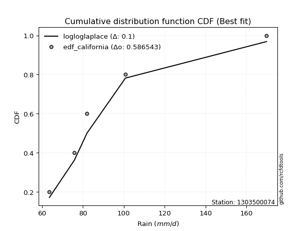</img>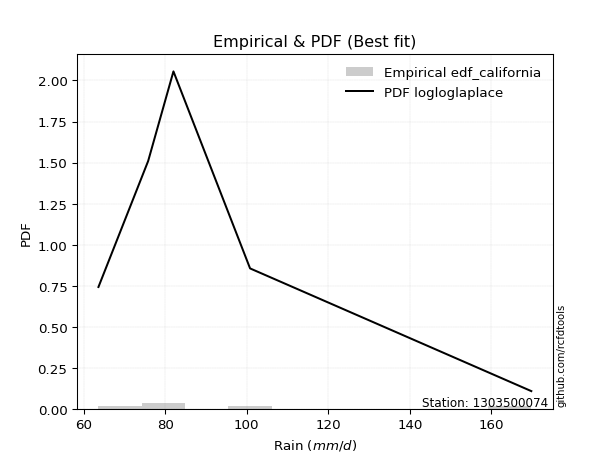</img>

</div>


### 2. EDF Hazen (1930)

Hazen method for plotting positions is a formula used to estimate the empirical cumulative probability distribution of flood events or other hydrological data. This formula often results in biased estimations, particularly when extrapolating to extreme events (high return periods).

<div align="center">


$P=(m-0.5)/n$


</div>


**2.1. Empirical values**

<div align="center">

|                | 0                  | 1                  | 2         | 3                 | 4                  |
|:---------------|:-------------------|:-------------------|:----------|:------------------|:-------------------|
| date           | 2020               | 2022               | 2021      | 2025              | 2019               |
| x              | 63.6               | 75.8               | 82.0      | 100.8             | 169.8              |
| m              | 1                  | 2                  | 3         | 4                 | 5                  |
| empirical_dist | edf_hazen          | edf_hazen          | edf_hazen | edf_hazen         | edf_hazen          |
| empirical      | 0.1                | 0.3                | 0.5       | 0.7               | 0.9                |
| empirical_tr   | 1.1111111111111112 | 1.4285714285714286 | 2.0       | 3.333333333333333 | 10.000000000000002 |

</div>


**2.2. Kolmogorov-Smirnov fit test (sorted by Δ)**


<div align="center">

|                | 0                   | 1                    | 2                    | 3                    | 4                    | 5                   | 6                   | 7                    | 8                   | 9                    | 10                 | 11                 | 12                 | 13                  | 14                  | 15                  | 16                  | 17                  | 18                  | 19                  | 20                  | 21                 | 22                  | 23                  | 24                  | 25                  | 26                  | 27                  | 28                  | 29                  | 30                  | 31                  | 32                  | 33                  | 34                  | 35                  | 36                 | 37                  | 38                  | 39                  | 40                  | 41                  | 42                  | 43                  | 44                  | 45                 | 46                  | 47                  | 48                 | 49                  | 50                  | 51                  | 52                  | 53                  | 54                 | 55                  | 56                  | 57                 | 58                  | 59                  | 60                 | 61                  | 62                 | 63                  | 64                 | 65                  | 66                  | 67                  | 68                  | 69                 | 70                  | 71                 | 72                 | 73                  | 74                 | 75                 | 76                  | 77                 | 78                  | 79                  | 80                  | 81                  | 82                  | 83                  | 84                  | 85                  | 86                 | 87                  | 88                  | 89                  | 90                  | 91                  | 92                 | 93                  | 94                  | 95                  | 96                  | 97                  | 98                  | 99                 | 100                 | 101                 | 102                 | 103                 | 104                 | 105                 | 106                 | 107                 | 108                | 109                 | 110                 | 111                | 112                 | 113                 | 114                | 115                | 116                | 117                 | 118                 | 119                 | 120                | 121                | 122                | 123                | 124                | 125                 | 126                | 127                | 128                | 129                | 130                 | 131                | 132                | 133                 | 134                | 135                 | 136                | 137                | 138                | 139                | 140                | 141                 | 142                | 143                | 144                | 145                | 146                | 147                | 148                | 149                | 150                | 151                | 152                | 153                | 154                | 155                | 156                | 157                | 158                | 159                |
|:---------------|:--------------------|:---------------------|:---------------------|:---------------------|:---------------------|:--------------------|:--------------------|:---------------------|:--------------------|:---------------------|:-------------------|:-------------------|:-------------------|:--------------------|:--------------------|:--------------------|:--------------------|:--------------------|:--------------------|:--------------------|:--------------------|:-------------------|:--------------------|:--------------------|:--------------------|:--------------------|:--------------------|:--------------------|:--------------------|:--------------------|:--------------------|:--------------------|:--------------------|:--------------------|:--------------------|:--------------------|:-------------------|:--------------------|:--------------------|:--------------------|:--------------------|:--------------------|:--------------------|:--------------------|:--------------------|:-------------------|:--------------------|:--------------------|:-------------------|:--------------------|:--------------------|:--------------------|:--------------------|:--------------------|:-------------------|:--------------------|:--------------------|:-------------------|:--------------------|:--------------------|:-------------------|:--------------------|:-------------------|:--------------------|:-------------------|:--------------------|:--------------------|:--------------------|:--------------------|:-------------------|:--------------------|:-------------------|:-------------------|:--------------------|:-------------------|:-------------------|:--------------------|:-------------------|:--------------------|:--------------------|:--------------------|:--------------------|:--------------------|:--------------------|:--------------------|:--------------------|:-------------------|:--------------------|:--------------------|:--------------------|:--------------------|:--------------------|:-------------------|:--------------------|:--------------------|:--------------------|:--------------------|:--------------------|:--------------------|:-------------------|:--------------------|:--------------------|:--------------------|:--------------------|:--------------------|:--------------------|:--------------------|:--------------------|:-------------------|:--------------------|:--------------------|:-------------------|:--------------------|:--------------------|:-------------------|:-------------------|:-------------------|:--------------------|:--------------------|:--------------------|:-------------------|:-------------------|:-------------------|:-------------------|:-------------------|:--------------------|:-------------------|:-------------------|:-------------------|:-------------------|:--------------------|:-------------------|:-------------------|:--------------------|:-------------------|:--------------------|:-------------------|:-------------------|:-------------------|:-------------------|:-------------------|:--------------------|:-------------------|:-------------------|:-------------------|:-------------------|:-------------------|:-------------------|:-------------------|:-------------------|:-------------------|:-------------------|:-------------------|:-------------------|:-------------------|:-------------------|:-------------------|:-------------------|:-------------------|:-------------------|
| station        | 1303500074          | 1303500074           | 1303500074           | 1303500074           | 1303500074           | 1303500074          | 1303500074          | 1303500074           | 1303500074          | 1303500074           | 1303500074         | 1303500074         | 1303500074         | 1303500074          | 1303500074          | 1303500074          | 1303500074          | 1303500074          | 1303500074          | 1303500074          | 1303500074          | 1303500074         | 1303500074          | 1303500074          | 1303500074          | 1303500074          | 1303500074          | 1303500074          | 1303500074          | 1303500074          | 1303500074          | 1303500074          | 1303500074          | 1303500074          | 1303500074          | 1303500074          | 1303500074         | 1303500074          | 1303500074          | 1303500074          | 1303500074          | 1303500074          | 1303500074          | 1303500074          | 1303500074          | 1303500074         | 1303500074          | 1303500074          | 1303500074         | 1303500074          | 1303500074          | 1303500074          | 1303500074          | 1303500074          | 1303500074         | 1303500074          | 1303500074          | 1303500074         | 1303500074          | 1303500074          | 1303500074         | 1303500074          | 1303500074         | 1303500074          | 1303500074         | 1303500074          | 1303500074          | 1303500074          | 1303500074          | 1303500074         | 1303500074          | 1303500074         | 1303500074         | 1303500074          | 1303500074         | 1303500074         | 1303500074          | 1303500074         | 1303500074          | 1303500074          | 1303500074          | 1303500074          | 1303500074          | 1303500074          | 1303500074          | 1303500074          | 1303500074         | 1303500074          | 1303500074          | 1303500074          | 1303500074          | 1303500074          | 1303500074         | 1303500074          | 1303500074          | 1303500074          | 1303500074          | 1303500074          | 1303500074          | 1303500074         | 1303500074          | 1303500074          | 1303500074          | 1303500074          | 1303500074          | 1303500074          | 1303500074          | 1303500074          | 1303500074         | 1303500074          | 1303500074          | 1303500074         | 1303500074          | 1303500074          | 1303500074         | 1303500074         | 1303500074         | 1303500074          | 1303500074          | 1303500074          | 1303500074         | 1303500074         | 1303500074         | 1303500074         | 1303500074         | 1303500074          | 1303500074         | 1303500074         | 1303500074         | 1303500074         | 1303500074          | 1303500074         | 1303500074         | 1303500074          | 1303500074         | 1303500074          | 1303500074         | 1303500074         | 1303500074         | 1303500074         | 1303500074         | 1303500074          | 1303500074         | 1303500074         | 1303500074         | 1303500074         | 1303500074         | 1303500074         | 1303500074         | 1303500074         | 1303500074         | 1303500074         | 1303500074         | 1303500074         | 1303500074         | 1303500074         | 1303500074         | 1303500074         | 1303500074         | 1303500074         |
| empirical_dist | edf_hazen           | edf_hazen            | edf_hazen            | edf_hazen            | edf_hazen            | edf_hazen           | edf_hazen           | edf_hazen            | edf_hazen           | edf_hazen            | edf_hazen          | edf_hazen          | edf_hazen          | edf_hazen           | edf_hazen           | edf_hazen           | edf_hazen           | edf_hazen           | edf_hazen           | edf_hazen           | edf_hazen           | edf_hazen          | edf_hazen           | edf_hazen           | edf_hazen           | edf_hazen           | edf_hazen           | edf_hazen           | edf_hazen           | edf_hazen           | edf_hazen           | edf_hazen           | edf_hazen           | edf_hazen           | edf_hazen           | edf_hazen           | edf_hazen          | edf_hazen           | edf_hazen           | edf_hazen           | edf_hazen           | edf_hazen           | edf_hazen           | edf_hazen           | edf_hazen           | edf_hazen          | edf_hazen           | edf_hazen           | edf_hazen          | edf_hazen           | edf_hazen           | edf_hazen           | edf_hazen           | edf_hazen           | edf_hazen          | edf_hazen           | edf_hazen           | edf_hazen          | edf_hazen           | edf_hazen           | edf_hazen          | edf_hazen           | edf_hazen          | edf_hazen           | edf_hazen          | edf_hazen           | edf_hazen           | edf_hazen           | edf_hazen           | edf_hazen          | edf_hazen           | edf_hazen          | edf_hazen          | edf_hazen           | edf_hazen          | edf_hazen          | edf_hazen           | edf_hazen          | edf_hazen           | edf_hazen           | edf_hazen           | edf_hazen           | edf_hazen           | edf_hazen           | edf_hazen           | edf_hazen           | edf_hazen          | edf_hazen           | edf_hazen           | edf_hazen           | edf_hazen           | edf_hazen           | edf_hazen          | edf_hazen           | edf_hazen           | edf_hazen           | edf_hazen           | edf_hazen           | edf_hazen           | edf_hazen          | edf_hazen           | edf_hazen           | edf_hazen           | edf_hazen           | edf_hazen           | edf_hazen           | edf_hazen           | edf_hazen           | edf_hazen          | edf_hazen           | edf_hazen           | edf_hazen          | edf_hazen           | edf_hazen           | edf_hazen          | edf_hazen          | edf_hazen          | edf_hazen           | edf_hazen           | edf_hazen           | edf_hazen          | edf_hazen          | edf_hazen          | edf_hazen          | edf_hazen          | edf_hazen           | edf_hazen          | edf_hazen          | edf_hazen          | edf_hazen          | edf_hazen           | edf_hazen          | edf_hazen          | edf_hazen           | edf_hazen          | edf_hazen           | edf_hazen          | edf_hazen          | edf_hazen          | edf_hazen          | edf_hazen          | edf_hazen           | edf_hazen          | edf_hazen          | edf_hazen          | edf_hazen          | edf_hazen          | edf_hazen          | edf_hazen          | edf_hazen          | edf_hazen          | edf_hazen          | edf_hazen          | edf_hazen          | edf_hazen          | edf_hazen          | edf_hazen          | edf_hazen          | edf_hazen          | edf_hazen          |
| p_dist         | logalpha            | loginvweibull        | loggenextreme        | logncf               | logburr              | alpha               | loghalflogistic     | logmielke            | loghalfnorm         | f                    | invgamma           | logmoyal           | logjohnsonsu       | loginvgauss         | logfoldnorm         | logloglaplace       | loggenlogistic      | burr                | logweibull_max      | burr12              | logburr12           | halflogistic       | loggumbel_r         | invgauss            | logdweibull         | logpearson3         | lograyleigh         | exponnorm           | logexponnorm        | wald                | loglomax            | loggenexpon         | loggompertz         | genexpon            | gengamma            | exponweib           | logwald            | logkstwobign        | foldnorm            | halfnorm            | logmaxwell          | vonmises_line       | logfatiguelife      | moyal               | pearson3            | truncnorm          | logskewnorm         | gompertz            | nct                | logsemicircular     | lognct              | loganglit           | loginvgamma         | gumbel_r            | betaprime          | gausshyper          | logbetaprime        | ncf                | rayleigh            | genlogistic         | logcrystalball     | lognorm             | logt               | logloggamma         | logrice            | logarcsine          | maxwell             | logdgamma           | logf                | logtruncexpon      | lognakagami         | loggennorm         | gennorm            | loglogistic         | logbeta            | nakagami           | logtruncweibull_min | kstwobign          | logbradford         | loghypsecant        | dgamma              | t                   | crystalball         | norm                | logcosine           | anglit              | semicircular       | arcsine             | logistic            | loglaplace          | loglaplace          | rice                | loggumbel_l        | hypsecant           | loggengamma         | logwrapcauchy       | bradford            | skewnorm            | dweibull            | logksone           | logvonmises_line    | truncweibull_min    | laplace             | logkappa4           | truncexpon          | logtukeylambda      | cosine              | logargus            | loguniform         | logkappa3           | wrapcauchy          | gumbel_l           | halfgennorm         | loglevy_l           | logrdist           | genextreme         | genpareto          | loggenpareto        | levy_l              | weibull_min         | beta               | rdist              | logtriang          | tukeylambda        | loghalfgennorm     | kappa4              | argus              | ksone              | logexponpow        | kappa3             | uniform             | loggamma           | loggamma           | triang              | loggenhalflogistic | lomax               | logtruncpareto     | fatiguelife        | johnsonsb          | invweibull         | genhalflogistic    | powerlaw            | logtrapezoid       | logpowerlaw        | truncpareto        | johnsonsu          | logexponweib       | logweibull_min     | logjohnsonsb       | exponpow           | loggausshyper      | trapezoid          | weibull_max        | gamma              | logerlang          | erlang             | logtruncnorm       | logvonmises        | vonmises           | mielke             |
| delta          | 0.04022204765685239 | 0.042333267184462176 | 0.042347787423893835 | 0.046811289496384856 | 0.050018299431890456 | 0.05123890917912011 | 0.05495426960883815 | 0.059550017049266546 | 0.05974195965432705 | 0.059846960887894374 | 0.0598499734372796 | 0.0686588927299635 | 0.0703590053096767 | 0.07240605122175786 | 0.07666997528144764 | 0.08177537933089007 | 0.08392752029898298 | 0.08392756005717167 | 0.08464994748985716 | 0.08542392973823258 | 0.08559005570731092 | 0.0875761485940767 | 0.08789433026255161 | 0.08861751127576933 | 0.09090009468444185 | 0.09197501889801651 | 0.09438882281944827 | 0.09903579730977932 | 0.09910468833011524 | 0.09923743267853752 | 0.09998168391138763 | 0.09999999991683411 | 0.09999999995281432 | 0.09999999999163134 | 0.09999999999998743 | 0.09999999999998754 | 0.1                | 0.10012843928872028 | 0.10243812199558544 | 0.10299059022829127 | 0.10656638127608309 | 0.10694508031822006 | 0.10837490569131486 | 0.10984461999664141 | 0.11094088944139152 | 0.1136945284131829 | 0.11436564096714186 | 0.11488241534882954 | 0.1157463770765852 | 0.11910697783117385 | 0.12022788595844935 | 0.12052752751468654 | 0.12061910396564618 | 0.12519784120211813 | 0.1265282184474974 | 0.12773414852869236 | 0.12783119906359375 | 0.1299026964259573 | 0.13232204023877747 | 0.13662413443349192 | 0.139116459936437  | 0.13911653665358642 | 0.1391193548726174 | 0.13931803078566857 | 0.1404166960868652 | 0.14233024181234177 | 0.14273775707879377 | 0.14461737776676142 | 0.14535639678140655 | 0.1492278988802313 | 0.14937292337194208 | 0.1504196270023861 | 0.1529690698537327 | 0.15608389605030154 | 0.1565883921460599 | 0.157971428522794  | 0.16013250436651844 | 0.1659990490926112 | 0.16886710335957938 | 0.16943060610927768 | 0.17414049919825414 | 0.17459716639802414 | 0.17459890274102408 | 0.17459891493658353 | 0.17595574571483585 | 0.17822724021526393 | 0.1797225840266763 | 0.18565445379665557 | 0.18776522160533843 | 0.19782418754249687 | 0.19782418754249687 | 0.19985300780246396 | 0.2007480669844966 | 0.20246978877641936 | 0.20278680525923426 | 0.21037505366608955 | 0.21908244522730808 | 0.21976987501861034 | 0.22558955642149822 | 0.225864540285725  | 0.22722953531776946 | 0.22879443450000803 | 0.22987422904996452 | 0.23134369306665187 | 0.23217900847024048 | 0.23316652083877187 | 0.23556909598861459 | 0.23997669913389674 | 0.2412385359826612 | 0.24169967643207374 | 0.24212128623885282 | 0.243749422633469  | 0.25366466492138745 | 0.26155382460467125 | 0.2676930652679982 | 0.2745601606614656 | 0.2756692162729833 | 0.27807772182524015 | 0.27881117988407944 | 0.27896563815787917 | 0.2845561281132018 | 0.2877659132827741 | 0.2932754235365097 | 0.2999999999397105 | 0.309187002810221  | 0.31153138906833905 | 0.3212349259047367 | 0.3247645951035782 | 0.3251394323034325 | 0.3478416338974041 | 0.34971751412429386 | 0.3586111644831526 | 0.3586111644831526 | 0.36205759933242804 | 0.3658798752314196 | 0.36774268084393175 | 0.4015553306258461 | 0.4339026237072264 | 0.4437980550831058 | 0.4604764256712958 | 0.4661207757850423 | 0.47388695792024466 | 0.4751955658415331 | 0.4994630955878813 | 0.5007635068817513 | 0.5087381105193858 | 0.5246441524099352 | 0.5343908842299128 | 0.5395161429602182 | 0.5480525259636964 | 0.5521345131064399 | 0.5591983909122183 | 0.5758668012965804 | 0.584133674280338  | 0.5852242656670987 | 0.5954535559438741 | 0.7                | 1.0646523853922956 | 26.238159453470647 | nan                |
| deltao         | 0.5865427407550001  | 0.5865427407550001   | 0.5865427407550001   | 0.5865427407550001   | 0.5865427407550001   | 0.5865427407550001  | 0.5865427407550001  | 0.5865427407550001   | 0.5865427407550001  | 0.5865427407550001   | 0.5865427407550001 | 0.5865427407550001 | 0.5865427407550001 | 0.5865427407550001  | 0.5865427407550001  | 0.5865427407550001  | 0.5865427407550001  | 0.5865427407550001  | 0.5865427407550001  | 0.5865427407550001  | 0.5865427407550001  | 0.5865427407550001 | 0.5865427407550001  | 0.5865427407550001  | 0.5865427407550001  | 0.5865427407550001  | 0.5865427407550001  | 0.5865427407550001  | 0.5865427407550001  | 0.5865427407550001  | 0.5865427407550001  | 0.5865427407550001  | 0.5865427407550001  | 0.5865427407550001  | 0.5865427407550001  | 0.5865427407550001  | 0.5865427407550001 | 0.5865427407550001  | 0.5865427407550001  | 0.5865427407550001  | 0.5865427407550001  | 0.5865427407550001  | 0.5865427407550001  | 0.5865427407550001  | 0.5865427407550001  | 0.5865427407550001 | 0.5865427407550001  | 0.5865427407550001  | 0.5865427407550001 | 0.5865427407550001  | 0.5865427407550001  | 0.5865427407550001  | 0.5865427407550001  | 0.5865427407550001  | 0.5865427407550001 | 0.5865427407550001  | 0.5865427407550001  | 0.5865427407550001 | 0.5865427407550001  | 0.5865427407550001  | 0.5865427407550001 | 0.5865427407550001  | 0.5865427407550001 | 0.5865427407550001  | 0.5865427407550001 | 0.5865427407550001  | 0.5865427407550001  | 0.5865427407550001  | 0.5865427407550001  | 0.5865427407550001 | 0.5865427407550001  | 0.5865427407550001 | 0.5865427407550001 | 0.5865427407550001  | 0.5865427407550001 | 0.5865427407550001 | 0.5865427407550001  | 0.5865427407550001 | 0.5865427407550001  | 0.5865427407550001  | 0.5865427407550001  | 0.5865427407550001  | 0.5865427407550001  | 0.5865427407550001  | 0.5865427407550001  | 0.5865427407550001  | 0.5865427407550001 | 0.5865427407550001  | 0.5865427407550001  | 0.5865427407550001  | 0.5865427407550001  | 0.5865427407550001  | 0.5865427407550001 | 0.5865427407550001  | 0.5865427407550001  | 0.5865427407550001  | 0.5865427407550001  | 0.5865427407550001  | 0.5865427407550001  | 0.5865427407550001 | 0.5865427407550001  | 0.5865427407550001  | 0.5865427407550001  | 0.5865427407550001  | 0.5865427407550001  | 0.5865427407550001  | 0.5865427407550001  | 0.5865427407550001  | 0.5865427407550001 | 0.5865427407550001  | 0.5865427407550001  | 0.5865427407550001 | 0.5865427407550001  | 0.5865427407550001  | 0.5865427407550001 | 0.5865427407550001 | 0.5865427407550001 | 0.5865427407550001  | 0.5865427407550001  | 0.5865427407550001  | 0.5865427407550001 | 0.5865427407550001 | 0.5865427407550001 | 0.5865427407550001 | 0.5865427407550001 | 0.5865427407550001  | 0.5865427407550001 | 0.5865427407550001 | 0.5865427407550001 | 0.5865427407550001 | 0.5865427407550001  | 0.5865427407550001 | 0.5865427407550001 | 0.5865427407550001  | 0.5865427407550001 | 0.5865427407550001  | 0.5865427407550001 | 0.5865427407550001 | 0.5865427407550001 | 0.5865427407550001 | 0.5865427407550001 | 0.5865427407550001  | 0.5865427407550001 | 0.5865427407550001 | 0.5865427407550001 | 0.5865427407550001 | 0.5865427407550001 | 0.5865427407550001 | 0.5865427407550001 | 0.5865427407550001 | 0.5865427407550001 | 0.5865427407550001 | 0.5865427407550001 | 0.5865427407550001 | 0.5865427407550001 | 0.5865427407550001 | 0.5865427407550001 | 0.5865427407550001 | 0.5865427407550001 | 0.5865427407550001 |
| eval           | Δo > Δ              | Δo > Δ               | Δo > Δ               | Δo > Δ               | Δo > Δ               | Δo > Δ              | Δo > Δ              | Δo > Δ               | Δo > Δ              | Δo > Δ               | Δo > Δ             | Δo > Δ             | Δo > Δ             | Δo > Δ              | Δo > Δ              | Δo > Δ              | Δo > Δ              | Δo > Δ              | Δo > Δ              | Δo > Δ              | Δo > Δ              | Δo > Δ             | Δo > Δ              | Δo > Δ              | Δo > Δ              | Δo > Δ              | Δo > Δ              | Δo > Δ              | Δo > Δ              | Δo > Δ              | Δo > Δ              | Δo > Δ              | Δo > Δ              | Δo > Δ              | Δo > Δ              | Δo > Δ              | Δo > Δ             | Δo > Δ              | Δo > Δ              | Δo > Δ              | Δo > Δ              | Δo > Δ              | Δo > Δ              | Δo > Δ              | Δo > Δ              | Δo > Δ             | Δo > Δ              | Δo > Δ              | Δo > Δ             | Δo > Δ              | Δo > Δ              | Δo > Δ              | Δo > Δ              | Δo > Δ              | Δo > Δ             | Δo > Δ              | Δo > Δ              | Δo > Δ             | Δo > Δ              | Δo > Δ              | Δo > Δ             | Δo > Δ              | Δo > Δ             | Δo > Δ              | Δo > Δ             | Δo > Δ              | Δo > Δ              | Δo > Δ              | Δo > Δ              | Δo > Δ             | Δo > Δ              | Δo > Δ             | Δo > Δ             | Δo > Δ              | Δo > Δ             | Δo > Δ             | Δo > Δ              | Δo > Δ             | Δo > Δ              | Δo > Δ              | Δo > Δ              | Δo > Δ              | Δo > Δ              | Δo > Δ              | Δo > Δ              | Δo > Δ              | Δo > Δ             | Δo > Δ              | Δo > Δ              | Δo > Δ              | Δo > Δ              | Δo > Δ              | Δo > Δ             | Δo > Δ              | Δo > Δ              | Δo > Δ              | Δo > Δ              | Δo > Δ              | Δo > Δ              | Δo > Δ             | Δo > Δ              | Δo > Δ              | Δo > Δ              | Δo > Δ              | Δo > Δ              | Δo > Δ              | Δo > Δ              | Δo > Δ              | Δo > Δ             | Δo > Δ              | Δo > Δ              | Δo > Δ             | Δo > Δ              | Δo > Δ              | Δo > Δ             | Δo > Δ             | Δo > Δ             | Δo > Δ              | Δo > Δ              | Δo > Δ              | Δo > Δ             | Δo > Δ             | Δo > Δ             | Δo > Δ             | Δo > Δ             | Δo > Δ              | Δo > Δ             | Δo > Δ             | Δo > Δ             | Δo > Δ             | Δo > Δ              | Δo > Δ             | Δo > Δ             | Δo > Δ              | Δo > Δ             | Δo > Δ              | Δo > Δ             | Δo > Δ             | Δo > Δ             | Δo > Δ             | Δo > Δ             | Δo > Δ              | Δo > Δ             | Δo > Δ             | Δo > Δ             | Δo > Δ             | Δo > Δ             | Δo > Δ             | Δo > Δ             | Δo > Δ             | Δo > Δ             | Δo > Δ             | Δo > Δ             | Δo > Δ             | Δo > Δ             | Δo <= Δ            | Δo <= Δ            | Δo <= Δ            | Δo <= Δ            | Δo <= Δ            |
| fit            | 1                   | 1                    | 1                    | 1                    | 1                    | 1                   | 1                   | 1                    | 1                   | 1                    | 1                  | 1                  | 1                  | 1                   | 1                   | 1                   | 1                   | 1                   | 1                   | 1                   | 1                   | 1                  | 1                   | 1                   | 1                   | 1                   | 1                   | 1                   | 1                   | 1                   | 1                   | 1                   | 1                   | 1                   | 1                   | 1                   | 1                  | 1                   | 1                   | 1                   | 1                   | 1                   | 1                   | 1                   | 1                   | 1                  | 1                   | 1                   | 1                  | 1                   | 1                   | 1                   | 1                   | 1                   | 1                  | 1                   | 1                   | 1                  | 1                   | 1                   | 1                  | 1                   | 1                  | 1                   | 1                  | 1                   | 1                   | 1                   | 1                   | 1                  | 1                   | 1                  | 1                  | 1                   | 1                  | 1                  | 1                   | 1                  | 1                   | 1                   | 1                   | 1                   | 1                   | 1                   | 1                   | 1                   | 1                  | 1                   | 1                   | 1                   | 1                   | 1                   | 1                  | 1                   | 1                   | 1                   | 1                   | 1                   | 1                   | 1                  | 1                   | 1                   | 1                   | 1                   | 1                   | 1                   | 1                   | 1                   | 1                  | 1                   | 1                   | 1                  | 1                   | 1                   | 1                  | 1                  | 1                  | 1                   | 1                   | 1                   | 1                  | 1                  | 1                  | 1                  | 1                  | 1                   | 1                  | 1                  | 1                  | 1                  | 1                   | 1                  | 1                  | 1                   | 1                  | 1                   | 1                  | 1                  | 1                  | 1                  | 1                  | 1                   | 1                  | 1                  | 1                  | 1                  | 1                  | 1                  | 1                  | 1                  | 1                  | 1                  | 1                  | 1                  | 1                  | 0                  | 0                  | 0                  | 0                  | 0                  |
| n              | 5                   | 5                    | 5                    | 5                    | 5                    | 5                   | 5                   | 5                    | 5                   | 5                    | 5                  | 5                  | 5                  | 5                   | 5                   | 5                   | 5                   | 5                   | 5                   | 5                   | 5                   | 5                  | 5                   | 5                   | 5                   | 5                   | 5                   | 5                   | 5                   | 5                   | 5                   | 5                   | 5                   | 5                   | 5                   | 5                   | 5                  | 5                   | 5                   | 5                   | 5                   | 5                   | 5                   | 5                   | 5                   | 5                  | 5                   | 5                   | 5                  | 5                   | 5                   | 5                   | 5                   | 5                   | 5                  | 5                   | 5                   | 5                  | 5                   | 5                   | 5                  | 5                   | 5                  | 5                   | 5                  | 5                   | 5                   | 5                   | 5                   | 5                  | 5                   | 5                  | 5                  | 5                   | 5                  | 5                  | 5                   | 5                  | 5                   | 5                   | 5                   | 5                   | 5                   | 5                   | 5                   | 5                   | 5                  | 5                   | 5                   | 5                   | 5                   | 5                   | 5                  | 5                   | 5                   | 5                   | 5                   | 5                   | 5                   | 5                  | 5                   | 5                   | 5                   | 5                   | 5                   | 5                   | 5                   | 5                   | 5                  | 5                   | 5                   | 5                  | 5                   | 5                   | 5                  | 5                  | 5                  | 5                   | 5                   | 5                   | 5                  | 5                  | 5                  | 5                  | 5                  | 5                   | 5                  | 5                  | 5                  | 5                  | 5                   | 5                  | 5                  | 5                   | 5                  | 5                   | 5                  | 5                  | 5                  | 5                  | 5                  | 5                   | 5                  | 5                  | 5                  | 5                  | 5                  | 5                  | 5                  | 5                  | 5                  | 5                  | 5                  | 5                  | 5                  | 5                  | 5                  | 5                  | 5                  | 5                  |
| best_fit       | 1                   | 0                    | 0                    | 0                    | 0                    | 0                   | 0                   | 0                    | 0                   | 0                    | 0                  | 0                  | 0                  | 0                   | 0                   | 0                   | 0                   | 0                   | 0                   | 0                   | 0                   | 0                  | 0                   | 0                   | 0                   | 0                   | 0                   | 0                   | 0                   | 0                   | 0                   | 0                   | 0                   | 0                   | 0                   | 0                   | 0                  | 0                   | 0                   | 0                   | 0                   | 0                   | 0                   | 0                   | 0                   | 0                  | 0                   | 0                   | 0                  | 0                   | 0                   | 0                   | 0                   | 0                   | 0                  | 0                   | 0                   | 0                  | 0                   | 0                   | 0                  | 0                   | 0                  | 0                   | 0                  | 0                   | 0                   | 0                   | 0                   | 0                  | 0                   | 0                  | 0                  | 0                   | 0                  | 0                  | 0                   | 0                  | 0                   | 0                   | 0                   | 0                   | 0                   | 0                   | 0                   | 0                   | 0                  | 0                   | 0                   | 0                   | 0                   | 0                   | 0                  | 0                   | 0                   | 0                   | 0                   | 0                   | 0                   | 0                  | 0                   | 0                   | 0                   | 0                   | 0                   | 0                   | 0                   | 0                   | 0                  | 0                   | 0                   | 0                  | 0                   | 0                   | 0                  | 0                  | 0                  | 0                   | 0                   | 0                   | 0                  | 0                  | 0                  | 0                  | 0                  | 0                   | 0                  | 0                  | 0                  | 0                  | 0                   | 0                  | 0                  | 0                   | 0                  | 0                   | 0                  | 0                  | 0                  | 0                  | 0                  | 0                   | 0                  | 0                  | 0                  | 0                  | 0                  | 0                  | 0                  | 0                  | 0                  | 0                  | 0                  | 0                  | 0                  | 0                  | 0                  | 0                  | 0                  | 0                  |
| best_fit_sort  | 1                   | 2                    | 3                    | 4                    | 5                    | 6                   | 7                   | 8                    | 9                   | 10                   | 11                 | 12                 | 13                 | 14                  | 15                  | 16                  | 17                  | 18                  | 19                  | 20                  | 21                  | 22                 | 23                  | 24                  | 25                  | 26                  | 27                  | 28                  | 29                  | 30                  | 31                  | 32                  | 33                  | 34                  | 35                  | 36                  | 37                 | 38                  | 39                  | 40                  | 41                  | 42                  | 43                  | 44                  | 45                  | 46                 | 47                  | 48                  | 49                 | 50                  | 51                  | 52                  | 53                  | 54                  | 55                 | 56                  | 57                  | 58                 | 59                  | 60                  | 61                 | 62                  | 63                 | 64                  | 65                 | 66                  | 67                  | 68                  | 69                  | 70                 | 71                  | 72                 | 73                 | 74                  | 75                 | 76                 | 77                  | 78                 | 79                  | 80                  | 81                  | 82                  | 83                  | 84                  | 85                  | 86                  | 87                 | 88                  | 89                  | 90                  | 91                  | 92                  | 93                 | 94                  | 95                  | 96                  | 97                  | 98                  | 99                  | 100                | 101                 | 102                 | 103                 | 104                 | 105                 | 106                 | 107                 | 108                 | 109                | 110                 | 111                 | 112                | 113                 | 114                 | 115                | 116                | 117                | 118                 | 119                 | 120                 | 121                | 122                | 123                | 124                | 125                | 126                 | 127                | 128                | 129                | 130                | 131                 | 132                | 133                | 134                 | 135                | 136                 | 137                | 138                | 139                | 140                | 141                | 142                 | 143                | 144                | 145                | 146                | 147                | 148                | 149                | 150                | 151                | 152                | 153                | 154                | 155                | 156                | 157                | 158                | 159                | 160                |

</div>


**2.3. Best fit**

<div align="center">

|   id |    station | empirical_dist   | p_dist   |    delta |   deltao | eval   |   fit |   n |   best_fit |   best_fit_sort |
|-----:|-----------:|:-----------------|:---------|---------:|---------:|:-------|------:|----:|-----------:|----------------:|
|    0 | 1303500074 | edf_hazen        | logalpha | 0.040222 | 0.586543 | Δo > Δ |     1 |   5 |          1 |               1 |

</div>


<div align="center">

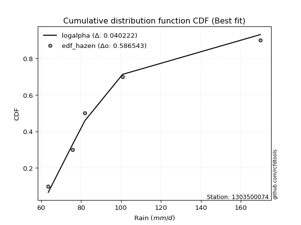</img></img>

</div>


### 3. EDF Weibull (1939)

Weibull plotting position formula is an empirical method used to estimate the non-exceedance probability or plotting position for a set of observed data, is often recommended or widely used in practice, particularly in flood frequency analysis.

<div align="center">


$P=m/(n+1)$


</div>


**3.1. Empirical values**

<div align="center">

|                | 0                   | 1                  | 2           | 3                  | 4                  |
|:---------------|:--------------------|:-------------------|:------------|:-------------------|:-------------------|
| date           | 2020                | 2022               | 2021        | 2025               | 2019               |
| x              | 63.6                | 75.8               | 82.0        | 100.8              | 169.8              |
| m              | 1                   | 2                  | 3           | 4                  | 5                  |
| empirical_dist | edf_weibull         | edf_weibull        | edf_weibull | edf_weibull        | edf_weibull        |
| empirical      | 0.16666666666666666 | 0.3333333333333333 | 0.5         | 0.6666666666666666 | 0.8333333333333334 |
| empirical_tr   | 1.2                 | 1.4999999999999998 | 2.0         | 2.9999999999999996 | 6.000000000000002  |

</div>


**3.2. Kolmogorov-Smirnov fit test (sorted by Δ)**


<div align="center">

|                | 0                   | 1                   | 2                   | 3                   | 4                   | 5                   | 6                   | 7                   | 8                   | 9                   | 10                  | 11                  | 12                  | 13                  | 14                  | 15                  | 16                  | 17                  | 18                  | 19                  | 20                  | 21                  | 22                 | 23                  | 24                 | 25                  | 26                 | 27                  | 28                 | 29                  | 30                  | 31                  | 32                  | 33                  | 34                  | 35                  | 36                 | 37                  | 38                 | 39                  | 40                  | 41                  | 42                 | 43                  | 44                 | 45                  | 46                 | 47                  | 48                  | 49                 | 50                  | 51                  | 52                  | 53                  | 54                  | 55                 | 56                  | 57                 | 58                  | 59                 | 60                 | 61                 | 62                 | 63                 | 64                  | 65                  | 66                  | 67                  | 68                 | 69                  | 70                  | 71                 | 72                  | 73                  | 74                  | 75                  | 76                  | 77                  | 78                  | 79                  | 80                  | 81                  | 82                  | 83                  | 84                  | 85                  | 86                  | 87                  | 88                  | 89                  | 90                  | 91                  | 92                 | 93                  | 94                  | 95                  | 96                 | 97                 | 98                  | 99                  | 100                 | 101                | 102                 | 103                | 104                 | 105                 | 106                 | 107                 | 108                 | 109                 | 110                 | 111                 | 112                 | 113                 | 114                 | 115                 | 116                | 117                 | 118                 | 119                 | 120                | 121                | 122                 | 123                 | 124                 | 125                | 126                | 127                 | 128                | 129                | 130                | 131                 | 132                | 133                | 134                | 135                | 136                 | 137                 | 138                 | 139                | 140                 | 141                 | 142                | 143                | 144                 | 145                | 146                 | 147                | 148                | 149                | 150                | 151                | 152                | 153                | 154                | 155                | 156                | 157                | 158                | 159                |
|:---------------|:--------------------|:--------------------|:--------------------|:--------------------|:--------------------|:--------------------|:--------------------|:--------------------|:--------------------|:--------------------|:--------------------|:--------------------|:--------------------|:--------------------|:--------------------|:--------------------|:--------------------|:--------------------|:--------------------|:--------------------|:--------------------|:--------------------|:-------------------|:--------------------|:-------------------|:--------------------|:-------------------|:--------------------|:-------------------|:--------------------|:--------------------|:--------------------|:--------------------|:--------------------|:--------------------|:--------------------|:-------------------|:--------------------|:-------------------|:--------------------|:--------------------|:--------------------|:-------------------|:--------------------|:-------------------|:--------------------|:-------------------|:--------------------|:--------------------|:-------------------|:--------------------|:--------------------|:--------------------|:--------------------|:--------------------|:-------------------|:--------------------|:-------------------|:--------------------|:-------------------|:-------------------|:-------------------|:-------------------|:-------------------|:--------------------|:--------------------|:--------------------|:--------------------|:-------------------|:--------------------|:--------------------|:-------------------|:--------------------|:--------------------|:--------------------|:--------------------|:--------------------|:--------------------|:--------------------|:--------------------|:--------------------|:--------------------|:--------------------|:--------------------|:--------------------|:--------------------|:--------------------|:--------------------|:--------------------|:--------------------|:--------------------|:--------------------|:-------------------|:--------------------|:--------------------|:--------------------|:-------------------|:-------------------|:--------------------|:--------------------|:--------------------|:-------------------|:--------------------|:-------------------|:--------------------|:--------------------|:--------------------|:--------------------|:--------------------|:--------------------|:--------------------|:--------------------|:--------------------|:--------------------|:--------------------|:--------------------|:-------------------|:--------------------|:--------------------|:--------------------|:-------------------|:-------------------|:--------------------|:--------------------|:--------------------|:-------------------|:-------------------|:--------------------|:-------------------|:-------------------|:-------------------|:--------------------|:-------------------|:-------------------|:-------------------|:-------------------|:--------------------|:--------------------|:--------------------|:-------------------|:--------------------|:--------------------|:-------------------|:-------------------|:--------------------|:-------------------|:--------------------|:-------------------|:-------------------|:-------------------|:-------------------|:-------------------|:-------------------|:-------------------|:-------------------|:-------------------|:-------------------|:-------------------|:-------------------|:-------------------|
| station        | 1303500074          | 1303500074          | 1303500074          | 1303500074          | 1303500074          | 1303500074          | 1303500074          | 1303500074          | 1303500074          | 1303500074          | 1303500074          | 1303500074          | 1303500074          | 1303500074          | 1303500074          | 1303500074          | 1303500074          | 1303500074          | 1303500074          | 1303500074          | 1303500074          | 1303500074          | 1303500074         | 1303500074          | 1303500074         | 1303500074          | 1303500074         | 1303500074          | 1303500074         | 1303500074          | 1303500074          | 1303500074          | 1303500074          | 1303500074          | 1303500074          | 1303500074          | 1303500074         | 1303500074          | 1303500074         | 1303500074          | 1303500074          | 1303500074          | 1303500074         | 1303500074          | 1303500074         | 1303500074          | 1303500074         | 1303500074          | 1303500074          | 1303500074         | 1303500074          | 1303500074          | 1303500074          | 1303500074          | 1303500074          | 1303500074         | 1303500074          | 1303500074         | 1303500074          | 1303500074         | 1303500074         | 1303500074         | 1303500074         | 1303500074         | 1303500074          | 1303500074          | 1303500074          | 1303500074          | 1303500074         | 1303500074          | 1303500074          | 1303500074         | 1303500074          | 1303500074          | 1303500074          | 1303500074          | 1303500074          | 1303500074          | 1303500074          | 1303500074          | 1303500074          | 1303500074          | 1303500074          | 1303500074          | 1303500074          | 1303500074          | 1303500074          | 1303500074          | 1303500074          | 1303500074          | 1303500074          | 1303500074          | 1303500074         | 1303500074          | 1303500074          | 1303500074          | 1303500074         | 1303500074         | 1303500074          | 1303500074          | 1303500074          | 1303500074         | 1303500074          | 1303500074         | 1303500074          | 1303500074          | 1303500074          | 1303500074          | 1303500074          | 1303500074          | 1303500074          | 1303500074          | 1303500074          | 1303500074          | 1303500074          | 1303500074          | 1303500074         | 1303500074          | 1303500074          | 1303500074          | 1303500074         | 1303500074         | 1303500074          | 1303500074          | 1303500074          | 1303500074         | 1303500074         | 1303500074          | 1303500074         | 1303500074         | 1303500074         | 1303500074          | 1303500074         | 1303500074         | 1303500074         | 1303500074         | 1303500074          | 1303500074          | 1303500074          | 1303500074         | 1303500074          | 1303500074          | 1303500074         | 1303500074         | 1303500074          | 1303500074         | 1303500074          | 1303500074         | 1303500074         | 1303500074         | 1303500074         | 1303500074         | 1303500074         | 1303500074         | 1303500074         | 1303500074         | 1303500074         | 1303500074         | 1303500074         | 1303500074         |
| empirical_dist | edf_weibull         | edf_weibull         | edf_weibull         | edf_weibull         | edf_weibull         | edf_weibull         | edf_weibull         | edf_weibull         | edf_weibull         | edf_weibull         | edf_weibull         | edf_weibull         | edf_weibull         | edf_weibull         | edf_weibull         | edf_weibull         | edf_weibull         | edf_weibull         | edf_weibull         | edf_weibull         | edf_weibull         | edf_weibull         | edf_weibull        | edf_weibull         | edf_weibull        | edf_weibull         | edf_weibull        | edf_weibull         | edf_weibull        | edf_weibull         | edf_weibull         | edf_weibull         | edf_weibull         | edf_weibull         | edf_weibull         | edf_weibull         | edf_weibull        | edf_weibull         | edf_weibull        | edf_weibull         | edf_weibull         | edf_weibull         | edf_weibull        | edf_weibull         | edf_weibull        | edf_weibull         | edf_weibull        | edf_weibull         | edf_weibull         | edf_weibull        | edf_weibull         | edf_weibull         | edf_weibull         | edf_weibull         | edf_weibull         | edf_weibull        | edf_weibull         | edf_weibull        | edf_weibull         | edf_weibull        | edf_weibull        | edf_weibull        | edf_weibull        | edf_weibull        | edf_weibull         | edf_weibull         | edf_weibull         | edf_weibull         | edf_weibull        | edf_weibull         | edf_weibull         | edf_weibull        | edf_weibull         | edf_weibull         | edf_weibull         | edf_weibull         | edf_weibull         | edf_weibull         | edf_weibull         | edf_weibull         | edf_weibull         | edf_weibull         | edf_weibull         | edf_weibull         | edf_weibull         | edf_weibull         | edf_weibull         | edf_weibull         | edf_weibull         | edf_weibull         | edf_weibull         | edf_weibull         | edf_weibull        | edf_weibull         | edf_weibull         | edf_weibull         | edf_weibull        | edf_weibull        | edf_weibull         | edf_weibull         | edf_weibull         | edf_weibull        | edf_weibull         | edf_weibull        | edf_weibull         | edf_weibull         | edf_weibull         | edf_weibull         | edf_weibull         | edf_weibull         | edf_weibull         | edf_weibull         | edf_weibull         | edf_weibull         | edf_weibull         | edf_weibull         | edf_weibull        | edf_weibull         | edf_weibull         | edf_weibull         | edf_weibull        | edf_weibull        | edf_weibull         | edf_weibull         | edf_weibull         | edf_weibull        | edf_weibull        | edf_weibull         | edf_weibull        | edf_weibull        | edf_weibull        | edf_weibull         | edf_weibull        | edf_weibull        | edf_weibull        | edf_weibull        | edf_weibull         | edf_weibull         | edf_weibull         | edf_weibull        | edf_weibull         | edf_weibull         | edf_weibull        | edf_weibull        | edf_weibull         | edf_weibull        | edf_weibull         | edf_weibull        | edf_weibull        | edf_weibull        | edf_weibull        | edf_weibull        | edf_weibull        | edf_weibull        | edf_weibull        | edf_weibull        | edf_weibull        | edf_weibull        | edf_weibull        | edf_weibull        |
| p_dist         | logmielke           | logalpha            | loggenextreme       | loginvweibull       | alpha               | logncf              | loghalfnorm         | invgamma            | f                   | logmoyal            | logburr             | logfoldnorm         | loginvgauss         | loggumbel_r         | logdweibull         | logpearson3         | foldnorm            | invgauss            | halflogistic        | logjohnsonsu        | halfnorm            | lograyleigh         | logfatiguelife     | moyal               | pearson3           | logmaxwell          | loghalflogistic    | logweibull_max      | nct                | loggenlogistic      | burr                | logkstwobign        | gumbel_r            | rayleigh            | lognct              | betaprime           | ncf                | loginvgamma         | logbetaprime       | logloglaplace       | maxwell             | loganglit           | logcrystalball     | lognorm             | logt               | logloggamma         | logrice            | genlogistic         | logsemicircular     | anglit             | burr12              | logburr12           | loglogistic         | semicircular        | exponnorm           | logexponnorm       | wald                | kstwobign          | logtruncweibull_min | loglomax           | logtruncexpon      | logbeta            | lognakagami        | gausshyper         | logf                | nakagami            | loggenexpon         | loggompertz         | genexpon           | vonmises_line       | gengamma            | exponweib          | gompertz            | arcsine             | logarcsine          | truncnorm           | logwald             | logskewnorm         | dweibull            | crystalball         | norm                | t                   | logbradford         | loghypsecant        | loggengamma         | logcosine           | logwrapcauchy       | logdgamma           | loggennorm          | bradford            | gennorm             | logistic            | loglevy_l          | loglaplace          | loglaplace          | rice                | loggumbel_l        | logksone           | hypsecant           | dgamma              | genextreme          | wrapcauchy         | loggenpareto        | levy_l             | cosine              | skewnorm            | halfgennorm         | gumbel_l            | logvonmises_line    | truncweibull_min    | laplace             | logargus            | logkappa4           | truncexpon          | logtukeylambda      | logrdist            | loguniform         | logkappa3           | genpareto           | weibull_min         | beta               | logtriang          | loghalfgennorm      | argus               | ksone               | logexponpow        | kappa4             | rdist               | loggamma           | loggamma           | kappa3             | uniform             | triang             | loggenhalflogistic | tukeylambda        | lomax              | logtruncpareto      | invweibull          | fatiguelife         | johnsonsb          | genhalflogistic     | powerlaw            | logtrapezoid       | logpowerlaw        | truncpareto         | johnsonsu          | logexponweib        | logweibull_min     | logjohnsonsb       | exponpow           | loggausshyper      | trapezoid          | weibull_max        | gamma              | logerlang          | erlang             | logtruncnorm       | logvonmises        | vonmises           | mielke             |
| delta          | 0.10016860149358964 | 0.10061526443178348 | 0.10393736120708848 | 0.10393815834770977 | 0.10585833553170185 | 0.10662832929446792 | 0.10681268342386485 | 0.10929919600528015 | 0.10929972738122712 | 0.10934920270053794 | 0.11159291361351276 | 0.11182579332204756 | 0.11207296172162856 | 0.11226474690966992 | 0.11248674058827557 | 0.11305180011271587 | 0.11306433456388265 | 0.11362610153847755 | 0.11364541368783165 | 0.11371495711866324 | 0.11434882662750057 | 0.11463125765850068 | 0.1149308575735745 | 0.11521094920906727 | 0.1163010596935049 | 0.11806287863829612 | 0.1216209362755048 | 0.12304285461800046 | 0.1231533114243547 | 0.12336850522557097 | 0.12348575221832536 | 0.12364552546020391 | 0.12519784120211813 | 0.12588400585303877 | 0.12659247682460517 | 0.12752603527720174 | 0.1299026964259573 | 0.13069352583558946 | 0.1313781411141285 | 0.13530732709937665 | 0.13767202926062733 | 0.13780764561495218 | 0.139116459936437  | 0.13911653665358642 | 0.1391193548726174 | 0.13931803078566857 | 0.1404166960868652 | 0.14117126253122292 | 0.14772559081965142 | 0.1478918424754435 | 0.15209059640489925 | 0.15225672237397758 | 0.15608389605030154 | 0.15955415168056042 | 0.16570246397644597 | 0.1657713549967819 | 0.16590409934520417 | 0.1659990490926112 | 0.16664417252262764 | 0.1666483505780543 | 0.1666642189131583 | 0.1666656661450589 | 0.1666663809745489 | 0.1666666523730107 | 0.16666666357663967 | 0.16666666579514774 | 0.16666666658350077 | 0.16666666661948099 | 0.166666666658298  | 0.16666666666041308 | 0.16666666666665408 | 0.1666666666666542 | 0.16666666666666421 | 0.16666666666666663 | 0.16666666666666663 | 0.16666666666666666 | 0.16666666666666666 | 0.16666666666666666 | 0.16666666666669155 | 0.16835671150524045 | 0.16835672052833067 | 0.16837714959744243 | 0.16886710335957938 | 0.16943060610927768 | 0.16945347192590093 | 0.17595574571483585 | 0.17704172033275622 | 0.17795071110009475 | 0.18375296033571942 | 0.18574911189397475 | 0.18630240318706603 | 0.18776522160533843 | 0.1960394003457856 | 0.19782418754249687 | 0.19782418754249687 | 0.19985300780246396 | 0.2007480669844966 | 0.2010321133188847 | 0.20246978877641936 | 0.20747383253158747 | 0.20789349399479895 | 0.2087879529055195 | 0.21141105515857353 | 0.2133144267407231 | 0.21401174500362663 | 0.21976987501861034 | 0.22033133158805412 | 0.22525978351333886 | 0.22722953531776946 | 0.22879443450000803 | 0.22987422904996452 | 0.23050063431463375 | 0.23134369306665187 | 0.23217900847024048 | 0.23316652083877187 | 0.23435973193466486 | 0.2412385359826612 | 0.24169967643207374 | 0.24233588293964997 | 0.24563230482454584 | 0.2512227947798685 | 0.2599420902031764 | 0.27585366947688766 | 0.28790159257140335 | 0.29143126177024486 | 0.2918060989700992 | 0.2933598544512873 | 0.32109924661610745 | 0.3252778311498193 | 0.3252778311498193 | 0.3258131749831674 | 0.32674199623352174 | 0.3287242659990947 | 0.3325465418980863 | 0.3333333332730438 | 0.3344093475105984 | 0.36822199729251276 | 0.39380975900462917 | 0.40056929037389305 | 0.4104647217497725 | 0.43278744245170897 | 0.44055362458691133 | 0.4418622325081998 | 0.466129762254548  | 0.46743017354841804 | 0.4754047771860524 | 0.49131081907660196 | 0.5010575508965796 | 0.506182809626885  | 0.5147191926303631 | 0.5188011797731067 | 0.525865057578885  | 0.5425334679632471 | 0.5508003409470046 | 0.5518909323337653 | 0.5621202226105408 | 0.6666666666666666 | 1.131319052058962  | 26.304826120137314 | nan                |
| deltao         | 0.5865427407550001  | 0.5865427407550001  | 0.5865427407550001  | 0.5865427407550001  | 0.5865427407550001  | 0.5865427407550001  | 0.5865427407550001  | 0.5865427407550001  | 0.5865427407550001  | 0.5865427407550001  | 0.5865427407550001  | 0.5865427407550001  | 0.5865427407550001  | 0.5865427407550001  | 0.5865427407550001  | 0.5865427407550001  | 0.5865427407550001  | 0.5865427407550001  | 0.5865427407550001  | 0.5865427407550001  | 0.5865427407550001  | 0.5865427407550001  | 0.5865427407550001 | 0.5865427407550001  | 0.5865427407550001 | 0.5865427407550001  | 0.5865427407550001 | 0.5865427407550001  | 0.5865427407550001 | 0.5865427407550001  | 0.5865427407550001  | 0.5865427407550001  | 0.5865427407550001  | 0.5865427407550001  | 0.5865427407550001  | 0.5865427407550001  | 0.5865427407550001 | 0.5865427407550001  | 0.5865427407550001 | 0.5865427407550001  | 0.5865427407550001  | 0.5865427407550001  | 0.5865427407550001 | 0.5865427407550001  | 0.5865427407550001 | 0.5865427407550001  | 0.5865427407550001 | 0.5865427407550001  | 0.5865427407550001  | 0.5865427407550001 | 0.5865427407550001  | 0.5865427407550001  | 0.5865427407550001  | 0.5865427407550001  | 0.5865427407550001  | 0.5865427407550001 | 0.5865427407550001  | 0.5865427407550001 | 0.5865427407550001  | 0.5865427407550001 | 0.5865427407550001 | 0.5865427407550001 | 0.5865427407550001 | 0.5865427407550001 | 0.5865427407550001  | 0.5865427407550001  | 0.5865427407550001  | 0.5865427407550001  | 0.5865427407550001 | 0.5865427407550001  | 0.5865427407550001  | 0.5865427407550001 | 0.5865427407550001  | 0.5865427407550001  | 0.5865427407550001  | 0.5865427407550001  | 0.5865427407550001  | 0.5865427407550001  | 0.5865427407550001  | 0.5865427407550001  | 0.5865427407550001  | 0.5865427407550001  | 0.5865427407550001  | 0.5865427407550001  | 0.5865427407550001  | 0.5865427407550001  | 0.5865427407550001  | 0.5865427407550001  | 0.5865427407550001  | 0.5865427407550001  | 0.5865427407550001  | 0.5865427407550001  | 0.5865427407550001 | 0.5865427407550001  | 0.5865427407550001  | 0.5865427407550001  | 0.5865427407550001 | 0.5865427407550001 | 0.5865427407550001  | 0.5865427407550001  | 0.5865427407550001  | 0.5865427407550001 | 0.5865427407550001  | 0.5865427407550001 | 0.5865427407550001  | 0.5865427407550001  | 0.5865427407550001  | 0.5865427407550001  | 0.5865427407550001  | 0.5865427407550001  | 0.5865427407550001  | 0.5865427407550001  | 0.5865427407550001  | 0.5865427407550001  | 0.5865427407550001  | 0.5865427407550001  | 0.5865427407550001 | 0.5865427407550001  | 0.5865427407550001  | 0.5865427407550001  | 0.5865427407550001 | 0.5865427407550001 | 0.5865427407550001  | 0.5865427407550001  | 0.5865427407550001  | 0.5865427407550001 | 0.5865427407550001 | 0.5865427407550001  | 0.5865427407550001 | 0.5865427407550001 | 0.5865427407550001 | 0.5865427407550001  | 0.5865427407550001 | 0.5865427407550001 | 0.5865427407550001 | 0.5865427407550001 | 0.5865427407550001  | 0.5865427407550001  | 0.5865427407550001  | 0.5865427407550001 | 0.5865427407550001  | 0.5865427407550001  | 0.5865427407550001 | 0.5865427407550001 | 0.5865427407550001  | 0.5865427407550001 | 0.5865427407550001  | 0.5865427407550001 | 0.5865427407550001 | 0.5865427407550001 | 0.5865427407550001 | 0.5865427407550001 | 0.5865427407550001 | 0.5865427407550001 | 0.5865427407550001 | 0.5865427407550001 | 0.5865427407550001 | 0.5865427407550001 | 0.5865427407550001 | 0.5865427407550001 |
| eval           | Δo > Δ              | Δo > Δ              | Δo > Δ              | Δo > Δ              | Δo > Δ              | Δo > Δ              | Δo > Δ              | Δo > Δ              | Δo > Δ              | Δo > Δ              | Δo > Δ              | Δo > Δ              | Δo > Δ              | Δo > Δ              | Δo > Δ              | Δo > Δ              | Δo > Δ              | Δo > Δ              | Δo > Δ              | Δo > Δ              | Δo > Δ              | Δo > Δ              | Δo > Δ             | Δo > Δ              | Δo > Δ             | Δo > Δ              | Δo > Δ             | Δo > Δ              | Δo > Δ             | Δo > Δ              | Δo > Δ              | Δo > Δ              | Δo > Δ              | Δo > Δ              | Δo > Δ              | Δo > Δ              | Δo > Δ             | Δo > Δ              | Δo > Δ             | Δo > Δ              | Δo > Δ              | Δo > Δ              | Δo > Δ             | Δo > Δ              | Δo > Δ             | Δo > Δ              | Δo > Δ             | Δo > Δ              | Δo > Δ              | Δo > Δ             | Δo > Δ              | Δo > Δ              | Δo > Δ              | Δo > Δ              | Δo > Δ              | Δo > Δ             | Δo > Δ              | Δo > Δ             | Δo > Δ              | Δo > Δ             | Δo > Δ             | Δo > Δ             | Δo > Δ             | Δo > Δ             | Δo > Δ              | Δo > Δ              | Δo > Δ              | Δo > Δ              | Δo > Δ             | Δo > Δ              | Δo > Δ              | Δo > Δ             | Δo > Δ              | Δo > Δ              | Δo > Δ              | Δo > Δ              | Δo > Δ              | Δo > Δ              | Δo > Δ              | Δo > Δ              | Δo > Δ              | Δo > Δ              | Δo > Δ              | Δo > Δ              | Δo > Δ              | Δo > Δ              | Δo > Δ              | Δo > Δ              | Δo > Δ              | Δo > Δ              | Δo > Δ              | Δo > Δ              | Δo > Δ             | Δo > Δ              | Δo > Δ              | Δo > Δ              | Δo > Δ             | Δo > Δ             | Δo > Δ              | Δo > Δ              | Δo > Δ              | Δo > Δ             | Δo > Δ              | Δo > Δ             | Δo > Δ              | Δo > Δ              | Δo > Δ              | Δo > Δ              | Δo > Δ              | Δo > Δ              | Δo > Δ              | Δo > Δ              | Δo > Δ              | Δo > Δ              | Δo > Δ              | Δo > Δ              | Δo > Δ             | Δo > Δ              | Δo > Δ              | Δo > Δ              | Δo > Δ             | Δo > Δ             | Δo > Δ              | Δo > Δ              | Δo > Δ              | Δo > Δ             | Δo > Δ             | Δo > Δ              | Δo > Δ             | Δo > Δ             | Δo > Δ             | Δo > Δ              | Δo > Δ             | Δo > Δ             | Δo > Δ             | Δo > Δ             | Δo > Δ              | Δo > Δ              | Δo > Δ              | Δo > Δ             | Δo > Δ              | Δo > Δ              | Δo > Δ             | Δo > Δ             | Δo > Δ              | Δo > Δ             | Δo > Δ              | Δo > Δ             | Δo > Δ             | Δo > Δ             | Δo > Δ             | Δo > Δ             | Δo > Δ             | Δo > Δ             | Δo > Δ             | Δo > Δ             | Δo <= Δ            | Δo <= Δ            | Δo <= Δ            | Δo <= Δ            |
| fit            | 1                   | 1                   | 1                   | 1                   | 1                   | 1                   | 1                   | 1                   | 1                   | 1                   | 1                   | 1                   | 1                   | 1                   | 1                   | 1                   | 1                   | 1                   | 1                   | 1                   | 1                   | 1                   | 1                  | 1                   | 1                  | 1                   | 1                  | 1                   | 1                  | 1                   | 1                   | 1                   | 1                   | 1                   | 1                   | 1                   | 1                  | 1                   | 1                  | 1                   | 1                   | 1                   | 1                  | 1                   | 1                  | 1                   | 1                  | 1                   | 1                   | 1                  | 1                   | 1                   | 1                   | 1                   | 1                   | 1                  | 1                   | 1                  | 1                   | 1                  | 1                  | 1                  | 1                  | 1                  | 1                   | 1                   | 1                   | 1                   | 1                  | 1                   | 1                   | 1                  | 1                   | 1                   | 1                   | 1                   | 1                   | 1                   | 1                   | 1                   | 1                   | 1                   | 1                   | 1                   | 1                   | 1                   | 1                   | 1                   | 1                   | 1                   | 1                   | 1                   | 1                  | 1                   | 1                   | 1                   | 1                  | 1                  | 1                   | 1                   | 1                   | 1                  | 1                   | 1                  | 1                   | 1                   | 1                   | 1                   | 1                   | 1                   | 1                   | 1                   | 1                   | 1                   | 1                   | 1                   | 1                  | 1                   | 1                   | 1                   | 1                  | 1                  | 1                   | 1                   | 1                   | 1                  | 1                  | 1                   | 1                  | 1                  | 1                  | 1                   | 1                  | 1                  | 1                  | 1                  | 1                   | 1                   | 1                   | 1                  | 1                   | 1                   | 1                  | 1                  | 1                   | 1                  | 1                   | 1                  | 1                  | 1                  | 1                  | 1                  | 1                  | 1                  | 1                  | 1                  | 0                  | 0                  | 0                  | 0                  |
| n              | 5                   | 5                   | 5                   | 5                   | 5                   | 5                   | 5                   | 5                   | 5                   | 5                   | 5                   | 5                   | 5                   | 5                   | 5                   | 5                   | 5                   | 5                   | 5                   | 5                   | 5                   | 5                   | 5                  | 5                   | 5                  | 5                   | 5                  | 5                   | 5                  | 5                   | 5                   | 5                   | 5                   | 5                   | 5                   | 5                   | 5                  | 5                   | 5                  | 5                   | 5                   | 5                   | 5                  | 5                   | 5                  | 5                   | 5                  | 5                   | 5                   | 5                  | 5                   | 5                   | 5                   | 5                   | 5                   | 5                  | 5                   | 5                  | 5                   | 5                  | 5                  | 5                  | 5                  | 5                  | 5                   | 5                   | 5                   | 5                   | 5                  | 5                   | 5                   | 5                  | 5                   | 5                   | 5                   | 5                   | 5                   | 5                   | 5                   | 5                   | 5                   | 5                   | 5                   | 5                   | 5                   | 5                   | 5                   | 5                   | 5                   | 5                   | 5                   | 5                   | 5                  | 5                   | 5                   | 5                   | 5                  | 5                  | 5                   | 5                   | 5                   | 5                  | 5                   | 5                  | 5                   | 5                   | 5                   | 5                   | 5                   | 5                   | 5                   | 5                   | 5                   | 5                   | 5                   | 5                   | 5                  | 5                   | 5                   | 5                   | 5                  | 5                  | 5                   | 5                   | 5                   | 5                  | 5                  | 5                   | 5                  | 5                  | 5                  | 5                   | 5                  | 5                  | 5                  | 5                  | 5                   | 5                   | 5                   | 5                  | 5                   | 5                   | 5                  | 5                  | 5                   | 5                  | 5                   | 5                  | 5                  | 5                  | 5                  | 5                  | 5                  | 5                  | 5                  | 5                  | 5                  | 5                  | 5                  | 5                  |
| best_fit       | 1                   | 0                   | 0                   | 0                   | 0                   | 0                   | 0                   | 0                   | 0                   | 0                   | 0                   | 0                   | 0                   | 0                   | 0                   | 0                   | 0                   | 0                   | 0                   | 0                   | 0                   | 0                   | 0                  | 0                   | 0                  | 0                   | 0                  | 0                   | 0                  | 0                   | 0                   | 0                   | 0                   | 0                   | 0                   | 0                   | 0                  | 0                   | 0                  | 0                   | 0                   | 0                   | 0                  | 0                   | 0                  | 0                   | 0                  | 0                   | 0                   | 0                  | 0                   | 0                   | 0                   | 0                   | 0                   | 0                  | 0                   | 0                  | 0                   | 0                  | 0                  | 0                  | 0                  | 0                  | 0                   | 0                   | 0                   | 0                   | 0                  | 0                   | 0                   | 0                  | 0                   | 0                   | 0                   | 0                   | 0                   | 0                   | 0                   | 0                   | 0                   | 0                   | 0                   | 0                   | 0                   | 0                   | 0                   | 0                   | 0                   | 0                   | 0                   | 0                   | 0                  | 0                   | 0                   | 0                   | 0                  | 0                  | 0                   | 0                   | 0                   | 0                  | 0                   | 0                  | 0                   | 0                   | 0                   | 0                   | 0                   | 0                   | 0                   | 0                   | 0                   | 0                   | 0                   | 0                   | 0                  | 0                   | 0                   | 0                   | 0                  | 0                  | 0                   | 0                   | 0                   | 0                  | 0                  | 0                   | 0                  | 0                  | 0                  | 0                   | 0                  | 0                  | 0                  | 0                  | 0                   | 0                   | 0                   | 0                  | 0                   | 0                   | 0                  | 0                  | 0                   | 0                  | 0                   | 0                  | 0                  | 0                  | 0                  | 0                  | 0                  | 0                  | 0                  | 0                  | 0                  | 0                  | 0                  | 0                  |
| best_fit_sort  | 1                   | 2                   | 3                   | 4                   | 5                   | 6                   | 7                   | 8                   | 9                   | 10                  | 11                  | 12                  | 13                  | 14                  | 15                  | 16                  | 17                  | 18                  | 19                  | 20                  | 21                  | 22                  | 23                 | 24                  | 25                 | 26                  | 27                 | 28                  | 29                 | 30                  | 31                  | 32                  | 33                  | 34                  | 35                  | 36                  | 37                 | 38                  | 39                 | 40                  | 41                  | 42                  | 43                 | 44                  | 45                 | 46                  | 47                 | 48                  | 49                  | 50                 | 51                  | 52                  | 53                  | 54                  | 55                  | 56                 | 57                  | 58                 | 59                  | 60                 | 61                 | 62                 | 63                 | 64                 | 65                  | 66                  | 67                  | 68                  | 69                 | 70                  | 71                  | 72                 | 73                  | 74                  | 75                  | 76                  | 77                  | 78                  | 79                  | 80                  | 81                  | 82                  | 83                  | 84                  | 85                  | 86                  | 87                  | 88                  | 89                  | 90                  | 91                  | 92                  | 93                 | 94                  | 95                  | 96                  | 97                 | 98                 | 99                  | 100                 | 101                 | 102                | 103                 | 104                | 105                 | 106                 | 107                 | 108                 | 109                 | 110                 | 111                 | 112                 | 113                 | 114                 | 115                 | 116                 | 117                | 118                 | 119                 | 120                 | 121                | 122                | 123                 | 124                 | 125                 | 126                | 127                | 128                 | 129                | 130                | 131                | 132                 | 133                | 134                | 135                | 136                | 137                 | 138                 | 139                 | 140                | 141                 | 142                 | 143                | 144                | 145                 | 146                | 147                 | 148                | 149                | 150                | 151                | 152                | 153                | 154                | 155                | 156                | 157                | 158                | 159                | 160                |

</div>


**3.3. Best fit**

<div align="center">

|   id |    station | empirical_dist   | p_dist    |    delta |   deltao | eval   |   fit |   n |   best_fit |   best_fit_sort |
|-----:|-----------:|:-----------------|:----------|---------:|---------:|:-------|------:|----:|-----------:|----------------:|
|    0 | 1303500074 | edf_weibull      | logmielke | 0.100169 | 0.586543 | Δo > Δ |     1 |   5 |          1 |               1 |

</div>


<div align="center">

</img>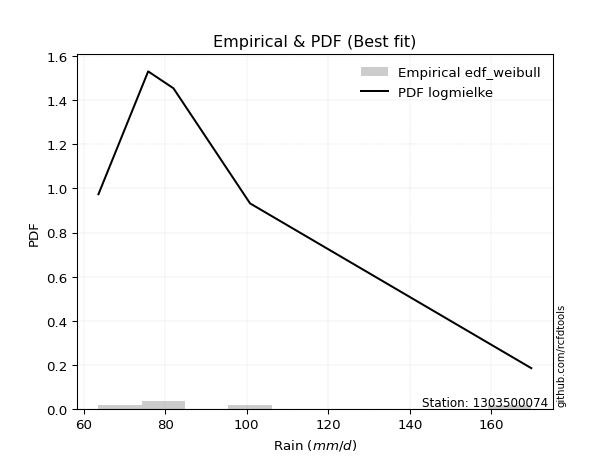</img>

</div>


### 4. EDF Beard (1943)

The Beard formula (or Beard´s plotting position formula) in hydrology is used to estimate the empirical non-exceedance probability _(P)_ of a flood event (or other extreme hydrological data point) within a given dataset.

<div align="center">


$P=(m-0.31)/(n+0.38)$


</div>


**4.1. Empirical values**

<div align="center">

|                | 0                   | 1                  | 2         | 3                  | 4                  |
|:---------------|:--------------------|:-------------------|:----------|:-------------------|:-------------------|
| date           | 2020                | 2022               | 2021      | 2025               | 2019               |
| x              | 63.6                | 75.8               | 82.0      | 100.8              | 169.8              |
| m              | 1                   | 2                  | 3         | 4                  | 5                  |
| empirical_dist | edf_beard           | edf_beard          | edf_beard | edf_beard          | edf_beard          |
| empirical      | 0.12825278810408922 | 0.3141263940520446 | 0.5       | 0.6858736059479554 | 0.8717472118959109 |
| empirical_tr   | 1.1471215351812367  | 1.4579945799457996 | 2.0       | 3.183431952662722  | 7.797101449275368  |

</div>


**4.2. Kolmogorov-Smirnov fit test (sorted by Δ)**


<div align="center">

|                | 0                   | 1                   | 2                   | 3                   | 4                  | 5                   | 6                   | 7                   | 8                   | 9                   | 10                  | 11                  | 12                 | 13                 | 14                  | 15                  | 16                  | 17                  | 18                  | 19                 | 20                  | 21                  | 22                  | 23                 | 24                  | 25                  | 26                  | 27                  | 28                  | 29                  | 30                  | 31                  | 32                  | 33                  | 34                  | 35                 | 36                  | 37                  | 38                  | 39                  | 40                  | 41                 | 42                  | 43                  | 44                  | 45                  | 46                  | 47                  | 48                  | 49                  | 50                  | 51                  | 52                  | 53                  | 54                  | 55                  | 56                  | 57                  | 58                  | 59                 | 60                  | 61                  | 62                  | 63                  | 64                 | 65                  | 66                 | 67                  | 68                 | 69                  | 70                  | 71                 | 72                  | 73                  | 74                  | 75                 | 76                 | 77                  | 78                 | 79                  | 80                  | 81                  | 82                  | 83                  | 84                  | 85                  | 86                  | 87                  | 88                  | 89                  | 90                  | 91                 | 92                  | 93                  | 94                  | 95                 | 96                  | 97                  | 98                  | 99                  | 100                 | 101                 | 102                | 103                 | 104                 | 105                 | 106                 | 107                 | 108                 | 109                 | 110                | 111                 | 112                | 113                 | 114                 | 115                 | 116                | 117                 | 118                | 119                 | 120                 | 121                | 122                 | 123                | 124                 | 125                 | 126                 | 127                | 128                | 129                 | 130                 | 131                | 132                | 133                | 134                | 135                | 136                 | 137                 | 138                | 139                 | 140                | 141                | 142                | 143                | 144                 | 145                | 146                | 147                | 148                | 149                | 150                | 151                | 152                | 153                | 154                | 155                | 156                | 157                | 158                | 159                |
|:---------------|:--------------------|:--------------------|:--------------------|:--------------------|:-------------------|:--------------------|:--------------------|:--------------------|:--------------------|:--------------------|:--------------------|:--------------------|:-------------------|:-------------------|:--------------------|:--------------------|:--------------------|:--------------------|:--------------------|:-------------------|:--------------------|:--------------------|:--------------------|:-------------------|:--------------------|:--------------------|:--------------------|:--------------------|:--------------------|:--------------------|:--------------------|:--------------------|:--------------------|:--------------------|:--------------------|:-------------------|:--------------------|:--------------------|:--------------------|:--------------------|:--------------------|:-------------------|:--------------------|:--------------------|:--------------------|:--------------------|:--------------------|:--------------------|:--------------------|:--------------------|:--------------------|:--------------------|:--------------------|:--------------------|:--------------------|:--------------------|:--------------------|:--------------------|:--------------------|:-------------------|:--------------------|:--------------------|:--------------------|:--------------------|:-------------------|:--------------------|:-------------------|:--------------------|:-------------------|:--------------------|:--------------------|:-------------------|:--------------------|:--------------------|:--------------------|:-------------------|:-------------------|:--------------------|:-------------------|:--------------------|:--------------------|:--------------------|:--------------------|:--------------------|:--------------------|:--------------------|:--------------------|:--------------------|:--------------------|:--------------------|:--------------------|:-------------------|:--------------------|:--------------------|:--------------------|:-------------------|:--------------------|:--------------------|:--------------------|:--------------------|:--------------------|:--------------------|:-------------------|:--------------------|:--------------------|:--------------------|:--------------------|:--------------------|:--------------------|:--------------------|:-------------------|:--------------------|:-------------------|:--------------------|:--------------------|:--------------------|:-------------------|:--------------------|:-------------------|:--------------------|:--------------------|:-------------------|:--------------------|:-------------------|:--------------------|:--------------------|:--------------------|:-------------------|:-------------------|:--------------------|:--------------------|:-------------------|:-------------------|:-------------------|:-------------------|:-------------------|:--------------------|:--------------------|:-------------------|:--------------------|:-------------------|:-------------------|:-------------------|:-------------------|:--------------------|:-------------------|:-------------------|:-------------------|:-------------------|:-------------------|:-------------------|:-------------------|:-------------------|:-------------------|:-------------------|:-------------------|:-------------------|:-------------------|:-------------------|:-------------------|
| station        | 1303500074          | 1303500074          | 1303500074          | 1303500074          | 1303500074         | 1303500074          | 1303500074          | 1303500074          | 1303500074          | 1303500074          | 1303500074          | 1303500074          | 1303500074         | 1303500074         | 1303500074          | 1303500074          | 1303500074          | 1303500074          | 1303500074          | 1303500074         | 1303500074          | 1303500074          | 1303500074          | 1303500074         | 1303500074          | 1303500074          | 1303500074          | 1303500074          | 1303500074          | 1303500074          | 1303500074          | 1303500074          | 1303500074          | 1303500074          | 1303500074          | 1303500074         | 1303500074          | 1303500074          | 1303500074          | 1303500074          | 1303500074          | 1303500074         | 1303500074          | 1303500074          | 1303500074          | 1303500074          | 1303500074          | 1303500074          | 1303500074          | 1303500074          | 1303500074          | 1303500074          | 1303500074          | 1303500074          | 1303500074          | 1303500074          | 1303500074          | 1303500074          | 1303500074          | 1303500074         | 1303500074          | 1303500074          | 1303500074          | 1303500074          | 1303500074         | 1303500074          | 1303500074         | 1303500074          | 1303500074         | 1303500074          | 1303500074          | 1303500074         | 1303500074          | 1303500074          | 1303500074          | 1303500074         | 1303500074         | 1303500074          | 1303500074         | 1303500074          | 1303500074          | 1303500074          | 1303500074          | 1303500074          | 1303500074          | 1303500074          | 1303500074          | 1303500074          | 1303500074          | 1303500074          | 1303500074          | 1303500074         | 1303500074          | 1303500074          | 1303500074          | 1303500074         | 1303500074          | 1303500074          | 1303500074          | 1303500074          | 1303500074          | 1303500074          | 1303500074         | 1303500074          | 1303500074          | 1303500074          | 1303500074          | 1303500074          | 1303500074          | 1303500074          | 1303500074         | 1303500074          | 1303500074         | 1303500074          | 1303500074          | 1303500074          | 1303500074         | 1303500074          | 1303500074         | 1303500074          | 1303500074          | 1303500074         | 1303500074          | 1303500074         | 1303500074          | 1303500074          | 1303500074          | 1303500074         | 1303500074         | 1303500074          | 1303500074          | 1303500074         | 1303500074         | 1303500074         | 1303500074         | 1303500074         | 1303500074          | 1303500074          | 1303500074         | 1303500074          | 1303500074         | 1303500074         | 1303500074         | 1303500074         | 1303500074          | 1303500074         | 1303500074         | 1303500074         | 1303500074         | 1303500074         | 1303500074         | 1303500074         | 1303500074         | 1303500074         | 1303500074         | 1303500074         | 1303500074         | 1303500074         | 1303500074         | 1303500074         |
| empirical_dist | edf_beard           | edf_beard           | edf_beard           | edf_beard           | edf_beard          | edf_beard           | edf_beard           | edf_beard           | edf_beard           | edf_beard           | edf_beard           | edf_beard           | edf_beard          | edf_beard          | edf_beard           | edf_beard           | edf_beard           | edf_beard           | edf_beard           | edf_beard          | edf_beard           | edf_beard           | edf_beard           | edf_beard          | edf_beard           | edf_beard           | edf_beard           | edf_beard           | edf_beard           | edf_beard           | edf_beard           | edf_beard           | edf_beard           | edf_beard           | edf_beard           | edf_beard          | edf_beard           | edf_beard           | edf_beard           | edf_beard           | edf_beard           | edf_beard          | edf_beard           | edf_beard           | edf_beard           | edf_beard           | edf_beard           | edf_beard           | edf_beard           | edf_beard           | edf_beard           | edf_beard           | edf_beard           | edf_beard           | edf_beard           | edf_beard           | edf_beard           | edf_beard           | edf_beard           | edf_beard          | edf_beard           | edf_beard           | edf_beard           | edf_beard           | edf_beard          | edf_beard           | edf_beard          | edf_beard           | edf_beard          | edf_beard           | edf_beard           | edf_beard          | edf_beard           | edf_beard           | edf_beard           | edf_beard          | edf_beard          | edf_beard           | edf_beard          | edf_beard           | edf_beard           | edf_beard           | edf_beard           | edf_beard           | edf_beard           | edf_beard           | edf_beard           | edf_beard           | edf_beard           | edf_beard           | edf_beard           | edf_beard          | edf_beard           | edf_beard           | edf_beard           | edf_beard          | edf_beard           | edf_beard           | edf_beard           | edf_beard           | edf_beard           | edf_beard           | edf_beard          | edf_beard           | edf_beard           | edf_beard           | edf_beard           | edf_beard           | edf_beard           | edf_beard           | edf_beard          | edf_beard           | edf_beard          | edf_beard           | edf_beard           | edf_beard           | edf_beard          | edf_beard           | edf_beard          | edf_beard           | edf_beard           | edf_beard          | edf_beard           | edf_beard          | edf_beard           | edf_beard           | edf_beard           | edf_beard          | edf_beard          | edf_beard           | edf_beard           | edf_beard          | edf_beard          | edf_beard          | edf_beard          | edf_beard          | edf_beard           | edf_beard           | edf_beard          | edf_beard           | edf_beard          | edf_beard          | edf_beard          | edf_beard          | edf_beard           | edf_beard          | edf_beard          | edf_beard          | edf_beard          | edf_beard          | edf_beard          | edf_beard          | edf_beard          | edf_beard          | edf_beard          | edf_beard          | edf_beard          | edf_beard          | edf_beard          | edf_beard          |
| p_dist         | logmielke           | logalpha            | loggenextreme       | loginvweibull       | alpha              | logncf              | loghalfnorm         | invgamma            | f                   | logmoyal            | logburr             | loginvgauss         | invgauss           | logjohnsonsu       | logfoldnorm         | loghalflogistic     | logweibull_max      | loggenlogistic      | burr                | halflogistic       | loggumbel_r         | foldnorm            | logpearson3         | halfnorm           | logdweibull         | logfatiguelife      | lograyleigh         | logloglaplace       | logkstwobign        | logmaxwell          | moyal               | pearson3            | logsemicircular     | burr12              | logburr12           | nct                | lognct              | loganglit           | loginvgamma         | gumbel_r            | rayleigh            | betaprime          | exponnorm           | logexponnorm        | wald                | logbetaprime        | loglomax            | gausshyper          | loggenexpon         | loggompertz         | genexpon            | vonmises_line       | gengamma            | exponweib           | gompertz            | logarcsine          | logskewnorm         | truncnorm           | logwald             | ncf                | logf                | lognakagami         | genlogistic         | maxwell             | logcrystalball     | lognorm             | logt               | logloggamma         | logrice            | logbeta             | nakagami            | logtruncexpon      | loglogistic         | logdgamma           | logtruncweibull_min | anglit             | loggennorm         | semicircular        | kstwobign          | gennorm             | crystalball         | norm                | t                   | logbradford         | loghypsecant        | arcsine             | logcosine           | logistic            | dgamma              | loggengamma         | logwrapcauchy       | dweibull           | loglaplace          | loglaplace          | rice                | loggumbel_l        | hypsecant           | bradford            | logksone            | skewnorm            | cosine              | logvonmises_line    | wrapcauchy         | truncweibull_min    | gumbel_l            | laplace             | logargus            | logkappa4           | truncexpon          | logtukeylambda      | loglevy_l          | halfgennorm         | loguniform         | logkappa3           | genextreme          | loggenpareto        | levy_l             | logrdist            | genpareto          | weibull_min         | beta                | logtriang          | loghalfgennorm      | kappa4             | rdist               | argus               | ksone               | logexponpow        | tukeylambda        | kappa3              | uniform             | loggamma           | loggamma           | triang             | loggenhalflogistic | lomax              | logtruncpareto      | fatiguelife         | johnsonsb          | invweibull          | genhalflogistic    | powerlaw           | logtrapezoid       | logpowerlaw        | truncpareto         | johnsonsu          | logexponweib       | logweibull_min     | logjohnsonsb       | exponpow           | loggausshyper      | trapezoid          | weibull_max        | gamma              | logerlang          | erlang             | logtruncnorm       | logvonmises        | vonmises           | mielke             |
| delta          | 0.06175472293101214 | 0.06220138586920604 | 0.06552348264451104 | 0.06552427978513232 | 0.0674444569691244 | 0.06821445073189047 | 0.06839880486128735 | 0.07088531744270271 | 0.07088584881864968 | 0.07093532413796044 | 0.07317903505093526 | 0.07365908315905112 | 0.0752122229759001 | 0.0753010785560858 | 0.07666997528144764 | 0.08320705771292736 | 0.08464994748985716 | 0.08495462666299347 | 0.08507187365574786 | 0.0875761485940767 | 0.08789433026255161 | 0.08944549559390386 | 0.09197501889801651 | 0.0923504978339863 | 0.09327980130698676 | 0.09424851163927023 | 0.09438882281944827 | 0.09689344853679915 | 0.10012843928872028 | 0.10656638127608309 | 0.10984461999664141 | 0.11094088944139152 | 0.11274784649824421 | 0.11367671784232179 | 0.11384284381140013 | 0.1157463770765852 | 0.12022788595844935 | 0.12052752751468654 | 0.12061910396564618 | 0.12519784120211813 | 0.12588400585303877 | 0.1265282184474974 | 0.12728858541386853 | 0.12735747643420445 | 0.12749022078262673 | 0.12783119906359375 | 0.12823447201547686 | 0.12825277381043326 | 0.12825278802092333 | 0.12825278805690354 | 0.12825278809572055 | 0.12825278809783558 | 0.12825278810407664 | 0.12825278810407675 | 0.12825278810408677 | 0.12825278810408913 | 0.12825278810408922 | 0.12825278810408922 | 0.12825278810408922 | 0.1299026964259573 | 0.13123000272936192 | 0.13524652931989745 | 0.13662413443349192 | 0.13767202926062733 | 0.139116459936437  | 0.13911653665358642 | 0.1391193548726174 | 0.13931803078566857 | 0.1404166960868652 | 0.14246199809401527 | 0.14384503447074948 | 0.1492278988802313 | 0.15608389605030154 | 0.15874377181880595 | 0.16013250436651844 | 0.1641008461632194 | 0.1645460210544306 | 0.16559618997463177 | 0.1659990490926112 | 0.16709546390577723 | 0.16835671150524045 | 0.16835672052833067 | 0.16837714959744243 | 0.16886710335957938 | 0.16943060610927768 | 0.17152805974461105 | 0.17595574571483585 | 0.18776522160533843 | 0.18826689325029866 | 0.18866041120718963 | 0.19624865961404503 | 0.197336768317409  | 0.19782418754249687 | 0.19782418754249687 | 0.19985300780246396 | 0.2007480669844966 | 0.20246978877641936 | 0.20495605117526344 | 0.21173814623368048 | 0.21976987501861034 | 0.22144270193657006 | 0.22722953531776946 | 0.2279948921868083 | 0.22879443450000803 | 0.22962302858142447 | 0.22987422904996452 | 0.23050063431463375 | 0.23134369306665187 | 0.23217900847024048 | 0.23316652083877187 | 0.233301036500582  | 0.23953827086934282 | 0.2412385359826612 | 0.24169967643207374 | 0.24630737255737645 | 0.24982493372115097 | 0.2505583917799902 | 0.25356667121595367 | 0.2615428222209388 | 0.26483924410583454 | 0.27042973406115717 | 0.2791490294844652 | 0.29506060875817636 | 0.2974049950162945 | 0.30189230733481864 | 0.30710853185269216 | 0.31063820105153367 | 0.3110130382513879 | 0.314126393991755  | 0.33371523984535956 | 0.33559112007224934 | 0.344484770431108  | 0.344484770431108  | 0.3479312052803835 | 0.3517534811793751 | 0.3536162867918872 | 0.38742893657380145 | 0.41977622965518174 | 0.4296716610310612 | 0.43222363756720666 | 0.4519943817329978 | 0.4597605638682    | 0.4610691717894886 | 0.4853367015358367 | 0.48663711282970673 | 0.4946117164673411 | 0.5105177583578906 | 0.5202644901778681 | 0.5253897489081736 | 0.5339261319116517 | 0.5380081190543953 | 0.5450719968601738 | 0.5617404072445359 | 0.5700072802282934 | 0.5710978716150541 | 0.5813271618918294 | 0.6858736059479554 | 1.0929051734963846 | 26.266412241574734 | nan                |
| deltao         | 0.5865427407550001  | 0.5865427407550001  | 0.5865427407550001  | 0.5865427407550001  | 0.5865427407550001 | 0.5865427407550001  | 0.5865427407550001  | 0.5865427407550001  | 0.5865427407550001  | 0.5865427407550001  | 0.5865427407550001  | 0.5865427407550001  | 0.5865427407550001 | 0.5865427407550001 | 0.5865427407550001  | 0.5865427407550001  | 0.5865427407550001  | 0.5865427407550001  | 0.5865427407550001  | 0.5865427407550001 | 0.5865427407550001  | 0.5865427407550001  | 0.5865427407550001  | 0.5865427407550001 | 0.5865427407550001  | 0.5865427407550001  | 0.5865427407550001  | 0.5865427407550001  | 0.5865427407550001  | 0.5865427407550001  | 0.5865427407550001  | 0.5865427407550001  | 0.5865427407550001  | 0.5865427407550001  | 0.5865427407550001  | 0.5865427407550001 | 0.5865427407550001  | 0.5865427407550001  | 0.5865427407550001  | 0.5865427407550001  | 0.5865427407550001  | 0.5865427407550001 | 0.5865427407550001  | 0.5865427407550001  | 0.5865427407550001  | 0.5865427407550001  | 0.5865427407550001  | 0.5865427407550001  | 0.5865427407550001  | 0.5865427407550001  | 0.5865427407550001  | 0.5865427407550001  | 0.5865427407550001  | 0.5865427407550001  | 0.5865427407550001  | 0.5865427407550001  | 0.5865427407550001  | 0.5865427407550001  | 0.5865427407550001  | 0.5865427407550001 | 0.5865427407550001  | 0.5865427407550001  | 0.5865427407550001  | 0.5865427407550001  | 0.5865427407550001 | 0.5865427407550001  | 0.5865427407550001 | 0.5865427407550001  | 0.5865427407550001 | 0.5865427407550001  | 0.5865427407550001  | 0.5865427407550001 | 0.5865427407550001  | 0.5865427407550001  | 0.5865427407550001  | 0.5865427407550001 | 0.5865427407550001 | 0.5865427407550001  | 0.5865427407550001 | 0.5865427407550001  | 0.5865427407550001  | 0.5865427407550001  | 0.5865427407550001  | 0.5865427407550001  | 0.5865427407550001  | 0.5865427407550001  | 0.5865427407550001  | 0.5865427407550001  | 0.5865427407550001  | 0.5865427407550001  | 0.5865427407550001  | 0.5865427407550001 | 0.5865427407550001  | 0.5865427407550001  | 0.5865427407550001  | 0.5865427407550001 | 0.5865427407550001  | 0.5865427407550001  | 0.5865427407550001  | 0.5865427407550001  | 0.5865427407550001  | 0.5865427407550001  | 0.5865427407550001 | 0.5865427407550001  | 0.5865427407550001  | 0.5865427407550001  | 0.5865427407550001  | 0.5865427407550001  | 0.5865427407550001  | 0.5865427407550001  | 0.5865427407550001 | 0.5865427407550001  | 0.5865427407550001 | 0.5865427407550001  | 0.5865427407550001  | 0.5865427407550001  | 0.5865427407550001 | 0.5865427407550001  | 0.5865427407550001 | 0.5865427407550001  | 0.5865427407550001  | 0.5865427407550001 | 0.5865427407550001  | 0.5865427407550001 | 0.5865427407550001  | 0.5865427407550001  | 0.5865427407550001  | 0.5865427407550001 | 0.5865427407550001 | 0.5865427407550001  | 0.5865427407550001  | 0.5865427407550001 | 0.5865427407550001 | 0.5865427407550001 | 0.5865427407550001 | 0.5865427407550001 | 0.5865427407550001  | 0.5865427407550001  | 0.5865427407550001 | 0.5865427407550001  | 0.5865427407550001 | 0.5865427407550001 | 0.5865427407550001 | 0.5865427407550001 | 0.5865427407550001  | 0.5865427407550001 | 0.5865427407550001 | 0.5865427407550001 | 0.5865427407550001 | 0.5865427407550001 | 0.5865427407550001 | 0.5865427407550001 | 0.5865427407550001 | 0.5865427407550001 | 0.5865427407550001 | 0.5865427407550001 | 0.5865427407550001 | 0.5865427407550001 | 0.5865427407550001 | 0.5865427407550001 |
| eval           | Δo > Δ              | Δo > Δ              | Δo > Δ              | Δo > Δ              | Δo > Δ             | Δo > Δ              | Δo > Δ              | Δo > Δ              | Δo > Δ              | Δo > Δ              | Δo > Δ              | Δo > Δ              | Δo > Δ             | Δo > Δ             | Δo > Δ              | Δo > Δ              | Δo > Δ              | Δo > Δ              | Δo > Δ              | Δo > Δ             | Δo > Δ              | Δo > Δ              | Δo > Δ              | Δo > Δ             | Δo > Δ              | Δo > Δ              | Δo > Δ              | Δo > Δ              | Δo > Δ              | Δo > Δ              | Δo > Δ              | Δo > Δ              | Δo > Δ              | Δo > Δ              | Δo > Δ              | Δo > Δ             | Δo > Δ              | Δo > Δ              | Δo > Δ              | Δo > Δ              | Δo > Δ              | Δo > Δ             | Δo > Δ              | Δo > Δ              | Δo > Δ              | Δo > Δ              | Δo > Δ              | Δo > Δ              | Δo > Δ              | Δo > Δ              | Δo > Δ              | Δo > Δ              | Δo > Δ              | Δo > Δ              | Δo > Δ              | Δo > Δ              | Δo > Δ              | Δo > Δ              | Δo > Δ              | Δo > Δ             | Δo > Δ              | Δo > Δ              | Δo > Δ              | Δo > Δ              | Δo > Δ             | Δo > Δ              | Δo > Δ             | Δo > Δ              | Δo > Δ             | Δo > Δ              | Δo > Δ              | Δo > Δ             | Δo > Δ              | Δo > Δ              | Δo > Δ              | Δo > Δ             | Δo > Δ             | Δo > Δ              | Δo > Δ             | Δo > Δ              | Δo > Δ              | Δo > Δ              | Δo > Δ              | Δo > Δ              | Δo > Δ              | Δo > Δ              | Δo > Δ              | Δo > Δ              | Δo > Δ              | Δo > Δ              | Δo > Δ              | Δo > Δ             | Δo > Δ              | Δo > Δ              | Δo > Δ              | Δo > Δ             | Δo > Δ              | Δo > Δ              | Δo > Δ              | Δo > Δ              | Δo > Δ              | Δo > Δ              | Δo > Δ             | Δo > Δ              | Δo > Δ              | Δo > Δ              | Δo > Δ              | Δo > Δ              | Δo > Δ              | Δo > Δ              | Δo > Δ             | Δo > Δ              | Δo > Δ             | Δo > Δ              | Δo > Δ              | Δo > Δ              | Δo > Δ             | Δo > Δ              | Δo > Δ             | Δo > Δ              | Δo > Δ              | Δo > Δ             | Δo > Δ              | Δo > Δ             | Δo > Δ              | Δo > Δ              | Δo > Δ              | Δo > Δ             | Δo > Δ             | Δo > Δ              | Δo > Δ              | Δo > Δ             | Δo > Δ             | Δo > Δ             | Δo > Δ             | Δo > Δ             | Δo > Δ              | Δo > Δ              | Δo > Δ             | Δo > Δ              | Δo > Δ             | Δo > Δ             | Δo > Δ             | Δo > Δ             | Δo > Δ              | Δo > Δ             | Δo > Δ             | Δo > Δ             | Δo > Δ             | Δo > Δ             | Δo > Δ             | Δo > Δ             | Δo > Δ             | Δo > Δ             | Δo > Δ             | Δo > Δ             | Δo <= Δ            | Δo <= Δ            | Δo <= Δ            | Δo <= Δ            |
| fit            | 1                   | 1                   | 1                   | 1                   | 1                  | 1                   | 1                   | 1                   | 1                   | 1                   | 1                   | 1                   | 1                  | 1                  | 1                   | 1                   | 1                   | 1                   | 1                   | 1                  | 1                   | 1                   | 1                   | 1                  | 1                   | 1                   | 1                   | 1                   | 1                   | 1                   | 1                   | 1                   | 1                   | 1                   | 1                   | 1                  | 1                   | 1                   | 1                   | 1                   | 1                   | 1                  | 1                   | 1                   | 1                   | 1                   | 1                   | 1                   | 1                   | 1                   | 1                   | 1                   | 1                   | 1                   | 1                   | 1                   | 1                   | 1                   | 1                   | 1                  | 1                   | 1                   | 1                   | 1                   | 1                  | 1                   | 1                  | 1                   | 1                  | 1                   | 1                   | 1                  | 1                   | 1                   | 1                   | 1                  | 1                  | 1                   | 1                  | 1                   | 1                   | 1                   | 1                   | 1                   | 1                   | 1                   | 1                   | 1                   | 1                   | 1                   | 1                   | 1                  | 1                   | 1                   | 1                   | 1                  | 1                   | 1                   | 1                   | 1                   | 1                   | 1                   | 1                  | 1                   | 1                   | 1                   | 1                   | 1                   | 1                   | 1                   | 1                  | 1                   | 1                  | 1                   | 1                   | 1                   | 1                  | 1                   | 1                  | 1                   | 1                   | 1                  | 1                   | 1                  | 1                   | 1                   | 1                   | 1                  | 1                  | 1                   | 1                   | 1                  | 1                  | 1                  | 1                  | 1                  | 1                   | 1                   | 1                  | 1                   | 1                  | 1                  | 1                  | 1                  | 1                   | 1                  | 1                  | 1                  | 1                  | 1                  | 1                  | 1                  | 1                  | 1                  | 1                  | 1                  | 0                  | 0                  | 0                  | 0                  |
| n              | 5                   | 5                   | 5                   | 5                   | 5                  | 5                   | 5                   | 5                   | 5                   | 5                   | 5                   | 5                   | 5                  | 5                  | 5                   | 5                   | 5                   | 5                   | 5                   | 5                  | 5                   | 5                   | 5                   | 5                  | 5                   | 5                   | 5                   | 5                   | 5                   | 5                   | 5                   | 5                   | 5                   | 5                   | 5                   | 5                  | 5                   | 5                   | 5                   | 5                   | 5                   | 5                  | 5                   | 5                   | 5                   | 5                   | 5                   | 5                   | 5                   | 5                   | 5                   | 5                   | 5                   | 5                   | 5                   | 5                   | 5                   | 5                   | 5                   | 5                  | 5                   | 5                   | 5                   | 5                   | 5                  | 5                   | 5                  | 5                   | 5                  | 5                   | 5                   | 5                  | 5                   | 5                   | 5                   | 5                  | 5                  | 5                   | 5                  | 5                   | 5                   | 5                   | 5                   | 5                   | 5                   | 5                   | 5                   | 5                   | 5                   | 5                   | 5                   | 5                  | 5                   | 5                   | 5                   | 5                  | 5                   | 5                   | 5                   | 5                   | 5                   | 5                   | 5                  | 5                   | 5                   | 5                   | 5                   | 5                   | 5                   | 5                   | 5                  | 5                   | 5                  | 5                   | 5                   | 5                   | 5                  | 5                   | 5                  | 5                   | 5                   | 5                  | 5                   | 5                  | 5                   | 5                   | 5                   | 5                  | 5                  | 5                   | 5                   | 5                  | 5                  | 5                  | 5                  | 5                  | 5                   | 5                   | 5                  | 5                   | 5                  | 5                  | 5                  | 5                  | 5                   | 5                  | 5                  | 5                  | 5                  | 5                  | 5                  | 5                  | 5                  | 5                  | 5                  | 5                  | 5                  | 5                  | 5                  | 5                  |
| best_fit       | 1                   | 0                   | 0                   | 0                   | 0                  | 0                   | 0                   | 0                   | 0                   | 0                   | 0                   | 0                   | 0                  | 0                  | 0                   | 0                   | 0                   | 0                   | 0                   | 0                  | 0                   | 0                   | 0                   | 0                  | 0                   | 0                   | 0                   | 0                   | 0                   | 0                   | 0                   | 0                   | 0                   | 0                   | 0                   | 0                  | 0                   | 0                   | 0                   | 0                   | 0                   | 0                  | 0                   | 0                   | 0                   | 0                   | 0                   | 0                   | 0                   | 0                   | 0                   | 0                   | 0                   | 0                   | 0                   | 0                   | 0                   | 0                   | 0                   | 0                  | 0                   | 0                   | 0                   | 0                   | 0                  | 0                   | 0                  | 0                   | 0                  | 0                   | 0                   | 0                  | 0                   | 0                   | 0                   | 0                  | 0                  | 0                   | 0                  | 0                   | 0                   | 0                   | 0                   | 0                   | 0                   | 0                   | 0                   | 0                   | 0                   | 0                   | 0                   | 0                  | 0                   | 0                   | 0                   | 0                  | 0                   | 0                   | 0                   | 0                   | 0                   | 0                   | 0                  | 0                   | 0                   | 0                   | 0                   | 0                   | 0                   | 0                   | 0                  | 0                   | 0                  | 0                   | 0                   | 0                   | 0                  | 0                   | 0                  | 0                   | 0                   | 0                  | 0                   | 0                  | 0                   | 0                   | 0                   | 0                  | 0                  | 0                   | 0                   | 0                  | 0                  | 0                  | 0                  | 0                  | 0                   | 0                   | 0                  | 0                   | 0                  | 0                  | 0                  | 0                  | 0                   | 0                  | 0                  | 0                  | 0                  | 0                  | 0                  | 0                  | 0                  | 0                  | 0                  | 0                  | 0                  | 0                  | 0                  | 0                  |
| best_fit_sort  | 1                   | 2                   | 3                   | 4                   | 5                  | 6                   | 7                   | 8                   | 9                   | 10                  | 11                  | 12                  | 13                 | 14                 | 15                  | 16                  | 17                  | 18                  | 19                  | 20                 | 21                  | 22                  | 23                  | 24                 | 25                  | 26                  | 27                  | 28                  | 29                  | 30                  | 31                  | 32                  | 33                  | 34                  | 35                  | 36                 | 37                  | 38                  | 39                  | 40                  | 41                  | 42                 | 43                  | 44                  | 45                  | 46                  | 47                  | 48                  | 49                  | 50                  | 51                  | 52                  | 53                  | 54                  | 55                  | 56                  | 57                  | 58                  | 59                  | 60                 | 61                  | 62                  | 63                  | 64                  | 65                 | 66                  | 67                 | 68                  | 69                 | 70                  | 71                  | 72                 | 73                  | 74                  | 75                  | 76                 | 77                 | 78                  | 79                 | 80                  | 81                  | 82                  | 83                  | 84                  | 85                  | 86                  | 87                  | 88                  | 89                  | 90                  | 91                  | 92                 | 93                  | 94                  | 95                  | 96                 | 97                  | 98                  | 99                  | 100                 | 101                 | 102                 | 103                | 104                 | 105                 | 106                 | 107                 | 108                 | 109                 | 110                 | 111                | 112                 | 113                | 114                 | 115                 | 116                 | 117                | 118                 | 119                | 120                 | 121                 | 122                | 123                 | 124                | 125                 | 126                 | 127                 | 128                | 129                | 130                 | 131                 | 132                | 133                | 134                | 135                | 136                | 137                 | 138                 | 139                | 140                 | 141                | 142                | 143                | 144                | 145                 | 146                | 147                | 148                | 149                | 150                | 151                | 152                | 153                | 154                | 155                | 156                | 157                | 158                | 159                | 160                |

</div>


**4.3. Best fit**

<div align="center">

|   id |    station | empirical_dist   | p_dist    |     delta |   deltao | eval   |   fit |   n |   best_fit |   best_fit_sort |
|-----:|-----------:|:-----------------|:----------|----------:|---------:|:-------|------:|----:|-----------:|----------------:|
|    0 | 1303500074 | edf_beard        | logmielke | 0.0617547 | 0.586543 | Δo > Δ |     1 |   5 |          1 |               1 |

</div>


<div align="center">

</img></img>

</div>


### 5. EDF Chegodayev (1955)

The Chegodayev formula is an empirical plotting position formula used in hydrological frequency analysis to estimate the exceedance probability or return period of a specific event from a set of observed data. It is primarily used for plotting observed data points on probability paper to fit a theoretical distribution, particularly for analyzing extreme events like maximum flood flows or rainfall intensities. The constant _b_ value in the generalized plotting position formula is 0.3.

<div align="center">


$P=(m-b)/(n+1-2b)$


</div>


**5.1. Empirical values**

<div align="center">

|                | 0                   | 1                   | 2              | 3                  | 4                  |
|:---------------|:--------------------|:--------------------|:---------------|:-------------------|:-------------------|
| date           | 2020                | 2022                | 2021           | 2025               | 2019               |
| x              | 63.6                | 75.8                | 82.0           | 100.8              | 169.8              |
| m              | 1                   | 2                   | 3              | 4                  | 5                  |
| empirical_dist | edf_chegodayev      | edf_chegodayev      | edf_chegodayev | edf_chegodayev     | edf_chegodayev     |
| empirical      | 0.12962962962962962 | 0.31481481481481477 | 0.5            | 0.6851851851851851 | 0.8703703703703703 |
| empirical_tr   | 1.148936170212766   | 1.4594594594594594  | 2.0            | 3.1764705882352935 | 7.714285714285713  |

</div>


**5.2. Kolmogorov-Smirnov fit test (sorted by Δ)**


<div align="center">

|                | 0                   | 1                   | 2                   | 3                   | 4                   | 5                   | 6                   | 7                   | 8                   | 9                   | 10                  | 11                  | 12                  | 13                  | 14                 | 15                  | 16                  | 17                  | 18                  | 19                 | 20                  | 21                  | 22                  | 23                 | 24                  | 25                  | 26                  | 27                  | 28                  | 29                  | 30                  | 31                  | 32                  | 33                 | 34                  | 35                 | 36                  | 37                  | 38                  | 39                  | 40                  | 41                 | 42                  | 43                  | 44                  | 45                  | 46                  | 47                  | 48                  | 49                  | 50                  | 51                 | 52                  | 53                  | 54                  | 55                  | 56                  | 57                  | 58                  | 59                 | 60                  | 61                 | 62                  | 63                  | 64                 | 65                  | 66                 | 67                  | 68                 | 69                  | 70                  | 71                 | 72                  | 73                  | 74                  | 75                 | 76                  | 77                  | 78                 | 79                  | 80                  | 81                  | 82                  | 83                  | 84                  | 85                  | 86                  | 87                  | 88                  | 89                  | 90                  | 91                 | 92                  | 93                  | 94                  | 95                 | 96                  | 97                 | 98                  | 99                  | 100                 | 101                 | 102                 | 103                 | 104                 | 105                 | 106                 | 107                 | 108                | 109                 | 110                 | 111                 | 112                | 113                 | 114                 | 115                 | 116                | 117                 | 118                 | 119                | 120                | 121                 | 122                | 123                | 124                 | 125                 | 126                 | 127                | 128                 | 129                 | 130                | 131                 | 132                 | 133                | 134                | 135                | 136                | 137                | 138                 | 139                 | 140                 | 141                | 142                 | 143                 | 144                | 145                 | 146                | 147                | 148                | 149                | 150                | 151                | 152                | 153                | 154                | 155                | 156                | 157                | 158                | 159                |
|:---------------|:--------------------|:--------------------|:--------------------|:--------------------|:--------------------|:--------------------|:--------------------|:--------------------|:--------------------|:--------------------|:--------------------|:--------------------|:--------------------|:--------------------|:-------------------|:--------------------|:--------------------|:--------------------|:--------------------|:-------------------|:--------------------|:--------------------|:--------------------|:-------------------|:--------------------|:--------------------|:--------------------|:--------------------|:--------------------|:--------------------|:--------------------|:--------------------|:--------------------|:-------------------|:--------------------|:-------------------|:--------------------|:--------------------|:--------------------|:--------------------|:--------------------|:-------------------|:--------------------|:--------------------|:--------------------|:--------------------|:--------------------|:--------------------|:--------------------|:--------------------|:--------------------|:-------------------|:--------------------|:--------------------|:--------------------|:--------------------|:--------------------|:--------------------|:--------------------|:-------------------|:--------------------|:-------------------|:--------------------|:--------------------|:-------------------|:--------------------|:-------------------|:--------------------|:-------------------|:--------------------|:--------------------|:-------------------|:--------------------|:--------------------|:--------------------|:-------------------|:--------------------|:--------------------|:-------------------|:--------------------|:--------------------|:--------------------|:--------------------|:--------------------|:--------------------|:--------------------|:--------------------|:--------------------|:--------------------|:--------------------|:--------------------|:-------------------|:--------------------|:--------------------|:--------------------|:-------------------|:--------------------|:-------------------|:--------------------|:--------------------|:--------------------|:--------------------|:--------------------|:--------------------|:--------------------|:--------------------|:--------------------|:--------------------|:-------------------|:--------------------|:--------------------|:--------------------|:-------------------|:--------------------|:--------------------|:--------------------|:-------------------|:--------------------|:--------------------|:-------------------|:-------------------|:--------------------|:-------------------|:-------------------|:--------------------|:--------------------|:--------------------|:-------------------|:--------------------|:--------------------|:-------------------|:--------------------|:--------------------|:-------------------|:-------------------|:-------------------|:-------------------|:-------------------|:--------------------|:--------------------|:--------------------|:-------------------|:--------------------|:--------------------|:-------------------|:--------------------|:-------------------|:-------------------|:-------------------|:-------------------|:-------------------|:-------------------|:-------------------|:-------------------|:-------------------|:-------------------|:-------------------|:-------------------|:-------------------|:-------------------|
| station        | 1303500074          | 1303500074          | 1303500074          | 1303500074          | 1303500074          | 1303500074          | 1303500074          | 1303500074          | 1303500074          | 1303500074          | 1303500074          | 1303500074          | 1303500074          | 1303500074          | 1303500074         | 1303500074          | 1303500074          | 1303500074          | 1303500074          | 1303500074         | 1303500074          | 1303500074          | 1303500074          | 1303500074         | 1303500074          | 1303500074          | 1303500074          | 1303500074          | 1303500074          | 1303500074          | 1303500074          | 1303500074          | 1303500074          | 1303500074         | 1303500074          | 1303500074         | 1303500074          | 1303500074          | 1303500074          | 1303500074          | 1303500074          | 1303500074         | 1303500074          | 1303500074          | 1303500074          | 1303500074          | 1303500074          | 1303500074          | 1303500074          | 1303500074          | 1303500074          | 1303500074         | 1303500074          | 1303500074          | 1303500074          | 1303500074          | 1303500074          | 1303500074          | 1303500074          | 1303500074         | 1303500074          | 1303500074         | 1303500074          | 1303500074          | 1303500074         | 1303500074          | 1303500074         | 1303500074          | 1303500074         | 1303500074          | 1303500074          | 1303500074         | 1303500074          | 1303500074          | 1303500074          | 1303500074         | 1303500074          | 1303500074          | 1303500074         | 1303500074          | 1303500074          | 1303500074          | 1303500074          | 1303500074          | 1303500074          | 1303500074          | 1303500074          | 1303500074          | 1303500074          | 1303500074          | 1303500074          | 1303500074         | 1303500074          | 1303500074          | 1303500074          | 1303500074         | 1303500074          | 1303500074         | 1303500074          | 1303500074          | 1303500074          | 1303500074          | 1303500074          | 1303500074          | 1303500074          | 1303500074          | 1303500074          | 1303500074          | 1303500074         | 1303500074          | 1303500074          | 1303500074          | 1303500074         | 1303500074          | 1303500074          | 1303500074          | 1303500074         | 1303500074          | 1303500074          | 1303500074         | 1303500074         | 1303500074          | 1303500074         | 1303500074         | 1303500074          | 1303500074          | 1303500074          | 1303500074         | 1303500074          | 1303500074          | 1303500074         | 1303500074          | 1303500074          | 1303500074         | 1303500074         | 1303500074         | 1303500074         | 1303500074         | 1303500074          | 1303500074          | 1303500074          | 1303500074         | 1303500074          | 1303500074          | 1303500074         | 1303500074          | 1303500074         | 1303500074         | 1303500074         | 1303500074         | 1303500074         | 1303500074         | 1303500074         | 1303500074         | 1303500074         | 1303500074         | 1303500074         | 1303500074         | 1303500074         | 1303500074         |
| empirical_dist | edf_chegodayev      | edf_chegodayev      | edf_chegodayev      | edf_chegodayev      | edf_chegodayev      | edf_chegodayev      | edf_chegodayev      | edf_chegodayev      | edf_chegodayev      | edf_chegodayev      | edf_chegodayev      | edf_chegodayev      | edf_chegodayev      | edf_chegodayev      | edf_chegodayev     | edf_chegodayev      | edf_chegodayev      | edf_chegodayev      | edf_chegodayev      | edf_chegodayev     | edf_chegodayev      | edf_chegodayev      | edf_chegodayev      | edf_chegodayev     | edf_chegodayev      | edf_chegodayev      | edf_chegodayev      | edf_chegodayev      | edf_chegodayev      | edf_chegodayev      | edf_chegodayev      | edf_chegodayev      | edf_chegodayev      | edf_chegodayev     | edf_chegodayev      | edf_chegodayev     | edf_chegodayev      | edf_chegodayev      | edf_chegodayev      | edf_chegodayev      | edf_chegodayev      | edf_chegodayev     | edf_chegodayev      | edf_chegodayev      | edf_chegodayev      | edf_chegodayev      | edf_chegodayev      | edf_chegodayev      | edf_chegodayev      | edf_chegodayev      | edf_chegodayev      | edf_chegodayev     | edf_chegodayev      | edf_chegodayev      | edf_chegodayev      | edf_chegodayev      | edf_chegodayev      | edf_chegodayev      | edf_chegodayev      | edf_chegodayev     | edf_chegodayev      | edf_chegodayev     | edf_chegodayev      | edf_chegodayev      | edf_chegodayev     | edf_chegodayev      | edf_chegodayev     | edf_chegodayev      | edf_chegodayev     | edf_chegodayev      | edf_chegodayev      | edf_chegodayev     | edf_chegodayev      | edf_chegodayev      | edf_chegodayev      | edf_chegodayev     | edf_chegodayev      | edf_chegodayev      | edf_chegodayev     | edf_chegodayev      | edf_chegodayev      | edf_chegodayev      | edf_chegodayev      | edf_chegodayev      | edf_chegodayev      | edf_chegodayev      | edf_chegodayev      | edf_chegodayev      | edf_chegodayev      | edf_chegodayev      | edf_chegodayev      | edf_chegodayev     | edf_chegodayev      | edf_chegodayev      | edf_chegodayev      | edf_chegodayev     | edf_chegodayev      | edf_chegodayev     | edf_chegodayev      | edf_chegodayev      | edf_chegodayev      | edf_chegodayev      | edf_chegodayev      | edf_chegodayev      | edf_chegodayev      | edf_chegodayev      | edf_chegodayev      | edf_chegodayev      | edf_chegodayev     | edf_chegodayev      | edf_chegodayev      | edf_chegodayev      | edf_chegodayev     | edf_chegodayev      | edf_chegodayev      | edf_chegodayev      | edf_chegodayev     | edf_chegodayev      | edf_chegodayev      | edf_chegodayev     | edf_chegodayev     | edf_chegodayev      | edf_chegodayev     | edf_chegodayev     | edf_chegodayev      | edf_chegodayev      | edf_chegodayev      | edf_chegodayev     | edf_chegodayev      | edf_chegodayev      | edf_chegodayev     | edf_chegodayev      | edf_chegodayev      | edf_chegodayev     | edf_chegodayev     | edf_chegodayev     | edf_chegodayev     | edf_chegodayev     | edf_chegodayev      | edf_chegodayev      | edf_chegodayev      | edf_chegodayev     | edf_chegodayev      | edf_chegodayev      | edf_chegodayev     | edf_chegodayev      | edf_chegodayev     | edf_chegodayev     | edf_chegodayev     | edf_chegodayev     | edf_chegodayev     | edf_chegodayev     | edf_chegodayev     | edf_chegodayev     | edf_chegodayev     | edf_chegodayev     | edf_chegodayev     | edf_chegodayev     | edf_chegodayev     | edf_chegodayev     |
| p_dist         | logmielke           | logalpha            | loggenextreme       | loginvweibull       | alpha               | logncf              | loghalfnorm         | invgamma            | f                   | logmoyal            | logburr             | loginvgauss         | invgauss            | logfoldnorm         | logjohnsonsu       | loghalflogistic     | logweibull_max      | loggenlogistic      | burr                | halflogistic       | loggumbel_r         | foldnorm            | logpearson3         | halfnorm           | logfatiguelife      | logdweibull         | lograyleigh         | logloglaplace       | logkstwobign        | logmaxwell          | moyal               | pearson3            | logsemicircular     | burr12             | logburr12           | nct                | lognct              | loganglit           | loginvgamma         | gumbel_r            | rayleigh            | betaprime          | logbetaprime        | exponnorm           | logexponnorm        | wald                | loglomax            | gausshyper          | loggenexpon         | loggompertz         | genexpon            | vonmises_line      | gengamma            | exponweib           | gompertz            | logskewnorm         | truncnorm           | logwald             | logarcsine          | ncf                | logf                | lognakagami        | genlogistic         | maxwell             | logcrystalball     | lognorm             | logt               | logloggamma         | logrice            | logbeta             | nakagami            | logtruncexpon      | loglogistic         | logdgamma           | logtruncweibull_min | anglit             | semicircular        | loggennorm          | kstwobign          | gennorm             | crystalball         | norm                | t                   | logbradford         | loghypsecant        | arcsine             | logcosine           | logistic            | loggengamma         | dgamma              | logwrapcauchy       | dweibull           | loglaplace          | loglaplace          | rice                | loggumbel_l        | hypsecant           | bradford           | logksone            | skewnorm            | cosine              | logvonmises_line    | wrapcauchy          | truncweibull_min    | gumbel_l            | laplace             | logargus            | logkappa4           | loglevy_l          | truncexpon          | logtukeylambda      | halfgennorm         | loguniform         | logkappa3           | genextreme          | loggenpareto        | levy_l             | logrdist            | genpareto           | weibull_min        | beta               | logtriang           | loghalfgennorm     | kappa4             | rdist               | argus               | ksone               | logexponpow        | tukeylambda         | kappa3              | uniform            | loggamma            | loggamma            | triang             | loggenhalflogistic | lomax              | logtruncpareto     | fatiguelife        | johnsonsb           | invweibull          | genhalflogistic     | powerlaw           | logtrapezoid        | logpowerlaw         | truncpareto        | johnsonsu           | logexponweib       | logweibull_min     | logjohnsonsb       | exponpow           | loggausshyper      | trapezoid          | weibull_max        | gamma              | logerlang          | erlang             | logtruncnorm       | logvonmises        | vonmises           | mielke             |
| delta          | 0.06313156445655266 | 0.06357822739474644 | 0.06690032417005144 | 0.06690112131067273 | 0.06882129849466481 | 0.06959129225743088 | 0.06977564638682787 | 0.07226215896824312 | 0.07226269034419008 | 0.07231216566350096 | 0.07455587657647578 | 0.07503592468459153 | 0.07658906450144051 | 0.07666997528144764 | 0.0766779200816262 | 0.08458389923846776 | 0.08600581758096348 | 0.08633146818853399 | 0.08644871518128838 | 0.0875761485940767 | 0.08789433026255161 | 0.08944549559390386 | 0.09197501889801651 | 0.0923504978339863 | 0.09356009087650008 | 0.09396822206975708 | 0.09438882281944827 | 0.09827029006233967 | 0.10012843928872028 | 0.10656638127608309 | 0.10984461999664141 | 0.11094088944139152 | 0.11274784649824421 | 0.1150535593678622 | 0.11521968533694053 | 0.1157463770765852 | 0.12022788595844935 | 0.12052752751468654 | 0.12061910396564618 | 0.12519784120211813 | 0.12588400585303877 | 0.1265282184474974 | 0.12783119906359375 | 0.12866542693940894 | 0.12873431795974485 | 0.12886706230816714 | 0.12961131354101726 | 0.12962961533597367 | 0.12962962954646373 | 0.12962962958244395 | 0.12962962962126096 | 0.1296296296233761 | 0.12962962962961705 | 0.12962962962961716 | 0.12962962962962718 | 0.12962962962962962 | 0.12962962962962962 | 0.12962962962962962 | 0.12962962962962965 | 0.1299026964259573 | 0.13054158196659177 | 0.1345581085571273 | 0.13662413443349192 | 0.13767202926062733 | 0.139116459936437  | 0.13911653665358642 | 0.1391193548726174 | 0.13931803078566857 | 0.1404166960868652 | 0.14177357733124513 | 0.14315661370797916 | 0.1492278988802313 | 0.15608389605030154 | 0.15943219258157626 | 0.16013250436651844 | 0.1634124254004491 | 0.16490776921186145 | 0.16523444181720093 | 0.1659990490926112 | 0.16778388466854754 | 0.16835671150524045 | 0.16835672052833067 | 0.16837714959744243 | 0.16886710335957938 | 0.16943060610927768 | 0.17083963898184074 | 0.17595574571483585 | 0.18776522160533843 | 0.18797199044441948 | 0.18895531401306898 | 0.19556023885127471 | 0.1959599267918686 | 0.19782418754249687 | 0.19782418754249687 | 0.19985300780246396 | 0.2007480669844966 | 0.20246978877641936 | 0.2042676304124933 | 0.21104972547091017 | 0.21976987501861034 | 0.22075428117379975 | 0.22722953531776946 | 0.22730647142403798 | 0.22879443450000803 | 0.22893460781865416 | 0.22987422904996452 | 0.23050063431463375 | 0.23134369306665187 | 0.2319241949750416 | 0.23217900847024048 | 0.23316652083877187 | 0.23884985010657267 | 0.2412385359826612 | 0.24169967643207374 | 0.24493053103183593 | 0.24844809219561056 | 0.2491815502544498 | 0.25287825045318335 | 0.26085440145816846 | 0.2641508233430644 | 0.269741313298387  | 0.27846060872169487 | 0.2943721879954062 | 0.2967165742535242 | 0.30258072809758896 | 0.30642011108992184 | 0.30994978028876335 | 0.3103246174886177 | 0.31481481475452533 | 0.33302681908258924 | 0.334902699309479  | 0.34379634966833783 | 0.34379634966833783 | 0.3472427845176132 | 0.3510650604166048 | 0.3529278660291169 | 0.3867405158110313 | 0.4190878088924116 | 0.42898324026829104 | 0.43084679604166615 | 0.45130596097022746 | 0.4590721431054299 | 0.46038075102671827 | 0.48464828077306654 | 0.4859486920669366 | 0.49392329570457094 | 0.5098293375951205 | 0.519576069415098  | 0.5247013281454035 | 0.5332377111488816 | 0.5373196982916252 | 0.5443835760974035 | 0.5610519864817656 | 0.5693188594655232 | 0.5704094508522839 | 0.5806387411290593 | 0.6851851851851851 | 1.0942820150219252 | 26.267789083100276 | nan                |
| deltao         | 0.5865427407550001  | 0.5865427407550001  | 0.5865427407550001  | 0.5865427407550001  | 0.5865427407550001  | 0.5865427407550001  | 0.5865427407550001  | 0.5865427407550001  | 0.5865427407550001  | 0.5865427407550001  | 0.5865427407550001  | 0.5865427407550001  | 0.5865427407550001  | 0.5865427407550001  | 0.5865427407550001 | 0.5865427407550001  | 0.5865427407550001  | 0.5865427407550001  | 0.5865427407550001  | 0.5865427407550001 | 0.5865427407550001  | 0.5865427407550001  | 0.5865427407550001  | 0.5865427407550001 | 0.5865427407550001  | 0.5865427407550001  | 0.5865427407550001  | 0.5865427407550001  | 0.5865427407550001  | 0.5865427407550001  | 0.5865427407550001  | 0.5865427407550001  | 0.5865427407550001  | 0.5865427407550001 | 0.5865427407550001  | 0.5865427407550001 | 0.5865427407550001  | 0.5865427407550001  | 0.5865427407550001  | 0.5865427407550001  | 0.5865427407550001  | 0.5865427407550001 | 0.5865427407550001  | 0.5865427407550001  | 0.5865427407550001  | 0.5865427407550001  | 0.5865427407550001  | 0.5865427407550001  | 0.5865427407550001  | 0.5865427407550001  | 0.5865427407550001  | 0.5865427407550001 | 0.5865427407550001  | 0.5865427407550001  | 0.5865427407550001  | 0.5865427407550001  | 0.5865427407550001  | 0.5865427407550001  | 0.5865427407550001  | 0.5865427407550001 | 0.5865427407550001  | 0.5865427407550001 | 0.5865427407550001  | 0.5865427407550001  | 0.5865427407550001 | 0.5865427407550001  | 0.5865427407550001 | 0.5865427407550001  | 0.5865427407550001 | 0.5865427407550001  | 0.5865427407550001  | 0.5865427407550001 | 0.5865427407550001  | 0.5865427407550001  | 0.5865427407550001  | 0.5865427407550001 | 0.5865427407550001  | 0.5865427407550001  | 0.5865427407550001 | 0.5865427407550001  | 0.5865427407550001  | 0.5865427407550001  | 0.5865427407550001  | 0.5865427407550001  | 0.5865427407550001  | 0.5865427407550001  | 0.5865427407550001  | 0.5865427407550001  | 0.5865427407550001  | 0.5865427407550001  | 0.5865427407550001  | 0.5865427407550001 | 0.5865427407550001  | 0.5865427407550001  | 0.5865427407550001  | 0.5865427407550001 | 0.5865427407550001  | 0.5865427407550001 | 0.5865427407550001  | 0.5865427407550001  | 0.5865427407550001  | 0.5865427407550001  | 0.5865427407550001  | 0.5865427407550001  | 0.5865427407550001  | 0.5865427407550001  | 0.5865427407550001  | 0.5865427407550001  | 0.5865427407550001 | 0.5865427407550001  | 0.5865427407550001  | 0.5865427407550001  | 0.5865427407550001 | 0.5865427407550001  | 0.5865427407550001  | 0.5865427407550001  | 0.5865427407550001 | 0.5865427407550001  | 0.5865427407550001  | 0.5865427407550001 | 0.5865427407550001 | 0.5865427407550001  | 0.5865427407550001 | 0.5865427407550001 | 0.5865427407550001  | 0.5865427407550001  | 0.5865427407550001  | 0.5865427407550001 | 0.5865427407550001  | 0.5865427407550001  | 0.5865427407550001 | 0.5865427407550001  | 0.5865427407550001  | 0.5865427407550001 | 0.5865427407550001 | 0.5865427407550001 | 0.5865427407550001 | 0.5865427407550001 | 0.5865427407550001  | 0.5865427407550001  | 0.5865427407550001  | 0.5865427407550001 | 0.5865427407550001  | 0.5865427407550001  | 0.5865427407550001 | 0.5865427407550001  | 0.5865427407550001 | 0.5865427407550001 | 0.5865427407550001 | 0.5865427407550001 | 0.5865427407550001 | 0.5865427407550001 | 0.5865427407550001 | 0.5865427407550001 | 0.5865427407550001 | 0.5865427407550001 | 0.5865427407550001 | 0.5865427407550001 | 0.5865427407550001 | 0.5865427407550001 |
| eval           | Δo > Δ              | Δo > Δ              | Δo > Δ              | Δo > Δ              | Δo > Δ              | Δo > Δ              | Δo > Δ              | Δo > Δ              | Δo > Δ              | Δo > Δ              | Δo > Δ              | Δo > Δ              | Δo > Δ              | Δo > Δ              | Δo > Δ             | Δo > Δ              | Δo > Δ              | Δo > Δ              | Δo > Δ              | Δo > Δ             | Δo > Δ              | Δo > Δ              | Δo > Δ              | Δo > Δ             | Δo > Δ              | Δo > Δ              | Δo > Δ              | Δo > Δ              | Δo > Δ              | Δo > Δ              | Δo > Δ              | Δo > Δ              | Δo > Δ              | Δo > Δ             | Δo > Δ              | Δo > Δ             | Δo > Δ              | Δo > Δ              | Δo > Δ              | Δo > Δ              | Δo > Δ              | Δo > Δ             | Δo > Δ              | Δo > Δ              | Δo > Δ              | Δo > Δ              | Δo > Δ              | Δo > Δ              | Δo > Δ              | Δo > Δ              | Δo > Δ              | Δo > Δ             | Δo > Δ              | Δo > Δ              | Δo > Δ              | Δo > Δ              | Δo > Δ              | Δo > Δ              | Δo > Δ              | Δo > Δ             | Δo > Δ              | Δo > Δ             | Δo > Δ              | Δo > Δ              | Δo > Δ             | Δo > Δ              | Δo > Δ             | Δo > Δ              | Δo > Δ             | Δo > Δ              | Δo > Δ              | Δo > Δ             | Δo > Δ              | Δo > Δ              | Δo > Δ              | Δo > Δ             | Δo > Δ              | Δo > Δ              | Δo > Δ             | Δo > Δ              | Δo > Δ              | Δo > Δ              | Δo > Δ              | Δo > Δ              | Δo > Δ              | Δo > Δ              | Δo > Δ              | Δo > Δ              | Δo > Δ              | Δo > Δ              | Δo > Δ              | Δo > Δ             | Δo > Δ              | Δo > Δ              | Δo > Δ              | Δo > Δ             | Δo > Δ              | Δo > Δ             | Δo > Δ              | Δo > Δ              | Δo > Δ              | Δo > Δ              | Δo > Δ              | Δo > Δ              | Δo > Δ              | Δo > Δ              | Δo > Δ              | Δo > Δ              | Δo > Δ             | Δo > Δ              | Δo > Δ              | Δo > Δ              | Δo > Δ             | Δo > Δ              | Δo > Δ              | Δo > Δ              | Δo > Δ             | Δo > Δ              | Δo > Δ              | Δo > Δ             | Δo > Δ             | Δo > Δ              | Δo > Δ             | Δo > Δ             | Δo > Δ              | Δo > Δ              | Δo > Δ              | Δo > Δ             | Δo > Δ              | Δo > Δ              | Δo > Δ             | Δo > Δ              | Δo > Δ              | Δo > Δ             | Δo > Δ             | Δo > Δ             | Δo > Δ             | Δo > Δ             | Δo > Δ              | Δo > Δ              | Δo > Δ              | Δo > Δ             | Δo > Δ              | Δo > Δ              | Δo > Δ             | Δo > Δ              | Δo > Δ             | Δo > Δ             | Δo > Δ             | Δo > Δ             | Δo > Δ             | Δo > Δ             | Δo > Δ             | Δo > Δ             | Δo > Δ             | Δo > Δ             | Δo <= Δ            | Δo <= Δ            | Δo <= Δ            | Δo <= Δ            |
| fit            | 1                   | 1                   | 1                   | 1                   | 1                   | 1                   | 1                   | 1                   | 1                   | 1                   | 1                   | 1                   | 1                   | 1                   | 1                  | 1                   | 1                   | 1                   | 1                   | 1                  | 1                   | 1                   | 1                   | 1                  | 1                   | 1                   | 1                   | 1                   | 1                   | 1                   | 1                   | 1                   | 1                   | 1                  | 1                   | 1                  | 1                   | 1                   | 1                   | 1                   | 1                   | 1                  | 1                   | 1                   | 1                   | 1                   | 1                   | 1                   | 1                   | 1                   | 1                   | 1                  | 1                   | 1                   | 1                   | 1                   | 1                   | 1                   | 1                   | 1                  | 1                   | 1                  | 1                   | 1                   | 1                  | 1                   | 1                  | 1                   | 1                  | 1                   | 1                   | 1                  | 1                   | 1                   | 1                   | 1                  | 1                   | 1                   | 1                  | 1                   | 1                   | 1                   | 1                   | 1                   | 1                   | 1                   | 1                   | 1                   | 1                   | 1                   | 1                   | 1                  | 1                   | 1                   | 1                   | 1                  | 1                   | 1                  | 1                   | 1                   | 1                   | 1                   | 1                   | 1                   | 1                   | 1                   | 1                   | 1                   | 1                  | 1                   | 1                   | 1                   | 1                  | 1                   | 1                   | 1                   | 1                  | 1                   | 1                   | 1                  | 1                  | 1                   | 1                  | 1                  | 1                   | 1                   | 1                   | 1                  | 1                   | 1                   | 1                  | 1                   | 1                   | 1                  | 1                  | 1                  | 1                  | 1                  | 1                   | 1                   | 1                   | 1                  | 1                   | 1                   | 1                  | 1                   | 1                  | 1                  | 1                  | 1                  | 1                  | 1                  | 1                  | 1                  | 1                  | 1                  | 0                  | 0                  | 0                  | 0                  |
| n              | 5                   | 5                   | 5                   | 5                   | 5                   | 5                   | 5                   | 5                   | 5                   | 5                   | 5                   | 5                   | 5                   | 5                   | 5                  | 5                   | 5                   | 5                   | 5                   | 5                  | 5                   | 5                   | 5                   | 5                  | 5                   | 5                   | 5                   | 5                   | 5                   | 5                   | 5                   | 5                   | 5                   | 5                  | 5                   | 5                  | 5                   | 5                   | 5                   | 5                   | 5                   | 5                  | 5                   | 5                   | 5                   | 5                   | 5                   | 5                   | 5                   | 5                   | 5                   | 5                  | 5                   | 5                   | 5                   | 5                   | 5                   | 5                   | 5                   | 5                  | 5                   | 5                  | 5                   | 5                   | 5                  | 5                   | 5                  | 5                   | 5                  | 5                   | 5                   | 5                  | 5                   | 5                   | 5                   | 5                  | 5                   | 5                   | 5                  | 5                   | 5                   | 5                   | 5                   | 5                   | 5                   | 5                   | 5                   | 5                   | 5                   | 5                   | 5                   | 5                  | 5                   | 5                   | 5                   | 5                  | 5                   | 5                  | 5                   | 5                   | 5                   | 5                   | 5                   | 5                   | 5                   | 5                   | 5                   | 5                   | 5                  | 5                   | 5                   | 5                   | 5                  | 5                   | 5                   | 5                   | 5                  | 5                   | 5                   | 5                  | 5                  | 5                   | 5                  | 5                  | 5                   | 5                   | 5                   | 5                  | 5                   | 5                   | 5                  | 5                   | 5                   | 5                  | 5                  | 5                  | 5                  | 5                  | 5                   | 5                   | 5                   | 5                  | 5                   | 5                   | 5                  | 5                   | 5                  | 5                  | 5                  | 5                  | 5                  | 5                  | 5                  | 5                  | 5                  | 5                  | 5                  | 5                  | 5                  | 5                  |
| best_fit       | 1                   | 0                   | 0                   | 0                   | 0                   | 0                   | 0                   | 0                   | 0                   | 0                   | 0                   | 0                   | 0                   | 0                   | 0                  | 0                   | 0                   | 0                   | 0                   | 0                  | 0                   | 0                   | 0                   | 0                  | 0                   | 0                   | 0                   | 0                   | 0                   | 0                   | 0                   | 0                   | 0                   | 0                  | 0                   | 0                  | 0                   | 0                   | 0                   | 0                   | 0                   | 0                  | 0                   | 0                   | 0                   | 0                   | 0                   | 0                   | 0                   | 0                   | 0                   | 0                  | 0                   | 0                   | 0                   | 0                   | 0                   | 0                   | 0                   | 0                  | 0                   | 0                  | 0                   | 0                   | 0                  | 0                   | 0                  | 0                   | 0                  | 0                   | 0                   | 0                  | 0                   | 0                   | 0                   | 0                  | 0                   | 0                   | 0                  | 0                   | 0                   | 0                   | 0                   | 0                   | 0                   | 0                   | 0                   | 0                   | 0                   | 0                   | 0                   | 0                  | 0                   | 0                   | 0                   | 0                  | 0                   | 0                  | 0                   | 0                   | 0                   | 0                   | 0                   | 0                   | 0                   | 0                   | 0                   | 0                   | 0                  | 0                   | 0                   | 0                   | 0                  | 0                   | 0                   | 0                   | 0                  | 0                   | 0                   | 0                  | 0                  | 0                   | 0                  | 0                  | 0                   | 0                   | 0                   | 0                  | 0                   | 0                   | 0                  | 0                   | 0                   | 0                  | 0                  | 0                  | 0                  | 0                  | 0                   | 0                   | 0                   | 0                  | 0                   | 0                   | 0                  | 0                   | 0                  | 0                  | 0                  | 0                  | 0                  | 0                  | 0                  | 0                  | 0                  | 0                  | 0                  | 0                  | 0                  | 0                  |
| best_fit_sort  | 1                   | 2                   | 3                   | 4                   | 5                   | 6                   | 7                   | 8                   | 9                   | 10                  | 11                  | 12                  | 13                  | 14                  | 15                 | 16                  | 17                  | 18                  | 19                  | 20                 | 21                  | 22                  | 23                  | 24                 | 25                  | 26                  | 27                  | 28                  | 29                  | 30                  | 31                  | 32                  | 33                  | 34                 | 35                  | 36                 | 37                  | 38                  | 39                  | 40                  | 41                  | 42                 | 43                  | 44                  | 45                  | 46                  | 47                  | 48                  | 49                  | 50                  | 51                  | 52                 | 53                  | 54                  | 55                  | 56                  | 57                  | 58                  | 59                  | 60                 | 61                  | 62                 | 63                  | 64                  | 65                 | 66                  | 67                 | 68                  | 69                 | 70                  | 71                  | 72                 | 73                  | 74                  | 75                  | 76                 | 77                  | 78                  | 79                 | 80                  | 81                  | 82                  | 83                  | 84                  | 85                  | 86                  | 87                  | 88                  | 89                  | 90                  | 91                  | 92                 | 93                  | 94                  | 95                  | 96                 | 97                  | 98                 | 99                  | 100                 | 101                 | 102                 | 103                 | 104                 | 105                 | 106                 | 107                 | 108                 | 109                | 110                 | 111                 | 112                 | 113                | 114                 | 115                 | 116                 | 117                | 118                 | 119                 | 120                | 121                | 122                 | 123                | 124                | 125                 | 126                 | 127                 | 128                | 129                 | 130                 | 131                | 132                 | 133                 | 134                | 135                | 136                | 137                | 138                | 139                 | 140                 | 141                 | 142                | 143                 | 144                 | 145                | 146                 | 147                | 148                | 149                | 150                | 151                | 152                | 153                | 154                | 155                | 156                | 157                | 158                | 159                | 160                |

</div>


**5.3. Best fit**

<div align="center">

|   id |    station | empirical_dist   | p_dist    |     delta |   deltao | eval   |   fit |   n |   best_fit |   best_fit_sort |
|-----:|-----------:|:-----------------|:----------|----------:|---------:|:-------|------:|----:|-----------:|----------------:|
|    0 | 1303500074 | edf_chegodayev   | logmielke | 0.0631316 | 0.586543 | Δo > Δ |     1 |   5 |          1 |               1 |

</div>


<div align="center">

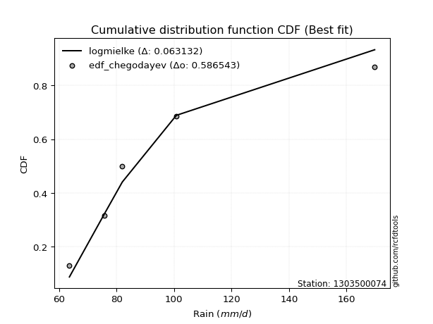</img>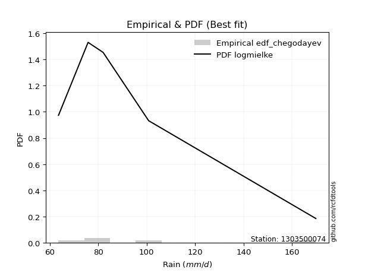</img>

</div>


### 6. EDF Blom (1958)

The Blom formula is a specific "plotting position" formula used in hydrology and statistical analysis to estimate the empirical cumulative probability (or non-exceedance probability) of a data series. It is particularly recommended for data that are approximately normally distributed. The constant _a_ is set to 0.375 (or 3/8).

<div align="center">


$P=(m-a)/(n+1-2a)$


</div>


**6.1. Empirical values**

<div align="center">

|                | 0                   | 1                   | 2        | 3                  | 4                  |
|:---------------|:--------------------|:--------------------|:---------|:-------------------|:-------------------|
| date           | 2020                | 2022                | 2021     | 2025               | 2019               |
| x              | 63.6                | 75.8                | 82.0     | 100.8              | 169.8              |
| m              | 1                   | 2                   | 3        | 4                  | 5                  |
| empirical_dist | edf_blom            | edf_blom            | edf_blom | edf_blom           | edf_blom           |
| empirical      | 0.11904761904761904 | 0.30952380952380953 | 0.5      | 0.6904761904761905 | 0.8809523809523809 |
| empirical_tr   | 1.135135135135135   | 1.4482758620689655  | 2.0      | 3.230769230769231  | 8.399999999999999  |

</div>


**6.2. Kolmogorov-Smirnov fit test (sorted by Δ)**


<div align="center">

|                | 0                    | 1                   | 2                   | 3                   | 4                   | 5                    | 6                   | 7                    | 8                    | 9                  | 10                  | 11                  | 12                 | 13                  | 14                  | 15                  | 16                  | 17                  | 18                  | 19                 | 20                  | 21                  | 22                  | 23                  | 24                  | 25                  | 26                  | 27                  | 28                  | 29                  | 30                  | 31                  | 32                  | 33                  | 34                  | 35                 | 36                  | 37                  | 38                  | 39                  | 40                  | 41                  | 42                  | 43                  | 44                  | 45                  | 46                  | 47                 | 48                  | 49                  | 50                  | 51                  | 52                  | 53                  | 54                  | 55                  | 56                 | 57                  | 58                 | 59                  | 60                 | 61                  | 62                  | 63                 | 64                  | 65                 | 66                  | 67                  | 68                 | 69                  | 70                 | 71                 | 72                 | 73                  | 74                  | 75                  | 76                 | 77                 | 78                  | 79                  | 80                  | 81                  | 82                  | 83                  | 84                 | 85                  | 86                  | 87                  | 88                  | 89                  | 90                  | 91                  | 92                  | 93                 | 94                  | 95                  | 96                 | 97                  | 98                 | 99                  | 100                | 101                 | 102                 | 103                 | 104                 | 105                 | 106                 | 107                 | 108                 | 109                | 110                | 111                 | 112                 | 113                | 114                | 115                | 116                | 117                 | 118                | 119                | 120                 | 121                | 122                | 123                 | 124                 | 125                | 126                | 127                | 128                 | 129                | 130                 | 131                 | 132                 | 133                 | 134                 | 135                 | 136                 | 137                 | 138                | 139                 | 140                | 141                | 142                | 143                | 144                | 145                | 146                | 147                | 148                | 149                | 150                | 151                | 152                | 153                | 154                | 155                | 156                | 157                | 158                | 159                |
|:---------------|:---------------------|:--------------------|:--------------------|:--------------------|:--------------------|:---------------------|:--------------------|:---------------------|:---------------------|:-------------------|:--------------------|:--------------------|:-------------------|:--------------------|:--------------------|:--------------------|:--------------------|:--------------------|:--------------------|:-------------------|:--------------------|:--------------------|:--------------------|:--------------------|:--------------------|:--------------------|:--------------------|:--------------------|:--------------------|:--------------------|:--------------------|:--------------------|:--------------------|:--------------------|:--------------------|:-------------------|:--------------------|:--------------------|:--------------------|:--------------------|:--------------------|:--------------------|:--------------------|:--------------------|:--------------------|:--------------------|:--------------------|:-------------------|:--------------------|:--------------------|:--------------------|:--------------------|:--------------------|:--------------------|:--------------------|:--------------------|:-------------------|:--------------------|:-------------------|:--------------------|:-------------------|:--------------------|:--------------------|:-------------------|:--------------------|:-------------------|:--------------------|:--------------------|:-------------------|:--------------------|:-------------------|:-------------------|:-------------------|:--------------------|:--------------------|:--------------------|:-------------------|:-------------------|:--------------------|:--------------------|:--------------------|:--------------------|:--------------------|:--------------------|:-------------------|:--------------------|:--------------------|:--------------------|:--------------------|:--------------------|:--------------------|:--------------------|:--------------------|:-------------------|:--------------------|:--------------------|:-------------------|:--------------------|:-------------------|:--------------------|:-------------------|:--------------------|:--------------------|:--------------------|:--------------------|:--------------------|:--------------------|:--------------------|:--------------------|:-------------------|:-------------------|:--------------------|:--------------------|:-------------------|:-------------------|:-------------------|:-------------------|:--------------------|:-------------------|:-------------------|:--------------------|:-------------------|:-------------------|:--------------------|:--------------------|:-------------------|:-------------------|:-------------------|:--------------------|:-------------------|:--------------------|:--------------------|:--------------------|:--------------------|:--------------------|:--------------------|:--------------------|:--------------------|:-------------------|:--------------------|:-------------------|:-------------------|:-------------------|:-------------------|:-------------------|:-------------------|:-------------------|:-------------------|:-------------------|:-------------------|:-------------------|:-------------------|:-------------------|:-------------------|:-------------------|:-------------------|:-------------------|:-------------------|:-------------------|:-------------------|
| station        | 1303500074           | 1303500074          | 1303500074          | 1303500074          | 1303500074          | 1303500074           | 1303500074          | 1303500074           | 1303500074           | 1303500074         | 1303500074          | 1303500074          | 1303500074         | 1303500074          | 1303500074          | 1303500074          | 1303500074          | 1303500074          | 1303500074          | 1303500074         | 1303500074          | 1303500074          | 1303500074          | 1303500074          | 1303500074          | 1303500074          | 1303500074          | 1303500074          | 1303500074          | 1303500074          | 1303500074          | 1303500074          | 1303500074          | 1303500074          | 1303500074          | 1303500074         | 1303500074          | 1303500074          | 1303500074          | 1303500074          | 1303500074          | 1303500074          | 1303500074          | 1303500074          | 1303500074          | 1303500074          | 1303500074          | 1303500074         | 1303500074          | 1303500074          | 1303500074          | 1303500074          | 1303500074          | 1303500074          | 1303500074          | 1303500074          | 1303500074         | 1303500074          | 1303500074         | 1303500074          | 1303500074         | 1303500074          | 1303500074          | 1303500074         | 1303500074          | 1303500074         | 1303500074          | 1303500074          | 1303500074         | 1303500074          | 1303500074         | 1303500074         | 1303500074         | 1303500074          | 1303500074          | 1303500074          | 1303500074         | 1303500074         | 1303500074          | 1303500074          | 1303500074          | 1303500074          | 1303500074          | 1303500074          | 1303500074         | 1303500074          | 1303500074          | 1303500074          | 1303500074          | 1303500074          | 1303500074          | 1303500074          | 1303500074          | 1303500074         | 1303500074          | 1303500074          | 1303500074         | 1303500074          | 1303500074         | 1303500074          | 1303500074         | 1303500074          | 1303500074          | 1303500074          | 1303500074          | 1303500074          | 1303500074          | 1303500074          | 1303500074          | 1303500074         | 1303500074         | 1303500074          | 1303500074          | 1303500074         | 1303500074         | 1303500074         | 1303500074         | 1303500074          | 1303500074         | 1303500074         | 1303500074          | 1303500074         | 1303500074         | 1303500074          | 1303500074          | 1303500074         | 1303500074         | 1303500074         | 1303500074          | 1303500074         | 1303500074          | 1303500074          | 1303500074          | 1303500074          | 1303500074          | 1303500074          | 1303500074          | 1303500074          | 1303500074         | 1303500074          | 1303500074         | 1303500074         | 1303500074         | 1303500074         | 1303500074         | 1303500074         | 1303500074         | 1303500074         | 1303500074         | 1303500074         | 1303500074         | 1303500074         | 1303500074         | 1303500074         | 1303500074         | 1303500074         | 1303500074         | 1303500074         | 1303500074         | 1303500074         |
| empirical_dist | edf_blom             | edf_blom            | edf_blom            | edf_blom            | edf_blom            | edf_blom             | edf_blom            | edf_blom             | edf_blom             | edf_blom           | edf_blom            | edf_blom            | edf_blom           | edf_blom            | edf_blom            | edf_blom            | edf_blom            | edf_blom            | edf_blom            | edf_blom           | edf_blom            | edf_blom            | edf_blom            | edf_blom            | edf_blom            | edf_blom            | edf_blom            | edf_blom            | edf_blom            | edf_blom            | edf_blom            | edf_blom            | edf_blom            | edf_blom            | edf_blom            | edf_blom           | edf_blom            | edf_blom            | edf_blom            | edf_blom            | edf_blom            | edf_blom            | edf_blom            | edf_blom            | edf_blom            | edf_blom            | edf_blom            | edf_blom           | edf_blom            | edf_blom            | edf_blom            | edf_blom            | edf_blom            | edf_blom            | edf_blom            | edf_blom            | edf_blom           | edf_blom            | edf_blom           | edf_blom            | edf_blom           | edf_blom            | edf_blom            | edf_blom           | edf_blom            | edf_blom           | edf_blom            | edf_blom            | edf_blom           | edf_blom            | edf_blom           | edf_blom           | edf_blom           | edf_blom            | edf_blom            | edf_blom            | edf_blom           | edf_blom           | edf_blom            | edf_blom            | edf_blom            | edf_blom            | edf_blom            | edf_blom            | edf_blom           | edf_blom            | edf_blom            | edf_blom            | edf_blom            | edf_blom            | edf_blom            | edf_blom            | edf_blom            | edf_blom           | edf_blom            | edf_blom            | edf_blom           | edf_blom            | edf_blom           | edf_blom            | edf_blom           | edf_blom            | edf_blom            | edf_blom            | edf_blom            | edf_blom            | edf_blom            | edf_blom            | edf_blom            | edf_blom           | edf_blom           | edf_blom            | edf_blom            | edf_blom           | edf_blom           | edf_blom           | edf_blom           | edf_blom            | edf_blom           | edf_blom           | edf_blom            | edf_blom           | edf_blom           | edf_blom            | edf_blom            | edf_blom           | edf_blom           | edf_blom           | edf_blom            | edf_blom           | edf_blom            | edf_blom            | edf_blom            | edf_blom            | edf_blom            | edf_blom            | edf_blom            | edf_blom            | edf_blom           | edf_blom            | edf_blom           | edf_blom           | edf_blom           | edf_blom           | edf_blom           | edf_blom           | edf_blom           | edf_blom           | edf_blom           | edf_blom           | edf_blom           | edf_blom           | edf_blom           | edf_blom           | edf_blom           | edf_blom           | edf_blom           | edf_blom           | edf_blom           | edf_blom           |
| p_dist         | logalpha             | loggenextreme       | loginvweibull       | alpha               | logncf              | logmielke            | loghalfnorm         | invgamma             | f                    | logburr            | loginvgauss         | logjohnsonsu        | logmoyal           | loghalflogistic     | logfoldnorm         | invgauss            | loggenlogistic      | burr                | logweibull_max      | halflogistic       | loggumbel_r         | logdweibull         | logloglaplace       | logpearson3         | foldnorm            | halfnorm            | lograyleigh         | logfatiguelife      | logkstwobign        | burr12              | logburr12           | logmaxwell          | moyal               | pearson3            | logsemicircular     | nct                | exponnorm           | logexponnorm        | wald                | loglomax            | gausshyper          | loggenexpon         | loggompertz         | genexpon            | vonmises_line       | gengamma            | exponweib           | gompertz           | logskewnorm         | logwald             | truncnorm           | lognct              | loganglit           | loginvgamma         | gumbel_r            | rayleigh            | betaprime          | logbetaprime        | ncf                | logarcsine          | logf               | genlogistic         | maxwell             | logcrystalball     | lognorm             | logt               | logloggamma         | lognakagami         | logrice            | logbeta             | nakagami           | logtruncexpon      | logdgamma          | loglogistic         | loggennorm          | logtruncweibull_min | gennorm            | kstwobign          | crystalball         | norm                | t                   | anglit              | logbradford         | loghypsecant        | semicircular       | logcosine           | arcsine             | dgamma              | logistic            | loggengamma         | loglaplace          | loglaplace          | rice                | loggumbel_l        | logwrapcauchy       | hypsecant           | dweibull           | bradford            | logksone           | skewnorm            | cosine             | logvonmises_line    | truncweibull_min    | laplace             | logargus            | logkappa4           | truncexpon          | wrapcauchy          | logtukeylambda      | gumbel_l           | loguniform         | logkappa3           | loglevy_l           | halfgennorm        | genextreme         | logrdist           | loggenpareto       | levy_l              | genpareto          | weibull_min        | beta                | logtriang          | rdist              | loghalfgennorm      | kappa4              | tukeylambda        | argus              | ksone              | logexponpow         | kappa3             | uniform             | loggamma            | loggamma            | triang              | loggenhalflogistic  | lomax               | logtruncpareto      | fatiguelife         | johnsonsb          | invweibull          | genhalflogistic    | powerlaw           | logtrapezoid       | logpowerlaw        | truncpareto        | johnsonsu          | logexponweib       | logweibull_min     | logjohnsonsb       | exponpow           | loggausshyper      | trapezoid          | weibull_max        | gamma              | logerlang          | erlang             | logtruncnorm       | logvonmises        | vonmises           | mielke             |
| delta          | 0.052996216812735863 | 0.05631831358804086 | 0.05631911072866215 | 0.05823928791265423 | 0.05900928167542029 | 0.059550017049266546 | 0.05974195965432705 | 0.061680148386232536 | 0.061680679762179495 | 0.0639738659944652 | 0.06445391410258094 | 0.06609590949961562 | 0.0686588927299635 | 0.07400188865645718 | 0.07666997528144764 | 0.07909370175195979 | 0.08392752029898298 | 0.08392756005717167 | 0.08464994748985716 | 0.0875761485940767 | 0.08789433026255161 | 0.08867721677875173 | 0.09129918885469956 | 0.09197501889801651 | 0.09291431247177595 | 0.09346678070448178 | 0.09438882281944827 | 0.09885109616750531 | 0.10012843928872028 | 0.10447154878585162 | 0.10463767475492995 | 0.10656638127608309 | 0.10984461999664141 | 0.11094088944139152 | 0.11274784649824421 | 0.1157463770765852 | 0.11808341635739836 | 0.11815230737773427 | 0.11828505172615655 | 0.11902930295900667 | 0.11904760475396307 | 0.11904761896445315 | 0.11904761900043336 | 0.11904761903925037 | 0.11904761904136552 | 0.11904761904760647 | 0.11904761904760658 | 0.1190476190476166 | 0.11904761904761904 | 0.11904761904761904 | 0.11904761904761904 | 0.12022788595844935 | 0.12052752751468654 | 0.12061910396564618 | 0.12519784120211813 | 0.12588400585303877 | 0.1265282184474974 | 0.12783119906359375 | 0.1299026964259573 | 0.13280643228853228 | 0.135832587257597  | 0.13662413443349192 | 0.13767202926062733 | 0.139116459936437  | 0.13911653665358642 | 0.1391193548726174 | 0.13931803078566857 | 0.13984911384813253 | 0.1404166960868652 | 0.14706458262225036 | 0.1484476189989845 | 0.1492278988802313 | 0.1541411872905709 | 0.15608389605030154 | 0.15994343652619558 | 0.16013250436651844 | 0.1624928793775422 | 0.1659990490926112 | 0.16835671150524045 | 0.16835672052833067 | 0.16837714959744243 | 0.16870343069145444 | 0.16886710335957938 | 0.16943060610927768 | 0.1701987745028668 | 0.17595574571483585 | 0.17613064427284608 | 0.18366430872206363 | 0.18776522160533843 | 0.19326299573542471 | 0.19782418754249687 | 0.19782418754249687 | 0.19985300780246396 | 0.2007480669844966 | 0.20085124414228006 | 0.20246978877641936 | 0.2065419373738792 | 0.20955863570349853 | 0.2163407307619155 | 0.21976987501861034 | 0.2260452864648051 | 0.22722953531776946 | 0.22879443450000803 | 0.22987422904996452 | 0.23050063431463375 | 0.23134369306665187 | 0.23217900847024048 | 0.23259747671504333 | 0.23316652083877187 | 0.2342256131096595 | 0.2412385359826612 | 0.24169967643207374 | 0.24250620555705218 | 0.2441408553975779 | 0.2555125416138465 | 0.2581692557441887 | 0.2590301027776212 | 0.25976356083646035 | 0.2661454067491738 | 0.2694418286340696 | 0.27503231858939226 | 0.2837516140127002 | 0.2972897228065836 | 0.29966319328641144 | 0.30200757954452956 | 0.30952380946352   | 0.3117111163809272 | 0.3152407855797687 | 0.31561562277962296 | 0.3383178243735946 | 0.34019370460048437 | 0.34908735495934307 | 0.34908735495934307 | 0.35253378980861855 | 0.35635606570761014 | 0.35821887132012226 | 0.39203152110203654 | 0.42437881418341683 | 0.4342742455592963 | 0.44142880662367673 | 0.4565969662612328 | 0.4643631483964351 | 0.4656717563177236 | 0.4899392860640718 | 0.4912396973579418 | 0.4992143009955762 | 0.5151203428861257 | 0.5248670747061033 | 0.5299923334364087 | 0.5385287164398869 | 0.5426107035826304 | 0.5496745813884089 | 0.5663429917727709 | 0.5746098647565284 | 0.5757004561432891 | 0.5859297464200646 | 0.6904761904761905 | 1.0837000044399145 | 26.257207072518266 | nan                |
| deltao         | 0.5865427407550001   | 0.5865427407550001  | 0.5865427407550001  | 0.5865427407550001  | 0.5865427407550001  | 0.5865427407550001   | 0.5865427407550001  | 0.5865427407550001   | 0.5865427407550001   | 0.5865427407550001 | 0.5865427407550001  | 0.5865427407550001  | 0.5865427407550001 | 0.5865427407550001  | 0.5865427407550001  | 0.5865427407550001  | 0.5865427407550001  | 0.5865427407550001  | 0.5865427407550001  | 0.5865427407550001 | 0.5865427407550001  | 0.5865427407550001  | 0.5865427407550001  | 0.5865427407550001  | 0.5865427407550001  | 0.5865427407550001  | 0.5865427407550001  | 0.5865427407550001  | 0.5865427407550001  | 0.5865427407550001  | 0.5865427407550001  | 0.5865427407550001  | 0.5865427407550001  | 0.5865427407550001  | 0.5865427407550001  | 0.5865427407550001 | 0.5865427407550001  | 0.5865427407550001  | 0.5865427407550001  | 0.5865427407550001  | 0.5865427407550001  | 0.5865427407550001  | 0.5865427407550001  | 0.5865427407550001  | 0.5865427407550001  | 0.5865427407550001  | 0.5865427407550001  | 0.5865427407550001 | 0.5865427407550001  | 0.5865427407550001  | 0.5865427407550001  | 0.5865427407550001  | 0.5865427407550001  | 0.5865427407550001  | 0.5865427407550001  | 0.5865427407550001  | 0.5865427407550001 | 0.5865427407550001  | 0.5865427407550001 | 0.5865427407550001  | 0.5865427407550001 | 0.5865427407550001  | 0.5865427407550001  | 0.5865427407550001 | 0.5865427407550001  | 0.5865427407550001 | 0.5865427407550001  | 0.5865427407550001  | 0.5865427407550001 | 0.5865427407550001  | 0.5865427407550001 | 0.5865427407550001 | 0.5865427407550001 | 0.5865427407550001  | 0.5865427407550001  | 0.5865427407550001  | 0.5865427407550001 | 0.5865427407550001 | 0.5865427407550001  | 0.5865427407550001  | 0.5865427407550001  | 0.5865427407550001  | 0.5865427407550001  | 0.5865427407550001  | 0.5865427407550001 | 0.5865427407550001  | 0.5865427407550001  | 0.5865427407550001  | 0.5865427407550001  | 0.5865427407550001  | 0.5865427407550001  | 0.5865427407550001  | 0.5865427407550001  | 0.5865427407550001 | 0.5865427407550001  | 0.5865427407550001  | 0.5865427407550001 | 0.5865427407550001  | 0.5865427407550001 | 0.5865427407550001  | 0.5865427407550001 | 0.5865427407550001  | 0.5865427407550001  | 0.5865427407550001  | 0.5865427407550001  | 0.5865427407550001  | 0.5865427407550001  | 0.5865427407550001  | 0.5865427407550001  | 0.5865427407550001 | 0.5865427407550001 | 0.5865427407550001  | 0.5865427407550001  | 0.5865427407550001 | 0.5865427407550001 | 0.5865427407550001 | 0.5865427407550001 | 0.5865427407550001  | 0.5865427407550001 | 0.5865427407550001 | 0.5865427407550001  | 0.5865427407550001 | 0.5865427407550001 | 0.5865427407550001  | 0.5865427407550001  | 0.5865427407550001 | 0.5865427407550001 | 0.5865427407550001 | 0.5865427407550001  | 0.5865427407550001 | 0.5865427407550001  | 0.5865427407550001  | 0.5865427407550001  | 0.5865427407550001  | 0.5865427407550001  | 0.5865427407550001  | 0.5865427407550001  | 0.5865427407550001  | 0.5865427407550001 | 0.5865427407550001  | 0.5865427407550001 | 0.5865427407550001 | 0.5865427407550001 | 0.5865427407550001 | 0.5865427407550001 | 0.5865427407550001 | 0.5865427407550001 | 0.5865427407550001 | 0.5865427407550001 | 0.5865427407550001 | 0.5865427407550001 | 0.5865427407550001 | 0.5865427407550001 | 0.5865427407550001 | 0.5865427407550001 | 0.5865427407550001 | 0.5865427407550001 | 0.5865427407550001 | 0.5865427407550001 | 0.5865427407550001 |
| eval           | Δo > Δ               | Δo > Δ              | Δo > Δ              | Δo > Δ              | Δo > Δ              | Δo > Δ               | Δo > Δ              | Δo > Δ               | Δo > Δ               | Δo > Δ             | Δo > Δ              | Δo > Δ              | Δo > Δ             | Δo > Δ              | Δo > Δ              | Δo > Δ              | Δo > Δ              | Δo > Δ              | Δo > Δ              | Δo > Δ             | Δo > Δ              | Δo > Δ              | Δo > Δ              | Δo > Δ              | Δo > Δ              | Δo > Δ              | Δo > Δ              | Δo > Δ              | Δo > Δ              | Δo > Δ              | Δo > Δ              | Δo > Δ              | Δo > Δ              | Δo > Δ              | Δo > Δ              | Δo > Δ             | Δo > Δ              | Δo > Δ              | Δo > Δ              | Δo > Δ              | Δo > Δ              | Δo > Δ              | Δo > Δ              | Δo > Δ              | Δo > Δ              | Δo > Δ              | Δo > Δ              | Δo > Δ             | Δo > Δ              | Δo > Δ              | Δo > Δ              | Δo > Δ              | Δo > Δ              | Δo > Δ              | Δo > Δ              | Δo > Δ              | Δo > Δ             | Δo > Δ              | Δo > Δ             | Δo > Δ              | Δo > Δ             | Δo > Δ              | Δo > Δ              | Δo > Δ             | Δo > Δ              | Δo > Δ             | Δo > Δ              | Δo > Δ              | Δo > Δ             | Δo > Δ              | Δo > Δ             | Δo > Δ             | Δo > Δ             | Δo > Δ              | Δo > Δ              | Δo > Δ              | Δo > Δ             | Δo > Δ             | Δo > Δ              | Δo > Δ              | Δo > Δ              | Δo > Δ              | Δo > Δ              | Δo > Δ              | Δo > Δ             | Δo > Δ              | Δo > Δ              | Δo > Δ              | Δo > Δ              | Δo > Δ              | Δo > Δ              | Δo > Δ              | Δo > Δ              | Δo > Δ             | Δo > Δ              | Δo > Δ              | Δo > Δ             | Δo > Δ              | Δo > Δ             | Δo > Δ              | Δo > Δ             | Δo > Δ              | Δo > Δ              | Δo > Δ              | Δo > Δ              | Δo > Δ              | Δo > Δ              | Δo > Δ              | Δo > Δ              | Δo > Δ             | Δo > Δ             | Δo > Δ              | Δo > Δ              | Δo > Δ             | Δo > Δ             | Δo > Δ             | Δo > Δ             | Δo > Δ              | Δo > Δ             | Δo > Δ             | Δo > Δ              | Δo > Δ             | Δo > Δ             | Δo > Δ              | Δo > Δ              | Δo > Δ             | Δo > Δ             | Δo > Δ             | Δo > Δ              | Δo > Δ             | Δo > Δ              | Δo > Δ              | Δo > Δ              | Δo > Δ              | Δo > Δ              | Δo > Δ              | Δo > Δ              | Δo > Δ              | Δo > Δ             | Δo > Δ              | Δo > Δ             | Δo > Δ             | Δo > Δ             | Δo > Δ             | Δo > Δ             | Δo > Δ             | Δo > Δ             | Δo > Δ             | Δo > Δ             | Δo > Δ             | Δo > Δ             | Δo > Δ             | Δo > Δ             | Δo > Δ             | Δo > Δ             | Δo > Δ             | Δo <= Δ            | Δo <= Δ            | Δo <= Δ            | Δo <= Δ            |
| fit            | 1                    | 1                   | 1                   | 1                   | 1                   | 1                    | 1                   | 1                    | 1                    | 1                  | 1                   | 1                   | 1                  | 1                   | 1                   | 1                   | 1                   | 1                   | 1                   | 1                  | 1                   | 1                   | 1                   | 1                   | 1                   | 1                   | 1                   | 1                   | 1                   | 1                   | 1                   | 1                   | 1                   | 1                   | 1                   | 1                  | 1                   | 1                   | 1                   | 1                   | 1                   | 1                   | 1                   | 1                   | 1                   | 1                   | 1                   | 1                  | 1                   | 1                   | 1                   | 1                   | 1                   | 1                   | 1                   | 1                   | 1                  | 1                   | 1                  | 1                   | 1                  | 1                   | 1                   | 1                  | 1                   | 1                  | 1                   | 1                   | 1                  | 1                   | 1                  | 1                  | 1                  | 1                   | 1                   | 1                   | 1                  | 1                  | 1                   | 1                   | 1                   | 1                   | 1                   | 1                   | 1                  | 1                   | 1                   | 1                   | 1                   | 1                   | 1                   | 1                   | 1                   | 1                  | 1                   | 1                   | 1                  | 1                   | 1                  | 1                   | 1                  | 1                   | 1                   | 1                   | 1                   | 1                   | 1                   | 1                   | 1                   | 1                  | 1                  | 1                   | 1                   | 1                  | 1                  | 1                  | 1                  | 1                   | 1                  | 1                  | 1                   | 1                  | 1                  | 1                   | 1                   | 1                  | 1                  | 1                  | 1                   | 1                  | 1                   | 1                   | 1                   | 1                   | 1                   | 1                   | 1                   | 1                   | 1                  | 1                   | 1                  | 1                  | 1                  | 1                  | 1                  | 1                  | 1                  | 1                  | 1                  | 1                  | 1                  | 1                  | 1                  | 1                  | 1                  | 1                  | 0                  | 0                  | 0                  | 0                  |
| n              | 5                    | 5                   | 5                   | 5                   | 5                   | 5                    | 5                   | 5                    | 5                    | 5                  | 5                   | 5                   | 5                  | 5                   | 5                   | 5                   | 5                   | 5                   | 5                   | 5                  | 5                   | 5                   | 5                   | 5                   | 5                   | 5                   | 5                   | 5                   | 5                   | 5                   | 5                   | 5                   | 5                   | 5                   | 5                   | 5                  | 5                   | 5                   | 5                   | 5                   | 5                   | 5                   | 5                   | 5                   | 5                   | 5                   | 5                   | 5                  | 5                   | 5                   | 5                   | 5                   | 5                   | 5                   | 5                   | 5                   | 5                  | 5                   | 5                  | 5                   | 5                  | 5                   | 5                   | 5                  | 5                   | 5                  | 5                   | 5                   | 5                  | 5                   | 5                  | 5                  | 5                  | 5                   | 5                   | 5                   | 5                  | 5                  | 5                   | 5                   | 5                   | 5                   | 5                   | 5                   | 5                  | 5                   | 5                   | 5                   | 5                   | 5                   | 5                   | 5                   | 5                   | 5                  | 5                   | 5                   | 5                  | 5                   | 5                  | 5                   | 5                  | 5                   | 5                   | 5                   | 5                   | 5                   | 5                   | 5                   | 5                   | 5                  | 5                  | 5                   | 5                   | 5                  | 5                  | 5                  | 5                  | 5                   | 5                  | 5                  | 5                   | 5                  | 5                  | 5                   | 5                   | 5                  | 5                  | 5                  | 5                   | 5                  | 5                   | 5                   | 5                   | 5                   | 5                   | 5                   | 5                   | 5                   | 5                  | 5                   | 5                  | 5                  | 5                  | 5                  | 5                  | 5                  | 5                  | 5                  | 5                  | 5                  | 5                  | 5                  | 5                  | 5                  | 5                  | 5                  | 5                  | 5                  | 5                  | 5                  |
| best_fit       | 1                    | 0                   | 0                   | 0                   | 0                   | 0                    | 0                   | 0                    | 0                    | 0                  | 0                   | 0                   | 0                  | 0                   | 0                   | 0                   | 0                   | 0                   | 0                   | 0                  | 0                   | 0                   | 0                   | 0                   | 0                   | 0                   | 0                   | 0                   | 0                   | 0                   | 0                   | 0                   | 0                   | 0                   | 0                   | 0                  | 0                   | 0                   | 0                   | 0                   | 0                   | 0                   | 0                   | 0                   | 0                   | 0                   | 0                   | 0                  | 0                   | 0                   | 0                   | 0                   | 0                   | 0                   | 0                   | 0                   | 0                  | 0                   | 0                  | 0                   | 0                  | 0                   | 0                   | 0                  | 0                   | 0                  | 0                   | 0                   | 0                  | 0                   | 0                  | 0                  | 0                  | 0                   | 0                   | 0                   | 0                  | 0                  | 0                   | 0                   | 0                   | 0                   | 0                   | 0                   | 0                  | 0                   | 0                   | 0                   | 0                   | 0                   | 0                   | 0                   | 0                   | 0                  | 0                   | 0                   | 0                  | 0                   | 0                  | 0                   | 0                  | 0                   | 0                   | 0                   | 0                   | 0                   | 0                   | 0                   | 0                   | 0                  | 0                  | 0                   | 0                   | 0                  | 0                  | 0                  | 0                  | 0                   | 0                  | 0                  | 0                   | 0                  | 0                  | 0                   | 0                   | 0                  | 0                  | 0                  | 0                   | 0                  | 0                   | 0                   | 0                   | 0                   | 0                   | 0                   | 0                   | 0                   | 0                  | 0                   | 0                  | 0                  | 0                  | 0                  | 0                  | 0                  | 0                  | 0                  | 0                  | 0                  | 0                  | 0                  | 0                  | 0                  | 0                  | 0                  | 0                  | 0                  | 0                  | 0                  |
| best_fit_sort  | 1                    | 2                   | 3                   | 4                   | 5                   | 6                    | 7                   | 8                    | 9                    | 10                 | 11                  | 12                  | 13                 | 14                  | 15                  | 16                  | 17                  | 18                  | 19                  | 20                 | 21                  | 22                  | 23                  | 24                  | 25                  | 26                  | 27                  | 28                  | 29                  | 30                  | 31                  | 32                  | 33                  | 34                  | 35                  | 36                 | 37                  | 38                  | 39                  | 40                  | 41                  | 42                  | 43                  | 44                  | 45                  | 46                  | 47                  | 48                 | 49                  | 50                  | 51                  | 52                  | 53                  | 54                  | 55                  | 56                  | 57                 | 58                  | 59                 | 60                  | 61                 | 62                  | 63                  | 64                 | 65                  | 66                 | 67                  | 68                  | 69                 | 70                  | 71                 | 72                 | 73                 | 74                  | 75                  | 76                  | 77                 | 78                 | 79                  | 80                  | 81                  | 82                  | 83                  | 84                  | 85                 | 86                  | 87                  | 88                  | 89                  | 90                  | 91                  | 92                  | 93                  | 94                 | 95                  | 96                  | 97                 | 98                  | 99                 | 100                 | 101                | 102                 | 103                 | 104                 | 105                 | 106                 | 107                 | 108                 | 109                 | 110                | 111                | 112                 | 113                 | 114                | 115                | 116                | 117                | 118                 | 119                | 120                | 121                 | 122                | 123                | 124                 | 125                 | 126                | 127                | 128                | 129                 | 130                | 131                 | 132                 | 133                 | 134                 | 135                 | 136                 | 137                 | 138                 | 139                | 140                 | 141                | 142                | 143                | 144                | 145                | 146                | 147                | 148                | 149                | 150                | 151                | 152                | 153                | 154                | 155                | 156                | 157                | 158                | 159                | 160                |

</div>


**6.3. Best fit**

<div align="center">

|   id |    station | empirical_dist   | p_dist   |     delta |   deltao | eval   |   fit |   n |   best_fit |   best_fit_sort |
|-----:|-----------:|:-----------------|:---------|----------:|---------:|:-------|------:|----:|-----------:|----------------:|
|    0 | 1303500074 | edf_blom         | logalpha | 0.0529962 | 0.586543 | Δo > Δ |     1 |   5 |          1 |               1 |

</div>


<div align="center">

</img></img>

</div>


### 7. EDF Tukey (1962)

In hydrology, the Tukey formula is used as a plotting position formula to estimate the empirical probability or frequency of a flood event (or other hydrological data). The formula parameter is given as _c=0.333_ (or 1/3).

<div align="center">


$P=(m-c)/(n+1-2c)$


</div>


**7.1. Empirical values**

<div align="center">

|                | 0                  | 1                  | 2         | 3         | 4         |
|:---------------|:-------------------|:-------------------|:----------|:----------|:----------|
| date           | 2020               | 2022               | 2021      | 2025      | 2019      |
| x              | 63.6               | 75.8               | 82.0      | 100.8     | 169.8     |
| m              | 1                  | 2                  | 3         | 4         | 5         |
| empirical_dist | edf_tukey          | edf_tukey          | edf_tukey | edf_tukey | edf_tukey |
| empirical      | 0.125              | 0.3125             | 0.5       | 0.6875    | 0.875     |
| empirical_tr   | 1.1428571428571428 | 1.4545454545454546 | 2.0       | 3.2       | 8.0       |

</div>


**7.2. Kolmogorov-Smirnov fit test (sorted by Δ)**


<div align="center">

|                | 0                   | 1                    | 2                   | 3                   | 4                   | 5                   | 6                   | 7                  | 8                   | 9                  | 10                  | 11                 | 12                  | 13                  | 14                  | 15                  | 16                  | 17                  | 18                  | 19                 | 20                  | 21                  | 22                 | 23                  | 24                 | 25                  | 26                  | 27                  | 28                  | 29                  | 30                  | 31                  | 32                  | 33                  | 34                  | 35                 | 36                  | 37                  | 38                  | 39                  | 40                  | 41                  | 42                  | 43                  | 44                  | 45                  | 46                  | 47                  | 48                  | 49                  | 50                  | 51                 | 52                 | 53                 | 54                  | 55                  | 56                 | 57                  | 58                  | 59                 | 60                  | 61                  | 62                  | 63                  | 64                 | 65                  | 66                 | 67                  | 68                 | 69                 | 70                  | 71                 | 72                  | 73                  | 74                  | 75                  | 76                  | 77                  | 78                 | 79                  | 80                  | 81                  | 82                  | 83                  | 84                  | 85                  | 86                  | 87                 | 88                  | 89                  | 90                  | 91                  | 92                 | 93                  | 94                  | 95                 | 96                  | 97                  | 98                  | 99                  | 100                 | 101                 | 102                 | 103                 | 104                 | 105                 | 106                 | 107                 | 108                 | 109                 | 110                 | 111                 | 112                | 113                 | 114                 | 115                | 116                | 117                 | 118                 | 119                 | 120                | 121                 | 122                | 123                | 124                | 125                | 126                 | 127                 | 128                | 129                | 130                | 131                | 132                | 133                | 134                 | 135                | 136                | 137                 | 138                | 139                | 140                 | 141                 | 142                 | 143                | 144                 | 145                | 146                | 147                | 148                | 149                | 150                | 151                | 152                | 153                | 154                | 155                | 156                | 157                | 158                | 159                |
|:---------------|:--------------------|:---------------------|:--------------------|:--------------------|:--------------------|:--------------------|:--------------------|:-------------------|:--------------------|:-------------------|:--------------------|:-------------------|:--------------------|:--------------------|:--------------------|:--------------------|:--------------------|:--------------------|:--------------------|:-------------------|:--------------------|:--------------------|:-------------------|:--------------------|:-------------------|:--------------------|:--------------------|:--------------------|:--------------------|:--------------------|:--------------------|:--------------------|:--------------------|:--------------------|:--------------------|:-------------------|:--------------------|:--------------------|:--------------------|:--------------------|:--------------------|:--------------------|:--------------------|:--------------------|:--------------------|:--------------------|:--------------------|:--------------------|:--------------------|:--------------------|:--------------------|:-------------------|:-------------------|:-------------------|:--------------------|:--------------------|:-------------------|:--------------------|:--------------------|:-------------------|:--------------------|:--------------------|:--------------------|:--------------------|:-------------------|:--------------------|:-------------------|:--------------------|:-------------------|:-------------------|:--------------------|:-------------------|:--------------------|:--------------------|:--------------------|:--------------------|:--------------------|:--------------------|:-------------------|:--------------------|:--------------------|:--------------------|:--------------------|:--------------------|:--------------------|:--------------------|:--------------------|:-------------------|:--------------------|:--------------------|:--------------------|:--------------------|:-------------------|:--------------------|:--------------------|:-------------------|:--------------------|:--------------------|:--------------------|:--------------------|:--------------------|:--------------------|:--------------------|:--------------------|:--------------------|:--------------------|:--------------------|:--------------------|:--------------------|:--------------------|:--------------------|:--------------------|:-------------------|:--------------------|:--------------------|:-------------------|:-------------------|:--------------------|:--------------------|:--------------------|:-------------------|:--------------------|:-------------------|:-------------------|:-------------------|:-------------------|:--------------------|:--------------------|:-------------------|:-------------------|:-------------------|:-------------------|:-------------------|:-------------------|:--------------------|:-------------------|:-------------------|:--------------------|:-------------------|:-------------------|:--------------------|:--------------------|:--------------------|:-------------------|:--------------------|:-------------------|:-------------------|:-------------------|:-------------------|:-------------------|:-------------------|:-------------------|:-------------------|:-------------------|:-------------------|:-------------------|:-------------------|:-------------------|:-------------------|:-------------------|
| station        | 1303500074          | 1303500074           | 1303500074          | 1303500074          | 1303500074          | 1303500074          | 1303500074          | 1303500074         | 1303500074          | 1303500074         | 1303500074          | 1303500074         | 1303500074          | 1303500074          | 1303500074          | 1303500074          | 1303500074          | 1303500074          | 1303500074          | 1303500074         | 1303500074          | 1303500074          | 1303500074         | 1303500074          | 1303500074         | 1303500074          | 1303500074          | 1303500074          | 1303500074          | 1303500074          | 1303500074          | 1303500074          | 1303500074          | 1303500074          | 1303500074          | 1303500074         | 1303500074          | 1303500074          | 1303500074          | 1303500074          | 1303500074          | 1303500074          | 1303500074          | 1303500074          | 1303500074          | 1303500074          | 1303500074          | 1303500074          | 1303500074          | 1303500074          | 1303500074          | 1303500074         | 1303500074         | 1303500074         | 1303500074          | 1303500074          | 1303500074         | 1303500074          | 1303500074          | 1303500074         | 1303500074          | 1303500074          | 1303500074          | 1303500074          | 1303500074         | 1303500074          | 1303500074         | 1303500074          | 1303500074         | 1303500074         | 1303500074          | 1303500074         | 1303500074          | 1303500074          | 1303500074          | 1303500074          | 1303500074          | 1303500074          | 1303500074         | 1303500074          | 1303500074          | 1303500074          | 1303500074          | 1303500074          | 1303500074          | 1303500074          | 1303500074          | 1303500074         | 1303500074          | 1303500074          | 1303500074          | 1303500074          | 1303500074         | 1303500074          | 1303500074          | 1303500074         | 1303500074          | 1303500074          | 1303500074          | 1303500074          | 1303500074          | 1303500074          | 1303500074          | 1303500074          | 1303500074          | 1303500074          | 1303500074          | 1303500074          | 1303500074          | 1303500074          | 1303500074          | 1303500074          | 1303500074         | 1303500074          | 1303500074          | 1303500074         | 1303500074         | 1303500074          | 1303500074          | 1303500074          | 1303500074         | 1303500074          | 1303500074         | 1303500074         | 1303500074         | 1303500074         | 1303500074          | 1303500074          | 1303500074         | 1303500074         | 1303500074         | 1303500074         | 1303500074         | 1303500074         | 1303500074          | 1303500074         | 1303500074         | 1303500074          | 1303500074         | 1303500074         | 1303500074          | 1303500074          | 1303500074          | 1303500074         | 1303500074          | 1303500074         | 1303500074         | 1303500074         | 1303500074         | 1303500074         | 1303500074         | 1303500074         | 1303500074         | 1303500074         | 1303500074         | 1303500074         | 1303500074         | 1303500074         | 1303500074         | 1303500074         |
| empirical_dist | edf_tukey           | edf_tukey            | edf_tukey           | edf_tukey           | edf_tukey           | edf_tukey           | edf_tukey           | edf_tukey          | edf_tukey           | edf_tukey          | edf_tukey           | edf_tukey          | edf_tukey           | edf_tukey           | edf_tukey           | edf_tukey           | edf_tukey           | edf_tukey           | edf_tukey           | edf_tukey          | edf_tukey           | edf_tukey           | edf_tukey          | edf_tukey           | edf_tukey          | edf_tukey           | edf_tukey           | edf_tukey           | edf_tukey           | edf_tukey           | edf_tukey           | edf_tukey           | edf_tukey           | edf_tukey           | edf_tukey           | edf_tukey          | edf_tukey           | edf_tukey           | edf_tukey           | edf_tukey           | edf_tukey           | edf_tukey           | edf_tukey           | edf_tukey           | edf_tukey           | edf_tukey           | edf_tukey           | edf_tukey           | edf_tukey           | edf_tukey           | edf_tukey           | edf_tukey          | edf_tukey          | edf_tukey          | edf_tukey           | edf_tukey           | edf_tukey          | edf_tukey           | edf_tukey           | edf_tukey          | edf_tukey           | edf_tukey           | edf_tukey           | edf_tukey           | edf_tukey          | edf_tukey           | edf_tukey          | edf_tukey           | edf_tukey          | edf_tukey          | edf_tukey           | edf_tukey          | edf_tukey           | edf_tukey           | edf_tukey           | edf_tukey           | edf_tukey           | edf_tukey           | edf_tukey          | edf_tukey           | edf_tukey           | edf_tukey           | edf_tukey           | edf_tukey           | edf_tukey           | edf_tukey           | edf_tukey           | edf_tukey          | edf_tukey           | edf_tukey           | edf_tukey           | edf_tukey           | edf_tukey          | edf_tukey           | edf_tukey           | edf_tukey          | edf_tukey           | edf_tukey           | edf_tukey           | edf_tukey           | edf_tukey           | edf_tukey           | edf_tukey           | edf_tukey           | edf_tukey           | edf_tukey           | edf_tukey           | edf_tukey           | edf_tukey           | edf_tukey           | edf_tukey           | edf_tukey           | edf_tukey          | edf_tukey           | edf_tukey           | edf_tukey          | edf_tukey          | edf_tukey           | edf_tukey           | edf_tukey           | edf_tukey          | edf_tukey           | edf_tukey          | edf_tukey          | edf_tukey          | edf_tukey          | edf_tukey           | edf_tukey           | edf_tukey          | edf_tukey          | edf_tukey          | edf_tukey          | edf_tukey          | edf_tukey          | edf_tukey           | edf_tukey          | edf_tukey          | edf_tukey           | edf_tukey          | edf_tukey          | edf_tukey           | edf_tukey           | edf_tukey           | edf_tukey          | edf_tukey           | edf_tukey          | edf_tukey          | edf_tukey          | edf_tukey          | edf_tukey          | edf_tukey          | edf_tukey          | edf_tukey          | edf_tukey          | edf_tukey          | edf_tukey          | edf_tukey          | edf_tukey          | edf_tukey          | edf_tukey          |
| p_dist         | logalpha            | logmielke            | loggenextreme       | loginvweibull       | alpha               | logncf              | loghalfnorm         | invgamma           | f                   | logmoyal           | logburr             | loginvgauss        | logjohnsonsu        | invgauss            | logfoldnorm         | loghalflogistic     | loggenlogistic      | burr                | logweibull_max      | halflogistic       | loggumbel_r         | foldnorm            | logdweibull        | logpearson3         | halfnorm           | logloglaplace       | lograyleigh         | logfatiguelife      | logkstwobign        | logmaxwell          | moyal               | burr12              | logburr12           | pearson3            | logsemicircular     | nct                | lognct              | loganglit           | loginvgamma         | exponnorm           | logexponnorm        | wald                | loglomax            | gausshyper          | loggenexpon         | loggompertz         | genexpon            | vonmises_line       | gengamma            | exponweib           | gompertz            | truncnorm          | logskewnorm        | logwald            | gumbel_r            | rayleigh            | betaprime          | logbetaprime        | logarcsine          | ncf                | logf                | genlogistic         | lognakagami         | maxwell             | logcrystalball     | lognorm             | logt               | logloggamma         | logrice            | logbeta            | nakagami            | logtruncexpon      | loglogistic         | logdgamma           | logtruncweibull_min | loggennorm          | gennorm             | anglit              | kstwobign          | semicircular        | crystalball         | norm                | t                   | logbradford         | loghypsecant        | arcsine             | logcosine           | dgamma             | logistic            | loggengamma         | loglaplace          | loglaplace          | logwrapcauchy      | rice                | dweibull            | loggumbel_l        | hypsecant           | bradford            | logksone            | skewnorm            | cosine              | logvonmises_line    | truncweibull_min    | wrapcauchy          | laplace             | logargus            | gumbel_l            | logkappa4           | truncexpon          | logtukeylambda      | loglevy_l           | halfgennorm         | loguniform         | logkappa3           | genextreme          | loggenpareto       | levy_l             | logrdist            | genpareto           | weibull_min         | beta               | logtriang           | loghalfgennorm     | kappa4             | rdist              | argus              | ksone               | tukeylambda         | logexponpow        | kappa3             | uniform            | loggamma           | loggamma           | triang             | loggenhalflogistic  | lomax              | logtruncpareto     | fatiguelife         | johnsonsb          | invweibull         | genhalflogistic     | powerlaw            | logtrapezoid        | logpowerlaw        | truncpareto         | johnsonsu          | logexponweib       | logweibull_min     | logjohnsonsb       | exponpow           | loggausshyper      | trapezoid          | weibull_max        | gamma              | logerlang          | erlang             | logtruncnorm       | logvonmises        | vonmises           | mielke             |
| delta          | 0.05894859776511682 | 0.059550017049266546 | 0.06227069454042182 | 0.06227149168104311 | 0.06419166886503519 | 0.06496166262780126 | 0.06514601675719822 | 0.0676325293386135 | 0.06763306071456046 | 0.0686588927299635 | 0.06992624694684613 | 0.0704062950549619 | 0.07204829045199658 | 0.07611751127576932 | 0.07666997528144764 | 0.07995426960883814 | 0.08392752029898298 | 0.08392756005717167 | 0.08464994748985716 | 0.0875761485940767 | 0.08789433026255161 | 0.08993812199558548 | 0.0916534072549422 | 0.09197501889801651 | 0.0923504978339863 | 0.09427537933089003 | 0.09438882281944827 | 0.09587490569131485 | 0.10012843928872028 | 0.10656638127608309 | 0.10984461999664141 | 0.11042392973823258 | 0.11059005570731091 | 0.11094088944139152 | 0.11274784649824421 | 0.1157463770765852 | 0.12022788595844935 | 0.12052752751468654 | 0.12061910396564618 | 0.12403579730977932 | 0.12410468833011523 | 0.12423743267853751 | 0.12498168391138763 | 0.12499998570634403 | 0.12499999991683411 | 0.12499999995281431 | 0.12499999999163133 | 0.12499999999374645 | 0.12499999999998743 | 0.12499999999998754 | 0.12499999999999756 | 0.125              | 0.125              | 0.125              | 0.12519784120211813 | 0.12588400585303877 | 0.1265282184474974 | 0.12783119906359375 | 0.12983024181234182 | 0.1299026964259573 | 0.13285639678140654 | 0.13662413443349192 | 0.13687292337194207 | 0.13767202926062733 | 0.139116459936437  | 0.13911653665358642 | 0.1391193548726174 | 0.13931803078566857 | 0.1404166960868652 | 0.1440883921460599 | 0.14547142852279404 | 0.1492278988802313 | 0.15608389605030154 | 0.15711737776676138 | 0.16013250436651844 | 0.16291962700238605 | 0.16546906985373266 | 0.16572724021526397 | 0.1659990490926112 | 0.16722258402667634 | 0.16835671150524045 | 0.16835672052833067 | 0.16837714959744243 | 0.16886710335957938 | 0.16943060610927768 | 0.17315445379665562 | 0.17595574571483585 | 0.1866404991982541 | 0.18776522160533843 | 0.19028680525923425 | 0.19782418754249687 | 0.19782418754249687 | 0.1978750536660896 | 0.19985300780246396 | 0.20058955642149823 | 0.2007480669844966 | 0.20246978877641936 | 0.20658244522730806 | 0.21336454028572505 | 0.21976987501861034 | 0.22306909598861463 | 0.22722953531776946 | 0.22879443450000803 | 0.22962128623885286 | 0.22987422904996452 | 0.23050063431463375 | 0.23124942263346904 | 0.23134369306665187 | 0.23217900847024048 | 0.23316652083877187 | 0.23655382460467123 | 0.24116466492138744 | 0.2412385359826612 | 0.24169967643207374 | 0.24956016066146558 | 0.2530777218252402 | 0.2538111798840794 | 0.25519306526799823 | 0.26316921627298334 | 0.26646563815787916 | 0.2720561281132018 | 0.28077542353650975 | 0.296687002810221  | 0.2990313890683391 | 0.3002659132827741 | 0.3087349259047367 | 0.31226459510357824 | 0.31249999993971045 | 0.3126394323034325 | 0.3353416338974041 | 0.3372175141242939 | 0.3461111644831526 | 0.3461111644831526 | 0.3495575993324281 | 0.35337987523141967 | 0.3552426808439318 | 0.3890553306258461 | 0.42140262370722636 | 0.4312980550831058 | 0.4354764256712958 | 0.45362077578504234 | 0.46138695792024464 | 0.46269556584153315 | 0.4869630955878813 | 0.48826350688175135 | 0.4962381105193857 | 0.5121441524099353 | 0.5218908842299128 | 0.5270161429602183 | 0.5355525259636964 | 0.53963451310644   | 0.5466983909122184 | 0.5633668012965805 | 0.571633674280338  | 0.5727242656670987 | 0.5829535559438741 | 0.6875             | 1.0896523853922955 | 26.263159453470646 | nan                |
| deltao         | 0.5865427407550001  | 0.5865427407550001   | 0.5865427407550001  | 0.5865427407550001  | 0.5865427407550001  | 0.5865427407550001  | 0.5865427407550001  | 0.5865427407550001 | 0.5865427407550001  | 0.5865427407550001 | 0.5865427407550001  | 0.5865427407550001 | 0.5865427407550001  | 0.5865427407550001  | 0.5865427407550001  | 0.5865427407550001  | 0.5865427407550001  | 0.5865427407550001  | 0.5865427407550001  | 0.5865427407550001 | 0.5865427407550001  | 0.5865427407550001  | 0.5865427407550001 | 0.5865427407550001  | 0.5865427407550001 | 0.5865427407550001  | 0.5865427407550001  | 0.5865427407550001  | 0.5865427407550001  | 0.5865427407550001  | 0.5865427407550001  | 0.5865427407550001  | 0.5865427407550001  | 0.5865427407550001  | 0.5865427407550001  | 0.5865427407550001 | 0.5865427407550001  | 0.5865427407550001  | 0.5865427407550001  | 0.5865427407550001  | 0.5865427407550001  | 0.5865427407550001  | 0.5865427407550001  | 0.5865427407550001  | 0.5865427407550001  | 0.5865427407550001  | 0.5865427407550001  | 0.5865427407550001  | 0.5865427407550001  | 0.5865427407550001  | 0.5865427407550001  | 0.5865427407550001 | 0.5865427407550001 | 0.5865427407550001 | 0.5865427407550001  | 0.5865427407550001  | 0.5865427407550001 | 0.5865427407550001  | 0.5865427407550001  | 0.5865427407550001 | 0.5865427407550001  | 0.5865427407550001  | 0.5865427407550001  | 0.5865427407550001  | 0.5865427407550001 | 0.5865427407550001  | 0.5865427407550001 | 0.5865427407550001  | 0.5865427407550001 | 0.5865427407550001 | 0.5865427407550001  | 0.5865427407550001 | 0.5865427407550001  | 0.5865427407550001  | 0.5865427407550001  | 0.5865427407550001  | 0.5865427407550001  | 0.5865427407550001  | 0.5865427407550001 | 0.5865427407550001  | 0.5865427407550001  | 0.5865427407550001  | 0.5865427407550001  | 0.5865427407550001  | 0.5865427407550001  | 0.5865427407550001  | 0.5865427407550001  | 0.5865427407550001 | 0.5865427407550001  | 0.5865427407550001  | 0.5865427407550001  | 0.5865427407550001  | 0.5865427407550001 | 0.5865427407550001  | 0.5865427407550001  | 0.5865427407550001 | 0.5865427407550001  | 0.5865427407550001  | 0.5865427407550001  | 0.5865427407550001  | 0.5865427407550001  | 0.5865427407550001  | 0.5865427407550001  | 0.5865427407550001  | 0.5865427407550001  | 0.5865427407550001  | 0.5865427407550001  | 0.5865427407550001  | 0.5865427407550001  | 0.5865427407550001  | 0.5865427407550001  | 0.5865427407550001  | 0.5865427407550001 | 0.5865427407550001  | 0.5865427407550001  | 0.5865427407550001 | 0.5865427407550001 | 0.5865427407550001  | 0.5865427407550001  | 0.5865427407550001  | 0.5865427407550001 | 0.5865427407550001  | 0.5865427407550001 | 0.5865427407550001 | 0.5865427407550001 | 0.5865427407550001 | 0.5865427407550001  | 0.5865427407550001  | 0.5865427407550001 | 0.5865427407550001 | 0.5865427407550001 | 0.5865427407550001 | 0.5865427407550001 | 0.5865427407550001 | 0.5865427407550001  | 0.5865427407550001 | 0.5865427407550001 | 0.5865427407550001  | 0.5865427407550001 | 0.5865427407550001 | 0.5865427407550001  | 0.5865427407550001  | 0.5865427407550001  | 0.5865427407550001 | 0.5865427407550001  | 0.5865427407550001 | 0.5865427407550001 | 0.5865427407550001 | 0.5865427407550001 | 0.5865427407550001 | 0.5865427407550001 | 0.5865427407550001 | 0.5865427407550001 | 0.5865427407550001 | 0.5865427407550001 | 0.5865427407550001 | 0.5865427407550001 | 0.5865427407550001 | 0.5865427407550001 | 0.5865427407550001 |
| eval           | Δo > Δ              | Δo > Δ               | Δo > Δ              | Δo > Δ              | Δo > Δ              | Δo > Δ              | Δo > Δ              | Δo > Δ             | Δo > Δ              | Δo > Δ             | Δo > Δ              | Δo > Δ             | Δo > Δ              | Δo > Δ              | Δo > Δ              | Δo > Δ              | Δo > Δ              | Δo > Δ              | Δo > Δ              | Δo > Δ             | Δo > Δ              | Δo > Δ              | Δo > Δ             | Δo > Δ              | Δo > Δ             | Δo > Δ              | Δo > Δ              | Δo > Δ              | Δo > Δ              | Δo > Δ              | Δo > Δ              | Δo > Δ              | Δo > Δ              | Δo > Δ              | Δo > Δ              | Δo > Δ             | Δo > Δ              | Δo > Δ              | Δo > Δ              | Δo > Δ              | Δo > Δ              | Δo > Δ              | Δo > Δ              | Δo > Δ              | Δo > Δ              | Δo > Δ              | Δo > Δ              | Δo > Δ              | Δo > Δ              | Δo > Δ              | Δo > Δ              | Δo > Δ             | Δo > Δ             | Δo > Δ             | Δo > Δ              | Δo > Δ              | Δo > Δ             | Δo > Δ              | Δo > Δ              | Δo > Δ             | Δo > Δ              | Δo > Δ              | Δo > Δ              | Δo > Δ              | Δo > Δ             | Δo > Δ              | Δo > Δ             | Δo > Δ              | Δo > Δ             | Δo > Δ             | Δo > Δ              | Δo > Δ             | Δo > Δ              | Δo > Δ              | Δo > Δ              | Δo > Δ              | Δo > Δ              | Δo > Δ              | Δo > Δ             | Δo > Δ              | Δo > Δ              | Δo > Δ              | Δo > Δ              | Δo > Δ              | Δo > Δ              | Δo > Δ              | Δo > Δ              | Δo > Δ             | Δo > Δ              | Δo > Δ              | Δo > Δ              | Δo > Δ              | Δo > Δ             | Δo > Δ              | Δo > Δ              | Δo > Δ             | Δo > Δ              | Δo > Δ              | Δo > Δ              | Δo > Δ              | Δo > Δ              | Δo > Δ              | Δo > Δ              | Δo > Δ              | Δo > Δ              | Δo > Δ              | Δo > Δ              | Δo > Δ              | Δo > Δ              | Δo > Δ              | Δo > Δ              | Δo > Δ              | Δo > Δ             | Δo > Δ              | Δo > Δ              | Δo > Δ             | Δo > Δ             | Δo > Δ              | Δo > Δ              | Δo > Δ              | Δo > Δ             | Δo > Δ              | Δo > Δ             | Δo > Δ             | Δo > Δ             | Δo > Δ             | Δo > Δ              | Δo > Δ              | Δo > Δ             | Δo > Δ             | Δo > Δ             | Δo > Δ             | Δo > Δ             | Δo > Δ             | Δo > Δ              | Δo > Δ             | Δo > Δ             | Δo > Δ              | Δo > Δ             | Δo > Δ             | Δo > Δ              | Δo > Δ              | Δo > Δ              | Δo > Δ             | Δo > Δ              | Δo > Δ             | Δo > Δ             | Δo > Δ             | Δo > Δ             | Δo > Δ             | Δo > Δ             | Δo > Δ             | Δo > Δ             | Δo > Δ             | Δo > Δ             | Δo > Δ             | Δo <= Δ            | Δo <= Δ            | Δo <= Δ            | Δo <= Δ            |
| fit            | 1                   | 1                    | 1                   | 1                   | 1                   | 1                   | 1                   | 1                  | 1                   | 1                  | 1                   | 1                  | 1                   | 1                   | 1                   | 1                   | 1                   | 1                   | 1                   | 1                  | 1                   | 1                   | 1                  | 1                   | 1                  | 1                   | 1                   | 1                   | 1                   | 1                   | 1                   | 1                   | 1                   | 1                   | 1                   | 1                  | 1                   | 1                   | 1                   | 1                   | 1                   | 1                   | 1                   | 1                   | 1                   | 1                   | 1                   | 1                   | 1                   | 1                   | 1                   | 1                  | 1                  | 1                  | 1                   | 1                   | 1                  | 1                   | 1                   | 1                  | 1                   | 1                   | 1                   | 1                   | 1                  | 1                   | 1                  | 1                   | 1                  | 1                  | 1                   | 1                  | 1                   | 1                   | 1                   | 1                   | 1                   | 1                   | 1                  | 1                   | 1                   | 1                   | 1                   | 1                   | 1                   | 1                   | 1                   | 1                  | 1                   | 1                   | 1                   | 1                   | 1                  | 1                   | 1                   | 1                  | 1                   | 1                   | 1                   | 1                   | 1                   | 1                   | 1                   | 1                   | 1                   | 1                   | 1                   | 1                   | 1                   | 1                   | 1                   | 1                   | 1                  | 1                   | 1                   | 1                  | 1                  | 1                   | 1                   | 1                   | 1                  | 1                   | 1                  | 1                  | 1                  | 1                  | 1                   | 1                   | 1                  | 1                  | 1                  | 1                  | 1                  | 1                  | 1                   | 1                  | 1                  | 1                   | 1                  | 1                  | 1                   | 1                   | 1                   | 1                  | 1                   | 1                  | 1                  | 1                  | 1                  | 1                  | 1                  | 1                  | 1                  | 1                  | 1                  | 1                  | 0                  | 0                  | 0                  | 0                  |
| n              | 5                   | 5                    | 5                   | 5                   | 5                   | 5                   | 5                   | 5                  | 5                   | 5                  | 5                   | 5                  | 5                   | 5                   | 5                   | 5                   | 5                   | 5                   | 5                   | 5                  | 5                   | 5                   | 5                  | 5                   | 5                  | 5                   | 5                   | 5                   | 5                   | 5                   | 5                   | 5                   | 5                   | 5                   | 5                   | 5                  | 5                   | 5                   | 5                   | 5                   | 5                   | 5                   | 5                   | 5                   | 5                   | 5                   | 5                   | 5                   | 5                   | 5                   | 5                   | 5                  | 5                  | 5                  | 5                   | 5                   | 5                  | 5                   | 5                   | 5                  | 5                   | 5                   | 5                   | 5                   | 5                  | 5                   | 5                  | 5                   | 5                  | 5                  | 5                   | 5                  | 5                   | 5                   | 5                   | 5                   | 5                   | 5                   | 5                  | 5                   | 5                   | 5                   | 5                   | 5                   | 5                   | 5                   | 5                   | 5                  | 5                   | 5                   | 5                   | 5                   | 5                  | 5                   | 5                   | 5                  | 5                   | 5                   | 5                   | 5                   | 5                   | 5                   | 5                   | 5                   | 5                   | 5                   | 5                   | 5                   | 5                   | 5                   | 5                   | 5                   | 5                  | 5                   | 5                   | 5                  | 5                  | 5                   | 5                   | 5                   | 5                  | 5                   | 5                  | 5                  | 5                  | 5                  | 5                   | 5                   | 5                  | 5                  | 5                  | 5                  | 5                  | 5                  | 5                   | 5                  | 5                  | 5                   | 5                  | 5                  | 5                   | 5                   | 5                   | 5                  | 5                   | 5                  | 5                  | 5                  | 5                  | 5                  | 5                  | 5                  | 5                  | 5                  | 5                  | 5                  | 5                  | 5                  | 5                  | 5                  |
| best_fit       | 1                   | 0                    | 0                   | 0                   | 0                   | 0                   | 0                   | 0                  | 0                   | 0                  | 0                   | 0                  | 0                   | 0                   | 0                   | 0                   | 0                   | 0                   | 0                   | 0                  | 0                   | 0                   | 0                  | 0                   | 0                  | 0                   | 0                   | 0                   | 0                   | 0                   | 0                   | 0                   | 0                   | 0                   | 0                   | 0                  | 0                   | 0                   | 0                   | 0                   | 0                   | 0                   | 0                   | 0                   | 0                   | 0                   | 0                   | 0                   | 0                   | 0                   | 0                   | 0                  | 0                  | 0                  | 0                   | 0                   | 0                  | 0                   | 0                   | 0                  | 0                   | 0                   | 0                   | 0                   | 0                  | 0                   | 0                  | 0                   | 0                  | 0                  | 0                   | 0                  | 0                   | 0                   | 0                   | 0                   | 0                   | 0                   | 0                  | 0                   | 0                   | 0                   | 0                   | 0                   | 0                   | 0                   | 0                   | 0                  | 0                   | 0                   | 0                   | 0                   | 0                  | 0                   | 0                   | 0                  | 0                   | 0                   | 0                   | 0                   | 0                   | 0                   | 0                   | 0                   | 0                   | 0                   | 0                   | 0                   | 0                   | 0                   | 0                   | 0                   | 0                  | 0                   | 0                   | 0                  | 0                  | 0                   | 0                   | 0                   | 0                  | 0                   | 0                  | 0                  | 0                  | 0                  | 0                   | 0                   | 0                  | 0                  | 0                  | 0                  | 0                  | 0                  | 0                   | 0                  | 0                  | 0                   | 0                  | 0                  | 0                   | 0                   | 0                   | 0                  | 0                   | 0                  | 0                  | 0                  | 0                  | 0                  | 0                  | 0                  | 0                  | 0                  | 0                  | 0                  | 0                  | 0                  | 0                  | 0                  |
| best_fit_sort  | 1                   | 2                    | 3                   | 4                   | 5                   | 6                   | 7                   | 8                  | 9                   | 10                 | 11                  | 12                 | 13                  | 14                  | 15                  | 16                  | 17                  | 18                  | 19                  | 20                 | 21                  | 22                  | 23                 | 24                  | 25                 | 26                  | 27                  | 28                  | 29                  | 30                  | 31                  | 32                  | 33                  | 34                  | 35                  | 36                 | 37                  | 38                  | 39                  | 40                  | 41                  | 42                  | 43                  | 44                  | 45                  | 46                  | 47                  | 48                  | 49                  | 50                  | 51                  | 52                 | 53                 | 54                 | 55                  | 56                  | 57                 | 58                  | 59                  | 60                 | 61                  | 62                  | 63                  | 64                  | 65                 | 66                  | 67                 | 68                  | 69                 | 70                 | 71                  | 72                 | 73                  | 74                  | 75                  | 76                  | 77                  | 78                  | 79                 | 80                  | 81                  | 82                  | 83                  | 84                  | 85                  | 86                  | 87                  | 88                 | 89                  | 90                  | 91                  | 92                  | 93                 | 94                  | 95                  | 96                 | 97                  | 98                  | 99                  | 100                 | 101                 | 102                 | 103                 | 104                 | 105                 | 106                 | 107                 | 108                 | 109                 | 110                 | 111                 | 112                 | 113                | 114                 | 115                 | 116                | 117                | 118                 | 119                 | 120                 | 121                | 122                 | 123                | 124                | 125                | 126                | 127                 | 128                 | 129                | 130                | 131                | 132                | 133                | 134                | 135                 | 136                | 137                | 138                 | 139                | 140                | 141                 | 142                 | 143                 | 144                | 145                 | 146                | 147                | 148                | 149                | 150                | 151                | 152                | 153                | 154                | 155                | 156                | 157                | 158                | 159                | 160                |

</div>


**7.3. Best fit**

<div align="center">

|   id |    station | empirical_dist   | p_dist   |     delta |   deltao | eval   |   fit |   n |   best_fit |   best_fit_sort |
|-----:|-----------:|:-----------------|:---------|----------:|---------:|:-------|------:|----:|-----------:|----------------:|
|    0 | 1303500074 | edf_tukey        | logalpha | 0.0589486 | 0.586543 | Δo > Δ |     1 |   5 |          1 |               1 |

</div>


<div align="center">

</img>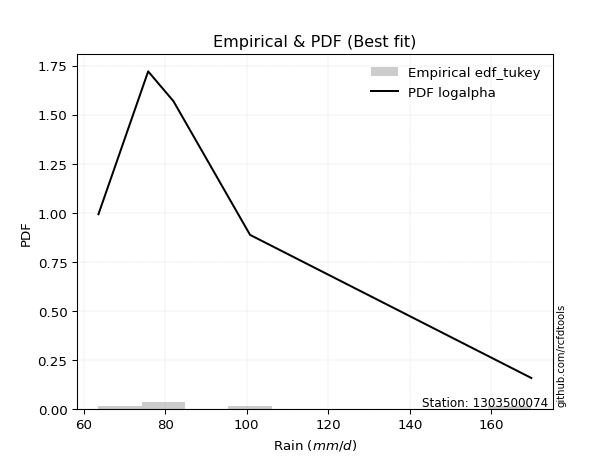</img>

</div>


### 8. EDF Gringorten (1963)

Gringorten plotting position formula is essential for estimating the probability and return periods of extreme events like floods and heavy rainfall. The constant _a=0.44_.

<div align="center">


$P=(m-a)/(n+1-2a)$


</div>


**8.1. Empirical values**

<div align="center">

|                | 0                   | 1                  | 2              | 3                 | 4                  |
|:---------------|:--------------------|:-------------------|:---------------|:------------------|:-------------------|
| date           | 2020                | 2022               | 2021           | 2025              | 2019               |
| x              | 63.6                | 75.8               | 82.0           | 100.8             | 169.8              |
| m              | 1                   | 2                  | 3              | 4                 | 5                  |
| empirical_dist | edf_gringorten      | edf_gringorten     | edf_gringorten | edf_gringorten    | edf_gringorten     |
| empirical      | 0.10937500000000001 | 0.3046875          | 0.5            | 0.6953125         | 0.8906249999999999 |
| empirical_tr   | 1.1228070175438596  | 1.4382022471910112 | 2.0            | 3.282051282051282 | 9.142857142857133  |

</div>


**8.2. Kolmogorov-Smirnov fit test (sorted by Δ)**


<div align="center">

|                | 0                    | 1                    | 2                   | 3                    | 4                    | 5                   | 6                   | 7                   | 8                    | 9                   | 10                  | 11                  | 12                  | 13                 | 14                  | 15                 | 16                  | 17                  | 18                  | 19                  | 20                  | 21                 | 22                  | 23                  | 24                  | 25                  | 26                  | 27                  | 28                  | 29                  | 30                  | 31                  | 32                  | 33                  | 34                  | 35                  | 36                  | 37                  | 38                  | 39                  | 40                  | 41                  | 42                  | 43                  | 44                  | 45                 | 46                  | 47                 | 48                  | 49                 | 50                  | 51                  | 52                  | 53                  | 54                  | 55                 | 56                  | 57                  | 58                 | 59                  | 60                  | 61                  | 62                 | 63                  | 64                 | 65                  | 66                 | 67                  | 68                  | 69                 | 70                  | 71                 | 72                  | 73                  | 74                  | 75                  | 76                  | 77                 | 78                  | 79                  | 80                  | 81                  | 82                  | 83                  | 84                  | 85                  | 86                 | 87                  | 88                  | 89                  | 90                  | 91                  | 92                  | 93                 | 94                  | 95                 | 96                  | 97                  | 98                  | 99                  | 100                 | 101                 | 102                 | 103                 | 104                 | 105                 | 106                 | 107                | 108                 | 109                 | 110                | 111                 | 112                 | 113                | 114                 | 115                 | 116                | 117                | 118                 | 119                 | 120                | 121                 | 122                | 123                | 124                 | 125                | 126                | 127                 | 128                | 129                | 130                | 131                | 132                | 133                | 134                 | 135                | 136                | 137                 | 138                | 139                | 140                 | 141                 | 142                 | 143                | 144                 | 145                | 146                | 147                | 148                | 149                | 150                | 151                | 152                | 153                | 154                | 155                | 156                | 157                | 158                | 159                |
|:---------------|:---------------------|:---------------------|:--------------------|:---------------------|:---------------------|:--------------------|:--------------------|:--------------------|:---------------------|:--------------------|:--------------------|:--------------------|:--------------------|:-------------------|:--------------------|:-------------------|:--------------------|:--------------------|:--------------------|:--------------------|:--------------------|:-------------------|:--------------------|:--------------------|:--------------------|:--------------------|:--------------------|:--------------------|:--------------------|:--------------------|:--------------------|:--------------------|:--------------------|:--------------------|:--------------------|:--------------------|:--------------------|:--------------------|:--------------------|:--------------------|:--------------------|:--------------------|:--------------------|:--------------------|:--------------------|:-------------------|:--------------------|:-------------------|:--------------------|:-------------------|:--------------------|:--------------------|:--------------------|:--------------------|:--------------------|:-------------------|:--------------------|:--------------------|:-------------------|:--------------------|:--------------------|:--------------------|:-------------------|:--------------------|:-------------------|:--------------------|:-------------------|:--------------------|:--------------------|:-------------------|:--------------------|:-------------------|:--------------------|:--------------------|:--------------------|:--------------------|:--------------------|:-------------------|:--------------------|:--------------------|:--------------------|:--------------------|:--------------------|:--------------------|:--------------------|:--------------------|:-------------------|:--------------------|:--------------------|:--------------------|:--------------------|:--------------------|:--------------------|:-------------------|:--------------------|:-------------------|:--------------------|:--------------------|:--------------------|:--------------------|:--------------------|:--------------------|:--------------------|:--------------------|:--------------------|:--------------------|:--------------------|:-------------------|:--------------------|:--------------------|:-------------------|:--------------------|:--------------------|:-------------------|:--------------------|:--------------------|:-------------------|:-------------------|:--------------------|:--------------------|:-------------------|:--------------------|:-------------------|:-------------------|:--------------------|:-------------------|:-------------------|:--------------------|:-------------------|:-------------------|:-------------------|:-------------------|:-------------------|:-------------------|:--------------------|:-------------------|:-------------------|:--------------------|:-------------------|:-------------------|:--------------------|:--------------------|:--------------------|:-------------------|:--------------------|:-------------------|:-------------------|:-------------------|:-------------------|:-------------------|:-------------------|:-------------------|:-------------------|:-------------------|:-------------------|:-------------------|:-------------------|:-------------------|:-------------------|:-------------------|
| station        | 1303500074           | 1303500074           | 1303500074          | 1303500074           | 1303500074           | 1303500074          | 1303500074          | 1303500074          | 1303500074           | 1303500074          | 1303500074          | 1303500074          | 1303500074          | 1303500074         | 1303500074          | 1303500074         | 1303500074          | 1303500074          | 1303500074          | 1303500074          | 1303500074          | 1303500074         | 1303500074          | 1303500074          | 1303500074          | 1303500074          | 1303500074          | 1303500074          | 1303500074          | 1303500074          | 1303500074          | 1303500074          | 1303500074          | 1303500074          | 1303500074          | 1303500074          | 1303500074          | 1303500074          | 1303500074          | 1303500074          | 1303500074          | 1303500074          | 1303500074          | 1303500074          | 1303500074          | 1303500074         | 1303500074          | 1303500074         | 1303500074          | 1303500074         | 1303500074          | 1303500074          | 1303500074          | 1303500074          | 1303500074          | 1303500074         | 1303500074          | 1303500074          | 1303500074         | 1303500074          | 1303500074          | 1303500074          | 1303500074         | 1303500074          | 1303500074         | 1303500074          | 1303500074         | 1303500074          | 1303500074          | 1303500074         | 1303500074          | 1303500074         | 1303500074          | 1303500074          | 1303500074          | 1303500074          | 1303500074          | 1303500074         | 1303500074          | 1303500074          | 1303500074          | 1303500074          | 1303500074          | 1303500074          | 1303500074          | 1303500074          | 1303500074         | 1303500074          | 1303500074          | 1303500074          | 1303500074          | 1303500074          | 1303500074          | 1303500074         | 1303500074          | 1303500074         | 1303500074          | 1303500074          | 1303500074          | 1303500074          | 1303500074          | 1303500074          | 1303500074          | 1303500074          | 1303500074          | 1303500074          | 1303500074          | 1303500074         | 1303500074          | 1303500074          | 1303500074         | 1303500074          | 1303500074          | 1303500074         | 1303500074          | 1303500074          | 1303500074         | 1303500074         | 1303500074          | 1303500074          | 1303500074         | 1303500074          | 1303500074         | 1303500074         | 1303500074          | 1303500074         | 1303500074         | 1303500074          | 1303500074         | 1303500074         | 1303500074         | 1303500074         | 1303500074         | 1303500074         | 1303500074          | 1303500074         | 1303500074         | 1303500074          | 1303500074         | 1303500074         | 1303500074          | 1303500074          | 1303500074          | 1303500074         | 1303500074          | 1303500074         | 1303500074         | 1303500074         | 1303500074         | 1303500074         | 1303500074         | 1303500074         | 1303500074         | 1303500074         | 1303500074         | 1303500074         | 1303500074         | 1303500074         | 1303500074         | 1303500074         |
| empirical_dist | edf_gringorten       | edf_gringorten       | edf_gringorten      | edf_gringorten       | edf_gringorten       | edf_gringorten      | edf_gringorten      | edf_gringorten      | edf_gringorten       | edf_gringorten      | edf_gringorten      | edf_gringorten      | edf_gringorten      | edf_gringorten     | edf_gringorten      | edf_gringorten     | edf_gringorten      | edf_gringorten      | edf_gringorten      | edf_gringorten      | edf_gringorten      | edf_gringorten     | edf_gringorten      | edf_gringorten      | edf_gringorten      | edf_gringorten      | edf_gringorten      | edf_gringorten      | edf_gringorten      | edf_gringorten      | edf_gringorten      | edf_gringorten      | edf_gringorten      | edf_gringorten      | edf_gringorten      | edf_gringorten      | edf_gringorten      | edf_gringorten      | edf_gringorten      | edf_gringorten      | edf_gringorten      | edf_gringorten      | edf_gringorten      | edf_gringorten      | edf_gringorten      | edf_gringorten     | edf_gringorten      | edf_gringorten     | edf_gringorten      | edf_gringorten     | edf_gringorten      | edf_gringorten      | edf_gringorten      | edf_gringorten      | edf_gringorten      | edf_gringorten     | edf_gringorten      | edf_gringorten      | edf_gringorten     | edf_gringorten      | edf_gringorten      | edf_gringorten      | edf_gringorten     | edf_gringorten      | edf_gringorten     | edf_gringorten      | edf_gringorten     | edf_gringorten      | edf_gringorten      | edf_gringorten     | edf_gringorten      | edf_gringorten     | edf_gringorten      | edf_gringorten      | edf_gringorten      | edf_gringorten      | edf_gringorten      | edf_gringorten     | edf_gringorten      | edf_gringorten      | edf_gringorten      | edf_gringorten      | edf_gringorten      | edf_gringorten      | edf_gringorten      | edf_gringorten      | edf_gringorten     | edf_gringorten      | edf_gringorten      | edf_gringorten      | edf_gringorten      | edf_gringorten      | edf_gringorten      | edf_gringorten     | edf_gringorten      | edf_gringorten     | edf_gringorten      | edf_gringorten      | edf_gringorten      | edf_gringorten      | edf_gringorten      | edf_gringorten      | edf_gringorten      | edf_gringorten      | edf_gringorten      | edf_gringorten      | edf_gringorten      | edf_gringorten     | edf_gringorten      | edf_gringorten      | edf_gringorten     | edf_gringorten      | edf_gringorten      | edf_gringorten     | edf_gringorten      | edf_gringorten      | edf_gringorten     | edf_gringorten     | edf_gringorten      | edf_gringorten      | edf_gringorten     | edf_gringorten      | edf_gringorten     | edf_gringorten     | edf_gringorten      | edf_gringorten     | edf_gringorten     | edf_gringorten      | edf_gringorten     | edf_gringorten     | edf_gringorten     | edf_gringorten     | edf_gringorten     | edf_gringorten     | edf_gringorten      | edf_gringorten     | edf_gringorten     | edf_gringorten      | edf_gringorten     | edf_gringorten     | edf_gringorten      | edf_gringorten      | edf_gringorten      | edf_gringorten     | edf_gringorten      | edf_gringorten     | edf_gringorten     | edf_gringorten     | edf_gringorten     | edf_gringorten     | edf_gringorten     | edf_gringorten     | edf_gringorten     | edf_gringorten     | edf_gringorten     | edf_gringorten     | edf_gringorten     | edf_gringorten     | edf_gringorten     | edf_gringorten     |
| p_dist         | logalpha             | loggenextreme        | loginvweibull       | alpha                | logncf               | logburr             | f                   | invgamma            | logmielke            | loghalfnorm         | loghalflogistic     | logjohnsonsu        | loginvgauss         | logmoyal           | logfoldnorm         | logdweibull        | loggenlogistic      | burr                | invgauss            | logweibull_max      | logloglaplace       | halflogistic       | loggumbel_r         | logpearson3         | lograyleigh         | burr12              | logburr12           | foldnorm            | halfnorm            | logkstwobign        | logfatiguelife      | logmaxwell          | exponnorm           | logexponnorm        | wald                | loglomax            | loggenexpon         | loggompertz         | genexpon            | vonmises_line       | gengamma            | exponweib           | logwald             | moyal               | pearson3            | truncnorm          | logskewnorm         | logsemicircular    | gompertz            | nct                | lognct              | loganglit           | loginvgamma         | gausshyper          | gumbel_r            | betaprime          | rayleigh            | logbetaprime        | ncf                | genlogistic         | logarcsine          | maxwell             | logcrystalball     | lognorm             | logt               | logloggamma         | logrice            | logf                | lognakagami         | logtruncexpon      | logdgamma           | logbeta            | nakagami            | loggennorm          | loglogistic         | gennorm             | logtruncweibull_min | kstwobign          | logbradford         | loghypsecant        | t                   | crystalball         | norm                | anglit              | semicircular        | logcosine           | dgamma             | arcsine             | logistic            | loglaplace          | loglaplace          | loggengamma         | rice                | loggumbel_l        | hypsecant           | logwrapcauchy      | bradford            | dweibull            | skewnorm            | logksone            | logvonmises_line    | truncweibull_min    | laplace             | cosine              | logkappa4           | truncexpon          | logtukeylambda      | logargus           | wrapcauchy          | gumbel_l            | loguniform         | logkappa3           | halfgennorm         | loglevy_l          | logrdist            | genextreme          | loggenpareto       | levy_l             | genpareto           | weibull_min         | beta               | logtriang           | rdist              | loghalfgennorm     | tukeylambda         | kappa4             | argus              | ksone               | logexponpow        | kappa3             | uniform            | loggamma           | loggamma           | triang             | loggenhalflogistic  | lomax              | logtruncpareto     | fatiguelife         | johnsonsb          | invweibull         | genhalflogistic     | powerlaw            | logtrapezoid        | logpowerlaw        | truncpareto         | johnsonsu          | logexponweib       | logweibull_min     | logjohnsonsb       | exponpow           | loggausshyper      | trapezoid          | weibull_max        | gamma              | logerlang          | erlang             | logtruncnorm       | logvonmises        | vonmises           | mielke             |
| delta          | 0.043323597765116836 | 0.046645694540421834 | 0.04664649168104312 | 0.048566668865035204 | 0.049336662627801266 | 0.05430124694684624 | 0.05515946088789436 | 0.05516247343727959 | 0.059550017049266546 | 0.05974195965432705 | 0.06432926960883815 | 0.06567150530967669 | 0.06771855122175785 | 0.0686588927299635 | 0.07666997528144764 | 0.0838409072549422 | 0.08392752029898298 | 0.08392756005717167 | 0.08393001127576932 | 0.08464994748985716 | 0.08646287933089003 | 0.0875761485940767 | 0.08789433026255161 | 0.09197501889801651 | 0.09438882281944827 | 0.09479892973823259 | 0.09496505570731092 | 0.09775062199558548 | 0.09830309022829131 | 0.10012843928872028 | 0.10368740569131485 | 0.10656638127608309 | 0.10841079730977933 | 0.10847968833011525 | 0.10861243267853753 | 0.10935668391138764 | 0.10937499991683412 | 0.10937499995281433 | 0.10937499999163135 | 0.10937499999374656 | 0.10937499999998744 | 0.10937499999998755 | 0.10937500000000001 | 0.10984461999664141 | 0.11094088944139152 | 0.1136945284131829 | 0.11436564096714186 | 0.1144194778311739 | 0.11488241534882954 | 0.1157463770765852 | 0.12022788595844935 | 0.12052752751468654 | 0.12061910396564618 | 0.12304664852869235 | 0.12519784120211813 | 0.1265282184474974 | 0.12763454023877752 | 0.12783119906359375 | 0.1299026964259573 | 0.13662413443349192 | 0.13764274181234182 | 0.13805025707879381 | 0.139116459936437  | 0.13911653665358642 | 0.1391193548726174 | 0.13931803078566857 | 0.1404166960868652 | 0.14066889678140654 | 0.14468542337194207 | 0.1492278988802313 | 0.14930487776676138 | 0.1519008921460599 | 0.15328392852279404 | 0.15510712700238605 | 0.15608389605030154 | 0.15765656985373266 | 0.16013250436651844 | 0.1659990490926112 | 0.16886710335957938 | 0.16943060610927768 | 0.16990966639802418 | 0.16991140274102412 | 0.16991141493658357 | 0.17353974021526397 | 0.17503508402667634 | 0.17595574571483585 | 0.1788279991982541 | 0.18096695379665562 | 0.18776522160533843 | 0.19782418754249687 | 0.19782418754249687 | 0.19809930525923425 | 0.19985300780246396 | 0.2007480669844966 | 0.20246978877641936 | 0.2056875536660896 | 0.21439494522730806 | 0.21621455642149823 | 0.21976987501861034 | 0.22117704028572505 | 0.22722953531776946 | 0.22879443450000803 | 0.22987422904996452 | 0.23088159598861463 | 0.23134369306665187 | 0.23217900847024048 | 0.23316652083877187 | 0.2352891991338968 | 0.23743378623885286 | 0.23906192263346904 | 0.2412385359826612 | 0.24169967643207374 | 0.24897716492138744 | 0.2521788246046712 | 0.26300556526799823 | 0.26518516066146547 | 0.2687027218252402 | 0.2694361798840794 | 0.27098171627298334 | 0.27427813815787916 | 0.2798686281132018 | 0.28858792353650975 | 0.2924534132827741 | 0.304499502810221  | 0.30468749993971045 | 0.3068438890683391 | 0.3165474259047367 | 0.32007709510357824 | 0.3204519323034325 | 0.3431541338974041 | 0.3450300141242939 | 0.3539236644831526 | 0.3539236644831526 | 0.3573700993324281 | 0.36119237523141967 | 0.3630551808439318 | 0.3968678306258461 | 0.42921512370722636 | 0.4391105550831058 | 0.4511014256712957 | 0.46143327578504234 | 0.46919945792024464 | 0.47050806584153315 | 0.4947755955878813 | 0.49607600688175135 | 0.5040506105193857 | 0.5199566524099353 | 0.5297033842299128 | 0.5348286429602183 | 0.5433650259636964 | 0.54744701310644   | 0.5545108909122184 | 0.5711793012965805 | 0.579446174280338  | 0.5805367656670987 | 0.5907660559438741 | 0.6953125          | 1.0740273853922955 | 26.247534453470646 | nan                |
| deltao         | 0.5865427407550001   | 0.5865427407550001   | 0.5865427407550001  | 0.5865427407550001   | 0.5865427407550001   | 0.5865427407550001  | 0.5865427407550001  | 0.5865427407550001  | 0.5865427407550001   | 0.5865427407550001  | 0.5865427407550001  | 0.5865427407550001  | 0.5865427407550001  | 0.5865427407550001 | 0.5865427407550001  | 0.5865427407550001 | 0.5865427407550001  | 0.5865427407550001  | 0.5865427407550001  | 0.5865427407550001  | 0.5865427407550001  | 0.5865427407550001 | 0.5865427407550001  | 0.5865427407550001  | 0.5865427407550001  | 0.5865427407550001  | 0.5865427407550001  | 0.5865427407550001  | 0.5865427407550001  | 0.5865427407550001  | 0.5865427407550001  | 0.5865427407550001  | 0.5865427407550001  | 0.5865427407550001  | 0.5865427407550001  | 0.5865427407550001  | 0.5865427407550001  | 0.5865427407550001  | 0.5865427407550001  | 0.5865427407550001  | 0.5865427407550001  | 0.5865427407550001  | 0.5865427407550001  | 0.5865427407550001  | 0.5865427407550001  | 0.5865427407550001 | 0.5865427407550001  | 0.5865427407550001 | 0.5865427407550001  | 0.5865427407550001 | 0.5865427407550001  | 0.5865427407550001  | 0.5865427407550001  | 0.5865427407550001  | 0.5865427407550001  | 0.5865427407550001 | 0.5865427407550001  | 0.5865427407550001  | 0.5865427407550001 | 0.5865427407550001  | 0.5865427407550001  | 0.5865427407550001  | 0.5865427407550001 | 0.5865427407550001  | 0.5865427407550001 | 0.5865427407550001  | 0.5865427407550001 | 0.5865427407550001  | 0.5865427407550001  | 0.5865427407550001 | 0.5865427407550001  | 0.5865427407550001 | 0.5865427407550001  | 0.5865427407550001  | 0.5865427407550001  | 0.5865427407550001  | 0.5865427407550001  | 0.5865427407550001 | 0.5865427407550001  | 0.5865427407550001  | 0.5865427407550001  | 0.5865427407550001  | 0.5865427407550001  | 0.5865427407550001  | 0.5865427407550001  | 0.5865427407550001  | 0.5865427407550001 | 0.5865427407550001  | 0.5865427407550001  | 0.5865427407550001  | 0.5865427407550001  | 0.5865427407550001  | 0.5865427407550001  | 0.5865427407550001 | 0.5865427407550001  | 0.5865427407550001 | 0.5865427407550001  | 0.5865427407550001  | 0.5865427407550001  | 0.5865427407550001  | 0.5865427407550001  | 0.5865427407550001  | 0.5865427407550001  | 0.5865427407550001  | 0.5865427407550001  | 0.5865427407550001  | 0.5865427407550001  | 0.5865427407550001 | 0.5865427407550001  | 0.5865427407550001  | 0.5865427407550001 | 0.5865427407550001  | 0.5865427407550001  | 0.5865427407550001 | 0.5865427407550001  | 0.5865427407550001  | 0.5865427407550001 | 0.5865427407550001 | 0.5865427407550001  | 0.5865427407550001  | 0.5865427407550001 | 0.5865427407550001  | 0.5865427407550001 | 0.5865427407550001 | 0.5865427407550001  | 0.5865427407550001 | 0.5865427407550001 | 0.5865427407550001  | 0.5865427407550001 | 0.5865427407550001 | 0.5865427407550001 | 0.5865427407550001 | 0.5865427407550001 | 0.5865427407550001 | 0.5865427407550001  | 0.5865427407550001 | 0.5865427407550001 | 0.5865427407550001  | 0.5865427407550001 | 0.5865427407550001 | 0.5865427407550001  | 0.5865427407550001  | 0.5865427407550001  | 0.5865427407550001 | 0.5865427407550001  | 0.5865427407550001 | 0.5865427407550001 | 0.5865427407550001 | 0.5865427407550001 | 0.5865427407550001 | 0.5865427407550001 | 0.5865427407550001 | 0.5865427407550001 | 0.5865427407550001 | 0.5865427407550001 | 0.5865427407550001 | 0.5865427407550001 | 0.5865427407550001 | 0.5865427407550001 | 0.5865427407550001 |
| eval           | Δo > Δ               | Δo > Δ               | Δo > Δ              | Δo > Δ               | Δo > Δ               | Δo > Δ              | Δo > Δ              | Δo > Δ              | Δo > Δ               | Δo > Δ              | Δo > Δ              | Δo > Δ              | Δo > Δ              | Δo > Δ             | Δo > Δ              | Δo > Δ             | Δo > Δ              | Δo > Δ              | Δo > Δ              | Δo > Δ              | Δo > Δ              | Δo > Δ             | Δo > Δ              | Δo > Δ              | Δo > Δ              | Δo > Δ              | Δo > Δ              | Δo > Δ              | Δo > Δ              | Δo > Δ              | Δo > Δ              | Δo > Δ              | Δo > Δ              | Δo > Δ              | Δo > Δ              | Δo > Δ              | Δo > Δ              | Δo > Δ              | Δo > Δ              | Δo > Δ              | Δo > Δ              | Δo > Δ              | Δo > Δ              | Δo > Δ              | Δo > Δ              | Δo > Δ             | Δo > Δ              | Δo > Δ             | Δo > Δ              | Δo > Δ             | Δo > Δ              | Δo > Δ              | Δo > Δ              | Δo > Δ              | Δo > Δ              | Δo > Δ             | Δo > Δ              | Δo > Δ              | Δo > Δ             | Δo > Δ              | Δo > Δ              | Δo > Δ              | Δo > Δ             | Δo > Δ              | Δo > Δ             | Δo > Δ              | Δo > Δ             | Δo > Δ              | Δo > Δ              | Δo > Δ             | Δo > Δ              | Δo > Δ             | Δo > Δ              | Δo > Δ              | Δo > Δ              | Δo > Δ              | Δo > Δ              | Δo > Δ             | Δo > Δ              | Δo > Δ              | Δo > Δ              | Δo > Δ              | Δo > Δ              | Δo > Δ              | Δo > Δ              | Δo > Δ              | Δo > Δ             | Δo > Δ              | Δo > Δ              | Δo > Δ              | Δo > Δ              | Δo > Δ              | Δo > Δ              | Δo > Δ             | Δo > Δ              | Δo > Δ             | Δo > Δ              | Δo > Δ              | Δo > Δ              | Δo > Δ              | Δo > Δ              | Δo > Δ              | Δo > Δ              | Δo > Δ              | Δo > Δ              | Δo > Δ              | Δo > Δ              | Δo > Δ             | Δo > Δ              | Δo > Δ              | Δo > Δ             | Δo > Δ              | Δo > Δ              | Δo > Δ             | Δo > Δ              | Δo > Δ              | Δo > Δ             | Δo > Δ             | Δo > Δ              | Δo > Δ              | Δo > Δ             | Δo > Δ              | Δo > Δ             | Δo > Δ             | Δo > Δ              | Δo > Δ             | Δo > Δ             | Δo > Δ              | Δo > Δ             | Δo > Δ             | Δo > Δ             | Δo > Δ             | Δo > Δ             | Δo > Δ             | Δo > Δ              | Δo > Δ             | Δo > Δ             | Δo > Δ              | Δo > Δ             | Δo > Δ             | Δo > Δ              | Δo > Δ              | Δo > Δ              | Δo > Δ             | Δo > Δ              | Δo > Δ             | Δo > Δ             | Δo > Δ             | Δo > Δ             | Δo > Δ             | Δo > Δ             | Δo > Δ             | Δo > Δ             | Δo > Δ             | Δo > Δ             | Δo <= Δ            | Δo <= Δ            | Δo <= Δ            | Δo <= Δ            | Δo <= Δ            |
| fit            | 1                    | 1                    | 1                   | 1                    | 1                    | 1                   | 1                   | 1                   | 1                    | 1                   | 1                   | 1                   | 1                   | 1                  | 1                   | 1                  | 1                   | 1                   | 1                   | 1                   | 1                   | 1                  | 1                   | 1                   | 1                   | 1                   | 1                   | 1                   | 1                   | 1                   | 1                   | 1                   | 1                   | 1                   | 1                   | 1                   | 1                   | 1                   | 1                   | 1                   | 1                   | 1                   | 1                   | 1                   | 1                   | 1                  | 1                   | 1                  | 1                   | 1                  | 1                   | 1                   | 1                   | 1                   | 1                   | 1                  | 1                   | 1                   | 1                  | 1                   | 1                   | 1                   | 1                  | 1                   | 1                  | 1                   | 1                  | 1                   | 1                   | 1                  | 1                   | 1                  | 1                   | 1                   | 1                   | 1                   | 1                   | 1                  | 1                   | 1                   | 1                   | 1                   | 1                   | 1                   | 1                   | 1                   | 1                  | 1                   | 1                   | 1                   | 1                   | 1                   | 1                   | 1                  | 1                   | 1                  | 1                   | 1                   | 1                   | 1                   | 1                   | 1                   | 1                   | 1                   | 1                   | 1                   | 1                   | 1                  | 1                   | 1                   | 1                  | 1                   | 1                   | 1                  | 1                   | 1                   | 1                  | 1                  | 1                   | 1                   | 1                  | 1                   | 1                  | 1                  | 1                   | 1                  | 1                  | 1                   | 1                  | 1                  | 1                  | 1                  | 1                  | 1                  | 1                   | 1                  | 1                  | 1                   | 1                  | 1                  | 1                   | 1                   | 1                   | 1                  | 1                   | 1                  | 1                  | 1                  | 1                  | 1                  | 1                  | 1                  | 1                  | 1                  | 1                  | 0                  | 0                  | 0                  | 0                  | 0                  |
| n              | 5                    | 5                    | 5                   | 5                    | 5                    | 5                   | 5                   | 5                   | 5                    | 5                   | 5                   | 5                   | 5                   | 5                  | 5                   | 5                  | 5                   | 5                   | 5                   | 5                   | 5                   | 5                  | 5                   | 5                   | 5                   | 5                   | 5                   | 5                   | 5                   | 5                   | 5                   | 5                   | 5                   | 5                   | 5                   | 5                   | 5                   | 5                   | 5                   | 5                   | 5                   | 5                   | 5                   | 5                   | 5                   | 5                  | 5                   | 5                  | 5                   | 5                  | 5                   | 5                   | 5                   | 5                   | 5                   | 5                  | 5                   | 5                   | 5                  | 5                   | 5                   | 5                   | 5                  | 5                   | 5                  | 5                   | 5                  | 5                   | 5                   | 5                  | 5                   | 5                  | 5                   | 5                   | 5                   | 5                   | 5                   | 5                  | 5                   | 5                   | 5                   | 5                   | 5                   | 5                   | 5                   | 5                   | 5                  | 5                   | 5                   | 5                   | 5                   | 5                   | 5                   | 5                  | 5                   | 5                  | 5                   | 5                   | 5                   | 5                   | 5                   | 5                   | 5                   | 5                   | 5                   | 5                   | 5                   | 5                  | 5                   | 5                   | 5                  | 5                   | 5                   | 5                  | 5                   | 5                   | 5                  | 5                  | 5                   | 5                   | 5                  | 5                   | 5                  | 5                  | 5                   | 5                  | 5                  | 5                   | 5                  | 5                  | 5                  | 5                  | 5                  | 5                  | 5                   | 5                  | 5                  | 5                   | 5                  | 5                  | 5                   | 5                   | 5                   | 5                  | 5                   | 5                  | 5                  | 5                  | 5                  | 5                  | 5                  | 5                  | 5                  | 5                  | 5                  | 5                  | 5                  | 5                  | 5                  | 5                  |
| best_fit       | 1                    | 0                    | 0                   | 0                    | 0                    | 0                   | 0                   | 0                   | 0                    | 0                   | 0                   | 0                   | 0                   | 0                  | 0                   | 0                  | 0                   | 0                   | 0                   | 0                   | 0                   | 0                  | 0                   | 0                   | 0                   | 0                   | 0                   | 0                   | 0                   | 0                   | 0                   | 0                   | 0                   | 0                   | 0                   | 0                   | 0                   | 0                   | 0                   | 0                   | 0                   | 0                   | 0                   | 0                   | 0                   | 0                  | 0                   | 0                  | 0                   | 0                  | 0                   | 0                   | 0                   | 0                   | 0                   | 0                  | 0                   | 0                   | 0                  | 0                   | 0                   | 0                   | 0                  | 0                   | 0                  | 0                   | 0                  | 0                   | 0                   | 0                  | 0                   | 0                  | 0                   | 0                   | 0                   | 0                   | 0                   | 0                  | 0                   | 0                   | 0                   | 0                   | 0                   | 0                   | 0                   | 0                   | 0                  | 0                   | 0                   | 0                   | 0                   | 0                   | 0                   | 0                  | 0                   | 0                  | 0                   | 0                   | 0                   | 0                   | 0                   | 0                   | 0                   | 0                   | 0                   | 0                   | 0                   | 0                  | 0                   | 0                   | 0                  | 0                   | 0                   | 0                  | 0                   | 0                   | 0                  | 0                  | 0                   | 0                   | 0                  | 0                   | 0                  | 0                  | 0                   | 0                  | 0                  | 0                   | 0                  | 0                  | 0                  | 0                  | 0                  | 0                  | 0                   | 0                  | 0                  | 0                   | 0                  | 0                  | 0                   | 0                   | 0                   | 0                  | 0                   | 0                  | 0                  | 0                  | 0                  | 0                  | 0                  | 0                  | 0                  | 0                  | 0                  | 0                  | 0                  | 0                  | 0                  | 0                  |
| best_fit_sort  | 1                    | 2                    | 3                   | 4                    | 5                    | 6                   | 7                   | 8                   | 9                    | 10                  | 11                  | 12                  | 13                  | 14                 | 15                  | 16                 | 17                  | 18                  | 19                  | 20                  | 21                  | 22                 | 23                  | 24                  | 25                  | 26                  | 27                  | 28                  | 29                  | 30                  | 31                  | 32                  | 33                  | 34                  | 35                  | 36                  | 37                  | 38                  | 39                  | 40                  | 41                  | 42                  | 43                  | 44                  | 45                  | 46                 | 47                  | 48                 | 49                  | 50                 | 51                  | 52                  | 53                  | 54                  | 55                  | 56                 | 57                  | 58                  | 59                 | 60                  | 61                  | 62                  | 63                 | 64                  | 65                 | 66                  | 67                 | 68                  | 69                  | 70                 | 71                  | 72                 | 73                  | 74                  | 75                  | 76                  | 77                  | 78                 | 79                  | 80                  | 81                  | 82                  | 83                  | 84                  | 85                  | 86                  | 87                 | 88                  | 89                  | 90                  | 91                  | 92                  | 93                  | 94                 | 95                  | 96                 | 97                  | 98                  | 99                  | 100                 | 101                 | 102                 | 103                 | 104                 | 105                 | 106                 | 107                 | 108                | 109                 | 110                 | 111                | 112                 | 113                 | 114                | 115                 | 116                 | 117                | 118                | 119                 | 120                 | 121                | 122                 | 123                | 124                | 125                 | 126                | 127                | 128                 | 129                | 130                | 131                | 132                | 133                | 134                | 135                 | 136                | 137                | 138                 | 139                | 140                | 141                 | 142                 | 143                 | 144                | 145                 | 146                | 147                | 148                | 149                | 150                | 151                | 152                | 153                | 154                | 155                | 156                | 157                | 158                | 159                | 160                |

</div>


**8.3. Best fit**

<div align="center">

|   id |    station | empirical_dist   | p_dist   |     delta |   deltao | eval   |   fit |   n |   best_fit |   best_fit_sort |
|-----:|-----------:|:-----------------|:---------|----------:|---------:|:-------|------:|----:|-----------:|----------------:|
|    0 | 1303500074 | edf_gringorten   | logalpha | 0.0433236 | 0.586543 | Δo > Δ |     1 |   5 |          1 |               1 |

</div>


<div align="center">

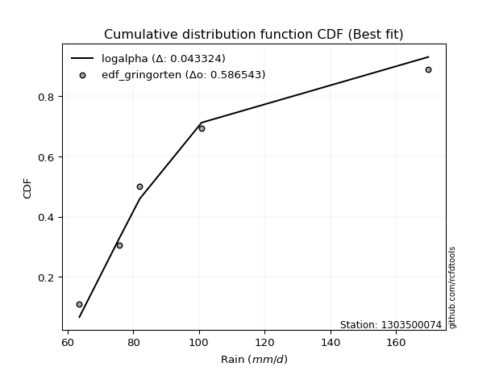</img>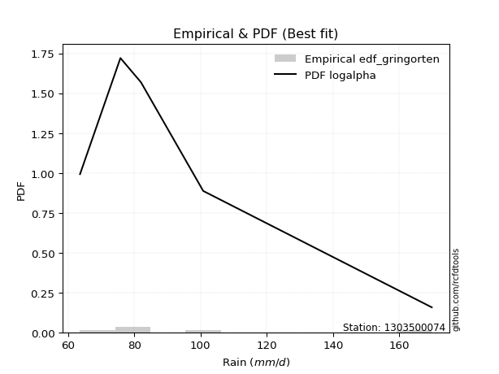</img>

</div>


### 9. EDF Filliben (1975)

The specific values of the constants (0.3175) (often denoted as $alpha$) and (0.365) are derived from a method proposed by James J. Filliben in a 1975 paper. This particular formula is the mean value of the $i$-th order statistic of the normal distribution and is considered a robust and effective plotting position formula for the normal probability plot correlation coefficient test for normality.

<div align="center">


$P=(m-0.3175)/(n+0.365)$


</div>


**9.1. Empirical values**

<div align="center">

|                | 0                   | 1                  | 2            | 3                  | 4                  |
|:---------------|:--------------------|:-------------------|:-------------|:-------------------|:-------------------|
| date           | 2020                | 2022               | 2021         | 2025               | 2019               |
| x              | 63.6                | 75.8               | 82.0         | 100.8              | 169.8              |
| m              | 1                   | 2                  | 3            | 4                  | 5                  |
| empirical_dist | edf_filliben        | edf_filliben       | edf_filliben | edf_filliben       | edf_filliben       |
| empirical      | 0.12721342031686858 | 0.3136067101584343 | 0.5          | 0.6863932898415657 | 0.8727865796831314 |
| empirical_tr   | 1.1457554725040042  | 1.456890699253225  | 2.0          | 3.188707280832095  | 7.860805860805863  |

</div>


**9.2. Kolmogorov-Smirnov fit test (sorted by Δ)**


<div align="center">

|                | 0                   | 1                  | 2                  | 3                   | 4                   | 5                   | 6                   | 7                   | 8                   | 9                   | 10                  | 11                  | 12                  | 13                  | 14                  | 15                  | 16                  | 17                  | 18                  | 19                 | 20                  | 21                  | 22                  | 23                 | 24                  | 25                  | 26                  | 27                  | 28                  | 29                  | 30                  | 31                  | 32                  | 33                  | 34                  | 35                 | 36                  | 37                  | 38                  | 39                  | 40                  | 41                 | 42                 | 43                 | 44                 | 45                  | 46                  | 47                 | 48                 | 49                 | 50                 | 51                 | 52                  | 53                  | 54                  | 55                  | 56                  | 57                  | 58                  | 59                 | 60                  | 61                 | 62                  | 63                  | 64                 | 65                  | 66                 | 67                  | 68                 | 69                  | 70                 | 71                 | 72                  | 73                 | 74                  | 75                  | 76                  | 77                 | 78                 | 79                 | 80                  | 81                  | 82                  | 83                  | 84                  | 85                  | 86                  | 87                  | 88                  | 89                  | 90                  | 91                  | 92                  | 93                  | 94                  | 95                 | 96                  | 97                 | 98                  | 99                  | 100                | 101                 | 102                 | 103                 | 104                 | 105                | 106                 | 107                 | 108                 | 109                 | 110                 | 111                 | 112                | 113                 | 114                 | 115                | 116                 | 117                | 118                | 119                | 120                | 121                | 122                | 123                 | 124                | 125                | 126                | 127                | 128                | 129                | 130                | 131                | 132                | 133                 | 134                 | 135                 | 136                | 137                | 138                 | 139                 | 140                | 141                 | 142                | 143                 | 144                | 145                 | 146                | 147                | 148                | 149                | 150                | 151                | 152                | 153                | 154                | 155                | 156                | 157                | 158                | 159                |
|:---------------|:--------------------|:-------------------|:-------------------|:--------------------|:--------------------|:--------------------|:--------------------|:--------------------|:--------------------|:--------------------|:--------------------|:--------------------|:--------------------|:--------------------|:--------------------|:--------------------|:--------------------|:--------------------|:--------------------|:-------------------|:--------------------|:--------------------|:--------------------|:-------------------|:--------------------|:--------------------|:--------------------|:--------------------|:--------------------|:--------------------|:--------------------|:--------------------|:--------------------|:--------------------|:--------------------|:-------------------|:--------------------|:--------------------|:--------------------|:--------------------|:--------------------|:-------------------|:-------------------|:-------------------|:-------------------|:--------------------|:--------------------|:-------------------|:-------------------|:-------------------|:-------------------|:-------------------|:--------------------|:--------------------|:--------------------|:--------------------|:--------------------|:--------------------|:--------------------|:-------------------|:--------------------|:-------------------|:--------------------|:--------------------|:-------------------|:--------------------|:-------------------|:--------------------|:-------------------|:--------------------|:-------------------|:-------------------|:--------------------|:-------------------|:--------------------|:--------------------|:--------------------|:-------------------|:-------------------|:-------------------|:--------------------|:--------------------|:--------------------|:--------------------|:--------------------|:--------------------|:--------------------|:--------------------|:--------------------|:--------------------|:--------------------|:--------------------|:--------------------|:--------------------|:--------------------|:-------------------|:--------------------|:-------------------|:--------------------|:--------------------|:-------------------|:--------------------|:--------------------|:--------------------|:--------------------|:-------------------|:--------------------|:--------------------|:--------------------|:--------------------|:--------------------|:--------------------|:-------------------|:--------------------|:--------------------|:-------------------|:--------------------|:-------------------|:-------------------|:-------------------|:-------------------|:-------------------|:-------------------|:--------------------|:-------------------|:-------------------|:-------------------|:-------------------|:-------------------|:-------------------|:-------------------|:-------------------|:-------------------|:--------------------|:--------------------|:--------------------|:-------------------|:-------------------|:--------------------|:--------------------|:-------------------|:--------------------|:-------------------|:--------------------|:-------------------|:--------------------|:-------------------|:-------------------|:-------------------|:-------------------|:-------------------|:-------------------|:-------------------|:-------------------|:-------------------|:-------------------|:-------------------|:-------------------|:-------------------|:-------------------|
| station        | 1303500074          | 1303500074         | 1303500074         | 1303500074          | 1303500074          | 1303500074          | 1303500074          | 1303500074          | 1303500074          | 1303500074          | 1303500074          | 1303500074          | 1303500074          | 1303500074          | 1303500074          | 1303500074          | 1303500074          | 1303500074          | 1303500074          | 1303500074         | 1303500074          | 1303500074          | 1303500074          | 1303500074         | 1303500074          | 1303500074          | 1303500074          | 1303500074          | 1303500074          | 1303500074          | 1303500074          | 1303500074          | 1303500074          | 1303500074          | 1303500074          | 1303500074         | 1303500074          | 1303500074          | 1303500074          | 1303500074          | 1303500074          | 1303500074         | 1303500074         | 1303500074         | 1303500074         | 1303500074          | 1303500074          | 1303500074         | 1303500074         | 1303500074         | 1303500074         | 1303500074         | 1303500074          | 1303500074          | 1303500074          | 1303500074          | 1303500074          | 1303500074          | 1303500074          | 1303500074         | 1303500074          | 1303500074         | 1303500074          | 1303500074          | 1303500074         | 1303500074          | 1303500074         | 1303500074          | 1303500074         | 1303500074          | 1303500074         | 1303500074         | 1303500074          | 1303500074         | 1303500074          | 1303500074          | 1303500074          | 1303500074         | 1303500074         | 1303500074         | 1303500074          | 1303500074          | 1303500074          | 1303500074          | 1303500074          | 1303500074          | 1303500074          | 1303500074          | 1303500074          | 1303500074          | 1303500074          | 1303500074          | 1303500074          | 1303500074          | 1303500074          | 1303500074         | 1303500074          | 1303500074         | 1303500074          | 1303500074          | 1303500074         | 1303500074          | 1303500074          | 1303500074          | 1303500074          | 1303500074         | 1303500074          | 1303500074          | 1303500074          | 1303500074          | 1303500074          | 1303500074          | 1303500074         | 1303500074          | 1303500074          | 1303500074         | 1303500074          | 1303500074         | 1303500074         | 1303500074         | 1303500074         | 1303500074         | 1303500074         | 1303500074          | 1303500074         | 1303500074         | 1303500074         | 1303500074         | 1303500074         | 1303500074         | 1303500074         | 1303500074         | 1303500074         | 1303500074          | 1303500074          | 1303500074          | 1303500074         | 1303500074         | 1303500074          | 1303500074          | 1303500074         | 1303500074          | 1303500074         | 1303500074          | 1303500074         | 1303500074          | 1303500074         | 1303500074         | 1303500074         | 1303500074         | 1303500074         | 1303500074         | 1303500074         | 1303500074         | 1303500074         | 1303500074         | 1303500074         | 1303500074         | 1303500074         | 1303500074         |
| empirical_dist | edf_filliben        | edf_filliben       | edf_filliben       | edf_filliben        | edf_filliben        | edf_filliben        | edf_filliben        | edf_filliben        | edf_filliben        | edf_filliben        | edf_filliben        | edf_filliben        | edf_filliben        | edf_filliben        | edf_filliben        | edf_filliben        | edf_filliben        | edf_filliben        | edf_filliben        | edf_filliben       | edf_filliben        | edf_filliben        | edf_filliben        | edf_filliben       | edf_filliben        | edf_filliben        | edf_filliben        | edf_filliben        | edf_filliben        | edf_filliben        | edf_filliben        | edf_filliben        | edf_filliben        | edf_filliben        | edf_filliben        | edf_filliben       | edf_filliben        | edf_filliben        | edf_filliben        | edf_filliben        | edf_filliben        | edf_filliben       | edf_filliben       | edf_filliben       | edf_filliben       | edf_filliben        | edf_filliben        | edf_filliben       | edf_filliben       | edf_filliben       | edf_filliben       | edf_filliben       | edf_filliben        | edf_filliben        | edf_filliben        | edf_filliben        | edf_filliben        | edf_filliben        | edf_filliben        | edf_filliben       | edf_filliben        | edf_filliben       | edf_filliben        | edf_filliben        | edf_filliben       | edf_filliben        | edf_filliben       | edf_filliben        | edf_filliben       | edf_filliben        | edf_filliben       | edf_filliben       | edf_filliben        | edf_filliben       | edf_filliben        | edf_filliben        | edf_filliben        | edf_filliben       | edf_filliben       | edf_filliben       | edf_filliben        | edf_filliben        | edf_filliben        | edf_filliben        | edf_filliben        | edf_filliben        | edf_filliben        | edf_filliben        | edf_filliben        | edf_filliben        | edf_filliben        | edf_filliben        | edf_filliben        | edf_filliben        | edf_filliben        | edf_filliben       | edf_filliben        | edf_filliben       | edf_filliben        | edf_filliben        | edf_filliben       | edf_filliben        | edf_filliben        | edf_filliben        | edf_filliben        | edf_filliben       | edf_filliben        | edf_filliben        | edf_filliben        | edf_filliben        | edf_filliben        | edf_filliben        | edf_filliben       | edf_filliben        | edf_filliben        | edf_filliben       | edf_filliben        | edf_filliben       | edf_filliben       | edf_filliben       | edf_filliben       | edf_filliben       | edf_filliben       | edf_filliben        | edf_filliben       | edf_filliben       | edf_filliben       | edf_filliben       | edf_filliben       | edf_filliben       | edf_filliben       | edf_filliben       | edf_filliben       | edf_filliben        | edf_filliben        | edf_filliben        | edf_filliben       | edf_filliben       | edf_filliben        | edf_filliben        | edf_filliben       | edf_filliben        | edf_filliben       | edf_filliben        | edf_filliben       | edf_filliben        | edf_filliben       | edf_filliben       | edf_filliben       | edf_filliben       | edf_filliben       | edf_filliben       | edf_filliben       | edf_filliben       | edf_filliben       | edf_filliben       | edf_filliben       | edf_filliben       | edf_filliben       | edf_filliben       |
| p_dist         | logmielke           | logalpha           | loggenextreme      | loginvweibull       | alpha               | logncf              | loghalfnorm         | invgamma            | f                   | logmoyal            | logburr             | loginvgauss         | logjohnsonsu        | invgauss            | logfoldnorm         | loghalflogistic     | loggenlogistic      | burr                | logweibull_max      | halflogistic       | loggumbel_r         | foldnorm            | logpearson3         | halfnorm           | logdweibull         | lograyleigh         | logfatiguelife      | logloglaplace       | logkstwobign        | logmaxwell          | moyal               | pearson3            | burr12              | logsemicircular     | logburr12           | nct                | lognct              | loganglit           | loginvgamma         | gumbel_r            | rayleigh            | exponnorm          | logexponnorm       | wald               | betaprime          | loglomax            | gausshyper          | loggenexpon        | loggompertz        | genexpon           | vonmises_line      | gengamma           | exponweib           | gompertz            | logskewnorm         | logwald             | truncnorm           | logbetaprime        | logarcsine          | ncf                | logf                | lognakagami        | genlogistic         | maxwell             | logcrystalball     | lognorm             | logt               | logloggamma         | logrice            | logbeta             | nakagami           | logtruncexpon      | loglogistic         | logdgamma          | logtruncweibull_min | loggennorm          | anglit              | kstwobign          | semicircular       | gennorm            | crystalball         | norm                | t                   | logbradford         | loghypsecant        | arcsine             | logcosine           | dgamma              | logistic            | loggengamma         | logwrapcauchy       | loglaplace          | loglaplace          | dweibull            | rice                | loggumbel_l        | hypsecant           | bradford           | logksone            | skewnorm            | cosine             | logvonmises_line    | wrapcauchy          | truncweibull_min    | laplace             | gumbel_l           | logargus            | logkappa4           | truncexpon          | logtukeylambda      | loglevy_l           | halfgennorm         | loguniform         | logkappa3           | genextreme          | loggenpareto       | levy_l              | logrdist           | genpareto          | weibull_min        | beta               | logtriang          | loghalfgennorm     | kappa4              | rdist              | argus              | ksone              | logexponpow        | tukeylambda        | kappa3             | uniform            | loggamma           | loggamma           | triang              | loggenhalflogistic  | lomax               | logtruncpareto     | fatiguelife        | johnsonsb           | invweibull          | genhalflogistic    | powerlaw            | logtrapezoid       | logpowerlaw         | truncpareto        | johnsonsu           | logexponweib       | logweibull_min     | logjohnsonsb       | exponpow           | loggausshyper      | trapezoid          | weibull_max        | gamma              | logerlang          | erlang             | logtruncnorm       | logvonmises        | vonmises           | mielke             |
| delta          | 0.06071535514379156 | 0.0611620180819854 | 0.0644841148572904 | 0.06448491199791169 | 0.06640508918190377 | 0.06717508294466984 | 0.06735943707406677 | 0.06984594965548208 | 0.06984648103142904 | 0.06989595635073986 | 0.07213966726371468 | 0.07261971537183048 | 0.07426171076886516 | 0.07501080111733505 | 0.07666997528144764 | 0.08216768992570672 | 0.08392752029898298 | 0.08403250586852729 | 0.08464994748985716 | 0.0875761485940767 | 0.08789433026255161 | 0.08944549559390386 | 0.09197501889801651 | 0.0923504978339863 | 0.09276011741337653 | 0.09438882281944827 | 0.09476819553288057 | 0.09585408074957857 | 0.10012843928872028 | 0.10656638127608309 | 0.10984461999664141 | 0.11094088944139152 | 0.11263735005510116 | 0.11274784649824421 | 0.11280347602417949 | 0.1157463770765852 | 0.12022788595844935 | 0.12052752751468654 | 0.12061910396564618 | 0.12519784120211813 | 0.12588400585303877 | 0.1262492176266479 | 0.1263181086469838 | 0.1264508529954061 | 0.1265282184474974 | 0.12719510422825622 | 0.12721340602321263 | 0.1272134202337027 | 0.1272134202696829 | 0.1272134203084999 | 0.127213420310615  | 0.127213420316856  | 0.12721342031685612 | 0.12721342031686614 | 0.12721342031686858 | 0.12721342031686858 | 0.12721342031686858 | 0.12783119906359375 | 0.12872353165390749 | 0.1299026964259573 | 0.13174968662297226 | 0.1357662132135078 | 0.13662413443349192 | 0.13767202926062733 | 0.139116459936437  | 0.13911653665358642 | 0.1391193548726174 | 0.13931803078566857 | 0.1404166960868652 | 0.14298168198762562 | 0.1443647183643597 | 0.1492278988802313 | 0.15608389605030154 | 0.1582240879251957 | 0.16013250436651844 | 0.16402633716082038 | 0.16462053005682964 | 0.1659990490926112 | 0.166115873868242  | 0.166575780012167  | 0.16835671150524045 | 0.16835672052833067 | 0.16837714959744243 | 0.16886710335957938 | 0.16943060610927768 | 0.17204774363822128 | 0.17595574571483585 | 0.18774720935668843 | 0.18776522160533843 | 0.18918009510079997 | 0.19676834350765526 | 0.19782418754249687 | 0.19782418754249687 | 0.19837613610462965 | 0.19985300780246396 | 0.2007480669844966 | 0.20246978877641936 | 0.2054757350688738 | 0.21225783012729071 | 0.21976987501861034 | 0.2219623858301803 | 0.22722953531776946 | 0.22851457608041853 | 0.22879443450000803 | 0.22987422904996452 | 0.2301427124750347 | 0.23050063431463375 | 0.23134369306665187 | 0.23217900847024048 | 0.23316652083877187 | 0.23434040428780264 | 0.24005795476295316 | 0.2412385359826612 | 0.24169967643207374 | 0.24734674034459703 | 0.2508643015083716 | 0.25159775956721087 | 0.2540863551095639 | 0.262062506114549  | 0.2653589279994449 | 0.2709494179547675 | 0.2796687133780754 | 0.2955802926517867 | 0.29792467890990476 | 0.3013726234412084 | 0.3076282157463024 | 0.3111578849451439 | 0.3115327221449982 | 0.3136067100981448 | 0.3342349237389698 | 0.3361108039658596 | 0.3450044543247183 | 0.3450044543247183 | 0.34845088917399375 | 0.35227316507298534 | 0.35413597068549746 | 0.3879486204674118 | 0.4202959135487921 | 0.43019134492467154 | 0.43326300535442724 | 0.452514065626608  | 0.46028024776181037 | 0.4615888556830988 | 0.48585638542944704 | 0.4871567967233171 | 0.49513140036095143 | 0.5110374422515009 | 0.5207841740714785 | 0.5259094328017839 | 0.5344458158052621 | 0.5385278029480056 | 0.5455916807537841 | 0.5622600911381461 | 0.5705269641219037 | 0.5716175555086644 | 0.5818468457854398 | 0.6863932898415657 | 1.0918658057091641 | 26.265372873787513 | nan                |
| deltao         | 0.5865427407550001  | 0.5865427407550001 | 0.5865427407550001 | 0.5865427407550001  | 0.5865427407550001  | 0.5865427407550001  | 0.5865427407550001  | 0.5865427407550001  | 0.5865427407550001  | 0.5865427407550001  | 0.5865427407550001  | 0.5865427407550001  | 0.5865427407550001  | 0.5865427407550001  | 0.5865427407550001  | 0.5865427407550001  | 0.5865427407550001  | 0.5865427407550001  | 0.5865427407550001  | 0.5865427407550001 | 0.5865427407550001  | 0.5865427407550001  | 0.5865427407550001  | 0.5865427407550001 | 0.5865427407550001  | 0.5865427407550001  | 0.5865427407550001  | 0.5865427407550001  | 0.5865427407550001  | 0.5865427407550001  | 0.5865427407550001  | 0.5865427407550001  | 0.5865427407550001  | 0.5865427407550001  | 0.5865427407550001  | 0.5865427407550001 | 0.5865427407550001  | 0.5865427407550001  | 0.5865427407550001  | 0.5865427407550001  | 0.5865427407550001  | 0.5865427407550001 | 0.5865427407550001 | 0.5865427407550001 | 0.5865427407550001 | 0.5865427407550001  | 0.5865427407550001  | 0.5865427407550001 | 0.5865427407550001 | 0.5865427407550001 | 0.5865427407550001 | 0.5865427407550001 | 0.5865427407550001  | 0.5865427407550001  | 0.5865427407550001  | 0.5865427407550001  | 0.5865427407550001  | 0.5865427407550001  | 0.5865427407550001  | 0.5865427407550001 | 0.5865427407550001  | 0.5865427407550001 | 0.5865427407550001  | 0.5865427407550001  | 0.5865427407550001 | 0.5865427407550001  | 0.5865427407550001 | 0.5865427407550001  | 0.5865427407550001 | 0.5865427407550001  | 0.5865427407550001 | 0.5865427407550001 | 0.5865427407550001  | 0.5865427407550001 | 0.5865427407550001  | 0.5865427407550001  | 0.5865427407550001  | 0.5865427407550001 | 0.5865427407550001 | 0.5865427407550001 | 0.5865427407550001  | 0.5865427407550001  | 0.5865427407550001  | 0.5865427407550001  | 0.5865427407550001  | 0.5865427407550001  | 0.5865427407550001  | 0.5865427407550001  | 0.5865427407550001  | 0.5865427407550001  | 0.5865427407550001  | 0.5865427407550001  | 0.5865427407550001  | 0.5865427407550001  | 0.5865427407550001  | 0.5865427407550001 | 0.5865427407550001  | 0.5865427407550001 | 0.5865427407550001  | 0.5865427407550001  | 0.5865427407550001 | 0.5865427407550001  | 0.5865427407550001  | 0.5865427407550001  | 0.5865427407550001  | 0.5865427407550001 | 0.5865427407550001  | 0.5865427407550001  | 0.5865427407550001  | 0.5865427407550001  | 0.5865427407550001  | 0.5865427407550001  | 0.5865427407550001 | 0.5865427407550001  | 0.5865427407550001  | 0.5865427407550001 | 0.5865427407550001  | 0.5865427407550001 | 0.5865427407550001 | 0.5865427407550001 | 0.5865427407550001 | 0.5865427407550001 | 0.5865427407550001 | 0.5865427407550001  | 0.5865427407550001 | 0.5865427407550001 | 0.5865427407550001 | 0.5865427407550001 | 0.5865427407550001 | 0.5865427407550001 | 0.5865427407550001 | 0.5865427407550001 | 0.5865427407550001 | 0.5865427407550001  | 0.5865427407550001  | 0.5865427407550001  | 0.5865427407550001 | 0.5865427407550001 | 0.5865427407550001  | 0.5865427407550001  | 0.5865427407550001 | 0.5865427407550001  | 0.5865427407550001 | 0.5865427407550001  | 0.5865427407550001 | 0.5865427407550001  | 0.5865427407550001 | 0.5865427407550001 | 0.5865427407550001 | 0.5865427407550001 | 0.5865427407550001 | 0.5865427407550001 | 0.5865427407550001 | 0.5865427407550001 | 0.5865427407550001 | 0.5865427407550001 | 0.5865427407550001 | 0.5865427407550001 | 0.5865427407550001 | 0.5865427407550001 |
| eval           | Δo > Δ              | Δo > Δ             | Δo > Δ             | Δo > Δ              | Δo > Δ              | Δo > Δ              | Δo > Δ              | Δo > Δ              | Δo > Δ              | Δo > Δ              | Δo > Δ              | Δo > Δ              | Δo > Δ              | Δo > Δ              | Δo > Δ              | Δo > Δ              | Δo > Δ              | Δo > Δ              | Δo > Δ              | Δo > Δ             | Δo > Δ              | Δo > Δ              | Δo > Δ              | Δo > Δ             | Δo > Δ              | Δo > Δ              | Δo > Δ              | Δo > Δ              | Δo > Δ              | Δo > Δ              | Δo > Δ              | Δo > Δ              | Δo > Δ              | Δo > Δ              | Δo > Δ              | Δo > Δ             | Δo > Δ              | Δo > Δ              | Δo > Δ              | Δo > Δ              | Δo > Δ              | Δo > Δ             | Δo > Δ             | Δo > Δ             | Δo > Δ             | Δo > Δ              | Δo > Δ              | Δo > Δ             | Δo > Δ             | Δo > Δ             | Δo > Δ             | Δo > Δ             | Δo > Δ              | Δo > Δ              | Δo > Δ              | Δo > Δ              | Δo > Δ              | Δo > Δ              | Δo > Δ              | Δo > Δ             | Δo > Δ              | Δo > Δ             | Δo > Δ              | Δo > Δ              | Δo > Δ             | Δo > Δ              | Δo > Δ             | Δo > Δ              | Δo > Δ             | Δo > Δ              | Δo > Δ             | Δo > Δ             | Δo > Δ              | Δo > Δ             | Δo > Δ              | Δo > Δ              | Δo > Δ              | Δo > Δ             | Δo > Δ             | Δo > Δ             | Δo > Δ              | Δo > Δ              | Δo > Δ              | Δo > Δ              | Δo > Δ              | Δo > Δ              | Δo > Δ              | Δo > Δ              | Δo > Δ              | Δo > Δ              | Δo > Δ              | Δo > Δ              | Δo > Δ              | Δo > Δ              | Δo > Δ              | Δo > Δ             | Δo > Δ              | Δo > Δ             | Δo > Δ              | Δo > Δ              | Δo > Δ             | Δo > Δ              | Δo > Δ              | Δo > Δ              | Δo > Δ              | Δo > Δ             | Δo > Δ              | Δo > Δ              | Δo > Δ              | Δo > Δ              | Δo > Δ              | Δo > Δ              | Δo > Δ             | Δo > Δ              | Δo > Δ              | Δo > Δ             | Δo > Δ              | Δo > Δ             | Δo > Δ             | Δo > Δ             | Δo > Δ             | Δo > Δ             | Δo > Δ             | Δo > Δ              | Δo > Δ             | Δo > Δ             | Δo > Δ             | Δo > Δ             | Δo > Δ             | Δo > Δ             | Δo > Δ             | Δo > Δ             | Δo > Δ             | Δo > Δ              | Δo > Δ              | Δo > Δ              | Δo > Δ             | Δo > Δ             | Δo > Δ              | Δo > Δ              | Δo > Δ             | Δo > Δ              | Δo > Δ             | Δo > Δ              | Δo > Δ             | Δo > Δ              | Δo > Δ             | Δo > Δ             | Δo > Δ             | Δo > Δ             | Δo > Δ             | Δo > Δ             | Δo > Δ             | Δo > Δ             | Δo > Δ             | Δo > Δ             | Δo <= Δ            | Δo <= Δ            | Δo <= Δ            | Δo <= Δ            |
| fit            | 1                   | 1                  | 1                  | 1                   | 1                   | 1                   | 1                   | 1                   | 1                   | 1                   | 1                   | 1                   | 1                   | 1                   | 1                   | 1                   | 1                   | 1                   | 1                   | 1                  | 1                   | 1                   | 1                   | 1                  | 1                   | 1                   | 1                   | 1                   | 1                   | 1                   | 1                   | 1                   | 1                   | 1                   | 1                   | 1                  | 1                   | 1                   | 1                   | 1                   | 1                   | 1                  | 1                  | 1                  | 1                  | 1                   | 1                   | 1                  | 1                  | 1                  | 1                  | 1                  | 1                   | 1                   | 1                   | 1                   | 1                   | 1                   | 1                   | 1                  | 1                   | 1                  | 1                   | 1                   | 1                  | 1                   | 1                  | 1                   | 1                  | 1                   | 1                  | 1                  | 1                   | 1                  | 1                   | 1                   | 1                   | 1                  | 1                  | 1                  | 1                   | 1                   | 1                   | 1                   | 1                   | 1                   | 1                   | 1                   | 1                   | 1                   | 1                   | 1                   | 1                   | 1                   | 1                   | 1                  | 1                   | 1                  | 1                   | 1                   | 1                  | 1                   | 1                   | 1                   | 1                   | 1                  | 1                   | 1                   | 1                   | 1                   | 1                   | 1                   | 1                  | 1                   | 1                   | 1                  | 1                   | 1                  | 1                  | 1                  | 1                  | 1                  | 1                  | 1                   | 1                  | 1                  | 1                  | 1                  | 1                  | 1                  | 1                  | 1                  | 1                  | 1                   | 1                   | 1                   | 1                  | 1                  | 1                   | 1                   | 1                  | 1                   | 1                  | 1                   | 1                  | 1                   | 1                  | 1                  | 1                  | 1                  | 1                  | 1                  | 1                  | 1                  | 1                  | 1                  | 0                  | 0                  | 0                  | 0                  |
| n              | 5                   | 5                  | 5                  | 5                   | 5                   | 5                   | 5                   | 5                   | 5                   | 5                   | 5                   | 5                   | 5                   | 5                   | 5                   | 5                   | 5                   | 5                   | 5                   | 5                  | 5                   | 5                   | 5                   | 5                  | 5                   | 5                   | 5                   | 5                   | 5                   | 5                   | 5                   | 5                   | 5                   | 5                   | 5                   | 5                  | 5                   | 5                   | 5                   | 5                   | 5                   | 5                  | 5                  | 5                  | 5                  | 5                   | 5                   | 5                  | 5                  | 5                  | 5                  | 5                  | 5                   | 5                   | 5                   | 5                   | 5                   | 5                   | 5                   | 5                  | 5                   | 5                  | 5                   | 5                   | 5                  | 5                   | 5                  | 5                   | 5                  | 5                   | 5                  | 5                  | 5                   | 5                  | 5                   | 5                   | 5                   | 5                  | 5                  | 5                  | 5                   | 5                   | 5                   | 5                   | 5                   | 5                   | 5                   | 5                   | 5                   | 5                   | 5                   | 5                   | 5                   | 5                   | 5                   | 5                  | 5                   | 5                  | 5                   | 5                   | 5                  | 5                   | 5                   | 5                   | 5                   | 5                  | 5                   | 5                   | 5                   | 5                   | 5                   | 5                   | 5                  | 5                   | 5                   | 5                  | 5                   | 5                  | 5                  | 5                  | 5                  | 5                  | 5                  | 5                   | 5                  | 5                  | 5                  | 5                  | 5                  | 5                  | 5                  | 5                  | 5                  | 5                   | 5                   | 5                   | 5                  | 5                  | 5                   | 5                   | 5                  | 5                   | 5                  | 5                   | 5                  | 5                   | 5                  | 5                  | 5                  | 5                  | 5                  | 5                  | 5                  | 5                  | 5                  | 5                  | 5                  | 5                  | 5                  | 5                  |
| best_fit       | 1                   | 0                  | 0                  | 0                   | 0                   | 0                   | 0                   | 0                   | 0                   | 0                   | 0                   | 0                   | 0                   | 0                   | 0                   | 0                   | 0                   | 0                   | 0                   | 0                  | 0                   | 0                   | 0                   | 0                  | 0                   | 0                   | 0                   | 0                   | 0                   | 0                   | 0                   | 0                   | 0                   | 0                   | 0                   | 0                  | 0                   | 0                   | 0                   | 0                   | 0                   | 0                  | 0                  | 0                  | 0                  | 0                   | 0                   | 0                  | 0                  | 0                  | 0                  | 0                  | 0                   | 0                   | 0                   | 0                   | 0                   | 0                   | 0                   | 0                  | 0                   | 0                  | 0                   | 0                   | 0                  | 0                   | 0                  | 0                   | 0                  | 0                   | 0                  | 0                  | 0                   | 0                  | 0                   | 0                   | 0                   | 0                  | 0                  | 0                  | 0                   | 0                   | 0                   | 0                   | 0                   | 0                   | 0                   | 0                   | 0                   | 0                   | 0                   | 0                   | 0                   | 0                   | 0                   | 0                  | 0                   | 0                  | 0                   | 0                   | 0                  | 0                   | 0                   | 0                   | 0                   | 0                  | 0                   | 0                   | 0                   | 0                   | 0                   | 0                   | 0                  | 0                   | 0                   | 0                  | 0                   | 0                  | 0                  | 0                  | 0                  | 0                  | 0                  | 0                   | 0                  | 0                  | 0                  | 0                  | 0                  | 0                  | 0                  | 0                  | 0                  | 0                   | 0                   | 0                   | 0                  | 0                  | 0                   | 0                   | 0                  | 0                   | 0                  | 0                   | 0                  | 0                   | 0                  | 0                  | 0                  | 0                  | 0                  | 0                  | 0                  | 0                  | 0                  | 0                  | 0                  | 0                  | 0                  | 0                  |
| best_fit_sort  | 1                   | 2                  | 3                  | 4                   | 5                   | 6                   | 7                   | 8                   | 9                   | 10                  | 11                  | 12                  | 13                  | 14                  | 15                  | 16                  | 17                  | 18                  | 19                  | 20                 | 21                  | 22                  | 23                  | 24                 | 25                  | 26                  | 27                  | 28                  | 29                  | 30                  | 31                  | 32                  | 33                  | 34                  | 35                  | 36                 | 37                  | 38                  | 39                  | 40                  | 41                  | 42                 | 43                 | 44                 | 45                 | 46                  | 47                  | 48                 | 49                 | 50                 | 51                 | 52                 | 53                  | 54                  | 55                  | 56                  | 57                  | 58                  | 59                  | 60                 | 61                  | 62                 | 63                  | 64                  | 65                 | 66                  | 67                 | 68                  | 69                 | 70                  | 71                 | 72                 | 73                  | 74                 | 75                  | 76                  | 77                  | 78                 | 79                 | 80                 | 81                  | 82                  | 83                  | 84                  | 85                  | 86                  | 87                  | 88                  | 89                  | 90                  | 91                  | 92                  | 93                  | 94                  | 95                  | 96                 | 97                  | 98                 | 99                  | 100                 | 101                | 102                 | 103                 | 104                 | 105                 | 106                | 107                 | 108                 | 109                 | 110                 | 111                 | 112                 | 113                | 114                 | 115                 | 116                | 117                 | 118                | 119                | 120                | 121                | 122                | 123                | 124                 | 125                | 126                | 127                | 128                | 129                | 130                | 131                | 132                | 133                | 134                 | 135                 | 136                 | 137                | 138                | 139                 | 140                 | 141                | 142                 | 143                | 144                 | 145                | 146                 | 147                | 148                | 149                | 150                | 151                | 152                | 153                | 154                | 155                | 156                | 157                | 158                | 159                | 160                |

</div>


**9.3. Best fit**

<div align="center">

|   id |    station | empirical_dist   | p_dist    |     delta |   deltao | eval   |   fit |   n |   best_fit |   best_fit_sort |
|-----:|-----------:|:-----------------|:----------|----------:|---------:|:-------|------:|----:|-----------:|----------------:|
|    0 | 1303500074 | edf_filliben     | logmielke | 0.0607154 | 0.586543 | Δo > Δ |     1 |   5 |          1 |               1 |

</div>


<div align="center">

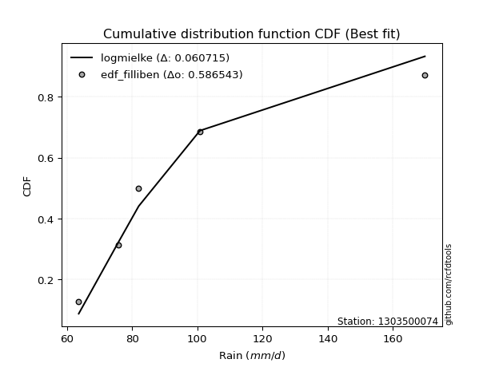</img></img>

</div>


### 10. EDF Jenkinson (1977)

The Jenkinson formula in hydrology is an empirical plotting position formula used to estimate the non-exceedance probability _(P)_ or return period _(T)_ of a given ordered observation within a sample. It is a widely used method in the frequency analysis of extreme events such as floods and rainfall, as it provides a distribution-free way to plot data. _a≈0.31_ and _b≈0.38_ are constants derived to approximate the median of the probability distribution for the given rank.

<div align="center">


$P=(m-a)/(n+b)$


</div>


**10.1. Empirical values**

<div align="center">

|                | 0                   | 1                  | 2             | 3                  | 4                  |
|:---------------|:--------------------|:-------------------|:--------------|:-------------------|:-------------------|
| date           | 2020                | 2022               | 2021          | 2025               | 2019               |
| x              | 63.6                | 75.8               | 82.0          | 100.8              | 169.8              |
| m              | 1                   | 2                  | 3             | 4                  | 5                  |
| empirical_dist | edf_jenkinson       | edf_jenkinson      | edf_jenkinson | edf_jenkinson      | edf_jenkinson      |
| empirical      | 0.12825278810408922 | 0.3141263940520446 | 0.5           | 0.6858736059479554 | 0.8717472118959109 |
| empirical_tr   | 1.1471215351812367  | 1.4579945799457996 | 2.0           | 3.183431952662722  | 7.797101449275368  |

</div>


**10.2. Kolmogorov-Smirnov fit test (sorted by Δ)**


<div align="center">

|                | 0                   | 1                   | 2                   | 3                   | 4                  | 5                   | 6                   | 7                   | 8                   | 9                   | 10                  | 11                  | 12                 | 13                 | 14                  | 15                  | 16                  | 17                  | 18                  | 19                 | 20                  | 21                  | 22                  | 23                 | 24                  | 25                  | 26                  | 27                  | 28                  | 29                  | 30                  | 31                  | 32                  | 33                  | 34                  | 35                 | 36                  | 37                  | 38                  | 39                  | 40                  | 41                 | 42                  | 43                  | 44                  | 45                  | 46                  | 47                  | 48                  | 49                  | 50                  | 51                  | 52                  | 53                  | 54                  | 55                  | 56                  | 57                  | 58                  | 59                 | 60                  | 61                  | 62                  | 63                  | 64                 | 65                  | 66                 | 67                  | 68                 | 69                  | 70                  | 71                 | 72                  | 73                  | 74                  | 75                 | 76                 | 77                  | 78                 | 79                  | 80                  | 81                  | 82                  | 83                  | 84                  | 85                  | 86                  | 87                  | 88                  | 89                  | 90                  | 91                 | 92                  | 93                  | 94                  | 95                 | 96                  | 97                  | 98                  | 99                  | 100                 | 101                 | 102                | 103                 | 104                 | 105                 | 106                 | 107                 | 108                 | 109                 | 110                | 111                 | 112                | 113                 | 114                 | 115                 | 116                | 117                 | 118                | 119                 | 120                 | 121                | 122                 | 123                | 124                 | 125                 | 126                 | 127                | 128                | 129                 | 130                 | 131                | 132                | 133                | 134                | 135                | 136                 | 137                 | 138                | 139                 | 140                | 141                | 142                | 143                | 144                 | 145                | 146                | 147                | 148                | 149                | 150                | 151                | 152                | 153                | 154                | 155                | 156                | 157                | 158                | 159                |
|:---------------|:--------------------|:--------------------|:--------------------|:--------------------|:-------------------|:--------------------|:--------------------|:--------------------|:--------------------|:--------------------|:--------------------|:--------------------|:-------------------|:-------------------|:--------------------|:--------------------|:--------------------|:--------------------|:--------------------|:-------------------|:--------------------|:--------------------|:--------------------|:-------------------|:--------------------|:--------------------|:--------------------|:--------------------|:--------------------|:--------------------|:--------------------|:--------------------|:--------------------|:--------------------|:--------------------|:-------------------|:--------------------|:--------------------|:--------------------|:--------------------|:--------------------|:-------------------|:--------------------|:--------------------|:--------------------|:--------------------|:--------------------|:--------------------|:--------------------|:--------------------|:--------------------|:--------------------|:--------------------|:--------------------|:--------------------|:--------------------|:--------------------|:--------------------|:--------------------|:-------------------|:--------------------|:--------------------|:--------------------|:--------------------|:-------------------|:--------------------|:-------------------|:--------------------|:-------------------|:--------------------|:--------------------|:-------------------|:--------------------|:--------------------|:--------------------|:-------------------|:-------------------|:--------------------|:-------------------|:--------------------|:--------------------|:--------------------|:--------------------|:--------------------|:--------------------|:--------------------|:--------------------|:--------------------|:--------------------|:--------------------|:--------------------|:-------------------|:--------------------|:--------------------|:--------------------|:-------------------|:--------------------|:--------------------|:--------------------|:--------------------|:--------------------|:--------------------|:-------------------|:--------------------|:--------------------|:--------------------|:--------------------|:--------------------|:--------------------|:--------------------|:-------------------|:--------------------|:-------------------|:--------------------|:--------------------|:--------------------|:-------------------|:--------------------|:-------------------|:--------------------|:--------------------|:-------------------|:--------------------|:-------------------|:--------------------|:--------------------|:--------------------|:-------------------|:-------------------|:--------------------|:--------------------|:-------------------|:-------------------|:-------------------|:-------------------|:-------------------|:--------------------|:--------------------|:-------------------|:--------------------|:-------------------|:-------------------|:-------------------|:-------------------|:--------------------|:-------------------|:-------------------|:-------------------|:-------------------|:-------------------|:-------------------|:-------------------|:-------------------|:-------------------|:-------------------|:-------------------|:-------------------|:-------------------|:-------------------|:-------------------|
| station        | 1303500074          | 1303500074          | 1303500074          | 1303500074          | 1303500074         | 1303500074          | 1303500074          | 1303500074          | 1303500074          | 1303500074          | 1303500074          | 1303500074          | 1303500074         | 1303500074         | 1303500074          | 1303500074          | 1303500074          | 1303500074          | 1303500074          | 1303500074         | 1303500074          | 1303500074          | 1303500074          | 1303500074         | 1303500074          | 1303500074          | 1303500074          | 1303500074          | 1303500074          | 1303500074          | 1303500074          | 1303500074          | 1303500074          | 1303500074          | 1303500074          | 1303500074         | 1303500074          | 1303500074          | 1303500074          | 1303500074          | 1303500074          | 1303500074         | 1303500074          | 1303500074          | 1303500074          | 1303500074          | 1303500074          | 1303500074          | 1303500074          | 1303500074          | 1303500074          | 1303500074          | 1303500074          | 1303500074          | 1303500074          | 1303500074          | 1303500074          | 1303500074          | 1303500074          | 1303500074         | 1303500074          | 1303500074          | 1303500074          | 1303500074          | 1303500074         | 1303500074          | 1303500074         | 1303500074          | 1303500074         | 1303500074          | 1303500074          | 1303500074         | 1303500074          | 1303500074          | 1303500074          | 1303500074         | 1303500074         | 1303500074          | 1303500074         | 1303500074          | 1303500074          | 1303500074          | 1303500074          | 1303500074          | 1303500074          | 1303500074          | 1303500074          | 1303500074          | 1303500074          | 1303500074          | 1303500074          | 1303500074         | 1303500074          | 1303500074          | 1303500074          | 1303500074         | 1303500074          | 1303500074          | 1303500074          | 1303500074          | 1303500074          | 1303500074          | 1303500074         | 1303500074          | 1303500074          | 1303500074          | 1303500074          | 1303500074          | 1303500074          | 1303500074          | 1303500074         | 1303500074          | 1303500074         | 1303500074          | 1303500074          | 1303500074          | 1303500074         | 1303500074          | 1303500074         | 1303500074          | 1303500074          | 1303500074         | 1303500074          | 1303500074         | 1303500074          | 1303500074          | 1303500074          | 1303500074         | 1303500074         | 1303500074          | 1303500074          | 1303500074         | 1303500074         | 1303500074         | 1303500074         | 1303500074         | 1303500074          | 1303500074          | 1303500074         | 1303500074          | 1303500074         | 1303500074         | 1303500074         | 1303500074         | 1303500074          | 1303500074         | 1303500074         | 1303500074         | 1303500074         | 1303500074         | 1303500074         | 1303500074         | 1303500074         | 1303500074         | 1303500074         | 1303500074         | 1303500074         | 1303500074         | 1303500074         | 1303500074         |
| empirical_dist | edf_jenkinson       | edf_jenkinson       | edf_jenkinson       | edf_jenkinson       | edf_jenkinson      | edf_jenkinson       | edf_jenkinson       | edf_jenkinson       | edf_jenkinson       | edf_jenkinson       | edf_jenkinson       | edf_jenkinson       | edf_jenkinson      | edf_jenkinson      | edf_jenkinson       | edf_jenkinson       | edf_jenkinson       | edf_jenkinson       | edf_jenkinson       | edf_jenkinson      | edf_jenkinson       | edf_jenkinson       | edf_jenkinson       | edf_jenkinson      | edf_jenkinson       | edf_jenkinson       | edf_jenkinson       | edf_jenkinson       | edf_jenkinson       | edf_jenkinson       | edf_jenkinson       | edf_jenkinson       | edf_jenkinson       | edf_jenkinson       | edf_jenkinson       | edf_jenkinson      | edf_jenkinson       | edf_jenkinson       | edf_jenkinson       | edf_jenkinson       | edf_jenkinson       | edf_jenkinson      | edf_jenkinson       | edf_jenkinson       | edf_jenkinson       | edf_jenkinson       | edf_jenkinson       | edf_jenkinson       | edf_jenkinson       | edf_jenkinson       | edf_jenkinson       | edf_jenkinson       | edf_jenkinson       | edf_jenkinson       | edf_jenkinson       | edf_jenkinson       | edf_jenkinson       | edf_jenkinson       | edf_jenkinson       | edf_jenkinson      | edf_jenkinson       | edf_jenkinson       | edf_jenkinson       | edf_jenkinson       | edf_jenkinson      | edf_jenkinson       | edf_jenkinson      | edf_jenkinson       | edf_jenkinson      | edf_jenkinson       | edf_jenkinson       | edf_jenkinson      | edf_jenkinson       | edf_jenkinson       | edf_jenkinson       | edf_jenkinson      | edf_jenkinson      | edf_jenkinson       | edf_jenkinson      | edf_jenkinson       | edf_jenkinson       | edf_jenkinson       | edf_jenkinson       | edf_jenkinson       | edf_jenkinson       | edf_jenkinson       | edf_jenkinson       | edf_jenkinson       | edf_jenkinson       | edf_jenkinson       | edf_jenkinson       | edf_jenkinson      | edf_jenkinson       | edf_jenkinson       | edf_jenkinson       | edf_jenkinson      | edf_jenkinson       | edf_jenkinson       | edf_jenkinson       | edf_jenkinson       | edf_jenkinson       | edf_jenkinson       | edf_jenkinson      | edf_jenkinson       | edf_jenkinson       | edf_jenkinson       | edf_jenkinson       | edf_jenkinson       | edf_jenkinson       | edf_jenkinson       | edf_jenkinson      | edf_jenkinson       | edf_jenkinson      | edf_jenkinson       | edf_jenkinson       | edf_jenkinson       | edf_jenkinson      | edf_jenkinson       | edf_jenkinson      | edf_jenkinson       | edf_jenkinson       | edf_jenkinson      | edf_jenkinson       | edf_jenkinson      | edf_jenkinson       | edf_jenkinson       | edf_jenkinson       | edf_jenkinson      | edf_jenkinson      | edf_jenkinson       | edf_jenkinson       | edf_jenkinson      | edf_jenkinson      | edf_jenkinson      | edf_jenkinson      | edf_jenkinson      | edf_jenkinson       | edf_jenkinson       | edf_jenkinson      | edf_jenkinson       | edf_jenkinson      | edf_jenkinson      | edf_jenkinson      | edf_jenkinson      | edf_jenkinson       | edf_jenkinson      | edf_jenkinson      | edf_jenkinson      | edf_jenkinson      | edf_jenkinson      | edf_jenkinson      | edf_jenkinson      | edf_jenkinson      | edf_jenkinson      | edf_jenkinson      | edf_jenkinson      | edf_jenkinson      | edf_jenkinson      | edf_jenkinson      | edf_jenkinson      |
| p_dist         | logmielke           | logalpha            | loggenextreme       | loginvweibull       | alpha              | logncf              | loghalfnorm         | invgamma            | f                   | logmoyal            | logburr             | loginvgauss         | invgauss           | logjohnsonsu       | logfoldnorm         | loghalflogistic     | logweibull_max      | loggenlogistic      | burr                | halflogistic       | loggumbel_r         | foldnorm            | logpearson3         | halfnorm           | logdweibull         | logfatiguelife      | lograyleigh         | logloglaplace       | logkstwobign        | logmaxwell          | moyal               | pearson3            | logsemicircular     | burr12              | logburr12           | nct                | lognct              | loganglit           | loginvgamma         | gumbel_r            | rayleigh            | betaprime          | exponnorm           | logexponnorm        | wald                | logbetaprime        | loglomax            | gausshyper          | loggenexpon         | loggompertz         | genexpon            | vonmises_line       | gengamma            | exponweib           | gompertz            | logarcsine          | logskewnorm         | truncnorm           | logwald             | ncf                | logf                | lognakagami         | genlogistic         | maxwell             | logcrystalball     | lognorm             | logt               | logloggamma         | logrice            | logbeta             | nakagami            | logtruncexpon      | loglogistic         | logdgamma           | logtruncweibull_min | anglit             | loggennorm         | semicircular        | kstwobign          | gennorm             | crystalball         | norm                | t                   | logbradford         | loghypsecant        | arcsine             | logcosine           | logistic            | dgamma              | loggengamma         | logwrapcauchy       | dweibull           | loglaplace          | loglaplace          | rice                | loggumbel_l        | hypsecant           | bradford            | logksone            | skewnorm            | cosine              | logvonmises_line    | wrapcauchy         | truncweibull_min    | gumbel_l            | laplace             | logargus            | logkappa4           | truncexpon          | logtukeylambda      | loglevy_l          | halfgennorm         | loguniform         | logkappa3           | genextreme          | loggenpareto        | levy_l             | logrdist            | genpareto          | weibull_min         | beta                | logtriang          | loghalfgennorm      | kappa4             | rdist               | argus               | ksone               | logexponpow        | tukeylambda        | kappa3              | uniform             | loggamma           | loggamma           | triang             | loggenhalflogistic | lomax              | logtruncpareto      | fatiguelife         | johnsonsb          | invweibull          | genhalflogistic    | powerlaw           | logtrapezoid       | logpowerlaw        | truncpareto         | johnsonsu          | logexponweib       | logweibull_min     | logjohnsonsb       | exponpow           | loggausshyper      | trapezoid          | weibull_max        | gamma              | logerlang          | erlang             | logtruncnorm       | logvonmises        | vonmises           | mielke             |
| delta          | 0.06175472293101214 | 0.06220138586920604 | 0.06552348264451104 | 0.06552427978513232 | 0.0674444569691244 | 0.06821445073189047 | 0.06839880486128735 | 0.07088531744270271 | 0.07088584881864968 | 0.07093532413796044 | 0.07317903505093526 | 0.07365908315905112 | 0.0752122229759001 | 0.0753010785560858 | 0.07666997528144764 | 0.08320705771292736 | 0.08464994748985716 | 0.08495462666299347 | 0.08507187365574786 | 0.0875761485940767 | 0.08789433026255161 | 0.08944549559390386 | 0.09197501889801651 | 0.0923504978339863 | 0.09327980130698676 | 0.09424851163927023 | 0.09438882281944827 | 0.09689344853679915 | 0.10012843928872028 | 0.10656638127608309 | 0.10984461999664141 | 0.11094088944139152 | 0.11274784649824421 | 0.11367671784232179 | 0.11384284381140013 | 0.1157463770765852 | 0.12022788595844935 | 0.12052752751468654 | 0.12061910396564618 | 0.12519784120211813 | 0.12588400585303877 | 0.1265282184474974 | 0.12728858541386853 | 0.12735747643420445 | 0.12749022078262673 | 0.12783119906359375 | 0.12823447201547686 | 0.12825277381043326 | 0.12825278802092333 | 0.12825278805690354 | 0.12825278809572055 | 0.12825278809783558 | 0.12825278810407664 | 0.12825278810407675 | 0.12825278810408677 | 0.12825278810408913 | 0.12825278810408922 | 0.12825278810408922 | 0.12825278810408922 | 0.1299026964259573 | 0.13123000272936192 | 0.13524652931989745 | 0.13662413443349192 | 0.13767202926062733 | 0.139116459936437  | 0.13911653665358642 | 0.1391193548726174 | 0.13931803078566857 | 0.1404166960868652 | 0.14246199809401527 | 0.14384503447074948 | 0.1492278988802313 | 0.15608389605030154 | 0.15874377181880595 | 0.16013250436651844 | 0.1641008461632194 | 0.1645460210544306 | 0.16559618997463177 | 0.1659990490926112 | 0.16709546390577723 | 0.16835671150524045 | 0.16835672052833067 | 0.16837714959744243 | 0.16886710335957938 | 0.16943060610927768 | 0.17152805974461105 | 0.17595574571483585 | 0.18776522160533843 | 0.18826689325029866 | 0.18866041120718963 | 0.19624865961404503 | 0.197336768317409  | 0.19782418754249687 | 0.19782418754249687 | 0.19985300780246396 | 0.2007480669844966 | 0.20246978877641936 | 0.20495605117526344 | 0.21173814623368048 | 0.21976987501861034 | 0.22144270193657006 | 0.22722953531776946 | 0.2279948921868083 | 0.22879443450000803 | 0.22962302858142447 | 0.22987422904996452 | 0.23050063431463375 | 0.23134369306665187 | 0.23217900847024048 | 0.23316652083877187 | 0.233301036500582  | 0.23953827086934282 | 0.2412385359826612 | 0.24169967643207374 | 0.24630737255737645 | 0.24982493372115097 | 0.2505583917799902 | 0.25356667121595367 | 0.2615428222209388 | 0.26483924410583454 | 0.27042973406115717 | 0.2791490294844652 | 0.29506060875817636 | 0.2974049950162945 | 0.30189230733481864 | 0.30710853185269216 | 0.31063820105153367 | 0.3110130382513879 | 0.314126393991755  | 0.33371523984535956 | 0.33559112007224934 | 0.344484770431108  | 0.344484770431108  | 0.3479312052803835 | 0.3517534811793751 | 0.3536162867918872 | 0.38742893657380145 | 0.41977622965518174 | 0.4296716610310612 | 0.43222363756720666 | 0.4519943817329978 | 0.4597605638682    | 0.4610691717894886 | 0.4853367015358367 | 0.48663711282970673 | 0.4946117164673411 | 0.5105177583578906 | 0.5202644901778681 | 0.5253897489081736 | 0.5339261319116517 | 0.5380081190543953 | 0.5450719968601738 | 0.5617404072445359 | 0.5700072802282934 | 0.5710978716150541 | 0.5813271618918294 | 0.6858736059479554 | 1.0929051734963846 | 26.266412241574734 | nan                |
| deltao         | 0.5865427407550001  | 0.5865427407550001  | 0.5865427407550001  | 0.5865427407550001  | 0.5865427407550001 | 0.5865427407550001  | 0.5865427407550001  | 0.5865427407550001  | 0.5865427407550001  | 0.5865427407550001  | 0.5865427407550001  | 0.5865427407550001  | 0.5865427407550001 | 0.5865427407550001 | 0.5865427407550001  | 0.5865427407550001  | 0.5865427407550001  | 0.5865427407550001  | 0.5865427407550001  | 0.5865427407550001 | 0.5865427407550001  | 0.5865427407550001  | 0.5865427407550001  | 0.5865427407550001 | 0.5865427407550001  | 0.5865427407550001  | 0.5865427407550001  | 0.5865427407550001  | 0.5865427407550001  | 0.5865427407550001  | 0.5865427407550001  | 0.5865427407550001  | 0.5865427407550001  | 0.5865427407550001  | 0.5865427407550001  | 0.5865427407550001 | 0.5865427407550001  | 0.5865427407550001  | 0.5865427407550001  | 0.5865427407550001  | 0.5865427407550001  | 0.5865427407550001 | 0.5865427407550001  | 0.5865427407550001  | 0.5865427407550001  | 0.5865427407550001  | 0.5865427407550001  | 0.5865427407550001  | 0.5865427407550001  | 0.5865427407550001  | 0.5865427407550001  | 0.5865427407550001  | 0.5865427407550001  | 0.5865427407550001  | 0.5865427407550001  | 0.5865427407550001  | 0.5865427407550001  | 0.5865427407550001  | 0.5865427407550001  | 0.5865427407550001 | 0.5865427407550001  | 0.5865427407550001  | 0.5865427407550001  | 0.5865427407550001  | 0.5865427407550001 | 0.5865427407550001  | 0.5865427407550001 | 0.5865427407550001  | 0.5865427407550001 | 0.5865427407550001  | 0.5865427407550001  | 0.5865427407550001 | 0.5865427407550001  | 0.5865427407550001  | 0.5865427407550001  | 0.5865427407550001 | 0.5865427407550001 | 0.5865427407550001  | 0.5865427407550001 | 0.5865427407550001  | 0.5865427407550001  | 0.5865427407550001  | 0.5865427407550001  | 0.5865427407550001  | 0.5865427407550001  | 0.5865427407550001  | 0.5865427407550001  | 0.5865427407550001  | 0.5865427407550001  | 0.5865427407550001  | 0.5865427407550001  | 0.5865427407550001 | 0.5865427407550001  | 0.5865427407550001  | 0.5865427407550001  | 0.5865427407550001 | 0.5865427407550001  | 0.5865427407550001  | 0.5865427407550001  | 0.5865427407550001  | 0.5865427407550001  | 0.5865427407550001  | 0.5865427407550001 | 0.5865427407550001  | 0.5865427407550001  | 0.5865427407550001  | 0.5865427407550001  | 0.5865427407550001  | 0.5865427407550001  | 0.5865427407550001  | 0.5865427407550001 | 0.5865427407550001  | 0.5865427407550001 | 0.5865427407550001  | 0.5865427407550001  | 0.5865427407550001  | 0.5865427407550001 | 0.5865427407550001  | 0.5865427407550001 | 0.5865427407550001  | 0.5865427407550001  | 0.5865427407550001 | 0.5865427407550001  | 0.5865427407550001 | 0.5865427407550001  | 0.5865427407550001  | 0.5865427407550001  | 0.5865427407550001 | 0.5865427407550001 | 0.5865427407550001  | 0.5865427407550001  | 0.5865427407550001 | 0.5865427407550001 | 0.5865427407550001 | 0.5865427407550001 | 0.5865427407550001 | 0.5865427407550001  | 0.5865427407550001  | 0.5865427407550001 | 0.5865427407550001  | 0.5865427407550001 | 0.5865427407550001 | 0.5865427407550001 | 0.5865427407550001 | 0.5865427407550001  | 0.5865427407550001 | 0.5865427407550001 | 0.5865427407550001 | 0.5865427407550001 | 0.5865427407550001 | 0.5865427407550001 | 0.5865427407550001 | 0.5865427407550001 | 0.5865427407550001 | 0.5865427407550001 | 0.5865427407550001 | 0.5865427407550001 | 0.5865427407550001 | 0.5865427407550001 | 0.5865427407550001 |
| eval           | Δo > Δ              | Δo > Δ              | Δo > Δ              | Δo > Δ              | Δo > Δ             | Δo > Δ              | Δo > Δ              | Δo > Δ              | Δo > Δ              | Δo > Δ              | Δo > Δ              | Δo > Δ              | Δo > Δ             | Δo > Δ             | Δo > Δ              | Δo > Δ              | Δo > Δ              | Δo > Δ              | Δo > Δ              | Δo > Δ             | Δo > Δ              | Δo > Δ              | Δo > Δ              | Δo > Δ             | Δo > Δ              | Δo > Δ              | Δo > Δ              | Δo > Δ              | Δo > Δ              | Δo > Δ              | Δo > Δ              | Δo > Δ              | Δo > Δ              | Δo > Δ              | Δo > Δ              | Δo > Δ             | Δo > Δ              | Δo > Δ              | Δo > Δ              | Δo > Δ              | Δo > Δ              | Δo > Δ             | Δo > Δ              | Δo > Δ              | Δo > Δ              | Δo > Δ              | Δo > Δ              | Δo > Δ              | Δo > Δ              | Δo > Δ              | Δo > Δ              | Δo > Δ              | Δo > Δ              | Δo > Δ              | Δo > Δ              | Δo > Δ              | Δo > Δ              | Δo > Δ              | Δo > Δ              | Δo > Δ             | Δo > Δ              | Δo > Δ              | Δo > Δ              | Δo > Δ              | Δo > Δ             | Δo > Δ              | Δo > Δ             | Δo > Δ              | Δo > Δ             | Δo > Δ              | Δo > Δ              | Δo > Δ             | Δo > Δ              | Δo > Δ              | Δo > Δ              | Δo > Δ             | Δo > Δ             | Δo > Δ              | Δo > Δ             | Δo > Δ              | Δo > Δ              | Δo > Δ              | Δo > Δ              | Δo > Δ              | Δo > Δ              | Δo > Δ              | Δo > Δ              | Δo > Δ              | Δo > Δ              | Δo > Δ              | Δo > Δ              | Δo > Δ             | Δo > Δ              | Δo > Δ              | Δo > Δ              | Δo > Δ             | Δo > Δ              | Δo > Δ              | Δo > Δ              | Δo > Δ              | Δo > Δ              | Δo > Δ              | Δo > Δ             | Δo > Δ              | Δo > Δ              | Δo > Δ              | Δo > Δ              | Δo > Δ              | Δo > Δ              | Δo > Δ              | Δo > Δ             | Δo > Δ              | Δo > Δ             | Δo > Δ              | Δo > Δ              | Δo > Δ              | Δo > Δ             | Δo > Δ              | Δo > Δ             | Δo > Δ              | Δo > Δ              | Δo > Δ             | Δo > Δ              | Δo > Δ             | Δo > Δ              | Δo > Δ              | Δo > Δ              | Δo > Δ             | Δo > Δ             | Δo > Δ              | Δo > Δ              | Δo > Δ             | Δo > Δ             | Δo > Δ             | Δo > Δ             | Δo > Δ             | Δo > Δ              | Δo > Δ              | Δo > Δ             | Δo > Δ              | Δo > Δ             | Δo > Δ             | Δo > Δ             | Δo > Δ             | Δo > Δ              | Δo > Δ             | Δo > Δ             | Δo > Δ             | Δo > Δ             | Δo > Δ             | Δo > Δ             | Δo > Δ             | Δo > Δ             | Δo > Δ             | Δo > Δ             | Δo > Δ             | Δo <= Δ            | Δo <= Δ            | Δo <= Δ            | Δo <= Δ            |
| fit            | 1                   | 1                   | 1                   | 1                   | 1                  | 1                   | 1                   | 1                   | 1                   | 1                   | 1                   | 1                   | 1                  | 1                  | 1                   | 1                   | 1                   | 1                   | 1                   | 1                  | 1                   | 1                   | 1                   | 1                  | 1                   | 1                   | 1                   | 1                   | 1                   | 1                   | 1                   | 1                   | 1                   | 1                   | 1                   | 1                  | 1                   | 1                   | 1                   | 1                   | 1                   | 1                  | 1                   | 1                   | 1                   | 1                   | 1                   | 1                   | 1                   | 1                   | 1                   | 1                   | 1                   | 1                   | 1                   | 1                   | 1                   | 1                   | 1                   | 1                  | 1                   | 1                   | 1                   | 1                   | 1                  | 1                   | 1                  | 1                   | 1                  | 1                   | 1                   | 1                  | 1                   | 1                   | 1                   | 1                  | 1                  | 1                   | 1                  | 1                   | 1                   | 1                   | 1                   | 1                   | 1                   | 1                   | 1                   | 1                   | 1                   | 1                   | 1                   | 1                  | 1                   | 1                   | 1                   | 1                  | 1                   | 1                   | 1                   | 1                   | 1                   | 1                   | 1                  | 1                   | 1                   | 1                   | 1                   | 1                   | 1                   | 1                   | 1                  | 1                   | 1                  | 1                   | 1                   | 1                   | 1                  | 1                   | 1                  | 1                   | 1                   | 1                  | 1                   | 1                  | 1                   | 1                   | 1                   | 1                  | 1                  | 1                   | 1                   | 1                  | 1                  | 1                  | 1                  | 1                  | 1                   | 1                   | 1                  | 1                   | 1                  | 1                  | 1                  | 1                  | 1                   | 1                  | 1                  | 1                  | 1                  | 1                  | 1                  | 1                  | 1                  | 1                  | 1                  | 1                  | 0                  | 0                  | 0                  | 0                  |
| n              | 5                   | 5                   | 5                   | 5                   | 5                  | 5                   | 5                   | 5                   | 5                   | 5                   | 5                   | 5                   | 5                  | 5                  | 5                   | 5                   | 5                   | 5                   | 5                   | 5                  | 5                   | 5                   | 5                   | 5                  | 5                   | 5                   | 5                   | 5                   | 5                   | 5                   | 5                   | 5                   | 5                   | 5                   | 5                   | 5                  | 5                   | 5                   | 5                   | 5                   | 5                   | 5                  | 5                   | 5                   | 5                   | 5                   | 5                   | 5                   | 5                   | 5                   | 5                   | 5                   | 5                   | 5                   | 5                   | 5                   | 5                   | 5                   | 5                   | 5                  | 5                   | 5                   | 5                   | 5                   | 5                  | 5                   | 5                  | 5                   | 5                  | 5                   | 5                   | 5                  | 5                   | 5                   | 5                   | 5                  | 5                  | 5                   | 5                  | 5                   | 5                   | 5                   | 5                   | 5                   | 5                   | 5                   | 5                   | 5                   | 5                   | 5                   | 5                   | 5                  | 5                   | 5                   | 5                   | 5                  | 5                   | 5                   | 5                   | 5                   | 5                   | 5                   | 5                  | 5                   | 5                   | 5                   | 5                   | 5                   | 5                   | 5                   | 5                  | 5                   | 5                  | 5                   | 5                   | 5                   | 5                  | 5                   | 5                  | 5                   | 5                   | 5                  | 5                   | 5                  | 5                   | 5                   | 5                   | 5                  | 5                  | 5                   | 5                   | 5                  | 5                  | 5                  | 5                  | 5                  | 5                   | 5                   | 5                  | 5                   | 5                  | 5                  | 5                  | 5                  | 5                   | 5                  | 5                  | 5                  | 5                  | 5                  | 5                  | 5                  | 5                  | 5                  | 5                  | 5                  | 5                  | 5                  | 5                  | 5                  |
| best_fit       | 1                   | 0                   | 0                   | 0                   | 0                  | 0                   | 0                   | 0                   | 0                   | 0                   | 0                   | 0                   | 0                  | 0                  | 0                   | 0                   | 0                   | 0                   | 0                   | 0                  | 0                   | 0                   | 0                   | 0                  | 0                   | 0                   | 0                   | 0                   | 0                   | 0                   | 0                   | 0                   | 0                   | 0                   | 0                   | 0                  | 0                   | 0                   | 0                   | 0                   | 0                   | 0                  | 0                   | 0                   | 0                   | 0                   | 0                   | 0                   | 0                   | 0                   | 0                   | 0                   | 0                   | 0                   | 0                   | 0                   | 0                   | 0                   | 0                   | 0                  | 0                   | 0                   | 0                   | 0                   | 0                  | 0                   | 0                  | 0                   | 0                  | 0                   | 0                   | 0                  | 0                   | 0                   | 0                   | 0                  | 0                  | 0                   | 0                  | 0                   | 0                   | 0                   | 0                   | 0                   | 0                   | 0                   | 0                   | 0                   | 0                   | 0                   | 0                   | 0                  | 0                   | 0                   | 0                   | 0                  | 0                   | 0                   | 0                   | 0                   | 0                   | 0                   | 0                  | 0                   | 0                   | 0                   | 0                   | 0                   | 0                   | 0                   | 0                  | 0                   | 0                  | 0                   | 0                   | 0                   | 0                  | 0                   | 0                  | 0                   | 0                   | 0                  | 0                   | 0                  | 0                   | 0                   | 0                   | 0                  | 0                  | 0                   | 0                   | 0                  | 0                  | 0                  | 0                  | 0                  | 0                   | 0                   | 0                  | 0                   | 0                  | 0                  | 0                  | 0                  | 0                   | 0                  | 0                  | 0                  | 0                  | 0                  | 0                  | 0                  | 0                  | 0                  | 0                  | 0                  | 0                  | 0                  | 0                  | 0                  |
| best_fit_sort  | 1                   | 2                   | 3                   | 4                   | 5                  | 6                   | 7                   | 8                   | 9                   | 10                  | 11                  | 12                  | 13                 | 14                 | 15                  | 16                  | 17                  | 18                  | 19                  | 20                 | 21                  | 22                  | 23                  | 24                 | 25                  | 26                  | 27                  | 28                  | 29                  | 30                  | 31                  | 32                  | 33                  | 34                  | 35                  | 36                 | 37                  | 38                  | 39                  | 40                  | 41                  | 42                 | 43                  | 44                  | 45                  | 46                  | 47                  | 48                  | 49                  | 50                  | 51                  | 52                  | 53                  | 54                  | 55                  | 56                  | 57                  | 58                  | 59                  | 60                 | 61                  | 62                  | 63                  | 64                  | 65                 | 66                  | 67                 | 68                  | 69                 | 70                  | 71                  | 72                 | 73                  | 74                  | 75                  | 76                 | 77                 | 78                  | 79                 | 80                  | 81                  | 82                  | 83                  | 84                  | 85                  | 86                  | 87                  | 88                  | 89                  | 90                  | 91                  | 92                 | 93                  | 94                  | 95                  | 96                 | 97                  | 98                  | 99                  | 100                 | 101                 | 102                 | 103                | 104                 | 105                 | 106                 | 107                 | 108                 | 109                 | 110                 | 111                | 112                 | 113                | 114                 | 115                 | 116                 | 117                | 118                 | 119                | 120                 | 121                 | 122                | 123                 | 124                | 125                 | 126                 | 127                 | 128                | 129                | 130                 | 131                 | 132                | 133                | 134                | 135                | 136                | 137                 | 138                 | 139                | 140                 | 141                | 142                | 143                | 144                | 145                 | 146                | 147                | 148                | 149                | 150                | 151                | 152                | 153                | 154                | 155                | 156                | 157                | 158                | 159                | 160                |

</div>


**10.3. Best fit**

<div align="center">

|   id |    station | empirical_dist   | p_dist    |     delta |   deltao | eval   |   fit |   n |   best_fit |   best_fit_sort |
|-----:|-----------:|:-----------------|:----------|----------:|---------:|:-------|------:|----:|-----------:|----------------:|
|    0 | 1303500074 | edf_jenkinson    | logmielke | 0.0617547 | 0.586543 | Δo > Δ |     1 |   5 |          1 |               1 |

</div>


<div align="center">

</img>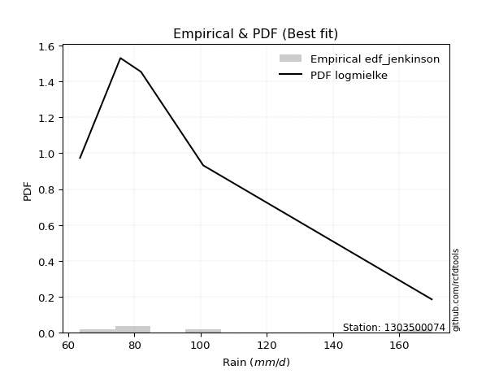</img>

</div>


### 11. EDF Cunnane (1978)

Cunnane´s work in statistical hydrology has focused on the performance and evaluation of different probability distributions (such as GEV, Gumbel, Lognormal) for flood frequency estimation. _b_ is a constant, typically set to 0.4.

<div align="center">


$P=(m-b)/(n+1-2b)$


</div>


**11.1. Empirical values**

<div align="center">

|                | 0                   | 1                  | 2           | 3                  | 4                  |
|:---------------|:--------------------|:-------------------|:------------|:-------------------|:-------------------|
| date           | 2020                | 2022               | 2021        | 2025               | 2019               |
| x              | 63.6                | 75.8               | 82.0        | 100.8              | 169.8              |
| m              | 1                   | 2                  | 3           | 4                  | 5                  |
| empirical_dist | edf_cunnane         | edf_cunnane        | edf_cunnane | edf_cunnane        | edf_cunnane        |
| empirical      | 0.11538461538461538 | 0.3076923076923077 | 0.5         | 0.6923076923076923 | 0.8846153846153845 |
| empirical_tr   | 1.1304347826086958  | 1.4444444444444444 | 2.0         | 3.25               | 8.666666666666655  |

</div>


**11.2. Kolmogorov-Smirnov fit test (sorted by Δ)**


<div align="center">

|                | 0                  | 1                  | 2                    | 3                   | 4                   | 5                   | 6                   | 7                    | 8                   | 9                   | 10                  | 11                  | 12                 | 13                  | 14                  | 15                  | 16                  | 17                  | 18                  | 19                  | 20                 | 21                  | 22                  | 23                  | 24                  | 25                  | 26                 | 27                  | 28                  | 29                  | 30                  | 31                  | 32                  | 33                  | 34                  | 35                 | 36                  | 37                  | 38                 | 39                  | 40                  | 41                  | 42                  | 43                 | 44                  | 45                  | 46                  | 47                  | 48                  | 49                 | 50                  | 51                  | 52                  | 53                  | 54                  | 55                  | 56                 | 57                  | 58                 | 59                 | 60                  | 61                  | 62                  | 63                 | 64                  | 65                 | 66                  | 67                 | 68                  | 69                 | 70                 | 71                  | 72                 | 73                  | 74                  | 75                  | 76                  | 77                 | 78                  | 79                  | 80                  | 81                  | 82                  | 83                  | 84                  | 85                  | 86                 | 87                 | 88                  | 89                  | 90                  | 91                  | 92                  | 93                 | 94                  | 95                  | 96                  | 97                  | 98                  | 99                  | 100                 | 101                 | 102                 | 103                 | 104                 | 105                 | 106                 | 107                 | 108                 | 109                 | 110                | 111                 | 112                 | 113                 | 114                 | 115                | 116                | 117                 | 118                 | 119                 | 120                | 121                 | 122                | 123                 | 124                | 125                 | 126                | 127                | 128                | 129                | 130                | 131                | 132                | 133                | 134                 | 135                | 136                 | 137                 | 138                | 139                 | 140                 | 141                 | 142                 | 143                | 144                 | 145                | 146                | 147                | 148                | 149                | 150                | 151                | 152                | 153                | 154                | 155                | 156                | 157                | 158                | 159                |
|:---------------|:-------------------|:-------------------|:---------------------|:--------------------|:--------------------|:--------------------|:--------------------|:---------------------|:--------------------|:--------------------|:--------------------|:--------------------|:-------------------|:--------------------|:--------------------|:--------------------|:--------------------|:--------------------|:--------------------|:--------------------|:-------------------|:--------------------|:--------------------|:--------------------|:--------------------|:--------------------|:-------------------|:--------------------|:--------------------|:--------------------|:--------------------|:--------------------|:--------------------|:--------------------|:--------------------|:-------------------|:--------------------|:--------------------|:-------------------|:--------------------|:--------------------|:--------------------|:--------------------|:-------------------|:--------------------|:--------------------|:--------------------|:--------------------|:--------------------|:-------------------|:--------------------|:--------------------|:--------------------|:--------------------|:--------------------|:--------------------|:-------------------|:--------------------|:-------------------|:-------------------|:--------------------|:--------------------|:--------------------|:-------------------|:--------------------|:-------------------|:--------------------|:-------------------|:--------------------|:-------------------|:-------------------|:--------------------|:-------------------|:--------------------|:--------------------|:--------------------|:--------------------|:-------------------|:--------------------|:--------------------|:--------------------|:--------------------|:--------------------|:--------------------|:--------------------|:--------------------|:-------------------|:-------------------|:--------------------|:--------------------|:--------------------|:--------------------|:--------------------|:-------------------|:--------------------|:--------------------|:--------------------|:--------------------|:--------------------|:--------------------|:--------------------|:--------------------|:--------------------|:--------------------|:--------------------|:--------------------|:--------------------|:--------------------|:--------------------|:--------------------|:-------------------|:--------------------|:--------------------|:--------------------|:--------------------|:-------------------|:-------------------|:--------------------|:--------------------|:--------------------|:-------------------|:--------------------|:-------------------|:--------------------|:-------------------|:--------------------|:-------------------|:-------------------|:-------------------|:-------------------|:-------------------|:-------------------|:-------------------|:-------------------|:--------------------|:-------------------|:--------------------|:--------------------|:-------------------|:--------------------|:--------------------|:--------------------|:--------------------|:-------------------|:--------------------|:-------------------|:-------------------|:-------------------|:-------------------|:-------------------|:-------------------|:-------------------|:-------------------|:-------------------|:-------------------|:-------------------|:-------------------|:-------------------|:-------------------|:-------------------|
| station        | 1303500074         | 1303500074         | 1303500074           | 1303500074          | 1303500074          | 1303500074          | 1303500074          | 1303500074           | 1303500074          | 1303500074          | 1303500074          | 1303500074          | 1303500074         | 1303500074          | 1303500074          | 1303500074          | 1303500074          | 1303500074          | 1303500074          | 1303500074          | 1303500074         | 1303500074          | 1303500074          | 1303500074          | 1303500074          | 1303500074          | 1303500074         | 1303500074          | 1303500074          | 1303500074          | 1303500074          | 1303500074          | 1303500074          | 1303500074          | 1303500074          | 1303500074         | 1303500074          | 1303500074          | 1303500074         | 1303500074          | 1303500074          | 1303500074          | 1303500074          | 1303500074         | 1303500074          | 1303500074          | 1303500074          | 1303500074          | 1303500074          | 1303500074         | 1303500074          | 1303500074          | 1303500074          | 1303500074          | 1303500074          | 1303500074          | 1303500074         | 1303500074          | 1303500074         | 1303500074         | 1303500074          | 1303500074          | 1303500074          | 1303500074         | 1303500074          | 1303500074         | 1303500074          | 1303500074         | 1303500074          | 1303500074         | 1303500074         | 1303500074          | 1303500074         | 1303500074          | 1303500074          | 1303500074          | 1303500074          | 1303500074         | 1303500074          | 1303500074          | 1303500074          | 1303500074          | 1303500074          | 1303500074          | 1303500074          | 1303500074          | 1303500074         | 1303500074         | 1303500074          | 1303500074          | 1303500074          | 1303500074          | 1303500074          | 1303500074         | 1303500074          | 1303500074          | 1303500074          | 1303500074          | 1303500074          | 1303500074          | 1303500074          | 1303500074          | 1303500074          | 1303500074          | 1303500074          | 1303500074          | 1303500074          | 1303500074          | 1303500074          | 1303500074          | 1303500074         | 1303500074          | 1303500074          | 1303500074          | 1303500074          | 1303500074         | 1303500074         | 1303500074          | 1303500074          | 1303500074          | 1303500074         | 1303500074          | 1303500074         | 1303500074          | 1303500074         | 1303500074          | 1303500074         | 1303500074         | 1303500074         | 1303500074         | 1303500074         | 1303500074         | 1303500074         | 1303500074         | 1303500074          | 1303500074         | 1303500074          | 1303500074          | 1303500074         | 1303500074          | 1303500074          | 1303500074          | 1303500074          | 1303500074         | 1303500074          | 1303500074         | 1303500074         | 1303500074         | 1303500074         | 1303500074         | 1303500074         | 1303500074         | 1303500074         | 1303500074         | 1303500074         | 1303500074         | 1303500074         | 1303500074         | 1303500074         | 1303500074         |
| empirical_dist | edf_cunnane        | edf_cunnane        | edf_cunnane          | edf_cunnane         | edf_cunnane         | edf_cunnane         | edf_cunnane         | edf_cunnane          | edf_cunnane         | edf_cunnane         | edf_cunnane         | edf_cunnane         | edf_cunnane        | edf_cunnane         | edf_cunnane         | edf_cunnane         | edf_cunnane         | edf_cunnane         | edf_cunnane         | edf_cunnane         | edf_cunnane        | edf_cunnane         | edf_cunnane         | edf_cunnane         | edf_cunnane         | edf_cunnane         | edf_cunnane        | edf_cunnane         | edf_cunnane         | edf_cunnane         | edf_cunnane         | edf_cunnane         | edf_cunnane         | edf_cunnane         | edf_cunnane         | edf_cunnane        | edf_cunnane         | edf_cunnane         | edf_cunnane        | edf_cunnane         | edf_cunnane         | edf_cunnane         | edf_cunnane         | edf_cunnane        | edf_cunnane         | edf_cunnane         | edf_cunnane         | edf_cunnane         | edf_cunnane         | edf_cunnane        | edf_cunnane         | edf_cunnane         | edf_cunnane         | edf_cunnane         | edf_cunnane         | edf_cunnane         | edf_cunnane        | edf_cunnane         | edf_cunnane        | edf_cunnane        | edf_cunnane         | edf_cunnane         | edf_cunnane         | edf_cunnane        | edf_cunnane         | edf_cunnane        | edf_cunnane         | edf_cunnane        | edf_cunnane         | edf_cunnane        | edf_cunnane        | edf_cunnane         | edf_cunnane        | edf_cunnane         | edf_cunnane         | edf_cunnane         | edf_cunnane         | edf_cunnane        | edf_cunnane         | edf_cunnane         | edf_cunnane         | edf_cunnane         | edf_cunnane         | edf_cunnane         | edf_cunnane         | edf_cunnane         | edf_cunnane        | edf_cunnane        | edf_cunnane         | edf_cunnane         | edf_cunnane         | edf_cunnane         | edf_cunnane         | edf_cunnane        | edf_cunnane         | edf_cunnane         | edf_cunnane         | edf_cunnane         | edf_cunnane         | edf_cunnane         | edf_cunnane         | edf_cunnane         | edf_cunnane         | edf_cunnane         | edf_cunnane         | edf_cunnane         | edf_cunnane         | edf_cunnane         | edf_cunnane         | edf_cunnane         | edf_cunnane        | edf_cunnane         | edf_cunnane         | edf_cunnane         | edf_cunnane         | edf_cunnane        | edf_cunnane        | edf_cunnane         | edf_cunnane         | edf_cunnane         | edf_cunnane        | edf_cunnane         | edf_cunnane        | edf_cunnane         | edf_cunnane        | edf_cunnane         | edf_cunnane        | edf_cunnane        | edf_cunnane        | edf_cunnane        | edf_cunnane        | edf_cunnane        | edf_cunnane        | edf_cunnane        | edf_cunnane         | edf_cunnane        | edf_cunnane         | edf_cunnane         | edf_cunnane        | edf_cunnane         | edf_cunnane         | edf_cunnane         | edf_cunnane         | edf_cunnane        | edf_cunnane         | edf_cunnane        | edf_cunnane        | edf_cunnane        | edf_cunnane        | edf_cunnane        | edf_cunnane        | edf_cunnane        | edf_cunnane        | edf_cunnane        | edf_cunnane        | edf_cunnane        | edf_cunnane        | edf_cunnane        | edf_cunnane        | edf_cunnane        |
| p_dist         | logalpha           | loggenextreme      | loginvweibull        | alpha               | logncf              | invgamma            | f                   | logmielke            | loghalfnorm         | logburr             | logjohnsonsu        | loginvgauss         | logmoyal           | loghalflogistic     | logfoldnorm         | invgauss            | loggenlogistic      | burr                | logweibull_max      | logdweibull         | halflogistic       | loggumbel_r         | logloglaplace       | logpearson3         | lograyleigh         | foldnorm            | halfnorm           | logkstwobign        | logfatiguelife      | burr12              | logburr12           | logmaxwell          | moyal               | pearson3            | logsemicircular     | exponnorm          | logexponnorm        | wald                | loglomax           | loggenexpon         | loggompertz         | genexpon            | vonmises_line       | gengamma           | exponweib           | gompertz            | truncnorm           | logwald             | logskewnorm         | nct                | gausshyper          | lognct              | loganglit           | loginvgamma         | gumbel_r            | rayleigh            | betaprime          | logbetaprime        | ncf                | logarcsine         | genlogistic         | logf                | maxwell             | logcrystalball     | lognorm             | logt               | logloggamma         | logrice            | lognakagami         | logbeta            | logtruncexpon      | nakagami            | logdgamma          | loglogistic         | loggennorm          | logtruncweibull_min | gennorm             | kstwobign          | crystalball         | norm                | t                   | logbradford         | loghypsecant        | anglit              | semicircular        | logcosine           | arcsine            | dgamma             | logistic            | loggengamma         | loglaplace          | loglaplace          | rice                | loggumbel_l        | hypsecant           | logwrapcauchy       | dweibull            | bradford            | logksone            | skewnorm            | logvonmises_line    | cosine              | truncweibull_min    | laplace             | logkappa4           | truncexpon          | logargus            | logtukeylambda      | wrapcauchy          | gumbel_l            | loguniform         | logkappa3           | halfgennorm         | loglevy_l           | genextreme          | logrdist           | loggenpareto       | levy_l              | genpareto           | weibull_min         | beta               | logtriang           | rdist              | loghalfgennorm      | kappa4             | tukeylambda         | argus              | ksone              | logexponpow        | kappa3             | uniform            | loggamma           | loggamma           | triang             | loggenhalflogistic  | lomax              | logtruncpareto      | fatiguelife         | johnsonsb          | invweibull          | genhalflogistic     | powerlaw            | logtrapezoid        | logpowerlaw        | truncpareto         | johnsonsu          | logexponweib       | logweibull_min     | logjohnsonsb       | exponpow           | loggausshyper      | trapezoid          | weibull_max        | gamma              | logerlang          | erlang             | logtruncnorm       | logvonmises        | vonmises           | mielke             |
| delta          | 0.0493332131497322 | 0.0526553099250372 | 0.052656107065658486 | 0.05457628424965057 | 0.05534627801241663 | 0.05801714472322887 | 0.05801767609917583 | 0.059550017049266546 | 0.05974195965432705 | 0.06031086233146166 | 0.06266669761736898 | 0.06471374352945014 | 0.0686588927299635 | 0.07033888499345352 | 0.07666997528144764 | 0.08092520358346161 | 0.08392752029898298 | 0.08392756005717167 | 0.08464994748985716 | 0.08684571494724991 | 0.0875761485940767 | 0.08789433026255161 | 0.08946768702319774 | 0.09197501889801651 | 0.09438882281944827 | 0.09474581430327778 | 0.0952982825359836 | 0.10012843928872028 | 0.10068259799900714 | 0.10080854512284795 | 0.10097467109192629 | 0.10656638127608309 | 0.10984461999664141 | 0.11094088944139152 | 0.11274784649824421 | 0.1144204126943947 | 0.11448930371473061 | 0.11462204806315289 | 0.115366299296003  | 0.11538461530144949 | 0.11538461533742969 | 0.11538461537624671 | 0.11538461537836198 | 0.1153846153846028 | 0.11538461538460291 | 0.11538461538461293 | 0.11538461538461538 | 0.11538461538461538 | 0.11538461538461538 | 0.1157463770765852 | 0.12004184083638464 | 0.12022788595844935 | 0.12052752751468654 | 0.12061910396564618 | 0.12519784120211813 | 0.12588400585303877 | 0.1265282184474974 | 0.12783119906359375 | 0.1299026964259573 | 0.1346379341200341 | 0.13662413443349192 | 0.13766408908909883 | 0.13767202926062733 | 0.139116459936437  | 0.13911653665358642 | 0.1391193548726174 | 0.13931803078566857 | 0.1404166960868652 | 0.14168061567963436 | 0.1488960844537522 | 0.1492278988802313 | 0.15027912083048633 | 0.1523096854590691 | 0.15608389605030154 | 0.15811193469469376 | 0.16013250436651844 | 0.16066137754604037 | 0.1659990490926112 | 0.16835671150524045 | 0.16835672052833067 | 0.16837714959744243 | 0.16886710335957938 | 0.16943060610927768 | 0.17053493252295626 | 0.17203027633436863 | 0.17595574571483585 | 0.1779621461043479 | 0.1818328068905618 | 0.18776522160533843 | 0.19509449756692654 | 0.19782418754249687 | 0.19782418754249687 | 0.19985300780246396 | 0.2007480669844966 | 0.20246978877641936 | 0.20268274597378189 | 0.21020494103688286 | 0.21139013753500036 | 0.21817223259341734 | 0.21976987501861034 | 0.22722953531776946 | 0.22787678829630692 | 0.22879443450000803 | 0.22987422904996452 | 0.23134369306665187 | 0.23217900847024048 | 0.23228439144158908 | 0.23316652083877187 | 0.23442897854654515 | 0.23605711494116133 | 0.2412385359826612 | 0.24169967643207374 | 0.24597235722907973 | 0.24616920922005586 | 0.25917554527685005 | 0.2600007575756905 | 0.2626931064406248 | 0.26342656449946406 | 0.26797690858067563 | 0.27127333046557145 | 0.2768638204208941 | 0.28558311584420204 | 0.2954582209750818 | 0.30149469511791327 | 0.3038390813760314 | 0.30769230763201816 | 0.313542618212429  | 0.3170722874112705 | 0.3174471246111248 | 0.3401493262050964 | 0.3420252064319862 | 0.3509188567908449 | 0.3509188567908449 | 0.3543652916401204 | 0.35818756753911196 | 0.3600503731516241 | 0.39386302293353836 | 0.42621031601491866 | 0.4361057473907981 | 0.44509181028668027 | 0.45842846809273463 | 0.46619465022793694 | 0.46750325814922544 | 0.4917707878955736 | 0.49307119918944364 | 0.501045802827078  | 0.5169518447176276 | 0.5266985765376051 | 0.5318238352679105 | 0.5403602182713887 | 0.5444422054141322 | 0.5515060832199107 | 0.5681744936042727 | 0.5764413665880302 | 0.577531957974791  | 0.5877612482515664 | 0.6923076923076923 | 1.080037000776911  | 26.253544068855263 | nan                |
| deltao         | 0.5865427407550001 | 0.5865427407550001 | 0.5865427407550001   | 0.5865427407550001  | 0.5865427407550001  | 0.5865427407550001  | 0.5865427407550001  | 0.5865427407550001   | 0.5865427407550001  | 0.5865427407550001  | 0.5865427407550001  | 0.5865427407550001  | 0.5865427407550001 | 0.5865427407550001  | 0.5865427407550001  | 0.5865427407550001  | 0.5865427407550001  | 0.5865427407550001  | 0.5865427407550001  | 0.5865427407550001  | 0.5865427407550001 | 0.5865427407550001  | 0.5865427407550001  | 0.5865427407550001  | 0.5865427407550001  | 0.5865427407550001  | 0.5865427407550001 | 0.5865427407550001  | 0.5865427407550001  | 0.5865427407550001  | 0.5865427407550001  | 0.5865427407550001  | 0.5865427407550001  | 0.5865427407550001  | 0.5865427407550001  | 0.5865427407550001 | 0.5865427407550001  | 0.5865427407550001  | 0.5865427407550001 | 0.5865427407550001  | 0.5865427407550001  | 0.5865427407550001  | 0.5865427407550001  | 0.5865427407550001 | 0.5865427407550001  | 0.5865427407550001  | 0.5865427407550001  | 0.5865427407550001  | 0.5865427407550001  | 0.5865427407550001 | 0.5865427407550001  | 0.5865427407550001  | 0.5865427407550001  | 0.5865427407550001  | 0.5865427407550001  | 0.5865427407550001  | 0.5865427407550001 | 0.5865427407550001  | 0.5865427407550001 | 0.5865427407550001 | 0.5865427407550001  | 0.5865427407550001  | 0.5865427407550001  | 0.5865427407550001 | 0.5865427407550001  | 0.5865427407550001 | 0.5865427407550001  | 0.5865427407550001 | 0.5865427407550001  | 0.5865427407550001 | 0.5865427407550001 | 0.5865427407550001  | 0.5865427407550001 | 0.5865427407550001  | 0.5865427407550001  | 0.5865427407550001  | 0.5865427407550001  | 0.5865427407550001 | 0.5865427407550001  | 0.5865427407550001  | 0.5865427407550001  | 0.5865427407550001  | 0.5865427407550001  | 0.5865427407550001  | 0.5865427407550001  | 0.5865427407550001  | 0.5865427407550001 | 0.5865427407550001 | 0.5865427407550001  | 0.5865427407550001  | 0.5865427407550001  | 0.5865427407550001  | 0.5865427407550001  | 0.5865427407550001 | 0.5865427407550001  | 0.5865427407550001  | 0.5865427407550001  | 0.5865427407550001  | 0.5865427407550001  | 0.5865427407550001  | 0.5865427407550001  | 0.5865427407550001  | 0.5865427407550001  | 0.5865427407550001  | 0.5865427407550001  | 0.5865427407550001  | 0.5865427407550001  | 0.5865427407550001  | 0.5865427407550001  | 0.5865427407550001  | 0.5865427407550001 | 0.5865427407550001  | 0.5865427407550001  | 0.5865427407550001  | 0.5865427407550001  | 0.5865427407550001 | 0.5865427407550001 | 0.5865427407550001  | 0.5865427407550001  | 0.5865427407550001  | 0.5865427407550001 | 0.5865427407550001  | 0.5865427407550001 | 0.5865427407550001  | 0.5865427407550001 | 0.5865427407550001  | 0.5865427407550001 | 0.5865427407550001 | 0.5865427407550001 | 0.5865427407550001 | 0.5865427407550001 | 0.5865427407550001 | 0.5865427407550001 | 0.5865427407550001 | 0.5865427407550001  | 0.5865427407550001 | 0.5865427407550001  | 0.5865427407550001  | 0.5865427407550001 | 0.5865427407550001  | 0.5865427407550001  | 0.5865427407550001  | 0.5865427407550001  | 0.5865427407550001 | 0.5865427407550001  | 0.5865427407550001 | 0.5865427407550001 | 0.5865427407550001 | 0.5865427407550001 | 0.5865427407550001 | 0.5865427407550001 | 0.5865427407550001 | 0.5865427407550001 | 0.5865427407550001 | 0.5865427407550001 | 0.5865427407550001 | 0.5865427407550001 | 0.5865427407550001 | 0.5865427407550001 | 0.5865427407550001 |
| eval           | Δo > Δ             | Δo > Δ             | Δo > Δ               | Δo > Δ              | Δo > Δ              | Δo > Δ              | Δo > Δ              | Δo > Δ               | Δo > Δ              | Δo > Δ              | Δo > Δ              | Δo > Δ              | Δo > Δ             | Δo > Δ              | Δo > Δ              | Δo > Δ              | Δo > Δ              | Δo > Δ              | Δo > Δ              | Δo > Δ              | Δo > Δ             | Δo > Δ              | Δo > Δ              | Δo > Δ              | Δo > Δ              | Δo > Δ              | Δo > Δ             | Δo > Δ              | Δo > Δ              | Δo > Δ              | Δo > Δ              | Δo > Δ              | Δo > Δ              | Δo > Δ              | Δo > Δ              | Δo > Δ             | Δo > Δ              | Δo > Δ              | Δo > Δ             | Δo > Δ              | Δo > Δ              | Δo > Δ              | Δo > Δ              | Δo > Δ             | Δo > Δ              | Δo > Δ              | Δo > Δ              | Δo > Δ              | Δo > Δ              | Δo > Δ             | Δo > Δ              | Δo > Δ              | Δo > Δ              | Δo > Δ              | Δo > Δ              | Δo > Δ              | Δo > Δ             | Δo > Δ              | Δo > Δ             | Δo > Δ             | Δo > Δ              | Δo > Δ              | Δo > Δ              | Δo > Δ             | Δo > Δ              | Δo > Δ             | Δo > Δ              | Δo > Δ             | Δo > Δ              | Δo > Δ             | Δo > Δ             | Δo > Δ              | Δo > Δ             | Δo > Δ              | Δo > Δ              | Δo > Δ              | Δo > Δ              | Δo > Δ             | Δo > Δ              | Δo > Δ              | Δo > Δ              | Δo > Δ              | Δo > Δ              | Δo > Δ              | Δo > Δ              | Δo > Δ              | Δo > Δ             | Δo > Δ             | Δo > Δ              | Δo > Δ              | Δo > Δ              | Δo > Δ              | Δo > Δ              | Δo > Δ             | Δo > Δ              | Δo > Δ              | Δo > Δ              | Δo > Δ              | Δo > Δ              | Δo > Δ              | Δo > Δ              | Δo > Δ              | Δo > Δ              | Δo > Δ              | Δo > Δ              | Δo > Δ              | Δo > Δ              | Δo > Δ              | Δo > Δ              | Δo > Δ              | Δo > Δ             | Δo > Δ              | Δo > Δ              | Δo > Δ              | Δo > Δ              | Δo > Δ             | Δo > Δ             | Δo > Δ              | Δo > Δ              | Δo > Δ              | Δo > Δ             | Δo > Δ              | Δo > Δ             | Δo > Δ              | Δo > Δ             | Δo > Δ              | Δo > Δ             | Δo > Δ             | Δo > Δ             | Δo > Δ             | Δo > Δ             | Δo > Δ             | Δo > Δ             | Δo > Δ             | Δo > Δ              | Δo > Δ             | Δo > Δ              | Δo > Δ              | Δo > Δ             | Δo > Δ              | Δo > Δ              | Δo > Δ              | Δo > Δ              | Δo > Δ             | Δo > Δ              | Δo > Δ             | Δo > Δ             | Δo > Δ             | Δo > Δ             | Δo > Δ             | Δo > Δ             | Δo > Δ             | Δo > Δ             | Δo > Δ             | Δo > Δ             | Δo <= Δ            | Δo <= Δ            | Δo <= Δ            | Δo <= Δ            | Δo <= Δ            |
| fit            | 1                  | 1                  | 1                    | 1                   | 1                   | 1                   | 1                   | 1                    | 1                   | 1                   | 1                   | 1                   | 1                  | 1                   | 1                   | 1                   | 1                   | 1                   | 1                   | 1                   | 1                  | 1                   | 1                   | 1                   | 1                   | 1                   | 1                  | 1                   | 1                   | 1                   | 1                   | 1                   | 1                   | 1                   | 1                   | 1                  | 1                   | 1                   | 1                  | 1                   | 1                   | 1                   | 1                   | 1                  | 1                   | 1                   | 1                   | 1                   | 1                   | 1                  | 1                   | 1                   | 1                   | 1                   | 1                   | 1                   | 1                  | 1                   | 1                  | 1                  | 1                   | 1                   | 1                   | 1                  | 1                   | 1                  | 1                   | 1                  | 1                   | 1                  | 1                  | 1                   | 1                  | 1                   | 1                   | 1                   | 1                   | 1                  | 1                   | 1                   | 1                   | 1                   | 1                   | 1                   | 1                   | 1                   | 1                  | 1                  | 1                   | 1                   | 1                   | 1                   | 1                   | 1                  | 1                   | 1                   | 1                   | 1                   | 1                   | 1                   | 1                   | 1                   | 1                   | 1                   | 1                   | 1                   | 1                   | 1                   | 1                   | 1                   | 1                  | 1                   | 1                   | 1                   | 1                   | 1                  | 1                  | 1                   | 1                   | 1                   | 1                  | 1                   | 1                  | 1                   | 1                  | 1                   | 1                  | 1                  | 1                  | 1                  | 1                  | 1                  | 1                  | 1                  | 1                   | 1                  | 1                   | 1                   | 1                  | 1                   | 1                   | 1                   | 1                   | 1                  | 1                   | 1                  | 1                  | 1                  | 1                  | 1                  | 1                  | 1                  | 1                  | 1                  | 1                  | 0                  | 0                  | 0                  | 0                  | 0                  |
| n              | 5                  | 5                  | 5                    | 5                   | 5                   | 5                   | 5                   | 5                    | 5                   | 5                   | 5                   | 5                   | 5                  | 5                   | 5                   | 5                   | 5                   | 5                   | 5                   | 5                   | 5                  | 5                   | 5                   | 5                   | 5                   | 5                   | 5                  | 5                   | 5                   | 5                   | 5                   | 5                   | 5                   | 5                   | 5                   | 5                  | 5                   | 5                   | 5                  | 5                   | 5                   | 5                   | 5                   | 5                  | 5                   | 5                   | 5                   | 5                   | 5                   | 5                  | 5                   | 5                   | 5                   | 5                   | 5                   | 5                   | 5                  | 5                   | 5                  | 5                  | 5                   | 5                   | 5                   | 5                  | 5                   | 5                  | 5                   | 5                  | 5                   | 5                  | 5                  | 5                   | 5                  | 5                   | 5                   | 5                   | 5                   | 5                  | 5                   | 5                   | 5                   | 5                   | 5                   | 5                   | 5                   | 5                   | 5                  | 5                  | 5                   | 5                   | 5                   | 5                   | 5                   | 5                  | 5                   | 5                   | 5                   | 5                   | 5                   | 5                   | 5                   | 5                   | 5                   | 5                   | 5                   | 5                   | 5                   | 5                   | 5                   | 5                   | 5                  | 5                   | 5                   | 5                   | 5                   | 5                  | 5                  | 5                   | 5                   | 5                   | 5                  | 5                   | 5                  | 5                   | 5                  | 5                   | 5                  | 5                  | 5                  | 5                  | 5                  | 5                  | 5                  | 5                  | 5                   | 5                  | 5                   | 5                   | 5                  | 5                   | 5                   | 5                   | 5                   | 5                  | 5                   | 5                  | 5                  | 5                  | 5                  | 5                  | 5                  | 5                  | 5                  | 5                  | 5                  | 5                  | 5                  | 5                  | 5                  | 5                  |
| best_fit       | 1                  | 0                  | 0                    | 0                   | 0                   | 0                   | 0                   | 0                    | 0                   | 0                   | 0                   | 0                   | 0                  | 0                   | 0                   | 0                   | 0                   | 0                   | 0                   | 0                   | 0                  | 0                   | 0                   | 0                   | 0                   | 0                   | 0                  | 0                   | 0                   | 0                   | 0                   | 0                   | 0                   | 0                   | 0                   | 0                  | 0                   | 0                   | 0                  | 0                   | 0                   | 0                   | 0                   | 0                  | 0                   | 0                   | 0                   | 0                   | 0                   | 0                  | 0                   | 0                   | 0                   | 0                   | 0                   | 0                   | 0                  | 0                   | 0                  | 0                  | 0                   | 0                   | 0                   | 0                  | 0                   | 0                  | 0                   | 0                  | 0                   | 0                  | 0                  | 0                   | 0                  | 0                   | 0                   | 0                   | 0                   | 0                  | 0                   | 0                   | 0                   | 0                   | 0                   | 0                   | 0                   | 0                   | 0                  | 0                  | 0                   | 0                   | 0                   | 0                   | 0                   | 0                  | 0                   | 0                   | 0                   | 0                   | 0                   | 0                   | 0                   | 0                   | 0                   | 0                   | 0                   | 0                   | 0                   | 0                   | 0                   | 0                   | 0                  | 0                   | 0                   | 0                   | 0                   | 0                  | 0                  | 0                   | 0                   | 0                   | 0                  | 0                   | 0                  | 0                   | 0                  | 0                   | 0                  | 0                  | 0                  | 0                  | 0                  | 0                  | 0                  | 0                  | 0                   | 0                  | 0                   | 0                   | 0                  | 0                   | 0                   | 0                   | 0                   | 0                  | 0                   | 0                  | 0                  | 0                  | 0                  | 0                  | 0                  | 0                  | 0                  | 0                  | 0                  | 0                  | 0                  | 0                  | 0                  | 0                  |
| best_fit_sort  | 1                  | 2                  | 3                    | 4                   | 5                   | 6                   | 7                   | 8                    | 9                   | 10                  | 11                  | 12                  | 13                 | 14                  | 15                  | 16                  | 17                  | 18                  | 19                  | 20                  | 21                 | 22                  | 23                  | 24                  | 25                  | 26                  | 27                 | 28                  | 29                  | 30                  | 31                  | 32                  | 33                  | 34                  | 35                  | 36                 | 37                  | 38                  | 39                 | 40                  | 41                  | 42                  | 43                  | 44                 | 45                  | 46                  | 47                  | 48                  | 49                  | 50                 | 51                  | 52                  | 53                  | 54                  | 55                  | 56                  | 57                 | 58                  | 59                 | 60                 | 61                  | 62                  | 63                  | 64                 | 65                  | 66                 | 67                  | 68                 | 69                  | 70                 | 71                 | 72                  | 73                 | 74                  | 75                  | 76                  | 77                  | 78                 | 79                  | 80                  | 81                  | 82                  | 83                  | 84                  | 85                  | 86                  | 87                 | 88                 | 89                  | 90                  | 91                  | 92                  | 93                  | 94                 | 95                  | 96                  | 97                  | 98                  | 99                  | 100                 | 101                 | 102                 | 103                 | 104                 | 105                 | 106                 | 107                 | 108                 | 109                 | 110                 | 111                | 112                 | 113                 | 114                 | 115                 | 116                | 117                | 118                 | 119                 | 120                 | 121                | 122                 | 123                | 124                 | 125                | 126                 | 127                | 128                | 129                | 130                | 131                | 132                | 133                | 134                | 135                 | 136                | 137                 | 138                 | 139                | 140                 | 141                 | 142                 | 143                 | 144                | 145                 | 146                | 147                | 148                | 149                | 150                | 151                | 152                | 153                | 154                | 155                | 156                | 157                | 158                | 159                | 160                |

</div>


**11.3. Best fit**

<div align="center">

|   id |    station | empirical_dist   | p_dist   |     delta |   deltao | eval   |   fit |   n |   best_fit |   best_fit_sort |
|-----:|-----------:|:-----------------|:---------|----------:|---------:|:-------|------:|----:|-----------:|----------------:|
|    0 | 1303500074 | edf_cunnane      | logalpha | 0.0493332 | 0.586543 | Δo > Δ |     1 |   5 |          1 |               1 |

</div>


<div align="center">

</img></img>

</div>


### 12. EDF Adamowski (1981)

The Adamowski formula in hydrology refers to a specific plotting position formula used for estimating the non-parametric empirical distribution of hydrological events (like flood peaks) to calculate their return periods. This formula provides an alternative to traditional parametric methods (like the Gumbel or Log Pearson Type III distributions). 

<div align="center">


$P=(m-0.25)/(n+0.5)$


</div>


**12.1. Empirical values**

<div align="center">

|                | 0                   | 1                  | 2             | 3                  | 4                  |
|:---------------|:--------------------|:-------------------|:--------------|:-------------------|:-------------------|
| date           | 2020                | 2022               | 2021          | 2025               | 2019               |
| x              | 63.6                | 75.8               | 82.0          | 100.8              | 169.8              |
| m              | 1                   | 2                  | 3             | 4                  | 5                  |
| empirical_dist | edf_adamowski       | edf_adamowski      | edf_adamowski | edf_adamowski      | edf_adamowski      |
| empirical      | 0.13636363636363635 | 0.3181818181818182 | 0.5           | 0.6818181818181818 | 0.8636363636363636 |
| empirical_tr   | 1.1578947368421053  | 1.4666666666666666 | 2.0           | 3.1428571428571423 | 7.333333333333334  |

</div>


**12.2. Kolmogorov-Smirnov fit test (sorted by Δ)**


<div align="center">

|                | 0                   | 1                   | 2                   | 3                   | 4                   | 5                   | 6                   | 7                   | 8                   | 9                   | 10                  | 11                  | 12                  | 13                  | 14                  | 15                 | 16                  | 17                  | 18                  | 19                 | 20                  | 21                 | 22                  | 23                  | 24                  | 25                  | 26                  | 27                  | 28                  | 29                  | 30                  | 31                  | 32                 | 33                  | 34                  | 35                  | 36                  | 37                  | 38                  | 39                  | 40                  | 41                 | 42                  | 43                 | 44                  | 45                  | 46                  | 47                 | 48                  | 49                 | 50                  | 51                  | 52                  | 53                 | 54                 | 55                  | 56                 | 57                 | 58                  | 59                  | 60                  | 61                  | 62                  | 63                  | 64                  | 65                 | 66                  | 67                 | 68                  | 69                 | 70                 | 71                 | 72                  | 73                  | 74                  | 75                 | 76                 | 77                 | 78                  | 79                  | 80                  | 81                  | 82                  | 83                  | 84                  | 85                 | 86                  | 87                  | 88                  | 89                  | 90                  | 91                  | 92                  | 93                  | 94                  | 95                 | 96                 | 97                  | 98                 | 99                 | 100                 | 101                 | 102                 | 103                | 104                 | 105                 | 106                 | 107                 | 108                 | 109                 | 110                 | 111                 | 112                 | 113                | 114                 | 115                 | 116                 | 117                | 118                | 119                | 120                | 121                | 122                | 123                | 124                | 125                | 126                | 127                | 128                | 129                | 130                 | 131                | 132                | 133                 | 134                 | 135                 | 136                | 137                | 138                 | 139                 | 140                | 141                 | 142                | 143                 | 144                | 145                 | 146                | 147                | 148                | 149                | 150                | 151                | 152                | 153                | 154                | 155                | 156                | 157                | 158                | 159                |
|:---------------|:--------------------|:--------------------|:--------------------|:--------------------|:--------------------|:--------------------|:--------------------|:--------------------|:--------------------|:--------------------|:--------------------|:--------------------|:--------------------|:--------------------|:--------------------|:-------------------|:--------------------|:--------------------|:--------------------|:-------------------|:--------------------|:-------------------|:--------------------|:--------------------|:--------------------|:--------------------|:--------------------|:--------------------|:--------------------|:--------------------|:--------------------|:--------------------|:-------------------|:--------------------|:--------------------|:--------------------|:--------------------|:--------------------|:--------------------|:--------------------|:--------------------|:-------------------|:--------------------|:-------------------|:--------------------|:--------------------|:--------------------|:-------------------|:--------------------|:-------------------|:--------------------|:--------------------|:--------------------|:-------------------|:-------------------|:--------------------|:-------------------|:-------------------|:--------------------|:--------------------|:--------------------|:--------------------|:--------------------|:--------------------|:--------------------|:-------------------|:--------------------|:-------------------|:--------------------|:-------------------|:-------------------|:-------------------|:--------------------|:--------------------|:--------------------|:-------------------|:-------------------|:-------------------|:--------------------|:--------------------|:--------------------|:--------------------|:--------------------|:--------------------|:--------------------|:-------------------|:--------------------|:--------------------|:--------------------|:--------------------|:--------------------|:--------------------|:--------------------|:--------------------|:--------------------|:-------------------|:-------------------|:--------------------|:-------------------|:-------------------|:--------------------|:--------------------|:--------------------|:-------------------|:--------------------|:--------------------|:--------------------|:--------------------|:--------------------|:--------------------|:--------------------|:--------------------|:--------------------|:-------------------|:--------------------|:--------------------|:--------------------|:-------------------|:-------------------|:-------------------|:-------------------|:-------------------|:-------------------|:-------------------|:-------------------|:-------------------|:-------------------|:-------------------|:-------------------|:-------------------|:--------------------|:-------------------|:-------------------|:--------------------|:--------------------|:--------------------|:-------------------|:-------------------|:--------------------|:--------------------|:-------------------|:--------------------|:-------------------|:--------------------|:-------------------|:--------------------|:-------------------|:-------------------|:-------------------|:-------------------|:-------------------|:-------------------|:-------------------|:-------------------|:-------------------|:-------------------|:-------------------|:-------------------|:-------------------|:-------------------|
| station        | 1303500074          | 1303500074          | 1303500074          | 1303500074          | 1303500074          | 1303500074          | 1303500074          | 1303500074          | 1303500074          | 1303500074          | 1303500074          | 1303500074          | 1303500074          | 1303500074          | 1303500074          | 1303500074         | 1303500074          | 1303500074          | 1303500074          | 1303500074         | 1303500074          | 1303500074         | 1303500074          | 1303500074          | 1303500074          | 1303500074          | 1303500074          | 1303500074          | 1303500074          | 1303500074          | 1303500074          | 1303500074          | 1303500074         | 1303500074          | 1303500074          | 1303500074          | 1303500074          | 1303500074          | 1303500074          | 1303500074          | 1303500074          | 1303500074         | 1303500074          | 1303500074         | 1303500074          | 1303500074          | 1303500074          | 1303500074         | 1303500074          | 1303500074         | 1303500074          | 1303500074          | 1303500074          | 1303500074         | 1303500074         | 1303500074          | 1303500074         | 1303500074         | 1303500074          | 1303500074          | 1303500074          | 1303500074          | 1303500074          | 1303500074          | 1303500074          | 1303500074         | 1303500074          | 1303500074         | 1303500074          | 1303500074         | 1303500074         | 1303500074         | 1303500074          | 1303500074          | 1303500074          | 1303500074         | 1303500074         | 1303500074         | 1303500074          | 1303500074          | 1303500074          | 1303500074          | 1303500074          | 1303500074          | 1303500074          | 1303500074         | 1303500074          | 1303500074          | 1303500074          | 1303500074          | 1303500074          | 1303500074          | 1303500074          | 1303500074          | 1303500074          | 1303500074         | 1303500074         | 1303500074          | 1303500074         | 1303500074         | 1303500074          | 1303500074          | 1303500074          | 1303500074         | 1303500074          | 1303500074          | 1303500074          | 1303500074          | 1303500074          | 1303500074          | 1303500074          | 1303500074          | 1303500074          | 1303500074         | 1303500074          | 1303500074          | 1303500074          | 1303500074         | 1303500074         | 1303500074         | 1303500074         | 1303500074         | 1303500074         | 1303500074         | 1303500074         | 1303500074         | 1303500074         | 1303500074         | 1303500074         | 1303500074         | 1303500074          | 1303500074         | 1303500074         | 1303500074          | 1303500074          | 1303500074          | 1303500074         | 1303500074         | 1303500074          | 1303500074          | 1303500074         | 1303500074          | 1303500074         | 1303500074          | 1303500074         | 1303500074          | 1303500074         | 1303500074         | 1303500074         | 1303500074         | 1303500074         | 1303500074         | 1303500074         | 1303500074         | 1303500074         | 1303500074         | 1303500074         | 1303500074         | 1303500074         | 1303500074         |
| empirical_dist | edf_adamowski       | edf_adamowski       | edf_adamowski       | edf_adamowski       | edf_adamowski       | edf_adamowski       | edf_adamowski       | edf_adamowski       | edf_adamowski       | edf_adamowski       | edf_adamowski       | edf_adamowski       | edf_adamowski       | edf_adamowski       | edf_adamowski       | edf_adamowski      | edf_adamowski       | edf_adamowski       | edf_adamowski       | edf_adamowski      | edf_adamowski       | edf_adamowski      | edf_adamowski       | edf_adamowski       | edf_adamowski       | edf_adamowski       | edf_adamowski       | edf_adamowski       | edf_adamowski       | edf_adamowski       | edf_adamowski       | edf_adamowski       | edf_adamowski      | edf_adamowski       | edf_adamowski       | edf_adamowski       | edf_adamowski       | edf_adamowski       | edf_adamowski       | edf_adamowski       | edf_adamowski       | edf_adamowski      | edf_adamowski       | edf_adamowski      | edf_adamowski       | edf_adamowski       | edf_adamowski       | edf_adamowski      | edf_adamowski       | edf_adamowski      | edf_adamowski       | edf_adamowski       | edf_adamowski       | edf_adamowski      | edf_adamowski      | edf_adamowski       | edf_adamowski      | edf_adamowski      | edf_adamowski       | edf_adamowski       | edf_adamowski       | edf_adamowski       | edf_adamowski       | edf_adamowski       | edf_adamowski       | edf_adamowski      | edf_adamowski       | edf_adamowski      | edf_adamowski       | edf_adamowski      | edf_adamowski      | edf_adamowski      | edf_adamowski       | edf_adamowski       | edf_adamowski       | edf_adamowski      | edf_adamowski      | edf_adamowski      | edf_adamowski       | edf_adamowski       | edf_adamowski       | edf_adamowski       | edf_adamowski       | edf_adamowski       | edf_adamowski       | edf_adamowski      | edf_adamowski       | edf_adamowski       | edf_adamowski       | edf_adamowski       | edf_adamowski       | edf_adamowski       | edf_adamowski       | edf_adamowski       | edf_adamowski       | edf_adamowski      | edf_adamowski      | edf_adamowski       | edf_adamowski      | edf_adamowski      | edf_adamowski       | edf_adamowski       | edf_adamowski       | edf_adamowski      | edf_adamowski       | edf_adamowski       | edf_adamowski       | edf_adamowski       | edf_adamowski       | edf_adamowski       | edf_adamowski       | edf_adamowski       | edf_adamowski       | edf_adamowski      | edf_adamowski       | edf_adamowski       | edf_adamowski       | edf_adamowski      | edf_adamowski      | edf_adamowski      | edf_adamowski      | edf_adamowski      | edf_adamowski      | edf_adamowski      | edf_adamowski      | edf_adamowski      | edf_adamowski      | edf_adamowski      | edf_adamowski      | edf_adamowski      | edf_adamowski       | edf_adamowski      | edf_adamowski      | edf_adamowski       | edf_adamowski       | edf_adamowski       | edf_adamowski      | edf_adamowski      | edf_adamowski       | edf_adamowski       | edf_adamowski      | edf_adamowski       | edf_adamowski      | edf_adamowski       | edf_adamowski      | edf_adamowski       | edf_adamowski      | edf_adamowski      | edf_adamowski      | edf_adamowski      | edf_adamowski      | edf_adamowski      | edf_adamowski      | edf_adamowski      | edf_adamowski      | edf_adamowski      | edf_adamowski      | edf_adamowski      | edf_adamowski      | edf_adamowski      |
| p_dist         | logmielke           | logalpha            | loggenextreme       | loginvweibull       | alpha               | logncf              | loghalfnorm         | invgamma            | f                   | logmoyal            | logburr             | logfoldnorm         | loginvgauss         | invgauss            | logjohnsonsu        | halflogistic       | loggumbel_r         | foldnorm            | logfatiguelife      | loghalflogistic    | logpearson3         | halfnorm           | logweibull_max      | loggenlogistic      | burr                | lograyleigh         | logdweibull         | logkstwobign        | logloglaplace       | logmaxwell          | moyal               | pearson3            | nct                | logsemicircular     | lognct              | loganglit           | loginvgamma         | burr12              | logburr12           | gumbel_r            | rayleigh            | betaprime          | logbetaprime        | ncf                | exponnorm           | logexponnorm        | wald                | loglomax           | lognakagami         | gausshyper         | logf                | loggenexpon         | loggompertz         | genexpon           | vonmises_line      | gengamma            | exponweib          | gompertz           | logskewnorm         | logwald             | logarcsine          | truncnorm           | genlogistic         | maxwell             | logbeta             | logcrystalball     | lognorm             | logt               | logloggamma         | nakagami           | logrice            | logtruncexpon      | loglogistic         | anglit              | logtruncweibull_min | semicircular       | logdgamma          | kstwobign          | arcsine             | crystalball         | norm                | t                   | loggennorm          | logbradford         | loghypsecant        | gennorm            | logcosine           | loggengamma         | logistic            | dweibull            | logwrapcauchy       | dgamma              | loglaplace          | loglaplace          | rice                | loggumbel_l        | bradford           | hypsecant           | logksone           | cosine             | skewnorm            | wrapcauchy          | loglevy_l           | gumbel_l           | logvonmises_line    | truncweibull_min    | laplace             | logargus            | logkappa4           | truncexpon          | logtukeylambda      | halfgennorm         | genextreme          | loguniform         | logkappa3           | loggenpareto        | levy_l              | logrdist           | genpareto          | weibull_min        | beta               | logtriang          | loghalfgennorm     | kappa4             | argus              | rdist              | ksone              | logexponpow        | tukeylambda        | kappa3             | uniform             | loggamma           | loggamma           | triang              | loggenhalflogistic  | lomax               | logtruncpareto     | fatiguelife        | invweibull          | johnsonsb           | genhalflogistic    | powerlaw            | logtrapezoid       | logpowerlaw         | truncpareto        | johnsonsu           | logexponweib       | logweibull_min     | logjohnsonsb       | exponpow           | loggausshyper      | trapezoid          | weibull_max        | gamma              | logerlang          | erlang             | logtruncnorm       | logvonmises        | vonmises           | mielke             |
| delta          | 0.06986557119055936 | 0.07031223412875318 | 0.07363433090405817 | 0.07363512804467946 | 0.07555530522867154 | 0.07632529899143761 | 0.07650965312083458 | 0.07899616570224985 | 0.07899669707819681 | 0.07904617239750766 | 0.08128988331048248 | 0.08152276301901729 | 0.08176993141859826 | 0.08332307123544724 | 0.08341192681563293 | 0.0875761485940767 | 0.08789433026255161 | 0.08944549559390386 | 0.09019308750949667 | 0.0913179059724745 | 0.09197501889801651 | 0.0923504978339863 | 0.09273982431497019 | 0.09306547492254069 | 0.09318272191529509 | 0.09438882281944827 | 0.09733522543676043 | 0.10012843928872028 | 0.10500429679634637 | 0.10656638127608309 | 0.10984461999664141 | 0.11094088944139152 | 0.1157463770765852 | 0.11742256051662114 | 0.12022788595844935 | 0.12052752751468654 | 0.12061910396564618 | 0.12178756610186893 | 0.12195369207094726 | 0.12519784120211813 | 0.12588400585303877 | 0.1265282184474974 | 0.12783119906359375 | 0.1299026964259573 | 0.13539943367341567 | 0.13546832469375159 | 0.13560106904217387 | 0.136345320275024  | 0.13636335067151859 | 0.1363636220699804 | 0.13636363327360937 | 0.13636363628047046 | 0.13636363631645068 | 0.1363636363552677 | 0.1363636363573828 | 0.13636363636362378 | 0.1363636363636239 | 0.1363636363636339 | 0.13636363636363635 | 0.13636363636363635 | 0.13636363636363635 | 0.13636363636363635 | 0.13662413443349192 | 0.13767202926062733 | 0.13840657396424172 | 0.139116459936437  | 0.13911653665358642 | 0.1391193548726174 | 0.13931803078566857 | 0.1397896103409758 | 0.1404166960868652 | 0.1492278988802313 | 0.15608389605030154 | 0.16004542203344574 | 0.16013250436651844 | 0.1615407658448581 | 0.1627991959485796 | 0.1659990490926112 | 0.16747263561483738 | 0.16835671150524045 | 0.16835672052833067 | 0.16837714959744243 | 0.16860144518420428 | 0.16886710335957938 | 0.16943060610927768 | 0.1711508880355509 | 0.17595574571483585 | 0.18460498707741607 | 0.18776522160533843 | 0.18922592005786187 | 0.19219323548427136 | 0.19232231738007233 | 0.19782418754249687 | 0.19782418754249687 | 0.19985300780246396 | 0.2007480669844966 | 0.2009006270454899 | 0.20246978877641936 | 0.2076827221039068 | 0.2173872778067964 | 0.21976987501861034 | 0.22393946805703463 | 0.22519018824103487 | 0.2255676044516508 | 0.22722953531776946 | 0.22879443450000803 | 0.22987422904996452 | 0.23050063431463375 | 0.23134369306665187 | 0.23217900847024048 | 0.23316652083877187 | 0.23548284673956926 | 0.23819652429782923 | 0.2412385359826612 | 0.24169967643207374 | 0.24171408546160383 | 0.24244754352044307 | 0.24951124708618   | 0.2574873980911651 | 0.260783819976061  | 0.2663743099313836 | 0.2750936053546915 | 0.2910051846284028 | 0.2933598544512873 | 0.3030531077229185 | 0.3059477314645923 | 0.30658277692176   | 0.3069576141216143 | 0.3181818181215287 | 0.3296598157155859 | 0.33153569594247567 | 0.3404293463013344 | 0.3404293463013344 | 0.34387578115060985 | 0.34769805704960144 | 0.34956086266211356 | 0.3833735124440279 | 0.4157208055254082 | 0.42411278930765944 | 0.42561623690128764 | 0.4479389576032241 | 0.45570513973842647 | 0.4570137476597149 | 0.48128127740606313 | 0.4825816886999332 | 0.49055629233756753 | 0.5064623342281172 | 0.5162090660480947 | 0.5213343247784001 | 0.5298707077818783 | 0.5339526949246218 | 0.5410165727304002 | 0.5576849831147622 | 0.5659518560985197 | 0.5670424474852804 | 0.577271737762056  | 0.6818181818181818 | 1.1010160217559317 | 26.274523089834283 | nan                |
| deltao         | 0.5865427407550001  | 0.5865427407550001  | 0.5865427407550001  | 0.5865427407550001  | 0.5865427407550001  | 0.5865427407550001  | 0.5865427407550001  | 0.5865427407550001  | 0.5865427407550001  | 0.5865427407550001  | 0.5865427407550001  | 0.5865427407550001  | 0.5865427407550001  | 0.5865427407550001  | 0.5865427407550001  | 0.5865427407550001 | 0.5865427407550001  | 0.5865427407550001  | 0.5865427407550001  | 0.5865427407550001 | 0.5865427407550001  | 0.5865427407550001 | 0.5865427407550001  | 0.5865427407550001  | 0.5865427407550001  | 0.5865427407550001  | 0.5865427407550001  | 0.5865427407550001  | 0.5865427407550001  | 0.5865427407550001  | 0.5865427407550001  | 0.5865427407550001  | 0.5865427407550001 | 0.5865427407550001  | 0.5865427407550001  | 0.5865427407550001  | 0.5865427407550001  | 0.5865427407550001  | 0.5865427407550001  | 0.5865427407550001  | 0.5865427407550001  | 0.5865427407550001 | 0.5865427407550001  | 0.5865427407550001 | 0.5865427407550001  | 0.5865427407550001  | 0.5865427407550001  | 0.5865427407550001 | 0.5865427407550001  | 0.5865427407550001 | 0.5865427407550001  | 0.5865427407550001  | 0.5865427407550001  | 0.5865427407550001 | 0.5865427407550001 | 0.5865427407550001  | 0.5865427407550001 | 0.5865427407550001 | 0.5865427407550001  | 0.5865427407550001  | 0.5865427407550001  | 0.5865427407550001  | 0.5865427407550001  | 0.5865427407550001  | 0.5865427407550001  | 0.5865427407550001 | 0.5865427407550001  | 0.5865427407550001 | 0.5865427407550001  | 0.5865427407550001 | 0.5865427407550001 | 0.5865427407550001 | 0.5865427407550001  | 0.5865427407550001  | 0.5865427407550001  | 0.5865427407550001 | 0.5865427407550001 | 0.5865427407550001 | 0.5865427407550001  | 0.5865427407550001  | 0.5865427407550001  | 0.5865427407550001  | 0.5865427407550001  | 0.5865427407550001  | 0.5865427407550001  | 0.5865427407550001 | 0.5865427407550001  | 0.5865427407550001  | 0.5865427407550001  | 0.5865427407550001  | 0.5865427407550001  | 0.5865427407550001  | 0.5865427407550001  | 0.5865427407550001  | 0.5865427407550001  | 0.5865427407550001 | 0.5865427407550001 | 0.5865427407550001  | 0.5865427407550001 | 0.5865427407550001 | 0.5865427407550001  | 0.5865427407550001  | 0.5865427407550001  | 0.5865427407550001 | 0.5865427407550001  | 0.5865427407550001  | 0.5865427407550001  | 0.5865427407550001  | 0.5865427407550001  | 0.5865427407550001  | 0.5865427407550001  | 0.5865427407550001  | 0.5865427407550001  | 0.5865427407550001 | 0.5865427407550001  | 0.5865427407550001  | 0.5865427407550001  | 0.5865427407550001 | 0.5865427407550001 | 0.5865427407550001 | 0.5865427407550001 | 0.5865427407550001 | 0.5865427407550001 | 0.5865427407550001 | 0.5865427407550001 | 0.5865427407550001 | 0.5865427407550001 | 0.5865427407550001 | 0.5865427407550001 | 0.5865427407550001 | 0.5865427407550001  | 0.5865427407550001 | 0.5865427407550001 | 0.5865427407550001  | 0.5865427407550001  | 0.5865427407550001  | 0.5865427407550001 | 0.5865427407550001 | 0.5865427407550001  | 0.5865427407550001  | 0.5865427407550001 | 0.5865427407550001  | 0.5865427407550001 | 0.5865427407550001  | 0.5865427407550001 | 0.5865427407550001  | 0.5865427407550001 | 0.5865427407550001 | 0.5865427407550001 | 0.5865427407550001 | 0.5865427407550001 | 0.5865427407550001 | 0.5865427407550001 | 0.5865427407550001 | 0.5865427407550001 | 0.5865427407550001 | 0.5865427407550001 | 0.5865427407550001 | 0.5865427407550001 | 0.5865427407550001 |
| eval           | Δo > Δ              | Δo > Δ              | Δo > Δ              | Δo > Δ              | Δo > Δ              | Δo > Δ              | Δo > Δ              | Δo > Δ              | Δo > Δ              | Δo > Δ              | Δo > Δ              | Δo > Δ              | Δo > Δ              | Δo > Δ              | Δo > Δ              | Δo > Δ             | Δo > Δ              | Δo > Δ              | Δo > Δ              | Δo > Δ             | Δo > Δ              | Δo > Δ             | Δo > Δ              | Δo > Δ              | Δo > Δ              | Δo > Δ              | Δo > Δ              | Δo > Δ              | Δo > Δ              | Δo > Δ              | Δo > Δ              | Δo > Δ              | Δo > Δ             | Δo > Δ              | Δo > Δ              | Δo > Δ              | Δo > Δ              | Δo > Δ              | Δo > Δ              | Δo > Δ              | Δo > Δ              | Δo > Δ             | Δo > Δ              | Δo > Δ             | Δo > Δ              | Δo > Δ              | Δo > Δ              | Δo > Δ             | Δo > Δ              | Δo > Δ             | Δo > Δ              | Δo > Δ              | Δo > Δ              | Δo > Δ             | Δo > Δ             | Δo > Δ              | Δo > Δ             | Δo > Δ             | Δo > Δ              | Δo > Δ              | Δo > Δ              | Δo > Δ              | Δo > Δ              | Δo > Δ              | Δo > Δ              | Δo > Δ             | Δo > Δ              | Δo > Δ             | Δo > Δ              | Δo > Δ             | Δo > Δ             | Δo > Δ             | Δo > Δ              | Δo > Δ              | Δo > Δ              | Δo > Δ             | Δo > Δ             | Δo > Δ             | Δo > Δ              | Δo > Δ              | Δo > Δ              | Δo > Δ              | Δo > Δ              | Δo > Δ              | Δo > Δ              | Δo > Δ             | Δo > Δ              | Δo > Δ              | Δo > Δ              | Δo > Δ              | Δo > Δ              | Δo > Δ              | Δo > Δ              | Δo > Δ              | Δo > Δ              | Δo > Δ             | Δo > Δ             | Δo > Δ              | Δo > Δ             | Δo > Δ             | Δo > Δ              | Δo > Δ              | Δo > Δ              | Δo > Δ             | Δo > Δ              | Δo > Δ              | Δo > Δ              | Δo > Δ              | Δo > Δ              | Δo > Δ              | Δo > Δ              | Δo > Δ              | Δo > Δ              | Δo > Δ             | Δo > Δ              | Δo > Δ              | Δo > Δ              | Δo > Δ             | Δo > Δ             | Δo > Δ             | Δo > Δ             | Δo > Δ             | Δo > Δ             | Δo > Δ             | Δo > Δ             | Δo > Δ             | Δo > Δ             | Δo > Δ             | Δo > Δ             | Δo > Δ             | Δo > Δ              | Δo > Δ             | Δo > Δ             | Δo > Δ              | Δo > Δ              | Δo > Δ              | Δo > Δ             | Δo > Δ             | Δo > Δ              | Δo > Δ              | Δo > Δ             | Δo > Δ              | Δo > Δ             | Δo > Δ              | Δo > Δ             | Δo > Δ              | Δo > Δ             | Δo > Δ             | Δo > Δ             | Δo > Δ             | Δo > Δ             | Δo > Δ             | Δo > Δ             | Δo > Δ             | Δo > Δ             | Δo > Δ             | Δo <= Δ            | Δo <= Δ            | Δo <= Δ            | Δo <= Δ            |
| fit            | 1                   | 1                   | 1                   | 1                   | 1                   | 1                   | 1                   | 1                   | 1                   | 1                   | 1                   | 1                   | 1                   | 1                   | 1                   | 1                  | 1                   | 1                   | 1                   | 1                  | 1                   | 1                  | 1                   | 1                   | 1                   | 1                   | 1                   | 1                   | 1                   | 1                   | 1                   | 1                   | 1                  | 1                   | 1                   | 1                   | 1                   | 1                   | 1                   | 1                   | 1                   | 1                  | 1                   | 1                  | 1                   | 1                   | 1                   | 1                  | 1                   | 1                  | 1                   | 1                   | 1                   | 1                  | 1                  | 1                   | 1                  | 1                  | 1                   | 1                   | 1                   | 1                   | 1                   | 1                   | 1                   | 1                  | 1                   | 1                  | 1                   | 1                  | 1                  | 1                  | 1                   | 1                   | 1                   | 1                  | 1                  | 1                  | 1                   | 1                   | 1                   | 1                   | 1                   | 1                   | 1                   | 1                  | 1                   | 1                   | 1                   | 1                   | 1                   | 1                   | 1                   | 1                   | 1                   | 1                  | 1                  | 1                   | 1                  | 1                  | 1                   | 1                   | 1                   | 1                  | 1                   | 1                   | 1                   | 1                   | 1                   | 1                   | 1                   | 1                   | 1                   | 1                  | 1                   | 1                   | 1                   | 1                  | 1                  | 1                  | 1                  | 1                  | 1                  | 1                  | 1                  | 1                  | 1                  | 1                  | 1                  | 1                  | 1                   | 1                  | 1                  | 1                   | 1                   | 1                   | 1                  | 1                  | 1                   | 1                   | 1                  | 1                   | 1                  | 1                   | 1                  | 1                   | 1                  | 1                  | 1                  | 1                  | 1                  | 1                  | 1                  | 1                  | 1                  | 1                  | 0                  | 0                  | 0                  | 0                  |
| n              | 5                   | 5                   | 5                   | 5                   | 5                   | 5                   | 5                   | 5                   | 5                   | 5                   | 5                   | 5                   | 5                   | 5                   | 5                   | 5                  | 5                   | 5                   | 5                   | 5                  | 5                   | 5                  | 5                   | 5                   | 5                   | 5                   | 5                   | 5                   | 5                   | 5                   | 5                   | 5                   | 5                  | 5                   | 5                   | 5                   | 5                   | 5                   | 5                   | 5                   | 5                   | 5                  | 5                   | 5                  | 5                   | 5                   | 5                   | 5                  | 5                   | 5                  | 5                   | 5                   | 5                   | 5                  | 5                  | 5                   | 5                  | 5                  | 5                   | 5                   | 5                   | 5                   | 5                   | 5                   | 5                   | 5                  | 5                   | 5                  | 5                   | 5                  | 5                  | 5                  | 5                   | 5                   | 5                   | 5                  | 5                  | 5                  | 5                   | 5                   | 5                   | 5                   | 5                   | 5                   | 5                   | 5                  | 5                   | 5                   | 5                   | 5                   | 5                   | 5                   | 5                   | 5                   | 5                   | 5                  | 5                  | 5                   | 5                  | 5                  | 5                   | 5                   | 5                   | 5                  | 5                   | 5                   | 5                   | 5                   | 5                   | 5                   | 5                   | 5                   | 5                   | 5                  | 5                   | 5                   | 5                   | 5                  | 5                  | 5                  | 5                  | 5                  | 5                  | 5                  | 5                  | 5                  | 5                  | 5                  | 5                  | 5                  | 5                   | 5                  | 5                  | 5                   | 5                   | 5                   | 5                  | 5                  | 5                   | 5                   | 5                  | 5                   | 5                  | 5                   | 5                  | 5                   | 5                  | 5                  | 5                  | 5                  | 5                  | 5                  | 5                  | 5                  | 5                  | 5                  | 5                  | 5                  | 5                  | 5                  |
| best_fit       | 1                   | 0                   | 0                   | 0                   | 0                   | 0                   | 0                   | 0                   | 0                   | 0                   | 0                   | 0                   | 0                   | 0                   | 0                   | 0                  | 0                   | 0                   | 0                   | 0                  | 0                   | 0                  | 0                   | 0                   | 0                   | 0                   | 0                   | 0                   | 0                   | 0                   | 0                   | 0                   | 0                  | 0                   | 0                   | 0                   | 0                   | 0                   | 0                   | 0                   | 0                   | 0                  | 0                   | 0                  | 0                   | 0                   | 0                   | 0                  | 0                   | 0                  | 0                   | 0                   | 0                   | 0                  | 0                  | 0                   | 0                  | 0                  | 0                   | 0                   | 0                   | 0                   | 0                   | 0                   | 0                   | 0                  | 0                   | 0                  | 0                   | 0                  | 0                  | 0                  | 0                   | 0                   | 0                   | 0                  | 0                  | 0                  | 0                   | 0                   | 0                   | 0                   | 0                   | 0                   | 0                   | 0                  | 0                   | 0                   | 0                   | 0                   | 0                   | 0                   | 0                   | 0                   | 0                   | 0                  | 0                  | 0                   | 0                  | 0                  | 0                   | 0                   | 0                   | 0                  | 0                   | 0                   | 0                   | 0                   | 0                   | 0                   | 0                   | 0                   | 0                   | 0                  | 0                   | 0                   | 0                   | 0                  | 0                  | 0                  | 0                  | 0                  | 0                  | 0                  | 0                  | 0                  | 0                  | 0                  | 0                  | 0                  | 0                   | 0                  | 0                  | 0                   | 0                   | 0                   | 0                  | 0                  | 0                   | 0                   | 0                  | 0                   | 0                  | 0                   | 0                  | 0                   | 0                  | 0                  | 0                  | 0                  | 0                  | 0                  | 0                  | 0                  | 0                  | 0                  | 0                  | 0                  | 0                  | 0                  |
| best_fit_sort  | 1                   | 2                   | 3                   | 4                   | 5                   | 6                   | 7                   | 8                   | 9                   | 10                  | 11                  | 12                  | 13                  | 14                  | 15                  | 16                 | 17                  | 18                  | 19                  | 20                 | 21                  | 22                 | 23                  | 24                  | 25                  | 26                  | 27                  | 28                  | 29                  | 30                  | 31                  | 32                  | 33                 | 34                  | 35                  | 36                  | 37                  | 38                  | 39                  | 40                  | 41                  | 42                 | 43                  | 44                 | 45                  | 46                  | 47                  | 48                 | 49                  | 50                 | 51                  | 52                  | 53                  | 54                 | 55                 | 56                  | 57                 | 58                 | 59                  | 60                  | 61                  | 62                  | 63                  | 64                  | 65                  | 66                 | 67                  | 68                 | 69                  | 70                 | 71                 | 72                 | 73                  | 74                  | 75                  | 76                 | 77                 | 78                 | 79                  | 80                  | 81                  | 82                  | 83                  | 84                  | 85                  | 86                 | 87                  | 88                  | 89                  | 90                  | 91                  | 92                  | 93                  | 94                  | 95                  | 96                 | 97                 | 98                  | 99                 | 100                | 101                 | 102                 | 103                 | 104                | 105                 | 106                 | 107                 | 108                 | 109                 | 110                 | 111                 | 112                 | 113                 | 114                | 115                 | 116                 | 117                 | 118                | 119                | 120                | 121                | 122                | 123                | 124                | 125                | 126                | 127                | 128                | 129                | 130                | 131                 | 132                | 133                | 134                 | 135                 | 136                 | 137                | 138                | 139                 | 140                 | 141                | 142                 | 143                | 144                 | 145                | 146                 | 147                | 148                | 149                | 150                | 151                | 152                | 153                | 154                | 155                | 156                | 157                | 158                | 159                | 160                |

</div>


**12.3. Best fit**

<div align="center">

|   id |    station | empirical_dist   | p_dist    |     delta |   deltao | eval   |   fit |   n |   best_fit |   best_fit_sort |
|-----:|-----------:|:-----------------|:----------|----------:|---------:|:-------|------:|----:|-----------:|----------------:|
|    0 | 1303500074 | edf_adamowski    | logmielke | 0.0698656 | 0.586543 | Δo > Δ |     1 |   5 |          1 |               1 |

</div>


<div align="center">

</img>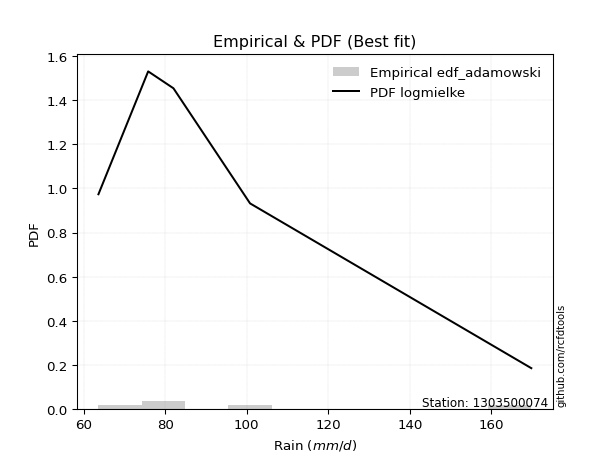</img>

</div>


## C. Best fit & Estimate extreme values for specific return periods - Tr

Best fit in probability distribution analysis means finding the theoretical distribution (like Normal, Poisson, Exponential, etc.) that most accurately mirrors your real-world data´s patterns (shape, center, spread) for better predictions, using methods like visual checks (Q-Q plots), goodness-of-fit tests (Kolmogorov-Smirnov, Chi-Squared), and information criteria (AIC) to score and select the simplest, most representative model.


### 1. Best fit (ordered by delta Δ)

:file_folder:Table: [bestfit_1303500074.csv](table/bestfit_1303500074.csv)

<div align="center">

|   id |    station | empirical_dist   | p_dist        |     delta |   deltao | eval   |   fit |   n |   best_fit |   best_fit_sort |
|-----:|-----------:|:-----------------|:--------------|----------:|---------:|:-------|------:|----:|-----------:|----------------:|
|    0 | 1303500074 | edf_hazen        | logalpha      | 0.040222  | 0.586543 | Δo > Δ |     1 |   5 |          1 |               1 |
|    1 | 1303500074 | edf_gringorten   | logalpha      | 0.0433236 | 0.586543 | Δo > Δ |     1 |   5 |          1 |               2 |
|    2 | 1303500074 | edf_cunnane      | logalpha      | 0.0493332 | 0.586543 | Δo > Δ |     1 |   5 |          1 |               3 |
|    3 | 1303500074 | edf_blom         | logalpha      | 0.0529962 | 0.586543 | Δo > Δ |     1 |   5 |          1 |               4 |
|    4 | 1303500074 | edf_tukey        | logalpha      | 0.0589486 | 0.586543 | Δo > Δ |     1 |   5 |          1 |               5 |
|    5 | 1303500074 | edf_filliben     | logmielke     | 0.0607154 | 0.586543 | Δo > Δ |     1 |   5 |          1 |               6 |
|    6 | 1303500074 | edf_beard        | logmielke     | 0.0617547 | 0.586543 | Δo > Δ |     1 |   5 |          1 |               7 |
|    7 | 1303500074 | edf_jenkinson    | logmielke     | 0.0617547 | 0.586543 | Δo > Δ |     1 |   5 |          1 |               8 |
|    8 | 1303500074 | edf_chegodayev   | logmielke     | 0.0631316 | 0.586543 | Δo > Δ |     1 |   5 |          1 |               9 |
|    9 | 1303500074 | edf_adamowski    | logmielke     | 0.0698656 | 0.586543 | Δo > Δ |     1 |   5 |          1 |              10 |
|   10 | 1303500074 | edf_california   | logloglaplace | 0.1       | 0.586543 | Δo > Δ |     1 |   5 |          1 |              11 |
|   11 | 1303500074 | edf_weibull      | logmielke     | 0.100169  | 0.586543 | Δo > Δ |     1 |   5 |          1 |              12 |

</div>


### 2. Extreme values and % difference analysis

In hydrology, a return period (or recurrence interval $Tr$) is the statistical average time between extreme events like floods or droughts of a specific magnitude, indicating how rare an event is, with a 100-year flood, for example, having a 1% chance of occurring in any given year, not that it happens exactly every century. It is a key tool for infrastructure design (like bridges or dams) and risk assessment, calculated from historical data to determine the probability of future events, although it is important to remember it is statistical average, and events can cluster or be missed.

The extreme value porcentage difference is evaluated as $pdiff = 1 - (ETrBf / ETr) * 100$, where _ETrBf_ correspond to the bestfit extreme value for a specific recurrence interval and _ETr_ correspond to the extreme value for one of the most used PDFsused in hydrology.

> risk_rate: assuming the return period as the project useful life.

:file_folder:Table: [extreme_1303500074.csv](table/extreme_1303500074.csv), all PDFs.  
:file_folder:Table: [extremepdiff_1303500074.csv](table/extremepdiff_1303500074.csv), % difference between bestfit and most used PDFs in Hydrology.

<div align="center">

Extreme values table for only best fit PDFs
|   id |      tr |   prob_l |     prob_g |     alpha |   anglit |   arcsine |   argus |     beta |   betaprime |   bradford |     burr |   burr12 |   cosine |   crystalball |   dgamma |   dweibull |   erlang |   exponnorm |   exponpow |   exponweib |         f |   fatiguelife |   foldnorm |    gamma |   gausshyper |   genexpon |      genextreme |   gengamma |   genhalflogistic |   genlogistic |   gennorm |   genpareto |   gompertz |   gumbel_l |   gumbel_r |   halfgennorm |   halflogistic |   halfnorm |   hypsecant |   invgamma |   invgauss |       invweibull |   johnsonsb |        johnsonsu |   kappa3 |   kappa4 |   ksone |   kstwobign |   laplace |   levy_l |   loggamma |   logistic |   loglaplace |   lomax |   maxwell |   mielke |    moyal |   nakagami |      ncf |      nct |    norm |   pearson3 |   powerlaw |   rayleigh |    rdist |     rice |   semicircular |   skewnorm |        t |   trapezoid |   triang |   truncexpon |   truncnorm |   truncpareto |   truncweibull_min |   tukeylambda |   uniform |   vonmises |   vonmises_line |     wald |   weibull_max |      weibull_min |   wrapcauchy |   logalpha |   loganglit |   logarcsine |   logargus |   logbeta |   logbetaprime |   logbradford |   logburr |   logburr12 |   logcosine |   logcrystalball |   logdgamma |   logdweibull |   logerlang |   logexponnorm |      logexponpow |   logexponweib |      logf |   logfatiguelife |   logfoldnorm |   loggausshyper |   loggenexpon |   loggenextreme |   loggengamma |   loggenhalflogistic |   loggenlogistic |   loggennorm |   loggenpareto |   loggompertz |   loggumbel_l |   loggumbel_r |   loghalfgennorm |   loghalflogistic |   loghalfnorm |   loghypsecant |   loginvgamma |   loginvgauss |   loginvweibull |   logjohnsonsb |   logjohnsonsu |   logkappa3 |   logkappa4 |   logksone |   logkstwobign |   loglevy_l |   logloggamma |   loglogistic |   logloglaplace |   loglomax |   logmaxwell |   logmielke |   logmoyal |   lognakagami |    logncf |   lognct |   lognorm |   logpearson3 |   logpowerlaw |   lograyleigh |   logrdist |   logrice |   logsemicircular |   logskewnorm |     logt |   logtrapezoid |   logtriang |   logtruncexpon |   logtruncnorm |   logtruncpareto |   logtruncweibull_min |   logtukeylambda |   loguniform |   logvonmises |   logvonmises_line |   logwald |   logweibull_max |   logweibull_min |   logwrapcauchy |    station |   n |   risk_rate |
|-----:|--------:|---------:|-----------:|----------:|---------:|----------:|--------:|---------:|------------:|-----------:|---------:|---------:|---------:|--------------:|---------:|-----------:|---------:|------------:|-----------:|------------:|----------:|--------------:|-----------:|---------:|-------------:|-----------:|----------------:|-----------:|------------------:|--------------:|----------:|------------:|-----------:|-----------:|-----------:|--------------:|---------------:|-----------:|------------:|-----------:|-----------:|-----------------:|------------:|-----------------:|---------:|---------:|--------:|------------:|----------:|---------:|-----------:|-----------:|-------------:|--------:|----------:|---------:|---------:|-----------:|---------:|---------:|--------:|-----------:|-----------:|-----------:|---------:|---------:|---------------:|-----------:|---------:|------------:|---------:|-------------:|------------:|--------------:|-------------------:|--------------:|----------:|-----------:|----------------:|---------:|--------------:|-----------------:|-------------:|-----------:|------------:|-------------:|-----------:|----------:|---------------:|--------------:|----------:|------------:|------------:|-----------------:|------------:|--------------:|------------:|---------------:|-----------------:|---------------:|----------:|-----------------:|--------------:|----------------:|--------------:|----------------:|--------------:|---------------------:|-----------------:|-------------:|---------------:|--------------:|--------------:|--------------:|-----------------:|------------------:|--------------:|---------------:|--------------:|--------------:|----------------:|---------------:|---------------:|------------:|------------:|-----------:|---------------:|------------:|--------------:|--------------:|----------------:|-----------:|-------------:|------------:|-----------:|--------------:|----------:|---------:|----------:|--------------:|--------------:|--------------:|-----------:|----------:|------------------:|--------------:|---------:|---------------:|------------:|----------------:|---------------:|-----------------:|----------------------:|-----------------:|-------------:|--------------:|-------------------:|----------:|-----------------:|-----------------:|----------------:|-----------:|----:|------------:|
|    0 |    2    | 0.5      | 0.5        |   83.0552 |   98.4   |    98.4   | 114.794 |  68.26   |     90.9312 |    74.7217 |  86.8463 |  82.421  |  104.374 |        98.4   |  82      |    75.8    |  63.7564 |     87.7183 |    63.6578 |     86.7455 |   82.8547 |       63.6    |    90.518  |  63.7469 |      81.0601 |    87.7216 |    73.291       |    86.5334 |           134.042 |       91.0661 |   82      |     115.063 |    89.8251 |    104.588 |    92.2117 |       72.8676 |        89.1352 |    90.6893 |      98.4   |    82.8546 |    81.694  |   4865.15        |     63.6    |     63.6227      |  116.425 |  112.882 | 116.7   |     94.0809 |    98.4   |  116.147 |    69.3779 |     98.4   |      92.4842 | 127.448 |   95.1784 |  84.7637 |  90.2139 |    95.5421 |  91.302  |  89.6192 |  98.4   |    91.3697 |    63.9054 |    94.0358 |  82.2397 |  98.1508 |         98.4   |    98.1925 |  98.4001 |     143.094 |  121.529 |      101.749 |     89.7206 |       65.1892 |            101.806 |       82.2    |   116.7   |   0.380829 |         88.7119 |  86.1895 |       169.57  |     66.0416      |      116.7   |    84.1861 |     92.4842 |      92.4841 |    104.858 |   79.269  |        91.1645 |       95.6108 |   84.731  |     82.2711 |      96.31  |          92.4842 |     82      |       82      |     63.7616 |        82.2593 |     65.9071      |        63.8246 |   79.4748 |          80.5356 |       88.0551 |         63.8333 |       82.9943 |         83.4916 |       75.6345 |              120.959 |          86.8389 |      82      |        107.36  |       84.6034 |        97.763 |       87.4904 |     68.9522      |           85.1091 |       86.3038 |        92.4842 |       90.4144 |       82.2461 |         83.4927 |        63.6001 |        82.3022 |      63.6   |     104.096 |    103.92  |        88.1423 |     108.745 |       92.5536 |       92.4842 |         82      |    83.0402 |      89.8499 |      85.535 |    85.9366 |       79.6857 |   83.355  |  90.3475 |   92.4842 |       88.2376 |       63.9023 |       88.9337 |    113.259 |   91.2518 |           92.4842 |       89.3692 |  92.4844 |        132.645 |     111.384 |         93.3136 |          169.8 |          67.0351 |               94.3574 |          103.92  |      103.92  |      0.171742 |            102.794 |   82.8906 |          86.8888 |          64.595  |         103.92  | 1303500074 |   5 |    0.75     |
|    1 |    2.33 | 0.570815 | 0.429185   |   87.5167 |  106.23  |   110.154 | 122.564 |  74.1629 |     96.4107 |    79.2101 |  91.4589 |  87.3482 |  111.512 |       105.122 |  82.1479 |    79.5028 |  63.994  |     93.0397 |    63.7849 |     92.5252 |   87.4512 |       64.5957 |    97.8512 |  63.9873 |      87.5725 |    93.0363 |    99.2263      |    92.2639 |           140.819 |       96.1421 |   82.6081 |     127.211 |    95.6033 |    110.436 |    98.4403 |       76.9136 |        95.5392 |    97.944  |     103.78  |    87.451  |    86.5322 | 548780           |     63.6005 |     63.6822      |  123.929 |  120.716 | 125.725 |     99.6911 |   102.468 |  132.717 |    71.7289 |    104.322 |      95.9211 | 141.515 |  102.162  |  89.3451 |  96.1101 |   104.682  |  96.8485 |  94.8233 | 105.122 |    97.8846 |    64.5343 |   101.123  |  85.6492 | 104.137  |        106.798 |   104.147  | 105.121  |     149.264 |  129.509 |      108.76  |     95.4751 |       66.022  |            108.943 |       84.9906 |   124.221 |   0.417933 |         93.9877 |  90.5971 |       169.723 |     73.9674      |      140.789 |    88.5464 |     99.2132 |     102.768  |    112.265 |   86.3958 |        96.6813 |      102.531  |   89.0985 |     87.1812 |     102.602 |          98.2321 |     83.1865 |       84.0481 |     64.0071 |        87.0631 |     69.594       |        64.2186 |   85.6087 |          85.2105 |       94.3235 |         64.188  |       87.8998 |         87.8782 |       80.4305 |              129.052 |          91.447  |      82.9265 |        129.753 |       89.6799 |       103.028 |       92.5177 |     72.6845      |           90.1412 |       92.1068 |        97.0564 |       95.8141 |       86.8488 |         87.8795 |        63.6009 |        86.8855 |      63.6   |     112.048 |    112.964 |        93.1171 |     124.79  |       98.319  |       97.5302 |         85.1179 |    88.1104 |      95.6583 |      90.335 |    90.6039 |       86.6328 |   87.8128 |  95.7624 |   98.2321 |       93.6659 |       64.4412 |       94.7707 |    127.935 |   96.5531 |           99.7198 |       94.7582 |  98.2323 |        140.433 |     119.424 |         99.7981 |          169.8 |          68.9631 |              100.958  |          111.713 |      111.403 |      0.182282 |            110.267 |   86.2332 |          91.5076 |          65.2598 |         125.211 | 1303500074 |   5 |    0.729209 |
|    2 |    5    | 0.8      | 0.2        |  115.83   |  133.855 |   141.497 | 147.487 | 128.567  |    120.906  |   107.924  | 114.481  | 116.621  |  137.234 |       130.102 |  90.7925 |   105.102  |  68.1886 |    119.645  |    69.3034 |    122.955  |  115.381  |       85.7466 |   128.858  |  68.635  |     122.057  |   119.609  | 10252.6         |   122.456  |           158.601 |      118.193  |   92.9212 |     157.655 |   124.493  |    129.329 |   125.5    |      110.347  |       124.516  |   128.623  |     125.358 |   115.381  |   115.934  |      4.78727e+14 |    156.719  |     73.3159      |  149.27  |  146.732 | 154.932 |    123.522  |   122.806 |  160.171 |    87.7366 |    127.19  |     115.118  | 211.85  |  129.649  | 114.811  | 123.422  |   147.802  | 121.504  | 119.203  | 130.102 |   126.264  |    79.7446 |   129.495  |  95.7122 | 128.101  |        135.455 |   129.327  | 130.099  |     166.966 |  152.401 |      136.178 |    124.243  |       75.7221 |            136.676 |       93.8505 |   148.56  |   0.55604  |        114.644  | 115.271  |       169.799 |   1171.46        |      163.446 |   113.565  |    127.112  |     136.132  |    139.742 |  128.105  |       120.87   |      131.769  |  112.78   |    116.522  |     128.886 |         122.904  |     95.5241 |      104.101  |     68.4785 |       115.631  |    254.42        |        72.8587 |  130.926  |         115.272  |      123.518  |         70.6712 |      116.639  |        113.869  |      111.941  |              152.845 |         114.475  |      93.7891 |        166.653 |      117.545  |       122.055 |      117.934  |    139.949       |          116.897  |      121.284  |       117.784  |      119.861  |      114.95   |        113.872  |        65.6884 |       115.43   |      63.6   |     141.779 |    147.989 |       117.576  |     156.751 |      122.968  |      119.735  |        103.07   |   118.823  |     122.405  |     116.648 |   115.756  |      133.302  |  114.381  | 120.274  |  122.904  |      120.175  |       75.8689 |      122.236  |    178.626 |  121.046  |          128.949  |      121.381  | 122.904  |        165.408 |     145.859 |        128.314  |          169.8 |          86.7953 |              129.535  |          140.778 |      139.522 |      0.227656 |            138.636 |  107.594  |         114.598  |          72.6005 |         157.646 | 1303500074 |   5 |    0.67232  |
|    3 |   10    | 0.9      | 0.1        |  158.287  |  149.491 |   149.064 | 159.506 | 158.431  |    141.682  |   132.543  | 137.42   | 151.383  |  152.775 |       146.674 | 106.58   |   131.948  |  76.4334 |    143.797  |    94.2604 |    152.084  |  151.426  |      114.951  |   151.797  |  78.1967 |     145.979  |   143.73   |     1.02053e+06 |   151.385  |           164.716 |      136.152  |  114.209  |     165.912 |   150.718  |    139.848 |   147.54   |      163.808  |       148.58   |   151.325  |     142.589 |   151.426  |   150.033  |      9.16619e+21 |    169.799  |    294.036       |  163.42  |  158.325 | 167.676 |    141.666  |   141.268 |  166.799 |   108.47   |    144.031 |     135.851  | 275.698 |  148.993  | 144.319  | 147.201  |   181.9    | 142.256  | 141.369  | 146.674 |   148.907  |   107.236  |   149.725  |  99.0235 | 145.189  |        150.16  |   147.959  | 146.668  |     173.88  |  161.343 |      151.414 |    150.353  |       94.5634 |            151.859 |       97.5068 |   159.18  |   0.648087 |        130.47   | 141.456  |       169.8   |  14992.9         |      166.931 |   145.813  |    146.251  |     145.692  |    155.303 |  160.178  |       140.788  |      148.933  |  139.783  |    151.683  |     147.927 |         142.601  |    111.192  |      133.461  |     78.1747 |       149.605  |  12740.2         |        94.0737 |  201.14   |         155.139  |      148.499  |         84.6081 |      150.172  |        148.141  |      151.042  |              161.932 |         137.45   |     113.946  |        169.518 |      146.499  |       134.132 |      143.713  |    688.887       |          145.06   |      148.676  |       137.471  |      140.121  |      150.862  |        148.146  |       281.457  |       154.236  |     154.161 |     156.463 |    166.498 |       140.422  |     165.622 |      142.533  |      139.26   |        123.498  |   156.504  |     145.598  |     147.198 |   143.277  |      190.828  |  149.27   | 141.429  |  142.601  |      145.328  |       98.414  |      146.557  |    194.956 |  142.219  |          147.13   |      145.789  | 142.601  |        176.329 |     157.708 |        146.28   |          169.8 |         110.602  |              147.165  |          155.175 |      153.918 |      0.264321 |            153.391 |  136.077  |         137.648  |          88.3956 |         164.169 | 1303500074 |   5 |    0.651322 |
|    4 |   15    | 0.933333 | 0.0666667  |  196.917  |  156.169 |   150.507 | 164.075 | 164.913  |    153.762  |   143.399  | 152.326  | inf      |  159.854 |       154.943 | 117.709  |   148.577  |  82.7443 |    157.925  |   125.868  |    169.598  |  179.256  |      134.051  |   163.733  |  85.6252 |     155.052  |   157.84   |     1.37265e+07 |   168.792  |           166.548 |      146.285  |  133.075  |     167.803 |   166.059  |    144.612 |   159.975  |      207.463  |       162.198  |   163.139  |     152.423 |   179.257  |   172.946  |      1.17676e+26 |    169.8    |   1182.36        |  170.17  |  162.21  | 171.924 |    151.299  |   152.068 |  168.801 |   123.728  |    153.207 |     149.67   | 313.046 |  158.918  | 165.613  | 161.001  |   199.918  | 154.264  | 154.904  | 154.943 |   161.397  |   122.917  |   160.148  |  99.8665 | 153.993  |        155.894 |   157.656  | 154.937  |     176.099 |  164.212 |      157.132 |    165.625  |      108.379  |            157.497 |       98.6673 |   162.72  |   0.694226 |        139.105  | 158.271  |       169.8   |  48546.2         |      167.921 |   172.364  |    155.278  |     147.591  |    161.663 |  173.395  |       152.128  |      155.432  |  159.343  |    inf      |     157.51  |         153.581  |    122.093  |      156.673  |     86.5078 |       173.935  | 712396           |       113.805  |  261.472  |         185.898  |      162.886  |         96.0977 |      173.898  |        176.158  |      178.997  |              164.743 |         152.391  |     132.438  |        169.731 |      165.085  |       139.988 |      160.671  |   3666.37        |          163.908  |      165.297  |       150.148  |      151.839  |      178.246  |        176.166  |       452.223  |       185.967  |     159.3   |     161.476 |    173.168 |       154.303  |     168.4   |      153.397  |      151.207  |        137.723  |   184.193  |     159.155  |     169.647 |   162.157  |      231.165  |  177.53   | 153.872  |  153.581  |      161.012  |      113.312  |      160.921  |    198.496 |  154.535  |          154.896  |      160.374  | 153.581  |        179.983 |     161.711 |        153.389  |          169.8 |         124.298  |              154.061  |          160.123 |      159.04  |      0.28503  |            158.672 |  158.228  |         152.642  |         104.584  |         166.087 | 1303500074 |   5 |    0.644736 |
|    5 |   20    | 0.95     | 0.05       |  234.073  |  160.096 |   151.015 | 166.583 | 167.175  |    162.391  |   149.44   | 163.712  | inf      |  164.207 |       160.359 | 126.174  |   160.7    |  87.7279 |    167.949  |   158.812  |    182.201  |  202.873  |      148.192  |   171.689  |  91.5233 |     159.633  |   167.852  |     8.47005e+07 |   181.322  |           167.422 |      153.379  |  149.744  |     168.555 |   176.943  |    147.577 |   168.681  |      244.742  |       171.739  |   171.016  |     159.36  |   202.874  |   190.4    |      8.85839e+28 |    169.8    |   3212.12        |  174.634 |  164.155 | 174.048 |    157.787  |   159.73  |  169.827 |   136.169  |    159.549 |     160.319  | 339.545 |  165.505  | 182.971  | 170.775  |   211.981  | 162.816  | 164.866  | 160.359 |   170.016  |   132.477  |   167.076  | 100.221  | 159.845  |        159.075 |   164.12   | 160.351  |     177.193 |  165.627 |      160.134 |    176.459  |      118.209  |            160.443 |       99.2309 |   164.49  |   0.724532 |        144.774  | 170.801  |       169.8   | 100989           |      168.399 |   196.63   |    160.846  |     148.265  |    165.264 |  180.47   |       160.124  |      158.846  |  175.437  |    inf      |     163.708 |         161.225  |    130.644  |      176.514  |     93.7094 |       193.561  |      3.05042e+07 |       131.749  |  316.104  |         211.883  |      173.073  |        105.471  |      192.903  |        201.293  |      201.364  |              166.097 |         163.808  |     149.835  |        169.775 |      179.021  |       143.761 |      173.722  |  19072.3         |          178.553  |      177.398  |       159.788  |      160.181  |      201.289  |        201.304  |       472.119  |       214.208  |     161.934 |     163.974 |    176.603 |       164.42   |     169.84  |      160.944  |      160.058  |        149.021  |   206.928  |     168.842  |     188.296 |   177.015  |      262.93   |  202.679  | 162.823  |  161.225  |      172.673  |      123.273  |      171.238  |    199.818 |  163.306  |          159.379  |      170.9    | 161.225  |        181.814 |     163.722 |        157.199  |          169.8 |         132.944  |              157.737  |          162.604 |      161.664 |      0.299588 |            161.382 |  177.048  |         164.103  |         120.983  |         167.023 | 1303500074 |   5 |    0.641514 |
|    6 |   25    | 0.96     | 0.04       |  270.472  |  162.758 |   151.251 | 168.2   | 168.202  |    169.14   |   153.278  | 173.058  | inf      |  167.26  |       164.345 | 132.999  |   170.269  |  91.8351 |    175.724  |   191.441  |    192.068  |  223.795  |      159.427  |   177.608  |  96.3984 |     162.341  |   175.617  |     3.4407e+08  |   191.134  |           167.932 |      158.843  |  164.713  |     168.937 |   185.386  |    149.687 |   175.388  |      277.56   |       179.09   |   176.876  |     164.729 |   223.797  |   204.571  |      1.45594e+31 |    169.8    |   6807.35        |  177.989 |  165.322 | 175.322 |    162.648  |   165.674 |  170.47  |   146.844  |    164.401 |     169.098  | 360.1   |  170.395  | 197.911  | 178.35   |   220.972  | 169.491  | 172.831  | 164.345 |   176.586  |   138.842  |   172.223  | 100.408  | 164.192  |        161.138 |   168.93   | 164.337  |     177.845 |  166.47  |      161.986 |    184.862  |      125.427  |            162.254 |       99.5622 |   165.552 |   0.746893 |        148.778  | 180.838  |       169.8   | 170117           |      168.682 |   219.763  |    164.733  |     148.579  |    167.628 |  184.844  |       166.319  |      160.949  |  189.434  |    inf      |     168.2   |         167.095  |    137.771  |      194.162  |    100.092  |       210.297  |      9.74857e+08 |       148.267  |  366.858  |         234.802  |      180.983  |        113.278  |      209.029  |        224.726  |      220.279  |              166.89  |         173.183  |     166.499  |        169.788 |      190.263  |       146.508 |      184.493  |  94844.9         |          190.724  |      186.973  |       167.671  |      166.69   |      221.58   |        224.74   |       475.506  |       240.28   |     163.535 |     165.461 |    178.696 |       172.43   |     170.75  |      166.729  |      167.178  |        158.556  |   226.583  |     176.413  |     204.637 |   189.461  |      289.445  |  225.962  | 169.859  |  167.095  |      182.055  |      130.311  |      179.33   |    200.455 |  170.143  |          162.356  |      179.177  | 167.095  |        182.913 |     164.933 |        159.573  |          169.8 |         138.858  |              160.022  |          164.087 |      163.26  |      0.310851 |            163.031 |  193.726  |         173.514  |         137.636  |         167.581 | 1303500074 |   5 |    0.639603 |
|    7 |   50    | 0.98     | 0.02       |  448.089  |  169.31  |   151.566 | 171.867 | 169.511  |    190.546  |   161.467  | 205.325  | inf      |  175.254 |       175.761 | 155.314  |   200.791  | 105.675  |    199.876  |   339.502  |    223.17   |  306.821  |      195.477  |   194.811  | 112.886  |     167.47   |   199.739  |     2.58196e+10 |   222.076  |           168.911 |      175.677  |  223.778  |     169.524 |   211.611  |    155.415 |   196.046  |      403.495  |       201.74   |   193.91   |     181.375 |   306.825  |   251.773  |      9.74844e+37 |    169.8    |  59790.5         |  188.162 |  167.654 | 177.871 |    176.92   |   184.136 |  171.919 |   186.605  |    179.224 |     199.554  | 423.948 |  184.577  | 254.182  | 201.868  |   247.137  | 190.589  | 199.093  | 175.761 |   196.47   |   153.148  |   187.166  | 100.713  | 176.813  |        165.852 |   182.911  | 175.752  |     179.139 |  168.144 |      165.807 |    210.962  |      143.863  |            165.98  |      100.205  |   167.676 |   0.811198 |        158.391  | 213.607  |       169.8   | 700974           |      169.243 |   331.562  |    174.705  |     148.999  |    173.116 |  193.786  |       185.638  |      165.285  |  243.671  |    inf      |     180.555 |         185.112  |    162.909  |      264.704  |    124.972  |       272.085  |      1.18052e+15 |       217.365  |  587.184  |         324.894  |      205.717  |        139.009  |      268.044  |        330.024  |      288.729  |              168.418 |         205.568  |     244.214  |        169.799 |      227.62   |       154.232 |      222.054  |      1.43741e+08 |          233.689  |      217.839  |       194.672  |      187.237  |      301.269  |        330.05   |       476.86   |       354.017  |     166.784 |     168.377 |    182.957 |       198.277  |     172.817 |      184.436  |      190.952  |        193.193  |   301.139  |     200.345  |     268.89  |   233.957  |      382.922  |  328.899  | 192.369  |  185.112  |      213.288  |      147.415  |      205.051  |    201.353 |  191.656  |          169.368  |      205.584  | 185.112  |        185.115 |     167.361 |        164.534  |          169.8 |         152.674  |              164.779  |          167.022 |      166.498 |      0.345946 |            166.381 |  259.916  |         206.034  |         226.005  |         168.691 | 1303500074 |   5 |    0.63583  |
|    8 |   75    | 0.986667 | 0.0133333  |  623.243  |  172.194 |   151.624 | 173.321 | 169.735  |    203.455  |   164.356  | 226.772  | inf      |  179.072 |       181.886 | 168.971  |   219.139  | 114.376  |    214.004  |   463.996  |    241.646  |  371.396  |      217.187  |   204.173  | 123.281  |     169.009  |   213.849  |     3.17648e+11 |   240.465  |           169.223 |      185.461  |  268.098  |     169.658 |   226.951  |    158.311 |   208.054  |      495.772  |       214.906  |   203.183  |     191.102 |   371.402  |   281.367  |      9.04371e+41 |    169.8    | 192570           |  194.12  |  168.43  | 178.721 |    184.772  |   194.936 |  172.515 |   215.315  |    187.785 |     219.853  | 461.296 |  192.288  | 295.491  | 215.62   |   261.383  | 203.261  | 215.671  | 181.886 |   207.802  |   158.423  |   195.295  | 100.789  | 183.68   |        167.735 |   190.522  | 181.877  |     179.568 |  168.698 |      167.118 |    226.228  |      151.517  |            167.254 |      100.411  |   168.384 |   0.845888 |        162.053  | 233.772  |       169.8   |      1.43455e+06 |      169.429 |   448.657  |    179.283  |     149.078  |    175.341 |  196.771  |       197.059  |      166.77   |  285.269  |    inf      |     186.771 |         195.567  |    179.945  |      320.099  |    143.685  |       316.334  |      4.56262e+19 |       273.529  |  776.615  |         394.175  |      220.364  |        153.874  |      309.902  |        427.402  |      336.415  |              168.905 |         227.107  |     318.01   |        169.8   |      251.203  |       158.291 |      247.306  |      8.74838e+10 |          262.984  |      236.733  |       212.421  |      199.56   |      362.629  |        427.442  |       476.894  |       454.399  |     167.881 |     169.315 |    184.4   |       214.115  |     173.674 |      194.678  |      206.193  |        217.634  |   356.313  |     214.692  |     319.046 |   264.673  |      445.958  |  422.078  | 206.083  |  195.567  |      233.18   |      154.202  |      220.561  |    201.534 |  204.482  |          172.253  |      221.559  | 195.568  |        185.85  |     168.173 |        166.254  |          169.8 |         157.97   |              166.424  |          167.98  |      167.591 |      0.366712 |            167.513 |  311.444  |         227.668  |         324.458  |         169.06  | 1303500074 |   5 |    0.634587 |
|    9 |  100    | 0.99     | 0.01       |  797.63   |  173.909 |   151.645 | 174.133 | 169.809  |    212.818  |   165.833  | 243.289  | inf      |  181.465 |       186.029 | 178.871  |   232.353  | 120.763  |    224.028  |   571.455  |    254.869  |  426.325  |      232.809  |   210.55   | 130.922  |     169.723  |   223.86   |     1.87674e+12 |   253.63   |           169.375 |      192.386  |  304.376  |     169.712 |   237.836  |    160.206 |   216.553  |      570.435  |       224.225  |   209.5    |     198.002 |   426.332  |   303.146  |      5.81203e+44 |    169.8    | 424897           |  198.408 |  168.817 | 179.146 |    190.152  |   202.599 |  172.863 |   238.58   |    193.83  |     235.495  | 487.795 |  197.54   | 329.375  | 225.377  |   271.084  | 212.43   | 228.044  | 186.029 |   215.731  |   161.161  |   200.833  | 100.821  | 188.357  |        168.789 |   195.706  | 186.019  |     179.781 |  168.974 |      167.781 |    237.058  |      155.689  |            167.898 |      100.512  |   168.738 |   0.869433 |        163.951  | 248.474  |       169.8   |      2.29166e+06 |      169.522 |   577.469  |    182.062  |     149.105  |    176.596 |  198.246  |       205.24   |      167.52   |  320.64   |    inf      |     190.776 |         202.972  |    193.197  |      367.592  |    159.185  |       352.028  |      2.43142e+23 |       322.36   |  948.577  |         452.674  |      230.86   |        163.827  |      343.466  |        522.386  |      374.113  |              169.142 |         243.701  |     390.648  |        169.8   |      268.719  |       161.004 |      266.896  |      2.80095e+13 |          285.911  |      250.534  |       225.984  |      208.466  |      414.55   |        522.44   |       476.899  |       548.395  |     168.433 |     169.773 |    185.126 |       225.691  |     174.177 |      201.916  |      217.682  |        237.213  |   401.82   |     225.049  |     362.207 |   288.881  |      494.709  |  511.468  | 216.094  |  202.972  |      248.094  |      157.834  |      231.795  |    201.6   |  213.708  |          173.89   |      233.148  | 202.972  |        186.217 |     168.579 |        167.128  |          169.8 |         160.766  |              167.258  |          168.452 |      168.141 |      0.381614 |            168.082 |  355.344  |         244.339  |         433.886  |         169.245 | 1303500074 |   5 |    0.633968 |
|   10 |  200    | 0.995    | 0.005      | 1492.99   |  177.148 |   151.664 | 175.544 | 169.877  |    236.164  |   168.087  | 288.081  | inf      |  186.33  |       195.427 | 203.303  |   264.796  | 136.752  |    248.18   |   901.95   |    287.082  |  598.45   |      271.047  |   225.133  | 150.076  |     170.685  |   247.982  |     1.34298e+14 |   285.71   |           169.596 |      209.034  |  409.863  |     169.772 |   264.061  |    164.324 |   236.984  |      784.709  |       246.629  |   223.947  |     214.626 |   598.463  |   357.983  |      3.27339e+51 |    169.8    |      2.55871e+06 |  209.071 |  169.397 | 179.783 |    202.544  |   221.061 |  173.522 |   306.415  |    208.329 |     277.91   | 551.643 |  209.556  | 430.07   | 248.885  |   293.248  | 235.212  | 260.169  | 195.427 |   234.52   |   165.4    |   213.505  | 100.859  | 199.061  |        170.628 |   207.564  | 195.416  |     180.101 |  169.387 |      168.785 |    263.149  |      162.428  |            168.871 |      100.66   |   169.269 |   0.923108 |        166.856  | 285.095  |       169.8   |      6.34376e+06 |      169.661 |  1273.16   |    187.43   |     149.131  |    178.799 |  200.409  |       225.278  |      168.654  |  432.927  |    inf      |     199.186 |         220.823  |    229.591  |      518.682  |    205.708  |       455.46   |      9.75335e+33 |       479.467  | 1543.13   |         634.058  |      256.565  |        184.666  |      439.907  |        905.725  |      479.829  |              169.486 |         288.728  |     683.936  |        169.8   |      313.626  |       167.062 |      320.579  |      5.92838e+21 |          349.548  |      285.199  |       262.323  |      230.557  |      576.314  |        905.845  |       476.9    |       897.293  |     169.263 |     170.437 |    186.22  |       254.791  |     175.134 |      219.319  |      247.917  |        293.6    |   538.327  |     250.66   |     501.854 |   356.693  |      626.961  |  861.172  | 241.276  |  220.823  |      287.014  |      163.607  |      259.698  |    201.667 |  236.413  |          176.782  |      261.982  | 220.823  |        186.769 |     169.189 |        168.454  |          169.8 |         165.157  |              168.523  |          169.146 |      168.968 |      0.418273 |            168.939 |  493.512  |         289.586  |         988.137  |         169.522 | 1303500074 |   5 |    0.633042 |
|   11 |  250    | 0.996    | 0.004      | 1840.24   |  177.973 |   151.667 | 175.874 | 169.884  |    243.937  |   168.544  | 304.163  | inf      |  187.664 |       198.299 | 211.315  |   275.408  | 142.052  |    255.955  |  1031.34   |    297.551  |  668.637  |      283.509  |   229.619  | 156.431  |     170.855  |   255.747  |     5.30049e+14 |   296.139  |           169.639 |      214.386  |  449.69   |     169.78  |   272.504  |    165.535 |   243.553  |      864.845  |       253.831  |   228.392  |     219.977 |   668.653  |   376.274  |      4.84439e+53 |    169.8    |      4.42913e+06 |  212.628 |  169.513 | 179.91  |    206.379  |   227.004 |  173.694 |   332.38   |    212.984 |     293.128  | 572.198 |  213.255  | 469.286  | 256.453  |   300.06   | 242.774  | 271.269  | 198.299 |   240.486  |   166.267  |   217.405  | 100.865  | 202.356  |        171.059 |   211.212  | 198.287  |     180.165 |  169.47  |      168.987 |    271.547  |      163.849  |            169.066 |      100.688  |   169.375 |   0.939591 |        167.443  | 297.21   |       169.8   |      8.55959e+06 |      169.689 |  1770.04   |    188.821  |     149.134  |    179.318 |  200.828  |       231.841  |      168.882  |  479.714  |    inf      |     201.555 |         226.585  |    242.793  |      581.272  |    223.953  |       494.84   |      7.78778e+37 |       544.785  | 1807.04   |         707.369  |      264.979  |        190.289  |      476.355  |       1105.79   |      518.833  |              169.553 |         304.902  |     835.446  |        169.8   |      328.905  |       168.888 |      340.034  |      1.9373e+25  |          372.876  |      296.799  |       275.221  |      237.877  |      642.045  |       1105.95   |       476.9    |      1064.56   |     169.43  |     170.565 |    186.44  |       264.535  |     175.384 |      224.922  |      258.488  |        315.016  |   591.986  |     259.116  |     561.054 |   381.746  |      674.279  | 1038.38   | 249.73   |  226.585  |      300.51   |      164.811  |      268.945  |    201.676 |  243.877  |          177.467  |      271.55   | 226.586  |        186.879 |     169.311 |        168.722  |          169.8 |         166.065  |              168.778  |          169.281 |      169.134 |      0.430344 |            169.111 |  550.162  |         305.842  |        1338.61   |         169.578 | 1303500074 |   5 |    0.632858 |
|   12 |  500    | 0.998    | 0.002      | 3575.57   |  180.017 |   151.67  | 176.633 | 169.894  |    268.963  |   169.464  | 360.016  | inf      |  191.213 |       206.815 | 236.565  |   308.844  | 158.897  |    280.107  |  1509.91   |    330.351  |  947.577  |      322.602  |   242.991  | 176.645  |     171.162  |   279.869  |     3.7579e+16  |   328.82   |           169.723 |      230.997  |  593.45   |     169.794 |   298.729  |    169.008 |   263.94   |     1151.91   |       276.186  |   241.644  |     236.599 |   947.605  |   434.822  |      2.6377e+60  |    169.8    |      2.25423e+07 |  224.143 |  169.743 | 180.165 |    217.872  |   245.467 |  174.137 |   428.784  |    227.421 |     345.922  | 636.045 |  224.292  | 617.648  | 279.96   |   320.344  | 267.046  | 308.369  | 206.815 |   258.799  |   168.02   |   229.044  | 100.874  | 212.186  |        172.052 |   222.088  | 206.803  |     180.292 |  169.635 |      169.393 |    297.632  |      166.77   |            169.459 |      100.745  |   169.588 |   0.98871  |        168.62   | 335.733  |       169.8   |      2.02036e+07 |      169.744 |  7098.93   |    192.315  |     149.139  |    180.518 |  201.642  |       252.624  |      169.34   |  673.172  |    inf      |     207.999 |         244.573  |    289.097  |      835.41   |    293.401  |       640.232  |      3.30601e+51 |       808.973  | 2960.31   |         996.101  |      291.589  |        204.385  |      609.889  |       2227.66   |      657.724  |              169.682 |         361.103  |    1657.15   |        169.8   |      378.945  |       174.232 |      408.265  |      3.19979e+39 |          455.67   |      334.261  |       319.474  |      261.327  |      902.835  |       2228.06   |       476.9    |      1886.35   |     169.764 |     170.812 |    186.88  |       296.026  |     176.03  |      242.37   |      294.225  |        394.224  |   797.398  |     286.083  |     810.909 |   471.356  |      837.296  | 1989.53   | 277.17   |  244.573  |      345.744  |      167.27   |      298.54   |    201.688 |  267.575  |          179.055  |      302.203  | 244.573  |        187.1   |     169.556 |        169.259  |          169.8 |         167.911  |              169.29   |          169.548 |      169.467 |      0.468839 |            169.455 |  777.226  |         362.344  |        3900.71   |         169.689 | 1303500074 |   5 |    0.632489 |
|   13 |  750    | 0.998667 | 0.00133333 | 5310.46   |  180.922 |   151.67  | 176.938 | 169.895  |    284.263  |   169.772  | 397.299  | inf      |  192.933 |       211.546 | 251.555  |   328.712  | 168.982  |    294.235  |  1846.14   |    349.722  | 1164.74   |      345.7    |   250.46   | 188.754  |     171.251  |   293.979  |     4.53754e+17 |   348.125  |           169.75  |      240.709  |  692.683  |     169.797 |   314.069  |    170.865 |   275.858  |     1348.66   |       289.255  |   249.047  |     246.322 |  1164.78   |   470.156  |      2.28598e+64 |    169.8    |      5.56634e+07 |  231.24  |  169.82  | 180.25  |    224.328  |   256.266 |  174.347 |   498.279  |    235.855 |     381.11   | 673.394 |  230.466  | 726.917  | 293.71   |   331.66   | 281.833  | 332.075  | 211.546 |   269.376  |   168.611  |   235.552  | 100.877  | 217.683  |        172.452 |   228.165  | 211.533  |     180.335 |  169.69  |      169.528 |    312.889  |      167.768  |            169.59  |      100.764  |   169.658 |   1.01616  |        169.013  | 358.83   |       169.8   |      3.19717e+07 |      169.763 | 23438.3    |    193.883  |     149.139  |    181.002 |  201.902  |       265.083  |      169.493  |  833.101  |    inf      |     211.195 |         255.175  |    320.346  |     1038.88   |    344.891  |       744.352  |      3.4274e+60  |      1018.21   | 3959.08   |        1218.74   |      307.511  |        210.5    |      704.687  |       3575.74   |      752.895  |              169.723 |         398.641  |    2588.73   |        169.8   |      410.045  |       177.158 |      454.329  |      4.16481e+50 |          512.343  |      357.211  |       348.588  |      275.581  |     1105.88   |       3576.49   |       476.9    |      2717.2    |     169.875 |     170.89  |    187.027 |       315.334  |     176.338 |      252.623  |      317.349  |        451.307  |   951.007  |     302.371  |    1022.52  |   533.231  |      944.704  | 3072.06   | 294.112  |  255.175  |      374.711  |      168.106  |      316.487  |    201.69  |  281.818  |          179.698  |      320.81   | 255.175  |        187.174 |     169.637 |        169.44   |          169.8 |         168.536  |              169.462  |          169.634 |      169.578 |      0.49215  |            169.57  |  956.131  |         400.093  |        7998.47   |         169.726 | 1303500074 |   5 |    0.632366 |
|   14 | 1000    | 0.999    | 0.001      | 7045.24   |  181.461 |   151.671 | 177.109 | 169.896  |    295.436  |   169.926  | 426.061  | inf      |  194.018 |       214.804 | 262.273  |   342.937  | 176.225  |    304.259  |  2110.9    |    363.542  | 1349.53   |      362.176  |   255.617  | 197.455  |     171.291  |   303.99   |     2.65605e+18 |   361.901  |           169.763 |      247.597  |  770.383  |     169.798 |   324.954  |    172.114 |   284.312  |     1502.16   |       298.525  |   254.16   |     253.221 |  1349.58   |   495.661  |      1.42017e+67 |    169.8    |      1.03718e+08 |  236.451 |  169.858 | 180.293 |    228.801  |   263.929 |  174.479 |   554.58   |    241.837 |     408.226  | 699.893 |  234.732  | 816.658  | 303.467  |   339.468  | 292.607  | 349.872  | 214.804 |   276.828  |   168.907  |   240.05   | 100.878  | 221.482  |        172.676 |   232.361  | 214.79   |     180.356 |  169.718 |      169.596 |    323.713  |      168.271  |            169.656 |      100.773  |   169.694 |   1.03514  |        169.21   | 375.445  |       169.8   |      4.35437e+07 |      169.772 | 70945      |    194.823  |     149.14   |    181.275 |  202.028  |       274.068  |      169.57   |  976.067  |    inf      |     213.237 |         262.741  |    344.615  |     1215.61   |    387.362  |       828.342  |      2.46304e+67 |      1197.97   | 4869.83   |        1407.11   |      318.976  |        214.033  |      780.734  |       5165.8    |      827.42   |              169.744 |         427.61   |    3627.24   |        169.8   |      432.938  |       179.154 |      490.122  |      1.03282e+60 |          556.767  |      373.975  |       370.84   |      285.949  |     1278.87   |       5166.98   |       476.9    |      3570.95   |     169.932 |     170.929 |    187.1   |       329.444  |     176.532 |      259.927  |      334.84   |        497.673  |  1078.56   |     314.168  |    1214.85  |   581.999  |     1026.7    | 4296.25   | 306.559  |  262.741  |      396.478  |      168.526  |      329.515  |    201.691 |  292.1    |          180.06   |      334.325  | 262.741  |        187.21  |     169.678 |        169.53   |          169.8 |         168.85   |              169.548  |          169.677 |      169.633 |      0.509089 |            169.628 | 1109.78   |         429.231  |       13898.9    |         169.744 | 1303500074 |   5 |    0.632305 |


</div>


<div align="center">

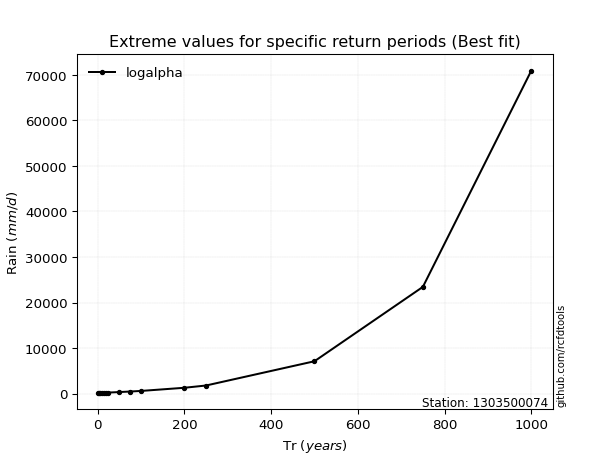</img>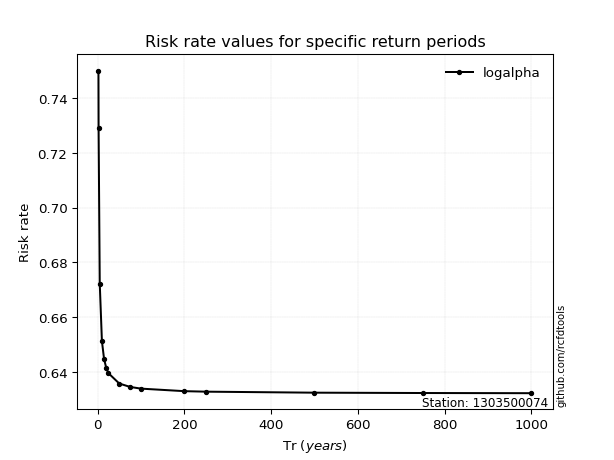</img>

</div>


<sub>**APP DISCLAIMER**: NO WARRANTY - This software is provided by [github.com/rcfdtools](https://github.com/rcfdtools) "as is", without any express or implied warranty, including warranties of merchantability, fitness for a particular purpose, or non-infringement. There is no guarantee that the software will be error-free or operate without interruption. LIMITATION OF LIABILITY - Neither the authors nor copyright holders will be liable for claims or damages arising from the software or its use. You are responsible for determining if the software is appropriate for your use and assume all associated risks, including errors, legal compliance, and data loss. NO PROFESSIONAL ADVICE - The software provides general information and does not offer professional advice. It should not replace consultation with professional advisors.</sub>