<div align="center">


</div>

# PMP Station (Rain, Pmax24h): 1303500129

Probable Maximum Precipitation (PMP) is the greatest amount of rainfall for a specific duration that is meteorologically possible for a given location, acting as a "worst-case" scenario for extreme storms, crucial for designing safety-critical infrastructure like bridges, river deviations, dams, spillways, and nuclear plants to prevent catastrophic failure. PMP is calculated by hydrologists using meteorological data to determine the upper limit of extreme rainfall, often leading to the Probable Maximum Flood (PMF) for flood control design, and is increasingly being studied for climate change impacts. Probable Maximum Precipitation (PMP) is the theoretical upper limit of rainfall, a deterministic estimate for extreme events, while probability distributions (like GEV, Gumbel) describe the likelihood and frequency of various precipitation amounts, including rare ones, showing how often events occur, with PMP representing the extreme end of these distributions, used for critical infrastructure design to ensure safety against the worst conceivable weather, unlike standard statistical forecasts which cover typical probabilities.

The most common probability distributions in hydrology, used for analyzing floods, rainfall, and streamflow, include the Normal, Log-Normal, Gumbel, Gamma (including Log-Pearson Type III), and Generalized Extreme Value (GEV) distributions, often chosen based on the data´s skewness and whether modeling extremes or general conditions, with Gumbel and GEV popular for extreme events like floods, while the Normal distribution serves as a baseline, though often requiring transformations for skewed hydrological data. These distributions help in designing water infrastructure, managing water resources, and forecasting hydrologic events.

> Hydrological data often isn´t perfectly normal (it´s skewed), so different distributions are needed for different applications, such as: **Flood Frequency Analysis**: Using Gumbel, GEV, or Log-Pearson Type III for predicting extreme flood magnitudes and their return periods, **Rainfall Analysis**: Normal for annual totals, but Log-Normal, Weibull, or GEV for intensity or extreme daily rainfall, **Streamflow Modeling**: Gamma and Log-Normal for maximum flows, GEV for minimum flows, and Kappa for daily flows.

<div align="center">

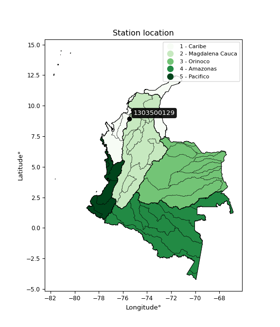</img>

</div>


## A. General information


### 1. General running parameters

• app_version: _v20260103_. • runtime: _2026-01-05 16:20:51.132608_. • Python version: _3.14.0_. • SciPy version: _1.16.3_. • Pandas version: _2.3.3_. • NumPy version: _2.3.5_. • Stations dataset (station_dataset_file): _dataset/pmax24h_in/automatic_colombia_2003_2024.csv_. • Stations catalog (station_catalog_file): _dataset/CNE.xls_. • Minimum year to eval til year_max (date_min): _1900_. • Maximum year to eval since year_min (date_max): _2024_. • Creates, save and include plots into reports (create_plot): _True_. • Plot only fit distributions with Δo > Δ (plot_only_fit): _True_. • Plot only simple graphs avoiding multiple CDFs and multiple Extreme values plots (plot_only_simple): _True_. • Eval low extreme values, if False, evaluates high extreme values (low_extreme): _False_. • Eval every SciPy distribution as logarithmic (pdist_logarithmic_on): _True_. • Standard deviation normalized (ddof): _1.0_. • Return periods to eval in years (Tr): _[2, 2.33, 5, 10, 15, 20, 25, 50, 75, 100, 200, 250, 500, 750, 1000]_. • Minimum data sample per station, 0 means any (minimum_sample): _5_. • Z-Score maximum threshold to adjust a value, 0 means disable (zscore_max): _3.5_. • Z-Score minimum threshold to adjust a value, 0 means disable (zscore_min): _-2.5_. • Avoid zeros, e.g. rain = 0 (avoid_zeros): _True_. • Avoid null values (avoid_nans): _True_. 

[:file_folder:Dataset file](../../dataset/pmax24h_in/automatic_colombia_2003_2024.csv)

> Delta Degrees of Freedom (DDOF): is a parameter used in the formulas for calculating variance and standard deviation. When ddof=0, the divisor is $N$ (the total number of observations) and this is used when your data set is the entire population. When ddof=1, the divisor is $N-1$ and this is used when your data set is a sample drawn from a larger population. Using $N-1$ provides an unbiased estimate of the population variance (known as Bessel´s correction).


### 2. Station info and location

|   id |     CODIGO | NOMBRE                       | CATEGORIA               | TECNOLOGIA                | ESTADO     | FECHA_INSTALACION   | FECHA_SUSPENSION   |   ALTITUD |   LATITUD |   LONGITUD | DEPARTAMENTO   | MUNICIPIO   | AREA_OPERATIVA                              | ENTIDAD                                                     | AREA_HIDROGRAFICA   | ZONA_HIDROGRAFICA   | SUBZONA_HIDROGRAFICA   |   CORRIENTE | Catalogo   |   Version |
|-----:|-----------:|:-----------------------------|:------------------------|:--------------------------|:-----------|:--------------------|:-------------------|----------:|----------:|-----------:|:---------------|:------------|:--------------------------------------------|:------------------------------------------------------------|:--------------------|:--------------------|:-----------------------|------------:|:-----------|----------:|
|    0 | 1303500129 | SAHAGUN - AUT   [1303500129] | Climatológica Principal | Automática con Telemetría | Suspendida | 29/12/2016          | 07/07/2025         |        70 |      8.94 |     -75.45 | Cordoba        | Sahagún     | Area Operativa 02 - Atlántico-Bolivar-Sucre | INSTITUTO DE HIDROLOGIA METEOROLOGIA Y ESTUDIOS AMBIENTALES | Caribe              | Sinú                | Bajo Sinú              |         nan | CNE_IDEAM  |  20251226 |

<div align="center">

Dynamic map: [:earth_americas:Google](http://maps.google.com/maps?q=8.94,-75.45) [:earth_americas:OSM](https://www.openstreetmap.org/#map=18/8.94/-75.45&layers=P) [:earth_americas:Bing](https://www.bing.com/maps?cp=8.94~-75.45&lvl=18) [:earth_americas:Apple](https://maps.apple.com/frame?center=8.94%2C-75.45&span=0.003%2C0.006)

</div>


<div align="center">

```geojson
{
  "type": "Feature",
  "geometry": {
    "type": "Point", 
    "coordinates": [-75.45, 8.94]
  }, 
  "properties": {
    "Name": "1303500129"
  }
}
```

</div>


### 3. Discrete values table and plot

<div align="center">

|               |           0 |          1 |           2 |           3 |           4 |
|:--------------|------------:|-----------:|------------:|------------:|------------:|
| Date          | 2019        | 2020       | 2021        | 2022        | 2024        |
| Value         |  114        |   20.2     |   69.2      |   56.4      |  112.4      |
| Value_initial |  114        |   20.2     |   69.2      |   56.4      |  112.4      |
| count         |    5        |    5       |    5        |    5        |    5        |
| mean          |   74.44     |   74.44    |   74.44     |   74.44     |   74.44     |
| std           |   39.6889   |   39.6889  |   39.6889   |   39.6889   |   39.6889   |
| zscore        |    0.996752 |   -1.36663 |   -0.132027 |   -0.454535 |    0.956439 |


</div>


<div align="center">

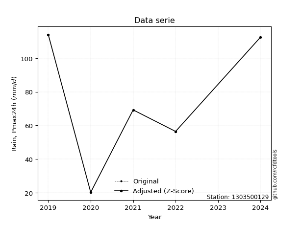</img>

</div>


> The initial value (value_initial) correspond to the initial obtained or null completed value, and value (value) is adjusted only when the initial value is outside the valid range (outlier) definite through the Z-Score value. If Z-Score is active, values out of range or outliers are replaced with the station mean value. A Z-Score (or standard score) measures how many standard deviations a data point is from the mean of a dataset, indicating its relative position; positive scores mean above the mean, negative mean below, and a score of zero is exactly at the mean, allowing for comparison of values from different distributions. It´s calculated using the formula $z=(x–μ)/σ$, where $x$ is the data point, $μ$ is the mean, and $σ$ is the standard deviation, helping identify outliers and understand probability.
>
> <sub>**Note**: In this study, "completing" (filling gaps in) and "extending" (forecasting or lengthening the historical record) rainfall data series are avoided for certain critical analyses because they introduce artificial bias and uncertainty, which can distort the statistics of rare events (extremes), alter day-to-day variability, and compromise the integrity and homogeneity of the original data. Some reasons against Completing/Extending rainfall data are: **Distortion of Extremes and Variability**: The primary issue is that most gap-filling or extension methods rely on averaging or regression with nearby stations, which inherently smooths the data. Rainfall is highly variable in space and time, with a large percentage of zero values and occasional large storms. Infilling methods often underestimate the highest values and overestimate the lowest (zero) values, which severely distorts analyses focused on flood frequency, drought severity, and intensity-duration-frequency (IDF) curves, **Loss of Data Homogeneity**: Infilled or extended data are synthetic estimates, not actual measurements. Combining these estimates with observed data can violate the assumption of data homogeneity, which requires that the data properties do not change over time. Inhomogeneity can lead to incorrect conclusions about long-term trends or changes in climate patterns, **Propagation of Errors**: Errors and biases from the original data (e.g., wind-induced undercatch, instrument errors, site changes) or the data used for imputation can propagate through the analysis, leading to unreliable hydrological models and inaccurate predictions, **Compromised Statistical Integrity**: For statistical analyses, especially those involving the frequency of events, using artificial data can introduce time bias or autocorrelation that doesn´t exist in reality, making it difficult to assess the true probability of events, **Difficulty in Validation**: It is difficult to accurately validate the quality of filled or extended data, especially for past periods where ground-truth measurements are unavailable. The reliability of imputation techniques heavily depends on the density of the surrounding station network and the complexity of the local topography.</sub>


### 4. Active continuous probability distributions from SciPy (44 of 104 available)

A Probability Density Function (PDF) describes the relative likelihood of a continuous random variable falling within a specific range, where the total area under its curve equals 1, and the area over any interval gives the actual probability for that range. Unlike discrete probabilities (like rolling a die), a PDF shows density, not direct probability for a single point (which is zero), with higher points indicating higher likelihood, often visualized as a bell curve for normal distributions.

A log of a probability density function (log-PDF) is simply the logarithm of the PDF´s value, denoted as $log(f(x))$, useful for converting multiplication of probabilities into addition, improving numerical stability with tiny numbers, and connecting to information theory concepts like entropy. Instead of dealing with very small probabilities (e.g., 0.000001), log-PDFs use negative numbers (e.g., $log(0.00001) ≈ -11.51$ that are easier for computers to handle, preventing underflow errors and simplifying complex calculations. In this study, each active probability distribution from SciPy is also evaluated in the $log$ form.

[scipy.stats](https://docs.scipy.org/doc/scipy/reference/stats.html) is a Python´s powerful submodule within the SciPy library for comprehensive statistical analysis, offering over 130 probability distributions (like Normal, Poisson), functions for descriptive stats (mean, variance), hypothesis testing (t-tests, chi-square), random variable generation, and statistical tests, making it essential for data science, modeling, and research. It provides tools to explore, model, and draw conclusions from data efficiently, working seamlessly with NumPy.

<div align="center">

|   id | p_dist             |   n_parameter | fit_method   | label                                                                       | active   | ref                                                                                                        |
|-----:|:-------------------|--------------:|:-------------|:----------------------------------------------------------------------------|:---------|:-----------------------------------------------------------------------------------------------------------|
|    0 | alpha              |             3 | MLE          | Alpha                                                                       | True     | [:mortar_board:](https://docs.scipy.org/doc/scipy/reference/generated/scipy.stats.alpha.html)              |
|    1 | betaprime          |             4 | MLE          | Beta prime                                                                  | True     | [:mortar_board:](https://docs.scipy.org/doc/scipy/reference/generated/scipy.stats.betaprime.html)          |
|    2 | chi2               |             3 | MLE          | Chi²                                                                        | True     | [:mortar_board:](https://docs.scipy.org/doc/scipy/reference/generated/scipy.stats.chi2.html)               |
|    3 | crystalball        |             4 | MLE          | Crystalball                                                                 | True     | [:mortar_board:](https://docs.scipy.org/doc/scipy/reference/generated/scipy.stats.crystalball.html)        |
|    4 | erlang             |             3 | MLE          | Erlang                                                                      | True     | [:mortar_board:](https://docs.scipy.org/doc/scipy/reference/generated/scipy.stats.erlang.html)             |
|    5 | expon              |             2 | MLE          | Exponential                                                                 | True     | [:mortar_board:](https://docs.scipy.org/doc/scipy/reference/generated/scipy.stats.expon.html)              |
|    6 | exponnorm          |             3 | MLE          | Exponentially modified Normal                                               | True     | [:mortar_board:](https://docs.scipy.org/doc/scipy/reference/generated/scipy.stats.exponnorm.html)          |
|    7 | f                  |             4 | MLE          | F                                                                           | True     | [:mortar_board:](https://docs.scipy.org/doc/scipy/reference/generated/scipy.stats.f.html)                  |
|    8 | fatiguelife        |             3 | MLE          | Fatigue-life (Birnbaum-Saunders)                                            | True     | [:mortar_board:](https://docs.scipy.org/doc/scipy/reference/generated/scipy.stats.fatiguelife.html)        |
|    9 | fisk               |             3 | MLE          | Fisk                                                                        | True     | [:mortar_board:](https://docs.scipy.org/doc/scipy/reference/generated/scipy.stats.fisk.html)               |
|   10 | gamma              |             3 | MLE          | Gamma                                                                       | True     | [:mortar_board:](https://docs.scipy.org/doc/scipy/reference/generated/scipy.stats.gamma.html)              |
|   11 | genexpon           |             5 | MLE          | Generalized exponential                                                     | True     | [:mortar_board:](https://docs.scipy.org/doc/scipy/reference/generated/scipy.stats.genexpon.html)           |
|   12 | genlogistic        |             3 | MLE          | Generalized logistic                                                        | True     | [:mortar_board:](https://docs.scipy.org/doc/scipy/reference/generated/scipy.stats.genlogistic.html)        |
|   13 | gibrat             |             2 | MM           | Gibrat                                                                      | True     | [:mortar_board:](https://docs.scipy.org/doc/scipy/reference/generated/scipy.stats.gibrat.html)             |
|   14 | gompertz           |             3 | MLE          | Gompertz (or truncated Gumbel)                                              | True     | [:mortar_board:](https://docs.scipy.org/doc/scipy/reference/generated/scipy.stats.gompertz.html)           |
|   15 | gumbel_l           |             2 | MM           | Gumbel Left Skew                                                            | True     | [:mortar_board:](https://docs.scipy.org/doc/scipy/reference/generated/scipy.stats.gumbel_l.html)           |
|   16 | gumbel_r           |             2 | MM           | Gumbel Right Skew                                                           | True     | [:mortar_board:](https://docs.scipy.org/doc/scipy/reference/generated/scipy.stats.gumbel_r.html)           |
|   17 | halflogistic       |             2 | MM           | Half-logistic                                                               | True     | [:mortar_board:](https://docs.scipy.org/doc/scipy/reference/generated/scipy.stats.halflogistic.html)       |
|   18 | halfnorm           |             2 | MM           | Half Normal                                                                 | True     | [:mortar_board:](https://docs.scipy.org/doc/scipy/reference/generated/scipy.stats.halfnorm.html)           |
|   19 | hypsecant          |             2 | MM           | hyperbolic secant                                                           | True     | [:mortar_board:](https://docs.scipy.org/doc/scipy/reference/generated/scipy.stats.hypsecant.html)          |
|   20 | invgamma           |             3 | MLE          | Inverted gamma                                                              | True     | [:mortar_board:](https://docs.scipy.org/doc/scipy/reference/generated/scipy.stats.invgamma.html)           |
|   21 | invgauss           |             3 | MLE          | Inverse Gaussian                                                            | True     | [:mortar_board:](https://docs.scipy.org/doc/scipy/reference/generated/scipy.stats.invgauss.html)           |
|   22 | invweibull         |             3 | MLE          | Inverted Weibull                                                            | True     | [:mortar_board:](https://docs.scipy.org/doc/scipy/reference/generated/scipy.stats.invweibull.html)         |
|   23 | johnsonsu          |             4 | MLE          | Johnson Su                                                                  | True     | [:mortar_board:](https://docs.scipy.org/doc/scipy/reference/generated/scipy.stats.johnsonsu.html)          |
|   24 | kstwobign          |             2 | MLE          | Limiting distribution of scaled Kolmogorov-Smirnov two-sided test statistic | True     | [:mortar_board:](https://docs.scipy.org/doc/scipy/reference/generated/scipy.stats.kstwobign.html)          |
|   25 | laplace            |             2 | MM           | Laplace                                                                     | True     | [:mortar_board:](https://docs.scipy.org/doc/scipy/reference/generated/scipy.stats.laplace.html)            |
|   26 | laplace_asymmetric |             3 | MLE          | Asymmetric Laplace                                                          | True     | [:mortar_board:](https://docs.scipy.org/doc/scipy/reference/generated/scipy.stats.laplace_asymmetric.html) |
|   27 | loggamma           |             3 | MLE          | Log gamma                                                                   | True     | [:mortar_board:](https://docs.scipy.org/doc/scipy/reference/generated/scipy.stats.loggamma.html)           |
|   28 | logistic           |             2 | MM           | Logistic (or Sech-squared)                                                  | True     | [:mortar_board:](https://docs.scipy.org/doc/scipy/reference/generated/scipy.stats.logistic.html)           |
|   29 | lognorm            |             3 | MLE          | Log Normal                                                                  | True     | [:mortar_board:](https://docs.scipy.org/doc/scipy/reference/generated/scipy.stats.lognorm.html)            |
|   30 | maxwell            |             2 | MM           | Maxwell                                                                     | True     | [:mortar_board:](https://docs.scipy.org/doc/scipy/reference/generated/scipy.stats.maxwell.html)            |
|   31 | mielke             |             4 | MLE          | Mielke Beta-Kappa / Dagum                                                   | True     | [:mortar_board:](https://docs.scipy.org/doc/scipy/reference/generated/scipy.stats.mielke.html)             |
|   32 | moyal              |             2 | MM           | Moyal                                                                       | True     | [:mortar_board:](https://docs.scipy.org/doc/scipy/reference/generated/scipy.stats.moyal.html)              |
|   33 | nakagami           |             3 | MLE          | Nakagami                                                                    | True     | [:mortar_board:](https://docs.scipy.org/doc/scipy/reference/generated/scipy.stats.nakagami.html)           |
|   34 | ncf                |             5 | MLE          | Non-central F distribution                                                  | True     | [:mortar_board:](https://docs.scipy.org/doc/scipy/reference/generated/scipy.stats.ncf.html)                |
|   35 | nct                |             4 | MLE          | Non-central Student’s t                                                     | True     | [:mortar_board:](https://docs.scipy.org/doc/scipy/reference/generated/scipy.stats.nct.html)                |
|   36 | norm               |             2 | MM           | Normal                                                                      | True     | [:mortar_board:](https://docs.scipy.org/doc/scipy/reference/generated/scipy.stats.norm.html)               |
|   37 | pearson3           |             3 | MM           | Pearson type III                                                            | True     | [:mortar_board:](https://docs.scipy.org/doc/scipy/reference/generated/scipy.stats.pearson3.html)           |
|   38 | rayleigh           |             2 | MM           | Rayleigh                                                                    | True     | [:mortar_board:](https://docs.scipy.org/doc/scipy/reference/generated/scipy.stats.rayleigh.html)           |
|   39 | rice               |             3 | MLE          | Rice                                                                        | True     | [:mortar_board:](https://docs.scipy.org/doc/scipy/reference/generated/scipy.stats.rice.html)               |
|   40 | t                  |             3 | MLE          | Student’s t                                                                 | True     | [:mortar_board:](https://docs.scipy.org/doc/scipy/reference/generated/scipy.stats.t.html)                  |
|   41 | truncnorm          |             4 | MLE          | Truncated normal                                                            | True     | [:mortar_board:](https://docs.scipy.org/doc/scipy/reference/generated/scipy.stats.truncnorm.html)          |
|   42 | wald               |             2 | MM           | Wald                                                                        | True     | [:mortar_board:](https://docs.scipy.org/doc/scipy/reference/generated/scipy.stats.wald.html)               |
|   43 | weibull_min        |             3 | MLE          | Weibull minimum                                                             | True     | [:mortar_board:](https://docs.scipy.org/doc/scipy/reference/generated/scipy.stats.weibull_min.html)        |

</div>

> **n_parameter:** # arguments & localization & scale.
>
> **Fit methods:** (MLE) maximum likelihood, (MM) L-moments.
>
>**Inactive** (With the only purpose of prevent loops, zero divisions, infinite values, over high estimated values or horizontal trending for recurrence intervals estimations, the follow distributions were disabled.)**:** foldnorm, gennorm, norminvgauss, powernorm, powerlognorm, skewnorm, genextreme, anglit, arcsine, argus, beta, bradford, burr, burr12, cauchy, cosine, halfcauchy, foldcauchy, skewcauchy, wrapcauchy, dgamma, gengamma, exponweib, exponpow, truncexpon, gausshyper, genhalflogistic, genhyperbolic, geninvgauss, halfgennorm, johnsonsb, kappa4, kappa3, ksone, kstwo, loglaplace, levy, levy_l, levy_stable, ncx2, pareto, genpareto, truncpareto, lomax, powerlaw, rdist, rel_breitwigner, recipinvgauss, semicircular, studentized_range, trapezoid, triang, truncweibull_min, tukeylambda, uniform, loguniform, vonmises, vonmises_line, weibull_max, dweibull, 


## B. Probability (PDF) vs. Empirical (EDF) distributions functions

A continuous probability distribution (CPD) describes probabilities for variables that can take any value within a range (like rain any time), unlike discrete variables with specific outcomes (like temperature). It uses a Probability Density Function (PDF), a curve where the total area under it equals 1, and the probability of the variable falling within an interval (a to b) is found by calculating the area under the curve between those points. A key feature is that the probability of hitting any single exact value is zero, so probabilities are always expressed for ranges, e.g., $P(a ≤ X ≤ b)$.

<div align="center">

Distributions parameters from station values
|    |    station | p_dist                |   n |               loc |            scale | shape                  | shape1                 | shape2                | shape3   |
|---:|-----------:|:----------------------|----:|------------------:|-----------------:|:-----------------------|:-----------------------|:----------------------|:---------|
|  0 | 1303500129 | alpha                 |   5 |      -0.125402    |     40.1808      | 2.489780015366012e-10  |                        |                       |          |
|  1 | 1303500129 | betaprime             |   5 |    -620.691       |  90836.9         | 378.72220851461213     | 49524.38170916568      |                       |          |
|  2 | 1303500129 | chi2                  |   5 |    -217.071       |      2.26775     | 128.58939198241424     |                        |                       |          |
|  3 | 1303500129 | crystalball           |   5 |      74.44        |     35.4988      | 6366.9292054316        | 783.913382162932       |                       |          |
|  4 | 1303500129 | erlang                |   5 |    -582.774       |      1.96112     | 335.01940324753366     |                        |                       |          |
|  5 | 1303500129 | expon                 |   5 |      20.2         |     54.24        |                        |                        |                       |          |
|  6 | 1303500129 | exponnorm             |   5 |      74.4152      |     35.4987      | 0.0007030868143036778  |                        |                       |          |
|  7 | 1303500129 | f                     |   5 |    -546.589       |    621.017       | 583.8919029456364      | 3570748.9050023556     |                       |          |
|  8 | 1303500129 | fatiguelife           |   5 |      20.2         |      3.79986e-05 | 1214.6154760564673     |                        |                       |          |
|  9 | 1303500129 | fisk                  |   5 |      -1.06272e+09 |      1.06272e+09 | 48847686.60962503      |                        |                       |          |
| 10 | 1303500129 | gamma                 |   5 |    -563.195       |      2.00853     | 317.385510762163       |                        |                       |          |
| 11 | 1303500129 | genexpon              |   5 |      20.2         |      1.79766     | 0.03312055353152925    | 3.1557990381859195e-08 | 1.089692219836183     |          |
| 12 | 1303500129 | genlogistic           |   5 |      74.2415      |     21.9853      | 1.0313994135445363     |                        |                       |          |
| 13 | 1303500129 | gibrat                |   5 |      47.3589      |     16.4255      |                        |                        |                       |          |
| 14 | 1303500129 | gompertz              |   5 |      12.0312      |      4.08635     | 4.3624400355335886e-11 |                        |                       |          |
| 15 | 1303500129 | gumbel_l              |   5 |      90.4164      |     27.6783      |                        |                        |                       |          |
| 16 | 1303500129 | gumbel_r              |   5 |      58.4636      |     27.6783      |                        |                        |                       |          |
| 17 | 1303500129 | halflogistic          |   5 |      32.3656      |     30.3503      |                        |                        |                       |          |
| 18 | 1303500129 | halfnorm              |   5 |      27.4535      |     58.8888      |                        |                        |                       |          |
| 19 | 1303500129 | hypsecant             |   5 |      74.44        |     22.5993      |                        |                        |                       |          |
| 20 | 1303500129 | invgamma              |   5 |    -335.071       |  50543.9         | 124.37851478956605     |                        |                       |          |
| 21 | 1303500129 | invgauss              |   5 |     -91.1039      |   3063.91        | 0.05400574187078491    |                        |                       |          |
| 22 | 1303500129 | invweibull            |   5 |      20.2         |      1.37105     | 0.04371482096649917    |                        |                       |          |
| 23 | 1303500129 | johnsonsu             |   5 |     114           |      1.72393e-12 | 2.6871927119193577     | 0.143131914844164      |                       |          |
| 24 | 1303500129 | kstwobign             |   5 |     -59.5667      |    152.86        |                        |                        |                       |          |
| 25 | 1303500129 | laplace               |   5 |      74.44        |     25.1015      |                        |                        |                       |          |
| 26 | 1303500129 | laplace_asymmetric    |   5 |      69.2         |     29.6135      | 0.9154337105551082     |                        |                       |          |
| 27 | 1303500129 | loggamma              |   5 |     114           |      8.29586e-06 | 2.098188426339557e-07  |                        |                       |          |
| 28 | 1303500129 | logistic              |   5 |      74.44        |     19.5715      |                        |                        |                       |          |
| 29 | 1303500129 | lognorm               |   5 |      20.2         |      0.0352598   | 14.96752631538414      |                        |                       |          |
| 30 | 1303500129 | maxwell               |   5 |      -9.6773      |     52.7127      |                        |                        |                       |          |
| 31 | 1303500129 | mielke                |   5 |      20.2         |     98.6457      | 0.3725719921166194     | 1712.6627664935645     |                       |          |
| 32 | 1303500129 | moyal                 |   5 |      54.1395      |     15.9801      |                        |                        |                       |          |
| 33 | 1303500129 | nakagami              |   5 |      56.4         |     26.9013      | 0.308381789584402      |                        |                       |          |
| 34 | 1303500129 | ncf                   |   5 |      -0.0127058   |      4.83518e-06 | 8.071344838534417e-07  | 4.135379524125364      | 10.220325252802379    |          |
| 35 | 1303500129 | nct                   |   5 |   -1522.34        |     35.3745      | 128143.05850552599     | 45.139166242082425     |                       |          |
| 36 | 1303500129 | norm                  |   5 |      74.44        |     35.4988      |                        |                        |                       |          |
| 37 | 1303500129 | pearson3              |   5 |      74.44        |     35.4987      | -0.2189572142391552    |                        |                       |          |
| 38 | 1303500129 | rayleigh              |   5 |       6.52868     |     54.1854      |                        |                        |                       |          |
| 39 | 1303500129 | rice                  |   5 |      -0.00419988  |     41.1247      | 1.4219545626955092     |                        |                       |          |
| 40 | 1303500129 | t                     |   5 |      74.4413      |     35.4996      | 136626882.3838166      |                        |                       |          |
| 41 | 1303500129 | truncnorm             |   5 |      74.44        |     35.4988      | -537.0466993668281     | 1676.9268161367793     |                       |          |
| 42 | 1303500129 | wald                  |   5 |      38.9412      |     35.4988      |                        |                        |                       |          |
| 43 | 1303500129 | weibull_min           |   5 |     -72.4917      |    160.805       | 4.919340248171155      |                        |                       |          |
| 44 | 1303500129 | logalpha              |   5 |     -14.2165      |    497.89        | 27.15235064726081      |                        |                       |          |
| 45 | 1303500129 | logbetaprime          |   5 |      -7.41914     |     76.3906      | 345.61895854270983     | 2282.4194555093345     |                       |          |
| 46 | 1303500129 | logchi2               |   5 |       3.00568     |      0.939785    | 1.0473521516647093     |                        |                       |          |
| 47 | 1303500129 | logcrystalball        |   5 |       4.14668     |      0.63272     | 86.03533827670961      | 369.3336957872364      |                       |          |
| 48 | 1303500129 | logerlang             |   5 |      -7.22744     |      0.0375337   | 302.82706335188004     |                        |                       |          |
| 49 | 1303500129 | logexpon              |   5 |       3.00568     |      1.141       |                        |                        |                       |          |
| 50 | 1303500129 | logexponnorm          |   5 |       4.14621     |      0.632718    | 0.0007447724284212629  |                        |                       |          |
| 51 | 1303500129 | logf                  |   5 |     -41.4983      |     45.637       | 16169.914003568738     | 26564.631265034008     |                       |          |
| 52 | 1303500129 | logfatiguelife        |   5 |    -367.116       |    371.263       | 0.0017000105498354533  |                        |                       |          |
| 53 | 1303500129 | logfisk               |   5 |      -4.33364e+07 |      4.33364e+07 | 120539595.38348702     |                        |                       |          |
| 54 | 1303500129 | loggamma              |   5 |      -7.80818     |      0.0364745   | 327.75378979627703     |                        |                       |          |
| 55 | 1303500129 | loggenexpon           |   5 |       3.00568     |      0.44134     | 0.1744867980050886     | 5.513942244085145      | 0.023157610871021594  |          |
| 56 | 1303500129 | loggenlogistic        |   5 |       4.73628     |      2.11409e-06 | 3.5745170113285906e-06 |                        |                       |          |
| 57 | 1303500129 | loggibrat             |   5 |       3.66396     |      0.292785    |                        |                        |                       |          |
| 58 | 1303500129 | loggompertz           |   5 |       3.00568     |      0.53844     | 0.0813831074651537     |                        |                       |          |
| 59 | 1303500129 | loggumbel_l           |   5 |       4.43144     |      0.49333     |                        |                        |                       |          |
| 60 | 1303500129 | loggumbel_r           |   5 |       3.86193     |      0.49333     |                        |                        |                       |          |
| 61 | 1303500129 | loghalflogistic       |   5 |       3.39676     |      0.540955    |                        |                        |                       |          |
| 62 | 1303500129 | loghalfnorm           |   5 |       3.30918     |      1.04965     |                        |                        |                       |          |
| 63 | 1303500129 | loghypsecant          |   5 |       4.14668     |      0.402802    |                        |                        |                       |          |
| 64 | 1303500129 | loginvgamma           |   5 |     -10.1353      |   6972.82        | 489.4108770441119      |                        |                       |          |
| 65 | 1303500129 | loginvgauss           |   5 |      -2.35115     |    600.534       | 0.010790926906755509   |                        |                       |          |
| 66 | 1303500129 | loginvweibull         |   5 |      -3.09125e+07 |      3.09125e+07 | 45208867.47308007      |                        |                       |          |
| 67 | 1303500129 | logjohnsonsu          |   5 |       4.7362      |      1.88418e-13 | 6.327583956477831      | 0.2527855261913442     |                       |          |
| 68 | 1303500129 | logkstwobign          |   5 |       1.41939     |      3.10922     |                        |                        |                       |          |
| 69 | 1303500129 | loglaplace            |   5 |       4.14668     |      0.447401    |                        |                        |                       |          |
| 70 | 1303500129 | loglaplace_asymmetric |   5 |       4.237       |      0.477667    | 1.0990366402604224     |                        |                       |          |
| 71 | 1303500129 | logloggamma           |   5 |       4.73626     |      7.32379e-06 | 1.2407276306276177e-05 |                        |                       |          |
| 72 | 1303500129 | loglogistic           |   5 |       4.14668     |      0.348837    |                        |                        |                       |          |
| 73 | 1303500129 | loglognorm            |   5 |       3.00568     |      0.0011077   | 14.273911801314103     |                        |                       |          |
| 74 | 1303500129 | logmaxwell            |   5 |       2.6474      |      0.939536    |                        |                        |                       |          |
| 75 | 1303500129 | logmielke             |   5 | -179840           | 179845           | 299271.7568507083      | 59745158.027531445     |                       |          |
| 76 | 1303500129 | logmoyal              |   5 |       3.78485     |      0.284824    |                        |                        |                       |          |
| 77 | 1303500129 | lognakagami           |   5 |       4.03247     |      0.391437    | 0.05040545108201756    |                        |                       |          |
| 78 | 1303500129 | logncf                |   5 |     -18.4025      |     22.5479      | 2644.580350923905      | 33322.71699770943      | 0.0007314677461141249 |          |
| 79 | 1303500129 | lognct                |   5 |     -30.6836      |      0.517391    | 4231.896857040387      | 67.30563445237144      |                       |          |
| 80 | 1303500129 | lognorm               |   5 |       4.14668     |      0.63272     |                        |                        |                       |          |
| 81 | 1303500129 | logpearson3           |   5 |       4.14668     |      0.632722    | -0.8613374067253201    |                        |                       |          |
| 82 | 1303500129 | lograyleigh           |   5 |       2.93625     |      0.965784    |                        |                        |                       |          |
| 83 | 1303500129 | logrice               |   5 |       2.56092     |      0.689764    | 2.0314526538868356     |                        |                       |          |
| 84 | 1303500129 | logt                  |   5 |       4.14668     |      0.63272     | 6078614765.998596      |                        |                       |          |
| 85 | 1303500129 | logtruncnorm          |   5 |      -0.244767    |      1.63389     | 2.6178270041338845     | 3.0485365025307        |                       |          |
| 86 | 1303500129 | logwald               |   5 |       3.51399     |      0.632693    |                        |                        |                       |          |
| 87 | 1303500129 | logweibull_min        |   5 |      -3.09942e+07 |      3.09942e+07 | 69258999.11726147      |                        |                       |          |

</div>

> **loc** (Location parameter): This shifts the distribution along the x-axis. For many common distributions, like the normal (Gaussian) distribution, loc represents the mean $μ$. For others, like the uniform distribution, it might represent the minimum value, or for the beta distribution, the left end of the support interval.
>
> **scale** (Scale parameter): This determines the width or spread of the distribution. For the normal distribution, scale represents the standard deviation $σ$. For a uniform distribution, it defines the length of the interval (from $loc$ to $loc + scale$).
>
> **shape** (Shape parameters): Refers to parameters that define the specific form of a probability distribution, distinct from its location (loc) and scale (scale). These parameters are required arguments for most distribution functions. For example, a normal (Gaussian) distribution is fully defined by its location (mean) and scale (standard deviation), so it has no specific shape parameters beyond loc and scale. However, other distributions have intrinsic properties that need specification, as Gamma distribution that takes a shape parameter, often named $a$ or $alpha$.


### 0. Cumulative distribution values - CDF (88 evaluated)

Cumulative Distribution Function (CDF), denoted as $F$<sub>$X$</sub>$(x)$, is a function that gives the probability that a random variable $X$ will take a value less than or equal to a specific value, $x$ (i.e., $(P(X≥x)$. It essentially "accumulates" probabilities from a given point up to the far right (positive infinity), providing a complete picture of the distribution´s probabilities for both discrete (like rain) and continuous (like temperature) variables, helping to find probabilities over ranges or above certain values. Each station is evaluated separately ordering the $x$ values ascending, calculating the CDF and PDF values for the activated distributions and their logarithmic forms.

<div align="center">

CDF ordered by x ascending and calculating $log(f(x))$ separately
|   id |    Station |   date |     x |   count |   mean |     std |    zscore |   Value_initial |    station |   m |     alpha |   alpha_pdf |   betaprime |   betaprime_pdf |      chi2 |   chi2_pdf |   crystalball |   crystalball_pdf |    erlang |   erlang_pdf |    expon |   expon_pdf |   exponnorm |   exponnorm_pdf |        f |      f_pdf |   fatiguelife |   fatiguelife_pdf |      fisk |   fisk_pdf |     gamma |   gamma_pdf |    genexpon |   genexpon_pdf |   genlogistic |   genlogistic_pdf |   gibrat |   gibrat_pdf |    gompertz |   gompertz_pdf |   gumbel_l |   gumbel_l_pdf |   gumbel_r |   gumbel_r_pdf |   halflogistic |   halflogistic_pdf |   halfnorm |   halfnorm_pdf |   hypsecant |   hypsecant_pdf |   invgamma |   invgamma_pdf |   invgauss |   invgauss_pdf |   invweibull |   invweibull_pdf |   johnsonsu |   johnsonsu_pdf |   kstwobign |   kstwobign_pdf |   laplace |   laplace_pdf |   laplace_asymmetric |   laplace_asymmetric_pdf |   loggamma |   loggamma_pdf |   logistic |   logistic_pdf |   lognorm |   lognorm_pdf |   maxwell |   maxwell_pdf |      mielke |      mielke_pdf |      moyal |   moyal_pdf |    nakagami |   nakagami_pdf |      ncf |    ncf_pdf |       nct |    nct_pdf |     norm |   norm_pdf |   pearson3 |   pearson3_pdf |   rayleigh |   rayleigh_pdf |      rice |   rice_pdf |         t |      t_pdf |   truncnorm |   truncnorm_pdf |     wald |   wald_pdf |   weibull_min |   weibull_min_pdf |   logalpha |   logalpha_pdf |   logbetaprime |   logbetaprime_pdf |     logchi2 |   logchi2_pdf |   logcrystalball |   logcrystalball_pdf |   logerlang |   logerlang_pdf |   logexpon |   logexpon_pdf |   logexponnorm |   logexponnorm_pdf |      logf |   logf_pdf |   logfatiguelife |   logfatiguelife_pdf |   logfisk |   logfisk_pdf |   loggenexpon |   loggenexpon_pdf |   loggenlogistic |   loggenlogistic_pdf |   loggibrat |   loggibrat_pdf |   loggompertz |   loggompertz_pdf |   loggumbel_l |   loggumbel_l_pdf |   loggumbel_r |   loggumbel_r_pdf |   loghalflogistic |   loghalflogistic_pdf |   loghalfnorm |   loghalfnorm_pdf |   loghypsecant |   loghypsecant_pdf |   loginvgamma |   loginvgamma_pdf |   loginvgauss |   loginvgauss_pdf |   loginvweibull |   loginvweibull_pdf |   logjohnsonsu |   logjohnsonsu_pdf |   logkstwobign |   logkstwobign_pdf |   loglaplace |   loglaplace_pdf |   loglaplace_asymmetric |   loglaplace_asymmetric_pdf |   logloggamma |   logloggamma_pdf |   loglogistic |   loglogistic_pdf |   loglognorm |   loglognorm_pdf |   logmaxwell |   logmaxwell_pdf |   logmielke |   logmielke_pdf |    logmoyal |   logmoyal_pdf |   lognakagami |   lognakagami_pdf |    logncf |   logncf_pdf |    lognct |   lognct_pdf |   logpearson3 |   logpearson3_pdf |   lograyleigh |   lograyleigh_pdf |   logrice |   logrice_pdf |      logt |   logt_pdf |   logtruncnorm |   logtruncnorm_pdf |   logwald |   logwald_pdf |   logweibull_min |   logweibull_min_pdf |
|-----:|-----------:|-------:|------:|--------:|-------:|--------:|----------:|----------------:|-----------:|----:|----------:|------------:|------------:|----------------:|----------:|-----------:|--------------:|------------------:|----------:|-------------:|---------:|------------:|------------:|----------------:|---------:|-----------:|--------------:|------------------:|----------:|-----------:|----------:|------------:|------------:|---------------:|--------------:|------------------:|---------:|-------------:|------------:|---------------:|-----------:|---------------:|-----------:|---------------:|---------------:|-------------------:|-----------:|---------------:|------------:|----------------:|-----------:|---------------:|-----------:|---------------:|-------------:|-----------------:|------------:|----------------:|------------:|----------------:|----------:|--------------:|---------------------:|-------------------------:|-----------:|---------------:|-----------:|---------------:|----------:|--------------:|----------:|--------------:|------------:|----------------:|-----------:|------------:|------------:|---------------:|---------:|-----------:|----------:|-----------:|---------:|-----------:|-----------:|---------------:|-----------:|---------------:|----------:|-----------:|----------:|-----------:|------------:|----------------:|---------:|-----------:|--------------:|------------------:|-----------:|---------------:|---------------:|-------------------:|------------:|--------------:|-----------------:|---------------------:|------------:|----------------:|-----------:|---------------:|---------------:|-------------------:|----------:|-----------:|-----------------:|---------------------:|----------:|--------------:|--------------:|------------------:|-----------------:|---------------------:|------------:|----------------:|--------------:|------------------:|--------------:|------------------:|--------------:|------------------:|------------------:|----------------------:|--------------:|------------------:|---------------:|-------------------:|--------------:|------------------:|--------------:|------------------:|----------------:|--------------------:|---------------:|-------------------:|---------------:|-------------------:|-------------:|-----------------:|------------------------:|----------------------------:|--------------:|------------------:|--------------:|------------------:|-------------:|-----------------:|-------------:|-----------------:|------------:|----------------:|------------:|---------------:|--------------:|------------------:|----------:|-------------:|----------:|-------------:|--------------:|------------------:|--------------:|------------------:|----------:|--------------:|----------:|-----------:|---------------:|-------------------:|----------:|--------------:|-----------------:|---------------------:|
|    0 | 1303500129 |   2020 |  20.2 |       5 |  74.44 | 39.6889 | -1.36663  |            20.2 | 1303500129 |   1 | 0.0480554 |  0.0109966  |   0.0637477 |      0.00367968 | 0.0598231 | 0.00375243 |      0.063264 |        0.0034974  | 0.0629493 |   0.0036487  | 0        |  0.0184366  |   0.0632628 |      0.00349736 | 0.064507 | 0.00368606 |     0.0918791 |       7.51867e+09 | 0.0734909 | 0.00312974 | 0.0620702 |  0.00362714 | 3.56413e-07 |     0.0184242  |      0.072805 |        0.00314621 | 0        |   0          | 2.78407e-10 |    7.88067e-11 |  0.0760649 |     0.0026409  |  0.0185996 |     0.00267763 |       0        |         0          |   0        |     0          |   0.0575906 |      0.00253446 |  0.0590684 |     0.00386417 |  0.0532208 |     0.00430309 |    0.0130162 |      6.95342e+11 |   0.0262546 |     9.2915e-05  |    0.051755 |      0.00523033 | 0.0576147 |    0.00229527 |            0.0748021 |               0.00275929 |  0.0385908 |       0.135537 |  0.0588909 |     0.0028318  | 0.0356686 |      0.124034 | 0.0440177 |    0.00414111 | 1.52293e-05 | 489456          | 0.00382859 |  0.00110265 | 0           |     0          | 0.141493 | 0.00924056 | 0.0633151 | 0.00349985 | 0.063264 | 0.0034974  |  0.0686104 |     0.00336056 |   0.031328 |     0.00451048 | 0.0438889 | 0.00433726 | 0.0632638 | 0.00349731 |   0.0632639 |      0.0034974  | 0        | 0          |     0.0643634 |        0.00330353 |  0.0394219 |       0.142952 |      0.0388029 |           0.136155 | 1.06252e-08 |   6.26471e+06 |        0.0356685 |             0.124033 |    0.037808 |        0.135183 |   0        |       0.876424 |      0.0356688 |           0.124035 | 0.0376034 |   0.130261 |        0.0350706 |             0.123008 | 0.0319928 |     0.0861406 |   7.48248e-09 |          0.395357 |         0        |            0.0906373 |    0        |        0        |   4.02921e-08 |          0.151146 |     0.0540564 |          0.106558 |     0.0034391 |         0.0395444 |          0        |              0        |      0        |          0        |      0.0374259 |           0.0927   |     0.0337921 |          0.129851 |     0.0370226 |          0.146263 |       0.0396198 |            0.187065 |      0.0818235 |          0.0220891 |      0.0429497 |           0.229581 |    0.0390297 |        0.0872364 |               0.0524103 |                   0.0998342 |     0.0533027 |         0.0903004 |     0.0365842 |          0.101038 |    0.0227607 |      8.52074e+12 |    0.0141216 |         0.114834 |   0.0551296 |       0.0917394 | 8.61061e-05 |     0.00246669 |     0         |       0           | 0.0364083 |     0.12857  | 0.0366101 |     0.12774  |     0.0534583 |          0.117655 |    0.00258079 |         0.0742453 | 0.0291378 |      0.142483 | 0.0356686 |   0.124034 |    0           |           0        |  0        |      0        |         0.04058  |            0.0888139 |
|    1 | 1303500129 |   2022 |  56.4 |       5 |  74.44 | 39.6889 | -0.454535 |            56.4 | 1303500129 |   2 | 0.47718   |  0.00779376 |   0.316609  |      0.0101075  | 0.320019  | 0.0102604  |      0.305661 |        0.00987682 | 0.314451  |   0.0100716  | 0.486961 |  0.00945868 |   0.305659  |      0.00987683 | 0.315157 | 0.00996835 |     0.789181  |       0.00320613  | 0.295184  | 0.00956298 | 0.313551  |  0.0100971  | 0.486733    |     0.00945657 |      0.296388 |        0.00962796 | 0.275236 |   0.0369216  | 2.26568e-06 |    5.54459e-07 |  0.253671  |     0.00788947 |  0.340477  |     0.0132534  |       0.376479 |         0.0141393  |   0.376959 |     0.0120072  |   0.269257  |      0.0105435  |  0.326704  |     0.0104023  |  0.350783  |     0.0109063  |    0.42035   |      0.00043993  |   0.0308018 |     0.000172815 |    0.387368 |      0.0109799  | 0.243697  |    0.00970847 |            0.284345  |               0.0104889  |  0.438496  |       0.600735 |  0.284602  |     0.0104031  | 0.428375  |      0.62033  | 0.334098  |    0.0108414  | 0.688325    |      0.00708427 | 0.351484   |  0.0150699  | 1.91411e-10 | 16614.8        | 0.452647 | 0.00695078 | 0.305769  | 0.00987565 | 0.305661 | 0.00987682 |  0.296188  |     0.00939003 |   0.345283 |     0.0111209  | 0.324953  | 0.0104337  | 0.305653  | 0.00987648 |   0.305661  |      0.00987682 | 0.357738 | 0.0250593  |     0.285951  |        0.00917882 |  0.447961  |       0.591357 |      0.43639   |           0.594317 | 0.689469    |   0.242546    |        0.428375  |             0.62033  |    0.442716 |        0.608226 |   0.59339  |       0.356363 |      0.428379  |           0.620333 | 0.434863  |   0.612742 |        0.428029  |             0.621964 | 0.364998  |     0.644677  |   0.525454    |          0.498587 |         0        |            0.514379  |    0.590969 |        1.05431  |   0.372831    |          0.638214 |     0.359446  |          0.578349 |     0.492764  |         0.706913  |          0.528155 |              0.666462 |      0.509225 |          0.599498 |      0.41093   |           0.759502 |     0.444653  |          0.618055 |     0.462914  |          0.599832 |       0.487157  |            0.512377 |      0.121917  |          0.0726619 |      0.520028  |           0.496197 |    0.387349  |        0.865775  |               0.370549  |                   0.705843  |     0.303527  |         0.514207  |     0.41887   |          0.697798 |    0.683899  |      0.024274    |    0.46277   |         0.622617 |   0.304395  |       0.506531  | 0.517328    |     0.735395   |     0.0295159 |       3.35015e+12 | 0.433486  |     0.612828 | 0.432096  |     0.614484 |     0.374755  |          0.567217 |    0.474904   |         0.617128  | 0.440801  |      0.609782 | 0.428375  |   0.62033  |    2.16679e-06 |           2.4232   |  0.585151 |      0.833255 |         0.336947 |            0.608808  |
|    2 | 1303500129 |   2021 |  69.2 |       5 |  74.44 | 39.6889 | -0.132027 |            69.2 | 1303500129 |   3 | 0.562186  |  0.00563933 |   0.453793  |      0.0111096  | 0.457787  | 0.0110388  |      0.441325 |        0.0111164  | 0.451251  |   0.0110868  | 0.594807 |  0.00747037 |   0.441323  |      0.0111164  | 0.450383 | 0.010951   |     0.825086  |       0.00245842  | 0.429966  | 0.0112657  | 0.450755  |  0.0111223  | 0.594563    |     0.00746988 |      0.43174  |        0.0112832  | 0.612162 |   0.0175389  | 5.1948e-05  |    1.27122e-05 |  0.371627  |     0.0105482  |  0.507387  |     0.0124376  |       0.541886 |         0.0116368  |   0.521615 |     0.0105386  |   0.426847  |      0.0137147  |  0.465045  |     0.0109798  |  0.491054  |     0.0107792  |    0.425167  |      0.000324412 |   0.0333889 |     0.00023749  |    0.523036 |      0.0100619  | 0.405798  |    0.0161663  |            0.455936  |               0.0168185  |  0.561644  |       0.593882 |  0.433463  |     0.0125475  | 0.556754  |      0.624128 | 0.475712  |    0.0110633  | 0.770517    |      0.00585863 | 0.532473   |  0.0128252  | 0.483073    |     0.022063   | 0.533468 | 0.00570819 | 0.441399  | 0.0111123  | 0.441325 | 0.0111164  |  0.42729   |     0.01093    |   0.487714 |     0.010935   | 0.463114  | 0.0109599  | 0.441312  | 0.0111161  |   0.441325  |      0.0111164  | 0.60206  | 0.014099   |     0.415272  |        0.0108937  |  0.568116  |       0.574767 |      0.558214  |           0.587665 | 0.734473    |   0.199507    |        0.556754  |             0.624128 |    0.567143 |        0.59862  |   0.660118 |       0.297881 |      0.556758  |           0.62413  | 0.561091  |   0.61122  |        0.556728  |             0.625534 | 0.503791  |     0.695331  |   0.622142    |          0.444751 |         0        |            0.726896  |    0.749057 |        0.555649 |   0.513113    |          0.724404 |     0.490467  |          0.696406 |     0.626548  |         0.59378   |          0.650768 |              0.532854 |      0.623268 |          0.514315 |      0.570782  |           0.770781 |     0.57053   |          0.602665 |     0.583523  |          0.570889 |       0.586701  |            0.45754  |      0.140371  |          0.112912  |      0.615789  |           0.438127 |    0.5914    |        0.913274  |               0.547077  |                   1.0421    |     0.42922   |         0.727144  |     0.564369  |          0.704789 |    0.688412  |      0.0201174   |    0.586689  |         0.581014 |   0.42781   |       0.7119    | 0.651158    |     0.571775   |     0.827262  |       0.402438    | 0.559652  |     0.610547 | 0.558837  |     0.614371 |     0.500362  |          0.654534 |    0.596257   |         0.563038  | 0.565639  |      0.601335 | 0.556755  |   0.624128 |    0.421593    |           1.73248  |  0.719448 |      0.511588 |         0.477419 |            0.757839  |
|    3 | 1303500129 |   2024 | 112.4 |       5 |  74.44 | 39.6889 |  0.956439 |           112.4 | 1303500129 |   4 | 0.72103   |  0.00237558 |   0.857796  |      0.00605488 | 0.850911  | 0.00588601 |      0.85754  |        0.00634446 | 0.855734  |   0.00609425 | 0.81729  |  0.00336856 |   0.85754   |      0.00634449 | 0.851647 | 0.00612035 |     0.900159  |       0.00121913  | 0.846016  | 0.00598797 | 0.856175  |  0.00609428 | 0.817082    |     0.00337013 |      0.84581  |        0.00594668 | 0.915617 |   0.00237942 | 0.868263    |    0.0653452   |  0.890605  |     0.00874576 |  0.867221  |     0.00446361 |       0.866414 |         0.0041075  |   0.850835 |     0.0047871  |   0.882662  |      0.00507531 |  0.847876  |     0.00568058 |  0.844359  |     0.00511029 |    0.435195  |      0.000171666 |   0.0875143 |     0.0142272   |    0.840957 |      0.00467492 | 0.889795  |    0.0043904  |            0.856887  |               0.00442402 |  0.80959   |       0.398788 |  0.874303  |     0.00561516 | 0.818424  |      0.416989 | 0.852958  |    0.00555673 | 0.975138    |      0.00394045 | 0.871656   |  0.00398092 | 0.945629    |     0.00353162 | 0.713104 | 0.00294816 | 0.857413  | 0.00634299 | 0.85754  | 0.00634446 |  0.859325  |     0.00683561 |   0.851743 |     0.005346   | 0.85327   | 0.00591562 | 0.857526  | 0.00634472 |   0.85754   |      0.00634446 | 0.892803 | 0.00286391 |     0.862896  |        0.00724839 |  0.805828  |       0.381738 |      0.804442  |           0.398759 | 0.813285    |   0.131574    |        0.818424  |             0.41699  |    0.815215 |        0.394971 |   0.777822 |       0.194722 |      0.818428  |           0.416986 | 0.816497  |   0.407762 |        0.818728  |             0.416943 | 0.796468  |     0.450898  |   0.80128     |          0.292389 |         0        |            1.65066   |    0.900569 |        0.165171 |   0.849038    |          0.552918 |     0.835093  |          0.602485 |     0.83954   |         0.297643  |          0.841114 |              0.27038  |      0.821714 |          0.307225 |      0.850239  |           0.358231 |     0.81749   |          0.388646 |     0.814867  |          0.364271 |       0.769262  |            0.295122 |      0.429507  |          7.02312   |      0.790834  |           0.284849 |    0.86182   |        0.30885   |               0.851636  |                   0.341362  |     0.976249  |         1.65387   |     0.838813  |          0.387589 |    0.696592  |      0.0142641   |    0.818899  |         0.361638 |   0.95896   |       1.59539   | 0.846986    |     0.265294   |     0.928955  |       0.116981    | 0.814648  |     0.4074   | 0.815886  |     0.410576 |     0.820284  |          0.578305 |    0.819052   |         0.34644   | 0.815872  |      0.400021 | 0.818425  |   0.416989 |    0.989756    |           0.734291 |  0.874996 |      0.192449 |         0.853175 |            0.62945   |
|    4 | 1303500129 |   2019 | 114   |       5 |  74.44 | 39.6889 |  0.996752 |           114   | 1303500129 |   5 | 0.724781  |  0.00231354 |   0.867254  |      0.0057685  | 0.860115  | 0.00562059 |      0.867447 |        0.00603979 | 0.865256  |   0.0058088  | 0.822601 |  0.00327064 |   0.867447  |      0.00603982 | 0.861216 | 0.00584158 |     0.902087  |       0.00119156  | 0.855355  | 0.0056869  | 0.865696  |  0.00580753 | 0.822395    |     0.00327223 |      0.855085 |        0.00564935 | 0.919316 |   0.00224525 | 0.950133    |    0.0365902   |  0.904103  |     0.00812294 |  0.874188  |     0.00424675 |       0.872837 |         0.00392344 |   0.858346 |     0.00460142 |   0.89052   |      0.00474948 |  0.856764  |     0.00543028 |  0.852365  |     0.00489743 |    0.435467  |      0.000168717 |   0.995728  |     9.64611e+08 |    0.848297 |      0.00450154 | 0.8966    |    0.00411928 |            0.863793  |               0.00421053 |  0.815173  |       0.391229 |  0.883016  |     0.00527802 | 0.824258  |      0.408502 | 0.861654  |    0.00531374 | 0.981409    |      0.00389814 | 0.877873   |  0.00379125 | 0.951038    |     0.00323331 | 0.717767 | 0.00288081 | 0.867318  | 0.0060387  | 0.867447 | 0.00603979 |  0.869994  |     0.00650035 |   0.860115 |     0.00512033 | 0.862524  | 0.00565318 | 0.867434  | 0.00604007 |   0.867447  |      0.00603979 | 0.897273 | 0.00272504 |     0.874198  |        0.00687929 |  0.811174  |       0.374704 |      0.810026  |           0.391418 | 0.815135    |   0.13008     |        0.824258  |             0.408502 |    0.820743 |        0.387237 |   0.780558 |       0.192325 |      0.824262  |           0.408498 | 0.822203  |   0.399652 |        0.824561  |             0.408422 | 0.802767  |     0.440399  |   0.805382    |          0.288001 |         0.999869 |            1.69058   |    0.902868 |        0.160224 |   0.856753    |          0.538618 |     0.84351   |          0.588353 |     0.843698  |         0.290669  |          0.844894 |              0.26449  |      0.826017 |          0.301679 |      0.855224  |           0.347157 |     0.822929  |          0.380848 |     0.819966  |          0.357274 |       0.773402  |            0.290639 |      0.999854  |      34094.9       |      0.79483   |           0.280657 |    0.866117  |        0.299245  |               0.856383  |                   0.330439  |     0.999908  |         1.6934    |     0.844217  |          0.377009 |    0.696793  |      0.0141434   |    0.82396   |         0.354564 |   0.98166   |       1.59296   | 0.850691    |     0.259025   |     0.930588  |       0.114124    | 0.82035   |     0.399351 | 0.821631  |     0.402396 |     0.828385  |          0.567913 |    0.823902   |         0.339823  | 0.821471  |      0.392225 | 0.824259  |   0.408502 |    0.999999    |           0.715206 |  0.877681 |      0.187586 |         0.861941 |            0.61086   |


</div>

An Empirical Distribution Function (EDF) is a step-function estimate of a true cumulative distribution function (CDF) based on observed sample data, representing the proportion of data points less than or equal to a given value. It is calculated by ordering your data and jumping up by $1/n$ (where $n$ is sample size) at each unique data point, allowing analysis without assuming an underlying population distribution, and it gets closer to the true CDF as the sample size grows. For the empirical probability calculations, the parameter $m$ correspond to the order number which means the position of the $x$ values in an ascending order list.

The Kolmogorov-Smirnov (K-S) test is a non-parametric statistical test used to determine if a sample data set comes from a specific theoretical distribution (one-sample) or if two different samples come from the same underlying distribution (two-sample), by comparing their cumulative distribution functions (CDFs). It calculates the maximum vertical difference (D statistic) between these functions, with a small p-value indicating a significant difference and rejection of the null hypothesis (that the data/samples match).


### 1. EDF California (1923)

California´s estimates the true probability distribution of water-related data (like rainfall, streamflow) using observed samples, crucial for risk assessment.

<div align="center">


$P=m/n$


</div>


**1.1. Empirical values**

<div align="center">

|                | 0              | 1                  | 2              | 3                 | 4              |
|:---------------|:---------------|:-------------------|:---------------|:------------------|:---------------|
| date           | 2020           | 2022               | 2021           | 2024              | 2019           |
| x              | 20.2           | 56.4               | 69.2           | 112.4             | 114.0          |
| m              | 1              | 2                  | 3              | 4                 | 5              |
| empirical_dist | edf_california | edf_california     | edf_california | edf_california    | edf_california |
| empirical      | 0.2            | 0.4                | 0.6            | 0.8               | 1.0            |
| empirical_tr   | 1.25           | 1.6666666666666667 | 2.5            | 5.000000000000001 | inf            |

</div>


**1.2. Kolmogorov-Smirnov fit test (sorted by Δ)**


<div align="center">

|                | 0                   | 1                   | 2                  | 3                   | 4                     | 5                   | 6                  | 7                   | 8                   | 9                   | 10                 | 11                 | 12                 | 13                  | 14                  | 15                 | 16                  | 17                  | 18                  | 19                  | 20                 | 21                  | 22                  | 23                  | 24                  | 25                  | 26                  | 27                  | 28                 | 29                  | 30                 | 31                  | 32                  | 33                  | 34                  | 35                  | 36                 | 37                 | 38                 | 39                 | 40                  | 41                  | 42                  | 43                  | 44                  | 45                  | 46                 | 47                  | 48                  | 49                  | 50                  | 51                  | 52                  | 53                  | 54                 | 55                  | 56                  | 57                 | 58                  | 59                 | 60                  | 61                 | 62                 | 63                 | 64                 | 65                 | 66                 | 67                 | 68                 | 69                 | 70                  | 71                  | 72                 | 73                  | 74                  | 75                  | 76                  | 77                 | 78                  | 79                 | 80                 | 81                  | 82                 | 83                 | 84                 | 85                 | 86                 | 87                 |
|:---------------|:--------------------|:--------------------|:-------------------|:--------------------|:----------------------|:--------------------|:-------------------|:--------------------|:--------------------|:--------------------|:-------------------|:-------------------|:-------------------|:--------------------|:--------------------|:-------------------|:--------------------|:--------------------|:--------------------|:--------------------|:-------------------|:--------------------|:--------------------|:--------------------|:--------------------|:--------------------|:--------------------|:--------------------|:-------------------|:--------------------|:-------------------|:--------------------|:--------------------|:--------------------|:--------------------|:--------------------|:-------------------|:-------------------|:-------------------|:-------------------|:--------------------|:--------------------|:--------------------|:--------------------|:--------------------|:--------------------|:-------------------|:--------------------|:--------------------|:--------------------|:--------------------|:--------------------|:--------------------|:--------------------|:-------------------|:--------------------|:--------------------|:-------------------|:--------------------|:-------------------|:--------------------|:-------------------|:-------------------|:-------------------|:-------------------|:-------------------|:-------------------|:-------------------|:-------------------|:-------------------|:--------------------|:--------------------|:-------------------|:--------------------|:--------------------|:--------------------|:--------------------|:-------------------|:--------------------|:-------------------|:-------------------|:--------------------|:-------------------|:-------------------|:-------------------|:-------------------|:-------------------|:-------------------|
| station        | 1303500129          | 1303500129          | 1303500129         | 1303500129          | 1303500129            | 1303500129          | 1303500129         | 1303500129          | 1303500129          | 1303500129          | 1303500129         | 1303500129         | 1303500129         | 1303500129          | 1303500129          | 1303500129         | 1303500129          | 1303500129          | 1303500129          | 1303500129          | 1303500129         | 1303500129          | 1303500129          | 1303500129          | 1303500129          | 1303500129          | 1303500129          | 1303500129          | 1303500129         | 1303500129          | 1303500129         | 1303500129          | 1303500129          | 1303500129          | 1303500129          | 1303500129          | 1303500129         | 1303500129         | 1303500129         | 1303500129         | 1303500129          | 1303500129          | 1303500129          | 1303500129          | 1303500129          | 1303500129          | 1303500129         | 1303500129          | 1303500129          | 1303500129          | 1303500129          | 1303500129          | 1303500129          | 1303500129          | 1303500129         | 1303500129          | 1303500129          | 1303500129         | 1303500129          | 1303500129         | 1303500129          | 1303500129         | 1303500129         | 1303500129         | 1303500129         | 1303500129         | 1303500129         | 1303500129         | 1303500129         | 1303500129         | 1303500129          | 1303500129          | 1303500129         | 1303500129          | 1303500129          | 1303500129          | 1303500129          | 1303500129         | 1303500129          | 1303500129         | 1303500129         | 1303500129          | 1303500129         | 1303500129         | 1303500129         | 1303500129         | 1303500129         | 1303500129         |
| empirical_dist | edf_california      | edf_california      | edf_california     | edf_california      | edf_california        | edf_california      | edf_california     | edf_california      | edf_california      | edf_california      | edf_california     | edf_california     | edf_california     | edf_california      | edf_california      | edf_california     | edf_california      | edf_california      | edf_california      | edf_california      | edf_california     | edf_california      | edf_california      | edf_california      | edf_california      | edf_california      | edf_california      | edf_california      | edf_california     | edf_california      | edf_california     | edf_california      | edf_california      | edf_california      | edf_california      | edf_california      | edf_california     | edf_california     | edf_california     | edf_california     | edf_california      | edf_california      | edf_california      | edf_california      | edf_california      | edf_california      | edf_california     | edf_california      | edf_california      | edf_california      | edf_california      | edf_california      | edf_california      | edf_california      | edf_california     | edf_california      | edf_california      | edf_california     | edf_california      | edf_california     | edf_california      | edf_california     | edf_california     | edf_california     | edf_california     | edf_california     | edf_california     | edf_california     | edf_california     | edf_california     | edf_california      | edf_california      | edf_california     | edf_california      | edf_california      | edf_california      | edf_california      | edf_california     | edf_california      | edf_california     | edf_california     | edf_california      | edf_california     | edf_california     | edf_california     | edf_california     | edf_california     | edf_california     |
| p_dist         | chi2                | invgamma            | laplace_asymmetric | betaprime           | loglaplace_asymmetric | invgauss            | erlang             | gamma               | f                   | kstwobign           | maxwell            | rice               | loggumbel_l        | nct                 | norm                | crystalball        | truncnorm           | exponnorm           | t                   | logweibull_min      | loglaplace         | loghypsecant        | loglogistic         | logistic            | genlogistic         | rayleigh            | fisk                | logpearson3         | logmielke          | pearson3            | hypsecant          | logfatiguelife      | logexponnorm        | logt                | lognorm             | lognorm             | logcrystalball     | logloggamma        | loginvgamma        | logf               | lognct              | logrice             | logerlang           | logncf              | loginvgauss         | gumbel_r            | weibull_min        | loggamma            | loggamma            | logmaxwell          | logalpha            | logbetaprime        | laplace             | moyal               | loggumbel_r        | logfisk             | lograyleigh         | logmoyal           | genexpon            | loggompertz        | loggenexpon         | halfnorm           | gibrat             | expon              | halflogistic       | logwald            | loggibrat          | loghalfnorm        | wald               | loghalflogistic    | logkstwobign        | logexpon            | loginvweibull      | gumbel_l            | alpha               | ncf                 | mielke              | logchi2            | loglognorm          | lognakagami        | fatiguelife        | logtruncnorm        | nakagami           | logjohnsonsu       | invweibull         | gompertz           | johnsonsu          | loggenlogistic     |
| delta          | 0.14221349201697636 | 0.14323622187116336 | 0.1440640527383718 | 0.14620666888720746 | 0.14758967513336235   | 0.14763509674162012 | 0.1487486863808019 | 0.14924537228845658 | 0.14961741588341604 | 0.15170266819657796 | 0.1559823223776556 | 0.1561110658470997 | 0.1564903175983079 | 0.15860148912639743 | 0.15867492773172087 | 0.1586749298031072 | 0.15867494417177452 | 0.15867669832964165 | 0.15868762698153083 | 0.15941999609060617 | 0.1609703424806737 | 0.16257407109461858 | 0.16341582148810557 | 0.16653698386426036 | 0.16825994456108317 | 0.16867196693999542 | 0.17003405882517425 | 0.17161513485047342 | 0.1721902773325205 | 0.17271022196718944 | 0.1731526985737593 | 0.17543923828540076 | 0.17573825934558573 | 0.17574148327739603 | 0.17574178081791403 | 0.17574178081791403 | 0.1757419152661468 | 0.1762487688925648 | 0.1770714174233754 | 0.1777972596724653 | 0.17836897240813965 | 0.17852924852718255 | 0.17925717458565604 | 0.17965022237984762 | 0.18003378724361696 | 0.18140041597104709 | 0.1847280456369964 | 0.18482719234730172 | 0.18482719234730172 | 0.18587838741581073 | 0.18882635087944544 | 0.18997375658382665 | 0.19420208670301492 | 0.19617141070846636 | 0.1965609040817341 | 0.19723347373442635 | 0.19741921358538222 | 0.1999138938796054 | 0.19999964358700142 | 0.1999999597079011 | 0.19999999251751954 | 0.2                | 0.2                | 0.2                | 0.2                | 0.2                | 0.2                | 0.2                | 0.2                | 0.2                | 0.20516982408190743 | 0.21944241726969327 | 0.2265981756322477 | 0.22837329099062553 | 0.27521895828172804 | 0.28223286053409435 | 0.28832495018194504 | 0.2894686111179068 | 0.30320736905637014 | 0.3704840757209733 | 0.389181320605024  | 0.39999783320625726 | 0.3999999998085892 | 0.4596290351504639 | 0.5645330419984658 | 0.5999480519720505 | 0.712485658982124  | 0.8                |
| deltao         | 0.5865427407550001  | 0.5865427407550001  | 0.5865427407550001 | 0.5865427407550001  | 0.5865427407550001    | 0.5865427407550001  | 0.5865427407550001 | 0.5865427407550001  | 0.5865427407550001  | 0.5865427407550001  | 0.5865427407550001 | 0.5865427407550001 | 0.5865427407550001 | 0.5865427407550001  | 0.5865427407550001  | 0.5865427407550001 | 0.5865427407550001  | 0.5865427407550001  | 0.5865427407550001  | 0.5865427407550001  | 0.5865427407550001 | 0.5865427407550001  | 0.5865427407550001  | 0.5865427407550001  | 0.5865427407550001  | 0.5865427407550001  | 0.5865427407550001  | 0.5865427407550001  | 0.5865427407550001 | 0.5865427407550001  | 0.5865427407550001 | 0.5865427407550001  | 0.5865427407550001  | 0.5865427407550001  | 0.5865427407550001  | 0.5865427407550001  | 0.5865427407550001 | 0.5865427407550001 | 0.5865427407550001 | 0.5865427407550001 | 0.5865427407550001  | 0.5865427407550001  | 0.5865427407550001  | 0.5865427407550001  | 0.5865427407550001  | 0.5865427407550001  | 0.5865427407550001 | 0.5865427407550001  | 0.5865427407550001  | 0.5865427407550001  | 0.5865427407550001  | 0.5865427407550001  | 0.5865427407550001  | 0.5865427407550001  | 0.5865427407550001 | 0.5865427407550001  | 0.5865427407550001  | 0.5865427407550001 | 0.5865427407550001  | 0.5865427407550001 | 0.5865427407550001  | 0.5865427407550001 | 0.5865427407550001 | 0.5865427407550001 | 0.5865427407550001 | 0.5865427407550001 | 0.5865427407550001 | 0.5865427407550001 | 0.5865427407550001 | 0.5865427407550001 | 0.5865427407550001  | 0.5865427407550001  | 0.5865427407550001 | 0.5865427407550001  | 0.5865427407550001  | 0.5865427407550001  | 0.5865427407550001  | 0.5865427407550001 | 0.5865427407550001  | 0.5865427407550001 | 0.5865427407550001 | 0.5865427407550001  | 0.5865427407550001 | 0.5865427407550001 | 0.5865427407550001 | 0.5865427407550001 | 0.5865427407550001 | 0.5865427407550001 |
| eval           | Δo > Δ              | Δo > Δ              | Δo > Δ             | Δo > Δ              | Δo > Δ                | Δo > Δ              | Δo > Δ             | Δo > Δ              | Δo > Δ              | Δo > Δ              | Δo > Δ             | Δo > Δ             | Δo > Δ             | Δo > Δ              | Δo > Δ              | Δo > Δ             | Δo > Δ              | Δo > Δ              | Δo > Δ              | Δo > Δ              | Δo > Δ             | Δo > Δ              | Δo > Δ              | Δo > Δ              | Δo > Δ              | Δo > Δ              | Δo > Δ              | Δo > Δ              | Δo > Δ             | Δo > Δ              | Δo > Δ             | Δo > Δ              | Δo > Δ              | Δo > Δ              | Δo > Δ              | Δo > Δ              | Δo > Δ             | Δo > Δ             | Δo > Δ             | Δo > Δ             | Δo > Δ              | Δo > Δ              | Δo > Δ              | Δo > Δ              | Δo > Δ              | Δo > Δ              | Δo > Δ             | Δo > Δ              | Δo > Δ              | Δo > Δ              | Δo > Δ              | Δo > Δ              | Δo > Δ              | Δo > Δ              | Δo > Δ             | Δo > Δ              | Δo > Δ              | Δo > Δ             | Δo > Δ              | Δo > Δ             | Δo > Δ              | Δo > Δ             | Δo > Δ             | Δo > Δ             | Δo > Δ             | Δo > Δ             | Δo > Δ             | Δo > Δ             | Δo > Δ             | Δo > Δ             | Δo > Δ              | Δo > Δ              | Δo > Δ             | Δo > Δ              | Δo > Δ              | Δo > Δ              | Δo > Δ              | Δo > Δ             | Δo > Δ              | Δo > Δ             | Δo > Δ             | Δo > Δ              | Δo > Δ             | Δo > Δ             | Δo > Δ             | Δo <= Δ            | Δo <= Δ            | Δo <= Δ            |
| fit            | 1                   | 1                   | 1                  | 1                   | 1                     | 1                   | 1                  | 1                   | 1                   | 1                   | 1                  | 1                  | 1                  | 1                   | 1                   | 1                  | 1                   | 1                   | 1                   | 1                   | 1                  | 1                   | 1                   | 1                   | 1                   | 1                   | 1                   | 1                   | 1                  | 1                   | 1                  | 1                   | 1                   | 1                   | 1                   | 1                   | 1                  | 1                  | 1                  | 1                  | 1                   | 1                   | 1                   | 1                   | 1                   | 1                   | 1                  | 1                   | 1                   | 1                   | 1                   | 1                   | 1                   | 1                   | 1                  | 1                   | 1                   | 1                  | 1                   | 1                  | 1                   | 1                  | 1                  | 1                  | 1                  | 1                  | 1                  | 1                  | 1                  | 1                  | 1                   | 1                   | 1                  | 1                   | 1                   | 1                   | 1                   | 1                  | 1                   | 1                  | 1                  | 1                   | 1                  | 1                  | 1                  | 0                  | 0                  | 0                  |
| n              | 5                   | 5                   | 5                  | 5                   | 5                     | 5                   | 5                  | 5                   | 5                   | 5                   | 5                  | 5                  | 5                  | 5                   | 5                   | 5                  | 5                   | 5                   | 5                   | 5                   | 5                  | 5                   | 5                   | 5                   | 5                   | 5                   | 5                   | 5                   | 5                  | 5                   | 5                  | 5                   | 5                   | 5                   | 5                   | 5                   | 5                  | 5                  | 5                  | 5                  | 5                   | 5                   | 5                   | 5                   | 5                   | 5                   | 5                  | 5                   | 5                   | 5                   | 5                   | 5                   | 5                   | 5                   | 5                  | 5                   | 5                   | 5                  | 5                   | 5                  | 5                   | 5                  | 5                  | 5                  | 5                  | 5                  | 5                  | 5                  | 5                  | 5                  | 5                   | 5                   | 5                  | 5                   | 5                   | 5                   | 5                   | 5                  | 5                   | 5                  | 5                  | 5                   | 5                  | 5                  | 5                  | 5                  | 5                  | 5                  |
| best_fit       | 1                   | 0                   | 0                  | 0                   | 0                     | 0                   | 0                  | 0                   | 0                   | 0                   | 0                  | 0                  | 0                  | 0                   | 0                   | 0                  | 0                   | 0                   | 0                   | 0                   | 0                  | 0                   | 0                   | 0                   | 0                   | 0                   | 0                   | 0                   | 0                  | 0                   | 0                  | 0                   | 0                   | 0                   | 0                   | 0                   | 0                  | 0                  | 0                  | 0                  | 0                   | 0                   | 0                   | 0                   | 0                   | 0                   | 0                  | 0                   | 0                   | 0                   | 0                   | 0                   | 0                   | 0                   | 0                  | 0                   | 0                   | 0                  | 0                   | 0                  | 0                   | 0                  | 0                  | 0                  | 0                  | 0                  | 0                  | 0                  | 0                  | 0                  | 0                   | 0                   | 0                  | 0                   | 0                   | 0                   | 0                   | 0                  | 0                   | 0                  | 0                  | 0                   | 0                  | 0                  | 0                  | 0                  | 0                  | 0                  |
| best_fit_sort  | 1                   | 2                   | 3                  | 4                   | 5                     | 6                   | 7                  | 8                   | 9                   | 10                  | 11                 | 12                 | 13                 | 14                  | 15                  | 16                 | 17                  | 18                  | 19                  | 20                  | 21                 | 22                  | 23                  | 24                  | 25                  | 26                  | 27                  | 28                  | 29                 | 30                  | 31                 | 32                  | 33                  | 34                  | 35                  | 36                  | 37                 | 38                 | 39                 | 40                 | 41                  | 42                  | 43                  | 44                  | 45                  | 46                  | 47                 | 48                  | 49                  | 50                  | 51                  | 52                  | 53                  | 54                  | 55                 | 56                  | 57                  | 58                 | 59                  | 60                 | 61                  | 62                 | 63                 | 64                 | 65                 | 66                 | 67                 | 68                 | 69                 | 70                 | 71                  | 72                  | 73                 | 74                  | 75                  | 76                  | 77                  | 78                 | 79                  | 80                 | 81                 | 82                  | 83                 | 84                 | 85                 | 86                 | 87                 | 88                 |

</div>


**1.3. Best fit**

<div align="center">

|   id |    station | empirical_dist   | p_dist   |    delta |   deltao | eval   |   fit |   n |   best_fit |   best_fit_sort |
|-----:|-----------:|:-----------------|:---------|---------:|---------:|:-------|------:|----:|-----------:|----------------:|
|    0 | 1303500129 | edf_california   | chi2     | 0.142213 | 0.586543 | Δo > Δ |     1 |   5 |          1 |               1 |

</div>


<div align="center">

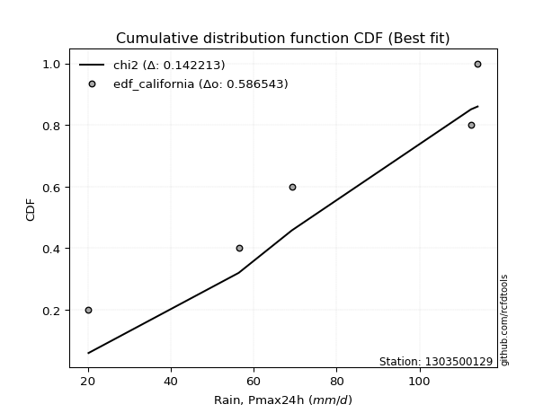</img>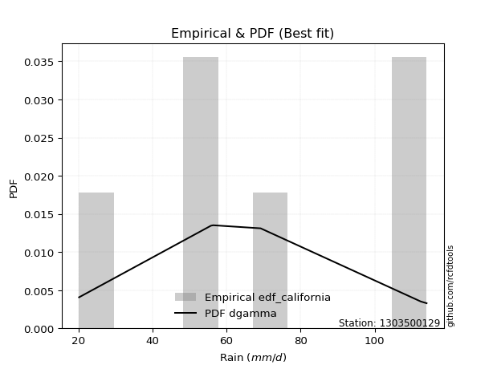</img>

</div>


### 2. EDF Hazen (1930)

Hazen method for plotting positions is a formula used to estimate the empirical cumulative probability distribution of flood events or other hydrological data. This formula often results in biased estimations, particularly when extrapolating to extreme events (high return periods).

<div align="center">


$P=(m-0.5)/n$


</div>


**2.1. Empirical values**

<div align="center">

|                | 0                  | 1                  | 2         | 3                 | 4                  |
|:---------------|:-------------------|:-------------------|:----------|:------------------|:-------------------|
| date           | 2020               | 2022               | 2021      | 2024              | 2019               |
| x              | 20.2               | 56.4               | 69.2      | 112.4             | 114.0              |
| m              | 1                  | 2                  | 3         | 4                 | 5                  |
| empirical_dist | edf_hazen          | edf_hazen          | edf_hazen | edf_hazen         | edf_hazen          |
| empirical      | 0.1                | 0.3                | 0.5       | 0.7               | 0.9                |
| empirical_tr   | 1.1111111111111112 | 1.4285714285714286 | 2.0       | 3.333333333333333 | 10.000000000000002 |

</div>


**2.2. Kolmogorov-Smirnov fit test (sorted by Δ)**


<div align="center">

|                | 0                   | 1                   | 2                  | 3                   | 4                   | 5                   | 6                   | 7                  | 8                  | 9                   | 10                 | 11                  | 12                  | 13                  | 14                  | 15                  | 16                  | 17                 | 18                  | 19                  | 20                  | 21                 | 22                  | 23                 | 24                  | 25                  | 26                 | 27                  | 28                  | 29                    | 30                  | 31                 | 32                  | 33                  | 34                  | 35                  | 36                  | 37                  | 38                  | 39                  | 40                  | 41                  | 42                  | 43                 | 44                 | 45                 | 46                 | 47                  | 48                  | 49                  | 50                 | 51                  | 52                  | 53                 | 54                  | 55                 | 56                  | 57                  | 58                 | 59                  | 60                  | 61                  | 62                  | 63                  | 64                  | 65                  | 66                  | 67                 | 68                  | 69                  | 70                  | 71                 | 72                 | 73                  | 74                  | 75                  | 76                 | 77                  | 78                  | 79                 | 80                 | 81                  | 82                 | 83                 | 84                 | 85                  | 86                 | 87                 |
|:---------------|:--------------------|:--------------------|:-------------------|:--------------------|:--------------------|:--------------------|:--------------------|:-------------------|:-------------------|:--------------------|:-------------------|:--------------------|:--------------------|:--------------------|:--------------------|:--------------------|:--------------------|:-------------------|:--------------------|:--------------------|:--------------------|:-------------------|:--------------------|:-------------------|:--------------------|:--------------------|:-------------------|:--------------------|:--------------------|:----------------------|:--------------------|:-------------------|:--------------------|:--------------------|:--------------------|:--------------------|:--------------------|:--------------------|:--------------------|:--------------------|:--------------------|:--------------------|:--------------------|:-------------------|:-------------------|:-------------------|:-------------------|:--------------------|:--------------------|:--------------------|:-------------------|:--------------------|:--------------------|:-------------------|:--------------------|:-------------------|:--------------------|:--------------------|:-------------------|:--------------------|:--------------------|:--------------------|:--------------------|:--------------------|:--------------------|:--------------------|:--------------------|:-------------------|:--------------------|:--------------------|:--------------------|:-------------------|:-------------------|:--------------------|:--------------------|:--------------------|:-------------------|:--------------------|:--------------------|:-------------------|:-------------------|:--------------------|:-------------------|:-------------------|:-------------------|:--------------------|:-------------------|:-------------------|
| station        | 1303500129          | 1303500129          | 1303500129         | 1303500129          | 1303500129          | 1303500129          | 1303500129          | 1303500129         | 1303500129         | 1303500129          | 1303500129         | 1303500129          | 1303500129          | 1303500129          | 1303500129          | 1303500129          | 1303500129          | 1303500129         | 1303500129          | 1303500129          | 1303500129          | 1303500129         | 1303500129          | 1303500129         | 1303500129          | 1303500129          | 1303500129         | 1303500129          | 1303500129          | 1303500129            | 1303500129          | 1303500129         | 1303500129          | 1303500129          | 1303500129          | 1303500129          | 1303500129          | 1303500129          | 1303500129          | 1303500129          | 1303500129          | 1303500129          | 1303500129          | 1303500129         | 1303500129         | 1303500129         | 1303500129         | 1303500129          | 1303500129          | 1303500129          | 1303500129         | 1303500129          | 1303500129          | 1303500129         | 1303500129          | 1303500129         | 1303500129          | 1303500129          | 1303500129         | 1303500129          | 1303500129          | 1303500129          | 1303500129          | 1303500129          | 1303500129          | 1303500129          | 1303500129          | 1303500129         | 1303500129          | 1303500129          | 1303500129          | 1303500129         | 1303500129         | 1303500129          | 1303500129          | 1303500129          | 1303500129         | 1303500129          | 1303500129          | 1303500129         | 1303500129         | 1303500129          | 1303500129         | 1303500129         | 1303500129         | 1303500129          | 1303500129         | 1303500129         |
| empirical_dist | edf_hazen           | edf_hazen           | edf_hazen          | edf_hazen           | edf_hazen           | edf_hazen           | edf_hazen           | edf_hazen          | edf_hazen          | edf_hazen           | edf_hazen          | edf_hazen           | edf_hazen           | edf_hazen           | edf_hazen           | edf_hazen           | edf_hazen           | edf_hazen          | edf_hazen           | edf_hazen           | edf_hazen           | edf_hazen          | edf_hazen           | edf_hazen          | edf_hazen           | edf_hazen           | edf_hazen          | edf_hazen           | edf_hazen           | edf_hazen             | edf_hazen           | edf_hazen          | edf_hazen           | edf_hazen           | edf_hazen           | edf_hazen           | edf_hazen           | edf_hazen           | edf_hazen           | edf_hazen           | edf_hazen           | edf_hazen           | edf_hazen           | edf_hazen          | edf_hazen          | edf_hazen          | edf_hazen          | edf_hazen           | edf_hazen           | edf_hazen           | edf_hazen          | edf_hazen           | edf_hazen           | edf_hazen          | edf_hazen           | edf_hazen          | edf_hazen           | edf_hazen           | edf_hazen          | edf_hazen           | edf_hazen           | edf_hazen           | edf_hazen           | edf_hazen           | edf_hazen           | edf_hazen           | edf_hazen           | edf_hazen          | edf_hazen           | edf_hazen           | edf_hazen           | edf_hazen          | edf_hazen          | edf_hazen           | edf_hazen           | edf_hazen           | edf_hazen          | edf_hazen           | edf_hazen           | edf_hazen          | edf_hazen          | edf_hazen           | edf_hazen          | edf_hazen          | edf_hazen          | edf_hazen           | edf_hazen          | edf_hazen          |
| p_dist         | logfisk             | logpearson3         | logfatiguelife     | logcrystalball      | lognorm             | lognorm             | logt                | logexponnorm       | lognct             | logncf              | logf               | loggumbel_l         | logbetaprime        | loggamma            | loggamma            | loglogistic         | logrice             | kstwobign          | logerlang           | invgauss            | loginvgamma         | genlogistic        | fisk                | invgamma           | logalpha            | loggompertz         | loghypsecant       | halfnorm            | chi2                | loglaplace_asymmetric | f                   | rayleigh           | maxwell             | logweibull_min      | rice                | erlang              | gamma               | laplace_asymmetric  | nct                 | t                   | exponnorm           | norm                | crystalball         | truncnorm          | betaprime          | pearson3           | loglaplace         | logmaxwell          | weibull_min         | loginvgauss         | halflogistic       | gumbel_r            | moyal               | logistic           | lograyleigh         | alpha              | ncf                 | hypsecant           | genexpon           | expon               | loginvweibull       | laplace             | gumbel_l            | loggumbel_r         | wald                | loghalfnorm         | gibrat              | logmoyal           | logkstwobign        | loggenexpon         | loghalflogistic     | logmielke          | logloggamma        | logwald             | loggibrat           | logexpon            | logtruncnorm       | nakagami            | lognakagami         | logjohnsonsu       | loglognorm         | mielke              | logchi2            | invweibull         | fatiguelife        | gompertz            | johnsonsu          | loggenlogistic     |
| delta          | 0.09723347373442637 | 0.12028371854857478 | 0.1280292601149961 | 0.12837489650423145 | 0.12837518471247267 | 0.12837518471247267 | 0.12837536161727603 | 0.1283786735080923 | 0.1320957754855373 | 0.13348621429242707 | 0.1348633854891786 | 0.13509306985953673 | 0.13638990507287135 | 0.13849597298802613 | 0.13849597298802613 | 0.13881346779566361 | 0.14080136107288083 | 0.1409566953337692 | 0.14271603095509905 | 0.14435938583723862 | 0.14465280938362285 | 0.1458096510184662 | 0.14601560621941279 | 0.1478756541755376 | 0.14796072958174666 | 0.14903825814478477 | 0.1502392233448917 | 0.15083541864246852 | 0.15091062217822104 | 0.15163609647111698   | 0.15164709163592005 | 0.1517429618791396 | 0.15295833170742923 | 0.15317459034898673 | 0.15326962235364583 | 0.15573379595410153 | 0.15617494839786872 | 0.15688679332128264 | 0.15741305932552496 | 0.15752647257641172 | 0.15753970742245138 | 0.15753978134856395 | 0.15753978443380046 | 0.1575397903991398 | 0.1577961792942394 | 0.159325337595021  | 0.1618201823351122 | 0.16276951846756194 | 0.16289558065263376 | 0.16291427316208046 | 0.1664135969794961 | 0.16722128481253218 | 0.17165631800524406 | 0.1743029538301526 | 0.17490376132600877 | 0.1771797432180235 | 0.18223286053409438 | 0.18266225201419017 | 0.1867326733151276 | 0.18696136758426946 | 0.18715692908002457 | 0.18979466008424006 | 0.19060517763094764 | 0.19276393267919817 | 0.19280326945504378 | 0.20922469782878933 | 0.21561747199607373 | 0.2173277240247487 | 0.22002822504519864 | 0.22545388946948958 | 0.22815531517846316 | 0.2589601612648559 | 0.2762487688925649 | 0.28515129416217716 | 0.29096855923997494 | 0.29338978676286104 | 0.2999978332062572 | 0.29999999980858916 | 0.32726172450409885 | 0.3596290351504639 | 0.3838986022527527 | 0.38832495018194507 | 0.3894686111179068 | 0.4645330419984658 | 0.489181320605024  | 0.49994805197205056 | 0.6124856589821239 | 0.7                |
| deltao         | 0.5865427407550001  | 0.5865427407550001  | 0.5865427407550001 | 0.5865427407550001  | 0.5865427407550001  | 0.5865427407550001  | 0.5865427407550001  | 0.5865427407550001 | 0.5865427407550001 | 0.5865427407550001  | 0.5865427407550001 | 0.5865427407550001  | 0.5865427407550001  | 0.5865427407550001  | 0.5865427407550001  | 0.5865427407550001  | 0.5865427407550001  | 0.5865427407550001 | 0.5865427407550001  | 0.5865427407550001  | 0.5865427407550001  | 0.5865427407550001 | 0.5865427407550001  | 0.5865427407550001 | 0.5865427407550001  | 0.5865427407550001  | 0.5865427407550001 | 0.5865427407550001  | 0.5865427407550001  | 0.5865427407550001    | 0.5865427407550001  | 0.5865427407550001 | 0.5865427407550001  | 0.5865427407550001  | 0.5865427407550001  | 0.5865427407550001  | 0.5865427407550001  | 0.5865427407550001  | 0.5865427407550001  | 0.5865427407550001  | 0.5865427407550001  | 0.5865427407550001  | 0.5865427407550001  | 0.5865427407550001 | 0.5865427407550001 | 0.5865427407550001 | 0.5865427407550001 | 0.5865427407550001  | 0.5865427407550001  | 0.5865427407550001  | 0.5865427407550001 | 0.5865427407550001  | 0.5865427407550001  | 0.5865427407550001 | 0.5865427407550001  | 0.5865427407550001 | 0.5865427407550001  | 0.5865427407550001  | 0.5865427407550001 | 0.5865427407550001  | 0.5865427407550001  | 0.5865427407550001  | 0.5865427407550001  | 0.5865427407550001  | 0.5865427407550001  | 0.5865427407550001  | 0.5865427407550001  | 0.5865427407550001 | 0.5865427407550001  | 0.5865427407550001  | 0.5865427407550001  | 0.5865427407550001 | 0.5865427407550001 | 0.5865427407550001  | 0.5865427407550001  | 0.5865427407550001  | 0.5865427407550001 | 0.5865427407550001  | 0.5865427407550001  | 0.5865427407550001 | 0.5865427407550001 | 0.5865427407550001  | 0.5865427407550001 | 0.5865427407550001 | 0.5865427407550001 | 0.5865427407550001  | 0.5865427407550001 | 0.5865427407550001 |
| eval           | Δo > Δ              | Δo > Δ              | Δo > Δ             | Δo > Δ              | Δo > Δ              | Δo > Δ              | Δo > Δ              | Δo > Δ             | Δo > Δ             | Δo > Δ              | Δo > Δ             | Δo > Δ              | Δo > Δ              | Δo > Δ              | Δo > Δ              | Δo > Δ              | Δo > Δ              | Δo > Δ             | Δo > Δ              | Δo > Δ              | Δo > Δ              | Δo > Δ             | Δo > Δ              | Δo > Δ             | Δo > Δ              | Δo > Δ              | Δo > Δ             | Δo > Δ              | Δo > Δ              | Δo > Δ                | Δo > Δ              | Δo > Δ             | Δo > Δ              | Δo > Δ              | Δo > Δ              | Δo > Δ              | Δo > Δ              | Δo > Δ              | Δo > Δ              | Δo > Δ              | Δo > Δ              | Δo > Δ              | Δo > Δ              | Δo > Δ             | Δo > Δ             | Δo > Δ             | Δo > Δ             | Δo > Δ              | Δo > Δ              | Δo > Δ              | Δo > Δ             | Δo > Δ              | Δo > Δ              | Δo > Δ             | Δo > Δ              | Δo > Δ             | Δo > Δ              | Δo > Δ              | Δo > Δ             | Δo > Δ              | Δo > Δ              | Δo > Δ              | Δo > Δ              | Δo > Δ              | Δo > Δ              | Δo > Δ              | Δo > Δ              | Δo > Δ             | Δo > Δ              | Δo > Δ              | Δo > Δ              | Δo > Δ             | Δo > Δ             | Δo > Δ              | Δo > Δ              | Δo > Δ              | Δo > Δ             | Δo > Δ              | Δo > Δ              | Δo > Δ             | Δo > Δ             | Δo > Δ              | Δo > Δ             | Δo > Δ             | Δo > Δ             | Δo > Δ              | Δo <= Δ            | Δo <= Δ            |
| fit            | 1                   | 1                   | 1                  | 1                   | 1                   | 1                   | 1                   | 1                  | 1                  | 1                   | 1                  | 1                   | 1                   | 1                   | 1                   | 1                   | 1                   | 1                  | 1                   | 1                   | 1                   | 1                  | 1                   | 1                  | 1                   | 1                   | 1                  | 1                   | 1                   | 1                     | 1                   | 1                  | 1                   | 1                   | 1                   | 1                   | 1                   | 1                   | 1                   | 1                   | 1                   | 1                   | 1                   | 1                  | 1                  | 1                  | 1                  | 1                   | 1                   | 1                   | 1                  | 1                   | 1                   | 1                  | 1                   | 1                  | 1                   | 1                   | 1                  | 1                   | 1                   | 1                   | 1                   | 1                   | 1                   | 1                   | 1                   | 1                  | 1                   | 1                   | 1                   | 1                  | 1                  | 1                   | 1                   | 1                   | 1                  | 1                   | 1                   | 1                  | 1                  | 1                   | 1                  | 1                  | 1                  | 1                   | 0                  | 0                  |
| n              | 5                   | 5                   | 5                  | 5                   | 5                   | 5                   | 5                   | 5                  | 5                  | 5                   | 5                  | 5                   | 5                   | 5                   | 5                   | 5                   | 5                   | 5                  | 5                   | 5                   | 5                   | 5                  | 5                   | 5                  | 5                   | 5                   | 5                  | 5                   | 5                   | 5                     | 5                   | 5                  | 5                   | 5                   | 5                   | 5                   | 5                   | 5                   | 5                   | 5                   | 5                   | 5                   | 5                   | 5                  | 5                  | 5                  | 5                  | 5                   | 5                   | 5                   | 5                  | 5                   | 5                   | 5                  | 5                   | 5                  | 5                   | 5                   | 5                  | 5                   | 5                   | 5                   | 5                   | 5                   | 5                   | 5                   | 5                   | 5                  | 5                   | 5                   | 5                   | 5                  | 5                  | 5                   | 5                   | 5                   | 5                  | 5                   | 5                   | 5                  | 5                  | 5                   | 5                  | 5                  | 5                  | 5                   | 5                  | 5                  |
| best_fit       | 1                   | 0                   | 0                  | 0                   | 0                   | 0                   | 0                   | 0                  | 0                  | 0                   | 0                  | 0                   | 0                   | 0                   | 0                   | 0                   | 0                   | 0                  | 0                   | 0                   | 0                   | 0                  | 0                   | 0                  | 0                   | 0                   | 0                  | 0                   | 0                   | 0                     | 0                   | 0                  | 0                   | 0                   | 0                   | 0                   | 0                   | 0                   | 0                   | 0                   | 0                   | 0                   | 0                   | 0                  | 0                  | 0                  | 0                  | 0                   | 0                   | 0                   | 0                  | 0                   | 0                   | 0                  | 0                   | 0                  | 0                   | 0                   | 0                  | 0                   | 0                   | 0                   | 0                   | 0                   | 0                   | 0                   | 0                   | 0                  | 0                   | 0                   | 0                   | 0                  | 0                  | 0                   | 0                   | 0                   | 0                  | 0                   | 0                   | 0                  | 0                  | 0                   | 0                  | 0                  | 0                  | 0                   | 0                  | 0                  |
| best_fit_sort  | 1                   | 2                   | 3                  | 4                   | 5                   | 6                   | 7                   | 8                  | 9                  | 10                  | 11                 | 12                  | 13                  | 14                  | 15                  | 16                  | 17                  | 18                 | 19                  | 20                  | 21                  | 22                 | 23                  | 24                 | 25                  | 26                  | 27                 | 28                  | 29                  | 30                    | 31                  | 32                 | 33                  | 34                  | 35                  | 36                  | 37                  | 38                  | 39                  | 40                  | 41                  | 42                  | 43                  | 44                 | 45                 | 46                 | 47                 | 48                  | 49                  | 50                  | 51                 | 52                  | 53                  | 54                 | 55                  | 56                 | 57                  | 58                  | 59                 | 60                  | 61                  | 62                  | 63                  | 64                  | 65                  | 66                  | 67                  | 68                 | 69                  | 70                  | 71                  | 72                 | 73                 | 74                  | 75                  | 76                  | 77                 | 78                  | 79                  | 80                 | 81                 | 82                  | 83                 | 84                 | 85                 | 86                  | 87                 | 88                 |

</div>


**2.3. Best fit**

<div align="center">

|   id |    station | empirical_dist   | p_dist   |     delta |   deltao | eval   |   fit |   n |   best_fit |   best_fit_sort |
|-----:|-----------:|:-----------------|:---------|----------:|---------:|:-------|------:|----:|-----------:|----------------:|
|    0 | 1303500129 | edf_hazen        | logfisk  | 0.0972335 | 0.586543 | Δo > Δ |     1 |   5 |          1 |               1 |

</div>


<div align="center">

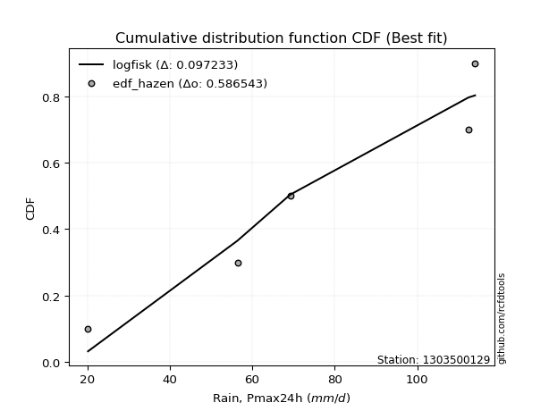</img></img>

</div>


### 3. EDF Weibull (1939)

Weibull plotting position formula is an empirical method used to estimate the non-exceedance probability or plotting position for a set of observed data, is often recommended or widely used in practice, particularly in flood frequency analysis.

<div align="center">


$P=m/(n+1)$


</div>


**3.1. Empirical values**

<div align="center">

|                | 0                   | 1                  | 2           | 3                  | 4                  |
|:---------------|:--------------------|:-------------------|:------------|:-------------------|:-------------------|
| date           | 2020                | 2022               | 2021        | 2024               | 2019               |
| x              | 20.2                | 56.4               | 69.2        | 112.4              | 114.0              |
| m              | 1                   | 2                  | 3           | 4                  | 5                  |
| empirical_dist | edf_weibull         | edf_weibull        | edf_weibull | edf_weibull        | edf_weibull        |
| empirical      | 0.16666666666666666 | 0.3333333333333333 | 0.5         | 0.6666666666666666 | 0.8333333333333334 |
| empirical_tr   | 1.2                 | 1.4999999999999998 | 2.0         | 2.9999999999999996 | 6.000000000000002  |

</div>


**3.2. Kolmogorov-Smirnov fit test (sorted by Δ)**


<div align="center">

|                | 0                   | 1                  | 2                   | 3                  | 4                   | 5                   | 6                   | 7                  | 8                  | 9                   | 10                 | 11                  | 12                  | 13                  | 14                  | 15                  | 16                  | 17                  | 18                  | 19                  | 20                  | 21                 | 22                  | 23                  | 24                  | 25                  | 26                  | 27                  | 28                  | 29                  | 30                 | 31                  | 32                  | 33                 | 34                  | 35                 | 36                  | 37                  | 38                  | 39                  | 40                    | 41                  | 42                  | 43                  | 44                  | 45                  | 46                  | 47                  | 48                  | 49                  | 50                 | 51                  | 52                 | 53                  | 54                  | 55                  | 56                  | 57                  | 58                  | 59                  | 60                  | 61                 | 62                  | 63                 | 64                  | 65                  | 66                 | 67                 | 68                  | 69                 | 70                  | 71                  | 72                 | 73                 | 74                 | 75                 | 76                  | 77                  | 78                 | 79                  | 80                  | 81                 | 82                 | 83                  | 84                 | 85                  | 86                 | 87                 |
|:---------------|:--------------------|:-------------------|:--------------------|:-------------------|:--------------------|:--------------------|:--------------------|:-------------------|:-------------------|:--------------------|:-------------------|:--------------------|:--------------------|:--------------------|:--------------------|:--------------------|:--------------------|:--------------------|:--------------------|:--------------------|:--------------------|:-------------------|:--------------------|:--------------------|:--------------------|:--------------------|:--------------------|:--------------------|:--------------------|:--------------------|:-------------------|:--------------------|:--------------------|:-------------------|:--------------------|:-------------------|:--------------------|:--------------------|:--------------------|:--------------------|:----------------------|:--------------------|:--------------------|:--------------------|:--------------------|:--------------------|:--------------------|:--------------------|:--------------------|:--------------------|:-------------------|:--------------------|:-------------------|:--------------------|:--------------------|:--------------------|:--------------------|:--------------------|:--------------------|:--------------------|:--------------------|:-------------------|:--------------------|:-------------------|:--------------------|:--------------------|:-------------------|:-------------------|:--------------------|:-------------------|:--------------------|:--------------------|:-------------------|:-------------------|:-------------------|:-------------------|:--------------------|:--------------------|:-------------------|:--------------------|:--------------------|:-------------------|:-------------------|:--------------------|:-------------------|:--------------------|:-------------------|:-------------------|
| station        | 1303500129          | 1303500129         | 1303500129          | 1303500129         | 1303500129          | 1303500129          | 1303500129          | 1303500129         | 1303500129         | 1303500129          | 1303500129         | 1303500129          | 1303500129          | 1303500129          | 1303500129          | 1303500129          | 1303500129          | 1303500129          | 1303500129          | 1303500129          | 1303500129          | 1303500129         | 1303500129          | 1303500129          | 1303500129          | 1303500129          | 1303500129          | 1303500129          | 1303500129          | 1303500129          | 1303500129         | 1303500129          | 1303500129          | 1303500129         | 1303500129          | 1303500129         | 1303500129          | 1303500129          | 1303500129          | 1303500129          | 1303500129            | 1303500129          | 1303500129          | 1303500129          | 1303500129          | 1303500129          | 1303500129          | 1303500129          | 1303500129          | 1303500129          | 1303500129         | 1303500129          | 1303500129         | 1303500129          | 1303500129          | 1303500129          | 1303500129          | 1303500129          | 1303500129          | 1303500129          | 1303500129          | 1303500129         | 1303500129          | 1303500129         | 1303500129          | 1303500129          | 1303500129         | 1303500129         | 1303500129          | 1303500129         | 1303500129          | 1303500129          | 1303500129         | 1303500129         | 1303500129         | 1303500129         | 1303500129          | 1303500129          | 1303500129         | 1303500129          | 1303500129          | 1303500129         | 1303500129         | 1303500129          | 1303500129         | 1303500129          | 1303500129         | 1303500129         |
| empirical_dist | edf_weibull         | edf_weibull        | edf_weibull         | edf_weibull        | edf_weibull         | edf_weibull         | edf_weibull         | edf_weibull        | edf_weibull        | edf_weibull         | edf_weibull        | edf_weibull         | edf_weibull         | edf_weibull         | edf_weibull         | edf_weibull         | edf_weibull         | edf_weibull         | edf_weibull         | edf_weibull         | edf_weibull         | edf_weibull        | edf_weibull         | edf_weibull         | edf_weibull         | edf_weibull         | edf_weibull         | edf_weibull         | edf_weibull         | edf_weibull         | edf_weibull        | edf_weibull         | edf_weibull         | edf_weibull        | edf_weibull         | edf_weibull        | edf_weibull         | edf_weibull         | edf_weibull         | edf_weibull         | edf_weibull           | edf_weibull         | edf_weibull         | edf_weibull         | edf_weibull         | edf_weibull         | edf_weibull         | edf_weibull         | edf_weibull         | edf_weibull         | edf_weibull        | edf_weibull         | edf_weibull        | edf_weibull         | edf_weibull         | edf_weibull         | edf_weibull         | edf_weibull         | edf_weibull         | edf_weibull         | edf_weibull         | edf_weibull        | edf_weibull         | edf_weibull        | edf_weibull         | edf_weibull         | edf_weibull        | edf_weibull        | edf_weibull         | edf_weibull        | edf_weibull         | edf_weibull         | edf_weibull        | edf_weibull        | edf_weibull        | edf_weibull        | edf_weibull         | edf_weibull         | edf_weibull        | edf_weibull         | edf_weibull         | edf_weibull        | edf_weibull        | edf_weibull         | edf_weibull        | edf_weibull         | edf_weibull        | edf_weibull        |
| p_dist         | ncf                 | logfisk            | logbetaprime        | logalpha           | loggamma            | loggamma            | alpha               | logncf             | loginvgauss        | logerlang           | logrice            | lognct              | logf                | loginvgamma         | logcrystalball      | lognorm             | lognorm             | logt                | logexponnorm        | logfatiguelife      | logmaxwell          | logpearson3        | loginvweibull       | lograyleigh         | genexpon            | expon               | loggumbel_l         | loglogistic         | loggumbel_r         | kstwobign           | loghalfnorm        | invgauss            | genlogistic         | fisk               | invgamma            | loggompertz        | loghypsecant        | logmoyal            | halfnorm            | chi2                | loglaplace_asymmetric | f                   | rayleigh            | maxwell             | logweibull_min      | rice                | logkstwobign        | erlang              | gamma               | laplace_asymmetric  | nct                | t                   | exponnorm          | norm                | crystalball         | truncnorm           | betaprime           | loggenexpon         | pearson3            | loghalflogistic     | loglaplace          | weibull_min        | halflogistic        | gumbel_r           | moyal               | logistic            | hypsecant          | laplace            | gumbel_l            | wald               | gibrat              | logwald             | loggibrat          | logexpon           | logmielke          | logloggamma        | lognakagami         | logtruncnorm        | nakagami           | loglognorm          | mielke              | logchi2            | logjohnsonsu       | invweibull          | fatiguelife        | gompertz            | johnsonsu          | loggenlogistic     |
| delta          | 0.11931354850883907 | 0.1346738524629304 | 0.13777517218557622 | 0.1391610099468107 | 0.14292287057814068 | 0.14292287057814068 | 0.14384640988469016 | 0.1479815661366337 | 0.1482002241914312 | 0.14854808026605393 | 0.149205055397443  | 0.14921884743896963 | 0.14982984568073254 | 0.15082371396512162 | 0.15175741962454803 | 0.15175755800092605 | 0.15175755800092605 | 0.15175785801209407 | 0.15176112754554472 | 0.15206099496303527 | 0.15254505408247737 | 0.1536170518819081 | 0.15382359574669124 | 0.16408588025204887 | 0.16666631025366807 | 0.16666666666666666 | 0.16842640319287006 | 0.17214680112899694 | 0.17287358905310202 | 0.17429002866710253 | 0.175891364495456  | 0.17769271917057194 | 0.17914298435179954 | 0.1793489395527461 | 0.18120898750887093 | 0.1823715914781181 | 0.18357255667822503 | 0.18399439069141538 | 0.18416875197580185 | 0.18424395551155437 | 0.1849694298044503    | 0.18498042496925338 | 0.18507629521247293 | 0.18629166504076256 | 0.18650792368232005 | 0.18660295568697916 | 0.18669489171186532 | 0.18906712928743485 | 0.18950828173120204 | 0.19022012665461596 | 0.1907463926588583 | 0.19085980590974505 | 0.1908730407557847 | 0.19087311468189727 | 0.19087311776713378 | 0.19087312373247312 | 0.19112951262757272 | 0.19212055613615625 | 0.19265867092835431 | 0.19482198184512983 | 0.19515351566844552 | 0.1962289139859671 | 0.19974693031282942 | 0.2005546181458655 | 0.20498965133857738 | 0.20763628716348592 | 0.2159955853475235 | 0.2231279934175734 | 0.22393851096428097 | 0.2261366027883771 | 0.24895080532940705 | 0.25181796082884383 | 0.2576352259066416 | 0.2600564534295277 | 0.2922934945981892 | 0.3095821022258982 | 0.32726172450409885 | 0.33333116653959055 | 0.3333333331419225 | 0.35056526891941936 | 0.35499161684861175 | 0.3561352777845735 | 0.3596290351504639 | 0.39786637533179914 | 0.4558479872716907 | 0.49994805197205056 | 0.5791523256487907 | 0.6666666666666666 |
| deltao         | 0.5865427407550001  | 0.5865427407550001 | 0.5865427407550001  | 0.5865427407550001 | 0.5865427407550001  | 0.5865427407550001  | 0.5865427407550001  | 0.5865427407550001 | 0.5865427407550001 | 0.5865427407550001  | 0.5865427407550001 | 0.5865427407550001  | 0.5865427407550001  | 0.5865427407550001  | 0.5865427407550001  | 0.5865427407550001  | 0.5865427407550001  | 0.5865427407550001  | 0.5865427407550001  | 0.5865427407550001  | 0.5865427407550001  | 0.5865427407550001 | 0.5865427407550001  | 0.5865427407550001  | 0.5865427407550001  | 0.5865427407550001  | 0.5865427407550001  | 0.5865427407550001  | 0.5865427407550001  | 0.5865427407550001  | 0.5865427407550001 | 0.5865427407550001  | 0.5865427407550001  | 0.5865427407550001 | 0.5865427407550001  | 0.5865427407550001 | 0.5865427407550001  | 0.5865427407550001  | 0.5865427407550001  | 0.5865427407550001  | 0.5865427407550001    | 0.5865427407550001  | 0.5865427407550001  | 0.5865427407550001  | 0.5865427407550001  | 0.5865427407550001  | 0.5865427407550001  | 0.5865427407550001  | 0.5865427407550001  | 0.5865427407550001  | 0.5865427407550001 | 0.5865427407550001  | 0.5865427407550001 | 0.5865427407550001  | 0.5865427407550001  | 0.5865427407550001  | 0.5865427407550001  | 0.5865427407550001  | 0.5865427407550001  | 0.5865427407550001  | 0.5865427407550001  | 0.5865427407550001 | 0.5865427407550001  | 0.5865427407550001 | 0.5865427407550001  | 0.5865427407550001  | 0.5865427407550001 | 0.5865427407550001 | 0.5865427407550001  | 0.5865427407550001 | 0.5865427407550001  | 0.5865427407550001  | 0.5865427407550001 | 0.5865427407550001 | 0.5865427407550001 | 0.5865427407550001 | 0.5865427407550001  | 0.5865427407550001  | 0.5865427407550001 | 0.5865427407550001  | 0.5865427407550001  | 0.5865427407550001 | 0.5865427407550001 | 0.5865427407550001  | 0.5865427407550001 | 0.5865427407550001  | 0.5865427407550001 | 0.5865427407550001 |
| eval           | Δo > Δ              | Δo > Δ             | Δo > Δ              | Δo > Δ             | Δo > Δ              | Δo > Δ              | Δo > Δ              | Δo > Δ             | Δo > Δ             | Δo > Δ              | Δo > Δ             | Δo > Δ              | Δo > Δ              | Δo > Δ              | Δo > Δ              | Δo > Δ              | Δo > Δ              | Δo > Δ              | Δo > Δ              | Δo > Δ              | Δo > Δ              | Δo > Δ             | Δo > Δ              | Δo > Δ              | Δo > Δ              | Δo > Δ              | Δo > Δ              | Δo > Δ              | Δo > Δ              | Δo > Δ              | Δo > Δ             | Δo > Δ              | Δo > Δ              | Δo > Δ             | Δo > Δ              | Δo > Δ             | Δo > Δ              | Δo > Δ              | Δo > Δ              | Δo > Δ              | Δo > Δ                | Δo > Δ              | Δo > Δ              | Δo > Δ              | Δo > Δ              | Δo > Δ              | Δo > Δ              | Δo > Δ              | Δo > Δ              | Δo > Δ              | Δo > Δ             | Δo > Δ              | Δo > Δ             | Δo > Δ              | Δo > Δ              | Δo > Δ              | Δo > Δ              | Δo > Δ              | Δo > Δ              | Δo > Δ              | Δo > Δ              | Δo > Δ             | Δo > Δ              | Δo > Δ             | Δo > Δ              | Δo > Δ              | Δo > Δ             | Δo > Δ             | Δo > Δ              | Δo > Δ             | Δo > Δ              | Δo > Δ              | Δo > Δ             | Δo > Δ             | Δo > Δ             | Δo > Δ             | Δo > Δ              | Δo > Δ              | Δo > Δ             | Δo > Δ              | Δo > Δ              | Δo > Δ             | Δo > Δ             | Δo > Δ              | Δo > Δ             | Δo > Δ              | Δo > Δ             | Δo <= Δ            |
| fit            | 1                   | 1                  | 1                   | 1                  | 1                   | 1                   | 1                   | 1                  | 1                  | 1                   | 1                  | 1                   | 1                   | 1                   | 1                   | 1                   | 1                   | 1                   | 1                   | 1                   | 1                   | 1                  | 1                   | 1                   | 1                   | 1                   | 1                   | 1                   | 1                   | 1                   | 1                  | 1                   | 1                   | 1                  | 1                   | 1                  | 1                   | 1                   | 1                   | 1                   | 1                     | 1                   | 1                   | 1                   | 1                   | 1                   | 1                   | 1                   | 1                   | 1                   | 1                  | 1                   | 1                  | 1                   | 1                   | 1                   | 1                   | 1                   | 1                   | 1                   | 1                   | 1                  | 1                   | 1                  | 1                   | 1                   | 1                  | 1                  | 1                   | 1                  | 1                   | 1                   | 1                  | 1                  | 1                  | 1                  | 1                   | 1                   | 1                  | 1                   | 1                   | 1                  | 1                  | 1                   | 1                  | 1                   | 1                  | 0                  |
| n              | 5                   | 5                  | 5                   | 5                  | 5                   | 5                   | 5                   | 5                  | 5                  | 5                   | 5                  | 5                   | 5                   | 5                   | 5                   | 5                   | 5                   | 5                   | 5                   | 5                   | 5                   | 5                  | 5                   | 5                   | 5                   | 5                   | 5                   | 5                   | 5                   | 5                   | 5                  | 5                   | 5                   | 5                  | 5                   | 5                  | 5                   | 5                   | 5                   | 5                   | 5                     | 5                   | 5                   | 5                   | 5                   | 5                   | 5                   | 5                   | 5                   | 5                   | 5                  | 5                   | 5                  | 5                   | 5                   | 5                   | 5                   | 5                   | 5                   | 5                   | 5                   | 5                  | 5                   | 5                  | 5                   | 5                   | 5                  | 5                  | 5                   | 5                  | 5                   | 5                   | 5                  | 5                  | 5                  | 5                  | 5                   | 5                   | 5                  | 5                   | 5                   | 5                  | 5                  | 5                   | 5                  | 5                   | 5                  | 5                  |
| best_fit       | 1                   | 0                  | 0                   | 0                  | 0                   | 0                   | 0                   | 0                  | 0                  | 0                   | 0                  | 0                   | 0                   | 0                   | 0                   | 0                   | 0                   | 0                   | 0                   | 0                   | 0                   | 0                  | 0                   | 0                   | 0                   | 0                   | 0                   | 0                   | 0                   | 0                   | 0                  | 0                   | 0                   | 0                  | 0                   | 0                  | 0                   | 0                   | 0                   | 0                   | 0                     | 0                   | 0                   | 0                   | 0                   | 0                   | 0                   | 0                   | 0                   | 0                   | 0                  | 0                   | 0                  | 0                   | 0                   | 0                   | 0                   | 0                   | 0                   | 0                   | 0                   | 0                  | 0                   | 0                  | 0                   | 0                   | 0                  | 0                  | 0                   | 0                  | 0                   | 0                   | 0                  | 0                  | 0                  | 0                  | 0                   | 0                   | 0                  | 0                   | 0                   | 0                  | 0                  | 0                   | 0                  | 0                   | 0                  | 0                  |
| best_fit_sort  | 1                   | 2                  | 3                   | 4                  | 5                   | 6                   | 7                   | 8                  | 9                  | 10                  | 11                 | 12                  | 13                  | 14                  | 15                  | 16                  | 17                  | 18                  | 19                  | 20                  | 21                  | 22                 | 23                  | 24                  | 25                  | 26                  | 27                  | 28                  | 29                  | 30                  | 31                 | 32                  | 33                  | 34                 | 35                  | 36                 | 37                  | 38                  | 39                  | 40                  | 41                    | 42                  | 43                  | 44                  | 45                  | 46                  | 47                  | 48                  | 49                  | 50                  | 51                 | 52                  | 53                 | 54                  | 55                  | 56                  | 57                  | 58                  | 59                  | 60                  | 61                  | 62                 | 63                  | 64                 | 65                  | 66                  | 67                 | 68                 | 69                  | 70                 | 71                  | 72                  | 73                 | 74                 | 75                 | 76                 | 77                  | 78                  | 79                 | 80                  | 81                  | 82                 | 83                 | 84                  | 85                 | 86                  | 87                 | 88                 |

</div>


**3.3. Best fit**

<div align="center">

|   id |    station | empirical_dist   | p_dist   |    delta |   deltao | eval   |   fit |   n |   best_fit |   best_fit_sort |
|-----:|-----------:|:-----------------|:---------|---------:|---------:|:-------|------:|----:|-----------:|----------------:|
|    0 | 1303500129 | edf_weibull      | ncf      | 0.119314 | 0.586543 | Δo > Δ |     1 |   5 |          1 |               1 |

</div>


<div align="center">

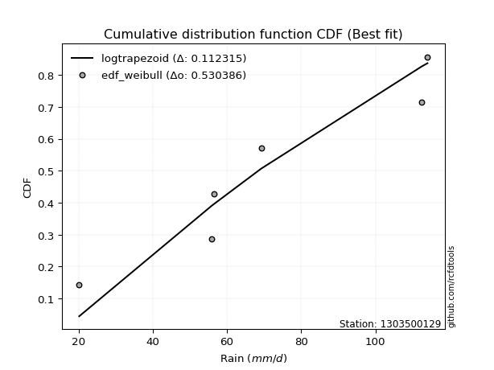</img>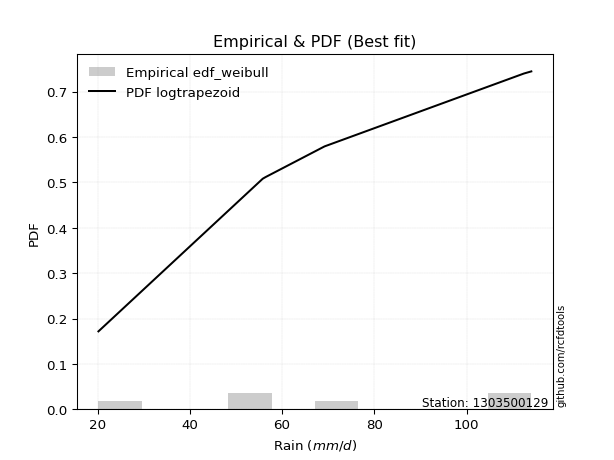</img>

</div>


### 4. EDF Beard (1943)

The Beard formula (or Beard´s plotting position formula) in hydrology is used to estimate the empirical non-exceedance probability _(P)_ of a flood event (or other extreme hydrological data point) within a given dataset.

<div align="center">


$P=(m-0.31)/(n+0.38)$


</div>


**4.1. Empirical values**

<div align="center">

|                | 0                   | 1                  | 2         | 3                  | 4                  |
|:---------------|:--------------------|:-------------------|:----------|:-------------------|:-------------------|
| date           | 2020                | 2022               | 2021      | 2024               | 2019               |
| x              | 20.2                | 56.4               | 69.2      | 112.4              | 114.0              |
| m              | 1                   | 2                  | 3         | 4                  | 5                  |
| empirical_dist | edf_beard           | edf_beard          | edf_beard | edf_beard          | edf_beard          |
| empirical      | 0.12825278810408922 | 0.3141263940520446 | 0.5       | 0.6858736059479554 | 0.8717472118959109 |
| empirical_tr   | 1.1471215351812367  | 1.4579945799457996 | 2.0       | 3.183431952662722  | 7.797101449275368  |

</div>


**4.2. Kolmogorov-Smirnov fit test (sorted by Δ)**


<div align="center">

|                | 0                  | 1                   | 2                  | 3                  | 4                  | 5                   | 6                  | 7                   | 8                   | 9                   | 10                  | 11                  | 12                  | 13                  | 14                 | 15                  | 16                  | 17                 | 18                 | 19                  | 20                  | 21                  | 22                  | 23                  | 24                  | 25                  | 26                 | 27                  | 28                  | 29                  | 30                 | 31                  | 32                  | 33                  | 34                    | 35                  | 36                  | 37                  | 38                  | 39                  | 40                  | 41                  | 42                  | 43                  | 44                  | 45                 | 46                  | 47                  | 48                 | 49                 | 50                  | 51                  | 52                  | 53                 | 54                  | 55                 | 56                  | 57                  | 58                 | 59                  | 60                  | 61                 | 62                 | 63                  | 64                  | 65                  | 66                 | 67                 | 68                  | 69                  | 70                  | 71                 | 72                 | 73                 | 74                 | 75                 | 76                  | 77                 | 78                  | 79                 | 80                  | 81                  | 82                 | 83                  | 84                 | 85                  | 86                 | 87                 |
|:---------------|:-------------------|:--------------------|:-------------------|:-------------------|:-------------------|:--------------------|:-------------------|:--------------------|:--------------------|:--------------------|:--------------------|:--------------------|:--------------------|:--------------------|:-------------------|:--------------------|:--------------------|:-------------------|:-------------------|:--------------------|:--------------------|:--------------------|:--------------------|:--------------------|:--------------------|:--------------------|:-------------------|:--------------------|:--------------------|:--------------------|:-------------------|:--------------------|:--------------------|:--------------------|:----------------------|:--------------------|:--------------------|:--------------------|:--------------------|:--------------------|:--------------------|:--------------------|:--------------------|:--------------------|:--------------------|:-------------------|:--------------------|:--------------------|:-------------------|:-------------------|:--------------------|:--------------------|:--------------------|:-------------------|:--------------------|:-------------------|:--------------------|:--------------------|:-------------------|:--------------------|:--------------------|:-------------------|:-------------------|:--------------------|:--------------------|:--------------------|:-------------------|:-------------------|:--------------------|:--------------------|:--------------------|:-------------------|:-------------------|:-------------------|:-------------------|:-------------------|:--------------------|:-------------------|:--------------------|:-------------------|:--------------------|:--------------------|:-------------------|:--------------------|:-------------------|:--------------------|:-------------------|:-------------------|
| station        | 1303500129         | 1303500129          | 1303500129         | 1303500129         | 1303500129         | 1303500129          | 1303500129         | 1303500129          | 1303500129          | 1303500129          | 1303500129          | 1303500129          | 1303500129          | 1303500129          | 1303500129         | 1303500129          | 1303500129          | 1303500129         | 1303500129         | 1303500129          | 1303500129          | 1303500129          | 1303500129          | 1303500129          | 1303500129          | 1303500129          | 1303500129         | 1303500129          | 1303500129          | 1303500129          | 1303500129         | 1303500129          | 1303500129          | 1303500129          | 1303500129            | 1303500129          | 1303500129          | 1303500129          | 1303500129          | 1303500129          | 1303500129          | 1303500129          | 1303500129          | 1303500129          | 1303500129          | 1303500129         | 1303500129          | 1303500129          | 1303500129         | 1303500129         | 1303500129          | 1303500129          | 1303500129          | 1303500129         | 1303500129          | 1303500129         | 1303500129          | 1303500129          | 1303500129         | 1303500129          | 1303500129          | 1303500129         | 1303500129         | 1303500129          | 1303500129          | 1303500129          | 1303500129         | 1303500129         | 1303500129          | 1303500129          | 1303500129          | 1303500129         | 1303500129         | 1303500129         | 1303500129         | 1303500129         | 1303500129          | 1303500129         | 1303500129          | 1303500129         | 1303500129          | 1303500129          | 1303500129         | 1303500129          | 1303500129         | 1303500129          | 1303500129         | 1303500129         |
| empirical_dist | edf_beard          | edf_beard           | edf_beard          | edf_beard          | edf_beard          | edf_beard           | edf_beard          | edf_beard           | edf_beard           | edf_beard           | edf_beard           | edf_beard           | edf_beard           | edf_beard           | edf_beard          | edf_beard           | edf_beard           | edf_beard          | edf_beard          | edf_beard           | edf_beard           | edf_beard           | edf_beard           | edf_beard           | edf_beard           | edf_beard           | edf_beard          | edf_beard           | edf_beard           | edf_beard           | edf_beard          | edf_beard           | edf_beard           | edf_beard           | edf_beard             | edf_beard           | edf_beard           | edf_beard           | edf_beard           | edf_beard           | edf_beard           | edf_beard           | edf_beard           | edf_beard           | edf_beard           | edf_beard          | edf_beard           | edf_beard           | edf_beard          | edf_beard          | edf_beard           | edf_beard           | edf_beard           | edf_beard          | edf_beard           | edf_beard          | edf_beard           | edf_beard           | edf_beard          | edf_beard           | edf_beard           | edf_beard          | edf_beard          | edf_beard           | edf_beard           | edf_beard           | edf_beard          | edf_beard          | edf_beard           | edf_beard           | edf_beard           | edf_beard          | edf_beard          | edf_beard          | edf_beard          | edf_beard          | edf_beard           | edf_beard          | edf_beard           | edf_beard          | edf_beard           | edf_beard           | edf_beard          | edf_beard           | edf_beard          | edf_beard           | edf_beard          | edf_beard          |
| p_dist         | logfisk            | logbetaprime        | loggamma           | loggamma           | logncf             | logerlang           | logrice            | lognct              | logf                | loginvgamma         | logcrystalball      | lognorm             | lognorm             | logt                | logexponnorm       | logfatiguelife      | logalpha            | logpearson3        | logmaxwell         | loginvgauss         | loggumbel_l         | loglogistic         | ncf                 | kstwobign           | invgauss            | genlogistic         | fisk               | lograyleigh         | invgamma            | alpha               | loggompertz        | loghypsecant        | halfnorm            | chi2                | loglaplace_asymmetric | f                   | rayleigh            | maxwell             | logweibull_min      | rice                | erlang              | gamma               | laplace_asymmetric  | nct                 | t                   | exponnorm          | norm                | crystalball         | truncnorm          | betaprime          | genexpon            | expon               | loginvweibull       | pearson3           | loglaplace          | weibull_min        | loggumbel_r         | halflogistic        | gumbel_r           | moyal               | logistic            | loghalfnorm        | hypsecant          | logmoyal            | laplace             | gumbel_l            | logkstwobign       | wald               | loggenexpon         | loghalflogistic     | gibrat              | logwald            | logmielke          | loggibrat          | logexpon           | logloggamma        | logtruncnorm        | nakagami           | lognakagami         | logjohnsonsu       | loglognorm          | mielke              | logchi2            | invweibull          | fatiguelife        | gompertz            | johnsonsu          | loggenlogistic     |
| delta          | 0.1105939255613877 | 0.12226351102082672 | 0.1243695789359815 | 0.1243695789359815 | 0.1287746268553449 | 0.12934114098476512 | 0.1299981161161542 | 0.13001190815768082 | 0.13062290639944374 | 0.13161677468383282 | 0.13255048034325922 | 0.13255061871963725 | 0.13255061871963725 | 0.13255091873080527 | 0.1325541882642559 | 0.13285405568174646 | 0.13383433552970203 | 0.1344101126006193 | 0.1486431244155173 | 0.14878787911003583 | 0.14921946391158125 | 0.15293986184770814 | 0.15398007243000522 | 0.15508308938581372 | 0.15848577988928314 | 0.15993604507051074 | 0.1601420002714573 | 0.16077736727396413 | 0.16200204822758213 | 0.16305334916597886 | 0.1631646521968293 | 0.16436561739693623 | 0.16496181269451304 | 0.16503701623026557 | 0.1657624905231615    | 0.16577348568796457 | 0.16586935593118413 | 0.16708472575947375 | 0.16730098440103125 | 0.16739601640569035 | 0.16986019000614605 | 0.17030134244991324 | 0.17101318737332716 | 0.17153945337756948 | 0.17165286662845625 | 0.1716661014744959 | 0.17166617540060847 | 0.17166617848584498 | 0.1716661844511843 | 0.1719225733462839 | 0.17260627926308297 | 0.17283497353222482 | 0.17303053502797994 | 0.1734517316470655 | 0.17594657638715672 | 0.1770219747046783 | 0.17863753862715354 | 0.18053999103154061 | 0.1813476788645767 | 0.18578271205728858 | 0.18842934788219712 | 0.1950983037767447 | 0.1967886460662347 | 0.20320132997270407 | 0.20392105413628459 | 0.20473157168299216 | 0.205901830993154  | 0.2069296635070883 | 0.21132749541744494 | 0.21402892112641853 | 0.22974386604811825 | 0.2710249001101325 | 0.2730865553169004 | 0.2768421651879303 | 0.2792633927108164 | 0.2903751629446094 | 0.31412422725830186 | 0.3141263938606338 | 0.32726172450409885 | 0.3596290351504639 | 0.36977220820070805 | 0.37419855612990044 | 0.3753422170658622 | 0.43628025389437664 | 0.4750549265529794 | 0.49994805197205056 | 0.5983592649300795 | 0.6858736059479554 |
| deltao         | 0.5865427407550001 | 0.5865427407550001  | 0.5865427407550001 | 0.5865427407550001 | 0.5865427407550001 | 0.5865427407550001  | 0.5865427407550001 | 0.5865427407550001  | 0.5865427407550001  | 0.5865427407550001  | 0.5865427407550001  | 0.5865427407550001  | 0.5865427407550001  | 0.5865427407550001  | 0.5865427407550001 | 0.5865427407550001  | 0.5865427407550001  | 0.5865427407550001 | 0.5865427407550001 | 0.5865427407550001  | 0.5865427407550001  | 0.5865427407550001  | 0.5865427407550001  | 0.5865427407550001  | 0.5865427407550001  | 0.5865427407550001  | 0.5865427407550001 | 0.5865427407550001  | 0.5865427407550001  | 0.5865427407550001  | 0.5865427407550001 | 0.5865427407550001  | 0.5865427407550001  | 0.5865427407550001  | 0.5865427407550001    | 0.5865427407550001  | 0.5865427407550001  | 0.5865427407550001  | 0.5865427407550001  | 0.5865427407550001  | 0.5865427407550001  | 0.5865427407550001  | 0.5865427407550001  | 0.5865427407550001  | 0.5865427407550001  | 0.5865427407550001 | 0.5865427407550001  | 0.5865427407550001  | 0.5865427407550001 | 0.5865427407550001 | 0.5865427407550001  | 0.5865427407550001  | 0.5865427407550001  | 0.5865427407550001 | 0.5865427407550001  | 0.5865427407550001 | 0.5865427407550001  | 0.5865427407550001  | 0.5865427407550001 | 0.5865427407550001  | 0.5865427407550001  | 0.5865427407550001 | 0.5865427407550001 | 0.5865427407550001  | 0.5865427407550001  | 0.5865427407550001  | 0.5865427407550001 | 0.5865427407550001 | 0.5865427407550001  | 0.5865427407550001  | 0.5865427407550001  | 0.5865427407550001 | 0.5865427407550001 | 0.5865427407550001 | 0.5865427407550001 | 0.5865427407550001 | 0.5865427407550001  | 0.5865427407550001 | 0.5865427407550001  | 0.5865427407550001 | 0.5865427407550001  | 0.5865427407550001  | 0.5865427407550001 | 0.5865427407550001  | 0.5865427407550001 | 0.5865427407550001  | 0.5865427407550001 | 0.5865427407550001 |
| eval           | Δo > Δ             | Δo > Δ              | Δo > Δ             | Δo > Δ             | Δo > Δ             | Δo > Δ              | Δo > Δ             | Δo > Δ              | Δo > Δ              | Δo > Δ              | Δo > Δ              | Δo > Δ              | Δo > Δ              | Δo > Δ              | Δo > Δ             | Δo > Δ              | Δo > Δ              | Δo > Δ             | Δo > Δ             | Δo > Δ              | Δo > Δ              | Δo > Δ              | Δo > Δ              | Δo > Δ              | Δo > Δ              | Δo > Δ              | Δo > Δ             | Δo > Δ              | Δo > Δ              | Δo > Δ              | Δo > Δ             | Δo > Δ              | Δo > Δ              | Δo > Δ              | Δo > Δ                | Δo > Δ              | Δo > Δ              | Δo > Δ              | Δo > Δ              | Δo > Δ              | Δo > Δ              | Δo > Δ              | Δo > Δ              | Δo > Δ              | Δo > Δ              | Δo > Δ             | Δo > Δ              | Δo > Δ              | Δo > Δ             | Δo > Δ             | Δo > Δ              | Δo > Δ              | Δo > Δ              | Δo > Δ             | Δo > Δ              | Δo > Δ             | Δo > Δ              | Δo > Δ              | Δo > Δ             | Δo > Δ              | Δo > Δ              | Δo > Δ             | Δo > Δ             | Δo > Δ              | Δo > Δ              | Δo > Δ              | Δo > Δ             | Δo > Δ             | Δo > Δ              | Δo > Δ              | Δo > Δ              | Δo > Δ             | Δo > Δ             | Δo > Δ             | Δo > Δ             | Δo > Δ             | Δo > Δ              | Δo > Δ             | Δo > Δ              | Δo > Δ             | Δo > Δ              | Δo > Δ              | Δo > Δ             | Δo > Δ              | Δo > Δ             | Δo > Δ              | Δo <= Δ            | Δo <= Δ            |
| fit            | 1                  | 1                   | 1                  | 1                  | 1                  | 1                   | 1                  | 1                   | 1                   | 1                   | 1                   | 1                   | 1                   | 1                   | 1                  | 1                   | 1                   | 1                  | 1                  | 1                   | 1                   | 1                   | 1                   | 1                   | 1                   | 1                   | 1                  | 1                   | 1                   | 1                   | 1                  | 1                   | 1                   | 1                   | 1                     | 1                   | 1                   | 1                   | 1                   | 1                   | 1                   | 1                   | 1                   | 1                   | 1                   | 1                  | 1                   | 1                   | 1                  | 1                  | 1                   | 1                   | 1                   | 1                  | 1                   | 1                  | 1                   | 1                   | 1                  | 1                   | 1                   | 1                  | 1                  | 1                   | 1                   | 1                   | 1                  | 1                  | 1                   | 1                   | 1                   | 1                  | 1                  | 1                  | 1                  | 1                  | 1                   | 1                  | 1                   | 1                  | 1                   | 1                   | 1                  | 1                   | 1                  | 1                   | 0                  | 0                  |
| n              | 5                  | 5                   | 5                  | 5                  | 5                  | 5                   | 5                  | 5                   | 5                   | 5                   | 5                   | 5                   | 5                   | 5                   | 5                  | 5                   | 5                   | 5                  | 5                  | 5                   | 5                   | 5                   | 5                   | 5                   | 5                   | 5                   | 5                  | 5                   | 5                   | 5                   | 5                  | 5                   | 5                   | 5                   | 5                     | 5                   | 5                   | 5                   | 5                   | 5                   | 5                   | 5                   | 5                   | 5                   | 5                   | 5                  | 5                   | 5                   | 5                  | 5                  | 5                   | 5                   | 5                   | 5                  | 5                   | 5                  | 5                   | 5                   | 5                  | 5                   | 5                   | 5                  | 5                  | 5                   | 5                   | 5                   | 5                  | 5                  | 5                   | 5                   | 5                   | 5                  | 5                  | 5                  | 5                  | 5                  | 5                   | 5                  | 5                   | 5                  | 5                   | 5                   | 5                  | 5                   | 5                  | 5                   | 5                  | 5                  |
| best_fit       | 1                  | 0                   | 0                  | 0                  | 0                  | 0                   | 0                  | 0                   | 0                   | 0                   | 0                   | 0                   | 0                   | 0                   | 0                  | 0                   | 0                   | 0                  | 0                  | 0                   | 0                   | 0                   | 0                   | 0                   | 0                   | 0                   | 0                  | 0                   | 0                   | 0                   | 0                  | 0                   | 0                   | 0                   | 0                     | 0                   | 0                   | 0                   | 0                   | 0                   | 0                   | 0                   | 0                   | 0                   | 0                   | 0                  | 0                   | 0                   | 0                  | 0                  | 0                   | 0                   | 0                   | 0                  | 0                   | 0                  | 0                   | 0                   | 0                  | 0                   | 0                   | 0                  | 0                  | 0                   | 0                   | 0                   | 0                  | 0                  | 0                   | 0                   | 0                   | 0                  | 0                  | 0                  | 0                  | 0                  | 0                   | 0                  | 0                   | 0                  | 0                   | 0                   | 0                  | 0                   | 0                  | 0                   | 0                  | 0                  |
| best_fit_sort  | 1                  | 2                   | 3                  | 4                  | 5                  | 6                   | 7                  | 8                   | 9                   | 10                  | 11                  | 12                  | 13                  | 14                  | 15                 | 16                  | 17                  | 18                 | 19                 | 20                  | 21                  | 22                  | 23                  | 24                  | 25                  | 26                  | 27                 | 28                  | 29                  | 30                  | 31                 | 32                  | 33                  | 34                  | 35                    | 36                  | 37                  | 38                  | 39                  | 40                  | 41                  | 42                  | 43                  | 44                  | 45                  | 46                 | 47                  | 48                  | 49                 | 50                 | 51                  | 52                  | 53                  | 54                 | 55                  | 56                 | 57                  | 58                  | 59                 | 60                  | 61                  | 62                 | 63                 | 64                  | 65                  | 66                  | 67                 | 68                 | 69                  | 70                  | 71                  | 72                 | 73                 | 74                 | 75                 | 76                 | 77                  | 78                 | 79                  | 80                 | 81                  | 82                  | 83                 | 84                  | 85                 | 86                  | 87                 | 88                 |

</div>


**4.3. Best fit**

<div align="center">

|   id |    station | empirical_dist   | p_dist   |    delta |   deltao | eval   |   fit |   n |   best_fit |   best_fit_sort |
|-----:|-----------:|:-----------------|:---------|---------:|---------:|:-------|------:|----:|-----------:|----------------:|
|    0 | 1303500129 | edf_beard        | logfisk  | 0.110594 | 0.586543 | Δo > Δ |     1 |   5 |          1 |               1 |

</div>


<div align="center">

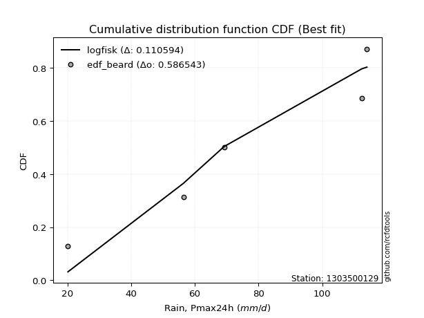</img>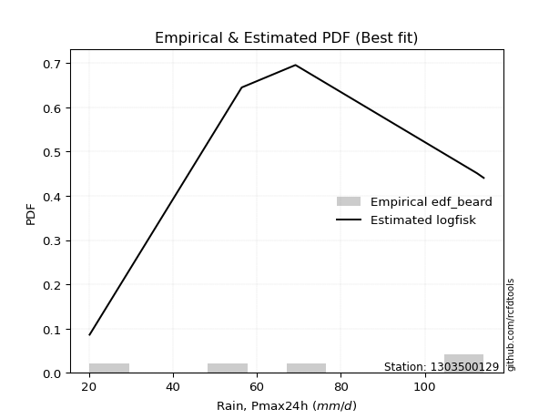</img>

</div>


### 5. EDF Chegodayev (1955)

The Chegodayev formula is an empirical plotting position formula used in hydrological frequency analysis to estimate the exceedance probability or return period of a specific event from a set of observed data. It is primarily used for plotting observed data points on probability paper to fit a theoretical distribution, particularly for analyzing extreme events like maximum flood flows or rainfall intensities. The constant _b_ value in the generalized plotting position formula is 0.3.

<div align="center">


$P=(m-b)/(n+1-2b)$


</div>


**5.1. Empirical values**

<div align="center">

|                | 0                   | 1                   | 2              | 3                  | 4                  |
|:---------------|:--------------------|:--------------------|:---------------|:-------------------|:-------------------|
| date           | 2020                | 2022                | 2021           | 2024               | 2019               |
| x              | 20.2                | 56.4                | 69.2           | 112.4              | 114.0              |
| m              | 1                   | 2                   | 3              | 4                  | 5                  |
| empirical_dist | edf_chegodayev      | edf_chegodayev      | edf_chegodayev | edf_chegodayev     | edf_chegodayev     |
| empirical      | 0.12962962962962962 | 0.31481481481481477 | 0.5            | 0.6851851851851851 | 0.8703703703703703 |
| empirical_tr   | 1.148936170212766   | 1.4594594594594594  | 2.0            | 3.1764705882352935 | 7.714285714285713  |

</div>


**5.2. Kolmogorov-Smirnov fit test (sorted by Δ)**


<div align="center">

|                | 0                   | 1                   | 2                   | 3                   | 4                   | 5                   | 6                  | 7                   | 8                   | 9                   | 10                  | 11                  | 12                  | 13                  | 14                  | 15                  | 16                  | 17                  | 18                  | 19                  | 20                  | 21                 | 22                  | 23                  | 24                  | 25                  | 26                  | 27                  | 28                 | 29                  | 30                 | 31                  | 32                  | 33                  | 34                    | 35                 | 36                  | 37                  | 38                  | 39                  | 40                  | 41                  | 42                  | 43                  | 44                  | 45                 | 46                  | 47                 | 48                  | 49                  | 50                 | 51                  | 52                  | 53                  | 54                  | 55                 | 56                 | 57                  | 58                  | 59                 | 60                  | 61                  | 62                 | 63                  | 64                 | 65                  | 66                  | 67                  | 68                 | 69                  | 70                  | 71                 | 72                 | 73                  | 74                  | 75                 | 76                 | 77                  | 78                  | 79                 | 80                 | 81                 | 82                  | 83                 | 84                 | 85                  | 86                 | 87                 |
|:---------------|:--------------------|:--------------------|:--------------------|:--------------------|:--------------------|:--------------------|:-------------------|:--------------------|:--------------------|:--------------------|:--------------------|:--------------------|:--------------------|:--------------------|:--------------------|:--------------------|:--------------------|:--------------------|:--------------------|:--------------------|:--------------------|:-------------------|:--------------------|:--------------------|:--------------------|:--------------------|:--------------------|:--------------------|:-------------------|:--------------------|:-------------------|:--------------------|:--------------------|:--------------------|:----------------------|:-------------------|:--------------------|:--------------------|:--------------------|:--------------------|:--------------------|:--------------------|:--------------------|:--------------------|:--------------------|:-------------------|:--------------------|:-------------------|:--------------------|:--------------------|:-------------------|:--------------------|:--------------------|:--------------------|:--------------------|:-------------------|:-------------------|:--------------------|:--------------------|:-------------------|:--------------------|:--------------------|:-------------------|:--------------------|:-------------------|:--------------------|:--------------------|:--------------------|:-------------------|:--------------------|:--------------------|:-------------------|:-------------------|:--------------------|:--------------------|:-------------------|:-------------------|:--------------------|:--------------------|:-------------------|:-------------------|:-------------------|:--------------------|:-------------------|:-------------------|:--------------------|:-------------------|:-------------------|
| station        | 1303500129          | 1303500129          | 1303500129          | 1303500129          | 1303500129          | 1303500129          | 1303500129         | 1303500129          | 1303500129          | 1303500129          | 1303500129          | 1303500129          | 1303500129          | 1303500129          | 1303500129          | 1303500129          | 1303500129          | 1303500129          | 1303500129          | 1303500129          | 1303500129          | 1303500129         | 1303500129          | 1303500129          | 1303500129          | 1303500129          | 1303500129          | 1303500129          | 1303500129         | 1303500129          | 1303500129         | 1303500129          | 1303500129          | 1303500129          | 1303500129            | 1303500129         | 1303500129          | 1303500129          | 1303500129          | 1303500129          | 1303500129          | 1303500129          | 1303500129          | 1303500129          | 1303500129          | 1303500129         | 1303500129          | 1303500129         | 1303500129          | 1303500129          | 1303500129         | 1303500129          | 1303500129          | 1303500129          | 1303500129          | 1303500129         | 1303500129         | 1303500129          | 1303500129          | 1303500129         | 1303500129          | 1303500129          | 1303500129         | 1303500129          | 1303500129         | 1303500129          | 1303500129          | 1303500129          | 1303500129         | 1303500129          | 1303500129          | 1303500129         | 1303500129         | 1303500129          | 1303500129          | 1303500129         | 1303500129         | 1303500129          | 1303500129          | 1303500129         | 1303500129         | 1303500129         | 1303500129          | 1303500129         | 1303500129         | 1303500129          | 1303500129         | 1303500129         |
| empirical_dist | edf_chegodayev      | edf_chegodayev      | edf_chegodayev      | edf_chegodayev      | edf_chegodayev      | edf_chegodayev      | edf_chegodayev     | edf_chegodayev      | edf_chegodayev      | edf_chegodayev      | edf_chegodayev      | edf_chegodayev      | edf_chegodayev      | edf_chegodayev      | edf_chegodayev      | edf_chegodayev      | edf_chegodayev      | edf_chegodayev      | edf_chegodayev      | edf_chegodayev      | edf_chegodayev      | edf_chegodayev     | edf_chegodayev      | edf_chegodayev      | edf_chegodayev      | edf_chegodayev      | edf_chegodayev      | edf_chegodayev      | edf_chegodayev     | edf_chegodayev      | edf_chegodayev     | edf_chegodayev      | edf_chegodayev      | edf_chegodayev      | edf_chegodayev        | edf_chegodayev     | edf_chegodayev      | edf_chegodayev      | edf_chegodayev      | edf_chegodayev      | edf_chegodayev      | edf_chegodayev      | edf_chegodayev      | edf_chegodayev      | edf_chegodayev      | edf_chegodayev     | edf_chegodayev      | edf_chegodayev     | edf_chegodayev      | edf_chegodayev      | edf_chegodayev     | edf_chegodayev      | edf_chegodayev      | edf_chegodayev      | edf_chegodayev      | edf_chegodayev     | edf_chegodayev     | edf_chegodayev      | edf_chegodayev      | edf_chegodayev     | edf_chegodayev      | edf_chegodayev      | edf_chegodayev     | edf_chegodayev      | edf_chegodayev     | edf_chegodayev      | edf_chegodayev      | edf_chegodayev      | edf_chegodayev     | edf_chegodayev      | edf_chegodayev      | edf_chegodayev     | edf_chegodayev     | edf_chegodayev      | edf_chegodayev      | edf_chegodayev     | edf_chegodayev     | edf_chegodayev      | edf_chegodayev      | edf_chegodayev     | edf_chegodayev     | edf_chegodayev     | edf_chegodayev      | edf_chegodayev     | edf_chegodayev     | edf_chegodayev      | edf_chegodayev     | edf_chegodayev     |
| p_dist         | logfisk             | logbetaprime        | loggamma            | loggamma            | logncf              | logerlang           | logrice            | lognct              | logf                | loginvgamma         | logalpha            | logcrystalball      | lognorm             | lognorm             | logt                | logexponnorm        | logfatiguelife      | logpearson3         | logmaxwell          | loginvgauss         | loggumbel_l         | ncf                | loglogistic         | kstwobign           | invgauss            | lograyleigh         | genlogistic         | fisk                | alpha              | invgamma            | loggompertz        | loghypsecant        | halfnorm            | chi2                | loglaplace_asymmetric | f                  | rayleigh            | maxwell             | logweibull_min      | rice                | erlang              | gamma               | laplace_asymmetric  | genexpon            | expon               | nct                | t                   | loginvweibull      | exponnorm           | norm                | crystalball        | truncnorm           | betaprime           | pearson3            | loglaplace          | weibull_min        | loggumbel_r        | halflogistic        | gumbel_r            | moyal              | logistic            | loghalfnorm         | hypsecant          | logmoyal            | laplace            | logkstwobign        | gumbel_l            | wald                | loggenexpon        | loghalflogistic     | gibrat              | logwald            | logmielke          | loggibrat           | logexpon            | logloggamma        | logtruncnorm       | nakagami            | lognakagami         | logjohnsonsu       | loglognorm         | mielke             | logchi2             | invweibull         | fatiguelife        | gompertz            | johnsonsu          | loggenlogistic     |
| delta          | 0.11128234632415801 | 0.12157509025805657 | 0.12440435205962219 | 0.12440435205962219 | 0.12946304761811522 | 0.13002956174753544 | 0.1306865368789245 | 0.13070032892045114 | 0.13131132716221405 | 0.13230519544660313 | 0.13314591476693188 | 0.13323890110602954 | 0.13323903948240756 | 0.13323903948240756 | 0.13323933949357558 | 0.13324260902702623 | 0.13354247644451678 | 0.13509853336338962 | 0.14795470365274715 | 0.14809945834726568 | 0.14990788467435157 | 0.1526032309044647 | 0.15362828261047845 | 0.15577151014858404 | 0.15917420065205345 | 0.16008894651119399 | 0.16062446583328105 | 0.16083042103422762 | 0.1623649284032087 | 0.16269046899035244 | 0.1638530729595996 | 0.16505403815970654 | 0.16565023345728336 | 0.16572543699303588 | 0.1664509112859318    | 0.1664619064507349 | 0.16655777669395444 | 0.16777314652224407 | 0.16798940516380156 | 0.16808443716846067 | 0.17054861076891636 | 0.17098976321268355 | 0.17170160813609747 | 0.17191785850031283 | 0.17214655276945467 | 0.1722278741403398 | 0.17234128739122656 | 0.1723421142652098 | 0.17235452223726622 | 0.17235459616337878 | 0.1723545992486153 | 0.17235460521395463 | 0.17261099410905423 | 0.17414015240983582 | 0.17663499714992703 | 0.1777103954674486 | 0.1779491178643834 | 0.18122841179431093 | 0.18203609962734701 | 0.1864711328200589 | 0.18911776864496743 | 0.19440988301397455 | 0.197477066829005  | 0.20251290920993392 | 0.2046094748990549 | 0.20521341023038386 | 0.20541999244576248 | 0.20761808426985862 | 0.2106390746546748 | 0.21334050036364838 | 0.23043228681088856 | 0.2703364793473624 | 0.2737749760796707 | 0.27615374442516016 | 0.27857497194804626 | 0.2910635837073797 | 0.314812648021072  | 0.31481481462340394 | 0.32726172450409885 | 0.3596290351504639 | 0.3690837874379379 | 0.3735101353671303 | 0.37465379630309203 | 0.4349034123688361 | 0.4743665057902092 | 0.49994805197205056 | 0.5976708441673091 | 0.6851851851851851 |
| deltao         | 0.5865427407550001  | 0.5865427407550001  | 0.5865427407550001  | 0.5865427407550001  | 0.5865427407550001  | 0.5865427407550001  | 0.5865427407550001 | 0.5865427407550001  | 0.5865427407550001  | 0.5865427407550001  | 0.5865427407550001  | 0.5865427407550001  | 0.5865427407550001  | 0.5865427407550001  | 0.5865427407550001  | 0.5865427407550001  | 0.5865427407550001  | 0.5865427407550001  | 0.5865427407550001  | 0.5865427407550001  | 0.5865427407550001  | 0.5865427407550001 | 0.5865427407550001  | 0.5865427407550001  | 0.5865427407550001  | 0.5865427407550001  | 0.5865427407550001  | 0.5865427407550001  | 0.5865427407550001 | 0.5865427407550001  | 0.5865427407550001 | 0.5865427407550001  | 0.5865427407550001  | 0.5865427407550001  | 0.5865427407550001    | 0.5865427407550001 | 0.5865427407550001  | 0.5865427407550001  | 0.5865427407550001  | 0.5865427407550001  | 0.5865427407550001  | 0.5865427407550001  | 0.5865427407550001  | 0.5865427407550001  | 0.5865427407550001  | 0.5865427407550001 | 0.5865427407550001  | 0.5865427407550001 | 0.5865427407550001  | 0.5865427407550001  | 0.5865427407550001 | 0.5865427407550001  | 0.5865427407550001  | 0.5865427407550001  | 0.5865427407550001  | 0.5865427407550001 | 0.5865427407550001 | 0.5865427407550001  | 0.5865427407550001  | 0.5865427407550001 | 0.5865427407550001  | 0.5865427407550001  | 0.5865427407550001 | 0.5865427407550001  | 0.5865427407550001 | 0.5865427407550001  | 0.5865427407550001  | 0.5865427407550001  | 0.5865427407550001 | 0.5865427407550001  | 0.5865427407550001  | 0.5865427407550001 | 0.5865427407550001 | 0.5865427407550001  | 0.5865427407550001  | 0.5865427407550001 | 0.5865427407550001 | 0.5865427407550001  | 0.5865427407550001  | 0.5865427407550001 | 0.5865427407550001 | 0.5865427407550001 | 0.5865427407550001  | 0.5865427407550001 | 0.5865427407550001 | 0.5865427407550001  | 0.5865427407550001 | 0.5865427407550001 |
| eval           | Δo > Δ              | Δo > Δ              | Δo > Δ              | Δo > Δ              | Δo > Δ              | Δo > Δ              | Δo > Δ             | Δo > Δ              | Δo > Δ              | Δo > Δ              | Δo > Δ              | Δo > Δ              | Δo > Δ              | Δo > Δ              | Δo > Δ              | Δo > Δ              | Δo > Δ              | Δo > Δ              | Δo > Δ              | Δo > Δ              | Δo > Δ              | Δo > Δ             | Δo > Δ              | Δo > Δ              | Δo > Δ              | Δo > Δ              | Δo > Δ              | Δo > Δ              | Δo > Δ             | Δo > Δ              | Δo > Δ             | Δo > Δ              | Δo > Δ              | Δo > Δ              | Δo > Δ                | Δo > Δ             | Δo > Δ              | Δo > Δ              | Δo > Δ              | Δo > Δ              | Δo > Δ              | Δo > Δ              | Δo > Δ              | Δo > Δ              | Δo > Δ              | Δo > Δ             | Δo > Δ              | Δo > Δ             | Δo > Δ              | Δo > Δ              | Δo > Δ             | Δo > Δ              | Δo > Δ              | Δo > Δ              | Δo > Δ              | Δo > Δ             | Δo > Δ             | Δo > Δ              | Δo > Δ              | Δo > Δ             | Δo > Δ              | Δo > Δ              | Δo > Δ             | Δo > Δ              | Δo > Δ             | Δo > Δ              | Δo > Δ              | Δo > Δ              | Δo > Δ             | Δo > Δ              | Δo > Δ              | Δo > Δ             | Δo > Δ             | Δo > Δ              | Δo > Δ              | Δo > Δ             | Δo > Δ             | Δo > Δ              | Δo > Δ              | Δo > Δ             | Δo > Δ             | Δo > Δ             | Δo > Δ              | Δo > Δ             | Δo > Δ             | Δo > Δ              | Δo <= Δ            | Δo <= Δ            |
| fit            | 1                   | 1                   | 1                   | 1                   | 1                   | 1                   | 1                  | 1                   | 1                   | 1                   | 1                   | 1                   | 1                   | 1                   | 1                   | 1                   | 1                   | 1                   | 1                   | 1                   | 1                   | 1                  | 1                   | 1                   | 1                   | 1                   | 1                   | 1                   | 1                  | 1                   | 1                  | 1                   | 1                   | 1                   | 1                     | 1                  | 1                   | 1                   | 1                   | 1                   | 1                   | 1                   | 1                   | 1                   | 1                   | 1                  | 1                   | 1                  | 1                   | 1                   | 1                  | 1                   | 1                   | 1                   | 1                   | 1                  | 1                  | 1                   | 1                   | 1                  | 1                   | 1                   | 1                  | 1                   | 1                  | 1                   | 1                   | 1                   | 1                  | 1                   | 1                   | 1                  | 1                  | 1                   | 1                   | 1                  | 1                  | 1                   | 1                   | 1                  | 1                  | 1                  | 1                   | 1                  | 1                  | 1                   | 0                  | 0                  |
| n              | 5                   | 5                   | 5                   | 5                   | 5                   | 5                   | 5                  | 5                   | 5                   | 5                   | 5                   | 5                   | 5                   | 5                   | 5                   | 5                   | 5                   | 5                   | 5                   | 5                   | 5                   | 5                  | 5                   | 5                   | 5                   | 5                   | 5                   | 5                   | 5                  | 5                   | 5                  | 5                   | 5                   | 5                   | 5                     | 5                  | 5                   | 5                   | 5                   | 5                   | 5                   | 5                   | 5                   | 5                   | 5                   | 5                  | 5                   | 5                  | 5                   | 5                   | 5                  | 5                   | 5                   | 5                   | 5                   | 5                  | 5                  | 5                   | 5                   | 5                  | 5                   | 5                   | 5                  | 5                   | 5                  | 5                   | 5                   | 5                   | 5                  | 5                   | 5                   | 5                  | 5                  | 5                   | 5                   | 5                  | 5                  | 5                   | 5                   | 5                  | 5                  | 5                  | 5                   | 5                  | 5                  | 5                   | 5                  | 5                  |
| best_fit       | 1                   | 0                   | 0                   | 0                   | 0                   | 0                   | 0                  | 0                   | 0                   | 0                   | 0                   | 0                   | 0                   | 0                   | 0                   | 0                   | 0                   | 0                   | 0                   | 0                   | 0                   | 0                  | 0                   | 0                   | 0                   | 0                   | 0                   | 0                   | 0                  | 0                   | 0                  | 0                   | 0                   | 0                   | 0                     | 0                  | 0                   | 0                   | 0                   | 0                   | 0                   | 0                   | 0                   | 0                   | 0                   | 0                  | 0                   | 0                  | 0                   | 0                   | 0                  | 0                   | 0                   | 0                   | 0                   | 0                  | 0                  | 0                   | 0                   | 0                  | 0                   | 0                   | 0                  | 0                   | 0                  | 0                   | 0                   | 0                   | 0                  | 0                   | 0                   | 0                  | 0                  | 0                   | 0                   | 0                  | 0                  | 0                   | 0                   | 0                  | 0                  | 0                  | 0                   | 0                  | 0                  | 0                   | 0                  | 0                  |
| best_fit_sort  | 1                   | 2                   | 3                   | 4                   | 5                   | 6                   | 7                  | 8                   | 9                   | 10                  | 11                  | 12                  | 13                  | 14                  | 15                  | 16                  | 17                  | 18                  | 19                  | 20                  | 21                  | 22                 | 23                  | 24                  | 25                  | 26                  | 27                  | 28                  | 29                 | 30                  | 31                 | 32                  | 33                  | 34                  | 35                    | 36                 | 37                  | 38                  | 39                  | 40                  | 41                  | 42                  | 43                  | 44                  | 45                  | 46                 | 47                  | 48                 | 49                  | 50                  | 51                 | 52                  | 53                  | 54                  | 55                  | 56                 | 57                 | 58                  | 59                  | 60                 | 61                  | 62                  | 63                 | 64                  | 65                 | 66                  | 67                  | 68                  | 69                 | 70                  | 71                  | 72                 | 73                 | 74                  | 75                  | 76                 | 77                 | 78                  | 79                  | 80                 | 81                 | 82                 | 83                  | 84                 | 85                 | 86                  | 87                 | 88                 |

</div>


**5.3. Best fit**

<div align="center">

|   id |    station | empirical_dist   | p_dist   |    delta |   deltao | eval   |   fit |   n |   best_fit |   best_fit_sort |
|-----:|-----------:|:-----------------|:---------|---------:|---------:|:-------|------:|----:|-----------:|----------------:|
|    0 | 1303500129 | edf_chegodayev   | logfisk  | 0.111282 | 0.586543 | Δo > Δ |     1 |   5 |          1 |               1 |

</div>


<div align="center">

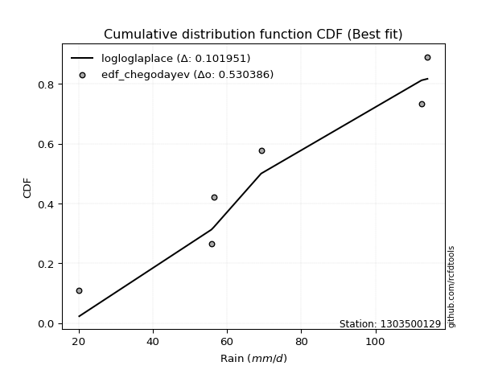</img></img>

</div>


### 6. EDF Blom (1958)

The Blom formula is a specific "plotting position" formula used in hydrology and statistical analysis to estimate the empirical cumulative probability (or non-exceedance probability) of a data series. It is particularly recommended for data that are approximately normally distributed. The constant _a_ is set to 0.375 (or 3/8).

<div align="center">


$P=(m-a)/(n+1-2a)$


</div>


**6.1. Empirical values**

<div align="center">

|                | 0                   | 1                   | 2        | 3                  | 4                  |
|:---------------|:--------------------|:--------------------|:---------|:-------------------|:-------------------|
| date           | 2020                | 2022                | 2021     | 2024               | 2019               |
| x              | 20.2                | 56.4                | 69.2     | 112.4              | 114.0              |
| m              | 1                   | 2                   | 3        | 4                  | 5                  |
| empirical_dist | edf_blom            | edf_blom            | edf_blom | edf_blom           | edf_blom           |
| empirical      | 0.11904761904761904 | 0.30952380952380953 | 0.5      | 0.6904761904761905 | 0.8809523809523809 |
| empirical_tr   | 1.135135135135135   | 1.4482758620689655  | 2.0      | 3.230769230769231  | 8.399999999999999  |

</div>


**6.2. Kolmogorov-Smirnov fit test (sorted by Δ)**


<div align="center">

|                | 0                   | 1                   | 2                  | 3                  | 4                  | 5                  | 6                   | 7                   | 8                   | 9                   | 10                  | 11                  | 12                  | 13                  | 14                  | 15                 | 16                 | 17                  | 18                  | 19                 | 20                 | 21                 | 22                 | 23                 | 24                 | 25                  | 26                 | 27                  | 28                 | 29                 | 30                  | 31                    | 32                  | 33                 | 34                  | 35                  | 36                  | 37                  | 38                  | 39                  | 40                 | 41                  | 42                  | 43                  | 44                  | 45                  | 46                  | 47                  | 48                  | 49                  | 50                  | 51                  | 52                  | 53                  | 54                  | 55                  | 56                 | 57                  | 58                  | 59                  | 60                  | 61                  | 62                  | 63                  | 64                  | 65                  | 66                  | 67                 | 68                  | 69                 | 70                  | 71                  | 72                 | 73                 | 74                 | 75                 | 76                  | 77                 | 78                  | 79                 | 80                  | 81                 | 82                  | 83                 | 84                  | 85                  | 86                 | 87                 |
|:---------------|:--------------------|:--------------------|:-------------------|:-------------------|:-------------------|:-------------------|:--------------------|:--------------------|:--------------------|:--------------------|:--------------------|:--------------------|:--------------------|:--------------------|:--------------------|:-------------------|:-------------------|:--------------------|:--------------------|:-------------------|:-------------------|:-------------------|:-------------------|:-------------------|:-------------------|:--------------------|:-------------------|:--------------------|:-------------------|:-------------------|:--------------------|:----------------------|:--------------------|:-------------------|:--------------------|:--------------------|:--------------------|:--------------------|:--------------------|:--------------------|:-------------------|:--------------------|:--------------------|:--------------------|:--------------------|:--------------------|:--------------------|:--------------------|:--------------------|:--------------------|:--------------------|:--------------------|:--------------------|:--------------------|:--------------------|:--------------------|:-------------------|:--------------------|:--------------------|:--------------------|:--------------------|:--------------------|:--------------------|:--------------------|:--------------------|:--------------------|:--------------------|:-------------------|:--------------------|:-------------------|:--------------------|:--------------------|:-------------------|:-------------------|:-------------------|:-------------------|:--------------------|:-------------------|:--------------------|:-------------------|:--------------------|:-------------------|:--------------------|:-------------------|:--------------------|:--------------------|:-------------------|:-------------------|
| station        | 1303500129          | 1303500129          | 1303500129         | 1303500129         | 1303500129         | 1303500129         | 1303500129          | 1303500129          | 1303500129          | 1303500129          | 1303500129          | 1303500129          | 1303500129          | 1303500129          | 1303500129          | 1303500129         | 1303500129         | 1303500129          | 1303500129          | 1303500129         | 1303500129         | 1303500129         | 1303500129         | 1303500129         | 1303500129         | 1303500129          | 1303500129         | 1303500129          | 1303500129         | 1303500129         | 1303500129          | 1303500129            | 1303500129          | 1303500129         | 1303500129          | 1303500129          | 1303500129          | 1303500129          | 1303500129          | 1303500129          | 1303500129         | 1303500129          | 1303500129          | 1303500129          | 1303500129          | 1303500129          | 1303500129          | 1303500129          | 1303500129          | 1303500129          | 1303500129          | 1303500129          | 1303500129          | 1303500129          | 1303500129          | 1303500129          | 1303500129         | 1303500129          | 1303500129          | 1303500129          | 1303500129          | 1303500129          | 1303500129          | 1303500129          | 1303500129          | 1303500129          | 1303500129          | 1303500129         | 1303500129          | 1303500129         | 1303500129          | 1303500129          | 1303500129         | 1303500129         | 1303500129         | 1303500129         | 1303500129          | 1303500129         | 1303500129          | 1303500129         | 1303500129          | 1303500129         | 1303500129          | 1303500129         | 1303500129          | 1303500129          | 1303500129         | 1303500129         |
| empirical_dist | edf_blom            | edf_blom            | edf_blom           | edf_blom           | edf_blom           | edf_blom           | edf_blom            | edf_blom            | edf_blom            | edf_blom            | edf_blom            | edf_blom            | edf_blom            | edf_blom            | edf_blom            | edf_blom           | edf_blom           | edf_blom            | edf_blom            | edf_blom           | edf_blom           | edf_blom           | edf_blom           | edf_blom           | edf_blom           | edf_blom            | edf_blom           | edf_blom            | edf_blom           | edf_blom           | edf_blom            | edf_blom              | edf_blom            | edf_blom           | edf_blom            | edf_blom            | edf_blom            | edf_blom            | edf_blom            | edf_blom            | edf_blom           | edf_blom            | edf_blom            | edf_blom            | edf_blom            | edf_blom            | edf_blom            | edf_blom            | edf_blom            | edf_blom            | edf_blom            | edf_blom            | edf_blom            | edf_blom            | edf_blom            | edf_blom            | edf_blom           | edf_blom            | edf_blom            | edf_blom            | edf_blom            | edf_blom            | edf_blom            | edf_blom            | edf_blom            | edf_blom            | edf_blom            | edf_blom           | edf_blom            | edf_blom           | edf_blom            | edf_blom            | edf_blom           | edf_blom           | edf_blom           | edf_blom           | edf_blom            | edf_blom           | edf_blom            | edf_blom           | edf_blom            | edf_blom           | edf_blom            | edf_blom           | edf_blom            | edf_blom            | edf_blom           | edf_blom           |
| p_dist         | logfisk             | logncf              | lognct             | logf               | logbetaprime       | logcrystalball     | lognorm             | lognorm             | logt                | logexponnorm        | logfatiguelife      | loggamma            | loggamma            | logpearson3         | logrice             | logerlang          | loginvgamma        | logalpha            | loggumbel_l         | loglogistic        | kstwobign          | logmaxwell         | loginvgauss        | invgauss           | genlogistic        | fisk                | invgamma           | loggompertz         | loghypsecant       | halfnorm           | chi2                | loglaplace_asymmetric | f                   | rayleigh           | maxwell             | logweibull_min      | rice                | ncf                 | erlang              | lograyleigh         | gamma              | laplace_asymmetric  | nct                 | t                   | exponnorm           | norm                | crystalball         | truncnorm           | betaprime           | alpha               | pearson3            | loglaplace          | weibull_min         | halflogistic        | gumbel_r            | genexpon            | expon              | loginvweibull       | moyal               | loggumbel_r         | logistic            | hypsecant           | laplace             | loghalfnorm         | gumbel_l            | wald                | logmoyal            | logkstwobign       | loggenexpon         | loghalflogistic    | gibrat              | logmielke           | logwald            | loggibrat          | logexpon           | logloggamma        | logtruncnorm        | nakagami           | lognakagami         | logjohnsonsu       | loglognorm          | mielke             | logchi2             | invweibull         | fatiguelife         | gompertz            | johnsonsu          | loggenlogistic     |
| delta          | 0.10599134103315266 | 0.12417204232710988 | 0.1254093236294458 | 0.1260203218712087 | 0.1268660955490618 | 0.1279478958150242 | 0.12794803419140222 | 0.12794803419140222 | 0.12794833420257024 | 0.12795160373602088 | 0.12825147115351143 | 0.12897216346421658 | 0.12897216346421658 | 0.12980752807238427 | 0.13127755154907128 | 0.1331922214312895 | 0.1351289998598133 | 0.13843692005793712 | 0.14461687938334622 | 0.1483372773194731 | 0.1504805048575787 | 0.1532457089437524 | 0.1533904636382709 | 0.1538831953610481 | 0.1553334605422757 | 0.15553941574322228 | 0.1573994636993471 | 0.15856206766859426 | 0.1597630328687012 | 0.160359228166278  | 0.16043443170203053 | 0.16115990599492647   | 0.16117090115972954 | 0.1612667714029491 | 0.16248214123123872 | 0.16269839987279622 | 0.16279343187745532 | 0.16318524148647529 | 0.16525760547791102 | 0.16537995180219922 | 0.1656987579216782 | 0.16641060284509213 | 0.16693686884933445 | 0.16705028210022121 | 0.16706351694626087 | 0.16706359087237344 | 0.16706359395760995 | 0.16706359992294928 | 0.16731998881804888 | 0.16765593369421394 | 0.16884914711883048 | 0.17134399185892168 | 0.17241939017644325 | 0.17593740650330558 | 0.17674509433634167 | 0.17720886379131806 | 0.1774375580604599 | 0.17763311955621502 | 0.18118012752905355 | 0.18324012315538862 | 0.18382676335396209 | 0.19218606153799966 | 0.19931846960804955 | 0.19970088830497978 | 0.20012898715475713 | 0.20232707897885327 | 0.20780391450093916 | 0.2105044155213891 | 0.21593007994568003 | 0.2186315056546536 | 0.22514128151988322 | 0.26848397078866537 | 0.2756274846383676 | 0.2814447497161654 | 0.2838659772390515 | 0.2857725784163744 | 0.30952164273006677 | 0.3095238093323987 | 0.32726172450409885 | 0.3596290351504639 | 0.37437479272894314 | 0.3788011406581355 | 0.37994480159409727 | 0.4454854229508467 | 0.47965751108121446 | 0.49994805197205056 | 0.6029618494583144 | 0.6904761904761905 |
| deltao         | 0.5865427407550001  | 0.5865427407550001  | 0.5865427407550001 | 0.5865427407550001 | 0.5865427407550001 | 0.5865427407550001 | 0.5865427407550001  | 0.5865427407550001  | 0.5865427407550001  | 0.5865427407550001  | 0.5865427407550001  | 0.5865427407550001  | 0.5865427407550001  | 0.5865427407550001  | 0.5865427407550001  | 0.5865427407550001 | 0.5865427407550001 | 0.5865427407550001  | 0.5865427407550001  | 0.5865427407550001 | 0.5865427407550001 | 0.5865427407550001 | 0.5865427407550001 | 0.5865427407550001 | 0.5865427407550001 | 0.5865427407550001  | 0.5865427407550001 | 0.5865427407550001  | 0.5865427407550001 | 0.5865427407550001 | 0.5865427407550001  | 0.5865427407550001    | 0.5865427407550001  | 0.5865427407550001 | 0.5865427407550001  | 0.5865427407550001  | 0.5865427407550001  | 0.5865427407550001  | 0.5865427407550001  | 0.5865427407550001  | 0.5865427407550001 | 0.5865427407550001  | 0.5865427407550001  | 0.5865427407550001  | 0.5865427407550001  | 0.5865427407550001  | 0.5865427407550001  | 0.5865427407550001  | 0.5865427407550001  | 0.5865427407550001  | 0.5865427407550001  | 0.5865427407550001  | 0.5865427407550001  | 0.5865427407550001  | 0.5865427407550001  | 0.5865427407550001  | 0.5865427407550001 | 0.5865427407550001  | 0.5865427407550001  | 0.5865427407550001  | 0.5865427407550001  | 0.5865427407550001  | 0.5865427407550001  | 0.5865427407550001  | 0.5865427407550001  | 0.5865427407550001  | 0.5865427407550001  | 0.5865427407550001 | 0.5865427407550001  | 0.5865427407550001 | 0.5865427407550001  | 0.5865427407550001  | 0.5865427407550001 | 0.5865427407550001 | 0.5865427407550001 | 0.5865427407550001 | 0.5865427407550001  | 0.5865427407550001 | 0.5865427407550001  | 0.5865427407550001 | 0.5865427407550001  | 0.5865427407550001 | 0.5865427407550001  | 0.5865427407550001 | 0.5865427407550001  | 0.5865427407550001  | 0.5865427407550001 | 0.5865427407550001 |
| eval           | Δo > Δ              | Δo > Δ              | Δo > Δ             | Δo > Δ             | Δo > Δ             | Δo > Δ             | Δo > Δ              | Δo > Δ              | Δo > Δ              | Δo > Δ              | Δo > Δ              | Δo > Δ              | Δo > Δ              | Δo > Δ              | Δo > Δ              | Δo > Δ             | Δo > Δ             | Δo > Δ              | Δo > Δ              | Δo > Δ             | Δo > Δ             | Δo > Δ             | Δo > Δ             | Δo > Δ             | Δo > Δ             | Δo > Δ              | Δo > Δ             | Δo > Δ              | Δo > Δ             | Δo > Δ             | Δo > Δ              | Δo > Δ                | Δo > Δ              | Δo > Δ             | Δo > Δ              | Δo > Δ              | Δo > Δ              | Δo > Δ              | Δo > Δ              | Δo > Δ              | Δo > Δ             | Δo > Δ              | Δo > Δ              | Δo > Δ              | Δo > Δ              | Δo > Δ              | Δo > Δ              | Δo > Δ              | Δo > Δ              | Δo > Δ              | Δo > Δ              | Δo > Δ              | Δo > Δ              | Δo > Δ              | Δo > Δ              | Δo > Δ              | Δo > Δ             | Δo > Δ              | Δo > Δ              | Δo > Δ              | Δo > Δ              | Δo > Δ              | Δo > Δ              | Δo > Δ              | Δo > Δ              | Δo > Δ              | Δo > Δ              | Δo > Δ             | Δo > Δ              | Δo > Δ             | Δo > Δ              | Δo > Δ              | Δo > Δ             | Δo > Δ             | Δo > Δ             | Δo > Δ             | Δo > Δ              | Δo > Δ             | Δo > Δ              | Δo > Δ             | Δo > Δ              | Δo > Δ             | Δo > Δ              | Δo > Δ             | Δo > Δ              | Δo > Δ              | Δo <= Δ            | Δo <= Δ            |
| fit            | 1                   | 1                   | 1                  | 1                  | 1                  | 1                  | 1                   | 1                   | 1                   | 1                   | 1                   | 1                   | 1                   | 1                   | 1                   | 1                  | 1                  | 1                   | 1                   | 1                  | 1                  | 1                  | 1                  | 1                  | 1                  | 1                   | 1                  | 1                   | 1                  | 1                  | 1                   | 1                     | 1                   | 1                  | 1                   | 1                   | 1                   | 1                   | 1                   | 1                   | 1                  | 1                   | 1                   | 1                   | 1                   | 1                   | 1                   | 1                   | 1                   | 1                   | 1                   | 1                   | 1                   | 1                   | 1                   | 1                   | 1                  | 1                   | 1                   | 1                   | 1                   | 1                   | 1                   | 1                   | 1                   | 1                   | 1                   | 1                  | 1                   | 1                  | 1                   | 1                   | 1                  | 1                  | 1                  | 1                  | 1                   | 1                  | 1                   | 1                  | 1                   | 1                  | 1                   | 1                  | 1                   | 1                   | 0                  | 0                  |
| n              | 5                   | 5                   | 5                  | 5                  | 5                  | 5                  | 5                   | 5                   | 5                   | 5                   | 5                   | 5                   | 5                   | 5                   | 5                   | 5                  | 5                  | 5                   | 5                   | 5                  | 5                  | 5                  | 5                  | 5                  | 5                  | 5                   | 5                  | 5                   | 5                  | 5                  | 5                   | 5                     | 5                   | 5                  | 5                   | 5                   | 5                   | 5                   | 5                   | 5                   | 5                  | 5                   | 5                   | 5                   | 5                   | 5                   | 5                   | 5                   | 5                   | 5                   | 5                   | 5                   | 5                   | 5                   | 5                   | 5                   | 5                  | 5                   | 5                   | 5                   | 5                   | 5                   | 5                   | 5                   | 5                   | 5                   | 5                   | 5                  | 5                   | 5                  | 5                   | 5                   | 5                  | 5                  | 5                  | 5                  | 5                   | 5                  | 5                   | 5                  | 5                   | 5                  | 5                   | 5                  | 5                   | 5                   | 5                  | 5                  |
| best_fit       | 1                   | 0                   | 0                  | 0                  | 0                  | 0                  | 0                   | 0                   | 0                   | 0                   | 0                   | 0                   | 0                   | 0                   | 0                   | 0                  | 0                  | 0                   | 0                   | 0                  | 0                  | 0                  | 0                  | 0                  | 0                  | 0                   | 0                  | 0                   | 0                  | 0                  | 0                   | 0                     | 0                   | 0                  | 0                   | 0                   | 0                   | 0                   | 0                   | 0                   | 0                  | 0                   | 0                   | 0                   | 0                   | 0                   | 0                   | 0                   | 0                   | 0                   | 0                   | 0                   | 0                   | 0                   | 0                   | 0                   | 0                  | 0                   | 0                   | 0                   | 0                   | 0                   | 0                   | 0                   | 0                   | 0                   | 0                   | 0                  | 0                   | 0                  | 0                   | 0                   | 0                  | 0                  | 0                  | 0                  | 0                   | 0                  | 0                   | 0                  | 0                   | 0                  | 0                   | 0                  | 0                   | 0                   | 0                  | 0                  |
| best_fit_sort  | 1                   | 2                   | 3                  | 4                  | 5                  | 6                  | 7                   | 8                   | 9                   | 10                  | 11                  | 12                  | 13                  | 14                  | 15                  | 16                 | 17                 | 18                  | 19                  | 20                 | 21                 | 22                 | 23                 | 24                 | 25                 | 26                  | 27                 | 28                  | 29                 | 30                 | 31                  | 32                    | 33                  | 34                 | 35                  | 36                  | 37                  | 38                  | 39                  | 40                  | 41                 | 42                  | 43                  | 44                  | 45                  | 46                  | 47                  | 48                  | 49                  | 50                  | 51                  | 52                  | 53                  | 54                  | 55                  | 56                  | 57                 | 58                  | 59                  | 60                  | 61                  | 62                  | 63                  | 64                  | 65                  | 66                  | 67                  | 68                 | 69                  | 70                 | 71                  | 72                  | 73                 | 74                 | 75                 | 76                 | 77                  | 78                 | 79                  | 80                 | 81                  | 82                 | 83                  | 84                 | 85                  | 86                  | 87                 | 88                 |

</div>


**6.3. Best fit**

<div align="center">

|   id |    station | empirical_dist   | p_dist   |    delta |   deltao | eval   |   fit |   n |   best_fit |   best_fit_sort |
|-----:|-----------:|:-----------------|:---------|---------:|---------:|:-------|------:|----:|-----------:|----------------:|
|    0 | 1303500129 | edf_blom         | logfisk  | 0.105991 | 0.586543 | Δo > Δ |     1 |   5 |          1 |               1 |

</div>


<div align="center">

</img>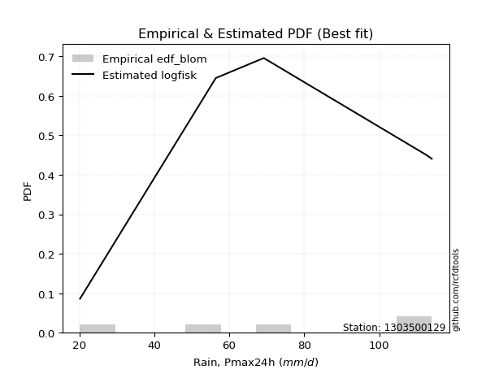</img>

</div>


### 7. EDF Tukey (1962)

In hydrology, the Tukey formula is used as a plotting position formula to estimate the empirical probability or frequency of a flood event (or other hydrological data). The formula parameter is given as _c=0.333_ (or 1/3).

<div align="center">


$P=(m-c)/(n+1-2c)$


</div>


**7.1. Empirical values**

<div align="center">

|                | 0                  | 1                  | 2         | 3         | 4         |
|:---------------|:-------------------|:-------------------|:----------|:----------|:----------|
| date           | 2020               | 2022               | 2021      | 2024      | 2019      |
| x              | 20.2               | 56.4               | 69.2      | 112.4     | 114.0     |
| m              | 1                  | 2                  | 3         | 4         | 5         |
| empirical_dist | edf_tukey          | edf_tukey          | edf_tukey | edf_tukey | edf_tukey |
| empirical      | 0.125              | 0.3125             | 0.5       | 0.6875    | 0.875     |
| empirical_tr   | 1.1428571428571428 | 1.4545454545454546 | 2.0       | 3.2       | 8.0       |

</div>


**7.2. Kolmogorov-Smirnov fit test (sorted by Δ)**


<div align="center">

|                | 0                   | 1                   | 2                   | 3                   | 4                   | 5                   | 6                   | 7                   | 8                   | 9                   | 10                  | 11                  | 12                 | 13                  | 14                 | 15                  | 16                  | 17                  | 18                  | 19                  | 20                  | 21                  | 22                  | 23                  | 24                  | 25                  | 26                  | 27                  | 28                  | 29                  | 30                  | 31                  | 32                 | 33                    | 34                 | 35                  | 36                  | 37                  | 38                  | 39                  | 40                  | 41                  | 42                 | 43                  | 44                  | 45                  | 46                 | 47                 | 48                  | 49                  | 50                  | 51                 | 52                  | 53                  | 54                  | 55                  | 56                  | 57                  | 58                  | 59                 | 60                  | 61                  | 62                  | 63                  | 64                 | 65                 | 66                  | 67                  | 68                  | 69                  | 70                  | 71                  | 72                  | 73                  | 74                 | 75                  | 76                  | 77                  | 78                  | 79                 | 80                 | 81                  | 82                 | 83                  | 84                 | 85                  | 86                 | 87                 |
|:---------------|:--------------------|:--------------------|:--------------------|:--------------------|:--------------------|:--------------------|:--------------------|:--------------------|:--------------------|:--------------------|:--------------------|:--------------------|:-------------------|:--------------------|:-------------------|:--------------------|:--------------------|:--------------------|:--------------------|:--------------------|:--------------------|:--------------------|:--------------------|:--------------------|:--------------------|:--------------------|:--------------------|:--------------------|:--------------------|:--------------------|:--------------------|:--------------------|:-------------------|:----------------------|:-------------------|:--------------------|:--------------------|:--------------------|:--------------------|:--------------------|:--------------------|:--------------------|:-------------------|:--------------------|:--------------------|:--------------------|:-------------------|:-------------------|:--------------------|:--------------------|:--------------------|:-------------------|:--------------------|:--------------------|:--------------------|:--------------------|:--------------------|:--------------------|:--------------------|:-------------------|:--------------------|:--------------------|:--------------------|:--------------------|:-------------------|:-------------------|:--------------------|:--------------------|:--------------------|:--------------------|:--------------------|:--------------------|:--------------------|:--------------------|:-------------------|:--------------------|:--------------------|:--------------------|:--------------------|:-------------------|:-------------------|:--------------------|:-------------------|:--------------------|:-------------------|:--------------------|:-------------------|:-------------------|
| station        | 1303500129          | 1303500129          | 1303500129          | 1303500129          | 1303500129          | 1303500129          | 1303500129          | 1303500129          | 1303500129          | 1303500129          | 1303500129          | 1303500129          | 1303500129         | 1303500129          | 1303500129         | 1303500129          | 1303500129          | 1303500129          | 1303500129          | 1303500129          | 1303500129          | 1303500129          | 1303500129          | 1303500129          | 1303500129          | 1303500129          | 1303500129          | 1303500129          | 1303500129          | 1303500129          | 1303500129          | 1303500129          | 1303500129         | 1303500129            | 1303500129         | 1303500129          | 1303500129          | 1303500129          | 1303500129          | 1303500129          | 1303500129          | 1303500129          | 1303500129         | 1303500129          | 1303500129          | 1303500129          | 1303500129         | 1303500129         | 1303500129          | 1303500129          | 1303500129          | 1303500129         | 1303500129          | 1303500129          | 1303500129          | 1303500129          | 1303500129          | 1303500129          | 1303500129          | 1303500129         | 1303500129          | 1303500129          | 1303500129          | 1303500129          | 1303500129         | 1303500129         | 1303500129          | 1303500129          | 1303500129          | 1303500129          | 1303500129          | 1303500129          | 1303500129          | 1303500129          | 1303500129         | 1303500129          | 1303500129          | 1303500129          | 1303500129          | 1303500129         | 1303500129         | 1303500129          | 1303500129         | 1303500129          | 1303500129         | 1303500129          | 1303500129         | 1303500129         |
| empirical_dist | edf_tukey           | edf_tukey           | edf_tukey           | edf_tukey           | edf_tukey           | edf_tukey           | edf_tukey           | edf_tukey           | edf_tukey           | edf_tukey           | edf_tukey           | edf_tukey           | edf_tukey          | edf_tukey           | edf_tukey          | edf_tukey           | edf_tukey           | edf_tukey           | edf_tukey           | edf_tukey           | edf_tukey           | edf_tukey           | edf_tukey           | edf_tukey           | edf_tukey           | edf_tukey           | edf_tukey           | edf_tukey           | edf_tukey           | edf_tukey           | edf_tukey           | edf_tukey           | edf_tukey          | edf_tukey             | edf_tukey          | edf_tukey           | edf_tukey           | edf_tukey           | edf_tukey           | edf_tukey           | edf_tukey           | edf_tukey           | edf_tukey          | edf_tukey           | edf_tukey           | edf_tukey           | edf_tukey          | edf_tukey          | edf_tukey           | edf_tukey           | edf_tukey           | edf_tukey          | edf_tukey           | edf_tukey           | edf_tukey           | edf_tukey           | edf_tukey           | edf_tukey           | edf_tukey           | edf_tukey          | edf_tukey           | edf_tukey           | edf_tukey           | edf_tukey           | edf_tukey          | edf_tukey          | edf_tukey           | edf_tukey           | edf_tukey           | edf_tukey           | edf_tukey           | edf_tukey           | edf_tukey           | edf_tukey           | edf_tukey          | edf_tukey           | edf_tukey           | edf_tukey           | edf_tukey           | edf_tukey          | edf_tukey          | edf_tukey           | edf_tukey          | edf_tukey           | edf_tukey          | edf_tukey           | edf_tukey          | edf_tukey          |
| p_dist         | logfisk             | logbetaprime        | loggamma            | loggamma            | logncf              | logrice             | lognct              | logf                | logerlang           | logcrystalball      | lognorm             | lognorm             | logt               | logexponnorm        | logfatiguelife     | loginvgamma         | logpearson3         | logalpha            | loggumbel_l         | logmaxwell          | loginvgauss         | loglogistic         | kstwobign           | invgauss            | ncf                 | genlogistic         | fisk                | invgamma            | loggompertz         | lograyleigh         | loghypsecant        | halfnorm            | chi2               | loglaplace_asymmetric | f                  | rayleigh            | alpha               | maxwell             | logweibull_min      | rice                | erlang              | gamma               | laplace_asymmetric | nct                 | t                   | exponnorm           | norm               | crystalball        | truncnorm           | betaprime           | pearson3            | genexpon           | loglaplace          | expon               | loginvweibull       | weibull_min         | halflogistic        | gumbel_r            | loggumbel_r         | moyal              | logistic            | hypsecant           | loghalfnorm         | laplace             | gumbel_l           | logmoyal           | wald                | logkstwobign        | loggenexpon         | loghalflogistic     | gibrat              | logmielke           | logwald             | loggibrat           | logexpon           | logloggamma         | logtruncnorm        | nakagami            | lognakagami         | logjohnsonsu       | loglognorm         | mielke              | logchi2            | invweibull          | fatiguelife        | gompertz            | johnsonsu          | loggenlogistic     |
| delta          | 0.10896753150934313 | 0.12388990507287134 | 0.12599597298802612 | 0.12599597298802612 | 0.12714823280330034 | 0.12837172206410963 | 0.12838551410563626 | 0.12899651234739917 | 0.13021603095509904 | 0.13092408629121466 | 0.13092422466759268 | 0.13092422466759268 | 0.1309245246787607 | 0.13092779421221135 | 0.1312276616297019 | 0.13215280938362284 | 0.13278371854857474 | 0.13546072958174665 | 0.14759306985953669 | 0.15026951846756192 | 0.15041427316208045 | 0.15131346779566357 | 0.15345669533376916 | 0.15685938583723857 | 0.15723286053409435 | 0.15830965101846617 | 0.15851560621941274 | 0.16037565417553756 | 0.16153825814478473 | 0.16240376132600876 | 0.16273922334489166 | 0.16333541864246848 | 0.163410622178221  | 0.16413609647111693   | 0.16414709163592   | 0.16424296187913956 | 0.16467974321802348 | 0.16545833170742918 | 0.16567459034898668 | 0.16576962235364578 | 0.16823379595410148 | 0.16867494839786867 | 0.1693867933212826 | 0.16991305932552492 | 0.17002647257641168 | 0.17003970742245134 | 0.1700397813485639 | 0.1700397844338004 | 0.17003979039913975 | 0.17029617929423935 | 0.17182533759502094 | 0.1742326733151276 | 0.17432018233511215 | 0.17446136758426944 | 0.17465692908002456 | 0.17539558065263372 | 0.17891359697949605 | 0.17972128481253213 | 0.18026393267919816 | 0.184156318005244  | 0.18680295383015255 | 0.19516225201419013 | 0.19672469782878932 | 0.20229466008424002 | 0.2031051776309476 | 0.2048277240247487 | 0.20530326945504374 | 0.20752822504519863 | 0.21295388946948957 | 0.21565531517846315 | 0.22811747199607368 | 0.27146016126485584 | 0.27265129416217715 | 0.27846855923997493 | 0.280889786762861  | 0.28874876889256484 | 0.31249783320625724 | 0.31249999980858917 | 0.32726172450409885 | 0.3596290351504639 | 0.3713986022527527 | 0.37582495018194506 | 0.3769686111179068 | 0.43953304199846577 | 0.476681320605024  | 0.49994805197205056 | 0.599985658982124  | 0.6875             |
| deltao         | 0.5865427407550001  | 0.5865427407550001  | 0.5865427407550001  | 0.5865427407550001  | 0.5865427407550001  | 0.5865427407550001  | 0.5865427407550001  | 0.5865427407550001  | 0.5865427407550001  | 0.5865427407550001  | 0.5865427407550001  | 0.5865427407550001  | 0.5865427407550001 | 0.5865427407550001  | 0.5865427407550001 | 0.5865427407550001  | 0.5865427407550001  | 0.5865427407550001  | 0.5865427407550001  | 0.5865427407550001  | 0.5865427407550001  | 0.5865427407550001  | 0.5865427407550001  | 0.5865427407550001  | 0.5865427407550001  | 0.5865427407550001  | 0.5865427407550001  | 0.5865427407550001  | 0.5865427407550001  | 0.5865427407550001  | 0.5865427407550001  | 0.5865427407550001  | 0.5865427407550001 | 0.5865427407550001    | 0.5865427407550001 | 0.5865427407550001  | 0.5865427407550001  | 0.5865427407550001  | 0.5865427407550001  | 0.5865427407550001  | 0.5865427407550001  | 0.5865427407550001  | 0.5865427407550001 | 0.5865427407550001  | 0.5865427407550001  | 0.5865427407550001  | 0.5865427407550001 | 0.5865427407550001 | 0.5865427407550001  | 0.5865427407550001  | 0.5865427407550001  | 0.5865427407550001 | 0.5865427407550001  | 0.5865427407550001  | 0.5865427407550001  | 0.5865427407550001  | 0.5865427407550001  | 0.5865427407550001  | 0.5865427407550001  | 0.5865427407550001 | 0.5865427407550001  | 0.5865427407550001  | 0.5865427407550001  | 0.5865427407550001  | 0.5865427407550001 | 0.5865427407550001 | 0.5865427407550001  | 0.5865427407550001  | 0.5865427407550001  | 0.5865427407550001  | 0.5865427407550001  | 0.5865427407550001  | 0.5865427407550001  | 0.5865427407550001  | 0.5865427407550001 | 0.5865427407550001  | 0.5865427407550001  | 0.5865427407550001  | 0.5865427407550001  | 0.5865427407550001 | 0.5865427407550001 | 0.5865427407550001  | 0.5865427407550001 | 0.5865427407550001  | 0.5865427407550001 | 0.5865427407550001  | 0.5865427407550001 | 0.5865427407550001 |
| eval           | Δo > Δ              | Δo > Δ              | Δo > Δ              | Δo > Δ              | Δo > Δ              | Δo > Δ              | Δo > Δ              | Δo > Δ              | Δo > Δ              | Δo > Δ              | Δo > Δ              | Δo > Δ              | Δo > Δ             | Δo > Δ              | Δo > Δ             | Δo > Δ              | Δo > Δ              | Δo > Δ              | Δo > Δ              | Δo > Δ              | Δo > Δ              | Δo > Δ              | Δo > Δ              | Δo > Δ              | Δo > Δ              | Δo > Δ              | Δo > Δ              | Δo > Δ              | Δo > Δ              | Δo > Δ              | Δo > Δ              | Δo > Δ              | Δo > Δ             | Δo > Δ                | Δo > Δ             | Δo > Δ              | Δo > Δ              | Δo > Δ              | Δo > Δ              | Δo > Δ              | Δo > Δ              | Δo > Δ              | Δo > Δ             | Δo > Δ              | Δo > Δ              | Δo > Δ              | Δo > Δ             | Δo > Δ             | Δo > Δ              | Δo > Δ              | Δo > Δ              | Δo > Δ             | Δo > Δ              | Δo > Δ              | Δo > Δ              | Δo > Δ              | Δo > Δ              | Δo > Δ              | Δo > Δ              | Δo > Δ             | Δo > Δ              | Δo > Δ              | Δo > Δ              | Δo > Δ              | Δo > Δ             | Δo > Δ             | Δo > Δ              | Δo > Δ              | Δo > Δ              | Δo > Δ              | Δo > Δ              | Δo > Δ              | Δo > Δ              | Δo > Δ              | Δo > Δ             | Δo > Δ              | Δo > Δ              | Δo > Δ              | Δo > Δ              | Δo > Δ             | Δo > Δ             | Δo > Δ              | Δo > Δ             | Δo > Δ              | Δo > Δ             | Δo > Δ              | Δo <= Δ            | Δo <= Δ            |
| fit            | 1                   | 1                   | 1                   | 1                   | 1                   | 1                   | 1                   | 1                   | 1                   | 1                   | 1                   | 1                   | 1                  | 1                   | 1                  | 1                   | 1                   | 1                   | 1                   | 1                   | 1                   | 1                   | 1                   | 1                   | 1                   | 1                   | 1                   | 1                   | 1                   | 1                   | 1                   | 1                   | 1                  | 1                     | 1                  | 1                   | 1                   | 1                   | 1                   | 1                   | 1                   | 1                   | 1                  | 1                   | 1                   | 1                   | 1                  | 1                  | 1                   | 1                   | 1                   | 1                  | 1                   | 1                   | 1                   | 1                   | 1                   | 1                   | 1                   | 1                  | 1                   | 1                   | 1                   | 1                   | 1                  | 1                  | 1                   | 1                   | 1                   | 1                   | 1                   | 1                   | 1                   | 1                   | 1                  | 1                   | 1                   | 1                   | 1                   | 1                  | 1                  | 1                   | 1                  | 1                   | 1                  | 1                   | 0                  | 0                  |
| n              | 5                   | 5                   | 5                   | 5                   | 5                   | 5                   | 5                   | 5                   | 5                   | 5                   | 5                   | 5                   | 5                  | 5                   | 5                  | 5                   | 5                   | 5                   | 5                   | 5                   | 5                   | 5                   | 5                   | 5                   | 5                   | 5                   | 5                   | 5                   | 5                   | 5                   | 5                   | 5                   | 5                  | 5                     | 5                  | 5                   | 5                   | 5                   | 5                   | 5                   | 5                   | 5                   | 5                  | 5                   | 5                   | 5                   | 5                  | 5                  | 5                   | 5                   | 5                   | 5                  | 5                   | 5                   | 5                   | 5                   | 5                   | 5                   | 5                   | 5                  | 5                   | 5                   | 5                   | 5                   | 5                  | 5                  | 5                   | 5                   | 5                   | 5                   | 5                   | 5                   | 5                   | 5                   | 5                  | 5                   | 5                   | 5                   | 5                   | 5                  | 5                  | 5                   | 5                  | 5                   | 5                  | 5                   | 5                  | 5                  |
| best_fit       | 1                   | 0                   | 0                   | 0                   | 0                   | 0                   | 0                   | 0                   | 0                   | 0                   | 0                   | 0                   | 0                  | 0                   | 0                  | 0                   | 0                   | 0                   | 0                   | 0                   | 0                   | 0                   | 0                   | 0                   | 0                   | 0                   | 0                   | 0                   | 0                   | 0                   | 0                   | 0                   | 0                  | 0                     | 0                  | 0                   | 0                   | 0                   | 0                   | 0                   | 0                   | 0                   | 0                  | 0                   | 0                   | 0                   | 0                  | 0                  | 0                   | 0                   | 0                   | 0                  | 0                   | 0                   | 0                   | 0                   | 0                   | 0                   | 0                   | 0                  | 0                   | 0                   | 0                   | 0                   | 0                  | 0                  | 0                   | 0                   | 0                   | 0                   | 0                   | 0                   | 0                   | 0                   | 0                  | 0                   | 0                   | 0                   | 0                   | 0                  | 0                  | 0                   | 0                  | 0                   | 0                  | 0                   | 0                  | 0                  |
| best_fit_sort  | 1                   | 2                   | 3                   | 4                   | 5                   | 6                   | 7                   | 8                   | 9                   | 10                  | 11                  | 12                  | 13                 | 14                  | 15                 | 16                  | 17                  | 18                  | 19                  | 20                  | 21                  | 22                  | 23                  | 24                  | 25                  | 26                  | 27                  | 28                  | 29                  | 30                  | 31                  | 32                  | 33                 | 34                    | 35                 | 36                  | 37                  | 38                  | 39                  | 40                  | 41                  | 42                  | 43                 | 44                  | 45                  | 46                  | 47                 | 48                 | 49                  | 50                  | 51                  | 52                 | 53                  | 54                  | 55                  | 56                  | 57                  | 58                  | 59                  | 60                 | 61                  | 62                  | 63                  | 64                  | 65                 | 66                 | 67                  | 68                  | 69                  | 70                  | 71                  | 72                  | 73                  | 74                  | 75                 | 76                  | 77                  | 78                  | 79                  | 80                 | 81                 | 82                  | 83                 | 84                  | 85                 | 86                  | 87                 | 88                 |

</div>


**7.3. Best fit**

<div align="center">

|   id |    station | empirical_dist   | p_dist   |    delta |   deltao | eval   |   fit |   n |   best_fit |   best_fit_sort |
|-----:|-----------:|:-----------------|:---------|---------:|---------:|:-------|------:|----:|-----------:|----------------:|
|    0 | 1303500129 | edf_tukey        | logfisk  | 0.108968 | 0.586543 | Δo > Δ |     1 |   5 |          1 |               1 |

</div>


<div align="center">

</img></img>

</div>


### 8. EDF Gringorten (1963)

Gringorten plotting position formula is essential for estimating the probability and return periods of extreme events like floods and heavy rainfall. The constant _a=0.44_.

<div align="center">


$P=(m-a)/(n+1-2a)$


</div>


**8.1. Empirical values**

<div align="center">

|                | 0                   | 1                  | 2              | 3                 | 4                  |
|:---------------|:--------------------|:-------------------|:---------------|:------------------|:-------------------|
| date           | 2020                | 2022               | 2021           | 2024              | 2019               |
| x              | 20.2                | 56.4               | 69.2           | 112.4             | 114.0              |
| m              | 1                   | 2                  | 3              | 4                 | 5                  |
| empirical_dist | edf_gringorten      | edf_gringorten     | edf_gringorten | edf_gringorten    | edf_gringorten     |
| empirical      | 0.10937500000000001 | 0.3046875          | 0.5            | 0.6953125         | 0.8906249999999999 |
| empirical_tr   | 1.1228070175438596  | 1.4382022471910112 | 2.0            | 3.282051282051282 | 9.142857142857133  |

</div>


**8.2. Kolmogorov-Smirnov fit test (sorted by Δ)**


<div align="center">

|                | 0                   | 1                  | 2                   | 3                   | 4                   | 5                   | 6                   | 7                   | 8                  | 9                   | 10                  | 11                  | 12                  | 13                  | 14                  | 15                  | 16                  | 17                  | 18                  | 19                  | 20                  | 21                  | 22                  | 23                  | 24                  | 25                  | 26                  | 27                  | 28                 | 29                    | 30                 | 31                  | 32                  | 33                  | 34                  | 35                  | 36                  | 37                  | 38                  | 39                 | 40                  | 41                  | 42                  | 43                 | 44                 | 45                  | 46                  | 47                  | 48                  | 49                  | 50                  | 51                  | 52                  | 53                  | 54                  | 55                 | 56                  | 57                 | 58                  | 59                  | 60                  | 61                  | 62                  | 63                 | 64                  | 65                  | 66                 | 67                  | 68                  | 69                  | 70                  | 71                  | 72                  | 73                  | 74                  | 75                 | 76                  | 77                  | 78                  | 79                 | 80                 | 81                  | 82                 | 83                  | 84                 | 85                  | 86                 | 87                 |
|:---------------|:--------------------|:-------------------|:--------------------|:--------------------|:--------------------|:--------------------|:--------------------|:--------------------|:-------------------|:--------------------|:--------------------|:--------------------|:--------------------|:--------------------|:--------------------|:--------------------|:--------------------|:--------------------|:--------------------|:--------------------|:--------------------|:--------------------|:--------------------|:--------------------|:--------------------|:--------------------|:--------------------|:--------------------|:-------------------|:----------------------|:-------------------|:--------------------|:--------------------|:--------------------|:--------------------|:--------------------|:--------------------|:--------------------|:--------------------|:-------------------|:--------------------|:--------------------|:--------------------|:-------------------|:-------------------|:--------------------|:--------------------|:--------------------|:--------------------|:--------------------|:--------------------|:--------------------|:--------------------|:--------------------|:--------------------|:-------------------|:--------------------|:-------------------|:--------------------|:--------------------|:--------------------|:--------------------|:--------------------|:-------------------|:--------------------|:--------------------|:-------------------|:--------------------|:--------------------|:--------------------|:--------------------|:--------------------|:--------------------|:--------------------|:--------------------|:-------------------|:--------------------|:--------------------|:--------------------|:-------------------|:-------------------|:--------------------|:-------------------|:--------------------|:-------------------|:--------------------|:-------------------|:-------------------|
| station        | 1303500129          | 1303500129         | 1303500129          | 1303500129          | 1303500129          | 1303500129          | 1303500129          | 1303500129          | 1303500129         | 1303500129          | 1303500129          | 1303500129          | 1303500129          | 1303500129          | 1303500129          | 1303500129          | 1303500129          | 1303500129          | 1303500129          | 1303500129          | 1303500129          | 1303500129          | 1303500129          | 1303500129          | 1303500129          | 1303500129          | 1303500129          | 1303500129          | 1303500129         | 1303500129            | 1303500129         | 1303500129          | 1303500129          | 1303500129          | 1303500129          | 1303500129          | 1303500129          | 1303500129          | 1303500129          | 1303500129         | 1303500129          | 1303500129          | 1303500129          | 1303500129         | 1303500129         | 1303500129          | 1303500129          | 1303500129          | 1303500129          | 1303500129          | 1303500129          | 1303500129          | 1303500129          | 1303500129          | 1303500129          | 1303500129         | 1303500129          | 1303500129         | 1303500129          | 1303500129          | 1303500129          | 1303500129          | 1303500129          | 1303500129         | 1303500129          | 1303500129          | 1303500129         | 1303500129          | 1303500129          | 1303500129          | 1303500129          | 1303500129          | 1303500129          | 1303500129          | 1303500129          | 1303500129         | 1303500129          | 1303500129          | 1303500129          | 1303500129         | 1303500129         | 1303500129          | 1303500129         | 1303500129          | 1303500129         | 1303500129          | 1303500129         | 1303500129         |
| empirical_dist | edf_gringorten      | edf_gringorten     | edf_gringorten      | edf_gringorten      | edf_gringorten      | edf_gringorten      | edf_gringorten      | edf_gringorten      | edf_gringorten     | edf_gringorten      | edf_gringorten      | edf_gringorten      | edf_gringorten      | edf_gringorten      | edf_gringorten      | edf_gringorten      | edf_gringorten      | edf_gringorten      | edf_gringorten      | edf_gringorten      | edf_gringorten      | edf_gringorten      | edf_gringorten      | edf_gringorten      | edf_gringorten      | edf_gringorten      | edf_gringorten      | edf_gringorten      | edf_gringorten     | edf_gringorten        | edf_gringorten     | edf_gringorten      | edf_gringorten      | edf_gringorten      | edf_gringorten      | edf_gringorten      | edf_gringorten      | edf_gringorten      | edf_gringorten      | edf_gringorten     | edf_gringorten      | edf_gringorten      | edf_gringorten      | edf_gringorten     | edf_gringorten     | edf_gringorten      | edf_gringorten      | edf_gringorten      | edf_gringorten      | edf_gringorten      | edf_gringorten      | edf_gringorten      | edf_gringorten      | edf_gringorten      | edf_gringorten      | edf_gringorten     | edf_gringorten      | edf_gringorten     | edf_gringorten      | edf_gringorten      | edf_gringorten      | edf_gringorten      | edf_gringorten      | edf_gringorten     | edf_gringorten      | edf_gringorten      | edf_gringorten     | edf_gringorten      | edf_gringorten      | edf_gringorten      | edf_gringorten      | edf_gringorten      | edf_gringorten      | edf_gringorten      | edf_gringorten      | edf_gringorten     | edf_gringorten      | edf_gringorten      | edf_gringorten      | edf_gringorten     | edf_gringorten     | edf_gringorten      | edf_gringorten     | edf_gringorten      | edf_gringorten     | edf_gringorten      | edf_gringorten     | edf_gringorten     |
| p_dist         | logfisk             | logfatiguelife     | logcrystalball      | lognorm             | lognorm             | logt                | logexponnorm        | logpearson3         | lognct             | logncf              | logf                | logbetaprime        | loggamma            | loggamma            | logrice             | logerlang           | loggumbel_l         | loginvgamma         | logalpha            | loglogistic         | kstwobign           | invgauss            | genlogistic         | fisk                | invgamma            | loggompertz         | loghypsecant        | halfnorm            | chi2               | loglaplace_asymmetric | f                  | rayleigh            | maxwell             | logweibull_min      | rice                | logmaxwell          | loginvgauss         | erlang              | gamma               | laplace_asymmetric | nct                 | t                   | exponnorm           | norm               | crystalball        | truncnorm           | betaprime           | pearson3            | loglaplace          | weibull_min         | lograyleigh         | halflogistic        | gumbel_r            | alpha               | ncf                 | moyal              | logistic            | genexpon           | expon               | loginvweibull       | hypsecant           | loggumbel_r         | laplace             | gumbel_l           | wald                | loghalfnorm         | logmoyal           | logkstwobign        | gibrat              | loggenexpon         | loghalflogistic     | logmielke           | logwald             | logloggamma         | loggibrat           | logexpon           | logtruncnorm        | nakagami            | lognakagami         | logjohnsonsu       | loglognorm         | mielke              | logchi2            | invweibull          | fatiguelife        | gompertz            | johnsonsu          | loggenlogistic     |
| delta          | 0.10115503150934313 | 0.1234151616297019 | 0.12368739650423144 | 0.12368768471247266 | 0.12368768471247266 | 0.12368786161727602 | 0.12369117350809228 | 0.12497121854857474 | 0.1274082754855373 | 0.12879871429242706 | 0.13017588548917858 | 0.13170240507287134 | 0.13380847298802612 | 0.13380847298802612 | 0.13611386107288082 | 0.13802853095509904 | 0.13978056985953669 | 0.13996530938362284 | 0.14327322958174665 | 0.14350096779566357 | 0.14564419533376916 | 0.14904688583723857 | 0.15049715101846617 | 0.15070310621941274 | 0.15256315417553756 | 0.15372575814478473 | 0.15492672334489166 | 0.15552291864246848 | 0.155598122178221  | 0.15632359647111693   | 0.15633459163592   | 0.15643046187913956 | 0.15764583170742918 | 0.15786209034898668 | 0.15795712235364578 | 0.15808201846756192 | 0.15822677316208045 | 0.16042129595410148 | 0.16086244839786867 | 0.1615742933212826 | 0.16210055932552492 | 0.16221397257641168 | 0.16222720742245134 | 0.1622272813485639 | 0.1622272844338004 | 0.16222729039913975 | 0.16248367929423935 | 0.16401283759502094 | 0.16650768233511215 | 0.16758308065263372 | 0.17021626132600876 | 0.17110109697949605 | 0.17190878481253213 | 0.17249224321802348 | 0.17285786053409424 | 0.176343818005244  | 0.17899045383015255 | 0.1820451733151276 | 0.18227386758426944 | 0.18246942908002456 | 0.18734975201419013 | 0.18807643267919816 | 0.19448216008424002 | 0.1952926776309476 | 0.19749076945504374 | 0.20453719782878932 | 0.2126402240247487 | 0.21534072504519863 | 0.22030497199607368 | 0.22076638946948957 | 0.22346781517846315 | 0.26364766126485584 | 0.28046379416217715 | 0.28093626889256484 | 0.28628105923997493 | 0.288702286762861  | 0.30468533320625724 | 0.30468749980858917 | 0.32726172450409885 | 0.3596290351504639 | 0.3792111022527527 | 0.38363745018194506 | 0.3847811111179068 | 0.45515804199846566 | 0.484493820605024  | 0.49994805197205056 | 0.607798158982124  | 0.6953125          |
| deltao         | 0.5865427407550001  | 0.5865427407550001 | 0.5865427407550001  | 0.5865427407550001  | 0.5865427407550001  | 0.5865427407550001  | 0.5865427407550001  | 0.5865427407550001  | 0.5865427407550001 | 0.5865427407550001  | 0.5865427407550001  | 0.5865427407550001  | 0.5865427407550001  | 0.5865427407550001  | 0.5865427407550001  | 0.5865427407550001  | 0.5865427407550001  | 0.5865427407550001  | 0.5865427407550001  | 0.5865427407550001  | 0.5865427407550001  | 0.5865427407550001  | 0.5865427407550001  | 0.5865427407550001  | 0.5865427407550001  | 0.5865427407550001  | 0.5865427407550001  | 0.5865427407550001  | 0.5865427407550001 | 0.5865427407550001    | 0.5865427407550001 | 0.5865427407550001  | 0.5865427407550001  | 0.5865427407550001  | 0.5865427407550001  | 0.5865427407550001  | 0.5865427407550001  | 0.5865427407550001  | 0.5865427407550001  | 0.5865427407550001 | 0.5865427407550001  | 0.5865427407550001  | 0.5865427407550001  | 0.5865427407550001 | 0.5865427407550001 | 0.5865427407550001  | 0.5865427407550001  | 0.5865427407550001  | 0.5865427407550001  | 0.5865427407550001  | 0.5865427407550001  | 0.5865427407550001  | 0.5865427407550001  | 0.5865427407550001  | 0.5865427407550001  | 0.5865427407550001 | 0.5865427407550001  | 0.5865427407550001 | 0.5865427407550001  | 0.5865427407550001  | 0.5865427407550001  | 0.5865427407550001  | 0.5865427407550001  | 0.5865427407550001 | 0.5865427407550001  | 0.5865427407550001  | 0.5865427407550001 | 0.5865427407550001  | 0.5865427407550001  | 0.5865427407550001  | 0.5865427407550001  | 0.5865427407550001  | 0.5865427407550001  | 0.5865427407550001  | 0.5865427407550001  | 0.5865427407550001 | 0.5865427407550001  | 0.5865427407550001  | 0.5865427407550001  | 0.5865427407550001 | 0.5865427407550001 | 0.5865427407550001  | 0.5865427407550001 | 0.5865427407550001  | 0.5865427407550001 | 0.5865427407550001  | 0.5865427407550001 | 0.5865427407550001 |
| eval           | Δo > Δ              | Δo > Δ             | Δo > Δ              | Δo > Δ              | Δo > Δ              | Δo > Δ              | Δo > Δ              | Δo > Δ              | Δo > Δ             | Δo > Δ              | Δo > Δ              | Δo > Δ              | Δo > Δ              | Δo > Δ              | Δo > Δ              | Δo > Δ              | Δo > Δ              | Δo > Δ              | Δo > Δ              | Δo > Δ              | Δo > Δ              | Δo > Δ              | Δo > Δ              | Δo > Δ              | Δo > Δ              | Δo > Δ              | Δo > Δ              | Δo > Δ              | Δo > Δ             | Δo > Δ                | Δo > Δ             | Δo > Δ              | Δo > Δ              | Δo > Δ              | Δo > Δ              | Δo > Δ              | Δo > Δ              | Δo > Δ              | Δo > Δ              | Δo > Δ             | Δo > Δ              | Δo > Δ              | Δo > Δ              | Δo > Δ             | Δo > Δ             | Δo > Δ              | Δo > Δ              | Δo > Δ              | Δo > Δ              | Δo > Δ              | Δo > Δ              | Δo > Δ              | Δo > Δ              | Δo > Δ              | Δo > Δ              | Δo > Δ             | Δo > Δ              | Δo > Δ             | Δo > Δ              | Δo > Δ              | Δo > Δ              | Δo > Δ              | Δo > Δ              | Δo > Δ             | Δo > Δ              | Δo > Δ              | Δo > Δ             | Δo > Δ              | Δo > Δ              | Δo > Δ              | Δo > Δ              | Δo > Δ              | Δo > Δ              | Δo > Δ              | Δo > Δ              | Δo > Δ             | Δo > Δ              | Δo > Δ              | Δo > Δ              | Δo > Δ             | Δo > Δ             | Δo > Δ              | Δo > Δ             | Δo > Δ              | Δo > Δ             | Δo > Δ              | Δo <= Δ            | Δo <= Δ            |
| fit            | 1                   | 1                  | 1                   | 1                   | 1                   | 1                   | 1                   | 1                   | 1                  | 1                   | 1                   | 1                   | 1                   | 1                   | 1                   | 1                   | 1                   | 1                   | 1                   | 1                   | 1                   | 1                   | 1                   | 1                   | 1                   | 1                   | 1                   | 1                   | 1                  | 1                     | 1                  | 1                   | 1                   | 1                   | 1                   | 1                   | 1                   | 1                   | 1                   | 1                  | 1                   | 1                   | 1                   | 1                  | 1                  | 1                   | 1                   | 1                   | 1                   | 1                   | 1                   | 1                   | 1                   | 1                   | 1                   | 1                  | 1                   | 1                  | 1                   | 1                   | 1                   | 1                   | 1                   | 1                  | 1                   | 1                   | 1                  | 1                   | 1                   | 1                   | 1                   | 1                   | 1                   | 1                   | 1                   | 1                  | 1                   | 1                   | 1                   | 1                  | 1                  | 1                   | 1                  | 1                   | 1                  | 1                   | 0                  | 0                  |
| n              | 5                   | 5                  | 5                   | 5                   | 5                   | 5                   | 5                   | 5                   | 5                  | 5                   | 5                   | 5                   | 5                   | 5                   | 5                   | 5                   | 5                   | 5                   | 5                   | 5                   | 5                   | 5                   | 5                   | 5                   | 5                   | 5                   | 5                   | 5                   | 5                  | 5                     | 5                  | 5                   | 5                   | 5                   | 5                   | 5                   | 5                   | 5                   | 5                   | 5                  | 5                   | 5                   | 5                   | 5                  | 5                  | 5                   | 5                   | 5                   | 5                   | 5                   | 5                   | 5                   | 5                   | 5                   | 5                   | 5                  | 5                   | 5                  | 5                   | 5                   | 5                   | 5                   | 5                   | 5                  | 5                   | 5                   | 5                  | 5                   | 5                   | 5                   | 5                   | 5                   | 5                   | 5                   | 5                   | 5                  | 5                   | 5                   | 5                   | 5                  | 5                  | 5                   | 5                  | 5                   | 5                  | 5                   | 5                  | 5                  |
| best_fit       | 1                   | 0                  | 0                   | 0                   | 0                   | 0                   | 0                   | 0                   | 0                  | 0                   | 0                   | 0                   | 0                   | 0                   | 0                   | 0                   | 0                   | 0                   | 0                   | 0                   | 0                   | 0                   | 0                   | 0                   | 0                   | 0                   | 0                   | 0                   | 0                  | 0                     | 0                  | 0                   | 0                   | 0                   | 0                   | 0                   | 0                   | 0                   | 0                   | 0                  | 0                   | 0                   | 0                   | 0                  | 0                  | 0                   | 0                   | 0                   | 0                   | 0                   | 0                   | 0                   | 0                   | 0                   | 0                   | 0                  | 0                   | 0                  | 0                   | 0                   | 0                   | 0                   | 0                   | 0                  | 0                   | 0                   | 0                  | 0                   | 0                   | 0                   | 0                   | 0                   | 0                   | 0                   | 0                   | 0                  | 0                   | 0                   | 0                   | 0                  | 0                  | 0                   | 0                  | 0                   | 0                  | 0                   | 0                  | 0                  |
| best_fit_sort  | 1                   | 2                  | 3                   | 4                   | 5                   | 6                   | 7                   | 8                   | 9                  | 10                  | 11                  | 12                  | 13                  | 14                  | 15                  | 16                  | 17                  | 18                  | 19                  | 20                  | 21                  | 22                  | 23                  | 24                  | 25                  | 26                  | 27                  | 28                  | 29                 | 30                    | 31                 | 32                  | 33                  | 34                  | 35                  | 36                  | 37                  | 38                  | 39                  | 40                 | 41                  | 42                  | 43                  | 44                 | 45                 | 46                  | 47                  | 48                  | 49                  | 50                  | 51                  | 52                  | 53                  | 54                  | 55                  | 56                 | 57                  | 58                 | 59                  | 60                  | 61                  | 62                  | 63                  | 64                 | 65                  | 66                  | 67                 | 68                  | 69                  | 70                  | 71                  | 72                  | 73                  | 74                  | 75                  | 76                 | 77                  | 78                  | 79                  | 80                 | 81                 | 82                  | 83                 | 84                  | 85                 | 86                  | 87                 | 88                 |

</div>


**8.3. Best fit**

<div align="center">

|   id |    station | empirical_dist   | p_dist   |    delta |   deltao | eval   |   fit |   n |   best_fit |   best_fit_sort |
|-----:|-----------:|:-----------------|:---------|---------:|---------:|:-------|------:|----:|-----------:|----------------:|
|    0 | 1303500129 | edf_gringorten   | logfisk  | 0.101155 | 0.586543 | Δo > Δ |     1 |   5 |          1 |               1 |

</div>


<div align="center">

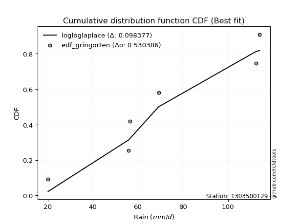</img>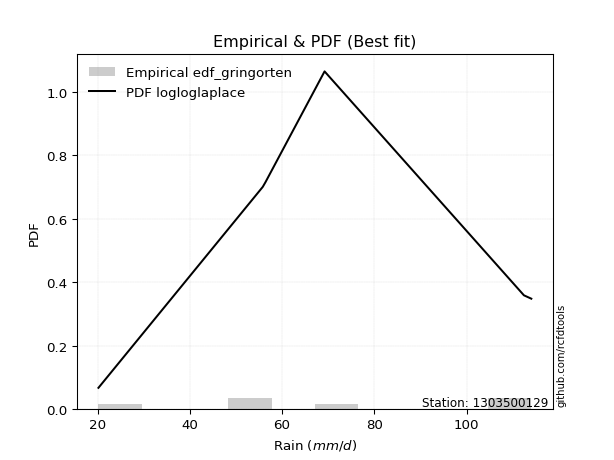</img>

</div>


### 9. EDF Filliben (1975)

The specific values of the constants (0.3175) (often denoted as $alpha$) and (0.365) are derived from a method proposed by James J. Filliben in a 1975 paper. This particular formula is the mean value of the $i$-th order statistic of the normal distribution and is considered a robust and effective plotting position formula for the normal probability plot correlation coefficient test for normality.

<div align="center">


$P=(m-0.3175)/(n+0.365)$


</div>


**9.1. Empirical values**

<div align="center">

|                | 0                   | 1                  | 2            | 3                  | 4                  |
|:---------------|:--------------------|:-------------------|:-------------|:-------------------|:-------------------|
| date           | 2020                | 2022               | 2021         | 2024               | 2019               |
| x              | 20.2                | 56.4               | 69.2         | 112.4              | 114.0              |
| m              | 1                   | 2                  | 3            | 4                  | 5                  |
| empirical_dist | edf_filliben        | edf_filliben       | edf_filliben | edf_filliben       | edf_filliben       |
| empirical      | 0.12721342031686858 | 0.3136067101584343 | 0.5          | 0.6863932898415657 | 0.8727865796831314 |
| empirical_tr   | 1.1457554725040042  | 1.456890699253225  | 2.0          | 3.188707280832095  | 7.860805860805863  |

</div>


**9.2. Kolmogorov-Smirnov fit test (sorted by Δ)**


<div align="center">

|                | 0                   | 1                   | 2                   | 3                   | 4                   | 5                   | 6                   | 7                  | 8                  | 9                   | 10                 | 11                 | 12                 | 13                  | 14                  | 15                  | 16                  | 17                  | 18                  | 19                  | 20                  | 21                 | 22                 | 23                 | 24                 | 25                 | 26                  | 27                  | 28                 | 29                  | 30                 | 31                 | 32                 | 33                  | 34                    | 35                  | 36                 | 37                  | 38                  | 39                  | 40                  | 41                 | 42                  | 43                  | 44                 | 45                  | 46                  | 47                  | 48                  | 49                  | 50                  | 51                  | 52                  | 53                  | 54                  | 55                  | 56                  | 57                  | 58                  | 59                  | 60                  | 61                  | 62                  | 63                  | 64                  | 65                  | 66                  | 67                  | 68                 | 69                  | 70                  | 71                 | 72                  | 73                  | 74                  | 75                 | 76                 | 77                  | 78                  | 79                 | 80                 | 81                 | 82                  | 83                 | 84                 | 85                  | 86                 | 87                 |
|:---------------|:--------------------|:--------------------|:--------------------|:--------------------|:--------------------|:--------------------|:--------------------|:-------------------|:-------------------|:--------------------|:-------------------|:-------------------|:-------------------|:--------------------|:--------------------|:--------------------|:--------------------|:--------------------|:--------------------|:--------------------|:--------------------|:-------------------|:-------------------|:-------------------|:-------------------|:-------------------|:--------------------|:--------------------|:-------------------|:--------------------|:-------------------|:-------------------|:-------------------|:--------------------|:----------------------|:--------------------|:-------------------|:--------------------|:--------------------|:--------------------|:--------------------|:-------------------|:--------------------|:--------------------|:-------------------|:--------------------|:--------------------|:--------------------|:--------------------|:--------------------|:--------------------|:--------------------|:--------------------|:--------------------|:--------------------|:--------------------|:--------------------|:--------------------|:--------------------|:--------------------|:--------------------|:--------------------|:--------------------|:--------------------|:--------------------|:--------------------|:--------------------|:--------------------|:-------------------|:--------------------|:--------------------|:-------------------|:--------------------|:--------------------|:--------------------|:-------------------|:-------------------|:--------------------|:--------------------|:-------------------|:-------------------|:-------------------|:--------------------|:-------------------|:-------------------|:--------------------|:-------------------|:-------------------|
| station        | 1303500129          | 1303500129          | 1303500129          | 1303500129          | 1303500129          | 1303500129          | 1303500129          | 1303500129         | 1303500129         | 1303500129          | 1303500129         | 1303500129         | 1303500129         | 1303500129          | 1303500129          | 1303500129          | 1303500129          | 1303500129          | 1303500129          | 1303500129          | 1303500129          | 1303500129         | 1303500129         | 1303500129         | 1303500129         | 1303500129         | 1303500129          | 1303500129          | 1303500129         | 1303500129          | 1303500129         | 1303500129         | 1303500129         | 1303500129          | 1303500129            | 1303500129          | 1303500129         | 1303500129          | 1303500129          | 1303500129          | 1303500129          | 1303500129         | 1303500129          | 1303500129          | 1303500129         | 1303500129          | 1303500129          | 1303500129          | 1303500129          | 1303500129          | 1303500129          | 1303500129          | 1303500129          | 1303500129          | 1303500129          | 1303500129          | 1303500129          | 1303500129          | 1303500129          | 1303500129          | 1303500129          | 1303500129          | 1303500129          | 1303500129          | 1303500129          | 1303500129          | 1303500129          | 1303500129          | 1303500129         | 1303500129          | 1303500129          | 1303500129         | 1303500129          | 1303500129          | 1303500129          | 1303500129         | 1303500129         | 1303500129          | 1303500129          | 1303500129         | 1303500129         | 1303500129         | 1303500129          | 1303500129         | 1303500129         | 1303500129          | 1303500129         | 1303500129         |
| empirical_dist | edf_filliben        | edf_filliben        | edf_filliben        | edf_filliben        | edf_filliben        | edf_filliben        | edf_filliben        | edf_filliben       | edf_filliben       | edf_filliben        | edf_filliben       | edf_filliben       | edf_filliben       | edf_filliben        | edf_filliben        | edf_filliben        | edf_filliben        | edf_filliben        | edf_filliben        | edf_filliben        | edf_filliben        | edf_filliben       | edf_filliben       | edf_filliben       | edf_filliben       | edf_filliben       | edf_filliben        | edf_filliben        | edf_filliben       | edf_filliben        | edf_filliben       | edf_filliben       | edf_filliben       | edf_filliben        | edf_filliben          | edf_filliben        | edf_filliben       | edf_filliben        | edf_filliben        | edf_filliben        | edf_filliben        | edf_filliben       | edf_filliben        | edf_filliben        | edf_filliben       | edf_filliben        | edf_filliben        | edf_filliben        | edf_filliben        | edf_filliben        | edf_filliben        | edf_filliben        | edf_filliben        | edf_filliben        | edf_filliben        | edf_filliben        | edf_filliben        | edf_filliben        | edf_filliben        | edf_filliben        | edf_filliben        | edf_filliben        | edf_filliben        | edf_filliben        | edf_filliben        | edf_filliben        | edf_filliben        | edf_filliben        | edf_filliben       | edf_filliben        | edf_filliben        | edf_filliben       | edf_filliben        | edf_filliben        | edf_filliben        | edf_filliben       | edf_filliben       | edf_filliben        | edf_filliben        | edf_filliben       | edf_filliben       | edf_filliben       | edf_filliben        | edf_filliben       | edf_filliben       | edf_filliben        | edf_filliben       | edf_filliben       |
| p_dist         | logfisk             | logbetaprime        | loggamma            | loggamma            | logncf              | logerlang           | logrice             | lognct             | logf               | loginvgamma         | logcrystalball     | lognorm            | lognorm            | logt                | logexponnorm        | logfatiguelife      | logpearson3         | logalpha            | loggumbel_l         | logmaxwell          | loginvgauss         | loglogistic        | kstwobign          | ncf                | invgauss           | genlogistic        | fisk                | lograyleigh         | invgamma           | loggompertz         | alpha              | loghypsecant       | halfnorm           | chi2                | loglaplace_asymmetric | f                   | rayleigh           | maxwell             | logweibull_min      | rice                | erlang              | gamma              | laplace_asymmetric  | nct                 | t                  | exponnorm           | norm                | crystalball         | truncnorm           | betaprime           | pearson3            | genexpon            | expon               | loginvweibull       | loglaplace          | weibull_min         | loggumbel_r         | halflogistic        | gumbel_r            | moyal               | logistic            | loghalfnorm         | hypsecant           | laplace             | logmoyal            | gumbel_l            | wald                | logkstwobign        | loggenexpon        | loghalflogistic     | gibrat              | logwald            | logmielke           | loggibrat           | logexpon            | logloggamma        | logtruncnorm       | nakagami            | lognakagami         | logjohnsonsu       | loglognorm         | mielke             | logchi2             | invweibull         | fatiguelife        | gompertz            | johnsonsu          | loggenlogistic     |
| delta          | 0.11007424166777746 | 0.12278319491443707 | 0.12488926282959184 | 0.12488926282959184 | 0.12825494296173467 | 0.12910932079666476 | 0.12947843222254396 | 0.1294922242640706 | 0.1301032225058335 | 0.13109709079022258 | 0.132030796449649  | 0.132030934826027  | 0.132030934826027  | 0.13203123483719503 | 0.13203450437064568 | 0.13233437178813623 | 0.13389042870700907 | 0.13435401942331238 | 0.14869978001797102 | 0.14916280830912765 | 0.14930756300364617 | 0.1524201779540979 | 0.1545634054922035 | 0.1550194402172258 | 0.1579660959956729 | 0.1594163611769005 | 0.15962231637784707 | 0.16129705116757448 | 0.1614823643339719 | 0.16264496830321906 | 0.1635730330595892 | 0.163845933503326  | 0.1644421288009028 | 0.16451733233665533 | 0.16524280662955126   | 0.16525380179435434 | 0.1653496720375739 | 0.16656504186586352 | 0.16678130050742102 | 0.16687633251208012 | 0.16934050611253582 | 0.169781658556303  | 0.17049350347971692 | 0.17101976948395925 | 0.171133182734846  | 0.17114641758088567 | 0.17114649150699823 | 0.17114649459223474 | 0.17114650055757408 | 0.17140288945267368 | 0.17293204775345528 | 0.17312596315669332 | 0.17335465742583517 | 0.17355021892159028 | 0.17542689249354648 | 0.17650229081106805 | 0.17915722252076388 | 0.18002030713793038 | 0.18082799497096647 | 0.18526302816367834 | 0.18790966398858688 | 0.19561798767035504 | 0.19626896217262446 | 0.20340137024267435 | 0.20372101386631442 | 0.20421188778938193 | 0.20640997961347807 | 0.20642151488676436 | 0.2118471793110553 | 0.21454860502002887 | 0.22922418215450802 | 0.2715445840037429 | 0.27256687142329017 | 0.27736184908154066 | 0.27978307660442675 | 0.2898554790509992 | 0.3136045433646915 | 0.31360670996702344 | 0.32726172450409885 | 0.3596290351504639 | 0.3702918920943184 | 0.3747182400235108 | 0.37586190095947253 | 0.4373196216815972 | 0.4755746104465897 | 0.49994805197205056 | 0.5988789488236896 | 0.6863932898415657 |
| deltao         | 0.5865427407550001  | 0.5865427407550001  | 0.5865427407550001  | 0.5865427407550001  | 0.5865427407550001  | 0.5865427407550001  | 0.5865427407550001  | 0.5865427407550001 | 0.5865427407550001 | 0.5865427407550001  | 0.5865427407550001 | 0.5865427407550001 | 0.5865427407550001 | 0.5865427407550001  | 0.5865427407550001  | 0.5865427407550001  | 0.5865427407550001  | 0.5865427407550001  | 0.5865427407550001  | 0.5865427407550001  | 0.5865427407550001  | 0.5865427407550001 | 0.5865427407550001 | 0.5865427407550001 | 0.5865427407550001 | 0.5865427407550001 | 0.5865427407550001  | 0.5865427407550001  | 0.5865427407550001 | 0.5865427407550001  | 0.5865427407550001 | 0.5865427407550001 | 0.5865427407550001 | 0.5865427407550001  | 0.5865427407550001    | 0.5865427407550001  | 0.5865427407550001 | 0.5865427407550001  | 0.5865427407550001  | 0.5865427407550001  | 0.5865427407550001  | 0.5865427407550001 | 0.5865427407550001  | 0.5865427407550001  | 0.5865427407550001 | 0.5865427407550001  | 0.5865427407550001  | 0.5865427407550001  | 0.5865427407550001  | 0.5865427407550001  | 0.5865427407550001  | 0.5865427407550001  | 0.5865427407550001  | 0.5865427407550001  | 0.5865427407550001  | 0.5865427407550001  | 0.5865427407550001  | 0.5865427407550001  | 0.5865427407550001  | 0.5865427407550001  | 0.5865427407550001  | 0.5865427407550001  | 0.5865427407550001  | 0.5865427407550001  | 0.5865427407550001  | 0.5865427407550001  | 0.5865427407550001  | 0.5865427407550001  | 0.5865427407550001 | 0.5865427407550001  | 0.5865427407550001  | 0.5865427407550001 | 0.5865427407550001  | 0.5865427407550001  | 0.5865427407550001  | 0.5865427407550001 | 0.5865427407550001 | 0.5865427407550001  | 0.5865427407550001  | 0.5865427407550001 | 0.5865427407550001 | 0.5865427407550001 | 0.5865427407550001  | 0.5865427407550001 | 0.5865427407550001 | 0.5865427407550001  | 0.5865427407550001 | 0.5865427407550001 |
| eval           | Δo > Δ              | Δo > Δ              | Δo > Δ              | Δo > Δ              | Δo > Δ              | Δo > Δ              | Δo > Δ              | Δo > Δ             | Δo > Δ             | Δo > Δ              | Δo > Δ             | Δo > Δ             | Δo > Δ             | Δo > Δ              | Δo > Δ              | Δo > Δ              | Δo > Δ              | Δo > Δ              | Δo > Δ              | Δo > Δ              | Δo > Δ              | Δo > Δ             | Δo > Δ             | Δo > Δ             | Δo > Δ             | Δo > Δ             | Δo > Δ              | Δo > Δ              | Δo > Δ             | Δo > Δ              | Δo > Δ             | Δo > Δ             | Δo > Δ             | Δo > Δ              | Δo > Δ                | Δo > Δ              | Δo > Δ             | Δo > Δ              | Δo > Δ              | Δo > Δ              | Δo > Δ              | Δo > Δ             | Δo > Δ              | Δo > Δ              | Δo > Δ             | Δo > Δ              | Δo > Δ              | Δo > Δ              | Δo > Δ              | Δo > Δ              | Δo > Δ              | Δo > Δ              | Δo > Δ              | Δo > Δ              | Δo > Δ              | Δo > Δ              | Δo > Δ              | Δo > Δ              | Δo > Δ              | Δo > Δ              | Δo > Δ              | Δo > Δ              | Δo > Δ              | Δo > Δ              | Δo > Δ              | Δo > Δ              | Δo > Δ              | Δo > Δ              | Δo > Δ             | Δo > Δ              | Δo > Δ              | Δo > Δ             | Δo > Δ              | Δo > Δ              | Δo > Δ              | Δo > Δ             | Δo > Δ             | Δo > Δ              | Δo > Δ              | Δo > Δ             | Δo > Δ             | Δo > Δ             | Δo > Δ              | Δo > Δ             | Δo > Δ             | Δo > Δ              | Δo <= Δ            | Δo <= Δ            |
| fit            | 1                   | 1                   | 1                   | 1                   | 1                   | 1                   | 1                   | 1                  | 1                  | 1                   | 1                  | 1                  | 1                  | 1                   | 1                   | 1                   | 1                   | 1                   | 1                   | 1                   | 1                   | 1                  | 1                  | 1                  | 1                  | 1                  | 1                   | 1                   | 1                  | 1                   | 1                  | 1                  | 1                  | 1                   | 1                     | 1                   | 1                  | 1                   | 1                   | 1                   | 1                   | 1                  | 1                   | 1                   | 1                  | 1                   | 1                   | 1                   | 1                   | 1                   | 1                   | 1                   | 1                   | 1                   | 1                   | 1                   | 1                   | 1                   | 1                   | 1                   | 1                   | 1                   | 1                   | 1                   | 1                   | 1                   | 1                   | 1                   | 1                  | 1                   | 1                   | 1                  | 1                   | 1                   | 1                   | 1                  | 1                  | 1                   | 1                   | 1                  | 1                  | 1                  | 1                   | 1                  | 1                  | 1                   | 0                  | 0                  |
| n              | 5                   | 5                   | 5                   | 5                   | 5                   | 5                   | 5                   | 5                  | 5                  | 5                   | 5                  | 5                  | 5                  | 5                   | 5                   | 5                   | 5                   | 5                   | 5                   | 5                   | 5                   | 5                  | 5                  | 5                  | 5                  | 5                  | 5                   | 5                   | 5                  | 5                   | 5                  | 5                  | 5                  | 5                   | 5                     | 5                   | 5                  | 5                   | 5                   | 5                   | 5                   | 5                  | 5                   | 5                   | 5                  | 5                   | 5                   | 5                   | 5                   | 5                   | 5                   | 5                   | 5                   | 5                   | 5                   | 5                   | 5                   | 5                   | 5                   | 5                   | 5                   | 5                   | 5                   | 5                   | 5                   | 5                   | 5                   | 5                   | 5                  | 5                   | 5                   | 5                  | 5                   | 5                   | 5                   | 5                  | 5                  | 5                   | 5                   | 5                  | 5                  | 5                  | 5                   | 5                  | 5                  | 5                   | 5                  | 5                  |
| best_fit       | 1                   | 0                   | 0                   | 0                   | 0                   | 0                   | 0                   | 0                  | 0                  | 0                   | 0                  | 0                  | 0                  | 0                   | 0                   | 0                   | 0                   | 0                   | 0                   | 0                   | 0                   | 0                  | 0                  | 0                  | 0                  | 0                  | 0                   | 0                   | 0                  | 0                   | 0                  | 0                  | 0                  | 0                   | 0                     | 0                   | 0                  | 0                   | 0                   | 0                   | 0                   | 0                  | 0                   | 0                   | 0                  | 0                   | 0                   | 0                   | 0                   | 0                   | 0                   | 0                   | 0                   | 0                   | 0                   | 0                   | 0                   | 0                   | 0                   | 0                   | 0                   | 0                   | 0                   | 0                   | 0                   | 0                   | 0                   | 0                   | 0                  | 0                   | 0                   | 0                  | 0                   | 0                   | 0                   | 0                  | 0                  | 0                   | 0                   | 0                  | 0                  | 0                  | 0                   | 0                  | 0                  | 0                   | 0                  | 0                  |
| best_fit_sort  | 1                   | 2                   | 3                   | 4                   | 5                   | 6                   | 7                   | 8                  | 9                  | 10                  | 11                 | 12                 | 13                 | 14                  | 15                  | 16                  | 17                  | 18                  | 19                  | 20                  | 21                  | 22                 | 23                 | 24                 | 25                 | 26                 | 27                  | 28                  | 29                 | 30                  | 31                 | 32                 | 33                 | 34                  | 35                    | 36                  | 37                 | 38                  | 39                  | 40                  | 41                  | 42                 | 43                  | 44                  | 45                 | 46                  | 47                  | 48                  | 49                  | 50                  | 51                  | 52                  | 53                  | 54                  | 55                  | 56                  | 57                  | 58                  | 59                  | 60                  | 61                  | 62                  | 63                  | 64                  | 65                  | 66                  | 67                  | 68                  | 69                 | 70                  | 71                  | 72                 | 73                  | 74                  | 75                  | 76                 | 77                 | 78                  | 79                  | 80                 | 81                 | 82                 | 83                  | 84                 | 85                 | 86                  | 87                 | 88                 |

</div>


**9.3. Best fit**

<div align="center">

|   id |    station | empirical_dist   | p_dist   |    delta |   deltao | eval   |   fit |   n |   best_fit |   best_fit_sort |
|-----:|-----------:|:-----------------|:---------|---------:|---------:|:-------|------:|----:|-----------:|----------------:|
|    0 | 1303500129 | edf_filliben     | logfisk  | 0.110074 | 0.586543 | Δo > Δ |     1 |   5 |          1 |               1 |

</div>


<div align="center">

</img>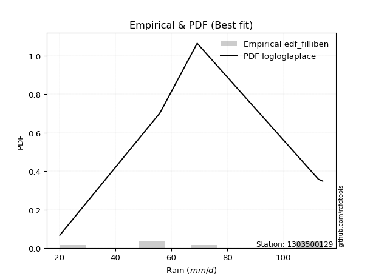</img>

</div>


### 10. EDF Jenkinson (1977)

The Jenkinson formula in hydrology is an empirical plotting position formula used to estimate the non-exceedance probability _(P)_ or return period _(T)_ of a given ordered observation within a sample. It is a widely used method in the frequency analysis of extreme events such as floods and rainfall, as it provides a distribution-free way to plot data. _a≈0.31_ and _b≈0.38_ are constants derived to approximate the median of the probability distribution for the given rank.

<div align="center">


$P=(m-a)/(n+b)$


</div>


**10.1. Empirical values**

<div align="center">

|                | 0                   | 1                  | 2             | 3                  | 4                  |
|:---------------|:--------------------|:-------------------|:--------------|:-------------------|:-------------------|
| date           | 2020                | 2022               | 2021          | 2024               | 2019               |
| x              | 20.2                | 56.4               | 69.2          | 112.4              | 114.0              |
| m              | 1                   | 2                  | 3             | 4                  | 5                  |
| empirical_dist | edf_jenkinson       | edf_jenkinson      | edf_jenkinson | edf_jenkinson      | edf_jenkinson      |
| empirical      | 0.12825278810408922 | 0.3141263940520446 | 0.5           | 0.6858736059479554 | 0.8717472118959109 |
| empirical_tr   | 1.1471215351812367  | 1.4579945799457996 | 2.0           | 3.183431952662722  | 7.797101449275368  |

</div>


**10.2. Kolmogorov-Smirnov fit test (sorted by Δ)**


<div align="center">

|                | 0                  | 1                   | 2                  | 3                  | 4                  | 5                   | 6                  | 7                   | 8                   | 9                   | 10                  | 11                  | 12                  | 13                  | 14                 | 15                  | 16                  | 17                 | 18                 | 19                  | 20                  | 21                  | 22                  | 23                  | 24                  | 25                  | 26                 | 27                  | 28                  | 29                  | 30                 | 31                  | 32                  | 33                  | 34                    | 35                  | 36                  | 37                  | 38                  | 39                  | 40                  | 41                  | 42                  | 43                  | 44                  | 45                 | 46                  | 47                  | 48                 | 49                 | 50                  | 51                  | 52                  | 53                 | 54                  | 55                 | 56                  | 57                  | 58                 | 59                  | 60                  | 61                 | 62                 | 63                  | 64                  | 65                  | 66                 | 67                 | 68                  | 69                  | 70                  | 71                 | 72                 | 73                 | 74                 | 75                 | 76                  | 77                 | 78                  | 79                 | 80                  | 81                  | 82                 | 83                  | 84                 | 85                  | 86                 | 87                 |
|:---------------|:-------------------|:--------------------|:-------------------|:-------------------|:-------------------|:--------------------|:-------------------|:--------------------|:--------------------|:--------------------|:--------------------|:--------------------|:--------------------|:--------------------|:-------------------|:--------------------|:--------------------|:-------------------|:-------------------|:--------------------|:--------------------|:--------------------|:--------------------|:--------------------|:--------------------|:--------------------|:-------------------|:--------------------|:--------------------|:--------------------|:-------------------|:--------------------|:--------------------|:--------------------|:----------------------|:--------------------|:--------------------|:--------------------|:--------------------|:--------------------|:--------------------|:--------------------|:--------------------|:--------------------|:--------------------|:-------------------|:--------------------|:--------------------|:-------------------|:-------------------|:--------------------|:--------------------|:--------------------|:-------------------|:--------------------|:-------------------|:--------------------|:--------------------|:-------------------|:--------------------|:--------------------|:-------------------|:-------------------|:--------------------|:--------------------|:--------------------|:-------------------|:-------------------|:--------------------|:--------------------|:--------------------|:-------------------|:-------------------|:-------------------|:-------------------|:-------------------|:--------------------|:-------------------|:--------------------|:-------------------|:--------------------|:--------------------|:-------------------|:--------------------|:-------------------|:--------------------|:-------------------|:-------------------|
| station        | 1303500129         | 1303500129          | 1303500129         | 1303500129         | 1303500129         | 1303500129          | 1303500129         | 1303500129          | 1303500129          | 1303500129          | 1303500129          | 1303500129          | 1303500129          | 1303500129          | 1303500129         | 1303500129          | 1303500129          | 1303500129         | 1303500129         | 1303500129          | 1303500129          | 1303500129          | 1303500129          | 1303500129          | 1303500129          | 1303500129          | 1303500129         | 1303500129          | 1303500129          | 1303500129          | 1303500129         | 1303500129          | 1303500129          | 1303500129          | 1303500129            | 1303500129          | 1303500129          | 1303500129          | 1303500129          | 1303500129          | 1303500129          | 1303500129          | 1303500129          | 1303500129          | 1303500129          | 1303500129         | 1303500129          | 1303500129          | 1303500129         | 1303500129         | 1303500129          | 1303500129          | 1303500129          | 1303500129         | 1303500129          | 1303500129         | 1303500129          | 1303500129          | 1303500129         | 1303500129          | 1303500129          | 1303500129         | 1303500129         | 1303500129          | 1303500129          | 1303500129          | 1303500129         | 1303500129         | 1303500129          | 1303500129          | 1303500129          | 1303500129         | 1303500129         | 1303500129         | 1303500129         | 1303500129         | 1303500129          | 1303500129         | 1303500129          | 1303500129         | 1303500129          | 1303500129          | 1303500129         | 1303500129          | 1303500129         | 1303500129          | 1303500129         | 1303500129         |
| empirical_dist | edf_jenkinson      | edf_jenkinson       | edf_jenkinson      | edf_jenkinson      | edf_jenkinson      | edf_jenkinson       | edf_jenkinson      | edf_jenkinson       | edf_jenkinson       | edf_jenkinson       | edf_jenkinson       | edf_jenkinson       | edf_jenkinson       | edf_jenkinson       | edf_jenkinson      | edf_jenkinson       | edf_jenkinson       | edf_jenkinson      | edf_jenkinson      | edf_jenkinson       | edf_jenkinson       | edf_jenkinson       | edf_jenkinson       | edf_jenkinson       | edf_jenkinson       | edf_jenkinson       | edf_jenkinson      | edf_jenkinson       | edf_jenkinson       | edf_jenkinson       | edf_jenkinson      | edf_jenkinson       | edf_jenkinson       | edf_jenkinson       | edf_jenkinson         | edf_jenkinson       | edf_jenkinson       | edf_jenkinson       | edf_jenkinson       | edf_jenkinson       | edf_jenkinson       | edf_jenkinson       | edf_jenkinson       | edf_jenkinson       | edf_jenkinson       | edf_jenkinson      | edf_jenkinson       | edf_jenkinson       | edf_jenkinson      | edf_jenkinson      | edf_jenkinson       | edf_jenkinson       | edf_jenkinson       | edf_jenkinson      | edf_jenkinson       | edf_jenkinson      | edf_jenkinson       | edf_jenkinson       | edf_jenkinson      | edf_jenkinson       | edf_jenkinson       | edf_jenkinson      | edf_jenkinson      | edf_jenkinson       | edf_jenkinson       | edf_jenkinson       | edf_jenkinson      | edf_jenkinson      | edf_jenkinson       | edf_jenkinson       | edf_jenkinson       | edf_jenkinson      | edf_jenkinson      | edf_jenkinson      | edf_jenkinson      | edf_jenkinson      | edf_jenkinson       | edf_jenkinson      | edf_jenkinson       | edf_jenkinson      | edf_jenkinson       | edf_jenkinson       | edf_jenkinson      | edf_jenkinson       | edf_jenkinson      | edf_jenkinson       | edf_jenkinson      | edf_jenkinson      |
| p_dist         | logfisk            | logbetaprime        | loggamma           | loggamma           | logncf             | logerlang           | logrice            | lognct              | logf                | loginvgamma         | logcrystalball      | lognorm             | lognorm             | logt                | logexponnorm       | logfatiguelife      | logalpha            | logpearson3        | logmaxwell         | loginvgauss         | loggumbel_l         | loglogistic         | ncf                 | kstwobign           | invgauss            | genlogistic         | fisk               | lograyleigh         | invgamma            | alpha               | loggompertz        | loghypsecant        | halfnorm            | chi2                | loglaplace_asymmetric | f                   | rayleigh            | maxwell             | logweibull_min      | rice                | erlang              | gamma               | laplace_asymmetric  | nct                 | t                   | exponnorm          | norm                | crystalball         | truncnorm          | betaprime          | genexpon            | expon               | loginvweibull       | pearson3           | loglaplace          | weibull_min        | loggumbel_r         | halflogistic        | gumbel_r           | moyal               | logistic            | loghalfnorm        | hypsecant          | logmoyal            | laplace             | gumbel_l            | logkstwobign       | wald               | loggenexpon         | loghalflogistic     | gibrat              | logwald            | logmielke          | loggibrat          | logexpon           | logloggamma        | logtruncnorm        | nakagami           | lognakagami         | logjohnsonsu       | loglognorm          | mielke              | logchi2            | invweibull          | fatiguelife        | gompertz            | johnsonsu          | loggenlogistic     |
| delta          | 0.1105939255613877 | 0.12226351102082672 | 0.1243695789359815 | 0.1243695789359815 | 0.1287746268553449 | 0.12934114098476512 | 0.1299981161161542 | 0.13001190815768082 | 0.13062290639944374 | 0.13161677468383282 | 0.13255048034325922 | 0.13255061871963725 | 0.13255061871963725 | 0.13255091873080527 | 0.1325541882642559 | 0.13285405568174646 | 0.13383433552970203 | 0.1344101126006193 | 0.1486431244155173 | 0.14878787911003583 | 0.14921946391158125 | 0.15293986184770814 | 0.15398007243000522 | 0.15508308938581372 | 0.15848577988928314 | 0.15993604507051074 | 0.1601420002714573 | 0.16077736727396413 | 0.16200204822758213 | 0.16305334916597886 | 0.1631646521968293 | 0.16436561739693623 | 0.16496181269451304 | 0.16503701623026557 | 0.1657624905231615    | 0.16577348568796457 | 0.16586935593118413 | 0.16708472575947375 | 0.16730098440103125 | 0.16739601640569035 | 0.16986019000614605 | 0.17030134244991324 | 0.17101318737332716 | 0.17153945337756948 | 0.17165286662845625 | 0.1716661014744959 | 0.17166617540060847 | 0.17166617848584498 | 0.1716661844511843 | 0.1719225733462839 | 0.17260627926308297 | 0.17283497353222482 | 0.17303053502797994 | 0.1734517316470655 | 0.17594657638715672 | 0.1770219747046783 | 0.17863753862715354 | 0.18053999103154061 | 0.1813476788645767 | 0.18578271205728858 | 0.18842934788219712 | 0.1950983037767447 | 0.1967886460662347 | 0.20320132997270407 | 0.20392105413628459 | 0.20473157168299216 | 0.205901830993154  | 0.2069296635070883 | 0.21132749541744494 | 0.21402892112641853 | 0.22974386604811825 | 0.2710249001101325 | 0.2730865553169004 | 0.2768421651879303 | 0.2792633927108164 | 0.2903751629446094 | 0.31412422725830186 | 0.3141263938606338 | 0.32726172450409885 | 0.3596290351504639 | 0.36977220820070805 | 0.37419855612990044 | 0.3753422170658622 | 0.43628025389437664 | 0.4750549265529794 | 0.49994805197205056 | 0.5983592649300795 | 0.6858736059479554 |
| deltao         | 0.5865427407550001 | 0.5865427407550001  | 0.5865427407550001 | 0.5865427407550001 | 0.5865427407550001 | 0.5865427407550001  | 0.5865427407550001 | 0.5865427407550001  | 0.5865427407550001  | 0.5865427407550001  | 0.5865427407550001  | 0.5865427407550001  | 0.5865427407550001  | 0.5865427407550001  | 0.5865427407550001 | 0.5865427407550001  | 0.5865427407550001  | 0.5865427407550001 | 0.5865427407550001 | 0.5865427407550001  | 0.5865427407550001  | 0.5865427407550001  | 0.5865427407550001  | 0.5865427407550001  | 0.5865427407550001  | 0.5865427407550001  | 0.5865427407550001 | 0.5865427407550001  | 0.5865427407550001  | 0.5865427407550001  | 0.5865427407550001 | 0.5865427407550001  | 0.5865427407550001  | 0.5865427407550001  | 0.5865427407550001    | 0.5865427407550001  | 0.5865427407550001  | 0.5865427407550001  | 0.5865427407550001  | 0.5865427407550001  | 0.5865427407550001  | 0.5865427407550001  | 0.5865427407550001  | 0.5865427407550001  | 0.5865427407550001  | 0.5865427407550001 | 0.5865427407550001  | 0.5865427407550001  | 0.5865427407550001 | 0.5865427407550001 | 0.5865427407550001  | 0.5865427407550001  | 0.5865427407550001  | 0.5865427407550001 | 0.5865427407550001  | 0.5865427407550001 | 0.5865427407550001  | 0.5865427407550001  | 0.5865427407550001 | 0.5865427407550001  | 0.5865427407550001  | 0.5865427407550001 | 0.5865427407550001 | 0.5865427407550001  | 0.5865427407550001  | 0.5865427407550001  | 0.5865427407550001 | 0.5865427407550001 | 0.5865427407550001  | 0.5865427407550001  | 0.5865427407550001  | 0.5865427407550001 | 0.5865427407550001 | 0.5865427407550001 | 0.5865427407550001 | 0.5865427407550001 | 0.5865427407550001  | 0.5865427407550001 | 0.5865427407550001  | 0.5865427407550001 | 0.5865427407550001  | 0.5865427407550001  | 0.5865427407550001 | 0.5865427407550001  | 0.5865427407550001 | 0.5865427407550001  | 0.5865427407550001 | 0.5865427407550001 |
| eval           | Δo > Δ             | Δo > Δ              | Δo > Δ             | Δo > Δ             | Δo > Δ             | Δo > Δ              | Δo > Δ             | Δo > Δ              | Δo > Δ              | Δo > Δ              | Δo > Δ              | Δo > Δ              | Δo > Δ              | Δo > Δ              | Δo > Δ             | Δo > Δ              | Δo > Δ              | Δo > Δ             | Δo > Δ             | Δo > Δ              | Δo > Δ              | Δo > Δ              | Δo > Δ              | Δo > Δ              | Δo > Δ              | Δo > Δ              | Δo > Δ             | Δo > Δ              | Δo > Δ              | Δo > Δ              | Δo > Δ             | Δo > Δ              | Δo > Δ              | Δo > Δ              | Δo > Δ                | Δo > Δ              | Δo > Δ              | Δo > Δ              | Δo > Δ              | Δo > Δ              | Δo > Δ              | Δo > Δ              | Δo > Δ              | Δo > Δ              | Δo > Δ              | Δo > Δ             | Δo > Δ              | Δo > Δ              | Δo > Δ             | Δo > Δ             | Δo > Δ              | Δo > Δ              | Δo > Δ              | Δo > Δ             | Δo > Δ              | Δo > Δ             | Δo > Δ              | Δo > Δ              | Δo > Δ             | Δo > Δ              | Δo > Δ              | Δo > Δ             | Δo > Δ             | Δo > Δ              | Δo > Δ              | Δo > Δ              | Δo > Δ             | Δo > Δ             | Δo > Δ              | Δo > Δ              | Δo > Δ              | Δo > Δ             | Δo > Δ             | Δo > Δ             | Δo > Δ             | Δo > Δ             | Δo > Δ              | Δo > Δ             | Δo > Δ              | Δo > Δ             | Δo > Δ              | Δo > Δ              | Δo > Δ             | Δo > Δ              | Δo > Δ             | Δo > Δ              | Δo <= Δ            | Δo <= Δ            |
| fit            | 1                  | 1                   | 1                  | 1                  | 1                  | 1                   | 1                  | 1                   | 1                   | 1                   | 1                   | 1                   | 1                   | 1                   | 1                  | 1                   | 1                   | 1                  | 1                  | 1                   | 1                   | 1                   | 1                   | 1                   | 1                   | 1                   | 1                  | 1                   | 1                   | 1                   | 1                  | 1                   | 1                   | 1                   | 1                     | 1                   | 1                   | 1                   | 1                   | 1                   | 1                   | 1                   | 1                   | 1                   | 1                   | 1                  | 1                   | 1                   | 1                  | 1                  | 1                   | 1                   | 1                   | 1                  | 1                   | 1                  | 1                   | 1                   | 1                  | 1                   | 1                   | 1                  | 1                  | 1                   | 1                   | 1                   | 1                  | 1                  | 1                   | 1                   | 1                   | 1                  | 1                  | 1                  | 1                  | 1                  | 1                   | 1                  | 1                   | 1                  | 1                   | 1                   | 1                  | 1                   | 1                  | 1                   | 0                  | 0                  |
| n              | 5                  | 5                   | 5                  | 5                  | 5                  | 5                   | 5                  | 5                   | 5                   | 5                   | 5                   | 5                   | 5                   | 5                   | 5                  | 5                   | 5                   | 5                  | 5                  | 5                   | 5                   | 5                   | 5                   | 5                   | 5                   | 5                   | 5                  | 5                   | 5                   | 5                   | 5                  | 5                   | 5                   | 5                   | 5                     | 5                   | 5                   | 5                   | 5                   | 5                   | 5                   | 5                   | 5                   | 5                   | 5                   | 5                  | 5                   | 5                   | 5                  | 5                  | 5                   | 5                   | 5                   | 5                  | 5                   | 5                  | 5                   | 5                   | 5                  | 5                   | 5                   | 5                  | 5                  | 5                   | 5                   | 5                   | 5                  | 5                  | 5                   | 5                   | 5                   | 5                  | 5                  | 5                  | 5                  | 5                  | 5                   | 5                  | 5                   | 5                  | 5                   | 5                   | 5                  | 5                   | 5                  | 5                   | 5                  | 5                  |
| best_fit       | 1                  | 0                   | 0                  | 0                  | 0                  | 0                   | 0                  | 0                   | 0                   | 0                   | 0                   | 0                   | 0                   | 0                   | 0                  | 0                   | 0                   | 0                  | 0                  | 0                   | 0                   | 0                   | 0                   | 0                   | 0                   | 0                   | 0                  | 0                   | 0                   | 0                   | 0                  | 0                   | 0                   | 0                   | 0                     | 0                   | 0                   | 0                   | 0                   | 0                   | 0                   | 0                   | 0                   | 0                   | 0                   | 0                  | 0                   | 0                   | 0                  | 0                  | 0                   | 0                   | 0                   | 0                  | 0                   | 0                  | 0                   | 0                   | 0                  | 0                   | 0                   | 0                  | 0                  | 0                   | 0                   | 0                   | 0                  | 0                  | 0                   | 0                   | 0                   | 0                  | 0                  | 0                  | 0                  | 0                  | 0                   | 0                  | 0                   | 0                  | 0                   | 0                   | 0                  | 0                   | 0                  | 0                   | 0                  | 0                  |
| best_fit_sort  | 1                  | 2                   | 3                  | 4                  | 5                  | 6                   | 7                  | 8                   | 9                   | 10                  | 11                  | 12                  | 13                  | 14                  | 15                 | 16                  | 17                  | 18                 | 19                 | 20                  | 21                  | 22                  | 23                  | 24                  | 25                  | 26                  | 27                 | 28                  | 29                  | 30                  | 31                 | 32                  | 33                  | 34                  | 35                    | 36                  | 37                  | 38                  | 39                  | 40                  | 41                  | 42                  | 43                  | 44                  | 45                  | 46                 | 47                  | 48                  | 49                 | 50                 | 51                  | 52                  | 53                  | 54                 | 55                  | 56                 | 57                  | 58                  | 59                 | 60                  | 61                  | 62                 | 63                 | 64                  | 65                  | 66                  | 67                 | 68                 | 69                  | 70                  | 71                  | 72                 | 73                 | 74                 | 75                 | 76                 | 77                  | 78                 | 79                  | 80                 | 81                  | 82                  | 83                 | 84                  | 85                 | 86                  | 87                 | 88                 |

</div>


**10.3. Best fit**

<div align="center">

|   id |    station | empirical_dist   | p_dist   |    delta |   deltao | eval   |   fit |   n |   best_fit |   best_fit_sort |
|-----:|-----------:|:-----------------|:---------|---------:|---------:|:-------|------:|----:|-----------:|----------------:|
|    0 | 1303500129 | edf_jenkinson    | logfisk  | 0.110594 | 0.586543 | Δo > Δ |     1 |   5 |          1 |               1 |

</div>


<div align="center">

</img>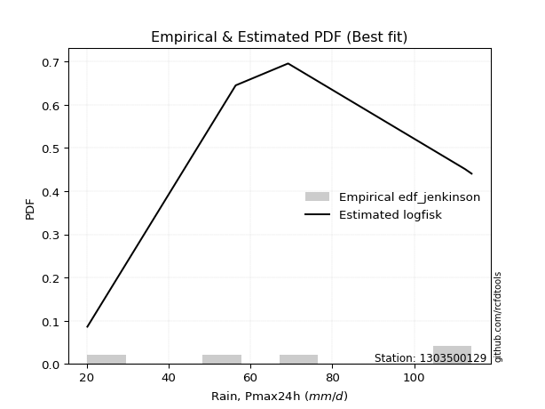</img>

</div>


### 11. EDF Cunnane (1978)

Cunnane´s work in statistical hydrology has focused on the performance and evaluation of different probability distributions (such as GEV, Gumbel, Lognormal) for flood frequency estimation. _b_ is a constant, typically set to 0.4.

<div align="center">


$P=(m-b)/(n+1-2b)$


</div>


**11.1. Empirical values**

<div align="center">

|                | 0                   | 1                  | 2           | 3                  | 4                  |
|:---------------|:--------------------|:-------------------|:------------|:-------------------|:-------------------|
| date           | 2020                | 2022               | 2021        | 2024               | 2019               |
| x              | 20.2                | 56.4               | 69.2        | 112.4              | 114.0              |
| m              | 1                   | 2                  | 3           | 4                  | 5                  |
| empirical_dist | edf_cunnane         | edf_cunnane        | edf_cunnane | edf_cunnane        | edf_cunnane        |
| empirical      | 0.11538461538461538 | 0.3076923076923077 | 0.5         | 0.6923076923076923 | 0.8846153846153845 |
| empirical_tr   | 1.1304347826086958  | 1.4444444444444444 | 2.0         | 3.25               | 8.666666666666655  |

</div>


**11.2. Kolmogorov-Smirnov fit test (sorted by Δ)**


<div align="center">

|                | 0                   | 1                   | 2                   | 3                   | 4                  | 5                  | 6                  | 7                   | 8                  | 9                   | 10                  | 11                  | 12                 | 13                 | 14                 | 15                  | 16                  | 17                  | 18                 | 19                  | 20                  | 21                  | 22                  | 23                  | 24                  | 25                  | 26                  | 27                  | 28                  | 29                 | 30                 | 31                    | 32                  | 33                  | 34                 | 35                 | 36                 | 37                 | 38                  | 39                 | 40                  | 41                 | 42                  | 43                 | 44                  | 45                  | 46                  | 47                  | 48                  | 49                  | 50                  | 51                  | 52                  | 53                  | 54                  | 55                  | 56                  | 57                  | 58                  | 59                  | 60                  | 61                  | 62                  | 63                 | 64                  | 65                 | 66                  | 67                  | 68                  | 69                  | 70                 | 71                  | 72                  | 73                 | 74                  | 75                 | 76                  | 77                 | 78                  | 79                 | 80                  | 81                  | 82                 | 83                  | 84                 | 85                  | 86                 | 87                 |
|:---------------|:--------------------|:--------------------|:--------------------|:--------------------|:-------------------|:-------------------|:-------------------|:--------------------|:-------------------|:--------------------|:--------------------|:--------------------|:-------------------|:-------------------|:-------------------|:--------------------|:--------------------|:--------------------|:-------------------|:--------------------|:--------------------|:--------------------|:--------------------|:--------------------|:--------------------|:--------------------|:--------------------|:--------------------|:--------------------|:-------------------|:-------------------|:----------------------|:--------------------|:--------------------|:-------------------|:-------------------|:-------------------|:-------------------|:--------------------|:-------------------|:--------------------|:-------------------|:--------------------|:-------------------|:--------------------|:--------------------|:--------------------|:--------------------|:--------------------|:--------------------|:--------------------|:--------------------|:--------------------|:--------------------|:--------------------|:--------------------|:--------------------|:--------------------|:--------------------|:--------------------|:--------------------|:--------------------|:--------------------|:-------------------|:--------------------|:-------------------|:--------------------|:--------------------|:--------------------|:--------------------|:-------------------|:--------------------|:--------------------|:-------------------|:--------------------|:-------------------|:--------------------|:-------------------|:--------------------|:-------------------|:--------------------|:--------------------|:-------------------|:--------------------|:-------------------|:--------------------|:-------------------|:-------------------|
| station        | 1303500129          | 1303500129          | 1303500129          | 1303500129          | 1303500129         | 1303500129         | 1303500129         | 1303500129          | 1303500129         | 1303500129          | 1303500129          | 1303500129          | 1303500129         | 1303500129         | 1303500129         | 1303500129          | 1303500129          | 1303500129          | 1303500129         | 1303500129          | 1303500129          | 1303500129          | 1303500129          | 1303500129          | 1303500129          | 1303500129          | 1303500129          | 1303500129          | 1303500129          | 1303500129         | 1303500129         | 1303500129            | 1303500129          | 1303500129          | 1303500129         | 1303500129         | 1303500129         | 1303500129         | 1303500129          | 1303500129         | 1303500129          | 1303500129         | 1303500129          | 1303500129         | 1303500129          | 1303500129          | 1303500129          | 1303500129          | 1303500129          | 1303500129          | 1303500129          | 1303500129          | 1303500129          | 1303500129          | 1303500129          | 1303500129          | 1303500129          | 1303500129          | 1303500129          | 1303500129          | 1303500129          | 1303500129          | 1303500129          | 1303500129         | 1303500129          | 1303500129         | 1303500129          | 1303500129          | 1303500129          | 1303500129          | 1303500129         | 1303500129          | 1303500129          | 1303500129         | 1303500129          | 1303500129         | 1303500129          | 1303500129         | 1303500129          | 1303500129         | 1303500129          | 1303500129          | 1303500129         | 1303500129          | 1303500129         | 1303500129          | 1303500129         | 1303500129         |
| empirical_dist | edf_cunnane         | edf_cunnane         | edf_cunnane         | edf_cunnane         | edf_cunnane        | edf_cunnane        | edf_cunnane        | edf_cunnane         | edf_cunnane        | edf_cunnane         | edf_cunnane         | edf_cunnane         | edf_cunnane        | edf_cunnane        | edf_cunnane        | edf_cunnane         | edf_cunnane         | edf_cunnane         | edf_cunnane        | edf_cunnane         | edf_cunnane         | edf_cunnane         | edf_cunnane         | edf_cunnane         | edf_cunnane         | edf_cunnane         | edf_cunnane         | edf_cunnane         | edf_cunnane         | edf_cunnane        | edf_cunnane        | edf_cunnane           | edf_cunnane         | edf_cunnane         | edf_cunnane        | edf_cunnane        | edf_cunnane        | edf_cunnane        | edf_cunnane         | edf_cunnane        | edf_cunnane         | edf_cunnane        | edf_cunnane         | edf_cunnane        | edf_cunnane         | edf_cunnane         | edf_cunnane         | edf_cunnane         | edf_cunnane         | edf_cunnane         | edf_cunnane         | edf_cunnane         | edf_cunnane         | edf_cunnane         | edf_cunnane         | edf_cunnane         | edf_cunnane         | edf_cunnane         | edf_cunnane         | edf_cunnane         | edf_cunnane         | edf_cunnane         | edf_cunnane         | edf_cunnane        | edf_cunnane         | edf_cunnane        | edf_cunnane         | edf_cunnane         | edf_cunnane         | edf_cunnane         | edf_cunnane        | edf_cunnane         | edf_cunnane         | edf_cunnane        | edf_cunnane         | edf_cunnane        | edf_cunnane         | edf_cunnane        | edf_cunnane         | edf_cunnane        | edf_cunnane         | edf_cunnane         | edf_cunnane        | edf_cunnane         | edf_cunnane        | edf_cunnane         | edf_cunnane        | edf_cunnane        |
| p_dist         | logfisk             | lognct              | logncf              | logcrystalball      | lognorm            | lognorm            | logt               | logexponnorm        | logfatiguelife     | logf                | logpearson3         | logbetaprime        | loggamma           | loggamma           | logrice            | logerlang           | loginvgamma         | logalpha            | loggumbel_l        | loglogistic         | kstwobign           | invgauss            | genlogistic         | fisk                | logmaxwell          | loginvgauss         | invgamma            | loggompertz         | loghypsecant        | halfnorm           | chi2               | loglaplace_asymmetric | f                   | rayleigh            | maxwell            | logweibull_min     | rice               | erlang             | gamma               | laplace_asymmetric | nct                 | t                  | exponnorm           | norm               | crystalball         | truncnorm           | betaprime           | ncf                 | pearson3            | lograyleigh         | alpha               | loglaplace          | weibull_min         | halflogistic        | gumbel_r            | genexpon            | expon               | moyal               | loginvweibull       | logistic            | loggumbel_r         | hypsecant           | laplace             | gumbel_l           | wald                | loghalfnorm        | logmoyal            | logkstwobign        | loggenexpon         | loghalflogistic     | gibrat             | logmielke           | logwald             | loggibrat          | logloggamma         | logexpon           | logtruncnorm        | nakagami           | lognakagami         | logjohnsonsu       | loglognorm          | mielke              | logchi2            | invweibull          | fatiguelife        | gompertz            | johnsonsu          | loggenlogistic     |
| delta          | 0.10415983920165084 | 0.12440346779322958 | 0.12579390660011935 | 0.12611639398352237 | 0.1261165323599004 | 0.1261165323599004 | 0.1261168323710684 | 0.12612010190451906 | 0.1264199693220096 | 0.12717107779687087 | 0.12797602624088245 | 0.12869759738056363 | 0.1308036652957184 | 0.1308036652957184 | 0.1331090533805731 | 0.13502372326279133 | 0.13696050169131513 | 0.14026842188943894 | 0.1427853775518444 | 0.14650577548797128 | 0.14864900302607686 | 0.15205169352954628 | 0.15350195871077388 | 0.15370791391172045 | 0.15507721077525422 | 0.15522196546977274 | 0.15556796186784527 | 0.15673056583709244 | 0.15793153103719937 | 0.1585277263347762 | 0.1586029298705287 | 0.15932840416342464   | 0.15933939932822772 | 0.15943526957144727 | 0.1606506393997369 | 0.1608668980412944 | 0.1609619300459535 | 0.1634261036464092 | 0.16386725609017638 | 0.1645791010135903 | 0.16510536701783263 | 0.1652187802687194 | 0.16523201511475905 | 0.1652320890408716 | 0.16523209212610812 | 0.16523209809144745 | 0.16548848698654706 | 0.16684824514947882 | 0.16701764528732865 | 0.16721145363370105 | 0.16948743552571577 | 0.16951249002741986 | 0.17058788834494143 | 0.17410590467180376 | 0.17491359250483984 | 0.17904036562281989 | 0.17926905989196174 | 0.17934862569755172 | 0.17946462138771685 | 0.18199526152246026 | 0.18507162498689045 | 0.19035455970649784 | 0.19748696777654773 | 0.1982974853232553 | 0.20049557714735144 | 0.2015323901364816 | 0.20963541633244098 | 0.21233591735289092 | 0.21776158177718186 | 0.22046300748615544 | 0.2233097796883814 | 0.26665246895716355 | 0.27745898646986944 | 0.2832762515476672 | 0.28394107658487255 | 0.2856974790705533 | 0.30769014089856495 | 0.3076923075008969 | 0.32726172450409885 | 0.3596290351504639 | 0.37620629456044496 | 0.38063264248963735 | 0.3817763034255991 | 0.44914842661385024 | 0.4814890129127163 | 0.49994805197205056 | 0.6047933512898163 | 0.6923076923076923 |
| deltao         | 0.5865427407550001  | 0.5865427407550001  | 0.5865427407550001  | 0.5865427407550001  | 0.5865427407550001 | 0.5865427407550001 | 0.5865427407550001 | 0.5865427407550001  | 0.5865427407550001 | 0.5865427407550001  | 0.5865427407550001  | 0.5865427407550001  | 0.5865427407550001 | 0.5865427407550001 | 0.5865427407550001 | 0.5865427407550001  | 0.5865427407550001  | 0.5865427407550001  | 0.5865427407550001 | 0.5865427407550001  | 0.5865427407550001  | 0.5865427407550001  | 0.5865427407550001  | 0.5865427407550001  | 0.5865427407550001  | 0.5865427407550001  | 0.5865427407550001  | 0.5865427407550001  | 0.5865427407550001  | 0.5865427407550001 | 0.5865427407550001 | 0.5865427407550001    | 0.5865427407550001  | 0.5865427407550001  | 0.5865427407550001 | 0.5865427407550001 | 0.5865427407550001 | 0.5865427407550001 | 0.5865427407550001  | 0.5865427407550001 | 0.5865427407550001  | 0.5865427407550001 | 0.5865427407550001  | 0.5865427407550001 | 0.5865427407550001  | 0.5865427407550001  | 0.5865427407550001  | 0.5865427407550001  | 0.5865427407550001  | 0.5865427407550001  | 0.5865427407550001  | 0.5865427407550001  | 0.5865427407550001  | 0.5865427407550001  | 0.5865427407550001  | 0.5865427407550001  | 0.5865427407550001  | 0.5865427407550001  | 0.5865427407550001  | 0.5865427407550001  | 0.5865427407550001  | 0.5865427407550001  | 0.5865427407550001  | 0.5865427407550001 | 0.5865427407550001  | 0.5865427407550001 | 0.5865427407550001  | 0.5865427407550001  | 0.5865427407550001  | 0.5865427407550001  | 0.5865427407550001 | 0.5865427407550001  | 0.5865427407550001  | 0.5865427407550001 | 0.5865427407550001  | 0.5865427407550001 | 0.5865427407550001  | 0.5865427407550001 | 0.5865427407550001  | 0.5865427407550001 | 0.5865427407550001  | 0.5865427407550001  | 0.5865427407550001 | 0.5865427407550001  | 0.5865427407550001 | 0.5865427407550001  | 0.5865427407550001 | 0.5865427407550001 |
| eval           | Δo > Δ              | Δo > Δ              | Δo > Δ              | Δo > Δ              | Δo > Δ             | Δo > Δ             | Δo > Δ             | Δo > Δ              | Δo > Δ             | Δo > Δ              | Δo > Δ              | Δo > Δ              | Δo > Δ             | Δo > Δ             | Δo > Δ             | Δo > Δ              | Δo > Δ              | Δo > Δ              | Δo > Δ             | Δo > Δ              | Δo > Δ              | Δo > Δ              | Δo > Δ              | Δo > Δ              | Δo > Δ              | Δo > Δ              | Δo > Δ              | Δo > Δ              | Δo > Δ              | Δo > Δ             | Δo > Δ             | Δo > Δ                | Δo > Δ              | Δo > Δ              | Δo > Δ             | Δo > Δ             | Δo > Δ             | Δo > Δ             | Δo > Δ              | Δo > Δ             | Δo > Δ              | Δo > Δ             | Δo > Δ              | Δo > Δ             | Δo > Δ              | Δo > Δ              | Δo > Δ              | Δo > Δ              | Δo > Δ              | Δo > Δ              | Δo > Δ              | Δo > Δ              | Δo > Δ              | Δo > Δ              | Δo > Δ              | Δo > Δ              | Δo > Δ              | Δo > Δ              | Δo > Δ              | Δo > Δ              | Δo > Δ              | Δo > Δ              | Δo > Δ              | Δo > Δ             | Δo > Δ              | Δo > Δ             | Δo > Δ              | Δo > Δ              | Δo > Δ              | Δo > Δ              | Δo > Δ             | Δo > Δ              | Δo > Δ              | Δo > Δ             | Δo > Δ              | Δo > Δ             | Δo > Δ              | Δo > Δ             | Δo > Δ              | Δo > Δ             | Δo > Δ              | Δo > Δ              | Δo > Δ             | Δo > Δ              | Δo > Δ             | Δo > Δ              | Δo <= Δ            | Δo <= Δ            |
| fit            | 1                   | 1                   | 1                   | 1                   | 1                  | 1                  | 1                  | 1                   | 1                  | 1                   | 1                   | 1                   | 1                  | 1                  | 1                  | 1                   | 1                   | 1                   | 1                  | 1                   | 1                   | 1                   | 1                   | 1                   | 1                   | 1                   | 1                   | 1                   | 1                   | 1                  | 1                  | 1                     | 1                   | 1                   | 1                  | 1                  | 1                  | 1                  | 1                   | 1                  | 1                   | 1                  | 1                   | 1                  | 1                   | 1                   | 1                   | 1                   | 1                   | 1                   | 1                   | 1                   | 1                   | 1                   | 1                   | 1                   | 1                   | 1                   | 1                   | 1                   | 1                   | 1                   | 1                   | 1                  | 1                   | 1                  | 1                   | 1                   | 1                   | 1                   | 1                  | 1                   | 1                   | 1                  | 1                   | 1                  | 1                   | 1                  | 1                   | 1                  | 1                   | 1                   | 1                  | 1                   | 1                  | 1                   | 0                  | 0                  |
| n              | 5                   | 5                   | 5                   | 5                   | 5                  | 5                  | 5                  | 5                   | 5                  | 5                   | 5                   | 5                   | 5                  | 5                  | 5                  | 5                   | 5                   | 5                   | 5                  | 5                   | 5                   | 5                   | 5                   | 5                   | 5                   | 5                   | 5                   | 5                   | 5                   | 5                  | 5                  | 5                     | 5                   | 5                   | 5                  | 5                  | 5                  | 5                  | 5                   | 5                  | 5                   | 5                  | 5                   | 5                  | 5                   | 5                   | 5                   | 5                   | 5                   | 5                   | 5                   | 5                   | 5                   | 5                   | 5                   | 5                   | 5                   | 5                   | 5                   | 5                   | 5                   | 5                   | 5                   | 5                  | 5                   | 5                  | 5                   | 5                   | 5                   | 5                   | 5                  | 5                   | 5                   | 5                  | 5                   | 5                  | 5                   | 5                  | 5                   | 5                  | 5                   | 5                   | 5                  | 5                   | 5                  | 5                   | 5                  | 5                  |
| best_fit       | 1                   | 0                   | 0                   | 0                   | 0                  | 0                  | 0                  | 0                   | 0                  | 0                   | 0                   | 0                   | 0                  | 0                  | 0                  | 0                   | 0                   | 0                   | 0                  | 0                   | 0                   | 0                   | 0                   | 0                   | 0                   | 0                   | 0                   | 0                   | 0                   | 0                  | 0                  | 0                     | 0                   | 0                   | 0                  | 0                  | 0                  | 0                  | 0                   | 0                  | 0                   | 0                  | 0                   | 0                  | 0                   | 0                   | 0                   | 0                   | 0                   | 0                   | 0                   | 0                   | 0                   | 0                   | 0                   | 0                   | 0                   | 0                   | 0                   | 0                   | 0                   | 0                   | 0                   | 0                  | 0                   | 0                  | 0                   | 0                   | 0                   | 0                   | 0                  | 0                   | 0                   | 0                  | 0                   | 0                  | 0                   | 0                  | 0                   | 0                  | 0                   | 0                   | 0                  | 0                   | 0                  | 0                   | 0                  | 0                  |
| best_fit_sort  | 1                   | 2                   | 3                   | 4                   | 5                  | 6                  | 7                  | 8                   | 9                  | 10                  | 11                  | 12                  | 13                 | 14                 | 15                 | 16                  | 17                  | 18                  | 19                 | 20                  | 21                  | 22                  | 23                  | 24                  | 25                  | 26                  | 27                  | 28                  | 29                  | 30                 | 31                 | 32                    | 33                  | 34                  | 35                 | 36                 | 37                 | 38                 | 39                  | 40                 | 41                  | 42                 | 43                  | 44                 | 45                  | 46                  | 47                  | 48                  | 49                  | 50                  | 51                  | 52                  | 53                  | 54                  | 55                  | 56                  | 57                  | 58                  | 59                  | 60                  | 61                  | 62                  | 63                  | 64                 | 65                  | 66                 | 67                  | 68                  | 69                  | 70                  | 71                 | 72                  | 73                  | 74                 | 75                  | 76                 | 77                  | 78                 | 79                  | 80                 | 81                  | 82                  | 83                 | 84                  | 85                 | 86                  | 87                 | 88                 |

</div>


**11.3. Best fit**

<div align="center">

|   id |    station | empirical_dist   | p_dist   |   delta |   deltao | eval   |   fit |   n |   best_fit |   best_fit_sort |
|-----:|-----------:|:-----------------|:---------|--------:|---------:|:-------|------:|----:|-----------:|----------------:|
|    0 | 1303500129 | edf_cunnane      | logfisk  | 0.10416 | 0.586543 | Δo > Δ |     1 |   5 |          1 |               1 |

</div>


<div align="center">

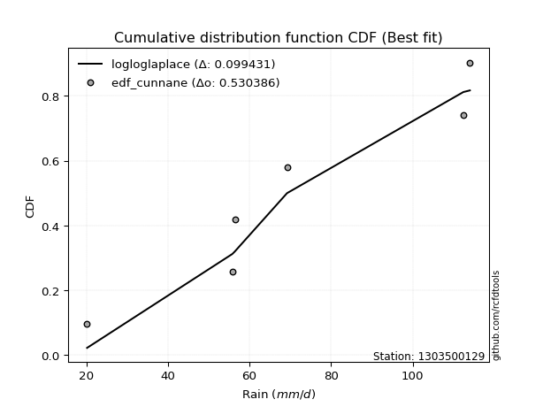</img>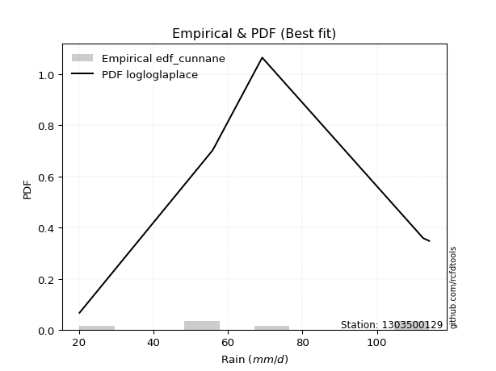</img>

</div>


### 12. EDF Adamowski (1981)

The Adamowski formula in hydrology refers to a specific plotting position formula used for estimating the non-parametric empirical distribution of hydrological events (like flood peaks) to calculate their return periods. This formula provides an alternative to traditional parametric methods (like the Gumbel or Log Pearson Type III distributions). 

<div align="center">


$P=(m-0.25)/(n+0.5)$


</div>


**12.1. Empirical values**

<div align="center">

|                | 0                   | 1                  | 2             | 3                  | 4                  |
|:---------------|:--------------------|:-------------------|:--------------|:-------------------|:-------------------|
| date           | 2020                | 2022               | 2021          | 2024               | 2019               |
| x              | 20.2                | 56.4               | 69.2          | 112.4              | 114.0              |
| m              | 1                   | 2                  | 3             | 4                  | 5                  |
| empirical_dist | edf_adamowski       | edf_adamowski      | edf_adamowski | edf_adamowski      | edf_adamowski      |
| empirical      | 0.13636363636363635 | 0.3181818181818182 | 0.5           | 0.6818181818181818 | 0.8636363636363636 |
| empirical_tr   | 1.1578947368421053  | 1.4666666666666666 | 2.0           | 3.1428571428571423 | 7.333333333333334  |

</div>


**12.2. Kolmogorov-Smirnov fit test (sorted by Δ)**


<div align="center">

|                | 0                   | 1                   | 2                   | 3                   | 4                   | 5                   | 6                  | 7                   | 8                  | 9                  | 10                  | 11                 | 12                 | 13                 | 14                  | 15                  | 16                  | 17                  | 18                  | 19                  | 20                 | 21                  | 22                  | 23                 | 24                 | 25                 | 26                 | 27                 | 28                  | 29                 | 30                  | 31                 | 32                  | 33                  | 34                  | 35                 | 36                  | 37                    | 38                  | 39                 | 40                  | 41                  | 42                  | 43                  | 44                 | 45                  | 46                  | 47                  | 48                 | 49                  | 50                  | 51                  | 52                  | 53                  | 54                  | 55                  | 56                  | 57                  | 58                  | 59                  | 60                  | 61                  | 62                  | 63                  | 64                  | 65                 | 66                  | 67                  | 68                  | 69                  | 70                  | 71                 | 72                  | 73                  | 74                  | 75                 | 76                 | 77                  | 78                  | 79                 | 80                 | 81                 | 82                 | 83                 | 84                 | 85                  | 86                 | 87                 |
|:---------------|:--------------------|:--------------------|:--------------------|:--------------------|:--------------------|:--------------------|:-------------------|:--------------------|:-------------------|:-------------------|:--------------------|:-------------------|:-------------------|:-------------------|:--------------------|:--------------------|:--------------------|:--------------------|:--------------------|:--------------------|:-------------------|:--------------------|:--------------------|:-------------------|:-------------------|:-------------------|:-------------------|:-------------------|:--------------------|:-------------------|:--------------------|:-------------------|:--------------------|:--------------------|:--------------------|:-------------------|:--------------------|:----------------------|:--------------------|:-------------------|:--------------------|:--------------------|:--------------------|:--------------------|:-------------------|:--------------------|:--------------------|:--------------------|:-------------------|:--------------------|:--------------------|:--------------------|:--------------------|:--------------------|:--------------------|:--------------------|:--------------------|:--------------------|:--------------------|:--------------------|:--------------------|:--------------------|:--------------------|:--------------------|:--------------------|:-------------------|:--------------------|:--------------------|:--------------------|:--------------------|:--------------------|:-------------------|:--------------------|:--------------------|:--------------------|:-------------------|:-------------------|:--------------------|:--------------------|:-------------------|:-------------------|:-------------------|:-------------------|:-------------------|:-------------------|:--------------------|:-------------------|:-------------------|
| station        | 1303500129          | 1303500129          | 1303500129          | 1303500129          | 1303500129          | 1303500129          | 1303500129         | 1303500129          | 1303500129         | 1303500129         | 1303500129          | 1303500129         | 1303500129         | 1303500129         | 1303500129          | 1303500129          | 1303500129          | 1303500129          | 1303500129          | 1303500129          | 1303500129         | 1303500129          | 1303500129          | 1303500129         | 1303500129         | 1303500129         | 1303500129         | 1303500129         | 1303500129          | 1303500129         | 1303500129          | 1303500129         | 1303500129          | 1303500129          | 1303500129          | 1303500129         | 1303500129          | 1303500129            | 1303500129          | 1303500129         | 1303500129          | 1303500129          | 1303500129          | 1303500129          | 1303500129         | 1303500129          | 1303500129          | 1303500129          | 1303500129         | 1303500129          | 1303500129          | 1303500129          | 1303500129          | 1303500129          | 1303500129          | 1303500129          | 1303500129          | 1303500129          | 1303500129          | 1303500129          | 1303500129          | 1303500129          | 1303500129          | 1303500129          | 1303500129          | 1303500129         | 1303500129          | 1303500129          | 1303500129          | 1303500129          | 1303500129          | 1303500129         | 1303500129          | 1303500129          | 1303500129          | 1303500129         | 1303500129         | 1303500129          | 1303500129          | 1303500129         | 1303500129         | 1303500129         | 1303500129         | 1303500129         | 1303500129         | 1303500129          | 1303500129         | 1303500129         |
| empirical_dist | edf_adamowski       | edf_adamowski       | edf_adamowski       | edf_adamowski       | edf_adamowski       | edf_adamowski       | edf_adamowski      | edf_adamowski       | edf_adamowski      | edf_adamowski      | edf_adamowski       | edf_adamowski      | edf_adamowski      | edf_adamowski      | edf_adamowski       | edf_adamowski       | edf_adamowski       | edf_adamowski       | edf_adamowski       | edf_adamowski       | edf_adamowski      | edf_adamowski       | edf_adamowski       | edf_adamowski      | edf_adamowski      | edf_adamowski      | edf_adamowski      | edf_adamowski      | edf_adamowski       | edf_adamowski      | edf_adamowski       | edf_adamowski      | edf_adamowski       | edf_adamowski       | edf_adamowski       | edf_adamowski      | edf_adamowski       | edf_adamowski         | edf_adamowski       | edf_adamowski      | edf_adamowski       | edf_adamowski       | edf_adamowski       | edf_adamowski       | edf_adamowski      | edf_adamowski       | edf_adamowski       | edf_adamowski       | edf_adamowski      | edf_adamowski       | edf_adamowski       | edf_adamowski       | edf_adamowski       | edf_adamowski       | edf_adamowski       | edf_adamowski       | edf_adamowski       | edf_adamowski       | edf_adamowski       | edf_adamowski       | edf_adamowski       | edf_adamowski       | edf_adamowski       | edf_adamowski       | edf_adamowski       | edf_adamowski      | edf_adamowski       | edf_adamowski       | edf_adamowski       | edf_adamowski       | edf_adamowski       | edf_adamowski      | edf_adamowski       | edf_adamowski       | edf_adamowski       | edf_adamowski      | edf_adamowski      | edf_adamowski       | edf_adamowski       | edf_adamowski      | edf_adamowski      | edf_adamowski      | edf_adamowski      | edf_adamowski      | edf_adamowski      | edf_adamowski       | edf_adamowski      | edf_adamowski      |
| p_dist         | logfisk             | logbetaprime        | loggamma            | loggamma            | logalpha            | logncf              | logerlang          | logrice             | lognct             | logf               | loginvgamma         | logcrystalball     | lognorm            | lognorm            | logt                | logexponnorm        | logfatiguelife      | logpearson3         | logmaxwell          | loginvgauss         | ncf                | loggumbel_l         | lograyleigh         | loglogistic        | alpha              | kstwobign          | invgauss           | genlogistic        | fisk                | invgamma           | loggompertz         | loghypsecant       | genexpon            | expon               | loginvweibull       | halfnorm           | chi2                | loglaplace_asymmetric | f                   | rayleigh           | maxwell             | logweibull_min      | rice                | erlang              | gamma              | loggumbel_r         | laplace_asymmetric  | nct                 | t                  | exponnorm           | norm                | crystalball         | truncnorm           | betaprime           | pearson3            | loglaplace          | weibull_min         | halflogistic        | gumbel_r            | moyal               | loghalfnorm         | logistic            | logmoyal            | hypsecant           | logkstwobign        | loggenexpon        | laplace             | gumbel_l            | loghalflogistic     | wald                | gibrat              | logwald            | loggibrat           | logexpon            | logmielke           | logloggamma        | logtruncnorm       | nakagami            | lognakagami         | logjohnsonsu       | loglognorm         | mielke             | logchi2            | invweibull         | fatiguelife        | gompertz            | johnsonsu          | loggenlogistic     |
| delta          | 0.11464934969116136 | 0.12262365703406108 | 0.12777135542662554 | 0.12777135542662554 | 0.12977891139992848 | 0.13283005098511858 | 0.1333965651145388 | 0.13405354024592786 | 0.1340673322874545 | 0.1346783305292174 | 0.13567219881360648 | 0.1366059044730329 | 0.1366060428494109 | 0.1366060428494109 | 0.13660634286057893 | 0.13660961239402958 | 0.13690947981152013 | 0.13846553673039297 | 0.14458770028574375 | 0.14473245498026227 | 0.145869224170458  | 0.15327488804135492 | 0.15672194314419058 | 0.1569952859774818 | 0.1589979250362053 | 0.1591385135155874 | 0.1625412040190568 | 0.1639914692002844 | 0.16419742440123097 | 0.1660574723573558 | 0.16722007632660296 | 0.1684210415267099 | 0.16855085513330942 | 0.16877954940245127 | 0.16897511089820638 | 0.1690172368242867 | 0.16909244036003923 | 0.16981791465293516   | 0.16982890981773824 | 0.1699247800609578 | 0.17114014988924742 | 0.17135640853080492 | 0.17145144053546402 | 0.17391561413591972 | 0.1743567665796869 | 0.17458211449737998 | 0.17506861150310082 | 0.17559487750734315 | 0.1757082907582299 | 0.17572152560426957 | 0.17572159953038213 | 0.17572160261561864 | 0.17572160858095798 | 0.17597799747605758 | 0.17750715577683918 | 0.18000200051693038 | 0.18107739883445195 | 0.18459541516131428 | 0.18540310299435037 | 0.18983813618706225 | 0.19104287964697114 | 0.19248477201197078 | 0.19914590584293052 | 0.20084407019600836 | 0.20184640686338046 | 0.2072720712876714 | 0.20797647826605825 | 0.20878699581276583 | 0.20997349699664497 | 0.21098508763686197 | 0.23379929017789192 | 0.266969475980359  | 0.27278674105815676 | 0.27520796858104285 | 0.27714197944667407 | 0.2944305870743831 | 0.3181796513880754 | 0.31818181799040735 | 0.32726172450409885 | 0.3596290351504639 | 0.3657167840709345 | 0.3701431320001269 | 0.3712867929360886 | 0.4281694056348294 | 0.4709995024232058 | 0.49994805197205056 | 0.5943038408003058 | 0.6818181818181818 |
| deltao         | 0.5865427407550001  | 0.5865427407550001  | 0.5865427407550001  | 0.5865427407550001  | 0.5865427407550001  | 0.5865427407550001  | 0.5865427407550001 | 0.5865427407550001  | 0.5865427407550001 | 0.5865427407550001 | 0.5865427407550001  | 0.5865427407550001 | 0.5865427407550001 | 0.5865427407550001 | 0.5865427407550001  | 0.5865427407550001  | 0.5865427407550001  | 0.5865427407550001  | 0.5865427407550001  | 0.5865427407550001  | 0.5865427407550001 | 0.5865427407550001  | 0.5865427407550001  | 0.5865427407550001 | 0.5865427407550001 | 0.5865427407550001 | 0.5865427407550001 | 0.5865427407550001 | 0.5865427407550001  | 0.5865427407550001 | 0.5865427407550001  | 0.5865427407550001 | 0.5865427407550001  | 0.5865427407550001  | 0.5865427407550001  | 0.5865427407550001 | 0.5865427407550001  | 0.5865427407550001    | 0.5865427407550001  | 0.5865427407550001 | 0.5865427407550001  | 0.5865427407550001  | 0.5865427407550001  | 0.5865427407550001  | 0.5865427407550001 | 0.5865427407550001  | 0.5865427407550001  | 0.5865427407550001  | 0.5865427407550001 | 0.5865427407550001  | 0.5865427407550001  | 0.5865427407550001  | 0.5865427407550001  | 0.5865427407550001  | 0.5865427407550001  | 0.5865427407550001  | 0.5865427407550001  | 0.5865427407550001  | 0.5865427407550001  | 0.5865427407550001  | 0.5865427407550001  | 0.5865427407550001  | 0.5865427407550001  | 0.5865427407550001  | 0.5865427407550001  | 0.5865427407550001 | 0.5865427407550001  | 0.5865427407550001  | 0.5865427407550001  | 0.5865427407550001  | 0.5865427407550001  | 0.5865427407550001 | 0.5865427407550001  | 0.5865427407550001  | 0.5865427407550001  | 0.5865427407550001 | 0.5865427407550001 | 0.5865427407550001  | 0.5865427407550001  | 0.5865427407550001 | 0.5865427407550001 | 0.5865427407550001 | 0.5865427407550001 | 0.5865427407550001 | 0.5865427407550001 | 0.5865427407550001  | 0.5865427407550001 | 0.5865427407550001 |
| eval           | Δo > Δ              | Δo > Δ              | Δo > Δ              | Δo > Δ              | Δo > Δ              | Δo > Δ              | Δo > Δ             | Δo > Δ              | Δo > Δ             | Δo > Δ             | Δo > Δ              | Δo > Δ             | Δo > Δ             | Δo > Δ             | Δo > Δ              | Δo > Δ              | Δo > Δ              | Δo > Δ              | Δo > Δ              | Δo > Δ              | Δo > Δ             | Δo > Δ              | Δo > Δ              | Δo > Δ             | Δo > Δ             | Δo > Δ             | Δo > Δ             | Δo > Δ             | Δo > Δ              | Δo > Δ             | Δo > Δ              | Δo > Δ             | Δo > Δ              | Δo > Δ              | Δo > Δ              | Δo > Δ             | Δo > Δ              | Δo > Δ                | Δo > Δ              | Δo > Δ             | Δo > Δ              | Δo > Δ              | Δo > Δ              | Δo > Δ              | Δo > Δ             | Δo > Δ              | Δo > Δ              | Δo > Δ              | Δo > Δ             | Δo > Δ              | Δo > Δ              | Δo > Δ              | Δo > Δ              | Δo > Δ              | Δo > Δ              | Δo > Δ              | Δo > Δ              | Δo > Δ              | Δo > Δ              | Δo > Δ              | Δo > Δ              | Δo > Δ              | Δo > Δ              | Δo > Δ              | Δo > Δ              | Δo > Δ             | Δo > Δ              | Δo > Δ              | Δo > Δ              | Δo > Δ              | Δo > Δ              | Δo > Δ             | Δo > Δ              | Δo > Δ              | Δo > Δ              | Δo > Δ             | Δo > Δ             | Δo > Δ              | Δo > Δ              | Δo > Δ             | Δo > Δ             | Δo > Δ             | Δo > Δ             | Δo > Δ             | Δo > Δ             | Δo > Δ              | Δo <= Δ            | Δo <= Δ            |
| fit            | 1                   | 1                   | 1                   | 1                   | 1                   | 1                   | 1                  | 1                   | 1                  | 1                  | 1                   | 1                  | 1                  | 1                  | 1                   | 1                   | 1                   | 1                   | 1                   | 1                   | 1                  | 1                   | 1                   | 1                  | 1                  | 1                  | 1                  | 1                  | 1                   | 1                  | 1                   | 1                  | 1                   | 1                   | 1                   | 1                  | 1                   | 1                     | 1                   | 1                  | 1                   | 1                   | 1                   | 1                   | 1                  | 1                   | 1                   | 1                   | 1                  | 1                   | 1                   | 1                   | 1                   | 1                   | 1                   | 1                   | 1                   | 1                   | 1                   | 1                   | 1                   | 1                   | 1                   | 1                   | 1                   | 1                  | 1                   | 1                   | 1                   | 1                   | 1                   | 1                  | 1                   | 1                   | 1                   | 1                  | 1                  | 1                   | 1                   | 1                  | 1                  | 1                  | 1                  | 1                  | 1                  | 1                   | 0                  | 0                  |
| n              | 5                   | 5                   | 5                   | 5                   | 5                   | 5                   | 5                  | 5                   | 5                  | 5                  | 5                   | 5                  | 5                  | 5                  | 5                   | 5                   | 5                   | 5                   | 5                   | 5                   | 5                  | 5                   | 5                   | 5                  | 5                  | 5                  | 5                  | 5                  | 5                   | 5                  | 5                   | 5                  | 5                   | 5                   | 5                   | 5                  | 5                   | 5                     | 5                   | 5                  | 5                   | 5                   | 5                   | 5                   | 5                  | 5                   | 5                   | 5                   | 5                  | 5                   | 5                   | 5                   | 5                   | 5                   | 5                   | 5                   | 5                   | 5                   | 5                   | 5                   | 5                   | 5                   | 5                   | 5                   | 5                   | 5                  | 5                   | 5                   | 5                   | 5                   | 5                   | 5                  | 5                   | 5                   | 5                   | 5                  | 5                  | 5                   | 5                   | 5                  | 5                  | 5                  | 5                  | 5                  | 5                  | 5                   | 5                  | 5                  |
| best_fit       | 1                   | 0                   | 0                   | 0                   | 0                   | 0                   | 0                  | 0                   | 0                  | 0                  | 0                   | 0                  | 0                  | 0                  | 0                   | 0                   | 0                   | 0                   | 0                   | 0                   | 0                  | 0                   | 0                   | 0                  | 0                  | 0                  | 0                  | 0                  | 0                   | 0                  | 0                   | 0                  | 0                   | 0                   | 0                   | 0                  | 0                   | 0                     | 0                   | 0                  | 0                   | 0                   | 0                   | 0                   | 0                  | 0                   | 0                   | 0                   | 0                  | 0                   | 0                   | 0                   | 0                   | 0                   | 0                   | 0                   | 0                   | 0                   | 0                   | 0                   | 0                   | 0                   | 0                   | 0                   | 0                   | 0                  | 0                   | 0                   | 0                   | 0                   | 0                   | 0                  | 0                   | 0                   | 0                   | 0                  | 0                  | 0                   | 0                   | 0                  | 0                  | 0                  | 0                  | 0                  | 0                  | 0                   | 0                  | 0                  |
| best_fit_sort  | 1                   | 2                   | 3                   | 4                   | 5                   | 6                   | 7                  | 8                   | 9                  | 10                 | 11                  | 12                 | 13                 | 14                 | 15                  | 16                  | 17                  | 18                  | 19                  | 20                  | 21                 | 22                  | 23                  | 24                 | 25                 | 26                 | 27                 | 28                 | 29                  | 30                 | 31                  | 32                 | 33                  | 34                  | 35                  | 36                 | 37                  | 38                    | 39                  | 40                 | 41                  | 42                  | 43                  | 44                  | 45                 | 46                  | 47                  | 48                  | 49                 | 50                  | 51                  | 52                  | 53                  | 54                  | 55                  | 56                  | 57                  | 58                  | 59                  | 60                  | 61                  | 62                  | 63                  | 64                  | 65                  | 66                 | 67                  | 68                  | 69                  | 70                  | 71                  | 72                 | 73                  | 74                  | 75                  | 76                 | 77                 | 78                  | 79                  | 80                 | 81                 | 82                 | 83                 | 84                 | 85                 | 86                  | 87                 | 88                 |

</div>


**12.3. Best fit**

<div align="center">

|   id |    station | empirical_dist   | p_dist   |    delta |   deltao | eval   |   fit |   n |   best_fit |   best_fit_sort |
|-----:|-----------:|:-----------------|:---------|---------:|---------:|:-------|------:|----:|-----------:|----------------:|
|    0 | 1303500129 | edf_adamowski    | logfisk  | 0.114649 | 0.586543 | Δo > Δ |     1 |   5 |          1 |               1 |

</div>


<div align="center">

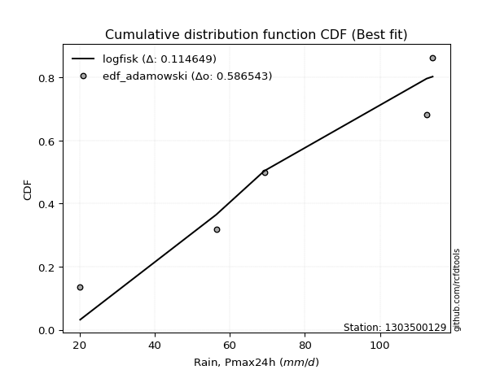</img>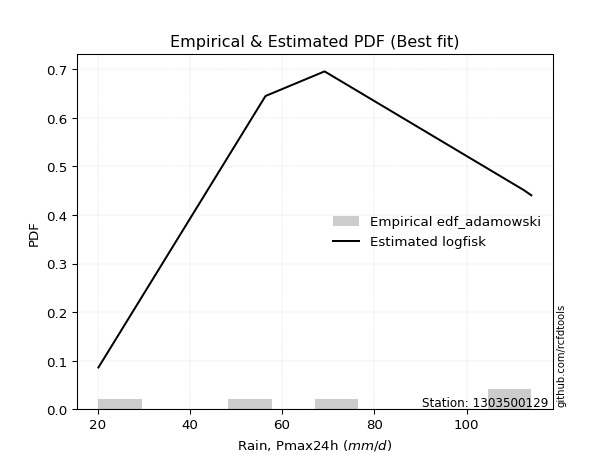</img>

</div>


## C. Best fit & Estimate extreme values for specific return periods - Tr

Best fit in probability distribution analysis means finding the theoretical distribution (like Normal, Poisson, Exponential) that most accurately mirrors your real-world data´s patterns (shape, center, spread) for better predictions, using methods like visual checks (Q-Q plots), goodness-of-fit tests (Kolmogorov-Smirnov, Chi-Squared), and information criteria (AIC) to score and select the simplest, most representative model.


### 1. Best fit (ordered by delta Δ)

<div align="center">

|   id |    station | empirical_dist   | p_dist   |     delta |   deltao | eval   |   fit |   n |   best_fit |   best_fit_sort |
|-----:|-----------:|:-----------------|:---------|----------:|---------:|:-------|------:|----:|-----------:|----------------:|
|    0 | 1303500129 | edf_hazen        | logfisk  | 0.0972335 | 0.586543 | Δo > Δ |     1 |   5 |          1 |               1 |
|    1 | 1303500129 | edf_gringorten   | logfisk  | 0.101155  | 0.586543 | Δo > Δ |     1 |   5 |          1 |               2 |
|    2 | 1303500129 | edf_cunnane      | logfisk  | 0.10416   | 0.586543 | Δo > Δ |     1 |   5 |          1 |               3 |
|    3 | 1303500129 | edf_blom         | logfisk  | 0.105991  | 0.586543 | Δo > Δ |     1 |   5 |          1 |               4 |
|    4 | 1303500129 | edf_tukey        | logfisk  | 0.108968  | 0.586543 | Δo > Δ |     1 |   5 |          1 |               5 |
|    5 | 1303500129 | edf_filliben     | logfisk  | 0.110074  | 0.586543 | Δo > Δ |     1 |   5 |          1 |               6 |
|    6 | 1303500129 | edf_beard        | logfisk  | 0.110594  | 0.586543 | Δo > Δ |     1 |   5 |          1 |               7 |
|    7 | 1303500129 | edf_jenkinson    | logfisk  | 0.110594  | 0.586543 | Δo > Δ |     1 |   5 |          1 |               8 |
|    8 | 1303500129 | edf_chegodayev   | logfisk  | 0.111282  | 0.586543 | Δo > Δ |     1 |   5 |          1 |               9 |
|    9 | 1303500129 | edf_adamowski    | logfisk  | 0.114649  | 0.586543 | Δo > Δ |     1 |   5 |          1 |              10 |
|   10 | 1303500129 | edf_weibull      | ncf      | 0.119314  | 0.586543 | Δo > Δ |     1 |   5 |          1 |              11 |
|   11 | 1303500129 | edf_california   | chi2     | 0.142213  | 0.586543 | Δo > Δ |     1 |   5 |          1 |              12 |

</div>

:file_folder:Tables: [bestfit_1303500129.csv](table/bestfit_1303500129.csv) | [extreme_1303500129.csv](table/extreme_1303500129.csv)


### 2. Extreme values

In hydrology, a return period (or recurrence interval $Tr$) is the statistical average time between extreme events like floods or droughts of a specific magnitude, indicating how rare an event is, with a 100-year flood, for example, having a 1% chance of occurring in any given year, not that it happens exactly every century. It is a key tool for infrastructure design (like bridges or dams) and risk assessment, calculated from historical data to determine the probability of future events, although it is important to remember it is statistical average, and events can cluster or be missed.

> risk_rate: assuming the return period as the project useful life.

|   id |      tr |   prob_l |     prob_g |      alpha |   betaprime |     chi2 |   crystalball |   erlang |    expon |   exponnorm |        f |   fatiguelife |     fisk |    gamma |   genexpon |   genlogistic |   gibrat |   gompertz |   gumbel_l |   gumbel_r |   halflogistic |   halfnorm |   hypsecant |   invgamma |   invgauss |       invweibull |   johnsonsu |   kstwobign |   laplace |   laplace_asymmetric |   loggamma |   logistic |   lognorm |   maxwell |   mielke |    moyal |   nakagami |       ncf |      nct |     norm |   pearson3 |   rayleigh |     rice |        t |   truncnorm |     wald |   weibull_min |   logalpha |   logbetaprime |     logchi2 |   logcrystalball |   logerlang |   logexpon |   logexponnorm |     logf |   logfatiguelife |   logfisk |   loggenexpon |   loggenlogistic |   loggibrat |   loggompertz |   loggumbel_l |   loggumbel_r |   loghalflogistic |   loghalfnorm |   loghypsecant |   loginvgamma |   loginvgauss |   loginvweibull |   logjohnsonsu |   logkstwobign |   loglaplace |   loglaplace_asymmetric |   logloggamma |   loglogistic |    loglognorm |   logmaxwell |   logmielke |   logmoyal |   lognakagami |   logncf |   lognct |   logpearson3 |   lograyleigh |   logrice |     logt |   logtruncnorm |   logwald |   logweibull_min |    station |   n |   risk_rate |
|-----:|--------:|---------:|-----------:|-----------:|------------:|---------:|--------------:|---------:|---------:|------------:|---------:|--------------:|---------:|---------:|-----------:|--------------:|---------:|-----------:|-----------:|-----------:|---------------:|-----------:|------------:|-----------:|-----------:|-----------------:|------------:|------------:|----------:|---------------------:|-----------:|-----------:|----------:|----------:|---------:|---------:|-----------:|----------:|---------:|---------:|-----------:|-----------:|---------:|---------:|------------:|---------:|--------------:|-----------:|---------------:|------------:|-----------------:|------------:|-----------:|---------------:|---------:|-----------------:|----------:|--------------:|-----------------:|------------:|--------------:|--------------:|--------------:|------------------:|--------------:|---------------:|--------------:|--------------:|----------------:|---------------:|---------------:|-------------:|------------------------:|--------------:|--------------:|--------------:|-------------:|------------:|-----------:|--------------:|---------:|---------:|--------------:|--------------:|----------:|---------:|---------------:|----------:|-----------------:|-----------:|----:|------------:|
|    0 |    2    | 0.5      | 0.5        |    59.4468 |     73.3489 |  73.0267 |       74.44   |  73.5848 |  57.7963 |     74.4401 |  73.7184 |       20.2    |  75.3349 |  73.6153 |    57.8214 |       75.1793 |  63.7844 |    108.015 |    80.2719 |    68.6081 |        65.7088 |    67.1734 |     74.44   |    72.3921 |    70.0319 |   6021.65        |         114 |     66.9363 |   74.44   |              71.9322 |    62.4475 |    74.44   |   63.2239 |   71.4039 |  20.2    |  66.7254 |    69.9794 |   63.59   |  74.4356 |  74.44   |    75.7346 |    70.3271 |  72.5722 |  74.4413 |     74.44   |  62.9327 |       76.768  |    61.5832 |        62.7375 |     32.1917 |          63.224  |     61.9458 |    44.5478 |        63.2236 |  62.6733 |          63.2401 |   68.8237 |       53.6234 |          inf     |     52.2867 |       67.9543 |       70.1495 |       56.9821 |           54.112  |       55.5431 |        63.2239 |       61.6712 |       60.0044 |         57.8393 |        113.205 |        54.19   |      63.2239 |                 66.0071 |       75.7244 |       63.2239 |  20.2224      |      59.8935 |     75.9979 |    55.1017 |       56.4777 |  62.814  |  62.9295 |       69.1617 |       58.755  |   62.1236 |  63.2239 |        72.5355 |   51.5006 |          71.2695 | 1303500129 |   5 |    0.75     |
|    1 |    2.33 | 0.570815 | 0.429185   |    70.7589 |     79.7594 |  79.5451 |       80.7748 |  80.0075 |  66.0799 |     80.7749 |  80.2232 |       21.9853 |  81.5392 |  80.0182 |    66.1106 |       81.3957 |  66.9934 |    108.829 |    85.7832 |    74.478  |        71.7439 |    74.0103 |     79.5097 |    78.9895 |    76.8087 | 767675           |         114 |     74.0779 |   78.2735 |              76.8726 |    70.2795 |    80.0214 |   70.7811 |   77.9853 |  20.2    |  72.282  |    73.5234 |   76.1038 |  80.7735 |  80.7748 |    82.0134 |    77.0059 |  79.1547 |  80.7762 |     80.7748 |  67.0865 |       82.9336 |    69.526  |        70.7048 |     38.0629 |          70.7812 |     69.6262 |    53.0279 |        70.7807 |  70.3122 |          70.7806 |   76.2545 |       61.9012 |          inf     |     55.3646 |       74.8688 |       77.3903 |       63.2668 |           60.2574 |       62.7414 |        69.203  |       69.2328 |       67.6841 |         66.8653 |        113.607 |        62.6622 |      67.6949 |                 70.8382 |       81.8827 |       69.837  |  20.4878      |      67.348  |     82.2945 |    60.8383 |       56.6896 |  70.4802 |  70.5659 |       76.8908 |       66.1825 |   69.7991 |  70.7811 |        75.9509 |   55.458  |          77.9119 | 1303500129 |   5 |    0.729209 |
|    2 |    5    | 0.8      | 0.2        |   158.475  |    103.931  | 104.621  |      104.317  | 104.242  | 107.496  |    104.317  | 104.794  |       59.9081 | 105.495  | 104.188  |   107.554  |      105.477  |  85.4682 |    111.457 |   103.588  |    99.9795 |        99.0519 |   102.923  |     99.8456 |   104.792  |   104.557  |      1.09279e+15 |         114 |    104.414  |   97.4402 |             101.573  |   109.77   |   101.572  |  107.683  |  103.889  |  20.2    |  98.0206 |    89.8238 |  150.33   | 104.33   | 104.317  |   104.631  |   103.744  | 104.314  | 104.318  |    104.317  |  90.3395 |      104.646  |   110.714  |       111.164  |    102.006  |         107.683  |    108.258  |   126.729  |       107.682  | 108.061  |         107.61   |  113.29   |      111.91   |          inf     |     76.9575 |      103.462  |      106.294  |       99.6726 |           98.0381 |      105.042  |        99.435  |      107.599  |      108.021  |        125.546  |        113.971 |       116.14   |      95.2621 |                 98.7177 |       99.9365 |      102.542  |   4.40524e+80 |     106.866  |    100.801  |    96.2527 |       65.2805 | 108.523  | 108.242  |      108.603  |      106.59   |  108.138  | 107.683  |        90.9693 |   83.9366 |         103.902  | 1303500129 |   5 |    0.67232  |
|    3 |   10    | 0.9      | 0.1        |   319.63   |    120.27   | 122.007  |      119.934  | 120.64   | 145.092  |    119.934  | 121.442  |      112.27   | 123.137  | 120.551  |   145.176  |      123.264  | 106.527  |    112.921 |   113.501  |   120.75   |       121.73   |   124.317  |    116.084  |   123.098  |   125.353  |      3.11761e+22 |         114 |    127.511  |  114.839  |             123.996  |   148.437  |   117.443  |  142.244  |  122.119  |  94.5469 | 120.43   |   102.521  |  242.847  | 119.96   | 119.934  |   119.02   |   122.809  | 121.402  | 119.936  |    119.934  | 115.016  |      118.024  |   152.74   |       151.169  |    282.305  |         142.244  |    145.977  |   279.481  |       142.243  | 144.001  |         142.12   |  151.638  |      172.695  |          inf     |    112.015  |      124.485  |      126.836  |      144.33   |          146.873  |      153.808  |       132.813  |      145.605  |      149.951  |        209.724  |        113.995 |       185.787  |     129.898  |                133.423  |      107.132  |      136.068  | inf           |     147.895  |    108.195  |   143.509  |       91.7081 | 144.97   | 144.041  |      131.251  |      149.724  |  145.012  | 142.244  |       100.67   |  130.305  |         121.964  | 1303500129 |   5 |    0.651322 |
|    4 |   15    | 0.933333 | 0.0666667  |   480.21   |    128.515  | 130.909  |      127.727  | 128.918  | 167.085  |    127.727  | 129.854  |      146.516  | 132.75   | 128.814  |   167.183  |      132.965  | 121.053  |    113.584 |   117.99   |   132.469  |       134.564  |   135.451  |    125.352  |   132.612  |   136.492  |      5.01222e+26 |         114 |    139.773  |  125.017  |             137.112  |   172.869  |   126.09   |  163.441  |  131.473  | 102.17   | 133.436  |   109.209  |  312.539  | 127.761  | 127.727  |   126.02   |   132.632  | 130.007  | 127.729  |    127.727  | 130.863  |      124.41   |   180.088  |       176.617  |    528.418  |         163.441  |    169.774  |   443.887  |       163.439  | 166.288  |         163.295  |  177.744  |      216.549  |          inf     |    145.119  |      135.471  |      137.402  |      177.855  |          184.622  |      187.57   |       156.666  |      169.851  |      177.592  |        280.14   |        113.998 |       238.413  |     155.734  |                159.134  |      109.457  |      158.743  | inf           |     174.725  |    110.585  |   180.947  |      116.835  | 167.669  | 166.213  |      142.68   |      178.373  |  167.985  | 163.441  |       104.608  |  172.829  |         131.146  | 1303500129 |   5 |    0.644736 |
|    5 |   20    | 0.95     | 0.05       |   640.648  |    133.947  | 136.822  |      132.83   | 134.375  | 182.689  |    132.83   | 135.401  |      171.87   | 139.394  | 134.262  |   182.797  |      139.673  | 132.447  |    113.996 |   120.785  |   140.674  |       143.556  |   142.874  |    131.889  |   138.985  |   144.072  |      4.41682e+29 |         114 |    148.032  |  132.238  |             146.419  |   191.133  |   132.067  |  179.005  |  137.68   | 106.158  | 142.646  |   113.682  |  370.769  | 132.87   | 132.83   |   130.539  |   139.161  | 135.666  | 132.833  |    132.83   | 142.671  |      128.493  |   200.908  |       195.716  |    832.841  |         179.005  |    187.547  |   616.35   |       179.003  | 182.76   |         178.849  |  198.37   |      251.925  |          inf     |    177.799  |      142.823  |      144.419  |      205.863  |          216.714  |      214.103  |       176.028  |      188.09   |      198.8    |        343.089  |        113.999 |       282.03   |     177.126  |                180.328  |      110.606  |      176.587  | inf           |     195.167  |    111.768  |   213.23   |      139.283  | 184.491  | 182.589  |      150.129  |      200.386  |  185.003  | 179.005  |       106.748  |  213.315  |         137.207  | 1303500129 |   5 |    0.641514 |
|    6 |   25    | 0.96     | 0.04       |   801.031  |    137.963  | 141.216  |      136.587  | 138.409  | 194.792  |    136.587  | 139.503  |      192.015  | 144.476  | 138.29   |   194.909  |      144.805  | 141.946  |    114.29  |   122.773  |   146.994  |       150.483  |   148.396  |    136.949  |   143.75   |   149.798  |      8.19585e+31 |         114 |    154.219  |  137.839  |             153.637  |   205.868  |   136.639  |  191.402  |  142.289  | 108.608  | 149.786  |   117.014  |  421.771  | 136.63   | 136.587  |   133.833  |   144.012  | 139.841  | 136.59   |    136.587  | 152.13   |      131.45   |   217.93   |       211.169  |   1191.01   |         191.402  |    201.878  |   795.063  |       191.4    | 195.943  |         191.241  |  215.751  |      282.025  |          inf     |    210.602  |      148.31   |      149.629  |      230.41   |          245.196  |      236.252  |       192.64   |      202.874  |      216.238  |        401.064  |        113.999 |       319.852  |     195.722  |                198.693  |      111.292  |      191.58   | inf           |     211.875  |    112.473  |   242.165  |      159.493  | 197.979  | 195.687  |      155.57   |      218.483  |  198.64   | 191.402  |       108.093  |  252.484  |         141.69   | 1303500129 |   5 |    0.639603 |
|    7 |   50    | 0.98     | 0.02       |  1602.69   |    149.542  | 153.996  |      147.346  | 150.045  | 232.388  |    147.346  | 151.341  |      256.65   | 160.005  | 149.909  |   232.53   |      160.491  | 175.43   |    115.087 |   128.171  |   166.463  |       171.829  |   164.449  |    152.636  |   157.751  |   166.905  |      7.97479e+38 |         114 |    172.387  |  155.238  |             176.06   |   255.044  |   150.609  |  231.86   |  155.654  | 113.639  | 171.949  |   126.711  |  619.927  | 147.401  | 147.346  |   143.113  |   158.093  | 151.84   | 147.349  |    147.346  | 183.012  |      139.697  |   276.124  |       263.006  |   3697.59   |         231.86   |    249.66   |  1753.38   |       231.857  | 239.318  |         231.697  |  278.867  |      392.134  |          inf     |    382.535  |      164.343  |      164.74   |      325.991  |          358.709  |      314.516  |       254.786  |      252.652  |      276.461  |        648.777  |        114     |       462.849  |     266.883  |                268.546  |      112.655  |      245.745  | inf           |     268.868  |    113.882  |   359.477  |      239.391  | 242.512  | 238.75   |      170.828  |      280.815  |  243.602  | 231.859  |       110.934  |  437.798  |         154.612  | 1303500129 |   5 |    0.63583  |
|    8 |   75    | 0.986667 | 0.0133333  |  2404.24   |    155.803  | 160.975  |      153.118  | 156.339  | 254.381  |    153.118  | 157.747  |      295.577  | 168.973  | 156.196  |   254.537  |      169.552  | 198.045  |    115.49  |   130.901  |   177.779  |       184.237  |   173.188  |    161.803  |   165.487  |   176.526  |      9.19357e+42 |         114 |    182.383  |  165.416  |             189.176  |   286.379  |   158.677  |  256.986  |  162.921  | 115.355  | 184.909  |   131.99   |  770.439  | 153.181  | 153.118  |   148.001  |   165.754  | 158.301  | 153.121  |    153.118  | 202.015  |      143.994  |   314.258  |       296.23   |   7262.12   |         256.986  |    280.076  |  2784.82   |       256.983  | 266.51   |         256.836  |  323.418  |      469.702  |          inf     |    572.455  |      173.127  |      172.953  |      398.842  |          447.496  |      367.526  |       300.011  |      284.707  |      316.378  |        858.035  |        114     |       567.205  |     319.967  |                320.296  |      113.106  |      283.752  | inf           |     306.047  |    114.365  |   452.893  |      299.562  | 270.542  | 265.723  |      178.743  |      321.9    |  271.842  | 256.986  |       111.93   |  614.282  |         161.588  | 1303500129 |   5 |    0.634587 |
|    9 |  100    | 0.99     | 0.01       |  3205.76   |    160.056  | 165.743  |      157.023  | 160.616  | 269.984  |    157.022  | 162.103  |      323.585  | 175.305  | 160.469  |   270.151  |      175.949  | 215.564  |    115.753 |   132.686  |   185.788  |       193.019  |   179.141  |    168.306  |   170.81   |   183.213  |      6.89042e+45 |         114 |    189.232  |  172.637  |             198.483  |   309.843  |   164.374  |  275.506  |  167.87   | 116.22   | 194.104  |   135.585  |  896.549  | 157.09   | 157.023  |   151.27   |   170.973  | 162.678  | 157.026  |    157.023  | 215.871  |      146.851  |   343.323  |       321.199  |  11775.8    |         275.506  |    302.84   |  3866.8    |       275.503  | 286.67   |         275.372  |  359.095  |      531.401  |          inf     |    782.278  |      179.134  |      178.546  |      460.042  |          523.322  |      408.668  |       336.879  |      308.875  |      347.018  |       1045.77   |        114     |       651.988  |     363.917  |                362.955  |      113.332  |      314.075  | inf           |     334.273  |    114.622  |   533.546  |      349.044  | 291.374  | 285.709  |      183.96   |      353.282  |  292.797  | 275.506  |       112.437  |  786.345  |         166.321  | 1303500129 |   5 |    0.633968 |
|   10 |  200    | 0.995    | 0.005      |  6411.77   |    169.763  | 176.704  |      165.879  | 170.378  | 307.581  |    165.879  | 172.048  |      392.146  | 190.495  | 170.223  |   307.773  |      191.298  | 263.227  |    116.326 |   136.567  |   205.043  |       214.132  |   192.756  |    183.972  |   183.166  |   198.926  |      5.61644e+52 |         114 |    205.006  |  190.036  |             220.905  |   370.86   |   178.038  |  322.616  |  179.194  | 117.527  | 216.258  |   143.8    | 1283.04   | 165.958  | 165.879  |   158.578  |   182.916  | 172.629  | 165.882  |    165.879  | 250.383  |      153.193  |   420.841  |       386.461  |  38220.2    |         322.616  |    361.989  |  8527.61   |       322.612  | 338.365  |         322.544  |  461.554  |      705.733  |          inf     |   1829.49   |      192.945  |      191.333  |      648.401  |          762.434  |      520.915  |       445.39   |      372.347  |      429.555  |       1682.74   |        114     |       898.639  |     496.23   |                490.555  |      113.669  |      400.688  | inf           |     409.031  |    115.078  |   791.877  |      494.479  | 344.977  | 336.919  |      195.325  |      437.081  |  346.583  | 322.616  |       113.211  | 1454.62   |         177.091  | 1303500129 |   5 |    0.633042 |
|   11 |  250    | 0.996    | 0.004      |  8014.76   |    172.745  | 180.094  |      168.585  | 173.379  | 319.684  |    168.585  | 175.105  |      414.49   | 195.372  | 173.221  |   319.884  |      196.225  | 280.328  |    116.495 |   137.709  |   211.233  |       220.92   |   196.945  |    189.015  |   187.021  |   203.882  |      9.36087e+54 |         114 |    209.888  |  195.638  |             228.124  |   391.925  |   182.425  |  338.56   |  182.68   | 117.79   | 223.39   |   146.326  | 1437.63   | 168.669  | 168.585  |   160.781  |   186.592  | 175.675  | 168.589  |    168.585  | 261.8    |      155.093  |   448.226  |       409.095  |  56016.9    |         338.56   |    382.395  | 11000.2    |       338.556  | 355.988  |         338.517  |  500.288  |      770.42   |          inf     |   2481.52   |      197.213  |      195.267  |      724.035  |          860.487  |      561.295  |       487.279  |      394.461  |      458.97   |       1960.79   |        114     |       992.452  |     548.329  |                540.514  |      113.737  |      433.276  | inf           |     435.251  |    115.196  |   899.214  |      550.068  | 363.309  | 354.366  |      198.655  |      466.678  |  364.932  | 338.56   |       113.368  | 1782.9    |         180.391  | 1303500129 |   5 |    0.632858 |
|   12 |  500    | 0.998    | 0.002      | 16029.7    |    181.633  | 190.258  |      176.611  | 182.322  | 357.28   |    176.611  | 184.222  |      484.582  | 210.495  | 182.159  |   357.506  |      211.508  | 339.43   |    116.978 |   140.982  |   230.446  |       241.987  |   209.434  |    204.68   |   198.678  |   219.009  |      7.37052e+61 |         114 |    224.518  |  213.037  |             250.546  |   462.091  |   196.03   |  390.628  |  193.082  | 118.317  | 245.543  |   153.848  | 2039.36   | 176.706  | 176.611  |   167.234  |   197.56   | 184.723  | 176.615  |    176.611  | 298.104  |      160.631  |   541.626  |       484.839  | 185234      |         390.628  |    450.329  | 24259.2    |       390.622  | 413.956  |         390.702  |  642.332  |     1001.84   |          113.874 |   7116.16   |      209.996  |      206.998  |     1019.72   |         1252.63   |      701.238  |       644.221  |      468.831  |      560.192  |       3151.83   |        114     |      1336.42   |     747.691  |                730.536  |      113.872  |      552.178  | inf           |     523.91   |    115.513  |  1334.58   |      754.089  | 423.798  | 411.718  |      208.097  |      567.439  |  425.313  | 390.627  |       113.683  | 3405.14   |         190.195  | 1303500129 |   5 |    0.632489 |
|   13 |  750    | 0.998667 | 0.00133333 | 24044.6    |    186.598  | 195.977  |      181.07   | 187.32   | 379.273  |    181.07   | 189.319  |      525.996  | 219.331  | 187.155  |   379.513  |      220.436  | 378.517  |    117.237 |   142.731  |   241.678  |       254.303  |   216.411  |    213.843  |   205.303  |   227.695  |      7.92495e+65 |         114 |    232.737  |  223.214  |             263.663  |   506.643  |   203.979  |  422.937  |  198.9    | 118.493  | 258.502  |   158.046  | 2496.99   | 181.172  | 181.07   |   170.766  |   203.693  | 189.756  | 181.074  |    181.07   | 319.871  |      163.645  |   602.601  |       533.193  | 374797      |         422.937  |    493.436  | 38529.9    |       422.931  | 450.229  |         423.102  |  743.314  |     1161.07   |          113.919 |  14283.2    |      217.173  |      213.553  |     1245.73   |         1560.12   |      794.096  |       758.517  |      516.591  |      626.947  |       4159.76   |        114     |      1579.59   |     896.407  |                871.315  |      113.916  |      636.22   | inf           |     581.152  |    115.679  |  1681.34   |      898.051  | 461.789  | 447.581  |      213.046  |      632.989  |  463.108  | 422.936  |       113.788  | 5019.03   |         195.651  | 1303500129 |   5 |    0.632366 |
|   14 | 1000    | 0.999    | 0.001      | 32059.5    |    190.029  | 199.944  |      184.14   | 190.774  | 394.877  |    184.139  | 192.842  |      555.537  | 225.597  | 190.608  |   395.127  |      226.768  | 408.428  |    117.41  |   143.909  |   249.645  |       263.04   |   221.229  |    220.345  |   209.927  |   233.794  |      5.73713e+68 |         114 |    238.43   |  230.436  |             272.969  |   539.915  |   209.616  |  446.722  |  202.921  | 118.582  | 267.696  |   160.942  | 2880.61   | 184.246  | 184.14   |   173.177  |   207.932  | 193.225  | 184.143  |    184.14   | 335.529  |      165.696  |   648.947  |       569.427  | 619204      |         446.722  |    525.615  | 53499.8    |       446.715  | 477.072  |         446.962  |  824.409  |     1286      |          113.941 |  24343.1    |      222.144  |      218.082  |     1435.81   |         1822.99   |      865.309  |       851.708  |      552.52   |      678.008  |       5064.62   |        114     |      1773.54   |    1019.54   |                987.362  |      113.939  |      703.463  | inf           |     624.332  |    115.791  |  1980.74   |     1012.56   | 489.969  | 474.109  |      216.326  |      682.66   |  491.079  | 446.721  |       113.841  | 6634.63   |         199.411  | 1303500129 |   5 |    0.632305 |

<div align="center">

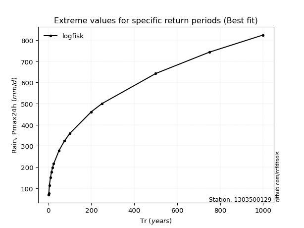</img>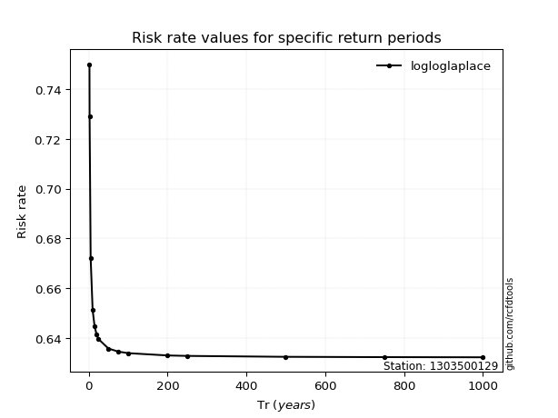</img>

</div>


<sub>**APP DISCLAIMER**: NO WARRANTY - This software is provided by [github.com/rcfdtools](https://github.com/rcfdtools) "as is", without any express or implied warranty, including warranties of merchantability, fitness for a particular purpose, or non-infringement. There is no guarantee that the software will be error-free or operate without interruption. LIMITATION OF LIABILITY - Neither the authors nor copyright holders will be liable for claims or damages arising from the software or its use. You are responsible for determining if the software is appropriate for your use and assume all associated risks, including errors, legal compliance, and data loss. NO PROFESSIONAL ADVICE - The software provides general information and does not offer professional advice. It should not replace consultation with professional advisors.</sub>