<div align="center">


</div>

# Station (rain, Pmax24h): 13035501

Probable Maximum Precipitation (PMP) is the greatest amount of rainfall for a specific duration that is meteorologically possible for a given location, acting as a "worst-case" scenario for extreme storms, crucial for designing safety-critical infrastructure like bridges, river deviations, dams, spillways, and nuclear plants to prevent catastrophic failure. PMP is calculated by hydrologists using meteorological data to determine the upper limit of extreme rainfall, often leading to the Probable Maximum Flood (PMF) for flood control design, and is increasingly being studied for climate change impacts.

<div align="center">

</img>

</div>


## A. General information


### 1. General running parameters

• app_version: _v20251225_. • runtime: _2025-12-26 14:29:50.888910_. • Python version: _3.14.0_. • SciPy version: _1.16.3_. • Pandas version: _2.3.3_. • NumPy version: _2.3.5_. • Stations dataset (station_dataset_file): _dataset/pmax24h_in/automatic_colombia.csv_. • Stations catalog (station_catalog_file): _dataset/CNE_IDEAM.xls_. • Plot only fit distributions with Δo > Δ (plot_only_fit): _True_. • Eval low extreme values, if False, evaluates high extreme values (low_extreme): _False_. • Eval every SciPy distribution as logarithmic (pdist_logarithmic_on): _True_. • Standard deviation normalized (ddof): _1.0_. • Return periods to eval in years (Tr): _[2, 2.33, 5, 10, 15, 20, 25, 50, 75, 100, 200, 250, 500, 750, 1000]_. • Minimum data sample per station, 0 means any (minimum_sample): _5_. • Z-Score threshold to adjust a value, 0 means disable (zscore): _3.5_. • Avoid zeros, e.g. rain = 0 (avoid_zeros): _True_. • Avoid null values (avoid_nans): _True_. [:file_folder:Dataset file.](../../dataset/pmax24h_in/automatic_colombia.csv)


### 2. Station info and location

|   id |   CODIGO | NOMBRE                             | CATEGORIA            | TECNOLOGIA                | ESTADO   | FECHA_INSTALACION   |   FECHA_SUSPENSION |   ALTITUD |   LATITUD |   LONGITUD | DEPARTAMENTO   | MUNICIPIO   | AREA_OPERATIVA                              | ENTIDAD                                                     | AREA_HIDROGRAFICA   | ZONA_HIDROGRAFICA   | SUBZONA_HIDROGRAFICA   |   CORRIENTE | OBSERVACION                                                                                  | SUBRED                                                                      | Catalogo   |
|-----:|---------:|:-----------------------------------|:---------------------|:--------------------------|:---------|:--------------------|-------------------:|----------:|----------:|-----------:|:---------------|:------------|:--------------------------------------------|:------------------------------------------------------------|:--------------------|:--------------------|:-----------------------|------------:|:---------------------------------------------------------------------------------------------|:----------------------------------------------------------------------------|:-----------|
|    0 | 13035501 | AEROPUERTO LOS GARZONES [13035501] | Sinóptica Secundaria | Automática con Telemetría | Activa   | 06/02/2015          |                nan |        20 |   8.82583 |   -75.8251 | Cordoba        | Montería    | Area Operativa 02 - Atlántico-Bolivar-Sucre | INSTITUTO DE HIDROLOGIA METEOROLOGIA Y ESTUDIOS AMBIENTALES | Caribe              | Sinú                | Bajo Sinú              |         nan | Se cambia categoría a SS por solicitud del coordinador del AO 02. REQ 2023-000225 (20012023) | SINOPTICA,Radición Global,Radiación Visible,Radiación Ultravioleta,Colombia | CNE_IDEAM  |

<div align="center">

Map location in: [:earth_americas:Google](http://maps.google.com/maps?q=8.825833333,-75.82513889) [:earth_americas:OSM](https://www.openstreetmap.org/#map=18/8.825833333/-75.82513889&layers=P) [:earth_americas:Bing](https://www.bing.com/maps?cp=8.825833333~-75.82513889&lvl=18) [:earth_americas:Apple](https://maps.apple.com/frame?center=8.825833333%2C-75.82513889&span=0.003%2C0.006)

</div>


<div align="center">

```geojson
{
  "type": "Feature",
  "geometry": {
    "type": "Point", 
    "coordinates": [-75.82513889, 8.825833333]
  }, 
  "properties": {
    "Name": "13035501"
  }
}
```

</div>


### 3. Discrete values table and plot

|               |           0 |           1 |           2 |           3 |           4 |           5 |          6 |          7 |           8 |
|:--------------|------------:|------------:|------------:|------------:|------------:|------------:|-----------:|-----------:|------------:|
| Date          | 2015        | 2016        | 2017        | 2018        | 2019        | 2020        | 2023       | 2024       | 2025        |
| Value         |   49.22     |   58.78     |  103.7      |    0.886    |   34.5      |   65.3      |  550.5     |  410.6     |  237.6      |
| Value_initial |   49.22     |   58.78     |  103.7      |    0.886    |   34.5      |   65.3      |  550.5     |  410.6     |  237.6      |
| count         |    9        |    9        |    9        |    9        |    9        |    9        |    9       |    9       |    9        |
| mean          |  167.898    |  167.898    |  167.898    |  167.898    |  167.898    |  167.898    |  167.898   |  167.898   |  167.898    |
| std           |  192.508    |  192.508    |  192.508    |  192.508    |  192.508    |  192.508    |  192.508   |  192.508   |  192.508    |
| zscore        |   -0.616487 |   -0.566826 |   -0.333485 |   -0.867562 |   -0.692951 |   -0.532957 |    1.98746 |    1.26074 |    0.362071 |

<div align="center">

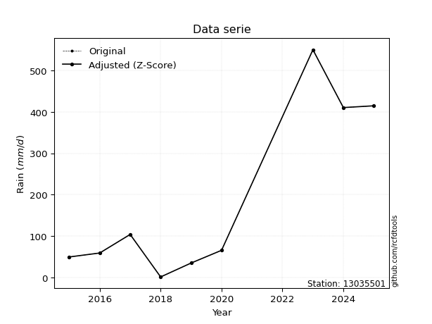</img>

</div>

> If Z-Score is active, values out of range or outliers are replaced with the station mean value.


### 4. Active continuous probability distributions from SciPy (45 of 104 available)

[scipy.stats](https://docs.scipy.org/doc/scipy/reference/stats.html) is a Python´s powerful submodule within the SciPy library for comprehensive statistical analysis, offering over 130 probability distributions (like Normal, Poisson), functions for descriptive stats (mean, variance), hypothesis testing (t-tests, chi-square), random variable generation, and statistical tests, making it essential for data science, modeling, and research. It provides tools to explore, model, and draw conclusions from data efficiently, working seamlessly with NumPy.

<div align="center">

|   id | p_dist             |   n_parameter | fit_method   | label                                                                       | active   | ref                                                                                                        |
|-----:|:-------------------|--------------:|:-------------|:----------------------------------------------------------------------------|:---------|:-----------------------------------------------------------------------------------------------------------|
|    0 | alpha              |             3 | MLE          | Alpha                                                                       | True     | [:mortar_board:](https://docs.scipy.org/doc/scipy/reference/generated/scipy.stats.alpha.html)              |
|    1 | betaprime          |             4 | MLE          | Beta prime                                                                  | True     | [:mortar_board:](https://docs.scipy.org/doc/scipy/reference/generated/scipy.stats.betaprime.html)          |
|    2 | chi2               |             3 | MLE          | Chi²                                                                        | True     | [:mortar_board:](https://docs.scipy.org/doc/scipy/reference/generated/scipy.stats.chi2.html)               |
|    3 | crystalball        |             4 | MLE          | Crystalball                                                                 | True     | [:mortar_board:](https://docs.scipy.org/doc/scipy/reference/generated/scipy.stats.crystalball.html)        |
|    4 | erlang             |             3 | MLE          | Erlang                                                                      | True     | [:mortar_board:](https://docs.scipy.org/doc/scipy/reference/generated/scipy.stats.erlang.html)             |
|    5 | expon              |             2 | MLE          | Exponential                                                                 | True     | [:mortar_board:](https://docs.scipy.org/doc/scipy/reference/generated/scipy.stats.expon.html)              |
|    6 | exponnorm          |             3 | MLE          | Exponentially modified Normal                                               | True     | [:mortar_board:](https://docs.scipy.org/doc/scipy/reference/generated/scipy.stats.exponnorm.html)          |
|    7 | f                  |             4 | MLE          | F                                                                           | True     | [:mortar_board:](https://docs.scipy.org/doc/scipy/reference/generated/scipy.stats.f.html)                  |
|    8 | fatiguelife        |             3 | MLE          | Fatigue-life (Birnbaum-Saunders)                                            | True     | [:mortar_board:](https://docs.scipy.org/doc/scipy/reference/generated/scipy.stats.fatiguelife.html)        |
|    9 | fisk               |             3 | MLE          | Fisk                                                                        | True     | [:mortar_board:](https://docs.scipy.org/doc/scipy/reference/generated/scipy.stats.fisk.html)               |
|   10 | gamma              |             3 | MLE          | Gamma                                                                       | True     | [:mortar_board:](https://docs.scipy.org/doc/scipy/reference/generated/scipy.stats.gamma.html)              |
|   11 | genexpon           |             5 | MLE          | Generalized exponential                                                     | True     | [:mortar_board:](https://docs.scipy.org/doc/scipy/reference/generated/scipy.stats.genexpon.html)           |
|   12 | genlogistic        |             3 | MLE          | Generalized logistic                                                        | True     | [:mortar_board:](https://docs.scipy.org/doc/scipy/reference/generated/scipy.stats.genlogistic.html)        |
|   13 | gibrat             |             2 | MM           | Gibrat                                                                      | True     | [:mortar_board:](https://docs.scipy.org/doc/scipy/reference/generated/scipy.stats.gibrat.html)             |
|   14 | gompertz           |             3 | MLE          | Gompertz (or truncated Gumbel)                                              | True     | [:mortar_board:](https://docs.scipy.org/doc/scipy/reference/generated/scipy.stats.gompertz.html)           |
|   15 | gumbel_l           |             2 | MM           | Gumbel Left Skew                                                            | True     | [:mortar_board:](https://docs.scipy.org/doc/scipy/reference/generated/scipy.stats.gumbel_l.html)           |
|   16 | gumbel_r           |             2 | MM           | Gumbel Right Skew                                                           | True     | [:mortar_board:](https://docs.scipy.org/doc/scipy/reference/generated/scipy.stats.gumbel_r.html)           |
|   17 | halflogistic       |             2 | MM           | Half-logistic                                                               | True     | [:mortar_board:](https://docs.scipy.org/doc/scipy/reference/generated/scipy.stats.halflogistic.html)       |
|   18 | halfnorm           |             2 | MM           | Half Normal                                                                 | True     | [:mortar_board:](https://docs.scipy.org/doc/scipy/reference/generated/scipy.stats.halfnorm.html)           |
|   19 | hypsecant          |             2 | MM           | hyperbolic secant                                                           | True     | [:mortar_board:](https://docs.scipy.org/doc/scipy/reference/generated/scipy.stats.hypsecant.html)          |
|   20 | invgamma           |             3 | MLE          | Inverted gamma                                                              | True     | [:mortar_board:](https://docs.scipy.org/doc/scipy/reference/generated/scipy.stats.invgamma.html)           |
|   21 | invgauss           |             3 | MLE          | Inverse Gaussian                                                            | True     | [:mortar_board:](https://docs.scipy.org/doc/scipy/reference/generated/scipy.stats.invgauss.html)           |
|   22 | invweibull         |             3 | MLE          | Inverted Weibull                                                            | True     | [:mortar_board:](https://docs.scipy.org/doc/scipy/reference/generated/scipy.stats.invweibull.html)         |
|   23 | johnsonsu          |             4 | MLE          | Johnson Su                                                                  | True     | [:mortar_board:](https://docs.scipy.org/doc/scipy/reference/generated/scipy.stats.johnsonsu.html)          |
|   24 | kstwobign          |             2 | MLE          | Limiting distribution of scaled Kolmogorov-Smirnov two-sided test statistic | True     | [:mortar_board:](https://docs.scipy.org/doc/scipy/reference/generated/scipy.stats.kstwobign.html)          |
|   25 | laplace            |             2 | MM           | Laplace                                                                     | True     | [:mortar_board:](https://docs.scipy.org/doc/scipy/reference/generated/scipy.stats.laplace.html)            |
|   26 | laplace_asymmetric |             3 | MLE          | Asymmetric Laplace                                                          | True     | [:mortar_board:](https://docs.scipy.org/doc/scipy/reference/generated/scipy.stats.laplace_asymmetric.html) |
|   27 | loggamma           |             3 | MLE          | Log gamma                                                                   | True     | [:mortar_board:](https://docs.scipy.org/doc/scipy/reference/generated/scipy.stats.loggamma.html)           |
|   28 | logistic           |             2 | MM           | Logistic (or Sech-squared)                                                  | True     | [:mortar_board:](https://docs.scipy.org/doc/scipy/reference/generated/scipy.stats.logistic.html)           |
|   29 | lognorm            |             3 | MLE          | Log Normal                                                                  | True     | [:mortar_board:](https://docs.scipy.org/doc/scipy/reference/generated/scipy.stats.lognorm.html)            |
|   30 | maxwell            |             2 | MM           | Maxwell                                                                     | True     | [:mortar_board:](https://docs.scipy.org/doc/scipy/reference/generated/scipy.stats.maxwell.html)            |
|   31 | mielke             |             4 | MLE          | Mielke Beta-Kappa / Dagum                                                   | True     | [:mortar_board:](https://docs.scipy.org/doc/scipy/reference/generated/scipy.stats.mielke.html)             |
|   32 | moyal              |             2 | MM           | Moyal                                                                       | True     | [:mortar_board:](https://docs.scipy.org/doc/scipy/reference/generated/scipy.stats.moyal.html)              |
|   33 | nakagami           |             3 | MLE          | Nakagami                                                                    | True     | [:mortar_board:](https://docs.scipy.org/doc/scipy/reference/generated/scipy.stats.nakagami.html)           |
|   34 | ncf                |             5 | MLE          | Non-central F distribution                                                  | True     | [:mortar_board:](https://docs.scipy.org/doc/scipy/reference/generated/scipy.stats.ncf.html)                |
|   35 | nct                |             4 | MLE          | Non-central Student’s t                                                     | True     | [:mortar_board:](https://docs.scipy.org/doc/scipy/reference/generated/scipy.stats.nct.html)                |
|   36 | norm               |             2 | MM           | Normal                                                                      | True     | [:mortar_board:](https://docs.scipy.org/doc/scipy/reference/generated/scipy.stats.norm.html)               |
|   37 | pareto             |             3 | MLE          | Pareto                                                                      | True     | [:mortar_board:](https://docs.scipy.org/doc/scipy/reference/generated/scipy.stats.pareto.html)             |
|   38 | pearson3           |             3 | MM           | Pearson type III                                                            | True     | [:mortar_board:](https://docs.scipy.org/doc/scipy/reference/generated/scipy.stats.pearson3.html)           |
|   39 | rayleigh           |             2 | MM           | Rayleigh                                                                    | True     | [:mortar_board:](https://docs.scipy.org/doc/scipy/reference/generated/scipy.stats.rayleigh.html)           |
|   40 | rice               |             3 | MLE          | Rice                                                                        | True     | [:mortar_board:](https://docs.scipy.org/doc/scipy/reference/generated/scipy.stats.rice.html)               |
|   41 | t                  |             3 | MLE          | Student’s t                                                                 | True     | [:mortar_board:](https://docs.scipy.org/doc/scipy/reference/generated/scipy.stats.t.html)                  |
|   42 | truncnorm          |             4 | MLE          | Truncated normal                                                            | True     | [:mortar_board:](https://docs.scipy.org/doc/scipy/reference/generated/scipy.stats.truncnorm.html)          |
|   43 | wald               |             2 | MM           | Wald                                                                        | True     | [:mortar_board:](https://docs.scipy.org/doc/scipy/reference/generated/scipy.stats.wald.html)               |
|   44 | weibull_min        |             3 | MLE          | Weibull minimum                                                             | True     | [:mortar_board:](https://docs.scipy.org/doc/scipy/reference/generated/scipy.stats.weibull_min.html)        |

</div>

> **n_parameter:** # arguments & localization & scale.
>
> **Fit methods:** (MLE) maximum likelihood, (MM) L-moments.
>
>**Inactive:** foldnorm, gennorm, norminvgauss, powernorm, powerlognorm, skewnorm, genextreme, anglit, arcsine, argus, beta, bradford, burr, burr12, cauchy, cosine, halfcauchy, foldcauchy, skewcauchy, wrapcauchy, dgamma, gengamma, exponweib, exponpow, truncexpon, gausshyper, genhalflogistic, genhyperbolic, geninvgauss, halfgennorm, johnsonsb, kappa4, kappa3, ksone, kstwo, loglaplace, levy, levy_l, levy_stable, ncx2, genpareto, truncpareto, lomax, powerlaw, rdist, rel_breitwigner, recipinvgauss, semicircular, studentized_range, trapezoid, triang, truncweibull_min, tukeylambda, uniform, loguniform, vonmises, vonmises_line, weibull_max, dweibull, 


## B. Probability distributions vs. Empirical distributions

A continuous probability distribution (CPD) describes probabilities for variables that can take any value within a range (like rain any time), unlike discrete variables with specific outcomes (like temperature). It uses a Probability Density Function (PDF), a curve where the total area under it equals 1, and the probability of the variable falling within an interval (a to b) is found by calculating the area under the curve between those points. A key feature is that the probability of hitting any single exact value is zero, so probabilities are always expressed for ranges, e.g., $P(a ≤ X ≤ b)$.

<div align="center">

Distributions parameters
|    |   station | p_dist                |   n |              loc |           scale | shape                  | shape1             | shape2                 | shape3   |
|---:|----------:|:----------------------|----:|-----------------:|----------------:|:-----------------------|:-------------------|:-----------------------|:---------|
|  0 |  13035501 | alpha                 |   9 |     -0.00167622  |     2.66964     | 7.348019382089293e-09  |                    |                        |          |
|  1 |  13035501 | betaprime             |   9 |      0.886       |   635.714       | 0.6955626654434498     | 5.136214207220693  |                        |          |
|  2 |  13035501 | chi2                  |   9 |      0.886       |    67.3173      | 1.543273970088478      |                    |                        |          |
|  3 |  13035501 | crystalball           |   9 |     -0.16317     |   247.31        | 4.447644118040163      | 2.368266644627946  |                        |          |
|  4 |  13035501 | erlang                |   9 |      0.886       |   151.249       | 0.5158146731581587     |                    |                        |          |
|  5 |  13035501 | expon                 |   9 |      0.886       |   167.012       |                        |                    |                        |          |
|  6 |  13035501 | exponnorm             |   9 |      0.690286    |     0.0568108   | 2946.421790056829      |                    |                        |          |
|  7 |  13035501 | f                     |   9 |    -32.9626      |    97.2144      | 13135.703671441817     | 3.2545920475004966 |                        |          |
|  8 |  13035501 | fatiguelife           |   9 |    -13.6692      |   104.588       | 1.2088295452189515     |                    |                        |          |
|  9 |  13035501 | fisk                  |   9 |     -1.83457     |    88.6631      | 1.2291400719038015     |                    |                        |          |
| 10 |  13035501 | gamma                 |   9 |      0.886       |   173.403       | 0.6724543786121984     |                    |                        |          |
| 11 |  13035501 | genexpon              |   9 |      0.886       |   200.413       | 1.1999874774678294     | 1.063963892465646  | 1.1035582587184437e-10 |          |
| 12 |  13035501 | genlogistic           |   9 |   -790.613       |   114.859       | 2128.9769444148337     |                    |                        |          |
| 13 |  13035501 | gibrat                |   9 |     29.4383      |    83.9803      |                        |                    |                        |          |
| 14 |  13035501 | gompertz              |   9 |      0.886       |   417.434       | 1.355356827073575      |                    |                        |          |
| 15 |  13035501 | gumbel_l              |   9 |    249.582       |   141.513       |                        |                    |                        |          |
| 16 |  13035501 | gumbel_r              |   9 |     86.2147      |   141.513       |                        |                    |                        |          |
| 17 |  13035501 | halflogistic          |   9 |    -47.2189      |   155.174       |                        |                    |                        |          |
| 18 |  13035501 | halfnorm              |   9 |    -72.3338      |   301.087       |                        |                    |                        |          |
| 19 |  13035501 | hypsecant             |   9 |    167.898       |   115.545       |                        |                    |                        |          |
| 20 |  13035501 | invgamma              |   9 |    -32.9747      |   158.204       | 1.627296679175723      |                    |                        |          |
| 21 |  13035501 | invgauss              |   9 |    -20.3058      |   124.418       | 1.51268309370547       |                    |                        |          |
| 22 |  13035501 | invweibull            |   9 |      0.886       |     2.53257     | 0.05670116185628518    |                    |                        |          |
| 23 |  13035501 | johnsonsu             |   9 |     -8.88025     |     0.367891    | -5.327544432322416     | 0.8493530726038547 |                        |          |
| 24 |  13035501 | kstwobign             |   9 |   -327.195       |   572.482       |                        |                    |                        |          |
| 25 |  13035501 | laplace               |   9 |    167.898       |   128.339       |                        |                    |                        |          |
| 26 |  13035501 | laplace_asymmetric    |   9 |      0.886       |     0.00033453  | 2.003026837511497e-06  |                    |                        |          |
| 27 |  13035501 | loggamma              |   9 | -77424.7         |  9797.58        | 2750.8875105308707     |                    |                        |          |
| 28 |  13035501 | logistic              |   9 |    167.898       |   100.065       |                        |                    |                        |          |
| 29 |  13035501 | lognorm               |   9 |      0.886       |     1.156       | 13.072289901439522     |                    |                        |          |
| 30 |  13035501 | maxwell               |   9 |   -262.176       |   269.509       |                        |                    |                        |          |
| 31 |  13035501 | mielke                |   9 |      0.886       |   207.492       | 0.6753833888200591     | 1.7168658740291756 |                        |          |
| 32 |  13035501 | moyal                 |   9 |     64.1062      |    81.7028      |                        |                    |                        |          |
| 33 |  13035501 | nakagami              |   9 |      0.886       |   313.459       | 0.1973150397804904     |                    |                        |          |
| 34 |  13035501 | ncf                   |   9 |    -32.9457      |    31.631       | 2966.543369265303      | 3.2545931174831875 | 6150.194073475404      |          |
| 35 |  13035501 | nct                   |   9 |     -0.124638    |    34.5601      | 1.11087877799373       | 1.7739785634639185 |                        |          |
| 36 |  13035501 | norm                  |   9 |    167.898       |   181.498       |                        |                    |                        |          |
| 37 |  13035501 | pareto                |   9 |      0.871443    |     0.0145567   | 0.12520764560776823    |                    |                        |          |
| 38 |  13035501 | pearson3              |   9 |    167.898       |   181.498       | 1.1019223738452664     |                    |                        |          |
| 39 |  13035501 | rayleigh              |   9 |   -179.318       |   277.039       |                        |                    |                        |          |
| 40 |  13035501 | rice                  |   9 |   -107.337       |   233.127       | 0.0003731953563236791  |                    |                        |          |
| 41 |  13035501 | t                     |   9 |     55.568       |    25.8316      | 0.6332115634247992     |                    |                        |          |
| 42 |  13035501 | truncnorm             |   9 |   -375.654       |   351.741       | 1.0705036386622724     | 771.9968054939741  |                        |          |
| 43 |  13035501 | wald                  |   9 |    -13.5996      |   181.498       |                        |                    |                        |          |
| 44 |  13035501 | weibull_min           |   9 |      0.886       |   159.338       | 0.9172174427124711     |                    |                        |          |
| 45 |  13035501 | logalpha              |   9 |    -50.1         |  1569.67        | 28.949740415949904     |                    |                        |          |
| 46 |  13035501 | logbetaprime          |   9 |  -2082.08        | 14582.8         | 1546057.3194208648     | 10806639.717969581 |                        |          |
| 47 |  13035501 | logchi2               |   9 |     -0.121038    |     1.66414     | 1.4224993676942868     |                    |                        |          |
| 48 |  13035501 | logcrystalball        |   9 |      4.22328     |     1.78817     | 6.833746200116595      | 236.09206073700568 |                        |          |
| 49 |  13035501 | logerlang             |   9 |    -26.9599      |     0.114085    | 273.52035413574174     |                    |                        |          |
| 50 |  13035501 | logexpon              |   9 |     -0.121038    |     4.34432     |                        |                    |                        |          |
| 51 |  13035501 | logexponnorm          |   9 |      4.22223     |     1.78817     | 0.0005897110756567961  |                    |                        |          |
| 52 |  13035501 | logf                  |   9 |     -0.121038    |     1.49911     | 1.2251504451486612     | 1.1147554170152996 |                        |          |
| 53 |  13035501 | logfatiguelife        |   9 |   -796.949       |   801.172       | 0.0022255962658566213  |                    |                        |          |
| 54 |  13035501 | logfisk               |   9 |     -0.121038    |     1.45503     | 0.7670626664243487     |                    |                        |          |
| 55 |  13035501 | loggamma              |   9 |    -27.8331      |     0.111153    | 288.5358358517851      |                    |                        |          |
| 56 |  13035501 | loggenexpon           |   9 |     -0.121641    |     0.018152    | 0.0010017424555701332  | 1.7493468234396468 | 1.3011759144642854e-05 |          |
| 57 |  13035501 | loggenlogistic        |   9 |      6.31093     |     9.5206e-06  | 4.5653359501271645e-06 |                    |                        |          |
| 58 |  13035501 | loggibrat             |   9 |      2.85917     |     0.827381    |                        |                    |                        |          |
| 59 |  13035501 | loggompertz           |   9 |     -0.121038    |     1.36198     | 0.02446730311500111    |                    |                        |          |
| 60 |  13035501 | loggumbel_l           |   9 |      5.02806     |     1.39423     |                        |                    |                        |          |
| 61 |  13035501 | loggumbel_r           |   9 |      3.41851     |     1.39423     |                        |                    |                        |          |
| 62 |  13035501 | loghalflogistic       |   9 |      2.10392     |     1.5288      |                        |                    |                        |          |
| 63 |  13035501 | loghalfnorm           |   9 |      1.85643     |     2.96641     |                        |                    |                        |          |
| 64 |  13035501 | loghypsecant          |   9 |      4.22328     |     1.13839     |                        |                    |                        |          |
| 65 |  13035501 | loginvgamma           |   9 |    -44.5897      | 33028.5         | 677.4382375554821      |                    |                        |          |
| 66 |  13035501 | loginvgauss           |   9 |    -17.9217      |  2768.32        | 0.007986818299247378   |                    |                        |          |
| 67 |  13035501 | loginvweibull         |   9 |     -4.27382e+08 |     4.27382e+08 | 206985081.97484553     |                    |                        |          |
| 68 |  13035501 | logjohnsonsu          |   9 |      7.17646     |     0.0501195   | 7.573997653731958      | 1.648784394757381  |                        |          |
| 69 |  13035501 | logkstwobign          |   9 |     -4.75834     |    10.3062      |                        |                    |                        |          |
| 70 |  13035501 | loglaplace            |   9 |      4.22328     |     1.26443     |                        |                    |                        |          |
| 71 |  13035501 | loglaplace_asymmetric |   9 |      4.17899     |     1.22722     | 0.9821951953499068     |                    |                        |          |
| 72 |  13035501 | logloggamma           |   9 |      6.31099     |     4.88132e-06 | 2.3286307638602296e-06 |                    |                        |          |
| 73 |  13035501 | loglogistic           |   9 |      4.22328     |     0.985872    |                        |                    |                        |          |
| 74 |  13035501 | loglognorm            |   9 |  -1069.42        |  1073.64        | 0.0016605195873869987  |                    |                        |          |
| 75 |  13035501 | logmaxwell            |   9 |     -0.0139529   |     2.65529     |                        |                    |                        |          |
| 76 |  13035501 | logmielke             |   9 |     -7.39112e+08 |     7.39112e+08 | 1720625531.195917      | 467267734.229084   |                        |          |
| 77 |  13035501 | logmoyal              |   9 |      3.20069     |     0.804961    |                        |                    |                        |          |
| 78 |  13035501 | lognakagami           |   9 |  -1233.95        |  1238.17        | 119592.94249494252     |                    |                        |          |
| 79 |  13035501 | logncf                |   9 |     -0.121038    |     1.16817     | 1.1259210395318948     | 1.4141599369635178 | 1.0336641087765754     |          |
| 80 |  13035501 | lognct                |   9 |   -108.279       |     1.75513     | 47321.88058752235      | 64.09800382877505  |                        |          |
| 81 |  13035501 | lognorm               |   9 |      4.22328     |     1.78817     |                        |                    |                        |          |
| 82 |  13035501 | logpareto             |   9 |     -0.121636    |     0.000597823 | 0.12514292734291113    |                    |                        |          |
| 83 |  13035501 | logpearson3           |   9 |      4.22329     |     1.78817     | -1.2721081993096233    |                    |                        |          |
| 84 |  13035501 | lograyleigh           |   9 |      0.802423    |     2.72945     |                        |                    |                        |          |
| 85 |  13035501 | logrice               |   9 |   -551.264       |     1.78708     | 310.8330402514681      |                    |                        |          |
| 86 |  13035501 | logt                  |   9 |      4.4968      |     1.08943     | 2.567014854804693      |                    |                        |          |
| 87 |  13035501 | logtruncnorm          |   9 |      0.768843    |     3.39032     | -0.26247734233125064   | 1.6346530698616308 |                        |          |
| 88 |  13035501 | logwald               |   9 |      2.43513     |     1.78816     |                        |                    |                        |          |
| 89 |  13035501 | logweibull_min        |   9 |     -2.43084e+08 |     2.43084e+08 | 190933628.8499409      |                    |                        |          |

</div>

> **loc** (Location parameter): This shifts the distribution along the x-axis. For many common distributions, like the normal (Gaussian) distribution, loc represents the mean $μ$. For others, like the uniform distribution, it might represent the minimum value, or for the beta distribution, the left end of the support interval.
>
> **scale** (Scale parameter): This determines the width or spread of the distribution. For the normal distribution, scale represents the standard deviation $σ$. For a uniform distribution, it defines the length of the interval (from $loc$ to $loc + scale$).
>
> **shape** (Shape parameters): Refers to parameters that define the specific form of a probability distribution, distinct from its location (loc) and scale (scale). These parameters are required arguments for most distribution functions. For example, a normal (Gaussian) distribution is fully defined by its location (mean) and scale (standard deviation), so it has no specific shape parameters beyond loc and scale. However, other distributions have intrinsic properties that need specification, as Gamma distribution that takes a shape parameter, often named $a$ or $alpha$.


### 0. Cumulative distribution values - CDF (90 evaluated)

> Ordered by x ascending and calculating $log(f(x))$ separately. 

|   id |   Station |   date |       x |   count |    mean |     std |    zscore |   Value_initial |   station |   m |      alpha |   alpha_pdf |   betaprime |   betaprime_pdf |        chi2 |    chi2_pdf |   crystalball |   crystalball_pdf |      erlang |   erlang_pdf |    expon |   expon_pdf |   exponnorm |   exponnorm_pdf |         f |       f_pdf |   fatiguelife |   fatiguelife_pdf |      fisk |    fisk_pdf |       gamma |      gamma_pdf |    genexpon |   genexpon_pdf |   genlogistic |   genlogistic_pdf |     gibrat |   gibrat_pdf |    gompertz |   gompertz_pdf |   gumbel_l |   gumbel_l_pdf |   gumbel_r |   gumbel_r_pdf |   halflogistic |   halflogistic_pdf |   halfnorm |   halfnorm_pdf |   hypsecant |   hypsecant_pdf |   invgamma |   invgamma_pdf |   invgauss |   invgauss_pdf |   invweibull |   invweibull_pdf |   johnsonsu |   johnsonsu_pdf |   kstwobign |   kstwobign_pdf |   laplace |   laplace_pdf |   laplace_asymmetric |   laplace_asymmetric_pdf |   loggamma |   loggamma_pdf |   logistic |   logistic_pdf |    lognorm |   lognorm_pdf |   maxwell |   maxwell_pdf |      mielke |    mielke_pdf |    moyal |   moyal_pdf |   nakagami |   nakagami_pdf |       ncf |     ncf_pdf |       nct |     nct_pdf |     norm |    norm_pdf |   pareto |   pareto_pdf |   pearson3 |   pearson3_pdf |   rayleigh |   rayleigh_pdf |     rice |    rice_pdf |        t |       t_pdf |   truncnorm |   truncnorm_pdf |       wald |    wald_pdf |   weibull_min |   weibull_min_pdf |   logalpha |   logalpha_pdf |   logbetaprime |   logbetaprime_pdf |     logchi2 |   logchi2_pdf |   logcrystalball |   logcrystalball_pdf |   logerlang |   logerlang_pdf |   logexpon |   logexpon_pdf |   logexponnorm |   logexponnorm_pdf |        logf |    logf_pdf |   logfatiguelife |   logfatiguelife_pdf |     logfisk |   logfisk_pdf |   loggenexpon |   loggenexpon_pdf |   loggenlogistic |   loggenlogistic_pdf |   loggibrat |   loggibrat_pdf |   loggompertz |   loggompertz_pdf |   loggumbel_l |   loggumbel_l_pdf |   loggumbel_r |   loggumbel_r_pdf |   loghalflogistic |   loghalflogistic_pdf |   loghalfnorm |   loghalfnorm_pdf |   loghypsecant |   loghypsecant_pdf |   loginvgamma |   loginvgamma_pdf |   loginvgauss |   loginvgauss_pdf |   loginvweibull |   loginvweibull_pdf |   logjohnsonsu |   logjohnsonsu_pdf |   logkstwobign |   logkstwobign_pdf |   loglaplace |   loglaplace_pdf |   loglaplace_asymmetric |   loglaplace_asymmetric_pdf |   logloggamma |   logloggamma_pdf |   loglogistic |   loglogistic_pdf |   loglognorm |   loglognorm_pdf |   logmaxwell |   logmaxwell_pdf |   logmielke |   logmielke_pdf |    logmoyal |   logmoyal_pdf |   lognakagami |   lognakagami_pdf |      logncf |   logncf_pdf |     lognct |   lognct_pdf |   logpareto |   logpareto_pdf |   logpearson3 |   logpearson3_pdf |   lograyleigh |   lograyleigh_pdf |    logrice |   logrice_pdf |      logt |   logt_pdf |   logtruncnorm |   logtruncnorm_pdf |   logwald |   logwald_pdf |   logweibull_min |   logweibull_min_pdf |
|-----:|----------:|-------:|--------:|--------:|--------:|--------:|----------:|----------------:|----------:|----:|-----------:|------------:|------------:|----------------:|------------:|------------:|--------------:|------------------:|------------:|-------------:|---------:|------------:|------------:|----------------:|----------:|------------:|--------------:|------------------:|----------:|------------:|------------:|---------------:|------------:|---------------:|--------------:|------------------:|-----------:|-------------:|------------:|---------------:|-----------:|---------------:|-----------:|---------------:|---------------:|-------------------:|-----------:|---------------:|------------:|----------------:|-----------:|---------------:|-----------:|---------------:|-------------:|-----------------:|------------:|----------------:|------------:|----------------:|----------:|--------------:|---------------------:|-------------------------:|-----------:|---------------:|-----------:|---------------:|-----------:|--------------:|----------:|--------------:|------------:|--------------:|---------:|------------:|-----------:|---------------:|----------:|------------:|----------:|------------:|---------:|------------:|---------:|-------------:|-----------:|---------------:|-----------:|---------------:|---------:|------------:|---------:|------------:|------------:|----------------:|-----------:|------------:|--------------:|------------------:|-----------:|---------------:|---------------:|-------------------:|------------:|--------------:|-----------------:|---------------------:|------------:|----------------:|-----------:|---------------:|---------------:|-------------------:|------------:|------------:|-----------------:|---------------------:|------------:|--------------:|--------------:|------------------:|-----------------:|---------------------:|------------:|----------------:|--------------:|------------------:|--------------:|------------------:|--------------:|------------------:|------------------:|----------------------:|--------------:|------------------:|---------------:|-------------------:|--------------:|------------------:|--------------:|------------------:|----------------:|--------------------:|---------------:|-------------------:|---------------:|-------------------:|-------------:|-----------------:|------------------------:|----------------------------:|--------------:|------------------:|--------------:|------------------:|-------------:|-----------------:|-------------:|-----------------:|------------:|----------------:|------------:|---------------:|--------------:|------------------:|------------:|-------------:|-----------:|-------------:|------------:|----------------:|--------------:|------------------:|--------------:|------------------:|-----------:|--------------:|----------:|-----------:|---------------:|-------------------:|----------:|--------------:|-----------------:|---------------------:|
|    0 |  13035501 |   2018 |   0.886 |       9 | 167.898 | 192.508 | -0.867562 |           0.886 |  13035501 |   1 | 0.00263453 | 0.029366    | 3.02145e-13 |  1892.96        | 3.60611e-11 | 7.81988     |      0.501694 |       0.00161311  | 4.99143e-10 |  2.31904e+06 | 0        | 0.00598758  |   0.0011685 |     0.00596544  | 0.0308725 | 0.00378414  |     0.0281367 |       0.00559812  | 0.0136224 | 0.00607068  | 6.45023e-13 | 3906.86        | 1.02264e-11 |    0.00598756  |      0.114897 |       0.00216334  | 0          |  0           | 4.83128e-14 |    0.00324688  |   0.158435 |    0.00102579  |   0.160808 |    0.00207672  |       0.153773 |        0.00314599  |   0.192138 |    0.0025728   |    0.147329 |     0.00123003  |  0.0308724 |    0.00378412  |  0.0289398 |    0.00452024  |   0.00021113 |      9.12553e+11 |   0.0253759 |     0.00514318  |    0.102208 |     0.00202896  |  0.136083 |   0.00106034  |          6.95277e-12 |              0.00598758  | 0.00813272 |       0.01299  |   0.158553 |    0.00133327  | 0.00756036 |     0.0116633 |  0.187312 |   0.00175167  | 9.32375e-12 | 651.946       | 0.140914 | 0.00243183  | 4.1346e-08 |    1.46965e+08 | 0.0308724 | 0.00378412  | 0.0400652 | 0.00207481  | 0.178737 | 0.00143936  | 0        |  8.60139     |   0.169817 |    0.0022478   |   0.190673 |    0.00190024  | 0.10215  | 0.00178788  | 0.189359 | 0.00202073  | 4.60666e-16 |     0.00449731  | 0.00105121 | 0.000484339 |   2.21904e-17 |       0.183327    | 0.00700848 |      0.0122586 |     0.00774509 |          0.0118943 | 4.77662e-13 | 24480.6       |       0.00756035 |            0.0116633 |  0.00795105 |        0.012783 |   0        |      0.230186  |     0.00756041 |          0.0116634 | 2.52916e-11 | 1.11639e+06 |       0.00728848 |            0.0113869 | 8.79369e-14 |  4860.51      |   3.32447e-05 |         0.055226  |         0        |            0.0219446 |    0        |       0         |    1.0079e-09 |         0.0179645 |     0.0245865 |         0.0174158 |   3.16525e-06 |       2.87487e-05 |          0        |             0         |      0        |         0         |      0.0140104 |          0.0123033 |    0.00723981 |         0.0121182 |    0.00845794 |         0.0145696 |      0.00731717 |           0.0174266 |      0.0374346 |           0.018446 |      0.0125747 |          0.0303358 |    0.0160999 |        0.0127329 |               0.0138609 |                   0.0114994 |     0.0464956 |         0.0221807 |     0.0120499 |         0.0120753 |   0.00730458 |        0.0113951 |     0        |        0         |   0.0047686 |      0.00850162 | 3.49585e-15 |     1.3666e-13 |    0.00766702 |         0.0118087 | 1.22502e-10 |  4.96936e+06 | 0.00762643 |     0.011759 |    0        |    209.331      |     0.0266175 |          0.018718 |      0        |         0         | 0.00752959 |     0.0116286 | 0.0162852 | 0.00816102 |    1.56169e-09 |          0.205782  |  0        |     0         |        0.0177713 |            0.0138339 |
|    1 |  13035501 |   2019 |  34.5   |       9 | 167.898 | 192.508 | -0.692951 |          34.5   |  13035501 |   2 | 0.938324   | 0.00178407  | 0.386479    |     0.00667943  | 0.333582    | 0.00663283  |      0.555735 |       0.00159735  | 0.482322    |  0.00637812  | 0.182305 | 0.00489601  |   0.182892  |     0.00488151  | 0.225979  | 0.00633992  |     0.255411  |       0.00593924  | 0.250399  | 0.00634957  | 0.340176    |    0.00605033  | 0.182305    |    0.004896    |      0.198901 |       0.00279555  | 0.00248569 |  0.00152532  | 0.107434    |    0.00314107  |   0.196469 |    0.00124203  |   0.236656 |    0.00241006  |       0.257392 |        0.00300871  |   0.277281 |    0.00248834  |    0.194394 |     0.00157976  |  0.225979  |    0.00633991  |  0.239786  |    0.00620088  |   0.421629   |      0.000614228 |   0.245912  |     0.0061671   |    0.180409 |     0.00258437  |  0.176829 |   0.00137783  |          0.182306    |              0.00489601  | 0.362235   |       0.201483 |   0.208644 |    0.00165004  | 0.351388   |     0.207436  |  0.249815 |   0.00195728  | 0.287592    |   0.00553518  | 0.23067  | 0.00285351  | 0.327223   |    0.00383434  | 0.225979  | 0.00633991  | 0.201224  | 0.00702243  | 0.231174 | 0.00167778  | 0.62082  |  0.00141178  |   0.249635 |    0.0024729   |   0.257577 |    0.00206831  | 0.168964 | 0.00216883  | 0.309635 | 0.00619013  | 0.143484    |     0.00404148  | 0.128402   | 0.00581436  |   0.213343    |       0.00515088  | 0.377238   |      0.207246  |     0.352895   |          0.207142  | 0.78347     |     0.0759534 |       0.351388   |            0.207436  |  0.361044   |        0.201504 |   0.569556 |      0.0990819 |     0.351388   |          0.207436  | 0.640531    | 0.0432188   |       0.351041   |            0.208131  | 0.669956    |     0.046316  |   0.485763    |         0.158319  |         0        |            0.127044  |    0.423266 |       0.574283  |    0.285034   |         0.188974  |     0.291195  |         0.174973  |   0.400148    |       0.262871    |          0.438189 |             0.264256  |      0.429877 |         0.22892   |      0.319706  |          0.235948  |    0.363562   |         0.20386   |    0.38656    |         0.199745  |      0.434022   |           0.175446  |      0.263538  |           0.148117 |      0.464414  |          0.156962  |    0.291482  |        0.230524  |               0.28921   |                   0.239936  |     0.26675   |         0.127253  |     0.333566  |         0.225485  |   0.350845   |        0.208076  |     0.383408 |        0.21981   |   0.356789  |      0.20277    | 0.418236    |     0.289105   |    0.352936   |         0.207569  | 0.600385    |  0.051672    | 0.35196    |     0.207122 |    0.664219 |      0.0114729  |     0.28627   |          0.163037 |      0.395488 |         0.222214  | 0.351305   |     0.207545  | 0.227306  | 0.208543   |    0.718143    |          0.152472  |  0.460017 |     0.407806  |        0.272593  |            0.181843  |
|    2 |  13035501 |   2015 |  49.22  |       9 | 167.898 | 192.508 | -0.616487 |          49.22  |  13035501 |   3 | 0.956746   | 0.000877892 | 0.473687    |     0.00526773  | 0.422182    | 0.00547263  |      0.579137 |       0.00158128  | 0.564041    |  0.00485349  | 0.25129  | 0.00448296  |   0.251678  |     0.00447057  | 0.315321  | 0.0057448   |     0.335296  |       0.00494973  | 0.336614  | 0.00537607  | 0.420456    |    0.00493455  | 0.251289    |    0.00448295  |      0.241531 |       0.00298665  | 0.074113   |  0.0070912   | 0.153277    |    0.00308669  |   0.215508 |    0.00134553  |   0.272866 |    0.00250429  |       0.301114 |        0.00293003  |   0.313579 |    0.00244262  |    0.218881 |     0.00174853  |  0.315321  |    0.0057448   |  0.325071  |    0.00537793  |   0.429117   |      0.000425891 |   0.330234  |     0.00529556  |    0.219715 |     0.00274768  |  0.198319 |   0.00154528  |          0.25129     |              0.00448296  | 0.435557   |       0.210009 |   0.233973 |    0.00179113  | 0.427454   |     0.219401  |  0.279159 |   0.00202748  | 0.362404    |   0.00468032  | 0.273351 | 0.00293557  | 0.377499   |    0.00307009  | 0.315321  | 0.0057448   | 0.306125  | 0.00699397  | 0.256594 | 0.00177498  | 0.637671 |  0.00093832  |   0.286419 |    0.00252013  |   0.288412 |    0.00211888  | 0.201876 | 0.0022991   | 0.431112 | 0.010329    | 0.20153     |     0.00384563  | 0.214959   | 0.00582048  |   0.284538    |       0.00454596  | 0.452174   |      0.213233  |     0.428813   |          0.218863  | 0.80873     |     0.066461  |       0.427454   |            0.219402  |  0.43439    |        0.21012  |   0.603363 |      0.0913002 |     0.427455   |          0.219401  | 0.655022    | 0.0384929   |       0.427359   |            0.220107  | 0.68547     |     0.0411664 |   0.541053    |         0.152532  |         0        |            0.150645  |    0.589378 |       0.374966  |    0.357784   |         0.220346  |     0.358589  |         0.204299  |   0.491714    |       0.250351    |          0.527159 |             0.236166  |      0.508332 |         0.212337  |      0.409802  |          0.268464  |    0.437654   |         0.211917  |    0.458442   |         0.203698  |      0.495247   |           0.168544  |      0.321715  |           0.180134 |      0.518982  |          0.149853  |    0.386065  |        0.305328  |               0.388368  |                   0.3222    |     0.316027  |         0.150761  |     0.417834  |         0.246735  |   0.427152   |        0.220098  |     0.461846 |        0.220344  |   0.429494  |      0.20505    | 0.516235    |     0.260603   |    0.429014   |         0.219332  | 0.617777    |  0.0463719   | 0.427885   |     0.218928 |    0.668087 |      0.0103378  |     0.349009  |          0.190286 |      0.473987 |         0.218448  | 0.427414   |     0.219532  | 0.312889  | 0.272709   |    0.769973    |          0.139183  |  0.583917 |     0.295921  |        0.343436  |            0.216976  |
|    3 |  13035501 |   2016 |  58.78  |       9 | 167.898 | 192.508 | -0.566826 |          58.78  |  13035501 |   4 | 0.963776   | 0.00061583  | 0.520731    |     0.00459844  | 0.471641    | 0.00489169  |      0.594192 |       0.00156795  | 0.607059    |  0.00417496  | 0.292944 | 0.00423356  |   0.29322   |     0.0042224   | 0.367935  | 0.00525805  |     0.38002   |       0.00442111  | 0.38522   | 0.00480234  | 0.464996    |    0.00440181  | 0.292943    |    0.00423355  |      0.270543 |       0.00307838  | 0.146498   |  0.00782172  | 0.182606    |    0.00304881  |   0.228703 |    0.00141536  |   0.297027 |    0.00254796  |       0.328858 |        0.00287371  |   0.336778 |    0.0024103   |    0.236135 |     0.0018613   |  0.367934  |    0.00525805  |  0.373964  |    0.004857    |   0.432829   |      0.000354988 |   0.378323  |     0.00477316  |    0.246377 |     0.00282655  |  0.213656 |   0.00166479  |          0.292944    |              0.00423356  | 0.472996   |       0.211515 |   0.251529 |    0.0018814   | 0.466689   |     0.222322  |  0.298731 |   0.00206608  | 0.405035    |   0.00425015  | 0.301542 | 0.00295838  | 0.40523    |    0.00274673  | 0.367934  | 0.00525805  | 0.370517  | 0.00643816  | 0.27385  | 0.00183463  | 0.645764 |  0.000765915 |   0.310595 |    0.00253576  |   0.308795 |    0.00214428  | 0.224209 | 0.00237124  | 0.535504 | 0.0109096   | 0.237693    |     0.00372005  | 0.269396   | 0.0055476   |   0.32639     |       0.00421657  | 0.490059   |      0.213307  |     0.467943   |          0.22168   | 0.820147    |     0.0622276 |       0.466689   |            0.222322  |  0.471851   |        0.211665 |   0.619242 |      0.087645  |     0.466689   |          0.222322  | 0.66167     | 0.0364432   |       0.466717   |            0.222999  | 0.692576    |     0.0389332 |   0.567814    |         0.148922  |         0        |            0.164028  |    0.649485 |       0.305111  |    0.39823    |         0.235209  |     0.396119  |         0.21846   |   0.535261    |       0.239945    |          0.56779  |             0.221616  |      0.545236 |         0.203413  |      0.458322  |          0.277222  |    0.475403   |         0.213093  |    0.494573   |         0.203135  |      0.52476    |           0.163877  |      0.355247  |           0.197862 |      0.545215  |          0.14567   |    0.44425   |        0.351344  |               0.449985  |                   0.373318  |     0.343953  |         0.164083  |     0.462166  |         0.252131  |   0.46651    |        0.223014  |     0.500753 |        0.21774   |   0.465753  |      0.20318    | 0.560977    |     0.243335   |    0.468227   |         0.222152  | 0.625798    |  0.0440428   | 0.46703    |     0.221785 |    0.669878 |      0.009847   |     0.384016  |          0.20416  |      0.512399 |         0.214114  | 0.466673   |     0.222458  | 0.363861  | 0.300705   |    0.79408     |          0.132439  |  0.632549 |     0.253349  |        0.38349   |            0.23422   |
|    4 |  13035501 |   2020 |  65.3   |       9 | 167.898 | 192.508 | -0.532957 |          65.3   |  13035501 |   5 | 0.96739    | 0.000499092 | 0.549436    |     0.00421507  | 0.502395    | 0.00454824  |      0.604382 |       0.00155759  | 0.633018    |  0.00379744  | 0.320015 | 0.00407147  |   0.32022   |     0.00406109  | 0.40112   | 0.00492239  |     0.407803  |       0.00410724  | 0.415353  | 0.00444597  | 0.492671    |    0.00409374  | 0.320014    |    0.00407146  |      0.290776 |       0.00312613  | 0.197409   |  0.00774557  | 0.202397    |    0.00302182  |   0.23809  |    0.00146406  |   0.313714 |    0.00256994  |       0.347464 |        0.00283316  |   0.352418 |    0.00238711  |    0.248523 |     0.00193891  |  0.401119  |    0.00492239  |  0.404543  |    0.00452695  |   0.435022   |      0.000318738 |   0.408366  |     0.00444674  |    0.264948 |     0.00286839  |  0.224791 |   0.00175155  |          0.320015    |              0.00407147  | 0.495251   |       0.211521 |   0.263993 |    0.00194174  | 0.49012    |     0.223032  |  0.312278 |   0.00208918  | 0.431893    |   0.00399255  | 0.320846 | 0.00296144  | 0.42255    |    0.00257078  | 0.401119  | 0.00492239  | 0.410988  | 0.00597054  | 0.285939 | 0.00187348  | 0.650465 |  0.000679271 |   0.327145 |    0.00254011  |   0.322822 |    0.00215829  | 0.239813 | 0.00241474  | 0.602381 | 0.00943274  | 0.26167     |     0.00363522  | 0.304807   | 0.00531023  |   0.35321     |       0.00401307  | 0.512457   |      0.212443  |     0.491303   |          0.222338  | 0.826567    |     0.059862  |       0.49012    |            0.223032  |  0.494124   |        0.211693 |   0.628351 |      0.0855483 |     0.49012    |          0.223032  | 0.665443    | 0.0353122   |       0.490217   |            0.223682  | 0.696606    |     0.037701  |   0.583357    |         0.146584  |         0        |            0.172514  |    0.679745 |       0.271044  |    0.42341    |         0.243463  |     0.419522  |         0.22645   |   0.560132    |       0.232847    |          0.590646 |             0.212956  |      0.566347 |         0.197967  |      0.487619  |          0.279403  |    0.497813   |         0.212882  |    0.515888   |         0.202025  |      0.541838   |           0.160806  |      0.376634  |           0.208835 |      0.5604    |          0.143036  |    0.482789  |        0.381823  |               0.491018  |                   0.40736   |     0.361653  |         0.172527  |     0.48877   |         0.253455  |   0.490013   |        0.223711  |     0.523537 |        0.215367  |   0.487028  |      0.201218   | 0.586016    |     0.232713   |    0.491637   |         0.222804  | 0.630363    |  0.0427495   | 0.490402   |     0.222463 |    0.670899 |      0.00957642 |     0.405923  |          0.212331 |      0.534755 |         0.210866  | 0.490117   |     0.223168  | 0.396222  | 0.314111   |    0.807801    |          0.128432  |  0.658033 |     0.231584  |        0.408646  |            0.244014  |
|    5 |  13035501 |   2017 | 103.7   |       9 | 167.898 | 192.508 | -0.333485 |         103.7   |  13035501 |   6 | 0.979462   | 0.000198005 | 0.678652    |     0.0026776   | 0.646283    | 0.00307327  |      0.662748 |       0.00147696  | 0.747798    |  0.00234912  | 0.459687 | 0.00323517  |   0.459572  |     0.00322859  | 0.55604   | 0.00325277  |     0.538013  |       0.00280372  | 0.553324  | 0.00287858  | 0.623003    |    0.00281469  | 0.459686    |    0.00323516  |      0.41302  |       0.00317904  | 0.451059   |  0.00533164  | 0.315132    |    0.00284472  |   0.300015 |    0.00176437  |   0.413223 |    0.00258063  |       0.451265 |        0.00256601  |   0.441225 |    0.00223368  |    0.331598 |     0.00237822  |  0.556039  |    0.00325277  |  0.547466  |    0.00303975  |   0.444599   |      0.000198749 |   0.548777  |     0.00298725  |    0.377339 |     0.0029383   |  0.303196 |   0.00236247  |          0.459687    |              0.00323517  | 0.591796   |       0.203952 |   0.344892 |    0.00225795  | 0.592461   |     0.217081  |  0.394373 |   0.00217115  | 0.561411    |   0.00283787  | 0.43256  | 0.00281639  | 0.507105   |    0.00191219  | 0.556039  | 0.00325277  | 0.589337  | 0.0034949   | 0.361777 | 0.00206476  | 0.670338 |  0.000401408 |   0.423919 |    0.00247694  |   0.406558 |    0.00218832  | 0.336174 | 0.00257768  | 0.796163 | 0.00241806  | 0.391882    |     0.00315141  | 0.479886   | 0.00384029  |   0.487824    |       0.00305719  | 0.608558   |      0.201185  |     0.593284   |          0.216247  | 0.852041    |     0.0505812 |       0.592461   |            0.217081  |  0.590766   |        0.204196 |   0.665884 |      0.0769086 |     0.592461   |          0.217081  | 0.680734    | 0.0309637   |       0.592819   |            0.21754   | 0.712908    |     0.0329645 |   0.648523    |         0.134851  |         0        |            0.21535   |    0.778582 |       0.16674   |    0.543045   |         0.270969  |     0.531333  |         0.254753  |   0.65971     |       0.196818    |          0.680435 |             0.17563   |      0.652204 |         0.1731    |      0.614395  |          0.261751  |    0.594748   |         0.204266  |    0.60712    |         0.190867  |      0.612742   |           0.145355  |      0.484821  |           0.259241 |      0.623702  |          0.13047   |    0.64081   |        0.284073  |               0.648488  |                   0.281331  |     0.450936  |         0.215119  |     0.604491  |         0.242508  |   0.592642   |        0.217626  |     0.619639 |        0.19862   |   0.577004  |      0.186337   | 0.682815    |     0.186295   |    0.593819   |         0.216634  | 0.648934    |  0.0377228   | 0.592462   |     0.21645  |    0.675079 |      0.00853671 |     0.512097  |          0.245854 |      0.628116 |         0.191639  | 0.59252    |     0.217206  | 0.547978  | 0.328882   |    0.86314     |          0.110927  |  0.747122 |     0.159209  |        0.530207  |            0.27877   |
|    6 |  13035501 |   2025 | 237.6   |       9 | 167.898 | 192.508 |  0.362071 |         237.6   |  13035501 |   7 | 0.991035   | 3.77282e-05 | 0.879048    |     0.000786112 | 0.884216    | 0.000939657 |      0.831825 |       0.00101616  | 0.919715    |  0.000647245 | 0.757643 | 0.00145113  |   0.757154  |     0.00145079  | 0.798553  | 0.000958905 |     0.772923  |       0.00108938  | 0.772252  | 0.000902875 | 0.852403    |    0.000989566 | 0.757642    |    0.00145113  |      0.759083 |       0.00182157  | 0.81799    |  0.00126936  | 0.644512    |    0.00203501  |   0.601008 |    0.00259056  |   0.709574 |    0.00172032  |       0.724826 |        0.00152934  |   0.696701 |    0.0015601   |    0.681331 |     0.00231981  |  0.798553  |    0.000958906 |  0.788495  |    0.00103942  |   0.461559   |      8.54784e-05 |   0.784691  |     0.0010077   |    0.715327 |     0.00194516  |  0.70953  |   0.00226331  |          0.757643    |              0.00145113  | 0.74664    |       0.165281 |   0.667425 |    0.00221824  | 0.757264   |     0.174923  |  0.67121  |   0.00182411  | 0.793988    |   0.00100511  | 0.729452 | 0.00159072  | 0.694466   |    0.0010535   | 0.798553  | 0.000958906 | 0.819301  | 0.000805913 | 0.649524 | 0.0020418   | 0.70302  |  0.000157075 |   0.705996 |    0.00165809  |   0.677733 |    0.00175059  | 0.665335 | 0.00212406  | 0.909454 | 0.000312506 | 0.714305    |     0.00174474  | 0.785772   | 0.00127991  |   0.76253     |       0.00132291  | 0.759086   |      0.158343  |     0.757421   |          0.174225  | 0.888328    |     0.0376425 |       0.757265   |            0.174923  |  0.745839   |        0.165576 |   0.723933 |      0.0635466 |     0.757264   |          0.174923  | 0.703826    | 0.0250819   |       0.757815   |            0.174934  | 0.73743     |     0.0265618 |   0.750267    |         0.110065  |         0        |            0.320483  |    0.874801 |       0.0789159 |    0.767777   |         0.253117  |     0.746795  |         0.24945   |   0.794927    |       0.130853    |          0.800886 |             0.117275  |      0.776914 |         0.128048  |      0.794606  |          0.168163  |    0.749152   |         0.164062  |    0.750507   |         0.152052  |      0.720488   |           0.114392  |      0.730667  |           0.319047 |      0.721878  |          0.106261  |    0.813552  |        0.147456  |               0.818965  |                   0.14489   |     0.669708  |         0.319484  |     0.779917  |         0.174107  |   0.757734   |        0.175063  |     0.765897 |        0.151865  |   0.715056  |      0.144918   | 0.807109    |     0.117452   |    0.758163   |         0.174318  | 0.677177    |  0.0307837   | 0.756799   |     0.174489 |    0.681539 |      0.00712652 |     0.731613  |          0.272516 |      0.768356 |         0.14515   | 0.757401   |     0.174977  | 0.776406  | 0.205331   |    0.942642    |          0.081421  |  0.845723 |     0.0874051 |        0.765168  |            0.267249  |
|    7 |  13035501 |   2024 | 410.6   |       9 | 167.898 | 192.508 |  1.26074  |         410.6   |  13035501 |   8 | 0.994812   | 1.2634e-05  | 0.955752    |     0.000231622 | 0.97086     | 0.000229356 |      0.951636 |       0.000406096 | 0.979038    |  0.00015811  | 0.913982 | 0.000515042 |   0.913607  |     0.000516121 | 0.896948  | 0.000328689 |     0.895337  |       0.000444026 | 0.868696  | 0.000339932 | 0.952193    |    0.000304873 | 0.913981    |    0.000515044 |      0.940703 |       0.000500634 | 0.934815   |  0.000333388 | 0.895793    |    0.000902871 |   0.955842 |    0.000973563 |   0.903899 |    0.000645367 |       0.90056  |        0.000608964 |   0.891279 |    0.000732132 |    0.922466 |     0.000664415 |  0.896948  |    0.000328689 |  0.900492  |    0.000391302 |   0.472619   |      4.90201e-05 |   0.892469  |     0.000374565 |    0.92783  |     0.000649784 |  0.924547 |   0.000587918 |          0.913982    |              0.000515041 | 0.827657   |       0.130423 |   0.918746 |    0.000746028 | 0.842177   |     0.134851  |  0.899126 |   0.000818094 | 0.898965    |   0.000351499 | 0.904501 | 0.00058163  | 0.833502   |    0.000603763 | 0.896948  | 0.000328689 | 0.899872  | 0.000266569 | 0.909423 | 0.000898977 | 0.722734 |  8.47289e-05 |   0.899549 |    0.000671506 |   0.896389 |    0.000796375 | 0.915243 | 0.000807732 | 0.940577 | 0.000105764 | 0.9107      |     0.000655825 | 0.916427   | 0.000419621 |   0.907261    |       0.000493695 | 0.836139   |      0.123174  |     0.842022   |          0.13442   | 0.907065    |     0.0310881 |       0.842177   |            0.134851  |  0.827017   |        0.13071  |   0.756595 |      0.0560282 |     0.842177   |          0.134851  | 0.716715    | 0.0221406   |       0.842672   |            0.134655  | 0.751056    |     0.0233632 |   0.805778    |         0.0929088 |         0        |            0.416607  |    0.909808 |       0.0514963 |    0.888511   |         0.181585  |     0.869122  |         0.190885  |   0.856396    |       0.0952212   |          0.856481 |             0.0871399 |      0.839315 |         0.100557  |      0.870203  |          0.110885  |    0.829377   |         0.128841  |    0.825143   |         0.120637  |      0.777612   |           0.0947265 |      0.894702  |           0.259002 |      0.775696  |          0.0906369 |    0.879033  |        0.0956695 |               0.883152  |                   0.0935189 |     0.8694    |         0.414747  |     0.860572  |         0.121707  |   0.842656   |        0.134762  |     0.83954  |        0.117495  |   0.78627   |      0.115707   | 0.862006    |     0.0848548  |    0.842757   |         0.134309  | 0.69302     |  0.0272524   | 0.841543   |     0.134675 |    0.685237 |      0.00641615 |     0.873043  |          0.23397  |      0.838848 |         0.112812  | 0.842327   |     0.134849  | 0.864395  | 0.121575   |    0.982388    |          0.0642545 |  0.885854 |     0.0611927 |        0.892103  |            0.1887    |
|    8 |  13035501 |   2023 | 550.5   |       9 | 167.898 | 192.508 |  1.98746  |         550.5   |  13035501 |   9 | 0.996131   | 7.02862e-06 | 0.977631    |     0.000101824 | 0.990239    | 7.58746e-05 |      0.987013 |       0.000135236 | 0.992589    |  5.43852e-05 | 0.962778 | 0.000222869 |   0.962546  |     0.000223757 | 0.930569  | 0.000174233 |     0.941224  |       0.00023659  | 0.904519  | 0.000192191 | 0.980214    |    0.000123579 | 0.962778    |    0.000222871 |      0.98208  |       0.000154613 | 0.966021   |  0.00014473  | 0.97531     |    0.000299094 |   0.999772 |    1.35272e-05 |   0.963102 |    0.000255868 |       0.958405 |        0.000262475 |   0.961418 |    0.000311913 |    0.976793 |     0.000200671 |  0.930569  |    0.000174233 |  0.940738  |    0.000207976 |   0.478506   |      3.63865e-05 |   0.931125  |     0.000201342 |    0.981828 |     0.00019466  |  0.974634 |   0.000197651 |          0.962778    |              0.000222869 | 0.863093   |       0.111358 |   0.978617 |    0.000209125 | 0.878479   |     0.112865  |  0.971915 |   0.000285511 | 0.934543    |   0.00018156  | 0.959353 | 0.000248534 | 0.901752   |    0.000385999 | 0.930569  | 0.000174233 | 0.92742   | 0.000145145 | 0.982485 | 0.000238281 | 0.732746 |  6.08815e-05 |   0.962134 |    0.000273796 |   0.96888  |    0.000295917 | 0.981338 | 0.000225885 | 0.951834 | 6.1557e-05  | 0.970245    |     0.000249069 | 0.957237   | 0.000196265 |   0.955546    |       0.000230964 | 0.869514   |      0.104618  |     0.87822    |          0.112588  | 0.915733    |     0.0280856 |       0.878479   |            0.112865  |  0.862535   |        0.111633 |   0.772481 |      0.0523715 |     0.878479   |          0.112865  | 0.723005    | 0.0207903   |       0.878907   |            0.112613  | 0.757687    |     0.0218958 |   0.831693    |         0.0839054 |         0.999953 |            0.479484  |    0.923404 |       0.0416741 |    0.934564   |         0.132178  |     0.918685  |         0.146355  |   0.881949    |       0.079464    |          0.880026 |             0.0737685 |      0.866803 |         0.0871115 |      0.899115  |          0.0871446 |    0.864349   |         0.109802  |    0.858054   |         0.103952  |      0.80394    |           0.0849692 |      0.958389  |           0.169196 |      0.801095  |          0.0826678 |    0.904069  |        0.0758692 |               0.907592  |                   0.0739579 |     0.999922  |         0.477013  |     0.892589  |         0.0972481 |   0.878919   |        0.112697  |     0.871389 |        0.0999232 |   0.818029  |      0.101093   | 0.884806    |     0.0710531  |    0.87891    |         0.112394  | 0.700767    |  0.0256175   | 0.877814   |     0.112829 |    0.687069 |      0.00608804 |     0.93482   |          0.18354  |      0.869507 |         0.0964856 | 0.878625   |     0.112839  | 0.895215  | 0.0901655  |    1           |          0.0559927 |  0.902256 |     0.0510559 |        0.939385  |            0.133463  |

An Empirical Distribution Function (EDF) is a step-function estimate of a true cumulative distribution function (CDF) based on observed sample data, representing the proportion of data points less than or equal to a given value. It is calculated by ordering your data and jumping up by $1/n$ (where $n$ is sample size) at each unique data point, allowing analysis without assuming an underlying population distribution, and it gets closer to the true CDF as the sample size grows.


### 1. Empirical - EDF California (1923)

California´s estimates the true probability distribution of water-related data (like rainfall, streamflow) using observed samples, crucial for risk assessment.

<div align="center">


$P=m/n$


</div>


**1.1. Empirical values**

<div align="center">

|                | 0                  | 1                  | 2                  | 3                  | 4                  | 5                  | 6                  | 7                  | 8              |
|:---------------|:-------------------|:-------------------|:-------------------|:-------------------|:-------------------|:-------------------|:-------------------|:-------------------|:---------------|
| date           | 2018               | 2019               | 2015               | 2016               | 2020               | 2017               | 2025               | 2024               | 2023           |
| x              | 0.886              | 34.5               | 49.22              | 58.78              | 65.3               | 103.7              | 237.6              | 410.6              | 550.5          |
| m              | 1                  | 2                  | 3                  | 4                  | 5                  | 6                  | 7                  | 8                  | 9              |
| empirical_dist | edf_california     | edf_california     | edf_california     | edf_california     | edf_california     | edf_california     | edf_california     | edf_california     | edf_california |
| empirical      | 0.1111111111111111 | 0.2222222222222222 | 0.3333333333333333 | 0.4444444444444444 | 0.5555555555555556 | 0.6666666666666666 | 0.7777777777777778 | 0.8888888888888888 | 1.0            |
| empirical_tr   | 1.125              | 1.2857142857142856 | 1.4999999999999998 | 1.7999999999999998 | 2.25               | 2.9999999999999996 | 4.5                | 8.999999999999996  | inf            |

</div>


**1.2. Kolmogorov-Smirnov fit test (sorted by Δ)**


<div align="center">

|                | 0                   | 1                     | 2                   | 3                   | 4                   | 5                   | 6                   | 7                   | 8                   | 9                   | 10                  | 11                  | 12                  | 13                  | 14                  | 15                  | 16                  | 17                  | 18                  | 19                  | 20                  | 21                  | 22                  | 23                  | 24                  | 25                  | 26                  | 27                  | 28                  | 29                  | 30                  | 31                  | 32                  | 33                  | 34                  | 35                  | 36                  | 37                  | 38                  | 39                  | 40                  | 41                  | 42                  | 43                  | 44                  | 45                  | 46                  | 47                  | 48                  | 49                  | 50                  | 51                  | 52                  | 53                  | 54                  | 55                  | 56                  | 57                  | 58                  | 59                  | 60                  | 61                  | 62                  | 63                  | 64                  | 65                  | 66                  | 67                  | 68                  | 69                  | 70                  | 71                  | 72                  | 73                  | 74                  | 75                  | 76                  | 77                  | 78                  | 79                  | 80                  | 81                  | 82                  | 83                  | 84                  | 85                  | 86                  | 87                  | 88                  | 89                  |
|:---------------|:--------------------|:----------------------|:--------------------|:--------------------|:--------------------|:--------------------|:--------------------|:--------------------|:--------------------|:--------------------|:--------------------|:--------------------|:--------------------|:--------------------|:--------------------|:--------------------|:--------------------|:--------------------|:--------------------|:--------------------|:--------------------|:--------------------|:--------------------|:--------------------|:--------------------|:--------------------|:--------------------|:--------------------|:--------------------|:--------------------|:--------------------|:--------------------|:--------------------|:--------------------|:--------------------|:--------------------|:--------------------|:--------------------|:--------------------|:--------------------|:--------------------|:--------------------|:--------------------|:--------------------|:--------------------|:--------------------|:--------------------|:--------------------|:--------------------|:--------------------|:--------------------|:--------------------|:--------------------|:--------------------|:--------------------|:--------------------|:--------------------|:--------------------|:--------------------|:--------------------|:--------------------|:--------------------|:--------------------|:--------------------|:--------------------|:--------------------|:--------------------|:--------------------|:--------------------|:--------------------|:--------------------|:--------------------|:--------------------|:--------------------|:--------------------|:--------------------|:--------------------|:--------------------|:--------------------|:--------------------|:--------------------|:--------------------|:--------------------|:--------------------|:--------------------|:--------------------|:--------------------|:--------------------|:--------------------|:--------------------|
| station        | 13035501            | 13035501              | 13035501            | 13035501            | 13035501            | 13035501            | 13035501            | 13035501            | 13035501            | 13035501            | 13035501            | 13035501            | 13035501            | 13035501            | 13035501            | 13035501            | 13035501            | 13035501            | 13035501            | 13035501            | 13035501            | 13035501            | 13035501            | 13035501            | 13035501            | 13035501            | 13035501            | 13035501            | 13035501            | 13035501            | 13035501            | 13035501            | 13035501            | 13035501            | 13035501            | 13035501            | 13035501            | 13035501            | 13035501            | 13035501            | 13035501            | 13035501            | 13035501            | 13035501            | 13035501            | 13035501            | 13035501            | 13035501            | 13035501            | 13035501            | 13035501            | 13035501            | 13035501            | 13035501            | 13035501            | 13035501            | 13035501            | 13035501            | 13035501            | 13035501            | 13035501            | 13035501            | 13035501            | 13035501            | 13035501            | 13035501            | 13035501            | 13035501            | 13035501            | 13035501            | 13035501            | 13035501            | 13035501            | 13035501            | 13035501            | 13035501            | 13035501            | 13035501            | 13035501            | 13035501            | 13035501            | 13035501            | 13035501            | 13035501            | 13035501            | 13035501            | 13035501            | 13035501            | 13035501            | 13035501            |
| empirical_dist | edf_california      | edf_california        | edf_california      | edf_california      | edf_california      | edf_california      | edf_california      | edf_california      | edf_california      | edf_california      | edf_california      | edf_california      | edf_california      | edf_california      | edf_california      | edf_california      | edf_california      | edf_california      | edf_california      | edf_california      | edf_california      | edf_california      | edf_california      | edf_california      | edf_california      | edf_california      | edf_california      | edf_california      | edf_california      | edf_california      | edf_california      | edf_california      | edf_california      | edf_california      | edf_california      | edf_california      | edf_california      | edf_california      | edf_california      | edf_california      | edf_california      | edf_california      | edf_california      | edf_california      | edf_california      | edf_california      | edf_california      | edf_california      | edf_california      | edf_california      | edf_california      | edf_california      | edf_california      | edf_california      | edf_california      | edf_california      | edf_california      | edf_california      | edf_california      | edf_california      | edf_california      | edf_california      | edf_california      | edf_california      | edf_california      | edf_california      | edf_california      | edf_california      | edf_california      | edf_california      | edf_california      | edf_california      | edf_california      | edf_california      | edf_california      | edf_california      | edf_california      | edf_california      | edf_california      | edf_california      | edf_california      | edf_california      | edf_california      | edf_california      | edf_california      | edf_california      | edf_california      | edf_california      | edf_california      | edf_california      |
| p_dist         | loglaplace          | loglaplace_asymmetric | loghypsecant        | loglogistic         | chi2                | gamma               | mielke              | loglognorm          | logfatiguelife      | logrice             | logcrystalball      | lognorm             | lognorm             | logexponnorm        | lognct              | logbetaprime        | lognakagami         | t                   | loggompertz         | loggumbel_l         | logerlang           | loggamma            | loggamma            | fisk                | loginvgamma         | nct                 | logweibull_min      | johnsonsu           | fatiguelife         | invgauss            | f                   | invgamma            | ncf                 | logpearson3         | logalpha            | logt                | nakagami            | logmaxwell          | betaprime           | loginvgauss         | lograyleigh         | loggumbel_r         | logjohnsonsu        | logmielke           | logmoyal            | weibull_min         | loghalfnorm         | loginvweibull       | halflogistic        | logloggamma         | loghalflogistic     | halfnorm            | moyal               | exponnorm           | laplace_asymmetric  | expon               | genexpon            | logkstwobign        | pearson3            | logwald             | wald                | gumbel_r            | loggibrat           | erlang              | rayleigh            | loggenexpon         | genlogistic         | maxwell             | kstwobign           | truncnorm           | norm                | logistic            | rice                | hypsecant           | logexpon            | gompertz            | gibrat              | laplace             | gumbel_l            | logncf              | crystalball         | pareto              | logf                | logpareto           | logfisk             | logtruncnorm        | invweibull          | logchi2             | alpha               | loggenlogistic      |
| delta          | 0.09593124123573182 | 0.0972501859197665    | 0.1008847329850342  | 0.11134331441543088 | 0.1113595067678888  | 0.11795336540471563 | 0.12366303653014282 | 0.1286230352518118  | 0.12881864633584106 | 0.1290823936437791  | 0.1291656898652508  | 0.12916569329784172 | 0.12916569329784172 | 0.12916594644218188 | 0.1297376741791274  | 0.130673116425092   | 0.1307135908614413  | 0.1316762505025033  | 0.13214568300136653 | 0.13603344493112457 | 0.13882168930835775 | 0.14001289185857885 | 0.14001289185857885 | 0.1402022165379458  | 0.14134010787264922 | 0.144567410642082   | 0.1469090914521749  | 0.14718919763046034 | 0.14775254199892468 | 0.15101264713232554 | 0.15443540885156704 | 0.15443610451351542 | 0.15443611131901053 | 0.15456977657364612 | 0.15501612553299193 | 0.15933321505443898 | 0.15956137027954342 | 0.16118579817291018 | 0.16425646658283632 | 0.1643380705107686  | 0.173265591983087   | 0.17792575959135548 | 0.18184577131119062 | 0.18197110420061502 | 0.19601397039621715 | 0.20234517083472348 | 0.20765463314610055 | 0.21180024873446296 | 0.2154012448557297  | 0.21573021824431343 | 0.2159668278065897  | 0.22544168428394007 | 0.23470957304327555 | 0.2353352479850206  | 0.23554085435852334 | 0.2355410351316965  | 0.23554179458032382 | 0.242191405649398   | 0.24274743754699651 | 0.2505834476314562  | 0.2507487114623049  | 0.25344413788413245 | 0.25604499080120097 | 0.2601002750433813  | 0.260108549372574   | 0.263540784575955   | 0.26477980898028236 | 0.2722936591409676  | 0.2906076903466488  | 0.29388518723893264 | 0.3048901380165257  | 0.3217741836506186  | 0.33049278542426364 | 0.3350691658124862  | 0.347334121244919   | 0.3531589092329356  | 0.3581466964189092  | 0.36347031001388763 | 0.36665202488552323 | 0.37816239449860956 | 0.39058308293779914 | 0.39859745246257516 | 0.418308890226214   | 0.4419963419808445  | 0.4477341550920547  | 0.4959206120996844  | 0.5214935576569945  | 0.5612479388126878  | 0.7161013699194007  | 0.8888888888888888  |
| deltao         | 0.41761268023100007 | 0.41761268023100007   | 0.41761268023100007 | 0.41761268023100007 | 0.41761268023100007 | 0.41761268023100007 | 0.41761268023100007 | 0.41761268023100007 | 0.41761268023100007 | 0.41761268023100007 | 0.41761268023100007 | 0.41761268023100007 | 0.41761268023100007 | 0.41761268023100007 | 0.41761268023100007 | 0.41761268023100007 | 0.41761268023100007 | 0.41761268023100007 | 0.41761268023100007 | 0.41761268023100007 | 0.41761268023100007 | 0.41761268023100007 | 0.41761268023100007 | 0.41761268023100007 | 0.41761268023100007 | 0.41761268023100007 | 0.41761268023100007 | 0.41761268023100007 | 0.41761268023100007 | 0.41761268023100007 | 0.41761268023100007 | 0.41761268023100007 | 0.41761268023100007 | 0.41761268023100007 | 0.41761268023100007 | 0.41761268023100007 | 0.41761268023100007 | 0.41761268023100007 | 0.41761268023100007 | 0.41761268023100007 | 0.41761268023100007 | 0.41761268023100007 | 0.41761268023100007 | 0.41761268023100007 | 0.41761268023100007 | 0.41761268023100007 | 0.41761268023100007 | 0.41761268023100007 | 0.41761268023100007 | 0.41761268023100007 | 0.41761268023100007 | 0.41761268023100007 | 0.41761268023100007 | 0.41761268023100007 | 0.41761268023100007 | 0.41761268023100007 | 0.41761268023100007 | 0.41761268023100007 | 0.41761268023100007 | 0.41761268023100007 | 0.41761268023100007 | 0.41761268023100007 | 0.41761268023100007 | 0.41761268023100007 | 0.41761268023100007 | 0.41761268023100007 | 0.41761268023100007 | 0.41761268023100007 | 0.41761268023100007 | 0.41761268023100007 | 0.41761268023100007 | 0.41761268023100007 | 0.41761268023100007 | 0.41761268023100007 | 0.41761268023100007 | 0.41761268023100007 | 0.41761268023100007 | 0.41761268023100007 | 0.41761268023100007 | 0.41761268023100007 | 0.41761268023100007 | 0.41761268023100007 | 0.41761268023100007 | 0.41761268023100007 | 0.41761268023100007 | 0.41761268023100007 | 0.41761268023100007 | 0.41761268023100007 | 0.41761268023100007 | 0.41761268023100007 |
| eval           | Δo > Δ              | Δo > Δ                | Δo > Δ              | Δo > Δ              | Δo > Δ              | Δo > Δ              | Δo > Δ              | Δo > Δ              | Δo > Δ              | Δo > Δ              | Δo > Δ              | Δo > Δ              | Δo > Δ              | Δo > Δ              | Δo > Δ              | Δo > Δ              | Δo > Δ              | Δo > Δ              | Δo > Δ              | Δo > Δ              | Δo > Δ              | Δo > Δ              | Δo > Δ              | Δo > Δ              | Δo > Δ              | Δo > Δ              | Δo > Δ              | Δo > Δ              | Δo > Δ              | Δo > Δ              | Δo > Δ              | Δo > Δ              | Δo > Δ              | Δo > Δ              | Δo > Δ              | Δo > Δ              | Δo > Δ              | Δo > Δ              | Δo > Δ              | Δo > Δ              | Δo > Δ              | Δo > Δ              | Δo > Δ              | Δo > Δ              | Δo > Δ              | Δo > Δ              | Δo > Δ              | Δo > Δ              | Δo > Δ              | Δo > Δ              | Δo > Δ              | Δo > Δ              | Δo > Δ              | Δo > Δ              | Δo > Δ              | Δo > Δ              | Δo > Δ              | Δo > Δ              | Δo > Δ              | Δo > Δ              | Δo > Δ              | Δo > Δ              | Δo > Δ              | Δo > Δ              | Δo > Δ              | Δo > Δ              | Δo > Δ              | Δo > Δ              | Δo > Δ              | Δo > Δ              | Δo > Δ              | Δo > Δ              | Δo > Δ              | Δo > Δ              | Δo > Δ              | Δo > Δ              | Δo > Δ              | Δo > Δ              | Δo > Δ              | Δo > Δ              | Δo > Δ              | Δo > Δ              | Δo <= Δ             | Δo <= Δ             | Δo <= Δ             | Δo <= Δ             | Δo <= Δ             | Δo <= Δ             | Δo <= Δ             | Δo <= Δ             |
| fit            | 1                   | 1                     | 1                   | 1                   | 1                   | 1                   | 1                   | 1                   | 1                   | 1                   | 1                   | 1                   | 1                   | 1                   | 1                   | 1                   | 1                   | 1                   | 1                   | 1                   | 1                   | 1                   | 1                   | 1                   | 1                   | 1                   | 1                   | 1                   | 1                   | 1                   | 1                   | 1                   | 1                   | 1                   | 1                   | 1                   | 1                   | 1                   | 1                   | 1                   | 1                   | 1                   | 1                   | 1                   | 1                   | 1                   | 1                   | 1                   | 1                   | 1                   | 1                   | 1                   | 1                   | 1                   | 1                   | 1                   | 1                   | 1                   | 1                   | 1                   | 1                   | 1                   | 1                   | 1                   | 1                   | 1                   | 1                   | 1                   | 1                   | 1                   | 1                   | 1                   | 1                   | 1                   | 1                   | 1                   | 1                   | 1                   | 1                   | 1                   | 1                   | 1                   | 0                   | 0                   | 0                   | 0                   | 0                   | 0                   | 0                   | 0                   |
| n              | 9                   | 9                     | 9                   | 9                   | 9                   | 9                   | 9                   | 9                   | 9                   | 9                   | 9                   | 9                   | 9                   | 9                   | 9                   | 9                   | 9                   | 9                   | 9                   | 9                   | 9                   | 9                   | 9                   | 9                   | 9                   | 9                   | 9                   | 9                   | 9                   | 9                   | 9                   | 9                   | 9                   | 9                   | 9                   | 9                   | 9                   | 9                   | 9                   | 9                   | 9                   | 9                   | 9                   | 9                   | 9                   | 9                   | 9                   | 9                   | 9                   | 9                   | 9                   | 9                   | 9                   | 9                   | 9                   | 9                   | 9                   | 9                   | 9                   | 9                   | 9                   | 9                   | 9                   | 9                   | 9                   | 9                   | 9                   | 9                   | 9                   | 9                   | 9                   | 9                   | 9                   | 9                   | 9                   | 9                   | 9                   | 9                   | 9                   | 9                   | 9                   | 9                   | 9                   | 9                   | 9                   | 9                   | 9                   | 9                   | 9                   | 9                   |
| best_fit       | 1                   | 0                     | 0                   | 0                   | 0                   | 0                   | 0                   | 0                   | 0                   | 0                   | 0                   | 0                   | 0                   | 0                   | 0                   | 0                   | 0                   | 0                   | 0                   | 0                   | 0                   | 0                   | 0                   | 0                   | 0                   | 0                   | 0                   | 0                   | 0                   | 0                   | 0                   | 0                   | 0                   | 0                   | 0                   | 0                   | 0                   | 0                   | 0                   | 0                   | 0                   | 0                   | 0                   | 0                   | 0                   | 0                   | 0                   | 0                   | 0                   | 0                   | 0                   | 0                   | 0                   | 0                   | 0                   | 0                   | 0                   | 0                   | 0                   | 0                   | 0                   | 0                   | 0                   | 0                   | 0                   | 0                   | 0                   | 0                   | 0                   | 0                   | 0                   | 0                   | 0                   | 0                   | 0                   | 0                   | 0                   | 0                   | 0                   | 0                   | 0                   | 0                   | 0                   | 0                   | 0                   | 0                   | 0                   | 0                   | 0                   | 0                   |
| best_fit_sort  | 1                   | 2                     | 3                   | 4                   | 5                   | 6                   | 7                   | 8                   | 9                   | 10                  | 11                  | 12                  | 13                  | 14                  | 15                  | 16                  | 17                  | 18                  | 19                  | 20                  | 21                  | 22                  | 23                  | 24                  | 25                  | 26                  | 27                  | 28                  | 29                  | 30                  | 31                  | 32                  | 33                  | 34                  | 35                  | 36                  | 37                  | 38                  | 39                  | 40                  | 41                  | 42                  | 43                  | 44                  | 45                  | 46                  | 47                  | 48                  | 49                  | 50                  | 51                  | 52                  | 53                  | 54                  | 55                  | 56                  | 57                  | 58                  | 59                  | 60                  | 61                  | 62                  | 63                  | 64                  | 65                  | 66                  | 67                  | 68                  | 69                  | 70                  | 71                  | 72                  | 73                  | 74                  | 75                  | 76                  | 77                  | 78                  | 79                  | 80                  | 81                  | 82                  | 83                  | 84                  | 85                  | 86                  | 87                  | 88                  | 89                  | 90                  |

</div>


<div align="center">

</img>

</div>


**1.3. Best fit**

<div align="center">

|   id |   station | empirical_dist   | p_dist     |     delta |   deltao | eval   |   fit |   n |   best_fit |   best_fit_sort |
|-----:|----------:|:-----------------|:-----------|----------:|---------:|:-------|------:|----:|-----------:|----------------:|
|    0 |  13035501 | edf_california   | loglaplace | 0.0959312 | 0.417613 | Δo > Δ |     1 |   9 |          1 |               1 |

</div>


<div align="center">

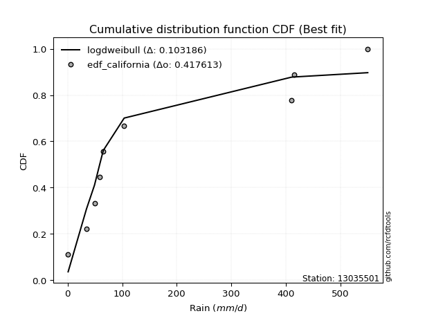</img>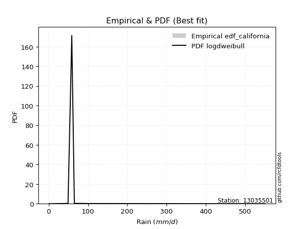</img>

</div>


### 2. Empirical - EDF Hazen (1930)

Hazen method for plotting positions is a formula used to estimate the empirical cumulative probability distribution of flood events or other hydrological data. This formula often results in biased estimations, particularly when extrapolating to extreme events (high return periods).

<div align="center">


$P=(m-0.5)/n$


</div>


**2.1. Empirical values**

<div align="center">

|                | 0                   | 1                   | 2                  | 3                  | 4         | 5                  | 6                  | 7                  | 8                  |
|:---------------|:--------------------|:--------------------|:-------------------|:-------------------|:----------|:-------------------|:-------------------|:-------------------|:-------------------|
| date           | 2018                | 2019                | 2015               | 2016               | 2020      | 2017               | 2025               | 2024               | 2023               |
| x              | 0.886               | 34.5                | 49.22              | 58.78              | 65.3      | 103.7              | 237.6              | 410.6              | 550.5              |
| m              | 1                   | 2                   | 3                  | 4                  | 5         | 6                  | 7                  | 8                  | 9                  |
| empirical_dist | edf_hazen           | edf_hazen           | edf_hazen          | edf_hazen          | edf_hazen | edf_hazen          | edf_hazen          | edf_hazen          | edf_hazen          |
| empirical      | 0.05555555555555555 | 0.16666666666666666 | 0.2777777777777778 | 0.3888888888888889 | 0.5       | 0.6111111111111112 | 0.7222222222222222 | 0.8333333333333334 | 0.9444444444444444 |
| empirical_tr   | 1.0588235294117647  | 1.2                 | 1.3846153846153846 | 1.6363636363636362 | 2.0       | 2.5714285714285716 | 3.5999999999999996 | 6.000000000000002  | 17.999999999999993 |

</div>


**2.2. Kolmogorov-Smirnov fit test (sorted by Δ)**


<div align="center">

|                | 0                   | 1                   | 2                   | 3                   | 4                   | 5                   | 6                   | 7                   | 8                   | 9                   | 10                  | 11                  | 12                  | 13                    | 14                  | 15                  | 16                  | 17                  | 18                  | 19                  | 20                  | 21                  | 22                  | 23                  | 24                  | 25                  | 26                  | 27                  | 28                  | 29                  | 30                  | 31                  | 32                  | 33                  | 34                  | 35                  | 36                  | 37                  | 38                  | 39                  | 40                  | 41                  | 42                  | 43                  | 44                  | 45                  | 46                  | 47                  | 48                  | 49                  | 50                  | 51                  | 52                  | 53                  | 54                  | 55                  | 56                  | 57                  | 58                  | 59                  | 60                  | 61                  | 62                  | 63                  | 64                  | 65                  | 66                  | 67                  | 68                  | 69                  | 70                  | 71                  | 72                  | 73                  | 74                  | 75                  | 76                  | 77                  | 78                  | 79                  | 80                  | 81                  | 82                  | 83                  | 84                  | 85                  | 86                  | 87                  | 88                  | 89                  |
|:---------------|:--------------------|:--------------------|:--------------------|:--------------------|:--------------------|:--------------------|:--------------------|:--------------------|:--------------------|:--------------------|:--------------------|:--------------------|:--------------------|:----------------------|:--------------------|:--------------------|:--------------------|:--------------------|:--------------------|:--------------------|:--------------------|:--------------------|:--------------------|:--------------------|:--------------------|:--------------------|:--------------------|:--------------------|:--------------------|:--------------------|:--------------------|:--------------------|:--------------------|:--------------------|:--------------------|:--------------------|:--------------------|:--------------------|:--------------------|:--------------------|:--------------------|:--------------------|:--------------------|:--------------------|:--------------------|:--------------------|:--------------------|:--------------------|:--------------------|:--------------------|:--------------------|:--------------------|:--------------------|:--------------------|:--------------------|:--------------------|:--------------------|:--------------------|:--------------------|:--------------------|:--------------------|:--------------------|:--------------------|:--------------------|:--------------------|:--------------------|:--------------------|:--------------------|:--------------------|:--------------------|:--------------------|:--------------------|:--------------------|:--------------------|:--------------------|:--------------------|:--------------------|:--------------------|:--------------------|:--------------------|:--------------------|:--------------------|:--------------------|:--------------------|:--------------------|:--------------------|:--------------------|:--------------------|:--------------------|:--------------------|
| station        | 13035501            | 13035501            | 13035501            | 13035501            | 13035501            | 13035501            | 13035501            | 13035501            | 13035501            | 13035501            | 13035501            | 13035501            | 13035501            | 13035501              | 13035501            | 13035501            | 13035501            | 13035501            | 13035501            | 13035501            | 13035501            | 13035501            | 13035501            | 13035501            | 13035501            | 13035501            | 13035501            | 13035501            | 13035501            | 13035501            | 13035501            | 13035501            | 13035501            | 13035501            | 13035501            | 13035501            | 13035501            | 13035501            | 13035501            | 13035501            | 13035501            | 13035501            | 13035501            | 13035501            | 13035501            | 13035501            | 13035501            | 13035501            | 13035501            | 13035501            | 13035501            | 13035501            | 13035501            | 13035501            | 13035501            | 13035501            | 13035501            | 13035501            | 13035501            | 13035501            | 13035501            | 13035501            | 13035501            | 13035501            | 13035501            | 13035501            | 13035501            | 13035501            | 13035501            | 13035501            | 13035501            | 13035501            | 13035501            | 13035501            | 13035501            | 13035501            | 13035501            | 13035501            | 13035501            | 13035501            | 13035501            | 13035501            | 13035501            | 13035501            | 13035501            | 13035501            | 13035501            | 13035501            | 13035501            | 13035501            |
| empirical_dist | edf_hazen           | edf_hazen           | edf_hazen           | edf_hazen           | edf_hazen           | edf_hazen           | edf_hazen           | edf_hazen           | edf_hazen           | edf_hazen           | edf_hazen           | edf_hazen           | edf_hazen           | edf_hazen             | edf_hazen           | edf_hazen           | edf_hazen           | edf_hazen           | edf_hazen           | edf_hazen           | edf_hazen           | edf_hazen           | edf_hazen           | edf_hazen           | edf_hazen           | edf_hazen           | edf_hazen           | edf_hazen           | edf_hazen           | edf_hazen           | edf_hazen           | edf_hazen           | edf_hazen           | edf_hazen           | edf_hazen           | edf_hazen           | edf_hazen           | edf_hazen           | edf_hazen           | edf_hazen           | edf_hazen           | edf_hazen           | edf_hazen           | edf_hazen           | edf_hazen           | edf_hazen           | edf_hazen           | edf_hazen           | edf_hazen           | edf_hazen           | edf_hazen           | edf_hazen           | edf_hazen           | edf_hazen           | edf_hazen           | edf_hazen           | edf_hazen           | edf_hazen           | edf_hazen           | edf_hazen           | edf_hazen           | edf_hazen           | edf_hazen           | edf_hazen           | edf_hazen           | edf_hazen           | edf_hazen           | edf_hazen           | edf_hazen           | edf_hazen           | edf_hazen           | edf_hazen           | edf_hazen           | edf_hazen           | edf_hazen           | edf_hazen           | edf_hazen           | edf_hazen           | edf_hazen           | edf_hazen           | edf_hazen           | edf_hazen           | edf_hazen           | edf_hazen           | edf_hazen           | edf_hazen           | edf_hazen           | edf_hazen           | edf_hazen           | edf_hazen           |
| p_dist         | fisk                | johnsonsu           | fatiguelife         | invgauss            | nct                 | f                   | invgamma            | ncf                 | logt                | logweibull_min      | loggompertz         | logpearson3         | mielke              | loglaplace_asymmetric | loggumbel_l         | loglaplace          | logjohnsonsu        | weibull_min         | loghypsecant        | halflogistic        | logloggamma         | nakagami            | loglogistic         | chi2                | halfnorm            | gamma               | moyal               | exponnorm           | laplace_asymmetric  | expon               | genexpon            | loglognorm          | logfatiguelife      | logrice             | logcrystalball      | lognorm             | lognorm             | logexponnorm        | lognct              | logbetaprime        | lognakagami         | pearson3            | t                   | logmielke           | logerlang           | wald                | loggamma            | loggamma            | loginvgamma         | gumbel_r            | rayleigh            | genlogistic         | logalpha            | maxwell             | logmaxwell          | betaprime           | loginvgauss         | lograyleigh         | loggumbel_r         | kstwobign           | truncnorm           | norm                | logmoyal            | loghalfnorm         | logistic            | loginvweibull       | loghalflogistic     | rice                | hypsecant           | gompertz            | logkstwobign        | gibrat              | logwald             | laplace             | gumbel_l            | loggibrat           | erlang              | loggenexpon         | logexpon            | logncf              | crystalball         | pareto              | invweibull          | logf                | logpareto           | logfisk             | logtruncnorm        | logchi2             | alpha               | loggenlogistic      |
| delta          | 0.08464666098239021 | 0.09163364207490476 | 0.0921969864433691  | 0.09545709157676996 | 0.09707899068777859 | 0.09887985329601146 | 0.09888054895795984 | 0.09888055576345495 | 0.1037776594988834  | 0.10592635350471355 | 0.11836705443919435 | 0.11960335040199813 | 0.12092504566152121 | 0.12254377080334741   | 0.12452822065023214 | 0.1248152691017235  | 0.12629021575563515 | 0.1467896152791679  | 0.15303909904001475 | 0.15984568930017423 | 0.16017466268875796 | 0.16055604490053624 | 0.16689886997098644 | 0.16691506232344436 | 0.1698861287283846  | 0.17350892096027118 | 0.17915401748771997 | 0.179779692429465   | 0.17998529880296776 | 0.17998547957614092 | 0.17998623902476824 | 0.18417859080736734 | 0.1843742018913966  | 0.18463794919933466 | 0.18472124542080634 | 0.18472124885339727 | 0.18472124885339727 | 0.18472150199773743 | 0.18529322973468296 | 0.18622867198064755 | 0.18626914641699685 | 0.18719188199144104 | 0.1872318060580589  | 0.19012246717249662 | 0.1943772448639133  | 0.1951931559067493  | 0.1955684474141344  | 0.1955684474141344  | 0.19689566342820478 | 0.19788858232857698 | 0.20455299381701852 | 0.20922425342472678 | 0.21057168108854749 | 0.21673810358541212 | 0.21674135372846573 | 0.21981202213839188 | 0.21989362606632415 | 0.22882114753864255 | 0.23348131514691103 | 0.23505213479109321 | 0.23832963168337706 | 0.24933458246097023 | 0.25156952595177273 | 0.26321018870165613 | 0.26621862809506314 | 0.2673558042900185  | 0.2715223833621453  | 0.27493722986870817 | 0.2795136102569307  | 0.29760335367738    | 0.2977469612049536  | 0.30259114086335365 | 0.3061390031870117  | 0.30791475445833216 | 0.31109646932996776 | 0.3116005463567565  | 0.31565583059893687 | 0.31909634013151056 | 0.4028896768004746  | 0.43371795005416514 | 0.44613863849335467 | 0.45415300801813074 | 0.4659380021014389  | 0.47386444578176956 | 0.49755189753640006 | 0.5032897106476103  | 0.55147616765524    | 0.6168034943682433  | 0.7716569254749562  | 0.8333333333333334  |
| deltao         | 0.41761268023100007 | 0.41761268023100007 | 0.41761268023100007 | 0.41761268023100007 | 0.41761268023100007 | 0.41761268023100007 | 0.41761268023100007 | 0.41761268023100007 | 0.41761268023100007 | 0.41761268023100007 | 0.41761268023100007 | 0.41761268023100007 | 0.41761268023100007 | 0.41761268023100007   | 0.41761268023100007 | 0.41761268023100007 | 0.41761268023100007 | 0.41761268023100007 | 0.41761268023100007 | 0.41761268023100007 | 0.41761268023100007 | 0.41761268023100007 | 0.41761268023100007 | 0.41761268023100007 | 0.41761268023100007 | 0.41761268023100007 | 0.41761268023100007 | 0.41761268023100007 | 0.41761268023100007 | 0.41761268023100007 | 0.41761268023100007 | 0.41761268023100007 | 0.41761268023100007 | 0.41761268023100007 | 0.41761268023100007 | 0.41761268023100007 | 0.41761268023100007 | 0.41761268023100007 | 0.41761268023100007 | 0.41761268023100007 | 0.41761268023100007 | 0.41761268023100007 | 0.41761268023100007 | 0.41761268023100007 | 0.41761268023100007 | 0.41761268023100007 | 0.41761268023100007 | 0.41761268023100007 | 0.41761268023100007 | 0.41761268023100007 | 0.41761268023100007 | 0.41761268023100007 | 0.41761268023100007 | 0.41761268023100007 | 0.41761268023100007 | 0.41761268023100007 | 0.41761268023100007 | 0.41761268023100007 | 0.41761268023100007 | 0.41761268023100007 | 0.41761268023100007 | 0.41761268023100007 | 0.41761268023100007 | 0.41761268023100007 | 0.41761268023100007 | 0.41761268023100007 | 0.41761268023100007 | 0.41761268023100007 | 0.41761268023100007 | 0.41761268023100007 | 0.41761268023100007 | 0.41761268023100007 | 0.41761268023100007 | 0.41761268023100007 | 0.41761268023100007 | 0.41761268023100007 | 0.41761268023100007 | 0.41761268023100007 | 0.41761268023100007 | 0.41761268023100007 | 0.41761268023100007 | 0.41761268023100007 | 0.41761268023100007 | 0.41761268023100007 | 0.41761268023100007 | 0.41761268023100007 | 0.41761268023100007 | 0.41761268023100007 | 0.41761268023100007 | 0.41761268023100007 |
| eval           | Δo > Δ              | Δo > Δ              | Δo > Δ              | Δo > Δ              | Δo > Δ              | Δo > Δ              | Δo > Δ              | Δo > Δ              | Δo > Δ              | Δo > Δ              | Δo > Δ              | Δo > Δ              | Δo > Δ              | Δo > Δ                | Δo > Δ              | Δo > Δ              | Δo > Δ              | Δo > Δ              | Δo > Δ              | Δo > Δ              | Δo > Δ              | Δo > Δ              | Δo > Δ              | Δo > Δ              | Δo > Δ              | Δo > Δ              | Δo > Δ              | Δo > Δ              | Δo > Δ              | Δo > Δ              | Δo > Δ              | Δo > Δ              | Δo > Δ              | Δo > Δ              | Δo > Δ              | Δo > Δ              | Δo > Δ              | Δo > Δ              | Δo > Δ              | Δo > Δ              | Δo > Δ              | Δo > Δ              | Δo > Δ              | Δo > Δ              | Δo > Δ              | Δo > Δ              | Δo > Δ              | Δo > Δ              | Δo > Δ              | Δo > Δ              | Δo > Δ              | Δo > Δ              | Δo > Δ              | Δo > Δ              | Δo > Δ              | Δo > Δ              | Δo > Δ              | Δo > Δ              | Δo > Δ              | Δo > Δ              | Δo > Δ              | Δo > Δ              | Δo > Δ              | Δo > Δ              | Δo > Δ              | Δo > Δ              | Δo > Δ              | Δo > Δ              | Δo > Δ              | Δo > Δ              | Δo > Δ              | Δo > Δ              | Δo > Δ              | Δo > Δ              | Δo > Δ              | Δo > Δ              | Δo > Δ              | Δo > Δ              | Δo > Δ              | Δo <= Δ             | Δo <= Δ             | Δo <= Δ             | Δo <= Δ             | Δo <= Δ             | Δo <= Δ             | Δo <= Δ             | Δo <= Δ             | Δo <= Δ             | Δo <= Δ             | Δo <= Δ             |
| fit            | 1                   | 1                   | 1                   | 1                   | 1                   | 1                   | 1                   | 1                   | 1                   | 1                   | 1                   | 1                   | 1                   | 1                     | 1                   | 1                   | 1                   | 1                   | 1                   | 1                   | 1                   | 1                   | 1                   | 1                   | 1                   | 1                   | 1                   | 1                   | 1                   | 1                   | 1                   | 1                   | 1                   | 1                   | 1                   | 1                   | 1                   | 1                   | 1                   | 1                   | 1                   | 1                   | 1                   | 1                   | 1                   | 1                   | 1                   | 1                   | 1                   | 1                   | 1                   | 1                   | 1                   | 1                   | 1                   | 1                   | 1                   | 1                   | 1                   | 1                   | 1                   | 1                   | 1                   | 1                   | 1                   | 1                   | 1                   | 1                   | 1                   | 1                   | 1                   | 1                   | 1                   | 1                   | 1                   | 1                   | 1                   | 1                   | 1                   | 0                   | 0                   | 0                   | 0                   | 0                   | 0                   | 0                   | 0                   | 0                   | 0                   | 0                   |
| n              | 9                   | 9                   | 9                   | 9                   | 9                   | 9                   | 9                   | 9                   | 9                   | 9                   | 9                   | 9                   | 9                   | 9                     | 9                   | 9                   | 9                   | 9                   | 9                   | 9                   | 9                   | 9                   | 9                   | 9                   | 9                   | 9                   | 9                   | 9                   | 9                   | 9                   | 9                   | 9                   | 9                   | 9                   | 9                   | 9                   | 9                   | 9                   | 9                   | 9                   | 9                   | 9                   | 9                   | 9                   | 9                   | 9                   | 9                   | 9                   | 9                   | 9                   | 9                   | 9                   | 9                   | 9                   | 9                   | 9                   | 9                   | 9                   | 9                   | 9                   | 9                   | 9                   | 9                   | 9                   | 9                   | 9                   | 9                   | 9                   | 9                   | 9                   | 9                   | 9                   | 9                   | 9                   | 9                   | 9                   | 9                   | 9                   | 9                   | 9                   | 9                   | 9                   | 9                   | 9                   | 9                   | 9                   | 9                   | 9                   | 9                   | 9                   |
| best_fit       | 1                   | 0                   | 0                   | 0                   | 0                   | 0                   | 0                   | 0                   | 0                   | 0                   | 0                   | 0                   | 0                   | 0                     | 0                   | 0                   | 0                   | 0                   | 0                   | 0                   | 0                   | 0                   | 0                   | 0                   | 0                   | 0                   | 0                   | 0                   | 0                   | 0                   | 0                   | 0                   | 0                   | 0                   | 0                   | 0                   | 0                   | 0                   | 0                   | 0                   | 0                   | 0                   | 0                   | 0                   | 0                   | 0                   | 0                   | 0                   | 0                   | 0                   | 0                   | 0                   | 0                   | 0                   | 0                   | 0                   | 0                   | 0                   | 0                   | 0                   | 0                   | 0                   | 0                   | 0                   | 0                   | 0                   | 0                   | 0                   | 0                   | 0                   | 0                   | 0                   | 0                   | 0                   | 0                   | 0                   | 0                   | 0                   | 0                   | 0                   | 0                   | 0                   | 0                   | 0                   | 0                   | 0                   | 0                   | 0                   | 0                   | 0                   |
| best_fit_sort  | 1                   | 2                   | 3                   | 4                   | 5                   | 6                   | 7                   | 8                   | 9                   | 10                  | 11                  | 12                  | 13                  | 14                    | 15                  | 16                  | 17                  | 18                  | 19                  | 20                  | 21                  | 22                  | 23                  | 24                  | 25                  | 26                  | 27                  | 28                  | 29                  | 30                  | 31                  | 32                  | 33                  | 34                  | 35                  | 36                  | 37                  | 38                  | 39                  | 40                  | 41                  | 42                  | 43                  | 44                  | 45                  | 46                  | 47                  | 48                  | 49                  | 50                  | 51                  | 52                  | 53                  | 54                  | 55                  | 56                  | 57                  | 58                  | 59                  | 60                  | 61                  | 62                  | 63                  | 64                  | 65                  | 66                  | 67                  | 68                  | 69                  | 70                  | 71                  | 72                  | 73                  | 74                  | 75                  | 76                  | 77                  | 78                  | 79                  | 80                  | 81                  | 82                  | 83                  | 84                  | 85                  | 86                  | 87                  | 88                  | 89                  | 90                  |

</div>


<div align="center">

</img>

</div>


**2.3. Best fit**

<div align="center">

|   id |   station | empirical_dist   | p_dist   |     delta |   deltao | eval   |   fit |   n |   best_fit |   best_fit_sort |
|-----:|----------:|:-----------------|:---------|----------:|---------:|:-------|------:|----:|-----------:|----------------:|
|    0 |  13035501 | edf_hazen        | fisk     | 0.0846467 | 0.417613 | Δo > Δ |     1 |   9 |          1 |               1 |

</div>


<div align="center">

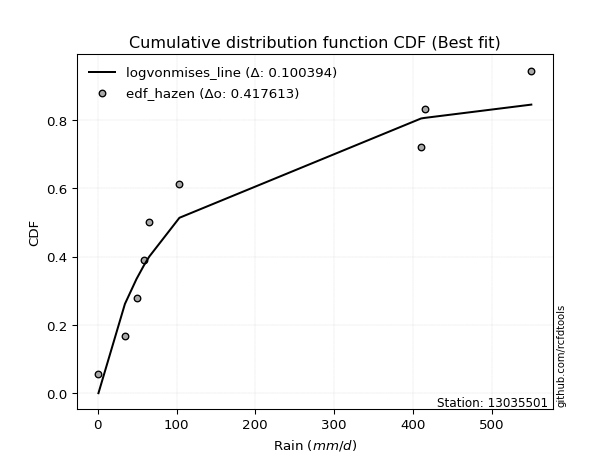</img>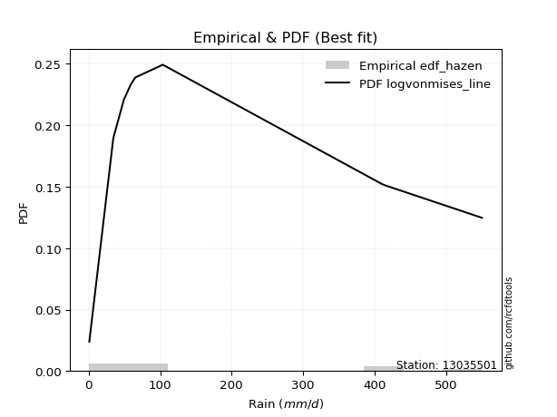</img>

</div>


### 3. Empirical - EDF Weibull (1939)

Weibull plotting position formula is an empirical method used to estimate the non-exceedance probability or plotting position for a set of observed data, is often recommended or widely used in practice, particularly in flood frequency analysis.

<div align="center">


$P=m/(n+1)$


</div>


**3.1. Empirical values**

<div align="center">

|                | 0                  | 1           | 2                  | 3                  | 4           | 5           | 6                 | 7                 | 8                  |
|:---------------|:-------------------|:------------|:-------------------|:-------------------|:------------|:------------|:------------------|:------------------|:-------------------|
| date           | 2018               | 2019        | 2015               | 2016               | 2020        | 2017        | 2025              | 2024              | 2023               |
| x              | 0.886              | 34.5        | 49.22              | 58.78              | 65.3        | 103.7       | 237.6             | 410.6             | 550.5              |
| m              | 1                  | 2           | 3                  | 4                  | 5           | 6           | 7                 | 8                 | 9                  |
| empirical_dist | edf_weibull        | edf_weibull | edf_weibull        | edf_weibull        | edf_weibull | edf_weibull | edf_weibull       | edf_weibull       | edf_weibull        |
| empirical      | 0.1                | 0.2         | 0.3                | 0.4                | 0.5         | 0.6         | 0.7               | 0.8               | 0.9                |
| empirical_tr   | 1.1111111111111112 | 1.25        | 1.4285714285714286 | 1.6666666666666667 | 2.0         | 2.5         | 3.333333333333333 | 5.000000000000001 | 10.000000000000002 |

</div>


**3.2. Kolmogorov-Smirnov fit test (sorted by Δ)**


<div align="center">

|                | 0                   | 1                   | 2                   | 3                   | 4                   | 5                   | 6                   | 7                   | 8                   | 9                   | 10                  | 11                  | 12                  | 13                  | 14                    | 15                  | 16                  | 17                  | 18                  | 19                  | 20                  | 21                  | 22                  | 23                  | 24                  | 25                  | 26                  | 27                  | 28                  | 29                  | 30                  | 31                  | 32                  | 33                  | 34                  | 35                  | 36                  | 37                  | 38                  | 39                  | 40                  | 41                  | 42                  | 43                  | 44                  | 45                  | 46                  | 47                  | 48                  | 49                  | 50                  | 51                  | 52                  | 53                  | 54                  | 55                  | 56                  | 57                  | 58                  | 59                  | 60                  | 61                  | 62                  | 63                  | 64                  | 65                  | 66                  | 67                  | 68                  | 69                  | 70                  | 71                  | 72                  | 73                  | 74                  | 75                  | 76                  | 77                  | 78                  | 79                  | 80                  | 81                  | 82                  | 83                  | 84                  | 85                  | 86                  | 87                  | 88                  | 89                  |
|:---------------|:--------------------|:--------------------|:--------------------|:--------------------|:--------------------|:--------------------|:--------------------|:--------------------|:--------------------|:--------------------|:--------------------|:--------------------|:--------------------|:--------------------|:----------------------|:--------------------|:--------------------|:--------------------|:--------------------|:--------------------|:--------------------|:--------------------|:--------------------|:--------------------|:--------------------|:--------------------|:--------------------|:--------------------|:--------------------|:--------------------|:--------------------|:--------------------|:--------------------|:--------------------|:--------------------|:--------------------|:--------------------|:--------------------|:--------------------|:--------------------|:--------------------|:--------------------|:--------------------|:--------------------|:--------------------|:--------------------|:--------------------|:--------------------|:--------------------|:--------------------|:--------------------|:--------------------|:--------------------|:--------------------|:--------------------|:--------------------|:--------------------|:--------------------|:--------------------|:--------------------|:--------------------|:--------------------|:--------------------|:--------------------|:--------------------|:--------------------|:--------------------|:--------------------|:--------------------|:--------------------|:--------------------|:--------------------|:--------------------|:--------------------|:--------------------|:--------------------|:--------------------|:--------------------|:--------------------|:--------------------|:--------------------|:--------------------|:--------------------|:--------------------|:--------------------|:--------------------|:--------------------|:--------------------|:--------------------|:--------------------|
| station        | 13035501            | 13035501            | 13035501            | 13035501            | 13035501            | 13035501            | 13035501            | 13035501            | 13035501            | 13035501            | 13035501            | 13035501            | 13035501            | 13035501            | 13035501              | 13035501            | 13035501            | 13035501            | 13035501            | 13035501            | 13035501            | 13035501            | 13035501            | 13035501            | 13035501            | 13035501            | 13035501            | 13035501            | 13035501            | 13035501            | 13035501            | 13035501            | 13035501            | 13035501            | 13035501            | 13035501            | 13035501            | 13035501            | 13035501            | 13035501            | 13035501            | 13035501            | 13035501            | 13035501            | 13035501            | 13035501            | 13035501            | 13035501            | 13035501            | 13035501            | 13035501            | 13035501            | 13035501            | 13035501            | 13035501            | 13035501            | 13035501            | 13035501            | 13035501            | 13035501            | 13035501            | 13035501            | 13035501            | 13035501            | 13035501            | 13035501            | 13035501            | 13035501            | 13035501            | 13035501            | 13035501            | 13035501            | 13035501            | 13035501            | 13035501            | 13035501            | 13035501            | 13035501            | 13035501            | 13035501            | 13035501            | 13035501            | 13035501            | 13035501            | 13035501            | 13035501            | 13035501            | 13035501            | 13035501            | 13035501            |
| empirical_dist | edf_weibull         | edf_weibull         | edf_weibull         | edf_weibull         | edf_weibull         | edf_weibull         | edf_weibull         | edf_weibull         | edf_weibull         | edf_weibull         | edf_weibull         | edf_weibull         | edf_weibull         | edf_weibull         | edf_weibull           | edf_weibull         | edf_weibull         | edf_weibull         | edf_weibull         | edf_weibull         | edf_weibull         | edf_weibull         | edf_weibull         | edf_weibull         | edf_weibull         | edf_weibull         | edf_weibull         | edf_weibull         | edf_weibull         | edf_weibull         | edf_weibull         | edf_weibull         | edf_weibull         | edf_weibull         | edf_weibull         | edf_weibull         | edf_weibull         | edf_weibull         | edf_weibull         | edf_weibull         | edf_weibull         | edf_weibull         | edf_weibull         | edf_weibull         | edf_weibull         | edf_weibull         | edf_weibull         | edf_weibull         | edf_weibull         | edf_weibull         | edf_weibull         | edf_weibull         | edf_weibull         | edf_weibull         | edf_weibull         | edf_weibull         | edf_weibull         | edf_weibull         | edf_weibull         | edf_weibull         | edf_weibull         | edf_weibull         | edf_weibull         | edf_weibull         | edf_weibull         | edf_weibull         | edf_weibull         | edf_weibull         | edf_weibull         | edf_weibull         | edf_weibull         | edf_weibull         | edf_weibull         | edf_weibull         | edf_weibull         | edf_weibull         | edf_weibull         | edf_weibull         | edf_weibull         | edf_weibull         | edf_weibull         | edf_weibull         | edf_weibull         | edf_weibull         | edf_weibull         | edf_weibull         | edf_weibull         | edf_weibull         | edf_weibull         | edf_weibull         |
| p_dist         | fisk                | loggumbel_l         | logweibull_min      | johnsonsu           | logpearson3         | fatiguelife         | f                   | invgamma            | ncf                 | loggompertz         | mielke              | invgauss            | logt                | loglaplace          | loglaplace_asymmetric | nct                 | loghypsecant        | logjohnsonsu        | nakagami            | loglogistic         | weibull_min         | logloggamma         | loglognorm          | logfatiguelife      | logrice             | logcrystalball      | lognorm             | lognorm             | logexponnorm        | lognct              | gamma               | halflogistic        | logbetaprime        | lognakagami         | logmielke           | halfnorm            | logerlang           | loggamma            | loggamma            | loginvgamma         | pearson3            | logalpha            | moyal               | exponnorm           | laplace_asymmetric  | expon               | genexpon            | logmaxwell          | chi2                | betaprime           | loginvgauss         | gumbel_r            | rayleigh            | wald                | lograyleigh         | loggumbel_r         | maxwell             | genlogistic         | t                   | logmoyal            | loghalfnorm         | loginvweibull       | kstwobign           | loghalflogistic     | norm                | truncnorm           | logistic            | rice                | logkstwobign        | hypsecant           | erlang              | logwald             | loggenexpon         | loggibrat           | laplace             | gompertz            | gumbel_l            | gibrat              | logexpon            | logncf              | crystalball         | pareto              | invweibull          | logf                | logpareto           | logfisk             | logtruncnorm        | logchi2             | alpha               | loggenlogistic      |
| delta          | 0.0863776048625427  | 0.09119488731689879 | 0.09210281991018476 | 0.092468938551866   | 0.0940774544495886  | 0.095336877461079   | 0.09887985329601146 | 0.09888054895795984 | 0.09888055576345495 | 0.09999999899210418 | 0.09999999999067626 | 0.10049202141034674 | 0.1037776594988834  | 0.11355218346493434 | 0.11896512082433319   | 0.11930121291000084 | 0.1197057657066814  | 0.12336583265343998 | 0.12722271156720288 | 0.13356553663765308 | 0.1467896152791679  | 0.14906355157764678 | 0.150845257474034   | 0.15104086855806326 | 0.1513046158660013  | 0.151387912087473   | 0.15138791552006392 | 0.15138791552006392 | 0.15138816866440408 | 0.1519598964013496  | 0.15240319742095831 | 0.15253622227247    | 0.1528953386473142  | 0.1529358130836635  | 0.15678913383916326 | 0.15877501761727342 | 0.16104391153057995 | 0.16223511408080105 | 0.16223511408080105 | 0.16356233009487142 | 0.17608077088032986 | 0.17723834775521413 | 0.17915401748771997 | 0.179779692429465   | 0.17998529880296776 | 0.17998547957614092 | 0.17998623902476824 | 0.18340802039513238 | 0.18421619779844134 | 0.18647868880505852 | 0.1865602927329908  | 0.1867774712174658  | 0.19344188270590734 | 0.1951931559067493  | 0.1954878142053092  | 0.20014798181357768 | 0.20562699247430094 | 0.20922425342472678 | 0.20945402828028115 | 0.21823619261843935 | 0.22987685536832275 | 0.23402247095668516 | 0.23505213479109321 | 0.2381890500288119  | 0.23822347134985905 | 0.23832963168337706 | 0.25510751698395195 | 0.263826118757597   | 0.2644136278716202  | 0.26840249914581954 | 0.2823224972656035  | 0.2839167809647895  | 0.2857630067981772  | 0.2893783241345343  | 0.296803643347221   | 0.29760335367738    | 0.2999853582188566  | 0.30259114086335365 | 0.3695563434671412  | 0.40038461672083175 | 0.40169419404891027 | 0.42081967468479736 | 0.4214935576569945  | 0.4405311124484362  | 0.4642185642030667  | 0.4699563773142769  | 0.5181428343219066  | 0.58347016103491    | 0.7383235921416229  | 0.8                 |
| deltao         | 0.41761268023100007 | 0.41761268023100007 | 0.41761268023100007 | 0.41761268023100007 | 0.41761268023100007 | 0.41761268023100007 | 0.41761268023100007 | 0.41761268023100007 | 0.41761268023100007 | 0.41761268023100007 | 0.41761268023100007 | 0.41761268023100007 | 0.41761268023100007 | 0.41761268023100007 | 0.41761268023100007   | 0.41761268023100007 | 0.41761268023100007 | 0.41761268023100007 | 0.41761268023100007 | 0.41761268023100007 | 0.41761268023100007 | 0.41761268023100007 | 0.41761268023100007 | 0.41761268023100007 | 0.41761268023100007 | 0.41761268023100007 | 0.41761268023100007 | 0.41761268023100007 | 0.41761268023100007 | 0.41761268023100007 | 0.41761268023100007 | 0.41761268023100007 | 0.41761268023100007 | 0.41761268023100007 | 0.41761268023100007 | 0.41761268023100007 | 0.41761268023100007 | 0.41761268023100007 | 0.41761268023100007 | 0.41761268023100007 | 0.41761268023100007 | 0.41761268023100007 | 0.41761268023100007 | 0.41761268023100007 | 0.41761268023100007 | 0.41761268023100007 | 0.41761268023100007 | 0.41761268023100007 | 0.41761268023100007 | 0.41761268023100007 | 0.41761268023100007 | 0.41761268023100007 | 0.41761268023100007 | 0.41761268023100007 | 0.41761268023100007 | 0.41761268023100007 | 0.41761268023100007 | 0.41761268023100007 | 0.41761268023100007 | 0.41761268023100007 | 0.41761268023100007 | 0.41761268023100007 | 0.41761268023100007 | 0.41761268023100007 | 0.41761268023100007 | 0.41761268023100007 | 0.41761268023100007 | 0.41761268023100007 | 0.41761268023100007 | 0.41761268023100007 | 0.41761268023100007 | 0.41761268023100007 | 0.41761268023100007 | 0.41761268023100007 | 0.41761268023100007 | 0.41761268023100007 | 0.41761268023100007 | 0.41761268023100007 | 0.41761268023100007 | 0.41761268023100007 | 0.41761268023100007 | 0.41761268023100007 | 0.41761268023100007 | 0.41761268023100007 | 0.41761268023100007 | 0.41761268023100007 | 0.41761268023100007 | 0.41761268023100007 | 0.41761268023100007 | 0.41761268023100007 |
| eval           | Δo > Δ              | Δo > Δ              | Δo > Δ              | Δo > Δ              | Δo > Δ              | Δo > Δ              | Δo > Δ              | Δo > Δ              | Δo > Δ              | Δo > Δ              | Δo > Δ              | Δo > Δ              | Δo > Δ              | Δo > Δ              | Δo > Δ                | Δo > Δ              | Δo > Δ              | Δo > Δ              | Δo > Δ              | Δo > Δ              | Δo > Δ              | Δo > Δ              | Δo > Δ              | Δo > Δ              | Δo > Δ              | Δo > Δ              | Δo > Δ              | Δo > Δ              | Δo > Δ              | Δo > Δ              | Δo > Δ              | Δo > Δ              | Δo > Δ              | Δo > Δ              | Δo > Δ              | Δo > Δ              | Δo > Δ              | Δo > Δ              | Δo > Δ              | Δo > Δ              | Δo > Δ              | Δo > Δ              | Δo > Δ              | Δo > Δ              | Δo > Δ              | Δo > Δ              | Δo > Δ              | Δo > Δ              | Δo > Δ              | Δo > Δ              | Δo > Δ              | Δo > Δ              | Δo > Δ              | Δo > Δ              | Δo > Δ              | Δo > Δ              | Δo > Δ              | Δo > Δ              | Δo > Δ              | Δo > Δ              | Δo > Δ              | Δo > Δ              | Δo > Δ              | Δo > Δ              | Δo > Δ              | Δo > Δ              | Δo > Δ              | Δo > Δ              | Δo > Δ              | Δo > Δ              | Δo > Δ              | Δo > Δ              | Δo > Δ              | Δo > Δ              | Δo > Δ              | Δo > Δ              | Δo > Δ              | Δo > Δ              | Δo > Δ              | Δo > Δ              | Δo > Δ              | Δo <= Δ             | Δo <= Δ             | Δo <= Δ             | Δo <= Δ             | Δo <= Δ             | Δo <= Δ             | Δo <= Δ             | Δo <= Δ             | Δo <= Δ             |
| fit            | 1                   | 1                   | 1                   | 1                   | 1                   | 1                   | 1                   | 1                   | 1                   | 1                   | 1                   | 1                   | 1                   | 1                   | 1                     | 1                   | 1                   | 1                   | 1                   | 1                   | 1                   | 1                   | 1                   | 1                   | 1                   | 1                   | 1                   | 1                   | 1                   | 1                   | 1                   | 1                   | 1                   | 1                   | 1                   | 1                   | 1                   | 1                   | 1                   | 1                   | 1                   | 1                   | 1                   | 1                   | 1                   | 1                   | 1                   | 1                   | 1                   | 1                   | 1                   | 1                   | 1                   | 1                   | 1                   | 1                   | 1                   | 1                   | 1                   | 1                   | 1                   | 1                   | 1                   | 1                   | 1                   | 1                   | 1                   | 1                   | 1                   | 1                   | 1                   | 1                   | 1                   | 1                   | 1                   | 1                   | 1                   | 1                   | 1                   | 1                   | 1                   | 0                   | 0                   | 0                   | 0                   | 0                   | 0                   | 0                   | 0                   | 0                   |
| n              | 9                   | 9                   | 9                   | 9                   | 9                   | 9                   | 9                   | 9                   | 9                   | 9                   | 9                   | 9                   | 9                   | 9                   | 9                     | 9                   | 9                   | 9                   | 9                   | 9                   | 9                   | 9                   | 9                   | 9                   | 9                   | 9                   | 9                   | 9                   | 9                   | 9                   | 9                   | 9                   | 9                   | 9                   | 9                   | 9                   | 9                   | 9                   | 9                   | 9                   | 9                   | 9                   | 9                   | 9                   | 9                   | 9                   | 9                   | 9                   | 9                   | 9                   | 9                   | 9                   | 9                   | 9                   | 9                   | 9                   | 9                   | 9                   | 9                   | 9                   | 9                   | 9                   | 9                   | 9                   | 9                   | 9                   | 9                   | 9                   | 9                   | 9                   | 9                   | 9                   | 9                   | 9                   | 9                   | 9                   | 9                   | 9                   | 9                   | 9                   | 9                   | 9                   | 9                   | 9                   | 9                   | 9                   | 9                   | 9                   | 9                   | 9                   |
| best_fit       | 1                   | 0                   | 0                   | 0                   | 0                   | 0                   | 0                   | 0                   | 0                   | 0                   | 0                   | 0                   | 0                   | 0                   | 0                     | 0                   | 0                   | 0                   | 0                   | 0                   | 0                   | 0                   | 0                   | 0                   | 0                   | 0                   | 0                   | 0                   | 0                   | 0                   | 0                   | 0                   | 0                   | 0                   | 0                   | 0                   | 0                   | 0                   | 0                   | 0                   | 0                   | 0                   | 0                   | 0                   | 0                   | 0                   | 0                   | 0                   | 0                   | 0                   | 0                   | 0                   | 0                   | 0                   | 0                   | 0                   | 0                   | 0                   | 0                   | 0                   | 0                   | 0                   | 0                   | 0                   | 0                   | 0                   | 0                   | 0                   | 0                   | 0                   | 0                   | 0                   | 0                   | 0                   | 0                   | 0                   | 0                   | 0                   | 0                   | 0                   | 0                   | 0                   | 0                   | 0                   | 0                   | 0                   | 0                   | 0                   | 0                   | 0                   |
| best_fit_sort  | 1                   | 2                   | 3                   | 4                   | 5                   | 6                   | 7                   | 8                   | 9                   | 10                  | 11                  | 12                  | 13                  | 14                  | 15                    | 16                  | 17                  | 18                  | 19                  | 20                  | 21                  | 22                  | 23                  | 24                  | 25                  | 26                  | 27                  | 28                  | 29                  | 30                  | 31                  | 32                  | 33                  | 34                  | 35                  | 36                  | 37                  | 38                  | 39                  | 40                  | 41                  | 42                  | 43                  | 44                  | 45                  | 46                  | 47                  | 48                  | 49                  | 50                  | 51                  | 52                  | 53                  | 54                  | 55                  | 56                  | 57                  | 58                  | 59                  | 60                  | 61                  | 62                  | 63                  | 64                  | 65                  | 66                  | 67                  | 68                  | 69                  | 70                  | 71                  | 72                  | 73                  | 74                  | 75                  | 76                  | 77                  | 78                  | 79                  | 80                  | 81                  | 82                  | 83                  | 84                  | 85                  | 86                  | 87                  | 88                  | 89                  | 90                  |

</div>


<div align="center">

</img>

</div>


**3.3. Best fit**

<div align="center">

|   id |   station | empirical_dist   | p_dist   |     delta |   deltao | eval   |   fit |   n |   best_fit |   best_fit_sort |
|-----:|----------:|:-----------------|:---------|----------:|---------:|:-------|------:|----:|-----------:|----------------:|
|    0 |  13035501 | edf_weibull      | fisk     | 0.0863776 | 0.417613 | Δo > Δ |     1 |   9 |          1 |               1 |

</div>


<div align="center">

</img>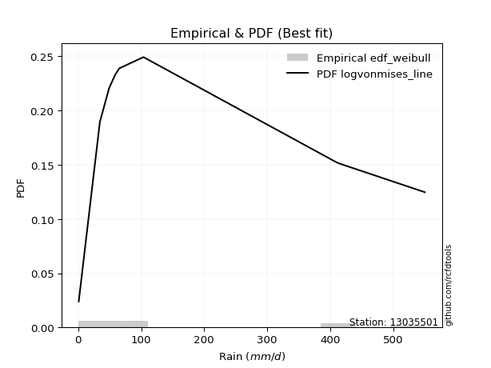</img>

</div>


### 4. Empirical - EDF Beard (1943)

The Beard formula (or Beard´s plotting position formula) in hydrology is used to estimate the empirical non-exceedance probability _(P)_ of a flood event (or other extreme hydrological data point) within a given dataset.

<div align="center">


$P=(m-0.31)/(n+0.38)$


</div>


**4.1. Empirical values**

<div align="center">

|                | 0                   | 1                   | 2                  | 3                   | 4         | 5                  | 6                  | 7                  | 8                  |
|:---------------|:--------------------|:--------------------|:-------------------|:--------------------|:----------|:-------------------|:-------------------|:-------------------|:-------------------|
| date           | 2018                | 2019                | 2015               | 2016                | 2020      | 2017               | 2025               | 2024               | 2023               |
| x              | 0.886               | 34.5                | 49.22              | 58.78               | 65.3      | 103.7              | 237.6              | 410.6              | 550.5              |
| m              | 1                   | 2                   | 3                  | 4                   | 5         | 6                  | 7                  | 8                  | 9                  |
| empirical_dist | edf_beard           | edf_beard           | edf_beard          | edf_beard           | edf_beard | edf_beard          | edf_beard          | edf_beard          | edf_beard          |
| empirical      | 0.07356076759061833 | 0.18017057569296374 | 0.2867803837953091 | 0.39339019189765456 | 0.5       | 0.6066098081023454 | 0.7132196162046908 | 0.8198294243070362 | 0.9264392324093815 |
| empirical_tr   | 1.0794016110471807  | 1.2197659297789336  | 1.4020926756352765 | 1.6485061511423549  | 2.0       | 2.542005420054201  | 3.486988847583642  | 5.550295857988164  | 13.5942028985507   |

</div>


**4.2. Kolmogorov-Smirnov fit test (sorted by Δ)**


<div align="center">

|                | 0                   | 1                   | 2                   | 3                   | 4                   | 5                   | 6                   | 7                   | 8                   | 9                   | 10                  | 11                  | 12                  | 13                    | 14                  | 15                  | 16                  | 17                  | 18                  | 19                  | 20                  | 21                  | 22                  | 23                  | 24                  | 25                  | 26                  | 27                  | 28                  | 29                  | 30                  | 31                  | 32                  | 33                  | 34                  | 35                  | 36                  | 37                  | 38                  | 39                  | 40                  | 41                  | 42                  | 43                  | 44                  | 45                  | 46                  | 47                  | 48                  | 49                  | 50                  | 51                  | 52                  | 53                  | 54                  | 55                  | 56                  | 57                  | 58                  | 59                  | 60                  | 61                  | 62                  | 63                  | 64                  | 65                  | 66                  | 67                  | 68                  | 69                  | 70                  | 71                  | 72                  | 73                  | 74                  | 75                  | 76                  | 77                  | 78                  | 79                  | 80                  | 81                  | 82                  | 83                  | 84                  | 85                  | 86                  | 87                  | 88                  | 89                  |
|:---------------|:--------------------|:--------------------|:--------------------|:--------------------|:--------------------|:--------------------|:--------------------|:--------------------|:--------------------|:--------------------|:--------------------|:--------------------|:--------------------|:----------------------|:--------------------|:--------------------|:--------------------|:--------------------|:--------------------|:--------------------|:--------------------|:--------------------|:--------------------|:--------------------|:--------------------|:--------------------|:--------------------|:--------------------|:--------------------|:--------------------|:--------------------|:--------------------|:--------------------|:--------------------|:--------------------|:--------------------|:--------------------|:--------------------|:--------------------|:--------------------|:--------------------|:--------------------|:--------------------|:--------------------|:--------------------|:--------------------|:--------------------|:--------------------|:--------------------|:--------------------|:--------------------|:--------------------|:--------------------|:--------------------|:--------------------|:--------------------|:--------------------|:--------------------|:--------------------|:--------------------|:--------------------|:--------------------|:--------------------|:--------------------|:--------------------|:--------------------|:--------------------|:--------------------|:--------------------|:--------------------|:--------------------|:--------------------|:--------------------|:--------------------|:--------------------|:--------------------|:--------------------|:--------------------|:--------------------|:--------------------|:--------------------|:--------------------|:--------------------|:--------------------|:--------------------|:--------------------|:--------------------|:--------------------|:--------------------|:--------------------|
| station        | 13035501            | 13035501            | 13035501            | 13035501            | 13035501            | 13035501            | 13035501            | 13035501            | 13035501            | 13035501            | 13035501            | 13035501            | 13035501            | 13035501              | 13035501            | 13035501            | 13035501            | 13035501            | 13035501            | 13035501            | 13035501            | 13035501            | 13035501            | 13035501            | 13035501            | 13035501            | 13035501            | 13035501            | 13035501            | 13035501            | 13035501            | 13035501            | 13035501            | 13035501            | 13035501            | 13035501            | 13035501            | 13035501            | 13035501            | 13035501            | 13035501            | 13035501            | 13035501            | 13035501            | 13035501            | 13035501            | 13035501            | 13035501            | 13035501            | 13035501            | 13035501            | 13035501            | 13035501            | 13035501            | 13035501            | 13035501            | 13035501            | 13035501            | 13035501            | 13035501            | 13035501            | 13035501            | 13035501            | 13035501            | 13035501            | 13035501            | 13035501            | 13035501            | 13035501            | 13035501            | 13035501            | 13035501            | 13035501            | 13035501            | 13035501            | 13035501            | 13035501            | 13035501            | 13035501            | 13035501            | 13035501            | 13035501            | 13035501            | 13035501            | 13035501            | 13035501            | 13035501            | 13035501            | 13035501            | 13035501            |
| empirical_dist | edf_beard           | edf_beard           | edf_beard           | edf_beard           | edf_beard           | edf_beard           | edf_beard           | edf_beard           | edf_beard           | edf_beard           | edf_beard           | edf_beard           | edf_beard           | edf_beard             | edf_beard           | edf_beard           | edf_beard           | edf_beard           | edf_beard           | edf_beard           | edf_beard           | edf_beard           | edf_beard           | edf_beard           | edf_beard           | edf_beard           | edf_beard           | edf_beard           | edf_beard           | edf_beard           | edf_beard           | edf_beard           | edf_beard           | edf_beard           | edf_beard           | edf_beard           | edf_beard           | edf_beard           | edf_beard           | edf_beard           | edf_beard           | edf_beard           | edf_beard           | edf_beard           | edf_beard           | edf_beard           | edf_beard           | edf_beard           | edf_beard           | edf_beard           | edf_beard           | edf_beard           | edf_beard           | edf_beard           | edf_beard           | edf_beard           | edf_beard           | edf_beard           | edf_beard           | edf_beard           | edf_beard           | edf_beard           | edf_beard           | edf_beard           | edf_beard           | edf_beard           | edf_beard           | edf_beard           | edf_beard           | edf_beard           | edf_beard           | edf_beard           | edf_beard           | edf_beard           | edf_beard           | edf_beard           | edf_beard           | edf_beard           | edf_beard           | edf_beard           | edf_beard           | edf_beard           | edf_beard           | edf_beard           | edf_beard           | edf_beard           | edf_beard           | edf_beard           | edf_beard           | edf_beard           |
| p_dist         | fisk                | johnsonsu           | fatiguelife         | logweibull_min      | invgauss            | f                   | invgamma            | ncf                 | logt                | loggompertz         | nct                 | logpearson3         | mielke              | loglaplace_asymmetric | loggumbel_l         | loglaplace          | logjohnsonsu        | loghypsecant        | weibull_min         | nakagami            | loglogistic         | halflogistic        | logloggamma         | gamma               | halfnorm            | loglognorm          | logfatiguelife      | chi2                | logrice             | logcrystalball      | lognorm             | lognorm             | logexponnorm        | lognct              | logbetaprime        | lognakagami         | logmielke           | moyal               | exponnorm           | laplace_asymmetric  | expon               | genexpon            | logerlang           | loggamma            | loggamma            | pearson3            | loginvgamma         | gumbel_r            | wald                | t                   | logalpha            | rayleigh            | logmaxwell          | betaprime           | loginvgauss         | genlogistic         | maxwell             | lograyleigh         | loggumbel_r         | kstwobign           | logmoyal            | truncnorm           | norm                | loghalfnorm         | loginvweibull       | loghalflogistic     | logistic            | rice                | hypsecant           | logkstwobign        | logwald             | gompertz            | erlang              | gibrat              | loggibrat           | laplace             | loggenexpon         | gumbel_l            | logexpon            | logncf              | crystalball         | pareto              | invweibull          | logf                | logpareto           | logfisk             | logtruncnorm        | logchi2             | alpha               | loggenlogistic      |
| delta          | 0.08464666098239021 | 0.09163364207490476 | 0.0921969864433691  | 0.09242244447841647 | 0.09545709157676996 | 0.09887985329601146 | 0.09888054895795984 | 0.09888055576345495 | 0.1037776594988834  | 0.10486314541289726 | 0.10608159670531003 | 0.10609944137570104 | 0.10742113663522412 | 0.10903986177705033   | 0.11102431162393506 | 0.11131136007542641 | 0.12336583265343998 | 0.13953519001371767 | 0.1467896152791679  | 0.14705213587423915 | 0.15339496094468935 | 0.1553443862914085  | 0.15567335967999224 | 0.1600050119339741  | 0.16538482571961888 | 0.17067468178107026 | 0.17087029286509953 | 0.17099658159375053 | 0.17113404017303757 | 0.17121733639450926 | 0.1712173398271002  | 0.1712173398271002  | 0.17121759297144035 | 0.17178932070838587 | 0.17272476295435046 | 0.17276523739069977 | 0.17661855814619953 | 0.17915401748771997 | 0.179779692429465   | 0.17998529880296776 | 0.17998547957614092 | 0.17998623902476824 | 0.18087333583761622 | 0.18206453838783732 | 0.18206453838783732 | 0.18269057898267532 | 0.1833917544019077  | 0.19338727931981126 | 0.1951931559067493  | 0.19623441207559034 | 0.1970677720622504  | 0.2000516908082528  | 0.20323744470216865 | 0.2063081131120948  | 0.20638971704002707 | 0.20922425342472678 | 0.2122368005766464  | 0.21531723851234547 | 0.21997740612061395 | 0.23505213479109321 | 0.23806561692547562 | 0.23832963168337706 | 0.2448332794522045  | 0.24970627967535902 | 0.2538518952637214  | 0.2580184743358482  | 0.2617173250862974  | 0.27043592685994244 | 0.275012307248165   | 0.2842430521786565  | 0.29713639716948037 | 0.29760335367738    | 0.30215192157263976 | 0.30259114086335365 | 0.30259794033922516 | 0.30341345144956644 | 0.30559243110521345 | 0.30659516632120204 | 0.3893857677741775  | 0.420214041027868   | 0.4281334264582919  | 0.44064909899183363 | 0.447932790066376   | 0.46036053675547245 | 0.48404798851010294 | 0.4897858016213132  | 0.5379722586289428  | 0.6032995853419463  | 0.7581530164486592  | 0.8198294243070362  |
| deltao         | 0.41761268023100007 | 0.41761268023100007 | 0.41761268023100007 | 0.41761268023100007 | 0.41761268023100007 | 0.41761268023100007 | 0.41761268023100007 | 0.41761268023100007 | 0.41761268023100007 | 0.41761268023100007 | 0.41761268023100007 | 0.41761268023100007 | 0.41761268023100007 | 0.41761268023100007   | 0.41761268023100007 | 0.41761268023100007 | 0.41761268023100007 | 0.41761268023100007 | 0.41761268023100007 | 0.41761268023100007 | 0.41761268023100007 | 0.41761268023100007 | 0.41761268023100007 | 0.41761268023100007 | 0.41761268023100007 | 0.41761268023100007 | 0.41761268023100007 | 0.41761268023100007 | 0.41761268023100007 | 0.41761268023100007 | 0.41761268023100007 | 0.41761268023100007 | 0.41761268023100007 | 0.41761268023100007 | 0.41761268023100007 | 0.41761268023100007 | 0.41761268023100007 | 0.41761268023100007 | 0.41761268023100007 | 0.41761268023100007 | 0.41761268023100007 | 0.41761268023100007 | 0.41761268023100007 | 0.41761268023100007 | 0.41761268023100007 | 0.41761268023100007 | 0.41761268023100007 | 0.41761268023100007 | 0.41761268023100007 | 0.41761268023100007 | 0.41761268023100007 | 0.41761268023100007 | 0.41761268023100007 | 0.41761268023100007 | 0.41761268023100007 | 0.41761268023100007 | 0.41761268023100007 | 0.41761268023100007 | 0.41761268023100007 | 0.41761268023100007 | 0.41761268023100007 | 0.41761268023100007 | 0.41761268023100007 | 0.41761268023100007 | 0.41761268023100007 | 0.41761268023100007 | 0.41761268023100007 | 0.41761268023100007 | 0.41761268023100007 | 0.41761268023100007 | 0.41761268023100007 | 0.41761268023100007 | 0.41761268023100007 | 0.41761268023100007 | 0.41761268023100007 | 0.41761268023100007 | 0.41761268023100007 | 0.41761268023100007 | 0.41761268023100007 | 0.41761268023100007 | 0.41761268023100007 | 0.41761268023100007 | 0.41761268023100007 | 0.41761268023100007 | 0.41761268023100007 | 0.41761268023100007 | 0.41761268023100007 | 0.41761268023100007 | 0.41761268023100007 | 0.41761268023100007 |
| eval           | Δo > Δ              | Δo > Δ              | Δo > Δ              | Δo > Δ              | Δo > Δ              | Δo > Δ              | Δo > Δ              | Δo > Δ              | Δo > Δ              | Δo > Δ              | Δo > Δ              | Δo > Δ              | Δo > Δ              | Δo > Δ                | Δo > Δ              | Δo > Δ              | Δo > Δ              | Δo > Δ              | Δo > Δ              | Δo > Δ              | Δo > Δ              | Δo > Δ              | Δo > Δ              | Δo > Δ              | Δo > Δ              | Δo > Δ              | Δo > Δ              | Δo > Δ              | Δo > Δ              | Δo > Δ              | Δo > Δ              | Δo > Δ              | Δo > Δ              | Δo > Δ              | Δo > Δ              | Δo > Δ              | Δo > Δ              | Δo > Δ              | Δo > Δ              | Δo > Δ              | Δo > Δ              | Δo > Δ              | Δo > Δ              | Δo > Δ              | Δo > Δ              | Δo > Δ              | Δo > Δ              | Δo > Δ              | Δo > Δ              | Δo > Δ              | Δo > Δ              | Δo > Δ              | Δo > Δ              | Δo > Δ              | Δo > Δ              | Δo > Δ              | Δo > Δ              | Δo > Δ              | Δo > Δ              | Δo > Δ              | Δo > Δ              | Δo > Δ              | Δo > Δ              | Δo > Δ              | Δo > Δ              | Δo > Δ              | Δo > Δ              | Δo > Δ              | Δo > Δ              | Δo > Δ              | Δo > Δ              | Δo > Δ              | Δo > Δ              | Δo > Δ              | Δo > Δ              | Δo > Δ              | Δo > Δ              | Δo > Δ              | Δo > Δ              | Δo <= Δ             | Δo <= Δ             | Δo <= Δ             | Δo <= Δ             | Δo <= Δ             | Δo <= Δ             | Δo <= Δ             | Δo <= Δ             | Δo <= Δ             | Δo <= Δ             | Δo <= Δ             |
| fit            | 1                   | 1                   | 1                   | 1                   | 1                   | 1                   | 1                   | 1                   | 1                   | 1                   | 1                   | 1                   | 1                   | 1                     | 1                   | 1                   | 1                   | 1                   | 1                   | 1                   | 1                   | 1                   | 1                   | 1                   | 1                   | 1                   | 1                   | 1                   | 1                   | 1                   | 1                   | 1                   | 1                   | 1                   | 1                   | 1                   | 1                   | 1                   | 1                   | 1                   | 1                   | 1                   | 1                   | 1                   | 1                   | 1                   | 1                   | 1                   | 1                   | 1                   | 1                   | 1                   | 1                   | 1                   | 1                   | 1                   | 1                   | 1                   | 1                   | 1                   | 1                   | 1                   | 1                   | 1                   | 1                   | 1                   | 1                   | 1                   | 1                   | 1                   | 1                   | 1                   | 1                   | 1                   | 1                   | 1                   | 1                   | 1                   | 1                   | 0                   | 0                   | 0                   | 0                   | 0                   | 0                   | 0                   | 0                   | 0                   | 0                   | 0                   |
| n              | 9                   | 9                   | 9                   | 9                   | 9                   | 9                   | 9                   | 9                   | 9                   | 9                   | 9                   | 9                   | 9                   | 9                     | 9                   | 9                   | 9                   | 9                   | 9                   | 9                   | 9                   | 9                   | 9                   | 9                   | 9                   | 9                   | 9                   | 9                   | 9                   | 9                   | 9                   | 9                   | 9                   | 9                   | 9                   | 9                   | 9                   | 9                   | 9                   | 9                   | 9                   | 9                   | 9                   | 9                   | 9                   | 9                   | 9                   | 9                   | 9                   | 9                   | 9                   | 9                   | 9                   | 9                   | 9                   | 9                   | 9                   | 9                   | 9                   | 9                   | 9                   | 9                   | 9                   | 9                   | 9                   | 9                   | 9                   | 9                   | 9                   | 9                   | 9                   | 9                   | 9                   | 9                   | 9                   | 9                   | 9                   | 9                   | 9                   | 9                   | 9                   | 9                   | 9                   | 9                   | 9                   | 9                   | 9                   | 9                   | 9                   | 9                   |
| best_fit       | 1                   | 0                   | 0                   | 0                   | 0                   | 0                   | 0                   | 0                   | 0                   | 0                   | 0                   | 0                   | 0                   | 0                     | 0                   | 0                   | 0                   | 0                   | 0                   | 0                   | 0                   | 0                   | 0                   | 0                   | 0                   | 0                   | 0                   | 0                   | 0                   | 0                   | 0                   | 0                   | 0                   | 0                   | 0                   | 0                   | 0                   | 0                   | 0                   | 0                   | 0                   | 0                   | 0                   | 0                   | 0                   | 0                   | 0                   | 0                   | 0                   | 0                   | 0                   | 0                   | 0                   | 0                   | 0                   | 0                   | 0                   | 0                   | 0                   | 0                   | 0                   | 0                   | 0                   | 0                   | 0                   | 0                   | 0                   | 0                   | 0                   | 0                   | 0                   | 0                   | 0                   | 0                   | 0                   | 0                   | 0                   | 0                   | 0                   | 0                   | 0                   | 0                   | 0                   | 0                   | 0                   | 0                   | 0                   | 0                   | 0                   | 0                   |
| best_fit_sort  | 1                   | 2                   | 3                   | 4                   | 5                   | 6                   | 7                   | 8                   | 9                   | 10                  | 11                  | 12                  | 13                  | 14                    | 15                  | 16                  | 17                  | 18                  | 19                  | 20                  | 21                  | 22                  | 23                  | 24                  | 25                  | 26                  | 27                  | 28                  | 29                  | 30                  | 31                  | 32                  | 33                  | 34                  | 35                  | 36                  | 37                  | 38                  | 39                  | 40                  | 41                  | 42                  | 43                  | 44                  | 45                  | 46                  | 47                  | 48                  | 49                  | 50                  | 51                  | 52                  | 53                  | 54                  | 55                  | 56                  | 57                  | 58                  | 59                  | 60                  | 61                  | 62                  | 63                  | 64                  | 65                  | 66                  | 67                  | 68                  | 69                  | 70                  | 71                  | 72                  | 73                  | 74                  | 75                  | 76                  | 77                  | 78                  | 79                  | 80                  | 81                  | 82                  | 83                  | 84                  | 85                  | 86                  | 87                  | 88                  | 89                  | 90                  |

</div>


<div align="center">

</img>

</div>


**4.3. Best fit**

<div align="center">

|   id |   station | empirical_dist   | p_dist   |     delta |   deltao | eval   |   fit |   n |   best_fit |   best_fit_sort |
|-----:|----------:|:-----------------|:---------|----------:|---------:|:-------|------:|----:|-----------:|----------------:|
|    0 |  13035501 | edf_beard        | fisk     | 0.0846467 | 0.417613 | Δo > Δ |     1 |   9 |          1 |               1 |

</div>


<div align="center">

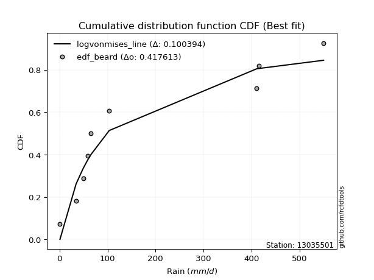</img></img>

</div>


### 5. Empirical - EDF Chegodayev (1955)

The Chegodayev formula is an empirical plotting position formula used in hydrological frequency analysis to estimate the exceedance probability or return period of a specific event from a set of observed data. It is primarily used for plotting observed data points on probability paper to fit a theoretical distribution, particularly for analyzing extreme events like maximum flood flows or rainfall intensities. The constant _b_ value in the generalized plotting position formula is 0.3.

<div align="center">


$P=(m-b)/(n+1-2b)$


</div>


**5.1. Empirical values**

<div align="center">

|                | 0                   | 1                   | 2                  | 3                   | 4              | 5                  | 6                  | 7                  | 8                  |
|:---------------|:--------------------|:--------------------|:-------------------|:--------------------|:---------------|:-------------------|:-------------------|:-------------------|:-------------------|
| date           | 2018                | 2019                | 2015               | 2016                | 2020           | 2017               | 2025               | 2024               | 2023               |
| x              | 0.886               | 34.5                | 49.22              | 58.78               | 65.3           | 103.7              | 237.6              | 410.6              | 550.5              |
| m              | 1                   | 2                   | 3                  | 4                   | 5              | 6                  | 7                  | 8                  | 9                  |
| empirical_dist | edf_chegodayev      | edf_chegodayev      | edf_chegodayev     | edf_chegodayev      | edf_chegodayev | edf_chegodayev     | edf_chegodayev     | edf_chegodayev     | edf_chegodayev     |
| empirical      | 0.07446808510638298 | 0.18085106382978722 | 0.2872340425531915 | 0.39361702127659576 | 0.5            | 0.6063829787234043 | 0.7127659574468085 | 0.8191489361702128 | 0.9255319148936169 |
| empirical_tr   | 1.0804597701149425  | 1.2207792207792207  | 1.4029850746268657 | 1.6491228070175437  | 2.0            | 2.540540540540541  | 3.481481481481481  | 5.529411764705883  | 13.428571428571399 |

</div>


**5.2. Kolmogorov-Smirnov fit test (sorted by Δ)**


<div align="center">

|                | 0                   | 1                   | 2                   | 3                   | 4                   | 5                   | 6                   | 7                   | 8                   | 9                   | 10                  | 11                  | 12                  | 13                    | 14                  | 15                  | 16                  | 17                  | 18                  | 19                  | 20                  | 21                  | 22                  | 23                  | 24                  | 25                  | 26                  | 27                  | 28                  | 29                  | 30                  | 31                  | 32                  | 33                  | 34                  | 35                  | 36                  | 37                  | 38                  | 39                  | 40                  | 41                  | 42                  | 43                  | 44                  | 45                  | 46                  | 47                  | 48                  | 49                  | 50                  | 51                  | 52                  | 53                  | 54                  | 55                  | 56                  | 57                  | 58                  | 59                  | 60                  | 61                  | 62                  | 63                  | 64                  | 65                  | 66                  | 67                  | 68                  | 69                  | 70                  | 71                  | 72                  | 73                  | 74                  | 75                  | 76                  | 77                  | 78                  | 79                  | 80                  | 81                  | 82                  | 83                  | 84                  | 85                  | 86                  | 87                  | 88                  | 89                  |
|:---------------|:--------------------|:--------------------|:--------------------|:--------------------|:--------------------|:--------------------|:--------------------|:--------------------|:--------------------|:--------------------|:--------------------|:--------------------|:--------------------|:----------------------|:--------------------|:--------------------|:--------------------|:--------------------|:--------------------|:--------------------|:--------------------|:--------------------|:--------------------|:--------------------|:--------------------|:--------------------|:--------------------|:--------------------|:--------------------|:--------------------|:--------------------|:--------------------|:--------------------|:--------------------|:--------------------|:--------------------|:--------------------|:--------------------|:--------------------|:--------------------|:--------------------|:--------------------|:--------------------|:--------------------|:--------------------|:--------------------|:--------------------|:--------------------|:--------------------|:--------------------|:--------------------|:--------------------|:--------------------|:--------------------|:--------------------|:--------------------|:--------------------|:--------------------|:--------------------|:--------------------|:--------------------|:--------------------|:--------------------|:--------------------|:--------------------|:--------------------|:--------------------|:--------------------|:--------------------|:--------------------|:--------------------|:--------------------|:--------------------|:--------------------|:--------------------|:--------------------|:--------------------|:--------------------|:--------------------|:--------------------|:--------------------|:--------------------|:--------------------|:--------------------|:--------------------|:--------------------|:--------------------|:--------------------|:--------------------|:--------------------|
| station        | 13035501            | 13035501            | 13035501            | 13035501            | 13035501            | 13035501            | 13035501            | 13035501            | 13035501            | 13035501            | 13035501            | 13035501            | 13035501            | 13035501              | 13035501            | 13035501            | 13035501            | 13035501            | 13035501            | 13035501            | 13035501            | 13035501            | 13035501            | 13035501            | 13035501            | 13035501            | 13035501            | 13035501            | 13035501            | 13035501            | 13035501            | 13035501            | 13035501            | 13035501            | 13035501            | 13035501            | 13035501            | 13035501            | 13035501            | 13035501            | 13035501            | 13035501            | 13035501            | 13035501            | 13035501            | 13035501            | 13035501            | 13035501            | 13035501            | 13035501            | 13035501            | 13035501            | 13035501            | 13035501            | 13035501            | 13035501            | 13035501            | 13035501            | 13035501            | 13035501            | 13035501            | 13035501            | 13035501            | 13035501            | 13035501            | 13035501            | 13035501            | 13035501            | 13035501            | 13035501            | 13035501            | 13035501            | 13035501            | 13035501            | 13035501            | 13035501            | 13035501            | 13035501            | 13035501            | 13035501            | 13035501            | 13035501            | 13035501            | 13035501            | 13035501            | 13035501            | 13035501            | 13035501            | 13035501            | 13035501            |
| empirical_dist | edf_chegodayev      | edf_chegodayev      | edf_chegodayev      | edf_chegodayev      | edf_chegodayev      | edf_chegodayev      | edf_chegodayev      | edf_chegodayev      | edf_chegodayev      | edf_chegodayev      | edf_chegodayev      | edf_chegodayev      | edf_chegodayev      | edf_chegodayev        | edf_chegodayev      | edf_chegodayev      | edf_chegodayev      | edf_chegodayev      | edf_chegodayev      | edf_chegodayev      | edf_chegodayev      | edf_chegodayev      | edf_chegodayev      | edf_chegodayev      | edf_chegodayev      | edf_chegodayev      | edf_chegodayev      | edf_chegodayev      | edf_chegodayev      | edf_chegodayev      | edf_chegodayev      | edf_chegodayev      | edf_chegodayev      | edf_chegodayev      | edf_chegodayev      | edf_chegodayev      | edf_chegodayev      | edf_chegodayev      | edf_chegodayev      | edf_chegodayev      | edf_chegodayev      | edf_chegodayev      | edf_chegodayev      | edf_chegodayev      | edf_chegodayev      | edf_chegodayev      | edf_chegodayev      | edf_chegodayev      | edf_chegodayev      | edf_chegodayev      | edf_chegodayev      | edf_chegodayev      | edf_chegodayev      | edf_chegodayev      | edf_chegodayev      | edf_chegodayev      | edf_chegodayev      | edf_chegodayev      | edf_chegodayev      | edf_chegodayev      | edf_chegodayev      | edf_chegodayev      | edf_chegodayev      | edf_chegodayev      | edf_chegodayev      | edf_chegodayev      | edf_chegodayev      | edf_chegodayev      | edf_chegodayev      | edf_chegodayev      | edf_chegodayev      | edf_chegodayev      | edf_chegodayev      | edf_chegodayev      | edf_chegodayev      | edf_chegodayev      | edf_chegodayev      | edf_chegodayev      | edf_chegodayev      | edf_chegodayev      | edf_chegodayev      | edf_chegodayev      | edf_chegodayev      | edf_chegodayev      | edf_chegodayev      | edf_chegodayev      | edf_chegodayev      | edf_chegodayev      | edf_chegodayev      | edf_chegodayev      |
| p_dist         | fisk                | johnsonsu           | logweibull_min      | fatiguelife         | invgauss            | f                   | invgamma            | ncf                 | logt                | loggompertz         | logpearson3         | nct                 | mielke              | loglaplace_asymmetric | loggumbel_l         | loglaplace          | logjohnsonsu        | loghypsecant        | nakagami            | weibull_min         | loglogistic         | halflogistic        | logloggamma         | gamma               | halfnorm            | loglognorm          | logfatiguelife      | logrice             | logcrystalball      | lognorm             | lognorm             | logexponnorm        | lognct              | chi2                | logbetaprime        | lognakagami         | logmielke           | moyal               | exponnorm           | laplace_asymmetric  | expon               | genexpon            | logerlang           | loggamma            | loggamma            | pearson3            | loginvgamma         | gumbel_r            | wald                | logalpha            | t                   | rayleigh            | logmaxwell          | betaprime           | loginvgauss         | genlogistic         | maxwell             | lograyleigh         | loggumbel_r         | kstwobign           | logmoyal            | truncnorm           | norm                | loghalfnorm         | loginvweibull       | loghalflogistic     | logistic            | rice                | hypsecant           | logkstwobign        | logwald             | gompertz            | erlang              | loggibrat           | gibrat              | laplace             | loggenexpon         | gumbel_l            | logexpon            | logncf              | crystalball         | pareto              | invweibull          | logf                | logpareto           | logfisk             | logtruncnorm        | logchi2             | alpha               | loggenlogistic      |
| delta          | 0.08464666098239021 | 0.09163364207490476 | 0.09174195634159299 | 0.0921969864433691  | 0.09545709157676996 | 0.09887985329601146 | 0.09888054895795984 | 0.09888055576345495 | 0.1037776594988834  | 0.10418265727607379 | 0.10541895323887757 | 0.10653525546319231 | 0.10674064849840065 | 0.10835937364022685   | 0.11034382348711158 | 0.11063087193860294 | 0.12336583265343998 | 0.1388547018768942  | 0.14637164773741568 | 0.1467896152791679  | 0.15271447280786588 | 0.15511755691246737 | 0.1554465303010511  | 0.15932452379715062 | 0.16515799634067774 | 0.16999419364424678 | 0.17018980472827605 | 0.1704535520362141  | 0.17053684825768578 | 0.17053685169027671 | 0.17053685169027671 | 0.17053710483461687 | 0.1711088325715624  | 0.1714502403516328  | 0.172044274817527   | 0.1720847492538763  | 0.17593807000937606 | 0.17915401748771997 | 0.179779692429465   | 0.17998529880296776 | 0.17998547957614092 | 0.17998623902476824 | 0.18019284770079275 | 0.18138405025101384 | 0.18138405025101384 | 0.18246374960373418 | 0.18271126626508422 | 0.19316044994087012 | 0.1951931559067493  | 0.19638728392542693 | 0.19668807083347262 | 0.19982486142931166 | 0.20255695656534517 | 0.20562762497527132 | 0.2057092289032036  | 0.20922425342472678 | 0.21200997119770526 | 0.214636750375522   | 0.21929691798379047 | 0.23505213479109321 | 0.23738512878865214 | 0.23832963168337706 | 0.24460645007326337 | 0.24902579153853555 | 0.25317140712689795 | 0.2573379861990247  | 0.2614904957073563  | 0.2702090974810013  | 0.27478547786922386 | 0.283562564041833   | 0.296682738411598   | 0.29760335367738    | 0.3014714334358163  | 0.30214428158134277 | 0.30259114086335365 | 0.3031866220706253  | 0.30491194296838997 | 0.3063683369422609  | 0.388705279637354   | 0.41953355289104455 | 0.42722610894252727 | 0.43996861085501016 | 0.4470254725506113  | 0.459680048618649   | 0.48336750037327947 | 0.4891053134844897  | 0.5372917704921194  | 0.6026190972051227  | 0.7574725283118356  | 0.8191489361702128  |
| deltao         | 0.41761268023100007 | 0.41761268023100007 | 0.41761268023100007 | 0.41761268023100007 | 0.41761268023100007 | 0.41761268023100007 | 0.41761268023100007 | 0.41761268023100007 | 0.41761268023100007 | 0.41761268023100007 | 0.41761268023100007 | 0.41761268023100007 | 0.41761268023100007 | 0.41761268023100007   | 0.41761268023100007 | 0.41761268023100007 | 0.41761268023100007 | 0.41761268023100007 | 0.41761268023100007 | 0.41761268023100007 | 0.41761268023100007 | 0.41761268023100007 | 0.41761268023100007 | 0.41761268023100007 | 0.41761268023100007 | 0.41761268023100007 | 0.41761268023100007 | 0.41761268023100007 | 0.41761268023100007 | 0.41761268023100007 | 0.41761268023100007 | 0.41761268023100007 | 0.41761268023100007 | 0.41761268023100007 | 0.41761268023100007 | 0.41761268023100007 | 0.41761268023100007 | 0.41761268023100007 | 0.41761268023100007 | 0.41761268023100007 | 0.41761268023100007 | 0.41761268023100007 | 0.41761268023100007 | 0.41761268023100007 | 0.41761268023100007 | 0.41761268023100007 | 0.41761268023100007 | 0.41761268023100007 | 0.41761268023100007 | 0.41761268023100007 | 0.41761268023100007 | 0.41761268023100007 | 0.41761268023100007 | 0.41761268023100007 | 0.41761268023100007 | 0.41761268023100007 | 0.41761268023100007 | 0.41761268023100007 | 0.41761268023100007 | 0.41761268023100007 | 0.41761268023100007 | 0.41761268023100007 | 0.41761268023100007 | 0.41761268023100007 | 0.41761268023100007 | 0.41761268023100007 | 0.41761268023100007 | 0.41761268023100007 | 0.41761268023100007 | 0.41761268023100007 | 0.41761268023100007 | 0.41761268023100007 | 0.41761268023100007 | 0.41761268023100007 | 0.41761268023100007 | 0.41761268023100007 | 0.41761268023100007 | 0.41761268023100007 | 0.41761268023100007 | 0.41761268023100007 | 0.41761268023100007 | 0.41761268023100007 | 0.41761268023100007 | 0.41761268023100007 | 0.41761268023100007 | 0.41761268023100007 | 0.41761268023100007 | 0.41761268023100007 | 0.41761268023100007 | 0.41761268023100007 |
| eval           | Δo > Δ              | Δo > Δ              | Δo > Δ              | Δo > Δ              | Δo > Δ              | Δo > Δ              | Δo > Δ              | Δo > Δ              | Δo > Δ              | Δo > Δ              | Δo > Δ              | Δo > Δ              | Δo > Δ              | Δo > Δ                | Δo > Δ              | Δo > Δ              | Δo > Δ              | Δo > Δ              | Δo > Δ              | Δo > Δ              | Δo > Δ              | Δo > Δ              | Δo > Δ              | Δo > Δ              | Δo > Δ              | Δo > Δ              | Δo > Δ              | Δo > Δ              | Δo > Δ              | Δo > Δ              | Δo > Δ              | Δo > Δ              | Δo > Δ              | Δo > Δ              | Δo > Δ              | Δo > Δ              | Δo > Δ              | Δo > Δ              | Δo > Δ              | Δo > Δ              | Δo > Δ              | Δo > Δ              | Δo > Δ              | Δo > Δ              | Δo > Δ              | Δo > Δ              | Δo > Δ              | Δo > Δ              | Δo > Δ              | Δo > Δ              | Δo > Δ              | Δo > Δ              | Δo > Δ              | Δo > Δ              | Δo > Δ              | Δo > Δ              | Δo > Δ              | Δo > Δ              | Δo > Δ              | Δo > Δ              | Δo > Δ              | Δo > Δ              | Δo > Δ              | Δo > Δ              | Δo > Δ              | Δo > Δ              | Δo > Δ              | Δo > Δ              | Δo > Δ              | Δo > Δ              | Δo > Δ              | Δo > Δ              | Δo > Δ              | Δo > Δ              | Δo > Δ              | Δo > Δ              | Δo > Δ              | Δo > Δ              | Δo > Δ              | Δo <= Δ             | Δo <= Δ             | Δo <= Δ             | Δo <= Δ             | Δo <= Δ             | Δo <= Δ             | Δo <= Δ             | Δo <= Δ             | Δo <= Δ             | Δo <= Δ             | Δo <= Δ             |
| fit            | 1                   | 1                   | 1                   | 1                   | 1                   | 1                   | 1                   | 1                   | 1                   | 1                   | 1                   | 1                   | 1                   | 1                     | 1                   | 1                   | 1                   | 1                   | 1                   | 1                   | 1                   | 1                   | 1                   | 1                   | 1                   | 1                   | 1                   | 1                   | 1                   | 1                   | 1                   | 1                   | 1                   | 1                   | 1                   | 1                   | 1                   | 1                   | 1                   | 1                   | 1                   | 1                   | 1                   | 1                   | 1                   | 1                   | 1                   | 1                   | 1                   | 1                   | 1                   | 1                   | 1                   | 1                   | 1                   | 1                   | 1                   | 1                   | 1                   | 1                   | 1                   | 1                   | 1                   | 1                   | 1                   | 1                   | 1                   | 1                   | 1                   | 1                   | 1                   | 1                   | 1                   | 1                   | 1                   | 1                   | 1                   | 1                   | 1                   | 0                   | 0                   | 0                   | 0                   | 0                   | 0                   | 0                   | 0                   | 0                   | 0                   | 0                   |
| n              | 9                   | 9                   | 9                   | 9                   | 9                   | 9                   | 9                   | 9                   | 9                   | 9                   | 9                   | 9                   | 9                   | 9                     | 9                   | 9                   | 9                   | 9                   | 9                   | 9                   | 9                   | 9                   | 9                   | 9                   | 9                   | 9                   | 9                   | 9                   | 9                   | 9                   | 9                   | 9                   | 9                   | 9                   | 9                   | 9                   | 9                   | 9                   | 9                   | 9                   | 9                   | 9                   | 9                   | 9                   | 9                   | 9                   | 9                   | 9                   | 9                   | 9                   | 9                   | 9                   | 9                   | 9                   | 9                   | 9                   | 9                   | 9                   | 9                   | 9                   | 9                   | 9                   | 9                   | 9                   | 9                   | 9                   | 9                   | 9                   | 9                   | 9                   | 9                   | 9                   | 9                   | 9                   | 9                   | 9                   | 9                   | 9                   | 9                   | 9                   | 9                   | 9                   | 9                   | 9                   | 9                   | 9                   | 9                   | 9                   | 9                   | 9                   |
| best_fit       | 1                   | 0                   | 0                   | 0                   | 0                   | 0                   | 0                   | 0                   | 0                   | 0                   | 0                   | 0                   | 0                   | 0                     | 0                   | 0                   | 0                   | 0                   | 0                   | 0                   | 0                   | 0                   | 0                   | 0                   | 0                   | 0                   | 0                   | 0                   | 0                   | 0                   | 0                   | 0                   | 0                   | 0                   | 0                   | 0                   | 0                   | 0                   | 0                   | 0                   | 0                   | 0                   | 0                   | 0                   | 0                   | 0                   | 0                   | 0                   | 0                   | 0                   | 0                   | 0                   | 0                   | 0                   | 0                   | 0                   | 0                   | 0                   | 0                   | 0                   | 0                   | 0                   | 0                   | 0                   | 0                   | 0                   | 0                   | 0                   | 0                   | 0                   | 0                   | 0                   | 0                   | 0                   | 0                   | 0                   | 0                   | 0                   | 0                   | 0                   | 0                   | 0                   | 0                   | 0                   | 0                   | 0                   | 0                   | 0                   | 0                   | 0                   |
| best_fit_sort  | 1                   | 2                   | 3                   | 4                   | 5                   | 6                   | 7                   | 8                   | 9                   | 10                  | 11                  | 12                  | 13                  | 14                    | 15                  | 16                  | 17                  | 18                  | 19                  | 20                  | 21                  | 22                  | 23                  | 24                  | 25                  | 26                  | 27                  | 28                  | 29                  | 30                  | 31                  | 32                  | 33                  | 34                  | 35                  | 36                  | 37                  | 38                  | 39                  | 40                  | 41                  | 42                  | 43                  | 44                  | 45                  | 46                  | 47                  | 48                  | 49                  | 50                  | 51                  | 52                  | 53                  | 54                  | 55                  | 56                  | 57                  | 58                  | 59                  | 60                  | 61                  | 62                  | 63                  | 64                  | 65                  | 66                  | 67                  | 68                  | 69                  | 70                  | 71                  | 72                  | 73                  | 74                  | 75                  | 76                  | 77                  | 78                  | 79                  | 80                  | 81                  | 82                  | 83                  | 84                  | 85                  | 86                  | 87                  | 88                  | 89                  | 90                  |

</div>


<div align="center">

</img>

</div>


**5.3. Best fit**

<div align="center">

|   id |   station | empirical_dist   | p_dist   |     delta |   deltao | eval   |   fit |   n |   best_fit |   best_fit_sort |
|-----:|----------:|:-----------------|:---------|----------:|---------:|:-------|------:|----:|-----------:|----------------:|
|    0 |  13035501 | edf_chegodayev   | fisk     | 0.0846467 | 0.417613 | Δo > Δ |     1 |   9 |          1 |               1 |

</div>


<div align="center">

</img>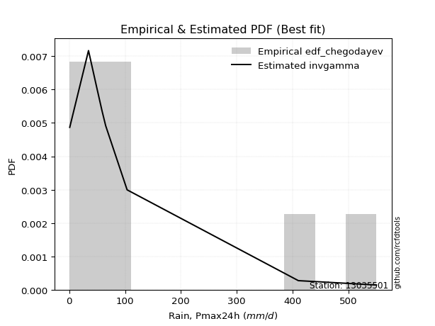</img>

</div>


### 6. Empirical - EDF Blom (1958)

The Blom formula is a specific "plotting position" formula used in hydrology and statistical analysis to estimate the empirical cumulative probability (or non-exceedance probability) of a data series. It is particularly recommended for data that are approximately normally distributed. The constant _a_ is set to 0.375 (or 3/8).

<div align="center">


$P=(m-a)/(n+1-2a)$


</div>


**6.1. Empirical values**

<div align="center">

|                | 0                   | 1                   | 2                   | 3                  | 4        | 5                  | 6                  | 7                  | 8                  |
|:---------------|:--------------------|:--------------------|:--------------------|:-------------------|:---------|:-------------------|:-------------------|:-------------------|:-------------------|
| date           | 2018                | 2019                | 2015                | 2016               | 2020     | 2017               | 2025               | 2024               | 2023               |
| x              | 0.886               | 34.5                | 49.22               | 58.78              | 65.3     | 103.7              | 237.6              | 410.6              | 550.5              |
| m              | 1                   | 2                   | 3                   | 4                  | 5        | 6                  | 7                  | 8                  | 9                  |
| empirical_dist | edf_blom            | edf_blom            | edf_blom            | edf_blom           | edf_blom | edf_blom           | edf_blom           | edf_blom           | edf_blom           |
| empirical      | 0.06756756756756757 | 0.17567567567567569 | 0.28378378378378377 | 0.3918918918918919 | 0.5      | 0.6081081081081081 | 0.7162162162162162 | 0.8243243243243243 | 0.9324324324324325 |
| empirical_tr   | 1.072463768115942   | 1.2131147540983607  | 1.3962264150943395  | 1.6444444444444444 | 2.0      | 2.5517241379310347 | 3.523809523809524  | 5.6923076923076925 | 14.800000000000006 |

</div>


**6.2. Kolmogorov-Smirnov fit test (sorted by Δ)**


<div align="center">

|                | 0                   | 1                   | 2                   | 3                   | 4                   | 5                   | 6                   | 7                   | 8                   | 9                   | 10                  | 11                  | 12                  | 13                    | 14                  | 15                  | 16                  | 17                  | 18                  | 19                  | 20                  | 21                  | 22                  | 23                  | 24                  | 25                  | 26                  | 27                  | 28                  | 29                  | 30                  | 31                  | 32                  | 33                  | 34                  | 35                  | 36                  | 37                  | 38                  | 39                  | 40                  | 41                  | 42                  | 43                  | 44                  | 45                  | 46                  | 47                  | 48                  | 49                  | 50                  | 51                  | 52                  | 53                  | 54                  | 55                  | 56                  | 57                  | 58                  | 59                  | 60                  | 61                  | 62                  | 63                  | 64                  | 65                  | 66                  | 67                  | 68                  | 69                  | 70                  | 71                  | 72                  | 73                  | 74                  | 75                  | 76                  | 77                  | 78                  | 79                  | 80                  | 81                  | 82                  | 83                  | 84                  | 85                  | 86                  | 87                  | 88                  | 89                  |
|:---------------|:--------------------|:--------------------|:--------------------|:--------------------|:--------------------|:--------------------|:--------------------|:--------------------|:--------------------|:--------------------|:--------------------|:--------------------|:--------------------|:----------------------|:--------------------|:--------------------|:--------------------|:--------------------|:--------------------|:--------------------|:--------------------|:--------------------|:--------------------|:--------------------|:--------------------|:--------------------|:--------------------|:--------------------|:--------------------|:--------------------|:--------------------|:--------------------|:--------------------|:--------------------|:--------------------|:--------------------|:--------------------|:--------------------|:--------------------|:--------------------|:--------------------|:--------------------|:--------------------|:--------------------|:--------------------|:--------------------|:--------------------|:--------------------|:--------------------|:--------------------|:--------------------|:--------------------|:--------------------|:--------------------|:--------------------|:--------------------|:--------------------|:--------------------|:--------------------|:--------------------|:--------------------|:--------------------|:--------------------|:--------------------|:--------------------|:--------------------|:--------------------|:--------------------|:--------------------|:--------------------|:--------------------|:--------------------|:--------------------|:--------------------|:--------------------|:--------------------|:--------------------|:--------------------|:--------------------|:--------------------|:--------------------|:--------------------|:--------------------|:--------------------|:--------------------|:--------------------|:--------------------|:--------------------|:--------------------|:--------------------|
| station        | 13035501            | 13035501            | 13035501            | 13035501            | 13035501            | 13035501            | 13035501            | 13035501            | 13035501            | 13035501            | 13035501            | 13035501            | 13035501            | 13035501              | 13035501            | 13035501            | 13035501            | 13035501            | 13035501            | 13035501            | 13035501            | 13035501            | 13035501            | 13035501            | 13035501            | 13035501            | 13035501            | 13035501            | 13035501            | 13035501            | 13035501            | 13035501            | 13035501            | 13035501            | 13035501            | 13035501            | 13035501            | 13035501            | 13035501            | 13035501            | 13035501            | 13035501            | 13035501            | 13035501            | 13035501            | 13035501            | 13035501            | 13035501            | 13035501            | 13035501            | 13035501            | 13035501            | 13035501            | 13035501            | 13035501            | 13035501            | 13035501            | 13035501            | 13035501            | 13035501            | 13035501            | 13035501            | 13035501            | 13035501            | 13035501            | 13035501            | 13035501            | 13035501            | 13035501            | 13035501            | 13035501            | 13035501            | 13035501            | 13035501            | 13035501            | 13035501            | 13035501            | 13035501            | 13035501            | 13035501            | 13035501            | 13035501            | 13035501            | 13035501            | 13035501            | 13035501            | 13035501            | 13035501            | 13035501            | 13035501            |
| empirical_dist | edf_blom            | edf_blom            | edf_blom            | edf_blom            | edf_blom            | edf_blom            | edf_blom            | edf_blom            | edf_blom            | edf_blom            | edf_blom            | edf_blom            | edf_blom            | edf_blom              | edf_blom            | edf_blom            | edf_blom            | edf_blom            | edf_blom            | edf_blom            | edf_blom            | edf_blom            | edf_blom            | edf_blom            | edf_blom            | edf_blom            | edf_blom            | edf_blom            | edf_blom            | edf_blom            | edf_blom            | edf_blom            | edf_blom            | edf_blom            | edf_blom            | edf_blom            | edf_blom            | edf_blom            | edf_blom            | edf_blom            | edf_blom            | edf_blom            | edf_blom            | edf_blom            | edf_blom            | edf_blom            | edf_blom            | edf_blom            | edf_blom            | edf_blom            | edf_blom            | edf_blom            | edf_blom            | edf_blom            | edf_blom            | edf_blom            | edf_blom            | edf_blom            | edf_blom            | edf_blom            | edf_blom            | edf_blom            | edf_blom            | edf_blom            | edf_blom            | edf_blom            | edf_blom            | edf_blom            | edf_blom            | edf_blom            | edf_blom            | edf_blom            | edf_blom            | edf_blom            | edf_blom            | edf_blom            | edf_blom            | edf_blom            | edf_blom            | edf_blom            | edf_blom            | edf_blom            | edf_blom            | edf_blom            | edf_blom            | edf_blom            | edf_blom            | edf_blom            | edf_blom            | edf_blom            |
| p_dist         | fisk                | johnsonsu           | fatiguelife         | invgauss            | logweibull_min      | f                   | invgamma            | ncf                 | nct                 | logt                | loggompertz         | logpearson3         | mielke              | loglaplace_asymmetric | loggumbel_l         | loglaplace          | logjohnsonsu        | loghypsecant        | weibull_min         | nakagami            | halflogistic        | logloggamma         | loglogistic         | gamma               | halfnorm            | chi2                | loglognorm          | logfatiguelife      | logrice             | logcrystalball      | lognorm             | lognorm             | logexponnorm        | lognct              | logbetaprime        | lognakagami         | moyal               | exponnorm           | laplace_asymmetric  | expon               | genexpon            | logmielke           | pearson3            | logerlang           | loggamma            | loggamma            | loginvgamma         | t                   | gumbel_r            | wald                | rayleigh            | logalpha            | logmaxwell          | genlogistic         | betaprime           | loginvgauss         | maxwell             | lograyleigh         | loggumbel_r         | kstwobign           | truncnorm           | logmoyal            | norm                | loghalfnorm         | loginvweibull       | loghalflogistic     | logistic            | rice                | hypsecant           | logkstwobign        | gompertz            | logwald             | gibrat              | laplace             | loggibrat           | erlang              | gumbel_l            | loggenexpon         | logexpon            | logncf              | crystalball         | pareto              | invweibull          | logf                | logpareto           | logfisk             | logtruncnorm        | logchi2             | alpha               | loggenlogistic      |
| delta          | 0.08464666098239021 | 0.09163364207490476 | 0.0921969864433691  | 0.09545709157676996 | 0.09691734449570452 | 0.09887985329601146 | 0.09888054895795984 | 0.09888055576345495 | 0.10308499669378457 | 0.1037776594988834  | 0.10935804543018532 | 0.1105943413929891  | 0.11191603665251218 | 0.11353476179433838   | 0.11551921164122311 | 0.11580626009271447 | 0.12336583265343998 | 0.14403009003100573 | 0.1467896152791679  | 0.1515470358915272  | 0.15684268629717119 | 0.15717165968575492 | 0.1578898609619774  | 0.16449991195126215 | 0.16688312572538155 | 0.16799998158222507 | 0.17516958179835831 | 0.17536519288238758 | 0.17562894019032563 | 0.1757122364117973  | 0.17571223984438825 | 0.17571223984438825 | 0.1757124929887284  | 0.17628422072567393 | 0.17721966297163852 | 0.17726013740798782 | 0.17915401748771997 | 0.179779692429465   | 0.17998529880296776 | 0.17998547957614092 | 0.17998623902476824 | 0.1811134581634876  | 0.184188878988438   | 0.18536823585490428 | 0.18655943840512537 | 0.18655943840512537 | 0.18788665441919575 | 0.19323781206406487 | 0.19488557932557393 | 0.1951931559067493  | 0.20154999081401548 | 0.20156267207953846 | 0.2077323447194567  | 0.20922425342472678 | 0.21080301312938285 | 0.21088461705731512 | 0.21373510058240908 | 0.21981213852963352 | 0.224472306137902   | 0.23505213479109321 | 0.23832963168337706 | 0.24256051694276368 | 0.2463315794579672  | 0.2542011796926471  | 0.25834679528100946 | 0.26251337435313626 | 0.2632156250920601  | 0.2719342268657051  | 0.2765106072539277  | 0.28873795219594456 | 0.29760335367738    | 0.3001329971810057  | 0.30259114086335365 | 0.3049117514553291  | 0.3055945403507505  | 0.30664682158992784 | 0.3080934663269647  | 0.31008733112250153 | 0.3938806677914656  | 0.4247089410451561  | 0.4341266264813427  | 0.4451439990091217  | 0.4539259900894269  | 0.46485543677276053 | 0.48854288852739103 | 0.49428070163860127 | 0.542467158646231   | 0.6077944853592343  | 0.7626479164659472  | 0.8243243243243243  |
| deltao         | 0.41761268023100007 | 0.41761268023100007 | 0.41761268023100007 | 0.41761268023100007 | 0.41761268023100007 | 0.41761268023100007 | 0.41761268023100007 | 0.41761268023100007 | 0.41761268023100007 | 0.41761268023100007 | 0.41761268023100007 | 0.41761268023100007 | 0.41761268023100007 | 0.41761268023100007   | 0.41761268023100007 | 0.41761268023100007 | 0.41761268023100007 | 0.41761268023100007 | 0.41761268023100007 | 0.41761268023100007 | 0.41761268023100007 | 0.41761268023100007 | 0.41761268023100007 | 0.41761268023100007 | 0.41761268023100007 | 0.41761268023100007 | 0.41761268023100007 | 0.41761268023100007 | 0.41761268023100007 | 0.41761268023100007 | 0.41761268023100007 | 0.41761268023100007 | 0.41761268023100007 | 0.41761268023100007 | 0.41761268023100007 | 0.41761268023100007 | 0.41761268023100007 | 0.41761268023100007 | 0.41761268023100007 | 0.41761268023100007 | 0.41761268023100007 | 0.41761268023100007 | 0.41761268023100007 | 0.41761268023100007 | 0.41761268023100007 | 0.41761268023100007 | 0.41761268023100007 | 0.41761268023100007 | 0.41761268023100007 | 0.41761268023100007 | 0.41761268023100007 | 0.41761268023100007 | 0.41761268023100007 | 0.41761268023100007 | 0.41761268023100007 | 0.41761268023100007 | 0.41761268023100007 | 0.41761268023100007 | 0.41761268023100007 | 0.41761268023100007 | 0.41761268023100007 | 0.41761268023100007 | 0.41761268023100007 | 0.41761268023100007 | 0.41761268023100007 | 0.41761268023100007 | 0.41761268023100007 | 0.41761268023100007 | 0.41761268023100007 | 0.41761268023100007 | 0.41761268023100007 | 0.41761268023100007 | 0.41761268023100007 | 0.41761268023100007 | 0.41761268023100007 | 0.41761268023100007 | 0.41761268023100007 | 0.41761268023100007 | 0.41761268023100007 | 0.41761268023100007 | 0.41761268023100007 | 0.41761268023100007 | 0.41761268023100007 | 0.41761268023100007 | 0.41761268023100007 | 0.41761268023100007 | 0.41761268023100007 | 0.41761268023100007 | 0.41761268023100007 | 0.41761268023100007 |
| eval           | Δo > Δ              | Δo > Δ              | Δo > Δ              | Δo > Δ              | Δo > Δ              | Δo > Δ              | Δo > Δ              | Δo > Δ              | Δo > Δ              | Δo > Δ              | Δo > Δ              | Δo > Δ              | Δo > Δ              | Δo > Δ                | Δo > Δ              | Δo > Δ              | Δo > Δ              | Δo > Δ              | Δo > Δ              | Δo > Δ              | Δo > Δ              | Δo > Δ              | Δo > Δ              | Δo > Δ              | Δo > Δ              | Δo > Δ              | Δo > Δ              | Δo > Δ              | Δo > Δ              | Δo > Δ              | Δo > Δ              | Δo > Δ              | Δo > Δ              | Δo > Δ              | Δo > Δ              | Δo > Δ              | Δo > Δ              | Δo > Δ              | Δo > Δ              | Δo > Δ              | Δo > Δ              | Δo > Δ              | Δo > Δ              | Δo > Δ              | Δo > Δ              | Δo > Δ              | Δo > Δ              | Δo > Δ              | Δo > Δ              | Δo > Δ              | Δo > Δ              | Δo > Δ              | Δo > Δ              | Δo > Δ              | Δo > Δ              | Δo > Δ              | Δo > Δ              | Δo > Δ              | Δo > Δ              | Δo > Δ              | Δo > Δ              | Δo > Δ              | Δo > Δ              | Δo > Δ              | Δo > Δ              | Δo > Δ              | Δo > Δ              | Δo > Δ              | Δo > Δ              | Δo > Δ              | Δo > Δ              | Δo > Δ              | Δo > Δ              | Δo > Δ              | Δo > Δ              | Δo > Δ              | Δo > Δ              | Δo > Δ              | Δo > Δ              | Δo <= Δ             | Δo <= Δ             | Δo <= Δ             | Δo <= Δ             | Δo <= Δ             | Δo <= Δ             | Δo <= Δ             | Δo <= Δ             | Δo <= Δ             | Δo <= Δ             | Δo <= Δ             |
| fit            | 1                   | 1                   | 1                   | 1                   | 1                   | 1                   | 1                   | 1                   | 1                   | 1                   | 1                   | 1                   | 1                   | 1                     | 1                   | 1                   | 1                   | 1                   | 1                   | 1                   | 1                   | 1                   | 1                   | 1                   | 1                   | 1                   | 1                   | 1                   | 1                   | 1                   | 1                   | 1                   | 1                   | 1                   | 1                   | 1                   | 1                   | 1                   | 1                   | 1                   | 1                   | 1                   | 1                   | 1                   | 1                   | 1                   | 1                   | 1                   | 1                   | 1                   | 1                   | 1                   | 1                   | 1                   | 1                   | 1                   | 1                   | 1                   | 1                   | 1                   | 1                   | 1                   | 1                   | 1                   | 1                   | 1                   | 1                   | 1                   | 1                   | 1                   | 1                   | 1                   | 1                   | 1                   | 1                   | 1                   | 1                   | 1                   | 1                   | 0                   | 0                   | 0                   | 0                   | 0                   | 0                   | 0                   | 0                   | 0                   | 0                   | 0                   |
| n              | 9                   | 9                   | 9                   | 9                   | 9                   | 9                   | 9                   | 9                   | 9                   | 9                   | 9                   | 9                   | 9                   | 9                     | 9                   | 9                   | 9                   | 9                   | 9                   | 9                   | 9                   | 9                   | 9                   | 9                   | 9                   | 9                   | 9                   | 9                   | 9                   | 9                   | 9                   | 9                   | 9                   | 9                   | 9                   | 9                   | 9                   | 9                   | 9                   | 9                   | 9                   | 9                   | 9                   | 9                   | 9                   | 9                   | 9                   | 9                   | 9                   | 9                   | 9                   | 9                   | 9                   | 9                   | 9                   | 9                   | 9                   | 9                   | 9                   | 9                   | 9                   | 9                   | 9                   | 9                   | 9                   | 9                   | 9                   | 9                   | 9                   | 9                   | 9                   | 9                   | 9                   | 9                   | 9                   | 9                   | 9                   | 9                   | 9                   | 9                   | 9                   | 9                   | 9                   | 9                   | 9                   | 9                   | 9                   | 9                   | 9                   | 9                   |
| best_fit       | 1                   | 0                   | 0                   | 0                   | 0                   | 0                   | 0                   | 0                   | 0                   | 0                   | 0                   | 0                   | 0                   | 0                     | 0                   | 0                   | 0                   | 0                   | 0                   | 0                   | 0                   | 0                   | 0                   | 0                   | 0                   | 0                   | 0                   | 0                   | 0                   | 0                   | 0                   | 0                   | 0                   | 0                   | 0                   | 0                   | 0                   | 0                   | 0                   | 0                   | 0                   | 0                   | 0                   | 0                   | 0                   | 0                   | 0                   | 0                   | 0                   | 0                   | 0                   | 0                   | 0                   | 0                   | 0                   | 0                   | 0                   | 0                   | 0                   | 0                   | 0                   | 0                   | 0                   | 0                   | 0                   | 0                   | 0                   | 0                   | 0                   | 0                   | 0                   | 0                   | 0                   | 0                   | 0                   | 0                   | 0                   | 0                   | 0                   | 0                   | 0                   | 0                   | 0                   | 0                   | 0                   | 0                   | 0                   | 0                   | 0                   | 0                   |
| best_fit_sort  | 1                   | 2                   | 3                   | 4                   | 5                   | 6                   | 7                   | 8                   | 9                   | 10                  | 11                  | 12                  | 13                  | 14                    | 15                  | 16                  | 17                  | 18                  | 19                  | 20                  | 21                  | 22                  | 23                  | 24                  | 25                  | 26                  | 27                  | 28                  | 29                  | 30                  | 31                  | 32                  | 33                  | 34                  | 35                  | 36                  | 37                  | 38                  | 39                  | 40                  | 41                  | 42                  | 43                  | 44                  | 45                  | 46                  | 47                  | 48                  | 49                  | 50                  | 51                  | 52                  | 53                  | 54                  | 55                  | 56                  | 57                  | 58                  | 59                  | 60                  | 61                  | 62                  | 63                  | 64                  | 65                  | 66                  | 67                  | 68                  | 69                  | 70                  | 71                  | 72                  | 73                  | 74                  | 75                  | 76                  | 77                  | 78                  | 79                  | 80                  | 81                  | 82                  | 83                  | 84                  | 85                  | 86                  | 87                  | 88                  | 89                  | 90                  |

</div>


<div align="center">

</img>

</div>


**6.3. Best fit**

<div align="center">

|   id |   station | empirical_dist   | p_dist   |     delta |   deltao | eval   |   fit |   n |   best_fit |   best_fit_sort |
|-----:|----------:|:-----------------|:---------|----------:|---------:|:-------|------:|----:|-----------:|----------------:|
|    0 |  13035501 | edf_blom         | fisk     | 0.0846467 | 0.417613 | Δo > Δ |     1 |   9 |          1 |               1 |

</div>


<div align="center">

</img></img>

</div>


### 7. Empirical - EDF Tukey (1962)

In hydrology, the Tukey formula is used as a plotting position formula to estimate the empirical probability or frequency of a flood event (or other hydrological data). The formula parameter is given as _c=0.333_ (or 1/3).

<div align="center">


$P=(m-c)/(n+1-2c)$


</div>


**7.1. Empirical values**

<div align="center">

|                | 0                   | 1                   | 2                  | 3                   | 4         | 5                  | 6                  | 7                  | 8                  |
|:---------------|:--------------------|:--------------------|:-------------------|:--------------------|:----------|:-------------------|:-------------------|:-------------------|:-------------------|
| date           | 2018                | 2019                | 2015               | 2016                | 2020      | 2017               | 2025               | 2024               | 2023               |
| x              | 0.886               | 34.5                | 49.22              | 58.78               | 65.3      | 103.7              | 237.6              | 410.6              | 550.5              |
| m              | 1                   | 2                   | 3                  | 4                   | 5         | 6                  | 7                  | 8                  | 9                  |
| empirical_dist | edf_tukey           | edf_tukey           | edf_tukey          | edf_tukey           | edf_tukey | edf_tukey          | edf_tukey          | edf_tukey          | edf_tukey          |
| empirical      | 0.07142857142857142 | 0.17857142857142858 | 0.2857142857142857 | 0.39285714285714285 | 0.5       | 0.6071428571428571 | 0.7142857142857143 | 0.8214285714285714 | 0.9285714285714286 |
| empirical_tr   | 1.0769230769230769  | 1.2173913043478262  | 1.4                | 1.6470588235294117  | 2.0       | 2.545454545454545  | 3.5                | 5.599999999999999  | 14.000000000000007 |

</div>


**7.2. Kolmogorov-Smirnov fit test (sorted by Δ)**


<div align="center">

|                | 0                   | 1                   | 2                   | 3                   | 4                   | 5                   | 6                   | 7                   | 8                   | 9                   | 10                  | 11                  | 12                  | 13                    | 14                  | 15                  | 16                  | 17                  | 18                  | 19                  | 20                  | 21                  | 22                  | 23                  | 24                  | 25                  | 26                  | 27                  | 28                  | 29                  | 30                  | 31                  | 32                  | 33                  | 34                  | 35                  | 36                  | 37                  | 38                  | 39                  | 40                  | 41                  | 42                  | 43                  | 44                  | 45                  | 46                  | 47                  | 48                  | 49                  | 50                  | 51                  | 52                  | 53                  | 54                  | 55                  | 56                  | 57                  | 58                  | 59                  | 60                  | 61                  | 62                  | 63                  | 64                  | 65                  | 66                  | 67                  | 68                  | 69                  | 70                  | 71                  | 72                  | 73                  | 74                  | 75                  | 76                  | 77                  | 78                  | 79                  | 80                  | 81                  | 82                  | 83                  | 84                  | 85                  | 86                  | 87                  | 88                  | 89                  |
|:---------------|:--------------------|:--------------------|:--------------------|:--------------------|:--------------------|:--------------------|:--------------------|:--------------------|:--------------------|:--------------------|:--------------------|:--------------------|:--------------------|:----------------------|:--------------------|:--------------------|:--------------------|:--------------------|:--------------------|:--------------------|:--------------------|:--------------------|:--------------------|:--------------------|:--------------------|:--------------------|:--------------------|:--------------------|:--------------------|:--------------------|:--------------------|:--------------------|:--------------------|:--------------------|:--------------------|:--------------------|:--------------------|:--------------------|:--------------------|:--------------------|:--------------------|:--------------------|:--------------------|:--------------------|:--------------------|:--------------------|:--------------------|:--------------------|:--------------------|:--------------------|:--------------------|:--------------------|:--------------------|:--------------------|:--------------------|:--------------------|:--------------------|:--------------------|:--------------------|:--------------------|:--------------------|:--------------------|:--------------------|:--------------------|:--------------------|:--------------------|:--------------------|:--------------------|:--------------------|:--------------------|:--------------------|:--------------------|:--------------------|:--------------------|:--------------------|:--------------------|:--------------------|:--------------------|:--------------------|:--------------------|:--------------------|:--------------------|:--------------------|:--------------------|:--------------------|:--------------------|:--------------------|:--------------------|:--------------------|:--------------------|
| station        | 13035501            | 13035501            | 13035501            | 13035501            | 13035501            | 13035501            | 13035501            | 13035501            | 13035501            | 13035501            | 13035501            | 13035501            | 13035501            | 13035501              | 13035501            | 13035501            | 13035501            | 13035501            | 13035501            | 13035501            | 13035501            | 13035501            | 13035501            | 13035501            | 13035501            | 13035501            | 13035501            | 13035501            | 13035501            | 13035501            | 13035501            | 13035501            | 13035501            | 13035501            | 13035501            | 13035501            | 13035501            | 13035501            | 13035501            | 13035501            | 13035501            | 13035501            | 13035501            | 13035501            | 13035501            | 13035501            | 13035501            | 13035501            | 13035501            | 13035501            | 13035501            | 13035501            | 13035501            | 13035501            | 13035501            | 13035501            | 13035501            | 13035501            | 13035501            | 13035501            | 13035501            | 13035501            | 13035501            | 13035501            | 13035501            | 13035501            | 13035501            | 13035501            | 13035501            | 13035501            | 13035501            | 13035501            | 13035501            | 13035501            | 13035501            | 13035501            | 13035501            | 13035501            | 13035501            | 13035501            | 13035501            | 13035501            | 13035501            | 13035501            | 13035501            | 13035501            | 13035501            | 13035501            | 13035501            | 13035501            |
| empirical_dist | edf_tukey           | edf_tukey           | edf_tukey           | edf_tukey           | edf_tukey           | edf_tukey           | edf_tukey           | edf_tukey           | edf_tukey           | edf_tukey           | edf_tukey           | edf_tukey           | edf_tukey           | edf_tukey             | edf_tukey           | edf_tukey           | edf_tukey           | edf_tukey           | edf_tukey           | edf_tukey           | edf_tukey           | edf_tukey           | edf_tukey           | edf_tukey           | edf_tukey           | edf_tukey           | edf_tukey           | edf_tukey           | edf_tukey           | edf_tukey           | edf_tukey           | edf_tukey           | edf_tukey           | edf_tukey           | edf_tukey           | edf_tukey           | edf_tukey           | edf_tukey           | edf_tukey           | edf_tukey           | edf_tukey           | edf_tukey           | edf_tukey           | edf_tukey           | edf_tukey           | edf_tukey           | edf_tukey           | edf_tukey           | edf_tukey           | edf_tukey           | edf_tukey           | edf_tukey           | edf_tukey           | edf_tukey           | edf_tukey           | edf_tukey           | edf_tukey           | edf_tukey           | edf_tukey           | edf_tukey           | edf_tukey           | edf_tukey           | edf_tukey           | edf_tukey           | edf_tukey           | edf_tukey           | edf_tukey           | edf_tukey           | edf_tukey           | edf_tukey           | edf_tukey           | edf_tukey           | edf_tukey           | edf_tukey           | edf_tukey           | edf_tukey           | edf_tukey           | edf_tukey           | edf_tukey           | edf_tukey           | edf_tukey           | edf_tukey           | edf_tukey           | edf_tukey           | edf_tukey           | edf_tukey           | edf_tukey           | edf_tukey           | edf_tukey           | edf_tukey           |
| p_dist         | fisk                | johnsonsu           | fatiguelife         | logweibull_min      | invgauss            | f                   | invgamma            | ncf                 | logt                | nct                 | loggompertz         | logpearson3         | mielke              | loglaplace_asymmetric | loggumbel_l         | loglaplace          | logjohnsonsu        | loghypsecant        | weibull_min         | nakagami            | loglogistic         | halflogistic        | logloggamma         | gamma               | halfnorm            | chi2                | loglognorm          | logfatiguelife      | logrice             | logcrystalball      | lognorm             | lognorm             | logexponnorm        | lognct              | logbetaprime        | lognakagami         | logmielke           | moyal               | exponnorm           | laplace_asymmetric  | expon               | genexpon            | logerlang           | pearson3            | loggamma            | loggamma            | loginvgamma         | gumbel_r            | t                   | wald                | logalpha            | rayleigh            | logmaxwell          | betaprime           | loginvgauss         | genlogistic         | maxwell             | lograyleigh         | loggumbel_r         | kstwobign           | truncnorm           | logmoyal            | norm                | loghalfnorm         | loginvweibull       | loghalflogistic     | logistic            | rice                | hypsecant           | logkstwobign        | gompertz            | logwald             | gibrat              | loggibrat           | erlang              | laplace             | gumbel_l            | loggenexpon         | logexpon            | logncf              | crystalball         | pareto              | invweibull          | logf                | logpareto           | logfisk             | logtruncnorm        | logchi2             | alpha               | loggenlogistic      |
| delta          | 0.08464666098239021 | 0.09163364207490476 | 0.0921969864433691  | 0.09402159159995163 | 0.09545709157676996 | 0.09887985329601146 | 0.09888054895795984 | 0.09888055576345495 | 0.1037776594988834  | 0.1050154986242865  | 0.10646229253443243 | 0.10769858849723621 | 0.10902028375675929 | 0.1106390088985855    | 0.11262345874547022 | 0.11291050719696158 | 0.12336583265343998 | 0.14113433713525284 | 0.1467896152791679  | 0.14865128299577432 | 0.15499410806622452 | 0.15587743533192017 | 0.1562064087205039  | 0.16160415905550926 | 0.16591787476013053 | 0.169930483512727   | 0.17227382890260542 | 0.1724694399866347  | 0.17273318729457274 | 0.17281648351604442 | 0.17281648694863536 | 0.17281648694863536 | 0.1728167400929755  | 0.17338846782992104 | 0.17432391007588563 | 0.17436438451223493 | 0.1782177052677347  | 0.17915401748771997 | 0.179779692429465   | 0.17998529880296776 | 0.17998547957614092 | 0.17998623902476824 | 0.1824724829591514  | 0.18322362802318698 | 0.18366368550937248 | 0.18366368550937248 | 0.18499090152344286 | 0.1939203283603229  | 0.1951683139945668  | 0.1951931559067493  | 0.19866691918378557 | 0.20058473984876446 | 0.2048365918237038  | 0.20790726023362996 | 0.20798886416156223 | 0.20922425342472678 | 0.21276984961715806 | 0.21691638563388063 | 0.22157655324214912 | 0.23505213479109321 | 0.23832963168337706 | 0.2396647640470108  | 0.24536632849271617 | 0.25130542679689416 | 0.2554510423852566  | 0.2596176214573833  | 0.26225037412680907 | 0.2709689759004541  | 0.27554535628867666 | 0.2858421993001916  | 0.29760335367738    | 0.2982024952505038  | 0.30259114086335365 | 0.3036640384202486  | 0.3037510686941749  | 0.3039465004900781  | 0.3071282153617137  | 0.3071915782267486  | 0.39098491489571263 | 0.42181318814940316 | 0.43026562262033885 | 0.44224824611336877 | 0.45006498622842306 | 0.4619596838770076  | 0.4856471356316381  | 0.4913849487428483  | 0.539571405750478   | 0.6048987324634814  | 0.7597521635701943  | 0.8214285714285714  |
| deltao         | 0.41761268023100007 | 0.41761268023100007 | 0.41761268023100007 | 0.41761268023100007 | 0.41761268023100007 | 0.41761268023100007 | 0.41761268023100007 | 0.41761268023100007 | 0.41761268023100007 | 0.41761268023100007 | 0.41761268023100007 | 0.41761268023100007 | 0.41761268023100007 | 0.41761268023100007   | 0.41761268023100007 | 0.41761268023100007 | 0.41761268023100007 | 0.41761268023100007 | 0.41761268023100007 | 0.41761268023100007 | 0.41761268023100007 | 0.41761268023100007 | 0.41761268023100007 | 0.41761268023100007 | 0.41761268023100007 | 0.41761268023100007 | 0.41761268023100007 | 0.41761268023100007 | 0.41761268023100007 | 0.41761268023100007 | 0.41761268023100007 | 0.41761268023100007 | 0.41761268023100007 | 0.41761268023100007 | 0.41761268023100007 | 0.41761268023100007 | 0.41761268023100007 | 0.41761268023100007 | 0.41761268023100007 | 0.41761268023100007 | 0.41761268023100007 | 0.41761268023100007 | 0.41761268023100007 | 0.41761268023100007 | 0.41761268023100007 | 0.41761268023100007 | 0.41761268023100007 | 0.41761268023100007 | 0.41761268023100007 | 0.41761268023100007 | 0.41761268023100007 | 0.41761268023100007 | 0.41761268023100007 | 0.41761268023100007 | 0.41761268023100007 | 0.41761268023100007 | 0.41761268023100007 | 0.41761268023100007 | 0.41761268023100007 | 0.41761268023100007 | 0.41761268023100007 | 0.41761268023100007 | 0.41761268023100007 | 0.41761268023100007 | 0.41761268023100007 | 0.41761268023100007 | 0.41761268023100007 | 0.41761268023100007 | 0.41761268023100007 | 0.41761268023100007 | 0.41761268023100007 | 0.41761268023100007 | 0.41761268023100007 | 0.41761268023100007 | 0.41761268023100007 | 0.41761268023100007 | 0.41761268023100007 | 0.41761268023100007 | 0.41761268023100007 | 0.41761268023100007 | 0.41761268023100007 | 0.41761268023100007 | 0.41761268023100007 | 0.41761268023100007 | 0.41761268023100007 | 0.41761268023100007 | 0.41761268023100007 | 0.41761268023100007 | 0.41761268023100007 | 0.41761268023100007 |
| eval           | Δo > Δ              | Δo > Δ              | Δo > Δ              | Δo > Δ              | Δo > Δ              | Δo > Δ              | Δo > Δ              | Δo > Δ              | Δo > Δ              | Δo > Δ              | Δo > Δ              | Δo > Δ              | Δo > Δ              | Δo > Δ                | Δo > Δ              | Δo > Δ              | Δo > Δ              | Δo > Δ              | Δo > Δ              | Δo > Δ              | Δo > Δ              | Δo > Δ              | Δo > Δ              | Δo > Δ              | Δo > Δ              | Δo > Δ              | Δo > Δ              | Δo > Δ              | Δo > Δ              | Δo > Δ              | Δo > Δ              | Δo > Δ              | Δo > Δ              | Δo > Δ              | Δo > Δ              | Δo > Δ              | Δo > Δ              | Δo > Δ              | Δo > Δ              | Δo > Δ              | Δo > Δ              | Δo > Δ              | Δo > Δ              | Δo > Δ              | Δo > Δ              | Δo > Δ              | Δo > Δ              | Δo > Δ              | Δo > Δ              | Δo > Δ              | Δo > Δ              | Δo > Δ              | Δo > Δ              | Δo > Δ              | Δo > Δ              | Δo > Δ              | Δo > Δ              | Δo > Δ              | Δo > Δ              | Δo > Δ              | Δo > Δ              | Δo > Δ              | Δo > Δ              | Δo > Δ              | Δo > Δ              | Δo > Δ              | Δo > Δ              | Δo > Δ              | Δo > Δ              | Δo > Δ              | Δo > Δ              | Δo > Δ              | Δo > Δ              | Δo > Δ              | Δo > Δ              | Δo > Δ              | Δo > Δ              | Δo > Δ              | Δo > Δ              | Δo <= Δ             | Δo <= Δ             | Δo <= Δ             | Δo <= Δ             | Δo <= Δ             | Δo <= Δ             | Δo <= Δ             | Δo <= Δ             | Δo <= Δ             | Δo <= Δ             | Δo <= Δ             |
| fit            | 1                   | 1                   | 1                   | 1                   | 1                   | 1                   | 1                   | 1                   | 1                   | 1                   | 1                   | 1                   | 1                   | 1                     | 1                   | 1                   | 1                   | 1                   | 1                   | 1                   | 1                   | 1                   | 1                   | 1                   | 1                   | 1                   | 1                   | 1                   | 1                   | 1                   | 1                   | 1                   | 1                   | 1                   | 1                   | 1                   | 1                   | 1                   | 1                   | 1                   | 1                   | 1                   | 1                   | 1                   | 1                   | 1                   | 1                   | 1                   | 1                   | 1                   | 1                   | 1                   | 1                   | 1                   | 1                   | 1                   | 1                   | 1                   | 1                   | 1                   | 1                   | 1                   | 1                   | 1                   | 1                   | 1                   | 1                   | 1                   | 1                   | 1                   | 1                   | 1                   | 1                   | 1                   | 1                   | 1                   | 1                   | 1                   | 1                   | 0                   | 0                   | 0                   | 0                   | 0                   | 0                   | 0                   | 0                   | 0                   | 0                   | 0                   |
| n              | 9                   | 9                   | 9                   | 9                   | 9                   | 9                   | 9                   | 9                   | 9                   | 9                   | 9                   | 9                   | 9                   | 9                     | 9                   | 9                   | 9                   | 9                   | 9                   | 9                   | 9                   | 9                   | 9                   | 9                   | 9                   | 9                   | 9                   | 9                   | 9                   | 9                   | 9                   | 9                   | 9                   | 9                   | 9                   | 9                   | 9                   | 9                   | 9                   | 9                   | 9                   | 9                   | 9                   | 9                   | 9                   | 9                   | 9                   | 9                   | 9                   | 9                   | 9                   | 9                   | 9                   | 9                   | 9                   | 9                   | 9                   | 9                   | 9                   | 9                   | 9                   | 9                   | 9                   | 9                   | 9                   | 9                   | 9                   | 9                   | 9                   | 9                   | 9                   | 9                   | 9                   | 9                   | 9                   | 9                   | 9                   | 9                   | 9                   | 9                   | 9                   | 9                   | 9                   | 9                   | 9                   | 9                   | 9                   | 9                   | 9                   | 9                   |
| best_fit       | 1                   | 0                   | 0                   | 0                   | 0                   | 0                   | 0                   | 0                   | 0                   | 0                   | 0                   | 0                   | 0                   | 0                     | 0                   | 0                   | 0                   | 0                   | 0                   | 0                   | 0                   | 0                   | 0                   | 0                   | 0                   | 0                   | 0                   | 0                   | 0                   | 0                   | 0                   | 0                   | 0                   | 0                   | 0                   | 0                   | 0                   | 0                   | 0                   | 0                   | 0                   | 0                   | 0                   | 0                   | 0                   | 0                   | 0                   | 0                   | 0                   | 0                   | 0                   | 0                   | 0                   | 0                   | 0                   | 0                   | 0                   | 0                   | 0                   | 0                   | 0                   | 0                   | 0                   | 0                   | 0                   | 0                   | 0                   | 0                   | 0                   | 0                   | 0                   | 0                   | 0                   | 0                   | 0                   | 0                   | 0                   | 0                   | 0                   | 0                   | 0                   | 0                   | 0                   | 0                   | 0                   | 0                   | 0                   | 0                   | 0                   | 0                   |
| best_fit_sort  | 1                   | 2                   | 3                   | 4                   | 5                   | 6                   | 7                   | 8                   | 9                   | 10                  | 11                  | 12                  | 13                  | 14                    | 15                  | 16                  | 17                  | 18                  | 19                  | 20                  | 21                  | 22                  | 23                  | 24                  | 25                  | 26                  | 27                  | 28                  | 29                  | 30                  | 31                  | 32                  | 33                  | 34                  | 35                  | 36                  | 37                  | 38                  | 39                  | 40                  | 41                  | 42                  | 43                  | 44                  | 45                  | 46                  | 47                  | 48                  | 49                  | 50                  | 51                  | 52                  | 53                  | 54                  | 55                  | 56                  | 57                  | 58                  | 59                  | 60                  | 61                  | 62                  | 63                  | 64                  | 65                  | 66                  | 67                  | 68                  | 69                  | 70                  | 71                  | 72                  | 73                  | 74                  | 75                  | 76                  | 77                  | 78                  | 79                  | 80                  | 81                  | 82                  | 83                  | 84                  | 85                  | 86                  | 87                  | 88                  | 89                  | 90                  |

</div>


<div align="center">

</img>

</div>


**7.3. Best fit**

<div align="center">

|   id |   station | empirical_dist   | p_dist   |     delta |   deltao | eval   |   fit |   n |   best_fit |   best_fit_sort |
|-----:|----------:|:-----------------|:---------|----------:|---------:|:-------|------:|----:|-----------:|----------------:|
|    0 |  13035501 | edf_tukey        | fisk     | 0.0846467 | 0.417613 | Δo > Δ |     1 |   9 |          1 |               1 |

</div>


<div align="center">

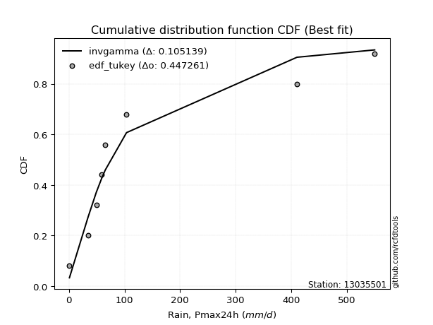</img>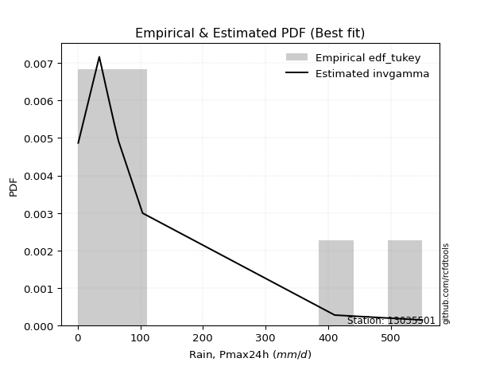</img>

</div>


### 8. Empirical - EDF Gringorten (1963)

Gringorten plotting position formula is essential for estimating the probability and return periods of extreme events like floods and heavy rainfall. The constant _a=0.44_.

<div align="center">


$P=(m-a)/(n+1-2a)$


</div>


**8.1. Empirical values**

<div align="center">

|                | 0                    | 1                  | 2                   | 3                  | 4              | 5                  | 6                  | 7                  | 8                  |
|:---------------|:---------------------|:-------------------|:--------------------|:-------------------|:---------------|:-------------------|:-------------------|:-------------------|:-------------------|
| date           | 2018                 | 2019               | 2015                | 2016               | 2020           | 2017               | 2025               | 2024               | 2023               |
| x              | 0.886                | 34.5               | 49.22               | 58.78              | 65.3           | 103.7              | 237.6              | 410.6              | 550.5              |
| m              | 1                    | 2                  | 3                   | 4                  | 5              | 6                  | 7                  | 8                  | 9                  |
| empirical_dist | edf_gringorten       | edf_gringorten     | edf_gringorten      | edf_gringorten     | edf_gringorten | edf_gringorten     | edf_gringorten     | edf_gringorten     | edf_gringorten     |
| empirical      | 0.061403508771929835 | 0.1710526315789474 | 0.28070175438596495 | 0.3903508771929825 | 0.5            | 0.6096491228070176 | 0.7192982456140351 | 0.8289473684210527 | 0.9385964912280703 |
| empirical_tr   | 1.0654205607476634   | 1.2063492063492063 | 1.3902439024390243  | 1.6402877697841727 | 2.0            | 2.561797752808989  | 3.5625             | 5.846153846153847  | 16.285714285714324 |

</div>


**8.2. Kolmogorov-Smirnov fit test (sorted by Δ)**


<div align="center">

|                | 0                   | 1                   | 2                   | 3                   | 4                   | 5                   | 6                   | 7                   | 8                   | 9                   | 10                  | 11                  | 12                  | 13                    | 14                  | 15                  | 16                  | 17                  | 18                  | 19                  | 20                  | 21                  | 22                  | 23                  | 24                  | 25                  | 26                  | 27                  | 28                  | 29                  | 30                  | 31                  | 32                  | 33                  | 34                  | 35                  | 36                  | 37                  | 38                  | 39                  | 40                  | 41                  | 42                  | 43                  | 44                  | 45                  | 46                  | 47                  | 48                  | 49                  | 50                  | 51                  | 52                  | 53                  | 54                  | 55                  | 56                  | 57                  | 58                  | 59                  | 60                  | 61                  | 62                  | 63                  | 64                  | 65                  | 66                  | 67                  | 68                  | 69                  | 70                  | 71                  | 72                  | 73                  | 74                  | 75                  | 76                  | 77                  | 78                  | 79                  | 80                  | 81                  | 82                  | 83                  | 84                  | 85                  | 86                  | 87                  | 88                  | 89                  |
|:---------------|:--------------------|:--------------------|:--------------------|:--------------------|:--------------------|:--------------------|:--------------------|:--------------------|:--------------------|:--------------------|:--------------------|:--------------------|:--------------------|:----------------------|:--------------------|:--------------------|:--------------------|:--------------------|:--------------------|:--------------------|:--------------------|:--------------------|:--------------------|:--------------------|:--------------------|:--------------------|:--------------------|:--------------------|:--------------------|:--------------------|:--------------------|:--------------------|:--------------------|:--------------------|:--------------------|:--------------------|:--------------------|:--------------------|:--------------------|:--------------------|:--------------------|:--------------------|:--------------------|:--------------------|:--------------------|:--------------------|:--------------------|:--------------------|:--------------------|:--------------------|:--------------------|:--------------------|:--------------------|:--------------------|:--------------------|:--------------------|:--------------------|:--------------------|:--------------------|:--------------------|:--------------------|:--------------------|:--------------------|:--------------------|:--------------------|:--------------------|:--------------------|:--------------------|:--------------------|:--------------------|:--------------------|:--------------------|:--------------------|:--------------------|:--------------------|:--------------------|:--------------------|:--------------------|:--------------------|:--------------------|:--------------------|:--------------------|:--------------------|:--------------------|:--------------------|:--------------------|:--------------------|:--------------------|:--------------------|:--------------------|
| station        | 13035501            | 13035501            | 13035501            | 13035501            | 13035501            | 13035501            | 13035501            | 13035501            | 13035501            | 13035501            | 13035501            | 13035501            | 13035501            | 13035501              | 13035501            | 13035501            | 13035501            | 13035501            | 13035501            | 13035501            | 13035501            | 13035501            | 13035501            | 13035501            | 13035501            | 13035501            | 13035501            | 13035501            | 13035501            | 13035501            | 13035501            | 13035501            | 13035501            | 13035501            | 13035501            | 13035501            | 13035501            | 13035501            | 13035501            | 13035501            | 13035501            | 13035501            | 13035501            | 13035501            | 13035501            | 13035501            | 13035501            | 13035501            | 13035501            | 13035501            | 13035501            | 13035501            | 13035501            | 13035501            | 13035501            | 13035501            | 13035501            | 13035501            | 13035501            | 13035501            | 13035501            | 13035501            | 13035501            | 13035501            | 13035501            | 13035501            | 13035501            | 13035501            | 13035501            | 13035501            | 13035501            | 13035501            | 13035501            | 13035501            | 13035501            | 13035501            | 13035501            | 13035501            | 13035501            | 13035501            | 13035501            | 13035501            | 13035501            | 13035501            | 13035501            | 13035501            | 13035501            | 13035501            | 13035501            | 13035501            |
| empirical_dist | edf_gringorten      | edf_gringorten      | edf_gringorten      | edf_gringorten      | edf_gringorten      | edf_gringorten      | edf_gringorten      | edf_gringorten      | edf_gringorten      | edf_gringorten      | edf_gringorten      | edf_gringorten      | edf_gringorten      | edf_gringorten        | edf_gringorten      | edf_gringorten      | edf_gringorten      | edf_gringorten      | edf_gringorten      | edf_gringorten      | edf_gringorten      | edf_gringorten      | edf_gringorten      | edf_gringorten      | edf_gringorten      | edf_gringorten      | edf_gringorten      | edf_gringorten      | edf_gringorten      | edf_gringorten      | edf_gringorten      | edf_gringorten      | edf_gringorten      | edf_gringorten      | edf_gringorten      | edf_gringorten      | edf_gringorten      | edf_gringorten      | edf_gringorten      | edf_gringorten      | edf_gringorten      | edf_gringorten      | edf_gringorten      | edf_gringorten      | edf_gringorten      | edf_gringorten      | edf_gringorten      | edf_gringorten      | edf_gringorten      | edf_gringorten      | edf_gringorten      | edf_gringorten      | edf_gringorten      | edf_gringorten      | edf_gringorten      | edf_gringorten      | edf_gringorten      | edf_gringorten      | edf_gringorten      | edf_gringorten      | edf_gringorten      | edf_gringorten      | edf_gringorten      | edf_gringorten      | edf_gringorten      | edf_gringorten      | edf_gringorten      | edf_gringorten      | edf_gringorten      | edf_gringorten      | edf_gringorten      | edf_gringorten      | edf_gringorten      | edf_gringorten      | edf_gringorten      | edf_gringorten      | edf_gringorten      | edf_gringorten      | edf_gringorten      | edf_gringorten      | edf_gringorten      | edf_gringorten      | edf_gringorten      | edf_gringorten      | edf_gringorten      | edf_gringorten      | edf_gringorten      | edf_gringorten      | edf_gringorten      | edf_gringorten      |
| p_dist         | fisk                | johnsonsu           | fatiguelife         | invgauss            | f                   | invgamma            | ncf                 | nct                 | logweibull_min      | logt                | loggompertz         | logpearson3         | mielke              | loglaplace_asymmetric | loggumbel_l         | loglaplace          | logjohnsonsu        | weibull_min         | loghypsecant        | nakagami            | halflogistic        | logloggamma         | loglogistic         | chi2                | halfnorm            | gamma               | moyal               | exponnorm           | loglognorm          | laplace_asymmetric  | expon               | genexpon            | logfatiguelife      | logrice             | logcrystalball      | lognorm             | lognorm             | logexponnorm        | lognct              | logbetaprime        | lognakagami         | pearson3            | logmielke           | logerlang           | t                   | loggamma            | loggamma            | loginvgamma         | wald                | gumbel_r            | rayleigh            | logalpha            | genlogistic         | logmaxwell          | maxwell             | betaprime           | loginvgauss         | lograyleigh         | loggumbel_r         | kstwobign           | truncnorm           | logmoyal            | norm                | loghalfnorm         | loginvweibull       | logistic            | loghalflogistic     | rice                | hypsecant           | logkstwobign        | gompertz            | gibrat              | logwald             | laplace             | loggibrat           | gumbel_l            | erlang              | loggenexpon         | logexpon            | logncf              | crystalball         | pareto              | invweibull          | logf                | logpareto           | logfisk             | logtruncnorm        | logchi2             | alpha               | loggenlogistic      |
| delta          | 0.08464666098239021 | 0.09163364207490476 | 0.0921969864433691  | 0.09545709157676996 | 0.09887985329601146 | 0.09888054895795984 | 0.09888055576345495 | 0.1000029672959657  | 0.1015403885924328  | 0.1037776594988834  | 0.1139810895269136  | 0.11521738548971738 | 0.11653908074924046 | 0.11815780589106667   | 0.1201422557379514  | 0.12042930418944275 | 0.12482822745154154 | 0.1467896152791679  | 0.148653134127734   | 0.1561700799882555  | 0.15838370099608062 | 0.15871267438466435 | 0.1625129050587057  | 0.1649179521844062  | 0.168424140424291   | 0.16912295604799044 | 0.17915401748771997 | 0.179779692429465   | 0.1797926258950866  | 0.17998529880296776 | 0.17998547957614092 | 0.17998623902476824 | 0.17998823697911587 | 0.1802519842870539  | 0.1803352805085256  | 0.18033528394111653 | 0.18033528394111653 | 0.1803355370854567  | 0.18090726482240221 | 0.1818427070683668  | 0.1818831815047161  | 0.18572989368734744 | 0.18573650226021587 | 0.18999127995163256 | 0.190155782666246   | 0.19118248250185366 | 0.19118248250185366 | 0.19250969851592403 | 0.1951931559067493  | 0.19642659402448337 | 0.20309100551292492 | 0.20618571617626674 | 0.20922425342472678 | 0.212355388816185   | 0.21527611528131851 | 0.21542605722611113 | 0.2155076611540434  | 0.2244351826263618  | 0.2290953502346303  | 0.23505213479109321 | 0.23832963168337706 | 0.24718356103949196 | 0.24787259415687662 | 0.25882422378937536 | 0.26296983937773777 | 0.26475663979096953 | 0.2671364184498645  | 0.27347524156461456 | 0.2780516219528371  | 0.2933609962926728  | 0.29760335367738    | 0.30259114086335365 | 0.30321502657882454 | 0.30645276615423855 | 0.30867656974856933 | 0.30963448102587415 | 0.3112698656866561  | 0.3147103752192298  | 0.39850371188819383 | 0.42933198514188436 | 0.4402906852769804  | 0.44976704310585    | 0.4600900488850648  | 0.4694784808694888  | 0.4931659326241193  | 0.49890374573532953 | 0.5470902027429592  | 0.6124175294559626  | 0.7672709605626755  | 0.8289473684210527  |
| deltao         | 0.41761268023100007 | 0.41761268023100007 | 0.41761268023100007 | 0.41761268023100007 | 0.41761268023100007 | 0.41761268023100007 | 0.41761268023100007 | 0.41761268023100007 | 0.41761268023100007 | 0.41761268023100007 | 0.41761268023100007 | 0.41761268023100007 | 0.41761268023100007 | 0.41761268023100007   | 0.41761268023100007 | 0.41761268023100007 | 0.41761268023100007 | 0.41761268023100007 | 0.41761268023100007 | 0.41761268023100007 | 0.41761268023100007 | 0.41761268023100007 | 0.41761268023100007 | 0.41761268023100007 | 0.41761268023100007 | 0.41761268023100007 | 0.41761268023100007 | 0.41761268023100007 | 0.41761268023100007 | 0.41761268023100007 | 0.41761268023100007 | 0.41761268023100007 | 0.41761268023100007 | 0.41761268023100007 | 0.41761268023100007 | 0.41761268023100007 | 0.41761268023100007 | 0.41761268023100007 | 0.41761268023100007 | 0.41761268023100007 | 0.41761268023100007 | 0.41761268023100007 | 0.41761268023100007 | 0.41761268023100007 | 0.41761268023100007 | 0.41761268023100007 | 0.41761268023100007 | 0.41761268023100007 | 0.41761268023100007 | 0.41761268023100007 | 0.41761268023100007 | 0.41761268023100007 | 0.41761268023100007 | 0.41761268023100007 | 0.41761268023100007 | 0.41761268023100007 | 0.41761268023100007 | 0.41761268023100007 | 0.41761268023100007 | 0.41761268023100007 | 0.41761268023100007 | 0.41761268023100007 | 0.41761268023100007 | 0.41761268023100007 | 0.41761268023100007 | 0.41761268023100007 | 0.41761268023100007 | 0.41761268023100007 | 0.41761268023100007 | 0.41761268023100007 | 0.41761268023100007 | 0.41761268023100007 | 0.41761268023100007 | 0.41761268023100007 | 0.41761268023100007 | 0.41761268023100007 | 0.41761268023100007 | 0.41761268023100007 | 0.41761268023100007 | 0.41761268023100007 | 0.41761268023100007 | 0.41761268023100007 | 0.41761268023100007 | 0.41761268023100007 | 0.41761268023100007 | 0.41761268023100007 | 0.41761268023100007 | 0.41761268023100007 | 0.41761268023100007 | 0.41761268023100007 |
| eval           | Δo > Δ              | Δo > Δ              | Δo > Δ              | Δo > Δ              | Δo > Δ              | Δo > Δ              | Δo > Δ              | Δo > Δ              | Δo > Δ              | Δo > Δ              | Δo > Δ              | Δo > Δ              | Δo > Δ              | Δo > Δ                | Δo > Δ              | Δo > Δ              | Δo > Δ              | Δo > Δ              | Δo > Δ              | Δo > Δ              | Δo > Δ              | Δo > Δ              | Δo > Δ              | Δo > Δ              | Δo > Δ              | Δo > Δ              | Δo > Δ              | Δo > Δ              | Δo > Δ              | Δo > Δ              | Δo > Δ              | Δo > Δ              | Δo > Δ              | Δo > Δ              | Δo > Δ              | Δo > Δ              | Δo > Δ              | Δo > Δ              | Δo > Δ              | Δo > Δ              | Δo > Δ              | Δo > Δ              | Δo > Δ              | Δo > Δ              | Δo > Δ              | Δo > Δ              | Δo > Δ              | Δo > Δ              | Δo > Δ              | Δo > Δ              | Δo > Δ              | Δo > Δ              | Δo > Δ              | Δo > Δ              | Δo > Δ              | Δo > Δ              | Δo > Δ              | Δo > Δ              | Δo > Δ              | Δo > Δ              | Δo > Δ              | Δo > Δ              | Δo > Δ              | Δo > Δ              | Δo > Δ              | Δo > Δ              | Δo > Δ              | Δo > Δ              | Δo > Δ              | Δo > Δ              | Δo > Δ              | Δo > Δ              | Δo > Δ              | Δo > Δ              | Δo > Δ              | Δo > Δ              | Δo > Δ              | Δo > Δ              | Δo > Δ              | Δo <= Δ             | Δo <= Δ             | Δo <= Δ             | Δo <= Δ             | Δo <= Δ             | Δo <= Δ             | Δo <= Δ             | Δo <= Δ             | Δo <= Δ             | Δo <= Δ             | Δo <= Δ             |
| fit            | 1                   | 1                   | 1                   | 1                   | 1                   | 1                   | 1                   | 1                   | 1                   | 1                   | 1                   | 1                   | 1                   | 1                     | 1                   | 1                   | 1                   | 1                   | 1                   | 1                   | 1                   | 1                   | 1                   | 1                   | 1                   | 1                   | 1                   | 1                   | 1                   | 1                   | 1                   | 1                   | 1                   | 1                   | 1                   | 1                   | 1                   | 1                   | 1                   | 1                   | 1                   | 1                   | 1                   | 1                   | 1                   | 1                   | 1                   | 1                   | 1                   | 1                   | 1                   | 1                   | 1                   | 1                   | 1                   | 1                   | 1                   | 1                   | 1                   | 1                   | 1                   | 1                   | 1                   | 1                   | 1                   | 1                   | 1                   | 1                   | 1                   | 1                   | 1                   | 1                   | 1                   | 1                   | 1                   | 1                   | 1                   | 1                   | 1                   | 0                   | 0                   | 0                   | 0                   | 0                   | 0                   | 0                   | 0                   | 0                   | 0                   | 0                   |
| n              | 9                   | 9                   | 9                   | 9                   | 9                   | 9                   | 9                   | 9                   | 9                   | 9                   | 9                   | 9                   | 9                   | 9                     | 9                   | 9                   | 9                   | 9                   | 9                   | 9                   | 9                   | 9                   | 9                   | 9                   | 9                   | 9                   | 9                   | 9                   | 9                   | 9                   | 9                   | 9                   | 9                   | 9                   | 9                   | 9                   | 9                   | 9                   | 9                   | 9                   | 9                   | 9                   | 9                   | 9                   | 9                   | 9                   | 9                   | 9                   | 9                   | 9                   | 9                   | 9                   | 9                   | 9                   | 9                   | 9                   | 9                   | 9                   | 9                   | 9                   | 9                   | 9                   | 9                   | 9                   | 9                   | 9                   | 9                   | 9                   | 9                   | 9                   | 9                   | 9                   | 9                   | 9                   | 9                   | 9                   | 9                   | 9                   | 9                   | 9                   | 9                   | 9                   | 9                   | 9                   | 9                   | 9                   | 9                   | 9                   | 9                   | 9                   |
| best_fit       | 1                   | 0                   | 0                   | 0                   | 0                   | 0                   | 0                   | 0                   | 0                   | 0                   | 0                   | 0                   | 0                   | 0                     | 0                   | 0                   | 0                   | 0                   | 0                   | 0                   | 0                   | 0                   | 0                   | 0                   | 0                   | 0                   | 0                   | 0                   | 0                   | 0                   | 0                   | 0                   | 0                   | 0                   | 0                   | 0                   | 0                   | 0                   | 0                   | 0                   | 0                   | 0                   | 0                   | 0                   | 0                   | 0                   | 0                   | 0                   | 0                   | 0                   | 0                   | 0                   | 0                   | 0                   | 0                   | 0                   | 0                   | 0                   | 0                   | 0                   | 0                   | 0                   | 0                   | 0                   | 0                   | 0                   | 0                   | 0                   | 0                   | 0                   | 0                   | 0                   | 0                   | 0                   | 0                   | 0                   | 0                   | 0                   | 0                   | 0                   | 0                   | 0                   | 0                   | 0                   | 0                   | 0                   | 0                   | 0                   | 0                   | 0                   |
| best_fit_sort  | 1                   | 2                   | 3                   | 4                   | 5                   | 6                   | 7                   | 8                   | 9                   | 10                  | 11                  | 12                  | 13                  | 14                    | 15                  | 16                  | 17                  | 18                  | 19                  | 20                  | 21                  | 22                  | 23                  | 24                  | 25                  | 26                  | 27                  | 28                  | 29                  | 30                  | 31                  | 32                  | 33                  | 34                  | 35                  | 36                  | 37                  | 38                  | 39                  | 40                  | 41                  | 42                  | 43                  | 44                  | 45                  | 46                  | 47                  | 48                  | 49                  | 50                  | 51                  | 52                  | 53                  | 54                  | 55                  | 56                  | 57                  | 58                  | 59                  | 60                  | 61                  | 62                  | 63                  | 64                  | 65                  | 66                  | 67                  | 68                  | 69                  | 70                  | 71                  | 72                  | 73                  | 74                  | 75                  | 76                  | 77                  | 78                  | 79                  | 80                  | 81                  | 82                  | 83                  | 84                  | 85                  | 86                  | 87                  | 88                  | 89                  | 90                  |

</div>


<div align="center">

</img>

</div>


**8.3. Best fit**

<div align="center">

|   id |   station | empirical_dist   | p_dist   |     delta |   deltao | eval   |   fit |   n |   best_fit |   best_fit_sort |
|-----:|----------:|:-----------------|:---------|----------:|---------:|:-------|------:|----:|-----------:|----------------:|
|    0 |  13035501 | edf_gringorten   | fisk     | 0.0846467 | 0.417613 | Δo > Δ |     1 |   9 |          1 |               1 |

</div>


<div align="center">

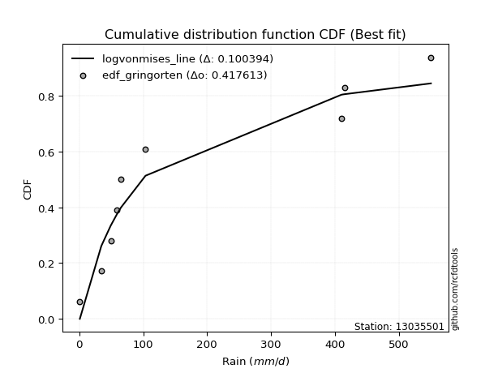</img>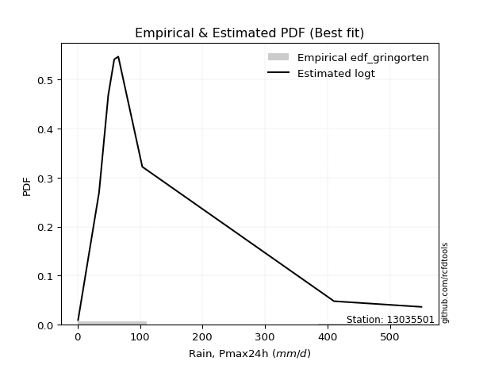</img>

</div>


### 9. Empirical - EDF Filliben (1975)

The specific values of the constants (0.3175) (often denoted as $alpha$) and (0.365) are derived from a method proposed by James J. Filliben in a 1975 paper. This particular formula is the mean value of the $i$-th order statistic of the normal distribution and is considered a robust and effective plotting position formula for the normal probability plot correlation coefficient test for normality.

<div align="center">


$P=(m-0.3175)/(n+0.365)$


</div>


**9.1. Empirical values**

<div align="center">

|                | 0                   | 1                  | 2                   | 3                   | 4            | 5                  | 6                  | 7                  | 8                  |
|:---------------|:--------------------|:-------------------|:--------------------|:--------------------|:-------------|:-------------------|:-------------------|:-------------------|:-------------------|
| date           | 2018                | 2019               | 2015                | 2016                | 2020         | 2017               | 2025               | 2024               | 2023               |
| x              | 0.886               | 34.5               | 49.22               | 58.78               | 65.3         | 103.7              | 237.6              | 410.6              | 550.5              |
| m              | 1                   | 2                  | 3                   | 4                   | 5            | 6                  | 7                  | 8                  | 9                  |
| empirical_dist | edf_filliben        | edf_filliben       | edf_filliben        | edf_filliben        | edf_filliben | edf_filliben       | edf_filliben       | edf_filliben       | edf_filliben       |
| empirical      | 0.07287773625200214 | 0.1796583021890016 | 0.28643886812600106 | 0.39321943406300053 | 0.5          | 0.6067805659369995 | 0.7135611318739989 | 0.8203416978109984 | 0.9271222637479978 |
| empirical_tr   | 1.0786063921681543  | 1.219004230393752  | 1.401421623643846   | 1.6480422349318082  | 2.0          | 2.5431093007467753 | 3.491146318732526  | 5.566121842496286  | 13.721611721611705 |

</div>


**9.2. Kolmogorov-Smirnov fit test (sorted by Δ)**


<div align="center">

|                | 0                   | 1                   | 2                   | 3                   | 4                   | 5                   | 6                   | 7                   | 8                   | 9                   | 10                  | 11                  | 12                  | 13                    | 14                  | 15                  | 16                  | 17                  | 18                  | 19                  | 20                  | 21                  | 22                  | 23                  | 24                  | 25                  | 26                  | 27                  | 28                  | 29                  | 30                  | 31                  | 32                  | 33                  | 34                  | 35                  | 36                  | 37                  | 38                  | 39                  | 40                  | 41                  | 42                  | 43                  | 44                  | 45                  | 46                  | 47                  | 48                  | 49                  | 50                  | 51                  | 52                  | 53                  | 54                  | 55                  | 56                  | 57                  | 58                  | 59                  | 60                  | 61                  | 62                  | 63                  | 64                  | 65                  | 66                  | 67                  | 68                  | 69                  | 70                  | 71                  | 72                  | 73                  | 74                  | 75                  | 76                  | 77                  | 78                  | 79                  | 80                  | 81                  | 82                  | 83                  | 84                  | 85                  | 86                  | 87                  | 88                  | 89                  |
|:---------------|:--------------------|:--------------------|:--------------------|:--------------------|:--------------------|:--------------------|:--------------------|:--------------------|:--------------------|:--------------------|:--------------------|:--------------------|:--------------------|:----------------------|:--------------------|:--------------------|:--------------------|:--------------------|:--------------------|:--------------------|:--------------------|:--------------------|:--------------------|:--------------------|:--------------------|:--------------------|:--------------------|:--------------------|:--------------------|:--------------------|:--------------------|:--------------------|:--------------------|:--------------------|:--------------------|:--------------------|:--------------------|:--------------------|:--------------------|:--------------------|:--------------------|:--------------------|:--------------------|:--------------------|:--------------------|:--------------------|:--------------------|:--------------------|:--------------------|:--------------------|:--------------------|:--------------------|:--------------------|:--------------------|:--------------------|:--------------------|:--------------------|:--------------------|:--------------------|:--------------------|:--------------------|:--------------------|:--------------------|:--------------------|:--------------------|:--------------------|:--------------------|:--------------------|:--------------------|:--------------------|:--------------------|:--------------------|:--------------------|:--------------------|:--------------------|:--------------------|:--------------------|:--------------------|:--------------------|:--------------------|:--------------------|:--------------------|:--------------------|:--------------------|:--------------------|:--------------------|:--------------------|:--------------------|:--------------------|:--------------------|
| station        | 13035501            | 13035501            | 13035501            | 13035501            | 13035501            | 13035501            | 13035501            | 13035501            | 13035501            | 13035501            | 13035501            | 13035501            | 13035501            | 13035501              | 13035501            | 13035501            | 13035501            | 13035501            | 13035501            | 13035501            | 13035501            | 13035501            | 13035501            | 13035501            | 13035501            | 13035501            | 13035501            | 13035501            | 13035501            | 13035501            | 13035501            | 13035501            | 13035501            | 13035501            | 13035501            | 13035501            | 13035501            | 13035501            | 13035501            | 13035501            | 13035501            | 13035501            | 13035501            | 13035501            | 13035501            | 13035501            | 13035501            | 13035501            | 13035501            | 13035501            | 13035501            | 13035501            | 13035501            | 13035501            | 13035501            | 13035501            | 13035501            | 13035501            | 13035501            | 13035501            | 13035501            | 13035501            | 13035501            | 13035501            | 13035501            | 13035501            | 13035501            | 13035501            | 13035501            | 13035501            | 13035501            | 13035501            | 13035501            | 13035501            | 13035501            | 13035501            | 13035501            | 13035501            | 13035501            | 13035501            | 13035501            | 13035501            | 13035501            | 13035501            | 13035501            | 13035501            | 13035501            | 13035501            | 13035501            | 13035501            |
| empirical_dist | edf_filliben        | edf_filliben        | edf_filliben        | edf_filliben        | edf_filliben        | edf_filliben        | edf_filliben        | edf_filliben        | edf_filliben        | edf_filliben        | edf_filliben        | edf_filliben        | edf_filliben        | edf_filliben          | edf_filliben        | edf_filliben        | edf_filliben        | edf_filliben        | edf_filliben        | edf_filliben        | edf_filliben        | edf_filliben        | edf_filliben        | edf_filliben        | edf_filliben        | edf_filliben        | edf_filliben        | edf_filliben        | edf_filliben        | edf_filliben        | edf_filliben        | edf_filliben        | edf_filliben        | edf_filliben        | edf_filliben        | edf_filliben        | edf_filliben        | edf_filliben        | edf_filliben        | edf_filliben        | edf_filliben        | edf_filliben        | edf_filliben        | edf_filliben        | edf_filliben        | edf_filliben        | edf_filliben        | edf_filliben        | edf_filliben        | edf_filliben        | edf_filliben        | edf_filliben        | edf_filliben        | edf_filliben        | edf_filliben        | edf_filliben        | edf_filliben        | edf_filliben        | edf_filliben        | edf_filliben        | edf_filliben        | edf_filliben        | edf_filliben        | edf_filliben        | edf_filliben        | edf_filliben        | edf_filliben        | edf_filliben        | edf_filliben        | edf_filliben        | edf_filliben        | edf_filliben        | edf_filliben        | edf_filliben        | edf_filliben        | edf_filliben        | edf_filliben        | edf_filliben        | edf_filliben        | edf_filliben        | edf_filliben        | edf_filliben        | edf_filliben        | edf_filliben        | edf_filliben        | edf_filliben        | edf_filliben        | edf_filliben        | edf_filliben        | edf_filliben        |
| p_dist         | fisk                | johnsonsu           | fatiguelife         | logweibull_min      | invgauss            | f                   | invgamma            | ncf                 | logt                | loggompertz         | nct                 | logpearson3         | mielke              | loglaplace_asymmetric | loggumbel_l         | loglaplace          | logjohnsonsu        | loghypsecant        | weibull_min         | nakagami            | loglogistic         | halflogistic        | logloggamma         | gamma               | halfnorm            | chi2                | loglognorm          | logfatiguelife      | logrice             | logcrystalball      | lognorm             | lognorm             | logexponnorm        | lognct              | logbetaprime        | lognakagami         | logmielke           | moyal               | exponnorm           | laplace_asymmetric  | expon               | genexpon            | logerlang           | loggamma            | loggamma            | pearson3            | loginvgamma         | gumbel_r            | wald                | t                   | logalpha            | rayleigh            | logmaxwell          | betaprime           | loginvgauss         | genlogistic         | maxwell             | lograyleigh         | loggumbel_r         | kstwobign           | truncnorm           | logmoyal            | norm                | loghalfnorm         | loginvweibull       | loghalflogistic     | logistic            | rice                | hypsecant           | logkstwobign        | logwald             | gompertz            | gibrat              | erlang              | loggibrat           | laplace             | loggenexpon         | gumbel_l            | logexpon            | logncf              | crystalball         | pareto              | invweibull          | logf                | logpareto           | logfisk             | logtruncnorm        | logchi2             | alpha               | loggenlogistic      |
| delta          | 0.08464666098239021 | 0.09163364207490476 | 0.0921969864433691  | 0.0929347179823786  | 0.09545709157676996 | 0.09887985329601146 | 0.09888054895795984 | 0.09888055576345495 | 0.1037776594988834  | 0.10537541891685939 | 0.10574008103600185 | 0.10661171487966317 | 0.10793341013918625 | 0.10955213528101246   | 0.11153658512789719 | 0.11182363357938854 | 0.12336583265343998 | 0.1400474635176798  | 0.1467896152791679  | 0.14756440937820128 | 0.15390723444865148 | 0.15551514412606254 | 0.15584411751464627 | 0.16051728543793622 | 0.1655555835542729  | 0.17065506592444235 | 0.1711869552850324  | 0.17138256636906166 | 0.1716463136769997  | 0.17172960989847139 | 0.17172961333106232 | 0.17172961333106232 | 0.17172986647540248 | 0.172301594212348   | 0.1732370364583126  | 0.1732775108946619  | 0.17713083165016166 | 0.17915401748771997 | 0.179779692429465   | 0.17998529880296776 | 0.17998547957614092 | 0.17998623902476824 | 0.18138560934157835 | 0.18257681189179945 | 0.18257681189179945 | 0.18286133681732936 | 0.18390402790586982 | 0.1935580371544653  | 0.1951931559067493  | 0.19589289640628216 | 0.19758004556621253 | 0.20022244864290684 | 0.20374971820613078 | 0.20682038661605692 | 0.2069019905439892  | 0.20922425342472678 | 0.21240755841130043 | 0.2158295120163076  | 0.22048967962457608 | 0.23505213479109321 | 0.23832963168337706 | 0.23857789042943775 | 0.24500403728685854 | 0.2502185531793212  | 0.25436416876768353 | 0.25853074783981034 | 0.26188808292095145 | 0.2706066846945965  | 0.27518306508281903 | 0.28475532568261863 | 0.29747791283878844 | 0.29760335367738    | 0.30259114086335365 | 0.3026641950766019  | 0.3029394560085332  | 0.3035842092842205  | 0.3061047046091756  | 0.3067659241558561  | 0.38989804127813965 | 0.4207263145318302  | 0.42881645779690813 | 0.4411613724957958  | 0.44861582140499223 | 0.4608728102594346  | 0.4845602620140651  | 0.49029807512527535 | 0.538484532132905   | 0.6038118588459084  | 0.7586652899526213  | 0.8203416978109984  |
| deltao         | 0.41761268023100007 | 0.41761268023100007 | 0.41761268023100007 | 0.41761268023100007 | 0.41761268023100007 | 0.41761268023100007 | 0.41761268023100007 | 0.41761268023100007 | 0.41761268023100007 | 0.41761268023100007 | 0.41761268023100007 | 0.41761268023100007 | 0.41761268023100007 | 0.41761268023100007   | 0.41761268023100007 | 0.41761268023100007 | 0.41761268023100007 | 0.41761268023100007 | 0.41761268023100007 | 0.41761268023100007 | 0.41761268023100007 | 0.41761268023100007 | 0.41761268023100007 | 0.41761268023100007 | 0.41761268023100007 | 0.41761268023100007 | 0.41761268023100007 | 0.41761268023100007 | 0.41761268023100007 | 0.41761268023100007 | 0.41761268023100007 | 0.41761268023100007 | 0.41761268023100007 | 0.41761268023100007 | 0.41761268023100007 | 0.41761268023100007 | 0.41761268023100007 | 0.41761268023100007 | 0.41761268023100007 | 0.41761268023100007 | 0.41761268023100007 | 0.41761268023100007 | 0.41761268023100007 | 0.41761268023100007 | 0.41761268023100007 | 0.41761268023100007 | 0.41761268023100007 | 0.41761268023100007 | 0.41761268023100007 | 0.41761268023100007 | 0.41761268023100007 | 0.41761268023100007 | 0.41761268023100007 | 0.41761268023100007 | 0.41761268023100007 | 0.41761268023100007 | 0.41761268023100007 | 0.41761268023100007 | 0.41761268023100007 | 0.41761268023100007 | 0.41761268023100007 | 0.41761268023100007 | 0.41761268023100007 | 0.41761268023100007 | 0.41761268023100007 | 0.41761268023100007 | 0.41761268023100007 | 0.41761268023100007 | 0.41761268023100007 | 0.41761268023100007 | 0.41761268023100007 | 0.41761268023100007 | 0.41761268023100007 | 0.41761268023100007 | 0.41761268023100007 | 0.41761268023100007 | 0.41761268023100007 | 0.41761268023100007 | 0.41761268023100007 | 0.41761268023100007 | 0.41761268023100007 | 0.41761268023100007 | 0.41761268023100007 | 0.41761268023100007 | 0.41761268023100007 | 0.41761268023100007 | 0.41761268023100007 | 0.41761268023100007 | 0.41761268023100007 | 0.41761268023100007 |
| eval           | Δo > Δ              | Δo > Δ              | Δo > Δ              | Δo > Δ              | Δo > Δ              | Δo > Δ              | Δo > Δ              | Δo > Δ              | Δo > Δ              | Δo > Δ              | Δo > Δ              | Δo > Δ              | Δo > Δ              | Δo > Δ                | Δo > Δ              | Δo > Δ              | Δo > Δ              | Δo > Δ              | Δo > Δ              | Δo > Δ              | Δo > Δ              | Δo > Δ              | Δo > Δ              | Δo > Δ              | Δo > Δ              | Δo > Δ              | Δo > Δ              | Δo > Δ              | Δo > Δ              | Δo > Δ              | Δo > Δ              | Δo > Δ              | Δo > Δ              | Δo > Δ              | Δo > Δ              | Δo > Δ              | Δo > Δ              | Δo > Δ              | Δo > Δ              | Δo > Δ              | Δo > Δ              | Δo > Δ              | Δo > Δ              | Δo > Δ              | Δo > Δ              | Δo > Δ              | Δo > Δ              | Δo > Δ              | Δo > Δ              | Δo > Δ              | Δo > Δ              | Δo > Δ              | Δo > Δ              | Δo > Δ              | Δo > Δ              | Δo > Δ              | Δo > Δ              | Δo > Δ              | Δo > Δ              | Δo > Δ              | Δo > Δ              | Δo > Δ              | Δo > Δ              | Δo > Δ              | Δo > Δ              | Δo > Δ              | Δo > Δ              | Δo > Δ              | Δo > Δ              | Δo > Δ              | Δo > Δ              | Δo > Δ              | Δo > Δ              | Δo > Δ              | Δo > Δ              | Δo > Δ              | Δo > Δ              | Δo > Δ              | Δo > Δ              | Δo <= Δ             | Δo <= Δ             | Δo <= Δ             | Δo <= Δ             | Δo <= Δ             | Δo <= Δ             | Δo <= Δ             | Δo <= Δ             | Δo <= Δ             | Δo <= Δ             | Δo <= Δ             |
| fit            | 1                   | 1                   | 1                   | 1                   | 1                   | 1                   | 1                   | 1                   | 1                   | 1                   | 1                   | 1                   | 1                   | 1                     | 1                   | 1                   | 1                   | 1                   | 1                   | 1                   | 1                   | 1                   | 1                   | 1                   | 1                   | 1                   | 1                   | 1                   | 1                   | 1                   | 1                   | 1                   | 1                   | 1                   | 1                   | 1                   | 1                   | 1                   | 1                   | 1                   | 1                   | 1                   | 1                   | 1                   | 1                   | 1                   | 1                   | 1                   | 1                   | 1                   | 1                   | 1                   | 1                   | 1                   | 1                   | 1                   | 1                   | 1                   | 1                   | 1                   | 1                   | 1                   | 1                   | 1                   | 1                   | 1                   | 1                   | 1                   | 1                   | 1                   | 1                   | 1                   | 1                   | 1                   | 1                   | 1                   | 1                   | 1                   | 1                   | 0                   | 0                   | 0                   | 0                   | 0                   | 0                   | 0                   | 0                   | 0                   | 0                   | 0                   |
| n              | 9                   | 9                   | 9                   | 9                   | 9                   | 9                   | 9                   | 9                   | 9                   | 9                   | 9                   | 9                   | 9                   | 9                     | 9                   | 9                   | 9                   | 9                   | 9                   | 9                   | 9                   | 9                   | 9                   | 9                   | 9                   | 9                   | 9                   | 9                   | 9                   | 9                   | 9                   | 9                   | 9                   | 9                   | 9                   | 9                   | 9                   | 9                   | 9                   | 9                   | 9                   | 9                   | 9                   | 9                   | 9                   | 9                   | 9                   | 9                   | 9                   | 9                   | 9                   | 9                   | 9                   | 9                   | 9                   | 9                   | 9                   | 9                   | 9                   | 9                   | 9                   | 9                   | 9                   | 9                   | 9                   | 9                   | 9                   | 9                   | 9                   | 9                   | 9                   | 9                   | 9                   | 9                   | 9                   | 9                   | 9                   | 9                   | 9                   | 9                   | 9                   | 9                   | 9                   | 9                   | 9                   | 9                   | 9                   | 9                   | 9                   | 9                   |
| best_fit       | 1                   | 0                   | 0                   | 0                   | 0                   | 0                   | 0                   | 0                   | 0                   | 0                   | 0                   | 0                   | 0                   | 0                     | 0                   | 0                   | 0                   | 0                   | 0                   | 0                   | 0                   | 0                   | 0                   | 0                   | 0                   | 0                   | 0                   | 0                   | 0                   | 0                   | 0                   | 0                   | 0                   | 0                   | 0                   | 0                   | 0                   | 0                   | 0                   | 0                   | 0                   | 0                   | 0                   | 0                   | 0                   | 0                   | 0                   | 0                   | 0                   | 0                   | 0                   | 0                   | 0                   | 0                   | 0                   | 0                   | 0                   | 0                   | 0                   | 0                   | 0                   | 0                   | 0                   | 0                   | 0                   | 0                   | 0                   | 0                   | 0                   | 0                   | 0                   | 0                   | 0                   | 0                   | 0                   | 0                   | 0                   | 0                   | 0                   | 0                   | 0                   | 0                   | 0                   | 0                   | 0                   | 0                   | 0                   | 0                   | 0                   | 0                   |
| best_fit_sort  | 1                   | 2                   | 3                   | 4                   | 5                   | 6                   | 7                   | 8                   | 9                   | 10                  | 11                  | 12                  | 13                  | 14                    | 15                  | 16                  | 17                  | 18                  | 19                  | 20                  | 21                  | 22                  | 23                  | 24                  | 25                  | 26                  | 27                  | 28                  | 29                  | 30                  | 31                  | 32                  | 33                  | 34                  | 35                  | 36                  | 37                  | 38                  | 39                  | 40                  | 41                  | 42                  | 43                  | 44                  | 45                  | 46                  | 47                  | 48                  | 49                  | 50                  | 51                  | 52                  | 53                  | 54                  | 55                  | 56                  | 57                  | 58                  | 59                  | 60                  | 61                  | 62                  | 63                  | 64                  | 65                  | 66                  | 67                  | 68                  | 69                  | 70                  | 71                  | 72                  | 73                  | 74                  | 75                  | 76                  | 77                  | 78                  | 79                  | 80                  | 81                  | 82                  | 83                  | 84                  | 85                  | 86                  | 87                  | 88                  | 89                  | 90                  |

</div>


<div align="center">

</img>

</div>


**9.3. Best fit**

<div align="center">

|   id |   station | empirical_dist   | p_dist   |     delta |   deltao | eval   |   fit |   n |   best_fit |   best_fit_sort |
|-----:|----------:|:-----------------|:---------|----------:|---------:|:-------|------:|----:|-----------:|----------------:|
|    0 |  13035501 | edf_filliben     | fisk     | 0.0846467 | 0.417613 | Δo > Δ |     1 |   9 |          1 |               1 |

</div>


<div align="center">

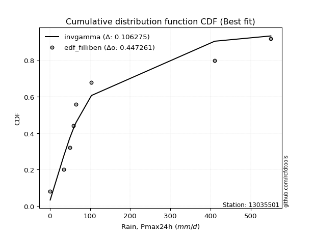</img>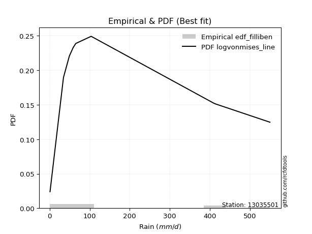</img>

</div>


### 10. Empirical - EDF Jenkinson (1977)

The Jenkinson formula in hydrology is an empirical plotting position formula used to estimate the non-exceedance probability _(P)_ or return period _(T)_ of a given ordered observation within a sample. It is a widely used method in the frequency analysis of extreme events such as floods and rainfall, as it provides a distribution-free way to plot data. _a≈0.31_ and _b≈0.38_ are constants derived to approximate the median of the probability distribution for the given rank.

<div align="center">


$P=(m-a)/(n+b)$


</div>


**10.1. Empirical values**

<div align="center">

|                | 0                   | 1                   | 2                  | 3                   | 4             | 5                  | 6                  | 7                  | 8                  |
|:---------------|:--------------------|:--------------------|:-------------------|:--------------------|:--------------|:-------------------|:-------------------|:-------------------|:-------------------|
| date           | 2018                | 2019                | 2015               | 2016                | 2020          | 2017               | 2025               | 2024               | 2023               |
| x              | 0.886               | 34.5                | 49.22              | 58.78               | 65.3          | 103.7              | 237.6              | 410.6              | 550.5              |
| m              | 1                   | 2                   | 3                  | 4                   | 5             | 6                  | 7                  | 8                  | 9                  |
| empirical_dist | edf_jenkinson       | edf_jenkinson       | edf_jenkinson      | edf_jenkinson       | edf_jenkinson | edf_jenkinson      | edf_jenkinson      | edf_jenkinson      | edf_jenkinson      |
| empirical      | 0.07356076759061833 | 0.18017057569296374 | 0.2867803837953091 | 0.39339019189765456 | 0.5           | 0.6066098081023454 | 0.7132196162046908 | 0.8198294243070362 | 0.9264392324093815 |
| empirical_tr   | 1.0794016110471807  | 1.2197659297789336  | 1.4020926756352765 | 1.6485061511423549  | 2.0           | 2.542005420054201  | 3.486988847583642  | 5.550295857988164  | 13.5942028985507   |

</div>


**10.2. Kolmogorov-Smirnov fit test (sorted by Δ)**


<div align="center">

|                | 0                   | 1                   | 2                   | 3                   | 4                   | 5                   | 6                   | 7                   | 8                   | 9                   | 10                  | 11                  | 12                  | 13                    | 14                  | 15                  | 16                  | 17                  | 18                  | 19                  | 20                  | 21                  | 22                  | 23                  | 24                  | 25                  | 26                  | 27                  | 28                  | 29                  | 30                  | 31                  | 32                  | 33                  | 34                  | 35                  | 36                  | 37                  | 38                  | 39                  | 40                  | 41                  | 42                  | 43                  | 44                  | 45                  | 46                  | 47                  | 48                  | 49                  | 50                  | 51                  | 52                  | 53                  | 54                  | 55                  | 56                  | 57                  | 58                  | 59                  | 60                  | 61                  | 62                  | 63                  | 64                  | 65                  | 66                  | 67                  | 68                  | 69                  | 70                  | 71                  | 72                  | 73                  | 74                  | 75                  | 76                  | 77                  | 78                  | 79                  | 80                  | 81                  | 82                  | 83                  | 84                  | 85                  | 86                  | 87                  | 88                  | 89                  |
|:---------------|:--------------------|:--------------------|:--------------------|:--------------------|:--------------------|:--------------------|:--------------------|:--------------------|:--------------------|:--------------------|:--------------------|:--------------------|:--------------------|:----------------------|:--------------------|:--------------------|:--------------------|:--------------------|:--------------------|:--------------------|:--------------------|:--------------------|:--------------------|:--------------------|:--------------------|:--------------------|:--------------------|:--------------------|:--------------------|:--------------------|:--------------------|:--------------------|:--------------------|:--------------------|:--------------------|:--------------------|:--------------------|:--------------------|:--------------------|:--------------------|:--------------------|:--------------------|:--------------------|:--------------------|:--------------------|:--------------------|:--------------------|:--------------------|:--------------------|:--------------------|:--------------------|:--------------------|:--------------------|:--------------------|:--------------------|:--------------------|:--------------------|:--------------------|:--------------------|:--------------------|:--------------------|:--------------------|:--------------------|:--------------------|:--------------------|:--------------------|:--------------------|:--------------------|:--------------------|:--------------------|:--------------------|:--------------------|:--------------------|:--------------------|:--------------------|:--------------------|:--------------------|:--------------------|:--------------------|:--------------------|:--------------------|:--------------------|:--------------------|:--------------------|:--------------------|:--------------------|:--------------------|:--------------------|:--------------------|:--------------------|
| station        | 13035501            | 13035501            | 13035501            | 13035501            | 13035501            | 13035501            | 13035501            | 13035501            | 13035501            | 13035501            | 13035501            | 13035501            | 13035501            | 13035501              | 13035501            | 13035501            | 13035501            | 13035501            | 13035501            | 13035501            | 13035501            | 13035501            | 13035501            | 13035501            | 13035501            | 13035501            | 13035501            | 13035501            | 13035501            | 13035501            | 13035501            | 13035501            | 13035501            | 13035501            | 13035501            | 13035501            | 13035501            | 13035501            | 13035501            | 13035501            | 13035501            | 13035501            | 13035501            | 13035501            | 13035501            | 13035501            | 13035501            | 13035501            | 13035501            | 13035501            | 13035501            | 13035501            | 13035501            | 13035501            | 13035501            | 13035501            | 13035501            | 13035501            | 13035501            | 13035501            | 13035501            | 13035501            | 13035501            | 13035501            | 13035501            | 13035501            | 13035501            | 13035501            | 13035501            | 13035501            | 13035501            | 13035501            | 13035501            | 13035501            | 13035501            | 13035501            | 13035501            | 13035501            | 13035501            | 13035501            | 13035501            | 13035501            | 13035501            | 13035501            | 13035501            | 13035501            | 13035501            | 13035501            | 13035501            | 13035501            |
| empirical_dist | edf_jenkinson       | edf_jenkinson       | edf_jenkinson       | edf_jenkinson       | edf_jenkinson       | edf_jenkinson       | edf_jenkinson       | edf_jenkinson       | edf_jenkinson       | edf_jenkinson       | edf_jenkinson       | edf_jenkinson       | edf_jenkinson       | edf_jenkinson         | edf_jenkinson       | edf_jenkinson       | edf_jenkinson       | edf_jenkinson       | edf_jenkinson       | edf_jenkinson       | edf_jenkinson       | edf_jenkinson       | edf_jenkinson       | edf_jenkinson       | edf_jenkinson       | edf_jenkinson       | edf_jenkinson       | edf_jenkinson       | edf_jenkinson       | edf_jenkinson       | edf_jenkinson       | edf_jenkinson       | edf_jenkinson       | edf_jenkinson       | edf_jenkinson       | edf_jenkinson       | edf_jenkinson       | edf_jenkinson       | edf_jenkinson       | edf_jenkinson       | edf_jenkinson       | edf_jenkinson       | edf_jenkinson       | edf_jenkinson       | edf_jenkinson       | edf_jenkinson       | edf_jenkinson       | edf_jenkinson       | edf_jenkinson       | edf_jenkinson       | edf_jenkinson       | edf_jenkinson       | edf_jenkinson       | edf_jenkinson       | edf_jenkinson       | edf_jenkinson       | edf_jenkinson       | edf_jenkinson       | edf_jenkinson       | edf_jenkinson       | edf_jenkinson       | edf_jenkinson       | edf_jenkinson       | edf_jenkinson       | edf_jenkinson       | edf_jenkinson       | edf_jenkinson       | edf_jenkinson       | edf_jenkinson       | edf_jenkinson       | edf_jenkinson       | edf_jenkinson       | edf_jenkinson       | edf_jenkinson       | edf_jenkinson       | edf_jenkinson       | edf_jenkinson       | edf_jenkinson       | edf_jenkinson       | edf_jenkinson       | edf_jenkinson       | edf_jenkinson       | edf_jenkinson       | edf_jenkinson       | edf_jenkinson       | edf_jenkinson       | edf_jenkinson       | edf_jenkinson       | edf_jenkinson       | edf_jenkinson       |
| p_dist         | fisk                | johnsonsu           | fatiguelife         | logweibull_min      | invgauss            | f                   | invgamma            | ncf                 | logt                | loggompertz         | nct                 | logpearson3         | mielke              | loglaplace_asymmetric | loggumbel_l         | loglaplace          | logjohnsonsu        | loghypsecant        | weibull_min         | nakagami            | loglogistic         | halflogistic        | logloggamma         | gamma               | halfnorm            | loglognorm          | logfatiguelife      | chi2                | logrice             | logcrystalball      | lognorm             | lognorm             | logexponnorm        | lognct              | logbetaprime        | lognakagami         | logmielke           | moyal               | exponnorm           | laplace_asymmetric  | expon               | genexpon            | logerlang           | loggamma            | loggamma            | pearson3            | loginvgamma         | gumbel_r            | wald                | t                   | logalpha            | rayleigh            | logmaxwell          | betaprime           | loginvgauss         | genlogistic         | maxwell             | lograyleigh         | loggumbel_r         | kstwobign           | logmoyal            | truncnorm           | norm                | loghalfnorm         | loginvweibull       | loghalflogistic     | logistic            | rice                | hypsecant           | logkstwobign        | logwald             | gompertz            | erlang              | gibrat              | loggibrat           | laplace             | loggenexpon         | gumbel_l            | logexpon            | logncf              | crystalball         | pareto              | invweibull          | logf                | logpareto           | logfisk             | logtruncnorm        | logchi2             | alpha               | loggenlogistic      |
| delta          | 0.08464666098239021 | 0.09163364207490476 | 0.0921969864433691  | 0.09242244447841647 | 0.09545709157676996 | 0.09887985329601146 | 0.09888054895795984 | 0.09888055576345495 | 0.1037776594988834  | 0.10486314541289726 | 0.10608159670531003 | 0.10609944137570104 | 0.10742113663522412 | 0.10903986177705033   | 0.11102431162393506 | 0.11131136007542641 | 0.12336583265343998 | 0.13953519001371767 | 0.1467896152791679  | 0.14705213587423915 | 0.15339496094468935 | 0.1553443862914085  | 0.15567335967999224 | 0.1600050119339741  | 0.16538482571961888 | 0.17067468178107026 | 0.17087029286509953 | 0.17099658159375053 | 0.17113404017303757 | 0.17121733639450926 | 0.1712173398271002  | 0.1712173398271002  | 0.17121759297144035 | 0.17178932070838587 | 0.17272476295435046 | 0.17276523739069977 | 0.17661855814619953 | 0.17915401748771997 | 0.179779692429465   | 0.17998529880296776 | 0.17998547957614092 | 0.17998623902476824 | 0.18087333583761622 | 0.18206453838783732 | 0.18206453838783732 | 0.18269057898267532 | 0.1833917544019077  | 0.19338727931981126 | 0.1951931559067493  | 0.19623441207559034 | 0.1970677720622504  | 0.2000516908082528  | 0.20323744470216865 | 0.2063081131120948  | 0.20638971704002707 | 0.20922425342472678 | 0.2122368005766464  | 0.21531723851234547 | 0.21997740612061395 | 0.23505213479109321 | 0.23806561692547562 | 0.23832963168337706 | 0.2448332794522045  | 0.24970627967535902 | 0.2538518952637214  | 0.2580184743358482  | 0.2617173250862974  | 0.27043592685994244 | 0.275012307248165   | 0.2842430521786565  | 0.29713639716948037 | 0.29760335367738    | 0.30215192157263976 | 0.30259114086335365 | 0.30259794033922516 | 0.30341345144956644 | 0.30559243110521345 | 0.30659516632120204 | 0.3893857677741775  | 0.420214041027868   | 0.4281334264582919  | 0.44064909899183363 | 0.447932790066376   | 0.46036053675547245 | 0.48404798851010294 | 0.4897858016213132  | 0.5379722586289428  | 0.6032995853419463  | 0.7581530164486592  | 0.8198294243070362  |
| deltao         | 0.41761268023100007 | 0.41761268023100007 | 0.41761268023100007 | 0.41761268023100007 | 0.41761268023100007 | 0.41761268023100007 | 0.41761268023100007 | 0.41761268023100007 | 0.41761268023100007 | 0.41761268023100007 | 0.41761268023100007 | 0.41761268023100007 | 0.41761268023100007 | 0.41761268023100007   | 0.41761268023100007 | 0.41761268023100007 | 0.41761268023100007 | 0.41761268023100007 | 0.41761268023100007 | 0.41761268023100007 | 0.41761268023100007 | 0.41761268023100007 | 0.41761268023100007 | 0.41761268023100007 | 0.41761268023100007 | 0.41761268023100007 | 0.41761268023100007 | 0.41761268023100007 | 0.41761268023100007 | 0.41761268023100007 | 0.41761268023100007 | 0.41761268023100007 | 0.41761268023100007 | 0.41761268023100007 | 0.41761268023100007 | 0.41761268023100007 | 0.41761268023100007 | 0.41761268023100007 | 0.41761268023100007 | 0.41761268023100007 | 0.41761268023100007 | 0.41761268023100007 | 0.41761268023100007 | 0.41761268023100007 | 0.41761268023100007 | 0.41761268023100007 | 0.41761268023100007 | 0.41761268023100007 | 0.41761268023100007 | 0.41761268023100007 | 0.41761268023100007 | 0.41761268023100007 | 0.41761268023100007 | 0.41761268023100007 | 0.41761268023100007 | 0.41761268023100007 | 0.41761268023100007 | 0.41761268023100007 | 0.41761268023100007 | 0.41761268023100007 | 0.41761268023100007 | 0.41761268023100007 | 0.41761268023100007 | 0.41761268023100007 | 0.41761268023100007 | 0.41761268023100007 | 0.41761268023100007 | 0.41761268023100007 | 0.41761268023100007 | 0.41761268023100007 | 0.41761268023100007 | 0.41761268023100007 | 0.41761268023100007 | 0.41761268023100007 | 0.41761268023100007 | 0.41761268023100007 | 0.41761268023100007 | 0.41761268023100007 | 0.41761268023100007 | 0.41761268023100007 | 0.41761268023100007 | 0.41761268023100007 | 0.41761268023100007 | 0.41761268023100007 | 0.41761268023100007 | 0.41761268023100007 | 0.41761268023100007 | 0.41761268023100007 | 0.41761268023100007 | 0.41761268023100007 |
| eval           | Δo > Δ              | Δo > Δ              | Δo > Δ              | Δo > Δ              | Δo > Δ              | Δo > Δ              | Δo > Δ              | Δo > Δ              | Δo > Δ              | Δo > Δ              | Δo > Δ              | Δo > Δ              | Δo > Δ              | Δo > Δ                | Δo > Δ              | Δo > Δ              | Δo > Δ              | Δo > Δ              | Δo > Δ              | Δo > Δ              | Δo > Δ              | Δo > Δ              | Δo > Δ              | Δo > Δ              | Δo > Δ              | Δo > Δ              | Δo > Δ              | Δo > Δ              | Δo > Δ              | Δo > Δ              | Δo > Δ              | Δo > Δ              | Δo > Δ              | Δo > Δ              | Δo > Δ              | Δo > Δ              | Δo > Δ              | Δo > Δ              | Δo > Δ              | Δo > Δ              | Δo > Δ              | Δo > Δ              | Δo > Δ              | Δo > Δ              | Δo > Δ              | Δo > Δ              | Δo > Δ              | Δo > Δ              | Δo > Δ              | Δo > Δ              | Δo > Δ              | Δo > Δ              | Δo > Δ              | Δo > Δ              | Δo > Δ              | Δo > Δ              | Δo > Δ              | Δo > Δ              | Δo > Δ              | Δo > Δ              | Δo > Δ              | Δo > Δ              | Δo > Δ              | Δo > Δ              | Δo > Δ              | Δo > Δ              | Δo > Δ              | Δo > Δ              | Δo > Δ              | Δo > Δ              | Δo > Δ              | Δo > Δ              | Δo > Δ              | Δo > Δ              | Δo > Δ              | Δo > Δ              | Δo > Δ              | Δo > Δ              | Δo > Δ              | Δo <= Δ             | Δo <= Δ             | Δo <= Δ             | Δo <= Δ             | Δo <= Δ             | Δo <= Δ             | Δo <= Δ             | Δo <= Δ             | Δo <= Δ             | Δo <= Δ             | Δo <= Δ             |
| fit            | 1                   | 1                   | 1                   | 1                   | 1                   | 1                   | 1                   | 1                   | 1                   | 1                   | 1                   | 1                   | 1                   | 1                     | 1                   | 1                   | 1                   | 1                   | 1                   | 1                   | 1                   | 1                   | 1                   | 1                   | 1                   | 1                   | 1                   | 1                   | 1                   | 1                   | 1                   | 1                   | 1                   | 1                   | 1                   | 1                   | 1                   | 1                   | 1                   | 1                   | 1                   | 1                   | 1                   | 1                   | 1                   | 1                   | 1                   | 1                   | 1                   | 1                   | 1                   | 1                   | 1                   | 1                   | 1                   | 1                   | 1                   | 1                   | 1                   | 1                   | 1                   | 1                   | 1                   | 1                   | 1                   | 1                   | 1                   | 1                   | 1                   | 1                   | 1                   | 1                   | 1                   | 1                   | 1                   | 1                   | 1                   | 1                   | 1                   | 0                   | 0                   | 0                   | 0                   | 0                   | 0                   | 0                   | 0                   | 0                   | 0                   | 0                   |
| n              | 9                   | 9                   | 9                   | 9                   | 9                   | 9                   | 9                   | 9                   | 9                   | 9                   | 9                   | 9                   | 9                   | 9                     | 9                   | 9                   | 9                   | 9                   | 9                   | 9                   | 9                   | 9                   | 9                   | 9                   | 9                   | 9                   | 9                   | 9                   | 9                   | 9                   | 9                   | 9                   | 9                   | 9                   | 9                   | 9                   | 9                   | 9                   | 9                   | 9                   | 9                   | 9                   | 9                   | 9                   | 9                   | 9                   | 9                   | 9                   | 9                   | 9                   | 9                   | 9                   | 9                   | 9                   | 9                   | 9                   | 9                   | 9                   | 9                   | 9                   | 9                   | 9                   | 9                   | 9                   | 9                   | 9                   | 9                   | 9                   | 9                   | 9                   | 9                   | 9                   | 9                   | 9                   | 9                   | 9                   | 9                   | 9                   | 9                   | 9                   | 9                   | 9                   | 9                   | 9                   | 9                   | 9                   | 9                   | 9                   | 9                   | 9                   |
| best_fit       | 1                   | 0                   | 0                   | 0                   | 0                   | 0                   | 0                   | 0                   | 0                   | 0                   | 0                   | 0                   | 0                   | 0                     | 0                   | 0                   | 0                   | 0                   | 0                   | 0                   | 0                   | 0                   | 0                   | 0                   | 0                   | 0                   | 0                   | 0                   | 0                   | 0                   | 0                   | 0                   | 0                   | 0                   | 0                   | 0                   | 0                   | 0                   | 0                   | 0                   | 0                   | 0                   | 0                   | 0                   | 0                   | 0                   | 0                   | 0                   | 0                   | 0                   | 0                   | 0                   | 0                   | 0                   | 0                   | 0                   | 0                   | 0                   | 0                   | 0                   | 0                   | 0                   | 0                   | 0                   | 0                   | 0                   | 0                   | 0                   | 0                   | 0                   | 0                   | 0                   | 0                   | 0                   | 0                   | 0                   | 0                   | 0                   | 0                   | 0                   | 0                   | 0                   | 0                   | 0                   | 0                   | 0                   | 0                   | 0                   | 0                   | 0                   |
| best_fit_sort  | 1                   | 2                   | 3                   | 4                   | 5                   | 6                   | 7                   | 8                   | 9                   | 10                  | 11                  | 12                  | 13                  | 14                    | 15                  | 16                  | 17                  | 18                  | 19                  | 20                  | 21                  | 22                  | 23                  | 24                  | 25                  | 26                  | 27                  | 28                  | 29                  | 30                  | 31                  | 32                  | 33                  | 34                  | 35                  | 36                  | 37                  | 38                  | 39                  | 40                  | 41                  | 42                  | 43                  | 44                  | 45                  | 46                  | 47                  | 48                  | 49                  | 50                  | 51                  | 52                  | 53                  | 54                  | 55                  | 56                  | 57                  | 58                  | 59                  | 60                  | 61                  | 62                  | 63                  | 64                  | 65                  | 66                  | 67                  | 68                  | 69                  | 70                  | 71                  | 72                  | 73                  | 74                  | 75                  | 76                  | 77                  | 78                  | 79                  | 80                  | 81                  | 82                  | 83                  | 84                  | 85                  | 86                  | 87                  | 88                  | 89                  | 90                  |

</div>


<div align="center">

</img>

</div>


**10.3. Best fit**

<div align="center">

|   id |   station | empirical_dist   | p_dist   |     delta |   deltao | eval   |   fit |   n |   best_fit |   best_fit_sort |
|-----:|----------:|:-----------------|:---------|----------:|---------:|:-------|------:|----:|-----------:|----------------:|
|    0 |  13035501 | edf_jenkinson    | fisk     | 0.0846467 | 0.417613 | Δo > Δ |     1 |   9 |          1 |               1 |

</div>


<div align="center">

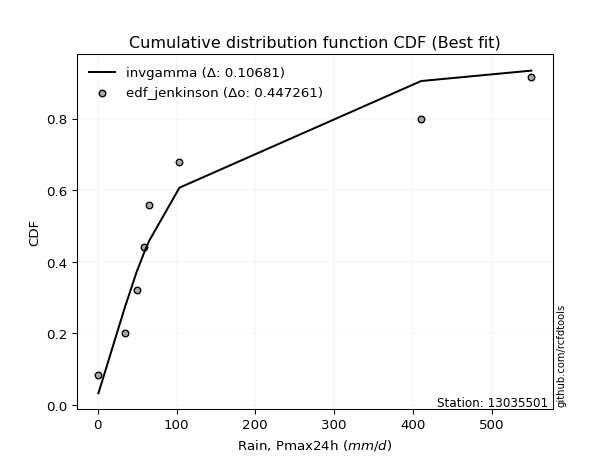</img></img>

</div>


### 11. Empirical - EDF Cunnane (1978)

Cunnane´s work in statistical hydrology has focused on the performance and evaluation of different probability distributions (such as GEV, Gumbel, Lognormal) for flood frequency estimation. _b_ is a constant, typically set to 0.4.

<div align="center">


$P=(m-b)/(n+1-2b)$


</div>


**11.1. Empirical values**

<div align="center">

|                | 0                   | 1                  | 2                   | 3                  | 4           | 5                  | 6                 | 7                  | 8                  |
|:---------------|:--------------------|:-------------------|:--------------------|:-------------------|:------------|:-------------------|:------------------|:-------------------|:-------------------|
| date           | 2018                | 2019               | 2015                | 2016               | 2020        | 2017               | 2025              | 2024               | 2023               |
| x              | 0.886               | 34.5               | 49.22               | 58.78              | 65.3        | 103.7              | 237.6             | 410.6              | 550.5              |
| m              | 1                   | 2                  | 3                   | 4                  | 5           | 6                  | 7                 | 8                  | 9                  |
| empirical_dist | edf_cunnane         | edf_cunnane        | edf_cunnane         | edf_cunnane        | edf_cunnane | edf_cunnane        | edf_cunnane       | edf_cunnane        | edf_cunnane        |
| empirical      | 0.06521739130434782 | 0.1739130434782609 | 0.28260869565217395 | 0.391304347826087  | 0.5         | 0.6086956521739131 | 0.717391304347826 | 0.8260869565217391 | 0.9347826086956522 |
| empirical_tr   | 1.069767441860465   | 1.2105263157894737 | 1.393939393939394   | 1.6428571428571428 | 2.0         | 2.555555555555556  | 3.538461538461538 | 5.75               | 15.333333333333343 |

</div>


**11.2. Kolmogorov-Smirnov fit test (sorted by Δ)**


<div align="center">

|                | 0                   | 1                   | 2                   | 3                   | 4                   | 5                   | 6                   | 7                   | 8                   | 9                   | 10                  | 11                  | 12                  | 13                    | 14                  | 15                  | 16                  | 17                  | 18                  | 19                  | 20                  | 21                  | 22                  | 23                  | 24                  | 25                  | 26                  | 27                  | 28                  | 29                  | 30                  | 31                  | 32                  | 33                  | 34                  | 35                  | 36                  | 37                  | 38                  | 39                  | 40                  | 41                  | 42                  | 43                  | 44                  | 45                  | 46                  | 47                  | 48                  | 49                  | 50                  | 51                  | 52                  | 53                  | 54                  | 55                  | 56                  | 57                  | 58                  | 59                  | 60                  | 61                  | 62                  | 63                  | 64                  | 65                  | 66                  | 67                  | 68                  | 69                  | 70                  | 71                  | 72                  | 73                  | 74                  | 75                  | 76                  | 77                  | 78                  | 79                  | 80                  | 81                  | 82                  | 83                  | 84                  | 85                  | 86                  | 87                  | 88                  | 89                  |
|:---------------|:--------------------|:--------------------|:--------------------|:--------------------|:--------------------|:--------------------|:--------------------|:--------------------|:--------------------|:--------------------|:--------------------|:--------------------|:--------------------|:----------------------|:--------------------|:--------------------|:--------------------|:--------------------|:--------------------|:--------------------|:--------------------|:--------------------|:--------------------|:--------------------|:--------------------|:--------------------|:--------------------|:--------------------|:--------------------|:--------------------|:--------------------|:--------------------|:--------------------|:--------------------|:--------------------|:--------------------|:--------------------|:--------------------|:--------------------|:--------------------|:--------------------|:--------------------|:--------------------|:--------------------|:--------------------|:--------------------|:--------------------|:--------------------|:--------------------|:--------------------|:--------------------|:--------------------|:--------------------|:--------------------|:--------------------|:--------------------|:--------------------|:--------------------|:--------------------|:--------------------|:--------------------|:--------------------|:--------------------|:--------------------|:--------------------|:--------------------|:--------------------|:--------------------|:--------------------|:--------------------|:--------------------|:--------------------|:--------------------|:--------------------|:--------------------|:--------------------|:--------------------|:--------------------|:--------------------|:--------------------|:--------------------|:--------------------|:--------------------|:--------------------|:--------------------|:--------------------|:--------------------|:--------------------|:--------------------|:--------------------|
| station        | 13035501            | 13035501            | 13035501            | 13035501            | 13035501            | 13035501            | 13035501            | 13035501            | 13035501            | 13035501            | 13035501            | 13035501            | 13035501            | 13035501              | 13035501            | 13035501            | 13035501            | 13035501            | 13035501            | 13035501            | 13035501            | 13035501            | 13035501            | 13035501            | 13035501            | 13035501            | 13035501            | 13035501            | 13035501            | 13035501            | 13035501            | 13035501            | 13035501            | 13035501            | 13035501            | 13035501            | 13035501            | 13035501            | 13035501            | 13035501            | 13035501            | 13035501            | 13035501            | 13035501            | 13035501            | 13035501            | 13035501            | 13035501            | 13035501            | 13035501            | 13035501            | 13035501            | 13035501            | 13035501            | 13035501            | 13035501            | 13035501            | 13035501            | 13035501            | 13035501            | 13035501            | 13035501            | 13035501            | 13035501            | 13035501            | 13035501            | 13035501            | 13035501            | 13035501            | 13035501            | 13035501            | 13035501            | 13035501            | 13035501            | 13035501            | 13035501            | 13035501            | 13035501            | 13035501            | 13035501            | 13035501            | 13035501            | 13035501            | 13035501            | 13035501            | 13035501            | 13035501            | 13035501            | 13035501            | 13035501            |
| empirical_dist | edf_cunnane         | edf_cunnane         | edf_cunnane         | edf_cunnane         | edf_cunnane         | edf_cunnane         | edf_cunnane         | edf_cunnane         | edf_cunnane         | edf_cunnane         | edf_cunnane         | edf_cunnane         | edf_cunnane         | edf_cunnane           | edf_cunnane         | edf_cunnane         | edf_cunnane         | edf_cunnane         | edf_cunnane         | edf_cunnane         | edf_cunnane         | edf_cunnane         | edf_cunnane         | edf_cunnane         | edf_cunnane         | edf_cunnane         | edf_cunnane         | edf_cunnane         | edf_cunnane         | edf_cunnane         | edf_cunnane         | edf_cunnane         | edf_cunnane         | edf_cunnane         | edf_cunnane         | edf_cunnane         | edf_cunnane         | edf_cunnane         | edf_cunnane         | edf_cunnane         | edf_cunnane         | edf_cunnane         | edf_cunnane         | edf_cunnane         | edf_cunnane         | edf_cunnane         | edf_cunnane         | edf_cunnane         | edf_cunnane         | edf_cunnane         | edf_cunnane         | edf_cunnane         | edf_cunnane         | edf_cunnane         | edf_cunnane         | edf_cunnane         | edf_cunnane         | edf_cunnane         | edf_cunnane         | edf_cunnane         | edf_cunnane         | edf_cunnane         | edf_cunnane         | edf_cunnane         | edf_cunnane         | edf_cunnane         | edf_cunnane         | edf_cunnane         | edf_cunnane         | edf_cunnane         | edf_cunnane         | edf_cunnane         | edf_cunnane         | edf_cunnane         | edf_cunnane         | edf_cunnane         | edf_cunnane         | edf_cunnane         | edf_cunnane         | edf_cunnane         | edf_cunnane         | edf_cunnane         | edf_cunnane         | edf_cunnane         | edf_cunnane         | edf_cunnane         | edf_cunnane         | edf_cunnane         | edf_cunnane         | edf_cunnane         |
| p_dist         | fisk                | johnsonsu           | fatiguelife         | invgauss            | logweibull_min      | f                   | invgamma            | ncf                 | nct                 | logt                | loggompertz         | logpearson3         | mielke              | loglaplace_asymmetric | loggumbel_l         | loglaplace          | logjohnsonsu        | loghypsecant        | weibull_min         | nakagami            | halflogistic        | logloggamma         | loglogistic         | gamma               | chi2                | halfnorm            | loglognorm          | logfatiguelife      | logrice             | logcrystalball      | lognorm             | lognorm             | logexponnorm        | lognct              | logbetaprime        | lognakagami         | moyal               | exponnorm           | laplace_asymmetric  | expon               | genexpon            | logmielke           | pearson3            | logerlang           | loggamma            | loggamma            | loginvgamma         | t                   | wald                | gumbel_r            | rayleigh            | logalpha            | genlogistic         | logmaxwell          | betaprime           | loginvgauss         | maxwell             | lograyleigh         | loggumbel_r         | kstwobign           | truncnorm           | logmoyal            | norm                | loghalfnorm         | loginvweibull       | logistic            | loghalflogistic     | rice                | hypsecant           | logkstwobign        | gompertz            | logwald             | gibrat              | laplace             | loggibrat           | erlang              | gumbel_l            | loggenexpon         | logexpon            | logncf              | crystalball         | pareto              | invweibull          | logf                | logpareto           | logfisk             | logtruncnorm        | logchi2             | alpha               | loggenlogistic      |
| delta          | 0.08464666098239021 | 0.09163364207490476 | 0.0921969864433691  | 0.09545709157676996 | 0.09867997669311931 | 0.09887985329601146 | 0.09888054895795984 | 0.09888055576345495 | 0.10190990856217474 | 0.1037776594988834  | 0.11112067762760011 | 0.11235697359040389 | 0.11367866884992697 | 0.11529739399175318   | 0.1172818438386379  | 0.11756889229012926 | 0.12387475681843707 | 0.14579272222842052 | 0.1467896152791679  | 0.153309668088942   | 0.15743023036297615 | 0.15775920375155988 | 0.1596524931593922  | 0.16626254414867694 | 0.16682489345061524 | 0.16747066979118652 | 0.1769322139957731  | 0.17712782507980238 | 0.17739157238774042 | 0.1774748686092121  | 0.17747487204180304 | 0.17747487204180304 | 0.1774751251861432  | 0.17804685292308872 | 0.1789822951690533  | 0.17902276960540262 | 0.17915401748771997 | 0.179779692429465   | 0.17998529880296776 | 0.17998547957614092 | 0.17998623902476824 | 0.18287609036090238 | 0.18477642305424297 | 0.18713086805231907 | 0.18832207060254016 | 0.18832207060254016 | 0.18964928661661054 | 0.19206272393245505 | 0.1951931559067493  | 0.1954731233913789  | 0.20213753487982045 | 0.20332530427695325 | 0.20922425342472678 | 0.2094949769168715  | 0.21256564532679764 | 0.21264724925472991 | 0.21432264464821404 | 0.22157477072704831 | 0.2262349383353168  | 0.23505213479109321 | 0.23832963168337706 | 0.24432314914017847 | 0.24691912352377215 | 0.2559638118900619  | 0.26010942747842425 | 0.26380316915786506 | 0.26427600655055106 | 0.2725217709315101  | 0.27709815131973264 | 0.29050058439335935 | 0.29760335367738    | 0.30130808531261555 | 0.30259114086335365 | 0.3054992955211341  | 0.30676962848236033 | 0.30840945378734264 | 0.3086810103927697  | 0.3118499633199163  | 0.39564329998888037 | 0.4264715732425709  | 0.4364768027445624  | 0.4469066312065365  | 0.4562761663526467  | 0.4666180689701753  | 0.4903055207248058  | 0.49604333383601606 | 0.5442297908436458  | 0.6095571175566491  | 0.764410548663362   | 0.8260869565217391  |
| deltao         | 0.41761268023100007 | 0.41761268023100007 | 0.41761268023100007 | 0.41761268023100007 | 0.41761268023100007 | 0.41761268023100007 | 0.41761268023100007 | 0.41761268023100007 | 0.41761268023100007 | 0.41761268023100007 | 0.41761268023100007 | 0.41761268023100007 | 0.41761268023100007 | 0.41761268023100007   | 0.41761268023100007 | 0.41761268023100007 | 0.41761268023100007 | 0.41761268023100007 | 0.41761268023100007 | 0.41761268023100007 | 0.41761268023100007 | 0.41761268023100007 | 0.41761268023100007 | 0.41761268023100007 | 0.41761268023100007 | 0.41761268023100007 | 0.41761268023100007 | 0.41761268023100007 | 0.41761268023100007 | 0.41761268023100007 | 0.41761268023100007 | 0.41761268023100007 | 0.41761268023100007 | 0.41761268023100007 | 0.41761268023100007 | 0.41761268023100007 | 0.41761268023100007 | 0.41761268023100007 | 0.41761268023100007 | 0.41761268023100007 | 0.41761268023100007 | 0.41761268023100007 | 0.41761268023100007 | 0.41761268023100007 | 0.41761268023100007 | 0.41761268023100007 | 0.41761268023100007 | 0.41761268023100007 | 0.41761268023100007 | 0.41761268023100007 | 0.41761268023100007 | 0.41761268023100007 | 0.41761268023100007 | 0.41761268023100007 | 0.41761268023100007 | 0.41761268023100007 | 0.41761268023100007 | 0.41761268023100007 | 0.41761268023100007 | 0.41761268023100007 | 0.41761268023100007 | 0.41761268023100007 | 0.41761268023100007 | 0.41761268023100007 | 0.41761268023100007 | 0.41761268023100007 | 0.41761268023100007 | 0.41761268023100007 | 0.41761268023100007 | 0.41761268023100007 | 0.41761268023100007 | 0.41761268023100007 | 0.41761268023100007 | 0.41761268023100007 | 0.41761268023100007 | 0.41761268023100007 | 0.41761268023100007 | 0.41761268023100007 | 0.41761268023100007 | 0.41761268023100007 | 0.41761268023100007 | 0.41761268023100007 | 0.41761268023100007 | 0.41761268023100007 | 0.41761268023100007 | 0.41761268023100007 | 0.41761268023100007 | 0.41761268023100007 | 0.41761268023100007 | 0.41761268023100007 |
| eval           | Δo > Δ              | Δo > Δ              | Δo > Δ              | Δo > Δ              | Δo > Δ              | Δo > Δ              | Δo > Δ              | Δo > Δ              | Δo > Δ              | Δo > Δ              | Δo > Δ              | Δo > Δ              | Δo > Δ              | Δo > Δ                | Δo > Δ              | Δo > Δ              | Δo > Δ              | Δo > Δ              | Δo > Δ              | Δo > Δ              | Δo > Δ              | Δo > Δ              | Δo > Δ              | Δo > Δ              | Δo > Δ              | Δo > Δ              | Δo > Δ              | Δo > Δ              | Δo > Δ              | Δo > Δ              | Δo > Δ              | Δo > Δ              | Δo > Δ              | Δo > Δ              | Δo > Δ              | Δo > Δ              | Δo > Δ              | Δo > Δ              | Δo > Δ              | Δo > Δ              | Δo > Δ              | Δo > Δ              | Δo > Δ              | Δo > Δ              | Δo > Δ              | Δo > Δ              | Δo > Δ              | Δo > Δ              | Δo > Δ              | Δo > Δ              | Δo > Δ              | Δo > Δ              | Δo > Δ              | Δo > Δ              | Δo > Δ              | Δo > Δ              | Δo > Δ              | Δo > Δ              | Δo > Δ              | Δo > Δ              | Δo > Δ              | Δo > Δ              | Δo > Δ              | Δo > Δ              | Δo > Δ              | Δo > Δ              | Δo > Δ              | Δo > Δ              | Δo > Δ              | Δo > Δ              | Δo > Δ              | Δo > Δ              | Δo > Δ              | Δo > Δ              | Δo > Δ              | Δo > Δ              | Δo > Δ              | Δo > Δ              | Δo > Δ              | Δo <= Δ             | Δo <= Δ             | Δo <= Δ             | Δo <= Δ             | Δo <= Δ             | Δo <= Δ             | Δo <= Δ             | Δo <= Δ             | Δo <= Δ             | Δo <= Δ             | Δo <= Δ             |
| fit            | 1                   | 1                   | 1                   | 1                   | 1                   | 1                   | 1                   | 1                   | 1                   | 1                   | 1                   | 1                   | 1                   | 1                     | 1                   | 1                   | 1                   | 1                   | 1                   | 1                   | 1                   | 1                   | 1                   | 1                   | 1                   | 1                   | 1                   | 1                   | 1                   | 1                   | 1                   | 1                   | 1                   | 1                   | 1                   | 1                   | 1                   | 1                   | 1                   | 1                   | 1                   | 1                   | 1                   | 1                   | 1                   | 1                   | 1                   | 1                   | 1                   | 1                   | 1                   | 1                   | 1                   | 1                   | 1                   | 1                   | 1                   | 1                   | 1                   | 1                   | 1                   | 1                   | 1                   | 1                   | 1                   | 1                   | 1                   | 1                   | 1                   | 1                   | 1                   | 1                   | 1                   | 1                   | 1                   | 1                   | 1                   | 1                   | 1                   | 0                   | 0                   | 0                   | 0                   | 0                   | 0                   | 0                   | 0                   | 0                   | 0                   | 0                   |
| n              | 9                   | 9                   | 9                   | 9                   | 9                   | 9                   | 9                   | 9                   | 9                   | 9                   | 9                   | 9                   | 9                   | 9                     | 9                   | 9                   | 9                   | 9                   | 9                   | 9                   | 9                   | 9                   | 9                   | 9                   | 9                   | 9                   | 9                   | 9                   | 9                   | 9                   | 9                   | 9                   | 9                   | 9                   | 9                   | 9                   | 9                   | 9                   | 9                   | 9                   | 9                   | 9                   | 9                   | 9                   | 9                   | 9                   | 9                   | 9                   | 9                   | 9                   | 9                   | 9                   | 9                   | 9                   | 9                   | 9                   | 9                   | 9                   | 9                   | 9                   | 9                   | 9                   | 9                   | 9                   | 9                   | 9                   | 9                   | 9                   | 9                   | 9                   | 9                   | 9                   | 9                   | 9                   | 9                   | 9                   | 9                   | 9                   | 9                   | 9                   | 9                   | 9                   | 9                   | 9                   | 9                   | 9                   | 9                   | 9                   | 9                   | 9                   |
| best_fit       | 1                   | 0                   | 0                   | 0                   | 0                   | 0                   | 0                   | 0                   | 0                   | 0                   | 0                   | 0                   | 0                   | 0                     | 0                   | 0                   | 0                   | 0                   | 0                   | 0                   | 0                   | 0                   | 0                   | 0                   | 0                   | 0                   | 0                   | 0                   | 0                   | 0                   | 0                   | 0                   | 0                   | 0                   | 0                   | 0                   | 0                   | 0                   | 0                   | 0                   | 0                   | 0                   | 0                   | 0                   | 0                   | 0                   | 0                   | 0                   | 0                   | 0                   | 0                   | 0                   | 0                   | 0                   | 0                   | 0                   | 0                   | 0                   | 0                   | 0                   | 0                   | 0                   | 0                   | 0                   | 0                   | 0                   | 0                   | 0                   | 0                   | 0                   | 0                   | 0                   | 0                   | 0                   | 0                   | 0                   | 0                   | 0                   | 0                   | 0                   | 0                   | 0                   | 0                   | 0                   | 0                   | 0                   | 0                   | 0                   | 0                   | 0                   |
| best_fit_sort  | 1                   | 2                   | 3                   | 4                   | 5                   | 6                   | 7                   | 8                   | 9                   | 10                  | 11                  | 12                  | 13                  | 14                    | 15                  | 16                  | 17                  | 18                  | 19                  | 20                  | 21                  | 22                  | 23                  | 24                  | 25                  | 26                  | 27                  | 28                  | 29                  | 30                  | 31                  | 32                  | 33                  | 34                  | 35                  | 36                  | 37                  | 38                  | 39                  | 40                  | 41                  | 42                  | 43                  | 44                  | 45                  | 46                  | 47                  | 48                  | 49                  | 50                  | 51                  | 52                  | 53                  | 54                  | 55                  | 56                  | 57                  | 58                  | 59                  | 60                  | 61                  | 62                  | 63                  | 64                  | 65                  | 66                  | 67                  | 68                  | 69                  | 70                  | 71                  | 72                  | 73                  | 74                  | 75                  | 76                  | 77                  | 78                  | 79                  | 80                  | 81                  | 82                  | 83                  | 84                  | 85                  | 86                  | 87                  | 88                  | 89                  | 90                  |

</div>


<div align="center">

</img>

</div>


**11.3. Best fit**

<div align="center">

|   id |   station | empirical_dist   | p_dist   |     delta |   deltao | eval   |   fit |   n |   best_fit |   best_fit_sort |
|-----:|----------:|:-----------------|:---------|----------:|---------:|:-------|------:|----:|-----------:|----------------:|
|    0 |  13035501 | edf_cunnane      | fisk     | 0.0846467 | 0.417613 | Δo > Δ |     1 |   9 |          1 |               1 |

</div>


<div align="center">

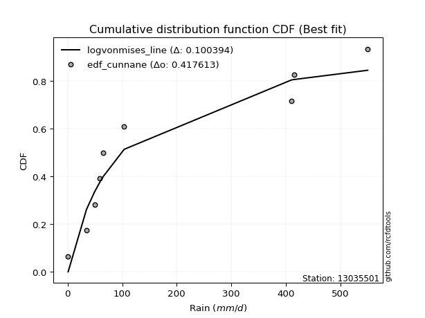</img></img>

</div>


### 12. Empirical - EDF Adamowski (1981)

The Adamowski formula in hydrology refers to a specific plotting position formula used for estimating the non-parametric empirical distribution of hydrological events (like flood peaks) to calculate their return periods. This formula provides an alternative to traditional parametric methods (like the Gumbel or Log Pearson Type III distributions). 

<div align="center">


$P=(m-0.25)/(n+0.5)$


</div>


**12.1. Empirical values**

<div align="center">

|                | 0                   | 1                   | 2                  | 3                   | 4             | 5                  | 6                  | 7                  | 8                  |
|:---------------|:--------------------|:--------------------|:-------------------|:--------------------|:--------------|:-------------------|:-------------------|:-------------------|:-------------------|
| date           | 2018                | 2019                | 2015               | 2016                | 2020          | 2017               | 2025               | 2024               | 2023               |
| x              | 0.886               | 34.5                | 49.22              | 58.78               | 65.3          | 103.7              | 237.6              | 410.6              | 550.5              |
| m              | 1                   | 2                   | 3                  | 4                   | 5             | 6                  | 7                  | 8                  | 9                  |
| empirical_dist | edf_adamowski       | edf_adamowski       | edf_adamowski      | edf_adamowski       | edf_adamowski | edf_adamowski      | edf_adamowski      | edf_adamowski      | edf_adamowski      |
| empirical      | 0.07894736842105263 | 0.18421052631578946 | 0.2894736842105263 | 0.39473684210526316 | 0.5           | 0.6052631578947368 | 0.7105263157894737 | 0.8157894736842105 | 0.9210526315789473 |
| empirical_tr   | 1.0857142857142856  | 1.2258064516129032  | 1.4074074074074074 | 1.6521739130434783  | 2.0           | 2.533333333333333  | 3.4545454545454546 | 5.428571428571428  | 12.666666666666663 |

</div>


**12.2. Kolmogorov-Smirnov fit test (sorted by Δ)**


<div align="center">

|                | 0                   | 1                   | 2                   | 3                   | 4                   | 5                   | 6                   | 7                   | 8                   | 9                   | 10                  | 11                  | 12                  | 13                  | 14                    | 15                  | 16                  | 17                  | 18                  | 19                  | 20                  | 21                  | 22                  | 23                  | 24                  | 25                  | 26                  | 27                  | 28                  | 29                  | 30                  | 31                  | 32                  | 33                  | 34                  | 35                  | 36                  | 37                  | 38                  | 39                  | 40                  | 41                  | 42                  | 43                  | 44                  | 45                  | 46                  | 47                  | 48                  | 49                  | 50                  | 51                  | 52                  | 53                  | 54                  | 55                  | 56                  | 57                  | 58                  | 59                  | 60                  | 61                  | 62                  | 63                  | 64                  | 65                  | 66                  | 67                  | 68                  | 69                  | 70                  | 71                  | 72                  | 73                  | 74                  | 75                  | 76                  | 77                  | 78                  | 79                  | 80                  | 81                  | 82                  | 83                  | 84                  | 85                  | 86                  | 87                  | 88                  | 89                  |
|:---------------|:--------------------|:--------------------|:--------------------|:--------------------|:--------------------|:--------------------|:--------------------|:--------------------|:--------------------|:--------------------|:--------------------|:--------------------|:--------------------|:--------------------|:----------------------|:--------------------|:--------------------|:--------------------|:--------------------|:--------------------|:--------------------|:--------------------|:--------------------|:--------------------|:--------------------|:--------------------|:--------------------|:--------------------|:--------------------|:--------------------|:--------------------|:--------------------|:--------------------|:--------------------|:--------------------|:--------------------|:--------------------|:--------------------|:--------------------|:--------------------|:--------------------|:--------------------|:--------------------|:--------------------|:--------------------|:--------------------|:--------------------|:--------------------|:--------------------|:--------------------|:--------------------|:--------------------|:--------------------|:--------------------|:--------------------|:--------------------|:--------------------|:--------------------|:--------------------|:--------------------|:--------------------|:--------------------|:--------------------|:--------------------|:--------------------|:--------------------|:--------------------|:--------------------|:--------------------|:--------------------|:--------------------|:--------------------|:--------------------|:--------------------|:--------------------|:--------------------|:--------------------|:--------------------|:--------------------|:--------------------|:--------------------|:--------------------|:--------------------|:--------------------|:--------------------|:--------------------|:--------------------|:--------------------|:--------------------|:--------------------|
| station        | 13035501            | 13035501            | 13035501            | 13035501            | 13035501            | 13035501            | 13035501            | 13035501            | 13035501            | 13035501            | 13035501            | 13035501            | 13035501            | 13035501            | 13035501              | 13035501            | 13035501            | 13035501            | 13035501            | 13035501            | 13035501            | 13035501            | 13035501            | 13035501            | 13035501            | 13035501            | 13035501            | 13035501            | 13035501            | 13035501            | 13035501            | 13035501            | 13035501            | 13035501            | 13035501            | 13035501            | 13035501            | 13035501            | 13035501            | 13035501            | 13035501            | 13035501            | 13035501            | 13035501            | 13035501            | 13035501            | 13035501            | 13035501            | 13035501            | 13035501            | 13035501            | 13035501            | 13035501            | 13035501            | 13035501            | 13035501            | 13035501            | 13035501            | 13035501            | 13035501            | 13035501            | 13035501            | 13035501            | 13035501            | 13035501            | 13035501            | 13035501            | 13035501            | 13035501            | 13035501            | 13035501            | 13035501            | 13035501            | 13035501            | 13035501            | 13035501            | 13035501            | 13035501            | 13035501            | 13035501            | 13035501            | 13035501            | 13035501            | 13035501            | 13035501            | 13035501            | 13035501            | 13035501            | 13035501            | 13035501            |
| empirical_dist | edf_adamowski       | edf_adamowski       | edf_adamowski       | edf_adamowski       | edf_adamowski       | edf_adamowski       | edf_adamowski       | edf_adamowski       | edf_adamowski       | edf_adamowski       | edf_adamowski       | edf_adamowski       | edf_adamowski       | edf_adamowski       | edf_adamowski         | edf_adamowski       | edf_adamowski       | edf_adamowski       | edf_adamowski       | edf_adamowski       | edf_adamowski       | edf_adamowski       | edf_adamowski       | edf_adamowski       | edf_adamowski       | edf_adamowski       | edf_adamowski       | edf_adamowski       | edf_adamowski       | edf_adamowski       | edf_adamowski       | edf_adamowski       | edf_adamowski       | edf_adamowski       | edf_adamowski       | edf_adamowski       | edf_adamowski       | edf_adamowski       | edf_adamowski       | edf_adamowski       | edf_adamowski       | edf_adamowski       | edf_adamowski       | edf_adamowski       | edf_adamowski       | edf_adamowski       | edf_adamowski       | edf_adamowski       | edf_adamowski       | edf_adamowski       | edf_adamowski       | edf_adamowski       | edf_adamowski       | edf_adamowski       | edf_adamowski       | edf_adamowski       | edf_adamowski       | edf_adamowski       | edf_adamowski       | edf_adamowski       | edf_adamowski       | edf_adamowski       | edf_adamowski       | edf_adamowski       | edf_adamowski       | edf_adamowski       | edf_adamowski       | edf_adamowski       | edf_adamowski       | edf_adamowski       | edf_adamowski       | edf_adamowski       | edf_adamowski       | edf_adamowski       | edf_adamowski       | edf_adamowski       | edf_adamowski       | edf_adamowski       | edf_adamowski       | edf_adamowski       | edf_adamowski       | edf_adamowski       | edf_adamowski       | edf_adamowski       | edf_adamowski       | edf_adamowski       | edf_adamowski       | edf_adamowski       | edf_adamowski       | edf_adamowski       |
| p_dist         | fisk                | logweibull_min      | johnsonsu           | fatiguelife         | invgauss            | f                   | invgamma            | ncf                 | loggompertz         | logpearson3         | mielke              | logt                | loggumbel_l         | loglaplace          | loglaplace_asymmetric | nct                 | logjohnsonsu        | loghypsecant        | nakagami            | weibull_min         | loglogistic         | halflogistic        | logloggamma         | gamma               | halfnorm            | loglognorm          | logfatiguelife      | logrice             | logcrystalball      | lognorm             | lognorm             | logexponnorm        | lognct              | logbetaprime        | lognakagami         | logmielke           | chi2                | logerlang           | loggamma            | loggamma            | moyal               | loginvgamma         | exponnorm           | laplace_asymmetric  | expon               | genexpon            | pearson3            | gumbel_r            | logalpha            | wald                | rayleigh            | t                   | logmaxwell          | betaprime           | loginvgauss         | genlogistic         | maxwell             | lograyleigh         | loggumbel_r         | logmoyal            | kstwobign           | truncnorm           | norm                | loghalfnorm         | loginvweibull       | loghalflogistic     | logistic            | rice                | hypsecant           | logkstwobign        | logwald             | gompertz            | erlang              | loggibrat           | loggenexpon         | laplace             | gibrat              | gumbel_l            | logexpon            | logncf              | crystalball         | pareto              | invweibull          | logf                | logpareto           | logfisk             | logtruncnorm        | logchi2             | alpha               | loggenlogistic      |
| delta          | 0.08464666098239021 | 0.09135353589661932 | 0.09163364207490476 | 0.0921969864433691  | 0.09545709157676996 | 0.09887985329601146 | 0.09888054895795984 | 0.09888055576345495 | 0.10082319479007154 | 0.10205949075287532 | 0.1033811860123984  | 0.1037776594988834  | 0.10698436100110933 | 0.10727140945260069 | 0.10843880503485948   | 0.10877489712052713 | 0.12336583265343998 | 0.13549523939089195 | 0.14301218525141343 | 0.1467896152791679  | 0.14935501032186363 | 0.1539977360837999  | 0.15432670947238364 | 0.15596506131114837 | 0.16403817551201028 | 0.16663473115824454 | 0.1668303422422738  | 0.16709408955021185 | 0.16717738577168353 | 0.16717738920427447 | 0.16717738920427447 | 0.16717764234861462 | 0.16774937008556015 | 0.16868481233152474 | 0.16872528676787404 | 0.1725786075233738  | 0.17368988200896762 | 0.1768333852147905  | 0.1780245877650116  | 0.1780245877650116  | 0.17915401748771997 | 0.17935180377908197 | 0.179779692429465   | 0.17998529880296776 | 0.17998547957614092 | 0.17998623902476824 | 0.18134392877506672 | 0.19204062911220265 | 0.19302782143942468 | 0.1951931559067493  | 0.1987050406006442  | 0.19892771249080743 | 0.19919749407934292 | 0.20226816248926907 | 0.20234976641720134 | 0.20922425342472678 | 0.2108901503690378  | 0.21127728788951974 | 0.21593745549778823 | 0.2340256663026499  | 0.23505213479109321 | 0.23832963168337706 | 0.2434866292445959  | 0.2456663290525333  | 0.2498119446408957  | 0.25397852371302243 | 0.2603706748786888  | 0.26908927665233384 | 0.2736656570405564  | 0.2802031015558307  | 0.29444309675426317 | 0.29760335367738    | 0.298111970949814   | 0.29990463992400795 | 0.3015524804823877  | 0.30206680124195784 | 0.30259114086335365 | 0.30524851611359344 | 0.38534581715135174 | 0.4161740904050423  | 0.4227468256278576  | 0.4366091483690079  | 0.4425461892359418  | 0.4563205861326467  | 0.4800080378872772  | 0.48574585099848744 | 0.5339323080061171  | 0.5992596347191205  | 0.7541130658258334  | 0.8157894736842105  |
| deltao         | 0.41761268023100007 | 0.41761268023100007 | 0.41761268023100007 | 0.41761268023100007 | 0.41761268023100007 | 0.41761268023100007 | 0.41761268023100007 | 0.41761268023100007 | 0.41761268023100007 | 0.41761268023100007 | 0.41761268023100007 | 0.41761268023100007 | 0.41761268023100007 | 0.41761268023100007 | 0.41761268023100007   | 0.41761268023100007 | 0.41761268023100007 | 0.41761268023100007 | 0.41761268023100007 | 0.41761268023100007 | 0.41761268023100007 | 0.41761268023100007 | 0.41761268023100007 | 0.41761268023100007 | 0.41761268023100007 | 0.41761268023100007 | 0.41761268023100007 | 0.41761268023100007 | 0.41761268023100007 | 0.41761268023100007 | 0.41761268023100007 | 0.41761268023100007 | 0.41761268023100007 | 0.41761268023100007 | 0.41761268023100007 | 0.41761268023100007 | 0.41761268023100007 | 0.41761268023100007 | 0.41761268023100007 | 0.41761268023100007 | 0.41761268023100007 | 0.41761268023100007 | 0.41761268023100007 | 0.41761268023100007 | 0.41761268023100007 | 0.41761268023100007 | 0.41761268023100007 | 0.41761268023100007 | 0.41761268023100007 | 0.41761268023100007 | 0.41761268023100007 | 0.41761268023100007 | 0.41761268023100007 | 0.41761268023100007 | 0.41761268023100007 | 0.41761268023100007 | 0.41761268023100007 | 0.41761268023100007 | 0.41761268023100007 | 0.41761268023100007 | 0.41761268023100007 | 0.41761268023100007 | 0.41761268023100007 | 0.41761268023100007 | 0.41761268023100007 | 0.41761268023100007 | 0.41761268023100007 | 0.41761268023100007 | 0.41761268023100007 | 0.41761268023100007 | 0.41761268023100007 | 0.41761268023100007 | 0.41761268023100007 | 0.41761268023100007 | 0.41761268023100007 | 0.41761268023100007 | 0.41761268023100007 | 0.41761268023100007 | 0.41761268023100007 | 0.41761268023100007 | 0.41761268023100007 | 0.41761268023100007 | 0.41761268023100007 | 0.41761268023100007 | 0.41761268023100007 | 0.41761268023100007 | 0.41761268023100007 | 0.41761268023100007 | 0.41761268023100007 | 0.41761268023100007 |
| eval           | Δo > Δ              | Δo > Δ              | Δo > Δ              | Δo > Δ              | Δo > Δ              | Δo > Δ              | Δo > Δ              | Δo > Δ              | Δo > Δ              | Δo > Δ              | Δo > Δ              | Δo > Δ              | Δo > Δ              | Δo > Δ              | Δo > Δ                | Δo > Δ              | Δo > Δ              | Δo > Δ              | Δo > Δ              | Δo > Δ              | Δo > Δ              | Δo > Δ              | Δo > Δ              | Δo > Δ              | Δo > Δ              | Δo > Δ              | Δo > Δ              | Δo > Δ              | Δo > Δ              | Δo > Δ              | Δo > Δ              | Δo > Δ              | Δo > Δ              | Δo > Δ              | Δo > Δ              | Δo > Δ              | Δo > Δ              | Δo > Δ              | Δo > Δ              | Δo > Δ              | Δo > Δ              | Δo > Δ              | Δo > Δ              | Δo > Δ              | Δo > Δ              | Δo > Δ              | Δo > Δ              | Δo > Δ              | Δo > Δ              | Δo > Δ              | Δo > Δ              | Δo > Δ              | Δo > Δ              | Δo > Δ              | Δo > Δ              | Δo > Δ              | Δo > Δ              | Δo > Δ              | Δo > Δ              | Δo > Δ              | Δo > Δ              | Δo > Δ              | Δo > Δ              | Δo > Δ              | Δo > Δ              | Δo > Δ              | Δo > Δ              | Δo > Δ              | Δo > Δ              | Δo > Δ              | Δo > Δ              | Δo > Δ              | Δo > Δ              | Δo > Δ              | Δo > Δ              | Δo > Δ              | Δo > Δ              | Δo > Δ              | Δo > Δ              | Δo > Δ              | Δo <= Δ             | Δo <= Δ             | Δo <= Δ             | Δo <= Δ             | Δo <= Δ             | Δo <= Δ             | Δo <= Δ             | Δo <= Δ             | Δo <= Δ             | Δo <= Δ             |
| fit            | 1                   | 1                   | 1                   | 1                   | 1                   | 1                   | 1                   | 1                   | 1                   | 1                   | 1                   | 1                   | 1                   | 1                   | 1                     | 1                   | 1                   | 1                   | 1                   | 1                   | 1                   | 1                   | 1                   | 1                   | 1                   | 1                   | 1                   | 1                   | 1                   | 1                   | 1                   | 1                   | 1                   | 1                   | 1                   | 1                   | 1                   | 1                   | 1                   | 1                   | 1                   | 1                   | 1                   | 1                   | 1                   | 1                   | 1                   | 1                   | 1                   | 1                   | 1                   | 1                   | 1                   | 1                   | 1                   | 1                   | 1                   | 1                   | 1                   | 1                   | 1                   | 1                   | 1                   | 1                   | 1                   | 1                   | 1                   | 1                   | 1                   | 1                   | 1                   | 1                   | 1                   | 1                   | 1                   | 1                   | 1                   | 1                   | 1                   | 1                   | 0                   | 0                   | 0                   | 0                   | 0                   | 0                   | 0                   | 0                   | 0                   | 0                   |
| n              | 9                   | 9                   | 9                   | 9                   | 9                   | 9                   | 9                   | 9                   | 9                   | 9                   | 9                   | 9                   | 9                   | 9                   | 9                     | 9                   | 9                   | 9                   | 9                   | 9                   | 9                   | 9                   | 9                   | 9                   | 9                   | 9                   | 9                   | 9                   | 9                   | 9                   | 9                   | 9                   | 9                   | 9                   | 9                   | 9                   | 9                   | 9                   | 9                   | 9                   | 9                   | 9                   | 9                   | 9                   | 9                   | 9                   | 9                   | 9                   | 9                   | 9                   | 9                   | 9                   | 9                   | 9                   | 9                   | 9                   | 9                   | 9                   | 9                   | 9                   | 9                   | 9                   | 9                   | 9                   | 9                   | 9                   | 9                   | 9                   | 9                   | 9                   | 9                   | 9                   | 9                   | 9                   | 9                   | 9                   | 9                   | 9                   | 9                   | 9                   | 9                   | 9                   | 9                   | 9                   | 9                   | 9                   | 9                   | 9                   | 9                   | 9                   |
| best_fit       | 1                   | 0                   | 0                   | 0                   | 0                   | 0                   | 0                   | 0                   | 0                   | 0                   | 0                   | 0                   | 0                   | 0                   | 0                     | 0                   | 0                   | 0                   | 0                   | 0                   | 0                   | 0                   | 0                   | 0                   | 0                   | 0                   | 0                   | 0                   | 0                   | 0                   | 0                   | 0                   | 0                   | 0                   | 0                   | 0                   | 0                   | 0                   | 0                   | 0                   | 0                   | 0                   | 0                   | 0                   | 0                   | 0                   | 0                   | 0                   | 0                   | 0                   | 0                   | 0                   | 0                   | 0                   | 0                   | 0                   | 0                   | 0                   | 0                   | 0                   | 0                   | 0                   | 0                   | 0                   | 0                   | 0                   | 0                   | 0                   | 0                   | 0                   | 0                   | 0                   | 0                   | 0                   | 0                   | 0                   | 0                   | 0                   | 0                   | 0                   | 0                   | 0                   | 0                   | 0                   | 0                   | 0                   | 0                   | 0                   | 0                   | 0                   |
| best_fit_sort  | 1                   | 2                   | 3                   | 4                   | 5                   | 6                   | 7                   | 8                   | 9                   | 10                  | 11                  | 12                  | 13                  | 14                  | 15                    | 16                  | 17                  | 18                  | 19                  | 20                  | 21                  | 22                  | 23                  | 24                  | 25                  | 26                  | 27                  | 28                  | 29                  | 30                  | 31                  | 32                  | 33                  | 34                  | 35                  | 36                  | 37                  | 38                  | 39                  | 40                  | 41                  | 42                  | 43                  | 44                  | 45                  | 46                  | 47                  | 48                  | 49                  | 50                  | 51                  | 52                  | 53                  | 54                  | 55                  | 56                  | 57                  | 58                  | 59                  | 60                  | 61                  | 62                  | 63                  | 64                  | 65                  | 66                  | 67                  | 68                  | 69                  | 70                  | 71                  | 72                  | 73                  | 74                  | 75                  | 76                  | 77                  | 78                  | 79                  | 80                  | 81                  | 82                  | 83                  | 84                  | 85                  | 86                  | 87                  | 88                  | 89                  | 90                  |

</div>


<div align="center">

</img>

</div>


**12.3. Best fit**

<div align="center">

|   id |   station | empirical_dist   | p_dist   |     delta |   deltao | eval   |   fit |   n |   best_fit |   best_fit_sort |
|-----:|----------:|:-----------------|:---------|----------:|---------:|:-------|------:|----:|-----------:|----------------:|
|    0 |  13035501 | edf_adamowski    | fisk     | 0.0846467 | 0.417613 | Δo > Δ |     1 |   9 |          1 |               1 |

</div>


<div align="center">

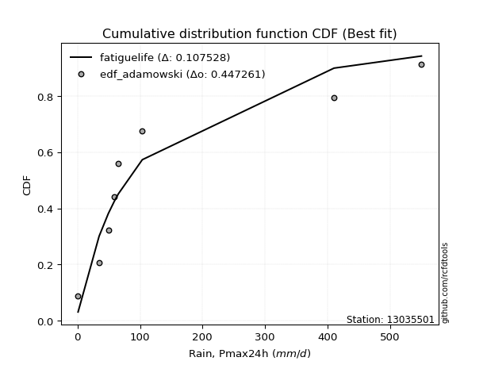</img>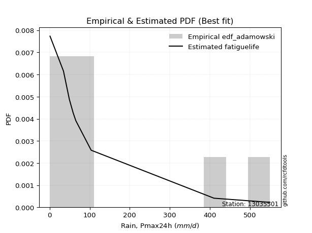</img>

</div>


## C. Best fit & Estimate extreme values for specific return periods - Tr


### 1. Best fit (ordered by delta Δ)

<div align="center">

|   id |   station | empirical_dist   | p_dist     |     delta |   deltao | eval   |   fit |   n |   best_fit |   best_fit_sort |
|-----:|----------:|:-----------------|:-----------|----------:|---------:|:-------|------:|----:|-----------:|----------------:|
|    0 |  13035501 | edf_adamowski    | fisk       | 0.0846467 | 0.417613 | Δo > Δ |     1 |   9 |          1 |               1 |
|    1 |  13035501 | edf_cunnane      | fisk       | 0.0846467 | 0.417613 | Δo > Δ |     1 |   9 |          1 |               2 |
|    2 |  13035501 | edf_jenkinson    | fisk       | 0.0846467 | 0.417613 | Δo > Δ |     1 |   9 |          1 |               3 |
|    3 |  13035501 | edf_filliben     | fisk       | 0.0846467 | 0.417613 | Δo > Δ |     1 |   9 |          1 |               4 |
|    4 |  13035501 | edf_gringorten   | fisk       | 0.0846467 | 0.417613 | Δo > Δ |     1 |   9 |          1 |               5 |
|    5 |  13035501 | edf_tukey        | fisk       | 0.0846467 | 0.417613 | Δo > Δ |     1 |   9 |          1 |               6 |
|    6 |  13035501 | edf_blom         | fisk       | 0.0846467 | 0.417613 | Δo > Δ |     1 |   9 |          1 |               7 |
|    7 |  13035501 | edf_chegodayev   | fisk       | 0.0846467 | 0.417613 | Δo > Δ |     1 |   9 |          1 |               8 |
|    8 |  13035501 | edf_beard        | fisk       | 0.0846467 | 0.417613 | Δo > Δ |     1 |   9 |          1 |               9 |
|    9 |  13035501 | edf_hazen        | fisk       | 0.0846467 | 0.417613 | Δo > Δ |     1 |   9 |          1 |              10 |
|   10 |  13035501 | edf_weibull      | fisk       | 0.0863776 | 0.417613 | Δo > Δ |     1 |   9 |          1 |              11 |
|   11 |  13035501 | edf_california   | loglaplace | 0.0959312 | 0.417613 | Δo > Δ |     1 |   9 |          1 |              12 |

</div>

:file_folder:Tables: [bestfit_13035501.csv](table/bestfit_13035501.csv) | [extreme_13035501.csv](table/extreme_13035501.csv)


### 2. Extreme values

In hydrology, a return period (or recurrence interval $Tr$) is the statistical average time between extreme events like floods or droughts of a specific magnitude, indicating how rare an event is, with a 100-year flood, for example, having a 1% chance of occurring in any given year, not that it happens exactly every century. It is a key tool for infrastructure design (like bridges or dams) and risk assessment, calculated from historical data to determine the probability of future events, although it is important to remember it is statistical average, and events can cluster or be missed.

> risk_rate: assuming the return period as the project useful life.

|   id |      tr |   prob_l |     prob_g |      alpha |   betaprime |     chi2 |   crystalball |   erlang |    expon |   exponnorm |        f |   fatiguelife |       fisk |     gamma |   genexpon |   genlogistic |   gibrat |   gompertz |   gumbel_l |   gumbel_r |   halflogistic |   halfnorm |   hypsecant |   invgamma |   invgauss |      invweibull |   johnsonsu |   kstwobign |   laplace |   laplace_asymmetric |   loggamma |   logistic |    lognorm |   maxwell |    mielke |    moyal |   nakagami |       ncf |        nct |    norm |         pareto |   pearson3 |   rayleigh |    rice |          t |   truncnorm |     wald |   weibull_min |   logalpha |   logbetaprime |          logchi2 |   logcrystalball |   logerlang |         logexpon |   logexponnorm |              logf |   logfatiguelife |         logfisk |   loggenexpon |   loggenlogistic |        loggibrat |   loggompertz |   loggumbel_l |   loggumbel_r |   loghalflogistic |   loghalfnorm |   loghypsecant |   loginvgamma |   loginvgauss |    loginvweibull |   logjohnsonsu |     logkstwobign |   loglaplace |   loglaplace_asymmetric |   logloggamma |   loglogistic |   loglognorm |   logmaxwell |        logmielke |         logmoyal |   lognakagami |            logncf |     lognct |     logpareto |   logpearson3 |   lograyleigh |    logrice |             logt |   logtruncnorm |          logwald |   logweibull_min |   station |   n |   risk_rate |
|-----:|--------:|---------:|-----------:|-----------:|------------:|---------:|--------------:|---------:|---------:|------------:|---------:|--------------:|-----------:|----------:|-----------:|--------------:|---------:|-----------:|-----------:|-----------:|---------------:|-----------:|------------:|-----------:|-----------:|----------------:|------------:|------------:|----------:|---------------------:|-----------:|-----------:|-----------:|----------:|----------:|---------:|-----------:|----------:|-----------:|--------:|---------------:|-----------:|-----------:|--------:|-----------:|------------:|---------:|--------------:|-----------:|---------------:|-----------------:|-----------------:|------------:|-----------------:|---------------:|------------------:|-----------------:|----------------:|--------------:|-----------------:|-----------------:|--------------:|--------------:|--------------:|------------------:|--------------:|---------------:|--------------:|--------------:|-----------------:|---------------:|-----------------:|-------------:|------------------------:|--------------:|--------------:|-------------:|-------------:|-----------------:|-----------------:|--------------:|------------------:|-----------:|--------------:|--------------:|--------------:|-----------:|-----------------:|---------------:|-----------------:|-----------------:|----------:|----:|------------:|
|    0 |    2    | 0.5      | 0.5        |    3.95634 |     54.4065 |  64.775  |     -0.164261 |  37.354  |  116.65  |     116.715 |   87.903 |       90.9191 |    86.8285 |   67.1079 |    116.651 |       131.674 |  113.419 |    173.305 |    197.716 |    138.081 |        123.258 |    130.746 |     167.898 |    87.9031 |    89.1868 |  1625.74        |     88.5712 |     146.577 |   167.898 |              116.65  |    66.7829 |    167.898 |    68.2572 |   152.376 |   83.8586 |  128.455 |    100.027 |   87.9031 |    81.9023 | 167.898 |    4.56384     |    135.232 |    146.87  | 167.149 |     55.568 |     140.583 |  109.064 |       107.737 |    61.5862 |        67.9046 |      3.56028     |          68.2572 |     67.1384 |     17.9972      |        68.2572 |      4.3955       |          68.2188 |    3.79615      |       37.7597 |          inf     |     39.907       |       88.2824 |       91.5653 |       50.8823 |           43.969  |       47.3344 |        68.2572 |       65.9745 |       60.3723 |     50.6307      |        109.876 |     43.4142      |      68.2572 |                 66.7689 |       128.767 |       68.2572 |      68.2807 |      58.5772 |     69.6649      |     46.2784      |       67.7974 |      7.84658      |    68.1783 |   1.03091     |       98.6887 |       55.4848 |    68.2561 |     89.7298      |        9.83236 |     38.2308      |          92.9348 |  13035501 |   9 |    0.75     |
|    1 |    2.33 | 0.570815 | 0.429185   |    4.70792 |     70.5459 |  81.7033 |     43.9685   |  50.6321 |  142.157 |     142.279 |  108.357 |      116.045  |   109.982  |   86.5734 |    142.157 |       156.036 |  129.825 |    203.32  |    225.894 |    168.093 |        154.114 |    165.701 |     193.819 |   108.357  |   111.683  | 68419.8         |    111.356  |     173.323 |   187.498 |              142.156 |    93.6281 |    196.435 |    93.9144 |   186.025 |  107.061  |  156.865 |    140.692 |  108.357  |    98.5894 | 200.287 |   13.3751      |    166.739 |    181.017 | 195.883 |     62.103 |     168.207 |  130.302 |       133.644 |    86.2055 |        93.5267 |      5.26734     |          93.9144 |     94.1066 |     34.9419      |        93.9144 |      9.78687      |          93.7823 |    7.30973      |       59.9787 |          inf     |     46.9082      |      114.816  |      120.865  |       68.388  |           59.5901 |       66.7952 |        88.1165 |       92.3245 |       85.9873 |     78.4492      |        141.672 |     70.2661      |      82.7967 |                 80.8064 |       169.977 |       90.4171 |      93.8612 |      81.6033 |    100.324       |     61.2263      |       93.3164 |     20.4146       |    93.8874 |   1.48241     |      130.798  |       77.6751 |    93.8946 |    111.209       |       14.3414  |     47.1284      |         119.75   |  13035501 |   9 |    0.729209 |
|    2 |    5    | 0.8      | 0.2        |   10.5358  |    164.579  | 170.978  |    207.977    | 129.175  |  269.682 |     270.092 |  239.118 |      264.428  |   272.048  |  192.783  |    269.683 |       261.871 |  224.283 |    327.63  |    316.926 |    298.476 |        293.734 |    313.524 |     297.792 |   239.118  |   249.092  |     7.80078e+11 |    253.621  |     286.935 |   285.494 |              269.682 |   335.552  |    306.618 |   307.43   |   318.466 |  243.71   |  288.461 |    359.424 |  239.118  |   215.803  | 320.651 | 5566.94        |    303.138 |    317.723 | 310.921 |    105.324 |     294.146 |  249.189 |       268.586 |   312.286  |       307.448  |     43.2959      |         307.43   |    337.188  |    963.794       |       307.43   | 200979            |         306.375  | 6283.21         |      386.088  |          inf     |    118.961       |      270.743  |      296.353  |      247.096  |          235.815  |      286.583  |       245.435  |      330.799  |      336.535  |    525.766       |        295.867 |    543.272       |     217.428  |                209.79   |       344.892 |      267.733  |     306.471  |     300.884  |    463.85        |    223.879       |      305.969  | 314428            |   308.541  |   7.67691e+99 |      306.526  |      298.687  |   307.142  |    268.213       |       61.4849  |    152.046       |         271.615  |  13035501 |   9 |    0.67232  |
|    3 |   10    | 0.9      | 0.1        |   21.243   |    267.502  | 255.702  |    316.777    | 210.594  |  385.446 |     386.117 |  420.112 |      421.37   |   527.942  |  296.348  |    385.447 |       348.067 |  331.954 |    415.329 |    367.609 |    404.672 |        409.683 |    422.909 |     380.817 |   420.113  |   409.346  |     4.36445e+17 |    431.753  |     373.437 |   374.451 |              385.446 |   796.891  |    387.764 |   675.14   |   411.672 |  413.567  |  403.036 |    545.995 |  420.113  |   411.08   | 400.498 |    1.41187e+06 |    411.272 |    415.197 | 392.945 |    210.95  |     395.071 |  375.357 |       396.46  |   758.886  |       677.249  |    329.934       |         675.139  |    801.04   |  19577.4         |       675.141  |      4.0578e+19   |         672.564  |    1.07379e+11  |     1464.32   |          inf     |    343.636       |      438.258  |      488.282  |      703.485  |          739.07   |      841.959  |       556.141  |      790.422  |      870.203  |   2475.84        |        419.169 |   2578.23        |     522.333  |                498.782  |       441.479 |      595.538  |     672.376  |     753.717  |   1559.39        |    692.241       |      672.795  |      1.18347e+16  |   679.727  | inf           |      462.762  |      780.345  |   674.183  |    581.372       |      147.608   |    527.007       |         428.528  |  13035501 |   9 |    0.651322 |
|    4 |   15    | 0.933333 | 0.0666667  |   31.912   |    335.559  | 306.183  |    371.07     | 260.808  |  453.164 |     453.987 |  566.892 |      519.355  |   757.103  |  358.73   |    453.165 |       396.698 |  406.221 |    459.211 |    390.562 |    464.587 |        475.299 |    479.833 |     428.199 |   566.892  |   517.339  |     7.63458e+20 |    561.719  |     419.358 |   426.488 |              453.164 |  1233.73   |    431.976 |   999.73   |   459.494 |  543.932  |  469.531 |    646.253 |  566.892  |   594.65   | 440.343 |    3.59906e+07 |    470.734 |    465.421 | 435.207 |    351.496 |     449.645 |  456.376 |       472.977 |  1194.63   |      1004.47   |   1115.01        |         999.73   |   1240.54   | 113960           |       999.732  |      1.306e+41    |         996.012  |    4.61385e+19  |     2913.36   |          inf     |    714.272       |      545.428  |      612.184  |     1269.46   |         1410.72   |     1475.22   |       886.999  |     1229.97   |     1417.38   |   5934.51        |        483.143 |   5893.29        |     872.172  |                827.809  |       476.451 |      920.627  |     995.366  |    1207.35   |   3070.49        |   1332.83        |      996.959  |      1.51935e+29  |  1008.29   | inf           |      546.08   |     1279.91   |   998.074  |    955.696       |      212.476   |   1170.79        |         526.817  |  13035501 |   9 |    0.644736 |
|    5 |   20    | 0.95     | 0.05       |   42.5717  |    387.548  | 342.297  |    406.625    | 297.272  |  501.211 |     502.141 |  695.348 |      590.907  |   971.153  |  403.572  |    501.212 |       430.747 |  464.477 |    487.765 |    404.849 |    506.537 |        521.272 |    517.785 |     461.625 |   695.349  |   599.714  |     1.42347e+23 |    666.958  |     450.293 |   463.409 |              501.21  |  1645.84   |    462.534 |  1292.8    |   491.232 |  655.01   |  516.623 |    713.666 |  695.349  |   771.641  | 466.436 |    3.5813e+08  |    511.704 |    498.802 | 463.298 |    522.101 |     486.698 |  516.751 |       527.909 |  1614.35   |      1300.34   |   2671.02        |        1292.8    |   1655.35   | 397674           |      1292.8    |      1.6865e+69   |        1288.21   |    2.02251e+29  |     4603.68   |          inf     |   1268.02        |      625.095  |      704.715  |     1919.18   |         2218.95   |     2144.1    |      1232.95   |     1647.58   |     1960.75   |  10945           |        525.108 |  10285.3         |    1254.81   |               1185.87   |       494.461 |     1244.04   |    1287.03   |    1650.57   |   4926.14        |   2119.69        |     1289.84   |      1.83303e+44  |  1305.46   | inf           |      600.698  |     1778.34   |  1290.46   |   1403.74        |      260.519   |   2122.32        |         599.076  |  13035501 |   9 |    0.641514 |
|    6 |   25    | 0.96     | 0.04       |   53.2276  |    430.086  | 370.451  |    432.798    | 325.953  |  538.478 |     539.493 |  811.757 |      647.374  |  1174.82   |  438.629  |    538.48  |       456.974 |  513.043 |    508.642 |    415.016 |    538.85  |        556.692 |    546.022 |     487.494 |   811.758  |   666.658  |     7.98508e+24 |    756.641  |     473.464 |   492.047 |              538.478 |  2036.87   |    485.911 |  1562.14   |   514.795 |  753.986  |  553.125 |    763.998 |  811.758  |   944.036  | 485.645 |    2.12831e+09 |    542.903 |    523.604 | 484.169 |    719.402 |     514.582 |  565.111 |       570.849 |  2019.03   |      1572.54   |   5283.77        |        1562.14   |   2049.08   |      1.04842e+06 |      1562.15   |      3.58875e+103 |        1556.87   |    5.73112e+39  |     6468.52   |          inf     |   2046.09        |      688.826  |      778.96   |     2638.62   |         3145.58   |     2831.84   |      1590.87   |     2046.03   |     2496.25   |  17537.7         |        555.821 |  15609.1         |    1663.85   |               1567.19   |       505.434 |     1566.25   |    1555.11   |    2081.86   |   7085.07        |   3037.07        |     1559.14   |      1.01173e+61  |  1578.89   | inf           |      640.375  |     2270.58   |  1559.13   |   1934.15        |      297.023   |   3417.66        |         656.456  |  13035501 |   9 |    0.639603 |
|    7 |   50    | 0.98     | 0.02       |  106.49    |    575.368  | 458.541  |    507.749    | 416.831  |  654.243 |     655.518 | 1293.72  |      827.124  |  2101.2    |  548.774  |    654.244 |       537.767 |  684.239 |    567.539 |    442.614 |    638.391 |        665.826 |    628.098 |     567.698 |  1293.72   |   889.907  |     1.94942e+30 |   1084.88   |     541.505 |   581.004 |              654.242 |  3767.98   |    557.334 |  2685.82   |   583.13  | 1153.01   |  666.44  |    910.671 | 1293.72   |  1763.86   | 540.65  |    5.3986e+11  |    637.182 |    595.6   | 544.753 |   2039.73  |     596.999 |  723.004 |       705.885 |  3868.61   |      2710.21   |  44892.4         |        2685.82   |   3793.41   |      2.12964e+07 |      2685.83   |    inf            |        2678.76   |    7.9557e+100  |    17370.3    |          inf     |  11051.5         |      896.756  |     1022.36   |     7035.49   |         9218.44   |     6357.06   |      3505.99   |     3829.82   |     5045.35   |  74943.9         |        641.91  |  53132.2         |    3997.1    |               3726.04   |       527.759 |     3165.67   |    2673.96   |    4081.74   |  21651           |   9274.9         |     2683.62   |      1.04442e+164 |  2722.25   | inf           |      748.736  |     4615.2    |  2679.75   |   6117.29        |      395.744   |  16192.7         |         841.466  |  13035501 |   9 |    0.63583  |
|    8 |   75    | 0.986667 | 0.0133333  |  159.746   |    670.3    | 510.433  |    547.965    | 471.004  |  721.96  |     723.388 | 1686.66  |      934.723  |  2939.24   |  613.911  |    721.962 |       584.726 |  799.866 |    598.495 |    456.57  |    696.249 |        729.265 |    672.777 |     614.569 |  1686.66   |  1030.04   |     2.63875e+33 |   1315.67   |     578.941 |   633.041 |              721.96  |  5256.59   |    598.585 |  3592.22   |   620.282 | 1470.2    |  732.705 |    990.547 | 1686.66   |  2541.47   | 570.164 |    1.37618e+13 |    690.825 |    634.769 | 577.713 |   3819.82  |     642.627 |  820.165 |       785.911 |  5517.31   |      3629.67   | 158787           |        3592.21   |   5294.59   |      1.23966e+08 |      3592.23   |    inf            |        3584.75   |    5.49247e+172 |    29740.1    |          inf     |  34526.5         |     1024.85   |     1173.05   |    12440.9    |        17222.6    |     9872.53   |      5563.66   |     5383.45   |     7415.6    | 174325           |        686.422 | 104244           |    6674.22   |               6183.96   |       535.313 |     4753.04   |    3576.9    |    5885.92   |  41397           |  17817.3         |     3591.52   |      4.90272e+291 |  3646.76   | inf           |      802.188  |     6788.67   |  3583.46   |  13739.9         |      439.329   |  42174.1         |         954.035  |  13035501 |   9 |    0.634587 |
|    9 |  100    | 0.99     | 0.01       |  212.999   |    742.489  | 547.383  |    575.165    | 509.807  |  770.007 |     771.543 | 2031.11  |     1011.95   |  3725.05   |  660.383  |    770.009 |       617.963 |  889.437 |    619.145 |    465.699 |    737.198 |        774.166 |    703.214 |     647.816 |  2031.11   |  1133.23   |     4.3426e+35  |   1498.79   |     604.591 |   669.962 |              770.006 |  6591.73   |    627.71  |  4372.97   |   645.588 | 1744.31   |  779.717 |   1044.92  | 2031.11   |  3293.03   | 590.126 |    1.36939e+14 |    728.332 |    661.454 | 600.168 |   5984.7   |     673.984 |  891.004 |       843.108 |  7031.88   |      4422.62   | 390778           |        4372.96   |   6641.75   |      4.32591e+08 |      4372.98   |    inf            |        4365.77   |    3.00406e+252 |    42903.7    |          inf     |  83445.1         |     1118.43   |     1283.44   |    18623.7    |        26805.1    |    13324.8    |      7720.07   |     6788.9    |     9651.24   | 316842           |        715.687 | 165420           |    9602.33   |               8858.76   |       539.111 |     6332.7    |    4354.98   |    7552.56   |  65473.4         |  28313.8         |     4374.02   |    inf            |  4444.33   | inf           |      836.024  |     8830.04   |  4361.78   |  26285           |      463.794   |  84752           |        1035.69   |  13035501 |   9 |    0.633968 |
|   10 |  200    | 0.995    | 0.005      |  426.008   |    934.374  | 636.786  |    636.864    | 604.341  |  885.771 |     887.568 | 3159.77  |     1200.52   |  6575.3    |  773.086  |    885.773 |       697.866 | 1133.13  |    665.067 |    485.54  |    835.643 |        882.114 |    772.826 |     727.913 |  3159.78   |  1393.22   |     9.2487e+40  |   2013.55   |     663.668 |   758.919 |              885.77  | 11052.4    |    697.574 |  6831.59   |   703.485 | 2625.11   |  892.985 |   1169.05  | 3159.78   |  6146.46   | 635.406 |    3.47355e+16 |    817.109 |    722.511 | 651.548 |  17772.7   |     746.454 | 1067.46  |       982.215 | 12282.3    |      6923.96   |      3.46383e+06 |        6831.58   |  11146.3    |      8.78716e+09 |      6831.62   |    inf            |        6828.28   |  inf            |    99263.9    |          inf     | 920606           |     1352.49   |     1560.54   |    49124.2    |        77642.6    |    26455.8    |     16995.7    |    11547.3    |    17706.3    |      1.33249e+06 |        779.197 | 479159           |   23067.9    |              21061.9    |       544.835 |    12604.4    |    6806.73   |   13360.5    | 196981           |  86426.6         |     6840.27   |    inf            |  6961.49   | inf           |      905.068  |    16114.4    |  6812.26   | 171081           |      504.412   | 482114           |        1238.1    |  13035501 |   9 |    0.633042 |
|   11 |  250    | 0.996    | 0.004      |  532.512   |   1001.97   | 665.665  |    655.719    | 635.044  |  923.039 |     924.919 | 3637.98  |     1261.87   |  7891.04   |  809.558  |    923.042 |       723.553 | 1220.56  |    678.837 |    491.378 |    867.292 |        916.818 |    794.242 |     753.697 |  3637.99   |  1479.98   |     4.77597e+42 |   2203.48   |     681.951 |   787.557 |              923.038 | 12955.8    |    720.003 |  7829.43   |   721.307 | 2992.44   |  929.448 |   1207.17  | 3637.99   |  7513.96   | 649.244 |    2.06428e+17 |    845.271 |    741.306 | 667.364 |  25257.8   |     768.942 | 1125.83  |      1027.36  | 14595.4    |      7940.58   |      7.0144e+06  |        7829.41   |  13069.7    |      2.31663e+10 |      7829.45   |    inf            |        7828.79   |  inf            |   128519      |          inf     |      2.17865e+06 |     1430.29   |     1652.93   |    67098.8    |       109292      |    32670.4    |     21911.1    |    13601.4    |    21368.4    |      2.11453e+06 |        797.747 | 665923           |   30587.5    |              27834.5    |       545.983 |    15721.5    |    7802.35   |   15925.1    | 280642           | 123785           |     7841.91   |    inf            |  7985      | inf           |      923.932  |    19392.4    |  7806.62   | 349066           |      513.162   | 856888           |        1304.86   |  13035501 |   9 |    0.632858 |
|   12 |  500    | 0.998    | 0.002      | 1065.03    |   1231.93   | 755.626  |    711.634    | 731.113  | 1038.8   |    1040.94  | 5619.72  |     1454.08   | 13893.1    |  923.343  |   1038.81  |       803.283 | 1522.74  |    718.924 |    508.114 |    965.524 |       1024.53  |    858.093 |     833.788 |  5619.72   |  1757.82   |     9.9038e+47  |   2878.23   |     736.741 |   876.514 |             1038.8   | 20808.8    |    789.564 | 11730.4    |   774.489 | 4489.71   | 1042.71  |   1320.57  | 5619.72   | 14023.7    | 690.279 |    5.23618e+19 |    931.655 |    797.384 | 714.553 |  75363.7   |     836.473 | 1311.45  |      1168.62  | 24491.4    |     11921      |      6.33005e+07 |       11730.3    |  21012      |      4.70574e+11 |     11730.4    |    inf            |       11745.1    |  inf            |   277816      |          548.261 |      4.27676e+07 |     1679.13   |     1949.22   |   176615      |       315842      |    61286.4    |     48234.5    |    22188.7    |    37581.1    |      8.86501e+06 |        850.247 |      1.78566e+06 |   73481      |              66177.4    |       548.284 |    31198.2    |   11697.3    |   26892.8    | 841763           | 377836           |    11760.7    |    inf            | 11994.3    | inf           |      973.643  |    33696      | 11693.3    |      4.89368e+06 |      531.347   |      5.33493e+06 |        1516.88   |  13035501 |   9 |    0.632489 |
|   13 |  750    | 0.998667 | 0.00133333 | 1597.54    |   1381.72   | 808.405  |    742.696    | 787.734  | 1106.52  |    1108.81  | 7236.32  |     1567.52   | 19333.6    |  990.204  |   1106.52  |       849.892 | 1722.58  |    740.705 |    517.058 |   1022.95  |       1087.5   |    893.765 |     880.638 |  7236.33   |  1925.56   |     1.27046e+51 |   3338.33   |     767.521 |   928.551 |             1106.52  | 27120.7    |    830.203 | 14684.2    |   804.234 | 5689.39   | 1108.97  |   1383.75  | 7236.33   | 20201.4    | 713.075 |    1.33477e+21 |    981.509 |    828.743 | 740.941 | 142923     |     874.489 | 1422.74  |      1251.92  | 32778.2    |     14939.9    |      2.30389e+08 |       14684.1    |  27401.5    |      2.73921e+12 |     14684.2    |    inf            |       14714.8    |  inf            |   427589      |          549.025 |      3.06321e+08 |     1829.48   |     2128.78   |   310987      |       587355      |    87095.2    |     76527.8    |    29194.9    |    51663.5    |      2.04914e+07 |        877.745 |      3.10776e+06 |  122696      |             109832      |       549.052 |    46560.6    |   14649      |   36050.4    |      1.59962e+06 | 725767           |    14730.6    |    inf            | 15037      | inf           |      997.315  |    45893.9    | 14635.8    |      3.27409e+07 |      537.621   |      1.59703e+07 |        1643.99   |  13035501 |   9 |    0.632366 |
|   14 | 1000    | 0.999    | 0.001      | 2130.06    |   1495.46   | 845.913  |    764.081    | 828.073  | 1154.57  |    1156.97  | 8653.73  |     1648.4    | 24439.2    | 1037.76   |   1154.57  |       882.954 | 1875.51  |    755.497 |    523.077 |   1063.68  |       1132.17  |    918.399 |     913.878 |  8653.74   |  2046.66   |     2.03563e+53 |   3697.07   |     788.845 |   965.472 |             1154.57  | 32570.3    |    859.024 | 17139.7    |   824.792 | 6729.39   | 1155.98  |   1427.32  | 8653.74   | 26172.8    | 728.77  |    1.32819e+22 |   1016.61  |    850.413 | 759.177 | 225087     |     900.855 | 1502.79  |      1311.31  | 40127.6    |     17452.2    |      5.77275e+08 |       17139.7    |  32921.5    |      9.55871e+12 |     17139.8    |    inf            |       17186      |  inf            |   576051      |          549.407 |      1.38202e+09 |     1938.2    |     2258.86   |   464555      |       912049      |   111020      |    106181      |    35303.9    |    64444.2    |      3.71273e+07 |        895.975 |      4.56212e+06 |  176525      |             157339      |       549.436 |    61849.4    |   17104.1    |   44144.4    |      2.52225e+06 |      1.15329e+06 |    17200.8    |    inf            | 17569.9    | inf           |     1012.04   |    56816.8    | 17081.6    |      1.52664e+08 |      540.799   |      3.51438e+07 |        1735.48   |  13035501 |   9 |    0.632305 |

<div align="center">

</img>

</div>


<div align="center">

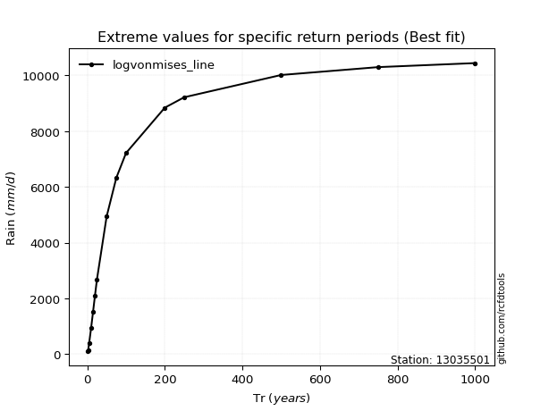</img>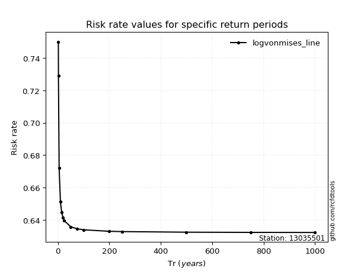</img>

</div>


<sub>**APP DISCLAIMER**: NO WARRANTY - This software is provided by [github.com/rcfdtools](https://github.com/rcfdtools) "as is", without any express or implied warranty, including warranties of merchantability, fitness for a particular purpose, or non-infringement. There is no guarantee that the software will be error-free or operate without interruption. LIMITATION OF LIABILITY - Neither the authors nor copyright holders will be liable for claims or damages arising from the software or its use. You are responsible for determining if the software is appropriate for your use and assume all associated risks, including errors, legal compliance, and data loss. NO PROFESSIONAL ADVICE - The software provides general information and does not offer professional advice. It should not replace consultation with professional advisors.</sub>