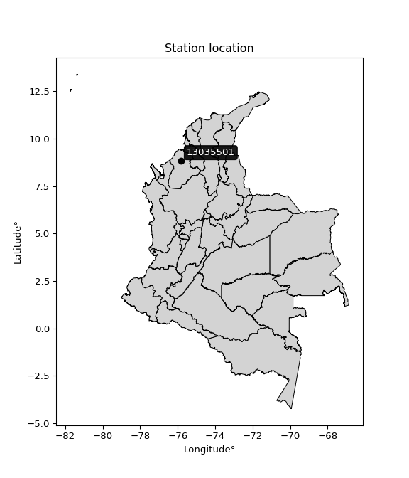

<div align="center">


</div>

# PMP Station (Rain, Pmax24h): 13035501

Probable Maximum Precipitation (PMP) is the greatest amount of rainfall for a specific duration that is meteorologically possible for a given location, acting as a "worst-case" scenario for extreme storms, crucial for designing safety-critical infrastructure like bridges, river deviations, dams, spillways, and nuclear plants to prevent catastrophic failure. PMP is calculated by hydrologists using meteorological data to determine the upper limit of extreme rainfall, often leading to the Probable Maximum Flood (PMF) for flood control design, and is increasingly being studied for climate change impacts. Probable Maximum Precipitation (PMP) is the theoretical upper limit of rainfall, a deterministic estimate for extreme events, while probability distributions (like GEV, Gumbel) describe the likelihood and frequency of various precipitation amounts, including rare ones, showing how often events occur, with PMP representing the extreme end of these distributions, used for critical infrastructure design to ensure safety against the worst conceivable weather, unlike standard statistical forecasts which cover typical probabilities.

The most common probability distributions in hydrology, used for analyzing floods, rainfall, and streamflow, include the Normal, Log-Normal, Gumbel, Gamma (including Log-Pearson Type III), and Generalized Extreme Value (GEV) distributions, often chosen based on the data´s skewness and whether modeling extremes or general conditions, with Gumbel and GEV popular for extreme events like floods, while the Normal distribution serves as a baseline, though often requiring transformations for skewed hydrological data. These distributions help in designing water infrastructure, managing water resources, and forecasting hydrologic events.

> Hydrological data often isn´t perfectly normal (it´s skewed), so different distributions are needed for different applications, such as: **Flood Frequency Analysis**: Using Gumbel, GEV, or Log-Pearson Type III for predicting extreme flood magnitudes and their return periods, **Rainfall Analysis**: Normal for annual totals, but Log-Normal, Weibull, or GEV for intensity or extreme daily rainfall, **Streamflow Modeling**: Gamma and Log-Normal for maximum flows, GEV for minimum flows, and Kappa for daily flows.

<div align="center">

</img>

</div>


## A. General information


### 1. General running parameters

• app_version: _v20260113_. • runtime: _2026-01-13 16:28:34.738620_. • Python version: _3.14.0_. • SciPy version: _1.16.3_. • Pandas version: _2.3.3_. • NumPy version: _2.3.5_. • Stations dataset (station_dataset_file): _dataset/pmax24h_in/automatic_colombia_2003_2025.csv_. • Stations catalog (station_catalog_file): _dataset/CNE.xls_. • Minimum year to eval til year_max (date_min): _1900_. • Maximum year to eval since year_min (date_max): _2025_. • Creates, save and include plots into reports (create_plot): _False_. • Plot only fit distributions with Δo > Δ (plot_only_fit): _True_. • Plot only simple graphs avoiding multiple CDFs and multiple Extreme values plots (plot_only_simple): _True_. • Eval low extreme values, if False, evaluates high extreme values (low_extreme): _False_. • Eval every SciPy distribution as logarithmic (pdist_logarithmic_on): _True_. • Standard deviation normalized (ddof): _1.0_. • Return periods to eval in years (Tr): _[2, 2.33, 5, 10, 15, 20, 25, 50, 75, 100, 200, 250, 500, 750, 1000]_. • Minimum data sample per station, 0 means any (minimum_sample): _5_. • Z-Score maximum threshold to adjust a value, 0 means disable (zscore_max): _3.5_. • Z-Score minimum threshold to adjust a value, 0 means disable (zscore_min): _-2.5_. • Avoid zeros, e.g. rain = 0 (avoid_zeros): _True_. • Avoid null values (avoid_nans): _True_. 

:file_folder:Table: [dataset.csv](../../dataset/pmax24h_in/automatic_colombia_2003_2025.csv)

> Delta Degrees of Freedom (DDOF): is a parameter used in the formulas for calculating variance and standard deviation. When ddof=0, the divisor is $N$ (the total number of observations) and this is used when your data set is the entire population. When ddof=1, the divisor is $N-1$ and this is used when your data set is a sample drawn from a larger population. Using $N-1$ provides an unbiased estimate of the population variance (known as Bessel´s correction).


### 2. Station info and location

|   id |   CODIGO | NOMBRE                             | CATEGORIA            | TECNOLOGIA                | ESTADO   | FECHA_INSTALACION   |   FECHA_SUSPENSION |   ALTITUD |   LATITUD |   LONGITUD | DEPARTAMENTO   | MUNICIPIO   | AREA_OPERATIVA                              | ENTIDAD                                                     | AREA_HIDROGRAFICA   | ZONA_HIDROGRAFICA   | SUBZONA_HIDROGRAFICA   |   CORRIENTE | Catalogo   |   Version |
|-----:|---------:|:-----------------------------------|:---------------------|:--------------------------|:---------|:--------------------|-------------------:|----------:|----------:|-----------:|:---------------|:------------|:--------------------------------------------|:------------------------------------------------------------|:--------------------|:--------------------|:-----------------------|------------:|:-----------|----------:|
|    0 | 13035501 | AEROPUERTO LOS GARZONES [13035501] | Sinóptica Secundaria | Automática con Telemetría | Activa   | 06/02/2015          |                nan |        20 |   8.82583 |   -75.8251 | Cordoba        | Montería    | Area Operativa 02 - Atlántico-Bolivar-Sucre | INSTITUTO DE HIDROLOGIA METEOROLOGIA Y ESTUDIOS AMBIENTALES | Caribe              | Sinú                | Bajo Sinú              |         nan | CNE_IDEAM  |  20251226 |

<div align="center">

Dynamic map: [:earth_americas:Google](http://maps.google.com/maps?q=8.825833333,-75.82513889) [:earth_americas:OSM](https://www.openstreetmap.org/#map=18/8.825833333/-75.82513889&layers=P) [:earth_americas:Bing](https://www.bing.com/maps?cp=8.825833333~-75.82513889&lvl=18) [:earth_americas:Apple](https://maps.apple.com/frame?center=8.825833333%2C-75.82513889&span=0.003%2C0.006)

</div>


<div align="center">

```geojson
{
  "type": "Feature",
  "geometry": {
    "type": "Point", 
    "coordinates": [-75.82513889, 8.825833333]
  }, 
  "properties": {
    "Name": "13035501"
  }
}
```

</div>


### 3. Discrete values table and plot

<div align="center">

|               |           0 |           1 |           2 |           3 |           4 |           5 |          6 |          7 |          8 |
|:--------------|------------:|------------:|------------:|------------:|------------:|------------:|-----------:|-----------:|-----------:|
| Date          | 2015        | 2016        | 2017        | 2018        | 2019        | 2020        | 2023       | 2024       | 2025       |
| Value         |   49.22     |   58.78     |  103.7      |    0.886    |   34.5      |   65.3      |  550.5     |  410.6     |  414.9     |
| Value_initial |   49.22     |   58.78     |  103.7      |    0.886    |   34.5      |   65.3      |  550.5     |  410.6     |  414.9     |
| count         |    9        |    9        |    9        |    9        |    9        |    9        |    9       |    9       |    9       |
| mean          |  187.598    |  187.598    |  187.598    |  187.598    |  187.598    |  187.598    |  187.598   |  187.598   |  187.598   |
| std           |  208.906    |  208.906    |  208.906    |  208.906    |  208.906    |  208.906    |  208.906   |  208.906   |  208.906   |
| zscore        |   -0.662397 |   -0.616635 |   -0.401609 |   -0.893764 |   -0.732859 |   -0.585424 |    1.73716 |    1.06748 |    1.08806 |


</div>


> The initial value (value_initial) correspond to the initial obtained or null completed value, and value (value) is adjusted only when the initial value is outside the valid range (outlier) definite through the Z-Score value. If Z-Score is active, values out of range or outliers are replaced with the station mean value. A Z-Score (or standard score) measures how many standard deviations a data point is from the mean of a dataset, indicating its relative position; positive scores mean above the mean, negative mean below, and a score of zero is exactly at the mean, allowing for comparison of values from different distributions. It´s calculated using the formula $z=(x–μ)/σ$, where $x$ is the data point, $μ$ is the mean, and $σ$ is the standard deviation, helping identify outliers and understand probability.
>
> <sub>**Note**: In this study, "completing" (filling gaps in) and "extending" (forecasting or lengthening the historical record) rainfall data series are avoided for certain critical analyses because they introduce artificial bias and uncertainty, which can distort the statistics of rare events (extremes), alter day-to-day variability, and compromise the integrity and homogeneity of the original data. Some reasons against Completing/Extending rainfall data are: **Distortion of Extremes and Variability**: The primary issue is that most gap-filling or extension methods rely on averaging or regression with nearby stations, which inherently smooths the data. Rainfall is highly variable in space and time, with a large percentage of zero values and occasional large storms. Infilling methods often underestimate the highest values and overestimate the lowest (zero) values, which severely distorts analyses focused on flood frequency, drought severity, and intensity-duration-frequency (IDF) curves, **Loss of Data Homogeneity**: Infilled or extended data are synthetic estimates, not actual measurements. Combining these estimates with observed data can violate the assumption of data homogeneity, which requires that the data properties do not change over time. Inhomogeneity can lead to incorrect conclusions about long-term trends or changes in climate patterns, **Propagation of Errors**: Errors and biases from the original data (e.g., wind-induced undercatch, instrument errors, site changes) or the data used for imputation can propagate through the analysis, leading to unreliable hydrological models and inaccurate predictions, **Compromised Statistical Integrity**: For statistical analyses, especially those involving the frequency of events, using artificial data can introduce time bias or autocorrelation that doesn´t exist in reality, making it difficult to assess the true probability of events, **Difficulty in Validation**: It is difficult to accurately validate the quality of filled or extended data, especially for past periods where ground-truth measurements are unavailable. The reliability of imputation techniques heavily depends on the density of the surrounding station network and the complexity of the local topography.</sub>


### 4. Active continuous probability distributions from SciPy (45 of 104 available)

A Probability Density Function (PDF) describes the relative likelihood of a continuous random variable falling within a specific range, where the total area under its curve equals 1, and the area over any interval gives the actual probability for that range. Unlike discrete probabilities (like rolling a die), a PDF shows density, not direct probability for a single point (which is zero), with higher points indicating higher likelihood, often visualized as a bell curve for normal distributions.

A log of a probability density function (log-PDF) is simply the logarithm of the PDF´s value, denoted as $log(f(x))$, useful for converting multiplication of probabilities into addition, improving numerical stability with tiny numbers, and connecting to information theory concepts like entropy. Instead of dealing with very small probabilities (e.g., 0.000001), log-PDFs use negative numbers (e.g., $log(0.00001) ≈ -11.51$ that are easier for computers to handle, preventing underflow errors and simplifying complex calculations. In this study, each active probability distribution from SciPy is also evaluated in the $log$ form.

[scipy.stats](https://docs.scipy.org/doc/scipy/reference/stats.html) is a Python´s powerful submodule within the SciPy library for comprehensive statistical analysis, offering over 130 probability distributions (like Normal, Poisson), functions for descriptive stats (mean, variance), hypothesis testing (t-tests, chi-square), random variable generation, and statistical tests, making it essential for data science, modeling, and research. It provides tools to explore, model, and draw conclusions from data efficiently, working seamlessly with NumPy.

<div align="center">

|   id | p_dist             |   n_parameter | fit_method   | label                                                                       | active   | ref                                                                                                        |
|-----:|:-------------------|--------------:|:-------------|:----------------------------------------------------------------------------|:---------|:-----------------------------------------------------------------------------------------------------------|
|    0 | alpha              |             3 | MLE          | Alpha                                                                       | True     | [:mortar_board:](https://docs.scipy.org/doc/scipy/reference/generated/scipy.stats.alpha.html)              |
|    1 | betaprime          |             4 | MLE          | Beta prime                                                                  | True     | [:mortar_board:](https://docs.scipy.org/doc/scipy/reference/generated/scipy.stats.betaprime.html)          |
|    2 | chi2               |             3 | MLE          | Chi²                                                                        | True     | [:mortar_board:](https://docs.scipy.org/doc/scipy/reference/generated/scipy.stats.chi2.html)               |
|    3 | crystalball        |             4 | MLE          | Crystalball                                                                 | True     | [:mortar_board:](https://docs.scipy.org/doc/scipy/reference/generated/scipy.stats.crystalball.html)        |
|    4 | dweibull           |             3 | MLE          | Double Weibull                                                              | True     | [:mortar_board:](https://docs.scipy.org/doc/scipy/reference/generated/scipy.stats.dweibull.html)           |
|    5 | erlang             |             3 | MLE          | Erlang                                                                      | True     | [:mortar_board:](https://docs.scipy.org/doc/scipy/reference/generated/scipy.stats.erlang.html)             |
|    6 | expon              |             2 | MLE          | Exponential                                                                 | True     | [:mortar_board:](https://docs.scipy.org/doc/scipy/reference/generated/scipy.stats.expon.html)              |
|    7 | exponnorm          |             3 | MLE          | Exponentially modified Normal                                               | True     | [:mortar_board:](https://docs.scipy.org/doc/scipy/reference/generated/scipy.stats.exponnorm.html)          |
|    8 | f                  |             4 | MLE          | F                                                                           | True     | [:mortar_board:](https://docs.scipy.org/doc/scipy/reference/generated/scipy.stats.f.html)                  |
|    9 | fatiguelife        |             3 | MLE          | Fatigue-life (Birnbaum-Saunders)                                            | True     | [:mortar_board:](https://docs.scipy.org/doc/scipy/reference/generated/scipy.stats.fatiguelife.html)        |
|   10 | fisk               |             3 | MLE          | Fisk                                                                        | True     | [:mortar_board:](https://docs.scipy.org/doc/scipy/reference/generated/scipy.stats.fisk.html)               |
|   11 | gamma              |             3 | MLE          | Gamma                                                                       | True     | [:mortar_board:](https://docs.scipy.org/doc/scipy/reference/generated/scipy.stats.gamma.html)              |
|   12 | genexpon           |             5 | MLE          | Generalized exponential                                                     | True     | [:mortar_board:](https://docs.scipy.org/doc/scipy/reference/generated/scipy.stats.genexpon.html)           |
|   13 | genlogistic        |             3 | MLE          | Generalized logistic                                                        | True     | [:mortar_board:](https://docs.scipy.org/doc/scipy/reference/generated/scipy.stats.genlogistic.html)        |
|   14 | gibrat             |             2 | MM           | Gibrat                                                                      | True     | [:mortar_board:](https://docs.scipy.org/doc/scipy/reference/generated/scipy.stats.gibrat.html)             |
|   15 | gompertz           |             3 | MLE          | Gompertz (or truncated Gumbel)                                              | True     | [:mortar_board:](https://docs.scipy.org/doc/scipy/reference/generated/scipy.stats.gompertz.html)           |
|   16 | gumbel_l           |             2 | MM           | Gumbel Left Skew                                                            | True     | [:mortar_board:](https://docs.scipy.org/doc/scipy/reference/generated/scipy.stats.gumbel_l.html)           |
|   17 | gumbel_r           |             2 | MM           | Gumbel Right Skew                                                           | True     | [:mortar_board:](https://docs.scipy.org/doc/scipy/reference/generated/scipy.stats.gumbel_r.html)           |
|   18 | halflogistic       |             2 | MM           | Half-logistic                                                               | True     | [:mortar_board:](https://docs.scipy.org/doc/scipy/reference/generated/scipy.stats.halflogistic.html)       |
|   19 | halfnorm           |             2 | MM           | Half Normal                                                                 | True     | [:mortar_board:](https://docs.scipy.org/doc/scipy/reference/generated/scipy.stats.halfnorm.html)           |
|   20 | hypsecant          |             2 | MM           | hyperbolic secant                                                           | True     | [:mortar_board:](https://docs.scipy.org/doc/scipy/reference/generated/scipy.stats.hypsecant.html)          |
|   21 | invgamma           |             3 | MLE          | Inverted gamma                                                              | True     | [:mortar_board:](https://docs.scipy.org/doc/scipy/reference/generated/scipy.stats.invgamma.html)           |
|   22 | invgauss           |             3 | MLE          | Inverse Gaussian                                                            | True     | [:mortar_board:](https://docs.scipy.org/doc/scipy/reference/generated/scipy.stats.invgauss.html)           |
|   23 | invweibull         |             3 | MLE          | Inverted Weibull                                                            | True     | [:mortar_board:](https://docs.scipy.org/doc/scipy/reference/generated/scipy.stats.invweibull.html)         |
|   24 | kappa4             |             4 | MLE          | Kappa 4                                                                     | True     | [:mortar_board:](https://docs.scipy.org/doc/scipy/reference/generated/scipy.stats.kappa4.html)             |
|   25 | kstwobign          |             2 | MLE          | Limiting distribution of scaled Kolmogorov-Smirnov two-sided test statistic | True     | [:mortar_board:](https://docs.scipy.org/doc/scipy/reference/generated/scipy.stats.kstwobign.html)          |
|   26 | laplace            |             2 | MM           | Laplace                                                                     | True     | [:mortar_board:](https://docs.scipy.org/doc/scipy/reference/generated/scipy.stats.laplace.html)            |
|   27 | laplace_asymmetric |             3 | MLE          | Asymmetric Laplace                                                          | True     | [:mortar_board:](https://docs.scipy.org/doc/scipy/reference/generated/scipy.stats.laplace_asymmetric.html) |
|   28 | loggamma           |             3 | MLE          | Log gamma                                                                   | True     | [:mortar_board:](https://docs.scipy.org/doc/scipy/reference/generated/scipy.stats.loggamma.html)           |
|   29 | logistic           |             2 | MM           | Logistic (or Sech-squared)                                                  | True     | [:mortar_board:](https://docs.scipy.org/doc/scipy/reference/generated/scipy.stats.logistic.html)           |
|   30 | lognorm            |             3 | MLE          | Log Normal                                                                  | True     | [:mortar_board:](https://docs.scipy.org/doc/scipy/reference/generated/scipy.stats.lognorm.html)            |
|   31 | maxwell            |             2 | MM           | Maxwell                                                                     | True     | [:mortar_board:](https://docs.scipy.org/doc/scipy/reference/generated/scipy.stats.maxwell.html)            |
|   32 | mielke             |             4 | MLE          | Mielke Beta-Kappa / Dagum                                                   | True     | [:mortar_board:](https://docs.scipy.org/doc/scipy/reference/generated/scipy.stats.mielke.html)             |
|   33 | moyal              |             2 | MM           | Moyal                                                                       | True     | [:mortar_board:](https://docs.scipy.org/doc/scipy/reference/generated/scipy.stats.moyal.html)              |
|   34 | nakagami           |             3 | MLE          | Nakagami                                                                    | True     | [:mortar_board:](https://docs.scipy.org/doc/scipy/reference/generated/scipy.stats.nakagami.html)           |
|   35 | ncf                |             5 | MLE          | Non-central F distribution                                                  | True     | [:mortar_board:](https://docs.scipy.org/doc/scipy/reference/generated/scipy.stats.ncf.html)                |
|   36 | nct                |             4 | MLE          | Non-central Student’s t                                                     | True     | [:mortar_board:](https://docs.scipy.org/doc/scipy/reference/generated/scipy.stats.nct.html)                |
|   37 | norm               |             2 | MM           | Normal                                                                      | True     | [:mortar_board:](https://docs.scipy.org/doc/scipy/reference/generated/scipy.stats.norm.html)               |
|   38 | pearson3           |             3 | MM           | Pearson type III                                                            | True     | [:mortar_board:](https://docs.scipy.org/doc/scipy/reference/generated/scipy.stats.pearson3.html)           |
|   39 | rayleigh           |             2 | MM           | Rayleigh                                                                    | True     | [:mortar_board:](https://docs.scipy.org/doc/scipy/reference/generated/scipy.stats.rayleigh.html)           |
|   40 | rice               |             3 | MLE          | Rice                                                                        | True     | [:mortar_board:](https://docs.scipy.org/doc/scipy/reference/generated/scipy.stats.rice.html)               |
|   41 | t                  |             3 | MLE          | Student’s t                                                                 | True     | [:mortar_board:](https://docs.scipy.org/doc/scipy/reference/generated/scipy.stats.t.html)                  |
|   42 | truncnorm          |             4 | MLE          | Truncated normal                                                            | True     | [:mortar_board:](https://docs.scipy.org/doc/scipy/reference/generated/scipy.stats.truncnorm.html)          |
|   43 | wald               |             2 | MM           | Wald                                                                        | True     | [:mortar_board:](https://docs.scipy.org/doc/scipy/reference/generated/scipy.stats.wald.html)               |
|   44 | weibull_min        |             3 | MLE          | Weibull minimum                                                             | True     | [:mortar_board:](https://docs.scipy.org/doc/scipy/reference/generated/scipy.stats.weibull_min.html)        |

</div>

> **n_parameter:** # arguments & localization & scale.
>
> **Fit methods:** (MLE) maximum likelihood, (MM) L-moments.
>
>**Inactive** (With the only purpose of prevent loops, zero divisions, infinite values, over high estimated values or horizontal trending for recurrence intervals estimations, the follow distributions were disabled.)**:** foldnorm, gennorm, norminvgauss, powernorm, powerlognorm, skewnorm, genextreme, anglit, arcsine, argus, beta, bradford, burr, burr12, cauchy, cosine, halfcauchy, foldcauchy, skewcauchy, wrapcauchy, dgamma, gengamma, exponweib, exponpow, truncexpon, gausshyper, genhalflogistic, genhyperbolic, geninvgauss, halfgennorm, johnsonsb, johnsonsu, kappa3, ksone, kstwo, loglaplace, levy, levy_l, levy_stable, ncx2, pareto, genpareto, truncpareto, lomax, powerlaw, rdist, rel_breitwigner, recipinvgauss, semicircular, studentized_range, trapezoid, triang, truncweibull_min, tukeylambda, uniform, loguniform, vonmises, vonmises_line, weibull_max, 


## B. Probability (PDF) vs. Empirical (EDF) distributions functions

A continuous probability distribution (CPD) describes probabilities for variables that can take any value within a range (like rain any time), unlike discrete variables with specific outcomes (like temperature). It uses a Probability Density Function (PDF), a curve where the total area under it equals 1, and the probability of the variable falling within an interval (a to b) is found by calculating the area under the curve between those points. A key feature is that the probability of hitting any single exact value is zero, so probabilities are always expressed for ranges, e.g., $P(a ≤ X ≤ b)$.

<div align="center">

Distributions parameters from station values
|    |   station | p_dist                |   n |              loc |           scale | shape                  | shape1                | shape2               | shape3   |
|---:|----------:|:----------------------|----:|-----------------:|----------------:|:-----------------------|:----------------------|:---------------------|:---------|
|  0 |  13035501 | alpha                 |   9 |     -0.00167676  |     2.66983     | 1.4318137708113234e-09 |                       |                      |          |
|  1 |  13035501 | betaprime             |   9 |      0.886       |   208.899       | 0.6701247173725629     | 1.1826501204420161    |                      |          |
|  2 |  13035501 | chi2                  |   9 |      0.886       |   145.354       | 1.173813035734283      |                       |                      |          |
|  3 |  13035501 | crystalball           |   9 |    188.941       |   195.621       | 4005.7586003443303     | 97038.14846058213     |                      |          |
|  4 |  13035501 | dweibull              |   9 |    262.53        |   224.286       | 4.876604681714781      |                       |                      |          |
|  5 |  13035501 | erlang                |   9 |      0.886       |   215.329       | 0.43817477542031347    |                       |                      |          |
|  6 |  13035501 | expon                 |   9 |      0.886       |   186.712       |                        |                       |                      |          |
|  7 |  13035501 | exponnorm             |   9 |      0.660878    |     0.0697331   | 2676.662481415254      |                       |                      |          |
|  8 |  13035501 | f                     |   9 |      0.886       |   284.487       | 1.046483502360658      | 323.9743654509021     |                      |          |
|  9 |  13035501 | fatiguelife           |   9 |    -12.1449      |   106.464       | 1.3147921735707944     |                       |                      |          |
| 10 |  13035501 | fisk                  |   9 |      0.886       |    93.9768      | 0.9703622738934026     |                       |                      |          |
| 11 |  13035501 | gamma                 |   9 |      0.886       |   131.668       | 0.7329467930410348     |                       |                      |          |
| 12 |  13035501 | genexpon              |   9 |      0.885433    |   323.94        | 1.7350225886624526     | 3.089837093979193e-09 | 1.7069424135692242   |          |
| 13 |  13035501 | genlogistic           |   9 |   -908.33        |   133.301       | 1911.296702823563      |                       |                      |          |
| 14 |  13035501 | gibrat                |   9 |     37.3442      |    91.1338      |                        |                       |                      |          |
| 15 |  13035501 | gompertz              |   9 |      0.885995    |     7.9135e+06  | 43737.56179005469      |                       |                      |          |
| 16 |  13035501 | gumbel_l              |   9 |    276.24        |   153.568       |                        |                       |                      |          |
| 17 |  13035501 | gumbel_r              |   9 |     98.9568      |   153.568       |                        |                       |                      |          |
| 18 |  13035501 | halflogistic          |   9 |    -45.8427      |   168.392       |                        |                       |                      |          |
| 19 |  13035501 | halfnorm              |   9 |    -73.0969      |   326.733       |                        |                       |                      |          |
| 20 |  13035501 | hypsecant             |   9 |    187.598       |   125.387       |                        |                       |                      |          |
| 21 |  13035501 | invgamma              |   9 |    -29.7194      |   129.644       | 1.3897288087002408     |                       |                      |          |
| 22 |  13035501 | invgauss              |   9 |    -19.3561      |   115.112       | 1.797859641456387      |                       |                      |          |
| 23 |  13035501 | invweibull            |   9 |      0.886       |     2.52915     | 0.05701596630726633    |                       |                      |          |
| 24 |  13035501 | kappa4                |   9 |    -50.5157      |   619.761       | 1.090558273890803      | 1.0283474761929012    |                      |          |
| 25 |  13035501 | kstwobign             |   9 |   -368.54        |   639.316       |                        |                       |                      |          |
| 26 |  13035501 | laplace               |   9 |    187.598       |   139.27        |                        |                       |                      |          |
| 27 |  13035501 | laplace_asymmetric    |   9 |     34.5         |    71.1171      | 0.3928347871285085     |                       |                      |          |
| 28 |  13035501 | loggamma              |   9 | -52109.1         |  7288.47        | 1307.1285455883622     |                       |                      |          |
| 29 |  13035501 | logistic              |   9 |    187.598       |   108.589       |                        |                       |                      |          |
| 30 |  13035501 | lognorm               |   9 |      0.886       |     1.23008     | 13.098732130312538     |                       |                      |          |
| 31 |  13035501 | maxwell               |   9 |   -279.11        |   292.466       |                        |                       |                      |          |
| 32 |  13035501 | mielke                |   9 |      0.886       |   520.716       | 0.3512118498336947     | 1.6652334130858781    |                      |          |
| 33 |  13035501 | moyal                 |   9 |     74.9651      |    88.6623      |                        |                       |                      |          |
| 34 |  13035501 | nakagami              |   9 |      0.886       |   394.031       | 0.1933896168853267     |                       |                      |          |
| 35 |  13035501 | ncf                   |   9 |     -0.426001    |    18.0571      | 0.762613129177729      | 4.123707522486712     | 3.9527038237257086   |          |
| 36 |  13035501 | nct                   |   9 |     -0.209394    |     0.0600529   | 0.2520658817182417     | 54.736163206982866    |                      |          |
| 37 |  13035501 | norm                  |   9 |    187.598       |   196.958       |                        |                       |                      |          |
| 38 |  13035501 | pearson3              |   9 |    187.598       |   196.958       | 0.7754298544208913     |                       |                      |          |
| 39 |  13035501 | rayleigh              |   9 |   -189.194       |   300.637       |                        |                       |                      |          |
| 40 |  13035501 | rice                  |   9 |   -119.21        |   257.802       | 0.0004922868552806475  |                       |                      |          |
| 41 |  13035501 | t                     |   9 |     55.0963      |    23.4736      | 0.5650814439150247     |                       |                      |          |
| 42 |  13035501 | truncnorm             |   9 |   -491.047       |   406.683       | 1.2096248633132256     | 74.60762954755288     |                      |          |
| 43 |  13035501 | wald                  |   9 |     -9.35969     |   196.958       |                        |                       |                      |          |
| 44 |  13035501 | weibull_min           |   9 |      0.886       |   271.222       | 0.6454064230612284     |                       |                      |          |
| 45 |  13035501 | logalpha              |   9 |    -63.3048      |  2389.1         | 35.39862578517133      |                       |                      |          |
| 46 |  13035501 | logbetaprime          |   9 |    -31.3781      |  4440.08        | 342.16742338532435     | 42566.14427346217     |                      |          |
| 47 |  13035501 | logchi2               |   9 |     -0.121038    |     1.66414     | 1.4224993676942868     |                       |                      |          |
| 48 |  13035501 | logcrystalball        |   9 |      4.28522     |     1.83923     | 26.301749026826997     | 203.79097768632067    |                      |          |
| 49 |  13035501 | logdweibull           |   9 |      4.0738      |     1.28246     | 0.8199682874922085     |                       |                      |          |
| 50 |  13035501 | logerlang             |   9 |    -28.5841      |     0.113254    | 290.0908196448788      |                       |                      |          |
| 51 |  13035501 | logexpon              |   9 |     -0.121038    |     4.40626     |                        |                       |                      |          |
| 52 |  13035501 | logexponnorm          |   9 |      4.28416     |     1.83924     | 0.0005805636567613418  |                       |                      |          |
| 53 |  13035501 | logf                  |   9 |     -0.121038    |     1.49911     | 1.2251504451486612     | 1.1147554170152996    |                      |          |
| 54 |  13035501 | logfatiguelife        |   9 |   -795.452       |   799.726       | 0.0022941692183209095  |                       |                      |          |
| 55 |  13035501 | logfisk               |   9 |     -0.121038    |     0.908811    | 0.24223461046614078    |                       |                      |          |
| 56 |  13035501 | loggamma              |   9 |    -26.6997      |     0.122541    | 252.4889762504726      |                       |                      |          |
| 57 |  13035501 | loggenexpon           |   9 |     -0.14365     |     0.0107333   | 0.0005666790078268716  | 1.7037792504171207    | 4.51299915014135e-06 |          |
| 58 |  13035501 | loggenlogistic        |   9 |      6.31085     |     7.03106e-07 | 3.4748698655489305e-07 |                       |                      |          |
| 59 |  13035501 | loggibrat             |   9 |      2.88215     |     0.851015    |                        |                       |                      |          |
| 60 |  13035501 | loggompertz           |   9 |     -0.121039    |     1.41373     | 0.02638095581674172    |                       |                      |          |
| 61 |  13035501 | loggumbel_l           |   9 |      5.11297     |     1.43404     |                        |                       |                      |          |
| 62 |  13035501 | loggumbel_r           |   9 |      3.45747     |     1.43404     |                        |                       |                      |          |
| 63 |  13035501 | loghalflogistic       |   9 |      2.10527     |     1.5725      |                        |                       |                      |          |
| 64 |  13035501 | loghalfnorm           |   9 |      1.85078     |     3.05112     |                        |                       |                      |          |
| 65 |  13035501 | loghypsecant          |   9 |      4.28522     |     1.17089     |                        |                       |                      |          |
| 66 |  13035501 | loginvgamma           |   9 |    -39.5758      | 22794.8         | 521.1445555146662      |                       |                      |          |
| 67 |  13035501 | loginvgauss           |   9 |    -17.9051      |  2679.34        | 0.008279086812990152   |                       |                      |          |
| 68 |  13035501 | loginvweibull         |   9 |     -2.95372e+08 |     2.95372e+08 | 133947830.04735029     |                       |                      |          |
| 69 |  13035501 | logkappa4             |   9 |     -0.71802     |     7.34589     | 1.088633450723262      | 1.0439608919419145    |                      |          |
| 70 |  13035501 | logkstwobign          |   9 |     -4.83825     |    10.4673      |                        |                       |                      |          |
| 71 |  13035501 | loglaplace            |   9 |      4.28522     |     1.30053     |                        |                       |                      |          |
| 72 |  13035501 | loglaplace_asymmetric |   9 |      4.17899     |     1.28637     | 0.9595411946231913     |                       |                      |          |
| 73 |  13035501 | logloggamma           |   9 |      6.31087     |     1.71377e-06 | 8.418284280787558e-07  |                       |                      |          |
| 74 |  13035501 | loglogistic           |   9 |      4.28522     |     1.01402     |                        |                       |                      |          |
| 75 |  13035501 | loglognorm            |   9 |  -1042.18        |  1046.46        | 0.0017534736909855801  |                       |                      |          |
| 76 |  13035501 | logmaxwell            |   9 |     -0.0729782   |     2.7311      |                        |                       |                      |          |
| 77 |  13035501 | logmielke             |   9 |     -2.18694e+08 |     2.18694e+08 | 281740184.6693456      | 138502227.58894512    |                      |          |
| 78 |  13035501 | logmoyal              |   9 |      3.23343     |     0.827945    |                        |                       |                      |          |
| 79 |  13035501 | lognakagami           |   9 |  -1228.3         |  1232.59        | 111461.58171800958     |                       |                      |          |
| 80 |  13035501 | logncf                |   9 |     -0.121038    |     1.16817     | 1.1259210395318948     | 1.4141599369635178    | 1.0336641087765754   |          |
| 81 |  13035501 | lognct                |   9 |   -128.32        |     1.803       | 61301.27695115472      | 73.54521079369528     |                      |          |
| 82 |  13035501 | lognorm               |   9 |      4.28522     |     1.83923     |                        |                       |                      |          |
| 83 |  13035501 | logpearson3           |   9 |      4.28523     |     1.83921     | -1.1997802622472538    |                       |                      |          |
| 84 |  13035501 | lograyleigh           |   9 |      0.766694    |     2.80738     |                        |                       |                      |          |
| 85 |  13035501 | logrice               |   9 |  -1760.43        |     1.83825     | 959.9969108191999      |                       |                      |          |
| 86 |  13035501 | logt                  |   9 |      4.23279     |     1.68412     | 7.391662941343391      |                       |                      |          |
| 87 |  13035501 | logtruncnorm          |   9 |      0.768843    |     3.39032     | -0.26247734233125064   | 1.6346530698616308    |                      |          |
| 88 |  13035501 | logwald               |   9 |      2.44597     |     1.83925     |                        |                       |                      |          |
| 89 |  13035501 | logweibull_min        |   9 |     -0.121038    |     2.5213      | 0.4195017891057846     |                       |                      |          |

</div>

> **loc** (Location parameter): This shifts the distribution along the x-axis. For many common distributions, like the normal (Gaussian) distribution, loc represents the mean $μ$. For others, like the uniform distribution, it might represent the minimum value, or for the beta distribution, the left end of the support interval.
>
> **scale** (Scale parameter): This determines the width or spread of the distribution. For the normal distribution, scale represents the standard deviation $σ$. For a uniform distribution, it defines the length of the interval (from $loc$ to $loc + scale$).
>
> **shape** (Shape parameters): Refers to parameters that define the specific form of a probability distribution, distinct from its location (loc) and scale (scale). These parameters are required arguments for most distribution functions. For example, a normal (Gaussian) distribution is fully defined by its location (mean) and scale (standard deviation), so it has no specific shape parameters beyond loc and scale. However, other distributions have intrinsic properties that need specification, as Gamma distribution that takes a shape parameter, often named $a$ or $alpha$.


### 0. Cumulative distribution values - CDF (90 evaluated)

Cumulative Distribution Function (CDF), denoted as $F$<sub>$X$</sub>$(x)$, is a function that gives the probability that a random variable $X$ will take a value less than or equal to a specific value, $x$ (i.e., $(P(X≥x)$. It essentially "accumulates" probabilities from a given point up to the far right (positive infinity), providing a complete picture of the distribution´s probabilities for both discrete (like rain) and continuous (like temperature) variables, helping to find probabilities over ranges or above certain values. Each station is evaluated separately ordering the $x$ values ascending, calculating the CDF and PDF values for the activated distributions and their logarithmic forms.

<div align="center">

CDF ordered by x ascending and calculating $log(f(x))$ separately
|   id |   Station |   date |       x |   count |    mean |     std |    zscore |   Value_initial |   station |   m |      alpha |   alpha_pdf |   betaprime |   betaprime_pdf |        chi2 |      chi2_pdf |   crystalball |   crystalball_pdf |   dweibull |   dweibull_pdf |      erlang |   erlang_pdf |    expon |   expon_pdf |   exponnorm |   exponnorm_pdf |           f |            f_pdf |   fatiguelife |   fatiguelife_pdf |        fisk |    fisk_pdf |       gamma |     gamma_pdf |    genexpon |   genexpon_pdf |   genlogistic |   genlogistic_pdf |    gibrat |   gibrat_pdf |    gompertz |   gompertz_pdf |   gumbel_l |   gumbel_l_pdf |   gumbel_r |   gumbel_r_pdf |   halflogistic |   halflogistic_pdf |   halfnorm |   halfnorm_pdf |   hypsecant |   hypsecant_pdf |   invgamma |   invgamma_pdf |   invgauss |   invgauss_pdf |   invweibull |   invweibull_pdf |      kappa4 |   kappa4_pdf |   kstwobign |   kstwobign_pdf |   laplace |   laplace_pdf |   laplace_asymmetric |   laplace_asymmetric_pdf |   loggamma |   loggamma_pdf |   logistic |   logistic_pdf |    lognorm |   lognorm_pdf |   maxwell |   maxwell_pdf |     mielke |   mielke_pdf |    moyal |   moyal_pdf |    nakagami |   nakagami_pdf |       ncf |     ncf_pdf |       nct |     nct_pdf |     norm |    norm_pdf |   pearson3 |   pearson3_pdf |   rayleigh |   rayleigh_pdf |     rice |    rice_pdf |        t |       t_pdf |   truncnorm |   truncnorm_pdf |       wald |    wald_pdf |   weibull_min |   weibull_min_pdf |   logalpha |   logalpha_pdf |   logbetaprime |   logbetaprime_pdf |     logchi2 |   logchi2_pdf |   logcrystalball |   logcrystalball_pdf |   logdweibull |   logdweibull_pdf |   logerlang |   logerlang_pdf |   logexpon |   logexpon_pdf |   logexponnorm |   logexponnorm_pdf |        logf |    logf_pdf |   logfatiguelife |   logfatiguelife_pdf |     logfisk |   logfisk_pdf |   loggenexpon |   loggenexpon_pdf |   loggenlogistic |   loggenlogistic_pdf |   loggibrat |   loggibrat_pdf |   loggompertz |   loggompertz_pdf |   loggumbel_l |   loggumbel_l_pdf |   loggumbel_r |   loggumbel_r_pdf |   loghalflogistic |   loghalflogistic_pdf |   loghalfnorm |   loghalfnorm_pdf |   loghypsecant |   loghypsecant_pdf |   loginvgamma |   loginvgamma_pdf |   loginvgauss |   loginvgauss_pdf |   loginvweibull |   loginvweibull_pdf |   logkappa4 |   logkappa4_pdf |   logkstwobign |   logkstwobign_pdf |   loglaplace |   loglaplace_pdf |   loglaplace_asymmetric |   loglaplace_asymmetric_pdf |   logloggamma |   logloggamma_pdf |   loglogistic |   loglogistic_pdf |   loglognorm |   loglognorm_pdf |   logmaxwell |   logmaxwell_pdf |   logmielke |   logmielke_pdf |    logmoyal |   logmoyal_pdf |   lognakagami |   lognakagami_pdf |      logncf |   logncf_pdf |     lognct |   lognct_pdf |   logpearson3 |   logpearson3_pdf |   lograyleigh |   lograyleigh_pdf |    logrice |   logrice_pdf |      logt |   logt_pdf |   logtruncnorm |   logtruncnorm_pdf |   logwald |   logwald_pdf |   logweibull_min |   logweibull_min_pdf |
|-----:|----------:|-------:|--------:|--------:|--------:|--------:|----------:|----------------:|----------:|----:|-----------:|------------:|------------:|----------------:|------------:|--------------:|--------------:|------------------:|-----------:|---------------:|------------:|-------------:|---------:|------------:|------------:|----------------:|------------:|-----------------:|--------------:|------------------:|------------:|------------:|------------:|--------------:|------------:|---------------:|--------------:|------------------:|----------:|-------------:|------------:|---------------:|-----------:|---------------:|-----------:|---------------:|---------------:|-------------------:|-----------:|---------------:|------------:|----------------:|-----------:|---------------:|-----------:|---------------:|-------------:|-----------------:|------------:|-------------:|------------:|----------------:|----------:|--------------:|---------------------:|-------------------------:|-----------:|---------------:|-----------:|---------------:|-----------:|--------------:|----------:|--------------:|-----------:|-------------:|---------:|------------:|------------:|---------------:|----------:|------------:|----------:|------------:|---------:|------------:|-----------:|---------------:|-----------:|---------------:|---------:|------------:|---------:|------------:|------------:|----------------:|-----------:|------------:|--------------:|------------------:|-----------:|---------------:|---------------:|-------------------:|------------:|--------------:|-----------------:|---------------------:|--------------:|------------------:|------------:|----------------:|-----------:|---------------:|---------------:|-------------------:|------------:|------------:|-----------------:|---------------------:|------------:|--------------:|--------------:|------------------:|-----------------:|---------------------:|------------:|----------------:|--------------:|------------------:|--------------:|------------------:|--------------:|------------------:|------------------:|----------------------:|--------------:|------------------:|---------------:|-------------------:|--------------:|------------------:|--------------:|------------------:|----------------:|--------------------:|------------:|----------------:|---------------:|-------------------:|-------------:|-----------------:|------------------------:|----------------------------:|--------------:|------------------:|--------------:|------------------:|-------------:|-----------------:|-------------:|-----------------:|------------:|----------------:|------------:|---------------:|--------------:|------------------:|------------:|-------------:|-----------:|-------------:|--------------:|------------------:|--------------:|------------------:|-----------:|--------------:|----------:|-----------:|---------------:|-------------------:|----------:|--------------:|-----------------:|---------------------:|
|    0 |  13035501 |   2018 |   0.886 |       9 | 187.598 | 208.906 | -0.893764 |           0.886 |  13035501 |   1 | 0.00263267 | 0.0293491   | 6.97562e-12 |  1202.98        | 7.48798e-08 | 254.076       |      0.168194 |       0.00128475  |  0.0600296 |    0.00237171  | 1.09506e-08 |  4.32192e+07 | 0        | 0.00535583  |  0.00120537 |     0.00534777  | 1.87189e-10 | 882213           |      0.028202 |       0.00605168  | 4.01535e-18 | 0.0350951   | 6.18169e-14 | 408.103       | 3.03832e-06 |    0.00535599  |      0.124454 |       0.00194446  | 0         |  0           | 2.54224e-08 |    0.00552695  |   0.153337 |    0.000917699 |   0.15049  |    0.0018559   |       0.137866 |        0.00291282  |   0.179135 |    0.0023802   |    0.141244 |     0.00108986  |  0.0309429 |    0.00395806  |  0.0291749 |    0.00464488  |  0.000190983 |      8.39894e+11 | 6.42328e-15 |   0.0311938  |    0.107812 |     0.00186469  |  0.130838 |   0.000939454 |            0.0401377 |              0.00143671  | 0.00980699 |      0.0148993 |   0.151943 |    0.00118664  | 0.00829413 |      0.012302 |  0.178566 |   0.00158122  | 5.4595e-06 |  3.55585e+06 | 0.128874 | 0.00215704  | 5.28979e-08 |    1.84285e+08 | 0.0389188 | 0.0123809   | 0.0252607 | 0.079862    | 0.17157  | 0.00129239  |   0.167563 |    0.00173107  |   0.181167 |    0.00172206  | 0.102827 | 0.00162118  | 0.193408 | 0.00189619  | 1.35266e-08 |     0.00416904  | 3.0862e-05 | 3.02656e-05 |   1.35619e-12 |    7883.96        | 0.00790364 |      0.0129786 |     0.00879388 |           0.013446 | 4.77662e-13 | 24480.6       |       0.00829415 |             0.012302 |     0.0355914 |         0.0183841 |  0.00897562 |       0.0138393 |   0        |      0.22695   |     0.00829431 |          0.0123022 | 2.52916e-11 | 1.11639e+06 |       0.00814699 |             0.012207 | 8.44324e-05 |   1.47363e+12 |    0.00121016 |         0.05424   |         0        |            0.0205781 |    0        |       0         |   5.67412e-09 |         0.0186605 |     0.0256605 |         0.0176623 |   5.41365e-06 |       4.57791e-05 |          0        |             0         |      0        |          0        |      0.0147733 |          0.0126126 |    0.00799011 |          0.013115 |    0.00840177 |         0.0142438 |      0.00957383 |           0.020183  | 4.17743e-15 |        2.57067  |       0.012797 |          0.0302455 |    0.0168873 |        0.0129849 |               0.0147131 |                   0.01192   |     0.0424491 |         0.0208516 |     0.0128012 |         0.0124626 |   0.00813978 |        0.0121801 |     0        |         0        |    0.013377 |       0.0151666 | 3.40169e-14 |    1.20084e-12 |    0.00844378 |         0.0124659 | 1.22502e-10 |  4.96936e+06 | 0.00833791 |    0.0123717 |     0.0269811 |         0.0189274 |      0        |          0        | 0.00826647 |     0.0122725 | 0.0172767 |  0.0153563 |    1.56169e-09 |          0.205782  |  0        |     0         |       5.7503e-08 |          1.73822e+09 |
|    1 |  13035501 |   2019 |  34.5   |       9 | 187.598 | 208.906 | -0.732859 |          34.5   |  13035501 |   2 | 0.938319   | 0.0017842   | 0.298788    |     0.00504623  | 0.302954    |   0.00491497  |      0.214912 |       0.0014933   |  0.169105  |    0.00392055  | 0.47755     |  0.00557894  | 0.164756 | 0.00447343  |  0.165811   |     0.00446922  | 0.25701     |      0.00384042  |      0.259261 |       0.00573723  | 0.269407    | 0.00568195  | 0.361569    |   0.00678438  | 0.164763    |    0.00447353  |      0.197985 |       0.00240444  | 0         |  0           | 0.169547    |    0.0045899   |   0.187128 |    0.00109666  |   0.218373 |    0.00216364  |       0.234134 |        0.00280649  |   0.25808  |    0.00231312  |    0.182584 |     0.00137761  |  0.227638  |    0.00618345  |  0.239214  |    0.00603419  |  0.421954    |      0.000617563 | 0.075031    |   0.00204858 |    0.178376 |     0.00230508  |  0.166554 |   0.0011959   |            0.133688  |              0.00478531  | 0.366525   |      0.196258  |   0.196251 |    0.00145261  | 0.342864   |      0.199856 |  0.234936 |   0.00176528  | 0.381135   |  0.00394115  | 0.208995 | 0.00256765  | 0.30526     |    0.00350833  | 0.238887  | 0.00499992  | 0.548373  | 0.00327651  | 0.218487 | 0.00149738  |   0.229746 |    0.00195618  |   0.241807 |    0.0018765   | 0.162845 | 0.00193613  | 0.307931 | 0.00606506  | 0.133212    |     0.00375951  | 0.0851114  | 0.00496372  |   0.228842    |       0.00384768  | 0.366217   |      0.201194  |     0.350545   |           0.194127 | 0.78347     |     0.0759534 |       0.342864   |             0.199855 |     0.307337  |         0.230166  |  0.359025   |       0.196671  |   0.564426 |      0.0988535 |     0.342864   |          0.199855  | 0.640531    | 0.0432188   |       0.344623   |             0.200918 | 0.583604    |   0.0160747   |    0.476582   |         0.156258  |         0        |            0.125719  |    0.398978 |       0.586029  |   0.277747    |         0.179709  |     0.284042  |         0.166819  |   0.389285    |       0.256107    |          0.427227 |             0.25993   |      0.420389 |          0.224309 |      0.310062  |          0.224874  |    0.365832   |          0.200108 |    0.372196   |         0.19409   |      0.413413   |           0.165601  | 0.580445    |        0.148557 |       0.456686 |          0.155354  |    0.28212   |        0.216927  |               0.285873  |                   0.231603  |     0.256501  |         0.125997  |     0.324324  |         0.216108  |   0.343851   |        0.200681  |     0.374346 |         0.21314  |    0.331132 |       0.178823  | 0.406251    |    0.28345     |    0.343113   |         0.199221  | 0.600385    |  0.051672    | 0.343505   |    0.199751  |     0.283095  |         0.157848  |      0.386315 |          0.216018 | 0.342804   |     0.199949  | 0.346436  |  0.208333  |    0.718143    |          0.152472  |  0.442874 |     0.41152   |       0.689476   |          0.0416015   |
|    2 |  13035501 |   2015 |  49.22  |       9 | 187.598 | 208.906 | -0.662397 |          49.22  |  13035501 |   3 | 0.956743   | 0.000877955 | 0.364902    |     0.00401346  | 0.368209    |   0.00402135  |      0.237538 |       0.00158022  |  0.228527  |    0.00409053  | 0.548995    |  0.00424859  | 0.228076 | 0.0041343   |  0.229071   |     0.00413031  | 0.307972    |      0.00314331  |      0.335646 |       0.00469139  | 0.344071    | 0.00453091  | 0.451435    |   0.00550598  | 0.228085    |    0.00413438  |      0.234499 |       0.00255037  | 0.0207835 |  0.00421202  | 0.234435    |    0.00423127  |   0.203894 |    0.00118209  |   0.250957 |    0.00225921  |       0.275001 |        0.00274471  |   0.291866 |    0.00227674  |    0.203881 |     0.00151709  |  0.313931  |    0.00550216  |  0.321742  |    0.00517902  |  0.429482    |      0.000428189 | 0.10472     |   0.00198923 |    0.213348 |     0.00244037  |  0.185122 |   0.00132922  |            0.201341  |              0.00441161  | 0.437813   |      0.203883  |   0.218516 |    0.0015726   | 0.416264   |      0.212111 |  0.261416 |   0.00183091  | 0.43221    |  0.00308175  | 0.247577 | 0.00266634  | 0.351214    |    0.00280364  | 0.309113  | 0.00453943  | 0.586852  | 0.00210581  | 0.241159 | 0.00158252  |   0.259103 |    0.0020298   |   0.269808 |    0.00192612  | 0.192183 | 0.00204719  | 0.432068 | 0.0109461   | 0.187266    |     0.00358536  | 0.162961   | 0.00544614  |   0.280002    |       0.00315832  | 0.439237   |      0.208601  |     0.421384   |           0.203506 | 0.80873     |     0.066461  |       0.416264   |             0.212111 |     0.410351  |         0.374566  |  0.430628   |       0.205224  |   0.598173 |      0.0911945 |     0.416264   |          0.212111  | 0.655022    | 0.0384929   |       0.41837    |             0.212975 | 0.589045    |   0.0145962   |    0.531239   |         0.15104   |         0        |            0.149855  |    0.569609 |       0.387372  |   0.346818    |         0.208966  |     0.348247  |         0.194561  |   0.478844    |       0.245886    |          0.514981 |             0.23364   |      0.497407 |          0.208873 |      0.396163  |          0.257516  |    0.438445   |          0.207412 |    0.442264   |         0.199215  |      0.471495   |           0.160758  | 0.633176    |        0.148269 |       0.510771 |          0.148737  |    0.370762  |        0.285085  |               0.38124   |                   0.308866  |     0.305418  |         0.150026  |     0.405272  |         0.237694  |   0.417528   |        0.212829  |     0.450565 |         0.214624 |    0.396251 |       0.186632  | 0.502786    |    0.257956    |    0.416266   |         0.21136   | 0.617777    |  0.0463719   | 0.416844   |    0.21187   |     0.343631  |         0.183012  |      0.462789 |          0.21332  | 0.416242   |     0.212222  | 0.423512  |  0.223912  |    0.769973    |          0.139183  |  0.568437 |     0.301105  |       0.703534   |          0.0376392   |
|    3 |  13035501 |   2016 |  58.78  |       9 | 187.598 | 208.906 | -0.616635 |          58.78  |  13035501 |   4 | 0.963773   | 0.000615874 | 0.400892    |     0.00353428  | 0.404619    |   0.0036117   |      0.252905 |       0.0016344   |  0.267344  |    0.00400604  | 0.586732    |  0.00367221  | 0.266605 | 0.00392794  |  0.267562   |     0.00392408  | 0.33648     |      0.00283376  |      0.377876 |       0.00416044  | 0.384598    | 0.00396704  | 0.500981    |   0.00487945  | 0.266614    |    0.00392802  |      0.259248 |       0.00262454  | 0.0739109 |  0.00653037  | 0.273835    |    0.00401351  |   0.215469 |    0.00123973  |   0.272794 |    0.00230758  |       0.30103  |        0.00270019  |   0.31351  |    0.00225098  |    0.218831 |     0.00161098  |  0.364131  |    0.00499965  |  0.368727  |    0.00465851  |  0.433214    |      0.000356897 | 0.123596    |   0.00196064 |    0.237016 |     0.00250864  |  0.198275 |   0.00142367  |            0.242421  |              0.00418469  | 0.474142   |      0.205169  |   0.233922 |    0.00165029  | 0.454242   |      0.215479 |  0.279101 |   0.00186822  | 0.459857   |  0.00271958  | 0.273267 | 0.00270505  | 0.376529    |    0.00250674  | 0.351068  | 0.00423821  | 0.604853  | 0.0016879   | 0.256543 | 0.00163549  |   0.278701 |    0.00206904  |   0.288352 |    0.00195248  | 0.212061 | 0.00211016  | 0.543294 | 0.0114949   | 0.22101     |     0.00347417  | 0.214793   | 0.00536416  |   0.308636    |       0.00284471  | 0.476378   |      0.209575  |     0.457726   |           0.205688 | 0.820147    |     0.0622276 |       0.454242   |             0.215479 |     0.5       |       171.365     |  0.467232   |       0.206925  |   0.614039 |      0.0875938 |     0.454242   |          0.215478  | 0.66167     | 0.0364432   |       0.456489   |             0.216202 | 0.591578    |   0.0139522   |    0.557761   |         0.147725  |         0        |            0.163594  |    0.631816 |       0.316335  |   0.385167    |         0.223011  |     0.383993  |         0.20812   |   0.521707    |       0.236707    |          0.55524  |             0.21994   |      0.533749 |          0.200544 |      0.442834  |          0.267481  |    0.475373   |          0.20838  |    0.477663   |         0.199382  |      0.499724   |           0.157205  | 0.659488    |        0.148209 |       0.536827 |          0.144794  |    0.424981  |        0.326774  |               0.440202  |                   0.356635  |     0.333243  |         0.163694  |     0.448064  |         0.243883  |   0.455626   |        0.21611   |     0.488515 |         0.212686 |    0.429534 |       0.18811   | 0.547176    |    0.241996    |    0.454107   |         0.214696  | 0.625798    |  0.0440428   | 0.454773   |    0.215175  |     0.377244  |         0.195705  |      0.500349 |          0.209658 | 0.454239   |     0.215594  | 0.463649  |  0.227875  |    0.79408     |          0.132439  |  0.617996 |     0.258568  |       0.710059   |          0.0358985   |
|    4 |  13035501 |   2020 |  65.3   |       9 | 187.598 | 208.906 | -0.585424 |          65.3   |  13035501 |   5 | 0.967388   | 0.000499128 | 0.423029    |     0.00326275  | 0.427392    |   0.00337929  |      0.263679 |       0.00167013  |  0.293054  |    0.00387113  | 0.609614    |  0.00335536  | 0.291773 | 0.00379314  |  0.292706   |     0.00378938  | 0.354379    |      0.002661    |      0.403976 |       0.00385217  | 0.409382    | 0.00364241  | 0.531578    |   0.00451323  | 0.291783    |    0.00379321  |      0.276498 |       0.00266565  | 0.118661  |  0.00709918  | 0.299538    |    0.00387145  |   0.223683 |    0.00127995  |   0.28793  |    0.00233437  |       0.318531 |        0.00266799  |   0.328126 |    0.00223248  |    0.229547 |     0.0016761   |  0.395629  |    0.00466464  |  0.398028  |    0.00433382  |  0.435418    |      0.000320448 | 0.136324    |   0.00194403 |    0.2535   |     0.00254651  |  0.207778 |   0.00149191  |            0.26922   |              0.00403666  | 0.495726   |      0.205121  |   0.244853 |    0.00170276  | 0.476971   |      0.216546 |  0.291358 |   0.00189119  | 0.476929   |  0.00252271  | 0.29096  | 0.00272073  | 0.392333    |    0.00234561  | 0.37804   | 0.00403624  | 0.615155  | 0.00148038  | 0.267321 | 0.00167037  |   0.292267 |    0.0020919   |   0.301133 |    0.00196783  | 0.225948 | 0.0021489   | 0.612248 | 0.00948342  | 0.243417    |     0.00339924  | 0.249323   | 0.00521913  |   0.326594    |       0.00266793  | 0.498414   |      0.209287  |     0.479393   |           0.206163 | 0.826567    |     0.059862  |       0.476971   |             0.216546 |     0.560366  |         0.440933  |  0.489014   |       0.207103  |   0.623144 |      0.0855275 |     0.47697    |          0.216545  | 0.665443    | 0.0353122   |       0.479288   |             0.217175 | 0.593026    |   0.0135958   |    0.573188   |         0.145563  |         0        |            0.172324  |    0.663217 |       0.281506  |   0.409045    |         0.230908  |     0.406294  |         0.215852  |   0.546276    |       0.230325    |          0.577945 |             0.211759  |      0.554577 |          0.195453 |      0.471161  |          0.270738  |    0.497284   |          0.208104 |    0.498607   |         0.198741  |      0.516136   |           0.154805  | 0.675078    |        0.148202 |       0.551928 |          0.142299  |    0.460782  |        0.354303  |               0.479362  |                   0.38836   |     0.350915  |         0.172375  |     0.473834  |         0.245868  |   0.478418   |        0.217116  |     0.51079  |         0.210754 |    0.449332 |       0.188222  | 0.572112    |    0.232065    |    0.476753   |         0.215755  | 0.630363    |  0.0427495   | 0.477468   |    0.216208  |     0.398223  |         0.203145  |      0.522259 |          0.206841 | 0.47698    |     0.216662  | 0.487682  |  0.228897  |    0.807801    |          0.128432  |  0.644026 |     0.236731  |       0.713784   |          0.0349314   |
|    5 |  13035501 |   2017 | 103.7   |       9 | 187.598 | 208.906 | -0.401609 |         103.7   |  13035501 |   6 | 0.97946    | 0.00019802  | 0.525506    |     0.00219186  | 0.537337    |   0.00244102  |      0.33151  |       0.00185466  |  0.415202  |    0.00236914  | 0.712741    |  0.00215873  | 0.423428 | 0.00308802  |  0.424225   |     0.00308475  | 0.442157    |      0.00198375  |      0.525613 |       0.00261618  | 0.521789    | 0.00235503  | 0.672636    |   0.00297576  | 0.42344     |    0.00308806  |      0.381414 |       0.00275723  | 0.375509  |  0.00571702  | 0.433485    |    0.00313114  |   0.277563 |    0.00152951  |   0.37924  |    0.00239442  |       0.41698  |        0.00245299  |   0.411565 |    0.00210944  |    0.301331 |     0.00206     |  0.541895  |    0.00306973  |  0.534575  |    0.00290357  |  0.445047    |      0.000199805 | 0.209512    |   0.00187406 |    0.353728 |     0.00263825  |  0.273744 |   0.00196556  |            0.408892  |              0.00326515  | 0.589372   |      0.197993  |   0.315911 |    0.00199018  | 0.576799   |      0.212875 |  0.366003 |   0.00198453  | 0.557962   |  0.00178613  | 0.395102 | 0.00266537  | 0.469502    |    0.00174685  | 0.511913  | 0.00298026  | 0.657395  | 0.000831005 | 0.335065 | 0.00184984  |   0.374308 |    0.00216339  |   0.377852 |    0.00201614  | 0.311895 | 0.00230787  | 0.795118 | 0.0022092   | 0.365693    |     0.00297404  | 0.426461   | 0.00397644  |   0.414153    |       0.0019664   | 0.593675   |      0.200731  |     0.574019   |           0.201121 | 0.852041    |     0.0505812 |       0.576799   |             0.212875 |     0.700537  |         0.221725  |  0.583763   |       0.200714  |   0.660696 |      0.0770051 |     0.576798   |          0.212875  | 0.680734    | 0.0309637   |       0.579301   |             0.213034 | 0.598985    |   0.0122173   |    0.638059   |         0.134591  |         0        |            0.216579  |    0.766164 |       0.174188  |   0.522791    |         0.258627  |     0.513154  |         0.244369  |   0.645361    |       0.197088    |          0.667619 |             0.176244  |      0.639627 |          0.172114 |      0.595395  |          0.259736  |    0.592032   |          0.199727 |    0.588831   |         0.189824  |      0.58494    |           0.142246  | 0.743661    |        0.148451 |       0.615023 |          0.130302  |    0.619815  |        0.292331  |               0.631274  |                   0.275044  |     0.440423  |         0.216342  |     0.586946  |         0.239088  |   0.578438   |        0.213124  |     0.605257 |         0.196215 |    0.535418 |       0.182393  | 0.669183    |    0.187918    |    0.576222   |         0.212138  | 0.648934    |  0.0377228   | 0.577113   |    0.212433  |     0.499388  |         0.233408  |      0.614226 |          0.189662 | 0.576861   |     0.212983  | 0.592577  |  0.221529  |    0.86314     |          0.110927  |  0.73536  |     0.163718  |       0.729041   |          0.0311653   |
|    6 |  13035501 |   2024 | 410.6   |       9 | 187.598 | 208.906 |  1.06748  |         410.6   |  13035501 |   7 | 0.994812   | 1.26349e-05 | 0.809015    |     0.000390159 | 0.883936    |   0.000479792 |      0.871415 |       0.00107323  |  0.56183   |    0.0019049   | 0.957836    |  0.000238715 | 0.88857  | 0.0005968   |  0.888783   |     0.00059585  | 0.767791    |      0.000583451 |      0.871582 |       0.000470694 | 0.80671     | 0.000369301 | 0.975361    |   0.000199974 | 0.888578    |    0.000596775 |      0.908069 |       0.000656917 | 0.920721  |  0.000395579 | 0.896121    |    0.000574164 |   0.909163 |    0.00141885  |   0.876849 |    0.000750391 |       0.875298 |        0.000694373 |   0.861234 |    0.000816297 |    0.893486 |     0.000833717 |  0.874757  |    0.000348374 |  0.88069   |    0.00041099  |  0.473213    |      4.92715e-05 | 0.752534    |   0.00172306 |    0.897459 |     0.000781568 |  0.899174 |   0.000723958 |            0.8915    |              0.000599331 | 0.820312   |      0.12969   |   0.886314 |    0.000927916 | 0.826882   |      0.139194 |  0.864986 |   0.000940611 | 0.824923   |  0.000423222 | 0.880249 | 0.000670228 | 0.777411    |    0.000615136 | 0.87887   | 0.000408957 | 0.757719  | 0.000148659 | 0.871231 | 0.001067    |   0.869659 |    0.000843783 |   0.863328 |    0.000906982 | 0.878971 | 0.000964799 | 0.932024 | 0.000107888 | 0.882442    |     0.000741977 | 0.898981   | 0.000481651 |   0.728842    |       0.000557447 | 0.825106   |      0.128104  |     0.811569   |           0.13506  | 0.907065    |     0.0310881 |       0.826882   |             0.139194 |     0.877483  |         0.0726831 |  0.818589   |       0.132055  |   0.751712 |      0.0563488 |     0.826881   |          0.139194  | 0.716715    | 0.0221406   |       0.828732   |             0.138282 | 0.61366     |   0.00935536  |    0.796289   |         0.0944191 |         0        |            0.427544  |    0.903901 |       0.0543634 |   0.864886    |         0.193823  |     0.847285  |         0.200119  |   0.845563    |       0.0989128   |          0.846591 |             0.0900748 |      0.827959 |          0.102917 |      0.857448  |          0.117718  |    0.822857   |          0.128278 |    0.809623   |         0.125034  |      0.750284   |           0.0977536 | 0.951058    |        0.156146 |       0.767683 |          0.0916372 |    0.868035  |        0.10147   |               0.867899  |                   0.0985382 |     0.865844  |         0.425316  |     0.846634  |         0.128049  |   0.828205   |        0.138607  |     0.826238 |         0.120867 |    0.752037 |       0.126646  | 0.852354    |    0.0881395   |    0.825749   |         0.139197  | 0.69302     |  0.0272524   | 0.826635   |    0.13893   |     0.843005  |         0.230186  |      0.826086 |          0.115869 | 0.827024   |     0.139195  | 0.838683  |  0.12651   |    0.982388    |          0.0642545 |  0.87888  |     0.0637854 |       0.766015   |          0.0232254   |
|    7 |  13035501 |   2025 | 414.9   |       9 | 187.598 | 208.906 |  1.08806  |         414.9   |  13035501 |   8 | 0.994866   | 1.23744e-05 | 0.810679    |     0.00038386  | 0.88598     |   0.000470713 |      0.875973 |       0.00104658  |  0.57041   |    0.00208679  | 0.95885     |  0.000232626 | 0.891107 | 0.000583213 |  0.891316   |     0.00058228  | 0.770284    |      0.000575988 |      0.873588 |       0.00046228  | 0.808285    | 0.000363195 | 0.976206    |   0.00019301  | 0.891115    |    0.000583188 |      0.910853 |       0.000638015 | 0.922398  |  0.000384783 | 0.898561    |    0.000560679 |   0.915145 |    0.00136306  |   0.880037 |    0.000732324 |       0.87825  |        0.000678999 |   0.86471  |    0.000800478 |    0.897013 |     0.000807095 |  0.87624   |    0.000341347 |  0.88244   |    0.000403102 |  0.473424    |      4.87524e-05 | 0.759943    |   0.001723   |    0.900774 |     0.000760502 |  0.90224  |   0.000701947 |            0.894046  |              0.000585263 | 0.82166    |      0.12905   |   0.890244 |    0.000899815 | 0.828328   |      0.138451 |  0.868986 |   0.000919821 | 0.826729   |  0.000416808 | 0.883097 | 0.000654523 | 0.780042    |    0.000608519 | 0.88061   | 0.000400359 | 0.758354  | 0.000146733 | 0.875762 | 0.0010407   |   0.873245 |    0.000824467 |   0.867186 |    0.000887695 | 0.883065 | 0.000939724 | 0.932483 | 0.000105882 | 0.885596    |     0.000724745 | 0.901028   | 0.000470313 |   0.731224    |       0.000550508 | 0.826437   |      0.127445  |     0.812973   |           0.134413 | 0.907389    |     0.0309758 |       0.828328   |             0.138451 |     0.878238  |         0.072166  |  0.819962   |       0.131401  |   0.752299 |      0.0562158 |     0.828327   |          0.138451  | 0.716945    | 0.0220902   |       0.830169   |             0.137537 | 0.613757    |   0.00933863  |    0.797271   |         0.0941045 |         0        |            0.429751  |    0.904465 |       0.0539492 |   0.866898    |         0.192349  |     0.849363  |         0.198835  |   0.846591    |       0.0983161   |          0.847526 |             0.0895707 |      0.829029 |          0.102437 |      0.85867   |          0.116776  |    0.82419    |          0.127628 |    0.810922   |         0.124455  |      0.751301   |           0.0974246 | 0.952686    |        0.156355 |       0.768637 |          0.0913541 |    0.869087  |        0.100661  |               0.868922  |                   0.0977754 |     0.870287  |         0.427498  |     0.847964  |         0.127139  |   0.829646   |        0.137862  |     0.827494 |         0.120253 |    0.753354 |       0.126142  | 0.853269    |    0.0876057   |    0.827195   |         0.138461  | 0.693304    |  0.0271915   | 0.828078   |    0.138191  |     0.845397  |         0.22915   |      0.82729  |          0.115295 | 0.828471   |     0.138451  | 0.839997  |  0.125693  |    0.983056    |          0.0639493 |  0.879542 |     0.0633751 |       0.766257   |          0.0231786   |
|    8 |  13035501 |   2023 | 550.5   |       9 | 187.598 | 208.906 |  1.73716  |         550.5   |  13035501 |   9 | 0.99613    | 7.02913e-06 | 0.852092    |     0.00024272  | 0.934203    |   0.000262635 |      0.967718 |       0.000369574 |  0.983031  |    0.000972184 | 0.980586    |  0.000105692 | 0.947326 | 0.000282111 |  0.94744    |     0.000281594 | 0.834934    |      0.000392355 |      0.92185  |       0.000269883 | 0.847331    | 0.000228391 | 0.992015    |   6.38935e-05 | 0.947332    |    0.000282092 |      0.9668   |       0.000244877 | 0.958028  |  0.000174612 | 0.95206     |    0.000264983 |   0.997433 |    9.97045e-05 |   0.948525 |    0.000326415 |       0.943686 |        0.000325007 |   0.943684 |    0.000395137 |    0.964805 |     0.00028012  |  0.911166  |    0.000193432 |  0.924001  |    0.000230646 |  0.479131    |      3.65714e-05 | 0.996757    |   0.00189874 |    0.967932 |     0.000288428 |  0.963076 |   0.000265128 |            0.949902  |              0.000276729 | 0.855701   |      0.111742  |   0.965841 |    0.000303824 | 0.864624   |      0.118274 |  0.954936 |   0.00039285  | 0.872041   |  0.000266102 | 0.945431 | 0.000307254 | 0.850088    |    0.000434647 | 0.920924  | 0.00021827  | 0.774972  | 0.000102997 | 0.967301 | 0.000370969 |   0.950598 |    0.000363462 |   0.951532 |    0.000396668 | 0.965754 | 0.000345079 | 0.943635 | 6.42431e-05 | 0.953915    |     0.000326186 | 0.946492   | 0.000232612 |   0.793507    |       0.000382513 | 0.859964   |      0.109743  |     0.848492   |           0.116806 | 0.915733    |     0.0280856 |       0.864624   |             0.118274 |     0.896814  |         0.0596863 |  0.854614   |       0.113709  |   0.767697 |      0.0527212 |     0.864623   |          0.118274  | 0.723005    | 0.0207903   |       0.866199   |             0.117318 | 0.616336    |   0.0089057   |    0.822683   |         0.0856466 |         0.999991 |            0.494213  |    0.918266 |       0.0440674 |   0.915334    |         0.149446  |     0.900291  |         0.160301  |   0.872204    |       0.0831625   |          0.871004 |             0.076742  |      0.856197 |          0.089843 |      0.888294  |          0.093456  |    0.857799   |          0.110137 |    0.843905   |         0.108862  |      0.777608   |           0.0886995 | 0.998541    |        0.181418 |       0.793398 |          0.0838138 |    0.894671  |        0.0809891 |               0.89385   |                   0.0791806 |     0.999978  |         0.491204  |     0.880544  |         0.103731  |   0.865767   |        0.117634  |     0.859173 |         0.103912 |    0.787101 |       0.112582  | 0.876101    |    0.0742187   |    0.863516   |         0.118437  | 0.700767    |  0.0256175   | 0.864314   |    0.118106  |     0.905461  |         0.193053  |      0.857725 |          0.100082 | 0.864764   |     0.118253  | 0.872486  |  0.104378  |    1           |          0.0559927 |  0.895999 |     0.0533569 |       0.772637   |          0.0219651   |


</div>

An Empirical Distribution Function (EDF) is a step-function estimate of a true cumulative distribution function (CDF) based on observed sample data, representing the proportion of data points less than or equal to a given value. It is calculated by ordering your data and jumping up by $1/n$ (where $n$ is sample size) at each unique data point, allowing analysis without assuming an underlying population distribution, and it gets closer to the true CDF as the sample size grows. For the empirical probability calculations, the parameter $m$ correspond to the order number which means the position of the $x$ values in an ascending order list.

The Kolmogorov-Smirnov (K-S) test is a non-parametric statistical test used to determine if a sample data set comes from a specific theoretical distribution (one-sample) or if two different samples come from the same underlying distribution (two-sample), by comparing their cumulative distribution functions (CDFs). It calculates the maximum vertical difference (D statistic) between these functions, with a small p-value indicating a significant difference and rejection of the null hypothesis (that the data/samples match).


### 1. EDF California (1923)

California´s estimates the true probability distribution of water-related data (like rainfall, streamflow) using observed samples, crucial for risk assessment.

<div align="center">


$P=m/n$


</div>


**1.1. Empirical values**

<div align="center">

|                | 0                  | 1                  | 2                  | 3                  | 4                  | 5                  | 6                  | 7                  | 8              |
|:---------------|:-------------------|:-------------------|:-------------------|:-------------------|:-------------------|:-------------------|:-------------------|:-------------------|:---------------|
| date           | 2018               | 2019               | 2015               | 2016               | 2020               | 2017               | 2024               | 2025               | 2023           |
| x              | 0.886              | 34.5               | 49.22              | 58.78              | 65.3               | 103.7              | 410.6              | 414.9              | 550.5          |
| m              | 1                  | 2                  | 3                  | 4                  | 5                  | 6                  | 7                  | 8                  | 9              |
| empirical_dist | edf_california     | edf_california     | edf_california     | edf_california     | edf_california     | edf_california     | edf_california     | edf_california     | edf_california |
| empirical      | 0.1111111111111111 | 0.2222222222222222 | 0.3333333333333333 | 0.4444444444444444 | 0.5555555555555556 | 0.6666666666666666 | 0.7777777777777778 | 0.8888888888888888 | 1.0            |
| empirical_tr   | 1.125              | 1.2857142857142856 | 1.4999999999999998 | 1.7999999999999998 | 2.25               | 2.9999999999999996 | 4.5                | 8.999999999999996  | inf            |

</div>


**1.2. Kolmogorov-Smirnov fit test (sorted by Δ)**


<div align="center">

|                | 0                   | 1                   | 2                     | 3                   | 4                   | 5                   | 6                   | 7                   | 8                   | 9                   | 10                  | 11                  | 12                  | 13                  | 14                  | 15                  | 16                  | 17                  | 18                  | 19                  | 20                  | 21                  | 22                  | 23                  | 24                  | 25                  | 26                  | 27                  | 28                  | 29                  | 30                  | 31                  | 32                  | 33                  | 34                  | 35                  | 36                  | 37                  | 38                  | 39                  | 40                  | 41                  | 42                  | 43                  | 44                  | 45                  | 46                  | 47                  | 48                  | 49                  | 50                  | 51                  | 52                  | 53                  | 54                  | 55                  | 56                  | 57                  | 58                  | 59                  | 60                  | 61                  | 62                  | 63                  | 64                  | 65                  | 66                  | 67                  | 68                  | 69                  | 70                  | 71                  | 72                  | 73                  | 74                  | 75                  | 76                  | 77                  | 78                  | 79                  | 80                  | 81                  | 82                  | 83                  | 84                  | 85                  | 86                  | 87                  | 88                  | 89                  |
|:---------------|:--------------------|:--------------------|:----------------------|:--------------------|:--------------------|:--------------------|:--------------------|:--------------------|:--------------------|:--------------------|:--------------------|:--------------------|:--------------------|:--------------------|:--------------------|:--------------------|:--------------------|:--------------------|:--------------------|:--------------------|:--------------------|:--------------------|:--------------------|:--------------------|:--------------------|:--------------------|:--------------------|:--------------------|:--------------------|:--------------------|:--------------------|:--------------------|:--------------------|:--------------------|:--------------------|:--------------------|:--------------------|:--------------------|:--------------------|:--------------------|:--------------------|:--------------------|:--------------------|:--------------------|:--------------------|:--------------------|:--------------------|:--------------------|:--------------------|:--------------------|:--------------------|:--------------------|:--------------------|:--------------------|:--------------------|:--------------------|:--------------------|:--------------------|:--------------------|:--------------------|:--------------------|:--------------------|:--------------------|:--------------------|:--------------------|:--------------------|:--------------------|:--------------------|:--------------------|:--------------------|:--------------------|:--------------------|:--------------------|:--------------------|:--------------------|:--------------------|:--------------------|:--------------------|:--------------------|:--------------------|:--------------------|:--------------------|:--------------------|:--------------------|:--------------------|:--------------------|:--------------------|:--------------------|:--------------------|:--------------------|
| station        | 13035501            | 13035501            | 13035501              | 13035501            | 13035501            | 13035501            | 13035501            | 13035501            | 13035501            | 13035501            | 13035501            | 13035501            | 13035501            | 13035501            | 13035501            | 13035501            | 13035501            | 13035501            | 13035501            | 13035501            | 13035501            | 13035501            | 13035501            | 13035501            | 13035501            | 13035501            | 13035501            | 13035501            | 13035501            | 13035501            | 13035501            | 13035501            | 13035501            | 13035501            | 13035501            | 13035501            | 13035501            | 13035501            | 13035501            | 13035501            | 13035501            | 13035501            | 13035501            | 13035501            | 13035501            | 13035501            | 13035501            | 13035501            | 13035501            | 13035501            | 13035501            | 13035501            | 13035501            | 13035501            | 13035501            | 13035501            | 13035501            | 13035501            | 13035501            | 13035501            | 13035501            | 13035501            | 13035501            | 13035501            | 13035501            | 13035501            | 13035501            | 13035501            | 13035501            | 13035501            | 13035501            | 13035501            | 13035501            | 13035501            | 13035501            | 13035501            | 13035501            | 13035501            | 13035501            | 13035501            | 13035501            | 13035501            | 13035501            | 13035501            | 13035501            | 13035501            | 13035501            | 13035501            | 13035501            | 13035501            |
| empirical_dist | edf_california      | edf_california      | edf_california        | edf_california      | edf_california      | edf_california      | edf_california      | edf_california      | edf_california      | edf_california      | edf_california      | edf_california      | edf_california      | edf_california      | edf_california      | edf_california      | edf_california      | edf_california      | edf_california      | edf_california      | edf_california      | edf_california      | edf_california      | edf_california      | edf_california      | edf_california      | edf_california      | edf_california      | edf_california      | edf_california      | edf_california      | edf_california      | edf_california      | edf_california      | edf_california      | edf_california      | edf_california      | edf_california      | edf_california      | edf_california      | edf_california      | edf_california      | edf_california      | edf_california      | edf_california      | edf_california      | edf_california      | edf_california      | edf_california      | edf_california      | edf_california      | edf_california      | edf_california      | edf_california      | edf_california      | edf_california      | edf_california      | edf_california      | edf_california      | edf_california      | edf_california      | edf_california      | edf_california      | edf_california      | edf_california      | edf_california      | edf_california      | edf_california      | edf_california      | edf_california      | edf_california      | edf_california      | edf_california      | edf_california      | edf_california      | edf_california      | edf_california      | edf_california      | edf_california      | edf_california      | edf_california      | edf_california      | edf_california      | edf_california      | edf_california      | edf_california      | edf_california      | edf_california      | edf_california      | edf_california      |
| p_dist         | logdweibull         | loglaplace          | loglaplace_asymmetric | loghypsecant        | loglogistic         | logt                | chi2                | logfatiguelife      | loglognorm          | logrice             | lognorm             | lognorm             | logcrystalball      | logexponnorm        | lognct              | lognakagami         | loginvgamma         | logalpha            | loggamma            | loggamma            | logerlang           | loggompertz         | betaprime           | logbetaprime        | fatiguelife         | logmaxwell          | fisk                | loggumbel_l         | t                   | loginvgauss         | invgauss            | mielke              | invgamma            | lograyleigh         | loggumbel_r         | logpearson3         | ncf                 | logmoyal            | nakagami            | gamma               | loghalfnorm         | loghalflogistic     | logmielke           | loginvweibull       | f                   | logloggamma         | logkstwobign        | logwald             | loggibrat           | halflogistic        | weibull_min         | loggenexpon         | halfnorm            | erlang              | gompertz            | exponnorm           | genexpon            | expon               | moyal               | genlogistic         | laplace_asymmetric  | gumbel_r            | rayleigh            | pearson3            | maxwell             | wald                | truncnorm           | kstwobign           | dweibull            | nct                 | norm                | crystalball         | logexpon            | logistic            | rice                | logkappa4           | hypsecant           | logncf              | logfisk             | gumbel_l            | laplace             | logf                | gibrat              | kappa4              | logweibull_min      | logtruncnorm        | invweibull          | logchi2             | alpha               | loggenlogistic      |
| delta          | 0.1031859044914123  | 0.10532896759668064 | 0.10615015094017533   | 0.11170550856175421 | 0.11945550245736958 | 0.1275143707483004  | 0.12932921129667407 | 0.13380111755349344 | 0.1342332643748798  | 0.13523629354852518 | 0.13537594518560447 | 0.13537594518560447 | 0.1353760491138113  | 0.13537708053692266 | 0.13568649854651293 | 0.13648355214888974 | 0.14360965745619225 | 0.14399495743656116 | 0.14430239697937608 | 0.14430239697937608 | 0.14538594426937013 | 0.14651102683555273 | 0.14790792727670155 | 0.15150790148476712 | 0.15157983062944708 | 0.15212340244357875 | 0.15266853026341964 | 0.1535125456836316  | 0.15424583844569084 | 0.15609520705134694 | 0.1575278055108506  | 0.15891313487930708 | 0.15992625020002182 | 0.1640923451248621  | 0.16706289506153682 | 0.16727896969152145 | 0.1775153657426064  | 0.18402915132103503 | 0.19716418404855773 | 0.19758291326314215 | 0.19816719170664276 | 0.20500447034470315 | 0.21289913388855275 | 0.22239200184756347 | 0.22450960494808625 | 0.22624361045789326 | 0.23446386766155414 | 0.23510360544642256 | 0.2362755381682921  | 0.24968652227356164 | 0.25251364176900193 | 0.25435936308800466 | 0.2551019566842372  | 0.25532825843746304 | 0.25601791112272315 | 0.2628498982736297  | 0.2637725010028759  | 0.2637827113619486  | 0.2715647864855537  | 0.2852526331985814  | 0.28633545405919625 | 0.28742644430152225 | 0.28881500940831817 | 0.29235855211078027 | 0.300663565434018   | 0.3062330506977683  | 0.31213892959698164 | 0.31293827586912054 | 0.3184786166671243  | 0.3261506089354337  | 0.33160216464394615 | 0.3351566230356978  | 0.34220337733785533 | 0.3507553134485588  | 0.35477134843893315 | 0.3582232652262455  | 0.3653353815121435  | 0.37816239449860956 | 0.3836640821266608  | 0.3891034979300275  | 0.3929224418840822  | 0.418308890226214   | 0.4368942427864359  | 0.45715511180362167 | 0.4672540024717736  | 0.4959206120996844  | 0.5208692126116096  | 0.5612479388126878  | 0.7160969347024281  | 0.8888888888888888  |
| deltao         | 0.41761268023100007 | 0.41761268023100007 | 0.41761268023100007   | 0.41761268023100007 | 0.41761268023100007 | 0.41761268023100007 | 0.41761268023100007 | 0.41761268023100007 | 0.41761268023100007 | 0.41761268023100007 | 0.41761268023100007 | 0.41761268023100007 | 0.41761268023100007 | 0.41761268023100007 | 0.41761268023100007 | 0.41761268023100007 | 0.41761268023100007 | 0.41761268023100007 | 0.41761268023100007 | 0.41761268023100007 | 0.41761268023100007 | 0.41761268023100007 | 0.41761268023100007 | 0.41761268023100007 | 0.41761268023100007 | 0.41761268023100007 | 0.41761268023100007 | 0.41761268023100007 | 0.41761268023100007 | 0.41761268023100007 | 0.41761268023100007 | 0.41761268023100007 | 0.41761268023100007 | 0.41761268023100007 | 0.41761268023100007 | 0.41761268023100007 | 0.41761268023100007 | 0.41761268023100007 | 0.41761268023100007 | 0.41761268023100007 | 0.41761268023100007 | 0.41761268023100007 | 0.41761268023100007 | 0.41761268023100007 | 0.41761268023100007 | 0.41761268023100007 | 0.41761268023100007 | 0.41761268023100007 | 0.41761268023100007 | 0.41761268023100007 | 0.41761268023100007 | 0.41761268023100007 | 0.41761268023100007 | 0.41761268023100007 | 0.41761268023100007 | 0.41761268023100007 | 0.41761268023100007 | 0.41761268023100007 | 0.41761268023100007 | 0.41761268023100007 | 0.41761268023100007 | 0.41761268023100007 | 0.41761268023100007 | 0.41761268023100007 | 0.41761268023100007 | 0.41761268023100007 | 0.41761268023100007 | 0.41761268023100007 | 0.41761268023100007 | 0.41761268023100007 | 0.41761268023100007 | 0.41761268023100007 | 0.41761268023100007 | 0.41761268023100007 | 0.41761268023100007 | 0.41761268023100007 | 0.41761268023100007 | 0.41761268023100007 | 0.41761268023100007 | 0.41761268023100007 | 0.41761268023100007 | 0.41761268023100007 | 0.41761268023100007 | 0.41761268023100007 | 0.41761268023100007 | 0.41761268023100007 | 0.41761268023100007 | 0.41761268023100007 | 0.41761268023100007 | 0.41761268023100007 |
| eval           | Δo > Δ              | Δo > Δ              | Δo > Δ                | Δo > Δ              | Δo > Δ              | Δo > Δ              | Δo > Δ              | Δo > Δ              | Δo > Δ              | Δo > Δ              | Δo > Δ              | Δo > Δ              | Δo > Δ              | Δo > Δ              | Δo > Δ              | Δo > Δ              | Δo > Δ              | Δo > Δ              | Δo > Δ              | Δo > Δ              | Δo > Δ              | Δo > Δ              | Δo > Δ              | Δo > Δ              | Δo > Δ              | Δo > Δ              | Δo > Δ              | Δo > Δ              | Δo > Δ              | Δo > Δ              | Δo > Δ              | Δo > Δ              | Δo > Δ              | Δo > Δ              | Δo > Δ              | Δo > Δ              | Δo > Δ              | Δo > Δ              | Δo > Δ              | Δo > Δ              | Δo > Δ              | Δo > Δ              | Δo > Δ              | Δo > Δ              | Δo > Δ              | Δo > Δ              | Δo > Δ              | Δo > Δ              | Δo > Δ              | Δo > Δ              | Δo > Δ              | Δo > Δ              | Δo > Δ              | Δo > Δ              | Δo > Δ              | Δo > Δ              | Δo > Δ              | Δo > Δ              | Δo > Δ              | Δo > Δ              | Δo > Δ              | Δo > Δ              | Δo > Δ              | Δo > Δ              | Δo > Δ              | Δo > Δ              | Δo > Δ              | Δo > Δ              | Δo > Δ              | Δo > Δ              | Δo > Δ              | Δo > Δ              | Δo > Δ              | Δo > Δ              | Δo > Δ              | Δo > Δ              | Δo > Δ              | Δo > Δ              | Δo > Δ              | Δo > Δ              | Δo > Δ              | Δo <= Δ             | Δo <= Δ             | Δo <= Δ             | Δo <= Δ             | Δo <= Δ             | Δo <= Δ             | Δo <= Δ             | Δo <= Δ             | Δo <= Δ             |
| fit            | 1                   | 1                   | 1                     | 1                   | 1                   | 1                   | 1                   | 1                   | 1                   | 1                   | 1                   | 1                   | 1                   | 1                   | 1                   | 1                   | 1                   | 1                   | 1                   | 1                   | 1                   | 1                   | 1                   | 1                   | 1                   | 1                   | 1                   | 1                   | 1                   | 1                   | 1                   | 1                   | 1                   | 1                   | 1                   | 1                   | 1                   | 1                   | 1                   | 1                   | 1                   | 1                   | 1                   | 1                   | 1                   | 1                   | 1                   | 1                   | 1                   | 1                   | 1                   | 1                   | 1                   | 1                   | 1                   | 1                   | 1                   | 1                   | 1                   | 1                   | 1                   | 1                   | 1                   | 1                   | 1                   | 1                   | 1                   | 1                   | 1                   | 1                   | 1                   | 1                   | 1                   | 1                   | 1                   | 1                   | 1                   | 1                   | 1                   | 1                   | 1                   | 0                   | 0                   | 0                   | 0                   | 0                   | 0                   | 0                   | 0                   | 0                   |
| n              | 9                   | 9                   | 9                     | 9                   | 9                   | 9                   | 9                   | 9                   | 9                   | 9                   | 9                   | 9                   | 9                   | 9                   | 9                   | 9                   | 9                   | 9                   | 9                   | 9                   | 9                   | 9                   | 9                   | 9                   | 9                   | 9                   | 9                   | 9                   | 9                   | 9                   | 9                   | 9                   | 9                   | 9                   | 9                   | 9                   | 9                   | 9                   | 9                   | 9                   | 9                   | 9                   | 9                   | 9                   | 9                   | 9                   | 9                   | 9                   | 9                   | 9                   | 9                   | 9                   | 9                   | 9                   | 9                   | 9                   | 9                   | 9                   | 9                   | 9                   | 9                   | 9                   | 9                   | 9                   | 9                   | 9                   | 9                   | 9                   | 9                   | 9                   | 9                   | 9                   | 9                   | 9                   | 9                   | 9                   | 9                   | 9                   | 9                   | 9                   | 9                   | 9                   | 9                   | 9                   | 9                   | 9                   | 9                   | 9                   | 9                   | 9                   |
| best_fit       | 1                   | 0                   | 0                     | 0                   | 0                   | 0                   | 0                   | 0                   | 0                   | 0                   | 0                   | 0                   | 0                   | 0                   | 0                   | 0                   | 0                   | 0                   | 0                   | 0                   | 0                   | 0                   | 0                   | 0                   | 0                   | 0                   | 0                   | 0                   | 0                   | 0                   | 0                   | 0                   | 0                   | 0                   | 0                   | 0                   | 0                   | 0                   | 0                   | 0                   | 0                   | 0                   | 0                   | 0                   | 0                   | 0                   | 0                   | 0                   | 0                   | 0                   | 0                   | 0                   | 0                   | 0                   | 0                   | 0                   | 0                   | 0                   | 0                   | 0                   | 0                   | 0                   | 0                   | 0                   | 0                   | 0                   | 0                   | 0                   | 0                   | 0                   | 0                   | 0                   | 0                   | 0                   | 0                   | 0                   | 0                   | 0                   | 0                   | 0                   | 0                   | 0                   | 0                   | 0                   | 0                   | 0                   | 0                   | 0                   | 0                   | 0                   |
| best_fit_sort  | 1                   | 2                   | 3                     | 4                   | 5                   | 6                   | 7                   | 8                   | 9                   | 10                  | 11                  | 12                  | 13                  | 14                  | 15                  | 16                  | 17                  | 18                  | 19                  | 20                  | 21                  | 22                  | 23                  | 24                  | 25                  | 26                  | 27                  | 28                  | 29                  | 30                  | 31                  | 32                  | 33                  | 34                  | 35                  | 36                  | 37                  | 38                  | 39                  | 40                  | 41                  | 42                  | 43                  | 44                  | 45                  | 46                  | 47                  | 48                  | 49                  | 50                  | 51                  | 52                  | 53                  | 54                  | 55                  | 56                  | 57                  | 58                  | 59                  | 60                  | 61                  | 62                  | 63                  | 64                  | 65                  | 66                  | 67                  | 68                  | 69                  | 70                  | 71                  | 72                  | 73                  | 74                  | 75                  | 76                  | 77                  | 78                  | 79                  | 80                  | 81                  | 82                  | 83                  | 84                  | 85                  | 86                  | 87                  | 88                  | 89                  | 90                  |

</div>


**1.3. Best fit**

<div align="center">

|   id |   station | empirical_dist   | p_dist      |    delta |   deltao | eval   |   fit |   n |   best_fit |   best_fit_sort |
|-----:|----------:|:-----------------|:------------|---------:|---------:|:-------|------:|----:|-----------:|----------------:|
|    0 |  13035501 | edf_california   | logdweibull | 0.103186 | 0.417613 | Δo > Δ |     1 |   9 |          1 |               1 |

</div>


### 2. EDF Hazen (1930)

Hazen method for plotting positions is a formula used to estimate the empirical cumulative probability distribution of flood events or other hydrological data. This formula often results in biased estimations, particularly when extrapolating to extreme events (high return periods).

<div align="center">


$P=(m-0.5)/n$


</div>


**2.1. Empirical values**

<div align="center">

|                | 0                   | 1                   | 2                  | 3                  | 4         | 5                  | 6                  | 7                  | 8                  |
|:---------------|:--------------------|:--------------------|:-------------------|:-------------------|:----------|:-------------------|:-------------------|:-------------------|:-------------------|
| date           | 2018                | 2019                | 2015               | 2016               | 2020      | 2017               | 2024               | 2025               | 2023               |
| x              | 0.886               | 34.5                | 49.22              | 58.78              | 65.3      | 103.7              | 410.6              | 414.9              | 550.5              |
| m              | 1                   | 2                   | 3                  | 4                  | 5         | 6                  | 7                  | 8                  | 9                  |
| empirical_dist | edf_hazen           | edf_hazen           | edf_hazen          | edf_hazen          | edf_hazen | edf_hazen          | edf_hazen          | edf_hazen          | edf_hazen          |
| empirical      | 0.05555555555555555 | 0.16666666666666666 | 0.2777777777777778 | 0.3888888888888889 | 0.5       | 0.6111111111111112 | 0.7222222222222222 | 0.8333333333333334 | 0.9444444444444444 |
| empirical_tr   | 1.0588235294117647  | 1.2                 | 1.3846153846153846 | 1.6363636363636362 | 2.0       | 2.5714285714285716 | 3.5999999999999996 | 6.000000000000002  | 17.999999999999993 |

</div>


**2.2. Kolmogorov-Smirnov fit test (sorted by Δ)**


<div align="center">

|                | 0                   | 1                   | 2                   | 3                   | 4                   | 5                   | 6                   | 7                     | 8                   | 9                   | 10                  | 11                  | 12                  | 13                  | 14                  | 15                  | 16                  | 17                  | 18                  | 19                  | 20                  | 21                  | 22                  | 23                  | 24                  | 25                  | 26                  | 27                  | 28                  | 29                  | 30                  | 31                  | 32                  | 33                  | 34                  | 35                  | 36                  | 37                  | 38                  | 39                  | 40                  | 41                  | 42                  | 43                  | 44                  | 45                  | 46                  | 47                  | 48                  | 49                  | 50                  | 51                  | 52                  | 53                  | 54                  | 55                  | 56                  | 57                  | 58                  | 59                  | 60                  | 61                  | 62                  | 63                  | 64                  | 65                  | 66                  | 67                  | 68                  | 69                  | 70                  | 71                  | 72                  | 73                  | 74                  | 75                  | 76                  | 77                  | 78                  | 79                  | 80                  | 81                  | 82                  | 83                  | 84                  | 85                  | 86                  | 87                  | 88                  | 89                  |
|:---------------|:--------------------|:--------------------|:--------------------|:--------------------|:--------------------|:--------------------|:--------------------|:----------------------|:--------------------|:--------------------|:--------------------|:--------------------|:--------------------|:--------------------|:--------------------|:--------------------|:--------------------|:--------------------|:--------------------|:--------------------|:--------------------|:--------------------|:--------------------|:--------------------|:--------------------|:--------------------|:--------------------|:--------------------|:--------------------|:--------------------|:--------------------|:--------------------|:--------------------|:--------------------|:--------------------|:--------------------|:--------------------|:--------------------|:--------------------|:--------------------|:--------------------|:--------------------|:--------------------|:--------------------|:--------------------|:--------------------|:--------------------|:--------------------|:--------------------|:--------------------|:--------------------|:--------------------|:--------------------|:--------------------|:--------------------|:--------------------|:--------------------|:--------------------|:--------------------|:--------------------|:--------------------|:--------------------|:--------------------|:--------------------|:--------------------|:--------------------|:--------------------|:--------------------|:--------------------|:--------------------|:--------------------|:--------------------|:--------------------|:--------------------|:--------------------|:--------------------|:--------------------|:--------------------|:--------------------|:--------------------|:--------------------|:--------------------|:--------------------|:--------------------|:--------------------|:--------------------|:--------------------|:--------------------|:--------------------|:--------------------|
| station        | 13035501            | 13035501            | 13035501            | 13035501            | 13035501            | 13035501            | 13035501            | 13035501              | 13035501            | 13035501            | 13035501            | 13035501            | 13035501            | 13035501            | 13035501            | 13035501            | 13035501            | 13035501            | 13035501            | 13035501            | 13035501            | 13035501            | 13035501            | 13035501            | 13035501            | 13035501            | 13035501            | 13035501            | 13035501            | 13035501            | 13035501            | 13035501            | 13035501            | 13035501            | 13035501            | 13035501            | 13035501            | 13035501            | 13035501            | 13035501            | 13035501            | 13035501            | 13035501            | 13035501            | 13035501            | 13035501            | 13035501            | 13035501            | 13035501            | 13035501            | 13035501            | 13035501            | 13035501            | 13035501            | 13035501            | 13035501            | 13035501            | 13035501            | 13035501            | 13035501            | 13035501            | 13035501            | 13035501            | 13035501            | 13035501            | 13035501            | 13035501            | 13035501            | 13035501            | 13035501            | 13035501            | 13035501            | 13035501            | 13035501            | 13035501            | 13035501            | 13035501            | 13035501            | 13035501            | 13035501            | 13035501            | 13035501            | 13035501            | 13035501            | 13035501            | 13035501            | 13035501            | 13035501            | 13035501            | 13035501            |
| empirical_dist | edf_hazen           | edf_hazen           | edf_hazen           | edf_hazen           | edf_hazen           | edf_hazen           | edf_hazen           | edf_hazen             | edf_hazen           | edf_hazen           | edf_hazen           | edf_hazen           | edf_hazen           | edf_hazen           | edf_hazen           | edf_hazen           | edf_hazen           | edf_hazen           | edf_hazen           | edf_hazen           | edf_hazen           | edf_hazen           | edf_hazen           | edf_hazen           | edf_hazen           | edf_hazen           | edf_hazen           | edf_hazen           | edf_hazen           | edf_hazen           | edf_hazen           | edf_hazen           | edf_hazen           | edf_hazen           | edf_hazen           | edf_hazen           | edf_hazen           | edf_hazen           | edf_hazen           | edf_hazen           | edf_hazen           | edf_hazen           | edf_hazen           | edf_hazen           | edf_hazen           | edf_hazen           | edf_hazen           | edf_hazen           | edf_hazen           | edf_hazen           | edf_hazen           | edf_hazen           | edf_hazen           | edf_hazen           | edf_hazen           | edf_hazen           | edf_hazen           | edf_hazen           | edf_hazen           | edf_hazen           | edf_hazen           | edf_hazen           | edf_hazen           | edf_hazen           | edf_hazen           | edf_hazen           | edf_hazen           | edf_hazen           | edf_hazen           | edf_hazen           | edf_hazen           | edf_hazen           | edf_hazen           | edf_hazen           | edf_hazen           | edf_hazen           | edf_hazen           | edf_hazen           | edf_hazen           | edf_hazen           | edf_hazen           | edf_hazen           | edf_hazen           | edf_hazen           | edf_hazen           | edf_hazen           | edf_hazen           | edf_hazen           | edf_hazen           | edf_hazen           |
| p_dist         | fisk                | logpearson3         | loggumbel_l         | betaprime           | nakagami            | loggompertz         | loghypsecant        | loglaplace_asymmetric | loglaplace          | fatiguelife         | invgamma            | logdweibull         | ncf                 | loglogistic         | invgauss            | chi2                | logmielke           | f                   | logloggamma         | logrice             | lognorm             | lognorm             | logcrystalball      | logexponnorm        | lognakagami         | lognct              | loglognorm          | logfatiguelife      | logt                | logbetaprime        | logerlang           | halflogistic        | weibull_min         | loginvgamma         | halfnorm            | logalpha            | loggamma            | loggamma            | gompertz            | loginvgauss         | exponnorm           | logmaxwell          | genexpon            | expon               | t                   | mielke              | moyal               | lograyleigh         | loggumbel_r         | genlogistic         | laplace_asymmetric  | gumbel_r            | rayleigh            | pearson3            | logmoyal            | maxwell             | loginvweibull       | wald                | gamma               | loghalfnorm         | truncnorm           | kstwobign           | loghalflogistic     | dweibull            | norm                | crystalball         | logkstwobign        | logwald             | loggibrat           | logistic            | rice                | hypsecant           | loggenexpon         | erlang              | gumbel_l            | laplace             | gibrat              | nct                 | logexpon            | kappa4              | logkappa4           | logfisk             | logncf              | invweibull          | logf                | logweibull_min      | logtruncnorm        | logchi2             | alpha               | loggenlogistic      |
| delta          | 0.10274003712022386 | 0.12078256989378444 | 0.12506268094447714 | 0.1321210719008238  | 0.14160862849300226 | 0.14266421687976238 | 0.14339524681475105 | 0.14567674625170013   | 0.14581230089842645 | 0.14935963367606497 | 0.15253522785452744 | 0.15526127499605158 | 0.15664757608726843 | 0.1576570302647801  | 0.15846751730450914 | 0.16171415605722284 | 0.16446538066637875 | 0.16895404939253078 | 0.1706880549023378  | 0.1761376234109195  | 0.17619706008267097 | 0.17619706008267097 | 0.17619707387653635 | 0.17619722595914247 | 0.1764468069649243  | 0.17683823956279351 | 0.17718412007408854 | 0.17795667448280014 | 0.1797691992205784  | 0.1838786044639468  | 0.19235845851658293 | 0.19413096671800617 | 0.19695808621344646 | 0.1991652130117478  | 0.19954640112868172 | 0.1995505129921167  | 0.19985795253493163 | 0.19985795253493163 | 0.20046235556716757 | 0.20552956478204873 | 0.20729434271807412 | 0.2076789579991343  | 0.20821694544732033 | 0.208227155806393   | 0.20980139400124642 | 0.21446869043486264 | 0.21600923092999824 | 0.21964790068041765 | 0.22261845061709237 | 0.22969707764302594 | 0.23077989850364067 | 0.23187088874596679 | 0.2332594538527627  | 0.2368029965552248  | 0.2395847068765906  | 0.24510800987846254 | 0.24674594644418416 | 0.2506774951422127  | 0.2531384688186977  | 0.25372274726219834 | 0.25658337404142606 | 0.25738272031356507 | 0.26056002590025873 | 0.2629230611115688  | 0.2760466090883907  | 0.27960106748014235 | 0.2900194232171097  | 0.2906591610019781  | 0.29183109372384763 | 0.29519975789300335 | 0.2992157928833777  | 0.30977982595658804 | 0.30991491864356024 | 0.31088381399301857 | 0.33354794237447205 | 0.33736688632852674 | 0.3813386872308803  | 0.38170616449098926 | 0.3977589328934109  | 0.4015995562480662  | 0.41377882078180106 | 0.41693703382351277 | 0.43371795005416514 | 0.465313657056054   | 0.47386444578176956 | 0.5228095580273292  | 0.55147616765524    | 0.6168034943682433  | 0.7716524902579837  | 0.8333333333333334  |
| deltao         | 0.41761268023100007 | 0.41761268023100007 | 0.41761268023100007 | 0.41761268023100007 | 0.41761268023100007 | 0.41761268023100007 | 0.41761268023100007 | 0.41761268023100007   | 0.41761268023100007 | 0.41761268023100007 | 0.41761268023100007 | 0.41761268023100007 | 0.41761268023100007 | 0.41761268023100007 | 0.41761268023100007 | 0.41761268023100007 | 0.41761268023100007 | 0.41761268023100007 | 0.41761268023100007 | 0.41761268023100007 | 0.41761268023100007 | 0.41761268023100007 | 0.41761268023100007 | 0.41761268023100007 | 0.41761268023100007 | 0.41761268023100007 | 0.41761268023100007 | 0.41761268023100007 | 0.41761268023100007 | 0.41761268023100007 | 0.41761268023100007 | 0.41761268023100007 | 0.41761268023100007 | 0.41761268023100007 | 0.41761268023100007 | 0.41761268023100007 | 0.41761268023100007 | 0.41761268023100007 | 0.41761268023100007 | 0.41761268023100007 | 0.41761268023100007 | 0.41761268023100007 | 0.41761268023100007 | 0.41761268023100007 | 0.41761268023100007 | 0.41761268023100007 | 0.41761268023100007 | 0.41761268023100007 | 0.41761268023100007 | 0.41761268023100007 | 0.41761268023100007 | 0.41761268023100007 | 0.41761268023100007 | 0.41761268023100007 | 0.41761268023100007 | 0.41761268023100007 | 0.41761268023100007 | 0.41761268023100007 | 0.41761268023100007 | 0.41761268023100007 | 0.41761268023100007 | 0.41761268023100007 | 0.41761268023100007 | 0.41761268023100007 | 0.41761268023100007 | 0.41761268023100007 | 0.41761268023100007 | 0.41761268023100007 | 0.41761268023100007 | 0.41761268023100007 | 0.41761268023100007 | 0.41761268023100007 | 0.41761268023100007 | 0.41761268023100007 | 0.41761268023100007 | 0.41761268023100007 | 0.41761268023100007 | 0.41761268023100007 | 0.41761268023100007 | 0.41761268023100007 | 0.41761268023100007 | 0.41761268023100007 | 0.41761268023100007 | 0.41761268023100007 | 0.41761268023100007 | 0.41761268023100007 | 0.41761268023100007 | 0.41761268023100007 | 0.41761268023100007 | 0.41761268023100007 |
| eval           | Δo > Δ              | Δo > Δ              | Δo > Δ              | Δo > Δ              | Δo > Δ              | Δo > Δ              | Δo > Δ              | Δo > Δ                | Δo > Δ              | Δo > Δ              | Δo > Δ              | Δo > Δ              | Δo > Δ              | Δo > Δ              | Δo > Δ              | Δo > Δ              | Δo > Δ              | Δo > Δ              | Δo > Δ              | Δo > Δ              | Δo > Δ              | Δo > Δ              | Δo > Δ              | Δo > Δ              | Δo > Δ              | Δo > Δ              | Δo > Δ              | Δo > Δ              | Δo > Δ              | Δo > Δ              | Δo > Δ              | Δo > Δ              | Δo > Δ              | Δo > Δ              | Δo > Δ              | Δo > Δ              | Δo > Δ              | Δo > Δ              | Δo > Δ              | Δo > Δ              | Δo > Δ              | Δo > Δ              | Δo > Δ              | Δo > Δ              | Δo > Δ              | Δo > Δ              | Δo > Δ              | Δo > Δ              | Δo > Δ              | Δo > Δ              | Δo > Δ              | Δo > Δ              | Δo > Δ              | Δo > Δ              | Δo > Δ              | Δo > Δ              | Δo > Δ              | Δo > Δ              | Δo > Δ              | Δo > Δ              | Δo > Δ              | Δo > Δ              | Δo > Δ              | Δo > Δ              | Δo > Δ              | Δo > Δ              | Δo > Δ              | Δo > Δ              | Δo > Δ              | Δo > Δ              | Δo > Δ              | Δo > Δ              | Δo > Δ              | Δo > Δ              | Δo > Δ              | Δo > Δ              | Δo > Δ              | Δo > Δ              | Δo > Δ              | Δo > Δ              | Δo > Δ              | Δo > Δ              | Δo <= Δ             | Δo <= Δ             | Δo <= Δ             | Δo <= Δ             | Δo <= Δ             | Δo <= Δ             | Δo <= Δ             | Δo <= Δ             |
| fit            | 1                   | 1                   | 1                   | 1                   | 1                   | 1                   | 1                   | 1                     | 1                   | 1                   | 1                   | 1                   | 1                   | 1                   | 1                   | 1                   | 1                   | 1                   | 1                   | 1                   | 1                   | 1                   | 1                   | 1                   | 1                   | 1                   | 1                   | 1                   | 1                   | 1                   | 1                   | 1                   | 1                   | 1                   | 1                   | 1                   | 1                   | 1                   | 1                   | 1                   | 1                   | 1                   | 1                   | 1                   | 1                   | 1                   | 1                   | 1                   | 1                   | 1                   | 1                   | 1                   | 1                   | 1                   | 1                   | 1                   | 1                   | 1                   | 1                   | 1                   | 1                   | 1                   | 1                   | 1                   | 1                   | 1                   | 1                   | 1                   | 1                   | 1                   | 1                   | 1                   | 1                   | 1                   | 1                   | 1                   | 1                   | 1                   | 1                   | 1                   | 1                   | 1                   | 0                   | 0                   | 0                   | 0                   | 0                   | 0                   | 0                   | 0                   |
| n              | 9                   | 9                   | 9                   | 9                   | 9                   | 9                   | 9                   | 9                     | 9                   | 9                   | 9                   | 9                   | 9                   | 9                   | 9                   | 9                   | 9                   | 9                   | 9                   | 9                   | 9                   | 9                   | 9                   | 9                   | 9                   | 9                   | 9                   | 9                   | 9                   | 9                   | 9                   | 9                   | 9                   | 9                   | 9                   | 9                   | 9                   | 9                   | 9                   | 9                   | 9                   | 9                   | 9                   | 9                   | 9                   | 9                   | 9                   | 9                   | 9                   | 9                   | 9                   | 9                   | 9                   | 9                   | 9                   | 9                   | 9                   | 9                   | 9                   | 9                   | 9                   | 9                   | 9                   | 9                   | 9                   | 9                   | 9                   | 9                   | 9                   | 9                   | 9                   | 9                   | 9                   | 9                   | 9                   | 9                   | 9                   | 9                   | 9                   | 9                   | 9                   | 9                   | 9                   | 9                   | 9                   | 9                   | 9                   | 9                   | 9                   | 9                   |
| best_fit       | 1                   | 0                   | 0                   | 0                   | 0                   | 0                   | 0                   | 0                     | 0                   | 0                   | 0                   | 0                   | 0                   | 0                   | 0                   | 0                   | 0                   | 0                   | 0                   | 0                   | 0                   | 0                   | 0                   | 0                   | 0                   | 0                   | 0                   | 0                   | 0                   | 0                   | 0                   | 0                   | 0                   | 0                   | 0                   | 0                   | 0                   | 0                   | 0                   | 0                   | 0                   | 0                   | 0                   | 0                   | 0                   | 0                   | 0                   | 0                   | 0                   | 0                   | 0                   | 0                   | 0                   | 0                   | 0                   | 0                   | 0                   | 0                   | 0                   | 0                   | 0                   | 0                   | 0                   | 0                   | 0                   | 0                   | 0                   | 0                   | 0                   | 0                   | 0                   | 0                   | 0                   | 0                   | 0                   | 0                   | 0                   | 0                   | 0                   | 0                   | 0                   | 0                   | 0                   | 0                   | 0                   | 0                   | 0                   | 0                   | 0                   | 0                   |
| best_fit_sort  | 1                   | 2                   | 3                   | 4                   | 5                   | 6                   | 7                   | 8                     | 9                   | 10                  | 11                  | 12                  | 13                  | 14                  | 15                  | 16                  | 17                  | 18                  | 19                  | 20                  | 21                  | 22                  | 23                  | 24                  | 25                  | 26                  | 27                  | 28                  | 29                  | 30                  | 31                  | 32                  | 33                  | 34                  | 35                  | 36                  | 37                  | 38                  | 39                  | 40                  | 41                  | 42                  | 43                  | 44                  | 45                  | 46                  | 47                  | 48                  | 49                  | 50                  | 51                  | 52                  | 53                  | 54                  | 55                  | 56                  | 57                  | 58                  | 59                  | 60                  | 61                  | 62                  | 63                  | 64                  | 65                  | 66                  | 67                  | 68                  | 69                  | 70                  | 71                  | 72                  | 73                  | 74                  | 75                  | 76                  | 77                  | 78                  | 79                  | 80                  | 81                  | 82                  | 83                  | 84                  | 85                  | 86                  | 87                  | 88                  | 89                  | 90                  |

</div>


**2.3. Best fit**

<div align="center">

|   id |   station | empirical_dist   | p_dist   |   delta |   deltao | eval   |   fit |   n |   best_fit |   best_fit_sort |
|-----:|----------:|:-----------------|:---------|--------:|---------:|:-------|------:|----:|-----------:|----------------:|
|    0 |  13035501 | edf_hazen        | fisk     | 0.10274 | 0.417613 | Δo > Δ |     1 |   9 |          1 |               1 |

</div>


### 3. EDF Weibull (1939)

Weibull plotting position formula is an empirical method used to estimate the non-exceedance probability or plotting position for a set of observed data, is often recommended or widely used in practice, particularly in flood frequency analysis.

<div align="center">


$P=m/(n+1)$


</div>


**3.1. Empirical values**

<div align="center">

|                | 0                  | 1           | 2                  | 3                  | 4           | 5           | 6                 | 7                 | 8                  |
|:---------------|:-------------------|:------------|:-------------------|:-------------------|:------------|:------------|:------------------|:------------------|:-------------------|
| date           | 2018               | 2019        | 2015               | 2016               | 2020        | 2017        | 2024              | 2025              | 2023               |
| x              | 0.886              | 34.5        | 49.22              | 58.78              | 65.3        | 103.7       | 410.6             | 414.9             | 550.5              |
| m              | 1                  | 2           | 3                  | 4                  | 5           | 6           | 7                 | 8                 | 9                  |
| empirical_dist | edf_weibull        | edf_weibull | edf_weibull        | edf_weibull        | edf_weibull | edf_weibull | edf_weibull       | edf_weibull       | edf_weibull        |
| empirical      | 0.1                | 0.2         | 0.3                | 0.4                | 0.5         | 0.6         | 0.7               | 0.8               | 0.9                |
| empirical_tr   | 1.1111111111111112 | 1.25        | 1.4285714285714286 | 1.6666666666666667 | 2.0         | 2.5         | 3.333333333333333 | 5.000000000000001 | 10.000000000000002 |

</div>


**3.2. Kolmogorov-Smirnov fit test (sorted by Δ)**


<div align="center">

|                | 0                   | 1                   | 2                   | 3                   | 4                   | 5                   | 6                   | 7                   | 8                   | 9                   | 10                  | 11                  | 12                  | 13                  | 14                  | 15                  | 16                  | 17                  | 18                  | 19                  | 20                  | 21                  | 22                  | 23                  | 24                  | 25                  | 26                  | 27                    | 28                  | 29                  | 30                  | 31                  | 32                  | 33                  | 34                  | 35                  | 36                  | 37                  | 38                  | 39                  | 40                  | 41                  | 42                  | 43                  | 44                  | 45                  | 46                  | 47                  | 48                  | 49                  | 50                  | 51                  | 52                  | 53                  | 54                  | 55                  | 56                  | 57                  | 58                  | 59                  | 60                  | 61                  | 62                  | 63                  | 64                  | 65                  | 66                  | 67                  | 68                  | 69                  | 70                  | 71                  | 72                  | 73                  | 74                  | 75                  | 76                  | 77                  | 78                  | 79                  | 80                  | 81                  | 82                  | 83                  | 84                  | 85                  | 86                  | 87                  | 88                  | 89                  |
|:---------------|:--------------------|:--------------------|:--------------------|:--------------------|:--------------------|:--------------------|:--------------------|:--------------------|:--------------------|:--------------------|:--------------------|:--------------------|:--------------------|:--------------------|:--------------------|:--------------------|:--------------------|:--------------------|:--------------------|:--------------------|:--------------------|:--------------------|:--------------------|:--------------------|:--------------------|:--------------------|:--------------------|:----------------------|:--------------------|:--------------------|:--------------------|:--------------------|:--------------------|:--------------------|:--------------------|:--------------------|:--------------------|:--------------------|:--------------------|:--------------------|:--------------------|:--------------------|:--------------------|:--------------------|:--------------------|:--------------------|:--------------------|:--------------------|:--------------------|:--------------------|:--------------------|:--------------------|:--------------------|:--------------------|:--------------------|:--------------------|:--------------------|:--------------------|:--------------------|:--------------------|:--------------------|:--------------------|:--------------------|:--------------------|:--------------------|:--------------------|:--------------------|:--------------------|:--------------------|:--------------------|:--------------------|:--------------------|:--------------------|:--------------------|:--------------------|:--------------------|:--------------------|:--------------------|:--------------------|:--------------------|:--------------------|:--------------------|:--------------------|:--------------------|:--------------------|:--------------------|:--------------------|:--------------------|:--------------------|:--------------------|
| station        | 13035501            | 13035501            | 13035501            | 13035501            | 13035501            | 13035501            | 13035501            | 13035501            | 13035501            | 13035501            | 13035501            | 13035501            | 13035501            | 13035501            | 13035501            | 13035501            | 13035501            | 13035501            | 13035501            | 13035501            | 13035501            | 13035501            | 13035501            | 13035501            | 13035501            | 13035501            | 13035501            | 13035501              | 13035501            | 13035501            | 13035501            | 13035501            | 13035501            | 13035501            | 13035501            | 13035501            | 13035501            | 13035501            | 13035501            | 13035501            | 13035501            | 13035501            | 13035501            | 13035501            | 13035501            | 13035501            | 13035501            | 13035501            | 13035501            | 13035501            | 13035501            | 13035501            | 13035501            | 13035501            | 13035501            | 13035501            | 13035501            | 13035501            | 13035501            | 13035501            | 13035501            | 13035501            | 13035501            | 13035501            | 13035501            | 13035501            | 13035501            | 13035501            | 13035501            | 13035501            | 13035501            | 13035501            | 13035501            | 13035501            | 13035501            | 13035501            | 13035501            | 13035501            | 13035501            | 13035501            | 13035501            | 13035501            | 13035501            | 13035501            | 13035501            | 13035501            | 13035501            | 13035501            | 13035501            | 13035501            |
| empirical_dist | edf_weibull         | edf_weibull         | edf_weibull         | edf_weibull         | edf_weibull         | edf_weibull         | edf_weibull         | edf_weibull         | edf_weibull         | edf_weibull         | edf_weibull         | edf_weibull         | edf_weibull         | edf_weibull         | edf_weibull         | edf_weibull         | edf_weibull         | edf_weibull         | edf_weibull         | edf_weibull         | edf_weibull         | edf_weibull         | edf_weibull         | edf_weibull         | edf_weibull         | edf_weibull         | edf_weibull         | edf_weibull           | edf_weibull         | edf_weibull         | edf_weibull         | edf_weibull         | edf_weibull         | edf_weibull         | edf_weibull         | edf_weibull         | edf_weibull         | edf_weibull         | edf_weibull         | edf_weibull         | edf_weibull         | edf_weibull         | edf_weibull         | edf_weibull         | edf_weibull         | edf_weibull         | edf_weibull         | edf_weibull         | edf_weibull         | edf_weibull         | edf_weibull         | edf_weibull         | edf_weibull         | edf_weibull         | edf_weibull         | edf_weibull         | edf_weibull         | edf_weibull         | edf_weibull         | edf_weibull         | edf_weibull         | edf_weibull         | edf_weibull         | edf_weibull         | edf_weibull         | edf_weibull         | edf_weibull         | edf_weibull         | edf_weibull         | edf_weibull         | edf_weibull         | edf_weibull         | edf_weibull         | edf_weibull         | edf_weibull         | edf_weibull         | edf_weibull         | edf_weibull         | edf_weibull         | edf_weibull         | edf_weibull         | edf_weibull         | edf_weibull         | edf_weibull         | edf_weibull         | edf_weibull         | edf_weibull         | edf_weibull         | edf_weibull         | edf_weibull         |
| p_dist         | fisk                | betaprime           | nakagami            | logmielke           | logrice             | lognorm             | lognorm             | logcrystalball      | logexponnorm        | logpearson3         | lognakagami         | lognct              | loglognorm          | logfatiguelife      | logt                | loglogistic         | loggumbel_l         | logbetaprime        | loghypsecant        | f                   | logerlang           | loggompertz         | loginvgamma         | logloggamma         | logalpha            | loggamma            | loggamma            | loglaplace_asymmetric | loglaplace          | fatiguelife         | loginvgauss         | logmaxwell          | invgamma            | logdweibull         | ncf                 | invgauss            | mielke              | halflogistic        | chi2                | weibull_min         | lograyleigh         | halfnorm            | loggumbel_r         | gompertz            | logmoyal            | exponnorm           | genexpon            | expon               | moyal               | loginvweibull       | loghalfnorm         | gumbel_r            | rayleigh            | genlogistic         | pearson3            | loghalflogistic     | dweibull            | laplace_asymmetric  | t                   | maxwell             | kstwobign           | wald                | truncnorm           | logkstwobign        | norm                | logwald             | crystalball         | loggibrat           | gamma               | loggenexpon         | erlang              | logistic            | rice                | hypsecant           | gumbel_l            | laplace             | nct                 | logexpon            | logkappa4           | gibrat              | logfisk             | kappa4              | logncf              | invweibull          | logf                | logweibull_min      | logtruncnorm        | logchi2             | alpha               | loggenlogistic      |
| delta          | 0.10670995199161848 | 0.10901457891369826 | 0.13049751738189108 | 0.1311320473330454  | 0.14280429007758616 | 0.14286372674933762 | 0.14286372674933762 | 0.142863740543203   | 0.14286389262580912 | 0.1430047921160067  | 0.14311347363159094 | 0.14350490622946016 | 0.1438507867407552  | 0.1446233411494668  | 0.14643586588724505 | 0.14663425952248765 | 0.1472849031666994  | 0.15054527113061345 | 0.15744817769523423 | 0.1578429382814196  | 0.15902512518324957 | 0.16488643910198464 | 0.16583187967841445 | 0.1658443909949514  | 0.16621717965878335 | 0.16652461920159828 | 0.16652461920159828 | 0.16789896847392238   | 0.1680345231206487  | 0.17158185589828723 | 0.17219623144871538 | 0.17434562466580095 | 0.1747574500767497  | 0.17748349721827383 | 0.17886979830949068 | 0.1806897395267314  | 0.18113535710152928 | 0.183019855606895   | 0.1839363782794451  | 0.18584697510233528 | 0.1863145673470843  | 0.18843529001757053 | 0.18928511728375902 | 0.20046235556716757 | 0.20625137354325723 | 0.20729434271807412 | 0.20821694544732033 | 0.208227155806393   | 0.20904006884879778 | 0.2134126131108508  | 0.22038941392886496 | 0.2207597776348556  | 0.22214834274165152 | 0.22350172705181492 | 0.22569188544411362 | 0.22722669256692535 | 0.2295897277782355  | 0.23077989850364067 | 0.23202361622346868 | 0.23399689876735136 | 0.24650031319238652 | 0.2506774951422127  | 0.25658337404142606 | 0.25668608988377634 | 0.2649354979772795  | 0.2684369387797559  | 0.26848995636903117 | 0.26960887150162544 | 0.27536069104092    | 0.27658158531022686 | 0.27755048065968524 | 0.28408864678189216 | 0.2881046817722665  | 0.29866871484547686 | 0.32243683126336087 | 0.32625577521741556 | 0.3483728311576559  | 0.36442559956007753 | 0.3804454874484677  | 0.3813386872308803  | 0.3836037004901794  | 0.390488445136955   | 0.40038461672083175 | 0.4208692126116096  | 0.4405311124484362  | 0.4894762246939958  | 0.5181428343219066  | 0.58347016103491    | 0.7383191569246503  | 0.8                 |
| deltao         | 0.41761268023100007 | 0.41761268023100007 | 0.41761268023100007 | 0.41761268023100007 | 0.41761268023100007 | 0.41761268023100007 | 0.41761268023100007 | 0.41761268023100007 | 0.41761268023100007 | 0.41761268023100007 | 0.41761268023100007 | 0.41761268023100007 | 0.41761268023100007 | 0.41761268023100007 | 0.41761268023100007 | 0.41761268023100007 | 0.41761268023100007 | 0.41761268023100007 | 0.41761268023100007 | 0.41761268023100007 | 0.41761268023100007 | 0.41761268023100007 | 0.41761268023100007 | 0.41761268023100007 | 0.41761268023100007 | 0.41761268023100007 | 0.41761268023100007 | 0.41761268023100007   | 0.41761268023100007 | 0.41761268023100007 | 0.41761268023100007 | 0.41761268023100007 | 0.41761268023100007 | 0.41761268023100007 | 0.41761268023100007 | 0.41761268023100007 | 0.41761268023100007 | 0.41761268023100007 | 0.41761268023100007 | 0.41761268023100007 | 0.41761268023100007 | 0.41761268023100007 | 0.41761268023100007 | 0.41761268023100007 | 0.41761268023100007 | 0.41761268023100007 | 0.41761268023100007 | 0.41761268023100007 | 0.41761268023100007 | 0.41761268023100007 | 0.41761268023100007 | 0.41761268023100007 | 0.41761268023100007 | 0.41761268023100007 | 0.41761268023100007 | 0.41761268023100007 | 0.41761268023100007 | 0.41761268023100007 | 0.41761268023100007 | 0.41761268023100007 | 0.41761268023100007 | 0.41761268023100007 | 0.41761268023100007 | 0.41761268023100007 | 0.41761268023100007 | 0.41761268023100007 | 0.41761268023100007 | 0.41761268023100007 | 0.41761268023100007 | 0.41761268023100007 | 0.41761268023100007 | 0.41761268023100007 | 0.41761268023100007 | 0.41761268023100007 | 0.41761268023100007 | 0.41761268023100007 | 0.41761268023100007 | 0.41761268023100007 | 0.41761268023100007 | 0.41761268023100007 | 0.41761268023100007 | 0.41761268023100007 | 0.41761268023100007 | 0.41761268023100007 | 0.41761268023100007 | 0.41761268023100007 | 0.41761268023100007 | 0.41761268023100007 | 0.41761268023100007 | 0.41761268023100007 |
| eval           | Δo > Δ              | Δo > Δ              | Δo > Δ              | Δo > Δ              | Δo > Δ              | Δo > Δ              | Δo > Δ              | Δo > Δ              | Δo > Δ              | Δo > Δ              | Δo > Δ              | Δo > Δ              | Δo > Δ              | Δo > Δ              | Δo > Δ              | Δo > Δ              | Δo > Δ              | Δo > Δ              | Δo > Δ              | Δo > Δ              | Δo > Δ              | Δo > Δ              | Δo > Δ              | Δo > Δ              | Δo > Δ              | Δo > Δ              | Δo > Δ              | Δo > Δ                | Δo > Δ              | Δo > Δ              | Δo > Δ              | Δo > Δ              | Δo > Δ              | Δo > Δ              | Δo > Δ              | Δo > Δ              | Δo > Δ              | Δo > Δ              | Δo > Δ              | Δo > Δ              | Δo > Δ              | Δo > Δ              | Δo > Δ              | Δo > Δ              | Δo > Δ              | Δo > Δ              | Δo > Δ              | Δo > Δ              | Δo > Δ              | Δo > Δ              | Δo > Δ              | Δo > Δ              | Δo > Δ              | Δo > Δ              | Δo > Δ              | Δo > Δ              | Δo > Δ              | Δo > Δ              | Δo > Δ              | Δo > Δ              | Δo > Δ              | Δo > Δ              | Δo > Δ              | Δo > Δ              | Δo > Δ              | Δo > Δ              | Δo > Δ              | Δo > Δ              | Δo > Δ              | Δo > Δ              | Δo > Δ              | Δo > Δ              | Δo > Δ              | Δo > Δ              | Δo > Δ              | Δo > Δ              | Δo > Δ              | Δo > Δ              | Δo > Δ              | Δo > Δ              | Δo > Δ              | Δo > Δ              | Δo > Δ              | Δo <= Δ             | Δo <= Δ             | Δo <= Δ             | Δo <= Δ             | Δo <= Δ             | Δo <= Δ             | Δo <= Δ             |
| fit            | 1                   | 1                   | 1                   | 1                   | 1                   | 1                   | 1                   | 1                   | 1                   | 1                   | 1                   | 1                   | 1                   | 1                   | 1                   | 1                   | 1                   | 1                   | 1                   | 1                   | 1                   | 1                   | 1                   | 1                   | 1                   | 1                   | 1                   | 1                     | 1                   | 1                   | 1                   | 1                   | 1                   | 1                   | 1                   | 1                   | 1                   | 1                   | 1                   | 1                   | 1                   | 1                   | 1                   | 1                   | 1                   | 1                   | 1                   | 1                   | 1                   | 1                   | 1                   | 1                   | 1                   | 1                   | 1                   | 1                   | 1                   | 1                   | 1                   | 1                   | 1                   | 1                   | 1                   | 1                   | 1                   | 1                   | 1                   | 1                   | 1                   | 1                   | 1                   | 1                   | 1                   | 1                   | 1                   | 1                   | 1                   | 1                   | 1                   | 1                   | 1                   | 1                   | 1                   | 0                   | 0                   | 0                   | 0                   | 0                   | 0                   | 0                   |
| n              | 9                   | 9                   | 9                   | 9                   | 9                   | 9                   | 9                   | 9                   | 9                   | 9                   | 9                   | 9                   | 9                   | 9                   | 9                   | 9                   | 9                   | 9                   | 9                   | 9                   | 9                   | 9                   | 9                   | 9                   | 9                   | 9                   | 9                   | 9                     | 9                   | 9                   | 9                   | 9                   | 9                   | 9                   | 9                   | 9                   | 9                   | 9                   | 9                   | 9                   | 9                   | 9                   | 9                   | 9                   | 9                   | 9                   | 9                   | 9                   | 9                   | 9                   | 9                   | 9                   | 9                   | 9                   | 9                   | 9                   | 9                   | 9                   | 9                   | 9                   | 9                   | 9                   | 9                   | 9                   | 9                   | 9                   | 9                   | 9                   | 9                   | 9                   | 9                   | 9                   | 9                   | 9                   | 9                   | 9                   | 9                   | 9                   | 9                   | 9                   | 9                   | 9                   | 9                   | 9                   | 9                   | 9                   | 9                   | 9                   | 9                   | 9                   |
| best_fit       | 1                   | 0                   | 0                   | 0                   | 0                   | 0                   | 0                   | 0                   | 0                   | 0                   | 0                   | 0                   | 0                   | 0                   | 0                   | 0                   | 0                   | 0                   | 0                   | 0                   | 0                   | 0                   | 0                   | 0                   | 0                   | 0                   | 0                   | 0                     | 0                   | 0                   | 0                   | 0                   | 0                   | 0                   | 0                   | 0                   | 0                   | 0                   | 0                   | 0                   | 0                   | 0                   | 0                   | 0                   | 0                   | 0                   | 0                   | 0                   | 0                   | 0                   | 0                   | 0                   | 0                   | 0                   | 0                   | 0                   | 0                   | 0                   | 0                   | 0                   | 0                   | 0                   | 0                   | 0                   | 0                   | 0                   | 0                   | 0                   | 0                   | 0                   | 0                   | 0                   | 0                   | 0                   | 0                   | 0                   | 0                   | 0                   | 0                   | 0                   | 0                   | 0                   | 0                   | 0                   | 0                   | 0                   | 0                   | 0                   | 0                   | 0                   |
| best_fit_sort  | 1                   | 2                   | 3                   | 4                   | 5                   | 6                   | 7                   | 8                   | 9                   | 10                  | 11                  | 12                  | 13                  | 14                  | 15                  | 16                  | 17                  | 18                  | 19                  | 20                  | 21                  | 22                  | 23                  | 24                  | 25                  | 26                  | 27                  | 28                    | 29                  | 30                  | 31                  | 32                  | 33                  | 34                  | 35                  | 36                  | 37                  | 38                  | 39                  | 40                  | 41                  | 42                  | 43                  | 44                  | 45                  | 46                  | 47                  | 48                  | 49                  | 50                  | 51                  | 52                  | 53                  | 54                  | 55                  | 56                  | 57                  | 58                  | 59                  | 60                  | 61                  | 62                  | 63                  | 64                  | 65                  | 66                  | 67                  | 68                  | 69                  | 70                  | 71                  | 72                  | 73                  | 74                  | 75                  | 76                  | 77                  | 78                  | 79                  | 80                  | 81                  | 82                  | 83                  | 84                  | 85                  | 86                  | 87                  | 88                  | 89                  | 90                  |

</div>


**3.3. Best fit**

<div align="center">

|   id |   station | empirical_dist   | p_dist   |   delta |   deltao | eval   |   fit |   n |   best_fit |   best_fit_sort |
|-----:|----------:|:-----------------|:---------|--------:|---------:|:-------|------:|----:|-----------:|----------------:|
|    0 |  13035501 | edf_weibull      | fisk     | 0.10671 | 0.417613 | Δo > Δ |     1 |   9 |          1 |               1 |

</div>


### 4. EDF Beard (1943)

The Beard formula (or Beard´s plotting position formula) in hydrology is used to estimate the empirical non-exceedance probability _(P)_ of a flood event (or other extreme hydrological data point) within a given dataset.

<div align="center">


$P=(m-0.31)/(n+0.38)$


</div>


**4.1. Empirical values**

<div align="center">

|                | 0                   | 1                   | 2                  | 3                   | 4         | 5                  | 6                  | 7                  | 8                  |
|:---------------|:--------------------|:--------------------|:-------------------|:--------------------|:----------|:-------------------|:-------------------|:-------------------|:-------------------|
| date           | 2018                | 2019                | 2015               | 2016                | 2020      | 2017               | 2024               | 2025               | 2023               |
| x              | 0.886               | 34.5                | 49.22              | 58.78               | 65.3      | 103.7              | 410.6              | 414.9              | 550.5              |
| m              | 1                   | 2                   | 3                  | 4                   | 5         | 6                  | 7                  | 8                  | 9                  |
| empirical_dist | edf_beard           | edf_beard           | edf_beard          | edf_beard           | edf_beard | edf_beard          | edf_beard          | edf_beard          | edf_beard          |
| empirical      | 0.07356076759061833 | 0.18017057569296374 | 0.2867803837953091 | 0.39339019189765456 | 0.5       | 0.6066098081023454 | 0.7132196162046908 | 0.8198294243070362 | 0.9264392324093815 |
| empirical_tr   | 1.0794016110471807  | 1.2197659297789336  | 1.4020926756352765 | 1.6485061511423549  | 2.0       | 2.542005420054201  | 3.486988847583642  | 5.550295857988164  | 13.5942028985507   |

</div>


**4.2. Kolmogorov-Smirnov fit test (sorted by Δ)**


<div align="center">

|                | 0                   | 1                   | 2                   | 3                   | 4                   | 5                   | 6                   | 7                   | 8                   | 9                     | 10                  | 11                  | 12                  | 13                  | 14                  | 15                  | 16                  | 17                  | 18                  | 19                  | 20                  | 21                  | 22                  | 23                  | 24                  | 25                  | 26                  | 27                  | 28                  | 29                  | 30                  | 31                  | 32                  | 33                  | 34                  | 35                  | 36                  | 37                  | 38                  | 39                  | 40                  | 41                  | 42                  | 43                  | 44                  | 45                  | 46                  | 47                  | 48                  | 49                  | 50                  | 51                  | 52                  | 53                  | 54                  | 55                  | 56                  | 57                  | 58                  | 59                  | 60                  | 61                  | 62                  | 63                  | 64                  | 65                  | 66                  | 67                  | 68                  | 69                  | 70                  | 71                  | 72                  | 73                  | 74                  | 75                  | 76                  | 77                  | 78                  | 79                  | 80                  | 81                  | 82                  | 83                  | 84                  | 85                  | 86                  | 87                  | 88                  | 89                  |
|:---------------|:--------------------|:--------------------|:--------------------|:--------------------|:--------------------|:--------------------|:--------------------|:--------------------|:--------------------|:----------------------|:--------------------|:--------------------|:--------------------|:--------------------|:--------------------|:--------------------|:--------------------|:--------------------|:--------------------|:--------------------|:--------------------|:--------------------|:--------------------|:--------------------|:--------------------|:--------------------|:--------------------|:--------------------|:--------------------|:--------------------|:--------------------|:--------------------|:--------------------|:--------------------|:--------------------|:--------------------|:--------------------|:--------------------|:--------------------|:--------------------|:--------------------|:--------------------|:--------------------|:--------------------|:--------------------|:--------------------|:--------------------|:--------------------|:--------------------|:--------------------|:--------------------|:--------------------|:--------------------|:--------------------|:--------------------|:--------------------|:--------------------|:--------------------|:--------------------|:--------------------|:--------------------|:--------------------|:--------------------|:--------------------|:--------------------|:--------------------|:--------------------|:--------------------|:--------------------|:--------------------|:--------------------|:--------------------|:--------------------|:--------------------|:--------------------|:--------------------|:--------------------|:--------------------|:--------------------|:--------------------|:--------------------|:--------------------|:--------------------|:--------------------|:--------------------|:--------------------|:--------------------|:--------------------|:--------------------|:--------------------|
| station        | 13035501            | 13035501            | 13035501            | 13035501            | 13035501            | 13035501            | 13035501            | 13035501            | 13035501            | 13035501              | 13035501            | 13035501            | 13035501            | 13035501            | 13035501            | 13035501            | 13035501            | 13035501            | 13035501            | 13035501            | 13035501            | 13035501            | 13035501            | 13035501            | 13035501            | 13035501            | 13035501            | 13035501            | 13035501            | 13035501            | 13035501            | 13035501            | 13035501            | 13035501            | 13035501            | 13035501            | 13035501            | 13035501            | 13035501            | 13035501            | 13035501            | 13035501            | 13035501            | 13035501            | 13035501            | 13035501            | 13035501            | 13035501            | 13035501            | 13035501            | 13035501            | 13035501            | 13035501            | 13035501            | 13035501            | 13035501            | 13035501            | 13035501            | 13035501            | 13035501            | 13035501            | 13035501            | 13035501            | 13035501            | 13035501            | 13035501            | 13035501            | 13035501            | 13035501            | 13035501            | 13035501            | 13035501            | 13035501            | 13035501            | 13035501            | 13035501            | 13035501            | 13035501            | 13035501            | 13035501            | 13035501            | 13035501            | 13035501            | 13035501            | 13035501            | 13035501            | 13035501            | 13035501            | 13035501            | 13035501            |
| empirical_dist | edf_beard           | edf_beard           | edf_beard           | edf_beard           | edf_beard           | edf_beard           | edf_beard           | edf_beard           | edf_beard           | edf_beard             | edf_beard           | edf_beard           | edf_beard           | edf_beard           | edf_beard           | edf_beard           | edf_beard           | edf_beard           | edf_beard           | edf_beard           | edf_beard           | edf_beard           | edf_beard           | edf_beard           | edf_beard           | edf_beard           | edf_beard           | edf_beard           | edf_beard           | edf_beard           | edf_beard           | edf_beard           | edf_beard           | edf_beard           | edf_beard           | edf_beard           | edf_beard           | edf_beard           | edf_beard           | edf_beard           | edf_beard           | edf_beard           | edf_beard           | edf_beard           | edf_beard           | edf_beard           | edf_beard           | edf_beard           | edf_beard           | edf_beard           | edf_beard           | edf_beard           | edf_beard           | edf_beard           | edf_beard           | edf_beard           | edf_beard           | edf_beard           | edf_beard           | edf_beard           | edf_beard           | edf_beard           | edf_beard           | edf_beard           | edf_beard           | edf_beard           | edf_beard           | edf_beard           | edf_beard           | edf_beard           | edf_beard           | edf_beard           | edf_beard           | edf_beard           | edf_beard           | edf_beard           | edf_beard           | edf_beard           | edf_beard           | edf_beard           | edf_beard           | edf_beard           | edf_beard           | edf_beard           | edf_beard           | edf_beard           | edf_beard           | edf_beard           | edf_beard           | edf_beard           |
| p_dist         | fisk                | betaprime           | logpearson3         | loggumbel_l         | nakagami            | loglogistic         | loghypsecant        | logmielke           | loggompertz         | loglaplace_asymmetric | loglaplace          | fatiguelife         | invgamma            | logrice             | lognorm             | lognorm             | logcrystalball      | logexponnorm        | lognakagami         | lognct              | loglognorm          | logdweibull         | f                   | logfatiguelife      | ncf                 | logloggamma         | logt                | invgauss            | logbetaprime        | chi2                | logerlang           | loginvgamma         | logalpha            | loggamma            | loggamma            | halflogistic        | loginvgauss         | weibull_min         | logmaxwell          | halfnorm            | gompertz            | mielke              | lograyleigh         | exponnorm           | genexpon            | expon               | loggumbel_r         | moyal               | t                   | genlogistic         | logmoyal            | gumbel_r            | rayleigh            | laplace_asymmetric  | pearson3            | loginvweibull       | loghalfnorm         | maxwell             | loghalflogistic     | dweibull            | wald                | kstwobign           | truncnorm           | gamma               | norm                | crystalball         | logkstwobign        | logwald             | loggibrat           | logistic            | rice                | loggenexpon         | erlang              | hypsecant           | gumbel_l            | laplace             | nct                 | gibrat              | logexpon            | kappa4              | logkappa4           | logfisk             | logncf              | invweibull          | logf                | logweibull_min      | logtruncnorm        | logchi2             | alpha               | loggenlogistic      |
| delta          | 0.09349033578692767 | 0.11861716287452673 | 0.1297851759113159  | 0.1340652869620086  | 0.13710732548423654 | 0.144153121238483   | 0.14422856149054342 | 0.15096147164008167 | 0.15166682289729383 | 0.15467935226923157   | 0.1548149069159579  | 0.15836223969359642 | 0.1615378338720589  | 0.16263371438462243 | 0.16269315105637389 | 0.16269315105637389 | 0.16269316485023927 | 0.1626933169328454  | 0.1629428979386272  | 0.16333433053649643 | 0.16368021104779146 | 0.16426388101358302 | 0.16445274638376506 | 0.16445276545650306 | 0.16565018210479987 | 0.16618675189357207 | 0.16626529019428132 | 0.1674701233220406  | 0.17037469543764971 | 0.17071676207475428 | 0.17885454949028584 | 0.18566130398545072 | 0.18604660396581962 | 0.18635404350863455 | 0.18635404350863455 | 0.18962966370924045 | 0.19202565575575165 | 0.19245678320468074 | 0.19417504897283722 | 0.195045098119916   | 0.20046235556716757 | 0.20096478140856555 | 0.20614399165412056 | 0.20729434271807412 | 0.20821694544732033 | 0.208227155806393   | 0.2091145415907953  | 0.21150792792123252 | 0.21880400001877787 | 0.22519577463426022 | 0.2260807978502935  | 0.22736958573720106 | 0.22875815084399698 | 0.23077989850364067 | 0.23230169354645908 | 0.23324203741788707 | 0.24021883823590123 | 0.24060670686969682 | 0.24705611687396162 | 0.24941915208527166 | 0.2506774951422127  | 0.25288141730479935 | 0.25658337404142606 | 0.26214107483622917 | 0.27154530607962496 | 0.27509976447137663 | 0.2765155141908126  | 0.28165655498444675 | 0.2828284877063163  | 0.2906984548842376  | 0.29471448987461196 | 0.29641100961726313 | 0.2973799049667215  | 0.3052785229478223  | 0.32904663936570633 | 0.332865583319761   | 0.36820225546469215 | 0.3813386872308803  | 0.3842550238671138  | 0.3970982532393005  | 0.40027491175550395 | 0.40343312479721566 | 0.420214041027868   | 0.4473084450209911  | 0.46036053675547245 | 0.5093056490010321  | 0.5379722586289428  | 0.6032995853419463  | 0.7581485812316866  | 0.8198294243070362  |
| deltao         | 0.41761268023100007 | 0.41761268023100007 | 0.41761268023100007 | 0.41761268023100007 | 0.41761268023100007 | 0.41761268023100007 | 0.41761268023100007 | 0.41761268023100007 | 0.41761268023100007 | 0.41761268023100007   | 0.41761268023100007 | 0.41761268023100007 | 0.41761268023100007 | 0.41761268023100007 | 0.41761268023100007 | 0.41761268023100007 | 0.41761268023100007 | 0.41761268023100007 | 0.41761268023100007 | 0.41761268023100007 | 0.41761268023100007 | 0.41761268023100007 | 0.41761268023100007 | 0.41761268023100007 | 0.41761268023100007 | 0.41761268023100007 | 0.41761268023100007 | 0.41761268023100007 | 0.41761268023100007 | 0.41761268023100007 | 0.41761268023100007 | 0.41761268023100007 | 0.41761268023100007 | 0.41761268023100007 | 0.41761268023100007 | 0.41761268023100007 | 0.41761268023100007 | 0.41761268023100007 | 0.41761268023100007 | 0.41761268023100007 | 0.41761268023100007 | 0.41761268023100007 | 0.41761268023100007 | 0.41761268023100007 | 0.41761268023100007 | 0.41761268023100007 | 0.41761268023100007 | 0.41761268023100007 | 0.41761268023100007 | 0.41761268023100007 | 0.41761268023100007 | 0.41761268023100007 | 0.41761268023100007 | 0.41761268023100007 | 0.41761268023100007 | 0.41761268023100007 | 0.41761268023100007 | 0.41761268023100007 | 0.41761268023100007 | 0.41761268023100007 | 0.41761268023100007 | 0.41761268023100007 | 0.41761268023100007 | 0.41761268023100007 | 0.41761268023100007 | 0.41761268023100007 | 0.41761268023100007 | 0.41761268023100007 | 0.41761268023100007 | 0.41761268023100007 | 0.41761268023100007 | 0.41761268023100007 | 0.41761268023100007 | 0.41761268023100007 | 0.41761268023100007 | 0.41761268023100007 | 0.41761268023100007 | 0.41761268023100007 | 0.41761268023100007 | 0.41761268023100007 | 0.41761268023100007 | 0.41761268023100007 | 0.41761268023100007 | 0.41761268023100007 | 0.41761268023100007 | 0.41761268023100007 | 0.41761268023100007 | 0.41761268023100007 | 0.41761268023100007 | 0.41761268023100007 |
| eval           | Δo > Δ              | Δo > Δ              | Δo > Δ              | Δo > Δ              | Δo > Δ              | Δo > Δ              | Δo > Δ              | Δo > Δ              | Δo > Δ              | Δo > Δ                | Δo > Δ              | Δo > Δ              | Δo > Δ              | Δo > Δ              | Δo > Δ              | Δo > Δ              | Δo > Δ              | Δo > Δ              | Δo > Δ              | Δo > Δ              | Δo > Δ              | Δo > Δ              | Δo > Δ              | Δo > Δ              | Δo > Δ              | Δo > Δ              | Δo > Δ              | Δo > Δ              | Δo > Δ              | Δo > Δ              | Δo > Δ              | Δo > Δ              | Δo > Δ              | Δo > Δ              | Δo > Δ              | Δo > Δ              | Δo > Δ              | Δo > Δ              | Δo > Δ              | Δo > Δ              | Δo > Δ              | Δo > Δ              | Δo > Δ              | Δo > Δ              | Δo > Δ              | Δo > Δ              | Δo > Δ              | Δo > Δ              | Δo > Δ              | Δo > Δ              | Δo > Δ              | Δo > Δ              | Δo > Δ              | Δo > Δ              | Δo > Δ              | Δo > Δ              | Δo > Δ              | Δo > Δ              | Δo > Δ              | Δo > Δ              | Δo > Δ              | Δo > Δ              | Δo > Δ              | Δo > Δ              | Δo > Δ              | Δo > Δ              | Δo > Δ              | Δo > Δ              | Δo > Δ              | Δo > Δ              | Δo > Δ              | Δo > Δ              | Δo > Δ              | Δo > Δ              | Δo > Δ              | Δo > Δ              | Δo > Δ              | Δo > Δ              | Δo > Δ              | Δo > Δ              | Δo > Δ              | Δo > Δ              | Δo <= Δ             | Δo <= Δ             | Δo <= Δ             | Δo <= Δ             | Δo <= Δ             | Δo <= Δ             | Δo <= Δ             | Δo <= Δ             |
| fit            | 1                   | 1                   | 1                   | 1                   | 1                   | 1                   | 1                   | 1                   | 1                   | 1                     | 1                   | 1                   | 1                   | 1                   | 1                   | 1                   | 1                   | 1                   | 1                   | 1                   | 1                   | 1                   | 1                   | 1                   | 1                   | 1                   | 1                   | 1                   | 1                   | 1                   | 1                   | 1                   | 1                   | 1                   | 1                   | 1                   | 1                   | 1                   | 1                   | 1                   | 1                   | 1                   | 1                   | 1                   | 1                   | 1                   | 1                   | 1                   | 1                   | 1                   | 1                   | 1                   | 1                   | 1                   | 1                   | 1                   | 1                   | 1                   | 1                   | 1                   | 1                   | 1                   | 1                   | 1                   | 1                   | 1                   | 1                   | 1                   | 1                   | 1                   | 1                   | 1                   | 1                   | 1                   | 1                   | 1                   | 1                   | 1                   | 1                   | 1                   | 1                   | 1                   | 0                   | 0                   | 0                   | 0                   | 0                   | 0                   | 0                   | 0                   |
| n              | 9                   | 9                   | 9                   | 9                   | 9                   | 9                   | 9                   | 9                   | 9                   | 9                     | 9                   | 9                   | 9                   | 9                   | 9                   | 9                   | 9                   | 9                   | 9                   | 9                   | 9                   | 9                   | 9                   | 9                   | 9                   | 9                   | 9                   | 9                   | 9                   | 9                   | 9                   | 9                   | 9                   | 9                   | 9                   | 9                   | 9                   | 9                   | 9                   | 9                   | 9                   | 9                   | 9                   | 9                   | 9                   | 9                   | 9                   | 9                   | 9                   | 9                   | 9                   | 9                   | 9                   | 9                   | 9                   | 9                   | 9                   | 9                   | 9                   | 9                   | 9                   | 9                   | 9                   | 9                   | 9                   | 9                   | 9                   | 9                   | 9                   | 9                   | 9                   | 9                   | 9                   | 9                   | 9                   | 9                   | 9                   | 9                   | 9                   | 9                   | 9                   | 9                   | 9                   | 9                   | 9                   | 9                   | 9                   | 9                   | 9                   | 9                   |
| best_fit       | 1                   | 0                   | 0                   | 0                   | 0                   | 0                   | 0                   | 0                   | 0                   | 0                     | 0                   | 0                   | 0                   | 0                   | 0                   | 0                   | 0                   | 0                   | 0                   | 0                   | 0                   | 0                   | 0                   | 0                   | 0                   | 0                   | 0                   | 0                   | 0                   | 0                   | 0                   | 0                   | 0                   | 0                   | 0                   | 0                   | 0                   | 0                   | 0                   | 0                   | 0                   | 0                   | 0                   | 0                   | 0                   | 0                   | 0                   | 0                   | 0                   | 0                   | 0                   | 0                   | 0                   | 0                   | 0                   | 0                   | 0                   | 0                   | 0                   | 0                   | 0                   | 0                   | 0                   | 0                   | 0                   | 0                   | 0                   | 0                   | 0                   | 0                   | 0                   | 0                   | 0                   | 0                   | 0                   | 0                   | 0                   | 0                   | 0                   | 0                   | 0                   | 0                   | 0                   | 0                   | 0                   | 0                   | 0                   | 0                   | 0                   | 0                   |
| best_fit_sort  | 1                   | 2                   | 3                   | 4                   | 5                   | 6                   | 7                   | 8                   | 9                   | 10                    | 11                  | 12                  | 13                  | 14                  | 15                  | 16                  | 17                  | 18                  | 19                  | 20                  | 21                  | 22                  | 23                  | 24                  | 25                  | 26                  | 27                  | 28                  | 29                  | 30                  | 31                  | 32                  | 33                  | 34                  | 35                  | 36                  | 37                  | 38                  | 39                  | 40                  | 41                  | 42                  | 43                  | 44                  | 45                  | 46                  | 47                  | 48                  | 49                  | 50                  | 51                  | 52                  | 53                  | 54                  | 55                  | 56                  | 57                  | 58                  | 59                  | 60                  | 61                  | 62                  | 63                  | 64                  | 65                  | 66                  | 67                  | 68                  | 69                  | 70                  | 71                  | 72                  | 73                  | 74                  | 75                  | 76                  | 77                  | 78                  | 79                  | 80                  | 81                  | 82                  | 83                  | 84                  | 85                  | 86                  | 87                  | 88                  | 89                  | 90                  |

</div>


**4.3. Best fit**

<div align="center">

|   id |   station | empirical_dist   | p_dist   |     delta |   deltao | eval   |   fit |   n |   best_fit |   best_fit_sort |
|-----:|----------:|:-----------------|:---------|----------:|---------:|:-------|------:|----:|-----------:|----------------:|
|    0 |  13035501 | edf_beard        | fisk     | 0.0934903 | 0.417613 | Δo > Δ |     1 |   9 |          1 |               1 |

</div>


### 5. EDF Chegodayev (1955)

The Chegodayev formula is an empirical plotting position formula used in hydrological frequency analysis to estimate the exceedance probability or return period of a specific event from a set of observed data. It is primarily used for plotting observed data points on probability paper to fit a theoretical distribution, particularly for analyzing extreme events like maximum flood flows or rainfall intensities. The constant _b_ value in the generalized plotting position formula is 0.3.

<div align="center">


$P=(m-b)/(n+1-2b)$


</div>


**5.1. Empirical values**

<div align="center">

|                | 0                   | 1                   | 2                  | 3                   | 4              | 5                  | 6                  | 7                  | 8                  |
|:---------------|:--------------------|:--------------------|:-------------------|:--------------------|:---------------|:-------------------|:-------------------|:-------------------|:-------------------|
| date           | 2018                | 2019                | 2015               | 2016                | 2020           | 2017               | 2024               | 2025               | 2023               |
| x              | 0.886               | 34.5                | 49.22              | 58.78               | 65.3           | 103.7              | 410.6              | 414.9              | 550.5              |
| m              | 1                   | 2                   | 3                  | 4                   | 5              | 6                  | 7                  | 8                  | 9                  |
| empirical_dist | edf_chegodayev      | edf_chegodayev      | edf_chegodayev     | edf_chegodayev      | edf_chegodayev | edf_chegodayev     | edf_chegodayev     | edf_chegodayev     | edf_chegodayev     |
| empirical      | 0.07446808510638298 | 0.18085106382978722 | 0.2872340425531915 | 0.39361702127659576 | 0.5            | 0.6063829787234043 | 0.7127659574468085 | 0.8191489361702128 | 0.9255319148936169 |
| empirical_tr   | 1.0804597701149425  | 1.2207792207792207  | 1.4029850746268657 | 1.6491228070175437  | 2.0            | 2.540540540540541  | 3.481481481481481  | 5.529411764705883  | 13.428571428571399 |

</div>


**5.2. Kolmogorov-Smirnov fit test (sorted by Δ)**


<div align="center">

|                | 0                   | 1                   | 2                   | 3                   | 4                   | 5                   | 6                   | 7                   | 8                   | 9                     | 10                  | 11                  | 12                  | 13                  | 14                  | 15                  | 16                  | 17                  | 18                  | 19                  | 20                  | 21                  | 22                  | 23                  | 24                  | 25                  | 26                  | 27                  | 28                  | 29                  | 30                  | 31                  | 32                  | 33                  | 34                  | 35                  | 36                  | 37                  | 38                  | 39                  | 40                  | 41                  | 42                  | 43                  | 44                  | 45                  | 46                  | 47                  | 48                  | 49                  | 50                  | 51                  | 52                  | 53                  | 54                  | 55                  | 56                  | 57                  | 58                  | 59                  | 60                  | 61                  | 62                  | 63                  | 64                  | 65                  | 66                  | 67                  | 68                  | 69                  | 70                  | 71                  | 72                  | 73                  | 74                  | 75                  | 76                  | 77                  | 78                  | 79                  | 80                  | 81                  | 82                  | 83                  | 84                  | 85                  | 86                  | 87                  | 88                  | 89                  |
|:---------------|:--------------------|:--------------------|:--------------------|:--------------------|:--------------------|:--------------------|:--------------------|:--------------------|:--------------------|:----------------------|:--------------------|:--------------------|:--------------------|:--------------------|:--------------------|:--------------------|:--------------------|:--------------------|:--------------------|:--------------------|:--------------------|:--------------------|:--------------------|:--------------------|:--------------------|:--------------------|:--------------------|:--------------------|:--------------------|:--------------------|:--------------------|:--------------------|:--------------------|:--------------------|:--------------------|:--------------------|:--------------------|:--------------------|:--------------------|:--------------------|:--------------------|:--------------------|:--------------------|:--------------------|:--------------------|:--------------------|:--------------------|:--------------------|:--------------------|:--------------------|:--------------------|:--------------------|:--------------------|:--------------------|:--------------------|:--------------------|:--------------------|:--------------------|:--------------------|:--------------------|:--------------------|:--------------------|:--------------------|:--------------------|:--------------------|:--------------------|:--------------------|:--------------------|:--------------------|:--------------------|:--------------------|:--------------------|:--------------------|:--------------------|:--------------------|:--------------------|:--------------------|:--------------------|:--------------------|:--------------------|:--------------------|:--------------------|:--------------------|:--------------------|:--------------------|:--------------------|:--------------------|:--------------------|:--------------------|:--------------------|
| station        | 13035501            | 13035501            | 13035501            | 13035501            | 13035501            | 13035501            | 13035501            | 13035501            | 13035501            | 13035501              | 13035501            | 13035501            | 13035501            | 13035501            | 13035501            | 13035501            | 13035501            | 13035501            | 13035501            | 13035501            | 13035501            | 13035501            | 13035501            | 13035501            | 13035501            | 13035501            | 13035501            | 13035501            | 13035501            | 13035501            | 13035501            | 13035501            | 13035501            | 13035501            | 13035501            | 13035501            | 13035501            | 13035501            | 13035501            | 13035501            | 13035501            | 13035501            | 13035501            | 13035501            | 13035501            | 13035501            | 13035501            | 13035501            | 13035501            | 13035501            | 13035501            | 13035501            | 13035501            | 13035501            | 13035501            | 13035501            | 13035501            | 13035501            | 13035501            | 13035501            | 13035501            | 13035501            | 13035501            | 13035501            | 13035501            | 13035501            | 13035501            | 13035501            | 13035501            | 13035501            | 13035501            | 13035501            | 13035501            | 13035501            | 13035501            | 13035501            | 13035501            | 13035501            | 13035501            | 13035501            | 13035501            | 13035501            | 13035501            | 13035501            | 13035501            | 13035501            | 13035501            | 13035501            | 13035501            | 13035501            |
| empirical_dist | edf_chegodayev      | edf_chegodayev      | edf_chegodayev      | edf_chegodayev      | edf_chegodayev      | edf_chegodayev      | edf_chegodayev      | edf_chegodayev      | edf_chegodayev      | edf_chegodayev        | edf_chegodayev      | edf_chegodayev      | edf_chegodayev      | edf_chegodayev      | edf_chegodayev      | edf_chegodayev      | edf_chegodayev      | edf_chegodayev      | edf_chegodayev      | edf_chegodayev      | edf_chegodayev      | edf_chegodayev      | edf_chegodayev      | edf_chegodayev      | edf_chegodayev      | edf_chegodayev      | edf_chegodayev      | edf_chegodayev      | edf_chegodayev      | edf_chegodayev      | edf_chegodayev      | edf_chegodayev      | edf_chegodayev      | edf_chegodayev      | edf_chegodayev      | edf_chegodayev      | edf_chegodayev      | edf_chegodayev      | edf_chegodayev      | edf_chegodayev      | edf_chegodayev      | edf_chegodayev      | edf_chegodayev      | edf_chegodayev      | edf_chegodayev      | edf_chegodayev      | edf_chegodayev      | edf_chegodayev      | edf_chegodayev      | edf_chegodayev      | edf_chegodayev      | edf_chegodayev      | edf_chegodayev      | edf_chegodayev      | edf_chegodayev      | edf_chegodayev      | edf_chegodayev      | edf_chegodayev      | edf_chegodayev      | edf_chegodayev      | edf_chegodayev      | edf_chegodayev      | edf_chegodayev      | edf_chegodayev      | edf_chegodayev      | edf_chegodayev      | edf_chegodayev      | edf_chegodayev      | edf_chegodayev      | edf_chegodayev      | edf_chegodayev      | edf_chegodayev      | edf_chegodayev      | edf_chegodayev      | edf_chegodayev      | edf_chegodayev      | edf_chegodayev      | edf_chegodayev      | edf_chegodayev      | edf_chegodayev      | edf_chegodayev      | edf_chegodayev      | edf_chegodayev      | edf_chegodayev      | edf_chegodayev      | edf_chegodayev      | edf_chegodayev      | edf_chegodayev      | edf_chegodayev      | edf_chegodayev      |
| p_dist         | fisk                | betaprime           | logpearson3         | loggumbel_l         | nakagami            | loglogistic         | loghypsecant        | logmielke           | loggompertz         | loglaplace_asymmetric | loglaplace          | fatiguelife         | logrice             | invgamma            | lognorm             | lognorm             | logcrystalball      | logexponnorm        | lognakagami         | lognct              | loglognorm          | logfatiguelife      | f                   | logdweibull         | logt                | logloggamma         | ncf                 | invgauss            | logbetaprime        | chi2                | logerlang           | loginvgamma         | logalpha            | loggamma            | loggamma            | halflogistic        | loginvgauss         | weibull_min         | logmaxwell          | halfnorm            | mielke              | gompertz            | lograyleigh         | exponnorm           | genexpon            | expon               | loggumbel_r         | moyal               | t                   | genlogistic         | logmoyal            | gumbel_r            | rayleigh            | laplace_asymmetric  | pearson3            | loginvweibull       | loghalfnorm         | maxwell             | loghalflogistic     | dweibull            | wald                | kstwobign           | truncnorm           | gamma               | norm                | crystalball         | logkstwobign        | logwald             | loggibrat           | logistic            | rice                | loggenexpon         | erlang              | hypsecant           | gumbel_l            | laplace             | nct                 | gibrat              | logexpon            | kappa4              | logkappa4           | logfisk             | logncf              | invweibull          | logf                | logweibull_min      | logtruncnorm        | logchi2             | alpha               | loggenlogistic      |
| delta          | 0.09394399454480995 | 0.11793667473770325 | 0.13023883466919817 | 0.13451894571989087 | 0.1368804961052954  | 0.14347263310165953 | 0.1446822202484257  | 0.1502809835032582  | 0.1521204816551761  | 0.15513301102711385   | 0.15526856567384018 | 0.1588158984514787  | 0.16195322624779895 | 0.16199149262994117 | 0.1620126629195504  | 0.1620126629195504  | 0.1620126767134158  | 0.1620128287960219  | 0.16226240980180373 | 0.16265384239967295 | 0.16299972291096798 | 0.16377227731967958 | 0.16422591700482392 | 0.1647175397714653  | 0.16558480205745785 | 0.16595992251463093 | 0.16610384086268215 | 0.16792378207992287 | 0.16969420730082624 | 0.17117042083263656 | 0.17817406135346237 | 0.18498081584862724 | 0.18536611582899615 | 0.18567355537181107 | 0.18567355537181107 | 0.1894028343302993  | 0.19134516761892817 | 0.1922299538257396  | 0.19349456083601374 | 0.19481826874097485 | 0.20028429327174208 | 0.20046235556716757 | 0.20546350351729709 | 0.20729434271807412 | 0.20821694544732033 | 0.208227155806393   | 0.2084340534539718  | 0.21128109854229138 | 0.21925765877666015 | 0.22496894525531907 | 0.22540030971347003 | 0.22714275635825992 | 0.22853132146505584 | 0.23077989850364067 | 0.23207486416751794 | 0.2325615492810636  | 0.23953835009907776 | 0.24037987749075568 | 0.24637562873713814 | 0.24873866394844824 | 0.2506774951422127  | 0.2526545879258582  | 0.25658337404142606 | 0.26259473359411145 | 0.2713184767006838  | 0.2748729350924355  | 0.27583502605398913 | 0.28120289622656436 | 0.2823748289484339  | 0.2904716255052965  | 0.2944876604956708  | 0.29573052148043966 | 0.29669941682989803 | 0.3050516935688812  | 0.3288198099867652  | 0.3326387539408199  | 0.3675217673278687  | 0.3813386872308803  | 0.3835745357302903  | 0.39687142386035934 | 0.39959442361868047 | 0.4027526366603922  | 0.41953355289104455 | 0.4464011275052264  | 0.459680048618649   | 0.5086251608642086  | 0.5372917704921194  | 0.6026190972051227  | 0.7574680930948631  | 0.8191489361702128  |
| deltao         | 0.41761268023100007 | 0.41761268023100007 | 0.41761268023100007 | 0.41761268023100007 | 0.41761268023100007 | 0.41761268023100007 | 0.41761268023100007 | 0.41761268023100007 | 0.41761268023100007 | 0.41761268023100007   | 0.41761268023100007 | 0.41761268023100007 | 0.41761268023100007 | 0.41761268023100007 | 0.41761268023100007 | 0.41761268023100007 | 0.41761268023100007 | 0.41761268023100007 | 0.41761268023100007 | 0.41761268023100007 | 0.41761268023100007 | 0.41761268023100007 | 0.41761268023100007 | 0.41761268023100007 | 0.41761268023100007 | 0.41761268023100007 | 0.41761268023100007 | 0.41761268023100007 | 0.41761268023100007 | 0.41761268023100007 | 0.41761268023100007 | 0.41761268023100007 | 0.41761268023100007 | 0.41761268023100007 | 0.41761268023100007 | 0.41761268023100007 | 0.41761268023100007 | 0.41761268023100007 | 0.41761268023100007 | 0.41761268023100007 | 0.41761268023100007 | 0.41761268023100007 | 0.41761268023100007 | 0.41761268023100007 | 0.41761268023100007 | 0.41761268023100007 | 0.41761268023100007 | 0.41761268023100007 | 0.41761268023100007 | 0.41761268023100007 | 0.41761268023100007 | 0.41761268023100007 | 0.41761268023100007 | 0.41761268023100007 | 0.41761268023100007 | 0.41761268023100007 | 0.41761268023100007 | 0.41761268023100007 | 0.41761268023100007 | 0.41761268023100007 | 0.41761268023100007 | 0.41761268023100007 | 0.41761268023100007 | 0.41761268023100007 | 0.41761268023100007 | 0.41761268023100007 | 0.41761268023100007 | 0.41761268023100007 | 0.41761268023100007 | 0.41761268023100007 | 0.41761268023100007 | 0.41761268023100007 | 0.41761268023100007 | 0.41761268023100007 | 0.41761268023100007 | 0.41761268023100007 | 0.41761268023100007 | 0.41761268023100007 | 0.41761268023100007 | 0.41761268023100007 | 0.41761268023100007 | 0.41761268023100007 | 0.41761268023100007 | 0.41761268023100007 | 0.41761268023100007 | 0.41761268023100007 | 0.41761268023100007 | 0.41761268023100007 | 0.41761268023100007 | 0.41761268023100007 |
| eval           | Δo > Δ              | Δo > Δ              | Δo > Δ              | Δo > Δ              | Δo > Δ              | Δo > Δ              | Δo > Δ              | Δo > Δ              | Δo > Δ              | Δo > Δ                | Δo > Δ              | Δo > Δ              | Δo > Δ              | Δo > Δ              | Δo > Δ              | Δo > Δ              | Δo > Δ              | Δo > Δ              | Δo > Δ              | Δo > Δ              | Δo > Δ              | Δo > Δ              | Δo > Δ              | Δo > Δ              | Δo > Δ              | Δo > Δ              | Δo > Δ              | Δo > Δ              | Δo > Δ              | Δo > Δ              | Δo > Δ              | Δo > Δ              | Δo > Δ              | Δo > Δ              | Δo > Δ              | Δo > Δ              | Δo > Δ              | Δo > Δ              | Δo > Δ              | Δo > Δ              | Δo > Δ              | Δo > Δ              | Δo > Δ              | Δo > Δ              | Δo > Δ              | Δo > Δ              | Δo > Δ              | Δo > Δ              | Δo > Δ              | Δo > Δ              | Δo > Δ              | Δo > Δ              | Δo > Δ              | Δo > Δ              | Δo > Δ              | Δo > Δ              | Δo > Δ              | Δo > Δ              | Δo > Δ              | Δo > Δ              | Δo > Δ              | Δo > Δ              | Δo > Δ              | Δo > Δ              | Δo > Δ              | Δo > Δ              | Δo > Δ              | Δo > Δ              | Δo > Δ              | Δo > Δ              | Δo > Δ              | Δo > Δ              | Δo > Δ              | Δo > Δ              | Δo > Δ              | Δo > Δ              | Δo > Δ              | Δo > Δ              | Δo > Δ              | Δo > Δ              | Δo > Δ              | Δo > Δ              | Δo <= Δ             | Δo <= Δ             | Δo <= Δ             | Δo <= Δ             | Δo <= Δ             | Δo <= Δ             | Δo <= Δ             | Δo <= Δ             |
| fit            | 1                   | 1                   | 1                   | 1                   | 1                   | 1                   | 1                   | 1                   | 1                   | 1                     | 1                   | 1                   | 1                   | 1                   | 1                   | 1                   | 1                   | 1                   | 1                   | 1                   | 1                   | 1                   | 1                   | 1                   | 1                   | 1                   | 1                   | 1                   | 1                   | 1                   | 1                   | 1                   | 1                   | 1                   | 1                   | 1                   | 1                   | 1                   | 1                   | 1                   | 1                   | 1                   | 1                   | 1                   | 1                   | 1                   | 1                   | 1                   | 1                   | 1                   | 1                   | 1                   | 1                   | 1                   | 1                   | 1                   | 1                   | 1                   | 1                   | 1                   | 1                   | 1                   | 1                   | 1                   | 1                   | 1                   | 1                   | 1                   | 1                   | 1                   | 1                   | 1                   | 1                   | 1                   | 1                   | 1                   | 1                   | 1                   | 1                   | 1                   | 1                   | 1                   | 0                   | 0                   | 0                   | 0                   | 0                   | 0                   | 0                   | 0                   |
| n              | 9                   | 9                   | 9                   | 9                   | 9                   | 9                   | 9                   | 9                   | 9                   | 9                     | 9                   | 9                   | 9                   | 9                   | 9                   | 9                   | 9                   | 9                   | 9                   | 9                   | 9                   | 9                   | 9                   | 9                   | 9                   | 9                   | 9                   | 9                   | 9                   | 9                   | 9                   | 9                   | 9                   | 9                   | 9                   | 9                   | 9                   | 9                   | 9                   | 9                   | 9                   | 9                   | 9                   | 9                   | 9                   | 9                   | 9                   | 9                   | 9                   | 9                   | 9                   | 9                   | 9                   | 9                   | 9                   | 9                   | 9                   | 9                   | 9                   | 9                   | 9                   | 9                   | 9                   | 9                   | 9                   | 9                   | 9                   | 9                   | 9                   | 9                   | 9                   | 9                   | 9                   | 9                   | 9                   | 9                   | 9                   | 9                   | 9                   | 9                   | 9                   | 9                   | 9                   | 9                   | 9                   | 9                   | 9                   | 9                   | 9                   | 9                   |
| best_fit       | 1                   | 0                   | 0                   | 0                   | 0                   | 0                   | 0                   | 0                   | 0                   | 0                     | 0                   | 0                   | 0                   | 0                   | 0                   | 0                   | 0                   | 0                   | 0                   | 0                   | 0                   | 0                   | 0                   | 0                   | 0                   | 0                   | 0                   | 0                   | 0                   | 0                   | 0                   | 0                   | 0                   | 0                   | 0                   | 0                   | 0                   | 0                   | 0                   | 0                   | 0                   | 0                   | 0                   | 0                   | 0                   | 0                   | 0                   | 0                   | 0                   | 0                   | 0                   | 0                   | 0                   | 0                   | 0                   | 0                   | 0                   | 0                   | 0                   | 0                   | 0                   | 0                   | 0                   | 0                   | 0                   | 0                   | 0                   | 0                   | 0                   | 0                   | 0                   | 0                   | 0                   | 0                   | 0                   | 0                   | 0                   | 0                   | 0                   | 0                   | 0                   | 0                   | 0                   | 0                   | 0                   | 0                   | 0                   | 0                   | 0                   | 0                   |
| best_fit_sort  | 1                   | 2                   | 3                   | 4                   | 5                   | 6                   | 7                   | 8                   | 9                   | 10                    | 11                  | 12                  | 13                  | 14                  | 15                  | 16                  | 17                  | 18                  | 19                  | 20                  | 21                  | 22                  | 23                  | 24                  | 25                  | 26                  | 27                  | 28                  | 29                  | 30                  | 31                  | 32                  | 33                  | 34                  | 35                  | 36                  | 37                  | 38                  | 39                  | 40                  | 41                  | 42                  | 43                  | 44                  | 45                  | 46                  | 47                  | 48                  | 49                  | 50                  | 51                  | 52                  | 53                  | 54                  | 55                  | 56                  | 57                  | 58                  | 59                  | 60                  | 61                  | 62                  | 63                  | 64                  | 65                  | 66                  | 67                  | 68                  | 69                  | 70                  | 71                  | 72                  | 73                  | 74                  | 75                  | 76                  | 77                  | 78                  | 79                  | 80                  | 81                  | 82                  | 83                  | 84                  | 85                  | 86                  | 87                  | 88                  | 89                  | 90                  |

</div>


**5.3. Best fit**

<div align="center">

|   id |   station | empirical_dist   | p_dist   |    delta |   deltao | eval   |   fit |   n |   best_fit |   best_fit_sort |
|-----:|----------:|:-----------------|:---------|---------:|---------:|:-------|------:|----:|-----------:|----------------:|
|    0 |  13035501 | edf_chegodayev   | fisk     | 0.093944 | 0.417613 | Δo > Δ |     1 |   9 |          1 |               1 |

</div>


### 6. EDF Blom (1958)

The Blom formula is a specific "plotting position" formula used in hydrology and statistical analysis to estimate the empirical cumulative probability (or non-exceedance probability) of a data series. It is particularly recommended for data that are approximately normally distributed. The constant _a_ is set to 0.375 (or 3/8).

<div align="center">


$P=(m-a)/(n+1-2a)$


</div>


**6.1. Empirical values**

<div align="center">

|                | 0                   | 1                   | 2                   | 3                  | 4        | 5                  | 6                  | 7                  | 8                  |
|:---------------|:--------------------|:--------------------|:--------------------|:-------------------|:---------|:-------------------|:-------------------|:-------------------|:-------------------|
| date           | 2018                | 2019                | 2015                | 2016               | 2020     | 2017               | 2024               | 2025               | 2023               |
| x              | 0.886               | 34.5                | 49.22               | 58.78              | 65.3     | 103.7              | 410.6              | 414.9              | 550.5              |
| m              | 1                   | 2                   | 3                   | 4                  | 5        | 6                  | 7                  | 8                  | 9                  |
| empirical_dist | edf_blom            | edf_blom            | edf_blom            | edf_blom           | edf_blom | edf_blom           | edf_blom           | edf_blom           | edf_blom           |
| empirical      | 0.06756756756756757 | 0.17567567567567569 | 0.28378378378378377 | 0.3918918918918919 | 0.5      | 0.6081081081081081 | 0.7162162162162162 | 0.8243243243243243 | 0.9324324324324325 |
| empirical_tr   | 1.072463768115942   | 1.2131147540983607  | 1.3962264150943395  | 1.6444444444444444 | 2.0      | 2.5517241379310347 | 3.523809523809524  | 5.6923076923076925 | 14.800000000000006 |

</div>


**6.2. Kolmogorov-Smirnov fit test (sorted by Δ)**


<div align="center">

|                | 0                   | 1                   | 2                   | 3                   | 4                   | 5                   | 6                   | 7                   | 8                     | 9                   | 10                  | 11                  | 12                  | 13                  | 14                  | 15                  | 16                  | 17                  | 18                  | 19                  | 20                  | 21                  | 22                  | 23                  | 24                  | 25                  | 26                  | 27                  | 28                  | 29                  | 30                  | 31                  | 32                  | 33                  | 34                  | 35                  | 36                  | 37                  | 38                  | 39                  | 40                  | 41                  | 42                  | 43                  | 44                  | 45                  | 46                  | 47                  | 48                  | 49                  | 50                  | 51                  | 52                  | 53                  | 54                  | 55                  | 56                  | 57                  | 58                  | 59                  | 60                  | 61                  | 62                  | 63                  | 64                  | 65                  | 66                  | 67                  | 68                  | 69                  | 70                  | 71                  | 72                  | 73                  | 74                  | 75                  | 76                  | 77                  | 78                  | 79                  | 80                  | 81                  | 82                  | 83                  | 84                  | 85                  | 86                  | 87                  | 88                  | 89                  |
|:---------------|:--------------------|:--------------------|:--------------------|:--------------------|:--------------------|:--------------------|:--------------------|:--------------------|:----------------------|:--------------------|:--------------------|:--------------------|:--------------------|:--------------------|:--------------------|:--------------------|:--------------------|:--------------------|:--------------------|:--------------------|:--------------------|:--------------------|:--------------------|:--------------------|:--------------------|:--------------------|:--------------------|:--------------------|:--------------------|:--------------------|:--------------------|:--------------------|:--------------------|:--------------------|:--------------------|:--------------------|:--------------------|:--------------------|:--------------------|:--------------------|:--------------------|:--------------------|:--------------------|:--------------------|:--------------------|:--------------------|:--------------------|:--------------------|:--------------------|:--------------------|:--------------------|:--------------------|:--------------------|:--------------------|:--------------------|:--------------------|:--------------------|:--------------------|:--------------------|:--------------------|:--------------------|:--------------------|:--------------------|:--------------------|:--------------------|:--------------------|:--------------------|:--------------------|:--------------------|:--------------------|:--------------------|:--------------------|:--------------------|:--------------------|:--------------------|:--------------------|:--------------------|:--------------------|:--------------------|:--------------------|:--------------------|:--------------------|:--------------------|:--------------------|:--------------------|:--------------------|:--------------------|:--------------------|:--------------------|:--------------------|
| station        | 13035501            | 13035501            | 13035501            | 13035501            | 13035501            | 13035501            | 13035501            | 13035501            | 13035501              | 13035501            | 13035501            | 13035501            | 13035501            | 13035501            | 13035501            | 13035501            | 13035501            | 13035501            | 13035501            | 13035501            | 13035501            | 13035501            | 13035501            | 13035501            | 13035501            | 13035501            | 13035501            | 13035501            | 13035501            | 13035501            | 13035501            | 13035501            | 13035501            | 13035501            | 13035501            | 13035501            | 13035501            | 13035501            | 13035501            | 13035501            | 13035501            | 13035501            | 13035501            | 13035501            | 13035501            | 13035501            | 13035501            | 13035501            | 13035501            | 13035501            | 13035501            | 13035501            | 13035501            | 13035501            | 13035501            | 13035501            | 13035501            | 13035501            | 13035501            | 13035501            | 13035501            | 13035501            | 13035501            | 13035501            | 13035501            | 13035501            | 13035501            | 13035501            | 13035501            | 13035501            | 13035501            | 13035501            | 13035501            | 13035501            | 13035501            | 13035501            | 13035501            | 13035501            | 13035501            | 13035501            | 13035501            | 13035501            | 13035501            | 13035501            | 13035501            | 13035501            | 13035501            | 13035501            | 13035501            | 13035501            |
| empirical_dist | edf_blom            | edf_blom            | edf_blom            | edf_blom            | edf_blom            | edf_blom            | edf_blom            | edf_blom            | edf_blom              | edf_blom            | edf_blom            | edf_blom            | edf_blom            | edf_blom            | edf_blom            | edf_blom            | edf_blom            | edf_blom            | edf_blom            | edf_blom            | edf_blom            | edf_blom            | edf_blom            | edf_blom            | edf_blom            | edf_blom            | edf_blom            | edf_blom            | edf_blom            | edf_blom            | edf_blom            | edf_blom            | edf_blom            | edf_blom            | edf_blom            | edf_blom            | edf_blom            | edf_blom            | edf_blom            | edf_blom            | edf_blom            | edf_blom            | edf_blom            | edf_blom            | edf_blom            | edf_blom            | edf_blom            | edf_blom            | edf_blom            | edf_blom            | edf_blom            | edf_blom            | edf_blom            | edf_blom            | edf_blom            | edf_blom            | edf_blom            | edf_blom            | edf_blom            | edf_blom            | edf_blom            | edf_blom            | edf_blom            | edf_blom            | edf_blom            | edf_blom            | edf_blom            | edf_blom            | edf_blom            | edf_blom            | edf_blom            | edf_blom            | edf_blom            | edf_blom            | edf_blom            | edf_blom            | edf_blom            | edf_blom            | edf_blom            | edf_blom            | edf_blom            | edf_blom            | edf_blom            | edf_blom            | edf_blom            | edf_blom            | edf_blom            | edf_blom            | edf_blom            | edf_blom            |
| p_dist         | fisk                | betaprime           | logpearson3         | loggumbel_l         | nakagami            | loghypsecant        | loglogistic         | loggompertz         | loglaplace_asymmetric | loglaplace          | fatiguelife         | logmielke           | invgamma            | logdweibull         | ncf                 | invgauss            | f                   | logrice             | lognorm             | lognorm             | logcrystalball      | logexponnorm        | lognakagami         | logloggamma         | chi2                | lognct              | loglognorm          | logfatiguelife      | logt                | logbetaprime        | logerlang           | loginvgamma         | logalpha            | loggamma            | loggamma            | halflogistic        | weibull_min         | loginvgauss         | halfnorm            | logmaxwell          | gompertz            | mielke              | exponnorm           | genexpon            | expon               | lograyleigh         | moyal               | loggumbel_r         | t                   | genlogistic         | gumbel_r            | rayleigh            | logmoyal            | laplace_asymmetric  | pearson3            | loginvweibull       | maxwell             | loghalfnorm         | wald                | loghalflogistic     | dweibull            | kstwobign           | truncnorm           | gamma               | norm                | crystalball         | logkstwobign        | logwald             | loggibrat           | logistic            | rice                | loggenexpon         | erlang              | hypsecant           | gumbel_l            | laplace             | nct                 | gibrat              | logexpon            | kappa4              | logkappa4           | logfisk             | logncf              | invweibull          | logf                | logweibull_min      | logtruncnorm        | logchi2             | alpha               | loggenlogistic      |
| delta          | 0.09373102811121484 | 0.12311206289181478 | 0.12678857589979042 | 0.13106868695048313 | 0.13860562548999922 | 0.14123196147901795 | 0.14864802125577106 | 0.14867022288576837 | 0.1516827522577061    | 0.15181830690443243 | 0.15536563968207096 | 0.15545637165736972 | 0.15854123386053343 | 0.16126728100205756 | 0.1626535820932744  | 0.16447352331051512 | 0.16595104638952773 | 0.16712861440191049 | 0.16718805107366194 | 0.16718805107366194 | 0.16718806486752733 | 0.16718821695013344 | 0.16743779795591526 | 0.16768505189933475 | 0.16772016206322882 | 0.1678292305537845  | 0.1681751110650795  | 0.16894766547379111 | 0.17076019021156938 | 0.17486959545493777 | 0.1833494495075739  | 0.19015620400273878 | 0.19054150398310768 | 0.1908489435259226  | 0.1908489435259226  | 0.19112796371500312 | 0.1939550832104434  | 0.1965205557730397  | 0.19654339812567867 | 0.19866994899012527 | 0.20046235556716757 | 0.2054596814258536  | 0.20729434271807412 | 0.20821694544732033 | 0.208227155806393   | 0.21063889167140862 | 0.2130062279269952  | 0.21360944160808334 | 0.2158074000072524  | 0.2266940746400229  | 0.22886788574296374 | 0.23025645084975965 | 0.23057569786758156 | 0.23077989850364067 | 0.23379999355222175 | 0.23773693743517513 | 0.2421050068754595  | 0.2447137382531893  | 0.2506774951422127  | 0.2515510168912497  | 0.2539140521025598  | 0.254379717310562   | 0.25658337404142606 | 0.2591444748247037  | 0.27304360608538764 | 0.2765980644771393  | 0.2810104142081007  | 0.2846531549959721  | 0.28582508771784165 | 0.2921967548900003  | 0.29621278988037464 | 0.3009059096345512  | 0.30187480498400954 | 0.306776822953585   | 0.330544939371469   | 0.3343638833255237  | 0.37269715548198024 | 0.3813386872308803  | 0.3887499238844019  | 0.39859655324506316 | 0.40476981177279203 | 0.40792802481450374 | 0.4247089410451561  | 0.453301645044042   | 0.46485543677276053 | 0.5138005490183202  | 0.542467158646231   | 0.6077944853592343  | 0.7626434812489746  | 0.8243243243243243  |
| deltao         | 0.41761268023100007 | 0.41761268023100007 | 0.41761268023100007 | 0.41761268023100007 | 0.41761268023100007 | 0.41761268023100007 | 0.41761268023100007 | 0.41761268023100007 | 0.41761268023100007   | 0.41761268023100007 | 0.41761268023100007 | 0.41761268023100007 | 0.41761268023100007 | 0.41761268023100007 | 0.41761268023100007 | 0.41761268023100007 | 0.41761268023100007 | 0.41761268023100007 | 0.41761268023100007 | 0.41761268023100007 | 0.41761268023100007 | 0.41761268023100007 | 0.41761268023100007 | 0.41761268023100007 | 0.41761268023100007 | 0.41761268023100007 | 0.41761268023100007 | 0.41761268023100007 | 0.41761268023100007 | 0.41761268023100007 | 0.41761268023100007 | 0.41761268023100007 | 0.41761268023100007 | 0.41761268023100007 | 0.41761268023100007 | 0.41761268023100007 | 0.41761268023100007 | 0.41761268023100007 | 0.41761268023100007 | 0.41761268023100007 | 0.41761268023100007 | 0.41761268023100007 | 0.41761268023100007 | 0.41761268023100007 | 0.41761268023100007 | 0.41761268023100007 | 0.41761268023100007 | 0.41761268023100007 | 0.41761268023100007 | 0.41761268023100007 | 0.41761268023100007 | 0.41761268023100007 | 0.41761268023100007 | 0.41761268023100007 | 0.41761268023100007 | 0.41761268023100007 | 0.41761268023100007 | 0.41761268023100007 | 0.41761268023100007 | 0.41761268023100007 | 0.41761268023100007 | 0.41761268023100007 | 0.41761268023100007 | 0.41761268023100007 | 0.41761268023100007 | 0.41761268023100007 | 0.41761268023100007 | 0.41761268023100007 | 0.41761268023100007 | 0.41761268023100007 | 0.41761268023100007 | 0.41761268023100007 | 0.41761268023100007 | 0.41761268023100007 | 0.41761268023100007 | 0.41761268023100007 | 0.41761268023100007 | 0.41761268023100007 | 0.41761268023100007 | 0.41761268023100007 | 0.41761268023100007 | 0.41761268023100007 | 0.41761268023100007 | 0.41761268023100007 | 0.41761268023100007 | 0.41761268023100007 | 0.41761268023100007 | 0.41761268023100007 | 0.41761268023100007 | 0.41761268023100007 |
| eval           | Δo > Δ              | Δo > Δ              | Δo > Δ              | Δo > Δ              | Δo > Δ              | Δo > Δ              | Δo > Δ              | Δo > Δ              | Δo > Δ                | Δo > Δ              | Δo > Δ              | Δo > Δ              | Δo > Δ              | Δo > Δ              | Δo > Δ              | Δo > Δ              | Δo > Δ              | Δo > Δ              | Δo > Δ              | Δo > Δ              | Δo > Δ              | Δo > Δ              | Δo > Δ              | Δo > Δ              | Δo > Δ              | Δo > Δ              | Δo > Δ              | Δo > Δ              | Δo > Δ              | Δo > Δ              | Δo > Δ              | Δo > Δ              | Δo > Δ              | Δo > Δ              | Δo > Δ              | Δo > Δ              | Δo > Δ              | Δo > Δ              | Δo > Δ              | Δo > Δ              | Δo > Δ              | Δo > Δ              | Δo > Δ              | Δo > Δ              | Δo > Δ              | Δo > Δ              | Δo > Δ              | Δo > Δ              | Δo > Δ              | Δo > Δ              | Δo > Δ              | Δo > Δ              | Δo > Δ              | Δo > Δ              | Δo > Δ              | Δo > Δ              | Δo > Δ              | Δo > Δ              | Δo > Δ              | Δo > Δ              | Δo > Δ              | Δo > Δ              | Δo > Δ              | Δo > Δ              | Δo > Δ              | Δo > Δ              | Δo > Δ              | Δo > Δ              | Δo > Δ              | Δo > Δ              | Δo > Δ              | Δo > Δ              | Δo > Δ              | Δo > Δ              | Δo > Δ              | Δo > Δ              | Δo > Δ              | Δo > Δ              | Δo > Δ              | Δo > Δ              | Δo > Δ              | Δo > Δ              | Δo <= Δ             | Δo <= Δ             | Δo <= Δ             | Δo <= Δ             | Δo <= Δ             | Δo <= Δ             | Δo <= Δ             | Δo <= Δ             |
| fit            | 1                   | 1                   | 1                   | 1                   | 1                   | 1                   | 1                   | 1                   | 1                     | 1                   | 1                   | 1                   | 1                   | 1                   | 1                   | 1                   | 1                   | 1                   | 1                   | 1                   | 1                   | 1                   | 1                   | 1                   | 1                   | 1                   | 1                   | 1                   | 1                   | 1                   | 1                   | 1                   | 1                   | 1                   | 1                   | 1                   | 1                   | 1                   | 1                   | 1                   | 1                   | 1                   | 1                   | 1                   | 1                   | 1                   | 1                   | 1                   | 1                   | 1                   | 1                   | 1                   | 1                   | 1                   | 1                   | 1                   | 1                   | 1                   | 1                   | 1                   | 1                   | 1                   | 1                   | 1                   | 1                   | 1                   | 1                   | 1                   | 1                   | 1                   | 1                   | 1                   | 1                   | 1                   | 1                   | 1                   | 1                   | 1                   | 1                   | 1                   | 1                   | 1                   | 0                   | 0                   | 0                   | 0                   | 0                   | 0                   | 0                   | 0                   |
| n              | 9                   | 9                   | 9                   | 9                   | 9                   | 9                   | 9                   | 9                   | 9                     | 9                   | 9                   | 9                   | 9                   | 9                   | 9                   | 9                   | 9                   | 9                   | 9                   | 9                   | 9                   | 9                   | 9                   | 9                   | 9                   | 9                   | 9                   | 9                   | 9                   | 9                   | 9                   | 9                   | 9                   | 9                   | 9                   | 9                   | 9                   | 9                   | 9                   | 9                   | 9                   | 9                   | 9                   | 9                   | 9                   | 9                   | 9                   | 9                   | 9                   | 9                   | 9                   | 9                   | 9                   | 9                   | 9                   | 9                   | 9                   | 9                   | 9                   | 9                   | 9                   | 9                   | 9                   | 9                   | 9                   | 9                   | 9                   | 9                   | 9                   | 9                   | 9                   | 9                   | 9                   | 9                   | 9                   | 9                   | 9                   | 9                   | 9                   | 9                   | 9                   | 9                   | 9                   | 9                   | 9                   | 9                   | 9                   | 9                   | 9                   | 9                   |
| best_fit       | 1                   | 0                   | 0                   | 0                   | 0                   | 0                   | 0                   | 0                   | 0                     | 0                   | 0                   | 0                   | 0                   | 0                   | 0                   | 0                   | 0                   | 0                   | 0                   | 0                   | 0                   | 0                   | 0                   | 0                   | 0                   | 0                   | 0                   | 0                   | 0                   | 0                   | 0                   | 0                   | 0                   | 0                   | 0                   | 0                   | 0                   | 0                   | 0                   | 0                   | 0                   | 0                   | 0                   | 0                   | 0                   | 0                   | 0                   | 0                   | 0                   | 0                   | 0                   | 0                   | 0                   | 0                   | 0                   | 0                   | 0                   | 0                   | 0                   | 0                   | 0                   | 0                   | 0                   | 0                   | 0                   | 0                   | 0                   | 0                   | 0                   | 0                   | 0                   | 0                   | 0                   | 0                   | 0                   | 0                   | 0                   | 0                   | 0                   | 0                   | 0                   | 0                   | 0                   | 0                   | 0                   | 0                   | 0                   | 0                   | 0                   | 0                   |
| best_fit_sort  | 1                   | 2                   | 3                   | 4                   | 5                   | 6                   | 7                   | 8                   | 9                     | 10                  | 11                  | 12                  | 13                  | 14                  | 15                  | 16                  | 17                  | 18                  | 19                  | 20                  | 21                  | 22                  | 23                  | 24                  | 25                  | 26                  | 27                  | 28                  | 29                  | 30                  | 31                  | 32                  | 33                  | 34                  | 35                  | 36                  | 37                  | 38                  | 39                  | 40                  | 41                  | 42                  | 43                  | 44                  | 45                  | 46                  | 47                  | 48                  | 49                  | 50                  | 51                  | 52                  | 53                  | 54                  | 55                  | 56                  | 57                  | 58                  | 59                  | 60                  | 61                  | 62                  | 63                  | 64                  | 65                  | 66                  | 67                  | 68                  | 69                  | 70                  | 71                  | 72                  | 73                  | 74                  | 75                  | 76                  | 77                  | 78                  | 79                  | 80                  | 81                  | 82                  | 83                  | 84                  | 85                  | 86                  | 87                  | 88                  | 89                  | 90                  |

</div>


**6.3. Best fit**

<div align="center">

|   id |   station | empirical_dist   | p_dist   |    delta |   deltao | eval   |   fit |   n |   best_fit |   best_fit_sort |
|-----:|----------:|:-----------------|:---------|---------:|---------:|:-------|------:|----:|-----------:|----------------:|
|    0 |  13035501 | edf_blom         | fisk     | 0.093731 | 0.417613 | Δo > Δ |     1 |   9 |          1 |               1 |

</div>


### 7. EDF Tukey (1962)

In hydrology, the Tukey formula is used as a plotting position formula to estimate the empirical probability or frequency of a flood event (or other hydrological data). The formula parameter is given as _c=0.333_ (or 1/3).

<div align="center">


$P=(m-c)/(n+1-2c)$


</div>


**7.1. Empirical values**

<div align="center">

|                | 0                   | 1                   | 2                  | 3                   | 4         | 5                  | 6                  | 7                  | 8                  |
|:---------------|:--------------------|:--------------------|:-------------------|:--------------------|:----------|:-------------------|:-------------------|:-------------------|:-------------------|
| date           | 2018                | 2019                | 2015               | 2016                | 2020      | 2017               | 2024               | 2025               | 2023               |
| x              | 0.886               | 34.5                | 49.22              | 58.78               | 65.3      | 103.7              | 410.6              | 414.9              | 550.5              |
| m              | 1                   | 2                   | 3                  | 4                   | 5         | 6                  | 7                  | 8                  | 9                  |
| empirical_dist | edf_tukey           | edf_tukey           | edf_tukey          | edf_tukey           | edf_tukey | edf_tukey          | edf_tukey          | edf_tukey          | edf_tukey          |
| empirical      | 0.07142857142857142 | 0.17857142857142858 | 0.2857142857142857 | 0.39285714285714285 | 0.5       | 0.6071428571428571 | 0.7142857142857143 | 0.8214285714285714 | 0.9285714285714286 |
| empirical_tr   | 1.0769230769230769  | 1.2173913043478262  | 1.4                | 1.6470588235294117  | 2.0       | 2.545454545454545  | 3.5                | 5.599999999999999  | 14.000000000000007 |

</div>


**7.2. Kolmogorov-Smirnov fit test (sorted by Δ)**


<div align="center">

|                | 0                   | 1                   | 2                   | 3                   | 4                   | 5                   | 6                   | 7                   | 8                   | 9                     | 10                  | 11                  | 12                  | 13                  | 14                  | 15                  | 16                  | 17                  | 18                  | 19                  | 20                  | 21                  | 22                  | 23                  | 24                  | 25                  | 26                  | 27                  | 28                  | 29                  | 30                  | 31                  | 32                  | 33                  | 34                  | 35                  | 36                  | 37                  | 38                  | 39                  | 40                  | 41                  | 42                  | 43                  | 44                  | 45                  | 46                  | 47                  | 48                  | 49                  | 50                  | 51                  | 52                  | 53                  | 54                  | 55                  | 56                  | 57                  | 58                  | 59                  | 60                  | 61                  | 62                  | 63                  | 64                  | 65                  | 66                  | 67                  | 68                  | 69                  | 70                  | 71                  | 72                  | 73                  | 74                  | 75                  | 76                  | 77                  | 78                  | 79                  | 80                  | 81                  | 82                  | 83                  | 84                  | 85                  | 86                  | 87                  | 88                  | 89                  |
|:---------------|:--------------------|:--------------------|:--------------------|:--------------------|:--------------------|:--------------------|:--------------------|:--------------------|:--------------------|:----------------------|:--------------------|:--------------------|:--------------------|:--------------------|:--------------------|:--------------------|:--------------------|:--------------------|:--------------------|:--------------------|:--------------------|:--------------------|:--------------------|:--------------------|:--------------------|:--------------------|:--------------------|:--------------------|:--------------------|:--------------------|:--------------------|:--------------------|:--------------------|:--------------------|:--------------------|:--------------------|:--------------------|:--------------------|:--------------------|:--------------------|:--------------------|:--------------------|:--------------------|:--------------------|:--------------------|:--------------------|:--------------------|:--------------------|:--------------------|:--------------------|:--------------------|:--------------------|:--------------------|:--------------------|:--------------------|:--------------------|:--------------------|:--------------------|:--------------------|:--------------------|:--------------------|:--------------------|:--------------------|:--------------------|:--------------------|:--------------------|:--------------------|:--------------------|:--------------------|:--------------------|:--------------------|:--------------------|:--------------------|:--------------------|:--------------------|:--------------------|:--------------------|:--------------------|:--------------------|:--------------------|:--------------------|:--------------------|:--------------------|:--------------------|:--------------------|:--------------------|:--------------------|:--------------------|:--------------------|:--------------------|
| station        | 13035501            | 13035501            | 13035501            | 13035501            | 13035501            | 13035501            | 13035501            | 13035501            | 13035501            | 13035501              | 13035501            | 13035501            | 13035501            | 13035501            | 13035501            | 13035501            | 13035501            | 13035501            | 13035501            | 13035501            | 13035501            | 13035501            | 13035501            | 13035501            | 13035501            | 13035501            | 13035501            | 13035501            | 13035501            | 13035501            | 13035501            | 13035501            | 13035501            | 13035501            | 13035501            | 13035501            | 13035501            | 13035501            | 13035501            | 13035501            | 13035501            | 13035501            | 13035501            | 13035501            | 13035501            | 13035501            | 13035501            | 13035501            | 13035501            | 13035501            | 13035501            | 13035501            | 13035501            | 13035501            | 13035501            | 13035501            | 13035501            | 13035501            | 13035501            | 13035501            | 13035501            | 13035501            | 13035501            | 13035501            | 13035501            | 13035501            | 13035501            | 13035501            | 13035501            | 13035501            | 13035501            | 13035501            | 13035501            | 13035501            | 13035501            | 13035501            | 13035501            | 13035501            | 13035501            | 13035501            | 13035501            | 13035501            | 13035501            | 13035501            | 13035501            | 13035501            | 13035501            | 13035501            | 13035501            | 13035501            |
| empirical_dist | edf_tukey           | edf_tukey           | edf_tukey           | edf_tukey           | edf_tukey           | edf_tukey           | edf_tukey           | edf_tukey           | edf_tukey           | edf_tukey             | edf_tukey           | edf_tukey           | edf_tukey           | edf_tukey           | edf_tukey           | edf_tukey           | edf_tukey           | edf_tukey           | edf_tukey           | edf_tukey           | edf_tukey           | edf_tukey           | edf_tukey           | edf_tukey           | edf_tukey           | edf_tukey           | edf_tukey           | edf_tukey           | edf_tukey           | edf_tukey           | edf_tukey           | edf_tukey           | edf_tukey           | edf_tukey           | edf_tukey           | edf_tukey           | edf_tukey           | edf_tukey           | edf_tukey           | edf_tukey           | edf_tukey           | edf_tukey           | edf_tukey           | edf_tukey           | edf_tukey           | edf_tukey           | edf_tukey           | edf_tukey           | edf_tukey           | edf_tukey           | edf_tukey           | edf_tukey           | edf_tukey           | edf_tukey           | edf_tukey           | edf_tukey           | edf_tukey           | edf_tukey           | edf_tukey           | edf_tukey           | edf_tukey           | edf_tukey           | edf_tukey           | edf_tukey           | edf_tukey           | edf_tukey           | edf_tukey           | edf_tukey           | edf_tukey           | edf_tukey           | edf_tukey           | edf_tukey           | edf_tukey           | edf_tukey           | edf_tukey           | edf_tukey           | edf_tukey           | edf_tukey           | edf_tukey           | edf_tukey           | edf_tukey           | edf_tukey           | edf_tukey           | edf_tukey           | edf_tukey           | edf_tukey           | edf_tukey           | edf_tukey           | edf_tukey           | edf_tukey           |
| p_dist         | fisk                | betaprime           | logpearson3         | loggumbel_l         | nakagami            | loghypsecant        | loglogistic         | loggompertz         | logmielke           | loglaplace_asymmetric | loglaplace          | fatiguelife         | invgamma            | logdweibull         | logrice             | lognorm             | lognorm             | logcrystalball      | logexponnorm        | lognakagami         | ncf                 | lognct              | f                   | loglognorm          | logfatiguelife      | invgauss            | logloggamma         | logt                | chi2                | logbetaprime        | logerlang           | loginvgamma         | logalpha            | loggamma            | loggamma            | halflogistic        | weibull_min         | loginvgauss         | halfnorm            | logmaxwell          | gompertz            | mielke              | exponnorm           | lograyleigh         | genexpon            | expon               | loggumbel_r         | moyal               | t                   | genlogistic         | logmoyal            | gumbel_r            | rayleigh            | laplace_asymmetric  | pearson3            | loginvweibull       | maxwell             | loghalfnorm         | loghalflogistic     | wald                | dweibull            | kstwobign           | truncnorm           | gamma               | norm                | crystalball         | logkstwobign        | logwald             | loggibrat           | logistic            | rice                | loggenexpon         | erlang              | hypsecant           | gumbel_l            | laplace             | nct                 | gibrat              | logexpon            | kappa4              | logkappa4           | logfisk             | logncf              | invweibull          | logf                | logweibull_min      | logtruncnorm        | logchi2             | alpha               | loggenlogistic      |
| delta          | 0.09242423770590413 | 0.12021630999606189 | 0.12871907783029235 | 0.13299918888098505 | 0.1376403745247482  | 0.14316246340951988 | 0.14575226836001817 | 0.1506007248162703  | 0.15256061876161683 | 0.15361325418820804   | 0.15374880883493436 | 0.15729614161257288 | 0.16047173579103535 | 0.1631977829325595  | 0.1642328615061576  | 0.16429229817790905 | 0.16429229817790905 | 0.16429231197177444 | 0.16429246405438055 | 0.16454204506016237 | 0.16458408402377633 | 0.1649334776580316  | 0.16498579542427672 | 0.16527935816932662 | 0.16605191257803822 | 0.16640402524101705 | 0.16671980093408373 | 0.1678644373158165  | 0.16965066399373074 | 0.17197384255918488 | 0.180453696611821   | 0.1872604511069859  | 0.1876457510873548  | 0.18795319063016971 | 0.18795319063016971 | 0.1901627127497521  | 0.1929898322451924  | 0.1936248028772868  | 0.19557814716042765 | 0.19577419609437238 | 0.20046235556716757 | 0.20256392853010072 | 0.20729434271807412 | 0.20774313877565573 | 0.20821694544732033 | 0.208227155806393   | 0.21071368871233045 | 0.21204097696174418 | 0.21773790193775433 | 0.22572882367477187 | 0.22767994497182867 | 0.22790263477771272 | 0.22929119988450863 | 0.23077989850364067 | 0.23283474258697073 | 0.23484118453942224 | 0.24113975591020848 | 0.2418179853574364  | 0.24865526399549678 | 0.2506774951422127  | 0.25101829920680685 | 0.253414466345311   | 0.25658337404142606 | 0.26107497675520563 | 0.2720783551201366  | 0.2756328135118883  | 0.27811466131234774 | 0.2827226530654702  | 0.2838945857873397  | 0.2912315039247493  | 0.2952475389151236  | 0.29801015673879827 | 0.2989790520882567  | 0.305811571988334   | 0.329579688406218   | 0.3333986323602727  | 0.3698014025862273  | 0.3813386872308803  | 0.38585417098864894 | 0.39763130227981214 | 0.4018740588770391  | 0.4050322719187508  | 0.42181318814940316 | 0.44944064118303817 | 0.4619596838770076  | 0.5109047961225672  | 0.539571405750478   | 0.6048987324634814  | 0.7597477283532217  | 0.8214285714285714  |
| deltao         | 0.41761268023100007 | 0.41761268023100007 | 0.41761268023100007 | 0.41761268023100007 | 0.41761268023100007 | 0.41761268023100007 | 0.41761268023100007 | 0.41761268023100007 | 0.41761268023100007 | 0.41761268023100007   | 0.41761268023100007 | 0.41761268023100007 | 0.41761268023100007 | 0.41761268023100007 | 0.41761268023100007 | 0.41761268023100007 | 0.41761268023100007 | 0.41761268023100007 | 0.41761268023100007 | 0.41761268023100007 | 0.41761268023100007 | 0.41761268023100007 | 0.41761268023100007 | 0.41761268023100007 | 0.41761268023100007 | 0.41761268023100007 | 0.41761268023100007 | 0.41761268023100007 | 0.41761268023100007 | 0.41761268023100007 | 0.41761268023100007 | 0.41761268023100007 | 0.41761268023100007 | 0.41761268023100007 | 0.41761268023100007 | 0.41761268023100007 | 0.41761268023100007 | 0.41761268023100007 | 0.41761268023100007 | 0.41761268023100007 | 0.41761268023100007 | 0.41761268023100007 | 0.41761268023100007 | 0.41761268023100007 | 0.41761268023100007 | 0.41761268023100007 | 0.41761268023100007 | 0.41761268023100007 | 0.41761268023100007 | 0.41761268023100007 | 0.41761268023100007 | 0.41761268023100007 | 0.41761268023100007 | 0.41761268023100007 | 0.41761268023100007 | 0.41761268023100007 | 0.41761268023100007 | 0.41761268023100007 | 0.41761268023100007 | 0.41761268023100007 | 0.41761268023100007 | 0.41761268023100007 | 0.41761268023100007 | 0.41761268023100007 | 0.41761268023100007 | 0.41761268023100007 | 0.41761268023100007 | 0.41761268023100007 | 0.41761268023100007 | 0.41761268023100007 | 0.41761268023100007 | 0.41761268023100007 | 0.41761268023100007 | 0.41761268023100007 | 0.41761268023100007 | 0.41761268023100007 | 0.41761268023100007 | 0.41761268023100007 | 0.41761268023100007 | 0.41761268023100007 | 0.41761268023100007 | 0.41761268023100007 | 0.41761268023100007 | 0.41761268023100007 | 0.41761268023100007 | 0.41761268023100007 | 0.41761268023100007 | 0.41761268023100007 | 0.41761268023100007 | 0.41761268023100007 |
| eval           | Δo > Δ              | Δo > Δ              | Δo > Δ              | Δo > Δ              | Δo > Δ              | Δo > Δ              | Δo > Δ              | Δo > Δ              | Δo > Δ              | Δo > Δ                | Δo > Δ              | Δo > Δ              | Δo > Δ              | Δo > Δ              | Δo > Δ              | Δo > Δ              | Δo > Δ              | Δo > Δ              | Δo > Δ              | Δo > Δ              | Δo > Δ              | Δo > Δ              | Δo > Δ              | Δo > Δ              | Δo > Δ              | Δo > Δ              | Δo > Δ              | Δo > Δ              | Δo > Δ              | Δo > Δ              | Δo > Δ              | Δo > Δ              | Δo > Δ              | Δo > Δ              | Δo > Δ              | Δo > Δ              | Δo > Δ              | Δo > Δ              | Δo > Δ              | Δo > Δ              | Δo > Δ              | Δo > Δ              | Δo > Δ              | Δo > Δ              | Δo > Δ              | Δo > Δ              | Δo > Δ              | Δo > Δ              | Δo > Δ              | Δo > Δ              | Δo > Δ              | Δo > Δ              | Δo > Δ              | Δo > Δ              | Δo > Δ              | Δo > Δ              | Δo > Δ              | Δo > Δ              | Δo > Δ              | Δo > Δ              | Δo > Δ              | Δo > Δ              | Δo > Δ              | Δo > Δ              | Δo > Δ              | Δo > Δ              | Δo > Δ              | Δo > Δ              | Δo > Δ              | Δo > Δ              | Δo > Δ              | Δo > Δ              | Δo > Δ              | Δo > Δ              | Δo > Δ              | Δo > Δ              | Δo > Δ              | Δo > Δ              | Δo > Δ              | Δo > Δ              | Δo > Δ              | Δo > Δ              | Δo <= Δ             | Δo <= Δ             | Δo <= Δ             | Δo <= Δ             | Δo <= Δ             | Δo <= Δ             | Δo <= Δ             | Δo <= Δ             |
| fit            | 1                   | 1                   | 1                   | 1                   | 1                   | 1                   | 1                   | 1                   | 1                   | 1                     | 1                   | 1                   | 1                   | 1                   | 1                   | 1                   | 1                   | 1                   | 1                   | 1                   | 1                   | 1                   | 1                   | 1                   | 1                   | 1                   | 1                   | 1                   | 1                   | 1                   | 1                   | 1                   | 1                   | 1                   | 1                   | 1                   | 1                   | 1                   | 1                   | 1                   | 1                   | 1                   | 1                   | 1                   | 1                   | 1                   | 1                   | 1                   | 1                   | 1                   | 1                   | 1                   | 1                   | 1                   | 1                   | 1                   | 1                   | 1                   | 1                   | 1                   | 1                   | 1                   | 1                   | 1                   | 1                   | 1                   | 1                   | 1                   | 1                   | 1                   | 1                   | 1                   | 1                   | 1                   | 1                   | 1                   | 1                   | 1                   | 1                   | 1                   | 1                   | 1                   | 0                   | 0                   | 0                   | 0                   | 0                   | 0                   | 0                   | 0                   |
| n              | 9                   | 9                   | 9                   | 9                   | 9                   | 9                   | 9                   | 9                   | 9                   | 9                     | 9                   | 9                   | 9                   | 9                   | 9                   | 9                   | 9                   | 9                   | 9                   | 9                   | 9                   | 9                   | 9                   | 9                   | 9                   | 9                   | 9                   | 9                   | 9                   | 9                   | 9                   | 9                   | 9                   | 9                   | 9                   | 9                   | 9                   | 9                   | 9                   | 9                   | 9                   | 9                   | 9                   | 9                   | 9                   | 9                   | 9                   | 9                   | 9                   | 9                   | 9                   | 9                   | 9                   | 9                   | 9                   | 9                   | 9                   | 9                   | 9                   | 9                   | 9                   | 9                   | 9                   | 9                   | 9                   | 9                   | 9                   | 9                   | 9                   | 9                   | 9                   | 9                   | 9                   | 9                   | 9                   | 9                   | 9                   | 9                   | 9                   | 9                   | 9                   | 9                   | 9                   | 9                   | 9                   | 9                   | 9                   | 9                   | 9                   | 9                   |
| best_fit       | 1                   | 0                   | 0                   | 0                   | 0                   | 0                   | 0                   | 0                   | 0                   | 0                     | 0                   | 0                   | 0                   | 0                   | 0                   | 0                   | 0                   | 0                   | 0                   | 0                   | 0                   | 0                   | 0                   | 0                   | 0                   | 0                   | 0                   | 0                   | 0                   | 0                   | 0                   | 0                   | 0                   | 0                   | 0                   | 0                   | 0                   | 0                   | 0                   | 0                   | 0                   | 0                   | 0                   | 0                   | 0                   | 0                   | 0                   | 0                   | 0                   | 0                   | 0                   | 0                   | 0                   | 0                   | 0                   | 0                   | 0                   | 0                   | 0                   | 0                   | 0                   | 0                   | 0                   | 0                   | 0                   | 0                   | 0                   | 0                   | 0                   | 0                   | 0                   | 0                   | 0                   | 0                   | 0                   | 0                   | 0                   | 0                   | 0                   | 0                   | 0                   | 0                   | 0                   | 0                   | 0                   | 0                   | 0                   | 0                   | 0                   | 0                   |
| best_fit_sort  | 1                   | 2                   | 3                   | 4                   | 5                   | 6                   | 7                   | 8                   | 9                   | 10                    | 11                  | 12                  | 13                  | 14                  | 15                  | 16                  | 17                  | 18                  | 19                  | 20                  | 21                  | 22                  | 23                  | 24                  | 25                  | 26                  | 27                  | 28                  | 29                  | 30                  | 31                  | 32                  | 33                  | 34                  | 35                  | 36                  | 37                  | 38                  | 39                  | 40                  | 41                  | 42                  | 43                  | 44                  | 45                  | 46                  | 47                  | 48                  | 49                  | 50                  | 51                  | 52                  | 53                  | 54                  | 55                  | 56                  | 57                  | 58                  | 59                  | 60                  | 61                  | 62                  | 63                  | 64                  | 65                  | 66                  | 67                  | 68                  | 69                  | 70                  | 71                  | 72                  | 73                  | 74                  | 75                  | 76                  | 77                  | 78                  | 79                  | 80                  | 81                  | 82                  | 83                  | 84                  | 85                  | 86                  | 87                  | 88                  | 89                  | 90                  |

</div>


**7.3. Best fit**

<div align="center">

|   id |   station | empirical_dist   | p_dist   |     delta |   deltao | eval   |   fit |   n |   best_fit |   best_fit_sort |
|-----:|----------:|:-----------------|:---------|----------:|---------:|:-------|------:|----:|-----------:|----------------:|
|    0 |  13035501 | edf_tukey        | fisk     | 0.0924242 | 0.417613 | Δo > Δ |     1 |   9 |          1 |               1 |

</div>


### 8. EDF Gringorten (1963)

Gringorten plotting position formula is essential for estimating the probability and return periods of extreme events like floods and heavy rainfall. The constant _a=0.44_.

<div align="center">


$P=(m-a)/(n+1-2a)$


</div>


**8.1. Empirical values**

<div align="center">

|                | 0                    | 1                  | 2                   | 3                  | 4              | 5                  | 6                  | 7                  | 8                  |
|:---------------|:---------------------|:-------------------|:--------------------|:-------------------|:---------------|:-------------------|:-------------------|:-------------------|:-------------------|
| date           | 2018                 | 2019               | 2015                | 2016               | 2020           | 2017               | 2024               | 2025               | 2023               |
| x              | 0.886                | 34.5               | 49.22               | 58.78              | 65.3           | 103.7              | 410.6              | 414.9              | 550.5              |
| m              | 1                    | 2                  | 3                   | 4                  | 5              | 6                  | 7                  | 8                  | 9                  |
| empirical_dist | edf_gringorten       | edf_gringorten     | edf_gringorten      | edf_gringorten     | edf_gringorten | edf_gringorten     | edf_gringorten     | edf_gringorten     | edf_gringorten     |
| empirical      | 0.061403508771929835 | 0.1710526315789474 | 0.28070175438596495 | 0.3903508771929825 | 0.5            | 0.6096491228070176 | 0.7192982456140351 | 0.8289473684210527 | 0.9385964912280703 |
| empirical_tr   | 1.0654205607476634   | 1.2063492063492063 | 1.3902439024390243  | 1.6402877697841727 | 2.0            | 2.561797752808989  | 3.5625             | 5.846153846153847  | 16.285714285714324 |

</div>


**8.2. Kolmogorov-Smirnov fit test (sorted by Δ)**


<div align="center">

|                | 0                   | 1                   | 2                   | 3                   | 4                   | 5                   | 6                   | 7                     | 8                   | 9                   | 10                  | 11                  | 12                  | 13                  | 14                  | 15                  | 16                  | 17                  | 18                  | 19                  | 20                  | 21                  | 22                  | 23                  | 24                  | 25                  | 26                  | 27                  | 28                  | 29                  | 30                  | 31                  | 32                  | 33                  | 34                  | 35                  | 36                  | 37                  | 38                  | 39                  | 40                  | 41                  | 42                  | 43                  | 44                  | 45                  | 46                  | 47                  | 48                  | 49                  | 50                  | 51                  | 52                  | 53                  | 54                  | 55                  | 56                  | 57                  | 58                  | 59                  | 60                  | 61                  | 62                  | 63                  | 64                  | 65                  | 66                  | 67                  | 68                  | 69                  | 70                  | 71                  | 72                  | 73                  | 74                  | 75                  | 76                  | 77                  | 78                  | 79                  | 80                  | 81                  | 82                  | 83                  | 84                  | 85                  | 86                  | 87                  | 88                  | 89                  |
|:---------------|:--------------------|:--------------------|:--------------------|:--------------------|:--------------------|:--------------------|:--------------------|:----------------------|:--------------------|:--------------------|:--------------------|:--------------------|:--------------------|:--------------------|:--------------------|:--------------------|:--------------------|:--------------------|:--------------------|:--------------------|:--------------------|:--------------------|:--------------------|:--------------------|:--------------------|:--------------------|:--------------------|:--------------------|:--------------------|:--------------------|:--------------------|:--------------------|:--------------------|:--------------------|:--------------------|:--------------------|:--------------------|:--------------------|:--------------------|:--------------------|:--------------------|:--------------------|:--------------------|:--------------------|:--------------------|:--------------------|:--------------------|:--------------------|:--------------------|:--------------------|:--------------------|:--------------------|:--------------------|:--------------------|:--------------------|:--------------------|:--------------------|:--------------------|:--------------------|:--------------------|:--------------------|:--------------------|:--------------------|:--------------------|:--------------------|:--------------------|:--------------------|:--------------------|:--------------------|:--------------------|:--------------------|:--------------------|:--------------------|:--------------------|:--------------------|:--------------------|:--------------------|:--------------------|:--------------------|:--------------------|:--------------------|:--------------------|:--------------------|:--------------------|:--------------------|:--------------------|:--------------------|:--------------------|:--------------------|:--------------------|
| station        | 13035501            | 13035501            | 13035501            | 13035501            | 13035501            | 13035501            | 13035501            | 13035501              | 13035501            | 13035501            | 13035501            | 13035501            | 13035501            | 13035501            | 13035501            | 13035501            | 13035501            | 13035501            | 13035501            | 13035501            | 13035501            | 13035501            | 13035501            | 13035501            | 13035501            | 13035501            | 13035501            | 13035501            | 13035501            | 13035501            | 13035501            | 13035501            | 13035501            | 13035501            | 13035501            | 13035501            | 13035501            | 13035501            | 13035501            | 13035501            | 13035501            | 13035501            | 13035501            | 13035501            | 13035501            | 13035501            | 13035501            | 13035501            | 13035501            | 13035501            | 13035501            | 13035501            | 13035501            | 13035501            | 13035501            | 13035501            | 13035501            | 13035501            | 13035501            | 13035501            | 13035501            | 13035501            | 13035501            | 13035501            | 13035501            | 13035501            | 13035501            | 13035501            | 13035501            | 13035501            | 13035501            | 13035501            | 13035501            | 13035501            | 13035501            | 13035501            | 13035501            | 13035501            | 13035501            | 13035501            | 13035501            | 13035501            | 13035501            | 13035501            | 13035501            | 13035501            | 13035501            | 13035501            | 13035501            | 13035501            |
| empirical_dist | edf_gringorten      | edf_gringorten      | edf_gringorten      | edf_gringorten      | edf_gringorten      | edf_gringorten      | edf_gringorten      | edf_gringorten        | edf_gringorten      | edf_gringorten      | edf_gringorten      | edf_gringorten      | edf_gringorten      | edf_gringorten      | edf_gringorten      | edf_gringorten      | edf_gringorten      | edf_gringorten      | edf_gringorten      | edf_gringorten      | edf_gringorten      | edf_gringorten      | edf_gringorten      | edf_gringorten      | edf_gringorten      | edf_gringorten      | edf_gringorten      | edf_gringorten      | edf_gringorten      | edf_gringorten      | edf_gringorten      | edf_gringorten      | edf_gringorten      | edf_gringorten      | edf_gringorten      | edf_gringorten      | edf_gringorten      | edf_gringorten      | edf_gringorten      | edf_gringorten      | edf_gringorten      | edf_gringorten      | edf_gringorten      | edf_gringorten      | edf_gringorten      | edf_gringorten      | edf_gringorten      | edf_gringorten      | edf_gringorten      | edf_gringorten      | edf_gringorten      | edf_gringorten      | edf_gringorten      | edf_gringorten      | edf_gringorten      | edf_gringorten      | edf_gringorten      | edf_gringorten      | edf_gringorten      | edf_gringorten      | edf_gringorten      | edf_gringorten      | edf_gringorten      | edf_gringorten      | edf_gringorten      | edf_gringorten      | edf_gringorten      | edf_gringorten      | edf_gringorten      | edf_gringorten      | edf_gringorten      | edf_gringorten      | edf_gringorten      | edf_gringorten      | edf_gringorten      | edf_gringorten      | edf_gringorten      | edf_gringorten      | edf_gringorten      | edf_gringorten      | edf_gringorten      | edf_gringorten      | edf_gringorten      | edf_gringorten      | edf_gringorten      | edf_gringorten      | edf_gringorten      | edf_gringorten      | edf_gringorten      | edf_gringorten      |
| p_dist         | fisk                | logpearson3         | betaprime           | loggumbel_l         | loghypsecant        | nakagami            | loggompertz         | loglaplace_asymmetric | loglaplace          | fatiguelife         | loglogistic         | invgamma            | logdweibull         | ncf                 | logmielke           | invgauss            | chi2                | f                   | logloggamma         | logrice             | lognorm             | lognorm             | logcrystalball      | logexponnorm        | lognakagami         | lognct              | loglognorm          | logfatiguelife      | logt                | logbetaprime        | logerlang           | halflogistic        | loginvgamma         | logalpha            | loggamma            | loggamma            | weibull_min         | halfnorm            | gompertz            | loginvgauss         | logmaxwell          | exponnorm           | genexpon            | expon               | mielke              | t                   | moyal               | lograyleigh         | loggumbel_r         | genlogistic         | gumbel_r            | laplace_asymmetric  | rayleigh            | logmoyal            | pearson3            | loginvweibull       | maxwell             | loghalfnorm         | wald                | kstwobign           | gamma               | loghalflogistic     | truncnorm           | dweibull            | norm                | crystalball         | logkstwobign        | logwald             | loggibrat           | logistic            | rice                | loggenexpon         | erlang              | hypsecant           | gumbel_l            | laplace             | nct                 | gibrat              | logexpon            | kappa4              | logkappa4           | logfisk             | logncf              | invweibull          | logf                | logweibull_min      | logtruncnorm        | logchi2             | alpha               | loggenlogistic      |
| delta          | 0.09835407220794312 | 0.12370654650197155 | 0.12773510698854307 | 0.12798665755266425 | 0.1390092819024703  | 0.14014664018890866 | 0.1455881934879495  | 0.14860072285988724   | 0.14873627750661356 | 0.15228361028425208 | 0.15327106535249935 | 0.15545920446271455 | 0.15818525160423869 | 0.15957155269545553 | 0.160079415754098   | 0.16139149391269625 | 0.16463813266540994 | 0.16749206108843717 | 0.16922606659824418 | 0.17175165849863877 | 0.17181109517039023 | 0.17181109517039023 | 0.1718111089642556  | 0.17181126104686173 | 0.17206084205264355 | 0.17245227465051277 | 0.1727981551618078  | 0.1735707095705194  | 0.17538323430829766 | 0.17949263955166606 | 0.18797249360430218 | 0.19266897841391256 | 0.19477924809946706 | 0.19516454807983596 | 0.1954719876226509  | 0.1954719876226509  | 0.19549609790935285 | 0.1980844128245881  | 0.20046235556716757 | 0.20114359986976799 | 0.20329299308685356 | 0.20729434271807412 | 0.20821694544732033 | 0.208227155806393   | 0.2100827255225819  | 0.21272537060943353 | 0.21454724262590463 | 0.2152619357681369  | 0.21823248570481163 | 0.22823508933893233 | 0.23040890044187318 | 0.23077989850364067 | 0.2317974655486691  | 0.23519874196430984 | 0.2353410082511312  | 0.2423599815319034  | 0.24364602157436893 | 0.24933678234991757 | 0.2506774951422127  | 0.25592073200947146 | 0.25606244542688483 | 0.25617406098797796 | 0.25658337404142606 | 0.2585370961992881  | 0.2745846207842971  | 0.27813907917604874 | 0.28563345830482895 | 0.2877351843937909  | 0.2889071171156605  | 0.29373776958890974 | 0.2977538045792841  | 0.3055289537312795  | 0.30649784908073785 | 0.30831783765249443 | 0.33208595407037844 | 0.33590489802443313 | 0.3773201995787085  | 0.3813386872308803  | 0.39337296798113014 | 0.4001375679439726  | 0.4093928558695203  | 0.412551068911232   | 0.42933198514188436 | 0.4594657038396799  | 0.4694784808694888  | 0.5184235931150485  | 0.5470902027429592  | 0.6124175294559626  | 0.7672665253457029  | 0.8289473684210527  |
| deltao         | 0.41761268023100007 | 0.41761268023100007 | 0.41761268023100007 | 0.41761268023100007 | 0.41761268023100007 | 0.41761268023100007 | 0.41761268023100007 | 0.41761268023100007   | 0.41761268023100007 | 0.41761268023100007 | 0.41761268023100007 | 0.41761268023100007 | 0.41761268023100007 | 0.41761268023100007 | 0.41761268023100007 | 0.41761268023100007 | 0.41761268023100007 | 0.41761268023100007 | 0.41761268023100007 | 0.41761268023100007 | 0.41761268023100007 | 0.41761268023100007 | 0.41761268023100007 | 0.41761268023100007 | 0.41761268023100007 | 0.41761268023100007 | 0.41761268023100007 | 0.41761268023100007 | 0.41761268023100007 | 0.41761268023100007 | 0.41761268023100007 | 0.41761268023100007 | 0.41761268023100007 | 0.41761268023100007 | 0.41761268023100007 | 0.41761268023100007 | 0.41761268023100007 | 0.41761268023100007 | 0.41761268023100007 | 0.41761268023100007 | 0.41761268023100007 | 0.41761268023100007 | 0.41761268023100007 | 0.41761268023100007 | 0.41761268023100007 | 0.41761268023100007 | 0.41761268023100007 | 0.41761268023100007 | 0.41761268023100007 | 0.41761268023100007 | 0.41761268023100007 | 0.41761268023100007 | 0.41761268023100007 | 0.41761268023100007 | 0.41761268023100007 | 0.41761268023100007 | 0.41761268023100007 | 0.41761268023100007 | 0.41761268023100007 | 0.41761268023100007 | 0.41761268023100007 | 0.41761268023100007 | 0.41761268023100007 | 0.41761268023100007 | 0.41761268023100007 | 0.41761268023100007 | 0.41761268023100007 | 0.41761268023100007 | 0.41761268023100007 | 0.41761268023100007 | 0.41761268023100007 | 0.41761268023100007 | 0.41761268023100007 | 0.41761268023100007 | 0.41761268023100007 | 0.41761268023100007 | 0.41761268023100007 | 0.41761268023100007 | 0.41761268023100007 | 0.41761268023100007 | 0.41761268023100007 | 0.41761268023100007 | 0.41761268023100007 | 0.41761268023100007 | 0.41761268023100007 | 0.41761268023100007 | 0.41761268023100007 | 0.41761268023100007 | 0.41761268023100007 | 0.41761268023100007 |
| eval           | Δo > Δ              | Δo > Δ              | Δo > Δ              | Δo > Δ              | Δo > Δ              | Δo > Δ              | Δo > Δ              | Δo > Δ                | Δo > Δ              | Δo > Δ              | Δo > Δ              | Δo > Δ              | Δo > Δ              | Δo > Δ              | Δo > Δ              | Δo > Δ              | Δo > Δ              | Δo > Δ              | Δo > Δ              | Δo > Δ              | Δo > Δ              | Δo > Δ              | Δo > Δ              | Δo > Δ              | Δo > Δ              | Δo > Δ              | Δo > Δ              | Δo > Δ              | Δo > Δ              | Δo > Δ              | Δo > Δ              | Δo > Δ              | Δo > Δ              | Δo > Δ              | Δo > Δ              | Δo > Δ              | Δo > Δ              | Δo > Δ              | Δo > Δ              | Δo > Δ              | Δo > Δ              | Δo > Δ              | Δo > Δ              | Δo > Δ              | Δo > Δ              | Δo > Δ              | Δo > Δ              | Δo > Δ              | Δo > Δ              | Δo > Δ              | Δo > Δ              | Δo > Δ              | Δo > Δ              | Δo > Δ              | Δo > Δ              | Δo > Δ              | Δo > Δ              | Δo > Δ              | Δo > Δ              | Δo > Δ              | Δo > Δ              | Δo > Δ              | Δo > Δ              | Δo > Δ              | Δo > Δ              | Δo > Δ              | Δo > Δ              | Δo > Δ              | Δo > Δ              | Δo > Δ              | Δo > Δ              | Δo > Δ              | Δo > Δ              | Δo > Δ              | Δo > Δ              | Δo > Δ              | Δo > Δ              | Δo > Δ              | Δo > Δ              | Δo > Δ              | Δo > Δ              | Δo > Δ              | Δo <= Δ             | Δo <= Δ             | Δo <= Δ             | Δo <= Δ             | Δo <= Δ             | Δo <= Δ             | Δo <= Δ             | Δo <= Δ             |
| fit            | 1                   | 1                   | 1                   | 1                   | 1                   | 1                   | 1                   | 1                     | 1                   | 1                   | 1                   | 1                   | 1                   | 1                   | 1                   | 1                   | 1                   | 1                   | 1                   | 1                   | 1                   | 1                   | 1                   | 1                   | 1                   | 1                   | 1                   | 1                   | 1                   | 1                   | 1                   | 1                   | 1                   | 1                   | 1                   | 1                   | 1                   | 1                   | 1                   | 1                   | 1                   | 1                   | 1                   | 1                   | 1                   | 1                   | 1                   | 1                   | 1                   | 1                   | 1                   | 1                   | 1                   | 1                   | 1                   | 1                   | 1                   | 1                   | 1                   | 1                   | 1                   | 1                   | 1                   | 1                   | 1                   | 1                   | 1                   | 1                   | 1                   | 1                   | 1                   | 1                   | 1                   | 1                   | 1                   | 1                   | 1                   | 1                   | 1                   | 1                   | 1                   | 1                   | 0                   | 0                   | 0                   | 0                   | 0                   | 0                   | 0                   | 0                   |
| n              | 9                   | 9                   | 9                   | 9                   | 9                   | 9                   | 9                   | 9                     | 9                   | 9                   | 9                   | 9                   | 9                   | 9                   | 9                   | 9                   | 9                   | 9                   | 9                   | 9                   | 9                   | 9                   | 9                   | 9                   | 9                   | 9                   | 9                   | 9                   | 9                   | 9                   | 9                   | 9                   | 9                   | 9                   | 9                   | 9                   | 9                   | 9                   | 9                   | 9                   | 9                   | 9                   | 9                   | 9                   | 9                   | 9                   | 9                   | 9                   | 9                   | 9                   | 9                   | 9                   | 9                   | 9                   | 9                   | 9                   | 9                   | 9                   | 9                   | 9                   | 9                   | 9                   | 9                   | 9                   | 9                   | 9                   | 9                   | 9                   | 9                   | 9                   | 9                   | 9                   | 9                   | 9                   | 9                   | 9                   | 9                   | 9                   | 9                   | 9                   | 9                   | 9                   | 9                   | 9                   | 9                   | 9                   | 9                   | 9                   | 9                   | 9                   |
| best_fit       | 1                   | 0                   | 0                   | 0                   | 0                   | 0                   | 0                   | 0                     | 0                   | 0                   | 0                   | 0                   | 0                   | 0                   | 0                   | 0                   | 0                   | 0                   | 0                   | 0                   | 0                   | 0                   | 0                   | 0                   | 0                   | 0                   | 0                   | 0                   | 0                   | 0                   | 0                   | 0                   | 0                   | 0                   | 0                   | 0                   | 0                   | 0                   | 0                   | 0                   | 0                   | 0                   | 0                   | 0                   | 0                   | 0                   | 0                   | 0                   | 0                   | 0                   | 0                   | 0                   | 0                   | 0                   | 0                   | 0                   | 0                   | 0                   | 0                   | 0                   | 0                   | 0                   | 0                   | 0                   | 0                   | 0                   | 0                   | 0                   | 0                   | 0                   | 0                   | 0                   | 0                   | 0                   | 0                   | 0                   | 0                   | 0                   | 0                   | 0                   | 0                   | 0                   | 0                   | 0                   | 0                   | 0                   | 0                   | 0                   | 0                   | 0                   |
| best_fit_sort  | 1                   | 2                   | 3                   | 4                   | 5                   | 6                   | 7                   | 8                     | 9                   | 10                  | 11                  | 12                  | 13                  | 14                  | 15                  | 16                  | 17                  | 18                  | 19                  | 20                  | 21                  | 22                  | 23                  | 24                  | 25                  | 26                  | 27                  | 28                  | 29                  | 30                  | 31                  | 32                  | 33                  | 34                  | 35                  | 36                  | 37                  | 38                  | 39                  | 40                  | 41                  | 42                  | 43                  | 44                  | 45                  | 46                  | 47                  | 48                  | 49                  | 50                  | 51                  | 52                  | 53                  | 54                  | 55                  | 56                  | 57                  | 58                  | 59                  | 60                  | 61                  | 62                  | 63                  | 64                  | 65                  | 66                  | 67                  | 68                  | 69                  | 70                  | 71                  | 72                  | 73                  | 74                  | 75                  | 76                  | 77                  | 78                  | 79                  | 80                  | 81                  | 82                  | 83                  | 84                  | 85                  | 86                  | 87                  | 88                  | 89                  | 90                  |

</div>


**8.3. Best fit**

<div align="center">

|   id |   station | empirical_dist   | p_dist   |     delta |   deltao | eval   |   fit |   n |   best_fit |   best_fit_sort |
|-----:|----------:|:-----------------|:---------|----------:|---------:|:-------|------:|----:|-----------:|----------------:|
|    0 |  13035501 | edf_gringorten   | fisk     | 0.0983541 | 0.417613 | Δo > Δ |     1 |   9 |          1 |               1 |

</div>


### 9. EDF Filliben (1975)

The specific values of the constants (0.3175) (often denoted as $alpha$) and (0.365) are derived from a method proposed by James J. Filliben in a 1975 paper. This particular formula is the mean value of the $i$-th order statistic of the normal distribution and is considered a robust and effective plotting position formula for the normal probability plot correlation coefficient test for normality.

<div align="center">


$P=(m-0.3175)/(n+0.365)$


</div>


**9.1. Empirical values**

<div align="center">

|                | 0                   | 1                  | 2                   | 3                   | 4            | 5                  | 6                  | 7                  | 8                  |
|:---------------|:--------------------|:-------------------|:--------------------|:--------------------|:-------------|:-------------------|:-------------------|:-------------------|:-------------------|
| date           | 2018                | 2019               | 2015                | 2016                | 2020         | 2017               | 2024               | 2025               | 2023               |
| x              | 0.886               | 34.5               | 49.22               | 58.78               | 65.3         | 103.7              | 410.6              | 414.9              | 550.5              |
| m              | 1                   | 2                  | 3                   | 4                   | 5            | 6                  | 7                  | 8                  | 9                  |
| empirical_dist | edf_filliben        | edf_filliben       | edf_filliben        | edf_filliben        | edf_filliben | edf_filliben       | edf_filliben       | edf_filliben       | edf_filliben       |
| empirical      | 0.07287773625200214 | 0.1796583021890016 | 0.28643886812600106 | 0.39321943406300053 | 0.5          | 0.6067805659369995 | 0.7135611318739989 | 0.8203416978109984 | 0.9271222637479978 |
| empirical_tr   | 1.0786063921681543  | 1.219004230393752  | 1.401421623643846   | 1.6480422349318082  | 2.0          | 2.5431093007467753 | 3.491146318732526  | 5.566121842496286  | 13.721611721611705 |

</div>


**9.2. Kolmogorov-Smirnov fit test (sorted by Δ)**


<div align="center">

|                | 0                   | 1                   | 2                   | 3                   | 4                   | 5                   | 6                   | 7                   | 8                   | 9                     | 10                  | 11                  | 12                  | 13                  | 14                  | 15                  | 16                  | 17                  | 18                  | 19                  | 20                  | 21                  | 22                  | 23                  | 24                  | 25                  | 26                  | 27                  | 28                  | 29                  | 30                  | 31                  | 32                  | 33                  | 34                  | 35                  | 36                  | 37                  | 38                  | 39                  | 40                  | 41                  | 42                  | 43                  | 44                  | 45                  | 46                  | 47                  | 48                  | 49                  | 50                  | 51                  | 52                  | 53                  | 54                  | 55                  | 56                  | 57                  | 58                  | 59                  | 60                  | 61                  | 62                  | 63                  | 64                  | 65                  | 66                  | 67                  | 68                  | 69                  | 70                  | 71                  | 72                  | 73                  | 74                  | 75                  | 76                  | 77                  | 78                  | 79                  | 80                  | 81                  | 82                  | 83                  | 84                  | 85                  | 86                  | 87                  | 88                  | 89                  |
|:---------------|:--------------------|:--------------------|:--------------------|:--------------------|:--------------------|:--------------------|:--------------------|:--------------------|:--------------------|:----------------------|:--------------------|:--------------------|:--------------------|:--------------------|:--------------------|:--------------------|:--------------------|:--------------------|:--------------------|:--------------------|:--------------------|:--------------------|:--------------------|:--------------------|:--------------------|:--------------------|:--------------------|:--------------------|:--------------------|:--------------------|:--------------------|:--------------------|:--------------------|:--------------------|:--------------------|:--------------------|:--------------------|:--------------------|:--------------------|:--------------------|:--------------------|:--------------------|:--------------------|:--------------------|:--------------------|:--------------------|:--------------------|:--------------------|:--------------------|:--------------------|:--------------------|:--------------------|:--------------------|:--------------------|:--------------------|:--------------------|:--------------------|:--------------------|:--------------------|:--------------------|:--------------------|:--------------------|:--------------------|:--------------------|:--------------------|:--------------------|:--------------------|:--------------------|:--------------------|:--------------------|:--------------------|:--------------------|:--------------------|:--------------------|:--------------------|:--------------------|:--------------------|:--------------------|:--------------------|:--------------------|:--------------------|:--------------------|:--------------------|:--------------------|:--------------------|:--------------------|:--------------------|:--------------------|:--------------------|:--------------------|
| station        | 13035501            | 13035501            | 13035501            | 13035501            | 13035501            | 13035501            | 13035501            | 13035501            | 13035501            | 13035501              | 13035501            | 13035501            | 13035501            | 13035501            | 13035501            | 13035501            | 13035501            | 13035501            | 13035501            | 13035501            | 13035501            | 13035501            | 13035501            | 13035501            | 13035501            | 13035501            | 13035501            | 13035501            | 13035501            | 13035501            | 13035501            | 13035501            | 13035501            | 13035501            | 13035501            | 13035501            | 13035501            | 13035501            | 13035501            | 13035501            | 13035501            | 13035501            | 13035501            | 13035501            | 13035501            | 13035501            | 13035501            | 13035501            | 13035501            | 13035501            | 13035501            | 13035501            | 13035501            | 13035501            | 13035501            | 13035501            | 13035501            | 13035501            | 13035501            | 13035501            | 13035501            | 13035501            | 13035501            | 13035501            | 13035501            | 13035501            | 13035501            | 13035501            | 13035501            | 13035501            | 13035501            | 13035501            | 13035501            | 13035501            | 13035501            | 13035501            | 13035501            | 13035501            | 13035501            | 13035501            | 13035501            | 13035501            | 13035501            | 13035501            | 13035501            | 13035501            | 13035501            | 13035501            | 13035501            | 13035501            |
| empirical_dist | edf_filliben        | edf_filliben        | edf_filliben        | edf_filliben        | edf_filliben        | edf_filliben        | edf_filliben        | edf_filliben        | edf_filliben        | edf_filliben          | edf_filliben        | edf_filliben        | edf_filliben        | edf_filliben        | edf_filliben        | edf_filliben        | edf_filliben        | edf_filliben        | edf_filliben        | edf_filliben        | edf_filliben        | edf_filliben        | edf_filliben        | edf_filliben        | edf_filliben        | edf_filliben        | edf_filliben        | edf_filliben        | edf_filliben        | edf_filliben        | edf_filliben        | edf_filliben        | edf_filliben        | edf_filliben        | edf_filliben        | edf_filliben        | edf_filliben        | edf_filliben        | edf_filliben        | edf_filliben        | edf_filliben        | edf_filliben        | edf_filliben        | edf_filliben        | edf_filliben        | edf_filliben        | edf_filliben        | edf_filliben        | edf_filliben        | edf_filliben        | edf_filliben        | edf_filliben        | edf_filliben        | edf_filliben        | edf_filliben        | edf_filliben        | edf_filliben        | edf_filliben        | edf_filliben        | edf_filliben        | edf_filliben        | edf_filliben        | edf_filliben        | edf_filliben        | edf_filliben        | edf_filliben        | edf_filliben        | edf_filliben        | edf_filliben        | edf_filliben        | edf_filliben        | edf_filliben        | edf_filliben        | edf_filliben        | edf_filliben        | edf_filliben        | edf_filliben        | edf_filliben        | edf_filliben        | edf_filliben        | edf_filliben        | edf_filliben        | edf_filliben        | edf_filliben        | edf_filliben        | edf_filliben        | edf_filliben        | edf_filliben        | edf_filliben        | edf_filliben        |
| p_dist         | fisk                | betaprime           | logpearson3         | loggumbel_l         | nakagami            | loghypsecant        | loglogistic         | loggompertz         | logmielke           | loglaplace_asymmetric | loglaplace          | fatiguelife         | invgamma            | logrice             | lognorm             | lognorm             | logcrystalball      | logexponnorm        | lognakagami         | lognct              | logdweibull         | loglognorm          | f                   | logfatiguelife      | ncf                 | logloggamma         | logt                | invgauss            | chi2                | logbetaprime        | logerlang           | loginvgamma         | logalpha            | loggamma            | loggamma            | halflogistic        | loginvgauss         | weibull_min         | logmaxwell          | halfnorm            | gompertz            | mielke              | lograyleigh         | exponnorm           | genexpon            | expon               | loggumbel_r         | moyal               | t                   | genlogistic         | logmoyal            | gumbel_r            | rayleigh            | laplace_asymmetric  | pearson3            | loginvweibull       | loghalfnorm         | maxwell             | loghalflogistic     | dweibull            | wald                | kstwobign           | truncnorm           | gamma               | norm                | crystalball         | logkstwobign        | logwald             | loggibrat           | logistic            | rice                | loggenexpon         | erlang              | hypsecant           | gumbel_l            | laplace             | nct                 | gibrat              | logexpon            | kappa4              | logkappa4           | logfisk             | logncf              | invweibull          | logf                | logweibull_min      | logtruncnorm        | logchi2             | alpha               | loggenlogistic      |
| delta          | 0.09314882011761949 | 0.11912943637848886 | 0.1294436602420077  | 0.1337237712927004  | 0.13727808331889058 | 0.14388704582123524 | 0.14466539474244514 | 0.15132530722798565 | 0.1514737451440438  | 0.1543378365999234    | 0.15447339124664972 | 0.15802072402428824 | 0.1611963182027507  | 0.16314598788858456 | 0.16320542456033602 | 0.16320542456033602 | 0.1632054383542014  | 0.16320559043680752 | 0.16345517144258934 | 0.16384660404045856 | 0.16392236534427485 | 0.1641924845517536  | 0.1646235042184191  | 0.1649650389604652  | 0.1653086664354917  | 0.1663575097282261  | 0.16677756369824345 | 0.1671286076527324  | 0.1703752464054461  | 0.17088696894161184 | 0.17936682299424797 | 0.18617357748941285 | 0.18655887746978175 | 0.18686631701259668 | 0.18686631701259668 | 0.18980042154389448 | 0.19253792925971377 | 0.19262754103933477 | 0.19468732247679935 | 0.19521585595457003 | 0.20046235556716757 | 0.20147705491252768 | 0.2066562651580827  | 0.20729434271807412 | 0.20821694544732033 | 0.208227155806393   | 0.20962681509475742 | 0.21167868575588655 | 0.2184624843494697  | 0.22536653246891425 | 0.22659307135425563 | 0.2275403435718551  | 0.228928908678651   | 0.23077989850364067 | 0.2324724513811131  | 0.2337543109218492  | 0.24073111173986336 | 0.24077746470435085 | 0.24756839037792375 | 0.24993142558923387 | 0.2506774951422127  | 0.2530521751394534  | 0.25658337404142606 | 0.261799559166921   | 0.271716063914279   | 0.27527052230603066 | 0.27702778769477476 | 0.2819980706537548  | 0.28317000337562437 | 0.29086921271889166 | 0.294885247709266   | 0.2969232831212253  | 0.2978921784706836  | 0.30544928078247635 | 0.32921739720036036 | 0.33303634115441505 | 0.3687145289686543  | 0.3813386872308803  | 0.38476729737107596 | 0.3972690110739545  | 0.4007871852594661  | 0.4039453983011778  | 0.4207263145318302  | 0.44799147635960734 | 0.4608728102594346  | 0.5098179225049942  | 0.538484532132905   | 0.6038118588459084  | 0.7586608547356487  | 0.8203416978109984  |
| deltao         | 0.41761268023100007 | 0.41761268023100007 | 0.41761268023100007 | 0.41761268023100007 | 0.41761268023100007 | 0.41761268023100007 | 0.41761268023100007 | 0.41761268023100007 | 0.41761268023100007 | 0.41761268023100007   | 0.41761268023100007 | 0.41761268023100007 | 0.41761268023100007 | 0.41761268023100007 | 0.41761268023100007 | 0.41761268023100007 | 0.41761268023100007 | 0.41761268023100007 | 0.41761268023100007 | 0.41761268023100007 | 0.41761268023100007 | 0.41761268023100007 | 0.41761268023100007 | 0.41761268023100007 | 0.41761268023100007 | 0.41761268023100007 | 0.41761268023100007 | 0.41761268023100007 | 0.41761268023100007 | 0.41761268023100007 | 0.41761268023100007 | 0.41761268023100007 | 0.41761268023100007 | 0.41761268023100007 | 0.41761268023100007 | 0.41761268023100007 | 0.41761268023100007 | 0.41761268023100007 | 0.41761268023100007 | 0.41761268023100007 | 0.41761268023100007 | 0.41761268023100007 | 0.41761268023100007 | 0.41761268023100007 | 0.41761268023100007 | 0.41761268023100007 | 0.41761268023100007 | 0.41761268023100007 | 0.41761268023100007 | 0.41761268023100007 | 0.41761268023100007 | 0.41761268023100007 | 0.41761268023100007 | 0.41761268023100007 | 0.41761268023100007 | 0.41761268023100007 | 0.41761268023100007 | 0.41761268023100007 | 0.41761268023100007 | 0.41761268023100007 | 0.41761268023100007 | 0.41761268023100007 | 0.41761268023100007 | 0.41761268023100007 | 0.41761268023100007 | 0.41761268023100007 | 0.41761268023100007 | 0.41761268023100007 | 0.41761268023100007 | 0.41761268023100007 | 0.41761268023100007 | 0.41761268023100007 | 0.41761268023100007 | 0.41761268023100007 | 0.41761268023100007 | 0.41761268023100007 | 0.41761268023100007 | 0.41761268023100007 | 0.41761268023100007 | 0.41761268023100007 | 0.41761268023100007 | 0.41761268023100007 | 0.41761268023100007 | 0.41761268023100007 | 0.41761268023100007 | 0.41761268023100007 | 0.41761268023100007 | 0.41761268023100007 | 0.41761268023100007 | 0.41761268023100007 |
| eval           | Δo > Δ              | Δo > Δ              | Δo > Δ              | Δo > Δ              | Δo > Δ              | Δo > Δ              | Δo > Δ              | Δo > Δ              | Δo > Δ              | Δo > Δ                | Δo > Δ              | Δo > Δ              | Δo > Δ              | Δo > Δ              | Δo > Δ              | Δo > Δ              | Δo > Δ              | Δo > Δ              | Δo > Δ              | Δo > Δ              | Δo > Δ              | Δo > Δ              | Δo > Δ              | Δo > Δ              | Δo > Δ              | Δo > Δ              | Δo > Δ              | Δo > Δ              | Δo > Δ              | Δo > Δ              | Δo > Δ              | Δo > Δ              | Δo > Δ              | Δo > Δ              | Δo > Δ              | Δo > Δ              | Δo > Δ              | Δo > Δ              | Δo > Δ              | Δo > Δ              | Δo > Δ              | Δo > Δ              | Δo > Δ              | Δo > Δ              | Δo > Δ              | Δo > Δ              | Δo > Δ              | Δo > Δ              | Δo > Δ              | Δo > Δ              | Δo > Δ              | Δo > Δ              | Δo > Δ              | Δo > Δ              | Δo > Δ              | Δo > Δ              | Δo > Δ              | Δo > Δ              | Δo > Δ              | Δo > Δ              | Δo > Δ              | Δo > Δ              | Δo > Δ              | Δo > Δ              | Δo > Δ              | Δo > Δ              | Δo > Δ              | Δo > Δ              | Δo > Δ              | Δo > Δ              | Δo > Δ              | Δo > Δ              | Δo > Δ              | Δo > Δ              | Δo > Δ              | Δo > Δ              | Δo > Δ              | Δo > Δ              | Δo > Δ              | Δo > Δ              | Δo > Δ              | Δo > Δ              | Δo <= Δ             | Δo <= Δ             | Δo <= Δ             | Δo <= Δ             | Δo <= Δ             | Δo <= Δ             | Δo <= Δ             | Δo <= Δ             |
| fit            | 1                   | 1                   | 1                   | 1                   | 1                   | 1                   | 1                   | 1                   | 1                   | 1                     | 1                   | 1                   | 1                   | 1                   | 1                   | 1                   | 1                   | 1                   | 1                   | 1                   | 1                   | 1                   | 1                   | 1                   | 1                   | 1                   | 1                   | 1                   | 1                   | 1                   | 1                   | 1                   | 1                   | 1                   | 1                   | 1                   | 1                   | 1                   | 1                   | 1                   | 1                   | 1                   | 1                   | 1                   | 1                   | 1                   | 1                   | 1                   | 1                   | 1                   | 1                   | 1                   | 1                   | 1                   | 1                   | 1                   | 1                   | 1                   | 1                   | 1                   | 1                   | 1                   | 1                   | 1                   | 1                   | 1                   | 1                   | 1                   | 1                   | 1                   | 1                   | 1                   | 1                   | 1                   | 1                   | 1                   | 1                   | 1                   | 1                   | 1                   | 1                   | 1                   | 0                   | 0                   | 0                   | 0                   | 0                   | 0                   | 0                   | 0                   |
| n              | 9                   | 9                   | 9                   | 9                   | 9                   | 9                   | 9                   | 9                   | 9                   | 9                     | 9                   | 9                   | 9                   | 9                   | 9                   | 9                   | 9                   | 9                   | 9                   | 9                   | 9                   | 9                   | 9                   | 9                   | 9                   | 9                   | 9                   | 9                   | 9                   | 9                   | 9                   | 9                   | 9                   | 9                   | 9                   | 9                   | 9                   | 9                   | 9                   | 9                   | 9                   | 9                   | 9                   | 9                   | 9                   | 9                   | 9                   | 9                   | 9                   | 9                   | 9                   | 9                   | 9                   | 9                   | 9                   | 9                   | 9                   | 9                   | 9                   | 9                   | 9                   | 9                   | 9                   | 9                   | 9                   | 9                   | 9                   | 9                   | 9                   | 9                   | 9                   | 9                   | 9                   | 9                   | 9                   | 9                   | 9                   | 9                   | 9                   | 9                   | 9                   | 9                   | 9                   | 9                   | 9                   | 9                   | 9                   | 9                   | 9                   | 9                   |
| best_fit       | 1                   | 0                   | 0                   | 0                   | 0                   | 0                   | 0                   | 0                   | 0                   | 0                     | 0                   | 0                   | 0                   | 0                   | 0                   | 0                   | 0                   | 0                   | 0                   | 0                   | 0                   | 0                   | 0                   | 0                   | 0                   | 0                   | 0                   | 0                   | 0                   | 0                   | 0                   | 0                   | 0                   | 0                   | 0                   | 0                   | 0                   | 0                   | 0                   | 0                   | 0                   | 0                   | 0                   | 0                   | 0                   | 0                   | 0                   | 0                   | 0                   | 0                   | 0                   | 0                   | 0                   | 0                   | 0                   | 0                   | 0                   | 0                   | 0                   | 0                   | 0                   | 0                   | 0                   | 0                   | 0                   | 0                   | 0                   | 0                   | 0                   | 0                   | 0                   | 0                   | 0                   | 0                   | 0                   | 0                   | 0                   | 0                   | 0                   | 0                   | 0                   | 0                   | 0                   | 0                   | 0                   | 0                   | 0                   | 0                   | 0                   | 0                   |
| best_fit_sort  | 1                   | 2                   | 3                   | 4                   | 5                   | 6                   | 7                   | 8                   | 9                   | 10                    | 11                  | 12                  | 13                  | 14                  | 15                  | 16                  | 17                  | 18                  | 19                  | 20                  | 21                  | 22                  | 23                  | 24                  | 25                  | 26                  | 27                  | 28                  | 29                  | 30                  | 31                  | 32                  | 33                  | 34                  | 35                  | 36                  | 37                  | 38                  | 39                  | 40                  | 41                  | 42                  | 43                  | 44                  | 45                  | 46                  | 47                  | 48                  | 49                  | 50                  | 51                  | 52                  | 53                  | 54                  | 55                  | 56                  | 57                  | 58                  | 59                  | 60                  | 61                  | 62                  | 63                  | 64                  | 65                  | 66                  | 67                  | 68                  | 69                  | 70                  | 71                  | 72                  | 73                  | 74                  | 75                  | 76                  | 77                  | 78                  | 79                  | 80                  | 81                  | 82                  | 83                  | 84                  | 85                  | 86                  | 87                  | 88                  | 89                  | 90                  |

</div>


**9.3. Best fit**

<div align="center">

|   id |   station | empirical_dist   | p_dist   |     delta |   deltao | eval   |   fit |   n |   best_fit |   best_fit_sort |
|-----:|----------:|:-----------------|:---------|----------:|---------:|:-------|------:|----:|-----------:|----------------:|
|    0 |  13035501 | edf_filliben     | fisk     | 0.0931488 | 0.417613 | Δo > Δ |     1 |   9 |          1 |               1 |

</div>


### 10. EDF Jenkinson (1977)

The Jenkinson formula in hydrology is an empirical plotting position formula used to estimate the non-exceedance probability _(P)_ or return period _(T)_ of a given ordered observation within a sample. It is a widely used method in the frequency analysis of extreme events such as floods and rainfall, as it provides a distribution-free way to plot data. _a≈0.31_ and _b≈0.38_ are constants derived to approximate the median of the probability distribution for the given rank.

<div align="center">


$P=(m-a)/(n+b)$


</div>


**10.1. Empirical values**

<div align="center">

|                | 0                   | 1                   | 2                  | 3                   | 4             | 5                  | 6                  | 7                  | 8                  |
|:---------------|:--------------------|:--------------------|:-------------------|:--------------------|:--------------|:-------------------|:-------------------|:-------------------|:-------------------|
| date           | 2018                | 2019                | 2015               | 2016                | 2020          | 2017               | 2024               | 2025               | 2023               |
| x              | 0.886               | 34.5                | 49.22              | 58.78               | 65.3          | 103.7              | 410.6              | 414.9              | 550.5              |
| m              | 1                   | 2                   | 3                  | 4                   | 5             | 6                  | 7                  | 8                  | 9                  |
| empirical_dist | edf_jenkinson       | edf_jenkinson       | edf_jenkinson      | edf_jenkinson       | edf_jenkinson | edf_jenkinson      | edf_jenkinson      | edf_jenkinson      | edf_jenkinson      |
| empirical      | 0.07356076759061833 | 0.18017057569296374 | 0.2867803837953091 | 0.39339019189765456 | 0.5           | 0.6066098081023454 | 0.7132196162046908 | 0.8198294243070362 | 0.9264392324093815 |
| empirical_tr   | 1.0794016110471807  | 1.2197659297789336  | 1.4020926756352765 | 1.6485061511423549  | 2.0           | 2.542005420054201  | 3.486988847583642  | 5.550295857988164  | 13.5942028985507   |

</div>


**10.2. Kolmogorov-Smirnov fit test (sorted by Δ)**


<div align="center">

|                | 0                   | 1                   | 2                   | 3                   | 4                   | 5                   | 6                   | 7                   | 8                   | 9                     | 10                  | 11                  | 12                  | 13                  | 14                  | 15                  | 16                  | 17                  | 18                  | 19                  | 20                  | 21                  | 22                  | 23                  | 24                  | 25                  | 26                  | 27                  | 28                  | 29                  | 30                  | 31                  | 32                  | 33                  | 34                  | 35                  | 36                  | 37                  | 38                  | 39                  | 40                  | 41                  | 42                  | 43                  | 44                  | 45                  | 46                  | 47                  | 48                  | 49                  | 50                  | 51                  | 52                  | 53                  | 54                  | 55                  | 56                  | 57                  | 58                  | 59                  | 60                  | 61                  | 62                  | 63                  | 64                  | 65                  | 66                  | 67                  | 68                  | 69                  | 70                  | 71                  | 72                  | 73                  | 74                  | 75                  | 76                  | 77                  | 78                  | 79                  | 80                  | 81                  | 82                  | 83                  | 84                  | 85                  | 86                  | 87                  | 88                  | 89                  |
|:---------------|:--------------------|:--------------------|:--------------------|:--------------------|:--------------------|:--------------------|:--------------------|:--------------------|:--------------------|:----------------------|:--------------------|:--------------------|:--------------------|:--------------------|:--------------------|:--------------------|:--------------------|:--------------------|:--------------------|:--------------------|:--------------------|:--------------------|:--------------------|:--------------------|:--------------------|:--------------------|:--------------------|:--------------------|:--------------------|:--------------------|:--------------------|:--------------------|:--------------------|:--------------------|:--------------------|:--------------------|:--------------------|:--------------------|:--------------------|:--------------------|:--------------------|:--------------------|:--------------------|:--------------------|:--------------------|:--------------------|:--------------------|:--------------------|:--------------------|:--------------------|:--------------------|:--------------------|:--------------------|:--------------------|:--------------------|:--------------------|:--------------------|:--------------------|:--------------------|:--------------------|:--------------------|:--------------------|:--------------------|:--------------------|:--------------------|:--------------------|:--------------------|:--------------------|:--------------------|:--------------------|:--------------------|:--------------------|:--------------------|:--------------------|:--------------------|:--------------------|:--------------------|:--------------------|:--------------------|:--------------------|:--------------------|:--------------------|:--------------------|:--------------------|:--------------------|:--------------------|:--------------------|:--------------------|:--------------------|:--------------------|
| station        | 13035501            | 13035501            | 13035501            | 13035501            | 13035501            | 13035501            | 13035501            | 13035501            | 13035501            | 13035501              | 13035501            | 13035501            | 13035501            | 13035501            | 13035501            | 13035501            | 13035501            | 13035501            | 13035501            | 13035501            | 13035501            | 13035501            | 13035501            | 13035501            | 13035501            | 13035501            | 13035501            | 13035501            | 13035501            | 13035501            | 13035501            | 13035501            | 13035501            | 13035501            | 13035501            | 13035501            | 13035501            | 13035501            | 13035501            | 13035501            | 13035501            | 13035501            | 13035501            | 13035501            | 13035501            | 13035501            | 13035501            | 13035501            | 13035501            | 13035501            | 13035501            | 13035501            | 13035501            | 13035501            | 13035501            | 13035501            | 13035501            | 13035501            | 13035501            | 13035501            | 13035501            | 13035501            | 13035501            | 13035501            | 13035501            | 13035501            | 13035501            | 13035501            | 13035501            | 13035501            | 13035501            | 13035501            | 13035501            | 13035501            | 13035501            | 13035501            | 13035501            | 13035501            | 13035501            | 13035501            | 13035501            | 13035501            | 13035501            | 13035501            | 13035501            | 13035501            | 13035501            | 13035501            | 13035501            | 13035501            |
| empirical_dist | edf_jenkinson       | edf_jenkinson       | edf_jenkinson       | edf_jenkinson       | edf_jenkinson       | edf_jenkinson       | edf_jenkinson       | edf_jenkinson       | edf_jenkinson       | edf_jenkinson         | edf_jenkinson       | edf_jenkinson       | edf_jenkinson       | edf_jenkinson       | edf_jenkinson       | edf_jenkinson       | edf_jenkinson       | edf_jenkinson       | edf_jenkinson       | edf_jenkinson       | edf_jenkinson       | edf_jenkinson       | edf_jenkinson       | edf_jenkinson       | edf_jenkinson       | edf_jenkinson       | edf_jenkinson       | edf_jenkinson       | edf_jenkinson       | edf_jenkinson       | edf_jenkinson       | edf_jenkinson       | edf_jenkinson       | edf_jenkinson       | edf_jenkinson       | edf_jenkinson       | edf_jenkinson       | edf_jenkinson       | edf_jenkinson       | edf_jenkinson       | edf_jenkinson       | edf_jenkinson       | edf_jenkinson       | edf_jenkinson       | edf_jenkinson       | edf_jenkinson       | edf_jenkinson       | edf_jenkinson       | edf_jenkinson       | edf_jenkinson       | edf_jenkinson       | edf_jenkinson       | edf_jenkinson       | edf_jenkinson       | edf_jenkinson       | edf_jenkinson       | edf_jenkinson       | edf_jenkinson       | edf_jenkinson       | edf_jenkinson       | edf_jenkinson       | edf_jenkinson       | edf_jenkinson       | edf_jenkinson       | edf_jenkinson       | edf_jenkinson       | edf_jenkinson       | edf_jenkinson       | edf_jenkinson       | edf_jenkinson       | edf_jenkinson       | edf_jenkinson       | edf_jenkinson       | edf_jenkinson       | edf_jenkinson       | edf_jenkinson       | edf_jenkinson       | edf_jenkinson       | edf_jenkinson       | edf_jenkinson       | edf_jenkinson       | edf_jenkinson       | edf_jenkinson       | edf_jenkinson       | edf_jenkinson       | edf_jenkinson       | edf_jenkinson       | edf_jenkinson       | edf_jenkinson       | edf_jenkinson       |
| p_dist         | fisk                | betaprime           | logpearson3         | loggumbel_l         | nakagami            | loglogistic         | loghypsecant        | logmielke           | loggompertz         | loglaplace_asymmetric | loglaplace          | fatiguelife         | invgamma            | logrice             | lognorm             | lognorm             | logcrystalball      | logexponnorm        | lognakagami         | lognct              | loglognorm          | logdweibull         | f                   | logfatiguelife      | ncf                 | logloggamma         | logt                | invgauss            | logbetaprime        | chi2                | logerlang           | loginvgamma         | logalpha            | loggamma            | loggamma            | halflogistic        | loginvgauss         | weibull_min         | logmaxwell          | halfnorm            | gompertz            | mielke              | lograyleigh         | exponnorm           | genexpon            | expon               | loggumbel_r         | moyal               | t                   | genlogistic         | logmoyal            | gumbel_r            | rayleigh            | laplace_asymmetric  | pearson3            | loginvweibull       | loghalfnorm         | maxwell             | loghalflogistic     | dweibull            | wald                | kstwobign           | truncnorm           | gamma               | norm                | crystalball         | logkstwobign        | logwald             | loggibrat           | logistic            | rice                | loggenexpon         | erlang              | hypsecant           | gumbel_l            | laplace             | nct                 | gibrat              | logexpon            | kappa4              | logkappa4           | logfisk             | logncf              | invweibull          | logf                | logweibull_min      | logtruncnorm        | logchi2             | alpha               | loggenlogistic      |
| delta          | 0.09349033578692767 | 0.11861716287452673 | 0.1297851759113159  | 0.1340652869620086  | 0.13710732548423654 | 0.144153121238483   | 0.14422856149054342 | 0.15096147164008167 | 0.15166682289729383 | 0.15467935226923157   | 0.1548149069159579  | 0.15836223969359642 | 0.1615378338720589  | 0.16263371438462243 | 0.16269315105637389 | 0.16269315105637389 | 0.16269316485023927 | 0.1626933169328454  | 0.1629428979386272  | 0.16333433053649643 | 0.16368021104779146 | 0.16426388101358302 | 0.16445274638376506 | 0.16445276545650306 | 0.16565018210479987 | 0.16618675189357207 | 0.16626529019428132 | 0.1674701233220406  | 0.17037469543764971 | 0.17071676207475428 | 0.17885454949028584 | 0.18566130398545072 | 0.18604660396581962 | 0.18635404350863455 | 0.18635404350863455 | 0.18962966370924045 | 0.19202565575575165 | 0.19245678320468074 | 0.19417504897283722 | 0.195045098119916   | 0.20046235556716757 | 0.20096478140856555 | 0.20614399165412056 | 0.20729434271807412 | 0.20821694544732033 | 0.208227155806393   | 0.2091145415907953  | 0.21150792792123252 | 0.21880400001877787 | 0.22519577463426022 | 0.2260807978502935  | 0.22736958573720106 | 0.22875815084399698 | 0.23077989850364067 | 0.23230169354645908 | 0.23324203741788707 | 0.24021883823590123 | 0.24060670686969682 | 0.24705611687396162 | 0.24941915208527166 | 0.2506774951422127  | 0.25288141730479935 | 0.25658337404142606 | 0.26214107483622917 | 0.27154530607962496 | 0.27509976447137663 | 0.2765155141908126  | 0.28165655498444675 | 0.2828284877063163  | 0.2906984548842376  | 0.29471448987461196 | 0.29641100961726313 | 0.2973799049667215  | 0.3052785229478223  | 0.32904663936570633 | 0.332865583319761   | 0.36820225546469215 | 0.3813386872308803  | 0.3842550238671138  | 0.3970982532393005  | 0.40027491175550395 | 0.40343312479721566 | 0.420214041027868   | 0.4473084450209911  | 0.46036053675547245 | 0.5093056490010321  | 0.5379722586289428  | 0.6032995853419463  | 0.7581485812316866  | 0.8198294243070362  |
| deltao         | 0.41761268023100007 | 0.41761268023100007 | 0.41761268023100007 | 0.41761268023100007 | 0.41761268023100007 | 0.41761268023100007 | 0.41761268023100007 | 0.41761268023100007 | 0.41761268023100007 | 0.41761268023100007   | 0.41761268023100007 | 0.41761268023100007 | 0.41761268023100007 | 0.41761268023100007 | 0.41761268023100007 | 0.41761268023100007 | 0.41761268023100007 | 0.41761268023100007 | 0.41761268023100007 | 0.41761268023100007 | 0.41761268023100007 | 0.41761268023100007 | 0.41761268023100007 | 0.41761268023100007 | 0.41761268023100007 | 0.41761268023100007 | 0.41761268023100007 | 0.41761268023100007 | 0.41761268023100007 | 0.41761268023100007 | 0.41761268023100007 | 0.41761268023100007 | 0.41761268023100007 | 0.41761268023100007 | 0.41761268023100007 | 0.41761268023100007 | 0.41761268023100007 | 0.41761268023100007 | 0.41761268023100007 | 0.41761268023100007 | 0.41761268023100007 | 0.41761268023100007 | 0.41761268023100007 | 0.41761268023100007 | 0.41761268023100007 | 0.41761268023100007 | 0.41761268023100007 | 0.41761268023100007 | 0.41761268023100007 | 0.41761268023100007 | 0.41761268023100007 | 0.41761268023100007 | 0.41761268023100007 | 0.41761268023100007 | 0.41761268023100007 | 0.41761268023100007 | 0.41761268023100007 | 0.41761268023100007 | 0.41761268023100007 | 0.41761268023100007 | 0.41761268023100007 | 0.41761268023100007 | 0.41761268023100007 | 0.41761268023100007 | 0.41761268023100007 | 0.41761268023100007 | 0.41761268023100007 | 0.41761268023100007 | 0.41761268023100007 | 0.41761268023100007 | 0.41761268023100007 | 0.41761268023100007 | 0.41761268023100007 | 0.41761268023100007 | 0.41761268023100007 | 0.41761268023100007 | 0.41761268023100007 | 0.41761268023100007 | 0.41761268023100007 | 0.41761268023100007 | 0.41761268023100007 | 0.41761268023100007 | 0.41761268023100007 | 0.41761268023100007 | 0.41761268023100007 | 0.41761268023100007 | 0.41761268023100007 | 0.41761268023100007 | 0.41761268023100007 | 0.41761268023100007 |
| eval           | Δo > Δ              | Δo > Δ              | Δo > Δ              | Δo > Δ              | Δo > Δ              | Δo > Δ              | Δo > Δ              | Δo > Δ              | Δo > Δ              | Δo > Δ                | Δo > Δ              | Δo > Δ              | Δo > Δ              | Δo > Δ              | Δo > Δ              | Δo > Δ              | Δo > Δ              | Δo > Δ              | Δo > Δ              | Δo > Δ              | Δo > Δ              | Δo > Δ              | Δo > Δ              | Δo > Δ              | Δo > Δ              | Δo > Δ              | Δo > Δ              | Δo > Δ              | Δo > Δ              | Δo > Δ              | Δo > Δ              | Δo > Δ              | Δo > Δ              | Δo > Δ              | Δo > Δ              | Δo > Δ              | Δo > Δ              | Δo > Δ              | Δo > Δ              | Δo > Δ              | Δo > Δ              | Δo > Δ              | Δo > Δ              | Δo > Δ              | Δo > Δ              | Δo > Δ              | Δo > Δ              | Δo > Δ              | Δo > Δ              | Δo > Δ              | Δo > Δ              | Δo > Δ              | Δo > Δ              | Δo > Δ              | Δo > Δ              | Δo > Δ              | Δo > Δ              | Δo > Δ              | Δo > Δ              | Δo > Δ              | Δo > Δ              | Δo > Δ              | Δo > Δ              | Δo > Δ              | Δo > Δ              | Δo > Δ              | Δo > Δ              | Δo > Δ              | Δo > Δ              | Δo > Δ              | Δo > Δ              | Δo > Δ              | Δo > Δ              | Δo > Δ              | Δo > Δ              | Δo > Δ              | Δo > Δ              | Δo > Δ              | Δo > Δ              | Δo > Δ              | Δo > Δ              | Δo > Δ              | Δo <= Δ             | Δo <= Δ             | Δo <= Δ             | Δo <= Δ             | Δo <= Δ             | Δo <= Δ             | Δo <= Δ             | Δo <= Δ             |
| fit            | 1                   | 1                   | 1                   | 1                   | 1                   | 1                   | 1                   | 1                   | 1                   | 1                     | 1                   | 1                   | 1                   | 1                   | 1                   | 1                   | 1                   | 1                   | 1                   | 1                   | 1                   | 1                   | 1                   | 1                   | 1                   | 1                   | 1                   | 1                   | 1                   | 1                   | 1                   | 1                   | 1                   | 1                   | 1                   | 1                   | 1                   | 1                   | 1                   | 1                   | 1                   | 1                   | 1                   | 1                   | 1                   | 1                   | 1                   | 1                   | 1                   | 1                   | 1                   | 1                   | 1                   | 1                   | 1                   | 1                   | 1                   | 1                   | 1                   | 1                   | 1                   | 1                   | 1                   | 1                   | 1                   | 1                   | 1                   | 1                   | 1                   | 1                   | 1                   | 1                   | 1                   | 1                   | 1                   | 1                   | 1                   | 1                   | 1                   | 1                   | 1                   | 1                   | 0                   | 0                   | 0                   | 0                   | 0                   | 0                   | 0                   | 0                   |
| n              | 9                   | 9                   | 9                   | 9                   | 9                   | 9                   | 9                   | 9                   | 9                   | 9                     | 9                   | 9                   | 9                   | 9                   | 9                   | 9                   | 9                   | 9                   | 9                   | 9                   | 9                   | 9                   | 9                   | 9                   | 9                   | 9                   | 9                   | 9                   | 9                   | 9                   | 9                   | 9                   | 9                   | 9                   | 9                   | 9                   | 9                   | 9                   | 9                   | 9                   | 9                   | 9                   | 9                   | 9                   | 9                   | 9                   | 9                   | 9                   | 9                   | 9                   | 9                   | 9                   | 9                   | 9                   | 9                   | 9                   | 9                   | 9                   | 9                   | 9                   | 9                   | 9                   | 9                   | 9                   | 9                   | 9                   | 9                   | 9                   | 9                   | 9                   | 9                   | 9                   | 9                   | 9                   | 9                   | 9                   | 9                   | 9                   | 9                   | 9                   | 9                   | 9                   | 9                   | 9                   | 9                   | 9                   | 9                   | 9                   | 9                   | 9                   |
| best_fit       | 1                   | 0                   | 0                   | 0                   | 0                   | 0                   | 0                   | 0                   | 0                   | 0                     | 0                   | 0                   | 0                   | 0                   | 0                   | 0                   | 0                   | 0                   | 0                   | 0                   | 0                   | 0                   | 0                   | 0                   | 0                   | 0                   | 0                   | 0                   | 0                   | 0                   | 0                   | 0                   | 0                   | 0                   | 0                   | 0                   | 0                   | 0                   | 0                   | 0                   | 0                   | 0                   | 0                   | 0                   | 0                   | 0                   | 0                   | 0                   | 0                   | 0                   | 0                   | 0                   | 0                   | 0                   | 0                   | 0                   | 0                   | 0                   | 0                   | 0                   | 0                   | 0                   | 0                   | 0                   | 0                   | 0                   | 0                   | 0                   | 0                   | 0                   | 0                   | 0                   | 0                   | 0                   | 0                   | 0                   | 0                   | 0                   | 0                   | 0                   | 0                   | 0                   | 0                   | 0                   | 0                   | 0                   | 0                   | 0                   | 0                   | 0                   |
| best_fit_sort  | 1                   | 2                   | 3                   | 4                   | 5                   | 6                   | 7                   | 8                   | 9                   | 10                    | 11                  | 12                  | 13                  | 14                  | 15                  | 16                  | 17                  | 18                  | 19                  | 20                  | 21                  | 22                  | 23                  | 24                  | 25                  | 26                  | 27                  | 28                  | 29                  | 30                  | 31                  | 32                  | 33                  | 34                  | 35                  | 36                  | 37                  | 38                  | 39                  | 40                  | 41                  | 42                  | 43                  | 44                  | 45                  | 46                  | 47                  | 48                  | 49                  | 50                  | 51                  | 52                  | 53                  | 54                  | 55                  | 56                  | 57                  | 58                  | 59                  | 60                  | 61                  | 62                  | 63                  | 64                  | 65                  | 66                  | 67                  | 68                  | 69                  | 70                  | 71                  | 72                  | 73                  | 74                  | 75                  | 76                  | 77                  | 78                  | 79                  | 80                  | 81                  | 82                  | 83                  | 84                  | 85                  | 86                  | 87                  | 88                  | 89                  | 90                  |

</div>


**10.3. Best fit**

<div align="center">

|   id |   station | empirical_dist   | p_dist   |     delta |   deltao | eval   |   fit |   n |   best_fit |   best_fit_sort |
|-----:|----------:|:-----------------|:---------|----------:|---------:|:-------|------:|----:|-----------:|----------------:|
|    0 |  13035501 | edf_jenkinson    | fisk     | 0.0934903 | 0.417613 | Δo > Δ |     1 |   9 |          1 |               1 |

</div>


### 11. EDF Cunnane (1978)

Cunnane´s work in statistical hydrology has focused on the performance and evaluation of different probability distributions (such as GEV, Gumbel, Lognormal) for flood frequency estimation. _b_ is a constant, typically set to 0.4.

<div align="center">


$P=(m-b)/(n+1-2b)$


</div>


**11.1. Empirical values**

<div align="center">

|                | 0                   | 1                  | 2                   | 3                  | 4           | 5                  | 6                 | 7                  | 8                  |
|:---------------|:--------------------|:-------------------|:--------------------|:-------------------|:------------|:-------------------|:------------------|:-------------------|:-------------------|
| date           | 2018                | 2019               | 2015                | 2016               | 2020        | 2017               | 2024              | 2025               | 2023               |
| x              | 0.886               | 34.5               | 49.22               | 58.78              | 65.3        | 103.7              | 410.6             | 414.9              | 550.5              |
| m              | 1                   | 2                  | 3                   | 4                  | 5           | 6                  | 7                 | 8                  | 9                  |
| empirical_dist | edf_cunnane         | edf_cunnane        | edf_cunnane         | edf_cunnane        | edf_cunnane | edf_cunnane        | edf_cunnane       | edf_cunnane        | edf_cunnane        |
| empirical      | 0.06521739130434782 | 0.1739130434782609 | 0.28260869565217395 | 0.391304347826087  | 0.5         | 0.6086956521739131 | 0.717391304347826 | 0.8260869565217391 | 0.9347826086956522 |
| empirical_tr   | 1.069767441860465   | 1.2105263157894737 | 1.393939393939394   | 1.6428571428571428 | 2.0         | 2.555555555555556  | 3.538461538461538 | 5.75               | 15.333333333333343 |

</div>


**11.2. Kolmogorov-Smirnov fit test (sorted by Δ)**


<div align="center">

|                | 0                   | 1                   | 2                   | 3                   | 4                   | 5                   | 6                   | 7                   | 8                     | 9                   | 10                  | 11                  | 12                  | 13                  | 14                  | 15                  | 16                  | 17                  | 18                  | 19                  | 20                  | 21                  | 22                  | 23                  | 24                  | 25                  | 26                  | 27                  | 28                  | 29                  | 30                  | 31                  | 32                  | 33                  | 34                  | 35                  | 36                  | 37                  | 38                  | 39                  | 40                  | 41                  | 42                  | 43                  | 44                  | 45                  | 46                  | 47                  | 48                  | 49                  | 50                  | 51                  | 52                  | 53                  | 54                  | 55                  | 56                  | 57                  | 58                  | 59                  | 60                  | 61                  | 62                  | 63                  | 64                  | 65                  | 66                  | 67                  | 68                  | 69                  | 70                  | 71                  | 72                  | 73                  | 74                  | 75                  | 76                  | 77                  | 78                  | 79                  | 80                  | 81                  | 82                  | 83                  | 84                  | 85                  | 86                  | 87                  | 88                  | 89                  |
|:---------------|:--------------------|:--------------------|:--------------------|:--------------------|:--------------------|:--------------------|:--------------------|:--------------------|:----------------------|:--------------------|:--------------------|:--------------------|:--------------------|:--------------------|:--------------------|:--------------------|:--------------------|:--------------------|:--------------------|:--------------------|:--------------------|:--------------------|:--------------------|:--------------------|:--------------------|:--------------------|:--------------------|:--------------------|:--------------------|:--------------------|:--------------------|:--------------------|:--------------------|:--------------------|:--------------------|:--------------------|:--------------------|:--------------------|:--------------------|:--------------------|:--------------------|:--------------------|:--------------------|:--------------------|:--------------------|:--------------------|:--------------------|:--------------------|:--------------------|:--------------------|:--------------------|:--------------------|:--------------------|:--------------------|:--------------------|:--------------------|:--------------------|:--------------------|:--------------------|:--------------------|:--------------------|:--------------------|:--------------------|:--------------------|:--------------------|:--------------------|:--------------------|:--------------------|:--------------------|:--------------------|:--------------------|:--------------------|:--------------------|:--------------------|:--------------------|:--------------------|:--------------------|:--------------------|:--------------------|:--------------------|:--------------------|:--------------------|:--------------------|:--------------------|:--------------------|:--------------------|:--------------------|:--------------------|:--------------------|:--------------------|
| station        | 13035501            | 13035501            | 13035501            | 13035501            | 13035501            | 13035501            | 13035501            | 13035501            | 13035501              | 13035501            | 13035501            | 13035501            | 13035501            | 13035501            | 13035501            | 13035501            | 13035501            | 13035501            | 13035501            | 13035501            | 13035501            | 13035501            | 13035501            | 13035501            | 13035501            | 13035501            | 13035501            | 13035501            | 13035501            | 13035501            | 13035501            | 13035501            | 13035501            | 13035501            | 13035501            | 13035501            | 13035501            | 13035501            | 13035501            | 13035501            | 13035501            | 13035501            | 13035501            | 13035501            | 13035501            | 13035501            | 13035501            | 13035501            | 13035501            | 13035501            | 13035501            | 13035501            | 13035501            | 13035501            | 13035501            | 13035501            | 13035501            | 13035501            | 13035501            | 13035501            | 13035501            | 13035501            | 13035501            | 13035501            | 13035501            | 13035501            | 13035501            | 13035501            | 13035501            | 13035501            | 13035501            | 13035501            | 13035501            | 13035501            | 13035501            | 13035501            | 13035501            | 13035501            | 13035501            | 13035501            | 13035501            | 13035501            | 13035501            | 13035501            | 13035501            | 13035501            | 13035501            | 13035501            | 13035501            | 13035501            |
| empirical_dist | edf_cunnane         | edf_cunnane         | edf_cunnane         | edf_cunnane         | edf_cunnane         | edf_cunnane         | edf_cunnane         | edf_cunnane         | edf_cunnane           | edf_cunnane         | edf_cunnane         | edf_cunnane         | edf_cunnane         | edf_cunnane         | edf_cunnane         | edf_cunnane         | edf_cunnane         | edf_cunnane         | edf_cunnane         | edf_cunnane         | edf_cunnane         | edf_cunnane         | edf_cunnane         | edf_cunnane         | edf_cunnane         | edf_cunnane         | edf_cunnane         | edf_cunnane         | edf_cunnane         | edf_cunnane         | edf_cunnane         | edf_cunnane         | edf_cunnane         | edf_cunnane         | edf_cunnane         | edf_cunnane         | edf_cunnane         | edf_cunnane         | edf_cunnane         | edf_cunnane         | edf_cunnane         | edf_cunnane         | edf_cunnane         | edf_cunnane         | edf_cunnane         | edf_cunnane         | edf_cunnane         | edf_cunnane         | edf_cunnane         | edf_cunnane         | edf_cunnane         | edf_cunnane         | edf_cunnane         | edf_cunnane         | edf_cunnane         | edf_cunnane         | edf_cunnane         | edf_cunnane         | edf_cunnane         | edf_cunnane         | edf_cunnane         | edf_cunnane         | edf_cunnane         | edf_cunnane         | edf_cunnane         | edf_cunnane         | edf_cunnane         | edf_cunnane         | edf_cunnane         | edf_cunnane         | edf_cunnane         | edf_cunnane         | edf_cunnane         | edf_cunnane         | edf_cunnane         | edf_cunnane         | edf_cunnane         | edf_cunnane         | edf_cunnane         | edf_cunnane         | edf_cunnane         | edf_cunnane         | edf_cunnane         | edf_cunnane         | edf_cunnane         | edf_cunnane         | edf_cunnane         | edf_cunnane         | edf_cunnane         | edf_cunnane         |
| p_dist         | fisk                | betaprime           | logpearson3         | loggumbel_l         | nakagami            | loghypsecant        | loggompertz         | loglogistic         | loglaplace_asymmetric | loglaplace          | fatiguelife         | logmielke           | invgamma            | logdweibull         | ncf                 | invgauss            | f                   | chi2                | logloggamma         | logrice             | lognorm             | lognorm             | logcrystalball      | logexponnorm        | lognakagami         | lognct              | loglognorm          | logfatiguelife      | logt                | logbetaprime        | logerlang           | halflogistic        | loginvgamma         | logalpha            | loggamma            | loggamma            | weibull_min         | halfnorm            | loginvgauss         | logmaxwell          | gompertz            | mielke              | exponnorm           | genexpon            | expon               | lograyleigh         | moyal               | t                   | loggumbel_r         | genlogistic         | gumbel_r            | laplace_asymmetric  | rayleigh            | logmoyal            | pearson3            | loginvweibull       | maxwell             | loghalfnorm         | wald                | loghalflogistic     | kstwobign           | dweibull            | truncnorm           | gamma               | norm                | crystalball         | logkstwobign        | logwald             | loggibrat           | logistic            | rice                | loggenexpon         | erlang              | hypsecant           | gumbel_l            | laplace             | nct                 | gibrat              | logexpon            | kappa4              | logkappa4           | logfisk             | logncf              | invweibull          | logf                | logweibull_min      | logtruncnorm        | logchi2             | alpha               | loggenlogistic      |
| delta          | 0.09549366030862963 | 0.12487469508922958 | 0.1256134877681806  | 0.1298935988188733  | 0.13919316955580419 | 0.14005687334740813 | 0.14749513475415854 | 0.15041065345318586 | 0.15050766412609629   | 0.1506432187728226  | 0.15419055155046113 | 0.15721900385478452 | 0.1573661457289236  | 0.16009219287044774 | 0.16147849396166458 | 0.1632984351789053  | 0.1665385904553327  | 0.166545073931619   | 0.16827259596513972 | 0.16889124659932528 | 0.16895068327107673 | 0.16895068327107673 | 0.16895069706494212 | 0.16895084914754824 | 0.16920043015333006 | 0.16959186275119928 | 0.1699377432624943  | 0.1707102976712059  | 0.17252282240898417 | 0.17663222765235256 | 0.1851120817049887  | 0.1917155077808081  | 0.19191883620015357 | 0.19230413618052247 | 0.1926115757233374  | 0.1926115757233374  | 0.19454262727624838 | 0.19713094219148364 | 0.1982831879704545  | 0.20043258118754007 | 0.20046235556716757 | 0.2072223136232684  | 0.20729434271807412 | 0.20821694544732033 | 0.208227155806393   | 0.2124015238688234  | 0.21359377199280016 | 0.21463231187564258 | 0.21537207380549814 | 0.22728161870582786 | 0.2294554298087687  | 0.23077989850364067 | 0.23084399491556462 | 0.23233833006499635 | 0.23438753761802672 | 0.23949956963258992 | 0.24269255094126446 | 0.24647637045060408 | 0.2506774951422127  | 0.2533136490886645  | 0.254967261376367   | 0.2556766842999746  | 0.25658337404142606 | 0.2579693866930939  | 0.2736311501511926  | 0.2771856085429443  | 0.2827730464055155  | 0.2858282431275819  | 0.2870001758494515  | 0.29278429895580527 | 0.2968003339461796  | 0.302668541831966   | 0.30363743718142433 | 0.30736436701938996 | 0.331132483437274   | 0.33495142739132866 | 0.37445978767939503 | 0.3813386872308803  | 0.3905125560818167  | 0.3991840973108681  | 0.4065324439702068  | 0.40969065701191854 | 0.4264715732425709  | 0.4556518213072618  | 0.4666180689701753  | 0.515563181215735   | 0.5442297908436458  | 0.6095571175566491  | 0.7644061134463894  | 0.8260869565217391  |
| deltao         | 0.41761268023100007 | 0.41761268023100007 | 0.41761268023100007 | 0.41761268023100007 | 0.41761268023100007 | 0.41761268023100007 | 0.41761268023100007 | 0.41761268023100007 | 0.41761268023100007   | 0.41761268023100007 | 0.41761268023100007 | 0.41761268023100007 | 0.41761268023100007 | 0.41761268023100007 | 0.41761268023100007 | 0.41761268023100007 | 0.41761268023100007 | 0.41761268023100007 | 0.41761268023100007 | 0.41761268023100007 | 0.41761268023100007 | 0.41761268023100007 | 0.41761268023100007 | 0.41761268023100007 | 0.41761268023100007 | 0.41761268023100007 | 0.41761268023100007 | 0.41761268023100007 | 0.41761268023100007 | 0.41761268023100007 | 0.41761268023100007 | 0.41761268023100007 | 0.41761268023100007 | 0.41761268023100007 | 0.41761268023100007 | 0.41761268023100007 | 0.41761268023100007 | 0.41761268023100007 | 0.41761268023100007 | 0.41761268023100007 | 0.41761268023100007 | 0.41761268023100007 | 0.41761268023100007 | 0.41761268023100007 | 0.41761268023100007 | 0.41761268023100007 | 0.41761268023100007 | 0.41761268023100007 | 0.41761268023100007 | 0.41761268023100007 | 0.41761268023100007 | 0.41761268023100007 | 0.41761268023100007 | 0.41761268023100007 | 0.41761268023100007 | 0.41761268023100007 | 0.41761268023100007 | 0.41761268023100007 | 0.41761268023100007 | 0.41761268023100007 | 0.41761268023100007 | 0.41761268023100007 | 0.41761268023100007 | 0.41761268023100007 | 0.41761268023100007 | 0.41761268023100007 | 0.41761268023100007 | 0.41761268023100007 | 0.41761268023100007 | 0.41761268023100007 | 0.41761268023100007 | 0.41761268023100007 | 0.41761268023100007 | 0.41761268023100007 | 0.41761268023100007 | 0.41761268023100007 | 0.41761268023100007 | 0.41761268023100007 | 0.41761268023100007 | 0.41761268023100007 | 0.41761268023100007 | 0.41761268023100007 | 0.41761268023100007 | 0.41761268023100007 | 0.41761268023100007 | 0.41761268023100007 | 0.41761268023100007 | 0.41761268023100007 | 0.41761268023100007 | 0.41761268023100007 |
| eval           | Δo > Δ              | Δo > Δ              | Δo > Δ              | Δo > Δ              | Δo > Δ              | Δo > Δ              | Δo > Δ              | Δo > Δ              | Δo > Δ                | Δo > Δ              | Δo > Δ              | Δo > Δ              | Δo > Δ              | Δo > Δ              | Δo > Δ              | Δo > Δ              | Δo > Δ              | Δo > Δ              | Δo > Δ              | Δo > Δ              | Δo > Δ              | Δo > Δ              | Δo > Δ              | Δo > Δ              | Δo > Δ              | Δo > Δ              | Δo > Δ              | Δo > Δ              | Δo > Δ              | Δo > Δ              | Δo > Δ              | Δo > Δ              | Δo > Δ              | Δo > Δ              | Δo > Δ              | Δo > Δ              | Δo > Δ              | Δo > Δ              | Δo > Δ              | Δo > Δ              | Δo > Δ              | Δo > Δ              | Δo > Δ              | Δo > Δ              | Δo > Δ              | Δo > Δ              | Δo > Δ              | Δo > Δ              | Δo > Δ              | Δo > Δ              | Δo > Δ              | Δo > Δ              | Δo > Δ              | Δo > Δ              | Δo > Δ              | Δo > Δ              | Δo > Δ              | Δo > Δ              | Δo > Δ              | Δo > Δ              | Δo > Δ              | Δo > Δ              | Δo > Δ              | Δo > Δ              | Δo > Δ              | Δo > Δ              | Δo > Δ              | Δo > Δ              | Δo > Δ              | Δo > Δ              | Δo > Δ              | Δo > Δ              | Δo > Δ              | Δo > Δ              | Δo > Δ              | Δo > Δ              | Δo > Δ              | Δo > Δ              | Δo > Δ              | Δo > Δ              | Δo > Δ              | Δo > Δ              | Δo <= Δ             | Δo <= Δ             | Δo <= Δ             | Δo <= Δ             | Δo <= Δ             | Δo <= Δ             | Δo <= Δ             | Δo <= Δ             |
| fit            | 1                   | 1                   | 1                   | 1                   | 1                   | 1                   | 1                   | 1                   | 1                     | 1                   | 1                   | 1                   | 1                   | 1                   | 1                   | 1                   | 1                   | 1                   | 1                   | 1                   | 1                   | 1                   | 1                   | 1                   | 1                   | 1                   | 1                   | 1                   | 1                   | 1                   | 1                   | 1                   | 1                   | 1                   | 1                   | 1                   | 1                   | 1                   | 1                   | 1                   | 1                   | 1                   | 1                   | 1                   | 1                   | 1                   | 1                   | 1                   | 1                   | 1                   | 1                   | 1                   | 1                   | 1                   | 1                   | 1                   | 1                   | 1                   | 1                   | 1                   | 1                   | 1                   | 1                   | 1                   | 1                   | 1                   | 1                   | 1                   | 1                   | 1                   | 1                   | 1                   | 1                   | 1                   | 1                   | 1                   | 1                   | 1                   | 1                   | 1                   | 1                   | 1                   | 0                   | 0                   | 0                   | 0                   | 0                   | 0                   | 0                   | 0                   |
| n              | 9                   | 9                   | 9                   | 9                   | 9                   | 9                   | 9                   | 9                   | 9                     | 9                   | 9                   | 9                   | 9                   | 9                   | 9                   | 9                   | 9                   | 9                   | 9                   | 9                   | 9                   | 9                   | 9                   | 9                   | 9                   | 9                   | 9                   | 9                   | 9                   | 9                   | 9                   | 9                   | 9                   | 9                   | 9                   | 9                   | 9                   | 9                   | 9                   | 9                   | 9                   | 9                   | 9                   | 9                   | 9                   | 9                   | 9                   | 9                   | 9                   | 9                   | 9                   | 9                   | 9                   | 9                   | 9                   | 9                   | 9                   | 9                   | 9                   | 9                   | 9                   | 9                   | 9                   | 9                   | 9                   | 9                   | 9                   | 9                   | 9                   | 9                   | 9                   | 9                   | 9                   | 9                   | 9                   | 9                   | 9                   | 9                   | 9                   | 9                   | 9                   | 9                   | 9                   | 9                   | 9                   | 9                   | 9                   | 9                   | 9                   | 9                   |
| best_fit       | 1                   | 0                   | 0                   | 0                   | 0                   | 0                   | 0                   | 0                   | 0                     | 0                   | 0                   | 0                   | 0                   | 0                   | 0                   | 0                   | 0                   | 0                   | 0                   | 0                   | 0                   | 0                   | 0                   | 0                   | 0                   | 0                   | 0                   | 0                   | 0                   | 0                   | 0                   | 0                   | 0                   | 0                   | 0                   | 0                   | 0                   | 0                   | 0                   | 0                   | 0                   | 0                   | 0                   | 0                   | 0                   | 0                   | 0                   | 0                   | 0                   | 0                   | 0                   | 0                   | 0                   | 0                   | 0                   | 0                   | 0                   | 0                   | 0                   | 0                   | 0                   | 0                   | 0                   | 0                   | 0                   | 0                   | 0                   | 0                   | 0                   | 0                   | 0                   | 0                   | 0                   | 0                   | 0                   | 0                   | 0                   | 0                   | 0                   | 0                   | 0                   | 0                   | 0                   | 0                   | 0                   | 0                   | 0                   | 0                   | 0                   | 0                   |
| best_fit_sort  | 1                   | 2                   | 3                   | 4                   | 5                   | 6                   | 7                   | 8                   | 9                     | 10                  | 11                  | 12                  | 13                  | 14                  | 15                  | 16                  | 17                  | 18                  | 19                  | 20                  | 21                  | 22                  | 23                  | 24                  | 25                  | 26                  | 27                  | 28                  | 29                  | 30                  | 31                  | 32                  | 33                  | 34                  | 35                  | 36                  | 37                  | 38                  | 39                  | 40                  | 41                  | 42                  | 43                  | 44                  | 45                  | 46                  | 47                  | 48                  | 49                  | 50                  | 51                  | 52                  | 53                  | 54                  | 55                  | 56                  | 57                  | 58                  | 59                  | 60                  | 61                  | 62                  | 63                  | 64                  | 65                  | 66                  | 67                  | 68                  | 69                  | 70                  | 71                  | 72                  | 73                  | 74                  | 75                  | 76                  | 77                  | 78                  | 79                  | 80                  | 81                  | 82                  | 83                  | 84                  | 85                  | 86                  | 87                  | 88                  | 89                  | 90                  |

</div>


**11.3. Best fit**

<div align="center">

|   id |   station | empirical_dist   | p_dist   |     delta |   deltao | eval   |   fit |   n |   best_fit |   best_fit_sort |
|-----:|----------:|:-----------------|:---------|----------:|---------:|:-------|------:|----:|-----------:|----------------:|
|    0 |  13035501 | edf_cunnane      | fisk     | 0.0954937 | 0.417613 | Δo > Δ |     1 |   9 |          1 |               1 |

</div>


### 12. EDF Adamowski (1981)

The Adamowski formula in hydrology refers to a specific plotting position formula used for estimating the non-parametric empirical distribution of hydrological events (like flood peaks) to calculate their return periods. This formula provides an alternative to traditional parametric methods (like the Gumbel or Log Pearson Type III distributions). 

<div align="center">


$P=(m-0.25)/(n+0.5)$


</div>


**12.1. Empirical values**

<div align="center">

|                | 0                   | 1                   | 2                  | 3                   | 4             | 5                  | 6                  | 7                  | 8                  |
|:---------------|:--------------------|:--------------------|:-------------------|:--------------------|:--------------|:-------------------|:-------------------|:-------------------|:-------------------|
| date           | 2018                | 2019                | 2015               | 2016                | 2020          | 2017               | 2024               | 2025               | 2023               |
| x              | 0.886               | 34.5                | 49.22              | 58.78               | 65.3          | 103.7              | 410.6              | 414.9              | 550.5              |
| m              | 1                   | 2                   | 3                  | 4                   | 5             | 6                  | 7                  | 8                  | 9                  |
| empirical_dist | edf_adamowski       | edf_adamowski       | edf_adamowski      | edf_adamowski       | edf_adamowski | edf_adamowski      | edf_adamowski      | edf_adamowski      | edf_adamowski      |
| empirical      | 0.07894736842105263 | 0.18421052631578946 | 0.2894736842105263 | 0.39473684210526316 | 0.5           | 0.6052631578947368 | 0.7105263157894737 | 0.8157894736842105 | 0.9210526315789473 |
| empirical_tr   | 1.0857142857142856  | 1.2258064516129032  | 1.4074074074074074 | 1.6521739130434783  | 2.0           | 2.533333333333333  | 3.4545454545454546 | 5.428571428571428  | 12.666666666666663 |

</div>


**12.2. Kolmogorov-Smirnov fit test (sorted by Δ)**


<div align="center">

|                | 0                   | 1                   | 2                   | 3                   | 4                   | 5                   | 6                   | 7                   | 8                   | 9                     | 10                  | 11                  | 12                  | 13                  | 14                  | 15                  | 16                  | 17                  | 18                  | 19                  | 20                  | 21                  | 22                  | 23                  | 24                  | 25                  | 26                  | 27                  | 28                  | 29                  | 30                  | 31                  | 32                  | 33                  | 34                  | 35                  | 36                  | 37                  | 38                  | 39                  | 40                  | 41                  | 42                  | 43                  | 44                  | 45                  | 46                  | 47                  | 48                  | 49                  | 50                  | 51                  | 52                  | 53                  | 54                  | 55                  | 56                  | 57                  | 58                  | 59                  | 60                  | 61                  | 62                  | 63                  | 64                  | 65                  | 66                  | 67                  | 68                  | 69                  | 70                  | 71                  | 72                  | 73                  | 74                  | 75                  | 76                  | 77                  | 78                  | 79                  | 80                  | 81                  | 82                  | 83                  | 84                  | 85                  | 86                  | 87                  | 88                  | 89                  |
|:---------------|:--------------------|:--------------------|:--------------------|:--------------------|:--------------------|:--------------------|:--------------------|:--------------------|:--------------------|:----------------------|:--------------------|:--------------------|:--------------------|:--------------------|:--------------------|:--------------------|:--------------------|:--------------------|:--------------------|:--------------------|:--------------------|:--------------------|:--------------------|:--------------------|:--------------------|:--------------------|:--------------------|:--------------------|:--------------------|:--------------------|:--------------------|:--------------------|:--------------------|:--------------------|:--------------------|:--------------------|:--------------------|:--------------------|:--------------------|:--------------------|:--------------------|:--------------------|:--------------------|:--------------------|:--------------------|:--------------------|:--------------------|:--------------------|:--------------------|:--------------------|:--------------------|:--------------------|:--------------------|:--------------------|:--------------------|:--------------------|:--------------------|:--------------------|:--------------------|:--------------------|:--------------------|:--------------------|:--------------------|:--------------------|:--------------------|:--------------------|:--------------------|:--------------------|:--------------------|:--------------------|:--------------------|:--------------------|:--------------------|:--------------------|:--------------------|:--------------------|:--------------------|:--------------------|:--------------------|:--------------------|:--------------------|:--------------------|:--------------------|:--------------------|:--------------------|:--------------------|:--------------------|:--------------------|:--------------------|:--------------------|
| station        | 13035501            | 13035501            | 13035501            | 13035501            | 13035501            | 13035501            | 13035501            | 13035501            | 13035501            | 13035501              | 13035501            | 13035501            | 13035501            | 13035501            | 13035501            | 13035501            | 13035501            | 13035501            | 13035501            | 13035501            | 13035501            | 13035501            | 13035501            | 13035501            | 13035501            | 13035501            | 13035501            | 13035501            | 13035501            | 13035501            | 13035501            | 13035501            | 13035501            | 13035501            | 13035501            | 13035501            | 13035501            | 13035501            | 13035501            | 13035501            | 13035501            | 13035501            | 13035501            | 13035501            | 13035501            | 13035501            | 13035501            | 13035501            | 13035501            | 13035501            | 13035501            | 13035501            | 13035501            | 13035501            | 13035501            | 13035501            | 13035501            | 13035501            | 13035501            | 13035501            | 13035501            | 13035501            | 13035501            | 13035501            | 13035501            | 13035501            | 13035501            | 13035501            | 13035501            | 13035501            | 13035501            | 13035501            | 13035501            | 13035501            | 13035501            | 13035501            | 13035501            | 13035501            | 13035501            | 13035501            | 13035501            | 13035501            | 13035501            | 13035501            | 13035501            | 13035501            | 13035501            | 13035501            | 13035501            | 13035501            |
| empirical_dist | edf_adamowski       | edf_adamowski       | edf_adamowski       | edf_adamowski       | edf_adamowski       | edf_adamowski       | edf_adamowski       | edf_adamowski       | edf_adamowski       | edf_adamowski         | edf_adamowski       | edf_adamowski       | edf_adamowski       | edf_adamowski       | edf_adamowski       | edf_adamowski       | edf_adamowski       | edf_adamowski       | edf_adamowski       | edf_adamowski       | edf_adamowski       | edf_adamowski       | edf_adamowski       | edf_adamowski       | edf_adamowski       | edf_adamowski       | edf_adamowski       | edf_adamowski       | edf_adamowski       | edf_adamowski       | edf_adamowski       | edf_adamowski       | edf_adamowski       | edf_adamowski       | edf_adamowski       | edf_adamowski       | edf_adamowski       | edf_adamowski       | edf_adamowski       | edf_adamowski       | edf_adamowski       | edf_adamowski       | edf_adamowski       | edf_adamowski       | edf_adamowski       | edf_adamowski       | edf_adamowski       | edf_adamowski       | edf_adamowski       | edf_adamowski       | edf_adamowski       | edf_adamowski       | edf_adamowski       | edf_adamowski       | edf_adamowski       | edf_adamowski       | edf_adamowski       | edf_adamowski       | edf_adamowski       | edf_adamowski       | edf_adamowski       | edf_adamowski       | edf_adamowski       | edf_adamowski       | edf_adamowski       | edf_adamowski       | edf_adamowski       | edf_adamowski       | edf_adamowski       | edf_adamowski       | edf_adamowski       | edf_adamowski       | edf_adamowski       | edf_adamowski       | edf_adamowski       | edf_adamowski       | edf_adamowski       | edf_adamowski       | edf_adamowski       | edf_adamowski       | edf_adamowski       | edf_adamowski       | edf_adamowski       | edf_adamowski       | edf_adamowski       | edf_adamowski       | edf_adamowski       | edf_adamowski       | edf_adamowski       | edf_adamowski       |
| p_dist         | fisk                | betaprime           | logpearson3         | nakagami            | loggumbel_l         | loglogistic         | logmielke           | loghypsecant        | loggompertz         | loglaplace_asymmetric | loglaplace          | logrice             | lognorm             | lognorm             | logcrystalball      | logexponnorm        | lognakagami         | lognct              | loglognorm          | logfatiguelife      | fatiguelife         | logt                | f                   | invgamma            | logloggamma         | logbetaprime        | logdweibull         | ncf                 | invgauss            | chi2                | logerlang           | loginvgamma         | logalpha            | loggamma            | loggamma            | loginvgauss         | halflogistic        | logmaxwell          | weibull_min         | halfnorm            | mielke              | gompertz            | lograyleigh         | loggumbel_r         | exponnorm           | genexpon            | expon               | moyal               | t                   | logmoyal            | genlogistic         | gumbel_r            | rayleigh            | loginvweibull       | laplace_asymmetric  | pearson3            | loghalfnorm         | maxwell             | loghalflogistic     | dweibull            | wald                | kstwobign           | truncnorm           | gamma               | norm                | logkstwobign        | crystalball         | logwald             | loggibrat           | logistic            | loggenexpon         | erlang              | rice                | hypsecant           | gumbel_l            | laplace             | nct                 | logexpon            | gibrat              | kappa4              | logkappa4           | logfisk             | logncf              | invweibull          | logf                | logweibull_min      | logtruncnorm        | logchi2             | alpha               | loggenlogistic      |
| delta          | 0.09618363620214476 | 0.114577212251701   | 0.13247847632653298 | 0.13576067527662794 | 0.13675858737722568 | 0.14011317061565728 | 0.14692152101725595 | 0.1469218619057605  | 0.15436012331251092 | 0.15737265268444867   | 0.157508207331175   | 0.1585937637617967  | 0.15865320043354816 | 0.15865320043354816 | 0.15865321422741355 | 0.15865336631001967 | 0.15890294731580148 | 0.1592943799136707  | 0.15964026042496574 | 0.16041281483367734 | 0.1610555401088135  | 0.1622253395714556  | 0.16310609617615646 | 0.16423113428727598 | 0.16484010168596347 | 0.166334744814824   | 0.16695718142880012 | 0.16834348252001696 | 0.17016342373725768 | 0.17341006248997137 | 0.17481459886746012 | 0.181621353362625   | 0.1820066533429939  | 0.18231409288580883 | 0.18231409288580883 | 0.18798570513292592 | 0.18828301350163185 | 0.1901350983500115  | 0.19111013299707214 | 0.1936984479123074  | 0.19692483078573983 | 0.20046235556716757 | 0.20210404103129484 | 0.20507459096796957 | 0.20729434271807412 | 0.20821694544732033 | 0.208227155806393   | 0.21016127771362392 | 0.22149730043399496 | 0.22204084722746778 | 0.2238491244266516  | 0.22602293552959246 | 0.22741150063638838 | 0.22920208679506135 | 0.23077989850364067 | 0.23095504333885047 | 0.2361788876130755  | 0.23926005666208822 | 0.2430161662511359  | 0.24537920146244596 | 0.2506774951422127  | 0.25153476709719075 | 0.25658337404142606 | 0.26483437525144626 | 0.27019865587201636 | 0.27247556356798686 | 0.273753114263768   | 0.27896325456922955 | 0.2801351872910991  | 0.289351804676629   | 0.2923710589944374  | 0.2933399543438958  | 0.29336783966700336 | 0.3039318727402137  | 0.3276999891580977  | 0.3315189331121524  | 0.3641623048418664  | 0.38021507324428805 | 0.3813386872308803  | 0.3957516030316919  | 0.3962349611326782  | 0.3993931741743899  | 0.4161740904050423  | 0.4419218441905569  | 0.4563205861326467  | 0.5052656983782063  | 0.5339323080061171  | 0.5992596347191205  | 0.7541086306088608  | 0.8157894736842105  |
| deltao         | 0.41761268023100007 | 0.41761268023100007 | 0.41761268023100007 | 0.41761268023100007 | 0.41761268023100007 | 0.41761268023100007 | 0.41761268023100007 | 0.41761268023100007 | 0.41761268023100007 | 0.41761268023100007   | 0.41761268023100007 | 0.41761268023100007 | 0.41761268023100007 | 0.41761268023100007 | 0.41761268023100007 | 0.41761268023100007 | 0.41761268023100007 | 0.41761268023100007 | 0.41761268023100007 | 0.41761268023100007 | 0.41761268023100007 | 0.41761268023100007 | 0.41761268023100007 | 0.41761268023100007 | 0.41761268023100007 | 0.41761268023100007 | 0.41761268023100007 | 0.41761268023100007 | 0.41761268023100007 | 0.41761268023100007 | 0.41761268023100007 | 0.41761268023100007 | 0.41761268023100007 | 0.41761268023100007 | 0.41761268023100007 | 0.41761268023100007 | 0.41761268023100007 | 0.41761268023100007 | 0.41761268023100007 | 0.41761268023100007 | 0.41761268023100007 | 0.41761268023100007 | 0.41761268023100007 | 0.41761268023100007 | 0.41761268023100007 | 0.41761268023100007 | 0.41761268023100007 | 0.41761268023100007 | 0.41761268023100007 | 0.41761268023100007 | 0.41761268023100007 | 0.41761268023100007 | 0.41761268023100007 | 0.41761268023100007 | 0.41761268023100007 | 0.41761268023100007 | 0.41761268023100007 | 0.41761268023100007 | 0.41761268023100007 | 0.41761268023100007 | 0.41761268023100007 | 0.41761268023100007 | 0.41761268023100007 | 0.41761268023100007 | 0.41761268023100007 | 0.41761268023100007 | 0.41761268023100007 | 0.41761268023100007 | 0.41761268023100007 | 0.41761268023100007 | 0.41761268023100007 | 0.41761268023100007 | 0.41761268023100007 | 0.41761268023100007 | 0.41761268023100007 | 0.41761268023100007 | 0.41761268023100007 | 0.41761268023100007 | 0.41761268023100007 | 0.41761268023100007 | 0.41761268023100007 | 0.41761268023100007 | 0.41761268023100007 | 0.41761268023100007 | 0.41761268023100007 | 0.41761268023100007 | 0.41761268023100007 | 0.41761268023100007 | 0.41761268023100007 | 0.41761268023100007 |
| eval           | Δo > Δ              | Δo > Δ              | Δo > Δ              | Δo > Δ              | Δo > Δ              | Δo > Δ              | Δo > Δ              | Δo > Δ              | Δo > Δ              | Δo > Δ                | Δo > Δ              | Δo > Δ              | Δo > Δ              | Δo > Δ              | Δo > Δ              | Δo > Δ              | Δo > Δ              | Δo > Δ              | Δo > Δ              | Δo > Δ              | Δo > Δ              | Δo > Δ              | Δo > Δ              | Δo > Δ              | Δo > Δ              | Δo > Δ              | Δo > Δ              | Δo > Δ              | Δo > Δ              | Δo > Δ              | Δo > Δ              | Δo > Δ              | Δo > Δ              | Δo > Δ              | Δo > Δ              | Δo > Δ              | Δo > Δ              | Δo > Δ              | Δo > Δ              | Δo > Δ              | Δo > Δ              | Δo > Δ              | Δo > Δ              | Δo > Δ              | Δo > Δ              | Δo > Δ              | Δo > Δ              | Δo > Δ              | Δo > Δ              | Δo > Δ              | Δo > Δ              | Δo > Δ              | Δo > Δ              | Δo > Δ              | Δo > Δ              | Δo > Δ              | Δo > Δ              | Δo > Δ              | Δo > Δ              | Δo > Δ              | Δo > Δ              | Δo > Δ              | Δo > Δ              | Δo > Δ              | Δo > Δ              | Δo > Δ              | Δo > Δ              | Δo > Δ              | Δo > Δ              | Δo > Δ              | Δo > Δ              | Δo > Δ              | Δo > Δ              | Δo > Δ              | Δo > Δ              | Δo > Δ              | Δo > Δ              | Δo > Δ              | Δo > Δ              | Δo > Δ              | Δo > Δ              | Δo > Δ              | Δo > Δ              | Δo <= Δ             | Δo <= Δ             | Δo <= Δ             | Δo <= Δ             | Δo <= Δ             | Δo <= Δ             | Δo <= Δ             |
| fit            | 1                   | 1                   | 1                   | 1                   | 1                   | 1                   | 1                   | 1                   | 1                   | 1                     | 1                   | 1                   | 1                   | 1                   | 1                   | 1                   | 1                   | 1                   | 1                   | 1                   | 1                   | 1                   | 1                   | 1                   | 1                   | 1                   | 1                   | 1                   | 1                   | 1                   | 1                   | 1                   | 1                   | 1                   | 1                   | 1                   | 1                   | 1                   | 1                   | 1                   | 1                   | 1                   | 1                   | 1                   | 1                   | 1                   | 1                   | 1                   | 1                   | 1                   | 1                   | 1                   | 1                   | 1                   | 1                   | 1                   | 1                   | 1                   | 1                   | 1                   | 1                   | 1                   | 1                   | 1                   | 1                   | 1                   | 1                   | 1                   | 1                   | 1                   | 1                   | 1                   | 1                   | 1                   | 1                   | 1                   | 1                   | 1                   | 1                   | 1                   | 1                   | 1                   | 1                   | 0                   | 0                   | 0                   | 0                   | 0                   | 0                   | 0                   |
| n              | 9                   | 9                   | 9                   | 9                   | 9                   | 9                   | 9                   | 9                   | 9                   | 9                     | 9                   | 9                   | 9                   | 9                   | 9                   | 9                   | 9                   | 9                   | 9                   | 9                   | 9                   | 9                   | 9                   | 9                   | 9                   | 9                   | 9                   | 9                   | 9                   | 9                   | 9                   | 9                   | 9                   | 9                   | 9                   | 9                   | 9                   | 9                   | 9                   | 9                   | 9                   | 9                   | 9                   | 9                   | 9                   | 9                   | 9                   | 9                   | 9                   | 9                   | 9                   | 9                   | 9                   | 9                   | 9                   | 9                   | 9                   | 9                   | 9                   | 9                   | 9                   | 9                   | 9                   | 9                   | 9                   | 9                   | 9                   | 9                   | 9                   | 9                   | 9                   | 9                   | 9                   | 9                   | 9                   | 9                   | 9                   | 9                   | 9                   | 9                   | 9                   | 9                   | 9                   | 9                   | 9                   | 9                   | 9                   | 9                   | 9                   | 9                   |
| best_fit       | 1                   | 0                   | 0                   | 0                   | 0                   | 0                   | 0                   | 0                   | 0                   | 0                     | 0                   | 0                   | 0                   | 0                   | 0                   | 0                   | 0                   | 0                   | 0                   | 0                   | 0                   | 0                   | 0                   | 0                   | 0                   | 0                   | 0                   | 0                   | 0                   | 0                   | 0                   | 0                   | 0                   | 0                   | 0                   | 0                   | 0                   | 0                   | 0                   | 0                   | 0                   | 0                   | 0                   | 0                   | 0                   | 0                   | 0                   | 0                   | 0                   | 0                   | 0                   | 0                   | 0                   | 0                   | 0                   | 0                   | 0                   | 0                   | 0                   | 0                   | 0                   | 0                   | 0                   | 0                   | 0                   | 0                   | 0                   | 0                   | 0                   | 0                   | 0                   | 0                   | 0                   | 0                   | 0                   | 0                   | 0                   | 0                   | 0                   | 0                   | 0                   | 0                   | 0                   | 0                   | 0                   | 0                   | 0                   | 0                   | 0                   | 0                   |
| best_fit_sort  | 1                   | 2                   | 3                   | 4                   | 5                   | 6                   | 7                   | 8                   | 9                   | 10                    | 11                  | 12                  | 13                  | 14                  | 15                  | 16                  | 17                  | 18                  | 19                  | 20                  | 21                  | 22                  | 23                  | 24                  | 25                  | 26                  | 27                  | 28                  | 29                  | 30                  | 31                  | 32                  | 33                  | 34                  | 35                  | 36                  | 37                  | 38                  | 39                  | 40                  | 41                  | 42                  | 43                  | 44                  | 45                  | 46                  | 47                  | 48                  | 49                  | 50                  | 51                  | 52                  | 53                  | 54                  | 55                  | 56                  | 57                  | 58                  | 59                  | 60                  | 61                  | 62                  | 63                  | 64                  | 65                  | 66                  | 67                  | 68                  | 69                  | 70                  | 71                  | 72                  | 73                  | 74                  | 75                  | 76                  | 77                  | 78                  | 79                  | 80                  | 81                  | 82                  | 83                  | 84                  | 85                  | 86                  | 87                  | 88                  | 89                  | 90                  |

</div>


**12.3. Best fit**

<div align="center">

|   id |   station | empirical_dist   | p_dist   |     delta |   deltao | eval   |   fit |   n |   best_fit |   best_fit_sort |
|-----:|----------:|:-----------------|:---------|----------:|---------:|:-------|------:|----:|-----------:|----------------:|
|    0 |  13035501 | edf_adamowski    | fisk     | 0.0961836 | 0.417613 | Δo > Δ |     1 |   9 |          1 |               1 |

</div>


## C. Best fit & Estimate extreme values for specific return periods - Tr

Best fit in probability distribution analysis means finding the theoretical distribution (like Normal, Poisson, Exponential) that most accurately mirrors your real-world data´s patterns (shape, center, spread) for better predictions, using methods like visual checks (Q-Q plots), goodness-of-fit tests (Kolmogorov-Smirnov, Chi-Squared), and information criteria (AIC) to score and select the simplest, most representative model.


### 1. Best fit (ordered by delta Δ)

:file_folder:Table: [bestfit_13035501.csv](table/bestfit_13035501.csv)

<div align="center">

|   id |   station | empirical_dist   | p_dist      |     delta |   deltao | eval   |   fit |   n |   best_fit |   best_fit_sort |
|-----:|----------:|:-----------------|:------------|----------:|---------:|:-------|------:|----:|-----------:|----------------:|
|    0 |  13035501 | edf_tukey        | fisk        | 0.0924242 | 0.417613 | Δo > Δ |     1 |   9 |          1 |               1 |
|    1 |  13035501 | edf_filliben     | fisk        | 0.0931488 | 0.417613 | Δo > Δ |     1 |   9 |          1 |               2 |
|    2 |  13035501 | edf_jenkinson    | fisk        | 0.0934903 | 0.417613 | Δo > Δ |     1 |   9 |          1 |               3 |
|    3 |  13035501 | edf_beard        | fisk        | 0.0934903 | 0.417613 | Δo > Δ |     1 |   9 |          1 |               4 |
|    4 |  13035501 | edf_blom         | fisk        | 0.093731  | 0.417613 | Δo > Δ |     1 |   9 |          1 |               5 |
|    5 |  13035501 | edf_chegodayev   | fisk        | 0.093944  | 0.417613 | Δo > Δ |     1 |   9 |          1 |               6 |
|    6 |  13035501 | edf_cunnane      | fisk        | 0.0954937 | 0.417613 | Δo > Δ |     1 |   9 |          1 |               7 |
|    7 |  13035501 | edf_adamowski    | fisk        | 0.0961836 | 0.417613 | Δo > Δ |     1 |   9 |          1 |               8 |
|    8 |  13035501 | edf_gringorten   | fisk        | 0.0983541 | 0.417613 | Δo > Δ |     1 |   9 |          1 |               9 |
|    9 |  13035501 | edf_hazen        | fisk        | 0.10274   | 0.417613 | Δo > Δ |     1 |   9 |          1 |              10 |
|   10 |  13035501 | edf_california   | logdweibull | 0.103186  | 0.417613 | Δo > Δ |     1 |   9 |          1 |              11 |
|   11 |  13035501 | edf_weibull      | fisk        | 0.10671   | 0.417613 | Δo > Δ |     1 |   9 |          1 |              12 |

</div>


### 2. Extreme values and % difference analysis

In hydrology, a return period (or recurrence interval $Tr$) is the statistical average time between extreme events like floods or droughts of a specific magnitude, indicating how rare an event is, with a 100-year flood, for example, having a 1% chance of occurring in any given year, not that it happens exactly every century. It is a key tool for infrastructure design (like bridges or dams) and risk assessment, calculated from historical data to determine the probability of future events, although it is important to remember it is statistical average, and events can cluster or be missed.

The extreme value porcentage difference is evaluated as $pdiff = 1 - (ETrBf / ETr) * 100$, where _ETrBf_ correspond to the bestfit extreme value for a specific recurrence interval and _ETr_ correspond to the extreme value for one of the most used PDFsused in hydrology.

> risk_rate: assuming the return period as the project useful life.

:file_folder:Table: [extreme_13035501.csv](table/extreme_13035501.csv), all PDFs.  
:file_folder:Table: [extremepdiff_13035501.csv](table/extremepdiff_13035501.csv), % difference between bestfit and most used PDFs in Hydrology.

<div align="center">

Extreme values table for only best fit PDFs
|   id |      tr |   prob_l |     prob_g |      alpha |   betaprime |      chi2 |   crystalball |   dweibull |    erlang |    expon |   exponnorm |        f |   fatiguelife |        fisk |    gamma |   genexpon |   genlogistic |   gibrat |   gompertz |   gumbel_l |   gumbel_r |   halflogistic |   halfnorm |   hypsecant |   invgamma |   invgauss |      invweibull |   kappa4 |   kstwobign |   laplace |   laplace_asymmetric |   loggamma |   logistic |    lognorm |   maxwell |     mielke |    moyal |   nakagami |       ncf |              nct |    norm |   pearson3 |   rayleigh |    rice |           t |   truncnorm |     wald |   weibull_min |   logalpha |   logbetaprime |          logchi2 |   logcrystalball |      logdweibull |   logerlang |         logexpon |   logexponnorm |              logf |   logfatiguelife |        logfisk |   loggenexpon |   loggenlogistic |        loggibrat |   loggompertz |   loggumbel_l |   loggumbel_r |   loghalflogistic |   loghalfnorm |   loghypsecant |   loginvgamma |   loginvgauss |    loginvweibull |   logkappa4 |     logkstwobign |   loglaplace |   loglaplace_asymmetric |   logloggamma |   loglogistic |   loglognorm |   logmaxwell |        logmielke |         logmoyal |   lognakagami |            logncf |     lognct |   logpearson3 |   lograyleigh |    logrice |        logt |   logtruncnorm |          logwald |   logweibull_min |   station |   n |   risk_rate |
|-----:|--------:|---------:|-----------:|-----------:|------------:|----------:|--------------:|-----------:|----------:|---------:|------------:|---------:|--------------:|------------:|---------:|-----------:|--------------:|---------:|-----------:|-----------:|-----------:|---------------:|-----------:|------------:|-----------:|-----------:|----------------:|---------:|------------:|----------:|---------------------:|-----------:|-----------:|-----------:|----------:|-----------:|---------:|-----------:|----------:|-----------------:|--------:|-----------:|-----------:|--------:|------------:|------------:|---------:|--------------:|-----------:|---------------:|-----------------:|-----------------:|-----------------:|------------:|-----------------:|---------------:|------------------:|-----------------:|---------------:|--------------:|-----------------:|-----------------:|--------------:|--------------:|--------------:|------------------:|--------------:|---------------:|--------------:|--------------:|-----------------:|------------:|-----------------:|-------------:|------------------------:|--------------:|--------------:|-------------:|-------------:|-----------------:|-----------------:|--------------:|------------------:|-----------:|--------------:|--------------:|-----------:|------------:|---------------:|-----------------:|-----------------:|----------:|----:|------------:|
|    0 |    2    | 0.5      | 0.5        |    3.95662 |     92.6537 |   89.2361 |       188.941 |    262.53  |   38.7016 |  130.305 |     130.038 |  135.789 |       94.3192 |     94.8628 |  58.5791 |    130.3   |       147.661 |  128.478 |    126.297 |    219.956 |    155.241 |        139.155 |    147.281 |     187.598 |    90.9635 |     92.442 |  1566.66        |  264.962 |     160.541 |   187.598 |              134.004 |    66.6751 |    187.598 |    72.6187 |   170.753 |    74.9181 |  144.795 |    122.127 |   99.7655 |     22.9573      | 187.598 |    162.383 |    164.779 | 184.329 |     55.0963 |     153.106 |  123.753 |       154.595 |    65.7969 |        72.1648 |      3.56028     |          72.6187 |     58.78        |     68.8586 |     18.7867      |        72.6188 |      4.3955       |          71.8285 |   2.19849      |       40.1149 |              inf |     41.8111      |       94.8868 |       98.2366 |       53.6814 |      46.1934      |       49.8356 |        72.6187 |       66.1581 |       65.7594 |     58.8832      |     20.1026 |     45.7984      |      72.6187 |                 68.9386 |       134.261 |       72.6187 |       72.118 |      62.0486 |     85.5718      |     48.6922      |       72.7203 |      7.84658      |    72.4647 |       103.972 |       58.6821 |    72.6114 |     68.9091 |        9.83236 |     40.0053      |     2.53801      |  13035501 |   9 |    0.75     |
|    1 |    2.33 | 0.570815 | 0.429185   |    4.70826 |    126.517  |  118.149  |       223.85  |    415.094 |   54.5773 |  158.82  |     158.544 |  184.369 |      122.4    |    126.969  |  74.4623 |    158.814 |       175.935 |  146.282 |    153.929 |    250.534 |    187.809 |        172.64  |    185.214 |     215.727 |   113.623  |    116.992 | 64584.4         |  305.513 |     190.41  |   208.868 |              161.652 |    94.4754 |    218.566 |   100.83   |   207.269 |   111.095  |  175.625 |    172.963 |  125.215  |     42.2856      | 222.746 |    197.307 |    201.835 | 216.105 |     61.2371 |     183.515 |  146.799 |       210.147 |    92.6225 |       102.063  |      5.26734     |         100.83   |     66.9166      |     97.2465 |     36.8213      |       100.83   |      9.78687      |          99.6588 |  16.9209       |       64.2456 |              inf |     49.3738      |      124.561  |      130.703  |       72.7618 |      63.151       |       71.0198 |        94.4329 |       93.3226 |       94.3724 |     93.9919      |     32.3351 |     74.6853      |      88.5742 |                 84.6018 |       175.816 |       96.9698 |      100.063 |      87.2613 |    126.25        |     64.9367      |      101.094  |     20.4146       |   100.676  |       139.417 |       82.9441 |   100.802  |     94.0646 |       14.3414  |     49.6117      |     4.80997      |  13035501 |   9 |    0.729209 |
|    2 |    5    | 0.8      | 0.2        |   10.5366  |    388.466  |  282.117  |       353.58  |    482.831 |  154.557  |  301.388 |     301.066 |  470.851 |      294.138  |    393.052  | 159.253  |    301.378 |       298.764 |  248.786 |    292.079 |    349.321 |    329.299 |        324.153 |    345.629 |     328.556 |   267.361  |    273.064 |     6.73162e+11 |  438.146 |     317.285 |   315.211 |              299.885 |   352.978  |    338.134 |   341.435  |   350.992 |   357.236  |  318.431 |    449.122 |  278.086  |    878.951       | 353.363 |    341.702 |    350.185 | 343.319 |    105.982  |     323.132 |  275.814 |       567.842 |   340.459  |       377.504  |     43.2959      |         341.435  |    186.152       |    358.258  |   1064.82        |       341.438  | 200979            |         336.938  |   4.41846e+120 |      427.166  |              inf |    128.587       |      303.016  |      328.788  |      272.721  |     259.927       |      317.649  |       270.835  |      346.039  |      380.669  |    716.88        |    151.456  |    596.207       |     239.101  |                235.474  |       349.535 |      296.176  |      338.246 |     333.958  |    619.11        |    246.401       |      343.97   | 314428            |   341.87   |       342.743 |      331.452  |   341.119  |    310.037  |       61.4849  |    165.505       |  2249.6          |  13035501 |   9 |    0.67232  |
|    3 |   10    | 0.9      | 0.1        |   21.2446  |    833.629  |  446.833  |       439.639 |    509.806 |  262.961  |  430.807 |     430.443 |  767.719 |      480.019  |    905.386  | 240.516  |    430.793 |       398.8   |  365.629 |    417.485 |    404.32  |    444.54  |        449.978 |    464.331 |     418.654 |   498.361  |    463.254 |     3.50087e+17 |  495.973 |     413.885 |   411.746 |              425.369 |   863.363  |    426.192 |   766.85   |   452.136 |   676.592  |  442.766 |    686.005 |  470.014  |  13750.3         | 440.01  |    450.664 |    455.962 | 434.025 |    234.248  |     435.952 |  412.728 |       988.408 |   830.289  |       914.71   |    329.934       |         766.851  |    581.24        |    866.81   |  22578.5         |       766.858  |      4.0578e+19   |         756.733  | inf            |     1657.34   |              inf |    382.869       |      499.311  |      549.502  |      799.984  |     841.672       |      962.396  |       628.199  |      849.475  |     1006.07   |   3750.7         |    294.61   |   2899.2         |     588.954  |                596.358  |       444.248 |      674.016  |      759.397 |     858.786  |   2120.76        |    786.836       |      775.169  |      1.18347e+16  |   769.663  |       535.313 |      890.019  |   765.81   |    737.063  |      147.608   |    594.397       |     8.77101e+07  |  13035501 |   9 |    0.651322 |
|    4 |   15    | 0.933333 | 0.0666667  |   31.9143  |   1245.23   |  547.21   |       482.584 |    521.466 |  330.943  |  506.513 |     506.124 |  951.053 |      596.867  |   1427      | 289.127  |    506.495 |       455.239 |  446.221 |    490.842 |    429.229 |    509.559 |        521.184 |    526.104 |     470.072 |   696.849  |    594.376 |     5.8766e+20  |  515.069 |     465.168 |   468.215 |              498.773 |  1357.22   |    474.17  |  1148.33   |   504.032 |   921.774  |  514.924 |    813.459 |  614.924  |  68692.7         | 483.25  |    509.101 |    510.464 | 480.761 |    423.071  |     497.23  |  500.649 |      1270.55  |  1306.74   |      1430.04   |   1115.01        |        1148.33   |   1196.9         |   1354.65   | 134772           |      1148.35   |      1.306e+41    |        1133.52   | inf            |     3335.89   |              inf |    812.629       |      626.489  |      693.401  |     1468.13   |    1636.53        |     1713.47   |      1015.37   |     1341.6    |     1657.57   |   9540.64        |    366.277  |   6713.2         |     997.916  |               1027.01   |       478.386 |     1054.98   |     1137.22  |    1394.28   |   4197.6         |   1543.56        |     1162.83   |      1.51935e+29  |  1154.1    |       642.529 |     1480.57   |  1146.53   |   1179.28   |      212.476   |   1350.96        |     5.21434e+11  |  13035501 |   9 |    0.644736 |
|    5 |   20    | 0.95     | 0.05       |   42.5748  |   1636.02   |  619.728  |       510.708 |    528.65  |  380.657  |  560.226 |     559.82  | 1084.34  |      682.398  |   1954.47   | 323.964  |    560.207 |       494.756 |  509.44  |    542.89  |    444.733 |    555.083 |        571.072 |    567.288 |     506.345 |   877.042  |    695.508 |     1.06452e+23 |  524.546 |     499.714 |   508.28  |              550.854 |  1829.17   |    507.331 |  1495.91   |   538.474 |  1130.64   |  566.028 |    899.185 |  736.119  | 215065           | 511.566 |    548.863 |    546.689 | 511.824 |    667.604  |     538.928 |  566.167 |      1485.54  |  1764.27   |      1919.79   |   2671.02        |        1495.91   |   2038.94        |   1818.37   | 478752           |      1495.93   |      1.6865e+69   |        1477.05   | inf            |     5312.01   |              inf |   1466.48        |      721.657  |      801.423  |     2245.89   |    2607.66        |     2517.11   |      1424.72   |     1815.55   |     2310.8    |  18343.2         |    407.826  |  11818.7         |    1450.71   |               1510.32   |       495.938 |     1437.91   |     1481.6   |    1923.22   |   6749.69        |   2487.57        |     1516.58   |      1.83303e+44  |  1504.84   |       714.622 |     2076.54   |  1493.34   |   1633.1    |      260.519   |   2490.91        |     8.31202e+14  |  13035501 |   9 |    0.641514 |
|    6 |   25    | 0.96     | 0.04       |   53.2314  |   2011.97   |  676.594  |       531.411 |    533.746 |  419.92   |  601.89  |     601.47  | 1189.29  |      749.982  |   2486.24   | 351.151  |    601.87  |       525.194 |  562.143 |    583.261 |    455.766 |    590.148 |        609.509 |    597.931 |     534.417 |  1044.81   |    778.26  |     5.8402e+24  |  530.198 |     525.59  |   539.358 |              591.251 |  2281.08   |    532.699 |  1817.36   |   564.043 |  1316.85   |  605.638 |    963.199 |  842.334  | 521235           | 532.41  |    578.896 |    573.604 | 534.904 |    964.316  |     570.353 |  618.645 |      1660.35  |  2204.19   |      2386.85   |   5283.77        |        1817.36   |   3114.04        |   2260.72   |      1.27974e+06 |      1817.38   |      3.58875e+103 |        1794.95   | inf            |     7506.37   |              inf |   2398.89        |      798.123  |      888.394  |     3115.99   |    3733.66        |     3351      |      1851.73   |     2272.22   |     2958.99   |  30349.3         |    434.704  |  18053.7         |    1939.17   |               2036.99   |       506.623 |     1822.26   |     1800.2   |    2441.89   |   9719.38        |   3600.96        |     1844.09   |      1.01173e+61  |  1829.53   |       767.949 |     2669.88   |  1814.05   |   2097.11   |      297.023   |   4066.19        |     5.20594e+17  |  13035501 |   9 |    0.639603 |
|    7 |   50    | 0.98     | 0.02       |  106.498   |   3754.91   |  856.02   |       590.697 |    547.574 |  545.04   |  731.309 |     730.847 | 1522.47  |      965.458  |   5186.98   | 436.345  |    731.285 |       618.959 |  747.921 |    708.663 |    485.715 |    698.168 |        727.94  |    686.998 |     621.453 |  1775.79   |   1057     |     1.33139e+30 |  541.383 |     601.575 |   635.893 |              716.735 |  4314.98   |    610.206 |  3173.34   |   638.199 |  2069.82   |  728.606 |   1149.76  | 1255.4    |      8.15239e+06 | 592.101 |    668.514 |    651.732 | 601.901 |   3155.61   |     663.44  |  789.988 |      2245.8   |  4202.52   |      4472.92   |  44892.4         |        3173.34   |  12207.7         |   4237.62   |      2.71355e+07 |      3173.39   |    inf            |        3137.54   | inf            |    20491.5    |              inf |  13596.6         |     1049.36   |     1175.07   |     8544.26   |   11283.3         |     7698.24   |      4174.01   |     4354.32   |     6083.73   | 143147           |    492.821  |  62641.7         |    4776.55   |               5158.83   |       528.342 |     3757.88   |     3145.14  |    4880.52   |  29749.6         |  11353.1         |     3228.33   |      1.04442e+164 |  3201.68   |       918.068 |     5537.87   |  3166.64   |   4547.2    |      395.744   |  20140.9         |     1.7098e+28   |  13035501 |   9 |    0.63583  |
|    8 |   75    | 0.986667 | 0.0133333  |  159.757   |   5362.28   |  962.553  |       622.507 |    554.594 |  620.014  |  807.015 |     806.528 | 1721.58  |     1094.61   |   7932.18   | 486.603  |    806.988 |       673.459 |  873.397 |    782.017 |    500.859 |    760.954 |        796.783 |    735.483 |     672.316 |  2406.18   |   1233.59  |     1.73185e+33 |  545.055 |     643.381 |   692.362 |              790.139 |  6094.04   |    654.971 |  4279.64   |   678.517 |  2671.57   |  800.515 |   1251.36  | 1569.44   |      4.07265e+07 | 624.129 |    718.834 |    694.237 | 638.35  |   6409.26   |     715.092 |  895.425 |      2616.42  |  5970.36   |      6282.67   | 158787           |        4279.65   |  28016.1         |   5954.09   |      1.61973e+08 |      4279.71   |    inf            |        4234.44   | inf            |    35397.5    |              inf |  43882.6         |     1205.28   |     1353.58   |    15356.8    |   21460.2         |    12106.6    |      6711.67   |     6203.16   |     9027.05   | 352633           |    513.361  | 124203           |    8093.32   |               8884.24   |       535.685 |     5708.06   |     4243.4   |    7111.7    |  56884           |  22220.1         |     4359.96   |      4.90272e+291 |  4323.34   |       994.834 |     8236.1    |  4269.92   |   7182.25   |      439.329   |  53911.9         |     5.35938e+35  |  13035501 |   9 |    0.634587 |
|    9 |  100    | 0.99     | 0.01       |  213.014   |   6887.42   | 1038.71   |       644.023 |    559.204 |  673.856  |  860.729 |     860.225 | 1864.44  |     1187.35   |  10706.4    | 522.416  |    860.7   |       712.031 |  970.597 |    834.063 |    510.765 |    805.391 |        845.509 |    768.512 |     708.396 |  2979.06   |   1364.22  |     2.77092e+35 |  546.874 |     672.025 |   732.428 |              842.219 |  7706.53   |    686.577 |  5239.14   |   705.978 |  3193.84   |  851.532 |   1320.52  | 1832.71   |      1.27508e+08 | 645.792 |    753.763 |    723.195 | 663.182 |  10627.1    |     750.632 |  972.298 |      2891.34  |  7585.57   |      7914.38   | 390778           |        5239.15   |  51153.6         |   7502.66   |      5.7538e+08  |      5239.23   |    inf            |        5186.69   | inf            |    51374.7    |              inf | 108765           |     1319.65   |     1484.77   |    23255.1    |   33825.5         |    16480.7    |      9400.54   |     7896.22   |    11825.7    | 667484           |    523.789  | 198521           |   11765.6    |              13065.1    |       539.375 |     7667.68   |     5196.51  |    9190.61   |  89947.8         |  35780.4         |     5342.65   |    inf            |  5297.37   |      1044.49  |    10793.4    |  5226.67   |   9977.11   |      463.794   | 110522           |     4.75057e+41  |  13035501 |   9 |    0.633968 |
|   10 |  200    | 0.995    | 0.005      |  426.039   |  12516.7    | 1223.84   |       692.826 |    569.296 |  805.412  |  990.148 |     989.602 | 2213.35  |     1413.94   |  21983.9    | 609.142  |    990.115 |       804.764 | 1235.04  |    959.46  |    532.297 |    912.222 |        962.652 |    844.054 |     795.316 |  4960.24   |   1695.06  |     5.51487e+40 |  549.568 |     737.999 |   828.962 |              967.704 | 13175.6    |    762.392 |  8289.68   |   768.807 |  4884.66   |  974.448 |   1478.41  | 2640.18   |      1.99429e+09 | 694.929 |    835.689 |    789.453 | 720     |  36102.8    |     832.889 | 1163.78  |      3592.69  | 13135.6    |     13405.7    |      3.46383e+06 |        8289.69   | 226945           |  12719.6    |      1.22003e+10 |      8289.84   |    inf            |        8218.61   | inf            |   120512      |              inf |      1.28512e+06 |     1607.26   |     1815.43   |    63062.9    |  101001           |    33368.8    |     21166.9    |    13732.3    |    22028.5    |      3.095e+06   |    539.513  | 584685           |   28981      |              33088.5    |       544.936 |    15564.4    |     8229.66  |   16525.2    | 270327           | 112754           |     8472.45   |    inf            |  8399.66   |      1148.8   |    20038.7    |  8267.92   |  22504.5    |      504.412   | 660726           |     1.72809e+58  |  13035501 |   9 |    0.633042 |
|   11 |  250    | 0.996    | 0.004      |  532.55    |  15152.4    | 1283.86   |       707.74  |    572.287 |  848.236  | 1031.81  |    1031.25  | 2326.94  |     1487.68   |  27696.3    | 637.176  |   1031.78  |       834.576 | 1329.93  |    999.829 |    538.632 |    946.567 |       1000.31  |    867.294 |     823.296 |  5838.89   |   1805.92  |     2.78649e+42 |  550.1   |     758.417 |   860.04  |             1008.1   | 15538.3    |    786.732 |  9537.53   |   788.147 |  5594.68   | 1014.02  |   1526.88  | 2963.36   |      4.83338e+09 | 709.945 |    861.477 |    809.849 | 737.49  |  53557.7    |     858.445 | 1227.13  |      3829.77  | 15561.3    |     15762.6    |      7.0144e+06  |        9537.55   | 370668           |  14960.9    |      3.26124e+10 |      9537.73   |    inf            |        9460.45   | inf            |   156689      |              inf |      3.11705e+06 |     1703.3    |     1926.07   |    86908      |  143569           |    41456.4    |     27487.3    |    16289.6    |    26711.6    |      5.06804e+06 |    542.645  | 816773           |   38738.9    |              44626.7    |       546.051 |    19536.4    |     9471.47  |   19796.1    | 384967           | 163157           |     9754.62   |    inf            |  9670.62   |      1178.09  |    24242.9    |  9511.79   |  29475.8    |      513.162   |      1.1938e+06  |     1.8241e+64   |  13035501 |   9 |    0.632858 |
|   12 |  500    | 0.998    | 0.002      | 1065.11    |  27368.8    | 1471.39   |       751.969 |    580.926 |  982.477  | 1161.23  |    1160.63  | 2683.22  |     1718.81   |  56693.9    | 724.552  |   1161.19  |       927.107 | 1657.84  |   1125.22  |    556.793 |   1053.17  |       1117.2   |    936.585 |     910.209 |  9669.3    |   2161.98  |     5.40061e+47 |  551.15  |     819.603 |   956.575 |             1133.58  | 25415.5    |    862.217 | 14455.4    |   845.859 |  8511.96   | 1136.93  |   1671.1   | 4222.16   |      7.55965e+10 | 754.476 |    940.043 |    870.704 | 789.674 | 182484      |     935.271 | 1428.56  |      4599.74  | 25842.2    |     25544.8    |      6.33005e+07 |       14455.5    |      1.75532e+06 |  24273.7    |      6.91511e+11 |     14455.7    |    inf            |       14361.8    | inf            |   342993      |              inf |      6.66197e+07 |     2011.75   |     2282.05   |   235166      |  427673           |    79177.7    |     61888.5    |    27156.4    |    47661      |      2.34213e+07 |    548.85   |      2.2242e+06  |   95421.7    |             113021      |       548.286 |    39534.7    |    14370.3   |   33933.8    |      1.15285e+06 | 514138           |    14815.5    |    inf            | 14687.8    |      1257.25  |    42793.8    | 14413.2    |  70273.8    |      531.347   |      7.83122e+06 |     1.60348e+85  |  13035501 |   9 |    0.632489 |
|   13 |  750    | 0.998667 | 0.00133333 | 1597.66    |  38633.3    | 1581.75   |       776.538 |    585.587 | 1061.75   | 1236.94  |    1236.31  | 2893.82  |     1855.25   |  86159.3    | 775.844  |   1236.89  |       981.2   | 1874.71  |   1198.58  |    566.499 |   1115.48  |       1185.53  |    975.294 |     961.049 | 12973.6    |   2377.63  |     6.65949e+50 |  551.495 |     853.977 |  1013.04  |             1206.99  | 33467.6    |    906.319 | 18211.8    |   878.137 | 10870.9    | 1208.83  |   1751.45  | 5180.24   |      3.77654e+11 | 779.213 |    985.045 |    904.734 | 818.855 | 373921      |     978.568 | 1549.33  |      5072.89  | 34358      |     33456.9    |      2.30389e+08 |       18211.9    |      4.44949e+06 |  31816.1    |      4.12765e+12 |     18212.3    |    inf            |       18111.8    | inf            |   531611      |              inf |      5.04765e+08 |     2198.98   |     2498.55   |   420827      |  809547           |   113656      |     99493.5    |    36182.3    |    66061      |      5.73105e+07 |    550.881  |      3.9047e+06  |  161681      |             194638      |       549.032 |    59680.6    |    18116.5   |   45871      |      2.18857e+06 |      1.00616e+06 |    18687.6    |    inf            | 18527      |      1296.12  |    58801.5    | 18156.4    | 119722      |      537.621   |      2.41892e+07 |     1.17071e+99  |  13035501 |   9 |    0.632366 |
|   14 | 1000    | 0.999    | 0.001      | 2130.21    |  49321.1    | 1660.32   |       793.454 |    588.742 | 1118.28   | 1290.65  |    1290.01  | 3044.15  |     1952.53   | 115932      | 812.307  |   1290.61  |      1019.57  | 2040.66  |   1250.62  |    573.032 |   1159.69  |       1234.01  |   1002.03  |     997.121 | 15976.7    |   2533.56  |     1.03754e+53 |  551.666 |     877.79  |  1053.11  |             1259.07  | 40481.6    |    937.594 | 21351.4    |   900.447 | 12928.2    | 1259.84  |   1806.85  | 5983.74   |      1.18237e+12 | 796.245 |   1016.6   |    928.25  | 839.021 | 622089      |    1008.62  | 1636.2   |      5418.45  | 41855.6    |     40314.3    |      5.77275e+08 |       21351.4    |      8.68256e+06 |  38358.9    |      1.46628e+13 |     21351.9    |    inf            |       21249.4    | inf            |   719656      |              inf |      2.37748e+09 |     2334.73   |     2655.71   |   635880      |       1.27298e+06 |   145885      |    139343      |    44142.2    |    82877.5    |      1.08119e+08 |    551.884  |      5.76652e+06 |  235042      |             286234      |       549.405 |    79922.8    |    21249.8   |   56495.7    |      3.44833e+06 |      1.62014e+06 |    21927.3    |    inf            | 21739.4    |      1320.77  |    73241.6    | 21284.6    | 176897      |      540.799   |      5.4443e+07  |     4.43388e+109 |  13035501 |   9 |    0.632305 |


</div>


<sub>**APP DISCLAIMER**: NO WARRANTY - This software is provided by [github.com/rcfdtools](https://github.com/rcfdtools) "as is", without any express or implied warranty, including warranties of merchantability, fitness for a particular purpose, or non-infringement. There is no guarantee that the software will be error-free or operate without interruption. LIMITATION OF LIABILITY - Neither the authors nor copyright holders will be liable for claims or damages arising from the software or its use. You are responsible for determining if the software is appropriate for your use and assume all associated risks, including errors, legal compliance, and data loss. NO PROFESSIONAL ADVICE - The software provides general information and does not offer professional advice. It should not replace consultation with professional advisors.</sub>