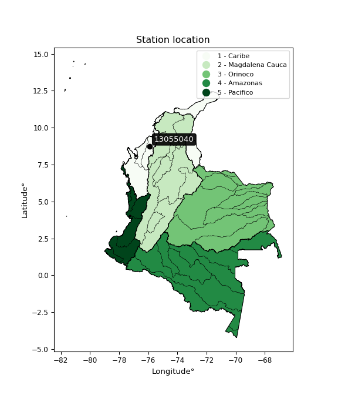

<div align="center">


</div>

# PMP Station (Rain, Pmax24h): 13055040

Probable Maximum Precipitation (PMP) is the greatest amount of rainfall for a specific duration that is meteorologically possible for a given location, acting as a "worst-case" scenario for extreme storms, crucial for designing safety-critical infrastructure like bridges, river deviations, dams, spillways, and nuclear plants to prevent catastrophic failure. PMP is calculated by hydrologists using meteorological data to determine the upper limit of extreme rainfall, often leading to the Probable Maximum Flood (PMF) for flood control design, and is increasingly being studied for climate change impacts. Probable Maximum Precipitation (PMP) is the theoretical upper limit of rainfall, a deterministic estimate for extreme events, while probability distributions (like GEV, Gumbel) describe the likelihood and frequency of various precipitation amounts, including rare ones, showing how often events occur, with PMP representing the extreme end of these distributions, used for critical infrastructure design to ensure safety against the worst conceivable weather, unlike standard statistical forecasts which cover typical probabilities.

The most common probability distributions in hydrology, used for analyzing floods, rainfall, and streamflow, include the Normal, Log-Normal, Gumbel, Gamma (including Log-Pearson Type III), and Generalized Extreme Value (GEV) distributions, often chosen based on the data´s skewness and whether modeling extremes or general conditions, with Gumbel and GEV popular for extreme events like floods, while the Normal distribution serves as a baseline, though often requiring transformations for skewed hydrological data. These distributions help in designing water infrastructure, managing water resources, and forecasting hydrologic events.

> Hydrological data often isn´t perfectly normal (it´s skewed), so different distributions are needed for different applications, such as: **Flood Frequency Analysis**: Using Gumbel, GEV, or Log-Pearson Type III for predicting extreme flood magnitudes and their return periods, **Rainfall Analysis**: Normal for annual totals, but Log-Normal, Weibull, or GEV for intensity or extreme daily rainfall, **Streamflow Modeling**: Gamma and Log-Normal for maximum flows, GEV for minimum flows, and Kappa for daily flows.

<div align="center">

</img>

</div>


## A. General information


### 1. General running parameters

• app_version: _v20260113_. • runtime: _2026-01-17 18:24:04.630693_. • Python version: _3.14.0_. • SciPy version: _1.16.3_. • Pandas version: _2.3.3_. • NumPy version: _2.3.5_. • Stations dataset (station_dataset_file): _dataset/pmax24h_in/automatic_colombia_2003_2025.csv_. • Stations catalog (station_catalog_file): _dataset/CNE.xls_. • Minimum year to eval til year_max (date_min): _1900_. • Maximum year to eval since year_min (date_max): _2025_. • Creates, save and include plots into reports (create_plot): _False_. • Plot only fit distributions with Δo > Δ (plot_only_fit): _True_. • Plot only simple graphs avoiding multiple CDFs and multiple Extreme values plots (plot_only_simple): _True_. • Eval low extreme values, if False, evaluates high extreme values (low_extreme): _False_. • Eval every SciPy distribution as logarithmic (pdist_logarithmic_on): _True_. • Standard deviation normalized (ddof): _1.0_. • Return periods to eval in years (Tr): _[2, 2.33, 5, 10, 15, 20, 25, 50, 75, 100, 200, 250, 500, 750, 1000]_. • Minimum data sample per station, 0 means any (minimum_sample): _5_. • Z-Score maximum threshold to adjust a value, 0 means disable (zscore_max): _3.5_. • Z-Score minimum threshold to adjust a value, 0 means disable (zscore_min): _-2.5_. • Avoid zeros, e.g. rain = 0 (avoid_zeros): _True_. • Avoid null values (avoid_nans): _True_. 

:file_folder:Table: [dataset.csv](../../dataset/pmax24h_in/automatic_colombia_2003_2025.csv)

> Delta Degrees of Freedom (DDOF): is a parameter used in the formulas for calculating variance and standard deviation. When ddof=0, the divisor is $N$ (the total number of observations) and this is used when your data set is the entire population. When ddof=1, the divisor is $N-1$ and this is used when your data set is a sample drawn from a larger population. Using $N-1$ provides an unbiased estimate of the population variance (known as Bessel´s correction).


### 2. Station info and location

|   id |   CODIGO | NOMBRE                   | CATEGORIA         | TECNOLOGIA                | ESTADO     | FECHA_INSTALACION   | FECHA_SUSPENSION   |   ALTITUD |   LATITUD |   LONGITUD | DEPARTAMENTO   | MUNICIPIO   | AREA_OPERATIVA                              | ENTIDAD                                                     | AREA_HIDROGRAFICA   | ZONA_HIDROGRAFICA   | SUBZONA_HIDROGRAFICA   |   CORRIENTE | Catalogo   |   Version |
|-----:|---------:|:-------------------------|:------------------|:--------------------------|:-----------|:--------------------|:-------------------|----------:|----------:|-----------:|:---------------|:------------|:--------------------------------------------|:------------------------------------------------------------|:--------------------|:--------------------|:-----------------------|------------:|:-----------|----------:|
|    0 | 13055040 | INCODER - AUT [13055040] | Agrometeorológica | Automática con Telemetría | Suspendida | 17/11/2004          | 02/12/2025         |        37 |   8.74694 |   -75.9139 | Cordoba        | Montería    | Area Operativa 02 - Atlántico-Bolivar-Sucre | INSTITUTO DE HIDROLOGIA METEOROLOGIA Y ESTUDIOS AMBIENTALES | Caribe              | Sinú                | Bajo Sinú              |         nan | CNE_IDEAM  |  20251226 |

<div align="center">

Dynamic map: [:earth_americas:Google](http://maps.google.com/maps?q=8.746944444,-75.91388889) [:earth_americas:OSM](https://www.openstreetmap.org/#map=18/8.746944444/-75.91388889&layers=P) [:earth_americas:Bing](https://www.bing.com/maps?cp=8.746944444~-75.91388889&lvl=18) [:earth_americas:Apple](https://maps.apple.com/frame?center=8.746944444%2C-75.91388889&span=0.003%2C0.006)

</div>


<div align="center">

```geojson
{
  "type": "Feature",
  "geometry": {
    "type": "Point", 
    "coordinates": [-75.91388889, 8.746944444]
  }, 
  "properties": {
    "Name": "13055040"
  }
}
```

</div>


### 3. Discrete values table and plot

<div align="center">

|               |            0 |           1 |           2 |           3 |           4 |           5 |          6 |           7 |           8 |           9 |           10 |          11 |         12 |
|:--------------|-------------:|------------:|------------:|------------:|------------:|------------:|-----------:|------------:|------------:|------------:|-------------:|------------:|-----------:|
| Date          | 2005         | 2006        | 2007        | 2008        | 2009        | 2010        | 2011       | 2012        | 2013        | 2014        | 2015         | 2016        | 2017       |
| Value         |   60.7       |   56.3      |   73.2      |   75.8      |   62.3      |   43.5      |   84.9     |   64        |   72.9      |   43.3      |   57.9       |   64.3      |   59.1462  |
| Value_initial |   60.7       |   56.3      |   73.2      |   75.8      |   62.3      |   43.5      |   84.9     |   64        |   72.9      |   43.3      |   57.9       |   64.3      |    9.8     |
| count         |   13         |   13        |   13        |   13        |   13        |   13        |   13       |   13        |   13        |   13        |   13         |   13        |   13       |
| mean          |   59.1462    |   59.1462   |   59.1462   |   59.1462   |   59.1462   |   59.1462   |   59.1462  |   59.1462   |   59.1462   |   59.1462   |   59.1462    |   59.1462   |   59.1462  |
| std           |   18.9964    |   18.9964   |   18.9964   |   18.9964   |   18.9964   |   18.9964   |   18.9964  |   18.9964   |   18.9964   |   18.9964   |   18.9964    |   18.9964   |   18.9964  |
| zscore        |    0.0817967 |   -0.149826 |    0.739815 |    0.876683 |    0.166023 |   -0.823637 |    1.35572 |    0.255514 |    0.724023 |   -0.834165 |   -0.0655994 |    0.271306 |   -2.59765 |


</div>


> The initial value (value_initial) correspond to the initial obtained or null completed value, and value (value) is adjusted only when the initial value is outside the valid range (outlier) definite through the Z-Score value. If Z-Score is active, values out of range or outliers are replaced with the station mean value. A Z-Score (or standard score) measures how many standard deviations a data point is from the mean of a dataset, indicating its relative position; positive scores mean above the mean, negative mean below, and a score of zero is exactly at the mean, allowing for comparison of values from different distributions. It´s calculated using the formula $z=(x–μ)/σ$, where $x$ is the data point, $μ$ is the mean, and $σ$ is the standard deviation, helping identify outliers and understand probability.
>
> <sub>**Note**: In this study, "completing" (filling gaps in) and "extending" (forecasting or lengthening the historical record) rainfall data series are avoided for certain critical analyses because they introduce artificial bias and uncertainty, which can distort the statistics of rare events (extremes), alter day-to-day variability, and compromise the integrity and homogeneity of the original data. Some reasons against Completing/Extending rainfall data are: **Distortion of Extremes and Variability**: The primary issue is that most gap-filling or extension methods rely on averaging or regression with nearby stations, which inherently smooths the data. Rainfall is highly variable in space and time, with a large percentage of zero values and occasional large storms. Infilling methods often underestimate the highest values and overestimate the lowest (zero) values, which severely distorts analyses focused on flood frequency, drought severity, and intensity-duration-frequency (IDF) curves, **Loss of Data Homogeneity**: Infilled or extended data are synthetic estimates, not actual measurements. Combining these estimates with observed data can violate the assumption of data homogeneity, which requires that the data properties do not change over time. Inhomogeneity can lead to incorrect conclusions about long-term trends or changes in climate patterns, **Propagation of Errors**: Errors and biases from the original data (e.g., wind-induced undercatch, instrument errors, site changes) or the data used for imputation can propagate through the analysis, leading to unreliable hydrological models and inaccurate predictions, **Compromised Statistical Integrity**: For statistical analyses, especially those involving the frequency of events, using artificial data can introduce time bias or autocorrelation that doesn´t exist in reality, making it difficult to assess the true probability of events, **Difficulty in Validation**: It is difficult to accurately validate the quality of filled or extended data, especially for past periods where ground-truth measurements are unavailable. The reliability of imputation techniques heavily depends on the density of the surrounding station network and the complexity of the local topography.</sub>


### 4. Active continuous probability distributions from SciPy (80 of 104 available)

A Probability Density Function (PDF) describes the relative likelihood of a continuous random variable falling within a specific range, where the total area under its curve equals 1, and the area over any interval gives the actual probability for that range. Unlike discrete probabilities (like rolling a die), a PDF shows density, not direct probability for a single point (which is zero), with higher points indicating higher likelihood, often visualized as a bell curve for normal distributions.

A log of a probability density function (log-PDF) is simply the logarithm of the PDF´s value, denoted as $log(f(x))$, useful for converting multiplication of probabilities into addition, improving numerical stability with tiny numbers, and connecting to information theory concepts like entropy. Instead of dealing with very small probabilities (e.g., 0.000001), log-PDFs use negative numbers (e.g., $log(0.00001) ≈ -11.51$ that are easier for computers to handle, preventing underflow errors and simplifying complex calculations. In this study, each active probability distribution from SciPy is also evaluated in the $log$ form.

[scipy.stats](https://docs.scipy.org/doc/scipy/reference/stats.html) is a Python´s powerful submodule within the SciPy library for comprehensive statistical analysis, offering over 130 probability distributions (like Normal, Poisson), functions for descriptive stats (mean, variance), hypothesis testing (t-tests, chi-square), random variable generation, and statistical tests, making it essential for data science, modeling, and research. It provides tools to explore, model, and draw conclusions from data efficiently, working seamlessly with NumPy.

<div align="center">

|   id | p_dist           |   n_parameter | fit_method   | label                                                                       | active   | ref                                                                                                      |
|-----:|:-----------------|--------------:|:-------------|:----------------------------------------------------------------------------|:---------|:---------------------------------------------------------------------------------------------------------|
|    0 | alpha            |             3 | MLE          | Alpha                                                                       | True     | [:mortar_board:](https://docs.scipy.org/doc/scipy/reference/generated/scipy.stats.alpha.html)            |
|    1 | anglit           |             2 | MM           | Anglit                                                                      | True     | [:mortar_board:](https://docs.scipy.org/doc/scipy/reference/generated/scipy.stats.anglit.html)           |
|    2 | arcsine          |             2 | MM           | Arcsine                                                                     | True     | [:mortar_board:](https://docs.scipy.org/doc/scipy/reference/generated/scipy.stats.arcsine.html)          |
|    3 | argus            |             3 | MLE          | Argus                                                                       | True     | [:mortar_board:](https://docs.scipy.org/doc/scipy/reference/generated/scipy.stats.argus.html)            |
|    4 | beta             |             4 | MLE          | Beta                                                                        | True     | [:mortar_board:](https://docs.scipy.org/doc/scipy/reference/generated/scipy.stats.beta.html)             |
|    5 | betaprime        |             4 | MLE          | Beta prime                                                                  | True     | [:mortar_board:](https://docs.scipy.org/doc/scipy/reference/generated/scipy.stats.betaprime.html)        |
|    6 | bradford         |             3 | MLE          | Bradford                                                                    | True     | [:mortar_board:](https://docs.scipy.org/doc/scipy/reference/generated/scipy.stats.bradford.html)         |
|    7 | burr             |             4 | MLE          | Burr (Type III)                                                             | True     | [:mortar_board:](https://docs.scipy.org/doc/scipy/reference/generated/scipy.stats.burr.html)             |
|    8 | burr12           |             4 | MLE          | Burr (Type III) 12                                                          | True     | [:mortar_board:](https://docs.scipy.org/doc/scipy/reference/generated/scipy.stats.burr12.html)           |
|    9 | cosine           |             2 | MLE          | Cosine                                                                      | True     | [:mortar_board:](https://docs.scipy.org/doc/scipy/reference/generated/scipy.stats.cosine.html)           |
|   10 | crystalball      |             4 | MLE          | Crystalball                                                                 | True     | [:mortar_board:](https://docs.scipy.org/doc/scipy/reference/generated/scipy.stats.crystalball.html)      |
|   11 | dgamma           |             3 | MLE          | Double gamma                                                                | True     | [:mortar_board:](https://docs.scipy.org/doc/scipy/reference/generated/scipy.stats.dgamma.html)           |
|   12 | dweibull         |             3 | MLE          | Double Weibull                                                              | True     | [:mortar_board:](https://docs.scipy.org/doc/scipy/reference/generated/scipy.stats.dweibull.html)         |
|   13 | erlang           |             3 | MLE          | Erlang                                                                      | True     | [:mortar_board:](https://docs.scipy.org/doc/scipy/reference/generated/scipy.stats.erlang.html)           |
|   14 | exponnorm        |             3 | MLE          | Exponentially modified Normal                                               | True     | [:mortar_board:](https://docs.scipy.org/doc/scipy/reference/generated/scipy.stats.exponnorm.html)        |
|   15 | exponpow         |             3 | MLE          | Exponential power                                                           | True     | [:mortar_board:](https://docs.scipy.org/doc/scipy/reference/generated/scipy.stats.exponpow.html)         |
|   16 | exponweib        |             4 | MLE          | Exponentiated Weibull                                                       | True     | [:mortar_board:](https://docs.scipy.org/doc/scipy/reference/generated/scipy.stats.exponweib.html)        |
|   17 | f                |             4 | MLE          | F                                                                           | True     | [:mortar_board:](https://docs.scipy.org/doc/scipy/reference/generated/scipy.stats.f.html)                |
|   18 | fatiguelife      |             3 | MLE          | Fatigue-life (Birnbaum-Saunders)                                            | True     | [:mortar_board:](https://docs.scipy.org/doc/scipy/reference/generated/scipy.stats.fatiguelife.html)      |
|   19 | foldnorm         |             3 | MM           | Fold Normal                                                                 | True     | [:mortar_board:](https://docs.scipy.org/doc/scipy/reference/generated/scipy.stats.foldnorm.html)         |
|   20 | gamma            |             3 | MLE          | Gamma                                                                       | True     | [:mortar_board:](https://docs.scipy.org/doc/scipy/reference/generated/scipy.stats.gamma.html)            |
|   21 | gausshyper       |             6 | MLE          | Gauss hypergeometric                                                        | True     | [:mortar_board:](https://docs.scipy.org/doc/scipy/reference/generated/scipy.stats.gausshyper.html)       |
|   22 | genexpon         |             5 | MLE          | Generalized exponential                                                     | True     | [:mortar_board:](https://docs.scipy.org/doc/scipy/reference/generated/scipy.stats.genexpon.html)         |
|   23 | genextreme       |             3 | MLE          | Generalized exponential                                                     | True     | [:mortar_board:](https://docs.scipy.org/doc/scipy/reference/generated/scipy.stats.genextreme.html)       |
|   24 | gengamma         |             4 | MLE          | Generalized gamma                                                           | True     | [:mortar_board:](https://docs.scipy.org/doc/scipy/reference/generated/scipy.stats.gengamma.html)         |
|   25 | genhalflogistic  |             3 | MLE          | Generalized half-logistic                                                   | True     | [:mortar_board:](https://docs.scipy.org/doc/scipy/reference/generated/scipy.stats.genhalflogistic.html)  |
|   26 | genlogistic      |             3 | MLE          | Generalized logistic                                                        | True     | [:mortar_board:](https://docs.scipy.org/doc/scipy/reference/generated/scipy.stats.genlogistic.html)      |
|   27 | gennorm          |             3 | MLE          | Generalized Normal                                                          | True     | [:mortar_board:](https://docs.scipy.org/doc/scipy/reference/generated/scipy.stats.gennorm.html)          |
|   28 | genpareto        |             3 | MLE          | Generalized Pareto                                                          | True     | [:mortar_board:](https://docs.scipy.org/doc/scipy/reference/generated/scipy.stats.genpareto.html)        |
|   29 | gompertz         |             3 | MLE          | Gompertz (or truncated Gumbel)                                              | True     | [:mortar_board:](https://docs.scipy.org/doc/scipy/reference/generated/scipy.stats.gompertz.html)         |
|   30 | gumbel_l         |             2 | MM           | Gumbel Left Skew                                                            | True     | [:mortar_board:](https://docs.scipy.org/doc/scipy/reference/generated/scipy.stats.gumbel_l.html)         |
|   31 | gumbel_r         |             2 | MM           | Gumbel Right Skew                                                           | True     | [:mortar_board:](https://docs.scipy.org/doc/scipy/reference/generated/scipy.stats.gumbel_r.html)         |
|   32 | halfgennorm      |             3 | MLE          | Upper half of a generalized normal                                          | True     | [:mortar_board:](https://docs.scipy.org/doc/scipy/reference/generated/scipy.stats.halfgennorm.html)      |
|   33 | halflogistic     |             2 | MM           | Half-logistic                                                               | True     | [:mortar_board:](https://docs.scipy.org/doc/scipy/reference/generated/scipy.stats.halflogistic.html)     |
|   34 | halfnorm         |             2 | MM           | Half Normal                                                                 | True     | [:mortar_board:](https://docs.scipy.org/doc/scipy/reference/generated/scipy.stats.halfnorm.html)         |
|   35 | hypsecant        |             2 | MM           | hyperbolic secant                                                           | True     | [:mortar_board:](https://docs.scipy.org/doc/scipy/reference/generated/scipy.stats.hypsecant.html)        |
|   36 | invgamma         |             3 | MLE          | Inverted gamma                                                              | True     | [:mortar_board:](https://docs.scipy.org/doc/scipy/reference/generated/scipy.stats.invgamma.html)         |
|   37 | invgauss         |             3 | MLE          | Inverse Gaussian                                                            | True     | [:mortar_board:](https://docs.scipy.org/doc/scipy/reference/generated/scipy.stats.invgauss.html)         |
|   38 | invweibull       |             3 | MLE          | Inverted Weibull                                                            | True     | [:mortar_board:](https://docs.scipy.org/doc/scipy/reference/generated/scipy.stats.invweibull.html)       |
|   39 | johnsonsb        |             4 | MLE          | Johnson SB                                                                  | True     | [:mortar_board:](https://docs.scipy.org/doc/scipy/reference/generated/scipy.stats.johnsonsb.html)        |
|   40 | johnsonsu        |             4 | MLE          | Johnson Su                                                                  | True     | [:mortar_board:](https://docs.scipy.org/doc/scipy/reference/generated/scipy.stats.johnsonsu.html)        |
|   41 | kappa3           |             3 | MLE          | Kappa 3                                                                     | True     | [:mortar_board:](https://docs.scipy.org/doc/scipy/reference/generated/scipy.stats.kappa3.html)           |
|   42 | kappa4           |             4 | MLE          | Kappa 4                                                                     | True     | [:mortar_board:](https://docs.scipy.org/doc/scipy/reference/generated/scipy.stats.kappa4.html)           |
|   43 | ksone            |             3 | MLE          | Kolmogorov-Smirnov one-sided test statistic distribution                    | True     | [:mortar_board:](https://docs.scipy.org/doc/scipy/reference/generated/scipy.stats.ksone.html)            |
|   44 | kstwobign        |             2 | MLE          | Limiting distribution of scaled Kolmogorov-Smirnov two-sided test statistic | True     | [:mortar_board:](https://docs.scipy.org/doc/scipy/reference/generated/scipy.stats.kstwobign.html)        |
|   45 | laplace          |             2 | MM           | Laplace                                                                     | True     | [:mortar_board:](https://docs.scipy.org/doc/scipy/reference/generated/scipy.stats.laplace.html)          |
|   46 | levy_l           |             2 | MLE          | Left-skewed Levy                                                            | True     | [:mortar_board:](https://docs.scipy.org/doc/scipy/reference/generated/scipy.stats.levy_l.html)           |
|   47 | loggamma         |             3 | MLE          | Log gamma                                                                   | True     | [:mortar_board:](https://docs.scipy.org/doc/scipy/reference/generated/scipy.stats.loggamma.html)         |
|   48 | logistic         |             2 | MM           | Logistic (or Sech-squared)                                                  | True     | [:mortar_board:](https://docs.scipy.org/doc/scipy/reference/generated/scipy.stats.logistic.html)         |
|   49 | loglaplace       |             3 | MLE          | Log-Laplace                                                                 | True     | [:mortar_board:](https://docs.scipy.org/doc/scipy/reference/generated/scipy.stats.loglaplace.html)       |
|   50 | lomax            |             3 | MLE          | Lomax (Pareto of the second kind)                                           | True     | [:mortar_board:](https://docs.scipy.org/doc/scipy/reference/generated/scipy.stats.lomax.html)            |
|   51 | maxwell          |             2 | MM           | Maxwell                                                                     | True     | [:mortar_board:](https://docs.scipy.org/doc/scipy/reference/generated/scipy.stats.maxwell.html)          |
|   52 | mielke           |             4 | MLE          | Mielke Beta-Kappa / Dagum                                                   | True     | [:mortar_board:](https://docs.scipy.org/doc/scipy/reference/generated/scipy.stats.mielke.html)           |
|   53 | moyal            |             2 | MM           | Moyal                                                                       | True     | [:mortar_board:](https://docs.scipy.org/doc/scipy/reference/generated/scipy.stats.moyal.html)            |
|   54 | nakagami         |             3 | MLE          | Nakagami                                                                    | True     | [:mortar_board:](https://docs.scipy.org/doc/scipy/reference/generated/scipy.stats.nakagami.html)         |
|   55 | ncf              |             5 | MLE          | Non-central F distribution                                                  | True     | [:mortar_board:](https://docs.scipy.org/doc/scipy/reference/generated/scipy.stats.ncf.html)              |
|   56 | nct              |             4 | MLE          | Non-central Student’s t                                                     | True     | [:mortar_board:](https://docs.scipy.org/doc/scipy/reference/generated/scipy.stats.nct.html)              |
|   57 | norm             |             2 | MM           | Normal                                                                      | True     | [:mortar_board:](https://docs.scipy.org/doc/scipy/reference/generated/scipy.stats.norm.html)             |
|   58 | pearson3         |             3 | MM           | Pearson type III                                                            | True     | [:mortar_board:](https://docs.scipy.org/doc/scipy/reference/generated/scipy.stats.pearson3.html)         |
|   59 | powerlaw         |             3 | MLE          | Power-function                                                              | True     | [:mortar_board:](https://docs.scipy.org/doc/scipy/reference/generated/scipy.stats.powerlaw.html)         |
|   60 | rayleigh         |             2 | MM           | Rayleigh                                                                    | True     | [:mortar_board:](https://docs.scipy.org/doc/scipy/reference/generated/scipy.stats.rayleigh.html)         |
|   61 | rdist            |             3 | MLE          | R-distributed (symmetric beta)                                              | True     | [:mortar_board:](https://docs.scipy.org/doc/scipy/reference/generated/scipy.stats.rdist.html)            |
|   62 | rice             |             3 | MLE          | Rice                                                                        | True     | [:mortar_board:](https://docs.scipy.org/doc/scipy/reference/generated/scipy.stats.rice.html)             |
|   63 | semicircular     |             2 | MM           | Semicircular                                                                | True     | [:mortar_board:](https://docs.scipy.org/doc/scipy/reference/generated/scipy.stats.semicircular.html)     |
|   64 | skewnorm         |             3 | MLE          | Skew normal                                                                 | True     | [:mortar_board:](https://docs.scipy.org/doc/scipy/reference/generated/scipy.stats.skewnorm.html)         |
|   65 | t                |             3 | MLE          | Student’s t                                                                 | True     | [:mortar_board:](https://docs.scipy.org/doc/scipy/reference/generated/scipy.stats.t.html)                |
|   66 | trapezoid        |             4 | MLE          | Trapezoid                                                                   | True     | [:mortar_board:](https://docs.scipy.org/doc/scipy/reference/generated/scipy.stats.trapezoid.html)        |
|   67 | triang           |             3 | MLE          | Triangular                                                                  | True     | [:mortar_board:](https://docs.scipy.org/doc/scipy/reference/generated/scipy.stats.triang.html)           |
|   68 | truncexpon       |             3 | MLE          | Truncated exponential                                                       | True     | [:mortar_board:](https://docs.scipy.org/doc/scipy/reference/generated/scipy.stats.truncexpon.html)       |
|   69 | truncnorm        |             4 | MLE          | Truncated normal                                                            | True     | [:mortar_board:](https://docs.scipy.org/doc/scipy/reference/generated/scipy.stats.truncnorm.html)        |
|   70 | truncpareto      |             4 | MLE          | Upper truncated Pareto                                                      | True     | [:mortar_board:](https://docs.scipy.org/doc/scipy/reference/generated/scipy.stats.truncpareto.html)      |
|   71 | truncweibull_min |             5 | MLE          | Doubly truncated Weibull minimum                                            | True     | [:mortar_board:](https://docs.scipy.org/doc/scipy/reference/generated/scipy.stats.truncweibull_min.html) |
|   72 | tukeylambda      |             3 | MLE          | Tukey-Lamdba                                                                | True     | [:mortar_board:](https://docs.scipy.org/doc/scipy/reference/generated/scipy.stats.tukeylambda.html)      |
|   73 | uniform          |             2 | MLE          | Uniform                                                                     | True     | [:mortar_board:](https://docs.scipy.org/doc/scipy/reference/generated/scipy.stats.uniform.html)          |
|   74 | vonmises         |             3 | MLE          | Von Mises                                                                   | True     | [:mortar_board:](https://docs.scipy.org/doc/scipy/reference/generated/scipy.stats.vonmises.html)         |
|   75 | vonmises_line    |             3 | MLE          | Von Mises line                                                              | True     | [:mortar_board:](https://docs.scipy.org/doc/scipy/reference/generated/scipy.stats.vonmises_line.html)    |
|   76 | wald             |             2 | MM           | Wald                                                                        | True     | [:mortar_board:](https://docs.scipy.org/doc/scipy/reference/generated/scipy.stats.wald.html)             |
|   77 | weibull_max      |             3 | MLE          | Weibull maximum                                                             | True     | [:mortar_board:](https://docs.scipy.org/doc/scipy/reference/generated/scipy.stats.weibull_max.html)      |
|   78 | weibull_min      |             3 | MLE          | Weibull minimum                                                             | True     | [:mortar_board:](https://docs.scipy.org/doc/scipy/reference/generated/scipy.stats.weibull_min.html)      |
|   79 | wrapcauchy       |             3 | MLE          | Wrapped  Cauchy                                                             | True     | [:mortar_board:](https://docs.scipy.org/doc/scipy/reference/generated/scipy.stats.wrapcauchy.html)       |

</div>

> **n_parameter:** # arguments & localization & scale.
>
> **Fit methods:** (MLE) maximum likelihood, (MM) L-moments.
>
>**Inactive** (With the only purpose of prevent loops, zero divisions, infinite values, over high estimated values or horizontal trending for recurrence intervals estimations, the follow distributions were disabled.)**:** lognorm, norminvgauss, powernorm, powerlognorm, cauchy, halfcauchy, foldcauchy, skewcauchy, chi2, expon, fisk, genhyperbolic, geninvgauss, gibrat, kstwo, laplace_asymmetric, levy, levy_stable, ncx2, pareto, rel_breitwigner, recipinvgauss, studentized_range, loguniform, 


## B. Probability (PDF) vs. Empirical (EDF) distributions functions

A continuous probability distribution (CPD) describes probabilities for variables that can take any value within a range (like rain any time), unlike discrete variables with specific outcomes (like temperature). It uses a Probability Density Function (PDF), a curve where the total area under it equals 1, and the probability of the variable falling within an interval (a to b) is found by calculating the area under the curve between those points. A key feature is that the probability of hitting any single exact value is zero, so probabilities are always expressed for ranges, e.g., $P(a ≤ X ≤ b)$.

<div align="center">

Distributions parameters from station values
|     |   station | p_dist              |   n |               loc |            scale | shape                  | shape1                | shape2                 | shape3             |
|----:|----------:|:--------------------|----:|------------------:|-----------------:|:-----------------------|:----------------------|:-----------------------|:-------------------|
|   0 |  13055040 | alpha               |  13 |    -151.467       |   3947.27        | 18.466441629601192     |                       |                        |                    |
|   1 |  13055040 | anglit              |  13 |      62.942       |     33.532       |                        |                       |                        |                    |
|   2 |  13055040 | arcsine             |  13 |      46.7317      |     32.4205      |                        |                       |                        |                    |
|   3 |  13055040 | argus               |  13 |      34.3961      |     51.8061      | 8.778470268098056e-06  |                       |                        |                    |
|   4 |  13055040 | beta                |  13 |      43.3         |     42.1333      | 0.5814745361234799     | 1.5084268055308567    |                        |                    |
|   5 |  13055040 | betaprime           |  13 |     -10.6218      |      0.944748    | 3039.5847427585522     | 40.09009707298202     |                        |                    |
|   6 |  13055040 | bradford            |  13 |      43.3         |     41.6         | 1.043703576374024      |                       |                        |                    |
|   7 |  13055040 | burr                |  13 |     -78.4693      |     55.6429      | 12.35223330071424      | 57222.581566900975    |                        |                    |
|   8 |  13055040 | burr12              |  13 |      -7.48024     |     50.6375      | 1180.5692301294378     | 0.0026800967415562217 |                        |                    |
|   9 |  13055040 | cosine              |  13 |      62.9708      |      9.91085     |                        |                       |                        |                    |
|  10 |  13055040 | crystalball         |  13 |      62.942       |     11.4624      | 55306.02283187591      | 4803.4800454285305    |                        |                    |
|  11 |  13055040 | dgamma              |  13 |      61.7682      |      7.95818     | 1.1095100317156439     |                       |                        |                    |
|  12 |  13055040 | dweibull            |  13 |      61.815       |      9.08999     | 1.0823491679498303     |                       |                        |                    |
|  13 |  13055040 | erlang              |  13 |    -705.186       |      0.171198    | 4486.787746187812      |                       |                        |                    |
|  14 |  13055040 | exponnorm           |  13 |      62.9259      |     11.4623      | 0.0014072320977983172  |                       |                        |                    |
|  15 |  13055040 | exponpow            |  13 |      43.3         |      1.47995     | 0.13749774223861178    |                       |                        |                    |
|  16 |  13055040 | exponweib           |  13 |      43.3         |      1.28004     | 1.2653713319603195     | 0.2669364889232251    |                        |                    |
|  17 |  13055040 | f                   |  13 |   -1980.33        |   2043.22        | 425207.1440114856      | 74792.46153899879     |                        |                    |
|  18 |  13055040 | fatiguelife         |  13 |      43.3         |      0.000235895 | 281.87876236901695     |                       |                        |                    |
|  19 |  13055040 | foldnorm            |  13 |      62.6206      |      2.34407     | 6.919164630063369e-07  |                       |                        |                    |
|  20 |  13055040 | gamma               |  13 |    -719.24        |      0.168232    | 4649.389330152286      |                       |                        |                    |
|  21 |  13055040 | gausshyper          |  13 |      43.3         |     42.4494      | 0.6097238669868907     | 0.9913654990390794    | 0.33083688028658426    | 2.1207498525626525 |
|  22 |  13055040 | genexpon            |  13 |      43.3         |      1.75272     | 0.0755497575672929     | 0.017485872313873392  | 1.2759844694541886     |                    |
|  23 |  13055040 | genextreme          |  13 |      83.9311      |      3.79201     | 3.913771273894426      |                       |                        |                    |
|  24 |  13055040 | gengamma            |  13 |      43.3         |      1.28839     | 1.2459124607657284     | 0.26964443061648835   |                        |                    |
|  25 |  13055040 | genhalflogistic     |  13 |      43.3         |     23.4259      | 0.5162504704279367     |                       |                        |                    |
|  26 |  13055040 | genlogistic         |  13 |      62.7582      |      6.6059      | 1.0223923232099779     |                       |                        |                    |
|  27 |  13055040 | gennorm             |  13 |      62.7693      |     14.541       | 1.6675026812002498     |                       |                        |                    |
|  28 |  13055040 | genpareto           |  13 |      -1.03972     |    133.241       | -1.5503991086221078    |                       |                        |                    |
|  29 |  13055040 | gompertz            |  13 |      33.852       |      1.98215     | 7.673260875868681e-11  |                       |                        |                    |
|  30 |  13055040 | gumbel_l            |  13 |      68.1007      |      8.93718     |                        |                       |                        |                    |
|  31 |  13055040 | gumbel_r            |  13 |      57.7833      |      8.93718     |                        |                       |                        |                    |
|  32 |  13055040 | halfgennorm         |  13 |      43.3         |      1.39093     | 0.3965003143412077     |                       |                        |                    |
|  33 |  13055040 | halflogistic        |  13 |      49.3564      |      9.79993     |                        |                       |                        |                    |
|  34 |  13055040 | halfnorm            |  13 |      47.7703      |     19.0149      |                        |                       |                        |                    |
|  35 |  13055040 | hypsecant           |  13 |      62.942       |      7.29717     |                        |                       |                        |                    |
|  36 |  13055040 | invgamma            |  13 |     -97.3173      |  30447.6         | 191.03858041535466     |                       |                        |                    |
|  37 |  13055040 | invgauss            |  13 |       2.20928     |   1477.25        | 0.040804273715957864   |                       |                        |                    |
|  38 |  13055040 | invweibull          |  13 |      -6.68888e+08 |      6.68888e+08 | 60671513.61067355      |                       |                        |                    |
|  39 |  13055040 | johnsonsb           |  13 |      43.3         |     41.6         | 0.41430073496196096    | 0.11840868045628528   |                        |                    |
|  40 |  13055040 | johnsonsu           |  13 |      -1.24865e+07 |      2.16845e+08 | -1090399.3615355673    | 18946616.659720145    |                        |                    |
|  41 |  13055040 | kappa3              |  13 |      43.3         |     54.2877      | 249.39037841801755     |                       |                        |                    |
|  42 |  13055040 | kappa4              |  13 |      39.4837      |     48.2762      | 1.0817400032037878     | 1.0629701909131528    |                        |                    |
|  43 |  13055040 | ksone               |  13 |      39.14        |     49.92        | 1.0                    |                       |                        |                    |
|  44 |  13055040 | kstwobign           |  13 |      17.9795      |     51.4919      |                        |                       |                        |                    |
|  45 |  13055040 | laplace             |  13 |      62.942       |      8.10512     |                        |                       |                        |                    |
|  46 |  13055040 | levy_l              |  13 |      87.173       |     13.2346      |                        |                       |                        |                    |
|  47 |  13055040 | loggamma            |  13 |   -1554.4         |    259.321       | 511.7243200346911      |                       |                        |                    |
|  48 |  13055040 | logistic            |  13 |      62.942       |      6.31954     |                        |                       |                        |                    |
|  49 |  13055040 | loglaplace          |  13 |      -0.186691    |     62.4867      | 7.01724940989965       |                       |                        |                    |
|  50 |  13055040 | lomax               |  13 |      43.3         |      3.31657e+11 | 5906937032.370046      |                       |                        |                    |
|  51 |  13055040 | maxwell             |  13 |      35.781       |     17.0206      |                        |                       |                        |                    |
|  52 |  13055040 | mielke              |  13 |      -0.263214    |     68.2131      | 6.788454073137556      | 12.19329283822734     |                        |                    |
|  53 |  13055040 | moyal               |  13 |      56.3871      |      5.15988     |                        |                       |                        |                    |
|  54 |  13055040 | nakagami            |  13 |    -860.082       |    923.103       | 1619.5282555353424     |                       |                        |                    |
|  55 |  13055040 | ncf                 |  13 |     -49.4984      |    112.436       | 192.80937679824055     | 24910.7789182593      | 1.5799520605366693e-08 |                    |
|  56 |  13055040 | nct                 |  13 |      -1.11396     |      0.251547    | 14.071420783994848     | 241.22004866122847    |                        |                    |
|  57 |  13055040 | norm                |  13 |      62.942       |     11.4624      |                        |                       |                        |                    |
|  58 |  13055040 | pearson3            |  13 |      62.942       |     11.4624      | -0.0322076508694972    |                       |                        |                    |
|  59 |  13055040 | powerlaw            |  13 |      43.3         |     41.6         | 0.2665397038056653     |                       |                        |                    |
|  60 |  13055040 | rayleigh            |  13 |      41.0138      |     17.4962      |                        |                       |                        |                    |
|  61 |  13055040 | rdist               |  13 |      41.0303      |     23.2697      | 1.0578937052169142     |                       |                        |                    |
|  62 |  13055040 | rice                |  13 |      36.9472      |     12.8172      | 1.7067698363362513     |                       |                        |                    |
|  63 |  13055040 | semicircular        |  13 |      62.942       |     22.9247      |                        |                       |                        |                    |
|  64 |  13055040 | skewnorm            |  13 |      66.4077      |     11.9748      | -0.3892151019031792    |                       |                        |                    |
|  65 |  13055040 | t                   |  13 |      62.9414      |     11.462       | 3130517.387521011      |                       |                        |                    |
|  66 |  13055040 | trapezoid           |  13 |      39.14        |     49.92        | 1.0                    | 1.0                   |                        |                    |
|  67 |  13055040 | triang              |  13 |      30.5994      |     54.3006      | 0.9999996612012534     |                       |                        |                    |
|  68 |  13055040 | truncexpon          |  13 |      43.3         |     46.8767      | 0.8874345233794947     |                       |                        |                    |
|  69 |  13055040 | truncnorm           |  13 |      60.6202      |     13.2817      | -1.3040653460252334    | 2012.9328438597552    |                        |                    |
|  70 |  13055040 | truncpareto         |  13 |      43.3         |      3.33578e-05 | 9.825702912684377e-08  | 1247772.2206785171    |                        |                    |
|  71 |  13055040 | truncweibull_min    |  13 |      43.3         |     58.037       | 0.7021450119050426     | 6.230540698844908e-15 | 0.7231027220270045     |                    |
|  72 |  13055040 | tukeylambda         |  13 |      53.787       |     11.1477      | 1.060364417029955      |                       |                        |                    |
|  73 |  13055040 | uniform             |  13 |      43.3         |     41.6         |                        |                       |                        |                    |
|  74 |  13055040 | vonmises            |  13 |      -0.27449     |      1           | 0.21764262225563305    |                       |                        |                    |
|  75 |  13055040 | vonmises_line       |  13 |      64.1         |      6.62085     | 0.43838964988865947    |                       |                        |                    |
|  76 |  13055040 | wald                |  13 |      51.4796      |     11.4624      |                        |                       |                        |                    |
|  77 |  13055040 | weibull_max         |  13 |      84.9         |      1.56004     | 0.3117091152689794     |                       |                        |                    |
|  78 |  13055040 | weibull_min         |  13 |      30.3716      |     36.4148      | 3.1586759713351835     |                       |                        |                    |
|  79 |  13055040 | wrapcauchy          |  13 |      43.2999      |      6.89871     | 1.804249729796343e-06  |                       |                        |                    |
|  80 |  13055040 | logalpha            |  13 |      -4.02254     |    344.915       | 42.36818701819159      |                       |                        |                    |
|  81 |  13055040 | loganglit           |  13 |       4.12481     |      0.554099    |                        |                       |                        |                    |
|  82 |  13055040 | logarcsine          |  13 |       3.85694     |      0.535746    |                        |                       |                        |                    |
|  83 |  13055040 | logargus            |  13 |       3.64637     |      0.818066    | 9.036514448710771e-05  |                       |                        |                    |
|  84 |  13055040 | logbeta             |  13 |       3.76815     |      0.673677    | 0.7138153474125355     | 0.9948145446603637    |                        |                    |
|  85 |  13055040 | logbetaprime        |  13 |      -1.51068     |      4.27586     | 1988.2770082232546     | 1508.5931355578696    |                        |                    |
|  86 |  13055040 | logbradford         |  13 |       3.76461     |      0.676866    | 4.0078356053823176e-05 |                       |                        |                    |
|  87 |  13055040 | logburr             |  13 |      -0.285747    |      4.51909     | 57.10711558379438      | 0.49097724618713956   |                        |                    |
|  88 |  13055040 | logburr12           |  13 |      -0.0718903   |      4.60912     | 27.840764497109276     | 8.413603466644425     |                        |                    |
|  89 |  13055040 | logcosine           |  13 |       4.11153     |      0.163668    |                        |                       |                        |                    |
|  90 |  13055040 | logcrystalball      |  13 |       4.12481     |      0.18941     | 12024.411781443354     | 165.9300099694511     |                        |                    |
|  91 |  13055040 | logdgamma           |  13 |       4.12353     |      0.131076    | 1.0953618391900224     |                       |                        |                    |
|  92 |  13055040 | logdweibull         |  13 |       4.13196     |      0.146759    | 0.7687656372747185     |                       |                        |                    |
|  93 |  13055040 | logerlang           |  13 |       0.828447    |      0.0113967   | 289.24013397092676     |                       |                        |                    |
|  94 |  13055040 | logexponnorm        |  13 |       4.12468     |      0.189409    | 0.0006827477414977358  |                       |                        |                    |
|  95 |  13055040 | logexponpow         |  13 |       3.60674     |      0.69462     | 2.3499861961922903     |                       |                        |                    |
|  96 |  13055040 | logexponweib        |  13 |       3.76815     |      0.651021    | 0.09185193679173194    | 8.059337996620318     |                        |                    |
|  97 |  13055040 | logf                |  13 |    -115.344       |    119.469       | 2499016.786448464      | 1163914.9525473034    |                        |                    |
|  98 |  13055040 | logfatiguelife      |  13 |     -29.7716      |     33.8966      | 0.0055693054263661265  |                       |                        |                    |
|  99 |  13055040 | logfoldnorm         |  13 |       3.87481     |      0.276689    | 0.5211400647669704     |                       |                        |                    |
| 100 |  13055040 | loggamma            |  13 |       0.67484     |      0.0108452   | 317.99112415266046     |                       |                        |                    |
| 101 |  13055040 | loggausshyper       |  13 |       3.76715     |      0.674324    | 1.0144715885652222     | 0.911075986880924     | 1.1876249964128474     | 0.9453855869157284 |
| 102 |  13055040 | loggenexpon         |  13 |       3.74153     |      0.00772141  | 0.00479951981901797    | 5.4711662859332915    | 9.050643809100023e-05  |                    |
| 103 |  13055040 | loggenextreme       |  13 |       4.0766      |      0.204451    | 0.4801287229352458     |                       |                        |                    |
| 104 |  13055040 | loggengamma         |  13 |       3.76815     |      0.574336    | 0.5163204113764753     | 1.6014046703334475    |                        |                    |
| 105 |  13055040 | loggenhalflogistic  |  13 |       3.75453     |      0.752894    | 1.0960083878374407     |                       |                        |                    |
| 106 |  13055040 | loggenlogistic      |  13 |       4.21906     |      0.0822655   | 0.5553768271123936     |                       |                        |                    |
| 107 |  13055040 | loggennorm          |  13 |       4.13196     |      0.185154    | 1.239071354089646      |                       |                        |                    |
| 108 |  13055040 | loggenpareto        |  13 |      -0.00798405  |     10.7253      | -2.4104722662609968    |                       |                        |                    |
| 109 |  13055040 | loggompertz         |  13 |       3.76815     |      0.589512    | 1.1605647795830518     |                       |                        |                    |
| 110 |  13055040 | loggumbel_l         |  13 |       4.21006     |      0.147682    |                        |                       |                        |                    |
| 111 |  13055040 | loggumbel_r         |  13 |       4.03957     |      0.147682    |                        |                       |                        |                    |
| 112 |  13055040 | loghalfgennorm      |  13 |       3.76792     |      0.681358    | 18.94011394253659      |                       |                        |                    |
| 113 |  13055040 | loghalflogistic     |  13 |       3.90036     |      0.161909    |                        |                       |                        |                    |
| 114 |  13055040 | loghalfnorm         |  13 |       3.87413     |      0.31418     |                        |                       |                        |                    |
| 115 |  13055040 | loghypsecant        |  13 |       4.12481     |      0.120582    |                        |                       |                        |                    |
| 116 |  13055040 | loginvgamma         |  13 |       0.510472    |   1220.05        | 338.74496379198195     |                       |                        |                    |
| 117 |  13055040 | loginvgauss         |  13 |       2.38359     |    126.415       | 0.013770440848875468   |                       |                        |                    |
| 118 |  13055040 | loginvweibull       |  13 | -446290           | 446294           | 2253726.7677428657     |                       |                        |                    |
| 119 |  13055040 | logjohnsonsb        |  13 |       3.76815     |      0.673855    | 0.2537260857299718     | 0.10479873736898962   |                        |                    |
| 120 |  13055040 | logjohnsonsu        |  13 |       4.98038     |      0.179064    | 10.395093208158261     | 4.630342447159698     |                        |                    |
| 121 |  13055040 | logkappa3           |  13 |       3.76815     |      0.672328    | 1733.077582033502      |                       |                        |                    |
| 122 |  13055040 | logkappa4           |  13 |       3.76514     |      0.733043    | 1.0010862485133687     | 1.0838475680378337    |                        |                    |
| 123 |  13055040 | logksone            |  13 |       3.70082     |      0.807986    | 1.0                    |                       |                        |                    |
| 124 |  13055040 | logkstwobign        |  13 |       3.32255     |      0.917811    |                        |                       |                        |                    |
| 125 |  13055040 | loglaplace          |  13 |       4.12481     |      0.133933    |                        |                       |                        |                    |
| 126 |  13055040 | loglevy_l           |  13 |       4.47243     |      0.179423    |                        |                       |                        |                    |
| 127 |  13055040 | logloggamma         |  13 |       3.8817      |      0.291051    | 2.787771795149109      |                       |                        |                    |
| 128 |  13055040 | loglogistic         |  13 |       4.12481     |      0.104427    |                        |                       |                        |                    |
| 129 |  13055040 | logloglaplace       |  13 |       0.0422667   |      4.08969     | 28.3943367523805       |                       |                        |                    |
| 130 |  13055040 | loglomax            |  13 |       3.76815     |     11.8529      | 33.481327750959565     |                       |                        |                    |
| 131 |  13055040 | logmaxwell          |  13 |       3.67599     |      0.281257    |                        |                       |                        |                    |
| 132 |  13055040 | logmielke           |  13 |      -0.00599241  |      4.24038     | 26.147590290363844     | 53.73969691293118     |                        |                    |
| 133 |  13055040 | logmoyal            |  13 |       4.01649     |      0.0852644   |                        |                       |                        |                    |
| 134 |  13055040 | lognakagami         |  13 |     -68.5397      |     72.6648      | 36735.0679892092       |                       |                        |                    |
| 135 |  13055040 | logncf              |  13 |     -42.5208      |     29.8594      | 514279.0555207104      | 151431.46500068798    | 289112.2728605289      |                    |
| 136 |  13055040 | lognct              |  13 |      -3.12364     |      0.0265784   | 719.8616329574238      | 272.4128942744517     |                        |                    |
| 137 |  13055040 | lognorm             |  13 |       4.12481     |      0.18941     |                        |                       |                        |                    |
| 138 |  13055040 | logpearson3         |  13 |       4.12481     |      0.18941     | -0.46140923830634095   |                       |                        |                    |
| 139 |  13055040 | logpowerlaw         |  13 |       3.76815     |      0.673321    | 0.28532022185634126    |                       |                        |                    |
| 140 |  13055040 | lograyleigh         |  13 |       3.76246     |      0.289115    |                        |                       |                        |                    |
| 141 |  13055040 | logrdist            |  13 |       4.02406     |      0.417417    | 1.096072931548702      |                       |                        |                    |
| 142 |  13055040 | logrice             |  13 |       3.64705     |      0.205535    | 2.0621922504068464     |                       |                        |                    |
| 143 |  13055040 | logsemicircular     |  13 |       4.12481     |      0.37882     |                        |                       |                        |                    |
| 144 |  13055040 | logskewnorm         |  13 |       4.32759     |      0.277478    | -2.2903209194158283    |                       |                        |                    |
| 145 |  13055040 | logt                |  13 |       4.12481     |      0.18941     | 623279019.1233534      |                       |                        |                    |
| 146 |  13055040 | logtrapezoid        |  13 |       3.70082     |      0.807986    | 1.0                    | 1.0                   |                        |                    |
| 147 |  13055040 | logtriang           |  13 |       3.59654     |      0.84494     | 0.9999999920502034     |                       |                        |                    |
| 148 |  13055040 | logtruncexpon       |  13 |       3.76815     |      0.805649    | 0.8360183341730156     |                       |                        |                    |
| 149 |  13055040 | logtruncnorm        |  13 |       0.0088838   |      1.28385     | 2.9281256030071847     | 3.452584544814421     |                        |                    |
| 150 |  13055040 | logtruncpareto      |  13 |       3.76815     |      6.30135e-07 | 1.1531689936347886e-06 | 1068539.2491725583    |                        |                    |
| 151 |  13055040 | logtruncweibull_min |  13 |       3.75159     |      0.75714     | 1.2071834991322108     | 0.0005954005710612157 | 0.9111694451547576     |                    |
| 152 |  13055040 | logtukeylambda      |  13 |       4.10359     |      0.38354     | 1.135109809850753      |                       |                        |                    |
| 153 |  13055040 | loguniform          |  13 |       3.76815     |      0.673321    |                        |                       |                        |                    |
| 154 |  13055040 | logvonmises         |  13 |      -2.15785     |      1           | 28.355731750897863     |                       |                        |                    |
| 155 |  13055040 | logvonmises_line    |  13 |       4.10194     |      0.108076    | 0.4484522357206033     |                       |                        |                    |
| 156 |  13055040 | logwald             |  13 |       3.93541     |      0.189401    |                        |                       |                        |                    |
| 157 |  13055040 | logweibull_max      |  13 |       4.50244     |      0.425835    | 2.082806060514549      |                       |                        |                    |
| 158 |  13055040 | logweibull_min      |  13 |       2.99645     |      1.20626     | 7.119974877564639      |                       |                        |                    |
| 159 |  13055040 | logwrapcauchy       |  13 |       3.76815     |      0.107162    | 0.5                    |                       |                        |                    |

</div>

> **loc** (Location parameter): This shifts the distribution along the x-axis. For many common distributions, like the normal (Gaussian) distribution, loc represents the mean $μ$. For others, like the uniform distribution, it might represent the minimum value, or for the beta distribution, the left end of the support interval.
>
> **scale** (Scale parameter): This determines the width or spread of the distribution. For the normal distribution, scale represents the standard deviation $σ$. For a uniform distribution, it defines the length of the interval (from $loc$ to $loc + scale$).
>
> **shape** (Shape parameters): Refers to parameters that define the specific form of a probability distribution, distinct from its location (loc) and scale (scale). These parameters are required arguments for most distribution functions. For example, a normal (Gaussian) distribution is fully defined by its location (mean) and scale (standard deviation), so it has no specific shape parameters beyond loc and scale. However, other distributions have intrinsic properties that need specification, as Gamma distribution that takes a shape parameter, often named $a$ or $alpha$.


### 0. Cumulative distribution values - CDF (160 evaluated)

Cumulative Distribution Function (CDF), denoted as $F$<sub>$X$</sub>$(x)$, is a function that gives the probability that a random variable $X$ will take a value less than or equal to a specific value, $x$ (i.e., $(P(X≥x)$. It essentially "accumulates" probabilities from a given point up to the far right (positive infinity), providing a complete picture of the distribution´s probabilities for both discrete (like rain) and continuous (like temperature) variables, helping to find probabilities over ranges or above certain values. Each station is evaluated separately ordering the $x$ values ascending, calculating the CDF and PDF values for the activated distributions and their logarithmic forms.

<div align="center">

CDF ordered by x ascending and calculating $log(f(x))$ separately
|   id |   Station |   date |       x |   count |    mean |     std |     zscore |   Value_initial |   station |   m |     alpha |   alpha_pdf |    anglit |   anglit_pdf |   arcsine |   arcsine_pdf |     argus |   argus_pdf |        beta |       beta_pdf |   betaprime |   betaprime_pdf |    bradford |   bradford_pdf |      burr |   burr_pdf |     burr12 |   burr12_pdf |    cosine |   cosine_pdf |   crystalball |   crystalball_pdf |    dgamma |   dgamma_pdf |   dweibull |   dweibull_pdf |    erlang |   erlang_pdf |   exponnorm |   exponnorm_pdf |   exponpow |   exponpow_pdf |   exponweib |   exponweib_pdf |         f |      f_pdf |   fatiguelife |   fatiguelife_pdf |   foldnorm |   foldnorm_pdf |     gamma |   gamma_pdf |   gausshyper |   gausshyper_pdf |    genexpon |   genexpon_pdf |   genextreme |   genextreme_pdf |    gengamma |   gengamma_pdf |   genhalflogistic |   genhalflogistic_pdf |   genlogistic |   genlogistic_pdf |   gennorm |   gennorm_pdf |   genpareto |   genpareto_pdf |    gompertz |   gompertz_pdf |   gumbel_l |   gumbel_l_pdf |   gumbel_r |   gumbel_r_pdf |   halfgennorm |   halfgennorm_pdf |   halflogistic |   halflogistic_pdf |   halfnorm |   halfnorm_pdf |   hypsecant |   hypsecant_pdf |   invgamma |   invgamma_pdf |   invgauss |   invgauss_pdf |   invweibull |   invweibull_pdf |   johnsonsb |   johnsonsb_pdf |   johnsonsu |   johnsonsu_pdf |      kappa3 |   kappa3_pdf |     kappa4 |   kappa4_pdf |     ksone |   ksone_pdf |   kstwobign |   kstwobign_pdf |   laplace |   laplace_pdf |   levy_l |   levy_l_pdf |   loggamma |   loggamma_pdf |   logistic |   logistic_pdf |   loglaplace |   loglaplace_pdf |       lomax |   lomax_pdf |   maxwell |   maxwell_pdf |    mielke |   mielke_pdf |       moyal |   moyal_pdf |   nakagami |   nakagami_pdf |       ncf |    ncf_pdf |       nct |    nct_pdf |      norm |   norm_pdf |   pearson3 |   pearson3_pdf |    powerlaw |   powerlaw_pdf |   rayleigh |   rayleigh_pdf |    rdist |      rdist_pdf |      rice |   rice_pdf |   semicircular |   semicircular_pdf |   skewnorm |   skewnorm_pdf |         t |      t_pdf |   trapezoid |   trapezoid_pdf |    triang |   triang_pdf |   truncexpon |   truncexpon_pdf |   truncnorm |   truncnorm_pdf |   truncpareto |   truncpareto_pdf |   truncweibull_min |   truncweibull_min_pdf |   tukeylambda |   tukeylambda_pdf |    uniform |   uniform_pdf |   vonmises |   vonmises_pdf |   vonmises_line |   vonmises_line_pdf |     wald |   wald_pdf |   weibull_max |   weibull_max_pdf |   weibull_min |   weibull_min_pdf |   wrapcauchy |   wrapcauchy_pdf |   logalpha |   logalpha_pdf |   loganglit |   loganglit_pdf |   logarcsine |   logarcsine_pdf |   logargus |   logargus_pdf |     logbeta |   logbeta_pdf |   logbetaprime |   logbetaprime_pdf |   logbradford |   logbradford_pdf |   logburr |   logburr_pdf |   logburr12 |   logburr12_pdf |   logcosine |   logcosine_pdf |   logcrystalball |   logcrystalball_pdf |   logdgamma |   logdgamma_pdf |   logdweibull |   logdweibull_pdf |   logerlang |   logerlang_pdf |   logexponnorm |   logexponnorm_pdf |   logexponpow |   logexponpow_pdf |   logexponweib |   logexponweib_pdf |      logf |   logf_pdf |   logfatiguelife |   logfatiguelife_pdf |   logfoldnorm |   logfoldnorm_pdf |   loggausshyper |   loggausshyper_pdf |   loggenexpon |   loggenexpon_pdf |   loggenextreme |   loggenextreme_pdf |   loggengamma |   loggengamma_pdf |   loggenhalflogistic |   loggenhalflogistic_pdf |   loggenlogistic |   loggenlogistic_pdf |   loggennorm |   loggennorm_pdf |   loggenpareto |   loggenpareto_pdf |   loggompertz |   loggompertz_pdf |   loggumbel_l |   loggumbel_l_pdf |   loggumbel_r |   loggumbel_r_pdf |   loghalfgennorm |   loghalfgennorm_pdf |   loghalflogistic |   loghalflogistic_pdf |   loghalfnorm |   loghalfnorm_pdf |   loghypsecant |   loghypsecant_pdf |   loginvgamma |   loginvgamma_pdf |   loginvgauss |   loginvgauss_pdf |   loginvweibull |   loginvweibull_pdf |   logjohnsonsb |   logjohnsonsb_pdf |   logjohnsonsu |   logjohnsonsu_pdf |   logkappa3 |   logkappa3_pdf |   logkappa4 |   logkappa4_pdf |   logksone |   logksone_pdf |   logkstwobign |   logkstwobign_pdf |   loglevy_l |   loglevy_l_pdf |   logloggamma |   logloggamma_pdf |   loglogistic |   loglogistic_pdf |   logloglaplace |   logloglaplace_pdf |    loglomax |   loglomax_pdf |   logmaxwell |   logmaxwell_pdf |   logmielke |   logmielke_pdf |    logmoyal |   logmoyal_pdf |   lognakagami |   lognakagami_pdf |    logncf |   logncf_pdf |    lognct |   lognct_pdf |   lognorm |   lognorm_pdf |   logpearson3 |   logpearson3_pdf |   logpowerlaw |   logpowerlaw_pdf |   lograyleigh |   lograyleigh_pdf |   logrdist |   logrdist_pdf |   logrice |   logrice_pdf |   logsemicircular |   logsemicircular_pdf |   logskewnorm |   logskewnorm_pdf |      logt |   logt_pdf |   logtrapezoid |   logtrapezoid_pdf |   logtriang |   logtriang_pdf |   logtruncexpon |   logtruncexpon_pdf |   logtruncnorm |   logtruncnorm_pdf |   logtruncpareto |   logtruncpareto_pdf |   logtruncweibull_min |   logtruncweibull_min_pdf |   logtukeylambda |   logtukeylambda_pdf |   loguniform |   loguniform_pdf |   logvonmises |   logvonmises_pdf |   logvonmises_line |   logvonmises_line_pdf |   logwald |   logwald_pdf |   logweibull_max |   logweibull_max_pdf |   logweibull_min |   logweibull_min_pdf |   logwrapcauchy |   logwrapcauchy_pdf |
|-----:|----------:|-------:|--------:|--------:|--------:|--------:|-----------:|----------------:|----------:|----:|----------:|------------:|----------:|-------------:|----------:|--------------:|----------:|------------:|------------:|---------------:|------------:|----------------:|------------:|---------------:|----------:|-----------:|-----------:|-------------:|----------:|-------------:|--------------:|------------------:|----------:|-------------:|-----------:|---------------:|----------:|-------------:|------------:|----------------:|-----------:|---------------:|------------:|----------------:|----------:|-----------:|--------------:|------------------:|-----------:|---------------:|----------:|------------:|-------------:|-----------------:|------------:|---------------:|-------------:|-----------------:|------------:|---------------:|------------------:|----------------------:|--------------:|------------------:|----------:|--------------:|------------:|----------------:|------------:|---------------:|-----------:|---------------:|-----------:|---------------:|--------------:|------------------:|---------------:|-------------------:|-----------:|---------------:|------------:|----------------:|-----------:|---------------:|-----------:|---------------:|-------------:|-----------------:|------------:|----------------:|------------:|----------------:|------------:|-------------:|-----------:|-------------:|----------:|------------:|------------:|----------------:|----------:|--------------:|---------:|-------------:|-----------:|---------------:|-----------:|---------------:|-------------:|-----------------:|------------:|------------:|----------:|--------------:|----------:|-------------:|------------:|------------:|-----------:|---------------:|----------:|-----------:|----------:|-----------:|----------:|-----------:|-----------:|---------------:|------------:|---------------:|-----------:|---------------:|---------:|---------------:|----------:|-----------:|---------------:|-------------------:|-----------:|---------------:|----------:|-----------:|------------:|----------------:|----------:|-------------:|-------------:|-----------------:|------------:|----------------:|--------------:|------------------:|-------------------:|-----------------------:|--------------:|------------------:|-----------:|--------------:|-----------:|---------------:|----------------:|--------------------:|---------:|-----------:|--------------:|------------------:|--------------:|------------------:|-------------:|-----------------:|-----------:|---------------:|------------:|----------------:|-------------:|-----------------:|-----------:|---------------:|------------:|--------------:|---------------:|-------------------:|--------------:|------------------:|----------:|--------------:|------------:|----------------:|------------:|----------------:|-----------------:|---------------------:|------------:|----------------:|--------------:|------------------:|------------:|----------------:|---------------:|-------------------:|--------------:|------------------:|---------------:|-------------------:|----------:|-----------:|-----------------:|---------------------:|--------------:|------------------:|----------------:|--------------------:|--------------:|------------------:|----------------:|--------------------:|--------------:|------------------:|---------------------:|-------------------------:|-----------------:|---------------------:|-------------:|-----------------:|---------------:|-------------------:|--------------:|------------------:|--------------:|------------------:|--------------:|------------------:|-----------------:|---------------------:|------------------:|----------------------:|--------------:|------------------:|---------------:|-------------------:|--------------:|------------------:|--------------:|------------------:|----------------:|--------------------:|---------------:|-------------------:|---------------:|-------------------:|------------:|----------------:|------------:|----------------:|-----------:|---------------:|---------------:|-------------------:|------------:|----------------:|--------------:|------------------:|--------------:|------------------:|----------------:|--------------------:|------------:|---------------:|-------------:|-----------------:|------------:|----------------:|------------:|---------------:|--------------:|------------------:|----------:|-------------:|----------:|-------------:|----------:|--------------:|--------------:|------------------:|--------------:|------------------:|--------------:|------------------:|-----------:|---------------:|----------:|--------------:|------------------:|----------------------:|--------------:|------------------:|----------:|-----------:|---------------:|-------------------:|------------:|----------------:|----------------:|--------------------:|---------------:|-------------------:|-----------------:|---------------------:|----------------------:|--------------------------:|-----------------:|---------------------:|-------------:|-----------------:|--------------:|------------------:|-------------------:|-----------------------:|----------:|--------------:|-----------------:|---------------------:|-----------------:|---------------------:|----------------:|--------------------:|
|    0 |  13055040 |   2014 | 43.3    |      13 | 59.1462 | 18.9964 | -0.834165  |            43.3 |  13055040 |   1 | 0.0359184 |  0.00821297 | 0.0393253 |   0.011593   |  0        |     0         | 0.0439796 |  0.00980453 | 8.87472e-10 | 72626.5        |   0.0272633 |      0.00804698 | 3.03538e-07 |      0.0351011 | 0.027343  | 0.00998291 | 0.00896103 |   0.0596023  | 0.0384026 |   0.009599   |     0.0433004 |        0.00801666 | 0.0588879 |   0.00714047 |  0.0576769 |     0.00728196 | 0.0424679 |   0.00802591 |   0.0433003 |      0.00801665 |  0.0107451 |    2.0792e+11  |  1.5303e-05 |     7.27411e+08 | 0.0426132 | 0.00801177 |     0.0433983 |       7.78695e+07 |   0        |    0           | 0.0425757 |  0.00803719 |  2.81565e-10 |    24254.1       | 4.06406e-07 |     0.0431043  |    0.0732882 |       0.00117637 | 1.43408e-05 |    6.78006e+08 |       3.83256e-08 |            0.0213439  |     0.0467042 |        0.00686736 | 0.0462056 |    0.00756363 |    0.37373  |      0.00971012 | 8.94055e-09 |    4.54925e-09 |  0.0604454 |     0.00655471 | 0.00637113 |     0.0036043  |   9.88506e-13 |        0.211106   |       0        |         0          |   0        |     0          |   0.0430739 |      0.00588482 |  0.036579  |     0.00821282 |  0.0344994 |     0.00941953 |    0.0295054 |       0.00942905 | 5.12394e-05 |     3.51437e+09 |   0.0433227 |      0.00801882 | 1.74913e-09 |    0.0180172 | 0.00606111 |    0.0316067 | 0.0833333 |   0.0200321 |   0.0310148 |      0.011274   | 0.0443096 |    0.00546686 | 0.417155 |   0.00429502 |  0.0296578 |       0.374791 |  0.0427727 |     0.00647883 |    0.0348707 |         0.260359 | 2.44613e-09 |  0.0178104  | 0.0216316 |    0.00829768 | 0.0475276 |   0.0073751  | 0.000378987 | 0.000496356 |  0.0429486 |     0.00801717 | 0.0370499 | 0.00801689 | 0.0247007 | 0.00856187 | 0.0433004 | 0.00801666 |  0.0442419 |     0.0080104  | 6.27097e-05 |    2.35237e+09 | 0.00850066 |     0.00740486 | 0.532324 |      0.0142846 | 0.0293684 | 0.00946128 |      0.031816  |          0.0143194 |  0.0436498 |     0.00801032 | 0.0433    | 0.00801687 |  0.00694444 |      0.00333868 | 0.0547063 |   0.00861478 |  8.46629e-08 |        0.036262  | 2.74818e-09 |      0.0141991  |    1.2324e-07 |     2135.66       |        1.23779e-10 |            304.141     |    0.00143184 |         0.0536069 | 0          |     0.0240385 |    7.42074 |       0.192071 |     2.54159e-09 |           0.0147875 | 0        | 0          |     0.0618641 |       0.00128997  |     0.0372585 |        0.00893127 |  2.42359e-06 |        0.0230703 |  0.0284239 |       0.369716 |   0.0199521 |        0.504732 |     0        |          0       |  0.0330574 |       0.539842 | 1.45139e-11 |   23329.2     |      0.0275135 |           0.352236 |    0.00523483 |           1.47743 | 0.0475085 |      0.327924 |   0.0507133 |        0.357087 |   0.0285461 |        0.483155 |        0.0298503 |             0.357744 |   0.0394005 |        0.292477 |     0.0670243 |          0.284612 |   0.0292859 |        0.371499 |      0.0298504 |           0.357746 |     0.0323954 |          0.471472 |    5.92975e-12 |        9884.48     | 0.0296371 |   0.356458 |        0.0286995 |             0.351107 |      0        |          0        |      0.00189709 |             1.91849 |     0.0193016 |          0.826391 |       0.044575  |            0.393293 |   3.60761e-13 |        671.691    |           0.00913581 |                 0.677481 |        0.047531  |             0.319552 |    0.0343794 |         0.287434 |       0.543141 |        0.281487    |   2.43931e-08 |          1.96869  |     0.0489363 |          0.323119 |    0.00186808 |         0.0794736 |      0.000352087 |             1.50969  |          0        |              0        |      0        |          0        |      0.0330317 |           0.273444 |     0.0289192 |          0.38565  |     0.0286987 |          0.407025 |       0.0251932 |            0.468329 |    0.000325298 |        2.81441e+11 |      0.0450522 |           0.358506 | 5.82619e-08 |         1.48098 |  0.00304815 |         1.37326 |  0.0833333 |        1.23765 |      0.0275325 |           0.58499  |    0.386259 |        0.251718 |     0.044696  |          0.354609 |     0.0318182 |          0.294998 |       0.0354893 |            0.270458 | 7.17409e-12 |       2.82473  |   0.00906226 |         0.288688 |   0.0475228 |        0.328613 | 1.78615e-05 |     0.00202336 |     0.0298585 |          0.358124 | 0.0296406 |     0.357809 | 0.0286647 |     0.368789 | 0.0298503 |      0.357744 |     0.041086  |          0.366337 |   4.66256e-05 |       2.99562e+10 |   0.000193902 |         0.0681039 |   0.277889 |    1.00504     | 0.0226276 |      0.403751 |        0.00841784 |              0.566367 |     0.0437855 |          0.376745 | 0.0298507 |   0.357748 |     0.00694444 |           0.206274 |   0.0412537 |        0.480768 |     2.29764e-07 |            2.1908   |    1.06874e-07 |           2.99251  |      4.85727e-05 |        114243        |             0.016472  |                   1.21043 |       0.00449488 |              1.76027 |   0          |          1.48517 |       1.02983 |          0.353209 |         0.00513883 |               0.895443 |  0        |      0        |        0.0445735 |             0.393283 |        0.0407174 |             0.36792  |       0         |            4.45552  |
|    1 |  13055040 |   2010 | 43.5    |      13 | 59.1462 | 18.9964 | -0.823637  |            43.5 |  13055040 |   2 | 0.0375903 |  0.00850684 | 0.0416766 |   0.0119199  |  0        |     0         | 0.0459618 |  0.0100178  | 0.0586511   |     0.17026    |   0.0289086 |      0.00840764 | 0.00700297  |      0.0349259 | 0.0293909 | 0.010498   | 0.0211185  |   0.0607322  | 0.0403522 |   0.00989699 |     0.0449279 |        0.00825871 | 0.0603332 |   0.00731347 |  0.0591511 |     0.00746142 | 0.0440977 |   0.00827224 |   0.0449278 |      0.00825871 |  0.679235  |    0.357891    |  0.370473   |     0.454317    | 0.0442399 | 0.00825678 |     0.541089  |       0.102599    |   0        |    0           | 0.0442077 |  0.00828356 |  0.0447869   |        0.136263  | 0.00872148  |     0.0440684  |    0.0735242 |       0.0011844  | 0.343003    |    0.433943    |       0.00427823  |            0.021438   |     0.048097  |        0.00706132 | 0.0477396 |    0.00777664 |    0.375674 |      0.00972675 | 9.89789e-09 |    5.03223e-09 |  0.0617701 |     0.00669359 | 0.00712539 |     0.0039418  |   0.0304475   |        0.132807   |       0        |         0          |   0        |     0          |   0.044267  |      0.00604678 |  0.0382504 |     0.00850186 |  0.0364208 |     0.00979539 |    0.0314347 |       0.00986499 | 0.41405     |     0.231803    |   0.0449506 |      0.00826088 | 0.00360344  |    0.0180172 | 0.0121845  |    0.0298618 | 0.0873397 |   0.0200321 |   0.0333231 |      0.0118101  | 0.0454166 |    0.00560344 | 0.418016 |   0.00432157 |  0.0314262 |       0.392817 |  0.0440874 |     0.00666879 |    0.0360914 |         0.269474 | 0.00355574  |  0.017747   | 0.0233312 |    0.00869909 | 0.0490221 |   0.00757041 | 0.000490155 | 0.000618973 |  0.0445763 |     0.0082608  | 0.0386806 | 0.00829152 | 0.0264566 | 0.00899827 | 0.0449279 | 0.00825871 |  0.0458677 |     0.00824797 | 0.241071    |    0.321274    | 0.0100452  |     0.00804011 | 0.535182 |      0.0142965 | 0.031293  | 0.00978499 |      0.0347196 |          0.0147144 |  0.0452758 |     0.00825058 | 0.0449275 | 0.00825894 |  0.00762823 |      0.00349919 | 0.0564428 |   0.00875044 |  0.00723704  |        0.0361076 | 0.00286778  |      0.014479   |    0.619721   |        0.356145   |        0.0336654   |              0.117091  |    0.0117854  |         0.0508492 | 0.00480769 |     0.0240385 |    7.45943 |       0.194617 |     0.0029577   |           0.0147905 | 0        | 0          |     0.0621231 |       0.00129967  |     0.0390731 |        0.0092148  |  0.00461649  |        0.0230703 |  0.0301696 |       0.388019 |   0.0223444 |        0.533482 |     0        |          0       |  0.0355912 |       0.55978  | 0.0283701   |       4.39456 |      0.0291764 |           0.369529 |    0.0120433  |           1.47743 | 0.049043  |      0.338085 |   0.052384  |        0.368043 |   0.0308274 |        0.507008 |        0.0315371 |             0.374404 |   0.0407715 |        0.302565 |     0.0683508 |          0.291101 |   0.0310389 |        0.389431 |      0.0315372 |           0.374406 |     0.03461   |          0.489696 |    0.0256088   |           4.11373  | 0.0313179 |   0.37311  |        0.0303557 |             0.367795 |      0        |          0        |      0.0108481  |             1.95314 |     0.0231886 |          0.86049  |       0.0464183 |            0.406775 |   0.020861    |          3.74187  |           0.0122685  |                 0.682104 |        0.0490264 |             0.329527 |    0.0357282 |         0.298026 |       0.54444  |        0.28262     |   0.00906654  |          1.96615  |     0.0504476 |          0.33283  |    0.00226581 |         0.093433  |      0.00730921  |             1.50969  |          0        |              0        |      0        |          0        |      0.0343161 |           0.284036 |     0.0307406 |          0.404926 |     0.0306225 |          0.428036 |       0.0274194 |            0.497988 |    0.394352    |        8.81272     |      0.0467321 |           0.370587 | 0.00682488  |         1.48098 |  0.00937367 |         1.37232 |  0.0890368 |        1.23765 |      0.0303161 |           0.623184 |    0.387424 |        0.253996 |     0.0463577 |          0.366629 |     0.0332061 |          0.307425 |       0.036757  |            0.279773 | 0.0129303   |       2.78712  |   0.0104564  |         0.316533 |   0.0490604 |        0.338789 | 2.97083e-05 |     0.00319599 |     0.031547  |          0.374806 | 0.0313279 |     0.374557 | 0.0304056 |     0.386861 | 0.0315371 |      0.374404 |     0.0428047 |          0.379657 |   0.241197    |      14.9336      |   0.000634654 |         0.12317   |   0.282499 |    0.995424    | 0.0245339 |      0.42366  |        0.0111548  |              0.620521 |     0.045551  |          0.38952  | 0.0315375 |   0.374407 |     0.00792755 |           0.220392 |   0.043499  |        0.493678 |     0.0100673   |            2.1783   |    0.0137183   |           2.9612   |      0.640954    |            15.6298   |             0.0221905 |                   1.26924 |       0.0123938  |              1.68118 |   0.00684414 |          1.48517 |       1.03149 |          0.369616 |         0.00926796 |               0.896717 |  0        |      0        |        0.0464168 |             0.406764 |        0.0424427 |             0.380887 |       0.0205072 |            4.43911  |
|    2 |  13055040 |   2006 | 56.3    |      13 | 59.1462 | 18.9964 | -0.149826  |            56.3 |  13055040 |   3 | 0.297339  |  0.0316649  | 0.307061  |   0.0275125  |  0.365619 |     0.0215263 | 0.255779  |  0.0221878  | 0.624633    |     0.0246572  |   0.314287  |      0.0340808  | 0.394936    |      0.0264683 | 0.357655  | 0.0337044  | 0.518142   |   0.0239042  | 0.293659  |   0.028615   |     0.281139  |        0.0294254  | 0.277315  |   0.0320095  |  0.279318  |     0.0319178  | 0.282323  |   0.0296431  |   0.281139  |      0.0294255  |  0.942185  |    0.00317443  |  0.80662    |     0.00720288  | 0.281814  | 0.02959    |     0.797522  |       0.0090342   |   0        |    0           | 0.282516  |  0.02964    |  0.534809    |        0.0227886 | 0.491529    |     0.0269896  |    0.0930364 |       0.00197384 | 0.780857    |    0.00769825  |       0.315761    |            0.0269314  |     0.265535  |        0.0298626  | 0.273401  |    0.0297004  |    0.508183 |      0.0110916  | 6.35928e-06 |    3.20831e-06 |  0.234348  |     0.0228763  | 0.307112   |     0.0405675  |   0.559913    |        0.0186635  |       0.340154 |         0.0451174  |   0.346265 |     0.0379447  |   0.243574  |      0.0302158  |  0.295937  |     0.0314702  |  0.330333  |     0.0333787  |    0.338408  |       0.0332584  | 0.625872    |     0.00502008  |   0.281165  |      0.0294225  | 0.234224    |    0.0180172 | 0.328447   |    0.0233179 | 0.34375   |   0.0200321 |   0.363069  |      0.0327353  | 0.22033   |    0.027184   | 0.487362 |   0.00682826 |  0.320751  |       1.88479  |  0.259028  |     0.0303713  |    0.24762   |         1.84884  | 0.206685    |  0.0141292  | 0.306914  |    0.0329413  | 0.265708  |   0.0289394  | 0.313227    | 0.0468913   |  0.281469  |     0.0294965  | 0.289269  | 0.0309764  | 0.335914  | 0.0348289  | 0.281139  | 0.0294254  |  0.279935  |     0.029183   | 0.733428    |    0.0150375   | 0.317276   |     0.0340925  | 0.735623 |      0.0185407 | 0.295998  | 0.0306516  |      0.318166  |          0.0265789 |  0.280644  |     0.0293382  | 0.28115   | 0.029427   |  0.118164   |      0.013772   | 0.224015  |   0.0174327  |  0.411686    |        0.0274797 | 0.305766    |      0.0315183  |    0.917097   |        0.00548006 |        0.537549    |              0.0242516 |    0.617595   |         0.0468444 | 0.3125     |     0.0240385 |    9.50505 |       0.195516 |     0.246996    |           0.0271109 | 0.29102  | 0.0856144  |     0.084074  |       0.00226885  |     0.289689  |        0.0295985  |  0.299916    |        0.0230702 |  0.322344  |       1.90766  |   0.333393  |        1.70159  |     0.385724 |          1.26921 |  0.312063  |       1.52087  | 0.508735    |       1.38538 |      0.310405  |           1.86694  |    0.393118   |           1.4774  | 0.266896  |      1.61603  |   0.27591   |        1.55632  |   0.345939  |        1.82863  |        0.309632  |             1.86163  |   0.268741  |        1.90713  |     0.23575   |          1.34555  |   0.318894  |        1.87814  |      0.309634  |           1.86164  |     0.30793   |          1.64476  |    0.510539    |           1.43904  | 0.309064  |   1.85991  |        0.308467  |             1.86996  |      0.377779 |          2.24133  |      0.455135   |             1.49834 |     0.40938   |          1.78318  |       0.290055  |            1.58503  |   0.537501    |          1.39728  |           0.230365   |                 1.05164  |        0.265743  |             1.62902  |    0.260503  |         1.80221  |       0.627824 |        0.37587     |   0.478543    |          1.60255  |     0.25685   |          1.49381  |    0.345793   |         2.48644   |      0.39671     |             1.50969  |          0.382087 |              2.63732  |      0.381741 |          2.24305  |      0.273509  |           1.99925  |     0.329727  |          1.90718  |     0.339522  |          1.89872  |       0.376181  |            1.85727  |    0.581869    |        0.255379    |      0.280885  |           1.61531  | 0.38882     |         1.48098 |  0.368466   |         1.41936 |  0.408267  |        1.23765 |      0.408966  |           1.81619  |    0.476085 |        0.469795 |     0.280529  |          1.6265   |     0.288791  |          1.96683  |       0.245346  |            1.74667  | 0.519782    |       1.32709  |   0.338449   |         2.03702  |   0.26699   |        1.61482  | 0.35752     |     2.81932    |     0.309787  |          1.86134  | 0.309834  |     1.8608   | 0.319952  |     1.89268  | 0.309632  |      1.86163  |     0.28932   |          1.67729  |   0.764359    |       0.830675    |   0.349744    |         2.0867    |   0.505391 |    0.812287    | 0.321399  |      1.88347  |        0.343477   |              1.62784  |     0.284238  |          1.61067  | 0.309634  |   1.86163  |     0.166682   |           1.01058  |   0.264024  |        1.21626  |     0.490861    |            1.58153  |    0.587624    |           1.61029  |      0.932155    |             0.274379 |             0.438222  |                   1.62629 |       0.395557   |              1.43536 |   0.389921   |          1.48517 |       1.308   |          1.86281  |         0.348496   |               1.99744  |  0.367682 |      4.61833  |        0.290048  |             1.58499  |        0.284224  |             1.64772  |       0.461953  |            0.551373 |
|    3 |  13055040 |   2015 | 57.9    |      13 | 59.1462 | 18.9964 | -0.0655994 |            57.9 |  13055040 |   4 | 0.349422  |  0.033334   | 0.351892  |   0.0284838  |  0.399323 |     0.0206612 | 0.292271  |  0.0234128  | 0.662585    |     0.022823   |   0.369764  |      0.0351318  | 0.436656    |      0.0256906 | 0.411186  | 0.0330997  | 0.554474   |   0.021561   | 0.340646  |   0.0300609  |     0.330014  |        0.0315951  | 0.333005  |   0.0376817  |  0.334546  |     0.037165   | 0.33152   |   0.0317778  |   0.330014  |      0.0315952  |  0.946866  |    0.00269737  |  0.817357   |     0.00625724  | 0.330939  | 0.0317398  |     0.811265  |       0.0081686   |   0        |    0           | 0.331707  |  0.0317719  |  0.570172    |        0.0214513 | 0.53293     |     0.0247923  |    0.0963192 |       0.00213297 | 0.792358    |    0.00671685  |       0.359244    |            0.0274078  |     0.315929  |        0.0330537  | 0.323399  |    0.032751   |    0.526111 |      0.0113206  | 1.42552e-05 |    7.1918e-06  |  0.2734    |     0.0259658  | 0.372682   |     0.0411593  |   0.588113    |        0.0166484  |       0.41024  |         0.0424341  |   0.405775 |     0.03641    |   0.295726  |      0.0349427  |  0.347749  |     0.0331925  |  0.384464  |     0.0341667  |    0.391749  |       0.0332997  | 0.633637    |     0.00470269  |   0.330035  |      0.0315913  | 0.263051    |    0.0180172 | 0.365652   |    0.0231932 | 0.375801  |   0.0200321 |   0.415162  |      0.0322924  | 0.268414  |    0.0331166  | 0.498665 |   0.00730954 |  0.375068  |       1.98564  |  0.310487  |     0.0338766  |    0.305248  |         2.27911  | 0.228972    |  0.0137323  | 0.360574  |    0.034027   | 0.314591  |   0.0321175  | 0.387788    | 0.0459873   |  0.330447  |     0.0316516  | 0.340429  | 0.0328786  | 0.391918  | 0.0350411  | 0.330014  | 0.0315951  |  0.328447  |     0.0313865  | 0.756473    |    0.0138103   | 0.372332   |     0.0346239  | 0.766538 |      0.0202048 | 0.346363  | 0.0322256  |      0.361121  |          0.02709   |  0.32939   |     0.0315231  | 0.330028  | 0.0315967  |  0.141227   |      0.0150561  | 0.252775  |   0.0185179  |  0.454912    |        0.0265576 | 0.357071    |      0.0325409  |    0.925366   |        0.0048795  |        0.575115    |              0.0227419 |    0.692646   |         0.0469822 | 0.350962   |     0.0240385 |    9.79302 |       0.155415 |     0.29248     |           0.029725  | 0.41545  | 0.0698547  |     0.0878591 |       0.00246683  |     0.338516  |        0.0313672  |  0.336829    |        0.0230702 |  0.377278  |       2.0065   |   0.381847  |        1.75362  |     0.420642 |          1.2262  |  0.355759  |       1.59646  | 0.546997    |       1.34624 |      0.364339  |           1.97632  |    0.434519   |           1.4774  | 0.315332  |      1.84114  |   0.322044  |        1.73564  |   0.398169  |        1.89466  |        0.363566  |             1.98183  |   0.327342  |        2.28216  |     0.278251  |          1.71167  |   0.373031  |        1.97951  |      0.363567  |           1.98184  |     0.355617  |          1.75677  |    0.550322    |           1.40099  | 0.362946  |   1.97993  |        0.362642  |             1.99062  |      0.439209 |          2.14088  |      0.496581   |             1.46011 |     0.459055  |          1.75866  |       0.336395  |            1.72032  |   0.575361    |          1.30555  |           0.260653   |                 1.11091  |        0.314617  |             1.85922  |    0.315229  |         2.10761  |       0.638575 |        0.391736    |   0.522565    |          1.53869  |     0.301545  |          1.69733  |    0.415456   |         2.47103   |      0.439016    |             1.50969  |          0.453454 |              2.45317  |      0.443141 |          2.13702  |      0.33366   |           2.28747  |     0.384447  |          1.99167  |     0.39369   |          1.96076  |       0.427982  |            1.8342   |    0.588894    |        0.246659    |      0.328521  |           1.78279  | 0.430322    |         1.48098 |  0.408346   |         1.42699 |  0.44295   |        1.23765 |      0.459251  |           1.76876  |    0.489818 |        0.511246 |     0.328525  |          1.79716  |     0.34685   |          2.16941  |       0.299308  |            2.11596  | 0.555528    |       1.22547  |   0.396253   |         2.08121  |   0.315386  |        1.83948  | 0.434996    |     2.69321    |     0.363705  |          1.98109  | 0.363719  |     1.97925  | 0.374489  |     1.99333  | 0.363566  |      1.98183  |     0.338524  |          1.8317   |   0.786799    |       0.772598    |   0.408452    |         2.09662   |   0.52818  |    0.814738    | 0.375597  |      1.97879  |        0.389494   |              1.65476  |     0.331684  |          1.77437  | 0.363567  |   1.98183  |     0.196204   |           1.09643  |   0.299207  |        1.29476  |     0.534418    |            1.52746  |    0.631238    |           1.5035   |      0.939461    |             0.247918 |             0.483423  |                   1.59907 |       0.435744   |              1.43302 |   0.431539   |          1.48517 |       1.36201 |          1.98592  |         0.406266   |               2.11794  |  0.483188 |      3.65173  |        0.336387  |             1.72028  |        0.332689  |             1.80922  |       0.476862  |            0.515948 |
|    4 |  13055040 |   2017 | 59.1462 |      13 | 59.1462 | 18.9964 | -2.59765   |             9.8 |  13055040 |   5 | 0.391531  |  0.0341801  | 0.387764  |   0.0290612  |  0.424765 |     0.0201979 | 0.322008  |  0.0243039  | 0.690216    |     0.0215407  |   0.41376   |      0.0354009  | 0.46831     |      0.0251159 | 0.451917  | 0.0322177  | 0.58031    |   0.0199308  | 0.378676  |   0.0309363  |     0.370263  |        0.0329475  | 0.382813  |   0.0422322  |  0.383441  |     0.0412737  | 0.371973  |   0.0330909  |   0.370263  |      0.0329475  |  0.950037  |    0.00240037  |  0.824772   |     0.00565907  | 0.371353  | 0.0330679  |     0.821073  |       0.00758445  |   0        |    0           | 0.372151  |  0.0330831  |  0.596327    |        0.0205429 | 0.562825    |     0.0232055  |    0.0990625 |       0.00227227 | 0.800329    |    0.00609371  |       0.393596    |            0.0277162  |     0.358464  |        0.0351401  | 0.365563  |    0.0348732  |    0.540336 |      0.0115121  | 2.67306e-05 |    1.34855e-05 |  0.307305  |     0.028458   | 0.423768   |     0.0407102  |   0.608007    |        0.0153095  |       0.461708 |         0.0401444  |   0.450333 |     0.0350854  |   0.34142   |      0.0383187  |  0.389713  |     0.034091   |  0.427165  |     0.0342955  |    0.433018  |       0.0328738  | 0.639377    |     0.00451833  |   0.370278  |      0.0329431  | 0.285504    |    0.0180172 | 0.394504   |    0.0231143 | 0.400764  |   0.0200321 |   0.455008  |      0.0316151  | 0.313024  |    0.0386205  | 0.508028 |   0.00772439 |  0.417929  |       2.03602  |  0.354194  |     0.0361958  |    0.357851  |         2.67187  | 0.245897    |  0.0134309  | 0.403269  |    0.0344307  | 0.356018  |   0.0343163  | 0.444034    | 0.0441515   |  0.370757  |     0.0329884  | 0.382104  | 0.0339415  | 0.435402  | 0.0346756  | 0.370263  | 0.0329475  |  0.368459  |     0.0327783  | 0.773169    |    0.0130051   | 0.415513   |     0.0346212  | 0.792803 |      0.0220547 | 0.387102  | 0.0331034  |      0.395073  |          0.0273867 |  0.369559  |     0.0328919  | 0.370279  | 0.032949   |  0.160612   |      0.0160563  | 0.276378  |   0.0193632  |  0.487571    |        0.0258609 | 0.397954    |      0.0330266  |    0.931201   |        0.00449578 |        0.602795    |              0.0217009 |    0.751294   |         0.0471555 | 0.380917   |     0.0240385 |    9.9658  |       0.127522 |     0.330718    |           0.0316099 | 0.495324 | 0.0586199  |     0.0910395 |       0.00264063  |     0.378301  |        0.0324372  |  0.365578    |        0.0230702 |  0.420557  |       2.05424  |   0.419501  |        1.78119  |     0.446514 |          1.20526 |  0.390316  |       1.64833  | 0.575377    |       1.31966 |      0.407075  |           2.03355  |    0.465979   |           1.4774  | 0.356336  |      2.00873  |   0.360412  |        1.86677  |   0.438885  |        1.92687  |        0.406514  |             2.04814  |   0.379158  |        2.58465  |     0.318795  |          2.1232   |   0.415768  |        2.03048  |      0.406516  |           2.04815  |     0.393855  |          1.83322  |    0.57987     |           1.37462  | 0.405853  |   2.04611  |        0.405777  |             2.05677  |      0.483913 |          2.05684  |      0.52738    |             1.43292 |     0.496183  |          1.72671  |       0.374038  |            1.81363  |   0.602446    |          1.23876  |           0.284822   |                 1.15971  |        0.356035  |             2.02924  |    0.362702  |         2.35235  |       0.647056 |        0.405079    |   0.55479     |          1.48761  |     0.339362  |          1.85443  |    0.467464   |         2.40703   |      0.471164    |             1.50969  |          0.504109 |              2.30338  |      0.487719 |          2.04888  |      0.38437   |           2.46751  |     0.427295  |          2.02863  |     0.435704  |          1.98152  |       0.466663  |            1.79607  |    0.594099    |        0.242583    |      0.367758  |           1.90065  | 0.461858    |         1.48098 |  0.438798   |         1.43321 |  0.469304  |        1.23765 |      0.496402  |           1.71877  |    0.501077 |        0.546945 |     0.368089  |          1.91692  |     0.394365  |          2.28716  |       0.347796  |            2.44578  | 0.58085     |       1.15363  |   0.440667   |         2.08621  |   0.356352  |        2.00687  | 0.490806    |     2.54265    |     0.406635  |          2.04706  | 0.406598  |     2.04416  | 0.417508  |     2.04307  | 0.406514  |      2.04814  |     0.378658  |          1.93546  |   0.802837    |       0.734517    |   0.452941    |         2.0783    |   0.54557  |    0.818878    | 0.418282  |      2.02658  |        0.424889   |              1.66874  |     0.370732  |          1.89169  | 0.406516  |   2.04814  |     0.220246   |           1.16166  |   0.327413  |        1.35442  |     0.566518    |            1.48762  |    0.662429    |           1.42667  |      0.944556    |             0.230989 |             0.517232  |                   1.57609 |       0.466247   |              1.43201 |   0.463165   |          1.48517 |       1.40506 |          2.05415  |         0.452025   |               2.17414  |  0.554269 |      3.04388  |        0.374029  |             1.81359  |        0.372429  |             1.92123  |       0.487673  |            0.500995 |
|    5 |  13055040 |   2005 | 60.7    |      13 | 59.1462 | 18.9964 |  0.0817967 |            60.7 |  13055040 |   6 | 0.445092  |  0.0346506  | 0.433337  |   0.029556   |  0.455834 |     0.0198269 | 0.360583  |  0.0253303  | 0.722535    |     0.0200818  |   0.468621  |      0.0350993  | 0.506802    |      0.0244343 | 0.500874  | 0.0307367  | 0.609834   |   0.0181064  | 0.427386  |   0.0316976  |     0.422463  |        0.0341451  | 0.452224  |   0.04653    |  0.450973  |     0.0451764  | 0.424351  |   0.0342283  |   0.422463  |      0.0341451  |  0.953522  |    0.0020971   |  0.833068   |     0.00503943  | 0.423711  | 0.0342263  |     0.832349  |       0.00694399  |   0        |    0           | 0.424515  |  0.0342185  |  0.627452    |        0.0195406 | 0.597436    |     0.0213684  |    0.102742  |       0.00246843 | 0.809278    |    0.00544602  |       0.436905    |            0.0280103  |     0.414659  |        0.0370472  | 0.421507  |    0.037023   |    0.558421 |      0.0117693  | 5.85403e-05 |    2.95329e-05 |  0.353956  |     0.0315814  | 0.485998   |     0.0392375  |   0.630644    |        0.0138644  |       0.521762 |         0.0371311  |   0.503481 |     0.0333     |   0.403705  |      0.0416401  |  0.443192  |     0.0346348  |  0.480223  |     0.0338988  |    0.483383  |       0.0318731  | 0.646259    |     0.00434958  |   0.422471  |      0.0341403  | 0.3135      |    0.0180172 | 0.430356   |    0.0230353 | 0.431891  |   0.0200321 |   0.503267  |      0.0304485  | 0.379173  |    0.0467818  | 0.520468 |   0.00829855 |  0.471175  |       2.06429  |  0.412225  |     0.0383407  |    0.434301  |         3.24267  | 0.26648     |  0.0130643  | 0.456823  |    0.0344059  | 0.411135  |   0.0365058  | 0.510275    | 0.0409857   |  0.423003  |     0.0341626  | 0.43552   | 0.0347053  | 0.488571  | 0.0336658  | 0.422463  | 0.0341451  |  0.420443  |     0.0340385  | 0.792689    |    0.0121427   | 0.469006   |     0.034148   | 0.829619 |      0.0256664 | 0.439096  | 0.0337319  |      0.437839  |          0.0276369 |  0.421692  |     0.0341144  | 0.422481  | 0.0341465  |  0.18653    |      0.0173033  | 0.307284  |   0.0204172  |  0.527096    |        0.0250177 | 0.449489    |      0.03323    |    0.937865   |        0.0040943  |        0.635593    |              0.0205365 |    0.824808   |         0.0474973 | 0.418269   |     0.0240385 |   10.1719  |       0.147902 |     0.381434    |           0.0335829 | 0.57711  | 0.0471082  |     0.0953288 |       0.00288605  |     0.429474  |        0.0333461  |  0.401425    |        0.0230702 |  0.474221  |       2.07824  |   0.465976  |        1.80055  |     0.477562 |          1.19125 |  0.433805  |       1.70434  | 0.609212    |       1.29033 |      0.460364  |           2.07016  |    0.504292   |           1.4774  | 0.410898  |      2.19467  |   0.410758  |        2.01295  |   0.489131  |        1.94429  |        0.460327  |             2.09582  |   0.45052   |        2.8893   |     0.383801  |          2.99937  |   0.468881  |        2.05968  |      0.460329  |           2.09582  |     0.442464  |          1.91306  |    0.615124    |           1.34464  | 0.459611  |   2.0937   |        0.459805  |             2.10371  |      0.535843 |          1.94699  |      0.564132   |             1.40193 |     0.540309  |          1.67409  |       0.422388  |            1.91228  |   0.633549    |          1.16062  |           0.315719   |                 1.22411  |        0.41114   |             2.21545  |    0.427591  |         2.65004  |       0.65779  |        0.423115    |   0.592532    |          1.42273  |     0.389894  |          2.04132  |    0.528363   |         2.28247   |      0.510313    |             1.50969  |          0.561405 |              2.11485  |      0.539382 |          1.93441  |      0.450397  |           2.60779  |     0.480136  |          2.04064  |     0.487092  |          1.97623  |       0.512425  |            1.73012  |    0.600354    |        0.240283    |      0.418727  |           2.02645  | 0.500263    |         1.48098 |  0.476068   |         1.44136 |  0.501399  |        1.23765 |      0.540048  |           1.64541  |    0.515886 |        0.596288 |     0.419499  |          2.04401  |     0.454954  |          2.37458  |       0.417128  |            2.91462  | 0.609694    |       1.07196  |   0.494509   |         2.06075  |   0.410865  |        2.19277  | 0.553967    |     2.32423    |     0.460414  |          2.09435  | 0.460286  |     2.09022  | 0.470921  |     2.07007  | 0.460327  |      2.09582  |     0.430261  |          2.03982  |   0.821345    |       0.693761    |   0.506256    |         2.02893   |   0.5669   |    0.826729    | 0.471262  |      2.05366  |        0.468306   |              1.67845  |     0.421491  |          2.01971  | 0.460328  |   2.09581  |     0.251401   |           1.24111  |   0.363478  |        1.42706  |     0.604481    |            1.4405   |    0.698263    |           1.33788  |      0.95031     |             0.213256 |             0.557717  |                   1.54595 |       0.503376   |              1.43163 |   0.501679   |          1.48517 |       1.45906 |          2.10361  |         0.508778   |               2.19356  |  0.625203 |      2.45183  |        0.422379  |             1.91224  |        0.423825  |             2.0386   |       0.50056   |            0.49507  |
|    6 |  13055040 |   2009 | 62.3    |      13 | 59.1462 | 18.9964 |  0.166023  |            62.3 |  13055040 |   7 | 0.50047   |  0.0344607  | 0.480858  |   0.0298004  |  0.48739  |     0.0196517 | 0.401886  |  0.0262796  | 0.753552    |     0.0187088  |   0.524085  |      0.0341265  | 0.545361    |      0.0237701 | 0.548618  | 0.028901   | 0.637444   |   0.0164393  | 0.478464  |   0.0320805  |     0.477667  |        0.03475    | 0.522818  |   0.0461141  |  0.520522  |     0.0448491  | 0.479633  |   0.034763   |   0.477667  |      0.03475    |  0.956668  |    0.00184352  |  0.840697   |     0.00451333  | 0.479008  | 0.0347838  |     0.842988  |       0.00636751  |   0        |    0           | 0.47978   |  0.0347518  |  0.657975    |        0.018632  | 0.630214    |     0.0196285  |    0.106874  |       0.00270184 | 0.817536    |    0.00489415  |       0.481885    |            0.028192   |     0.474858  |        0.0380207  | 0.481962  |    0.0383595  |    0.57748  |      0.0120586  | 0.000131221 |    6.61973e-05 |  0.406988  |     0.0346724  | 0.547016   |     0.0369247  |   0.651779    |        0.0125871  |       0.578624 |         0.0339387  |   0.555205 |     0.031337   |   0.472031  |      0.0434527  |  0.498608  |     0.034523   |  0.533745  |     0.0329135  |    0.533261  |       0.030412   | 0.653119    |     0.00423504  |   0.477668  |      0.0347449  | 0.342327    |    0.0180172 | 0.467161   |    0.0229742 | 0.463942  |   0.0200321 |   0.55083   |      0.0289647  | 0.461923  |    0.0569914  | 0.534269 |   0.00896667 |  0.524847  |       2.0553   |  0.474624  |     0.039458   |    0.525994  |         3.53913  | 0.287088    |  0.0126972  | 0.511467  |    0.0338063  | 0.470779  |   0.0378817  | 0.572857    | 0.0371874   |  0.478214  |     0.0347409  | 0.491229  | 0.034818   | 0.541251  | 0.0321093  | 0.477667  | 0.03475    |  0.475536  |     0.0347179  | 0.811495    |    0.011384    | 0.522925   |     0.0331741  | 0.875878 |      0.0332757 | 0.493211  | 0.0338154  |      0.482174  |          0.0277591 |  0.476869  |     0.0347478  | 0.477687  | 0.0347512  |  0.215242   |      0.0185874  | 0.34082   |   0.0215025  |  0.566449    |        0.0241782 | 0.502509    |      0.0329659  |    0.944132   |        0.00374951 |        0.667579    |              0.0194657 |    0.90126    |         0.0481427 | 0.456731   |     0.0240385 |   10.4498  |       0.194133 |     0.436376    |           0.034969  | 0.644785 | 0.0378846  |     0.100175  |       0.00317896  |     0.483224  |        0.0337497  |  0.438337    |        0.0230702 |  0.528191  |       2.06415  |   0.512903  |        1.80413  |     0.508498 |          1.18871 |  0.478785  |       1.75182  | 0.642432    |       1.26375 |      0.514293  |           2.06908  |    0.54273    |           1.4774  | 0.470026  |      2.34214  |   0.464786  |        2.13535  |   0.539679  |        1.93729  |        0.515057  |             2.10474  |   0.522942  |        2.88856  |     0.5       |       5080.11     |   0.522447  |        2.05185  |      0.51506   |           2.10474  |     0.493085  |          1.97477  |    0.649734    |           1.31599  | 0.514287  |   2.10263  |        0.514725  |             2.11139  |      0.584991 |          1.83011  |      0.600228   |             1.37312 |     0.583034  |          1.6082   |       0.47321   |            1.99056  |   0.662763    |          1.08565  |           0.348474   |                 1.29495  |        0.470773  |             2.35964  |    0.5       |         2.89352  |       0.669059 |        0.443578    |   0.628673    |          1.35504  |     0.445292  |          2.21352  |    0.585715   |         2.12153   |      0.549592    |             1.50968  |          0.613946 |              1.92414  |      0.588149 |          1.81352  |      0.518865  |           2.63514  |     0.532994  |          2.0167   |     0.53809   |          1.93892  |       0.556392  |            1.64728  |    0.606606    |        0.240794    |      0.472806  |           2.1254   | 0.538795    |         1.48098 |  0.513683   |         1.45026 |  0.5336    |        1.23765 |      0.581786  |           1.56165  |    0.532126 |        0.653587 |     0.474036  |          2.14269  |     0.517112  |          2.39121  |       0.5       |            3.47145  | 0.636583    |       0.995983 |   0.547444   |         2.00348  |   0.469946  |        2.34054  | 0.611396    |     2.08939    |     0.515102  |          2.10296  | 0.514853  |     2.09779  | 0.524722  |     2.05942  | 0.515057  |      2.10474  |     0.484369  |          2.11383  |   0.838919    |       0.657929    |   0.558113    |         1.95338   |   0.588548 |    0.837984    | 0.524664  |      2.04546  |        0.512016   |              1.68024  |     0.475453  |          2.12346  | 0.515058  |   2.10474  |     0.284729   |           1.32081  |   0.401555  |        1.49995  |     0.64136     |            1.39472  |    0.731968    |           1.25384  |      0.955655    |             0.198005 |             0.597525  |                   1.51378 |       0.540629   |              1.43219 |   0.54032    |          1.48517 |       1.514   |          2.11354  |         0.565492   |               2.15685  |  0.682748 |      1.99107  |        0.473199  |             1.99053  |        0.478097  |             2.12801  |       0.513504  |            0.502182 |
|    7 |  13055040 |   2012 | 64      |      13 | 59.1462 | 18.9964 |  0.255514  |            64   |  13055040 |   8 | 0.558381  |  0.0335552  | 0.531531  |   0.0297629  |  0.52079  |     0.0196783 | 0.447326  |  0.0271559  | 0.784198    |     0.0173627  |   0.58078   |      0.0324799  | 0.585197    |      0.0231028 | 0.595937  | 0.0267445  | 0.664031   |   0.0148715  | 0.533026  |   0.0320308  |     0.536771  |        0.0346566  | 0.60044   |   0.043579   |  0.596223  |     0.0427525  | 0.538694  |   0.0345934  |   0.536771  |      0.0346566  |  0.959608  |    0.00162309  |  0.847963   |     0.00404904  | 0.538124  | 0.0346373  |     0.853346  |       0.00582996  |   0.443791 |    0.286265    | 0.538821  |  0.0345815  |  0.688909    |        0.0177782 | 0.662121    |     0.0179349  |    0.111707  |       0.00299334 | 0.825428    |    0.00440544  |       0.529867    |            0.0282288  |     0.539517  |        0.0378377  | 0.547076  |    0.0378633  |    0.598263 |      0.012398   | 0.000309343 |    0.000156041 |  0.468483  |     0.0375879  | 0.607273   |     0.0338914  |   0.672159    |        0.0114183  |       0.633432 |         0.0305494  |   0.606631 |     0.029151   |   0.54599   |      0.0431665  |  0.556692  |     0.0336949  |  0.588423  |     0.0313316  |    0.583391  |       0.0285166  | 0.660256    |     0.00417064  |   0.536763  |      0.0346516  | 0.372956    |    0.0180172 | 0.506177   |    0.0229301 | 0.497997  |   0.0200321 |   0.598571  |      0.027172   | 0.561186  |    0.0541403  | 0.550186 |   0.00977854 |  0.579623  |       2.00774  |  0.541756  |     0.0392839  |    0.612308  |         2.89467  | 0.308349    |  0.0123185  | 0.56799   |    0.0326     | 0.535587  |   0.038145   | 0.6325      | 0.0329786   |  0.537278  |     0.0346196  | 0.550002  | 0.034204   | 0.594126  | 0.0300369  | 0.536771  | 0.0346566  |  0.534656  |     0.0347073  | 0.830244    |    0.0106905   | 0.578111   |     0.0316795  | 0.954771 |      0.0799042 | 0.550331  | 0.0332791  |      0.52937   |          0.0277404 |  0.535996  |     0.0346849  | 0.536793  | 0.0346576  |  0.248001   |      0.0199518  | 0.378354  |   0.0226556  |  0.606815    |        0.0233171 | 0.557949    |      0.0321719  |    0.950237   |        0.00344158 |        0.699788    |              0.0184454 |    0.984471   |         0.0504881 | 0.497596   |     0.0240385 |   10.764   |       0.161723 |     0.496446    |           0.0355348 | 0.702513 | 0.0303688  |     0.105882  |       0.00354588  |     0.54053   |        0.0335627  |  0.477557    |        0.0230702 |  0.583129  |       2.01093  |   0.561336  |        1.7911   |     0.540598 |          1.19802 |  0.526495  |       1.79071  | 0.676112    |       1.23878 |      0.56954   |           2.02874  |    0.582504   |           1.47739 | 0.53444   |      2.43039  |   0.523578  |        2.22505  |   0.59145   |        1.90444  |        0.571379  |             2.07244  |   0.599297  |        2.6967   |     0.61889   |          2.95491  |   0.577149  |        2.00568  |      0.571382  |           2.07244  |     0.546846  |          2.01465  |    0.68477     |           1.28678  | 0.570553  |   2.07047  |        0.571204  |             2.07743  |      0.632574 |          1.70409  |      0.63682    |             1.3457  |     0.625281  |          1.52864  |       0.5276    |            2.04526  |   0.690986    |          1.01159  |           0.384406   |                 1.3758   |        0.535573  |             2.44103  |    0.5748    |         2.63999  |       0.68132  |        0.467837    |   0.664184    |          1.28272  |     0.506956  |          2.36088  |    0.640324   |         1.93283   |      0.590235    |             1.50965  |          0.663123 |              1.7302   |      0.635238 |          1.68418  |      0.58877   |           2.53779  |     0.586552  |          1.9564   |     0.589425  |          1.86994  |       0.599441  |            1.54914  |    0.613129    |        0.24436     |      0.530995  |           2.19041  | 0.578665    |         1.48098 |  0.552861   |         1.46039 |  0.566919  |        1.23765 |      0.622578  |           1.46781  |    0.550631 |        0.723002 |     0.532665  |          2.20547  |     0.580853  |          2.33141  |       0.584989  |            2.86254  | 0.662404    |       0.923184 |   0.600254   |         1.91526  |   0.534325  |        2.42941  | 0.664375    |     1.84771    |     0.571373  |          2.07044  | 0.570973  |     2.06451  | 0.579584  |     2.00994  | 0.571379  |      2.07244  |     0.54188   |          2.1516   |   0.856182    |       0.625203    |   0.60939     |         1.85252   |   0.611309 |    0.853664    | 0.579206  |      2.00042  |        0.557182   |              1.67372  |     0.533671  |          2.19452  | 0.57138   |   2.07243  |     0.321397   |           1.40329  |   0.442951  |        1.57537  |     0.678288    |            1.34888  |    0.764609    |           1.17192  |      0.960797    |             0.184363 |             0.637812  |                   1.47889 |       0.579204   |              1.43376 |   0.580303   |          1.48517 |       1.57057 |          2.08139  |         0.622431   |               2.06478  |  0.73116  |      1.62108  |        0.527588  |             2.04523  |        0.536217  |             2.18263  |       0.527283  |            0.524084 |
|    8 |  13055040 |   2016 | 64.3    |      13 | 59.1462 | 18.9964 |  0.271306  |            64.3 |  13055040 |   9 | 0.568414  |  0.0333262  | 0.540454  |   0.0297245  |  0.526697 |     0.0197056 | 0.455494  |  0.0272953  | 0.789373    |     0.0171352  |   0.590472  |      0.0321346  | 0.592111    |      0.022989  | 0.603902  | 0.0263513  | 0.668453   |   0.0146144  | 0.542627  |   0.0319731  |     0.547154  |        0.0345611  | 0.61336   |   0.0425504  |  0.608915  |     0.0418497  | 0.549056  |   0.034485   |   0.547154  |      0.0345611  |  0.96009   |    0.00158847  |  0.849166   |     0.00397546  | 0.5485    | 0.0345326  |     0.855082  |       0.00574203  |   0.526295 |    0.263332    | 0.54918   |  0.034473   |  0.694222    |        0.0176379 | 0.667459    |     0.0176515  |    0.112614  |       0.00305028 | 0.826738    |    0.00432783  |       0.538334    |            0.0282168  |     0.550845  |        0.037675   | 0.558396  |    0.0375938  |    0.601992 |      0.0124618  | 0.000359883 |    0.000181529 |  0.479828  |     0.0380413  | 0.617354   |     0.0333167  |   0.675556    |        0.0112293  |       0.642508 |         0.0299586  |   0.615318 |     0.0287575  |   0.558898  |      0.0428764  |  0.566768  |     0.0334783  |  0.597773  |     0.0310045  |    0.591892  |       0.0281554  | 0.661506    |     0.00416502  |   0.547145  |      0.0345562  | 0.378361    |    0.0180172 | 0.513055   |    0.0229244 | 0.504006  |   0.0200321 |   0.606673  |      0.0268393  | 0.577132  |    0.052173   | 0.553143 |   0.00993427 |  0.588985  |       1.99572  |  0.553516  |     0.0391067  |    0.625612  |         2.79534  | 0.312035    |  0.0122529  | 0.57773   |    0.0323329  | 0.547018  |   0.0380537  | 0.642282    | 0.0322412   |  0.54765   |     0.0345194  | 0.560236  | 0.0340211  | 0.603077  | 0.0296382  | 0.547154  | 0.0345611  |  0.545056  |     0.0346261  | 0.833434    |    0.0105783   | 0.58757    |     0.0313735  | 1        | 174972         | 0.560291  | 0.0331197  |      0.537689  |          0.0277212 |  0.546388  |     0.0345946  | 0.547177  | 0.034562   |  0.254022   |      0.0201926  | 0.385182  |   0.0228591  |  0.613788    |        0.0231683 | 0.567573    |      0.0319794  |    0.951262   |        0.00339242 |        0.705296    |              0.0182763 |    1          |         0.0786927 | 0.504808   |     0.0240385 |   10.8109  |       0.151541 |     0.507107    |           0.0355295 | 0.711453 | 0.0292396  |     0.106956  |       0.00361769  |     0.550585  |        0.0334638  |  0.484478    |        0.0230702 |  0.592504  |       1.99792  |   0.569703  |        1.78711  |     0.546207 |          1.20092 |  0.534883  |       1.79632  | 0.681896    |       1.23467 |      0.579003  |           2.01785  |    0.589413   |           1.47739 | 0.545823  |      2.43743  |   0.53401   |        2.23594  |   0.600337  |        1.89613  |        0.581048  |             2.06262  |   0.61176   |        2.63319  |     0.632211  |          2.74794  |   0.586502  |        1.99392  |      0.581051  |           2.06262  |     0.556278  |          2.01873  |    0.690776    |           1.28165  | 0.580214  |   2.0607   |        0.580896  |             2.06731  |      0.640491 |          1.68182  |      0.643102   |             1.34118 |     0.632395  |          1.51383  |       0.53718   |            2.05172  |   0.695687    |          0.99908  |           0.390875   |                 1.39072  |        0.547003  |             2.44663  |    0.587024  |         2.58738  |       0.683518 |        0.472428    |   0.670153    |          1.26995  |     0.518047  |          2.38202  |    0.649284   |         1.89878   |      0.597295    |             1.50964  |          0.671138 |              1.69717  |      0.643061 |          1.66143  |      0.600572  |           2.50911  |     0.595669  |          1.94253  |     0.598136  |          1.85514  |       0.606644  |            1.53116  |    0.614274    |        0.245313    |      0.541255  |           2.19723  | 0.585591    |         1.48098 |  0.559694   |         1.46226 |  0.572707  |        1.23765 |      0.629403  |           1.451    |    0.554043 |        0.736288 |     0.542994  |          2.21169  |     0.591715  |          2.31346  |       0.598154  |            2.76858  | 0.666693    |       0.911107 |   0.609169   |         1.89733  |   0.545704  |        2.4366   | 0.67292     |     1.80678    |     0.581033  |          2.06061  | 0.580605  |     2.05458  | 0.588955  |     1.99758  | 0.581048  |      2.06262  |     0.551948  |          2.15374  |   0.859093    |       0.61991     |   0.618008    |         1.83302   |   0.615309 |    0.856855    | 0.588535  |      1.98898  |        0.565005   |              1.67172  |     0.543952  |          2.20232  | 0.581049  |   2.06262  |     0.327993   |           1.41762  |   0.450349  |        1.58847  |     0.684578    |            1.34108  |    0.770058    |           1.1582   |      0.961654    |             0.182182 |             0.644713  |                   1.47269 |       0.58591    |              1.43414 |   0.587248   |          1.48517 |       1.58028 |          2.07151  |         0.632038   |               2.04399  |  0.738611 |      1.56576  |        0.537168  |             2.05169  |        0.546437  |             2.18763  |       0.529747  |            0.529546 |
|    9 |  13055040 |   2013 | 72.9    |      13 | 59.1462 | 18.9964 |  0.724023  |            72.9 |  13055040 |  10 | 0.808819  |  0.0213592  | 0.779815  |   0.024715   |  0.710562 |     0.0248853 | 0.700534  |  0.0287947  | 0.91119     |     0.0113798  |   0.813353  |      0.0192274  | 0.777038    |      0.0201426 | 0.782803  | 0.0156424  | 0.768234   |   0.0091231  | 0.793533  |   0.0247101  |     0.807509  |        0.0238642  | 0.857577  |   0.016983   |  0.855244  |     0.0175201  | 0.807732  |   0.023633   |   0.80751   |      0.0238642  |  0.970559  |    0.000934326 |  0.876424   |     0.00254124  | 0.807823  | 0.0237074  |     0.895563  |       0.00384498  |   0.999988 |    2.27015e-05 | 0.807768  |  0.0236261  |  0.83151     |        0.0145492 | 0.789335    |     0.0111823  |    0.149246  |       0.00604468 | 0.856612    |    0.0028047   |       0.771166    |            0.0248809  |     0.819189  |        0.0224695  | 0.821749  |    0.0222624  |    0.71912  |      0.0150972  | 0.0271989   |    0.0135336   |  0.819292  |     0.0345935  | 0.831724   |     0.0171474  |   0.753552    |        0.00732123 |       0.834024 |         0.0155309  |   0.813691 |     0.017522   |   0.840766  |      0.0209225  |  0.809271  |     0.0216071  |  0.81426   |     0.0188878  |    0.786323  |       0.0171453  | 0.698889    |     0.00482975  |   0.807473  |      0.0238635  | 0.53331     |    0.0180172 | 0.710317   |    0.023049  | 0.676282  |   0.0200321 |   0.794672  |      0.0169569  | 0.85365   |    0.0180565  | 0.66442  |   0.0169294  |  0.805498  |       1.37956  |  0.828601  |     0.0224734  |    0.853351  |         1.09494  | 0.409737    |  0.0105128  | 0.809438  |    0.0206755  | 0.820845  |   0.0227381  | 0.840017    | 0.0152931   |  0.807319  |     0.0237802  | 0.809323  | 0.0223434  | 0.804704  | 0.0173356  | 0.807509  | 0.0238642  |  0.807156  |     0.0241164  | 0.913282    |    0.00822385  | 0.809993   |     0.0197919  | 1        |      0         | 0.806126  | 0.0224918  |      0.767572  |          0.0250133 |  0.807423  |     0.0239547  | 0.807532  | 0.0238633  |  0.457357   |      0.0270946  | 0.606853  |   0.0286924  |  0.795827    |        0.019285  | 0.80352     |      0.0216729  |    0.975716   |        0.00240678 |        0.844754    |              0.0144383 |    1          |         0         | 0.711538   |     0.0240385 |   12.1196  |       0.137806 |     0.779287    |           0.0254595 | 0.869928 | 0.0111329  |     0.151251  |       0.00742089  |     0.804595  |        0.0236953  |  0.682881    |        0.0230702 |  0.807941  |       1.36384  |   0.779407  |        1.49665  |     0.710145 |          1.5044  |  0.763212  |       1.78246  | 0.830862    |       1.14455 |      0.799439  |           1.4141   |    0.774868   |           1.47738 | 0.820421  |      1.6683   |   0.804689  |        1.8509   |   0.813391  |        1.42659  |        0.807115  |             1.44598  |   0.840718  |        1.15707  |     0.825708  |          0.898689 |   0.803235  |        1.3846   |      0.807117  |           1.44597  |     0.79992   |          1.72406  |    0.841534    |           1.09941  | 0.806173  |   1.44659  |        0.807071  |             1.44402  |      0.813722 |          1.08345  |      0.805113   |             1.25069 |     0.794595  |          1.05882  |       0.788956  |            1.82581  |   0.801681    |          0.701898 |           0.596028   |                 1.93021  |        0.820842  |             1.65781  |    0.824993  |         1.27954  |       0.753348 |        0.671489    |   0.807515    |          0.916955 |     0.818721  |          2.09621  |    0.831441   |         1.03926   |      0.78656     |             1.5003   |          0.833796 |              0.941223 |      0.813418 |          1.06162  |      0.840421  |           1.26867  |     0.804425  |          1.32398  |     0.796869  |          1.26713  |       0.767084  |            1.02714  |    0.648836    |        0.328752    |      0.803746  |           1.79471  | 0.771498    |         1.48098 |  0.747119   |         1.53136 |  0.728067  |        1.23765 |      0.782625  |           0.993792 |    0.677466 |        1.31965  |     0.805516  |          1.77861  |     0.82823   |          1.36234  |       0.828579  |            1.14613  | 0.763092    |       0.641027 |   0.809096   |         1.25274  |   0.820388  |        1.66954  | 0.839765    |     0.926903   |     0.806873  |          1.44483  | 0.805762  |     1.44153  | 0.805253  |     1.37571  | 0.807115  |      1.44598  |     0.803632  |          1.69632  |   0.929404    |       0.509041    |   0.809666    |         1.19917   |   0.731376 |    1.02555     | 0.805311  |      1.38904  |        0.767159   |              1.51429  |     0.806863  |          1.77902  | 0.807115  |   1.44598  |     0.530082   |           1.80218  |   0.67182   |        1.94013  |     0.840463    |            1.14759  |    0.894507    |           0.840021 |      0.981516    |             0.138282 |             0.818721  |                   1.2977  |       0.767188   |              1.45978 |   0.773681   |          1.48517 |       1.80705 |          1.44725  |         0.842944   |               1.30418  |  0.869749 |      0.674845 |        0.788942  |             1.82582  |        0.805292  |             1.75484  |       0.617542  |            1.011    |
|   10 |  13055040 |   2007 | 73.2    |      13 | 59.1462 | 18.9964 |  0.739815  |            73.2 |  13055040 |  11 | 0.815152  |  0.0208637  | 0.787184  |   0.0244124  |  0.718098 |     0.0253598 | 0.709164  |  0.0287376  | 0.914576    |     0.0111932  |   0.819052  |      0.0187707  | 0.783067    |      0.0200559 | 0.787447  | 0.0153247  | 0.77095    |   0.00898267 | 0.800884  |   0.0242967  |     0.814587  |        0.0233197  | 0.862584  |   0.0164024  |  0.860411  |     0.0169319  | 0.81474   |   0.0230923  |   0.814588  |      0.0233197  |  0.970837  |    0.000919411 |  0.877181   |     0.00250731  | 0.814854  | 0.0231647  |     0.896709  |       0.00379515  |   0.999994 |    1.28456e-05 | 0.814774  |  0.0230857  |  0.835863    |        0.0144661 | 0.792663    |     0.0110056  |    0.151088  |       0.00623571 | 0.857448    |    0.00276838  |       0.778595    |            0.0246427  |     0.825832  |        0.0218177  | 0.828337  |    0.0216629  |    0.723669 |      0.0152335  | 0.0315724   |    0.0156743   |  0.829544  |     0.0337449  | 0.836798   |     0.0166825  |   0.755734    |        0.00722329 |       0.838624 |         0.0151384  |   0.818893 |     0.0171583  |   0.846931  |      0.0201773  |  0.815678  |     0.0211062  |  0.819861  |     0.0184549  |    0.791414  |       0.016793   | 0.700347    |     0.00489314  |   0.814551  |      0.0233192  | 0.538715    |    0.0180172 | 0.717234   |    0.0230653 | 0.682292  |   0.0200321 |   0.799711  |      0.0166351  | 0.858968  |    0.0174004  | 0.669555 |   0.0173045  |  0.811111  |       1.35402  |  0.835238  |     0.0217761  |    0.85778   |         1.06188  | 0.412882    |  0.0104568  | 0.815572  |    0.0202156  | 0.827562  |   0.0220396  | 0.844542    | 0.014872    |  0.814372  |     0.0232378  | 0.815948  | 0.0218246  | 0.809846  | 0.0169438  | 0.814587  | 0.0233197  |  0.814309  |     0.0235684  | 0.91574     |    0.00816325  | 0.815865   |     0.0193606  | 1        |      0         | 0.812799  | 0.0219999  |      0.77505   |          0.0248348 |  0.814527  |     0.0234085  | 0.814609  | 0.0233188  |  0.465522   |      0.0273354  | 0.615491  |   0.0288959  |  0.801594    |        0.019162  | 0.809954    |      0.0212196  |    0.976434   |        0.00238264 |        0.84907     |              0.0143313 |    1          |         0         | 0.71875    |     0.0240385 |   12.1621  |       0.145888 |     0.786851    |           0.0249706 | 0.873218 | 0.0108011  |     0.153514  |       0.0076643   |     0.811628  |        0.0231917  |  0.689802    |        0.0230702 |  0.81349   |       1.33813  |   0.785522  |        1.48154  |     0.716371 |          1.52789 |  0.770517  |       1.77521  | 0.835557    |       1.14214 |      0.805193  |           1.3884   |    0.780935   |           1.47738 | 0.82718   |      1.6235   |   0.812221  |        1.81656  |   0.819205  |        1.40487  |        0.812997  |             1.41871  |   0.845402  |        1.124    |     0.82935   |          0.874681 |   0.808869  |        1.35923  |      0.813     |           1.4187   |     0.806951  |          1.7      |    0.846031    |           1.09054  | 0.812058  |   1.41943  |        0.812945  |             1.41666  |      0.818133 |          1.06491  |      0.810246   |             1.24894 |     0.798911  |          1.04338  |       0.796411  |            1.80468  |   0.804546    |          0.693398 |           0.604004   |                 1.95422  |        0.827559  |             1.6135   |    0.830179  |         1.24607  |       0.756128 |        0.682309    |   0.811257    |          0.905414 |     0.827244  |          2.05399  |    0.835661   |         1.01589   |      0.792718    |             1.4988   |          0.837621 |              0.921481 |      0.81774  |          1.04336  |      0.845553  |           1.23117  |     0.809813  |          1.2997   |     0.802028  |          1.24508  |       0.77127   |            1.01155  |    0.650198    |        0.33471     |      0.811052  |           1.76338  | 0.77758     |         1.48098 |  0.753414   |         1.53459 |  0.73315   |        1.23765 |      0.786678  |           0.97962  |    0.682947 |        1.35004  |     0.812755  |          1.7464   |     0.833753  |          1.32733  |       0.833219  |            1.11402  | 0.76571     |       0.633735 |   0.814194   |         1.22967  |   0.827152  |        1.62469  | 0.843528    |     0.905718   |     0.812751  |          1.41762  | 0.811627  |     1.41454  | 0.81085   |     1.35015  | 0.812997  |      1.41871  |     0.810537  |          1.66672  |   0.931488    |       0.506192    |   0.814546    |         1.17754   |   0.735608 |    1.03548     | 0.810963  |      1.36375  |        0.77336    |              1.50539  |     0.814101  |          1.7456   | 0.812998  |   1.4187   |     0.537509   |           1.81476  |   0.679812  |        1.95163  |     0.845163    |            1.14175  |    0.897938    |           0.831106 |      0.982081    |             0.1372   |             0.824038  |                   1.29184 |       0.773186   |              1.46132 |   0.77978    |          1.48517 |       1.81294 |          1.4197   |         0.848256   |               1.2825   |  0.872486 |      0.658127 |        0.796397  |             1.80469  |        0.812435  |             1.7236   |       0.621767  |            1.04691  |
|   11 |  13055040 |   2008 | 75.8    |      13 | 59.1462 | 18.9964 |  0.876683  |            75.8 |  13055040 |  12 | 0.863907  |  0.0166847  | 0.846956  |   0.0214738  |  0.791587 |     0.0322456 | 0.782859  |  0.0278172  | 0.941575    |     0.00957278 |   0.8629    |      0.0150282  | 0.834265    |      0.0193353 | 0.823901  | 0.0127785  | 0.79282    |   0.00787131 | 0.859137  |   0.02044    |     0.869017  |        0.018552   | 0.899367  |   0.0120995  |  0.898451  |     0.0125282  | 0.86864   |   0.0183762  |   0.869018  |      0.018552   |  0.973073  |    0.000803923 |  0.883344   |     0.00224198  | 0.868914  | 0.0184264  |     0.906046  |       0.00339625  |   1        |    4.65057e-08 | 0.86866   |  0.0183719  |  0.872586    |        0.0137973 | 0.819391    |     0.00958686 |    0.169933  |       0.0084565  | 0.864264    |    0.00248384  |       0.839629    |            0.0221897  |     0.875516  |        0.0165221  | 0.878135  |    0.016733   |    0.76502  |      0.0166551  | 0.112284    |    0.0533411   |  0.906209  |     0.0248371  | 0.875292   |     0.0130451  |   0.77348     |        0.0064486  |       0.873858 |         0.0120599  |   0.859543 |     0.0141579  |   0.891753  |      0.0145499  |  0.864988  |     0.0168653  |  0.863127  |     0.0148862  |    0.831281  |       0.0139332  | 0.713974    |     0.00566416  |   0.868981  |      0.0185528  | 0.585559    |    0.0180172 | 0.777432   |    0.0232575 | 0.734375  |   0.0200321 |   0.839458  |      0.0139822  | 0.89767   |    0.0126254  | 0.719297 |   0.0211476  |  0.854567  |       1.1364   |  0.884386  |     0.0161795  |    0.890406  |         0.818272 | 0.43945     |  0.0099836  | 0.863036  |    0.016335   | 0.877347  |   0.0164007  | 0.878859    | 0.0116482   |  0.868619  |     0.0184952  | 0.866888  | 0.0173923  | 0.849697  | 0.0137831  | 0.869017  | 0.018552   |  0.869325  |     0.0187483  | 0.93632     |    0.00767897  | 0.861447   |     0.0157448  | 1        |      0         | 0.864434  | 0.0177301  |      0.837344  |          0.0229907 |  0.869162  |     0.0186191  | 0.869036  | 0.0185507  |  0.539307   |      0.0294221  | 0.692913  |   0.0306595  |  0.850059    |        0.0181281 | 0.860007    |      0.0172939  |    0.982374   |        0.00219203 |        0.885178    |              0.0134606 |    1          |         0         | 0.78125    |     0.0240385 |   12.6301  |       0.186385 |     0.846526    |           0.0210447 | 0.897982 | 0.00837163 |     0.176795  |       0.0104934   |     0.866133  |        0.0187173  |  0.749785    |        0.0230703 |  0.856379  |       1.12012  |   0.834833  |        1.34031  |     0.774261 |          1.82473 |  0.83111   |       1.68924  | 0.875079    |       1.12286 |      0.849814  |           1.16844  |    0.8325     |           1.47738 | 0.877235  |      1.24827  |   0.870076  |        1.48975  |   0.864896  |        1.21074  |        0.858425  |             1.18406  |   0.880149  |        0.876741 |     0.856714  |          0.701887 |   0.85253   |        1.14283  |      0.858426  |           1.18406  |     0.862301  |          1.46219  |    0.882625    |           1.00223  | 0.857527  |   1.18568  |        0.858293  |             1.18168  |      0.852615 |          0.912643 |      0.853633   |             1.23875 |     0.833062  |          0.914255 |       0.855852  |            1.59163  |   0.827524    |          0.624173 |           0.676084   |                 2.18456  |        0.87735   |             1.24328  |    0.869038  |         0.98853  |       0.781824 |        0.798334    |   0.84116     |          0.808444 |     0.891824  |          1.62906  |    0.867844   |         0.832946  |      0.844666    |             1.47316  |          0.867016 |              0.766741 |      0.85152  |          0.894131 |      0.883369  |           0.945733 |     0.851585  |          1.09469  |     0.842236  |          1.05987  |       0.804328  |            0.884437 |    0.66298     |        0.404305    |      0.867563  |           1.46682  | 0.82927     |         1.48098 |  0.807508   |         1.56666 |  0.776348  |        1.23765 |      0.818815  |           0.863184 |    0.735136 |        1.65528  |     0.868572  |          1.44486  |     0.875086  |          1.04677  |       0.867776  |            0.876004 | 0.786788    |       0.575097 |   0.853733   |         1.03742  |   0.87724   |        1.24899  | 0.872211    |     0.742926   |     0.85815   |          1.18356  | 0.856953  |     1.18247  | 0.854173  |     1.13276  | 0.858425  |      1.18406  |     0.864041  |          1.39357  |   0.948752    |       0.483436    |   0.852489    |         0.998214  |   0.77349  |    1.14311     | 0.854783  |      1.14714  |        0.824441   |              1.41806  |     0.869696  |          1.43289  | 0.858425  |   1.18406  |     0.602716   |           1.92169  |   0.749636  |        2.04941  |     0.884163    |            1.09335  |    0.925666    |           0.758744 |      0.986718    |             0.128648 |             0.868257  |                   1.24203 |       0.824454   |              1.47741 |   0.831617   |          1.48517 |       1.85836 |          1.18306  |         0.890073   |               1.12061  |  0.893208 |      0.534408 |        0.855839  |             1.59166  |        0.867613  |             1.43127  |       0.664961  |            1.46685  |
|   12 |  13055040 |   2011 | 84.9    |      13 | 59.1462 | 18.9964 |  1.35572   |            84.9 |  13055040 |  13 | 0.961362  |  0.00591908 | 0.98305   |   0.00769909 |  1        |     0         | 0.98894   |  0.0125779  | 0.999301    |     0.0019823  |   0.953209  |      0.00587345 | 1           |      0.0171753 | 0.908982  | 0.00655862 | 0.850773   |   0.00511105 | 0.979635  |   0.00644469 |     0.972296  |        0.00555598 | 0.966606  |   0.00407319 |  0.967786  |     0.00414178 | 0.9714    |   0.00559653 |   0.972296  |      0.00555594 |  0.979033  |    0.000533361 |  0.900549   |     0.00159828  | 0.971754  | 0.00557451 |     0.931859  |       0.00235487  |   1        |    8.2317e-21  | 0.971403  |  0.0055961  |  0.989663    |        0.0121401 | 0.888581    |     0.00591422 |    0.999916  |       1.9914e+11 | 0.88342     |    0.00178877  |       0.983926    |            0.00817722 |     0.96542   |        0.00505562 | 0.970529  |    0.0051337  |    1        |   2706.77       | 0.999992    |    4.70885e-05 |  0.998572  |     0.00104669 | 0.953023   |     0.00513088 |   0.822571    |        0.00450477 |       0.948182 |         0.00515056 |   0.94914  |     0.00623573 |   0.968617  |      0.00429369 |  0.962961  |     0.00587346 |  0.953438  |     0.00593106 |    0.922243  |       0.00677136 | 0.996982    |  9323.16        |   0.972278  |      0.00555818 | 0.749516    |    0.0180172 | 1          |    0.182564  | 0.916667  |   0.0200321 |   0.931777  |      0.00688683 | 0.966703  |    0.00410811 | 0.984177 |   0.0230425  |  0.946809  |       0.528264 |  0.969957  |     0.00461118 |    0.952994  |         0.350964 | 0.52332     |  0.00848984 | 0.960305  |    0.00606851 | 0.964641  |   0.00481459 | 0.949682    | 0.00486939  |  0.971833  |     0.00558632 | 0.966431  | 0.00576412 | 0.936511  | 0.00614634 | 0.972296  | 0.00555598 |  0.973218  |     0.00551546 | 1           |    0.0064072   | 0.95697    |     0.00616895 | 1        |      0         | 0.966877  | 0.00594329 |      0.994835  |          0.0079794 |  0.972624  |     0.00553893 | 0.972303  | 0.0055549  |  0.840278   |      0.0367254  | 1         |   0.036832   |  1           |        0.0149295 | 0.962639    |      0.00624993 |    0.999961   |        0.00171252 |        0.995972    |              0.0110262 |    1          |         0         | 1          |     0.0240385 |   14.0447  |       0.128218 |     1           |           0.0147875 | 0.949727 | 0.00372582 |     0.999958  |       9.21626e+08 |     0.972119  |        0.00578164 |  0.959725    |        0.0230703 |  0.94711   |       0.519247 |   0.954938  |        0.748749 |     1        |          0       |  0.986979  |       0.838527 | 0.999608    |       1.09749 |      0.944936  |           0.546367 |    0.999998   |           1.47737 | 0.964484  |      0.406202 |   0.975944  |        0.446846 |   0.96449   |        0.553728 |        0.952722  |             0.520678 |   0.948     |        0.385021 |     0.915237  |          0.373645 |   0.945586  |        0.535407 |      0.952723  |           0.52067  |     0.97439   |          0.517949 |    0.97159     |           0.516503 | 0.952122  |   0.523877 |        0.952411  |             0.52032  |      0.931505 |          0.502615 |      1          |            25.1227  |     0.914909  |          0.545531 |       0.982707  |            0.585757 |   0.887055    |          0.434712 |           1          |                66.3575   |        0.964644  |             0.408702 |    0.946209  |         0.437072 |       1        |        2.01983e+08 |   0.915932    |          0.518615 |     0.991706  |          0.269126 |    0.936337   |         0.417061  |      0.982995    |             0.675652 |          0.931691 |              0.407489 |      0.929048 |          0.497365 |      0.954015  |           0.380031 |     0.941676  |          0.52987  |     0.9317    |          0.548354 |       0.884414  |            0.548581 |    0.841813    |       47.4299      |      0.975066  |           0.475491 | 0.997174    |         1.47001 |  1          |        23.3956  |  0.916667  |        1.23765 |      0.897664  |           0.543509 |    0.983942 |        1.71034  |     0.974177  |          0.470501 |     0.954016  |          0.420097 |       0.937001  |            0.406625 | 0.842746    |       0.420324 |   0.940014   |         0.517614 |   0.964501  |        0.405973 | 0.934063    |     0.385778   |     0.952483  |          0.521606 | 0.95149   |     0.52558  | 0.946184  |     0.528153 | 0.952722  |      0.520678 |     0.969524  |          0.506294 |   1           |       0.42375     |   0.936579    |         0.515196  |   1        |    7.05413e+06 | 0.94794   |      0.531937 |        0.961105   |              0.922362 |     0.973256  |          0.458859 | 0.952722  |   0.520677 |     0.840278   |           2.26902  |   0.999994  |        2.36703  |     0.999795    |            0.949819 |    0.999998    |           0.561532 |      1           |             0.106986 |             1         |                   1.08305 |       1          |              2.57572 |   1          |          1.48517 |       1.95242 |          0.518811 |         1          |               0.894876 |  0.937988 |      0.285835 |        0.982701  |             0.585851 |        0.973158  |             0.478477 |       1         |            4.45552  |


</div>

An Empirical Distribution Function (EDF) is a step-function estimate of a true cumulative distribution function (CDF) based on observed sample data, representing the proportion of data points less than or equal to a given value. It is calculated by ordering your data and jumping up by $1/n$ (where $n$ is sample size) at each unique data point, allowing analysis without assuming an underlying population distribution, and it gets closer to the true CDF as the sample size grows. For the empirical probability calculations, the parameter $m$ correspond to the order number which means the position of the $x$ values in an ascending order list.

The Kolmogorov-Smirnov (K-S) test is a non-parametric statistical test used to determine if a sample data set comes from a specific theoretical distribution (one-sample) or if two different samples come from the same underlying distribution (two-sample), by comparing their cumulative distribution functions (CDFs). It calculates the maximum vertical difference (D statistic) between these functions, with a small p-value indicating a significant difference and rejection of the null hypothesis (that the data/samples match).


### 1. EDF California (1923)

California´s estimates the true probability distribution of water-related data (like rainfall, streamflow) using observed samples, crucial for risk assessment.

<div align="center">


$P=m/n$


</div>


**1.1. Empirical values**

<div align="center">

|                | 0                   | 1                   | 2                   | 3                  | 4                   | 5                   | 6                  | 7                  | 8                  | 9                  | 10                 | 11                 | 12             |
|:---------------|:--------------------|:--------------------|:--------------------|:-------------------|:--------------------|:--------------------|:-------------------|:-------------------|:-------------------|:-------------------|:-------------------|:-------------------|:---------------|
| date           | 2014                | 2010                | 2006                | 2015               | 2017                | 2005                | 2009               | 2012               | 2016               | 2013               | 2007               | 2008               | 2011           |
| x              | 43.3                | 43.5                | 56.3                | 57.9               | 59.146153846153844  | 60.7                | 62.3               | 64.0               | 64.3               | 72.9               | 73.2               | 75.8               | 84.9           |
| m              | 1                   | 2                   | 3                   | 4                  | 5                   | 6                   | 7                  | 8                  | 9                  | 10                 | 11                 | 12                 | 13             |
| empirical_dist | edf_california      | edf_california      | edf_california      | edf_california     | edf_california      | edf_california      | edf_california     | edf_california     | edf_california     | edf_california     | edf_california     | edf_california     | edf_california |
| empirical      | 0.07692307692307693 | 0.15384615384615385 | 0.23076923076923078 | 0.3076923076923077 | 0.38461538461538464 | 0.46153846153846156 | 0.5384615384615384 | 0.6153846153846154 | 0.6923076923076923 | 0.7692307692307693 | 0.8461538461538461 | 0.9230769230769231 | 1.0            |
| empirical_tr   | 1.0833333333333333  | 1.1818181818181819  | 1.3                 | 1.4444444444444444 | 1.625               | 1.8571428571428572  | 2.1666666666666665 | 2.6                | 3.25               | 4.333333333333334  | 6.5                | 13.000000000000009 | inf            |

</div>


**1.2. Kolmogorov-Smirnov fit test (sorted by Δ)**


<div align="center">

|                | 0                   | 1                   | 2                   | 3                   | 4                   | 5                   | 6                   | 7                   | 8                   | 9                   | 10                  | 11                  | 12                  | 13                  | 14                  | 15                  | 16                  | 17                  | 18                  | 19                  | 20                  | 21                  | 22                  | 23                  | 24                  | 25                  | 26                  | 27                  | 28                  | 29                  | 30                  | 31                  | 32                  | 33                  | 34                  | 35                  | 36                  | 37                  | 38                  | 39                  | 40                  | 41                  | 42                  | 43                  | 44                  | 45                  | 46                  | 47                  | 48                  | 49                  | 50                  | 51                  | 52                  | 53                  | 54                  | 55                  | 56                  | 57                  | 58                  | 59                  | 60                  | 61                  | 62                  | 63                  | 64                  | 65                  | 66                  | 67                  | 68                  | 69                  | 70                  | 71                  | 72                  | 73                  | 74                  | 75                  | 76                  | 77                  | 78                  | 79                  | 80                  | 81                  | 82                  | 83                  | 84                  | 85                  | 86                  | 87                  | 88                  | 89                  | 90                  | 91                  | 92                  | 93                  | 94                  | 95                  | 96                  | 97                  | 98                  | 99                  | 100                 | 101                 | 102                 | 103                 | 104                 | 105                 | 106                 | 107                 | 108                 | 109                 | 110                 | 111                 | 112                 | 113                 | 114                 | 115                 | 116                 | 117                 | 118                 | 119                 | 120                 | 121                 | 122                 | 123                 | 124                 | 125                 | 126                 | 127                 | 128                 | 129                 | 130                 | 131                 | 132                 | 133                 | 134                 | 135                 | 136                 | 137                 | 138                 | 139                 | 140                 | 141                 | 142                 | 143                 | 144                 | 145                 | 146                 | 147                 | 148                 | 149                 | 150                 | 151                 | 152                 | 153                 | 154                 | 155                 | 156                 | 157                 | 158                 | 159                 |
|:---------------|:--------------------|:--------------------|:--------------------|:--------------------|:--------------------|:--------------------|:--------------------|:--------------------|:--------------------|:--------------------|:--------------------|:--------------------|:--------------------|:--------------------|:--------------------|:--------------------|:--------------------|:--------------------|:--------------------|:--------------------|:--------------------|:--------------------|:--------------------|:--------------------|:--------------------|:--------------------|:--------------------|:--------------------|:--------------------|:--------------------|:--------------------|:--------------------|:--------------------|:--------------------|:--------------------|:--------------------|:--------------------|:--------------------|:--------------------|:--------------------|:--------------------|:--------------------|:--------------------|:--------------------|:--------------------|:--------------------|:--------------------|:--------------------|:--------------------|:--------------------|:--------------------|:--------------------|:--------------------|:--------------------|:--------------------|:--------------------|:--------------------|:--------------------|:--------------------|:--------------------|:--------------------|:--------------------|:--------------------|:--------------------|:--------------------|:--------------------|:--------------------|:--------------------|:--------------------|:--------------------|:--------------------|:--------------------|:--------------------|:--------------------|:--------------------|:--------------------|:--------------------|:--------------------|:--------------------|:--------------------|:--------------------|:--------------------|:--------------------|:--------------------|:--------------------|:--------------------|:--------------------|:--------------------|:--------------------|:--------------------|:--------------------|:--------------------|:--------------------|:--------------------|:--------------------|:--------------------|:--------------------|:--------------------|:--------------------|:--------------------|:--------------------|:--------------------|:--------------------|:--------------------|:--------------------|:--------------------|:--------------------|:--------------------|:--------------------|:--------------------|:--------------------|:--------------------|:--------------------|:--------------------|:--------------------|:--------------------|:--------------------|:--------------------|:--------------------|:--------------------|:--------------------|:--------------------|:--------------------|:--------------------|:--------------------|:--------------------|:--------------------|:--------------------|:--------------------|:--------------------|:--------------------|:--------------------|:--------------------|:--------------------|:--------------------|:--------------------|:--------------------|:--------------------|:--------------------|:--------------------|:--------------------|:--------------------|:--------------------|:--------------------|:--------------------|:--------------------|:--------------------|:--------------------|:--------------------|:--------------------|:--------------------|:--------------------|:--------------------|:--------------------|:--------------------|:--------------------|:--------------------|:--------------------|:--------------------|:--------------------|
| station        | 13055040            | 13055040            | 13055040            | 13055040            | 13055040            | 13055040            | 13055040            | 13055040            | 13055040            | 13055040            | 13055040            | 13055040            | 13055040            | 13055040            | 13055040            | 13055040            | 13055040            | 13055040            | 13055040            | 13055040            | 13055040            | 13055040            | 13055040            | 13055040            | 13055040            | 13055040            | 13055040            | 13055040            | 13055040            | 13055040            | 13055040            | 13055040            | 13055040            | 13055040            | 13055040            | 13055040            | 13055040            | 13055040            | 13055040            | 13055040            | 13055040            | 13055040            | 13055040            | 13055040            | 13055040            | 13055040            | 13055040            | 13055040            | 13055040            | 13055040            | 13055040            | 13055040            | 13055040            | 13055040            | 13055040            | 13055040            | 13055040            | 13055040            | 13055040            | 13055040            | 13055040            | 13055040            | 13055040            | 13055040            | 13055040            | 13055040            | 13055040            | 13055040            | 13055040            | 13055040            | 13055040            | 13055040            | 13055040            | 13055040            | 13055040            | 13055040            | 13055040            | 13055040            | 13055040            | 13055040            | 13055040            | 13055040            | 13055040            | 13055040            | 13055040            | 13055040            | 13055040            | 13055040            | 13055040            | 13055040            | 13055040            | 13055040            | 13055040            | 13055040            | 13055040            | 13055040            | 13055040            | 13055040            | 13055040            | 13055040            | 13055040            | 13055040            | 13055040            | 13055040            | 13055040            | 13055040            | 13055040            | 13055040            | 13055040            | 13055040            | 13055040            | 13055040            | 13055040            | 13055040            | 13055040            | 13055040            | 13055040            | 13055040            | 13055040            | 13055040            | 13055040            | 13055040            | 13055040            | 13055040            | 13055040            | 13055040            | 13055040            | 13055040            | 13055040            | 13055040            | 13055040            | 13055040            | 13055040            | 13055040            | 13055040            | 13055040            | 13055040            | 13055040            | 13055040            | 13055040            | 13055040            | 13055040            | 13055040            | 13055040            | 13055040            | 13055040            | 13055040            | 13055040            | 13055040            | 13055040            | 13055040            | 13055040            | 13055040            | 13055040            | 13055040            | 13055040            | 13055040            | 13055040            | 13055040            | 13055040            |
| empirical_dist | edf_california      | edf_california      | edf_california      | edf_california      | edf_california      | edf_california      | edf_california      | edf_california      | edf_california      | edf_california      | edf_california      | edf_california      | edf_california      | edf_california      | edf_california      | edf_california      | edf_california      | edf_california      | edf_california      | edf_california      | edf_california      | edf_california      | edf_california      | edf_california      | edf_california      | edf_california      | edf_california      | edf_california      | edf_california      | edf_california      | edf_california      | edf_california      | edf_california      | edf_california      | edf_california      | edf_california      | edf_california      | edf_california      | edf_california      | edf_california      | edf_california      | edf_california      | edf_california      | edf_california      | edf_california      | edf_california      | edf_california      | edf_california      | edf_california      | edf_california      | edf_california      | edf_california      | edf_california      | edf_california      | edf_california      | edf_california      | edf_california      | edf_california      | edf_california      | edf_california      | edf_california      | edf_california      | edf_california      | edf_california      | edf_california      | edf_california      | edf_california      | edf_california      | edf_california      | edf_california      | edf_california      | edf_california      | edf_california      | edf_california      | edf_california      | edf_california      | edf_california      | edf_california      | edf_california      | edf_california      | edf_california      | edf_california      | edf_california      | edf_california      | edf_california      | edf_california      | edf_california      | edf_california      | edf_california      | edf_california      | edf_california      | edf_california      | edf_california      | edf_california      | edf_california      | edf_california      | edf_california      | edf_california      | edf_california      | edf_california      | edf_california      | edf_california      | edf_california      | edf_california      | edf_california      | edf_california      | edf_california      | edf_california      | edf_california      | edf_california      | edf_california      | edf_california      | edf_california      | edf_california      | edf_california      | edf_california      | edf_california      | edf_california      | edf_california      | edf_california      | edf_california      | edf_california      | edf_california      | edf_california      | edf_california      | edf_california      | edf_california      | edf_california      | edf_california      | edf_california      | edf_california      | edf_california      | edf_california      | edf_california      | edf_california      | edf_california      | edf_california      | edf_california      | edf_california      | edf_california      | edf_california      | edf_california      | edf_california      | edf_california      | edf_california      | edf_california      | edf_california      | edf_california      | edf_california      | edf_california      | edf_california      | edf_california      | edf_california      | edf_california      | edf_california      | edf_california      | edf_california      | edf_california      | edf_california      | edf_california      |
| p_dist         | logdweibull         | dgamma              | dweibull            | logdgamma           | laplace             | logloglaplace       | invgauss            | loglaplace          | loglaplace          | loggennorm          | loghypsecant        | loglogistic         | lognakagami         | logt                | logexponnorm        | logcrystalball      | lognorm             | invweibull          | loggamma            | loggamma            | logncf              | logf                | logerlang           | logcosine           | loginvgamma         | loginvgauss         | lognct              | logfatiguelife      | logalpha            | alpha               | logbetaprime        | betaprime           | invgamma            | burr                | nct                 | logrice             | maxwell             | loganglit           | rice                | ncf                 | kstwobign           | hypsecant           | gennorm             | logexponpow         | logistic            | logpearson3         | genlogistic         | weibull_min         | logsemicircular     | gamma               | erlang              | logmaxwell          | rayleigh            | f                   | logkappa4           | logvonmises_line    | nakagami            | t                   | exponnorm           | norm                | crystalball         | johnsonsu           | mielke              | loggenlogistic      | loginvweibull       | logweibull_min      | skewnorm            | logburr             | logmielke           | gumbel_r            | pearson3            | logskewnorm         | logloggamma         | cosine              | truncnorm           | logjohnsonsu        | loggumbel_r         | anglit              | lograyleigh         | moyal               | logmoyal            | loghalflogistic     | loghalfnorm         | logfoldnorm         | halflogistic        | wald                | halfnorm            | genhalflogistic     | semicircular        | logarcsine          | loggenextreme       | logweibull_max      | logargus            | logkappa3           | logburr12           | loguniform          | logbradford         | bradford            | logtukeylambda      | arcsine             | loghalfgennorm      | loggumbel_l         | logwald             | logksone            | logkstwobign        | loggenexpon         | kappa4              | truncexpon          | vonmises_line       | uniform             | ksone               | logtruncweibull_min | wrapcauchy          | gumbel_l            | loggausshyper       | argus               | logtriang           | loggompertz         | logwrapcauchy       | logtruncexpon       | genexpon            | logrdist            | logbeta             | logexponweib        | burr12              | loglomax            | genpareto           | loggenhalflogistic  | gausshyper          | loggengamma         | truncweibull_min    | triang              | loglevy_l           | halfgennorm         | kappa3              | levy_l              | logjohnsonsb        | logtruncnorm        | logtrapezoid        | tukeylambda         | beta                | johnsonsb           | trapezoid           | loggenpareto        | lomax               | powerlaw            | rdist               | logpowerlaw         | foldnorm            | gengamma            | fatiguelife         | exponweib           | truncpareto         | logtruncpareto      | exponpow            | weibull_max         | genextreme          | gompertz            | logvonmises         | vonmises            |
| delta          | 0.08549537569733807 | 0.09351297429928998 | 0.09469500472801336 | 0.11307468888229369 | 0.11517616992192858 | 0.11708917300781063 | 0.11742535990935501 | 0.11775476218654399 | 0.11775476218654399 | 0.11811792075765103 | 0.11953006639664679 | 0.12064003398774506 | 0.12229911578138268 | 0.12230865487218065 | 0.12230893943953382 | 0.12230905063119663 | 0.12230905920956084 | 0.1224114780699729  | 0.12241993245631691 | 0.12241993245631691 | 0.12251824061468933 | 0.12252822320555551 | 0.1228072069305568  | 0.12301873654230094 | 0.12310555414124442 | 0.12322363272747641 | 0.12344055239909305 | 0.12349043071146922 | 0.1236765197209294  | 0.12389354981236933 | 0.12466980294718234 | 0.12493751674065699 | 0.12553935240191372 | 0.12688539698996615 | 0.12738956695431486 | 0.12931222304462486 | 0.13051499994337754 | 0.13150176068180142 | 0.13201624939221712 | 0.13207136163014155 | 0.13229976900488627 | 0.133409907022621   | 0.13391174031545883 | 0.1360300502739985  | 0.13879165551001627 | 0.14036002485433907 | 0.14146285542647596 | 0.14172299508108555 | 0.14269137215920585 | 0.14312805813085838 | 0.14325176529145134 | 0.14338977424821556 | 0.14380094664870263 | 0.14380743814217678 | 0.14447248307380917 | 0.14457819567040114 | 0.14465798843919797 | 0.1451310173997047  | 0.14515324588821477 | 0.1451539197048035  | 0.14515392795193394 | 0.14516295823337644 | 0.14528952697273856 | 0.14530480899403742 | 0.1454121939544808  | 0.14587089464787728 | 0.14591962053066765 | 0.14648430867724072 | 0.146603403540139   | 0.14672076039742274 | 0.1472515482814848  | 0.14835528205980442 | 0.14931369540959316 | 0.14968106891010013 | 0.15097837576247128 | 0.15105293081808036 | 0.15158034185787087 | 0.15185370884468652 | 0.15321149955449986 | 0.15335599843487466 | 0.15381644555308974 | 0.15384615384615385 | 0.15384615384615385 | 0.15384615384615385 | 0.15384615384615385 | 0.15384615384615385 | 0.15384615384615385 | 0.153973778166424   | 0.154618457825624   | 0.15495448370002984 | 0.15512745348376933 | 0.1551392394435238  | 0.1574248595967811  | 0.15805102403676857 | 0.158297648522022   | 0.15915135901356287 | 0.16234910302672007 | 0.16416629125594395 | 0.16478760361150352 | 0.16561046648331623 | 0.16594077202344237 | 0.17426086000575958 | 0.1754961379846351  | 0.17749792738309755 | 0.178196902420465   | 0.17861059942796326 | 0.1792528466068105  | 0.18091687668193207 | 0.1852011443801722  | 0.1875000000000001  | 0.18870192307692324 | 0.2074530836515604  | 0.2078299423076203  | 0.21248010207170198 | 0.22436621600454543 | 0.2368136759237368  | 0.2419583167330377  | 0.24777343400332125 | 0.258115842984008   | 0.2600915166911998  | 0.2607597127108316  | 0.2746218843841694  | 0.2779659844795282  | 0.279769570742643   | 0.2873726110864088  | 0.28901284929582755 | 0.29680691781452767 | 0.3014325632851285  | 0.3040397559354708  | 0.30673146503967036 | 0.3067797118099829  | 0.30712610469605306 | 0.30933602419734013 | 0.3291440971003113  | 0.3375174794629481  | 0.34023151638032906 | 0.3510997839073848  | 0.35685517800259065 | 0.36431431760731176 | 0.38682594555013156 | 0.3938635585527432  | 0.3951030431916321  | 0.43828523072813935 | 0.46621751391568916 | 0.4836270567174743  | 0.5026587497210986  | 0.5048538267203844  | 0.5335894984479348  | 0.5384615384615384  | 0.5500874428035754  | 0.566752633576403   | 0.5758507881904762  | 0.6863276951320421  | 0.7013860479852563  | 0.7114159599808314  | 0.7462823712326307  | 0.7531441042020286  | 0.8145814096026311  | 1.0772295823849074  | 13.044670356418068  |
| deltao         | 0.35149047353100005 | 0.35149047353100005 | 0.35149047353100005 | 0.35149047353100005 | 0.35149047353100005 | 0.35149047353100005 | 0.35149047353100005 | 0.35149047353100005 | 0.35149047353100005 | 0.35149047353100005 | 0.35149047353100005 | 0.35149047353100005 | 0.35149047353100005 | 0.35149047353100005 | 0.35149047353100005 | 0.35149047353100005 | 0.35149047353100005 | 0.35149047353100005 | 0.35149047353100005 | 0.35149047353100005 | 0.35149047353100005 | 0.35149047353100005 | 0.35149047353100005 | 0.35149047353100005 | 0.35149047353100005 | 0.35149047353100005 | 0.35149047353100005 | 0.35149047353100005 | 0.35149047353100005 | 0.35149047353100005 | 0.35149047353100005 | 0.35149047353100005 | 0.35149047353100005 | 0.35149047353100005 | 0.35149047353100005 | 0.35149047353100005 | 0.35149047353100005 | 0.35149047353100005 | 0.35149047353100005 | 0.35149047353100005 | 0.35149047353100005 | 0.35149047353100005 | 0.35149047353100005 | 0.35149047353100005 | 0.35149047353100005 | 0.35149047353100005 | 0.35149047353100005 | 0.35149047353100005 | 0.35149047353100005 | 0.35149047353100005 | 0.35149047353100005 | 0.35149047353100005 | 0.35149047353100005 | 0.35149047353100005 | 0.35149047353100005 | 0.35149047353100005 | 0.35149047353100005 | 0.35149047353100005 | 0.35149047353100005 | 0.35149047353100005 | 0.35149047353100005 | 0.35149047353100005 | 0.35149047353100005 | 0.35149047353100005 | 0.35149047353100005 | 0.35149047353100005 | 0.35149047353100005 | 0.35149047353100005 | 0.35149047353100005 | 0.35149047353100005 | 0.35149047353100005 | 0.35149047353100005 | 0.35149047353100005 | 0.35149047353100005 | 0.35149047353100005 | 0.35149047353100005 | 0.35149047353100005 | 0.35149047353100005 | 0.35149047353100005 | 0.35149047353100005 | 0.35149047353100005 | 0.35149047353100005 | 0.35149047353100005 | 0.35149047353100005 | 0.35149047353100005 | 0.35149047353100005 | 0.35149047353100005 | 0.35149047353100005 | 0.35149047353100005 | 0.35149047353100005 | 0.35149047353100005 | 0.35149047353100005 | 0.35149047353100005 | 0.35149047353100005 | 0.35149047353100005 | 0.35149047353100005 | 0.35149047353100005 | 0.35149047353100005 | 0.35149047353100005 | 0.35149047353100005 | 0.35149047353100005 | 0.35149047353100005 | 0.35149047353100005 | 0.35149047353100005 | 0.35149047353100005 | 0.35149047353100005 | 0.35149047353100005 | 0.35149047353100005 | 0.35149047353100005 | 0.35149047353100005 | 0.35149047353100005 | 0.35149047353100005 | 0.35149047353100005 | 0.35149047353100005 | 0.35149047353100005 | 0.35149047353100005 | 0.35149047353100005 | 0.35149047353100005 | 0.35149047353100005 | 0.35149047353100005 | 0.35149047353100005 | 0.35149047353100005 | 0.35149047353100005 | 0.35149047353100005 | 0.35149047353100005 | 0.35149047353100005 | 0.35149047353100005 | 0.35149047353100005 | 0.35149047353100005 | 0.35149047353100005 | 0.35149047353100005 | 0.35149047353100005 | 0.35149047353100005 | 0.35149047353100005 | 0.35149047353100005 | 0.35149047353100005 | 0.35149047353100005 | 0.35149047353100005 | 0.35149047353100005 | 0.35149047353100005 | 0.35149047353100005 | 0.35149047353100005 | 0.35149047353100005 | 0.35149047353100005 | 0.35149047353100005 | 0.35149047353100005 | 0.35149047353100005 | 0.35149047353100005 | 0.35149047353100005 | 0.35149047353100005 | 0.35149047353100005 | 0.35149047353100005 | 0.35149047353100005 | 0.35149047353100005 | 0.35149047353100005 | 0.35149047353100005 | 0.35149047353100005 | 0.35149047353100005 | 0.35149047353100005 | 0.35149047353100005 |
| eval           | Δo > Δ              | Δo > Δ              | Δo > Δ              | Δo > Δ              | Δo > Δ              | Δo > Δ              | Δo > Δ              | Δo > Δ              | Δo > Δ              | Δo > Δ              | Δo > Δ              | Δo > Δ              | Δo > Δ              | Δo > Δ              | Δo > Δ              | Δo > Δ              | Δo > Δ              | Δo > Δ              | Δo > Δ              | Δo > Δ              | Δo > Δ              | Δo > Δ              | Δo > Δ              | Δo > Δ              | Δo > Δ              | Δo > Δ              | Δo > Δ              | Δo > Δ              | Δo > Δ              | Δo > Δ              | Δo > Δ              | Δo > Δ              | Δo > Δ              | Δo > Δ              | Δo > Δ              | Δo > Δ              | Δo > Δ              | Δo > Δ              | Δo > Δ              | Δo > Δ              | Δo > Δ              | Δo > Δ              | Δo > Δ              | Δo > Δ              | Δo > Δ              | Δo > Δ              | Δo > Δ              | Δo > Δ              | Δo > Δ              | Δo > Δ              | Δo > Δ              | Δo > Δ              | Δo > Δ              | Δo > Δ              | Δo > Δ              | Δo > Δ              | Δo > Δ              | Δo > Δ              | Δo > Δ              | Δo > Δ              | Δo > Δ              | Δo > Δ              | Δo > Δ              | Δo > Δ              | Δo > Δ              | Δo > Δ              | Δo > Δ              | Δo > Δ              | Δo > Δ              | Δo > Δ              | Δo > Δ              | Δo > Δ              | Δo > Δ              | Δo > Δ              | Δo > Δ              | Δo > Δ              | Δo > Δ              | Δo > Δ              | Δo > Δ              | Δo > Δ              | Δo > Δ              | Δo > Δ              | Δo > Δ              | Δo > Δ              | Δo > Δ              | Δo > Δ              | Δo > Δ              | Δo > Δ              | Δo > Δ              | Δo > Δ              | Δo > Δ              | Δo > Δ              | Δo > Δ              | Δo > Δ              | Δo > Δ              | Δo > Δ              | Δo > Δ              | Δo > Δ              | Δo > Δ              | Δo > Δ              | Δo > Δ              | Δo > Δ              | Δo > Δ              | Δo > Δ              | Δo > Δ              | Δo > Δ              | Δo > Δ              | Δo > Δ              | Δo > Δ              | Δo > Δ              | Δo > Δ              | Δo > Δ              | Δo > Δ              | Δo > Δ              | Δo > Δ              | Δo > Δ              | Δo > Δ              | Δo > Δ              | Δo > Δ              | Δo > Δ              | Δo > Δ              | Δo > Δ              | Δo > Δ              | Δo > Δ              | Δo > Δ              | Δo > Δ              | Δo > Δ              | Δo > Δ              | Δo > Δ              | Δo > Δ              | Δo > Δ              | Δo > Δ              | Δo > Δ              | Δo > Δ              | Δo > Δ              | Δo > Δ              | Δo > Δ              | Δo <= Δ             | Δo <= Δ             | Δo <= Δ             | Δo <= Δ             | Δo <= Δ             | Δo <= Δ             | Δo <= Δ             | Δo <= Δ             | Δo <= Δ             | Δo <= Δ             | Δo <= Δ             | Δo <= Δ             | Δo <= Δ             | Δo <= Δ             | Δo <= Δ             | Δo <= Δ             | Δo <= Δ             | Δo <= Δ             | Δo <= Δ             | Δo <= Δ             | Δo <= Δ             | Δo <= Δ             | Δo <= Δ             |
| fit            | 1                   | 1                   | 1                   | 1                   | 1                   | 1                   | 1                   | 1                   | 1                   | 1                   | 1                   | 1                   | 1                   | 1                   | 1                   | 1                   | 1                   | 1                   | 1                   | 1                   | 1                   | 1                   | 1                   | 1                   | 1                   | 1                   | 1                   | 1                   | 1                   | 1                   | 1                   | 1                   | 1                   | 1                   | 1                   | 1                   | 1                   | 1                   | 1                   | 1                   | 1                   | 1                   | 1                   | 1                   | 1                   | 1                   | 1                   | 1                   | 1                   | 1                   | 1                   | 1                   | 1                   | 1                   | 1                   | 1                   | 1                   | 1                   | 1                   | 1                   | 1                   | 1                   | 1                   | 1                   | 1                   | 1                   | 1                   | 1                   | 1                   | 1                   | 1                   | 1                   | 1                   | 1                   | 1                   | 1                   | 1                   | 1                   | 1                   | 1                   | 1                   | 1                   | 1                   | 1                   | 1                   | 1                   | 1                   | 1                   | 1                   | 1                   | 1                   | 1                   | 1                   | 1                   | 1                   | 1                   | 1                   | 1                   | 1                   | 1                   | 1                   | 1                   | 1                   | 1                   | 1                   | 1                   | 1                   | 1                   | 1                   | 1                   | 1                   | 1                   | 1                   | 1                   | 1                   | 1                   | 1                   | 1                   | 1                   | 1                   | 1                   | 1                   | 1                   | 1                   | 1                   | 1                   | 1                   | 1                   | 1                   | 1                   | 1                   | 1                   | 1                   | 1                   | 1                   | 1                   | 1                   | 0                   | 0                   | 0                   | 0                   | 0                   | 0                   | 0                   | 0                   | 0                   | 0                   | 0                   | 0                   | 0                   | 0                   | 0                   | 0                   | 0                   | 0                   | 0                   | 0                   | 0                   | 0                   | 0                   |
| n              | 13                  | 13                  | 13                  | 13                  | 13                  | 13                  | 13                  | 13                  | 13                  | 13                  | 13                  | 13                  | 13                  | 13                  | 13                  | 13                  | 13                  | 13                  | 13                  | 13                  | 13                  | 13                  | 13                  | 13                  | 13                  | 13                  | 13                  | 13                  | 13                  | 13                  | 13                  | 13                  | 13                  | 13                  | 13                  | 13                  | 13                  | 13                  | 13                  | 13                  | 13                  | 13                  | 13                  | 13                  | 13                  | 13                  | 13                  | 13                  | 13                  | 13                  | 13                  | 13                  | 13                  | 13                  | 13                  | 13                  | 13                  | 13                  | 13                  | 13                  | 13                  | 13                  | 13                  | 13                  | 13                  | 13                  | 13                  | 13                  | 13                  | 13                  | 13                  | 13                  | 13                  | 13                  | 13                  | 13                  | 13                  | 13                  | 13                  | 13                  | 13                  | 13                  | 13                  | 13                  | 13                  | 13                  | 13                  | 13                  | 13                  | 13                  | 13                  | 13                  | 13                  | 13                  | 13                  | 13                  | 13                  | 13                  | 13                  | 13                  | 13                  | 13                  | 13                  | 13                  | 13                  | 13                  | 13                  | 13                  | 13                  | 13                  | 13                  | 13                  | 13                  | 13                  | 13                  | 13                  | 13                  | 13                  | 13                  | 13                  | 13                  | 13                  | 13                  | 13                  | 13                  | 13                  | 13                  | 13                  | 13                  | 13                  | 13                  | 13                  | 13                  | 13                  | 13                  | 13                  | 13                  | 13                  | 13                  | 13                  | 13                  | 13                  | 13                  | 13                  | 13                  | 13                  | 13                  | 13                  | 13                  | 13                  | 13                  | 13                  | 13                  | 13                  | 13                  | 13                  | 13                  | 13                  | 13                  | 13                  |
| best_fit       | 1                   | 0                   | 0                   | 0                   | 0                   | 0                   | 0                   | 0                   | 0                   | 0                   | 0                   | 0                   | 0                   | 0                   | 0                   | 0                   | 0                   | 0                   | 0                   | 0                   | 0                   | 0                   | 0                   | 0                   | 0                   | 0                   | 0                   | 0                   | 0                   | 0                   | 0                   | 0                   | 0                   | 0                   | 0                   | 0                   | 0                   | 0                   | 0                   | 0                   | 0                   | 0                   | 0                   | 0                   | 0                   | 0                   | 0                   | 0                   | 0                   | 0                   | 0                   | 0                   | 0                   | 0                   | 0                   | 0                   | 0                   | 0                   | 0                   | 0                   | 0                   | 0                   | 0                   | 0                   | 0                   | 0                   | 0                   | 0                   | 0                   | 0                   | 0                   | 0                   | 0                   | 0                   | 0                   | 0                   | 0                   | 0                   | 0                   | 0                   | 0                   | 0                   | 0                   | 0                   | 0                   | 0                   | 0                   | 0                   | 0                   | 0                   | 0                   | 0                   | 0                   | 0                   | 0                   | 0                   | 0                   | 0                   | 0                   | 0                   | 0                   | 0                   | 0                   | 0                   | 0                   | 0                   | 0                   | 0                   | 0                   | 0                   | 0                   | 0                   | 0                   | 0                   | 0                   | 0                   | 0                   | 0                   | 0                   | 0                   | 0                   | 0                   | 0                   | 0                   | 0                   | 0                   | 0                   | 0                   | 0                   | 0                   | 0                   | 0                   | 0                   | 0                   | 0                   | 0                   | 0                   | 0                   | 0                   | 0                   | 0                   | 0                   | 0                   | 0                   | 0                   | 0                   | 0                   | 0                   | 0                   | 0                   | 0                   | 0                   | 0                   | 0                   | 0                   | 0                   | 0                   | 0                   | 0                   | 0                   |
| best_fit_sort  | 1                   | 2                   | 3                   | 4                   | 5                   | 6                   | 7                   | 8                   | 9                   | 10                  | 11                  | 12                  | 13                  | 14                  | 15                  | 16                  | 17                  | 18                  | 19                  | 20                  | 21                  | 22                  | 23                  | 24                  | 25                  | 26                  | 27                  | 28                  | 29                  | 30                  | 31                  | 32                  | 33                  | 34                  | 35                  | 36                  | 37                  | 38                  | 39                  | 40                  | 41                  | 42                  | 43                  | 44                  | 45                  | 46                  | 47                  | 48                  | 49                  | 50                  | 51                  | 52                  | 53                  | 54                  | 55                  | 56                  | 57                  | 58                  | 59                  | 60                  | 61                  | 62                  | 63                  | 64                  | 65                  | 66                  | 67                  | 68                  | 69                  | 70                  | 71                  | 72                  | 73                  | 74                  | 75                  | 76                  | 77                  | 78                  | 79                  | 80                  | 81                  | 82                  | 83                  | 84                  | 85                  | 86                  | 87                  | 88                  | 89                  | 90                  | 91                  | 92                  | 93                  | 94                  | 95                  | 96                  | 97                  | 98                  | 99                  | 100                 | 101                 | 102                 | 103                 | 104                 | 105                 | 106                 | 107                 | 108                 | 109                 | 110                 | 111                 | 112                 | 113                 | 114                 | 115                 | 116                 | 117                 | 118                 | 119                 | 120                 | 121                 | 122                 | 123                 | 124                 | 125                 | 126                 | 127                 | 128                 | 129                 | 130                 | 131                 | 132                 | 133                 | 134                 | 135                 | 136                 | 137                 | 138                 | 139                 | 140                 | 141                 | 142                 | 143                 | 144                 | 145                 | 146                 | 147                 | 148                 | 149                 | 150                 | 151                 | 152                 | 153                 | 154                 | 155                 | 156                 | 157                 | 158                 | 159                 | 160                 |

</div>


**1.3. Best fit**

<div align="center">

|   id |   station | empirical_dist   | p_dist      |     delta |   deltao | eval   |   fit |   n |   best_fit |   best_fit_sort |
|-----:|----------:|:-----------------|:------------|----------:|---------:|:-------|------:|----:|-----------:|----------------:|
|    0 |  13055040 | edf_california   | logdweibull | 0.0854954 |  0.35149 | Δo > Δ |     1 |  13 |          1 |               1 |

</div>


### 2. EDF Hazen (1930)

Hazen method for plotting positions is a formula used to estimate the empirical cumulative probability distribution of flood events or other hydrological data. This formula often results in biased estimations, particularly when extrapolating to extreme events (high return periods).

<div align="center">


$P=(m-0.5)/n$


</div>


**2.1. Empirical values**

<div align="center">

|                | 0                    | 1                   | 2                   | 3                  | 4                   | 5                  | 6         | 7                  | 8                  | 9                  | 10                 | 11                 | 12                 |
|:---------------|:---------------------|:--------------------|:--------------------|:-------------------|:--------------------|:-------------------|:----------|:-------------------|:-------------------|:-------------------|:-------------------|:-------------------|:-------------------|
| date           | 2014                 | 2010                | 2006                | 2015               | 2017                | 2005               | 2009      | 2012               | 2016               | 2013               | 2007               | 2008               | 2011               |
| x              | 43.3                 | 43.5                | 56.3                | 57.9               | 59.146153846153844  | 60.7               | 62.3      | 64.0               | 64.3               | 72.9               | 73.2               | 75.8               | 84.9               |
| m              | 1                    | 2                   | 3                   | 4                  | 5                   | 6                  | 7         | 8                  | 9                  | 10                 | 11                 | 12                 | 13                 |
| empirical_dist | edf_hazen            | edf_hazen           | edf_hazen           | edf_hazen          | edf_hazen           | edf_hazen          | edf_hazen | edf_hazen          | edf_hazen          | edf_hazen          | edf_hazen          | edf_hazen          | edf_hazen          |
| empirical      | 0.038461538461538464 | 0.11538461538461539 | 0.19230769230769232 | 0.2692307692307692 | 0.34615384615384615 | 0.4230769230769231 | 0.5       | 0.5769230769230769 | 0.6538461538461539 | 0.7307692307692307 | 0.8076923076923077 | 0.8846153846153846 | 0.9615384615384616 |
| empirical_tr   | 1.04                 | 1.1304347826086958  | 1.2380952380952381  | 1.3684210526315788 | 1.5294117647058822  | 1.7333333333333334 | 2.0       | 2.3636363636363633 | 2.888888888888889  | 3.7142857142857135 | 5.2                | 8.666666666666664  | 26.000000000000018 |

</div>


**2.2. Kolmogorov-Smirnov fit test (sorted by Δ)**


<div align="center">

|                | 0                   | 1                   | 2                   | 3                   | 4                   | 5                   | 6                   | 7                   | 8                   | 9                   | 10                  | 11                  | 12                  | 13                  | 14                  | 15                  | 16                  | 17                  | 18                  | 19                  | 20                  | 21                  | 22                  | 23                  | 24                  | 25                  | 26                  | 27                  | 28                  | 29                  | 30                  | 31                  | 32                  | 33                  | 34                  | 35                  | 36                  | 37                  | 38                  | 39                  | 40                  | 41                  | 42                  | 43                  | 44                  | 45                  | 46                  | 47                  | 48                  | 49                  | 50                  | 51                  | 52                  | 53                  | 54                  | 55                  | 56                  | 57                  | 58                  | 59                  | 60                  | 61                  | 62                  | 63                  | 64                  | 65                  | 66                  | 67                  | 68                  | 69                  | 70                  | 71                  | 72                  | 73                  | 74                  | 75                  | 76                  | 77                  | 78                  | 79                  | 80                  | 81                  | 82                  | 83                  | 84                  | 85                  | 86                  | 87                  | 88                  | 89                  | 90                  | 91                  | 92                  | 93                  | 94                  | 95                  | 96                  | 97                  | 98                  | 99                  | 100                 | 101                 | 102                 | 103                 | 104                 | 105                 | 106                 | 107                 | 108                 | 109                 | 110                 | 111                 | 112                 | 113                 | 114                 | 115                 | 116                 | 117                 | 118                 | 119                 | 120                 | 121                 | 122                 | 123                 | 124                 | 125                 | 126                 | 127                 | 128                 | 129                 | 130                 | 131                 | 132                 | 133                 | 134                 | 135                 | 136                 | 137                 | 138                 | 139                 | 140                 | 141                 | 142                 | 143                 | 144                 | 145                 | 146                 | 147                 | 148                 | 149                 | 150                 | 151                 | 152                 | 153                 | 154                 | 155                 | 156                 | 157                 | 158                 | 159                 |
|:---------------|:--------------------|:--------------------|:--------------------|:--------------------|:--------------------|:--------------------|:--------------------|:--------------------|:--------------------|:--------------------|:--------------------|:--------------------|:--------------------|:--------------------|:--------------------|:--------------------|:--------------------|:--------------------|:--------------------|:--------------------|:--------------------|:--------------------|:--------------------|:--------------------|:--------------------|:--------------------|:--------------------|:--------------------|:--------------------|:--------------------|:--------------------|:--------------------|:--------------------|:--------------------|:--------------------|:--------------------|:--------------------|:--------------------|:--------------------|:--------------------|:--------------------|:--------------------|:--------------------|:--------------------|:--------------------|:--------------------|:--------------------|:--------------------|:--------------------|:--------------------|:--------------------|:--------------------|:--------------------|:--------------------|:--------------------|:--------------------|:--------------------|:--------------------|:--------------------|:--------------------|:--------------------|:--------------------|:--------------------|:--------------------|:--------------------|:--------------------|:--------------------|:--------------------|:--------------------|:--------------------|:--------------------|:--------------------|:--------------------|:--------------------|:--------------------|:--------------------|:--------------------|:--------------------|:--------------------|:--------------------|:--------------------|:--------------------|:--------------------|:--------------------|:--------------------|:--------------------|:--------------------|:--------------------|:--------------------|:--------------------|:--------------------|:--------------------|:--------------------|:--------------------|:--------------------|:--------------------|:--------------------|:--------------------|:--------------------|:--------------------|:--------------------|:--------------------|:--------------------|:--------------------|:--------------------|:--------------------|:--------------------|:--------------------|:--------------------|:--------------------|:--------------------|:--------------------|:--------------------|:--------------------|:--------------------|:--------------------|:--------------------|:--------------------|:--------------------|:--------------------|:--------------------|:--------------------|:--------------------|:--------------------|:--------------------|:--------------------|:--------------------|:--------------------|:--------------------|:--------------------|:--------------------|:--------------------|:--------------------|:--------------------|:--------------------|:--------------------|:--------------------|:--------------------|:--------------------|:--------------------|:--------------------|:--------------------|:--------------------|:--------------------|:--------------------|:--------------------|:--------------------|:--------------------|:--------------------|:--------------------|:--------------------|:--------------------|:--------------------|:--------------------|:--------------------|:--------------------|:--------------------|:--------------------|:--------------------|:--------------------|
| station        | 13055040            | 13055040            | 13055040            | 13055040            | 13055040            | 13055040            | 13055040            | 13055040            | 13055040            | 13055040            | 13055040            | 13055040            | 13055040            | 13055040            | 13055040            | 13055040            | 13055040            | 13055040            | 13055040            | 13055040            | 13055040            | 13055040            | 13055040            | 13055040            | 13055040            | 13055040            | 13055040            | 13055040            | 13055040            | 13055040            | 13055040            | 13055040            | 13055040            | 13055040            | 13055040            | 13055040            | 13055040            | 13055040            | 13055040            | 13055040            | 13055040            | 13055040            | 13055040            | 13055040            | 13055040            | 13055040            | 13055040            | 13055040            | 13055040            | 13055040            | 13055040            | 13055040            | 13055040            | 13055040            | 13055040            | 13055040            | 13055040            | 13055040            | 13055040            | 13055040            | 13055040            | 13055040            | 13055040            | 13055040            | 13055040            | 13055040            | 13055040            | 13055040            | 13055040            | 13055040            | 13055040            | 13055040            | 13055040            | 13055040            | 13055040            | 13055040            | 13055040            | 13055040            | 13055040            | 13055040            | 13055040            | 13055040            | 13055040            | 13055040            | 13055040            | 13055040            | 13055040            | 13055040            | 13055040            | 13055040            | 13055040            | 13055040            | 13055040            | 13055040            | 13055040            | 13055040            | 13055040            | 13055040            | 13055040            | 13055040            | 13055040            | 13055040            | 13055040            | 13055040            | 13055040            | 13055040            | 13055040            | 13055040            | 13055040            | 13055040            | 13055040            | 13055040            | 13055040            | 13055040            | 13055040            | 13055040            | 13055040            | 13055040            | 13055040            | 13055040            | 13055040            | 13055040            | 13055040            | 13055040            | 13055040            | 13055040            | 13055040            | 13055040            | 13055040            | 13055040            | 13055040            | 13055040            | 13055040            | 13055040            | 13055040            | 13055040            | 13055040            | 13055040            | 13055040            | 13055040            | 13055040            | 13055040            | 13055040            | 13055040            | 13055040            | 13055040            | 13055040            | 13055040            | 13055040            | 13055040            | 13055040            | 13055040            | 13055040            | 13055040            | 13055040            | 13055040            | 13055040            | 13055040            | 13055040            | 13055040            |
| empirical_dist | edf_hazen           | edf_hazen           | edf_hazen           | edf_hazen           | edf_hazen           | edf_hazen           | edf_hazen           | edf_hazen           | edf_hazen           | edf_hazen           | edf_hazen           | edf_hazen           | edf_hazen           | edf_hazen           | edf_hazen           | edf_hazen           | edf_hazen           | edf_hazen           | edf_hazen           | edf_hazen           | edf_hazen           | edf_hazen           | edf_hazen           | edf_hazen           | edf_hazen           | edf_hazen           | edf_hazen           | edf_hazen           | edf_hazen           | edf_hazen           | edf_hazen           | edf_hazen           | edf_hazen           | edf_hazen           | edf_hazen           | edf_hazen           | edf_hazen           | edf_hazen           | edf_hazen           | edf_hazen           | edf_hazen           | edf_hazen           | edf_hazen           | edf_hazen           | edf_hazen           | edf_hazen           | edf_hazen           | edf_hazen           | edf_hazen           | edf_hazen           | edf_hazen           | edf_hazen           | edf_hazen           | edf_hazen           | edf_hazen           | edf_hazen           | edf_hazen           | edf_hazen           | edf_hazen           | edf_hazen           | edf_hazen           | edf_hazen           | edf_hazen           | edf_hazen           | edf_hazen           | edf_hazen           | edf_hazen           | edf_hazen           | edf_hazen           | edf_hazen           | edf_hazen           | edf_hazen           | edf_hazen           | edf_hazen           | edf_hazen           | edf_hazen           | edf_hazen           | edf_hazen           | edf_hazen           | edf_hazen           | edf_hazen           | edf_hazen           | edf_hazen           | edf_hazen           | edf_hazen           | edf_hazen           | edf_hazen           | edf_hazen           | edf_hazen           | edf_hazen           | edf_hazen           | edf_hazen           | edf_hazen           | edf_hazen           | edf_hazen           | edf_hazen           | edf_hazen           | edf_hazen           | edf_hazen           | edf_hazen           | edf_hazen           | edf_hazen           | edf_hazen           | edf_hazen           | edf_hazen           | edf_hazen           | edf_hazen           | edf_hazen           | edf_hazen           | edf_hazen           | edf_hazen           | edf_hazen           | edf_hazen           | edf_hazen           | edf_hazen           | edf_hazen           | edf_hazen           | edf_hazen           | edf_hazen           | edf_hazen           | edf_hazen           | edf_hazen           | edf_hazen           | edf_hazen           | edf_hazen           | edf_hazen           | edf_hazen           | edf_hazen           | edf_hazen           | edf_hazen           | edf_hazen           | edf_hazen           | edf_hazen           | edf_hazen           | edf_hazen           | edf_hazen           | edf_hazen           | edf_hazen           | edf_hazen           | edf_hazen           | edf_hazen           | edf_hazen           | edf_hazen           | edf_hazen           | edf_hazen           | edf_hazen           | edf_hazen           | edf_hazen           | edf_hazen           | edf_hazen           | edf_hazen           | edf_hazen           | edf_hazen           | edf_hazen           | edf_hazen           | edf_hazen           | edf_hazen           | edf_hazen           | edf_hazen           | edf_hazen           |
| p_dist         | loggennorm          | logdweibull         | gennorm             | ncf                 | loglogistic         | logloglaplace       | logistic            | logpearson3         | genlogistic         | weibull_min         | invgamma            | rice                | gamma               | erlang              | alpha               | f                   | nakagami            | t                   | exponnorm           | norm                | crystalball         | johnsonsu           | mielke              | loggenlogistic      | logweibull_min      | skewnorm            | logburr             | logmielke           | pearson3            | loghypsecant        | logskewnorm         | logdgamma           | hypsecant           | logloggamma         | cosine              | logjohnsonsu        | truncnorm           | maxwell             | anglit              | gumbel_r            | logexponpow         | logfatiguelife      | loggenextreme       | logweibull_max      | logf                | lognorm             | logcrystalball      | logt                | logexponnorm        | lognakagami         | logncf              | logbetaprime        | logargus            | logburr12           | moyal               | betaprime           | loglaplace          | loglaplace          | laplace             | genhalflogistic     | dweibull            | rayleigh            | semicircular        | logerlang           | dgamma              | lognct              | loggamma            | loggamma            | logrice             | logalpha            | loggumbel_l         | loginvgamma         | invgauss            | kappa4              | loganglit           | nct                 | invweibull          | logmaxwell          | vonmises_line       | loginvgauss         | halflogistic        | uniform             | logsemicircular     | ksone               | loggumbel_r         | logcosine           | halfnorm            | wald                | logvonmises_line    | lograyleigh         | burr                | logmoyal            | wrapcauchy          | kstwobign           | arcsine             | gumbel_l            | logkappa4           | loginvweibull       | logfoldnorm         | loghalfnorm         | loghalflogistic     | logarcsine          | logkappa3           | loguniform          | argus               | logbradford         | bradford            | logtukeylambda      | logtriang           | loghalfgennorm      | logwald             | logksone            | logkstwobign        | loggenexpon         | truncexpon          | logtruncweibull_min | loggausshyper       | loggenhalflogistic  | triang              | logwrapcauchy       | loggompertz         | logtruncexpon       | kappa3              | genexpon            | logrdist            | logbeta             | logexponweib        | burr12              | logtrapezoid        | loglomax            | genpareto           | gausshyper          | loggengamma         | truncweibull_min    | loglevy_l           | halfgennorm         | levy_l              | logjohnsonsb        | logtruncnorm        | trapezoid           | tukeylambda         | beta                | johnsonsb           | lomax               | foldnorm            | loggenpareto        | powerlaw            | rdist               | logpowerlaw         | gengamma            | fatiguelife         | exponweib           | weibull_max         | genextreme          | truncpareto         | logtruncpareto      | exponpow            | gompertz            | logvonmises         | vonmises            |
| delta          | 0.09422388487427813 | 0.09493925768561862 | 0.09545020185392039 | 0.09696178084444532 | 0.09746064833036616 | 0.0978094082961447  | 0.10033011704847783 | 0.10189848639280064 | 0.10300131696493753 | 0.10326145661954711 | 0.1036293950889551  | 0.10369044026453736 | 0.10466651966931995 | 0.1047902268299129  | 0.10503123884367713 | 0.10534589968063834 | 0.10619644997765953 | 0.10666947893816625 | 0.10669170742667633 | 0.10669238124326508 | 0.1066923894903955  | 0.106701419771838   | 0.10682798851120012 | 0.10684327053249898 | 0.10740935618633884 | 0.10745808206912921 | 0.10802277021570228 | 0.10814186507860057 | 0.10879000981994635 | 0.10965136353850258 | 0.10989374359826598 | 0.10994907405510979 | 0.10999712862438993 | 0.11085215694805473 | 0.1112195304485617  | 0.11259139235654192 | 0.11345852721022706 | 0.11460665378274762 | 0.11475330405334813 | 0.11480464918049796 | 0.11562256574977484 | 0.1161591175478793  | 0.11666591502223089 | 0.11667770098198538 | 0.11675592054911407 | 0.11732467046098957 | 0.11732470325866831 | 0.11732593509249098 | 0.11732638478036198 | 0.11747897919433378 | 0.11752612129376624 | 0.11809724135850677 | 0.11975488660850672 | 0.11983611006048356 | 0.12091885237507802 | 0.12197953219018218 | 0.12258194070788442 | 0.12258194070788442 | 0.12288035097622918 | 0.12345349328337665 | 0.12447467602066553 | 0.12496848467748564 | 0.12585785775883782 | 0.12658613563645602 | 0.1268076041898828  | 0.12764447583855507 | 0.12844336422597288 | 0.12844336422597288 | 0.1290915115617022  | 0.13003612856744365 | 0.13579932154422114 | 0.1374194014328642  | 0.13802533901143552 | 0.14079130814527208 | 0.14108578408090003 | 0.14360640991402798 | 0.14610020485320566 | 0.14614171891583957 | 0.14673960591863378 | 0.14721404819846381 | 0.1478465776550276  | 0.14903846153846168 | 0.15116900622103227 | 0.15144230769230768 | 0.15348525680676797 | 0.15363146367366967 | 0.15395681958929833 | 0.15403276223619172 | 0.15618796830237178 | 0.15743647427065713 | 0.1653469354515046  | 0.16576531779905007 | 0.16936840384608187 | 0.17076130746642473 | 0.1733114479804104  | 0.17401856361016355 | 0.17615785992606794 | 0.18387373241601926 | 0.1854710611881972  | 0.18943358572077865 | 0.18977930298450993 | 0.1934160221615683  | 0.19651256249830704 | 0.19761289747510133 | 0.19835213746219837 | 0.20081064148825853 | 0.20262782971748242 | 0.20324914207304198 | 0.20349677827149926 | 0.20440231048498084 | 0.21395767644617358 | 0.21595946584463602 | 0.21665844088200345 | 0.21707213788950172 | 0.21937841514347053 | 0.24591462211309886 | 0.26282775446608386 | 0.2629710248235901  | 0.2686645662345146  | 0.269645103874134   | 0.28623497246485974 | 0.2985530551527382  | 0.29905594100140953 | 0.2992212511723701  | 0.3130834228457079  | 0.3164275229410667  | 0.3182311092041815  | 0.3258341495479473  | 0.3258527791457733  | 0.32747438775736604 | 0.33526845627606616 | 0.34250129439700927 | 0.34519300350120885 | 0.3452412502715214  | 0.3477975626588786  | 0.3676056355618498  | 0.37869305484186755 | 0.38956132236892327 | 0.39531671646412914 | 0.3998236922666009  | 0.42528748401167005 | 0.4323250970142817  | 0.4335645816531706  | 0.44516551825593575 | 0.5                 | 0.5046790523772277  | 0.541120288182637   | 0.5433153651819229  | 0.5720510369094733  | 0.5885489812651139  | 0.6052141720379416  | 0.6143123266520147  | 0.7078208327710922  | 0.71468256574049    | 0.7247892335935805  | 0.7398475864467948  | 0.74987749844237    | 0.7761198711410927  | 1.115691120846446   | 13.083131894879607  |
| deltao         | 0.35149047353100005 | 0.35149047353100005 | 0.35149047353100005 | 0.35149047353100005 | 0.35149047353100005 | 0.35149047353100005 | 0.35149047353100005 | 0.35149047353100005 | 0.35149047353100005 | 0.35149047353100005 | 0.35149047353100005 | 0.35149047353100005 | 0.35149047353100005 | 0.35149047353100005 | 0.35149047353100005 | 0.35149047353100005 | 0.35149047353100005 | 0.35149047353100005 | 0.35149047353100005 | 0.35149047353100005 | 0.35149047353100005 | 0.35149047353100005 | 0.35149047353100005 | 0.35149047353100005 | 0.35149047353100005 | 0.35149047353100005 | 0.35149047353100005 | 0.35149047353100005 | 0.35149047353100005 | 0.35149047353100005 | 0.35149047353100005 | 0.35149047353100005 | 0.35149047353100005 | 0.35149047353100005 | 0.35149047353100005 | 0.35149047353100005 | 0.35149047353100005 | 0.35149047353100005 | 0.35149047353100005 | 0.35149047353100005 | 0.35149047353100005 | 0.35149047353100005 | 0.35149047353100005 | 0.35149047353100005 | 0.35149047353100005 | 0.35149047353100005 | 0.35149047353100005 | 0.35149047353100005 | 0.35149047353100005 | 0.35149047353100005 | 0.35149047353100005 | 0.35149047353100005 | 0.35149047353100005 | 0.35149047353100005 | 0.35149047353100005 | 0.35149047353100005 | 0.35149047353100005 | 0.35149047353100005 | 0.35149047353100005 | 0.35149047353100005 | 0.35149047353100005 | 0.35149047353100005 | 0.35149047353100005 | 0.35149047353100005 | 0.35149047353100005 | 0.35149047353100005 | 0.35149047353100005 | 0.35149047353100005 | 0.35149047353100005 | 0.35149047353100005 | 0.35149047353100005 | 0.35149047353100005 | 0.35149047353100005 | 0.35149047353100005 | 0.35149047353100005 | 0.35149047353100005 | 0.35149047353100005 | 0.35149047353100005 | 0.35149047353100005 | 0.35149047353100005 | 0.35149047353100005 | 0.35149047353100005 | 0.35149047353100005 | 0.35149047353100005 | 0.35149047353100005 | 0.35149047353100005 | 0.35149047353100005 | 0.35149047353100005 | 0.35149047353100005 | 0.35149047353100005 | 0.35149047353100005 | 0.35149047353100005 | 0.35149047353100005 | 0.35149047353100005 | 0.35149047353100005 | 0.35149047353100005 | 0.35149047353100005 | 0.35149047353100005 | 0.35149047353100005 | 0.35149047353100005 | 0.35149047353100005 | 0.35149047353100005 | 0.35149047353100005 | 0.35149047353100005 | 0.35149047353100005 | 0.35149047353100005 | 0.35149047353100005 | 0.35149047353100005 | 0.35149047353100005 | 0.35149047353100005 | 0.35149047353100005 | 0.35149047353100005 | 0.35149047353100005 | 0.35149047353100005 | 0.35149047353100005 | 0.35149047353100005 | 0.35149047353100005 | 0.35149047353100005 | 0.35149047353100005 | 0.35149047353100005 | 0.35149047353100005 | 0.35149047353100005 | 0.35149047353100005 | 0.35149047353100005 | 0.35149047353100005 | 0.35149047353100005 | 0.35149047353100005 | 0.35149047353100005 | 0.35149047353100005 | 0.35149047353100005 | 0.35149047353100005 | 0.35149047353100005 | 0.35149047353100005 | 0.35149047353100005 | 0.35149047353100005 | 0.35149047353100005 | 0.35149047353100005 | 0.35149047353100005 | 0.35149047353100005 | 0.35149047353100005 | 0.35149047353100005 | 0.35149047353100005 | 0.35149047353100005 | 0.35149047353100005 | 0.35149047353100005 | 0.35149047353100005 | 0.35149047353100005 | 0.35149047353100005 | 0.35149047353100005 | 0.35149047353100005 | 0.35149047353100005 | 0.35149047353100005 | 0.35149047353100005 | 0.35149047353100005 | 0.35149047353100005 | 0.35149047353100005 | 0.35149047353100005 | 0.35149047353100005 | 0.35149047353100005 | 0.35149047353100005 |
| eval           | Δo > Δ              | Δo > Δ              | Δo > Δ              | Δo > Δ              | Δo > Δ              | Δo > Δ              | Δo > Δ              | Δo > Δ              | Δo > Δ              | Δo > Δ              | Δo > Δ              | Δo > Δ              | Δo > Δ              | Δo > Δ              | Δo > Δ              | Δo > Δ              | Δo > Δ              | Δo > Δ              | Δo > Δ              | Δo > Δ              | Δo > Δ              | Δo > Δ              | Δo > Δ              | Δo > Δ              | Δo > Δ              | Δo > Δ              | Δo > Δ              | Δo > Δ              | Δo > Δ              | Δo > Δ              | Δo > Δ              | Δo > Δ              | Δo > Δ              | Δo > Δ              | Δo > Δ              | Δo > Δ              | Δo > Δ              | Δo > Δ              | Δo > Δ              | Δo > Δ              | Δo > Δ              | Δo > Δ              | Δo > Δ              | Δo > Δ              | Δo > Δ              | Δo > Δ              | Δo > Δ              | Δo > Δ              | Δo > Δ              | Δo > Δ              | Δo > Δ              | Δo > Δ              | Δo > Δ              | Δo > Δ              | Δo > Δ              | Δo > Δ              | Δo > Δ              | Δo > Δ              | Δo > Δ              | Δo > Δ              | Δo > Δ              | Δo > Δ              | Δo > Δ              | Δo > Δ              | Δo > Δ              | Δo > Δ              | Δo > Δ              | Δo > Δ              | Δo > Δ              | Δo > Δ              | Δo > Δ              | Δo > Δ              | Δo > Δ              | Δo > Δ              | Δo > Δ              | Δo > Δ              | Δo > Δ              | Δo > Δ              | Δo > Δ              | Δo > Δ              | Δo > Δ              | Δo > Δ              | Δo > Δ              | Δo > Δ              | Δo > Δ              | Δo > Δ              | Δo > Δ              | Δo > Δ              | Δo > Δ              | Δo > Δ              | Δo > Δ              | Δo > Δ              | Δo > Δ              | Δo > Δ              | Δo > Δ              | Δo > Δ              | Δo > Δ              | Δo > Δ              | Δo > Δ              | Δo > Δ              | Δo > Δ              | Δo > Δ              | Δo > Δ              | Δo > Δ              | Δo > Δ              | Δo > Δ              | Δo > Δ              | Δo > Δ              | Δo > Δ              | Δo > Δ              | Δo > Δ              | Δo > Δ              | Δo > Δ              | Δo > Δ              | Δo > Δ              | Δo > Δ              | Δo > Δ              | Δo > Δ              | Δo > Δ              | Δo > Δ              | Δo > Δ              | Δo > Δ              | Δo > Δ              | Δo > Δ              | Δo > Δ              | Δo > Δ              | Δo > Δ              | Δo > Δ              | Δo > Δ              | Δo > Δ              | Δo > Δ              | Δo > Δ              | Δo > Δ              | Δo > Δ              | Δo > Δ              | Δo <= Δ             | Δo <= Δ             | Δo <= Δ             | Δo <= Δ             | Δo <= Δ             | Δo <= Δ             | Δo <= Δ             | Δo <= Δ             | Δo <= Δ             | Δo <= Δ             | Δo <= Δ             | Δo <= Δ             | Δo <= Δ             | Δo <= Δ             | Δo <= Δ             | Δo <= Δ             | Δo <= Δ             | Δo <= Δ             | Δo <= Δ             | Δo <= Δ             | Δo <= Δ             | Δo <= Δ             | Δo <= Δ             | Δo <= Δ             | Δo <= Δ             |
| fit            | 1                   | 1                   | 1                   | 1                   | 1                   | 1                   | 1                   | 1                   | 1                   | 1                   | 1                   | 1                   | 1                   | 1                   | 1                   | 1                   | 1                   | 1                   | 1                   | 1                   | 1                   | 1                   | 1                   | 1                   | 1                   | 1                   | 1                   | 1                   | 1                   | 1                   | 1                   | 1                   | 1                   | 1                   | 1                   | 1                   | 1                   | 1                   | 1                   | 1                   | 1                   | 1                   | 1                   | 1                   | 1                   | 1                   | 1                   | 1                   | 1                   | 1                   | 1                   | 1                   | 1                   | 1                   | 1                   | 1                   | 1                   | 1                   | 1                   | 1                   | 1                   | 1                   | 1                   | 1                   | 1                   | 1                   | 1                   | 1                   | 1                   | 1                   | 1                   | 1                   | 1                   | 1                   | 1                   | 1                   | 1                   | 1                   | 1                   | 1                   | 1                   | 1                   | 1                   | 1                   | 1                   | 1                   | 1                   | 1                   | 1                   | 1                   | 1                   | 1                   | 1                   | 1                   | 1                   | 1                   | 1                   | 1                   | 1                   | 1                   | 1                   | 1                   | 1                   | 1                   | 1                   | 1                   | 1                   | 1                   | 1                   | 1                   | 1                   | 1                   | 1                   | 1                   | 1                   | 1                   | 1                   | 1                   | 1                   | 1                   | 1                   | 1                   | 1                   | 1                   | 1                   | 1                   | 1                   | 1                   | 1                   | 1                   | 1                   | 1                   | 1                   | 1                   | 1                   | 0                   | 0                   | 0                   | 0                   | 0                   | 0                   | 0                   | 0                   | 0                   | 0                   | 0                   | 0                   | 0                   | 0                   | 0                   | 0                   | 0                   | 0                   | 0                   | 0                   | 0                   | 0                   | 0                   | 0                   | 0                   |
| n              | 13                  | 13                  | 13                  | 13                  | 13                  | 13                  | 13                  | 13                  | 13                  | 13                  | 13                  | 13                  | 13                  | 13                  | 13                  | 13                  | 13                  | 13                  | 13                  | 13                  | 13                  | 13                  | 13                  | 13                  | 13                  | 13                  | 13                  | 13                  | 13                  | 13                  | 13                  | 13                  | 13                  | 13                  | 13                  | 13                  | 13                  | 13                  | 13                  | 13                  | 13                  | 13                  | 13                  | 13                  | 13                  | 13                  | 13                  | 13                  | 13                  | 13                  | 13                  | 13                  | 13                  | 13                  | 13                  | 13                  | 13                  | 13                  | 13                  | 13                  | 13                  | 13                  | 13                  | 13                  | 13                  | 13                  | 13                  | 13                  | 13                  | 13                  | 13                  | 13                  | 13                  | 13                  | 13                  | 13                  | 13                  | 13                  | 13                  | 13                  | 13                  | 13                  | 13                  | 13                  | 13                  | 13                  | 13                  | 13                  | 13                  | 13                  | 13                  | 13                  | 13                  | 13                  | 13                  | 13                  | 13                  | 13                  | 13                  | 13                  | 13                  | 13                  | 13                  | 13                  | 13                  | 13                  | 13                  | 13                  | 13                  | 13                  | 13                  | 13                  | 13                  | 13                  | 13                  | 13                  | 13                  | 13                  | 13                  | 13                  | 13                  | 13                  | 13                  | 13                  | 13                  | 13                  | 13                  | 13                  | 13                  | 13                  | 13                  | 13                  | 13                  | 13                  | 13                  | 13                  | 13                  | 13                  | 13                  | 13                  | 13                  | 13                  | 13                  | 13                  | 13                  | 13                  | 13                  | 13                  | 13                  | 13                  | 13                  | 13                  | 13                  | 13                  | 13                  | 13                  | 13                  | 13                  | 13                  | 13                  |
| best_fit       | 1                   | 0                   | 0                   | 0                   | 0                   | 0                   | 0                   | 0                   | 0                   | 0                   | 0                   | 0                   | 0                   | 0                   | 0                   | 0                   | 0                   | 0                   | 0                   | 0                   | 0                   | 0                   | 0                   | 0                   | 0                   | 0                   | 0                   | 0                   | 0                   | 0                   | 0                   | 0                   | 0                   | 0                   | 0                   | 0                   | 0                   | 0                   | 0                   | 0                   | 0                   | 0                   | 0                   | 0                   | 0                   | 0                   | 0                   | 0                   | 0                   | 0                   | 0                   | 0                   | 0                   | 0                   | 0                   | 0                   | 0                   | 0                   | 0                   | 0                   | 0                   | 0                   | 0                   | 0                   | 0                   | 0                   | 0                   | 0                   | 0                   | 0                   | 0                   | 0                   | 0                   | 0                   | 0                   | 0                   | 0                   | 0                   | 0                   | 0                   | 0                   | 0                   | 0                   | 0                   | 0                   | 0                   | 0                   | 0                   | 0                   | 0                   | 0                   | 0                   | 0                   | 0                   | 0                   | 0                   | 0                   | 0                   | 0                   | 0                   | 0                   | 0                   | 0                   | 0                   | 0                   | 0                   | 0                   | 0                   | 0                   | 0                   | 0                   | 0                   | 0                   | 0                   | 0                   | 0                   | 0                   | 0                   | 0                   | 0                   | 0                   | 0                   | 0                   | 0                   | 0                   | 0                   | 0                   | 0                   | 0                   | 0                   | 0                   | 0                   | 0                   | 0                   | 0                   | 0                   | 0                   | 0                   | 0                   | 0                   | 0                   | 0                   | 0                   | 0                   | 0                   | 0                   | 0                   | 0                   | 0                   | 0                   | 0                   | 0                   | 0                   | 0                   | 0                   | 0                   | 0                   | 0                   | 0                   | 0                   |
| best_fit_sort  | 1                   | 2                   | 3                   | 4                   | 5                   | 6                   | 7                   | 8                   | 9                   | 10                  | 11                  | 12                  | 13                  | 14                  | 15                  | 16                  | 17                  | 18                  | 19                  | 20                  | 21                  | 22                  | 23                  | 24                  | 25                  | 26                  | 27                  | 28                  | 29                  | 30                  | 31                  | 32                  | 33                  | 34                  | 35                  | 36                  | 37                  | 38                  | 39                  | 40                  | 41                  | 42                  | 43                  | 44                  | 45                  | 46                  | 47                  | 48                  | 49                  | 50                  | 51                  | 52                  | 53                  | 54                  | 55                  | 56                  | 57                  | 58                  | 59                  | 60                  | 61                  | 62                  | 63                  | 64                  | 65                  | 66                  | 67                  | 68                  | 69                  | 70                  | 71                  | 72                  | 73                  | 74                  | 75                  | 76                  | 77                  | 78                  | 79                  | 80                  | 81                  | 82                  | 83                  | 84                  | 85                  | 86                  | 87                  | 88                  | 89                  | 90                  | 91                  | 92                  | 93                  | 94                  | 95                  | 96                  | 97                  | 98                  | 99                  | 100                 | 101                 | 102                 | 103                 | 104                 | 105                 | 106                 | 107                 | 108                 | 109                 | 110                 | 111                 | 112                 | 113                 | 114                 | 115                 | 116                 | 117                 | 118                 | 119                 | 120                 | 121                 | 122                 | 123                 | 124                 | 125                 | 126                 | 127                 | 128                 | 129                 | 130                 | 131                 | 132                 | 133                 | 134                 | 135                 | 136                 | 137                 | 138                 | 139                 | 140                 | 141                 | 142                 | 143                 | 144                 | 145                 | 146                 | 147                 | 148                 | 149                 | 150                 | 151                 | 152                 | 153                 | 154                 | 155                 | 156                 | 157                 | 158                 | 159                 | 160                 |

</div>


**2.3. Best fit**

<div align="center">

|   id |   station | empirical_dist   | p_dist     |     delta |   deltao | eval   |   fit |   n |   best_fit |   best_fit_sort |
|-----:|----------:|:-----------------|:-----------|----------:|---------:|:-------|------:|----:|-----------:|----------------:|
|    0 |  13055040 | edf_hazen        | loggennorm | 0.0942239 |  0.35149 | Δo > Δ |     1 |  13 |          1 |               1 |

</div>


### 3. EDF Weibull (1939)

Weibull plotting position formula is an empirical method used to estimate the non-exceedance probability or plotting position for a set of observed data, is often recommended or widely used in practice, particularly in flood frequency analysis.

<div align="center">


$P=m/(n+1)$


</div>


**3.1. Empirical values**

<div align="center">

|                | 0                   | 1                   | 2                   | 3                  | 4                   | 5                   | 6           | 7                  | 8                  | 9                  | 10                 | 11                 | 12                 |
|:---------------|:--------------------|:--------------------|:--------------------|:-------------------|:--------------------|:--------------------|:------------|:-------------------|:-------------------|:-------------------|:-------------------|:-------------------|:-------------------|
| date           | 2014                | 2010                | 2006                | 2015               | 2017                | 2005                | 2009        | 2012               | 2016               | 2013               | 2007               | 2008               | 2011               |
| x              | 43.3                | 43.5                | 56.3                | 57.9               | 59.146153846153844  | 60.7                | 62.3        | 64.0               | 64.3               | 72.9               | 73.2               | 75.8               | 84.9               |
| m              | 1                   | 2                   | 3                   | 4                  | 5                   | 6                   | 7           | 8                  | 9                  | 10                 | 11                 | 12                 | 13                 |
| empirical_dist | edf_weibull         | edf_weibull         | edf_weibull         | edf_weibull        | edf_weibull         | edf_weibull         | edf_weibull | edf_weibull        | edf_weibull        | edf_weibull        | edf_weibull        | edf_weibull        | edf_weibull        |
| empirical      | 0.07142857142857142 | 0.14285714285714285 | 0.21428571428571427 | 0.2857142857142857 | 0.35714285714285715 | 0.42857142857142855 | 0.5         | 0.5714285714285714 | 0.6428571428571429 | 0.7142857142857143 | 0.7857142857142857 | 0.8571428571428571 | 0.9285714285714286 |
| empirical_tr   | 1.0769230769230769  | 1.1666666666666665  | 1.2727272727272727  | 1.4                | 1.5555555555555558  | 1.75                | 2.0         | 2.333333333333333  | 2.8000000000000003 | 3.5                | 4.666666666666666  | 6.999999999999997  | 14.000000000000007 |

</div>


**3.2. Kolmogorov-Smirnov fit test (sorted by Δ)**


<div align="center">

|                | 0                   | 1                   | 2                   | 3                   | 4                   | 5                   | 6                   | 7                   | 8                   | 9                   | 10                  | 11                  | 12                  | 13                  | 14                  | 15                  | 16                  | 17                  | 18                  | 19                  | 20                  | 21                  | 22                  | 23                  | 24                  | 25                  | 26                  | 27                  | 28                  | 29                  | 30                  | 31                  | 32                  | 33                  | 34                  | 35                  | 36                  | 37                  | 38                  | 39                  | 40                  | 41                  | 42                  | 43                  | 44                  | 45                  | 46                  | 47                  | 48                  | 49                  | 50                  | 51                  | 52                  | 53                  | 54                  | 55                  | 56                  | 57                  | 58                  | 59                  | 60                  | 61                  | 62                  | 63                  | 64                  | 65                  | 66                  | 67                  | 68                  | 69                  | 70                  | 71                  | 72                  | 73                  | 74                  | 75                  | 76                  | 77                  | 78                  | 79                  | 80                  | 81                  | 82                  | 83                  | 84                  | 85                  | 86                  | 87                  | 88                  | 89                  | 90                  | 91                  | 92                  | 93                  | 94                  | 95                  | 96                  | 97                  | 98                  | 99                  | 100                 | 101                 | 102                 | 103                 | 104                 | 105                 | 106                 | 107                 | 108                 | 109                 | 110                 | 111                 | 112                 | 113                 | 114                 | 115                 | 116                 | 117                 | 118                 | 119                 | 120                 | 121                 | 122                 | 123                 | 124                 | 125                 | 126                 | 127                 | 128                 | 129                 | 130                 | 131                 | 132                 | 133                 | 134                 | 135                 | 136                 | 137                 | 138                 | 139                 | 140                 | 141                 | 142                 | 143                 | 144                 | 145                 | 146                 | 147                 | 148                 | 149                 | 150                 | 151                 | 152                 | 153                 | 154                 | 155                 | 156                 | 157                 | 158                 | 159                 |
|:---------------|:--------------------|:--------------------|:--------------------|:--------------------|:--------------------|:--------------------|:--------------------|:--------------------|:--------------------|:--------------------|:--------------------|:--------------------|:--------------------|:--------------------|:--------------------|:--------------------|:--------------------|:--------------------|:--------------------|:--------------------|:--------------------|:--------------------|:--------------------|:--------------------|:--------------------|:--------------------|:--------------------|:--------------------|:--------------------|:--------------------|:--------------------|:--------------------|:--------------------|:--------------------|:--------------------|:--------------------|:--------------------|:--------------------|:--------------------|:--------------------|:--------------------|:--------------------|:--------------------|:--------------------|:--------------------|:--------------------|:--------------------|:--------------------|:--------------------|:--------------------|:--------------------|:--------------------|:--------------------|:--------------------|:--------------------|:--------------------|:--------------------|:--------------------|:--------------------|:--------------------|:--------------------|:--------------------|:--------------------|:--------------------|:--------------------|:--------------------|:--------------------|:--------------------|:--------------------|:--------------------|:--------------------|:--------------------|:--------------------|:--------------------|:--------------------|:--------------------|:--------------------|:--------------------|:--------------------|:--------------------|:--------------------|:--------------------|:--------------------|:--------------------|:--------------------|:--------------------|:--------------------|:--------------------|:--------------------|:--------------------|:--------------------|:--------------------|:--------------------|:--------------------|:--------------------|:--------------------|:--------------------|:--------------------|:--------------------|:--------------------|:--------------------|:--------------------|:--------------------|:--------------------|:--------------------|:--------------------|:--------------------|:--------------------|:--------------------|:--------------------|:--------------------|:--------------------|:--------------------|:--------------------|:--------------------|:--------------------|:--------------------|:--------------------|:--------------------|:--------------------|:--------------------|:--------------------|:--------------------|:--------------------|:--------------------|:--------------------|:--------------------|:--------------------|:--------------------|:--------------------|:--------------------|:--------------------|:--------------------|:--------------------|:--------------------|:--------------------|:--------------------|:--------------------|:--------------------|:--------------------|:--------------------|:--------------------|:--------------------|:--------------------|:--------------------|:--------------------|:--------------------|:--------------------|:--------------------|:--------------------|:--------------------|:--------------------|:--------------------|:--------------------|:--------------------|:--------------------|:--------------------|:--------------------|:--------------------|:--------------------|
| station        | 13055040            | 13055040            | 13055040            | 13055040            | 13055040            | 13055040            | 13055040            | 13055040            | 13055040            | 13055040            | 13055040            | 13055040            | 13055040            | 13055040            | 13055040            | 13055040            | 13055040            | 13055040            | 13055040            | 13055040            | 13055040            | 13055040            | 13055040            | 13055040            | 13055040            | 13055040            | 13055040            | 13055040            | 13055040            | 13055040            | 13055040            | 13055040            | 13055040            | 13055040            | 13055040            | 13055040            | 13055040            | 13055040            | 13055040            | 13055040            | 13055040            | 13055040            | 13055040            | 13055040            | 13055040            | 13055040            | 13055040            | 13055040            | 13055040            | 13055040            | 13055040            | 13055040            | 13055040            | 13055040            | 13055040            | 13055040            | 13055040            | 13055040            | 13055040            | 13055040            | 13055040            | 13055040            | 13055040            | 13055040            | 13055040            | 13055040            | 13055040            | 13055040            | 13055040            | 13055040            | 13055040            | 13055040            | 13055040            | 13055040            | 13055040            | 13055040            | 13055040            | 13055040            | 13055040            | 13055040            | 13055040            | 13055040            | 13055040            | 13055040            | 13055040            | 13055040            | 13055040            | 13055040            | 13055040            | 13055040            | 13055040            | 13055040            | 13055040            | 13055040            | 13055040            | 13055040            | 13055040            | 13055040            | 13055040            | 13055040            | 13055040            | 13055040            | 13055040            | 13055040            | 13055040            | 13055040            | 13055040            | 13055040            | 13055040            | 13055040            | 13055040            | 13055040            | 13055040            | 13055040            | 13055040            | 13055040            | 13055040            | 13055040            | 13055040            | 13055040            | 13055040            | 13055040            | 13055040            | 13055040            | 13055040            | 13055040            | 13055040            | 13055040            | 13055040            | 13055040            | 13055040            | 13055040            | 13055040            | 13055040            | 13055040            | 13055040            | 13055040            | 13055040            | 13055040            | 13055040            | 13055040            | 13055040            | 13055040            | 13055040            | 13055040            | 13055040            | 13055040            | 13055040            | 13055040            | 13055040            | 13055040            | 13055040            | 13055040            | 13055040            | 13055040            | 13055040            | 13055040            | 13055040            | 13055040            | 13055040            |
| empirical_dist | edf_weibull         | edf_weibull         | edf_weibull         | edf_weibull         | edf_weibull         | edf_weibull         | edf_weibull         | edf_weibull         | edf_weibull         | edf_weibull         | edf_weibull         | edf_weibull         | edf_weibull         | edf_weibull         | edf_weibull         | edf_weibull         | edf_weibull         | edf_weibull         | edf_weibull         | edf_weibull         | edf_weibull         | edf_weibull         | edf_weibull         | edf_weibull         | edf_weibull         | edf_weibull         | edf_weibull         | edf_weibull         | edf_weibull         | edf_weibull         | edf_weibull         | edf_weibull         | edf_weibull         | edf_weibull         | edf_weibull         | edf_weibull         | edf_weibull         | edf_weibull         | edf_weibull         | edf_weibull         | edf_weibull         | edf_weibull         | edf_weibull         | edf_weibull         | edf_weibull         | edf_weibull         | edf_weibull         | edf_weibull         | edf_weibull         | edf_weibull         | edf_weibull         | edf_weibull         | edf_weibull         | edf_weibull         | edf_weibull         | edf_weibull         | edf_weibull         | edf_weibull         | edf_weibull         | edf_weibull         | edf_weibull         | edf_weibull         | edf_weibull         | edf_weibull         | edf_weibull         | edf_weibull         | edf_weibull         | edf_weibull         | edf_weibull         | edf_weibull         | edf_weibull         | edf_weibull         | edf_weibull         | edf_weibull         | edf_weibull         | edf_weibull         | edf_weibull         | edf_weibull         | edf_weibull         | edf_weibull         | edf_weibull         | edf_weibull         | edf_weibull         | edf_weibull         | edf_weibull         | edf_weibull         | edf_weibull         | edf_weibull         | edf_weibull         | edf_weibull         | edf_weibull         | edf_weibull         | edf_weibull         | edf_weibull         | edf_weibull         | edf_weibull         | edf_weibull         | edf_weibull         | edf_weibull         | edf_weibull         | edf_weibull         | edf_weibull         | edf_weibull         | edf_weibull         | edf_weibull         | edf_weibull         | edf_weibull         | edf_weibull         | edf_weibull         | edf_weibull         | edf_weibull         | edf_weibull         | edf_weibull         | edf_weibull         | edf_weibull         | edf_weibull         | edf_weibull         | edf_weibull         | edf_weibull         | edf_weibull         | edf_weibull         | edf_weibull         | edf_weibull         | edf_weibull         | edf_weibull         | edf_weibull         | edf_weibull         | edf_weibull         | edf_weibull         | edf_weibull         | edf_weibull         | edf_weibull         | edf_weibull         | edf_weibull         | edf_weibull         | edf_weibull         | edf_weibull         | edf_weibull         | edf_weibull         | edf_weibull         | edf_weibull         | edf_weibull         | edf_weibull         | edf_weibull         | edf_weibull         | edf_weibull         | edf_weibull         | edf_weibull         | edf_weibull         | edf_weibull         | edf_weibull         | edf_weibull         | edf_weibull         | edf_weibull         | edf_weibull         | edf_weibull         | edf_weibull         | edf_weibull         | edf_weibull         | edf_weibull         |
| p_dist         | skewnorm            | pearson3            | johnsonsu           | norm                | crystalball         | exponnorm           | t                   | nakagami            | f                   | gamma               | erlang              | logskewnorm         | logloggamma         | logpearson3         | logweibull_min      | logjohnsonsu        | anglit              | cosine              | weibull_min         | ncf                 | invgamma            | genlogistic         | alpha               | loggenextreme       | logweibull_max      | logmielke           | logburr             | loggenlogistic      | mielke              | gennorm             | logargus            | semicircular        | logexponpow         | logburr12           | loggennorm          | lognakagami         | logt                | logexponnorm        | logcrystalball      | lognorm             | logdweibull         | loggamma            | loggamma            | logncf              | logf                | rice                | logerlang           | lognct              | logfatiguelife      | logalpha            | logbetaprime        | loglogistic         | betaprime           | logloglaplace       | logistic            | loginvgamma         | invgauss            | logrice             | maxwell             | loganglit           | nct                 | invweibull          | loggumbel_l         | loginvgauss         | loghypsecant        | logdgamma           | hypsecant           | kappa4              | logcosine           | logsemicircular     | logmaxwell          | rayleigh            | logvonmises_line    | gumbel_r            | uniform             | genhalflogistic     | ksone               | loglaplace          | loglaplace          | laplace             | vonmises_line       | truncnorm           | loggumbel_r         | dweibull            | lograyleigh         | moyal               | halfnorm            | halflogistic        | dgamma              | burr                | kstwobign           | logmoyal            | arcsine             | logkappa4           | wald                | wrapcauchy          | loginvweibull       | gumbel_l            | logfoldnorm         | loghalfnorm         | loghalflogistic     | logarcsine          | logkappa3           | loguniform          | logbradford         | bradford            | logtukeylambda      | loghalfgennorm      | argus               | logtriang           | logksone            | logkstwobign        | loggenexpon         | truncexpon          | logwald             | logtruncweibull_min | loggausshyper       | logwrapcauchy       | loggenhalflogistic  | triang              | loggompertz         | kappa3              | logtruncexpon       | genexpon            | logrdist            | logbeta             | logexponweib        | genpareto           | burr12              | loglomax            | loglevy_l           | logtrapezoid        | gausshyper          | loggengamma         | truncweibull_min    | halfgennorm         | levy_l              | logjohnsonsb        | logtruncnorm        | trapezoid           | beta                | johnsonsb           | tukeylambda         | lomax               | loggenpareto        | foldnorm            | powerlaw            | rdist               | logpowerlaw         | gengamma            | fatiguelife         | exponweib           | weibull_max         | genextreme          | truncpareto         | logtruncpareto      | exponpow            | gompertz            | logvonmises         | vonmises            |
| delta          | 0.09758136761250284 | 0.0978009988309354  | 0.09790657893867191 | 0.09792927266416987 | 0.09792927537692209 | 0.09792937195441284 | 0.09792961695433954 | 0.09828086055472472 | 0.09861720546634005 | 0.09864947760541501 | 0.09875946630097356 | 0.09890473260925503 | 0.09986314595904378 | 0.10005241760050579 | 0.10041447671017367 | 0.10160238136753097 | 0.10240315939413713 | 0.10250494071115362 | 0.10378407229735077 | 0.10417651069101938 | 0.10460678848502598 | 0.10490355825932118 | 0.10526682765872773 | 0.10567690403321994 | 0.10568868999297443 | 0.10610222230086785 | 0.10613521624691247 | 0.10655640067575944 | 0.10655964615755764 | 0.10746298515426178 | 0.10797431014623171 | 0.1081375029556631  | 0.10824715347001117 | 0.10884709907147261 | 0.11070740135779455 | 0.11131010479237168 | 0.11131964388316964 | 0.11131992845052281 | 0.11132003964218562 | 0.11132004822054983 | 0.11142277416913504 | 0.1114309214673059  | 0.1114309214673059  | 0.11152922962567832 | 0.1115392122165445  | 0.11156411891948882 | 0.1118181959415458  | 0.11245154141008204 | 0.11250141972245821 | 0.11268750873191839 | 0.11368079195817134 | 0.11394416481388259 | 0.11394850575164599 | 0.11429292477966113 | 0.11431550989618322 | 0.11544137945484226 | 0.11604731703341356 | 0.11832321205561386 | 0.11952598895436653 | 0.12051274969279041 | 0.12162838793600603 | 0.1241221828751837  | 0.12481031055521019 | 0.12523602622044186 | 0.126134880022019   | 0.1264325905386262  | 0.12648064510790635 | 0.13067268338675547 | 0.13165344169564772 | 0.13170236117019485 | 0.13240076325920455 | 0.13281193565969163 | 0.13420994632434982 | 0.13573174940841173 | 0.13804945054945073 | 0.13857891257444568 | 0.13885073260073266 | 0.13906545719140084 | 0.13906545719140084 | 0.1393638674597456  | 0.13989943858336557 | 0.13998936477346027 | 0.14059133086885986 | 0.14095819250418196 | 0.14222248856548886 | 0.14236698744586365 | 0.14285714285714285 | 0.14285714285714285 | 0.14329112067339922 | 0.14336891347348266 | 0.14878328548840278 | 0.1492818013155336  | 0.15133342600238844 | 0.154179837948046   | 0.15564198873442414 | 0.15837939285707092 | 0.1618957104379973  | 0.1630295526211526  | 0.16349303921017524 | 0.1674555637427567  | 0.16780128100648797 | 0.17143800018354635 | 0.17453454052028508 | 0.17563487549707937 | 0.17883261951023657 | 0.18064980773946046 | 0.18127112009502003 | 0.18242428850695888 | 0.18736312647318742 | 0.1925077672824883  | 0.19398144386661406 | 0.1946804189039815  | 0.19509411591147977 | 0.19740039316544858 | 0.1974741599626571  | 0.2239366001350769  | 0.24084973248806194 | 0.24766708189611206 | 0.25198201383457913 | 0.2576755552455037  | 0.2642569504868377  | 0.27158341352888205 | 0.2765750331747163  | 0.2772432291943481  | 0.2911054008676859  | 0.2944495009630447  | 0.2962530872261595  | 0.3023014233090332  | 0.3038561275699253  | 0.305496365779344   | 0.31483052969184566 | 0.31486376815676237 | 0.32052327241898726 | 0.32321498152318684 | 0.3232632282934994  | 0.34562761358382776 | 0.3457260218748346  | 0.36758330039090126 | 0.3733386944861071  | 0.38883468127758997 | 0.41034707503625967 | 0.41158655967514857 | 0.4130421675916176  | 0.41769299078340827 | 0.4717120194101947  | 0.5                 | 0.519142266204615   | 0.5213373432039009  | 0.5500730149314513  | 0.5665709592870919  | 0.5832361500599196  | 0.5923343046739927  | 0.6803483052985646  | 0.6872100382679626  | 0.7028112116155585  | 0.7178695644687728  | 0.7278994764643479  | 0.7541418491630707  | 1.093713098868424   | 13.11609892784664   |
| deltao         | 0.35149047353100005 | 0.35149047353100005 | 0.35149047353100005 | 0.35149047353100005 | 0.35149047353100005 | 0.35149047353100005 | 0.35149047353100005 | 0.35149047353100005 | 0.35149047353100005 | 0.35149047353100005 | 0.35149047353100005 | 0.35149047353100005 | 0.35149047353100005 | 0.35149047353100005 | 0.35149047353100005 | 0.35149047353100005 | 0.35149047353100005 | 0.35149047353100005 | 0.35149047353100005 | 0.35149047353100005 | 0.35149047353100005 | 0.35149047353100005 | 0.35149047353100005 | 0.35149047353100005 | 0.35149047353100005 | 0.35149047353100005 | 0.35149047353100005 | 0.35149047353100005 | 0.35149047353100005 | 0.35149047353100005 | 0.35149047353100005 | 0.35149047353100005 | 0.35149047353100005 | 0.35149047353100005 | 0.35149047353100005 | 0.35149047353100005 | 0.35149047353100005 | 0.35149047353100005 | 0.35149047353100005 | 0.35149047353100005 | 0.35149047353100005 | 0.35149047353100005 | 0.35149047353100005 | 0.35149047353100005 | 0.35149047353100005 | 0.35149047353100005 | 0.35149047353100005 | 0.35149047353100005 | 0.35149047353100005 | 0.35149047353100005 | 0.35149047353100005 | 0.35149047353100005 | 0.35149047353100005 | 0.35149047353100005 | 0.35149047353100005 | 0.35149047353100005 | 0.35149047353100005 | 0.35149047353100005 | 0.35149047353100005 | 0.35149047353100005 | 0.35149047353100005 | 0.35149047353100005 | 0.35149047353100005 | 0.35149047353100005 | 0.35149047353100005 | 0.35149047353100005 | 0.35149047353100005 | 0.35149047353100005 | 0.35149047353100005 | 0.35149047353100005 | 0.35149047353100005 | 0.35149047353100005 | 0.35149047353100005 | 0.35149047353100005 | 0.35149047353100005 | 0.35149047353100005 | 0.35149047353100005 | 0.35149047353100005 | 0.35149047353100005 | 0.35149047353100005 | 0.35149047353100005 | 0.35149047353100005 | 0.35149047353100005 | 0.35149047353100005 | 0.35149047353100005 | 0.35149047353100005 | 0.35149047353100005 | 0.35149047353100005 | 0.35149047353100005 | 0.35149047353100005 | 0.35149047353100005 | 0.35149047353100005 | 0.35149047353100005 | 0.35149047353100005 | 0.35149047353100005 | 0.35149047353100005 | 0.35149047353100005 | 0.35149047353100005 | 0.35149047353100005 | 0.35149047353100005 | 0.35149047353100005 | 0.35149047353100005 | 0.35149047353100005 | 0.35149047353100005 | 0.35149047353100005 | 0.35149047353100005 | 0.35149047353100005 | 0.35149047353100005 | 0.35149047353100005 | 0.35149047353100005 | 0.35149047353100005 | 0.35149047353100005 | 0.35149047353100005 | 0.35149047353100005 | 0.35149047353100005 | 0.35149047353100005 | 0.35149047353100005 | 0.35149047353100005 | 0.35149047353100005 | 0.35149047353100005 | 0.35149047353100005 | 0.35149047353100005 | 0.35149047353100005 | 0.35149047353100005 | 0.35149047353100005 | 0.35149047353100005 | 0.35149047353100005 | 0.35149047353100005 | 0.35149047353100005 | 0.35149047353100005 | 0.35149047353100005 | 0.35149047353100005 | 0.35149047353100005 | 0.35149047353100005 | 0.35149047353100005 | 0.35149047353100005 | 0.35149047353100005 | 0.35149047353100005 | 0.35149047353100005 | 0.35149047353100005 | 0.35149047353100005 | 0.35149047353100005 | 0.35149047353100005 | 0.35149047353100005 | 0.35149047353100005 | 0.35149047353100005 | 0.35149047353100005 | 0.35149047353100005 | 0.35149047353100005 | 0.35149047353100005 | 0.35149047353100005 | 0.35149047353100005 | 0.35149047353100005 | 0.35149047353100005 | 0.35149047353100005 | 0.35149047353100005 | 0.35149047353100005 | 0.35149047353100005 | 0.35149047353100005 | 0.35149047353100005 |
| eval           | Δo > Δ              | Δo > Δ              | Δo > Δ              | Δo > Δ              | Δo > Δ              | Δo > Δ              | Δo > Δ              | Δo > Δ              | Δo > Δ              | Δo > Δ              | Δo > Δ              | Δo > Δ              | Δo > Δ              | Δo > Δ              | Δo > Δ              | Δo > Δ              | Δo > Δ              | Δo > Δ              | Δo > Δ              | Δo > Δ              | Δo > Δ              | Δo > Δ              | Δo > Δ              | Δo > Δ              | Δo > Δ              | Δo > Δ              | Δo > Δ              | Δo > Δ              | Δo > Δ              | Δo > Δ              | Δo > Δ              | Δo > Δ              | Δo > Δ              | Δo > Δ              | Δo > Δ              | Δo > Δ              | Δo > Δ              | Δo > Δ              | Δo > Δ              | Δo > Δ              | Δo > Δ              | Δo > Δ              | Δo > Δ              | Δo > Δ              | Δo > Δ              | Δo > Δ              | Δo > Δ              | Δo > Δ              | Δo > Δ              | Δo > Δ              | Δo > Δ              | Δo > Δ              | Δo > Δ              | Δo > Δ              | Δo > Δ              | Δo > Δ              | Δo > Δ              | Δo > Δ              | Δo > Δ              | Δo > Δ              | Δo > Δ              | Δo > Δ              | Δo > Δ              | Δo > Δ              | Δo > Δ              | Δo > Δ              | Δo > Δ              | Δo > Δ              | Δo > Δ              | Δo > Δ              | Δo > Δ              | Δo > Δ              | Δo > Δ              | Δo > Δ              | Δo > Δ              | Δo > Δ              | Δo > Δ              | Δo > Δ              | Δo > Δ              | Δo > Δ              | Δo > Δ              | Δo > Δ              | Δo > Δ              | Δo > Δ              | Δo > Δ              | Δo > Δ              | Δo > Δ              | Δo > Δ              | Δo > Δ              | Δo > Δ              | Δo > Δ              | Δo > Δ              | Δo > Δ              | Δo > Δ              | Δo > Δ              | Δo > Δ              | Δo > Δ              | Δo > Δ              | Δo > Δ              | Δo > Δ              | Δo > Δ              | Δo > Δ              | Δo > Δ              | Δo > Δ              | Δo > Δ              | Δo > Δ              | Δo > Δ              | Δo > Δ              | Δo > Δ              | Δo > Δ              | Δo > Δ              | Δo > Δ              | Δo > Δ              | Δo > Δ              | Δo > Δ              | Δo > Δ              | Δo > Δ              | Δo > Δ              | Δo > Δ              | Δo > Δ              | Δo > Δ              | Δo > Δ              | Δo > Δ              | Δo > Δ              | Δo > Δ              | Δo > Δ              | Δo > Δ              | Δo > Δ              | Δo > Δ              | Δo > Δ              | Δo > Δ              | Δo > Δ              | Δo > Δ              | Δo > Δ              | Δo > Δ              | Δo > Δ              | Δo > Δ              | Δo <= Δ             | Δo <= Δ             | Δo <= Δ             | Δo <= Δ             | Δo <= Δ             | Δo <= Δ             | Δo <= Δ             | Δo <= Δ             | Δo <= Δ             | Δo <= Δ             | Δo <= Δ             | Δo <= Δ             | Δo <= Δ             | Δo <= Δ             | Δo <= Δ             | Δo <= Δ             | Δo <= Δ             | Δo <= Δ             | Δo <= Δ             | Δo <= Δ             | Δo <= Δ             | Δo <= Δ             | Δo <= Δ             |
| fit            | 1                   | 1                   | 1                   | 1                   | 1                   | 1                   | 1                   | 1                   | 1                   | 1                   | 1                   | 1                   | 1                   | 1                   | 1                   | 1                   | 1                   | 1                   | 1                   | 1                   | 1                   | 1                   | 1                   | 1                   | 1                   | 1                   | 1                   | 1                   | 1                   | 1                   | 1                   | 1                   | 1                   | 1                   | 1                   | 1                   | 1                   | 1                   | 1                   | 1                   | 1                   | 1                   | 1                   | 1                   | 1                   | 1                   | 1                   | 1                   | 1                   | 1                   | 1                   | 1                   | 1                   | 1                   | 1                   | 1                   | 1                   | 1                   | 1                   | 1                   | 1                   | 1                   | 1                   | 1                   | 1                   | 1                   | 1                   | 1                   | 1                   | 1                   | 1                   | 1                   | 1                   | 1                   | 1                   | 1                   | 1                   | 1                   | 1                   | 1                   | 1                   | 1                   | 1                   | 1                   | 1                   | 1                   | 1                   | 1                   | 1                   | 1                   | 1                   | 1                   | 1                   | 1                   | 1                   | 1                   | 1                   | 1                   | 1                   | 1                   | 1                   | 1                   | 1                   | 1                   | 1                   | 1                   | 1                   | 1                   | 1                   | 1                   | 1                   | 1                   | 1                   | 1                   | 1                   | 1                   | 1                   | 1                   | 1                   | 1                   | 1                   | 1                   | 1                   | 1                   | 1                   | 1                   | 1                   | 1                   | 1                   | 1                   | 1                   | 1                   | 1                   | 1                   | 1                   | 1                   | 1                   | 0                   | 0                   | 0                   | 0                   | 0                   | 0                   | 0                   | 0                   | 0                   | 0                   | 0                   | 0                   | 0                   | 0                   | 0                   | 0                   | 0                   | 0                   | 0                   | 0                   | 0                   | 0                   | 0                   |
| n              | 13                  | 13                  | 13                  | 13                  | 13                  | 13                  | 13                  | 13                  | 13                  | 13                  | 13                  | 13                  | 13                  | 13                  | 13                  | 13                  | 13                  | 13                  | 13                  | 13                  | 13                  | 13                  | 13                  | 13                  | 13                  | 13                  | 13                  | 13                  | 13                  | 13                  | 13                  | 13                  | 13                  | 13                  | 13                  | 13                  | 13                  | 13                  | 13                  | 13                  | 13                  | 13                  | 13                  | 13                  | 13                  | 13                  | 13                  | 13                  | 13                  | 13                  | 13                  | 13                  | 13                  | 13                  | 13                  | 13                  | 13                  | 13                  | 13                  | 13                  | 13                  | 13                  | 13                  | 13                  | 13                  | 13                  | 13                  | 13                  | 13                  | 13                  | 13                  | 13                  | 13                  | 13                  | 13                  | 13                  | 13                  | 13                  | 13                  | 13                  | 13                  | 13                  | 13                  | 13                  | 13                  | 13                  | 13                  | 13                  | 13                  | 13                  | 13                  | 13                  | 13                  | 13                  | 13                  | 13                  | 13                  | 13                  | 13                  | 13                  | 13                  | 13                  | 13                  | 13                  | 13                  | 13                  | 13                  | 13                  | 13                  | 13                  | 13                  | 13                  | 13                  | 13                  | 13                  | 13                  | 13                  | 13                  | 13                  | 13                  | 13                  | 13                  | 13                  | 13                  | 13                  | 13                  | 13                  | 13                  | 13                  | 13                  | 13                  | 13                  | 13                  | 13                  | 13                  | 13                  | 13                  | 13                  | 13                  | 13                  | 13                  | 13                  | 13                  | 13                  | 13                  | 13                  | 13                  | 13                  | 13                  | 13                  | 13                  | 13                  | 13                  | 13                  | 13                  | 13                  | 13                  | 13                  | 13                  | 13                  |
| best_fit       | 1                   | 0                   | 0                   | 0                   | 0                   | 0                   | 0                   | 0                   | 0                   | 0                   | 0                   | 0                   | 0                   | 0                   | 0                   | 0                   | 0                   | 0                   | 0                   | 0                   | 0                   | 0                   | 0                   | 0                   | 0                   | 0                   | 0                   | 0                   | 0                   | 0                   | 0                   | 0                   | 0                   | 0                   | 0                   | 0                   | 0                   | 0                   | 0                   | 0                   | 0                   | 0                   | 0                   | 0                   | 0                   | 0                   | 0                   | 0                   | 0                   | 0                   | 0                   | 0                   | 0                   | 0                   | 0                   | 0                   | 0                   | 0                   | 0                   | 0                   | 0                   | 0                   | 0                   | 0                   | 0                   | 0                   | 0                   | 0                   | 0                   | 0                   | 0                   | 0                   | 0                   | 0                   | 0                   | 0                   | 0                   | 0                   | 0                   | 0                   | 0                   | 0                   | 0                   | 0                   | 0                   | 0                   | 0                   | 0                   | 0                   | 0                   | 0                   | 0                   | 0                   | 0                   | 0                   | 0                   | 0                   | 0                   | 0                   | 0                   | 0                   | 0                   | 0                   | 0                   | 0                   | 0                   | 0                   | 0                   | 0                   | 0                   | 0                   | 0                   | 0                   | 0                   | 0                   | 0                   | 0                   | 0                   | 0                   | 0                   | 0                   | 0                   | 0                   | 0                   | 0                   | 0                   | 0                   | 0                   | 0                   | 0                   | 0                   | 0                   | 0                   | 0                   | 0                   | 0                   | 0                   | 0                   | 0                   | 0                   | 0                   | 0                   | 0                   | 0                   | 0                   | 0                   | 0                   | 0                   | 0                   | 0                   | 0                   | 0                   | 0                   | 0                   | 0                   | 0                   | 0                   | 0                   | 0                   | 0                   |
| best_fit_sort  | 1                   | 2                   | 3                   | 4                   | 5                   | 6                   | 7                   | 8                   | 9                   | 10                  | 11                  | 12                  | 13                  | 14                  | 15                  | 16                  | 17                  | 18                  | 19                  | 20                  | 21                  | 22                  | 23                  | 24                  | 25                  | 26                  | 27                  | 28                  | 29                  | 30                  | 31                  | 32                  | 33                  | 34                  | 35                  | 36                  | 37                  | 38                  | 39                  | 40                  | 41                  | 42                  | 43                  | 44                  | 45                  | 46                  | 47                  | 48                  | 49                  | 50                  | 51                  | 52                  | 53                  | 54                  | 55                  | 56                  | 57                  | 58                  | 59                  | 60                  | 61                  | 62                  | 63                  | 64                  | 65                  | 66                  | 67                  | 68                  | 69                  | 70                  | 71                  | 72                  | 73                  | 74                  | 75                  | 76                  | 77                  | 78                  | 79                  | 80                  | 81                  | 82                  | 83                  | 84                  | 85                  | 86                  | 87                  | 88                  | 89                  | 90                  | 91                  | 92                  | 93                  | 94                  | 95                  | 96                  | 97                  | 98                  | 99                  | 100                 | 101                 | 102                 | 103                 | 104                 | 105                 | 106                 | 107                 | 108                 | 109                 | 110                 | 111                 | 112                 | 113                 | 114                 | 115                 | 116                 | 117                 | 118                 | 119                 | 120                 | 121                 | 122                 | 123                 | 124                 | 125                 | 126                 | 127                 | 128                 | 129                 | 130                 | 131                 | 132                 | 133                 | 134                 | 135                 | 136                 | 137                 | 138                 | 139                 | 140                 | 141                 | 142                 | 143                 | 144                 | 145                 | 146                 | 147                 | 148                 | 149                 | 150                 | 151                 | 152                 | 153                 | 154                 | 155                 | 156                 | 157                 | 158                 | 159                 | 160                 |

</div>


**3.3. Best fit**

<div align="center">

|   id |   station | empirical_dist   | p_dist   |     delta |   deltao | eval   |   fit |   n |   best_fit |   best_fit_sort |
|-----:|----------:|:-----------------|:---------|----------:|---------:|:-------|------:|----:|-----------:|----------------:|
|    0 |  13055040 | edf_weibull      | skewnorm | 0.0975814 |  0.35149 | Δo > Δ |     1 |  13 |          1 |               1 |

</div>


### 4. EDF Beard (1943)

The Beard formula (or Beard´s plotting position formula) in hydrology is used to estimate the empirical non-exceedance probability _(P)_ of a flood event (or other extreme hydrological data point) within a given dataset.

<div align="center">


$P=(m-0.31)/(n+0.38)$


</div>


**4.1. Empirical values**

<div align="center">

|                | 0                    | 1                   | 2                   | 3                   | 4                  | 5                  | 6         | 7                  | 8                  | 9                  | 10                 | 11                 | 12                 |
|:---------------|:---------------------|:--------------------|:--------------------|:--------------------|:-------------------|:-------------------|:----------|:-------------------|:-------------------|:-------------------|:-------------------|:-------------------|:-------------------|
| date           | 2014                 | 2010                | 2006                | 2015                | 2017               | 2005               | 2009      | 2012               | 2016               | 2013               | 2007               | 2008               | 2011               |
| x              | 43.3                 | 43.5                | 56.3                | 57.9                | 59.146153846153844 | 60.7               | 62.3      | 64.0               | 64.3               | 72.9               | 73.2               | 75.8               | 84.9               |
| m              | 1                    | 2                   | 3                   | 4                   | 5                  | 6                  | 7         | 8                  | 9                  | 10                 | 11                 | 12                 | 13                 |
| empirical_dist | edf_beard            | edf_beard           | edf_beard           | edf_beard           | edf_beard          | edf_beard          | edf_beard | edf_beard          | edf_beard          | edf_beard          | edf_beard          | edf_beard          | edf_beard          |
| empirical      | 0.051569506726457395 | 0.12630792227204782 | 0.20104633781763825 | 0.27578475336322866 | 0.3505231689088191 | 0.4252615844544096 | 0.5       | 0.5747384155455905 | 0.6494768310911808 | 0.7242152466367712 | 0.7989536621823616 | 0.8736920777279521 | 0.9484304932735426 |
| empirical_tr   | 1.0543735224586288   | 1.1445680068434558  | 1.2516370439663236  | 1.3808049535603715  | 1.5397008055235901 | 1.739921976592978  | 2.0       | 2.351493848857645  | 2.852878464818763  | 3.6260162601626    | 4.973977695167283  | 7.917159763313605  | 19.391304347826072 |

</div>


**4.2. Kolmogorov-Smirnov fit test (sorted by Δ)**


<div align="center">

|                | 0                   | 1                   | 2                   | 3                   | 4                   | 5                   | 6                   | 7                   | 8                   | 9                   | 10                  | 11                  | 12                  | 13                  | 14                  | 15                  | 16                  | 17                  | 18                  | 19                  | 20                  | 21                  | 22                  | 23                  | 24                  | 25                  | 26                  | 27                  | 28                  | 29                  | 30                  | 31                  | 32                  | 33                  | 34                  | 35                  | 36                  | 37                  | 38                  | 39                  | 40                  | 41                  | 42                  | 43                  | 44                  | 45                  | 46                  | 47                  | 48                  | 49                  | 50                  | 51                  | 52                  | 53                  | 54                  | 55                  | 56                  | 57                  | 58                  | 59                  | 60                  | 61                  | 62                  | 63                  | 64                  | 65                  | 66                  | 67                  | 68                  | 69                  | 70                  | 71                  | 72                  | 73                  | 74                  | 75                  | 76                  | 77                  | 78                  | 79                  | 80                  | 81                  | 82                  | 83                  | 84                  | 85                  | 86                  | 87                  | 88                  | 89                  | 90                  | 91                  | 92                  | 93                  | 94                  | 95                  | 96                  | 97                  | 98                  | 99                  | 100                 | 101                 | 102                 | 103                 | 104                 | 105                 | 106                 | 107                 | 108                 | 109                 | 110                 | 111                 | 112                 | 113                 | 114                 | 115                 | 116                 | 117                 | 118                 | 119                 | 120                 | 121                 | 122                 | 123                 | 124                 | 125                 | 126                 | 127                 | 128                 | 129                 | 130                 | 131                 | 132                 | 133                 | 134                 | 135                 | 136                 | 137                 | 138                 | 139                 | 140                 | 141                 | 142                 | 143                 | 144                 | 145                 | 146                 | 147                 | 148                 | 149                 | 150                 | 151                 | 152                 | 153                 | 154                 | 155                 | 156                 | 157                 | 158                 | 159                 |
|:---------------|:--------------------|:--------------------|:--------------------|:--------------------|:--------------------|:--------------------|:--------------------|:--------------------|:--------------------|:--------------------|:--------------------|:--------------------|:--------------------|:--------------------|:--------------------|:--------------------|:--------------------|:--------------------|:--------------------|:--------------------|:--------------------|:--------------------|:--------------------|:--------------------|:--------------------|:--------------------|:--------------------|:--------------------|:--------------------|:--------------------|:--------------------|:--------------------|:--------------------|:--------------------|:--------------------|:--------------------|:--------------------|:--------------------|:--------------------|:--------------------|:--------------------|:--------------------|:--------------------|:--------------------|:--------------------|:--------------------|:--------------------|:--------------------|:--------------------|:--------------------|:--------------------|:--------------------|:--------------------|:--------------------|:--------------------|:--------------------|:--------------------|:--------------------|:--------------------|:--------------------|:--------------------|:--------------------|:--------------------|:--------------------|:--------------------|:--------------------|:--------------------|:--------------------|:--------------------|:--------------------|:--------------------|:--------------------|:--------------------|:--------------------|:--------------------|:--------------------|:--------------------|:--------------------|:--------------------|:--------------------|:--------------------|:--------------------|:--------------------|:--------------------|:--------------------|:--------------------|:--------------------|:--------------------|:--------------------|:--------------------|:--------------------|:--------------------|:--------------------|:--------------------|:--------------------|:--------------------|:--------------------|:--------------------|:--------------------|:--------------------|:--------------------|:--------------------|:--------------------|:--------------------|:--------------------|:--------------------|:--------------------|:--------------------|:--------------------|:--------------------|:--------------------|:--------------------|:--------------------|:--------------------|:--------------------|:--------------------|:--------------------|:--------------------|:--------------------|:--------------------|:--------------------|:--------------------|:--------------------|:--------------------|:--------------------|:--------------------|:--------------------|:--------------------|:--------------------|:--------------------|:--------------------|:--------------------|:--------------------|:--------------------|:--------------------|:--------------------|:--------------------|:--------------------|:--------------------|:--------------------|:--------------------|:--------------------|:--------------------|:--------------------|:--------------------|:--------------------|:--------------------|:--------------------|:--------------------|:--------------------|:--------------------|:--------------------|:--------------------|:--------------------|:--------------------|:--------------------|:--------------------|:--------------------|:--------------------|:--------------------|
| station        | 13055040            | 13055040            | 13055040            | 13055040            | 13055040            | 13055040            | 13055040            | 13055040            | 13055040            | 13055040            | 13055040            | 13055040            | 13055040            | 13055040            | 13055040            | 13055040            | 13055040            | 13055040            | 13055040            | 13055040            | 13055040            | 13055040            | 13055040            | 13055040            | 13055040            | 13055040            | 13055040            | 13055040            | 13055040            | 13055040            | 13055040            | 13055040            | 13055040            | 13055040            | 13055040            | 13055040            | 13055040            | 13055040            | 13055040            | 13055040            | 13055040            | 13055040            | 13055040            | 13055040            | 13055040            | 13055040            | 13055040            | 13055040            | 13055040            | 13055040            | 13055040            | 13055040            | 13055040            | 13055040            | 13055040            | 13055040            | 13055040            | 13055040            | 13055040            | 13055040            | 13055040            | 13055040            | 13055040            | 13055040            | 13055040            | 13055040            | 13055040            | 13055040            | 13055040            | 13055040            | 13055040            | 13055040            | 13055040            | 13055040            | 13055040            | 13055040            | 13055040            | 13055040            | 13055040            | 13055040            | 13055040            | 13055040            | 13055040            | 13055040            | 13055040            | 13055040            | 13055040            | 13055040            | 13055040            | 13055040            | 13055040            | 13055040            | 13055040            | 13055040            | 13055040            | 13055040            | 13055040            | 13055040            | 13055040            | 13055040            | 13055040            | 13055040            | 13055040            | 13055040            | 13055040            | 13055040            | 13055040            | 13055040            | 13055040            | 13055040            | 13055040            | 13055040            | 13055040            | 13055040            | 13055040            | 13055040            | 13055040            | 13055040            | 13055040            | 13055040            | 13055040            | 13055040            | 13055040            | 13055040            | 13055040            | 13055040            | 13055040            | 13055040            | 13055040            | 13055040            | 13055040            | 13055040            | 13055040            | 13055040            | 13055040            | 13055040            | 13055040            | 13055040            | 13055040            | 13055040            | 13055040            | 13055040            | 13055040            | 13055040            | 13055040            | 13055040            | 13055040            | 13055040            | 13055040            | 13055040            | 13055040            | 13055040            | 13055040            | 13055040            | 13055040            | 13055040            | 13055040            | 13055040            | 13055040            | 13055040            |
| empirical_dist | edf_beard           | edf_beard           | edf_beard           | edf_beard           | edf_beard           | edf_beard           | edf_beard           | edf_beard           | edf_beard           | edf_beard           | edf_beard           | edf_beard           | edf_beard           | edf_beard           | edf_beard           | edf_beard           | edf_beard           | edf_beard           | edf_beard           | edf_beard           | edf_beard           | edf_beard           | edf_beard           | edf_beard           | edf_beard           | edf_beard           | edf_beard           | edf_beard           | edf_beard           | edf_beard           | edf_beard           | edf_beard           | edf_beard           | edf_beard           | edf_beard           | edf_beard           | edf_beard           | edf_beard           | edf_beard           | edf_beard           | edf_beard           | edf_beard           | edf_beard           | edf_beard           | edf_beard           | edf_beard           | edf_beard           | edf_beard           | edf_beard           | edf_beard           | edf_beard           | edf_beard           | edf_beard           | edf_beard           | edf_beard           | edf_beard           | edf_beard           | edf_beard           | edf_beard           | edf_beard           | edf_beard           | edf_beard           | edf_beard           | edf_beard           | edf_beard           | edf_beard           | edf_beard           | edf_beard           | edf_beard           | edf_beard           | edf_beard           | edf_beard           | edf_beard           | edf_beard           | edf_beard           | edf_beard           | edf_beard           | edf_beard           | edf_beard           | edf_beard           | edf_beard           | edf_beard           | edf_beard           | edf_beard           | edf_beard           | edf_beard           | edf_beard           | edf_beard           | edf_beard           | edf_beard           | edf_beard           | edf_beard           | edf_beard           | edf_beard           | edf_beard           | edf_beard           | edf_beard           | edf_beard           | edf_beard           | edf_beard           | edf_beard           | edf_beard           | edf_beard           | edf_beard           | edf_beard           | edf_beard           | edf_beard           | edf_beard           | edf_beard           | edf_beard           | edf_beard           | edf_beard           | edf_beard           | edf_beard           | edf_beard           | edf_beard           | edf_beard           | edf_beard           | edf_beard           | edf_beard           | edf_beard           | edf_beard           | edf_beard           | edf_beard           | edf_beard           | edf_beard           | edf_beard           | edf_beard           | edf_beard           | edf_beard           | edf_beard           | edf_beard           | edf_beard           | edf_beard           | edf_beard           | edf_beard           | edf_beard           | edf_beard           | edf_beard           | edf_beard           | edf_beard           | edf_beard           | edf_beard           | edf_beard           | edf_beard           | edf_beard           | edf_beard           | edf_beard           | edf_beard           | edf_beard           | edf_beard           | edf_beard           | edf_beard           | edf_beard           | edf_beard           | edf_beard           | edf_beard           | edf_beard           | edf_beard           | edf_beard           |
| p_dist         | ncf                 | invgamma            | rice                | alpha               | logpearson3         | gennorm             | genlogistic         | weibull_min         | gamma               | erlang              | loggennorm          | f                   | logdweibull         | nakagami            | t                   | exponnorm           | norm                | crystalball         | johnsonsu           | mielke              | loggenlogistic      | logweibull_min      | skewnorm            | logburr             | logmielke           | loglogistic         | logloglaplace       | logistic            | pearson3            | logskewnorm         | maxwell             | logloggamma         | cosine              | logexponpow         | logfatiguelife      | logf                | logjohnsonsu        | lognorm             | logcrystalball      | logt                | logexponnorm        | lognakagami         | logncf              | anglit              | logbetaprime        | loggenextreme       | logweibull_max      | betaprime           | logargus            | logburr12           | loghypsecant        | rayleigh            | logdgamma           | hypsecant           | semicircular        | logerlang           | lognct              | gumbel_r            | loggamma            | loggamma            | logrice             | logalpha            | genhalflogistic     | truncnorm           | moyal               | loginvgamma         | loglaplace          | loglaplace          | invgauss            | laplace             | dweibull            | loggumbel_l         | loganglit           | dgamma              | nct                 | kappa4              | invweibull          | logmaxwell          | loginvgauss         | halflogistic        | vonmises_line       | logsemicircular     | uniform             | loggumbel_r         | logcosine           | halfnorm            | ksone               | logvonmises_line    | lograyleigh         | wald                | burr                | logmoyal            | kstwobign           | arcsine             | wrapcauchy          | logkappa4           | gumbel_l            | loginvweibull       | logfoldnorm         | loghalfnorm         | loghalflogistic     | logarcsine          | logkappa3           | loguniform          | logbradford         | bradford            | argus               | logtukeylambda      | loghalfgennorm      | logtriang           | logksone            | logwald             | logkstwobign        | loggenexpon         | truncexpon          | logtruncweibull_min | loggausshyper       | loggenhalflogistic  | logwrapcauchy       | triang              | loggompertz         | kappa3              | logtruncexpon       | genexpon            | logrdist            | logbeta             | logexponweib        | burr12              | loglomax            | logtrapezoid        | genpareto           | gausshyper          | loglevy_l           | loggengamma         | truncweibull_min    | halfgennorm         | levy_l              | logjohnsonsb        | logtruncnorm        | trapezoid           | tukeylambda         | beta                | johnsonsb           | lomax               | loggenpareto        | foldnorm            | powerlaw            | rdist               | logpowerlaw         | gengamma            | fatiguelife         | exponweib           | weibull_max         | genextreme          | truncpareto         | logtruncpareto      | exponpow            | gompertz            | logvonmises         | vonmises            |
| delta          | 0.08924050041363008 | 0.09489074957900917 | 0.09501489833439379 | 0.09629259333373119 | 0.0975291636378276  | 0.09753345280320491 | 0.09863199420996449 | 0.09889213386457407 | 0.10029719691434691 | 0.10042090407493987 | 0.10077786900673769 | 0.1009765769256653  | 0.10149324181807817 | 0.1018271272226865  | 0.10230015618319321 | 0.10232238467170329 | 0.10232305848829204 | 0.10232306673542246 | 0.10233209701686496 | 0.10245866575622709 | 0.10247394777752594 | 0.10304003343136581 | 0.10308875931415618 | 0.10365344746072924 | 0.10377254232362754 | 0.10401463246282572 | 0.10436339242860426 | 0.10438597754512635 | 0.10442068706497332 | 0.10552442084329294 | 0.10586800827280168 | 0.10648283419308169 | 0.10685020769358866 | 0.1068839202398289  | 0.10742047203793337 | 0.10801727503916814 | 0.10822206960156888 | 0.10858602495104364 | 0.10858605774872238 | 0.10858728958254504 | 0.10858773927041604 | 0.10874033368438785 | 0.10878747578382031 | 0.10902284762817505 | 0.10935859584856084 | 0.11229659226725786 | 0.11230837822701234 | 0.11324088668023624 | 0.11459399838026962 | 0.11546678730551052 | 0.11620534767096213 | 0.11626271507459658 | 0.11650305818756934 | 0.11655111275684948 | 0.11711921224889188 | 0.11784749012651008 | 0.11890583032860913 | 0.11918252882331672 | 0.11970471871602695 | 0.11970471871602695 | 0.12035286605175627 | 0.12129748305749771 | 0.12202969198935065 | 0.12344014418836524 | 0.12581776686076862 | 0.12868075592291828 | 0.12913592484034397 | 0.12913592484034397 | 0.12928669350148958 | 0.12943433510868874 | 0.1310286601531251  | 0.1314299987892481  | 0.1323471385709541  | 0.13336158832234235 | 0.13486776440408205 | 0.13642198539029904 | 0.13736155934325972 | 0.13740307340589364 | 0.13847540268851788 | 0.13910793214508166 | 0.14237028316366074 | 0.14243036071108633 | 0.14466913878348864 | 0.14474661129682204 | 0.14489281816372374 | 0.1452181740793524  | 0.14547042083477058 | 0.14744932279242584 | 0.1486978287607112  | 0.1518481008587052  | 0.15660828994155868 | 0.15921133366659063 | 0.1620226619564788  | 0.16457280247046446 | 0.16499908109110883 | 0.167419214416122   | 0.1696492408551905  | 0.17513508690607332 | 0.17673241567825126 | 0.1806949402108327  | 0.181040657474564   | 0.18467737665162237 | 0.1877739169883611  | 0.1888742519651554  | 0.1920719959783126  | 0.19388918420753648 | 0.19398281470722534 | 0.19451049656309605 | 0.1956636649750349  | 0.19912745551652622 | 0.20722082033469008 | 0.20740369231371414 | 0.20791979537205751 | 0.20833349237955578 | 0.2106397696335246  | 0.23717597660315293 | 0.25408910895613795 | 0.25860170206861705 | 0.2609064583641881  | 0.2642952434795416  | 0.2774963269549138  | 0.28813263411397705 | 0.2898144096427923  | 0.2904826056624241  | 0.30434477733576193 | 0.3076888774311207  | 0.30949246369423555 | 0.31709550403800135 | 0.3187357422474201  | 0.3214834563908003  | 0.3221604880111472  | 0.3337626488870633  | 0.3346895943939597  | 0.3364543579912629  | 0.33650260476157545 | 0.3588669900519038  | 0.3655850865769486  | 0.3808226768589773  | 0.3865780709541832  | 0.3954543695116279  | 0.41686091500065886 | 0.4235864515043357  | 0.4248259361432246  | 0.4342422113685033  | 0.4915710841123087  | 0.5                 | 0.5323816426726911  | 0.534576719671977   | 0.5633123913995274  | 0.5798103357551679  | 0.5964755265279956  | 0.6055736811420688  | 0.6968975258836596  | 0.7037592588530576  | 0.7160505880836345  | 0.7311089409368489  | 0.741138852932424   | 0.7673812256311466  | 1.1069524753365     | 13.096239863144525  |
| deltao         | 0.35149047353100005 | 0.35149047353100005 | 0.35149047353100005 | 0.35149047353100005 | 0.35149047353100005 | 0.35149047353100005 | 0.35149047353100005 | 0.35149047353100005 | 0.35149047353100005 | 0.35149047353100005 | 0.35149047353100005 | 0.35149047353100005 | 0.35149047353100005 | 0.35149047353100005 | 0.35149047353100005 | 0.35149047353100005 | 0.35149047353100005 | 0.35149047353100005 | 0.35149047353100005 | 0.35149047353100005 | 0.35149047353100005 | 0.35149047353100005 | 0.35149047353100005 | 0.35149047353100005 | 0.35149047353100005 | 0.35149047353100005 | 0.35149047353100005 | 0.35149047353100005 | 0.35149047353100005 | 0.35149047353100005 | 0.35149047353100005 | 0.35149047353100005 | 0.35149047353100005 | 0.35149047353100005 | 0.35149047353100005 | 0.35149047353100005 | 0.35149047353100005 | 0.35149047353100005 | 0.35149047353100005 | 0.35149047353100005 | 0.35149047353100005 | 0.35149047353100005 | 0.35149047353100005 | 0.35149047353100005 | 0.35149047353100005 | 0.35149047353100005 | 0.35149047353100005 | 0.35149047353100005 | 0.35149047353100005 | 0.35149047353100005 | 0.35149047353100005 | 0.35149047353100005 | 0.35149047353100005 | 0.35149047353100005 | 0.35149047353100005 | 0.35149047353100005 | 0.35149047353100005 | 0.35149047353100005 | 0.35149047353100005 | 0.35149047353100005 | 0.35149047353100005 | 0.35149047353100005 | 0.35149047353100005 | 0.35149047353100005 | 0.35149047353100005 | 0.35149047353100005 | 0.35149047353100005 | 0.35149047353100005 | 0.35149047353100005 | 0.35149047353100005 | 0.35149047353100005 | 0.35149047353100005 | 0.35149047353100005 | 0.35149047353100005 | 0.35149047353100005 | 0.35149047353100005 | 0.35149047353100005 | 0.35149047353100005 | 0.35149047353100005 | 0.35149047353100005 | 0.35149047353100005 | 0.35149047353100005 | 0.35149047353100005 | 0.35149047353100005 | 0.35149047353100005 | 0.35149047353100005 | 0.35149047353100005 | 0.35149047353100005 | 0.35149047353100005 | 0.35149047353100005 | 0.35149047353100005 | 0.35149047353100005 | 0.35149047353100005 | 0.35149047353100005 | 0.35149047353100005 | 0.35149047353100005 | 0.35149047353100005 | 0.35149047353100005 | 0.35149047353100005 | 0.35149047353100005 | 0.35149047353100005 | 0.35149047353100005 | 0.35149047353100005 | 0.35149047353100005 | 0.35149047353100005 | 0.35149047353100005 | 0.35149047353100005 | 0.35149047353100005 | 0.35149047353100005 | 0.35149047353100005 | 0.35149047353100005 | 0.35149047353100005 | 0.35149047353100005 | 0.35149047353100005 | 0.35149047353100005 | 0.35149047353100005 | 0.35149047353100005 | 0.35149047353100005 | 0.35149047353100005 | 0.35149047353100005 | 0.35149047353100005 | 0.35149047353100005 | 0.35149047353100005 | 0.35149047353100005 | 0.35149047353100005 | 0.35149047353100005 | 0.35149047353100005 | 0.35149047353100005 | 0.35149047353100005 | 0.35149047353100005 | 0.35149047353100005 | 0.35149047353100005 | 0.35149047353100005 | 0.35149047353100005 | 0.35149047353100005 | 0.35149047353100005 | 0.35149047353100005 | 0.35149047353100005 | 0.35149047353100005 | 0.35149047353100005 | 0.35149047353100005 | 0.35149047353100005 | 0.35149047353100005 | 0.35149047353100005 | 0.35149047353100005 | 0.35149047353100005 | 0.35149047353100005 | 0.35149047353100005 | 0.35149047353100005 | 0.35149047353100005 | 0.35149047353100005 | 0.35149047353100005 | 0.35149047353100005 | 0.35149047353100005 | 0.35149047353100005 | 0.35149047353100005 | 0.35149047353100005 | 0.35149047353100005 | 0.35149047353100005 | 0.35149047353100005 |
| eval           | Δo > Δ              | Δo > Δ              | Δo > Δ              | Δo > Δ              | Δo > Δ              | Δo > Δ              | Δo > Δ              | Δo > Δ              | Δo > Δ              | Δo > Δ              | Δo > Δ              | Δo > Δ              | Δo > Δ              | Δo > Δ              | Δo > Δ              | Δo > Δ              | Δo > Δ              | Δo > Δ              | Δo > Δ              | Δo > Δ              | Δo > Δ              | Δo > Δ              | Δo > Δ              | Δo > Δ              | Δo > Δ              | Δo > Δ              | Δo > Δ              | Δo > Δ              | Δo > Δ              | Δo > Δ              | Δo > Δ              | Δo > Δ              | Δo > Δ              | Δo > Δ              | Δo > Δ              | Δo > Δ              | Δo > Δ              | Δo > Δ              | Δo > Δ              | Δo > Δ              | Δo > Δ              | Δo > Δ              | Δo > Δ              | Δo > Δ              | Δo > Δ              | Δo > Δ              | Δo > Δ              | Δo > Δ              | Δo > Δ              | Δo > Δ              | Δo > Δ              | Δo > Δ              | Δo > Δ              | Δo > Δ              | Δo > Δ              | Δo > Δ              | Δo > Δ              | Δo > Δ              | Δo > Δ              | Δo > Δ              | Δo > Δ              | Δo > Δ              | Δo > Δ              | Δo > Δ              | Δo > Δ              | Δo > Δ              | Δo > Δ              | Δo > Δ              | Δo > Δ              | Δo > Δ              | Δo > Δ              | Δo > Δ              | Δo > Δ              | Δo > Δ              | Δo > Δ              | Δo > Δ              | Δo > Δ              | Δo > Δ              | Δo > Δ              | Δo > Δ              | Δo > Δ              | Δo > Δ              | Δo > Δ              | Δo > Δ              | Δo > Δ              | Δo > Δ              | Δo > Δ              | Δo > Δ              | Δo > Δ              | Δo > Δ              | Δo > Δ              | Δo > Δ              | Δo > Δ              | Δo > Δ              | Δo > Δ              | Δo > Δ              | Δo > Δ              | Δo > Δ              | Δo > Δ              | Δo > Δ              | Δo > Δ              | Δo > Δ              | Δo > Δ              | Δo > Δ              | Δo > Δ              | Δo > Δ              | Δo > Δ              | Δo > Δ              | Δo > Δ              | Δo > Δ              | Δo > Δ              | Δo > Δ              | Δo > Δ              | Δo > Δ              | Δo > Δ              | Δo > Δ              | Δo > Δ              | Δo > Δ              | Δo > Δ              | Δo > Δ              | Δo > Δ              | Δo > Δ              | Δo > Δ              | Δo > Δ              | Δo > Δ              | Δo > Δ              | Δo > Δ              | Δo > Δ              | Δo > Δ              | Δo > Δ              | Δo > Δ              | Δo > Δ              | Δo > Δ              | Δo > Δ              | Δo > Δ              | Δo <= Δ             | Δo <= Δ             | Δo <= Δ             | Δo <= Δ             | Δo <= Δ             | Δo <= Δ             | Δo <= Δ             | Δo <= Δ             | Δo <= Δ             | Δo <= Δ             | Δo <= Δ             | Δo <= Δ             | Δo <= Δ             | Δo <= Δ             | Δo <= Δ             | Δo <= Δ             | Δo <= Δ             | Δo <= Δ             | Δo <= Δ             | Δo <= Δ             | Δo <= Δ             | Δo <= Δ             | Δo <= Δ             | Δo <= Δ             | Δo <= Δ             |
| fit            | 1                   | 1                   | 1                   | 1                   | 1                   | 1                   | 1                   | 1                   | 1                   | 1                   | 1                   | 1                   | 1                   | 1                   | 1                   | 1                   | 1                   | 1                   | 1                   | 1                   | 1                   | 1                   | 1                   | 1                   | 1                   | 1                   | 1                   | 1                   | 1                   | 1                   | 1                   | 1                   | 1                   | 1                   | 1                   | 1                   | 1                   | 1                   | 1                   | 1                   | 1                   | 1                   | 1                   | 1                   | 1                   | 1                   | 1                   | 1                   | 1                   | 1                   | 1                   | 1                   | 1                   | 1                   | 1                   | 1                   | 1                   | 1                   | 1                   | 1                   | 1                   | 1                   | 1                   | 1                   | 1                   | 1                   | 1                   | 1                   | 1                   | 1                   | 1                   | 1                   | 1                   | 1                   | 1                   | 1                   | 1                   | 1                   | 1                   | 1                   | 1                   | 1                   | 1                   | 1                   | 1                   | 1                   | 1                   | 1                   | 1                   | 1                   | 1                   | 1                   | 1                   | 1                   | 1                   | 1                   | 1                   | 1                   | 1                   | 1                   | 1                   | 1                   | 1                   | 1                   | 1                   | 1                   | 1                   | 1                   | 1                   | 1                   | 1                   | 1                   | 1                   | 1                   | 1                   | 1                   | 1                   | 1                   | 1                   | 1                   | 1                   | 1                   | 1                   | 1                   | 1                   | 1                   | 1                   | 1                   | 1                   | 1                   | 1                   | 1                   | 1                   | 1                   | 1                   | 0                   | 0                   | 0                   | 0                   | 0                   | 0                   | 0                   | 0                   | 0                   | 0                   | 0                   | 0                   | 0                   | 0                   | 0                   | 0                   | 0                   | 0                   | 0                   | 0                   | 0                   | 0                   | 0                   | 0                   | 0                   |
| n              | 13                  | 13                  | 13                  | 13                  | 13                  | 13                  | 13                  | 13                  | 13                  | 13                  | 13                  | 13                  | 13                  | 13                  | 13                  | 13                  | 13                  | 13                  | 13                  | 13                  | 13                  | 13                  | 13                  | 13                  | 13                  | 13                  | 13                  | 13                  | 13                  | 13                  | 13                  | 13                  | 13                  | 13                  | 13                  | 13                  | 13                  | 13                  | 13                  | 13                  | 13                  | 13                  | 13                  | 13                  | 13                  | 13                  | 13                  | 13                  | 13                  | 13                  | 13                  | 13                  | 13                  | 13                  | 13                  | 13                  | 13                  | 13                  | 13                  | 13                  | 13                  | 13                  | 13                  | 13                  | 13                  | 13                  | 13                  | 13                  | 13                  | 13                  | 13                  | 13                  | 13                  | 13                  | 13                  | 13                  | 13                  | 13                  | 13                  | 13                  | 13                  | 13                  | 13                  | 13                  | 13                  | 13                  | 13                  | 13                  | 13                  | 13                  | 13                  | 13                  | 13                  | 13                  | 13                  | 13                  | 13                  | 13                  | 13                  | 13                  | 13                  | 13                  | 13                  | 13                  | 13                  | 13                  | 13                  | 13                  | 13                  | 13                  | 13                  | 13                  | 13                  | 13                  | 13                  | 13                  | 13                  | 13                  | 13                  | 13                  | 13                  | 13                  | 13                  | 13                  | 13                  | 13                  | 13                  | 13                  | 13                  | 13                  | 13                  | 13                  | 13                  | 13                  | 13                  | 13                  | 13                  | 13                  | 13                  | 13                  | 13                  | 13                  | 13                  | 13                  | 13                  | 13                  | 13                  | 13                  | 13                  | 13                  | 13                  | 13                  | 13                  | 13                  | 13                  | 13                  | 13                  | 13                  | 13                  | 13                  |
| best_fit       | 1                   | 0                   | 0                   | 0                   | 0                   | 0                   | 0                   | 0                   | 0                   | 0                   | 0                   | 0                   | 0                   | 0                   | 0                   | 0                   | 0                   | 0                   | 0                   | 0                   | 0                   | 0                   | 0                   | 0                   | 0                   | 0                   | 0                   | 0                   | 0                   | 0                   | 0                   | 0                   | 0                   | 0                   | 0                   | 0                   | 0                   | 0                   | 0                   | 0                   | 0                   | 0                   | 0                   | 0                   | 0                   | 0                   | 0                   | 0                   | 0                   | 0                   | 0                   | 0                   | 0                   | 0                   | 0                   | 0                   | 0                   | 0                   | 0                   | 0                   | 0                   | 0                   | 0                   | 0                   | 0                   | 0                   | 0                   | 0                   | 0                   | 0                   | 0                   | 0                   | 0                   | 0                   | 0                   | 0                   | 0                   | 0                   | 0                   | 0                   | 0                   | 0                   | 0                   | 0                   | 0                   | 0                   | 0                   | 0                   | 0                   | 0                   | 0                   | 0                   | 0                   | 0                   | 0                   | 0                   | 0                   | 0                   | 0                   | 0                   | 0                   | 0                   | 0                   | 0                   | 0                   | 0                   | 0                   | 0                   | 0                   | 0                   | 0                   | 0                   | 0                   | 0                   | 0                   | 0                   | 0                   | 0                   | 0                   | 0                   | 0                   | 0                   | 0                   | 0                   | 0                   | 0                   | 0                   | 0                   | 0                   | 0                   | 0                   | 0                   | 0                   | 0                   | 0                   | 0                   | 0                   | 0                   | 0                   | 0                   | 0                   | 0                   | 0                   | 0                   | 0                   | 0                   | 0                   | 0                   | 0                   | 0                   | 0                   | 0                   | 0                   | 0                   | 0                   | 0                   | 0                   | 0                   | 0                   | 0                   |
| best_fit_sort  | 1                   | 2                   | 3                   | 4                   | 5                   | 6                   | 7                   | 8                   | 9                   | 10                  | 11                  | 12                  | 13                  | 14                  | 15                  | 16                  | 17                  | 18                  | 19                  | 20                  | 21                  | 22                  | 23                  | 24                  | 25                  | 26                  | 27                  | 28                  | 29                  | 30                  | 31                  | 32                  | 33                  | 34                  | 35                  | 36                  | 37                  | 38                  | 39                  | 40                  | 41                  | 42                  | 43                  | 44                  | 45                  | 46                  | 47                  | 48                  | 49                  | 50                  | 51                  | 52                  | 53                  | 54                  | 55                  | 56                  | 57                  | 58                  | 59                  | 60                  | 61                  | 62                  | 63                  | 64                  | 65                  | 66                  | 67                  | 68                  | 69                  | 70                  | 71                  | 72                  | 73                  | 74                  | 75                  | 76                  | 77                  | 78                  | 79                  | 80                  | 81                  | 82                  | 83                  | 84                  | 85                  | 86                  | 87                  | 88                  | 89                  | 90                  | 91                  | 92                  | 93                  | 94                  | 95                  | 96                  | 97                  | 98                  | 99                  | 100                 | 101                 | 102                 | 103                 | 104                 | 105                 | 106                 | 107                 | 108                 | 109                 | 110                 | 111                 | 112                 | 113                 | 114                 | 115                 | 116                 | 117                 | 118                 | 119                 | 120                 | 121                 | 122                 | 123                 | 124                 | 125                 | 126                 | 127                 | 128                 | 129                 | 130                 | 131                 | 132                 | 133                 | 134                 | 135                 | 136                 | 137                 | 138                 | 139                 | 140                 | 141                 | 142                 | 143                 | 144                 | 145                 | 146                 | 147                 | 148                 | 149                 | 150                 | 151                 | 152                 | 153                 | 154                 | 155                 | 156                 | 157                 | 158                 | 159                 | 160                 |

</div>


**4.3. Best fit**

<div align="center">

|   id |   station | empirical_dist   | p_dist   |     delta |   deltao | eval   |   fit |   n |   best_fit |   best_fit_sort |
|-----:|----------:|:-----------------|:---------|----------:|---------:|:-------|------:|----:|-----------:|----------------:|
|    0 |  13055040 | edf_beard        | ncf      | 0.0892405 |  0.35149 | Δo > Δ |     1 |  13 |          1 |               1 |

</div>


### 5. EDF Chegodayev (1955)

The Chegodayev formula is an empirical plotting position formula used in hydrological frequency analysis to estimate the exceedance probability or return period of a specific event from a set of observed data. It is primarily used for plotting observed data points on probability paper to fit a theoretical distribution, particularly for analyzing extreme events like maximum flood flows or rainfall intensities. The constant _b_ value in the generalized plotting position formula is 0.3.

<div align="center">


$P=(m-b)/(n+1-2b)$


</div>


**5.1. Empirical values**

<div align="center">

|                | 0                   | 1                   | 2                   | 3                   | 4                   | 5                  | 6              | 7                  | 8                  | 9                  | 10                 | 11                 | 12                 |
|:---------------|:--------------------|:--------------------|:--------------------|:--------------------|:--------------------|:-------------------|:---------------|:-------------------|:-------------------|:-------------------|:-------------------|:-------------------|:-------------------|
| date           | 2014                | 2010                | 2006                | 2015                | 2017                | 2005               | 2009           | 2012               | 2016               | 2013               | 2007               | 2008               | 2011               |
| x              | 43.3                | 43.5                | 56.3                | 57.9                | 59.146153846153844  | 60.7               | 62.3           | 64.0               | 64.3               | 72.9               | 73.2               | 75.8               | 84.9               |
| m              | 1                   | 2                   | 3                   | 4                   | 5                   | 6                  | 7              | 8                  | 9                  | 10                 | 11                 | 12                 | 13                 |
| empirical_dist | edf_chegodayev      | edf_chegodayev      | edf_chegodayev      | edf_chegodayev      | edf_chegodayev      | edf_chegodayev     | edf_chegodayev | edf_chegodayev     | edf_chegodayev     | edf_chegodayev     | edf_chegodayev     | edf_chegodayev     | edf_chegodayev     |
| empirical      | 0.05223880597014925 | 0.12686567164179105 | 0.20149253731343283 | 0.27611940298507465 | 0.35074626865671643 | 0.4253731343283582 | 0.5            | 0.5746268656716418 | 0.6492537313432835 | 0.7238805970149254 | 0.7985074626865671 | 0.8731343283582089 | 0.9477611940298507 |
| empirical_tr   | 1.0551181102362206  | 1.1452991452991454  | 1.252336448598131   | 1.3814432989690721  | 1.5402298850574714  | 1.7402597402597402 | 2.0            | 2.350877192982456  | 2.851063829787233  | 3.6216216216216215 | 4.962962962962962  | 7.882352941176468  | 19.142857142857128 |

</div>


**5.2. Kolmogorov-Smirnov fit test (sorted by Δ)**


<div align="center">

|                | 0                   | 1                   | 2                   | 3                   | 4                   | 5                   | 6                   | 7                   | 8                   | 9                   | 10                  | 11                  | 12                  | 13                  | 14                  | 15                  | 16                  | 17                  | 18                  | 19                  | 20                  | 21                  | 22                  | 23                  | 24                  | 25                  | 26                  | 27                  | 28                  | 29                  | 30                  | 31                  | 32                  | 33                  | 34                  | 35                  | 36                  | 37                  | 38                  | 39                  | 40                  | 41                  | 42                  | 43                  | 44                  | 45                  | 46                  | 47                  | 48                  | 49                  | 50                  | 51                  | 52                  | 53                  | 54                  | 55                  | 56                  | 57                  | 58                  | 59                  | 60                  | 61                  | 62                  | 63                  | 64                  | 65                  | 66                  | 67                  | 68                  | 69                  | 70                  | 71                  | 72                  | 73                  | 74                  | 75                  | 76                  | 77                  | 78                  | 79                  | 80                  | 81                  | 82                  | 83                  | 84                  | 85                  | 86                  | 87                  | 88                  | 89                  | 90                  | 91                  | 92                  | 93                  | 94                  | 95                  | 96                  | 97                  | 98                  | 99                  | 100                 | 101                 | 102                 | 103                 | 104                 | 105                 | 106                 | 107                 | 108                 | 109                 | 110                 | 111                 | 112                 | 113                 | 114                 | 115                 | 116                 | 117                 | 118                 | 119                 | 120                 | 121                 | 122                 | 123                 | 124                 | 125                 | 126                 | 127                 | 128                 | 129                 | 130                 | 131                 | 132                 | 133                 | 134                 | 135                 | 136                 | 137                 | 138                 | 139                 | 140                 | 141                 | 142                 | 143                 | 144                 | 145                 | 146                 | 147                 | 148                 | 149                 | 150                 | 151                 | 152                 | 153                 | 154                 | 155                 | 156                 | 157                 | 158                 | 159                 |
|:---------------|:--------------------|:--------------------|:--------------------|:--------------------|:--------------------|:--------------------|:--------------------|:--------------------|:--------------------|:--------------------|:--------------------|:--------------------|:--------------------|:--------------------|:--------------------|:--------------------|:--------------------|:--------------------|:--------------------|:--------------------|:--------------------|:--------------------|:--------------------|:--------------------|:--------------------|:--------------------|:--------------------|:--------------------|:--------------------|:--------------------|:--------------------|:--------------------|:--------------------|:--------------------|:--------------------|:--------------------|:--------------------|:--------------------|:--------------------|:--------------------|:--------------------|:--------------------|:--------------------|:--------------------|:--------------------|:--------------------|:--------------------|:--------------------|:--------------------|:--------------------|:--------------------|:--------------------|:--------------------|:--------------------|:--------------------|:--------------------|:--------------------|:--------------------|:--------------------|:--------------------|:--------------------|:--------------------|:--------------------|:--------------------|:--------------------|:--------------------|:--------------------|:--------------------|:--------------------|:--------------------|:--------------------|:--------------------|:--------------------|:--------------------|:--------------------|:--------------------|:--------------------|:--------------------|:--------------------|:--------------------|:--------------------|:--------------------|:--------------------|:--------------------|:--------------------|:--------------------|:--------------------|:--------------------|:--------------------|:--------------------|:--------------------|:--------------------|:--------------------|:--------------------|:--------------------|:--------------------|:--------------------|:--------------------|:--------------------|:--------------------|:--------------------|:--------------------|:--------------------|:--------------------|:--------------------|:--------------------|:--------------------|:--------------------|:--------------------|:--------------------|:--------------------|:--------------------|:--------------------|:--------------------|:--------------------|:--------------------|:--------------------|:--------------------|:--------------------|:--------------------|:--------------------|:--------------------|:--------------------|:--------------------|:--------------------|:--------------------|:--------------------|:--------------------|:--------------------|:--------------------|:--------------------|:--------------------|:--------------------|:--------------------|:--------------------|:--------------------|:--------------------|:--------------------|:--------------------|:--------------------|:--------------------|:--------------------|:--------------------|:--------------------|:--------------------|:--------------------|:--------------------|:--------------------|:--------------------|:--------------------|:--------------------|:--------------------|:--------------------|:--------------------|:--------------------|:--------------------|:--------------------|:--------------------|:--------------------|:--------------------|
| station        | 13055040            | 13055040            | 13055040            | 13055040            | 13055040            | 13055040            | 13055040            | 13055040            | 13055040            | 13055040            | 13055040            | 13055040            | 13055040            | 13055040            | 13055040            | 13055040            | 13055040            | 13055040            | 13055040            | 13055040            | 13055040            | 13055040            | 13055040            | 13055040            | 13055040            | 13055040            | 13055040            | 13055040            | 13055040            | 13055040            | 13055040            | 13055040            | 13055040            | 13055040            | 13055040            | 13055040            | 13055040            | 13055040            | 13055040            | 13055040            | 13055040            | 13055040            | 13055040            | 13055040            | 13055040            | 13055040            | 13055040            | 13055040            | 13055040            | 13055040            | 13055040            | 13055040            | 13055040            | 13055040            | 13055040            | 13055040            | 13055040            | 13055040            | 13055040            | 13055040            | 13055040            | 13055040            | 13055040            | 13055040            | 13055040            | 13055040            | 13055040            | 13055040            | 13055040            | 13055040            | 13055040            | 13055040            | 13055040            | 13055040            | 13055040            | 13055040            | 13055040            | 13055040            | 13055040            | 13055040            | 13055040            | 13055040            | 13055040            | 13055040            | 13055040            | 13055040            | 13055040            | 13055040            | 13055040            | 13055040            | 13055040            | 13055040            | 13055040            | 13055040            | 13055040            | 13055040            | 13055040            | 13055040            | 13055040            | 13055040            | 13055040            | 13055040            | 13055040            | 13055040            | 13055040            | 13055040            | 13055040            | 13055040            | 13055040            | 13055040            | 13055040            | 13055040            | 13055040            | 13055040            | 13055040            | 13055040            | 13055040            | 13055040            | 13055040            | 13055040            | 13055040            | 13055040            | 13055040            | 13055040            | 13055040            | 13055040            | 13055040            | 13055040            | 13055040            | 13055040            | 13055040            | 13055040            | 13055040            | 13055040            | 13055040            | 13055040            | 13055040            | 13055040            | 13055040            | 13055040            | 13055040            | 13055040            | 13055040            | 13055040            | 13055040            | 13055040            | 13055040            | 13055040            | 13055040            | 13055040            | 13055040            | 13055040            | 13055040            | 13055040            | 13055040            | 13055040            | 13055040            | 13055040            | 13055040            | 13055040            |
| empirical_dist | edf_chegodayev      | edf_chegodayev      | edf_chegodayev      | edf_chegodayev      | edf_chegodayev      | edf_chegodayev      | edf_chegodayev      | edf_chegodayev      | edf_chegodayev      | edf_chegodayev      | edf_chegodayev      | edf_chegodayev      | edf_chegodayev      | edf_chegodayev      | edf_chegodayev      | edf_chegodayev      | edf_chegodayev      | edf_chegodayev      | edf_chegodayev      | edf_chegodayev      | edf_chegodayev      | edf_chegodayev      | edf_chegodayev      | edf_chegodayev      | edf_chegodayev      | edf_chegodayev      | edf_chegodayev      | edf_chegodayev      | edf_chegodayev      | edf_chegodayev      | edf_chegodayev      | edf_chegodayev      | edf_chegodayev      | edf_chegodayev      | edf_chegodayev      | edf_chegodayev      | edf_chegodayev      | edf_chegodayev      | edf_chegodayev      | edf_chegodayev      | edf_chegodayev      | edf_chegodayev      | edf_chegodayev      | edf_chegodayev      | edf_chegodayev      | edf_chegodayev      | edf_chegodayev      | edf_chegodayev      | edf_chegodayev      | edf_chegodayev      | edf_chegodayev      | edf_chegodayev      | edf_chegodayev      | edf_chegodayev      | edf_chegodayev      | edf_chegodayev      | edf_chegodayev      | edf_chegodayev      | edf_chegodayev      | edf_chegodayev      | edf_chegodayev      | edf_chegodayev      | edf_chegodayev      | edf_chegodayev      | edf_chegodayev      | edf_chegodayev      | edf_chegodayev      | edf_chegodayev      | edf_chegodayev      | edf_chegodayev      | edf_chegodayev      | edf_chegodayev      | edf_chegodayev      | edf_chegodayev      | edf_chegodayev      | edf_chegodayev      | edf_chegodayev      | edf_chegodayev      | edf_chegodayev      | edf_chegodayev      | edf_chegodayev      | edf_chegodayev      | edf_chegodayev      | edf_chegodayev      | edf_chegodayev      | edf_chegodayev      | edf_chegodayev      | edf_chegodayev      | edf_chegodayev      | edf_chegodayev      | edf_chegodayev      | edf_chegodayev      | edf_chegodayev      | edf_chegodayev      | edf_chegodayev      | edf_chegodayev      | edf_chegodayev      | edf_chegodayev      | edf_chegodayev      | edf_chegodayev      | edf_chegodayev      | edf_chegodayev      | edf_chegodayev      | edf_chegodayev      | edf_chegodayev      | edf_chegodayev      | edf_chegodayev      | edf_chegodayev      | edf_chegodayev      | edf_chegodayev      | edf_chegodayev      | edf_chegodayev      | edf_chegodayev      | edf_chegodayev      | edf_chegodayev      | edf_chegodayev      | edf_chegodayev      | edf_chegodayev      | edf_chegodayev      | edf_chegodayev      | edf_chegodayev      | edf_chegodayev      | edf_chegodayev      | edf_chegodayev      | edf_chegodayev      | edf_chegodayev      | edf_chegodayev      | edf_chegodayev      | edf_chegodayev      | edf_chegodayev      | edf_chegodayev      | edf_chegodayev      | edf_chegodayev      | edf_chegodayev      | edf_chegodayev      | edf_chegodayev      | edf_chegodayev      | edf_chegodayev      | edf_chegodayev      | edf_chegodayev      | edf_chegodayev      | edf_chegodayev      | edf_chegodayev      | edf_chegodayev      | edf_chegodayev      | edf_chegodayev      | edf_chegodayev      | edf_chegodayev      | edf_chegodayev      | edf_chegodayev      | edf_chegodayev      | edf_chegodayev      | edf_chegodayev      | edf_chegodayev      | edf_chegodayev      | edf_chegodayev      | edf_chegodayev      | edf_chegodayev      | edf_chegodayev      | edf_chegodayev      |
| p_dist         | ncf                 | invgamma            | rice                | alpha               | logpearson3         | gennorm             | genlogistic         | weibull_min         | gamma               | erlang              | f                   | loggennorm          | nakagami            | logdweibull         | t                   | exponnorm           | norm                | crystalball         | johnsonsu           | mielke              | loggenlogistic      | logweibull_min      | skewnorm            | logburr             | logmielke           | pearson3            | loglogistic         | logloglaplace       | logistic            | logskewnorm         | maxwell             | logloggamma         | logexponpow         | cosine              | logfatiguelife      | logf                | logjohnsonsu        | lognorm             | logcrystalball      | logt                | logexponnorm        | lognakagami         | logncf              | anglit              | logbetaprime        | loggenextreme       | logweibull_max      | betaprime           | logargus            | logburr12           | loghypsecant        | semicircular        | rayleigh            | logdgamma           | hypsecant           | logerlang           | lognct              | loggamma            | loggamma            | gumbel_r            | logrice             | logalpha            | genhalflogistic     | truncnorm           | moyal               | loginvgamma         | invgauss            | loglaplace          | loglaplace          | laplace             | loggumbel_l         | dweibull            | loganglit           | dgamma              | nct                 | kappa4              | invweibull          | logmaxwell          | loginvgauss         | halflogistic        | logsemicircular     | vonmises_line       | loggumbel_r         | uniform             | logcosine           | halfnorm            | ksone               | logvonmises_line    | lograyleigh         | wald                | burr                | logmoyal            | kstwobign           | arcsine             | wrapcauchy          | logkappa4           | gumbel_l            | loginvweibull       | logfoldnorm         | loghalfnorm         | loghalflogistic     | logarcsine          | logkappa3           | loguniform          | logbradford         | bradford            | argus               | logtukeylambda      | loghalfgennorm      | logtriang           | logksone            | logwald             | logkstwobign        | loggenexpon         | truncexpon          | logtruncweibull_min | loggausshyper       | loggenhalflogistic  | logwrapcauchy       | triang              | loggompertz         | kappa3              | logtruncexpon       | genexpon            | logrdist            | logbeta             | logexponweib        | burr12              | loglomax            | logtrapezoid        | genpareto           | gausshyper          | loglevy_l           | loggengamma         | truncweibull_min    | halfgennorm         | levy_l              | logjohnsonsb        | logtruncnorm        | trapezoid           | tukeylambda         | beta                | johnsonsb           | lomax               | loggenpareto        | foldnorm            | powerlaw            | rdist               | logpowerlaw         | gengamma            | fatiguelife         | exponweib           | weibull_max         | genextreme          | truncpareto         | logtruncpareto      | exponpow            | gompertz            | logvonmises         | vonmises            |
| delta          | 0.08901740066573272 | 0.09444455008321459 | 0.09557264770413702 | 0.09584639383793661 | 0.09730606388993024 | 0.09786810242505073 | 0.09840889446206713 | 0.09866903411667671 | 0.10007409716644955 | 0.1001978043270425  | 0.10075347717776795 | 0.1011125186285835  | 0.10160402747478914 | 0.10182789143992399 | 0.10207705643529585 | 0.10209928492380593 | 0.10209995874039468 | 0.1020999669875251  | 0.1021089972689676  | 0.10223556600832973 | 0.10225084802962858 | 0.10281693368346845 | 0.10286565956625882 | 0.10343034771283188 | 0.10354944257573018 | 0.10419758731707596 | 0.10434928208467154 | 0.10469804205045008 | 0.10472062716697217 | 0.10530132109539558 | 0.1054218087770071  | 0.10625973444518433 | 0.10643772074403432 | 0.1066271079456913  | 0.10697427254213879 | 0.10757107554337356 | 0.10799896985367152 | 0.10813982545524906 | 0.1081398582529278  | 0.10814109008675046 | 0.10814153977462146 | 0.10829413418859327 | 0.10834127628802573 | 0.10879974788027769 | 0.10891239635276626 | 0.1120734925193605  | 0.11208527847911498 | 0.11279468718444166 | 0.11437089863237226 | 0.11524368755761316 | 0.11653999729280795 | 0.1166730127530973  | 0.11682046444433981 | 0.11683770780941516 | 0.1168857623786953  | 0.1174012906307155  | 0.11845963083281455 | 0.11925851922023237 | 0.11925851922023237 | 0.11974027819305995 | 0.11990666655596169 | 0.12085128356170313 | 0.12258744135909388 | 0.12399789355810847 | 0.12637551623051185 | 0.1282345564271237  | 0.128840494005695   | 0.1294705744621898  | 0.1294705744621898  | 0.12976898473053455 | 0.13120689904135074 | 0.1313633097749709  | 0.1319009390751595  | 0.13369623794418817 | 0.13442156490828747 | 0.13619888564240168 | 0.13691535984746514 | 0.13695687391009906 | 0.1380292031927233  | 0.13866173264928708 | 0.14198416121529175 | 0.14214718341576338 | 0.14430041180102746 | 0.14444603903559128 | 0.14444661866792916 | 0.1447719745835578  | 0.14524732108687322 | 0.14700312329663126 | 0.1482516292649166  | 0.15173655098475658 | 0.1561620904457641  | 0.15887668404474464 | 0.16157646246068422 | 0.16412660297466988 | 0.16477598134321148 | 0.16697301492032743 | 0.16942614110729315 | 0.17468888741027874 | 0.17628621618245668 | 0.18024874071503813 | 0.1805944579787694  | 0.1842311771558278  | 0.18732771749256652 | 0.1884280524693608  | 0.191625796482518   | 0.1934429847117419  | 0.19375971495932798 | 0.19406429706730147 | 0.19521746547924032 | 0.19890435576862886 | 0.2067746208388955  | 0.20706904269186815 | 0.20747359587626293 | 0.2078872928837612  | 0.21019357013773002 | 0.23672977710735835 | 0.2536429094603434  | 0.2583786023207197  | 0.2604602588683935  | 0.2640721437316442  | 0.27705012745911917 | 0.28757488474423387 | 0.28936821014699776 | 0.2900364061666295  | 0.3038985778399673  | 0.3072426779353261  | 0.30904626419844095 | 0.31664930454220674 | 0.31828954275162546 | 0.3212603566429029  | 0.32149118876745536 | 0.3333164493912687  | 0.3340202951502678  | 0.3360081584954683  | 0.33605640526578084 | 0.3584207905561092  | 0.36491578733325675 | 0.3803764773631827  | 0.38613187145838856 | 0.3952312697637305  | 0.4165262653788129  | 0.4231402520085411  | 0.42437973664743    | 0.4336844619987601  | 0.49090178486861685 | 0.5                 | 0.5319354431768964  | 0.5341305201761823  | 0.5628661919037328  | 0.5793641362593733  | 0.596029327032201   | 0.6051274816462742  | 0.6963397765139165  | 0.7032015094833144  | 0.7156043885878399  | 0.7306627414410543  | 0.7406926534366294  | 0.7669350261353521  | 1.1065062758407054  | 13.096909162388219  |
| deltao         | 0.35149047353100005 | 0.35149047353100005 | 0.35149047353100005 | 0.35149047353100005 | 0.35149047353100005 | 0.35149047353100005 | 0.35149047353100005 | 0.35149047353100005 | 0.35149047353100005 | 0.35149047353100005 | 0.35149047353100005 | 0.35149047353100005 | 0.35149047353100005 | 0.35149047353100005 | 0.35149047353100005 | 0.35149047353100005 | 0.35149047353100005 | 0.35149047353100005 | 0.35149047353100005 | 0.35149047353100005 | 0.35149047353100005 | 0.35149047353100005 | 0.35149047353100005 | 0.35149047353100005 | 0.35149047353100005 | 0.35149047353100005 | 0.35149047353100005 | 0.35149047353100005 | 0.35149047353100005 | 0.35149047353100005 | 0.35149047353100005 | 0.35149047353100005 | 0.35149047353100005 | 0.35149047353100005 | 0.35149047353100005 | 0.35149047353100005 | 0.35149047353100005 | 0.35149047353100005 | 0.35149047353100005 | 0.35149047353100005 | 0.35149047353100005 | 0.35149047353100005 | 0.35149047353100005 | 0.35149047353100005 | 0.35149047353100005 | 0.35149047353100005 | 0.35149047353100005 | 0.35149047353100005 | 0.35149047353100005 | 0.35149047353100005 | 0.35149047353100005 | 0.35149047353100005 | 0.35149047353100005 | 0.35149047353100005 | 0.35149047353100005 | 0.35149047353100005 | 0.35149047353100005 | 0.35149047353100005 | 0.35149047353100005 | 0.35149047353100005 | 0.35149047353100005 | 0.35149047353100005 | 0.35149047353100005 | 0.35149047353100005 | 0.35149047353100005 | 0.35149047353100005 | 0.35149047353100005 | 0.35149047353100005 | 0.35149047353100005 | 0.35149047353100005 | 0.35149047353100005 | 0.35149047353100005 | 0.35149047353100005 | 0.35149047353100005 | 0.35149047353100005 | 0.35149047353100005 | 0.35149047353100005 | 0.35149047353100005 | 0.35149047353100005 | 0.35149047353100005 | 0.35149047353100005 | 0.35149047353100005 | 0.35149047353100005 | 0.35149047353100005 | 0.35149047353100005 | 0.35149047353100005 | 0.35149047353100005 | 0.35149047353100005 | 0.35149047353100005 | 0.35149047353100005 | 0.35149047353100005 | 0.35149047353100005 | 0.35149047353100005 | 0.35149047353100005 | 0.35149047353100005 | 0.35149047353100005 | 0.35149047353100005 | 0.35149047353100005 | 0.35149047353100005 | 0.35149047353100005 | 0.35149047353100005 | 0.35149047353100005 | 0.35149047353100005 | 0.35149047353100005 | 0.35149047353100005 | 0.35149047353100005 | 0.35149047353100005 | 0.35149047353100005 | 0.35149047353100005 | 0.35149047353100005 | 0.35149047353100005 | 0.35149047353100005 | 0.35149047353100005 | 0.35149047353100005 | 0.35149047353100005 | 0.35149047353100005 | 0.35149047353100005 | 0.35149047353100005 | 0.35149047353100005 | 0.35149047353100005 | 0.35149047353100005 | 0.35149047353100005 | 0.35149047353100005 | 0.35149047353100005 | 0.35149047353100005 | 0.35149047353100005 | 0.35149047353100005 | 0.35149047353100005 | 0.35149047353100005 | 0.35149047353100005 | 0.35149047353100005 | 0.35149047353100005 | 0.35149047353100005 | 0.35149047353100005 | 0.35149047353100005 | 0.35149047353100005 | 0.35149047353100005 | 0.35149047353100005 | 0.35149047353100005 | 0.35149047353100005 | 0.35149047353100005 | 0.35149047353100005 | 0.35149047353100005 | 0.35149047353100005 | 0.35149047353100005 | 0.35149047353100005 | 0.35149047353100005 | 0.35149047353100005 | 0.35149047353100005 | 0.35149047353100005 | 0.35149047353100005 | 0.35149047353100005 | 0.35149047353100005 | 0.35149047353100005 | 0.35149047353100005 | 0.35149047353100005 | 0.35149047353100005 | 0.35149047353100005 | 0.35149047353100005 | 0.35149047353100005 |
| eval           | Δo > Δ              | Δo > Δ              | Δo > Δ              | Δo > Δ              | Δo > Δ              | Δo > Δ              | Δo > Δ              | Δo > Δ              | Δo > Δ              | Δo > Δ              | Δo > Δ              | Δo > Δ              | Δo > Δ              | Δo > Δ              | Δo > Δ              | Δo > Δ              | Δo > Δ              | Δo > Δ              | Δo > Δ              | Δo > Δ              | Δo > Δ              | Δo > Δ              | Δo > Δ              | Δo > Δ              | Δo > Δ              | Δo > Δ              | Δo > Δ              | Δo > Δ              | Δo > Δ              | Δo > Δ              | Δo > Δ              | Δo > Δ              | Δo > Δ              | Δo > Δ              | Δo > Δ              | Δo > Δ              | Δo > Δ              | Δo > Δ              | Δo > Δ              | Δo > Δ              | Δo > Δ              | Δo > Δ              | Δo > Δ              | Δo > Δ              | Δo > Δ              | Δo > Δ              | Δo > Δ              | Δo > Δ              | Δo > Δ              | Δo > Δ              | Δo > Δ              | Δo > Δ              | Δo > Δ              | Δo > Δ              | Δo > Δ              | Δo > Δ              | Δo > Δ              | Δo > Δ              | Δo > Δ              | Δo > Δ              | Δo > Δ              | Δo > Δ              | Δo > Δ              | Δo > Δ              | Δo > Δ              | Δo > Δ              | Δo > Δ              | Δo > Δ              | Δo > Δ              | Δo > Δ              | Δo > Δ              | Δo > Δ              | Δo > Δ              | Δo > Δ              | Δo > Δ              | Δo > Δ              | Δo > Δ              | Δo > Δ              | Δo > Δ              | Δo > Δ              | Δo > Δ              | Δo > Δ              | Δo > Δ              | Δo > Δ              | Δo > Δ              | Δo > Δ              | Δo > Δ              | Δo > Δ              | Δo > Δ              | Δo > Δ              | Δo > Δ              | Δo > Δ              | Δo > Δ              | Δo > Δ              | Δo > Δ              | Δo > Δ              | Δo > Δ              | Δo > Δ              | Δo > Δ              | Δo > Δ              | Δo > Δ              | Δo > Δ              | Δo > Δ              | Δo > Δ              | Δo > Δ              | Δo > Δ              | Δo > Δ              | Δo > Δ              | Δo > Δ              | Δo > Δ              | Δo > Δ              | Δo > Δ              | Δo > Δ              | Δo > Δ              | Δo > Δ              | Δo > Δ              | Δo > Δ              | Δo > Δ              | Δo > Δ              | Δo > Δ              | Δo > Δ              | Δo > Δ              | Δo > Δ              | Δo > Δ              | Δo > Δ              | Δo > Δ              | Δo > Δ              | Δo > Δ              | Δo > Δ              | Δo > Δ              | Δo > Δ              | Δo > Δ              | Δo > Δ              | Δo > Δ              | Δo > Δ              | Δo <= Δ             | Δo <= Δ             | Δo <= Δ             | Δo <= Δ             | Δo <= Δ             | Δo <= Δ             | Δo <= Δ             | Δo <= Δ             | Δo <= Δ             | Δo <= Δ             | Δo <= Δ             | Δo <= Δ             | Δo <= Δ             | Δo <= Δ             | Δo <= Δ             | Δo <= Δ             | Δo <= Δ             | Δo <= Δ             | Δo <= Δ             | Δo <= Δ             | Δo <= Δ             | Δo <= Δ             | Δo <= Δ             | Δo <= Δ             | Δo <= Δ             |
| fit            | 1                   | 1                   | 1                   | 1                   | 1                   | 1                   | 1                   | 1                   | 1                   | 1                   | 1                   | 1                   | 1                   | 1                   | 1                   | 1                   | 1                   | 1                   | 1                   | 1                   | 1                   | 1                   | 1                   | 1                   | 1                   | 1                   | 1                   | 1                   | 1                   | 1                   | 1                   | 1                   | 1                   | 1                   | 1                   | 1                   | 1                   | 1                   | 1                   | 1                   | 1                   | 1                   | 1                   | 1                   | 1                   | 1                   | 1                   | 1                   | 1                   | 1                   | 1                   | 1                   | 1                   | 1                   | 1                   | 1                   | 1                   | 1                   | 1                   | 1                   | 1                   | 1                   | 1                   | 1                   | 1                   | 1                   | 1                   | 1                   | 1                   | 1                   | 1                   | 1                   | 1                   | 1                   | 1                   | 1                   | 1                   | 1                   | 1                   | 1                   | 1                   | 1                   | 1                   | 1                   | 1                   | 1                   | 1                   | 1                   | 1                   | 1                   | 1                   | 1                   | 1                   | 1                   | 1                   | 1                   | 1                   | 1                   | 1                   | 1                   | 1                   | 1                   | 1                   | 1                   | 1                   | 1                   | 1                   | 1                   | 1                   | 1                   | 1                   | 1                   | 1                   | 1                   | 1                   | 1                   | 1                   | 1                   | 1                   | 1                   | 1                   | 1                   | 1                   | 1                   | 1                   | 1                   | 1                   | 1                   | 1                   | 1                   | 1                   | 1                   | 1                   | 1                   | 1                   | 0                   | 0                   | 0                   | 0                   | 0                   | 0                   | 0                   | 0                   | 0                   | 0                   | 0                   | 0                   | 0                   | 0                   | 0                   | 0                   | 0                   | 0                   | 0                   | 0                   | 0                   | 0                   | 0                   | 0                   | 0                   |
| n              | 13                  | 13                  | 13                  | 13                  | 13                  | 13                  | 13                  | 13                  | 13                  | 13                  | 13                  | 13                  | 13                  | 13                  | 13                  | 13                  | 13                  | 13                  | 13                  | 13                  | 13                  | 13                  | 13                  | 13                  | 13                  | 13                  | 13                  | 13                  | 13                  | 13                  | 13                  | 13                  | 13                  | 13                  | 13                  | 13                  | 13                  | 13                  | 13                  | 13                  | 13                  | 13                  | 13                  | 13                  | 13                  | 13                  | 13                  | 13                  | 13                  | 13                  | 13                  | 13                  | 13                  | 13                  | 13                  | 13                  | 13                  | 13                  | 13                  | 13                  | 13                  | 13                  | 13                  | 13                  | 13                  | 13                  | 13                  | 13                  | 13                  | 13                  | 13                  | 13                  | 13                  | 13                  | 13                  | 13                  | 13                  | 13                  | 13                  | 13                  | 13                  | 13                  | 13                  | 13                  | 13                  | 13                  | 13                  | 13                  | 13                  | 13                  | 13                  | 13                  | 13                  | 13                  | 13                  | 13                  | 13                  | 13                  | 13                  | 13                  | 13                  | 13                  | 13                  | 13                  | 13                  | 13                  | 13                  | 13                  | 13                  | 13                  | 13                  | 13                  | 13                  | 13                  | 13                  | 13                  | 13                  | 13                  | 13                  | 13                  | 13                  | 13                  | 13                  | 13                  | 13                  | 13                  | 13                  | 13                  | 13                  | 13                  | 13                  | 13                  | 13                  | 13                  | 13                  | 13                  | 13                  | 13                  | 13                  | 13                  | 13                  | 13                  | 13                  | 13                  | 13                  | 13                  | 13                  | 13                  | 13                  | 13                  | 13                  | 13                  | 13                  | 13                  | 13                  | 13                  | 13                  | 13                  | 13                  | 13                  |
| best_fit       | 1                   | 0                   | 0                   | 0                   | 0                   | 0                   | 0                   | 0                   | 0                   | 0                   | 0                   | 0                   | 0                   | 0                   | 0                   | 0                   | 0                   | 0                   | 0                   | 0                   | 0                   | 0                   | 0                   | 0                   | 0                   | 0                   | 0                   | 0                   | 0                   | 0                   | 0                   | 0                   | 0                   | 0                   | 0                   | 0                   | 0                   | 0                   | 0                   | 0                   | 0                   | 0                   | 0                   | 0                   | 0                   | 0                   | 0                   | 0                   | 0                   | 0                   | 0                   | 0                   | 0                   | 0                   | 0                   | 0                   | 0                   | 0                   | 0                   | 0                   | 0                   | 0                   | 0                   | 0                   | 0                   | 0                   | 0                   | 0                   | 0                   | 0                   | 0                   | 0                   | 0                   | 0                   | 0                   | 0                   | 0                   | 0                   | 0                   | 0                   | 0                   | 0                   | 0                   | 0                   | 0                   | 0                   | 0                   | 0                   | 0                   | 0                   | 0                   | 0                   | 0                   | 0                   | 0                   | 0                   | 0                   | 0                   | 0                   | 0                   | 0                   | 0                   | 0                   | 0                   | 0                   | 0                   | 0                   | 0                   | 0                   | 0                   | 0                   | 0                   | 0                   | 0                   | 0                   | 0                   | 0                   | 0                   | 0                   | 0                   | 0                   | 0                   | 0                   | 0                   | 0                   | 0                   | 0                   | 0                   | 0                   | 0                   | 0                   | 0                   | 0                   | 0                   | 0                   | 0                   | 0                   | 0                   | 0                   | 0                   | 0                   | 0                   | 0                   | 0                   | 0                   | 0                   | 0                   | 0                   | 0                   | 0                   | 0                   | 0                   | 0                   | 0                   | 0                   | 0                   | 0                   | 0                   | 0                   | 0                   |
| best_fit_sort  | 1                   | 2                   | 3                   | 4                   | 5                   | 6                   | 7                   | 8                   | 9                   | 10                  | 11                  | 12                  | 13                  | 14                  | 15                  | 16                  | 17                  | 18                  | 19                  | 20                  | 21                  | 22                  | 23                  | 24                  | 25                  | 26                  | 27                  | 28                  | 29                  | 30                  | 31                  | 32                  | 33                  | 34                  | 35                  | 36                  | 37                  | 38                  | 39                  | 40                  | 41                  | 42                  | 43                  | 44                  | 45                  | 46                  | 47                  | 48                  | 49                  | 50                  | 51                  | 52                  | 53                  | 54                  | 55                  | 56                  | 57                  | 58                  | 59                  | 60                  | 61                  | 62                  | 63                  | 64                  | 65                  | 66                  | 67                  | 68                  | 69                  | 70                  | 71                  | 72                  | 73                  | 74                  | 75                  | 76                  | 77                  | 78                  | 79                  | 80                  | 81                  | 82                  | 83                  | 84                  | 85                  | 86                  | 87                  | 88                  | 89                  | 90                  | 91                  | 92                  | 93                  | 94                  | 95                  | 96                  | 97                  | 98                  | 99                  | 100                 | 101                 | 102                 | 103                 | 104                 | 105                 | 106                 | 107                 | 108                 | 109                 | 110                 | 111                 | 112                 | 113                 | 114                 | 115                 | 116                 | 117                 | 118                 | 119                 | 120                 | 121                 | 122                 | 123                 | 124                 | 125                 | 126                 | 127                 | 128                 | 129                 | 130                 | 131                 | 132                 | 133                 | 134                 | 135                 | 136                 | 137                 | 138                 | 139                 | 140                 | 141                 | 142                 | 143                 | 144                 | 145                 | 146                 | 147                 | 148                 | 149                 | 150                 | 151                 | 152                 | 153                 | 154                 | 155                 | 156                 | 157                 | 158                 | 159                 | 160                 |

</div>


**5.3. Best fit**

<div align="center">

|   id |   station | empirical_dist   | p_dist   |     delta |   deltao | eval   |   fit |   n |   best_fit |   best_fit_sort |
|-----:|----------:|:-----------------|:---------|----------:|---------:|:-------|------:|----:|-----------:|----------------:|
|    0 |  13055040 | edf_chegodayev   | ncf      | 0.0890174 |  0.35149 | Δo > Δ |     1 |  13 |          1 |               1 |

</div>


### 6. EDF Blom (1958)

The Blom formula is a specific "plotting position" formula used in hydrology and statistical analysis to estimate the empirical cumulative probability (or non-exceedance probability) of a data series. It is particularly recommended for data that are approximately normally distributed. The constant _a_ is set to 0.375 (or 3/8).

<div align="center">


$P=(m-a)/(n+1-2a)$


</div>


**6.1. Empirical values**

<div align="center">

|                | 0                   | 1                   | 2                   | 3                   | 4                  | 5                   | 6        | 7                  | 8                  | 9                  | 10                 | 11                 | 12                 |
|:---------------|:--------------------|:--------------------|:--------------------|:--------------------|:-------------------|:--------------------|:---------|:-------------------|:-------------------|:-------------------|:-------------------|:-------------------|:-------------------|
| date           | 2014                | 2010                | 2006                | 2015                | 2017               | 2005                | 2009     | 2012               | 2016               | 2013               | 2007               | 2008               | 2011               |
| x              | 43.3                | 43.5                | 56.3                | 57.9                | 59.146153846153844 | 60.7                | 62.3     | 64.0               | 64.3               | 72.9               | 73.2               | 75.8               | 84.9               |
| m              | 1                   | 2                   | 3                   | 4                   | 5                  | 6                   | 7        | 8                  | 9                  | 10                 | 11                 | 12                 | 13                 |
| empirical_dist | edf_blom            | edf_blom            | edf_blom            | edf_blom            | edf_blom           | edf_blom            | edf_blom | edf_blom           | edf_blom           | edf_blom           | edf_blom           | edf_blom           | edf_blom           |
| empirical      | 0.04716981132075472 | 0.12264150943396226 | 0.19811320754716982 | 0.27358490566037735 | 0.3490566037735849 | 0.42452830188679247 | 0.5      | 0.5754716981132075 | 0.6509433962264151 | 0.7264150943396226 | 0.8018867924528302 | 0.8773584905660378 | 0.9528301886792453 |
| empirical_tr   | 1.0495049504950495  | 1.139784946236559   | 1.2470588235294118  | 1.3766233766233766  | 1.5362318840579712 | 1.737704918032787   | 2.0      | 2.3555555555555556 | 2.8648648648648645 | 3.6551724137931028 | 5.047619047619048  | 8.153846153846155  | 21.200000000000006 |

</div>


**6.2. Kolmogorov-Smirnov fit test (sorted by Δ)**


<div align="center">

|                | 0                   | 1                   | 2                   | 3                   | 4                   | 5                   | 6                   | 7                   | 8                   | 9                   | 10                  | 11                  | 12                  | 13                  | 14                  | 15                  | 16                  | 17                  | 18                  | 19                  | 20                  | 21                  | 22                  | 23                  | 24                  | 25                  | 26                  | 27                  | 28                  | 29                  | 30                  | 31                  | 32                  | 33                  | 34                  | 35                  | 36                  | 37                  | 38                  | 39                  | 40                  | 41                  | 42                  | 43                  | 44                  | 45                  | 46                  | 47                  | 48                  | 49                  | 50                  | 51                  | 52                  | 53                  | 54                  | 55                  | 56                  | 57                  | 58                  | 59                  | 60                  | 61                  | 62                  | 63                  | 64                  | 65                  | 66                  | 67                  | 68                  | 69                  | 70                  | 71                  | 72                  | 73                  | 74                  | 75                  | 76                  | 77                  | 78                  | 79                  | 80                  | 81                  | 82                  | 83                  | 84                  | 85                  | 86                  | 87                  | 88                  | 89                  | 90                  | 91                  | 92                  | 93                  | 94                  | 95                  | 96                  | 97                  | 98                  | 99                  | 100                 | 101                 | 102                 | 103                 | 104                 | 105                 | 106                 | 107                 | 108                 | 109                 | 110                 | 111                 | 112                 | 113                 | 114                 | 115                 | 116                 | 117                 | 118                 | 119                 | 120                 | 121                 | 122                 | 123                 | 124                 | 125                 | 126                 | 127                 | 128                 | 129                 | 130                 | 131                 | 132                 | 133                 | 134                 | 135                 | 136                 | 137                 | 138                 | 139                 | 140                 | 141                 | 142                 | 143                 | 144                 | 145                 | 146                 | 147                 | 148                 | 149                 | 150                 | 151                 | 152                 | 153                 | 154                 | 155                 | 156                 | 157                 | 158                 | 159                 |
|:---------------|:--------------------|:--------------------|:--------------------|:--------------------|:--------------------|:--------------------|:--------------------|:--------------------|:--------------------|:--------------------|:--------------------|:--------------------|:--------------------|:--------------------|:--------------------|:--------------------|:--------------------|:--------------------|:--------------------|:--------------------|:--------------------|:--------------------|:--------------------|:--------------------|:--------------------|:--------------------|:--------------------|:--------------------|:--------------------|:--------------------|:--------------------|:--------------------|:--------------------|:--------------------|:--------------------|:--------------------|:--------------------|:--------------------|:--------------------|:--------------------|:--------------------|:--------------------|:--------------------|:--------------------|:--------------------|:--------------------|:--------------------|:--------------------|:--------------------|:--------------------|:--------------------|:--------------------|:--------------------|:--------------------|:--------------------|:--------------------|:--------------------|:--------------------|:--------------------|:--------------------|:--------------------|:--------------------|:--------------------|:--------------------|:--------------------|:--------------------|:--------------------|:--------------------|:--------------------|:--------------------|:--------------------|:--------------------|:--------------------|:--------------------|:--------------------|:--------------------|:--------------------|:--------------------|:--------------------|:--------------------|:--------------------|:--------------------|:--------------------|:--------------------|:--------------------|:--------------------|:--------------------|:--------------------|:--------------------|:--------------------|:--------------------|:--------------------|:--------------------|:--------------------|:--------------------|:--------------------|:--------------------|:--------------------|:--------------------|:--------------------|:--------------------|:--------------------|:--------------------|:--------------------|:--------------------|:--------------------|:--------------------|:--------------------|:--------------------|:--------------------|:--------------------|:--------------------|:--------------------|:--------------------|:--------------------|:--------------------|:--------------------|:--------------------|:--------------------|:--------------------|:--------------------|:--------------------|:--------------------|:--------------------|:--------------------|:--------------------|:--------------------|:--------------------|:--------------------|:--------------------|:--------------------|:--------------------|:--------------------|:--------------------|:--------------------|:--------------------|:--------------------|:--------------------|:--------------------|:--------------------|:--------------------|:--------------------|:--------------------|:--------------------|:--------------------|:--------------------|:--------------------|:--------------------|:--------------------|:--------------------|:--------------------|:--------------------|:--------------------|:--------------------|:--------------------|:--------------------|:--------------------|:--------------------|:--------------------|:--------------------|
| station        | 13055040            | 13055040            | 13055040            | 13055040            | 13055040            | 13055040            | 13055040            | 13055040            | 13055040            | 13055040            | 13055040            | 13055040            | 13055040            | 13055040            | 13055040            | 13055040            | 13055040            | 13055040            | 13055040            | 13055040            | 13055040            | 13055040            | 13055040            | 13055040            | 13055040            | 13055040            | 13055040            | 13055040            | 13055040            | 13055040            | 13055040            | 13055040            | 13055040            | 13055040            | 13055040            | 13055040            | 13055040            | 13055040            | 13055040            | 13055040            | 13055040            | 13055040            | 13055040            | 13055040            | 13055040            | 13055040            | 13055040            | 13055040            | 13055040            | 13055040            | 13055040            | 13055040            | 13055040            | 13055040            | 13055040            | 13055040            | 13055040            | 13055040            | 13055040            | 13055040            | 13055040            | 13055040            | 13055040            | 13055040            | 13055040            | 13055040            | 13055040            | 13055040            | 13055040            | 13055040            | 13055040            | 13055040            | 13055040            | 13055040            | 13055040            | 13055040            | 13055040            | 13055040            | 13055040            | 13055040            | 13055040            | 13055040            | 13055040            | 13055040            | 13055040            | 13055040            | 13055040            | 13055040            | 13055040            | 13055040            | 13055040            | 13055040            | 13055040            | 13055040            | 13055040            | 13055040            | 13055040            | 13055040            | 13055040            | 13055040            | 13055040            | 13055040            | 13055040            | 13055040            | 13055040            | 13055040            | 13055040            | 13055040            | 13055040            | 13055040            | 13055040            | 13055040            | 13055040            | 13055040            | 13055040            | 13055040            | 13055040            | 13055040            | 13055040            | 13055040            | 13055040            | 13055040            | 13055040            | 13055040            | 13055040            | 13055040            | 13055040            | 13055040            | 13055040            | 13055040            | 13055040            | 13055040            | 13055040            | 13055040            | 13055040            | 13055040            | 13055040            | 13055040            | 13055040            | 13055040            | 13055040            | 13055040            | 13055040            | 13055040            | 13055040            | 13055040            | 13055040            | 13055040            | 13055040            | 13055040            | 13055040            | 13055040            | 13055040            | 13055040            | 13055040            | 13055040            | 13055040            | 13055040            | 13055040            | 13055040            |
| empirical_dist | edf_blom            | edf_blom            | edf_blom            | edf_blom            | edf_blom            | edf_blom            | edf_blom            | edf_blom            | edf_blom            | edf_blom            | edf_blom            | edf_blom            | edf_blom            | edf_blom            | edf_blom            | edf_blom            | edf_blom            | edf_blom            | edf_blom            | edf_blom            | edf_blom            | edf_blom            | edf_blom            | edf_blom            | edf_blom            | edf_blom            | edf_blom            | edf_blom            | edf_blom            | edf_blom            | edf_blom            | edf_blom            | edf_blom            | edf_blom            | edf_blom            | edf_blom            | edf_blom            | edf_blom            | edf_blom            | edf_blom            | edf_blom            | edf_blom            | edf_blom            | edf_blom            | edf_blom            | edf_blom            | edf_blom            | edf_blom            | edf_blom            | edf_blom            | edf_blom            | edf_blom            | edf_blom            | edf_blom            | edf_blom            | edf_blom            | edf_blom            | edf_blom            | edf_blom            | edf_blom            | edf_blom            | edf_blom            | edf_blom            | edf_blom            | edf_blom            | edf_blom            | edf_blom            | edf_blom            | edf_blom            | edf_blom            | edf_blom            | edf_blom            | edf_blom            | edf_blom            | edf_blom            | edf_blom            | edf_blom            | edf_blom            | edf_blom            | edf_blom            | edf_blom            | edf_blom            | edf_blom            | edf_blom            | edf_blom            | edf_blom            | edf_blom            | edf_blom            | edf_blom            | edf_blom            | edf_blom            | edf_blom            | edf_blom            | edf_blom            | edf_blom            | edf_blom            | edf_blom            | edf_blom            | edf_blom            | edf_blom            | edf_blom            | edf_blom            | edf_blom            | edf_blom            | edf_blom            | edf_blom            | edf_blom            | edf_blom            | edf_blom            | edf_blom            | edf_blom            | edf_blom            | edf_blom            | edf_blom            | edf_blom            | edf_blom            | edf_blom            | edf_blom            | edf_blom            | edf_blom            | edf_blom            | edf_blom            | edf_blom            | edf_blom            | edf_blom            | edf_blom            | edf_blom            | edf_blom            | edf_blom            | edf_blom            | edf_blom            | edf_blom            | edf_blom            | edf_blom            | edf_blom            | edf_blom            | edf_blom            | edf_blom            | edf_blom            | edf_blom            | edf_blom            | edf_blom            | edf_blom            | edf_blom            | edf_blom            | edf_blom            | edf_blom            | edf_blom            | edf_blom            | edf_blom            | edf_blom            | edf_blom            | edf_blom            | edf_blom            | edf_blom            | edf_blom            | edf_blom            | edf_blom            | edf_blom            | edf_blom            |
| p_dist         | ncf                 | gennorm             | invgamma            | rice                | loggennorm          | logpearson3         | alpha               | logdweibull         | genlogistic         | weibull_min         | gamma               | loglogistic         | erlang              | logloglaplace       | logistic            | f                   | nakagami            | t                   | exponnorm           | norm                | crystalball         | johnsonsu           | mielke              | loggenlogistic      | logweibull_min      | skewnorm            | logburr             | logmielke           | pearson3            | logskewnorm         | logloggamma         | cosine              | maxwell             | logjohnsonsu        | logexponpow         | logfatiguelife      | anglit              | logf                | lognorm             | logcrystalball      | logt                | logexponnorm        | lognakagami         | logncf              | logbetaprime        | loggenextreme       | logweibull_max      | loghypsecant        | logdgamma           | hypsecant           | gumbel_r            | logargus            | betaprime           | logburr12           | genhalflogistic     | rayleigh            | truncnorm           | semicircular        | logerlang           | lognct              | moyal               | loggamma            | loggamma            | logrice             | logalpha            | loglaplace          | loglaplace          | laplace             | dweibull            | dgamma              | loginvgamma         | invgauss            | loggumbel_l         | loganglit           | nct                 | kappa4              | invweibull          | logmaxwell          | loginvgauss         | halflogistic        | vonmises_line       | logsemicircular     | uniform             | ksone               | loggumbel_r         | logcosine           | halfnorm            | logvonmises_line    | lograyleigh         | wald                | burr                | logmoyal            | kstwobign           | wrapcauchy          | arcsine             | logkappa4           | gumbel_l            | loginvweibull       | logfoldnorm         | loghalfnorm         | loghalflogistic     | logarcsine          | logkappa3           | loguniform          | logbradford         | argus               | bradford            | logtukeylambda      | loghalfgennorm      | logtriang           | logwald             | logksone            | logkstwobign        | loggenexpon         | truncexpon          | logtruncweibull_min | loggausshyper       | loggenhalflogistic  | logwrapcauchy       | triang              | loggompertz         | kappa3              | logtruncexpon       | genexpon            | logrdist            | logbeta             | logexponweib        | burr12              | loglomax            | logtrapezoid        | genpareto           | gausshyper          | loglevy_l           | loggengamma         | truncweibull_min    | halfgennorm         | levy_l              | logjohnsonsb        | logtruncnorm        | trapezoid           | tukeylambda         | beta                | johnsonsb           | lomax               | loggenpareto        | foldnorm            | powerlaw            | rdist               | logpowerlaw         | gengamma            | fatiguelife         | exponweib           | weibull_max         | genextreme          | truncpareto         | logtruncpareto      | exponpow            | gompertz            | logvonmises         | vonmises            |
| delta          | 0.09115626560496781 | 0.09533360510035349 | 0.0978238798494776  | 0.09788492502505985 | 0.09857802130388627 | 0.09899572877306184 | 0.09922572360419962 | 0.09929339411522675 | 0.10009855934519873 | 0.10035869899980832 | 0.10176376204958115 | 0.1018147847599743  | 0.10188746921017411 | 0.10216354472575284 | 0.10218612984227493 | 0.10244314206089955 | 0.10329369235792074 | 0.10376672131842746 | 0.10378894980693754 | 0.10378962362352628 | 0.1037896318706567  | 0.10379866215209921 | 0.10392523089146133 | 0.10394051291276019 | 0.10450659856660005 | 0.10455532444939042 | 0.10512001259596349 | 0.10523910745886178 | 0.10588725220020756 | 0.10699098597852719 | 0.10794939932831593 | 0.1083167728288229  | 0.10880113854327012 | 0.10968863473680313 | 0.10981705051029733 | 0.1103536023084018  | 0.11048941276340929 | 0.11095040530963657 | 0.11151915522151207 | 0.1115191880191908  | 0.11152041985301347 | 0.11152086954088447 | 0.11167346395485628 | 0.11172060605428874 | 0.11229172611902927 | 0.1137631574024921  | 0.11377494336224658 | 0.11400549996811071 | 0.11430321048471792 | 0.11435126505399806 | 0.11551611598523116 | 0.11606056351550387 | 0.11617401695070467 | 0.11693335244074476 | 0.1183632791512651  | 0.11916296943800814 | 0.11977373135027969 | 0.12005234251936031 | 0.12078062039697851 | 0.12183896059907756 | 0.12215135402268307 | 0.12263784898649538 | 0.12263784898649538 | 0.1232859963222247  | 0.12423061332796614 | 0.12693607713749255 | 0.12693607713749255 | 0.12723448740583732 | 0.12882881245027367 | 0.13116174061949093 | 0.1316138861933867  | 0.132219823771958   | 0.13289656392448235 | 0.13528026884142252 | 0.13780089467455048 | 0.13788855052553328 | 0.14029468961372815 | 0.14033620367636207 | 0.1414085329589863  | 0.1420410624155501  | 0.14383684829889498 | 0.14536349098155477 | 0.14613570391872288 | 0.14693698597000482 | 0.14767974156729047 | 0.14782594843419217 | 0.14815130434982082 | 0.15038245306289427 | 0.15163095903117962 | 0.15258138342632233 | 0.1595414202120271  | 0.16141118136944194 | 0.16495579222694723 | 0.16646564622634308 | 0.1675059327409329  | 0.17035234468659044 | 0.17111580599042475 | 0.17806821717654175 | 0.1796655459487197  | 0.18362807048130114 | 0.18397378774503242 | 0.1876105069220908  | 0.19070704725882953 | 0.19180738223562382 | 0.19500512624878102 | 0.19544937984245958 | 0.1968223144780049  | 0.19744362683356448 | 0.19859679524550333 | 0.20059402065176046 | 0.20960354001656545 | 0.2101539506051585  | 0.21085292564252595 | 0.21126662265002422 | 0.21357289990399303 | 0.24010910687362136 | 0.2570222392266064  | 0.2600682672038513  | 0.2638395886346565  | 0.26576180861477583 | 0.2804294572253822  | 0.2917990469520627  | 0.29274753991326075 | 0.29341573593289255 | 0.30727790760623036 | 0.31062200770158915 | 0.312425593964704   | 0.3200286343084698  | 0.3216688725178885  | 0.3229500215260345  | 0.3265601834168499  | 0.33669577915753174 | 0.33908928979966235 | 0.3393874882617313  | 0.3394357350320439  | 0.36180012032237224 | 0.3699847819826513  | 0.38375580712944574 | 0.3895112012246516  | 0.3969209346468621  | 0.4194819687721925  | 0.42651958177480415 | 0.42775906641369305 | 0.43790862420658894 | 0.4959707795180114  | 0.5                 | 0.5353147729431595  | 0.5375098499424453  | 0.5662455216699958  | 0.5827434660256363  | 0.599408656798464   | 0.6085068114125372  | 0.7005639387217453  | 0.7074256716911432  | 0.718983718354103   | 0.7340420712073172  | 0.7440719832028924  | 0.7703143559016152  | 1.1098856056069684  | 13.091840167738823  |
| deltao         | 0.35149047353100005 | 0.35149047353100005 | 0.35149047353100005 | 0.35149047353100005 | 0.35149047353100005 | 0.35149047353100005 | 0.35149047353100005 | 0.35149047353100005 | 0.35149047353100005 | 0.35149047353100005 | 0.35149047353100005 | 0.35149047353100005 | 0.35149047353100005 | 0.35149047353100005 | 0.35149047353100005 | 0.35149047353100005 | 0.35149047353100005 | 0.35149047353100005 | 0.35149047353100005 | 0.35149047353100005 | 0.35149047353100005 | 0.35149047353100005 | 0.35149047353100005 | 0.35149047353100005 | 0.35149047353100005 | 0.35149047353100005 | 0.35149047353100005 | 0.35149047353100005 | 0.35149047353100005 | 0.35149047353100005 | 0.35149047353100005 | 0.35149047353100005 | 0.35149047353100005 | 0.35149047353100005 | 0.35149047353100005 | 0.35149047353100005 | 0.35149047353100005 | 0.35149047353100005 | 0.35149047353100005 | 0.35149047353100005 | 0.35149047353100005 | 0.35149047353100005 | 0.35149047353100005 | 0.35149047353100005 | 0.35149047353100005 | 0.35149047353100005 | 0.35149047353100005 | 0.35149047353100005 | 0.35149047353100005 | 0.35149047353100005 | 0.35149047353100005 | 0.35149047353100005 | 0.35149047353100005 | 0.35149047353100005 | 0.35149047353100005 | 0.35149047353100005 | 0.35149047353100005 | 0.35149047353100005 | 0.35149047353100005 | 0.35149047353100005 | 0.35149047353100005 | 0.35149047353100005 | 0.35149047353100005 | 0.35149047353100005 | 0.35149047353100005 | 0.35149047353100005 | 0.35149047353100005 | 0.35149047353100005 | 0.35149047353100005 | 0.35149047353100005 | 0.35149047353100005 | 0.35149047353100005 | 0.35149047353100005 | 0.35149047353100005 | 0.35149047353100005 | 0.35149047353100005 | 0.35149047353100005 | 0.35149047353100005 | 0.35149047353100005 | 0.35149047353100005 | 0.35149047353100005 | 0.35149047353100005 | 0.35149047353100005 | 0.35149047353100005 | 0.35149047353100005 | 0.35149047353100005 | 0.35149047353100005 | 0.35149047353100005 | 0.35149047353100005 | 0.35149047353100005 | 0.35149047353100005 | 0.35149047353100005 | 0.35149047353100005 | 0.35149047353100005 | 0.35149047353100005 | 0.35149047353100005 | 0.35149047353100005 | 0.35149047353100005 | 0.35149047353100005 | 0.35149047353100005 | 0.35149047353100005 | 0.35149047353100005 | 0.35149047353100005 | 0.35149047353100005 | 0.35149047353100005 | 0.35149047353100005 | 0.35149047353100005 | 0.35149047353100005 | 0.35149047353100005 | 0.35149047353100005 | 0.35149047353100005 | 0.35149047353100005 | 0.35149047353100005 | 0.35149047353100005 | 0.35149047353100005 | 0.35149047353100005 | 0.35149047353100005 | 0.35149047353100005 | 0.35149047353100005 | 0.35149047353100005 | 0.35149047353100005 | 0.35149047353100005 | 0.35149047353100005 | 0.35149047353100005 | 0.35149047353100005 | 0.35149047353100005 | 0.35149047353100005 | 0.35149047353100005 | 0.35149047353100005 | 0.35149047353100005 | 0.35149047353100005 | 0.35149047353100005 | 0.35149047353100005 | 0.35149047353100005 | 0.35149047353100005 | 0.35149047353100005 | 0.35149047353100005 | 0.35149047353100005 | 0.35149047353100005 | 0.35149047353100005 | 0.35149047353100005 | 0.35149047353100005 | 0.35149047353100005 | 0.35149047353100005 | 0.35149047353100005 | 0.35149047353100005 | 0.35149047353100005 | 0.35149047353100005 | 0.35149047353100005 | 0.35149047353100005 | 0.35149047353100005 | 0.35149047353100005 | 0.35149047353100005 | 0.35149047353100005 | 0.35149047353100005 | 0.35149047353100005 | 0.35149047353100005 | 0.35149047353100005 | 0.35149047353100005 | 0.35149047353100005 |
| eval           | Δo > Δ              | Δo > Δ              | Δo > Δ              | Δo > Δ              | Δo > Δ              | Δo > Δ              | Δo > Δ              | Δo > Δ              | Δo > Δ              | Δo > Δ              | Δo > Δ              | Δo > Δ              | Δo > Δ              | Δo > Δ              | Δo > Δ              | Δo > Δ              | Δo > Δ              | Δo > Δ              | Δo > Δ              | Δo > Δ              | Δo > Δ              | Δo > Δ              | Δo > Δ              | Δo > Δ              | Δo > Δ              | Δo > Δ              | Δo > Δ              | Δo > Δ              | Δo > Δ              | Δo > Δ              | Δo > Δ              | Δo > Δ              | Δo > Δ              | Δo > Δ              | Δo > Δ              | Δo > Δ              | Δo > Δ              | Δo > Δ              | Δo > Δ              | Δo > Δ              | Δo > Δ              | Δo > Δ              | Δo > Δ              | Δo > Δ              | Δo > Δ              | Δo > Δ              | Δo > Δ              | Δo > Δ              | Δo > Δ              | Δo > Δ              | Δo > Δ              | Δo > Δ              | Δo > Δ              | Δo > Δ              | Δo > Δ              | Δo > Δ              | Δo > Δ              | Δo > Δ              | Δo > Δ              | Δo > Δ              | Δo > Δ              | Δo > Δ              | Δo > Δ              | Δo > Δ              | Δo > Δ              | Δo > Δ              | Δo > Δ              | Δo > Δ              | Δo > Δ              | Δo > Δ              | Δo > Δ              | Δo > Δ              | Δo > Δ              | Δo > Δ              | Δo > Δ              | Δo > Δ              | Δo > Δ              | Δo > Δ              | Δo > Δ              | Δo > Δ              | Δo > Δ              | Δo > Δ              | Δo > Δ              | Δo > Δ              | Δo > Δ              | Δo > Δ              | Δo > Δ              | Δo > Δ              | Δo > Δ              | Δo > Δ              | Δo > Δ              | Δo > Δ              | Δo > Δ              | Δo > Δ              | Δo > Δ              | Δo > Δ              | Δo > Δ              | Δo > Δ              | Δo > Δ              | Δo > Δ              | Δo > Δ              | Δo > Δ              | Δo > Δ              | Δo > Δ              | Δo > Δ              | Δo > Δ              | Δo > Δ              | Δo > Δ              | Δo > Δ              | Δo > Δ              | Δo > Δ              | Δo > Δ              | Δo > Δ              | Δo > Δ              | Δo > Δ              | Δo > Δ              | Δo > Δ              | Δo > Δ              | Δo > Δ              | Δo > Δ              | Δo > Δ              | Δo > Δ              | Δo > Δ              | Δo > Δ              | Δo > Δ              | Δo > Δ              | Δo > Δ              | Δo > Δ              | Δo > Δ              | Δo > Δ              | Δo > Δ              | Δo > Δ              | Δo > Δ              | Δo > Δ              | Δo > Δ              | Δo <= Δ             | Δo <= Δ             | Δo <= Δ             | Δo <= Δ             | Δo <= Δ             | Δo <= Δ             | Δo <= Δ             | Δo <= Δ             | Δo <= Δ             | Δo <= Δ             | Δo <= Δ             | Δo <= Δ             | Δo <= Δ             | Δo <= Δ             | Δo <= Δ             | Δo <= Δ             | Δo <= Δ             | Δo <= Δ             | Δo <= Δ             | Δo <= Δ             | Δo <= Δ             | Δo <= Δ             | Δo <= Δ             | Δo <= Δ             | Δo <= Δ             |
| fit            | 1                   | 1                   | 1                   | 1                   | 1                   | 1                   | 1                   | 1                   | 1                   | 1                   | 1                   | 1                   | 1                   | 1                   | 1                   | 1                   | 1                   | 1                   | 1                   | 1                   | 1                   | 1                   | 1                   | 1                   | 1                   | 1                   | 1                   | 1                   | 1                   | 1                   | 1                   | 1                   | 1                   | 1                   | 1                   | 1                   | 1                   | 1                   | 1                   | 1                   | 1                   | 1                   | 1                   | 1                   | 1                   | 1                   | 1                   | 1                   | 1                   | 1                   | 1                   | 1                   | 1                   | 1                   | 1                   | 1                   | 1                   | 1                   | 1                   | 1                   | 1                   | 1                   | 1                   | 1                   | 1                   | 1                   | 1                   | 1                   | 1                   | 1                   | 1                   | 1                   | 1                   | 1                   | 1                   | 1                   | 1                   | 1                   | 1                   | 1                   | 1                   | 1                   | 1                   | 1                   | 1                   | 1                   | 1                   | 1                   | 1                   | 1                   | 1                   | 1                   | 1                   | 1                   | 1                   | 1                   | 1                   | 1                   | 1                   | 1                   | 1                   | 1                   | 1                   | 1                   | 1                   | 1                   | 1                   | 1                   | 1                   | 1                   | 1                   | 1                   | 1                   | 1                   | 1                   | 1                   | 1                   | 1                   | 1                   | 1                   | 1                   | 1                   | 1                   | 1                   | 1                   | 1                   | 1                   | 1                   | 1                   | 1                   | 1                   | 1                   | 1                   | 1                   | 1                   | 0                   | 0                   | 0                   | 0                   | 0                   | 0                   | 0                   | 0                   | 0                   | 0                   | 0                   | 0                   | 0                   | 0                   | 0                   | 0                   | 0                   | 0                   | 0                   | 0                   | 0                   | 0                   | 0                   | 0                   | 0                   |
| n              | 13                  | 13                  | 13                  | 13                  | 13                  | 13                  | 13                  | 13                  | 13                  | 13                  | 13                  | 13                  | 13                  | 13                  | 13                  | 13                  | 13                  | 13                  | 13                  | 13                  | 13                  | 13                  | 13                  | 13                  | 13                  | 13                  | 13                  | 13                  | 13                  | 13                  | 13                  | 13                  | 13                  | 13                  | 13                  | 13                  | 13                  | 13                  | 13                  | 13                  | 13                  | 13                  | 13                  | 13                  | 13                  | 13                  | 13                  | 13                  | 13                  | 13                  | 13                  | 13                  | 13                  | 13                  | 13                  | 13                  | 13                  | 13                  | 13                  | 13                  | 13                  | 13                  | 13                  | 13                  | 13                  | 13                  | 13                  | 13                  | 13                  | 13                  | 13                  | 13                  | 13                  | 13                  | 13                  | 13                  | 13                  | 13                  | 13                  | 13                  | 13                  | 13                  | 13                  | 13                  | 13                  | 13                  | 13                  | 13                  | 13                  | 13                  | 13                  | 13                  | 13                  | 13                  | 13                  | 13                  | 13                  | 13                  | 13                  | 13                  | 13                  | 13                  | 13                  | 13                  | 13                  | 13                  | 13                  | 13                  | 13                  | 13                  | 13                  | 13                  | 13                  | 13                  | 13                  | 13                  | 13                  | 13                  | 13                  | 13                  | 13                  | 13                  | 13                  | 13                  | 13                  | 13                  | 13                  | 13                  | 13                  | 13                  | 13                  | 13                  | 13                  | 13                  | 13                  | 13                  | 13                  | 13                  | 13                  | 13                  | 13                  | 13                  | 13                  | 13                  | 13                  | 13                  | 13                  | 13                  | 13                  | 13                  | 13                  | 13                  | 13                  | 13                  | 13                  | 13                  | 13                  | 13                  | 13                  | 13                  |
| best_fit       | 1                   | 0                   | 0                   | 0                   | 0                   | 0                   | 0                   | 0                   | 0                   | 0                   | 0                   | 0                   | 0                   | 0                   | 0                   | 0                   | 0                   | 0                   | 0                   | 0                   | 0                   | 0                   | 0                   | 0                   | 0                   | 0                   | 0                   | 0                   | 0                   | 0                   | 0                   | 0                   | 0                   | 0                   | 0                   | 0                   | 0                   | 0                   | 0                   | 0                   | 0                   | 0                   | 0                   | 0                   | 0                   | 0                   | 0                   | 0                   | 0                   | 0                   | 0                   | 0                   | 0                   | 0                   | 0                   | 0                   | 0                   | 0                   | 0                   | 0                   | 0                   | 0                   | 0                   | 0                   | 0                   | 0                   | 0                   | 0                   | 0                   | 0                   | 0                   | 0                   | 0                   | 0                   | 0                   | 0                   | 0                   | 0                   | 0                   | 0                   | 0                   | 0                   | 0                   | 0                   | 0                   | 0                   | 0                   | 0                   | 0                   | 0                   | 0                   | 0                   | 0                   | 0                   | 0                   | 0                   | 0                   | 0                   | 0                   | 0                   | 0                   | 0                   | 0                   | 0                   | 0                   | 0                   | 0                   | 0                   | 0                   | 0                   | 0                   | 0                   | 0                   | 0                   | 0                   | 0                   | 0                   | 0                   | 0                   | 0                   | 0                   | 0                   | 0                   | 0                   | 0                   | 0                   | 0                   | 0                   | 0                   | 0                   | 0                   | 0                   | 0                   | 0                   | 0                   | 0                   | 0                   | 0                   | 0                   | 0                   | 0                   | 0                   | 0                   | 0                   | 0                   | 0                   | 0                   | 0                   | 0                   | 0                   | 0                   | 0                   | 0                   | 0                   | 0                   | 0                   | 0                   | 0                   | 0                   | 0                   |
| best_fit_sort  | 1                   | 2                   | 3                   | 4                   | 5                   | 6                   | 7                   | 8                   | 9                   | 10                  | 11                  | 12                  | 13                  | 14                  | 15                  | 16                  | 17                  | 18                  | 19                  | 20                  | 21                  | 22                  | 23                  | 24                  | 25                  | 26                  | 27                  | 28                  | 29                  | 30                  | 31                  | 32                  | 33                  | 34                  | 35                  | 36                  | 37                  | 38                  | 39                  | 40                  | 41                  | 42                  | 43                  | 44                  | 45                  | 46                  | 47                  | 48                  | 49                  | 50                  | 51                  | 52                  | 53                  | 54                  | 55                  | 56                  | 57                  | 58                  | 59                  | 60                  | 61                  | 62                  | 63                  | 64                  | 65                  | 66                  | 67                  | 68                  | 69                  | 70                  | 71                  | 72                  | 73                  | 74                  | 75                  | 76                  | 77                  | 78                  | 79                  | 80                  | 81                  | 82                  | 83                  | 84                  | 85                  | 86                  | 87                  | 88                  | 89                  | 90                  | 91                  | 92                  | 93                  | 94                  | 95                  | 96                  | 97                  | 98                  | 99                  | 100                 | 101                 | 102                 | 103                 | 104                 | 105                 | 106                 | 107                 | 108                 | 109                 | 110                 | 111                 | 112                 | 113                 | 114                 | 115                 | 116                 | 117                 | 118                 | 119                 | 120                 | 121                 | 122                 | 123                 | 124                 | 125                 | 126                 | 127                 | 128                 | 129                 | 130                 | 131                 | 132                 | 133                 | 134                 | 135                 | 136                 | 137                 | 138                 | 139                 | 140                 | 141                 | 142                 | 143                 | 144                 | 145                 | 146                 | 147                 | 148                 | 149                 | 150                 | 151                 | 152                 | 153                 | 154                 | 155                 | 156                 | 157                 | 158                 | 159                 | 160                 |

</div>


**6.3. Best fit**

<div align="center">

|   id |   station | empirical_dist   | p_dist   |     delta |   deltao | eval   |   fit |   n |   best_fit |   best_fit_sort |
|-----:|----------:|:-----------------|:---------|----------:|---------:|:-------|------:|----:|-----------:|----------------:|
|    0 |  13055040 | edf_blom         | ncf      | 0.0911563 |  0.35149 | Δo > Δ |     1 |  13 |          1 |               1 |

</div>


### 7. EDF Tukey (1962)

In hydrology, the Tukey formula is used as a plotting position formula to estimate the empirical probability or frequency of a flood event (or other hydrological data). The formula parameter is given as _c=0.333_ (or 1/3).

<div align="center">


$P=(m-c)/(n+1-2c)$


</div>


**7.1. Empirical values**

<div align="center">

|                | 0                  | 1                  | 2         | 3                  | 4                  | 5                  | 6         | 7                 | 8                 | 9                  | 10                | 11        | 12                 |
|:---------------|:-------------------|:-------------------|:----------|:-------------------|:-------------------|:-------------------|:----------|:------------------|:------------------|:-------------------|:------------------|:----------|:-------------------|
| date           | 2014               | 2010               | 2006      | 2015               | 2017               | 2005               | 2009      | 2012              | 2016              | 2013               | 2007              | 2008      | 2011               |
| x              | 43.3               | 43.5               | 56.3      | 57.9               | 59.146153846153844 | 60.7               | 62.3      | 64.0              | 64.3              | 72.9               | 73.2              | 75.8      | 84.9               |
| m              | 1                  | 2                  | 3         | 4                  | 5                  | 6                  | 7         | 8                 | 9                 | 10                 | 11                | 12        | 13                 |
| empirical_dist | edf_tukey          | edf_tukey          | edf_tukey | edf_tukey          | edf_tukey          | edf_tukey          | edf_tukey | edf_tukey         | edf_tukey         | edf_tukey          | edf_tukey         | edf_tukey | edf_tukey          |
| empirical      | 0.05               | 0.125              | 0.2       | 0.275              | 0.35               | 0.425              | 0.5       | 0.575             | 0.65              | 0.725              | 0.8               | 0.875     | 0.95               |
| empirical_tr   | 1.0526315789473684 | 1.1428571428571428 | 1.25      | 1.3793103448275863 | 1.5384615384615383 | 1.7391304347826089 | 2.0       | 2.352941176470588 | 2.857142857142857 | 3.6363636363636362 | 5.000000000000001 | 8.0       | 19.999999999999982 |

</div>


**7.2. Kolmogorov-Smirnov fit test (sorted by Δ)**


<div align="center">

|                | 0                   | 1                   | 2                   | 3                   | 4                   | 5                   | 6                   | 7                   | 8                   | 9                   | 10                  | 11                  | 12                  | 13                  | 14                  | 15                  | 16                  | 17                  | 18                  | 19                  | 20                  | 21                  | 22                  | 23                  | 24                  | 25                  | 26                  | 27                  | 28                  | 29                  | 30                  | 31                  | 32                  | 33                  | 34                  | 35                  | 36                  | 37                  | 38                  | 39                  | 40                  | 41                  | 42                  | 43                  | 44                  | 45                  | 46                  | 47                  | 48                  | 49                  | 50                  | 51                  | 52                  | 53                  | 54                  | 55                  | 56                  | 57                  | 58                  | 59                  | 60                  | 61                  | 62                  | 63                  | 64                  | 65                  | 66                  | 67                  | 68                  | 69                  | 70                  | 71                  | 72                  | 73                  | 74                  | 75                  | 76                  | 77                  | 78                  | 79                  | 80                  | 81                  | 82                  | 83                  | 84                  | 85                  | 86                  | 87                  | 88                  | 89                  | 90                  | 91                  | 92                  | 93                  | 94                  | 95                  | 96                  | 97                  | 98                  | 99                  | 100                 | 101                 | 102                 | 103                 | 104                 | 105                 | 106                 | 107                 | 108                 | 109                 | 110                 | 111                 | 112                 | 113                 | 114                 | 115                 | 116                 | 117                 | 118                 | 119                 | 120                 | 121                 | 122                 | 123                 | 124                 | 125                 | 126                 | 127                 | 128                 | 129                 | 130                 | 131                 | 132                 | 133                 | 134                 | 135                 | 136                 | 137                 | 138                 | 139                 | 140                 | 141                 | 142                 | 143                 | 144                 | 145                 | 146                 | 147                 | 148                 | 149                 | 150                 | 151                 | 152                 | 153                 | 154                 | 155                 | 156                 | 157                 | 158                 | 159                 |
|:---------------|:--------------------|:--------------------|:--------------------|:--------------------|:--------------------|:--------------------|:--------------------|:--------------------|:--------------------|:--------------------|:--------------------|:--------------------|:--------------------|:--------------------|:--------------------|:--------------------|:--------------------|:--------------------|:--------------------|:--------------------|:--------------------|:--------------------|:--------------------|:--------------------|:--------------------|:--------------------|:--------------------|:--------------------|:--------------------|:--------------------|:--------------------|:--------------------|:--------------------|:--------------------|:--------------------|:--------------------|:--------------------|:--------------------|:--------------------|:--------------------|:--------------------|:--------------------|:--------------------|:--------------------|:--------------------|:--------------------|:--------------------|:--------------------|:--------------------|:--------------------|:--------------------|:--------------------|:--------------------|:--------------------|:--------------------|:--------------------|:--------------------|:--------------------|:--------------------|:--------------------|:--------------------|:--------------------|:--------------------|:--------------------|:--------------------|:--------------------|:--------------------|:--------------------|:--------------------|:--------------------|:--------------------|:--------------------|:--------------------|:--------------------|:--------------------|:--------------------|:--------------------|:--------------------|:--------------------|:--------------------|:--------------------|:--------------------|:--------------------|:--------------------|:--------------------|:--------------------|:--------------------|:--------------------|:--------------------|:--------------------|:--------------------|:--------------------|:--------------------|:--------------------|:--------------------|:--------------------|:--------------------|:--------------------|:--------------------|:--------------------|:--------------------|:--------------------|:--------------------|:--------------------|:--------------------|:--------------------|:--------------------|:--------------------|:--------------------|:--------------------|:--------------------|:--------------------|:--------------------|:--------------------|:--------------------|:--------------------|:--------------------|:--------------------|:--------------------|:--------------------|:--------------------|:--------------------|:--------------------|:--------------------|:--------------------|:--------------------|:--------------------|:--------------------|:--------------------|:--------------------|:--------------------|:--------------------|:--------------------|:--------------------|:--------------------|:--------------------|:--------------------|:--------------------|:--------------------|:--------------------|:--------------------|:--------------------|:--------------------|:--------------------|:--------------------|:--------------------|:--------------------|:--------------------|:--------------------|:--------------------|:--------------------|:--------------------|:--------------------|:--------------------|:--------------------|:--------------------|:--------------------|:--------------------|:--------------------|:--------------------|
| station        | 13055040            | 13055040            | 13055040            | 13055040            | 13055040            | 13055040            | 13055040            | 13055040            | 13055040            | 13055040            | 13055040            | 13055040            | 13055040            | 13055040            | 13055040            | 13055040            | 13055040            | 13055040            | 13055040            | 13055040            | 13055040            | 13055040            | 13055040            | 13055040            | 13055040            | 13055040            | 13055040            | 13055040            | 13055040            | 13055040            | 13055040            | 13055040            | 13055040            | 13055040            | 13055040            | 13055040            | 13055040            | 13055040            | 13055040            | 13055040            | 13055040            | 13055040            | 13055040            | 13055040            | 13055040            | 13055040            | 13055040            | 13055040            | 13055040            | 13055040            | 13055040            | 13055040            | 13055040            | 13055040            | 13055040            | 13055040            | 13055040            | 13055040            | 13055040            | 13055040            | 13055040            | 13055040            | 13055040            | 13055040            | 13055040            | 13055040            | 13055040            | 13055040            | 13055040            | 13055040            | 13055040            | 13055040            | 13055040            | 13055040            | 13055040            | 13055040            | 13055040            | 13055040            | 13055040            | 13055040            | 13055040            | 13055040            | 13055040            | 13055040            | 13055040            | 13055040            | 13055040            | 13055040            | 13055040            | 13055040            | 13055040            | 13055040            | 13055040            | 13055040            | 13055040            | 13055040            | 13055040            | 13055040            | 13055040            | 13055040            | 13055040            | 13055040            | 13055040            | 13055040            | 13055040            | 13055040            | 13055040            | 13055040            | 13055040            | 13055040            | 13055040            | 13055040            | 13055040            | 13055040            | 13055040            | 13055040            | 13055040            | 13055040            | 13055040            | 13055040            | 13055040            | 13055040            | 13055040            | 13055040            | 13055040            | 13055040            | 13055040            | 13055040            | 13055040            | 13055040            | 13055040            | 13055040            | 13055040            | 13055040            | 13055040            | 13055040            | 13055040            | 13055040            | 13055040            | 13055040            | 13055040            | 13055040            | 13055040            | 13055040            | 13055040            | 13055040            | 13055040            | 13055040            | 13055040            | 13055040            | 13055040            | 13055040            | 13055040            | 13055040            | 13055040            | 13055040            | 13055040            | 13055040            | 13055040            | 13055040            |
| empirical_dist | edf_tukey           | edf_tukey           | edf_tukey           | edf_tukey           | edf_tukey           | edf_tukey           | edf_tukey           | edf_tukey           | edf_tukey           | edf_tukey           | edf_tukey           | edf_tukey           | edf_tukey           | edf_tukey           | edf_tukey           | edf_tukey           | edf_tukey           | edf_tukey           | edf_tukey           | edf_tukey           | edf_tukey           | edf_tukey           | edf_tukey           | edf_tukey           | edf_tukey           | edf_tukey           | edf_tukey           | edf_tukey           | edf_tukey           | edf_tukey           | edf_tukey           | edf_tukey           | edf_tukey           | edf_tukey           | edf_tukey           | edf_tukey           | edf_tukey           | edf_tukey           | edf_tukey           | edf_tukey           | edf_tukey           | edf_tukey           | edf_tukey           | edf_tukey           | edf_tukey           | edf_tukey           | edf_tukey           | edf_tukey           | edf_tukey           | edf_tukey           | edf_tukey           | edf_tukey           | edf_tukey           | edf_tukey           | edf_tukey           | edf_tukey           | edf_tukey           | edf_tukey           | edf_tukey           | edf_tukey           | edf_tukey           | edf_tukey           | edf_tukey           | edf_tukey           | edf_tukey           | edf_tukey           | edf_tukey           | edf_tukey           | edf_tukey           | edf_tukey           | edf_tukey           | edf_tukey           | edf_tukey           | edf_tukey           | edf_tukey           | edf_tukey           | edf_tukey           | edf_tukey           | edf_tukey           | edf_tukey           | edf_tukey           | edf_tukey           | edf_tukey           | edf_tukey           | edf_tukey           | edf_tukey           | edf_tukey           | edf_tukey           | edf_tukey           | edf_tukey           | edf_tukey           | edf_tukey           | edf_tukey           | edf_tukey           | edf_tukey           | edf_tukey           | edf_tukey           | edf_tukey           | edf_tukey           | edf_tukey           | edf_tukey           | edf_tukey           | edf_tukey           | edf_tukey           | edf_tukey           | edf_tukey           | edf_tukey           | edf_tukey           | edf_tukey           | edf_tukey           | edf_tukey           | edf_tukey           | edf_tukey           | edf_tukey           | edf_tukey           | edf_tukey           | edf_tukey           | edf_tukey           | edf_tukey           | edf_tukey           | edf_tukey           | edf_tukey           | edf_tukey           | edf_tukey           | edf_tukey           | edf_tukey           | edf_tukey           | edf_tukey           | edf_tukey           | edf_tukey           | edf_tukey           | edf_tukey           | edf_tukey           | edf_tukey           | edf_tukey           | edf_tukey           | edf_tukey           | edf_tukey           | edf_tukey           | edf_tukey           | edf_tukey           | edf_tukey           | edf_tukey           | edf_tukey           | edf_tukey           | edf_tukey           | edf_tukey           | edf_tukey           | edf_tukey           | edf_tukey           | edf_tukey           | edf_tukey           | edf_tukey           | edf_tukey           | edf_tukey           | edf_tukey           | edf_tukey           | edf_tukey           | edf_tukey           | edf_tukey           |
| p_dist         | ncf                 | invgamma            | rice                | gennorm             | alpha               | logpearson3         | genlogistic         | weibull_min         | loggennorm          | logdweibull         | gamma               | erlang              | f                   | nakagami            | t                   | exponnorm           | norm                | crystalball         | johnsonsu           | mielke              | loggenlogistic      | loglogistic         | logweibull_min      | logloglaplace       | logistic            | skewnorm            | logburr             | logmielke           | pearson3            | logskewnorm         | maxwell             | logloggamma         | cosine              | logexponpow         | logfatiguelife      | logjohnsonsu        | logf                | anglit              | lognorm             | logcrystalball      | logt                | logexponnorm        | lognakagami         | logncf              | logbetaprime        | loggenextreme       | logweibull_max      | betaprime           | logargus            | loghypsecant        | logdgamma           | hypsecant           | logburr12           | rayleigh            | gumbel_r            | semicircular        | logerlang           | lognct              | genhalflogistic     | loggamma            | loggamma            | logrice             | truncnorm           | logalpha            | moyal               | loglaplace          | loglaplace          | laplace             | loginvgamma         | dweibull            | invgauss            | loggumbel_l         | dgamma              | loganglit           | nct                 | kappa4              | invweibull          | logmaxwell          | loginvgauss         | halflogistic        | vonmises_line       | logsemicircular     | uniform             | loggumbel_r         | logcosine           | ksone               | halfnorm            | logvonmises_line    | lograyleigh         | wald                | burr                | logmoyal            | kstwobign           | wrapcauchy          | arcsine             | logkappa4           | gumbel_l            | loginvweibull       | logfoldnorm         | loghalfnorm         | loghalflogistic     | logarcsine          | logkappa3           | loguniform          | logbradford         | argus               | bradford            | logtukeylambda      | loghalfgennorm      | logtriang           | logwald             | logksone            | logkstwobign        | loggenexpon         | truncexpon          | logtruncweibull_min | loggausshyper       | loggenhalflogistic  | logwrapcauchy       | triang              | loggompertz         | kappa3              | logtruncexpon       | genexpon            | logrdist            | logbeta             | logexponweib        | burr12              | loglomax            | logtrapezoid        | genpareto           | gausshyper          | loglevy_l           | loggengamma         | truncweibull_min    | halfgennorm         | levy_l              | logjohnsonsb        | logtruncnorm        | trapezoid           | tukeylambda         | beta                | johnsonsb           | lomax               | loggenpareto        | foldnorm            | powerlaw            | rdist               | logpowerlaw         | gengamma            | fatiguelife         | exponweib           | weibull_max         | genextreme          | truncpareto         | logtruncpareto      | exponpow            | gompertz            | logvonmises         | vonmises            |
| delta          | 0.08976366932244928 | 0.09593708739664741 | 0.09599813257222967 | 0.0967486994399761  | 0.09733893115136943 | 0.0980523325466468  | 0.0991551631187837  | 0.09941530277339328 | 0.09999311564350888 | 0.10070848845484937 | 0.10082036582316611 | 0.10094407298375907 | 0.10149974583448451 | 0.1023502961315057  | 0.10282332509201242 | 0.1028455535805225  | 0.10284622739711125 | 0.10284623564424167 | 0.10285526592568417 | 0.10298183466504629 | 0.10299711668634515 | 0.10322987909959691 | 0.10356320234018501 | 0.10357863906537546 | 0.10360122418189754 | 0.10361192822297538 | 0.10417661636954845 | 0.10429571123244674 | 0.10494385597379252 | 0.10604758975211215 | 0.10691434609043993 | 0.10700600310190089 | 0.10737337660240787 | 0.10793025805746714 | 0.10846680985557161 | 0.10874523851038809 | 0.10906361285680638 | 0.10954601653699425 | 0.10963236276868188 | 0.10963239556636062 | 0.10963362740018329 | 0.10963407708805428 | 0.10978667150202609 | 0.10983381360145855 | 0.11040493366619908 | 0.11281976117607706 | 0.11283154713583154 | 0.11428722449787448 | 0.11511716728908883 | 0.11542059430773333 | 0.11571830482434053 | 0.11576635939362068 | 0.11598995621432973 | 0.11727617698517795 | 0.1178746065512689  | 0.11816555006653012 | 0.11889382794414832 | 0.11995216814624737 | 0.12072176971730283 | 0.12075105653366519 | 0.12075105653366519 | 0.12139920386939451 | 0.12213222191631742 | 0.12234382087513596 | 0.1245098445887208  | 0.12835117147711517 | 0.12835117147711517 | 0.12864958174545993 | 0.12972709374055652 | 0.13024390678989628 | 0.13033303131912782 | 0.1319531676980673  | 0.13257683495911354 | 0.13339347638859234 | 0.1359141022217203  | 0.13694515429911824 | 0.13840789716089796 | 0.13844941122353188 | 0.13952174050615612 | 0.1401542699627199  | 0.14289345207247994 | 0.14347669852872458 | 0.14519230769230784 | 0.14579294911446028 | 0.14593915598136198 | 0.14599358974358978 | 0.14626451189699063 | 0.14849566061006408 | 0.14974416657834944 | 0.1521096853131148  | 0.15765462775919692 | 0.15999608702981927 | 0.16306899977411704 | 0.16552224999992804 | 0.1656191402881027  | 0.16846555223376025 | 0.1701724097640097  | 0.17618142472371157 | 0.1777787534958895  | 0.18174127802847095 | 0.18208699529220224 | 0.18572371446926061 | 0.18882025480599934 | 0.18992058978279364 | 0.19311833379595084 | 0.19450598361604454 | 0.19493552202517472 | 0.1955568343807343  | 0.19671000279267314 | 0.19965062442534542 | 0.20818844567694278 | 0.20826715815232832 | 0.20896613318969576 | 0.20937983019719403 | 0.21168610745116284 | 0.23822231442079117 | 0.2551354467737762  | 0.25912487097743625 | 0.2619527961818263  | 0.2648184123883608  | 0.278542664772552   | 0.28944055638602495 | 0.29086074746043056 | 0.29152894348006236 | 0.30539111515340017 | 0.30873521524875897 | 0.3105388015118738  | 0.3181418418556396  | 0.3197820800650583  | 0.3220066252996195  | 0.3237299947376046  | 0.33480898670470155 | 0.33625910112041707 | 0.33750069580890113 | 0.3375489425792137  | 0.35991332786954205 | 0.367154593303406   | 0.38186901467661555 | 0.3876244087718214  | 0.3959775384204471  | 0.4176456683638875  | 0.42463278932197396 | 0.42587227396086286 | 0.4355501336405512  | 0.4931405908387661  | 0.5                 | 0.5334279804903292  | 0.5356230574896153  | 0.5643587292171657  | 0.5808566735728062  | 0.5975218643456339  | 0.6066200189597071  | 0.6982054481557076  | 0.7050671811251055  | 0.7170969259012727  | 0.7321552787544872  | 0.7421851907500623  | 0.768427563448785   | 1.1079988131541383  | 13.094670356418069  |
| deltao         | 0.35149047353100005 | 0.35149047353100005 | 0.35149047353100005 | 0.35149047353100005 | 0.35149047353100005 | 0.35149047353100005 | 0.35149047353100005 | 0.35149047353100005 | 0.35149047353100005 | 0.35149047353100005 | 0.35149047353100005 | 0.35149047353100005 | 0.35149047353100005 | 0.35149047353100005 | 0.35149047353100005 | 0.35149047353100005 | 0.35149047353100005 | 0.35149047353100005 | 0.35149047353100005 | 0.35149047353100005 | 0.35149047353100005 | 0.35149047353100005 | 0.35149047353100005 | 0.35149047353100005 | 0.35149047353100005 | 0.35149047353100005 | 0.35149047353100005 | 0.35149047353100005 | 0.35149047353100005 | 0.35149047353100005 | 0.35149047353100005 | 0.35149047353100005 | 0.35149047353100005 | 0.35149047353100005 | 0.35149047353100005 | 0.35149047353100005 | 0.35149047353100005 | 0.35149047353100005 | 0.35149047353100005 | 0.35149047353100005 | 0.35149047353100005 | 0.35149047353100005 | 0.35149047353100005 | 0.35149047353100005 | 0.35149047353100005 | 0.35149047353100005 | 0.35149047353100005 | 0.35149047353100005 | 0.35149047353100005 | 0.35149047353100005 | 0.35149047353100005 | 0.35149047353100005 | 0.35149047353100005 | 0.35149047353100005 | 0.35149047353100005 | 0.35149047353100005 | 0.35149047353100005 | 0.35149047353100005 | 0.35149047353100005 | 0.35149047353100005 | 0.35149047353100005 | 0.35149047353100005 | 0.35149047353100005 | 0.35149047353100005 | 0.35149047353100005 | 0.35149047353100005 | 0.35149047353100005 | 0.35149047353100005 | 0.35149047353100005 | 0.35149047353100005 | 0.35149047353100005 | 0.35149047353100005 | 0.35149047353100005 | 0.35149047353100005 | 0.35149047353100005 | 0.35149047353100005 | 0.35149047353100005 | 0.35149047353100005 | 0.35149047353100005 | 0.35149047353100005 | 0.35149047353100005 | 0.35149047353100005 | 0.35149047353100005 | 0.35149047353100005 | 0.35149047353100005 | 0.35149047353100005 | 0.35149047353100005 | 0.35149047353100005 | 0.35149047353100005 | 0.35149047353100005 | 0.35149047353100005 | 0.35149047353100005 | 0.35149047353100005 | 0.35149047353100005 | 0.35149047353100005 | 0.35149047353100005 | 0.35149047353100005 | 0.35149047353100005 | 0.35149047353100005 | 0.35149047353100005 | 0.35149047353100005 | 0.35149047353100005 | 0.35149047353100005 | 0.35149047353100005 | 0.35149047353100005 | 0.35149047353100005 | 0.35149047353100005 | 0.35149047353100005 | 0.35149047353100005 | 0.35149047353100005 | 0.35149047353100005 | 0.35149047353100005 | 0.35149047353100005 | 0.35149047353100005 | 0.35149047353100005 | 0.35149047353100005 | 0.35149047353100005 | 0.35149047353100005 | 0.35149047353100005 | 0.35149047353100005 | 0.35149047353100005 | 0.35149047353100005 | 0.35149047353100005 | 0.35149047353100005 | 0.35149047353100005 | 0.35149047353100005 | 0.35149047353100005 | 0.35149047353100005 | 0.35149047353100005 | 0.35149047353100005 | 0.35149047353100005 | 0.35149047353100005 | 0.35149047353100005 | 0.35149047353100005 | 0.35149047353100005 | 0.35149047353100005 | 0.35149047353100005 | 0.35149047353100005 | 0.35149047353100005 | 0.35149047353100005 | 0.35149047353100005 | 0.35149047353100005 | 0.35149047353100005 | 0.35149047353100005 | 0.35149047353100005 | 0.35149047353100005 | 0.35149047353100005 | 0.35149047353100005 | 0.35149047353100005 | 0.35149047353100005 | 0.35149047353100005 | 0.35149047353100005 | 0.35149047353100005 | 0.35149047353100005 | 0.35149047353100005 | 0.35149047353100005 | 0.35149047353100005 | 0.35149047353100005 | 0.35149047353100005 | 0.35149047353100005 |
| eval           | Δo > Δ              | Δo > Δ              | Δo > Δ              | Δo > Δ              | Δo > Δ              | Δo > Δ              | Δo > Δ              | Δo > Δ              | Δo > Δ              | Δo > Δ              | Δo > Δ              | Δo > Δ              | Δo > Δ              | Δo > Δ              | Δo > Δ              | Δo > Δ              | Δo > Δ              | Δo > Δ              | Δo > Δ              | Δo > Δ              | Δo > Δ              | Δo > Δ              | Δo > Δ              | Δo > Δ              | Δo > Δ              | Δo > Δ              | Δo > Δ              | Δo > Δ              | Δo > Δ              | Δo > Δ              | Δo > Δ              | Δo > Δ              | Δo > Δ              | Δo > Δ              | Δo > Δ              | Δo > Δ              | Δo > Δ              | Δo > Δ              | Δo > Δ              | Δo > Δ              | Δo > Δ              | Δo > Δ              | Δo > Δ              | Δo > Δ              | Δo > Δ              | Δo > Δ              | Δo > Δ              | Δo > Δ              | Δo > Δ              | Δo > Δ              | Δo > Δ              | Δo > Δ              | Δo > Δ              | Δo > Δ              | Δo > Δ              | Δo > Δ              | Δo > Δ              | Δo > Δ              | Δo > Δ              | Δo > Δ              | Δo > Δ              | Δo > Δ              | Δo > Δ              | Δo > Δ              | Δo > Δ              | Δo > Δ              | Δo > Δ              | Δo > Δ              | Δo > Δ              | Δo > Δ              | Δo > Δ              | Δo > Δ              | Δo > Δ              | Δo > Δ              | Δo > Δ              | Δo > Δ              | Δo > Δ              | Δo > Δ              | Δo > Δ              | Δo > Δ              | Δo > Δ              | Δo > Δ              | Δo > Δ              | Δo > Δ              | Δo > Δ              | Δo > Δ              | Δo > Δ              | Δo > Δ              | Δo > Δ              | Δo > Δ              | Δo > Δ              | Δo > Δ              | Δo > Δ              | Δo > Δ              | Δo > Δ              | Δo > Δ              | Δo > Δ              | Δo > Δ              | Δo > Δ              | Δo > Δ              | Δo > Δ              | Δo > Δ              | Δo > Δ              | Δo > Δ              | Δo > Δ              | Δo > Δ              | Δo > Δ              | Δo > Δ              | Δo > Δ              | Δo > Δ              | Δo > Δ              | Δo > Δ              | Δo > Δ              | Δo > Δ              | Δo > Δ              | Δo > Δ              | Δo > Δ              | Δo > Δ              | Δo > Δ              | Δo > Δ              | Δo > Δ              | Δo > Δ              | Δo > Δ              | Δo > Δ              | Δo > Δ              | Δo > Δ              | Δo > Δ              | Δo > Δ              | Δo > Δ              | Δo > Δ              | Δo > Δ              | Δo > Δ              | Δo > Δ              | Δo > Δ              | Δo > Δ              | Δo <= Δ             | Δo <= Δ             | Δo <= Δ             | Δo <= Δ             | Δo <= Δ             | Δo <= Δ             | Δo <= Δ             | Δo <= Δ             | Δo <= Δ             | Δo <= Δ             | Δo <= Δ             | Δo <= Δ             | Δo <= Δ             | Δo <= Δ             | Δo <= Δ             | Δo <= Δ             | Δo <= Δ             | Δo <= Δ             | Δo <= Δ             | Δo <= Δ             | Δo <= Δ             | Δo <= Δ             | Δo <= Δ             | Δo <= Δ             | Δo <= Δ             |
| fit            | 1                   | 1                   | 1                   | 1                   | 1                   | 1                   | 1                   | 1                   | 1                   | 1                   | 1                   | 1                   | 1                   | 1                   | 1                   | 1                   | 1                   | 1                   | 1                   | 1                   | 1                   | 1                   | 1                   | 1                   | 1                   | 1                   | 1                   | 1                   | 1                   | 1                   | 1                   | 1                   | 1                   | 1                   | 1                   | 1                   | 1                   | 1                   | 1                   | 1                   | 1                   | 1                   | 1                   | 1                   | 1                   | 1                   | 1                   | 1                   | 1                   | 1                   | 1                   | 1                   | 1                   | 1                   | 1                   | 1                   | 1                   | 1                   | 1                   | 1                   | 1                   | 1                   | 1                   | 1                   | 1                   | 1                   | 1                   | 1                   | 1                   | 1                   | 1                   | 1                   | 1                   | 1                   | 1                   | 1                   | 1                   | 1                   | 1                   | 1                   | 1                   | 1                   | 1                   | 1                   | 1                   | 1                   | 1                   | 1                   | 1                   | 1                   | 1                   | 1                   | 1                   | 1                   | 1                   | 1                   | 1                   | 1                   | 1                   | 1                   | 1                   | 1                   | 1                   | 1                   | 1                   | 1                   | 1                   | 1                   | 1                   | 1                   | 1                   | 1                   | 1                   | 1                   | 1                   | 1                   | 1                   | 1                   | 1                   | 1                   | 1                   | 1                   | 1                   | 1                   | 1                   | 1                   | 1                   | 1                   | 1                   | 1                   | 1                   | 1                   | 1                   | 1                   | 1                   | 0                   | 0                   | 0                   | 0                   | 0                   | 0                   | 0                   | 0                   | 0                   | 0                   | 0                   | 0                   | 0                   | 0                   | 0                   | 0                   | 0                   | 0                   | 0                   | 0                   | 0                   | 0                   | 0                   | 0                   | 0                   |
| n              | 13                  | 13                  | 13                  | 13                  | 13                  | 13                  | 13                  | 13                  | 13                  | 13                  | 13                  | 13                  | 13                  | 13                  | 13                  | 13                  | 13                  | 13                  | 13                  | 13                  | 13                  | 13                  | 13                  | 13                  | 13                  | 13                  | 13                  | 13                  | 13                  | 13                  | 13                  | 13                  | 13                  | 13                  | 13                  | 13                  | 13                  | 13                  | 13                  | 13                  | 13                  | 13                  | 13                  | 13                  | 13                  | 13                  | 13                  | 13                  | 13                  | 13                  | 13                  | 13                  | 13                  | 13                  | 13                  | 13                  | 13                  | 13                  | 13                  | 13                  | 13                  | 13                  | 13                  | 13                  | 13                  | 13                  | 13                  | 13                  | 13                  | 13                  | 13                  | 13                  | 13                  | 13                  | 13                  | 13                  | 13                  | 13                  | 13                  | 13                  | 13                  | 13                  | 13                  | 13                  | 13                  | 13                  | 13                  | 13                  | 13                  | 13                  | 13                  | 13                  | 13                  | 13                  | 13                  | 13                  | 13                  | 13                  | 13                  | 13                  | 13                  | 13                  | 13                  | 13                  | 13                  | 13                  | 13                  | 13                  | 13                  | 13                  | 13                  | 13                  | 13                  | 13                  | 13                  | 13                  | 13                  | 13                  | 13                  | 13                  | 13                  | 13                  | 13                  | 13                  | 13                  | 13                  | 13                  | 13                  | 13                  | 13                  | 13                  | 13                  | 13                  | 13                  | 13                  | 13                  | 13                  | 13                  | 13                  | 13                  | 13                  | 13                  | 13                  | 13                  | 13                  | 13                  | 13                  | 13                  | 13                  | 13                  | 13                  | 13                  | 13                  | 13                  | 13                  | 13                  | 13                  | 13                  | 13                  | 13                  |
| best_fit       | 1                   | 0                   | 0                   | 0                   | 0                   | 0                   | 0                   | 0                   | 0                   | 0                   | 0                   | 0                   | 0                   | 0                   | 0                   | 0                   | 0                   | 0                   | 0                   | 0                   | 0                   | 0                   | 0                   | 0                   | 0                   | 0                   | 0                   | 0                   | 0                   | 0                   | 0                   | 0                   | 0                   | 0                   | 0                   | 0                   | 0                   | 0                   | 0                   | 0                   | 0                   | 0                   | 0                   | 0                   | 0                   | 0                   | 0                   | 0                   | 0                   | 0                   | 0                   | 0                   | 0                   | 0                   | 0                   | 0                   | 0                   | 0                   | 0                   | 0                   | 0                   | 0                   | 0                   | 0                   | 0                   | 0                   | 0                   | 0                   | 0                   | 0                   | 0                   | 0                   | 0                   | 0                   | 0                   | 0                   | 0                   | 0                   | 0                   | 0                   | 0                   | 0                   | 0                   | 0                   | 0                   | 0                   | 0                   | 0                   | 0                   | 0                   | 0                   | 0                   | 0                   | 0                   | 0                   | 0                   | 0                   | 0                   | 0                   | 0                   | 0                   | 0                   | 0                   | 0                   | 0                   | 0                   | 0                   | 0                   | 0                   | 0                   | 0                   | 0                   | 0                   | 0                   | 0                   | 0                   | 0                   | 0                   | 0                   | 0                   | 0                   | 0                   | 0                   | 0                   | 0                   | 0                   | 0                   | 0                   | 0                   | 0                   | 0                   | 0                   | 0                   | 0                   | 0                   | 0                   | 0                   | 0                   | 0                   | 0                   | 0                   | 0                   | 0                   | 0                   | 0                   | 0                   | 0                   | 0                   | 0                   | 0                   | 0                   | 0                   | 0                   | 0                   | 0                   | 0                   | 0                   | 0                   | 0                   | 0                   |
| best_fit_sort  | 1                   | 2                   | 3                   | 4                   | 5                   | 6                   | 7                   | 8                   | 9                   | 10                  | 11                  | 12                  | 13                  | 14                  | 15                  | 16                  | 17                  | 18                  | 19                  | 20                  | 21                  | 22                  | 23                  | 24                  | 25                  | 26                  | 27                  | 28                  | 29                  | 30                  | 31                  | 32                  | 33                  | 34                  | 35                  | 36                  | 37                  | 38                  | 39                  | 40                  | 41                  | 42                  | 43                  | 44                  | 45                  | 46                  | 47                  | 48                  | 49                  | 50                  | 51                  | 52                  | 53                  | 54                  | 55                  | 56                  | 57                  | 58                  | 59                  | 60                  | 61                  | 62                  | 63                  | 64                  | 65                  | 66                  | 67                  | 68                  | 69                  | 70                  | 71                  | 72                  | 73                  | 74                  | 75                  | 76                  | 77                  | 78                  | 79                  | 80                  | 81                  | 82                  | 83                  | 84                  | 85                  | 86                  | 87                  | 88                  | 89                  | 90                  | 91                  | 92                  | 93                  | 94                  | 95                  | 96                  | 97                  | 98                  | 99                  | 100                 | 101                 | 102                 | 103                 | 104                 | 105                 | 106                 | 107                 | 108                 | 109                 | 110                 | 111                 | 112                 | 113                 | 114                 | 115                 | 116                 | 117                 | 118                 | 119                 | 120                 | 121                 | 122                 | 123                 | 124                 | 125                 | 126                 | 127                 | 128                 | 129                 | 130                 | 131                 | 132                 | 133                 | 134                 | 135                 | 136                 | 137                 | 138                 | 139                 | 140                 | 141                 | 142                 | 143                 | 144                 | 145                 | 146                 | 147                 | 148                 | 149                 | 150                 | 151                 | 152                 | 153                 | 154                 | 155                 | 156                 | 157                 | 158                 | 159                 | 160                 |

</div>


**7.3. Best fit**

<div align="center">

|   id |   station | empirical_dist   | p_dist   |     delta |   deltao | eval   |   fit |   n |   best_fit |   best_fit_sort |
|-----:|----------:|:-----------------|:---------|----------:|---------:|:-------|------:|----:|-----------:|----------------:|
|    0 |  13055040 | edf_tukey        | ncf      | 0.0897637 |  0.35149 | Δo > Δ |     1 |  13 |          1 |               1 |

</div>


### 8. EDF Gringorten (1963)

Gringorten plotting position formula is essential for estimating the probability and return periods of extreme events like floods and heavy rainfall. The constant _a=0.44_.

<div align="center">


$P=(m-a)/(n+1-2a)$


</div>


**8.1. Empirical values**

<div align="center">

|                | 0                    | 1                   | 2                  | 3                   | 4                  | 5                   | 6              | 7                  | 8                  | 9                  | 10                 | 11                 | 12                 |
|:---------------|:---------------------|:--------------------|:-------------------|:--------------------|:-------------------|:--------------------|:---------------|:-------------------|:-------------------|:-------------------|:-------------------|:-------------------|:-------------------|
| date           | 2014                 | 2010                | 2006               | 2015                | 2017               | 2005                | 2009           | 2012               | 2016               | 2013               | 2007               | 2008               | 2011               |
| x              | 43.3                 | 43.5                | 56.3               | 57.9                | 59.146153846153844 | 60.7                | 62.3           | 64.0               | 64.3               | 72.9               | 73.2               | 75.8               | 84.9               |
| m              | 1                    | 2                   | 3                  | 4                   | 5                  | 6                   | 7              | 8                  | 9                  | 10                 | 11                 | 12                 | 13                 |
| empirical_dist | edf_gringorten       | edf_gringorten      | edf_gringorten     | edf_gringorten      | edf_gringorten     | edf_gringorten      | edf_gringorten | edf_gringorten     | edf_gringorten     | edf_gringorten     | edf_gringorten     | edf_gringorten     | edf_gringorten     |
| empirical      | 0.042682926829268296 | 0.11890243902439025 | 0.1951219512195122 | 0.27134146341463417 | 0.3475609756097561 | 0.42378048780487804 | 0.5            | 0.5762195121951219 | 0.6524390243902439 | 0.728658536585366  | 0.8048780487804879 | 0.8810975609756099 | 0.9573170731707318 |
| empirical_tr   | 1.0445859872611465   | 1.1349480968858132  | 1.2424242424242424 | 1.3723849372384938  | 1.5327102803738317 | 1.7354497354497356  | 2.0            | 2.359712230215827  | 2.8771929824561404 | 3.6853932584269677 | 5.125000000000001  | 8.410256410256418  | 23.42857142857147  |

</div>


**8.2. Kolmogorov-Smirnov fit test (sorted by Δ)**


<div align="center">

|                | 0                   | 1                   | 2                   | 3                   | 4                   | 5                   | 6                   | 7                   | 8                   | 9                   | 10                  | 11                  | 12                  | 13                  | 14                  | 15                  | 16                  | 17                  | 18                  | 19                  | 20                  | 21                  | 22                  | 23                  | 24                  | 25                  | 26                  | 27                  | 28                  | 29                  | 30                  | 31                  | 32                  | 33                  | 34                  | 35                  | 36                  | 37                  | 38                  | 39                  | 40                  | 41                  | 42                  | 43                  | 44                  | 45                  | 46                  | 47                  | 48                  | 49                  | 50                  | 51                  | 52                  | 53                  | 54                  | 55                  | 56                  | 57                  | 58                  | 59                  | 60                  | 61                  | 62                  | 63                  | 64                  | 65                  | 66                  | 67                  | 68                  | 69                  | 70                  | 71                  | 72                  | 73                  | 74                  | 75                  | 76                  | 77                  | 78                  | 79                  | 80                  | 81                  | 82                  | 83                  | 84                  | 85                  | 86                  | 87                  | 88                  | 89                  | 90                  | 91                  | 92                  | 93                  | 94                  | 95                  | 96                  | 97                  | 98                  | 99                  | 100                 | 101                 | 102                 | 103                 | 104                 | 105                 | 106                 | 107                 | 108                 | 109                 | 110                 | 111                 | 112                 | 113                 | 114                 | 115                 | 116                 | 117                 | 118                 | 119                 | 120                 | 121                 | 122                 | 123                 | 124                 | 125                 | 126                 | 127                 | 128                 | 129                 | 130                 | 131                 | 132                 | 133                 | 134                 | 135                 | 136                 | 137                 | 138                 | 139                 | 140                 | 141                 | 142                 | 143                 | 144                 | 145                 | 146                 | 147                 | 148                 | 149                 | 150                 | 151                 | 152                 | 153                 | 154                 | 155                 | 156                 | 157                 | 158                 | 159                 |
|:---------------|:--------------------|:--------------------|:--------------------|:--------------------|:--------------------|:--------------------|:--------------------|:--------------------|:--------------------|:--------------------|:--------------------|:--------------------|:--------------------|:--------------------|:--------------------|:--------------------|:--------------------|:--------------------|:--------------------|:--------------------|:--------------------|:--------------------|:--------------------|:--------------------|:--------------------|:--------------------|:--------------------|:--------------------|:--------------------|:--------------------|:--------------------|:--------------------|:--------------------|:--------------------|:--------------------|:--------------------|:--------------------|:--------------------|:--------------------|:--------------------|:--------------------|:--------------------|:--------------------|:--------------------|:--------------------|:--------------------|:--------------------|:--------------------|:--------------------|:--------------------|:--------------------|:--------------------|:--------------------|:--------------------|:--------------------|:--------------------|:--------------------|:--------------------|:--------------------|:--------------------|:--------------------|:--------------------|:--------------------|:--------------------|:--------------------|:--------------------|:--------------------|:--------------------|:--------------------|:--------------------|:--------------------|:--------------------|:--------------------|:--------------------|:--------------------|:--------------------|:--------------------|:--------------------|:--------------------|:--------------------|:--------------------|:--------------------|:--------------------|:--------------------|:--------------------|:--------------------|:--------------------|:--------------------|:--------------------|:--------------------|:--------------------|:--------------------|:--------------------|:--------------------|:--------------------|:--------------------|:--------------------|:--------------------|:--------------------|:--------------------|:--------------------|:--------------------|:--------------------|:--------------------|:--------------------|:--------------------|:--------------------|:--------------------|:--------------------|:--------------------|:--------------------|:--------------------|:--------------------|:--------------------|:--------------------|:--------------------|:--------------------|:--------------------|:--------------------|:--------------------|:--------------------|:--------------------|:--------------------|:--------------------|:--------------------|:--------------------|:--------------------|:--------------------|:--------------------|:--------------------|:--------------------|:--------------------|:--------------------|:--------------------|:--------------------|:--------------------|:--------------------|:--------------------|:--------------------|:--------------------|:--------------------|:--------------------|:--------------------|:--------------------|:--------------------|:--------------------|:--------------------|:--------------------|:--------------------|:--------------------|:--------------------|:--------------------|:--------------------|:--------------------|:--------------------|:--------------------|:--------------------|:--------------------|:--------------------|:--------------------|
| station        | 13055040            | 13055040            | 13055040            | 13055040            | 13055040            | 13055040            | 13055040            | 13055040            | 13055040            | 13055040            | 13055040            | 13055040            | 13055040            | 13055040            | 13055040            | 13055040            | 13055040            | 13055040            | 13055040            | 13055040            | 13055040            | 13055040            | 13055040            | 13055040            | 13055040            | 13055040            | 13055040            | 13055040            | 13055040            | 13055040            | 13055040            | 13055040            | 13055040            | 13055040            | 13055040            | 13055040            | 13055040            | 13055040            | 13055040            | 13055040            | 13055040            | 13055040            | 13055040            | 13055040            | 13055040            | 13055040            | 13055040            | 13055040            | 13055040            | 13055040            | 13055040            | 13055040            | 13055040            | 13055040            | 13055040            | 13055040            | 13055040            | 13055040            | 13055040            | 13055040            | 13055040            | 13055040            | 13055040            | 13055040            | 13055040            | 13055040            | 13055040            | 13055040            | 13055040            | 13055040            | 13055040            | 13055040            | 13055040            | 13055040            | 13055040            | 13055040            | 13055040            | 13055040            | 13055040            | 13055040            | 13055040            | 13055040            | 13055040            | 13055040            | 13055040            | 13055040            | 13055040            | 13055040            | 13055040            | 13055040            | 13055040            | 13055040            | 13055040            | 13055040            | 13055040            | 13055040            | 13055040            | 13055040            | 13055040            | 13055040            | 13055040            | 13055040            | 13055040            | 13055040            | 13055040            | 13055040            | 13055040            | 13055040            | 13055040            | 13055040            | 13055040            | 13055040            | 13055040            | 13055040            | 13055040            | 13055040            | 13055040            | 13055040            | 13055040            | 13055040            | 13055040            | 13055040            | 13055040            | 13055040            | 13055040            | 13055040            | 13055040            | 13055040            | 13055040            | 13055040            | 13055040            | 13055040            | 13055040            | 13055040            | 13055040            | 13055040            | 13055040            | 13055040            | 13055040            | 13055040            | 13055040            | 13055040            | 13055040            | 13055040            | 13055040            | 13055040            | 13055040            | 13055040            | 13055040            | 13055040            | 13055040            | 13055040            | 13055040            | 13055040            | 13055040            | 13055040            | 13055040            | 13055040            | 13055040            | 13055040            |
| empirical_dist | edf_gringorten      | edf_gringorten      | edf_gringorten      | edf_gringorten      | edf_gringorten      | edf_gringorten      | edf_gringorten      | edf_gringorten      | edf_gringorten      | edf_gringorten      | edf_gringorten      | edf_gringorten      | edf_gringorten      | edf_gringorten      | edf_gringorten      | edf_gringorten      | edf_gringorten      | edf_gringorten      | edf_gringorten      | edf_gringorten      | edf_gringorten      | edf_gringorten      | edf_gringorten      | edf_gringorten      | edf_gringorten      | edf_gringorten      | edf_gringorten      | edf_gringorten      | edf_gringorten      | edf_gringorten      | edf_gringorten      | edf_gringorten      | edf_gringorten      | edf_gringorten      | edf_gringorten      | edf_gringorten      | edf_gringorten      | edf_gringorten      | edf_gringorten      | edf_gringorten      | edf_gringorten      | edf_gringorten      | edf_gringorten      | edf_gringorten      | edf_gringorten      | edf_gringorten      | edf_gringorten      | edf_gringorten      | edf_gringorten      | edf_gringorten      | edf_gringorten      | edf_gringorten      | edf_gringorten      | edf_gringorten      | edf_gringorten      | edf_gringorten      | edf_gringorten      | edf_gringorten      | edf_gringorten      | edf_gringorten      | edf_gringorten      | edf_gringorten      | edf_gringorten      | edf_gringorten      | edf_gringorten      | edf_gringorten      | edf_gringorten      | edf_gringorten      | edf_gringorten      | edf_gringorten      | edf_gringorten      | edf_gringorten      | edf_gringorten      | edf_gringorten      | edf_gringorten      | edf_gringorten      | edf_gringorten      | edf_gringorten      | edf_gringorten      | edf_gringorten      | edf_gringorten      | edf_gringorten      | edf_gringorten      | edf_gringorten      | edf_gringorten      | edf_gringorten      | edf_gringorten      | edf_gringorten      | edf_gringorten      | edf_gringorten      | edf_gringorten      | edf_gringorten      | edf_gringorten      | edf_gringorten      | edf_gringorten      | edf_gringorten      | edf_gringorten      | edf_gringorten      | edf_gringorten      | edf_gringorten      | edf_gringorten      | edf_gringorten      | edf_gringorten      | edf_gringorten      | edf_gringorten      | edf_gringorten      | edf_gringorten      | edf_gringorten      | edf_gringorten      | edf_gringorten      | edf_gringorten      | edf_gringorten      | edf_gringorten      | edf_gringorten      | edf_gringorten      | edf_gringorten      | edf_gringorten      | edf_gringorten      | edf_gringorten      | edf_gringorten      | edf_gringorten      | edf_gringorten      | edf_gringorten      | edf_gringorten      | edf_gringorten      | edf_gringorten      | edf_gringorten      | edf_gringorten      | edf_gringorten      | edf_gringorten      | edf_gringorten      | edf_gringorten      | edf_gringorten      | edf_gringorten      | edf_gringorten      | edf_gringorten      | edf_gringorten      | edf_gringorten      | edf_gringorten      | edf_gringorten      | edf_gringorten      | edf_gringorten      | edf_gringorten      | edf_gringorten      | edf_gringorten      | edf_gringorten      | edf_gringorten      | edf_gringorten      | edf_gringorten      | edf_gringorten      | edf_gringorten      | edf_gringorten      | edf_gringorten      | edf_gringorten      | edf_gringorten      | edf_gringorten      | edf_gringorten      | edf_gringorten      | edf_gringorten      | edf_gringorten      |
| p_dist         | gennorm             | ncf                 | loggennorm          | logdweibull         | loglogistic         | logloglaplace       | logistic            | logpearson3         | invgamma            | rice                | genlogistic         | weibull_min         | alpha               | gamma               | erlang              | f                   | nakagami            | t                   | exponnorm           | norm                | crystalball         | johnsonsu           | mielke              | loggenlogistic      | logweibull_min      | skewnorm            | logburr             | logmielke           | pearson3            | logskewnorm         | logloggamma         | cosine              | logjohnsonsu        | loghypsecant        | maxwell             | anglit              | gumbel_r            | logdgamma           | hypsecant           | logexponpow         | logfatiguelife      | logf                | lognorm             | logcrystalball      | logt                | logexponnorm        | lognakagami         | logncf              | loggenextreme       | logweibull_max      | logbetaprime        | truncnorm           | logargus            | moyal               | logburr12           | betaprime           | genhalflogistic     | rayleigh            | semicircular        | logerlang           | loglaplace          | loglaplace          | lognct              | laplace             | loggamma            | loggamma            | logrice             | dweibull            | logalpha            | dgamma              | loggumbel_l         | loginvgamma         | invgauss            | loganglit           | kappa4              | nct                 | invweibull          | logmaxwell          | loginvgauss         | halflogistic        | vonmises_line       | uniform             | logsemicircular     | ksone               | loggumbel_r         | logcosine           | halfnorm            | wald                | logvonmises_line    | lograyleigh         | burr                | logmoyal            | kstwobign           | wrapcauchy          | arcsine             | gumbel_l            | logkappa4           | loginvweibull       | logfoldnorm         | loghalfnorm         | loghalflogistic     | logarcsine          | logkappa3           | loguniform          | argus               | logbradford         | bradford            | logtukeylambda      | loghalfgennorm      | logtriang           | logwald             | logksone            | logkstwobign        | loggenexpon         | truncexpon          | logtruncweibull_min | loggausshyper       | loggenhalflogistic  | logwrapcauchy       | triang              | loggompertz         | kappa3              | logtruncexpon       | genexpon            | logrdist            | logbeta             | logexponweib        | burr12              | logtrapezoid        | loglomax            | genpareto           | gausshyper          | loggengamma         | truncweibull_min    | loglevy_l           | halfgennorm         | levy_l              | logjohnsonsb        | logtruncnorm        | trapezoid           | tukeylambda         | beta                | johnsonsb           | lomax               | foldnorm            | loggenpareto        | powerlaw            | rdist               | logpowerlaw         | gengamma            | fatiguelife         | exponweib           | weibull_max         | genextreme          | truncpareto         | logtruncpareto      | exponpow            | gompertz            | logvonmises         | vonmises            |
| delta          | 0.09404307239801046 | 0.09414752193262543 | 0.09633457905814291 | 0.0970499518694834  | 0.09957134251423094 | 0.09992010248000949 | 0.09994268759653158 | 0.10049135693689071 | 0.10081513617713522 | 0.10087618135271748 | 0.1015941875090276  | 0.10185432716363718 | 0.10221697993185724 | 0.10325939021341002 | 0.10338309737400297 | 0.10393877022472842 | 0.10478932052174961 | 0.10526234948225632 | 0.1052845779707664  | 0.10528525178735515 | 0.10528526003448557 | 0.10529429031592807 | 0.1054208590552902  | 0.10543614107658905 | 0.10600222673042892 | 0.10605095261321928 | 0.10661564075979235 | 0.10673473562269065 | 0.10738288036403643 | 0.10848661414235605 | 0.1094450274921448  | 0.10981240099265177 | 0.11118426290063199 | 0.11176205772236736 | 0.11179239487092774 | 0.11198504092723816 | 0.11199039026867808 | 0.11205976823897457 | 0.11210782280825471 | 0.11280830683795495 | 0.11334485863605942 | 0.11394166163729419 | 0.11451041154916969 | 0.11451044434684843 | 0.1145116761806711  | 0.11451212586854209 | 0.1146647202825139  | 0.11471186238194636 | 0.11525878556632096 | 0.11527057152607545 | 0.11528298244668689 | 0.11603466094070768 | 0.11755619167933273 | 0.11841228361311106 | 0.11842898060457363 | 0.1191652732783623  | 0.12063923437155677 | 0.12215422576566576 | 0.12304359884701793 | 0.12377187672463613 | 0.1246926348917492  | 0.1246926348917492  | 0.12483021692673518 | 0.12499104516009396 | 0.125629105314153   | 0.125629105314153   | 0.12627725264988232 | 0.1265853702045303  | 0.12722186965562376 | 0.12891829837374758 | 0.1343921920883112  | 0.13460514252104433 | 0.13521108009961563 | 0.13827152516908015 | 0.13938417868936215 | 0.1407921510022081  | 0.14328594594138577 | 0.1433274600040197  | 0.14439978928664393 | 0.1450323187432077  | 0.14533247646272385 | 0.14763133208255175 | 0.1483547473092124  | 0.1486280487804878  | 0.1506709978949481  | 0.1508172047618498  | 0.15114256067747844 | 0.15332919750823676 | 0.1533737093905519  | 0.15462221535883724 | 0.16253267653968473 | 0.16365462361518512 | 0.16794704855460485 | 0.16796127439017194 | 0.17049718906859052 | 0.17261143415425362 | 0.17334360101424806 | 0.18105947350419938 | 0.18265680227637732 | 0.18661932680895876 | 0.18696504407269005 | 0.19060176324974842 | 0.19369830358648715 | 0.19479863856328145 | 0.19694500800628845 | 0.19799638257643865 | 0.19981357080566253 | 0.2004348831612221  | 0.20158805157316095 | 0.20208964881558933 | 0.21184698226230864 | 0.21314520693281613 | 0.21384418197018357 | 0.21425787897768184 | 0.21656415623165065 | 0.24310036320127898 | 0.260013495554264   | 0.26156389536768015 | 0.26683084496231413 | 0.2672574367786047  | 0.2834207135530398  | 0.2955381173616348  | 0.29573879624091837 | 0.2964069922605502  | 0.310269163933888   | 0.3136132640292468  | 0.3154168502923616  | 0.3230198906361274  | 0.3244456496898634  | 0.3246601288455461  | 0.3310470679083363  | 0.33968703548518936 | 0.34237874458938894 | 0.3424269913597015  | 0.3435761742911488  | 0.36479137665002986 | 0.3744716664741377  | 0.38674706345710336 | 0.3925024575523092  | 0.398416562810691   | 0.42247322509985014 | 0.42951083810246177 | 0.43075032274135067 | 0.44164769461616105 | 0.5                 | 0.5004576640094978  | 0.538306029270817   | 0.5405011062701031  | 0.5692367779976535  | 0.585734722353294   | 0.6023999131261217  | 0.6114980677401949  | 0.7043030091313174  | 0.7111647421007153  | 0.7219749746817605  | 0.737033327534975   | 0.7470632395305501  | 0.7733056122292729  | 1.112876861934626   | 13.087353283247337  |
| deltao         | 0.35149047353100005 | 0.35149047353100005 | 0.35149047353100005 | 0.35149047353100005 | 0.35149047353100005 | 0.35149047353100005 | 0.35149047353100005 | 0.35149047353100005 | 0.35149047353100005 | 0.35149047353100005 | 0.35149047353100005 | 0.35149047353100005 | 0.35149047353100005 | 0.35149047353100005 | 0.35149047353100005 | 0.35149047353100005 | 0.35149047353100005 | 0.35149047353100005 | 0.35149047353100005 | 0.35149047353100005 | 0.35149047353100005 | 0.35149047353100005 | 0.35149047353100005 | 0.35149047353100005 | 0.35149047353100005 | 0.35149047353100005 | 0.35149047353100005 | 0.35149047353100005 | 0.35149047353100005 | 0.35149047353100005 | 0.35149047353100005 | 0.35149047353100005 | 0.35149047353100005 | 0.35149047353100005 | 0.35149047353100005 | 0.35149047353100005 | 0.35149047353100005 | 0.35149047353100005 | 0.35149047353100005 | 0.35149047353100005 | 0.35149047353100005 | 0.35149047353100005 | 0.35149047353100005 | 0.35149047353100005 | 0.35149047353100005 | 0.35149047353100005 | 0.35149047353100005 | 0.35149047353100005 | 0.35149047353100005 | 0.35149047353100005 | 0.35149047353100005 | 0.35149047353100005 | 0.35149047353100005 | 0.35149047353100005 | 0.35149047353100005 | 0.35149047353100005 | 0.35149047353100005 | 0.35149047353100005 | 0.35149047353100005 | 0.35149047353100005 | 0.35149047353100005 | 0.35149047353100005 | 0.35149047353100005 | 0.35149047353100005 | 0.35149047353100005 | 0.35149047353100005 | 0.35149047353100005 | 0.35149047353100005 | 0.35149047353100005 | 0.35149047353100005 | 0.35149047353100005 | 0.35149047353100005 | 0.35149047353100005 | 0.35149047353100005 | 0.35149047353100005 | 0.35149047353100005 | 0.35149047353100005 | 0.35149047353100005 | 0.35149047353100005 | 0.35149047353100005 | 0.35149047353100005 | 0.35149047353100005 | 0.35149047353100005 | 0.35149047353100005 | 0.35149047353100005 | 0.35149047353100005 | 0.35149047353100005 | 0.35149047353100005 | 0.35149047353100005 | 0.35149047353100005 | 0.35149047353100005 | 0.35149047353100005 | 0.35149047353100005 | 0.35149047353100005 | 0.35149047353100005 | 0.35149047353100005 | 0.35149047353100005 | 0.35149047353100005 | 0.35149047353100005 | 0.35149047353100005 | 0.35149047353100005 | 0.35149047353100005 | 0.35149047353100005 | 0.35149047353100005 | 0.35149047353100005 | 0.35149047353100005 | 0.35149047353100005 | 0.35149047353100005 | 0.35149047353100005 | 0.35149047353100005 | 0.35149047353100005 | 0.35149047353100005 | 0.35149047353100005 | 0.35149047353100005 | 0.35149047353100005 | 0.35149047353100005 | 0.35149047353100005 | 0.35149047353100005 | 0.35149047353100005 | 0.35149047353100005 | 0.35149047353100005 | 0.35149047353100005 | 0.35149047353100005 | 0.35149047353100005 | 0.35149047353100005 | 0.35149047353100005 | 0.35149047353100005 | 0.35149047353100005 | 0.35149047353100005 | 0.35149047353100005 | 0.35149047353100005 | 0.35149047353100005 | 0.35149047353100005 | 0.35149047353100005 | 0.35149047353100005 | 0.35149047353100005 | 0.35149047353100005 | 0.35149047353100005 | 0.35149047353100005 | 0.35149047353100005 | 0.35149047353100005 | 0.35149047353100005 | 0.35149047353100005 | 0.35149047353100005 | 0.35149047353100005 | 0.35149047353100005 | 0.35149047353100005 | 0.35149047353100005 | 0.35149047353100005 | 0.35149047353100005 | 0.35149047353100005 | 0.35149047353100005 | 0.35149047353100005 | 0.35149047353100005 | 0.35149047353100005 | 0.35149047353100005 | 0.35149047353100005 | 0.35149047353100005 | 0.35149047353100005 | 0.35149047353100005 |
| eval           | Δo > Δ              | Δo > Δ              | Δo > Δ              | Δo > Δ              | Δo > Δ              | Δo > Δ              | Δo > Δ              | Δo > Δ              | Δo > Δ              | Δo > Δ              | Δo > Δ              | Δo > Δ              | Δo > Δ              | Δo > Δ              | Δo > Δ              | Δo > Δ              | Δo > Δ              | Δo > Δ              | Δo > Δ              | Δo > Δ              | Δo > Δ              | Δo > Δ              | Δo > Δ              | Δo > Δ              | Δo > Δ              | Δo > Δ              | Δo > Δ              | Δo > Δ              | Δo > Δ              | Δo > Δ              | Δo > Δ              | Δo > Δ              | Δo > Δ              | Δo > Δ              | Δo > Δ              | Δo > Δ              | Δo > Δ              | Δo > Δ              | Δo > Δ              | Δo > Δ              | Δo > Δ              | Δo > Δ              | Δo > Δ              | Δo > Δ              | Δo > Δ              | Δo > Δ              | Δo > Δ              | Δo > Δ              | Δo > Δ              | Δo > Δ              | Δo > Δ              | Δo > Δ              | Δo > Δ              | Δo > Δ              | Δo > Δ              | Δo > Δ              | Δo > Δ              | Δo > Δ              | Δo > Δ              | Δo > Δ              | Δo > Δ              | Δo > Δ              | Δo > Δ              | Δo > Δ              | Δo > Δ              | Δo > Δ              | Δo > Δ              | Δo > Δ              | Δo > Δ              | Δo > Δ              | Δo > Δ              | Δo > Δ              | Δo > Δ              | Δo > Δ              | Δo > Δ              | Δo > Δ              | Δo > Δ              | Δo > Δ              | Δo > Δ              | Δo > Δ              | Δo > Δ              | Δo > Δ              | Δo > Δ              | Δo > Δ              | Δo > Δ              | Δo > Δ              | Δo > Δ              | Δo > Δ              | Δo > Δ              | Δo > Δ              | Δo > Δ              | Δo > Δ              | Δo > Δ              | Δo > Δ              | Δo > Δ              | Δo > Δ              | Δo > Δ              | Δo > Δ              | Δo > Δ              | Δo > Δ              | Δo > Δ              | Δo > Δ              | Δo > Δ              | Δo > Δ              | Δo > Δ              | Δo > Δ              | Δo > Δ              | Δo > Δ              | Δo > Δ              | Δo > Δ              | Δo > Δ              | Δo > Δ              | Δo > Δ              | Δo > Δ              | Δo > Δ              | Δo > Δ              | Δo > Δ              | Δo > Δ              | Δo > Δ              | Δo > Δ              | Δo > Δ              | Δo > Δ              | Δo > Δ              | Δo > Δ              | Δo > Δ              | Δo > Δ              | Δo > Δ              | Δo > Δ              | Δo > Δ              | Δo > Δ              | Δo > Δ              | Δo > Δ              | Δo > Δ              | Δo > Δ              | Δo > Δ              | Δo <= Δ             | Δo <= Δ             | Δo <= Δ             | Δo <= Δ             | Δo <= Δ             | Δo <= Δ             | Δo <= Δ             | Δo <= Δ             | Δo <= Δ             | Δo <= Δ             | Δo <= Δ             | Δo <= Δ             | Δo <= Δ             | Δo <= Δ             | Δo <= Δ             | Δo <= Δ             | Δo <= Δ             | Δo <= Δ             | Δo <= Δ             | Δo <= Δ             | Δo <= Δ             | Δo <= Δ             | Δo <= Δ             | Δo <= Δ             | Δo <= Δ             |
| fit            | 1                   | 1                   | 1                   | 1                   | 1                   | 1                   | 1                   | 1                   | 1                   | 1                   | 1                   | 1                   | 1                   | 1                   | 1                   | 1                   | 1                   | 1                   | 1                   | 1                   | 1                   | 1                   | 1                   | 1                   | 1                   | 1                   | 1                   | 1                   | 1                   | 1                   | 1                   | 1                   | 1                   | 1                   | 1                   | 1                   | 1                   | 1                   | 1                   | 1                   | 1                   | 1                   | 1                   | 1                   | 1                   | 1                   | 1                   | 1                   | 1                   | 1                   | 1                   | 1                   | 1                   | 1                   | 1                   | 1                   | 1                   | 1                   | 1                   | 1                   | 1                   | 1                   | 1                   | 1                   | 1                   | 1                   | 1                   | 1                   | 1                   | 1                   | 1                   | 1                   | 1                   | 1                   | 1                   | 1                   | 1                   | 1                   | 1                   | 1                   | 1                   | 1                   | 1                   | 1                   | 1                   | 1                   | 1                   | 1                   | 1                   | 1                   | 1                   | 1                   | 1                   | 1                   | 1                   | 1                   | 1                   | 1                   | 1                   | 1                   | 1                   | 1                   | 1                   | 1                   | 1                   | 1                   | 1                   | 1                   | 1                   | 1                   | 1                   | 1                   | 1                   | 1                   | 1                   | 1                   | 1                   | 1                   | 1                   | 1                   | 1                   | 1                   | 1                   | 1                   | 1                   | 1                   | 1                   | 1                   | 1                   | 1                   | 1                   | 1                   | 1                   | 1                   | 1                   | 0                   | 0                   | 0                   | 0                   | 0                   | 0                   | 0                   | 0                   | 0                   | 0                   | 0                   | 0                   | 0                   | 0                   | 0                   | 0                   | 0                   | 0                   | 0                   | 0                   | 0                   | 0                   | 0                   | 0                   | 0                   |
| n              | 13                  | 13                  | 13                  | 13                  | 13                  | 13                  | 13                  | 13                  | 13                  | 13                  | 13                  | 13                  | 13                  | 13                  | 13                  | 13                  | 13                  | 13                  | 13                  | 13                  | 13                  | 13                  | 13                  | 13                  | 13                  | 13                  | 13                  | 13                  | 13                  | 13                  | 13                  | 13                  | 13                  | 13                  | 13                  | 13                  | 13                  | 13                  | 13                  | 13                  | 13                  | 13                  | 13                  | 13                  | 13                  | 13                  | 13                  | 13                  | 13                  | 13                  | 13                  | 13                  | 13                  | 13                  | 13                  | 13                  | 13                  | 13                  | 13                  | 13                  | 13                  | 13                  | 13                  | 13                  | 13                  | 13                  | 13                  | 13                  | 13                  | 13                  | 13                  | 13                  | 13                  | 13                  | 13                  | 13                  | 13                  | 13                  | 13                  | 13                  | 13                  | 13                  | 13                  | 13                  | 13                  | 13                  | 13                  | 13                  | 13                  | 13                  | 13                  | 13                  | 13                  | 13                  | 13                  | 13                  | 13                  | 13                  | 13                  | 13                  | 13                  | 13                  | 13                  | 13                  | 13                  | 13                  | 13                  | 13                  | 13                  | 13                  | 13                  | 13                  | 13                  | 13                  | 13                  | 13                  | 13                  | 13                  | 13                  | 13                  | 13                  | 13                  | 13                  | 13                  | 13                  | 13                  | 13                  | 13                  | 13                  | 13                  | 13                  | 13                  | 13                  | 13                  | 13                  | 13                  | 13                  | 13                  | 13                  | 13                  | 13                  | 13                  | 13                  | 13                  | 13                  | 13                  | 13                  | 13                  | 13                  | 13                  | 13                  | 13                  | 13                  | 13                  | 13                  | 13                  | 13                  | 13                  | 13                  | 13                  |
| best_fit       | 1                   | 0                   | 0                   | 0                   | 0                   | 0                   | 0                   | 0                   | 0                   | 0                   | 0                   | 0                   | 0                   | 0                   | 0                   | 0                   | 0                   | 0                   | 0                   | 0                   | 0                   | 0                   | 0                   | 0                   | 0                   | 0                   | 0                   | 0                   | 0                   | 0                   | 0                   | 0                   | 0                   | 0                   | 0                   | 0                   | 0                   | 0                   | 0                   | 0                   | 0                   | 0                   | 0                   | 0                   | 0                   | 0                   | 0                   | 0                   | 0                   | 0                   | 0                   | 0                   | 0                   | 0                   | 0                   | 0                   | 0                   | 0                   | 0                   | 0                   | 0                   | 0                   | 0                   | 0                   | 0                   | 0                   | 0                   | 0                   | 0                   | 0                   | 0                   | 0                   | 0                   | 0                   | 0                   | 0                   | 0                   | 0                   | 0                   | 0                   | 0                   | 0                   | 0                   | 0                   | 0                   | 0                   | 0                   | 0                   | 0                   | 0                   | 0                   | 0                   | 0                   | 0                   | 0                   | 0                   | 0                   | 0                   | 0                   | 0                   | 0                   | 0                   | 0                   | 0                   | 0                   | 0                   | 0                   | 0                   | 0                   | 0                   | 0                   | 0                   | 0                   | 0                   | 0                   | 0                   | 0                   | 0                   | 0                   | 0                   | 0                   | 0                   | 0                   | 0                   | 0                   | 0                   | 0                   | 0                   | 0                   | 0                   | 0                   | 0                   | 0                   | 0                   | 0                   | 0                   | 0                   | 0                   | 0                   | 0                   | 0                   | 0                   | 0                   | 0                   | 0                   | 0                   | 0                   | 0                   | 0                   | 0                   | 0                   | 0                   | 0                   | 0                   | 0                   | 0                   | 0                   | 0                   | 0                   | 0                   |
| best_fit_sort  | 1                   | 2                   | 3                   | 4                   | 5                   | 6                   | 7                   | 8                   | 9                   | 10                  | 11                  | 12                  | 13                  | 14                  | 15                  | 16                  | 17                  | 18                  | 19                  | 20                  | 21                  | 22                  | 23                  | 24                  | 25                  | 26                  | 27                  | 28                  | 29                  | 30                  | 31                  | 32                  | 33                  | 34                  | 35                  | 36                  | 37                  | 38                  | 39                  | 40                  | 41                  | 42                  | 43                  | 44                  | 45                  | 46                  | 47                  | 48                  | 49                  | 50                  | 51                  | 52                  | 53                  | 54                  | 55                  | 56                  | 57                  | 58                  | 59                  | 60                  | 61                  | 62                  | 63                  | 64                  | 65                  | 66                  | 67                  | 68                  | 69                  | 70                  | 71                  | 72                  | 73                  | 74                  | 75                  | 76                  | 77                  | 78                  | 79                  | 80                  | 81                  | 82                  | 83                  | 84                  | 85                  | 86                  | 87                  | 88                  | 89                  | 90                  | 91                  | 92                  | 93                  | 94                  | 95                  | 96                  | 97                  | 98                  | 99                  | 100                 | 101                 | 102                 | 103                 | 104                 | 105                 | 106                 | 107                 | 108                 | 109                 | 110                 | 111                 | 112                 | 113                 | 114                 | 115                 | 116                 | 117                 | 118                 | 119                 | 120                 | 121                 | 122                 | 123                 | 124                 | 125                 | 126                 | 127                 | 128                 | 129                 | 130                 | 131                 | 132                 | 133                 | 134                 | 135                 | 136                 | 137                 | 138                 | 139                 | 140                 | 141                 | 142                 | 143                 | 144                 | 145                 | 146                 | 147                 | 148                 | 149                 | 150                 | 151                 | 152                 | 153                 | 154                 | 155                 | 156                 | 157                 | 158                 | 159                 | 160                 |

</div>


**8.3. Best fit**

<div align="center">

|   id |   station | empirical_dist   | p_dist   |     delta |   deltao | eval   |   fit |   n |   best_fit |   best_fit_sort |
|-----:|----------:|:-----------------|:---------|----------:|---------:|:-------|------:|----:|-----------:|----------------:|
|    0 |  13055040 | edf_gringorten   | gennorm  | 0.0940431 |  0.35149 | Δo > Δ |     1 |  13 |          1 |               1 |

</div>


### 9. EDF Filliben (1975)

The specific values of the constants (0.3175) (often denoted as $alpha$) and (0.365) are derived from a method proposed by James J. Filliben in a 1975 paper. This particular formula is the mean value of the $i$-th order statistic of the normal distribution and is considered a robust and effective plotting position formula for the normal probability plot correlation coefficient test for normality.

<div align="center">


$P=(m-0.3175)/(n+0.365)$


</div>


**9.1. Empirical values**

<div align="center">

|                | 0                    | 1                   | 2                   | 3                  | 4                  | 5                   | 6            | 7                  | 8                  | 9                  | 10                | 11                 | 12                 |
|:---------------|:---------------------|:--------------------|:--------------------|:-------------------|:-------------------|:--------------------|:-------------|:-------------------|:-------------------|:-------------------|:------------------|:-------------------|:-------------------|
| date           | 2014                 | 2010                | 2006                | 2015               | 2017               | 2005                | 2009         | 2012               | 2016               | 2013               | 2007              | 2008               | 2011               |
| x              | 43.3                 | 43.5                | 56.3                | 57.9               | 59.146153846153844 | 60.7                | 62.3         | 64.0               | 64.3               | 72.9               | 73.2              | 75.8               | 84.9               |
| m              | 1                    | 2                   | 3                   | 4                  | 5                  | 6                   | 7            | 8                  | 9                  | 10                 | 11                | 12                 | 13                 |
| empirical_dist | edf_filliben         | edf_filliben        | edf_filliben        | edf_filliben       | edf_filliben       | edf_filliben        | edf_filliben | edf_filliben       | edf_filliben       | edf_filliben       | edf_filliben      | edf_filliben       | edf_filliben       |
| empirical      | 0.051066217732884396 | 0.12588851477740368 | 0.20071081182192294 | 0.2755331088664422 | 0.3503554059109615 | 0.42517770295548074 | 0.5          | 0.5748222970445193 | 0.6496445940890385 | 0.7244668911335578 | 0.799289188178077 | 0.8741114852225963 | 0.9489337822671156 |
| empirical_tr   | 1.0538143110585454   | 1.1440188315857052  | 1.2511116311724784  | 1.3803253292021689 | 1.5393031960840773 | 1.7396680767979174  | 2.0          | 2.351957765068192  | 2.8542445274959958 | 3.6293279022403255 | 4.982292637465051 | 7.943536404160473  | 19.582417582417566 |

</div>


**9.2. Kolmogorov-Smirnov fit test (sorted by Δ)**


<div align="center">

|                | 0                   | 1                   | 2                   | 3                   | 4                   | 5                   | 6                   | 7                   | 8                   | 9                   | 10                  | 11                  | 12                  | 13                  | 14                  | 15                  | 16                  | 17                  | 18                  | 19                  | 20                  | 21                  | 22                  | 23                  | 24                  | 25                  | 26                  | 27                  | 28                  | 29                  | 30                  | 31                  | 32                  | 33                  | 34                  | 35                  | 36                  | 37                  | 38                  | 39                  | 40                  | 41                  | 42                  | 43                  | 44                  | 45                  | 46                  | 47                  | 48                  | 49                  | 50                  | 51                  | 52                  | 53                  | 54                  | 55                  | 56                  | 57                  | 58                  | 59                  | 60                  | 61                  | 62                  | 63                  | 64                  | 65                  | 66                  | 67                  | 68                  | 69                  | 70                  | 71                  | 72                  | 73                  | 74                  | 75                  | 76                  | 77                  | 78                  | 79                  | 80                  | 81                  | 82                  | 83                  | 84                  | 85                  | 86                  | 87                  | 88                  | 89                  | 90                  | 91                  | 92                  | 93                  | 94                  | 95                  | 96                  | 97                  | 98                  | 99                  | 100                 | 101                 | 102                 | 103                 | 104                 | 105                 | 106                 | 107                 | 108                 | 109                 | 110                 | 111                 | 112                 | 113                 | 114                 | 115                 | 116                 | 117                 | 118                 | 119                 | 120                 | 121                 | 122                 | 123                 | 124                 | 125                 | 126                 | 127                 | 128                 | 129                 | 130                 | 131                 | 132                 | 133                 | 134                 | 135                 | 136                 | 137                 | 138                 | 139                 | 140                 | 141                 | 142                 | 143                 | 144                 | 145                 | 146                 | 147                 | 148                 | 149                 | 150                 | 151                 | 152                 | 153                 | 154                 | 155                 | 156                 | 157                 | 158                 | 159                 |
|:---------------|:--------------------|:--------------------|:--------------------|:--------------------|:--------------------|:--------------------|:--------------------|:--------------------|:--------------------|:--------------------|:--------------------|:--------------------|:--------------------|:--------------------|:--------------------|:--------------------|:--------------------|:--------------------|:--------------------|:--------------------|:--------------------|:--------------------|:--------------------|:--------------------|:--------------------|:--------------------|:--------------------|:--------------------|:--------------------|:--------------------|:--------------------|:--------------------|:--------------------|:--------------------|:--------------------|:--------------------|:--------------------|:--------------------|:--------------------|:--------------------|:--------------------|:--------------------|:--------------------|:--------------------|:--------------------|:--------------------|:--------------------|:--------------------|:--------------------|:--------------------|:--------------------|:--------------------|:--------------------|:--------------------|:--------------------|:--------------------|:--------------------|:--------------------|:--------------------|:--------------------|:--------------------|:--------------------|:--------------------|:--------------------|:--------------------|:--------------------|:--------------------|:--------------------|:--------------------|:--------------------|:--------------------|:--------------------|:--------------------|:--------------------|:--------------------|:--------------------|:--------------------|:--------------------|:--------------------|:--------------------|:--------------------|:--------------------|:--------------------|:--------------------|:--------------------|:--------------------|:--------------------|:--------------------|:--------------------|:--------------------|:--------------------|:--------------------|:--------------------|:--------------------|:--------------------|:--------------------|:--------------------|:--------------------|:--------------------|:--------------------|:--------------------|:--------------------|:--------------------|:--------------------|:--------------------|:--------------------|:--------------------|:--------------------|:--------------------|:--------------------|:--------------------|:--------------------|:--------------------|:--------------------|:--------------------|:--------------------|:--------------------|:--------------------|:--------------------|:--------------------|:--------------------|:--------------------|:--------------------|:--------------------|:--------------------|:--------------------|:--------------------|:--------------------|:--------------------|:--------------------|:--------------------|:--------------------|:--------------------|:--------------------|:--------------------|:--------------------|:--------------------|:--------------------|:--------------------|:--------------------|:--------------------|:--------------------|:--------------------|:--------------------|:--------------------|:--------------------|:--------------------|:--------------------|:--------------------|:--------------------|:--------------------|:--------------------|:--------------------|:--------------------|:--------------------|:--------------------|:--------------------|:--------------------|:--------------------|:--------------------|
| station        | 13055040            | 13055040            | 13055040            | 13055040            | 13055040            | 13055040            | 13055040            | 13055040            | 13055040            | 13055040            | 13055040            | 13055040            | 13055040            | 13055040            | 13055040            | 13055040            | 13055040            | 13055040            | 13055040            | 13055040            | 13055040            | 13055040            | 13055040            | 13055040            | 13055040            | 13055040            | 13055040            | 13055040            | 13055040            | 13055040            | 13055040            | 13055040            | 13055040            | 13055040            | 13055040            | 13055040            | 13055040            | 13055040            | 13055040            | 13055040            | 13055040            | 13055040            | 13055040            | 13055040            | 13055040            | 13055040            | 13055040            | 13055040            | 13055040            | 13055040            | 13055040            | 13055040            | 13055040            | 13055040            | 13055040            | 13055040            | 13055040            | 13055040            | 13055040            | 13055040            | 13055040            | 13055040            | 13055040            | 13055040            | 13055040            | 13055040            | 13055040            | 13055040            | 13055040            | 13055040            | 13055040            | 13055040            | 13055040            | 13055040            | 13055040            | 13055040            | 13055040            | 13055040            | 13055040            | 13055040            | 13055040            | 13055040            | 13055040            | 13055040            | 13055040            | 13055040            | 13055040            | 13055040            | 13055040            | 13055040            | 13055040            | 13055040            | 13055040            | 13055040            | 13055040            | 13055040            | 13055040            | 13055040            | 13055040            | 13055040            | 13055040            | 13055040            | 13055040            | 13055040            | 13055040            | 13055040            | 13055040            | 13055040            | 13055040            | 13055040            | 13055040            | 13055040            | 13055040            | 13055040            | 13055040            | 13055040            | 13055040            | 13055040            | 13055040            | 13055040            | 13055040            | 13055040            | 13055040            | 13055040            | 13055040            | 13055040            | 13055040            | 13055040            | 13055040            | 13055040            | 13055040            | 13055040            | 13055040            | 13055040            | 13055040            | 13055040            | 13055040            | 13055040            | 13055040            | 13055040            | 13055040            | 13055040            | 13055040            | 13055040            | 13055040            | 13055040            | 13055040            | 13055040            | 13055040            | 13055040            | 13055040            | 13055040            | 13055040            | 13055040            | 13055040            | 13055040            | 13055040            | 13055040            | 13055040            | 13055040            |
| empirical_dist | edf_filliben        | edf_filliben        | edf_filliben        | edf_filliben        | edf_filliben        | edf_filliben        | edf_filliben        | edf_filliben        | edf_filliben        | edf_filliben        | edf_filliben        | edf_filliben        | edf_filliben        | edf_filliben        | edf_filliben        | edf_filliben        | edf_filliben        | edf_filliben        | edf_filliben        | edf_filliben        | edf_filliben        | edf_filliben        | edf_filliben        | edf_filliben        | edf_filliben        | edf_filliben        | edf_filliben        | edf_filliben        | edf_filliben        | edf_filliben        | edf_filliben        | edf_filliben        | edf_filliben        | edf_filliben        | edf_filliben        | edf_filliben        | edf_filliben        | edf_filliben        | edf_filliben        | edf_filliben        | edf_filliben        | edf_filliben        | edf_filliben        | edf_filliben        | edf_filliben        | edf_filliben        | edf_filliben        | edf_filliben        | edf_filliben        | edf_filliben        | edf_filliben        | edf_filliben        | edf_filliben        | edf_filliben        | edf_filliben        | edf_filliben        | edf_filliben        | edf_filliben        | edf_filliben        | edf_filliben        | edf_filliben        | edf_filliben        | edf_filliben        | edf_filliben        | edf_filliben        | edf_filliben        | edf_filliben        | edf_filliben        | edf_filliben        | edf_filliben        | edf_filliben        | edf_filliben        | edf_filliben        | edf_filliben        | edf_filliben        | edf_filliben        | edf_filliben        | edf_filliben        | edf_filliben        | edf_filliben        | edf_filliben        | edf_filliben        | edf_filliben        | edf_filliben        | edf_filliben        | edf_filliben        | edf_filliben        | edf_filliben        | edf_filliben        | edf_filliben        | edf_filliben        | edf_filliben        | edf_filliben        | edf_filliben        | edf_filliben        | edf_filliben        | edf_filliben        | edf_filliben        | edf_filliben        | edf_filliben        | edf_filliben        | edf_filliben        | edf_filliben        | edf_filliben        | edf_filliben        | edf_filliben        | edf_filliben        | edf_filliben        | edf_filliben        | edf_filliben        | edf_filliben        | edf_filliben        | edf_filliben        | edf_filliben        | edf_filliben        | edf_filliben        | edf_filliben        | edf_filliben        | edf_filliben        | edf_filliben        | edf_filliben        | edf_filliben        | edf_filliben        | edf_filliben        | edf_filliben        | edf_filliben        | edf_filliben        | edf_filliben        | edf_filliben        | edf_filliben        | edf_filliben        | edf_filliben        | edf_filliben        | edf_filliben        | edf_filliben        | edf_filliben        | edf_filliben        | edf_filliben        | edf_filliben        | edf_filliben        | edf_filliben        | edf_filliben        | edf_filliben        | edf_filliben        | edf_filliben        | edf_filliben        | edf_filliben        | edf_filliben        | edf_filliben        | edf_filliben        | edf_filliben        | edf_filliben        | edf_filliben        | edf_filliben        | edf_filliben        | edf_filliben        | edf_filliben        | edf_filliben        | edf_filliben        | edf_filliben        |
| p_dist         | ncf                 | invgamma            | rice                | alpha               | gennorm             | logpearson3         | genlogistic         | weibull_min         | gamma               | loggennorm          | erlang              | f                   | logdweibull         | nakagami            | t                   | exponnorm           | norm                | crystalball         | johnsonsu           | mielke              | loggenlogistic      | logweibull_min      | skewnorm            | loglogistic         | logburr             | logmielke           | logloglaplace       | logistic            | pearson3            | logskewnorm         | maxwell             | logloggamma         | cosine              | logexponpow         | logfatiguelife      | logf                | logjohnsonsu        | lognorm             | logcrystalball      | logt                | logexponnorm        | lognakagami         | logncf              | anglit              | logbetaprime        | loggenextreme       | logweibull_max      | betaprime           | logargus            | logburr12           | loghypsecant        | logdgamma           | hypsecant           | rayleigh            | semicircular        | logerlang           | gumbel_r            | lognct              | loggamma            | loggamma            | logrice             | genhalflogistic     | logalpha            | truncnorm           | moyal               | loglaplace          | loglaplace          | loginvgamma         | laplace             | invgauss            | dweibull            | loggumbel_l         | loganglit           | dgamma              | nct                 | kappa4              | invweibull          | logmaxwell          | loginvgauss         | halflogistic        | vonmises_line       | logsemicircular     | uniform             | loggumbel_r         | logcosine           | halfnorm            | ksone               | logvonmises_line    | lograyleigh         | wald                | burr                | logmoyal            | kstwobign           | arcsine             | wrapcauchy          | logkappa4           | gumbel_l            | loginvweibull       | logfoldnorm         | loghalfnorm         | loghalflogistic     | logarcsine          | logkappa3           | loguniform          | logbradford         | argus               | bradford            | logtukeylambda      | loghalfgennorm      | logtriang           | logksone            | logwald             | logkstwobign        | loggenexpon         | truncexpon          | logtruncweibull_min | loggausshyper       | loggenhalflogistic  | logwrapcauchy       | triang              | loggompertz         | kappa3              | logtruncexpon       | genexpon            | logrdist            | logbeta             | logexponweib        | burr12              | loglomax            | logtrapezoid        | genpareto           | gausshyper          | loglevy_l           | loggengamma         | truncweibull_min    | halfgennorm         | levy_l              | logjohnsonsb        | logtruncnorm        | trapezoid           | tukeylambda         | beta                | johnsonsb           | lomax               | loggenpareto        | foldnorm            | powerlaw            | rdist               | logpowerlaw         | gengamma            | fatiguelife         | exponweib           | weibull_max         | genextreme          | truncpareto         | logtruncpareto      | exponpow            | gompertz            | logvonmises         | vonmises            |
| delta          | 0.08940826341148778 | 0.09522627557472449 | 0.09528732075030674 | 0.09662811932944651 | 0.0972818083064183  | 0.0976969266356853  | 0.09879975720782219 | 0.09905989686243177 | 0.10046495991220461 | 0.10052622450995108 | 0.10058866707279757 | 0.10114433992352301 | 0.10124159732129157 | 0.1019948902205442  | 0.10246791918105091 | 0.102490147669561   | 0.10249082148614974 | 0.10249082973328016 | 0.10249986001472267 | 0.10262642875408479 | 0.10264171077538364 | 0.10320779642922351 | 0.10325652231201388 | 0.10376298796603911 | 0.10382121045858694 | 0.10394030532148524 | 0.10411174793181766 | 0.10413433304833974 | 0.10458845006283102 | 0.10569218384115064 | 0.106203534268517   | 0.10665059719093939 | 0.10701797069144636 | 0.10721944623554422 | 0.10775599803364869 | 0.10835280103488346 | 0.10838983259942658 | 0.10892155094675895 | 0.1089215837444377  | 0.10892281557826036 | 0.10892326526613136 | 0.10907585968010317 | 0.10912300177953563 | 0.10919061062603275 | 0.10969412184427615 | 0.11246435526511556 | 0.11247614122487004 | 0.11357641267595156 | 0.11476176137812732 | 0.11563455030336822 | 0.11595370317417553 | 0.11625141369078273 | 0.11629946826006288 | 0.11656536516325502 | 0.1174547382446072  | 0.1181830161222254  | 0.11876312132867257 | 0.11924135632432445 | 0.12004024471174227 | 0.12004024471174227 | 0.12068839204747159 | 0.12161028449470651 | 0.12163300905321303 | 0.1230207366937211  | 0.12539835936612448 | 0.12888428034355737 | 0.12888428034355737 | 0.1290162819186336  | 0.12918269061190213 | 0.1296222194972049  | 0.13077701565633848 | 0.1315977617871058  | 0.1326826645666694  | 0.13310994382555574 | 0.13520329039979737 | 0.13658974838815674 | 0.13769708533897504 | 0.13773859940160896 | 0.1388109286842332  | 0.13944345814079698 | 0.14253804616151844 | 0.14276588670680165 | 0.14483690178134634 | 0.14508213729253736 | 0.14522834415943905 | 0.1455537000750677  | 0.14563818383262828 | 0.14778484878814116 | 0.1490333547564265  | 0.15193198235763405 | 0.156943815937274   | 0.15946297816337707 | 0.16235818795219412 | 0.16490832846617978 | 0.16516684408896654 | 0.16775474041183733 | 0.1698170038530482  | 0.17547061290178864 | 0.17706794167396658 | 0.18103046620654803 | 0.1813761834702793  | 0.1850129026473377  | 0.18810944298407642 | 0.1892097779608707  | 0.1924075219740279  | 0.19415057770508304 | 0.1942247102032518  | 0.19484602255881137 | 0.19599919097075022 | 0.19929521851438392 | 0.2075563463304054  | 0.20765533681050058 | 0.20825532136777283 | 0.2086690183752711  | 0.21097529562923992 | 0.23751150259886825 | 0.2544246349518533  | 0.25876946506647475 | 0.2612419843599034  | 0.2644630064773993  | 0.27783185295062907 | 0.28855204160862125 | 0.29014993563850766 | 0.2908181316581394  | 0.3046803033314772  | 0.308024403426836   | 0.30982798968995084 | 0.31743103003371664 | 0.31907126824313536 | 0.321651219388658   | 0.3226637770047202  | 0.3340981748827786  | 0.33519288338753267 | 0.3367898839869782  | 0.33683813075729074 | 0.3592025160476191  | 0.3660883755705216  | 0.3811582028546926  | 0.38691359694989846 | 0.3956221325094856  | 0.4171125594974453  | 0.423921977500051   | 0.4251614621389399  | 0.43466161886314747 | 0.4920743731058817  | 0.5                 | 0.5327171686684063  | 0.5349122456676922  | 0.5636479173952427  | 0.5801458617508832  | 0.5968110525237109  | 0.6059092071377841  | 0.6973169333783038  | 0.7041786663477018  | 0.7163861140793498  | 0.7314444669325642  | 0.7414743789281393  | 0.767716751626862   | 1.1072880013322153  | 13.095736574150953  |
| deltao         | 0.35149047353100005 | 0.35149047353100005 | 0.35149047353100005 | 0.35149047353100005 | 0.35149047353100005 | 0.35149047353100005 | 0.35149047353100005 | 0.35149047353100005 | 0.35149047353100005 | 0.35149047353100005 | 0.35149047353100005 | 0.35149047353100005 | 0.35149047353100005 | 0.35149047353100005 | 0.35149047353100005 | 0.35149047353100005 | 0.35149047353100005 | 0.35149047353100005 | 0.35149047353100005 | 0.35149047353100005 | 0.35149047353100005 | 0.35149047353100005 | 0.35149047353100005 | 0.35149047353100005 | 0.35149047353100005 | 0.35149047353100005 | 0.35149047353100005 | 0.35149047353100005 | 0.35149047353100005 | 0.35149047353100005 | 0.35149047353100005 | 0.35149047353100005 | 0.35149047353100005 | 0.35149047353100005 | 0.35149047353100005 | 0.35149047353100005 | 0.35149047353100005 | 0.35149047353100005 | 0.35149047353100005 | 0.35149047353100005 | 0.35149047353100005 | 0.35149047353100005 | 0.35149047353100005 | 0.35149047353100005 | 0.35149047353100005 | 0.35149047353100005 | 0.35149047353100005 | 0.35149047353100005 | 0.35149047353100005 | 0.35149047353100005 | 0.35149047353100005 | 0.35149047353100005 | 0.35149047353100005 | 0.35149047353100005 | 0.35149047353100005 | 0.35149047353100005 | 0.35149047353100005 | 0.35149047353100005 | 0.35149047353100005 | 0.35149047353100005 | 0.35149047353100005 | 0.35149047353100005 | 0.35149047353100005 | 0.35149047353100005 | 0.35149047353100005 | 0.35149047353100005 | 0.35149047353100005 | 0.35149047353100005 | 0.35149047353100005 | 0.35149047353100005 | 0.35149047353100005 | 0.35149047353100005 | 0.35149047353100005 | 0.35149047353100005 | 0.35149047353100005 | 0.35149047353100005 | 0.35149047353100005 | 0.35149047353100005 | 0.35149047353100005 | 0.35149047353100005 | 0.35149047353100005 | 0.35149047353100005 | 0.35149047353100005 | 0.35149047353100005 | 0.35149047353100005 | 0.35149047353100005 | 0.35149047353100005 | 0.35149047353100005 | 0.35149047353100005 | 0.35149047353100005 | 0.35149047353100005 | 0.35149047353100005 | 0.35149047353100005 | 0.35149047353100005 | 0.35149047353100005 | 0.35149047353100005 | 0.35149047353100005 | 0.35149047353100005 | 0.35149047353100005 | 0.35149047353100005 | 0.35149047353100005 | 0.35149047353100005 | 0.35149047353100005 | 0.35149047353100005 | 0.35149047353100005 | 0.35149047353100005 | 0.35149047353100005 | 0.35149047353100005 | 0.35149047353100005 | 0.35149047353100005 | 0.35149047353100005 | 0.35149047353100005 | 0.35149047353100005 | 0.35149047353100005 | 0.35149047353100005 | 0.35149047353100005 | 0.35149047353100005 | 0.35149047353100005 | 0.35149047353100005 | 0.35149047353100005 | 0.35149047353100005 | 0.35149047353100005 | 0.35149047353100005 | 0.35149047353100005 | 0.35149047353100005 | 0.35149047353100005 | 0.35149047353100005 | 0.35149047353100005 | 0.35149047353100005 | 0.35149047353100005 | 0.35149047353100005 | 0.35149047353100005 | 0.35149047353100005 | 0.35149047353100005 | 0.35149047353100005 | 0.35149047353100005 | 0.35149047353100005 | 0.35149047353100005 | 0.35149047353100005 | 0.35149047353100005 | 0.35149047353100005 | 0.35149047353100005 | 0.35149047353100005 | 0.35149047353100005 | 0.35149047353100005 | 0.35149047353100005 | 0.35149047353100005 | 0.35149047353100005 | 0.35149047353100005 | 0.35149047353100005 | 0.35149047353100005 | 0.35149047353100005 | 0.35149047353100005 | 0.35149047353100005 | 0.35149047353100005 | 0.35149047353100005 | 0.35149047353100005 | 0.35149047353100005 | 0.35149047353100005 | 0.35149047353100005 |
| eval           | Δo > Δ              | Δo > Δ              | Δo > Δ              | Δo > Δ              | Δo > Δ              | Δo > Δ              | Δo > Δ              | Δo > Δ              | Δo > Δ              | Δo > Δ              | Δo > Δ              | Δo > Δ              | Δo > Δ              | Δo > Δ              | Δo > Δ              | Δo > Δ              | Δo > Δ              | Δo > Δ              | Δo > Δ              | Δo > Δ              | Δo > Δ              | Δo > Δ              | Δo > Δ              | Δo > Δ              | Δo > Δ              | Δo > Δ              | Δo > Δ              | Δo > Δ              | Δo > Δ              | Δo > Δ              | Δo > Δ              | Δo > Δ              | Δo > Δ              | Δo > Δ              | Δo > Δ              | Δo > Δ              | Δo > Δ              | Δo > Δ              | Δo > Δ              | Δo > Δ              | Δo > Δ              | Δo > Δ              | Δo > Δ              | Δo > Δ              | Δo > Δ              | Δo > Δ              | Δo > Δ              | Δo > Δ              | Δo > Δ              | Δo > Δ              | Δo > Δ              | Δo > Δ              | Δo > Δ              | Δo > Δ              | Δo > Δ              | Δo > Δ              | Δo > Δ              | Δo > Δ              | Δo > Δ              | Δo > Δ              | Δo > Δ              | Δo > Δ              | Δo > Δ              | Δo > Δ              | Δo > Δ              | Δo > Δ              | Δo > Δ              | Δo > Δ              | Δo > Δ              | Δo > Δ              | Δo > Δ              | Δo > Δ              | Δo > Δ              | Δo > Δ              | Δo > Δ              | Δo > Δ              | Δo > Δ              | Δo > Δ              | Δo > Δ              | Δo > Δ              | Δo > Δ              | Δo > Δ              | Δo > Δ              | Δo > Δ              | Δo > Δ              | Δo > Δ              | Δo > Δ              | Δo > Δ              | Δo > Δ              | Δo > Δ              | Δo > Δ              | Δo > Δ              | Δo > Δ              | Δo > Δ              | Δo > Δ              | Δo > Δ              | Δo > Δ              | Δo > Δ              | Δo > Δ              | Δo > Δ              | Δo > Δ              | Δo > Δ              | Δo > Δ              | Δo > Δ              | Δo > Δ              | Δo > Δ              | Δo > Δ              | Δo > Δ              | Δo > Δ              | Δo > Δ              | Δo > Δ              | Δo > Δ              | Δo > Δ              | Δo > Δ              | Δo > Δ              | Δo > Δ              | Δo > Δ              | Δo > Δ              | Δo > Δ              | Δo > Δ              | Δo > Δ              | Δo > Δ              | Δo > Δ              | Δo > Δ              | Δo > Δ              | Δo > Δ              | Δo > Δ              | Δo > Δ              | Δo > Δ              | Δo > Δ              | Δo > Δ              | Δo > Δ              | Δo > Δ              | Δo > Δ              | Δo > Δ              | Δo <= Δ             | Δo <= Δ             | Δo <= Δ             | Δo <= Δ             | Δo <= Δ             | Δo <= Δ             | Δo <= Δ             | Δo <= Δ             | Δo <= Δ             | Δo <= Δ             | Δo <= Δ             | Δo <= Δ             | Δo <= Δ             | Δo <= Δ             | Δo <= Δ             | Δo <= Δ             | Δo <= Δ             | Δo <= Δ             | Δo <= Δ             | Δo <= Δ             | Δo <= Δ             | Δo <= Δ             | Δo <= Δ             | Δo <= Δ             | Δo <= Δ             |
| fit            | 1                   | 1                   | 1                   | 1                   | 1                   | 1                   | 1                   | 1                   | 1                   | 1                   | 1                   | 1                   | 1                   | 1                   | 1                   | 1                   | 1                   | 1                   | 1                   | 1                   | 1                   | 1                   | 1                   | 1                   | 1                   | 1                   | 1                   | 1                   | 1                   | 1                   | 1                   | 1                   | 1                   | 1                   | 1                   | 1                   | 1                   | 1                   | 1                   | 1                   | 1                   | 1                   | 1                   | 1                   | 1                   | 1                   | 1                   | 1                   | 1                   | 1                   | 1                   | 1                   | 1                   | 1                   | 1                   | 1                   | 1                   | 1                   | 1                   | 1                   | 1                   | 1                   | 1                   | 1                   | 1                   | 1                   | 1                   | 1                   | 1                   | 1                   | 1                   | 1                   | 1                   | 1                   | 1                   | 1                   | 1                   | 1                   | 1                   | 1                   | 1                   | 1                   | 1                   | 1                   | 1                   | 1                   | 1                   | 1                   | 1                   | 1                   | 1                   | 1                   | 1                   | 1                   | 1                   | 1                   | 1                   | 1                   | 1                   | 1                   | 1                   | 1                   | 1                   | 1                   | 1                   | 1                   | 1                   | 1                   | 1                   | 1                   | 1                   | 1                   | 1                   | 1                   | 1                   | 1                   | 1                   | 1                   | 1                   | 1                   | 1                   | 1                   | 1                   | 1                   | 1                   | 1                   | 1                   | 1                   | 1                   | 1                   | 1                   | 1                   | 1                   | 1                   | 1                   | 0                   | 0                   | 0                   | 0                   | 0                   | 0                   | 0                   | 0                   | 0                   | 0                   | 0                   | 0                   | 0                   | 0                   | 0                   | 0                   | 0                   | 0                   | 0                   | 0                   | 0                   | 0                   | 0                   | 0                   | 0                   |
| n              | 13                  | 13                  | 13                  | 13                  | 13                  | 13                  | 13                  | 13                  | 13                  | 13                  | 13                  | 13                  | 13                  | 13                  | 13                  | 13                  | 13                  | 13                  | 13                  | 13                  | 13                  | 13                  | 13                  | 13                  | 13                  | 13                  | 13                  | 13                  | 13                  | 13                  | 13                  | 13                  | 13                  | 13                  | 13                  | 13                  | 13                  | 13                  | 13                  | 13                  | 13                  | 13                  | 13                  | 13                  | 13                  | 13                  | 13                  | 13                  | 13                  | 13                  | 13                  | 13                  | 13                  | 13                  | 13                  | 13                  | 13                  | 13                  | 13                  | 13                  | 13                  | 13                  | 13                  | 13                  | 13                  | 13                  | 13                  | 13                  | 13                  | 13                  | 13                  | 13                  | 13                  | 13                  | 13                  | 13                  | 13                  | 13                  | 13                  | 13                  | 13                  | 13                  | 13                  | 13                  | 13                  | 13                  | 13                  | 13                  | 13                  | 13                  | 13                  | 13                  | 13                  | 13                  | 13                  | 13                  | 13                  | 13                  | 13                  | 13                  | 13                  | 13                  | 13                  | 13                  | 13                  | 13                  | 13                  | 13                  | 13                  | 13                  | 13                  | 13                  | 13                  | 13                  | 13                  | 13                  | 13                  | 13                  | 13                  | 13                  | 13                  | 13                  | 13                  | 13                  | 13                  | 13                  | 13                  | 13                  | 13                  | 13                  | 13                  | 13                  | 13                  | 13                  | 13                  | 13                  | 13                  | 13                  | 13                  | 13                  | 13                  | 13                  | 13                  | 13                  | 13                  | 13                  | 13                  | 13                  | 13                  | 13                  | 13                  | 13                  | 13                  | 13                  | 13                  | 13                  | 13                  | 13                  | 13                  | 13                  |
| best_fit       | 1                   | 0                   | 0                   | 0                   | 0                   | 0                   | 0                   | 0                   | 0                   | 0                   | 0                   | 0                   | 0                   | 0                   | 0                   | 0                   | 0                   | 0                   | 0                   | 0                   | 0                   | 0                   | 0                   | 0                   | 0                   | 0                   | 0                   | 0                   | 0                   | 0                   | 0                   | 0                   | 0                   | 0                   | 0                   | 0                   | 0                   | 0                   | 0                   | 0                   | 0                   | 0                   | 0                   | 0                   | 0                   | 0                   | 0                   | 0                   | 0                   | 0                   | 0                   | 0                   | 0                   | 0                   | 0                   | 0                   | 0                   | 0                   | 0                   | 0                   | 0                   | 0                   | 0                   | 0                   | 0                   | 0                   | 0                   | 0                   | 0                   | 0                   | 0                   | 0                   | 0                   | 0                   | 0                   | 0                   | 0                   | 0                   | 0                   | 0                   | 0                   | 0                   | 0                   | 0                   | 0                   | 0                   | 0                   | 0                   | 0                   | 0                   | 0                   | 0                   | 0                   | 0                   | 0                   | 0                   | 0                   | 0                   | 0                   | 0                   | 0                   | 0                   | 0                   | 0                   | 0                   | 0                   | 0                   | 0                   | 0                   | 0                   | 0                   | 0                   | 0                   | 0                   | 0                   | 0                   | 0                   | 0                   | 0                   | 0                   | 0                   | 0                   | 0                   | 0                   | 0                   | 0                   | 0                   | 0                   | 0                   | 0                   | 0                   | 0                   | 0                   | 0                   | 0                   | 0                   | 0                   | 0                   | 0                   | 0                   | 0                   | 0                   | 0                   | 0                   | 0                   | 0                   | 0                   | 0                   | 0                   | 0                   | 0                   | 0                   | 0                   | 0                   | 0                   | 0                   | 0                   | 0                   | 0                   | 0                   |
| best_fit_sort  | 1                   | 2                   | 3                   | 4                   | 5                   | 6                   | 7                   | 8                   | 9                   | 10                  | 11                  | 12                  | 13                  | 14                  | 15                  | 16                  | 17                  | 18                  | 19                  | 20                  | 21                  | 22                  | 23                  | 24                  | 25                  | 26                  | 27                  | 28                  | 29                  | 30                  | 31                  | 32                  | 33                  | 34                  | 35                  | 36                  | 37                  | 38                  | 39                  | 40                  | 41                  | 42                  | 43                  | 44                  | 45                  | 46                  | 47                  | 48                  | 49                  | 50                  | 51                  | 52                  | 53                  | 54                  | 55                  | 56                  | 57                  | 58                  | 59                  | 60                  | 61                  | 62                  | 63                  | 64                  | 65                  | 66                  | 67                  | 68                  | 69                  | 70                  | 71                  | 72                  | 73                  | 74                  | 75                  | 76                  | 77                  | 78                  | 79                  | 80                  | 81                  | 82                  | 83                  | 84                  | 85                  | 86                  | 87                  | 88                  | 89                  | 90                  | 91                  | 92                  | 93                  | 94                  | 95                  | 96                  | 97                  | 98                  | 99                  | 100                 | 101                 | 102                 | 103                 | 104                 | 105                 | 106                 | 107                 | 108                 | 109                 | 110                 | 111                 | 112                 | 113                 | 114                 | 115                 | 116                 | 117                 | 118                 | 119                 | 120                 | 121                 | 122                 | 123                 | 124                 | 125                 | 126                 | 127                 | 128                 | 129                 | 130                 | 131                 | 132                 | 133                 | 134                 | 135                 | 136                 | 137                 | 138                 | 139                 | 140                 | 141                 | 142                 | 143                 | 144                 | 145                 | 146                 | 147                 | 148                 | 149                 | 150                 | 151                 | 152                 | 153                 | 154                 | 155                 | 156                 | 157                 | 158                 | 159                 | 160                 |

</div>


**9.3. Best fit**

<div align="center">

|   id |   station | empirical_dist   | p_dist   |     delta |   deltao | eval   |   fit |   n |   best_fit |   best_fit_sort |
|-----:|----------:|:-----------------|:---------|----------:|---------:|:-------|------:|----:|-----------:|----------------:|
|    0 |  13055040 | edf_filliben     | ncf      | 0.0894083 |  0.35149 | Δo > Δ |     1 |  13 |          1 |               1 |

</div>


### 10. EDF Jenkinson (1977)

The Jenkinson formula in hydrology is an empirical plotting position formula used to estimate the non-exceedance probability _(P)_ or return period _(T)_ of a given ordered observation within a sample. It is a widely used method in the frequency analysis of extreme events such as floods and rainfall, as it provides a distribution-free way to plot data. _a≈0.31_ and _b≈0.38_ are constants derived to approximate the median of the probability distribution for the given rank.

<div align="center">


$P=(m-a)/(n+b)$


</div>


**10.1. Empirical values**

<div align="center">

|                | 0                    | 1                   | 2                   | 3                   | 4                  | 5                  | 6             | 7                  | 8                  | 9                  | 10                 | 11                 | 12                 |
|:---------------|:---------------------|:--------------------|:--------------------|:--------------------|:-------------------|:-------------------|:--------------|:-------------------|:-------------------|:-------------------|:-------------------|:-------------------|:-------------------|
| date           | 2014                 | 2010                | 2006                | 2015                | 2017               | 2005               | 2009          | 2012               | 2016               | 2013               | 2007               | 2008               | 2011               |
| x              | 43.3                 | 43.5                | 56.3                | 57.9                | 59.146153846153844 | 60.7               | 62.3          | 64.0               | 64.3               | 72.9               | 73.2               | 75.8               | 84.9               |
| m              | 1                    | 2                   | 3                   | 4                   | 5                  | 6                  | 7             | 8                  | 9                  | 10                 | 11                 | 12                 | 13                 |
| empirical_dist | edf_jenkinson        | edf_jenkinson       | edf_jenkinson       | edf_jenkinson       | edf_jenkinson      | edf_jenkinson      | edf_jenkinson | edf_jenkinson      | edf_jenkinson      | edf_jenkinson      | edf_jenkinson      | edf_jenkinson      | edf_jenkinson      |
| empirical      | 0.051569506726457395 | 0.12630792227204782 | 0.20104633781763825 | 0.27578475336322866 | 0.3505231689088191 | 0.4252615844544096 | 0.5           | 0.5747384155455905 | 0.6494768310911808 | 0.7242152466367712 | 0.7989536621823616 | 0.8736920777279521 | 0.9484304932735426 |
| empirical_tr   | 1.0543735224586288   | 1.1445680068434558  | 1.2516370439663236  | 1.3808049535603715  | 1.5397008055235901 | 1.739921976592978  | 2.0           | 2.351493848857645  | 2.852878464818763  | 3.6260162601626    | 4.973977695167283  | 7.917159763313605  | 19.391304347826072 |

</div>


**10.2. Kolmogorov-Smirnov fit test (sorted by Δ)**


<div align="center">

|                | 0                   | 1                   | 2                   | 3                   | 4                   | 5                   | 6                   | 7                   | 8                   | 9                   | 10                  | 11                  | 12                  | 13                  | 14                  | 15                  | 16                  | 17                  | 18                  | 19                  | 20                  | 21                  | 22                  | 23                  | 24                  | 25                  | 26                  | 27                  | 28                  | 29                  | 30                  | 31                  | 32                  | 33                  | 34                  | 35                  | 36                  | 37                  | 38                  | 39                  | 40                  | 41                  | 42                  | 43                  | 44                  | 45                  | 46                  | 47                  | 48                  | 49                  | 50                  | 51                  | 52                  | 53                  | 54                  | 55                  | 56                  | 57                  | 58                  | 59                  | 60                  | 61                  | 62                  | 63                  | 64                  | 65                  | 66                  | 67                  | 68                  | 69                  | 70                  | 71                  | 72                  | 73                  | 74                  | 75                  | 76                  | 77                  | 78                  | 79                  | 80                  | 81                  | 82                  | 83                  | 84                  | 85                  | 86                  | 87                  | 88                  | 89                  | 90                  | 91                  | 92                  | 93                  | 94                  | 95                  | 96                  | 97                  | 98                  | 99                  | 100                 | 101                 | 102                 | 103                 | 104                 | 105                 | 106                 | 107                 | 108                 | 109                 | 110                 | 111                 | 112                 | 113                 | 114                 | 115                 | 116                 | 117                 | 118                 | 119                 | 120                 | 121                 | 122                 | 123                 | 124                 | 125                 | 126                 | 127                 | 128                 | 129                 | 130                 | 131                 | 132                 | 133                 | 134                 | 135                 | 136                 | 137                 | 138                 | 139                 | 140                 | 141                 | 142                 | 143                 | 144                 | 145                 | 146                 | 147                 | 148                 | 149                 | 150                 | 151                 | 152                 | 153                 | 154                 | 155                 | 156                 | 157                 | 158                 | 159                 |
|:---------------|:--------------------|:--------------------|:--------------------|:--------------------|:--------------------|:--------------------|:--------------------|:--------------------|:--------------------|:--------------------|:--------------------|:--------------------|:--------------------|:--------------------|:--------------------|:--------------------|:--------------------|:--------------------|:--------------------|:--------------------|:--------------------|:--------------------|:--------------------|:--------------------|:--------------------|:--------------------|:--------------------|:--------------------|:--------------------|:--------------------|:--------------------|:--------------------|:--------------------|:--------------------|:--------------------|:--------------------|:--------------------|:--------------------|:--------------------|:--------------------|:--------------------|:--------------------|:--------------------|:--------------------|:--------------------|:--------------------|:--------------------|:--------------------|:--------------------|:--------------------|:--------------------|:--------------------|:--------------------|:--------------------|:--------------------|:--------------------|:--------------------|:--------------------|:--------------------|:--------------------|:--------------------|:--------------------|:--------------------|:--------------------|:--------------------|:--------------------|:--------------------|:--------------------|:--------------------|:--------------------|:--------------------|:--------------------|:--------------------|:--------------------|:--------------------|:--------------------|:--------------------|:--------------------|:--------------------|:--------------------|:--------------------|:--------------------|:--------------------|:--------------------|:--------------------|:--------------------|:--------------------|:--------------------|:--------------------|:--------------------|:--------------------|:--------------------|:--------------------|:--------------------|:--------------------|:--------------------|:--------------------|:--------------------|:--------------------|:--------------------|:--------------------|:--------------------|:--------------------|:--------------------|:--------------------|:--------------------|:--------------------|:--------------------|:--------------------|:--------------------|:--------------------|:--------------------|:--------------------|:--------------------|:--------------------|:--------------------|:--------------------|:--------------------|:--------------------|:--------------------|:--------------------|:--------------------|:--------------------|:--------------------|:--------------------|:--------------------|:--------------------|:--------------------|:--------------------|:--------------------|:--------------------|:--------------------|:--------------------|:--------------------|:--------------------|:--------------------|:--------------------|:--------------------|:--------------------|:--------------------|:--------------------|:--------------------|:--------------------|:--------------------|:--------------------|:--------------------|:--------------------|:--------------------|:--------------------|:--------------------|:--------------------|:--------------------|:--------------------|:--------------------|:--------------------|:--------------------|:--------------------|:--------------------|:--------------------|:--------------------|
| station        | 13055040            | 13055040            | 13055040            | 13055040            | 13055040            | 13055040            | 13055040            | 13055040            | 13055040            | 13055040            | 13055040            | 13055040            | 13055040            | 13055040            | 13055040            | 13055040            | 13055040            | 13055040            | 13055040            | 13055040            | 13055040            | 13055040            | 13055040            | 13055040            | 13055040            | 13055040            | 13055040            | 13055040            | 13055040            | 13055040            | 13055040            | 13055040            | 13055040            | 13055040            | 13055040            | 13055040            | 13055040            | 13055040            | 13055040            | 13055040            | 13055040            | 13055040            | 13055040            | 13055040            | 13055040            | 13055040            | 13055040            | 13055040            | 13055040            | 13055040            | 13055040            | 13055040            | 13055040            | 13055040            | 13055040            | 13055040            | 13055040            | 13055040            | 13055040            | 13055040            | 13055040            | 13055040            | 13055040            | 13055040            | 13055040            | 13055040            | 13055040            | 13055040            | 13055040            | 13055040            | 13055040            | 13055040            | 13055040            | 13055040            | 13055040            | 13055040            | 13055040            | 13055040            | 13055040            | 13055040            | 13055040            | 13055040            | 13055040            | 13055040            | 13055040            | 13055040            | 13055040            | 13055040            | 13055040            | 13055040            | 13055040            | 13055040            | 13055040            | 13055040            | 13055040            | 13055040            | 13055040            | 13055040            | 13055040            | 13055040            | 13055040            | 13055040            | 13055040            | 13055040            | 13055040            | 13055040            | 13055040            | 13055040            | 13055040            | 13055040            | 13055040            | 13055040            | 13055040            | 13055040            | 13055040            | 13055040            | 13055040            | 13055040            | 13055040            | 13055040            | 13055040            | 13055040            | 13055040            | 13055040            | 13055040            | 13055040            | 13055040            | 13055040            | 13055040            | 13055040            | 13055040            | 13055040            | 13055040            | 13055040            | 13055040            | 13055040            | 13055040            | 13055040            | 13055040            | 13055040            | 13055040            | 13055040            | 13055040            | 13055040            | 13055040            | 13055040            | 13055040            | 13055040            | 13055040            | 13055040            | 13055040            | 13055040            | 13055040            | 13055040            | 13055040            | 13055040            | 13055040            | 13055040            | 13055040            | 13055040            |
| empirical_dist | edf_jenkinson       | edf_jenkinson       | edf_jenkinson       | edf_jenkinson       | edf_jenkinson       | edf_jenkinson       | edf_jenkinson       | edf_jenkinson       | edf_jenkinson       | edf_jenkinson       | edf_jenkinson       | edf_jenkinson       | edf_jenkinson       | edf_jenkinson       | edf_jenkinson       | edf_jenkinson       | edf_jenkinson       | edf_jenkinson       | edf_jenkinson       | edf_jenkinson       | edf_jenkinson       | edf_jenkinson       | edf_jenkinson       | edf_jenkinson       | edf_jenkinson       | edf_jenkinson       | edf_jenkinson       | edf_jenkinson       | edf_jenkinson       | edf_jenkinson       | edf_jenkinson       | edf_jenkinson       | edf_jenkinson       | edf_jenkinson       | edf_jenkinson       | edf_jenkinson       | edf_jenkinson       | edf_jenkinson       | edf_jenkinson       | edf_jenkinson       | edf_jenkinson       | edf_jenkinson       | edf_jenkinson       | edf_jenkinson       | edf_jenkinson       | edf_jenkinson       | edf_jenkinson       | edf_jenkinson       | edf_jenkinson       | edf_jenkinson       | edf_jenkinson       | edf_jenkinson       | edf_jenkinson       | edf_jenkinson       | edf_jenkinson       | edf_jenkinson       | edf_jenkinson       | edf_jenkinson       | edf_jenkinson       | edf_jenkinson       | edf_jenkinson       | edf_jenkinson       | edf_jenkinson       | edf_jenkinson       | edf_jenkinson       | edf_jenkinson       | edf_jenkinson       | edf_jenkinson       | edf_jenkinson       | edf_jenkinson       | edf_jenkinson       | edf_jenkinson       | edf_jenkinson       | edf_jenkinson       | edf_jenkinson       | edf_jenkinson       | edf_jenkinson       | edf_jenkinson       | edf_jenkinson       | edf_jenkinson       | edf_jenkinson       | edf_jenkinson       | edf_jenkinson       | edf_jenkinson       | edf_jenkinson       | edf_jenkinson       | edf_jenkinson       | edf_jenkinson       | edf_jenkinson       | edf_jenkinson       | edf_jenkinson       | edf_jenkinson       | edf_jenkinson       | edf_jenkinson       | edf_jenkinson       | edf_jenkinson       | edf_jenkinson       | edf_jenkinson       | edf_jenkinson       | edf_jenkinson       | edf_jenkinson       | edf_jenkinson       | edf_jenkinson       | edf_jenkinson       | edf_jenkinson       | edf_jenkinson       | edf_jenkinson       | edf_jenkinson       | edf_jenkinson       | edf_jenkinson       | edf_jenkinson       | edf_jenkinson       | edf_jenkinson       | edf_jenkinson       | edf_jenkinson       | edf_jenkinson       | edf_jenkinson       | edf_jenkinson       | edf_jenkinson       | edf_jenkinson       | edf_jenkinson       | edf_jenkinson       | edf_jenkinson       | edf_jenkinson       | edf_jenkinson       | edf_jenkinson       | edf_jenkinson       | edf_jenkinson       | edf_jenkinson       | edf_jenkinson       | edf_jenkinson       | edf_jenkinson       | edf_jenkinson       | edf_jenkinson       | edf_jenkinson       | edf_jenkinson       | edf_jenkinson       | edf_jenkinson       | edf_jenkinson       | edf_jenkinson       | edf_jenkinson       | edf_jenkinson       | edf_jenkinson       | edf_jenkinson       | edf_jenkinson       | edf_jenkinson       | edf_jenkinson       | edf_jenkinson       | edf_jenkinson       | edf_jenkinson       | edf_jenkinson       | edf_jenkinson       | edf_jenkinson       | edf_jenkinson       | edf_jenkinson       | edf_jenkinson       | edf_jenkinson       | edf_jenkinson       | edf_jenkinson       | edf_jenkinson       |
| p_dist         | ncf                 | invgamma            | rice                | alpha               | logpearson3         | gennorm             | genlogistic         | weibull_min         | gamma               | erlang              | loggennorm          | f                   | logdweibull         | nakagami            | t                   | exponnorm           | norm                | crystalball         | johnsonsu           | mielke              | loggenlogistic      | logweibull_min      | skewnorm            | logburr             | logmielke           | loglogistic         | logloglaplace       | logistic            | pearson3            | logskewnorm         | maxwell             | logloggamma         | cosine              | logexponpow         | logfatiguelife      | logf                | logjohnsonsu        | lognorm             | logcrystalball      | logt                | logexponnorm        | lognakagami         | logncf              | anglit              | logbetaprime        | loggenextreme       | logweibull_max      | betaprime           | logargus            | logburr12           | loghypsecant        | rayleigh            | logdgamma           | hypsecant           | semicircular        | logerlang           | lognct              | gumbel_r            | loggamma            | loggamma            | logrice             | logalpha            | genhalflogistic     | truncnorm           | moyal               | loginvgamma         | loglaplace          | loglaplace          | invgauss            | laplace             | dweibull            | loggumbel_l         | loganglit           | dgamma              | nct                 | kappa4              | invweibull          | logmaxwell          | loginvgauss         | halflogistic        | vonmises_line       | logsemicircular     | uniform             | loggumbel_r         | logcosine           | halfnorm            | ksone               | logvonmises_line    | lograyleigh         | wald                | burr                | logmoyal            | kstwobign           | arcsine             | wrapcauchy          | logkappa4           | gumbel_l            | loginvweibull       | logfoldnorm         | loghalfnorm         | loghalflogistic     | logarcsine          | logkappa3           | loguniform          | logbradford         | bradford            | argus               | logtukeylambda      | loghalfgennorm      | logtriang           | logksone            | logwald             | logkstwobign        | loggenexpon         | truncexpon          | logtruncweibull_min | loggausshyper       | loggenhalflogistic  | logwrapcauchy       | triang              | loggompertz         | kappa3              | logtruncexpon       | genexpon            | logrdist            | logbeta             | logexponweib        | burr12              | loglomax            | logtrapezoid        | genpareto           | gausshyper          | loglevy_l           | loggengamma         | truncweibull_min    | halfgennorm         | levy_l              | logjohnsonsb        | logtruncnorm        | trapezoid           | tukeylambda         | beta                | johnsonsb           | lomax               | loggenpareto        | foldnorm            | powerlaw            | rdist               | logpowerlaw         | gengamma            | fatiguelife         | exponweib           | weibull_max         | genextreme          | truncpareto         | logtruncpareto      | exponpow            | gompertz            | logvonmises         | vonmises            |
| delta          | 0.08924050041363008 | 0.09489074957900917 | 0.09501489833439379 | 0.09629259333373119 | 0.0975291636378276  | 0.09753345280320491 | 0.09863199420996449 | 0.09889213386457407 | 0.10029719691434691 | 0.10042090407493987 | 0.10077786900673769 | 0.1009765769256653  | 0.10149324181807817 | 0.1018271272226865  | 0.10230015618319321 | 0.10232238467170329 | 0.10232305848829204 | 0.10232306673542246 | 0.10233209701686496 | 0.10245866575622709 | 0.10247394777752594 | 0.10304003343136581 | 0.10308875931415618 | 0.10365344746072924 | 0.10377254232362754 | 0.10401463246282572 | 0.10436339242860426 | 0.10438597754512635 | 0.10442068706497332 | 0.10552442084329294 | 0.10586800827280168 | 0.10648283419308169 | 0.10685020769358866 | 0.1068839202398289  | 0.10742047203793337 | 0.10801727503916814 | 0.10822206960156888 | 0.10858602495104364 | 0.10858605774872238 | 0.10858728958254504 | 0.10858773927041604 | 0.10874033368438785 | 0.10878747578382031 | 0.10902284762817505 | 0.10935859584856084 | 0.11229659226725786 | 0.11230837822701234 | 0.11324088668023624 | 0.11459399838026962 | 0.11546678730551052 | 0.11620534767096213 | 0.11626271507459658 | 0.11650305818756934 | 0.11655111275684948 | 0.11711921224889188 | 0.11784749012651008 | 0.11890583032860913 | 0.11918252882331672 | 0.11970471871602695 | 0.11970471871602695 | 0.12035286605175627 | 0.12129748305749771 | 0.12202969198935065 | 0.12344014418836524 | 0.12581776686076862 | 0.12868075592291828 | 0.12913592484034397 | 0.12913592484034397 | 0.12928669350148958 | 0.12943433510868874 | 0.1310286601531251  | 0.1314299987892481  | 0.1323471385709541  | 0.13336158832234235 | 0.13486776440408205 | 0.13642198539029904 | 0.13736155934325972 | 0.13740307340589364 | 0.13847540268851788 | 0.13910793214508166 | 0.14237028316366074 | 0.14243036071108633 | 0.14466913878348864 | 0.14474661129682204 | 0.14489281816372374 | 0.1452181740793524  | 0.14547042083477058 | 0.14744932279242584 | 0.1486978287607112  | 0.1518481008587052  | 0.15660828994155868 | 0.15921133366659063 | 0.1620226619564788  | 0.16457280247046446 | 0.16499908109110883 | 0.167419214416122   | 0.1696492408551905  | 0.17513508690607332 | 0.17673241567825126 | 0.1806949402108327  | 0.181040657474564   | 0.18467737665162237 | 0.1877739169883611  | 0.1888742519651554  | 0.1920719959783126  | 0.19388918420753648 | 0.19398281470722534 | 0.19451049656309605 | 0.1956636649750349  | 0.19912745551652622 | 0.20722082033469008 | 0.20740369231371414 | 0.20791979537205751 | 0.20833349237955578 | 0.2106397696335246  | 0.23717597660315293 | 0.25408910895613795 | 0.25860170206861705 | 0.2609064583641881  | 0.2642952434795416  | 0.2774963269549138  | 0.28813263411397705 | 0.2898144096427923  | 0.2904826056624241  | 0.30434477733576193 | 0.3076888774311207  | 0.30949246369423555 | 0.31709550403800135 | 0.3187357422474201  | 0.3214834563908003  | 0.3221604880111472  | 0.3337626488870633  | 0.3346895943939597  | 0.3364543579912629  | 0.33650260476157545 | 0.3588669900519038  | 0.3655850865769486  | 0.3808226768589773  | 0.3865780709541832  | 0.3954543695116279  | 0.41686091500065886 | 0.4235864515043357  | 0.4248259361432246  | 0.4342422113685033  | 0.4915710841123087  | 0.5                 | 0.5323816426726911  | 0.534576719671977   | 0.5633123913995274  | 0.5798103357551679  | 0.5964755265279956  | 0.6055736811420688  | 0.6968975258836596  | 0.7037592588530576  | 0.7160505880836345  | 0.7311089409368489  | 0.741138852932424   | 0.7673812256311466  | 1.1069524753365     | 13.096239863144525  |
| deltao         | 0.35149047353100005 | 0.35149047353100005 | 0.35149047353100005 | 0.35149047353100005 | 0.35149047353100005 | 0.35149047353100005 | 0.35149047353100005 | 0.35149047353100005 | 0.35149047353100005 | 0.35149047353100005 | 0.35149047353100005 | 0.35149047353100005 | 0.35149047353100005 | 0.35149047353100005 | 0.35149047353100005 | 0.35149047353100005 | 0.35149047353100005 | 0.35149047353100005 | 0.35149047353100005 | 0.35149047353100005 | 0.35149047353100005 | 0.35149047353100005 | 0.35149047353100005 | 0.35149047353100005 | 0.35149047353100005 | 0.35149047353100005 | 0.35149047353100005 | 0.35149047353100005 | 0.35149047353100005 | 0.35149047353100005 | 0.35149047353100005 | 0.35149047353100005 | 0.35149047353100005 | 0.35149047353100005 | 0.35149047353100005 | 0.35149047353100005 | 0.35149047353100005 | 0.35149047353100005 | 0.35149047353100005 | 0.35149047353100005 | 0.35149047353100005 | 0.35149047353100005 | 0.35149047353100005 | 0.35149047353100005 | 0.35149047353100005 | 0.35149047353100005 | 0.35149047353100005 | 0.35149047353100005 | 0.35149047353100005 | 0.35149047353100005 | 0.35149047353100005 | 0.35149047353100005 | 0.35149047353100005 | 0.35149047353100005 | 0.35149047353100005 | 0.35149047353100005 | 0.35149047353100005 | 0.35149047353100005 | 0.35149047353100005 | 0.35149047353100005 | 0.35149047353100005 | 0.35149047353100005 | 0.35149047353100005 | 0.35149047353100005 | 0.35149047353100005 | 0.35149047353100005 | 0.35149047353100005 | 0.35149047353100005 | 0.35149047353100005 | 0.35149047353100005 | 0.35149047353100005 | 0.35149047353100005 | 0.35149047353100005 | 0.35149047353100005 | 0.35149047353100005 | 0.35149047353100005 | 0.35149047353100005 | 0.35149047353100005 | 0.35149047353100005 | 0.35149047353100005 | 0.35149047353100005 | 0.35149047353100005 | 0.35149047353100005 | 0.35149047353100005 | 0.35149047353100005 | 0.35149047353100005 | 0.35149047353100005 | 0.35149047353100005 | 0.35149047353100005 | 0.35149047353100005 | 0.35149047353100005 | 0.35149047353100005 | 0.35149047353100005 | 0.35149047353100005 | 0.35149047353100005 | 0.35149047353100005 | 0.35149047353100005 | 0.35149047353100005 | 0.35149047353100005 | 0.35149047353100005 | 0.35149047353100005 | 0.35149047353100005 | 0.35149047353100005 | 0.35149047353100005 | 0.35149047353100005 | 0.35149047353100005 | 0.35149047353100005 | 0.35149047353100005 | 0.35149047353100005 | 0.35149047353100005 | 0.35149047353100005 | 0.35149047353100005 | 0.35149047353100005 | 0.35149047353100005 | 0.35149047353100005 | 0.35149047353100005 | 0.35149047353100005 | 0.35149047353100005 | 0.35149047353100005 | 0.35149047353100005 | 0.35149047353100005 | 0.35149047353100005 | 0.35149047353100005 | 0.35149047353100005 | 0.35149047353100005 | 0.35149047353100005 | 0.35149047353100005 | 0.35149047353100005 | 0.35149047353100005 | 0.35149047353100005 | 0.35149047353100005 | 0.35149047353100005 | 0.35149047353100005 | 0.35149047353100005 | 0.35149047353100005 | 0.35149047353100005 | 0.35149047353100005 | 0.35149047353100005 | 0.35149047353100005 | 0.35149047353100005 | 0.35149047353100005 | 0.35149047353100005 | 0.35149047353100005 | 0.35149047353100005 | 0.35149047353100005 | 0.35149047353100005 | 0.35149047353100005 | 0.35149047353100005 | 0.35149047353100005 | 0.35149047353100005 | 0.35149047353100005 | 0.35149047353100005 | 0.35149047353100005 | 0.35149047353100005 | 0.35149047353100005 | 0.35149047353100005 | 0.35149047353100005 | 0.35149047353100005 | 0.35149047353100005 | 0.35149047353100005 |
| eval           | Δo > Δ              | Δo > Δ              | Δo > Δ              | Δo > Δ              | Δo > Δ              | Δo > Δ              | Δo > Δ              | Δo > Δ              | Δo > Δ              | Δo > Δ              | Δo > Δ              | Δo > Δ              | Δo > Δ              | Δo > Δ              | Δo > Δ              | Δo > Δ              | Δo > Δ              | Δo > Δ              | Δo > Δ              | Δo > Δ              | Δo > Δ              | Δo > Δ              | Δo > Δ              | Δo > Δ              | Δo > Δ              | Δo > Δ              | Δo > Δ              | Δo > Δ              | Δo > Δ              | Δo > Δ              | Δo > Δ              | Δo > Δ              | Δo > Δ              | Δo > Δ              | Δo > Δ              | Δo > Δ              | Δo > Δ              | Δo > Δ              | Δo > Δ              | Δo > Δ              | Δo > Δ              | Δo > Δ              | Δo > Δ              | Δo > Δ              | Δo > Δ              | Δo > Δ              | Δo > Δ              | Δo > Δ              | Δo > Δ              | Δo > Δ              | Δo > Δ              | Δo > Δ              | Δo > Δ              | Δo > Δ              | Δo > Δ              | Δo > Δ              | Δo > Δ              | Δo > Δ              | Δo > Δ              | Δo > Δ              | Δo > Δ              | Δo > Δ              | Δo > Δ              | Δo > Δ              | Δo > Δ              | Δo > Δ              | Δo > Δ              | Δo > Δ              | Δo > Δ              | Δo > Δ              | Δo > Δ              | Δo > Δ              | Δo > Δ              | Δo > Δ              | Δo > Δ              | Δo > Δ              | Δo > Δ              | Δo > Δ              | Δo > Δ              | Δo > Δ              | Δo > Δ              | Δo > Δ              | Δo > Δ              | Δo > Δ              | Δo > Δ              | Δo > Δ              | Δo > Δ              | Δo > Δ              | Δo > Δ              | Δo > Δ              | Δo > Δ              | Δo > Δ              | Δo > Δ              | Δo > Δ              | Δo > Δ              | Δo > Δ              | Δo > Δ              | Δo > Δ              | Δo > Δ              | Δo > Δ              | Δo > Δ              | Δo > Δ              | Δo > Δ              | Δo > Δ              | Δo > Δ              | Δo > Δ              | Δo > Δ              | Δo > Δ              | Δo > Δ              | Δo > Δ              | Δo > Δ              | Δo > Δ              | Δo > Δ              | Δo > Δ              | Δo > Δ              | Δo > Δ              | Δo > Δ              | Δo > Δ              | Δo > Δ              | Δo > Δ              | Δo > Δ              | Δo > Δ              | Δo > Δ              | Δo > Δ              | Δo > Δ              | Δo > Δ              | Δo > Δ              | Δo > Δ              | Δo > Δ              | Δo > Δ              | Δo > Δ              | Δo > Δ              | Δo > Δ              | Δo > Δ              | Δo > Δ              | Δo <= Δ             | Δo <= Δ             | Δo <= Δ             | Δo <= Δ             | Δo <= Δ             | Δo <= Δ             | Δo <= Δ             | Δo <= Δ             | Δo <= Δ             | Δo <= Δ             | Δo <= Δ             | Δo <= Δ             | Δo <= Δ             | Δo <= Δ             | Δo <= Δ             | Δo <= Δ             | Δo <= Δ             | Δo <= Δ             | Δo <= Δ             | Δo <= Δ             | Δo <= Δ             | Δo <= Δ             | Δo <= Δ             | Δo <= Δ             | Δo <= Δ             |
| fit            | 1                   | 1                   | 1                   | 1                   | 1                   | 1                   | 1                   | 1                   | 1                   | 1                   | 1                   | 1                   | 1                   | 1                   | 1                   | 1                   | 1                   | 1                   | 1                   | 1                   | 1                   | 1                   | 1                   | 1                   | 1                   | 1                   | 1                   | 1                   | 1                   | 1                   | 1                   | 1                   | 1                   | 1                   | 1                   | 1                   | 1                   | 1                   | 1                   | 1                   | 1                   | 1                   | 1                   | 1                   | 1                   | 1                   | 1                   | 1                   | 1                   | 1                   | 1                   | 1                   | 1                   | 1                   | 1                   | 1                   | 1                   | 1                   | 1                   | 1                   | 1                   | 1                   | 1                   | 1                   | 1                   | 1                   | 1                   | 1                   | 1                   | 1                   | 1                   | 1                   | 1                   | 1                   | 1                   | 1                   | 1                   | 1                   | 1                   | 1                   | 1                   | 1                   | 1                   | 1                   | 1                   | 1                   | 1                   | 1                   | 1                   | 1                   | 1                   | 1                   | 1                   | 1                   | 1                   | 1                   | 1                   | 1                   | 1                   | 1                   | 1                   | 1                   | 1                   | 1                   | 1                   | 1                   | 1                   | 1                   | 1                   | 1                   | 1                   | 1                   | 1                   | 1                   | 1                   | 1                   | 1                   | 1                   | 1                   | 1                   | 1                   | 1                   | 1                   | 1                   | 1                   | 1                   | 1                   | 1                   | 1                   | 1                   | 1                   | 1                   | 1                   | 1                   | 1                   | 0                   | 0                   | 0                   | 0                   | 0                   | 0                   | 0                   | 0                   | 0                   | 0                   | 0                   | 0                   | 0                   | 0                   | 0                   | 0                   | 0                   | 0                   | 0                   | 0                   | 0                   | 0                   | 0                   | 0                   | 0                   |
| n              | 13                  | 13                  | 13                  | 13                  | 13                  | 13                  | 13                  | 13                  | 13                  | 13                  | 13                  | 13                  | 13                  | 13                  | 13                  | 13                  | 13                  | 13                  | 13                  | 13                  | 13                  | 13                  | 13                  | 13                  | 13                  | 13                  | 13                  | 13                  | 13                  | 13                  | 13                  | 13                  | 13                  | 13                  | 13                  | 13                  | 13                  | 13                  | 13                  | 13                  | 13                  | 13                  | 13                  | 13                  | 13                  | 13                  | 13                  | 13                  | 13                  | 13                  | 13                  | 13                  | 13                  | 13                  | 13                  | 13                  | 13                  | 13                  | 13                  | 13                  | 13                  | 13                  | 13                  | 13                  | 13                  | 13                  | 13                  | 13                  | 13                  | 13                  | 13                  | 13                  | 13                  | 13                  | 13                  | 13                  | 13                  | 13                  | 13                  | 13                  | 13                  | 13                  | 13                  | 13                  | 13                  | 13                  | 13                  | 13                  | 13                  | 13                  | 13                  | 13                  | 13                  | 13                  | 13                  | 13                  | 13                  | 13                  | 13                  | 13                  | 13                  | 13                  | 13                  | 13                  | 13                  | 13                  | 13                  | 13                  | 13                  | 13                  | 13                  | 13                  | 13                  | 13                  | 13                  | 13                  | 13                  | 13                  | 13                  | 13                  | 13                  | 13                  | 13                  | 13                  | 13                  | 13                  | 13                  | 13                  | 13                  | 13                  | 13                  | 13                  | 13                  | 13                  | 13                  | 13                  | 13                  | 13                  | 13                  | 13                  | 13                  | 13                  | 13                  | 13                  | 13                  | 13                  | 13                  | 13                  | 13                  | 13                  | 13                  | 13                  | 13                  | 13                  | 13                  | 13                  | 13                  | 13                  | 13                  | 13                  |
| best_fit       | 1                   | 0                   | 0                   | 0                   | 0                   | 0                   | 0                   | 0                   | 0                   | 0                   | 0                   | 0                   | 0                   | 0                   | 0                   | 0                   | 0                   | 0                   | 0                   | 0                   | 0                   | 0                   | 0                   | 0                   | 0                   | 0                   | 0                   | 0                   | 0                   | 0                   | 0                   | 0                   | 0                   | 0                   | 0                   | 0                   | 0                   | 0                   | 0                   | 0                   | 0                   | 0                   | 0                   | 0                   | 0                   | 0                   | 0                   | 0                   | 0                   | 0                   | 0                   | 0                   | 0                   | 0                   | 0                   | 0                   | 0                   | 0                   | 0                   | 0                   | 0                   | 0                   | 0                   | 0                   | 0                   | 0                   | 0                   | 0                   | 0                   | 0                   | 0                   | 0                   | 0                   | 0                   | 0                   | 0                   | 0                   | 0                   | 0                   | 0                   | 0                   | 0                   | 0                   | 0                   | 0                   | 0                   | 0                   | 0                   | 0                   | 0                   | 0                   | 0                   | 0                   | 0                   | 0                   | 0                   | 0                   | 0                   | 0                   | 0                   | 0                   | 0                   | 0                   | 0                   | 0                   | 0                   | 0                   | 0                   | 0                   | 0                   | 0                   | 0                   | 0                   | 0                   | 0                   | 0                   | 0                   | 0                   | 0                   | 0                   | 0                   | 0                   | 0                   | 0                   | 0                   | 0                   | 0                   | 0                   | 0                   | 0                   | 0                   | 0                   | 0                   | 0                   | 0                   | 0                   | 0                   | 0                   | 0                   | 0                   | 0                   | 0                   | 0                   | 0                   | 0                   | 0                   | 0                   | 0                   | 0                   | 0                   | 0                   | 0                   | 0                   | 0                   | 0                   | 0                   | 0                   | 0                   | 0                   | 0                   |
| best_fit_sort  | 1                   | 2                   | 3                   | 4                   | 5                   | 6                   | 7                   | 8                   | 9                   | 10                  | 11                  | 12                  | 13                  | 14                  | 15                  | 16                  | 17                  | 18                  | 19                  | 20                  | 21                  | 22                  | 23                  | 24                  | 25                  | 26                  | 27                  | 28                  | 29                  | 30                  | 31                  | 32                  | 33                  | 34                  | 35                  | 36                  | 37                  | 38                  | 39                  | 40                  | 41                  | 42                  | 43                  | 44                  | 45                  | 46                  | 47                  | 48                  | 49                  | 50                  | 51                  | 52                  | 53                  | 54                  | 55                  | 56                  | 57                  | 58                  | 59                  | 60                  | 61                  | 62                  | 63                  | 64                  | 65                  | 66                  | 67                  | 68                  | 69                  | 70                  | 71                  | 72                  | 73                  | 74                  | 75                  | 76                  | 77                  | 78                  | 79                  | 80                  | 81                  | 82                  | 83                  | 84                  | 85                  | 86                  | 87                  | 88                  | 89                  | 90                  | 91                  | 92                  | 93                  | 94                  | 95                  | 96                  | 97                  | 98                  | 99                  | 100                 | 101                 | 102                 | 103                 | 104                 | 105                 | 106                 | 107                 | 108                 | 109                 | 110                 | 111                 | 112                 | 113                 | 114                 | 115                 | 116                 | 117                 | 118                 | 119                 | 120                 | 121                 | 122                 | 123                 | 124                 | 125                 | 126                 | 127                 | 128                 | 129                 | 130                 | 131                 | 132                 | 133                 | 134                 | 135                 | 136                 | 137                 | 138                 | 139                 | 140                 | 141                 | 142                 | 143                 | 144                 | 145                 | 146                 | 147                 | 148                 | 149                 | 150                 | 151                 | 152                 | 153                 | 154                 | 155                 | 156                 | 157                 | 158                 | 159                 | 160                 |

</div>


**10.3. Best fit**

<div align="center">

|   id |   station | empirical_dist   | p_dist   |     delta |   deltao | eval   |   fit |   n |   best_fit |   best_fit_sort |
|-----:|----------:|:-----------------|:---------|----------:|---------:|:-------|------:|----:|-----------:|----------------:|
|    0 |  13055040 | edf_jenkinson    | ncf      | 0.0892405 |  0.35149 | Δo > Δ |     1 |  13 |          1 |               1 |

</div>


### 11. EDF Cunnane (1978)

Cunnane´s work in statistical hydrology has focused on the performance and evaluation of different probability distributions (such as GEV, Gumbel, Lognormal) for flood frequency estimation. _b_ is a constant, typically set to 0.4.

<div align="center">


$P=(m-b)/(n+1-2b)$


</div>


**11.1. Empirical values**

<div align="center">

|                | 0                    | 1                   | 2                  | 3                   | 4                   | 5                   | 6           | 7                  | 8                  | 9                  | 10                 | 11                 | 12                 |
|:---------------|:---------------------|:--------------------|:-------------------|:--------------------|:--------------------|:--------------------|:------------|:-------------------|:-------------------|:-------------------|:-------------------|:-------------------|:-------------------|
| date           | 2014                 | 2010                | 2006               | 2015                | 2017                | 2005                | 2009        | 2012               | 2016               | 2013               | 2007               | 2008               | 2011               |
| x              | 43.3                 | 43.5                | 56.3               | 57.9                | 59.146153846153844  | 60.7                | 62.3        | 64.0               | 64.3               | 72.9               | 73.2               | 75.8               | 84.9               |
| m              | 1                    | 2                   | 3                  | 4                   | 5                   | 6                   | 7           | 8                  | 9                  | 10                 | 11                 | 12                 | 13                 |
| empirical_dist | edf_cunnane          | edf_cunnane         | edf_cunnane        | edf_cunnane         | edf_cunnane         | edf_cunnane         | edf_cunnane | edf_cunnane        | edf_cunnane        | edf_cunnane        | edf_cunnane        | edf_cunnane        | edf_cunnane        |
| empirical      | 0.045454545454545456 | 0.12121212121212123 | 0.196969696969697  | 0.27272727272727276 | 0.34848484848484845 | 0.42424242424242425 | 0.5         | 0.5757575757575758 | 0.6515151515151515 | 0.7272727272727273 | 0.8030303030303031 | 0.8787878787878788 | 0.9545454545454546 |
| empirical_tr   | 1.0476190476190477   | 1.1379310344827587  | 1.2452830188679247 | 1.375               | 1.5348837209302324  | 1.7368421052631582  | 2.0         | 2.357142857142857  | 2.869565217391304  | 3.666666666666667  | 5.076923076923078  | 8.25               | 22.00000000000002  |

</div>


**11.2. Kolmogorov-Smirnov fit test (sorted by Δ)**


<div align="center">

|                | 0                   | 1                   | 2                   | 3                   | 4                   | 5                   | 6                   | 7                   | 8                   | 9                   | 10                  | 11                  | 12                  | 13                  | 14                  | 15                  | 16                  | 17                  | 18                  | 19                  | 20                  | 21                  | 22                  | 23                  | 24                  | 25                  | 26                  | 27                  | 28                  | 29                  | 30                  | 31                  | 32                  | 33                  | 34                  | 35                  | 36                  | 37                  | 38                  | 39                  | 40                  | 41                  | 42                  | 43                  | 44                  | 45                  | 46                  | 47                  | 48                  | 49                  | 50                  | 51                  | 52                  | 53                  | 54                  | 55                  | 56                  | 57                  | 58                  | 59                  | 60                  | 61                  | 62                  | 63                  | 64                  | 65                  | 66                  | 67                  | 68                  | 69                  | 70                  | 71                  | 72                  | 73                  | 74                  | 75                  | 76                  | 77                  | 78                  | 79                  | 80                  | 81                  | 82                  | 83                  | 84                  | 85                  | 86                  | 87                  | 88                  | 89                  | 90                  | 91                  | 92                  | 93                  | 94                  | 95                  | 96                  | 97                  | 98                  | 99                  | 100                 | 101                 | 102                 | 103                 | 104                 | 105                 | 106                 | 107                 | 108                 | 109                 | 110                 | 111                 | 112                 | 113                 | 114                 | 115                 | 116                 | 117                 | 118                 | 119                 | 120                 | 121                 | 122                 | 123                 | 124                 | 125                 | 126                 | 127                 | 128                 | 129                 | 130                 | 131                 | 132                 | 133                 | 134                 | 135                 | 136                 | 137                 | 138                 | 139                 | 140                 | 141                 | 142                 | 143                 | 144                 | 145                 | 146                 | 147                 | 148                 | 149                 | 150                 | 151                 | 152                 | 153                 | 154                 | 155                 | 156                 | 157                 | 158                 | 159                 |
|:---------------|:--------------------|:--------------------|:--------------------|:--------------------|:--------------------|:--------------------|:--------------------|:--------------------|:--------------------|:--------------------|:--------------------|:--------------------|:--------------------|:--------------------|:--------------------|:--------------------|:--------------------|:--------------------|:--------------------|:--------------------|:--------------------|:--------------------|:--------------------|:--------------------|:--------------------|:--------------------|:--------------------|:--------------------|:--------------------|:--------------------|:--------------------|:--------------------|:--------------------|:--------------------|:--------------------|:--------------------|:--------------------|:--------------------|:--------------------|:--------------------|:--------------------|:--------------------|:--------------------|:--------------------|:--------------------|:--------------------|:--------------------|:--------------------|:--------------------|:--------------------|:--------------------|:--------------------|:--------------------|:--------------------|:--------------------|:--------------------|:--------------------|:--------------------|:--------------------|:--------------------|:--------------------|:--------------------|:--------------------|:--------------------|:--------------------|:--------------------|:--------------------|:--------------------|:--------------------|:--------------------|:--------------------|:--------------------|:--------------------|:--------------------|:--------------------|:--------------------|:--------------------|:--------------------|:--------------------|:--------------------|:--------------------|:--------------------|:--------------------|:--------------------|:--------------------|:--------------------|:--------------------|:--------------------|:--------------------|:--------------------|:--------------------|:--------------------|:--------------------|:--------------------|:--------------------|:--------------------|:--------------------|:--------------------|:--------------------|:--------------------|:--------------------|:--------------------|:--------------------|:--------------------|:--------------------|:--------------------|:--------------------|:--------------------|:--------------------|:--------------------|:--------------------|:--------------------|:--------------------|:--------------------|:--------------------|:--------------------|:--------------------|:--------------------|:--------------------|:--------------------|:--------------------|:--------------------|:--------------------|:--------------------|:--------------------|:--------------------|:--------------------|:--------------------|:--------------------|:--------------------|:--------------------|:--------------------|:--------------------|:--------------------|:--------------------|:--------------------|:--------------------|:--------------------|:--------------------|:--------------------|:--------------------|:--------------------|:--------------------|:--------------------|:--------------------|:--------------------|:--------------------|:--------------------|:--------------------|:--------------------|:--------------------|:--------------------|:--------------------|:--------------------|:--------------------|:--------------------|:--------------------|:--------------------|:--------------------|:--------------------|
| station        | 13055040            | 13055040            | 13055040            | 13055040            | 13055040            | 13055040            | 13055040            | 13055040            | 13055040            | 13055040            | 13055040            | 13055040            | 13055040            | 13055040            | 13055040            | 13055040            | 13055040            | 13055040            | 13055040            | 13055040            | 13055040            | 13055040            | 13055040            | 13055040            | 13055040            | 13055040            | 13055040            | 13055040            | 13055040            | 13055040            | 13055040            | 13055040            | 13055040            | 13055040            | 13055040            | 13055040            | 13055040            | 13055040            | 13055040            | 13055040            | 13055040            | 13055040            | 13055040            | 13055040            | 13055040            | 13055040            | 13055040            | 13055040            | 13055040            | 13055040            | 13055040            | 13055040            | 13055040            | 13055040            | 13055040            | 13055040            | 13055040            | 13055040            | 13055040            | 13055040            | 13055040            | 13055040            | 13055040            | 13055040            | 13055040            | 13055040            | 13055040            | 13055040            | 13055040            | 13055040            | 13055040            | 13055040            | 13055040            | 13055040            | 13055040            | 13055040            | 13055040            | 13055040            | 13055040            | 13055040            | 13055040            | 13055040            | 13055040            | 13055040            | 13055040            | 13055040            | 13055040            | 13055040            | 13055040            | 13055040            | 13055040            | 13055040            | 13055040            | 13055040            | 13055040            | 13055040            | 13055040            | 13055040            | 13055040            | 13055040            | 13055040            | 13055040            | 13055040            | 13055040            | 13055040            | 13055040            | 13055040            | 13055040            | 13055040            | 13055040            | 13055040            | 13055040            | 13055040            | 13055040            | 13055040            | 13055040            | 13055040            | 13055040            | 13055040            | 13055040            | 13055040            | 13055040            | 13055040            | 13055040            | 13055040            | 13055040            | 13055040            | 13055040            | 13055040            | 13055040            | 13055040            | 13055040            | 13055040            | 13055040            | 13055040            | 13055040            | 13055040            | 13055040            | 13055040            | 13055040            | 13055040            | 13055040            | 13055040            | 13055040            | 13055040            | 13055040            | 13055040            | 13055040            | 13055040            | 13055040            | 13055040            | 13055040            | 13055040            | 13055040            | 13055040            | 13055040            | 13055040            | 13055040            | 13055040            | 13055040            |
| empirical_dist | edf_cunnane         | edf_cunnane         | edf_cunnane         | edf_cunnane         | edf_cunnane         | edf_cunnane         | edf_cunnane         | edf_cunnane         | edf_cunnane         | edf_cunnane         | edf_cunnane         | edf_cunnane         | edf_cunnane         | edf_cunnane         | edf_cunnane         | edf_cunnane         | edf_cunnane         | edf_cunnane         | edf_cunnane         | edf_cunnane         | edf_cunnane         | edf_cunnane         | edf_cunnane         | edf_cunnane         | edf_cunnane         | edf_cunnane         | edf_cunnane         | edf_cunnane         | edf_cunnane         | edf_cunnane         | edf_cunnane         | edf_cunnane         | edf_cunnane         | edf_cunnane         | edf_cunnane         | edf_cunnane         | edf_cunnane         | edf_cunnane         | edf_cunnane         | edf_cunnane         | edf_cunnane         | edf_cunnane         | edf_cunnane         | edf_cunnane         | edf_cunnane         | edf_cunnane         | edf_cunnane         | edf_cunnane         | edf_cunnane         | edf_cunnane         | edf_cunnane         | edf_cunnane         | edf_cunnane         | edf_cunnane         | edf_cunnane         | edf_cunnane         | edf_cunnane         | edf_cunnane         | edf_cunnane         | edf_cunnane         | edf_cunnane         | edf_cunnane         | edf_cunnane         | edf_cunnane         | edf_cunnane         | edf_cunnane         | edf_cunnane         | edf_cunnane         | edf_cunnane         | edf_cunnane         | edf_cunnane         | edf_cunnane         | edf_cunnane         | edf_cunnane         | edf_cunnane         | edf_cunnane         | edf_cunnane         | edf_cunnane         | edf_cunnane         | edf_cunnane         | edf_cunnane         | edf_cunnane         | edf_cunnane         | edf_cunnane         | edf_cunnane         | edf_cunnane         | edf_cunnane         | edf_cunnane         | edf_cunnane         | edf_cunnane         | edf_cunnane         | edf_cunnane         | edf_cunnane         | edf_cunnane         | edf_cunnane         | edf_cunnane         | edf_cunnane         | edf_cunnane         | edf_cunnane         | edf_cunnane         | edf_cunnane         | edf_cunnane         | edf_cunnane         | edf_cunnane         | edf_cunnane         | edf_cunnane         | edf_cunnane         | edf_cunnane         | edf_cunnane         | edf_cunnane         | edf_cunnane         | edf_cunnane         | edf_cunnane         | edf_cunnane         | edf_cunnane         | edf_cunnane         | edf_cunnane         | edf_cunnane         | edf_cunnane         | edf_cunnane         | edf_cunnane         | edf_cunnane         | edf_cunnane         | edf_cunnane         | edf_cunnane         | edf_cunnane         | edf_cunnane         | edf_cunnane         | edf_cunnane         | edf_cunnane         | edf_cunnane         | edf_cunnane         | edf_cunnane         | edf_cunnane         | edf_cunnane         | edf_cunnane         | edf_cunnane         | edf_cunnane         | edf_cunnane         | edf_cunnane         | edf_cunnane         | edf_cunnane         | edf_cunnane         | edf_cunnane         | edf_cunnane         | edf_cunnane         | edf_cunnane         | edf_cunnane         | edf_cunnane         | edf_cunnane         | edf_cunnane         | edf_cunnane         | edf_cunnane         | edf_cunnane         | edf_cunnane         | edf_cunnane         | edf_cunnane         | edf_cunnane         | edf_cunnane         | edf_cunnane         |
| p_dist         | ncf                 | gennorm             | loggennorm          | logdweibull         | invgamma            | rice                | logpearson3         | alpha               | genlogistic         | weibull_min         | loglogistic         | logloglaplace       | logistic            | gamma               | erlang              | f                   | nakagami            | t                   | exponnorm           | norm                | crystalball         | johnsonsu           | mielke              | loggenlogistic      | logweibull_min      | skewnorm            | logburr             | logmielke           | pearson3            | logskewnorm         | logloggamma         | cosine              | maxwell             | logjohnsonsu        | logexponpow         | anglit              | logfatiguelife      | logf                | lognorm             | logcrystalball      | logt                | logexponnorm        | lognakagami         | logncf              | loghypsecant        | logbetaprime        | logdgamma           | hypsecant           | gumbel_r            | loggenextreme       | logweibull_max      | logargus            | betaprime           | logburr12           | truncnorm           | genhalflogistic     | rayleigh            | moyal               | semicircular        | logerlang           | lognct              | loggamma            | loggamma            | logrice             | logalpha            | loglaplace          | loglaplace          | laplace             | dweibull            | dgamma              | loginvgamma         | invgauss            | loggumbel_l         | loganglit           | kappa4              | nct                 | invweibull          | logmaxwell          | loginvgauss         | halflogistic        | vonmises_line       | logsemicircular     | uniform             | ksone               | loggumbel_r         | logcosine           | halfnorm            | logvonmises_line    | lograyleigh         | wald                | burr                | logmoyal            | kstwobign           | wrapcauchy          | arcsine             | logkappa4           | gumbel_l            | loginvweibull       | logfoldnorm         | loghalfnorm         | loghalflogistic     | logarcsine          | logkappa3           | loguniform          | argus               | logbradford         | bradford            | logtukeylambda      | loghalfgennorm      | logtriang           | logwald             | logksone            | logkstwobign        | loggenexpon         | truncexpon          | logtruncweibull_min | loggausshyper       | loggenhalflogistic  | logwrapcauchy       | triang              | loggompertz         | kappa3              | logtruncexpon       | genexpon            | logrdist            | logbeta             | logexponweib        | burr12              | loglomax            | logtrapezoid        | genpareto           | gausshyper          | loggengamma         | truncweibull_min    | loglevy_l           | halfgennorm         | levy_l              | logjohnsonsb        | logtruncnorm        | trapezoid           | tukeylambda         | beta                | johnsonsb           | lomax               | loggenpareto        | foldnorm            | powerlaw            | rdist               | logpowerlaw         | gengamma            | fatiguelife         | exponweib           | weibull_max         | genextreme          | truncpareto         | logtruncpareto      | exponpow            | gompertz            | logvonmises         | vonmises            |
| delta          | 0.09229977618244065 | 0.09447597216724879 | 0.09772038837078156 | 0.09843576118212205 | 0.09896739042695044 | 0.09902843560253269 | 0.09956748406179827 | 0.10036923418167246 | 0.10067031463393517 | 0.10093045428854475 | 0.1009571518268696  | 0.10130591179264814 | 0.10132849690917023 | 0.10233551733831758 | 0.10245922449891054 | 0.10301489734963598 | 0.10386544764665717 | 0.10433847660716389 | 0.10436070509567397 | 0.10436137891226271 | 0.10436138715939314 | 0.10437041744083564 | 0.10449698618019776 | 0.10451226820149662 | 0.10507835385533648 | 0.10512707973812685 | 0.10569176788469992 | 0.10581086274759821 | 0.10645900748894399 | 0.10756274126726362 | 0.10852115461705236 | 0.10888852811755934 | 0.10994464912074295 | 0.11026039002553956 | 0.11096056108777017 | 0.11106116805214572 | 0.11149711288587463 | 0.1120939158871094  | 0.1126626657989849  | 0.11266269859666364 | 0.11266393043048631 | 0.1126643801183573  | 0.11281697453232911 | 0.11286411663176157 | 0.11314786703500601 | 0.1134352366965021  | 0.11344557755161322 | 0.11349363212089336 | 0.11408672776339013 | 0.11433491269122853 | 0.11434669865098301 | 0.1166323188042403  | 0.1173175275281775  | 0.1175051077294812  | 0.11834434312843865 | 0.11879148862137198 | 0.12030648001548097 | 0.12072196580084203 | 0.12119585309683314 | 0.12192413097445134 | 0.1229824711765504  | 0.12378135956396821 | 0.12378135956396821 | 0.12442950689969753 | 0.12537412390543898 | 0.12607844420438785 | 0.12607844420438785 | 0.1263768544727326  | 0.12797117951716896 | 0.13030410768638623 | 0.13275739677085954 | 0.13336333434943085 | 0.13346831921321878 | 0.13642377941889536 | 0.1384603058142697  | 0.1389444052520233  | 0.14143820019120099 | 0.1414797142538349  | 0.14255204353645914 | 0.14318457299302292 | 0.1444086035876314  | 0.1465070015590276  | 0.1467074592074593  | 0.14750874125874125 | 0.1488232521447633  | 0.148969459011665   | 0.14929481492729366 | 0.1515259636403671  | 0.15277446960865246 | 0.15286726107069054 | 0.16068493078949994 | 0.16226881430254653 | 0.16609930280442006 | 0.1670374015150795  | 0.16864944331840573 | 0.17149585526406327 | 0.17168756127916118 | 0.1792117277540146  | 0.18080905652619253 | 0.18477158105877398 | 0.18511729832250526 | 0.18875401749956364 | 0.19185055783630237 | 0.19295089281309666 | 0.196021135131196   | 0.19614863682625386 | 0.19796582505547775 | 0.1985871374110373  | 0.19974030582297617 | 0.2011657759404969  | 0.21046117294967004 | 0.21129746118263135 | 0.21199643621999878 | 0.21241013322749705 | 0.21471641048146586 | 0.2412526174510942  | 0.25816574980407925 | 0.2606400224925877  | 0.26498309921212937 | 0.26633356390351226 | 0.281572967802855   | 0.29322843517390373 | 0.2938910504907336  | 0.29455924651036536 | 0.30842141818370317 | 0.31176551827906196 | 0.3135691045421768  | 0.3211721448859426  | 0.3228123830953613  | 0.32352177681477096 | 0.32827544928305913 | 0.33783928973500454 | 0.3405309988392041  | 0.3405792456095167  | 0.3408045556658716  | 0.36294363089984505 | 0.3717000478488605  | 0.38489931770691854 | 0.3906547118021244  | 0.39749268993559855 | 0.4206254793496653  | 0.42766309235227695 | 0.42890257699116585 | 0.43933801242842996 | 0.4976860453842206  | 0.5                 | 0.5364582835206323  | 0.5386533605199182  | 0.5673890322474686  | 0.5838869766031092  | 0.6005521673759369  | 0.60965032199001    | 0.7019933269435863  | 0.7088550599129843  | 0.7201272289315758  | 0.7351855817847901  | 0.7452154937803652  | 0.7714578664790881  | 1.1110291161844412  | 13.090124901872613  |
| deltao         | 0.35149047353100005 | 0.35149047353100005 | 0.35149047353100005 | 0.35149047353100005 | 0.35149047353100005 | 0.35149047353100005 | 0.35149047353100005 | 0.35149047353100005 | 0.35149047353100005 | 0.35149047353100005 | 0.35149047353100005 | 0.35149047353100005 | 0.35149047353100005 | 0.35149047353100005 | 0.35149047353100005 | 0.35149047353100005 | 0.35149047353100005 | 0.35149047353100005 | 0.35149047353100005 | 0.35149047353100005 | 0.35149047353100005 | 0.35149047353100005 | 0.35149047353100005 | 0.35149047353100005 | 0.35149047353100005 | 0.35149047353100005 | 0.35149047353100005 | 0.35149047353100005 | 0.35149047353100005 | 0.35149047353100005 | 0.35149047353100005 | 0.35149047353100005 | 0.35149047353100005 | 0.35149047353100005 | 0.35149047353100005 | 0.35149047353100005 | 0.35149047353100005 | 0.35149047353100005 | 0.35149047353100005 | 0.35149047353100005 | 0.35149047353100005 | 0.35149047353100005 | 0.35149047353100005 | 0.35149047353100005 | 0.35149047353100005 | 0.35149047353100005 | 0.35149047353100005 | 0.35149047353100005 | 0.35149047353100005 | 0.35149047353100005 | 0.35149047353100005 | 0.35149047353100005 | 0.35149047353100005 | 0.35149047353100005 | 0.35149047353100005 | 0.35149047353100005 | 0.35149047353100005 | 0.35149047353100005 | 0.35149047353100005 | 0.35149047353100005 | 0.35149047353100005 | 0.35149047353100005 | 0.35149047353100005 | 0.35149047353100005 | 0.35149047353100005 | 0.35149047353100005 | 0.35149047353100005 | 0.35149047353100005 | 0.35149047353100005 | 0.35149047353100005 | 0.35149047353100005 | 0.35149047353100005 | 0.35149047353100005 | 0.35149047353100005 | 0.35149047353100005 | 0.35149047353100005 | 0.35149047353100005 | 0.35149047353100005 | 0.35149047353100005 | 0.35149047353100005 | 0.35149047353100005 | 0.35149047353100005 | 0.35149047353100005 | 0.35149047353100005 | 0.35149047353100005 | 0.35149047353100005 | 0.35149047353100005 | 0.35149047353100005 | 0.35149047353100005 | 0.35149047353100005 | 0.35149047353100005 | 0.35149047353100005 | 0.35149047353100005 | 0.35149047353100005 | 0.35149047353100005 | 0.35149047353100005 | 0.35149047353100005 | 0.35149047353100005 | 0.35149047353100005 | 0.35149047353100005 | 0.35149047353100005 | 0.35149047353100005 | 0.35149047353100005 | 0.35149047353100005 | 0.35149047353100005 | 0.35149047353100005 | 0.35149047353100005 | 0.35149047353100005 | 0.35149047353100005 | 0.35149047353100005 | 0.35149047353100005 | 0.35149047353100005 | 0.35149047353100005 | 0.35149047353100005 | 0.35149047353100005 | 0.35149047353100005 | 0.35149047353100005 | 0.35149047353100005 | 0.35149047353100005 | 0.35149047353100005 | 0.35149047353100005 | 0.35149047353100005 | 0.35149047353100005 | 0.35149047353100005 | 0.35149047353100005 | 0.35149047353100005 | 0.35149047353100005 | 0.35149047353100005 | 0.35149047353100005 | 0.35149047353100005 | 0.35149047353100005 | 0.35149047353100005 | 0.35149047353100005 | 0.35149047353100005 | 0.35149047353100005 | 0.35149047353100005 | 0.35149047353100005 | 0.35149047353100005 | 0.35149047353100005 | 0.35149047353100005 | 0.35149047353100005 | 0.35149047353100005 | 0.35149047353100005 | 0.35149047353100005 | 0.35149047353100005 | 0.35149047353100005 | 0.35149047353100005 | 0.35149047353100005 | 0.35149047353100005 | 0.35149047353100005 | 0.35149047353100005 | 0.35149047353100005 | 0.35149047353100005 | 0.35149047353100005 | 0.35149047353100005 | 0.35149047353100005 | 0.35149047353100005 | 0.35149047353100005 | 0.35149047353100005 | 0.35149047353100005 |
| eval           | Δo > Δ              | Δo > Δ              | Δo > Δ              | Δo > Δ              | Δo > Δ              | Δo > Δ              | Δo > Δ              | Δo > Δ              | Δo > Δ              | Δo > Δ              | Δo > Δ              | Δo > Δ              | Δo > Δ              | Δo > Δ              | Δo > Δ              | Δo > Δ              | Δo > Δ              | Δo > Δ              | Δo > Δ              | Δo > Δ              | Δo > Δ              | Δo > Δ              | Δo > Δ              | Δo > Δ              | Δo > Δ              | Δo > Δ              | Δo > Δ              | Δo > Δ              | Δo > Δ              | Δo > Δ              | Δo > Δ              | Δo > Δ              | Δo > Δ              | Δo > Δ              | Δo > Δ              | Δo > Δ              | Δo > Δ              | Δo > Δ              | Δo > Δ              | Δo > Δ              | Δo > Δ              | Δo > Δ              | Δo > Δ              | Δo > Δ              | Δo > Δ              | Δo > Δ              | Δo > Δ              | Δo > Δ              | Δo > Δ              | Δo > Δ              | Δo > Δ              | Δo > Δ              | Δo > Δ              | Δo > Δ              | Δo > Δ              | Δo > Δ              | Δo > Δ              | Δo > Δ              | Δo > Δ              | Δo > Δ              | Δo > Δ              | Δo > Δ              | Δo > Δ              | Δo > Δ              | Δo > Δ              | Δo > Δ              | Δo > Δ              | Δo > Δ              | Δo > Δ              | Δo > Δ              | Δo > Δ              | Δo > Δ              | Δo > Δ              | Δo > Δ              | Δo > Δ              | Δo > Δ              | Δo > Δ              | Δo > Δ              | Δo > Δ              | Δo > Δ              | Δo > Δ              | Δo > Δ              | Δo > Δ              | Δo > Δ              | Δo > Δ              | Δo > Δ              | Δo > Δ              | Δo > Δ              | Δo > Δ              | Δo > Δ              | Δo > Δ              | Δo > Δ              | Δo > Δ              | Δo > Δ              | Δo > Δ              | Δo > Δ              | Δo > Δ              | Δo > Δ              | Δo > Δ              | Δo > Δ              | Δo > Δ              | Δo > Δ              | Δo > Δ              | Δo > Δ              | Δo > Δ              | Δo > Δ              | Δo > Δ              | Δo > Δ              | Δo > Δ              | Δo > Δ              | Δo > Δ              | Δo > Δ              | Δo > Δ              | Δo > Δ              | Δo > Δ              | Δo > Δ              | Δo > Δ              | Δo > Δ              | Δo > Δ              | Δo > Δ              | Δo > Δ              | Δo > Δ              | Δo > Δ              | Δo > Δ              | Δo > Δ              | Δo > Δ              | Δo > Δ              | Δo > Δ              | Δo > Δ              | Δo > Δ              | Δo > Δ              | Δo > Δ              | Δo > Δ              | Δo > Δ              | Δo > Δ              | Δo <= Δ             | Δo <= Δ             | Δo <= Δ             | Δo <= Δ             | Δo <= Δ             | Δo <= Δ             | Δo <= Δ             | Δo <= Δ             | Δo <= Δ             | Δo <= Δ             | Δo <= Δ             | Δo <= Δ             | Δo <= Δ             | Δo <= Δ             | Δo <= Δ             | Δo <= Δ             | Δo <= Δ             | Δo <= Δ             | Δo <= Δ             | Δo <= Δ             | Δo <= Δ             | Δo <= Δ             | Δo <= Δ             | Δo <= Δ             | Δo <= Δ             |
| fit            | 1                   | 1                   | 1                   | 1                   | 1                   | 1                   | 1                   | 1                   | 1                   | 1                   | 1                   | 1                   | 1                   | 1                   | 1                   | 1                   | 1                   | 1                   | 1                   | 1                   | 1                   | 1                   | 1                   | 1                   | 1                   | 1                   | 1                   | 1                   | 1                   | 1                   | 1                   | 1                   | 1                   | 1                   | 1                   | 1                   | 1                   | 1                   | 1                   | 1                   | 1                   | 1                   | 1                   | 1                   | 1                   | 1                   | 1                   | 1                   | 1                   | 1                   | 1                   | 1                   | 1                   | 1                   | 1                   | 1                   | 1                   | 1                   | 1                   | 1                   | 1                   | 1                   | 1                   | 1                   | 1                   | 1                   | 1                   | 1                   | 1                   | 1                   | 1                   | 1                   | 1                   | 1                   | 1                   | 1                   | 1                   | 1                   | 1                   | 1                   | 1                   | 1                   | 1                   | 1                   | 1                   | 1                   | 1                   | 1                   | 1                   | 1                   | 1                   | 1                   | 1                   | 1                   | 1                   | 1                   | 1                   | 1                   | 1                   | 1                   | 1                   | 1                   | 1                   | 1                   | 1                   | 1                   | 1                   | 1                   | 1                   | 1                   | 1                   | 1                   | 1                   | 1                   | 1                   | 1                   | 1                   | 1                   | 1                   | 1                   | 1                   | 1                   | 1                   | 1                   | 1                   | 1                   | 1                   | 1                   | 1                   | 1                   | 1                   | 1                   | 1                   | 1                   | 1                   | 0                   | 0                   | 0                   | 0                   | 0                   | 0                   | 0                   | 0                   | 0                   | 0                   | 0                   | 0                   | 0                   | 0                   | 0                   | 0                   | 0                   | 0                   | 0                   | 0                   | 0                   | 0                   | 0                   | 0                   | 0                   |
| n              | 13                  | 13                  | 13                  | 13                  | 13                  | 13                  | 13                  | 13                  | 13                  | 13                  | 13                  | 13                  | 13                  | 13                  | 13                  | 13                  | 13                  | 13                  | 13                  | 13                  | 13                  | 13                  | 13                  | 13                  | 13                  | 13                  | 13                  | 13                  | 13                  | 13                  | 13                  | 13                  | 13                  | 13                  | 13                  | 13                  | 13                  | 13                  | 13                  | 13                  | 13                  | 13                  | 13                  | 13                  | 13                  | 13                  | 13                  | 13                  | 13                  | 13                  | 13                  | 13                  | 13                  | 13                  | 13                  | 13                  | 13                  | 13                  | 13                  | 13                  | 13                  | 13                  | 13                  | 13                  | 13                  | 13                  | 13                  | 13                  | 13                  | 13                  | 13                  | 13                  | 13                  | 13                  | 13                  | 13                  | 13                  | 13                  | 13                  | 13                  | 13                  | 13                  | 13                  | 13                  | 13                  | 13                  | 13                  | 13                  | 13                  | 13                  | 13                  | 13                  | 13                  | 13                  | 13                  | 13                  | 13                  | 13                  | 13                  | 13                  | 13                  | 13                  | 13                  | 13                  | 13                  | 13                  | 13                  | 13                  | 13                  | 13                  | 13                  | 13                  | 13                  | 13                  | 13                  | 13                  | 13                  | 13                  | 13                  | 13                  | 13                  | 13                  | 13                  | 13                  | 13                  | 13                  | 13                  | 13                  | 13                  | 13                  | 13                  | 13                  | 13                  | 13                  | 13                  | 13                  | 13                  | 13                  | 13                  | 13                  | 13                  | 13                  | 13                  | 13                  | 13                  | 13                  | 13                  | 13                  | 13                  | 13                  | 13                  | 13                  | 13                  | 13                  | 13                  | 13                  | 13                  | 13                  | 13                  | 13                  |
| best_fit       | 1                   | 0                   | 0                   | 0                   | 0                   | 0                   | 0                   | 0                   | 0                   | 0                   | 0                   | 0                   | 0                   | 0                   | 0                   | 0                   | 0                   | 0                   | 0                   | 0                   | 0                   | 0                   | 0                   | 0                   | 0                   | 0                   | 0                   | 0                   | 0                   | 0                   | 0                   | 0                   | 0                   | 0                   | 0                   | 0                   | 0                   | 0                   | 0                   | 0                   | 0                   | 0                   | 0                   | 0                   | 0                   | 0                   | 0                   | 0                   | 0                   | 0                   | 0                   | 0                   | 0                   | 0                   | 0                   | 0                   | 0                   | 0                   | 0                   | 0                   | 0                   | 0                   | 0                   | 0                   | 0                   | 0                   | 0                   | 0                   | 0                   | 0                   | 0                   | 0                   | 0                   | 0                   | 0                   | 0                   | 0                   | 0                   | 0                   | 0                   | 0                   | 0                   | 0                   | 0                   | 0                   | 0                   | 0                   | 0                   | 0                   | 0                   | 0                   | 0                   | 0                   | 0                   | 0                   | 0                   | 0                   | 0                   | 0                   | 0                   | 0                   | 0                   | 0                   | 0                   | 0                   | 0                   | 0                   | 0                   | 0                   | 0                   | 0                   | 0                   | 0                   | 0                   | 0                   | 0                   | 0                   | 0                   | 0                   | 0                   | 0                   | 0                   | 0                   | 0                   | 0                   | 0                   | 0                   | 0                   | 0                   | 0                   | 0                   | 0                   | 0                   | 0                   | 0                   | 0                   | 0                   | 0                   | 0                   | 0                   | 0                   | 0                   | 0                   | 0                   | 0                   | 0                   | 0                   | 0                   | 0                   | 0                   | 0                   | 0                   | 0                   | 0                   | 0                   | 0                   | 0                   | 0                   | 0                   | 0                   |
| best_fit_sort  | 1                   | 2                   | 3                   | 4                   | 5                   | 6                   | 7                   | 8                   | 9                   | 10                  | 11                  | 12                  | 13                  | 14                  | 15                  | 16                  | 17                  | 18                  | 19                  | 20                  | 21                  | 22                  | 23                  | 24                  | 25                  | 26                  | 27                  | 28                  | 29                  | 30                  | 31                  | 32                  | 33                  | 34                  | 35                  | 36                  | 37                  | 38                  | 39                  | 40                  | 41                  | 42                  | 43                  | 44                  | 45                  | 46                  | 47                  | 48                  | 49                  | 50                  | 51                  | 52                  | 53                  | 54                  | 55                  | 56                  | 57                  | 58                  | 59                  | 60                  | 61                  | 62                  | 63                  | 64                  | 65                  | 66                  | 67                  | 68                  | 69                  | 70                  | 71                  | 72                  | 73                  | 74                  | 75                  | 76                  | 77                  | 78                  | 79                  | 80                  | 81                  | 82                  | 83                  | 84                  | 85                  | 86                  | 87                  | 88                  | 89                  | 90                  | 91                  | 92                  | 93                  | 94                  | 95                  | 96                  | 97                  | 98                  | 99                  | 100                 | 101                 | 102                 | 103                 | 104                 | 105                 | 106                 | 107                 | 108                 | 109                 | 110                 | 111                 | 112                 | 113                 | 114                 | 115                 | 116                 | 117                 | 118                 | 119                 | 120                 | 121                 | 122                 | 123                 | 124                 | 125                 | 126                 | 127                 | 128                 | 129                 | 130                 | 131                 | 132                 | 133                 | 134                 | 135                 | 136                 | 137                 | 138                 | 139                 | 140                 | 141                 | 142                 | 143                 | 144                 | 145                 | 146                 | 147                 | 148                 | 149                 | 150                 | 151                 | 152                 | 153                 | 154                 | 155                 | 156                 | 157                 | 158                 | 159                 | 160                 |

</div>


**11.3. Best fit**

<div align="center">

|   id |   station | empirical_dist   | p_dist   |     delta |   deltao | eval   |   fit |   n |   best_fit |   best_fit_sort |
|-----:|----------:|:-----------------|:---------|----------:|---------:|:-------|------:|----:|-----------:|----------------:|
|    0 |  13055040 | edf_cunnane      | ncf      | 0.0922998 |  0.35149 | Δo > Δ |     1 |  13 |          1 |               1 |

</div>


### 12. EDF Adamowski (1981)

The Adamowski formula in hydrology refers to a specific plotting position formula used for estimating the non-parametric empirical distribution of hydrological events (like flood peaks) to calculate their return periods. This formula provides an alternative to traditional parametric methods (like the Gumbel or Log Pearson Type III distributions). 

<div align="center">


$P=(m-0.25)/(n+0.5)$


</div>


**12.1. Empirical values**

<div align="center">

|                | 0                   | 1                   | 2                  | 3                  | 4                   | 5                   | 6             | 7                  | 8                  | 9                  | 10                 | 11                 | 12                 |
|:---------------|:--------------------|:--------------------|:-------------------|:-------------------|:--------------------|:--------------------|:--------------|:-------------------|:-------------------|:-------------------|:-------------------|:-------------------|:-------------------|
| date           | 2014                | 2010                | 2006               | 2015               | 2017                | 2005                | 2009          | 2012               | 2016               | 2013               | 2007               | 2008               | 2011               |
| x              | 43.3                | 43.5                | 56.3               | 57.9               | 59.146153846153844  | 60.7                | 62.3          | 64.0               | 64.3               | 72.9               | 73.2               | 75.8               | 84.9               |
| m              | 1                   | 2                   | 3                  | 4                  | 5                   | 6                   | 7             | 8                  | 9                  | 10                 | 11                 | 12                 | 13                 |
| empirical_dist | edf_adamowski       | edf_adamowski       | edf_adamowski      | edf_adamowski      | edf_adamowski       | edf_adamowski       | edf_adamowski | edf_adamowski      | edf_adamowski      | edf_adamowski      | edf_adamowski      | edf_adamowski      | edf_adamowski      |
| empirical      | 0.05555555555555555 | 0.12962962962962962 | 0.2037037037037037 | 0.2777777777777778 | 0.35185185185185186 | 0.42592592592592593 | 0.5           | 0.5740740740740741 | 0.6481481481481481 | 0.7222222222222222 | 0.7962962962962963 | 0.8703703703703703 | 0.9444444444444444 |
| empirical_tr   | 1.0588235294117647  | 1.148936170212766   | 1.255813953488372  | 1.3846153846153846 | 1.542857142857143   | 1.7419354838709677  | 2.0           | 2.3478260869565215 | 2.8421052631578947 | 3.5999999999999996 | 4.909090909090908  | 7.714285714285713  | 17.999999999999993 |

</div>


**12.2. Kolmogorov-Smirnov fit test (sorted by Δ)**


<div align="center">

|                | 0                   | 1                   | 2                   | 3                   | 4                   | 5                   | 6                   | 7                   | 8                   | 9                   | 10                  | 11                  | 12                  | 13                  | 14                  | 15                  | 16                  | 17                  | 18                  | 19                  | 20                  | 21                  | 22                  | 23                  | 24                  | 25                  | 26                  | 27                  | 28                  | 29                  | 30                  | 31                  | 32                  | 33                  | 34                  | 35                  | 36                  | 37                  | 38                  | 39                  | 40                  | 41                  | 42                  | 43                  | 44                  | 45                  | 46                  | 47                  | 48                  | 49                  | 50                  | 51                  | 52                  | 53                  | 54                  | 55                  | 56                  | 57                  | 58                  | 59                  | 60                  | 61                  | 62                  | 63                  | 64                  | 65                  | 66                  | 67                  | 68                  | 69                  | 70                  | 71                  | 72                  | 73                  | 74                  | 75                  | 76                  | 77                  | 78                  | 79                  | 80                  | 81                  | 82                  | 83                  | 84                  | 85                  | 86                  | 87                  | 88                  | 89                  | 90                  | 91                  | 92                  | 93                  | 94                  | 95                  | 96                  | 97                  | 98                  | 99                  | 100                 | 101                 | 102                 | 103                 | 104                 | 105                 | 106                 | 107                 | 108                 | 109                 | 110                 | 111                 | 112                 | 113                 | 114                 | 115                 | 116                 | 117                 | 118                 | 119                 | 120                 | 121                 | 122                 | 123                 | 124                 | 125                 | 126                 | 127                 | 128                 | 129                 | 130                 | 131                 | 132                 | 133                 | 134                 | 135                 | 136                 | 137                 | 138                 | 139                 | 140                 | 141                 | 142                 | 143                 | 144                 | 145                 | 146                 | 147                 | 148                 | 149                 | 150                 | 151                 | 152                 | 153                 | 154                 | 155                 | 156                 | 157                 | 158                 | 159                 |
|:---------------|:--------------------|:--------------------|:--------------------|:--------------------|:--------------------|:--------------------|:--------------------|:--------------------|:--------------------|:--------------------|:--------------------|:--------------------|:--------------------|:--------------------|:--------------------|:--------------------|:--------------------|:--------------------|:--------------------|:--------------------|:--------------------|:--------------------|:--------------------|:--------------------|:--------------------|:--------------------|:--------------------|:--------------------|:--------------------|:--------------------|:--------------------|:--------------------|:--------------------|:--------------------|:--------------------|:--------------------|:--------------------|:--------------------|:--------------------|:--------------------|:--------------------|:--------------------|:--------------------|:--------------------|:--------------------|:--------------------|:--------------------|:--------------------|:--------------------|:--------------------|:--------------------|:--------------------|:--------------------|:--------------------|:--------------------|:--------------------|:--------------------|:--------------------|:--------------------|:--------------------|:--------------------|:--------------------|:--------------------|:--------------------|:--------------------|:--------------------|:--------------------|:--------------------|:--------------------|:--------------------|:--------------------|:--------------------|:--------------------|:--------------------|:--------------------|:--------------------|:--------------------|:--------------------|:--------------------|:--------------------|:--------------------|:--------------------|:--------------------|:--------------------|:--------------------|:--------------------|:--------------------|:--------------------|:--------------------|:--------------------|:--------------------|:--------------------|:--------------------|:--------------------|:--------------------|:--------------------|:--------------------|:--------------------|:--------------------|:--------------------|:--------------------|:--------------------|:--------------------|:--------------------|:--------------------|:--------------------|:--------------------|:--------------------|:--------------------|:--------------------|:--------------------|:--------------------|:--------------------|:--------------------|:--------------------|:--------------------|:--------------------|:--------------------|:--------------------|:--------------------|:--------------------|:--------------------|:--------------------|:--------------------|:--------------------|:--------------------|:--------------------|:--------------------|:--------------------|:--------------------|:--------------------|:--------------------|:--------------------|:--------------------|:--------------------|:--------------------|:--------------------|:--------------------|:--------------------|:--------------------|:--------------------|:--------------------|:--------------------|:--------------------|:--------------------|:--------------------|:--------------------|:--------------------|:--------------------|:--------------------|:--------------------|:--------------------|:--------------------|:--------------------|:--------------------|:--------------------|:--------------------|:--------------------|:--------------------|:--------------------|
| station        | 13055040            | 13055040            | 13055040            | 13055040            | 13055040            | 13055040            | 13055040            | 13055040            | 13055040            | 13055040            | 13055040            | 13055040            | 13055040            | 13055040            | 13055040            | 13055040            | 13055040            | 13055040            | 13055040            | 13055040            | 13055040            | 13055040            | 13055040            | 13055040            | 13055040            | 13055040            | 13055040            | 13055040            | 13055040            | 13055040            | 13055040            | 13055040            | 13055040            | 13055040            | 13055040            | 13055040            | 13055040            | 13055040            | 13055040            | 13055040            | 13055040            | 13055040            | 13055040            | 13055040            | 13055040            | 13055040            | 13055040            | 13055040            | 13055040            | 13055040            | 13055040            | 13055040            | 13055040            | 13055040            | 13055040            | 13055040            | 13055040            | 13055040            | 13055040            | 13055040            | 13055040            | 13055040            | 13055040            | 13055040            | 13055040            | 13055040            | 13055040            | 13055040            | 13055040            | 13055040            | 13055040            | 13055040            | 13055040            | 13055040            | 13055040            | 13055040            | 13055040            | 13055040            | 13055040            | 13055040            | 13055040            | 13055040            | 13055040            | 13055040            | 13055040            | 13055040            | 13055040            | 13055040            | 13055040            | 13055040            | 13055040            | 13055040            | 13055040            | 13055040            | 13055040            | 13055040            | 13055040            | 13055040            | 13055040            | 13055040            | 13055040            | 13055040            | 13055040            | 13055040            | 13055040            | 13055040            | 13055040            | 13055040            | 13055040            | 13055040            | 13055040            | 13055040            | 13055040            | 13055040            | 13055040            | 13055040            | 13055040            | 13055040            | 13055040            | 13055040            | 13055040            | 13055040            | 13055040            | 13055040            | 13055040            | 13055040            | 13055040            | 13055040            | 13055040            | 13055040            | 13055040            | 13055040            | 13055040            | 13055040            | 13055040            | 13055040            | 13055040            | 13055040            | 13055040            | 13055040            | 13055040            | 13055040            | 13055040            | 13055040            | 13055040            | 13055040            | 13055040            | 13055040            | 13055040            | 13055040            | 13055040            | 13055040            | 13055040            | 13055040            | 13055040            | 13055040            | 13055040            | 13055040            | 13055040            | 13055040            |
| empirical_dist | edf_adamowski       | edf_adamowski       | edf_adamowski       | edf_adamowski       | edf_adamowski       | edf_adamowski       | edf_adamowski       | edf_adamowski       | edf_adamowski       | edf_adamowski       | edf_adamowski       | edf_adamowski       | edf_adamowski       | edf_adamowski       | edf_adamowski       | edf_adamowski       | edf_adamowski       | edf_adamowski       | edf_adamowski       | edf_adamowski       | edf_adamowski       | edf_adamowski       | edf_adamowski       | edf_adamowski       | edf_adamowski       | edf_adamowski       | edf_adamowski       | edf_adamowski       | edf_adamowski       | edf_adamowski       | edf_adamowski       | edf_adamowski       | edf_adamowski       | edf_adamowski       | edf_adamowski       | edf_adamowski       | edf_adamowski       | edf_adamowski       | edf_adamowski       | edf_adamowski       | edf_adamowski       | edf_adamowski       | edf_adamowski       | edf_adamowski       | edf_adamowski       | edf_adamowski       | edf_adamowski       | edf_adamowski       | edf_adamowski       | edf_adamowski       | edf_adamowski       | edf_adamowski       | edf_adamowski       | edf_adamowski       | edf_adamowski       | edf_adamowski       | edf_adamowski       | edf_adamowski       | edf_adamowski       | edf_adamowski       | edf_adamowski       | edf_adamowski       | edf_adamowski       | edf_adamowski       | edf_adamowski       | edf_adamowski       | edf_adamowski       | edf_adamowski       | edf_adamowski       | edf_adamowski       | edf_adamowski       | edf_adamowski       | edf_adamowski       | edf_adamowski       | edf_adamowski       | edf_adamowski       | edf_adamowski       | edf_adamowski       | edf_adamowski       | edf_adamowski       | edf_adamowski       | edf_adamowski       | edf_adamowski       | edf_adamowski       | edf_adamowski       | edf_adamowski       | edf_adamowski       | edf_adamowski       | edf_adamowski       | edf_adamowski       | edf_adamowski       | edf_adamowski       | edf_adamowski       | edf_adamowski       | edf_adamowski       | edf_adamowski       | edf_adamowski       | edf_adamowski       | edf_adamowski       | edf_adamowski       | edf_adamowski       | edf_adamowski       | edf_adamowski       | edf_adamowski       | edf_adamowski       | edf_adamowski       | edf_adamowski       | edf_adamowski       | edf_adamowski       | edf_adamowski       | edf_adamowski       | edf_adamowski       | edf_adamowski       | edf_adamowski       | edf_adamowski       | edf_adamowski       | edf_adamowski       | edf_adamowski       | edf_adamowski       | edf_adamowski       | edf_adamowski       | edf_adamowski       | edf_adamowski       | edf_adamowski       | edf_adamowski       | edf_adamowski       | edf_adamowski       | edf_adamowski       | edf_adamowski       | edf_adamowski       | edf_adamowski       | edf_adamowski       | edf_adamowski       | edf_adamowski       | edf_adamowski       | edf_adamowski       | edf_adamowski       | edf_adamowski       | edf_adamowski       | edf_adamowski       | edf_adamowski       | edf_adamowski       | edf_adamowski       | edf_adamowski       | edf_adamowski       | edf_adamowski       | edf_adamowski       | edf_adamowski       | edf_adamowski       | edf_adamowski       | edf_adamowski       | edf_adamowski       | edf_adamowski       | edf_adamowski       | edf_adamowski       | edf_adamowski       | edf_adamowski       | edf_adamowski       | edf_adamowski       | edf_adamowski       |
| p_dist         | ncf                 | invgamma            | alpha               | logpearson3         | genlogistic         | weibull_min         | rice                | gamma               | erlang              | gennorm             | f                   | nakagami            | t                   | exponnorm           | norm                | crystalball         | johnsonsu           | mielke              | loggenlogistic      | logweibull_min      | skewnorm            | logburr             | logmielke           | loggennorm          | pearson3            | logdweibull         | logskewnorm         | logexponpow         | logfatiguelife      | logloggamma         | logf                | cosine              | lognorm             | logcrystalball      | logt                | logexponnorm        | loglogistic         | lognakagami         | logncf              | maxwell             | logloglaplace       | logistic            | logbetaprime        | logjohnsonsu        | anglit              | betaprime           | loggenextreme       | logweibull_max      | logargus            | logburr12           | semicircular        | logerlang           | lognct              | loggamma            | loggamma            | logrice             | loghypsecant        | logdgamma           | hypsecant           | logalpha            | rayleigh            | gumbel_r            | genhalflogistic     | loginvgamma         | invgauss            | truncnorm           | moyal               | loganglit           | loggumbel_l         | loglaplace          | loglaplace          | laplace             | nct                 | dweibull            | invweibull          | logmaxwell          | kappa4              | dgamma              | loginvgauss         | halflogistic        | logsemicircular     | vonmises_line       | loggumbel_r         | logcosine           | halfnorm            | uniform             | ksone               | logvonmises_line    | lograyleigh         | wald                | burr                | logmoyal            | kstwobign           | arcsine             | wrapcauchy          | logkappa4           | gumbel_l            | loginvweibull       | logfoldnorm         | loghalfnorm         | loghalflogistic     | logarcsine          | logkappa3           | loguniform          | logbradford         | bradford            | logtukeylambda      | argus               | loghalfgennorm      | logtriang           | logksone            | logkstwobign        | logwald             | loggenexpon         | truncexpon          | logtruncweibull_min | loggausshyper       | loggenhalflogistic  | logwrapcauchy       | triang              | loggompertz         | kappa3              | logtruncexpon       | genexpon            | logrdist            | logbeta             | logexponweib        | burr12              | loglomax            | genpareto           | logtrapezoid        | loglevy_l           | gausshyper          | loggengamma         | truncweibull_min    | halfgennorm         | levy_l              | logjohnsonsb        | logtruncnorm        | trapezoid           | tukeylambda         | beta                | johnsonsb           | lomax               | loggenpareto        | foldnorm            | powerlaw            | rdist               | logpowerlaw         | gengamma            | fatiguelife         | exponweib           | weibull_max         | genextreme          | truncpareto         | logtruncpareto      | exponpow            | gompertz            | logvonmises         | vonmises            |
| delta          | 0.09094899746350615 | 0.09223338369294373 | 0.09363522744766575 | 0.09620048069479492 | 0.09730331126693181 | 0.0975634509215414  | 0.0983366056919756  | 0.09896851397131423 | 0.09909222113190719 | 0.09952647721775387 | 0.09964789398263263 | 0.10049844427965382 | 0.10097147324016054 | 0.10099370172867062 | 0.10099437554525936 | 0.10099438379238979 | 0.10100341407383229 | 0.10112998281319441 | 0.10114526483449326 | 0.10171135048833313 | 0.1017600763711235  | 0.10232476451769656 | 0.10244385938059486 | 0.10277089342128665 | 0.10309200412194064 | 0.10348626623262713 | 0.10419573790026027 | 0.10422655435376346 | 0.10476310615186793 | 0.10515415125004901 | 0.1053599091531027  | 0.10552152475055598 | 0.1059286590649782  | 0.10592869186265694 | 0.1059299236964796  | 0.1059303733843506  | 0.10600765687737468 | 0.10608296779832241 | 0.10613010989775487 | 0.1062984757268533  | 0.10635641684315322 | 0.10637900195967531 | 0.1067012299624954  | 0.1068933866585362  | 0.10769416468514237 | 0.1105835207941708  | 0.11096790932422518 | 0.11097969528397966 | 0.11326531543723695 | 0.11413810436247784 | 0.11446184636282644 | 0.11519012424044464 | 0.11624846444254369 | 0.11704735282996151 | 0.11704735282996151 | 0.11769550016569083 | 0.1181983720855111  | 0.1184960826021183  | 0.11854413717139844 | 0.11864011717143227 | 0.11958442243217839 | 0.12250423618089852 | 0.12535139934693246 | 0.12602339003685284 | 0.12662932761542414 | 0.12676185154594705 | 0.12913947421835043 | 0.12968977268488865 | 0.13010131584621543 | 0.13112894925489293 | 0.13112894925489293 | 0.1314273595232377  | 0.1322103985180166  | 0.13302168456767405 | 0.13470419345719428 | 0.1347457075198282  | 0.13509330244726636 | 0.1353546127368913  | 0.13581803680245244 | 0.13645056625901622 | 0.1397729948250209  | 0.14104160022062806 | 0.1420892454107566  | 0.1422354522776583  | 0.14256080819328695 | 0.14334045584045596 | 0.1441417378917379  | 0.1447919569063604  | 0.14604046287464575 | 0.15118375938718887 | 0.15395092405549324 | 0.1572183092520415  | 0.15936529607041336 | 0.16191543658439903 | 0.16367039814807616 | 0.16476184853005657 | 0.16832055791215783 | 0.17247772102000788 | 0.17407504979218583 | 0.17803757432476727 | 0.17838329158849855 | 0.18202001076555693 | 0.18511655110229566 | 0.18621688607908995 | 0.18941463009224715 | 0.19123181832147104 | 0.1918531306770306  | 0.19265413176419266 | 0.19300629908896946 | 0.19779877257349354 | 0.20456345444862464 | 0.20526242948599208 | 0.205410667899165   | 0.20567612649349035 | 0.20798240374745916 | 0.2345186107170875  | 0.25143174307007254 | 0.25727301912558437 | 0.25824909247812267 | 0.2629665605365089  | 0.2748389610688483  | 0.2848109267563953  | 0.2871570437567269  | 0.28782523977635865 | 0.30168741144969646 | 0.30503151154505526 | 0.3068350978081701  | 0.3144381381519359  | 0.3160783763613546  | 0.318174439182049   | 0.3201547734477676  | 0.3307035455648615  | 0.33110528300099784 | 0.3337969921051974  | 0.33384523887551    | 0.35620962416583835 | 0.3615990377478504  | 0.37816531097291184 | 0.3839207050681177  | 0.3941256865685952  | 0.41486789058610973 | 0.42092908561827025 | 0.42216857025715915 | 0.4309205040109215  | 0.4875850352832105  | 0.5                 | 0.5297242767866256  | 0.5319193537859115  | 0.5606550255134619  | 0.5771529698691025  | 0.5938181606419302  | 0.6029163152560033  | 0.6935758185260779  | 0.7004375514954758  | 0.7133932221975691  | 0.7284515750507834  | 0.7384814870463585  | 0.7647238597450813  | 1.1042951094504345  | 13.100225911973624  |
| deltao         | 0.35149047353100005 | 0.35149047353100005 | 0.35149047353100005 | 0.35149047353100005 | 0.35149047353100005 | 0.35149047353100005 | 0.35149047353100005 | 0.35149047353100005 | 0.35149047353100005 | 0.35149047353100005 | 0.35149047353100005 | 0.35149047353100005 | 0.35149047353100005 | 0.35149047353100005 | 0.35149047353100005 | 0.35149047353100005 | 0.35149047353100005 | 0.35149047353100005 | 0.35149047353100005 | 0.35149047353100005 | 0.35149047353100005 | 0.35149047353100005 | 0.35149047353100005 | 0.35149047353100005 | 0.35149047353100005 | 0.35149047353100005 | 0.35149047353100005 | 0.35149047353100005 | 0.35149047353100005 | 0.35149047353100005 | 0.35149047353100005 | 0.35149047353100005 | 0.35149047353100005 | 0.35149047353100005 | 0.35149047353100005 | 0.35149047353100005 | 0.35149047353100005 | 0.35149047353100005 | 0.35149047353100005 | 0.35149047353100005 | 0.35149047353100005 | 0.35149047353100005 | 0.35149047353100005 | 0.35149047353100005 | 0.35149047353100005 | 0.35149047353100005 | 0.35149047353100005 | 0.35149047353100005 | 0.35149047353100005 | 0.35149047353100005 | 0.35149047353100005 | 0.35149047353100005 | 0.35149047353100005 | 0.35149047353100005 | 0.35149047353100005 | 0.35149047353100005 | 0.35149047353100005 | 0.35149047353100005 | 0.35149047353100005 | 0.35149047353100005 | 0.35149047353100005 | 0.35149047353100005 | 0.35149047353100005 | 0.35149047353100005 | 0.35149047353100005 | 0.35149047353100005 | 0.35149047353100005 | 0.35149047353100005 | 0.35149047353100005 | 0.35149047353100005 | 0.35149047353100005 | 0.35149047353100005 | 0.35149047353100005 | 0.35149047353100005 | 0.35149047353100005 | 0.35149047353100005 | 0.35149047353100005 | 0.35149047353100005 | 0.35149047353100005 | 0.35149047353100005 | 0.35149047353100005 | 0.35149047353100005 | 0.35149047353100005 | 0.35149047353100005 | 0.35149047353100005 | 0.35149047353100005 | 0.35149047353100005 | 0.35149047353100005 | 0.35149047353100005 | 0.35149047353100005 | 0.35149047353100005 | 0.35149047353100005 | 0.35149047353100005 | 0.35149047353100005 | 0.35149047353100005 | 0.35149047353100005 | 0.35149047353100005 | 0.35149047353100005 | 0.35149047353100005 | 0.35149047353100005 | 0.35149047353100005 | 0.35149047353100005 | 0.35149047353100005 | 0.35149047353100005 | 0.35149047353100005 | 0.35149047353100005 | 0.35149047353100005 | 0.35149047353100005 | 0.35149047353100005 | 0.35149047353100005 | 0.35149047353100005 | 0.35149047353100005 | 0.35149047353100005 | 0.35149047353100005 | 0.35149047353100005 | 0.35149047353100005 | 0.35149047353100005 | 0.35149047353100005 | 0.35149047353100005 | 0.35149047353100005 | 0.35149047353100005 | 0.35149047353100005 | 0.35149047353100005 | 0.35149047353100005 | 0.35149047353100005 | 0.35149047353100005 | 0.35149047353100005 | 0.35149047353100005 | 0.35149047353100005 | 0.35149047353100005 | 0.35149047353100005 | 0.35149047353100005 | 0.35149047353100005 | 0.35149047353100005 | 0.35149047353100005 | 0.35149047353100005 | 0.35149047353100005 | 0.35149047353100005 | 0.35149047353100005 | 0.35149047353100005 | 0.35149047353100005 | 0.35149047353100005 | 0.35149047353100005 | 0.35149047353100005 | 0.35149047353100005 | 0.35149047353100005 | 0.35149047353100005 | 0.35149047353100005 | 0.35149047353100005 | 0.35149047353100005 | 0.35149047353100005 | 0.35149047353100005 | 0.35149047353100005 | 0.35149047353100005 | 0.35149047353100005 | 0.35149047353100005 | 0.35149047353100005 | 0.35149047353100005 | 0.35149047353100005 | 0.35149047353100005 |
| eval           | Δo > Δ              | Δo > Δ              | Δo > Δ              | Δo > Δ              | Δo > Δ              | Δo > Δ              | Δo > Δ              | Δo > Δ              | Δo > Δ              | Δo > Δ              | Δo > Δ              | Δo > Δ              | Δo > Δ              | Δo > Δ              | Δo > Δ              | Δo > Δ              | Δo > Δ              | Δo > Δ              | Δo > Δ              | Δo > Δ              | Δo > Δ              | Δo > Δ              | Δo > Δ              | Δo > Δ              | Δo > Δ              | Δo > Δ              | Δo > Δ              | Δo > Δ              | Δo > Δ              | Δo > Δ              | Δo > Δ              | Δo > Δ              | Δo > Δ              | Δo > Δ              | Δo > Δ              | Δo > Δ              | Δo > Δ              | Δo > Δ              | Δo > Δ              | Δo > Δ              | Δo > Δ              | Δo > Δ              | Δo > Δ              | Δo > Δ              | Δo > Δ              | Δo > Δ              | Δo > Δ              | Δo > Δ              | Δo > Δ              | Δo > Δ              | Δo > Δ              | Δo > Δ              | Δo > Δ              | Δo > Δ              | Δo > Δ              | Δo > Δ              | Δo > Δ              | Δo > Δ              | Δo > Δ              | Δo > Δ              | Δo > Δ              | Δo > Δ              | Δo > Δ              | Δo > Δ              | Δo > Δ              | Δo > Δ              | Δo > Δ              | Δo > Δ              | Δo > Δ              | Δo > Δ              | Δo > Δ              | Δo > Δ              | Δo > Δ              | Δo > Δ              | Δo > Δ              | Δo > Δ              | Δo > Δ              | Δo > Δ              | Δo > Δ              | Δo > Δ              | Δo > Δ              | Δo > Δ              | Δo > Δ              | Δo > Δ              | Δo > Δ              | Δo > Δ              | Δo > Δ              | Δo > Δ              | Δo > Δ              | Δo > Δ              | Δo > Δ              | Δo > Δ              | Δo > Δ              | Δo > Δ              | Δo > Δ              | Δo > Δ              | Δo > Δ              | Δo > Δ              | Δo > Δ              | Δo > Δ              | Δo > Δ              | Δo > Δ              | Δo > Δ              | Δo > Δ              | Δo > Δ              | Δo > Δ              | Δo > Δ              | Δo > Δ              | Δo > Δ              | Δo > Δ              | Δo > Δ              | Δo > Δ              | Δo > Δ              | Δo > Δ              | Δo > Δ              | Δo > Δ              | Δo > Δ              | Δo > Δ              | Δo > Δ              | Δo > Δ              | Δo > Δ              | Δo > Δ              | Δo > Δ              | Δo > Δ              | Δo > Δ              | Δo > Δ              | Δo > Δ              | Δo > Δ              | Δo > Δ              | Δo > Δ              | Δo > Δ              | Δo > Δ              | Δo > Δ              | Δo > Δ              | Δo > Δ              | Δo <= Δ             | Δo <= Δ             | Δo <= Δ             | Δo <= Δ             | Δo <= Δ             | Δo <= Δ             | Δo <= Δ             | Δo <= Δ             | Δo <= Δ             | Δo <= Δ             | Δo <= Δ             | Δo <= Δ             | Δo <= Δ             | Δo <= Δ             | Δo <= Δ             | Δo <= Δ             | Δo <= Δ             | Δo <= Δ             | Δo <= Δ             | Δo <= Δ             | Δo <= Δ             | Δo <= Δ             | Δo <= Δ             | Δo <= Δ             | Δo <= Δ             |
| fit            | 1                   | 1                   | 1                   | 1                   | 1                   | 1                   | 1                   | 1                   | 1                   | 1                   | 1                   | 1                   | 1                   | 1                   | 1                   | 1                   | 1                   | 1                   | 1                   | 1                   | 1                   | 1                   | 1                   | 1                   | 1                   | 1                   | 1                   | 1                   | 1                   | 1                   | 1                   | 1                   | 1                   | 1                   | 1                   | 1                   | 1                   | 1                   | 1                   | 1                   | 1                   | 1                   | 1                   | 1                   | 1                   | 1                   | 1                   | 1                   | 1                   | 1                   | 1                   | 1                   | 1                   | 1                   | 1                   | 1                   | 1                   | 1                   | 1                   | 1                   | 1                   | 1                   | 1                   | 1                   | 1                   | 1                   | 1                   | 1                   | 1                   | 1                   | 1                   | 1                   | 1                   | 1                   | 1                   | 1                   | 1                   | 1                   | 1                   | 1                   | 1                   | 1                   | 1                   | 1                   | 1                   | 1                   | 1                   | 1                   | 1                   | 1                   | 1                   | 1                   | 1                   | 1                   | 1                   | 1                   | 1                   | 1                   | 1                   | 1                   | 1                   | 1                   | 1                   | 1                   | 1                   | 1                   | 1                   | 1                   | 1                   | 1                   | 1                   | 1                   | 1                   | 1                   | 1                   | 1                   | 1                   | 1                   | 1                   | 1                   | 1                   | 1                   | 1                   | 1                   | 1                   | 1                   | 1                   | 1                   | 1                   | 1                   | 1                   | 1                   | 1                   | 1                   | 1                   | 0                   | 0                   | 0                   | 0                   | 0                   | 0                   | 0                   | 0                   | 0                   | 0                   | 0                   | 0                   | 0                   | 0                   | 0                   | 0                   | 0                   | 0                   | 0                   | 0                   | 0                   | 0                   | 0                   | 0                   | 0                   |
| n              | 13                  | 13                  | 13                  | 13                  | 13                  | 13                  | 13                  | 13                  | 13                  | 13                  | 13                  | 13                  | 13                  | 13                  | 13                  | 13                  | 13                  | 13                  | 13                  | 13                  | 13                  | 13                  | 13                  | 13                  | 13                  | 13                  | 13                  | 13                  | 13                  | 13                  | 13                  | 13                  | 13                  | 13                  | 13                  | 13                  | 13                  | 13                  | 13                  | 13                  | 13                  | 13                  | 13                  | 13                  | 13                  | 13                  | 13                  | 13                  | 13                  | 13                  | 13                  | 13                  | 13                  | 13                  | 13                  | 13                  | 13                  | 13                  | 13                  | 13                  | 13                  | 13                  | 13                  | 13                  | 13                  | 13                  | 13                  | 13                  | 13                  | 13                  | 13                  | 13                  | 13                  | 13                  | 13                  | 13                  | 13                  | 13                  | 13                  | 13                  | 13                  | 13                  | 13                  | 13                  | 13                  | 13                  | 13                  | 13                  | 13                  | 13                  | 13                  | 13                  | 13                  | 13                  | 13                  | 13                  | 13                  | 13                  | 13                  | 13                  | 13                  | 13                  | 13                  | 13                  | 13                  | 13                  | 13                  | 13                  | 13                  | 13                  | 13                  | 13                  | 13                  | 13                  | 13                  | 13                  | 13                  | 13                  | 13                  | 13                  | 13                  | 13                  | 13                  | 13                  | 13                  | 13                  | 13                  | 13                  | 13                  | 13                  | 13                  | 13                  | 13                  | 13                  | 13                  | 13                  | 13                  | 13                  | 13                  | 13                  | 13                  | 13                  | 13                  | 13                  | 13                  | 13                  | 13                  | 13                  | 13                  | 13                  | 13                  | 13                  | 13                  | 13                  | 13                  | 13                  | 13                  | 13                  | 13                  | 13                  |
| best_fit       | 1                   | 0                   | 0                   | 0                   | 0                   | 0                   | 0                   | 0                   | 0                   | 0                   | 0                   | 0                   | 0                   | 0                   | 0                   | 0                   | 0                   | 0                   | 0                   | 0                   | 0                   | 0                   | 0                   | 0                   | 0                   | 0                   | 0                   | 0                   | 0                   | 0                   | 0                   | 0                   | 0                   | 0                   | 0                   | 0                   | 0                   | 0                   | 0                   | 0                   | 0                   | 0                   | 0                   | 0                   | 0                   | 0                   | 0                   | 0                   | 0                   | 0                   | 0                   | 0                   | 0                   | 0                   | 0                   | 0                   | 0                   | 0                   | 0                   | 0                   | 0                   | 0                   | 0                   | 0                   | 0                   | 0                   | 0                   | 0                   | 0                   | 0                   | 0                   | 0                   | 0                   | 0                   | 0                   | 0                   | 0                   | 0                   | 0                   | 0                   | 0                   | 0                   | 0                   | 0                   | 0                   | 0                   | 0                   | 0                   | 0                   | 0                   | 0                   | 0                   | 0                   | 0                   | 0                   | 0                   | 0                   | 0                   | 0                   | 0                   | 0                   | 0                   | 0                   | 0                   | 0                   | 0                   | 0                   | 0                   | 0                   | 0                   | 0                   | 0                   | 0                   | 0                   | 0                   | 0                   | 0                   | 0                   | 0                   | 0                   | 0                   | 0                   | 0                   | 0                   | 0                   | 0                   | 0                   | 0                   | 0                   | 0                   | 0                   | 0                   | 0                   | 0                   | 0                   | 0                   | 0                   | 0                   | 0                   | 0                   | 0                   | 0                   | 0                   | 0                   | 0                   | 0                   | 0                   | 0                   | 0                   | 0                   | 0                   | 0                   | 0                   | 0                   | 0                   | 0                   | 0                   | 0                   | 0                   | 0                   |
| best_fit_sort  | 1                   | 2                   | 3                   | 4                   | 5                   | 6                   | 7                   | 8                   | 9                   | 10                  | 11                  | 12                  | 13                  | 14                  | 15                  | 16                  | 17                  | 18                  | 19                  | 20                  | 21                  | 22                  | 23                  | 24                  | 25                  | 26                  | 27                  | 28                  | 29                  | 30                  | 31                  | 32                  | 33                  | 34                  | 35                  | 36                  | 37                  | 38                  | 39                  | 40                  | 41                  | 42                  | 43                  | 44                  | 45                  | 46                  | 47                  | 48                  | 49                  | 50                  | 51                  | 52                  | 53                  | 54                  | 55                  | 56                  | 57                  | 58                  | 59                  | 60                  | 61                  | 62                  | 63                  | 64                  | 65                  | 66                  | 67                  | 68                  | 69                  | 70                  | 71                  | 72                  | 73                  | 74                  | 75                  | 76                  | 77                  | 78                  | 79                  | 80                  | 81                  | 82                  | 83                  | 84                  | 85                  | 86                  | 87                  | 88                  | 89                  | 90                  | 91                  | 92                  | 93                  | 94                  | 95                  | 96                  | 97                  | 98                  | 99                  | 100                 | 101                 | 102                 | 103                 | 104                 | 105                 | 106                 | 107                 | 108                 | 109                 | 110                 | 111                 | 112                 | 113                 | 114                 | 115                 | 116                 | 117                 | 118                 | 119                 | 120                 | 121                 | 122                 | 123                 | 124                 | 125                 | 126                 | 127                 | 128                 | 129                 | 130                 | 131                 | 132                 | 133                 | 134                 | 135                 | 136                 | 137                 | 138                 | 139                 | 140                 | 141                 | 142                 | 143                 | 144                 | 145                 | 146                 | 147                 | 148                 | 149                 | 150                 | 151                 | 152                 | 153                 | 154                 | 155                 | 156                 | 157                 | 158                 | 159                 | 160                 |

</div>


**12.3. Best fit**

<div align="center">

|   id |   station | empirical_dist   | p_dist   |    delta |   deltao | eval   |   fit |   n |   best_fit |   best_fit_sort |
|-----:|----------:|:-----------------|:---------|---------:|---------:|:-------|------:|----:|-----------:|----------------:|
|    0 |  13055040 | edf_adamowski    | ncf      | 0.090949 |  0.35149 | Δo > Δ |     1 |  13 |          1 |               1 |

</div>


## C. Best fit & Estimate extreme values for specific return periods - Tr

Best fit in probability distribution analysis means finding the theoretical distribution (like Normal, Poisson, Exponential) that most accurately mirrors your real-world data´s patterns (shape, center, spread) for better predictions, using methods like visual checks (Q-Q plots), goodness-of-fit tests (Kolmogorov-Smirnov, Chi-Squared), and information criteria (AIC) to score and select the simplest, most representative model.


### 1. Best fit (ordered by delta Δ)

:file_folder:Table: [bestfit_13055040.csv](table/bestfit_13055040.csv)

<div align="center">

|   id |   station | empirical_dist   | p_dist      |     delta |   deltao | eval   |   fit |   n |   best_fit |   best_fit_sort |
|-----:|----------:|:-----------------|:------------|----------:|---------:|:-------|------:|----:|-----------:|----------------:|
|    0 |  13055040 | edf_california   | logdweibull | 0.0854954 |  0.35149 | Δo > Δ |     1 |  13 |          1 |               1 |
|    1 |  13055040 | edf_chegodayev   | ncf         | 0.0890174 |  0.35149 | Δo > Δ |     1 |  13 |          1 |               2 |
|    2 |  13055040 | edf_beard        | ncf         | 0.0892405 |  0.35149 | Δo > Δ |     1 |  13 |          1 |               3 |
|    3 |  13055040 | edf_jenkinson    | ncf         | 0.0892405 |  0.35149 | Δo > Δ |     1 |  13 |          1 |               4 |
|    4 |  13055040 | edf_filliben     | ncf         | 0.0894083 |  0.35149 | Δo > Δ |     1 |  13 |          1 |               5 |
|    5 |  13055040 | edf_tukey        | ncf         | 0.0897637 |  0.35149 | Δo > Δ |     1 |  13 |          1 |               6 |
|    6 |  13055040 | edf_adamowski    | ncf         | 0.090949  |  0.35149 | Δo > Δ |     1 |  13 |          1 |               7 |
|    7 |  13055040 | edf_blom         | ncf         | 0.0911563 |  0.35149 | Δo > Δ |     1 |  13 |          1 |               8 |
|    8 |  13055040 | edf_cunnane      | ncf         | 0.0922998 |  0.35149 | Δo > Δ |     1 |  13 |          1 |               9 |
|    9 |  13055040 | edf_gringorten   | gennorm     | 0.0940431 |  0.35149 | Δo > Δ |     1 |  13 |          1 |              10 |
|   10 |  13055040 | edf_hazen        | loggennorm  | 0.0942239 |  0.35149 | Δo > Δ |     1 |  13 |          1 |              11 |
|   11 |  13055040 | edf_weibull      | skewnorm    | 0.0975814 |  0.35149 | Δo > Δ |     1 |  13 |          1 |              12 |

</div>


### 2. Extreme values and % difference analysis

In hydrology, a return period (or recurrence interval $Tr$) is the statistical average time between extreme events like floods or droughts of a specific magnitude, indicating how rare an event is, with a 100-year flood, for example, having a 1% chance of occurring in any given year, not that it happens exactly every century. It is a key tool for infrastructure design (like bridges or dams) and risk assessment, calculated from historical data to determine the probability of future events, although it is important to remember it is statistical average, and events can cluster or be missed.

The extreme value porcentage difference is evaluated as $pdiff = 1 - (ETrBf / ETr) * 100$, where _ETrBf_ correspond to the bestfit extreme value for a specific recurrence interval and _ETr_ correspond to the extreme value for one of the most used PDFsused in hydrology.

> risk_rate: assuming the return period as the project useful life.

:file_folder:Table: [extreme_13055040.csv](table/extreme_13055040.csv), all PDFs.  
:file_folder:Table: [extremepdiff_13055040.csv](table/extremepdiff_13055040.csv), % difference between bestfit and most used PDFs in Hydrology.

<div align="center">

Extreme values table for only best fit PDFs
|   id |      tr |   prob_l |     prob_g |    alpha |   anglit |   arcsine |   argus |    beta |   betaprime |   bradford |     burr |   burr12 |   cosine |   crystalball |   dgamma |   dweibull |   erlang |   exponnorm |   exponpow |   exponweib |       f |   fatiguelife |   foldnorm |   gamma |   gausshyper |   genexpon |   genextreme |   gengamma |   genhalflogistic |   genlogistic |   gennorm |   genpareto |   gompertz |   gumbel_l |   gumbel_r |   halfgennorm |   halflogistic |   halfnorm |   hypsecant |   invgamma |   invgauss |   invweibull |   johnsonsb |   johnsonsu |   kappa3 |   kappa4 |   ksone |   kstwobign |   laplace |   levy_l |   loggamma |   logistic |   loglaplace |    lomax |   maxwell |   mielke |    moyal |   nakagami |      ncf |      nct |    norm |   pearson3 |   powerlaw |   rayleigh |   rdist |     rice |   semicircular |   skewnorm |       t |   trapezoid |   triang |   truncexpon |   truncnorm |   truncpareto |   truncweibull_min |   tukeylambda |   uniform |   vonmises |   vonmises_line |     wald |   weibull_max |   weibull_min |   wrapcauchy |   logalpha |   loganglit |   logarcsine |   logargus |   logbeta |   logbetaprime |   logbradford |   logburr |   logburr12 |   logcosine |   logcrystalball |   logdgamma |   logdweibull |   logerlang |   logexponnorm |   logexponpow |   logexponweib |     logf |   logfatiguelife |   logfoldnorm |   loggausshyper |   loggenexpon |   loggenextreme |   loggengamma |   loggenhalflogistic |   loggenlogistic |   loggennorm |   loggenpareto |   loggompertz |   loggumbel_l |   loggumbel_r |   loghalfgennorm |   loghalflogistic |   loghalfnorm |   loghypsecant |   loginvgamma |   loginvgauss |   loginvweibull |   logjohnsonsb |   logjohnsonsu |   logkappa3 |   logkappa4 |   logksone |   logkstwobign |   loglevy_l |   logloggamma |   loglogistic |   logloglaplace |   loglomax |   logmaxwell |   logmielke |   logmoyal |   lognakagami |   logncf |   lognct |   lognorm |   logpearson3 |   logpowerlaw |   lograyleigh |   logrdist |   logrice |   logsemicircular |   logskewnorm |     logt |   logtrapezoid |   logtriang |   logtruncexpon |   logtruncnorm |   logtruncpareto |   logtruncweibull_min |   logtukeylambda |   loguniform |   logvonmises |   logvonmises_line |   logwald |   logweibull_max |   logweibull_min |   logwrapcauchy |   station |   n |   risk_rate |
|-----:|--------:|---------:|-----------:|---------:|---------:|----------:|--------:|--------:|------------:|-----------:|---------:|---------:|---------:|--------------:|---------:|-----------:|---------:|------------:|-----------:|------------:|--------:|--------------:|-----------:|--------:|-------------:|-----------:|-------------:|-----------:|------------------:|--------------:|----------:|------------:|-----------:|-----------:|-----------:|--------------:|---------------:|-----------:|------------:|-----------:|-----------:|-------------:|------------:|------------:|---------:|---------:|--------:|------------:|----------:|---------:|-----------:|-----------:|-------------:|---------:|----------:|---------:|---------:|-----------:|---------:|---------:|--------:|-----------:|-----------:|-----------:|--------:|---------:|---------------:|-----------:|--------:|------------:|---------:|-------------:|------------:|--------------:|-------------------:|--------------:|----------:|-----------:|----------------:|---------:|--------------:|--------------:|-------------:|-----------:|------------:|-------------:|-----------:|----------:|---------------:|--------------:|----------:|------------:|------------:|-----------------:|------------:|--------------:|------------:|---------------:|--------------:|---------------:|---------:|-----------------:|--------------:|----------------:|--------------:|----------------:|--------------:|---------------------:|-----------------:|-------------:|---------------:|--------------:|--------------:|--------------:|-----------------:|------------------:|--------------:|---------------:|--------------:|--------------:|----------------:|---------------:|---------------:|------------:|------------:|-----------:|---------------:|------------:|--------------:|--------------:|----------------:|-----------:|-------------:|------------:|-----------:|--------------:|---------:|---------:|----------:|--------------:|--------------:|--------------:|-----------:|----------:|------------------:|--------------:|---------:|---------------:|------------:|----------------:|---------------:|-----------------:|----------------------:|-----------------:|-------------:|--------------:|-------------------:|----------:|-----------------:|-----------------:|----------------:|----------:|----:|------------:|
|    0 |    2    | 0.5      | 0.5        |  62.2864 |  62.942  |   62.942  | 65.9102 | 51.8253 |     61.5996 |    60.4223 |  60.6716 |  55.5593 |  62.9708 |       62.942  |  61.7682 |    61.815  |  62.8855 |     62.942  |    43.3139 |     44.038  | 62.9031 |       43.3002 |    64.2016 | 62.8815 |      54.8186 |    56.6165 |      84.6692 |    44.2959 |           62.9421 |       62.9603 |   62.7693 |     55.5588 |    79.2911 |    64.8251 |    61.0589 |       53.4339 |        60.1227 |    60.5957 |     62.942  |    62.3403 |    61.2859 |      61.2249 |     44.5207 |     62.9421 |  71.0512 |  63.7307 | 64.1    |     60.5929 |   62.942  |  58.0819 |    61.5532 |    62.942  |      61.8561 |  82.2182 |   61.9617 |  63.0681 |  60.451  |    62.9265 |  62.552  |  61.041  | 62.942  |    63.0035 |    46.3881 |    61.614  | 41.0303 |  62.5008 |        62.942  |    62.9648 | 62.9414 |     74.4388 |  68.9957 |      59.6293 |     62.2239 |       43.3372 |            54.801  |       53.787  |   64.1    | -0.27449   |         64.1    |  59.2264 |       84.4186 |       62.7969 |      64.9728 |    61.4577 |     61.8561 |      61.8561 |    63.0549 |   55.9473 |        61.8716 |       60.5239 |   63.0933 |     63.321  |     61.0402 |          61.8561 |     61.7767 |       62.3    |     61.6236 |        61.856  |       62.5182 |        55.8907 |  61.8783 |          61.8673 |       59.6143 |         58.0359 |       59.2772 |         63.1374 |       54.8543 |              69.0904 |          63.0683 |      62.3    |        36.7654 |       57.0662 |       63.8111 |       59.961  |          60.2868 |           59.041  |       59.504  |        61.8561 |       61.2943 |       61.0984 |         60.2682 |        45.747  |        63.0952 |     43.3    |     61.7143 |    60.6314 |        59.2703 |     59.0294 |       63.0534 |       61.8561 |         62.3    |    55.4841 |      60.8621 |     63.0959 |    59.3616 |       61.8544 |  61.8607 |  61.5585 |   61.8561 |       62.7608 |       45.946  |       60.5135 |    55.9275 |   61.555  |           61.8561 |       63.0182 |  61.8561 |        71.6758 |     66.2874 |         56.6275 |        53.495  |          43.3282 |               58.5054 |          60.557  |      60.6314 |      0.115574 |            60.4576 |   58.1726 |          63.1377 |          62.9405 |         60.6314 |  13055040 |  13 |    0.75     |
|    1 |    2.33 | 0.570815 | 0.429185   |  64.3721 |  65.3246 |   66.5187 | 68.408  | 54.2308 |     63.6948 |    63.3807 |  63.0811 |  58.6767 |  65.1849 |       64.9875 |  63.3361 |    63.4166 |  64.9336 |     64.9875 |    43.3421 |     44.7161 | 64.9489 |       43.8973 |    64.4738 | 64.9302 |      57.93   |    59.4937 |      84.7993 |    45.1996 |           65.4529 |       64.8326 |   64.6318 |     61.745  |    79.6857 |    66.6047 |    62.9543 |       56.897  |        62.0715 |    62.8033 |     64.579  |    64.4211 |    63.4432 |      63.563  |     48.2946 |     64.9878 |  74.9817 |  66.8213 | 67.6351 |     62.9985 |   64.1798 |  65.9986 |    63.7206 |    64.7442 |      63.1344 |  90.7931 |   64.0868 |  64.9278 |  62.2452 |    64.9739 |  64.6119 |  63.2365 | 64.9875 |    65.0469 |    48.3759 |    63.7705 | 45.9744 |  64.6187 |        65.4974 |    65.009  | 64.9868 |     76.8557 |  71.6248 |      62.481  |     64.4015 |       43.4007 |            57.7116 |       55.3008 |   67.0459 |  0.0894114 |         66.1061 |  60.5676 |       84.6562 |       64.9068 |      68.0424 |    63.6108 |     64.34   |      65.6223 |    65.5916 |   58.9424 |        64.0402 |       63.4957 |   64.9616 |     65.3603 |     63.3133 |          63.9826 |     63.3434 |       63.0985 |     63.7986 |        63.9825 |       64.7642 |        58.7589 |  64.0081 |          63.988  |       61.8238 |         60.9906 |       61.8315 |         65.3584 |       57.6996 |              71.9353 |          64.9283 |      63.9038 |        47.5749 |       59.7926 |       65.7155 |       61.8686 |          63.182  |           60.9728 |       61.7145 |        63.5522 |       63.4901 |       63.3711 |         62.8531 |        54.0021 |        65.1682 |     43.3    |     64.7904 |    64.2018 |        61.8671 |     65.7174 |       65.1119 |       63.7259 |         63.6894 |    58.6401 |      63.0374 |     64.9649 |    61.148  |       63.9828 |  63.9951 |  63.7221 |   63.9826 |       64.8656 |       47.5847 |       62.7088 |    60.9878 |   63.7328 |           64.524  |       65.0864 |  63.9826 |        74.5353 |     69.0554 |         59.3176 |        55.7226 |          43.3754 |               61.2182 |          63.6266 |      63.5925 |      0.119531 |            62.4542 |   59.4762 |          65.3588 |          65.0193 |         68.8965 |  13055040 |  13 |    0.729209 |
|    2 |    5    | 0.8      | 0.2        |  72.4935 |  73.731  |   76.0564 | 76.42   | 64.9288 |     72.2238 |    74.0494 |  74.0431 |  76.7335 |  73.1636 |       72.589  |  70.0366 |    70.1997 |  72.5768 |     72.589  |    44.3926 |     55.4187 | 72.5741 |       56.5768 |    65.6246 | 72.5752 |      70.779  |    73.8787 |      84.8973 |    59.0924 |           74.0819 |       72.0789 |   71.9629 |     77.8122 |    80.9608 |    72.3538 |    71.1886 |       80.3088 |        70.8891 |    72.1389 |     71.1453 |    72.4778 |    72.1658 |      73.7206 |     83.8031 |     72.5905 |  87.702  |  76.7683 | 79.076  |     73.2174 |   70.3687 |  79.1148 |    72.6126 |    71.7028 |      69.9326 | 133.665  |   72.451  |  72.0231 |  70.5561 |    72.5957 |  72.4893 |  72.6314 | 72.589  |    72.6065 |    61.3097 |    72.4041 | 59.4682 |  72.6303 |        74.2178 |    72.5937 | 72.588  |     83.7898 |  79.1673 |      73.1169 |     72.7385 |       45.8125 |            69.9161 |       60.1769 |   76.58   |  1.39649   |         73.7358 |  68.0759 |       84.8873 |       72.7074 |      77.9766 |    72.4822 |     73.9281 |      76.8246 |    74.4378 |   70.974  |        72.929  |       74.1507 |   72.0456 |     72.7166 |     72.2301 |          72.5461 |     70.6428 |       71.0189 |     72.7308 |        72.546  |       72.9034 |        70.2802 |  72.5925 |          72.5478 |       72.0056 |         72.6028 |       73.2766 |         73.3461 |       72.7263 |              79.8112 |          72.0233 |      71.5702 |        77.4431 |       72.3122 |       72.2647 |       70.8866 |          73.5567 |           70.5349 |       72.0075 |        70.8359 |       72.6585 |       73.0813 |         75.4335 |        84.7368 |        72.7487 |     74.3166 |     75.437  |    77.2625 |        74.2274 |     78.5065 |       72.6757 |       71.4914 |         71.2425 |    77.6209 |      72.3809 |     72.0475 |    70.1495 |       72.5577 |  72.6118 |  72.6245 |   72.5461 |       72.7448 |       58.9191 |       72.3248 |    77.5062 |   72.6241 |           74.5252 |       72.6217 |  72.5461 |        83.388  |     77.6548 |         70.4272 |        66.0423 |          45.1539 |               71.864  |          74.5521 |      74.2034 |      0.135482 |            70.6838 |   67.3324 |          73.3467 |          72.6819 |         80.6847 |  13055040 |  13 |    0.67232  |
|    3 |   10    | 0.9      | 0.1        |  78.2269 |  78.4891 |   78.3589 | 80.2835 | 71.9419 |     78.605  |    79.2809 |  83.5959 | inf      |  77.9841 |       77.6316 |  75.8524 |    75.9246 |  77.6749 |     77.6316 |    48.697  |     84.5587 | 77.6517 |       74.0838 |    66.4762 | 77.674  |      77.8214 |    86.9371 |      84.8999 |    95.7858 |           78.7532 |       77.4269 |   77.2098 |     82.4801 |    81.6707 |    75.5546 |    77.8953 |      110.381  |        78.2117 |    79.047  |     76.3887 |    78.1191 |    78.6039 |      81.9939 |     84.8726 |     77.6338 |  93.2522 |  80.989  | 84.068  |     80.9978 |   75.9867 |  82.2814 |    79.3262 |    76.8275 |      76.7357 | 172.583  |   78.3373 |  77.3145 |  77.792  |    77.6632 |  77.9104 |  80.1637 | 77.6316 |    77.5915 |    71.317  |    78.56   | 62.9647 |  78.0279 |        78.6924 |    77.6154 | 77.6305 |     86.4983 |  82.1135 |      78.6392 |     78.396  |       53.5263 |            76.9156 |       62.2738 |   80.74   |  2.09335   |         78.5661 |  76.0439 |       84.8989 |       77.7904 |      82.3112 |    79.2237 |     79.9753 |      79.8039 |    79.1206 |   77.5099 |        79.633  |       79.3436 |   77.3174 |     77.4621 |     78.2151 |          78.8502 |     77.6963 |       81.8191 |     79.4837 |        78.85   |       77.9436 |        77.1627 |  78.9197 |          78.869  |       80.47   |         78.6915 |       82.7538 |         78.0919 |       87.6055 |              82.6176 |          77.3141 |      78.5215 |        83.4446 |       82.4877 |       76.1898 |       79.1944 |          78.7754 |           79.6059 |       80.7141 |        77.2472 |       79.7535 |       80.8268 |         87.5189 |        84.9422 |        77.6351 |     79.5079 |     80.2959 |    83.7644 |        85.2692 |     81.9501 |       77.605  |       77.8093 |         79.0806 |   100.684  |      79.775  |     77.3161 |    79.0594 |       78.8741 |  78.9765 |  79.3755 |   78.8502 |       77.9666 |       68.9635 |       80.0691 |    82.6926 |   79.2647 |           80.2445 |       77.5559 |  78.8501 |        87.1249 |     81.2976 |         76.9161 |        73.3824 |          51.2218 |               77.7922 |          79.7289 |      79.3717 |      0.147269 |            76.4853 |   76.8075 |          78.0926 |          77.6819 |         82.9594 |  13055040 |  13 |    0.651322 |
|    4 |   15    | 0.933333 | 0.0666667  |  81.1992 |  80.5209 |   78.798  | 81.7523 | 74.962  |     82.0318 |    81.1095 |  89.2471 | inf      |  80.1799 |       80.148  |  79.2124 |    79.1798 |  80.2272 |     80.148  |    53.877  |    115.69   | 80.1914 |       85.5338 |    66.9194 | 80.2266 |      80.3717 |    94.5758 |      84.9    |   134.192  |           80.6994 |       80.3429 |   79.9339 |     83.6094 |    81.9922 |    77.0042 |    81.6791 |      131.94   |        82.3557 |    82.642  |     79.3811 |    81.0275 |    82.0227 |      86.6616 |     84.8957 |     80.1506 |  95.1023 |  82.3545 | 85.732  |     85.1282 |   79.273  |  83.238  |    82.9492 |    79.6196 |      81.0181 | 195.349  |   81.3575 |  80.2766 |  81.9914 |    80.1954 |  80.6747 |  84.3951 | 80.148  |    80.0703 |    75.4128 |    81.7318 | 63.6766 |  80.7384 |        80.4374 |    80.1186 | 80.1468 |     87.3673 |  83.0588 |      80.6346 |     81.2414 |       59.6276 |            79.5337 |       62.9632 |   82.1267 |  2.34532   |         80.5315 |  81.1606 |       84.8997 |       80.2889 |      83.756  |    82.8782 |     82.706  |      80.3852 |    80.9771 |   79.8845 |        83.249  |       81.1541 |   80.2798 |     79.8114 |     81.1034 |          82.198  |     82.0947 |       89.7502 |     83.1311 |        82.1979 |       80.3241 |        80.1504 |  82.2825 |          82.2328 |       85.2128 |         80.8196 |       88.1153 |         80.1961 |       96.92   |              83.4569 |          80.276  |      82.6705 |        84.3494 |       88.0512 |       78.0368 |       84.3042 |          80.7826 |           85.2469 |       85.6537 |        81.1629 |       83.6448 |       85.1558 |         95.1729 |        84.945  |        80.0221 |     81.3178 |     81.9038 |    86.051  |        91.7838 |     83.0198 |       80.0356 |       81.4835 |         84.1598 |   117.529  |      83.8574 |     80.277  |    84.7403 |       82.2299 |  82.3639 |  83.03   |   82.198  |       80.5541 |       73.4679 |       84.3776 |    83.8343 |   82.8175 |           82.592  |       80.0234 |  82.198  |        88.3591 |     82.5023 |         79.3902 |        76.5803 |          56.5442 |               80.011  |          81.4833 |      81.1733 |      0.153552 |            78.9954 |   83.5838 |          80.1968 |          80.1477 |         83.6226 |  13055040 |  13 |    0.644736 |
|    5 |   20    | 0.95     | 0.05       |  83.1877 |  81.7161 |   78.9527 | 82.5585 | 76.7072 |     84.3701 |    82.0403 |  93.3208 | inf      |  81.5303 |       81.7959 |  81.5844 |    81.4586 |  81.9017 |     81.7959 |    59.1309 |    146.259  | 81.8567 |       94.011  |    67.2149 | 81.9011 |      81.6843 |    99.9955 |      84.9    |   171.438  |           81.8308 |       82.3589 |   81.7536 |     84.0738 |    82.1923 |    77.9065 |    84.3285 |      149.05   |        85.2591 |    85.0388 |     81.4921 |    82.9669 |    84.3385 |      89.9298 |     84.8987 |     81.7987 |  96.0274 |  83.0237 | 86.564  |     87.9106 |   81.6047 |  83.7278 |    85.4275 |    81.5495 |      84.2007 | 211.502  |   83.3619 |  82.3682 |  84.9655 |    81.8549 |  82.5063 |  87.3591 | 81.7959 |    81.6904 |    77.6176 |    83.84   | 63.9375 |  82.5185 |        81.4052 |    81.7569 | 81.7947 |     87.796  |  83.5251 |      81.6651 |     83.1108 |       63.9312 |            80.9024 |       63.3048 |   82.82   |  2.47412   |         81.58   |  84.9736 |       84.8999 |       81.9102 |      84.4785 |    85.3848 |     84.3557 |      80.5909 |    82.0146 |   81.1098 |        85.722  |       82.0748 |   82.3799 |     81.3481 |     82.9323 |          84.4671 |     85.3509 |       96.182  |     85.6273 |        84.467  |       81.8327 |        81.9469 |  84.5627 |          84.5153 |       88.5108 |         81.8873 |       91.8728 |         81.4609 |      103.824  |              83.8545 |          82.3676 |      85.6653 |        84.6243 |       91.8543 |       79.2091 |       88.077  |          81.9168 |           89.4357 |       89.1138 |        84.0441 |       86.3319 |       88.1775 |        100.927  |        84.9453 |        81.5651 |     82.2381 |     82.6959 |    87.2177 |        96.4506 |     83.573  |       81.6165 |       84.1238 |         88.0078 |   131.313  |      86.6814 |     82.3766 |    89.009  |       84.5049 |  84.6626 |  85.5343 |   84.4671 |       82.2384 |       75.9963 |       87.3689 |    84.2667 |   85.2348 |           83.9235 |       81.6462 |  84.4671 |        88.9743 |     83.1031 |         80.6956 |        78.3826 |          60.6121 |               81.1737 |          82.3593 |      82.0893 |      0.157822 |            80.3714 |   89.0193 |          81.4617 |          81.7516 |         83.9456 |  13055040 |  13 |    0.641514 |
|    6 |   25    | 0.96     | 0.04       |  84.6733 |  82.5261 |   79.0245 | 83.0784 | 77.8664 |     86.1409 |    82.6041 |  96.526  | inf      |  82.4773 |       83.009  |  83.4189 |    83.2112 |  83.1358 |     83.009  |    64.2434 |    175.734  | 83.0836 |      100.747  |    67.4347 | 83.1353 |      82.4835 |   104.199  |      84.9    |   207.036  |           82.5918 |       83.9014 |   83.1104 |     84.3154 |    82.3347 |    78.5485 |    86.3692 |      163.372  |        87.496  |    86.8222 |     83.1258 |    84.4125 |    86.0829 |      92.4472 |     84.8995 |     83.012  |  96.5824 |  83.4193 | 87.0632 |     89.9947 |   83.4134 |  84.0353 |    87.3076 |    83.0258 |      86.7551 | 224.031  |   84.85   |  83.9961 |  87.2707 |    83.0771 |  83.8656 |  89.6463 | 83.009  |    82.8814 |    78.9926 |    85.4064 | 64.0621 |  83.8312 |        82.0331 |    82.9625 | 83.0077 |     88.0514 |  83.8029 |      82.2945 |     84.4895 |       67.0403 |            81.7436 |       63.5084 |   83.236  |  2.55209   |         82.2269 |  88.0277 |       84.8999 |       83.0959 |      84.9119 |    87.29   |     85.4924 |      80.6865 |    82.6907 |   81.8573 |        87.5977 |       82.6322 |   84.02   |     82.48   |     84.2394 |          86.1774 |     87.9585 |      101.674  |     87.5215 |        86.1772 |       82.9179 |        83.1934 |  86.2819 |          86.2372 |       91.0377 |         82.5245 |       94.7693 |         82.3308 |      109.355  |              84.0848 |          83.9955 |      88.0211 |        84.7389 |       94.7302 |       80.0539 |       91.0977 |          82.6738 |           92.8028 |       91.7787 |        86.3439 |       88.3842 |       90.5027 |        105.595  |        84.9453 |        82.6904 |     82.7952 |     83.1645 |    87.9252 |       100.101  |     83.9221 |       82.7746 |       86.2013 |         91.1419 |   143.203  |      88.8393 |     84.0164 |    92.4649 |       86.2199 |  86.3967 |  87.4368 |   86.1774 |       83.472  |       77.6113 |       89.6598 |    84.4776 |   87.0614 |           84.7988 |       82.8455 |  86.1774 |        89.3429 |     83.4632 |         81.5022 |        79.5414 |          63.7253 |               81.8895 |          82.8826 |      82.6439 |      0.161047 |            81.2335 |   93.627  |          82.3317 |          82.9266 |         84.1377 |  13055040 |  13 |    0.639603 |
|    7 |   50    | 0.98     | 0.02       |  89.0337 |  84.5199 |   79.1203 | 84.2572 | 80.5955 |     91.4572 |    83.7438 | 106.78   | inf      |  84.957  |       86.4829 |  89.0945 |    88.5845 |  86.677  |     86.4828 |    86.7835 |    306.756  | 86.602  |      122.357  |    68.0737 | 86.6765 |      84.1062 |   117.258  |      84.9    |   362.83   |           84.4446 |       88.6149 |   87.073  |     84.7004 |    82.7213 |    80.2915 |    92.6556 |      213.828  |        94.3883 |    92.0056 |     88.191  |    88.6379 |    91.2678 |     100.202  |     84.9    |     86.4863 |  97.6938 |  84.1906 | 88.0616 |     96.1147 |   89.0314 |  84.7276 |    92.9661 |    87.5365 |      95.1947 | 262.949  |   89.1656 |  89.1366 |  94.427  |    86.58   |  87.8092 |  96.7358 | 86.4829 |    86.2844 |    81.8634 |    89.9532 | 64.2358 |  87.5996 |        83.4675 |    86.4128 | 86.4814 |     88.5583 |  84.3543 |      83.5792 |     88.4477 |       74.7347 |            83.4727 |       63.9111 |   84.068  |  2.70917   |         83.5516 |  97.9993 |       84.9    |       86.4537 |      85.7788 |    93.0441 |     88.356  |      80.8144 |    84.2443 |   83.3789 |        93.2421 |       83.7585 |   89.2362 |     85.7329 |     87.7606 |          91.269  |     96.5455 |      121.927  |     93.226  |        91.2688 |       85.9077 |        86.4405 |  91.4028 |          91.3705 |       98.7521 |         83.7741 |      103.712  |         84.5229 |      127.577  |              84.5219 |          89.1366 |      95.544  |        84.8697 |      103.301  |       82.3931 |      101.07   |          84.5415 |          103.995  |       99.9855 |        93.8819 |       94.633  |       97.6726 |        121.378  |        84.9453 |        85.861  |     83.9209 |     84.0768 |    89.3576 |       111.638  |     84.7134 |       86.0644 |       92.872  |        101.787  |   188.148  |      95.4061 |     89.234  |   104.072  |       91.3269 |  91.5669 |  93.1759 |   91.269  |       86.9696 |       81.0809 |       96.6559 |    84.7804 |   92.5216 |           86.8327 |       86.3091 |  91.269  |        90.0789 |     84.1823 |         83.171  |        82.0609 |          72.1136 |               83.3642 |          83.9172 |      83.7644 |      0.170685 |            83.0295 |  110.397  |          84.5238 |          86.2656 |         84.5193 |  13055040 |  13 |    0.63583  |
|    8 |   75    | 0.986667 | 0.0133333  |  91.4404 |  85.3974 |   79.1381 | 84.7247 | 81.7179 |     94.4678 |    84.1274 | 113.015  | inf      |  86.1411 |       88.3468 |  92.4019 |    91.6857 |  88.5815 |     88.3467 |   105.233  |    417.229  | 88.4929 |      135.372  |    68.4215 | 88.5809 |      84.6533 |   124.896  |      84.9    |   492.138  |           85.2499 |       91.3377 |   89.2441 |     84.7936 |    82.9168 |    81.1729 |    96.3096 |      247.614  |        98.3948 |    94.8272 |     91.1511 |    90.9589 |    94.1684 |     104.71   |     84.9    |     88.3505 |  98.0703 |  84.4389 | 88.3944 |     99.4819 |   92.3177 |  85.012  |    96.179  |    90.1417 |     100.507  | 285.714  |   91.512  |  92.2315 |  98.612  |    88.4612 |  89.9566 | 100.902  | 88.3468 |    88.1057 |    82.8569 |    92.4269 | 64.2701 |  89.6268 |        84.0405 |    88.2628 | 88.3453 |     88.7261 |  84.5368 |      84.0153 |     90.5767 |       77.8184 |            84.0633 |       64.0434 |   84.3453 |  2.76176   |         83.9996 | 104.135  |       84.9    |       88.2323 |      86.0678 |    96.3245 |     89.6465 |      80.8381 |    84.8685 |   83.8936 |        96.4464 |       84.1373 |   92.4063 |     87.4911 |     89.4937 |          94.1239 |    101.934  |      136.383  |     96.4671 |        94.1237 |       87.4418 |        88.0091 |  94.2758 |          94.2534 |      103.194  |         84.1753 |      108.93   |         85.5139 |      139.01   |              84.6582 |          92.2321 |     100.103  |        84.8886 |      108.092  |       83.6019 |      107.361  |          85.3955 |          111.112  |      104.757  |        98.5882 |       98.2293 |      101.859  |        131.613  |        84.9454 |        87.5296 |     84.2996 |     84.3686 |    89.8403 |       118.544  |     85.0408 |       87.8132 |       96.9574 |        108.719  |   221.305  |      99.1779 |     92.4065 |   111.524  |       94.1913 |  94.4709 |  96.4437 |   94.1239 |       88.8214 |       82.3132 |      100.689  |    84.8429 |   95.5968 |           87.6588 |       88.1891 |  94.1239 |        90.3239 |     84.4217 |         83.7444 |        82.9684 |          75.7701 |               83.8691 |          84.2552 |      84.1412 |      0.176117 |            83.6462 |  122.178  |          85.515  |          88.0414 |         84.6462 |  13055040 |  13 |    0.634587 |
|    9 |  100    | 0.99     | 0.01       |  93.0957 |  85.9192 |   79.1443 | 84.9856 | 82.3548 |     96.57   |    84.3199 | 117.553  | inf      |  86.8834 |       89.6075 |  94.7441 |    93.8698 |  89.8713 |     89.6074 |   120.921  |    513.869  | 89.773  |      144.737  |    68.6585 | 89.8706 |      84.9278 |   130.316  |      84.9    |   604.2    |           85.7254 |       93.2601 |   90.7295 |     84.8319 |    83.0446 |    81.7494 |    98.8957 |      273.538  |       101.23   |    96.7495 |     93.2509 |    92.5505 |    96.1782 |     107.9    |     84.9    |     89.6114 |  98.2662 |  84.5603 | 88.5608 |    101.789  |   94.6494 |  85.1783 |    98.4258 |    91.981  |     104.455  | 301.867  |   93.1102 |  94.4764 | 101.581  |    89.7343 |  91.4216 | 103.878  | 89.6075 |    89.3357 |    83.3606 |    94.1121 | 64.2827 |  90.9997 |        84.3614 |    89.5137 | 89.606  |     88.8098 |  84.6278 |      84.2349 |     92.0185 |       79.4719 |            84.3614 |       64.1089 |   84.484  |  2.78808   |         84.2243 | 108.609  |       84.9    |       89.4261 |      86.2123 |    98.6244 |     90.4228 |      80.8464 |    85.219  |   84.1522 |        98.687  |       84.3274 |   94.7206 |     88.6876 |     90.5973 |          96.1052 |    105.931  |      148.015  |     98.7345 |        96.105  |       88.4525 |        89.0103 |  96.2706 |          96.2563 |      106.322  |         84.3704 |      112.636  |         86.1122 |      147.488  |              84.7239 |          94.4777 |     103.414  |        84.8943 |      111.403  |       84.4021 |      112.048  |          85.9259 |          116.442  |      108.138  |       102.069  |      100.765  |      104.836  |        139.375  |        84.9454 |        88.6448 |     84.4895 |     84.5106 |    90.0825 |       123.52   |     85.2327 |       88.9895 |       99.9496 |        113.986  |   248.614  |     101.832  |     94.7235 |   117.132  |       96.1797 |  96.4883 |  98.7329 |   96.1052 |       90.0627 |       82.9443 |      103.532  |    84.8662 |   97.7366 |           88.1248 |       89.4706 |  96.1053 |        90.4463 |     84.5414 |         84.0345 |        83.4362 |          77.8048 |               84.1242 |          84.422  |      84.3303 |      0.179899 |            83.9573 |  131.552  |          86.1133 |          89.2364 |         84.7096 |  13055040 |  13 |    0.633968 |
|   10 |  200    | 0.995    | 0.005      |  96.9353 |  86.9049 |   79.1503 | 85.4392 | 83.4798 |    101.546  |    84.6094 | 128.91   | inf      |  88.3925 |       92.4671 | 100.375  |    99.084  |  92.8022 |     92.4671 |   168.243  |    820.541  | 92.6804 |      167.66   |    69.2004 | 92.8013 |      85.3398 |   143.374  |      84.9    |   955.293  |           86.6159 |       97.8719 |   94.1472 |     84.8767 |    83.3226 |    83.0024 |   105.113  |      342.799  |       108.048  |   101.146  |     98.3093 |    96.2274 |   100.883  |     115.569  |     84.9    |     92.4715 |  98.5998 |  84.7374 | 88.8104 |    107.103  |  100.267  |  85.4934 |   103.753  |    96.3933 |     114.617  | 340.785  |   96.7666 | 100.076  | 108.734  |    92.6242 |  94.7823 | 111.146  | 92.4671 |    92.1203 |    84.125  |    97.9682 | 64.2953 |  94.1189 |        84.9208 |    92.3496 | 92.4655 |     88.935  |  84.7641 |      84.5663 |     95.2932 |       82.1018 |            84.8119 |       64.2061 |   84.692  |  2.82759   |         84.562  | 119.753  |       84.9    |       92.1065 |      86.429  |   104.097  |     91.9078 |      80.8544 |    85.8315 |   84.5413 |       104      |       84.6132 |  100.55   |     91.4297 |     92.8836 |         100.756  |    116.199  |      181.612  |    104.114  |       100.755  |       90.6676 |        91.1255 | 100.955  |         100.963  |      113.804  |         84.6517 |      121.601  |         87.2636 |      169.235  |              84.8178 |         100.08   |     111.67   |        84.8989 |      119.114  |       86.168  |      124.171  |          87.012  |          130.324  |      116.285  |       110.968  |      106.846  |      112.061  |        159.961  |        84.9454 |        91.134  |     84.7752 |     84.7161 |    90.4472 |       135.791  |     85.5975 |       91.6383 |      107.509  |        128.005  |   330.433  |     108.174  |    100.563  |   131.829  |      100.848  | 101.23   | 104.174  |  100.756  |       92.8412 |       83.9103 |      110.344  |    84.8905 |  102.776  |           88.9432 |       92.4104 | 100.756  |        90.6299 |     84.7208 |         84.4738 |        84.1566 |          81.1522 |               84.5101 |          84.6675 |      84.6147 |      0.188819 |            84.427  |  158.149  |          87.2647 |          91.9291 |         84.8048 |  13055040 |  13 |    0.633042 |
|   11 |  250    | 0.996    | 0.004      |  98.1328 |  87.1558 |   79.151  | 85.5454 | 83.7466 |    103.126  |    84.6675 | 132.699  | inf      |  88.8062 |       93.341  | 102.185  |   100.749  |  93.6993 |     93.341  |   186.489  |    944.684  | 93.5699 |      175.13   |    69.3672 | 93.6982 |      85.4222 |   147.578  |      84.9    |  1095.96   |           86.8407 |       99.3525 |   95.2046 |     84.8835 |    83.4043 |    83.3711 |   107.112  |      367.176  |       110.24   |   102.498  |     99.9377 |    97.3698 |   102.361  |     118.035  |     84.9    |     93.3455 |  98.6823 |  84.7717 | 88.8603 |    108.747  |  102.076  |  85.5754 |   105.448  |    97.8098 |     118.094  | 353.314  |   97.8921 | 101.941  | 111.037  |    93.5079 |  95.8197 | 113.52   | 93.341  |    92.9698 |    84.2791 |    99.1551 | 64.2969 |  95.0733 |        85.052  |    93.2159 | 93.3394 |     88.9601 |  84.7913 |      84.6328 |     96.295  |       82.6503 |            84.9026 |       64.2253 |   84.7336 |  2.83549   |         84.6296 | 123.44   |       84.9    |       92.9181 |      86.4724 |   105.844  |     92.2896 |      80.8554 |    85.9755 |   84.6192 |       105.69   |       84.6705 |  102.509  |     92.277  |     93.5203 |         102.221  |    119.706  |      194.376  |    105.826  |       102.221  |       91.3237 |        91.7335 | 102.431  |         102.449  |      116.201  |         84.7056 |      124.503  |         87.5617 |      176.652  |              84.8357 |         101.946  |     114.417  |        84.8994 |      121.523  |       86.6946 |      128.341  |          87.3159 |          135.129  |      118.913  |       113.994  |      108.801  |      114.407  |        167.204  |        84.9454 |        91.8833 |     84.8325 |     84.7556 |    90.5203 |       139.83   |     85.6927 |       92.4423 |      110.055  |        132.956  |   362.583  |     110.205  |    102.527  |   136.942  |      102.319  | 102.726  | 105.909  |  102.221  |       93.6793 |       84.1063 |      112.529  |    84.8936 |  104.368  |           89.1363 |       93.3187 | 102.221  |        90.6666 |     84.7567 |         84.5623 |        84.3034 |          81.8679 |               84.5877 |          84.7156 |      84.6716 |      0.191643 |            84.5214 |  168.083  |          87.5628 |          92.7471 |         84.8238 |  13055040 |  13 |    0.632858 |
|   12 |  500    | 0.998    | 0.002      | 101.753  |  87.7779 |   79.152  | 85.7894 | 84.3653 |    107.987  |    84.7837 | 144.905  | inf      |  89.9071 |       95.9326 | 107.799  |   105.887  |  96.3636 |     95.9325 |   253.016  |   1423.51   | 96.2105 |      198.566  |    69.8643 | 96.3621 |      85.5866 |   160.637  |      84.9    |  1633.02   |           87.3937 |      103.944  |   98.3744 |     84.8944 |    83.6387 |    84.428  |   113.315  |      449.509  |       117.042  |   106.531  |    104.996  |   100.81   |   106.861  |     125.688  |     84.9    |     95.9374 |  98.8993 |  84.8386 | 88.9602 |    113.675  |  107.694  |  85.7871 |   110.667  |   102.203  |     129.582  | 392.232  |  101.251  | 107.944  | 118.19   |    96.1301 |  98.9252 | 121.03   | 95.9326 |    95.4847 |    84.5887 |   102.697  | 64.2992 |  97.907  |        85.3542 |    95.7838 | 95.9309 |     89.0101 |  84.8457 |      84.7662 |     99.2685 |       83.7707 |            85.0843 |       64.2633 |   84.8168 |  2.8513    |         84.7648 | 135.162  |       84.9    |       95.3042 |      86.5591 |   111.239  |     93.2432 |      80.8567 |    86.3075 |   84.775  |       110.893  |       84.7852 |  108.88   |     94.8205 |     95.2361 |         106.694  |    131.275  |      241.462  |    111.1    |       106.694  |       93.2145 |        93.4457 | 106.941  |         106.987  |      123.626  |         84.809  |      133.584  |         88.3115 |      201.062  |              84.8699 |         107.953  |     123.238  |        84.8999 |      128.803  |       88.222  |      142.196  |          88.1533 |          151.203  |      127.106  |       123.931  |      114.881  |      121.781  |        191.843  |        84.9454 |        94.0736 |     84.9482 |     84.8318 |    90.6667 |       152.668  |     85.9391 |       94.8119 |      118.342  |        149.877  |   485.729  |     116.494  |    108.916  |   154.124  |      106.811  | 107.298  | 111.262  |  106.694  |       96.1313 |       84.5012 |      119.311  |    84.8982 |  109.242  |           89.5825 |       96.0418 | 106.694  |        90.74   |     84.8285 |         84.7399 |        84.5999 |          83.3492 |               84.7435 |          84.8102 |      84.7857 |      0.200305 |            84.7105 |  204.007  |          88.3126 |          95.16   |         84.8619 |  13055040 |  13 |    0.632489 |
|   13 |  750    | 0.998667 | 0.00133333 | 103.81   |  88.0533 |   79.1521 | 85.8875 | 84.6162 |    110.804  |    84.8224 | 152.366  | inf      |  90.4407 |       97.3722 | 111.078  |   108.869  |  97.8462 |     97.3722 |   299.065  |   1777.72   | 97.6792 |      212.412  |    70.142  | 97.8445 |      85.6412 |   168.275  |      84.9    |  2026.07   |           87.6363 |      106.627  |  100.157  |     84.897  |    83.764  |    84.9929 |   116.942  |      502.389  |       121.019  |   108.784  |    107.955  |   102.757  |   109.436  |     130.161  |     84.9    |     97.3773 |  99.0097 |  84.8601 | 88.9934 |    116.444  |  110.98   |  85.8876 |   113.695  |   104.769  |     136.814  | 414.998  |  103.129  | 111.611  | 122.375  |    97.5878 | 100.669  | 125.527  | 97.3722 |    96.8791 |    84.6923 |   104.677  | 64.2996 |  99.483  |        85.4758 |    97.2098 | 97.3705 |     89.0267 |  84.8638 |      84.8108 |    100.922  |       84.1512 |            85.145  |       64.2757 |   84.8445 |  2.85656   |         84.8099 | 142.191  |       84.9    |       96.6166 |      86.588  |   114.383  |     93.6685 |      80.8569 |    86.4413 |   84.8269 |       113.913  |       84.8235 |  112.82   |     96.2562 |     96.0789 |         109.262  |    138.544  |      275.208  |    114.163  |       109.262  |       94.2307 |        94.3446 | 109.531  |         109.596  |      127.962  |         84.8417 |      138.949  |         88.6491 |      216.35   |              84.8807 |         111.623  |     128.612  |        84.9    |      132.932  |       89.0493 |      150.978  |          88.5822 |          161.471  |      131.926  |       130.141  |      118.453  |      126.164  |        207.895  |        84.9454 |        95.2696 |     84.9888 |     84.8561 |    90.7156 |       160.391  |     86.0562 |       96.1186 |      123.469  |        160.977  |   577.968  |     120.167  |    112.87   |   165.158  |      109.391  | 109.927  | 114.377  |  109.262  |       97.4708 |       84.6337 |      123.28   |    84.8991 |  112.049  |           89.7627 |       97.5747 | 109.262  |        90.7644 |     84.8524 |         84.7993 |        84.6996 |          83.8583 |               84.7956 |          84.841  |      84.8238 |      0.205309 |            84.7736 |  229.13   |          88.6503 |          96.4921 |         84.8746 |  13055040 |  13 |    0.632366 |
|   14 | 1000    | 0.999    | 0.001      | 105.245  |  88.2174 |   79.1522 | 85.9426 | 84.7577 |    112.794  |    84.8418 | 157.808  | inf      |  90.7772 |       98.3634 | 113.402  |   110.975  |  98.8681 |     98.3633 |   335.015  |   2066.52   | 98.6911 |      222.289  |    70.3338 | 98.8661 |      85.6684 |   173.695  |      84.9    |  2344.51   |           87.78   |      108.53   |  101.392  |     84.8981 |    83.8483 |    85.3731 |   119.515  |      542.06   |       123.84   |   110.339  |    110.054  |   104.111  |   111.241  |     133.335  |     84.9    |     98.3686 |  99.0838 |  84.8706 | 89.0101 |    118.362  |  113.312  |  85.9507 |   115.836  |   106.59   |     142.188  | 431.15   |  104.428  | 114.287  | 125.343  |    98.5918 | 101.877  | 128.769  | 98.3634 |    97.838  |    84.7441 |   106.046  | 64.2998 | 100.569  |        85.5441 |    98.1913 | 98.3616 |     89.035  |  84.8729 |      84.8331 |    102.061  |       84.3428 |            85.1754 |       64.2819 |   84.8584 |  2.8592    |         84.8324 | 147.246  |       84.9    |       97.5147 |      86.6024 |   116.611  |     93.9229 |      80.857  |    86.5165 |   84.8528 |       116.049  |       84.8426 |  115.717  |     97.2552 |     96.6144 |         111.067  |    143.941  |      302.475  |    116.329  |       111.066  |       94.9167 |        94.9442 | 111.352  |         111.431  |      131.039  |         84.8575 |      142.783  |         88.8524 |      227.671  |              84.8859 |         114.3    |     132.525  |        84.9    |      135.808  |       89.6105 |      157.535  |          88.8643 |          169.174  |      135.362  |       134.735  |      120.996  |      129.308  |        220.09   |        84.9454 |        96.0844 |     85.0109 |     84.8678 |    90.74   |       165.969  |     86.1299 |       97.0144 |      127.238  |        169.453  |   654.691  |     122.773  |    115.779  |   173.462  |      111.204  | 111.776  | 116.584  |  111.067  |       98.3831 |       84.7001 |      126.1    |    84.8995 |  114.025  |           89.8641 |       98.639  | 111.067  |        90.7767 |     84.8643 |         84.829  |        84.7497 |          84.1158 |               84.8217 |          84.8562 |      84.8429 |      0.208837 |            84.8052 |  249.094  |          88.8536 |          97.4059 |         84.8809 |  13055040 |  13 |    0.632305 |


</div>


<sub>**APP DISCLAIMER**: NO WARRANTY - This software is provided by [github.com/rcfdtools](https://github.com/rcfdtools) "as is", without any express or implied warranty, including warranties of merchantability, fitness for a particular purpose, or non-infringement. There is no guarantee that the software will be error-free or operate without interruption. LIMITATION OF LIABILITY - Neither the authors nor copyright holders will be liable for claims or damages arising from the software or its use. You are responsible for determining if the software is appropriate for your use and assume all associated risks, including errors, legal compliance, and data loss. NO PROFESSIONAL ADVICE - The software provides general information and does not offer professional advice. It should not replace consultation with professional advisors.</sub>