<div align="center">


</div>

# PMP Station (Rain, Pmax24h): 13055040

Probable Maximum Precipitation (PMP) is the greatest amount of rainfall for a specific duration that is meteorologically possible for a given location, acting as a "worst-case" scenario for extreme storms, crucial for designing safety-critical infrastructure like bridges, river deviations, dams, spillways, and nuclear plants to prevent catastrophic failure. PMP is calculated by hydrologists using meteorological data to determine the upper limit of extreme rainfall, often leading to the Probable Maximum Flood (PMF) for flood control design, and is increasingly being studied for climate change impacts. Probable Maximum Precipitation (PMP) is the theoretical upper limit of rainfall, a deterministic estimate for extreme events, while probability distributions (like GEV, Gumbel) describe the likelihood and frequency of various precipitation amounts, including rare ones, showing how often events occur, with PMP representing the extreme end of these distributions, used for critical infrastructure design to ensure safety against the worst conceivable weather, unlike standard statistical forecasts which cover typical probabilities.

The most common probability distributions in hydrology, used for analyzing floods, rainfall, and streamflow, include the Normal, Log-Normal, Gumbel, Gamma (including Log-Pearson Type III), and Generalized Extreme Value (GEV) distributions, often chosen based on the data´s skewness and whether modeling extremes or general conditions, with Gumbel and GEV popular for extreme events like floods, while the Normal distribution serves as a baseline, though often requiring transformations for skewed hydrological data. These distributions help in designing water infrastructure, managing water resources, and forecasting hydrologic events.

> Hydrological data often isn´t perfectly normal (it´s skewed), so different distributions are needed for different applications, such as: **Flood Frequency Analysis**: Using Gumbel, GEV, or Log-Pearson Type III for predicting extreme flood magnitudes and their return periods, **Rainfall Analysis**: Normal for annual totals, but Log-Normal, Weibull, or GEV for intensity or extreme daily rainfall, **Streamflow Modeling**: Gamma and Log-Normal for maximum flows, GEV for minimum flows, and Kappa for daily flows.

<div align="center">

</img>

</div>


## A. General information


### 1. General running parameters

• app_version: _v20260103_. • runtime: _2026-01-05 16:20:51.132608_. • Python version: _3.14.0_. • SciPy version: _1.16.3_. • Pandas version: _2.3.3_. • NumPy version: _2.3.5_. • Stations dataset (station_dataset_file): _dataset/pmax24h_in/automatic_colombia_2003_2024.csv_. • Stations catalog (station_catalog_file): _dataset/CNE.xls_. • Minimum year to eval til year_max (date_min): _1900_. • Maximum year to eval since year_min (date_max): _2024_. • Creates, save and include plots into reports (create_plot): _True_. • Plot only fit distributions with Δo > Δ (plot_only_fit): _True_. • Plot only simple graphs avoiding multiple CDFs and multiple Extreme values plots (plot_only_simple): _True_. • Eval low extreme values, if False, evaluates high extreme values (low_extreme): _False_. • Eval every SciPy distribution as logarithmic (pdist_logarithmic_on): _True_. • Standard deviation normalized (ddof): _1.0_. • Return periods to eval in years (Tr): _[2, 2.33, 5, 10, 15, 20, 25, 50, 75, 100, 200, 250, 500, 750, 1000]_. • Minimum data sample per station, 0 means any (minimum_sample): _5_. • Z-Score maximum threshold to adjust a value, 0 means disable (zscore_max): _3.5_. • Z-Score minimum threshold to adjust a value, 0 means disable (zscore_min): _-2.5_. • Avoid zeros, e.g. rain = 0 (avoid_zeros): _True_. • Avoid null values (avoid_nans): _True_. 

[:file_folder:Dataset file](../../dataset/pmax24h_in/automatic_colombia_2003_2024.csv)

> Delta Degrees of Freedom (DDOF): is a parameter used in the formulas for calculating variance and standard deviation. When ddof=0, the divisor is $N$ (the total number of observations) and this is used when your data set is the entire population. When ddof=1, the divisor is $N-1$ and this is used when your data set is a sample drawn from a larger population. Using $N-1$ provides an unbiased estimate of the population variance (known as Bessel´s correction).


### 2. Station info and location

|   id |   CODIGO | NOMBRE                   | CATEGORIA         | TECNOLOGIA                | ESTADO     | FECHA_INSTALACION   | FECHA_SUSPENSION   |   ALTITUD |   LATITUD |   LONGITUD | DEPARTAMENTO   | MUNICIPIO   | AREA_OPERATIVA                              | ENTIDAD                                                     | AREA_HIDROGRAFICA   | ZONA_HIDROGRAFICA   | SUBZONA_HIDROGRAFICA   |   CORRIENTE | Catalogo   |   Version |
|-----:|---------:|:-------------------------|:------------------|:--------------------------|:-----------|:--------------------|:-------------------|----------:|----------:|-----------:|:---------------|:------------|:--------------------------------------------|:------------------------------------------------------------|:--------------------|:--------------------|:-----------------------|------------:|:-----------|----------:|
|    0 | 13055040 | INCODER - AUT [13055040] | Agrometeorológica | Automática con Telemetría | Suspendida | 17/11/2004          | 02/12/2025         |        37 |   8.74694 |   -75.9139 | Cordoba        | Montería    | Area Operativa 02 - Atlántico-Bolivar-Sucre | INSTITUTO DE HIDROLOGIA METEOROLOGIA Y ESTUDIOS AMBIENTALES | Caribe              | Sinú                | Bajo Sinú              |         nan | CNE_IDEAM  |  20251226 |

<div align="center">

Dynamic map: [:earth_americas:Google](http://maps.google.com/maps?q=8.746944444,-75.91388889) [:earth_americas:OSM](https://www.openstreetmap.org/#map=18/8.746944444/-75.91388889&layers=P) [:earth_americas:Bing](https://www.bing.com/maps?cp=8.746944444~-75.91388889&lvl=18) [:earth_americas:Apple](https://maps.apple.com/frame?center=8.746944444%2C-75.91388889&span=0.003%2C0.006)

</div>


<div align="center">

```geojson
{
  "type": "Feature",
  "geometry": {
    "type": "Point", 
    "coordinates": [-75.91388889, 8.746944444]
  }, 
  "properties": {
    "Name": "13055040"
  }
}
```

</div>


### 3. Discrete values table and plot

<div align="center">

|               |            0 |           1 |           2 |           3 |           4 |           5 |          6 |           7 |           8 |           9 |           10 |          11 |         12 |
|:--------------|-------------:|------------:|------------:|------------:|------------:|------------:|-----------:|------------:|------------:|------------:|-------------:|------------:|-----------:|
| Date          | 2005         | 2006        | 2007        | 2008        | 2009        | 2010        | 2011       | 2012        | 2013        | 2014        | 2015         | 2016        | 2017       |
| Value         |   60.7       |   56.3      |   73.2      |   75.8      |   62.3      |   43.5      |   84.9     |   64        |   72.9      |   43.3      |   57.9       |   64.3      |   59.1462  |
| Value_initial |   60.7       |   56.3      |   73.2      |   75.8      |   62.3      |   43.5      |   84.9     |   64        |   72.9      |   43.3      |   57.9       |   64.3      |    9.8     |
| count         |   13         |   13        |   13        |   13        |   13        |   13        |   13       |   13        |   13        |   13        |   13         |   13        |   13       |
| mean          |   59.1462    |   59.1462   |   59.1462   |   59.1462   |   59.1462   |   59.1462   |   59.1462  |   59.1462   |   59.1462   |   59.1462   |   59.1462    |   59.1462   |   59.1462  |
| std           |   18.9964    |   18.9964   |   18.9964   |   18.9964   |   18.9964   |   18.9964   |   18.9964  |   18.9964   |   18.9964   |   18.9964   |   18.9964    |   18.9964   |   18.9964  |
| zscore        |    0.0817967 |   -0.149826 |    0.739815 |    0.876683 |    0.166023 |   -0.823637 |    1.35572 |    0.255514 |    0.724023 |   -0.834165 |   -0.0655994 |    0.271306 |   -2.59765 |


</div>


<div align="center">

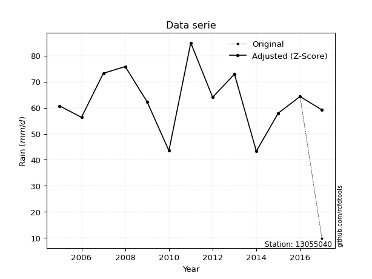</img>

</div>


> The initial value (value_initial) correspond to the initial obtained or null completed value, and value (value) is adjusted only when the initial value is outside the valid range (outlier) definite through the Z-Score value. If Z-Score is active, values out of range or outliers are replaced with the station mean value. A Z-Score (or standard score) measures how many standard deviations a data point is from the mean of a dataset, indicating its relative position; positive scores mean above the mean, negative mean below, and a score of zero is exactly at the mean, allowing for comparison of values from different distributions. It´s calculated using the formula $z=(x–μ)/σ$, where $x$ is the data point, $μ$ is the mean, and $σ$ is the standard deviation, helping identify outliers and understand probability.
>
> <sub>**Note**: In this study, "completing" (filling gaps in) and "extending" (forecasting or lengthening the historical record) rainfall data series are avoided for certain critical analyses because they introduce artificial bias and uncertainty, which can distort the statistics of rare events (extremes), alter day-to-day variability, and compromise the integrity and homogeneity of the original data. Some reasons against Completing/Extending rainfall data are: **Distortion of Extremes and Variability**: The primary issue is that most gap-filling or extension methods rely on averaging or regression with nearby stations, which inherently smooths the data. Rainfall is highly variable in space and time, with a large percentage of zero values and occasional large storms. Infilling methods often underestimate the highest values and overestimate the lowest (zero) values, which severely distorts analyses focused on flood frequency, drought severity, and intensity-duration-frequency (IDF) curves, **Loss of Data Homogeneity**: Infilled or extended data are synthetic estimates, not actual measurements. Combining these estimates with observed data can violate the assumption of data homogeneity, which requires that the data properties do not change over time. Inhomogeneity can lead to incorrect conclusions about long-term trends or changes in climate patterns, **Propagation of Errors**: Errors and biases from the original data (e.g., wind-induced undercatch, instrument errors, site changes) or the data used for imputation can propagate through the analysis, leading to unreliable hydrological models and inaccurate predictions, **Compromised Statistical Integrity**: For statistical analyses, especially those involving the frequency of events, using artificial data can introduce time bias or autocorrelation that doesn´t exist in reality, making it difficult to assess the true probability of events, **Difficulty in Validation**: It is difficult to accurately validate the quality of filled or extended data, especially for past periods where ground-truth measurements are unavailable. The reliability of imputation techniques heavily depends on the density of the surrounding station network and the complexity of the local topography.</sub>


### 4. Active continuous probability distributions from SciPy (44 of 104 available)

A Probability Density Function (PDF) describes the relative likelihood of a continuous random variable falling within a specific range, where the total area under its curve equals 1, and the area over any interval gives the actual probability for that range. Unlike discrete probabilities (like rolling a die), a PDF shows density, not direct probability for a single point (which is zero), with higher points indicating higher likelihood, often visualized as a bell curve for normal distributions.

A log of a probability density function (log-PDF) is simply the logarithm of the PDF´s value, denoted as $log(f(x))$, useful for converting multiplication of probabilities into addition, improving numerical stability with tiny numbers, and connecting to information theory concepts like entropy. Instead of dealing with very small probabilities (e.g., 0.000001), log-PDFs use negative numbers (e.g., $log(0.00001) ≈ -11.51$ that are easier for computers to handle, preventing underflow errors and simplifying complex calculations. In this study, each active probability distribution from SciPy is also evaluated in the $log$ form.

[scipy.stats](https://docs.scipy.org/doc/scipy/reference/stats.html) is a Python´s powerful submodule within the SciPy library for comprehensive statistical analysis, offering over 130 probability distributions (like Normal, Poisson), functions for descriptive stats (mean, variance), hypothesis testing (t-tests, chi-square), random variable generation, and statistical tests, making it essential for data science, modeling, and research. It provides tools to explore, model, and draw conclusions from data efficiently, working seamlessly with NumPy.

<div align="center">

|   id | p_dist             |   n_parameter | fit_method   | label                                                                       | active   | ref                                                                                                        |
|-----:|:-------------------|--------------:|:-------------|:----------------------------------------------------------------------------|:---------|:-----------------------------------------------------------------------------------------------------------|
|    0 | alpha              |             3 | MLE          | Alpha                                                                       | True     | [:mortar_board:](https://docs.scipy.org/doc/scipy/reference/generated/scipy.stats.alpha.html)              |
|    1 | betaprime          |             4 | MLE          | Beta prime                                                                  | True     | [:mortar_board:](https://docs.scipy.org/doc/scipy/reference/generated/scipy.stats.betaprime.html)          |
|    2 | chi2               |             3 | MLE          | Chi²                                                                        | True     | [:mortar_board:](https://docs.scipy.org/doc/scipy/reference/generated/scipy.stats.chi2.html)               |
|    3 | crystalball        |             4 | MLE          | Crystalball                                                                 | True     | [:mortar_board:](https://docs.scipy.org/doc/scipy/reference/generated/scipy.stats.crystalball.html)        |
|    4 | erlang             |             3 | MLE          | Erlang                                                                      | True     | [:mortar_board:](https://docs.scipy.org/doc/scipy/reference/generated/scipy.stats.erlang.html)             |
|    5 | expon              |             2 | MLE          | Exponential                                                                 | True     | [:mortar_board:](https://docs.scipy.org/doc/scipy/reference/generated/scipy.stats.expon.html)              |
|    6 | exponnorm          |             3 | MLE          | Exponentially modified Normal                                               | True     | [:mortar_board:](https://docs.scipy.org/doc/scipy/reference/generated/scipy.stats.exponnorm.html)          |
|    7 | f                  |             4 | MLE          | F                                                                           | True     | [:mortar_board:](https://docs.scipy.org/doc/scipy/reference/generated/scipy.stats.f.html)                  |
|    8 | fatiguelife        |             3 | MLE          | Fatigue-life (Birnbaum-Saunders)                                            | True     | [:mortar_board:](https://docs.scipy.org/doc/scipy/reference/generated/scipy.stats.fatiguelife.html)        |
|    9 | fisk               |             3 | MLE          | Fisk                                                                        | True     | [:mortar_board:](https://docs.scipy.org/doc/scipy/reference/generated/scipy.stats.fisk.html)               |
|   10 | gamma              |             3 | MLE          | Gamma                                                                       | True     | [:mortar_board:](https://docs.scipy.org/doc/scipy/reference/generated/scipy.stats.gamma.html)              |
|   11 | genexpon           |             5 | MLE          | Generalized exponential                                                     | True     | [:mortar_board:](https://docs.scipy.org/doc/scipy/reference/generated/scipy.stats.genexpon.html)           |
|   12 | genlogistic        |             3 | MLE          | Generalized logistic                                                        | True     | [:mortar_board:](https://docs.scipy.org/doc/scipy/reference/generated/scipy.stats.genlogistic.html)        |
|   13 | gibrat             |             2 | MM           | Gibrat                                                                      | True     | [:mortar_board:](https://docs.scipy.org/doc/scipy/reference/generated/scipy.stats.gibrat.html)             |
|   14 | gompertz           |             3 | MLE          | Gompertz (or truncated Gumbel)                                              | True     | [:mortar_board:](https://docs.scipy.org/doc/scipy/reference/generated/scipy.stats.gompertz.html)           |
|   15 | gumbel_l           |             2 | MM           | Gumbel Left Skew                                                            | True     | [:mortar_board:](https://docs.scipy.org/doc/scipy/reference/generated/scipy.stats.gumbel_l.html)           |
|   16 | gumbel_r           |             2 | MM           | Gumbel Right Skew                                                           | True     | [:mortar_board:](https://docs.scipy.org/doc/scipy/reference/generated/scipy.stats.gumbel_r.html)           |
|   17 | halflogistic       |             2 | MM           | Half-logistic                                                               | True     | [:mortar_board:](https://docs.scipy.org/doc/scipy/reference/generated/scipy.stats.halflogistic.html)       |
|   18 | halfnorm           |             2 | MM           | Half Normal                                                                 | True     | [:mortar_board:](https://docs.scipy.org/doc/scipy/reference/generated/scipy.stats.halfnorm.html)           |
|   19 | hypsecant          |             2 | MM           | hyperbolic secant                                                           | True     | [:mortar_board:](https://docs.scipy.org/doc/scipy/reference/generated/scipy.stats.hypsecant.html)          |
|   20 | invgamma           |             3 | MLE          | Inverted gamma                                                              | True     | [:mortar_board:](https://docs.scipy.org/doc/scipy/reference/generated/scipy.stats.invgamma.html)           |
|   21 | invgauss           |             3 | MLE          | Inverse Gaussian                                                            | True     | [:mortar_board:](https://docs.scipy.org/doc/scipy/reference/generated/scipy.stats.invgauss.html)           |
|   22 | invweibull         |             3 | MLE          | Inverted Weibull                                                            | True     | [:mortar_board:](https://docs.scipy.org/doc/scipy/reference/generated/scipy.stats.invweibull.html)         |
|   23 | johnsonsu          |             4 | MLE          | Johnson Su                                                                  | True     | [:mortar_board:](https://docs.scipy.org/doc/scipy/reference/generated/scipy.stats.johnsonsu.html)          |
|   24 | kstwobign          |             2 | MLE          | Limiting distribution of scaled Kolmogorov-Smirnov two-sided test statistic | True     | [:mortar_board:](https://docs.scipy.org/doc/scipy/reference/generated/scipy.stats.kstwobign.html)          |
|   25 | laplace            |             2 | MM           | Laplace                                                                     | True     | [:mortar_board:](https://docs.scipy.org/doc/scipy/reference/generated/scipy.stats.laplace.html)            |
|   26 | laplace_asymmetric |             3 | MLE          | Asymmetric Laplace                                                          | True     | [:mortar_board:](https://docs.scipy.org/doc/scipy/reference/generated/scipy.stats.laplace_asymmetric.html) |
|   27 | loggamma           |             3 | MLE          | Log gamma                                                                   | True     | [:mortar_board:](https://docs.scipy.org/doc/scipy/reference/generated/scipy.stats.loggamma.html)           |
|   28 | logistic           |             2 | MM           | Logistic (or Sech-squared)                                                  | True     | [:mortar_board:](https://docs.scipy.org/doc/scipy/reference/generated/scipy.stats.logistic.html)           |
|   29 | lognorm            |             3 | MLE          | Log Normal                                                                  | True     | [:mortar_board:](https://docs.scipy.org/doc/scipy/reference/generated/scipy.stats.lognorm.html)            |
|   30 | maxwell            |             2 | MM           | Maxwell                                                                     | True     | [:mortar_board:](https://docs.scipy.org/doc/scipy/reference/generated/scipy.stats.maxwell.html)            |
|   31 | mielke             |             4 | MLE          | Mielke Beta-Kappa / Dagum                                                   | True     | [:mortar_board:](https://docs.scipy.org/doc/scipy/reference/generated/scipy.stats.mielke.html)             |
|   32 | moyal              |             2 | MM           | Moyal                                                                       | True     | [:mortar_board:](https://docs.scipy.org/doc/scipy/reference/generated/scipy.stats.moyal.html)              |
|   33 | nakagami           |             3 | MLE          | Nakagami                                                                    | True     | [:mortar_board:](https://docs.scipy.org/doc/scipy/reference/generated/scipy.stats.nakagami.html)           |
|   34 | ncf                |             5 | MLE          | Non-central F distribution                                                  | True     | [:mortar_board:](https://docs.scipy.org/doc/scipy/reference/generated/scipy.stats.ncf.html)                |
|   35 | nct                |             4 | MLE          | Non-central Student’s t                                                     | True     | [:mortar_board:](https://docs.scipy.org/doc/scipy/reference/generated/scipy.stats.nct.html)                |
|   36 | norm               |             2 | MM           | Normal                                                                      | True     | [:mortar_board:](https://docs.scipy.org/doc/scipy/reference/generated/scipy.stats.norm.html)               |
|   37 | pearson3           |             3 | MM           | Pearson type III                                                            | True     | [:mortar_board:](https://docs.scipy.org/doc/scipy/reference/generated/scipy.stats.pearson3.html)           |
|   38 | rayleigh           |             2 | MM           | Rayleigh                                                                    | True     | [:mortar_board:](https://docs.scipy.org/doc/scipy/reference/generated/scipy.stats.rayleigh.html)           |
|   39 | rice               |             3 | MLE          | Rice                                                                        | True     | [:mortar_board:](https://docs.scipy.org/doc/scipy/reference/generated/scipy.stats.rice.html)               |
|   40 | t                  |             3 | MLE          | Student’s t                                                                 | True     | [:mortar_board:](https://docs.scipy.org/doc/scipy/reference/generated/scipy.stats.t.html)                  |
|   41 | truncnorm          |             4 | MLE          | Truncated normal                                                            | True     | [:mortar_board:](https://docs.scipy.org/doc/scipy/reference/generated/scipy.stats.truncnorm.html)          |
|   42 | wald               |             2 | MM           | Wald                                                                        | True     | [:mortar_board:](https://docs.scipy.org/doc/scipy/reference/generated/scipy.stats.wald.html)               |
|   43 | weibull_min        |             3 | MLE          | Weibull minimum                                                             | True     | [:mortar_board:](https://docs.scipy.org/doc/scipy/reference/generated/scipy.stats.weibull_min.html)        |

</div>

> **n_parameter:** # arguments & localization & scale.
>
> **Fit methods:** (MLE) maximum likelihood, (MM) L-moments.
>
>**Inactive** (With the only purpose of prevent loops, zero divisions, infinite values, over high estimated values or horizontal trending for recurrence intervals estimations, the follow distributions were disabled.)**:** foldnorm, gennorm, norminvgauss, powernorm, powerlognorm, skewnorm, genextreme, anglit, arcsine, argus, beta, bradford, burr, burr12, cauchy, cosine, halfcauchy, foldcauchy, skewcauchy, wrapcauchy, dgamma, gengamma, exponweib, exponpow, truncexpon, gausshyper, genhalflogistic, genhyperbolic, geninvgauss, halfgennorm, johnsonsb, kappa4, kappa3, ksone, kstwo, loglaplace, levy, levy_l, levy_stable, ncx2, pareto, genpareto, truncpareto, lomax, powerlaw, rdist, rel_breitwigner, recipinvgauss, semicircular, studentized_range, trapezoid, triang, truncweibull_min, tukeylambda, uniform, loguniform, vonmises, vonmises_line, weibull_max, dweibull, 


## B. Probability (PDF) vs. Empirical (EDF) distributions functions

A continuous probability distribution (CPD) describes probabilities for variables that can take any value within a range (like rain any time), unlike discrete variables with specific outcomes (like temperature). It uses a Probability Density Function (PDF), a curve where the total area under it equals 1, and the probability of the variable falling within an interval (a to b) is found by calculating the area under the curve between those points. A key feature is that the probability of hitting any single exact value is zero, so probabilities are always expressed for ranges, e.g., $P(a ≤ X ≤ b)$.

<div align="center">

Distributions parameters from station values
|    |   station | p_dist                |   n |               loc |            scale | shape                 | shape1               | shape2                 | shape3   |
|---:|----------:|:----------------------|----:|------------------:|-----------------:|:----------------------|:---------------------|:-----------------------|:---------|
|  0 |  13055040 | alpha                 |  13 |    -151.467       |   3947.27        | 18.466441629601192    |                      |                        |          |
|  1 |  13055040 | betaprime             |  13 |     -10.6218      |      0.944748    | 3039.5847427585522    | 40.09009707298202    |                        |          |
|  2 |  13055040 | chi2                  |  13 |      43.3         |      3.0361      | 0.3685043032414118    |                      |                        |          |
|  3 |  13055040 | crystalball           |  13 |      62.942       |     11.4624      | 55306.02283187591     | 4803.4800454285305   |                        |          |
|  4 |  13055040 | erlang                |  13 |    -705.186       |      0.171198    | 4486.787746187812     |                      |                        |          |
|  5 |  13055040 | expon                 |  13 |      43.3         |     19.642       |                       |                      |                        |          |
|  6 |  13055040 | exponnorm             |  13 |      62.9259      |     11.4623      | 0.0014072320977983172 |                      |                        |          |
|  7 |  13055040 | f                     |  13 |   -1980.33        |   2043.22        | 425207.1440114856     | 74792.46153899879    |                        |          |
|  8 |  13055040 | fatiguelife           |  13 |      43.3         |      0.000235895 | 281.87876236901695    |                      |                        |          |
|  9 |  13055040 | fisk                  |  13 |      -5.42245e+06 |      5.42251e+06 | 827152.3099103282     |                      |                        |          |
| 10 |  13055040 | gamma                 |  13 |    -719.24        |      0.168232    | 4649.389330152286     |                      |                        |          |
| 11 |  13055040 | genexpon              |  13 |      43.3         |      1.75272     | 0.0755497575672929    | 0.017485872313873392 | 1.2759844694541886     |          |
| 12 |  13055040 | genlogistic           |  13 |      62.7582      |      6.6059      | 1.0223923232099779    |                      |                        |          |
| 13 |  13055040 | gibrat                |  13 |      54.1977      |      5.3037      |                       |                      |                        |          |
| 14 |  13055040 | gompertz              |  13 |      33.852       |      1.98215     | 7.673260875868681e-11 |                      |                        |          |
| 15 |  13055040 | gumbel_l              |  13 |      68.1007      |      8.93718     |                       |                      |                        |          |
| 16 |  13055040 | gumbel_r              |  13 |      57.7833      |      8.93718     |                       |                      |                        |          |
| 17 |  13055040 | halflogistic          |  13 |      49.3564      |      9.79993     |                       |                      |                        |          |
| 18 |  13055040 | halfnorm              |  13 |      47.7703      |     19.0149      |                       |                      |                        |          |
| 19 |  13055040 | hypsecant             |  13 |      62.942       |      7.29717     |                       |                      |                        |          |
| 20 |  13055040 | invgamma              |  13 |     -97.3173      |  30447.6         | 191.03858041535466    |                      |                        |          |
| 21 |  13055040 | invgauss              |  13 |       2.20928     |   1477.25        | 0.040804273715957864  |                      |                        |          |
| 22 |  13055040 | invweibull            |  13 |      -6.68888e+08 |      6.68888e+08 | 60671513.61067355     |                      |                        |          |
| 23 |  13055040 | johnsonsu             |  13 |      -1.24865e+07 |      2.16845e+08 | -1090399.3615355673   | 18946616.659720145   |                        |          |
| 24 |  13055040 | kstwobign             |  13 |      17.9795      |     51.4919      |                       |                      |                        |          |
| 25 |  13055040 | laplace               |  13 |      62.942       |      8.10512     |                       |                      |                        |          |
| 26 |  13055040 | laplace_asymmetric    |  13 |      62.3         |      8.77113     | 0.9640690524769326    |                      |                        |          |
| 27 |  13055040 | loggamma              |  13 |   -1554.4         |    259.321       | 511.7243200346911     |                      |                        |          |
| 28 |  13055040 | logistic              |  13 |      62.942       |      6.31954     |                       |                      |                        |          |
| 29 |  13055040 | lognorm               |  13 |      43.3         |      0.976592    | 9.485310512701275     |                      |                        |          |
| 30 |  13055040 | maxwell               |  13 |      35.781       |     17.0206      |                       |                      |                        |          |
| 31 |  13055040 | mielke                |  13 |      -0.263214    |     68.2131      | 6.788454073137556     | 12.19329283822734    |                        |          |
| 32 |  13055040 | moyal                 |  13 |      56.3871      |      5.15988     |                       |                      |                        |          |
| 33 |  13055040 | nakagami              |  13 |    -860.082       |    923.103       | 1619.5282555353424    |                      |                        |          |
| 34 |  13055040 | ncf                   |  13 |     -49.4984      |    112.436       | 192.80937679824055    | 24910.7789182593     | 1.5799520605366693e-08 |          |
| 35 |  13055040 | nct                   |  13 |      -1.11396     |      0.251547    | 14.071420783994848    | 241.22004866122847   |                        |          |
| 36 |  13055040 | norm                  |  13 |      62.942       |     11.4624      |                       |                      |                        |          |
| 37 |  13055040 | pearson3              |  13 |      62.942       |     11.4624      | -0.0322076508694972   |                      |                        |          |
| 38 |  13055040 | rayleigh              |  13 |      41.0138      |     17.4962      |                       |                      |                        |          |
| 39 |  13055040 | rice                  |  13 |      36.9472      |     12.8172      | 1.7067698363362513    |                      |                        |          |
| 40 |  13055040 | t                     |  13 |      62.9414      |     11.462       | 3130517.387521011     |                      |                        |          |
| 41 |  13055040 | truncnorm             |  13 |      60.6202      |     13.2817      | -1.3040653460252334   | 2012.9328438597552   |                        |          |
| 42 |  13055040 | wald                  |  13 |      51.4796      |     11.4624      |                       |                      |                        |          |
| 43 |  13055040 | weibull_min           |  13 |      30.3716      |     36.4148      | 3.1586759713351835    |                      |                        |          |
| 44 |  13055040 | logalpha              |  13 |      -4.02254     |    344.915       | 42.36818701819159     |                      |                        |          |
| 45 |  13055040 | logbetaprime          |  13 |      -1.51068     |      4.27586     | 1988.2770082232546    | 1508.5931355578696   |                        |          |
| 46 |  13055040 | logchi2               |  13 |       3.76815     |      1.00305     | 1.0406585468250085    |                      |                        |          |
| 47 |  13055040 | logcrystalball        |  13 |       4.12481     |      0.18941     | 12024.411781443354    | 165.9300099694511    |                        |          |
| 48 |  13055040 | logerlang             |  13 |       0.828447    |      0.0113967   | 289.24013397092676    |                      |                        |          |
| 49 |  13055040 | logexpon              |  13 |       3.76815     |      0.356658    |                       |                      |                        |          |
| 50 |  13055040 | logexponnorm          |  13 |       4.12468     |      0.189409    | 0.0006827477414977358 |                      |                        |          |
| 51 |  13055040 | logf                  |  13 |    -115.344       |    119.469       | 2499016.786448464     | 1163914.9525473034   |                        |          |
| 52 |  13055040 | logfatiguelife        |  13 |     -29.7716      |     33.8966      | 0.0055693054263661265 |                      |                        |          |
| 53 |  13055040 | logfisk               |  13 |   -3226.24        |   3230.38        | 30253.23146180487     |                      |                        |          |
| 54 |  13055040 | loggamma              |  13 |       0.67484     |      0.0108452   | 317.99112415266046    |                      |                        |          |
| 55 |  13055040 | loggenexpon           |  13 |       3.74153     |      0.00772141  | 0.00479951981901797   | 5.4711662859332915   | 9.050643809100023e-05  |          |
| 56 |  13055040 | loggenlogistic        |  13 |       4.21906     |      0.0822655   | 0.5553768271123936    |                      |                        |          |
| 57 |  13055040 | loggibrat             |  13 |       3.98034     |      0.0876274   |                       |                      |                        |          |
| 58 |  13055040 | loggompertz           |  13 |       3.76815     |      0.589512    | 1.1605647795830518    |                      |                        |          |
| 59 |  13055040 | loggumbel_l           |  13 |       4.21006     |      0.147682    |                       |                      |                        |          |
| 60 |  13055040 | loggumbel_r           |  13 |       4.03957     |      0.147682    |                       |                      |                        |          |
| 61 |  13055040 | loghalflogistic       |  13 |       3.90036     |      0.161909    |                       |                      |                        |          |
| 62 |  13055040 | loghalfnorm           |  13 |       3.87413     |      0.31418     |                       |                      |                        |          |
| 63 |  13055040 | loghypsecant          |  13 |       4.12481     |      0.120582    |                       |                      |                        |          |
| 64 |  13055040 | loginvgamma           |  13 |       0.510472    |   1220.05        | 338.74496379198195    |                      |                        |          |
| 65 |  13055040 | loginvgauss           |  13 |       2.38359     |    126.415       | 0.013770440848875468  |                      |                        |          |
| 66 |  13055040 | loginvweibull         |  13 | -446290           | 446294           | 2253726.7677428657    |                      |                        |          |
| 67 |  13055040 | logjohnsonsu          |  13 |       4.98038     |      0.179064    | 10.395093208158261    | 4.630342447159698    |                        |          |
| 68 |  13055040 | logkstwobign          |  13 |       3.32255     |      0.917811    |                       |                      |                        |          |
| 69 |  13055040 | loglaplace            |  13 |       4.12481     |      0.133933    |                       |                      |                        |          |
| 70 |  13055040 | loglaplace_asymmetric |  13 |       4.13196     |      0.142742    | 1.0242406290503085    |                      |                        |          |
| 71 |  13055040 | logloggamma           |  13 |       3.8817      |      0.291051    | 2.787771795149109     |                      |                        |          |
| 72 |  13055040 | loglogistic           |  13 |       4.12481     |      0.104427    |                       |                      |                        |          |
| 73 |  13055040 | loglognorm            |  13 |       3.76815     |      0.0202345   | 9.16005350582881      |                      |                        |          |
| 74 |  13055040 | logmaxwell            |  13 |       3.67599     |      0.281257    |                       |                      |                        |          |
| 75 |  13055040 | logmielke             |  13 |      -0.00599241  |      4.24038     | 26.147590290363844    | 53.73969691293118    |                        |          |
| 76 |  13055040 | logmoyal              |  13 |       4.01649     |      0.0852644   |                       |                      |                        |          |
| 77 |  13055040 | lognakagami           |  13 |     -68.5397      |     72.6648      | 36735.0679892092      |                      |                        |          |
| 78 |  13055040 | logncf                |  13 |     -42.5208      |     29.8594      | 514279.0555207104     | 151431.46500068798   | 289112.2728605289      |          |
| 79 |  13055040 | lognct                |  13 |      -3.12364     |      0.0265784   | 719.8616329574238     | 272.4128942744517    |                        |          |
| 80 |  13055040 | lognorm               |  13 |       4.12481     |      0.18941     |                       |                      |                        |          |
| 81 |  13055040 | logpearson3           |  13 |       4.12481     |      0.18941     | -0.46140923830634095  |                      |                        |          |
| 82 |  13055040 | lograyleigh           |  13 |       3.76246     |      0.289115    |                       |                      |                        |          |
| 83 |  13055040 | logrice               |  13 |       3.64705     |      0.205535    | 2.0621922504068464    |                      |                        |          |
| 84 |  13055040 | logt                  |  13 |       4.12481     |      0.18941     | 623279019.1233534     |                      |                        |          |
| 85 |  13055040 | logtruncnorm          |  13 |       0.0088838   |      1.28385     | 2.9281256030071847    | 3.452584544814421    |                        |          |
| 86 |  13055040 | logwald               |  13 |       3.93541     |      0.189401    |                       |                      |                        |          |
| 87 |  13055040 | logweibull_min        |  13 |       2.99645     |      1.20626     | 7.119974877564639     |                      |                        |          |

</div>

> **loc** (Location parameter): This shifts the distribution along the x-axis. For many common distributions, like the normal (Gaussian) distribution, loc represents the mean $μ$. For others, like the uniform distribution, it might represent the minimum value, or for the beta distribution, the left end of the support interval.
>
> **scale** (Scale parameter): This determines the width or spread of the distribution. For the normal distribution, scale represents the standard deviation $σ$. For a uniform distribution, it defines the length of the interval (from $loc$ to $loc + scale$).
>
> **shape** (Shape parameters): Refers to parameters that define the specific form of a probability distribution, distinct from its location (loc) and scale (scale). These parameters are required arguments for most distribution functions. For example, a normal (Gaussian) distribution is fully defined by its location (mean) and scale (standard deviation), so it has no specific shape parameters beyond loc and scale. However, other distributions have intrinsic properties that need specification, as Gamma distribution that takes a shape parameter, often named $a$ or $alpha$.


### 0. Cumulative distribution values - CDF (88 evaluated)

Cumulative Distribution Function (CDF), denoted as $F$<sub>$X$</sub>$(x)$, is a function that gives the probability that a random variable $X$ will take a value less than or equal to a specific value, $x$ (i.e., $(P(X≥x)$. It essentially "accumulates" probabilities from a given point up to the far right (positive infinity), providing a complete picture of the distribution´s probabilities for both discrete (like rain) and continuous (like temperature) variables, helping to find probabilities over ranges or above certain values. Each station is evaluated separately ordering the $x$ values ascending, calculating the CDF and PDF values for the activated distributions and their logarithmic forms.

<div align="center">

CDF ordered by x ascending and calculating $log(f(x))$ separately
|   id |   Station |   date |       x |   count |    mean |     std |     zscore |   Value_initial |   station |   m |     alpha |   alpha_pdf |   betaprime |   betaprime_pdf |       chi2 |    chi2_pdf |   crystalball |   crystalball_pdf |    erlang |   erlang_pdf |     expon |   expon_pdf |   exponnorm |   exponnorm_pdf |         f |      f_pdf |   fatiguelife |   fatiguelife_pdf |      fisk |   fisk_pdf |     gamma |   gamma_pdf |    genexpon |   genexpon_pdf |   genlogistic |   genlogistic_pdf |   gibrat |   gibrat_pdf |    gompertz |   gompertz_pdf |   gumbel_l |   gumbel_l_pdf |   gumbel_r |   gumbel_r_pdf |   halflogistic |   halflogistic_pdf |   halfnorm |   halfnorm_pdf |   hypsecant |   hypsecant_pdf |   invgamma |   invgamma_pdf |   invgauss |   invgauss_pdf |   invweibull |   invweibull_pdf |   johnsonsu |   johnsonsu_pdf |   kstwobign |   kstwobign_pdf |   laplace |   laplace_pdf |   laplace_asymmetric |   laplace_asymmetric_pdf |   loggamma |   loggamma_pdf |   logistic |   logistic_pdf |   lognorm |   lognorm_pdf |   maxwell |   maxwell_pdf |    mielke |   mielke_pdf |       moyal |   moyal_pdf |   nakagami |   nakagami_pdf |       ncf |    ncf_pdf |       nct |    nct_pdf |      norm |   norm_pdf |   pearson3 |   pearson3_pdf |   rayleigh |   rayleigh_pdf |      rice |   rice_pdf |         t |      t_pdf |   truncnorm |   truncnorm_pdf |     wald |   wald_pdf |   weibull_min |   weibull_min_pdf |   logalpha |   logalpha_pdf |   logbetaprime |   logbetaprime_pdf |     logchi2 |   logchi2_pdf |   logcrystalball |   logcrystalball_pdf |   logerlang |   logerlang_pdf |   logexpon |   logexpon_pdf |   logexponnorm |   logexponnorm_pdf |      logf |   logf_pdf |   logfatiguelife |   logfatiguelife_pdf |   logfisk |   logfisk_pdf |   loggenexpon |   loggenexpon_pdf |   loggenlogistic |   loggenlogistic_pdf |   loggibrat |   loggibrat_pdf |   loggompertz |   loggompertz_pdf |   loggumbel_l |   loggumbel_l_pdf |   loggumbel_r |   loggumbel_r_pdf |   loghalflogistic |   loghalflogistic_pdf |   loghalfnorm |   loghalfnorm_pdf |   loghypsecant |   loghypsecant_pdf |   loginvgamma |   loginvgamma_pdf |   loginvgauss |   loginvgauss_pdf |   loginvweibull |   loginvweibull_pdf |   logjohnsonsu |   logjohnsonsu_pdf |   logkstwobign |   logkstwobign_pdf |   loglaplace |   loglaplace_pdf |   loglaplace_asymmetric |   loglaplace_asymmetric_pdf |   logloggamma |   logloggamma_pdf |   loglogistic |   loglogistic_pdf |   loglognorm |   loglognorm_pdf |   logmaxwell |   logmaxwell_pdf |   logmielke |   logmielke_pdf |    logmoyal |   logmoyal_pdf |   lognakagami |   lognakagami_pdf |    logncf |   logncf_pdf |    lognct |   lognct_pdf |   logpearson3 |   logpearson3_pdf |   lograyleigh |   lograyleigh_pdf |   logrice |   logrice_pdf |      logt |   logt_pdf |   logtruncnorm |   logtruncnorm_pdf |   logwald |   logwald_pdf |   logweibull_min |   logweibull_min_pdf |
|-----:|----------:|-------:|--------:|--------:|--------:|--------:|-----------:|----------------:|----------:|----:|----------:|------------:|------------:|----------------:|-----------:|------------:|--------------:|------------------:|----------:|-------------:|----------:|------------:|------------:|----------------:|----------:|-----------:|--------------:|------------------:|----------:|-----------:|----------:|------------:|------------:|---------------:|--------------:|------------------:|---------:|-------------:|------------:|---------------:|-----------:|---------------:|-----------:|---------------:|---------------:|-------------------:|-----------:|---------------:|------------:|----------------:|-----------:|---------------:|-----------:|---------------:|-------------:|-----------------:|------------:|----------------:|------------:|----------------:|----------:|--------------:|---------------------:|-------------------------:|-----------:|---------------:|-----------:|---------------:|----------:|--------------:|----------:|--------------:|----------:|-------------:|------------:|------------:|-----------:|---------------:|----------:|-----------:|----------:|-----------:|----------:|-----------:|-----------:|---------------:|-----------:|---------------:|----------:|-----------:|----------:|-----------:|------------:|----------------:|---------:|-----------:|--------------:|------------------:|-----------:|---------------:|---------------:|-------------------:|------------:|--------------:|-----------------:|---------------------:|------------:|----------------:|-----------:|---------------:|---------------:|-------------------:|----------:|-----------:|-----------------:|---------------------:|----------:|--------------:|--------------:|------------------:|-----------------:|---------------------:|------------:|----------------:|--------------:|------------------:|--------------:|------------------:|--------------:|------------------:|------------------:|----------------------:|--------------:|------------------:|---------------:|-------------------:|--------------:|------------------:|--------------:|------------------:|----------------:|--------------------:|---------------:|-------------------:|---------------:|-------------------:|-------------:|-----------------:|------------------------:|----------------------------:|--------------:|------------------:|--------------:|------------------:|-------------:|-----------------:|-------------:|-----------------:|------------:|----------------:|------------:|---------------:|--------------:|------------------:|----------:|-------------:|----------:|-------------:|--------------:|------------------:|--------------:|------------------:|----------:|--------------:|----------:|-----------:|---------------:|-------------------:|----------:|--------------:|-----------------:|---------------------:|
|    0 |  13055040 |   2014 | 43.3    |      13 | 59.1462 | 18.9964 | -0.834165  |            43.3 |  13055040 |   1 | 0.0359184 |  0.00821297 |   0.0272633 |      0.00804698 | 0.00192231 | 4.98478e+10 |     0.0433004 |        0.00801666 | 0.0424679 |   0.00802591 | 0         |  0.0509113  |   0.0433003 |      0.00801665 | 0.0426132 | 0.00801177 |     0.0433983 |       7.78695e+07 | 0.0473446 | 0.00688006 | 0.0425757 |  0.00803719 | 4.06406e-07 |     0.0431043  |     0.0467042 |        0.00686736 | 0        |   0          | 8.94055e-09 |    4.54925e-09 |  0.0604454 |     0.00655471 | 0.00637113 |     0.0036043  |       0        |         0          |   0        |     0          |   0.0430739 |      0.00588482 |  0.036579  |     0.00821282 |  0.0344994 |     0.00941953 |    0.0295054 |       0.00942905 |   0.0433227 |      0.00801882 |   0.0310148 |      0.011274   | 0.0443096 |    0.00546686 |            0.0509281 |               0.00602273 |  0.0296578 |       0.374791 |  0.0427727 |     0.00647883 | 0.0298503 |      0.357744 | 0.0216316 |    0.00829768 | 0.0475276 |   0.0073751  | 0.000378987 | 0.000496356 |  0.0429486 |     0.00801717 | 0.0370499 | 0.00801689 | 0.0247007 | 0.00856187 | 0.0433004 | 0.00801666 |  0.0442419 |     0.0080104  | 0.00850066 |     0.00740486 | 0.0293684 | 0.00946128 | 0.0433    | 0.00801687 | 2.74818e-09 |      0.0141991  | 0        | 0          |     0.0372585 |        0.00893127 |  0.0284239 |       0.369716 |      0.0275135 |           0.352236 | 8.06037e-09 |   9.44415e+06 |        0.0298503 |             0.357744 |   0.0292859 |        0.371499 |  0         |       2.8038   |      0.0298504 |           0.357746 | 0.0296371 |   0.356458 |        0.0286995 |             0.351107 | 0.0310536 |      0.281825 |     0.0193016 |          0.826391 |        0.047531  |             0.319552 |    0        |        0        |   2.43931e-08 |          1.96869  |     0.0489363 |          0.323119 |    0.00186808 |         0.0794736 |          0        |              0        |      0        |          0        |      0.0330317 |           0.273444 |     0.0289192 |          0.38565  |     0.0286987 |          0.407025 |       0.0251932 |            0.468329 |      0.0450522 |           0.358506 |      0.0275325 |           0.58499  |    0.0348707 |         0.260359 |               0.0425157 |                    0.290802 |     0.044696  |          0.354609 |     0.0318182 |          0.294998 |   0.00029803 |      2.70245e+11 |   0.00906226 |         0.288688 |   0.0475228 |        0.328613 | 1.78615e-05 |     0.00202336 |     0.0298585 |          0.358124 | 0.0296406 |     0.357809 | 0.0286647 |     0.368789 |     0.041086  |          0.366337 |   0.000193902 |         0.0681039 | 0.0226276 |      0.403751 | 0.0298507 |   0.357748 |    1.06874e-07 |           2.99251  |  0        |      0        |        0.0407174 |             0.36792  |
|    1 |  13055040 |   2010 | 43.5    |      13 | 59.1462 | 18.9964 | -0.823637  |            43.5 |  13055040 |   2 | 0.0375903 |  0.00850684 |   0.0289086 |      0.00840764 | 0.575044   | 0.515217    |     0.0449279 |        0.00825871 | 0.0440977 |   0.00827224 | 0.0101306 |  0.0503955  |   0.0449278 |      0.00825871 | 0.0442399 | 0.00825678 |     0.541089  |       0.102599    | 0.0487397 | 0.00707244 | 0.0442077 |  0.00828356 | 0.00872148  |     0.0440684  |     0.048097  |        0.00706132 | 0        |   0          | 9.89789e-09 |    5.03223e-09 |  0.0617701 |     0.00669359 | 0.00712539 |     0.0039418  |       0        |         0          |   0        |     0          |   0.044267  |      0.00604678 |  0.0382504 |     0.00850186 |  0.0364208 |     0.00979539 |    0.0314347 |       0.00986499 |   0.0449506 |      0.00826088 |   0.0333231 |      0.0118101  | 0.0454166 |    0.00560344 |            0.052147  |               0.00616688 |  0.0314262 |       0.392817 |  0.0440874 |     0.00666879 | 0.0315371 |      0.374404 | 0.0233312 |    0.00869909 | 0.0490221 |   0.00757041 | 0.000490155 | 0.000618973 |  0.0445763 |     0.0082608  | 0.0386806 | 0.00829152 | 0.0264566 | 0.00899827 | 0.0449279 | 0.00825871 |  0.0458677 |     0.00824797 | 0.0100452  |     0.00804011 | 0.031293  | 0.00978499 | 0.0449275 | 0.00825894 | 0.00286778  |      0.014479   | 0        | 0          |     0.0390731 |        0.0092148  |  0.0301696 |       0.388019 |      0.0291764 |           0.369529 | 0.0477152   |   5.37944     |        0.0315371 |             0.374404 |   0.0310389 |        0.389431 |  0.0128377 |       2.76781  |      0.0315372 |           0.374406 | 0.0313179 |   0.37311  |        0.0303557 |             0.367795 | 0.0323789 |      0.293451 |     0.0231886 |          0.86049  |        0.0490264 |             0.329527 |    0        |        0        |   0.00906654  |          1.96615  |     0.0504476 |          0.33283  |    0.00226581 |         0.093433  |          0        |              0        |      0        |          0        |      0.0343161 |           0.284036 |     0.0307406 |          0.404926 |     0.0306225 |          0.428036 |       0.0274194 |            0.497988 |      0.0467321 |           0.370587 |      0.0303161 |           0.623184 |    0.0360914 |         0.269474 |               0.0438772 |                    0.300114 |     0.0463577 |          0.366629 |     0.0332061 |          0.307425 |   0.435842   |      9.32837     |   0.0104564  |         0.316533 |   0.0490604 |        0.338789 | 2.97083e-05 |     0.00319599 |     0.031547  |          0.374806 | 0.0313279 |     0.374557 | 0.0304056 |     0.386861 |     0.0428047 |          0.379657 |   0.000634654 |         0.12317   | 0.0245339 |      0.42366  | 0.0315375 |   0.374407 |    0.0137183   |           2.9612   |  0        |      0        |        0.0424427 |             0.380887 |
|    2 |  13055040 |   2006 | 56.3    |      13 | 59.1462 | 18.9964 | -0.149826  |            56.3 |  13055040 |   3 | 0.297339  |  0.0316649  |   0.314287  |      0.0340808  | 0.990242   | 0.00207793  |     0.281139  |        0.0294254  | 0.282323  |   0.0296431  | 0.484102  |  0.026265   |   0.281139  |      0.0294255  | 0.281814  | 0.02959    |     0.797522  |       0.0090342   | 0.265267  | 0.0297302  | 0.282516  |  0.02964    | 0.491529    |     0.0269896  |     0.265535  |        0.0298626  | 0.177388 |   0.123671   | 6.35928e-06 |    3.20831e-06 |  0.234348  |     0.0228763  | 0.307112   |     0.0405675  |       0.340154 |         0.0451174  |   0.346265 |     0.0379447  |   0.243574  |      0.0302158  |  0.295937  |     0.0314702  |  0.330333  |     0.0333787  |    0.338408  |       0.0332584  |   0.281165  |      0.0294225  |   0.363069  |      0.0327353  | 0.22033   |    0.027184   |            0.236936  |               0.0280199  |  0.320751  |       1.88479  |  0.259028  |     0.0303713  | 0.309632  |      1.86163  | 0.306914  |    0.0329413  | 0.265708  |   0.0289394  | 0.313227    | 0.0468913   |  0.281469  |     0.0294965  | 0.289269  | 0.0309764  | 0.335914  | 0.0348289  | 0.281139  | 0.0294254  |  0.279935  |     0.029183   | 0.317276   |     0.0340925  | 0.295998  | 0.0306516  | 0.28115   | 0.029427   | 0.305766    |      0.0315183  | 0.29102  | 0.0856144  |     0.289689  |        0.0295985  |  0.322344  |       1.90766  |      0.310405  |           1.86694  | 0.374451    |   0.680394    |        0.309632  |             1.86163  |   0.318894  |        1.87814  |  0.521029  |       1.34294  |      0.309634  |           1.86164  | 0.309064  |   1.85991  |        0.308467  |             1.86996  | 0.272584  |      1.85702  |     0.40938   |          1.78318  |        0.265743  |             1.62902  |    0.289799 |        6.79545  |   0.478543    |          1.60255  |     0.25685   |          1.49381  |    0.345793   |         2.48644   |          0.382087 |              2.63732  |      0.381741 |          2.24305  |      0.273509  |           1.99925  |     0.329727  |          1.90718  |     0.339522  |          1.89872  |       0.376181  |            1.85727  |      0.280885  |           1.61531  |      0.408966  |           1.81619  |    0.24762   |         1.84884  |               0.256114  |                    1.75178  |     0.280529  |          1.6265   |     0.288791  |          1.96683  |   0.610186   |      0.159519    |   0.338449   |         2.03702  |   0.26699   |        1.61482  | 0.35752     |     2.81932    |     0.309787  |          1.86134  | 0.309834  |     1.8608   | 0.319952  |     1.89268  |     0.28932   |          1.67729  |   0.349744    |         2.0867    | 0.321399  |      1.88347  | 0.309634  |   1.86163  |    0.587624    |           1.61029  |  0.367682 |      4.61833  |        0.284224  |             1.64772  |
|    3 |  13055040 |   2015 | 57.9    |      13 | 59.1462 | 18.9964 | -0.0655994 |            57.9 |  13055040 |   4 | 0.349422  |  0.033334   |   0.369764  |      0.0351318  | 0.993033   | 0.00145236  |     0.330014  |        0.0315951  | 0.33152   |   0.0317778  | 0.52446   |  0.0242103  |   0.330014  |      0.0315952  | 0.330939  | 0.0317398  |     0.811265  |       0.0081686   | 0.315462  | 0.0329405  | 0.331707  |  0.0317719  | 0.53293     |     0.0247923  |     0.315929  |        0.0330537  | 0.35963  |   0.101014   | 1.42552e-05 |    7.1918e-06  |  0.2734    |     0.0259658  | 0.372682   |     0.0411593  |       0.41024  |         0.0424341  |   0.405775 |     0.03641    |   0.295726  |      0.0349427  |  0.347749  |     0.0331925  |  0.384464  |     0.0341667  |    0.391749  |       0.0332997  |   0.330035  |      0.0315913  |   0.415162  |      0.0322924  | 0.268414  |    0.0331166  |            0.28629   |               0.0338565  |  0.375068  |       1.98564  |  0.310487  |     0.0338766  | 0.363566  |      1.98183  | 0.360574  |    0.034027   | 0.314591  |   0.0321175  | 0.387788    | 0.0459873   |  0.330447  |     0.0316516  | 0.340429  | 0.0328786  | 0.391918  | 0.0350411  | 0.330014  | 0.0315951  |  0.328447  |     0.0313865  | 0.372332   |     0.0346239  | 0.346363  | 0.0322256  | 0.330028  | 0.0315967  | 0.357071    |      0.0325409  | 0.41545  | 0.0698547  |     0.338516  |        0.0313672  |  0.377278  |       2.0065   |      0.364339  |           1.97632  | 0.392925    |   0.639098    |        0.363566  |             1.98183  |   0.373031  |        1.97951  |  0.557222  |       1.24146  |      0.363567  |           1.98184  | 0.362946  |   1.97993  |        0.362642  |             1.99062  | 0.32759   |      2.06297  |     0.459055  |          1.75866  |        0.314617  |             1.85922  |    0.455595 |        5.05835  |   0.522565    |          1.53869  |     0.301545  |          1.69733  |    0.415456   |         2.47103   |          0.453454 |              2.45317  |      0.443141 |          2.13702  |      0.33366   |           2.28747  |     0.384447  |          1.99167  |     0.39369   |          1.96076  |       0.427982  |            1.8342   |      0.328521  |           1.78279  |      0.459251  |           1.76876  |    0.305248  |         2.27911  |               0.310224  |                    2.12189  |     0.328525  |          1.79716  |     0.34685   |          2.16941  |   0.614427   |      0.14368     |   0.396253   |         2.08121  |   0.315386  |        1.83948  | 0.434996    |     2.69321    |     0.363705  |          1.98109  | 0.363719  |     1.97925  | 0.374489  |     1.99333  |     0.338524  |          1.8317   |   0.408452    |         2.09662   | 0.375597  |      1.97879  | 0.363567  |   1.98183  |    0.631238    |           1.5035   |  0.483188 |      3.65173  |        0.332689  |             1.80922  |
|    4 |  13055040 |   2017 | 59.1462 |      13 | 59.1462 | 18.9964 | -2.59765   |             9.8 |  13055040 |   5 | 0.391531  |  0.0341801  |   0.41376   |      0.0354009  | 0.994617   | 0.00110645  |     0.370263  |        0.0329475  | 0.371973  |   0.0330909  | 0.553693  |  0.0227221  |   0.370263  |      0.0329475  | 0.371353  | 0.0330679  |     0.821073  |       0.00758445  | 0.357871  | 0.0350537  | 0.372151  |  0.0330831  | 0.562825    |     0.0232055  |     0.358464  |        0.0351401  | 0.472365 |   0.0804258  | 2.67306e-05 |    1.34855e-05 |  0.307305  |     0.028458   | 0.423768   |     0.0407102  |       0.461708 |         0.0401444  |   0.450333 |     0.0350854  |   0.34142   |      0.0383187  |  0.389713  |     0.034091   |  0.427165  |     0.0342955  |    0.433018  |       0.0328738  |   0.370278  |      0.0329431  |   0.455008  |      0.0316151  | 0.313024  |    0.0386205  |            0.331747  |               0.0392323  |  0.417929  |       2.03602  |  0.354194  |     0.0361958  | 0.406514  |      2.04814  | 0.403269  |    0.0344307  | 0.356018  |   0.0343163  | 0.444034    | 0.0441515   |  0.370757  |     0.0329884  | 0.382104  | 0.0339415  | 0.435402  | 0.0346756  | 0.370263  | 0.0329475  |  0.368459  |     0.0327783  | 0.415513   |     0.0346212  | 0.387102  | 0.0331034  | 0.370279  | 0.032949   | 0.397954    |      0.0330266  | 0.495324 | 0.0586199  |     0.378301  |        0.0324372  |  0.420557  |       2.05424  |      0.407075  |           2.03355  | 0.406233    |   0.611258    |        0.406514  |             2.04814  |   0.415768  |        2.03048  |  0.582884  |       1.16951  |      0.406516  |           2.04815  | 0.405853  |   2.04611  |        0.405777  |             2.05677  | 0.372928  |      2.19012  |     0.496183  |          1.72671  |        0.356035  |             2.02924  |    0.551243 |        3.96944  |   0.55479     |          1.48761  |     0.339362  |          1.85443  |    0.467464   |         2.40703   |          0.504109 |              2.30338  |      0.487719 |          2.04888  |      0.38437   |           2.46751  |     0.427295  |          2.02863  |     0.435704  |          1.98152  |       0.466663  |            1.79607  |      0.367758  |           1.90065  |      0.496402  |           1.71877  |    0.357851  |         2.67187  |               0.358864  |                    2.45458  |     0.368089  |          1.91692  |     0.394365  |          2.28716  |   0.617376   |      0.133565    |   0.440667   |         2.08621  |   0.356352  |        2.00687  | 0.490806    |     2.54265    |     0.406635  |          2.04706  | 0.406598  |     2.04416  | 0.417508  |     2.04307  |     0.378658  |          1.93546  |   0.452941    |         2.0783    | 0.418282  |      2.02658  | 0.406516  |   2.04814  |    0.662429    |           1.42667  |  0.554269 |      3.04388  |        0.372429  |             1.92123  |
|    5 |  13055040 |   2005 | 60.7    |      13 | 59.1462 | 18.9964 |  0.0817967 |            60.7 |  13055040 |   6 | 0.445092  |  0.0346506  |   0.468621  |      0.0350993  | 0.996079   | 0.0007937   |     0.422463  |        0.0341451  | 0.424351  |   0.0342283  | 0.587639  |  0.0209938  |   0.422463  |      0.0341451  | 0.423711  | 0.0342263  |     0.832349  |       0.00694399  | 0.413966  | 0.037006   | 0.424515  |  0.0342185  | 0.597436    |     0.0213684  |     0.414659  |        0.0370472  | 0.580727 |   0.0600935  | 5.85403e-05 |    2.95329e-05 |  0.353956  |     0.0315814  | 0.485998   |     0.0392375  |       0.521762 |         0.0371311  |   0.503481 |     0.0333     |   0.403705  |      0.0416401  |  0.443192  |     0.0346348  |  0.480223  |     0.0338988  |    0.483383  |       0.0318731  |   0.422471  |      0.0341403  |   0.503267  |      0.0304485  | 0.379173  |    0.0467818  |            0.398669  |               0.0471464  |  0.471175  |       2.06429  |  0.412225  |     0.0383407  | 0.460327  |      2.09582  | 0.456823  |    0.0344059  | 0.411135  |   0.0365058  | 0.510275    | 0.0409857   |  0.423003  |     0.0341626  | 0.43552   | 0.0347053  | 0.488571  | 0.0336658  | 0.422463  | 0.0341451  |  0.420443  |     0.0340385  | 0.469006   |     0.034148   | 0.439096  | 0.0337319  | 0.422481  | 0.0341465  | 0.449489    |      0.03323    | 0.57711  | 0.0471082  |     0.429474  |        0.0333461  |  0.474221  |       2.07824  |      0.460364  |           2.07016  | 0.421681    |   0.580725    |        0.460327  |             2.09582  |   0.468881  |        2.05968  |  0.612136  |       1.0875   |      0.460329  |           2.09582  | 0.459611  |   2.0937   |        0.459805  |             2.10371  | 0.431236  |      2.29704  |     0.540309  |          1.67409  |        0.41114   |             2.21545  |    0.640595 |        2.97682  |   0.592532    |          1.42273  |     0.389894  |          2.04132  |    0.528363   |         2.28247   |          0.561405 |              2.11485  |      0.539382 |          1.93441  |      0.450397  |           2.60779  |     0.480136  |          2.04064  |     0.487092  |          1.97623  |       0.512425  |            1.73012  |      0.418727  |           2.02645  |      0.540048  |           1.64541  |    0.434301  |         3.24267  |               0.428511  |                    2.93096  |     0.419499  |          2.04401  |     0.454954  |          2.37458  |   0.620699   |      0.122986    |   0.494509   |         2.06075  |   0.410865  |        2.19277  | 0.553967    |     2.32423    |     0.460414  |          2.09435  | 0.460286  |     2.09022  | 0.470921  |     2.07007  |     0.430261  |          2.03982  |   0.506256    |         2.02893   | 0.471262  |      2.05366  | 0.460328  |   2.09581  |    0.698263    |           1.33788  |  0.625203 |      2.45183  |        0.423825  |             2.0386   |
|    6 |  13055040 |   2009 | 62.3    |      13 | 59.1462 | 18.9964 |  0.166023  |            62.3 |  13055040 |   7 | 0.50047   |  0.0344607  |   0.524085  |      0.0341265  | 0.997158   | 0.000567618 |     0.477667  |        0.03475    | 0.479633  |   0.034763   | 0.619898  |  0.0193515  |   0.477667  |      0.03475    | 0.479008  | 0.0347838  |     0.842988  |       0.00636751  | 0.474141  | 0.0380331  | 0.47978   |  0.0347518  | 0.630214    |     0.0196285  |     0.474858  |        0.0380207  | 0.664124 |   0.0450101  | 0.000131221 |    6.61973e-05 |  0.406988  |     0.0346724  | 0.547016   |     0.0369247  |       0.578624 |         0.0339387  |   0.555205 |     0.031337   |   0.472031  |      0.0434527  |  0.498608  |     0.034523   |  0.533745  |     0.0329135  |    0.533261  |       0.030412   |   0.477668  |      0.0347449  |   0.55083   |      0.0289647  | 0.461923  |    0.0569914  |            0.481712  |               0.056967   |  0.524847  |       2.0553   |  0.474624  |     0.039458   | 0.515057  |      2.10474  | 0.511467  |    0.0338063  | 0.470779  |   0.0378817  | 0.572857    | 0.0371874   |  0.478214  |     0.0347409  | 0.491229  | 0.034818   | 0.541251  | 0.0321093  | 0.477667  | 0.03475    |  0.475536  |     0.0347179  | 0.522925   |     0.0331741  | 0.493211  | 0.0338154  | 0.477687  | 0.0347512  | 0.502509    |      0.0329659  | 0.644785 | 0.0378846  |     0.483224  |        0.0337497  |  0.528191  |       2.06415  |      0.514293  |           2.06908  | 0.436426    |   0.553198    |        0.515057  |             2.10474  |   0.522447  |        2.05185  |  0.639423  |       1.01099  |      0.51506   |           2.10474  | 0.514287  |   2.10263  |        0.514725  |             2.11139  | 0.491714  |      2.34067  |     0.583034  |          1.6082   |        0.470773  |             2.35964  |    0.708258 |        2.26393  |   0.628673    |          1.35504  |     0.445292  |          2.21352  |    0.585715   |         2.12153   |          0.613946 |              1.92414  |      0.588149 |          1.81352  |      0.518865  |           2.63514  |     0.532994  |          2.0167   |     0.53809   |          1.93892  |       0.556392  |            1.64728  |      0.472806  |           2.1254   |      0.581786  |           1.56165  |    0.525994  |         3.53913  |               0.511974  |                    3.50182  |     0.474036  |          2.14269  |     0.517112  |          2.39121  |   0.623778   |      0.113903    |   0.547444   |         2.00348  |   0.469946  |        2.34054  | 0.611396    |     2.08939    |     0.515102  |          2.10296  | 0.514853  |     2.09779  | 0.524722  |     2.05942  |     0.484369  |          2.11383  |   0.558113    |         1.95338   | 0.524664  |      2.04546  | 0.515058  |   2.10474  |    0.731968    |           1.25384  |  0.682748 |      1.99107  |        0.478097  |             2.12801  |
|    7 |  13055040 |   2012 | 64      |      13 | 59.1462 | 18.9964 |  0.255514  |            64   |  13055040 |   8 | 0.558381  |  0.0335552  |   0.58078   |      0.0324799  | 0.997971   | 0.000400046 |     0.536771  |        0.0346566  | 0.538694  |   0.0345934  | 0.651412  |  0.0177471  |   0.536771  |      0.0346566  | 0.538124  | 0.0346373  |     0.853346  |       0.00582996  | 0.538869  | 0.0379046  | 0.538821  |  0.0345815  | 0.662121    |     0.0179349  |     0.539517  |        0.0378377  | 0.730463 |   0.0337024  | 0.000309343 |    0.000156041 |  0.468483  |     0.0375879  | 0.607273   |     0.0338914  |       0.633432 |         0.0305494  |   0.606631 |     0.029151   |   0.54599   |      0.0431665  |  0.556692  |     0.0336949  |  0.588423  |     0.0313316  |    0.583391  |       0.0285166  |   0.536763  |      0.0346516  |   0.598571  |      0.027172   | 0.561186  |    0.0541403  |            0.570046  |               0.0472579  |  0.579623  |       2.00774  |  0.541756  |     0.0392839  | 0.571379  |      2.07244  | 0.56799   |    0.0326     | 0.535587  |   0.038145   | 0.6325      | 0.0329786   |  0.537278  |     0.0346196  | 0.550002  | 0.034204   | 0.594126  | 0.0300369  | 0.536771  | 0.0346566  |  0.534656  |     0.0347073  | 0.578111   |     0.0316795  | 0.550331  | 0.0332791  | 0.536793  | 0.0346576  | 0.557949    |      0.0321719  | 0.702513 | 0.0303688  |     0.54053   |        0.0335627  |  0.583129  |       2.01093  |      0.56954   |           2.02874  | 0.450967    |   0.527449    |        0.571379  |             2.07244  |   0.577149  |        2.00568  |  0.665638  |       0.937485 |      0.571382  |           2.07244  | 0.570553  |   2.07047  |        0.571204  |             2.07743  | 0.554527  |      2.31344  |     0.625281  |          1.52864  |        0.535573  |             2.44103  |    0.761689 |        1.73444  |   0.664184    |          1.28272  |     0.506956  |          2.36088  |    0.640324   |         1.93283   |          0.663123 |              1.7302   |      0.635238 |          1.68418  |      0.58877   |           2.53779  |     0.586552  |          1.9564   |     0.589425  |          1.86994  |       0.599441  |            1.54914  |      0.530995  |           2.19041  |      0.622578  |           1.46781  |    0.612308  |         2.89467  |               0.597702  |                    2.88668  |     0.532665  |          2.20547  |     0.580853  |          2.33141  |   0.626732   |      0.105791    |   0.600254   |         1.91526  |   0.534325  |        2.42941  | 0.664375    |     1.84771    |     0.571373  |          2.07044  | 0.570973  |     2.06451  | 0.579584  |     2.00994  |     0.54188   |          2.1516   |   0.60939     |         1.85252   | 0.579206  |      2.00042  | 0.57138   |   2.07243  |    0.764609    |           1.17192  |  0.73116  |      1.62108  |        0.536217  |             2.18263  |
|    8 |  13055040 |   2016 | 64.3    |      13 | 59.1462 | 18.9964 |  0.271306  |            64.3 |  13055040 |   9 | 0.568414  |  0.0333262  |   0.590472  |      0.0321346  | 0.998088   | 0.000376319 |     0.547154  |        0.0345611  | 0.549056  |   0.034485   | 0.656695  |  0.0174781  |   0.547154  |      0.0345611  | 0.5485    | 0.0345326  |     0.855082  |       0.00574203  | 0.550218  | 0.0377504  | 0.54918   |  0.034473   | 0.667459    |     0.0176515  |     0.550845  |        0.037675   | 0.740329 |   0.0320871  | 0.000359883 |    0.000181529 |  0.479828  |     0.0380413  | 0.617354   |     0.0333167  |       0.642508 |         0.0299586  |   0.615318 |     0.0287575  |   0.558898  |      0.0428764  |  0.566768  |     0.0334783  |  0.597773  |     0.0310045  |    0.591892  |       0.0281554  |   0.547145  |      0.0345562  |   0.606673  |      0.0268393  | 0.577132  |    0.052173   |            0.583992  |               0.045725   |  0.588985  |       1.99572  |  0.553516  |     0.0391067  | 0.581048  |      2.06262  | 0.57773   |    0.0323329  | 0.547018  |   0.0380537  | 0.642282    | 0.0322412   |  0.54765   |     0.0345194  | 0.560236  | 0.0340211  | 0.603077  | 0.0296382  | 0.547154  | 0.0345611  |  0.545056  |     0.0346261  | 0.58757    |     0.0313735  | 0.560291  | 0.0331197  | 0.547177  | 0.034562   | 0.567573    |      0.0319794  | 0.711453 | 0.0292396  |     0.550585  |        0.0334638  |  0.592504  |       1.99792  |      0.579003  |           2.01785  | 0.453424    |   0.523227    |        0.581048  |             2.06262  |   0.586502  |        1.99392  |  0.669994  |       0.925273 |      0.581051  |           2.06262  | 0.580214  |   2.0607   |        0.580896  |             2.06731  | 0.565318  |      2.30133  |     0.632395  |          1.51383  |        0.547003  |             2.44663  |    0.769621 |        1.6588   |   0.670153    |          1.26995  |     0.518047  |          2.38202  |    0.649284   |         1.89878   |          0.671138 |              1.69717  |      0.643061 |          1.66143  |      0.600572  |           2.50911  |     0.595669  |          1.94253  |     0.598136  |          1.85514  |       0.606644  |            1.53116  |      0.541255  |           2.19723  |      0.629403  |           1.451    |    0.625612  |         2.79534  |               0.610978  |                    2.79142  |     0.542994  |          2.21169  |     0.591715  |          2.31346  |   0.627224   |      0.104496    |   0.609169   |         1.89733  |   0.545704  |        2.4366   | 0.67292     |     1.80678    |     0.581033  |          2.06061  | 0.580605  |     2.05458  | 0.588955  |     1.99758  |     0.551948  |          2.15374  |   0.618008    |         1.83302   | 0.588535  |      1.98898  | 0.581049  |   2.06262  |    0.770058    |           1.1582   |  0.738611 |      1.56576  |        0.546437  |             2.18763  |
|    9 |  13055040 |   2013 | 72.9    |      13 | 59.1462 | 18.9964 |  0.724023  |            72.9 |  13055040 |  10 | 0.808819  |  0.0213592  |   0.813353  |      0.0192274  | 0.999634   | 6.90021e-05 |     0.807509  |        0.0238642  | 0.807732  |   0.023633   | 0.778421  |  0.0112809  |   0.80751   |      0.0238642  | 0.807823  | 0.0237074  |     0.895563  |       0.00384498  | 0.819564  | 0.0225574  | 0.807768  |  0.0236261  | 0.789335    |     0.0111823  |     0.819189  |        0.0224695  | 0.896209 |   0.00964138 | 0.0271989   |    0.0135336   |  0.819292  |     0.0345935  | 0.831724   |     0.0171474  |       0.834024 |         0.0155309  |   0.813691 |     0.017522   |   0.840766  |      0.0209225  |  0.809271  |     0.0216071  |  0.81426   |     0.0188878  |    0.786323  |       0.0171453  |   0.807473  |      0.0238635  |   0.794672  |      0.0169569  | 0.85365   |    0.0180565  |            0.838348  |               0.0177678  |  0.805498  |       1.37956  |  0.828601  |     0.0224734  | 0.807115  |      1.44598  | 0.809438  |    0.0206755  | 0.820845  |   0.0227381  | 0.840017    | 0.0152931   |  0.807319  |     0.0237802  | 0.809323  | 0.0223434  | 0.804704  | 0.0173356  | 0.807509  | 0.0238642  |  0.807156  |     0.0241164  | 0.809993   |     0.0197919  | 0.806126  | 0.0224918  | 0.807532  | 0.0238633  | 0.80352     |      0.0216729  | 0.869928 | 0.0111329  |     0.804595  |        0.0236953  |  0.807941  |       1.36384  |      0.799439  |           1.4141   | 0.512921    |   0.430605    |        0.807115  |             1.44598  |   0.803235  |        1.3846   |  0.767904  |       0.650753 |      0.807117  |           1.44597  | 0.806173  |   1.44659  |        0.807071  |             1.44402  | 0.808199  |      1.45167  |     0.794595  |          1.05882  |        0.820842  |             1.65781  |    0.896064 |        0.584611 |   0.807515    |          0.916955 |     0.818721  |          2.09621  |    0.831441   |         1.03926   |          0.833796 |              0.941223 |      0.813418 |          1.06162  |      0.840421  |           1.26867  |     0.804425  |          1.32398  |     0.796869  |          1.26713  |       0.767084  |            1.02714  |      0.803746  |           1.79471  |      0.782625  |           0.993792 |    0.853351  |         1.09494  |               0.841951  |                    1.13408  |     0.805516  |          1.77861  |     0.82823   |          1.36234  |   0.638559   |      0.0785094   |   0.809096   |         1.25274  |   0.820388  |        1.66954  | 0.839765    |     0.926903   |     0.806873  |          1.44483  | 0.805762  |     1.44153  | 0.805253  |     1.37571  |     0.803632  |          1.69632  |   0.809666    |         1.19917   | 0.805311  |      1.38904  | 0.807115  |   1.44598  |    0.894507    |           0.840021 |  0.869749 |      0.674845 |        0.805292  |             1.75484  |
|   10 |  13055040 |   2007 | 73.2    |      13 | 59.1462 | 18.9964 |  0.739815  |            73.2 |  13055040 |  11 | 0.815152  |  0.0208637  |   0.819052  |      0.0187707  | 0.999654   | 6.51378e-05 |     0.814587  |        0.0233197  | 0.81474   |   0.0230923  | 0.781779  |  0.0111099  |   0.814588  |      0.0233197  | 0.814854  | 0.0231647  |     0.896709  |       0.00379515  | 0.826233  | 0.0219005  | 0.814774  |  0.0230857  | 0.792663    |     0.0110056  |     0.825832  |        0.0218177  | 0.89905  |   0.00929958 | 0.0315724   |    0.0156743   |  0.829544  |     0.0337449  | 0.836798   |     0.0166825  |       0.838624 |         0.0151384  |   0.818893 |     0.0171583  |   0.846931  |      0.0201773  |  0.815678  |     0.0211062  |  0.819861  |     0.0184549  |    0.791414  |       0.016793   |   0.814551  |      0.0233192  |   0.799711  |      0.0166351  | 0.858968  |    0.0174004  |            0.843592  |               0.0171914  |  0.811111  |       1.35402  |  0.835238  |     0.0217761  | 0.812997  |      1.41871  | 0.815572  |    0.0202156  | 0.827562  |   0.0220396  | 0.844542    | 0.014872    |  0.814372  |     0.0232378  | 0.815948  | 0.0218246  | 0.809846  | 0.0169438  | 0.814587  | 0.0233197  |  0.814309  |     0.0235684  | 0.815865   |     0.0193606  | 0.812799  | 0.0219999  | 0.814609  | 0.0233188  | 0.809954    |      0.0212196  | 0.873218 | 0.0108011  |     0.811628  |        0.0231917  |  0.81349   |       1.33813  |      0.805193  |           1.3884   | 0.514684    |   0.428109    |        0.812997  |             1.41871  |   0.808869  |        1.35923  |  0.770561  |       0.643303 |      0.813     |           1.4187   | 0.812058  |   1.41943  |        0.812945  |             1.41666  | 0.81409   |      1.41733  |     0.798911  |          1.04338  |        0.827559  |             1.6135   |    0.898429 |        0.567366 |   0.811257    |          0.905414 |     0.827244  |          2.05399  |    0.835661   |         1.01589   |          0.837621 |              0.921481 |      0.81774  |          1.04336  |      0.845553  |           1.23117  |     0.809813  |          1.2997   |     0.802028  |          1.24508  |       0.77127   |            1.01155  |      0.811052  |           1.76338  |      0.786678  |           0.97962  |    0.85778   |         1.06188  |               0.846541  |                    1.10115  |     0.812755  |          1.7464   |     0.833753  |          1.32733  |   0.63888    |      0.0778717   |   0.814194   |         1.22967  |   0.827152  |        1.62469  | 0.843528    |     0.905718   |     0.812751  |          1.41762  | 0.811627  |     1.41454  | 0.81085   |     1.35015  |     0.810537  |          1.66672  |   0.814546    |         1.17754   | 0.810963  |      1.36375  | 0.812998  |   1.4187   |    0.897938    |           0.831106 |  0.872486 |      0.658127 |        0.812435  |             1.7236   |
|   11 |  13055040 |   2008 | 75.8    |      13 | 59.1462 | 18.9964 |  0.876683  |            75.8 |  13055040 |  12 | 0.863907  |  0.0166847  |   0.8629    |      0.0150282  | 0.999787   | 3.96585e-05 |     0.869017  |        0.018552   | 0.86864   |   0.0183762  | 0.808835  |  0.00973247 |   0.869018  |      0.018552   | 0.868914  | 0.0184264  |     0.906046  |       0.00339625  | 0.876074  | 0.016561   | 0.86866   |  0.0183719  | 0.819391    |     0.00958686 |     0.875516  |        0.0165221  | 0.919899 |   0.0068885  | 0.112284    |    0.0533411   |  0.906209  |     0.0248371  | 0.875292   |     0.0130451  |       0.873858 |         0.0120599  |   0.859543 |     0.0141579  |   0.891753  |      0.0145499  |  0.864988  |     0.0168653  |  0.863127  |     0.0148862  |    0.831281  |       0.0139332  |   0.868981  |      0.0185528  |   0.839458  |      0.0139822  | 0.89767   |    0.0126254  |            0.88247   |               0.0129182  |  0.854567  |       1.1364   |  0.884386  |     0.0161795  | 0.858425  |      1.18406  | 0.863036  |    0.016335   | 0.877347  |   0.0164007  | 0.878859    | 0.0116482   |  0.868619  |     0.0184952  | 0.866888  | 0.0173923  | 0.849697  | 0.0137831  | 0.869017  | 0.018552   |  0.869325  |     0.0187483  | 0.861447   |     0.0157448  | 0.864434  | 0.0177301  | 0.869036  | 0.0185507  | 0.860007    |      0.0172939  | 0.897982 | 0.00837163 |     0.866133  |        0.0187173  |  0.856379  |       1.12012  |      0.849814  |           1.16844  | 0.529269    |   0.407935    |        0.858425  |             1.18406  |   0.85253   |        1.14283  |  0.79195   |       0.583331 |      0.858426  |           1.18406  | 0.857527  |   1.18568  |        0.858293  |             1.18168  | 0.858594  |      1.13696  |     0.833062  |          0.914255 |        0.87735   |             1.24328  |    0.915963 |        0.443652 |   0.84116     |          0.808444 |     0.891824  |          1.62906  |    0.867844   |         0.832946  |          0.867016 |              0.766741 |      0.85152  |          0.894131 |      0.883369  |           0.945733 |     0.851585  |          1.09469  |     0.842236  |          1.05987  |       0.804328  |            0.884437 |      0.867563  |           1.46682  |      0.818815  |           0.863184 |    0.890406  |         0.818272 |               0.880539  |                    0.857191 |     0.868572  |          1.44486  |     0.875086  |          1.04677  |   0.641508   |      0.0728338   |   0.853733   |         1.03742  |   0.87724   |        1.24899  | 0.872211    |     0.742926   |     0.85815   |          1.18356  | 0.856953  |     1.18247  | 0.854173  |     1.13276  |     0.864041  |          1.39357  |   0.852489    |         0.998214  | 0.854783  |      1.14714  | 0.858425  |   1.18406  |    0.925666    |           0.758744 |  0.893208 |      0.534408 |        0.867613  |             1.43127  |
|   12 |  13055040 |   2011 | 84.9    |      13 | 59.1462 | 18.9964 |  1.35572   |            84.9 |  13055040 |  13 | 0.961362  |  0.00591908 |   0.953209  |      0.00587345 | 0.99996    | 7.24489e-06 |     0.972296  |        0.00555598 | 0.9714    |   0.00559653 | 0.879717  |  0.00612375 |   0.972296  |      0.00555594 | 0.971754  | 0.00557451 |     0.931859  |       0.00235487  | 0.965904  | 0.00502369 | 0.971403  |  0.0055961  | 0.888581    |     0.00591422 |     0.96542   |        0.00505562 | 0.96045  |   0.00278105 | 0.999992    |    4.70885e-05 |  0.998572  |     0.00104669 | 0.953023   |     0.00513088 |       0.948182 |         0.00515056 |   0.94914  |     0.00623573 |   0.968617  |      0.00429369 |  0.962961  |     0.00587346 |  0.953438  |     0.00593106 |    0.922243  |       0.00677136 |   0.972278  |      0.00555818 |   0.931777  |      0.00688683 | 0.966703  |    0.00410811 |            0.956772  |               0.00475131 |  0.946809  |       0.528264 |  0.969957  |     0.00461118 | 0.952722  |      0.520678 | 0.960305  |    0.00606851 | 0.964641  |   0.00481459 | 0.949682    | 0.00486939  |  0.971833  |     0.00558632 | 0.966431  | 0.00576412 | 0.936511  | 0.00614634 | 0.972296  | 0.00555598 |  0.973218  |     0.00551546 | 0.95697    |     0.00616895 | 0.966877  | 0.00594329 | 0.972303  | 0.0055549  | 0.962639    |      0.00624993 | 0.949727 | 0.00372582 |     0.972119  |        0.00578164 |  0.94711   |       0.519247 |      0.944936  |           0.546367 | 0.572264    |   0.352887    |        0.952722  |             0.520678 |   0.945586  |        0.535407 |  0.848605  |       0.424482 |      0.952723  |           0.52067  | 0.952122  |   0.523877 |        0.952411  |             0.52032  | 0.946108  |      0.477467 |     0.914909  |          0.545531 |        0.964644  |             0.408702 |    0.951603 |        0.217911 |   0.915932    |          0.518615 |     0.991706  |          0.269126 |    0.936337   |         0.417061  |          0.931691 |              0.407489 |      0.929048 |          0.497365 |      0.954015  |           0.380031 |     0.941676  |          0.52987  |     0.9317    |          0.548354 |       0.884414  |            0.548581 |      0.975066  |           0.475491 |      0.897664  |           0.543509 |    0.952994  |         0.350964 |               0.947044  |                    0.379986 |     0.974177  |          0.470501 |     0.954016  |          0.420097 |   0.649      |      0.0601173   |   0.940014   |         0.517614 |   0.964501  |        0.405973 | 0.934063    |     0.385778   |     0.952483  |          0.521606 | 0.95149   |     0.52558  | 0.946184  |     0.528153 |     0.969524  |          0.506294 |   0.936579    |         0.515196  | 0.94794   |      0.531937 | 0.952722  |   0.520677 |    0.999998    |           0.561532 |  0.937988 |      0.285835 |        0.973158  |             0.478477 |


</div>

An Empirical Distribution Function (EDF) is a step-function estimate of a true cumulative distribution function (CDF) based on observed sample data, representing the proportion of data points less than or equal to a given value. It is calculated by ordering your data and jumping up by $1/n$ (where $n$ is sample size) at each unique data point, allowing analysis without assuming an underlying population distribution, and it gets closer to the true CDF as the sample size grows. For the empirical probability calculations, the parameter $m$ correspond to the order number which means the position of the $x$ values in an ascending order list.

The Kolmogorov-Smirnov (K-S) test is a non-parametric statistical test used to determine if a sample data set comes from a specific theoretical distribution (one-sample) or if two different samples come from the same underlying distribution (two-sample), by comparing their cumulative distribution functions (CDFs). It calculates the maximum vertical difference (D statistic) between these functions, with a small p-value indicating a significant difference and rejection of the null hypothesis (that the data/samples match).


### 1. EDF California (1923)

California´s estimates the true probability distribution of water-related data (like rainfall, streamflow) using observed samples, crucial for risk assessment.

<div align="center">


$P=m/n$


</div>


**1.1. Empirical values**

<div align="center">

|                | 0                   | 1                   | 2                   | 3                  | 4                   | 5                   | 6                  | 7                  | 8                  | 9                  | 10                 | 11                 | 12             |
|:---------------|:--------------------|:--------------------|:--------------------|:-------------------|:--------------------|:--------------------|:-------------------|:-------------------|:-------------------|:-------------------|:-------------------|:-------------------|:---------------|
| date           | 2014                | 2010                | 2006                | 2015               | 2017                | 2005                | 2009               | 2012               | 2016               | 2013               | 2007               | 2008               | 2011           |
| x              | 43.3                | 43.5                | 56.3                | 57.9               | 59.146153846153844  | 60.7                | 62.3               | 64.0               | 64.3               | 72.9               | 73.2               | 75.8               | 84.9           |
| m              | 1                   | 2                   | 3                   | 4                  | 5                   | 6                   | 7                  | 8                  | 9                  | 10                 | 11                 | 12                 | 13             |
| empirical_dist | edf_california      | edf_california      | edf_california      | edf_california     | edf_california      | edf_california      | edf_california     | edf_california     | edf_california     | edf_california     | edf_california     | edf_california     | edf_california |
| empirical      | 0.07692307692307693 | 0.15384615384615385 | 0.23076923076923078 | 0.3076923076923077 | 0.38461538461538464 | 0.46153846153846156 | 0.5384615384615384 | 0.6153846153846154 | 0.6923076923076923 | 0.7692307692307693 | 0.8461538461538461 | 0.9230769230769231 | 1.0            |
| empirical_tr   | 1.0833333333333333  | 1.1818181818181819  | 1.3                 | 1.4444444444444444 | 1.625               | 1.8571428571428572  | 2.1666666666666665 | 2.6                | 3.25               | 4.333333333333334  | 6.5                | 13.000000000000009 | inf            |

</div>


**1.2. Kolmogorov-Smirnov fit test (sorted by Δ)**


<div align="center">

|                | 0                   | 1                     | 2                   | 3                   | 4                   | 5                   | 6                   | 7                   | 8                   | 9                   | 10                  | 11                  | 12                  | 13                  | 14                  | 15                  | 16                  | 17                  | 18                  | 19                  | 20                  | 21                  | 22                  | 23                  | 24                  | 25                  | 26                  | 27                  | 28                  | 29                  | 30                  | 31                  | 32                  | 33                  | 34                  | 35                  | 36                  | 37                  | 38                  | 39                  | 40                  | 41                  | 42                  | 43                  | 44                  | 45                  | 46                  | 47                  | 48                  | 49                  | 50                  | 51                  | 52                  | 53                  | 54                  | 55                  | 56                  | 57                  | 58                  | 59                  | 60                  | 61                  | 62                  | 63                  | 64                  | 65                  | 66                  | 67                  | 68                  | 69                  | 70                  | 71                  | 72                  | 73                  | 74                  | 75                  | 76                  | 77                  | 78                  | 79                  | 80                  | 81                  | 82                  | 83                  | 84                  | 85                  | 86                  | 87                  |
|:---------------|:--------------------|:----------------------|:--------------------|:--------------------|:--------------------|:--------------------|:--------------------|:--------------------|:--------------------|:--------------------|:--------------------|:--------------------|:--------------------|:--------------------|:--------------------|:--------------------|:--------------------|:--------------------|:--------------------|:--------------------|:--------------------|:--------------------|:--------------------|:--------------------|:--------------------|:--------------------|:--------------------|:--------------------|:--------------------|:--------------------|:--------------------|:--------------------|:--------------------|:--------------------|:--------------------|:--------------------|:--------------------|:--------------------|:--------------------|:--------------------|:--------------------|:--------------------|:--------------------|:--------------------|:--------------------|:--------------------|:--------------------|:--------------------|:--------------------|:--------------------|:--------------------|:--------------------|:--------------------|:--------------------|:--------------------|:--------------------|:--------------------|:--------------------|:--------------------|:--------------------|:--------------------|:--------------------|:--------------------|:--------------------|:--------------------|:--------------------|:--------------------|:--------------------|:--------------------|:--------------------|:--------------------|:--------------------|:--------------------|:--------------------|:--------------------|:--------------------|:--------------------|:--------------------|:--------------------|:--------------------|:--------------------|:--------------------|:--------------------|:--------------------|:--------------------|:--------------------|:--------------------|:--------------------|
| station        | 13055040            | 13055040              | 13055040            | 13055040            | 13055040            | 13055040            | 13055040            | 13055040            | 13055040            | 13055040            | 13055040            | 13055040            | 13055040            | 13055040            | 13055040            | 13055040            | 13055040            | 13055040            | 13055040            | 13055040            | 13055040            | 13055040            | 13055040            | 13055040            | 13055040            | 13055040            | 13055040            | 13055040            | 13055040            | 13055040            | 13055040            | 13055040            | 13055040            | 13055040            | 13055040            | 13055040            | 13055040            | 13055040            | 13055040            | 13055040            | 13055040            | 13055040            | 13055040            | 13055040            | 13055040            | 13055040            | 13055040            | 13055040            | 13055040            | 13055040            | 13055040            | 13055040            | 13055040            | 13055040            | 13055040            | 13055040            | 13055040            | 13055040            | 13055040            | 13055040            | 13055040            | 13055040            | 13055040            | 13055040            | 13055040            | 13055040            | 13055040            | 13055040            | 13055040            | 13055040            | 13055040            | 13055040            | 13055040            | 13055040            | 13055040            | 13055040            | 13055040            | 13055040            | 13055040            | 13055040            | 13055040            | 13055040            | 13055040            | 13055040            | 13055040            | 13055040            | 13055040            | 13055040            |
| empirical_dist | edf_california      | edf_california        | edf_california      | edf_california      | edf_california      | edf_california      | edf_california      | edf_california      | edf_california      | edf_california      | edf_california      | edf_california      | edf_california      | edf_california      | edf_california      | edf_california      | edf_california      | edf_california      | edf_california      | edf_california      | edf_california      | edf_california      | edf_california      | edf_california      | edf_california      | edf_california      | edf_california      | edf_california      | edf_california      | edf_california      | edf_california      | edf_california      | edf_california      | edf_california      | edf_california      | edf_california      | edf_california      | edf_california      | edf_california      | edf_california      | edf_california      | edf_california      | edf_california      | edf_california      | edf_california      | edf_california      | edf_california      | edf_california      | edf_california      | edf_california      | edf_california      | edf_california      | edf_california      | edf_california      | edf_california      | edf_california      | edf_california      | edf_california      | edf_california      | edf_california      | edf_california      | edf_california      | edf_california      | edf_california      | edf_california      | edf_california      | edf_california      | edf_california      | edf_california      | edf_california      | edf_california      | edf_california      | edf_california      | edf_california      | edf_california      | edf_california      | edf_california      | edf_california      | edf_california      | edf_california      | edf_california      | edf_california      | edf_california      | edf_california      | edf_california      | edf_california      | edf_california      | edf_california      |
| p_dist         | laplace_asymmetric  | loglaplace_asymmetric | laplace             | invgauss            | loglaplace          | loghypsecant        | loglogistic         | lognakagami         | logt                | logexponnorm        | logcrystalball      | lognorm             | lognorm             | invweibull          | loggamma            | loggamma            | logncf              | logf                | logerlang           | loginvgamma         | loginvgauss         | lognct              | logfatiguelife      | logalpha            | alpha               | logbetaprime        | betaprime           | invgamma            | logfisk             | nct                 | logrice             | maxwell             | rice                | ncf                 | kstwobign           | hypsecant           | logistic            | logpearson3         | genlogistic         | weibull_min         | fisk                | gamma               | erlang              | logmaxwell          | rayleigh            | f                   | nakagami            | t                   | exponnorm           | norm                | crystalball         | johnsonsu           | mielke              | loggenlogistic      | loginvweibull       | logweibull_min      | logmielke           | gumbel_r            | pearson3            | logloggamma         | truncnorm           | logjohnsonsu        | loggumbel_r         | lograyleigh         | moyal               | logmoyal            | halflogistic        | gibrat              | wald                | halfnorm            | loghalflogistic     | loghalfnorm         | loggumbel_l         | logwald             | logkstwobign        | loggenexpon         | loggibrat           | gumbel_l            | loggompertz         | expon               | genexpon            | logexpon            | logtruncnorm        | loglognorm          | logchi2             | fatiguelife         | chi2                | gompertz            |
| delta          | 0.10831521854546988 | 0.1099689812305864    | 0.11517616992192858 | 0.11742535990935501 | 0.11775476218654399 | 0.11953006639664679 | 0.12064003398774506 | 0.12229911578138268 | 0.12230865487218065 | 0.12230893943953382 | 0.12230905063119663 | 0.12230905920956084 | 0.12230905920956084 | 0.1224114780699729  | 0.12241993245631691 | 0.12241993245631691 | 0.12251824061468933 | 0.12252822320555551 | 0.1228072069305568  | 0.12310555414124442 | 0.12322363272747641 | 0.12344055239909305 | 0.12349043071146922 | 0.1236765197209294  | 0.12389354981236933 | 0.12466980294718234 | 0.12493751674065699 | 0.12553935240191372 | 0.1269893389879605  | 0.12738956695431486 | 0.12931222304462486 | 0.13051499994337754 | 0.13201624939221712 | 0.13207136163014155 | 0.13229976900488627 | 0.133409907022621   | 0.13879165551001627 | 0.14036002485433907 | 0.14146285542647596 | 0.14172299508108555 | 0.14208932850892086 | 0.14312805813085838 | 0.14325176529145134 | 0.14338977424821556 | 0.14380094664870263 | 0.14380743814217678 | 0.14465798843919797 | 0.1451310173997047  | 0.14515324588821477 | 0.1451539197048035  | 0.14515392795193394 | 0.14516295823337644 | 0.14528952697273856 | 0.14530480899403742 | 0.1454121939544808  | 0.14587089464787728 | 0.146603403540139   | 0.14672076039742274 | 0.1472515482814848  | 0.14931369540959316 | 0.15097837576247128 | 0.15105293081808036 | 0.15158034185787087 | 0.15321149955449986 | 0.15335599843487466 | 0.15381644555308974 | 0.15384615384615385 | 0.15384615384615385 | 0.15384615384615385 | 0.15384615384615385 | 0.15384615384615385 | 0.15384615384615385 | 0.17426086000575958 | 0.1754961379846351  | 0.178196902420465   | 0.17861059942796326 | 0.1790568272344253  | 0.21248010207170198 | 0.24777343400332125 | 0.25333300458071223 | 0.2607597127108316  | 0.2902602271846387  | 0.35685517800259065 | 0.37941691842274544 | 0.42773563268207027 | 0.566752633576403   | 0.7594723230191456  | 0.8145814096026311  |
| deltao         | 0.35149047353100005 | 0.35149047353100005   | 0.35149047353100005 | 0.35149047353100005 | 0.35149047353100005 | 0.35149047353100005 | 0.35149047353100005 | 0.35149047353100005 | 0.35149047353100005 | 0.35149047353100005 | 0.35149047353100005 | 0.35149047353100005 | 0.35149047353100005 | 0.35149047353100005 | 0.35149047353100005 | 0.35149047353100005 | 0.35149047353100005 | 0.35149047353100005 | 0.35149047353100005 | 0.35149047353100005 | 0.35149047353100005 | 0.35149047353100005 | 0.35149047353100005 | 0.35149047353100005 | 0.35149047353100005 | 0.35149047353100005 | 0.35149047353100005 | 0.35149047353100005 | 0.35149047353100005 | 0.35149047353100005 | 0.35149047353100005 | 0.35149047353100005 | 0.35149047353100005 | 0.35149047353100005 | 0.35149047353100005 | 0.35149047353100005 | 0.35149047353100005 | 0.35149047353100005 | 0.35149047353100005 | 0.35149047353100005 | 0.35149047353100005 | 0.35149047353100005 | 0.35149047353100005 | 0.35149047353100005 | 0.35149047353100005 | 0.35149047353100005 | 0.35149047353100005 | 0.35149047353100005 | 0.35149047353100005 | 0.35149047353100005 | 0.35149047353100005 | 0.35149047353100005 | 0.35149047353100005 | 0.35149047353100005 | 0.35149047353100005 | 0.35149047353100005 | 0.35149047353100005 | 0.35149047353100005 | 0.35149047353100005 | 0.35149047353100005 | 0.35149047353100005 | 0.35149047353100005 | 0.35149047353100005 | 0.35149047353100005 | 0.35149047353100005 | 0.35149047353100005 | 0.35149047353100005 | 0.35149047353100005 | 0.35149047353100005 | 0.35149047353100005 | 0.35149047353100005 | 0.35149047353100005 | 0.35149047353100005 | 0.35149047353100005 | 0.35149047353100005 | 0.35149047353100005 | 0.35149047353100005 | 0.35149047353100005 | 0.35149047353100005 | 0.35149047353100005 | 0.35149047353100005 | 0.35149047353100005 | 0.35149047353100005 | 0.35149047353100005 | 0.35149047353100005 | 0.35149047353100005 | 0.35149047353100005 | 0.35149047353100005 |
| eval           | Δo > Δ              | Δo > Δ                | Δo > Δ              | Δo > Δ              | Δo > Δ              | Δo > Δ              | Δo > Δ              | Δo > Δ              | Δo > Δ              | Δo > Δ              | Δo > Δ              | Δo > Δ              | Δo > Δ              | Δo > Δ              | Δo > Δ              | Δo > Δ              | Δo > Δ              | Δo > Δ              | Δo > Δ              | Δo > Δ              | Δo > Δ              | Δo > Δ              | Δo > Δ              | Δo > Δ              | Δo > Δ              | Δo > Δ              | Δo > Δ              | Δo > Δ              | Δo > Δ              | Δo > Δ              | Δo > Δ              | Δo > Δ              | Δo > Δ              | Δo > Δ              | Δo > Δ              | Δo > Δ              | Δo > Δ              | Δo > Δ              | Δo > Δ              | Δo > Δ              | Δo > Δ              | Δo > Δ              | Δo > Δ              | Δo > Δ              | Δo > Δ              | Δo > Δ              | Δo > Δ              | Δo > Δ              | Δo > Δ              | Δo > Δ              | Δo > Δ              | Δo > Δ              | Δo > Δ              | Δo > Δ              | Δo > Δ              | Δo > Δ              | Δo > Δ              | Δo > Δ              | Δo > Δ              | Δo > Δ              | Δo > Δ              | Δo > Δ              | Δo > Δ              | Δo > Δ              | Δo > Δ              | Δo > Δ              | Δo > Δ              | Δo > Δ              | Δo > Δ              | Δo > Δ              | Δo > Δ              | Δo > Δ              | Δo > Δ              | Δo > Δ              | Δo > Δ              | Δo > Δ              | Δo > Δ              | Δo > Δ              | Δo > Δ              | Δo > Δ              | Δo > Δ              | Δo > Δ              | Δo <= Δ             | Δo <= Δ             | Δo <= Δ             | Δo <= Δ             | Δo <= Δ             | Δo <= Δ             |
| fit            | 1                   | 1                     | 1                   | 1                   | 1                   | 1                   | 1                   | 1                   | 1                   | 1                   | 1                   | 1                   | 1                   | 1                   | 1                   | 1                   | 1                   | 1                   | 1                   | 1                   | 1                   | 1                   | 1                   | 1                   | 1                   | 1                   | 1                   | 1                   | 1                   | 1                   | 1                   | 1                   | 1                   | 1                   | 1                   | 1                   | 1                   | 1                   | 1                   | 1                   | 1                   | 1                   | 1                   | 1                   | 1                   | 1                   | 1                   | 1                   | 1                   | 1                   | 1                   | 1                   | 1                   | 1                   | 1                   | 1                   | 1                   | 1                   | 1                   | 1                   | 1                   | 1                   | 1                   | 1                   | 1                   | 1                   | 1                   | 1                   | 1                   | 1                   | 1                   | 1                   | 1                   | 1                   | 1                   | 1                   | 1                   | 1                   | 1                   | 1                   | 1                   | 1                   | 0                   | 0                   | 0                   | 0                   | 0                   | 0                   |
| n              | 13                  | 13                    | 13                  | 13                  | 13                  | 13                  | 13                  | 13                  | 13                  | 13                  | 13                  | 13                  | 13                  | 13                  | 13                  | 13                  | 13                  | 13                  | 13                  | 13                  | 13                  | 13                  | 13                  | 13                  | 13                  | 13                  | 13                  | 13                  | 13                  | 13                  | 13                  | 13                  | 13                  | 13                  | 13                  | 13                  | 13                  | 13                  | 13                  | 13                  | 13                  | 13                  | 13                  | 13                  | 13                  | 13                  | 13                  | 13                  | 13                  | 13                  | 13                  | 13                  | 13                  | 13                  | 13                  | 13                  | 13                  | 13                  | 13                  | 13                  | 13                  | 13                  | 13                  | 13                  | 13                  | 13                  | 13                  | 13                  | 13                  | 13                  | 13                  | 13                  | 13                  | 13                  | 13                  | 13                  | 13                  | 13                  | 13                  | 13                  | 13                  | 13                  | 13                  | 13                  | 13                  | 13                  | 13                  | 13                  |
| best_fit       | 1                   | 0                     | 0                   | 0                   | 0                   | 0                   | 0                   | 0                   | 0                   | 0                   | 0                   | 0                   | 0                   | 0                   | 0                   | 0                   | 0                   | 0                   | 0                   | 0                   | 0                   | 0                   | 0                   | 0                   | 0                   | 0                   | 0                   | 0                   | 0                   | 0                   | 0                   | 0                   | 0                   | 0                   | 0                   | 0                   | 0                   | 0                   | 0                   | 0                   | 0                   | 0                   | 0                   | 0                   | 0                   | 0                   | 0                   | 0                   | 0                   | 0                   | 0                   | 0                   | 0                   | 0                   | 0                   | 0                   | 0                   | 0                   | 0                   | 0                   | 0                   | 0                   | 0                   | 0                   | 0                   | 0                   | 0                   | 0                   | 0                   | 0                   | 0                   | 0                   | 0                   | 0                   | 0                   | 0                   | 0                   | 0                   | 0                   | 0                   | 0                   | 0                   | 0                   | 0                   | 0                   | 0                   | 0                   | 0                   |
| best_fit_sort  | 1                   | 2                     | 3                   | 4                   | 5                   | 6                   | 7                   | 8                   | 9                   | 10                  | 11                  | 12                  | 13                  | 14                  | 15                  | 16                  | 17                  | 18                  | 19                  | 20                  | 21                  | 22                  | 23                  | 24                  | 25                  | 26                  | 27                  | 28                  | 29                  | 30                  | 31                  | 32                  | 33                  | 34                  | 35                  | 36                  | 37                  | 38                  | 39                  | 40                  | 41                  | 42                  | 43                  | 44                  | 45                  | 46                  | 47                  | 48                  | 49                  | 50                  | 51                  | 52                  | 53                  | 54                  | 55                  | 56                  | 57                  | 58                  | 59                  | 60                  | 61                  | 62                  | 63                  | 64                  | 65                  | 66                  | 67                  | 68                  | 69                  | 70                  | 71                  | 72                  | 73                  | 74                  | 75                  | 76                  | 77                  | 78                  | 79                  | 80                  | 81                  | 82                  | 83                  | 84                  | 85                  | 86                  | 87                  | 88                  |

</div>


**1.3. Best fit**

<div align="center">

|   id |   station | empirical_dist   | p_dist             |    delta |   deltao | eval   |   fit |   n |   best_fit |   best_fit_sort |
|-----:|----------:|:-----------------|:-------------------|---------:|---------:|:-------|------:|----:|-----------:|----------------:|
|    0 |  13055040 | edf_california   | laplace_asymmetric | 0.108315 |  0.35149 | Δo > Δ |     1 |  13 |          1 |               1 |

</div>


<div align="center">

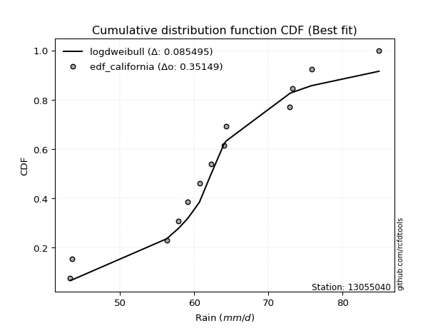</img>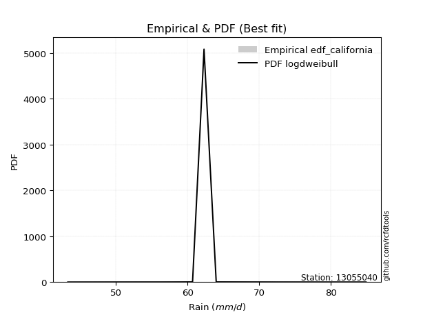</img>

</div>


### 2. EDF Hazen (1930)

Hazen method for plotting positions is a formula used to estimate the empirical cumulative probability distribution of flood events or other hydrological data. This formula often results in biased estimations, particularly when extrapolating to extreme events (high return periods).

<div align="center">


$P=(m-0.5)/n$


</div>


**2.1. Empirical values**

<div align="center">

|                | 0                    | 1                   | 2                   | 3                  | 4                   | 5                  | 6         | 7                  | 8                  | 9                  | 10                 | 11                 | 12                 |
|:---------------|:---------------------|:--------------------|:--------------------|:-------------------|:--------------------|:-------------------|:----------|:-------------------|:-------------------|:-------------------|:-------------------|:-------------------|:-------------------|
| date           | 2014                 | 2010                | 2006                | 2015               | 2017                | 2005               | 2009      | 2012               | 2016               | 2013               | 2007               | 2008               | 2011               |
| x              | 43.3                 | 43.5                | 56.3                | 57.9               | 59.146153846153844  | 60.7               | 62.3      | 64.0               | 64.3               | 72.9               | 73.2               | 75.8               | 84.9               |
| m              | 1                    | 2                   | 3                   | 4                  | 5                   | 6                  | 7         | 8                  | 9                  | 10                 | 11                 | 12                 | 13                 |
| empirical_dist | edf_hazen            | edf_hazen           | edf_hazen           | edf_hazen          | edf_hazen           | edf_hazen          | edf_hazen | edf_hazen          | edf_hazen          | edf_hazen          | edf_hazen          | edf_hazen          | edf_hazen          |
| empirical      | 0.038461538461538464 | 0.11538461538461539 | 0.19230769230769232 | 0.2692307692307692 | 0.34615384615384615 | 0.4230769230769231 | 0.5       | 0.5769230769230769 | 0.6538461538461539 | 0.7307692307692307 | 0.8076923076923077 | 0.8846153846153846 | 0.9615384615384616 |
| empirical_tr   | 1.04                 | 1.1304347826086958  | 1.2380952380952381  | 1.3684210526315788 | 1.5294117647058822  | 1.7333333333333334 | 2.0       | 2.3636363636363633 | 2.888888888888889  | 3.7142857142857135 | 5.2                | 8.666666666666664  | 26.000000000000018 |

</div>


**2.2. Kolmogorov-Smirnov fit test (sorted by Δ)**


<div align="center">

|                | 0                   | 1                   | 2                   | 3                   | 4                   | 5                   | 6                   | 7                   | 8                   | 9                   | 10                  | 11                  | 12                  | 13                  | 14                  | 15                  | 16                  | 17                  | 18                  | 19                  | 20                  | 21                  | 22                  | 23                  | 24                  | 25                  | 26                  | 27                  | 28                  | 29                    | 30                  | 31                  | 32                  | 33                  | 34                  | 35                  | 36                  | 37                  | 38                  | 39                  | 40                  | 41                  | 42                  | 43                  | 44                  | 45                  | 46                  | 47                  | 48                  | 49                  | 50                  | 51                  | 52                  | 53                  | 54                  | 55                  | 56                  | 57                  | 58                  | 59                  | 60                  | 61                  | 62                  | 63                  | 64                  | 65                  | 66                  | 67                  | 68                  | 69                  | 70                  | 71                  | 72                  | 73                  | 74                  | 75                  | 76                  | 77                  | 78                  | 79                  | 80                  | 81                  | 82                  | 83                  | 84                  | 85                  | 86                  | 87                  |
|:---------------|:--------------------|:--------------------|:--------------------|:--------------------|:--------------------|:--------------------|:--------------------|:--------------------|:--------------------|:--------------------|:--------------------|:--------------------|:--------------------|:--------------------|:--------------------|:--------------------|:--------------------|:--------------------|:--------------------|:--------------------|:--------------------|:--------------------|:--------------------|:--------------------|:--------------------|:--------------------|:--------------------|:--------------------|:--------------------|:----------------------|:--------------------|:--------------------|:--------------------|:--------------------|:--------------------|:--------------------|:--------------------|:--------------------|:--------------------|:--------------------|:--------------------|:--------------------|:--------------------|:--------------------|:--------------------|:--------------------|:--------------------|:--------------------|:--------------------|:--------------------|:--------------------|:--------------------|:--------------------|:--------------------|:--------------------|:--------------------|:--------------------|:--------------------|:--------------------|:--------------------|:--------------------|:--------------------|:--------------------|:--------------------|:--------------------|:--------------------|:--------------------|:--------------------|:--------------------|:--------------------|:--------------------|:--------------------|:--------------------|:--------------------|:--------------------|:--------------------|:--------------------|:--------------------|:--------------------|:--------------------|:--------------------|:--------------------|:--------------------|:--------------------|:--------------------|:--------------------|:--------------------|:--------------------|
| station        | 13055040            | 13055040            | 13055040            | 13055040            | 13055040            | 13055040            | 13055040            | 13055040            | 13055040            | 13055040            | 13055040            | 13055040            | 13055040            | 13055040            | 13055040            | 13055040            | 13055040            | 13055040            | 13055040            | 13055040            | 13055040            | 13055040            | 13055040            | 13055040            | 13055040            | 13055040            | 13055040            | 13055040            | 13055040            | 13055040              | 13055040            | 13055040            | 13055040            | 13055040            | 13055040            | 13055040            | 13055040            | 13055040            | 13055040            | 13055040            | 13055040            | 13055040            | 13055040            | 13055040            | 13055040            | 13055040            | 13055040            | 13055040            | 13055040            | 13055040            | 13055040            | 13055040            | 13055040            | 13055040            | 13055040            | 13055040            | 13055040            | 13055040            | 13055040            | 13055040            | 13055040            | 13055040            | 13055040            | 13055040            | 13055040            | 13055040            | 13055040            | 13055040            | 13055040            | 13055040            | 13055040            | 13055040            | 13055040            | 13055040            | 13055040            | 13055040            | 13055040            | 13055040            | 13055040            | 13055040            | 13055040            | 13055040            | 13055040            | 13055040            | 13055040            | 13055040            | 13055040            | 13055040            |
| empirical_dist | edf_hazen           | edf_hazen           | edf_hazen           | edf_hazen           | edf_hazen           | edf_hazen           | edf_hazen           | edf_hazen           | edf_hazen           | edf_hazen           | edf_hazen           | edf_hazen           | edf_hazen           | edf_hazen           | edf_hazen           | edf_hazen           | edf_hazen           | edf_hazen           | edf_hazen           | edf_hazen           | edf_hazen           | edf_hazen           | edf_hazen           | edf_hazen           | edf_hazen           | edf_hazen           | edf_hazen           | edf_hazen           | edf_hazen           | edf_hazen             | edf_hazen           | edf_hazen           | edf_hazen           | edf_hazen           | edf_hazen           | edf_hazen           | edf_hazen           | edf_hazen           | edf_hazen           | edf_hazen           | edf_hazen           | edf_hazen           | edf_hazen           | edf_hazen           | edf_hazen           | edf_hazen           | edf_hazen           | edf_hazen           | edf_hazen           | edf_hazen           | edf_hazen           | edf_hazen           | edf_hazen           | edf_hazen           | edf_hazen           | edf_hazen           | edf_hazen           | edf_hazen           | edf_hazen           | edf_hazen           | edf_hazen           | edf_hazen           | edf_hazen           | edf_hazen           | edf_hazen           | edf_hazen           | edf_hazen           | edf_hazen           | edf_hazen           | edf_hazen           | edf_hazen           | edf_hazen           | edf_hazen           | edf_hazen           | edf_hazen           | edf_hazen           | edf_hazen           | edf_hazen           | edf_hazen           | edf_hazen           | edf_hazen           | edf_hazen           | edf_hazen           | edf_hazen           | edf_hazen           | edf_hazen           | edf_hazen           | edf_hazen           |
| p_dist         | logfisk             | ncf                 | loglogistic         | logistic            | logpearson3         | genlogistic         | weibull_min         | fisk                | invgamma            | rice                | gamma               | erlang              | alpha               | f                   | nakagami            | t                   | exponnorm           | norm                | crystalball         | johnsonsu           | mielke              | loggenlogistic      | logweibull_min      | laplace_asymmetric  | logmielke           | pearson3            | loghypsecant        | hypsecant           | logloggamma         | loglaplace_asymmetric | logjohnsonsu        | truncnorm           | maxwell             | gumbel_r            | logfatiguelife      | logf                | lognorm             | lognorm             | logcrystalball      | logt                | logexponnorm        | lognakagami         | logncf              | logbetaprime        | moyal               | betaprime           | loglaplace          | laplace             | rayleigh            | logerlang           | lognct              | loggamma            | loggamma            | logrice             | logalpha            | loggumbel_l         | loginvgamma         | invgauss            | nct                 | invweibull          | logmaxwell          | loginvgauss         | halflogistic        | loggumbel_r         | halfnorm            | wald                | lograyleigh         | gibrat              | logmoyal            | kstwobign           | gumbel_l            | loginvweibull       | loghalfnorm         | loghalflogistic     | logwald             | logkstwobign        | loggenexpon         | loggibrat           | loggompertz         | expon               | genexpon            | logexpon            | logchi2             | logtruncnorm        | loglognorm          | fatiguelife         | gompertz            | chi2                |
| delta          | 0.08852780052642206 | 0.09696178084444532 | 0.09746064833036616 | 0.10033011704847783 | 0.10189848639280064 | 0.10300131696493753 | 0.10326145661954711 | 0.10362779004738243 | 0.1036293950889551  | 0.10369044026453736 | 0.10466651966931995 | 0.1047902268299129  | 0.10503123884367713 | 0.10534589968063834 | 0.10619644997765953 | 0.10666947893816625 | 0.10669170742667633 | 0.10669238124326508 | 0.1066923894903955  | 0.106701419771838   | 0.10682798851120012 | 0.10684327053249898 | 0.10740935618633884 | 0.10757906900181269 | 0.10814186507860057 | 0.10879000981994635 | 0.10965136353850258 | 0.10999712862438993 | 0.11085215694805473 | 0.11118187829904169   | 0.11259139235654192 | 0.11345852721022706 | 0.11460665378274762 | 0.11480464918049796 | 0.1161591175478793  | 0.11675592054911407 | 0.11732467046098957 | 0.11732467046098957 | 0.11732470325866831 | 0.11732593509249098 | 0.11732638478036198 | 0.11747897919433378 | 0.11752612129376624 | 0.11809724135850677 | 0.12091885237507802 | 0.12197953219018218 | 0.12258194070788442 | 0.12288035097622918 | 0.12496848467748564 | 0.12658613563645602 | 0.12764447583855507 | 0.12844336422597288 | 0.12844336422597288 | 0.1290915115617022  | 0.13003612856744365 | 0.13579932154422114 | 0.1374194014328642  | 0.13802533901143552 | 0.14360640991402798 | 0.14610020485320566 | 0.14614171891583957 | 0.14721404819846381 | 0.1478465776550276  | 0.15348525680676797 | 0.15395681958929833 | 0.15403276223619172 | 0.15743647427065713 | 0.1654397038616473  | 0.16576531779905007 | 0.17076130746642473 | 0.17401856361016355 | 0.18387373241601926 | 0.18943358572077865 | 0.18977930298450993 | 0.21395767644617358 | 0.21665844088200345 | 0.21707213788950172 | 0.21751836569596378 | 0.28623497246485974 | 0.2917945430422507  | 0.2992212511723701  | 0.32872176564617717 | 0.38927409422053183 | 0.39531671646412914 | 0.41787845688428393 | 0.6052141720379416  | 0.7761198711410927  | 0.797933861480684   |
| deltao         | 0.35149047353100005 | 0.35149047353100005 | 0.35149047353100005 | 0.35149047353100005 | 0.35149047353100005 | 0.35149047353100005 | 0.35149047353100005 | 0.35149047353100005 | 0.35149047353100005 | 0.35149047353100005 | 0.35149047353100005 | 0.35149047353100005 | 0.35149047353100005 | 0.35149047353100005 | 0.35149047353100005 | 0.35149047353100005 | 0.35149047353100005 | 0.35149047353100005 | 0.35149047353100005 | 0.35149047353100005 | 0.35149047353100005 | 0.35149047353100005 | 0.35149047353100005 | 0.35149047353100005 | 0.35149047353100005 | 0.35149047353100005 | 0.35149047353100005 | 0.35149047353100005 | 0.35149047353100005 | 0.35149047353100005   | 0.35149047353100005 | 0.35149047353100005 | 0.35149047353100005 | 0.35149047353100005 | 0.35149047353100005 | 0.35149047353100005 | 0.35149047353100005 | 0.35149047353100005 | 0.35149047353100005 | 0.35149047353100005 | 0.35149047353100005 | 0.35149047353100005 | 0.35149047353100005 | 0.35149047353100005 | 0.35149047353100005 | 0.35149047353100005 | 0.35149047353100005 | 0.35149047353100005 | 0.35149047353100005 | 0.35149047353100005 | 0.35149047353100005 | 0.35149047353100005 | 0.35149047353100005 | 0.35149047353100005 | 0.35149047353100005 | 0.35149047353100005 | 0.35149047353100005 | 0.35149047353100005 | 0.35149047353100005 | 0.35149047353100005 | 0.35149047353100005 | 0.35149047353100005 | 0.35149047353100005 | 0.35149047353100005 | 0.35149047353100005 | 0.35149047353100005 | 0.35149047353100005 | 0.35149047353100005 | 0.35149047353100005 | 0.35149047353100005 | 0.35149047353100005 | 0.35149047353100005 | 0.35149047353100005 | 0.35149047353100005 | 0.35149047353100005 | 0.35149047353100005 | 0.35149047353100005 | 0.35149047353100005 | 0.35149047353100005 | 0.35149047353100005 | 0.35149047353100005 | 0.35149047353100005 | 0.35149047353100005 | 0.35149047353100005 | 0.35149047353100005 | 0.35149047353100005 | 0.35149047353100005 | 0.35149047353100005 |
| eval           | Δo > Δ              | Δo > Δ              | Δo > Δ              | Δo > Δ              | Δo > Δ              | Δo > Δ              | Δo > Δ              | Δo > Δ              | Δo > Δ              | Δo > Δ              | Δo > Δ              | Δo > Δ              | Δo > Δ              | Δo > Δ              | Δo > Δ              | Δo > Δ              | Δo > Δ              | Δo > Δ              | Δo > Δ              | Δo > Δ              | Δo > Δ              | Δo > Δ              | Δo > Δ              | Δo > Δ              | Δo > Δ              | Δo > Δ              | Δo > Δ              | Δo > Δ              | Δo > Δ              | Δo > Δ                | Δo > Δ              | Δo > Δ              | Δo > Δ              | Δo > Δ              | Δo > Δ              | Δo > Δ              | Δo > Δ              | Δo > Δ              | Δo > Δ              | Δo > Δ              | Δo > Δ              | Δo > Δ              | Δo > Δ              | Δo > Δ              | Δo > Δ              | Δo > Δ              | Δo > Δ              | Δo > Δ              | Δo > Δ              | Δo > Δ              | Δo > Δ              | Δo > Δ              | Δo > Δ              | Δo > Δ              | Δo > Δ              | Δo > Δ              | Δo > Δ              | Δo > Δ              | Δo > Δ              | Δo > Δ              | Δo > Δ              | Δo > Δ              | Δo > Δ              | Δo > Δ              | Δo > Δ              | Δo > Δ              | Δo > Δ              | Δo > Δ              | Δo > Δ              | Δo > Δ              | Δo > Δ              | Δo > Δ              | Δo > Δ              | Δo > Δ              | Δo > Δ              | Δo > Δ              | Δo > Δ              | Δo > Δ              | Δo > Δ              | Δo > Δ              | Δo > Δ              | Δo > Δ              | Δo <= Δ             | Δo <= Δ             | Δo <= Δ             | Δo <= Δ             | Δo <= Δ             | Δo <= Δ             |
| fit            | 1                   | 1                   | 1                   | 1                   | 1                   | 1                   | 1                   | 1                   | 1                   | 1                   | 1                   | 1                   | 1                   | 1                   | 1                   | 1                   | 1                   | 1                   | 1                   | 1                   | 1                   | 1                   | 1                   | 1                   | 1                   | 1                   | 1                   | 1                   | 1                   | 1                     | 1                   | 1                   | 1                   | 1                   | 1                   | 1                   | 1                   | 1                   | 1                   | 1                   | 1                   | 1                   | 1                   | 1                   | 1                   | 1                   | 1                   | 1                   | 1                   | 1                   | 1                   | 1                   | 1                   | 1                   | 1                   | 1                   | 1                   | 1                   | 1                   | 1                   | 1                   | 1                   | 1                   | 1                   | 1                   | 1                   | 1                   | 1                   | 1                   | 1                   | 1                   | 1                   | 1                   | 1                   | 1                   | 1                   | 1                   | 1                   | 1                   | 1                   | 1                   | 1                   | 0                   | 0                   | 0                   | 0                   | 0                   | 0                   |
| n              | 13                  | 13                  | 13                  | 13                  | 13                  | 13                  | 13                  | 13                  | 13                  | 13                  | 13                  | 13                  | 13                  | 13                  | 13                  | 13                  | 13                  | 13                  | 13                  | 13                  | 13                  | 13                  | 13                  | 13                  | 13                  | 13                  | 13                  | 13                  | 13                  | 13                    | 13                  | 13                  | 13                  | 13                  | 13                  | 13                  | 13                  | 13                  | 13                  | 13                  | 13                  | 13                  | 13                  | 13                  | 13                  | 13                  | 13                  | 13                  | 13                  | 13                  | 13                  | 13                  | 13                  | 13                  | 13                  | 13                  | 13                  | 13                  | 13                  | 13                  | 13                  | 13                  | 13                  | 13                  | 13                  | 13                  | 13                  | 13                  | 13                  | 13                  | 13                  | 13                  | 13                  | 13                  | 13                  | 13                  | 13                  | 13                  | 13                  | 13                  | 13                  | 13                  | 13                  | 13                  | 13                  | 13                  | 13                  | 13                  |
| best_fit       | 1                   | 0                   | 0                   | 0                   | 0                   | 0                   | 0                   | 0                   | 0                   | 0                   | 0                   | 0                   | 0                   | 0                   | 0                   | 0                   | 0                   | 0                   | 0                   | 0                   | 0                   | 0                   | 0                   | 0                   | 0                   | 0                   | 0                   | 0                   | 0                   | 0                     | 0                   | 0                   | 0                   | 0                   | 0                   | 0                   | 0                   | 0                   | 0                   | 0                   | 0                   | 0                   | 0                   | 0                   | 0                   | 0                   | 0                   | 0                   | 0                   | 0                   | 0                   | 0                   | 0                   | 0                   | 0                   | 0                   | 0                   | 0                   | 0                   | 0                   | 0                   | 0                   | 0                   | 0                   | 0                   | 0                   | 0                   | 0                   | 0                   | 0                   | 0                   | 0                   | 0                   | 0                   | 0                   | 0                   | 0                   | 0                   | 0                   | 0                   | 0                   | 0                   | 0                   | 0                   | 0                   | 0                   | 0                   | 0                   |
| best_fit_sort  | 1                   | 2                   | 3                   | 4                   | 5                   | 6                   | 7                   | 8                   | 9                   | 10                  | 11                  | 12                  | 13                  | 14                  | 15                  | 16                  | 17                  | 18                  | 19                  | 20                  | 21                  | 22                  | 23                  | 24                  | 25                  | 26                  | 27                  | 28                  | 29                  | 30                    | 31                  | 32                  | 33                  | 34                  | 35                  | 36                  | 37                  | 38                  | 39                  | 40                  | 41                  | 42                  | 43                  | 44                  | 45                  | 46                  | 47                  | 48                  | 49                  | 50                  | 51                  | 52                  | 53                  | 54                  | 55                  | 56                  | 57                  | 58                  | 59                  | 60                  | 61                  | 62                  | 63                  | 64                  | 65                  | 66                  | 67                  | 68                  | 69                  | 70                  | 71                  | 72                  | 73                  | 74                  | 75                  | 76                  | 77                  | 78                  | 79                  | 80                  | 81                  | 82                  | 83                  | 84                  | 85                  | 86                  | 87                  | 88                  |

</div>


**2.3. Best fit**

<div align="center">

|   id |   station | empirical_dist   | p_dist   |     delta |   deltao | eval   |   fit |   n |   best_fit |   best_fit_sort |
|-----:|----------:|:-----------------|:---------|----------:|---------:|:-------|------:|----:|-----------:|----------------:|
|    0 |  13055040 | edf_hazen        | logfisk  | 0.0885278 |  0.35149 | Δo > Δ |     1 |  13 |          1 |               1 |

</div>


<div align="center">

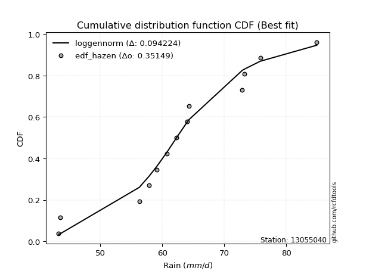</img></img>

</div>


### 3. EDF Weibull (1939)

Weibull plotting position formula is an empirical method used to estimate the non-exceedance probability or plotting position for a set of observed data, is often recommended or widely used in practice, particularly in flood frequency analysis.

<div align="center">


$P=m/(n+1)$


</div>


**3.1. Empirical values**

<div align="center">

|                | 0                   | 1                   | 2                   | 3                  | 4                   | 5                   | 6           | 7                  | 8                  | 9                  | 10                 | 11                 | 12                 |
|:---------------|:--------------------|:--------------------|:--------------------|:-------------------|:--------------------|:--------------------|:------------|:-------------------|:-------------------|:-------------------|:-------------------|:-------------------|:-------------------|
| date           | 2014                | 2010                | 2006                | 2015               | 2017                | 2005                | 2009        | 2012               | 2016               | 2013               | 2007               | 2008               | 2011               |
| x              | 43.3                | 43.5                | 56.3                | 57.9               | 59.146153846153844  | 60.7                | 62.3        | 64.0               | 64.3               | 72.9               | 73.2               | 75.8               | 84.9               |
| m              | 1                   | 2                   | 3                   | 4                  | 5                   | 6                   | 7           | 8                  | 9                  | 10                 | 11                 | 12                 | 13                 |
| empirical_dist | edf_weibull         | edf_weibull         | edf_weibull         | edf_weibull        | edf_weibull         | edf_weibull         | edf_weibull | edf_weibull        | edf_weibull        | edf_weibull        | edf_weibull        | edf_weibull        | edf_weibull        |
| empirical      | 0.07142857142857142 | 0.14285714285714285 | 0.21428571428571427 | 0.2857142857142857 | 0.35714285714285715 | 0.42857142857142855 | 0.5         | 0.5714285714285714 | 0.6428571428571429 | 0.7142857142857143 | 0.7857142857142857 | 0.8571428571428571 | 0.9285714285714286 |
| empirical_tr   | 1.0769230769230769  | 1.1666666666666665  | 1.2727272727272727  | 1.4                | 1.5555555555555558  | 1.75                | 2.0         | 2.333333333333333  | 2.8000000000000003 | 3.5                | 4.666666666666666  | 6.999999999999997  | 14.000000000000007 |

</div>


**3.2. Kolmogorov-Smirnov fit test (sorted by Δ)**


<div align="center">

|                | 0                   | 1                   | 2                   | 3                   | 4                   | 5                   | 6                   | 7                   | 8                   | 9                   | 10                  | 11                  | 12                  | 13                  | 14                  | 15                  | 16                  | 17                  | 18                  | 19                  | 20                  | 21                  | 22                  | 23                  | 24                  | 25                  | 26                  | 27                  | 28                  | 29                  | 30                  | 31                  | 32                  | 33                  | 34                  | 35                  | 36                  | 37                  | 38                  | 39                  | 40                  | 41                  | 42                  | 43                  | 44                  | 45                  | 46                  | 47                  | 48                  | 49                  | 50                  | 51                  | 52                  | 53                  | 54                    | 55                  | 56                  | 57                  | 58                  | 59                  | 60                  | 61                  | 62                  | 63                  | 64                  | 65                  | 66                  | 67                  | 68                  | 69                  | 70                  | 71                  | 72                  | 73                  | 74                  | 75                  | 76                  | 77                  | 78                  | 79                  | 80                  | 81                  | 82                  | 83                  | 84                  | 85                  | 86                  | 87                  |
|:---------------|:--------------------|:--------------------|:--------------------|:--------------------|:--------------------|:--------------------|:--------------------|:--------------------|:--------------------|:--------------------|:--------------------|:--------------------|:--------------------|:--------------------|:--------------------|:--------------------|:--------------------|:--------------------|:--------------------|:--------------------|:--------------------|:--------------------|:--------------------|:--------------------|:--------------------|:--------------------|:--------------------|:--------------------|:--------------------|:--------------------|:--------------------|:--------------------|:--------------------|:--------------------|:--------------------|:--------------------|:--------------------|:--------------------|:--------------------|:--------------------|:--------------------|:--------------------|:--------------------|:--------------------|:--------------------|:--------------------|:--------------------|:--------------------|:--------------------|:--------------------|:--------------------|:--------------------|:--------------------|:--------------------|:----------------------|:--------------------|:--------------------|:--------------------|:--------------------|:--------------------|:--------------------|:--------------------|:--------------------|:--------------------|:--------------------|:--------------------|:--------------------|:--------------------|:--------------------|:--------------------|:--------------------|:--------------------|:--------------------|:--------------------|:--------------------|:--------------------|:--------------------|:--------------------|:--------------------|:--------------------|:--------------------|:--------------------|:--------------------|:--------------------|:--------------------|:--------------------|:--------------------|:--------------------|
| station        | 13055040            | 13055040            | 13055040            | 13055040            | 13055040            | 13055040            | 13055040            | 13055040            | 13055040            | 13055040            | 13055040            | 13055040            | 13055040            | 13055040            | 13055040            | 13055040            | 13055040            | 13055040            | 13055040            | 13055040            | 13055040            | 13055040            | 13055040            | 13055040            | 13055040            | 13055040            | 13055040            | 13055040            | 13055040            | 13055040            | 13055040            | 13055040            | 13055040            | 13055040            | 13055040            | 13055040            | 13055040            | 13055040            | 13055040            | 13055040            | 13055040            | 13055040            | 13055040            | 13055040            | 13055040            | 13055040            | 13055040            | 13055040            | 13055040            | 13055040            | 13055040            | 13055040            | 13055040            | 13055040            | 13055040              | 13055040            | 13055040            | 13055040            | 13055040            | 13055040            | 13055040            | 13055040            | 13055040            | 13055040            | 13055040            | 13055040            | 13055040            | 13055040            | 13055040            | 13055040            | 13055040            | 13055040            | 13055040            | 13055040            | 13055040            | 13055040            | 13055040            | 13055040            | 13055040            | 13055040            | 13055040            | 13055040            | 13055040            | 13055040            | 13055040            | 13055040            | 13055040            | 13055040            |
| empirical_dist | edf_weibull         | edf_weibull         | edf_weibull         | edf_weibull         | edf_weibull         | edf_weibull         | edf_weibull         | edf_weibull         | edf_weibull         | edf_weibull         | edf_weibull         | edf_weibull         | edf_weibull         | edf_weibull         | edf_weibull         | edf_weibull         | edf_weibull         | edf_weibull         | edf_weibull         | edf_weibull         | edf_weibull         | edf_weibull         | edf_weibull         | edf_weibull         | edf_weibull         | edf_weibull         | edf_weibull         | edf_weibull         | edf_weibull         | edf_weibull         | edf_weibull         | edf_weibull         | edf_weibull         | edf_weibull         | edf_weibull         | edf_weibull         | edf_weibull         | edf_weibull         | edf_weibull         | edf_weibull         | edf_weibull         | edf_weibull         | edf_weibull         | edf_weibull         | edf_weibull         | edf_weibull         | edf_weibull         | edf_weibull         | edf_weibull         | edf_weibull         | edf_weibull         | edf_weibull         | edf_weibull         | edf_weibull         | edf_weibull           | edf_weibull         | edf_weibull         | edf_weibull         | edf_weibull         | edf_weibull         | edf_weibull         | edf_weibull         | edf_weibull         | edf_weibull         | edf_weibull         | edf_weibull         | edf_weibull         | edf_weibull         | edf_weibull         | edf_weibull         | edf_weibull         | edf_weibull         | edf_weibull         | edf_weibull         | edf_weibull         | edf_weibull         | edf_weibull         | edf_weibull         | edf_weibull         | edf_weibull         | edf_weibull         | edf_weibull         | edf_weibull         | edf_weibull         | edf_weibull         | edf_weibull         | edf_weibull         | edf_weibull         |
| p_dist         | pearson3            | johnsonsu           | norm                | crystalball         | exponnorm           | t                   | nakagami            | f                   | gamma               | erlang              | logloggamma         | logpearson3         | logweibull_min      | logjohnsonsu        | weibull_min         | ncf                 | invgamma            | genlogistic         | alpha               | fisk                | logmielke           | loggenlogistic      | mielke              | logfisk             | lognakagami         | logt                | logexponnorm        | logcrystalball      | lognorm             | lognorm             | loggamma            | loggamma            | logncf              | logf                | rice                | logerlang           | lognct              | logfatiguelife      | logalpha            | logbetaprime        | loglogistic         | betaprime           | logistic            | loginvgamma         | invgauss            | logrice             | maxwell             | nct                 | laplace_asymmetric  | invweibull          | loggumbel_l         | loginvgauss         | loghypsecant        | hypsecant           | loglaplace_asymmetric | logmaxwell          | rayleigh            | gumbel_r            | loglaplace          | laplace             | truncnorm           | loggumbel_r         | lograyleigh         | moyal               | halflogistic        | halfnorm            | kstwobign           | logmoyal            | wald                | loginvweibull       | gumbel_l            | loghalfnorm         | loghalflogistic     | gibrat              | logkstwobign        | loggenexpon         | logwald             | loggibrat           | loggompertz         | expon               | genexpon            | logexpon            | logchi2             | logtruncnorm        | loglognorm          | fatiguelife         | gompertz            | chi2                |
| delta          | 0.0978009988309354  | 0.09790657893867191 | 0.09792927266416987 | 0.09792927537692209 | 0.09792937195441284 | 0.09792961695433954 | 0.09828086055472472 | 0.09861720546634005 | 0.09864947760541501 | 0.09875946630097356 | 0.09986314595904378 | 0.10005241760050579 | 0.10041447671017367 | 0.10160238136753097 | 0.10378407229735077 | 0.10417651069101938 | 0.10460678848502598 | 0.10490355825932118 | 0.10526682765872773 | 0.10527872515358083 | 0.10610222230086785 | 0.10655640067575944 | 0.10655964615755764 | 0.110478195693815   | 0.11131010479237168 | 0.11131964388316964 | 0.11131992845052281 | 0.11132003964218562 | 0.11132004822054983 | 0.11132004822054983 | 0.1114309214673059  | 0.1114309214673059  | 0.11152922962567832 | 0.1115392122165445  | 0.11156411891948882 | 0.1118181959415458  | 0.11245154141008204 | 0.11250141972245821 | 0.11268750873191839 | 0.11368079195817134 | 0.11394416481388259 | 0.11394850575164599 | 0.11431550989618322 | 0.11544137945484226 | 0.11604731703341356 | 0.11832321205561386 | 0.11952598895436653 | 0.12162838793600603 | 0.12406258548532911 | 0.1241221828751837  | 0.12481031055521019 | 0.12523602622044186 | 0.126134880022019   | 0.12648064510790635 | 0.12766539478255812   | 0.13240076325920455 | 0.13281193565969163 | 0.13573174940841173 | 0.13906545719140084 | 0.1393638674597456  | 0.13998936477346027 | 0.14059133086885986 | 0.14222248856548886 | 0.14236698744586365 | 0.14285714285714285 | 0.14285714285714285 | 0.14878328548840278 | 0.1492818013155336  | 0.15564198873442414 | 0.1618957104379973  | 0.1630295526211526  | 0.1674555637427567  | 0.16780128100648797 | 0.18192322034516373 | 0.1946804189039815  | 0.19509411591147977 | 0.1974741599626571  | 0.2120238602014583  | 0.2642569504868377  | 0.2698165210642287  | 0.2772432291943481  | 0.30674374366815516 | 0.35630706125349887 | 0.3733386944861071  | 0.3959004349062619  | 0.5832361500599196  | 0.7541418491630707  | 0.775955839502662   |
| deltao         | 0.35149047353100005 | 0.35149047353100005 | 0.35149047353100005 | 0.35149047353100005 | 0.35149047353100005 | 0.35149047353100005 | 0.35149047353100005 | 0.35149047353100005 | 0.35149047353100005 | 0.35149047353100005 | 0.35149047353100005 | 0.35149047353100005 | 0.35149047353100005 | 0.35149047353100005 | 0.35149047353100005 | 0.35149047353100005 | 0.35149047353100005 | 0.35149047353100005 | 0.35149047353100005 | 0.35149047353100005 | 0.35149047353100005 | 0.35149047353100005 | 0.35149047353100005 | 0.35149047353100005 | 0.35149047353100005 | 0.35149047353100005 | 0.35149047353100005 | 0.35149047353100005 | 0.35149047353100005 | 0.35149047353100005 | 0.35149047353100005 | 0.35149047353100005 | 0.35149047353100005 | 0.35149047353100005 | 0.35149047353100005 | 0.35149047353100005 | 0.35149047353100005 | 0.35149047353100005 | 0.35149047353100005 | 0.35149047353100005 | 0.35149047353100005 | 0.35149047353100005 | 0.35149047353100005 | 0.35149047353100005 | 0.35149047353100005 | 0.35149047353100005 | 0.35149047353100005 | 0.35149047353100005 | 0.35149047353100005 | 0.35149047353100005 | 0.35149047353100005 | 0.35149047353100005 | 0.35149047353100005 | 0.35149047353100005 | 0.35149047353100005   | 0.35149047353100005 | 0.35149047353100005 | 0.35149047353100005 | 0.35149047353100005 | 0.35149047353100005 | 0.35149047353100005 | 0.35149047353100005 | 0.35149047353100005 | 0.35149047353100005 | 0.35149047353100005 | 0.35149047353100005 | 0.35149047353100005 | 0.35149047353100005 | 0.35149047353100005 | 0.35149047353100005 | 0.35149047353100005 | 0.35149047353100005 | 0.35149047353100005 | 0.35149047353100005 | 0.35149047353100005 | 0.35149047353100005 | 0.35149047353100005 | 0.35149047353100005 | 0.35149047353100005 | 0.35149047353100005 | 0.35149047353100005 | 0.35149047353100005 | 0.35149047353100005 | 0.35149047353100005 | 0.35149047353100005 | 0.35149047353100005 | 0.35149047353100005 | 0.35149047353100005 |
| eval           | Δo > Δ              | Δo > Δ              | Δo > Δ              | Δo > Δ              | Δo > Δ              | Δo > Δ              | Δo > Δ              | Δo > Δ              | Δo > Δ              | Δo > Δ              | Δo > Δ              | Δo > Δ              | Δo > Δ              | Δo > Δ              | Δo > Δ              | Δo > Δ              | Δo > Δ              | Δo > Δ              | Δo > Δ              | Δo > Δ              | Δo > Δ              | Δo > Δ              | Δo > Δ              | Δo > Δ              | Δo > Δ              | Δo > Δ              | Δo > Δ              | Δo > Δ              | Δo > Δ              | Δo > Δ              | Δo > Δ              | Δo > Δ              | Δo > Δ              | Δo > Δ              | Δo > Δ              | Δo > Δ              | Δo > Δ              | Δo > Δ              | Δo > Δ              | Δo > Δ              | Δo > Δ              | Δo > Δ              | Δo > Δ              | Δo > Δ              | Δo > Δ              | Δo > Δ              | Δo > Δ              | Δo > Δ              | Δo > Δ              | Δo > Δ              | Δo > Δ              | Δo > Δ              | Δo > Δ              | Δo > Δ              | Δo > Δ                | Δo > Δ              | Δo > Δ              | Δo > Δ              | Δo > Δ              | Δo > Δ              | Δo > Δ              | Δo > Δ              | Δo > Δ              | Δo > Δ              | Δo > Δ              | Δo > Δ              | Δo > Δ              | Δo > Δ              | Δo > Δ              | Δo > Δ              | Δo > Δ              | Δo > Δ              | Δo > Δ              | Δo > Δ              | Δo > Δ              | Δo > Δ              | Δo > Δ              | Δo > Δ              | Δo > Δ              | Δo > Δ              | Δo > Δ              | Δo > Δ              | Δo <= Δ             | Δo <= Δ             | Δo <= Δ             | Δo <= Δ             | Δo <= Δ             | Δo <= Δ             |
| fit            | 1                   | 1                   | 1                   | 1                   | 1                   | 1                   | 1                   | 1                   | 1                   | 1                   | 1                   | 1                   | 1                   | 1                   | 1                   | 1                   | 1                   | 1                   | 1                   | 1                   | 1                   | 1                   | 1                   | 1                   | 1                   | 1                   | 1                   | 1                   | 1                   | 1                   | 1                   | 1                   | 1                   | 1                   | 1                   | 1                   | 1                   | 1                   | 1                   | 1                   | 1                   | 1                   | 1                   | 1                   | 1                   | 1                   | 1                   | 1                   | 1                   | 1                   | 1                   | 1                   | 1                   | 1                   | 1                     | 1                   | 1                   | 1                   | 1                   | 1                   | 1                   | 1                   | 1                   | 1                   | 1                   | 1                   | 1                   | 1                   | 1                   | 1                   | 1                   | 1                   | 1                   | 1                   | 1                   | 1                   | 1                   | 1                   | 1                   | 1                   | 1                   | 1                   | 0                   | 0                   | 0                   | 0                   | 0                   | 0                   |
| n              | 13                  | 13                  | 13                  | 13                  | 13                  | 13                  | 13                  | 13                  | 13                  | 13                  | 13                  | 13                  | 13                  | 13                  | 13                  | 13                  | 13                  | 13                  | 13                  | 13                  | 13                  | 13                  | 13                  | 13                  | 13                  | 13                  | 13                  | 13                  | 13                  | 13                  | 13                  | 13                  | 13                  | 13                  | 13                  | 13                  | 13                  | 13                  | 13                  | 13                  | 13                  | 13                  | 13                  | 13                  | 13                  | 13                  | 13                  | 13                  | 13                  | 13                  | 13                  | 13                  | 13                  | 13                  | 13                    | 13                  | 13                  | 13                  | 13                  | 13                  | 13                  | 13                  | 13                  | 13                  | 13                  | 13                  | 13                  | 13                  | 13                  | 13                  | 13                  | 13                  | 13                  | 13                  | 13                  | 13                  | 13                  | 13                  | 13                  | 13                  | 13                  | 13                  | 13                  | 13                  | 13                  | 13                  | 13                  | 13                  |
| best_fit       | 1                   | 0                   | 0                   | 0                   | 0                   | 0                   | 0                   | 0                   | 0                   | 0                   | 0                   | 0                   | 0                   | 0                   | 0                   | 0                   | 0                   | 0                   | 0                   | 0                   | 0                   | 0                   | 0                   | 0                   | 0                   | 0                   | 0                   | 0                   | 0                   | 0                   | 0                   | 0                   | 0                   | 0                   | 0                   | 0                   | 0                   | 0                   | 0                   | 0                   | 0                   | 0                   | 0                   | 0                   | 0                   | 0                   | 0                   | 0                   | 0                   | 0                   | 0                   | 0                   | 0                   | 0                   | 0                     | 0                   | 0                   | 0                   | 0                   | 0                   | 0                   | 0                   | 0                   | 0                   | 0                   | 0                   | 0                   | 0                   | 0                   | 0                   | 0                   | 0                   | 0                   | 0                   | 0                   | 0                   | 0                   | 0                   | 0                   | 0                   | 0                   | 0                   | 0                   | 0                   | 0                   | 0                   | 0                   | 0                   |
| best_fit_sort  | 1                   | 2                   | 3                   | 4                   | 5                   | 6                   | 7                   | 8                   | 9                   | 10                  | 11                  | 12                  | 13                  | 14                  | 15                  | 16                  | 17                  | 18                  | 19                  | 20                  | 21                  | 22                  | 23                  | 24                  | 25                  | 26                  | 27                  | 28                  | 29                  | 30                  | 31                  | 32                  | 33                  | 34                  | 35                  | 36                  | 37                  | 38                  | 39                  | 40                  | 41                  | 42                  | 43                  | 44                  | 45                  | 46                  | 47                  | 48                  | 49                  | 50                  | 51                  | 52                  | 53                  | 54                  | 55                    | 56                  | 57                  | 58                  | 59                  | 60                  | 61                  | 62                  | 63                  | 64                  | 65                  | 66                  | 67                  | 68                  | 69                  | 70                  | 71                  | 72                  | 73                  | 74                  | 75                  | 76                  | 77                  | 78                  | 79                  | 80                  | 81                  | 82                  | 83                  | 84                  | 85                  | 86                  | 87                  | 88                  |

</div>


**3.3. Best fit**

<div align="center">

|   id |   station | empirical_dist   | p_dist   |    delta |   deltao | eval   |   fit |   n |   best_fit |   best_fit_sort |
|-----:|----------:|:-----------------|:---------|---------:|---------:|:-------|------:|----:|-----------:|----------------:|
|    0 |  13055040 | edf_weibull      | pearson3 | 0.097801 |  0.35149 | Δo > Δ |     1 |  13 |          1 |               1 |

</div>


<div align="center">

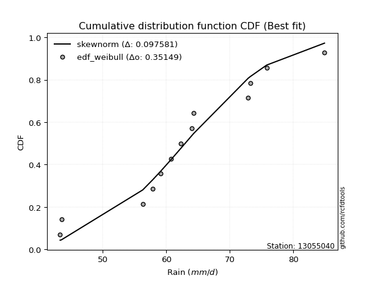</img>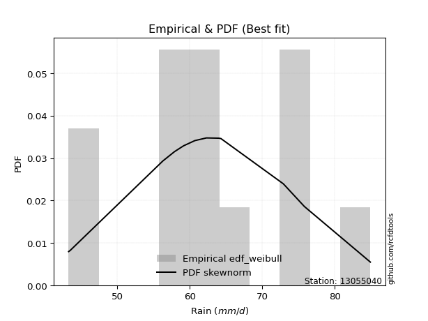</img>

</div>


### 4. EDF Beard (1943)

The Beard formula (or Beard´s plotting position formula) in hydrology is used to estimate the empirical non-exceedance probability _(P)_ of a flood event (or other extreme hydrological data point) within a given dataset.

<div align="center">


$P=(m-0.31)/(n+0.38)$


</div>


**4.1. Empirical values**

<div align="center">

|                | 0                    | 1                   | 2                   | 3                   | 4                  | 5                  | 6         | 7                  | 8                  | 9                  | 10                 | 11                 | 12                 |
|:---------------|:---------------------|:--------------------|:--------------------|:--------------------|:-------------------|:-------------------|:----------|:-------------------|:-------------------|:-------------------|:-------------------|:-------------------|:-------------------|
| date           | 2014                 | 2010                | 2006                | 2015                | 2017               | 2005               | 2009      | 2012               | 2016               | 2013               | 2007               | 2008               | 2011               |
| x              | 43.3                 | 43.5                | 56.3                | 57.9                | 59.146153846153844 | 60.7               | 62.3      | 64.0               | 64.3               | 72.9               | 73.2               | 75.8               | 84.9               |
| m              | 1                    | 2                   | 3                   | 4                   | 5                  | 6                  | 7         | 8                  | 9                  | 10                 | 11                 | 12                 | 13                 |
| empirical_dist | edf_beard            | edf_beard           | edf_beard           | edf_beard           | edf_beard          | edf_beard          | edf_beard | edf_beard          | edf_beard          | edf_beard          | edf_beard          | edf_beard          | edf_beard          |
| empirical      | 0.051569506726457395 | 0.12630792227204782 | 0.20104633781763825 | 0.27578475336322866 | 0.3505231689088191 | 0.4252615844544096 | 0.5       | 0.5747384155455905 | 0.6494768310911808 | 0.7242152466367712 | 0.7989536621823616 | 0.8736920777279521 | 0.9484304932735426 |
| empirical_tr   | 1.0543735224586288   | 1.1445680068434558  | 1.2516370439663236  | 1.3808049535603715  | 1.5397008055235901 | 1.739921976592978  | 2.0       | 2.351493848857645  | 2.852878464818763  | 3.6260162601626    | 4.973977695167283  | 7.917159763313605  | 19.391304347826072 |

</div>


**4.2. Kolmogorov-Smirnov fit test (sorted by Δ)**


<div align="center">

|                | 0                   | 1                   | 2                   | 3                   | 4                   | 5                   | 6                   | 7                   | 8                   | 9                   | 10                  | 11                  | 12                  | 13                  | 14                  | 15                  | 16                  | 17                  | 18                  | 19                  | 20                  | 21                  | 22                  | 23                  | 24                  | 25                  | 26                  | 27                  | 28                  | 29                  | 30                  | 31                  | 32                  | 33                  | 34                  | 35                  | 36                  | 37                  | 38                  | 39                  | 40                  | 41                  | 42                  | 43                    | 44                  | 45                  | 46                  | 47                  | 48                  | 49                  | 50                  | 51                  | 52                  | 53                  | 54                  | 55                  | 56                  | 57                  | 58                  | 59                  | 60                  | 61                  | 62                  | 63                  | 64                  | 65                  | 66                  | 67                  | 68                  | 69                  | 70                  | 71                  | 72                  | 73                  | 74                  | 75                  | 76                  | 77                  | 78                  | 79                  | 80                  | 81                  | 82                  | 83                  | 84                  | 85                  | 86                  | 87                  |
|:---------------|:--------------------|:--------------------|:--------------------|:--------------------|:--------------------|:--------------------|:--------------------|:--------------------|:--------------------|:--------------------|:--------------------|:--------------------|:--------------------|:--------------------|:--------------------|:--------------------|:--------------------|:--------------------|:--------------------|:--------------------|:--------------------|:--------------------|:--------------------|:--------------------|:--------------------|:--------------------|:--------------------|:--------------------|:--------------------|:--------------------|:--------------------|:--------------------|:--------------------|:--------------------|:--------------------|:--------------------|:--------------------|:--------------------|:--------------------|:--------------------|:--------------------|:--------------------|:--------------------|:----------------------|:--------------------|:--------------------|:--------------------|:--------------------|:--------------------|:--------------------|:--------------------|:--------------------|:--------------------|:--------------------|:--------------------|:--------------------|:--------------------|:--------------------|:--------------------|:--------------------|:--------------------|:--------------------|:--------------------|:--------------------|:--------------------|:--------------------|:--------------------|:--------------------|:--------------------|:--------------------|:--------------------|:--------------------|:--------------------|:--------------------|:--------------------|:--------------------|:--------------------|:--------------------|:--------------------|:--------------------|:--------------------|:--------------------|:--------------------|:--------------------|:--------------------|:--------------------|:--------------------|:--------------------|
| station        | 13055040            | 13055040            | 13055040            | 13055040            | 13055040            | 13055040            | 13055040            | 13055040            | 13055040            | 13055040            | 13055040            | 13055040            | 13055040            | 13055040            | 13055040            | 13055040            | 13055040            | 13055040            | 13055040            | 13055040            | 13055040            | 13055040            | 13055040            | 13055040            | 13055040            | 13055040            | 13055040            | 13055040            | 13055040            | 13055040            | 13055040            | 13055040            | 13055040            | 13055040            | 13055040            | 13055040            | 13055040            | 13055040            | 13055040            | 13055040            | 13055040            | 13055040            | 13055040            | 13055040              | 13055040            | 13055040            | 13055040            | 13055040            | 13055040            | 13055040            | 13055040            | 13055040            | 13055040            | 13055040            | 13055040            | 13055040            | 13055040            | 13055040            | 13055040            | 13055040            | 13055040            | 13055040            | 13055040            | 13055040            | 13055040            | 13055040            | 13055040            | 13055040            | 13055040            | 13055040            | 13055040            | 13055040            | 13055040            | 13055040            | 13055040            | 13055040            | 13055040            | 13055040            | 13055040            | 13055040            | 13055040            | 13055040            | 13055040            | 13055040            | 13055040            | 13055040            | 13055040            | 13055040            |
| empirical_dist | edf_beard           | edf_beard           | edf_beard           | edf_beard           | edf_beard           | edf_beard           | edf_beard           | edf_beard           | edf_beard           | edf_beard           | edf_beard           | edf_beard           | edf_beard           | edf_beard           | edf_beard           | edf_beard           | edf_beard           | edf_beard           | edf_beard           | edf_beard           | edf_beard           | edf_beard           | edf_beard           | edf_beard           | edf_beard           | edf_beard           | edf_beard           | edf_beard           | edf_beard           | edf_beard           | edf_beard           | edf_beard           | edf_beard           | edf_beard           | edf_beard           | edf_beard           | edf_beard           | edf_beard           | edf_beard           | edf_beard           | edf_beard           | edf_beard           | edf_beard           | edf_beard             | edf_beard           | edf_beard           | edf_beard           | edf_beard           | edf_beard           | edf_beard           | edf_beard           | edf_beard           | edf_beard           | edf_beard           | edf_beard           | edf_beard           | edf_beard           | edf_beard           | edf_beard           | edf_beard           | edf_beard           | edf_beard           | edf_beard           | edf_beard           | edf_beard           | edf_beard           | edf_beard           | edf_beard           | edf_beard           | edf_beard           | edf_beard           | edf_beard           | edf_beard           | edf_beard           | edf_beard           | edf_beard           | edf_beard           | edf_beard           | edf_beard           | edf_beard           | edf_beard           | edf_beard           | edf_beard           | edf_beard           | edf_beard           | edf_beard           | edf_beard           | edf_beard           |
| p_dist         | ncf                 | logfisk             | invgamma            | rice                | alpha               | logpearson3         | genlogistic         | weibull_min         | fisk                | gamma               | erlang              | f                   | nakagami            | t                   | exponnorm           | norm                | crystalball         | johnsonsu           | mielke              | loggenlogistic      | logweibull_min      | logmielke           | loglogistic         | logistic            | pearson3            | maxwell             | logloggamma         | logfatiguelife      | logf                | logjohnsonsu        | lognorm             | lognorm             | logcrystalball      | logt                | logexponnorm        | lognakagami         | logncf              | logbetaprime        | betaprime           | laplace_asymmetric  | loghypsecant        | rayleigh            | hypsecant           | loglaplace_asymmetric | logerlang           | lognct              | gumbel_r            | loggamma            | loggamma            | logrice             | logalpha            | truncnorm           | moyal               | loginvgamma         | loglaplace          | invgauss            | laplace             | loggumbel_l         | nct                 | invweibull          | logmaxwell          | loginvgauss         | halflogistic        | loggumbel_r         | halfnorm            | lograyleigh         | wald                | logmoyal            | kstwobign           | gumbel_l            | gibrat              | loginvweibull       | loghalfnorm         | loghalflogistic     | logwald             | logkstwobign        | loggenexpon         | loggibrat           | loggompertz         | expon               | genexpon            | logexpon            | logchi2             | logtruncnorm        | loglognorm          | fatiguelife         | gompertz            | chi2                |
| delta          | 0.08924050041363008 | 0.09392897510871998 | 0.09489074957900917 | 0.09501489833439379 | 0.09629259333373119 | 0.0975291636378276  | 0.09863199420996449 | 0.09889213386457407 | 0.09925846729240939 | 0.10029719691434691 | 0.10042090407493987 | 0.1009765769256653  | 0.1018271272226865  | 0.10230015618319321 | 0.10232238467170329 | 0.10232305848829204 | 0.10232306673542246 | 0.10233209701686496 | 0.10245866575622709 | 0.10247394777752594 | 0.10304003343136581 | 0.10377254232362754 | 0.10401463246282572 | 0.10438597754512635 | 0.10442068706497332 | 0.10586800827280168 | 0.10648283419308169 | 0.10742047203793337 | 0.10801727503916814 | 0.10822206960156888 | 0.10858602495104364 | 0.10858602495104364 | 0.10858605774872238 | 0.10858728958254504 | 0.10858773927041604 | 0.10874033368438785 | 0.10878747578382031 | 0.10935859584856084 | 0.11324088668023624 | 0.11413305313427224 | 0.11620534767096213 | 0.11626271507459658 | 0.11655111275684948 | 0.11773586243150125   | 0.11784749012651008 | 0.11890583032860913 | 0.11918252882331672 | 0.11970471871602695 | 0.11970471871602695 | 0.12035286605175627 | 0.12129748305749771 | 0.12344014418836524 | 0.12581776686076862 | 0.12868075592291828 | 0.12913592484034397 | 0.12928669350148958 | 0.12943433510868874 | 0.1314299987892481  | 0.13486776440408205 | 0.13736155934325972 | 0.13740307340589364 | 0.13847540268851788 | 0.13910793214508166 | 0.14474661129682204 | 0.1452181740793524  | 0.1486978287607112  | 0.1518481008587052  | 0.15921133366659063 | 0.1620226619564788  | 0.1696492408551905  | 0.17199368799410686 | 0.17513508690607332 | 0.1806949402108327  | 0.181040657474564   | 0.20740369231371414 | 0.20791979537205751 | 0.20833349237955578 | 0.21533370431847726 | 0.2774963269549138  | 0.28305589753230476 | 0.2904826056624241  | 0.3199831201362312  | 0.37616612595561283 | 0.3865780709541832  | 0.40913981137433797 | 0.5964755265279956  | 0.7673812256311466  | 0.789195215970738   |
| deltao         | 0.35149047353100005 | 0.35149047353100005 | 0.35149047353100005 | 0.35149047353100005 | 0.35149047353100005 | 0.35149047353100005 | 0.35149047353100005 | 0.35149047353100005 | 0.35149047353100005 | 0.35149047353100005 | 0.35149047353100005 | 0.35149047353100005 | 0.35149047353100005 | 0.35149047353100005 | 0.35149047353100005 | 0.35149047353100005 | 0.35149047353100005 | 0.35149047353100005 | 0.35149047353100005 | 0.35149047353100005 | 0.35149047353100005 | 0.35149047353100005 | 0.35149047353100005 | 0.35149047353100005 | 0.35149047353100005 | 0.35149047353100005 | 0.35149047353100005 | 0.35149047353100005 | 0.35149047353100005 | 0.35149047353100005 | 0.35149047353100005 | 0.35149047353100005 | 0.35149047353100005 | 0.35149047353100005 | 0.35149047353100005 | 0.35149047353100005 | 0.35149047353100005 | 0.35149047353100005 | 0.35149047353100005 | 0.35149047353100005 | 0.35149047353100005 | 0.35149047353100005 | 0.35149047353100005 | 0.35149047353100005   | 0.35149047353100005 | 0.35149047353100005 | 0.35149047353100005 | 0.35149047353100005 | 0.35149047353100005 | 0.35149047353100005 | 0.35149047353100005 | 0.35149047353100005 | 0.35149047353100005 | 0.35149047353100005 | 0.35149047353100005 | 0.35149047353100005 | 0.35149047353100005 | 0.35149047353100005 | 0.35149047353100005 | 0.35149047353100005 | 0.35149047353100005 | 0.35149047353100005 | 0.35149047353100005 | 0.35149047353100005 | 0.35149047353100005 | 0.35149047353100005 | 0.35149047353100005 | 0.35149047353100005 | 0.35149047353100005 | 0.35149047353100005 | 0.35149047353100005 | 0.35149047353100005 | 0.35149047353100005 | 0.35149047353100005 | 0.35149047353100005 | 0.35149047353100005 | 0.35149047353100005 | 0.35149047353100005 | 0.35149047353100005 | 0.35149047353100005 | 0.35149047353100005 | 0.35149047353100005 | 0.35149047353100005 | 0.35149047353100005 | 0.35149047353100005 | 0.35149047353100005 | 0.35149047353100005 | 0.35149047353100005 |
| eval           | Δo > Δ              | Δo > Δ              | Δo > Δ              | Δo > Δ              | Δo > Δ              | Δo > Δ              | Δo > Δ              | Δo > Δ              | Δo > Δ              | Δo > Δ              | Δo > Δ              | Δo > Δ              | Δo > Δ              | Δo > Δ              | Δo > Δ              | Δo > Δ              | Δo > Δ              | Δo > Δ              | Δo > Δ              | Δo > Δ              | Δo > Δ              | Δo > Δ              | Δo > Δ              | Δo > Δ              | Δo > Δ              | Δo > Δ              | Δo > Δ              | Δo > Δ              | Δo > Δ              | Δo > Δ              | Δo > Δ              | Δo > Δ              | Δo > Δ              | Δo > Δ              | Δo > Δ              | Δo > Δ              | Δo > Δ              | Δo > Δ              | Δo > Δ              | Δo > Δ              | Δo > Δ              | Δo > Δ              | Δo > Δ              | Δo > Δ                | Δo > Δ              | Δo > Δ              | Δo > Δ              | Δo > Δ              | Δo > Δ              | Δo > Δ              | Δo > Δ              | Δo > Δ              | Δo > Δ              | Δo > Δ              | Δo > Δ              | Δo > Δ              | Δo > Δ              | Δo > Δ              | Δo > Δ              | Δo > Δ              | Δo > Δ              | Δo > Δ              | Δo > Δ              | Δo > Δ              | Δo > Δ              | Δo > Δ              | Δo > Δ              | Δo > Δ              | Δo > Δ              | Δo > Δ              | Δo > Δ              | Δo > Δ              | Δo > Δ              | Δo > Δ              | Δo > Δ              | Δo > Δ              | Δo > Δ              | Δo > Δ              | Δo > Δ              | Δo > Δ              | Δo > Δ              | Δo > Δ              | Δo <= Δ             | Δo <= Δ             | Δo <= Δ             | Δo <= Δ             | Δo <= Δ             | Δo <= Δ             |
| fit            | 1                   | 1                   | 1                   | 1                   | 1                   | 1                   | 1                   | 1                   | 1                   | 1                   | 1                   | 1                   | 1                   | 1                   | 1                   | 1                   | 1                   | 1                   | 1                   | 1                   | 1                   | 1                   | 1                   | 1                   | 1                   | 1                   | 1                   | 1                   | 1                   | 1                   | 1                   | 1                   | 1                   | 1                   | 1                   | 1                   | 1                   | 1                   | 1                   | 1                   | 1                   | 1                   | 1                   | 1                     | 1                   | 1                   | 1                   | 1                   | 1                   | 1                   | 1                   | 1                   | 1                   | 1                   | 1                   | 1                   | 1                   | 1                   | 1                   | 1                   | 1                   | 1                   | 1                   | 1                   | 1                   | 1                   | 1                   | 1                   | 1                   | 1                   | 1                   | 1                   | 1                   | 1                   | 1                   | 1                   | 1                   | 1                   | 1                   | 1                   | 1                   | 1                   | 0                   | 0                   | 0                   | 0                   | 0                   | 0                   |
| n              | 13                  | 13                  | 13                  | 13                  | 13                  | 13                  | 13                  | 13                  | 13                  | 13                  | 13                  | 13                  | 13                  | 13                  | 13                  | 13                  | 13                  | 13                  | 13                  | 13                  | 13                  | 13                  | 13                  | 13                  | 13                  | 13                  | 13                  | 13                  | 13                  | 13                  | 13                  | 13                  | 13                  | 13                  | 13                  | 13                  | 13                  | 13                  | 13                  | 13                  | 13                  | 13                  | 13                  | 13                    | 13                  | 13                  | 13                  | 13                  | 13                  | 13                  | 13                  | 13                  | 13                  | 13                  | 13                  | 13                  | 13                  | 13                  | 13                  | 13                  | 13                  | 13                  | 13                  | 13                  | 13                  | 13                  | 13                  | 13                  | 13                  | 13                  | 13                  | 13                  | 13                  | 13                  | 13                  | 13                  | 13                  | 13                  | 13                  | 13                  | 13                  | 13                  | 13                  | 13                  | 13                  | 13                  | 13                  | 13                  |
| best_fit       | 1                   | 0                   | 0                   | 0                   | 0                   | 0                   | 0                   | 0                   | 0                   | 0                   | 0                   | 0                   | 0                   | 0                   | 0                   | 0                   | 0                   | 0                   | 0                   | 0                   | 0                   | 0                   | 0                   | 0                   | 0                   | 0                   | 0                   | 0                   | 0                   | 0                   | 0                   | 0                   | 0                   | 0                   | 0                   | 0                   | 0                   | 0                   | 0                   | 0                   | 0                   | 0                   | 0                   | 0                     | 0                   | 0                   | 0                   | 0                   | 0                   | 0                   | 0                   | 0                   | 0                   | 0                   | 0                   | 0                   | 0                   | 0                   | 0                   | 0                   | 0                   | 0                   | 0                   | 0                   | 0                   | 0                   | 0                   | 0                   | 0                   | 0                   | 0                   | 0                   | 0                   | 0                   | 0                   | 0                   | 0                   | 0                   | 0                   | 0                   | 0                   | 0                   | 0                   | 0                   | 0                   | 0                   | 0                   | 0                   |
| best_fit_sort  | 1                   | 2                   | 3                   | 4                   | 5                   | 6                   | 7                   | 8                   | 9                   | 10                  | 11                  | 12                  | 13                  | 14                  | 15                  | 16                  | 17                  | 18                  | 19                  | 20                  | 21                  | 22                  | 23                  | 24                  | 25                  | 26                  | 27                  | 28                  | 29                  | 30                  | 31                  | 32                  | 33                  | 34                  | 35                  | 36                  | 37                  | 38                  | 39                  | 40                  | 41                  | 42                  | 43                  | 44                    | 45                  | 46                  | 47                  | 48                  | 49                  | 50                  | 51                  | 52                  | 53                  | 54                  | 55                  | 56                  | 57                  | 58                  | 59                  | 60                  | 61                  | 62                  | 63                  | 64                  | 65                  | 66                  | 67                  | 68                  | 69                  | 70                  | 71                  | 72                  | 73                  | 74                  | 75                  | 76                  | 77                  | 78                  | 79                  | 80                  | 81                  | 82                  | 83                  | 84                  | 85                  | 86                  | 87                  | 88                  |

</div>


**4.3. Best fit**

<div align="center">

|   id |   station | empirical_dist   | p_dist   |     delta |   deltao | eval   |   fit |   n |   best_fit |   best_fit_sort |
|-----:|----------:|:-----------------|:---------|----------:|---------:|:-------|------:|----:|-----------:|----------------:|
|    0 |  13055040 | edf_beard        | ncf      | 0.0892405 |  0.35149 | Δo > Δ |     1 |  13 |          1 |               1 |

</div>


<div align="center">

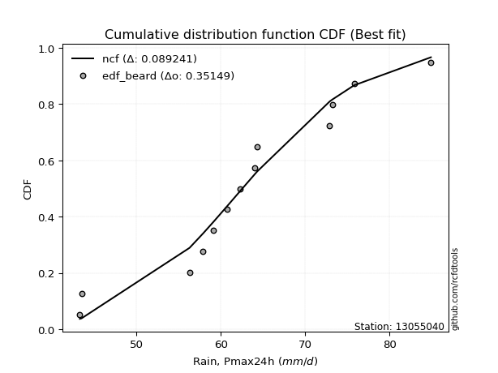</img>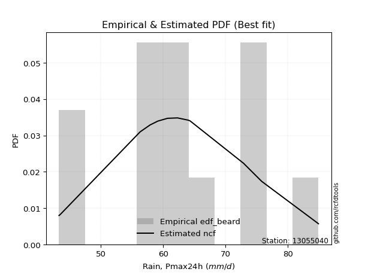</img>

</div>


### 5. EDF Chegodayev (1955)

The Chegodayev formula is an empirical plotting position formula used in hydrological frequency analysis to estimate the exceedance probability or return period of a specific event from a set of observed data. It is primarily used for plotting observed data points on probability paper to fit a theoretical distribution, particularly for analyzing extreme events like maximum flood flows or rainfall intensities. The constant _b_ value in the generalized plotting position formula is 0.3.

<div align="center">


$P=(m-b)/(n+1-2b)$


</div>


**5.1. Empirical values**

<div align="center">

|                | 0                   | 1                   | 2                   | 3                   | 4                   | 5                  | 6              | 7                  | 8                  | 9                  | 10                 | 11                 | 12                 |
|:---------------|:--------------------|:--------------------|:--------------------|:--------------------|:--------------------|:-------------------|:---------------|:-------------------|:-------------------|:-------------------|:-------------------|:-------------------|:-------------------|
| date           | 2014                | 2010                | 2006                | 2015                | 2017                | 2005               | 2009           | 2012               | 2016               | 2013               | 2007               | 2008               | 2011               |
| x              | 43.3                | 43.5                | 56.3                | 57.9                | 59.146153846153844  | 60.7               | 62.3           | 64.0               | 64.3               | 72.9               | 73.2               | 75.8               | 84.9               |
| m              | 1                   | 2                   | 3                   | 4                   | 5                   | 6                  | 7              | 8                  | 9                  | 10                 | 11                 | 12                 | 13                 |
| empirical_dist | edf_chegodayev      | edf_chegodayev      | edf_chegodayev      | edf_chegodayev      | edf_chegodayev      | edf_chegodayev     | edf_chegodayev | edf_chegodayev     | edf_chegodayev     | edf_chegodayev     | edf_chegodayev     | edf_chegodayev     | edf_chegodayev     |
| empirical      | 0.05223880597014925 | 0.12686567164179105 | 0.20149253731343283 | 0.27611940298507465 | 0.35074626865671643 | 0.4253731343283582 | 0.5            | 0.5746268656716418 | 0.6492537313432835 | 0.7238805970149254 | 0.7985074626865671 | 0.8731343283582089 | 0.9477611940298507 |
| empirical_tr   | 1.0551181102362206  | 1.1452991452991454  | 1.252336448598131   | 1.3814432989690721  | 1.5402298850574714  | 1.7402597402597402 | 2.0            | 2.350877192982456  | 2.851063829787233  | 3.6216216216216215 | 4.962962962962962  | 7.882352941176468  | 19.142857142857128 |

</div>


**5.2. Kolmogorov-Smirnov fit test (sorted by Δ)**


<div align="center">

|                | 0                   | 1                   | 2                   | 3                   | 4                   | 5                   | 6                   | 7                   | 8                   | 9                   | 10                  | 11                  | 12                  | 13                  | 14                  | 15                  | 16                  | 17                  | 18                  | 19                  | 20                  | 21                  | 22                  | 23                  | 24                  | 25                  | 26                  | 27                  | 28                  | 29                  | 30                  | 31                  | 32                  | 33                  | 34                  | 35                  | 36                  | 37                  | 38                  | 39                  | 40                  | 41                  | 42                  | 43                  | 44                    | 45                  | 46                  | 47                  | 48                  | 49                  | 50                  | 51                  | 52                  | 53                  | 54                  | 55                  | 56                  | 57                  | 58                  | 59                  | 60                  | 61                  | 62                  | 63                  | 64                  | 65                  | 66                  | 67                  | 68                  | 69                  | 70                  | 71                  | 72                  | 73                  | 74                  | 75                  | 76                  | 77                  | 78                  | 79                  | 80                  | 81                  | 82                  | 83                  | 84                  | 85                  | 86                  | 87                  |
|:---------------|:--------------------|:--------------------|:--------------------|:--------------------|:--------------------|:--------------------|:--------------------|:--------------------|:--------------------|:--------------------|:--------------------|:--------------------|:--------------------|:--------------------|:--------------------|:--------------------|:--------------------|:--------------------|:--------------------|:--------------------|:--------------------|:--------------------|:--------------------|:--------------------|:--------------------|:--------------------|:--------------------|:--------------------|:--------------------|:--------------------|:--------------------|:--------------------|:--------------------|:--------------------|:--------------------|:--------------------|:--------------------|:--------------------|:--------------------|:--------------------|:--------------------|:--------------------|:--------------------|:--------------------|:----------------------|:--------------------|:--------------------|:--------------------|:--------------------|:--------------------|:--------------------|:--------------------|:--------------------|:--------------------|:--------------------|:--------------------|:--------------------|:--------------------|:--------------------|:--------------------|:--------------------|:--------------------|:--------------------|:--------------------|:--------------------|:--------------------|:--------------------|:--------------------|:--------------------|:--------------------|:--------------------|:--------------------|:--------------------|:--------------------|:--------------------|:--------------------|:--------------------|:--------------------|:--------------------|:--------------------|:--------------------|:--------------------|:--------------------|:--------------------|:--------------------|:--------------------|:--------------------|:--------------------|
| station        | 13055040            | 13055040            | 13055040            | 13055040            | 13055040            | 13055040            | 13055040            | 13055040            | 13055040            | 13055040            | 13055040            | 13055040            | 13055040            | 13055040            | 13055040            | 13055040            | 13055040            | 13055040            | 13055040            | 13055040            | 13055040            | 13055040            | 13055040            | 13055040            | 13055040            | 13055040            | 13055040            | 13055040            | 13055040            | 13055040            | 13055040            | 13055040            | 13055040            | 13055040            | 13055040            | 13055040            | 13055040            | 13055040            | 13055040            | 13055040            | 13055040            | 13055040            | 13055040            | 13055040            | 13055040              | 13055040            | 13055040            | 13055040            | 13055040            | 13055040            | 13055040            | 13055040            | 13055040            | 13055040            | 13055040            | 13055040            | 13055040            | 13055040            | 13055040            | 13055040            | 13055040            | 13055040            | 13055040            | 13055040            | 13055040            | 13055040            | 13055040            | 13055040            | 13055040            | 13055040            | 13055040            | 13055040            | 13055040            | 13055040            | 13055040            | 13055040            | 13055040            | 13055040            | 13055040            | 13055040            | 13055040            | 13055040            | 13055040            | 13055040            | 13055040            | 13055040            | 13055040            | 13055040            |
| empirical_dist | edf_chegodayev      | edf_chegodayev      | edf_chegodayev      | edf_chegodayev      | edf_chegodayev      | edf_chegodayev      | edf_chegodayev      | edf_chegodayev      | edf_chegodayev      | edf_chegodayev      | edf_chegodayev      | edf_chegodayev      | edf_chegodayev      | edf_chegodayev      | edf_chegodayev      | edf_chegodayev      | edf_chegodayev      | edf_chegodayev      | edf_chegodayev      | edf_chegodayev      | edf_chegodayev      | edf_chegodayev      | edf_chegodayev      | edf_chegodayev      | edf_chegodayev      | edf_chegodayev      | edf_chegodayev      | edf_chegodayev      | edf_chegodayev      | edf_chegodayev      | edf_chegodayev      | edf_chegodayev      | edf_chegodayev      | edf_chegodayev      | edf_chegodayev      | edf_chegodayev      | edf_chegodayev      | edf_chegodayev      | edf_chegodayev      | edf_chegodayev      | edf_chegodayev      | edf_chegodayev      | edf_chegodayev      | edf_chegodayev      | edf_chegodayev        | edf_chegodayev      | edf_chegodayev      | edf_chegodayev      | edf_chegodayev      | edf_chegodayev      | edf_chegodayev      | edf_chegodayev      | edf_chegodayev      | edf_chegodayev      | edf_chegodayev      | edf_chegodayev      | edf_chegodayev      | edf_chegodayev      | edf_chegodayev      | edf_chegodayev      | edf_chegodayev      | edf_chegodayev      | edf_chegodayev      | edf_chegodayev      | edf_chegodayev      | edf_chegodayev      | edf_chegodayev      | edf_chegodayev      | edf_chegodayev      | edf_chegodayev      | edf_chegodayev      | edf_chegodayev      | edf_chegodayev      | edf_chegodayev      | edf_chegodayev      | edf_chegodayev      | edf_chegodayev      | edf_chegodayev      | edf_chegodayev      | edf_chegodayev      | edf_chegodayev      | edf_chegodayev      | edf_chegodayev      | edf_chegodayev      | edf_chegodayev      | edf_chegodayev      | edf_chegodayev      | edf_chegodayev      |
| p_dist         | ncf                 | invgamma            | logfisk             | rice                | alpha               | logpearson3         | genlogistic         | weibull_min         | fisk                | gamma               | erlang              | f                   | nakagami            | t                   | exponnorm           | norm                | crystalball         | johnsonsu           | mielke              | loggenlogistic      | logweibull_min      | logmielke           | pearson3            | loglogistic         | logistic            | maxwell             | logloggamma         | logfatiguelife      | logf                | logjohnsonsu        | lognorm             | lognorm             | logcrystalball      | logt                | logexponnorm        | lognakagami         | logncf              | logbetaprime        | betaprime           | laplace_asymmetric  | loghypsecant        | rayleigh            | hypsecant           | logerlang           | loglaplace_asymmetric | lognct              | loggamma            | loggamma            | gumbel_r            | logrice             | logalpha            | truncnorm           | moyal               | loginvgamma         | invgauss            | loglaplace          | laplace             | loggumbel_l         | nct                 | invweibull          | logmaxwell          | loginvgauss         | halflogistic        | loggumbel_r         | halfnorm            | lograyleigh         | wald                | logmoyal            | kstwobign           | gumbel_l            | gibrat              | loginvweibull       | loghalfnorm         | loghalflogistic     | logwald             | logkstwobign        | loggenexpon         | loggibrat           | loggompertz         | expon               | genexpon            | logexpon            | logchi2             | logtruncnorm        | loglognorm          | fatiguelife         | gompertz            | chi2                |
| delta          | 0.08901740066573272 | 0.09444455008321459 | 0.09448672447846321 | 0.09557264770413702 | 0.09584639383793661 | 0.09730606388993024 | 0.09840889446206713 | 0.09866903411667671 | 0.09903536754451203 | 0.10007409716644955 | 0.1001978043270425  | 0.10075347717776795 | 0.10160402747478914 | 0.10207705643529585 | 0.10209928492380593 | 0.10209995874039468 | 0.1020999669875251  | 0.1021089972689676  | 0.10223556600832973 | 0.10225084802962858 | 0.10281693368346845 | 0.10354944257573018 | 0.10419758731707596 | 0.10434928208467154 | 0.10472062716697217 | 0.1054218087770071  | 0.10625973444518433 | 0.10697427254213879 | 0.10757107554337356 | 0.10799896985367152 | 0.10813982545524906 | 0.10813982545524906 | 0.1081398582529278  | 0.10814109008675046 | 0.10814153977462146 | 0.10829413418859327 | 0.10834127628802573 | 0.10891239635276626 | 0.11279468718444166 | 0.11446770275611806 | 0.11653999729280795 | 0.11682046444433981 | 0.1168857623786953  | 0.1174012906307155  | 0.11807051205334707   | 0.11845963083281455 | 0.11925851922023237 | 0.11925851922023237 | 0.11974027819305995 | 0.11990666655596169 | 0.12085128356170313 | 0.12399789355810847 | 0.12637551623051185 | 0.1282345564271237  | 0.128840494005695   | 0.1294705744621898  | 0.12976898473053455 | 0.13120689904135074 | 0.13442156490828747 | 0.13691535984746514 | 0.13695687391009906 | 0.1380292031927233  | 0.13866173264928708 | 0.14430041180102746 | 0.1447719745835578  | 0.1482516292649166  | 0.15173655098475658 | 0.15887668404474464 | 0.16157646246068422 | 0.16942614110729315 | 0.17232833761595268 | 0.17468888741027874 | 0.18024874071503813 | 0.1805944579787694  | 0.20706904269186815 | 0.20747359587626293 | 0.2078872928837612  | 0.21522215444452863 | 0.27705012745911917 | 0.28260969803651015 | 0.2900364061666295  | 0.3195369206404366  | 0.375496826711921   | 0.38613187145838856 | 0.40869361187854336 | 0.596029327032201   | 0.7669350261353521  | 0.7887490164749434  |
| deltao         | 0.35149047353100005 | 0.35149047353100005 | 0.35149047353100005 | 0.35149047353100005 | 0.35149047353100005 | 0.35149047353100005 | 0.35149047353100005 | 0.35149047353100005 | 0.35149047353100005 | 0.35149047353100005 | 0.35149047353100005 | 0.35149047353100005 | 0.35149047353100005 | 0.35149047353100005 | 0.35149047353100005 | 0.35149047353100005 | 0.35149047353100005 | 0.35149047353100005 | 0.35149047353100005 | 0.35149047353100005 | 0.35149047353100005 | 0.35149047353100005 | 0.35149047353100005 | 0.35149047353100005 | 0.35149047353100005 | 0.35149047353100005 | 0.35149047353100005 | 0.35149047353100005 | 0.35149047353100005 | 0.35149047353100005 | 0.35149047353100005 | 0.35149047353100005 | 0.35149047353100005 | 0.35149047353100005 | 0.35149047353100005 | 0.35149047353100005 | 0.35149047353100005 | 0.35149047353100005 | 0.35149047353100005 | 0.35149047353100005 | 0.35149047353100005 | 0.35149047353100005 | 0.35149047353100005 | 0.35149047353100005 | 0.35149047353100005   | 0.35149047353100005 | 0.35149047353100005 | 0.35149047353100005 | 0.35149047353100005 | 0.35149047353100005 | 0.35149047353100005 | 0.35149047353100005 | 0.35149047353100005 | 0.35149047353100005 | 0.35149047353100005 | 0.35149047353100005 | 0.35149047353100005 | 0.35149047353100005 | 0.35149047353100005 | 0.35149047353100005 | 0.35149047353100005 | 0.35149047353100005 | 0.35149047353100005 | 0.35149047353100005 | 0.35149047353100005 | 0.35149047353100005 | 0.35149047353100005 | 0.35149047353100005 | 0.35149047353100005 | 0.35149047353100005 | 0.35149047353100005 | 0.35149047353100005 | 0.35149047353100005 | 0.35149047353100005 | 0.35149047353100005 | 0.35149047353100005 | 0.35149047353100005 | 0.35149047353100005 | 0.35149047353100005 | 0.35149047353100005 | 0.35149047353100005 | 0.35149047353100005 | 0.35149047353100005 | 0.35149047353100005 | 0.35149047353100005 | 0.35149047353100005 | 0.35149047353100005 | 0.35149047353100005 |
| eval           | Δo > Δ              | Δo > Δ              | Δo > Δ              | Δo > Δ              | Δo > Δ              | Δo > Δ              | Δo > Δ              | Δo > Δ              | Δo > Δ              | Δo > Δ              | Δo > Δ              | Δo > Δ              | Δo > Δ              | Δo > Δ              | Δo > Δ              | Δo > Δ              | Δo > Δ              | Δo > Δ              | Δo > Δ              | Δo > Δ              | Δo > Δ              | Δo > Δ              | Δo > Δ              | Δo > Δ              | Δo > Δ              | Δo > Δ              | Δo > Δ              | Δo > Δ              | Δo > Δ              | Δo > Δ              | Δo > Δ              | Δo > Δ              | Δo > Δ              | Δo > Δ              | Δo > Δ              | Δo > Δ              | Δo > Δ              | Δo > Δ              | Δo > Δ              | Δo > Δ              | Δo > Δ              | Δo > Δ              | Δo > Δ              | Δo > Δ              | Δo > Δ                | Δo > Δ              | Δo > Δ              | Δo > Δ              | Δo > Δ              | Δo > Δ              | Δo > Δ              | Δo > Δ              | Δo > Δ              | Δo > Δ              | Δo > Δ              | Δo > Δ              | Δo > Δ              | Δo > Δ              | Δo > Δ              | Δo > Δ              | Δo > Δ              | Δo > Δ              | Δo > Δ              | Δo > Δ              | Δo > Δ              | Δo > Δ              | Δo > Δ              | Δo > Δ              | Δo > Δ              | Δo > Δ              | Δo > Δ              | Δo > Δ              | Δo > Δ              | Δo > Δ              | Δo > Δ              | Δo > Δ              | Δo > Δ              | Δo > Δ              | Δo > Δ              | Δo > Δ              | Δo > Δ              | Δo > Δ              | Δo <= Δ             | Δo <= Δ             | Δo <= Δ             | Δo <= Δ             | Δo <= Δ             | Δo <= Δ             |
| fit            | 1                   | 1                   | 1                   | 1                   | 1                   | 1                   | 1                   | 1                   | 1                   | 1                   | 1                   | 1                   | 1                   | 1                   | 1                   | 1                   | 1                   | 1                   | 1                   | 1                   | 1                   | 1                   | 1                   | 1                   | 1                   | 1                   | 1                   | 1                   | 1                   | 1                   | 1                   | 1                   | 1                   | 1                   | 1                   | 1                   | 1                   | 1                   | 1                   | 1                   | 1                   | 1                   | 1                   | 1                   | 1                     | 1                   | 1                   | 1                   | 1                   | 1                   | 1                   | 1                   | 1                   | 1                   | 1                   | 1                   | 1                   | 1                   | 1                   | 1                   | 1                   | 1                   | 1                   | 1                   | 1                   | 1                   | 1                   | 1                   | 1                   | 1                   | 1                   | 1                   | 1                   | 1                   | 1                   | 1                   | 1                   | 1                   | 1                   | 1                   | 1                   | 1                   | 0                   | 0                   | 0                   | 0                   | 0                   | 0                   |
| n              | 13                  | 13                  | 13                  | 13                  | 13                  | 13                  | 13                  | 13                  | 13                  | 13                  | 13                  | 13                  | 13                  | 13                  | 13                  | 13                  | 13                  | 13                  | 13                  | 13                  | 13                  | 13                  | 13                  | 13                  | 13                  | 13                  | 13                  | 13                  | 13                  | 13                  | 13                  | 13                  | 13                  | 13                  | 13                  | 13                  | 13                  | 13                  | 13                  | 13                  | 13                  | 13                  | 13                  | 13                  | 13                    | 13                  | 13                  | 13                  | 13                  | 13                  | 13                  | 13                  | 13                  | 13                  | 13                  | 13                  | 13                  | 13                  | 13                  | 13                  | 13                  | 13                  | 13                  | 13                  | 13                  | 13                  | 13                  | 13                  | 13                  | 13                  | 13                  | 13                  | 13                  | 13                  | 13                  | 13                  | 13                  | 13                  | 13                  | 13                  | 13                  | 13                  | 13                  | 13                  | 13                  | 13                  | 13                  | 13                  |
| best_fit       | 1                   | 0                   | 0                   | 0                   | 0                   | 0                   | 0                   | 0                   | 0                   | 0                   | 0                   | 0                   | 0                   | 0                   | 0                   | 0                   | 0                   | 0                   | 0                   | 0                   | 0                   | 0                   | 0                   | 0                   | 0                   | 0                   | 0                   | 0                   | 0                   | 0                   | 0                   | 0                   | 0                   | 0                   | 0                   | 0                   | 0                   | 0                   | 0                   | 0                   | 0                   | 0                   | 0                   | 0                   | 0                     | 0                   | 0                   | 0                   | 0                   | 0                   | 0                   | 0                   | 0                   | 0                   | 0                   | 0                   | 0                   | 0                   | 0                   | 0                   | 0                   | 0                   | 0                   | 0                   | 0                   | 0                   | 0                   | 0                   | 0                   | 0                   | 0                   | 0                   | 0                   | 0                   | 0                   | 0                   | 0                   | 0                   | 0                   | 0                   | 0                   | 0                   | 0                   | 0                   | 0                   | 0                   | 0                   | 0                   |
| best_fit_sort  | 1                   | 2                   | 3                   | 4                   | 5                   | 6                   | 7                   | 8                   | 9                   | 10                  | 11                  | 12                  | 13                  | 14                  | 15                  | 16                  | 17                  | 18                  | 19                  | 20                  | 21                  | 22                  | 23                  | 24                  | 25                  | 26                  | 27                  | 28                  | 29                  | 30                  | 31                  | 32                  | 33                  | 34                  | 35                  | 36                  | 37                  | 38                  | 39                  | 40                  | 41                  | 42                  | 43                  | 44                  | 45                    | 46                  | 47                  | 48                  | 49                  | 50                  | 51                  | 52                  | 53                  | 54                  | 55                  | 56                  | 57                  | 58                  | 59                  | 60                  | 61                  | 62                  | 63                  | 64                  | 65                  | 66                  | 67                  | 68                  | 69                  | 70                  | 71                  | 72                  | 73                  | 74                  | 75                  | 76                  | 77                  | 78                  | 79                  | 80                  | 81                  | 82                  | 83                  | 84                  | 85                  | 86                  | 87                  | 88                  |

</div>


**5.3. Best fit**

<div align="center">

|   id |   station | empirical_dist   | p_dist   |     delta |   deltao | eval   |   fit |   n |   best_fit |   best_fit_sort |
|-----:|----------:|:-----------------|:---------|----------:|---------:|:-------|------:|----:|-----------:|----------------:|
|    0 |  13055040 | edf_chegodayev   | ncf      | 0.0890174 |  0.35149 | Δo > Δ |     1 |  13 |          1 |               1 |

</div>


<div align="center">

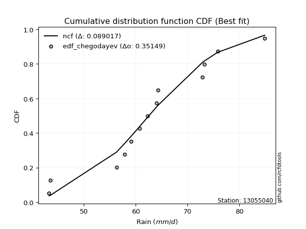</img>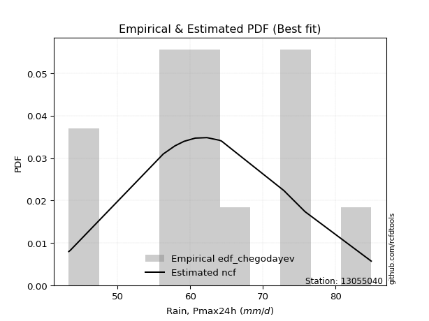</img>

</div>


### 6. EDF Blom (1958)

The Blom formula is a specific "plotting position" formula used in hydrology and statistical analysis to estimate the empirical cumulative probability (or non-exceedance probability) of a data series. It is particularly recommended for data that are approximately normally distributed. The constant _a_ is set to 0.375 (or 3/8).

<div align="center">


$P=(m-a)/(n+1-2a)$


</div>


**6.1. Empirical values**

<div align="center">

|                | 0                   | 1                   | 2                   | 3                   | 4                  | 5                   | 6        | 7                  | 8                  | 9                  | 10                 | 11                 | 12                 |
|:---------------|:--------------------|:--------------------|:--------------------|:--------------------|:-------------------|:--------------------|:---------|:-------------------|:-------------------|:-------------------|:-------------------|:-------------------|:-------------------|
| date           | 2014                | 2010                | 2006                | 2015                | 2017               | 2005                | 2009     | 2012               | 2016               | 2013               | 2007               | 2008               | 2011               |
| x              | 43.3                | 43.5                | 56.3                | 57.9                | 59.146153846153844 | 60.7                | 62.3     | 64.0               | 64.3               | 72.9               | 73.2               | 75.8               | 84.9               |
| m              | 1                   | 2                   | 3                   | 4                   | 5                  | 6                   | 7        | 8                  | 9                  | 10                 | 11                 | 12                 | 13                 |
| empirical_dist | edf_blom            | edf_blom            | edf_blom            | edf_blom            | edf_blom           | edf_blom            | edf_blom | edf_blom           | edf_blom           | edf_blom           | edf_blom           | edf_blom           | edf_blom           |
| empirical      | 0.04716981132075472 | 0.12264150943396226 | 0.19811320754716982 | 0.27358490566037735 | 0.3490566037735849 | 0.42452830188679247 | 0.5      | 0.5754716981132075 | 0.6509433962264151 | 0.7264150943396226 | 0.8018867924528302 | 0.8773584905660378 | 0.9528301886792453 |
| empirical_tr   | 1.0495049504950495  | 1.139784946236559   | 1.2470588235294118  | 1.3766233766233766  | 1.5362318840579712 | 1.737704918032787   | 2.0      | 2.3555555555555556 | 2.8648648648648645 | 3.6551724137931028 | 5.047619047619048  | 8.153846153846155  | 21.200000000000006 |

</div>


**6.2. Kolmogorov-Smirnov fit test (sorted by Δ)**


<div align="center">

|                | 0                   | 1                   | 2                   | 3                   | 4                   | 5                   | 6                   | 7                   | 8                   | 9                   | 10                  | 11                  | 12                  | 13                  | 14                  | 15                  | 16                  | 17                  | 18                  | 19                  | 20                  | 21                  | 22                  | 23                  | 24                  | 25                  | 26                  | 27                  | 28                  | 29                  | 30                  | 31                  | 32                  | 33                  | 34                  | 35                  | 36                  | 37                  | 38                  | 39                  | 40                  | 41                  | 42                    | 43                  | 44                  | 45                  | 46                  | 47                  | 48                  | 49                  | 50                  | 51                  | 52                  | 53                  | 54                  | 55                  | 56                  | 57                  | 58                  | 59                  | 60                  | 61                  | 62                  | 63                  | 64                  | 65                  | 66                  | 67                  | 68                  | 69                  | 70                  | 71                  | 72                  | 73                  | 74                  | 75                  | 76                  | 77                  | 78                  | 79                  | 80                  | 81                  | 82                  | 83                  | 84                  | 85                  | 86                  | 87                  |
|:---------------|:--------------------|:--------------------|:--------------------|:--------------------|:--------------------|:--------------------|:--------------------|:--------------------|:--------------------|:--------------------|:--------------------|:--------------------|:--------------------|:--------------------|:--------------------|:--------------------|:--------------------|:--------------------|:--------------------|:--------------------|:--------------------|:--------------------|:--------------------|:--------------------|:--------------------|:--------------------|:--------------------|:--------------------|:--------------------|:--------------------|:--------------------|:--------------------|:--------------------|:--------------------|:--------------------|:--------------------|:--------------------|:--------------------|:--------------------|:--------------------|:--------------------|:--------------------|:----------------------|:--------------------|:--------------------|:--------------------|:--------------------|:--------------------|:--------------------|:--------------------|:--------------------|:--------------------|:--------------------|:--------------------|:--------------------|:--------------------|:--------------------|:--------------------|:--------------------|:--------------------|:--------------------|:--------------------|:--------------------|:--------------------|:--------------------|:--------------------|:--------------------|:--------------------|:--------------------|:--------------------|:--------------------|:--------------------|:--------------------|:--------------------|:--------------------|:--------------------|:--------------------|:--------------------|:--------------------|:--------------------|:--------------------|:--------------------|:--------------------|:--------------------|:--------------------|:--------------------|:--------------------|:--------------------|
| station        | 13055040            | 13055040            | 13055040            | 13055040            | 13055040            | 13055040            | 13055040            | 13055040            | 13055040            | 13055040            | 13055040            | 13055040            | 13055040            | 13055040            | 13055040            | 13055040            | 13055040            | 13055040            | 13055040            | 13055040            | 13055040            | 13055040            | 13055040            | 13055040            | 13055040            | 13055040            | 13055040            | 13055040            | 13055040            | 13055040            | 13055040            | 13055040            | 13055040            | 13055040            | 13055040            | 13055040            | 13055040            | 13055040            | 13055040            | 13055040            | 13055040            | 13055040            | 13055040              | 13055040            | 13055040            | 13055040            | 13055040            | 13055040            | 13055040            | 13055040            | 13055040            | 13055040            | 13055040            | 13055040            | 13055040            | 13055040            | 13055040            | 13055040            | 13055040            | 13055040            | 13055040            | 13055040            | 13055040            | 13055040            | 13055040            | 13055040            | 13055040            | 13055040            | 13055040            | 13055040            | 13055040            | 13055040            | 13055040            | 13055040            | 13055040            | 13055040            | 13055040            | 13055040            | 13055040            | 13055040            | 13055040            | 13055040            | 13055040            | 13055040            | 13055040            | 13055040            | 13055040            | 13055040            |
| empirical_dist | edf_blom            | edf_blom            | edf_blom            | edf_blom            | edf_blom            | edf_blom            | edf_blom            | edf_blom            | edf_blom            | edf_blom            | edf_blom            | edf_blom            | edf_blom            | edf_blom            | edf_blom            | edf_blom            | edf_blom            | edf_blom            | edf_blom            | edf_blom            | edf_blom            | edf_blom            | edf_blom            | edf_blom            | edf_blom            | edf_blom            | edf_blom            | edf_blom            | edf_blom            | edf_blom            | edf_blom            | edf_blom            | edf_blom            | edf_blom            | edf_blom            | edf_blom            | edf_blom            | edf_blom            | edf_blom            | edf_blom            | edf_blom            | edf_blom            | edf_blom              | edf_blom            | edf_blom            | edf_blom            | edf_blom            | edf_blom            | edf_blom            | edf_blom            | edf_blom            | edf_blom            | edf_blom            | edf_blom            | edf_blom            | edf_blom            | edf_blom            | edf_blom            | edf_blom            | edf_blom            | edf_blom            | edf_blom            | edf_blom            | edf_blom            | edf_blom            | edf_blom            | edf_blom            | edf_blom            | edf_blom            | edf_blom            | edf_blom            | edf_blom            | edf_blom            | edf_blom            | edf_blom            | edf_blom            | edf_blom            | edf_blom            | edf_blom            | edf_blom            | edf_blom            | edf_blom            | edf_blom            | edf_blom            | edf_blom            | edf_blom            | edf_blom            | edf_blom            |
| p_dist         | logfisk             | ncf                 | invgamma            | rice                | logpearson3         | alpha               | genlogistic         | weibull_min         | fisk                | gamma               | loglogistic         | erlang              | logistic            | f                   | nakagami            | t                   | exponnorm           | norm                | crystalball         | johnsonsu           | mielke              | loggenlogistic      | logweibull_min      | logmielke           | pearson3            | logloggamma         | maxwell             | logjohnsonsu        | logfatiguelife      | logf                | lognorm             | lognorm             | logcrystalball      | logt                | logexponnorm        | lognakagami         | logncf              | laplace_asymmetric  | logbetaprime        | loghypsecant        | hypsecant           | gumbel_r            | loglaplace_asymmetric | betaprime           | rayleigh            | truncnorm           | logerlang           | lognct              | moyal               | loggamma            | loggamma            | logrice             | logalpha            | loglaplace          | laplace             | loginvgamma         | invgauss            | loggumbel_l         | nct                 | invweibull          | logmaxwell          | loginvgauss         | halflogistic        | loggumbel_r         | halfnorm            | lograyleigh         | wald                | logmoyal            | kstwobign           | gibrat              | gumbel_l            | loginvweibull       | loghalfnorm         | loghalflogistic     | logwald             | logkstwobign        | loggenexpon         | loggibrat           | loggompertz         | expon               | genexpon            | logexpon            | logchi2             | logtruncnorm        | loglognorm          | fatiguelife         | gompertz            | chi2                |
| delta          | 0.09026256227063442 | 0.09115626560496781 | 0.0978238798494776  | 0.09788492502505985 | 0.09899572877306184 | 0.09922572360419962 | 0.10009855934519873 | 0.10035869899980832 | 0.10072503242764363 | 0.10176376204958115 | 0.1018147847599743  | 0.10188746921017411 | 0.10218612984227493 | 0.10244314206089955 | 0.10329369235792074 | 0.10376672131842746 | 0.10378894980693754 | 0.10378962362352628 | 0.1037896318706567  | 0.10379866215209921 | 0.10392523089146133 | 0.10394051291276019 | 0.10450659856660005 | 0.10523910745886178 | 0.10588725220020756 | 0.10794939932831593 | 0.10880113854327012 | 0.10968863473680313 | 0.1103536023084018  | 0.11095040530963657 | 0.11151915522151207 | 0.11151915522151207 | 0.1115191880191908  | 0.11152041985301347 | 0.11152086954088447 | 0.11167346395485628 | 0.11172060605428874 | 0.11193320543142082 | 0.11229172611902927 | 0.11400549996811071 | 0.11435126505399806 | 0.11551611598523116 | 0.11553601472864983   | 0.11617401695070467 | 0.11916296943800814 | 0.11977373135027969 | 0.12078062039697851 | 0.12183896059907756 | 0.12215135402268307 | 0.12263784898649538 | 0.12263784898649538 | 0.1232859963222247  | 0.12423061332796614 | 0.12693607713749255 | 0.12723448740583732 | 0.1316138861933867  | 0.132219823771958   | 0.13289656392448235 | 0.13780089467455048 | 0.14029468961372815 | 0.14033620367636207 | 0.1414085329589863  | 0.1420410624155501  | 0.14767974156729047 | 0.14815130434982082 | 0.15163095903117962 | 0.15258138342632233 | 0.16141118136944194 | 0.16495579222694723 | 0.16979384029125544 | 0.17111580599042475 | 0.17806821717654175 | 0.18362807048130114 | 0.18397378774503242 | 0.20960354001656545 | 0.21085292564252595 | 0.21126662265002422 | 0.21606698688609438 | 0.2804294572253822  | 0.2859890278027732  | 0.29341573593289255 | 0.32291625040669963 | 0.38056582136131556 | 0.3895112012246516  | 0.4120729416448064  | 0.599408656798464   | 0.7703143559016152  | 0.7921283462412065  |
| deltao         | 0.35149047353100005 | 0.35149047353100005 | 0.35149047353100005 | 0.35149047353100005 | 0.35149047353100005 | 0.35149047353100005 | 0.35149047353100005 | 0.35149047353100005 | 0.35149047353100005 | 0.35149047353100005 | 0.35149047353100005 | 0.35149047353100005 | 0.35149047353100005 | 0.35149047353100005 | 0.35149047353100005 | 0.35149047353100005 | 0.35149047353100005 | 0.35149047353100005 | 0.35149047353100005 | 0.35149047353100005 | 0.35149047353100005 | 0.35149047353100005 | 0.35149047353100005 | 0.35149047353100005 | 0.35149047353100005 | 0.35149047353100005 | 0.35149047353100005 | 0.35149047353100005 | 0.35149047353100005 | 0.35149047353100005 | 0.35149047353100005 | 0.35149047353100005 | 0.35149047353100005 | 0.35149047353100005 | 0.35149047353100005 | 0.35149047353100005 | 0.35149047353100005 | 0.35149047353100005 | 0.35149047353100005 | 0.35149047353100005 | 0.35149047353100005 | 0.35149047353100005 | 0.35149047353100005   | 0.35149047353100005 | 0.35149047353100005 | 0.35149047353100005 | 0.35149047353100005 | 0.35149047353100005 | 0.35149047353100005 | 0.35149047353100005 | 0.35149047353100005 | 0.35149047353100005 | 0.35149047353100005 | 0.35149047353100005 | 0.35149047353100005 | 0.35149047353100005 | 0.35149047353100005 | 0.35149047353100005 | 0.35149047353100005 | 0.35149047353100005 | 0.35149047353100005 | 0.35149047353100005 | 0.35149047353100005 | 0.35149047353100005 | 0.35149047353100005 | 0.35149047353100005 | 0.35149047353100005 | 0.35149047353100005 | 0.35149047353100005 | 0.35149047353100005 | 0.35149047353100005 | 0.35149047353100005 | 0.35149047353100005 | 0.35149047353100005 | 0.35149047353100005 | 0.35149047353100005 | 0.35149047353100005 | 0.35149047353100005 | 0.35149047353100005 | 0.35149047353100005 | 0.35149047353100005 | 0.35149047353100005 | 0.35149047353100005 | 0.35149047353100005 | 0.35149047353100005 | 0.35149047353100005 | 0.35149047353100005 | 0.35149047353100005 |
| eval           | Δo > Δ              | Δo > Δ              | Δo > Δ              | Δo > Δ              | Δo > Δ              | Δo > Δ              | Δo > Δ              | Δo > Δ              | Δo > Δ              | Δo > Δ              | Δo > Δ              | Δo > Δ              | Δo > Δ              | Δo > Δ              | Δo > Δ              | Δo > Δ              | Δo > Δ              | Δo > Δ              | Δo > Δ              | Δo > Δ              | Δo > Δ              | Δo > Δ              | Δo > Δ              | Δo > Δ              | Δo > Δ              | Δo > Δ              | Δo > Δ              | Δo > Δ              | Δo > Δ              | Δo > Δ              | Δo > Δ              | Δo > Δ              | Δo > Δ              | Δo > Δ              | Δo > Δ              | Δo > Δ              | Δo > Δ              | Δo > Δ              | Δo > Δ              | Δo > Δ              | Δo > Δ              | Δo > Δ              | Δo > Δ                | Δo > Δ              | Δo > Δ              | Δo > Δ              | Δo > Δ              | Δo > Δ              | Δo > Δ              | Δo > Δ              | Δo > Δ              | Δo > Δ              | Δo > Δ              | Δo > Δ              | Δo > Δ              | Δo > Δ              | Δo > Δ              | Δo > Δ              | Δo > Δ              | Δo > Δ              | Δo > Δ              | Δo > Δ              | Δo > Δ              | Δo > Δ              | Δo > Δ              | Δo > Δ              | Δo > Δ              | Δo > Δ              | Δo > Δ              | Δo > Δ              | Δo > Δ              | Δo > Δ              | Δo > Δ              | Δo > Δ              | Δo > Δ              | Δo > Δ              | Δo > Δ              | Δo > Δ              | Δo > Δ              | Δo > Δ              | Δo > Δ              | Δo > Δ              | Δo <= Δ             | Δo <= Δ             | Δo <= Δ             | Δo <= Δ             | Δo <= Δ             | Δo <= Δ             |
| fit            | 1                   | 1                   | 1                   | 1                   | 1                   | 1                   | 1                   | 1                   | 1                   | 1                   | 1                   | 1                   | 1                   | 1                   | 1                   | 1                   | 1                   | 1                   | 1                   | 1                   | 1                   | 1                   | 1                   | 1                   | 1                   | 1                   | 1                   | 1                   | 1                   | 1                   | 1                   | 1                   | 1                   | 1                   | 1                   | 1                   | 1                   | 1                   | 1                   | 1                   | 1                   | 1                   | 1                     | 1                   | 1                   | 1                   | 1                   | 1                   | 1                   | 1                   | 1                   | 1                   | 1                   | 1                   | 1                   | 1                   | 1                   | 1                   | 1                   | 1                   | 1                   | 1                   | 1                   | 1                   | 1                   | 1                   | 1                   | 1                   | 1                   | 1                   | 1                   | 1                   | 1                   | 1                   | 1                   | 1                   | 1                   | 1                   | 1                   | 1                   | 1                   | 1                   | 0                   | 0                   | 0                   | 0                   | 0                   | 0                   |
| n              | 13                  | 13                  | 13                  | 13                  | 13                  | 13                  | 13                  | 13                  | 13                  | 13                  | 13                  | 13                  | 13                  | 13                  | 13                  | 13                  | 13                  | 13                  | 13                  | 13                  | 13                  | 13                  | 13                  | 13                  | 13                  | 13                  | 13                  | 13                  | 13                  | 13                  | 13                  | 13                  | 13                  | 13                  | 13                  | 13                  | 13                  | 13                  | 13                  | 13                  | 13                  | 13                  | 13                    | 13                  | 13                  | 13                  | 13                  | 13                  | 13                  | 13                  | 13                  | 13                  | 13                  | 13                  | 13                  | 13                  | 13                  | 13                  | 13                  | 13                  | 13                  | 13                  | 13                  | 13                  | 13                  | 13                  | 13                  | 13                  | 13                  | 13                  | 13                  | 13                  | 13                  | 13                  | 13                  | 13                  | 13                  | 13                  | 13                  | 13                  | 13                  | 13                  | 13                  | 13                  | 13                  | 13                  | 13                  | 13                  |
| best_fit       | 1                   | 0                   | 0                   | 0                   | 0                   | 0                   | 0                   | 0                   | 0                   | 0                   | 0                   | 0                   | 0                   | 0                   | 0                   | 0                   | 0                   | 0                   | 0                   | 0                   | 0                   | 0                   | 0                   | 0                   | 0                   | 0                   | 0                   | 0                   | 0                   | 0                   | 0                   | 0                   | 0                   | 0                   | 0                   | 0                   | 0                   | 0                   | 0                   | 0                   | 0                   | 0                   | 0                     | 0                   | 0                   | 0                   | 0                   | 0                   | 0                   | 0                   | 0                   | 0                   | 0                   | 0                   | 0                   | 0                   | 0                   | 0                   | 0                   | 0                   | 0                   | 0                   | 0                   | 0                   | 0                   | 0                   | 0                   | 0                   | 0                   | 0                   | 0                   | 0                   | 0                   | 0                   | 0                   | 0                   | 0                   | 0                   | 0                   | 0                   | 0                   | 0                   | 0                   | 0                   | 0                   | 0                   | 0                   | 0                   |
| best_fit_sort  | 1                   | 2                   | 3                   | 4                   | 5                   | 6                   | 7                   | 8                   | 9                   | 10                  | 11                  | 12                  | 13                  | 14                  | 15                  | 16                  | 17                  | 18                  | 19                  | 20                  | 21                  | 22                  | 23                  | 24                  | 25                  | 26                  | 27                  | 28                  | 29                  | 30                  | 31                  | 32                  | 33                  | 34                  | 35                  | 36                  | 37                  | 38                  | 39                  | 40                  | 41                  | 42                  | 43                    | 44                  | 45                  | 46                  | 47                  | 48                  | 49                  | 50                  | 51                  | 52                  | 53                  | 54                  | 55                  | 56                  | 57                  | 58                  | 59                  | 60                  | 61                  | 62                  | 63                  | 64                  | 65                  | 66                  | 67                  | 68                  | 69                  | 70                  | 71                  | 72                  | 73                  | 74                  | 75                  | 76                  | 77                  | 78                  | 79                  | 80                  | 81                  | 82                  | 83                  | 84                  | 85                  | 86                  | 87                  | 88                  |

</div>


**6.3. Best fit**

<div align="center">

|   id |   station | empirical_dist   | p_dist   |     delta |   deltao | eval   |   fit |   n |   best_fit |   best_fit_sort |
|-----:|----------:|:-----------------|:---------|----------:|---------:|:-------|------:|----:|-----------:|----------------:|
|    0 |  13055040 | edf_blom         | logfisk  | 0.0902626 |  0.35149 | Δo > Δ |     1 |  13 |          1 |               1 |

</div>


<div align="center">

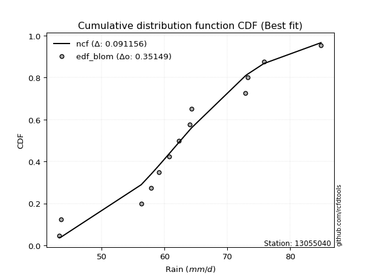</img>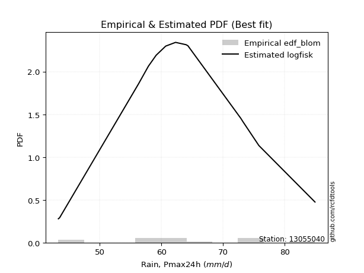</img>

</div>


### 7. EDF Tukey (1962)

In hydrology, the Tukey formula is used as a plotting position formula to estimate the empirical probability or frequency of a flood event (or other hydrological data). The formula parameter is given as _c=0.333_ (or 1/3).

<div align="center">


$P=(m-c)/(n+1-2c)$


</div>


**7.1. Empirical values**

<div align="center">

|                | 0                  | 1                  | 2         | 3                  | 4                  | 5                  | 6         | 7                 | 8                 | 9                  | 10                | 11        | 12                 |
|:---------------|:-------------------|:-------------------|:----------|:-------------------|:-------------------|:-------------------|:----------|:------------------|:------------------|:-------------------|:------------------|:----------|:-------------------|
| date           | 2014               | 2010               | 2006      | 2015               | 2017               | 2005               | 2009      | 2012              | 2016              | 2013               | 2007              | 2008      | 2011               |
| x              | 43.3               | 43.5               | 56.3      | 57.9               | 59.146153846153844 | 60.7               | 62.3      | 64.0              | 64.3              | 72.9               | 73.2              | 75.8      | 84.9               |
| m              | 1                  | 2                  | 3         | 4                  | 5                  | 6                  | 7         | 8                 | 9                 | 10                 | 11                | 12        | 13                 |
| empirical_dist | edf_tukey          | edf_tukey          | edf_tukey | edf_tukey          | edf_tukey          | edf_tukey          | edf_tukey | edf_tukey         | edf_tukey         | edf_tukey          | edf_tukey         | edf_tukey | edf_tukey          |
| empirical      | 0.05               | 0.125              | 0.2       | 0.275              | 0.35               | 0.425              | 0.5       | 0.575             | 0.65              | 0.725              | 0.8               | 0.875     | 0.95               |
| empirical_tr   | 1.0526315789473684 | 1.1428571428571428 | 1.25      | 1.3793103448275863 | 1.5384615384615383 | 1.7391304347826089 | 2.0       | 2.352941176470588 | 2.857142857142857 | 3.6363636363636362 | 5.000000000000001 | 8.0       | 19.999999999999982 |

</div>


**7.2. Kolmogorov-Smirnov fit test (sorted by Δ)**


<div align="center">

|                | 0                   | 1                   | 2                   | 3                   | 4                   | 5                   | 6                   | 7                   | 8                   | 9                   | 10                  | 11                  | 12                  | 13                  | 14                  | 15                  | 16                  | 17                  | 18                  | 19                  | 20                  | 21                  | 22                  | 23                  | 24                  | 25                  | 26                  | 27                  | 28                  | 29                  | 30                  | 31                  | 32                  | 33                  | 34                  | 35                  | 36                  | 37                  | 38                  | 39                  | 40                  | 41                  | 42                    | 43                  | 44                  | 45                  | 46                  | 47                  | 48                  | 49                  | 50                  | 51                  | 52                  | 53                  | 54                  | 55                  | 56                  | 57                  | 58                  | 59                  | 60                  | 61                  | 62                  | 63                  | 64                  | 65                  | 66                  | 67                  | 68                  | 69                  | 70                  | 71                  | 72                  | 73                  | 74                  | 75                  | 76                  | 77                  | 78                  | 79                  | 80                  | 81                  | 82                  | 83                  | 84                  | 85                  | 86                  | 87                  |
|:---------------|:--------------------|:--------------------|:--------------------|:--------------------|:--------------------|:--------------------|:--------------------|:--------------------|:--------------------|:--------------------|:--------------------|:--------------------|:--------------------|:--------------------|:--------------------|:--------------------|:--------------------|:--------------------|:--------------------|:--------------------|:--------------------|:--------------------|:--------------------|:--------------------|:--------------------|:--------------------|:--------------------|:--------------------|:--------------------|:--------------------|:--------------------|:--------------------|:--------------------|:--------------------|:--------------------|:--------------------|:--------------------|:--------------------|:--------------------|:--------------------|:--------------------|:--------------------|:----------------------|:--------------------|:--------------------|:--------------------|:--------------------|:--------------------|:--------------------|:--------------------|:--------------------|:--------------------|:--------------------|:--------------------|:--------------------|:--------------------|:--------------------|:--------------------|:--------------------|:--------------------|:--------------------|:--------------------|:--------------------|:--------------------|:--------------------|:--------------------|:--------------------|:--------------------|:--------------------|:--------------------|:--------------------|:--------------------|:--------------------|:--------------------|:--------------------|:--------------------|:--------------------|:--------------------|:--------------------|:--------------------|:--------------------|:--------------------|:--------------------|:--------------------|:--------------------|:--------------------|:--------------------|:--------------------|
| station        | 13055040            | 13055040            | 13055040            | 13055040            | 13055040            | 13055040            | 13055040            | 13055040            | 13055040            | 13055040            | 13055040            | 13055040            | 13055040            | 13055040            | 13055040            | 13055040            | 13055040            | 13055040            | 13055040            | 13055040            | 13055040            | 13055040            | 13055040            | 13055040            | 13055040            | 13055040            | 13055040            | 13055040            | 13055040            | 13055040            | 13055040            | 13055040            | 13055040            | 13055040            | 13055040            | 13055040            | 13055040            | 13055040            | 13055040            | 13055040            | 13055040            | 13055040            | 13055040              | 13055040            | 13055040            | 13055040            | 13055040            | 13055040            | 13055040            | 13055040            | 13055040            | 13055040            | 13055040            | 13055040            | 13055040            | 13055040            | 13055040            | 13055040            | 13055040            | 13055040            | 13055040            | 13055040            | 13055040            | 13055040            | 13055040            | 13055040            | 13055040            | 13055040            | 13055040            | 13055040            | 13055040            | 13055040            | 13055040            | 13055040            | 13055040            | 13055040            | 13055040            | 13055040            | 13055040            | 13055040            | 13055040            | 13055040            | 13055040            | 13055040            | 13055040            | 13055040            | 13055040            | 13055040            |
| empirical_dist | edf_tukey           | edf_tukey           | edf_tukey           | edf_tukey           | edf_tukey           | edf_tukey           | edf_tukey           | edf_tukey           | edf_tukey           | edf_tukey           | edf_tukey           | edf_tukey           | edf_tukey           | edf_tukey           | edf_tukey           | edf_tukey           | edf_tukey           | edf_tukey           | edf_tukey           | edf_tukey           | edf_tukey           | edf_tukey           | edf_tukey           | edf_tukey           | edf_tukey           | edf_tukey           | edf_tukey           | edf_tukey           | edf_tukey           | edf_tukey           | edf_tukey           | edf_tukey           | edf_tukey           | edf_tukey           | edf_tukey           | edf_tukey           | edf_tukey           | edf_tukey           | edf_tukey           | edf_tukey           | edf_tukey           | edf_tukey           | edf_tukey             | edf_tukey           | edf_tukey           | edf_tukey           | edf_tukey           | edf_tukey           | edf_tukey           | edf_tukey           | edf_tukey           | edf_tukey           | edf_tukey           | edf_tukey           | edf_tukey           | edf_tukey           | edf_tukey           | edf_tukey           | edf_tukey           | edf_tukey           | edf_tukey           | edf_tukey           | edf_tukey           | edf_tukey           | edf_tukey           | edf_tukey           | edf_tukey           | edf_tukey           | edf_tukey           | edf_tukey           | edf_tukey           | edf_tukey           | edf_tukey           | edf_tukey           | edf_tukey           | edf_tukey           | edf_tukey           | edf_tukey           | edf_tukey           | edf_tukey           | edf_tukey           | edf_tukey           | edf_tukey           | edf_tukey           | edf_tukey           | edf_tukey           | edf_tukey           | edf_tukey           |
| p_dist         | ncf                 | logfisk             | invgamma            | rice                | alpha               | logpearson3         | genlogistic         | weibull_min         | fisk                | gamma               | erlang              | f                   | nakagami            | t                   | exponnorm           | norm                | crystalball         | johnsonsu           | mielke              | loggenlogistic      | loglogistic         | logweibull_min      | logistic            | logmielke           | pearson3            | maxwell             | logloggamma         | logfatiguelife      | logjohnsonsu        | logf                | lognorm             | lognorm             | logcrystalball      | logt                | logexponnorm        | lognakagami         | logncf              | logbetaprime        | laplace_asymmetric  | betaprime           | loghypsecant        | hypsecant           | loglaplace_asymmetric | rayleigh            | gumbel_r            | logerlang           | lognct              | loggamma            | loggamma            | logrice             | truncnorm           | logalpha            | moyal               | loglaplace          | laplace             | loginvgamma         | invgauss            | loggumbel_l         | nct                 | invweibull          | logmaxwell          | loginvgauss         | halflogistic        | loggumbel_r         | halfnorm            | lograyleigh         | wald                | logmoyal            | kstwobign           | gumbel_l            | gibrat              | loginvweibull       | loghalfnorm         | loghalflogistic     | logwald             | logkstwobign        | loggenexpon         | loggibrat           | loggompertz         | expon               | genexpon            | logexpon            | logchi2             | logtruncnorm        | loglognorm          | fatiguelife         | gompertz            | chi2                |
| delta          | 0.08976366932244928 | 0.09262105283667216 | 0.09593708739664741 | 0.09599813257222967 | 0.09733893115136943 | 0.0980523325466468  | 0.0991551631187837  | 0.09941530277339328 | 0.0997816362012286  | 0.10082036582316611 | 0.10094407298375907 | 0.10149974583448451 | 0.1023502961315057  | 0.10282332509201242 | 0.1028455535805225  | 0.10284622739711125 | 0.10284623564424167 | 0.10285526592568417 | 0.10298183466504629 | 0.10299711668634515 | 0.10322987909959691 | 0.10356320234018501 | 0.10360122418189754 | 0.10429571123244674 | 0.10494385597379252 | 0.10691434609043993 | 0.10700600310190089 | 0.10846680985557161 | 0.10874523851038809 | 0.10906361285680638 | 0.10963236276868188 | 0.10963236276868188 | 0.10963239556636062 | 0.10963362740018329 | 0.10963407708805428 | 0.10978667150202609 | 0.10983381360145855 | 0.11040493366619908 | 0.11334829977104344 | 0.11428722449787448 | 0.11542059430773333 | 0.11576635939362068 | 0.11695110906827244   | 0.11727617698517795 | 0.1178746065512689  | 0.11889382794414832 | 0.11995216814624737 | 0.12075105653366519 | 0.12075105653366519 | 0.12139920386939451 | 0.12213222191631742 | 0.12234382087513596 | 0.1245098445887208  | 0.12835117147711517 | 0.12864958174545993 | 0.12972709374055652 | 0.13033303131912782 | 0.1319531676980673  | 0.1359141022217203  | 0.13840789716089796 | 0.13844941122353188 | 0.13952174050615612 | 0.1401542699627199  | 0.14579294911446028 | 0.14626451189699063 | 0.14974416657834944 | 0.1521096853131148  | 0.15999608702981927 | 0.16306899977411704 | 0.1701724097640097  | 0.17120893463087805 | 0.17618142472371157 | 0.18174127802847095 | 0.18208699529220224 | 0.20818844567694278 | 0.20896613318969576 | 0.20937983019719403 | 0.21559528877288686 | 0.278542664772552   | 0.284102235349943   | 0.29152894348006236 | 0.32102945795386945 | 0.3777356326820702  | 0.3876244087718214  | 0.4101861491919762  | 0.5975218643456339  | 0.768427563448785   | 0.7902415537883762  |
| deltao         | 0.35149047353100005 | 0.35149047353100005 | 0.35149047353100005 | 0.35149047353100005 | 0.35149047353100005 | 0.35149047353100005 | 0.35149047353100005 | 0.35149047353100005 | 0.35149047353100005 | 0.35149047353100005 | 0.35149047353100005 | 0.35149047353100005 | 0.35149047353100005 | 0.35149047353100005 | 0.35149047353100005 | 0.35149047353100005 | 0.35149047353100005 | 0.35149047353100005 | 0.35149047353100005 | 0.35149047353100005 | 0.35149047353100005 | 0.35149047353100005 | 0.35149047353100005 | 0.35149047353100005 | 0.35149047353100005 | 0.35149047353100005 | 0.35149047353100005 | 0.35149047353100005 | 0.35149047353100005 | 0.35149047353100005 | 0.35149047353100005 | 0.35149047353100005 | 0.35149047353100005 | 0.35149047353100005 | 0.35149047353100005 | 0.35149047353100005 | 0.35149047353100005 | 0.35149047353100005 | 0.35149047353100005 | 0.35149047353100005 | 0.35149047353100005 | 0.35149047353100005 | 0.35149047353100005   | 0.35149047353100005 | 0.35149047353100005 | 0.35149047353100005 | 0.35149047353100005 | 0.35149047353100005 | 0.35149047353100005 | 0.35149047353100005 | 0.35149047353100005 | 0.35149047353100005 | 0.35149047353100005 | 0.35149047353100005 | 0.35149047353100005 | 0.35149047353100005 | 0.35149047353100005 | 0.35149047353100005 | 0.35149047353100005 | 0.35149047353100005 | 0.35149047353100005 | 0.35149047353100005 | 0.35149047353100005 | 0.35149047353100005 | 0.35149047353100005 | 0.35149047353100005 | 0.35149047353100005 | 0.35149047353100005 | 0.35149047353100005 | 0.35149047353100005 | 0.35149047353100005 | 0.35149047353100005 | 0.35149047353100005 | 0.35149047353100005 | 0.35149047353100005 | 0.35149047353100005 | 0.35149047353100005 | 0.35149047353100005 | 0.35149047353100005 | 0.35149047353100005 | 0.35149047353100005 | 0.35149047353100005 | 0.35149047353100005 | 0.35149047353100005 | 0.35149047353100005 | 0.35149047353100005 | 0.35149047353100005 | 0.35149047353100005 |
| eval           | Δo > Δ              | Δo > Δ              | Δo > Δ              | Δo > Δ              | Δo > Δ              | Δo > Δ              | Δo > Δ              | Δo > Δ              | Δo > Δ              | Δo > Δ              | Δo > Δ              | Δo > Δ              | Δo > Δ              | Δo > Δ              | Δo > Δ              | Δo > Δ              | Δo > Δ              | Δo > Δ              | Δo > Δ              | Δo > Δ              | Δo > Δ              | Δo > Δ              | Δo > Δ              | Δo > Δ              | Δo > Δ              | Δo > Δ              | Δo > Δ              | Δo > Δ              | Δo > Δ              | Δo > Δ              | Δo > Δ              | Δo > Δ              | Δo > Δ              | Δo > Δ              | Δo > Δ              | Δo > Δ              | Δo > Δ              | Δo > Δ              | Δo > Δ              | Δo > Δ              | Δo > Δ              | Δo > Δ              | Δo > Δ                | Δo > Δ              | Δo > Δ              | Δo > Δ              | Δo > Δ              | Δo > Δ              | Δo > Δ              | Δo > Δ              | Δo > Δ              | Δo > Δ              | Δo > Δ              | Δo > Δ              | Δo > Δ              | Δo > Δ              | Δo > Δ              | Δo > Δ              | Δo > Δ              | Δo > Δ              | Δo > Δ              | Δo > Δ              | Δo > Δ              | Δo > Δ              | Δo > Δ              | Δo > Δ              | Δo > Δ              | Δo > Δ              | Δo > Δ              | Δo > Δ              | Δo > Δ              | Δo > Δ              | Δo > Δ              | Δo > Δ              | Δo > Δ              | Δo > Δ              | Δo > Δ              | Δo > Δ              | Δo > Δ              | Δo > Δ              | Δo > Δ              | Δo > Δ              | Δo <= Δ             | Δo <= Δ             | Δo <= Δ             | Δo <= Δ             | Δo <= Δ             | Δo <= Δ             |
| fit            | 1                   | 1                   | 1                   | 1                   | 1                   | 1                   | 1                   | 1                   | 1                   | 1                   | 1                   | 1                   | 1                   | 1                   | 1                   | 1                   | 1                   | 1                   | 1                   | 1                   | 1                   | 1                   | 1                   | 1                   | 1                   | 1                   | 1                   | 1                   | 1                   | 1                   | 1                   | 1                   | 1                   | 1                   | 1                   | 1                   | 1                   | 1                   | 1                   | 1                   | 1                   | 1                   | 1                     | 1                   | 1                   | 1                   | 1                   | 1                   | 1                   | 1                   | 1                   | 1                   | 1                   | 1                   | 1                   | 1                   | 1                   | 1                   | 1                   | 1                   | 1                   | 1                   | 1                   | 1                   | 1                   | 1                   | 1                   | 1                   | 1                   | 1                   | 1                   | 1                   | 1                   | 1                   | 1                   | 1                   | 1                   | 1                   | 1                   | 1                   | 1                   | 1                   | 0                   | 0                   | 0                   | 0                   | 0                   | 0                   |
| n              | 13                  | 13                  | 13                  | 13                  | 13                  | 13                  | 13                  | 13                  | 13                  | 13                  | 13                  | 13                  | 13                  | 13                  | 13                  | 13                  | 13                  | 13                  | 13                  | 13                  | 13                  | 13                  | 13                  | 13                  | 13                  | 13                  | 13                  | 13                  | 13                  | 13                  | 13                  | 13                  | 13                  | 13                  | 13                  | 13                  | 13                  | 13                  | 13                  | 13                  | 13                  | 13                  | 13                    | 13                  | 13                  | 13                  | 13                  | 13                  | 13                  | 13                  | 13                  | 13                  | 13                  | 13                  | 13                  | 13                  | 13                  | 13                  | 13                  | 13                  | 13                  | 13                  | 13                  | 13                  | 13                  | 13                  | 13                  | 13                  | 13                  | 13                  | 13                  | 13                  | 13                  | 13                  | 13                  | 13                  | 13                  | 13                  | 13                  | 13                  | 13                  | 13                  | 13                  | 13                  | 13                  | 13                  | 13                  | 13                  |
| best_fit       | 1                   | 0                   | 0                   | 0                   | 0                   | 0                   | 0                   | 0                   | 0                   | 0                   | 0                   | 0                   | 0                   | 0                   | 0                   | 0                   | 0                   | 0                   | 0                   | 0                   | 0                   | 0                   | 0                   | 0                   | 0                   | 0                   | 0                   | 0                   | 0                   | 0                   | 0                   | 0                   | 0                   | 0                   | 0                   | 0                   | 0                   | 0                   | 0                   | 0                   | 0                   | 0                   | 0                     | 0                   | 0                   | 0                   | 0                   | 0                   | 0                   | 0                   | 0                   | 0                   | 0                   | 0                   | 0                   | 0                   | 0                   | 0                   | 0                   | 0                   | 0                   | 0                   | 0                   | 0                   | 0                   | 0                   | 0                   | 0                   | 0                   | 0                   | 0                   | 0                   | 0                   | 0                   | 0                   | 0                   | 0                   | 0                   | 0                   | 0                   | 0                   | 0                   | 0                   | 0                   | 0                   | 0                   | 0                   | 0                   |
| best_fit_sort  | 1                   | 2                   | 3                   | 4                   | 5                   | 6                   | 7                   | 8                   | 9                   | 10                  | 11                  | 12                  | 13                  | 14                  | 15                  | 16                  | 17                  | 18                  | 19                  | 20                  | 21                  | 22                  | 23                  | 24                  | 25                  | 26                  | 27                  | 28                  | 29                  | 30                  | 31                  | 32                  | 33                  | 34                  | 35                  | 36                  | 37                  | 38                  | 39                  | 40                  | 41                  | 42                  | 43                    | 44                  | 45                  | 46                  | 47                  | 48                  | 49                  | 50                  | 51                  | 52                  | 53                  | 54                  | 55                  | 56                  | 57                  | 58                  | 59                  | 60                  | 61                  | 62                  | 63                  | 64                  | 65                  | 66                  | 67                  | 68                  | 69                  | 70                  | 71                  | 72                  | 73                  | 74                  | 75                  | 76                  | 77                  | 78                  | 79                  | 80                  | 81                  | 82                  | 83                  | 84                  | 85                  | 86                  | 87                  | 88                  |

</div>


**7.3. Best fit**

<div align="center">

|   id |   station | empirical_dist   | p_dist   |     delta |   deltao | eval   |   fit |   n |   best_fit |   best_fit_sort |
|-----:|----------:|:-----------------|:---------|----------:|---------:|:-------|------:|----:|-----------:|----------------:|
|    0 |  13055040 | edf_tukey        | ncf      | 0.0897637 |  0.35149 | Δo > Δ |     1 |  13 |          1 |               1 |

</div>


<div align="center">

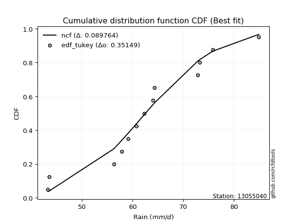</img></img>

</div>


### 8. EDF Gringorten (1963)

Gringorten plotting position formula is essential for estimating the probability and return periods of extreme events like floods and heavy rainfall. The constant _a=0.44_.

<div align="center">


$P=(m-a)/(n+1-2a)$


</div>


**8.1. Empirical values**

<div align="center">

|                | 0                    | 1                   | 2                  | 3                   | 4                  | 5                   | 6              | 7                  | 8                  | 9                  | 10                 | 11                 | 12                 |
|:---------------|:---------------------|:--------------------|:-------------------|:--------------------|:-------------------|:--------------------|:---------------|:-------------------|:-------------------|:-------------------|:-------------------|:-------------------|:-------------------|
| date           | 2014                 | 2010                | 2006               | 2015                | 2017               | 2005                | 2009           | 2012               | 2016               | 2013               | 2007               | 2008               | 2011               |
| x              | 43.3                 | 43.5                | 56.3               | 57.9                | 59.146153846153844 | 60.7                | 62.3           | 64.0               | 64.3               | 72.9               | 73.2               | 75.8               | 84.9               |
| m              | 1                    | 2                   | 3                  | 4                   | 5                  | 6                   | 7              | 8                  | 9                  | 10                 | 11                 | 12                 | 13                 |
| empirical_dist | edf_gringorten       | edf_gringorten      | edf_gringorten     | edf_gringorten      | edf_gringorten     | edf_gringorten      | edf_gringorten | edf_gringorten     | edf_gringorten     | edf_gringorten     | edf_gringorten     | edf_gringorten     | edf_gringorten     |
| empirical      | 0.042682926829268296 | 0.11890243902439025 | 0.1951219512195122 | 0.27134146341463417 | 0.3475609756097561 | 0.42378048780487804 | 0.5            | 0.5762195121951219 | 0.6524390243902439 | 0.728658536585366  | 0.8048780487804879 | 0.8810975609756099 | 0.9573170731707318 |
| empirical_tr   | 1.0445859872611465   | 1.1349480968858132  | 1.2424242424242424 | 1.3723849372384938  | 1.5327102803738317 | 1.7354497354497356  | 2.0            | 2.359712230215827  | 2.8771929824561404 | 3.6853932584269677 | 5.125000000000001  | 8.410256410256418  | 23.42857142857147  |

</div>


**8.2. Kolmogorov-Smirnov fit test (sorted by Δ)**


<div align="center">

|                | 0                   | 1                   | 2                   | 3                   | 4                   | 5                   | 6                   | 7                   | 8                   | 9                   | 10                  | 11                  | 12                  | 13                  | 14                  | 15                  | 16                  | 17                  | 18                  | 19                  | 20                  | 21                  | 22                  | 23                  | 24                  | 25                  | 26                  | 27                  | 28                  | 29                  | 30                  | 31                  | 32                    | 33                  | 34                  | 35                  | 36                  | 37                  | 38                  | 39                  | 40                  | 41                  | 42                  | 43                  | 44                  | 45                  | 46                  | 47                  | 48                  | 49                  | 50                  | 51                  | 52                  | 53                  | 54                  | 55                  | 56                  | 57                  | 58                  | 59                  | 60                  | 61                  | 62                  | 63                  | 64                  | 65                  | 66                  | 67                  | 68                  | 69                  | 70                  | 71                  | 72                  | 73                  | 74                  | 75                  | 76                  | 77                  | 78                  | 79                  | 80                  | 81                  | 82                  | 83                  | 84                  | 85                  | 86                  | 87                  |
|:---------------|:--------------------|:--------------------|:--------------------|:--------------------|:--------------------|:--------------------|:--------------------|:--------------------|:--------------------|:--------------------|:--------------------|:--------------------|:--------------------|:--------------------|:--------------------|:--------------------|:--------------------|:--------------------|:--------------------|:--------------------|:--------------------|:--------------------|:--------------------|:--------------------|:--------------------|:--------------------|:--------------------|:--------------------|:--------------------|:--------------------|:--------------------|:--------------------|:----------------------|:--------------------|:--------------------|:--------------------|:--------------------|:--------------------|:--------------------|:--------------------|:--------------------|:--------------------|:--------------------|:--------------------|:--------------------|:--------------------|:--------------------|:--------------------|:--------------------|:--------------------|:--------------------|:--------------------|:--------------------|:--------------------|:--------------------|:--------------------|:--------------------|:--------------------|:--------------------|:--------------------|:--------------------|:--------------------|:--------------------|:--------------------|:--------------------|:--------------------|:--------------------|:--------------------|:--------------------|:--------------------|:--------------------|:--------------------|:--------------------|:--------------------|:--------------------|:--------------------|:--------------------|:--------------------|:--------------------|:--------------------|:--------------------|:--------------------|:--------------------|:--------------------|:--------------------|:--------------------|:--------------------|:--------------------|
| station        | 13055040            | 13055040            | 13055040            | 13055040            | 13055040            | 13055040            | 13055040            | 13055040            | 13055040            | 13055040            | 13055040            | 13055040            | 13055040            | 13055040            | 13055040            | 13055040            | 13055040            | 13055040            | 13055040            | 13055040            | 13055040            | 13055040            | 13055040            | 13055040            | 13055040            | 13055040            | 13055040            | 13055040            | 13055040            | 13055040            | 13055040            | 13055040            | 13055040              | 13055040            | 13055040            | 13055040            | 13055040            | 13055040            | 13055040            | 13055040            | 13055040            | 13055040            | 13055040            | 13055040            | 13055040            | 13055040            | 13055040            | 13055040            | 13055040            | 13055040            | 13055040            | 13055040            | 13055040            | 13055040            | 13055040            | 13055040            | 13055040            | 13055040            | 13055040            | 13055040            | 13055040            | 13055040            | 13055040            | 13055040            | 13055040            | 13055040            | 13055040            | 13055040            | 13055040            | 13055040            | 13055040            | 13055040            | 13055040            | 13055040            | 13055040            | 13055040            | 13055040            | 13055040            | 13055040            | 13055040            | 13055040            | 13055040            | 13055040            | 13055040            | 13055040            | 13055040            | 13055040            | 13055040            |
| empirical_dist | edf_gringorten      | edf_gringorten      | edf_gringorten      | edf_gringorten      | edf_gringorten      | edf_gringorten      | edf_gringorten      | edf_gringorten      | edf_gringorten      | edf_gringorten      | edf_gringorten      | edf_gringorten      | edf_gringorten      | edf_gringorten      | edf_gringorten      | edf_gringorten      | edf_gringorten      | edf_gringorten      | edf_gringorten      | edf_gringorten      | edf_gringorten      | edf_gringorten      | edf_gringorten      | edf_gringorten      | edf_gringorten      | edf_gringorten      | edf_gringorten      | edf_gringorten      | edf_gringorten      | edf_gringorten      | edf_gringorten      | edf_gringorten      | edf_gringorten        | edf_gringorten      | edf_gringorten      | edf_gringorten      | edf_gringorten      | edf_gringorten      | edf_gringorten      | edf_gringorten      | edf_gringorten      | edf_gringorten      | edf_gringorten      | edf_gringorten      | edf_gringorten      | edf_gringorten      | edf_gringorten      | edf_gringorten      | edf_gringorten      | edf_gringorten      | edf_gringorten      | edf_gringorten      | edf_gringorten      | edf_gringorten      | edf_gringorten      | edf_gringorten      | edf_gringorten      | edf_gringorten      | edf_gringorten      | edf_gringorten      | edf_gringorten      | edf_gringorten      | edf_gringorten      | edf_gringorten      | edf_gringorten      | edf_gringorten      | edf_gringorten      | edf_gringorten      | edf_gringorten      | edf_gringorten      | edf_gringorten      | edf_gringorten      | edf_gringorten      | edf_gringorten      | edf_gringorten      | edf_gringorten      | edf_gringorten      | edf_gringorten      | edf_gringorten      | edf_gringorten      | edf_gringorten      | edf_gringorten      | edf_gringorten      | edf_gringorten      | edf_gringorten      | edf_gringorten      | edf_gringorten      | edf_gringorten      |
| p_dist         | logfisk             | ncf                 | loglogistic         | logistic            | logpearson3         | invgamma            | rice                | genlogistic         | weibull_min         | alpha               | fisk                | gamma               | erlang              | f                   | nakagami            | t                   | exponnorm           | norm                | crystalball         | johnsonsu           | mielke              | loggenlogistic      | logweibull_min      | logmielke           | pearson3            | logloggamma         | laplace_asymmetric  | logjohnsonsu        | loghypsecant        | maxwell             | gumbel_r            | hypsecant           | loglaplace_asymmetric | logfatiguelife      | logf                | lognorm             | lognorm             | logcrystalball      | logt                | logexponnorm        | lognakagami         | logncf              | logbetaprime        | truncnorm           | moyal               | betaprime           | rayleigh            | logerlang           | loglaplace          | lognct              | laplace             | loggamma            | loggamma            | logrice             | logalpha            | loggumbel_l         | loginvgamma         | invgauss            | nct                 | invweibull          | logmaxwell          | loginvgauss         | halflogistic        | loggumbel_r         | halfnorm            | wald                | lograyleigh         | logmoyal            | gibrat              | kstwobign           | gumbel_l            | loginvweibull       | loghalfnorm         | loghalflogistic     | logwald             | logkstwobign        | loggenexpon         | loggibrat           | loggompertz         | expon               | genexpon            | logexpon            | logchi2             | logtruncnorm        | loglognorm          | fatiguelife         | gompertz            | chi2                |
| delta          | 0.08712067107051213 | 0.09414752193262543 | 0.09957134251423094 | 0.09994268759653158 | 0.10049135693689071 | 0.10081513617713522 | 0.10087618135271748 | 0.1015941875090276  | 0.10185432716363718 | 0.10221697993185724 | 0.1022206605914725  | 0.10325939021341002 | 0.10338309737400297 | 0.10393877022472842 | 0.10478932052174961 | 0.10526234948225632 | 0.1052845779707664  | 0.10528525178735515 | 0.10528526003448557 | 0.10529429031592807 | 0.1054208590552902  | 0.10543614107658905 | 0.10600222673042892 | 0.10673473562269065 | 0.10738288036403643 | 0.1094450274921448  | 0.10968976318567747 | 0.11118426290063199 | 0.11176205772236736 | 0.11179239487092774 | 0.11199039026867808 | 0.11210782280825471 | 0.11329257248290647   | 0.11334485863605942 | 0.11394166163729419 | 0.11451041154916969 | 0.11451041154916969 | 0.11451044434684843 | 0.1145116761806711  | 0.11451212586854209 | 0.1146647202825139  | 0.11471186238194636 | 0.11528298244668689 | 0.11603466094070768 | 0.11841228361311106 | 0.1191652732783623  | 0.12215422576566576 | 0.12377187672463613 | 0.1246926348917492  | 0.12483021692673518 | 0.12499104516009396 | 0.125629105314153   | 0.125629105314153   | 0.12627725264988232 | 0.12722186965562376 | 0.1343921920883112  | 0.13460514252104433 | 0.13521108009961563 | 0.1407921510022081  | 0.14328594594138577 | 0.1433274600040197  | 0.14439978928664393 | 0.1450323187432077  | 0.1506709978949481  | 0.15114256067747844 | 0.15332919750823676 | 0.15462221535883724 | 0.16365462361518512 | 0.16755039804551208 | 0.16794704855460485 | 0.17261143415425362 | 0.18105947350419938 | 0.18661932680895876 | 0.18696504407269005 | 0.21184698226230864 | 0.21384418197018357 | 0.21425787897768184 | 0.21681480096800881 | 0.2834207135530398  | 0.2889802841304308  | 0.2964069922605502  | 0.32590750673435726 | 0.38505270585280205 | 0.3925024575523092  | 0.415064197972464   | 0.6023999131261217  | 0.7733056122292729  | 0.795119602568864   |
| deltao         | 0.35149047353100005 | 0.35149047353100005 | 0.35149047353100005 | 0.35149047353100005 | 0.35149047353100005 | 0.35149047353100005 | 0.35149047353100005 | 0.35149047353100005 | 0.35149047353100005 | 0.35149047353100005 | 0.35149047353100005 | 0.35149047353100005 | 0.35149047353100005 | 0.35149047353100005 | 0.35149047353100005 | 0.35149047353100005 | 0.35149047353100005 | 0.35149047353100005 | 0.35149047353100005 | 0.35149047353100005 | 0.35149047353100005 | 0.35149047353100005 | 0.35149047353100005 | 0.35149047353100005 | 0.35149047353100005 | 0.35149047353100005 | 0.35149047353100005 | 0.35149047353100005 | 0.35149047353100005 | 0.35149047353100005 | 0.35149047353100005 | 0.35149047353100005 | 0.35149047353100005   | 0.35149047353100005 | 0.35149047353100005 | 0.35149047353100005 | 0.35149047353100005 | 0.35149047353100005 | 0.35149047353100005 | 0.35149047353100005 | 0.35149047353100005 | 0.35149047353100005 | 0.35149047353100005 | 0.35149047353100005 | 0.35149047353100005 | 0.35149047353100005 | 0.35149047353100005 | 0.35149047353100005 | 0.35149047353100005 | 0.35149047353100005 | 0.35149047353100005 | 0.35149047353100005 | 0.35149047353100005 | 0.35149047353100005 | 0.35149047353100005 | 0.35149047353100005 | 0.35149047353100005 | 0.35149047353100005 | 0.35149047353100005 | 0.35149047353100005 | 0.35149047353100005 | 0.35149047353100005 | 0.35149047353100005 | 0.35149047353100005 | 0.35149047353100005 | 0.35149047353100005 | 0.35149047353100005 | 0.35149047353100005 | 0.35149047353100005 | 0.35149047353100005 | 0.35149047353100005 | 0.35149047353100005 | 0.35149047353100005 | 0.35149047353100005 | 0.35149047353100005 | 0.35149047353100005 | 0.35149047353100005 | 0.35149047353100005 | 0.35149047353100005 | 0.35149047353100005 | 0.35149047353100005 | 0.35149047353100005 | 0.35149047353100005 | 0.35149047353100005 | 0.35149047353100005 | 0.35149047353100005 | 0.35149047353100005 | 0.35149047353100005 |
| eval           | Δo > Δ              | Δo > Δ              | Δo > Δ              | Δo > Δ              | Δo > Δ              | Δo > Δ              | Δo > Δ              | Δo > Δ              | Δo > Δ              | Δo > Δ              | Δo > Δ              | Δo > Δ              | Δo > Δ              | Δo > Δ              | Δo > Δ              | Δo > Δ              | Δo > Δ              | Δo > Δ              | Δo > Δ              | Δo > Δ              | Δo > Δ              | Δo > Δ              | Δo > Δ              | Δo > Δ              | Δo > Δ              | Δo > Δ              | Δo > Δ              | Δo > Δ              | Δo > Δ              | Δo > Δ              | Δo > Δ              | Δo > Δ              | Δo > Δ                | Δo > Δ              | Δo > Δ              | Δo > Δ              | Δo > Δ              | Δo > Δ              | Δo > Δ              | Δo > Δ              | Δo > Δ              | Δo > Δ              | Δo > Δ              | Δo > Δ              | Δo > Δ              | Δo > Δ              | Δo > Δ              | Δo > Δ              | Δo > Δ              | Δo > Δ              | Δo > Δ              | Δo > Δ              | Δo > Δ              | Δo > Δ              | Δo > Δ              | Δo > Δ              | Δo > Δ              | Δo > Δ              | Δo > Δ              | Δo > Δ              | Δo > Δ              | Δo > Δ              | Δo > Δ              | Δo > Δ              | Δo > Δ              | Δo > Δ              | Δo > Δ              | Δo > Δ              | Δo > Δ              | Δo > Δ              | Δo > Δ              | Δo > Δ              | Δo > Δ              | Δo > Δ              | Δo > Δ              | Δo > Δ              | Δo > Δ              | Δo > Δ              | Δo > Δ              | Δo > Δ              | Δo > Δ              | Δo > Δ              | Δo <= Δ             | Δo <= Δ             | Δo <= Δ             | Δo <= Δ             | Δo <= Δ             | Δo <= Δ             |
| fit            | 1                   | 1                   | 1                   | 1                   | 1                   | 1                   | 1                   | 1                   | 1                   | 1                   | 1                   | 1                   | 1                   | 1                   | 1                   | 1                   | 1                   | 1                   | 1                   | 1                   | 1                   | 1                   | 1                   | 1                   | 1                   | 1                   | 1                   | 1                   | 1                   | 1                   | 1                   | 1                   | 1                     | 1                   | 1                   | 1                   | 1                   | 1                   | 1                   | 1                   | 1                   | 1                   | 1                   | 1                   | 1                   | 1                   | 1                   | 1                   | 1                   | 1                   | 1                   | 1                   | 1                   | 1                   | 1                   | 1                   | 1                   | 1                   | 1                   | 1                   | 1                   | 1                   | 1                   | 1                   | 1                   | 1                   | 1                   | 1                   | 1                   | 1                   | 1                   | 1                   | 1                   | 1                   | 1                   | 1                   | 1                   | 1                   | 1                   | 1                   | 1                   | 1                   | 0                   | 0                   | 0                   | 0                   | 0                   | 0                   |
| n              | 13                  | 13                  | 13                  | 13                  | 13                  | 13                  | 13                  | 13                  | 13                  | 13                  | 13                  | 13                  | 13                  | 13                  | 13                  | 13                  | 13                  | 13                  | 13                  | 13                  | 13                  | 13                  | 13                  | 13                  | 13                  | 13                  | 13                  | 13                  | 13                  | 13                  | 13                  | 13                  | 13                    | 13                  | 13                  | 13                  | 13                  | 13                  | 13                  | 13                  | 13                  | 13                  | 13                  | 13                  | 13                  | 13                  | 13                  | 13                  | 13                  | 13                  | 13                  | 13                  | 13                  | 13                  | 13                  | 13                  | 13                  | 13                  | 13                  | 13                  | 13                  | 13                  | 13                  | 13                  | 13                  | 13                  | 13                  | 13                  | 13                  | 13                  | 13                  | 13                  | 13                  | 13                  | 13                  | 13                  | 13                  | 13                  | 13                  | 13                  | 13                  | 13                  | 13                  | 13                  | 13                  | 13                  | 13                  | 13                  |
| best_fit       | 1                   | 0                   | 0                   | 0                   | 0                   | 0                   | 0                   | 0                   | 0                   | 0                   | 0                   | 0                   | 0                   | 0                   | 0                   | 0                   | 0                   | 0                   | 0                   | 0                   | 0                   | 0                   | 0                   | 0                   | 0                   | 0                   | 0                   | 0                   | 0                   | 0                   | 0                   | 0                   | 0                     | 0                   | 0                   | 0                   | 0                   | 0                   | 0                   | 0                   | 0                   | 0                   | 0                   | 0                   | 0                   | 0                   | 0                   | 0                   | 0                   | 0                   | 0                   | 0                   | 0                   | 0                   | 0                   | 0                   | 0                   | 0                   | 0                   | 0                   | 0                   | 0                   | 0                   | 0                   | 0                   | 0                   | 0                   | 0                   | 0                   | 0                   | 0                   | 0                   | 0                   | 0                   | 0                   | 0                   | 0                   | 0                   | 0                   | 0                   | 0                   | 0                   | 0                   | 0                   | 0                   | 0                   | 0                   | 0                   |
| best_fit_sort  | 1                   | 2                   | 3                   | 4                   | 5                   | 6                   | 7                   | 8                   | 9                   | 10                  | 11                  | 12                  | 13                  | 14                  | 15                  | 16                  | 17                  | 18                  | 19                  | 20                  | 21                  | 22                  | 23                  | 24                  | 25                  | 26                  | 27                  | 28                  | 29                  | 30                  | 31                  | 32                  | 33                    | 34                  | 35                  | 36                  | 37                  | 38                  | 39                  | 40                  | 41                  | 42                  | 43                  | 44                  | 45                  | 46                  | 47                  | 48                  | 49                  | 50                  | 51                  | 52                  | 53                  | 54                  | 55                  | 56                  | 57                  | 58                  | 59                  | 60                  | 61                  | 62                  | 63                  | 64                  | 65                  | 66                  | 67                  | 68                  | 69                  | 70                  | 71                  | 72                  | 73                  | 74                  | 75                  | 76                  | 77                  | 78                  | 79                  | 80                  | 81                  | 82                  | 83                  | 84                  | 85                  | 86                  | 87                  | 88                  |

</div>


**8.3. Best fit**

<div align="center">

|   id |   station | empirical_dist   | p_dist   |     delta |   deltao | eval   |   fit |   n |   best_fit |   best_fit_sort |
|-----:|----------:|:-----------------|:---------|----------:|---------:|:-------|------:|----:|-----------:|----------------:|
|    0 |  13055040 | edf_gringorten   | logfisk  | 0.0871207 |  0.35149 | Δo > Δ |     1 |  13 |          1 |               1 |

</div>


<div align="center">

</img>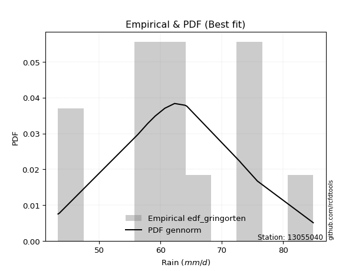</img>

</div>


### 9. EDF Filliben (1975)

The specific values of the constants (0.3175) (often denoted as $alpha$) and (0.365) are derived from a method proposed by James J. Filliben in a 1975 paper. This particular formula is the mean value of the $i$-th order statistic of the normal distribution and is considered a robust and effective plotting position formula for the normal probability plot correlation coefficient test for normality.

<div align="center">


$P=(m-0.3175)/(n+0.365)$


</div>


**9.1. Empirical values**

<div align="center">

|                | 0                    | 1                   | 2                   | 3                  | 4                  | 5                   | 6            | 7                  | 8                  | 9                  | 10                | 11                 | 12                 |
|:---------------|:---------------------|:--------------------|:--------------------|:-------------------|:-------------------|:--------------------|:-------------|:-------------------|:-------------------|:-------------------|:------------------|:-------------------|:-------------------|
| date           | 2014                 | 2010                | 2006                | 2015               | 2017               | 2005                | 2009         | 2012               | 2016               | 2013               | 2007              | 2008               | 2011               |
| x              | 43.3                 | 43.5                | 56.3                | 57.9               | 59.146153846153844 | 60.7                | 62.3         | 64.0               | 64.3               | 72.9               | 73.2              | 75.8               | 84.9               |
| m              | 1                    | 2                   | 3                   | 4                  | 5                  | 6                   | 7            | 8                  | 9                  | 10                 | 11                | 12                 | 13                 |
| empirical_dist | edf_filliben         | edf_filliben        | edf_filliben        | edf_filliben       | edf_filliben       | edf_filliben        | edf_filliben | edf_filliben       | edf_filliben       | edf_filliben       | edf_filliben      | edf_filliben       | edf_filliben       |
| empirical      | 0.051066217732884396 | 0.12588851477740368 | 0.20071081182192294 | 0.2755331088664422 | 0.3503554059109615 | 0.42517770295548074 | 0.5          | 0.5748222970445193 | 0.6496445940890385 | 0.7244668911335578 | 0.799289188178077 | 0.8741114852225963 | 0.9489337822671156 |
| empirical_tr   | 1.0538143110585454   | 1.1440188315857052  | 1.2511116311724784  | 1.3803253292021689 | 1.5393031960840773 | 1.7396680767979174  | 2.0          | 2.351957765068192  | 2.8542445274959958 | 3.6293279022403255 | 4.982292637465051 | 7.943536404160473  | 19.582417582417566 |

</div>


**9.2. Kolmogorov-Smirnov fit test (sorted by Δ)**


<div align="center">

|                | 0                   | 1                   | 2                   | 3                   | 4                   | 5                   | 6                   | 7                   | 8                   | 9                   | 10                  | 11                  | 12                  | 13                  | 14                  | 15                  | 16                  | 17                  | 18                  | 19                  | 20                  | 21                  | 22                  | 23                  | 24                  | 25                  | 26                  | 27                  | 28                  | 29                  | 30                  | 31                  | 32                  | 33                  | 34                  | 35                  | 36                  | 37                  | 38                  | 39                  | 40                  | 41                  | 42                  | 43                    | 44                  | 45                  | 46                  | 47                  | 48                  | 49                  | 50                  | 51                  | 52                  | 53                  | 54                  | 55                  | 56                  | 57                  | 58                  | 59                  | 60                  | 61                  | 62                  | 63                  | 64                  | 65                  | 66                  | 67                  | 68                  | 69                  | 70                  | 71                  | 72                  | 73                  | 74                  | 75                  | 76                  | 77                  | 78                  | 79                  | 80                  | 81                  | 82                  | 83                  | 84                  | 85                  | 86                  | 87                  |
|:---------------|:--------------------|:--------------------|:--------------------|:--------------------|:--------------------|:--------------------|:--------------------|:--------------------|:--------------------|:--------------------|:--------------------|:--------------------|:--------------------|:--------------------|:--------------------|:--------------------|:--------------------|:--------------------|:--------------------|:--------------------|:--------------------|:--------------------|:--------------------|:--------------------|:--------------------|:--------------------|:--------------------|:--------------------|:--------------------|:--------------------|:--------------------|:--------------------|:--------------------|:--------------------|:--------------------|:--------------------|:--------------------|:--------------------|:--------------------|:--------------------|:--------------------|:--------------------|:--------------------|:----------------------|:--------------------|:--------------------|:--------------------|:--------------------|:--------------------|:--------------------|:--------------------|:--------------------|:--------------------|:--------------------|:--------------------|:--------------------|:--------------------|:--------------------|:--------------------|:--------------------|:--------------------|:--------------------|:--------------------|:--------------------|:--------------------|:--------------------|:--------------------|:--------------------|:--------------------|:--------------------|:--------------------|:--------------------|:--------------------|:--------------------|:--------------------|:--------------------|:--------------------|:--------------------|:--------------------|:--------------------|:--------------------|:--------------------|:--------------------|:--------------------|:--------------------|:--------------------|:--------------------|:--------------------|
| station        | 13055040            | 13055040            | 13055040            | 13055040            | 13055040            | 13055040            | 13055040            | 13055040            | 13055040            | 13055040            | 13055040            | 13055040            | 13055040            | 13055040            | 13055040            | 13055040            | 13055040            | 13055040            | 13055040            | 13055040            | 13055040            | 13055040            | 13055040            | 13055040            | 13055040            | 13055040            | 13055040            | 13055040            | 13055040            | 13055040            | 13055040            | 13055040            | 13055040            | 13055040            | 13055040            | 13055040            | 13055040            | 13055040            | 13055040            | 13055040            | 13055040            | 13055040            | 13055040            | 13055040              | 13055040            | 13055040            | 13055040            | 13055040            | 13055040            | 13055040            | 13055040            | 13055040            | 13055040            | 13055040            | 13055040            | 13055040            | 13055040            | 13055040            | 13055040            | 13055040            | 13055040            | 13055040            | 13055040            | 13055040            | 13055040            | 13055040            | 13055040            | 13055040            | 13055040            | 13055040            | 13055040            | 13055040            | 13055040            | 13055040            | 13055040            | 13055040            | 13055040            | 13055040            | 13055040            | 13055040            | 13055040            | 13055040            | 13055040            | 13055040            | 13055040            | 13055040            | 13055040            | 13055040            |
| empirical_dist | edf_filliben        | edf_filliben        | edf_filliben        | edf_filliben        | edf_filliben        | edf_filliben        | edf_filliben        | edf_filliben        | edf_filliben        | edf_filliben        | edf_filliben        | edf_filliben        | edf_filliben        | edf_filliben        | edf_filliben        | edf_filliben        | edf_filliben        | edf_filliben        | edf_filliben        | edf_filliben        | edf_filliben        | edf_filliben        | edf_filliben        | edf_filliben        | edf_filliben        | edf_filliben        | edf_filliben        | edf_filliben        | edf_filliben        | edf_filliben        | edf_filliben        | edf_filliben        | edf_filliben        | edf_filliben        | edf_filliben        | edf_filliben        | edf_filliben        | edf_filliben        | edf_filliben        | edf_filliben        | edf_filliben        | edf_filliben        | edf_filliben        | edf_filliben          | edf_filliben        | edf_filliben        | edf_filliben        | edf_filliben        | edf_filliben        | edf_filliben        | edf_filliben        | edf_filliben        | edf_filliben        | edf_filliben        | edf_filliben        | edf_filliben        | edf_filliben        | edf_filliben        | edf_filliben        | edf_filliben        | edf_filliben        | edf_filliben        | edf_filliben        | edf_filliben        | edf_filliben        | edf_filliben        | edf_filliben        | edf_filliben        | edf_filliben        | edf_filliben        | edf_filliben        | edf_filliben        | edf_filliben        | edf_filliben        | edf_filliben        | edf_filliben        | edf_filliben        | edf_filliben        | edf_filliben        | edf_filliben        | edf_filliben        | edf_filliben        | edf_filliben        | edf_filliben        | edf_filliben        | edf_filliben        | edf_filliben        | edf_filliben        |
| p_dist         | ncf                 | logfisk             | invgamma            | rice                | alpha               | logpearson3         | genlogistic         | weibull_min         | fisk                | gamma               | erlang              | f                   | nakagami            | t                   | exponnorm           | norm                | crystalball         | johnsonsu           | mielke              | loggenlogistic      | logweibull_min      | loglogistic         | logmielke           | logistic            | pearson3            | maxwell             | logloggamma         | logfatiguelife      | logf                | logjohnsonsu        | lognorm             | lognorm             | logcrystalball      | logt                | logexponnorm        | lognakagami         | logncf              | logbetaprime        | betaprime           | laplace_asymmetric  | loghypsecant        | hypsecant           | rayleigh            | loglaplace_asymmetric | logerlang           | gumbel_r            | lognct              | loggamma            | loggamma            | logrice             | logalpha            | truncnorm           | moyal               | loglaplace          | loginvgamma         | laplace             | invgauss            | loggumbel_l         | nct                 | invweibull          | logmaxwell          | loginvgauss         | halflogistic        | loggumbel_r         | halfnorm            | lograyleigh         | wald                | logmoyal            | kstwobign           | gumbel_l            | gibrat              | loginvweibull       | loghalfnorm         | loghalflogistic     | logwald             | logkstwobign        | loggenexpon         | loggibrat           | loggompertz         | expon               | genexpon            | logexpon            | logchi2             | logtruncnorm        | loglognorm          | fatiguelife         | gompertz            | chi2                |
| delta          | 0.08940826341148778 | 0.09350956761407583 | 0.09522627557472449 | 0.09528732075030674 | 0.09662811932944651 | 0.0976969266356853  | 0.09879975720782219 | 0.09905989686243177 | 0.09942623029026709 | 0.10046495991220461 | 0.10058866707279757 | 0.10114433992352301 | 0.1019948902205442  | 0.10246791918105091 | 0.102490147669561   | 0.10249082148614974 | 0.10249082973328016 | 0.10249986001472267 | 0.10262642875408479 | 0.10264171077538364 | 0.10320779642922351 | 0.10376298796603911 | 0.10394030532148524 | 0.10413433304833974 | 0.10458845006283102 | 0.106203534268517   | 0.10665059719093939 | 0.10775599803364869 | 0.10835280103488346 | 0.10838983259942658 | 0.10892155094675895 | 0.10892155094675895 | 0.1089215837444377  | 0.10892281557826036 | 0.10892326526613136 | 0.10907585968010317 | 0.10912300177953563 | 0.10969412184427615 | 0.11357641267595156 | 0.11388140863748564 | 0.11595370317417553 | 0.11629946826006288 | 0.11656536516325502 | 0.11748421793471464   | 0.1181830161222254  | 0.11876312132867257 | 0.11924135632432445 | 0.12004024471174227 | 0.12004024471174227 | 0.12068839204747159 | 0.12163300905321303 | 0.1230207366937211  | 0.12539835936612448 | 0.12888428034355737 | 0.1290162819186336  | 0.12918269061190213 | 0.1296222194972049  | 0.1315977617871058  | 0.13520329039979737 | 0.13769708533897504 | 0.13773859940160896 | 0.1388109286842332  | 0.13944345814079698 | 0.14508213729253736 | 0.1455537000750677  | 0.1490333547564265  | 0.15193198235763405 | 0.15946297816337707 | 0.16235818795219412 | 0.1698170038530482  | 0.17174204349732025 | 0.17547061290178864 | 0.18103046620654803 | 0.1813761834702793  | 0.20765533681050058 | 0.20825532136777283 | 0.2086690183752711  | 0.2154175858174061  | 0.27783185295062907 | 0.28339142352802005 | 0.2908181316581394  | 0.3203186461319465  | 0.3766694149491858  | 0.38691359694989846 | 0.40947533737005326 | 0.5968110525237109  | 0.767716751626862   | 0.7895307419664533  |
| deltao         | 0.35149047353100005 | 0.35149047353100005 | 0.35149047353100005 | 0.35149047353100005 | 0.35149047353100005 | 0.35149047353100005 | 0.35149047353100005 | 0.35149047353100005 | 0.35149047353100005 | 0.35149047353100005 | 0.35149047353100005 | 0.35149047353100005 | 0.35149047353100005 | 0.35149047353100005 | 0.35149047353100005 | 0.35149047353100005 | 0.35149047353100005 | 0.35149047353100005 | 0.35149047353100005 | 0.35149047353100005 | 0.35149047353100005 | 0.35149047353100005 | 0.35149047353100005 | 0.35149047353100005 | 0.35149047353100005 | 0.35149047353100005 | 0.35149047353100005 | 0.35149047353100005 | 0.35149047353100005 | 0.35149047353100005 | 0.35149047353100005 | 0.35149047353100005 | 0.35149047353100005 | 0.35149047353100005 | 0.35149047353100005 | 0.35149047353100005 | 0.35149047353100005 | 0.35149047353100005 | 0.35149047353100005 | 0.35149047353100005 | 0.35149047353100005 | 0.35149047353100005 | 0.35149047353100005 | 0.35149047353100005   | 0.35149047353100005 | 0.35149047353100005 | 0.35149047353100005 | 0.35149047353100005 | 0.35149047353100005 | 0.35149047353100005 | 0.35149047353100005 | 0.35149047353100005 | 0.35149047353100005 | 0.35149047353100005 | 0.35149047353100005 | 0.35149047353100005 | 0.35149047353100005 | 0.35149047353100005 | 0.35149047353100005 | 0.35149047353100005 | 0.35149047353100005 | 0.35149047353100005 | 0.35149047353100005 | 0.35149047353100005 | 0.35149047353100005 | 0.35149047353100005 | 0.35149047353100005 | 0.35149047353100005 | 0.35149047353100005 | 0.35149047353100005 | 0.35149047353100005 | 0.35149047353100005 | 0.35149047353100005 | 0.35149047353100005 | 0.35149047353100005 | 0.35149047353100005 | 0.35149047353100005 | 0.35149047353100005 | 0.35149047353100005 | 0.35149047353100005 | 0.35149047353100005 | 0.35149047353100005 | 0.35149047353100005 | 0.35149047353100005 | 0.35149047353100005 | 0.35149047353100005 | 0.35149047353100005 | 0.35149047353100005 |
| eval           | Δo > Δ              | Δo > Δ              | Δo > Δ              | Δo > Δ              | Δo > Δ              | Δo > Δ              | Δo > Δ              | Δo > Δ              | Δo > Δ              | Δo > Δ              | Δo > Δ              | Δo > Δ              | Δo > Δ              | Δo > Δ              | Δo > Δ              | Δo > Δ              | Δo > Δ              | Δo > Δ              | Δo > Δ              | Δo > Δ              | Δo > Δ              | Δo > Δ              | Δo > Δ              | Δo > Δ              | Δo > Δ              | Δo > Δ              | Δo > Δ              | Δo > Δ              | Δo > Δ              | Δo > Δ              | Δo > Δ              | Δo > Δ              | Δo > Δ              | Δo > Δ              | Δo > Δ              | Δo > Δ              | Δo > Δ              | Δo > Δ              | Δo > Δ              | Δo > Δ              | Δo > Δ              | Δo > Δ              | Δo > Δ              | Δo > Δ                | Δo > Δ              | Δo > Δ              | Δo > Δ              | Δo > Δ              | Δo > Δ              | Δo > Δ              | Δo > Δ              | Δo > Δ              | Δo > Δ              | Δo > Δ              | Δo > Δ              | Δo > Δ              | Δo > Δ              | Δo > Δ              | Δo > Δ              | Δo > Δ              | Δo > Δ              | Δo > Δ              | Δo > Δ              | Δo > Δ              | Δo > Δ              | Δo > Δ              | Δo > Δ              | Δo > Δ              | Δo > Δ              | Δo > Δ              | Δo > Δ              | Δo > Δ              | Δo > Δ              | Δo > Δ              | Δo > Δ              | Δo > Δ              | Δo > Δ              | Δo > Δ              | Δo > Δ              | Δo > Δ              | Δo > Δ              | Δo > Δ              | Δo <= Δ             | Δo <= Δ             | Δo <= Δ             | Δo <= Δ             | Δo <= Δ             | Δo <= Δ             |
| fit            | 1                   | 1                   | 1                   | 1                   | 1                   | 1                   | 1                   | 1                   | 1                   | 1                   | 1                   | 1                   | 1                   | 1                   | 1                   | 1                   | 1                   | 1                   | 1                   | 1                   | 1                   | 1                   | 1                   | 1                   | 1                   | 1                   | 1                   | 1                   | 1                   | 1                   | 1                   | 1                   | 1                   | 1                   | 1                   | 1                   | 1                   | 1                   | 1                   | 1                   | 1                   | 1                   | 1                   | 1                     | 1                   | 1                   | 1                   | 1                   | 1                   | 1                   | 1                   | 1                   | 1                   | 1                   | 1                   | 1                   | 1                   | 1                   | 1                   | 1                   | 1                   | 1                   | 1                   | 1                   | 1                   | 1                   | 1                   | 1                   | 1                   | 1                   | 1                   | 1                   | 1                   | 1                   | 1                   | 1                   | 1                   | 1                   | 1                   | 1                   | 1                   | 1                   | 0                   | 0                   | 0                   | 0                   | 0                   | 0                   |
| n              | 13                  | 13                  | 13                  | 13                  | 13                  | 13                  | 13                  | 13                  | 13                  | 13                  | 13                  | 13                  | 13                  | 13                  | 13                  | 13                  | 13                  | 13                  | 13                  | 13                  | 13                  | 13                  | 13                  | 13                  | 13                  | 13                  | 13                  | 13                  | 13                  | 13                  | 13                  | 13                  | 13                  | 13                  | 13                  | 13                  | 13                  | 13                  | 13                  | 13                  | 13                  | 13                  | 13                  | 13                    | 13                  | 13                  | 13                  | 13                  | 13                  | 13                  | 13                  | 13                  | 13                  | 13                  | 13                  | 13                  | 13                  | 13                  | 13                  | 13                  | 13                  | 13                  | 13                  | 13                  | 13                  | 13                  | 13                  | 13                  | 13                  | 13                  | 13                  | 13                  | 13                  | 13                  | 13                  | 13                  | 13                  | 13                  | 13                  | 13                  | 13                  | 13                  | 13                  | 13                  | 13                  | 13                  | 13                  | 13                  |
| best_fit       | 1                   | 0                   | 0                   | 0                   | 0                   | 0                   | 0                   | 0                   | 0                   | 0                   | 0                   | 0                   | 0                   | 0                   | 0                   | 0                   | 0                   | 0                   | 0                   | 0                   | 0                   | 0                   | 0                   | 0                   | 0                   | 0                   | 0                   | 0                   | 0                   | 0                   | 0                   | 0                   | 0                   | 0                   | 0                   | 0                   | 0                   | 0                   | 0                   | 0                   | 0                   | 0                   | 0                   | 0                     | 0                   | 0                   | 0                   | 0                   | 0                   | 0                   | 0                   | 0                   | 0                   | 0                   | 0                   | 0                   | 0                   | 0                   | 0                   | 0                   | 0                   | 0                   | 0                   | 0                   | 0                   | 0                   | 0                   | 0                   | 0                   | 0                   | 0                   | 0                   | 0                   | 0                   | 0                   | 0                   | 0                   | 0                   | 0                   | 0                   | 0                   | 0                   | 0                   | 0                   | 0                   | 0                   | 0                   | 0                   |
| best_fit_sort  | 1                   | 2                   | 3                   | 4                   | 5                   | 6                   | 7                   | 8                   | 9                   | 10                  | 11                  | 12                  | 13                  | 14                  | 15                  | 16                  | 17                  | 18                  | 19                  | 20                  | 21                  | 22                  | 23                  | 24                  | 25                  | 26                  | 27                  | 28                  | 29                  | 30                  | 31                  | 32                  | 33                  | 34                  | 35                  | 36                  | 37                  | 38                  | 39                  | 40                  | 41                  | 42                  | 43                  | 44                    | 45                  | 46                  | 47                  | 48                  | 49                  | 50                  | 51                  | 52                  | 53                  | 54                  | 55                  | 56                  | 57                  | 58                  | 59                  | 60                  | 61                  | 62                  | 63                  | 64                  | 65                  | 66                  | 67                  | 68                  | 69                  | 70                  | 71                  | 72                  | 73                  | 74                  | 75                  | 76                  | 77                  | 78                  | 79                  | 80                  | 81                  | 82                  | 83                  | 84                  | 85                  | 86                  | 87                  | 88                  |

</div>


**9.3. Best fit**

<div align="center">

|   id |   station | empirical_dist   | p_dist   |     delta |   deltao | eval   |   fit |   n |   best_fit |   best_fit_sort |
|-----:|----------:|:-----------------|:---------|----------:|---------:|:-------|------:|----:|-----------:|----------------:|
|    0 |  13055040 | edf_filliben     | ncf      | 0.0894083 |  0.35149 | Δo > Δ |     1 |  13 |          1 |               1 |

</div>


<div align="center">

</img></img>

</div>


### 10. EDF Jenkinson (1977)

The Jenkinson formula in hydrology is an empirical plotting position formula used to estimate the non-exceedance probability _(P)_ or return period _(T)_ of a given ordered observation within a sample. It is a widely used method in the frequency analysis of extreme events such as floods and rainfall, as it provides a distribution-free way to plot data. _a≈0.31_ and _b≈0.38_ are constants derived to approximate the median of the probability distribution for the given rank.

<div align="center">


$P=(m-a)/(n+b)$


</div>


**10.1. Empirical values**

<div align="center">

|                | 0                    | 1                   | 2                   | 3                   | 4                  | 5                  | 6             | 7                  | 8                  | 9                  | 10                 | 11                 | 12                 |
|:---------------|:---------------------|:--------------------|:--------------------|:--------------------|:-------------------|:-------------------|:--------------|:-------------------|:-------------------|:-------------------|:-------------------|:-------------------|:-------------------|
| date           | 2014                 | 2010                | 2006                | 2015                | 2017               | 2005               | 2009          | 2012               | 2016               | 2013               | 2007               | 2008               | 2011               |
| x              | 43.3                 | 43.5                | 56.3                | 57.9                | 59.146153846153844 | 60.7               | 62.3          | 64.0               | 64.3               | 72.9               | 73.2               | 75.8               | 84.9               |
| m              | 1                    | 2                   | 3                   | 4                   | 5                  | 6                  | 7             | 8                  | 9                  | 10                 | 11                 | 12                 | 13                 |
| empirical_dist | edf_jenkinson        | edf_jenkinson       | edf_jenkinson       | edf_jenkinson       | edf_jenkinson      | edf_jenkinson      | edf_jenkinson | edf_jenkinson      | edf_jenkinson      | edf_jenkinson      | edf_jenkinson      | edf_jenkinson      | edf_jenkinson      |
| empirical      | 0.051569506726457395 | 0.12630792227204782 | 0.20104633781763825 | 0.27578475336322866 | 0.3505231689088191 | 0.4252615844544096 | 0.5           | 0.5747384155455905 | 0.6494768310911808 | 0.7242152466367712 | 0.7989536621823616 | 0.8736920777279521 | 0.9484304932735426 |
| empirical_tr   | 1.0543735224586288   | 1.1445680068434558  | 1.2516370439663236  | 1.3808049535603715  | 1.5397008055235901 | 1.739921976592978  | 2.0           | 2.351493848857645  | 2.852878464818763  | 3.6260162601626    | 4.973977695167283  | 7.917159763313605  | 19.391304347826072 |

</div>


**10.2. Kolmogorov-Smirnov fit test (sorted by Δ)**


<div align="center">

|                | 0                   | 1                   | 2                   | 3                   | 4                   | 5                   | 6                   | 7                   | 8                   | 9                   | 10                  | 11                  | 12                  | 13                  | 14                  | 15                  | 16                  | 17                  | 18                  | 19                  | 20                  | 21                  | 22                  | 23                  | 24                  | 25                  | 26                  | 27                  | 28                  | 29                  | 30                  | 31                  | 32                  | 33                  | 34                  | 35                  | 36                  | 37                  | 38                  | 39                  | 40                  | 41                  | 42                  | 43                    | 44                  | 45                  | 46                  | 47                  | 48                  | 49                  | 50                  | 51                  | 52                  | 53                  | 54                  | 55                  | 56                  | 57                  | 58                  | 59                  | 60                  | 61                  | 62                  | 63                  | 64                  | 65                  | 66                  | 67                  | 68                  | 69                  | 70                  | 71                  | 72                  | 73                  | 74                  | 75                  | 76                  | 77                  | 78                  | 79                  | 80                  | 81                  | 82                  | 83                  | 84                  | 85                  | 86                  | 87                  |
|:---------------|:--------------------|:--------------------|:--------------------|:--------------------|:--------------------|:--------------------|:--------------------|:--------------------|:--------------------|:--------------------|:--------------------|:--------------------|:--------------------|:--------------------|:--------------------|:--------------------|:--------------------|:--------------------|:--------------------|:--------------------|:--------------------|:--------------------|:--------------------|:--------------------|:--------------------|:--------------------|:--------------------|:--------------------|:--------------------|:--------------------|:--------------------|:--------------------|:--------------------|:--------------------|:--------------------|:--------------------|:--------------------|:--------------------|:--------------------|:--------------------|:--------------------|:--------------------|:--------------------|:----------------------|:--------------------|:--------------------|:--------------------|:--------------------|:--------------------|:--------------------|:--------------------|:--------------------|:--------------------|:--------------------|:--------------------|:--------------------|:--------------------|:--------------------|:--------------------|:--------------------|:--------------------|:--------------------|:--------------------|:--------------------|:--------------------|:--------------------|:--------------------|:--------------------|:--------------------|:--------------------|:--------------------|:--------------------|:--------------------|:--------------------|:--------------------|:--------------------|:--------------------|:--------------------|:--------------------|:--------------------|:--------------------|:--------------------|:--------------------|:--------------------|:--------------------|:--------------------|:--------------------|:--------------------|
| station        | 13055040            | 13055040            | 13055040            | 13055040            | 13055040            | 13055040            | 13055040            | 13055040            | 13055040            | 13055040            | 13055040            | 13055040            | 13055040            | 13055040            | 13055040            | 13055040            | 13055040            | 13055040            | 13055040            | 13055040            | 13055040            | 13055040            | 13055040            | 13055040            | 13055040            | 13055040            | 13055040            | 13055040            | 13055040            | 13055040            | 13055040            | 13055040            | 13055040            | 13055040            | 13055040            | 13055040            | 13055040            | 13055040            | 13055040            | 13055040            | 13055040            | 13055040            | 13055040            | 13055040              | 13055040            | 13055040            | 13055040            | 13055040            | 13055040            | 13055040            | 13055040            | 13055040            | 13055040            | 13055040            | 13055040            | 13055040            | 13055040            | 13055040            | 13055040            | 13055040            | 13055040            | 13055040            | 13055040            | 13055040            | 13055040            | 13055040            | 13055040            | 13055040            | 13055040            | 13055040            | 13055040            | 13055040            | 13055040            | 13055040            | 13055040            | 13055040            | 13055040            | 13055040            | 13055040            | 13055040            | 13055040            | 13055040            | 13055040            | 13055040            | 13055040            | 13055040            | 13055040            | 13055040            |
| empirical_dist | edf_jenkinson       | edf_jenkinson       | edf_jenkinson       | edf_jenkinson       | edf_jenkinson       | edf_jenkinson       | edf_jenkinson       | edf_jenkinson       | edf_jenkinson       | edf_jenkinson       | edf_jenkinson       | edf_jenkinson       | edf_jenkinson       | edf_jenkinson       | edf_jenkinson       | edf_jenkinson       | edf_jenkinson       | edf_jenkinson       | edf_jenkinson       | edf_jenkinson       | edf_jenkinson       | edf_jenkinson       | edf_jenkinson       | edf_jenkinson       | edf_jenkinson       | edf_jenkinson       | edf_jenkinson       | edf_jenkinson       | edf_jenkinson       | edf_jenkinson       | edf_jenkinson       | edf_jenkinson       | edf_jenkinson       | edf_jenkinson       | edf_jenkinson       | edf_jenkinson       | edf_jenkinson       | edf_jenkinson       | edf_jenkinson       | edf_jenkinson       | edf_jenkinson       | edf_jenkinson       | edf_jenkinson       | edf_jenkinson         | edf_jenkinson       | edf_jenkinson       | edf_jenkinson       | edf_jenkinson       | edf_jenkinson       | edf_jenkinson       | edf_jenkinson       | edf_jenkinson       | edf_jenkinson       | edf_jenkinson       | edf_jenkinson       | edf_jenkinson       | edf_jenkinson       | edf_jenkinson       | edf_jenkinson       | edf_jenkinson       | edf_jenkinson       | edf_jenkinson       | edf_jenkinson       | edf_jenkinson       | edf_jenkinson       | edf_jenkinson       | edf_jenkinson       | edf_jenkinson       | edf_jenkinson       | edf_jenkinson       | edf_jenkinson       | edf_jenkinson       | edf_jenkinson       | edf_jenkinson       | edf_jenkinson       | edf_jenkinson       | edf_jenkinson       | edf_jenkinson       | edf_jenkinson       | edf_jenkinson       | edf_jenkinson       | edf_jenkinson       | edf_jenkinson       | edf_jenkinson       | edf_jenkinson       | edf_jenkinson       | edf_jenkinson       | edf_jenkinson       |
| p_dist         | ncf                 | logfisk             | invgamma            | rice                | alpha               | logpearson3         | genlogistic         | weibull_min         | fisk                | gamma               | erlang              | f                   | nakagami            | t                   | exponnorm           | norm                | crystalball         | johnsonsu           | mielke              | loggenlogistic      | logweibull_min      | logmielke           | loglogistic         | logistic            | pearson3            | maxwell             | logloggamma         | logfatiguelife      | logf                | logjohnsonsu        | lognorm             | lognorm             | logcrystalball      | logt                | logexponnorm        | lognakagami         | logncf              | logbetaprime        | betaprime           | laplace_asymmetric  | loghypsecant        | rayleigh            | hypsecant           | loglaplace_asymmetric | logerlang           | lognct              | gumbel_r            | loggamma            | loggamma            | logrice             | logalpha            | truncnorm           | moyal               | loginvgamma         | loglaplace          | invgauss            | laplace             | loggumbel_l         | nct                 | invweibull          | logmaxwell          | loginvgauss         | halflogistic        | loggumbel_r         | halfnorm            | lograyleigh         | wald                | logmoyal            | kstwobign           | gumbel_l            | gibrat              | loginvweibull       | loghalfnorm         | loghalflogistic     | logwald             | logkstwobign        | loggenexpon         | loggibrat           | loggompertz         | expon               | genexpon            | logexpon            | logchi2             | logtruncnorm        | loglognorm          | fatiguelife         | gompertz            | chi2                |
| delta          | 0.08924050041363008 | 0.09392897510871998 | 0.09489074957900917 | 0.09501489833439379 | 0.09629259333373119 | 0.0975291636378276  | 0.09863199420996449 | 0.09889213386457407 | 0.09925846729240939 | 0.10029719691434691 | 0.10042090407493987 | 0.1009765769256653  | 0.1018271272226865  | 0.10230015618319321 | 0.10232238467170329 | 0.10232305848829204 | 0.10232306673542246 | 0.10233209701686496 | 0.10245866575622709 | 0.10247394777752594 | 0.10304003343136581 | 0.10377254232362754 | 0.10401463246282572 | 0.10438597754512635 | 0.10442068706497332 | 0.10586800827280168 | 0.10648283419308169 | 0.10742047203793337 | 0.10801727503916814 | 0.10822206960156888 | 0.10858602495104364 | 0.10858602495104364 | 0.10858605774872238 | 0.10858728958254504 | 0.10858773927041604 | 0.10874033368438785 | 0.10878747578382031 | 0.10935859584856084 | 0.11324088668023624 | 0.11413305313427224 | 0.11620534767096213 | 0.11626271507459658 | 0.11655111275684948 | 0.11773586243150125   | 0.11784749012651008 | 0.11890583032860913 | 0.11918252882331672 | 0.11970471871602695 | 0.11970471871602695 | 0.12035286605175627 | 0.12129748305749771 | 0.12344014418836524 | 0.12581776686076862 | 0.12868075592291828 | 0.12913592484034397 | 0.12928669350148958 | 0.12943433510868874 | 0.1314299987892481  | 0.13486776440408205 | 0.13736155934325972 | 0.13740307340589364 | 0.13847540268851788 | 0.13910793214508166 | 0.14474661129682204 | 0.1452181740793524  | 0.1486978287607112  | 0.1518481008587052  | 0.15921133366659063 | 0.1620226619564788  | 0.1696492408551905  | 0.17199368799410686 | 0.17513508690607332 | 0.1806949402108327  | 0.181040657474564   | 0.20740369231371414 | 0.20791979537205751 | 0.20833349237955578 | 0.21533370431847726 | 0.2774963269549138  | 0.28305589753230476 | 0.2904826056624241  | 0.3199831201362312  | 0.37616612595561283 | 0.3865780709541832  | 0.40913981137433797 | 0.5964755265279956  | 0.7673812256311466  | 0.789195215970738   |
| deltao         | 0.35149047353100005 | 0.35149047353100005 | 0.35149047353100005 | 0.35149047353100005 | 0.35149047353100005 | 0.35149047353100005 | 0.35149047353100005 | 0.35149047353100005 | 0.35149047353100005 | 0.35149047353100005 | 0.35149047353100005 | 0.35149047353100005 | 0.35149047353100005 | 0.35149047353100005 | 0.35149047353100005 | 0.35149047353100005 | 0.35149047353100005 | 0.35149047353100005 | 0.35149047353100005 | 0.35149047353100005 | 0.35149047353100005 | 0.35149047353100005 | 0.35149047353100005 | 0.35149047353100005 | 0.35149047353100005 | 0.35149047353100005 | 0.35149047353100005 | 0.35149047353100005 | 0.35149047353100005 | 0.35149047353100005 | 0.35149047353100005 | 0.35149047353100005 | 0.35149047353100005 | 0.35149047353100005 | 0.35149047353100005 | 0.35149047353100005 | 0.35149047353100005 | 0.35149047353100005 | 0.35149047353100005 | 0.35149047353100005 | 0.35149047353100005 | 0.35149047353100005 | 0.35149047353100005 | 0.35149047353100005   | 0.35149047353100005 | 0.35149047353100005 | 0.35149047353100005 | 0.35149047353100005 | 0.35149047353100005 | 0.35149047353100005 | 0.35149047353100005 | 0.35149047353100005 | 0.35149047353100005 | 0.35149047353100005 | 0.35149047353100005 | 0.35149047353100005 | 0.35149047353100005 | 0.35149047353100005 | 0.35149047353100005 | 0.35149047353100005 | 0.35149047353100005 | 0.35149047353100005 | 0.35149047353100005 | 0.35149047353100005 | 0.35149047353100005 | 0.35149047353100005 | 0.35149047353100005 | 0.35149047353100005 | 0.35149047353100005 | 0.35149047353100005 | 0.35149047353100005 | 0.35149047353100005 | 0.35149047353100005 | 0.35149047353100005 | 0.35149047353100005 | 0.35149047353100005 | 0.35149047353100005 | 0.35149047353100005 | 0.35149047353100005 | 0.35149047353100005 | 0.35149047353100005 | 0.35149047353100005 | 0.35149047353100005 | 0.35149047353100005 | 0.35149047353100005 | 0.35149047353100005 | 0.35149047353100005 | 0.35149047353100005 |
| eval           | Δo > Δ              | Δo > Δ              | Δo > Δ              | Δo > Δ              | Δo > Δ              | Δo > Δ              | Δo > Δ              | Δo > Δ              | Δo > Δ              | Δo > Δ              | Δo > Δ              | Δo > Δ              | Δo > Δ              | Δo > Δ              | Δo > Δ              | Δo > Δ              | Δo > Δ              | Δo > Δ              | Δo > Δ              | Δo > Δ              | Δo > Δ              | Δo > Δ              | Δo > Δ              | Δo > Δ              | Δo > Δ              | Δo > Δ              | Δo > Δ              | Δo > Δ              | Δo > Δ              | Δo > Δ              | Δo > Δ              | Δo > Δ              | Δo > Δ              | Δo > Δ              | Δo > Δ              | Δo > Δ              | Δo > Δ              | Δo > Δ              | Δo > Δ              | Δo > Δ              | Δo > Δ              | Δo > Δ              | Δo > Δ              | Δo > Δ                | Δo > Δ              | Δo > Δ              | Δo > Δ              | Δo > Δ              | Δo > Δ              | Δo > Δ              | Δo > Δ              | Δo > Δ              | Δo > Δ              | Δo > Δ              | Δo > Δ              | Δo > Δ              | Δo > Δ              | Δo > Δ              | Δo > Δ              | Δo > Δ              | Δo > Δ              | Δo > Δ              | Δo > Δ              | Δo > Δ              | Δo > Δ              | Δo > Δ              | Δo > Δ              | Δo > Δ              | Δo > Δ              | Δo > Δ              | Δo > Δ              | Δo > Δ              | Δo > Δ              | Δo > Δ              | Δo > Δ              | Δo > Δ              | Δo > Δ              | Δo > Δ              | Δo > Δ              | Δo > Δ              | Δo > Δ              | Δo > Δ              | Δo <= Δ             | Δo <= Δ             | Δo <= Δ             | Δo <= Δ             | Δo <= Δ             | Δo <= Δ             |
| fit            | 1                   | 1                   | 1                   | 1                   | 1                   | 1                   | 1                   | 1                   | 1                   | 1                   | 1                   | 1                   | 1                   | 1                   | 1                   | 1                   | 1                   | 1                   | 1                   | 1                   | 1                   | 1                   | 1                   | 1                   | 1                   | 1                   | 1                   | 1                   | 1                   | 1                   | 1                   | 1                   | 1                   | 1                   | 1                   | 1                   | 1                   | 1                   | 1                   | 1                   | 1                   | 1                   | 1                   | 1                     | 1                   | 1                   | 1                   | 1                   | 1                   | 1                   | 1                   | 1                   | 1                   | 1                   | 1                   | 1                   | 1                   | 1                   | 1                   | 1                   | 1                   | 1                   | 1                   | 1                   | 1                   | 1                   | 1                   | 1                   | 1                   | 1                   | 1                   | 1                   | 1                   | 1                   | 1                   | 1                   | 1                   | 1                   | 1                   | 1                   | 1                   | 1                   | 0                   | 0                   | 0                   | 0                   | 0                   | 0                   |
| n              | 13                  | 13                  | 13                  | 13                  | 13                  | 13                  | 13                  | 13                  | 13                  | 13                  | 13                  | 13                  | 13                  | 13                  | 13                  | 13                  | 13                  | 13                  | 13                  | 13                  | 13                  | 13                  | 13                  | 13                  | 13                  | 13                  | 13                  | 13                  | 13                  | 13                  | 13                  | 13                  | 13                  | 13                  | 13                  | 13                  | 13                  | 13                  | 13                  | 13                  | 13                  | 13                  | 13                  | 13                    | 13                  | 13                  | 13                  | 13                  | 13                  | 13                  | 13                  | 13                  | 13                  | 13                  | 13                  | 13                  | 13                  | 13                  | 13                  | 13                  | 13                  | 13                  | 13                  | 13                  | 13                  | 13                  | 13                  | 13                  | 13                  | 13                  | 13                  | 13                  | 13                  | 13                  | 13                  | 13                  | 13                  | 13                  | 13                  | 13                  | 13                  | 13                  | 13                  | 13                  | 13                  | 13                  | 13                  | 13                  |
| best_fit       | 1                   | 0                   | 0                   | 0                   | 0                   | 0                   | 0                   | 0                   | 0                   | 0                   | 0                   | 0                   | 0                   | 0                   | 0                   | 0                   | 0                   | 0                   | 0                   | 0                   | 0                   | 0                   | 0                   | 0                   | 0                   | 0                   | 0                   | 0                   | 0                   | 0                   | 0                   | 0                   | 0                   | 0                   | 0                   | 0                   | 0                   | 0                   | 0                   | 0                   | 0                   | 0                   | 0                   | 0                     | 0                   | 0                   | 0                   | 0                   | 0                   | 0                   | 0                   | 0                   | 0                   | 0                   | 0                   | 0                   | 0                   | 0                   | 0                   | 0                   | 0                   | 0                   | 0                   | 0                   | 0                   | 0                   | 0                   | 0                   | 0                   | 0                   | 0                   | 0                   | 0                   | 0                   | 0                   | 0                   | 0                   | 0                   | 0                   | 0                   | 0                   | 0                   | 0                   | 0                   | 0                   | 0                   | 0                   | 0                   |
| best_fit_sort  | 1                   | 2                   | 3                   | 4                   | 5                   | 6                   | 7                   | 8                   | 9                   | 10                  | 11                  | 12                  | 13                  | 14                  | 15                  | 16                  | 17                  | 18                  | 19                  | 20                  | 21                  | 22                  | 23                  | 24                  | 25                  | 26                  | 27                  | 28                  | 29                  | 30                  | 31                  | 32                  | 33                  | 34                  | 35                  | 36                  | 37                  | 38                  | 39                  | 40                  | 41                  | 42                  | 43                  | 44                    | 45                  | 46                  | 47                  | 48                  | 49                  | 50                  | 51                  | 52                  | 53                  | 54                  | 55                  | 56                  | 57                  | 58                  | 59                  | 60                  | 61                  | 62                  | 63                  | 64                  | 65                  | 66                  | 67                  | 68                  | 69                  | 70                  | 71                  | 72                  | 73                  | 74                  | 75                  | 76                  | 77                  | 78                  | 79                  | 80                  | 81                  | 82                  | 83                  | 84                  | 85                  | 86                  | 87                  | 88                  |

</div>


**10.3. Best fit**

<div align="center">

|   id |   station | empirical_dist   | p_dist   |     delta |   deltao | eval   |   fit |   n |   best_fit |   best_fit_sort |
|-----:|----------:|:-----------------|:---------|----------:|---------:|:-------|------:|----:|-----------:|----------------:|
|    0 |  13055040 | edf_jenkinson    | ncf      | 0.0892405 |  0.35149 | Δo > Δ |     1 |  13 |          1 |               1 |

</div>


<div align="center">

</img></img>

</div>


### 11. EDF Cunnane (1978)

Cunnane´s work in statistical hydrology has focused on the performance and evaluation of different probability distributions (such as GEV, Gumbel, Lognormal) for flood frequency estimation. _b_ is a constant, typically set to 0.4.

<div align="center">


$P=(m-b)/(n+1-2b)$


</div>


**11.1. Empirical values**

<div align="center">

|                | 0                    | 1                   | 2                  | 3                   | 4                   | 5                   | 6           | 7                  | 8                  | 9                  | 10                 | 11                 | 12                 |
|:---------------|:---------------------|:--------------------|:-------------------|:--------------------|:--------------------|:--------------------|:------------|:-------------------|:-------------------|:-------------------|:-------------------|:-------------------|:-------------------|
| date           | 2014                 | 2010                | 2006               | 2015                | 2017                | 2005                | 2009        | 2012               | 2016               | 2013               | 2007               | 2008               | 2011               |
| x              | 43.3                 | 43.5                | 56.3               | 57.9                | 59.146153846153844  | 60.7                | 62.3        | 64.0               | 64.3               | 72.9               | 73.2               | 75.8               | 84.9               |
| m              | 1                    | 2                   | 3                  | 4                   | 5                   | 6                   | 7           | 8                  | 9                  | 10                 | 11                 | 12                 | 13                 |
| empirical_dist | edf_cunnane          | edf_cunnane         | edf_cunnane        | edf_cunnane         | edf_cunnane         | edf_cunnane         | edf_cunnane | edf_cunnane        | edf_cunnane        | edf_cunnane        | edf_cunnane        | edf_cunnane        | edf_cunnane        |
| empirical      | 0.045454545454545456 | 0.12121212121212123 | 0.196969696969697  | 0.27272727272727276 | 0.34848484848484845 | 0.42424242424242425 | 0.5         | 0.5757575757575758 | 0.6515151515151515 | 0.7272727272727273 | 0.8030303030303031 | 0.8787878787878788 | 0.9545454545454546 |
| empirical_tr   | 1.0476190476190477   | 1.1379310344827587  | 1.2452830188679247 | 1.375               | 1.5348837209302324  | 1.7368421052631582  | 2.0         | 2.357142857142857  | 2.869565217391304  | 3.666666666666667  | 5.076923076923078  | 8.25               | 22.00000000000002  |

</div>


**11.2. Kolmogorov-Smirnov fit test (sorted by Δ)**


<div align="center">

|                | 0                   | 1                   | 2                   | 3                   | 4                   | 5                   | 6                   | 7                   | 8                   | 9                   | 10                  | 11                  | 12                  | 13                  | 14                  | 15                  | 16                  | 17                  | 18                  | 19                  | 20                  | 21                  | 22                  | 23                  | 24                  | 25                  | 26                  | 27                  | 28                  | 29                  | 30                  | 31                  | 32                  | 33                  | 34                  | 35                  | 36                  | 37                  | 38                  | 39                  | 40                  | 41                  | 42                    | 43                  | 44                  | 45                  | 46                  | 47                  | 48                  | 49                  | 50                  | 51                  | 52                  | 53                  | 54                  | 55                  | 56                  | 57                  | 58                  | 59                  | 60                  | 61                  | 62                  | 63                  | 64                  | 65                  | 66                  | 67                  | 68                  | 69                  | 70                  | 71                  | 72                  | 73                  | 74                  | 75                  | 76                  | 77                  | 78                  | 79                  | 80                  | 81                  | 82                  | 83                  | 84                  | 85                  | 86                  | 87                  |
|:---------------|:--------------------|:--------------------|:--------------------|:--------------------|:--------------------|:--------------------|:--------------------|:--------------------|:--------------------|:--------------------|:--------------------|:--------------------|:--------------------|:--------------------|:--------------------|:--------------------|:--------------------|:--------------------|:--------------------|:--------------------|:--------------------|:--------------------|:--------------------|:--------------------|:--------------------|:--------------------|:--------------------|:--------------------|:--------------------|:--------------------|:--------------------|:--------------------|:--------------------|:--------------------|:--------------------|:--------------------|:--------------------|:--------------------|:--------------------|:--------------------|:--------------------|:--------------------|:----------------------|:--------------------|:--------------------|:--------------------|:--------------------|:--------------------|:--------------------|:--------------------|:--------------------|:--------------------|:--------------------|:--------------------|:--------------------|:--------------------|:--------------------|:--------------------|:--------------------|:--------------------|:--------------------|:--------------------|:--------------------|:--------------------|:--------------------|:--------------------|:--------------------|:--------------------|:--------------------|:--------------------|:--------------------|:--------------------|:--------------------|:--------------------|:--------------------|:--------------------|:--------------------|:--------------------|:--------------------|:--------------------|:--------------------|:--------------------|:--------------------|:--------------------|:--------------------|:--------------------|:--------------------|:--------------------|
| station        | 13055040            | 13055040            | 13055040            | 13055040            | 13055040            | 13055040            | 13055040            | 13055040            | 13055040            | 13055040            | 13055040            | 13055040            | 13055040            | 13055040            | 13055040            | 13055040            | 13055040            | 13055040            | 13055040            | 13055040            | 13055040            | 13055040            | 13055040            | 13055040            | 13055040            | 13055040            | 13055040            | 13055040            | 13055040            | 13055040            | 13055040            | 13055040            | 13055040            | 13055040            | 13055040            | 13055040            | 13055040            | 13055040            | 13055040            | 13055040            | 13055040            | 13055040            | 13055040              | 13055040            | 13055040            | 13055040            | 13055040            | 13055040            | 13055040            | 13055040            | 13055040            | 13055040            | 13055040            | 13055040            | 13055040            | 13055040            | 13055040            | 13055040            | 13055040            | 13055040            | 13055040            | 13055040            | 13055040            | 13055040            | 13055040            | 13055040            | 13055040            | 13055040            | 13055040            | 13055040            | 13055040            | 13055040            | 13055040            | 13055040            | 13055040            | 13055040            | 13055040            | 13055040            | 13055040            | 13055040            | 13055040            | 13055040            | 13055040            | 13055040            | 13055040            | 13055040            | 13055040            | 13055040            |
| empirical_dist | edf_cunnane         | edf_cunnane         | edf_cunnane         | edf_cunnane         | edf_cunnane         | edf_cunnane         | edf_cunnane         | edf_cunnane         | edf_cunnane         | edf_cunnane         | edf_cunnane         | edf_cunnane         | edf_cunnane         | edf_cunnane         | edf_cunnane         | edf_cunnane         | edf_cunnane         | edf_cunnane         | edf_cunnane         | edf_cunnane         | edf_cunnane         | edf_cunnane         | edf_cunnane         | edf_cunnane         | edf_cunnane         | edf_cunnane         | edf_cunnane         | edf_cunnane         | edf_cunnane         | edf_cunnane         | edf_cunnane         | edf_cunnane         | edf_cunnane         | edf_cunnane         | edf_cunnane         | edf_cunnane         | edf_cunnane         | edf_cunnane         | edf_cunnane         | edf_cunnane         | edf_cunnane         | edf_cunnane         | edf_cunnane           | edf_cunnane         | edf_cunnane         | edf_cunnane         | edf_cunnane         | edf_cunnane         | edf_cunnane         | edf_cunnane         | edf_cunnane         | edf_cunnane         | edf_cunnane         | edf_cunnane         | edf_cunnane         | edf_cunnane         | edf_cunnane         | edf_cunnane         | edf_cunnane         | edf_cunnane         | edf_cunnane         | edf_cunnane         | edf_cunnane         | edf_cunnane         | edf_cunnane         | edf_cunnane         | edf_cunnane         | edf_cunnane         | edf_cunnane         | edf_cunnane         | edf_cunnane         | edf_cunnane         | edf_cunnane         | edf_cunnane         | edf_cunnane         | edf_cunnane         | edf_cunnane         | edf_cunnane         | edf_cunnane         | edf_cunnane         | edf_cunnane         | edf_cunnane         | edf_cunnane         | edf_cunnane         | edf_cunnane         | edf_cunnane         | edf_cunnane         | edf_cunnane         |
| p_dist         | logfisk             | ncf                 | invgamma            | rice                | logpearson3         | alpha               | genlogistic         | weibull_min         | loglogistic         | fisk                | logistic            | gamma               | erlang              | f                   | nakagami            | t                   | exponnorm           | norm                | crystalball         | johnsonsu           | mielke              | loggenlogistic      | logweibull_min      | logmielke           | pearson3            | logloggamma         | maxwell             | logjohnsonsu        | laplace_asymmetric  | logfatiguelife      | logf                | lognorm             | lognorm             | logcrystalball      | logt                | logexponnorm        | lognakagami         | logncf              | loghypsecant        | logbetaprime        | hypsecant           | gumbel_r            | loglaplace_asymmetric | betaprime           | truncnorm           | rayleigh            | moyal               | logerlang           | lognct              | loggamma            | loggamma            | logrice             | logalpha            | loglaplace          | laplace             | loginvgamma         | invgauss            | loggumbel_l         | nct                 | invweibull          | logmaxwell          | loginvgauss         | halflogistic        | loggumbel_r         | halfnorm            | lograyleigh         | wald                | logmoyal            | kstwobign           | gibrat              | gumbel_l            | loginvweibull       | loghalfnorm         | loghalflogistic     | logwald             | logkstwobign        | loggenexpon         | loggibrat           | loggompertz         | expon               | genexpon            | logexpon            | logchi2             | logtruncnorm        | loglognorm          | fatiguelife         | gompertz            | chi2                |
| delta          | 0.0888331740487934  | 0.09229977618244065 | 0.09896739042695044 | 0.09902843560253269 | 0.09956748406179827 | 0.10036923418167246 | 0.10067031463393517 | 0.10093045428854475 | 0.1009571518268696  | 0.10129678771638007 | 0.10132849690917023 | 0.10233551733831758 | 0.10245922449891054 | 0.10301489734963598 | 0.10386544764665717 | 0.10433847660716389 | 0.10436070509567397 | 0.10436137891226271 | 0.10436138715939314 | 0.10437041744083564 | 0.10449698618019776 | 0.10451226820149662 | 0.10507835385533648 | 0.10581086274759821 | 0.10645900748894399 | 0.10852115461705236 | 0.10994464912074295 | 0.11026039002553956 | 0.11107557249831612 | 0.11149711288587463 | 0.1120939158871094  | 0.1126626657989849  | 0.1126626657989849  | 0.11266269859666364 | 0.11266393043048631 | 0.1126643801183573  | 0.11281697453232911 | 0.11286411663176157 | 0.11314786703500601 | 0.1134352366965021  | 0.11349363212089336 | 0.11408672776339013 | 0.11467838179554513   | 0.1173175275281775  | 0.11834434312843865 | 0.12030648001548097 | 0.12072196580084203 | 0.12192413097445134 | 0.1229824711765504  | 0.12378135956396821 | 0.12378135956396821 | 0.12442950689969753 | 0.12537412390543898 | 0.12607844420438785 | 0.1263768544727326  | 0.13275739677085954 | 0.13336333434943085 | 0.13346831921321878 | 0.1389444052520233  | 0.14143820019120099 | 0.1414797142538349  | 0.14255204353645914 | 0.14318457299302292 | 0.1488232521447633  | 0.14929481492729366 | 0.15277446960865246 | 0.15286726107069054 | 0.16226881430254653 | 0.16609930280442006 | 0.16893620735815074 | 0.17168756127916118 | 0.1792117277540146  | 0.18477158105877398 | 0.18511729832250526 | 0.21046117294967004 | 0.21199643621999878 | 0.21241013322749705 | 0.2163528645304626  | 0.281572967802855   | 0.287132538380246   | 0.29455924651036536 | 0.32405976098417244 | 0.38228108722752485 | 0.3906547118021244  | 0.4132164522222792  | 0.6005521673759369  | 0.7714578664790881  | 0.7932718568186793  |
| deltao         | 0.35149047353100005 | 0.35149047353100005 | 0.35149047353100005 | 0.35149047353100005 | 0.35149047353100005 | 0.35149047353100005 | 0.35149047353100005 | 0.35149047353100005 | 0.35149047353100005 | 0.35149047353100005 | 0.35149047353100005 | 0.35149047353100005 | 0.35149047353100005 | 0.35149047353100005 | 0.35149047353100005 | 0.35149047353100005 | 0.35149047353100005 | 0.35149047353100005 | 0.35149047353100005 | 0.35149047353100005 | 0.35149047353100005 | 0.35149047353100005 | 0.35149047353100005 | 0.35149047353100005 | 0.35149047353100005 | 0.35149047353100005 | 0.35149047353100005 | 0.35149047353100005 | 0.35149047353100005 | 0.35149047353100005 | 0.35149047353100005 | 0.35149047353100005 | 0.35149047353100005 | 0.35149047353100005 | 0.35149047353100005 | 0.35149047353100005 | 0.35149047353100005 | 0.35149047353100005 | 0.35149047353100005 | 0.35149047353100005 | 0.35149047353100005 | 0.35149047353100005 | 0.35149047353100005   | 0.35149047353100005 | 0.35149047353100005 | 0.35149047353100005 | 0.35149047353100005 | 0.35149047353100005 | 0.35149047353100005 | 0.35149047353100005 | 0.35149047353100005 | 0.35149047353100005 | 0.35149047353100005 | 0.35149047353100005 | 0.35149047353100005 | 0.35149047353100005 | 0.35149047353100005 | 0.35149047353100005 | 0.35149047353100005 | 0.35149047353100005 | 0.35149047353100005 | 0.35149047353100005 | 0.35149047353100005 | 0.35149047353100005 | 0.35149047353100005 | 0.35149047353100005 | 0.35149047353100005 | 0.35149047353100005 | 0.35149047353100005 | 0.35149047353100005 | 0.35149047353100005 | 0.35149047353100005 | 0.35149047353100005 | 0.35149047353100005 | 0.35149047353100005 | 0.35149047353100005 | 0.35149047353100005 | 0.35149047353100005 | 0.35149047353100005 | 0.35149047353100005 | 0.35149047353100005 | 0.35149047353100005 | 0.35149047353100005 | 0.35149047353100005 | 0.35149047353100005 | 0.35149047353100005 | 0.35149047353100005 | 0.35149047353100005 |
| eval           | Δo > Δ              | Δo > Δ              | Δo > Δ              | Δo > Δ              | Δo > Δ              | Δo > Δ              | Δo > Δ              | Δo > Δ              | Δo > Δ              | Δo > Δ              | Δo > Δ              | Δo > Δ              | Δo > Δ              | Δo > Δ              | Δo > Δ              | Δo > Δ              | Δo > Δ              | Δo > Δ              | Δo > Δ              | Δo > Δ              | Δo > Δ              | Δo > Δ              | Δo > Δ              | Δo > Δ              | Δo > Δ              | Δo > Δ              | Δo > Δ              | Δo > Δ              | Δo > Δ              | Δo > Δ              | Δo > Δ              | Δo > Δ              | Δo > Δ              | Δo > Δ              | Δo > Δ              | Δo > Δ              | Δo > Δ              | Δo > Δ              | Δo > Δ              | Δo > Δ              | Δo > Δ              | Δo > Δ              | Δo > Δ                | Δo > Δ              | Δo > Δ              | Δo > Δ              | Δo > Δ              | Δo > Δ              | Δo > Δ              | Δo > Δ              | Δo > Δ              | Δo > Δ              | Δo > Δ              | Δo > Δ              | Δo > Δ              | Δo > Δ              | Δo > Δ              | Δo > Δ              | Δo > Δ              | Δo > Δ              | Δo > Δ              | Δo > Δ              | Δo > Δ              | Δo > Δ              | Δo > Δ              | Δo > Δ              | Δo > Δ              | Δo > Δ              | Δo > Δ              | Δo > Δ              | Δo > Δ              | Δo > Δ              | Δo > Δ              | Δo > Δ              | Δo > Δ              | Δo > Δ              | Δo > Δ              | Δo > Δ              | Δo > Δ              | Δo > Δ              | Δo > Δ              | Δo > Δ              | Δo <= Δ             | Δo <= Δ             | Δo <= Δ             | Δo <= Δ             | Δo <= Δ             | Δo <= Δ             |
| fit            | 1                   | 1                   | 1                   | 1                   | 1                   | 1                   | 1                   | 1                   | 1                   | 1                   | 1                   | 1                   | 1                   | 1                   | 1                   | 1                   | 1                   | 1                   | 1                   | 1                   | 1                   | 1                   | 1                   | 1                   | 1                   | 1                   | 1                   | 1                   | 1                   | 1                   | 1                   | 1                   | 1                   | 1                   | 1                   | 1                   | 1                   | 1                   | 1                   | 1                   | 1                   | 1                   | 1                     | 1                   | 1                   | 1                   | 1                   | 1                   | 1                   | 1                   | 1                   | 1                   | 1                   | 1                   | 1                   | 1                   | 1                   | 1                   | 1                   | 1                   | 1                   | 1                   | 1                   | 1                   | 1                   | 1                   | 1                   | 1                   | 1                   | 1                   | 1                   | 1                   | 1                   | 1                   | 1                   | 1                   | 1                   | 1                   | 1                   | 1                   | 1                   | 1                   | 0                   | 0                   | 0                   | 0                   | 0                   | 0                   |
| n              | 13                  | 13                  | 13                  | 13                  | 13                  | 13                  | 13                  | 13                  | 13                  | 13                  | 13                  | 13                  | 13                  | 13                  | 13                  | 13                  | 13                  | 13                  | 13                  | 13                  | 13                  | 13                  | 13                  | 13                  | 13                  | 13                  | 13                  | 13                  | 13                  | 13                  | 13                  | 13                  | 13                  | 13                  | 13                  | 13                  | 13                  | 13                  | 13                  | 13                  | 13                  | 13                  | 13                    | 13                  | 13                  | 13                  | 13                  | 13                  | 13                  | 13                  | 13                  | 13                  | 13                  | 13                  | 13                  | 13                  | 13                  | 13                  | 13                  | 13                  | 13                  | 13                  | 13                  | 13                  | 13                  | 13                  | 13                  | 13                  | 13                  | 13                  | 13                  | 13                  | 13                  | 13                  | 13                  | 13                  | 13                  | 13                  | 13                  | 13                  | 13                  | 13                  | 13                  | 13                  | 13                  | 13                  | 13                  | 13                  |
| best_fit       | 1                   | 0                   | 0                   | 0                   | 0                   | 0                   | 0                   | 0                   | 0                   | 0                   | 0                   | 0                   | 0                   | 0                   | 0                   | 0                   | 0                   | 0                   | 0                   | 0                   | 0                   | 0                   | 0                   | 0                   | 0                   | 0                   | 0                   | 0                   | 0                   | 0                   | 0                   | 0                   | 0                   | 0                   | 0                   | 0                   | 0                   | 0                   | 0                   | 0                   | 0                   | 0                   | 0                     | 0                   | 0                   | 0                   | 0                   | 0                   | 0                   | 0                   | 0                   | 0                   | 0                   | 0                   | 0                   | 0                   | 0                   | 0                   | 0                   | 0                   | 0                   | 0                   | 0                   | 0                   | 0                   | 0                   | 0                   | 0                   | 0                   | 0                   | 0                   | 0                   | 0                   | 0                   | 0                   | 0                   | 0                   | 0                   | 0                   | 0                   | 0                   | 0                   | 0                   | 0                   | 0                   | 0                   | 0                   | 0                   |
| best_fit_sort  | 1                   | 2                   | 3                   | 4                   | 5                   | 6                   | 7                   | 8                   | 9                   | 10                  | 11                  | 12                  | 13                  | 14                  | 15                  | 16                  | 17                  | 18                  | 19                  | 20                  | 21                  | 22                  | 23                  | 24                  | 25                  | 26                  | 27                  | 28                  | 29                  | 30                  | 31                  | 32                  | 33                  | 34                  | 35                  | 36                  | 37                  | 38                  | 39                  | 40                  | 41                  | 42                  | 43                    | 44                  | 45                  | 46                  | 47                  | 48                  | 49                  | 50                  | 51                  | 52                  | 53                  | 54                  | 55                  | 56                  | 57                  | 58                  | 59                  | 60                  | 61                  | 62                  | 63                  | 64                  | 65                  | 66                  | 67                  | 68                  | 69                  | 70                  | 71                  | 72                  | 73                  | 74                  | 75                  | 76                  | 77                  | 78                  | 79                  | 80                  | 81                  | 82                  | 83                  | 84                  | 85                  | 86                  | 87                  | 88                  |

</div>


**11.3. Best fit**

<div align="center">

|   id |   station | empirical_dist   | p_dist   |     delta |   deltao | eval   |   fit |   n |   best_fit |   best_fit_sort |
|-----:|----------:|:-----------------|:---------|----------:|---------:|:-------|------:|----:|-----------:|----------------:|
|    0 |  13055040 | edf_cunnane      | logfisk  | 0.0888332 |  0.35149 | Δo > Δ |     1 |  13 |          1 |               1 |

</div>


<div align="center">

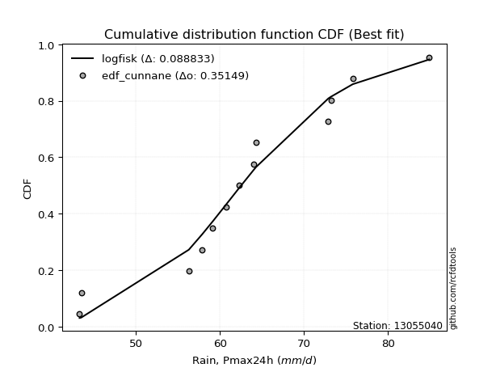</img>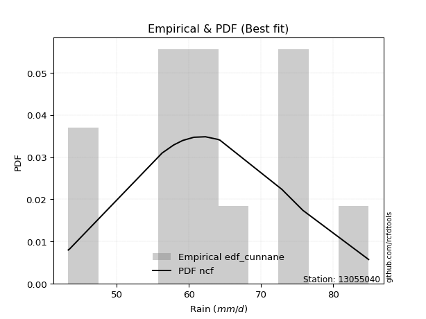</img>

</div>


### 12. EDF Adamowski (1981)

The Adamowski formula in hydrology refers to a specific plotting position formula used for estimating the non-parametric empirical distribution of hydrological events (like flood peaks) to calculate their return periods. This formula provides an alternative to traditional parametric methods (like the Gumbel or Log Pearson Type III distributions). 

<div align="center">


$P=(m-0.25)/(n+0.5)$


</div>


**12.1. Empirical values**

<div align="center">

|                | 0                   | 1                   | 2                  | 3                  | 4                   | 5                   | 6             | 7                  | 8                  | 9                  | 10                 | 11                 | 12                 |
|:---------------|:--------------------|:--------------------|:-------------------|:-------------------|:--------------------|:--------------------|:--------------|:-------------------|:-------------------|:-------------------|:-------------------|:-------------------|:-------------------|
| date           | 2014                | 2010                | 2006               | 2015               | 2017                | 2005                | 2009          | 2012               | 2016               | 2013               | 2007               | 2008               | 2011               |
| x              | 43.3                | 43.5                | 56.3               | 57.9               | 59.146153846153844  | 60.7                | 62.3          | 64.0               | 64.3               | 72.9               | 73.2               | 75.8               | 84.9               |
| m              | 1                   | 2                   | 3                  | 4                  | 5                   | 6                   | 7             | 8                  | 9                  | 10                 | 11                 | 12                 | 13                 |
| empirical_dist | edf_adamowski       | edf_adamowski       | edf_adamowski      | edf_adamowski      | edf_adamowski       | edf_adamowski       | edf_adamowski | edf_adamowski      | edf_adamowski      | edf_adamowski      | edf_adamowski      | edf_adamowski      | edf_adamowski      |
| empirical      | 0.05555555555555555 | 0.12962962962962962 | 0.2037037037037037 | 0.2777777777777778 | 0.35185185185185186 | 0.42592592592592593 | 0.5           | 0.5740740740740741 | 0.6481481481481481 | 0.7222222222222222 | 0.7962962962962963 | 0.8703703703703703 | 0.9444444444444444 |
| empirical_tr   | 1.0588235294117647  | 1.148936170212766   | 1.255813953488372  | 1.3846153846153846 | 1.542857142857143   | 1.7419354838709677  | 2.0           | 2.3478260869565215 | 2.8421052631578947 | 3.5999999999999996 | 4.909090909090908  | 7.714285714285713  | 17.999999999999993 |

</div>


**12.2. Kolmogorov-Smirnov fit test (sorted by Δ)**


<div align="center">

|                | 0                   | 1                   | 2                   | 3                   | 4                   | 5                   | 6                   | 7                   | 8                   | 9                   | 10                  | 11                  | 12                  | 13                  | 14                  | 15                  | 16                  | 17                  | 18                  | 19                  | 20                  | 21                  | 22                  | 23                  | 24                  | 25                  | 26                  | 27                  | 28                  | 29                  | 30                  | 31                  | 32                  | 33                  | 34                  | 35                  | 36                  | 37                  | 38                  | 39                  | 40                  | 41                  | 42                  | 43                  | 44                  | 45                  | 46                  | 47                  | 48                  | 49                    | 50                  | 51                  | 52                  | 53                  | 54                  | 55                  | 56                  | 57                  | 58                  | 59                  | 60                  | 61                  | 62                  | 63                  | 64                  | 65                  | 66                  | 67                  | 68                  | 69                  | 70                  | 71                  | 72                  | 73                  | 74                  | 75                  | 76                  | 77                  | 78                  | 79                  | 80                  | 81                  | 82                  | 83                  | 84                  | 85                  | 86                  | 87                  |
|:---------------|:--------------------|:--------------------|:--------------------|:--------------------|:--------------------|:--------------------|:--------------------|:--------------------|:--------------------|:--------------------|:--------------------|:--------------------|:--------------------|:--------------------|:--------------------|:--------------------|:--------------------|:--------------------|:--------------------|:--------------------|:--------------------|:--------------------|:--------------------|:--------------------|:--------------------|:--------------------|:--------------------|:--------------------|:--------------------|:--------------------|:--------------------|:--------------------|:--------------------|:--------------------|:--------------------|:--------------------|:--------------------|:--------------------|:--------------------|:--------------------|:--------------------|:--------------------|:--------------------|:--------------------|:--------------------|:--------------------|:--------------------|:--------------------|:--------------------|:----------------------|:--------------------|:--------------------|:--------------------|:--------------------|:--------------------|:--------------------|:--------------------|:--------------------|:--------------------|:--------------------|:--------------------|:--------------------|:--------------------|:--------------------|:--------------------|:--------------------|:--------------------|:--------------------|:--------------------|:--------------------|:--------------------|:--------------------|:--------------------|:--------------------|:--------------------|:--------------------|:--------------------|:--------------------|:--------------------|:--------------------|:--------------------|:--------------------|:--------------------|:--------------------|:--------------------|:--------------------|:--------------------|:--------------------|
| station        | 13055040            | 13055040            | 13055040            | 13055040            | 13055040            | 13055040            | 13055040            | 13055040            | 13055040            | 13055040            | 13055040            | 13055040            | 13055040            | 13055040            | 13055040            | 13055040            | 13055040            | 13055040            | 13055040            | 13055040            | 13055040            | 13055040            | 13055040            | 13055040            | 13055040            | 13055040            | 13055040            | 13055040            | 13055040            | 13055040            | 13055040            | 13055040            | 13055040            | 13055040            | 13055040            | 13055040            | 13055040            | 13055040            | 13055040            | 13055040            | 13055040            | 13055040            | 13055040            | 13055040            | 13055040            | 13055040            | 13055040            | 13055040            | 13055040            | 13055040              | 13055040            | 13055040            | 13055040            | 13055040            | 13055040            | 13055040            | 13055040            | 13055040            | 13055040            | 13055040            | 13055040            | 13055040            | 13055040            | 13055040            | 13055040            | 13055040            | 13055040            | 13055040            | 13055040            | 13055040            | 13055040            | 13055040            | 13055040            | 13055040            | 13055040            | 13055040            | 13055040            | 13055040            | 13055040            | 13055040            | 13055040            | 13055040            | 13055040            | 13055040            | 13055040            | 13055040            | 13055040            | 13055040            |
| empirical_dist | edf_adamowski       | edf_adamowski       | edf_adamowski       | edf_adamowski       | edf_adamowski       | edf_adamowski       | edf_adamowski       | edf_adamowski       | edf_adamowski       | edf_adamowski       | edf_adamowski       | edf_adamowski       | edf_adamowski       | edf_adamowski       | edf_adamowski       | edf_adamowski       | edf_adamowski       | edf_adamowski       | edf_adamowski       | edf_adamowski       | edf_adamowski       | edf_adamowski       | edf_adamowski       | edf_adamowski       | edf_adamowski       | edf_adamowski       | edf_adamowski       | edf_adamowski       | edf_adamowski       | edf_adamowski       | edf_adamowski       | edf_adamowski       | edf_adamowski       | edf_adamowski       | edf_adamowski       | edf_adamowski       | edf_adamowski       | edf_adamowski       | edf_adamowski       | edf_adamowski       | edf_adamowski       | edf_adamowski       | edf_adamowski       | edf_adamowski       | edf_adamowski       | edf_adamowski       | edf_adamowski       | edf_adamowski       | edf_adamowski       | edf_adamowski         | edf_adamowski       | edf_adamowski       | edf_adamowski       | edf_adamowski       | edf_adamowski       | edf_adamowski       | edf_adamowski       | edf_adamowski       | edf_adamowski       | edf_adamowski       | edf_adamowski       | edf_adamowski       | edf_adamowski       | edf_adamowski       | edf_adamowski       | edf_adamowski       | edf_adamowski       | edf_adamowski       | edf_adamowski       | edf_adamowski       | edf_adamowski       | edf_adamowski       | edf_adamowski       | edf_adamowski       | edf_adamowski       | edf_adamowski       | edf_adamowski       | edf_adamowski       | edf_adamowski       | edf_adamowski       | edf_adamowski       | edf_adamowski       | edf_adamowski       | edf_adamowski       | edf_adamowski       | edf_adamowski       | edf_adamowski       | edf_adamowski       |
| p_dist         | ncf                 | invgamma            | alpha               | logpearson3         | logfisk             | genlogistic         | weibull_min         | fisk                | rice                | gamma               | erlang              | f                   | nakagami            | t                   | exponnorm           | norm                | crystalball         | johnsonsu           | mielke              | loggenlogistic      | logweibull_min      | logmielke           | pearson3            | logfatiguelife      | logloggamma         | logf                | lognorm             | lognorm             | logcrystalball      | logt                | logexponnorm        | loglogistic         | lognakagami         | logncf              | maxwell             | logistic            | logbetaprime        | logjohnsonsu        | betaprime           | logerlang           | laplace_asymmetric  | lognct              | loggamma            | loggamma            | logrice             | loghypsecant        | hypsecant           | logalpha            | rayleigh            | loglaplace_asymmetric | gumbel_r            | loginvgamma         | invgauss            | truncnorm           | moyal               | loggumbel_l         | loglaplace          | laplace             | nct                 | invweibull          | logmaxwell          | loginvgauss         | halflogistic        | loggumbel_r         | halfnorm            | lograyleigh         | wald                | logmoyal            | kstwobign           | gumbel_l            | loginvweibull       | gibrat              | loghalfnorm         | loghalflogistic     | logkstwobign        | logwald             | loggenexpon         | loggibrat           | loggompertz         | expon               | genexpon            | logexpon            | logchi2             | logtruncnorm        | loglognorm          | fatiguelife         | gompertz            | chi2                |
| delta          | 0.09094899746350615 | 0.09223338369294373 | 0.09363522744766575 | 0.09620048069479492 | 0.09725068246630178 | 0.09730331126693181 | 0.0975634509215414  | 0.09792978434937671 | 0.0983366056919756  | 0.09896851397131423 | 0.09909222113190719 | 0.09964789398263263 | 0.10049844427965382 | 0.10097147324016054 | 0.10099370172867062 | 0.10099437554525936 | 0.10099438379238979 | 0.10100341407383229 | 0.10112998281319441 | 0.10114526483449326 | 0.10171135048833313 | 0.10244385938059486 | 0.10309200412194064 | 0.10476310615186793 | 0.10515415125004901 | 0.1053599091531027  | 0.1059286590649782  | 0.1059286590649782  | 0.10592869186265694 | 0.1059299236964796  | 0.1059303733843506  | 0.10600765687737468 | 0.10608296779832241 | 0.10613010989775487 | 0.1062984757268533  | 0.10637900195967531 | 0.1067012299624954  | 0.1068933866585362  | 0.1105835207941708  | 0.11519012424044464 | 0.1161260775488212  | 0.11624846444254369 | 0.11704735282996151 | 0.11704735282996151 | 0.11769550016569083 | 0.1181983720855111  | 0.11854413717139844 | 0.11864011717143227 | 0.11958442243217839 | 0.11972888684605021   | 0.12250423618089852 | 0.12602339003685284 | 0.12662932761542414 | 0.12676185154594705 | 0.12913947421835043 | 0.13010131584621543 | 0.13112894925489293 | 0.1314273595232377  | 0.1322103985180166  | 0.13470419345719428 | 0.1347457075198282  | 0.13581803680245244 | 0.13645056625901622 | 0.1420892454107566  | 0.14256080819328695 | 0.14604046287464575 | 0.15118375938718887 | 0.1572183092520415  | 0.15936529607041336 | 0.16832055791215783 | 0.17247772102000788 | 0.17398671240865582 | 0.17803757432476727 | 0.17838329158849855 | 0.20526242948599208 | 0.205410667899165   | 0.20567612649349035 | 0.21466936284696092 | 0.2748389610688483  | 0.2803985316462393  | 0.28782523977635865 | 0.31732575425016574 | 0.3721800771265147  | 0.3839207050681177  | 0.4064824454882725  | 0.5938181606419302  | 0.7647238597450813  | 0.7865378500846726  |
| deltao         | 0.35149047353100005 | 0.35149047353100005 | 0.35149047353100005 | 0.35149047353100005 | 0.35149047353100005 | 0.35149047353100005 | 0.35149047353100005 | 0.35149047353100005 | 0.35149047353100005 | 0.35149047353100005 | 0.35149047353100005 | 0.35149047353100005 | 0.35149047353100005 | 0.35149047353100005 | 0.35149047353100005 | 0.35149047353100005 | 0.35149047353100005 | 0.35149047353100005 | 0.35149047353100005 | 0.35149047353100005 | 0.35149047353100005 | 0.35149047353100005 | 0.35149047353100005 | 0.35149047353100005 | 0.35149047353100005 | 0.35149047353100005 | 0.35149047353100005 | 0.35149047353100005 | 0.35149047353100005 | 0.35149047353100005 | 0.35149047353100005 | 0.35149047353100005 | 0.35149047353100005 | 0.35149047353100005 | 0.35149047353100005 | 0.35149047353100005 | 0.35149047353100005 | 0.35149047353100005 | 0.35149047353100005 | 0.35149047353100005 | 0.35149047353100005 | 0.35149047353100005 | 0.35149047353100005 | 0.35149047353100005 | 0.35149047353100005 | 0.35149047353100005 | 0.35149047353100005 | 0.35149047353100005 | 0.35149047353100005 | 0.35149047353100005   | 0.35149047353100005 | 0.35149047353100005 | 0.35149047353100005 | 0.35149047353100005 | 0.35149047353100005 | 0.35149047353100005 | 0.35149047353100005 | 0.35149047353100005 | 0.35149047353100005 | 0.35149047353100005 | 0.35149047353100005 | 0.35149047353100005 | 0.35149047353100005 | 0.35149047353100005 | 0.35149047353100005 | 0.35149047353100005 | 0.35149047353100005 | 0.35149047353100005 | 0.35149047353100005 | 0.35149047353100005 | 0.35149047353100005 | 0.35149047353100005 | 0.35149047353100005 | 0.35149047353100005 | 0.35149047353100005 | 0.35149047353100005 | 0.35149047353100005 | 0.35149047353100005 | 0.35149047353100005 | 0.35149047353100005 | 0.35149047353100005 | 0.35149047353100005 | 0.35149047353100005 | 0.35149047353100005 | 0.35149047353100005 | 0.35149047353100005 | 0.35149047353100005 | 0.35149047353100005 |
| eval           | Δo > Δ              | Δo > Δ              | Δo > Δ              | Δo > Δ              | Δo > Δ              | Δo > Δ              | Δo > Δ              | Δo > Δ              | Δo > Δ              | Δo > Δ              | Δo > Δ              | Δo > Δ              | Δo > Δ              | Δo > Δ              | Δo > Δ              | Δo > Δ              | Δo > Δ              | Δo > Δ              | Δo > Δ              | Δo > Δ              | Δo > Δ              | Δo > Δ              | Δo > Δ              | Δo > Δ              | Δo > Δ              | Δo > Δ              | Δo > Δ              | Δo > Δ              | Δo > Δ              | Δo > Δ              | Δo > Δ              | Δo > Δ              | Δo > Δ              | Δo > Δ              | Δo > Δ              | Δo > Δ              | Δo > Δ              | Δo > Δ              | Δo > Δ              | Δo > Δ              | Δo > Δ              | Δo > Δ              | Δo > Δ              | Δo > Δ              | Δo > Δ              | Δo > Δ              | Δo > Δ              | Δo > Δ              | Δo > Δ              | Δo > Δ                | Δo > Δ              | Δo > Δ              | Δo > Δ              | Δo > Δ              | Δo > Δ              | Δo > Δ              | Δo > Δ              | Δo > Δ              | Δo > Δ              | Δo > Δ              | Δo > Δ              | Δo > Δ              | Δo > Δ              | Δo > Δ              | Δo > Δ              | Δo > Δ              | Δo > Δ              | Δo > Δ              | Δo > Δ              | Δo > Δ              | Δo > Δ              | Δo > Δ              | Δo > Δ              | Δo > Δ              | Δo > Δ              | Δo > Δ              | Δo > Δ              | Δo > Δ              | Δo > Δ              | Δo > Δ              | Δo > Δ              | Δo > Δ              | Δo <= Δ             | Δo <= Δ             | Δo <= Δ             | Δo <= Δ             | Δo <= Δ             | Δo <= Δ             |
| fit            | 1                   | 1                   | 1                   | 1                   | 1                   | 1                   | 1                   | 1                   | 1                   | 1                   | 1                   | 1                   | 1                   | 1                   | 1                   | 1                   | 1                   | 1                   | 1                   | 1                   | 1                   | 1                   | 1                   | 1                   | 1                   | 1                   | 1                   | 1                   | 1                   | 1                   | 1                   | 1                   | 1                   | 1                   | 1                   | 1                   | 1                   | 1                   | 1                   | 1                   | 1                   | 1                   | 1                   | 1                   | 1                   | 1                   | 1                   | 1                   | 1                   | 1                     | 1                   | 1                   | 1                   | 1                   | 1                   | 1                   | 1                   | 1                   | 1                   | 1                   | 1                   | 1                   | 1                   | 1                   | 1                   | 1                   | 1                   | 1                   | 1                   | 1                   | 1                   | 1                   | 1                   | 1                   | 1                   | 1                   | 1                   | 1                   | 1                   | 1                   | 1                   | 1                   | 0                   | 0                   | 0                   | 0                   | 0                   | 0                   |
| n              | 13                  | 13                  | 13                  | 13                  | 13                  | 13                  | 13                  | 13                  | 13                  | 13                  | 13                  | 13                  | 13                  | 13                  | 13                  | 13                  | 13                  | 13                  | 13                  | 13                  | 13                  | 13                  | 13                  | 13                  | 13                  | 13                  | 13                  | 13                  | 13                  | 13                  | 13                  | 13                  | 13                  | 13                  | 13                  | 13                  | 13                  | 13                  | 13                  | 13                  | 13                  | 13                  | 13                  | 13                  | 13                  | 13                  | 13                  | 13                  | 13                  | 13                    | 13                  | 13                  | 13                  | 13                  | 13                  | 13                  | 13                  | 13                  | 13                  | 13                  | 13                  | 13                  | 13                  | 13                  | 13                  | 13                  | 13                  | 13                  | 13                  | 13                  | 13                  | 13                  | 13                  | 13                  | 13                  | 13                  | 13                  | 13                  | 13                  | 13                  | 13                  | 13                  | 13                  | 13                  | 13                  | 13                  | 13                  | 13                  |
| best_fit       | 1                   | 0                   | 0                   | 0                   | 0                   | 0                   | 0                   | 0                   | 0                   | 0                   | 0                   | 0                   | 0                   | 0                   | 0                   | 0                   | 0                   | 0                   | 0                   | 0                   | 0                   | 0                   | 0                   | 0                   | 0                   | 0                   | 0                   | 0                   | 0                   | 0                   | 0                   | 0                   | 0                   | 0                   | 0                   | 0                   | 0                   | 0                   | 0                   | 0                   | 0                   | 0                   | 0                   | 0                   | 0                   | 0                   | 0                   | 0                   | 0                   | 0                     | 0                   | 0                   | 0                   | 0                   | 0                   | 0                   | 0                   | 0                   | 0                   | 0                   | 0                   | 0                   | 0                   | 0                   | 0                   | 0                   | 0                   | 0                   | 0                   | 0                   | 0                   | 0                   | 0                   | 0                   | 0                   | 0                   | 0                   | 0                   | 0                   | 0                   | 0                   | 0                   | 0                   | 0                   | 0                   | 0                   | 0                   | 0                   |
| best_fit_sort  | 1                   | 2                   | 3                   | 4                   | 5                   | 6                   | 7                   | 8                   | 9                   | 10                  | 11                  | 12                  | 13                  | 14                  | 15                  | 16                  | 17                  | 18                  | 19                  | 20                  | 21                  | 22                  | 23                  | 24                  | 25                  | 26                  | 27                  | 28                  | 29                  | 30                  | 31                  | 32                  | 33                  | 34                  | 35                  | 36                  | 37                  | 38                  | 39                  | 40                  | 41                  | 42                  | 43                  | 44                  | 45                  | 46                  | 47                  | 48                  | 49                  | 50                    | 51                  | 52                  | 53                  | 54                  | 55                  | 56                  | 57                  | 58                  | 59                  | 60                  | 61                  | 62                  | 63                  | 64                  | 65                  | 66                  | 67                  | 68                  | 69                  | 70                  | 71                  | 72                  | 73                  | 74                  | 75                  | 76                  | 77                  | 78                  | 79                  | 80                  | 81                  | 82                  | 83                  | 84                  | 85                  | 86                  | 87                  | 88                  |

</div>


**12.3. Best fit**

<div align="center">

|   id |   station | empirical_dist   | p_dist   |    delta |   deltao | eval   |   fit |   n |   best_fit |   best_fit_sort |
|-----:|----------:|:-----------------|:---------|---------:|---------:|:-------|------:|----:|-----------:|----------------:|
|    0 |  13055040 | edf_adamowski    | ncf      | 0.090949 |  0.35149 | Δo > Δ |     1 |  13 |          1 |               1 |

</div>


<div align="center">

</img></img>

</div>


## C. Best fit & Estimate extreme values for specific return periods - Tr

Best fit in probability distribution analysis means finding the theoretical distribution (like Normal, Poisson, Exponential) that most accurately mirrors your real-world data´s patterns (shape, center, spread) for better predictions, using methods like visual checks (Q-Q plots), goodness-of-fit tests (Kolmogorov-Smirnov, Chi-Squared), and information criteria (AIC) to score and select the simplest, most representative model.


### 1. Best fit (ordered by delta Δ)

<div align="center">

|   id |   station | empirical_dist   | p_dist             |     delta |   deltao | eval   |   fit |   n |   best_fit |   best_fit_sort |
|-----:|----------:|:-----------------|:-------------------|----------:|---------:|:-------|------:|----:|-----------:|----------------:|
|    0 |  13055040 | edf_gringorten   | logfisk            | 0.0871207 |  0.35149 | Δo > Δ |     1 |  13 |          1 |               1 |
|    1 |  13055040 | edf_hazen        | logfisk            | 0.0885278 |  0.35149 | Δo > Δ |     1 |  13 |          1 |               2 |
|    2 |  13055040 | edf_cunnane      | logfisk            | 0.0888332 |  0.35149 | Δo > Δ |     1 |  13 |          1 |               3 |
|    3 |  13055040 | edf_chegodayev   | ncf                | 0.0890174 |  0.35149 | Δo > Δ |     1 |  13 |          1 |               4 |
|    4 |  13055040 | edf_beard        | ncf                | 0.0892405 |  0.35149 | Δo > Δ |     1 |  13 |          1 |               5 |
|    5 |  13055040 | edf_jenkinson    | ncf                | 0.0892405 |  0.35149 | Δo > Δ |     1 |  13 |          1 |               6 |
|    6 |  13055040 | edf_filliben     | ncf                | 0.0894083 |  0.35149 | Δo > Δ |     1 |  13 |          1 |               7 |
|    7 |  13055040 | edf_tukey        | ncf                | 0.0897637 |  0.35149 | Δo > Δ |     1 |  13 |          1 |               8 |
|    8 |  13055040 | edf_blom         | logfisk            | 0.0902626 |  0.35149 | Δo > Δ |     1 |  13 |          1 |               9 |
|    9 |  13055040 | edf_adamowski    | ncf                | 0.090949  |  0.35149 | Δo > Δ |     1 |  13 |          1 |              10 |
|   10 |  13055040 | edf_weibull      | pearson3           | 0.097801  |  0.35149 | Δo > Δ |     1 |  13 |          1 |              11 |
|   11 |  13055040 | edf_california   | laplace_asymmetric | 0.108315  |  0.35149 | Δo > Δ |     1 |  13 |          1 |              12 |

</div>

:file_folder:Tables: [bestfit_13055040.csv](table/bestfit_13055040.csv) | [extreme_13055040.csv](table/extreme_13055040.csv)


### 2. Extreme values

In hydrology, a return period (or recurrence interval $Tr$) is the statistical average time between extreme events like floods or droughts of a specific magnitude, indicating how rare an event is, with a 100-year flood, for example, having a 1% chance of occurring in any given year, not that it happens exactly every century. It is a key tool for infrastructure design (like bridges or dams) and risk assessment, calculated from historical data to determine the probability of future events, although it is important to remember it is statistical average, and events can cluster or be missed.

> risk_rate: assuming the return period as the project useful life.

|   id |      tr |   prob_l |     prob_g |    alpha |   betaprime |    chi2 |   crystalball |   erlang |    expon |   exponnorm |       f |   fatiguelife |     fisk |   gamma |   genexpon |   genlogistic |   gibrat |   gompertz |   gumbel_l |   gumbel_r |   halflogistic |   halfnorm |   hypsecant |   invgamma |   invgauss |   invweibull |   johnsonsu |   kstwobign |   laplace |   laplace_asymmetric |   loggamma |   logistic |   lognorm |   maxwell |   mielke |    moyal |   nakagami |      ncf |      nct |    norm |   pearson3 |   rayleigh |     rice |       t |   truncnorm |     wald |   weibull_min |   logalpha |   logbetaprime |          logchi2 |   logcrystalball |   logerlang |   logexpon |   logexponnorm |     logf |   logfatiguelife |   logfisk |   loggenexpon |   loggenlogistic |   loggibrat |   loggompertz |   loggumbel_l |   loggumbel_r |   loghalflogistic |   loghalfnorm |   loghypsecant |   loginvgamma |   loginvgauss |   loginvweibull |   logjohnsonsu |   logkstwobign |   loglaplace |   loglaplace_asymmetric |   logloggamma |   loglogistic |    loglognorm |   logmaxwell |   logmielke |   logmoyal |   lognakagami |   logncf |   lognct |   logpearson3 |   lograyleigh |   logrice |     logt |   logtruncnorm |   logwald |   logweibull_min |   station |   n |   risk_rate |
|-----:|--------:|---------:|-----------:|---------:|------------:|--------:|--------------:|---------:|---------:|------------:|--------:|--------------:|---------:|--------:|-----------:|--------------:|---------:|-----------:|-----------:|-----------:|---------------:|-----------:|------------:|-----------:|-----------:|-------------:|------------:|------------:|----------:|---------------------:|-----------:|-----------:|----------:|----------:|---------:|---------:|-----------:|---------:|---------:|--------:|-----------:|-----------:|---------:|--------:|------------:|---------:|--------------:|-----------:|---------------:|-----------------:|-----------------:|------------:|-----------:|---------------:|---------:|-----------------:|----------:|--------------:|-----------------:|------------:|--------------:|--------------:|--------------:|------------------:|--------------:|---------------:|--------------:|--------------:|----------------:|---------------:|---------------:|-------------:|------------------------:|--------------:|--------------:|--------------:|-------------:|------------:|-----------:|--------------:|---------:|---------:|--------------:|--------------:|----------:|---------:|---------------:|----------:|-----------------:|----------:|----:|------------:|
|    0 |    2    | 0.5      | 0.5        |  62.2864 |     61.5996 | 43.3923 |       62.942  |  62.8855 |  56.9148 |     62.942  | 62.9031 |       43.3002 |  62.9787 | 62.8815 |    56.6165 |       62.9603 |  59.5014 |    79.2911 |    64.8251 |    61.0589 |        60.1227 |    60.5957 |     62.942  |    62.3403 |    61.2859 |      61.2249 |     62.9421 |     60.5929 |   62.942  |              62.6268 |    61.5532 |    62.942  |   61.8561 |   61.9617 |  63.0681 |  60.451  |    62.9265 |  62.552  |  61.041  | 62.942  |    63.0035 |    61.614  |  62.5008 | 62.9414 |     62.2239 |  59.2264 |       62.7969 |    61.4577 |        61.8716 |     70.7896      |          61.8561 |     61.6236 |    55.4438 |        61.856  |  61.8783 |          61.8673 |   62.5209 |       59.2772 |          63.0683 |     58.438  |       57.0662 |       63.8111 |       59.961  |           59.041  |       59.504  |        61.8561 |       61.2943 |       61.0984 |         60.2682 |        63.0952 |        59.2703 |      61.8561 |                 62.0848 |       63.0534 |       61.8561 |  44.1851      |      60.8621 |     63.0959 |    59.3616 |       61.8544 |  61.8607 |  61.5585 |       62.7608 |       60.5135 |   61.555  |  61.8561 |        53.495  |   58.1726 |          62.9405 |  13055040 |  13 |    0.75     |
|    1 |    2.33 | 0.570815 | 0.429185   |  64.3721 |     63.6948 | 43.4919 |       64.9875 |  64.9336 |  59.9146 |     64.9875 | 64.9489 |       43.8973 |  64.8482 | 64.9302 |    59.4937 |       64.8326 |  60.5375 |    79.6857 |    66.6047 |    62.9543 |        62.0715 |    62.8033 |     64.579  |    64.4211 |    63.4432 |      63.563  |     64.9878 |     62.9985 |   64.1798 |              64.0163 |    63.7206 |    64.7442 |   63.9826 |   64.0868 |  64.9278 |  62.2452 |    64.9739 |  64.6119 |  63.2365 | 64.9875 |    65.0469 |    63.7705 |  64.6187 | 64.9868 |     64.4015 |  60.5676 |       64.9068 |    63.6108 |        64.0402 |     84.553       |          63.9826 |     63.7986 |    58.5475 |        63.9825 |  64.0081 |          63.988  |   64.454  |       61.8315 |          64.9283 |     59.447  |       59.7926 |       65.7155 |       61.8686 |           60.9728 |       61.7145 |        63.5522 |       63.4901 |       63.3711 |         62.8531 |        65.1682 |        61.8671 |      63.1344 |                 63.4256 |       65.1119 |       63.7259 |  48.0338      |      63.0374 |     64.9649 |    61.148  |       63.9828 |  63.9951 |  63.7221 |       64.8656 |       62.7088 |   63.7328 |  63.9826 |        55.7226 |   59.4762 |          65.0193 |  13055040 |  13 |    0.729209 |
|    2 |    5    | 0.8      | 0.2        |  72.4935 |     72.2238 | 44.708  |       72.589  |  72.5768 |  74.9126 |     72.589  | 72.5741 |       56.5768 |  72.0667 | 72.5752 |    73.8787 |       72.0789 |  66.5029 |    80.9608 |    72.3538 |    71.1886 |        70.8891 |    72.1389 |     71.1453 |    72.4778 |    72.1658 |      73.7206 |     72.5905 |     73.2174 |   70.3687 |              70.9633 |    72.6126 |    71.7028 |   72.5461 |   72.451  |  72.0231 |  70.5561 |    72.5957 |  72.4893 |  72.6314 | 72.589  |    72.6065 |    72.4041 |  72.6303 | 72.588  |     72.7385 |  68.0759 |       72.7074 |    72.4822 |        72.929  |    241.079       |          72.5461 |     72.7308 |    76.8743 |        72.546  |  72.5925 |          72.5478 |   72.4959 |       73.2766 |          72.0233 |     65.6045 |       72.3122 |       72.2647 |       70.8866 |           70.5349 |       72.0075 |        70.8359 |       72.6585 |       73.0813 |         75.4335 |        72.7487 |        74.2274 |      69.9326 |                 70.5471 |       72.6757 |       71.4914 |   1.67528e+21 |      72.3809 |     72.0475 |    70.1495 |       72.5577 |  72.6118 |  72.6245 |       72.7448 |       72.3248 |   72.6241 |  72.5461 |        66.0423 |   67.3324 |          72.6819 |  13055040 |  13 |    0.67232  |
|    3 |   10    | 0.9      | 0.1        |  78.2269 |     78.605  | 46.6777 |       77.6316 |  77.6749 |  88.5274 |     77.6316 | 77.6517 |       74.0838 |  77.3829 | 77.674  |    86.9371 |       77.4269 |  73.3028 |    81.6707 |    75.5546 |    77.8953 |        78.2117 |    79.047  |     76.3887 |    78.1191 |    78.6039 |      81.9939 |     77.6338 |     80.9978 |   75.9867 |              77.2695 |    79.3262 |    76.8275 |   78.8502 |   78.3373 |  77.3145 |  77.792  |    77.6632 |  77.9104 |  80.1637 | 77.6316 |    77.5915 |    78.56   |  78.0279 | 77.6305 |     78.396  |  76.0439 |       77.7904 |    79.2237 |        79.633  |    712.53        |          78.8502 |     79.4837 |    98.4342 |        78.85   |  78.9197 |          78.869  |   79.0535 |       82.7538 |          77.3141 |     73.405  |       82.4877 |       76.1898 |       79.1944 |           79.6059 |       80.7141 |        77.2472 |       79.7535 |       80.8268 |         87.5189 |        77.6351 |        85.2692 |      76.7357 |                 77.7019 |       77.605  |       77.8093 | inf           |      79.775  |     77.3161 |    79.0594 |       78.8741 |  78.9765 |  79.3755 |       77.9666 |       80.0691 |   79.2647 |  78.8501 |        73.3824 |   76.8075 |          77.6819 |  13055040 |  13 |    0.651322 |
|    4 |   15    | 0.933333 | 0.0666667  |  81.1992 |     82.0318 | 48.0933 |       80.148  |  80.2272 |  96.4916 |     80.148  | 80.1914 |       85.5338 |  80.2794 | 80.2266 |    94.5758 |       80.3429 |  77.9931 |    81.9922 |    77.0042 |    81.6791 |        82.3557 |    82.642  |     79.3811 |    81.0275 |    82.0227 |      86.6616 |     80.1506 |     85.1282 |   79.273  |              80.9585 |    82.9492 |    79.6196 |   82.198  |   81.3575 |  80.2766 |  81.9914 |    80.1954 |  80.6747 |  84.3951 | 80.148  |    80.0703 |    81.7318 |  80.7384 | 80.1468 |     81.2414 |  81.1606 |       80.2889 |    82.8782 |        83.249  |   1389.39        |          82.198  |     83.1311 |   113.75   |        82.1979 |  82.2825 |          82.2328 |   82.8728 |       88.1153 |          80.276  |     79.3195 |       88.0512 |       78.0368 |       84.3042 |           85.2469 |       85.6537 |        81.1629 |       83.6448 |       85.1558 |         95.1729 |        80.0221 |        91.7838 |      81.0181 |                 82.2191 |       80.0356 |       81.4835 | inf           |      83.8574 |     80.277  |    84.7403 |       82.2299 |  82.3639 |  83.03   |       80.5541 |       84.3776 |   82.8175 |  82.198  |        76.5803 |   83.5838 |          80.1477 |  13055040 |  13 |    0.644736 |
|    5 |   20    | 0.95     | 0.05       |  83.1877 |     84.3701 | 49.1853 |       81.7959 |  81.9017 | 102.142  |     81.7959 | 81.8567 |       94.011  |  82.2814 | 81.9011 |    99.9955 |       82.3589 |  81.6722 |    82.1923 |    77.9065 |    84.3285 |        85.2591 |    85.0388 |     81.4921 |    82.9669 |    84.3385 |      89.9298 |     81.7987 |     87.9106 |   81.6047 |              83.5758 |    85.4275 |    81.5495 |   84.4671 |   83.3619 |  82.3682 |  84.9655 |    81.8549 |  82.5063 |  87.3591 | 81.7959 |    81.6904 |    83.84   |  82.5185 | 81.7947 |     83.1108 |  84.9736 |       81.9102 |    85.3848 |        85.722  |   2256.07        |          84.4671 |     85.6273 |   126.041  |        84.467  |  84.5627 |          84.5153 |   85.6199 |       91.8728 |          82.3676 |     84.2906 |       91.8543 |       79.2091 |       88.077  |           89.4357 |       89.1138 |        84.0441 |       86.3319 |       88.1775 |        100.927  |        81.5651 |        96.4506 |      84.2007 |                 85.5824 |       81.6165 |       84.1238 | inf           |      86.6814 |     82.3766 |    89.009  |       84.5049 |  84.6626 |  85.5343 |       82.2384 |       87.3689 |   85.2348 |  84.4671 |        78.3826 |   89.0193 |          81.7516 |  13055040 |  13 |    0.641514 |
|    6 |   25    | 0.96     | 0.04       |  84.6733 |     86.1409 | 50.0742 |       83.009  |  83.1358 | 106.525  |     83.009  | 83.0836 |      100.747  |  83.8129 | 83.1353 |   104.199  |       83.9014 |  84.7393 |    82.3347 |    78.5485 |    86.3692 |        87.496  |    86.8222 |     83.1258 |    84.4125 |    86.0829 |      92.4472 |     83.012  |     89.9947 |   83.4134 |              85.606  |    87.3076 |    83.0258 |   86.1774 |   84.85   |  83.9961 |  87.2707 |    83.0771 |  83.8656 |  89.6463 | 83.009  |    82.8814 |    85.4064 |  83.8312 | 83.0077 |     84.4895 |  88.0277 |       83.0959 |    87.29   |        87.5977 |   3303.01        |          86.1774 |     87.5215 |   136.482  |        86.1772 |  86.2819 |          86.2372 |   87.7827 |       94.7693 |          83.9955 |     88.6721 |       94.7302 |       80.0539 |       91.0977 |           92.8028 |       91.7787 |        86.3439 |       88.3842 |       90.5027 |        105.595  |        82.6904 |       100.101  |      86.7551 |                 88.2856 |       82.7746 |       86.2013 | inf           |      88.8393 |     84.0164 |    92.4649 |       86.2199 |  86.3967 |  87.4368 |       83.472  |       89.6598 |   87.0614 |  86.1774 |        79.5414 |   93.627  |          82.9266 |  13055040 |  13 |    0.639603 |
|    7 |   50    | 0.98     | 0.02       |  89.0337 |     91.4572 | 53.0217 |       86.4829 |  86.677  | 120.14   |     86.4828 | 86.602  |      122.357  |  88.4921 | 86.6765 |   117.258  |       88.6149 |  95.5511 |    82.7213 |    80.2915 |    92.6556 |        94.3883 |    92.0056 |     88.191  |    88.6379 |    91.2678 |     100.202  |     86.4863 |     96.1147 |   89.0314 |              91.9123 |    92.9661 |    87.5365 |   91.269  |   89.1656 |  89.1366 |  94.427  |    86.58   |  87.8092 |  96.7358 | 86.4829 |    86.2844 |    89.9532 |  87.5996 | 86.4814 |     88.4477 |  97.9993 |       86.4537 |    93.0441 |        93.2421 |  11049.5         |          91.269  |     93.226  |   174.759  |        91.2688 |  91.4028 |          91.3705 |   94.7355 |      103.712  |          89.1366 |    106.015  |      103.301  |       82.3931 |      101.07   |          103.995  |       99.9855 |        93.8819 |       94.633  |       97.6726 |        121.378  |        85.861  |       111.638  |      95.1947 |                 97.2395 |       86.0644 |       92.872  | inf           |      95.4061 |     89.234  |   104.072  |       91.3269 |  91.5669 |  93.1759 |       86.9696 |       96.6559 |   92.5216 |  91.269  |        82.0609 |  110.397  |          86.2656 |  13055040 |  13 |    0.63583  |
|    8 |   75    | 0.986667 | 0.0133333  |  91.4404 |     94.4678 | 54.8504 |       88.3468 |  88.5815 | 128.104  |     88.3467 | 88.4929 |      135.372  |  91.1947 | 88.5809 |   124.896  |       91.3377 | 102.853  |    82.9168 |    81.1729 |    96.3096 |        98.3948 |    94.8272 |     91.1511 |    90.9589 |    94.1684 |     104.71   |     88.3505 |     99.4819 |   92.3177 |              95.6012 |    96.179  |    90.1417 |   94.1239 |   91.512  |  92.2315 |  98.612  |    88.4612 |  89.9566 | 100.902  | 88.3468 |    88.1057 |    92.4269 |  89.6268 | 88.3453 |     90.5767 | 104.135  |       88.2323 |    96.3245 |        96.4464 |  22691.8         |          94.1239 |     96.4671 |   201.95   |        94.1237 |  94.2758 |          94.2534 |   98.9993 |      108.93   |          92.2321 |    119.608  |      108.092  |       83.6019 |      107.361  |          111.112  |      104.757  |        98.5882 |       98.2293 |      101.859  |        131.613  |        87.5296 |       118.544  |     100.507  |                102.892  |       87.8132 |       96.9574 | inf           |      99.1779 |     92.4065 |   111.524  |       94.1913 |  94.4709 |  96.4437 |       88.8214 |      100.689  |   95.5968 |  94.1239 |        82.9684 |  122.178  |          88.0414 |  13055040 |  13 |    0.634587 |
|    9 |  100    | 0.99     | 0.01       |  93.0957 |     96.57   | 56.1853 |       89.6075 |  89.8713 | 133.755  |     89.6074 | 89.773  |      144.737  |  93.1027 | 89.8706 |   130.316  |       93.2601 | 108.51   |    83.0446 |    81.7494 |    98.8957 |       101.23   |    96.7495 |     93.2509 |    92.5505 |    96.1782 |     107.9    |     89.6114 |    101.789  |   94.6494 |              98.2185 |    98.4258 |    91.981  |   96.1052 |   93.1102 |  94.4764 | 101.581  |    89.7343 |  91.4216 | 103.878  | 89.6075 |    89.3357 |    94.1121 |  90.9997 | 89.606  |     92.0185 | 108.609  |       89.4261 |    98.6244 |        98.687  |  37992.6         |          96.1052 |     98.7345 |   223.771  |        96.105  |  96.2706 |          96.2563 |  102.125  |      112.636  |          94.4777 |    131.326  |      111.403  |       84.4021 |      112.048  |          116.442  |      108.138  |       102.069  |      100.765  |      104.836  |        139.375  |        88.6448 |       123.52   |     104.455  |                107.101  |       88.9895 |       99.9496 | inf           |     101.832  |     94.7235 |   117.132  |       96.1797 |  96.4883 |  98.7329 |       90.0627 |      103.532  |   97.7366 |  96.1053 |        83.4362 |  131.552  |          89.2364 |  13055040 |  13 |    0.633968 |
|   10 |  200    | 0.995    | 0.005      |  96.9353 |    101.546  | 59.5057 |       92.4671 |  92.8022 | 147.37   |     92.4671 | 92.6804 |      167.66   |  97.6798 | 92.8013 |   143.374  |       97.8719 | 123.9    |    83.3226 |    83.0024 |   105.113  |       108.048  |   101.146  |     98.3093 |    96.2274 |   100.883  |     115.569  |     92.4715 |    107.103  |  100.267  |             104.525  |   103.753  |    96.3933 |  100.756  |   96.7666 | 100.076  | 108.734  |    92.6242 |  94.7823 | 111.146  | 92.4671 |    92.1203 |    97.9682 |  94.1189 | 92.4655 |     95.2932 | 119.753  |       92.1065 |   104.097  |       104      | 133329           |         100.756  |    104.114  |   286.529  |       100.755  | 100.955  |         100.963  |  110.031  |      121.601  |         100.08   |    169.348  |      119.114  |       86.168  |      124.171  |          130.324  |      116.285  |       110.968  |      106.846  |      112.061  |        159.961  |        91.134  |       135.791  |     114.617  |                117.964  |       91.6383 |      107.509  | inf           |     108.174  |    100.563  |   131.829  |      100.848  | 101.23   | 104.174  |       92.8412 |      110.344  |  102.776  | 100.756  |        84.1566 |  158.149  |          91.9291 |  13055040 |  13 |    0.633042 |
|   11 |  250    | 0.996    | 0.004      |  98.1328 |    103.126  | 60.6012 |       93.341  |  93.6993 | 151.753  |     93.341  | 93.5699 |      175.13   |  99.1492 | 93.6982 |   147.578  |       99.3525 | 129.422  |    83.4043 |    83.3711 |   107.112  |       110.24   |   102.498  |     99.9377 |    97.3698 |   102.361  |     118.035  |     93.3455 |    108.747  |  102.076  |             106.555  |   105.448  |    97.8098 |  102.221  |   97.8921 | 101.941  | 111.037  |    93.5079 |  95.8197 | 113.52   | 93.341  |    92.9698 |    99.1551 |  95.0733 | 93.3394 |     96.295  | 123.44   |       92.9181 |   105.844  |       105.69   | 200438           |         102.221  |    105.826  |   310.265  |       102.221  | 102.431  |         102.449  |  112.696  |      124.503  |         101.946  |    185.525  |      121.523  |       86.6946 |      128.341  |          135.129  |      118.913  |       113.994  |      108.801  |      114.407  |        167.204  |        91.8833 |       139.83   |     118.094  |                121.69   |       92.4423 |      110.055  | inf           |     110.205  |    102.527  |   136.942  |      102.319  | 102.726  | 105.909  |       93.6793 |      112.529  |  104.368  | 102.221  |        84.3034 |  168.083  |          92.7471 |  13055040 |  13 |    0.632858 |
|   12 |  500    | 0.998    | 0.002      | 101.753  |    107.987  | 64.0719 |       95.9326 |  96.3636 | 165.367  |     95.9325 | 96.2105 |      198.566  | 103.706  | 96.3621 |   160.637  |      103.944  | 148.506  |    83.6387 |    84.428  |   113.315  |       117.042  |   106.531  |    104.996  |   100.81   |   106.861  |     125.688  |     95.9374 |    113.675  |  107.694  |             112.861  |   110.667  |   102.203  |  106.694  |  101.251  | 107.944  | 118.19   |    96.1301 |  98.9252 | 121.03   | 95.9326 |    95.4847 |   102.697  |  97.907  | 95.9309 |     99.2685 | 135.162  |       95.3042 |   111.239  |       110.893  | 717680           |         106.694  |    111.1    |   397.281  |       106.694  | 106.941  |         106.987  |  121.382  |      133.584  |         107.953  |    254.294  |      128.803  |       88.222  |      142.196  |          151.203  |      127.106  |       123.931  |      114.881  |      121.781  |        191.843  |        94.0736 |       152.668  |     129.582  |                134.031  |       94.8119 |      118.342  | inf           |     116.494  |    108.916  |   154.124  |      106.811  | 107.298  | 111.262  |       96.1313 |      119.311  |  109.242  | 106.694  |        84.5999 |  204.007  |          95.16   |  13055040 |  13 |    0.632489 |
|   13 |  750    | 0.998667 | 0.00133333 | 103.81   |    110.804  | 66.1428 |       97.3722 |  97.8462 | 173.332  |     97.3722 | 97.6792 |      212.412  | 106.369  | 97.8445 |   168.275  |      106.627  | 161.127  |    83.764  |    84.9929 |   116.942  |       121.019  |   108.784  |    107.955  |   102.757  |   109.436  |     130.161  |     97.3773 |    116.444  |  110.98   |             116.55   |   113.695  |   104.769  |  109.262  |  103.129  | 111.611  | 122.375  |    97.5878 | 100.669  | 125.527  | 97.3722 |    96.8791 |   104.677  |  99.483  | 97.3705 |    100.922  | 142.191  |       96.6166 |   114.383  |       113.913  |      1.52191e+06 |         109.262  |    114.163  |   459.095  |       109.262  | 109.531  |         109.596  |  126.762  |      138.949  |         111.623  |    313.253  |      132.932  |       89.0493 |      150.978  |          161.471  |      131.926  |       130.141  |      118.453  |      126.164  |        207.895  |        95.2696 |       160.391  |     136.814  |                141.823  |       96.1186 |      123.469  | inf           |     120.167  |    112.87   |   165.158  |      109.391  | 109.927  | 114.377  |       97.4708 |      123.28   |  112.049  | 109.262  |        84.6996 |  229.13   |          96.4921 |  13055040 |  13 |    0.632366 |
|   14 | 1000    | 0.999    | 0.001      | 105.245  |    112.794  | 67.6277 |       98.3634 |  98.8681 | 178.982  |     98.3633 | 98.6911 |      222.289  | 108.257  | 98.8661 |   173.695  |      108.53   | 170.785  |    83.8483 |    85.3731 |   119.515  |       123.84   |   110.339  |    110.054  |   104.111  |   111.241  |     133.335  |     98.3686 |    118.362  |  113.312  |             119.168  |   115.836  |   106.59   |  111.067  |  104.428  | 114.287  | 125.343  |    98.5918 | 101.877  | 128.769  | 98.3634 |    97.838  |   106.046  | 100.569  | 98.3616 |    102.061  | 147.246  |       97.5147 |   116.611  |       116.049  |      2.5999e+06  |         111.067  |    116.329  |   508.701  |       111.066  | 111.352  |         111.431  |  130.722  |      142.783  |         114.3    |    367.448  |      135.808  |       89.6105 |      157.535  |          169.174  |      135.362  |       134.735  |      120.996  |      129.308  |        220.09   |        96.0844 |       165.969  |     142.188  |                147.625  |       97.0144 |      127.238  | inf           |     122.773  |    115.779  |   173.462  |      111.204  | 111.776  | 116.584  |       98.3831 |      126.1    |  114.025  | 111.067  |        84.7497 |  249.094  |          97.4059 |  13055040 |  13 |    0.632305 |

<div align="center">

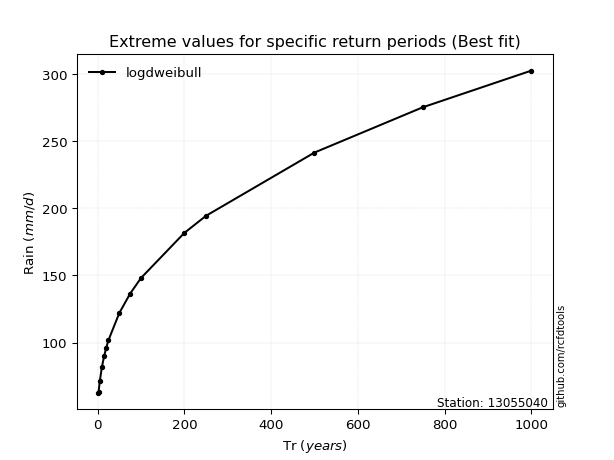</img>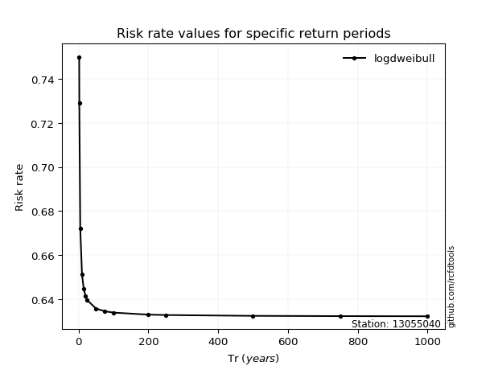</img>

</div>


<sub>**APP DISCLAIMER**: NO WARRANTY - This software is provided by [github.com/rcfdtools](https://github.com/rcfdtools) "as is", without any express or implied warranty, including warranties of merchantability, fitness for a particular purpose, or non-infringement. There is no guarantee that the software will be error-free or operate without interruption. LIMITATION OF LIABILITY - Neither the authors nor copyright holders will be liable for claims or damages arising from the software or its use. You are responsible for determining if the software is appropriate for your use and assume all associated risks, including errors, legal compliance, and data loss. NO PROFESSIONAL ADVICE - The software provides general information and does not offer professional advice. It should not replace consultation with professional advisors.</sub>