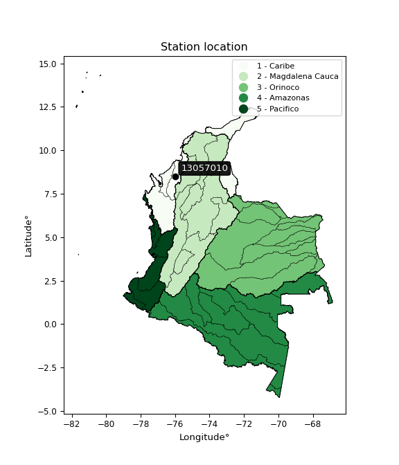

<div align="center">


</div>

# PMax24h Station (Rain): 13057010

Maximum Precipitation in 24 hours (PMax24h) is the greatest amount of rainfall for a specific duration that is meteorologically possible for a given location, acting as a "worst-case" scenario for extreme storms, crucial for designing safety-critical infrastructure like bridges, river deviations, dams, spillways, and nuclear plants to prevent catastrophic failure. The PMax24h is related with the Probable Maximum Precipitation (PMP) and it is calculated by hydrologists using meteorological data to determine the upper limit of extreme rainfall, often leading to the Probable Maximum Flood (PMF) for flood control design, and is increasingly being studied for climate change impacts. Probable Maximum Precipitation (PMP) is the theoretical upper limit of rainfall, a deterministic estimate for extreme events, while probability distributions (like GEV, Gumbel) describe the likelihood and frequency of various precipitation amounts, including rare ones, showing how often events occur, with PMP representing the extreme end of these distributions, used for critical infrastructure design to ensure safety against the worst conceivable weather, unlike standard statistical forecasts which cover typical probabilities.

The most common probability distributions in hydrology, used for analyzing floods, rainfall, and streamflow, include the Normal, Log-Normal, Gumbel, Gamma (including Log-Pearson Type III), and Generalized Extreme Value (GEV) distributions, often chosen based on the data´s skewness and whether modeling extremes or general conditions, with Gumbel and GEV popular for extreme events like floods, while the Normal distribution serves as a baseline, though often requiring transformations for skewed hydrological data. These distributions help in designing water infrastructure, managing water resources, and forecasting hydrologic events.

> Hydrological data often isn´t perfectly normal (it´s skewed), so different distributions are needed for different applications, such as: **Flood Frequency Analysis**: Using Gumbel, GEV, or Log-Pearson Type III for predicting extreme flood magnitudes and their return periods, **Rainfall Analysis**: Normal for annual totals, but Log-Normal, Weibull, or GEV for intensity or extreme daily rainfall, **Streamflow Modeling**: Gamma and Log-Normal for maximum flows, GEV for minimum flows, and Kappa for daily flows.

<div align="center">

</img>

</div>


## A. General information


### 1. General running parameters

• app_version: _v20260225_. • runtime: _2026-02-28 16:54:07.457399_. • Python version: _3.14.0_. • SciPy version: _1.16.3_. • Pandas version: _2.3.3_. • NumPy version: _2.3.5_. • Stations dataset (station_dataset_file): _dataset/pmax24h_in/automatic_colombia_2003_2025.csv_. • Stations catalog (station_catalog_file): _dataset/CNE.xls_. • Minimum year to eval til year_max (date_min): _1900_. • Maximum year to eval since year_min (date_max): _2025_. • Creates, save and include plots into reports (create_plot): _False_. • Plot only fit distributions with Δo > Δ (plot_only_fit): _True_. • Plot only simple graphs avoiding multiple CDFs and multiple Extreme values plots (plot_only_simple): _False_. • Eval low extreme values, if False, evaluates high extreme values (low_extreme): _False_. • Eval every SciPy distribution as logarithmic (pdist_logarithmic_on): _True_. • Standard deviation normalized (ddof): _1.0_. • Return periods to eval in years (Tr): _[2, 2.33, 5, 10, 15, 20, 25, 50, 75, 100, 200, 250, 500, 750, 1000]_. • Minimum data sample per station, 0 means any (minimum_sample): _5_. • Z-Score maximum threshold to adjust a value, 0 means disable (zscore_max): _3.5_. • Z-Score minimum threshold to adjust a value, 0 means disable (zscore_min): _-2.5_. • Avoid zeros, e.g. rain = 0 (avoid_zeros): _True_. • Avoid null values (avoid_nans): _True_. 

:file_folder:Table: [dataset.csv](../../dataset/pmax24h_in/automatic_colombia_2003_2025.csv)

> Delta Degrees of Freedom (DDOF): is a parameter used in the formulas for calculating variance and standard deviation. When ddof=0, the divisor is $N$ (the total number of observations) and this is used when your data set is the entire population. When ddof=1, the divisor is $N-1$ and this is used when your data set is a sample drawn from a larger population. Using $N-1$ provides an unbiased estimate of the population variance (known as Bessel´s correction).


### 2. Station info and location

|   id |   CODIGO | NOMBRE                        | CATEGORIA    | TECNOLOGIA                              | ESTADO   | FECHA_INSTALACION   |   FECHA_SUSPENSION |   ALTITUD |   LATITUD |   LONGITUD | DEPARTAMENTO   | MUNICIPIO   | AREA_OPERATIVA                              | ENTIDAD                                                     | AREA_HIDROGRAFICA   | ZONA_HIDROGRAFICA   | SUBZONA_HIDROGRAFICA   | CORRIENTE   | Catalogo   |   Version |
|-----:|---------:|:------------------------------|:-------------|:----------------------------------------|:---------|:--------------------|-------------------:|----------:|----------:|-----------:|:---------------|:------------|:--------------------------------------------|:------------------------------------------------------------|:--------------------|:--------------------|:-----------------------|:------------|:-----------|----------:|
|    0 | 13057010 | NUEVA COLOMBIA AUT [13057010] | Limnigráfica | Automática con Telemetría, Convencional | Activa   | 15/06/1990          |                nan |        20 |   8.49944 |   -75.9786 | Cordoba        | Montería    | Area Operativa 02 - Atlántico-Bolivar-Sucre | INSTITUTO DE HIDROLOGIA METEOROLOGIA Y ESTUDIOS AMBIENTALES | Caribe              | Sinú                | Medio Sinú             | Sinu        | CNE_IDEAM  |  20251226 |

<div align="center">

Dynamic map: [:earth_americas:Google](http://maps.google.com/maps?q=8.499444444,-75.97861111) [:earth_americas:OSM](https://www.openstreetmap.org/#map=18/8.499444444/-75.97861111&layers=P) [:earth_americas:Bing](https://www.bing.com/maps?cp=8.499444444~-75.97861111&lvl=18) [:earth_americas:Apple](https://maps.apple.com/frame?center=8.499444444%2C-75.97861111&span=0.003%2C0.006)

</div>


<div align="center">

```geojson
{
  "type": "Feature",
  "geometry": {
    "type": "Point", 
    "coordinates": [-75.97861111, 8.499444444]
  }, 
  "properties": {
    "Name": "13057010"
  }
}
```

</div>


### 3. Discrete values table and plot

<div align="center">

|               |            0 |           1 |           2 |            3 |           4 |          5 |          6 |           7 |           8 |           9 |          10 |           11 |          12 |         13 |          14 |         15 |         16 |
|:--------------|-------------:|------------:|------------:|-------------:|------------:|-----------:|-----------:|------------:|------------:|------------:|------------:|-------------:|------------:|-----------:|------------:|-----------:|-----------:|
| Date          | 2005         | 2006        | 2007        | 2008         | 2009        | 2010       | 2011       | 2012        | 2013        | 2014        | 2015        | 2016         | 2017        | 2018       | 2019        | 2020       | 2023       |
| Value         |   71.6       |   33.8      |   83.1      |   66.5       |   60.9      |   73.5     |   84.6     |   76.7      |   77.7      |   35        |   47.5      |   68.8       |   40        |  203.5     |   60.4      |   55.6     |   17       |
| Value_initial |   71.6       |   33.8      |   83.1      |   66.5       |   60.9      |   73.5     |   84.6     |   76.7      |   77.7      |   35        |   47.5      |   68.8       |   40        |  203.5     |   60.4      |   55.6     |   17       |
| count         |   17         |   17        |   17        |   17         |   17        |   17       |   17       |   17        |   17        |   17        |   17        |   17         |   17        |   17       |   17        |   17       |   17       |
| mean          |   68.0118    |   68.0118   |   68.0118   |   68.0118    |   68.0118   |   68.0118  |   68.0118  |   68.0118   |   68.0118   |   68.0118   |   68.0118   |   68.0118    |   68.0118   |   68.0118  |   68.0118   |   68.0118  |   68.0118  |
| std           |   39.8478    |   39.8478   |   39.8478   |   39.8478    |   39.8478   |   39.8478  |   39.8478  |   39.8478   |   39.8478   |   39.8478   |   39.8478   |   39.8478    |   39.8478   |   39.8478  |   39.8478   |   39.8478  |   39.8478  |
| zscore        |    0.0900486 |   -0.858562 |    0.378647 |   -0.0379385 |   -0.178473 |    0.13773 |    0.41629 |    0.218036 |    0.243131 |   -0.828447 |   -0.514753 |    0.0197812 |   -0.702969 |    3.40015 |   -0.191021 |   -0.31148 |   -1.28017 |


</div>


> The initial value (value_initial) correspond to the initial obtained or null completed value, and value (value) is adjusted only when the initial value is outside the valid range (outlier) definite through the Z-Score value. If Z-Score is active, values out of range or outliers are replaced with the station mean value. A Z-Score (or standard score) measures how many standard deviations a data point is from the mean of a dataset, indicating its relative position; positive scores mean above the mean, negative mean below, and a score of zero is exactly at the mean, allowing for comparison of values from different distributions. It´s calculated using the formula $z=(x–μ)/σ$, where $x$ is the data point, $μ$ is the mean, and $σ$ is the standard deviation, helping identify outliers and understand probability.
>
> <sub>**Note**: In this study, "completing" (filling gaps in) and "extending" (forecasting or lengthening the historical record) rainfall data series are avoided for certain critical analyses because they introduce artificial bias and uncertainty, which can distort the statistics of rare events (extremes), alter day-to-day variability, and compromise the integrity and homogeneity of the original data. Some reasons against Completing/Extending rainfall data are: **Distortion of Extremes and Variability**: The primary issue is that most gap-filling or extension methods rely on averaging or regression with nearby stations, which inherently smooths the data. Rainfall is highly variable in space and time, with a large percentage of zero values and occasional large storms. Infilling methods often underestimate the highest values and overestimate the lowest (zero) values, which severely distorts analyses focused on flood frequency, drought severity, and intensity-duration-frequency (IDF) curves, **Loss of Data Homogeneity**: Infilled or extended data are synthetic estimates, not actual measurements. Combining these estimates with observed data can violate the assumption of data homogeneity, which requires that the data properties do not change over time. Inhomogeneity can lead to incorrect conclusions about long-term trends or changes in climate patterns, **Propagation of Errors**: Errors and biases from the original data (e.g., wind-induced undercatch, instrument errors, site changes) or the data used for imputation can propagate through the analysis, leading to unreliable hydrological models and inaccurate predictions, **Compromised Statistical Integrity**: For statistical analyses, especially those involving the frequency of events, using artificial data can introduce time bias or autocorrelation that doesn´t exist in reality, making it difficult to assess the true probability of events, **Difficulty in Validation**: It is difficult to accurately validate the quality of filled or extended data, especially for past periods where ground-truth measurements are unavailable. The reliability of imputation techniques heavily depends on the density of the surrounding station network and the complexity of the local topography.</sub>


### 4. Active continuous probability distributions from SciPy (80 of 104 available)

A Probability Density Function (PDF) describes the relative likelihood of a continuous random variable falling within a specific range, where the total area under its curve equals 1, and the area over any interval gives the actual probability for that range. Unlike discrete probabilities (like rolling a die), a PDF shows density, not direct probability for a single point (which is zero), with higher points indicating higher likelihood, often visualized as a bell curve for normal distributions.

A log of a probability density function (log-PDF) is simply the logarithm of the PDF´s value, denoted as $log(f(x))$, useful for converting multiplication of probabilities into addition, improving numerical stability with tiny numbers, and connecting to information theory concepts like entropy. Instead of dealing with very small probabilities (e.g., 0.000001), log-PDFs use negative numbers (e.g., $log(0.00001) ≈ -11.51$ that are easier for computers to handle, preventing underflow errors and simplifying complex calculations. In this study, each active probability distribution from SciPy is also evaluated in the $log$ form.

[scipy.stats](https://docs.scipy.org/doc/scipy/reference/stats.html) is a Python´s powerful submodule within the SciPy library for comprehensive statistical analysis, offering over 130 probability distributions (like Normal, Poisson, etc.), functions for descriptive stats (mean, variance), hypothesis testing (t-tests, chi-square), random variable generation, and statistical tests, making it essential for data science, modeling, and research. It provides tools to explore, model, and draw conclusions from data efficiently, working seamlessly with [NumPy](https://numpy.org/).

<div align="center">

|   id | p_dist           |   n_parameter | fit_method   | label                                                                       | active   | ref                                                                                                      |
|-----:|:-----------------|--------------:|:-------------|:----------------------------------------------------------------------------|:---------|:---------------------------------------------------------------------------------------------------------|
|    0 | alpha            |             3 | MLE          | Alpha                                                                       | True     | [:mortar_board:](https://docs.scipy.org/doc/scipy/reference/generated/scipy.stats.alpha.html)            |
|    1 | anglit           |             2 | MM           | Anglit                                                                      | True     | [:mortar_board:](https://docs.scipy.org/doc/scipy/reference/generated/scipy.stats.anglit.html)           |
|    2 | arcsine          |             2 | MM           | Arcsine                                                                     | True     | [:mortar_board:](https://docs.scipy.org/doc/scipy/reference/generated/scipy.stats.arcsine.html)          |
|    3 | argus            |             3 | MLE          | Argus                                                                       | True     | [:mortar_board:](https://docs.scipy.org/doc/scipy/reference/generated/scipy.stats.argus.html)            |
|    4 | beta             |             4 | MLE          | Beta                                                                        | True     | [:mortar_board:](https://docs.scipy.org/doc/scipy/reference/generated/scipy.stats.beta.html)             |
|    5 | betaprime        |             4 | MLE          | Beta prime                                                                  | True     | [:mortar_board:](https://docs.scipy.org/doc/scipy/reference/generated/scipy.stats.betaprime.html)        |
|    6 | bradford         |             3 | MLE          | Bradford                                                                    | True     | [:mortar_board:](https://docs.scipy.org/doc/scipy/reference/generated/scipy.stats.bradford.html)         |
|    7 | burr             |             4 | MLE          | Burr (Type III)                                                             | True     | [:mortar_board:](https://docs.scipy.org/doc/scipy/reference/generated/scipy.stats.burr.html)             |
|    8 | burr12           |             4 | MLE          | Burr (Type III) 12                                                          | True     | [:mortar_board:](https://docs.scipy.org/doc/scipy/reference/generated/scipy.stats.burr12.html)           |
|    9 | cosine           |             2 | MLE          | Cosine                                                                      | True     | [:mortar_board:](https://docs.scipy.org/doc/scipy/reference/generated/scipy.stats.cosine.html)           |
|   10 | crystalball      |             4 | MLE          | Crystalball                                                                 | True     | [:mortar_board:](https://docs.scipy.org/doc/scipy/reference/generated/scipy.stats.crystalball.html)      |
|   11 | dgamma           |             3 | MLE          | Double gamma                                                                | True     | [:mortar_board:](https://docs.scipy.org/doc/scipy/reference/generated/scipy.stats.dgamma.html)           |
|   12 | dweibull         |             3 | MLE          | Double Weibull                                                              | True     | [:mortar_board:](https://docs.scipy.org/doc/scipy/reference/generated/scipy.stats.dweibull.html)         |
|   13 | erlang           |             3 | MLE          | Erlang                                                                      | True     | [:mortar_board:](https://docs.scipy.org/doc/scipy/reference/generated/scipy.stats.erlang.html)           |
|   14 | exponnorm        |             3 | MLE          | Exponentially modified Normal                                               | True     | [:mortar_board:](https://docs.scipy.org/doc/scipy/reference/generated/scipy.stats.exponnorm.html)        |
|   15 | exponpow         |             3 | MLE          | Exponential power                                                           | True     | [:mortar_board:](https://docs.scipy.org/doc/scipy/reference/generated/scipy.stats.exponpow.html)         |
|   16 | exponweib        |             4 | MLE          | Exponentiated Weibull                                                       | True     | [:mortar_board:](https://docs.scipy.org/doc/scipy/reference/generated/scipy.stats.exponweib.html)        |
|   17 | f                |             4 | MLE          | F                                                                           | True     | [:mortar_board:](https://docs.scipy.org/doc/scipy/reference/generated/scipy.stats.f.html)                |
|   18 | fatiguelife      |             3 | MLE          | Fatigue-life (Birnbaum-Saunders)                                            | True     | [:mortar_board:](https://docs.scipy.org/doc/scipy/reference/generated/scipy.stats.fatiguelife.html)      |
|   19 | foldnorm         |             3 | MM           | Fold Normal                                                                 | True     | [:mortar_board:](https://docs.scipy.org/doc/scipy/reference/generated/scipy.stats.foldnorm.html)         |
|   20 | gamma            |             3 | MLE          | Gamma                                                                       | True     | [:mortar_board:](https://docs.scipy.org/doc/scipy/reference/generated/scipy.stats.gamma.html)            |
|   21 | gausshyper       |             6 | MLE          | Gauss hypergeometric                                                        | True     | [:mortar_board:](https://docs.scipy.org/doc/scipy/reference/generated/scipy.stats.gausshyper.html)       |
|   22 | genexpon         |             5 | MLE          | Generalized exponential                                                     | True     | [:mortar_board:](https://docs.scipy.org/doc/scipy/reference/generated/scipy.stats.genexpon.html)         |
|   23 | genextreme       |             3 | MLE          | Generalized exponential                                                     | True     | [:mortar_board:](https://docs.scipy.org/doc/scipy/reference/generated/scipy.stats.genextreme.html)       |
|   24 | gengamma         |             4 | MLE          | Generalized gamma                                                           | True     | [:mortar_board:](https://docs.scipy.org/doc/scipy/reference/generated/scipy.stats.gengamma.html)         |
|   25 | genhalflogistic  |             3 | MLE          | Generalized half-logistic                                                   | True     | [:mortar_board:](https://docs.scipy.org/doc/scipy/reference/generated/scipy.stats.genhalflogistic.html)  |
|   26 | genlogistic      |             3 | MLE          | Generalized logistic                                                        | True     | [:mortar_board:](https://docs.scipy.org/doc/scipy/reference/generated/scipy.stats.genlogistic.html)      |
|   27 | gennorm          |             3 | MLE          | Generalized Normal                                                          | True     | [:mortar_board:](https://docs.scipy.org/doc/scipy/reference/generated/scipy.stats.gennorm.html)          |
|   28 | genpareto        |             3 | MLE          | Generalized Pareto                                                          | True     | [:mortar_board:](https://docs.scipy.org/doc/scipy/reference/generated/scipy.stats.genpareto.html)        |
|   29 | gompertz         |             3 | MLE          | Gompertz (or truncated Gumbel)                                              | True     | [:mortar_board:](https://docs.scipy.org/doc/scipy/reference/generated/scipy.stats.gompertz.html)         |
|   30 | gumbel_l         |             2 | MM           | Gumbel Left Skew                                                            | True     | [:mortar_board:](https://docs.scipy.org/doc/scipy/reference/generated/scipy.stats.gumbel_l.html)         |
|   31 | gumbel_r         |             2 | MM           | Gumbel Right Skew                                                           | True     | [:mortar_board:](https://docs.scipy.org/doc/scipy/reference/generated/scipy.stats.gumbel_r.html)         |
|   32 | halfgennorm      |             3 | MLE          | Upper half of a generalized normal                                          | True     | [:mortar_board:](https://docs.scipy.org/doc/scipy/reference/generated/scipy.stats.halfgennorm.html)      |
|   33 | halflogistic     |             2 | MM           | Half-logistic                                                               | True     | [:mortar_board:](https://docs.scipy.org/doc/scipy/reference/generated/scipy.stats.halflogistic.html)     |
|   34 | halfnorm         |             2 | MM           | Half Normal                                                                 | True     | [:mortar_board:](https://docs.scipy.org/doc/scipy/reference/generated/scipy.stats.halfnorm.html)         |
|   35 | hypsecant        |             2 | MM           | hyperbolic secant                                                           | True     | [:mortar_board:](https://docs.scipy.org/doc/scipy/reference/generated/scipy.stats.hypsecant.html)        |
|   36 | invgamma         |             3 | MLE          | Inverted gamma                                                              | True     | [:mortar_board:](https://docs.scipy.org/doc/scipy/reference/generated/scipy.stats.invgamma.html)         |
|   37 | invgauss         |             3 | MLE          | Inverse Gaussian                                                            | True     | [:mortar_board:](https://docs.scipy.org/doc/scipy/reference/generated/scipy.stats.invgauss.html)         |
|   38 | invweibull       |             3 | MLE          | Inverted Weibull                                                            | True     | [:mortar_board:](https://docs.scipy.org/doc/scipy/reference/generated/scipy.stats.invweibull.html)       |
|   39 | johnsonsb        |             4 | MLE          | Johnson SB                                                                  | True     | [:mortar_board:](https://docs.scipy.org/doc/scipy/reference/generated/scipy.stats.johnsonsb.html)        |
|   40 | johnsonsu        |             4 | MLE          | Johnson Su                                                                  | True     | [:mortar_board:](https://docs.scipy.org/doc/scipy/reference/generated/scipy.stats.johnsonsu.html)        |
|   41 | kappa3           |             3 | MLE          | Kappa 3                                                                     | True     | [:mortar_board:](https://docs.scipy.org/doc/scipy/reference/generated/scipy.stats.kappa3.html)           |
|   42 | kappa4           |             4 | MLE          | Kappa 4                                                                     | True     | [:mortar_board:](https://docs.scipy.org/doc/scipy/reference/generated/scipy.stats.kappa4.html)           |
|   43 | ksone            |             3 | MLE          | Kolmogorov-Smirnov one-sided test statistic distribution                    | True     | [:mortar_board:](https://docs.scipy.org/doc/scipy/reference/generated/scipy.stats.ksone.html)            |
|   44 | kstwobign        |             2 | MLE          | Limiting distribution of scaled Kolmogorov-Smirnov two-sided test statistic | True     | [:mortar_board:](https://docs.scipy.org/doc/scipy/reference/generated/scipy.stats.kstwobign.html)        |
|   45 | laplace          |             2 | MM           | Laplace                                                                     | True     | [:mortar_board:](https://docs.scipy.org/doc/scipy/reference/generated/scipy.stats.laplace.html)          |
|   46 | levy_l           |             2 | MLE          | Left-skewed Levy                                                            | True     | [:mortar_board:](https://docs.scipy.org/doc/scipy/reference/generated/scipy.stats.levy_l.html)           |
|   47 | loggamma         |             3 | MLE          | Log gamma                                                                   | True     | [:mortar_board:](https://docs.scipy.org/doc/scipy/reference/generated/scipy.stats.loggamma.html)         |
|   48 | logistic         |             2 | MM           | Logistic (or Sech-squared)                                                  | True     | [:mortar_board:](https://docs.scipy.org/doc/scipy/reference/generated/scipy.stats.logistic.html)         |
|   49 | loglaplace       |             3 | MLE          | Log-Laplace                                                                 | True     | [:mortar_board:](https://docs.scipy.org/doc/scipy/reference/generated/scipy.stats.loglaplace.html)       |
|   50 | lomax            |             3 | MLE          | Lomax (Pareto of the second kind)                                           | True     | [:mortar_board:](https://docs.scipy.org/doc/scipy/reference/generated/scipy.stats.lomax.html)            |
|   51 | maxwell          |             2 | MM           | Maxwell                                                                     | True     | [:mortar_board:](https://docs.scipy.org/doc/scipy/reference/generated/scipy.stats.maxwell.html)          |
|   52 | mielke           |             4 | MLE          | Mielke Beta-Kappa / Dagum                                                   | True     | [:mortar_board:](https://docs.scipy.org/doc/scipy/reference/generated/scipy.stats.mielke.html)           |
|   53 | moyal            |             2 | MM           | Moyal                                                                       | True     | [:mortar_board:](https://docs.scipy.org/doc/scipy/reference/generated/scipy.stats.moyal.html)            |
|   54 | nakagami         |             3 | MLE          | Nakagami                                                                    | True     | [:mortar_board:](https://docs.scipy.org/doc/scipy/reference/generated/scipy.stats.nakagami.html)         |
|   55 | ncf              |             5 | MLE          | Non-central F distribution                                                  | True     | [:mortar_board:](https://docs.scipy.org/doc/scipy/reference/generated/scipy.stats.ncf.html)              |
|   56 | nct              |             4 | MLE          | Non-central Student’s t                                                     | True     | [:mortar_board:](https://docs.scipy.org/doc/scipy/reference/generated/scipy.stats.nct.html)              |
|   57 | norm             |             2 | MM           | Normal                                                                      | True     | [:mortar_board:](https://docs.scipy.org/doc/scipy/reference/generated/scipy.stats.norm.html)             |
|   58 | pearson3         |             3 | MM           | Pearson type III                                                            | True     | [:mortar_board:](https://docs.scipy.org/doc/scipy/reference/generated/scipy.stats.pearson3.html)         |
|   59 | powerlaw         |             3 | MLE          | Power-function                                                              | True     | [:mortar_board:](https://docs.scipy.org/doc/scipy/reference/generated/scipy.stats.powerlaw.html)         |
|   60 | rayleigh         |             2 | MM           | Rayleigh                                                                    | True     | [:mortar_board:](https://docs.scipy.org/doc/scipy/reference/generated/scipy.stats.rayleigh.html)         |
|   61 | rdist            |             3 | MLE          | R-distributed (symmetric beta)                                              | True     | [:mortar_board:](https://docs.scipy.org/doc/scipy/reference/generated/scipy.stats.rdist.html)            |
|   62 | rice             |             3 | MLE          | Rice                                                                        | True     | [:mortar_board:](https://docs.scipy.org/doc/scipy/reference/generated/scipy.stats.rice.html)             |
|   63 | semicircular     |             2 | MM           | Semicircular                                                                | True     | [:mortar_board:](https://docs.scipy.org/doc/scipy/reference/generated/scipy.stats.semicircular.html)     |
|   64 | skewnorm         |             3 | MLE          | Skew normal                                                                 | True     | [:mortar_board:](https://docs.scipy.org/doc/scipy/reference/generated/scipy.stats.skewnorm.html)         |
|   65 | t                |             3 | MLE          | Student’s t                                                                 | True     | [:mortar_board:](https://docs.scipy.org/doc/scipy/reference/generated/scipy.stats.t.html)                |
|   66 | trapezoid        |             4 | MLE          | Trapezoid                                                                   | True     | [:mortar_board:](https://docs.scipy.org/doc/scipy/reference/generated/scipy.stats.trapezoid.html)        |
|   67 | triang           |             3 | MLE          | Triangular                                                                  | True     | [:mortar_board:](https://docs.scipy.org/doc/scipy/reference/generated/scipy.stats.triang.html)           |
|   68 | truncexpon       |             3 | MLE          | Truncated exponential                                                       | True     | [:mortar_board:](https://docs.scipy.org/doc/scipy/reference/generated/scipy.stats.truncexpon.html)       |
|   69 | truncnorm        |             4 | MLE          | Truncated normal                                                            | True     | [:mortar_board:](https://docs.scipy.org/doc/scipy/reference/generated/scipy.stats.truncnorm.html)        |
|   70 | truncpareto      |             4 | MLE          | Upper truncated Pareto                                                      | True     | [:mortar_board:](https://docs.scipy.org/doc/scipy/reference/generated/scipy.stats.truncpareto.html)      |
|   71 | truncweibull_min |             5 | MLE          | Doubly truncated Weibull minimum                                            | True     | [:mortar_board:](https://docs.scipy.org/doc/scipy/reference/generated/scipy.stats.truncweibull_min.html) |
|   72 | tukeylambda      |             3 | MLE          | Tukey-Lamdba                                                                | True     | [:mortar_board:](https://docs.scipy.org/doc/scipy/reference/generated/scipy.stats.tukeylambda.html)      |
|   73 | uniform          |             2 | MLE          | Uniform                                                                     | True     | [:mortar_board:](https://docs.scipy.org/doc/scipy/reference/generated/scipy.stats.uniform.html)          |
|   74 | vonmises         |             3 | MLE          | Von Mises                                                                   | True     | [:mortar_board:](https://docs.scipy.org/doc/scipy/reference/generated/scipy.stats.vonmises.html)         |
|   75 | vonmises_line    |             3 | MLE          | Von Mises line                                                              | True     | [:mortar_board:](https://docs.scipy.org/doc/scipy/reference/generated/scipy.stats.vonmises_line.html)    |
|   76 | wald             |             2 | MM           | Wald                                                                        | True     | [:mortar_board:](https://docs.scipy.org/doc/scipy/reference/generated/scipy.stats.wald.html)             |
|   77 | weibull_max      |             3 | MLE          | Weibull maximum                                                             | True     | [:mortar_board:](https://docs.scipy.org/doc/scipy/reference/generated/scipy.stats.weibull_max.html)      |
|   78 | weibull_min      |             3 | MLE          | Weibull minimum                                                             | True     | [:mortar_board:](https://docs.scipy.org/doc/scipy/reference/generated/scipy.stats.weibull_min.html)      |
|   79 | wrapcauchy       |             3 | MLE          | Wrapped  Cauchy                                                             | True     | [:mortar_board:](https://docs.scipy.org/doc/scipy/reference/generated/scipy.stats.wrapcauchy.html)       |

</div>

> **n_parameter:** # arguments & localization & scale.
>
> **Fit methods:** (MLE) maximum likelihood, (MM) L-moments.
>
>**Inactive** (With the only purpose of prevent loops, zero divisions, infinite values, over high estimated values or horizontal trending for recurrence intervals estimations, the follow distributions were disabled.)**:** lognorm, norminvgauss, powernorm, powerlognorm, cauchy, halfcauchy, foldcauchy, skewcauchy, chi2, expon, fisk, genhyperbolic, geninvgauss, gibrat, kstwo, laplace_asymmetric, levy, levy_stable, ncx2, pareto, rel_breitwigner, recipinvgauss, studentized_range, loguniform, 


## B. Probability (PDF) vs. Empirical (EDF) distributions functions

A continuous probability distribution (CPD) describes probabilities for variables that can take any value within a range (like rain any time), unlike discrete variables with specific outcomes (like temperature). It uses a Probability Density Function (PDF), a curve where the total area under it equals 1, and the probability of the variable falling within an interval (a to b) is found by calculating the area under the curve between those points. A key feature is that the probability of hitting any single exact value is zero, so probabilities are always expressed for ranges, e.g., $P(a ≤ X ≤ b)$.

<div align="center">

Distributions parameters from station values
|     |   station | p_dist              |   n |              loc |           scale | shape                  | shape1                 | shape2                | shape3             |
|----:|----------:|:--------------------|----:|-----------------:|----------------:|:-----------------------|:-----------------------|:----------------------|:-------------------|
|   0 |  13057010 | alpha               |  17 |    -73.4894      |   638.773       | 4.763865838682836      |                        |                       |                    |
|   1 |  13057010 | anglit              |  17 |     68.0117      |   113.09        |                        |                        |                       |                    |
|   2 |  13057010 | arcsine             |  17 |     13.3411      |   109.341       |                        |                        |                       |                    |
|   3 |  13057010 | argus               |  17 |    -53.4158      |   261.152       | 1.424058684978396e-07  |                        |                       |                    |
|   4 |  13057010 | beta                |  17 |      8.89857     |     2.18236e+13 | 2.7831087042240075     | 1022326943063.6322     |                       |                    |
|   5 |  13057010 | betaprime           |  17 |    -13.2953      |    47.0491      | 16.403745144767953     | 10.564989825300437     |                       |                    |
|   6 |  13057010 | bradford            |  17 |      0.952799    |   202.547       | 4.387526596103207      |                        |                       |                    |
|   7 |  13057010 | burr                |  17 |     -0.303641    |    72.912       | 4.935948633950613      | 0.591411316447936      |                       |                    |
|   8 |  13057010 | burr12              |  17 |     -1.4342      |    18.2478      | 293.46293958240426     | 0.0028066203670513087  |                       |                    |
|   9 |  13057010 | cosine              |  17 |     57.1446      |    16.2516      |                        |                        |                       |                    |
|  10 |  13057010 | crystalball         |  17 |     68.0118      |    38.658       | 2163.2292898169453     | 8888.663685366198      |                       |                    |
|  11 |  13057010 | dgamma              |  17 |     66.5         |    26.1326      | 0.9067345981191546     |                        |                       |                    |
|  12 |  13057010 | dweibull            |  17 |     66.5         |    21.9227      | 0.9099940521031223     |                        |                       |                    |
|  13 |  13057010 | erlang              |  17 |      7.69939     |    19.9866      | 3.0176422223813635     |                        |                       |                    |
|  14 |  13057010 | exponnorm           |  17 |     40.1561      |    16.5686      | 1.68123423565289       |                        |                       |                    |
|  15 |  13057010 | exponpow            |  17 |     17           |    88.3397      | 0.8837380976788979     |                        |                       |                    |
|  16 |  13057010 | exponweib           |  17 |    -33.594       |    11.1144      | 94.87240344755132      | 0.7449031316498913     |                       |                    |
|  17 |  13057010 | f                   |  17 |    -14.1878      |    74.1226      | 34.80915766657047      | 20.90729755754083      |                       |                    |
|  18 |  13057010 | fatiguelife         |  17 |    -12.1512      |    73.5529      | 0.4243993510022003     |                        |                       |                    |
|  19 |  13057010 | foldnorm            |  17 |     10.0383      |    71.0506      | 0.006646690635728929   |                        |                       |                    |
|  20 |  13057010 | gamma               |  17 |      7.69933     |    19.9866      | 3.0176491356258577     |                        |                       |                    |
|  21 |  13057010 | genexpon            |  17 |     17           |     3.16214     | 0.06199273555564942    | 3.438771604380571e-07  | 1.476623066676305     |                    |
|  22 |  13057010 | genextreme          |  17 |     51.7056      |    24.4658      | -0.08349501511823304   |                        |                       |                    |
|  23 |  13057010 | gengamma            |  17 |      0.0753597   |     0.225232    | 16.150434760723748     | 0.49283654708630387    |                       |                    |
|  24 |  13057010 | genhalflogistic     |  17 |     17           |    36.8711      | 0.0389232597049816     |                        |                       |                    |
|  25 |  13057010 | genlogistic         |  17 |    -69.9694      |    25.001       | 136.74814923112064     |                        |                       |                    |
|  26 |  13057010 | gennorm             |  17 |     66.5         |    10.0907      | 0.6699531217707956     |                        |                       |                    |
|  27 |  13057010 | genpareto           |  17 |     17           |    60.0351      | -0.1863948281152631    |                        |                       |                    |
|  28 |  13057010 | gompertz            |  17 |     17           |   182.808       | 2.7981862634865253     |                        |                       |                    |
|  29 |  13057010 | gumbel_l            |  17 |     85.4099      |    30.1415      |                        |                        |                       |                    |
|  30 |  13057010 | gumbel_r            |  17 |     50.6136      |    30.1415      |                        |                        |                       |                    |
|  31 |  13057010 | halfgennorm         |  17 |     17           |    23.0218      | 0.6796977980992822     |                        |                       |                    |
|  32 |  13057010 | halflogistic        |  17 |     22.193       |    33.0512      |                        |                        |                       |                    |
|  33 |  13057010 | halfnorm            |  17 |     16.8437      |    64.1297      |                        |                        |                       |                    |
|  34 |  13057010 | hypsecant           |  17 |     68.0118      |    24.6105      |                        |                        |                       |                    |
|  35 |  13057010 | invgamma            |  17 |    -30.1772      |   872.136       | 9.918514022864382      |                        |                       |                    |
|  36 |  13057010 | invgauss            |  17 |    -12.8333      |   438.946       | 0.18417974921212166    |                        |                       |                    |
|  37 |  13057010 | invweibull          |  17 |   -241.317       |   293.023       | 11.976834158660672     |                        |                       |                    |
|  38 |  13057010 | johnsonsb           |  17 |     -9.49        | 21243.1         | 13.28689015276706      | 2.328102734448964      |                       |                    |
|  39 |  13057010 | johnsonsu           |  17 |     67.1645      |    13.7452      | 0.10820294652776152    | 0.8159445125992075     |                       |                    |
|  40 |  13057010 | kappa3              |  17 |     16.9999      |    54.2627      | 4.403275316644587      |                        |                       |                    |
|  41 |  13057010 | kappa4              |  17 |     -1.66827     |   207.813       | 1.0985737013583403     | 0.9750964397955442     |                       |                    |
|  42 |  13057010 | ksone               |  17 |     -1.65        |   223.8         | 1.0                    |                        |                       |                    |
|  43 |  13057010 | kstwobign           |  17 |    -44.2175      |   131.295       |                        |                        |                       |                    |
|  44 |  13057010 | laplace             |  17 |     68.0118      |    27.3353      |                        |                        |                       |                    |
|  45 |  13057010 | levy_l              |  17 |    218.779       |   101.601       |                        |                        |                       |                    |
|  46 |  13057010 | loggamma            |  17 | -16647.5         |  2115.09        | 2705.7556009788277     |                        |                       |                    |
|  47 |  13057010 | logistic            |  17 |     68.0118      |    21.3133      |                        |                        |                       |                    |
|  48 |  13057010 | loglaplace          |  17 |     -0.174957    |    66.675       | 2.85267604002967       |                        |                       |                    |
|  49 |  13057010 | lomax               |  17 |     17           |  6806.94        | 132.04151218704305     |                        |                       |                    |
|  50 |  13057010 | maxwell             |  17 |    -23.5915      |    57.4038      |                        |                        |                       |                    |
|  51 |  13057010 | mielke              |  17 |     -0.485547    |    73.009       | 2.9351567838664234     | 4.9415205003738105     |                       |                    |
|  52 |  13057010 | moyal               |  17 |     45.9046      |    17.4022      |                        |                        |                       |                    |
|  53 |  13057010 | nakagami            |  17 |     33.8         |    56.9631      | 0.3176239293273632     |                        |                       |                    |
|  54 |  13057010 | ncf                 |  17 |     -0.198676    |     0.00986886  | 0.0050646555016698545  | 20.323044140374463     | 31.386725716151936    |                    |
|  55 |  13057010 | nct                 |  17 |     -0.0993301   |    18.3809      | 5.6180764256150635     | 3.1567635722684217     |                       |                    |
|  56 |  13057010 | norm                |  17 |     68.0118      |    38.658       |                        |                        |                       |                    |
|  57 |  13057010 | pearson3            |  17 |     68.0118      |    38.658       | 2.2958984037208845     |                        |                       |                    |
|  58 |  13057010 | powerlaw            |  17 |     17           |   186.5         | 0.2788179824185766     |                        |                       |                    |
|  59 |  13057010 | rayleigh            |  17 |     -5.94328     |    59.0076      |                        |                        |                       |                    |
|  60 |  13057010 | rdist               |  17 |     -0.696894    |    85.2969      | 1.1932371612783523     |                        |                       |                    |
|  61 |  13057010 | rice                |  17 |      6.14999     |    51.5816      | 0.00042997525997690196 |                        |                       |                    |
|  62 |  13057010 | semicircular        |  17 |     68.0118      |    77.316       |                        |                        |                       |                    |
|  63 |  13057010 | skewnorm            |  17 |     17           |    64.0055      | 90370615.17330503      |                        |                       |                    |
|  64 |  13057010 | t                   |  17 |     74.748       |    28.0773      | 3.221867413894236      |                        |                       |                    |
|  65 |  13057010 | trapezoid           |  17 |     -1.7325      |   223.8         | 1.0                    | 1.0                    |                       |                    |
|  66 |  13057010 | triang              |  17 |      8.46876     |   209.072       | 0.12689989138296387    |                        |                       |                    |
|  67 |  13057010 | truncexpon          |  17 |     -1.70354     |   181.089       | 1.1331614780131836     |                        |                       |                    |
|  68 |  13057010 | truncnorm           |  17 |     68.0118      |    38.658       | -901.1647304064043     | 953.15137458177        |                       |                    |
|  69 |  13057010 | truncpareto         |  17 |     17           |     1.89543e-06 | 0.06250005191215606    | 98394667.53306983      |                       |                    |
|  70 |  13057010 | truncweibull_min    |  17 |     -1.55967     |   170.086       | 1.1772673359776937     | 0.0007735887977452738  | 1.2056253224604907    |                    |
|  71 |  13057010 | tukeylambda         |  17 |     -0.640174    |    99.2161      | 1.1639589896835896     |                        |                       |                    |
|  72 |  13057010 | uniform             |  17 |     17           |   186.5         |                        |                        |                       |                    |
|  73 |  13057010 | vonmises            |  17 |     -3.09788     |     1           | 0.9135459328737815     |                        |                       |                    |
|  74 |  13057010 | vonmises_line       |  17 |      2.88899     |    26.0094      | 2.5074068159650346e-06 |                        |                       |                    |
|  75 |  13057010 | wald                |  17 |     29.3537      |    38.658       |                        |                        |                       |                    |
|  76 |  13057010 | weibull_max         |  17 |    203.5         |     1.58585     | 0.19207501696204088    |                        |                       |                    |
|  77 |  13057010 | weibull_min         |  17 |     33.8         |    32.1413      | 0.8829469284645937     |                        |                       |                    |
|  78 |  13057010 | wrapcauchy          |  17 |     17           |    29.6824      | 0.10547573395296747    |                        |                       |                    |
|  79 |  13057010 | logalpha            |  17 |     -9.59993     |   365.622       | 26.754350580603372     |                        |                       |                    |
|  80 |  13057010 | loganglit           |  17 |      4.09119     |     1.4849      |                        |                        |                       |                    |
|  81 |  13057010 | logarcsine          |  17 |      3.37338     |     1.43561     |                        |                        |                       |                    |
|  82 |  13057010 | logargus            |  17 |      2.55564     |     2.81114     | 0.0001057916291248954  |                        |                       |                    |
|  83 |  13057010 | logbeta             |  17 |   -117.468       |   131.157       | 4204.723914380684      | 331.9979378486481      |                       |                    |
|  84 |  13057010 | logbetaprime        |  17 |    -22.4684      |    11.7974      | 8848.316364069855      | 3931.0629187355644     |                       |                    |
|  85 |  13057010 | logbradford         |  17 |      2.83321     |     2.48473     | 8.067997881353865e-05  |                        |                       |                    |
|  86 |  13057010 | logburr             |  17 |      0.57641     |     3.79356     | 20.79366874660567      | 0.41635388223598946    |                       |                    |
|  87 |  13057010 | logburr12           |  17 |   -396.706       |   400.89        | 1444.321339218221      | 1.2059087744562165     |                       |                    |
|  88 |  13057010 | logcosine           |  17 |      4.08012     |     0.501944    |                        |                        |                       |                    |
|  89 |  13057010 | logcrystalball      |  17 |      4.09119     |     0.507579    | 163.57872423826723     | 75.375985448331        |                       |                    |
|  90 |  13057010 | logdgamma           |  17 |      4.1972      |     0.483245    | 0.5591470882926308     |                        |                       |                    |
|  91 |  13057010 | logdweibull         |  17 |      4.1972      |     0.350449    | 0.9142407918372994     |                        |                       |                    |
|  92 |  13057010 | logerlang           |  17 |     -6.205       |     0.02558     | 402.57223957372037     |                        |                       |                    |
|  93 |  13057010 | logexponnorm        |  17 |      3.93142     |     0.481548    | 0.331801969950833      |                        |                       |                    |
|  94 |  13057010 | logexponpow         |  17 |      2.83321     |     1.27519     | 0.7195820819250873     |                        |                       |                    |
|  95 |  13057010 | logexponweib        |  17 |     -3.99973e+07 |     3.99973e+07 | 25.96106493476747      | 23840410.27387169      |                       |                    |
|  96 |  13057010 | logf                |  17 |   -197.202       |   201.292       | 976773.3287979122      | 463818.08514678595     |                       |                    |
|  97 |  13057010 | logfatiguelife      |  17 |   -122.956       |   127.046       | 0.003995066258141647   |                        |                       |                    |
|  98 |  13057010 | logfoldnorm         |  17 |      3.02666     |     0.51837     | 2.0392506614525043     |                        |                       |                    |
|  99 |  13057010 | loggamma            |  17 |     -6.37979     |     0.0253268   | 413.36763084783865     |                        |                       |                    |
| 100 |  13057010 | loggausshyper       |  17 |      2.8121      |     2.50357     | 1.1013385006891436     | 0.8766628961284826     | 0.9984980337445111    | 1.0173149661695609 |
| 101 |  13057010 | loggenexpon         |  17 |      2.80071     |     0.0110978   | 0.0008854163690872618  | 3.5296963001481956     | 3.247849159608041e-05 |                    |
| 102 |  13057010 | loggenextreme       |  17 |      3.91117     |     0.529925    | 0.27817684485039784    |                        |                       |                    |
| 103 |  13057010 | loggengamma         |  17 |    -13.269       |    10.6819      | 26.411616432862445     | 6.708164478389218      |                       |                    |
| 104 |  13057010 | loggenhalflogistic  |  17 |      2.64537     |     2.81601     | 1.0545693078617484     |                        |                       |                    |
| 105 |  13057010 | loggenlogistic      |  17 |      4.28704     |     0.202985    | 0.5871505483599351     |                        |                       |                    |
| 106 |  13057010 | loggennorm          |  17 |      4.1972      |     0.209239    | 0.7498902615647429     |                        |                       |                    |
| 107 |  13057010 | loggenpareto        |  17 |     -0.0100162   |    11.3949      | -2.1396174359779723    |                        |                       |                    |
| 108 |  13057010 | loggompertz         |  17 |      2.83321     |     0.597518    | 0.09216741731488791    |                        |                       |                    |
| 109 |  13057010 | loggumbel_l         |  17 |      4.31963     |     0.395757    |                        |                        |                       |                    |
| 110 |  13057010 | loggumbel_r         |  17 |      3.86275     |     0.395757    |                        |                        |                       |                    |
| 111 |  13057010 | loghalfgennorm      |  17 |      2.83321     |     2.20912     | 5.813039643774687      |                        |                       |                    |
| 112 |  13057010 | loghalflogistic     |  17 |      3.48959     |     0.433962    |                        |                        |                       |                    |
| 113 |  13057010 | loghalfnorm         |  17 |      3.41938     |     0.84199     |                        |                        |                       |                    |
| 114 |  13057010 | loghypsecant        |  17 |      4.09119     |     0.323134    |                        |                        |                       |                    |
| 115 |  13057010 | loginvgamma         |  17 |     -6.12995     |  4038.04        | 396.02997455653326     |                        |                       |                    |
| 116 |  13057010 | loginvgauss         |  17 |     -0.549294    |   336.937       | 0.013770626045210177   |                        |                       |                    |
| 117 |  13057010 | loginvweibull       |  17 |     -4.37698e+07 |     4.37698e+07 | 78892190.68039158      |                        |                       |                    |
| 118 |  13057010 | logjohnsonsb        |  17 |    -62.2192      |    79.697       | -35.20684849478093     | 21.99322186741354      |                       |                    |
| 119 |  13057010 | logjohnsonsu        |  17 |      4.30586     |     0.14828     | 0.5120932804203656     | 0.7217390522144745     |                       |                    |
| 120 |  13057010 | logkappa3           |  17 |      2.83308     |     2.4824      | 27427.364121763305     |                        |                       |                    |
| 121 |  13057010 | logkappa4           |  17 |      2.73521     |     2.72059     | 1.037406265963372      | 1.0501412586281336     |                       |                    |
| 122 |  13057010 | logksone            |  17 |      2.58497     |     2.97894     | 1.0                    |                        |                       |                    |
| 123 |  13057010 | logkstwobign        |  17 |      1.73453     |     2.71746     |                        |                        |                       |                    |
| 124 |  13057010 | loglaplace          |  17 |      4.09119     |     0.358912    |                        |                        |                       |                    |
| 125 |  13057010 | loglevy_l           |  17 |      5.44668     |     0.868228    |                        |                        |                       |                    |
| 126 |  13057010 | logloggamma         |  17 |    -14.7344      |     4.37039     | 74.75646069110722      |                        |                       |                    |
| 127 |  13057010 | loglogistic         |  17 |      4.09119     |     0.279843    |                        |                        |                       |                    |
| 128 |  13057010 | logloglaplace       |  17 |     -0.000902613 |     4.1981      | 11.363772410023085     |                        |                       |                    |
| 129 |  13057010 | loglomax            |  17 |      2.83321     |     8.41455e+07 | 50581744.85466528      |                        |                       |                    |
| 130 |  13057010 | logmaxwell          |  17 |      2.88842     |     0.753725    |                        |                        |                       |                    |
| 131 |  13057010 | logmielke           |  17 |      0.576417    |     3.79355     | 8.657496592467433      | 20.79364900639444      |                       |                    |
| 132 |  13057010 | logmoyal            |  17 |      3.80092     |     0.228491    |                        |                        |                       |                    |
| 133 |  13057010 | lognakagami         |  17 |      3.52046     |     0.695982    | 0.27848288862960235    |                        |                       |                    |
| 134 |  13057010 | logncf              |  17 |     -3.91556     |     8.00063     | 596.6872496870635      | 2313.9007716769465     | 3.272295678840068e-05 |                    |
| 135 |  13057010 | lognct              |  17 |    -17.3554      |     0.397195    | 2261.891743817802      | 53.97607527392162      |                       |                    |
| 136 |  13057010 | lognorm             |  17 |      4.09119     |     0.507578    |                        |                        |                       |                    |
| 137 |  13057010 | logpearson3         |  17 |      4.09119     |     0.507578    | -0.199362393783778     |                        |                       |                    |
| 138 |  13057010 | logpowerlaw         |  17 |      2.83321     |     2.48245     | 0.36228681788727385    |                        |                       |                    |
| 139 |  13057010 | lograyleigh         |  17 |      3.12016     |     0.774767    |                        |                        |                       |                    |
| 140 |  13057010 | logrdist            |  17 |      3.63641     |     0.803197    | 1.2745534133939798     |                        |                       |                    |
| 141 |  13057010 | logrice             |  17 |   -197.571       |     0.507534    | 397.3350490341719      |                        |                       |                    |
| 142 |  13057010 | logsemicircular     |  17 |      4.09119     |     1.01518     |                        |                        |                       |                    |
| 143 |  13057010 | logskewnorm         |  17 |      4.47347     |     0.635437    | -1.1612121420870527    |                        |                       |                    |
| 144 |  13057010 | logt                |  17 |      4.16989     |     0.263881    | 1.8652745846623415     |                        |                       |                    |
| 145 |  13057010 | logtrapezoid        |  17 |      2.58497     |     2.97894     | 0.9999999999999999     | 1.0                    |                       |                    |
| 146 |  13057010 | logtriang           |  17 |      2.6299      |     2.84606     | 0.5626384189759299     |                        |                       |                    |
| 147 |  13057010 | logtruncexpon       |  17 |      2.83321     |     2.6749      | 0.928058950305521      |                        |                       |                    |
| 148 |  13057010 | logtruncnorm        |  17 |     -0.315111    |     1.84222     | 2.0820357934051508     | 3.056555968238671      |                       |                    |
| 149 |  13057010 | logtruncpareto      |  17 |      2.83321     |     5.2773e-08  | 0.06250003883339436    | 47040243.54657046      |                       |                    |
| 150 |  13057010 | logtruncweibull_min |  17 |      2.80809     |     3.41141     | 1.2057429889978826     | 1.1032644353352722e-10 | 0.7350558637377766    |                    |
| 151 |  13057010 | logtukeylambda      |  17 |      3.63556     |     1.04129     | 1.2977606102617893     |                        |                       |                    |
| 152 |  13057010 | loguniform          |  17 |      2.83321     |     2.48245     |                        |                        |                       |                    |
| 153 |  13057010 | logvonmises         |  17 |     -2.18734     |     1           | 4.5885836096006365     |                        |                       |                    |
| 154 |  13057010 | logvonmises_line    |  17 |      4.07444     |     0.395095    | 1.2973458879045432     |                        |                       |                    |
| 155 |  13057010 | logwald             |  17 |      3.58357     |     0.507611    |                        |                        |                       |                    |
| 156 |  13057010 | logweibull_max      |  17 |      5.81619     |     1.90499     | 3.594671917740579      |                        |                       |                    |
| 157 |  13057010 | logweibull_min      |  17 |      2.09282     |     2.18646     | 4.298879632525396      |                        |                       |                    |
| 158 |  13057010 | logwrapcauchy       |  17 |      2.83321     |     0.395095    | 0.5                    |                        |                       |                    |

</div>

> **loc** (Location parameter): This shifts the distribution along the x-axis. For many common distributions, like the normal (Gaussian) distribution, loc represents the mean $μ$. For others, like the uniform distribution, it might represent the minimum value, or for the beta distribution, the left end of the support interval.
>
> **scale** (Scale parameter): This determines the width or spread of the distribution. For the normal distribution, scale represents the standard deviation $σ$. For a uniform distribution, it defines the length of the interval (from $loc$ to $loc + scale$).
>
> **shape** (Shape parameters): Refers to parameters that define the specific form of a probability distribution, distinct from its location (loc) and scale (scale). These parameters are required arguments for most distribution functions. For example, a normal (Gaussian) distribution is fully defined by its location (mean) and scale (standard deviation), so it has no specific shape parameters beyond loc and scale. However, other distributions have intrinsic properties that need specification, as Gamma distribution that takes a shape parameter, often named $a$ or $alpha$.


### 0. Cumulative distribution values - CDF (160 evaluated)

Cumulative Distribution Function (CDF), denoted as $F$<sub>$X$</sub>$(x)$, is a function that gives the probability that a random variable $X$ will take a value less than or equal to a specific value, $x$ (i.e., $(P(X≥x)$. It essentially "accumulates" probabilities from a given point up to the far right (positive infinity), providing a complete picture of the distribution´s probabilities for both discrete (like rain) and continuous (like temperature) variables, helping to find probabilities over ranges or above certain values. Each station is evaluated separately ordering the $x$ values ascending, calculating the CDF and PDF values for the activated distributions and their logarithmic forms.

<div align="center">

CDF ordered by x ascending and calculating $log(f(x))$ separately
|   id |   Station |   date |     x |   count |    mean |     std |     zscore |   Value_initial |   station |   m |     alpha |   alpha_pdf |   anglit |   anglit_pdf |   arcsine |   arcsine_pdf |    argus |   argus_pdf |      beta |    beta_pdf |   betaprime |   betaprime_pdf |   bradford |   bradford_pdf |      burr |    burr_pdf |     burr12 |   burr12_pdf |     cosine |   cosine_pdf |   crystalball |   crystalball_pdf |    dgamma |   dgamma_pdf |   dweibull |   dweibull_pdf |    erlang |   erlang_pdf |   exponnorm |   exponnorm_pdf |    exponpow |   exponpow_pdf |   exponweib |   exponweib_pdf |         f |       f_pdf |   fatiguelife |   fatiguelife_pdf |   foldnorm |   foldnorm_pdf |     gamma |   gamma_pdf |   gausshyper |    genexpon |   genexpon_pdf |   genextreme |   genextreme_pdf |   gengamma |   gengamma_pdf |   genhalflogistic |   genhalflogistic_pdf |   genlogistic |   genlogistic_pdf |   gennorm |   gennorm_pdf |   genpareto |   genpareto_pdf |    gompertz |   gompertz_pdf |   gumbel_l |   gumbel_l_pdf |   gumbel_r |   gumbel_r_pdf |   halfgennorm |   halfgennorm_pdf |   halflogistic |   halflogistic_pdf |   halfnorm |   halfnorm_pdf |   hypsecant |   hypsecant_pdf |   invgamma |   invgamma_pdf |   invgauss |   invgauss_pdf |   invweibull |   invweibull_pdf |   johnsonsb |   johnsonsb_pdf |   johnsonsu |   johnsonsu_pdf |      kappa3 |   kappa3_pdf |      kappa4 |   kappa4_pdf |     ksone |   ksone_pdf |   kstwobign |   kstwobign_pdf |   laplace |   laplace_pdf |   levy_l |   levy_l_pdf |   loggamma |   loggamma_pdf |   logistic |   logistic_pdf |   loglaplace |   loglaplace_pdf |       lomax |   lomax_pdf |   maxwell |   maxwell_pdf |    mielke |   mielke_pdf |     moyal |   moyal_pdf |    nakagami |   nakagami_pdf |       ncf |     ncf_pdf |       nct |     nct_pdf |      norm |    norm_pdf |   pearson3 |   pearson3_pdf |    powerlaw |   powerlaw_pdf |   rayleigh |   rayleigh_pdf |    rdist |     rdist_pdf |      rice |    rice_pdf |   semicircular |   semicircular_pdf |   skewnorm |   skewnorm_pdf |         t |       t_pdf |   trapezoid |   trapezoid_pdf |    triang |   triang_pdf |   truncexpon |   truncexpon_pdf |   truncnorm |   truncnorm_pdf |   truncpareto |   truncpareto_pdf |   truncweibull_min |   truncweibull_min_pdf |   tukeylambda |   tukeylambda_pdf |   uniform |   uniform_pdf |   vonmises |   vonmises_pdf |   vonmises_line |   vonmises_line_pdf |       wald |    wald_pdf |   weibull_max |   weibull_max_pdf |   weibull_min |   weibull_min_pdf |   wrapcauchy |   wrapcauchy_pdf |   logalpha |   logalpha_pdf |   loganglit |   loganglit_pdf |   logarcsine |   logarcsine_pdf |   logargus |   logargus_pdf |    logbeta |   logbeta_pdf |   logbetaprime |   logbetaprime_pdf |   logbradford |   logbradford_pdf |   logburr |   logburr_pdf |   logburr12 |   logburr12_pdf |   logcosine |   logcosine_pdf |   logcrystalball |   logcrystalball_pdf |   logdgamma |   logdgamma_pdf |   logdweibull |   logdweibull_pdf |   logerlang |   logerlang_pdf |   logexponnorm |   logexponnorm_pdf |   logexponpow |   logexponpow_pdf |   logexponweib |   logexponweib_pdf |       logf |   logf_pdf |   logfatiguelife |   logfatiguelife_pdf |   logfoldnorm |   logfoldnorm_pdf |   loggausshyper |   loggausshyper_pdf |   loggenexpon |   loggenexpon_pdf |   loggenextreme |   loggenextreme_pdf |   loggengamma |   loggengamma_pdf |   loggenhalflogistic |   loggenhalflogistic_pdf |   loggenlogistic |   loggenlogistic_pdf |   loggennorm |   loggennorm_pdf |   loggenpareto |   loggenpareto_pdf |   loggompertz |   loggompertz_pdf |   loggumbel_l |   loggumbel_l_pdf |   loggumbel_r |   loggumbel_r_pdf |   loghalfgennorm |   loghalfgennorm_pdf |   loghalflogistic |   loghalflogistic_pdf |   loghalfnorm |   loghalfnorm_pdf |   loghypsecant |   loghypsecant_pdf |   loginvgamma |   loginvgamma_pdf |   loginvgauss |   loginvgauss_pdf |   loginvweibull |   loginvweibull_pdf |   logjohnsonsb |   logjohnsonsb_pdf |   logjohnsonsu |   logjohnsonsu_pdf |   logkappa3 |   logkappa3_pdf |   logkappa4 |   logkappa4_pdf |   logksone |   logksone_pdf |   logkstwobign |   logkstwobign_pdf |   loglevy_l |   loglevy_l_pdf |   logloggamma |   logloggamma_pdf |   loglogistic |   loglogistic_pdf |   logloglaplace |   logloglaplace_pdf |    loglomax |   loglomax_pdf |   logmaxwell |   logmaxwell_pdf |   logmielke |   logmielke_pdf |    logmoyal |   logmoyal_pdf |   lognakagami |   lognakagami_pdf |     logncf |   logncf_pdf |     lognct |   lognct_pdf |    lognorm |   lognorm_pdf |   logpearson3 |   logpearson3_pdf |   logpowerlaw |   logpowerlaw_pdf |   lograyleigh |   lograyleigh_pdf |    logrdist |   logrdist_pdf |   logrice |   logrice_pdf |   logsemicircular |   logsemicircular_pdf |   logskewnorm |   logskewnorm_pdf |      logt |   logt_pdf |   logtrapezoid |   logtrapezoid_pdf |   logtriang |   logtriang_pdf |   logtruncexpon |   logtruncexpon_pdf |   logtruncnorm |   logtruncnorm_pdf |   logtruncpareto |   logtruncpareto_pdf |   logtruncweibull_min |   logtruncweibull_min_pdf |   logtukeylambda |   logtukeylambda_pdf |   loguniform |   loguniform_pdf |   logvonmises |   logvonmises_pdf |   logvonmises_line |   logvonmises_line_pdf |   logwald |   logwald_pdf |   logweibull_max |   logweibull_max_pdf |   logweibull_min |   logweibull_min_pdf |   logwrapcauchy |   logwrapcauchy_pdf |
|-----:|----------:|-------:|------:|--------:|--------:|--------:|-----------:|----------------:|----------:|----:|----------:|------------:|---------:|-------------:|----------:|--------------:|---------:|------------:|----------:|------------:|------------:|----------------:|-----------:|---------------:|----------:|------------:|-----------:|-------------:|-----------:|-------------:|--------------:|------------------:|----------:|-------------:|-----------:|---------------:|----------:|-------------:|------------:|----------------:|------------:|---------------:|------------:|----------------:|----------:|------------:|--------------:|------------------:|-----------:|---------------:|----------:|------------:|-------------:|------------:|---------------:|-------------:|-----------------:|-----------:|---------------:|------------------:|----------------------:|--------------:|------------------:|----------:|--------------:|------------:|----------------:|------------:|---------------:|-----------:|---------------:|-----------:|---------------:|--------------:|------------------:|---------------:|-------------------:|-----------:|---------------:|------------:|----------------:|-----------:|---------------:|-----------:|---------------:|-------------:|-----------------:|------------:|----------------:|------------:|----------------:|------------:|-------------:|------------:|-------------:|----------:|------------:|------------:|----------------:|----------:|--------------:|---------:|-------------:|-----------:|---------------:|-----------:|---------------:|-------------:|-----------------:|------------:|------------:|----------:|--------------:|----------:|-------------:|----------:|------------:|------------:|---------------:|----------:|------------:|----------:|------------:|----------:|------------:|-----------:|---------------:|------------:|---------------:|-----------:|---------------:|---------:|--------------:|----------:|------------:|---------------:|-------------------:|-----------:|---------------:|----------:|------------:|------------:|----------------:|----------:|-------------:|-------------:|-----------------:|------------:|----------------:|--------------:|------------------:|-------------------:|-----------------------:|--------------:|------------------:|----------:|--------------:|-----------:|---------------:|----------------:|--------------------:|-----------:|------------:|--------------:|------------------:|--------------:|------------------:|-------------:|-----------------:|-----------:|---------------:|------------:|----------------:|-------------:|-----------------:|-----------:|---------------:|-----------:|--------------:|---------------:|-------------------:|--------------:|------------------:|----------:|--------------:|------------:|----------------:|------------:|----------------:|-----------------:|---------------------:|------------:|----------------:|--------------:|------------------:|------------:|----------------:|---------------:|-------------------:|--------------:|------------------:|---------------:|-------------------:|-----------:|-----------:|-----------------:|---------------------:|--------------:|------------------:|----------------:|--------------------:|--------------:|------------------:|----------------:|--------------------:|--------------:|------------------:|---------------------:|-------------------------:|-----------------:|---------------------:|-------------:|-----------------:|---------------:|-------------------:|--------------:|------------------:|--------------:|------------------:|--------------:|------------------:|-----------------:|---------------------:|------------------:|----------------------:|--------------:|------------------:|---------------:|-------------------:|--------------:|------------------:|--------------:|------------------:|----------------:|--------------------:|---------------:|-------------------:|---------------:|-------------------:|------------:|----------------:|------------:|----------------:|-----------:|---------------:|---------------:|-------------------:|------------:|----------------:|--------------:|------------------:|--------------:|------------------:|----------------:|--------------------:|------------:|---------------:|-------------:|-----------------:|------------:|----------------:|------------:|---------------:|--------------:|------------------:|-----------:|-------------:|-----------:|-------------:|-----------:|--------------:|--------------:|------------------:|--------------:|------------------:|--------------:|------------------:|------------:|---------------:|----------:|--------------:|------------------:|----------------------:|--------------:|------------------:|----------:|-----------:|---------------:|-------------------:|------------:|----------------:|----------------:|--------------------:|---------------:|-------------------:|-----------------:|---------------------:|----------------------:|--------------------------:|-----------------:|---------------------:|-------------:|-----------------:|--------------:|------------------:|-------------------:|-----------------------:|----------:|--------------:|-----------------:|---------------------:|-----------------:|---------------------:|----------------:|--------------------:|
|    0 |  13057010 |   2023 |  17   |      17 | 68.0118 | 39.8478 | -1.28017   |            17   |  13057010 |   1 | 0.0108601 | 0.00223417  | 0.107672 |   0.00548173 |  0.117116 |    0.0161872  | 0.107048 |  0.00298273 | 0.0111222 | 0.00344583  |   0.0114658 |     0.00252927  |   0.177148 |     0.00954475 | 0.0150069 | 0.00252962  | 0.00847388 |  0.0421654   | 0.00784887 |   0.00212556 |     0.0934902 |       0.00432078  | 0.0643768 |  0.0025506   |  0.0613301 |    0.00236582  | 0.0114727 |  0.00330158  |   0.0176342 |     0.00227902  | 3.24032e-15 |    0.80603     |   0.0121908 |     0.00250387  | 0.0115661 | 0.00252224  |     0.0119287 |       0.00278534  |  0.0780517 |    0.0111758   | 0.0114728 | 0.00330159  |    0.0114735 | 2.82882e-08 |    0.0196046   |    0.0108245 |      0.00227147  |  0.0112789 |    0.00281507  |       1.85402e-12 |           0.0135608   |     0.0156879 |       0.00256793  | 0.0601716 |   0.00205706  | 2.29135e-13 |     0.0166569   | 2.25134e-14 |    0.0153067   |  0.0981897 |    0.00309218  |  0.0473516 |    0.00479172  |   3.54466e-10 |       0.0333363   |       0        |         0          | 0.00194462 |    0.0124417   |   0.0796914 |     0.00320439  |  0.0110868 |    0.00241433  |  0.0116807 |    0.00274176  |    0.0108246 |       0.00227149 |    0.011355 |     0.00261974  |   0.0631811 |     0.00194563  | 1.18144e-06 |  0.0131612   | 2.99914e-15 |   0.129687   | 0.0833333 |  0.00446828 |   0.0184455 |     0.0031185   | 0.0773593 |   0.00283001  | 0.522045 |   0.0010907  | 0.00573327 |      0.034549  |  0.0836754 |    0.00359747  |    0.0150238 |        0.0418594 | 7.41651e-12 |  0.0193981  | 0.0811133 |   0.00541264  | 0.0150638 |  0.00252648  | 0.0217655 | 0.00378289  | 0           |    0           | 0.0104846 | 0.00243935  | 0.0144723 | 0.00217881  | 0.0934901 | 0.00432078  |  0         |    0           | 2.17836e-05 |    1.70959e+09 |  0.0728039 |    0.00610958  | 0.574935 |    0.00428493 | 0.0218799 | 0.00398871  |       0.112831 |         0.00618749 |   0        |    0.0124659   | 0.0628048 | 0.00224185  |  0.00700602 |     0.000748007 | 0.0131211 |  0.00307601  |     0.144736 |       0.00734565 |   0.0934901 |     0.00432078  |      0        |   48246.4         |           0.09943  |             0.00609614 |      0.599689 |        0.00566175 | 0         |    0.00536193 |    3.83177 |      0.17429   |        0.586347 |          0.00611914 | 0          | 0           |     0.0822101 |       0.00021154  |   0           |       0           |  3.43314e-09 |       0.00662641 | 0.00399294 |      0.0279765 |    0        |        0        |     0        |         0        |  0.0145888 |       0.104859 | 0.00810555 |     0.0405712 |     0.00568125 |          0.0336051 |   1.10663e-06 |          0.402475 | 0.0111498 |     0.0427718 |  0.00912044 |       0.0326949 |  0.00737651 |       0.0660922 |        0.0065989 |            0.0364419 |   0.0105239 |     0.0244714   |     0.0156529 |         0.0363426 |   0.0054595 |       0.0332476 |     0.00587438 |          0.0338752 |   7.52703e-12 |     12196.5       |     0.00612688 |          0.0354599 | 0.00650678 |  0.0362414 |       0.00639103 |            0.0357807 |      0        |         0         |      0.00678448 |            0.352626 |    0.00308045 |          0.1097   |      0.00665046 |           0.040178  |    0.00830005 |         0.0410185 |            0.0345697 |                 0.190763 |        0.0149093 |            0.0430929 |    0.0162367 |        0.0339684 |       0.300048 |         0.131781   |   4.30785e-07 |         0.154251  |     0.0231089 |       0.0577116   |   1.39425e-06 |       4.75012e-05 |      8.84022e-11 |            0.488798  |         0         |             0         |     0         |         0         |      0.0129746 |          0.0401411 |    0.00416863 |         0.0285032 |    0.00401406 |         0.0303705 |      0.00241013 |           0.0261866 |     0.00792802 |          0.0400102 |      0.0497882 |          0.050122  | 5.20479e-05 |        0.402686 | 4.17535e-16 |        1.3849   |  0.0833333 |        0.33569 |     0.00327088 |          0.0419602 |    0.435641 |       0.0745182 |    0.00846759 |         0.0414059 |     0.0110381 |         0.0390087 |      0.00575314 |           0.023068  | 2.12874e-09 |       0.601123 |     0        |        0         |   0.0111498 |       0.0427719 | 9.46607e-17 |    1.45105e-14 |   0           |       0           | 0.00518595 |    0.0329311 | 0.00598031 |    0.0347278 | 0.00659887 |     0.0364418 |    0.00984907 |         0.0447719 |   1.97206e-06 |        1.6088e+09 |      0        |         0         | 4.84276e-11 |  173045        | 0.0065927 |     0.0364149 |          0        |              0        |      0.009837 |         0.0448121 | 0.0212128 |  0.0281052 |     0.00694444 |          0.0559483 |  0.00907018 |       0.0892234 |     2.15945e-06 |            0.618253 |    0           |           0        |         0        |          1.77158e+06 |            0.00537311 |                  0.257496 |      2.64077e-05 |             0.920472 |     0        |         0.402827 |       1.00761 |         0.0338664 |        1.67268e-10 |              0.0750257 | 0         |     0         |       0.00665119 |            0.0401793 |        0.0094683 |            0.0547135 |        0        |            1.20848  |
|    1 |  13057010 |   2006 |  33.8 |      17 | 68.0118 | 39.8478 | -0.858562  |            33.8 |  13057010 |   2 | 0.117048  | 0.0109071   | 0.215605 |   0.0072728  |  0.284781 |    0.0074645  | 0.162544 |  0.00361619 | 0.145691  | 0.0116161   |   0.126264  |     0.0112767   |   0.319097 |     0.00751528 | 0.107327  | 0.00897593  | 0.418377   |  0.0135961   | 0.113661   |   0.0111049  |     0.188082  |       0.00697591  | 0.125716  |  0.00504234  |  0.118597  |    0.00474884  | 0.141514  |  0.011425    |   0.104827  |     0.00882414  | 0.228503    |    0.0117891   |   0.12432   |     0.0110904   | 0.125169  | 0.0111461   |     0.131634  |       0.0112457   |  0.261942  |    0.0106188   | 0.141514  | 0.011425    |    0.141513  | 0.280616    |    0.0141034   |    0.119077  |      0.0110311   |  0.133088  |    0.0113865   |       0.2259      |           0.0131011   |     0.11793   |       0.010005    | 0.109929  |   0.00415838  | 0.249787    |     0.0131839   | 0.236115    |    0.012818    |  0.165113  |    0.00499851  |  0.17432   |    0.0101028   |   0.354422    |       0.0148711   |       0.173808 |         0.014671   | 0.208533   |    0.0120143   |   0.155385  |     0.00606597  |  0.12288   |    0.0111325   |  0.131236  |    0.0112991   |    0.119077  |       0.0110311  |    0.128612 |     0.0113155   |   0.112459  |     0.00431966  | 0.221044    |  0.0131402   | 0.110013    |   0.00595385 | 0.1584    |  0.00446828 |   0.128149  |     0.00983577  | 0.143029  |   0.0052324   | 0.541378 |   0.00121452 | 0.133663   |      0.434681  |  0.167258  |    0.00653503  |    0.101946  |        0.284042  | 0.277824    |  0.0139743  | 0.198644  |   0.00842866  | 0.107252  |  0.00896766  | 0.156795  | 0.0119123   | 6.12365e-11 | 5474.74        | 0.124605  | 0.0112861   | 0.110513  | 0.0100739   | 0.188082  | 0.00697591  |  0         |    0           | 0.511131    |    0.00848289  |  0.202936  |    0.0090979   | 0.648653 |    0.00452403 | 0.133828  | 0.0090014   |       0.227784 |         0.00738402 |   0.207047 |    0.0120438   | 0.117386  | 0.00451467  |  0.0252076  |     0.00141885  | 0.11568   |  0.0091334   |     0.262591 |       0.00669484 |   0.188082  |     0.00697591  |      0.924808 |       0.0020028   |           0.204145 |             0.00628542 |      0.695159 |        0.00571003 | 0.0900804 |    0.00536193 |    6.26208 |      0.24638   |        0.689149 |          0.00611913 | 0.00826444 | 0.00878762  |     0.0859849 |       0.000238788 |   1.50331e-14 |       1.86806     |  0.109819    |       0.00636474 | 0.132999   |      0.456436  |    0.152397 |        0.484079 |     0.207417 |         0.731189 |  0.171383  |       0.344024 | 0.130959   |     0.404691  |     0.129869   |          0.425523  |   0.276598    |          0.402466 | 0.11114   |     0.325157  |  0.0999773  |       0.327609  |  0.17964    |       0.456653  |        0.130418  |            0.417701  |   0.0548769 |     0.138192    |     0.0806003 |         0.19873   |   0.131392  |       0.431365  |     0.129099   |          0.423194  |   0.592726    |         0.518837  |     0.134313   |          0.434139  | 0.130795   |  0.419825  |       0.130097   |            0.418886  |      0.137208 |         0.435202  |      0.290597   |            0.410482 |    0.257964   |          0.555811 |      0.141491   |           0.433265  |    0.130984   |         0.403259  |            0.186068  |                 0.254964 |        0.107454  |            0.30386   |    0.0750188 |        0.179975  |       0.398442 |         0.156613   |   0.180422    |         0.399329  |     0.124311  |       0.293721    |   0.0930354   |       0.558267    |      0.33587     |            0.488247  |         0.0355541 |             1.15072   |     0.0955564 |         0.940814  |      0.107805  |          0.327281  |    0.130967   |         0.446601  |    0.144257   |         0.477466  |      0.174354   |           0.548912  |     0.130513   |          0.405216  |      0.11551   |          0.175825  | 0.276797    |        0.402686 | 0.277457    |        0.392332 |  0.314035  |        0.33569 |     0.219236   |          0.578504  |    0.498017 |       0.110992  |    0.131034   |         0.40205   |     0.115121  |         0.36402   |      0.0678316  |           0.218899  | 0.338417    |       0.397692 |     0.127545 |        0.523722  |   0.11114   |       0.325157  | 0.0647024   |    0.585539    |   3.93701e-09 |       2.46885e+06 | 0.134373   |    0.441668  | 0.130991   |    0.425619  | 0.130418   |     0.417701  |    0.131807   |         0.392012  |   0.627954    |        0.33103    |      0.12495  |         0.583546  | 0.445699    |       0.470712 | 0.130373  |     0.417637  |          0.161965 |              0.518615 |      0.131296 |         0.391154  | 0.0709452 |  0.167361  |     0.098618   |          0.210837  |  0.174024   |       0.390819  |     0.374702    |            0.478174 |    1.14833e-06 |           1.41248  |         0.958556 |          0.0488641   |            0.281713   |                  0.441658 |      0.432019    |             0.591397 |     0.276842 |         0.402827 |       1.11978 |         0.3956    |        0.101559    |              0.341362  | 0         |     0         |       0.141482   |            0.433227  |        0.147876  |            0.410603  |        0.412693 |            0.213083 |
|    2 |  13057010 |   2014 |  35   |      17 | 68.0118 | 39.8478 | -0.828447  |            35   |  13057010 |   3 | 0.130503  | 0.0115116   | 0.224395 |   0.00737789 |  0.293641 |    0.00730425 | 0.16691  |  0.00365956 | 0.15983   | 0.0119425   |   0.140118  |     0.0118075   |   0.328047 |     0.00740285 | 0.118429  | 0.00952698  | 0.434201   |  0.0127906   | 0.127415   |   0.0118173  |     0.196568  |       0.00716675  | 0.131919  |  0.00529772  |  0.124445  |    0.0049998   | 0.155441  |  0.0117806   |   0.115766  |     0.00940777  | 0.242566    |    0.0116494   |   0.137958  |     0.0116336   | 0.138864  | 0.0116722   |     0.145402  |       0.0116943   |  0.274648  |    0.0105575   | 0.155441  | 0.0117806   |    0.15544   | 0.297342    |    0.0137754   |    0.132668  |      0.0116153   |  0.147022  |    0.0118292   |       0.241572    |           0.0130167   |     0.13026   |       0.0105408   | 0.115057  |   0.00439078  | 0.265473    |     0.0129592   | 0.251393    |    0.0126444   |  0.17121   |    0.00516354  |  0.18662   |    0.0103935   |   0.371925    |       0.0143058   |       0.191356 |         0.0145741  | 0.222914   |    0.011953    |   0.162822  |     0.0063312   |  0.136572  |    0.0116809   |  0.145073  |    0.0117563   |    0.132668  |       0.0116153  |    0.142493 |     0.0118121   |   0.117812  |     0.00460612  | 0.236808    |  0.0131328   | 0.117135    |   0.00591612 | 0.163762  |  0.00446828 |   0.140188  |     0.010225    | 0.149448  |   0.00546721  | 0.542841 |   0.00122424 | 0.149403   |      0.467642  |  0.175248  |    0.0067815   |    0.112353  |        0.313038  | 0.294398    |  0.0136512  | 0.208863  |   0.00860124  | 0.118344  |  0.00951934  | 0.171329  | 0.0123036   | 0.0668409   |    0.03538     | 0.138473  | 0.0118207   | 0.122993  | 0.0107231   | 0.196568  | 0.00716675  |  0.0444585 |    0.0503851   | 0.521058    |    0.00807114  |  0.213942  |    0.00924319  | 0.654097 |    0.00454954 | 0.144794  | 0.00927315  |       0.236682 |         0.00744571 |   0.221463 |    0.0119825   | 0.122939  | 0.0047416   |  0.026939   |     0.00146676  | 0.1269    |  0.00956607  |     0.270598 |       0.00665062 |   0.196568  |     0.00716675  |      0.927124 |       0.00186124  |           0.211686 |             0.00628296 |      0.702014 |        0.00571504 | 0.0965147 |    0.00536193 |    6.62667 |      0.302801  |        0.696492 |          0.00611913 | 0.0227415  | 0.0152312   |     0.0862728 |       0.000240965 |   0.0533823   |       0.0382106   |  0.117435    |       0.0063289  | 0.149537   |      0.491572  |    0.169662 |        0.505536 |     0.231733 |         0.666453 |  0.183572  |       0.354707 | 0.145622   |     0.43597   |     0.145293   |          0.458715  |   0.290639    |          0.402466 | 0.123     |     0.355139  |  0.112008   |       0.362496  |  0.195913   |       0.476088  |        0.145557  |            0.450198  |   0.0599353 |     0.152044    |     0.0878574 |         0.217608  |   0.14702   |       0.464543  |     0.144446   |          0.456674  |   0.610511    |         0.500848  |     0.150029   |          0.466828  | 0.146009   |  0.452442  |       0.145279   |            0.451542  |      0.152908 |         0.464906  |      0.304892   |            0.408991 |    0.277512   |          0.56458  |      0.157115   |           0.462365  |    0.145595   |         0.434446  |            0.195035  |                 0.259096 |        0.118572  |            0.333897  |    0.081601  |        0.197681  |       0.403934 |         0.158259   |   0.194644    |         0.415993  |     0.134958  |       0.316889    |   0.113677    |       0.624572    |      0.3529      |            0.488064  |         0.0756207 |             1.14559   |     0.128288  |         0.935343  |      0.119822  |          0.362115  |    0.147151   |         0.481148  |    0.161485   |         0.510053  |      0.193939   |           0.573356  |     0.145196   |          0.436657  |      0.121901  |          0.190821  | 0.290845    |        0.402686 | 0.291139    |        0.391991 |  0.325746  |        0.33569 |     0.239657   |          0.591736  |    0.501935 |       0.113604  |    0.145601   |         0.433135  |     0.128443  |         0.40003   |      0.0758728  |           0.242447  | 0.352147    |       0.389439 |     0.14646  |        0.560334  |   0.123     |       0.355139  | 0.0869835   |    0.690764    |   0.146753    |       2.34159     | 0.150359   |    0.474796  | 0.146415   |    0.458611  | 0.145557   |     0.450198  |    0.146004   |         0.422019  |   0.639321    |        0.32074    |      0.145939 |         0.619186  | 0.462087    |       0.468868 | 0.145509  |     0.450139  |          0.180306 |              0.532627 |      0.145469 |         0.421478  | 0.077145  |  0.188578  |     0.106111   |          0.218699  |  0.187926   |       0.406129  |     0.391275    |            0.471978 |    0.048317    |           1.35763  |         0.960217 |          0.0463597   |            0.297128   |                  0.442037 |      0.452641    |             0.590802 |     0.290896 |         0.402827 |       1.13419 |         0.430588  |        0.114163    |              0.381793  | 0         |     0         |       0.157105   |            0.462324  |        0.16266   |            0.436929  |        0.419909 |            0.20086  |
|    3 |  13057010 |   2017 |  40   |      17 | 68.0118 | 39.8478 | -0.702969  |            40   |  13057010 |   4 | 0.193625  | 0.0136149   | 0.262314 |   0.00777949 |  0.328767 |    0.00677988 | 0.185654 |  0.00383729 | 0.222226  | 0.012915    |   0.203875  |     0.0135688   |   0.363954 |     0.00696847 | 0.171803  | 0.0118105   | 0.491065   |  0.0101167   | 0.193655   |   0.0146239  |     0.234347  |       0.00793701  | 0.161348  |  0.00651905  |  0.152364  |    0.00621748  | 0.217343  |  0.0128791   |   0.168766  |     0.0117562   | 0.299445    |    0.0111117   |   0.201     |     0.0134583   | 0.201918  | 0.0134261   |     0.20776   |       0.0131311   |  0.326746  |    0.0102742   | 0.217343  | 0.0128791   |    0.217341  | 0.362951    |    0.0124892   |    0.19603   |      0.0135994   |  0.209984  |    0.0132378   |       0.305656    |           0.0125998   |     0.188056  |       0.0124928   | 0.13977   |   0.00555076  | 0.327986    |     0.0120545   | 0.31282     |    0.0119287   |  0.198822  |    0.00589216  |  0.24121   |    0.0113804   |   0.438172    |       0.0122717   |       0.263052 |         0.0140812  | 0.281965   |    0.0116565   |   0.19739   |     0.00751632  |  0.199893  |    0.0135217   |  0.20781   |    0.0132181   |    0.19603   |       0.0135994  |    0.205914 |     0.0134325   |   0.144338  |     0.00608985  | 0.302353    |  0.0130779   | 0.146369    |   0.00578336 | 0.186104  |  0.00446828 |   0.194852  |     0.0115614   | 0.179444  |   0.00656454  | 0.549066 |   0.00126613 | 0.220158   |      0.590398  |  0.21177   |    0.00783191  |    0.162991  |        0.454124  | 0.359434    |  0.0123839  | 0.253512  |   0.00923489  | 0.171689  |  0.0118064   | 0.23606   | 0.0134622   | 0.189552    |    0.019366    | 0.20232   | 0.0135893   | 0.18288   | 0.0131364   | 0.234347  | 0.00793701  |  0.215598  |    0.0268445   | 0.557915    |    0.00676334  |  0.261481  |    0.00974469  | 0.677139 |    0.00467184 | 0.193722  | 0.0102578   |       0.274502 |         0.00767458 |   0.280662 |    0.0116865   | 0.149202  | 0.00579163  |  0.0347719  |     0.00166642  | 0.174075  |  0.00930405  |     0.303397 |       0.00646951 |   0.234347  |     0.00793701  |      0.935274 |       0.00143447  |           0.243048 |             0.00625827 |      0.730646 |        0.00573867 | 0.123324  |    0.00536193 |    7.24215 |      0.232795  |        0.727087 |          0.00611913 | 0.139406   | 0.0275255   |     0.087501  |       0.000250416 |   0.208539    |       0.0263606   |  0.148674    |       0.00616259 | 0.223881   |      0.619193  |    0.242132 |        0.576973 |     0.310619 |         0.535454 |  0.233575  |       0.393703 | 0.211946   |     0.557145  |     0.214988   |          0.583868  |   0.344381    |          0.402464 | 0.179073  |     0.4901    |  0.170434   |       0.517982  |  0.264079   |       0.542615  |        0.214003  |            0.574102  |   0.0845738 |     0.222142    |     0.122689  |         0.31002   |   0.217435  |       0.588504  |     0.213982   |          0.58372   |   0.673045    |         0.437011  |     0.220569   |          0.587765  | 0.214774   |  0.576537  |       0.213936   |            0.575842  |      0.222648 |         0.578937  |      0.359118   |            0.403186 |    0.354467   |          0.584486 |      0.226052   |           0.568028  |    0.211704   |         0.555507  |            0.230738  |                 0.275933 |        0.171997  |            0.472695  |    0.113518  |        0.286734  |       0.425511 |         0.16505    |   0.254543    |         0.481477  |     0.18385   |       0.418961    |   0.21189     |       0.83078     |      0.418001    |            0.486831  |         0.225665  |             1.0935    |     0.251088  |         0.9003    |      0.178477  |          0.52384   |    0.220009   |         0.607703  |    0.2374     |         0.623086  |      0.275448   |           0.640136  |     0.211653   |          0.558413  |      0.152117  |          0.267679  | 0.344617    |        0.402686 | 0.343412    |        0.391039 |  0.370571  |        0.33569 |     0.320893   |          0.619085  |    0.51782  |       0.1246    |    0.211517   |         0.553981  |     0.191913  |         0.554176  |      0.115346   |           0.355241  | 0.402117    |       0.359401 |     0.229647 |        0.679315  |   0.179073  |       0.4901    | 0.2013      |    0.986144    |   0.3515      |       1.14768     | 0.222038   |    0.596665  | 0.21605    |    0.583101  | 0.214003   |     0.574102  |    0.210217   |         0.539995  |   0.679852    |        0.287848   |      0.236173 |         0.723684  | 0.524523    |       0.467856 | 0.21395   |     0.574069  |          0.254481 |              0.575754 |      0.20973  |         0.541469  | 0.109464  |  0.306927  |     0.137323   |          0.248794  |  0.246069   |       0.464729  |     0.452752    |            0.448995 |    0.216332    |           1.16279  |         0.965867 |          0.0387123   |            0.356149   |                  0.441457 |      0.531476    |             0.590491 |     0.344686 |         0.402827 |       1.20092 |         0.569338  |        0.177081    |              0.568086  | 0.0705722 |     1.83026   |       0.226036   |            0.567981  |        0.227753  |            0.537576  |        0.444264 |            0.166876 |
|    4 |  13057010 |   2015 |  47.5 |      17 | 68.0118 | 39.8478 | -0.514753  |            47.5 |  13057010 |   5 | 0.303028  | 0.0152409   | 0.322577 |   0.00826707 |  0.377578 |    0.00628116 | 0.215405 |  0.00409427 | 0.321433  | 0.01336     |   0.311176  |     0.0147605   |   0.414044 |     0.00640475 | 0.272065  | 0.014775    | 0.556237   |  0.00746923  | 0.316545   |   0.0179119  |     0.29785   |       0.00896472  | 0.218861  |  0.00895987  |  0.207824  |    0.00873844  | 0.316921  |  0.0134857   |   0.267978  |     0.0144756   | 0.379985    |    0.010374    |   0.307805  |     0.0147321   | 0.308203  | 0.0146373   |     0.310469  |       0.0140214   |  0.401974  |    0.00977236  | 0.316921  | 0.0134857   |    0.316917  | 0.450059    |    0.0107815   |    0.304515  |      0.0150149   |  0.313334  |    0.0140863   |       0.397274    |           0.0118004   |     0.289416  |       0.0142883   | 0.190281  |   0.00812923  | 0.413584    |     0.0107896   | 0.398337    |    0.0108816   |  0.247458  |    0.00709806  |  0.329947  |    0.0121378   |   0.521003    |       0.00993397  |       0.365175 |         0.0131107  | 0.367376   |    0.0110984   |   0.260968  |     0.0094553   |  0.307245  |    0.0148141   |  0.311209  |    0.0141118   |    0.304516  |       0.0150149  |    0.31159  |     0.0144829   |   0.201927  |     0.00957612  | 0.399797    |  0.0128767   | 0.189151    |   0.00563257 | 0.219616  |  0.00446828 |   0.286366  |     0.0126649   | 0.236095  |   0.00863697  | 0.558811 |   0.0013335  | 0.333207   |      0.716446  |  0.276399  |    0.00938395  |    0.263091  |        0.733024  | 0.44585     |  0.0107015  | 0.325496  |   0.00990157  | 0.271942  |  0.0147766   | 0.339478  | 0.0138763   | 0.312564    |    0.0142922   | 0.309755  | 0.0147735   | 0.290895  | 0.0153406   | 0.29785   | 0.00896472  |  0.381322  |    0.0184983   | 0.603592    |    0.00551778  |  0.336448  |    0.0101848   | 0.713041 |    0.00491602 | 0.274806  | 0.0112704   |       0.333109 |         0.00793894 |   0.366297 |    0.0111279   | 0.19945   | 0.00766046  |  0.0483931  |     0.0019659   | 0.242382  |  0.00891101  |     0.350927 |       0.00620704 |   0.29785   |     0.00896472  |      0.944504 |       0.00106282  |           0.289737 |             0.00618582 |      0.773848 |        0.00578412 | 0.163539  |    0.00536193 |    8.60635 |      0.309435  |        0.772981 |          0.00611912 | 0.337472   | 0.0237745   |     0.089436  |       0.000265851 |   0.375613    |       0.0189529   |  0.193845    |       0.00587784 | 0.341678   |      0.740767  |    0.347279 |        0.641262 |     0.39596  |         0.468238 |  0.305198  |       0.438818 | 0.320066   |     0.694969  |     0.327406   |          0.716082  |   0.413544    |          0.402462 | 0.281333  |     0.706336  |  0.278909   |       0.744668  |  0.363068   |       0.604346  |        0.3249    |            0.708992  |   0.134808  |     0.38025     |     0.190782  |         0.499448  |   0.330335  |       0.716666  |     0.326677   |          0.719554  |   0.74177     |         0.364417  |     0.332819   |          0.709441  | 0.326055   |  0.710863  |       0.325126   |            0.710509  |      0.333381 |         0.702569  |      0.427774   |            0.395906 |    0.455008   |          0.580382 |      0.33337    |           0.673229  |    0.319578   |         0.693886  |            0.280203  |                 0.300289 |        0.272271  |            0.701662  |    0.177784  |        0.481229  |       0.454719 |         0.175162   |   0.344503    |         0.564455  |     0.26921   |       0.579136    |   0.365999    |       0.929546    |      0.50139     |            0.483121  |         0.403329  |             0.964746  |     0.399843  |         0.825981  |      0.290091  |          0.778531  |    0.335954   |         0.731394  |    0.353769   |         0.719987  |      0.388325   |           0.662074  |     0.320033   |          0.696639  |      0.211622  |          0.445343  | 0.413818    |        0.402686 | 0.410556    |        0.390498 |  0.42826   |        0.33569 |     0.427015   |          0.608623  |    0.540638 |       0.141552  |    0.319143   |         0.692636  |     0.305014  |         0.757499  |      0.193493   |           0.569399  | 0.460797    |       0.324127 |     0.355061 |        0.766572  |   0.281333  |       0.706336  | 0.380307    |    1.04247     |   0.514461    |       0.799237    | 0.33581    |    0.717996  | 0.328297   |    0.714979  | 0.324901   |     0.708993  |    0.315445   |         0.679775  |   0.726458    |        0.256138   |      0.366714 |         0.781308  | 0.605808    |       0.481095 | 0.324845  |     0.709006  |          0.356731 |              0.610726 |      0.315535 |         0.685123  | 0.184678  |  0.603041  |     0.183406   |          0.287525  |  0.332413   |       0.540144  |     0.527486    |            0.421056 |    0.396955    |           0.945278 |         0.971895 |          0.0318711   |            0.43168    |                  0.436987 |      0.633241    |             0.594787 |     0.413912 |         0.402827 |       1.31319 |         0.729966  |        0.297941    |              0.834903  | 0.404011  |     1.61294   |       0.333346   |            0.673184  |        0.330444  |            0.653096  |        0.470666 |            0.143373 |
|    5 |  13057010 |   2020 |  55.6 |      17 | 68.0118 | 39.8478 | -0.31148   |            55.6 |  13057010 |   6 | 0.426837  | 0.0150345   | 0.391128 |   0.00863033 |  0.427099 |    0.00597842 | 0.249645 |  0.00435759 | 0.428099  | 0.0128389   |   0.430151  |     0.0143748   |   0.46378  |     0.00589014 | 0.399901  | 0.0164487   | 0.608835   |  0.00564887  | 0.46977    |   0.0195422  |     0.37408   |       0.00980136  | 0.306092  |  0.0128654   |  0.294457  |    0.0130161   | 0.425075  |  0.0130674   |   0.391052  |     0.0155556   | 0.4609      |    0.00960685  |   0.426731  |     0.0143824   | 0.426349  | 0.0142956   |     0.423224  |       0.0136283   |  0.478635  |    0.00914268  | 0.425075  | 0.0130674   |    0.42507   | 0.530808    |    0.00919839  |    0.42582   |      0.0146642   |  0.426454  |    0.0136544   |       0.488744    |           0.0107599   |     0.407429  |       0.0145845   | 0.273959  |   0.0130714   | 0.495844    |     0.00954114  | 0.482035    |    0.00979225  |  0.310611  |    0.00850712  |  0.428473  |    0.0120479   |   0.593478    |       0.00805079  |       0.466339 |         0.0118381  | 0.454384   |    0.0103651   |   0.345869  |     0.011447    |  0.426905  |    0.0144804   |  0.424593  |    0.0136894   |    0.42582   |       0.0146642  |    0.428158 |     0.0140803   |   0.303034  |     0.0158652   | 0.50235     |  0.0123863   | 0.23425     |   0.00550795 | 0.255809  |  0.00446828 |   0.390061  |     0.0127744   | 0.317524  |   0.0116159   | 0.56993  |   0.00141305 | 0.451308   |      0.772433  |  0.358392  |    0.0107889   |    0.407972  |        1.13669   | 0.526049    |  0.0091419  | 0.407253  |   0.0102143   | 0.399806  |  0.0164532   | 0.449129  | 0.0130297   | 0.417038    |    0.0117298   | 0.428771  | 0.0143721   | 0.417355  | 0.0155316   | 0.37408   | 0.00980136  |  0.510288  |    0.013729    | 0.644559    |    0.00465582  |  0.419517  |    0.0102602   | 0.754316 |    0.00530207 | 0.368419  | 0.0117383   |       0.398242 |         0.0081272  |   0.45354  |    0.0103931   | 0.270537  | 0.00990215  |  0.0656269  |     0.00228934  | 0.312842  |  0.00848653  |     0.400096 |       0.00593552 |   0.37408   |     0.00980136  |      0.952083 |       0.000827522 |           0.339403 |             0.00607233 |      0.820958 |        0.00585165 | 0.206971  |    0.00536193 |    9.93962 |      0.0791839 |        0.822546 |          0.00611912 | 0.50205    | 0.0170985   |     0.0916633 |       0.000284465 |   0.508251    |       0.0141368   |  0.240142    |       0.00555338 | 0.462619   |      0.783062  |    0.450914 |        0.670192 |     0.467569 |         0.44576  |  0.377157  |       0.474161 | 0.436426   |     0.772963  |     0.445986   |          0.778829  |   0.476913    |          0.40246  | 0.408928  |     0.908538  |  0.410266   |       0.908971  |  0.460773   |       0.631743  |        0.442816  |            0.777883  |   0.215833  |     0.695648    |     0.291049  |         0.804303  |   0.448625  |       0.774537  |     0.446046   |          0.785132  |   0.794437    |         0.305733  |     0.449428   |          0.760528  | 0.444173   |  0.778504  |       0.443215   |            0.778472  |      0.449635 |         0.76379   |      0.489621   |            0.38981  |    0.544411   |          0.551723 |      0.443817   |           0.720837  |    0.435848   |         0.772968  |            0.329446  |                 0.32576  |        0.400056  |            0.914108  |    0.277458  |        0.824409  |       0.483141 |         0.186181   |   0.438694    |         0.629073  |     0.373043  |       0.739625    |   0.509053    |       0.868497    |      0.576952    |            0.475891  |         0.543446  |             0.8119    |     0.523025  |         0.735879  |      0.428688  |          0.960452  |    0.455785   |         0.778691  |    0.469847   |         0.743489  |      0.490567   |           0.629733  |     0.436647   |          0.774432  |      0.30493   |          0.781049  | 0.477223    |        0.402686 | 0.472041    |        0.390579 |  0.481115  |        0.33569 |     0.519929   |          0.567788  |    0.564379 |       0.160667  |    0.435273   |         0.772511  |     0.435146  |         0.878329  |      0.304719   |           0.861577  | 0.509491    |       0.294856 |     0.477197 |        0.773405  |   0.408929  |       0.908537  | 0.53419     |    0.894663    |   0.625778    |       0.625976    | 0.45367    |    0.767751  | 0.44672    |    0.778023  | 0.442816   |     0.777884  |    0.430011   |         0.766329  |   0.764968    |        0.233877   |      0.489181 |         0.764208  | 0.683726    |       0.512601 | 0.442766  |     0.777938  |          0.454258 |              0.625474 |      0.431191 |         0.774482  | 0.31352   |  1.05195   |     0.231472   |          0.323011  |  0.4229     |       0.609242  |     0.591869    |            0.396987 |    0.532106    |           0.775951 |         0.976543 |          0.0273911   |            0.499979   |                  0.430197 |      0.727571    |             0.604524 |     0.477338 |         0.402827 |       1.43598 |         0.816813  |        0.443721    |              0.991673  | 0.603953  |     0.980128  |       0.443786   |            0.720804  |        0.439468  |            0.724473  |        0.492435 |            0.134882 |
|    6 |  13057010 |   2019 |  60.4 |      17 | 68.0118 | 39.8478 | -0.191021  |            60.4 |  13057010 |   7 | 0.497194  | 0.0142152   | 0.432896 |   0.0087625  |  0.455537 |    0.00587958 | 0.27092  |  0.00450605 | 0.488284  | 0.0122078   |   0.497378  |     0.0135847   |   0.4914   |     0.00562243 | 0.479059  | 0.0163998   | 0.634021   |  0.00487488  | 0.56355    |   0.0193906  |     0.421953  |       0.0101217   | 0.375625  |  0.0163194   |  0.365916  |    0.0170424   | 0.486426  |  0.0124615   |   0.465177  |     0.0152191   | 0.505925    |    0.00915353  |   0.494003  |     0.013594    | 0.493266  | 0.0135343   |     0.487112  |       0.0129501   |  0.521551  |    0.00873512  | 0.486427  | 0.0124615   |    0.486421  | 0.572947    |    0.00837228  |    0.494333  |      0.0138252   |  0.490418  |    0.012956    |       0.538787    |           0.0100863   |     0.476416  |       0.014091    | 0.348258  |   0.0183515   | 0.539981    |     0.0088558   | 0.527536    |    0.00916967  |  0.353485  |    0.0093553   |  0.485412  |    0.0116396   |   0.629919    |       0.00715595  |       0.521208 |         0.0110184  | 0.502983   |    0.00987895  |   0.403083  |     0.012339    |  0.494659  |    0.0136959   |  0.488718  |    0.0129872   |    0.494333  |       0.0138252  |    0.49406  |     0.0133315   |   0.390241  |     0.020439    | 0.56072     |  0.0119084   | 0.260537    |   0.00544616 | 0.277256  |  0.00446828 |   0.450659  |     0.012433    | 0.378475  |   0.0138456   | 0.576833 |   0.0014639  | 0.515455   |      0.773551  |  0.411653  |    0.0113636   |    0.513467  |        1.35558   | 0.567946    |  0.00832792 | 0.45631   |   0.0102025   | 0.478985  |  0.0164037   | 0.509662  | 0.0121625   | 0.470696    |    0.0106633   | 0.495967  | 0.0135748   | 0.490319  | 0.0147862   | 0.421953  | 0.0101217   |  0.571216  |    0.0117313   | 0.665971    |    0.00427845  |  0.468496  |    0.0101272   | 0.780509 |    0.00562735 | 0.424819  | 0.0117278   |       0.437426 |         0.00819399 |   0.502271 |    0.00990567  | 0.321156  | 0.011166    |  0.0770757  |     0.00248101  | 0.352973  |  0.00823498  |     0.428212 |       0.00578026 |   0.421953  |     0.0101217   |      0.955813 |       0.000730627 |           0.368361 |             0.00599216 |      0.849169 |        0.0059049  | 0.232708  |    0.00536193 |   10.7032  |      0.267605  |        0.851917 |          0.00611912 | 0.576405   | 0.0139969   |     0.0930575 |       0.000296593 |   0.570928    |       0.0120509   |  0.266344    |       0.00536532 | 0.527277   |      0.775221  |    0.5066   |        0.673386 |     0.504345 |         0.44349  |  0.417092  |       0.490061 | 0.501156   |     0.787064  |     0.510794   |          0.782995  |   0.510239    |          0.402458 | 0.487548  |     0.984282  |  0.487425   |       0.947687  |  0.513233   |       0.63388   |        0.507701  |            0.785824  |   0.287372  |     1.08565     |     0.367926  |         1.07236   |   0.512979  |       0.776421  |     0.511409   |          0.789986  |   0.818576    |         0.277578  |     0.512499   |          0.759596  | 0.509077   |  0.78565   |       0.508123   |            0.785777  |      0.513245 |         0.769348  |      0.521779   |            0.386923 |    0.589189   |          0.529044 |      0.503741   |           0.723948  |    0.500606   |         0.787712  |            0.357027  |                 0.340577 |        0.479178  |            0.990126  |    0.358043  |        1.14806   |       0.498829 |         0.192837   |   0.491876    |         0.654118  |     0.437596  |       0.817883    |   0.578262    |       0.800315    |      0.61612     |            0.469806  |         0.607178  |             0.727408  |     0.581785  |         0.682859  |      0.509652  |          0.984617  |    0.520214   |         0.774069  |    0.530974   |         0.730105  |      0.54148    |           0.598716  |     0.501487   |          0.788207  |      0.381511  |          1.08791   | 0.510567    |        0.402686 | 0.504392    |        0.390831 |  0.508912  |        0.33569 |     0.565772   |          0.538805  |    0.578163 |       0.172468  |    0.500015   |         0.787785  |     0.508753  |         0.893085  |      0.384191   |           1.06435   | 0.533309    |       0.280538 |     0.540429 |        0.751116  |   0.487548  |       0.984282  | 0.604041    |    0.791539    |   0.674625    |       0.555462    | 0.5173     |    0.765829  | 0.511473   |    0.782494  | 0.507702   |     0.785825  |    0.494446   |         0.78669   |   0.783918    |        0.224017   |      0.551269 |         0.733223  | 0.72729     |       0.541503 | 0.507656  |     0.785896  |          0.506146 |              0.627069 |      0.496322 |         0.795152  | 0.409987  |  1.2623    |     0.258992   |          0.341673  |  0.474854   |       0.645581  |     0.624238    |            0.384885 |    0.593059    |           0.697394 |         0.978731 |          0.0254941   |            0.535425   |                  0.425834 |      0.777957    |             0.612932 |     0.510695 |         0.402827 |       1.50426 |         0.828138  |        0.52665     |              1.00184   | 0.675696  |     0.763552  |       0.503708   |            0.723924  |        0.500296  |            0.742101  |        0.503566 |            0.134411 |
|    7 |  13057010 |   2009 |  60.9 |      17 | 68.0118 | 39.8478 | -0.178473  |            60.9 |  13057010 |   8 | 0.504276  | 0.0141092   | 0.43728  |   0.00877265 |  0.458475 |    0.00587221 | 0.273177 |  0.00452117 | 0.494369  | 0.0121324   |   0.504146  |     0.013486    |   0.494205 |     0.00559594 | 0.487247  | 0.0163492   | 0.636441   |  0.00480381  | 0.573229   |   0.0193261  |     0.42702   |       0.0101466   | 0.383896  |  0.0167679   |  0.37457   |    0.0175802   | 0.492639  |  0.0123874   |   0.472769  |     0.0151476   | 0.51049     |    0.00910619  |   0.500776  |     0.0134951   | 0.50001   | 0.0134385   |     0.493566  |       0.0128663   |  0.525907  |    0.00869144  | 0.492639  | 0.0123874   |    0.492633  | 0.577112    |    0.00829061  |    0.501219  |      0.0137198   |  0.496874  |    0.0128702   |       0.543812    |           0.0100145   |     0.483444  |       0.0140172   | 0.357617  |   0.0190956   | 0.544391    |     0.00878666  | 0.532105    |    0.00910587  |  0.358184  |    0.00944264  |  0.491218  |    0.011585    |   0.633476    |       0.0070704   |       0.526695 |         0.0109314  | 0.50791    |    0.00982648  |   0.409271  |     0.0124121   |  0.501482  |    0.013597    |  0.49519   |    0.0129008   |    0.501219  |       0.0137198  |    0.500703 |     0.0132386   |   0.400571  |     0.0208767   | 0.566659    |  0.0118495   | 0.263259    |   0.00544012 | 0.279491  |  0.00446828 |   0.456863  |     0.012384    | 0.385461  |   0.0141012   | 0.577567 |   0.00146936 | 0.521828   |      0.772568  |  0.417346  |    0.0114092   |    0.524515  |        1.3248    | 0.572089    |  0.00824745 | 0.461409  |   0.0101932   | 0.487174  |  0.0163529   | 0.515719  | 0.0120631   | 0.476003    |    0.0105633   | 0.50273   | 0.0134756   | 0.497687  | 0.014682    | 0.42702   | 0.0101466   |  0.577036  |    0.0115469   | 0.668102    |    0.00424325  |  0.473555  |    0.0101064   | 0.783332 |    0.00566715 | 0.43068   | 0.0117152   |       0.441524 |         0.00819909 |   0.50721  |    0.00985304  | 0.32677   | 0.011288    |  0.0783212  |     0.00250098  | 0.357084  |  0.00820878  |     0.431098 |       0.00576432 |   0.42702   |     0.0101466   |      0.956176 |       0.000721788 |           0.371355 |             0.00598336 |      0.852123 |        0.0059112  | 0.235389  |    0.00536193 |   10.8169  |      0.186974  |        0.854977 |          0.00611912 | 0.583332   | 0.013712    |     0.0932061 |       0.000297908 |   0.576905    |       0.0118572   |  0.269022    |       0.00534619 | 0.533661   |      0.77334   |    0.512151 |        0.673246 |     0.508002 |         0.443588 |  0.421138  |       0.491533 | 0.507646   |     0.787339  |     0.517246   |          0.782276  |   0.513557    |          0.402458 | 0.495685  |     0.9896    |  0.495244   |       0.949173  |  0.518458   |       0.633621  |        0.514178  |            0.785474  |   0.296577  |     1.14882     |     0.376908  |         1.10701   |   0.519376  |       0.775503  |     0.517919   |          0.789295  |   0.820853    |         0.274873  |     0.518757   |          0.758452  | 0.515552   |  0.78522   |       0.514599   |            0.785362  |      0.519586 |         0.768833  |      0.524967   |            0.38665  |    0.59354    |          0.526547 |      0.509707   |           0.723421  |    0.507101   |         0.788048  |            0.359841  |                 0.342111 |        0.487362  |            0.995253  |    0.367681  |        1.19048   |       0.500421 |         0.193537   |   0.497277    |         0.656157  |     0.444369  |       0.825043    |   0.584829    |       0.792716    |      0.61999     |            0.469091  |         0.61314   |             0.719025  |     0.587392  |         0.677436  |      0.517765  |          0.983536  |    0.526589   |         0.772512  |    0.536984   |         0.727874  |      0.546401   |           0.595247  |     0.507986   |          0.788442  |      0.390632  |          1.12494   | 0.513887    |        0.402686 | 0.507615    |        0.390863 |  0.51168   |        0.33569 |     0.570201   |          0.535724  |    0.57959  |       0.173719  |    0.506511   |         0.788176  |     0.516114  |         0.892431  |      0.393057   |           1.08673   | 0.535616    |       0.279151 |     0.546608 |        0.74804   |   0.495685  |       0.9896    | 0.610523    |    0.781101    |   0.679177    |       0.548952    | 0.523608   |    0.764576  | 0.517921   |    0.781807  | 0.514179   |     0.785475  |    0.500936   |         0.787616  |   0.785761    |        0.223093   |      0.557298 |         0.729451  | 0.731768    |       0.545083 | 0.514134  |     0.785548  |          0.511315 |              0.626999 |      0.502881 |         0.79605   | 0.420455  |  1.27678   |     0.261816   |          0.343531  |  0.480191   |       0.649199  |     0.627406    |            0.383701 |    0.598777    |           0.689946 |         0.97894  |          0.0253192   |            0.538934   |                  0.425374 |      0.783014    |             0.613942 |     0.514016 |         0.402827 |       1.51109 |         0.827848  |        0.534901    |              0.99974   | 0.681915  |     0.745341  |       0.509674   |            0.723398  |        0.506418  |            0.742984  |        0.504675 |            0.134507 |
|    8 |  13057010 |   2008 |  66.5 |      17 | 68.0118 | 39.8478 | -0.0379385 |            66.5 |  13057010 |   9 | 0.579595  | 0.012744    | 0.486634 |   0.00883934 |  0.491197 |    0.00582454 | 0.298961 |  0.00468589 | 0.559766  | 0.0112      |   0.576284  |     0.0122408   |   0.524743 |     0.00531542 | 0.576185  | 0.015266    | 0.66131    |  0.0041063   | 0.678262   |   0.0180081  |     0.484403  |       0.0103119   | 0.5       |  0.477315    |  0.5       |    0.453999    | 0.559476  |  0.0114549   |   0.554615  |     0.0139816   | 0.559996    |    0.0085738   |   0.57295   |     0.0122442   | 0.57197   | 0.0122239   |     0.562749  |       0.0118102   |  0.573184  |    0.00818919  | 0.559476  | 0.0114549   |    0.55947   | 0.621082    |    0.0074286   |    0.574436  |      0.0123905   |  0.566018  |    0.0117931   |       0.597617    |           0.00919824  |     0.559186  |       0.0129735   | 0.5       |   0.0374665   | 0.591483    |     0.00804032  | 0.581124    |    0.00840546  |  0.413741  |    0.0103863   |  0.55414   |    0.0108531   |   0.670555    |       0.00619701  |       0.585162 |         0.00994797 | 0.561253   |    0.00921911  |   0.480459  |     0.0129096   |  0.57422   |    0.0123421   |  0.564487  |    0.0118171   |    0.574436  |       0.0123905  |    0.571657 |     0.0120678   |   0.527415  |     0.0235986   | 0.630933    |  0.0110687   | 0.293542    |   0.00537683 | 0.304513  |  0.00446828 |   0.524401  |     0.0116981   | 0.473099  |   0.0173072   | 0.585971 |   0.00153291 | 0.588963   |      0.750221  |  0.482275  |    0.011715    |    0.627872  |        1.03682   | 0.615853    |  0.00739791 | 0.518007  |   0.00999137  | 0.576129  |  0.0152679   | 0.580017  | 0.0108848   | 0.532229    |    0.00954571  | 0.574796  | 0.0122261   | 0.576155  | 0.0132803   | 0.484403  | 0.0103119   |  0.63639   |    0.00971912  | 0.690845    |    0.00389131  |  0.529339  |    0.00979244  | 0.816519 |    0.00622349 | 0.495627  | 0.0114404   |       0.487553 |         0.00823242 |   0.560697 |    0.00924371  | 0.393429  | 0.0124484   |  0.0929528  |     0.00272459  | 0.402232  |  0.00791531  |     0.462885 |       0.00558879 |   0.484403  |     0.0103119   |      0.959966 |       0.000635346 |           0.404576 |             0.00587965 |      0.885447 |        0.00599497 | 0.265416  |    0.00536193 |   11.6517  |      0.293042  |        0.889244 |          0.00611911 | 0.652032   | 0.0109474   |     0.094917  |       0.000313357 |   0.637718    |       0.00993212  |  0.298376    |       0.00514023 | 0.600453   |      0.741818  |    0.571152 |        0.666591 |     0.547183 |         0.448365 |  0.465028  |       0.505893 | 0.576639   |     0.777303  |     0.585342   |          0.762175  |   0.54896     |          0.402457 | 0.584235  |     1.01273   |  0.578571   |       0.93663   |  0.573913   |       0.625567  |        0.58272   |            0.769014  |   0.5       |     2.03897e+06 |     0.5       |        21.9453    |   0.586795  |       0.753693  |     0.58663    |          0.769018  |   0.843796    |         0.247085  |     0.584594   |          0.735046  | 0.584036   |  0.767943  |       0.583102   |            0.768244  |      0.586613 |         0.751471  |      0.558857   |            0.383908 |    0.638617   |          0.497627 |      0.572818   |           0.708696  |    0.576184   |         0.778612  |            0.390679  |                 0.359208 |        0.576271  |            1.01494   |    0.5       |        2.00676   |       0.51779  |         0.201501   |   0.555771    |         0.671775  |     0.51998   |       0.890192    |   0.650822    |       0.706344    |      0.660878    |            0.460042  |         0.6725    |             0.631097  |     0.644405  |         0.618475  |      0.602605  |          0.934334  |    0.593458   |         0.744353  |    0.599685   |         0.694989  |      0.597035   |           0.55504   |     0.577056   |          0.777938  |      0.508689  |          1.5659    | 0.549311    |        0.402686 | 0.542017    |        0.391306 |  0.54121   |        0.33569 |     0.615831   |          0.501256  |    0.595488 |       0.188037  |    0.57563    |         0.77929   |     0.59359   |         0.862059  |      0.499999   |           1.35344   | 0.559535    |       0.264773 |     0.610706 |        0.706812  |   0.584235  |       1.01273   | 0.674383    |    0.671593    |   0.724557    |       0.484111    | 0.589928   |    0.739862  | 0.585991   |    0.762051  | 0.582721   |     0.769015  |    0.570259   |         0.784475  |   0.804971    |        0.213807   |      0.619494 |         0.682733  | 0.781743    |       0.595297 | 0.582683  |     0.769098  |          0.56636  |              0.623669 |      0.572911 |         0.791884  | 0.536191  |  1.31807   |     0.292908   |          0.363357  |  0.538998   |       0.687804  |     0.660611    |            0.371288 |    0.656099    |           0.614489 |         0.98109  |          0.0235877   |            0.576129   |                  0.420211 |      0.837574    |             0.627412 |     0.549452 |         0.402827 |       1.58329 |         0.808913  |        0.620833    |              0.944257  | 0.739872  |     0.580742  |       0.572784   |            0.708684  |        0.571873  |            0.741942  |        0.516603 |            0.137196 |
|    9 |  13057010 |   2016 |  68.8 |      17 | 68.0118 | 39.8478 |  0.0197812 |            68.8 |  13057010 |  10 | 0.608194  | 0.0121209   | 0.50697  |   0.00884164 |  0.504589 |    0.00582292 | 0.309814 |  0.00475099 | 0.58505   | 0.0107832   |   0.603797  |     0.0116798   |   0.536844 |     0.00520819 | 0.610544  | 0.0145932   | 0.670472   |  0.00386439  | 0.718752   |   0.0171739  |     0.508134  |       0.0103176   | 0.554929  |  0.0206711   |  0.560301  |    0.0223579   | 0.585338  |  0.0110316   |   0.586065  |     0.0133551   | 0.579463    |    0.00835388  |   0.600467  |     0.0116807   | 0.599456  | 0.011674    |     0.589366  |       0.0113326   |  0.591775  |    0.00797704  | 0.585339  | 0.0110316   |    0.585333  | 0.637788    |    0.00710107  |    0.602252  |      0.0117943   |  0.592588  |    0.0113077   |       0.618383    |           0.00885962  |     0.588438  |       0.0124569   | 0.569326  |   0.0258457   | 0.609638    |     0.00774837  | 0.600134    |    0.00812559  |  0.438046  |    0.0107451   |  0.578702  |    0.0105015   |   0.684438    |       0.00587858  |       0.607577 |         0.00954352 | 0.582161   |    0.00896085  |   0.510193  |     0.0129273   |  0.601958  |    0.0117744   |  0.591109  |    0.0113293   |    0.602252  |       0.0117943  |    0.59881  |     0.0115401   |   0.581239  |     0.023027    | 0.655957    |  0.0106854   | 0.305881    |   0.00535287 | 0.31479   |  0.00446828 |   0.550921  |     0.0113583   | 0.514212  |   0.0177714   | 0.589528 |   0.0015603  | 0.61424    |      0.736091  |  0.509245  |    0.0117258   |    0.661508  |        0.943106  | 0.632494    |  0.00707506 | 0.540841  |   0.00985969  | 0.610491  |  0.0145944   | 0.604476  | 0.0103837   | 0.553749    |    0.0091711   | 0.602274  | 0.0116646   | 0.605947  | 0.0126205   | 0.508134  | 0.0103176   |  0.657993  |    0.00907579  | 0.699648    |    0.00376592  |  0.551672  |    0.00962393  | 0.831179 |    0.00653461 | 0.521741  | 0.0112615   |       0.50649  |         0.00823356 |   0.58166  |    0.00898456  | 0.422465  | 0.012784    |  0.099325   |     0.00281643  | 0.420298  |  0.00779478  |     0.475658 |       0.00551826 |   0.508134  |     0.0103176   |      0.961392 |       0.000605415 |           0.418047 |             0.00583465 |      0.899285 |        0.00603859 | 0.277748  |    0.00536193 |   11.9809  |      0.0554688 |        0.903318 |          0.00611911 | 0.676114   | 0.01001     |     0.0956454 |       0.000320111 |   0.65977     |       0.00925362  |  0.310107    |       0.00506079 | 0.625389   |      0.724498  |    0.593735 |        0.661505 |     0.562489 |         0.452133 |  0.482313  |       0.510749 | 0.602906   |     0.767159  |     0.611035   |          0.748602  |   0.562645    |          0.402457 | 0.618536  |     1.00303   |  0.610125   |       0.918129  |  0.595091   |       0.619898  |        0.608667  |            0.75663   |   0.624285  |     1.9532      |     0.555879  |         1.41521   |   0.612192  |       0.739694  |     0.612552   |          0.755144  |   0.852023    |         0.236864  |     0.609353   |          0.720872  | 0.609941   |  0.755274  |       0.609018   |            0.755634  |      0.611963 |         0.73915   |      0.571894   |            0.382941 |    0.655332   |          0.485474 |      0.596752   |           0.698743  |    0.602499   |         0.768657  |            0.40301   |                 0.366191 |        0.610622  |            1.00385   |    0.55909   |        1.55352   |       0.524698 |         0.204842   |   0.578664    |         0.674464  |     0.550569  |       0.90824     |   0.674247    |       0.671523    |      0.676449    |            0.45577   |         0.693397  |             0.59821   |     0.665041  |         0.595342  |      0.6338    |          0.899318  |    0.618501   |         0.728235  |    0.623038   |         0.678277  |      0.615624   |           0.538299  |     0.603342   |          0.767597  |      0.564551  |          1.71162   | 0.563003    |        0.402686 | 0.555325    |        0.391522 |  0.552624  |        0.33569 |     0.632639   |          0.487342  |    0.601984 |       0.194087  |    0.601971   |         0.769527  |     0.622537  |         0.839703  |      0.543796   |           1.22497   | 0.568446    |       0.259417 |     0.634412 |        0.687258  |   0.618536  |       1.00303   | 0.696526    |    0.631091    |   0.740622    |       0.461035    | 0.614842   |    0.725111  | 0.611682   |    0.748599  | 0.608667   |     0.75663   |    0.596813   |         0.776827  |   0.812183    |        0.210476   |      0.642359 |         0.661965  | 0.802441    |       0.623251 | 0.608633  |     0.756716  |          0.587524 |              0.621105 |      0.599704 |         0.783496  | 0.580373  |  1.2757    |     0.305393   |          0.37102   |  0.562638   |       0.702725  |     0.673155    |            0.366598 |    0.676526    |           0.587228 |         0.981881 |          0.0229787   |            0.590382   |                  0.418099 |      0.859023    |             0.634403 |     0.563149 |         0.402827 |       1.61055 |         0.794147  |        0.652351    |              0.908445  | 0.758727  |     0.529342  |       0.596717   |            0.698736  |        0.597013  |            0.736296  |        0.521298 |            0.139078 |
|   10 |  13057010 |   2005 |  71.6 |      17 | 68.0118 | 39.8478 |  0.0900486 |            71.6 |  13057010 |  11 | 0.641044  | 0.0113409   | 0.531708 |   0.0088247  |  0.520907 |    0.00583489 | 0.323225 |  0.00482816 | 0.614514  | 0.0102603   |   0.635522  |     0.0109792   |   0.551251 |     0.00508335 | 0.650111  | 0.0136502   | 0.680913   |  0.00359848  | 0.765188   |   0.0159611  |     0.536977  |       0.0102754   | 0.607603  |  0.0172415   |  0.616499  |    0.0181516   | 0.615482  |  0.0104968   |   0.622308  |     0.0125228   | 0.602478    |    0.0080852   |   0.632192  |     0.0109776   | 0.631183  | 0.0109857   |     0.620261  |       0.0107326   |  0.613745  |    0.00771526  | 0.615482  | 0.0104968   |    0.615477  | 0.657135    |    0.00672178  |    0.63424   |      0.0110533   |  0.6234    |    0.0106991   |       0.642613    |           0.00844773  |     0.622385  |       0.0117844   | 0.632638  |   0.0198935   | 0.630849    |     0.00740406  | 0.622416    |    0.00779123  |  0.468706  |    0.0111478   |  0.607475  |    0.0100457   |   0.700387    |       0.00551845  |       0.633613 |         0.00905464 | 0.606805   |    0.00864117  |   0.546246  |     0.0127977   |  0.633936  |    0.0110646   |  0.621978  |    0.0107182   |    0.63424   |       0.0110533  |    0.630201 |     0.0108797   |   0.643242  |     0.0210689   | 0.685171    |  0.0101743   | 0.32083     |   0.00532505 | 0.327301  |  0.00446828 |   0.582106  |     0.0109118   | 0.561508  |   0.0160412   | 0.593945 |   0.00159473 | 0.643214   |      0.715978  |  0.54199   |    0.011647    |    0.697114  |        0.8439    | 0.651776    |  0.00670112 | 0.568184  |   0.0096646   | 0.650061  |  0.0136506   | 0.632696  | 0.00977403  | 0.57882     |    0.00874106  | 0.633956  | 0.0109641   | 0.640122  | 0.0117864   | 0.536977  | 0.0102754   |  0.682389  |    0.00836184  | 0.709994    |    0.00362562  |  0.5783    |    0.00939144  | 0.850121 |    0.0070186  | 0.552915  | 0.0109979   |       0.529535 |         0.00822512 |   0.606369 |    0.00866374  | 0.458676  | 0.013055    |  0.107367   |     0.00292824  | 0.441918  |  0.00764805  |     0.49099  |       0.00543359 |   0.536977  |     0.0102754   |      0.96304  |       0.000572481 |           0.434306 |             0.00577825 |      0.916279 |        0.00610244 | 0.292761  |    0.00536193 |   12.2878  |      0.262362  |        0.920451 |          0.00611911 | 0.702693   | 0.00899778  |     0.0965536 |       0.000328682 |   0.684609    |       0.00850112  |  0.324147    |       0.00496876 | 0.653832   |      0.701013  |    0.619975 |        0.65377  |     0.580638 |         0.458069 |  0.502793  |       0.51592  | 0.633202   |     0.751002  |     0.640518   |          0.728907  |   0.578699    |          0.402456 | 0.658091  |     0.977567  |  0.64617    |       0.887559  |  0.619658   |       0.611479  |        0.638494  |            0.73812   |   0.686383  |     1.27727     |     0.607065  |         1.17147   |   0.641313  |       0.719681  |     0.642286   |          0.734942  |   0.861239    |         0.225235  |     0.637724   |          0.700995  | 0.639708   |  0.736462  |       0.638801   |            0.73689   |      0.6411   |         0.720993  |      0.587149   |            0.381877 |    0.674404   |          0.470648 |      0.624347   |           0.684263  |    0.632858   |         0.752682  |            0.417786  |                 0.374671 |        0.650185  |            0.977275  |    0.615019  |        1.26916   |       0.532951 |         0.208972   |   0.605589    |         0.674953  |     0.587117  |       0.92287     |   0.700217    |       0.630519    |      0.69452     |            0.450139  |         0.716508  |             0.560668  |     0.688247  |         0.568121  |      0.668715  |          0.849908  |    0.64712    |         0.706056  |    0.649664   |         0.656259  |      0.636696   |           0.518101  |     0.63365    |          0.751206  |      0.634716  |          1.7817    | 0.579067    |        0.402686 | 0.570949    |        0.39181  |  0.566015  |        0.33569 |     0.651749   |          0.47075   |    0.609874 |       0.201591  |    0.632369   |         0.753753  |     0.655404  |         0.807059  |      0.589929   |           1.09081   | 0.578672    |       0.25327  |     0.661335 |        0.662202  |   0.658091  |       0.977568  | 0.720783    |    0.585427    |   0.758494    |       0.435183    | 0.643368   |    0.704506  | 0.641167   |    0.729029  | 0.638495   |     0.738121  |    0.627549   |         0.763361  |   0.820504    |        0.206733   |      0.668254 |         0.636082  | 0.828118    |       0.666347 | 0.638464  |     0.738208  |          0.612226 |              0.617172 |      0.630685 |         0.768939  | 0.629697  |  1.192     |     0.320373   |          0.380011  |  0.590222   |       0.680205  |     0.687671    |            0.361171 |    0.699335    |           0.55654  |         0.982784 |          0.0223019   |            0.607009   |                  0.415546 |      0.884524    |             0.644548 |     0.579218 |         0.402827 |       1.64181 |         0.771979  |        0.687618    |              0.858431  | 0.778756  |     0.476001  |       0.624312   |            0.684262  |        0.626191  |            0.725924  |        0.526901 |            0.14193  |
|   11 |  13057010 |   2010 |  73.5 |      17 | 68.0118 | 39.8478 |  0.13773   |            73.5 |  13057010 |  12 | 0.662085  | 0.0108073   | 0.548454 |   0.00880088 |  0.532008 |    0.00585187 | 0.332447 |  0.00487917 | 0.633666  | 0.00989972  |   0.655927  |     0.0104999   |   0.560832 |     0.00500199 | 0.675393  | 0.0129565   | 0.687592   |  0.00343383  | 0.794643   |   0.0150317  |     0.556448  |       0.0102163   | 0.638719  |  0.0155659   |  0.649013  |    0.0161458   | 0.635075  |  0.0101262   |   0.645542  |     0.011932    | 0.617666    |    0.00790237  |   0.652593  |     0.0104972   | 0.651608  | 0.0105138   |     0.64026   |       0.0103193   |  0.628234  |    0.00753586  | 0.635075  | 0.0101262   |    0.635069  | 0.669672    |    0.006476    |    0.654762  |      0.0105488   |  0.643331  |    0.0102804   |       0.658399    |           0.00816958  |     0.644326  |       0.0113099   | 0.667698  |   0.017129    | 0.6447      |     0.00717722  | 0.637007    |    0.00756841  |  0.490125  |    0.0113945   |  0.626257  |    0.00972363  |   0.710653    |       0.00528985  |       0.650505 |         0.00872651 | 0.623015   |    0.00842162  |   0.570403  |     0.0126189   |  0.654497  |    0.0105787   |  0.641944  |    0.0102982   |    0.654762  |       0.0105488  |    0.650442 |     0.0104267   |   0.681575  |     0.0192393   | 0.704153    |  0.00980304  | 0.330931    |   0.00530695 | 0.335791  |  0.00446828 |   0.602537  |     0.0105929   | 0.590951  |   0.0149641   | 0.596998 |   0.00161879 | 0.661771   |      0.700862  |  0.564022  |    0.0115375   |    0.718429  |        0.784512  | 0.664277    |  0.00645878 | 0.586404  |   0.00951206  | 0.675343  |  0.0129565   | 0.650877  | 0.00936474  | 0.595162    |    0.00846322  | 0.654333  | 0.0104853   | 0.661971  | 0.0112126   | 0.556448  | 0.0102163   |  0.697849  |    0.00791588  | 0.716798    |    0.00353728  |  0.595981  |    0.00921814  | 0.863845 |    0.00744443 | 0.57362   | 0.0107931   |       0.545152 |         0.00821322 |   0.622621 |    0.00844338  | 0.483579  | 0.0131457   |  0.113003   |     0.00300411  | 0.456355  |  0.00754848  |     0.50126  |       0.00537688 |   0.556448  |     0.0102163   |      0.964108 |       0.000552048 |           0.445247 |             0.00573906 |      0.927922 |        0.00615501 | 0.302949  |    0.00536193 |   12.8231  |      0.181731  |        0.932078 |          0.00611911 | 0.719196   | 0.00838217  |     0.0971839 |       0.000334728 |   0.70031     |       0.00803167  |  0.333531    |       0.00490943 | 0.671971   |      0.683936  |    0.637019 |        0.647665 |     0.592697 |         0.46294  |  0.516345  |       0.518994 | 0.652705   |     0.738014  |     0.659415   |          0.713925  |   0.58924     |          0.402456 | 0.683383  |     0.952809  |  0.669099   |       0.862806  |  0.635589   |       0.604938  |        0.657642  |            0.72378   |   0.716777  |     1.05843     |     0.636195  |         1.05677   |   0.659967  |       0.704601  |     0.661336   |          0.719545  |   0.86704     |         0.217811  |     0.655893   |          0.686207  | 0.65881    |  0.721946  |       0.657915   |            0.722417  |      0.659803 |         0.707037  |      0.597142   |            0.381223 |    0.6866     |          0.460627 |      0.642126   |           0.673211  |    0.652406   |         0.739787  |            0.427674  |                 0.380415 |        0.675465  |            0.952274  |    0.646364  |        1.12898   |       0.538461 |         0.211818   |   0.623252    |         0.673615  |     0.611364  |       0.928106    |   0.71638     |       0.603766    |      0.706256    |            0.446054  |         0.730877  |             0.536705  |     0.702892  |         0.550257  |      0.690507  |          0.813848  |    0.665401   |         0.689763  |    0.666648   |         0.640555  |      0.650089   |           0.504607  |     0.653156   |          0.738066  |      0.680951  |          1.73557   | 0.589613    |        0.402686 | 0.581214    |        0.392019 |  0.574807  |        0.33569 |     0.663935   |          0.459749  |    0.615221 |       0.206774  |    0.651947   |         0.740973  |     0.676223  |         0.782387  |      0.617444   |           1.01142   | 0.585253    |       0.249314 |     0.67845  |        0.644679  |   0.683383  |       0.952809  | 0.735736    |    0.556656    |   0.769677    |       0.418875    | 0.661622   |    0.689209  | 0.660069   |    0.714117  | 0.657642   |     0.72378   |    0.647396   |         0.75196   |   0.825888    |        0.204367   |      0.684682 |         0.618341  | 0.846041    |       0.703828 | 0.657613  |     0.723867  |          0.62835  |              0.614039 |      0.650668 |         0.756708  | 0.660028  |  1.12266   |     0.330403   |          0.385913  |  0.607843   |       0.665419  |     0.697084    |            0.357652 |    0.713656    |           0.537133 |         0.983363 |          0.0218783   |            0.61787    |                  0.413829 |      0.90151     |             0.652809 |     0.589768 |         0.402827 |       1.6618  |         0.754803  |        0.709627    |              0.821862  | 0.790806  |     0.444562  |       0.642091   |            0.673213  |        0.64509   |            0.716941  |        0.530647 |            0.144203 |
|   12 |  13057010 |   2012 |  76.7 |      17 | 68.0118 | 39.8478 |  0.218036  |            76.7 |  13057010 |  13 | 0.695238  | 0.0099159   | 0.576524 |   0.00873832 |  0.550801 |    0.00589726 | 0.348195 |  0.00496254 | 0.664368  | 0.0092888   |   0.68824   |     0.00969751  |   0.576626 |     0.00487069 | 0.714912  | 0.011736    | 0.698169   |  0.0031817   | 0.840039   |   0.0133118  |     0.588912  |       0.0100624   | 0.684753  |  0.0132967   |  0.696262  |    0.0135068   | 0.666471  |  0.00949559  |   0.682107  |     0.0109202   | 0.64246     |    0.00759372  |   0.684895  |     0.00969417  | 0.683983  | 0.00972226  |     0.672165  |       0.00962128  |  0.651862  |    0.0072314   | 0.666471  | 0.00949559  |    0.666465  | 0.689758    |    0.00608221  |    0.68717   |      0.0097093   |  0.675098  |    0.00957437  |       0.683798    |           0.00770565  |     0.679216  |       0.010494    | 0.716679  |   0.013684    | 0.667072    |     0.00680733  | 0.660635    |    0.00720071  |  0.527178  |    0.0117499   |  0.656484  |    0.00916628  |   0.726998    |       0.00493105  |       0.677557 |         0.00818301 | 0.649368   |    0.0080484   |   0.610109  |     0.0121678   |  0.687044  |    0.00976497  |  0.673765  |    0.00959056  |    0.68717   |       0.0097093  |    0.682588 |     0.0096658   |   0.737791  |     0.0158897   | 0.734475    |  0.00914148  | 0.347866    |   0.00527775 | 0.350089  |  0.00446828 |   0.635548  |     0.0100355   | 0.63614   |   0.013311    | 0.602244 |   0.00166066 | 0.691066   |      0.673369  |  0.600523  |    0.0112557   |    0.749953  |        0.696679  | 0.684317    |  0.00607041 | 0.616389  |   0.00922184  | 0.714861  |  0.0117356   | 0.679759  | 0.00869031  | 0.621524    |    0.00801713  | 0.686602  | 0.00968444  | 0.69631   | 0.0102518   | 0.588912  | 0.0100624   |  0.722058  |    0.00722699  | 0.727893    |    0.00339949  |  0.62498   |    0.00890116  | 0.889175 |    0.00847089 | 0.607552  | 0.0104061   |       0.571388 |         0.00818184 |   0.649042 |    0.00806876  | 0.525666  | 0.0131212   |  0.122821   |     0.00313189  | 0.480242  |  0.00738078  |     0.518315 |       0.0052827  |   0.588912  |     0.0100624   |      0.965824 |       0.000520662 |           0.463505 |             0.00567156 |      0.947791 |        0.00626997 | 0.320107  |    0.00536193 |   13.0838  |      0.0985089 |        0.951659 |          0.00611911 | 0.744505   | 0.0074584   |     0.0982718 |       0.00034536  |   0.724832    |       0.00730787  |  0.349089    |       0.00481556 | 0.700484   |      0.653724  |    0.66438  |        0.636011 |     0.612626 |         0.472732 |  0.53856   |       0.523425 | 0.683642   |     0.71312   |     0.689267   |          0.686415  |   0.606391    |          0.402455 | 0.722917  |     0.900128  |  0.704894   |       0.815784  |  0.661114   |       0.592627  |        0.687931  |            0.69706   |   0.756606  |     0.828786    |     0.67792   |         0.907535  |   0.689421  |       0.677114  |     0.691411   |          0.691237  |   0.876071    |         0.206084  |     0.684579   |          0.659536  | 0.689016   |  0.694983  |       0.688142   |            0.695521  |      0.689397 |         0.681178  |      0.613367   |            0.380238 |    0.705876   |          0.443911 |      0.670391   |           0.652812  |    0.683421   |         0.715     |            0.44409   |                 0.390075 |        0.714984  |            0.900188  |    0.690439  |        0.947447  |       0.54759  |         0.216696   |   0.651863    |         0.668477  |     0.650959  |       0.928318    |   0.741193    |       0.560906    |      0.725112    |            0.438707  |         0.75294   |             0.498986  |     0.725725  |         0.521303  |      0.723871  |          0.751317  |    0.694187   |         0.660686  |    0.69337    |         0.613201  |      0.671121   |           0.482416  |     0.68409    |          0.712936  |      0.75059   |          1.50565   | 0.606774    |        0.402686 | 0.597928    |        0.392396 |  0.589113  |        0.33569 |     0.683144   |          0.441744  |    0.624221 |       0.215671  |    0.683016   |         0.716342  |     0.708634  |         0.737815  |      0.658018   |           0.895273  | 0.595743    |       0.243008 |     0.705291 |        0.614659  |   0.722917  |       0.900128  | 0.758498    |    0.512029    |   0.78698     |       0.39339     | 0.690417   |    0.661663  | 0.689931   |    0.686696  | 0.687932   |     0.69706   |    0.678976   |         0.729284  |   0.834517    |        0.200662   |      0.710401 |         0.588466  | 0.877765    |       0.792513 | 0.687907  |     0.697146  |          0.654393 |              0.607987 |      0.682419 |         0.732527  | 0.705222  |  0.996533  |     0.347054   |          0.395518  |  0.635688   |       0.64136   |     0.712205    |            0.351999 |    0.735894    |           0.506771 |         0.984281 |          0.0212213   |            0.635446   |                  0.41097  |      0.929685    |             0.670563 |     0.606935 |         0.402827 |       1.69331 |         0.722893  |        0.743305    |              0.757888  | 0.808752  |     0.398679  |       0.670356   |            0.65282   |        0.675271  |            0.698744  |        0.536884 |            0.148634 |
|   13 |  13057010 |   2013 |  77.7 |      17 | 68.0118 | 39.8478 |  0.243131  |            77.7 |  13057010 |  14 | 0.705016  | 0.00964176  | 0.58525  |   0.00871302 |  0.556707 |    0.00591595 | 0.35317  |  0.00498793 | 0.673562  | 0.00909816  |   0.697814  |     0.00944998  |   0.581477 |     0.00483107 | 0.726455  | 0.0113494   | 0.701314   |  0.00310876  | 0.853067   |   0.0127431  |     0.598944  |       0.0100007   | 0.697741  |  0.0126863   |  0.709418  |    0.0128135   | 0.675868  |  0.00929824  |   0.692869  |     0.0106048   | 0.650006    |    0.00749713  |   0.694466  |     0.00944677  | 0.693582  | 0.00947773  |     0.681677  |       0.00940426  |  0.659046  |    0.00713584  | 0.675868  | 0.00929824  |    0.675862  | 0.695781    |    0.00596413  |    0.69675   |      0.00945164  |  0.684562  |    0.0093551   |       0.691432    |           0.00756223  |     0.689582  |       0.0102375   | 0.729925  |   0.0128212   | 0.673823    |     0.00669481  | 0.667779    |    0.00708779  |  0.538975  |    0.0118432   |  0.665562  |    0.00898978  |   0.731876    |       0.0048252   |       0.685656 |         0.00801598 | 0.657358   |    0.00793114  |   0.62219   |     0.0119926   |  0.696683  |    0.00951396  |  0.683246  |    0.00937096  |    0.69675   |       0.00945164 |    0.692136 |     0.00943037  |   0.753168  |     0.0148704   | 0.743509    |  0.00892739  | 0.353139    |   0.00526892 | 0.354558  |  0.00446828 |   0.645495  |     0.00985749  | 0.64921   |   0.0128328   | 0.603912 |   0.0016741  | 0.69973    |      0.664368  |  0.611724  |    0.0111441   |    0.758817  |        0.671984  | 0.690329    |  0.00595393 | 0.625562  |   0.00912329  | 0.726403  |  0.011349    | 0.688346  | 0.00848445  | 0.629474    |    0.00788277  | 0.696162  | 0.00943754  | 0.706413  | 0.00995616  | 0.598944  | 0.0100007   |  0.729184  |    0.00702631  | 0.731272    |    0.00335901  |  0.633829  |    0.00879629  | 0.897866 |    0.00892413 | 0.617893  | 0.0102755   |       0.579564 |         0.00816909 |   0.657052 |    0.00795106  | 0.538762  | 0.0130679   |  0.125973   |     0.00317182  | 0.487596  |  0.00732838  |     0.523583 |       0.00525361 |   0.598944  |     0.0100007   |      0.96634  |       0.000511553 |           0.469166 |             0.00565012 |      0.954084 |        0.0063162  | 0.325469  |    0.00536193 |   13.2424  |      0.232941  |        0.957778 |          0.00611911 | 0.751831   | 0.00719582  |     0.0986189 |       0.000348804 |   0.732034    |       0.00709743  |  0.35389     |       0.00478783 | 0.70889    |      0.644019  |    0.672593 |        0.632051 |     0.618772 |         0.476217 |  0.545348  |       0.524627 | 0.692825   |     0.704691  |     0.6981     |          0.677352  |   0.611604    |          0.402455 | 0.734457  |     0.881415  |  0.71536    |       0.800081  |  0.668764   |       0.588487  |        0.696904  |            0.688174  |   0.766997  |     0.776543    |     0.689421  |         0.868632  |   0.698134  |       0.668104  |     0.700305   |          0.681907  |   0.878718    |         0.202606  |     0.693066   |          0.650855  | 0.697961   |  0.686034  |       0.697094   |            0.686592  |      0.698165 |         0.672606  |      0.61829    |            0.37996  |    0.711592   |          0.438745 |      0.678804   |           0.646059  |    0.692629   |         0.706591  |            0.449163  |                 0.393092 |        0.726528  |            0.881903  |    0.702405  |        0.900763  |       0.550407 |         0.218244   |   0.660507    |         0.666164  |     0.662971  |       0.926194    |   0.748376    |       0.548105    |      0.730779    |            0.436293  |         0.759331  |             0.48785   |     0.732421  |         0.512548  |      0.733477  |          0.731753  |    0.702685   |         0.651289  |    0.701257   |         0.604502  |      0.677326   |           0.475641  |     0.693271   |          0.704438  |      0.769485  |          1.41069   | 0.61199     |        0.402686 | 0.603012    |        0.392519 |  0.593461  |        0.33569 |     0.688831   |          0.43626   |    0.627033 |       0.218496  |    0.692241   |         0.707972  |     0.718098  |         0.723383  |      0.669404   |           0.862891  | 0.598879    |       0.241123 |     0.713192 |        0.605221  |   0.734457  |       0.881415  | 0.765046    |    0.499017    |   0.792027    |       0.385889    | 0.69893    |    0.652704  | 0.698768   |    0.677654  | 0.696904   |     0.688174  |    0.688373   |         0.721429  |   0.83711     |        0.199569   |      0.717964 |         0.579185  | 0.888272    |       0.830961 | 0.69688   |     0.688259  |          0.662255 |              0.605909 |      0.691855 |         0.724184  | 0.717873  |  0.956818  |     0.352196   |          0.398437  |  0.643949   |       0.634047  |     0.716754    |            0.350299 |    0.7424      |           0.497834 |         0.984555 |          0.0210292   |            0.640763   |                  0.410085 |      0.938415    |             0.67758  |     0.612153 |         0.402827 |       1.7026  |         0.712319  |        0.752992    |              0.737686  | 0.813833  |     0.385899  |       0.678769   |            0.646069  |        0.684281  |            0.692361  |        0.538819 |            0.150173 |
|   14 |  13057010 |   2007 |  83.1 |      17 | 68.0118 | 39.8478 |  0.378647  |            83.1 |  13057010 |  15 | 0.753196  | 0.00822179  | 0.63184  |   0.00852956 |  0.589004 |    0.00605758 | 0.380464 |  0.00511926 | 0.719938  | 0.00808361  |   0.745319  |     0.00815951  |   0.607008 |     0.00462775 | 0.78217   | 0.00930622  | 0.71712    |  0.00275618  | 0.913287   |   0.0095356  |     0.651843  |       0.00956294  | 0.758476  |  0.00994618  |  0.76997   |    0.00979039  | 0.723221  |  0.00824476  |   0.745639  |     0.00896009  | 0.689081    |    0.00697529  |   0.741961  |     0.00815954  | 0.741276  | 0.00820033  |     0.729342  |       0.00825779  |  0.696183  |    0.00661849  | 0.723221  | 0.00824476  |    0.723216  | 0.726341    |    0.00536501  |    0.744141  |      0.00811871  |  0.731933  |    0.00819879  |       0.730209    |           0.00680493  |     0.741152  |       0.00887038  | 0.788871  |   0.00927789  | 0.708382    |     0.00611175  | 0.704439    |    0.00649471  |  0.603955  |    0.0121702   |  0.711525  |    0.00803423  |   0.75648     |       0.00429986  |       0.72656  |         0.0071421  | 0.698472   |    0.00729614  |   0.683962  |     0.0108334   |  0.744486  |    0.00820584  |  0.730699  |    0.008214    |    0.744141  |       0.00811871 |    0.739695 |     0.00819656  |   0.820097  |     0.0101704   | 0.788524    |  0.00773879  | 0.381467    |   0.0052235  | 0.378686  |  0.00446828 |   0.696099  |     0.00888222  | 0.712092  |   0.0105324   | 0.613154 |   0.00174977 | 0.7427     |      0.613651  |  0.669943  |    0.0103747   |    0.799993  |        0.557259  | 0.720856    |  0.00536278 | 0.673281  |   0.008536    | 0.782116  |  0.0093057   | 0.731255  | 0.00742269  | 0.670153    |    0.00719294  | 0.743612  | 0.00815125  | 0.75599   | 0.00842733  | 0.651843  | 0.00956294  |  0.764408  |    0.00604769  | 0.748857    |    0.00315877  |  0.679721  |    0.00819057  | 0.959107 |    0.0163014  | 0.671346  | 0.00950512  |       0.623443 |         0.00807568 |   0.698267 |    0.0073136   | 0.607863  | 0.0124311   |  0.143683   |     0.00338744  | 0.526406  |  0.00704539  |     0.551533 |       0.00509926 |   0.651843  |     0.00956294  |      0.968979 |       0.000467266 |           0.499359 |             0.00553185 |      0.98926  |        0.00683903 | 0.354424  |    0.00536193 |   14.096   |      0.109221  |        0.990821 |          0.00611911 | 0.787222   | 0.00595957  |     0.100555  |       0.000368483 |   0.767517    |       0.00607458  |  0.379367    |       0.00465188 | 0.750392   |      0.590605  |    0.714296 |        0.608456 |     0.651484 |         0.498884 |  0.580779  |       0.529718 | 0.738563   |     0.655274  |     0.741922   |          0.625927  |   0.638645    |          0.402454 | 0.790031  |     0.769176  |  0.766186   |       0.711007  |  0.707514   |       0.564181  |        0.741471  |            0.637172  |   0.81192   |     0.576872    |     0.741846  |         0.700127  |   0.741351  |       0.617258  |     0.744382   |          0.628948  |   0.89174     |         0.185197  |     0.735196   |          0.602276  | 0.742376   |  0.634794  |       0.74155    |            0.635451  |      0.74175  |         0.623569  |      0.643775   |            0.378678 |    0.740159   |          0.411463 |      0.720945   |           0.607381  |    0.738496   |         0.657192  |            0.476115  |                 0.40938  |        0.782248  |            0.773421  |    0.755924  |        0.703387  |       0.565354 |         0.226817   |   0.704723    |         0.648358  |     0.724407  |       0.897501    |   0.783025    |       0.483935    |      0.759639    |            0.422344  |         0.790231  |             0.432682  |     0.765345  |         0.46766   |      0.77921   |          0.629788  |    0.744723   |         0.599183  |    0.740302   |         0.557159  |      0.708104   |           0.440538  |     0.738981   |          0.6547    |      0.847053  |          0.910891  | 0.639047    |        0.402686 | 0.629408    |        0.393232 |  0.616016  |        0.33569 |     0.717188   |          0.407867  |    0.642229 |       0.234132  |    0.738206   |         0.658707  |     0.764073  |         0.644167  |      0.72221    |           0.714042  | 0.614757    |       0.231578 |     0.752168 |        0.554541  |   0.790031  |       0.769176  | 0.796409    |    0.435715    |   0.81669     |       0.348716    | 0.741134   |    0.602622  | 0.742612   |    0.626288  | 0.741472   |     0.637172  |    0.735316   |         0.674166  |   0.850334    |        0.194138   |      0.755236 |         0.530041  | 0.957016    |       1.40409  | 0.741453  |     0.637252  |          0.702559 |              0.593284 |      0.738894 |         0.674265  | 0.775335  |  0.756539  |     0.379476   |          0.41358   |  0.685276   |       0.596115  |     0.739997    |            0.341609 |    0.774344    |           0.453587 |         0.985935 |          0.0200844   |            0.66816    |                  0.405394 |      0.985857    |             0.751941 |     0.639219 |         0.402827 |       1.74849 |         0.652103  |        0.798974    |              0.630826  | 0.837719  |     0.327108  |       0.720912   |            0.607399  |        0.729542  |            0.653287  |        0.549215 |            0.159751 |
|   15 |  13057010 |   2011 |  84.6 |      17 | 68.0118 | 39.8478 |  0.41629   |            84.6 |  13057010 |  16 | 0.765249  | 0.00784969  | 0.644587 |   0.00846472 |  0.598129 |    0.00611038 | 0.388169 |  0.00515396 | 0.731857  | 0.00780885  |   0.757302  |     0.00781845  |   0.613909 |     0.00457428 | 0.795724  | 0.00876795  | 0.721188   |  0.00266918  | 0.926914   |   0.00863439 |     0.666076  |       0.00941212  | 0.772917  |  0.00931589  |  0.784143  |    0.00911593  | 0.735373  |  0.00795875  |   0.758754  |     0.00852939  | 0.699436    |    0.00683049  |   0.753945  |     0.00782004  | 0.753321  | 0.00786203  |     0.741497  |       0.00795013  |  0.706003  |    0.00647492  | 0.735373  | 0.00795875  |    0.735368  | 0.734272    |    0.00520954  |    0.756056  |      0.00776941  |  0.743998  |    0.00788908  |       0.740263    |           0.00660065  |     0.75418   |       0.00850176  | 0.802222  |   0.00853644  | 0.717433    |     0.00595696  | 0.714061    |    0.00633504  |  0.622237  |    0.0122007   |  0.723379  |    0.00777154  |   0.762829    |       0.00416663  |       0.737098 |         0.00690877 | 0.709284   |    0.00711999  |   0.699937  |     0.0104653   |  0.756534  |    0.00786036  |  0.742787  |    0.0079044   |    0.756056  |       0.00776941 |    0.751743 |     0.0078685   |   0.834564  |     0.00913841  | 0.799883    |  0.0074059   | 0.389293    |   0.00521148 | 0.385389  |  0.00446828 |   0.709218  |     0.00861055  | 0.727465  |   0.00997005  | 0.615795 |   0.00177177 | 0.753549   |      0.599193  |  0.685315  |    0.0101185   |    0.809718  |        0.530164  | 0.728784    |  0.00520933 | 0.685953  |   0.00835874  | 0.795669  |  0.0087675   | 0.74218   | 0.0071443   | 0.680805    |    0.00701092  | 0.755583  | 0.00781152  | 0.76833   | 0.00802816  | 0.666076  | 0.00941212  |  0.773295  |    0.00580412  | 0.753557    |    0.00310806  |  0.691873  |    0.00801253  | 1        | 6563.89       | 0.685432  | 0.00927508  |       0.635532 |         0.00804225 |   0.709104 |    0.00713676  | 0.626312  | 0.0121609   |  0.148809   |     0.00344734  | 0.536915  |  0.00696678  |     0.559151 |       0.0050572  |   0.666076  |     0.00941212  |      0.969672 |       0.000456257 |           0.507631 |             0.00549834 |      1        |        0.010031   | 0.362466  |    0.00536193 |   14.4142  |      0.314962  |        1        |          0.00611911 | 0.795937   | 0.00566367  |     0.101112  |       0.000374297 |   0.776437    |       0.00582104  |  0.38632     |       0.00461833 | 0.760825   |      0.5757    |    0.725118 |        0.601326 |     0.660475 |         0.506458 |  0.590265  |       0.530737 | 0.750156   |     0.640698  |     0.752988   |          0.611179  |   0.645844    |          0.402454 | 0.803498  |     0.736287  |  0.778681   |       0.685802  |  0.717543   |       0.556944  |        0.752739  |            0.622401  |   0.82188   |     0.537301    |     0.754032  |         0.662675  |   0.752264  |       0.602746  |     0.755499   |          0.613764  |   0.895013    |         0.180739  |     0.745847   |          0.588512  | 0.7536     |  0.619985  |       0.752787   |            0.620666  |      0.75278  |         0.609398  |      0.650547   |            0.378386 |    0.747454   |          0.404097 |      0.731711   |           0.596163  |    0.750123   |         0.642597  |            0.483479  |                 0.413906 |        0.795803  |            0.741837  |    0.768121  |        0.660772  |       0.569433 |         0.229268   |   0.716266    |         0.641949  |     0.740352  |       0.884676    |   0.791535    |       0.467574    |      0.767158    |            0.418209  |         0.797847  |             0.418747  |     0.773606  |         0.455896  |      0.790238  |          0.603173  |    0.755311   |         0.584542  |    0.750152   |         0.544067  |      0.715902   |           0.431257  |     0.750563   |          0.64005   |      0.862336  |          0.799787  | 0.64625     |        0.402686 | 0.636445    |        0.393443 |  0.622021  |        0.33569 |     0.724417   |          0.40035   |    0.646457 |       0.238592  |    0.749861   |         0.644128  |     0.775402  |         0.622327  |      0.73467    |           0.679265  | 0.618877    |       0.229101 |     0.761964 |        0.540693  |   0.803498  |       0.736287  | 0.804063    |    0.420039    |   0.822844    |       0.339286    | 0.751788   |    0.588442  | 0.753685   |    0.611541  | 0.752739   |     0.622401  |    0.74725    |         0.659919  |   0.853795    |        0.192755   |      0.764599 |         0.51678   | 0.991045    |       3.41188  | 0.752722  |     0.622479  |          0.713138 |              0.589384 |      0.750824 |         0.659299  | 0.788425  |  0.707232  |     0.386911   |          0.417612  |  0.69585    |       0.586016  |     0.746088    |            0.339332 |    0.782357    |           0.442384 |         0.986292 |          0.0198466   |            0.675401   |                  0.404117 |      1           |             0.960025 |     0.646426 |         0.402827 |       1.76    |         0.634831  |        0.810005    |              0.602517  | 0.843447  |     0.313338  |       0.731678   |            0.596183  |        0.741123  |            0.641311  |        0.5521   |            0.162798 |
|   16 |  13057010 |   2018 | 203.5 |      17 | 68.0118 | 39.8478 |  3.40015   |           203.5 |  13057010 |  17 | 0.99301   | 0.000162053 | 1        |   0          |  1        |    0          | 0.994228 |  0.00202725 | 0.995854  | 0.000160241 |   0.994589  |     0.000157046 |   1        |     0.00238748 | 0.996316  | 8.87698e-05 | 0.86359    |  0.000548237 | 1          |   0          |     0.999772  |       2.21989e-05 | 0.997902  |  8.15186e-05 |  0.997502  |    8.79305e-05 | 0.996644  |  0.000136824 |   0.99661   |     0.000121684 | 0.997335    |    0.000169328 |   0.994606  |     0.000165159 | 0.994291  | 0.000164106 |     0.996076  |       0.000146102 |  0.993527  |    0.000275738 | 0.996644  | 0.000136824 |    0.996643  | 0.974172    |    0.000506356 |    0.99328   |      0.000180331 |  0.995609  |    0.000152829 |       0.992869    |           0.000239949 |     0.997574  |       9.69278e-05 | 0.995368  |   0.000120431 | 0.99036     |     0.000381442 | 0.99301     |    0.000296785 |  1         |    2.40248e-22 |  0.993752  |    0.000206656 |   0.961451    |       0.000528124 |       0.991742 |         0.00024881 | 0.996393   |    0.000180006 |   0.997412  |     0.000105154 |  0.994391  |    0.000159713 |  0.995776  |    0.000152037 |    0.99328   |       0.00018033 |    0.995273 |     0.000151872 |   0.994582  |     9.24732e-05 | 0.995695    |  0.000100469 | 0.965636    |   0.00443967 | 0.916667  |  0.00446828 |   0.998382  |     9.30303e-05 | 0.996481  |   0.000128723 | 0.990082 |   0.0024225  | 0.989568   |      0.0498954 |  0.998268  |    8.11036e-05 |    0.983506  |        0.0459546 | 0.971818    |  0.0005321  | 0.998663  |   8.69202e-05 | 0.996314  |  8.88604e-05 | 0.991381  | 0.000247619 | 0.991252    |    0.000346864 | 0.994235  | 0.000163976 | 0.993797  | 0.000151471 | 0.999772  | 2.21989e-05 |  0.987466  |    0.000297191 | 1           |    0.001495    |  0.998162  |    0.000110543 | 1        |    0          | 0.999337  | 4.91614e-05 |       1        |         0          |   0.99643  |    0.000178681 | 0.991677  | 0.000185738 |  0.840954   |     0.00819513  | 0.994834  |  0.000735819 |     1        |       0.00262277 |   0.999772  |     2.21989e-05 |      1        |       0.000155214 |           1        |             0.00288905 |      1        |        0          | 1         |    0.00536193 |   33.2756  |      0.255024  |        1        |          0          | 0.98575    | 0.000276088 |     0.997389  |       8.81241e+09 |   0.987034    |       0.000293149 |  1           |       0.00662641 | 0.987508   |      0.0531503 |    1        |        0        |     1        |         0        |  0.99316   |       0.198892 | 0.993796   |     0.0375886 |     0.990671   |          0.0468204 |   0.999086    |          0.402443 | 0.995959  |     0.017608  |  0.992764   |       0.0308248 |  0.991848   |       0.0705402 |        0.992076  |            0.0428249 |   0.981275  |     0.0443925   |     0.972189  |         0.0656792 |   0.989578  |       0.0499706 |     0.990768   |          0.0451184 |   0.98219     |         0.0419214 |     0.986759   |          0.059398  | 0.991967   |  0.0430417 |       0.991847   |            0.043493  |      0.991262 |         0.0456937 |      1          |           24.3831   |    0.956594   |          0.104703 |      0.991844   |           0.0583382 |    0.99394    |         0.0370188 |            1         |                 4.58562  |        0.99632   |            0.0180375 |    0.972585  |        0.0597065 |       1        |         2.7614e+07 |   0.996916    |         0.0303193 |     0.999996  |       0.000130381 |   0.974876    |       0.0626799   |      0.988798    |            0.0681553 |         0.970682  |             0.0665695 |     0.975687  |         0.0750282 |      0.985609  |          0.0445217 |    0.987446   |         0.0543522 |    0.98045    |         0.0695869 |      0.933609   |           0.115603  |     0.99373    |          0.037729  |      0.991821  |          0.0158054 | 0.999701    |        0.402577 | 0.994858    |        0.478841 |  0.916667  |        0.33569 |     0.937975   |          0.120305  |    0.989956 |       0.285244  |    0.994048   |         0.0366463 |     0.987576  |         0.0438463 |      0.965857   |           0.0729771 | 0.775136    |       0.135171 |     0.984335 |        0.0614594 |   0.995959  |       0.017608  | 0.971006    |    0.0634178   |   0.975931    |       0.064109    | 0.987664   |    0.0548467 | 0.990943   |    0.0459985 | 0.992076   |     0.0428246 |    0.995399   |         0.0318311 |   1           |        0.145939   |      0.981959 |         0.0659869 | 1           |       0        | 0.992078  |     0.0428182 |          1        |              0        |      0.994992 |         0.0322913 | 0.972195  |  0.0422202 |     0.840278   |          0.615431  |  0.992747   |       0.0904948 |     0.999998    |            0.244409 |    0.999991    |           0.115515 |         1        |          0.0124842   |            1          |                  0.333887 |      1           |             0        |     1        |         0.402827 |       1.99079 |         0.0407834 |        1           |              0.0750257 | 0.96669   |     0.0531518 |       0.991841   |            0.0583579 |        0.995013  |            0.0352611 |        1        |            1.20848  |


</div>

An Empirical Distribution Function (EDF) is a step-function estimate of a true cumulative distribution function (CDF) based on observed sample data, representing the proportion of data points less than or equal to a given value. It is calculated by ordering your data and jumping up by $1/n$ (where $n$ is sample size) at each unique data point, allowing analysis without assuming an underlying population distribution, and it gets closer to the true CDF as the sample size grows. For the empirical probability calculations, the parameter $m$ correspond to the order number which means the position of the $x$ values in an ascending order list.

The Kolmogorov-Smirnov (K-S) test is a non-parametric statistical test used to determine if a sample data set comes from a specific theoretical distribution (one-sample) or if two different samples come from the same underlying distribution (two-sample), by comparing their cumulative distribution functions (CDFs). It calculates the maximum vertical difference (D statistic) between these functions, with a small p-value indicating a significant difference and rejection of the null hypothesis (that the data/samples match).


### 1. EDF California (1923)

California´s estimates the true probability distribution of water-related data (like rainfall, streamflow) using observed samples, crucial for risk assessment.

<div align="center">


$P=m/n$


</div>


**1.1. Empirical values**

<div align="center">

|                | 0                    | 1                   | 2                   | 3                   | 4                   | 5                   | 6                  | 7                   | 8                  | 9                  | 10                 | 11                 | 12                 | 13                 | 14                 | 15                 | 16             |
|:---------------|:---------------------|:--------------------|:--------------------|:--------------------|:--------------------|:--------------------|:-------------------|:--------------------|:-------------------|:-------------------|:-------------------|:-------------------|:-------------------|:-------------------|:-------------------|:-------------------|:---------------|
| date           | 2023                 | 2006                | 2014                | 2017                | 2015                | 2020                | 2019               | 2009                | 2008               | 2016               | 2005               | 2010               | 2012               | 2013               | 2007               | 2011               | 2018           |
| x              | 17.0                 | 33.8                | 35.0                | 40.0                | 47.5                | 55.6                | 60.4               | 60.9                | 66.5               | 68.8               | 71.6               | 73.5               | 76.7               | 77.7               | 83.1               | 84.6               | 203.5          |
| m              | 1                    | 2                   | 3                   | 4                   | 5                   | 6                   | 7                  | 8                   | 9                  | 10                 | 11                 | 12                 | 13                 | 14                 | 15                 | 16                 | 17             |
| empirical_dist | edf_california       | edf_california      | edf_california      | edf_california      | edf_california      | edf_california      | edf_california     | edf_california      | edf_california     | edf_california     | edf_california     | edf_california     | edf_california     | edf_california     | edf_california     | edf_california     | edf_california |
| empirical      | 0.058823529411764705 | 0.11764705882352941 | 0.17647058823529413 | 0.23529411764705882 | 0.29411764705882354 | 0.35294117647058826 | 0.4117647058823529 | 0.47058823529411764 | 0.5294117647058824 | 0.5882352941176471 | 0.6470588235294118 | 0.7058823529411765 | 0.7647058823529411 | 0.8235294117647058 | 0.8823529411764706 | 0.9411764705882353 | 1.0            |
| empirical_tr   | 1.0625               | 1.1333333333333333  | 1.2142857142857144  | 1.3076923076923077  | 1.4166666666666667  | 1.5454545454545456  | 1.7                | 1.8888888888888888  | 2.125              | 2.428571428571429  | 2.8333333333333335 | 3.4000000000000004 | 4.249999999999999  | 5.666666666666665  | 8.499999999999998  | 16.999999999999996 | inf            |

</div>


**1.2. Kolmogorov-Smirnov fit test (sorted by Δ)**


<div align="center">

|                | 0                   | 1                   | 2                   | 3                   | 4                   | 5                  | 6                   | 7                   | 8                   | 9                   | 10                 | 11                 | 12                  | 13                  | 14                  | 15                  | 16                  | 17                  | 18                 | 19                 | 20                  | 21                 | 22                  | 23                  | 24                 | 25                 | 26                  | 27                  | 28                  | 29                  | 30                  | 31                 | 32                  | 33                  | 34                  | 35                  | 36                  | 37                 | 38                  | 39                 | 40                  | 41                  | 42                  | 43                  | 44                  | 45                 | 46                 | 47                  | 48                  | 49                 | 50                  | 51                  | 52                 | 53                 | 54                  | 55                  | 56                  | 57                 | 58                  | 59                  | 60                 | 61                  | 62                 | 63                  | 64                  | 65                 | 66                 | 67                 | 68                  | 69                  | 70                  | 71                  | 72                 | 73                  | 74                 | 75                  | 76                 | 77                 | 78                 | 79                  | 80                  | 81                 | 82                  | 83                 | 84                  | 85                  | 86                 | 87                  | 88                 | 89                  | 90                 | 91                  | 92                  | 93                  | 94                  | 95                 | 96                  | 97                  | 98                 | 99                  | 100                 | 101                 | 102                 | 103                 | 104                | 105                | 106                 | 107                 | 108                 | 109                 | 110                 | 111                 | 112                | 113                | 114                 | 115                 | 116                 | 117                 | 118                 | 119                | 120                | 121                | 122                 | 123                | 124                | 125                | 126                | 127                 | 128                 | 129                 | 130                | 131                | 132                | 133                 | 134                 | 135                | 136                | 137                | 138                 | 139                | 140                | 141                | 142                | 143                | 144                | 145                | 146                | 147                | 148                | 149                | 150                | 151                | 152                | 153                | 154                | 155                | 156                | 157                | 158                |
|:---------------|:--------------------|:--------------------|:--------------------|:--------------------|:--------------------|:-------------------|:--------------------|:--------------------|:--------------------|:--------------------|:-------------------|:-------------------|:--------------------|:--------------------|:--------------------|:--------------------|:--------------------|:--------------------|:-------------------|:-------------------|:--------------------|:-------------------|:--------------------|:--------------------|:-------------------|:-------------------|:--------------------|:--------------------|:--------------------|:--------------------|:--------------------|:-------------------|:--------------------|:--------------------|:--------------------|:--------------------|:--------------------|:-------------------|:--------------------|:-------------------|:--------------------|:--------------------|:--------------------|:--------------------|:--------------------|:-------------------|:-------------------|:--------------------|:--------------------|:-------------------|:--------------------|:--------------------|:-------------------|:-------------------|:--------------------|:--------------------|:--------------------|:-------------------|:--------------------|:--------------------|:-------------------|:--------------------|:-------------------|:--------------------|:--------------------|:-------------------|:-------------------|:-------------------|:--------------------|:--------------------|:--------------------|:--------------------|:-------------------|:--------------------|:-------------------|:--------------------|:-------------------|:-------------------|:-------------------|:--------------------|:--------------------|:-------------------|:--------------------|:-------------------|:--------------------|:--------------------|:-------------------|:--------------------|:-------------------|:--------------------|:-------------------|:--------------------|:--------------------|:--------------------|:--------------------|:-------------------|:--------------------|:--------------------|:-------------------|:--------------------|:--------------------|:--------------------|:--------------------|:--------------------|:-------------------|:-------------------|:--------------------|:--------------------|:--------------------|:--------------------|:--------------------|:--------------------|:-------------------|:-------------------|:--------------------|:--------------------|:--------------------|:--------------------|:--------------------|:-------------------|:-------------------|:-------------------|:--------------------|:-------------------|:-------------------|:-------------------|:-------------------|:--------------------|:--------------------|:--------------------|:-------------------|:-------------------|:-------------------|:--------------------|:--------------------|:-------------------|:-------------------|:-------------------|:--------------------|:-------------------|:-------------------|:-------------------|:-------------------|:-------------------|:-------------------|:-------------------|:-------------------|:-------------------|:-------------------|:-------------------|:-------------------|:-------------------|:-------------------|:-------------------|:-------------------|:-------------------|:-------------------|:-------------------|:-------------------|
| station        | 13057010            | 13057010            | 13057010            | 13057010            | 13057010            | 13057010           | 13057010            | 13057010            | 13057010            | 13057010            | 13057010           | 13057010           | 13057010            | 13057010            | 13057010            | 13057010            | 13057010            | 13057010            | 13057010           | 13057010           | 13057010            | 13057010           | 13057010            | 13057010            | 13057010           | 13057010           | 13057010            | 13057010            | 13057010            | 13057010            | 13057010            | 13057010           | 13057010            | 13057010            | 13057010            | 13057010            | 13057010            | 13057010           | 13057010            | 13057010           | 13057010            | 13057010            | 13057010            | 13057010            | 13057010            | 13057010           | 13057010           | 13057010            | 13057010            | 13057010           | 13057010            | 13057010            | 13057010           | 13057010           | 13057010            | 13057010            | 13057010            | 13057010           | 13057010            | 13057010            | 13057010           | 13057010            | 13057010           | 13057010            | 13057010            | 13057010           | 13057010           | 13057010           | 13057010            | 13057010            | 13057010            | 13057010            | 13057010           | 13057010            | 13057010           | 13057010            | 13057010           | 13057010           | 13057010           | 13057010            | 13057010            | 13057010           | 13057010            | 13057010           | 13057010            | 13057010            | 13057010           | 13057010            | 13057010           | 13057010            | 13057010           | 13057010            | 13057010            | 13057010            | 13057010            | 13057010           | 13057010            | 13057010            | 13057010           | 13057010            | 13057010            | 13057010            | 13057010            | 13057010            | 13057010           | 13057010           | 13057010            | 13057010            | 13057010            | 13057010            | 13057010            | 13057010            | 13057010           | 13057010           | 13057010            | 13057010            | 13057010            | 13057010            | 13057010            | 13057010           | 13057010           | 13057010           | 13057010            | 13057010           | 13057010           | 13057010           | 13057010           | 13057010            | 13057010            | 13057010            | 13057010           | 13057010           | 13057010           | 13057010            | 13057010            | 13057010           | 13057010           | 13057010           | 13057010            | 13057010           | 13057010           | 13057010           | 13057010           | 13057010           | 13057010           | 13057010           | 13057010           | 13057010           | 13057010           | 13057010           | 13057010           | 13057010           | 13057010           | 13057010           | 13057010           | 13057010           | 13057010           | 13057010           | 13057010           |
| empirical_dist | edf_california      | edf_california      | edf_california      | edf_california      | edf_california      | edf_california     | edf_california      | edf_california      | edf_california      | edf_california      | edf_california     | edf_california     | edf_california      | edf_california      | edf_california      | edf_california      | edf_california      | edf_california      | edf_california     | edf_california     | edf_california      | edf_california     | edf_california      | edf_california      | edf_california     | edf_california     | edf_california      | edf_california      | edf_california      | edf_california      | edf_california      | edf_california     | edf_california      | edf_california      | edf_california      | edf_california      | edf_california      | edf_california     | edf_california      | edf_california     | edf_california      | edf_california      | edf_california      | edf_california      | edf_california      | edf_california     | edf_california     | edf_california      | edf_california      | edf_california     | edf_california      | edf_california      | edf_california     | edf_california     | edf_california      | edf_california      | edf_california      | edf_california     | edf_california      | edf_california      | edf_california     | edf_california      | edf_california     | edf_california      | edf_california      | edf_california     | edf_california     | edf_california     | edf_california      | edf_california      | edf_california      | edf_california      | edf_california     | edf_california      | edf_california     | edf_california      | edf_california     | edf_california     | edf_california     | edf_california      | edf_california      | edf_california     | edf_california      | edf_california     | edf_california      | edf_california      | edf_california     | edf_california      | edf_california     | edf_california      | edf_california     | edf_california      | edf_california      | edf_california      | edf_california      | edf_california     | edf_california      | edf_california      | edf_california     | edf_california      | edf_california      | edf_california      | edf_california      | edf_california      | edf_california     | edf_california     | edf_california      | edf_california      | edf_california      | edf_california      | edf_california      | edf_california      | edf_california     | edf_california     | edf_california      | edf_california      | edf_california      | edf_california      | edf_california      | edf_california     | edf_california     | edf_california     | edf_california      | edf_california     | edf_california     | edf_california     | edf_california     | edf_california      | edf_california      | edf_california      | edf_california     | edf_california     | edf_california     | edf_california      | edf_california      | edf_california     | edf_california     | edf_california     | edf_california      | edf_california     | edf_california     | edf_california     | edf_california     | edf_california     | edf_california     | edf_california     | edf_california     | edf_california     | edf_california     | edf_california     | edf_california     | edf_california     | edf_california     | edf_california     | edf_california     | edf_california     | edf_california     | edf_california     | edf_california     |
| p_dist         | logjohnsonsu        | johnsonsu           | logvonmises_line    | loglaplace          | loglaplace          | logmielke          | logburr             | gennorm             | loggenlogistic      | burr                | mielke             | kappa3             | loghypsecant        | cosine              | logt                | dweibull            | logburr12           | wald                | weibull_min        | loglogistic        | loggumbel_r         | pearson3           | dgamma              | loghalfnorm         | nct                | loggennorm         | logdgamma           | alpha               | lograyleigh         | logmaxwell          | logalpha            | logtruncnorm       | exponnorm           | betaprime           | invgamma            | genextreme          | invweibull          | ncf                | logexponnorm        | loginvgamma        | genlogistic         | logdweibull         | exponweib           | lognct              | logf                | loggamma           | loggamma           | f                   | logbetaprime        | logfatiguelife     | logfoldnorm         | lognorm             | logcrystalball     | logrice            | logerlang           | logncf              | johnsonsb           | logskewnorm        | logjohnsonsb        | logbeta             | loginvgauss        | loggengamma         | logloggamma        | logmoyal            | loggenexpon         | logpearson3        | logexponweib       | loghalflogistic    | gengamma            | invgauss            | moyal               | fatiguelife         | logweibull_min     | loggumbel_l         | genhalflogistic    | halflogistic        | gamma              | erlang             | gausshyper         | logloglaplace       | genexpon            | beta               | loggenextreme       | logweibull_max     | lomax               | laplace             | loganglit          | logkstwobign        | gumbel_r           | logcosine           | genpareto          | loghalfgennorm      | loggompertz         | loginvweibull       | gompertz            | logsemicircular    | halfnorm            | kstwobign           | skewnorm           | foldnorm            | halfgennorm         | hypsecant           | exponpow            | logtriang           | rayleigh           | maxwell            | rice                | logistic            | logtruncexpon       | nakagami            | logwald             | logtruncweibull_min | lognakagami        | crystalball        | norm                | truncnorm           | logarcsine          | loggausshyper       | loguniform          | logkappa3          | logbradford        | anglit             | burr12              | logkappa4          | semicircular       | t                  | gumbel_l           | logksone            | loglomax            | bradford            | logrdist           | arcsine            | logargus           | loggenpareto        | logtukeylambda      | loglevy_l          | truncexpon         | powerlaw           | triang              | truncweibull_min   | loggenhalflogistic | levy_l             | logexponpow        | logpowerlaw        | rdist              | kappa4             | argus              | logtrapezoid       | wrapcauchy         | ksone              | vonmises_line      | tukeylambda        | uniform            | trapezoid          | truncpareto        | weibull_max        | logtruncpareto     | logvonmises        | vonmises           |
| delta          | 0.08317712056666232 | 0.10661228461420691 | 0.13117107418416296 | 0.13145888182589172 | 0.13145888182589172 | 0.1376785888150035 | 0.13767860819870759 | 0.13895483643075046 | 0.14537373038588508 | 0.14545276825929565 | 0.1455078138384528 | 0.1494086106413653 | 0.15093823422467245 | 0.15178485676082043 | 0.15275143452994622 | 0.15703368020177666 | 0.16249573558977615 | 0.16464078647663605 | 0.1647396257820194 | 0.1657744136400351 | 0.16649753232249287 | 0.1678813726478583 | 0.16825990482946074 | 0.17008389692458475 | 0.1728461037707345 | 0.1730551905571387 | 0.17401079137143072 | 0.17592796364356134 | 0.17657720972894364 | 0.17921212170161294 | 0.18035140115697668 | 0.1812940526040937 | 0.18242248653496218 | 0.18387460603781147 | 0.18464235547347008 | 0.18512051637531957 | 0.18512054492636743 | 0.1855935749067722 | 0.18567786747944015 | 0.1858650122932255 | 0.18699619289302227 | 0.18714412710459138 | 0.18723186391932833 | 0.18749155800888118 | 0.18757617954006822 | 0.1876276774237564 | 0.1876276774237564 | 0.18785497662437145 | 0.18818835163904857 | 0.1883897694612754 | 0.18839693633247678 | 0.18843724711482157 | 0.1884378575242236 | 0.1884544407841161 | 0.18891230229175493 | 0.18938830927063277 | 0.18943318146844912 | 0.1903526822104551 | 0.19061369615995827 | 0.19102018251459885 | 0.1910243107049071 | 0.19105302873123242 | 0.1913159152653826 | 0.19227601368444613 | 0.19372249865912805 | 0.1939263931318851 | 0.1953291681582805 | 0.1954133589945828 | 0.19717848635046775 | 0.19838913674107683 | 0.19899679239672619 | 0.19967964754908563 | 0.2000537143643154 | 0.20082474571270859 | 0.2009136793740316 | 0.20407859801505468 | 0.2058034929614626 | 0.2058036962482125 | 0.2058084426816722 | 0.20650633501459126 | 0.20690466655665962 | 0.2093199324903281 | 0.20946523065901212 | 0.2094985003659695 | 0.21239204871467798 | 0.21371121596295795 | 0.216058912678318  | 0.21675918846518805 | 0.217797672006113  | 0.22363385184672913 | 0.223743456553404  | 0.22401124492498953 | 0.22491041536526946 | 0.22527465827642523 | 0.22711522879045765 | 0.2280379929529852 | 0.23189270174176912 | 0.23195844287515444 | 0.2320719894396197 | 0.23517351266645892 | 0.24053731207630108 | 0.24123918090173258 | 0.24174091926429098 | 0.24532693558227636 | 0.2493030367688942 | 0.2552238939751993 | 0.25574428056759035 | 0.25586176418195405 | 0.25705457363726913 | 0.26037152962562127 | 0.26393138357024903 | 0.26577541017905437 | 0.2728371207671763 | 0.2751009359794788 | 0.27510093854702133 | 0.27510094172942723 | 0.28070149447757375 | 0.29062972790095165 | 0.29475088194408616 | 0.29492605833706   | 0.2953321051736729 | 0.2965897733550841 | 0.30072980362193447 | 0.3047318985972868 | 0.3056443852184971 | 0.3148646354834783 | 0.318939967298022  | 0.31915514671811096 | 0.32229912997722643 | 0.32726717358332325 | 0.3307853033667137 | 0.3430476458124251 | 0.3509112235947762 | 0.37174317638698284 | 0.37462963169572433 | 0.3803701600884306 | 0.3820257447264779 | 0.393483880355028  | 0.40426183308120267 | 0.4335449776088499 | 0.4576970602737504 | 0.4632212604901571 | 0.4750784449946186 | 0.510307281624075  | 0.5310063107623514 | 0.5518834146516396 | 0.5530075992879164 | 0.5542659432390933 | 0.5548569181603462 | 0.5557877306418546 | 0.571501615503712  | 0.5775120078966292 | 0.5787099826525784 | 0.7923677200311983 | 0.8071605830650296 | 0.8400646565030911 | 0.8409092268779036 | 1.0924956537606563 | 32.27562190196784  |
| deltao         | 0.3260541228310003  | 0.3260541228310003  | 0.3260541228310003  | 0.3260541228310003  | 0.3260541228310003  | 0.3260541228310003 | 0.3260541228310003  | 0.3260541228310003  | 0.3260541228310003  | 0.3260541228310003  | 0.3260541228310003 | 0.3260541228310003 | 0.3260541228310003  | 0.3260541228310003  | 0.3260541228310003  | 0.3260541228310003  | 0.3260541228310003  | 0.3260541228310003  | 0.3260541228310003 | 0.3260541228310003 | 0.3260541228310003  | 0.3260541228310003 | 0.3260541228310003  | 0.3260541228310003  | 0.3260541228310003 | 0.3260541228310003 | 0.3260541228310003  | 0.3260541228310003  | 0.3260541228310003  | 0.3260541228310003  | 0.3260541228310003  | 0.3260541228310003 | 0.3260541228310003  | 0.3260541228310003  | 0.3260541228310003  | 0.3260541228310003  | 0.3260541228310003  | 0.3260541228310003 | 0.3260541228310003  | 0.3260541228310003 | 0.3260541228310003  | 0.3260541228310003  | 0.3260541228310003  | 0.3260541228310003  | 0.3260541228310003  | 0.3260541228310003 | 0.3260541228310003 | 0.3260541228310003  | 0.3260541228310003  | 0.3260541228310003 | 0.3260541228310003  | 0.3260541228310003  | 0.3260541228310003 | 0.3260541228310003 | 0.3260541228310003  | 0.3260541228310003  | 0.3260541228310003  | 0.3260541228310003 | 0.3260541228310003  | 0.3260541228310003  | 0.3260541228310003 | 0.3260541228310003  | 0.3260541228310003 | 0.3260541228310003  | 0.3260541228310003  | 0.3260541228310003 | 0.3260541228310003 | 0.3260541228310003 | 0.3260541228310003  | 0.3260541228310003  | 0.3260541228310003  | 0.3260541228310003  | 0.3260541228310003 | 0.3260541228310003  | 0.3260541228310003 | 0.3260541228310003  | 0.3260541228310003 | 0.3260541228310003 | 0.3260541228310003 | 0.3260541228310003  | 0.3260541228310003  | 0.3260541228310003 | 0.3260541228310003  | 0.3260541228310003 | 0.3260541228310003  | 0.3260541228310003  | 0.3260541228310003 | 0.3260541228310003  | 0.3260541228310003 | 0.3260541228310003  | 0.3260541228310003 | 0.3260541228310003  | 0.3260541228310003  | 0.3260541228310003  | 0.3260541228310003  | 0.3260541228310003 | 0.3260541228310003  | 0.3260541228310003  | 0.3260541228310003 | 0.3260541228310003  | 0.3260541228310003  | 0.3260541228310003  | 0.3260541228310003  | 0.3260541228310003  | 0.3260541228310003 | 0.3260541228310003 | 0.3260541228310003  | 0.3260541228310003  | 0.3260541228310003  | 0.3260541228310003  | 0.3260541228310003  | 0.3260541228310003  | 0.3260541228310003 | 0.3260541228310003 | 0.3260541228310003  | 0.3260541228310003  | 0.3260541228310003  | 0.3260541228310003  | 0.3260541228310003  | 0.3260541228310003 | 0.3260541228310003 | 0.3260541228310003 | 0.3260541228310003  | 0.3260541228310003 | 0.3260541228310003 | 0.3260541228310003 | 0.3260541228310003 | 0.3260541228310003  | 0.3260541228310003  | 0.3260541228310003  | 0.3260541228310003 | 0.3260541228310003 | 0.3260541228310003 | 0.3260541228310003  | 0.3260541228310003  | 0.3260541228310003 | 0.3260541228310003 | 0.3260541228310003 | 0.3260541228310003  | 0.3260541228310003 | 0.3260541228310003 | 0.3260541228310003 | 0.3260541228310003 | 0.3260541228310003 | 0.3260541228310003 | 0.3260541228310003 | 0.3260541228310003 | 0.3260541228310003 | 0.3260541228310003 | 0.3260541228310003 | 0.3260541228310003 | 0.3260541228310003 | 0.3260541228310003 | 0.3260541228310003 | 0.3260541228310003 | 0.3260541228310003 | 0.3260541228310003 | 0.3260541228310003 | 0.3260541228310003 |
| eval           | Δo > Δ              | Δo > Δ              | Δo > Δ              | Δo > Δ              | Δo > Δ              | Δo > Δ             | Δo > Δ              | Δo > Δ              | Δo > Δ              | Δo > Δ              | Δo > Δ             | Δo > Δ             | Δo > Δ              | Δo > Δ              | Δo > Δ              | Δo > Δ              | Δo > Δ              | Δo > Δ              | Δo > Δ             | Δo > Δ             | Δo > Δ              | Δo > Δ             | Δo > Δ              | Δo > Δ              | Δo > Δ             | Δo > Δ             | Δo > Δ              | Δo > Δ              | Δo > Δ              | Δo > Δ              | Δo > Δ              | Δo > Δ             | Δo > Δ              | Δo > Δ              | Δo > Δ              | Δo > Δ              | Δo > Δ              | Δo > Δ             | Δo > Δ              | Δo > Δ             | Δo > Δ              | Δo > Δ              | Δo > Δ              | Δo > Δ              | Δo > Δ              | Δo > Δ             | Δo > Δ             | Δo > Δ              | Δo > Δ              | Δo > Δ             | Δo > Δ              | Δo > Δ              | Δo > Δ             | Δo > Δ             | Δo > Δ              | Δo > Δ              | Δo > Δ              | Δo > Δ             | Δo > Δ              | Δo > Δ              | Δo > Δ             | Δo > Δ              | Δo > Δ             | Δo > Δ              | Δo > Δ              | Δo > Δ             | Δo > Δ             | Δo > Δ             | Δo > Δ              | Δo > Δ              | Δo > Δ              | Δo > Δ              | Δo > Δ             | Δo > Δ              | Δo > Δ             | Δo > Δ              | Δo > Δ             | Δo > Δ             | Δo > Δ             | Δo > Δ              | Δo > Δ              | Δo > Δ             | Δo > Δ              | Δo > Δ             | Δo > Δ              | Δo > Δ              | Δo > Δ             | Δo > Δ              | Δo > Δ             | Δo > Δ              | Δo > Δ             | Δo > Δ              | Δo > Δ              | Δo > Δ              | Δo > Δ              | Δo > Δ             | Δo > Δ              | Δo > Δ              | Δo > Δ             | Δo > Δ              | Δo > Δ              | Δo > Δ              | Δo > Δ              | Δo > Δ              | Δo > Δ             | Δo > Δ             | Δo > Δ              | Δo > Δ              | Δo > Δ              | Δo > Δ              | Δo > Δ              | Δo > Δ              | Δo > Δ             | Δo > Δ             | Δo > Δ              | Δo > Δ              | Δo > Δ              | Δo > Δ              | Δo > Δ              | Δo > Δ             | Δo > Δ             | Δo > Δ             | Δo > Δ              | Δo > Δ             | Δo > Δ             | Δo > Δ             | Δo > Δ             | Δo > Δ              | Δo > Δ              | Δo <= Δ             | Δo <= Δ            | Δo <= Δ            | Δo <= Δ            | Δo <= Δ             | Δo <= Δ             | Δo <= Δ            | Δo <= Δ            | Δo <= Δ            | Δo <= Δ             | Δo <= Δ            | Δo <= Δ            | Δo <= Δ            | Δo <= Δ            | Δo <= Δ            | Δo <= Δ            | Δo <= Δ            | Δo <= Δ            | Δo <= Δ            | Δo <= Δ            | Δo <= Δ            | Δo <= Δ            | Δo <= Δ            | Δo <= Δ            | Δo <= Δ            | Δo <= Δ            | Δo <= Δ            | Δo <= Δ            | Δo <= Δ            | Δo <= Δ            |
| fit            | 1                   | 1                   | 1                   | 1                   | 1                   | 1                  | 1                   | 1                   | 1                   | 1                   | 1                  | 1                  | 1                   | 1                   | 1                   | 1                   | 1                   | 1                   | 1                  | 1                  | 1                   | 1                  | 1                   | 1                   | 1                  | 1                  | 1                   | 1                   | 1                   | 1                   | 1                   | 1                  | 1                   | 1                   | 1                   | 1                   | 1                   | 1                  | 1                   | 1                  | 1                   | 1                   | 1                   | 1                   | 1                   | 1                  | 1                  | 1                   | 1                   | 1                  | 1                   | 1                   | 1                  | 1                  | 1                   | 1                   | 1                   | 1                  | 1                   | 1                   | 1                  | 1                   | 1                  | 1                   | 1                   | 1                  | 1                  | 1                  | 1                   | 1                   | 1                   | 1                   | 1                  | 1                   | 1                  | 1                   | 1                  | 1                  | 1                  | 1                   | 1                   | 1                  | 1                   | 1                  | 1                   | 1                   | 1                  | 1                   | 1                  | 1                   | 1                  | 1                   | 1                   | 1                   | 1                   | 1                  | 1                   | 1                   | 1                  | 1                   | 1                   | 1                   | 1                   | 1                   | 1                  | 1                  | 1                   | 1                   | 1                   | 1                   | 1                   | 1                   | 1                  | 1                  | 1                   | 1                   | 1                   | 1                   | 1                   | 1                  | 1                  | 1                  | 1                   | 1                  | 1                  | 1                  | 1                  | 1                   | 1                   | 0                   | 0                  | 0                  | 0                  | 0                   | 0                   | 0                  | 0                  | 0                  | 0                   | 0                  | 0                  | 0                  | 0                  | 0                  | 0                  | 0                  | 0                  | 0                  | 0                  | 0                  | 0                  | 0                  | 0                  | 0                  | 0                  | 0                  | 0                  | 0                  | 0                  |
| n              | 17                  | 17                  | 17                  | 17                  | 17                  | 17                 | 17                  | 17                  | 17                  | 17                  | 17                 | 17                 | 17                  | 17                  | 17                  | 17                  | 17                  | 17                  | 17                 | 17                 | 17                  | 17                 | 17                  | 17                  | 17                 | 17                 | 17                  | 17                  | 17                  | 17                  | 17                  | 17                 | 17                  | 17                  | 17                  | 17                  | 17                  | 17                 | 17                  | 17                 | 17                  | 17                  | 17                  | 17                  | 17                  | 17                 | 17                 | 17                  | 17                  | 17                 | 17                  | 17                  | 17                 | 17                 | 17                  | 17                  | 17                  | 17                 | 17                  | 17                  | 17                 | 17                  | 17                 | 17                  | 17                  | 17                 | 17                 | 17                 | 17                  | 17                  | 17                  | 17                  | 17                 | 17                  | 17                 | 17                  | 17                 | 17                 | 17                 | 17                  | 17                  | 17                 | 17                  | 17                 | 17                  | 17                  | 17                 | 17                  | 17                 | 17                  | 17                 | 17                  | 17                  | 17                  | 17                  | 17                 | 17                  | 17                  | 17                 | 17                  | 17                  | 17                  | 17                  | 17                  | 17                 | 17                 | 17                  | 17                  | 17                  | 17                  | 17                  | 17                  | 17                 | 17                 | 17                  | 17                  | 17                  | 17                  | 17                  | 17                 | 17                 | 17                 | 17                  | 17                 | 17                 | 17                 | 17                 | 17                  | 17                  | 17                  | 17                 | 17                 | 17                 | 17                  | 17                  | 17                 | 17                 | 17                 | 17                  | 17                 | 17                 | 17                 | 17                 | 17                 | 17                 | 17                 | 17                 | 17                 | 17                 | 17                 | 17                 | 17                 | 17                 | 17                 | 17                 | 17                 | 17                 | 17                 | 17                 |
| best_fit       | 1                   | 0                   | 0                   | 0                   | 0                   | 0                  | 0                   | 0                   | 0                   | 0                   | 0                  | 0                  | 0                   | 0                   | 0                   | 0                   | 0                   | 0                   | 0                  | 0                  | 0                   | 0                  | 0                   | 0                   | 0                  | 0                  | 0                   | 0                   | 0                   | 0                   | 0                   | 0                  | 0                   | 0                   | 0                   | 0                   | 0                   | 0                  | 0                   | 0                  | 0                   | 0                   | 0                   | 0                   | 0                   | 0                  | 0                  | 0                   | 0                   | 0                  | 0                   | 0                   | 0                  | 0                  | 0                   | 0                   | 0                   | 0                  | 0                   | 0                   | 0                  | 0                   | 0                  | 0                   | 0                   | 0                  | 0                  | 0                  | 0                   | 0                   | 0                   | 0                   | 0                  | 0                   | 0                  | 0                   | 0                  | 0                  | 0                  | 0                   | 0                   | 0                  | 0                   | 0                  | 0                   | 0                   | 0                  | 0                   | 0                  | 0                   | 0                  | 0                   | 0                   | 0                   | 0                   | 0                  | 0                   | 0                   | 0                  | 0                   | 0                   | 0                   | 0                   | 0                   | 0                  | 0                  | 0                   | 0                   | 0                   | 0                   | 0                   | 0                   | 0                  | 0                  | 0                   | 0                   | 0                   | 0                   | 0                   | 0                  | 0                  | 0                  | 0                   | 0                  | 0                  | 0                  | 0                  | 0                   | 0                   | 0                   | 0                  | 0                  | 0                  | 0                   | 0                   | 0                  | 0                  | 0                  | 0                   | 0                  | 0                  | 0                  | 0                  | 0                  | 0                  | 0                  | 0                  | 0                  | 0                  | 0                  | 0                  | 0                  | 0                  | 0                  | 0                  | 0                  | 0                  | 0                  | 0                  |
| best_fit_sort  | 1                   | 2                   | 3                   | 4                   | 5                   | 6                  | 7                   | 8                   | 9                   | 10                  | 11                 | 12                 | 13                  | 14                  | 15                  | 16                  | 17                  | 18                  | 19                 | 20                 | 21                  | 22                 | 23                  | 24                  | 25                 | 26                 | 27                  | 28                  | 29                  | 30                  | 31                  | 32                 | 33                  | 34                  | 35                  | 36                  | 37                  | 38                 | 39                  | 40                 | 41                  | 42                  | 43                  | 44                  | 45                  | 46                 | 47                 | 48                  | 49                  | 50                 | 51                  | 52                  | 53                 | 54                 | 55                  | 56                  | 57                  | 58                 | 59                  | 60                  | 61                 | 62                  | 63                 | 64                  | 65                  | 66                 | 67                 | 68                 | 69                  | 70                  | 71                  | 72                  | 73                 | 74                  | 75                 | 76                  | 77                 | 78                 | 79                 | 80                  | 81                  | 82                 | 83                  | 84                 | 85                  | 86                  | 87                 | 88                  | 89                 | 90                  | 91                 | 92                  | 93                  | 94                  | 95                  | 96                 | 97                  | 98                  | 99                 | 100                 | 101                 | 102                 | 103                 | 104                 | 105                | 106                | 107                 | 108                 | 109                 | 110                 | 111                 | 112                 | 113                | 114                | 115                 | 116                 | 117                 | 118                 | 119                 | 120                | 121                | 122                | 123                 | 124                | 125                | 126                | 127                | 128                 | 129                 | 130                 | 131                | 132                | 133                | 134                 | 135                 | 136                | 137                | 138                | 139                 | 140                | 141                | 142                | 143                | 144                | 145                | 146                | 147                | 148                | 149                | 150                | 151                | 152                | 153                | 154                | 155                | 156                | 157                | 158                | 159                |

</div>


**1.3. Best fit**

<div align="center">

|   id |   station | empirical_dist   | p_dist       |     delta |   deltao | eval   |   fit |   n |   best_fit |   best_fit_sort |
|-----:|----------:|:-----------------|:-------------|----------:|---------:|:-------|------:|----:|-----------:|----------------:|
|    0 |  13057010 | edf_california   | logjohnsonsu | 0.0831771 | 0.326054 | Δo > Δ |     1 |  17 |          1 |               1 |

</div>


### 2. EDF Hazen (1930)

Hazen method for plotting positions is a formula used to estimate the empirical cumulative probability distribution of flood events or other hydrological data. This formula often results in biased estimations, particularly when extrapolating to extreme events (high return periods).

<div align="center">


$P=(m-0.5)/n$


</div>


**2.1. Empirical values**

<div align="center">

|                | 0                    | 1                   | 2                   | 3                   | 4                  | 5                  | 6                   | 7                  | 8         | 9                  | 10                 | 11                 | 12                 | 13                 | 14                 | 15                 | 16                 |
|:---------------|:---------------------|:--------------------|:--------------------|:--------------------|:-------------------|:-------------------|:--------------------|:-------------------|:----------|:-------------------|:-------------------|:-------------------|:-------------------|:-------------------|:-------------------|:-------------------|:-------------------|
| date           | 2023                 | 2006                | 2014                | 2017                | 2015               | 2020               | 2019                | 2009               | 2008      | 2016               | 2005               | 2010               | 2012               | 2013               | 2007               | 2011               | 2018               |
| x              | 17.0                 | 33.8                | 35.0                | 40.0                | 47.5               | 55.6               | 60.4                | 60.9               | 66.5      | 68.8               | 71.6               | 73.5               | 76.7               | 77.7               | 83.1               | 84.6               | 203.5              |
| m              | 1                    | 2                   | 3                   | 4                   | 5                  | 6                  | 7                   | 8                  | 9         | 10                 | 11                 | 12                 | 13                 | 14                 | 15                 | 16                 | 17                 |
| empirical_dist | edf_hazen            | edf_hazen           | edf_hazen           | edf_hazen           | edf_hazen          | edf_hazen          | edf_hazen           | edf_hazen          | edf_hazen | edf_hazen          | edf_hazen          | edf_hazen          | edf_hazen          | edf_hazen          | edf_hazen          | edf_hazen          | edf_hazen          |
| empirical      | 0.029411764705882353 | 0.08823529411764706 | 0.14705882352941177 | 0.20588235294117646 | 0.2647058823529412 | 0.3235294117647059 | 0.38235294117647056 | 0.4411764705882353 | 0.5       | 0.5588235294117647 | 0.6176470588235294 | 0.6764705882352942 | 0.7352941176470589 | 0.7941176470588235 | 0.8529411764705882 | 0.9117647058823529 | 0.9705882352941176 |
| empirical_tr   | 1.0303030303030303   | 1.096774193548387   | 1.1724137931034484  | 1.259259259259259   | 1.3599999999999999 | 1.4782608695652173 | 1.619047619047619   | 1.7894736842105263 | 2.0       | 2.2666666666666666 | 2.6153846153846154 | 3.0909090909090913 | 3.7777777777777786 | 4.857142857142856  | 6.799999999999999  | 11.33333333333333  | 33.99999999999999  |

</div>


**2.2. Kolmogorov-Smirnov fit test (sorted by Δ)**


<div align="center">

|                | 0                   | 1                   | 2                   | 3                   | 4                  | 5                   | 6                   | 7                   | 8                   | 9                  | 10                 | 11                  | 12                  | 13                 | 14                  | 15                  | 16                  | 17                  | 18                  | 19                  | 20                  | 21                  | 22                  | 23                 | 24                  | 25                 | 26                  | 27                  | 28                 | 29                  | 30                 | 31                  | 32                  | 33                  | 34                  | 35                  | 36                  | 37                  | 38                 | 39                 | 40                  | 41                  | 42                 | 43                  | 44                  | 45                  | 46                 | 47                  | 48                  | 49                 | 50                 | 51                  | 52                  | 53                  | 54                  | 55                  | 56                 | 57                  | 58                  | 59                  | 60                  | 61                  | 62                  | 63                  | 64                  | 65                  | 66                  | 67                  | 68                 | 69                  | 70                  | 71                  | 72                  | 73                 | 74                  | 75                  | 76                  | 77                  | 78                  | 79                 | 80                  | 81                  | 82                 | 83                  | 84                  | 85                 | 86                 | 87                  | 88                 | 89                  | 90                  | 91                  | 92                  | 93                  | 94                  | 95                  | 96                  | 97                  | 98                 | 99                  | 100                 | 101                | 102                 | 103                 | 104                | 105                | 106                | 107                 | 108                 | 109                 | 110                 | 111                | 112                | 113                | 114                | 115                | 116                 | 117                | 118                 | 119                | 120                 | 121                 | 122                | 123                | 124                | 125                 | 126                | 127                | 128                 | 129                | 130                 | 131                | 132                | 133                | 134                 | 135                | 136                | 137                 | 138                 | 139                | 140                 | 141                 | 142                | 143                | 144                | 145                | 146                | 147                | 148                | 149                | 150                | 151                | 152                | 153                | 154                | 155                | 156                | 157                | 158                |
|:---------------|:--------------------|:--------------------|:--------------------|:--------------------|:-------------------|:--------------------|:--------------------|:--------------------|:--------------------|:-------------------|:-------------------|:--------------------|:--------------------|:-------------------|:--------------------|:--------------------|:--------------------|:--------------------|:--------------------|:--------------------|:--------------------|:--------------------|:--------------------|:-------------------|:--------------------|:-------------------|:--------------------|:--------------------|:-------------------|:--------------------|:-------------------|:--------------------|:--------------------|:--------------------|:--------------------|:--------------------|:--------------------|:--------------------|:-------------------|:-------------------|:--------------------|:--------------------|:-------------------|:--------------------|:--------------------|:--------------------|:-------------------|:--------------------|:--------------------|:-------------------|:-------------------|:--------------------|:--------------------|:--------------------|:--------------------|:--------------------|:-------------------|:--------------------|:--------------------|:--------------------|:--------------------|:--------------------|:--------------------|:--------------------|:--------------------|:--------------------|:--------------------|:--------------------|:-------------------|:--------------------|:--------------------|:--------------------|:--------------------|:-------------------|:--------------------|:--------------------|:--------------------|:--------------------|:--------------------|:-------------------|:--------------------|:--------------------|:-------------------|:--------------------|:--------------------|:-------------------|:-------------------|:--------------------|:-------------------|:--------------------|:--------------------|:--------------------|:--------------------|:--------------------|:--------------------|:--------------------|:--------------------|:--------------------|:-------------------|:--------------------|:--------------------|:-------------------|:--------------------|:--------------------|:-------------------|:-------------------|:-------------------|:--------------------|:--------------------|:--------------------|:--------------------|:-------------------|:-------------------|:-------------------|:-------------------|:-------------------|:--------------------|:-------------------|:--------------------|:-------------------|:--------------------|:--------------------|:-------------------|:-------------------|:-------------------|:--------------------|:-------------------|:-------------------|:--------------------|:-------------------|:--------------------|:-------------------|:-------------------|:-------------------|:--------------------|:-------------------|:-------------------|:--------------------|:--------------------|:-------------------|:--------------------|:--------------------|:-------------------|:-------------------|:-------------------|:-------------------|:-------------------|:-------------------|:-------------------|:-------------------|:-------------------|:-------------------|:-------------------|:-------------------|:-------------------|:-------------------|:-------------------|:-------------------|:-------------------|
| station        | 13057010            | 13057010            | 13057010            | 13057010            | 13057010           | 13057010            | 13057010            | 13057010            | 13057010            | 13057010           | 13057010           | 13057010            | 13057010            | 13057010           | 13057010            | 13057010            | 13057010            | 13057010            | 13057010            | 13057010            | 13057010            | 13057010            | 13057010            | 13057010           | 13057010            | 13057010           | 13057010            | 13057010            | 13057010           | 13057010            | 13057010           | 13057010            | 13057010            | 13057010            | 13057010            | 13057010            | 13057010            | 13057010            | 13057010           | 13057010           | 13057010            | 13057010            | 13057010           | 13057010            | 13057010            | 13057010            | 13057010           | 13057010            | 13057010            | 13057010           | 13057010           | 13057010            | 13057010            | 13057010            | 13057010            | 13057010            | 13057010           | 13057010            | 13057010            | 13057010            | 13057010            | 13057010            | 13057010            | 13057010            | 13057010            | 13057010            | 13057010            | 13057010            | 13057010           | 13057010            | 13057010            | 13057010            | 13057010            | 13057010           | 13057010            | 13057010            | 13057010            | 13057010            | 13057010            | 13057010           | 13057010            | 13057010            | 13057010           | 13057010            | 13057010            | 13057010           | 13057010           | 13057010            | 13057010           | 13057010            | 13057010            | 13057010            | 13057010            | 13057010            | 13057010            | 13057010            | 13057010            | 13057010            | 13057010           | 13057010            | 13057010            | 13057010           | 13057010            | 13057010            | 13057010           | 13057010           | 13057010           | 13057010            | 13057010            | 13057010            | 13057010            | 13057010           | 13057010           | 13057010           | 13057010           | 13057010           | 13057010            | 13057010           | 13057010            | 13057010           | 13057010            | 13057010            | 13057010           | 13057010           | 13057010           | 13057010            | 13057010           | 13057010           | 13057010            | 13057010           | 13057010            | 13057010           | 13057010           | 13057010           | 13057010            | 13057010           | 13057010           | 13057010            | 13057010            | 13057010           | 13057010            | 13057010            | 13057010           | 13057010           | 13057010           | 13057010           | 13057010           | 13057010           | 13057010           | 13057010           | 13057010           | 13057010           | 13057010           | 13057010           | 13057010           | 13057010           | 13057010           | 13057010           | 13057010           |
| empirical_dist | edf_hazen           | edf_hazen           | edf_hazen           | edf_hazen           | edf_hazen          | edf_hazen           | edf_hazen           | edf_hazen           | edf_hazen           | edf_hazen          | edf_hazen          | edf_hazen           | edf_hazen           | edf_hazen          | edf_hazen           | edf_hazen           | edf_hazen           | edf_hazen           | edf_hazen           | edf_hazen           | edf_hazen           | edf_hazen           | edf_hazen           | edf_hazen          | edf_hazen           | edf_hazen          | edf_hazen           | edf_hazen           | edf_hazen          | edf_hazen           | edf_hazen          | edf_hazen           | edf_hazen           | edf_hazen           | edf_hazen           | edf_hazen           | edf_hazen           | edf_hazen           | edf_hazen          | edf_hazen          | edf_hazen           | edf_hazen           | edf_hazen          | edf_hazen           | edf_hazen           | edf_hazen           | edf_hazen          | edf_hazen           | edf_hazen           | edf_hazen          | edf_hazen          | edf_hazen           | edf_hazen           | edf_hazen           | edf_hazen           | edf_hazen           | edf_hazen          | edf_hazen           | edf_hazen           | edf_hazen           | edf_hazen           | edf_hazen           | edf_hazen           | edf_hazen           | edf_hazen           | edf_hazen           | edf_hazen           | edf_hazen           | edf_hazen          | edf_hazen           | edf_hazen           | edf_hazen           | edf_hazen           | edf_hazen          | edf_hazen           | edf_hazen           | edf_hazen           | edf_hazen           | edf_hazen           | edf_hazen          | edf_hazen           | edf_hazen           | edf_hazen          | edf_hazen           | edf_hazen           | edf_hazen          | edf_hazen          | edf_hazen           | edf_hazen          | edf_hazen           | edf_hazen           | edf_hazen           | edf_hazen           | edf_hazen           | edf_hazen           | edf_hazen           | edf_hazen           | edf_hazen           | edf_hazen          | edf_hazen           | edf_hazen           | edf_hazen          | edf_hazen           | edf_hazen           | edf_hazen          | edf_hazen          | edf_hazen          | edf_hazen           | edf_hazen           | edf_hazen           | edf_hazen           | edf_hazen          | edf_hazen          | edf_hazen          | edf_hazen          | edf_hazen          | edf_hazen           | edf_hazen          | edf_hazen           | edf_hazen          | edf_hazen           | edf_hazen           | edf_hazen          | edf_hazen          | edf_hazen          | edf_hazen           | edf_hazen          | edf_hazen          | edf_hazen           | edf_hazen          | edf_hazen           | edf_hazen          | edf_hazen          | edf_hazen          | edf_hazen           | edf_hazen          | edf_hazen          | edf_hazen           | edf_hazen           | edf_hazen          | edf_hazen           | edf_hazen           | edf_hazen          | edf_hazen          | edf_hazen          | edf_hazen          | edf_hazen          | edf_hazen          | edf_hazen          | edf_hazen          | edf_hazen          | edf_hazen          | edf_hazen          | edf_hazen          | edf_hazen          | edf_hazen          | edf_hazen          | edf_hazen          | edf_hazen          |
| p_dist         | logjohnsonsu        | johnsonsu           | logmielke           | logburr             | gennorm            | loggenlogistic      | burr                | mielke              | logt                | loghypsecant       | dweibull           | loglaplace          | loglaplace          | logburr12          | loglogistic         | dgamma              | nct                 | loggennorm          | logvonmises_line    | logdgamma           | alpha               | logalpha            | exponnorm           | betaprime          | invgamma            | genextreme         | invweibull          | ncf                 | logexponnorm       | loginvgamma         | genlogistic        | logdweibull         | exponweib           | logmaxwell          | lognct              | logf                | loggamma            | loggamma            | f                  | logbetaprime       | logfatiguelife      | logfoldnorm         | lognorm            | logcrystalball      | logrice             | logerlang           | logncf             | johnsonsb           | logskewnorm         | logjohnsonsb       | logbeta            | loginvgauss         | loggengamma         | logloggamma         | logpearson3         | logexponweib        | gengamma           | lograyleigh         | invgauss            | moyal               | fatiguelife         | logweibull_min      | loggumbel_l         | genhalflogistic     | halflogistic        | gamma               | erlang              | gausshyper          | logloglaplace      | kappa3              | beta                | loggenextreme       | logweibull_max      | cosine             | laplace             | loganglit           | gumbel_r            | weibull_min         | pearson3            | wald               | logcosine           | genpareto           | loggompertz        | loginvweibull       | loggumbel_r         | logkstwobign       | gompertz           | logsemicircular     | loghalfnorm        | halfnorm            | lomax               | kstwobign           | skewnorm            | foldnorm            | genexpon            | logtruncnorm        | hypsecant           | exponpow            | logtriang          | rayleigh            | loggenexpon         | logmoyal           | loghalflogistic     | maxwell             | rice               | logistic           | nakagami           | logtruncweibull_min | crystalball         | norm                | truncnorm           | logarcsine         | loghalfgennorm     | loggausshyper      | loguniform         | logkappa3          | logbradford         | anglit             | halfgennorm         | logkappa4          | semicircular        | t                   | logtruncexpon      | gumbel_l           | logksone           | loglomax            | logwald            | bradford           | lognakagami         | arcsine            | logargus            | burr12             | loggenpareto       | truncexpon         | logrdist            | triang             | logtukeylambda     | truncweibull_min    | loglevy_l           | powerlaw           | loggenhalflogistic  | levy_l              | logexponpow        | kappa4             | argus              | logtrapezoid       | wrapcauchy         | ksone              | logpowerlaw        | uniform            | rdist              | vonmises_line      | tukeylambda        | trapezoid          | weibull_max        | truncpareto        | logtruncpareto     | logvonmises        | vonmises           |
| delta          | 0.05376535586077996 | 0.07720051990832455 | 0.10826682410912114 | 0.10826684349282523 | 0.1095430717248681 | 0.11596196568000272 | 0.11604100355341329 | 0.11609604913257043 | 0.12333966982406386 | 0.1272986705800957 | 0.1276219154958943 | 0.13111391133283334 | 0.13111391133283334 | 0.1330839708838938 | 0.13636264893415273 | 0.13884814012357838 | 0.14343433906485215 | 0.14364342585125633 | 0.14429730269701468 | 0.14459902666554836 | 0.14651619893767898 | 0.15093963645109432 | 0.15301072182907982 | 0.1544628413319291 | 0.15523059076758772 | 0.1557087516694372 | 0.15570878022048507 | 0.15618181020088984 | 0.1562661027735578 | 0.15645324758734314 | 0.1575844281871399 | 0.15773236239870903 | 0.15782009921344597 | 0.15807583719493223 | 0.15807979330299882 | 0.15816441483418586 | 0.15821591271787405 | 0.15821591271787405 | 0.1584432119184891 | 0.1587765869331662 | 0.15897800475539303 | 0.15898517162659442 | 0.1590254824089392 | 0.15902609281834124 | 0.15904267607823375 | 0.15950053758587257 | 0.1599765445647504 | 0.16002141676256676 | 0.16094091750457273 | 0.1612019314540759 | 0.1616084178087165 | 0.16161254599902475 | 0.16164126402535006 | 0.16190415055950025 | 0.16451462842600273 | 0.16591740345239814 | 0.1677667216445854 | 0.16891614117836218 | 0.16897737203519447 | 0.16958502769084383 | 0.17026788284320327 | 0.17064194965843305 | 0.17141298100682623 | 0.17150191466814924 | 0.17466683330917232 | 0.17639172825558025 | 0.17639193154233013 | 0.17639667797578984 | 0.1770945703087089 | 0.17882037534724765 | 0.17990816778444574 | 0.18005346595312977 | 0.18008673566008715 | 0.1811966214667028 | 0.18429945125707559 | 0.18664714797243565 | 0.18838590730023064 | 0.18857502674792304 | 0.18886324513889763 | 0.1940525511825184 | 0.19422208714084677 | 0.19433169184752164 | 0.1954986506593871 | 0.19586289357054287 | 0.19590929702837523 | 0.1963994214516171 | 0.1977034640845753 | 0.19862622824710285 | 0.1994956616304671 | 0.20248093703588677 | 0.20251926524500735 | 0.20254667816927208 | 0.20266022473373735 | 0.20576174796057656 | 0.20727866837260306 | 0.21070581730997606 | 0.21182741619585022 | 0.21232915455840862 | 0.215915170876394  | 0.21989127206301184 | 0.22088138953214204 | 0.2216877783903285 | 0.22482512370046515 | 0.22581212926931693 | 0.226332515861708  | 0.2264499994760717 | 0.2309597649197389 | 0.236363645473172   | 0.24568917127359646 | 0.24568917384113897 | 0.24568917702354487 | 0.2512897297716914 | 0.2534230096308719 | 0.2612179631950693 | 0.2653391172382038 | 0.2655142936311776 | 0.26592034046779056 | 0.2671780086492017 | 0.26994907678218344 | 0.2753201338914044 | 0.27623262051261477 | 0.28545287077759596 | 0.2864663383431515 | 0.2895282025921396 | 0.2897433820122286 | 0.29288736527134407 | 0.2933431482761314 | 0.2978554088774409 | 0.30224888547305867 | 0.3136358811065427 | 0.32149945888889386 | 0.3301415683278168 | 0.3423314116811005 | 0.3526139800205955 | 0.36019706807259605 | 0.3748500683753203 | 0.4040413964016067 | 0.40413321290296755 | 0.40978192479431297 | 0.4228956450609104 | 0.42828529556786804 | 0.49263302519603946 | 0.504490209700501  | 0.5224716499457573 | 0.5235958345820341 | 0.5248541785332109 | 0.5254451534544637 | 0.5263759659359722 | 0.5397190463299574 | 0.5492982179466961 | 0.5604180754682337 | 0.6009133802095944 | 0.6069237726025115 | 0.762955955325316  | 0.8106528917972088 | 0.8365723477709119 | 0.870320991583786  | 1.1219074184665387 | 32.30503366667372  |
| deltao         | 0.3260541228310003  | 0.3260541228310003  | 0.3260541228310003  | 0.3260541228310003  | 0.3260541228310003 | 0.3260541228310003  | 0.3260541228310003  | 0.3260541228310003  | 0.3260541228310003  | 0.3260541228310003 | 0.3260541228310003 | 0.3260541228310003  | 0.3260541228310003  | 0.3260541228310003 | 0.3260541228310003  | 0.3260541228310003  | 0.3260541228310003  | 0.3260541228310003  | 0.3260541228310003  | 0.3260541228310003  | 0.3260541228310003  | 0.3260541228310003  | 0.3260541228310003  | 0.3260541228310003 | 0.3260541228310003  | 0.3260541228310003 | 0.3260541228310003  | 0.3260541228310003  | 0.3260541228310003 | 0.3260541228310003  | 0.3260541228310003 | 0.3260541228310003  | 0.3260541228310003  | 0.3260541228310003  | 0.3260541228310003  | 0.3260541228310003  | 0.3260541228310003  | 0.3260541228310003  | 0.3260541228310003 | 0.3260541228310003 | 0.3260541228310003  | 0.3260541228310003  | 0.3260541228310003 | 0.3260541228310003  | 0.3260541228310003  | 0.3260541228310003  | 0.3260541228310003 | 0.3260541228310003  | 0.3260541228310003  | 0.3260541228310003 | 0.3260541228310003 | 0.3260541228310003  | 0.3260541228310003  | 0.3260541228310003  | 0.3260541228310003  | 0.3260541228310003  | 0.3260541228310003 | 0.3260541228310003  | 0.3260541228310003  | 0.3260541228310003  | 0.3260541228310003  | 0.3260541228310003  | 0.3260541228310003  | 0.3260541228310003  | 0.3260541228310003  | 0.3260541228310003  | 0.3260541228310003  | 0.3260541228310003  | 0.3260541228310003 | 0.3260541228310003  | 0.3260541228310003  | 0.3260541228310003  | 0.3260541228310003  | 0.3260541228310003 | 0.3260541228310003  | 0.3260541228310003  | 0.3260541228310003  | 0.3260541228310003  | 0.3260541228310003  | 0.3260541228310003 | 0.3260541228310003  | 0.3260541228310003  | 0.3260541228310003 | 0.3260541228310003  | 0.3260541228310003  | 0.3260541228310003 | 0.3260541228310003 | 0.3260541228310003  | 0.3260541228310003 | 0.3260541228310003  | 0.3260541228310003  | 0.3260541228310003  | 0.3260541228310003  | 0.3260541228310003  | 0.3260541228310003  | 0.3260541228310003  | 0.3260541228310003  | 0.3260541228310003  | 0.3260541228310003 | 0.3260541228310003  | 0.3260541228310003  | 0.3260541228310003 | 0.3260541228310003  | 0.3260541228310003  | 0.3260541228310003 | 0.3260541228310003 | 0.3260541228310003 | 0.3260541228310003  | 0.3260541228310003  | 0.3260541228310003  | 0.3260541228310003  | 0.3260541228310003 | 0.3260541228310003 | 0.3260541228310003 | 0.3260541228310003 | 0.3260541228310003 | 0.3260541228310003  | 0.3260541228310003 | 0.3260541228310003  | 0.3260541228310003 | 0.3260541228310003  | 0.3260541228310003  | 0.3260541228310003 | 0.3260541228310003 | 0.3260541228310003 | 0.3260541228310003  | 0.3260541228310003 | 0.3260541228310003 | 0.3260541228310003  | 0.3260541228310003 | 0.3260541228310003  | 0.3260541228310003 | 0.3260541228310003 | 0.3260541228310003 | 0.3260541228310003  | 0.3260541228310003 | 0.3260541228310003 | 0.3260541228310003  | 0.3260541228310003  | 0.3260541228310003 | 0.3260541228310003  | 0.3260541228310003  | 0.3260541228310003 | 0.3260541228310003 | 0.3260541228310003 | 0.3260541228310003 | 0.3260541228310003 | 0.3260541228310003 | 0.3260541228310003 | 0.3260541228310003 | 0.3260541228310003 | 0.3260541228310003 | 0.3260541228310003 | 0.3260541228310003 | 0.3260541228310003 | 0.3260541228310003 | 0.3260541228310003 | 0.3260541228310003 | 0.3260541228310003 |
| eval           | Δo > Δ              | Δo > Δ              | Δo > Δ              | Δo > Δ              | Δo > Δ             | Δo > Δ              | Δo > Δ              | Δo > Δ              | Δo > Δ              | Δo > Δ             | Δo > Δ             | Δo > Δ              | Δo > Δ              | Δo > Δ             | Δo > Δ              | Δo > Δ              | Δo > Δ              | Δo > Δ              | Δo > Δ              | Δo > Δ              | Δo > Δ              | Δo > Δ              | Δo > Δ              | Δo > Δ             | Δo > Δ              | Δo > Δ             | Δo > Δ              | Δo > Δ              | Δo > Δ             | Δo > Δ              | Δo > Δ             | Δo > Δ              | Δo > Δ              | Δo > Δ              | Δo > Δ              | Δo > Δ              | Δo > Δ              | Δo > Δ              | Δo > Δ             | Δo > Δ             | Δo > Δ              | Δo > Δ              | Δo > Δ             | Δo > Δ              | Δo > Δ              | Δo > Δ              | Δo > Δ             | Δo > Δ              | Δo > Δ              | Δo > Δ             | Δo > Δ             | Δo > Δ              | Δo > Δ              | Δo > Δ              | Δo > Δ              | Δo > Δ              | Δo > Δ             | Δo > Δ              | Δo > Δ              | Δo > Δ              | Δo > Δ              | Δo > Δ              | Δo > Δ              | Δo > Δ              | Δo > Δ              | Δo > Δ              | Δo > Δ              | Δo > Δ              | Δo > Δ             | Δo > Δ              | Δo > Δ              | Δo > Δ              | Δo > Δ              | Δo > Δ             | Δo > Δ              | Δo > Δ              | Δo > Δ              | Δo > Δ              | Δo > Δ              | Δo > Δ             | Δo > Δ              | Δo > Δ              | Δo > Δ             | Δo > Δ              | Δo > Δ              | Δo > Δ             | Δo > Δ             | Δo > Δ              | Δo > Δ             | Δo > Δ              | Δo > Δ              | Δo > Δ              | Δo > Δ              | Δo > Δ              | Δo > Δ              | Δo > Δ              | Δo > Δ              | Δo > Δ              | Δo > Δ             | Δo > Δ              | Δo > Δ              | Δo > Δ             | Δo > Δ              | Δo > Δ              | Δo > Δ             | Δo > Δ             | Δo > Δ             | Δo > Δ              | Δo > Δ              | Δo > Δ              | Δo > Δ              | Δo > Δ             | Δo > Δ             | Δo > Δ             | Δo > Δ             | Δo > Δ             | Δo > Δ              | Δo > Δ             | Δo > Δ              | Δo > Δ             | Δo > Δ              | Δo > Δ              | Δo > Δ             | Δo > Δ             | Δo > Δ             | Δo > Δ              | Δo > Δ             | Δo > Δ             | Δo > Δ              | Δo > Δ             | Δo > Δ              | Δo <= Δ            | Δo <= Δ            | Δo <= Δ            | Δo <= Δ             | Δo <= Δ            | Δo <= Δ            | Δo <= Δ             | Δo <= Δ             | Δo <= Δ            | Δo <= Δ             | Δo <= Δ             | Δo <= Δ            | Δo <= Δ            | Δo <= Δ            | Δo <= Δ            | Δo <= Δ            | Δo <= Δ            | Δo <= Δ            | Δo <= Δ            | Δo <= Δ            | Δo <= Δ            | Δo <= Δ            | Δo <= Δ            | Δo <= Δ            | Δo <= Δ            | Δo <= Δ            | Δo <= Δ            | Δo <= Δ            |
| fit            | 1                   | 1                   | 1                   | 1                   | 1                  | 1                   | 1                   | 1                   | 1                   | 1                  | 1                  | 1                   | 1                   | 1                  | 1                   | 1                   | 1                   | 1                   | 1                   | 1                   | 1                   | 1                   | 1                   | 1                  | 1                   | 1                  | 1                   | 1                   | 1                  | 1                   | 1                  | 1                   | 1                   | 1                   | 1                   | 1                   | 1                   | 1                   | 1                  | 1                  | 1                   | 1                   | 1                  | 1                   | 1                   | 1                   | 1                  | 1                   | 1                   | 1                  | 1                  | 1                   | 1                   | 1                   | 1                   | 1                   | 1                  | 1                   | 1                   | 1                   | 1                   | 1                   | 1                   | 1                   | 1                   | 1                   | 1                   | 1                   | 1                  | 1                   | 1                   | 1                   | 1                   | 1                  | 1                   | 1                   | 1                   | 1                   | 1                   | 1                  | 1                   | 1                   | 1                  | 1                   | 1                   | 1                  | 1                  | 1                   | 1                  | 1                   | 1                   | 1                   | 1                   | 1                   | 1                   | 1                   | 1                   | 1                   | 1                  | 1                   | 1                   | 1                  | 1                   | 1                   | 1                  | 1                  | 1                  | 1                   | 1                   | 1                   | 1                   | 1                  | 1                  | 1                  | 1                  | 1                  | 1                   | 1                  | 1                   | 1                  | 1                   | 1                   | 1                  | 1                  | 1                  | 1                   | 1                  | 1                  | 1                   | 1                  | 1                   | 0                  | 0                  | 0                  | 0                   | 0                  | 0                  | 0                   | 0                   | 0                  | 0                   | 0                   | 0                  | 0                  | 0                  | 0                  | 0                  | 0                  | 0                  | 0                  | 0                  | 0                  | 0                  | 0                  | 0                  | 0                  | 0                  | 0                  | 0                  |
| n              | 17                  | 17                  | 17                  | 17                  | 17                 | 17                  | 17                  | 17                  | 17                  | 17                 | 17                 | 17                  | 17                  | 17                 | 17                  | 17                  | 17                  | 17                  | 17                  | 17                  | 17                  | 17                  | 17                  | 17                 | 17                  | 17                 | 17                  | 17                  | 17                 | 17                  | 17                 | 17                  | 17                  | 17                  | 17                  | 17                  | 17                  | 17                  | 17                 | 17                 | 17                  | 17                  | 17                 | 17                  | 17                  | 17                  | 17                 | 17                  | 17                  | 17                 | 17                 | 17                  | 17                  | 17                  | 17                  | 17                  | 17                 | 17                  | 17                  | 17                  | 17                  | 17                  | 17                  | 17                  | 17                  | 17                  | 17                  | 17                  | 17                 | 17                  | 17                  | 17                  | 17                  | 17                 | 17                  | 17                  | 17                  | 17                  | 17                  | 17                 | 17                  | 17                  | 17                 | 17                  | 17                  | 17                 | 17                 | 17                  | 17                 | 17                  | 17                  | 17                  | 17                  | 17                  | 17                  | 17                  | 17                  | 17                  | 17                 | 17                  | 17                  | 17                 | 17                  | 17                  | 17                 | 17                 | 17                 | 17                  | 17                  | 17                  | 17                  | 17                 | 17                 | 17                 | 17                 | 17                 | 17                  | 17                 | 17                  | 17                 | 17                  | 17                  | 17                 | 17                 | 17                 | 17                  | 17                 | 17                 | 17                  | 17                 | 17                  | 17                 | 17                 | 17                 | 17                  | 17                 | 17                 | 17                  | 17                  | 17                 | 17                  | 17                  | 17                 | 17                 | 17                 | 17                 | 17                 | 17                 | 17                 | 17                 | 17                 | 17                 | 17                 | 17                 | 17                 | 17                 | 17                 | 17                 | 17                 |
| best_fit       | 1                   | 0                   | 0                   | 0                   | 0                  | 0                   | 0                   | 0                   | 0                   | 0                  | 0                  | 0                   | 0                   | 0                  | 0                   | 0                   | 0                   | 0                   | 0                   | 0                   | 0                   | 0                   | 0                   | 0                  | 0                   | 0                  | 0                   | 0                   | 0                  | 0                   | 0                  | 0                   | 0                   | 0                   | 0                   | 0                   | 0                   | 0                   | 0                  | 0                  | 0                   | 0                   | 0                  | 0                   | 0                   | 0                   | 0                  | 0                   | 0                   | 0                  | 0                  | 0                   | 0                   | 0                   | 0                   | 0                   | 0                  | 0                   | 0                   | 0                   | 0                   | 0                   | 0                   | 0                   | 0                   | 0                   | 0                   | 0                   | 0                  | 0                   | 0                   | 0                   | 0                   | 0                  | 0                   | 0                   | 0                   | 0                   | 0                   | 0                  | 0                   | 0                   | 0                  | 0                   | 0                   | 0                  | 0                  | 0                   | 0                  | 0                   | 0                   | 0                   | 0                   | 0                   | 0                   | 0                   | 0                   | 0                   | 0                  | 0                   | 0                   | 0                  | 0                   | 0                   | 0                  | 0                  | 0                  | 0                   | 0                   | 0                   | 0                   | 0                  | 0                  | 0                  | 0                  | 0                  | 0                   | 0                  | 0                   | 0                  | 0                   | 0                   | 0                  | 0                  | 0                  | 0                   | 0                  | 0                  | 0                   | 0                  | 0                   | 0                  | 0                  | 0                  | 0                   | 0                  | 0                  | 0                   | 0                   | 0                  | 0                   | 0                   | 0                  | 0                  | 0                  | 0                  | 0                  | 0                  | 0                  | 0                  | 0                  | 0                  | 0                  | 0                  | 0                  | 0                  | 0                  | 0                  | 0                  |
| best_fit_sort  | 1                   | 2                   | 3                   | 4                   | 5                  | 6                   | 7                   | 8                   | 9                   | 10                 | 11                 | 12                  | 13                  | 14                 | 15                  | 16                  | 17                  | 18                  | 19                  | 20                  | 21                  | 22                  | 23                  | 24                 | 25                  | 26                 | 27                  | 28                  | 29                 | 30                  | 31                 | 32                  | 33                  | 34                  | 35                  | 36                  | 37                  | 38                  | 39                 | 40                 | 41                  | 42                  | 43                 | 44                  | 45                  | 46                  | 47                 | 48                  | 49                  | 50                 | 51                 | 52                  | 53                  | 54                  | 55                  | 56                  | 57                 | 58                  | 59                  | 60                  | 61                  | 62                  | 63                  | 64                  | 65                  | 66                  | 67                  | 68                  | 69                 | 70                  | 71                  | 72                  | 73                  | 74                 | 75                  | 76                  | 77                  | 78                  | 79                  | 80                 | 81                  | 82                  | 83                 | 84                  | 85                  | 86                 | 87                 | 88                  | 89                 | 90                  | 91                  | 92                  | 93                  | 94                  | 95                  | 96                  | 97                  | 98                  | 99                 | 100                 | 101                 | 102                | 103                 | 104                 | 105                | 106                | 107                | 108                 | 109                 | 110                 | 111                 | 112                | 113                | 114                | 115                | 116                | 117                 | 118                | 119                 | 120                | 121                 | 122                 | 123                | 124                | 125                | 126                 | 127                | 128                | 129                 | 130                | 131                 | 132                | 133                | 134                | 135                 | 136                | 137                | 138                 | 139                 | 140                | 141                 | 142                 | 143                | 144                | 145                | 146                | 147                | 148                | 149                | 150                | 151                | 152                | 153                | 154                | 155                | 156                | 157                | 158                | 159                |

</div>


**2.3. Best fit**

<div align="center">

|   id |   station | empirical_dist   | p_dist       |     delta |   deltao | eval   |   fit |   n |   best_fit |   best_fit_sort |
|-----:|----------:|:-----------------|:-------------|----------:|---------:|:-------|------:|----:|-----------:|----------------:|
|    0 |  13057010 | edf_hazen        | logjohnsonsu | 0.0537654 | 0.326054 | Δo > Δ |     1 |  17 |          1 |               1 |

</div>


### 3. EDF Weibull (1939)

Weibull plotting position formula is an empirical method used to estimate the non-exceedance probability or plotting position for a set of observed data, is often recommended or widely used in practice, particularly in flood frequency analysis.

<div align="center">


$P=m/(n+1)$


</div>


**3.1. Empirical values**

<div align="center">

|                | 0                   | 1                  | 2                   | 3                  | 4                  | 5                  | 6                  | 7                  | 8           | 9                  | 10                 | 11                 | 12                 | 13                 | 14                 | 15                 | 16                 |
|:---------------|:--------------------|:-------------------|:--------------------|:-------------------|:-------------------|:-------------------|:-------------------|:-------------------|:------------|:-------------------|:-------------------|:-------------------|:-------------------|:-------------------|:-------------------|:-------------------|:-------------------|
| date           | 2023                | 2006               | 2014                | 2017               | 2015               | 2020               | 2019               | 2009               | 2008        | 2016               | 2005               | 2010               | 2012               | 2013               | 2007               | 2011               | 2018               |
| x              | 17.0                | 33.8               | 35.0                | 40.0               | 47.5               | 55.6               | 60.4               | 60.9               | 66.5        | 68.8               | 71.6               | 73.5               | 76.7               | 77.7               | 83.1               | 84.6               | 203.5              |
| m              | 1                   | 2                  | 3                   | 4                  | 5                  | 6                  | 7                  | 8                  | 9           | 10                 | 11                 | 12                 | 13                 | 14                 | 15                 | 16                 | 17                 |
| empirical_dist | edf_weibull         | edf_weibull        | edf_weibull         | edf_weibull        | edf_weibull        | edf_weibull        | edf_weibull        | edf_weibull        | edf_weibull | edf_weibull        | edf_weibull        | edf_weibull        | edf_weibull        | edf_weibull        | edf_weibull        | edf_weibull        | edf_weibull        |
| empirical      | 0.05555555555555555 | 0.1111111111111111 | 0.16666666666666666 | 0.2222222222222222 | 0.2777777777777778 | 0.3333333333333333 | 0.3888888888888889 | 0.4444444444444444 | 0.5         | 0.5555555555555556 | 0.6111111111111112 | 0.6666666666666666 | 0.7222222222222222 | 0.7777777777777778 | 0.8333333333333334 | 0.8888888888888888 | 0.9444444444444444 |
| empirical_tr   | 1.0588235294117647  | 1.125              | 1.2                 | 1.2857142857142856 | 1.3846153846153846 | 1.4999999999999998 | 1.6363636363636362 | 1.7999999999999998 | 2.0         | 2.25               | 2.5714285714285716 | 2.9999999999999996 | 3.5999999999999996 | 4.5                | 6.000000000000002  | 8.999999999999996  | 17.999999999999993 |

</div>


**3.2. Kolmogorov-Smirnov fit test (sorted by Δ)**


<div align="center">

|                | 0                   | 1                   | 2                  | 3                   | 4                   | 5                   | 6                   | 7                   | 8                   | 9                  | 10                  | 11                 | 12                 | 13                  | 14                  | 15                  | 16                 | 17                 | 18                 | 19                  | 20                  | 21                  | 22                  | 23                  | 24                  | 25                 | 26                  | 27                  | 28                  | 29                 | 30                  | 31                  | 32                  | 33                  | 34                 | 35                  | 36                  | 37                  | 38                  | 39                  | 40                  | 41                 | 42                  | 43                  | 44                  | 45                  | 46                  | 47                  | 48                 | 49                  | 50                  | 51                  | 52                 | 53                  | 54                 | 55                 | 56                  | 57                  | 58                  | 59                 | 60                  | 61                 | 62                  | 63                  | 64                  | 65                  | 66                  | 67                  | 68                  | 69                  | 70                  | 71                 | 72                  | 73                  | 74                  | 75                  | 76                  | 77                  | 78                  | 79                 | 80                 | 81                  | 82                  | 83                  | 84                 | 85                  | 86                 | 87                 | 88                  | 89                  | 90                  | 91                  | 92                 | 93                  | 94                  | 95                 | 96                  | 97                  | 98                  | 99                  | 100                | 101                | 102                 | 103                 | 104                 | 105                 | 106                 | 107                | 108                 | 109                | 110                | 111                | 112                | 113                 | 114                 | 115                 | 116                 | 117                 | 118                 | 119                | 120                | 121                | 122                 | 123                 | 124                | 125                | 126                | 127                 | 128                 | 129                 | 130                | 131                | 132                | 133                 | 134                 | 135                 | 136                 | 137                 | 138                | 139                 | 140                 | 141                 | 142                 | 143                | 144                | 145                | 146                | 147                | 148                | 149                | 150                | 151                | 152                | 153                | 154                | 155                | 156                | 157                | 158                |
|:---------------|:--------------------|:--------------------|:-------------------|:--------------------|:--------------------|:--------------------|:--------------------|:--------------------|:--------------------|:-------------------|:--------------------|:-------------------|:-------------------|:--------------------|:--------------------|:--------------------|:-------------------|:-------------------|:-------------------|:--------------------|:--------------------|:--------------------|:--------------------|:--------------------|:--------------------|:-------------------|:--------------------|:--------------------|:--------------------|:-------------------|:--------------------|:--------------------|:--------------------|:--------------------|:-------------------|:--------------------|:--------------------|:--------------------|:--------------------|:--------------------|:--------------------|:-------------------|:--------------------|:--------------------|:--------------------|:--------------------|:--------------------|:--------------------|:-------------------|:--------------------|:--------------------|:--------------------|:-------------------|:--------------------|:-------------------|:-------------------|:--------------------|:--------------------|:--------------------|:-------------------|:--------------------|:-------------------|:--------------------|:--------------------|:--------------------|:--------------------|:--------------------|:--------------------|:--------------------|:--------------------|:--------------------|:-------------------|:--------------------|:--------------------|:--------------------|:--------------------|:--------------------|:--------------------|:--------------------|:-------------------|:-------------------|:--------------------|:--------------------|:--------------------|:-------------------|:--------------------|:-------------------|:-------------------|:--------------------|:--------------------|:--------------------|:--------------------|:-------------------|:--------------------|:--------------------|:-------------------|:--------------------|:--------------------|:--------------------|:--------------------|:-------------------|:-------------------|:--------------------|:--------------------|:--------------------|:--------------------|:--------------------|:-------------------|:--------------------|:-------------------|:-------------------|:-------------------|:-------------------|:--------------------|:--------------------|:--------------------|:--------------------|:--------------------|:--------------------|:-------------------|:-------------------|:-------------------|:--------------------|:--------------------|:-------------------|:-------------------|:-------------------|:--------------------|:--------------------|:--------------------|:-------------------|:-------------------|:-------------------|:--------------------|:--------------------|:--------------------|:--------------------|:--------------------|:-------------------|:--------------------|:--------------------|:--------------------|:--------------------|:-------------------|:-------------------|:-------------------|:-------------------|:-------------------|:-------------------|:-------------------|:-------------------|:-------------------|:-------------------|:-------------------|:-------------------|:-------------------|:-------------------|:-------------------|:-------------------|
| station        | 13057010            | 13057010            | 13057010           | 13057010            | 13057010            | 13057010            | 13057010            | 13057010            | 13057010            | 13057010           | 13057010            | 13057010           | 13057010           | 13057010            | 13057010            | 13057010            | 13057010           | 13057010           | 13057010           | 13057010            | 13057010            | 13057010            | 13057010            | 13057010            | 13057010            | 13057010           | 13057010            | 13057010            | 13057010            | 13057010           | 13057010            | 13057010            | 13057010            | 13057010            | 13057010           | 13057010            | 13057010            | 13057010            | 13057010            | 13057010            | 13057010            | 13057010           | 13057010            | 13057010            | 13057010            | 13057010            | 13057010            | 13057010            | 13057010           | 13057010            | 13057010            | 13057010            | 13057010           | 13057010            | 13057010           | 13057010           | 13057010            | 13057010            | 13057010            | 13057010           | 13057010            | 13057010           | 13057010            | 13057010            | 13057010            | 13057010            | 13057010            | 13057010            | 13057010            | 13057010            | 13057010            | 13057010           | 13057010            | 13057010            | 13057010            | 13057010            | 13057010            | 13057010            | 13057010            | 13057010           | 13057010           | 13057010            | 13057010            | 13057010            | 13057010           | 13057010            | 13057010           | 13057010           | 13057010            | 13057010            | 13057010            | 13057010            | 13057010           | 13057010            | 13057010            | 13057010           | 13057010            | 13057010            | 13057010            | 13057010            | 13057010           | 13057010           | 13057010            | 13057010            | 13057010            | 13057010            | 13057010            | 13057010           | 13057010            | 13057010           | 13057010           | 13057010           | 13057010           | 13057010            | 13057010            | 13057010            | 13057010            | 13057010            | 13057010            | 13057010           | 13057010           | 13057010           | 13057010            | 13057010            | 13057010           | 13057010           | 13057010           | 13057010            | 13057010            | 13057010            | 13057010           | 13057010           | 13057010           | 13057010            | 13057010            | 13057010            | 13057010            | 13057010            | 13057010           | 13057010            | 13057010            | 13057010            | 13057010            | 13057010           | 13057010           | 13057010           | 13057010           | 13057010           | 13057010           | 13057010           | 13057010           | 13057010           | 13057010           | 13057010           | 13057010           | 13057010           | 13057010           | 13057010           | 13057010           |
| empirical_dist | edf_weibull         | edf_weibull         | edf_weibull        | edf_weibull         | edf_weibull         | edf_weibull         | edf_weibull         | edf_weibull         | edf_weibull         | edf_weibull        | edf_weibull         | edf_weibull        | edf_weibull        | edf_weibull         | edf_weibull         | edf_weibull         | edf_weibull        | edf_weibull        | edf_weibull        | edf_weibull         | edf_weibull         | edf_weibull         | edf_weibull         | edf_weibull         | edf_weibull         | edf_weibull        | edf_weibull         | edf_weibull         | edf_weibull         | edf_weibull        | edf_weibull         | edf_weibull         | edf_weibull         | edf_weibull         | edf_weibull        | edf_weibull         | edf_weibull         | edf_weibull         | edf_weibull         | edf_weibull         | edf_weibull         | edf_weibull        | edf_weibull         | edf_weibull         | edf_weibull         | edf_weibull         | edf_weibull         | edf_weibull         | edf_weibull        | edf_weibull         | edf_weibull         | edf_weibull         | edf_weibull        | edf_weibull         | edf_weibull        | edf_weibull        | edf_weibull         | edf_weibull         | edf_weibull         | edf_weibull        | edf_weibull         | edf_weibull        | edf_weibull         | edf_weibull         | edf_weibull         | edf_weibull         | edf_weibull         | edf_weibull         | edf_weibull         | edf_weibull         | edf_weibull         | edf_weibull        | edf_weibull         | edf_weibull         | edf_weibull         | edf_weibull         | edf_weibull         | edf_weibull         | edf_weibull         | edf_weibull        | edf_weibull        | edf_weibull         | edf_weibull         | edf_weibull         | edf_weibull        | edf_weibull         | edf_weibull        | edf_weibull        | edf_weibull         | edf_weibull         | edf_weibull         | edf_weibull         | edf_weibull        | edf_weibull         | edf_weibull         | edf_weibull        | edf_weibull         | edf_weibull         | edf_weibull         | edf_weibull         | edf_weibull        | edf_weibull        | edf_weibull         | edf_weibull         | edf_weibull         | edf_weibull         | edf_weibull         | edf_weibull        | edf_weibull         | edf_weibull        | edf_weibull        | edf_weibull        | edf_weibull        | edf_weibull         | edf_weibull         | edf_weibull         | edf_weibull         | edf_weibull         | edf_weibull         | edf_weibull        | edf_weibull        | edf_weibull        | edf_weibull         | edf_weibull         | edf_weibull        | edf_weibull        | edf_weibull        | edf_weibull         | edf_weibull         | edf_weibull         | edf_weibull        | edf_weibull        | edf_weibull        | edf_weibull         | edf_weibull         | edf_weibull         | edf_weibull         | edf_weibull         | edf_weibull        | edf_weibull         | edf_weibull         | edf_weibull         | edf_weibull         | edf_weibull        | edf_weibull        | edf_weibull        | edf_weibull        | edf_weibull        | edf_weibull        | edf_weibull        | edf_weibull        | edf_weibull        | edf_weibull        | edf_weibull        | edf_weibull        | edf_weibull        | edf_weibull        | edf_weibull        | edf_weibull        |
| p_dist         | logjohnsonsu        | johnsonsu           | gennorm            | loggenlogistic      | burr                | mielke              | logburr             | logmielke           | dweibull            | logburr12          | logt                | dgamma             | loglogistic        | nct                 | loghypsecant        | loggennorm          | alpha              | loglaplace         | loglaplace         | exponnorm           | betaprime           | invgamma            | genextreme          | invweibull          | ncf                 | logexponnorm       | loginvgamma         | genlogistic         | logdweibull         | exponweib          | lognct              | logf                | loggamma            | loggamma            | f                  | logbetaprime        | logfatiguelife      | logfoldnorm         | lognorm             | logcrystalball      | logrice             | logerlang          | logncf              | johnsonsb           | logvonmises_line    | logskewnorm         | logjohnsonsb        | logalpha            | logbeta            | loggengamma         | logloggamma         | logpearson3         | loginvgauss        | logexponweib        | gengamma           | invgauss           | moyal               | fatiguelife         | logweibull_min      | logdgamma          | loggumbel_l         | logmaxwell         | halflogistic        | gamma               | erlang              | gausshyper          | logloglaplace       | genhalflogistic     | beta                | loggenextreme       | logweibull_max      | laplace            | lograyleigh         | loganglit           | gumbel_r            | logcosine           | genpareto           | kappa3              | loggompertz         | loginvweibull      | gompertz           | logsemicircular     | cosine              | halfnorm            | kstwobign          | skewnorm            | weibull_min        | pearson3           | foldnorm            | logkstwobign        | wald                | hypsecant           | loggumbel_r        | exponpow            | lomax               | loghalfnorm        | logtriang           | rayleigh            | genexpon            | maxwell             | rice               | logistic           | logtruncnorm        | nakagami            | loggenexpon         | logtruncweibull_min | logmoyal            | loghalflogistic    | crystalball         | norm               | truncnorm          | logarcsine         | loggausshyper      | loguniform          | logkappa3           | logbradford         | loghalfgennorm      | anglit              | logkappa4           | semicircular       | halfgennorm        | t                  | logtruncexpon       | gumbel_l            | logksone           | loglomax           | bradford           | logwald             | arcsine             | lognakagami         | logargus           | burr12             | loggenpareto       | truncexpon          | logrdist            | triang              | truncweibull_min    | loglevy_l           | logtukeylambda     | powerlaw            | loggenhalflogistic  | levy_l              | logexponpow         | kappa4             | argus              | logtrapezoid       | wrapcauchy         | ksone              | logpowerlaw        | uniform            | rdist              | vonmises_line      | tukeylambda        | trapezoid          | weibull_max        | truncpareto        | logtruncpareto     | logvonmises        | vonmises           |
| delta          | 0.07010522514182571 | 0.07788457587285774 | 0.0874969614729019 | 0.09308614868653864 | 0.09316518655994921 | 0.09322023213910635 | 0.09865937632550542 | 0.09865938210868902 | 0.10474609850243022 | 0.1102081538904297 | 0.11275827993750415 | 0.1159723231301143 | 0.1198646018327067 | 0.12055852207138806 | 0.12076272286767736 | 0.12076760885779225 | 0.1236403819442149 | 0.1278723003614981 | 0.1278723003614981 | 0.13013490483561574 | 0.13158702433846503 | 0.13235477377412364 | 0.13283293467597312 | 0.13283296322702098 | 0.13330599320742575 | 0.1333902857800937 | 0.13357743059387905 | 0.13470861119367583 | 0.13485654540524494 | 0.1349442822199819 | 0.13520397630953473 | 0.13528859784072178 | 0.13534009572440997 | 0.13534009572440997 | 0.135567394925025  | 0.13590076993970213 | 0.13610218776192895 | 0.13610935463313034 | 0.13614966541547513 | 0.13615027582487715 | 0.13616685908476966 | 0.1366247205924085 | 0.13710072757128633 | 0.13714559976910268 | 0.13776135498459635 | 0.13806510051110865 | 0.13832611446061183 | 0.13838859858104519 | 0.1387326008152524 | 0.13876544703188598 | 0.13902833356603617 | 0.14163881143253865 | 0.1420854811159718 | 0.14304158645893406 | 0.1448909046511213 | 0.1461015550417304 | 0.14670921069737974 | 0.14739206584973918 | 0.14776613266496896 | 0.1478670005217575 | 0.14853716401336214 | 0.1515398894825139 | 0.15179101631570824 | 0.15351591126211617 | 0.15351611454886605 | 0.15352086098232576 | 0.15421875331524482 | 0.15541053390444187 | 0.15703235079098166 | 0.15717764895966568 | 0.15721091866662307 | 0.1614236342636115 | 0.16238019346594385 | 0.16377133097897156 | 0.16551009030676656 | 0.17134627014738268 | 0.17145587485405756 | 0.17183062091647622 | 0.17262283366592301 | 0.1729870765770788 | 0.1748276470911112 | 0.17575041125363877 | 0.17826245976795807 | 0.17960512004242268 | 0.179670861175808  | 0.17978440774027327 | 0.1820390790355047 | 0.1823272974264793 | 0.18288593096711248 | 0.18659549988298968 | 0.18751660347010007 | 0.18895159920238613 | 0.1893733493159569 | 0.18945333756494454 | 0.19271534367637994 | 0.1928961095215394 | 0.19303935388292992 | 0.19701545506954776 | 0.19747474680397564 | 0.20293631227585285 | 0.2034566988682439 | 0.2035741824826076 | 0.20416986959755773 | 0.20808394792627483 | 0.21107746796351462 | 0.21348782847970793 | 0.21515183067791016 | 0.2182891759880468 | 0.22281335428013238 | 0.2228133568476749 | 0.2228133600300808 | 0.2284139127782273 | 0.2383421462016052 | 0.24246330024473972 | 0.24263847663771354 | 0.24304452347432648 | 0.24361908806224447 | 0.24430219165573763 | 0.25244431689794034 | 0.2533568035191507 | 0.260145155213556  | 0.2625770537841319 | 0.26359052134968747 | 0.26665238559867555 | 0.2668675650187645 | 0.27001154827788   | 0.2749795918839768 | 0.28680720056371306 | 0.29076006411307864 | 0.29244496390443125 | 0.2986236418954298 | 0.3072657513343528 | 0.3194555946876364 | 0.32973816302713144 | 0.35039314650396863 | 0.35197425138185623 | 0.38125739590950347 | 0.38690610780084894 | 0.3942374748329793 | 0.40001982806744635 | 0.40540947857440396 | 0.46648923434636624 | 0.48161439270703693 | 0.4995958329522932 | 0.50072001758857   | 0.5019783615397468 | 0.5025693364609998 | 0.5035001489425082 | 0.5168432293364933 | 0.526422400953232  | 0.5375422584747698 | 0.5780375632161303 | 0.5840479556090474 | 0.7400801383318518 | 0.7877770748037447 | 0.813696530777448  | 0.847445174590322  | 1.1153714707541205 | 32.331177457523395 |
| deltao         | 0.3260541228310003  | 0.3260541228310003  | 0.3260541228310003 | 0.3260541228310003  | 0.3260541228310003  | 0.3260541228310003  | 0.3260541228310003  | 0.3260541228310003  | 0.3260541228310003  | 0.3260541228310003 | 0.3260541228310003  | 0.3260541228310003 | 0.3260541228310003 | 0.3260541228310003  | 0.3260541228310003  | 0.3260541228310003  | 0.3260541228310003 | 0.3260541228310003 | 0.3260541228310003 | 0.3260541228310003  | 0.3260541228310003  | 0.3260541228310003  | 0.3260541228310003  | 0.3260541228310003  | 0.3260541228310003  | 0.3260541228310003 | 0.3260541228310003  | 0.3260541228310003  | 0.3260541228310003  | 0.3260541228310003 | 0.3260541228310003  | 0.3260541228310003  | 0.3260541228310003  | 0.3260541228310003  | 0.3260541228310003 | 0.3260541228310003  | 0.3260541228310003  | 0.3260541228310003  | 0.3260541228310003  | 0.3260541228310003  | 0.3260541228310003  | 0.3260541228310003 | 0.3260541228310003  | 0.3260541228310003  | 0.3260541228310003  | 0.3260541228310003  | 0.3260541228310003  | 0.3260541228310003  | 0.3260541228310003 | 0.3260541228310003  | 0.3260541228310003  | 0.3260541228310003  | 0.3260541228310003 | 0.3260541228310003  | 0.3260541228310003 | 0.3260541228310003 | 0.3260541228310003  | 0.3260541228310003  | 0.3260541228310003  | 0.3260541228310003 | 0.3260541228310003  | 0.3260541228310003 | 0.3260541228310003  | 0.3260541228310003  | 0.3260541228310003  | 0.3260541228310003  | 0.3260541228310003  | 0.3260541228310003  | 0.3260541228310003  | 0.3260541228310003  | 0.3260541228310003  | 0.3260541228310003 | 0.3260541228310003  | 0.3260541228310003  | 0.3260541228310003  | 0.3260541228310003  | 0.3260541228310003  | 0.3260541228310003  | 0.3260541228310003  | 0.3260541228310003 | 0.3260541228310003 | 0.3260541228310003  | 0.3260541228310003  | 0.3260541228310003  | 0.3260541228310003 | 0.3260541228310003  | 0.3260541228310003 | 0.3260541228310003 | 0.3260541228310003  | 0.3260541228310003  | 0.3260541228310003  | 0.3260541228310003  | 0.3260541228310003 | 0.3260541228310003  | 0.3260541228310003  | 0.3260541228310003 | 0.3260541228310003  | 0.3260541228310003  | 0.3260541228310003  | 0.3260541228310003  | 0.3260541228310003 | 0.3260541228310003 | 0.3260541228310003  | 0.3260541228310003  | 0.3260541228310003  | 0.3260541228310003  | 0.3260541228310003  | 0.3260541228310003 | 0.3260541228310003  | 0.3260541228310003 | 0.3260541228310003 | 0.3260541228310003 | 0.3260541228310003 | 0.3260541228310003  | 0.3260541228310003  | 0.3260541228310003  | 0.3260541228310003  | 0.3260541228310003  | 0.3260541228310003  | 0.3260541228310003 | 0.3260541228310003 | 0.3260541228310003 | 0.3260541228310003  | 0.3260541228310003  | 0.3260541228310003 | 0.3260541228310003 | 0.3260541228310003 | 0.3260541228310003  | 0.3260541228310003  | 0.3260541228310003  | 0.3260541228310003 | 0.3260541228310003 | 0.3260541228310003 | 0.3260541228310003  | 0.3260541228310003  | 0.3260541228310003  | 0.3260541228310003  | 0.3260541228310003  | 0.3260541228310003 | 0.3260541228310003  | 0.3260541228310003  | 0.3260541228310003  | 0.3260541228310003  | 0.3260541228310003 | 0.3260541228310003 | 0.3260541228310003 | 0.3260541228310003 | 0.3260541228310003 | 0.3260541228310003 | 0.3260541228310003 | 0.3260541228310003 | 0.3260541228310003 | 0.3260541228310003 | 0.3260541228310003 | 0.3260541228310003 | 0.3260541228310003 | 0.3260541228310003 | 0.3260541228310003 | 0.3260541228310003 |
| eval           | Δo > Δ              | Δo > Δ              | Δo > Δ             | Δo > Δ              | Δo > Δ              | Δo > Δ              | Δo > Δ              | Δo > Δ              | Δo > Δ              | Δo > Δ             | Δo > Δ              | Δo > Δ             | Δo > Δ             | Δo > Δ              | Δo > Δ              | Δo > Δ              | Δo > Δ             | Δo > Δ             | Δo > Δ             | Δo > Δ              | Δo > Δ              | Δo > Δ              | Δo > Δ              | Δo > Δ              | Δo > Δ              | Δo > Δ             | Δo > Δ              | Δo > Δ              | Δo > Δ              | Δo > Δ             | Δo > Δ              | Δo > Δ              | Δo > Δ              | Δo > Δ              | Δo > Δ             | Δo > Δ              | Δo > Δ              | Δo > Δ              | Δo > Δ              | Δo > Δ              | Δo > Δ              | Δo > Δ             | Δo > Δ              | Δo > Δ              | Δo > Δ              | Δo > Δ              | Δo > Δ              | Δo > Δ              | Δo > Δ             | Δo > Δ              | Δo > Δ              | Δo > Δ              | Δo > Δ             | Δo > Δ              | Δo > Δ             | Δo > Δ             | Δo > Δ              | Δo > Δ              | Δo > Δ              | Δo > Δ             | Δo > Δ              | Δo > Δ             | Δo > Δ              | Δo > Δ              | Δo > Δ              | Δo > Δ              | Δo > Δ              | Δo > Δ              | Δo > Δ              | Δo > Δ              | Δo > Δ              | Δo > Δ             | Δo > Δ              | Δo > Δ              | Δo > Δ              | Δo > Δ              | Δo > Δ              | Δo > Δ              | Δo > Δ              | Δo > Δ             | Δo > Δ             | Δo > Δ              | Δo > Δ              | Δo > Δ              | Δo > Δ             | Δo > Δ              | Δo > Δ             | Δo > Δ             | Δo > Δ              | Δo > Δ              | Δo > Δ              | Δo > Δ              | Δo > Δ             | Δo > Δ              | Δo > Δ              | Δo > Δ             | Δo > Δ              | Δo > Δ              | Δo > Δ              | Δo > Δ              | Δo > Δ             | Δo > Δ             | Δo > Δ              | Δo > Δ              | Δo > Δ              | Δo > Δ              | Δo > Δ              | Δo > Δ             | Δo > Δ              | Δo > Δ             | Δo > Δ             | Δo > Δ             | Δo > Δ             | Δo > Δ              | Δo > Δ              | Δo > Δ              | Δo > Δ              | Δo > Δ              | Δo > Δ              | Δo > Δ             | Δo > Δ             | Δo > Δ             | Δo > Δ              | Δo > Δ              | Δo > Δ             | Δo > Δ             | Δo > Δ             | Δo > Δ              | Δo > Δ              | Δo > Δ              | Δo > Δ             | Δo > Δ             | Δo > Δ             | Δo <= Δ             | Δo <= Δ             | Δo <= Δ             | Δo <= Δ             | Δo <= Δ             | Δo <= Δ            | Δo <= Δ             | Δo <= Δ             | Δo <= Δ             | Δo <= Δ             | Δo <= Δ            | Δo <= Δ            | Δo <= Δ            | Δo <= Δ            | Δo <= Δ            | Δo <= Δ            | Δo <= Δ            | Δo <= Δ            | Δo <= Δ            | Δo <= Δ            | Δo <= Δ            | Δo <= Δ            | Δo <= Δ            | Δo <= Δ            | Δo <= Δ            | Δo <= Δ            |
| fit            | 1                   | 1                   | 1                  | 1                   | 1                   | 1                   | 1                   | 1                   | 1                   | 1                  | 1                   | 1                  | 1                  | 1                   | 1                   | 1                   | 1                  | 1                  | 1                  | 1                   | 1                   | 1                   | 1                   | 1                   | 1                   | 1                  | 1                   | 1                   | 1                   | 1                  | 1                   | 1                   | 1                   | 1                   | 1                  | 1                   | 1                   | 1                   | 1                   | 1                   | 1                   | 1                  | 1                   | 1                   | 1                   | 1                   | 1                   | 1                   | 1                  | 1                   | 1                   | 1                   | 1                  | 1                   | 1                  | 1                  | 1                   | 1                   | 1                   | 1                  | 1                   | 1                  | 1                   | 1                   | 1                   | 1                   | 1                   | 1                   | 1                   | 1                   | 1                   | 1                  | 1                   | 1                   | 1                   | 1                   | 1                   | 1                   | 1                   | 1                  | 1                  | 1                   | 1                   | 1                   | 1                  | 1                   | 1                  | 1                  | 1                   | 1                   | 1                   | 1                   | 1                  | 1                   | 1                   | 1                  | 1                   | 1                   | 1                   | 1                   | 1                  | 1                  | 1                   | 1                   | 1                   | 1                   | 1                   | 1                  | 1                   | 1                  | 1                  | 1                  | 1                  | 1                   | 1                   | 1                   | 1                   | 1                   | 1                   | 1                  | 1                  | 1                  | 1                   | 1                   | 1                  | 1                  | 1                  | 1                   | 1                   | 1                   | 1                  | 1                  | 1                  | 0                   | 0                   | 0                   | 0                   | 0                   | 0                  | 0                   | 0                   | 0                   | 0                   | 0                  | 0                  | 0                  | 0                  | 0                  | 0                  | 0                  | 0                  | 0                  | 0                  | 0                  | 0                  | 0                  | 0                  | 0                  | 0                  |
| n              | 17                  | 17                  | 17                 | 17                  | 17                  | 17                  | 17                  | 17                  | 17                  | 17                 | 17                  | 17                 | 17                 | 17                  | 17                  | 17                  | 17                 | 17                 | 17                 | 17                  | 17                  | 17                  | 17                  | 17                  | 17                  | 17                 | 17                  | 17                  | 17                  | 17                 | 17                  | 17                  | 17                  | 17                  | 17                 | 17                  | 17                  | 17                  | 17                  | 17                  | 17                  | 17                 | 17                  | 17                  | 17                  | 17                  | 17                  | 17                  | 17                 | 17                  | 17                  | 17                  | 17                 | 17                  | 17                 | 17                 | 17                  | 17                  | 17                  | 17                 | 17                  | 17                 | 17                  | 17                  | 17                  | 17                  | 17                  | 17                  | 17                  | 17                  | 17                  | 17                 | 17                  | 17                  | 17                  | 17                  | 17                  | 17                  | 17                  | 17                 | 17                 | 17                  | 17                  | 17                  | 17                 | 17                  | 17                 | 17                 | 17                  | 17                  | 17                  | 17                  | 17                 | 17                  | 17                  | 17                 | 17                  | 17                  | 17                  | 17                  | 17                 | 17                 | 17                  | 17                  | 17                  | 17                  | 17                  | 17                 | 17                  | 17                 | 17                 | 17                 | 17                 | 17                  | 17                  | 17                  | 17                  | 17                  | 17                  | 17                 | 17                 | 17                 | 17                  | 17                  | 17                 | 17                 | 17                 | 17                  | 17                  | 17                  | 17                 | 17                 | 17                 | 17                  | 17                  | 17                  | 17                  | 17                  | 17                 | 17                  | 17                  | 17                  | 17                  | 17                 | 17                 | 17                 | 17                 | 17                 | 17                 | 17                 | 17                 | 17                 | 17                 | 17                 | 17                 | 17                 | 17                 | 17                 | 17                 |
| best_fit       | 1                   | 0                   | 0                  | 0                   | 0                   | 0                   | 0                   | 0                   | 0                   | 0                  | 0                   | 0                  | 0                  | 0                   | 0                   | 0                   | 0                  | 0                  | 0                  | 0                   | 0                   | 0                   | 0                   | 0                   | 0                   | 0                  | 0                   | 0                   | 0                   | 0                  | 0                   | 0                   | 0                   | 0                   | 0                  | 0                   | 0                   | 0                   | 0                   | 0                   | 0                   | 0                  | 0                   | 0                   | 0                   | 0                   | 0                   | 0                   | 0                  | 0                   | 0                   | 0                   | 0                  | 0                   | 0                  | 0                  | 0                   | 0                   | 0                   | 0                  | 0                   | 0                  | 0                   | 0                   | 0                   | 0                   | 0                   | 0                   | 0                   | 0                   | 0                   | 0                  | 0                   | 0                   | 0                   | 0                   | 0                   | 0                   | 0                   | 0                  | 0                  | 0                   | 0                   | 0                   | 0                  | 0                   | 0                  | 0                  | 0                   | 0                   | 0                   | 0                   | 0                  | 0                   | 0                   | 0                  | 0                   | 0                   | 0                   | 0                   | 0                  | 0                  | 0                   | 0                   | 0                   | 0                   | 0                   | 0                  | 0                   | 0                  | 0                  | 0                  | 0                  | 0                   | 0                   | 0                   | 0                   | 0                   | 0                   | 0                  | 0                  | 0                  | 0                   | 0                   | 0                  | 0                  | 0                  | 0                   | 0                   | 0                   | 0                  | 0                  | 0                  | 0                   | 0                   | 0                   | 0                   | 0                   | 0                  | 0                   | 0                   | 0                   | 0                   | 0                  | 0                  | 0                  | 0                  | 0                  | 0                  | 0                  | 0                  | 0                  | 0                  | 0                  | 0                  | 0                  | 0                  | 0                  | 0                  |
| best_fit_sort  | 1                   | 2                   | 3                  | 4                   | 5                   | 6                   | 7                   | 8                   | 9                   | 10                 | 11                  | 12                 | 13                 | 14                  | 15                  | 16                  | 17                 | 18                 | 19                 | 20                  | 21                  | 22                  | 23                  | 24                  | 25                  | 26                 | 27                  | 28                  | 29                  | 30                 | 31                  | 32                  | 33                  | 34                  | 35                 | 36                  | 37                  | 38                  | 39                  | 40                  | 41                  | 42                 | 43                  | 44                  | 45                  | 46                  | 47                  | 48                  | 49                 | 50                  | 51                  | 52                  | 53                 | 54                  | 55                 | 56                 | 57                  | 58                  | 59                  | 60                 | 61                  | 62                 | 63                  | 64                  | 65                  | 66                  | 67                  | 68                  | 69                  | 70                  | 71                  | 72                 | 73                  | 74                  | 75                  | 76                  | 77                  | 78                  | 79                  | 80                 | 81                 | 82                  | 83                  | 84                  | 85                 | 86                  | 87                 | 88                 | 89                  | 90                  | 91                  | 92                  | 93                 | 94                  | 95                  | 96                 | 97                  | 98                  | 99                  | 100                 | 101                | 102                | 103                 | 104                 | 105                 | 106                 | 107                 | 108                | 109                 | 110                | 111                | 112                | 113                | 114                 | 115                 | 116                 | 117                 | 118                 | 119                 | 120                | 121                | 122                | 123                 | 124                 | 125                | 126                | 127                | 128                 | 129                 | 130                 | 131                | 132                | 133                | 134                 | 135                 | 136                 | 137                 | 138                 | 139                | 140                 | 141                 | 142                 | 143                 | 144                | 145                | 146                | 147                | 148                | 149                | 150                | 151                | 152                | 153                | 154                | 155                | 156                | 157                | 158                | 159                |

</div>


**3.3. Best fit**

<div align="center">

|   id |   station | empirical_dist   | p_dist       |     delta |   deltao | eval   |   fit |   n |   best_fit |   best_fit_sort |
|-----:|----------:|:-----------------|:-------------|----------:|---------:|:-------|------:|----:|-----------:|----------------:|
|    0 |  13057010 | edf_weibull      | logjohnsonsu | 0.0701052 | 0.326054 | Δo > Δ |     1 |  17 |          1 |               1 |

</div>


### 4. EDF Beard (1943)

The Beard formula (or Beard´s plotting position formula) in hydrology is used to estimate the empirical non-exceedance probability _(P)_ of a flood event (or other extreme hydrological data point) within a given dataset.

<div align="center">


$P=(m-0.31)/(n+0.38)$


</div>


**4.1. Empirical values**

<div align="center">

|                | 0                   | 1                   | 2                   | 3                   | 4                  | 5                   | 6                   | 7                   | 8         | 9                  | 10                 | 11                 | 12                 | 13                 | 14                 | 15                 | 16                 |
|:---------------|:--------------------|:--------------------|:--------------------|:--------------------|:-------------------|:--------------------|:--------------------|:--------------------|:----------|:-------------------|:-------------------|:-------------------|:-------------------|:-------------------|:-------------------|:-------------------|:-------------------|
| date           | 2023                | 2006                | 2014                | 2017                | 2015               | 2020                | 2019                | 2009                | 2008      | 2016               | 2005               | 2010               | 2012               | 2013               | 2007               | 2011               | 2018               |
| x              | 17.0                | 33.8                | 35.0                | 40.0                | 47.5               | 55.6                | 60.4                | 60.9                | 66.5      | 68.8               | 71.6               | 73.5               | 76.7               | 77.7               | 83.1               | 84.6               | 203.5              |
| m              | 1                   | 2                   | 3                   | 4                   | 5                  | 6                   | 7                   | 8                   | 9         | 10                 | 11                 | 12                 | 13                 | 14                 | 15                 | 16                 | 17                 |
| empirical_dist | edf_beard           | edf_beard           | edf_beard           | edf_beard           | edf_beard          | edf_beard           | edf_beard           | edf_beard           | edf_beard | edf_beard          | edf_beard          | edf_beard          | edf_beard          | edf_beard          | edf_beard          | edf_beard          | edf_beard          |
| empirical      | 0.03970080552359033 | 0.09723820483314155 | 0.15477560414269276 | 0.21231300345224396 | 0.2698504027617952 | 0.32738780207134643 | 0.38492520138089764 | 0.44246260069044885 | 0.5       | 0.5575373993095513 | 0.6150747986191024 | 0.6726121979286537 | 0.7301495972382048 | 0.7876869965477561 | 0.8452243958573072 | 0.9027617951668585 | 0.9602991944764098 |
| empirical_tr   | 1.0413421210305571  | 1.1077119184193753  | 1.1831177671885638  | 1.2695398100803508  | 1.3695823483057525 | 1.4867408041060737  | 1.6258185219831622  | 1.7936016511867907  | 2.0       | 2.2600780234070226 | 2.5979073243647233 | 3.0544815465729354 | 3.7057569296375266 | 4.710027100271004  | 6.460966542750929  | 10.284023668639058 | 25.188405797101513 |

</div>


**4.2. Kolmogorov-Smirnov fit test (sorted by Δ)**


<div align="center">

|                | 0                    | 1                   | 2                   | 3                   | 4                   | 5                  | 6                   | 7                   | 8                   | 9                   | 10                  | 11                  | 12                 | 13                  | 14                  | 15                  | 16                  | 17                  | 18                  | 19                 | 20                  | 21                 | 22                 | 23                  | 24                 | 25                 | 26                  | 27                  | 28                  | 29                  | 30                 | 31                 | 32                  | 33                 | 34                  | 35                  | 36                  | 37                  | 38                 | 39                  | 40                 | 41                 | 42                  | 43                  | 44                  | 45                 | 46                  | 47                  | 48                 | 49                  | 50                  | 51                  | 52                  | 53                  | 54                 | 55                  | 56                  | 57                  | 58                 | 59                  | 60                  | 61                 | 62                  | 63                 | 64                 | 65                  | 66                 | 67                  | 68                  | 69                  | 70                  | 71                  | 72                  | 73                  | 74                  | 75                 | 76                  | 77                  | 78                  | 79                  | 80                  | 81                  | 82                  | 83                  | 84                  | 85                  | 86                  | 87                  | 88                  | 89                  | 90                  | 91                  | 92                  | 93                  | 94                 | 95                 | 96                  | 97                  | 98                  | 99                  | 100                | 101                | 102                 | 103                 | 104                 | 105                | 106                 | 107                 | 108                 | 109                 | 110                 | 111                 | 112                 | 113                | 114                | 115                | 116                 | 117                | 118                | 119                | 120                 | 121                 | 122                | 123                | 124                | 125                 | 126                 | 127                | 128                 | 129                | 130                 | 131                 | 132                 | 133                | 134                | 135                | 136                 | 137                 | 138                | 139                | 140                | 141                | 142                | 143                | 144                | 145                | 146                | 147                | 148                | 149                | 150                | 151                | 152                | 153                | 154                | 155                | 156                | 157                | 158                |
|:---------------|:---------------------|:--------------------|:--------------------|:--------------------|:--------------------|:-------------------|:--------------------|:--------------------|:--------------------|:--------------------|:--------------------|:--------------------|:-------------------|:--------------------|:--------------------|:--------------------|:--------------------|:--------------------|:--------------------|:-------------------|:--------------------|:-------------------|:-------------------|:--------------------|:-------------------|:-------------------|:--------------------|:--------------------|:--------------------|:--------------------|:-------------------|:-------------------|:--------------------|:-------------------|:--------------------|:--------------------|:--------------------|:--------------------|:-------------------|:--------------------|:-------------------|:-------------------|:--------------------|:--------------------|:--------------------|:-------------------|:--------------------|:--------------------|:-------------------|:--------------------|:--------------------|:--------------------|:--------------------|:--------------------|:-------------------|:--------------------|:--------------------|:--------------------|:-------------------|:--------------------|:--------------------|:-------------------|:--------------------|:-------------------|:-------------------|:--------------------|:-------------------|:--------------------|:--------------------|:--------------------|:--------------------|:--------------------|:--------------------|:--------------------|:--------------------|:-------------------|:--------------------|:--------------------|:--------------------|:--------------------|:--------------------|:--------------------|:--------------------|:--------------------|:--------------------|:--------------------|:--------------------|:--------------------|:--------------------|:--------------------|:--------------------|:--------------------|:--------------------|:--------------------|:-------------------|:-------------------|:--------------------|:--------------------|:--------------------|:--------------------|:-------------------|:-------------------|:--------------------|:--------------------|:--------------------|:-------------------|:--------------------|:--------------------|:--------------------|:--------------------|:--------------------|:--------------------|:--------------------|:-------------------|:-------------------|:-------------------|:--------------------|:-------------------|:-------------------|:-------------------|:--------------------|:--------------------|:-------------------|:-------------------|:-------------------|:--------------------|:--------------------|:-------------------|:--------------------|:-------------------|:--------------------|:--------------------|:--------------------|:-------------------|:-------------------|:-------------------|:--------------------|:--------------------|:-------------------|:-------------------|:-------------------|:-------------------|:-------------------|:-------------------|:-------------------|:-------------------|:-------------------|:-------------------|:-------------------|:-------------------|:-------------------|:-------------------|:-------------------|:-------------------|:-------------------|:-------------------|:-------------------|:-------------------|:-------------------|
| station        | 13057010             | 13057010            | 13057010            | 13057010            | 13057010            | 13057010           | 13057010            | 13057010            | 13057010            | 13057010            | 13057010            | 13057010            | 13057010           | 13057010            | 13057010            | 13057010            | 13057010            | 13057010            | 13057010            | 13057010           | 13057010            | 13057010           | 13057010           | 13057010            | 13057010           | 13057010           | 13057010            | 13057010            | 13057010            | 13057010            | 13057010           | 13057010           | 13057010            | 13057010           | 13057010            | 13057010            | 13057010            | 13057010            | 13057010           | 13057010            | 13057010           | 13057010           | 13057010            | 13057010            | 13057010            | 13057010           | 13057010            | 13057010            | 13057010           | 13057010            | 13057010            | 13057010            | 13057010            | 13057010            | 13057010           | 13057010            | 13057010            | 13057010            | 13057010           | 13057010            | 13057010            | 13057010           | 13057010            | 13057010           | 13057010           | 13057010            | 13057010           | 13057010            | 13057010            | 13057010            | 13057010            | 13057010            | 13057010            | 13057010            | 13057010            | 13057010           | 13057010            | 13057010            | 13057010            | 13057010            | 13057010            | 13057010            | 13057010            | 13057010            | 13057010            | 13057010            | 13057010            | 13057010            | 13057010            | 13057010            | 13057010            | 13057010            | 13057010            | 13057010            | 13057010           | 13057010           | 13057010            | 13057010            | 13057010            | 13057010            | 13057010           | 13057010           | 13057010            | 13057010            | 13057010            | 13057010           | 13057010            | 13057010            | 13057010            | 13057010            | 13057010            | 13057010            | 13057010            | 13057010           | 13057010           | 13057010           | 13057010            | 13057010           | 13057010           | 13057010           | 13057010            | 13057010            | 13057010           | 13057010           | 13057010           | 13057010            | 13057010            | 13057010           | 13057010            | 13057010           | 13057010            | 13057010            | 13057010            | 13057010           | 13057010           | 13057010           | 13057010            | 13057010            | 13057010           | 13057010           | 13057010           | 13057010           | 13057010           | 13057010           | 13057010           | 13057010           | 13057010           | 13057010           | 13057010           | 13057010           | 13057010           | 13057010           | 13057010           | 13057010           | 13057010           | 13057010           | 13057010           | 13057010           | 13057010           |
| empirical_dist | edf_beard            | edf_beard           | edf_beard           | edf_beard           | edf_beard           | edf_beard          | edf_beard           | edf_beard           | edf_beard           | edf_beard           | edf_beard           | edf_beard           | edf_beard          | edf_beard           | edf_beard           | edf_beard           | edf_beard           | edf_beard           | edf_beard           | edf_beard          | edf_beard           | edf_beard          | edf_beard          | edf_beard           | edf_beard          | edf_beard          | edf_beard           | edf_beard           | edf_beard           | edf_beard           | edf_beard          | edf_beard          | edf_beard           | edf_beard          | edf_beard           | edf_beard           | edf_beard           | edf_beard           | edf_beard          | edf_beard           | edf_beard          | edf_beard          | edf_beard           | edf_beard           | edf_beard           | edf_beard          | edf_beard           | edf_beard           | edf_beard          | edf_beard           | edf_beard           | edf_beard           | edf_beard           | edf_beard           | edf_beard          | edf_beard           | edf_beard           | edf_beard           | edf_beard          | edf_beard           | edf_beard           | edf_beard          | edf_beard           | edf_beard          | edf_beard          | edf_beard           | edf_beard          | edf_beard           | edf_beard           | edf_beard           | edf_beard           | edf_beard           | edf_beard           | edf_beard           | edf_beard           | edf_beard          | edf_beard           | edf_beard           | edf_beard           | edf_beard           | edf_beard           | edf_beard           | edf_beard           | edf_beard           | edf_beard           | edf_beard           | edf_beard           | edf_beard           | edf_beard           | edf_beard           | edf_beard           | edf_beard           | edf_beard           | edf_beard           | edf_beard          | edf_beard          | edf_beard           | edf_beard           | edf_beard           | edf_beard           | edf_beard          | edf_beard          | edf_beard           | edf_beard           | edf_beard           | edf_beard          | edf_beard           | edf_beard           | edf_beard           | edf_beard           | edf_beard           | edf_beard           | edf_beard           | edf_beard          | edf_beard          | edf_beard          | edf_beard           | edf_beard          | edf_beard          | edf_beard          | edf_beard           | edf_beard           | edf_beard          | edf_beard          | edf_beard          | edf_beard           | edf_beard           | edf_beard          | edf_beard           | edf_beard          | edf_beard           | edf_beard           | edf_beard           | edf_beard          | edf_beard          | edf_beard          | edf_beard           | edf_beard           | edf_beard          | edf_beard          | edf_beard          | edf_beard          | edf_beard          | edf_beard          | edf_beard          | edf_beard          | edf_beard          | edf_beard          | edf_beard          | edf_beard          | edf_beard          | edf_beard          | edf_beard          | edf_beard          | edf_beard          | edf_beard          | edf_beard          | edf_beard          | edf_beard          |
| p_dist         | logjohnsonsu         | johnsonsu           | gennorm             | logburr             | logmielke           | loggenlogistic     | burr                | mielke              | logt                | dweibull            | logburr12           | loghypsecant        | loglogistic        | loglaplace          | loglaplace          | dgamma              | nct                 | loggennorm          | alpha               | logvonmises_line   | logalpha            | exponnorm          | betaprime          | logdgamma           | invgamma           | genextreme         | invweibull          | ncf                 | logexponnorm        | loginvgamma         | genlogistic        | logdweibull        | exponweib           | lognct             | logf                | loggamma            | loggamma            | f                   | logbetaprime       | logfatiguelife      | logfoldnorm        | lognorm            | logcrystalball      | logrice             | logerlang           | logncf             | johnsonsb           | logskewnorm         | logjohnsonsb       | logbeta             | loginvgauss         | loggengamma         | logloggamma         | logmaxwell          | logpearson3        | logexponweib        | gengamma            | invgauss            | moyal              | fatiguelife         | logweibull_min      | loggumbel_l        | genhalflogistic     | halflogistic       | lograyleigh        | gamma               | erlang             | gausshyper          | logloglaplace       | beta                | loggenextreme       | logweibull_max      | laplace             | kappa3              | loganglit           | cosine             | gumbel_r            | logcosine           | genpareto           | weibull_min         | pearson3            | loggompertz         | loginvweibull       | gompertz            | logsemicircular     | wald                | logkstwobign        | loggumbel_r         | halfnorm            | kstwobign           | skewnorm            | foldnorm            | loghalfnorm         | lomax               | hypsecant          | exponpow           | genexpon            | logtriang           | logtruncnorm        | rayleigh            | maxwell            | loggenexpon        | rice                | logistic            | logmoyal            | nakagami           | loghalflogistic     | logtruncweibull_min | crystalball         | norm                | truncnorm           | logarcsine          | loghalfgennorm      | loggausshyper      | loguniform         | logkappa3          | logbradford         | anglit             | halfgennorm        | logkappa4          | semicircular        | t                   | logtruncexpon      | gumbel_l           | logksone           | loglomax            | bradford            | logwald            | lognakagami         | arcsine            | logargus            | burr12              | loggenpareto        | truncexpon         | logrdist           | triang             | truncweibull_min    | logtukeylambda      | loglevy_l          | powerlaw           | loggenhalflogistic | levy_l             | logexponpow        | kappa4             | argus              | logtrapezoid       | wrapcauchy         | ksone              | logpowerlaw        | uniform            | rdist              | vonmises_line      | tukeylambda        | trapezoid          | weibull_max        | truncpareto        | logtruncpareto     | logvonmises        | vonmises           |
| delta          | 0.060196006371847466 | 0.06819760919283013 | 0.10054016100937369 | 0.10262306383349667 | 0.10262306961668027 | 0.1069590549645083 | 0.10703809283791887 | 0.10709313841707602 | 0.11433675910856944 | 0.11861900478039988 | 0.12408106016839937 | 0.12472641037566862 | 0.1273597382186583 | 0.12854165112840626 | 0.12854165112840626 | 0.12984522940808396 | 0.13443142834935773 | 0.13464051513576192 | 0.13751328822218456 | 0.1417250424925876 | 0.14235228608903644 | 0.1440078111135854 | 0.1454599306164347 | 0.14588515676776193 | 0.1462276800520933 | 0.1467058409539428 | 0.14670586950499065 | 0.14717889948539542 | 0.14726319205806337 | 0.14745033687184872 | 0.1485815174716455 | 0.1487294516832146 | 0.14881718849795156 | 0.1490768825875044 | 0.14916150411869145 | 0.14921300200237964 | 0.14921300200237964 | 0.14944030120299467 | 0.1497736762176718 | 0.14997509403989862 | 0.1499822609111    | 0.1500225716934448 | 0.15002318210284682 | 0.15003976536273933 | 0.15049762687037815 | 0.150973633849256  | 0.15101850604707234 | 0.15193800678907832 | 0.1521990207385815 | 0.15260550709322207 | 0.15260963528353033 | 0.15263835330985565 | 0.15290123984400583 | 0.15550357699050515 | 0.1555117177105083 | 0.15691449273690372 | 0.15876381092909098 | 0.15997446131970006 | 0.1605821169753494 | 0.16126497212770885 | 0.16163903894293863 | 0.1624100702913318 | 0.16249900395265482 | 0.1656639225936779 | 0.1663438809739351 | 0.16738881754008583 | 0.1673890208268357 | 0.16739376726029542 | 0.16809165959321448 | 0.17090525706895132 | 0.17105055523763535 | 0.17108382494459273 | 0.17529654054158117 | 0.17579430842446747 | 0.17764423725694123 | 0.1786243612622757 | 0.17938299658473622 | 0.18521917642535235 | 0.18532878113202722 | 0.18600276654349596 | 0.18629098493447055 | 0.18649573994389268 | 0.18685998285504846 | 0.18870055336908087 | 0.18962331753160844 | 0.19148029097809133 | 0.19254103114497656 | 0.19333703682394815 | 0.19347802632039235 | 0.19354376745377766 | 0.19365731401824293 | 0.19675883724508214 | 0.19685979702953066 | 0.19866087493836682 | 0.2028245054803558 | 0.2033262438429142 | 0.20342027806596252 | 0.20691226016089959 | 0.20813355710554898 | 0.21088836134751743 | 0.2168092185538225 | 0.2170229992255015 | 0.21732960514621358 | 0.21744708876057728 | 0.21911551818590141 | 0.2219568542042445 | 0.22225286349603807 | 0.2273607347576776  | 0.23668626055810205 | 0.23668626312564456 | 0.23668626630805045 | 0.24228681905619698 | 0.24956461932423135 | 0.2522150524795749 | 0.2563362065227094 | 0.2565113829156832 | 0.25691742975229614 | 0.2581750979337073 | 0.2660906864755429 | 0.26631722317591   | 0.26722970979712035 | 0.27644996006210154 | 0.277463427627657  | 0.2805252918766452 | 0.2807404712967342 | 0.28388445455584965 | 0.28885249816194647 | 0.2907708880717043 | 0.29839049516641813 | 0.3046329703910483 | 0.31249654817339945 | 0.32113865761232235 | 0.33332850096560607 | 0.3436110693051011 | 0.3563386777659555 | 0.3658471576598259 | 0.39513030218747314 | 0.40018300609496615 | 0.4007790140788185 | 0.4138927343454159 | 0.4192823848523736 | 0.4823439843783315 | 0.4954872989850065 | 0.5134687392302628 | 0.5145929238665397 | 0.5158512678177165 | 0.5164422427389694 | 0.5173730552204778 | 0.530716135614463  | 0.5402953072312017 | 0.5514151647527392 | 0.5919104694941    | 0.5979208618870171 | 0.7539530446098215 | 0.8016499810817144 | 0.8275694370554174 | 0.8613180808682914 | 1.1193351582621116 | 32.315322707491426 |
| deltao         | 0.3260541228310003   | 0.3260541228310003  | 0.3260541228310003  | 0.3260541228310003  | 0.3260541228310003  | 0.3260541228310003 | 0.3260541228310003  | 0.3260541228310003  | 0.3260541228310003  | 0.3260541228310003  | 0.3260541228310003  | 0.3260541228310003  | 0.3260541228310003 | 0.3260541228310003  | 0.3260541228310003  | 0.3260541228310003  | 0.3260541228310003  | 0.3260541228310003  | 0.3260541228310003  | 0.3260541228310003 | 0.3260541228310003  | 0.3260541228310003 | 0.3260541228310003 | 0.3260541228310003  | 0.3260541228310003 | 0.3260541228310003 | 0.3260541228310003  | 0.3260541228310003  | 0.3260541228310003  | 0.3260541228310003  | 0.3260541228310003 | 0.3260541228310003 | 0.3260541228310003  | 0.3260541228310003 | 0.3260541228310003  | 0.3260541228310003  | 0.3260541228310003  | 0.3260541228310003  | 0.3260541228310003 | 0.3260541228310003  | 0.3260541228310003 | 0.3260541228310003 | 0.3260541228310003  | 0.3260541228310003  | 0.3260541228310003  | 0.3260541228310003 | 0.3260541228310003  | 0.3260541228310003  | 0.3260541228310003 | 0.3260541228310003  | 0.3260541228310003  | 0.3260541228310003  | 0.3260541228310003  | 0.3260541228310003  | 0.3260541228310003 | 0.3260541228310003  | 0.3260541228310003  | 0.3260541228310003  | 0.3260541228310003 | 0.3260541228310003  | 0.3260541228310003  | 0.3260541228310003 | 0.3260541228310003  | 0.3260541228310003 | 0.3260541228310003 | 0.3260541228310003  | 0.3260541228310003 | 0.3260541228310003  | 0.3260541228310003  | 0.3260541228310003  | 0.3260541228310003  | 0.3260541228310003  | 0.3260541228310003  | 0.3260541228310003  | 0.3260541228310003  | 0.3260541228310003 | 0.3260541228310003  | 0.3260541228310003  | 0.3260541228310003  | 0.3260541228310003  | 0.3260541228310003  | 0.3260541228310003  | 0.3260541228310003  | 0.3260541228310003  | 0.3260541228310003  | 0.3260541228310003  | 0.3260541228310003  | 0.3260541228310003  | 0.3260541228310003  | 0.3260541228310003  | 0.3260541228310003  | 0.3260541228310003  | 0.3260541228310003  | 0.3260541228310003  | 0.3260541228310003 | 0.3260541228310003 | 0.3260541228310003  | 0.3260541228310003  | 0.3260541228310003  | 0.3260541228310003  | 0.3260541228310003 | 0.3260541228310003 | 0.3260541228310003  | 0.3260541228310003  | 0.3260541228310003  | 0.3260541228310003 | 0.3260541228310003  | 0.3260541228310003  | 0.3260541228310003  | 0.3260541228310003  | 0.3260541228310003  | 0.3260541228310003  | 0.3260541228310003  | 0.3260541228310003 | 0.3260541228310003 | 0.3260541228310003 | 0.3260541228310003  | 0.3260541228310003 | 0.3260541228310003 | 0.3260541228310003 | 0.3260541228310003  | 0.3260541228310003  | 0.3260541228310003 | 0.3260541228310003 | 0.3260541228310003 | 0.3260541228310003  | 0.3260541228310003  | 0.3260541228310003 | 0.3260541228310003  | 0.3260541228310003 | 0.3260541228310003  | 0.3260541228310003  | 0.3260541228310003  | 0.3260541228310003 | 0.3260541228310003 | 0.3260541228310003 | 0.3260541228310003  | 0.3260541228310003  | 0.3260541228310003 | 0.3260541228310003 | 0.3260541228310003 | 0.3260541228310003 | 0.3260541228310003 | 0.3260541228310003 | 0.3260541228310003 | 0.3260541228310003 | 0.3260541228310003 | 0.3260541228310003 | 0.3260541228310003 | 0.3260541228310003 | 0.3260541228310003 | 0.3260541228310003 | 0.3260541228310003 | 0.3260541228310003 | 0.3260541228310003 | 0.3260541228310003 | 0.3260541228310003 | 0.3260541228310003 | 0.3260541228310003 |
| eval           | Δo > Δ               | Δo > Δ              | Δo > Δ              | Δo > Δ              | Δo > Δ              | Δo > Δ             | Δo > Δ              | Δo > Δ              | Δo > Δ              | Δo > Δ              | Δo > Δ              | Δo > Δ              | Δo > Δ             | Δo > Δ              | Δo > Δ              | Δo > Δ              | Δo > Δ              | Δo > Δ              | Δo > Δ              | Δo > Δ             | Δo > Δ              | Δo > Δ             | Δo > Δ             | Δo > Δ              | Δo > Δ             | Δo > Δ             | Δo > Δ              | Δo > Δ              | Δo > Δ              | Δo > Δ              | Δo > Δ             | Δo > Δ             | Δo > Δ              | Δo > Δ             | Δo > Δ              | Δo > Δ              | Δo > Δ              | Δo > Δ              | Δo > Δ             | Δo > Δ              | Δo > Δ             | Δo > Δ             | Δo > Δ              | Δo > Δ              | Δo > Δ              | Δo > Δ             | Δo > Δ              | Δo > Δ              | Δo > Δ             | Δo > Δ              | Δo > Δ              | Δo > Δ              | Δo > Δ              | Δo > Δ              | Δo > Δ             | Δo > Δ              | Δo > Δ              | Δo > Δ              | Δo > Δ             | Δo > Δ              | Δo > Δ              | Δo > Δ             | Δo > Δ              | Δo > Δ             | Δo > Δ             | Δo > Δ              | Δo > Δ             | Δo > Δ              | Δo > Δ              | Δo > Δ              | Δo > Δ              | Δo > Δ              | Δo > Δ              | Δo > Δ              | Δo > Δ              | Δo > Δ             | Δo > Δ              | Δo > Δ              | Δo > Δ              | Δo > Δ              | Δo > Δ              | Δo > Δ              | Δo > Δ              | Δo > Δ              | Δo > Δ              | Δo > Δ              | Δo > Δ              | Δo > Δ              | Δo > Δ              | Δo > Δ              | Δo > Δ              | Δo > Δ              | Δo > Δ              | Δo > Δ              | Δo > Δ             | Δo > Δ             | Δo > Δ              | Δo > Δ              | Δo > Δ              | Δo > Δ              | Δo > Δ             | Δo > Δ             | Δo > Δ              | Δo > Δ              | Δo > Δ              | Δo > Δ             | Δo > Δ              | Δo > Δ              | Δo > Δ              | Δo > Δ              | Δo > Δ              | Δo > Δ              | Δo > Δ              | Δo > Δ             | Δo > Δ             | Δo > Δ             | Δo > Δ              | Δo > Δ             | Δo > Δ             | Δo > Δ             | Δo > Δ              | Δo > Δ              | Δo > Δ             | Δo > Δ             | Δo > Δ             | Δo > Δ              | Δo > Δ              | Δo > Δ             | Δo > Δ              | Δo > Δ             | Δo > Δ              | Δo > Δ              | Δo <= Δ             | Δo <= Δ            | Δo <= Δ            | Δo <= Δ            | Δo <= Δ             | Δo <= Δ             | Δo <= Δ            | Δo <= Δ            | Δo <= Δ            | Δo <= Δ            | Δo <= Δ            | Δo <= Δ            | Δo <= Δ            | Δo <= Δ            | Δo <= Δ            | Δo <= Δ            | Δo <= Δ            | Δo <= Δ            | Δo <= Δ            | Δo <= Δ            | Δo <= Δ            | Δo <= Δ            | Δo <= Δ            | Δo <= Δ            | Δo <= Δ            | Δo <= Δ            | Δo <= Δ            |
| fit            | 1                    | 1                   | 1                   | 1                   | 1                   | 1                  | 1                   | 1                   | 1                   | 1                   | 1                   | 1                   | 1                  | 1                   | 1                   | 1                   | 1                   | 1                   | 1                   | 1                  | 1                   | 1                  | 1                  | 1                   | 1                  | 1                  | 1                   | 1                   | 1                   | 1                   | 1                  | 1                  | 1                   | 1                  | 1                   | 1                   | 1                   | 1                   | 1                  | 1                   | 1                  | 1                  | 1                   | 1                   | 1                   | 1                  | 1                   | 1                   | 1                  | 1                   | 1                   | 1                   | 1                   | 1                   | 1                  | 1                   | 1                   | 1                   | 1                  | 1                   | 1                   | 1                  | 1                   | 1                  | 1                  | 1                   | 1                  | 1                   | 1                   | 1                   | 1                   | 1                   | 1                   | 1                   | 1                   | 1                  | 1                   | 1                   | 1                   | 1                   | 1                   | 1                   | 1                   | 1                   | 1                   | 1                   | 1                   | 1                   | 1                   | 1                   | 1                   | 1                   | 1                   | 1                   | 1                  | 1                  | 1                   | 1                   | 1                   | 1                   | 1                  | 1                  | 1                   | 1                   | 1                   | 1                  | 1                   | 1                   | 1                   | 1                   | 1                   | 1                   | 1                   | 1                  | 1                  | 1                  | 1                   | 1                  | 1                  | 1                  | 1                   | 1                   | 1                  | 1                  | 1                  | 1                   | 1                   | 1                  | 1                   | 1                  | 1                   | 1                   | 0                   | 0                  | 0                  | 0                  | 0                   | 0                   | 0                  | 0                  | 0                  | 0                  | 0                  | 0                  | 0                  | 0                  | 0                  | 0                  | 0                  | 0                  | 0                  | 0                  | 0                  | 0                  | 0                  | 0                  | 0                  | 0                  | 0                  |
| n              | 17                   | 17                  | 17                  | 17                  | 17                  | 17                 | 17                  | 17                  | 17                  | 17                  | 17                  | 17                  | 17                 | 17                  | 17                  | 17                  | 17                  | 17                  | 17                  | 17                 | 17                  | 17                 | 17                 | 17                  | 17                 | 17                 | 17                  | 17                  | 17                  | 17                  | 17                 | 17                 | 17                  | 17                 | 17                  | 17                  | 17                  | 17                  | 17                 | 17                  | 17                 | 17                 | 17                  | 17                  | 17                  | 17                 | 17                  | 17                  | 17                 | 17                  | 17                  | 17                  | 17                  | 17                  | 17                 | 17                  | 17                  | 17                  | 17                 | 17                  | 17                  | 17                 | 17                  | 17                 | 17                 | 17                  | 17                 | 17                  | 17                  | 17                  | 17                  | 17                  | 17                  | 17                  | 17                  | 17                 | 17                  | 17                  | 17                  | 17                  | 17                  | 17                  | 17                  | 17                  | 17                  | 17                  | 17                  | 17                  | 17                  | 17                  | 17                  | 17                  | 17                  | 17                  | 17                 | 17                 | 17                  | 17                  | 17                  | 17                  | 17                 | 17                 | 17                  | 17                  | 17                  | 17                 | 17                  | 17                  | 17                  | 17                  | 17                  | 17                  | 17                  | 17                 | 17                 | 17                 | 17                  | 17                 | 17                 | 17                 | 17                  | 17                  | 17                 | 17                 | 17                 | 17                  | 17                  | 17                 | 17                  | 17                 | 17                  | 17                  | 17                  | 17                 | 17                 | 17                 | 17                  | 17                  | 17                 | 17                 | 17                 | 17                 | 17                 | 17                 | 17                 | 17                 | 17                 | 17                 | 17                 | 17                 | 17                 | 17                 | 17                 | 17                 | 17                 | 17                 | 17                 | 17                 | 17                 |
| best_fit       | 1                    | 0                   | 0                   | 0                   | 0                   | 0                  | 0                   | 0                   | 0                   | 0                   | 0                   | 0                   | 0                  | 0                   | 0                   | 0                   | 0                   | 0                   | 0                   | 0                  | 0                   | 0                  | 0                  | 0                   | 0                  | 0                  | 0                   | 0                   | 0                   | 0                   | 0                  | 0                  | 0                   | 0                  | 0                   | 0                   | 0                   | 0                   | 0                  | 0                   | 0                  | 0                  | 0                   | 0                   | 0                   | 0                  | 0                   | 0                   | 0                  | 0                   | 0                   | 0                   | 0                   | 0                   | 0                  | 0                   | 0                   | 0                   | 0                  | 0                   | 0                   | 0                  | 0                   | 0                  | 0                  | 0                   | 0                  | 0                   | 0                   | 0                   | 0                   | 0                   | 0                   | 0                   | 0                   | 0                  | 0                   | 0                   | 0                   | 0                   | 0                   | 0                   | 0                   | 0                   | 0                   | 0                   | 0                   | 0                   | 0                   | 0                   | 0                   | 0                   | 0                   | 0                   | 0                  | 0                  | 0                   | 0                   | 0                   | 0                   | 0                  | 0                  | 0                   | 0                   | 0                   | 0                  | 0                   | 0                   | 0                   | 0                   | 0                   | 0                   | 0                   | 0                  | 0                  | 0                  | 0                   | 0                  | 0                  | 0                  | 0                   | 0                   | 0                  | 0                  | 0                  | 0                   | 0                   | 0                  | 0                   | 0                  | 0                   | 0                   | 0                   | 0                  | 0                  | 0                  | 0                   | 0                   | 0                  | 0                  | 0                  | 0                  | 0                  | 0                  | 0                  | 0                  | 0                  | 0                  | 0                  | 0                  | 0                  | 0                  | 0                  | 0                  | 0                  | 0                  | 0                  | 0                  | 0                  |
| best_fit_sort  | 1                    | 2                   | 3                   | 4                   | 5                   | 6                  | 7                   | 8                   | 9                   | 10                  | 11                  | 12                  | 13                 | 14                  | 15                  | 16                  | 17                  | 18                  | 19                  | 20                 | 21                  | 22                 | 23                 | 24                  | 25                 | 26                 | 27                  | 28                  | 29                  | 30                  | 31                 | 32                 | 33                  | 34                 | 35                  | 36                  | 37                  | 38                  | 39                 | 40                  | 41                 | 42                 | 43                  | 44                  | 45                  | 46                 | 47                  | 48                  | 49                 | 50                  | 51                  | 52                  | 53                  | 54                  | 55                 | 56                  | 57                  | 58                  | 59                 | 60                  | 61                  | 62                 | 63                  | 64                 | 65                 | 66                  | 67                 | 68                  | 69                  | 70                  | 71                  | 72                  | 73                  | 74                  | 75                  | 76                 | 77                  | 78                  | 79                  | 80                  | 81                  | 82                  | 83                  | 84                  | 85                  | 86                  | 87                  | 88                  | 89                  | 90                  | 91                  | 92                  | 93                  | 94                  | 95                 | 96                 | 97                  | 98                  | 99                  | 100                 | 101                | 102                | 103                 | 104                 | 105                 | 106                | 107                 | 108                 | 109                 | 110                 | 111                 | 112                 | 113                 | 114                | 115                | 116                | 117                 | 118                | 119                | 120                | 121                 | 122                 | 123                | 124                | 125                | 126                 | 127                 | 128                | 129                 | 130                | 131                 | 132                 | 133                 | 134                | 135                | 136                | 137                 | 138                 | 139                | 140                | 141                | 142                | 143                | 144                | 145                | 146                | 147                | 148                | 149                | 150                | 151                | 152                | 153                | 154                | 155                | 156                | 157                | 158                | 159                |

</div>


**4.3. Best fit**

<div align="center">

|   id |   station | empirical_dist   | p_dist       |    delta |   deltao | eval   |   fit |   n |   best_fit |   best_fit_sort |
|-----:|----------:|:-----------------|:-------------|---------:|---------:|:-------|------:|----:|-----------:|----------------:|
|    0 |  13057010 | edf_beard        | logjohnsonsu | 0.060196 | 0.326054 | Δo > Δ |     1 |  17 |          1 |               1 |

</div>


### 5. EDF Chegodayev (1955)

The Chegodayev formula is an empirical plotting position formula used in hydrological frequency analysis to estimate the exceedance probability or return period of a specific event from a set of observed data. It is primarily used for plotting observed data points on probability paper to fit a theoretical distribution, particularly for analyzing extreme events like maximum flood flows or rainfall intensities. The constant _b_ value in the generalized plotting position formula is 0.3.

<div align="center">


$P=(m-b)/(n+1-2b)$


</div>


**5.1. Empirical values**

<div align="center">

|                | 0                    | 1                   | 2                   | 3                   | 4                  | 5                   | 6                   | 7                 | 8              | 9                  | 10                 | 11                 | 12                 | 13                 | 14                 | 15                 | 16                 |
|:---------------|:---------------------|:--------------------|:--------------------|:--------------------|:-------------------|:--------------------|:--------------------|:------------------|:---------------|:-------------------|:-------------------|:-------------------|:-------------------|:-------------------|:-------------------|:-------------------|:-------------------|
| date           | 2023                 | 2006                | 2014                | 2017                | 2015               | 2020                | 2019                | 2009              | 2008           | 2016               | 2005               | 2010               | 2012               | 2013               | 2007               | 2011               | 2018               |
| x              | 17.0                 | 33.8                | 35.0                | 40.0                | 47.5               | 55.6                | 60.4                | 60.9              | 66.5           | 68.8               | 71.6               | 73.5               | 76.7               | 77.7               | 83.1               | 84.6               | 203.5              |
| m              | 1                    | 2                   | 3                   | 4                   | 5                  | 6                   | 7                   | 8                 | 9              | 10                 | 11                 | 12                 | 13                 | 14                 | 15                 | 16                 | 17                 |
| empirical_dist | edf_chegodayev       | edf_chegodayev      | edf_chegodayev      | edf_chegodayev      | edf_chegodayev     | edf_chegodayev      | edf_chegodayev      | edf_chegodayev    | edf_chegodayev | edf_chegodayev     | edf_chegodayev     | edf_chegodayev     | edf_chegodayev     | edf_chegodayev     | edf_chegodayev     | edf_chegodayev     | edf_chegodayev     |
| empirical      | 0.040229885057471264 | 0.09770114942528736 | 0.15517241379310348 | 0.21264367816091956 | 0.2701149425287357 | 0.32758620689655177 | 0.38505747126436785 | 0.442528735632184 | 0.5            | 0.5574712643678161 | 0.6149425287356322 | 0.6724137931034483 | 0.7298850574712644 | 0.7873563218390804 | 0.8448275862068966 | 0.9022988505747127 | 0.9597701149425287 |
| empirical_tr   | 1.0419161676646707   | 1.10828025477707    | 1.183673469387755   | 1.27007299270073    | 1.3700787401574803 | 1.4871794871794874  | 1.6261682242990656  | 1.793814432989691 | 2.0            | 2.25974025974026   | 2.5970149253731343 | 3.0526315789473686 | 3.7021276595744688 | 4.702702702702703  | 6.4444444444444455 | 10.235294117647065 | 24.857142857142854 |

</div>


**5.2. Kolmogorov-Smirnov fit test (sorted by Δ)**


<div align="center">

|                | 0                   | 1                   | 2                   | 3                   | 4                   | 5                  | 6                   | 7                   | 8                   | 9                   | 10                  | 11                  | 12                  | 13                  | 14                  | 15                  | 16                  | 17                  | 18                  | 19                 | 20                  | 21                 | 22                 | 23                 | 24                  | 25                 | 26                  | 27                  | 28                  | 29                  | 30                 | 31                 | 32                  | 33                 | 34                  | 35                  | 36                  | 37                  | 38                 | 39                  | 40                 | 41                 | 42                  | 43                  | 44                  | 45                 | 46                  | 47                  | 48                 | 49                  | 50                  | 51                  | 52                  | 53                  | 54                  | 55                  | 56                  | 57                  | 58                 | 59                  | 60                  | 61                 | 62                  | 63                 | 64                 | 65                  | 66                 | 67                  | 68                  | 69                  | 70                  | 71                  | 72                  | 73                  | 74                  | 75                 | 76                  | 77                  | 78                  | 79                  | 80                  | 81                  | 82                  | 83                  | 84                  | 85                  | 86                  | 87                  | 88                  | 89                  | 90                  | 91                  | 92                  | 93                  | 94                 | 95                 | 96                 | 97                 | 98                  | 99                  | 100                 | 101                 | 102                 | 103                 | 104                | 105                | 106                 | 107                 | 108                 | 109                 | 110                 | 111                 | 112                 | 113                | 114                | 115                | 116                 | 117                | 118                | 119                 | 120                 | 121                 | 122                | 123                | 124                | 125                 | 126                 | 127                | 128                | 129                | 130                 | 131                 | 132                 | 133                | 134                | 135                | 136                 | 137                | 138                | 139                | 140                | 141                 | 142                | 143                | 144                | 145                | 146                | 147                | 148                | 149                | 150                | 151                | 152                | 153                | 154                | 155                | 156                | 157                | 158                |
|:---------------|:--------------------|:--------------------|:--------------------|:--------------------|:--------------------|:-------------------|:--------------------|:--------------------|:--------------------|:--------------------|:--------------------|:--------------------|:--------------------|:--------------------|:--------------------|:--------------------|:--------------------|:--------------------|:--------------------|:-------------------|:--------------------|:-------------------|:-------------------|:-------------------|:--------------------|:-------------------|:--------------------|:--------------------|:--------------------|:--------------------|:-------------------|:-------------------|:--------------------|:-------------------|:--------------------|:--------------------|:--------------------|:--------------------|:-------------------|:--------------------|:-------------------|:-------------------|:--------------------|:--------------------|:--------------------|:-------------------|:--------------------|:--------------------|:-------------------|:--------------------|:--------------------|:--------------------|:--------------------|:--------------------|:--------------------|:--------------------|:--------------------|:--------------------|:-------------------|:--------------------|:--------------------|:-------------------|:--------------------|:-------------------|:-------------------|:--------------------|:-------------------|:--------------------|:--------------------|:--------------------|:--------------------|:--------------------|:--------------------|:--------------------|:--------------------|:-------------------|:--------------------|:--------------------|:--------------------|:--------------------|:--------------------|:--------------------|:--------------------|:--------------------|:--------------------|:--------------------|:--------------------|:--------------------|:--------------------|:--------------------|:--------------------|:--------------------|:--------------------|:--------------------|:-------------------|:-------------------|:-------------------|:-------------------|:--------------------|:--------------------|:--------------------|:--------------------|:--------------------|:--------------------|:-------------------|:-------------------|:--------------------|:--------------------|:--------------------|:--------------------|:--------------------|:--------------------|:--------------------|:-------------------|:-------------------|:-------------------|:--------------------|:-------------------|:-------------------|:--------------------|:--------------------|:--------------------|:-------------------|:-------------------|:-------------------|:--------------------|:--------------------|:-------------------|:-------------------|:-------------------|:--------------------|:--------------------|:--------------------|:-------------------|:-------------------|:-------------------|:--------------------|:-------------------|:-------------------|:-------------------|:-------------------|:--------------------|:-------------------|:-------------------|:-------------------|:-------------------|:-------------------|:-------------------|:-------------------|:-------------------|:-------------------|:-------------------|:-------------------|:-------------------|:-------------------|:-------------------|:-------------------|:-------------------|:-------------------|
| station        | 13057010            | 13057010            | 13057010            | 13057010            | 13057010            | 13057010           | 13057010            | 13057010            | 13057010            | 13057010            | 13057010            | 13057010            | 13057010            | 13057010            | 13057010            | 13057010            | 13057010            | 13057010            | 13057010            | 13057010           | 13057010            | 13057010           | 13057010           | 13057010           | 13057010            | 13057010           | 13057010            | 13057010            | 13057010            | 13057010            | 13057010           | 13057010           | 13057010            | 13057010           | 13057010            | 13057010            | 13057010            | 13057010            | 13057010           | 13057010            | 13057010           | 13057010           | 13057010            | 13057010            | 13057010            | 13057010           | 13057010            | 13057010            | 13057010           | 13057010            | 13057010            | 13057010            | 13057010            | 13057010            | 13057010            | 13057010            | 13057010            | 13057010            | 13057010           | 13057010            | 13057010            | 13057010           | 13057010            | 13057010           | 13057010           | 13057010            | 13057010           | 13057010            | 13057010            | 13057010            | 13057010            | 13057010            | 13057010            | 13057010            | 13057010            | 13057010           | 13057010            | 13057010            | 13057010            | 13057010            | 13057010            | 13057010            | 13057010            | 13057010            | 13057010            | 13057010            | 13057010            | 13057010            | 13057010            | 13057010            | 13057010            | 13057010            | 13057010            | 13057010            | 13057010           | 13057010           | 13057010           | 13057010           | 13057010            | 13057010            | 13057010            | 13057010            | 13057010            | 13057010            | 13057010           | 13057010           | 13057010            | 13057010            | 13057010            | 13057010            | 13057010            | 13057010            | 13057010            | 13057010           | 13057010           | 13057010           | 13057010            | 13057010           | 13057010           | 13057010            | 13057010            | 13057010            | 13057010           | 13057010           | 13057010           | 13057010            | 13057010            | 13057010           | 13057010           | 13057010           | 13057010            | 13057010            | 13057010            | 13057010           | 13057010           | 13057010           | 13057010            | 13057010           | 13057010           | 13057010           | 13057010           | 13057010            | 13057010           | 13057010           | 13057010           | 13057010           | 13057010           | 13057010           | 13057010           | 13057010           | 13057010           | 13057010           | 13057010           | 13057010           | 13057010           | 13057010           | 13057010           | 13057010           | 13057010           |
| empirical_dist | edf_chegodayev      | edf_chegodayev      | edf_chegodayev      | edf_chegodayev      | edf_chegodayev      | edf_chegodayev     | edf_chegodayev      | edf_chegodayev      | edf_chegodayev      | edf_chegodayev      | edf_chegodayev      | edf_chegodayev      | edf_chegodayev      | edf_chegodayev      | edf_chegodayev      | edf_chegodayev      | edf_chegodayev      | edf_chegodayev      | edf_chegodayev      | edf_chegodayev     | edf_chegodayev      | edf_chegodayev     | edf_chegodayev     | edf_chegodayev     | edf_chegodayev      | edf_chegodayev     | edf_chegodayev      | edf_chegodayev      | edf_chegodayev      | edf_chegodayev      | edf_chegodayev     | edf_chegodayev     | edf_chegodayev      | edf_chegodayev     | edf_chegodayev      | edf_chegodayev      | edf_chegodayev      | edf_chegodayev      | edf_chegodayev     | edf_chegodayev      | edf_chegodayev     | edf_chegodayev     | edf_chegodayev      | edf_chegodayev      | edf_chegodayev      | edf_chegodayev     | edf_chegodayev      | edf_chegodayev      | edf_chegodayev     | edf_chegodayev      | edf_chegodayev      | edf_chegodayev      | edf_chegodayev      | edf_chegodayev      | edf_chegodayev      | edf_chegodayev      | edf_chegodayev      | edf_chegodayev      | edf_chegodayev     | edf_chegodayev      | edf_chegodayev      | edf_chegodayev     | edf_chegodayev      | edf_chegodayev     | edf_chegodayev     | edf_chegodayev      | edf_chegodayev     | edf_chegodayev      | edf_chegodayev      | edf_chegodayev      | edf_chegodayev      | edf_chegodayev      | edf_chegodayev      | edf_chegodayev      | edf_chegodayev      | edf_chegodayev     | edf_chegodayev      | edf_chegodayev      | edf_chegodayev      | edf_chegodayev      | edf_chegodayev      | edf_chegodayev      | edf_chegodayev      | edf_chegodayev      | edf_chegodayev      | edf_chegodayev      | edf_chegodayev      | edf_chegodayev      | edf_chegodayev      | edf_chegodayev      | edf_chegodayev      | edf_chegodayev      | edf_chegodayev      | edf_chegodayev      | edf_chegodayev     | edf_chegodayev     | edf_chegodayev     | edf_chegodayev     | edf_chegodayev      | edf_chegodayev      | edf_chegodayev      | edf_chegodayev      | edf_chegodayev      | edf_chegodayev      | edf_chegodayev     | edf_chegodayev     | edf_chegodayev      | edf_chegodayev      | edf_chegodayev      | edf_chegodayev      | edf_chegodayev      | edf_chegodayev      | edf_chegodayev      | edf_chegodayev     | edf_chegodayev     | edf_chegodayev     | edf_chegodayev      | edf_chegodayev     | edf_chegodayev     | edf_chegodayev      | edf_chegodayev      | edf_chegodayev      | edf_chegodayev     | edf_chegodayev     | edf_chegodayev     | edf_chegodayev      | edf_chegodayev      | edf_chegodayev     | edf_chegodayev     | edf_chegodayev     | edf_chegodayev      | edf_chegodayev      | edf_chegodayev      | edf_chegodayev     | edf_chegodayev     | edf_chegodayev     | edf_chegodayev      | edf_chegodayev     | edf_chegodayev     | edf_chegodayev     | edf_chegodayev     | edf_chegodayev      | edf_chegodayev     | edf_chegodayev     | edf_chegodayev     | edf_chegodayev     | edf_chegodayev     | edf_chegodayev     | edf_chegodayev     | edf_chegodayev     | edf_chegodayev     | edf_chegodayev     | edf_chegodayev     | edf_chegodayev     | edf_chegodayev     | edf_chegodayev     | edf_chegodayev     | edf_chegodayev     | edf_chegodayev     |
| p_dist         | logjohnsonsu        | johnsonsu           | gennorm             | logburr             | logmielke           | loggenlogistic     | burr                | mielke              | logt                | dweibull            | logburr12           | loghypsecant        | loglogistic         | loglaplace          | loglaplace          | dgamma              | nct                 | loggennorm          | alpha               | logvonmises_line   | logalpha            | exponnorm          | betaprime          | invgamma           | logdgamma           | genextreme         | invweibull          | ncf                 | logexponnorm        | loginvgamma         | genlogistic        | logdweibull        | exponweib           | lognct             | logf                | loggamma            | loggamma            | f                   | logbetaprime       | logfatiguelife      | logfoldnorm        | lognorm            | logcrystalball      | logrice             | logerlang           | logncf             | johnsonsb           | logskewnorm         | logjohnsonsb       | logbeta             | loginvgauss         | loggengamma         | logloggamma         | logpearson3         | logmaxwell          | logexponweib        | gengamma            | invgauss            | moyal              | fatiguelife         | logweibull_min      | loggumbel_l        | genhalflogistic     | halflogistic       | lograyleigh        | gamma               | erlang             | gausshyper          | logloglaplace       | beta                | loggenextreme       | logweibull_max      | laplace             | kappa3              | loganglit           | cosine             | gumbel_r            | logcosine           | genpareto           | weibull_min         | loggompertz         | pearson3            | loginvweibull       | gompertz            | logsemicircular     | wald                | logkstwobign        | halfnorm            | kstwobign           | skewnorm            | loggumbel_r         | foldnorm            | loghalfnorm         | lomax               | hypsecant          | exponpow           | genexpon           | logtriang          | logtruncnorm        | rayleigh            | maxwell             | loggenexpon         | rice                | logistic            | logmoyal           | nakagami           | loghalflogistic     | logtruncweibull_min | crystalball         | norm                | truncnorm           | logarcsine          | loghalfgennorm      | loggausshyper      | loguniform         | logkappa3          | logbradford         | anglit             | logkappa4          | halfgennorm         | semicircular        | t                   | logtruncexpon      | gumbel_l           | logksone           | loglomax            | bradford            | logwald            | lognakagami        | arcsine            | logargus            | burr12              | loggenpareto        | truncexpon         | logrdist           | triang             | truncweibull_min    | logtukeylambda     | loglevy_l          | powerlaw           | loggenhalflogistic | levy_l              | logexponpow        | kappa4             | argus              | logtrapezoid       | wrapcauchy         | ksone              | logpowerlaw        | uniform            | rdist              | vonmises_line      | tukeylambda        | trapezoid          | weibull_max        | truncpareto        | logtruncpareto     | logvonmises        | vonmises           |
| delta          | 0.06052668108052306 | 0.06830603181155509 | 0.10007721641722789 | 0.10249079395002647 | 0.10249079973321007 | 0.1064961103723625 | 0.10657514824577308 | 0.10663019382493022 | 0.11387381451642364 | 0.11815606018825409 | 0.12361811557625357 | 0.12459414049219841 | 0.12689679362651252 | 0.12840938124493606 | 0.12840938124493606 | 0.12938228481593816 | 0.13396848375721193 | 0.13417757054361612 | 0.13705034363003876 | 0.1415927726091174 | 0.14222001620556624 | 0.1435448665214396 | 0.1449969860242889 | 0.1457647354599475 | 0.14595129170949706 | 0.146242896361797  | 0.14624292491284485 | 0.14671595489324962 | 0.14680024746591758 | 0.14698739227970292 | 0.1481185728794997 | 0.1482665070910688 | 0.14835424390580576 | 0.1486139379953586 | 0.14869855952654565 | 0.14875005741023384 | 0.14875005741023384 | 0.14897735661084888 | 0.149310731625526  | 0.14951214944775282 | 0.1495193163189542 | 0.149559627101299  | 0.14956023751070102 | 0.14957682077059353 | 0.15003468227823236 | 0.1505106892571102 | 0.15055556145492655 | 0.15147506219693252 | 0.1517360761464357 | 0.15214256250107627 | 0.15214669069138453 | 0.15217540871770985 | 0.15243829525186003 | 0.15504877311836252 | 0.15537130710703495 | 0.15645154814475792 | 0.15830086633694518 | 0.15951151672755426 | 0.1601191723832036 | 0.16080202753556305 | 0.16117609435079283 | 0.161947125699186  | 0.16203605936050902 | 0.1652009780015321 | 0.1662116110904649 | 0.16692587294794003 | 0.1669260762346899 | 0.16693082266814963 | 0.16762871500106868 | 0.17044231247680552 | 0.17058761064548955 | 0.17062088035244694 | 0.17483359594943537 | 0.17566203854099727 | 0.17718129266479543 | 0.1784920913788055 | 0.17892005199259042 | 0.18475623183320655 | 0.18486583653988142 | 0.18587049666002575 | 0.18603279535174688 | 0.18615871505100035 | 0.18639703826290266 | 0.18823760877693507 | 0.18916037293946264 | 0.19134802109462112 | 0.19234262631977123 | 0.19301508172824655 | 0.19308082286163186 | 0.19319436942609713 | 0.19320476694047795 | 0.19629589265293634 | 0.19672752714606045 | 0.19846247011316148 | 0.20236156088821   | 0.2028632992507684 | 0.2032218732407572 | 0.2064493155687538 | 0.20800128722207878 | 0.21042541675537163 | 0.21634627396167672 | 0.21682459440029617 | 0.21686666055406778 | 0.21698414416843148 | 0.2189832483024312 | 0.2214939096120987 | 0.22212059361256786 | 0.2268977901655318  | 0.23622331596595625 | 0.23622331853349876 | 0.23622332171590465 | 0.24182387446405118 | 0.24936621449902602 | 0.2517521078874291 | 0.2558732619305636 | 0.2560484383235374 | 0.25645448516015035 | 0.2577121533415615 | 0.2658542785837642 | 0.26589228165033757 | 0.26676676520497455 | 0.27598701546995574 | 0.2770004830355112 | 0.2800623472844994 | 0.2802775267045884 | 0.28342150996370385 | 0.28838955356980067 | 0.2906386181882341 | 0.2981920903412128 | 0.3041700257989025 | 0.31203360358125365 | 0.32067571302017656 | 0.33286555637346027 | 0.3431481247129553 | 0.3561402729407502 | 0.3653842130676801 | 0.39466735759532734 | 0.3999846012697608 | 0.4003160694866727 | 0.4134297897532701 | 0.4188194402602278 | 0.48181490484445055 | 0.4950243543928607 | 0.513005794638117  | 0.5141299792743939 | 0.5153883232255707 | 0.5159792981468236 | 0.516910110628332  | 0.530253191022317  | 0.5398323626390559 | 0.5509522201605934 | 0.5914475249019541 | 0.5974579172948712 | 0.7534901000176757 | 0.8011870364895686 | 0.8271064924632716 | 0.8608551362761456 | 1.1192028883786413 | 32.31585178702531  |
| deltao         | 0.3260541228310003  | 0.3260541228310003  | 0.3260541228310003  | 0.3260541228310003  | 0.3260541228310003  | 0.3260541228310003 | 0.3260541228310003  | 0.3260541228310003  | 0.3260541228310003  | 0.3260541228310003  | 0.3260541228310003  | 0.3260541228310003  | 0.3260541228310003  | 0.3260541228310003  | 0.3260541228310003  | 0.3260541228310003  | 0.3260541228310003  | 0.3260541228310003  | 0.3260541228310003  | 0.3260541228310003 | 0.3260541228310003  | 0.3260541228310003 | 0.3260541228310003 | 0.3260541228310003 | 0.3260541228310003  | 0.3260541228310003 | 0.3260541228310003  | 0.3260541228310003  | 0.3260541228310003  | 0.3260541228310003  | 0.3260541228310003 | 0.3260541228310003 | 0.3260541228310003  | 0.3260541228310003 | 0.3260541228310003  | 0.3260541228310003  | 0.3260541228310003  | 0.3260541228310003  | 0.3260541228310003 | 0.3260541228310003  | 0.3260541228310003 | 0.3260541228310003 | 0.3260541228310003  | 0.3260541228310003  | 0.3260541228310003  | 0.3260541228310003 | 0.3260541228310003  | 0.3260541228310003  | 0.3260541228310003 | 0.3260541228310003  | 0.3260541228310003  | 0.3260541228310003  | 0.3260541228310003  | 0.3260541228310003  | 0.3260541228310003  | 0.3260541228310003  | 0.3260541228310003  | 0.3260541228310003  | 0.3260541228310003 | 0.3260541228310003  | 0.3260541228310003  | 0.3260541228310003 | 0.3260541228310003  | 0.3260541228310003 | 0.3260541228310003 | 0.3260541228310003  | 0.3260541228310003 | 0.3260541228310003  | 0.3260541228310003  | 0.3260541228310003  | 0.3260541228310003  | 0.3260541228310003  | 0.3260541228310003  | 0.3260541228310003  | 0.3260541228310003  | 0.3260541228310003 | 0.3260541228310003  | 0.3260541228310003  | 0.3260541228310003  | 0.3260541228310003  | 0.3260541228310003  | 0.3260541228310003  | 0.3260541228310003  | 0.3260541228310003  | 0.3260541228310003  | 0.3260541228310003  | 0.3260541228310003  | 0.3260541228310003  | 0.3260541228310003  | 0.3260541228310003  | 0.3260541228310003  | 0.3260541228310003  | 0.3260541228310003  | 0.3260541228310003  | 0.3260541228310003 | 0.3260541228310003 | 0.3260541228310003 | 0.3260541228310003 | 0.3260541228310003  | 0.3260541228310003  | 0.3260541228310003  | 0.3260541228310003  | 0.3260541228310003  | 0.3260541228310003  | 0.3260541228310003 | 0.3260541228310003 | 0.3260541228310003  | 0.3260541228310003  | 0.3260541228310003  | 0.3260541228310003  | 0.3260541228310003  | 0.3260541228310003  | 0.3260541228310003  | 0.3260541228310003 | 0.3260541228310003 | 0.3260541228310003 | 0.3260541228310003  | 0.3260541228310003 | 0.3260541228310003 | 0.3260541228310003  | 0.3260541228310003  | 0.3260541228310003  | 0.3260541228310003 | 0.3260541228310003 | 0.3260541228310003 | 0.3260541228310003  | 0.3260541228310003  | 0.3260541228310003 | 0.3260541228310003 | 0.3260541228310003 | 0.3260541228310003  | 0.3260541228310003  | 0.3260541228310003  | 0.3260541228310003 | 0.3260541228310003 | 0.3260541228310003 | 0.3260541228310003  | 0.3260541228310003 | 0.3260541228310003 | 0.3260541228310003 | 0.3260541228310003 | 0.3260541228310003  | 0.3260541228310003 | 0.3260541228310003 | 0.3260541228310003 | 0.3260541228310003 | 0.3260541228310003 | 0.3260541228310003 | 0.3260541228310003 | 0.3260541228310003 | 0.3260541228310003 | 0.3260541228310003 | 0.3260541228310003 | 0.3260541228310003 | 0.3260541228310003 | 0.3260541228310003 | 0.3260541228310003 | 0.3260541228310003 | 0.3260541228310003 |
| eval           | Δo > Δ              | Δo > Δ              | Δo > Δ              | Δo > Δ              | Δo > Δ              | Δo > Δ             | Δo > Δ              | Δo > Δ              | Δo > Δ              | Δo > Δ              | Δo > Δ              | Δo > Δ              | Δo > Δ              | Δo > Δ              | Δo > Δ              | Δo > Δ              | Δo > Δ              | Δo > Δ              | Δo > Δ              | Δo > Δ             | Δo > Δ              | Δo > Δ             | Δo > Δ             | Δo > Δ             | Δo > Δ              | Δo > Δ             | Δo > Δ              | Δo > Δ              | Δo > Δ              | Δo > Δ              | Δo > Δ             | Δo > Δ             | Δo > Δ              | Δo > Δ             | Δo > Δ              | Δo > Δ              | Δo > Δ              | Δo > Δ              | Δo > Δ             | Δo > Δ              | Δo > Δ             | Δo > Δ             | Δo > Δ              | Δo > Δ              | Δo > Δ              | Δo > Δ             | Δo > Δ              | Δo > Δ              | Δo > Δ             | Δo > Δ              | Δo > Δ              | Δo > Δ              | Δo > Δ              | Δo > Δ              | Δo > Δ              | Δo > Δ              | Δo > Δ              | Δo > Δ              | Δo > Δ             | Δo > Δ              | Δo > Δ              | Δo > Δ             | Δo > Δ              | Δo > Δ             | Δo > Δ             | Δo > Δ              | Δo > Δ             | Δo > Δ              | Δo > Δ              | Δo > Δ              | Δo > Δ              | Δo > Δ              | Δo > Δ              | Δo > Δ              | Δo > Δ              | Δo > Δ             | Δo > Δ              | Δo > Δ              | Δo > Δ              | Δo > Δ              | Δo > Δ              | Δo > Δ              | Δo > Δ              | Δo > Δ              | Δo > Δ              | Δo > Δ              | Δo > Δ              | Δo > Δ              | Δo > Δ              | Δo > Δ              | Δo > Δ              | Δo > Δ              | Δo > Δ              | Δo > Δ              | Δo > Δ             | Δo > Δ             | Δo > Δ             | Δo > Δ             | Δo > Δ              | Δo > Δ              | Δo > Δ              | Δo > Δ              | Δo > Δ              | Δo > Δ              | Δo > Δ             | Δo > Δ             | Δo > Δ              | Δo > Δ              | Δo > Δ              | Δo > Δ              | Δo > Δ              | Δo > Δ              | Δo > Δ              | Δo > Δ             | Δo > Δ             | Δo > Δ             | Δo > Δ              | Δo > Δ             | Δo > Δ             | Δo > Δ              | Δo > Δ              | Δo > Δ              | Δo > Δ             | Δo > Δ             | Δo > Δ             | Δo > Δ              | Δo > Δ              | Δo > Δ             | Δo > Δ             | Δo > Δ             | Δo > Δ              | Δo > Δ              | Δo <= Δ             | Δo <= Δ            | Δo <= Δ            | Δo <= Δ            | Δo <= Δ             | Δo <= Δ            | Δo <= Δ            | Δo <= Δ            | Δo <= Δ            | Δo <= Δ             | Δo <= Δ            | Δo <= Δ            | Δo <= Δ            | Δo <= Δ            | Δo <= Δ            | Δo <= Δ            | Δo <= Δ            | Δo <= Δ            | Δo <= Δ            | Δo <= Δ            | Δo <= Δ            | Δo <= Δ            | Δo <= Δ            | Δo <= Δ            | Δo <= Δ            | Δo <= Δ            | Δo <= Δ            |
| fit            | 1                   | 1                   | 1                   | 1                   | 1                   | 1                  | 1                   | 1                   | 1                   | 1                   | 1                   | 1                   | 1                   | 1                   | 1                   | 1                   | 1                   | 1                   | 1                   | 1                  | 1                   | 1                  | 1                  | 1                  | 1                   | 1                  | 1                   | 1                   | 1                   | 1                   | 1                  | 1                  | 1                   | 1                  | 1                   | 1                   | 1                   | 1                   | 1                  | 1                   | 1                  | 1                  | 1                   | 1                   | 1                   | 1                  | 1                   | 1                   | 1                  | 1                   | 1                   | 1                   | 1                   | 1                   | 1                   | 1                   | 1                   | 1                   | 1                  | 1                   | 1                   | 1                  | 1                   | 1                  | 1                  | 1                   | 1                  | 1                   | 1                   | 1                   | 1                   | 1                   | 1                   | 1                   | 1                   | 1                  | 1                   | 1                   | 1                   | 1                   | 1                   | 1                   | 1                   | 1                   | 1                   | 1                   | 1                   | 1                   | 1                   | 1                   | 1                   | 1                   | 1                   | 1                   | 1                  | 1                  | 1                  | 1                  | 1                   | 1                   | 1                   | 1                   | 1                   | 1                   | 1                  | 1                  | 1                   | 1                   | 1                   | 1                   | 1                   | 1                   | 1                   | 1                  | 1                  | 1                  | 1                   | 1                  | 1                  | 1                   | 1                   | 1                   | 1                  | 1                  | 1                  | 1                   | 1                   | 1                  | 1                  | 1                  | 1                   | 1                   | 0                   | 0                  | 0                  | 0                  | 0                   | 0                  | 0                  | 0                  | 0                  | 0                   | 0                  | 0                  | 0                  | 0                  | 0                  | 0                  | 0                  | 0                  | 0                  | 0                  | 0                  | 0                  | 0                  | 0                  | 0                  | 0                  | 0                  |
| n              | 17                  | 17                  | 17                  | 17                  | 17                  | 17                 | 17                  | 17                  | 17                  | 17                  | 17                  | 17                  | 17                  | 17                  | 17                  | 17                  | 17                  | 17                  | 17                  | 17                 | 17                  | 17                 | 17                 | 17                 | 17                  | 17                 | 17                  | 17                  | 17                  | 17                  | 17                 | 17                 | 17                  | 17                 | 17                  | 17                  | 17                  | 17                  | 17                 | 17                  | 17                 | 17                 | 17                  | 17                  | 17                  | 17                 | 17                  | 17                  | 17                 | 17                  | 17                  | 17                  | 17                  | 17                  | 17                  | 17                  | 17                  | 17                  | 17                 | 17                  | 17                  | 17                 | 17                  | 17                 | 17                 | 17                  | 17                 | 17                  | 17                  | 17                  | 17                  | 17                  | 17                  | 17                  | 17                  | 17                 | 17                  | 17                  | 17                  | 17                  | 17                  | 17                  | 17                  | 17                  | 17                  | 17                  | 17                  | 17                  | 17                  | 17                  | 17                  | 17                  | 17                  | 17                  | 17                 | 17                 | 17                 | 17                 | 17                  | 17                  | 17                  | 17                  | 17                  | 17                  | 17                 | 17                 | 17                  | 17                  | 17                  | 17                  | 17                  | 17                  | 17                  | 17                 | 17                 | 17                 | 17                  | 17                 | 17                 | 17                  | 17                  | 17                  | 17                 | 17                 | 17                 | 17                  | 17                  | 17                 | 17                 | 17                 | 17                  | 17                  | 17                  | 17                 | 17                 | 17                 | 17                  | 17                 | 17                 | 17                 | 17                 | 17                  | 17                 | 17                 | 17                 | 17                 | 17                 | 17                 | 17                 | 17                 | 17                 | 17                 | 17                 | 17                 | 17                 | 17                 | 17                 | 17                 | 17                 |
| best_fit       | 1                   | 0                   | 0                   | 0                   | 0                   | 0                  | 0                   | 0                   | 0                   | 0                   | 0                   | 0                   | 0                   | 0                   | 0                   | 0                   | 0                   | 0                   | 0                   | 0                  | 0                   | 0                  | 0                  | 0                  | 0                   | 0                  | 0                   | 0                   | 0                   | 0                   | 0                  | 0                  | 0                   | 0                  | 0                   | 0                   | 0                   | 0                   | 0                  | 0                   | 0                  | 0                  | 0                   | 0                   | 0                   | 0                  | 0                   | 0                   | 0                  | 0                   | 0                   | 0                   | 0                   | 0                   | 0                   | 0                   | 0                   | 0                   | 0                  | 0                   | 0                   | 0                  | 0                   | 0                  | 0                  | 0                   | 0                  | 0                   | 0                   | 0                   | 0                   | 0                   | 0                   | 0                   | 0                   | 0                  | 0                   | 0                   | 0                   | 0                   | 0                   | 0                   | 0                   | 0                   | 0                   | 0                   | 0                   | 0                   | 0                   | 0                   | 0                   | 0                   | 0                   | 0                   | 0                  | 0                  | 0                  | 0                  | 0                   | 0                   | 0                   | 0                   | 0                   | 0                   | 0                  | 0                  | 0                   | 0                   | 0                   | 0                   | 0                   | 0                   | 0                   | 0                  | 0                  | 0                  | 0                   | 0                  | 0                  | 0                   | 0                   | 0                   | 0                  | 0                  | 0                  | 0                   | 0                   | 0                  | 0                  | 0                  | 0                   | 0                   | 0                   | 0                  | 0                  | 0                  | 0                   | 0                  | 0                  | 0                  | 0                  | 0                   | 0                  | 0                  | 0                  | 0                  | 0                  | 0                  | 0                  | 0                  | 0                  | 0                  | 0                  | 0                  | 0                  | 0                  | 0                  | 0                  | 0                  |
| best_fit_sort  | 1                   | 2                   | 3                   | 4                   | 5                   | 6                  | 7                   | 8                   | 9                   | 10                  | 11                  | 12                  | 13                  | 14                  | 15                  | 16                  | 17                  | 18                  | 19                  | 20                 | 21                  | 22                 | 23                 | 24                 | 25                  | 26                 | 27                  | 28                  | 29                  | 30                  | 31                 | 32                 | 33                  | 34                 | 35                  | 36                  | 37                  | 38                  | 39                 | 40                  | 41                 | 42                 | 43                  | 44                  | 45                  | 46                 | 47                  | 48                  | 49                 | 50                  | 51                  | 52                  | 53                  | 54                  | 55                  | 56                  | 57                  | 58                  | 59                 | 60                  | 61                  | 62                 | 63                  | 64                 | 65                 | 66                  | 67                 | 68                  | 69                  | 70                  | 71                  | 72                  | 73                  | 74                  | 75                  | 76                 | 77                  | 78                  | 79                  | 80                  | 81                  | 82                  | 83                  | 84                  | 85                  | 86                  | 87                  | 88                  | 89                  | 90                  | 91                  | 92                  | 93                  | 94                  | 95                 | 96                 | 97                 | 98                 | 99                  | 100                 | 101                 | 102                 | 103                 | 104                 | 105                | 106                | 107                 | 108                 | 109                 | 110                 | 111                 | 112                 | 113                 | 114                | 115                | 116                | 117                 | 118                | 119                | 120                 | 121                 | 122                 | 123                | 124                | 125                | 126                 | 127                 | 128                | 129                | 130                | 131                 | 132                 | 133                 | 134                | 135                | 136                | 137                 | 138                | 139                | 140                | 141                | 142                 | 143                | 144                | 145                | 146                | 147                | 148                | 149                | 150                | 151                | 152                | 153                | 154                | 155                | 156                | 157                | 158                | 159                |

</div>


**5.3. Best fit**

<div align="center">

|   id |   station | empirical_dist   | p_dist       |     delta |   deltao | eval   |   fit |   n |   best_fit |   best_fit_sort |
|-----:|----------:|:-----------------|:-------------|----------:|---------:|:-------|------:|----:|-----------:|----------------:|
|    0 |  13057010 | edf_chegodayev   | logjohnsonsu | 0.0605267 | 0.326054 | Δo > Δ |     1 |  17 |          1 |               1 |

</div>


### 6. EDF Blom (1958)

The Blom formula is a specific "plotting position" formula used in hydrology and statistical analysis to estimate the empirical cumulative probability (or non-exceedance probability) of a data series. It is particularly recommended for data that are approximately normally distributed. The constant _a_ is set to 0.375 (or 3/8).

<div align="center">


$P=(m-a)/(n+1-2a)$


</div>


**6.1. Empirical values**

<div align="center">

|                | 0                    | 1                   | 2                   | 3                   | 4                   | 5                   | 6                   | 7                  | 8        | 9                  | 10                 | 11                 | 12                 | 13                 | 14                 | 15                 | 16                 |
|:---------------|:---------------------|:--------------------|:--------------------|:--------------------|:--------------------|:--------------------|:--------------------|:-------------------|:---------|:-------------------|:-------------------|:-------------------|:-------------------|:-------------------|:-------------------|:-------------------|:-------------------|
| date           | 2023                 | 2006                | 2014                | 2017                | 2015                | 2020                | 2019                | 2009               | 2008     | 2016               | 2005               | 2010               | 2012               | 2013               | 2007               | 2011               | 2018               |
| x              | 17.0                 | 33.8                | 35.0                | 40.0                | 47.5                | 55.6                | 60.4                | 60.9               | 66.5     | 68.8               | 71.6               | 73.5               | 76.7               | 77.7               | 83.1               | 84.6               | 203.5              |
| m              | 1                    | 2                   | 3                   | 4                   | 5                   | 6                   | 7                   | 8                  | 9        | 10                 | 11                 | 12                 | 13                 | 14                 | 15                 | 16                 | 17                 |
| empirical_dist | edf_blom             | edf_blom            | edf_blom            | edf_blom            | edf_blom            | edf_blom            | edf_blom            | edf_blom           | edf_blom | edf_blom           | edf_blom           | edf_blom           | edf_blom           | edf_blom           | edf_blom           | edf_blom           | edf_blom           |
| empirical      | 0.036231884057971016 | 0.09420289855072464 | 0.15217391304347827 | 0.21014492753623187 | 0.26811594202898553 | 0.32608695652173914 | 0.38405797101449274 | 0.4420289855072464 | 0.5      | 0.5579710144927537 | 0.6159420289855072 | 0.6739130434782609 | 0.7318840579710145 | 0.7898550724637681 | 0.8478260869565217 | 0.9057971014492754 | 0.9637681159420289 |
| empirical_tr   | 1.037593984962406    | 1.1039999999999999  | 1.1794871794871795  | 1.2660550458715598  | 1.3663366336633664  | 1.4838709677419355  | 1.6235294117647057  | 1.7922077922077921 | 2.0      | 2.2622950819672134 | 2.6037735849056602 | 3.0666666666666664 | 3.7297297297297303 | 4.758620689655172  | 6.571428571428571  | 10.615384615384619 | 27.599999999999962 |

</div>


**6.2. Kolmogorov-Smirnov fit test (sorted by Δ)**


<div align="center">

|                | 0                    | 1                   | 2                   | 3                   | 4                   | 5                   | 6                   | 7                  | 8                   | 9                   | 10                  | 11                  | 12                  | 13                  | 14                 | 15                  | 16                 | 17                 | 18                  | 19                 | 20                  | 21                  | 22                 | 23                  | 24                  | 25                  | 26                  | 27                 | 28                  | 29                 | 30                  | 31                 | 32                  | 33                  | 34                  | 35                  | 36                  | 37                  | 38                  | 39                 | 40                 | 41                  | 42                 | 43                 | 44                  | 45                  | 46                  | 47                 | 48                  | 49                  | 50                  | 51                  | 52                  | 53                  | 54                 | 55                 | 56                  | 57                  | 58                 | 59                  | 60                 | 61                 | 62                 | 63                 | 64                 | 65                  | 66                 | 67                 | 68                  | 69                 | 70                  | 71                  | 72                  | 73                  | 74                 | 75                 | 76                 | 77                  | 78                  | 79                  | 80                 | 81                  | 82                  | 83                  | 84                  | 85                  | 86                  | 87                  | 88                  | 89                  | 90                  | 91                  | 92                  | 93                  | 94                  | 95                  | 96                  | 97                  | 98                  | 99                 | 100                | 101                | 102                 | 103                 | 104                 | 105                 | 106                 | 107                 | 108                 | 109                 | 110                 | 111                 | 112                 | 113                 | 114                 | 115                | 116                 | 117                | 118                | 119                | 120                 | 121                | 122                 | 123                | 124                 | 125                 | 126                | 127                 | 128                 | 129                | 130                 | 131                | 132                 | 133                | 134                | 135                | 136                | 137                 | 138                 | 139                 | 140                | 141                | 142                | 143                | 144                | 145                | 146                | 147                | 148                | 149                | 150                | 151                | 152                | 153                | 154                | 155                | 156                | 157                | 158                |
|:---------------|:---------------------|:--------------------|:--------------------|:--------------------|:--------------------|:--------------------|:--------------------|:-------------------|:--------------------|:--------------------|:--------------------|:--------------------|:--------------------|:--------------------|:-------------------|:--------------------|:-------------------|:-------------------|:--------------------|:-------------------|:--------------------|:--------------------|:-------------------|:--------------------|:--------------------|:--------------------|:--------------------|:-------------------|:--------------------|:-------------------|:--------------------|:-------------------|:--------------------|:--------------------|:--------------------|:--------------------|:--------------------|:--------------------|:--------------------|:-------------------|:-------------------|:--------------------|:-------------------|:-------------------|:--------------------|:--------------------|:--------------------|:-------------------|:--------------------|:--------------------|:--------------------|:--------------------|:--------------------|:--------------------|:-------------------|:-------------------|:--------------------|:--------------------|:-------------------|:--------------------|:-------------------|:-------------------|:-------------------|:-------------------|:-------------------|:--------------------|:-------------------|:-------------------|:--------------------|:-------------------|:--------------------|:--------------------|:--------------------|:--------------------|:-------------------|:-------------------|:-------------------|:--------------------|:--------------------|:--------------------|:-------------------|:--------------------|:--------------------|:--------------------|:--------------------|:--------------------|:--------------------|:--------------------|:--------------------|:--------------------|:--------------------|:--------------------|:--------------------|:--------------------|:--------------------|:--------------------|:--------------------|:--------------------|:--------------------|:-------------------|:-------------------|:-------------------|:--------------------|:--------------------|:--------------------|:--------------------|:--------------------|:--------------------|:--------------------|:--------------------|:--------------------|:--------------------|:--------------------|:--------------------|:--------------------|:-------------------|:--------------------|:-------------------|:-------------------|:-------------------|:--------------------|:-------------------|:--------------------|:-------------------|:--------------------|:--------------------|:-------------------|:--------------------|:--------------------|:-------------------|:--------------------|:-------------------|:--------------------|:-------------------|:-------------------|:-------------------|:-------------------|:--------------------|:--------------------|:--------------------|:-------------------|:-------------------|:-------------------|:-------------------|:-------------------|:-------------------|:-------------------|:-------------------|:-------------------|:-------------------|:-------------------|:-------------------|:-------------------|:-------------------|:-------------------|:-------------------|:-------------------|:-------------------|:-------------------|
| station        | 13057010             | 13057010            | 13057010            | 13057010            | 13057010            | 13057010            | 13057010            | 13057010           | 13057010            | 13057010            | 13057010            | 13057010            | 13057010            | 13057010            | 13057010           | 13057010            | 13057010           | 13057010           | 13057010            | 13057010           | 13057010            | 13057010            | 13057010           | 13057010            | 13057010            | 13057010            | 13057010            | 13057010           | 13057010            | 13057010           | 13057010            | 13057010           | 13057010            | 13057010            | 13057010            | 13057010            | 13057010            | 13057010            | 13057010            | 13057010           | 13057010           | 13057010            | 13057010           | 13057010           | 13057010            | 13057010            | 13057010            | 13057010           | 13057010            | 13057010            | 13057010            | 13057010            | 13057010            | 13057010            | 13057010           | 13057010           | 13057010            | 13057010            | 13057010           | 13057010            | 13057010           | 13057010           | 13057010           | 13057010           | 13057010           | 13057010            | 13057010           | 13057010           | 13057010            | 13057010           | 13057010            | 13057010            | 13057010            | 13057010            | 13057010           | 13057010           | 13057010           | 13057010            | 13057010            | 13057010            | 13057010           | 13057010            | 13057010            | 13057010            | 13057010            | 13057010            | 13057010            | 13057010            | 13057010            | 13057010            | 13057010            | 13057010            | 13057010            | 13057010            | 13057010            | 13057010            | 13057010            | 13057010            | 13057010            | 13057010           | 13057010           | 13057010           | 13057010            | 13057010            | 13057010            | 13057010            | 13057010            | 13057010            | 13057010            | 13057010            | 13057010            | 13057010            | 13057010            | 13057010            | 13057010            | 13057010           | 13057010            | 13057010           | 13057010           | 13057010           | 13057010            | 13057010           | 13057010            | 13057010           | 13057010            | 13057010            | 13057010           | 13057010            | 13057010            | 13057010           | 13057010            | 13057010           | 13057010            | 13057010           | 13057010           | 13057010           | 13057010           | 13057010            | 13057010            | 13057010            | 13057010           | 13057010           | 13057010           | 13057010           | 13057010           | 13057010           | 13057010           | 13057010           | 13057010           | 13057010           | 13057010           | 13057010           | 13057010           | 13057010           | 13057010           | 13057010           | 13057010           | 13057010           | 13057010           |
| empirical_dist | edf_blom             | edf_blom            | edf_blom            | edf_blom            | edf_blom            | edf_blom            | edf_blom            | edf_blom           | edf_blom            | edf_blom            | edf_blom            | edf_blom            | edf_blom            | edf_blom            | edf_blom           | edf_blom            | edf_blom           | edf_blom           | edf_blom            | edf_blom           | edf_blom            | edf_blom            | edf_blom           | edf_blom            | edf_blom            | edf_blom            | edf_blom            | edf_blom           | edf_blom            | edf_blom           | edf_blom            | edf_blom           | edf_blom            | edf_blom            | edf_blom            | edf_blom            | edf_blom            | edf_blom            | edf_blom            | edf_blom           | edf_blom           | edf_blom            | edf_blom           | edf_blom           | edf_blom            | edf_blom            | edf_blom            | edf_blom           | edf_blom            | edf_blom            | edf_blom            | edf_blom            | edf_blom            | edf_blom            | edf_blom           | edf_blom           | edf_blom            | edf_blom            | edf_blom           | edf_blom            | edf_blom           | edf_blom           | edf_blom           | edf_blom           | edf_blom           | edf_blom            | edf_blom           | edf_blom           | edf_blom            | edf_blom           | edf_blom            | edf_blom            | edf_blom            | edf_blom            | edf_blom           | edf_blom           | edf_blom           | edf_blom            | edf_blom            | edf_blom            | edf_blom           | edf_blom            | edf_blom            | edf_blom            | edf_blom            | edf_blom            | edf_blom            | edf_blom            | edf_blom            | edf_blom            | edf_blom            | edf_blom            | edf_blom            | edf_blom            | edf_blom            | edf_blom            | edf_blom            | edf_blom            | edf_blom            | edf_blom           | edf_blom           | edf_blom           | edf_blom            | edf_blom            | edf_blom            | edf_blom            | edf_blom            | edf_blom            | edf_blom            | edf_blom            | edf_blom            | edf_blom            | edf_blom            | edf_blom            | edf_blom            | edf_blom           | edf_blom            | edf_blom           | edf_blom           | edf_blom           | edf_blom            | edf_blom           | edf_blom            | edf_blom           | edf_blom            | edf_blom            | edf_blom           | edf_blom            | edf_blom            | edf_blom           | edf_blom            | edf_blom           | edf_blom            | edf_blom           | edf_blom           | edf_blom           | edf_blom           | edf_blom            | edf_blom            | edf_blom            | edf_blom           | edf_blom           | edf_blom           | edf_blom           | edf_blom           | edf_blom           | edf_blom           | edf_blom           | edf_blom           | edf_blom           | edf_blom           | edf_blom           | edf_blom           | edf_blom           | edf_blom           | edf_blom           | edf_blom           | edf_blom           | edf_blom           |
| p_dist         | logjohnsonsu         | johnsonsu           | logburr             | logmielke           | gennorm             | loggenlogistic      | burr                | mielke             | logt                | dweibull            | loghypsecant        | logburr12           | loglaplace          | loglaplace          | loglogistic        | dgamma              | nct                | loggennorm         | alpha               | logvonmises_line   | logalpha            | logdgamma           | exponnorm          | betaprime           | invgamma            | genextreme          | invweibull          | ncf                | logexponnorm        | loginvgamma        | genlogistic         | logdweibull        | exponweib           | lognct              | logf                | loggamma            | loggamma            | f                   | logbetaprime        | logfatiguelife     | logfoldnorm        | lognorm             | logcrystalball     | logrice            | logerlang           | logncf              | johnsonsb           | logskewnorm        | logjohnsonsb        | logbeta             | loginvgauss         | loggengamma         | logloggamma         | logmaxwell          | logpearson3        | logexponweib       | gengamma            | invgauss            | moyal              | fatiguelife         | logweibull_min     | loggumbel_l        | genhalflogistic    | lograyleigh        | halflogistic       | gamma               | erlang             | gausshyper         | logloglaplace       | beta               | loggenextreme       | logweibull_max      | kappa3              | laplace             | cosine             | loganglit          | gumbel_r           | weibull_min         | pearson3            | logcosine           | genpareto          | loggompertz         | loginvweibull       | gompertz            | wald                | logsemicircular     | logkstwobign        | loggumbel_r         | halfnorm            | kstwobign           | skewnorm            | loghalfnorm         | foldnorm            | lomax               | genexpon            | hypsecant           | exponpow            | logtruncnorm        | logtriang           | rayleigh           | loggenexpon        | maxwell            | logmoyal            | rice                | logistic            | loghalflogistic     | nakagami            | logtruncweibull_min | crystalball         | norm                | truncnorm           | logarcsine          | loghalfgennorm      | loggausshyper       | loguniform          | logkappa3          | logbradford         | anglit             | halfgennorm        | logkappa4          | semicircular        | t                  | logtruncexpon       | gumbel_l           | logksone            | loglomax            | logwald            | bradford            | lognakagami         | arcsine            | logargus            | burr12             | loggenpareto        | truncexpon         | logrdist           | triang             | truncweibull_min   | logtukeylambda      | loglevy_l           | powerlaw            | loggenhalflogistic | levy_l             | logexponpow        | kappa4             | argus              | logtrapezoid       | wrapcauchy         | ksone              | logpowerlaw        | uniform            | rdist              | vonmises_line      | tukeylambda        | trapezoid          | weibull_max        | truncpareto        | logtruncpareto     | logvonmises        | vonmises           |
| delta          | 0.058027930455835375 | 0.07123291547524702 | 0.10349029419990158 | 0.10349029998308518 | 0.10357546729179057 | 0.10999436124692519 | 0.11007339912033576 | 0.1101284446994929 | 0.11737206539098632 | 0.12165431106281677 | 0.12559364074207352 | 0.12711636645081625 | 0.12940888149481117 | 0.12940888149481117 | 0.1303950445010752 | 0.13288053569050085 | 0.1374667346317746 | 0.1376758214181788 | 0.14054859450460144 | 0.1425922728589925 | 0.14497203201801678 | 0.14545154158455947 | 0.1470431173960023 | 0.14849523689885158 | 0.14926298633451018 | 0.14974114723635967 | 0.14974117578740753 | 0.1502142057678123 | 0.15029849834048026 | 0.1504856431542656 | 0.15161682375406238 | 0.1517647579656315 | 0.15185249478036844 | 0.15211218886992128 | 0.15219681040110833 | 0.15224830828479652 | 0.15224830828479652 | 0.15247560748541156 | 0.15280898250008867 | 0.1530104003223155 | 0.1530175671935169 | 0.15305787797586168 | 0.1530584883852637 | 0.1530750716451562 | 0.15353293315279504 | 0.15400894013167288 | 0.15405381232948923 | 0.1549733130714952 | 0.15523432702099837 | 0.15564081337563895 | 0.15564494156594721 | 0.15567365959227253 | 0.15593654612642271 | 0.15637080735691006 | 0.1585470239929252 | 0.1599497990193206 | 0.16179911721150786 | 0.16300976760211694 | 0.1636174232577663 | 0.16430027841012573 | 0.1646743452253555 | 0.1654453765737487 | 0.1655343102350717 | 0.16721111134034   | 0.1686992288760948 | 0.17042412382250272 | 0.1704243271092526 | 0.1704290735427123 | 0.17112696587563136 | 0.1739405633513682 | 0.17408586152005223 | 0.17411913122700962 | 0.17666153879087237 | 0.17833184682399805 | 0.1794915916286806 | 0.1806795435393581 | 0.1824183028671531 | 0.18686999690990086 | 0.18715821530087545 | 0.18825448270776923 | 0.1883640874144441 | 0.18953104622630956 | 0.18989528913746534 | 0.19173585965149775 | 0.19234752134449623 | 0.19265862381402532 | 0.19384187669458386 | 0.19420426719035305 | 0.19651333260280923 | 0.19657907373619454 | 0.19669262030065982 | 0.19772702739593556 | 0.19979414352749902 | 0.19996172048797412 | 0.20472112361556982 | 0.20585981176277268 | 0.20636155012533108 | 0.20900078747195389 | 0.20994756644331647 | 0.2139236676299343 | 0.2183238447751088 | 0.2198445248362394 | 0.21998274855230632 | 0.22036491142863046 | 0.22048239504299416 | 0.22312009386244297 | 0.22499216048666137 | 0.23039604104009448 | 0.23972156684051893 | 0.23972156940806144 | 0.23972157259046734 | 0.24532212533861386 | 0.25086546487383865 | 0.25525035876199176 | 0.25937151280512627 | 0.2595466891981001 | 0.25995273603471303 | 0.2612104042161242 | 0.2673915320251502 | 0.2693525294583269 | 0.27026501607953723 | 0.2794852663445184 | 0.28049873391007396 | 0.2835605981590621 | 0.28377577757915107 | 0.28691976083826654 | 0.2916381184381092 | 0.29188780444436335 | 0.29969134071602543 | 0.3076682766734652 | 0.31553185445581633 | 0.3241739638947393 | 0.33636380724802295 | 0.346646375587518  | 0.3576395233155628 | 0.3688824639422428 | 0.39816560846989   | 0.40148385164457345 | 0.40381432036123543 | 0.41692804062783284 | 0.4223176911347905 | 0.4858129058439508 | 0.4985226052674234 | 0.5165040455126797 | 0.5176282301489565 | 0.5188865741001334 | 0.5194775490213863 | 0.5204083615028947 | 0.5337514418968798 | 0.5433306135136186 | 0.5544504710351562 | 0.5949457757765169 | 0.600956168169434  | 0.7569883508922384 | 0.8046852873641313 | 0.8306047433378344 | 0.8643533871507084 | 1.1202023886285166 | 32.31185378602581  |
| deltao         | 0.3260541228310003   | 0.3260541228310003  | 0.3260541228310003  | 0.3260541228310003  | 0.3260541228310003  | 0.3260541228310003  | 0.3260541228310003  | 0.3260541228310003 | 0.3260541228310003  | 0.3260541228310003  | 0.3260541228310003  | 0.3260541228310003  | 0.3260541228310003  | 0.3260541228310003  | 0.3260541228310003 | 0.3260541228310003  | 0.3260541228310003 | 0.3260541228310003 | 0.3260541228310003  | 0.3260541228310003 | 0.3260541228310003  | 0.3260541228310003  | 0.3260541228310003 | 0.3260541228310003  | 0.3260541228310003  | 0.3260541228310003  | 0.3260541228310003  | 0.3260541228310003 | 0.3260541228310003  | 0.3260541228310003 | 0.3260541228310003  | 0.3260541228310003 | 0.3260541228310003  | 0.3260541228310003  | 0.3260541228310003  | 0.3260541228310003  | 0.3260541228310003  | 0.3260541228310003  | 0.3260541228310003  | 0.3260541228310003 | 0.3260541228310003 | 0.3260541228310003  | 0.3260541228310003 | 0.3260541228310003 | 0.3260541228310003  | 0.3260541228310003  | 0.3260541228310003  | 0.3260541228310003 | 0.3260541228310003  | 0.3260541228310003  | 0.3260541228310003  | 0.3260541228310003  | 0.3260541228310003  | 0.3260541228310003  | 0.3260541228310003 | 0.3260541228310003 | 0.3260541228310003  | 0.3260541228310003  | 0.3260541228310003 | 0.3260541228310003  | 0.3260541228310003 | 0.3260541228310003 | 0.3260541228310003 | 0.3260541228310003 | 0.3260541228310003 | 0.3260541228310003  | 0.3260541228310003 | 0.3260541228310003 | 0.3260541228310003  | 0.3260541228310003 | 0.3260541228310003  | 0.3260541228310003  | 0.3260541228310003  | 0.3260541228310003  | 0.3260541228310003 | 0.3260541228310003 | 0.3260541228310003 | 0.3260541228310003  | 0.3260541228310003  | 0.3260541228310003  | 0.3260541228310003 | 0.3260541228310003  | 0.3260541228310003  | 0.3260541228310003  | 0.3260541228310003  | 0.3260541228310003  | 0.3260541228310003  | 0.3260541228310003  | 0.3260541228310003  | 0.3260541228310003  | 0.3260541228310003  | 0.3260541228310003  | 0.3260541228310003  | 0.3260541228310003  | 0.3260541228310003  | 0.3260541228310003  | 0.3260541228310003  | 0.3260541228310003  | 0.3260541228310003  | 0.3260541228310003 | 0.3260541228310003 | 0.3260541228310003 | 0.3260541228310003  | 0.3260541228310003  | 0.3260541228310003  | 0.3260541228310003  | 0.3260541228310003  | 0.3260541228310003  | 0.3260541228310003  | 0.3260541228310003  | 0.3260541228310003  | 0.3260541228310003  | 0.3260541228310003  | 0.3260541228310003  | 0.3260541228310003  | 0.3260541228310003 | 0.3260541228310003  | 0.3260541228310003 | 0.3260541228310003 | 0.3260541228310003 | 0.3260541228310003  | 0.3260541228310003 | 0.3260541228310003  | 0.3260541228310003 | 0.3260541228310003  | 0.3260541228310003  | 0.3260541228310003 | 0.3260541228310003  | 0.3260541228310003  | 0.3260541228310003 | 0.3260541228310003  | 0.3260541228310003 | 0.3260541228310003  | 0.3260541228310003 | 0.3260541228310003 | 0.3260541228310003 | 0.3260541228310003 | 0.3260541228310003  | 0.3260541228310003  | 0.3260541228310003  | 0.3260541228310003 | 0.3260541228310003 | 0.3260541228310003 | 0.3260541228310003 | 0.3260541228310003 | 0.3260541228310003 | 0.3260541228310003 | 0.3260541228310003 | 0.3260541228310003 | 0.3260541228310003 | 0.3260541228310003 | 0.3260541228310003 | 0.3260541228310003 | 0.3260541228310003 | 0.3260541228310003 | 0.3260541228310003 | 0.3260541228310003 | 0.3260541228310003 | 0.3260541228310003 |
| eval           | Δo > Δ               | Δo > Δ              | Δo > Δ              | Δo > Δ              | Δo > Δ              | Δo > Δ              | Δo > Δ              | Δo > Δ             | Δo > Δ              | Δo > Δ              | Δo > Δ              | Δo > Δ              | Δo > Δ              | Δo > Δ              | Δo > Δ             | Δo > Δ              | Δo > Δ             | Δo > Δ             | Δo > Δ              | Δo > Δ             | Δo > Δ              | Δo > Δ              | Δo > Δ             | Δo > Δ              | Δo > Δ              | Δo > Δ              | Δo > Δ              | Δo > Δ             | Δo > Δ              | Δo > Δ             | Δo > Δ              | Δo > Δ             | Δo > Δ              | Δo > Δ              | Δo > Δ              | Δo > Δ              | Δo > Δ              | Δo > Δ              | Δo > Δ              | Δo > Δ             | Δo > Δ             | Δo > Δ              | Δo > Δ             | Δo > Δ             | Δo > Δ              | Δo > Δ              | Δo > Δ              | Δo > Δ             | Δo > Δ              | Δo > Δ              | Δo > Δ              | Δo > Δ              | Δo > Δ              | Δo > Δ              | Δo > Δ             | Δo > Δ             | Δo > Δ              | Δo > Δ              | Δo > Δ             | Δo > Δ              | Δo > Δ             | Δo > Δ             | Δo > Δ             | Δo > Δ             | Δo > Δ             | Δo > Δ              | Δo > Δ             | Δo > Δ             | Δo > Δ              | Δo > Δ             | Δo > Δ              | Δo > Δ              | Δo > Δ              | Δo > Δ              | Δo > Δ             | Δo > Δ             | Δo > Δ             | Δo > Δ              | Δo > Δ              | Δo > Δ              | Δo > Δ             | Δo > Δ              | Δo > Δ              | Δo > Δ              | Δo > Δ              | Δo > Δ              | Δo > Δ              | Δo > Δ              | Δo > Δ              | Δo > Δ              | Δo > Δ              | Δo > Δ              | Δo > Δ              | Δo > Δ              | Δo > Δ              | Δo > Δ              | Δo > Δ              | Δo > Δ              | Δo > Δ              | Δo > Δ             | Δo > Δ             | Δo > Δ             | Δo > Δ              | Δo > Δ              | Δo > Δ              | Δo > Δ              | Δo > Δ              | Δo > Δ              | Δo > Δ              | Δo > Δ              | Δo > Δ              | Δo > Δ              | Δo > Δ              | Δo > Δ              | Δo > Δ              | Δo > Δ             | Δo > Δ              | Δo > Δ             | Δo > Δ             | Δo > Δ             | Δo > Δ              | Δo > Δ             | Δo > Δ              | Δo > Δ             | Δo > Δ              | Δo > Δ              | Δo > Δ             | Δo > Δ              | Δo > Δ              | Δo > Δ             | Δo > Δ              | Δo > Δ             | Δo <= Δ             | Δo <= Δ            | Δo <= Δ            | Δo <= Δ            | Δo <= Δ            | Δo <= Δ             | Δo <= Δ             | Δo <= Δ             | Δo <= Δ            | Δo <= Δ            | Δo <= Δ            | Δo <= Δ            | Δo <= Δ            | Δo <= Δ            | Δo <= Δ            | Δo <= Δ            | Δo <= Δ            | Δo <= Δ            | Δo <= Δ            | Δo <= Δ            | Δo <= Δ            | Δo <= Δ            | Δo <= Δ            | Δo <= Δ            | Δo <= Δ            | Δo <= Δ            | Δo <= Δ            |
| fit            | 1                    | 1                   | 1                   | 1                   | 1                   | 1                   | 1                   | 1                  | 1                   | 1                   | 1                   | 1                   | 1                   | 1                   | 1                  | 1                   | 1                  | 1                  | 1                   | 1                  | 1                   | 1                   | 1                  | 1                   | 1                   | 1                   | 1                   | 1                  | 1                   | 1                  | 1                   | 1                  | 1                   | 1                   | 1                   | 1                   | 1                   | 1                   | 1                   | 1                  | 1                  | 1                   | 1                  | 1                  | 1                   | 1                   | 1                   | 1                  | 1                   | 1                   | 1                   | 1                   | 1                   | 1                   | 1                  | 1                  | 1                   | 1                   | 1                  | 1                   | 1                  | 1                  | 1                  | 1                  | 1                  | 1                   | 1                  | 1                  | 1                   | 1                  | 1                   | 1                   | 1                   | 1                   | 1                  | 1                  | 1                  | 1                   | 1                   | 1                   | 1                  | 1                   | 1                   | 1                   | 1                   | 1                   | 1                   | 1                   | 1                   | 1                   | 1                   | 1                   | 1                   | 1                   | 1                   | 1                   | 1                   | 1                   | 1                   | 1                  | 1                  | 1                  | 1                   | 1                   | 1                   | 1                   | 1                   | 1                   | 1                   | 1                   | 1                   | 1                   | 1                   | 1                   | 1                   | 1                  | 1                   | 1                  | 1                  | 1                  | 1                   | 1                  | 1                   | 1                  | 1                   | 1                   | 1                  | 1                   | 1                   | 1                  | 1                   | 1                  | 0                   | 0                  | 0                  | 0                  | 0                  | 0                   | 0                   | 0                   | 0                  | 0                  | 0                  | 0                  | 0                  | 0                  | 0                  | 0                  | 0                  | 0                  | 0                  | 0                  | 0                  | 0                  | 0                  | 0                  | 0                  | 0                  | 0                  |
| n              | 17                   | 17                  | 17                  | 17                  | 17                  | 17                  | 17                  | 17                 | 17                  | 17                  | 17                  | 17                  | 17                  | 17                  | 17                 | 17                  | 17                 | 17                 | 17                  | 17                 | 17                  | 17                  | 17                 | 17                  | 17                  | 17                  | 17                  | 17                 | 17                  | 17                 | 17                  | 17                 | 17                  | 17                  | 17                  | 17                  | 17                  | 17                  | 17                  | 17                 | 17                 | 17                  | 17                 | 17                 | 17                  | 17                  | 17                  | 17                 | 17                  | 17                  | 17                  | 17                  | 17                  | 17                  | 17                 | 17                 | 17                  | 17                  | 17                 | 17                  | 17                 | 17                 | 17                 | 17                 | 17                 | 17                  | 17                 | 17                 | 17                  | 17                 | 17                  | 17                  | 17                  | 17                  | 17                 | 17                 | 17                 | 17                  | 17                  | 17                  | 17                 | 17                  | 17                  | 17                  | 17                  | 17                  | 17                  | 17                  | 17                  | 17                  | 17                  | 17                  | 17                  | 17                  | 17                  | 17                  | 17                  | 17                  | 17                  | 17                 | 17                 | 17                 | 17                  | 17                  | 17                  | 17                  | 17                  | 17                  | 17                  | 17                  | 17                  | 17                  | 17                  | 17                  | 17                  | 17                 | 17                  | 17                 | 17                 | 17                 | 17                  | 17                 | 17                  | 17                 | 17                  | 17                  | 17                 | 17                  | 17                  | 17                 | 17                  | 17                 | 17                  | 17                 | 17                 | 17                 | 17                 | 17                  | 17                  | 17                  | 17                 | 17                 | 17                 | 17                 | 17                 | 17                 | 17                 | 17                 | 17                 | 17                 | 17                 | 17                 | 17                 | 17                 | 17                 | 17                 | 17                 | 17                 | 17                 |
| best_fit       | 1                    | 0                   | 0                   | 0                   | 0                   | 0                   | 0                   | 0                  | 0                   | 0                   | 0                   | 0                   | 0                   | 0                   | 0                  | 0                   | 0                  | 0                  | 0                   | 0                  | 0                   | 0                   | 0                  | 0                   | 0                   | 0                   | 0                   | 0                  | 0                   | 0                  | 0                   | 0                  | 0                   | 0                   | 0                   | 0                   | 0                   | 0                   | 0                   | 0                  | 0                  | 0                   | 0                  | 0                  | 0                   | 0                   | 0                   | 0                  | 0                   | 0                   | 0                   | 0                   | 0                   | 0                   | 0                  | 0                  | 0                   | 0                   | 0                  | 0                   | 0                  | 0                  | 0                  | 0                  | 0                  | 0                   | 0                  | 0                  | 0                   | 0                  | 0                   | 0                   | 0                   | 0                   | 0                  | 0                  | 0                  | 0                   | 0                   | 0                   | 0                  | 0                   | 0                   | 0                   | 0                   | 0                   | 0                   | 0                   | 0                   | 0                   | 0                   | 0                   | 0                   | 0                   | 0                   | 0                   | 0                   | 0                   | 0                   | 0                  | 0                  | 0                  | 0                   | 0                   | 0                   | 0                   | 0                   | 0                   | 0                   | 0                   | 0                   | 0                   | 0                   | 0                   | 0                   | 0                  | 0                   | 0                  | 0                  | 0                  | 0                   | 0                  | 0                   | 0                  | 0                   | 0                   | 0                  | 0                   | 0                   | 0                  | 0                   | 0                  | 0                   | 0                  | 0                  | 0                  | 0                  | 0                   | 0                   | 0                   | 0                  | 0                  | 0                  | 0                  | 0                  | 0                  | 0                  | 0                  | 0                  | 0                  | 0                  | 0                  | 0                  | 0                  | 0                  | 0                  | 0                  | 0                  | 0                  |
| best_fit_sort  | 1                    | 2                   | 3                   | 4                   | 5                   | 6                   | 7                   | 8                  | 9                   | 10                  | 11                  | 12                  | 13                  | 14                  | 15                 | 16                  | 17                 | 18                 | 19                  | 20                 | 21                  | 22                  | 23                 | 24                  | 25                  | 26                  | 27                  | 28                 | 29                  | 30                 | 31                  | 32                 | 33                  | 34                  | 35                  | 36                  | 37                  | 38                  | 39                  | 40                 | 41                 | 42                  | 43                 | 44                 | 45                  | 46                  | 47                  | 48                 | 49                  | 50                  | 51                  | 52                  | 53                  | 54                  | 55                 | 56                 | 57                  | 58                  | 59                 | 60                  | 61                 | 62                 | 63                 | 64                 | 65                 | 66                  | 67                 | 68                 | 69                  | 70                 | 71                  | 72                  | 73                  | 74                  | 75                 | 76                 | 77                 | 78                  | 79                  | 80                  | 81                 | 82                  | 83                  | 84                  | 85                  | 86                  | 87                  | 88                  | 89                  | 90                  | 91                  | 92                  | 93                  | 94                  | 95                  | 96                  | 97                  | 98                  | 99                  | 100                | 101                | 102                | 103                 | 104                 | 105                 | 106                 | 107                 | 108                 | 109                 | 110                 | 111                 | 112                 | 113                 | 114                 | 115                 | 116                | 117                 | 118                | 119                | 120                | 121                 | 122                | 123                 | 124                | 125                 | 126                 | 127                | 128                 | 129                 | 130                | 131                 | 132                | 133                 | 134                | 135                | 136                | 137                | 138                 | 139                 | 140                 | 141                | 142                | 143                | 144                | 145                | 146                | 147                | 148                | 149                | 150                | 151                | 152                | 153                | 154                | 155                | 156                | 157                | 158                | 159                |

</div>


**6.3. Best fit**

<div align="center">

|   id |   station | empirical_dist   | p_dist       |     delta |   deltao | eval   |   fit |   n |   best_fit |   best_fit_sort |
|-----:|----------:|:-----------------|:-------------|----------:|---------:|:-------|------:|----:|-----------:|----------------:|
|    0 |  13057010 | edf_blom         | logjohnsonsu | 0.0580279 | 0.326054 | Δo > Δ |     1 |  17 |          1 |               1 |

</div>


### 7. EDF Tukey (1962)

In hydrology, the Tukey formula is used as a plotting position formula to estimate the empirical probability or frequency of a flood event (or other hydrological data). The formula parameter is given as _c=0.333_ (or 1/3).

<div align="center">


$P=(m-c)/(n+1-2c)$


</div>


**7.1. Empirical values**

<div align="center">

|                | 0                    | 1                   | 2                   | 3                   | 4                  | 5                  | 6                   | 7                  | 8         | 9                  | 10                 | 11                 | 12                 | 13                 | 14                 | 15                 | 16                 |
|:---------------|:---------------------|:--------------------|:--------------------|:--------------------|:-------------------|:-------------------|:--------------------|:-------------------|:----------|:-------------------|:-------------------|:-------------------|:-------------------|:-------------------|:-------------------|:-------------------|:-------------------|
| date           | 2023                 | 2006                | 2014                | 2017                | 2015               | 2020               | 2019                | 2009               | 2008      | 2016               | 2005               | 2010               | 2012               | 2013               | 2007               | 2011               | 2018               |
| x              | 17.0                 | 33.8                | 35.0                | 40.0                | 47.5               | 55.6               | 60.4                | 60.9               | 66.5      | 68.8               | 71.6               | 73.5               | 76.7               | 77.7               | 83.1               | 84.6               | 203.5              |
| m              | 1                    | 2                   | 3                   | 4                   | 5                  | 6                  | 7                   | 8                  | 9         | 10                 | 11                 | 12                 | 13                 | 14                 | 15                 | 16                 | 17                 |
| empirical_dist | edf_tukey            | edf_tukey           | edf_tukey           | edf_tukey           | edf_tukey          | edf_tukey          | edf_tukey           | edf_tukey          | edf_tukey | edf_tukey          | edf_tukey          | edf_tukey          | edf_tukey          | edf_tukey          | edf_tukey          | edf_tukey          | edf_tukey          |
| empirical      | 0.038461538461538464 | 0.09615384615384616 | 0.15384615384615385 | 0.21153846153846154 | 0.2692307692307692 | 0.3269230769230769 | 0.38461538461538464 | 0.4423076923076923 | 0.5       | 0.5576923076923077 | 0.6153846153846154 | 0.6730769230769231 | 0.7307692307692307 | 0.7884615384615384 | 0.8461538461538461 | 0.9038461538461539 | 0.9615384615384616 |
| empirical_tr   | 1.04                 | 1.1063829787234043  | 1.1818181818181819  | 1.2682926829268293  | 1.3684210526315788 | 1.4857142857142855 | 1.625               | 1.793103448275862  | 2.0       | 2.2608695652173916 | 2.6                | 3.0588235294117654 | 3.7142857142857135 | 4.727272727272727  | 6.5                | 10.4               | 26.000000000000018 |

</div>


**7.2. Kolmogorov-Smirnov fit test (sorted by Δ)**


<div align="center">

|                | 0                   | 1                   | 2                   | 3                   | 4                   | 5                   | 6                   | 7                   | 8                   | 9                   | 10                  | 11                  | 12                  | 13                  | 14                  | 15                 | 16                  | 17                  | 18                 | 19                 | 20                  | 21                  | 22                  | 23                  | 24                  | 25                  | 26                 | 27                  | 28                  | 29                  | 30                  | 31                  | 32                 | 33                  | 34                 | 35                  | 36                  | 37                  | 38                  | 39                  | 40                  | 41                  | 42                  | 43                  | 44                 | 45                  | 46                 | 47                  | 48                  | 49                  | 50                  | 51                 | 52                  | 53                  | 54                  | 55                  | 56                  | 57                 | 58                  | 59                 | 60                  | 61                  | 62                  | 63                 | 64                  | 65                  | 66                  | 67                  | 68                  | 69                  | 70                 | 71                  | 72                  | 73                  | 74                  | 75                  | 76                  | 77                 | 78                  | 79                  | 80                  | 81                  | 82                 | 83                  | 84                 | 85                  | 86                  | 87                  | 88                 | 89                 | 90                  | 91                  | 92                 | 93                  | 94                  | 95                  | 96                  | 97                  | 98                 | 99                  | 100                | 101                 | 102                 | 103                 | 104                 | 105                 | 106                 | 107                 | 108                | 109                | 110                | 111                 | 112                 | 113                | 114                 | 115                 | 116                | 117                 | 118                | 119                 | 120                | 121                | 122                | 123                 | 124                 | 125                | 126                | 127                | 128                 | 129                 | 130                | 131                 | 132                | 133                 | 134                | 135                 | 136                | 137                 | 138                | 139                | 140                | 141                | 142                | 143                | 144                | 145                | 146                | 147                | 148                | 149                | 150                | 151                | 152                | 153                | 154                | 155                | 156                | 157                | 158                |
|:---------------|:--------------------|:--------------------|:--------------------|:--------------------|:--------------------|:--------------------|:--------------------|:--------------------|:--------------------|:--------------------|:--------------------|:--------------------|:--------------------|:--------------------|:--------------------|:-------------------|:--------------------|:--------------------|:-------------------|:-------------------|:--------------------|:--------------------|:--------------------|:--------------------|:--------------------|:--------------------|:-------------------|:--------------------|:--------------------|:--------------------|:--------------------|:--------------------|:-------------------|:--------------------|:-------------------|:--------------------|:--------------------|:--------------------|:--------------------|:--------------------|:--------------------|:--------------------|:--------------------|:--------------------|:-------------------|:--------------------|:-------------------|:--------------------|:--------------------|:--------------------|:--------------------|:-------------------|:--------------------|:--------------------|:--------------------|:--------------------|:--------------------|:-------------------|:--------------------|:-------------------|:--------------------|:--------------------|:--------------------|:-------------------|:--------------------|:--------------------|:--------------------|:--------------------|:--------------------|:--------------------|:-------------------|:--------------------|:--------------------|:--------------------|:--------------------|:--------------------|:--------------------|:-------------------|:--------------------|:--------------------|:--------------------|:--------------------|:-------------------|:--------------------|:-------------------|:--------------------|:--------------------|:--------------------|:-------------------|:-------------------|:--------------------|:--------------------|:-------------------|:--------------------|:--------------------|:--------------------|:--------------------|:--------------------|:-------------------|:--------------------|:-------------------|:--------------------|:--------------------|:--------------------|:--------------------|:--------------------|:--------------------|:--------------------|:-------------------|:-------------------|:-------------------|:--------------------|:--------------------|:-------------------|:--------------------|:--------------------|:-------------------|:--------------------|:-------------------|:--------------------|:-------------------|:-------------------|:-------------------|:--------------------|:--------------------|:-------------------|:-------------------|:-------------------|:--------------------|:--------------------|:-------------------|:--------------------|:-------------------|:--------------------|:-------------------|:--------------------|:-------------------|:--------------------|:-------------------|:-------------------|:-------------------|:-------------------|:-------------------|:-------------------|:-------------------|:-------------------|:-------------------|:-------------------|:-------------------|:-------------------|:-------------------|:-------------------|:-------------------|:-------------------|:-------------------|:-------------------|:-------------------|:-------------------|:-------------------|
| station        | 13057010            | 13057010            | 13057010            | 13057010            | 13057010            | 13057010            | 13057010            | 13057010            | 13057010            | 13057010            | 13057010            | 13057010            | 13057010            | 13057010            | 13057010            | 13057010           | 13057010            | 13057010            | 13057010           | 13057010           | 13057010            | 13057010            | 13057010            | 13057010            | 13057010            | 13057010            | 13057010           | 13057010            | 13057010            | 13057010            | 13057010            | 13057010            | 13057010           | 13057010            | 13057010           | 13057010            | 13057010            | 13057010            | 13057010            | 13057010            | 13057010            | 13057010            | 13057010            | 13057010            | 13057010           | 13057010            | 13057010           | 13057010            | 13057010            | 13057010            | 13057010            | 13057010           | 13057010            | 13057010            | 13057010            | 13057010            | 13057010            | 13057010           | 13057010            | 13057010           | 13057010            | 13057010            | 13057010            | 13057010           | 13057010            | 13057010            | 13057010            | 13057010            | 13057010            | 13057010            | 13057010           | 13057010            | 13057010            | 13057010            | 13057010            | 13057010            | 13057010            | 13057010           | 13057010            | 13057010            | 13057010            | 13057010            | 13057010           | 13057010            | 13057010           | 13057010            | 13057010            | 13057010            | 13057010           | 13057010           | 13057010            | 13057010            | 13057010           | 13057010            | 13057010            | 13057010            | 13057010            | 13057010            | 13057010           | 13057010            | 13057010           | 13057010            | 13057010            | 13057010            | 13057010            | 13057010            | 13057010            | 13057010            | 13057010           | 13057010           | 13057010           | 13057010            | 13057010            | 13057010           | 13057010            | 13057010            | 13057010           | 13057010            | 13057010           | 13057010            | 13057010           | 13057010           | 13057010           | 13057010            | 13057010            | 13057010           | 13057010           | 13057010           | 13057010            | 13057010            | 13057010           | 13057010            | 13057010           | 13057010            | 13057010           | 13057010            | 13057010           | 13057010            | 13057010           | 13057010           | 13057010           | 13057010           | 13057010           | 13057010           | 13057010           | 13057010           | 13057010           | 13057010           | 13057010           | 13057010           | 13057010           | 13057010           | 13057010           | 13057010           | 13057010           | 13057010           | 13057010           | 13057010           | 13057010           |
| empirical_dist | edf_tukey           | edf_tukey           | edf_tukey           | edf_tukey           | edf_tukey           | edf_tukey           | edf_tukey           | edf_tukey           | edf_tukey           | edf_tukey           | edf_tukey           | edf_tukey           | edf_tukey           | edf_tukey           | edf_tukey           | edf_tukey          | edf_tukey           | edf_tukey           | edf_tukey          | edf_tukey          | edf_tukey           | edf_tukey           | edf_tukey           | edf_tukey           | edf_tukey           | edf_tukey           | edf_tukey          | edf_tukey           | edf_tukey           | edf_tukey           | edf_tukey           | edf_tukey           | edf_tukey          | edf_tukey           | edf_tukey          | edf_tukey           | edf_tukey           | edf_tukey           | edf_tukey           | edf_tukey           | edf_tukey           | edf_tukey           | edf_tukey           | edf_tukey           | edf_tukey          | edf_tukey           | edf_tukey          | edf_tukey           | edf_tukey           | edf_tukey           | edf_tukey           | edf_tukey          | edf_tukey           | edf_tukey           | edf_tukey           | edf_tukey           | edf_tukey           | edf_tukey          | edf_tukey           | edf_tukey          | edf_tukey           | edf_tukey           | edf_tukey           | edf_tukey          | edf_tukey           | edf_tukey           | edf_tukey           | edf_tukey           | edf_tukey           | edf_tukey           | edf_tukey          | edf_tukey           | edf_tukey           | edf_tukey           | edf_tukey           | edf_tukey           | edf_tukey           | edf_tukey          | edf_tukey           | edf_tukey           | edf_tukey           | edf_tukey           | edf_tukey          | edf_tukey           | edf_tukey          | edf_tukey           | edf_tukey           | edf_tukey           | edf_tukey          | edf_tukey          | edf_tukey           | edf_tukey           | edf_tukey          | edf_tukey           | edf_tukey           | edf_tukey           | edf_tukey           | edf_tukey           | edf_tukey          | edf_tukey           | edf_tukey          | edf_tukey           | edf_tukey           | edf_tukey           | edf_tukey           | edf_tukey           | edf_tukey           | edf_tukey           | edf_tukey          | edf_tukey          | edf_tukey          | edf_tukey           | edf_tukey           | edf_tukey          | edf_tukey           | edf_tukey           | edf_tukey          | edf_tukey           | edf_tukey          | edf_tukey           | edf_tukey          | edf_tukey          | edf_tukey          | edf_tukey           | edf_tukey           | edf_tukey          | edf_tukey          | edf_tukey          | edf_tukey           | edf_tukey           | edf_tukey          | edf_tukey           | edf_tukey          | edf_tukey           | edf_tukey          | edf_tukey           | edf_tukey          | edf_tukey           | edf_tukey          | edf_tukey          | edf_tukey          | edf_tukey          | edf_tukey          | edf_tukey          | edf_tukey          | edf_tukey          | edf_tukey          | edf_tukey          | edf_tukey          | edf_tukey          | edf_tukey          | edf_tukey          | edf_tukey          | edf_tukey          | edf_tukey          | edf_tukey          | edf_tukey          | edf_tukey          | edf_tukey          |
| p_dist         | logjohnsonsu        | johnsonsu           | gennorm             | logburr             | logmielke           | loggenlogistic      | burr                | mielke              | logt                | dweibull            | loghypsecant        | logburr12           | loglogistic         | loglaplace          | loglaplace          | dgamma             | nct                 | loggennorm          | alpha              | logvonmises_line   | logalpha            | exponnorm           | logdgamma           | betaprime           | invgamma            | genextreme          | invweibull         | ncf                 | logexponnorm        | loginvgamma         | genlogistic         | logdweibull         | exponweib          | lognct              | logf               | loggamma            | loggamma            | f                   | logbetaprime        | logfatiguelife      | logfoldnorm         | lognorm             | logcrystalball      | logrice             | logerlang          | logncf              | johnsonsb          | logskewnorm         | logjohnsonsb        | logbeta             | loginvgauss         | loggengamma        | logloggamma         | logmaxwell          | logpearson3         | logexponweib        | gengamma            | invgauss           | moyal               | fatiguelife        | logweibull_min      | loggumbel_l         | genhalflogistic     | lograyleigh        | halflogistic        | gamma               | erlang              | gausshyper          | logloglaplace       | beta                | loggenextreme      | logweibull_max      | kappa3              | laplace             | loganglit           | cosine              | gumbel_r            | logcosine          | weibull_min         | genpareto           | pearson3            | loggompertz         | loginvweibull      | gompertz            | logsemicircular    | wald                | logkstwobign        | loggumbel_r         | halfnorm           | kstwobign          | skewnorm            | loghalfnorm         | foldnorm           | lomax               | genexpon            | hypsecant           | exponpow            | logtriang           | logtruncnorm       | rayleigh            | loggenexpon        | maxwell             | rice                | logistic            | logmoyal            | loghalflogistic     | nakagami            | logtruncweibull_min | crystalball        | norm               | truncnorm          | logarcsine          | loghalfgennorm      | loggausshyper      | loguniform          | logkappa3           | logbradford        | anglit              | halfgennorm        | logkappa4           | semicircular       | t                  | logtruncexpon      | gumbel_l            | logksone            | loglomax           | bradford           | logwald            | lognakagami         | arcsine             | logargus           | burr12              | loggenpareto       | truncexpon          | logrdist           | triang              | truncweibull_min   | logtukeylambda      | loglevy_l          | powerlaw           | loggenhalflogistic | levy_l             | logexponpow        | kappa4             | argus              | logtrapezoid       | wrapcauchy         | ksone              | logpowerlaw        | uniform            | rdist              | vonmises_line      | tukeylambda        | trapezoid          | weibull_max        | truncpareto        | logtruncpareto     | logvonmises        | vonmises           |
| delta          | 0.05942146445806504 | 0.06928196787212548 | 0.10162451968866903 | 0.10293288059900968 | 0.10293288638219328 | 0.10804341364380365 | 0.10812245151721422 | 0.10817749709637137 | 0.11542111778786479 | 0.11970336345969523 | 0.12503622714118162 | 0.12516541884769472 | 0.12844409689795366 | 0.12885146789391927 | 0.12885146789391927 | 0.1309295880873793 | 0.13551578702865308 | 0.13572487381505727 | 0.1385976469014799 | 0.1420348592581006 | 0.14302108441489525 | 0.14509216979288075 | 0.14573024838500537 | 0.14654428929573005 | 0.14731203873138865 | 0.14779019963323814 | 0.147790228184286  | 0.14826325816469077 | 0.14834755073735872 | 0.14853469555114407 | 0.14966587615094085 | 0.14981381036250996 | 0.1499015471772469 | 0.15016124126679975 | 0.1502458627979868 | 0.15029736068167499 | 0.15029736068167499 | 0.15052465988229002 | 0.15085803489696714 | 0.15105945271919397 | 0.15106661959039536 | 0.15110693037274014 | 0.15110754078214217 | 0.15112412404203468 | 0.1515819855496735 | 0.15205799252855134 | 0.1521028647263677 | 0.15302236546837367 | 0.15328337941787684 | 0.15368986577251742 | 0.15369399396282568 | 0.153722711989151  | 0.15398559852330118 | 0.15581339375601816 | 0.15659607638980366 | 0.15799885141619907 | 0.15984816960838633 | 0.1610588199989954 | 0.16166647565464476 | 0.1623493308070042 | 0.16272339762223398 | 0.16349442897062716 | 0.16358336263195017 | 0.1666536977394481 | 0.16674828127297325 | 0.16847317621938118 | 0.16847337950613106 | 0.16847812593959077 | 0.16917601827250983 | 0.17198961574824667 | 0.1721349139169307 | 0.17216818362388808 | 0.17610412518998048 | 0.17638089922087652 | 0.17872859593623658 | 0.17893417802778872 | 0.18046735526403157 | 0.1863035351046477 | 0.18631258330900896 | 0.18641313981132257 | 0.18660080169998355 | 0.18758009862318803 | 0.1879443415343438 | 0.18978491204837622 | 0.1907076762109038 | 0.19179010774360433 | 0.19300575629324607 | 0.19364685358946115 | 0.1945623849996877 | 0.194628126133073  | 0.19474167269753828 | 0.19716961379504366 | 0.1978431959243775 | 0.19912560008663632 | 0.20388500321423203 | 0.20390886415965115 | 0.20441060252220955 | 0.20799661884019494 | 0.208443373871062  | 0.21197272002681278 | 0.217487724373771  | 0.21789357723311786 | 0.21841396382550893 | 0.21853144743987263 | 0.21942533495141442 | 0.22256268026155107 | 0.22304121288353984 | 0.22844509343697295 | 0.2377706192373974 | 0.2377706218049399 | 0.2377706249873458 | 0.24337117773549233 | 0.25002934447250086 | 0.2532994111588702 | 0.25742056520200474 | 0.25759574159497856 | 0.2580017884315915 | 0.25925945661300265 | 0.2665554116238124 | 0.26740158185520535 | 0.2683140684764157 | 0.2775343187413969 | 0.2785477863069524 | 0.28160965055594056 | 0.28182482997602953 | 0.284968813235145  | 0.2899368568412418 | 0.2910807048372173 | 0.29885522031468764 | 0.30571732907034366 | 0.3135809068526948 | 0.32222301629161776 | 0.3344128596449014 | 0.34469542798439645 | 0.356803402914225  | 0.36693151633912124 | 0.3962146608667685 | 0.40064773124323566 | 0.4018633727581139 | 0.4149770930247113 | 0.420366743531669  | 0.4835832514403834 | 0.4965716576643019 | 0.5145530979095583 | 0.515677282545835  | 0.5169356264970119 | 0.5175266014182647 | 0.5184574138997732 | 0.5318004942937583 | 0.541379665910497  | 0.5524995234320347 | 0.5929948281733953 | 0.5990052205663124 | 0.755037403289117  | 0.8027343397610097 | 0.8286537957347129 | 0.8624024395475869 | 1.1196449750276247 | 32.31408344042938  |
| deltao         | 0.3260541228310003  | 0.3260541228310003  | 0.3260541228310003  | 0.3260541228310003  | 0.3260541228310003  | 0.3260541228310003  | 0.3260541228310003  | 0.3260541228310003  | 0.3260541228310003  | 0.3260541228310003  | 0.3260541228310003  | 0.3260541228310003  | 0.3260541228310003  | 0.3260541228310003  | 0.3260541228310003  | 0.3260541228310003 | 0.3260541228310003  | 0.3260541228310003  | 0.3260541228310003 | 0.3260541228310003 | 0.3260541228310003  | 0.3260541228310003  | 0.3260541228310003  | 0.3260541228310003  | 0.3260541228310003  | 0.3260541228310003  | 0.3260541228310003 | 0.3260541228310003  | 0.3260541228310003  | 0.3260541228310003  | 0.3260541228310003  | 0.3260541228310003  | 0.3260541228310003 | 0.3260541228310003  | 0.3260541228310003 | 0.3260541228310003  | 0.3260541228310003  | 0.3260541228310003  | 0.3260541228310003  | 0.3260541228310003  | 0.3260541228310003  | 0.3260541228310003  | 0.3260541228310003  | 0.3260541228310003  | 0.3260541228310003 | 0.3260541228310003  | 0.3260541228310003 | 0.3260541228310003  | 0.3260541228310003  | 0.3260541228310003  | 0.3260541228310003  | 0.3260541228310003 | 0.3260541228310003  | 0.3260541228310003  | 0.3260541228310003  | 0.3260541228310003  | 0.3260541228310003  | 0.3260541228310003 | 0.3260541228310003  | 0.3260541228310003 | 0.3260541228310003  | 0.3260541228310003  | 0.3260541228310003  | 0.3260541228310003 | 0.3260541228310003  | 0.3260541228310003  | 0.3260541228310003  | 0.3260541228310003  | 0.3260541228310003  | 0.3260541228310003  | 0.3260541228310003 | 0.3260541228310003  | 0.3260541228310003  | 0.3260541228310003  | 0.3260541228310003  | 0.3260541228310003  | 0.3260541228310003  | 0.3260541228310003 | 0.3260541228310003  | 0.3260541228310003  | 0.3260541228310003  | 0.3260541228310003  | 0.3260541228310003 | 0.3260541228310003  | 0.3260541228310003 | 0.3260541228310003  | 0.3260541228310003  | 0.3260541228310003  | 0.3260541228310003 | 0.3260541228310003 | 0.3260541228310003  | 0.3260541228310003  | 0.3260541228310003 | 0.3260541228310003  | 0.3260541228310003  | 0.3260541228310003  | 0.3260541228310003  | 0.3260541228310003  | 0.3260541228310003 | 0.3260541228310003  | 0.3260541228310003 | 0.3260541228310003  | 0.3260541228310003  | 0.3260541228310003  | 0.3260541228310003  | 0.3260541228310003  | 0.3260541228310003  | 0.3260541228310003  | 0.3260541228310003 | 0.3260541228310003 | 0.3260541228310003 | 0.3260541228310003  | 0.3260541228310003  | 0.3260541228310003 | 0.3260541228310003  | 0.3260541228310003  | 0.3260541228310003 | 0.3260541228310003  | 0.3260541228310003 | 0.3260541228310003  | 0.3260541228310003 | 0.3260541228310003 | 0.3260541228310003 | 0.3260541228310003  | 0.3260541228310003  | 0.3260541228310003 | 0.3260541228310003 | 0.3260541228310003 | 0.3260541228310003  | 0.3260541228310003  | 0.3260541228310003 | 0.3260541228310003  | 0.3260541228310003 | 0.3260541228310003  | 0.3260541228310003 | 0.3260541228310003  | 0.3260541228310003 | 0.3260541228310003  | 0.3260541228310003 | 0.3260541228310003 | 0.3260541228310003 | 0.3260541228310003 | 0.3260541228310003 | 0.3260541228310003 | 0.3260541228310003 | 0.3260541228310003 | 0.3260541228310003 | 0.3260541228310003 | 0.3260541228310003 | 0.3260541228310003 | 0.3260541228310003 | 0.3260541228310003 | 0.3260541228310003 | 0.3260541228310003 | 0.3260541228310003 | 0.3260541228310003 | 0.3260541228310003 | 0.3260541228310003 | 0.3260541228310003 |
| eval           | Δo > Δ              | Δo > Δ              | Δo > Δ              | Δo > Δ              | Δo > Δ              | Δo > Δ              | Δo > Δ              | Δo > Δ              | Δo > Δ              | Δo > Δ              | Δo > Δ              | Δo > Δ              | Δo > Δ              | Δo > Δ              | Δo > Δ              | Δo > Δ             | Δo > Δ              | Δo > Δ              | Δo > Δ             | Δo > Δ             | Δo > Δ              | Δo > Δ              | Δo > Δ              | Δo > Δ              | Δo > Δ              | Δo > Δ              | Δo > Δ             | Δo > Δ              | Δo > Δ              | Δo > Δ              | Δo > Δ              | Δo > Δ              | Δo > Δ             | Δo > Δ              | Δo > Δ             | Δo > Δ              | Δo > Δ              | Δo > Δ              | Δo > Δ              | Δo > Δ              | Δo > Δ              | Δo > Δ              | Δo > Δ              | Δo > Δ              | Δo > Δ             | Δo > Δ              | Δo > Δ             | Δo > Δ              | Δo > Δ              | Δo > Δ              | Δo > Δ              | Δo > Δ             | Δo > Δ              | Δo > Δ              | Δo > Δ              | Δo > Δ              | Δo > Δ              | Δo > Δ             | Δo > Δ              | Δo > Δ             | Δo > Δ              | Δo > Δ              | Δo > Δ              | Δo > Δ             | Δo > Δ              | Δo > Δ              | Δo > Δ              | Δo > Δ              | Δo > Δ              | Δo > Δ              | Δo > Δ             | Δo > Δ              | Δo > Δ              | Δo > Δ              | Δo > Δ              | Δo > Δ              | Δo > Δ              | Δo > Δ             | Δo > Δ              | Δo > Δ              | Δo > Δ              | Δo > Δ              | Δo > Δ             | Δo > Δ              | Δo > Δ             | Δo > Δ              | Δo > Δ              | Δo > Δ              | Δo > Δ             | Δo > Δ             | Δo > Δ              | Δo > Δ              | Δo > Δ             | Δo > Δ              | Δo > Δ              | Δo > Δ              | Δo > Δ              | Δo > Δ              | Δo > Δ             | Δo > Δ              | Δo > Δ             | Δo > Δ              | Δo > Δ              | Δo > Δ              | Δo > Δ              | Δo > Δ              | Δo > Δ              | Δo > Δ              | Δo > Δ             | Δo > Δ             | Δo > Δ             | Δo > Δ              | Δo > Δ              | Δo > Δ             | Δo > Δ              | Δo > Δ              | Δo > Δ             | Δo > Δ              | Δo > Δ             | Δo > Δ              | Δo > Δ             | Δo > Δ             | Δo > Δ             | Δo > Δ              | Δo > Δ              | Δo > Δ             | Δo > Δ             | Δo > Δ             | Δo > Δ              | Δo > Δ              | Δo > Δ             | Δo > Δ              | Δo <= Δ            | Δo <= Δ             | Δo <= Δ            | Δo <= Δ             | Δo <= Δ            | Δo <= Δ             | Δo <= Δ            | Δo <= Δ            | Δo <= Δ            | Δo <= Δ            | Δo <= Δ            | Δo <= Δ            | Δo <= Δ            | Δo <= Δ            | Δo <= Δ            | Δo <= Δ            | Δo <= Δ            | Δo <= Δ            | Δo <= Δ            | Δo <= Δ            | Δo <= Δ            | Δo <= Δ            | Δo <= Δ            | Δo <= Δ            | Δo <= Δ            | Δo <= Δ            | Δo <= Δ            |
| fit            | 1                   | 1                   | 1                   | 1                   | 1                   | 1                   | 1                   | 1                   | 1                   | 1                   | 1                   | 1                   | 1                   | 1                   | 1                   | 1                  | 1                   | 1                   | 1                  | 1                  | 1                   | 1                   | 1                   | 1                   | 1                   | 1                   | 1                  | 1                   | 1                   | 1                   | 1                   | 1                   | 1                  | 1                   | 1                  | 1                   | 1                   | 1                   | 1                   | 1                   | 1                   | 1                   | 1                   | 1                   | 1                  | 1                   | 1                  | 1                   | 1                   | 1                   | 1                   | 1                  | 1                   | 1                   | 1                   | 1                   | 1                   | 1                  | 1                   | 1                  | 1                   | 1                   | 1                   | 1                  | 1                   | 1                   | 1                   | 1                   | 1                   | 1                   | 1                  | 1                   | 1                   | 1                   | 1                   | 1                   | 1                   | 1                  | 1                   | 1                   | 1                   | 1                   | 1                  | 1                   | 1                  | 1                   | 1                   | 1                   | 1                  | 1                  | 1                   | 1                   | 1                  | 1                   | 1                   | 1                   | 1                   | 1                   | 1                  | 1                   | 1                  | 1                   | 1                   | 1                   | 1                   | 1                   | 1                   | 1                   | 1                  | 1                  | 1                  | 1                   | 1                   | 1                  | 1                   | 1                   | 1                  | 1                   | 1                  | 1                   | 1                  | 1                  | 1                  | 1                   | 1                   | 1                  | 1                  | 1                  | 1                   | 1                   | 1                  | 1                   | 0                  | 0                   | 0                  | 0                   | 0                  | 0                   | 0                  | 0                  | 0                  | 0                  | 0                  | 0                  | 0                  | 0                  | 0                  | 0                  | 0                  | 0                  | 0                  | 0                  | 0                  | 0                  | 0                  | 0                  | 0                  | 0                  | 0                  |
| n              | 17                  | 17                  | 17                  | 17                  | 17                  | 17                  | 17                  | 17                  | 17                  | 17                  | 17                  | 17                  | 17                  | 17                  | 17                  | 17                 | 17                  | 17                  | 17                 | 17                 | 17                  | 17                  | 17                  | 17                  | 17                  | 17                  | 17                 | 17                  | 17                  | 17                  | 17                  | 17                  | 17                 | 17                  | 17                 | 17                  | 17                  | 17                  | 17                  | 17                  | 17                  | 17                  | 17                  | 17                  | 17                 | 17                  | 17                 | 17                  | 17                  | 17                  | 17                  | 17                 | 17                  | 17                  | 17                  | 17                  | 17                  | 17                 | 17                  | 17                 | 17                  | 17                  | 17                  | 17                 | 17                  | 17                  | 17                  | 17                  | 17                  | 17                  | 17                 | 17                  | 17                  | 17                  | 17                  | 17                  | 17                  | 17                 | 17                  | 17                  | 17                  | 17                  | 17                 | 17                  | 17                 | 17                  | 17                  | 17                  | 17                 | 17                 | 17                  | 17                  | 17                 | 17                  | 17                  | 17                  | 17                  | 17                  | 17                 | 17                  | 17                 | 17                  | 17                  | 17                  | 17                  | 17                  | 17                  | 17                  | 17                 | 17                 | 17                 | 17                  | 17                  | 17                 | 17                  | 17                  | 17                 | 17                  | 17                 | 17                  | 17                 | 17                 | 17                 | 17                  | 17                  | 17                 | 17                 | 17                 | 17                  | 17                  | 17                 | 17                  | 17                 | 17                  | 17                 | 17                  | 17                 | 17                  | 17                 | 17                 | 17                 | 17                 | 17                 | 17                 | 17                 | 17                 | 17                 | 17                 | 17                 | 17                 | 17                 | 17                 | 17                 | 17                 | 17                 | 17                 | 17                 | 17                 | 17                 |
| best_fit       | 1                   | 0                   | 0                   | 0                   | 0                   | 0                   | 0                   | 0                   | 0                   | 0                   | 0                   | 0                   | 0                   | 0                   | 0                   | 0                  | 0                   | 0                   | 0                  | 0                  | 0                   | 0                   | 0                   | 0                   | 0                   | 0                   | 0                  | 0                   | 0                   | 0                   | 0                   | 0                   | 0                  | 0                   | 0                  | 0                   | 0                   | 0                   | 0                   | 0                   | 0                   | 0                   | 0                   | 0                   | 0                  | 0                   | 0                  | 0                   | 0                   | 0                   | 0                   | 0                  | 0                   | 0                   | 0                   | 0                   | 0                   | 0                  | 0                   | 0                  | 0                   | 0                   | 0                   | 0                  | 0                   | 0                   | 0                   | 0                   | 0                   | 0                   | 0                  | 0                   | 0                   | 0                   | 0                   | 0                   | 0                   | 0                  | 0                   | 0                   | 0                   | 0                   | 0                  | 0                   | 0                  | 0                   | 0                   | 0                   | 0                  | 0                  | 0                   | 0                   | 0                  | 0                   | 0                   | 0                   | 0                   | 0                   | 0                  | 0                   | 0                  | 0                   | 0                   | 0                   | 0                   | 0                   | 0                   | 0                   | 0                  | 0                  | 0                  | 0                   | 0                   | 0                  | 0                   | 0                   | 0                  | 0                   | 0                  | 0                   | 0                  | 0                  | 0                  | 0                   | 0                   | 0                  | 0                  | 0                  | 0                   | 0                   | 0                  | 0                   | 0                  | 0                   | 0                  | 0                   | 0                  | 0                   | 0                  | 0                  | 0                  | 0                  | 0                  | 0                  | 0                  | 0                  | 0                  | 0                  | 0                  | 0                  | 0                  | 0                  | 0                  | 0                  | 0                  | 0                  | 0                  | 0                  | 0                  |
| best_fit_sort  | 1                   | 2                   | 3                   | 4                   | 5                   | 6                   | 7                   | 8                   | 9                   | 10                  | 11                  | 12                  | 13                  | 14                  | 15                  | 16                 | 17                  | 18                  | 19                 | 20                 | 21                  | 22                  | 23                  | 24                  | 25                  | 26                  | 27                 | 28                  | 29                  | 30                  | 31                  | 32                  | 33                 | 34                  | 35                 | 36                  | 37                  | 38                  | 39                  | 40                  | 41                  | 42                  | 43                  | 44                  | 45                 | 46                  | 47                 | 48                  | 49                  | 50                  | 51                  | 52                 | 53                  | 54                  | 55                  | 56                  | 57                  | 58                 | 59                  | 60                 | 61                  | 62                  | 63                  | 64                 | 65                  | 66                  | 67                  | 68                  | 69                  | 70                  | 71                 | 72                  | 73                  | 74                  | 75                  | 76                  | 77                  | 78                 | 79                  | 80                  | 81                  | 82                  | 83                 | 84                  | 85                 | 86                  | 87                  | 88                  | 89                 | 90                 | 91                  | 92                  | 93                 | 94                  | 95                  | 96                  | 97                  | 98                  | 99                 | 100                 | 101                | 102                 | 103                 | 104                 | 105                 | 106                 | 107                 | 108                 | 109                | 110                | 111                | 112                 | 113                 | 114                | 115                 | 116                 | 117                | 118                 | 119                | 120                 | 121                | 122                | 123                | 124                 | 125                 | 126                | 127                | 128                | 129                 | 130                 | 131                | 132                 | 133                | 134                 | 135                | 136                 | 137                | 138                 | 139                | 140                | 141                | 142                | 143                | 144                | 145                | 146                | 147                | 148                | 149                | 150                | 151                | 152                | 153                | 154                | 155                | 156                | 157                | 158                | 159                |

</div>


**7.3. Best fit**

<div align="center">

|   id |   station | empirical_dist   | p_dist       |     delta |   deltao | eval   |   fit |   n |   best_fit |   best_fit_sort |
|-----:|----------:|:-----------------|:-------------|----------:|---------:|:-------|------:|----:|-----------:|----------------:|
|    0 |  13057010 | edf_tukey        | logjohnsonsu | 0.0594215 | 0.326054 | Δo > Δ |     1 |  17 |          1 |               1 |

</div>


### 8. EDF Gringorten (1963)

Gringorten plotting position formula is essential for estimating the probability and return periods of extreme events like floods and heavy rainfall. The constant _a=0.44_.

<div align="center">


$P=(m-a)/(n+1-2a)$


</div>


**8.1. Empirical values**

<div align="center">

|                | 0                   | 1                  | 2                   | 3                   | 4                   | 5                   | 6                  | 7                   | 8              | 9                  | 10                 | 11                 | 12                 | 13                 | 14                 | 15                 | 16                 |
|:---------------|:--------------------|:-------------------|:--------------------|:--------------------|:--------------------|:--------------------|:-------------------|:--------------------|:---------------|:-------------------|:-------------------|:-------------------|:-------------------|:-------------------|:-------------------|:-------------------|:-------------------|
| date           | 2023                | 2006               | 2014                | 2017                | 2015                | 2020                | 2019               | 2009                | 2008           | 2016               | 2005               | 2010               | 2012               | 2013               | 2007               | 2011               | 2018               |
| x              | 17.0                | 33.8               | 35.0                | 40.0                | 47.5                | 55.6                | 60.4               | 60.9                | 66.5           | 68.8               | 71.6               | 73.5               | 76.7               | 77.7               | 83.1               | 84.6               | 203.5              |
| m              | 1                   | 2                  | 3                   | 4                   | 5                   | 6                   | 7                  | 8                   | 9              | 10                 | 11                 | 12                 | 13                 | 14                 | 15                 | 16                 | 17                 |
| empirical_dist | edf_gringorten      | edf_gringorten     | edf_gringorten      | edf_gringorten      | edf_gringorten      | edf_gringorten      | edf_gringorten     | edf_gringorten      | edf_gringorten | edf_gringorten     | edf_gringorten     | edf_gringorten     | edf_gringorten     | edf_gringorten     | edf_gringorten     | edf_gringorten     | edf_gringorten     |
| empirical      | 0.03271028037383178 | 0.0911214953271028 | 0.14953271028037382 | 0.20794392523364486 | 0.26635514018691586 | 0.32476635514018687 | 0.3831775700934579 | 0.44158878504672894 | 0.5            | 0.5584112149532711 | 0.616822429906542  | 0.6752336448598131 | 0.7336448598130841 | 0.7920560747663551 | 0.8504672897196262 | 0.9088785046728972 | 0.967289719626168  |
| empirical_tr   | 1.0338164251207729  | 1.1002570694087404 | 1.1758241758241759  | 1.262536873156342   | 1.3630573248407643  | 1.480968858131488   | 1.621212121212121  | 1.7907949790794977  | 2.0            | 2.2645502645502646 | 2.6097560975609753 | 3.079136690647482  | 3.7543859649122813 | 4.808988764044942  | 6.687499999999999  | 10.974358974358976 | 30.571428571428413 |

</div>


**8.2. Kolmogorov-Smirnov fit test (sorted by Δ)**


<div align="center">

|                | 0                    | 1                   | 2                   | 3                   | 4                  | 5                   | 6                   | 7                   | 8                   | 9                   | 10                  | 11                  | 12                  | 13                  | 14                  | 15                  | 16                  | 17                  | 18                  | 19                  | 20                  | 21                 | 22                 | 23                 | 24                 | 25                 | 26                  | 27                  | 28                  | 29                  | 30                 | 31                  | 32                  | 33                 | 34                  | 35                  | 36                  | 37                  | 38                 | 39                  | 40                  | 41                 | 42                  | 43                  | 44                  | 45                 | 46                  | 47                  | 48                  | 49                 | 50                  | 51                  | 52                  | 53                  | 54                  | 55                  | 56                  | 57                  | 58                  | 59                  | 60                  | 61                  | 62                  | 63                  | 64                 | 65                  | 66                  | 67                  | 68                 | 69                  | 70                  | 71                  | 72                  | 73                  | 74                  | 75                  | 76                  | 77                  | 78                  | 79                  | 80                  | 81                 | 82                  | 83                 | 84                  | 85                  | 86                  | 87                  | 88                  | 89                  | 90                  | 91                  | 92                  | 93                  | 94                 | 95                 | 96                 | 97                  | 98                 | 99                  | 100                 | 101                 | 102                 | 103                | 104                | 105                 | 106                | 107                 | 108                 | 109                 | 110                 | 111                | 112                | 113                | 114                | 115                | 116                 | 117                | 118                 | 119                | 120                 | 121                 | 122                | 123                | 124                | 125                 | 126                | 127                | 128                | 129                | 130                 | 131                | 132                | 133                | 134                | 135                | 136                 | 137                | 138                 | 139                 | 140                 | 141                 | 142                | 143                | 144                | 145                | 146                | 147                | 148                | 149                | 150                | 151                | 152                | 153                | 154                | 155                | 156                | 157                | 158                |
|:---------------|:---------------------|:--------------------|:--------------------|:--------------------|:-------------------|:--------------------|:--------------------|:--------------------|:--------------------|:--------------------|:--------------------|:--------------------|:--------------------|:--------------------|:--------------------|:--------------------|:--------------------|:--------------------|:--------------------|:--------------------|:--------------------|:-------------------|:-------------------|:-------------------|:-------------------|:-------------------|:--------------------|:--------------------|:--------------------|:--------------------|:-------------------|:--------------------|:--------------------|:-------------------|:--------------------|:--------------------|:--------------------|:--------------------|:-------------------|:--------------------|:--------------------|:-------------------|:--------------------|:--------------------|:--------------------|:-------------------|:--------------------|:--------------------|:--------------------|:-------------------|:--------------------|:--------------------|:--------------------|:--------------------|:--------------------|:--------------------|:--------------------|:--------------------|:--------------------|:--------------------|:--------------------|:--------------------|:--------------------|:--------------------|:-------------------|:--------------------|:--------------------|:--------------------|:-------------------|:--------------------|:--------------------|:--------------------|:--------------------|:--------------------|:--------------------|:--------------------|:--------------------|:--------------------|:--------------------|:--------------------|:--------------------|:-------------------|:--------------------|:-------------------|:--------------------|:--------------------|:--------------------|:--------------------|:--------------------|:--------------------|:--------------------|:--------------------|:--------------------|:--------------------|:-------------------|:-------------------|:-------------------|:--------------------|:-------------------|:--------------------|:--------------------|:--------------------|:--------------------|:-------------------|:-------------------|:--------------------|:-------------------|:--------------------|:--------------------|:--------------------|:--------------------|:-------------------|:-------------------|:-------------------|:-------------------|:-------------------|:--------------------|:-------------------|:--------------------|:-------------------|:--------------------|:--------------------|:-------------------|:-------------------|:-------------------|:--------------------|:-------------------|:-------------------|:-------------------|:-------------------|:--------------------|:-------------------|:-------------------|:-------------------|:-------------------|:-------------------|:--------------------|:-------------------|:--------------------|:--------------------|:--------------------|:--------------------|:-------------------|:-------------------|:-------------------|:-------------------|:-------------------|:-------------------|:-------------------|:-------------------|:-------------------|:-------------------|:-------------------|:-------------------|:-------------------|:-------------------|:-------------------|:-------------------|:-------------------|
| station        | 13057010             | 13057010            | 13057010            | 13057010            | 13057010           | 13057010            | 13057010            | 13057010            | 13057010            | 13057010            | 13057010            | 13057010            | 13057010            | 13057010            | 13057010            | 13057010            | 13057010            | 13057010            | 13057010            | 13057010            | 13057010            | 13057010           | 13057010           | 13057010           | 13057010           | 13057010           | 13057010            | 13057010            | 13057010            | 13057010            | 13057010           | 13057010            | 13057010            | 13057010           | 13057010            | 13057010            | 13057010            | 13057010            | 13057010           | 13057010            | 13057010            | 13057010           | 13057010            | 13057010            | 13057010            | 13057010           | 13057010            | 13057010            | 13057010            | 13057010           | 13057010            | 13057010            | 13057010            | 13057010            | 13057010            | 13057010            | 13057010            | 13057010            | 13057010            | 13057010            | 13057010            | 13057010            | 13057010            | 13057010            | 13057010           | 13057010            | 13057010            | 13057010            | 13057010           | 13057010            | 13057010            | 13057010            | 13057010            | 13057010            | 13057010            | 13057010            | 13057010            | 13057010            | 13057010            | 13057010            | 13057010            | 13057010           | 13057010            | 13057010           | 13057010            | 13057010            | 13057010            | 13057010            | 13057010            | 13057010            | 13057010            | 13057010            | 13057010            | 13057010            | 13057010           | 13057010           | 13057010           | 13057010            | 13057010           | 13057010            | 13057010            | 13057010            | 13057010            | 13057010           | 13057010           | 13057010            | 13057010           | 13057010            | 13057010            | 13057010            | 13057010            | 13057010           | 13057010           | 13057010           | 13057010           | 13057010           | 13057010            | 13057010           | 13057010            | 13057010           | 13057010            | 13057010            | 13057010           | 13057010           | 13057010           | 13057010            | 13057010           | 13057010           | 13057010           | 13057010           | 13057010            | 13057010           | 13057010           | 13057010           | 13057010           | 13057010           | 13057010            | 13057010           | 13057010            | 13057010            | 13057010            | 13057010            | 13057010           | 13057010           | 13057010           | 13057010           | 13057010           | 13057010           | 13057010           | 13057010           | 13057010           | 13057010           | 13057010           | 13057010           | 13057010           | 13057010           | 13057010           | 13057010           | 13057010           |
| empirical_dist | edf_gringorten       | edf_gringorten      | edf_gringorten      | edf_gringorten      | edf_gringorten     | edf_gringorten      | edf_gringorten      | edf_gringorten      | edf_gringorten      | edf_gringorten      | edf_gringorten      | edf_gringorten      | edf_gringorten      | edf_gringorten      | edf_gringorten      | edf_gringorten      | edf_gringorten      | edf_gringorten      | edf_gringorten      | edf_gringorten      | edf_gringorten      | edf_gringorten     | edf_gringorten     | edf_gringorten     | edf_gringorten     | edf_gringorten     | edf_gringorten      | edf_gringorten      | edf_gringorten      | edf_gringorten      | edf_gringorten     | edf_gringorten      | edf_gringorten      | edf_gringorten     | edf_gringorten      | edf_gringorten      | edf_gringorten      | edf_gringorten      | edf_gringorten     | edf_gringorten      | edf_gringorten      | edf_gringorten     | edf_gringorten      | edf_gringorten      | edf_gringorten      | edf_gringorten     | edf_gringorten      | edf_gringorten      | edf_gringorten      | edf_gringorten     | edf_gringorten      | edf_gringorten      | edf_gringorten      | edf_gringorten      | edf_gringorten      | edf_gringorten      | edf_gringorten      | edf_gringorten      | edf_gringorten      | edf_gringorten      | edf_gringorten      | edf_gringorten      | edf_gringorten      | edf_gringorten      | edf_gringorten     | edf_gringorten      | edf_gringorten      | edf_gringorten      | edf_gringorten     | edf_gringorten      | edf_gringorten      | edf_gringorten      | edf_gringorten      | edf_gringorten      | edf_gringorten      | edf_gringorten      | edf_gringorten      | edf_gringorten      | edf_gringorten      | edf_gringorten      | edf_gringorten      | edf_gringorten     | edf_gringorten      | edf_gringorten     | edf_gringorten      | edf_gringorten      | edf_gringorten      | edf_gringorten      | edf_gringorten      | edf_gringorten      | edf_gringorten      | edf_gringorten      | edf_gringorten      | edf_gringorten      | edf_gringorten     | edf_gringorten     | edf_gringorten     | edf_gringorten      | edf_gringorten     | edf_gringorten      | edf_gringorten      | edf_gringorten      | edf_gringorten      | edf_gringorten     | edf_gringorten     | edf_gringorten      | edf_gringorten     | edf_gringorten      | edf_gringorten      | edf_gringorten      | edf_gringorten      | edf_gringorten     | edf_gringorten     | edf_gringorten     | edf_gringorten     | edf_gringorten     | edf_gringorten      | edf_gringorten     | edf_gringorten      | edf_gringorten     | edf_gringorten      | edf_gringorten      | edf_gringorten     | edf_gringorten     | edf_gringorten     | edf_gringorten      | edf_gringorten     | edf_gringorten     | edf_gringorten     | edf_gringorten     | edf_gringorten      | edf_gringorten     | edf_gringorten     | edf_gringorten     | edf_gringorten     | edf_gringorten     | edf_gringorten      | edf_gringorten     | edf_gringorten      | edf_gringorten      | edf_gringorten      | edf_gringorten      | edf_gringorten     | edf_gringorten     | edf_gringorten     | edf_gringorten     | edf_gringorten     | edf_gringorten     | edf_gringorten     | edf_gringorten     | edf_gringorten     | edf_gringorten     | edf_gringorten     | edf_gringorten     | edf_gringorten     | edf_gringorten     | edf_gringorten     | edf_gringorten     | edf_gringorten     |
| p_dist         | logjohnsonsu         | johnsonsu           | logmielke           | logburr             | gennorm            | loggenlogistic      | burr                | mielke              | logt                | dweibull            | loghypsecant        | logburr12           | loglaplace          | loglaplace          | loglogistic         | dgamma              | nct                 | loggennorm          | logvonmises_line    | alpha               | logdgamma           | logalpha           | exponnorm          | betaprime          | invgamma           | genextreme         | invweibull          | ncf                 | logexponnorm        | loginvgamma         | genlogistic        | logdweibull         | exponweib           | lognct             | logf                | loggamma            | loggamma            | f                   | logbetaprime       | logfatiguelife      | logfoldnorm         | lognorm            | logcrystalball      | logrice             | logerlang           | logncf             | johnsonsb           | logmaxwell          | logskewnorm         | logjohnsonsb       | logbeta             | loginvgauss         | loggengamma         | logloggamma         | logpearson3         | logexponweib        | gengamma            | invgauss            | moyal               | fatiguelife         | logweibull_min      | lograyleigh         | loggumbel_l         | genhalflogistic     | halflogistic       | gamma               | erlang              | gausshyper          | logloglaplace      | beta                | loggenextreme       | logweibull_max      | kappa3              | cosine              | laplace             | loganglit           | gumbel_r            | weibull_min         | pearson3            | logcosine           | genpareto           | loggompertz        | loginvweibull       | wald               | gompertz            | loggumbel_r         | logkstwobign        | logsemicircular     | loghalfnorm         | halfnorm            | kstwobign           | skewnorm            | lomax               | foldnorm            | genexpon           | hypsecant          | exponpow           | logtruncnorm        | logtriang          | rayleigh            | loggenexpon         | logmoyal            | maxwell             | rice               | logistic           | loghalflogistic     | nakagami           | logtruncweibull_min | crystalball         | norm                | truncnorm           | logarcsine         | loghalfgennorm     | loggausshyper      | loguniform         | logkappa3          | logbradford         | anglit             | halfgennorm         | logkappa4          | semicircular        | t                   | logtruncexpon      | gumbel_l           | logksone           | loglomax            | logwald            | bradford           | lognakagami        | arcsine            | logargus            | burr12             | loggenpareto       | truncexpon         | logrdist           | triang             | truncweibull_min    | logtukeylambda     | loglevy_l           | powerlaw            | loggenhalflogistic  | levy_l              | logexponpow        | kappa4             | argus              | logtrapezoid       | wrapcauchy         | ksone              | logpowerlaw        | uniform            | rdist              | vonmises_line      | tukeylambda        | trapezoid          | weibull_max        | truncpareto        | logtruncpareto     | logvonmises        | vonmises           |
| delta          | 0.055826928153248356 | 0.07431431869886884 | 0.10538062289966543 | 0.10538064228336952 | 0.1066568705154124 | 0.11307576447054701 | 0.11315480234395758 | 0.11320984792311473 | 0.12045346861460815 | 0.12473571428643859 | 0.12647404166310838 | 0.13019776967443808 | 0.13028928241584603 | 0.13028928241584603 | 0.13347644772469702 | 0.13596193891412267 | 0.14054813785539644 | 0.14075722464180063 | 0.14347267378002737 | 0.14362999772822327 | 0.14501134112404201 | 0.1480534352416386 | 0.1501245206196241 | 0.1515766401224734 | 0.152344389558132  | 0.1528225504599815 | 0.15282257901102936 | 0.15329560899143413 | 0.15337990156410208 | 0.15356704637788743 | 0.1546982269776842 | 0.15484616118925332 | 0.15493389800399027 | 0.1551935920935431 | 0.15527821362473015 | 0.15532971150841834 | 0.15532971150841834 | 0.15555701070903338 | 0.1558903857237105 | 0.15609180354593732 | 0.15609897041713872 | 0.1561392811994835 | 0.15613989160888553 | 0.15615647486877804 | 0.15661433637641686 | 0.1570903433552947 | 0.15713521555311105 | 0.15725120827794492 | 0.15805471629511703 | 0.1583157302446202 | 0.15872221659926078 | 0.15872634478956904 | 0.15875506281589435 | 0.15901794935004454 | 0.16162842721654702 | 0.16303120224294243 | 0.16488052043512968 | 0.16609117082573877 | 0.16669882648138812 | 0.16738168163374756 | 0.16775574844897734 | 0.16809151226137486 | 0.16852677979737052 | 0.16861571345869353 | 0.1717806320997166 | 0.17350552704612454 | 0.17350573033287442 | 0.17351047676633413 | 0.1742083690992532 | 0.17702196657499003 | 0.17716726474367406 | 0.17720053445063144 | 0.17758343197176668 | 0.18037199254971548 | 0.18141325004761988 | 0.18376094676297994 | 0.18549970609077493 | 0.18775039783093572 | 0.18803861622191032 | 0.19133588593139106 | 0.19144549063806593 | 0.1926124494499314 | 0.19297669236108717 | 0.1932279222655311 | 0.19481726287511958 | 0.19508466811138792 | 0.19516247807613613 | 0.19574002703764715 | 0.19860742831697042 | 0.19959473582643106 | 0.19966047695981637 | 0.19977402352428164 | 0.20128232186952638 | 0.20287554675112085 | 0.2060417249971221 | 0.2089412149863945 | 0.2094429533489529 | 0.20988118839298875 | 0.2130289696669383 | 0.21700507085355614 | 0.21964444615666107 | 0.22086314947334118 | 0.22292592805986122 | 0.2234463146522523 | 0.223563798266616  | 0.22400049478347783 | 0.2280735637102832 | 0.2334774442637163  | 0.24280297006414076 | 0.24280297263168327 | 0.24280297581408916 | 0.2484035285622357 | 0.2521860662553909 | 0.2583317619856136 | 0.2624529160287481 | 0.2626280924217219 | 0.26303413925833485 | 0.264291807439746  | 0.26871213340670247 | 0.2724339326819487 | 0.27334641930315906 | 0.28256666956814025 | 0.2835801371336958 | 0.2866420013826839 | 0.2868571808027729 | 0.29000116406188836 | 0.2925185193591441 | 0.2949692076679852 | 0.3010119420975777 | 0.310749679897087  | 0.31861325767943816 | 0.3272553671183611 | 0.3394452104716448 | 0.3497277788111398 | 0.3589601246971151 | 0.3719638671658646 | 0.40124701169351185 | 0.4028044530261257 | 0.40689572358485726 | 0.42000944385145467 | 0.42539909435841233 | 0.48933450952809004 | 0.5016040084910453 | 0.5195854487363016 | 0.5207096333725784 | 0.5219679773237552 | 0.522558952245008  | 0.5234897647265165 | 0.5368328451205017 | 0.5464120167372404 | 0.557531874258778  | 0.5980271790001387 | 0.6040375713930558 | 0.7600697541158603 | 0.8077666905877531 | 0.8336861465614562 | 0.8674347903743302 | 1.1210827895495514 | 32.30833218234167  |
| deltao         | 0.3260541228310003   | 0.3260541228310003  | 0.3260541228310003  | 0.3260541228310003  | 0.3260541228310003 | 0.3260541228310003  | 0.3260541228310003  | 0.3260541228310003  | 0.3260541228310003  | 0.3260541228310003  | 0.3260541228310003  | 0.3260541228310003  | 0.3260541228310003  | 0.3260541228310003  | 0.3260541228310003  | 0.3260541228310003  | 0.3260541228310003  | 0.3260541228310003  | 0.3260541228310003  | 0.3260541228310003  | 0.3260541228310003  | 0.3260541228310003 | 0.3260541228310003 | 0.3260541228310003 | 0.3260541228310003 | 0.3260541228310003 | 0.3260541228310003  | 0.3260541228310003  | 0.3260541228310003  | 0.3260541228310003  | 0.3260541228310003 | 0.3260541228310003  | 0.3260541228310003  | 0.3260541228310003 | 0.3260541228310003  | 0.3260541228310003  | 0.3260541228310003  | 0.3260541228310003  | 0.3260541228310003 | 0.3260541228310003  | 0.3260541228310003  | 0.3260541228310003 | 0.3260541228310003  | 0.3260541228310003  | 0.3260541228310003  | 0.3260541228310003 | 0.3260541228310003  | 0.3260541228310003  | 0.3260541228310003  | 0.3260541228310003 | 0.3260541228310003  | 0.3260541228310003  | 0.3260541228310003  | 0.3260541228310003  | 0.3260541228310003  | 0.3260541228310003  | 0.3260541228310003  | 0.3260541228310003  | 0.3260541228310003  | 0.3260541228310003  | 0.3260541228310003  | 0.3260541228310003  | 0.3260541228310003  | 0.3260541228310003  | 0.3260541228310003 | 0.3260541228310003  | 0.3260541228310003  | 0.3260541228310003  | 0.3260541228310003 | 0.3260541228310003  | 0.3260541228310003  | 0.3260541228310003  | 0.3260541228310003  | 0.3260541228310003  | 0.3260541228310003  | 0.3260541228310003  | 0.3260541228310003  | 0.3260541228310003  | 0.3260541228310003  | 0.3260541228310003  | 0.3260541228310003  | 0.3260541228310003 | 0.3260541228310003  | 0.3260541228310003 | 0.3260541228310003  | 0.3260541228310003  | 0.3260541228310003  | 0.3260541228310003  | 0.3260541228310003  | 0.3260541228310003  | 0.3260541228310003  | 0.3260541228310003  | 0.3260541228310003  | 0.3260541228310003  | 0.3260541228310003 | 0.3260541228310003 | 0.3260541228310003 | 0.3260541228310003  | 0.3260541228310003 | 0.3260541228310003  | 0.3260541228310003  | 0.3260541228310003  | 0.3260541228310003  | 0.3260541228310003 | 0.3260541228310003 | 0.3260541228310003  | 0.3260541228310003 | 0.3260541228310003  | 0.3260541228310003  | 0.3260541228310003  | 0.3260541228310003  | 0.3260541228310003 | 0.3260541228310003 | 0.3260541228310003 | 0.3260541228310003 | 0.3260541228310003 | 0.3260541228310003  | 0.3260541228310003 | 0.3260541228310003  | 0.3260541228310003 | 0.3260541228310003  | 0.3260541228310003  | 0.3260541228310003 | 0.3260541228310003 | 0.3260541228310003 | 0.3260541228310003  | 0.3260541228310003 | 0.3260541228310003 | 0.3260541228310003 | 0.3260541228310003 | 0.3260541228310003  | 0.3260541228310003 | 0.3260541228310003 | 0.3260541228310003 | 0.3260541228310003 | 0.3260541228310003 | 0.3260541228310003  | 0.3260541228310003 | 0.3260541228310003  | 0.3260541228310003  | 0.3260541228310003  | 0.3260541228310003  | 0.3260541228310003 | 0.3260541228310003 | 0.3260541228310003 | 0.3260541228310003 | 0.3260541228310003 | 0.3260541228310003 | 0.3260541228310003 | 0.3260541228310003 | 0.3260541228310003 | 0.3260541228310003 | 0.3260541228310003 | 0.3260541228310003 | 0.3260541228310003 | 0.3260541228310003 | 0.3260541228310003 | 0.3260541228310003 | 0.3260541228310003 |
| eval           | Δo > Δ               | Δo > Δ              | Δo > Δ              | Δo > Δ              | Δo > Δ             | Δo > Δ              | Δo > Δ              | Δo > Δ              | Δo > Δ              | Δo > Δ              | Δo > Δ              | Δo > Δ              | Δo > Δ              | Δo > Δ              | Δo > Δ              | Δo > Δ              | Δo > Δ              | Δo > Δ              | Δo > Δ              | Δo > Δ              | Δo > Δ              | Δo > Δ             | Δo > Δ             | Δo > Δ             | Δo > Δ             | Δo > Δ             | Δo > Δ              | Δo > Δ              | Δo > Δ              | Δo > Δ              | Δo > Δ             | Δo > Δ              | Δo > Δ              | Δo > Δ             | Δo > Δ              | Δo > Δ              | Δo > Δ              | Δo > Δ              | Δo > Δ             | Δo > Δ              | Δo > Δ              | Δo > Δ             | Δo > Δ              | Δo > Δ              | Δo > Δ              | Δo > Δ             | Δo > Δ              | Δo > Δ              | Δo > Δ              | Δo > Δ             | Δo > Δ              | Δo > Δ              | Δo > Δ              | Δo > Δ              | Δo > Δ              | Δo > Δ              | Δo > Δ              | Δo > Δ              | Δo > Δ              | Δo > Δ              | Δo > Δ              | Δo > Δ              | Δo > Δ              | Δo > Δ              | Δo > Δ             | Δo > Δ              | Δo > Δ              | Δo > Δ              | Δo > Δ             | Δo > Δ              | Δo > Δ              | Δo > Δ              | Δo > Δ              | Δo > Δ              | Δo > Δ              | Δo > Δ              | Δo > Δ              | Δo > Δ              | Δo > Δ              | Δo > Δ              | Δo > Δ              | Δo > Δ             | Δo > Δ              | Δo > Δ             | Δo > Δ              | Δo > Δ              | Δo > Δ              | Δo > Δ              | Δo > Δ              | Δo > Δ              | Δo > Δ              | Δo > Δ              | Δo > Δ              | Δo > Δ              | Δo > Δ             | Δo > Δ             | Δo > Δ             | Δo > Δ              | Δo > Δ             | Δo > Δ              | Δo > Δ              | Δo > Δ              | Δo > Δ              | Δo > Δ             | Δo > Δ             | Δo > Δ              | Δo > Δ             | Δo > Δ              | Δo > Δ              | Δo > Δ              | Δo > Δ              | Δo > Δ             | Δo > Δ             | Δo > Δ             | Δo > Δ             | Δo > Δ             | Δo > Δ              | Δo > Δ             | Δo > Δ              | Δo > Δ             | Δo > Δ              | Δo > Δ              | Δo > Δ             | Δo > Δ             | Δo > Δ             | Δo > Δ              | Δo > Δ             | Δo > Δ             | Δo > Δ             | Δo > Δ             | Δo > Δ              | Δo <= Δ            | Δo <= Δ            | Δo <= Δ            | Δo <= Δ            | Δo <= Δ            | Δo <= Δ             | Δo <= Δ            | Δo <= Δ             | Δo <= Δ             | Δo <= Δ             | Δo <= Δ             | Δo <= Δ            | Δo <= Δ            | Δo <= Δ            | Δo <= Δ            | Δo <= Δ            | Δo <= Δ            | Δo <= Δ            | Δo <= Δ            | Δo <= Δ            | Δo <= Δ            | Δo <= Δ            | Δo <= Δ            | Δo <= Δ            | Δo <= Δ            | Δo <= Δ            | Δo <= Δ            | Δo <= Δ            |
| fit            | 1                    | 1                   | 1                   | 1                   | 1                  | 1                   | 1                   | 1                   | 1                   | 1                   | 1                   | 1                   | 1                   | 1                   | 1                   | 1                   | 1                   | 1                   | 1                   | 1                   | 1                   | 1                  | 1                  | 1                  | 1                  | 1                  | 1                   | 1                   | 1                   | 1                   | 1                  | 1                   | 1                   | 1                  | 1                   | 1                   | 1                   | 1                   | 1                  | 1                   | 1                   | 1                  | 1                   | 1                   | 1                   | 1                  | 1                   | 1                   | 1                   | 1                  | 1                   | 1                   | 1                   | 1                   | 1                   | 1                   | 1                   | 1                   | 1                   | 1                   | 1                   | 1                   | 1                   | 1                   | 1                  | 1                   | 1                   | 1                   | 1                  | 1                   | 1                   | 1                   | 1                   | 1                   | 1                   | 1                   | 1                   | 1                   | 1                   | 1                   | 1                   | 1                  | 1                   | 1                  | 1                   | 1                   | 1                   | 1                   | 1                   | 1                   | 1                   | 1                   | 1                   | 1                   | 1                  | 1                  | 1                  | 1                   | 1                  | 1                   | 1                   | 1                   | 1                   | 1                  | 1                  | 1                   | 1                  | 1                   | 1                   | 1                   | 1                   | 1                  | 1                  | 1                  | 1                  | 1                  | 1                   | 1                  | 1                   | 1                  | 1                   | 1                   | 1                  | 1                  | 1                  | 1                   | 1                  | 1                  | 1                  | 1                  | 1                   | 0                  | 0                  | 0                  | 0                  | 0                  | 0                   | 0                  | 0                   | 0                   | 0                   | 0                   | 0                  | 0                  | 0                  | 0                  | 0                  | 0                  | 0                  | 0                  | 0                  | 0                  | 0                  | 0                  | 0                  | 0                  | 0                  | 0                  | 0                  |
| n              | 17                   | 17                  | 17                  | 17                  | 17                 | 17                  | 17                  | 17                  | 17                  | 17                  | 17                  | 17                  | 17                  | 17                  | 17                  | 17                  | 17                  | 17                  | 17                  | 17                  | 17                  | 17                 | 17                 | 17                 | 17                 | 17                 | 17                  | 17                  | 17                  | 17                  | 17                 | 17                  | 17                  | 17                 | 17                  | 17                  | 17                  | 17                  | 17                 | 17                  | 17                  | 17                 | 17                  | 17                  | 17                  | 17                 | 17                  | 17                  | 17                  | 17                 | 17                  | 17                  | 17                  | 17                  | 17                  | 17                  | 17                  | 17                  | 17                  | 17                  | 17                  | 17                  | 17                  | 17                  | 17                 | 17                  | 17                  | 17                  | 17                 | 17                  | 17                  | 17                  | 17                  | 17                  | 17                  | 17                  | 17                  | 17                  | 17                  | 17                  | 17                  | 17                 | 17                  | 17                 | 17                  | 17                  | 17                  | 17                  | 17                  | 17                  | 17                  | 17                  | 17                  | 17                  | 17                 | 17                 | 17                 | 17                  | 17                 | 17                  | 17                  | 17                  | 17                  | 17                 | 17                 | 17                  | 17                 | 17                  | 17                  | 17                  | 17                  | 17                 | 17                 | 17                 | 17                 | 17                 | 17                  | 17                 | 17                  | 17                 | 17                  | 17                  | 17                 | 17                 | 17                 | 17                  | 17                 | 17                 | 17                 | 17                 | 17                  | 17                 | 17                 | 17                 | 17                 | 17                 | 17                  | 17                 | 17                  | 17                  | 17                  | 17                  | 17                 | 17                 | 17                 | 17                 | 17                 | 17                 | 17                 | 17                 | 17                 | 17                 | 17                 | 17                 | 17                 | 17                 | 17                 | 17                 | 17                 |
| best_fit       | 1                    | 0                   | 0                   | 0                   | 0                  | 0                   | 0                   | 0                   | 0                   | 0                   | 0                   | 0                   | 0                   | 0                   | 0                   | 0                   | 0                   | 0                   | 0                   | 0                   | 0                   | 0                  | 0                  | 0                  | 0                  | 0                  | 0                   | 0                   | 0                   | 0                   | 0                  | 0                   | 0                   | 0                  | 0                   | 0                   | 0                   | 0                   | 0                  | 0                   | 0                   | 0                  | 0                   | 0                   | 0                   | 0                  | 0                   | 0                   | 0                   | 0                  | 0                   | 0                   | 0                   | 0                   | 0                   | 0                   | 0                   | 0                   | 0                   | 0                   | 0                   | 0                   | 0                   | 0                   | 0                  | 0                   | 0                   | 0                   | 0                  | 0                   | 0                   | 0                   | 0                   | 0                   | 0                   | 0                   | 0                   | 0                   | 0                   | 0                   | 0                   | 0                  | 0                   | 0                  | 0                   | 0                   | 0                   | 0                   | 0                   | 0                   | 0                   | 0                   | 0                   | 0                   | 0                  | 0                  | 0                  | 0                   | 0                  | 0                   | 0                   | 0                   | 0                   | 0                  | 0                  | 0                   | 0                  | 0                   | 0                   | 0                   | 0                   | 0                  | 0                  | 0                  | 0                  | 0                  | 0                   | 0                  | 0                   | 0                  | 0                   | 0                   | 0                  | 0                  | 0                  | 0                   | 0                  | 0                  | 0                  | 0                  | 0                   | 0                  | 0                  | 0                  | 0                  | 0                  | 0                   | 0                  | 0                   | 0                   | 0                   | 0                   | 0                  | 0                  | 0                  | 0                  | 0                  | 0                  | 0                  | 0                  | 0                  | 0                  | 0                  | 0                  | 0                  | 0                  | 0                  | 0                  | 0                  |
| best_fit_sort  | 1                    | 2                   | 3                   | 4                   | 5                  | 6                   | 7                   | 8                   | 9                   | 10                  | 11                  | 12                  | 13                  | 14                  | 15                  | 16                  | 17                  | 18                  | 19                  | 20                  | 21                  | 22                 | 23                 | 24                 | 25                 | 26                 | 27                  | 28                  | 29                  | 30                  | 31                 | 32                  | 33                  | 34                 | 35                  | 36                  | 37                  | 38                  | 39                 | 40                  | 41                  | 42                 | 43                  | 44                  | 45                  | 46                 | 47                  | 48                  | 49                  | 50                 | 51                  | 52                  | 53                  | 54                  | 55                  | 56                  | 57                  | 58                  | 59                  | 60                  | 61                  | 62                  | 63                  | 64                  | 65                 | 66                  | 67                  | 68                  | 69                 | 70                  | 71                  | 72                  | 73                  | 74                  | 75                  | 76                  | 77                  | 78                  | 79                  | 80                  | 81                  | 82                 | 83                  | 84                 | 85                  | 86                  | 87                  | 88                  | 89                  | 90                  | 91                  | 92                  | 93                  | 94                  | 95                 | 96                 | 97                 | 98                  | 99                 | 100                 | 101                 | 102                 | 103                 | 104                | 105                | 106                 | 107                | 108                 | 109                 | 110                 | 111                 | 112                | 113                | 114                | 115                | 116                | 117                 | 118                | 119                 | 120                | 121                 | 122                 | 123                | 124                | 125                | 126                 | 127                | 128                | 129                | 130                | 131                 | 132                | 133                | 134                | 135                | 136                | 137                 | 138                | 139                 | 140                 | 141                 | 142                 | 143                | 144                | 145                | 146                | 147                | 148                | 149                | 150                | 151                | 152                | 153                | 154                | 155                | 156                | 157                | 158                | 159                |

</div>


**8.3. Best fit**

<div align="center">

|   id |   station | empirical_dist   | p_dist       |     delta |   deltao | eval   |   fit |   n |   best_fit |   best_fit_sort |
|-----:|----------:|:-----------------|:-------------|----------:|---------:|:-------|------:|----:|-----------:|----------------:|
|    0 |  13057010 | edf_gringorten   | logjohnsonsu | 0.0558269 | 0.326054 | Δo > Δ |     1 |  17 |          1 |               1 |

</div>


### 9. EDF Filliben (1975)

The specific values of the constants (0.3175) (often denoted as $alpha$) and (0.365) are derived from a method proposed by James J. Filliben in a 1975 paper. This particular formula is the mean value of the $i$-th order statistic of the normal distribution and is considered a robust and effective plotting position formula for the normal probability plot correlation coefficient test for normality.

<div align="center">


$P=(m-0.3175)/(n+0.365)$


</div>


**9.1. Empirical values**

<div align="center">

|                | 0                   | 1                   | 2                  | 3                   | 4                  | 5                 | 6                  | 7                  | 8            | 9                  | 10                 | 11                 | 12                 | 13                 | 14                 | 15                 | 16                 |
|:---------------|:--------------------|:--------------------|:-------------------|:--------------------|:-------------------|:------------------|:-------------------|:-------------------|:-------------|:-------------------|:-------------------|:-------------------|:-------------------|:-------------------|:-------------------|:-------------------|:-------------------|
| date           | 2023                | 2006                | 2014               | 2017                | 2015               | 2020              | 2019               | 2009               | 2008         | 2016               | 2005               | 2010               | 2012               | 2013               | 2007               | 2011               | 2018               |
| x              | 17.0                | 33.8                | 35.0               | 40.0                | 47.5               | 55.6              | 60.4               | 60.9               | 66.5         | 68.8               | 71.6               | 73.5               | 76.7               | 77.7               | 83.1               | 84.6               | 203.5              |
| m              | 1                   | 2                   | 3                  | 4                   | 5                  | 6                 | 7                  | 8                  | 9            | 10                 | 11                 | 12                 | 13                 | 14                 | 15                 | 16                 | 17                 |
| empirical_dist | edf_filliben        | edf_filliben        | edf_filliben       | edf_filliben        | edf_filliben       | edf_filliben      | edf_filliben       | edf_filliben       | edf_filliben | edf_filliben       | edf_filliben       | edf_filliben       | edf_filliben       | edf_filliben       | edf_filliben       | edf_filliben       | edf_filliben       |
| empirical      | 0.03930319608407717 | 0.09689029657356754 | 0.1544773970630579 | 0.21206449755254825 | 0.2696515980420386 | 0.327238698531529 | 0.3848257990210193 | 0.4424128995105097 | 0.5          | 0.5575871004894903 | 0.6151742009789807 | 0.6727613014684711 | 0.7303484019579615 | 0.7879355024474518 | 0.8455226029369421 | 0.9031097034264325 | 0.9606968039159229 |
| empirical_tr   | 1.0409111344222988  | 1.1072851904989638  | 1.1827004937851184 | 1.2691394116572265  | 1.369209540705697  | 1.486411298951423 | 1.6255558155862393 | 1.793441776400723  | 2.0          | 2.2603319232020826 | 2.598578376356154  | 3.055873295204576  | 3.708489054991992  | 4.7155465037338775 | 6.473438956197578  | 10.320950965824666 | 25.44322344322351  |

</div>


**9.2. Kolmogorov-Smirnov fit test (sorted by Δ)**


<div align="center">

|                | 0                   | 1                   | 2                   | 3                  | 4                  | 5                   | 6                   | 7                  | 8                   | 9                   | 10                  | 11                  | 12                 | 13                  | 14                  | 15                  | 16                 | 17                 | 18                  | 19                  | 20                  | 21                  | 22                  | 23                 | 24                  | 25                  | 26                  | 27                 | 28                  | 29                 | 30                  | 31                 | 32                  | 33                  | 34                  | 35                  | 36                  | 37                  | 38                  | 39                 | 40                 | 41                  | 42                 | 43                 | 44                  | 45                  | 46                  | 47                 | 48                  | 49                  | 50                 | 51                  | 52                 | 53                  | 54                 | 55                 | 56                  | 57                  | 58                 | 59                  | 60                 | 61                 | 62                 | 63                  | 64                  | 65                 | 66                 | 67                 | 68                  | 69                 | 70                  | 71                  | 72                  | 73                 | 74                 | 75                  | 76                 | 77                  | 78                 | 79                  | 80                  | 81                  | 82                  | 83                  | 84                  | 85                  | 86                 | 87                  | 88                  | 89                  | 90                 | 91                  | 92                  | 93                  | 94                  | 95                  | 96                  | 97                  | 98                 | 99                 | 100                | 101                 | 102                 | 103                 | 104                 | 105                 | 106                | 107                 | 108                 | 109                 | 110                 | 111                 | 112                | 113                 | 114                 | 115                | 116                | 117                | 118                 | 119                | 120                 | 121                | 122                 | 123                | 124                 | 125                 | 126                 | 127                 | 128                | 129                | 130                 | 131                | 132                 | 133                | 134                 | 135                | 136                | 137                | 138                 | 139                 | 140                | 141                 | 142                | 143                | 144                | 145                | 146                | 147                | 148                | 149                | 150                | 151                | 152                | 153                | 154                | 155                | 156                | 157                | 158                |
|:---------------|:--------------------|:--------------------|:--------------------|:-------------------|:-------------------|:--------------------|:--------------------|:-------------------|:--------------------|:--------------------|:--------------------|:--------------------|:-------------------|:--------------------|:--------------------|:--------------------|:-------------------|:-------------------|:--------------------|:--------------------|:--------------------|:--------------------|:--------------------|:-------------------|:--------------------|:--------------------|:--------------------|:-------------------|:--------------------|:-------------------|:--------------------|:-------------------|:--------------------|:--------------------|:--------------------|:--------------------|:--------------------|:--------------------|:--------------------|:-------------------|:-------------------|:--------------------|:-------------------|:-------------------|:--------------------|:--------------------|:--------------------|:-------------------|:--------------------|:--------------------|:-------------------|:--------------------|:-------------------|:--------------------|:-------------------|:-------------------|:--------------------|:--------------------|:-------------------|:--------------------|:-------------------|:-------------------|:-------------------|:--------------------|:--------------------|:-------------------|:-------------------|:-------------------|:--------------------|:-------------------|:--------------------|:--------------------|:--------------------|:-------------------|:-------------------|:--------------------|:-------------------|:--------------------|:-------------------|:--------------------|:--------------------|:--------------------|:--------------------|:--------------------|:--------------------|:--------------------|:-------------------|:--------------------|:--------------------|:--------------------|:-------------------|:--------------------|:--------------------|:--------------------|:--------------------|:--------------------|:--------------------|:--------------------|:-------------------|:-------------------|:-------------------|:--------------------|:--------------------|:--------------------|:--------------------|:--------------------|:-------------------|:--------------------|:--------------------|:--------------------|:--------------------|:--------------------|:-------------------|:--------------------|:--------------------|:-------------------|:-------------------|:-------------------|:--------------------|:-------------------|:--------------------|:-------------------|:--------------------|:-------------------|:--------------------|:--------------------|:--------------------|:--------------------|:-------------------|:-------------------|:--------------------|:-------------------|:--------------------|:-------------------|:--------------------|:-------------------|:-------------------|:-------------------|:--------------------|:--------------------|:-------------------|:--------------------|:-------------------|:-------------------|:-------------------|:-------------------|:-------------------|:-------------------|:-------------------|:-------------------|:-------------------|:-------------------|:-------------------|:-------------------|:-------------------|:-------------------|:-------------------|:-------------------|:-------------------|
| station        | 13057010            | 13057010            | 13057010            | 13057010           | 13057010           | 13057010            | 13057010            | 13057010           | 13057010            | 13057010            | 13057010            | 13057010            | 13057010           | 13057010            | 13057010            | 13057010            | 13057010           | 13057010           | 13057010            | 13057010            | 13057010            | 13057010            | 13057010            | 13057010           | 13057010            | 13057010            | 13057010            | 13057010           | 13057010            | 13057010           | 13057010            | 13057010           | 13057010            | 13057010            | 13057010            | 13057010            | 13057010            | 13057010            | 13057010            | 13057010           | 13057010           | 13057010            | 13057010           | 13057010           | 13057010            | 13057010            | 13057010            | 13057010           | 13057010            | 13057010            | 13057010           | 13057010            | 13057010           | 13057010            | 13057010           | 13057010           | 13057010            | 13057010            | 13057010           | 13057010            | 13057010           | 13057010           | 13057010           | 13057010            | 13057010            | 13057010           | 13057010           | 13057010           | 13057010            | 13057010           | 13057010            | 13057010            | 13057010            | 13057010           | 13057010           | 13057010            | 13057010           | 13057010            | 13057010           | 13057010            | 13057010            | 13057010            | 13057010            | 13057010            | 13057010            | 13057010            | 13057010           | 13057010            | 13057010            | 13057010            | 13057010           | 13057010            | 13057010            | 13057010            | 13057010            | 13057010            | 13057010            | 13057010            | 13057010           | 13057010           | 13057010           | 13057010            | 13057010            | 13057010            | 13057010            | 13057010            | 13057010           | 13057010            | 13057010            | 13057010            | 13057010            | 13057010            | 13057010           | 13057010            | 13057010            | 13057010           | 13057010           | 13057010           | 13057010            | 13057010           | 13057010            | 13057010           | 13057010            | 13057010           | 13057010            | 13057010            | 13057010            | 13057010            | 13057010           | 13057010           | 13057010            | 13057010           | 13057010            | 13057010           | 13057010            | 13057010           | 13057010           | 13057010           | 13057010            | 13057010            | 13057010           | 13057010            | 13057010           | 13057010           | 13057010           | 13057010           | 13057010           | 13057010           | 13057010           | 13057010           | 13057010           | 13057010           | 13057010           | 13057010           | 13057010           | 13057010           | 13057010           | 13057010           | 13057010           |
| empirical_dist | edf_filliben        | edf_filliben        | edf_filliben        | edf_filliben       | edf_filliben       | edf_filliben        | edf_filliben        | edf_filliben       | edf_filliben        | edf_filliben        | edf_filliben        | edf_filliben        | edf_filliben       | edf_filliben        | edf_filliben        | edf_filliben        | edf_filliben       | edf_filliben       | edf_filliben        | edf_filliben        | edf_filliben        | edf_filliben        | edf_filliben        | edf_filliben       | edf_filliben        | edf_filliben        | edf_filliben        | edf_filliben       | edf_filliben        | edf_filliben       | edf_filliben        | edf_filliben       | edf_filliben        | edf_filliben        | edf_filliben        | edf_filliben        | edf_filliben        | edf_filliben        | edf_filliben        | edf_filliben       | edf_filliben       | edf_filliben        | edf_filliben       | edf_filliben       | edf_filliben        | edf_filliben        | edf_filliben        | edf_filliben       | edf_filliben        | edf_filliben        | edf_filliben       | edf_filliben        | edf_filliben       | edf_filliben        | edf_filliben       | edf_filliben       | edf_filliben        | edf_filliben        | edf_filliben       | edf_filliben        | edf_filliben       | edf_filliben       | edf_filliben       | edf_filliben        | edf_filliben        | edf_filliben       | edf_filliben       | edf_filliben       | edf_filliben        | edf_filliben       | edf_filliben        | edf_filliben        | edf_filliben        | edf_filliben       | edf_filliben       | edf_filliben        | edf_filliben       | edf_filliben        | edf_filliben       | edf_filliben        | edf_filliben        | edf_filliben        | edf_filliben        | edf_filliben        | edf_filliben        | edf_filliben        | edf_filliben       | edf_filliben        | edf_filliben        | edf_filliben        | edf_filliben       | edf_filliben        | edf_filliben        | edf_filliben        | edf_filliben        | edf_filliben        | edf_filliben        | edf_filliben        | edf_filliben       | edf_filliben       | edf_filliben       | edf_filliben        | edf_filliben        | edf_filliben        | edf_filliben        | edf_filliben        | edf_filliben       | edf_filliben        | edf_filliben        | edf_filliben        | edf_filliben        | edf_filliben        | edf_filliben       | edf_filliben        | edf_filliben        | edf_filliben       | edf_filliben       | edf_filliben       | edf_filliben        | edf_filliben       | edf_filliben        | edf_filliben       | edf_filliben        | edf_filliben       | edf_filliben        | edf_filliben        | edf_filliben        | edf_filliben        | edf_filliben       | edf_filliben       | edf_filliben        | edf_filliben       | edf_filliben        | edf_filliben       | edf_filliben        | edf_filliben       | edf_filliben       | edf_filliben       | edf_filliben        | edf_filliben        | edf_filliben       | edf_filliben        | edf_filliben       | edf_filliben       | edf_filliben       | edf_filliben       | edf_filliben       | edf_filliben       | edf_filliben       | edf_filliben       | edf_filliben       | edf_filliben       | edf_filliben       | edf_filliben       | edf_filliben       | edf_filliben       | edf_filliben       | edf_filliben       | edf_filliben       |
| p_dist         | logjohnsonsu        | johnsonsu           | gennorm             | logburr            | logmielke          | loggenlogistic      | burr                | mielke             | logt                | dweibull            | logburr12           | loghypsecant        | loglogistic        | loglaplace          | loglaplace          | dgamma              | nct                | loggennorm         | alpha               | logvonmises_line    | logalpha            | exponnorm           | betaprime           | logdgamma          | invgamma            | genextreme          | invweibull          | ncf                | logexponnorm        | loginvgamma        | genlogistic         | logdweibull        | exponweib           | lognct              | logf                | loggamma            | loggamma            | f                   | logbetaprime        | logfatiguelife     | logfoldnorm        | lognorm             | logcrystalball     | logrice            | logerlang           | logncf              | johnsonsb           | logskewnorm        | logjohnsonsb        | logbeta             | loginvgauss        | loggengamma         | logloggamma        | logmaxwell          | logpearson3        | logexponweib       | gengamma            | invgauss            | moyal              | fatiguelife         | logweibull_min     | loggumbel_l        | genhalflogistic    | halflogistic        | lograyleigh         | gamma              | erlang             | gausshyper         | logloglaplace       | beta               | loggenextreme       | logweibull_max      | laplace             | kappa3             | loganglit          | cosine              | gumbel_r           | logcosine           | genpareto          | weibull_min         | pearson3            | loggompertz         | loginvweibull       | gompertz            | logsemicircular     | wald                | logkstwobign       | loggumbel_r         | halfnorm            | kstwobign           | skewnorm           | loghalfnorm         | foldnorm            | lomax               | hypsecant           | genexpon            | exponpow            | logtriang           | logtruncnorm       | rayleigh           | maxwell            | loggenexpon         | rice                | logistic            | logmoyal            | nakagami            | loghalflogistic    | logtruncweibull_min | crystalball         | norm                | truncnorm           | logarcsine          | loghalfgennorm     | loggausshyper       | loguniform          | logkappa3          | logbradford        | anglit             | halfgennorm         | logkappa4          | semicircular        | t                  | logtruncexpon       | gumbel_l           | logksone            | loglomax            | bradford            | logwald             | lognakagami        | arcsine            | logargus            | burr12             | loggenpareto        | truncexpon         | logrdist            | triang             | truncweibull_min   | logtukeylambda     | loglevy_l           | powerlaw            | loggenhalflogistic | levy_l              | logexponpow        | kappa4             | argus              | logtrapezoid       | wrapcauchy         | ksone              | logpowerlaw        | uniform            | rdist              | vonmises_line      | tukeylambda        | trapezoid          | weibull_max        | truncpareto        | logtruncpareto     | logvonmises        | vonmises           |
| delta          | 0.05994750047215175 | 0.06854551745240411 | 0.10088806926894767 | 0.102722466193375  | 0.1027224719765586 | 0.10730696322408229 | 0.10738600109749286 | 0.10744104667665   | 0.11468466736814342 | 0.11896691303997387 | 0.12442896842797335 | 0.12482581273554694 | 0.1277076464782323 | 0.12864105348828458 | 0.12864105348828458 | 0.13019313766765794 | 0.1347793366089317 | 0.1349884233953359 | 0.13786119648175854 | 0.14182444485246593 | 0.14245168844891476 | 0.14435571937315939 | 0.14580783887600868 | 0.1458354555878228 | 0.14657558831166728 | 0.14705374921351677 | 0.14705377776456463 | 0.1475268077449694 | 0.14761110031763736 | 0.1477982451314227 | 0.14892942573121948 | 0.1490773599427886 | 0.14916509675752554 | 0.14942479084707838 | 0.14950941237826543 | 0.14956091026195362 | 0.14956091026195362 | 0.14978820946256866 | 0.15012158447724577 | 0.1503230022994726 | 0.150330169170674  | 0.15037047995301878 | 0.1503710903624208 | 0.1503876736223133 | 0.15084553512995214 | 0.15132154210882998 | 0.15136641430664632 | 0.1522859150486523 | 0.15254692899815547 | 0.15295341535279605 | 0.1529575435431043 | 0.15298626156942963 | 0.1532491481035798 | 0.15560297935038347 | 0.1558596259700823 | 0.1572624009964777 | 0.15911171918866496 | 0.16032236957927404 | 0.1609300252349234 | 0.16161288038728283 | 0.1619869472025126 | 0.1627579785509058 | 0.1628469122122288 | 0.16601183085325188 | 0.16644328333381342 | 0.1677367257996598 | 0.1677369290864097 | 0.1677416755198694 | 0.16843956785278846 | 0.1712531653285253 | 0.17139846349720933 | 0.17143173320416671 | 0.17564444880115515 | 0.1758937107843458 | 0.1779921455165152 | 0.17872376362215403 | 0.1797309048443102 | 0.18556708468492633 | 0.1856766893916012 | 0.18610216890337428 | 0.18639038729434887 | 0.18684364820346666 | 0.18720789111462244 | 0.18904846162865485 | 0.18997122579118242 | 0.19157969333796965 | 0.192690134684794  | 0.19343643918382647 | 0.19382593457996633 | 0.19389167571335164 | 0.1940052222778169 | 0.19695919938940898 | 0.19710674550465612 | 0.19880997847818427 | 0.20317241373992978 | 0.20356938160577998 | 0.20367415210248818 | 0.20726016842047357 | 0.2082329594654273 | 0.2112362696070914 | 0.2171571268133965 | 0.21717210276531895 | 0.21767751340578756 | 0.21779499702015126 | 0.21921492054577973 | 0.22230476246381847 | 0.2223522658559164 | 0.22770864301725158 | 0.23703416881767603 | 0.23703417138521854 | 0.23703417456762443 | 0.24263472731577096 | 0.2497137228640488 | 0.25256296073914886 | 0.25668411478228337 | 0.2568592911752572 | 0.2572653380118701 | 0.2585230061932813 | 0.26623979001536036 | 0.266665131435484  | 0.26757761805669433 | 0.2767978683216755 | 0.27781133588723106 | 0.2808732001362192 | 0.28108837955630817 | 0.28423236281542363 | 0.28920040642152045 | 0.29087029043158263 | 0.2985395987062356 | 0.3049808786506223 | 0.31284445643297343 | 0.3214865658718964 | 0.33367640922518005 | 0.3439589775646751 | 0.35648778130577297 | 0.3661950659193999 | 0.3954782104470471 | 0.4003321096347836 | 0.40112692233839253 | 0.41424064260498994 | 0.4196302931119476 | 0.48274159381784465 | 0.4958352072445805 | 0.5138166474898369 | 0.5149408321261136 | 0.5161991760772905 | 0.5167901509985433 | 0.5177209634800518 | 0.5310640438740369 | 0.5406432154907757 | 0.5517630730123133 | 0.592258377753674  | 0.5982687701465911 | 0.7543009528693956 | 0.8019978893412884 | 0.8279173453149915 | 0.8616659891278655 | 1.11943456062199   | 32.314925098051916 |
| deltao         | 0.3260541228310003  | 0.3260541228310003  | 0.3260541228310003  | 0.3260541228310003 | 0.3260541228310003 | 0.3260541228310003  | 0.3260541228310003  | 0.3260541228310003 | 0.3260541228310003  | 0.3260541228310003  | 0.3260541228310003  | 0.3260541228310003  | 0.3260541228310003 | 0.3260541228310003  | 0.3260541228310003  | 0.3260541228310003  | 0.3260541228310003 | 0.3260541228310003 | 0.3260541228310003  | 0.3260541228310003  | 0.3260541228310003  | 0.3260541228310003  | 0.3260541228310003  | 0.3260541228310003 | 0.3260541228310003  | 0.3260541228310003  | 0.3260541228310003  | 0.3260541228310003 | 0.3260541228310003  | 0.3260541228310003 | 0.3260541228310003  | 0.3260541228310003 | 0.3260541228310003  | 0.3260541228310003  | 0.3260541228310003  | 0.3260541228310003  | 0.3260541228310003  | 0.3260541228310003  | 0.3260541228310003  | 0.3260541228310003 | 0.3260541228310003 | 0.3260541228310003  | 0.3260541228310003 | 0.3260541228310003 | 0.3260541228310003  | 0.3260541228310003  | 0.3260541228310003  | 0.3260541228310003 | 0.3260541228310003  | 0.3260541228310003  | 0.3260541228310003 | 0.3260541228310003  | 0.3260541228310003 | 0.3260541228310003  | 0.3260541228310003 | 0.3260541228310003 | 0.3260541228310003  | 0.3260541228310003  | 0.3260541228310003 | 0.3260541228310003  | 0.3260541228310003 | 0.3260541228310003 | 0.3260541228310003 | 0.3260541228310003  | 0.3260541228310003  | 0.3260541228310003 | 0.3260541228310003 | 0.3260541228310003 | 0.3260541228310003  | 0.3260541228310003 | 0.3260541228310003  | 0.3260541228310003  | 0.3260541228310003  | 0.3260541228310003 | 0.3260541228310003 | 0.3260541228310003  | 0.3260541228310003 | 0.3260541228310003  | 0.3260541228310003 | 0.3260541228310003  | 0.3260541228310003  | 0.3260541228310003  | 0.3260541228310003  | 0.3260541228310003  | 0.3260541228310003  | 0.3260541228310003  | 0.3260541228310003 | 0.3260541228310003  | 0.3260541228310003  | 0.3260541228310003  | 0.3260541228310003 | 0.3260541228310003  | 0.3260541228310003  | 0.3260541228310003  | 0.3260541228310003  | 0.3260541228310003  | 0.3260541228310003  | 0.3260541228310003  | 0.3260541228310003 | 0.3260541228310003 | 0.3260541228310003 | 0.3260541228310003  | 0.3260541228310003  | 0.3260541228310003  | 0.3260541228310003  | 0.3260541228310003  | 0.3260541228310003 | 0.3260541228310003  | 0.3260541228310003  | 0.3260541228310003  | 0.3260541228310003  | 0.3260541228310003  | 0.3260541228310003 | 0.3260541228310003  | 0.3260541228310003  | 0.3260541228310003 | 0.3260541228310003 | 0.3260541228310003 | 0.3260541228310003  | 0.3260541228310003 | 0.3260541228310003  | 0.3260541228310003 | 0.3260541228310003  | 0.3260541228310003 | 0.3260541228310003  | 0.3260541228310003  | 0.3260541228310003  | 0.3260541228310003  | 0.3260541228310003 | 0.3260541228310003 | 0.3260541228310003  | 0.3260541228310003 | 0.3260541228310003  | 0.3260541228310003 | 0.3260541228310003  | 0.3260541228310003 | 0.3260541228310003 | 0.3260541228310003 | 0.3260541228310003  | 0.3260541228310003  | 0.3260541228310003 | 0.3260541228310003  | 0.3260541228310003 | 0.3260541228310003 | 0.3260541228310003 | 0.3260541228310003 | 0.3260541228310003 | 0.3260541228310003 | 0.3260541228310003 | 0.3260541228310003 | 0.3260541228310003 | 0.3260541228310003 | 0.3260541228310003 | 0.3260541228310003 | 0.3260541228310003 | 0.3260541228310003 | 0.3260541228310003 | 0.3260541228310003 | 0.3260541228310003 |
| eval           | Δo > Δ              | Δo > Δ              | Δo > Δ              | Δo > Δ             | Δo > Δ             | Δo > Δ              | Δo > Δ              | Δo > Δ             | Δo > Δ              | Δo > Δ              | Δo > Δ              | Δo > Δ              | Δo > Δ             | Δo > Δ              | Δo > Δ              | Δo > Δ              | Δo > Δ             | Δo > Δ             | Δo > Δ              | Δo > Δ              | Δo > Δ              | Δo > Δ              | Δo > Δ              | Δo > Δ             | Δo > Δ              | Δo > Δ              | Δo > Δ              | Δo > Δ             | Δo > Δ              | Δo > Δ             | Δo > Δ              | Δo > Δ             | Δo > Δ              | Δo > Δ              | Δo > Δ              | Δo > Δ              | Δo > Δ              | Δo > Δ              | Δo > Δ              | Δo > Δ             | Δo > Δ             | Δo > Δ              | Δo > Δ             | Δo > Δ             | Δo > Δ              | Δo > Δ              | Δo > Δ              | Δo > Δ             | Δo > Δ              | Δo > Δ              | Δo > Δ             | Δo > Δ              | Δo > Δ             | Δo > Δ              | Δo > Δ             | Δo > Δ             | Δo > Δ              | Δo > Δ              | Δo > Δ             | Δo > Δ              | Δo > Δ             | Δo > Δ             | Δo > Δ             | Δo > Δ              | Δo > Δ              | Δo > Δ             | Δo > Δ             | Δo > Δ             | Δo > Δ              | Δo > Δ             | Δo > Δ              | Δo > Δ              | Δo > Δ              | Δo > Δ             | Δo > Δ             | Δo > Δ              | Δo > Δ             | Δo > Δ              | Δo > Δ             | Δo > Δ              | Δo > Δ              | Δo > Δ              | Δo > Δ              | Δo > Δ              | Δo > Δ              | Δo > Δ              | Δo > Δ             | Δo > Δ              | Δo > Δ              | Δo > Δ              | Δo > Δ             | Δo > Δ              | Δo > Δ              | Δo > Δ              | Δo > Δ              | Δo > Δ              | Δo > Δ              | Δo > Δ              | Δo > Δ             | Δo > Δ             | Δo > Δ             | Δo > Δ              | Δo > Δ              | Δo > Δ              | Δo > Δ              | Δo > Δ              | Δo > Δ             | Δo > Δ              | Δo > Δ              | Δo > Δ              | Δo > Δ              | Δo > Δ              | Δo > Δ             | Δo > Δ              | Δo > Δ              | Δo > Δ             | Δo > Δ             | Δo > Δ             | Δo > Δ              | Δo > Δ             | Δo > Δ              | Δo > Δ             | Δo > Δ              | Δo > Δ             | Δo > Δ              | Δo > Δ              | Δo > Δ              | Δo > Δ              | Δo > Δ             | Δo > Δ             | Δo > Δ              | Δo > Δ             | Δo <= Δ             | Δo <= Δ            | Δo <= Δ             | Δo <= Δ            | Δo <= Δ            | Δo <= Δ            | Δo <= Δ             | Δo <= Δ             | Δo <= Δ            | Δo <= Δ             | Δo <= Δ            | Δo <= Δ            | Δo <= Δ            | Δo <= Δ            | Δo <= Δ            | Δo <= Δ            | Δo <= Δ            | Δo <= Δ            | Δo <= Δ            | Δo <= Δ            | Δo <= Δ            | Δo <= Δ            | Δo <= Δ            | Δo <= Δ            | Δo <= Δ            | Δo <= Δ            | Δo <= Δ            |
| fit            | 1                   | 1                   | 1                   | 1                  | 1                  | 1                   | 1                   | 1                  | 1                   | 1                   | 1                   | 1                   | 1                  | 1                   | 1                   | 1                   | 1                  | 1                  | 1                   | 1                   | 1                   | 1                   | 1                   | 1                  | 1                   | 1                   | 1                   | 1                  | 1                   | 1                  | 1                   | 1                  | 1                   | 1                   | 1                   | 1                   | 1                   | 1                   | 1                   | 1                  | 1                  | 1                   | 1                  | 1                  | 1                   | 1                   | 1                   | 1                  | 1                   | 1                   | 1                  | 1                   | 1                  | 1                   | 1                  | 1                  | 1                   | 1                   | 1                  | 1                   | 1                  | 1                  | 1                  | 1                   | 1                   | 1                  | 1                  | 1                  | 1                   | 1                  | 1                   | 1                   | 1                   | 1                  | 1                  | 1                   | 1                  | 1                   | 1                  | 1                   | 1                   | 1                   | 1                   | 1                   | 1                   | 1                   | 1                  | 1                   | 1                   | 1                   | 1                  | 1                   | 1                   | 1                   | 1                   | 1                   | 1                   | 1                   | 1                  | 1                  | 1                  | 1                   | 1                   | 1                   | 1                   | 1                   | 1                  | 1                   | 1                   | 1                   | 1                   | 1                   | 1                  | 1                   | 1                   | 1                  | 1                  | 1                  | 1                   | 1                  | 1                   | 1                  | 1                   | 1                  | 1                   | 1                   | 1                   | 1                   | 1                  | 1                  | 1                   | 1                  | 0                   | 0                  | 0                   | 0                  | 0                  | 0                  | 0                   | 0                   | 0                  | 0                   | 0                  | 0                  | 0                  | 0                  | 0                  | 0                  | 0                  | 0                  | 0                  | 0                  | 0                  | 0                  | 0                  | 0                  | 0                  | 0                  | 0                  |
| n              | 17                  | 17                  | 17                  | 17                 | 17                 | 17                  | 17                  | 17                 | 17                  | 17                  | 17                  | 17                  | 17                 | 17                  | 17                  | 17                  | 17                 | 17                 | 17                  | 17                  | 17                  | 17                  | 17                  | 17                 | 17                  | 17                  | 17                  | 17                 | 17                  | 17                 | 17                  | 17                 | 17                  | 17                  | 17                  | 17                  | 17                  | 17                  | 17                  | 17                 | 17                 | 17                  | 17                 | 17                 | 17                  | 17                  | 17                  | 17                 | 17                  | 17                  | 17                 | 17                  | 17                 | 17                  | 17                 | 17                 | 17                  | 17                  | 17                 | 17                  | 17                 | 17                 | 17                 | 17                  | 17                  | 17                 | 17                 | 17                 | 17                  | 17                 | 17                  | 17                  | 17                  | 17                 | 17                 | 17                  | 17                 | 17                  | 17                 | 17                  | 17                  | 17                  | 17                  | 17                  | 17                  | 17                  | 17                 | 17                  | 17                  | 17                  | 17                 | 17                  | 17                  | 17                  | 17                  | 17                  | 17                  | 17                  | 17                 | 17                 | 17                 | 17                  | 17                  | 17                  | 17                  | 17                  | 17                 | 17                  | 17                  | 17                  | 17                  | 17                  | 17                 | 17                  | 17                  | 17                 | 17                 | 17                 | 17                  | 17                 | 17                  | 17                 | 17                  | 17                 | 17                  | 17                  | 17                  | 17                  | 17                 | 17                 | 17                  | 17                 | 17                  | 17                 | 17                  | 17                 | 17                 | 17                 | 17                  | 17                  | 17                 | 17                  | 17                 | 17                 | 17                 | 17                 | 17                 | 17                 | 17                 | 17                 | 17                 | 17                 | 17                 | 17                 | 17                 | 17                 | 17                 | 17                 | 17                 |
| best_fit       | 1                   | 0                   | 0                   | 0                  | 0                  | 0                   | 0                   | 0                  | 0                   | 0                   | 0                   | 0                   | 0                  | 0                   | 0                   | 0                   | 0                  | 0                  | 0                   | 0                   | 0                   | 0                   | 0                   | 0                  | 0                   | 0                   | 0                   | 0                  | 0                   | 0                  | 0                   | 0                  | 0                   | 0                   | 0                   | 0                   | 0                   | 0                   | 0                   | 0                  | 0                  | 0                   | 0                  | 0                  | 0                   | 0                   | 0                   | 0                  | 0                   | 0                   | 0                  | 0                   | 0                  | 0                   | 0                  | 0                  | 0                   | 0                   | 0                  | 0                   | 0                  | 0                  | 0                  | 0                   | 0                   | 0                  | 0                  | 0                  | 0                   | 0                  | 0                   | 0                   | 0                   | 0                  | 0                  | 0                   | 0                  | 0                   | 0                  | 0                   | 0                   | 0                   | 0                   | 0                   | 0                   | 0                   | 0                  | 0                   | 0                   | 0                   | 0                  | 0                   | 0                   | 0                   | 0                   | 0                   | 0                   | 0                   | 0                  | 0                  | 0                  | 0                   | 0                   | 0                   | 0                   | 0                   | 0                  | 0                   | 0                   | 0                   | 0                   | 0                   | 0                  | 0                   | 0                   | 0                  | 0                  | 0                  | 0                   | 0                  | 0                   | 0                  | 0                   | 0                  | 0                   | 0                   | 0                   | 0                   | 0                  | 0                  | 0                   | 0                  | 0                   | 0                  | 0                   | 0                  | 0                  | 0                  | 0                   | 0                   | 0                  | 0                   | 0                  | 0                  | 0                  | 0                  | 0                  | 0                  | 0                  | 0                  | 0                  | 0                  | 0                  | 0                  | 0                  | 0                  | 0                  | 0                  | 0                  |
| best_fit_sort  | 1                   | 2                   | 3                   | 4                  | 5                  | 6                   | 7                   | 8                  | 9                   | 10                  | 11                  | 12                  | 13                 | 14                  | 15                  | 16                  | 17                 | 18                 | 19                  | 20                  | 21                  | 22                  | 23                  | 24                 | 25                  | 26                  | 27                  | 28                 | 29                  | 30                 | 31                  | 32                 | 33                  | 34                  | 35                  | 36                  | 37                  | 38                  | 39                  | 40                 | 41                 | 42                  | 43                 | 44                 | 45                  | 46                  | 47                  | 48                 | 49                  | 50                  | 51                 | 52                  | 53                 | 54                  | 55                 | 56                 | 57                  | 58                  | 59                 | 60                  | 61                 | 62                 | 63                 | 64                  | 65                  | 66                 | 67                 | 68                 | 69                  | 70                 | 71                  | 72                  | 73                  | 74                 | 75                 | 76                  | 77                 | 78                  | 79                 | 80                  | 81                  | 82                  | 83                  | 84                  | 85                  | 86                  | 87                 | 88                  | 89                  | 90                  | 91                 | 92                  | 93                  | 94                  | 95                  | 96                  | 97                  | 98                  | 99                 | 100                | 101                | 102                 | 103                 | 104                 | 105                 | 106                 | 107                | 108                 | 109                 | 110                 | 111                 | 112                 | 113                | 114                 | 115                 | 116                | 117                | 118                | 119                 | 120                | 121                 | 122                | 123                 | 124                | 125                 | 126                 | 127                 | 128                 | 129                | 130                | 131                 | 132                | 133                 | 134                | 135                 | 136                | 137                | 138                | 139                 | 140                 | 141                | 142                 | 143                | 144                | 145                | 146                | 147                | 148                | 149                | 150                | 151                | 152                | 153                | 154                | 155                | 156                | 157                | 158                | 159                |

</div>


**9.3. Best fit**

<div align="center">

|   id |   station | empirical_dist   | p_dist       |     delta |   deltao | eval   |   fit |   n |   best_fit |   best_fit_sort |
|-----:|----------:|:-----------------|:-------------|----------:|---------:|:-------|------:|----:|-----------:|----------------:|
|    0 |  13057010 | edf_filliben     | logjohnsonsu | 0.0599475 | 0.326054 | Δo > Δ |     1 |  17 |          1 |               1 |

</div>


### 10. EDF Jenkinson (1977)

The Jenkinson formula in hydrology is an empirical plotting position formula used to estimate the non-exceedance probability _(P)_ or return period _(T)_ of a given ordered observation within a sample. It is a widely used method in the frequency analysis of extreme events such as floods and rainfall, as it provides a distribution-free way to plot data. _a≈0.31_ and _b≈0.38_ are constants derived to approximate the median of the probability distribution for the given rank.

<div align="center">


$P=(m-a)/(n+b)$


</div>


**10.1. Empirical values**

<div align="center">

|                | 0                   | 1                   | 2                   | 3                   | 4                  | 5                   | 6                   | 7                   | 8             | 9                  | 10                 | 11                 | 12                 | 13                 | 14                 | 15                 | 16                 |
|:---------------|:--------------------|:--------------------|:--------------------|:--------------------|:-------------------|:--------------------|:--------------------|:--------------------|:--------------|:-------------------|:-------------------|:-------------------|:-------------------|:-------------------|:-------------------|:-------------------|:-------------------|
| date           | 2023                | 2006                | 2014                | 2017                | 2015               | 2020                | 2019                | 2009                | 2008          | 2016               | 2005               | 2010               | 2012               | 2013               | 2007               | 2011               | 2018               |
| x              | 17.0                | 33.8                | 35.0                | 40.0                | 47.5               | 55.6                | 60.4                | 60.9                | 66.5          | 68.8               | 71.6               | 73.5               | 76.7               | 77.7               | 83.1               | 84.6               | 203.5              |
| m              | 1                   | 2                   | 3                   | 4                   | 5                  | 6                   | 7                   | 8                   | 9             | 10                 | 11                 | 12                 | 13                 | 14                 | 15                 | 16                 | 17                 |
| empirical_dist | edf_jenkinson       | edf_jenkinson       | edf_jenkinson       | edf_jenkinson       | edf_jenkinson      | edf_jenkinson       | edf_jenkinson       | edf_jenkinson       | edf_jenkinson | edf_jenkinson      | edf_jenkinson      | edf_jenkinson      | edf_jenkinson      | edf_jenkinson      | edf_jenkinson      | edf_jenkinson      | edf_jenkinson      |
| empirical      | 0.03970080552359033 | 0.09723820483314155 | 0.15477560414269276 | 0.21231300345224396 | 0.2698504027617952 | 0.32738780207134643 | 0.38492520138089764 | 0.44246260069044885 | 0.5           | 0.5575373993095513 | 0.6150747986191024 | 0.6726121979286537 | 0.7301495972382048 | 0.7876869965477561 | 0.8452243958573072 | 0.9027617951668585 | 0.9602991944764098 |
| empirical_tr   | 1.0413421210305571  | 1.1077119184193753  | 1.1831177671885638  | 1.2695398100803508  | 1.3695823483057525 | 1.4867408041060737  | 1.6258185219831622  | 1.7936016511867907  | 2.0           | 2.2600780234070226 | 2.5979073243647233 | 3.0544815465729354 | 3.7057569296375266 | 4.710027100271004  | 6.460966542750929  | 10.284023668639058 | 25.188405797101513 |

</div>


**10.2. Kolmogorov-Smirnov fit test (sorted by Δ)**


<div align="center">

|                | 0                    | 1                   | 2                   | 3                   | 4                   | 5                  | 6                   | 7                   | 8                   | 9                   | 10                  | 11                  | 12                 | 13                  | 14                  | 15                  | 16                  | 17                  | 18                  | 19                 | 20                  | 21                 | 22                 | 23                  | 24                 | 25                 | 26                  | 27                  | 28                  | 29                  | 30                 | 31                 | 32                  | 33                 | 34                  | 35                  | 36                  | 37                  | 38                 | 39                  | 40                 | 41                 | 42                  | 43                  | 44                  | 45                 | 46                  | 47                  | 48                 | 49                  | 50                  | 51                  | 52                  | 53                  | 54                 | 55                  | 56                  | 57                  | 58                 | 59                  | 60                  | 61                 | 62                  | 63                 | 64                 | 65                  | 66                 | 67                  | 68                  | 69                  | 70                  | 71                  | 72                  | 73                  | 74                  | 75                 | 76                  | 77                  | 78                  | 79                  | 80                  | 81                  | 82                  | 83                  | 84                  | 85                  | 86                  | 87                  | 88                  | 89                  | 90                  | 91                  | 92                  | 93                  | 94                 | 95                 | 96                  | 97                  | 98                  | 99                  | 100                | 101                | 102                 | 103                 | 104                 | 105                | 106                 | 107                 | 108                 | 109                 | 110                 | 111                 | 112                 | 113                | 114                | 115                | 116                 | 117                | 118                | 119                | 120                 | 121                 | 122                | 123                | 124                | 125                 | 126                 | 127                | 128                 | 129                | 130                 | 131                 | 132                 | 133                | 134                | 135                | 136                 | 137                 | 138                | 139                | 140                | 141                | 142                | 143                | 144                | 145                | 146                | 147                | 148                | 149                | 150                | 151                | 152                | 153                | 154                | 155                | 156                | 157                | 158                |
|:---------------|:---------------------|:--------------------|:--------------------|:--------------------|:--------------------|:-------------------|:--------------------|:--------------------|:--------------------|:--------------------|:--------------------|:--------------------|:-------------------|:--------------------|:--------------------|:--------------------|:--------------------|:--------------------|:--------------------|:-------------------|:--------------------|:-------------------|:-------------------|:--------------------|:-------------------|:-------------------|:--------------------|:--------------------|:--------------------|:--------------------|:-------------------|:-------------------|:--------------------|:-------------------|:--------------------|:--------------------|:--------------------|:--------------------|:-------------------|:--------------------|:-------------------|:-------------------|:--------------------|:--------------------|:--------------------|:-------------------|:--------------------|:--------------------|:-------------------|:--------------------|:--------------------|:--------------------|:--------------------|:--------------------|:-------------------|:--------------------|:--------------------|:--------------------|:-------------------|:--------------------|:--------------------|:-------------------|:--------------------|:-------------------|:-------------------|:--------------------|:-------------------|:--------------------|:--------------------|:--------------------|:--------------------|:--------------------|:--------------------|:--------------------|:--------------------|:-------------------|:--------------------|:--------------------|:--------------------|:--------------------|:--------------------|:--------------------|:--------------------|:--------------------|:--------------------|:--------------------|:--------------------|:--------------------|:--------------------|:--------------------|:--------------------|:--------------------|:--------------------|:--------------------|:-------------------|:-------------------|:--------------------|:--------------------|:--------------------|:--------------------|:-------------------|:-------------------|:--------------------|:--------------------|:--------------------|:-------------------|:--------------------|:--------------------|:--------------------|:--------------------|:--------------------|:--------------------|:--------------------|:-------------------|:-------------------|:-------------------|:--------------------|:-------------------|:-------------------|:-------------------|:--------------------|:--------------------|:-------------------|:-------------------|:-------------------|:--------------------|:--------------------|:-------------------|:--------------------|:-------------------|:--------------------|:--------------------|:--------------------|:-------------------|:-------------------|:-------------------|:--------------------|:--------------------|:-------------------|:-------------------|:-------------------|:-------------------|:-------------------|:-------------------|:-------------------|:-------------------|:-------------------|:-------------------|:-------------------|:-------------------|:-------------------|:-------------------|:-------------------|:-------------------|:-------------------|:-------------------|:-------------------|:-------------------|:-------------------|
| station        | 13057010             | 13057010            | 13057010            | 13057010            | 13057010            | 13057010           | 13057010            | 13057010            | 13057010            | 13057010            | 13057010            | 13057010            | 13057010           | 13057010            | 13057010            | 13057010            | 13057010            | 13057010            | 13057010            | 13057010           | 13057010            | 13057010           | 13057010           | 13057010            | 13057010           | 13057010           | 13057010            | 13057010            | 13057010            | 13057010            | 13057010           | 13057010           | 13057010            | 13057010           | 13057010            | 13057010            | 13057010            | 13057010            | 13057010           | 13057010            | 13057010           | 13057010           | 13057010            | 13057010            | 13057010            | 13057010           | 13057010            | 13057010            | 13057010           | 13057010            | 13057010            | 13057010            | 13057010            | 13057010            | 13057010           | 13057010            | 13057010            | 13057010            | 13057010           | 13057010            | 13057010            | 13057010           | 13057010            | 13057010           | 13057010           | 13057010            | 13057010           | 13057010            | 13057010            | 13057010            | 13057010            | 13057010            | 13057010            | 13057010            | 13057010            | 13057010           | 13057010            | 13057010            | 13057010            | 13057010            | 13057010            | 13057010            | 13057010            | 13057010            | 13057010            | 13057010            | 13057010            | 13057010            | 13057010            | 13057010            | 13057010            | 13057010            | 13057010            | 13057010            | 13057010           | 13057010           | 13057010            | 13057010            | 13057010            | 13057010            | 13057010           | 13057010           | 13057010            | 13057010            | 13057010            | 13057010           | 13057010            | 13057010            | 13057010            | 13057010            | 13057010            | 13057010            | 13057010            | 13057010           | 13057010           | 13057010           | 13057010            | 13057010           | 13057010           | 13057010           | 13057010            | 13057010            | 13057010           | 13057010           | 13057010           | 13057010            | 13057010            | 13057010           | 13057010            | 13057010           | 13057010            | 13057010            | 13057010            | 13057010           | 13057010           | 13057010           | 13057010            | 13057010            | 13057010           | 13057010           | 13057010           | 13057010           | 13057010           | 13057010           | 13057010           | 13057010           | 13057010           | 13057010           | 13057010           | 13057010           | 13057010           | 13057010           | 13057010           | 13057010           | 13057010           | 13057010           | 13057010           | 13057010           | 13057010           |
| empirical_dist | edf_jenkinson        | edf_jenkinson       | edf_jenkinson       | edf_jenkinson       | edf_jenkinson       | edf_jenkinson      | edf_jenkinson       | edf_jenkinson       | edf_jenkinson       | edf_jenkinson       | edf_jenkinson       | edf_jenkinson       | edf_jenkinson      | edf_jenkinson       | edf_jenkinson       | edf_jenkinson       | edf_jenkinson       | edf_jenkinson       | edf_jenkinson       | edf_jenkinson      | edf_jenkinson       | edf_jenkinson      | edf_jenkinson      | edf_jenkinson       | edf_jenkinson      | edf_jenkinson      | edf_jenkinson       | edf_jenkinson       | edf_jenkinson       | edf_jenkinson       | edf_jenkinson      | edf_jenkinson      | edf_jenkinson       | edf_jenkinson      | edf_jenkinson       | edf_jenkinson       | edf_jenkinson       | edf_jenkinson       | edf_jenkinson      | edf_jenkinson       | edf_jenkinson      | edf_jenkinson      | edf_jenkinson       | edf_jenkinson       | edf_jenkinson       | edf_jenkinson      | edf_jenkinson       | edf_jenkinson       | edf_jenkinson      | edf_jenkinson       | edf_jenkinson       | edf_jenkinson       | edf_jenkinson       | edf_jenkinson       | edf_jenkinson      | edf_jenkinson       | edf_jenkinson       | edf_jenkinson       | edf_jenkinson      | edf_jenkinson       | edf_jenkinson       | edf_jenkinson      | edf_jenkinson       | edf_jenkinson      | edf_jenkinson      | edf_jenkinson       | edf_jenkinson      | edf_jenkinson       | edf_jenkinson       | edf_jenkinson       | edf_jenkinson       | edf_jenkinson       | edf_jenkinson       | edf_jenkinson       | edf_jenkinson       | edf_jenkinson      | edf_jenkinson       | edf_jenkinson       | edf_jenkinson       | edf_jenkinson       | edf_jenkinson       | edf_jenkinson       | edf_jenkinson       | edf_jenkinson       | edf_jenkinson       | edf_jenkinson       | edf_jenkinson       | edf_jenkinson       | edf_jenkinson       | edf_jenkinson       | edf_jenkinson       | edf_jenkinson       | edf_jenkinson       | edf_jenkinson       | edf_jenkinson      | edf_jenkinson      | edf_jenkinson       | edf_jenkinson       | edf_jenkinson       | edf_jenkinson       | edf_jenkinson      | edf_jenkinson      | edf_jenkinson       | edf_jenkinson       | edf_jenkinson       | edf_jenkinson      | edf_jenkinson       | edf_jenkinson       | edf_jenkinson       | edf_jenkinson       | edf_jenkinson       | edf_jenkinson       | edf_jenkinson       | edf_jenkinson      | edf_jenkinson      | edf_jenkinson      | edf_jenkinson       | edf_jenkinson      | edf_jenkinson      | edf_jenkinson      | edf_jenkinson       | edf_jenkinson       | edf_jenkinson      | edf_jenkinson      | edf_jenkinson      | edf_jenkinson       | edf_jenkinson       | edf_jenkinson      | edf_jenkinson       | edf_jenkinson      | edf_jenkinson       | edf_jenkinson       | edf_jenkinson       | edf_jenkinson      | edf_jenkinson      | edf_jenkinson      | edf_jenkinson       | edf_jenkinson       | edf_jenkinson      | edf_jenkinson      | edf_jenkinson      | edf_jenkinson      | edf_jenkinson      | edf_jenkinson      | edf_jenkinson      | edf_jenkinson      | edf_jenkinson      | edf_jenkinson      | edf_jenkinson      | edf_jenkinson      | edf_jenkinson      | edf_jenkinson      | edf_jenkinson      | edf_jenkinson      | edf_jenkinson      | edf_jenkinson      | edf_jenkinson      | edf_jenkinson      | edf_jenkinson      |
| p_dist         | logjohnsonsu         | johnsonsu           | gennorm             | logburr             | logmielke           | loggenlogistic     | burr                | mielke              | logt                | dweibull            | logburr12           | loghypsecant        | loglogistic        | loglaplace          | loglaplace          | dgamma              | nct                 | loggennorm          | alpha               | logvonmises_line   | logalpha            | exponnorm          | betaprime          | logdgamma           | invgamma           | genextreme         | invweibull          | ncf                 | logexponnorm        | loginvgamma         | genlogistic        | logdweibull        | exponweib           | lognct             | logf                | loggamma            | loggamma            | f                   | logbetaprime       | logfatiguelife      | logfoldnorm        | lognorm            | logcrystalball      | logrice             | logerlang           | logncf             | johnsonsb           | logskewnorm         | logjohnsonsb       | logbeta             | loginvgauss         | loggengamma         | logloggamma         | logmaxwell          | logpearson3        | logexponweib        | gengamma            | invgauss            | moyal              | fatiguelife         | logweibull_min      | loggumbel_l        | genhalflogistic     | halflogistic       | lograyleigh        | gamma               | erlang             | gausshyper          | logloglaplace       | beta                | loggenextreme       | logweibull_max      | laplace             | kappa3              | loganglit           | cosine             | gumbel_r            | logcosine           | genpareto           | weibull_min         | pearson3            | loggompertz         | loginvweibull       | gompertz            | logsemicircular     | wald                | logkstwobign        | loggumbel_r         | halfnorm            | kstwobign           | skewnorm            | foldnorm            | loghalfnorm         | lomax               | hypsecant          | exponpow           | genexpon            | logtriang           | logtruncnorm        | rayleigh            | maxwell            | loggenexpon        | rice                | logistic            | logmoyal            | nakagami           | loghalflogistic     | logtruncweibull_min | crystalball         | norm                | truncnorm           | logarcsine          | loghalfgennorm      | loggausshyper      | loguniform         | logkappa3          | logbradford         | anglit             | halfgennorm        | logkappa4          | semicircular        | t                   | logtruncexpon      | gumbel_l           | logksone           | loglomax            | bradford            | logwald            | lognakagami         | arcsine            | logargus            | burr12              | loggenpareto        | truncexpon         | logrdist           | triang             | truncweibull_min    | logtukeylambda      | loglevy_l          | powerlaw           | loggenhalflogistic | levy_l             | logexponpow        | kappa4             | argus              | logtrapezoid       | wrapcauchy         | ksone              | logpowerlaw        | uniform            | rdist              | vonmises_line      | tukeylambda        | trapezoid          | weibull_max        | truncpareto        | logtruncpareto     | logvonmises        | vonmises           |
| delta          | 0.060196006371847466 | 0.06819760919283013 | 0.10054016100937369 | 0.10262306383349667 | 0.10262306961668027 | 0.1069590549645083 | 0.10703809283791887 | 0.10709313841707602 | 0.11433675910856944 | 0.11861900478039988 | 0.12408106016839937 | 0.12472641037566862 | 0.1273597382186583 | 0.12854165112840626 | 0.12854165112840626 | 0.12984522940808396 | 0.13443142834935773 | 0.13464051513576192 | 0.13751328822218456 | 0.1417250424925876 | 0.14235228608903644 | 0.1440078111135854 | 0.1454599306164347 | 0.14588515676776193 | 0.1462276800520933 | 0.1467058409539428 | 0.14670586950499065 | 0.14717889948539542 | 0.14726319205806337 | 0.14745033687184872 | 0.1485815174716455 | 0.1487294516832146 | 0.14881718849795156 | 0.1490768825875044 | 0.14916150411869145 | 0.14921300200237964 | 0.14921300200237964 | 0.14944030120299467 | 0.1497736762176718 | 0.14997509403989862 | 0.1499822609111    | 0.1500225716934448 | 0.15002318210284682 | 0.15003976536273933 | 0.15049762687037815 | 0.150973633849256  | 0.15101850604707234 | 0.15193800678907832 | 0.1521990207385815 | 0.15260550709322207 | 0.15260963528353033 | 0.15263835330985565 | 0.15290123984400583 | 0.15550357699050515 | 0.1555117177105083 | 0.15691449273690372 | 0.15876381092909098 | 0.15997446131970006 | 0.1605821169753494 | 0.16126497212770885 | 0.16163903894293863 | 0.1624100702913318 | 0.16249900395265482 | 0.1656639225936779 | 0.1663438809739351 | 0.16738881754008583 | 0.1673890208268357 | 0.16739376726029542 | 0.16809165959321448 | 0.17090525706895132 | 0.17105055523763535 | 0.17108382494459273 | 0.17529654054158117 | 0.17579430842446747 | 0.17764423725694123 | 0.1786243612622757 | 0.17938299658473622 | 0.18521917642535235 | 0.18532878113202722 | 0.18600276654349596 | 0.18629098493447055 | 0.18649573994389268 | 0.18685998285504846 | 0.18870055336908087 | 0.18962331753160844 | 0.19148029097809133 | 0.19254103114497656 | 0.19333703682394815 | 0.19347802632039235 | 0.19354376745377766 | 0.19365731401824293 | 0.19675883724508214 | 0.19685979702953066 | 0.19866087493836682 | 0.2028245054803558 | 0.2033262438429142 | 0.20342027806596252 | 0.20691226016089959 | 0.20813355710554898 | 0.21088836134751743 | 0.2168092185538225 | 0.2170229992255015 | 0.21732960514621358 | 0.21744708876057728 | 0.21911551818590141 | 0.2219568542042445 | 0.22225286349603807 | 0.2273607347576776  | 0.23668626055810205 | 0.23668626312564456 | 0.23668626630805045 | 0.24228681905619698 | 0.24956461932423135 | 0.2522150524795749 | 0.2563362065227094 | 0.2565113829156832 | 0.25691742975229614 | 0.2581750979337073 | 0.2660906864755429 | 0.26631722317591   | 0.26722970979712035 | 0.27644996006210154 | 0.277463427627657  | 0.2805252918766452 | 0.2807404712967342 | 0.28388445455584965 | 0.28885249816194647 | 0.2907708880717043 | 0.29839049516641813 | 0.3046329703910483 | 0.31249654817339945 | 0.32113865761232235 | 0.33332850096560607 | 0.3436110693051011 | 0.3563386777659555 | 0.3658471576598259 | 0.39513030218747314 | 0.40018300609496615 | 0.4007790140788185 | 0.4138927343454159 | 0.4192823848523736 | 0.4823439843783315 | 0.4954872989850065 | 0.5134687392302628 | 0.5145929238665397 | 0.5158512678177165 | 0.5164422427389694 | 0.5173730552204778 | 0.530716135614463  | 0.5402953072312017 | 0.5514151647527392 | 0.5919104694941    | 0.5979208618870171 | 0.7539530446098215 | 0.8016499810817144 | 0.8275694370554174 | 0.8613180808682914 | 1.1193351582621116 | 32.315322707491426 |
| deltao         | 0.3260541228310003   | 0.3260541228310003  | 0.3260541228310003  | 0.3260541228310003  | 0.3260541228310003  | 0.3260541228310003 | 0.3260541228310003  | 0.3260541228310003  | 0.3260541228310003  | 0.3260541228310003  | 0.3260541228310003  | 0.3260541228310003  | 0.3260541228310003 | 0.3260541228310003  | 0.3260541228310003  | 0.3260541228310003  | 0.3260541228310003  | 0.3260541228310003  | 0.3260541228310003  | 0.3260541228310003 | 0.3260541228310003  | 0.3260541228310003 | 0.3260541228310003 | 0.3260541228310003  | 0.3260541228310003 | 0.3260541228310003 | 0.3260541228310003  | 0.3260541228310003  | 0.3260541228310003  | 0.3260541228310003  | 0.3260541228310003 | 0.3260541228310003 | 0.3260541228310003  | 0.3260541228310003 | 0.3260541228310003  | 0.3260541228310003  | 0.3260541228310003  | 0.3260541228310003  | 0.3260541228310003 | 0.3260541228310003  | 0.3260541228310003 | 0.3260541228310003 | 0.3260541228310003  | 0.3260541228310003  | 0.3260541228310003  | 0.3260541228310003 | 0.3260541228310003  | 0.3260541228310003  | 0.3260541228310003 | 0.3260541228310003  | 0.3260541228310003  | 0.3260541228310003  | 0.3260541228310003  | 0.3260541228310003  | 0.3260541228310003 | 0.3260541228310003  | 0.3260541228310003  | 0.3260541228310003  | 0.3260541228310003 | 0.3260541228310003  | 0.3260541228310003  | 0.3260541228310003 | 0.3260541228310003  | 0.3260541228310003 | 0.3260541228310003 | 0.3260541228310003  | 0.3260541228310003 | 0.3260541228310003  | 0.3260541228310003  | 0.3260541228310003  | 0.3260541228310003  | 0.3260541228310003  | 0.3260541228310003  | 0.3260541228310003  | 0.3260541228310003  | 0.3260541228310003 | 0.3260541228310003  | 0.3260541228310003  | 0.3260541228310003  | 0.3260541228310003  | 0.3260541228310003  | 0.3260541228310003  | 0.3260541228310003  | 0.3260541228310003  | 0.3260541228310003  | 0.3260541228310003  | 0.3260541228310003  | 0.3260541228310003  | 0.3260541228310003  | 0.3260541228310003  | 0.3260541228310003  | 0.3260541228310003  | 0.3260541228310003  | 0.3260541228310003  | 0.3260541228310003 | 0.3260541228310003 | 0.3260541228310003  | 0.3260541228310003  | 0.3260541228310003  | 0.3260541228310003  | 0.3260541228310003 | 0.3260541228310003 | 0.3260541228310003  | 0.3260541228310003  | 0.3260541228310003  | 0.3260541228310003 | 0.3260541228310003  | 0.3260541228310003  | 0.3260541228310003  | 0.3260541228310003  | 0.3260541228310003  | 0.3260541228310003  | 0.3260541228310003  | 0.3260541228310003 | 0.3260541228310003 | 0.3260541228310003 | 0.3260541228310003  | 0.3260541228310003 | 0.3260541228310003 | 0.3260541228310003 | 0.3260541228310003  | 0.3260541228310003  | 0.3260541228310003 | 0.3260541228310003 | 0.3260541228310003 | 0.3260541228310003  | 0.3260541228310003  | 0.3260541228310003 | 0.3260541228310003  | 0.3260541228310003 | 0.3260541228310003  | 0.3260541228310003  | 0.3260541228310003  | 0.3260541228310003 | 0.3260541228310003 | 0.3260541228310003 | 0.3260541228310003  | 0.3260541228310003  | 0.3260541228310003 | 0.3260541228310003 | 0.3260541228310003 | 0.3260541228310003 | 0.3260541228310003 | 0.3260541228310003 | 0.3260541228310003 | 0.3260541228310003 | 0.3260541228310003 | 0.3260541228310003 | 0.3260541228310003 | 0.3260541228310003 | 0.3260541228310003 | 0.3260541228310003 | 0.3260541228310003 | 0.3260541228310003 | 0.3260541228310003 | 0.3260541228310003 | 0.3260541228310003 | 0.3260541228310003 | 0.3260541228310003 |
| eval           | Δo > Δ               | Δo > Δ              | Δo > Δ              | Δo > Δ              | Δo > Δ              | Δo > Δ             | Δo > Δ              | Δo > Δ              | Δo > Δ              | Δo > Δ              | Δo > Δ              | Δo > Δ              | Δo > Δ             | Δo > Δ              | Δo > Δ              | Δo > Δ              | Δo > Δ              | Δo > Δ              | Δo > Δ              | Δo > Δ             | Δo > Δ              | Δo > Δ             | Δo > Δ             | Δo > Δ              | Δo > Δ             | Δo > Δ             | Δo > Δ              | Δo > Δ              | Δo > Δ              | Δo > Δ              | Δo > Δ             | Δo > Δ             | Δo > Δ              | Δo > Δ             | Δo > Δ              | Δo > Δ              | Δo > Δ              | Δo > Δ              | Δo > Δ             | Δo > Δ              | Δo > Δ             | Δo > Δ             | Δo > Δ              | Δo > Δ              | Δo > Δ              | Δo > Δ             | Δo > Δ              | Δo > Δ              | Δo > Δ             | Δo > Δ              | Δo > Δ              | Δo > Δ              | Δo > Δ              | Δo > Δ              | Δo > Δ             | Δo > Δ              | Δo > Δ              | Δo > Δ              | Δo > Δ             | Δo > Δ              | Δo > Δ              | Δo > Δ             | Δo > Δ              | Δo > Δ             | Δo > Δ             | Δo > Δ              | Δo > Δ             | Δo > Δ              | Δo > Δ              | Δo > Δ              | Δo > Δ              | Δo > Δ              | Δo > Δ              | Δo > Δ              | Δo > Δ              | Δo > Δ             | Δo > Δ              | Δo > Δ              | Δo > Δ              | Δo > Δ              | Δo > Δ              | Δo > Δ              | Δo > Δ              | Δo > Δ              | Δo > Δ              | Δo > Δ              | Δo > Δ              | Δo > Δ              | Δo > Δ              | Δo > Δ              | Δo > Δ              | Δo > Δ              | Δo > Δ              | Δo > Δ              | Δo > Δ             | Δo > Δ             | Δo > Δ              | Δo > Δ              | Δo > Δ              | Δo > Δ              | Δo > Δ             | Δo > Δ             | Δo > Δ              | Δo > Δ              | Δo > Δ              | Δo > Δ             | Δo > Δ              | Δo > Δ              | Δo > Δ              | Δo > Δ              | Δo > Δ              | Δo > Δ              | Δo > Δ              | Δo > Δ             | Δo > Δ             | Δo > Δ             | Δo > Δ              | Δo > Δ             | Δo > Δ             | Δo > Δ             | Δo > Δ              | Δo > Δ              | Δo > Δ             | Δo > Δ             | Δo > Δ             | Δo > Δ              | Δo > Δ              | Δo > Δ             | Δo > Δ              | Δo > Δ             | Δo > Δ              | Δo > Δ              | Δo <= Δ             | Δo <= Δ            | Δo <= Δ            | Δo <= Δ            | Δo <= Δ             | Δo <= Δ             | Δo <= Δ            | Δo <= Δ            | Δo <= Δ            | Δo <= Δ            | Δo <= Δ            | Δo <= Δ            | Δo <= Δ            | Δo <= Δ            | Δo <= Δ            | Δo <= Δ            | Δo <= Δ            | Δo <= Δ            | Δo <= Δ            | Δo <= Δ            | Δo <= Δ            | Δo <= Δ            | Δo <= Δ            | Δo <= Δ            | Δo <= Δ            | Δo <= Δ            | Δo <= Δ            |
| fit            | 1                    | 1                   | 1                   | 1                   | 1                   | 1                  | 1                   | 1                   | 1                   | 1                   | 1                   | 1                   | 1                  | 1                   | 1                   | 1                   | 1                   | 1                   | 1                   | 1                  | 1                   | 1                  | 1                  | 1                   | 1                  | 1                  | 1                   | 1                   | 1                   | 1                   | 1                  | 1                  | 1                   | 1                  | 1                   | 1                   | 1                   | 1                   | 1                  | 1                   | 1                  | 1                  | 1                   | 1                   | 1                   | 1                  | 1                   | 1                   | 1                  | 1                   | 1                   | 1                   | 1                   | 1                   | 1                  | 1                   | 1                   | 1                   | 1                  | 1                   | 1                   | 1                  | 1                   | 1                  | 1                  | 1                   | 1                  | 1                   | 1                   | 1                   | 1                   | 1                   | 1                   | 1                   | 1                   | 1                  | 1                   | 1                   | 1                   | 1                   | 1                   | 1                   | 1                   | 1                   | 1                   | 1                   | 1                   | 1                   | 1                   | 1                   | 1                   | 1                   | 1                   | 1                   | 1                  | 1                  | 1                   | 1                   | 1                   | 1                   | 1                  | 1                  | 1                   | 1                   | 1                   | 1                  | 1                   | 1                   | 1                   | 1                   | 1                   | 1                   | 1                   | 1                  | 1                  | 1                  | 1                   | 1                  | 1                  | 1                  | 1                   | 1                   | 1                  | 1                  | 1                  | 1                   | 1                   | 1                  | 1                   | 1                  | 1                   | 1                   | 0                   | 0                  | 0                  | 0                  | 0                   | 0                   | 0                  | 0                  | 0                  | 0                  | 0                  | 0                  | 0                  | 0                  | 0                  | 0                  | 0                  | 0                  | 0                  | 0                  | 0                  | 0                  | 0                  | 0                  | 0                  | 0                  | 0                  |
| n              | 17                   | 17                  | 17                  | 17                  | 17                  | 17                 | 17                  | 17                  | 17                  | 17                  | 17                  | 17                  | 17                 | 17                  | 17                  | 17                  | 17                  | 17                  | 17                  | 17                 | 17                  | 17                 | 17                 | 17                  | 17                 | 17                 | 17                  | 17                  | 17                  | 17                  | 17                 | 17                 | 17                  | 17                 | 17                  | 17                  | 17                  | 17                  | 17                 | 17                  | 17                 | 17                 | 17                  | 17                  | 17                  | 17                 | 17                  | 17                  | 17                 | 17                  | 17                  | 17                  | 17                  | 17                  | 17                 | 17                  | 17                  | 17                  | 17                 | 17                  | 17                  | 17                 | 17                  | 17                 | 17                 | 17                  | 17                 | 17                  | 17                  | 17                  | 17                  | 17                  | 17                  | 17                  | 17                  | 17                 | 17                  | 17                  | 17                  | 17                  | 17                  | 17                  | 17                  | 17                  | 17                  | 17                  | 17                  | 17                  | 17                  | 17                  | 17                  | 17                  | 17                  | 17                  | 17                 | 17                 | 17                  | 17                  | 17                  | 17                  | 17                 | 17                 | 17                  | 17                  | 17                  | 17                 | 17                  | 17                  | 17                  | 17                  | 17                  | 17                  | 17                  | 17                 | 17                 | 17                 | 17                  | 17                 | 17                 | 17                 | 17                  | 17                  | 17                 | 17                 | 17                 | 17                  | 17                  | 17                 | 17                  | 17                 | 17                  | 17                  | 17                  | 17                 | 17                 | 17                 | 17                  | 17                  | 17                 | 17                 | 17                 | 17                 | 17                 | 17                 | 17                 | 17                 | 17                 | 17                 | 17                 | 17                 | 17                 | 17                 | 17                 | 17                 | 17                 | 17                 | 17                 | 17                 | 17                 |
| best_fit       | 1                    | 0                   | 0                   | 0                   | 0                   | 0                  | 0                   | 0                   | 0                   | 0                   | 0                   | 0                   | 0                  | 0                   | 0                   | 0                   | 0                   | 0                   | 0                   | 0                  | 0                   | 0                  | 0                  | 0                   | 0                  | 0                  | 0                   | 0                   | 0                   | 0                   | 0                  | 0                  | 0                   | 0                  | 0                   | 0                   | 0                   | 0                   | 0                  | 0                   | 0                  | 0                  | 0                   | 0                   | 0                   | 0                  | 0                   | 0                   | 0                  | 0                   | 0                   | 0                   | 0                   | 0                   | 0                  | 0                   | 0                   | 0                   | 0                  | 0                   | 0                   | 0                  | 0                   | 0                  | 0                  | 0                   | 0                  | 0                   | 0                   | 0                   | 0                   | 0                   | 0                   | 0                   | 0                   | 0                  | 0                   | 0                   | 0                   | 0                   | 0                   | 0                   | 0                   | 0                   | 0                   | 0                   | 0                   | 0                   | 0                   | 0                   | 0                   | 0                   | 0                   | 0                   | 0                  | 0                  | 0                   | 0                   | 0                   | 0                   | 0                  | 0                  | 0                   | 0                   | 0                   | 0                  | 0                   | 0                   | 0                   | 0                   | 0                   | 0                   | 0                   | 0                  | 0                  | 0                  | 0                   | 0                  | 0                  | 0                  | 0                   | 0                   | 0                  | 0                  | 0                  | 0                   | 0                   | 0                  | 0                   | 0                  | 0                   | 0                   | 0                   | 0                  | 0                  | 0                  | 0                   | 0                   | 0                  | 0                  | 0                  | 0                  | 0                  | 0                  | 0                  | 0                  | 0                  | 0                  | 0                  | 0                  | 0                  | 0                  | 0                  | 0                  | 0                  | 0                  | 0                  | 0                  | 0                  |
| best_fit_sort  | 1                    | 2                   | 3                   | 4                   | 5                   | 6                  | 7                   | 8                   | 9                   | 10                  | 11                  | 12                  | 13                 | 14                  | 15                  | 16                  | 17                  | 18                  | 19                  | 20                 | 21                  | 22                 | 23                 | 24                  | 25                 | 26                 | 27                  | 28                  | 29                  | 30                  | 31                 | 32                 | 33                  | 34                 | 35                  | 36                  | 37                  | 38                  | 39                 | 40                  | 41                 | 42                 | 43                  | 44                  | 45                  | 46                 | 47                  | 48                  | 49                 | 50                  | 51                  | 52                  | 53                  | 54                  | 55                 | 56                  | 57                  | 58                  | 59                 | 60                  | 61                  | 62                 | 63                  | 64                 | 65                 | 66                  | 67                 | 68                  | 69                  | 70                  | 71                  | 72                  | 73                  | 74                  | 75                  | 76                 | 77                  | 78                  | 79                  | 80                  | 81                  | 82                  | 83                  | 84                  | 85                  | 86                  | 87                  | 88                  | 89                  | 90                  | 91                  | 92                  | 93                  | 94                  | 95                 | 96                 | 97                  | 98                  | 99                  | 100                 | 101                | 102                | 103                 | 104                 | 105                 | 106                | 107                 | 108                 | 109                 | 110                 | 111                 | 112                 | 113                 | 114                | 115                | 116                | 117                 | 118                | 119                | 120                | 121                 | 122                 | 123                | 124                | 125                | 126                 | 127                 | 128                | 129                 | 130                | 131                 | 132                 | 133                 | 134                | 135                | 136                | 137                 | 138                 | 139                | 140                | 141                | 142                | 143                | 144                | 145                | 146                | 147                | 148                | 149                | 150                | 151                | 152                | 153                | 154                | 155                | 156                | 157                | 158                | 159                |

</div>


**10.3. Best fit**

<div align="center">

|   id |   station | empirical_dist   | p_dist       |    delta |   deltao | eval   |   fit |   n |   best_fit |   best_fit_sort |
|-----:|----------:|:-----------------|:-------------|---------:|---------:|:-------|------:|----:|-----------:|----------------:|
|    0 |  13057010 | edf_jenkinson    | logjohnsonsu | 0.060196 | 0.326054 | Δo > Δ |     1 |  17 |          1 |               1 |

</div>


### 11. EDF Cunnane (1978)

Cunnane´s work in statistical hydrology has focused on the performance and evaluation of different probability distributions (such as GEV, Gumbel, Lognormal) for flood frequency estimation. _b_ is a constant, typically set to 0.4.

<div align="center">


$P=(m-b)/(n+1-2b)$


</div>


**11.1. Empirical values**

<div align="center">

|                | 0                   | 1                  | 2                   | 3                   | 4                   | 5                  | 6                   | 7                  | 8           | 9                  | 10                 | 11                 | 12                 | 13                 | 14                 | 15                 | 16                 |
|:---------------|:--------------------|:-------------------|:--------------------|:--------------------|:--------------------|:-------------------|:--------------------|:-------------------|:------------|:-------------------|:-------------------|:-------------------|:-------------------|:-------------------|:-------------------|:-------------------|:-------------------|
| date           | 2023                | 2006               | 2014                | 2017                | 2015                | 2020               | 2019                | 2009               | 2008        | 2016               | 2005               | 2010               | 2012               | 2013               | 2007               | 2011               | 2018               |
| x              | 17.0                | 33.8               | 35.0                | 40.0                | 47.5                | 55.6               | 60.4                | 60.9               | 66.5        | 68.8               | 71.6               | 73.5               | 76.7               | 77.7               | 83.1               | 84.6               | 203.5              |
| m              | 1                   | 2                  | 3                   | 4                   | 5                   | 6                  | 7                   | 8                  | 9           | 10                 | 11                 | 12                 | 13                 | 14                 | 15                 | 16                 | 17                 |
| empirical_dist | edf_cunnane         | edf_cunnane        | edf_cunnane         | edf_cunnane         | edf_cunnane         | edf_cunnane        | edf_cunnane         | edf_cunnane        | edf_cunnane | edf_cunnane        | edf_cunnane        | edf_cunnane        | edf_cunnane        | edf_cunnane        | edf_cunnane        | edf_cunnane        | edf_cunnane        |
| empirical      | 0.03488372093023256 | 0.0930232558139535 | 0.15116279069767444 | 0.20930232558139536 | 0.26744186046511625 | 0.3255813953488372 | 0.38372093023255816 | 0.4418604651162791 | 0.5         | 0.5581395348837209 | 0.6162790697674418 | 0.6744186046511628 | 0.7325581395348837 | 0.7906976744186046 | 0.8488372093023256 | 0.9069767441860466 | 0.9651162790697676 |
| empirical_tr   | 1.036144578313253   | 1.1025641025641026 | 1.178082191780822   | 1.2647058823529413  | 1.3650793650793651  | 1.482758620689655  | 1.6226415094339623  | 1.7916666666666667 | 2.0         | 2.263157894736842  | 2.606060606060606  | 3.071428571428571  | 3.7391304347826084 | 4.777777777777777  | 6.6153846153846185 | 10.750000000000007 | 28.6666666666668   |

</div>


**11.2. Kolmogorov-Smirnov fit test (sorted by Δ)**


<div align="center">

|                | 0                   | 1                  | 2                   | 3                   | 4                   | 5                   | 6                   | 7                   | 8                  | 9                   | 10                 | 11                  | 12                  | 13                  | 14                  | 15                  | 16                 | 17                  | 18                  | 19                 | 20                  | 21                  | 22                  | 23                  | 24                  | 25                  | 26                 | 27                  | 28                  | 29                  | 30                  | 31                  | 32                  | 33                  | 34                 | 35                 | 36                 | 37                  | 38                  | 39                  | 40                  | 41                  | 42                  | 43                 | 44                  | 45                  | 46                 | 47                  | 48                  | 49                  | 50                  | 51                 | 52                 | 53                 | 54                  | 55                  | 56                  | 57                  | 58                  | 59                 | 60                 | 61                  | 62                  | 63                  | 64                  | 65                 | 66                  | 67                 | 68                  | 69                  | 70                 | 71                 | 72                  | 73                  | 74                 | 75                 | 76                  | 77                  | 78                  | 79                 | 80                  | 81                  | 82                  | 83                  | 84                  | 85                 | 86                  | 87                  | 88                 | 89                  | 90                 | 91                  | 92                  | 93                 | 94                  | 95                  | 96                  | 97                  | 98                  | 99                 | 100                 | 101                | 102                 | 103                 | 104                 | 105                 | 106                 | 107                 | 108                | 109                 | 110                 | 111                 | 112                | 113                 | 114                 | 115                 | 116                | 117                 | 118                 | 119                 | 120                | 121                | 122                | 123                | 124                 | 125                | 126                | 127                 | 128                | 129                 | 130                | 131                | 132                 | 133                 | 134                 | 135                 | 136                | 137                | 138                 | 139                 | 140                | 141                 | 142                 | 143                | 144                | 145                | 146                | 147                | 148                | 149                | 150                | 151                | 152                | 153                | 154                | 155                | 156                | 157                | 158                |
|:---------------|:--------------------|:-------------------|:--------------------|:--------------------|:--------------------|:--------------------|:--------------------|:--------------------|:-------------------|:--------------------|:-------------------|:--------------------|:--------------------|:--------------------|:--------------------|:--------------------|:-------------------|:--------------------|:--------------------|:-------------------|:--------------------|:--------------------|:--------------------|:--------------------|:--------------------|:--------------------|:-------------------|:--------------------|:--------------------|:--------------------|:--------------------|:--------------------|:--------------------|:--------------------|:-------------------|:-------------------|:-------------------|:--------------------|:--------------------|:--------------------|:--------------------|:--------------------|:--------------------|:-------------------|:--------------------|:--------------------|:-------------------|:--------------------|:--------------------|:--------------------|:--------------------|:-------------------|:-------------------|:-------------------|:--------------------|:--------------------|:--------------------|:--------------------|:--------------------|:-------------------|:-------------------|:--------------------|:--------------------|:--------------------|:--------------------|:-------------------|:--------------------|:-------------------|:--------------------|:--------------------|:-------------------|:-------------------|:--------------------|:--------------------|:-------------------|:-------------------|:--------------------|:--------------------|:--------------------|:-------------------|:--------------------|:--------------------|:--------------------|:--------------------|:--------------------|:-------------------|:--------------------|:--------------------|:-------------------|:--------------------|:-------------------|:--------------------|:--------------------|:-------------------|:--------------------|:--------------------|:--------------------|:--------------------|:--------------------|:-------------------|:--------------------|:-------------------|:--------------------|:--------------------|:--------------------|:--------------------|:--------------------|:--------------------|:-------------------|:--------------------|:--------------------|:--------------------|:-------------------|:--------------------|:--------------------|:--------------------|:-------------------|:--------------------|:--------------------|:--------------------|:-------------------|:-------------------|:-------------------|:-------------------|:--------------------|:-------------------|:-------------------|:--------------------|:-------------------|:--------------------|:-------------------|:-------------------|:--------------------|:--------------------|:--------------------|:--------------------|:-------------------|:-------------------|:--------------------|:--------------------|:-------------------|:--------------------|:--------------------|:-------------------|:-------------------|:-------------------|:-------------------|:-------------------|:-------------------|:-------------------|:-------------------|:-------------------|:-------------------|:-------------------|:-------------------|:-------------------|:-------------------|:-------------------|:-------------------|
| station        | 13057010            | 13057010           | 13057010            | 13057010            | 13057010            | 13057010            | 13057010            | 13057010            | 13057010           | 13057010            | 13057010           | 13057010            | 13057010            | 13057010            | 13057010            | 13057010            | 13057010           | 13057010            | 13057010            | 13057010           | 13057010            | 13057010            | 13057010            | 13057010            | 13057010            | 13057010            | 13057010           | 13057010            | 13057010            | 13057010            | 13057010            | 13057010            | 13057010            | 13057010            | 13057010           | 13057010           | 13057010           | 13057010            | 13057010            | 13057010            | 13057010            | 13057010            | 13057010            | 13057010           | 13057010            | 13057010            | 13057010           | 13057010            | 13057010            | 13057010            | 13057010            | 13057010           | 13057010           | 13057010           | 13057010            | 13057010            | 13057010            | 13057010            | 13057010            | 13057010           | 13057010           | 13057010            | 13057010            | 13057010            | 13057010            | 13057010           | 13057010            | 13057010           | 13057010            | 13057010            | 13057010           | 13057010           | 13057010            | 13057010            | 13057010           | 13057010           | 13057010            | 13057010            | 13057010            | 13057010           | 13057010            | 13057010            | 13057010            | 13057010            | 13057010            | 13057010           | 13057010            | 13057010            | 13057010           | 13057010            | 13057010           | 13057010            | 13057010            | 13057010           | 13057010            | 13057010            | 13057010            | 13057010            | 13057010            | 13057010           | 13057010            | 13057010           | 13057010            | 13057010            | 13057010            | 13057010            | 13057010            | 13057010            | 13057010           | 13057010            | 13057010            | 13057010            | 13057010           | 13057010            | 13057010            | 13057010            | 13057010           | 13057010            | 13057010            | 13057010            | 13057010           | 13057010           | 13057010           | 13057010           | 13057010            | 13057010           | 13057010           | 13057010            | 13057010           | 13057010            | 13057010           | 13057010           | 13057010            | 13057010            | 13057010            | 13057010            | 13057010           | 13057010           | 13057010            | 13057010            | 13057010           | 13057010            | 13057010            | 13057010           | 13057010           | 13057010           | 13057010           | 13057010           | 13057010           | 13057010           | 13057010           | 13057010           | 13057010           | 13057010           | 13057010           | 13057010           | 13057010           | 13057010           | 13057010           |
| empirical_dist | edf_cunnane         | edf_cunnane        | edf_cunnane         | edf_cunnane         | edf_cunnane         | edf_cunnane         | edf_cunnane         | edf_cunnane         | edf_cunnane        | edf_cunnane         | edf_cunnane        | edf_cunnane         | edf_cunnane         | edf_cunnane         | edf_cunnane         | edf_cunnane         | edf_cunnane        | edf_cunnane         | edf_cunnane         | edf_cunnane        | edf_cunnane         | edf_cunnane         | edf_cunnane         | edf_cunnane         | edf_cunnane         | edf_cunnane         | edf_cunnane        | edf_cunnane         | edf_cunnane         | edf_cunnane         | edf_cunnane         | edf_cunnane         | edf_cunnane         | edf_cunnane         | edf_cunnane        | edf_cunnane        | edf_cunnane        | edf_cunnane         | edf_cunnane         | edf_cunnane         | edf_cunnane         | edf_cunnane         | edf_cunnane         | edf_cunnane        | edf_cunnane         | edf_cunnane         | edf_cunnane        | edf_cunnane         | edf_cunnane         | edf_cunnane         | edf_cunnane         | edf_cunnane        | edf_cunnane        | edf_cunnane        | edf_cunnane         | edf_cunnane         | edf_cunnane         | edf_cunnane         | edf_cunnane         | edf_cunnane        | edf_cunnane        | edf_cunnane         | edf_cunnane         | edf_cunnane         | edf_cunnane         | edf_cunnane        | edf_cunnane         | edf_cunnane        | edf_cunnane         | edf_cunnane         | edf_cunnane        | edf_cunnane        | edf_cunnane         | edf_cunnane         | edf_cunnane        | edf_cunnane        | edf_cunnane         | edf_cunnane         | edf_cunnane         | edf_cunnane        | edf_cunnane         | edf_cunnane         | edf_cunnane         | edf_cunnane         | edf_cunnane         | edf_cunnane        | edf_cunnane         | edf_cunnane         | edf_cunnane        | edf_cunnane         | edf_cunnane        | edf_cunnane         | edf_cunnane         | edf_cunnane        | edf_cunnane         | edf_cunnane         | edf_cunnane         | edf_cunnane         | edf_cunnane         | edf_cunnane        | edf_cunnane         | edf_cunnane        | edf_cunnane         | edf_cunnane         | edf_cunnane         | edf_cunnane         | edf_cunnane         | edf_cunnane         | edf_cunnane        | edf_cunnane         | edf_cunnane         | edf_cunnane         | edf_cunnane        | edf_cunnane         | edf_cunnane         | edf_cunnane         | edf_cunnane        | edf_cunnane         | edf_cunnane         | edf_cunnane         | edf_cunnane        | edf_cunnane        | edf_cunnane        | edf_cunnane        | edf_cunnane         | edf_cunnane        | edf_cunnane        | edf_cunnane         | edf_cunnane        | edf_cunnane         | edf_cunnane        | edf_cunnane        | edf_cunnane         | edf_cunnane         | edf_cunnane         | edf_cunnane         | edf_cunnane        | edf_cunnane        | edf_cunnane         | edf_cunnane         | edf_cunnane        | edf_cunnane         | edf_cunnane         | edf_cunnane        | edf_cunnane        | edf_cunnane        | edf_cunnane        | edf_cunnane        | edf_cunnane        | edf_cunnane        | edf_cunnane        | edf_cunnane        | edf_cunnane        | edf_cunnane        | edf_cunnane        | edf_cunnane        | edf_cunnane        | edf_cunnane        | edf_cunnane        |
| p_dist         | logjohnsonsu        | johnsonsu          | logburr             | logmielke           | gennorm             | loggenlogistic      | burr                | mielke              | logt               | dweibull            | loghypsecant       | logburr12           | loglaplace          | loglaplace          | loglogistic         | dgamma              | nct                | loggennorm          | alpha               | logvonmises_line   | logdgamma           | logalpha            | exponnorm           | betaprime           | invgamma            | genextreme          | invweibull         | ncf                 | logexponnorm        | loginvgamma         | genlogistic         | logdweibull         | exponweib           | lognct              | logf               | loggamma           | loggamma           | f                   | logbetaprime        | logfatiguelife      | logfoldnorm         | lognorm             | logcrystalball      | logrice            | logerlang           | logncf              | johnsonsb          | logskewnorm         | logjohnsonsb        | logmaxwell          | logbeta             | loginvgauss        | loggengamma        | logloggamma        | logpearson3         | logexponweib        | gengamma            | invgauss            | moyal               | fatiguelife        | logweibull_min     | loggumbel_l         | genhalflogistic     | lograyleigh         | halflogistic        | gamma              | erlang              | gausshyper         | logloglaplace       | beta                | loggenextreme      | logweibull_max     | kappa3              | laplace             | cosine             | loganglit          | gumbel_r            | weibull_min         | pearson3            | logcosine          | genpareto           | loggompertz         | loginvweibull       | wald                | gompertz            | logsemicircular    | logkstwobign        | loggumbel_r         | halfnorm           | kstwobign           | skewnorm           | loghalfnorm         | lomax               | foldnorm           | genexpon            | hypsecant           | exponpow            | logtruncnorm        | logtriang           | rayleigh           | loggenexpon         | logmoyal           | maxwell             | rice                | logistic            | loghalflogistic     | nakagami            | logtruncweibull_min | crystalball        | norm                | truncnorm           | logarcsine          | loghalfgennorm     | loggausshyper       | loguniform          | logkappa3           | logbradford        | anglit              | halfgennorm         | logkappa4           | semicircular       | t                  | logtruncexpon      | gumbel_l           | logksone            | loglomax           | logwald            | bradford            | lognakagami        | arcsine             | logargus           | burr12             | loggenpareto        | truncexpon          | logrdist            | triang              | truncweibull_min   | logtukeylambda     | loglevy_l           | powerlaw            | loggenhalflogistic | levy_l              | logexponpow         | kappa4             | argus              | logtrapezoid       | wrapcauchy         | ksone              | logpowerlaw        | uniform            | rdist              | vonmises_line      | tukeylambda        | trapezoid          | weibull_max        | truncpareto        | logtruncpareto     | logvonmises        | vonmises           |
| delta          | 0.05718532850099886 | 0.0724125582120182 | 0.10382733498183616 | 0.10382734076501976 | 0.10475511002856175 | 0.11117400398369637 | 0.11125304185710694 | 0.11130808743626408 | 0.1185517081277575 | 0.12283395379958795 | 0.1259306815240081 | 0.12829600918758743 | 0.12974592227674575 | 0.12974592227674575 | 0.13157468723784638 | 0.13406017842727203 | 0.1386463773685458 | 0.13885546415494998 | 0.14172823724137262 | 0.1429293136409271 | 0.14528302119359215 | 0.14615167475478796 | 0.14822276013277347 | 0.14967487963562276 | 0.15044262907128136 | 0.15092078997313085 | 0.1509208185241787 | 0.15139384850458348 | 0.15147814107725144 | 0.15166528589103678 | 0.15279646649083356 | 0.15294440070240267 | 0.15303213751713962 | 0.15329183160669246 | 0.1533764531378795 | 0.1534279510215677 | 0.1534279510215677 | 0.15365525022218274 | 0.15398862523685986 | 0.15419004305908668 | 0.15419720993028807 | 0.15423752071263286 | 0.15423813112203488 | 0.1542547143819274 | 0.15471257588956622 | 0.15518858286844406 | 0.1552334550662604 | 0.15615295580826638 | 0.15641396975776956 | 0.15670784813884464 | 0.15682045611241013 | 0.1568245843027184 | 0.1568533023290437 | 0.1571161888631939 | 0.15972666672969638 | 0.16112944175609178 | 0.16297875994827904 | 0.16418941033888812 | 0.16479706599453747 | 0.1654799211468969 | 0.1658539879621267 | 0.16662501931051987 | 0.16671395297184288 | 0.16754815212227459 | 0.16987887161286597 | 0.1716037665592739 | 0.17160396984602377 | 0.1716087162794835 | 0.17230660861240255 | 0.17512020608813939 | 0.1752655042568234 | 0.1752987739637808 | 0.17699857957280696 | 0.17951148956076923 | 0.1798286324106152 | 0.1818591862761293 | 0.18359794560392428 | 0.18720703769183544 | 0.18749525608281004 | 0.1894341254445404 | 0.18954373015121528 | 0.19071068896308074 | 0.19107493187423652 | 0.19268456212643081 | 0.19291550238826893 | 0.1938382665507965 | 0.19434743786748582 | 0.19454130797228764 | 0.1976929753395804 | 0.19775871647296572 | 0.197872263037431  | 0.19806406817787015 | 0.20046728166087607 | 0.2009737862642702 | 0.20522668478847178 | 0.20703945449954386 | 0.20754119286210226 | 0.20933782825388847 | 0.21112720918008765 | 0.2151033103667055 | 0.21882940594801076 | 0.2203197893342409 | 0.22102416757301058 | 0.22154455416540164 | 0.22166203777976534 | 0.22345713464437755 | 0.22617180322343255 | 0.23157568377686566 | 0.2409012095772901 | 0.24090121214483262 | 0.24090121532723852 | 0.24650176807538504 | 0.2513710260467406 | 0.25643000149876294 | 0.26055115554189745 | 0.26072633193487127 | 0.2611323787714842 | 0.26239004695289536 | 0.26789709319805216 | 0.27053217219509806 | 0.2714446588163084 | 0.2806649090812896 | 0.2816783766468451 | 0.2847402408958333 | 0.28495542031592225 | 0.2880994035750377 | 0.2919751592200438 | 0.29306744718113453 | 0.3001969018889274 | 0.30884791941023637 | 0.3167114971925875 | 0.3253536066315104 | 0.33754344998479413 | 0.34782601832428917 | 0.35814508448846477 | 0.37006210667901396 | 0.3993452512066612 | 0.4019894128174754 | 0.40499396309800656 | 0.41810768336460397 | 0.4234973338715617 | 0.48716106897168926 | 0.49970224800419455 | 0.5176836882494509 | 0.5188078728857277 | 0.5200662168369046 | 0.5206571917581575 | 0.5215880042396659 | 0.5349310846336509 | 0.5445102562503897 | 0.5556301137719273 | 0.5961254185132879 | 0.602135810906205  | 0.7581679936290096 | 0.8058649301009024 | 0.8317843860746055 | 0.8655330298874795 | 1.1205394294104511 | 32.31050562289807  |
| deltao         | 0.3260541228310003  | 0.3260541228310003 | 0.3260541228310003  | 0.3260541228310003  | 0.3260541228310003  | 0.3260541228310003  | 0.3260541228310003  | 0.3260541228310003  | 0.3260541228310003 | 0.3260541228310003  | 0.3260541228310003 | 0.3260541228310003  | 0.3260541228310003  | 0.3260541228310003  | 0.3260541228310003  | 0.3260541228310003  | 0.3260541228310003 | 0.3260541228310003  | 0.3260541228310003  | 0.3260541228310003 | 0.3260541228310003  | 0.3260541228310003  | 0.3260541228310003  | 0.3260541228310003  | 0.3260541228310003  | 0.3260541228310003  | 0.3260541228310003 | 0.3260541228310003  | 0.3260541228310003  | 0.3260541228310003  | 0.3260541228310003  | 0.3260541228310003  | 0.3260541228310003  | 0.3260541228310003  | 0.3260541228310003 | 0.3260541228310003 | 0.3260541228310003 | 0.3260541228310003  | 0.3260541228310003  | 0.3260541228310003  | 0.3260541228310003  | 0.3260541228310003  | 0.3260541228310003  | 0.3260541228310003 | 0.3260541228310003  | 0.3260541228310003  | 0.3260541228310003 | 0.3260541228310003  | 0.3260541228310003  | 0.3260541228310003  | 0.3260541228310003  | 0.3260541228310003 | 0.3260541228310003 | 0.3260541228310003 | 0.3260541228310003  | 0.3260541228310003  | 0.3260541228310003  | 0.3260541228310003  | 0.3260541228310003  | 0.3260541228310003 | 0.3260541228310003 | 0.3260541228310003  | 0.3260541228310003  | 0.3260541228310003  | 0.3260541228310003  | 0.3260541228310003 | 0.3260541228310003  | 0.3260541228310003 | 0.3260541228310003  | 0.3260541228310003  | 0.3260541228310003 | 0.3260541228310003 | 0.3260541228310003  | 0.3260541228310003  | 0.3260541228310003 | 0.3260541228310003 | 0.3260541228310003  | 0.3260541228310003  | 0.3260541228310003  | 0.3260541228310003 | 0.3260541228310003  | 0.3260541228310003  | 0.3260541228310003  | 0.3260541228310003  | 0.3260541228310003  | 0.3260541228310003 | 0.3260541228310003  | 0.3260541228310003  | 0.3260541228310003 | 0.3260541228310003  | 0.3260541228310003 | 0.3260541228310003  | 0.3260541228310003  | 0.3260541228310003 | 0.3260541228310003  | 0.3260541228310003  | 0.3260541228310003  | 0.3260541228310003  | 0.3260541228310003  | 0.3260541228310003 | 0.3260541228310003  | 0.3260541228310003 | 0.3260541228310003  | 0.3260541228310003  | 0.3260541228310003  | 0.3260541228310003  | 0.3260541228310003  | 0.3260541228310003  | 0.3260541228310003 | 0.3260541228310003  | 0.3260541228310003  | 0.3260541228310003  | 0.3260541228310003 | 0.3260541228310003  | 0.3260541228310003  | 0.3260541228310003  | 0.3260541228310003 | 0.3260541228310003  | 0.3260541228310003  | 0.3260541228310003  | 0.3260541228310003 | 0.3260541228310003 | 0.3260541228310003 | 0.3260541228310003 | 0.3260541228310003  | 0.3260541228310003 | 0.3260541228310003 | 0.3260541228310003  | 0.3260541228310003 | 0.3260541228310003  | 0.3260541228310003 | 0.3260541228310003 | 0.3260541228310003  | 0.3260541228310003  | 0.3260541228310003  | 0.3260541228310003  | 0.3260541228310003 | 0.3260541228310003 | 0.3260541228310003  | 0.3260541228310003  | 0.3260541228310003 | 0.3260541228310003  | 0.3260541228310003  | 0.3260541228310003 | 0.3260541228310003 | 0.3260541228310003 | 0.3260541228310003 | 0.3260541228310003 | 0.3260541228310003 | 0.3260541228310003 | 0.3260541228310003 | 0.3260541228310003 | 0.3260541228310003 | 0.3260541228310003 | 0.3260541228310003 | 0.3260541228310003 | 0.3260541228310003 | 0.3260541228310003 | 0.3260541228310003 |
| eval           | Δo > Δ              | Δo > Δ             | Δo > Δ              | Δo > Δ              | Δo > Δ              | Δo > Δ              | Δo > Δ              | Δo > Δ              | Δo > Δ             | Δo > Δ              | Δo > Δ             | Δo > Δ              | Δo > Δ              | Δo > Δ              | Δo > Δ              | Δo > Δ              | Δo > Δ             | Δo > Δ              | Δo > Δ              | Δo > Δ             | Δo > Δ              | Δo > Δ              | Δo > Δ              | Δo > Δ              | Δo > Δ              | Δo > Δ              | Δo > Δ             | Δo > Δ              | Δo > Δ              | Δo > Δ              | Δo > Δ              | Δo > Δ              | Δo > Δ              | Δo > Δ              | Δo > Δ             | Δo > Δ             | Δo > Δ             | Δo > Δ              | Δo > Δ              | Δo > Δ              | Δo > Δ              | Δo > Δ              | Δo > Δ              | Δo > Δ             | Δo > Δ              | Δo > Δ              | Δo > Δ             | Δo > Δ              | Δo > Δ              | Δo > Δ              | Δo > Δ              | Δo > Δ             | Δo > Δ             | Δo > Δ             | Δo > Δ              | Δo > Δ              | Δo > Δ              | Δo > Δ              | Δo > Δ              | Δo > Δ             | Δo > Δ             | Δo > Δ              | Δo > Δ              | Δo > Δ              | Δo > Δ              | Δo > Δ             | Δo > Δ              | Δo > Δ             | Δo > Δ              | Δo > Δ              | Δo > Δ             | Δo > Δ             | Δo > Δ              | Δo > Δ              | Δo > Δ             | Δo > Δ             | Δo > Δ              | Δo > Δ              | Δo > Δ              | Δo > Δ             | Δo > Δ              | Δo > Δ              | Δo > Δ              | Δo > Δ              | Δo > Δ              | Δo > Δ             | Δo > Δ              | Δo > Δ              | Δo > Δ             | Δo > Δ              | Δo > Δ             | Δo > Δ              | Δo > Δ              | Δo > Δ             | Δo > Δ              | Δo > Δ              | Δo > Δ              | Δo > Δ              | Δo > Δ              | Δo > Δ             | Δo > Δ              | Δo > Δ             | Δo > Δ              | Δo > Δ              | Δo > Δ              | Δo > Δ              | Δo > Δ              | Δo > Δ              | Δo > Δ             | Δo > Δ              | Δo > Δ              | Δo > Δ              | Δo > Δ             | Δo > Δ              | Δo > Δ              | Δo > Δ              | Δo > Δ             | Δo > Δ              | Δo > Δ              | Δo > Δ              | Δo > Δ             | Δo > Δ             | Δo > Δ             | Δo > Δ             | Δo > Δ              | Δo > Δ             | Δo > Δ             | Δo > Δ              | Δo > Δ             | Δo > Δ              | Δo > Δ             | Δo > Δ             | Δo <= Δ             | Δo <= Δ             | Δo <= Δ             | Δo <= Δ             | Δo <= Δ            | Δo <= Δ            | Δo <= Δ             | Δo <= Δ             | Δo <= Δ            | Δo <= Δ             | Δo <= Δ             | Δo <= Δ            | Δo <= Δ            | Δo <= Δ            | Δo <= Δ            | Δo <= Δ            | Δo <= Δ            | Δo <= Δ            | Δo <= Δ            | Δo <= Δ            | Δo <= Δ            | Δo <= Δ            | Δo <= Δ            | Δo <= Δ            | Δo <= Δ            | Δo <= Δ            | Δo <= Δ            |
| fit            | 1                   | 1                  | 1                   | 1                   | 1                   | 1                   | 1                   | 1                   | 1                  | 1                   | 1                  | 1                   | 1                   | 1                   | 1                   | 1                   | 1                  | 1                   | 1                   | 1                  | 1                   | 1                   | 1                   | 1                   | 1                   | 1                   | 1                  | 1                   | 1                   | 1                   | 1                   | 1                   | 1                   | 1                   | 1                  | 1                  | 1                  | 1                   | 1                   | 1                   | 1                   | 1                   | 1                   | 1                  | 1                   | 1                   | 1                  | 1                   | 1                   | 1                   | 1                   | 1                  | 1                  | 1                  | 1                   | 1                   | 1                   | 1                   | 1                   | 1                  | 1                  | 1                   | 1                   | 1                   | 1                   | 1                  | 1                   | 1                  | 1                   | 1                   | 1                  | 1                  | 1                   | 1                   | 1                  | 1                  | 1                   | 1                   | 1                   | 1                  | 1                   | 1                   | 1                   | 1                   | 1                   | 1                  | 1                   | 1                   | 1                  | 1                   | 1                  | 1                   | 1                   | 1                  | 1                   | 1                   | 1                   | 1                   | 1                   | 1                  | 1                   | 1                  | 1                   | 1                   | 1                   | 1                   | 1                   | 1                   | 1                  | 1                   | 1                   | 1                   | 1                  | 1                   | 1                   | 1                   | 1                  | 1                   | 1                   | 1                   | 1                  | 1                  | 1                  | 1                  | 1                   | 1                  | 1                  | 1                   | 1                  | 1                   | 1                  | 1                  | 0                   | 0                   | 0                   | 0                   | 0                  | 0                  | 0                   | 0                   | 0                  | 0                   | 0                   | 0                  | 0                  | 0                  | 0                  | 0                  | 0                  | 0                  | 0                  | 0                  | 0                  | 0                  | 0                  | 0                  | 0                  | 0                  | 0                  |
| n              | 17                  | 17                 | 17                  | 17                  | 17                  | 17                  | 17                  | 17                  | 17                 | 17                  | 17                 | 17                  | 17                  | 17                  | 17                  | 17                  | 17                 | 17                  | 17                  | 17                 | 17                  | 17                  | 17                  | 17                  | 17                  | 17                  | 17                 | 17                  | 17                  | 17                  | 17                  | 17                  | 17                  | 17                  | 17                 | 17                 | 17                 | 17                  | 17                  | 17                  | 17                  | 17                  | 17                  | 17                 | 17                  | 17                  | 17                 | 17                  | 17                  | 17                  | 17                  | 17                 | 17                 | 17                 | 17                  | 17                  | 17                  | 17                  | 17                  | 17                 | 17                 | 17                  | 17                  | 17                  | 17                  | 17                 | 17                  | 17                 | 17                  | 17                  | 17                 | 17                 | 17                  | 17                  | 17                 | 17                 | 17                  | 17                  | 17                  | 17                 | 17                  | 17                  | 17                  | 17                  | 17                  | 17                 | 17                  | 17                  | 17                 | 17                  | 17                 | 17                  | 17                  | 17                 | 17                  | 17                  | 17                  | 17                  | 17                  | 17                 | 17                  | 17                 | 17                  | 17                  | 17                  | 17                  | 17                  | 17                  | 17                 | 17                  | 17                  | 17                  | 17                 | 17                  | 17                  | 17                  | 17                 | 17                  | 17                  | 17                  | 17                 | 17                 | 17                 | 17                 | 17                  | 17                 | 17                 | 17                  | 17                 | 17                  | 17                 | 17                 | 17                  | 17                  | 17                  | 17                  | 17                 | 17                 | 17                  | 17                  | 17                 | 17                  | 17                  | 17                 | 17                 | 17                 | 17                 | 17                 | 17                 | 17                 | 17                 | 17                 | 17                 | 17                 | 17                 | 17                 | 17                 | 17                 | 17                 |
| best_fit       | 1                   | 0                  | 0                   | 0                   | 0                   | 0                   | 0                   | 0                   | 0                  | 0                   | 0                  | 0                   | 0                   | 0                   | 0                   | 0                   | 0                  | 0                   | 0                   | 0                  | 0                   | 0                   | 0                   | 0                   | 0                   | 0                   | 0                  | 0                   | 0                   | 0                   | 0                   | 0                   | 0                   | 0                   | 0                  | 0                  | 0                  | 0                   | 0                   | 0                   | 0                   | 0                   | 0                   | 0                  | 0                   | 0                   | 0                  | 0                   | 0                   | 0                   | 0                   | 0                  | 0                  | 0                  | 0                   | 0                   | 0                   | 0                   | 0                   | 0                  | 0                  | 0                   | 0                   | 0                   | 0                   | 0                  | 0                   | 0                  | 0                   | 0                   | 0                  | 0                  | 0                   | 0                   | 0                  | 0                  | 0                   | 0                   | 0                   | 0                  | 0                   | 0                   | 0                   | 0                   | 0                   | 0                  | 0                   | 0                   | 0                  | 0                   | 0                  | 0                   | 0                   | 0                  | 0                   | 0                   | 0                   | 0                   | 0                   | 0                  | 0                   | 0                  | 0                   | 0                   | 0                   | 0                   | 0                   | 0                   | 0                  | 0                   | 0                   | 0                   | 0                  | 0                   | 0                   | 0                   | 0                  | 0                   | 0                   | 0                   | 0                  | 0                  | 0                  | 0                  | 0                   | 0                  | 0                  | 0                   | 0                  | 0                   | 0                  | 0                  | 0                   | 0                   | 0                   | 0                   | 0                  | 0                  | 0                   | 0                   | 0                  | 0                   | 0                   | 0                  | 0                  | 0                  | 0                  | 0                  | 0                  | 0                  | 0                  | 0                  | 0                  | 0                  | 0                  | 0                  | 0                  | 0                  | 0                  |
| best_fit_sort  | 1                   | 2                  | 3                   | 4                   | 5                   | 6                   | 7                   | 8                   | 9                  | 10                  | 11                 | 12                  | 13                  | 14                  | 15                  | 16                  | 17                 | 18                  | 19                  | 20                 | 21                  | 22                  | 23                  | 24                  | 25                  | 26                  | 27                 | 28                  | 29                  | 30                  | 31                  | 32                  | 33                  | 34                  | 35                 | 36                 | 37                 | 38                  | 39                  | 40                  | 41                  | 42                  | 43                  | 44                 | 45                  | 46                  | 47                 | 48                  | 49                  | 50                  | 51                  | 52                 | 53                 | 54                 | 55                  | 56                  | 57                  | 58                  | 59                  | 60                 | 61                 | 62                  | 63                  | 64                  | 65                  | 66                 | 67                  | 68                 | 69                  | 70                  | 71                 | 72                 | 73                  | 74                  | 75                 | 76                 | 77                  | 78                  | 79                  | 80                 | 81                  | 82                  | 83                  | 84                  | 85                  | 86                 | 87                  | 88                  | 89                 | 90                  | 91                 | 92                  | 93                  | 94                 | 95                  | 96                  | 97                  | 98                  | 99                  | 100                | 101                 | 102                | 103                 | 104                 | 105                 | 106                 | 107                 | 108                 | 109                | 110                 | 111                 | 112                 | 113                | 114                 | 115                 | 116                 | 117                | 118                 | 119                 | 120                 | 121                | 122                | 123                | 124                | 125                 | 126                | 127                | 128                 | 129                | 130                 | 131                | 132                | 133                 | 134                 | 135                 | 136                 | 137                | 138                | 139                 | 140                 | 141                | 142                 | 143                 | 144                | 145                | 146                | 147                | 148                | 149                | 150                | 151                | 152                | 153                | 154                | 155                | 156                | 157                | 158                | 159                |

</div>


**11.3. Best fit**

<div align="center">

|   id |   station | empirical_dist   | p_dist       |     delta |   deltao | eval   |   fit |   n |   best_fit |   best_fit_sort |
|-----:|----------:|:-----------------|:-------------|----------:|---------:|:-------|------:|----:|-----------:|----------------:|
|    0 |  13057010 | edf_cunnane      | logjohnsonsu | 0.0571853 | 0.326054 | Δo > Δ |     1 |  17 |          1 |               1 |

</div>


### 12. EDF Adamowski (1981)

The Adamowski formula in hydrology refers to a specific plotting position formula used for estimating the non-parametric empirical distribution of hydrological events (like flood peaks) to calculate their return periods. This formula provides an alternative to traditional parametric methods (like the Gumbel or Log Pearson Type III distributions). 

<div align="center">


$P=(m-0.25)/(n+0.5)$


</div>


**12.1. Empirical values**

<div align="center">

|                | 0                   | 1                  | 2                   | 3                   | 4                  | 5                   | 6                   | 7                   | 8             | 9                  | 10                 | 11                 | 12                 | 13                 | 14                 | 15                 | 16                 |
|:---------------|:--------------------|:-------------------|:--------------------|:--------------------|:-------------------|:--------------------|:--------------------|:--------------------|:--------------|:-------------------|:-------------------|:-------------------|:-------------------|:-------------------|:-------------------|:-------------------|:-------------------|
| date           | 2023                | 2006               | 2014                | 2017                | 2015               | 2020                | 2019                | 2009                | 2008          | 2016               | 2005               | 2010               | 2012               | 2013               | 2007               | 2011               | 2018               |
| x              | 17.0                | 33.8               | 35.0                | 40.0                | 47.5               | 55.6                | 60.4                | 60.9                | 66.5          | 68.8               | 71.6               | 73.5               | 76.7               | 77.7               | 83.1               | 84.6               | 203.5              |
| m              | 1                   | 2                  | 3                   | 4                   | 5                  | 6                   | 7                   | 8                   | 9             | 10                 | 11                 | 12                 | 13                 | 14                 | 15                 | 16                 | 17                 |
| empirical_dist | edf_adamowski       | edf_adamowski      | edf_adamowski       | edf_adamowski       | edf_adamowski      | edf_adamowski       | edf_adamowski       | edf_adamowski       | edf_adamowski | edf_adamowski      | edf_adamowski      | edf_adamowski      | edf_adamowski      | edf_adamowski      | edf_adamowski      | edf_adamowski      | edf_adamowski      |
| empirical      | 0.04285714285714286 | 0.1                | 0.15714285714285714 | 0.21428571428571427 | 0.2714285714285714 | 0.32857142857142857 | 0.38571428571428573 | 0.44285714285714284 | 0.5           | 0.5571428571428572 | 0.6142857142857143 | 0.6714285714285714 | 0.7285714285714285 | 0.7857142857142857 | 0.8428571428571429 | 0.9                | 0.9571428571428572 |
| empirical_tr   | 1.044776119402985   | 1.1111111111111112 | 1.1864406779661016  | 1.2727272727272727  | 1.372549019607843  | 1.4893617021276595  | 1.627906976744186   | 1.7948717948717947  | 2.0           | 2.2580645161290325 | 2.592592592592593  | 3.0434782608695645 | 3.684210526315789  | 4.666666666666666  | 6.363636363636364  | 10.000000000000002 | 23.333333333333357 |

</div>


**12.2. Kolmogorov-Smirnov fit test (sorted by Δ)**


<div align="center">

|                | 0                    | 1                  | 2                  | 3                   | 4                   | 5                   | 6                   | 7                   | 8                   | 9                  | 10                  | 11                  | 12                  | 13                  | 14                 | 15                 | 16                  | 17                  | 18                  | 19                  | 20                  | 21                  | 22                 | 23                  | 24                 | 25                  | 26                  | 27                 | 28                  | 29                  | 30                  | 31                  | 32                  | 33                  | 34                  | 35                  | 36                  | 37                 | 38                 | 39                  | 40                  | 41                 | 42                  | 43                  | 44                  | 45                 | 46                  | 47                  | 48                 | 49                 | 50                  | 51                  | 52                  | 53                  | 54                  | 55                  | 56                 | 57                  | 58                  | 59                  | 60                  | 61                  | 62                  | 63                  | 64                  | 65                  | 66                  | 67                 | 68                 | 69                  | 70                  | 71                  | 72                 | 73                  | 74                  | 75                  | 76                  | 77                  | 78                  | 79                 | 80                  | 81                  | 82                  | 83                 | 84                  | 85                  | 86                  | 87                  | 88                  | 89                  | 90                  | 91                  | 92                  | 93                  | 94                  | 95                  | 96                 | 97                 | 98                 | 99                  | 100                 | 101                | 102                | 103                 | 104                 | 105                | 106                 | 107                 | 108                 | 109                 | 110                 | 111                | 112                 | 113                | 114                | 115                | 116                 | 117                | 118                | 119                 | 120                 | 121                 | 122                | 123                 | 124                | 125                 | 126                | 127                | 128                | 129                | 130                 | 131                | 132                | 133                | 134                | 135                | 136                 | 137                 | 138                | 139                | 140                 | 141                 | 142                 | 143                | 144                | 145                | 146                | 147                | 148                | 149                | 150                | 151                | 152                | 153                | 154                | 155                | 156                | 157                | 158                |
|:---------------|:---------------------|:-------------------|:-------------------|:--------------------|:--------------------|:--------------------|:--------------------|:--------------------|:--------------------|:-------------------|:--------------------|:--------------------|:--------------------|:--------------------|:-------------------|:-------------------|:--------------------|:--------------------|:--------------------|:--------------------|:--------------------|:--------------------|:-------------------|:--------------------|:-------------------|:--------------------|:--------------------|:-------------------|:--------------------|:--------------------|:--------------------|:--------------------|:--------------------|:--------------------|:--------------------|:--------------------|:--------------------|:-------------------|:-------------------|:--------------------|:--------------------|:-------------------|:--------------------|:--------------------|:--------------------|:-------------------|:--------------------|:--------------------|:-------------------|:-------------------|:--------------------|:--------------------|:--------------------|:--------------------|:--------------------|:--------------------|:-------------------|:--------------------|:--------------------|:--------------------|:--------------------|:--------------------|:--------------------|:--------------------|:--------------------|:--------------------|:--------------------|:-------------------|:-------------------|:--------------------|:--------------------|:--------------------|:-------------------|:--------------------|:--------------------|:--------------------|:--------------------|:--------------------|:--------------------|:-------------------|:--------------------|:--------------------|:--------------------|:-------------------|:--------------------|:--------------------|:--------------------|:--------------------|:--------------------|:--------------------|:--------------------|:--------------------|:--------------------|:--------------------|:--------------------|:--------------------|:-------------------|:-------------------|:-------------------|:--------------------|:--------------------|:-------------------|:-------------------|:--------------------|:--------------------|:-------------------|:--------------------|:--------------------|:--------------------|:--------------------|:--------------------|:-------------------|:--------------------|:-------------------|:-------------------|:-------------------|:--------------------|:-------------------|:-------------------|:--------------------|:--------------------|:--------------------|:-------------------|:--------------------|:-------------------|:--------------------|:-------------------|:-------------------|:-------------------|:-------------------|:--------------------|:-------------------|:-------------------|:-------------------|:-------------------|:-------------------|:--------------------|:--------------------|:-------------------|:-------------------|:--------------------|:--------------------|:--------------------|:-------------------|:-------------------|:-------------------|:-------------------|:-------------------|:-------------------|:-------------------|:-------------------|:-------------------|:-------------------|:-------------------|:-------------------|:-------------------|:-------------------|:-------------------|:-------------------|
| station        | 13057010             | 13057010           | 13057010           | 13057010            | 13057010            | 13057010            | 13057010            | 13057010            | 13057010            | 13057010           | 13057010            | 13057010            | 13057010            | 13057010            | 13057010           | 13057010           | 13057010            | 13057010            | 13057010            | 13057010            | 13057010            | 13057010            | 13057010           | 13057010            | 13057010           | 13057010            | 13057010            | 13057010           | 13057010            | 13057010            | 13057010            | 13057010            | 13057010            | 13057010            | 13057010            | 13057010            | 13057010            | 13057010           | 13057010           | 13057010            | 13057010            | 13057010           | 13057010            | 13057010            | 13057010            | 13057010           | 13057010            | 13057010            | 13057010           | 13057010           | 13057010            | 13057010            | 13057010            | 13057010            | 13057010            | 13057010            | 13057010           | 13057010            | 13057010            | 13057010            | 13057010            | 13057010            | 13057010            | 13057010            | 13057010            | 13057010            | 13057010            | 13057010           | 13057010           | 13057010            | 13057010            | 13057010            | 13057010           | 13057010            | 13057010            | 13057010            | 13057010            | 13057010            | 13057010            | 13057010           | 13057010            | 13057010            | 13057010            | 13057010           | 13057010            | 13057010            | 13057010            | 13057010            | 13057010            | 13057010            | 13057010            | 13057010            | 13057010            | 13057010            | 13057010            | 13057010            | 13057010           | 13057010           | 13057010           | 13057010            | 13057010            | 13057010           | 13057010           | 13057010            | 13057010            | 13057010           | 13057010            | 13057010            | 13057010            | 13057010            | 13057010            | 13057010           | 13057010            | 13057010           | 13057010           | 13057010           | 13057010            | 13057010           | 13057010           | 13057010            | 13057010            | 13057010            | 13057010           | 13057010            | 13057010           | 13057010            | 13057010           | 13057010           | 13057010           | 13057010           | 13057010            | 13057010           | 13057010           | 13057010           | 13057010           | 13057010           | 13057010            | 13057010            | 13057010           | 13057010           | 13057010            | 13057010            | 13057010            | 13057010           | 13057010           | 13057010           | 13057010           | 13057010           | 13057010           | 13057010           | 13057010           | 13057010           | 13057010           | 13057010           | 13057010           | 13057010           | 13057010           | 13057010           | 13057010           |
| empirical_dist | edf_adamowski        | edf_adamowski      | edf_adamowski      | edf_adamowski       | edf_adamowski       | edf_adamowski       | edf_adamowski       | edf_adamowski       | edf_adamowski       | edf_adamowski      | edf_adamowski       | edf_adamowski       | edf_adamowski       | edf_adamowski       | edf_adamowski      | edf_adamowski      | edf_adamowski       | edf_adamowski       | edf_adamowski       | edf_adamowski       | edf_adamowski       | edf_adamowski       | edf_adamowski      | edf_adamowski       | edf_adamowski      | edf_adamowski       | edf_adamowski       | edf_adamowski      | edf_adamowski       | edf_adamowski       | edf_adamowski       | edf_adamowski       | edf_adamowski       | edf_adamowski       | edf_adamowski       | edf_adamowski       | edf_adamowski       | edf_adamowski      | edf_adamowski      | edf_adamowski       | edf_adamowski       | edf_adamowski      | edf_adamowski       | edf_adamowski       | edf_adamowski       | edf_adamowski      | edf_adamowski       | edf_adamowski       | edf_adamowski      | edf_adamowski      | edf_adamowski       | edf_adamowski       | edf_adamowski       | edf_adamowski       | edf_adamowski       | edf_adamowski       | edf_adamowski      | edf_adamowski       | edf_adamowski       | edf_adamowski       | edf_adamowski       | edf_adamowski       | edf_adamowski       | edf_adamowski       | edf_adamowski       | edf_adamowski       | edf_adamowski       | edf_adamowski      | edf_adamowski      | edf_adamowski       | edf_adamowski       | edf_adamowski       | edf_adamowski      | edf_adamowski       | edf_adamowski       | edf_adamowski       | edf_adamowski       | edf_adamowski       | edf_adamowski       | edf_adamowski      | edf_adamowski       | edf_adamowski       | edf_adamowski       | edf_adamowski      | edf_adamowski       | edf_adamowski       | edf_adamowski       | edf_adamowski       | edf_adamowski       | edf_adamowski       | edf_adamowski       | edf_adamowski       | edf_adamowski       | edf_adamowski       | edf_adamowski       | edf_adamowski       | edf_adamowski      | edf_adamowski      | edf_adamowski      | edf_adamowski       | edf_adamowski       | edf_adamowski      | edf_adamowski      | edf_adamowski       | edf_adamowski       | edf_adamowski      | edf_adamowski       | edf_adamowski       | edf_adamowski       | edf_adamowski       | edf_adamowski       | edf_adamowski      | edf_adamowski       | edf_adamowski      | edf_adamowski      | edf_adamowski      | edf_adamowski       | edf_adamowski      | edf_adamowski      | edf_adamowski       | edf_adamowski       | edf_adamowski       | edf_adamowski      | edf_adamowski       | edf_adamowski      | edf_adamowski       | edf_adamowski      | edf_adamowski      | edf_adamowski      | edf_adamowski      | edf_adamowski       | edf_adamowski      | edf_adamowski      | edf_adamowski      | edf_adamowski      | edf_adamowski      | edf_adamowski       | edf_adamowski       | edf_adamowski      | edf_adamowski      | edf_adamowski       | edf_adamowski       | edf_adamowski       | edf_adamowski      | edf_adamowski      | edf_adamowski      | edf_adamowski      | edf_adamowski      | edf_adamowski      | edf_adamowski      | edf_adamowski      | edf_adamowski      | edf_adamowski      | edf_adamowski      | edf_adamowski      | edf_adamowski      | edf_adamowski      | edf_adamowski      | edf_adamowski      |
| p_dist         | logjohnsonsu         | johnsonsu          | gennorm            | logburr             | logmielke           | loggenlogistic      | burr                | mielke              | logt                | dweibull           | logburr12           | loghypsecant        | loglogistic         | dgamma              | loglaplace         | loglaplace         | nct                 | loggennorm          | alpha               | logvonmises_line    | exponnorm           | logalpha            | betaprime          | invgamma            | genextreme         | invweibull          | ncf                 | logexponnorm       | loginvgamma         | genlogistic         | logdweibull         | exponweib           | logdgamma           | lognct              | logf                | loggamma            | loggamma            | f                  | logbetaprime       | logfatiguelife      | logfoldnorm         | lognorm            | logcrystalball      | logrice             | logerlang           | logncf             | johnsonsb           | logskewnorm         | logjohnsonsb       | logbeta            | loginvgauss         | loggengamma         | logloggamma         | logpearson3         | logexponweib        | logmaxwell          | gengamma           | invgauss            | moyal               | fatiguelife         | logweibull_min      | loggumbel_l         | genhalflogistic     | halflogistic        | gamma               | erlang              | gausshyper          | logloglaplace      | lograyleigh        | beta                | loggenextreme       | logweibull_max      | laplace            | loganglit           | kappa3              | gumbel_r            | cosine              | logcosine           | genpareto           | loggompertz        | loginvweibull       | weibull_min         | pearson3            | gompertz           | logsemicircular     | wald                | halfnorm            | kstwobign           | skewnorm            | logkstwobign        | loggumbel_r         | foldnorm            | loghalfnorm         | lomax               | hypsecant           | exponpow            | genexpon           | logtriang          | logtruncnorm       | rayleigh            | maxwell             | rice               | logistic           | loggenexpon         | logmoyal            | nakagami           | loghalflogistic     | logtruncweibull_min | crystalball         | norm                | truncnorm           | logarcsine         | loghalfgennorm      | loggausshyper      | loguniform         | logkappa3          | logbradford         | anglit             | logkappa4          | semicircular        | halfgennorm         | t                   | logtruncexpon      | gumbel_l            | logksone           | loglomax            | bradford           | logwald            | lognakagami        | arcsine            | logargus            | burr12             | loggenpareto       | truncexpon         | logrdist           | triang             | truncweibull_min    | loglevy_l           | logtukeylambda     | powerlaw           | loggenhalflogistic  | levy_l              | logexponpow         | kappa4             | argus              | logtrapezoid       | wrapcauchy         | ksone              | logpowerlaw        | uniform            | rdist              | vonmises_line      | tukeylambda        | trapezoid          | weibull_max        | truncpareto        | logtruncpareto     | logvonmises        | vonmises           |
| delta          | 0.062168717205317775 | 0.0699480679363498 | 0.0977783658425152 | 0.10183397950010858 | 0.10183398528329218 | 0.10419725979764982 | 0.10427629767106039 | 0.10433134325021753 | 0.11157496394171096 | 0.1158572096135414 | 0.12131926500154089 | 0.12393732604228053 | 0.12459794305179983 | 0.12708343424122548 | 0.1278723003614981 | 0.1278723003614981 | 0.13166963318249925 | 0.13187871996890344 | 0.13475149305532608 | 0.14093595815919951 | 0.14124601594672692 | 0.14156320175564835 | 0.1426981354495762 | 0.14346588488523482 | 0.1439440457870843 | 0.14394407433813217 | 0.14441710431853694 | 0.1445013968912049 | 0.14468854170499024 | 0.14581972230478701 | 0.14596765651635613 | 0.14605539333109308 | 0.14627969893445592 | 0.14631508742064592 | 0.14639970895183296 | 0.14645120683552115 | 0.14645120683552115 | 0.1466785060361362 | 0.1470118810508133 | 0.14721329887304013 | 0.14722046574424152 | 0.1472607765265863 | 0.14726138693598834 | 0.14727797019588085 | 0.14773583170351967 | 0.1482118386823975 | 0.14825671088021386 | 0.14917621162221983 | 0.149437225571723  | 0.1498437119263636 | 0.14984784011667185 | 0.14987655814299716 | 0.15013944467714735 | 0.15274992254364983 | 0.15415269757004524 | 0.15471449265711706 | 0.1560020157622325 | 0.15721266615284157 | 0.15782032180849093 | 0.15850317696085037 | 0.15887724377608015 | 0.15964827512447333 | 0.16017243866634662 | 0.16290212742681942 | 0.16462702237322735 | 0.16462722565997723 | 0.16463197209343694 | 0.165329864426356  | 0.165554796640547  | 0.16814346190209284 | 0.16828876007077687 | 0.16832202977773425 | 0.1725347453747227 | 0.17488244209008275 | 0.17500522409107938 | 0.17662120141787774 | 0.17826245976795807 | 0.18245738125849387 | 0.18256698596516874 | 0.1837339447770342 | 0.18409818768818997 | 0.18521368221010787 | 0.18550190060108246 | 0.1859387582022224 | 0.18686152236474995 | 0.19069120664470324 | 0.19071623115353387 | 0.19078197228691918 | 0.19089551885138445 | 0.19135740464489442 | 0.19254795249056006 | 0.19399704207822366 | 0.19607071269614257 | 0.19747724843828468 | 0.20006271031349732 | 0.20056444867605572 | 0.2022366515658804 | 0.2041504649940411 | 0.2073444727721609 | 0.20812656618065895 | 0.21404742338696403 | 0.2145678099793551 | 0.2146852935937188 | 0.21583937272541937 | 0.21832643385251332 | 0.219195059037386  | 0.22146377916264998 | 0.2245989395908191  | 0.23392446539124356 | 0.23392446795878608 | 0.23392447114119197 | 0.2395250238893385 | 0.24838099282414922 | 0.2494532573127164 | 0.2535744113558509 | 0.2537495877488247 | 0.25415563458543766 | 0.2554133027668488 | 0.2635554280090515 | 0.26446791463026187 | 0.26490705997546077 | 0.27368816489524306 | 0.2747016324607986 | 0.27776349670978673 | 0.2779786761298757 | 0.28112265938899117 | 0.286090702995088  | 0.2899818037383162 | 0.297206868666336  | 0.3018711752241898 | 0.30973475300654096 | 0.3183768624454639 | 0.3305667057987476 | 0.3408492741382426 | 0.3551550512658734 | 0.3630853624929674 | 0.39236850702061465 | 0.39801721891196007 | 0.398999379594884  | 0.4111309391785575 | 0.41652058968551514 | 0.47918764704477895 | 0.49272550381814806 | 0.5107069440634044 | 0.5118311286996812 | 0.513089472650858  | 0.5136804475721108 | 0.5146112600536193 | 0.5279543404476045 | 0.5375335120643432 | 0.5486533695858808 | 0.5891486743272415 | 0.5951590667201586 | 0.7511912494429631 | 0.7988881859148559 | 0.824807641888559  | 0.858556285701433  | 1.1185460739287236 | 32.31847904482498  |
| deltao         | 0.3260541228310003   | 0.3260541228310003 | 0.3260541228310003 | 0.3260541228310003  | 0.3260541228310003  | 0.3260541228310003  | 0.3260541228310003  | 0.3260541228310003  | 0.3260541228310003  | 0.3260541228310003 | 0.3260541228310003  | 0.3260541228310003  | 0.3260541228310003  | 0.3260541228310003  | 0.3260541228310003 | 0.3260541228310003 | 0.3260541228310003  | 0.3260541228310003  | 0.3260541228310003  | 0.3260541228310003  | 0.3260541228310003  | 0.3260541228310003  | 0.3260541228310003 | 0.3260541228310003  | 0.3260541228310003 | 0.3260541228310003  | 0.3260541228310003  | 0.3260541228310003 | 0.3260541228310003  | 0.3260541228310003  | 0.3260541228310003  | 0.3260541228310003  | 0.3260541228310003  | 0.3260541228310003  | 0.3260541228310003  | 0.3260541228310003  | 0.3260541228310003  | 0.3260541228310003 | 0.3260541228310003 | 0.3260541228310003  | 0.3260541228310003  | 0.3260541228310003 | 0.3260541228310003  | 0.3260541228310003  | 0.3260541228310003  | 0.3260541228310003 | 0.3260541228310003  | 0.3260541228310003  | 0.3260541228310003 | 0.3260541228310003 | 0.3260541228310003  | 0.3260541228310003  | 0.3260541228310003  | 0.3260541228310003  | 0.3260541228310003  | 0.3260541228310003  | 0.3260541228310003 | 0.3260541228310003  | 0.3260541228310003  | 0.3260541228310003  | 0.3260541228310003  | 0.3260541228310003  | 0.3260541228310003  | 0.3260541228310003  | 0.3260541228310003  | 0.3260541228310003  | 0.3260541228310003  | 0.3260541228310003 | 0.3260541228310003 | 0.3260541228310003  | 0.3260541228310003  | 0.3260541228310003  | 0.3260541228310003 | 0.3260541228310003  | 0.3260541228310003  | 0.3260541228310003  | 0.3260541228310003  | 0.3260541228310003  | 0.3260541228310003  | 0.3260541228310003 | 0.3260541228310003  | 0.3260541228310003  | 0.3260541228310003  | 0.3260541228310003 | 0.3260541228310003  | 0.3260541228310003  | 0.3260541228310003  | 0.3260541228310003  | 0.3260541228310003  | 0.3260541228310003  | 0.3260541228310003  | 0.3260541228310003  | 0.3260541228310003  | 0.3260541228310003  | 0.3260541228310003  | 0.3260541228310003  | 0.3260541228310003 | 0.3260541228310003 | 0.3260541228310003 | 0.3260541228310003  | 0.3260541228310003  | 0.3260541228310003 | 0.3260541228310003 | 0.3260541228310003  | 0.3260541228310003  | 0.3260541228310003 | 0.3260541228310003  | 0.3260541228310003  | 0.3260541228310003  | 0.3260541228310003  | 0.3260541228310003  | 0.3260541228310003 | 0.3260541228310003  | 0.3260541228310003 | 0.3260541228310003 | 0.3260541228310003 | 0.3260541228310003  | 0.3260541228310003 | 0.3260541228310003 | 0.3260541228310003  | 0.3260541228310003  | 0.3260541228310003  | 0.3260541228310003 | 0.3260541228310003  | 0.3260541228310003 | 0.3260541228310003  | 0.3260541228310003 | 0.3260541228310003 | 0.3260541228310003 | 0.3260541228310003 | 0.3260541228310003  | 0.3260541228310003 | 0.3260541228310003 | 0.3260541228310003 | 0.3260541228310003 | 0.3260541228310003 | 0.3260541228310003  | 0.3260541228310003  | 0.3260541228310003 | 0.3260541228310003 | 0.3260541228310003  | 0.3260541228310003  | 0.3260541228310003  | 0.3260541228310003 | 0.3260541228310003 | 0.3260541228310003 | 0.3260541228310003 | 0.3260541228310003 | 0.3260541228310003 | 0.3260541228310003 | 0.3260541228310003 | 0.3260541228310003 | 0.3260541228310003 | 0.3260541228310003 | 0.3260541228310003 | 0.3260541228310003 | 0.3260541228310003 | 0.3260541228310003 | 0.3260541228310003 |
| eval           | Δo > Δ               | Δo > Δ             | Δo > Δ             | Δo > Δ              | Δo > Δ              | Δo > Δ              | Δo > Δ              | Δo > Δ              | Δo > Δ              | Δo > Δ             | Δo > Δ              | Δo > Δ              | Δo > Δ              | Δo > Δ              | Δo > Δ             | Δo > Δ             | Δo > Δ              | Δo > Δ              | Δo > Δ              | Δo > Δ              | Δo > Δ              | Δo > Δ              | Δo > Δ             | Δo > Δ              | Δo > Δ             | Δo > Δ              | Δo > Δ              | Δo > Δ             | Δo > Δ              | Δo > Δ              | Δo > Δ              | Δo > Δ              | Δo > Δ              | Δo > Δ              | Δo > Δ              | Δo > Δ              | Δo > Δ              | Δo > Δ             | Δo > Δ             | Δo > Δ              | Δo > Δ              | Δo > Δ             | Δo > Δ              | Δo > Δ              | Δo > Δ              | Δo > Δ             | Δo > Δ              | Δo > Δ              | Δo > Δ             | Δo > Δ             | Δo > Δ              | Δo > Δ              | Δo > Δ              | Δo > Δ              | Δo > Δ              | Δo > Δ              | Δo > Δ             | Δo > Δ              | Δo > Δ              | Δo > Δ              | Δo > Δ              | Δo > Δ              | Δo > Δ              | Δo > Δ              | Δo > Δ              | Δo > Δ              | Δo > Δ              | Δo > Δ             | Δo > Δ             | Δo > Δ              | Δo > Δ              | Δo > Δ              | Δo > Δ             | Δo > Δ              | Δo > Δ              | Δo > Δ              | Δo > Δ              | Δo > Δ              | Δo > Δ              | Δo > Δ             | Δo > Δ              | Δo > Δ              | Δo > Δ              | Δo > Δ             | Δo > Δ              | Δo > Δ              | Δo > Δ              | Δo > Δ              | Δo > Δ              | Δo > Δ              | Δo > Δ              | Δo > Δ              | Δo > Δ              | Δo > Δ              | Δo > Δ              | Δo > Δ              | Δo > Δ             | Δo > Δ             | Δo > Δ             | Δo > Δ              | Δo > Δ              | Δo > Δ             | Δo > Δ             | Δo > Δ              | Δo > Δ              | Δo > Δ             | Δo > Δ              | Δo > Δ              | Δo > Δ              | Δo > Δ              | Δo > Δ              | Δo > Δ             | Δo > Δ              | Δo > Δ             | Δo > Δ             | Δo > Δ             | Δo > Δ              | Δo > Δ             | Δo > Δ             | Δo > Δ              | Δo > Δ              | Δo > Δ              | Δo > Δ             | Δo > Δ              | Δo > Δ             | Δo > Δ              | Δo > Δ             | Δo > Δ             | Δo > Δ             | Δo > Δ             | Δo > Δ              | Δo > Δ             | Δo <= Δ            | Δo <= Δ            | Δo <= Δ            | Δo <= Δ            | Δo <= Δ             | Δo <= Δ             | Δo <= Δ            | Δo <= Δ            | Δo <= Δ             | Δo <= Δ             | Δo <= Δ             | Δo <= Δ            | Δo <= Δ            | Δo <= Δ            | Δo <= Δ            | Δo <= Δ            | Δo <= Δ            | Δo <= Δ            | Δo <= Δ            | Δo <= Δ            | Δo <= Δ            | Δo <= Δ            | Δo <= Δ            | Δo <= Δ            | Δo <= Δ            | Δo <= Δ            | Δo <= Δ            |
| fit            | 1                    | 1                  | 1                  | 1                   | 1                   | 1                   | 1                   | 1                   | 1                   | 1                  | 1                   | 1                   | 1                   | 1                   | 1                  | 1                  | 1                   | 1                   | 1                   | 1                   | 1                   | 1                   | 1                  | 1                   | 1                  | 1                   | 1                   | 1                  | 1                   | 1                   | 1                   | 1                   | 1                   | 1                   | 1                   | 1                   | 1                   | 1                  | 1                  | 1                   | 1                   | 1                  | 1                   | 1                   | 1                   | 1                  | 1                   | 1                   | 1                  | 1                  | 1                   | 1                   | 1                   | 1                   | 1                   | 1                   | 1                  | 1                   | 1                   | 1                   | 1                   | 1                   | 1                   | 1                   | 1                   | 1                   | 1                   | 1                  | 1                  | 1                   | 1                   | 1                   | 1                  | 1                   | 1                   | 1                   | 1                   | 1                   | 1                   | 1                  | 1                   | 1                   | 1                   | 1                  | 1                   | 1                   | 1                   | 1                   | 1                   | 1                   | 1                   | 1                   | 1                   | 1                   | 1                   | 1                   | 1                  | 1                  | 1                  | 1                   | 1                   | 1                  | 1                  | 1                   | 1                   | 1                  | 1                   | 1                   | 1                   | 1                   | 1                   | 1                  | 1                   | 1                  | 1                  | 1                  | 1                   | 1                  | 1                  | 1                   | 1                   | 1                   | 1                  | 1                   | 1                  | 1                   | 1                  | 1                  | 1                  | 1                  | 1                   | 1                  | 0                  | 0                  | 0                  | 0                  | 0                   | 0                   | 0                  | 0                  | 0                   | 0                   | 0                   | 0                  | 0                  | 0                  | 0                  | 0                  | 0                  | 0                  | 0                  | 0                  | 0                  | 0                  | 0                  | 0                  | 0                  | 0                  | 0                  |
| n              | 17                   | 17                 | 17                 | 17                  | 17                  | 17                  | 17                  | 17                  | 17                  | 17                 | 17                  | 17                  | 17                  | 17                  | 17                 | 17                 | 17                  | 17                  | 17                  | 17                  | 17                  | 17                  | 17                 | 17                  | 17                 | 17                  | 17                  | 17                 | 17                  | 17                  | 17                  | 17                  | 17                  | 17                  | 17                  | 17                  | 17                  | 17                 | 17                 | 17                  | 17                  | 17                 | 17                  | 17                  | 17                  | 17                 | 17                  | 17                  | 17                 | 17                 | 17                  | 17                  | 17                  | 17                  | 17                  | 17                  | 17                 | 17                  | 17                  | 17                  | 17                  | 17                  | 17                  | 17                  | 17                  | 17                  | 17                  | 17                 | 17                 | 17                  | 17                  | 17                  | 17                 | 17                  | 17                  | 17                  | 17                  | 17                  | 17                  | 17                 | 17                  | 17                  | 17                  | 17                 | 17                  | 17                  | 17                  | 17                  | 17                  | 17                  | 17                  | 17                  | 17                  | 17                  | 17                  | 17                  | 17                 | 17                 | 17                 | 17                  | 17                  | 17                 | 17                 | 17                  | 17                  | 17                 | 17                  | 17                  | 17                  | 17                  | 17                  | 17                 | 17                  | 17                 | 17                 | 17                 | 17                  | 17                 | 17                 | 17                  | 17                  | 17                  | 17                 | 17                  | 17                 | 17                  | 17                 | 17                 | 17                 | 17                 | 17                  | 17                 | 17                 | 17                 | 17                 | 17                 | 17                  | 17                  | 17                 | 17                 | 17                  | 17                  | 17                  | 17                 | 17                 | 17                 | 17                 | 17                 | 17                 | 17                 | 17                 | 17                 | 17                 | 17                 | 17                 | 17                 | 17                 | 17                 | 17                 |
| best_fit       | 1                    | 0                  | 0                  | 0                   | 0                   | 0                   | 0                   | 0                   | 0                   | 0                  | 0                   | 0                   | 0                   | 0                   | 0                  | 0                  | 0                   | 0                   | 0                   | 0                   | 0                   | 0                   | 0                  | 0                   | 0                  | 0                   | 0                   | 0                  | 0                   | 0                   | 0                   | 0                   | 0                   | 0                   | 0                   | 0                   | 0                   | 0                  | 0                  | 0                   | 0                   | 0                  | 0                   | 0                   | 0                   | 0                  | 0                   | 0                   | 0                  | 0                  | 0                   | 0                   | 0                   | 0                   | 0                   | 0                   | 0                  | 0                   | 0                   | 0                   | 0                   | 0                   | 0                   | 0                   | 0                   | 0                   | 0                   | 0                  | 0                  | 0                   | 0                   | 0                   | 0                  | 0                   | 0                   | 0                   | 0                   | 0                   | 0                   | 0                  | 0                   | 0                   | 0                   | 0                  | 0                   | 0                   | 0                   | 0                   | 0                   | 0                   | 0                   | 0                   | 0                   | 0                   | 0                   | 0                   | 0                  | 0                  | 0                  | 0                   | 0                   | 0                  | 0                  | 0                   | 0                   | 0                  | 0                   | 0                   | 0                   | 0                   | 0                   | 0                  | 0                   | 0                  | 0                  | 0                  | 0                   | 0                  | 0                  | 0                   | 0                   | 0                   | 0                  | 0                   | 0                  | 0                   | 0                  | 0                  | 0                  | 0                  | 0                   | 0                  | 0                  | 0                  | 0                  | 0                  | 0                   | 0                   | 0                  | 0                  | 0                   | 0                   | 0                   | 0                  | 0                  | 0                  | 0                  | 0                  | 0                  | 0                  | 0                  | 0                  | 0                  | 0                  | 0                  | 0                  | 0                  | 0                  | 0                  |
| best_fit_sort  | 1                    | 2                  | 3                  | 4                   | 5                   | 6                   | 7                   | 8                   | 9                   | 10                 | 11                  | 12                  | 13                  | 14                  | 15                 | 16                 | 17                  | 18                  | 19                  | 20                  | 21                  | 22                  | 23                 | 24                  | 25                 | 26                  | 27                  | 28                 | 29                  | 30                  | 31                  | 32                  | 33                  | 34                  | 35                  | 36                  | 37                  | 38                 | 39                 | 40                  | 41                  | 42                 | 43                  | 44                  | 45                  | 46                 | 47                  | 48                  | 49                 | 50                 | 51                  | 52                  | 53                  | 54                  | 55                  | 56                  | 57                 | 58                  | 59                  | 60                  | 61                  | 62                  | 63                  | 64                  | 65                  | 66                  | 67                  | 68                 | 69                 | 70                  | 71                  | 72                  | 73                 | 74                  | 75                  | 76                  | 77                  | 78                  | 79                  | 80                 | 81                  | 82                  | 83                  | 84                 | 85                  | 86                  | 87                  | 88                  | 89                  | 90                  | 91                  | 92                  | 93                  | 94                  | 95                  | 96                  | 97                 | 98                 | 99                 | 100                 | 101                 | 102                | 103                | 104                 | 105                 | 106                | 107                 | 108                 | 109                 | 110                 | 111                 | 112                | 113                 | 114                | 115                | 116                | 117                 | 118                | 119                | 120                 | 121                 | 122                 | 123                | 124                 | 125                | 126                 | 127                | 128                | 129                | 130                | 131                 | 132                | 133                | 134                | 135                | 136                | 137                 | 138                 | 139                | 140                | 141                 | 142                 | 143                 | 144                | 145                | 146                | 147                | 148                | 149                | 150                | 151                | 152                | 153                | 154                | 155                | 156                | 157                | 158                | 159                |

</div>


**12.3. Best fit**

<div align="center">

|   id |   station | empirical_dist   | p_dist       |     delta |   deltao | eval   |   fit |   n |   best_fit |   best_fit_sort |
|-----:|----------:|:-----------------|:-------------|----------:|---------:|:-------|------:|----:|-----------:|----------------:|
|    0 |  13057010 | edf_adamowski    | logjohnsonsu | 0.0621687 | 0.326054 | Δo > Δ |     1 |  17 |          1 |               1 |

</div>


## C. Best fit & Estimate extreme values for specific return periods - Tr

Best fit in probability distribution analysis means finding the theoretical distribution (like Normal, Poisson, Exponential, etc.) that most accurately mirrors your real-world data´s patterns (shape, center, spread) for better predictions, using methods like visual checks (Q-Q plots), goodness-of-fit tests (Kolmogorov-Smirnov, Chi-Squared), and information criteria (AIC) to score and select the simplest, most representative model.


### 1. Best fit (ordered by delta Δ)

:file_folder:Table: [bestfit_13057010.csv](table/bestfit_13057010.csv)

<div align="center">

|   id |   station | empirical_dist   | p_dist       |     delta |   deltao | eval   |   fit |   n |   best_fit |   best_fit_sort |
|-----:|----------:|:-----------------|:-------------|----------:|---------:|:-------|------:|----:|-----------:|----------------:|
|    0 |  13057010 | edf_hazen        | logjohnsonsu | 0.0537654 | 0.326054 | Δo > Δ |     1 |  17 |          1 |               1 |
|    1 |  13057010 | edf_gringorten   | logjohnsonsu | 0.0558269 | 0.326054 | Δo > Δ |     1 |  17 |          1 |               2 |
|    2 |  13057010 | edf_cunnane      | logjohnsonsu | 0.0571853 | 0.326054 | Δo > Δ |     1 |  17 |          1 |               3 |
|    3 |  13057010 | edf_blom         | logjohnsonsu | 0.0580279 | 0.326054 | Δo > Δ |     1 |  17 |          1 |               4 |
|    4 |  13057010 | edf_tukey        | logjohnsonsu | 0.0594215 | 0.326054 | Δo > Δ |     1 |  17 |          1 |               5 |
|    5 |  13057010 | edf_filliben     | logjohnsonsu | 0.0599475 | 0.326054 | Δo > Δ |     1 |  17 |          1 |               6 |
|    6 |  13057010 | edf_beard        | logjohnsonsu | 0.060196  | 0.326054 | Δo > Δ |     1 |  17 |          1 |               7 |
|    7 |  13057010 | edf_jenkinson    | logjohnsonsu | 0.060196  | 0.326054 | Δo > Δ |     1 |  17 |          1 |               8 |
|    8 |  13057010 | edf_chegodayev   | logjohnsonsu | 0.0605267 | 0.326054 | Δo > Δ |     1 |  17 |          1 |               9 |
|    9 |  13057010 | edf_adamowski    | logjohnsonsu | 0.0621687 | 0.326054 | Δo > Δ |     1 |  17 |          1 |              10 |
|   10 |  13057010 | edf_weibull      | logjohnsonsu | 0.0701052 | 0.326054 | Δo > Δ |     1 |  17 |          1 |              11 |
|   11 |  13057010 | edf_california   | logjohnsonsu | 0.0831771 | 0.326054 | Δo > Δ |     1 |  17 |          1 |              12 |

</div>


### 2. Extreme values and % difference analysis

In hydrology, a return period (or recurrence interval $Tr$) is the statistical average time between extreme events like floods or droughts of a specific magnitude, indicating how rare an event is, with a 100-year flood, for example, having a 1% chance of occurring in any given year, not that it happens exactly every century. It is a key tool for infrastructure design (like bridges or dams) and risk assessment, calculated from historical data to determine the probability of future events, although it is important to remember it is statistical average, and events can cluster or be missed.

The extreme value porcentage difference is evaluated as $pdiff = 1 - (ETrBf / ETr) * 100$, where _ETrBf_ correspond to the bestfit extreme value for a specific recurrence interval and _ETr_ correspond to the extreme value for one of the most used PDFsused in hydrology.

> risk_rate: assuming the return period as the project useful life.

:file_folder:Table: [extreme_13057010.csv](table/extreme_13057010.csv), all PDFs.  
:file_folder:Table: [extremepdiff_13057010.csv](table/extremepdiff_13057010.csv), % difference between bestfit and most used PDFs in Hydrology.

<div align="center">

Extreme values table for only best fit PDFs
|   id |      tr |   prob_l |     prob_g |    alpha |   anglit |   arcsine |   argus |     beta |   betaprime |   bradford |     burr |   burr12 |   cosine |   crystalball |   dgamma |   dweibull |   erlang |   exponnorm |   exponpow |   exponweib |        f |   fatiguelife |   foldnorm |    gamma |   gausshyper |   genexpon |   genextreme |   gengamma |   genhalflogistic |   genlogistic |   gennorm |   genpareto |   gompertz |   gumbel_l |   gumbel_r |   halfgennorm |   halflogistic |   halfnorm |   hypsecant |   invgamma |   invgauss |   invweibull |   johnsonsb |   johnsonsu |   kappa3 |   kappa4 |   ksone |   kstwobign |   laplace |    levy_l |   loggamma |   logistic |   loglaplace |    lomax |   maxwell |   mielke |    moyal |   nakagami |      ncf |      nct |     norm |   pearson3 |   powerlaw |   rayleigh |     rdist |     rice |   semicircular |   skewnorm |        t |   trapezoid |   triang |   truncexpon |   truncnorm |   truncpareto |   truncweibull_min |   tukeylambda |   uniform |    vonmises |   vonmises_line |     wald |   weibull_max |   weibull_min |   wrapcauchy |   logalpha |   loganglit |   logarcsine |   logargus |   logbeta |   logbetaprime |   logbradford |   logburr |   logburr12 |   logcosine |   logcrystalball |   logdgamma |   logdweibull |   logerlang |   logexponnorm |   logexponpow |   logexponweib |     logf |   logfatiguelife |   logfoldnorm |   loggausshyper |   loggenexpon |   loggenextreme |   loggengamma |   loggenhalflogistic |   loggenlogistic |   loggennorm |   loggenpareto |   loggompertz |   loggumbel_l |   loggumbel_r |   loghalfgennorm |   loghalflogistic |   loghalfnorm |   loghypsecant |   loginvgamma |   loginvgauss |   loginvweibull |   logjohnsonsb |   logjohnsonsu |   logkappa3 |   logkappa4 |   logksone |   logkstwobign |   loglevy_l |   logloggamma |   loglogistic |   logloglaplace |         loglomax |   logmaxwell |   logmielke |   logmoyal |   lognakagami |   logncf |   lognct |   lognorm |   logpearson3 |   logpowerlaw |   lograyleigh |   logrdist |   logrice |   logsemicircular |   logskewnorm |       logt |   logtrapezoid |   logtriang |   logtruncexpon |   logtruncnorm |   logtruncpareto |   logtruncweibull_min |   logtukeylambda |   loguniform |   logvonmises |   logvonmises_line |   logwald |   logweibull_max |   logweibull_min |   logwrapcauchy |   station |   n |   risk_rate |
|-----:|--------:|---------:|-----------:|---------:|---------:|----------:|--------:|---------:|------------:|-----------:|---------:|---------:|---------:|--------------:|---------:|-----------:|---------:|------------:|-----------:|------------:|---------:|--------------:|-----------:|---------:|-------------:|-----------:|-------------:|-----------:|------------------:|--------------:|----------:|------------:|-----------:|-----------:|-----------:|--------------:|---------------:|-----------:|------------:|-----------:|-----------:|-------------:|------------:|------------:|---------:|---------:|--------:|------------:|----------:|----------:|-----------:|-----------:|-------------:|---------:|----------:|---------:|---------:|-----------:|---------:|---------:|---------:|-----------:|-----------:|-----------:|----------:|---------:|---------------:|-----------:|---------:|------------:|---------:|-------------:|------------:|--------------:|-------------------:|--------------:|----------:|------------:|----------------:|---------:|--------------:|--------------:|-------------:|-----------:|------------:|-------------:|-----------:|----------:|---------------:|--------------:|----------:|------------:|------------:|-----------------:|------------:|--------------:|------------:|---------------:|--------------:|---------------:|---------:|-----------------:|--------------:|----------------:|--------------:|----------------:|--------------:|---------------------:|-----------------:|-------------:|---------------:|--------------:|--------------:|--------------:|-----------------:|------------------:|--------------:|---------------:|--------------:|--------------:|----------------:|---------------:|---------------:|------------:|------------:|-----------:|---------------:|------------:|--------------:|--------------:|----------------:|-----------------:|-------------:|------------:|-----------:|--------------:|---------:|---------:|----------:|--------------:|--------------:|--------------:|-----------:|----------:|------------------:|--------------:|-----------:|---------------:|------------:|----------------:|---------------:|-----------------:|----------------------:|-----------------:|-------------:|--------------:|-------------------:|----------:|-----------------:|-----------------:|----------------:|----------:|----:|------------:|
|    0 |    2    | 0.5      | 0.5        |  60.5977 |  68.0117 |   68.0118 | 105.445 |  61.3655 |     60.5933 |    61.9407 |  61.6823 |  40.9006 |  57.1446 |       68.0118 |  66.5    |    66.5    |  61.4964 |     62.7155 |    59.7548 |     60.8426 |  60.8993 |       61.4017 |    57.9623 |  61.4964 |      54.8186 |    52.3561 |      60.8112 |    61.1433 |           56.6532 |       62.0891 |   66.5    |     56.0371 |    57.4578 |    74.3627 |    61.6609 |       45.4443 |        58.5035 |    60.0985 |     68.0118 |    60.7911 |    61.2738 |      60.8112 |     60.8469 |     65.3364 |  55.4104 |  106.168 | 110.25  |     64.4391 |   68.0118 |  -4.55077 |    59.2066 |    68.0118 |      59.811  |  52.8267 |   64.7055 |  61.6865 |  59.6106 |    63.221  |  60.6977 |  61.0577 |  68.0118 |    54.8601 |    32.5244 |    63.5328 | -0.696894 |  66.8827 |        68.0118 |    60.1711 |  74.748  |     156.518 |  79.4029 |      73.2659 |     68.0118 |       17.0015 |            83.2159 |     -0.640174 |   110.25  | -3.09788    |         2.88899 |  55.4804 |       203.265 |       55.0221 |      110.25  |    58.3201 |     59.8109 |      59.811  |    71.2132 |   60.3113 |        59.5735 |       58.8828 |   61.1658 |     61.2058 |     59.1525 |          59.811  |     66.5    |       66.5    |     59.3996 |        59.5344 |       28.6806 |        59.4155 |  59.7063 |          59.779  |       59.3694 |         57.1021 |       51.3657 |         60.0888 |       60.3536 |              88.0022 |          61.6755 |      66.5    |        60.7675 |       61.153  |       65.0123 |       55.0258 |          47.3636 |           52.7912 |       53.9088 |        59.811  |       58.8471 |       57.9072 |         56.4425 |        60.2862 |        66.1287 |     16.9978 |     59.7249 |    58.8175 |        53.7005 |     34.4056 |       60.3989 |       59.811  |         66.5    |     53.8553      |      57.27   |     61.1658 |    53.5643 |       46.6611 |  59.0532 |  59.5214 |   59.811  |       60.8277 |       24.5232 |        56.395 |    37.9553 |   59.8145 |           59.8109 |       60.68   |    64.7086 |        109.006 |     62.7675 |         44.5332 |        53.4026 |          17.0006 |               55.6027 |          37.9231 |      58.8175 |      0.112215 |            58.8175 |   50.7362 |          60.0915 |          60.3759 |         58.8175 |  13057010 |  17 |    0.75     |
|    1 |    2.33 | 0.570815 | 0.429185   |  65.8159 |  76.0473 |   80.0745 | 118.036 |  67.4944 |     66.0552 |    75.5128 |  66.1493 |  49.5254 |  60.7752 |       74.9103 |  69.5915 |    69.2802 |  67.4978 |     67.6716 |    67.7709 |     66.3259 |  66.4057 |       67.1871 |    66.2113 |  67.4978 |      57.93   |    60.1461 |      66.2087 |    66.9082 |           63.651  |       67.4033 |   68.8578 |     63.9809 |    65.2844 |    80.3645 |    68.0531 |       52.8804 |        65.0758 |    67.5438 |     73.5327 |    66.2249 |    67.0381 |      66.2087 |     66.4303 |     68.3493 |  61.2514 |  120.281 | 126.098 |     70.5732 |   72.1864 |  56.2253  |    64.9195 |    74.0899 |      63.181  |  60.7458 |   71.8726 |  66.153  |  65.6617 |    70.6913 |  66.1755 |  66.0996 |  74.9103 |    60.3659 |    41.9651 |    70.806  | 16.0376   |  73.2405 |        76.63   |    67.602  |  80.1718 |     167.354 |  89.5585 |      86.9214 |     74.9103 |       17.0052 |            96.379  |     11.8965   |   123.457 | -2.8786     |        14.4618  |  60.0039 |       203.422 |       60.3907 |      126.433 |    63.925  |     66.4664 |      70.0752 |    81.5498 |   66.0042 |        65.2498 |       70.2111 |   65.6251 |     65.9526 |     66.1717 |          65.4815 |     67.3083 |       69.5519 |     65.1117 |        65.1524 |       32.4308 |        65.2707 |  65.3689 |          65.4483 |       65.1223 |         68.6064 |       58.3575 |         66.3125 |       66.0435 |             103.126  |          66.1437 |      69.3325 |        85.1106 |       68.0036 |       70.3428 |       59.8435 |          54.8882 |           57.5491 |       59.4447 |        64.3077 |       64.5237 |       63.8278 |         63.4901 |        65.9693 |        69.0514 |     16.9978 |     71.5756 |    72.6312 |        60.9699 |     57.8342 |       66.0908 |       64.7799 |         70.3866 |     69.4329      |      62.9211 |     65.6251 |    57.9936 |       51.1954 |  64.8148 |  65.1944 |   65.4815 |       66.5472 |       28.8282 |        62.046 |    44.1394 |   65.4848 |           66.977  |       66.3243 |    68.2889 |        125.918 |     69.6091 |         52.7556 |        58.5416 |          17.002  |               65.6651 |          42.7535 |      70.1219 |      0.122291 |            63.1435 |   53.841  |          66.3157 |          66.4053 |         94.2164 |  13057010 |  17 |    0.729209 |
|    2 |    5    | 0.8      | 0.2        |  89.3695 | 104.399  |  112.241  | 158.424 |  94.4038 |     90.5512 |   132.378  |  85.0926 | 127.345  |  73.8585 |      100.547  |  87.7064 |    86.4146 |  93.6654 |     89.8781 |   101.266  |     91.0616 |  91.1153 |       92.7812 |   101.095  |  93.6653 |      70.779  |    99.0943 |      90.7997 |    92.4707 |           94.6465 |       90.4689 |   84.3416 |    100.477  |   100.062  |    99.7538 |    95.8241 |       94.4577 |        94.814  |    99.0292 |     95.6783 |    90.6372 |    92.6407 |      90.7997 |     91.3325 |     81.2516 |  84.6158 |  167.539 | 177.39  |     96.6295 |   93.0589 | 156.917   |    91.8544 |    97.5582 |      83.1011 | 100.477  |  100.082  |  85.099  |  93.6909 |   104.809  |  90.8184 |  88.8271 | 100.547  |    89.5153 |   100.773  |    99.9236 | 63.7779   |  98.6937 |       106.041  |    99.0264 | 101.924  |     198.44  | 130.175  |     139.861  |    100.547  |       17.5977 |           145.695  |     52.0082   |   166.2   | -2.01903    |        51.9156  |  85.3262 |       203.499 |       88.8982 |      171.949 |    90.9038 |     96.4434 |     106.901  |   125.96   |   91.8659 |        91.7937 |      124.086  |   84.2014 |     87.3654 |     99.1213 |          91.6869 |     81.4682 |       91.4409 |     92.0283 |        91.3486 |       56.6318 |        93.3693 |  91.5762 |          91.702  |       91.8376 |        125.681  |       97.3236 |         95.6836 |       91.8471 |             156.412  |          85.0833 |      89.1779 |       171.659  |       97.0675 |       90.7367 |       86.1737 |          91.6903 |           85.0382 |       89.8762 |        86.0088 |       91.7561 |       93.3334 |        105.853  |        91.8106 |        79.5147 |     16.9978 |    127.732  |   143.757  |       104.551  |    136.734  |       91.8692 |       88.1583 |         94.6067 |    247.3         |      91.1289 |     84.2014 |    83.7936 |       79.3478 |  92.3124 |  91.6709 |   91.6868 |       92.07   |       64.9801 |        90.939 |    68.5303 |   91.6887 |           98.5455 |       91.5384 |    86.042  |        190.455 |    102.947  |         99.6561 |        88.1443 |          17.1876 |              116.232  |          62.6034 |     123.863  |      0.168848 |            83.2356 |   75.0789 |          95.6892 |          93.2444 |        168.665  |  13057010 |  17 |    0.67232  |
|    3 |   10    | 0.9      | 0.1        | 109.944  | 120.446  |  120.007  | 177.9   | 116.047  |    111.383  |   164.952  | 101.235  | inf      |  81.7631 |      117.554  | 104.921  |   103.484  | 114.564  |    109.223  |   125.039  |    112.217  | 112.148  |      113.738  |   126.909  | 114.564  |      77.8214 |   134.45   |     112.275  |   113.548  |          119.575  |      109.241  |  101.725  |    129.396  |   126.762  |   110.549  |   118.443  |      137.497  |       119.51   |   122.328  |    113.362  |   111.481  |   113.746  |     112.275  |    112.183  |     94.4828 | 102.643  |  188.994 | 199.77  |    116.468  |  112.006  | 181.226   |   116.113  |   114.842  |     106.574  | 136.743  |  119.934  | 101.248  | 118.095  |   131.274  | 111.862  | 108.772  | 117.554  |   117.266  |   144.81   |   120.685  | 77.9376   | 116.842  |       121.132  |   122.28   | 119.89   |     210.583 | 155.764  |     168.899  |    117.554  |       25.1708 |           172.13   |     68.9184   |   184.85  | -1.36755    |        68.2578  | 112.199  |       203.5   |      116.461  |      188.237 |   115.988  |    119.064  |     118.376  |   155.339  |  113.939  |       115.433  |      159.088  |   99.8861 |    106.711  |    126.53   |         114.626  |    103.793  |      119.938  |    116.256  |       114.675  |       87.0133 |       119.276  | 114.567  |         114.753  |      115.361  |        162.711  |      140.202  |        121.209  |      113.823  |             180.546  |         101.217  |     116.297  |       195.792  |      119.055  |      104.554  |      115.972  |         122.191  |          117.609  |      122.038  |       108.488  |      116.932  |      122.08   |        160.516  |       113.9    |        89.6258 |     16.9978 |    163.292  |   193.643  |       157.635  |    168.304  |      113.784  |      110.616  |        125.957  |    783.435       |     118.266  |     99.8861 |   115.443  |      112.241  | 117.517  | 115.183  |  114.626  |      113.282  |      108.768  |       119.437 |    78.7728 |  114.626  |          120.141  |      112.668  |   108.17   |        223.865 |    131.731  |        139.066  |       118.235  |          19.3856 |              152.412  |          73.3301 |     158.764  |      0.210461 |           102.824  |  106.848  |         121.216  |         115.287  |        186.87   |  13057010 |  17 |    0.651322 |
|    4 |   15    | 0.933333 | 0.0666667  | 122.286  | 127.298  |  121.488  | 185.304 | 128.033  |    123.506  |   177.087  | 111.038  | inf      |  85.3637 |      126.041  | 115.118  |   113.841  | 126.097  |    120.518  |   136.962  |    124.521  | 124.398  |      125.505  |   140.342  | 126.097  |      80.3717 |   155.132  |     124.998  |   125.469  |          133.364  |      119.83   |  113.025  |    144.66   |   140.745  |   115.438  |   131.205  |      164.672  |       133.486  |   134.452  |    123.454  |   123.654  |   125.652  |     124.998  |    124.14   |    103.805  | 113.128  |  196.302 | 207.23  |    127      |  123.09   | 188.57    |   130.681  |   124.259  |     123.268  | 158.045  |  130.12   | 111.054  | 132.258  |   145.2    | 124.144  | 120.773  | 126.041  |   133.822  |   162.618  |   131.382  | 81.2066   | 126.193  |       127.017  |   134.381  | 130.832  |     214.479 | 167.1    |     179.714  |    126.041  |       38.6887 |           181.935  |     74.3772   |   191.067 | -1.02565    |        73.7052  | 129.456  |       203.5   |      133.13   |      193.388 |   131.402  |    130.273  |     120.7    |   168.226  |  126.714  |       129.524  |      172.825  |  109.489  |    118.753  |    141.414  |         128.138  |    121.182  |      141.356  |    130.8    |       128.62   |      108.862  |       135.026  | 128.129  |         128.359  |      129.265  |        176.584  |      169.23   |        135.733  |      126.527  |             188.49   |         111.013  |     137.479  |       200.226  |      130.718  |      111.485  |      137.127  |         138.756  |          141.297  |      143.096  |       123.86   |      132.335  |      140.294  |        203.017  |       126.699  |        97.4054 |     16.9978 |    176.852  |   213.859  |       196.029  |    179.205  |      126.436  |      125.175  |        150.15   |   1537.94        |     135.19   |    109.489  |   139.037  |      134.822  | 132.836  | 129.17   |  128.138  |      125.334  |      132.317  |       137.447 |    81.513  |  128.137  |          129.793  |      124.787  |   127.237  |        235.78  |    146.934  |        156.951  |       135.375  |          23.6434 |              167.459  |          77.1176 |     172.461  |      0.23568  |           115.91   |  134.021  |         135.742  |         127.676  |        192.438  |  13057010 |  17 |    0.644736 |
|    5 |   20    | 0.95     | 0.05       | 131.31   | 131.329  |  122.009  | 189.368 | 136.32   |    132.169  |   183.415  | 118.294  | inf      |  87.5779 |      131.599  | 122.389  |   121.32   | 134.058  |    128.532  |   144.731  |    133.286  | 133.154  |      133.706  |   149.298  | 134.058  |      81.6843 |   169.806  |     134.178  |   133.823  |          142.89   |      127.243  |  121.49   |    154.811  |   150.055  |   118.481  |   140.14   |      184.772  |       143.278  |   142.536  |    130.574  |   132.372  |   133.976  |     134.178  |    132.595  |    111.307  | 120.777  |  199.998 | 210.96  |    134.095  |  130.954  | 192.331   |   141.261  |   130.767  |     136.676  | 173.2    |  136.88   | 118.314  | 142.288  |   154.512  | 132.934  | 129.549  | 131.599  |   145.673  |   172.161  |   138.492  | 82.5008   | 132.409  |       130.281  |   142.448  | 139.01   |     216.401 | 173.858  |     185.374  |    131.599  |       53.1685 |           187.064  |     77.0519   |   194.175 | -0.810706   |        76.4289  | 142.315  |       203.5   |      145.162  |      195.933 |   142.759  |    137.354  |     121.53   |   175.749  |  135.788  |       139.712  |      180.133  |  116.67   |    127.774  |    151.424  |         137.839  |    135.78   |      159.144  |    141.36   |       138.737  |      126.321  |       146.524  | 137.874  |         138.139  |      139.267  |        183.669  |      191.783  |        145.819  |      135.544  |             192.405  |         118.265  |     155.528  |       201.724  |      138.584  |      116.03   |      154.197  |         150.018  |          160.683  |      159.119  |       135.996  |      143.651  |      153.958  |        239.31   |       135.798  |       104.231  |     16.9978 |    183.926  |   224.744  |       227.034  |    185.057  |      135.412  |      136.342  |        170.742  |   2481.89        |     147.738  |    116.67   |   158.608  |      152.426  | 144.043  | 139.272  |  137.838  |      133.8    |      146.634  |       150.897 |    82.6674 |  137.836  |          135.477  |      133.359  |   145.438  |        241.89  |    156.819  |        167.092  |       146.639  |          28.9901 |              175.671  |          79.0294 |     179.746  |      0.254207 |           126.014  |  158.674  |         145.828  |         136.319  |        195.193  |  13057010 |  17 |    0.641514 |
|    6 |   25    | 0.96     | 0.04       | 138.503  | 134.061  |  122.251  | 191.989 | 142.645  |    138.946  |   187.298  | 124.136  | inf      |  89.1308 |      135.69   | 128.045  |   127.185  | 140.127  |    134.747  |   150.415  |    140.119  | 140.006  |      140.002  |   155.962  | 140.127  |      82.4835 |   181.189  |     141.405  |   140.261  |          150.156  |      132.952  |  128.298  |    162.318  |   156.963  |   120.646  |   147.022  |      200.808  |       150.822  |   148.55   |    136.084  |   139.202  |   140.379  |     141.405  |    139.157  |    117.692  | 126.894  |  202.233 | 213.198 |    139.409  |  137.053  | 194.691   |   149.627  |   135.747  |     148.073  | 184.977  |  141.899  | 124.157  | 150.063  |   161.449  | 139.818  | 136.539  | 135.69   |   154.914  |   178.099  |   143.775  | 83.1544   | 137.027  |       132.398  |   148.451  | 145.657  |     217.546 | 178.47   |     188.857  |    135.69   |       66.5539 |           190.221  |     78.6331   |   196.04  | -0.664228   |        78.0631  | 152.616  |       203.5   |      154.602  |      197.453 |   151.835  |    142.37   |     121.916  |   180.778  |  142.85   |       147.744  |      184.665  |  122.504  |    135.092  |    158.863  |         145.446  |    148.561  |      174.637  |    149.71   |       146.734  |      141.033  |       155.641  | 145.522  |         145.815  |      147.121  |        187.92   |      210.467  |        153.497  |      142.558  |             194.727  |         124.103  |     171.564  |       202.397  |      144.484  |      119.376  |      168.78   |         158.502  |          177.415  |      172.193  |       146.199  |      152.674  |      165.018  |        271.63   |       142.882  |       110.495  |     16.9978 |    188.252  |   231.54   |       253.43   |    188.828  |      142.39   |      145.554  |        189.067  |   3597.48        |     157.802  |    122.504  |   175.654  |      167.026  | 152.952  | 147.228  |  145.445  |      140.335  |      156.199  |       161.735 |    83.2733 |  145.442  |          139.297  |      140.013  |   163.436  |        245.605 |    163.944  |        173.612  |       154.656  |          34.8374 |              180.839  |          80.1761 |     184.264  |      0.269017 |           134.205  |  181.654  |         153.507  |         142.96   |        196.844  |  13057010 |  17 |    0.639603 |
|    7 |   50    | 0.98     | 0.02       | 162.208  | 140.785  |  122.575  | 197.931 | 161.822  |    160.439  |   195.262  | 143.707  | inf      |  93.1969 |      147.406  | 145.684  |   145.716  | 158.5    |    154.055  |   166.475  |    161.601  | 161.75   |      159.274  |   175.33   | 158.5    |      84.1062 |   216.545  |     164.556  |   160.129  |          172.14   |      150.54   |  150.692  |    183.742  |   176.895  |   126.525  |   168.224  |      252.965  |       174.067  |   166.032  |    153.167  |   160.934  |   160.047  |     164.556  |    159.658  |    141.117  | 147.295  |  206.758 | 217.674 |    155.014  |  156.001  | 200.006   |   176.615  |   150.959  |     189.897  | 221.688  |  156.454  | 143.734  | 174.198  |   181.631  | 161.7    | 159.474  | 147.406  |   183.845  |   190.464  |   159.11   | 84.147    | 150.431  |       137.236  |   165.899  | 168.462  |     219.818 | 189.913  |     196.031  |    147.406  |      111.824  |           196.723  |     81.7213   |   199.77  | -0.330376   |        81.3316  | 186.246  |       203.5   |      184.461  |      200.48  |   181.673  |    155.512  |     122.435  |   192.719  |  165.002  |       173.513  |      194.074  |  142.454  |    159.928  |    180.121  |         169.632  |    197.929  |      234.157  |    176.64   |       172.572  |      193.632  |       185.112  | 169.863  |         170.261  |      172.147  |        196.253  |      275.684  |        176.398  |      164.548  |             199.273  |         143.666  |     235.64   |       203.249  |      161.862  |      128.955  |      222.956  |         183.649  |          240.735  |      216.619  |       182.961  |      182.223  |      202.202  |        401.294  |       165.127  |       137.656  |    193.784  |    197.024  |   245.754  |       350.047  |    197.601  |      164.247  |      177.734  |        262.923  |  11396.7         |     191.034  |    142.454  |   241.149  |      217.97   | 181.962  | 172.718  |  169.631  |      160.549  |      177.865  |       197.809 |    84.2432 |  169.626  |          148.432  |      160.808  |   257.671  |        253.147 |    183.054  |        187.742  |       174.752  |          63.5502 |              191.753  |          82.4477 |     193.643  |      0.318059 |           159.274  |  282.506  |         176.409  |         163.326  |        200.156  |  13057010 |  17 |    0.63583  |
|    8 |   75    | 0.986667 | 0.0133333  | 177.253  | 143.745  |  122.635  | 200.288 | 172.773  |    173.401  |   197.978  | 156.326  | inf      |  95.1387 |      153.692  | 156.041  |   156.748  | 168.972  |    165.35   |   174.931  |    174.375  | 174.871  |      170.396  |   185.874  | 168.972  |      84.6533 |   237.227  |     178.65   |   171.71   |          184.645  |      160.762  |  164.611  |    195.05   |   187.62   |   129.497  |   180.547  |      285.027  |       187.58   |   175.548  |    163.15   |   174.087  |   171.443  |     178.65   |    171.791  |    157.681  | 160.464  |  208.29  | 219.166 |    163.599  |  167.084  | 202.19    |   193.177  |   159.746  |     219.644  | 243.252  |  164.367  | 156.356  | 188.312  |   192.619  | 174.928  | 173.891  | 153.692  |   200.895  |   194.734  |   167.452  | 84.3703   | 157.724  |       139.169  |   175.397  | 183.673  |     220.57  | 194.983  |     198.486  |    153.692  |      135.431  |           198.95   |     82.7186   |   201.013 | -0.208599   |        82.4211  | 206.941  |       203.5   |      202.264  |      201.487 |   200.397  |    161.674  |     122.531  |   197.67   |  178.163  |       189.228  |      197.316  |  155.68   |    176.174  |    191.254  |         184.227  |    235.049  |      278.779  |    193.163  |       188.488  |      229.533  |       203.184  | 184.572  |         185.041  |      187.288  |        198.901  |      319.305  |        189.031  |      177.602  |             200.743  |         156.281  |     286.008  |       203.395  |      171.465  |      134.087  |      262.113  |         197.634  |          287.468  |      245.448  |       208.586  |      200.678  |      226.135  |        503.47   |       178.357  |       161.602  |    197.019  |    199.953  |   250.684  |       418.121  |    201.323  |      177.211  |      199.467  |        321.915  |  22372.5         |     211.95   |    155.68   |   290.247  |      251.965  | 199.958  | 188.237  |  184.227  |      172.362  |      185.93   |       220.708 |    84.4773 |  184.219  |          152.246  |      173.121  |   365.861  |        255.695 |    192.217  |        192.803  |       183.106  |          86.2205 |              195.572  |          83.1894 |     196.875  |      0.349354 |           171.575  |  370.716  |         189.043  |         175.113  |        201.266  |  13057010 |  17 |    0.634587 |
|    9 |  100    | 0.99     | 0.01       | 188.566  | 145.505  |  122.655  | 201.603 | 180.443  |    182.801  |   199.347  | 165.879  | inf      |  96.3558 |      157.944  | 163.402  |   164.65   | 176.302  |    173.363  |   180.577  |    183.54   | 184.391  |      178.235  |   193.057  | 176.302  |      84.9278 |   251.901  |     188.92   |   179.927  |          193.377  |      167.997  |  174.832  |    202.57   |   194.866  |   131.441  |   189.269  |      308.435  |       197.143  |   182.031  |    170.231  |   183.648  |   179.495  |     188.92   |    180.482  |    170.883  | 170.47   |  209.063 | 219.912 |    169.482  |  174.948  | 203.466   |   205.304  |   165.949  |     243.535  | 258.592  |  169.757  | 165.911  | 198.326  |   200.102  | 184.535  | 184.632  | 157.944  |   213.038  |   196.897  |   173.136  | 84.4582   | 162.693  |       140.251  |   181.867  | 195.478  |     220.946 | 198.005  |     199.727  |    157.944  |      149.51   |           200.076  |     83.208    |   201.635 | -0.146318   |        82.9658  | 222.029  |       203.5   |      215.033  |      201.991 |   214.302  |    165.453  |     122.565  |   200.489  |  187.607  |       200.692  |      198.957  |  165.894  |    188.585  |    198.58   |         194.804  |    265.912  |      315.861  |    205.259  |       200.186  |      257.442  |       216.383  | 195.24   |         195.764  |      198.276  |        200.175  |      352.918  |        197.616  |      186.967  |             201.465  |         165.833  |     329.246  |       203.443  |      178.064  |      137.554  |      293.916  |         207.28   |          325.93   |      267.255  |       228.91   |      214.341  |      244.184  |        591.147  |       187.859  |       184.114  |    198.656  |    201.408  |   253.185  |       472.257  |    203.532  |      186.505  |      216.394  |        373.291  |  36104.2         |     227.494  |    165.894  |   331.029  |      278.101  | 213.224  | 199.545  |  194.804  |      180.754  |      190.137  |       237.809 |    84.5732 |  194.795  |          154.425  |      181.943  |   492.589  |        256.975 |    197.896  |        195.404  |       187.695  |         103.216  |              197.517  |          83.5546 |     198.51   |      0.372982 |           178.66   |  451.944  |         197.628  |         183.44   |        201.823  |  13057010 |  17 |    0.633968 |
|   10 |  200    | 0.995    | 0.005      | 218.441  | 148.829  |  122.676  | 203.89  | 198.643  |    206.233  |   201.415  | 191.197  | inf      |  98.8304 |      167.588  | 181.176  |   183.919  | 193.672  |    192.672  |   193.152  |    205.978  | 208.135  |      196.985  |   209.484  | 193.671  |      85.3398 |   287.257  |     214.65   |   199.769  |          213.971  |      185.39   |  200.57   |    219.116  |   211.227  |   135.668  |   210.237  |      366.976  |       220.136  |   196.858  |    187.292  |   207.559  |   198.813  |     214.65   |    201.757  |    208.259  | 197.192  |  210.236 | 221.031 |    183.031  |  193.896  | 205.885   |   235.891  |   180.829  |     312.324  | 295.69   |  182.089  | 191.229  | 222.451  |   217.204  | 208.536  | 212.478  | 167.588  |   242.429  |   200.177  |   186.141  | 84.5556   | 174.061  |       142.137  |   196.666  | 228.034  |     221.507 | 203.727  |     201.604  |    167.588  |      174.06   |           201.779  |     83.9253   |   202.567 | -0.051695   |        83.7829  | 259.612  |       203.5   |      246.223  |      202.745 |   250.091  |    172.836  |     122.598  |   205.485  |  210.775  |       229.456  |      201.444  |  193.835  |    221.907  |    214.353  |         221.103  |    359.363  |      428.228  |    235.766  |       229.916  |      333.476  |       249.477  | 221.794  |         222.467  |      225.649  |        201.984  |      443.764  |        216.924  |      209.93   |             202.52   |         191.151  |     467.156  |       203.487  |      193.327  |      145.403  |      387.071  |         229.704  |          440.791  |      324.691  |       286.383  |      249.348  |      291.646  |        869.59   |       211.192  |       269.192  |    201.138  |    203.56   |   256.985  |       625.124  |    207.782  |      209.276  |      263.086  |        541.802  | 114377           |     267.479  |    193.834  |   454.396  |      348.447  | 247.004  | 227.878  |  221.102  |      201.052  |      196.676  |       282.089 |    84.6848 |  221.09   |          158.298  |      203.551  |  1250.27   |        258.903 |    209.112  |        199.396  |       195.182  |         140.823  |              200.481  |          84.0913 |     200.99   |      0.435858 |           190.457  |  740.302  |         216.937  |         203.424  |        202.66   |  13057010 |  17 |    0.633042 |
|   11 |  250    | 0.996    | 0.004      | 228.978  | 149.675  |  122.678  | 204.425 | 204.427  |    214.032  |   201.83   | 200.108  | inf      |  99.5088 |      170.536  | 186.907  |   190.187  | 199.187  |    198.887  |   196.928  |    213.31   | 216.042  |      202.987  |   214.538  | 199.187  |      85.4222 |   298.639  |     223.245  |   206.179  |          220.474  |      190.981  |  209.176  |    224.003  |   216.197  |   136.911  |   216.979  |      386.443  |       227.527  |   201.419  |    192.783  |   215.541  |   205.015  |     223.245  |    208.717  |    222.141  | 206.676  |  210.474 | 221.255 |    187.224  |  199.995  | 206.514   |   246.172  |   185.607  |     338.367  | 307.675  |  185.885  | 200.14   | 230.217  |   222.461  | 216.54   | 222.091  | 170.536  |   251.925  |   200.838  |   190.144  | 84.5695   | 177.56   |       142.58   |   201.218  | 239.94   |     221.619 | 205.186  |     201.981  |    170.536  |      179.527  |           202.121  |     84.0654   |   202.754 | -0.0326518  |        83.9463  | 272.046  |       203.5   |      256.383  |      202.896 |   262.344  |    174.767  |     122.602  |   206.672  |  218.366  |       239.078  |      201.945  |  203.976  |    233.777  |    218.892  |         229.827  |    396.342  |      472.76   |    246.018  |       239.993  |      360.724  |       260.518  | 230.612  |         231.339  |      234.746  |        202.324  |      476.189  |        222.713  |      217.451  |             202.726  |         200.063  |     524.438  |       203.492  |      198.07   |      147.796  |      422.892  |         236.705  |          485.716  |      344.73   |       307.796  |      261.284  |      308.21   |        984.468  |       218.845  |       311.065  |    201.638  |    203.983  |   257.751  |       681.8    |    208.903  |      216.729  |      280.117  |        613.85   | 165788           |     281.149  |    203.976  |   503.177  |      373.449  | 258.454  | 237.343  |  229.826  |      207.617  |      198.017  |       297.312 |    84.7016 |  229.812  |          159.221  |      210.624  |  1828.61   |        259.29  |    212.071  |        200.208  |       196.776  |         150.838  |              201.08   |          84.1963 |     201.489  |      0.458242 |           192.975  |  871.593  |         222.726  |         209.844  |        202.828  |  13057010 |  17 |    0.632858 |
|   12 |  500    | 0.998    | 0.002      | 265.229  | 151.773  |  122.681  | 205.655 | 222.202  |    239.133  |   202.664  | 230.449  | inf      | 101.314  |      179.276  | 204.734  |   209.832  | 216.121  |    218.195  |   207.934  |    236.419  | 241.504  |      221.549  |   229.606  | 216.121  |      85.5866 |   333.995  |     250.965  |   226.188  |          240.301  |      208.336  |  236.857  |    237.952  |   230.826  |   140.476  |   237.901  |      448.748  |       250.47   |   215.019  |    209.842  |   241.312  |   224.244  |     250.965  |    230.719  |    271.794  | 239.287  |  210.954 | 221.702 |    199.79   |  218.943  | 208.14    |   279.535  |   200.423  |     433.941  | 345.031  |  197.212  | 230.477  | 254.342  |   238.121  | 242.35   | 254.217  | 179.276  |   281.51   |   202.166  |   202.089  | 84.5904   | 188.001  |       143.599  |   214.792  | 282.242  |     221.844 | 208.804  |     202.739  |    179.276  |      191.076  |           202.809  |     84.3401   |   203.127 |  0.00550438 |        84.2732  | 311.581  |       203.5   |      288.284  |      203.198 |   302.87   |    179.648  |     122.607  |   209.427  |  242.388  |       270.159  |      202.952  |  239.734  |    274.707  |    231.443  |         257.774  |    538.631  |      644.557  |    279.284  |       273.058  |      454.492  |       296.005  | 258.891  |         259.8    |      263.935  |        202.965  |      587.727  |        239.35   |      241.244  |             203.127  |         230.415  |     757.811  |       203.498  |      212.339  |      154.878  |      556.592  |         257.871  |          656.457  |      412.124  |       385.068  |      300.587  |      364.042  |       1446.96   |       243.086  |       528.49   |    202.642  |    204.813  |   259.292  |       884.316  |    211.825  |      240.29   |      340.271  |        919.267  | 525209           |     326.234  |    239.734  |   690.696  |      459.046  | 295.939  | 267.876  |  257.774  |      228.13   |      200.735  |       347.794 |    84.7282 |  257.756  |          161.366  |      232.996  |  8317.21   |        260.065 |    219.596  |        201.846  |       200.07   |         174.308  |              202.286  |          84.4028 |     202.492  |      0.536395 |           198.152  | 1464.76   |         239.364  |         229.778  |        203.163  |  13057010 |  17 |    0.632489 |
|   13 |  750    | 0.998667 | 0.00133333 | 289.383  | 152.702  |  122.682  | 206.149 | 232.479  |    254.472  |   202.942  | 250.25   | inf      | 102.189  |      184.131  | 215.177  |   221.44   | 225.904  |    229.49   |   213.922  |    250.169  | 257.074  |      232.359  |   238.024  | 225.904  |      85.6412 |   354.677  |     267.931  |   237.972  |          251.646  |      218.481  |  253.689  |    245.313  |   238.871  |   142.381  |   250.133  |      486.438  |       263.882  |   222.617  |    219.821  |   257.118  |   235.477  |     267.93   |    243.875  |    305.917  | 260.827  |  211.117 | 221.852 |    206.849  |  230.026  | 208.911   |   300.1    |   209.079  |     501.917  | 366.975  |  203.548  | 250.273  | 268.454  |   246.861  | 258.159  | 274.751  | 184.131  |   298.871  |   202.61   |   208.768  | 84.5952   | 193.84   |       144.009  |   222.375  | 311.305  |     221.918 | 210.408  |     202.992  |    184.131  |      195.116  |           203.039  |     84.4293   |   203.251 |  0.0182369  |        84.3821  | 335.285  |       203.5   |      307.169  |      203.299 |   328.417  |    181.852  |     122.608  |   210.545  |  256.763  |       289.214  |      203.288  |  264.106  |    301.822  |    237.782  |         274.743  |    645.466  |      774.038  |    299.786  |       293.75   |      516.054  |       317.592  | 276.081  |         277.109  |      281.69   |        203.163  |      661.14   |        248.15   |      255.48   |             203.257  |         250.227  |     945.446  |       203.499  |      220.394  |      158.801  |      653.557  |         269.887  |          782.863  |      455.355  |       438.974  |      325.234  |      400.015  |       1812.31   |       257.61   |       768.428  |    202.978  |    205.083  |   259.807  |      1023.43   |    213.226  |      254.375  |      381.227  |       1177.88   |      1.03103e+06 |     354.533  |    264.105  |   831.299  |      515.054  | 319.28   | 286.567  |  274.742  |      240.224  |      201.651  |       379.672 |    84.7345 |  274.721  |          162.237  |      246.384  | 27161.5    |        260.323 |    223.014  |        202.396  |       201.202  |         183.326  |              202.689  |          84.4701 |     202.828  |      0.589754 |           199.917  | 1999.6    |         248.164  |         241.446  |        203.276  |  13057010 |  17 |    0.632366 |
|   14 | 1000    | 0.999    | 0.001      | 308.115  | 153.256  |  122.682  | 206.427 | 239.723  |    265.67   |   203.082  | 265.311  | inf      | 102.741  |      187.474  | 222.592  |   229.724  | 232.796  |    237.503  |   217.993  |    260.027  | 268.444  |      240.012  |   243.837  | 232.796  |      85.6684 |   369.351  |     280.318  |   246.374  |          259.586  |      225.678  |  265.906  |    250.209  |   244.371  |   143.663  |   258.809  |      513.718  |       273.396  |   227.864  |    226.901  |   268.682  |   243.443  |     280.318  |    253.344  |    332.652  | 277.343  |  211.199 | 221.926 |    211.74   |  237.89   | 209.396   |   315.183  |   215.217  |     556.512  | 382.585  |  207.926  | 265.328  | 278.467  |   252.892  | 269.715  | 290.174  | 187.474  |   311.21   |   202.832  |   213.383  | 84.597    | 197.875  |       144.24   |   227.612  | 334.17   |     221.956 | 211.363  |     203.119  |    187.474  |      197.174  |           203.154  |     84.4733   |   203.314 |  0.0246047  |        84.4366  | 352.336  |       203.5   |      320.662  |      203.349 |   347.421  |    183.179  |     122.608  |   211.175  |  267.114  |       303.143  |      203.457  |  283.197  |    322.646  |    241.87   |         287.07   |    734.31   |      882.025  |    314.822  |       309.093  |      562.881  |       333.274  | 288.579  |         289.698  |      294.604  |        203.257  |      717.171  |        253.987  |      265.728  |             203.321  |         265.298  |    1108.91   |       203.5    |      225.99   |      161.497  |      732.416  |         278.268  |          887.025  |      487.831  |       481.738  |      343.507  |      427.141  |       2126.13   |       268.075  |      1035.42   |    203.146  |    205.215  |   260.065  |      1132.45   |    214.111  |      264.51   |      413.226  |       1412.05   |      1.66384e+06 |     375.515  |    283.197  |   948.095  |      557.633  | 336.507  | 300.216  |  287.07   |      248.85   |      202.112  |       403.393 |    84.7371 |  287.047  |          162.729  |      256.024  | 74547.7    |        260.453 |    225.077  |        202.671  |       201.773  |         188.09   |              202.892  |          84.5033 |     202.995  |      0.632043 |           200.806  | 2501.38   |         254.001  |         249.733  |        203.332  |  13057010 |  17 |    0.632305 |


</div>


<sub>**APP DISCLAIMER**: NO WARRANTY - This software is provided by [github.com/rcfdtools](https://github.com/rcfdtools) "as is", without any express or implied warranty, including warranties of merchantability, fitness for a particular purpose, or non-infringement. There is no guarantee that the software will be error-free or operate without interruption. LIMITATION OF LIABILITY - Neither the authors nor copyright holders will be liable for claims or damages arising from the software or its use. You are responsible for determining if the software is appropriate for your use and assume all associated risks, including errors, legal compliance, and data loss. NO PROFESSIONAL ADVICE - The software provides general information and does not offer professional advice. It should not replace consultation with professional advisors.</sub>