<div align="center">


</div>

# Station (rain, Pmax24h): 13067020

Probable Maximum Precipitation (PMP) is the greatest amount of rainfall for a specific duration that is meteorologically possible for a given location, acting as a "worst-case" scenario for extreme storms, crucial for designing safety-critical infrastructure like bridges, river deviations, dams, spillways, and nuclear plants to prevent catastrophic failure. PMP is calculated by hydrologists using meteorological data to determine the upper limit of extreme rainfall, often leading to the Probable Maximum Flood (PMF) for flood control design, and is increasingly being studied for climate change impacts.

<div align="center">

</img>

</div>


## A. General information


### 1. General running parameters

• app_version: _v20251225_. • runtime: _2025-12-26 14:29:50.888910_. • Python version: _3.14.0_. • SciPy version: _1.16.3_. • Pandas version: _2.3.3_. • NumPy version: _2.3.5_. • Stations dataset (station_dataset_file): _dataset/pmax24h_in/automatic_colombia.csv_. • Stations catalog (station_catalog_file): _dataset/CNE_IDEAM.xls_. • Plot only fit distributions with Δo > Δ (plot_only_fit): _True_. • Eval low extreme values, if False, evaluates high extreme values (low_extreme): _False_. • Eval every SciPy distribution as logarithmic (pdist_logarithmic_on): _True_. • Standard deviation normalized (ddof): _1.0_. • Return periods to eval in years (Tr): _[2, 2.33, 5, 10, 15, 20, 25, 50, 75, 100, 200, 250, 500, 750, 1000]_. • Minimum data sample per station, 0 means any (minimum_sample): _5_. • Z-Score threshold to adjust a value, 0 means disable (zscore): _3.5_. • Avoid zeros, e.g. rain = 0 (avoid_zeros): _True_. • Avoid null values (avoid_nans): _True_. [:file_folder:Dataset file.](../../dataset/pmax24h_in/automatic_colombia.csv)


### 2. Station info and location

|   id |   CODIGO | NOMBRE                     | CATEGORIA    | TECNOLOGIA                              | ESTADO   | FECHA_INSTALACION   |   FECHA_SUSPENSION |   ALTITUD |   LATITUD |   LONGITUD | DEPARTAMENTO   | MUNICIPIO   | AREA_OPERATIVA                              | ENTIDAD                                                     | AREA_HIDROGRAFICA   | ZONA_HIDROGRAFICA   | SUBZONA_HIDROGRAFICA   | CORRIENTE   | OBSERVACION                                                                                                                                                                                                                                                                                                                                                                                                                                                                                                                                          | SUBRED                                                                                         | Catalogo   |
|-----:|---------:|:---------------------------|:-------------|:----------------------------------------|:---------|:--------------------|-------------------:|----------:|----------:|-----------:|:---------------|:------------|:--------------------------------------------|:------------------------------------------------------------|:--------------------|:--------------------|:-----------------------|:------------|:-----------------------------------------------------------------------------------------------------------------------------------------------------------------------------------------------------------------------------------------------------------------------------------------------------------------------------------------------------------------------------------------------------------------------------------------------------------------------------------------------------------------------------------------------------|:-----------------------------------------------------------------------------------------------|:-----------|
|    0 | 13067020 | MONTERIA  - AUT [13067020] | Limnigráfica | Automática con Telemetría, Convencional | Activa   | 15/02/1963          |                nan |        15 |   8.75161 |   -75.8924 | Cordoba        | Montería    | Area Operativa 02 - Atlántico-Bolivar-Sucre | INSTITUTO DE HIDROLOGIA METEOROLOGIA Y ESTUDIOS AMBIENTALES | Caribe              | Sinú                | Bajo Sinú              | Sinu        | SE CAMBIA CATEGORIA DE ESTACION A LM POR SOLICITUD DEL COORDINADOR DEL AO 02. REQ 2023-000225. (20012023)|17/01/2025$mvelez$Se activa la estación a solicitud de la coordinadora Mayra Soto mediante correo electrónico del 17/01/2025, actualmente está reportando datos en Polaris se revisar y se confirma que si está reportando datos |02/05/2025$mvelez$Cambio de categoría de la estación a limnigráfica. La estación cuenta con instrumentos automáticos y se encuentra trasmitiendo en Polaris. solicitud mediante memorando 20253090068963 | Córdoba, Sucre, Sur de Bolívar, Urabá y Bajo Cauca Antioqueño ,RED ALERTAS - AREA OPERATIVA 02 | CNE_IDEAM  |

<div align="center">

Map location in: [:earth_americas:Google](http://maps.google.com/maps?q=8.751611111,-75.89241667) [:earth_americas:OSM](https://www.openstreetmap.org/#map=18/8.751611111/-75.89241667&layers=P) [:earth_americas:Bing](https://www.bing.com/maps?cp=8.751611111~-75.89241667&lvl=18) [:earth_americas:Apple](https://maps.apple.com/frame?center=8.751611111%2C-75.89241667&span=0.003%2C0.006)

</div>


<div align="center">

```geojson
{
  "type": "Feature",
  "geometry": {
    "type": "Point", 
    "coordinates": [-75.89241667, 8.751611111]
  }, 
  "properties": {
    "Name": "13067020"
  }
}
```

</div>


### 3. Discrete values table and plot

|               |           0 |           1 |           2 |          3 |           4 |           5 |           6 |           7 |           8 |           9 |          10 |
|:--------------|------------:|------------:|------------:|-----------:|------------:|------------:|------------:|------------:|------------:|------------:|------------:|
| Date          | 2015        | 2016        | 2017        | 2018       | 2019        | 2020        | 2021        | 2022        | 2023        | 2024        | 2025        |
| Value         |   49.65     |   69.25     |  259.7      | 1325       |    6.1      |   11.6      |    2.2      |    5.2      |    2.5      |   19.8      |    7.8      |
| Value_initial |   49.65     |   69.25     |  259.7      | 1325       |    6.1      |   11.6      |    2.2      |    5.2      |    2.5      |   19.8      |    7.8      |
| count         |   11        |   11        |   11        |   11       |   11        |   11        |   11        |   11        |   11        |   11        |   11        |
| mean          |  159.891    |  159.891    |  159.891    |  159.891   |  159.891    |  159.891    |  159.891    |  159.891    |  159.891    |  159.891    |  159.891    |
| std           |  393.672    |  393.672    |  393.672    |  393.672   |  393.672    |  393.672    |  393.672    |  393.672    |  393.672    |  393.672    |  393.672    |
| zscore        |   -0.280032 |   -0.230245 |    0.253534 |    2.95959 |   -0.390657 |   -0.376686 |   -0.400564 |   -0.392944 |   -0.399802 |   -0.355857 |   -0.386339 |

<div align="center">

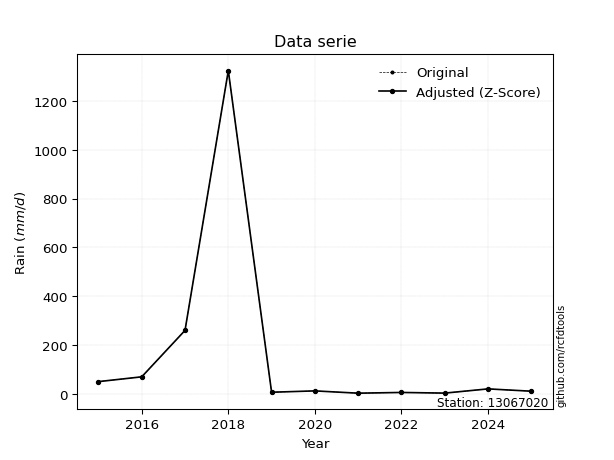</img>

</div>

> If Z-Score is active, values out of range or outliers are replaced with the station mean value.


### 4. Active continuous probability distributions from SciPy (45 of 104 available)

[scipy.stats](https://docs.scipy.org/doc/scipy/reference/stats.html) is a Python´s powerful submodule within the SciPy library for comprehensive statistical analysis, offering over 130 probability distributions (like Normal, Poisson), functions for descriptive stats (mean, variance), hypothesis testing (t-tests, chi-square), random variable generation, and statistical tests, making it essential for data science, modeling, and research. It provides tools to explore, model, and draw conclusions from data efficiently, working seamlessly with NumPy.

<div align="center">

|   id | p_dist             |   n_parameter | fit_method   | label                                                                       | active   | ref                                                                                                        |
|-----:|:-------------------|--------------:|:-------------|:----------------------------------------------------------------------------|:---------|:-----------------------------------------------------------------------------------------------------------|
|    0 | alpha              |             3 | MLE          | Alpha                                                                       | True     | [:mortar_board:](https://docs.scipy.org/doc/scipy/reference/generated/scipy.stats.alpha.html)              |
|    1 | betaprime          |             4 | MLE          | Beta prime                                                                  | True     | [:mortar_board:](https://docs.scipy.org/doc/scipy/reference/generated/scipy.stats.betaprime.html)          |
|    2 | chi2               |             3 | MLE          | Chi²                                                                        | True     | [:mortar_board:](https://docs.scipy.org/doc/scipy/reference/generated/scipy.stats.chi2.html)               |
|    3 | crystalball        |             4 | MLE          | Crystalball                                                                 | True     | [:mortar_board:](https://docs.scipy.org/doc/scipy/reference/generated/scipy.stats.crystalball.html)        |
|    4 | erlang             |             3 | MLE          | Erlang                                                                      | True     | [:mortar_board:](https://docs.scipy.org/doc/scipy/reference/generated/scipy.stats.erlang.html)             |
|    5 | expon              |             2 | MLE          | Exponential                                                                 | True     | [:mortar_board:](https://docs.scipy.org/doc/scipy/reference/generated/scipy.stats.expon.html)              |
|    6 | exponnorm          |             3 | MLE          | Exponentially modified Normal                                               | True     | [:mortar_board:](https://docs.scipy.org/doc/scipy/reference/generated/scipy.stats.exponnorm.html)          |
|    7 | f                  |             4 | MLE          | F                                                                           | True     | [:mortar_board:](https://docs.scipy.org/doc/scipy/reference/generated/scipy.stats.f.html)                  |
|    8 | fatiguelife        |             3 | MLE          | Fatigue-life (Birnbaum-Saunders)                                            | True     | [:mortar_board:](https://docs.scipy.org/doc/scipy/reference/generated/scipy.stats.fatiguelife.html)        |
|    9 | fisk               |             3 | MLE          | Fisk                                                                        | True     | [:mortar_board:](https://docs.scipy.org/doc/scipy/reference/generated/scipy.stats.fisk.html)               |
|   10 | gamma              |             3 | MLE          | Gamma                                                                       | True     | [:mortar_board:](https://docs.scipy.org/doc/scipy/reference/generated/scipy.stats.gamma.html)              |
|   11 | genexpon           |             5 | MLE          | Generalized exponential                                                     | True     | [:mortar_board:](https://docs.scipy.org/doc/scipy/reference/generated/scipy.stats.genexpon.html)           |
|   12 | genlogistic        |             3 | MLE          | Generalized logistic                                                        | True     | [:mortar_board:](https://docs.scipy.org/doc/scipy/reference/generated/scipy.stats.genlogistic.html)        |
|   13 | gibrat             |             2 | MM           | Gibrat                                                                      | True     | [:mortar_board:](https://docs.scipy.org/doc/scipy/reference/generated/scipy.stats.gibrat.html)             |
|   14 | gompertz           |             3 | MLE          | Gompertz (or truncated Gumbel)                                              | True     | [:mortar_board:](https://docs.scipy.org/doc/scipy/reference/generated/scipy.stats.gompertz.html)           |
|   15 | gumbel_l           |             2 | MM           | Gumbel Left Skew                                                            | True     | [:mortar_board:](https://docs.scipy.org/doc/scipy/reference/generated/scipy.stats.gumbel_l.html)           |
|   16 | gumbel_r           |             2 | MM           | Gumbel Right Skew                                                           | True     | [:mortar_board:](https://docs.scipy.org/doc/scipy/reference/generated/scipy.stats.gumbel_r.html)           |
|   17 | halflogistic       |             2 | MM           | Half-logistic                                                               | True     | [:mortar_board:](https://docs.scipy.org/doc/scipy/reference/generated/scipy.stats.halflogistic.html)       |
|   18 | halfnorm           |             2 | MM           | Half Normal                                                                 | True     | [:mortar_board:](https://docs.scipy.org/doc/scipy/reference/generated/scipy.stats.halfnorm.html)           |
|   19 | hypsecant          |             2 | MM           | hyperbolic secant                                                           | True     | [:mortar_board:](https://docs.scipy.org/doc/scipy/reference/generated/scipy.stats.hypsecant.html)          |
|   20 | invgamma           |             3 | MLE          | Inverted gamma                                                              | True     | [:mortar_board:](https://docs.scipy.org/doc/scipy/reference/generated/scipy.stats.invgamma.html)           |
|   21 | invgauss           |             3 | MLE          | Inverse Gaussian                                                            | True     | [:mortar_board:](https://docs.scipy.org/doc/scipy/reference/generated/scipy.stats.invgauss.html)           |
|   22 | invweibull         |             3 | MLE          | Inverted Weibull                                                            | True     | [:mortar_board:](https://docs.scipy.org/doc/scipy/reference/generated/scipy.stats.invweibull.html)         |
|   23 | johnsonsu          |             4 | MLE          | Johnson Su                                                                  | True     | [:mortar_board:](https://docs.scipy.org/doc/scipy/reference/generated/scipy.stats.johnsonsu.html)          |
|   24 | kstwobign          |             2 | MLE          | Limiting distribution of scaled Kolmogorov-Smirnov two-sided test statistic | True     | [:mortar_board:](https://docs.scipy.org/doc/scipy/reference/generated/scipy.stats.kstwobign.html)          |
|   25 | laplace            |             2 | MM           | Laplace                                                                     | True     | [:mortar_board:](https://docs.scipy.org/doc/scipy/reference/generated/scipy.stats.laplace.html)            |
|   26 | laplace_asymmetric |             3 | MLE          | Asymmetric Laplace                                                          | True     | [:mortar_board:](https://docs.scipy.org/doc/scipy/reference/generated/scipy.stats.laplace_asymmetric.html) |
|   27 | loggamma           |             3 | MLE          | Log gamma                                                                   | True     | [:mortar_board:](https://docs.scipy.org/doc/scipy/reference/generated/scipy.stats.loggamma.html)           |
|   28 | logistic           |             2 | MM           | Logistic (or Sech-squared)                                                  | True     | [:mortar_board:](https://docs.scipy.org/doc/scipy/reference/generated/scipy.stats.logistic.html)           |
|   29 | lognorm            |             3 | MLE          | Log Normal                                                                  | True     | [:mortar_board:](https://docs.scipy.org/doc/scipy/reference/generated/scipy.stats.lognorm.html)            |
|   30 | maxwell            |             2 | MM           | Maxwell                                                                     | True     | [:mortar_board:](https://docs.scipy.org/doc/scipy/reference/generated/scipy.stats.maxwell.html)            |
|   31 | mielke             |             4 | MLE          | Mielke Beta-Kappa / Dagum                                                   | True     | [:mortar_board:](https://docs.scipy.org/doc/scipy/reference/generated/scipy.stats.mielke.html)             |
|   32 | moyal              |             2 | MM           | Moyal                                                                       | True     | [:mortar_board:](https://docs.scipy.org/doc/scipy/reference/generated/scipy.stats.moyal.html)              |
|   33 | nakagami           |             3 | MLE          | Nakagami                                                                    | True     | [:mortar_board:](https://docs.scipy.org/doc/scipy/reference/generated/scipy.stats.nakagami.html)           |
|   34 | ncf                |             5 | MLE          | Non-central F distribution                                                  | True     | [:mortar_board:](https://docs.scipy.org/doc/scipy/reference/generated/scipy.stats.ncf.html)                |
|   35 | nct                |             4 | MLE          | Non-central Student’s t                                                     | True     | [:mortar_board:](https://docs.scipy.org/doc/scipy/reference/generated/scipy.stats.nct.html)                |
|   36 | norm               |             2 | MM           | Normal                                                                      | True     | [:mortar_board:](https://docs.scipy.org/doc/scipy/reference/generated/scipy.stats.norm.html)               |
|   37 | pareto             |             3 | MLE          | Pareto                                                                      | True     | [:mortar_board:](https://docs.scipy.org/doc/scipy/reference/generated/scipy.stats.pareto.html)             |
|   38 | pearson3           |             3 | MM           | Pearson type III                                                            | True     | [:mortar_board:](https://docs.scipy.org/doc/scipy/reference/generated/scipy.stats.pearson3.html)           |
|   39 | rayleigh           |             2 | MM           | Rayleigh                                                                    | True     | [:mortar_board:](https://docs.scipy.org/doc/scipy/reference/generated/scipy.stats.rayleigh.html)           |
|   40 | rice               |             3 | MLE          | Rice                                                                        | True     | [:mortar_board:](https://docs.scipy.org/doc/scipy/reference/generated/scipy.stats.rice.html)               |
|   41 | t                  |             3 | MLE          | Student’s t                                                                 | True     | [:mortar_board:](https://docs.scipy.org/doc/scipy/reference/generated/scipy.stats.t.html)                  |
|   42 | truncnorm          |             4 | MLE          | Truncated normal                                                            | True     | [:mortar_board:](https://docs.scipy.org/doc/scipy/reference/generated/scipy.stats.truncnorm.html)          |
|   43 | wald               |             2 | MM           | Wald                                                                        | True     | [:mortar_board:](https://docs.scipy.org/doc/scipy/reference/generated/scipy.stats.wald.html)               |
|   44 | weibull_min        |             3 | MLE          | Weibull minimum                                                             | True     | [:mortar_board:](https://docs.scipy.org/doc/scipy/reference/generated/scipy.stats.weibull_min.html)        |

</div>

> **n_parameter:** # arguments & localization & scale.
>
> **Fit methods:** (MLE) maximum likelihood, (MM) L-moments.
>
>**Inactive:** foldnorm, gennorm, norminvgauss, powernorm, powerlognorm, skewnorm, genextreme, anglit, arcsine, argus, beta, bradford, burr, burr12, cauchy, cosine, halfcauchy, foldcauchy, skewcauchy, wrapcauchy, dgamma, gengamma, exponweib, exponpow, truncexpon, gausshyper, genhalflogistic, genhyperbolic, geninvgauss, halfgennorm, johnsonsb, kappa4, kappa3, ksone, kstwo, loglaplace, levy, levy_l, levy_stable, ncx2, genpareto, truncpareto, lomax, powerlaw, rdist, rel_breitwigner, recipinvgauss, semicircular, studentized_range, trapezoid, triang, truncweibull_min, tukeylambda, uniform, loguniform, vonmises, vonmises_line, weibull_max, dweibull, 


## B. Probability distributions vs. Empirical distributions

A continuous probability distribution (CPD) describes probabilities for variables that can take any value within a range (like rain any time), unlike discrete variables with specific outcomes (like temperature). It uses a Probability Density Function (PDF), a curve where the total area under it equals 1, and the probability of the variable falling within an interval (a to b) is found by calculating the area under the curve between those points. A key feature is that the probability of hitting any single exact value is zero, so probabilities are always expressed for ranges, e.g., $P(a ≤ X ≤ b)$.

<div align="center">

Distributions parameters
|    |   station | p_dist                |   n |              loc |           scale | shape                 | shape1                 | shape2                 | shape3   |
|---:|----------:|:----------------------|----:|-----------------:|----------------:|:----------------------|:-----------------------|:-----------------------|:---------|
|  0 |  13067020 | alpha                 |  11 |      -0.00939953 |     4.92502     | 8.856519897251433e-10 |                        |                        |          |
|  1 |  13067020 | betaprime             |  11 |       0.453081   |     0.011792    | 273.62461518393445    | 0.5388746605263128     |                        |          |
|  2 |  13067020 | chi2                  |  11 |       2.2        |   661.927       | 0.4377475773975772    |                        |                        |          |
|  3 |  13067020 | crystalball           |  11 |     159.891      |   375.352       | 13755.24023736274     | 1728.442199852464      |                        |          |
|  4 |  13067020 | erlang                |  11 |       2.2        |   507.525       | 0.21549790141712416   |                        |                        |          |
|  5 |  13067020 | expon                 |  11 |       2.2        |   157.691       |                       |                        |                        |          |
|  6 |  13067020 | exponnorm             |  11 |       2.09002    |     0.0335863   | 4673.3818411143075    |                        |                        |          |
|  7 |  13067020 | f                     |  11 |       2.2        |     8.39079     | 0.811527485541325     | 1.2212431123593874     |                        |          |
|  8 |  13067020 | fatiguelife           |  11 |       1.96423    |    17.1205      | 4.262229041728736     |                        |                        |          |
|  9 |  13067020 | fisk                  |  11 |       2.2        |    11.3961      | 0.7799563116816874    |                        |                        |          |
| 10 |  13067020 | gamma                 |  11 |       2.2        |  1285.3         | 0.21583783501734727   |                        |                        |          |
| 11 |  13067020 | genexpon              |  11 |       2.2        |   327.359       | 2.07595223361064      | 3.8823683735060844e-13 | 1.1591541406507049     |          |
| 12 |  13067020 | genlogistic           |  11 |   -1093.06       |   139.357       | 3462.6572465759546    |                        |                        |          |
| 13 |  13067020 | gibrat                |  11 |    -126.455      |   173.678       |                       |                        |                        |          |
| 14 |  13067020 | gompertz              |  11 |       2.2        |     1.67452e+10 | 114258812.09257415    |                        |                        |          |
| 15 |  13067020 | gumbel_l              |  11 |     328.819      |   292.66        |                       |                        |                        |          |
| 16 |  13067020 | gumbel_r              |  11 |      -9.03725    |   292.66        |                       |                        |                        |          |
| 17 |  13067020 | halflogistic          |  11 |    -284.988      |   320.912       |                       |                        |                        |          |
| 18 |  13067020 | halfnorm              |  11 |    -336.927      |   622.669       |                       |                        |                        |          |
| 19 |  13067020 | hypsecant             |  11 |     159.891      |   238.956       |                       |                        |                        |          |
| 20 |  13067020 | invgamma              |  11 |       1.58937    |     1.24614     | 0.4067486251835463    |                        |                        |          |
| 21 |  13067020 | invgauss              |  11 |       1.22346    |     4.3361      | 36.592238356153445    |                        |                        |          |
| 22 |  13067020 | invweibull            |  11 |       2.14184    |     2.49244     | 0.3747745290017661    |                        |                        |          |
| 23 |  13067020 | johnsonsu             |  11 |       2.2        |     1.80886e-09 | -3.457776948569437    | 0.17335785232958334    |                        |          |
| 24 |  13067020 | kstwobign             |  11 |    -648.063      |   970.369       |                       |                        |                        |          |
| 25 |  13067020 | laplace               |  11 |     159.891      |   265.414       |                       |                        |                        |          |
| 26 |  13067020 | laplace_asymmetric    |  11 |       2.2        |     0.00145398  | 9.22043098468544e-06  |                        |                        |          |
| 27 |  13067020 | loggamma              |  11 | -206120          | 24770.5         | 4137.38875908602      |                        |                        |          |
| 28 |  13067020 | logistic              |  11 |     159.891      |   206.942       |                       |                        |                        |          |
| 29 |  13067020 | lognorm               |  11 |       2.2        |     0.555848    | 11.20731838645599     |                        |                        |          |
| 30 |  13067020 | maxwell               |  11 |    -729.535      |   557.365       |                       |                        |                        |          |
| 31 |  13067020 | mielke                |  11 |       1.4159     |     0.000273461 | 210.5008894661874     | 0.5966048632127543     |                        |          |
| 32 |  13067020 | moyal                 |  11 |     -54.7592     |   168.968       |                       |                        |                        |          |
| 33 |  13067020 | nakagami              |  11 |       2.2        |   667.597       | 0.10474618234980348   |                        |                        |          |
| 34 |  13067020 | ncf                   |  11 |       1.81334    |     4.11709     | 4.32654601596008      | 0.8598899329655044     | 9.951982632954048e-08  |          |
| 35 |  13067020 | nct                   |  11 |       0.188616   |     0.773353    | 0.4741051222090985    | 6.089360403464733      |                        |          |
| 36 |  13067020 | norm                  |  11 |     159.891      |   375.352       |                       |                        |                        |          |
| 37 |  13067020 | pareto                |  11 |      -0.23108    |     2.43108     | 0.45622822285854364   |                        |                        |          |
| 38 |  13067020 | pearson3              |  11 |     159.891      |   375.352       | 2.6745811146360605    |                        |                        |          |
| 39 |  13067020 | rayleigh              |  11 |    -558.178      |   572.936       |                       |                        |                        |          |
| 40 |  13067020 | rice                  |  11 |    -327.871      |   435.201       | 0.0001965715178834384 |                        |                        |          |
| 41 |  13067020 | t                     |  11 |       5.87592    |     3.4209      | 0.4048775331806428    |                        |                        |          |
| 42 |  13067020 | truncnorm             |  11 |   -2311.39       |   704.358       | 3.2846833133342583    | 827.789600778505       |                        |          |
| 43 |  13067020 | wald                  |  11 |    -215.461      |   375.352       |                       |                        |                        |          |
| 44 |  13067020 | weibull_min           |  11 |       2.2        |   322.258       | 0.28752610833116354   |                        |                        |          |
| 45 |  13067020 | logalpha              |  11 |      -3.48058    |    23.0373      | 3.8091020056175777    |                        |                        |          |
| 46 |  13067020 | logbetaprime          |  11 |       0.788457   |     7.53997     | 0.24047347628657456   | 3.3242161747682526     |                        |          |
| 47 |  13067020 | logchi2               |  11 |       0.788457   |     1.02013     | 1.533307887230552     |                        |                        |          |
| 48 |  13067020 | logcrystalball        |  11 |       3.04945    |     1.9093      | 1526.9649981991022    | 28.775226505093748     |                        |          |
| 49 |  13067020 | logerlang             |  11 |       0.788457   |     2.84628     | 0.5601968557619212    |                        |                        |          |
| 50 |  13067020 | logexpon              |  11 |       0.788457   |     2.26099     |                       |                        |                        |          |
| 51 |  13067020 | logexponnorm          |  11 |       0.785857   |     0.000806305 | 2803.335969444908     |                        |                        |          |
| 52 |  13067020 | logf                  |  11 |       0.788457   |     1.79016     | 0.9438169029070447    | 13.259555639757707     |                        |          |
| 53 |  13067020 | logfatiguelife        |  11 |       0.210061   |     2.15795     | 0.7893256740489338    |                        |                        |          |
| 54 |  13067020 | logfisk               |  11 |       0.376142   |     2.07765     | 2.033459679890303     |                        |                        |          |
| 55 |  13067020 | loggamma              |  11 |       0.788457   |     2.85148     | 0.2534006732980771    |                        |                        |          |
| 56 |  13067020 | loggenexpon           |  11 |       0.788453   |     0.043926    | 0.019423013707436494  | 4.857065407703975e-07  | 1.6346740916116684     |          |
| 57 |  13067020 | loggenlogistic        |  11 |      -7.5065     |     1.41806     | 925.8996836915198     |                        |                        |          |
| 58 |  13067020 | loggibrat             |  11 |       1.59292    |     0.883435    |                       |                        |                        |          |
| 59 |  13067020 | loggompertz           |  11 |       0.788457   |     8.13323     | 2.780556116083231     |                        |                        |          |
| 60 |  13067020 | loggumbel_l           |  11 |       3.90873    |     1.48868     |                       |                        |                        |          |
| 61 |  13067020 | loggumbel_r           |  11 |       2.19016    |     1.48868     |                       |                        |                        |          |
| 62 |  13067020 | loghalflogistic       |  11 |       0.786482   |     1.63238     |                       |                        |                        |          |
| 63 |  13067020 | loghalfnorm           |  11 |       0.522281   |     3.16733     |                       |                        |                        |          |
| 64 |  13067020 | loghypsecant          |  11 |       3.04945    |     1.2155      |                       |                        |                        |          |
| 65 |  13067020 | loginvgamma           |  11 |      -0.93801    |    15.497       | 4.832257222173208     |                        |                        |          |
| 66 |  13067020 | loginvgauss           |  11 |      -0.044066   |     6.01695     | 0.5141333650247997    |                        |                        |          |
| 67 |  13067020 | loginvweibull         |  11 |      -4.10892    |     6.1386      | 4.795300535431761     |                        |                        |          |
| 68 |  13067020 | logjohnsonsu          |  11 |       0.123199   |     0.0359825   | -6.8182095748209495   | 1.4032687719211423     |                        |          |
| 69 |  13067020 | logkstwobign          |  11 |      -2.84084    |     6.77277     |                       |                        |                        |          |
| 70 |  13067020 | loglaplace            |  11 |       3.04945    |     1.35008     |                       |                        |                        |          |
| 71 |  13067020 | loglaplace_asymmetric |  11 |       1.64866    |     1.11603     | 0.5528235742660385    |                        |                        |          |
| 72 |  13067020 | logloggamma           |  11 |    -657.491      |    86.7384      | 2029.6948326150527    |                        |                        |          |
| 73 |  13067020 | loglogistic           |  11 |       3.04945    |     1.05265     |                       |                        |                        |          |
| 74 |  13067020 | loglognorm            |  11 |       0.788457   |     0.0565457   | 10.756464227960228    |                        |                        |          |
| 75 |  13067020 | logmaxwell            |  11 |      -1.47479    |     2.83515     |                       |                        |                        |          |
| 76 |  13067020 | logmielke             |  11 |       0.788457   |     3.65806     | 0.5632647889767395    | 3.1581648581409674     |                        |          |
| 77 |  13067020 | logmoyal              |  11 |       1.95759    |     0.859487    |                       |                        |                        |          |
| 78 |  13067020 | lognakagami           |  11 |       0.788457   |     2.98614     | 0.10225641430069422   |                        |                        |          |
| 79 |  13067020 | logncf                |  11 |      -0.106454   |     2.86504     | 7.292753233917752     | 20.76362160854294      | 6.4402590388448416e-09 |          |
| 80 |  13067020 | lognct                |  11 |      -1.79875    |     0.191582    | 4.223124784134731     | 20.705852697750196     |                        |          |
| 81 |  13067020 | lognorm               |  11 |       3.04945    |     1.9093      |                       |                        |                        |          |
| 82 |  13067020 | logpareto             |  11 |       0.788429   |     2.80387e-05 | 0.10003944061644515   |                        |                        |          |
| 83 |  13067020 | logpearson3           |  11 |       3.04945    |     1.9093      | 0.8089571757391354    |                        |                        |          |
| 84 |  13067020 | lograyleigh           |  11 |      -0.603157   |     2.91436     |                       |                        |                        |          |
| 85 |  13067020 | logrice               |  11 |      -0.127108   |     2.62068     | 0.0004067347267380952 |                        |                        |          |
| 86 |  13067020 | logt                  |  11 |       3.04944    |     1.9093      | 2858022076.091939     |                        |                        |          |
| 87 |  13067020 | logtruncnorm          |  11 |      -2.37781    |     3.98789     | 0.7939708710935773    | 7.240052302949557      |                        |          |
| 88 |  13067020 | logwald               |  11 |       1.14011    |     1.90933     |                       |                        |                        |          |
| 89 |  13067020 | logweibull_min        |  11 |       0.788457   |     3.58191     | 0.5354575930688106    |                        |                        |          |

</div>

> **loc** (Location parameter): This shifts the distribution along the x-axis. For many common distributions, like the normal (Gaussian) distribution, loc represents the mean $μ$. For others, like the uniform distribution, it might represent the minimum value, or for the beta distribution, the left end of the support interval.
>
> **scale** (Scale parameter): This determines the width or spread of the distribution. For the normal distribution, scale represents the standard deviation $σ$. For a uniform distribution, it defines the length of the interval (from $loc$ to $loc + scale$).
>
> **shape** (Shape parameters): Refers to parameters that define the specific form of a probability distribution, distinct from its location (loc) and scale (scale). These parameters are required arguments for most distribution functions. For example, a normal (Gaussian) distribution is fully defined by its location (mean) and scale (standard deviation), so it has no specific shape parameters beyond loc and scale. However, other distributions have intrinsic properties that need specification, as Gamma distribution that takes a shape parameter, often named $a$ or $alpha$.


### 0. Cumulative distribution values - CDF (90 evaluated)

> Ordered by x ascending and calculating $log(f(x))$ separately. 

|   id |   Station |   date |       x |   count |    mean |     std |    zscore |   Value_initial |   station |   m |     alpha |   alpha_pdf |   betaprime |   betaprime_pdf |        chi2 |    chi2_pdf |   crystalball |   crystalball_pdf |      erlang |   erlang_pdf |      expon |   expon_pdf |   exponnorm |   exponnorm_pdf |           f |       f_pdf |   fatiguelife |   fatiguelife_pdf |        fisk |      fisk_pdf |       gamma |   gamma_pdf |    genexpon |   genexpon_pdf |   genlogistic |   genlogistic_pdf |   gibrat |   gibrat_pdf |    gompertz |   gompertz_pdf |   gumbel_l |   gumbel_l_pdf |   gumbel_r |   gumbel_r_pdf |   halflogistic |   halflogistic_pdf |   halfnorm |   halfnorm_pdf |   hypsecant |   hypsecant_pdf |   invgamma |   invgamma_pdf |   invgauss |   invgauss_pdf |   invweibull |   invweibull_pdf |   johnsonsu |    johnsonsu_pdf |   kstwobign |   kstwobign_pdf |   laplace |   laplace_pdf |   laplace_asymmetric |   laplace_asymmetric_pdf |    loggamma |   loggamma_pdf |   logistic |   logistic_pdf |   lognorm |   lognorm_pdf |   maxwell |   maxwell_pdf |   mielke |   mielke_pdf |    moyal |   moyal_pdf |    nakagami |   nakagami_pdf |       ncf |     ncf_pdf |       nct |     nct_pdf |     norm |    norm_pdf |      pareto |   pareto_pdf |   pearson3 |   pearson3_pdf |   rayleigh |   rayleigh_pdf |     rice |    rice_pdf |        t |       t_pdf |   truncnorm |   truncnorm_pdf |     wald |    wald_pdf |   weibull_min |   weibull_min_pdf |   logalpha |   logalpha_pdf |   logbetaprime |   logbetaprime_pdf |     logchi2 |   logchi2_pdf |   logcrystalball |   logcrystalball_pdf |   logerlang |   logerlang_pdf |   logexpon |   logexpon_pdf |   logexponnorm |   logexponnorm_pdf |        logf |    logf_pdf |   logfatiguelife |   logfatiguelife_pdf |   logfisk |   logfisk_pdf |   loggenexpon |   loggenexpon_pdf |   loggenlogistic |   loggenlogistic_pdf |   loggibrat |   loggibrat_pdf |   loggompertz |   loggompertz_pdf |   loggumbel_l |   loggumbel_l_pdf |   loggumbel_r |   loggumbel_r_pdf |   loghalflogistic |   loghalflogistic_pdf |   loghalfnorm |   loghalfnorm_pdf |   loghypsecant |   loghypsecant_pdf |   loginvgamma |   loginvgamma_pdf |   loginvgauss |   loginvgauss_pdf |   loginvweibull |   loginvweibull_pdf |   logjohnsonsu |   logjohnsonsu_pdf |   logkstwobign |   logkstwobign_pdf |   loglaplace |   loglaplace_pdf |   loglaplace_asymmetric |   loglaplace_asymmetric_pdf |   logloggamma |   logloggamma_pdf |   loglogistic |   loglogistic_pdf |   loglognorm |   loglognorm_pdf |   logmaxwell |   logmaxwell_pdf |   logmielke |   logmielke_pdf |   logmoyal |   logmoyal_pdf |   lognakagami |   lognakagami_pdf |    logncf |   logncf_pdf |    lognct |   lognct_pdf |   logpareto |   logpareto_pdf |   logpearson3 |   logpearson3_pdf |   lograyleigh |   lograyleigh_pdf |   logrice |   logrice_pdf |     logt |   logt_pdf |   logtruncnorm |   logtruncnorm_pdf |   logwald |   logwald_pdf |   logweibull_min |   logweibull_min_pdf |
|-----:|----------:|-------:|--------:|--------:|--------:|--------:|----------:|----------------:|----------:|----:|----------:|------------:|------------:|----------------:|------------:|------------:|--------------:|------------------:|------------:|-------------:|-----------:|------------:|------------:|----------------:|------------:|------------:|--------------:|------------------:|------------:|--------------:|------------:|------------:|------------:|---------------:|--------------:|------------------:|---------:|-------------:|------------:|---------------:|-----------:|---------------:|-----------:|---------------:|---------------:|-------------------:|-----------:|---------------:|------------:|----------------:|-----------:|---------------:|-----------:|---------------:|-------------:|-----------------:|------------:|-----------------:|------------:|----------------:|----------:|--------------:|---------------------:|-------------------------:|------------:|---------------:|-----------:|---------------:|----------:|--------------:|----------:|--------------:|---------:|-------------:|---------:|------------:|------------:|---------------:|----------:|------------:|----------:|------------:|---------:|------------:|------------:|-------------:|-----------:|---------------:|-----------:|---------------:|---------:|------------:|---------:|------------:|------------:|----------------:|---------:|------------:|--------------:|------------------:|-----------:|---------------:|---------------:|-------------------:|------------:|--------------:|-----------------:|---------------------:|------------:|----------------:|-----------:|---------------:|---------------:|-------------------:|------------:|------------:|-----------------:|---------------------:|----------:|--------------:|--------------:|------------------:|-----------------:|---------------------:|------------:|----------------:|--------------:|------------------:|--------------:|------------------:|--------------:|------------------:|------------------:|----------------------:|--------------:|------------------:|---------------:|-------------------:|--------------:|------------------:|--------------:|------------------:|----------------:|--------------------:|---------------:|-------------------:|---------------:|-------------------:|-------------:|-----------------:|------------------------:|----------------------------:|--------------:|------------------:|--------------:|------------------:|-------------:|-----------------:|-------------:|-----------------:|------------:|----------------:|-----------:|---------------:|--------------:|------------------:|----------:|-------------:|----------:|-------------:|------------:|----------------:|--------------:|------------------:|--------------:|------------------:|----------:|--------------:|---------:|-----------:|---------------:|-------------------:|----------:|--------------:|-----------------:|---------------------:|
|    0 |  13067020 |   2021 |    2.2  |      11 | 159.891 | 393.672 | -0.400564 |            2.2  |  13067020 |   1 | 0.0258058 | 0.0671116   |   0.0615193 |     0.0764051   | 9.90362e-05 | 4.8811e+10  |      0.337201 |       0.000973075 | 0.000140443 |  6.81509e+10 | 0          |  0.00634152 | 0.000700453 |     0.00636315  | 1.60613e-07 | 1.46752e+08 |     0.0243184 |       0.245456    | 1.59028e-13 | 279.302       | 0.000113318 | 5.50753e+10 | 4.55374e-13 |     0.00634152 |      0.262709 |       0.00251941  | 0.382063 |  0.00296436  | 5.37325e-10 |    0.00682338  |   0.279332 |    0.000806648 |   0.382001 |    0.0012561   |       0.419805 |        0.00128347  |   0.413995 |     0.00110477 |    0.303714 |     0.00108674  |  0.0320169 |    0.130434    |  0.0360705 |    0.0960646   |    0.0167517 |      0.44145     | 0.000422684 | 116569           |    0.239774 |     0.00165731  |  0.276021 |   0.00103996  |          9.94091e-11 |              0.0063415   | 7.66996e-05 |    1.75061e+11 |   0.318211 |    0.00104837  |  0.118167 |     0.103639  |  0.368293 |   0.00104222  |      nan |          nan | 0.398173 | 0.00139604  | 0.000129401 |    6.10429e+10 | 0.0292013 | 0.119658    | 0.0478444 | 0.0763936   | 0.337201 | 0.000973074 | 1.11022e-16 |  0.187665    |   0.470186 |    0.00182198  |   0.380177 |    0.00105812  | 0.249946 | 0.00130713  | 0.310293 | 0.0287016   | 8.63421e-10 |     0.00503849  | 0.431026 | 0.00206713  |   7.32101e-06 |       4.73998e+09 |  0.0562319 |      0.143099  |    0.000128033 |        2.77318e+11 | 3.67916e-13 |  2540.61      |         0.118167 |            0.103639  | 7.22075e-10 |     3.64345e+06 |  0         |      0.442284  |     0.00114993 |          0.441623  | 1.74669e-08 | 7.42443e+07 |        0.0366306 |            0.21515   | 0.0359673 |     0.171004  |   1.84453e-06 |         0.442175  |        0.0696715 |            0.130697  |  0          |       0         |   1.08383e-12 |         0.341876  |      0.115689 |       0.0730332   |     0.0769945 |         0.132611  |        0.00060504 |             0.3063    |     0.0669737 |         0.251023  |      0.0983022 |          0.0795946 |     0.0483271 |         0.15786   |     0.0404929 |         0.186917  |       0.0521179 |           0.15076   |      0.0399748 |          0.181413  |      0.0637038 |          0.133271  |    0.0936814 |        0.0693895 |               0.0580565 |                   0.0940993 |      0.119752 |         0.102842  |      0.104528 |         0.0889199 |  0.000821241 |      2.35274e+12 |     0.112147 |        0.130407  | 4.96686e-10 |     2.51991e+06 |  0.0483661 |      0.13055   |   0.000363683 |       6.69936e+11 | 0.0558741 |    0.16251   | 0.0514488 |    0.154271  |    0        |   3567.9        |     0.0946514 |         0.137422  |      0.107746 |         0.146191  | 0.0592019 |     0.125417  | 0.118168 |  0.10364   |     1.9631e-11 |          0.341716  |  0        |     0         |       1.4464e-09 |          6.97595e+06 |
|    1 |  13067020 |   2023 |    2.5  |      11 | 159.891 | 393.672 | -0.399802 |            2.5  |  13067020 |   2 | 0.0496892 | 0.0909444   |   0.0848276 |     0.0783913   | 0.174421    | 0.12723     |      0.337493 |       0.000973401 | 0.2204      |  0.158242    | 0.00190065 |  0.00632947 | 0.00260856  |     0.00635437  | 0.166004    | 0.220751    |     0.0994371 |       0.223094    | 0.0553628   |   0.135967    | 0.179921    | 0.129421    | 0.00190065  |     0.00632947 |      0.263465 |       0.00252123  | 0.382952 |  0.00295953  | 0.00204492  |    0.00680943  |   0.279574 |    0.000807204 |   0.382378 |    0.00125605  |       0.42019  |        0.00128297  |   0.414327 |     0.00110448 |    0.30404  |     0.00108753  |  0.0744662 |    0.145615    |  0.0671287 |    0.108301    |    0.126308  |      0.273461    | 0.477456    |      0.230164    |    0.240271 |     0.00165811  |  0.276333 |   0.00104114  |          0.00190064  |              0.00632945  | 0.498213    |    0.952826    |   0.318526 |    0.00104893  |  0.131945 |     0.11194   |  0.368606 |   0.00104234  |      nan |          nan | 0.398592 | 0.00139569  | 0.165438    |    0.115527    | 0.0675948 | 0.131125    | 0.0720047 | 0.0836418   | 0.337493 | 0.000973401 | 0.0517029   |  0.158414    |   0.470732 |    0.00181894  |   0.380495 |    0.00105815  | 0.250338 | 0.00130764  | 0.319285 | 0.0312962   | 0.00151049  |     0.00503145  | 0.431645 | 0.00206449  |   0.125783    |       0.112632    |  0.0763124 |      0.170929  |    0.529833    |        0.949609    | 0.126116    |     0.729873  |         0.131945 |            0.11194   | 0.19448     |     0.827998    |  0.0549701 |      0.417972  |     0.0560719  |          0.417604  | 0.22118     | 0.796739    |        0.0681364 |            0.273662  | 0.06069   |     0.214609  |   0.0549597   |         0.417884  |        0.0876307 |            0.150253  |  0          |       0         |   0.0430924   |         0.332326  |      0.125384 |       0.0787092   |     0.09508   |         0.150286  |        0.0397395  |             0.305817  |     0.0989998 |         0.249969  |      0.109002  |          0.0879346 |     0.0708012 |         0.193235  |     0.0675497 |         0.234447  |       0.0734712 |           0.183047  |      0.0662084 |          0.227339  |      0.082024  |          0.153211  |    0.102985  |        0.0762808 |               0.0714224 |                   0.115763  |      0.133415 |         0.110936  |      0.116453 |         0.097745  |  0.530223    |      0.289299    |     0.129452 |        0.140266  | 0.151197    |     0.666194    |  0.0668539 |      0.158648  |   0.437453    |       0.699735    | 0.0784469 |    0.190065  | 0.0733141 |    0.187457  |    0.569515 |      0.336813   |     0.113086  |         0.150894  |      0.12708  |         0.156162  | 0.0761983 |     0.140346  | 0.131945 |  0.11194   |     0.0431242  |          0.332958  |  0        |     0         |       0.154526   |          0.594459    |
|    2 |  13067020 |   2022 |    5.2  |      11 | 159.891 | 393.672 | -0.392944 |            5.2  |  13067020 |   3 | 0.344449  | 0.0926161   |   0.265274  |     0.0525591   | 0.288611    | 0.0210174   |      0.340125 |       0.000976316 | 0.36166     |  0.0258529   | 0.0188447  |  0.00622202 | 0.0196186   |     0.006246    | 0.399382    | 0.0463382   |     0.33081   |       0.0359434   | 0.260962    |   0.050141    | 0.295636    | 0.021229    | 0.0188447   |     0.00622202 |      0.270294 |       0.00253697  | 0.390884 |  0.00291615  | 0.0202621   |    0.00668513  |   0.28176  |    0.000812213 |   0.385769 |    0.00125556  |       0.423648 |        0.00127842  |   0.417305 |     0.00110186 |    0.306986 |     0.0010946   |  0.334729  |    0.0583508   |  0.304533  |    0.0623936   |    0.396054  |      0.0449544   | 0.634062    |      0.021739    |    0.244758 |     0.00166512  |  0.279158 |   0.00105179  |          0.0188447   |              0.006222    | 0.769131    |    0.177549    |   0.321365 |    0.00105387  |  0.231576 |     0.159644  |  0.371421 |   0.00104337  |      nan |          nan | 0.402356 | 0.00139242  | 0.267996    |    0.0187143   | 0.314459  | 0.0584334   | 0.273354  | 0.0575582   | 0.340125 | 0.000976316 | 0.306995    |  0.0582147   |   0.475607 |    0.00179199  |   0.383352 |    0.00105834  | 0.253875 | 0.0013121   | 0.451051 | 0.0693778   | 0.0150102   |     0.00496845  | 0.437187 | 0.00204082  |   0.229428    |       0.0192478   |  0.247557  |      0.276815  |    0.789286    |        0.161238    | 0.469016    |     0.326703  |         0.231576 |            0.159644  | 0.517944    |     0.276786    |  0.316449  |      0.302324  |     0.317309   |          0.30203   | 0.51057     | 0.237679    |        0.302493  |            0.313678  | 0.269555  |     0.314635  |   0.316392    |         0.302282  |        0.233788  |            0.239417  |  0.00286277 |       0.157354  |   0.266697    |         0.278666  |      0.196767 |       0.118224    |     0.237233  |         0.229271  |        0.258112   |             0.285894  |     0.277877  |         0.236474  |      0.194772  |          0.150427  |     0.261203  |         0.295535  |     0.283061  |         0.308641  |       0.256732  |           0.290741  |      0.278511  |          0.308772  |      0.228193  |          0.234589  |    0.177159  |        0.131221  |               0.234077  |                   0.379397  |      0.231897 |         0.157572  |      0.20904  |         0.157072  |  0.599892    |      0.0417574   |     0.250284 |        0.186177  | 0.441679    |     0.286253    |  0.231354  |      0.271427  |   0.645543    |       0.152301    | 0.255102  |    0.270364  | 0.259336  |    0.292388  |    0.644256 |      0.0413709  |     0.247228  |         0.209041  |      0.258073 |         0.196702  | 0.205124  |     0.205521  | 0.231577 |  0.159644  |     0.268159   |          0.281309  |  0.129812 |     0.553398  |       0.372419   |          0.182       |
|    3 |  13067020 |   2019 |    6.1  |      11 | 159.891 | 393.672 | -0.390657 |            6.1  |  13067020 |   4 | 0.420163  | 0.076074    |   0.308979  |     0.0448385   | 0.305632    | 0.0171111   |      0.341004 |       0.000977279 | 0.382577    |  0.0210064   | 0.0244286  |  0.00618661 | 0.0252239   |     0.00621029  | 0.43681     | 0.0374553   |     0.35866   |       0.0267716   | 0.302305    |   0.042181    | 0.312821    | 0.0172693   | 0.0244286   |     0.00618661 |      0.27258  |       0.00254196  | 0.393502 |  0.00290175  | 0.0262602   |    0.0066442   |   0.282492 |    0.000813885 |   0.386899 |    0.00125537  |       0.424798 |        0.0012769   |   0.418296 |     0.00110098 |    0.307972 |     0.00109695  |  0.381173  |    0.0457073   |  0.355203  |    0.0508038   |    0.431343  |      0.0343415   | 0.651034    |      0.0164467   |    0.246257 |     0.00166738  |  0.280106 |   0.00105536  |          0.0244285   |              0.00618659  | 0.794984    |    0.147847    |   0.322314 |    0.0010555   |  0.257827 |     0.169151  |  0.37236  |   0.00104371  |      nan |          nan | 0.403609 | 0.00139131  | 0.283138    |    0.015209    | 0.361338  | 0.0464825   | 0.32066   | 0.04795     | 0.341004 | 0.000977279 | 0.353817    |  0.046565    |   0.477216 |    0.00178317  |   0.384304 |    0.00105839  | 0.255056 | 0.00131357  | 0.516544 | 0.0734661   | 0.0194724   |     0.00494761  | 0.439021 | 0.00203298  |   0.245004    |       0.0156434   |  0.292315  |      0.282973  |    0.81261     |        0.132487    | 0.518181    |     0.290351  |         0.257827 |            0.169151  | 0.559313    |     0.242814    |  0.363044  |      0.281715  |     0.363859   |          0.281436  | 0.546044    | 0.208007    |        0.351292  |            0.297325  | 0.319391  |     0.308652  |   0.362982    |         0.281681  |        0.272881  |            0.249741  |  0.0790554  |       0.684102  |   0.310272    |         0.267302  |      0.216443 |       0.128382    |     0.274605  |         0.238403  |        0.303145   |             0.278152  |     0.315274  |         0.231979  |      0.220097  |          0.166988  |     0.308437  |         0.295234  |     0.331607  |         0.298861  |       0.30343   |           0.293261  |      0.327204  |          0.30048   |      0.266333  |          0.242687  |    0.199395  |        0.147691  |               0.292308  |                   0.350553  |      0.257804 |         0.166921  |      0.235218 |         0.170893  |  0.605994    |      0.0350761   |     0.280567 |        0.193016  | 0.485495    |     0.26348     |  0.275389  |      0.279286  |   0.6682      |       0.132556    | 0.298455  |    0.272061  | 0.306208  |    0.29382   |    0.650263 |      0.0343062  |     0.281193  |         0.216142  |      0.289883 |         0.201615  | 0.238677  |     0.214541  | 0.257828 |  0.169151  |     0.312158   |          0.26995   |  0.219008 |     0.55184   |       0.39971    |          0.160849    |
|    4 |  13067020 |   2025 |    7.8  |      11 | 159.891 | 393.672 | -0.386339 |            7.8  |  13067020 |   5 | 0.528267  | 0.0528139   |   0.375487  |     0.0341345   | 0.330742    | 0.0128821   |      0.342667 |       0.000979084 | 0.413354    |  0.0157628   | 0.0348893  |  0.00612027 | 0.0357245   |     0.00614339  | 0.491046    | 0.0273481   |     0.395552  |       0.017783    | 0.364899    |   0.0322773   | 0.338149    | 0.0129865   | 0.0348894   |     0.00612027 |      0.276909 |       0.00255103  | 0.398412 |  0.00287466  | 0.0374901   |    0.00656757  |   0.283878 |    0.000817044 |   0.389033 |    0.00125498  |       0.426966 |        0.00127402  |   0.420167 |     0.00109932 |    0.30984  |     0.00110137  |  0.445477  |    0.0314363   |  0.428233  |    0.0363844   |    0.479283  |      0.0233479   | 0.673945    |      0.0111566   |    0.249096 |     0.00167155  |  0.281906 |   0.00106214  |          0.0348892   |              0.00612025  | 0.827089    |    0.115437    |   0.324111 |    0.00105857  |  0.301078 |     0.1824    |  0.374135 |   0.00104432  |      nan |          nan | 0.405972 | 0.00138917  | 0.305432    |    0.0114259   | 0.427331  | 0.0325326   | 0.390455  | 0.0351496   | 0.342667 | 0.000979084 | 0.420266    |  0.0329335   |   0.480233 |    0.00176675  |   0.386104 |    0.00105848  | 0.257292 | 0.00131629  | 0.623371 | 0.0493364   | 0.02785     |     0.00490846  | 0.442464 | 0.00201824  |   0.267911    |       0.011722    |  0.361986  |      0.281896  |    0.841131    |        0.101649    | 0.583734    |     0.244742  |         0.301078 |            0.1824    | 0.613812    |     0.202542    |  0.428668  |      0.252691  |     0.429416   |          0.252432  | 0.592733    | 0.173664    |        0.420996  |            0.269519  | 0.393068  |     0.289105  |   0.428598    |         0.252666  |        0.335501  |            0.258237  |  0.257855   |       0.70029   |   0.373862    |         0.250105  |      0.250019 |       0.144944    |     0.33431   |         0.246057  |        0.369876   |             0.264396  |     0.371357  |         0.224106  |      0.264381  |          0.193349  |     0.379929  |         0.284682  |     0.40257   |         0.277567  |       0.37489   |           0.286186  |      0.398748  |          0.280488  |      0.326882  |          0.248659  |    0.239218  |        0.177188  |               0.373446  |                   0.310361  |      0.300485 |         0.180013  |      0.279783 |         0.191425  |  0.613698    |      0.0281053   |     0.329057 |        0.200943  | 0.546648    |     0.235046    |  0.344461  |      0.280675  |   0.697959    |       0.110915    | 0.364887  |    0.267041  | 0.377635  |    0.285436  |    0.657737 |      0.0270521  |     0.33526   |         0.222883  |      0.340109 |         0.206455  | 0.292752  |     0.224618  | 0.301079 |  0.1824    |     0.376379   |          0.252555  |  0.345967 |     0.474958  |       0.436115   |          0.136672    |
|    5 |  13067020 |   2020 |   11.6  |      11 | 159.891 | 393.672 | -0.376686 |           11.6  |  13067020 |   6 | 0.6714    | 0.026647    |   0.476742  |     0.0208758   | 0.370254    | 0.00857107  |      0.346395 |       0.000983058 | 0.461554    |  0.0104211   | 0.0578684  |  0.00597455 | 0.058789    |     0.00599644  | 0.571497    | 0.0165833   |     0.445625  |       0.0100236   | 0.462523    |   0.020627    | 0.377947    | 0.00862616  | 0.0578684   |     0.00597455 |      0.286639 |       0.00256966  | 0.409221 |  0.00281459  | 0.0621261   |    0.00639947  |   0.286996 |    0.000824118 |   0.3938   |    0.00125397  |       0.431795 |        0.00126756  |   0.424337 |     0.0010956  |    0.314044 |     0.00111116  |  0.533658  |    0.0173322   |  0.532165  |    0.0207072   |    0.545175  |      0.013105    | 0.705616    |      0.00635711  |    0.255464 |     0.00168039  |  0.285971 |   0.00107746  |          0.0578682   |              0.00597453  | 0.865697    |    0.0819333   |   0.328146 |    0.00106535  |  0.376975 |     0.198931  |  0.378106 |   0.00104561  |      nan |          nan | 0.411241 | 0.00138422  | 0.340437    |    0.00758698  | 0.519413  | 0.0182367   | 0.491945  | 0.0203955   | 0.346395 | 0.000983058 | 0.514188    |  0.0187338   |   0.486878 |    0.00173106  |   0.390126 |    0.0010586   | 0.262305 | 0.00132221  | 0.735304 | 0.0173056   | 0.0463374   |     0.00482197  | 0.450071 | 0.00198559  |   0.30367     |       0.00770887  |  0.47025   |      0.260505  |    0.874763    |        0.0706127   | 0.669218    |     0.189054  |         0.376975 |            0.198931  | 0.684425    |     0.156264    |  0.520647  |      0.21201   |     0.521299   |          0.211782  | 0.653511    | 0.135257    |        0.519068  |            0.225322  | 0.499319  |     0.245011  |   0.52057     |         0.211997  |        0.437957  |            0.254877  |  0.488388   |       0.464723  |   0.467753    |         0.223233  |      0.313128 |       0.173304    |     0.432024  |         0.243563  |        0.469824   |             0.238689  |     0.457437  |         0.209279  |      0.349255  |          0.233054  |     0.486943  |         0.252518  |     0.504831  |         0.237343  |       0.48318   |           0.256909  |      0.502267  |          0.240461  |      0.425224  |          0.24441   |    0.320969  |        0.237741  |               0.48527   |                   0.254969  |      0.375424 |         0.196549  |      0.361581 |         0.219294  |  0.623364    |      0.021233    |     0.410266 |        0.20688   | 0.632307    |     0.197829    |  0.452966  |      0.26285   |   0.737096    |       0.0880994   | 0.467051  |    0.245721  | 0.485378  |    0.255107  |    0.66695  |      0.0200401  |     0.424268  |         0.223701  |      0.422543 |         0.207647  | 0.383618  |     0.231379  | 0.376976 |  0.198931  |     0.471117   |          0.224994  |  0.507068 |     0.341923  |       0.484694   |          0.110034    |
|    6 |  13067020 |   2024 |   19.8  |      11 | 159.891 | 393.672 | -0.355857 |           19.8  |  13067020 |   7 | 0.803654  | 0.0097092   |   0.595151  |     0.0101039   | 0.424264    | 0.00521889  |      0.35449  |       0.000991343 | 0.526853    |  0.0062692   | 0.105608   |  0.00567181 | 0.106698    |     0.00569122  | 0.666842    | 0.0082817   |     0.503831  |       0.00524871  | 0.583945    |   0.0107666   | 0.432247    | 0.00524147  | 0.105608    |     0.00567181 |      0.30785  |       0.00260217  | 0.431778 |  0.00268774  | 0.113161    |    0.00605124  |   0.293817 |    0.000839428 |   0.404071 |    0.00125113  |       0.442132 |        0.00125349  |   0.433288 |     0.00108746 |    0.323241 |     0.00113193  |  0.628596  |    0.00790015  |  0.646105  |    0.00947328  |    0.618728  |      0.00630444  | 0.741944    |      0.00318258  |    0.269315 |     0.0016972   |  0.294944 |   0.00111126  |          0.105607    |              0.00567179  | 0.901701    |    0.0551586   |   0.336941 |    0.00107959  |  0.486679 |     0.20883   |  0.386691 |   0.00104806  |      nan |          nan | 0.422546 | 0.00137282  | 0.388237    |    0.00462087  | 0.619805  | 0.00838144  | 0.604881  | 0.00944155  | 0.35449  | 0.000991343 | 0.617934    |  0.00870194  |   0.500771 |    0.00165849  |   0.398807 |    0.00105855  | 0.273197 | 0.00133415  | 0.812836 | 0.00536607  | 0.0851272   |     0.00464002  | 0.466069 | 0.00191666  |   0.351734    |       0.00459051  |  0.597363  |      0.213245  |    0.905511    |        0.0467167   | 0.755302    |     0.136306  |         0.486679 |            0.20883   | 0.756045    |     0.114556    |  0.621598  |      0.167361  |     0.622138   |          0.16717   | 0.716134    | 0.101463    |        0.625419  |            0.174391  | 0.613845  |     0.184711  |   0.621517    |         0.16736   |        0.567583  |            0.226621  |  0.675528   |       0.258245  |   0.577867    |         0.189079  |      0.416037 |       0.211009    |     0.556532  |         0.219084  |        0.587353   |             0.200632  |     0.563285  |         0.186163  |      0.483309  |          0.261516  |     0.608062  |         0.200379  |     0.617545  |         0.185484  |       0.606808  |           0.204886  |      0.616308  |          0.187186  |      0.550173  |          0.220384  |    0.476934  |        0.353263  |               0.605037  |                   0.195643  |      0.483969 |         0.206968  |      0.484861 |         0.237277  |  0.633166    |      0.0159304   |     0.520211 |        0.202065  | 0.726423    |     0.155194    |  0.582413  |      0.219417  |   0.778673    |       0.0689226   | 0.587869  |    0.205098  | 0.60799   |    0.203063  |    0.676112 |      0.0147464  |     0.540589  |         0.208825  |      0.531498 |         0.197961  | 0.506094  |     0.223855  | 0.48668  |  0.20883   |     0.58184    |          0.189566  |  0.65444  |     0.219737  |       0.536875   |          0.0868767   |
|    7 |  13067020 |   2015 |   49.65 |      11 | 159.891 | 393.672 | -0.280032 |           49.65 |  13067020 |   8 | 0.920999  | 0.00158566  |   0.746584  |     0.00265924  | 0.52501     | 0.00235145  |      0.384493 |       0.00101798  | 0.645783    |  0.00271497  | 0.259852   |  0.00469366 | 0.261404    |     0.00470559  | 0.794203    | 0.00228543  |     0.599085  |       0.00215695  | 0.752601    |   0.00306053  | 0.533242    | 0.00235293  | 0.259852    |     0.00469366 |      0.386349 |       0.0026362   | 0.505537 |  0.00226515  | 0.276583    |    0.00493615  |   0.319709 |    0.000895481 |   0.441182 |    0.00123357  |       0.478769 |        0.00120092  |   0.465294 |     0.00105678 |    0.358098 |     0.0012019   |  0.746674  |    0.00210474  |  0.785267  |    0.0024124   |    0.717982  |      0.00187651  | 0.794258    |      0.00104028  |    0.320613 |     0.00173361  |  0.330053 |   0.00124354  |          0.259851    |              0.00469365  | 0.93983     |    0.0307797   |   0.369884 |    0.00112626  |  0.672958 |     0.188988  |  0.418064 |   0.00105298  |      nan |          nan | 0.462822 | 0.00132395  | 0.477872    |    0.0021088   | 0.744972  | 0.00222262  | 0.744578  | 0.00244384  | 0.384493 | 0.00101798  | 0.74802     |  0.00230469  |   0.546808 |    0.00143557  |   0.430362 |    0.00105479  | 0.313566 | 0.00136823  | 0.881987 | 0.00108996  | 0.21432     |     0.00402917  | 0.519742 | 0.00168449  |   0.43813     |       0.00196275  |  0.754919  |      0.132817  |    0.937668    |        0.0259722   | 0.852243    |     0.0800582 |         0.672958 |            0.188988  | 0.839437    |     0.0711187   |  0.748018  |      0.111448  |     0.748406   |          0.111308  | 0.791864    | 0.0667066   |        0.754774  |            0.111764  | 0.745964  |     0.109198  |   0.747941    |         0.111457  |        0.743625  |            0.155311  |  0.831997   |       0.108621  |   0.727027    |         0.1369    |      0.631197 |       0.247118    |     0.729038  |         0.154767  |        0.742129   |             0.137604  |     0.71448   |         0.142417  |      0.707554  |          0.20815   |     0.755202  |         0.124242  |     0.754716  |         0.117639  |       0.75692   |           0.126137  |      0.753833  |          0.116941  |      0.725714  |          0.160088  |    0.734689  |        0.196515  |               0.749512  |                   0.124078  |      0.669296 |         0.188859  |      0.692697 |         0.202221  |  0.645331    |      0.0111019   |     0.692058 |        0.167446  | 0.839968    |     0.0947087   |  0.747376  |      0.141949  |   0.832189    |       0.0493491   | 0.743523  |    0.135686  | 0.756845  |    0.125237  |    0.687242 |      0.0100393  |     0.711233  |         0.159522  |      0.697724 |         0.160441  | 0.693826  |     0.179751  | 0.672959 |  0.188988  |     0.730468   |          0.135385  |  0.800044 |     0.111873  |       0.604731   |          0.0630349   |
|    8 |  13067020 |   2016 |   69.25 |      11 | 159.891 | 393.672 | -0.230245 |           69.25 |  13067020 |   9 | 0.94331   | 0.000817133 |   0.787106  |     0.00161726  | 0.564804    | 0.00176852  |      0.404591 |       0.00103231  | 0.691186    |  0.00199155  | 0.34636    |  0.00414507 | 0.348107    |     0.0041532   | 0.829131    | 0.00139669  |     0.63562   |       0.00162878  | 0.799346    |   0.00186575  | 0.573032    | 0.00176699  | 0.34636     |     0.00414507 |      0.437687 |       0.00259475  | 0.547524 |  0.00202401  | 0.367141    |    0.00431824  |   0.337622 |    0.000932295 |   0.4652   |    0.00121647  |       0.50196  |        0.00116548  |   0.485803 |     0.00103582 |    0.382054 |     0.00124168  |  0.7791    |    0.00131067  |  0.821994  |    0.0014653   |    0.747454  |      0.00121505  | 0.810902    |      0.000699565 |    0.354659 |     0.00173811  |  0.355349 |   0.00133885  |          0.346359    |              0.00414506  | 0.94914     |    0.025392    |   0.392217 |    0.00115193  |  0.733148 |     0.172158  |  0.438706 |   0.00105289  |      nan |          nan | 0.488412 | 0.00128677  | 0.513745    |    0.00160362  | 0.779139  | 0.00137762  | 0.781918  | 0.00149572  | 0.404591 | 0.00103231  | 0.783379    |  0.00142238  |   0.573743 |    0.00131591  |   0.450987 |    0.00104938  | 0.340536 | 0.00138272  | 0.89839  | 0.000648708 | 0.289711    |     0.00366892  | 0.551402 | 0.00154821  |   0.470987    |       0.00144447  |  0.795184  |      0.109841  |    0.945543    |        0.0215502   | 0.876536    |     0.0664204 |         0.733148 |            0.172158  | 0.86128     |     0.0605119   |  0.7825    |      0.0961969 |     0.782844   |          0.0960719 | 0.812598    | 0.0581851   |        0.78915   |            0.0953284 | 0.779099  |     0.0906277 |   0.782427    |         0.0962079 |        0.791144  |            0.130687  |  0.863578   |       0.0826838 |   0.769778    |         0.120281  |      0.712725 |       0.240699    |     0.776676  |         0.131856  |        0.784558   |             0.117763  |     0.759224  |         0.126602  |      0.770923  |          0.172611  |     0.793005  |         0.103587  |     0.790768  |         0.0995721 |       0.795216  |           0.104687  |      0.789568  |          0.0984067 |      0.775293  |          0.13811   |    0.79264   |        0.153591  |               0.787573  |                   0.105225  |      0.729548 |         0.172648  |      0.755625 |         0.17542   |  0.648835    |      0.00999534  |     0.74492  |        0.150071  | 0.868539    |     0.0774786   |  0.790688  |      0.118933  |   0.847763    |       0.0443971   | 0.785112  |    0.114755  | 0.794889  |    0.104061  |    0.690399 |      0.00897931 |     0.760965  |         0.139442  |      0.748305 |         0.143454  | 0.750177  |     0.158771  | 0.733148 |  0.172158  |     0.772631   |          0.118296  |  0.833419 |     0.089736  |       0.624688   |          0.0570973   |
|    9 |  13067020 |   2017 |  259.7  |      11 | 159.891 | 393.672 |  0.253534 |          259.7  |  13067020 |  10 | 0.98487   | 5.82499e-05 |   0.894585  |     0.000217348 | 0.73974     | 0.000535376 |      0.604845 |       0.00102593  | 0.870616    |  0.000476184 | 0.804646   |  0.00123884 | 0.806258    |     0.00123433  | 0.921111    | 0.000181518 |     0.802295  |       0.000523596 | 0.919213    |   0.000224931 | 0.747148    | 0.00053044  | 0.804646    |     0.00123884 |      0.810031 |       0.00122459  | 0.787866 |  0.000750772 | 0.827442    |    0.00117743  |   0.545993 |    0.00122498  |   0.670847 |    0.000915094 |       0.690366 |        0.000815479 |   0.662026 |     0.00080969 |    0.629249 |     0.00122377  |  0.871358  |    0.000202029 |  0.919804  |    0.000199245 |    0.838755  |      0.000214605 | 0.867466    |      0.000144331 |    0.654362 |     0.00131178  |  0.656716 |   0.00129339  |          0.804645    |              0.00123884  | 0.97306     |    0.012537    |   0.618292 |    0.00114045  |  0.905688 |     0.0880509 |  0.630938 |   0.000933452 |      nan |          nan | 0.693327 | 0.000861418 | 0.680103    |    0.000545554 | 0.87507   | 0.000207088 | 0.883551  | 0.000212728 | 0.604845 | 0.00102593  | 0.881345    |  0.000208262 |   0.751964 |    0.000663042 |   0.639011 |    0.000899436 | 0.59804  | 0.00124699  | 0.942056 | 9.24225e-05 | 0.74341     |     0.00141831  | 0.756042 | 0.000725671 |   0.608408    |       0.000409941 |  0.896366  |      0.0507998 |    0.966259    |        0.0112359   | 0.938894    |     0.0322154 |         0.905688 |            0.0880509 | 0.921005    |     0.0329756   |  0.878782  |      0.0536126 |     0.878995   |          0.053534  | 0.872985    | 0.0355678   |        0.882987  |            0.0514162 | 0.865185  |     0.0457584 |   0.878726    |         0.0536257 |        0.911881  |            0.0593154 |  0.933432   |       0.0325614 |   0.891237    |         0.066852  |      0.951734 |       0.0982727   |     0.901222  |         0.0629621 |        0.898038   |             0.0592779 |     0.88825   |         0.0711243 |      0.919699  |          0.0653661 |     0.890525  |         0.0505527 |     0.887247  |         0.0518071 |       0.892949  |           0.0501456 |      0.88412   |          0.0503744 |      0.907793  |          0.0675248 |    0.922102  |        0.0576988 |               0.889629  |                   0.0546719 |      0.903682 |         0.0895342 |      0.91564  |         0.0733799 |  0.659953    |      0.00714011  |     0.895734 |        0.0797841 | 0.937946    |     0.0334146   |  0.90209   |      0.0566713 |   0.896347    |       0.0302806   | 0.894274  |    0.0565907 | 0.892234  |    0.0500671 |    0.700286 |      0.00628435 |     0.897067  |         0.0706806 |      0.893089 |         0.0775725 | 0.905035  |     0.0786302 | 0.905688 |  0.0880508 |     0.891035   |          0.0646125 |  0.914687 |     0.0408474 |       0.688361   |          0.040778    |
|   10 |  13067020 |   2018 | 1325    |      11 | 159.891 | 393.672 |  2.95959  |         1325    |  13067020 |  11 | 0.997034  | 2.23824e-06 |   0.956075  |     1.7842e-05  | 0.941788    | 6.66844e-05 |      0.999046 |       8.59475e-06 | 0.993376    |  1.61669e-05 | 0.999773   |  1.4424e-06 | 0.999781    |     1.39273e-06 | 0.970523    | 1.35257e-05 |     0.979115  |       3.96573e-05 | 0.976063    |   1.37761e-05 | 0.945264    | 6.41743e-05 | 0.999773    |     1.4424e-06 |      0.999899 |       7.23681e-07 | 0.983128 |  2.88592e-05 | 0.99988     |    8.20486e-07 |   1        |    8.87329e-15 |   0.989575 |    3.54352e-05 |       0.986837 |        4.07466e-05 |   0.992393 |     3.6373e-05 |    0.995143 |     2.03232e-05 |  0.933759  |    2.03454e-05 |  0.975924  |    1.57901e-05 |    0.909162  |      2.4529e-05  | 0.918972    |      1.96721e-05 |    0.999487 |     4.29834e-06 |  0.993798 |   2.33661e-05 |          0.999773    |              1.44244e-06 | 0.987103    |    0.00568479  |   0.996425 |    1.72151e-05 |  0.984928 |     0.0199168 |  0.996476 |   2.17974e-05 |      nan |          nan | 0.98655  | 3.97978e-05 | 0.925903    |    0.000100734 | 0.93803   | 2.01136e-05 | 0.946238  | 1.92396e-05 | 0.999046 | 8.59476e-06 | 0.943567    |  1.94279e-05 |   0.980272 |    4.40821e-05 |   0.995492 |    2.58642e-05 | 0.999262 | 6.43637e-06 | 0.970269 | 9.12544e-06 | 0.999762    |     1.80881e-06 | 0.980689 | 3.95234e-05 |   0.777059    |       7.27293e-05 |  0.950593  |      0.0206962 |    0.979493    |        0.00577067  | 0.973939    |     0.013533  |         0.984928 |            0.0199168 | 0.9595      |     0.016346    |  0.941042  |      0.0260761 |     0.941157   |          0.0260325 | 0.917695    | 0.0208977   |        0.942244  |            0.0247063 | 0.917959  |     0.0224775 |   0.941005    |         0.0260866 |        0.971191  |            0.0200203 |  0.967556   |       0.0129721 |   0.964123    |         0.0269445 |      0.999883 |       0.000708913 |     0.965795  |         0.0225795 |        0.961177   |             0.0233213 |     0.964699  |         0.0274892 |      0.978884  |          0.0173595 |     0.946216  |         0.0221106 |     0.945841  |         0.0238852 |       0.947766  |           0.0215807 |      0.941062  |          0.0233283 |      0.975107  |          0.0217721 |    0.976703  |        0.0172561 |               0.950765  |                   0.0243885 |      0.984617 |         0.0204223 |      0.980785 |         0.0179033 |  0.669906    |      0.00526064  |     0.974888 |        0.0246488 | 0.972259    |     0.0124853   |  0.961978  |      0.022102  |   0.936196    |       0.0194527   | 0.955206  |    0.0231378 | 0.947066  |    0.0216344 |    0.708968 |      0.00454865 |     0.969002  |         0.0242179 |      0.971971 |         0.0257148 | 0.979696  |     0.0216296 | 0.984928 |  0.0199168 |     0.961519   |          0.0263523 |  0.95932  |     0.0176448 |       0.74451    |          0.0291654   |

An Empirical Distribution Function (EDF) is a step-function estimate of a true cumulative distribution function (CDF) based on observed sample data, representing the proportion of data points less than or equal to a given value. It is calculated by ordering your data and jumping up by $1/n$ (where $n$ is sample size) at each unique data point, allowing analysis without assuming an underlying population distribution, and it gets closer to the true CDF as the sample size grows.


### 1. Empirical - EDF California (1923)

California´s estimates the true probability distribution of water-related data (like rainfall, streamflow) using observed samples, crucial for risk assessment.

<div align="center">


$P=m/n$


</div>


**1.1. Empirical values**

<div align="center">

|                | 0                   | 1                   | 2                  | 3                   | 4                   | 5                  | 6                  | 7                  | 8                  | 9                  | 10             |
|:---------------|:--------------------|:--------------------|:-------------------|:--------------------|:--------------------|:-------------------|:-------------------|:-------------------|:-------------------|:-------------------|:---------------|
| date           | 2021                | 2023                | 2022               | 2019                | 2025                | 2020               | 2024               | 2015               | 2016               | 2017               | 2018           |
| x              | 2.2                 | 2.5                 | 5.2                | 6.1                 | 7.8                 | 11.6               | 19.8               | 49.65              | 69.25              | 259.7              | 1325.0         |
| m              | 1                   | 2                   | 3                  | 4                   | 5                   | 6                  | 7                  | 8                  | 9                  | 10                 | 11             |
| empirical_dist | edf_california      | edf_california      | edf_california     | edf_california      | edf_california      | edf_california     | edf_california     | edf_california     | edf_california     | edf_california     | edf_california |
| empirical      | 0.09090909090909091 | 0.18181818181818182 | 0.2727272727272727 | 0.36363636363636365 | 0.45454545454545453 | 0.5454545454545454 | 0.6363636363636364 | 0.7272727272727273 | 0.8181818181818182 | 0.9090909090909091 | 1.0            |
| empirical_tr   | 1.1                 | 1.2222222222222223  | 1.375              | 1.5714285714285714  | 1.8333333333333335  | 2.1999999999999997 | 2.75               | 3.666666666666667  | 5.500000000000002  | 10.999999999999996 | inf            |

</div>


**1.2. Kolmogorov-Smirnov fit test (sorted by Δ)**


<div align="center">

|                | 0                   | 1                   | 2                   | 3                   | 4                   | 5                   | 6                   | 7                   | 8                     | 9                   | 10                  | 11                  | 12                  | 13                  | 14                  | 15                  | 16                  | 17                  | 18                  | 19                  | 20                  | 21                  | 22                  | 23                  | 24                  | 25                  | 26                  | 27                  | 28                  | 29                  | 30                  | 31                  | 32                  | 33                  | 34                  | 35                  | 36                  | 37                  | 38                  | 39                  | 40                  | 41                  | 42                  | 43                  | 44                  | 45                  | 46                  | 47                  | 48                  | 49                  | 50                  | 51                  | 52                  | 53                  | 54                  | 55                  | 56                  | 57                  | 58                  | 59                  | 60                  | 61                  | 62                  | 63                  | 64                  | 65                  | 66                  | 67                  | 68                  | 69                  | 70                  | 71                  | 72                  | 73                  | 74                  | 75                  | 76                  | 77                  | 78                  | 79                  | 80                  | 81                  | 82                  | 83                  | 84                  | 85                  | 86                  | 87                  | 88                  | 89                  |
|:---------------|:--------------------|:--------------------|:--------------------|:--------------------|:--------------------|:--------------------|:--------------------|:--------------------|:----------------------|:--------------------|:--------------------|:--------------------|:--------------------|:--------------------|:--------------------|:--------------------|:--------------------|:--------------------|:--------------------|:--------------------|:--------------------|:--------------------|:--------------------|:--------------------|:--------------------|:--------------------|:--------------------|:--------------------|:--------------------|:--------------------|:--------------------|:--------------------|:--------------------|:--------------------|:--------------------|:--------------------|:--------------------|:--------------------|:--------------------|:--------------------|:--------------------|:--------------------|:--------------------|:--------------------|:--------------------|:--------------------|:--------------------|:--------------------|:--------------------|:--------------------|:--------------------|:--------------------|:--------------------|:--------------------|:--------------------|:--------------------|:--------------------|:--------------------|:--------------------|:--------------------|:--------------------|:--------------------|:--------------------|:--------------------|:--------------------|:--------------------|:--------------------|:--------------------|:--------------------|:--------------------|:--------------------|:--------------------|:--------------------|:--------------------|:--------------------|:--------------------|:--------------------|:--------------------|:--------------------|:--------------------|:--------------------|:--------------------|:--------------------|:--------------------|:--------------------|:--------------------|:--------------------|:--------------------|:--------------------|:--------------------|
| station        | 13067020            | 13067020            | 13067020            | 13067020            | 13067020            | 13067020            | 13067020            | 13067020            | 13067020              | 13067020            | 13067020            | 13067020            | 13067020            | 13067020            | 13067020            | 13067020            | 13067020            | 13067020            | 13067020            | 13067020            | 13067020            | 13067020            | 13067020            | 13067020            | 13067020            | 13067020            | 13067020            | 13067020            | 13067020            | 13067020            | 13067020            | 13067020            | 13067020            | 13067020            | 13067020            | 13067020            | 13067020            | 13067020            | 13067020            | 13067020            | 13067020            | 13067020            | 13067020            | 13067020            | 13067020            | 13067020            | 13067020            | 13067020            | 13067020            | 13067020            | 13067020            | 13067020            | 13067020            | 13067020            | 13067020            | 13067020            | 13067020            | 13067020            | 13067020            | 13067020            | 13067020            | 13067020            | 13067020            | 13067020            | 13067020            | 13067020            | 13067020            | 13067020            | 13067020            | 13067020            | 13067020            | 13067020            | 13067020            | 13067020            | 13067020            | 13067020            | 13067020            | 13067020            | 13067020            | 13067020            | 13067020            | 13067020            | 13067020            | 13067020            | 13067020            | 13067020            | 13067020            | 13067020            | 13067020            | 13067020            |
| empirical_dist | edf_california      | edf_california      | edf_california      | edf_california      | edf_california      | edf_california      | edf_california      | edf_california      | edf_california        | edf_california      | edf_california      | edf_california      | edf_california      | edf_california      | edf_california      | edf_california      | edf_california      | edf_california      | edf_california      | edf_california      | edf_california      | edf_california      | edf_california      | edf_california      | edf_california      | edf_california      | edf_california      | edf_california      | edf_california      | edf_california      | edf_california      | edf_california      | edf_california      | edf_california      | edf_california      | edf_california      | edf_california      | edf_california      | edf_california      | edf_california      | edf_california      | edf_california      | edf_california      | edf_california      | edf_california      | edf_california      | edf_california      | edf_california      | edf_california      | edf_california      | edf_california      | edf_california      | edf_california      | edf_california      | edf_california      | edf_california      | edf_california      | edf_california      | edf_california      | edf_california      | edf_california      | edf_california      | edf_california      | edf_california      | edf_california      | edf_california      | edf_california      | edf_california      | edf_california      | edf_california      | edf_california      | edf_california      | edf_california      | edf_california      | edf_california      | edf_california      | edf_california      | edf_california      | edf_california      | edf_california      | edf_california      | edf_california      | edf_california      | edf_california      | edf_california      | edf_california      | edf_california      | edf_california      | edf_california      | edf_california      |
| p_dist         | loghalfnorm         | betaprime           | logncf              | logalpha            | invgamma            | loginvweibull       | lognct              | nct                 | loglaplace_asymmetric | loginvgamma         | logfatiguelife      | ncf                 | loginvgauss         | invgauss            | logmoyal            | logjohnsonsu        | loggenlogistic      | loggumbel_r         | logfisk             | logpearson3         | lograyleigh         | invweibull          | logexponnorm        | fisk                | f                   | logexpon            | loggenexpon         | erlang              | logkstwobign        | pareto              | logmaxwell          | logtruncnorm        | loggompertz         | loghalflogistic     | logrice             | logt                | logcrystalball      | lognorm             | lognorm             | logmielke           | logloggamma         | logwald             | fatiguelife         | loglogistic         | alpha               | loghypsecant        | logchi2             | t                   | loglaplace          | loggumbel_l         | logf                | gamma               | logerlang           | chi2                | logweibull_min      | loggibrat           | gibrat              | nakagami            | halflogistic        | moyal               | halfnorm            | wald                | weibull_min         | loglognorm          | gumbel_r            | johnsonsu           | rayleigh            | lognakagami         | pearson3            | maxwell             | genlogistic         | logpareto           | crystalball         | norm                | logistic            | hypsecant           | laplace             | kstwobign           | rice                | gumbel_l            | loggamma            | loggamma            | logbetaprime        | gompertz            | exponnorm           | genexpon            | expon               | laplace_asymmetric  | truncnorm           | mielke              |
| delta          | 0.08801708224272858 | 0.09699055236021166 | 0.10337128969623442 | 0.1055057806611308  | 0.10735194283893416 | 0.10834699035503553 | 0.10850407499516032 | 0.10981352055189919 | 0.11039575525324904   | 0.11101701615392791 | 0.11368183121049844 | 0.11422336541547805 | 0.1142684834365395  | 0.1146895040368202  | 0.1149642468499907  | 0.11560974394950724 | 0.11904444854926849 | 0.1202353918418324  | 0.12112819629815211 | 0.12118638476709054 | 0.1229112144511798  | 0.12332675216729327 | 0.12574623713350747 | 0.12645535654704312 | 0.12665496235839235 | 0.12684812324053085 | 0.1268584540139959  | 0.12699592843451712 | 0.12766392887153039 | 0.13011528913795795 | 0.1351883937700356  | 0.13869397594305197 | 0.13872580933486275 | 0.1420786711305353  | 0.16183620671159465 | 0.16847881086854172 | 0.16847955605466447 | 0.1684795722277153  | 0.1684795722277153  | 0.16895136342597017 | 0.1700302102213182  | 0.18181818181818182 | 0.1825622727667312  | 0.18387356313057313 | 0.19372577609518804 | 0.19619935577150005 | 0.19628823131303408 | 0.219384381939445   | 0.2244858473793725  | 0.23232681744910227 | 0.23784274035099529 | 0.24514984348742375 | 0.2452167246055652  | 0.2533773258554046  | 0.255490392659911   | 0.28458096037494357 | 0.2911542595458646  | 0.3044364935161127  | 0.3288960992811988  | 0.329769518572554   | 0.33237897020023904 | 0.34011647529238087 | 0.34719507416595186 | 0.3484052374309701  | 0.3529822436886121  | 0.36133471151605323 | 0.36719491795130654 | 0.37281537941897047 | 0.3792768868239954  | 0.37947608124425697 | 0.380495072085133   | 0.38769728900302575 | 0.4135913007373242  | 0.41359131676403277 | 0.4259644756482877  | 0.43612771474230405 | 0.46283297926410294 | 0.46352234650205276 | 0.47764626189262865 | 0.48055994755569753 | 0.4964040212585402  | 0.4964040212585402  | 0.5165590442150633  | 0.5232029116562658  | 0.5296660930370066  | 0.5307559263532823  | 0.5307559719143744  | 0.5307562804256353  | 0.5512364303075595  | nan                 |
| deltao         | 0.37613735880099997 | 0.37613735880099997 | 0.37613735880099997 | 0.37613735880099997 | 0.37613735880099997 | 0.37613735880099997 | 0.37613735880099997 | 0.37613735880099997 | 0.37613735880099997   | 0.37613735880099997 | 0.37613735880099997 | 0.37613735880099997 | 0.37613735880099997 | 0.37613735880099997 | 0.37613735880099997 | 0.37613735880099997 | 0.37613735880099997 | 0.37613735880099997 | 0.37613735880099997 | 0.37613735880099997 | 0.37613735880099997 | 0.37613735880099997 | 0.37613735880099997 | 0.37613735880099997 | 0.37613735880099997 | 0.37613735880099997 | 0.37613735880099997 | 0.37613735880099997 | 0.37613735880099997 | 0.37613735880099997 | 0.37613735880099997 | 0.37613735880099997 | 0.37613735880099997 | 0.37613735880099997 | 0.37613735880099997 | 0.37613735880099997 | 0.37613735880099997 | 0.37613735880099997 | 0.37613735880099997 | 0.37613735880099997 | 0.37613735880099997 | 0.37613735880099997 | 0.37613735880099997 | 0.37613735880099997 | 0.37613735880099997 | 0.37613735880099997 | 0.37613735880099997 | 0.37613735880099997 | 0.37613735880099997 | 0.37613735880099997 | 0.37613735880099997 | 0.37613735880099997 | 0.37613735880099997 | 0.37613735880099997 | 0.37613735880099997 | 0.37613735880099997 | 0.37613735880099997 | 0.37613735880099997 | 0.37613735880099997 | 0.37613735880099997 | 0.37613735880099997 | 0.37613735880099997 | 0.37613735880099997 | 0.37613735880099997 | 0.37613735880099997 | 0.37613735880099997 | 0.37613735880099997 | 0.37613735880099997 | 0.37613735880099997 | 0.37613735880099997 | 0.37613735880099997 | 0.37613735880099997 | 0.37613735880099997 | 0.37613735880099997 | 0.37613735880099997 | 0.37613735880099997 | 0.37613735880099997 | 0.37613735880099997 | 0.37613735880099997 | 0.37613735880099997 | 0.37613735880099997 | 0.37613735880099997 | 0.37613735880099997 | 0.37613735880099997 | 0.37613735880099997 | 0.37613735880099997 | 0.37613735880099997 | 0.37613735880099997 | 0.37613735880099997 | 0.37613735880099997 |
| eval           | Δo > Δ              | Δo > Δ              | Δo > Δ              | Δo > Δ              | Δo > Δ              | Δo > Δ              | Δo > Δ              | Δo > Δ              | Δo > Δ                | Δo > Δ              | Δo > Δ              | Δo > Δ              | Δo > Δ              | Δo > Δ              | Δo > Δ              | Δo > Δ              | Δo > Δ              | Δo > Δ              | Δo > Δ              | Δo > Δ              | Δo > Δ              | Δo > Δ              | Δo > Δ              | Δo > Δ              | Δo > Δ              | Δo > Δ              | Δo > Δ              | Δo > Δ              | Δo > Δ              | Δo > Δ              | Δo > Δ              | Δo > Δ              | Δo > Δ              | Δo > Δ              | Δo > Δ              | Δo > Δ              | Δo > Δ              | Δo > Δ              | Δo > Δ              | Δo > Δ              | Δo > Δ              | Δo > Δ              | Δo > Δ              | Δo > Δ              | Δo > Δ              | Δo > Δ              | Δo > Δ              | Δo > Δ              | Δo > Δ              | Δo > Δ              | Δo > Δ              | Δo > Δ              | Δo > Δ              | Δo > Δ              | Δo > Δ              | Δo > Δ              | Δo > Δ              | Δo > Δ              | Δo > Δ              | Δo > Δ              | Δo > Δ              | Δo > Δ              | Δo > Δ              | Δo > Δ              | Δo > Δ              | Δo > Δ              | Δo > Δ              | Δo > Δ              | Δo <= Δ             | Δo <= Δ             | Δo <= Δ             | Δo <= Δ             | Δo <= Δ             | Δo <= Δ             | Δo <= Δ             | Δo <= Δ             | Δo <= Δ             | Δo <= Δ             | Δo <= Δ             | Δo <= Δ             | Δo <= Δ             | Δo <= Δ             | Δo <= Δ             | Δo <= Δ             | Δo <= Δ             | Δo <= Δ             | Δo <= Δ             | Δo <= Δ             | Δo <= Δ             | Δo <= Δ             |
| fit            | 1                   | 1                   | 1                   | 1                   | 1                   | 1                   | 1                   | 1                   | 1                     | 1                   | 1                   | 1                   | 1                   | 1                   | 1                   | 1                   | 1                   | 1                   | 1                   | 1                   | 1                   | 1                   | 1                   | 1                   | 1                   | 1                   | 1                   | 1                   | 1                   | 1                   | 1                   | 1                   | 1                   | 1                   | 1                   | 1                   | 1                   | 1                   | 1                   | 1                   | 1                   | 1                   | 1                   | 1                   | 1                   | 1                   | 1                   | 1                   | 1                   | 1                   | 1                   | 1                   | 1                   | 1                   | 1                   | 1                   | 1                   | 1                   | 1                   | 1                   | 1                   | 1                   | 1                   | 1                   | 1                   | 1                   | 1                   | 1                   | 0                   | 0                   | 0                   | 0                   | 0                   | 0                   | 0                   | 0                   | 0                   | 0                   | 0                   | 0                   | 0                   | 0                   | 0                   | 0                   | 0                   | 0                   | 0                   | 0                   | 0                   | 0                   |
| n              | 11                  | 11                  | 11                  | 11                  | 11                  | 11                  | 11                  | 11                  | 11                    | 11                  | 11                  | 11                  | 11                  | 11                  | 11                  | 11                  | 11                  | 11                  | 11                  | 11                  | 11                  | 11                  | 11                  | 11                  | 11                  | 11                  | 11                  | 11                  | 11                  | 11                  | 11                  | 11                  | 11                  | 11                  | 11                  | 11                  | 11                  | 11                  | 11                  | 11                  | 11                  | 11                  | 11                  | 11                  | 11                  | 11                  | 11                  | 11                  | 11                  | 11                  | 11                  | 11                  | 11                  | 11                  | 11                  | 11                  | 11                  | 11                  | 11                  | 11                  | 11                  | 11                  | 11                  | 11                  | 11                  | 11                  | 11                  | 11                  | 11                  | 11                  | 11                  | 11                  | 11                  | 11                  | 11                  | 11                  | 11                  | 11                  | 11                  | 11                  | 11                  | 11                  | 11                  | 11                  | 11                  | 11                  | 11                  | 11                  | 11                  | 11                  |
| best_fit       | 1                   | 0                   | 0                   | 0                   | 0                   | 0                   | 0                   | 0                   | 0                     | 0                   | 0                   | 0                   | 0                   | 0                   | 0                   | 0                   | 0                   | 0                   | 0                   | 0                   | 0                   | 0                   | 0                   | 0                   | 0                   | 0                   | 0                   | 0                   | 0                   | 0                   | 0                   | 0                   | 0                   | 0                   | 0                   | 0                   | 0                   | 0                   | 0                   | 0                   | 0                   | 0                   | 0                   | 0                   | 0                   | 0                   | 0                   | 0                   | 0                   | 0                   | 0                   | 0                   | 0                   | 0                   | 0                   | 0                   | 0                   | 0                   | 0                   | 0                   | 0                   | 0                   | 0                   | 0                   | 0                   | 0                   | 0                   | 0                   | 0                   | 0                   | 0                   | 0                   | 0                   | 0                   | 0                   | 0                   | 0                   | 0                   | 0                   | 0                   | 0                   | 0                   | 0                   | 0                   | 0                   | 0                   | 0                   | 0                   | 0                   | 0                   |
| best_fit_sort  | 1                   | 2                   | 3                   | 4                   | 5                   | 6                   | 7                   | 8                   | 9                     | 10                  | 11                  | 12                  | 13                  | 14                  | 15                  | 16                  | 17                  | 18                  | 19                  | 20                  | 21                  | 22                  | 23                  | 24                  | 25                  | 26                  | 27                  | 28                  | 29                  | 30                  | 31                  | 32                  | 33                  | 34                  | 35                  | 36                  | 37                  | 38                  | 39                  | 40                  | 41                  | 42                  | 43                  | 44                  | 45                  | 46                  | 47                  | 48                  | 49                  | 50                  | 51                  | 52                  | 53                  | 54                  | 55                  | 56                  | 57                  | 58                  | 59                  | 60                  | 61                  | 62                  | 63                  | 64                  | 65                  | 66                  | 67                  | 68                  | 69                  | 70                  | 71                  | 72                  | 73                  | 74                  | 75                  | 76                  | 77                  | 78                  | 79                  | 80                  | 81                  | 82                  | 83                  | 84                  | 85                  | 86                  | 87                  | 88                  | 89                  | 90                  |

</div>


<div align="center">

</img>

</div>


**1.3. Best fit**

<div align="center">

|   id |   station | empirical_dist   | p_dist      |     delta |   deltao | eval   |   fit |   n |   best_fit |   best_fit_sort |
|-----:|----------:|:-----------------|:------------|----------:|---------:|:-------|------:|----:|-----------:|----------------:|
|    0 |  13067020 | edf_california   | loghalfnorm | 0.0880171 | 0.376137 | Δo > Δ |     1 |  11 |          1 |               1 |

</div>


<div align="center">

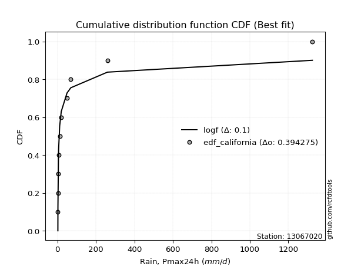</img>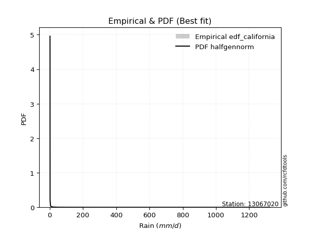</img>

</div>


### 2. Empirical - EDF Hazen (1930)

Hazen method for plotting positions is a formula used to estimate the empirical cumulative probability distribution of flood events or other hydrological data. This formula often results in biased estimations, particularly when extrapolating to extreme events (high return periods).

<div align="center">


$P=(m-0.5)/n$


</div>


**2.1. Empirical values**

<div align="center">

|                | 0                    | 1                   | 2                   | 3                  | 4                  | 5         | 6                  | 7                  | 8                  | 9                  | 10                 |
|:---------------|:---------------------|:--------------------|:--------------------|:-------------------|:-------------------|:----------|:-------------------|:-------------------|:-------------------|:-------------------|:-------------------|
| date           | 2021                 | 2023                | 2022                | 2019               | 2025               | 2020      | 2024               | 2015               | 2016               | 2017               | 2018               |
| x              | 2.2                  | 2.5                 | 5.2                 | 6.1                | 7.8                | 11.6      | 19.8               | 49.65              | 69.25              | 259.7              | 1325.0             |
| m              | 1                    | 2                   | 3                   | 4                  | 5                  | 6         | 7                  | 8                  | 9                  | 10                 | 11                 |
| empirical_dist | edf_hazen            | edf_hazen           | edf_hazen           | edf_hazen          | edf_hazen          | edf_hazen | edf_hazen          | edf_hazen          | edf_hazen          | edf_hazen          | edf_hazen          |
| empirical      | 0.045454545454545456 | 0.13636363636363635 | 0.22727272727272727 | 0.3181818181818182 | 0.4090909090909091 | 0.5       | 0.5909090909090909 | 0.6818181818181818 | 0.7727272727272727 | 0.8636363636363636 | 0.9545454545454546 |
| empirical_tr   | 1.0476190476190477   | 1.1578947368421053  | 1.2941176470588236  | 1.4666666666666666 | 1.6923076923076925 | 2.0       | 2.4444444444444446 | 3.1428571428571423 | 4.3999999999999995 | 7.333333333333334  | 22.00000000000002  |

</div>


**2.2. Kolmogorov-Smirnov fit test (sorted by Δ)**


<div align="center">

|                | 0                   | 1                    | 2                   | 3                   | 4                     | 5                   | 6                   | 7                   | 8                   | 9                   | 10                  | 11                  | 12                  | 13                  | 14                  | 15                  | 16                  | 17                  | 18                  | 19                  | 20                  | 21                  | 22                  | 23                  | 24                  | 25                  | 26                  | 27                  | 28                  | 29                  | 30                  | 31                  | 32                  | 33                  | 34                  | 35                  | 36                  | 37                  | 38                  | 39                  | 40                  | 41                  | 42                  | 43                  | 44                  | 45                  | 46                  | 47                  | 48                  | 49                  | 50                  | 51                  | 52                  | 53                  | 54                  | 55                  | 56                  | 57                  | 58                  | 59                  | 60                  | 61                  | 62                  | 63                  | 64                  | 65                  | 66                  | 67                  | 68                  | 69                  | 70                  | 71                  | 72                  | 73                  | 74                  | 75                  | 76                  | 77                  | 78                  | 79                  | 80                  | 81                  | 82                  | 83                  | 84                  | 85                  | 86                  | 87                  | 88                  | 89                  |
|:---------------|:--------------------|:---------------------|:--------------------|:--------------------|:----------------------|:--------------------|:--------------------|:--------------------|:--------------------|:--------------------|:--------------------|:--------------------|:--------------------|:--------------------|:--------------------|:--------------------|:--------------------|:--------------------|:--------------------|:--------------------|:--------------------|:--------------------|:--------------------|:--------------------|:--------------------|:--------------------|:--------------------|:--------------------|:--------------------|:--------------------|:--------------------|:--------------------|:--------------------|:--------------------|:--------------------|:--------------------|:--------------------|:--------------------|:--------------------|:--------------------|:--------------------|:--------------------|:--------------------|:--------------------|:--------------------|:--------------------|:--------------------|:--------------------|:--------------------|:--------------------|:--------------------|:--------------------|:--------------------|:--------------------|:--------------------|:--------------------|:--------------------|:--------------------|:--------------------|:--------------------|:--------------------|:--------------------|:--------------------|:--------------------|:--------------------|:--------------------|:--------------------|:--------------------|:--------------------|:--------------------|:--------------------|:--------------------|:--------------------|:--------------------|:--------------------|:--------------------|:--------------------|:--------------------|:--------------------|:--------------------|:--------------------|:--------------------|:--------------------|:--------------------|:--------------------|:--------------------|:--------------------|:--------------------|:--------------------|:--------------------|
| station        | 13067020            | 13067020             | 13067020            | 13067020            | 13067020              | 13067020            | 13067020            | 13067020            | 13067020            | 13067020            | 13067020            | 13067020            | 13067020            | 13067020            | 13067020            | 13067020            | 13067020            | 13067020            | 13067020            | 13067020            | 13067020            | 13067020            | 13067020            | 13067020            | 13067020            | 13067020            | 13067020            | 13067020            | 13067020            | 13067020            | 13067020            | 13067020            | 13067020            | 13067020            | 13067020            | 13067020            | 13067020            | 13067020            | 13067020            | 13067020            | 13067020            | 13067020            | 13067020            | 13067020            | 13067020            | 13067020            | 13067020            | 13067020            | 13067020            | 13067020            | 13067020            | 13067020            | 13067020            | 13067020            | 13067020            | 13067020            | 13067020            | 13067020            | 13067020            | 13067020            | 13067020            | 13067020            | 13067020            | 13067020            | 13067020            | 13067020            | 13067020            | 13067020            | 13067020            | 13067020            | 13067020            | 13067020            | 13067020            | 13067020            | 13067020            | 13067020            | 13067020            | 13067020            | 13067020            | 13067020            | 13067020            | 13067020            | 13067020            | 13067020            | 13067020            | 13067020            | 13067020            | 13067020            | 13067020            | 13067020            |
| empirical_dist | edf_hazen           | edf_hazen            | edf_hazen           | edf_hazen           | edf_hazen             | edf_hazen           | edf_hazen           | edf_hazen           | edf_hazen           | edf_hazen           | edf_hazen           | edf_hazen           | edf_hazen           | edf_hazen           | edf_hazen           | edf_hazen           | edf_hazen           | edf_hazen           | edf_hazen           | edf_hazen           | edf_hazen           | edf_hazen           | edf_hazen           | edf_hazen           | edf_hazen           | edf_hazen           | edf_hazen           | edf_hazen           | edf_hazen           | edf_hazen           | edf_hazen           | edf_hazen           | edf_hazen           | edf_hazen           | edf_hazen           | edf_hazen           | edf_hazen           | edf_hazen           | edf_hazen           | edf_hazen           | edf_hazen           | edf_hazen           | edf_hazen           | edf_hazen           | edf_hazen           | edf_hazen           | edf_hazen           | edf_hazen           | edf_hazen           | edf_hazen           | edf_hazen           | edf_hazen           | edf_hazen           | edf_hazen           | edf_hazen           | edf_hazen           | edf_hazen           | edf_hazen           | edf_hazen           | edf_hazen           | edf_hazen           | edf_hazen           | edf_hazen           | edf_hazen           | edf_hazen           | edf_hazen           | edf_hazen           | edf_hazen           | edf_hazen           | edf_hazen           | edf_hazen           | edf_hazen           | edf_hazen           | edf_hazen           | edf_hazen           | edf_hazen           | edf_hazen           | edf_hazen           | edf_hazen           | edf_hazen           | edf_hazen           | edf_hazen           | edf_hazen           | edf_hazen           | edf_hazen           | edf_hazen           | edf_hazen           | edf_hazen           | edf_hazen           | edf_hazen           |
| p_dist         | loghalfnorm         | logncf               | nct                 | betaprime           | loglaplace_asymmetric | logmoyal            | logjohnsonsu        | loginvgauss         | logalpha            | loginvgamma         | loggenlogistic      | loggumbel_r         | lognct              | loginvweibull       | logfatiguelife      | logfisk             | logpearson3         | lograyleigh         | fisk                | logkstwobign        | pareto              | ncf                 | loggenexpon         | logexpon            | logmaxwell          | logexponnorm        | logtruncnorm        | loggompertz         | loghalflogistic     | invgauss            | invgamma            | logrice             | logt                | logcrystalball      | lognorm             | lognorm             | logloggamma         | erlang              | logwald             | fatiguelife         | loglogistic         | loghypsecant        | invweibull          | f                   | loglaplace          | loggumbel_l         | gamma               | chi2                | logweibull_min      | logmielke           | loggibrat           | alpha               | logchi2             | nakagami            | t                   | logf                | logerlang           | weibull_min         | maxwell             | rayleigh            | genlogistic         | gumbel_r            | gibrat              | moyal               | crystalball         | norm                | halfnorm            | halflogistic        | logistic            | wald                | hypsecant           | loglognorm          | johnsonsu           | laplace             | kstwobign           | lognakagami         | pearson3            | rice                | logpareto           | gumbel_l            | gompertz            | exponnorm           | genexpon            | expon               | laplace_asymmetric  | truncnorm           | loggamma            | loggamma            | logbetaprime        | mielke              |
| delta          | 0.05060456959459533 | 0.061704625377901334 | 0.06435897509735372 | 0.06476553729234491 | 0.06769360179918171   | 0.06950970139544523 | 0.07201448048423831 | 0.07289781217028835 | 0.07310042160640295 | 0.07338357610173962 | 0.07358990309472307 | 0.07478084638728699 | 0.07502654990056445 | 0.07510211479045303 | 0.07522072557156159 | 0.07567365084360664 | 0.07573183931254512 | 0.07745666899663439 | 0.08100081109249765 | 0.08220938341698497 | 0.08466074368341248 | 0.08718646365944696 | 0.08911946192191564 | 0.08917581790566073 | 0.0897338483154902  | 0.09003592961546716 | 0.0932394304885065  | 0.09327126388031728 | 0.09662412567598984 | 0.10344837494015158 | 0.10745671638366652 | 0.11638166125704924 | 0.1230242654139963  | 0.12302501060011906 | 0.1230250267731699  | 0.1230250267731699  | 0.12457566476677279 | 0.13438754561958902 | 0.13636363636363635 | 0.13710772731218568 | 0.1384190176760277  | 0.15074481031695464 | 0.16878129762183872 | 0.1721095078129378  | 0.17903130192482708 | 0.18687227199455686 | 0.19969529803287822 | 0.2079227804008591  | 0.2100358472053656  | 0.2144059088805156  | 0.2391264149203981  | 0.23918032154973357 | 0.24174277676757952 | 0.25898194806156716 | 0.26483892739399045 | 0.2832972858055407  | 0.2906712700601106  | 0.30174052871140633 | 0.33402153578971144 | 0.33472259392172476 | 0.3350405266305875  | 0.3365468841970454  | 0.33660880500041007 | 0.3527185789784268  | 0.36813675528277867 | 0.36813677130948724 | 0.36854070821846985 | 0.3743506447357442  | 0.3805099301937422  | 0.38557102074692634 | 0.3906731692877585  | 0.3938597828855156  | 0.40678925697059864 | 0.4173784338095574  | 0.41806780104750724 | 0.4182699248735159  | 0.4247314322785409  | 0.43219171643808313 | 0.4331518344575712  | 0.435105402101152   | 0.4777483662017203  | 0.4842115475824612  | 0.48530138089873687 | 0.48530142645982893 | 0.48530173497108986 | 0.5057818848530141  | 0.5418585667130856  | 0.5418585667130856  | 0.5620135896696087  | nan                 |
| deltao         | 0.37613735880099997 | 0.37613735880099997  | 0.37613735880099997 | 0.37613735880099997 | 0.37613735880099997   | 0.37613735880099997 | 0.37613735880099997 | 0.37613735880099997 | 0.37613735880099997 | 0.37613735880099997 | 0.37613735880099997 | 0.37613735880099997 | 0.37613735880099997 | 0.37613735880099997 | 0.37613735880099997 | 0.37613735880099997 | 0.37613735880099997 | 0.37613735880099997 | 0.37613735880099997 | 0.37613735880099997 | 0.37613735880099997 | 0.37613735880099997 | 0.37613735880099997 | 0.37613735880099997 | 0.37613735880099997 | 0.37613735880099997 | 0.37613735880099997 | 0.37613735880099997 | 0.37613735880099997 | 0.37613735880099997 | 0.37613735880099997 | 0.37613735880099997 | 0.37613735880099997 | 0.37613735880099997 | 0.37613735880099997 | 0.37613735880099997 | 0.37613735880099997 | 0.37613735880099997 | 0.37613735880099997 | 0.37613735880099997 | 0.37613735880099997 | 0.37613735880099997 | 0.37613735880099997 | 0.37613735880099997 | 0.37613735880099997 | 0.37613735880099997 | 0.37613735880099997 | 0.37613735880099997 | 0.37613735880099997 | 0.37613735880099997 | 0.37613735880099997 | 0.37613735880099997 | 0.37613735880099997 | 0.37613735880099997 | 0.37613735880099997 | 0.37613735880099997 | 0.37613735880099997 | 0.37613735880099997 | 0.37613735880099997 | 0.37613735880099997 | 0.37613735880099997 | 0.37613735880099997 | 0.37613735880099997 | 0.37613735880099997 | 0.37613735880099997 | 0.37613735880099997 | 0.37613735880099997 | 0.37613735880099997 | 0.37613735880099997 | 0.37613735880099997 | 0.37613735880099997 | 0.37613735880099997 | 0.37613735880099997 | 0.37613735880099997 | 0.37613735880099997 | 0.37613735880099997 | 0.37613735880099997 | 0.37613735880099997 | 0.37613735880099997 | 0.37613735880099997 | 0.37613735880099997 | 0.37613735880099997 | 0.37613735880099997 | 0.37613735880099997 | 0.37613735880099997 | 0.37613735880099997 | 0.37613735880099997 | 0.37613735880099997 | 0.37613735880099997 | 0.37613735880099997 |
| eval           | Δo > Δ              | Δo > Δ               | Δo > Δ              | Δo > Δ              | Δo > Δ                | Δo > Δ              | Δo > Δ              | Δo > Δ              | Δo > Δ              | Δo > Δ              | Δo > Δ              | Δo > Δ              | Δo > Δ              | Δo > Δ              | Δo > Δ              | Δo > Δ              | Δo > Δ              | Δo > Δ              | Δo > Δ              | Δo > Δ              | Δo > Δ              | Δo > Δ              | Δo > Δ              | Δo > Δ              | Δo > Δ              | Δo > Δ              | Δo > Δ              | Δo > Δ              | Δo > Δ              | Δo > Δ              | Δo > Δ              | Δo > Δ              | Δo > Δ              | Δo > Δ              | Δo > Δ              | Δo > Δ              | Δo > Δ              | Δo > Δ              | Δo > Δ              | Δo > Δ              | Δo > Δ              | Δo > Δ              | Δo > Δ              | Δo > Δ              | Δo > Δ              | Δo > Δ              | Δo > Δ              | Δo > Δ              | Δo > Δ              | Δo > Δ              | Δo > Δ              | Δo > Δ              | Δo > Δ              | Δo > Δ              | Δo > Δ              | Δo > Δ              | Δo > Δ              | Δo > Δ              | Δo > Δ              | Δo > Δ              | Δo > Δ              | Δo > Δ              | Δo > Δ              | Δo > Δ              | Δo > Δ              | Δo > Δ              | Δo > Δ              | Δo > Δ              | Δo <= Δ             | Δo <= Δ             | Δo <= Δ             | Δo <= Δ             | Δo <= Δ             | Δo <= Δ             | Δo <= Δ             | Δo <= Δ             | Δo <= Δ             | Δo <= Δ             | Δo <= Δ             | Δo <= Δ             | Δo <= Δ             | Δo <= Δ             | Δo <= Δ             | Δo <= Δ             | Δo <= Δ             | Δo <= Δ             | Δo <= Δ             | Δo <= Δ             | Δo <= Δ             | Δo <= Δ             |
| fit            | 1                   | 1                    | 1                   | 1                   | 1                     | 1                   | 1                   | 1                   | 1                   | 1                   | 1                   | 1                   | 1                   | 1                   | 1                   | 1                   | 1                   | 1                   | 1                   | 1                   | 1                   | 1                   | 1                   | 1                   | 1                   | 1                   | 1                   | 1                   | 1                   | 1                   | 1                   | 1                   | 1                   | 1                   | 1                   | 1                   | 1                   | 1                   | 1                   | 1                   | 1                   | 1                   | 1                   | 1                   | 1                   | 1                   | 1                   | 1                   | 1                   | 1                   | 1                   | 1                   | 1                   | 1                   | 1                   | 1                   | 1                   | 1                   | 1                   | 1                   | 1                   | 1                   | 1                   | 1                   | 1                   | 1                   | 1                   | 1                   | 0                   | 0                   | 0                   | 0                   | 0                   | 0                   | 0                   | 0                   | 0                   | 0                   | 0                   | 0                   | 0                   | 0                   | 0                   | 0                   | 0                   | 0                   | 0                   | 0                   | 0                   | 0                   |
| n              | 11                  | 11                   | 11                  | 11                  | 11                    | 11                  | 11                  | 11                  | 11                  | 11                  | 11                  | 11                  | 11                  | 11                  | 11                  | 11                  | 11                  | 11                  | 11                  | 11                  | 11                  | 11                  | 11                  | 11                  | 11                  | 11                  | 11                  | 11                  | 11                  | 11                  | 11                  | 11                  | 11                  | 11                  | 11                  | 11                  | 11                  | 11                  | 11                  | 11                  | 11                  | 11                  | 11                  | 11                  | 11                  | 11                  | 11                  | 11                  | 11                  | 11                  | 11                  | 11                  | 11                  | 11                  | 11                  | 11                  | 11                  | 11                  | 11                  | 11                  | 11                  | 11                  | 11                  | 11                  | 11                  | 11                  | 11                  | 11                  | 11                  | 11                  | 11                  | 11                  | 11                  | 11                  | 11                  | 11                  | 11                  | 11                  | 11                  | 11                  | 11                  | 11                  | 11                  | 11                  | 11                  | 11                  | 11                  | 11                  | 11                  | 11                  |
| best_fit       | 1                   | 0                    | 0                   | 0                   | 0                     | 0                   | 0                   | 0                   | 0                   | 0                   | 0                   | 0                   | 0                   | 0                   | 0                   | 0                   | 0                   | 0                   | 0                   | 0                   | 0                   | 0                   | 0                   | 0                   | 0                   | 0                   | 0                   | 0                   | 0                   | 0                   | 0                   | 0                   | 0                   | 0                   | 0                   | 0                   | 0                   | 0                   | 0                   | 0                   | 0                   | 0                   | 0                   | 0                   | 0                   | 0                   | 0                   | 0                   | 0                   | 0                   | 0                   | 0                   | 0                   | 0                   | 0                   | 0                   | 0                   | 0                   | 0                   | 0                   | 0                   | 0                   | 0                   | 0                   | 0                   | 0                   | 0                   | 0                   | 0                   | 0                   | 0                   | 0                   | 0                   | 0                   | 0                   | 0                   | 0                   | 0                   | 0                   | 0                   | 0                   | 0                   | 0                   | 0                   | 0                   | 0                   | 0                   | 0                   | 0                   | 0                   |
| best_fit_sort  | 1                   | 2                    | 3                   | 4                   | 5                     | 6                   | 7                   | 8                   | 9                   | 10                  | 11                  | 12                  | 13                  | 14                  | 15                  | 16                  | 17                  | 18                  | 19                  | 20                  | 21                  | 22                  | 23                  | 24                  | 25                  | 26                  | 27                  | 28                  | 29                  | 30                  | 31                  | 32                  | 33                  | 34                  | 35                  | 36                  | 37                  | 38                  | 39                  | 40                  | 41                  | 42                  | 43                  | 44                  | 45                  | 46                  | 47                  | 48                  | 49                  | 50                  | 51                  | 52                  | 53                  | 54                  | 55                  | 56                  | 57                  | 58                  | 59                  | 60                  | 61                  | 62                  | 63                  | 64                  | 65                  | 66                  | 67                  | 68                  | 69                  | 70                  | 71                  | 72                  | 73                  | 74                  | 75                  | 76                  | 77                  | 78                  | 79                  | 80                  | 81                  | 82                  | 83                  | 84                  | 85                  | 86                  | 87                  | 88                  | 89                  | 90                  |

</div>


<div align="center">

</img>

</div>


**2.3. Best fit**

<div align="center">

|   id |   station | empirical_dist   | p_dist      |     delta |   deltao | eval   |   fit |   n |   best_fit |   best_fit_sort |
|-----:|----------:|:-----------------|:------------|----------:|---------:|:-------|------:|----:|-----------:|----------------:|
|    0 |  13067020 | edf_hazen        | loghalfnorm | 0.0506046 | 0.376137 | Δo > Δ |     1 |  11 |          1 |               1 |

</div>


<div align="center">

</img>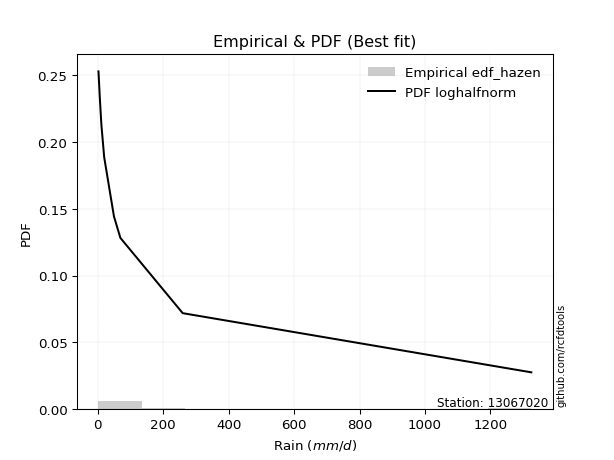</img>

</div>


### 3. Empirical - EDF Weibull (1939)

Weibull plotting position formula is an empirical method used to estimate the non-exceedance probability or plotting position for a set of observed data, is often recommended or widely used in practice, particularly in flood frequency analysis.

<div align="center">


$P=m/(n+1)$


</div>


**3.1. Empirical values**

<div align="center">

|                | 0                   | 1                   | 2                  | 3                  | 4                  | 5           | 6                  | 7                  | 8           | 9                  | 10                 |
|:---------------|:--------------------|:--------------------|:-------------------|:-------------------|:-------------------|:------------|:-------------------|:-------------------|:------------|:-------------------|:-------------------|
| date           | 2021                | 2023                | 2022               | 2019               | 2025               | 2020        | 2024               | 2015               | 2016        | 2017               | 2018               |
| x              | 2.2                 | 2.5                 | 5.2                | 6.1                | 7.8                | 11.6        | 19.8               | 49.65              | 69.25       | 259.7              | 1325.0             |
| m              | 1                   | 2                   | 3                  | 4                  | 5                  | 6           | 7                  | 8                  | 9           | 10                 | 11                 |
| empirical_dist | edf_weibull         | edf_weibull         | edf_weibull        | edf_weibull        | edf_weibull        | edf_weibull | edf_weibull        | edf_weibull        | edf_weibull | edf_weibull        | edf_weibull        |
| empirical      | 0.08333333333333333 | 0.16666666666666666 | 0.25               | 0.3333333333333333 | 0.4166666666666667 | 0.5         | 0.5833333333333334 | 0.6666666666666666 | 0.75        | 0.8333333333333334 | 0.9166666666666666 |
| empirical_tr   | 1.090909090909091   | 1.2                 | 1.3333333333333333 | 1.4999999999999998 | 1.7142857142857144 | 2.0         | 2.4000000000000004 | 2.9999999999999996 | 4.0         | 6.000000000000002  | 11.999999999999995 |

</div>


**3.2. Kolmogorov-Smirnov fit test (sorted by Δ)**


<div align="center">

|                | 0                   | 1                   | 2                   | 3                   | 4                   | 5                   | 6                   | 7                   | 8                   | 9                   | 10                  | 11                  | 12                  | 13                  | 14                    | 15                  | 16                  | 17                  | 18                  | 19                  | 20                  | 21                  | 22                  | 23                  | 24                  | 25                  | 26                  | 27                  | 28                  | 29                  | 30                  | 31                  | 32                  | 33                  | 34                  | 35                  | 36                  | 37                  | 38                  | 39                  | 40                  | 41                  | 42                  | 43                  | 44                  | 45                  | 46                  | 47                  | 48                  | 49                  | 50                  | 51                  | 52                  | 53                  | 54                  | 55                  | 56                  | 57                  | 58                  | 59                  | 60                  | 61                  | 62                  | 63                  | 64                  | 65                  | 66                  | 67                  | 68                  | 69                  | 70                  | 71                  | 72                  | 73                  | 74                  | 75                  | 76                  | 77                  | 78                  | 79                  | 80                  | 81                  | 82                  | 83                  | 84                  | 85                  | 86                  | 87                  | 88                  | 89                  |
|:---------------|:--------------------|:--------------------|:--------------------|:--------------------|:--------------------|:--------------------|:--------------------|:--------------------|:--------------------|:--------------------|:--------------------|:--------------------|:--------------------|:--------------------|:----------------------|:--------------------|:--------------------|:--------------------|:--------------------|:--------------------|:--------------------|:--------------------|:--------------------|:--------------------|:--------------------|:--------------------|:--------------------|:--------------------|:--------------------|:--------------------|:--------------------|:--------------------|:--------------------|:--------------------|:--------------------|:--------------------|:--------------------|:--------------------|:--------------------|:--------------------|:--------------------|:--------------------|:--------------------|:--------------------|:--------------------|:--------------------|:--------------------|:--------------------|:--------------------|:--------------------|:--------------------|:--------------------|:--------------------|:--------------------|:--------------------|:--------------------|:--------------------|:--------------------|:--------------------|:--------------------|:--------------------|:--------------------|:--------------------|:--------------------|:--------------------|:--------------------|:--------------------|:--------------------|:--------------------|:--------------------|:--------------------|:--------------------|:--------------------|:--------------------|:--------------------|:--------------------|:--------------------|:--------------------|:--------------------|:--------------------|:--------------------|:--------------------|:--------------------|:--------------------|:--------------------|:--------------------|:--------------------|:--------------------|:--------------------|:--------------------|
| station        | 13067020            | 13067020            | 13067020            | 13067020            | 13067020            | 13067020            | 13067020            | 13067020            | 13067020            | 13067020            | 13067020            | 13067020            | 13067020            | 13067020            | 13067020              | 13067020            | 13067020            | 13067020            | 13067020            | 13067020            | 13067020            | 13067020            | 13067020            | 13067020            | 13067020            | 13067020            | 13067020            | 13067020            | 13067020            | 13067020            | 13067020            | 13067020            | 13067020            | 13067020            | 13067020            | 13067020            | 13067020            | 13067020            | 13067020            | 13067020            | 13067020            | 13067020            | 13067020            | 13067020            | 13067020            | 13067020            | 13067020            | 13067020            | 13067020            | 13067020            | 13067020            | 13067020            | 13067020            | 13067020            | 13067020            | 13067020            | 13067020            | 13067020            | 13067020            | 13067020            | 13067020            | 13067020            | 13067020            | 13067020            | 13067020            | 13067020            | 13067020            | 13067020            | 13067020            | 13067020            | 13067020            | 13067020            | 13067020            | 13067020            | 13067020            | 13067020            | 13067020            | 13067020            | 13067020            | 13067020            | 13067020            | 13067020            | 13067020            | 13067020            | 13067020            | 13067020            | 13067020            | 13067020            | 13067020            | 13067020            |
| empirical_dist | edf_weibull         | edf_weibull         | edf_weibull         | edf_weibull         | edf_weibull         | edf_weibull         | edf_weibull         | edf_weibull         | edf_weibull         | edf_weibull         | edf_weibull         | edf_weibull         | edf_weibull         | edf_weibull         | edf_weibull           | edf_weibull         | edf_weibull         | edf_weibull         | edf_weibull         | edf_weibull         | edf_weibull         | edf_weibull         | edf_weibull         | edf_weibull         | edf_weibull         | edf_weibull         | edf_weibull         | edf_weibull         | edf_weibull         | edf_weibull         | edf_weibull         | edf_weibull         | edf_weibull         | edf_weibull         | edf_weibull         | edf_weibull         | edf_weibull         | edf_weibull         | edf_weibull         | edf_weibull         | edf_weibull         | edf_weibull         | edf_weibull         | edf_weibull         | edf_weibull         | edf_weibull         | edf_weibull         | edf_weibull         | edf_weibull         | edf_weibull         | edf_weibull         | edf_weibull         | edf_weibull         | edf_weibull         | edf_weibull         | edf_weibull         | edf_weibull         | edf_weibull         | edf_weibull         | edf_weibull         | edf_weibull         | edf_weibull         | edf_weibull         | edf_weibull         | edf_weibull         | edf_weibull         | edf_weibull         | edf_weibull         | edf_weibull         | edf_weibull         | edf_weibull         | edf_weibull         | edf_weibull         | edf_weibull         | edf_weibull         | edf_weibull         | edf_weibull         | edf_weibull         | edf_weibull         | edf_weibull         | edf_weibull         | edf_weibull         | edf_weibull         | edf_weibull         | edf_weibull         | edf_weibull         | edf_weibull         | edf_weibull         | edf_weibull         | edf_weibull         |
| p_dist         | loghalfnorm         | lograyleigh         | loggenlogistic      | logpearson3         | betaprime           | loggumbel_r         | logncf              | logmaxwell          | logkstwobign        | logalpha            | invgamma            | loginvweibull       | lognct              | nct                 | loglaplace_asymmetric | loginvgamma         | logfatiguelife      | ncf                 | loginvgauss         | logmoyal            | logjohnsonsu        | logfisk             | logexponnorm        | fisk                | erlang              | logexpon            | loggenexpon         | fatiguelife         | pareto              | invgauss            | logt                | logcrystalball      | lognorm             | lognorm             | logtruncnorm        | loggompertz         | logrice             | logloggamma         | loghalflogistic     | loglogistic         | invweibull          | f                   | loghypsecant        | logwald             | logweibull_min      | gamma               | loglaplace          | chi2                | loggumbel_l         | logmielke           | logchi2             | t                   | nakagami            | loggibrat           | alpha               | logf                | logerlang           | weibull_min         | gumbel_r            | gibrat              | rayleigh            | maxwell             | genlogistic         | moyal               | halfnorm            | halflogistic        | crystalball         | norm                | wald                | logistic            | loglognorm          | hypsecant           | johnsonsu           | pearson3            | laplace             | kstwobign           | lognakagami         | logpareto           | rice                | gumbel_l            | gompertz            | exponnorm           | genexpon            | expon               | laplace_asymmetric  | truncnorm           | loggamma            | loggamma            | logbetaprime        | mielke              |
| delta          | 0.06766690756707527 | 0.07745666899663439 | 0.08116566067048064 | 0.08140671975238573 | 0.0818390372086965  | 0.08235660396304456 | 0.08821977454471926 | 0.0897338483154902  | 0.08978514099274254 | 0.09035426550961563 | 0.092200427687419   | 0.09319547520352037 | 0.09335255984364516 | 0.09466200540038403 | 0.09524424010173388   | 0.09586550100241274 | 0.09853031605898327 | 0.09907185026396288 | 0.09911696828502434 | 0.09981273169847553 | 0.10045822879799207 | 0.10597668114663694 | 0.1105947219819923  | 0.11130384139552796 | 0.11166027289231628 | 0.11169660808901569 | 0.11170693886248073 | 0.11438045458491297 | 0.11496377398644278 | 0.11859989009166672 | 0.1230242654139963  | 0.12302501060011906 | 0.1230250267731699  | 0.1230250267731699  | 0.1235424607915368  | 0.12357429418334759 | 0.12391454891699111 | 0.12457566476677279 | 0.12692715597902016 | 0.1384190176760277  | 0.14605402489456598 | 0.14938223508566506 | 0.15228546913588875 | 0.16666666666666666 | 0.17215705932657765 | 0.17696802530560551 | 0.17903130192482708 | 0.1851955076735864  | 0.18687227199455686 | 0.19167863615324288 | 0.21901550404030679 | 0.23530410073657593 | 0.23625467533429445 | 0.25427793007191324 | 0.2543318367012487  | 0.260570013078268   | 0.2679439973328379  | 0.2790132559841336  | 0.2986680963182576  | 0.2987300171216222  | 0.2990130997694883  | 0.31129426306243874 | 0.31231325390331477 | 0.31483979109963894 | 0.330661920339682   | 0.33647185685695635 | 0.34540948255550596 | 0.34540949858221454 | 0.3476922328681385  | 0.3577826574664695  | 0.3635567525824853  | 0.3679458965604858  | 0.38406198424332594 | 0.38685264439975303 | 0.3946511610822847  | 0.39534052832023453 | 0.3955426521462432  | 0.40284880415454094 | 0.4094644437108104  | 0.4123781293738793  | 0.4701726086259627  | 0.47663579000670364 | 0.4777256233229793  | 0.47772566888407136 | 0.4777259773953323  | 0.49820612727725655 | 0.5191312939858129  | 0.5191312939858129  | 0.539286316942336   | nan                 |
| deltao         | 0.37613735880099997 | 0.37613735880099997 | 0.37613735880099997 | 0.37613735880099997 | 0.37613735880099997 | 0.37613735880099997 | 0.37613735880099997 | 0.37613735880099997 | 0.37613735880099997 | 0.37613735880099997 | 0.37613735880099997 | 0.37613735880099997 | 0.37613735880099997 | 0.37613735880099997 | 0.37613735880099997   | 0.37613735880099997 | 0.37613735880099997 | 0.37613735880099997 | 0.37613735880099997 | 0.37613735880099997 | 0.37613735880099997 | 0.37613735880099997 | 0.37613735880099997 | 0.37613735880099997 | 0.37613735880099997 | 0.37613735880099997 | 0.37613735880099997 | 0.37613735880099997 | 0.37613735880099997 | 0.37613735880099997 | 0.37613735880099997 | 0.37613735880099997 | 0.37613735880099997 | 0.37613735880099997 | 0.37613735880099997 | 0.37613735880099997 | 0.37613735880099997 | 0.37613735880099997 | 0.37613735880099997 | 0.37613735880099997 | 0.37613735880099997 | 0.37613735880099997 | 0.37613735880099997 | 0.37613735880099997 | 0.37613735880099997 | 0.37613735880099997 | 0.37613735880099997 | 0.37613735880099997 | 0.37613735880099997 | 0.37613735880099997 | 0.37613735880099997 | 0.37613735880099997 | 0.37613735880099997 | 0.37613735880099997 | 0.37613735880099997 | 0.37613735880099997 | 0.37613735880099997 | 0.37613735880099997 | 0.37613735880099997 | 0.37613735880099997 | 0.37613735880099997 | 0.37613735880099997 | 0.37613735880099997 | 0.37613735880099997 | 0.37613735880099997 | 0.37613735880099997 | 0.37613735880099997 | 0.37613735880099997 | 0.37613735880099997 | 0.37613735880099997 | 0.37613735880099997 | 0.37613735880099997 | 0.37613735880099997 | 0.37613735880099997 | 0.37613735880099997 | 0.37613735880099997 | 0.37613735880099997 | 0.37613735880099997 | 0.37613735880099997 | 0.37613735880099997 | 0.37613735880099997 | 0.37613735880099997 | 0.37613735880099997 | 0.37613735880099997 | 0.37613735880099997 | 0.37613735880099997 | 0.37613735880099997 | 0.37613735880099997 | 0.37613735880099997 | 0.37613735880099997 |
| eval           | Δo > Δ              | Δo > Δ              | Δo > Δ              | Δo > Δ              | Δo > Δ              | Δo > Δ              | Δo > Δ              | Δo > Δ              | Δo > Δ              | Δo > Δ              | Δo > Δ              | Δo > Δ              | Δo > Δ              | Δo > Δ              | Δo > Δ                | Δo > Δ              | Δo > Δ              | Δo > Δ              | Δo > Δ              | Δo > Δ              | Δo > Δ              | Δo > Δ              | Δo > Δ              | Δo > Δ              | Δo > Δ              | Δo > Δ              | Δo > Δ              | Δo > Δ              | Δo > Δ              | Δo > Δ              | Δo > Δ              | Δo > Δ              | Δo > Δ              | Δo > Δ              | Δo > Δ              | Δo > Δ              | Δo > Δ              | Δo > Δ              | Δo > Δ              | Δo > Δ              | Δo > Δ              | Δo > Δ              | Δo > Δ              | Δo > Δ              | Δo > Δ              | Δo > Δ              | Δo > Δ              | Δo > Δ              | Δo > Δ              | Δo > Δ              | Δo > Δ              | Δo > Δ              | Δo > Δ              | Δo > Δ              | Δo > Δ              | Δo > Δ              | Δo > Δ              | Δo > Δ              | Δo > Δ              | Δo > Δ              | Δo > Δ              | Δo > Δ              | Δo > Δ              | Δo > Δ              | Δo > Δ              | Δo > Δ              | Δo > Δ              | Δo > Δ              | Δo > Δ              | Δo > Δ              | Δo > Δ              | Δo > Δ              | Δo <= Δ             | Δo <= Δ             | Δo <= Δ             | Δo <= Δ             | Δo <= Δ             | Δo <= Δ             | Δo <= Δ             | Δo <= Δ             | Δo <= Δ             | Δo <= Δ             | Δo <= Δ             | Δo <= Δ             | Δo <= Δ             | Δo <= Δ             | Δo <= Δ             | Δo <= Δ             | Δo <= Δ             | Δo <= Δ             |
| fit            | 1                   | 1                   | 1                   | 1                   | 1                   | 1                   | 1                   | 1                   | 1                   | 1                   | 1                   | 1                   | 1                   | 1                   | 1                     | 1                   | 1                   | 1                   | 1                   | 1                   | 1                   | 1                   | 1                   | 1                   | 1                   | 1                   | 1                   | 1                   | 1                   | 1                   | 1                   | 1                   | 1                   | 1                   | 1                   | 1                   | 1                   | 1                   | 1                   | 1                   | 1                   | 1                   | 1                   | 1                   | 1                   | 1                   | 1                   | 1                   | 1                   | 1                   | 1                   | 1                   | 1                   | 1                   | 1                   | 1                   | 1                   | 1                   | 1                   | 1                   | 1                   | 1                   | 1                   | 1                   | 1                   | 1                   | 1                   | 1                   | 1                   | 1                   | 1                   | 1                   | 0                   | 0                   | 0                   | 0                   | 0                   | 0                   | 0                   | 0                   | 0                   | 0                   | 0                   | 0                   | 0                   | 0                   | 0                   | 0                   | 0                   | 0                   |
| n              | 11                  | 11                  | 11                  | 11                  | 11                  | 11                  | 11                  | 11                  | 11                  | 11                  | 11                  | 11                  | 11                  | 11                  | 11                    | 11                  | 11                  | 11                  | 11                  | 11                  | 11                  | 11                  | 11                  | 11                  | 11                  | 11                  | 11                  | 11                  | 11                  | 11                  | 11                  | 11                  | 11                  | 11                  | 11                  | 11                  | 11                  | 11                  | 11                  | 11                  | 11                  | 11                  | 11                  | 11                  | 11                  | 11                  | 11                  | 11                  | 11                  | 11                  | 11                  | 11                  | 11                  | 11                  | 11                  | 11                  | 11                  | 11                  | 11                  | 11                  | 11                  | 11                  | 11                  | 11                  | 11                  | 11                  | 11                  | 11                  | 11                  | 11                  | 11                  | 11                  | 11                  | 11                  | 11                  | 11                  | 11                  | 11                  | 11                  | 11                  | 11                  | 11                  | 11                  | 11                  | 11                  | 11                  | 11                  | 11                  | 11                  | 11                  |
| best_fit       | 1                   | 0                   | 0                   | 0                   | 0                   | 0                   | 0                   | 0                   | 0                   | 0                   | 0                   | 0                   | 0                   | 0                   | 0                     | 0                   | 0                   | 0                   | 0                   | 0                   | 0                   | 0                   | 0                   | 0                   | 0                   | 0                   | 0                   | 0                   | 0                   | 0                   | 0                   | 0                   | 0                   | 0                   | 0                   | 0                   | 0                   | 0                   | 0                   | 0                   | 0                   | 0                   | 0                   | 0                   | 0                   | 0                   | 0                   | 0                   | 0                   | 0                   | 0                   | 0                   | 0                   | 0                   | 0                   | 0                   | 0                   | 0                   | 0                   | 0                   | 0                   | 0                   | 0                   | 0                   | 0                   | 0                   | 0                   | 0                   | 0                   | 0                   | 0                   | 0                   | 0                   | 0                   | 0                   | 0                   | 0                   | 0                   | 0                   | 0                   | 0                   | 0                   | 0                   | 0                   | 0                   | 0                   | 0                   | 0                   | 0                   | 0                   |
| best_fit_sort  | 1                   | 2                   | 3                   | 4                   | 5                   | 6                   | 7                   | 8                   | 9                   | 10                  | 11                  | 12                  | 13                  | 14                  | 15                    | 16                  | 17                  | 18                  | 19                  | 20                  | 21                  | 22                  | 23                  | 24                  | 25                  | 26                  | 27                  | 28                  | 29                  | 30                  | 31                  | 32                  | 33                  | 34                  | 35                  | 36                  | 37                  | 38                  | 39                  | 40                  | 41                  | 42                  | 43                  | 44                  | 45                  | 46                  | 47                  | 48                  | 49                  | 50                  | 51                  | 52                  | 53                  | 54                  | 55                  | 56                  | 57                  | 58                  | 59                  | 60                  | 61                  | 62                  | 63                  | 64                  | 65                  | 66                  | 67                  | 68                  | 69                  | 70                  | 71                  | 72                  | 73                  | 74                  | 75                  | 76                  | 77                  | 78                  | 79                  | 80                  | 81                  | 82                  | 83                  | 84                  | 85                  | 86                  | 87                  | 88                  | 89                  | 90                  |

</div>


<div align="center">

</img>

</div>


**3.3. Best fit**

<div align="center">

|   id |   station | empirical_dist   | p_dist      |     delta |   deltao | eval   |   fit |   n |   best_fit |   best_fit_sort |
|-----:|----------:|:-----------------|:------------|----------:|---------:|:-------|------:|----:|-----------:|----------------:|
|    0 |  13067020 | edf_weibull      | loghalfnorm | 0.0676669 | 0.376137 | Δo > Δ |     1 |  11 |          1 |               1 |

</div>


<div align="center">

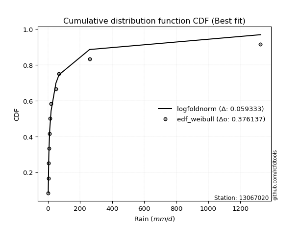</img>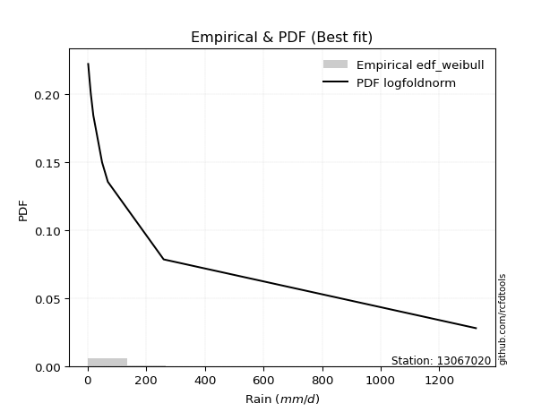</img>

</div>


### 4. Empirical - EDF Beard (1943)

The Beard formula (or Beard´s plotting position formula) in hydrology is used to estimate the empirical non-exceedance probability _(P)_ of a flood event (or other extreme hydrological data point) within a given dataset.

<div align="center">


$P=(m-0.31)/(n+0.38)$


</div>


**4.1. Empirical values**

<div align="center">

|                | 0                    | 1                 | 2                   | 3                  | 4                  | 5         | 6                  | 7                  | 8                  | 9                  | 10                 |
|:---------------|:---------------------|:------------------|:--------------------|:-------------------|:-------------------|:----------|:-------------------|:-------------------|:-------------------|:-------------------|:-------------------|
| date           | 2021                 | 2023              | 2022                | 2019               | 2025               | 2020      | 2024               | 2015               | 2016               | 2017               | 2018               |
| x              | 2.2                  | 2.5               | 5.2                 | 6.1                | 7.8                | 11.6      | 19.8               | 49.65              | 69.25              | 259.7              | 1325.0             |
| m              | 1                    | 2                 | 3                   | 4                  | 5                  | 6         | 7                  | 8                  | 9                  | 10                 | 11                 |
| empirical_dist | edf_beard            | edf_beard         | edf_beard           | edf_beard          | edf_beard          | edf_beard | edf_beard          | edf_beard          | edf_beard          | edf_beard          | edf_beard          |
| empirical      | 0.060632688927943754 | 0.148506151142355 | 0.23637961335676624 | 0.3242530755711775 | 0.4121265377855888 | 0.5       | 0.5878734622144113 | 0.6757469244288224 | 0.7636203866432336 | 0.8514938488576449 | 0.9393673110720562 |
| empirical_tr   | 1.0645463049579045   | 1.174406604747162 | 1.3095512082853855  | 1.4798439531859557 | 1.7010463378176381 | 2.0       | 2.4264392324093818 | 3.0840108401084008 | 4.230483271375462  | 6.733727810650883  | 16.49275362318839  |

</div>


**4.2. Kolmogorov-Smirnov fit test (sorted by Δ)**


<div align="center">

|                | 0                   | 1                   | 2                   | 3                   | 4                   | 5                   | 6                     | 7                   | 8                   | 9                   | 10                  | 11                  | 12                  | 13                  | 14                  | 15                  | 16                  | 17                  | 18                  | 19                  | 20                  | 21                  | 22                  | 23                  | 24                  | 25                  | 26                  | 27                  | 28                  | 29                  | 30                  | 31                  | 32                  | 33                  | 34                  | 35                  | 36                  | 37                  | 38                  | 39                  | 40                  | 41                  | 42                  | 43                  | 44                  | 45                  | 46                  | 47                  | 48                  | 49                  | 50                  | 51                  | 52                  | 53                  | 54                  | 55                  | 56                  | 57                  | 58                  | 59                  | 60                  | 61                  | 62                  | 63                  | 64                  | 65                  | 66                  | 67                  | 68                  | 69                  | 70                  | 71                  | 72                  | 73                  | 74                  | 75                  | 76                  | 77                  | 78                  | 79                  | 80                  | 81                  | 82                  | 83                  | 84                  | 85                  | 86                  | 87                  | 88                  | 89                  |
|:---------------|:--------------------|:--------------------|:--------------------|:--------------------|:--------------------|:--------------------|:----------------------|:--------------------|:--------------------|:--------------------|:--------------------|:--------------------|:--------------------|:--------------------|:--------------------|:--------------------|:--------------------|:--------------------|:--------------------|:--------------------|:--------------------|:--------------------|:--------------------|:--------------------|:--------------------|:--------------------|:--------------------|:--------------------|:--------------------|:--------------------|:--------------------|:--------------------|:--------------------|:--------------------|:--------------------|:--------------------|:--------------------|:--------------------|:--------------------|:--------------------|:--------------------|:--------------------|:--------------------|:--------------------|:--------------------|:--------------------|:--------------------|:--------------------|:--------------------|:--------------------|:--------------------|:--------------------|:--------------------|:--------------------|:--------------------|:--------------------|:--------------------|:--------------------|:--------------------|:--------------------|:--------------------|:--------------------|:--------------------|:--------------------|:--------------------|:--------------------|:--------------------|:--------------------|:--------------------|:--------------------|:--------------------|:--------------------|:--------------------|:--------------------|:--------------------|:--------------------|:--------------------|:--------------------|:--------------------|:--------------------|:--------------------|:--------------------|:--------------------|:--------------------|:--------------------|:--------------------|:--------------------|:--------------------|:--------------------|:--------------------|
| station        | 13067020            | 13067020            | 13067020            | 13067020            | 13067020            | 13067020            | 13067020              | 13067020            | 13067020            | 13067020            | 13067020            | 13067020            | 13067020            | 13067020            | 13067020            | 13067020            | 13067020            | 13067020            | 13067020            | 13067020            | 13067020            | 13067020            | 13067020            | 13067020            | 13067020            | 13067020            | 13067020            | 13067020            | 13067020            | 13067020            | 13067020            | 13067020            | 13067020            | 13067020            | 13067020            | 13067020            | 13067020            | 13067020            | 13067020            | 13067020            | 13067020            | 13067020            | 13067020            | 13067020            | 13067020            | 13067020            | 13067020            | 13067020            | 13067020            | 13067020            | 13067020            | 13067020            | 13067020            | 13067020            | 13067020            | 13067020            | 13067020            | 13067020            | 13067020            | 13067020            | 13067020            | 13067020            | 13067020            | 13067020            | 13067020            | 13067020            | 13067020            | 13067020            | 13067020            | 13067020            | 13067020            | 13067020            | 13067020            | 13067020            | 13067020            | 13067020            | 13067020            | 13067020            | 13067020            | 13067020            | 13067020            | 13067020            | 13067020            | 13067020            | 13067020            | 13067020            | 13067020            | 13067020            | 13067020            | 13067020            |
| empirical_dist | edf_beard           | edf_beard           | edf_beard           | edf_beard           | edf_beard           | edf_beard           | edf_beard             | edf_beard           | edf_beard           | edf_beard           | edf_beard           | edf_beard           | edf_beard           | edf_beard           | edf_beard           | edf_beard           | edf_beard           | edf_beard           | edf_beard           | edf_beard           | edf_beard           | edf_beard           | edf_beard           | edf_beard           | edf_beard           | edf_beard           | edf_beard           | edf_beard           | edf_beard           | edf_beard           | edf_beard           | edf_beard           | edf_beard           | edf_beard           | edf_beard           | edf_beard           | edf_beard           | edf_beard           | edf_beard           | edf_beard           | edf_beard           | edf_beard           | edf_beard           | edf_beard           | edf_beard           | edf_beard           | edf_beard           | edf_beard           | edf_beard           | edf_beard           | edf_beard           | edf_beard           | edf_beard           | edf_beard           | edf_beard           | edf_beard           | edf_beard           | edf_beard           | edf_beard           | edf_beard           | edf_beard           | edf_beard           | edf_beard           | edf_beard           | edf_beard           | edf_beard           | edf_beard           | edf_beard           | edf_beard           | edf_beard           | edf_beard           | edf_beard           | edf_beard           | edf_beard           | edf_beard           | edf_beard           | edf_beard           | edf_beard           | edf_beard           | edf_beard           | edf_beard           | edf_beard           | edf_beard           | edf_beard           | edf_beard           | edf_beard           | edf_beard           | edf_beard           | edf_beard           | edf_beard           |
| p_dist         | loghalfnorm         | logncf              | betaprime           | nct                 | loggenlogistic      | logpearson3         | loglaplace_asymmetric | lograyleigh         | loggumbel_r         | logalpha            | loginvgamma         | logfatiguelife      | ncf                 | loginvgauss         | lognct              | loginvweibull       | logmoyal            | logjohnsonsu        | logkstwobign        | logfisk             | logmaxwell          | logexponnorm        | fisk                | logexpon            | loggenexpon         | pareto              | invgamma            | logtruncnorm        | loggompertz         | loghalflogistic     | invgauss            | logrice             | logt                | logcrystalball      | lognorm             | lognorm             | logloggamma         | erlang              | fatiguelife         | loglogistic         | logwald             | loghypsecant        | invweibull          | f                   | loglaplace          | loggumbel_l         | gamma               | logweibull_min      | chi2                | logmielke           | logchi2             | loggibrat           | alpha               | t                   | nakagami            | logf                | logerlang           | weibull_min         | rayleigh            | gumbel_r            | gibrat              | maxwell             | genlogistic         | moyal               | halfnorm            | crystalball         | norm                | halflogistic        | wald                | logistic            | hypsecant           | loglognorm          | johnsonsu           | laplace             | kstwobign           | lognakagami         | pearson3            | logpareto           | rice                | gumbel_l            | gompertz            | exponnorm           | genexpon            | expon               | laplace_asymmetric  | truncnorm           | loggamma            | loggamma            | logbetaprime        | mielke              |
| delta          | 0.04950639204276361 | 0.07005925902040759 | 0.07083679468170423 | 0.07650148987607236 | 0.07662553178940273 | 0.07686659087130782 | 0.07708372457742221   | 0.07745666899663439 | 0.07781647508196665 | 0.07917167899576227 | 0.07945483349109894 | 0.0803698005346716  | 0.08091133473965122 | 0.08095645276071267 | 0.08109780728992377 | 0.08117337217981235 | 0.08165221617416386 | 0.0822977132736804  | 0.08524501211166463 | 0.08781616562232528 | 0.0897338483154902  | 0.09243420645768063 | 0.09314332587121629 | 0.09353609256470402 | 0.09354642333816907 | 0.09680325846213111 | 0.09834983029962754 | 0.10538194526722514 | 0.10541377865903592 | 0.10876664045470848 | 0.1095196323295109  | 0.1193744200359132  | 0.1230242654139963  | 0.12302501060011906 | 0.1230250267731699  | 0.1230250267731699  | 0.12457566476677279 | 0.12528065953555004 | 0.1280008412281466  | 0.1384190176760277  | 0.148506151142355   | 0.15074481031695464 | 0.15967441153779974 | 0.16300262172889882 | 0.17903130192482708 | 0.18687227199455686 | 0.19058841194883913 | 0.1948577037319672  | 0.19881589431682    | 0.20529902279647663 | 0.23263589068354054 | 0.24519767230975742 | 0.24525157893909288 | 0.24966078392059216 | 0.24987506197752807 | 0.2741903997215017  | 0.28156438397607164 | 0.29263364262736724 | 0.31954445044832647 | 0.32136874072364713 | 0.3214306615270118  | 0.32491464970567235 | 0.3259336405465484  | 0.3375404355050285  | 0.35336256474507155 | 0.3590298691987396  | 0.35902988522544815 | 0.3591725012623459  | 0.37039287727352804 | 0.3714030441097031  | 0.38156628320371944 | 0.38171726810679696 | 0.39768237088655967 | 0.4082715477255183  | 0.40896091496346815 | 0.4091630387894769  | 0.4095532888051426  | 0.4210093196788526  | 0.42308483035404404 | 0.4259985160171129  | 0.4747127375070406  | 0.48117591888778155 | 0.4822657522040572  | 0.4822657977651493  | 0.4822661062764102  | 0.5027462561583345  | 0.5327516806290467  | 0.5327516806290467  | 0.5529067035855697  | nan                 |
| deltao         | 0.37613735880099997 | 0.37613735880099997 | 0.37613735880099997 | 0.37613735880099997 | 0.37613735880099997 | 0.37613735880099997 | 0.37613735880099997   | 0.37613735880099997 | 0.37613735880099997 | 0.37613735880099997 | 0.37613735880099997 | 0.37613735880099997 | 0.37613735880099997 | 0.37613735880099997 | 0.37613735880099997 | 0.37613735880099997 | 0.37613735880099997 | 0.37613735880099997 | 0.37613735880099997 | 0.37613735880099997 | 0.37613735880099997 | 0.37613735880099997 | 0.37613735880099997 | 0.37613735880099997 | 0.37613735880099997 | 0.37613735880099997 | 0.37613735880099997 | 0.37613735880099997 | 0.37613735880099997 | 0.37613735880099997 | 0.37613735880099997 | 0.37613735880099997 | 0.37613735880099997 | 0.37613735880099997 | 0.37613735880099997 | 0.37613735880099997 | 0.37613735880099997 | 0.37613735880099997 | 0.37613735880099997 | 0.37613735880099997 | 0.37613735880099997 | 0.37613735880099997 | 0.37613735880099997 | 0.37613735880099997 | 0.37613735880099997 | 0.37613735880099997 | 0.37613735880099997 | 0.37613735880099997 | 0.37613735880099997 | 0.37613735880099997 | 0.37613735880099997 | 0.37613735880099997 | 0.37613735880099997 | 0.37613735880099997 | 0.37613735880099997 | 0.37613735880099997 | 0.37613735880099997 | 0.37613735880099997 | 0.37613735880099997 | 0.37613735880099997 | 0.37613735880099997 | 0.37613735880099997 | 0.37613735880099997 | 0.37613735880099997 | 0.37613735880099997 | 0.37613735880099997 | 0.37613735880099997 | 0.37613735880099997 | 0.37613735880099997 | 0.37613735880099997 | 0.37613735880099997 | 0.37613735880099997 | 0.37613735880099997 | 0.37613735880099997 | 0.37613735880099997 | 0.37613735880099997 | 0.37613735880099997 | 0.37613735880099997 | 0.37613735880099997 | 0.37613735880099997 | 0.37613735880099997 | 0.37613735880099997 | 0.37613735880099997 | 0.37613735880099997 | 0.37613735880099997 | 0.37613735880099997 | 0.37613735880099997 | 0.37613735880099997 | 0.37613735880099997 | 0.37613735880099997 |
| eval           | Δo > Δ              | Δo > Δ              | Δo > Δ              | Δo > Δ              | Δo > Δ              | Δo > Δ              | Δo > Δ                | Δo > Δ              | Δo > Δ              | Δo > Δ              | Δo > Δ              | Δo > Δ              | Δo > Δ              | Δo > Δ              | Δo > Δ              | Δo > Δ              | Δo > Δ              | Δo > Δ              | Δo > Δ              | Δo > Δ              | Δo > Δ              | Δo > Δ              | Δo > Δ              | Δo > Δ              | Δo > Δ              | Δo > Δ              | Δo > Δ              | Δo > Δ              | Δo > Δ              | Δo > Δ              | Δo > Δ              | Δo > Δ              | Δo > Δ              | Δo > Δ              | Δo > Δ              | Δo > Δ              | Δo > Δ              | Δo > Δ              | Δo > Δ              | Δo > Δ              | Δo > Δ              | Δo > Δ              | Δo > Δ              | Δo > Δ              | Δo > Δ              | Δo > Δ              | Δo > Δ              | Δo > Δ              | Δo > Δ              | Δo > Δ              | Δo > Δ              | Δo > Δ              | Δo > Δ              | Δo > Δ              | Δo > Δ              | Δo > Δ              | Δo > Δ              | Δo > Δ              | Δo > Δ              | Δo > Δ              | Δo > Δ              | Δo > Δ              | Δo > Δ              | Δo > Δ              | Δo > Δ              | Δo > Δ              | Δo > Δ              | Δo > Δ              | Δo > Δ              | Δo > Δ              | Δo <= Δ             | Δo <= Δ             | Δo <= Δ             | Δo <= Δ             | Δo <= Δ             | Δo <= Δ             | Δo <= Δ             | Δo <= Δ             | Δo <= Δ             | Δo <= Δ             | Δo <= Δ             | Δo <= Δ             | Δo <= Δ             | Δo <= Δ             | Δo <= Δ             | Δo <= Δ             | Δo <= Δ             | Δo <= Δ             | Δo <= Δ             | Δo <= Δ             |
| fit            | 1                   | 1                   | 1                   | 1                   | 1                   | 1                   | 1                     | 1                   | 1                   | 1                   | 1                   | 1                   | 1                   | 1                   | 1                   | 1                   | 1                   | 1                   | 1                   | 1                   | 1                   | 1                   | 1                   | 1                   | 1                   | 1                   | 1                   | 1                   | 1                   | 1                   | 1                   | 1                   | 1                   | 1                   | 1                   | 1                   | 1                   | 1                   | 1                   | 1                   | 1                   | 1                   | 1                   | 1                   | 1                   | 1                   | 1                   | 1                   | 1                   | 1                   | 1                   | 1                   | 1                   | 1                   | 1                   | 1                   | 1                   | 1                   | 1                   | 1                   | 1                   | 1                   | 1                   | 1                   | 1                   | 1                   | 1                   | 1                   | 1                   | 1                   | 0                   | 0                   | 0                   | 0                   | 0                   | 0                   | 0                   | 0                   | 0                   | 0                   | 0                   | 0                   | 0                   | 0                   | 0                   | 0                   | 0                   | 0                   | 0                   | 0                   |
| n              | 11                  | 11                  | 11                  | 11                  | 11                  | 11                  | 11                    | 11                  | 11                  | 11                  | 11                  | 11                  | 11                  | 11                  | 11                  | 11                  | 11                  | 11                  | 11                  | 11                  | 11                  | 11                  | 11                  | 11                  | 11                  | 11                  | 11                  | 11                  | 11                  | 11                  | 11                  | 11                  | 11                  | 11                  | 11                  | 11                  | 11                  | 11                  | 11                  | 11                  | 11                  | 11                  | 11                  | 11                  | 11                  | 11                  | 11                  | 11                  | 11                  | 11                  | 11                  | 11                  | 11                  | 11                  | 11                  | 11                  | 11                  | 11                  | 11                  | 11                  | 11                  | 11                  | 11                  | 11                  | 11                  | 11                  | 11                  | 11                  | 11                  | 11                  | 11                  | 11                  | 11                  | 11                  | 11                  | 11                  | 11                  | 11                  | 11                  | 11                  | 11                  | 11                  | 11                  | 11                  | 11                  | 11                  | 11                  | 11                  | 11                  | 11                  |
| best_fit       | 1                   | 0                   | 0                   | 0                   | 0                   | 0                   | 0                     | 0                   | 0                   | 0                   | 0                   | 0                   | 0                   | 0                   | 0                   | 0                   | 0                   | 0                   | 0                   | 0                   | 0                   | 0                   | 0                   | 0                   | 0                   | 0                   | 0                   | 0                   | 0                   | 0                   | 0                   | 0                   | 0                   | 0                   | 0                   | 0                   | 0                   | 0                   | 0                   | 0                   | 0                   | 0                   | 0                   | 0                   | 0                   | 0                   | 0                   | 0                   | 0                   | 0                   | 0                   | 0                   | 0                   | 0                   | 0                   | 0                   | 0                   | 0                   | 0                   | 0                   | 0                   | 0                   | 0                   | 0                   | 0                   | 0                   | 0                   | 0                   | 0                   | 0                   | 0                   | 0                   | 0                   | 0                   | 0                   | 0                   | 0                   | 0                   | 0                   | 0                   | 0                   | 0                   | 0                   | 0                   | 0                   | 0                   | 0                   | 0                   | 0                   | 0                   |
| best_fit_sort  | 1                   | 2                   | 3                   | 4                   | 5                   | 6                   | 7                     | 8                   | 9                   | 10                  | 11                  | 12                  | 13                  | 14                  | 15                  | 16                  | 17                  | 18                  | 19                  | 20                  | 21                  | 22                  | 23                  | 24                  | 25                  | 26                  | 27                  | 28                  | 29                  | 30                  | 31                  | 32                  | 33                  | 34                  | 35                  | 36                  | 37                  | 38                  | 39                  | 40                  | 41                  | 42                  | 43                  | 44                  | 45                  | 46                  | 47                  | 48                  | 49                  | 50                  | 51                  | 52                  | 53                  | 54                  | 55                  | 56                  | 57                  | 58                  | 59                  | 60                  | 61                  | 62                  | 63                  | 64                  | 65                  | 66                  | 67                  | 68                  | 69                  | 70                  | 71                  | 72                  | 73                  | 74                  | 75                  | 76                  | 77                  | 78                  | 79                  | 80                  | 81                  | 82                  | 83                  | 84                  | 85                  | 86                  | 87                  | 88                  | 89                  | 90                  |

</div>


<div align="center">

</img>

</div>


**4.3. Best fit**

<div align="center">

|   id |   station | empirical_dist   | p_dist      |     delta |   deltao | eval   |   fit |   n |   best_fit |   best_fit_sort |
|-----:|----------:|:-----------------|:------------|----------:|---------:|:-------|------:|----:|-----------:|----------------:|
|    0 |  13067020 | edf_beard        | loghalfnorm | 0.0495064 | 0.376137 | Δo > Δ |     1 |  11 |          1 |               1 |

</div>


<div align="center">

</img>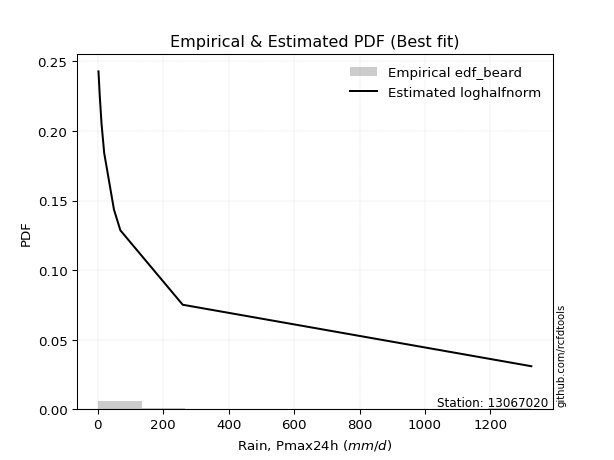</img>

</div>


### 5. Empirical - EDF Chegodayev (1955)

The Chegodayev formula is an empirical plotting position formula used in hydrological frequency analysis to estimate the exceedance probability or return period of a specific event from a set of observed data. It is primarily used for plotting observed data points on probability paper to fit a theoretical distribution, particularly for analyzing extreme events like maximum flood flows or rainfall intensities. The constant _b_ value in the generalized plotting position formula is 0.3.

<div align="center">


$P=(m-b)/(n+1-2b)$


</div>


**5.1. Empirical values**

<div align="center">

|                | 0                   | 1                   | 2                  | 3                   | 4                   | 5              | 6                  | 7                  | 8                  | 9                 | 10                 |
|:---------------|:--------------------|:--------------------|:-------------------|:--------------------|:--------------------|:---------------|:-------------------|:-------------------|:-------------------|:------------------|:-------------------|
| date           | 2021                | 2023                | 2022               | 2019                | 2025                | 2020           | 2024               | 2015               | 2016               | 2017              | 2018               |
| x              | 2.2                 | 2.5                 | 5.2                | 6.1                 | 7.8                 | 11.6           | 19.8               | 49.65              | 69.25              | 259.7             | 1325.0             |
| m              | 1                   | 2                   | 3                  | 4                   | 5                   | 6              | 7                  | 8                  | 9                  | 10                | 11                 |
| empirical_dist | edf_chegodayev      | edf_chegodayev      | edf_chegodayev     | edf_chegodayev      | edf_chegodayev      | edf_chegodayev | edf_chegodayev     | edf_chegodayev     | edf_chegodayev     | edf_chegodayev    | edf_chegodayev     |
| empirical      | 0.06140350877192982 | 0.14912280701754385 | 0.2368421052631579 | 0.32456140350877194 | 0.41228070175438597 | 0.5            | 0.5877192982456141 | 0.6754385964912281 | 0.763157894736842  | 0.850877192982456 | 0.9385964912280701 |
| empirical_tr   | 1.0654205607476634  | 1.175257731958763   | 1.310344827586207  | 1.4805194805194806  | 1.7014925373134326  | 2.0            | 2.425531914893617  | 3.081081081081081  | 4.2222222222222205 | 6.70588235294117  | 16.285714285714263 |

</div>


**5.2. Kolmogorov-Smirnov fit test (sorted by Δ)**


<div align="center">

|                | 0                   | 1                   | 2                   | 3                   | 4                   | 5                   | 6                   | 7                     | 8                   | 9                   | 10                  | 11                  | 12                  | 13                  | 14                  | 15                  | 16                  | 17                  | 18                  | 19                  | 20                  | 21                  | 22                  | 23                  | 24                  | 25                  | 26                  | 27                  | 28                  | 29                  | 30                  | 31                  | 32                  | 33                  | 34                  | 35                  | 36                  | 37                  | 38                  | 39                  | 40                  | 41                  | 42                  | 43                  | 44                  | 45                  | 46                  | 47                  | 48                  | 49                  | 50                  | 51                  | 52                  | 53                  | 54                  | 55                  | 56                  | 57                  | 58                  | 59                  | 60                  | 61                  | 62                  | 63                  | 64                  | 65                  | 66                  | 67                  | 68                  | 69                  | 70                  | 71                  | 72                  | 73                  | 74                  | 75                  | 76                  | 77                  | 78                  | 79                  | 80                  | 81                  | 82                  | 83                  | 84                  | 85                  | 86                  | 87                  | 88                  | 89                  |
|:---------------|:--------------------|:--------------------|:--------------------|:--------------------|:--------------------|:--------------------|:--------------------|:----------------------|:--------------------|:--------------------|:--------------------|:--------------------|:--------------------|:--------------------|:--------------------|:--------------------|:--------------------|:--------------------|:--------------------|:--------------------|:--------------------|:--------------------|:--------------------|:--------------------|:--------------------|:--------------------|:--------------------|:--------------------|:--------------------|:--------------------|:--------------------|:--------------------|:--------------------|:--------------------|:--------------------|:--------------------|:--------------------|:--------------------|:--------------------|:--------------------|:--------------------|:--------------------|:--------------------|:--------------------|:--------------------|:--------------------|:--------------------|:--------------------|:--------------------|:--------------------|:--------------------|:--------------------|:--------------------|:--------------------|:--------------------|:--------------------|:--------------------|:--------------------|:--------------------|:--------------------|:--------------------|:--------------------|:--------------------|:--------------------|:--------------------|:--------------------|:--------------------|:--------------------|:--------------------|:--------------------|:--------------------|:--------------------|:--------------------|:--------------------|:--------------------|:--------------------|:--------------------|:--------------------|:--------------------|:--------------------|:--------------------|:--------------------|:--------------------|:--------------------|:--------------------|:--------------------|:--------------------|:--------------------|:--------------------|:--------------------|
| station        | 13067020            | 13067020            | 13067020            | 13067020            | 13067020            | 13067020            | 13067020            | 13067020              | 13067020            | 13067020            | 13067020            | 13067020            | 13067020            | 13067020            | 13067020            | 13067020            | 13067020            | 13067020            | 13067020            | 13067020            | 13067020            | 13067020            | 13067020            | 13067020            | 13067020            | 13067020            | 13067020            | 13067020            | 13067020            | 13067020            | 13067020            | 13067020            | 13067020            | 13067020            | 13067020            | 13067020            | 13067020            | 13067020            | 13067020            | 13067020            | 13067020            | 13067020            | 13067020            | 13067020            | 13067020            | 13067020            | 13067020            | 13067020            | 13067020            | 13067020            | 13067020            | 13067020            | 13067020            | 13067020            | 13067020            | 13067020            | 13067020            | 13067020            | 13067020            | 13067020            | 13067020            | 13067020            | 13067020            | 13067020            | 13067020            | 13067020            | 13067020            | 13067020            | 13067020            | 13067020            | 13067020            | 13067020            | 13067020            | 13067020            | 13067020            | 13067020            | 13067020            | 13067020            | 13067020            | 13067020            | 13067020            | 13067020            | 13067020            | 13067020            | 13067020            | 13067020            | 13067020            | 13067020            | 13067020            | 13067020            |
| empirical_dist | edf_chegodayev      | edf_chegodayev      | edf_chegodayev      | edf_chegodayev      | edf_chegodayev      | edf_chegodayev      | edf_chegodayev      | edf_chegodayev        | edf_chegodayev      | edf_chegodayev      | edf_chegodayev      | edf_chegodayev      | edf_chegodayev      | edf_chegodayev      | edf_chegodayev      | edf_chegodayev      | edf_chegodayev      | edf_chegodayev      | edf_chegodayev      | edf_chegodayev      | edf_chegodayev      | edf_chegodayev      | edf_chegodayev      | edf_chegodayev      | edf_chegodayev      | edf_chegodayev      | edf_chegodayev      | edf_chegodayev      | edf_chegodayev      | edf_chegodayev      | edf_chegodayev      | edf_chegodayev      | edf_chegodayev      | edf_chegodayev      | edf_chegodayev      | edf_chegodayev      | edf_chegodayev      | edf_chegodayev      | edf_chegodayev      | edf_chegodayev      | edf_chegodayev      | edf_chegodayev      | edf_chegodayev      | edf_chegodayev      | edf_chegodayev      | edf_chegodayev      | edf_chegodayev      | edf_chegodayev      | edf_chegodayev      | edf_chegodayev      | edf_chegodayev      | edf_chegodayev      | edf_chegodayev      | edf_chegodayev      | edf_chegodayev      | edf_chegodayev      | edf_chegodayev      | edf_chegodayev      | edf_chegodayev      | edf_chegodayev      | edf_chegodayev      | edf_chegodayev      | edf_chegodayev      | edf_chegodayev      | edf_chegodayev      | edf_chegodayev      | edf_chegodayev      | edf_chegodayev      | edf_chegodayev      | edf_chegodayev      | edf_chegodayev      | edf_chegodayev      | edf_chegodayev      | edf_chegodayev      | edf_chegodayev      | edf_chegodayev      | edf_chegodayev      | edf_chegodayev      | edf_chegodayev      | edf_chegodayev      | edf_chegodayev      | edf_chegodayev      | edf_chegodayev      | edf_chegodayev      | edf_chegodayev      | edf_chegodayev      | edf_chegodayev      | edf_chegodayev      | edf_chegodayev      | edf_chegodayev      |
| p_dist         | loghalfnorm         | logncf              | betaprime           | loggenlogistic      | logpearson3         | nct                 | lograyleigh         | loglaplace_asymmetric | loggumbel_r         | logalpha            | loginvgamma         | logfatiguelife      | lognct              | loginvweibull       | ncf                 | loginvgauss         | logmoyal            | logjohnsonsu        | logkstwobign        | logfisk             | logmaxwell          | logexponnorm        | fisk                | logexpon            | loggenexpon         | pareto              | invgamma            | logtruncnorm        | loggompertz         | loghalflogistic     | invgauss            | logrice             | logt                | logcrystalball      | lognorm             | lognorm             | logloggamma         | erlang              | fatiguelife         | loglogistic         | logwald             | loghypsecant        | invweibull          | f                   | loglaplace          | loggumbel_l         | gamma               | logweibull_min      | chi2                | logmielke           | logchi2             | loggibrat           | alpha               | t                   | nakagami            | logf                | logerlang           | weibull_min         | rayleigh            | gumbel_r            | gibrat              | maxwell             | genlogistic         | moyal               | halfnorm            | halflogistic        | crystalball         | norm                | wald                | logistic            | loglognorm          | hypsecant           | johnsonsu           | laplace             | kstwobign           | lognakagami         | pearson3            | logpareto           | rice                | gumbel_l            | gompertz            | exponnorm           | genexpon            | expon               | laplace_asymmetric  | truncnorm           | loggamma            | loggamma            | logbetaprime        | mielke              |
| delta          | 0.05012304791795247 | 0.07067591489559645 | 0.07114512261929862 | 0.07677969575819993 | 0.07702075484010501 | 0.07711814575126122 | 0.07745666899663439 | 0.07770038045261107   | 0.07797063905076385 | 0.07948000693335666 | 0.07976316142869333 | 0.08098645640986046 | 0.08140613522751816 | 0.08148170011740674 | 0.08152799061484008 | 0.08157310863590153 | 0.08226887204935272 | 0.08291436914886927 | 0.08539917608046182 | 0.08843282149751414 | 0.0897338483154902  | 0.0930508623328695  | 0.09375998174640515 | 0.09415274843989288 | 0.09416307921335793 | 0.09741991433731997 | 0.09788733839323588 | 0.105998601142414   | 0.10603043453422478 | 0.10938329632989734 | 0.10982796026710528 | 0.11952858400471039 | 0.1230242654139963  | 0.12302501060011906 | 0.1230250267731699  | 0.1230250267731699  | 0.12457566476677279 | 0.12481816762915837 | 0.127538349321755   | 0.1384190176760277  | 0.14912280701754385 | 0.15074481031695464 | 0.15921191963140807 | 0.16254012982250715 | 0.17903130192482708 | 0.18687227199455686 | 0.19012592004244755 | 0.19408688388798112 | 0.19835340241042843 | 0.20483653089008497 | 0.23217339877714888 | 0.24550600024735186 | 0.24555990687668727 | 0.2488899640766061  | 0.24941257007113649 | 0.2737279078151101  | 0.28110189206968    | 0.29217115072097566 | 0.3187736306043404  | 0.3205979208796611  | 0.32065984168302575 | 0.32445215779928077 | 0.3254711486401568  | 0.33676961566104247 | 0.35259174490108547 | 0.3584016814183598  | 0.358567377292348   | 0.35856739331905657 | 0.369622057429542   | 0.3709405522033115  | 0.38110061223160807 | 0.38110379129732785 | 0.39721987898016803 | 0.40780905581912674 | 0.40849842305707657 | 0.40870054688308527 | 0.40878246896115655 | 0.4203926638036637  | 0.42262233844765246 | 0.42553602411072133 | 0.47455857353824343 | 0.48102175491898436 | 0.48211158823526    | 0.4821116337963521  | 0.482111942307613   | 0.5025920921895373  | 0.5322891887226551  | 0.5322891887226551  | 0.5524442116791781  | nan                 |
| deltao         | 0.37613735880099997 | 0.37613735880099997 | 0.37613735880099997 | 0.37613735880099997 | 0.37613735880099997 | 0.37613735880099997 | 0.37613735880099997 | 0.37613735880099997   | 0.37613735880099997 | 0.37613735880099997 | 0.37613735880099997 | 0.37613735880099997 | 0.37613735880099997 | 0.37613735880099997 | 0.37613735880099997 | 0.37613735880099997 | 0.37613735880099997 | 0.37613735880099997 | 0.37613735880099997 | 0.37613735880099997 | 0.37613735880099997 | 0.37613735880099997 | 0.37613735880099997 | 0.37613735880099997 | 0.37613735880099997 | 0.37613735880099997 | 0.37613735880099997 | 0.37613735880099997 | 0.37613735880099997 | 0.37613735880099997 | 0.37613735880099997 | 0.37613735880099997 | 0.37613735880099997 | 0.37613735880099997 | 0.37613735880099997 | 0.37613735880099997 | 0.37613735880099997 | 0.37613735880099997 | 0.37613735880099997 | 0.37613735880099997 | 0.37613735880099997 | 0.37613735880099997 | 0.37613735880099997 | 0.37613735880099997 | 0.37613735880099997 | 0.37613735880099997 | 0.37613735880099997 | 0.37613735880099997 | 0.37613735880099997 | 0.37613735880099997 | 0.37613735880099997 | 0.37613735880099997 | 0.37613735880099997 | 0.37613735880099997 | 0.37613735880099997 | 0.37613735880099997 | 0.37613735880099997 | 0.37613735880099997 | 0.37613735880099997 | 0.37613735880099997 | 0.37613735880099997 | 0.37613735880099997 | 0.37613735880099997 | 0.37613735880099997 | 0.37613735880099997 | 0.37613735880099997 | 0.37613735880099997 | 0.37613735880099997 | 0.37613735880099997 | 0.37613735880099997 | 0.37613735880099997 | 0.37613735880099997 | 0.37613735880099997 | 0.37613735880099997 | 0.37613735880099997 | 0.37613735880099997 | 0.37613735880099997 | 0.37613735880099997 | 0.37613735880099997 | 0.37613735880099997 | 0.37613735880099997 | 0.37613735880099997 | 0.37613735880099997 | 0.37613735880099997 | 0.37613735880099997 | 0.37613735880099997 | 0.37613735880099997 | 0.37613735880099997 | 0.37613735880099997 | 0.37613735880099997 |
| eval           | Δo > Δ              | Δo > Δ              | Δo > Δ              | Δo > Δ              | Δo > Δ              | Δo > Δ              | Δo > Δ              | Δo > Δ                | Δo > Δ              | Δo > Δ              | Δo > Δ              | Δo > Δ              | Δo > Δ              | Δo > Δ              | Δo > Δ              | Δo > Δ              | Δo > Δ              | Δo > Δ              | Δo > Δ              | Δo > Δ              | Δo > Δ              | Δo > Δ              | Δo > Δ              | Δo > Δ              | Δo > Δ              | Δo > Δ              | Δo > Δ              | Δo > Δ              | Δo > Δ              | Δo > Δ              | Δo > Δ              | Δo > Δ              | Δo > Δ              | Δo > Δ              | Δo > Δ              | Δo > Δ              | Δo > Δ              | Δo > Δ              | Δo > Δ              | Δo > Δ              | Δo > Δ              | Δo > Δ              | Δo > Δ              | Δo > Δ              | Δo > Δ              | Δo > Δ              | Δo > Δ              | Δo > Δ              | Δo > Δ              | Δo > Δ              | Δo > Δ              | Δo > Δ              | Δo > Δ              | Δo > Δ              | Δo > Δ              | Δo > Δ              | Δo > Δ              | Δo > Δ              | Δo > Δ              | Δo > Δ              | Δo > Δ              | Δo > Δ              | Δo > Δ              | Δo > Δ              | Δo > Δ              | Δo > Δ              | Δo > Δ              | Δo > Δ              | Δo > Δ              | Δo > Δ              | Δo <= Δ             | Δo <= Δ             | Δo <= Δ             | Δo <= Δ             | Δo <= Δ             | Δo <= Δ             | Δo <= Δ             | Δo <= Δ             | Δo <= Δ             | Δo <= Δ             | Δo <= Δ             | Δo <= Δ             | Δo <= Δ             | Δo <= Δ             | Δo <= Δ             | Δo <= Δ             | Δo <= Δ             | Δo <= Δ             | Δo <= Δ             | Δo <= Δ             |
| fit            | 1                   | 1                   | 1                   | 1                   | 1                   | 1                   | 1                   | 1                     | 1                   | 1                   | 1                   | 1                   | 1                   | 1                   | 1                   | 1                   | 1                   | 1                   | 1                   | 1                   | 1                   | 1                   | 1                   | 1                   | 1                   | 1                   | 1                   | 1                   | 1                   | 1                   | 1                   | 1                   | 1                   | 1                   | 1                   | 1                   | 1                   | 1                   | 1                   | 1                   | 1                   | 1                   | 1                   | 1                   | 1                   | 1                   | 1                   | 1                   | 1                   | 1                   | 1                   | 1                   | 1                   | 1                   | 1                   | 1                   | 1                   | 1                   | 1                   | 1                   | 1                   | 1                   | 1                   | 1                   | 1                   | 1                   | 1                   | 1                   | 1                   | 1                   | 0                   | 0                   | 0                   | 0                   | 0                   | 0                   | 0                   | 0                   | 0                   | 0                   | 0                   | 0                   | 0                   | 0                   | 0                   | 0                   | 0                   | 0                   | 0                   | 0                   |
| n              | 11                  | 11                  | 11                  | 11                  | 11                  | 11                  | 11                  | 11                    | 11                  | 11                  | 11                  | 11                  | 11                  | 11                  | 11                  | 11                  | 11                  | 11                  | 11                  | 11                  | 11                  | 11                  | 11                  | 11                  | 11                  | 11                  | 11                  | 11                  | 11                  | 11                  | 11                  | 11                  | 11                  | 11                  | 11                  | 11                  | 11                  | 11                  | 11                  | 11                  | 11                  | 11                  | 11                  | 11                  | 11                  | 11                  | 11                  | 11                  | 11                  | 11                  | 11                  | 11                  | 11                  | 11                  | 11                  | 11                  | 11                  | 11                  | 11                  | 11                  | 11                  | 11                  | 11                  | 11                  | 11                  | 11                  | 11                  | 11                  | 11                  | 11                  | 11                  | 11                  | 11                  | 11                  | 11                  | 11                  | 11                  | 11                  | 11                  | 11                  | 11                  | 11                  | 11                  | 11                  | 11                  | 11                  | 11                  | 11                  | 11                  | 11                  |
| best_fit       | 1                   | 0                   | 0                   | 0                   | 0                   | 0                   | 0                   | 0                     | 0                   | 0                   | 0                   | 0                   | 0                   | 0                   | 0                   | 0                   | 0                   | 0                   | 0                   | 0                   | 0                   | 0                   | 0                   | 0                   | 0                   | 0                   | 0                   | 0                   | 0                   | 0                   | 0                   | 0                   | 0                   | 0                   | 0                   | 0                   | 0                   | 0                   | 0                   | 0                   | 0                   | 0                   | 0                   | 0                   | 0                   | 0                   | 0                   | 0                   | 0                   | 0                   | 0                   | 0                   | 0                   | 0                   | 0                   | 0                   | 0                   | 0                   | 0                   | 0                   | 0                   | 0                   | 0                   | 0                   | 0                   | 0                   | 0                   | 0                   | 0                   | 0                   | 0                   | 0                   | 0                   | 0                   | 0                   | 0                   | 0                   | 0                   | 0                   | 0                   | 0                   | 0                   | 0                   | 0                   | 0                   | 0                   | 0                   | 0                   | 0                   | 0                   |
| best_fit_sort  | 1                   | 2                   | 3                   | 4                   | 5                   | 6                   | 7                   | 8                     | 9                   | 10                  | 11                  | 12                  | 13                  | 14                  | 15                  | 16                  | 17                  | 18                  | 19                  | 20                  | 21                  | 22                  | 23                  | 24                  | 25                  | 26                  | 27                  | 28                  | 29                  | 30                  | 31                  | 32                  | 33                  | 34                  | 35                  | 36                  | 37                  | 38                  | 39                  | 40                  | 41                  | 42                  | 43                  | 44                  | 45                  | 46                  | 47                  | 48                  | 49                  | 50                  | 51                  | 52                  | 53                  | 54                  | 55                  | 56                  | 57                  | 58                  | 59                  | 60                  | 61                  | 62                  | 63                  | 64                  | 65                  | 66                  | 67                  | 68                  | 69                  | 70                  | 71                  | 72                  | 73                  | 74                  | 75                  | 76                  | 77                  | 78                  | 79                  | 80                  | 81                  | 82                  | 83                  | 84                  | 85                  | 86                  | 87                  | 88                  | 89                  | 90                  |

</div>


<div align="center">

</img>

</div>


**5.3. Best fit**

<div align="center">

|   id |   station | empirical_dist   | p_dist      |    delta |   deltao | eval   |   fit |   n |   best_fit |   best_fit_sort |
|-----:|----------:|:-----------------|:------------|---------:|---------:|:-------|------:|----:|-----------:|----------------:|
|    0 |  13067020 | edf_chegodayev   | loghalfnorm | 0.050123 | 0.376137 | Δo > Δ |     1 |  11 |          1 |               1 |

</div>


<div align="center">

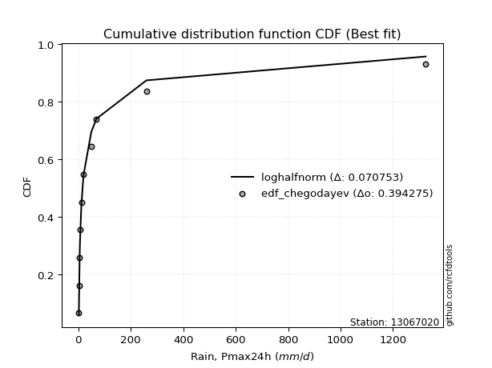</img>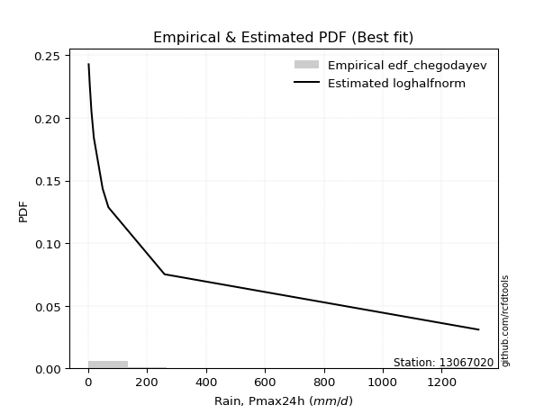</img>

</div>


### 6. Empirical - EDF Blom (1958)

The Blom formula is a specific "plotting position" formula used in hydrology and statistical analysis to estimate the empirical cumulative probability (or non-exceedance probability) of a data series. It is particularly recommended for data that are approximately normally distributed. The constant _a_ is set to 0.375 (or 3/8).

<div align="center">


$P=(m-a)/(n+1-2a)$


</div>


**6.1. Empirical values**

<div align="center">

|                | 0                   | 1                   | 2                   | 3                   | 4                  | 5        | 6                  | 7                  | 8                  | 9                  | 10                 |
|:---------------|:--------------------|:--------------------|:--------------------|:--------------------|:-------------------|:---------|:-------------------|:-------------------|:-------------------|:-------------------|:-------------------|
| date           | 2021                | 2023                | 2022                | 2019                | 2025               | 2020     | 2024               | 2015               | 2016               | 2017               | 2018               |
| x              | 2.2                 | 2.5                 | 5.2                 | 6.1                 | 7.8                | 11.6     | 19.8               | 49.65              | 69.25              | 259.7              | 1325.0             |
| m              | 1                   | 2                   | 3                   | 4                   | 5                  | 6        | 7                  | 8                  | 9                  | 10                 | 11                 |
| empirical_dist | edf_blom            | edf_blom            | edf_blom            | edf_blom            | edf_blom           | edf_blom | edf_blom           | edf_blom           | edf_blom           | edf_blom           | edf_blom           |
| empirical      | 0.05555555555555555 | 0.14444444444444443 | 0.23333333333333334 | 0.32222222222222224 | 0.4111111111111111 | 0.5      | 0.5888888888888889 | 0.6777777777777778 | 0.7666666666666667 | 0.8555555555555555 | 0.9444444444444444 |
| empirical_tr   | 1.0588235294117647  | 1.1688311688311688  | 1.3043478260869565  | 1.4754098360655736  | 1.6981132075471697 | 2.0      | 2.4324324324324325 | 3.1034482758620694 | 4.2857142857142865 | 6.923076923076921  | 17.999999999999993 |

</div>


**6.2. Kolmogorov-Smirnov fit test (sorted by Δ)**


<div align="center">

|                | 0                   | 1                   | 2                   | 3                   | 4                     | 5                   | 6                   | 7                   | 8                   | 9                   | 10                  | 11                  | 12                  | 13                  | 14                  | 15                  | 16                  | 17                  | 18                  | 19                  | 20                  | 21                  | 22                  | 23                  | 24                  | 25                  | 26                  | 27                  | 28                  | 29                  | 30                  | 31                  | 32                  | 33                  | 34                  | 35                  | 36                  | 37                  | 38                  | 39                  | 40                  | 41                  | 42                  | 43                  | 44                  | 45                  | 46                  | 47                  | 48                  | 49                  | 50                  | 51                  | 52                  | 53                  | 54                  | 55                  | 56                  | 57                  | 58                  | 59                  | 60                  | 61                  | 62                  | 63                  | 64                  | 65                  | 66                  | 67                  | 68                  | 69                  | 70                  | 71                  | 72                  | 73                  | 74                  | 75                  | 76                  | 77                  | 78                  | 79                  | 80                  | 81                  | 82                  | 83                  | 84                  | 85                  | 86                  | 87                  | 88                  | 89                  |
|:---------------|:--------------------|:--------------------|:--------------------|:--------------------|:----------------------|:--------------------|:--------------------|:--------------------|:--------------------|:--------------------|:--------------------|:--------------------|:--------------------|:--------------------|:--------------------|:--------------------|:--------------------|:--------------------|:--------------------|:--------------------|:--------------------|:--------------------|:--------------------|:--------------------|:--------------------|:--------------------|:--------------------|:--------------------|:--------------------|:--------------------|:--------------------|:--------------------|:--------------------|:--------------------|:--------------------|:--------------------|:--------------------|:--------------------|:--------------------|:--------------------|:--------------------|:--------------------|:--------------------|:--------------------|:--------------------|:--------------------|:--------------------|:--------------------|:--------------------|:--------------------|:--------------------|:--------------------|:--------------------|:--------------------|:--------------------|:--------------------|:--------------------|:--------------------|:--------------------|:--------------------|:--------------------|:--------------------|:--------------------|:--------------------|:--------------------|:--------------------|:--------------------|:--------------------|:--------------------|:--------------------|:--------------------|:--------------------|:--------------------|:--------------------|:--------------------|:--------------------|:--------------------|:--------------------|:--------------------|:--------------------|:--------------------|:--------------------|:--------------------|:--------------------|:--------------------|:--------------------|:--------------------|:--------------------|:--------------------|:--------------------|
| station        | 13067020            | 13067020            | 13067020            | 13067020            | 13067020              | 13067020            | 13067020            | 13067020            | 13067020            | 13067020            | 13067020            | 13067020            | 13067020            | 13067020            | 13067020            | 13067020            | 13067020            | 13067020            | 13067020            | 13067020            | 13067020            | 13067020            | 13067020            | 13067020            | 13067020            | 13067020            | 13067020            | 13067020            | 13067020            | 13067020            | 13067020            | 13067020            | 13067020            | 13067020            | 13067020            | 13067020            | 13067020            | 13067020            | 13067020            | 13067020            | 13067020            | 13067020            | 13067020            | 13067020            | 13067020            | 13067020            | 13067020            | 13067020            | 13067020            | 13067020            | 13067020            | 13067020            | 13067020            | 13067020            | 13067020            | 13067020            | 13067020            | 13067020            | 13067020            | 13067020            | 13067020            | 13067020            | 13067020            | 13067020            | 13067020            | 13067020            | 13067020            | 13067020            | 13067020            | 13067020            | 13067020            | 13067020            | 13067020            | 13067020            | 13067020            | 13067020            | 13067020            | 13067020            | 13067020            | 13067020            | 13067020            | 13067020            | 13067020            | 13067020            | 13067020            | 13067020            | 13067020            | 13067020            | 13067020            | 13067020            |
| empirical_dist | edf_blom            | edf_blom            | edf_blom            | edf_blom            | edf_blom              | edf_blom            | edf_blom            | edf_blom            | edf_blom            | edf_blom            | edf_blom            | edf_blom            | edf_blom            | edf_blom            | edf_blom            | edf_blom            | edf_blom            | edf_blom            | edf_blom            | edf_blom            | edf_blom            | edf_blom            | edf_blom            | edf_blom            | edf_blom            | edf_blom            | edf_blom            | edf_blom            | edf_blom            | edf_blom            | edf_blom            | edf_blom            | edf_blom            | edf_blom            | edf_blom            | edf_blom            | edf_blom            | edf_blom            | edf_blom            | edf_blom            | edf_blom            | edf_blom            | edf_blom            | edf_blom            | edf_blom            | edf_blom            | edf_blom            | edf_blom            | edf_blom            | edf_blom            | edf_blom            | edf_blom            | edf_blom            | edf_blom            | edf_blom            | edf_blom            | edf_blom            | edf_blom            | edf_blom            | edf_blom            | edf_blom            | edf_blom            | edf_blom            | edf_blom            | edf_blom            | edf_blom            | edf_blom            | edf_blom            | edf_blom            | edf_blom            | edf_blom            | edf_blom            | edf_blom            | edf_blom            | edf_blom            | edf_blom            | edf_blom            | edf_blom            | edf_blom            | edf_blom            | edf_blom            | edf_blom            | edf_blom            | edf_blom            | edf_blom            | edf_blom            | edf_blom            | edf_blom            | edf_blom            | edf_blom            |
| p_dist         | loghalfnorm         | logncf              | betaprime           | nct                 | loglaplace_asymmetric | loggenlogistic      | logpearson3         | loggumbel_r         | loginvgauss         | logfatiguelife      | logalpha            | loginvgamma         | lograyleigh         | logmoyal            | logjohnsonsu        | lognct              | loginvweibull       | ncf                 | logfisk             | logkstwobign        | logexponnorm        | fisk                | logexpon            | loggenexpon         | logmaxwell          | pareto              | logtruncnorm        | loggompertz         | invgamma            | loghalflogistic     | invgauss            | logrice             | logt                | logcrystalball      | lognorm             | lognorm             | logloggamma         | erlang              | fatiguelife         | loglogistic         | logwald             | loghypsecant        | invweibull          | f                   | loglaplace          | loggumbel_l         | gamma               | logweibull_min      | chi2                | logmielke           | logchi2             | loggibrat           | alpha               | nakagami            | t                   | logf                | logerlang           | weibull_min         | rayleigh            | gumbel_r            | gibrat              | maxwell             | genlogistic         | moyal               | halfnorm            | crystalball         | norm                | halflogistic        | logistic            | wald                | hypsecant           | loglognorm          | johnsonsu           | laplace             | kstwobign           | lognakagami         | pearson3            | logpareto           | rice                | gumbel_l            | gompertz            | exponnorm           | genexpon            | expon               | laplace_asymmetric  | truncnorm           | loggamma            | loggamma            | logbetaprime        | mielke              |
| delta          | 0.04544468534485305 | 0.06599755232249703 | 0.06880594133274887 | 0.0724397831781618  | 0.07302201787951165   | 0.07561010511492505 | 0.07585116419683013 | 0.07680104840748897 | 0.0769382162106923  | 0.07699592061790939 | 0.07714082564680691 | 0.07742398014214358 | 0.07745666899663439 | 0.0775905094762533  | 0.07823600657576985 | 0.07906695394096841 | 0.07914251883085699 | 0.08112585759884089 | 0.08375445892441472 | 0.08422958543718695 | 0.08837249975977007 | 0.08908161917330573 | 0.08947438586679346 | 0.0894847166402585  | 0.0897338483154902  | 0.09274155176422055 | 0.10132023856931457 | 0.10135207196112536 | 0.10139611032306045 | 0.10470493375679792 | 0.10748877898055553 | 0.11835899336143552 | 0.1230242654139963  | 0.12302501060011906 | 0.1230250267731699  | 0.1230250267731699  | 0.12457566476677279 | 0.12832693955898294 | 0.1310471212515797  | 0.1384190176760277  | 0.14444444444444443 | 0.15074481031695464 | 0.16272069156123264 | 0.16604890175233172 | 0.17903130192482708 | 0.18687227199455686 | 0.19363469197227223 | 0.19993483710435545 | 0.2018621743402531  | 0.20834530281990954 | 0.23568217070697345 | 0.24316681896080217 | 0.24322072559013752 | 0.25292134200096117 | 0.25473791729298034 | 0.27723667974493466 | 0.2846106639995046  | 0.29567992265080034 | 0.3246215838207147  | 0.3264458740960353  | 0.32650779489939996 | 0.32796092972910545 | 0.3289799205699815  | 0.3426175688774167  | 0.3584396981174598  | 0.3620761492221727  | 0.36207616524888125 | 0.36424963463473414 | 0.3744493241331362  | 0.37547001064591623 | 0.38461256322715254 | 0.3857789748047075  | 0.4007286509099926  | 0.4113178277489514  | 0.41200719498690125 | 0.41220931881290984 | 0.41463042217753077 | 0.42507102637676314 | 0.42613111037747714 | 0.429044796040546   | 0.47572816418151825 | 0.4821913455622592  | 0.48328117887853483 | 0.4832812244396269  | 0.4832815329508878  | 0.5037616828328121  | 0.5357979606524796  | 0.5357979606524796  | 0.5559529836090027  | nan                 |
| deltao         | 0.37613735880099997 | 0.37613735880099997 | 0.37613735880099997 | 0.37613735880099997 | 0.37613735880099997   | 0.37613735880099997 | 0.37613735880099997 | 0.37613735880099997 | 0.37613735880099997 | 0.37613735880099997 | 0.37613735880099997 | 0.37613735880099997 | 0.37613735880099997 | 0.37613735880099997 | 0.37613735880099997 | 0.37613735880099997 | 0.37613735880099997 | 0.37613735880099997 | 0.37613735880099997 | 0.37613735880099997 | 0.37613735880099997 | 0.37613735880099997 | 0.37613735880099997 | 0.37613735880099997 | 0.37613735880099997 | 0.37613735880099997 | 0.37613735880099997 | 0.37613735880099997 | 0.37613735880099997 | 0.37613735880099997 | 0.37613735880099997 | 0.37613735880099997 | 0.37613735880099997 | 0.37613735880099997 | 0.37613735880099997 | 0.37613735880099997 | 0.37613735880099997 | 0.37613735880099997 | 0.37613735880099997 | 0.37613735880099997 | 0.37613735880099997 | 0.37613735880099997 | 0.37613735880099997 | 0.37613735880099997 | 0.37613735880099997 | 0.37613735880099997 | 0.37613735880099997 | 0.37613735880099997 | 0.37613735880099997 | 0.37613735880099997 | 0.37613735880099997 | 0.37613735880099997 | 0.37613735880099997 | 0.37613735880099997 | 0.37613735880099997 | 0.37613735880099997 | 0.37613735880099997 | 0.37613735880099997 | 0.37613735880099997 | 0.37613735880099997 | 0.37613735880099997 | 0.37613735880099997 | 0.37613735880099997 | 0.37613735880099997 | 0.37613735880099997 | 0.37613735880099997 | 0.37613735880099997 | 0.37613735880099997 | 0.37613735880099997 | 0.37613735880099997 | 0.37613735880099997 | 0.37613735880099997 | 0.37613735880099997 | 0.37613735880099997 | 0.37613735880099997 | 0.37613735880099997 | 0.37613735880099997 | 0.37613735880099997 | 0.37613735880099997 | 0.37613735880099997 | 0.37613735880099997 | 0.37613735880099997 | 0.37613735880099997 | 0.37613735880099997 | 0.37613735880099997 | 0.37613735880099997 | 0.37613735880099997 | 0.37613735880099997 | 0.37613735880099997 | 0.37613735880099997 |
| eval           | Δo > Δ              | Δo > Δ              | Δo > Δ              | Δo > Δ              | Δo > Δ                | Δo > Δ              | Δo > Δ              | Δo > Δ              | Δo > Δ              | Δo > Δ              | Δo > Δ              | Δo > Δ              | Δo > Δ              | Δo > Δ              | Δo > Δ              | Δo > Δ              | Δo > Δ              | Δo > Δ              | Δo > Δ              | Δo > Δ              | Δo > Δ              | Δo > Δ              | Δo > Δ              | Δo > Δ              | Δo > Δ              | Δo > Δ              | Δo > Δ              | Δo > Δ              | Δo > Δ              | Δo > Δ              | Δo > Δ              | Δo > Δ              | Δo > Δ              | Δo > Δ              | Δo > Δ              | Δo > Δ              | Δo > Δ              | Δo > Δ              | Δo > Δ              | Δo > Δ              | Δo > Δ              | Δo > Δ              | Δo > Δ              | Δo > Δ              | Δo > Δ              | Δo > Δ              | Δo > Δ              | Δo > Δ              | Δo > Δ              | Δo > Δ              | Δo > Δ              | Δo > Δ              | Δo > Δ              | Δo > Δ              | Δo > Δ              | Δo > Δ              | Δo > Δ              | Δo > Δ              | Δo > Δ              | Δo > Δ              | Δo > Δ              | Δo > Δ              | Δo > Δ              | Δo > Δ              | Δo > Δ              | Δo > Δ              | Δo > Δ              | Δo > Δ              | Δo > Δ              | Δo > Δ              | Δo <= Δ             | Δo <= Δ             | Δo <= Δ             | Δo <= Δ             | Δo <= Δ             | Δo <= Δ             | Δo <= Δ             | Δo <= Δ             | Δo <= Δ             | Δo <= Δ             | Δo <= Δ             | Δo <= Δ             | Δo <= Δ             | Δo <= Δ             | Δo <= Δ             | Δo <= Δ             | Δo <= Δ             | Δo <= Δ             | Δo <= Δ             | Δo <= Δ             |
| fit            | 1                   | 1                   | 1                   | 1                   | 1                     | 1                   | 1                   | 1                   | 1                   | 1                   | 1                   | 1                   | 1                   | 1                   | 1                   | 1                   | 1                   | 1                   | 1                   | 1                   | 1                   | 1                   | 1                   | 1                   | 1                   | 1                   | 1                   | 1                   | 1                   | 1                   | 1                   | 1                   | 1                   | 1                   | 1                   | 1                   | 1                   | 1                   | 1                   | 1                   | 1                   | 1                   | 1                   | 1                   | 1                   | 1                   | 1                   | 1                   | 1                   | 1                   | 1                   | 1                   | 1                   | 1                   | 1                   | 1                   | 1                   | 1                   | 1                   | 1                   | 1                   | 1                   | 1                   | 1                   | 1                   | 1                   | 1                   | 1                   | 1                   | 1                   | 0                   | 0                   | 0                   | 0                   | 0                   | 0                   | 0                   | 0                   | 0                   | 0                   | 0                   | 0                   | 0                   | 0                   | 0                   | 0                   | 0                   | 0                   | 0                   | 0                   |
| n              | 11                  | 11                  | 11                  | 11                  | 11                    | 11                  | 11                  | 11                  | 11                  | 11                  | 11                  | 11                  | 11                  | 11                  | 11                  | 11                  | 11                  | 11                  | 11                  | 11                  | 11                  | 11                  | 11                  | 11                  | 11                  | 11                  | 11                  | 11                  | 11                  | 11                  | 11                  | 11                  | 11                  | 11                  | 11                  | 11                  | 11                  | 11                  | 11                  | 11                  | 11                  | 11                  | 11                  | 11                  | 11                  | 11                  | 11                  | 11                  | 11                  | 11                  | 11                  | 11                  | 11                  | 11                  | 11                  | 11                  | 11                  | 11                  | 11                  | 11                  | 11                  | 11                  | 11                  | 11                  | 11                  | 11                  | 11                  | 11                  | 11                  | 11                  | 11                  | 11                  | 11                  | 11                  | 11                  | 11                  | 11                  | 11                  | 11                  | 11                  | 11                  | 11                  | 11                  | 11                  | 11                  | 11                  | 11                  | 11                  | 11                  | 11                  |
| best_fit       | 1                   | 0                   | 0                   | 0                   | 0                     | 0                   | 0                   | 0                   | 0                   | 0                   | 0                   | 0                   | 0                   | 0                   | 0                   | 0                   | 0                   | 0                   | 0                   | 0                   | 0                   | 0                   | 0                   | 0                   | 0                   | 0                   | 0                   | 0                   | 0                   | 0                   | 0                   | 0                   | 0                   | 0                   | 0                   | 0                   | 0                   | 0                   | 0                   | 0                   | 0                   | 0                   | 0                   | 0                   | 0                   | 0                   | 0                   | 0                   | 0                   | 0                   | 0                   | 0                   | 0                   | 0                   | 0                   | 0                   | 0                   | 0                   | 0                   | 0                   | 0                   | 0                   | 0                   | 0                   | 0                   | 0                   | 0                   | 0                   | 0                   | 0                   | 0                   | 0                   | 0                   | 0                   | 0                   | 0                   | 0                   | 0                   | 0                   | 0                   | 0                   | 0                   | 0                   | 0                   | 0                   | 0                   | 0                   | 0                   | 0                   | 0                   |
| best_fit_sort  | 1                   | 2                   | 3                   | 4                   | 5                     | 6                   | 7                   | 8                   | 9                   | 10                  | 11                  | 12                  | 13                  | 14                  | 15                  | 16                  | 17                  | 18                  | 19                  | 20                  | 21                  | 22                  | 23                  | 24                  | 25                  | 26                  | 27                  | 28                  | 29                  | 30                  | 31                  | 32                  | 33                  | 34                  | 35                  | 36                  | 37                  | 38                  | 39                  | 40                  | 41                  | 42                  | 43                  | 44                  | 45                  | 46                  | 47                  | 48                  | 49                  | 50                  | 51                  | 52                  | 53                  | 54                  | 55                  | 56                  | 57                  | 58                  | 59                  | 60                  | 61                  | 62                  | 63                  | 64                  | 65                  | 66                  | 67                  | 68                  | 69                  | 70                  | 71                  | 72                  | 73                  | 74                  | 75                  | 76                  | 77                  | 78                  | 79                  | 80                  | 81                  | 82                  | 83                  | 84                  | 85                  | 86                  | 87                  | 88                  | 89                  | 90                  |

</div>


<div align="center">

</img>

</div>


**6.3. Best fit**

<div align="center">

|   id |   station | empirical_dist   | p_dist      |     delta |   deltao | eval   |   fit |   n |   best_fit |   best_fit_sort |
|-----:|----------:|:-----------------|:------------|----------:|---------:|:-------|------:|----:|-----------:|----------------:|
|    0 |  13067020 | edf_blom         | loghalfnorm | 0.0454447 | 0.376137 | Δo > Δ |     1 |  11 |          1 |               1 |

</div>


<div align="center">

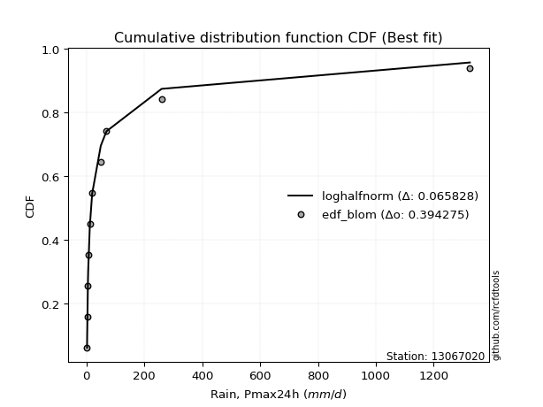</img>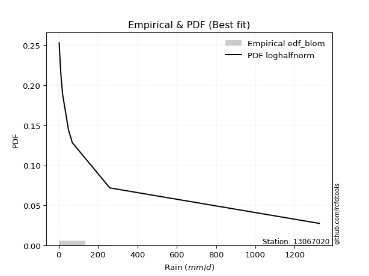</img>

</div>


### 7. Empirical - EDF Tukey (1962)

In hydrology, the Tukey formula is used as a plotting position formula to estimate the empirical probability or frequency of a flood event (or other hydrological data). The formula parameter is given as _c=0.333_ (or 1/3).

<div align="center">


$P=(m-c)/(n+1-2c)$


</div>


**7.1. Empirical values**

<div align="center">

|                | 0                    | 1                   | 2                   | 3                  | 4                  | 5         | 6                  | 7                  | 8                  | 9                  | 10                 |
|:---------------|:---------------------|:--------------------|:--------------------|:-------------------|:-------------------|:----------|:-------------------|:-------------------|:-------------------|:-------------------|:-------------------|
| date           | 2021                 | 2023                | 2022                | 2019               | 2025               | 2020      | 2024               | 2015               | 2016               | 2017               | 2018               |
| x              | 2.2                  | 2.5                 | 5.2                 | 6.1                | 7.8                | 11.6      | 19.8               | 49.65              | 69.25              | 259.7              | 1325.0             |
| m              | 1                    | 2                   | 3                   | 4                  | 5                  | 6         | 7                  | 8                  | 9                  | 10                 | 11                 |
| empirical_dist | edf_tukey            | edf_tukey           | edf_tukey           | edf_tukey          | edf_tukey          | edf_tukey | edf_tukey          | edf_tukey          | edf_tukey          | edf_tukey          | edf_tukey          |
| empirical      | 0.058823529411764705 | 0.14705882352941177 | 0.23529411764705882 | 0.3235294117647059 | 0.4117647058823529 | 0.5       | 0.5882352941176471 | 0.6764705882352942 | 0.7647058823529411 | 0.8529411764705882 | 0.9411764705882353 |
| empirical_tr   | 1.0625               | 1.1724137931034484  | 1.3076923076923077  | 1.4782608695652173 | 1.7                | 2.0       | 2.428571428571429  | 3.0909090909090913 | 4.249999999999999  | 6.799999999999999  | 16.999999999999996 |

</div>


**7.2. Kolmogorov-Smirnov fit test (sorted by Δ)**


<div align="center">

|                | 0                    | 1                   | 2                   | 3                   | 4                     | 5                   | 6                   | 7                   | 8                   | 9                   | 10                  | 11                  | 12                  | 13                  | 14                  | 15                  | 16                  | 17                  | 18                  | 19                  | 20                  | 21                  | 22                  | 23                  | 24                  | 25                  | 26                  | 27                  | 28                  | 29                  | 30                  | 31                  | 32                  | 33                  | 34                  | 35                  | 36                  | 37                  | 38                  | 39                  | 40                  | 41                  | 42                  | 43                  | 44                  | 45                  | 46                  | 47                  | 48                  | 49                  | 50                  | 51                  | 52                  | 53                  | 54                  | 55                  | 56                  | 57                  | 58                  | 59                  | 60                  | 61                  | 62                  | 63                  | 64                  | 65                  | 66                  | 67                  | 68                  | 69                  | 70                  | 71                  | 72                  | 73                  | 74                  | 75                  | 76                  | 77                  | 78                  | 79                  | 80                  | 81                  | 82                  | 83                  | 84                  | 85                  | 86                  | 87                  | 88                  | 89                  |
|:---------------|:---------------------|:--------------------|:--------------------|:--------------------|:----------------------|:--------------------|:--------------------|:--------------------|:--------------------|:--------------------|:--------------------|:--------------------|:--------------------|:--------------------|:--------------------|:--------------------|:--------------------|:--------------------|:--------------------|:--------------------|:--------------------|:--------------------|:--------------------|:--------------------|:--------------------|:--------------------|:--------------------|:--------------------|:--------------------|:--------------------|:--------------------|:--------------------|:--------------------|:--------------------|:--------------------|:--------------------|:--------------------|:--------------------|:--------------------|:--------------------|:--------------------|:--------------------|:--------------------|:--------------------|:--------------------|:--------------------|:--------------------|:--------------------|:--------------------|:--------------------|:--------------------|:--------------------|:--------------------|:--------------------|:--------------------|:--------------------|:--------------------|:--------------------|:--------------------|:--------------------|:--------------------|:--------------------|:--------------------|:--------------------|:--------------------|:--------------------|:--------------------|:--------------------|:--------------------|:--------------------|:--------------------|:--------------------|:--------------------|:--------------------|:--------------------|:--------------------|:--------------------|:--------------------|:--------------------|:--------------------|:--------------------|:--------------------|:--------------------|:--------------------|:--------------------|:--------------------|:--------------------|:--------------------|:--------------------|:--------------------|
| station        | 13067020             | 13067020            | 13067020            | 13067020            | 13067020              | 13067020            | 13067020            | 13067020            | 13067020            | 13067020            | 13067020            | 13067020            | 13067020            | 13067020            | 13067020            | 13067020            | 13067020            | 13067020            | 13067020            | 13067020            | 13067020            | 13067020            | 13067020            | 13067020            | 13067020            | 13067020            | 13067020            | 13067020            | 13067020            | 13067020            | 13067020            | 13067020            | 13067020            | 13067020            | 13067020            | 13067020            | 13067020            | 13067020            | 13067020            | 13067020            | 13067020            | 13067020            | 13067020            | 13067020            | 13067020            | 13067020            | 13067020            | 13067020            | 13067020            | 13067020            | 13067020            | 13067020            | 13067020            | 13067020            | 13067020            | 13067020            | 13067020            | 13067020            | 13067020            | 13067020            | 13067020            | 13067020            | 13067020            | 13067020            | 13067020            | 13067020            | 13067020            | 13067020            | 13067020            | 13067020            | 13067020            | 13067020            | 13067020            | 13067020            | 13067020            | 13067020            | 13067020            | 13067020            | 13067020            | 13067020            | 13067020            | 13067020            | 13067020            | 13067020            | 13067020            | 13067020            | 13067020            | 13067020            | 13067020            | 13067020            |
| empirical_dist | edf_tukey            | edf_tukey           | edf_tukey           | edf_tukey           | edf_tukey             | edf_tukey           | edf_tukey           | edf_tukey           | edf_tukey           | edf_tukey           | edf_tukey           | edf_tukey           | edf_tukey           | edf_tukey           | edf_tukey           | edf_tukey           | edf_tukey           | edf_tukey           | edf_tukey           | edf_tukey           | edf_tukey           | edf_tukey           | edf_tukey           | edf_tukey           | edf_tukey           | edf_tukey           | edf_tukey           | edf_tukey           | edf_tukey           | edf_tukey           | edf_tukey           | edf_tukey           | edf_tukey           | edf_tukey           | edf_tukey           | edf_tukey           | edf_tukey           | edf_tukey           | edf_tukey           | edf_tukey           | edf_tukey           | edf_tukey           | edf_tukey           | edf_tukey           | edf_tukey           | edf_tukey           | edf_tukey           | edf_tukey           | edf_tukey           | edf_tukey           | edf_tukey           | edf_tukey           | edf_tukey           | edf_tukey           | edf_tukey           | edf_tukey           | edf_tukey           | edf_tukey           | edf_tukey           | edf_tukey           | edf_tukey           | edf_tukey           | edf_tukey           | edf_tukey           | edf_tukey           | edf_tukey           | edf_tukey           | edf_tukey           | edf_tukey           | edf_tukey           | edf_tukey           | edf_tukey           | edf_tukey           | edf_tukey           | edf_tukey           | edf_tukey           | edf_tukey           | edf_tukey           | edf_tukey           | edf_tukey           | edf_tukey           | edf_tukey           | edf_tukey           | edf_tukey           | edf_tukey           | edf_tukey           | edf_tukey           | edf_tukey           | edf_tukey           | edf_tukey           |
| p_dist         | loghalfnorm          | logncf              | betaprime           | nct                 | loglaplace_asymmetric | loggenlogistic      | logpearson3         | loggumbel_r         | lograyleigh         | logalpha            | loginvgamma         | logfatiguelife      | ncf                 | loginvgauss         | logmoyal            | lognct              | loginvweibull       | logjohnsonsu        | logkstwobign        | logfisk             | logmaxwell          | logexponnorm        | fisk                | logexpon            | loggenexpon         | pareto              | invgamma            | logtruncnorm        | loggompertz         | loghalflogistic     | invgauss            | logrice             | logt                | logcrystalball      | lognorm             | lognorm             | logloggamma         | erlang              | fatiguelife         | loglogistic         | logwald             | loghypsecant        | invweibull          | f                   | loglaplace          | loggumbel_l         | gamma               | logweibull_min      | chi2                | logmielke           | logchi2             | loggibrat           | alpha               | nakagami            | t                   | logf                | logerlang           | weibull_min         | rayleigh            | gumbel_r            | gibrat              | maxwell             | genlogistic         | moyal               | halfnorm            | crystalball         | norm                | halflogistic        | wald                | logistic            | hypsecant           | loglognorm          | johnsonsu           | laplace             | kstwobign           | lognakagami         | pearson3            | logpareto           | rice                | gumbel_l            | gompertz            | exponnorm           | genexpon            | expon               | laplace_asymmetric  | truncnorm           | loggamma            | loggamma            | logbetaprime        | mielke              |
| delta          | 0.048059064429820386 | 0.06861193140746437 | 0.07011313087523252 | 0.07505416226312914 | 0.07563639696447899   | 0.07626369988616688 | 0.07650475896807196 | 0.0774546431787308  | 0.07745666899663439 | 0.07844801518929057 | 0.07873116968462723 | 0.07892247292172838 | 0.079464007126708   | 0.07950912514776945 | 0.08020488856122064 | 0.08037414348345207 | 0.08044970837334064 | 0.08085038566073718 | 0.08488318020842878 | 0.08636883800938205 | 0.0897338483154902  | 0.09098687884473741 | 0.09169599825827307 | 0.0920887649517608  | 0.09209909572522584 | 0.09535593084918789 | 0.09943532600933497 | 0.10393461765428191 | 0.1039664510460927  | 0.10731931284176525 | 0.10879596852303919 | 0.11901258813267734 | 0.1230242654139963  | 0.12302501060011906 | 0.1230250267731699  | 0.1230250267731699  | 0.12457566476677279 | 0.12636615524525746 | 0.1290863369378541  | 0.1384190176760277  | 0.14705882352941177 | 0.15074481031695464 | 0.16075990724750716 | 0.16408811743860624 | 0.17903130192482708 | 0.18687227199455686 | 0.19167390765854664 | 0.1966668632481463  | 0.19990139002652751 | 0.20638451850618406 | 0.23372138639324797 | 0.24447400850328582 | 0.24452791513262118 | 0.2509605576872356  | 0.2514699434367712  | 0.27527589543120917 | 0.2826498796857791  | 0.29371913833707475 | 0.3213536099645055  | 0.3231779002398262  | 0.3232398210431908  | 0.32600014541537986 | 0.3270191362562559  | 0.33934959502120754 | 0.3551717242612506  | 0.3601153649084471  | 0.36011538093515566 | 0.36098166077852495 | 0.3722020367897071  | 0.3724885398194106  | 0.38265177891342694 | 0.38316459571974015 | 0.3987678665962671  | 0.40935704343522583 | 0.41004641067317565 | 0.41024853449918436 | 0.4113624483213216  | 0.4224566472917958  | 0.42417032606375155 | 0.4270840117268204  | 0.4750745694102764  | 0.48153775079101735 | 0.482627584107293   | 0.48262762966838507 | 0.482627938179646   | 0.5031080880615703  | 0.5338371763387542  | 0.5338371763387542  | 0.5539921992952772  | nan                 |
| deltao         | 0.37613735880099997  | 0.37613735880099997 | 0.37613735880099997 | 0.37613735880099997 | 0.37613735880099997   | 0.37613735880099997 | 0.37613735880099997 | 0.37613735880099997 | 0.37613735880099997 | 0.37613735880099997 | 0.37613735880099997 | 0.37613735880099997 | 0.37613735880099997 | 0.37613735880099997 | 0.37613735880099997 | 0.37613735880099997 | 0.37613735880099997 | 0.37613735880099997 | 0.37613735880099997 | 0.37613735880099997 | 0.37613735880099997 | 0.37613735880099997 | 0.37613735880099997 | 0.37613735880099997 | 0.37613735880099997 | 0.37613735880099997 | 0.37613735880099997 | 0.37613735880099997 | 0.37613735880099997 | 0.37613735880099997 | 0.37613735880099997 | 0.37613735880099997 | 0.37613735880099997 | 0.37613735880099997 | 0.37613735880099997 | 0.37613735880099997 | 0.37613735880099997 | 0.37613735880099997 | 0.37613735880099997 | 0.37613735880099997 | 0.37613735880099997 | 0.37613735880099997 | 0.37613735880099997 | 0.37613735880099997 | 0.37613735880099997 | 0.37613735880099997 | 0.37613735880099997 | 0.37613735880099997 | 0.37613735880099997 | 0.37613735880099997 | 0.37613735880099997 | 0.37613735880099997 | 0.37613735880099997 | 0.37613735880099997 | 0.37613735880099997 | 0.37613735880099997 | 0.37613735880099997 | 0.37613735880099997 | 0.37613735880099997 | 0.37613735880099997 | 0.37613735880099997 | 0.37613735880099997 | 0.37613735880099997 | 0.37613735880099997 | 0.37613735880099997 | 0.37613735880099997 | 0.37613735880099997 | 0.37613735880099997 | 0.37613735880099997 | 0.37613735880099997 | 0.37613735880099997 | 0.37613735880099997 | 0.37613735880099997 | 0.37613735880099997 | 0.37613735880099997 | 0.37613735880099997 | 0.37613735880099997 | 0.37613735880099997 | 0.37613735880099997 | 0.37613735880099997 | 0.37613735880099997 | 0.37613735880099997 | 0.37613735880099997 | 0.37613735880099997 | 0.37613735880099997 | 0.37613735880099997 | 0.37613735880099997 | 0.37613735880099997 | 0.37613735880099997 | 0.37613735880099997 |
| eval           | Δo > Δ               | Δo > Δ              | Δo > Δ              | Δo > Δ              | Δo > Δ                | Δo > Δ              | Δo > Δ              | Δo > Δ              | Δo > Δ              | Δo > Δ              | Δo > Δ              | Δo > Δ              | Δo > Δ              | Δo > Δ              | Δo > Δ              | Δo > Δ              | Δo > Δ              | Δo > Δ              | Δo > Δ              | Δo > Δ              | Δo > Δ              | Δo > Δ              | Δo > Δ              | Δo > Δ              | Δo > Δ              | Δo > Δ              | Δo > Δ              | Δo > Δ              | Δo > Δ              | Δo > Δ              | Δo > Δ              | Δo > Δ              | Δo > Δ              | Δo > Δ              | Δo > Δ              | Δo > Δ              | Δo > Δ              | Δo > Δ              | Δo > Δ              | Δo > Δ              | Δo > Δ              | Δo > Δ              | Δo > Δ              | Δo > Δ              | Δo > Δ              | Δo > Δ              | Δo > Δ              | Δo > Δ              | Δo > Δ              | Δo > Δ              | Δo > Δ              | Δo > Δ              | Δo > Δ              | Δo > Δ              | Δo > Δ              | Δo > Δ              | Δo > Δ              | Δo > Δ              | Δo > Δ              | Δo > Δ              | Δo > Δ              | Δo > Δ              | Δo > Δ              | Δo > Δ              | Δo > Δ              | Δo > Δ              | Δo > Δ              | Δo > Δ              | Δo > Δ              | Δo > Δ              | Δo <= Δ             | Δo <= Δ             | Δo <= Δ             | Δo <= Δ             | Δo <= Δ             | Δo <= Δ             | Δo <= Δ             | Δo <= Δ             | Δo <= Δ             | Δo <= Δ             | Δo <= Δ             | Δo <= Δ             | Δo <= Δ             | Δo <= Δ             | Δo <= Δ             | Δo <= Δ             | Δo <= Δ             | Δo <= Δ             | Δo <= Δ             | Δo <= Δ             |
| fit            | 1                    | 1                   | 1                   | 1                   | 1                     | 1                   | 1                   | 1                   | 1                   | 1                   | 1                   | 1                   | 1                   | 1                   | 1                   | 1                   | 1                   | 1                   | 1                   | 1                   | 1                   | 1                   | 1                   | 1                   | 1                   | 1                   | 1                   | 1                   | 1                   | 1                   | 1                   | 1                   | 1                   | 1                   | 1                   | 1                   | 1                   | 1                   | 1                   | 1                   | 1                   | 1                   | 1                   | 1                   | 1                   | 1                   | 1                   | 1                   | 1                   | 1                   | 1                   | 1                   | 1                   | 1                   | 1                   | 1                   | 1                   | 1                   | 1                   | 1                   | 1                   | 1                   | 1                   | 1                   | 1                   | 1                   | 1                   | 1                   | 1                   | 1                   | 0                   | 0                   | 0                   | 0                   | 0                   | 0                   | 0                   | 0                   | 0                   | 0                   | 0                   | 0                   | 0                   | 0                   | 0                   | 0                   | 0                   | 0                   | 0                   | 0                   |
| n              | 11                   | 11                  | 11                  | 11                  | 11                    | 11                  | 11                  | 11                  | 11                  | 11                  | 11                  | 11                  | 11                  | 11                  | 11                  | 11                  | 11                  | 11                  | 11                  | 11                  | 11                  | 11                  | 11                  | 11                  | 11                  | 11                  | 11                  | 11                  | 11                  | 11                  | 11                  | 11                  | 11                  | 11                  | 11                  | 11                  | 11                  | 11                  | 11                  | 11                  | 11                  | 11                  | 11                  | 11                  | 11                  | 11                  | 11                  | 11                  | 11                  | 11                  | 11                  | 11                  | 11                  | 11                  | 11                  | 11                  | 11                  | 11                  | 11                  | 11                  | 11                  | 11                  | 11                  | 11                  | 11                  | 11                  | 11                  | 11                  | 11                  | 11                  | 11                  | 11                  | 11                  | 11                  | 11                  | 11                  | 11                  | 11                  | 11                  | 11                  | 11                  | 11                  | 11                  | 11                  | 11                  | 11                  | 11                  | 11                  | 11                  | 11                  |
| best_fit       | 1                    | 0                   | 0                   | 0                   | 0                     | 0                   | 0                   | 0                   | 0                   | 0                   | 0                   | 0                   | 0                   | 0                   | 0                   | 0                   | 0                   | 0                   | 0                   | 0                   | 0                   | 0                   | 0                   | 0                   | 0                   | 0                   | 0                   | 0                   | 0                   | 0                   | 0                   | 0                   | 0                   | 0                   | 0                   | 0                   | 0                   | 0                   | 0                   | 0                   | 0                   | 0                   | 0                   | 0                   | 0                   | 0                   | 0                   | 0                   | 0                   | 0                   | 0                   | 0                   | 0                   | 0                   | 0                   | 0                   | 0                   | 0                   | 0                   | 0                   | 0                   | 0                   | 0                   | 0                   | 0                   | 0                   | 0                   | 0                   | 0                   | 0                   | 0                   | 0                   | 0                   | 0                   | 0                   | 0                   | 0                   | 0                   | 0                   | 0                   | 0                   | 0                   | 0                   | 0                   | 0                   | 0                   | 0                   | 0                   | 0                   | 0                   |
| best_fit_sort  | 1                    | 2                   | 3                   | 4                   | 5                     | 6                   | 7                   | 8                   | 9                   | 10                  | 11                  | 12                  | 13                  | 14                  | 15                  | 16                  | 17                  | 18                  | 19                  | 20                  | 21                  | 22                  | 23                  | 24                  | 25                  | 26                  | 27                  | 28                  | 29                  | 30                  | 31                  | 32                  | 33                  | 34                  | 35                  | 36                  | 37                  | 38                  | 39                  | 40                  | 41                  | 42                  | 43                  | 44                  | 45                  | 46                  | 47                  | 48                  | 49                  | 50                  | 51                  | 52                  | 53                  | 54                  | 55                  | 56                  | 57                  | 58                  | 59                  | 60                  | 61                  | 62                  | 63                  | 64                  | 65                  | 66                  | 67                  | 68                  | 69                  | 70                  | 71                  | 72                  | 73                  | 74                  | 75                  | 76                  | 77                  | 78                  | 79                  | 80                  | 81                  | 82                  | 83                  | 84                  | 85                  | 86                  | 87                  | 88                  | 89                  | 90                  |

</div>


<div align="center">

</img>

</div>


**7.3. Best fit**

<div align="center">

|   id |   station | empirical_dist   | p_dist      |     delta |   deltao | eval   |   fit |   n |   best_fit |   best_fit_sort |
|-----:|----------:|:-----------------|:------------|----------:|---------:|:-------|------:|----:|-----------:|----------------:|
|    0 |  13067020 | edf_tukey        | loghalfnorm | 0.0480591 | 0.376137 | Δo > Δ |     1 |  11 |          1 |               1 |

</div>


<div align="center">

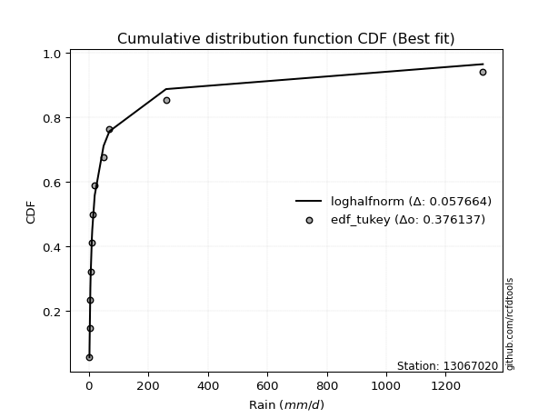</img></img>

</div>


### 8. Empirical - EDF Gringorten (1963)

Gringorten plotting position formula is essential for estimating the probability and return periods of extreme events like floods and heavy rainfall. The constant _a=0.44_.

<div align="center">


$P=(m-a)/(n+1-2a)$


</div>


**8.1. Empirical values**

<div align="center">

|                | 0                   | 1                   | 2                  | 3                   | 4                   | 5              | 6                  | 7                  | 8                  | 9                  | 10                 |
|:---------------|:--------------------|:--------------------|:-------------------|:--------------------|:--------------------|:---------------|:-------------------|:-------------------|:-------------------|:-------------------|:-------------------|
| date           | 2021                | 2023                | 2022               | 2019                | 2025                | 2020           | 2024               | 2015               | 2016               | 2017               | 2018               |
| x              | 2.2                 | 2.5                 | 5.2                | 6.1                 | 7.8                 | 11.6           | 19.8               | 49.65              | 69.25              | 259.7              | 1325.0             |
| m              | 1                   | 2                   | 3                  | 4                   | 5                   | 6              | 7                  | 8                  | 9                  | 10                 | 11                 |
| empirical_dist | edf_gringorten      | edf_gringorten      | edf_gringorten     | edf_gringorten      | edf_gringorten      | edf_gringorten | edf_gringorten     | edf_gringorten     | edf_gringorten     | edf_gringorten     | edf_gringorten     |
| empirical      | 0.05035971223021583 | 0.14028776978417268 | 0.2302158273381295 | 0.32014388489208634 | 0.41007194244604317 | 0.5            | 0.5899280575539568 | 0.6798561151079137 | 0.7697841726618706 | 0.8597122302158274 | 0.9496402877697843 |
| empirical_tr   | 1.053030303030303   | 1.1631799163179917  | 1.2990654205607477 | 1.470899470899471   | 1.6951219512195121  | 2.0            | 2.43859649122807   | 3.1235955056179776 | 4.343750000000002  | 7.128205128205133  | 19.857142857142893 |

</div>


**8.2. Kolmogorov-Smirnov fit test (sorted by Δ)**


<div align="center">

|                | 0                   | 1                   | 2                   | 3                   | 4                     | 5                   | 6                   | 7                   | 8                   | 9                   | 10                  | 11                  | 12                  | 13                  | 14                  | 15                  | 16                  | 17                  | 18                  | 19                  | 20                  | 21                  | 22                  | 23                  | 24                  | 25                  | 26                  | 27                  | 28                  | 29                  | 30                  | 31                  | 32                  | 33                  | 34                  | 35                  | 36                  | 37                  | 38                  | 39                  | 40                  | 41                  | 42                  | 43                  | 44                  | 45                  | 46                  | 47                  | 48                  | 49                  | 50                  | 51                  | 52                  | 53                  | 54                  | 55                  | 56                  | 57                  | 58                  | 59                  | 60                  | 61                  | 62                  | 63                  | 64                  | 65                  | 66                  | 67                  | 68                  | 69                  | 70                  | 71                  | 72                  | 73                  | 74                  | 75                  | 76                  | 77                  | 78                  | 79                  | 80                  | 81                  | 82                  | 83                  | 84                  | 85                  | 86                  | 87                  | 88                  | 89                  |
|:---------------|:--------------------|:--------------------|:--------------------|:--------------------|:----------------------|:--------------------|:--------------------|:--------------------|:--------------------|:--------------------|:--------------------|:--------------------|:--------------------|:--------------------|:--------------------|:--------------------|:--------------------|:--------------------|:--------------------|:--------------------|:--------------------|:--------------------|:--------------------|:--------------------|:--------------------|:--------------------|:--------------------|:--------------------|:--------------------|:--------------------|:--------------------|:--------------------|:--------------------|:--------------------|:--------------------|:--------------------|:--------------------|:--------------------|:--------------------|:--------------------|:--------------------|:--------------------|:--------------------|:--------------------|:--------------------|:--------------------|:--------------------|:--------------------|:--------------------|:--------------------|:--------------------|:--------------------|:--------------------|:--------------------|:--------------------|:--------------------|:--------------------|:--------------------|:--------------------|:--------------------|:--------------------|:--------------------|:--------------------|:--------------------|:--------------------|:--------------------|:--------------------|:--------------------|:--------------------|:--------------------|:--------------------|:--------------------|:--------------------|:--------------------|:--------------------|:--------------------|:--------------------|:--------------------|:--------------------|:--------------------|:--------------------|:--------------------|:--------------------|:--------------------|:--------------------|:--------------------|:--------------------|:--------------------|:--------------------|:--------------------|
| station        | 13067020            | 13067020            | 13067020            | 13067020            | 13067020              | 13067020            | 13067020            | 13067020            | 13067020            | 13067020            | 13067020            | 13067020            | 13067020            | 13067020            | 13067020            | 13067020            | 13067020            | 13067020            | 13067020            | 13067020            | 13067020            | 13067020            | 13067020            | 13067020            | 13067020            | 13067020            | 13067020            | 13067020            | 13067020            | 13067020            | 13067020            | 13067020            | 13067020            | 13067020            | 13067020            | 13067020            | 13067020            | 13067020            | 13067020            | 13067020            | 13067020            | 13067020            | 13067020            | 13067020            | 13067020            | 13067020            | 13067020            | 13067020            | 13067020            | 13067020            | 13067020            | 13067020            | 13067020            | 13067020            | 13067020            | 13067020            | 13067020            | 13067020            | 13067020            | 13067020            | 13067020            | 13067020            | 13067020            | 13067020            | 13067020            | 13067020            | 13067020            | 13067020            | 13067020            | 13067020            | 13067020            | 13067020            | 13067020            | 13067020            | 13067020            | 13067020            | 13067020            | 13067020            | 13067020            | 13067020            | 13067020            | 13067020            | 13067020            | 13067020            | 13067020            | 13067020            | 13067020            | 13067020            | 13067020            | 13067020            |
| empirical_dist | edf_gringorten      | edf_gringorten      | edf_gringorten      | edf_gringorten      | edf_gringorten        | edf_gringorten      | edf_gringorten      | edf_gringorten      | edf_gringorten      | edf_gringorten      | edf_gringorten      | edf_gringorten      | edf_gringorten      | edf_gringorten      | edf_gringorten      | edf_gringorten      | edf_gringorten      | edf_gringorten      | edf_gringorten      | edf_gringorten      | edf_gringorten      | edf_gringorten      | edf_gringorten      | edf_gringorten      | edf_gringorten      | edf_gringorten      | edf_gringorten      | edf_gringorten      | edf_gringorten      | edf_gringorten      | edf_gringorten      | edf_gringorten      | edf_gringorten      | edf_gringorten      | edf_gringorten      | edf_gringorten      | edf_gringorten      | edf_gringorten      | edf_gringorten      | edf_gringorten      | edf_gringorten      | edf_gringorten      | edf_gringorten      | edf_gringorten      | edf_gringorten      | edf_gringorten      | edf_gringorten      | edf_gringorten      | edf_gringorten      | edf_gringorten      | edf_gringorten      | edf_gringorten      | edf_gringorten      | edf_gringorten      | edf_gringorten      | edf_gringorten      | edf_gringorten      | edf_gringorten      | edf_gringorten      | edf_gringorten      | edf_gringorten      | edf_gringorten      | edf_gringorten      | edf_gringorten      | edf_gringorten      | edf_gringorten      | edf_gringorten      | edf_gringorten      | edf_gringorten      | edf_gringorten      | edf_gringorten      | edf_gringorten      | edf_gringorten      | edf_gringorten      | edf_gringorten      | edf_gringorten      | edf_gringorten      | edf_gringorten      | edf_gringorten      | edf_gringorten      | edf_gringorten      | edf_gringorten      | edf_gringorten      | edf_gringorten      | edf_gringorten      | edf_gringorten      | edf_gringorten      | edf_gringorten      | edf_gringorten      | edf_gringorten      |
| p_dist         | loghalfnorm         | logncf              | betaprime           | nct                 | loglaplace_asymmetric | logmoyal            | logjohnsonsu        | loggenlogistic      | loginvgauss         | logfatiguelife      | logalpha            | loginvgamma         | logpearson3         | loggumbel_r         | lognct              | loginvweibull       | lograyleigh         | logfisk             | logkstwobign        | ncf                 | fisk                | loggenexpon         | logexpon            | logexponnorm        | pareto              | logmaxwell          | logtruncnorm        | loggompertz         | loghalflogistic     | invgamma            | invgauss            | logrice             | logt                | logcrystalball      | lognorm             | lognorm             | logloggamma         | erlang              | fatiguelife         | loglogistic         | logwald             | loghypsecant        | invweibull          | f                   | loglaplace          | loggumbel_l         | gamma               | chi2                | logweibull_min      | logmielke           | logchi2             | loggibrat           | alpha               | nakagami            | t                   | logf                | logerlang           | weibull_min         | rayleigh            | maxwell             | gumbel_r            | gibrat              | genlogistic         | moyal               | halfnorm            | crystalball         | norm                | halflogistic        | logistic            | wald                | hypsecant           | loglognorm          | johnsonsu           | laplace             | kstwobign           | lognakagami         | pearson3            | logpareto           | rice                | gumbel_l            | gompertz            | exponnorm           | genexpon            | expon               | laplace_asymmetric  | truncnorm           | loggamma            | loggamma            | logbetaprime        | mielke              |
| delta          | 0.04766146952919309 | 0.06366669208816944 | 0.06672760400261302 | 0.06828310851789005 | 0.06965566850944982   | 0.07343383481598155 | 0.07407933191549809 | 0.07457093644985713 | 0.07485987888055645 | 0.07491758328777354 | 0.07506248831667106 | 0.07534564281200773 | 0.07573183931254512 | 0.07576187974242105 | 0.07698861661083256 | 0.07706418150072114 | 0.07745666899663439 | 0.07959778426414296 | 0.08319041677211902 | 0.08424336359404472 | 0.08492494451303398 | 0.0861763618565134  | 0.08623271784025849 | 0.08709282955006492 | 0.0885848771039488  | 0.0897338483154902  | 0.09716356390904282 | 0.09719539730085361 | 0.10054825909652616 | 0.10451361631826428 | 0.10541044165041968 | 0.11731982469636759 | 0.1230242654139963  | 0.12302501060011906 | 0.1230250267731699  | 0.1230250267731699  | 0.12457566476677279 | 0.13144444555418677 | 0.13416462724678357 | 0.1384190176760277  | 0.14028776978417268 | 0.15074481031695464 | 0.16583819755643647 | 0.16916640774753555 | 0.17903130192482708 | 0.18687227199455686 | 0.19675219796747612 | 0.204979680335457   | 0.2051306804296953  | 0.21146280881511337 | 0.23879967670217728 | 0.24108848163066626 | 0.24114238826000167 | 0.25603884799616505 | 0.2599337606183201  | 0.2803541857401385  | 0.2877281699947084  | 0.2987974286460042  | 0.3298174271460544  | 0.33107843572430934 | 0.33164171742137505 | 0.3317036382247397  | 0.33209742656518537 | 0.3478134122027564  | 0.36363554144279947 | 0.36519365521737657 | 0.36519367124408514 | 0.3694454779600738  | 0.3775668301283401  | 0.38066585397125596 | 0.3877300692223564  | 0.3899356494649793  | 0.40384615690519643 | 0.4144353337441553  | 0.41512470098210513 | 0.41532682480811367 | 0.4198262655028705  | 0.4292277010370349  | 0.429248616372681   | 0.4321623020357499  | 0.4767673328465862  | 0.4832305142273271  | 0.48432034754360276 | 0.4843203931046948  | 0.48432070161595575 | 0.50480085149788    | 0.5389154666476834  | 0.5389154666476834  | 0.5590704896042065  | nan                 |
| deltao         | 0.37613735880099997 | 0.37613735880099997 | 0.37613735880099997 | 0.37613735880099997 | 0.37613735880099997   | 0.37613735880099997 | 0.37613735880099997 | 0.37613735880099997 | 0.37613735880099997 | 0.37613735880099997 | 0.37613735880099997 | 0.37613735880099997 | 0.37613735880099997 | 0.37613735880099997 | 0.37613735880099997 | 0.37613735880099997 | 0.37613735880099997 | 0.37613735880099997 | 0.37613735880099997 | 0.37613735880099997 | 0.37613735880099997 | 0.37613735880099997 | 0.37613735880099997 | 0.37613735880099997 | 0.37613735880099997 | 0.37613735880099997 | 0.37613735880099997 | 0.37613735880099997 | 0.37613735880099997 | 0.37613735880099997 | 0.37613735880099997 | 0.37613735880099997 | 0.37613735880099997 | 0.37613735880099997 | 0.37613735880099997 | 0.37613735880099997 | 0.37613735880099997 | 0.37613735880099997 | 0.37613735880099997 | 0.37613735880099997 | 0.37613735880099997 | 0.37613735880099997 | 0.37613735880099997 | 0.37613735880099997 | 0.37613735880099997 | 0.37613735880099997 | 0.37613735880099997 | 0.37613735880099997 | 0.37613735880099997 | 0.37613735880099997 | 0.37613735880099997 | 0.37613735880099997 | 0.37613735880099997 | 0.37613735880099997 | 0.37613735880099997 | 0.37613735880099997 | 0.37613735880099997 | 0.37613735880099997 | 0.37613735880099997 | 0.37613735880099997 | 0.37613735880099997 | 0.37613735880099997 | 0.37613735880099997 | 0.37613735880099997 | 0.37613735880099997 | 0.37613735880099997 | 0.37613735880099997 | 0.37613735880099997 | 0.37613735880099997 | 0.37613735880099997 | 0.37613735880099997 | 0.37613735880099997 | 0.37613735880099997 | 0.37613735880099997 | 0.37613735880099997 | 0.37613735880099997 | 0.37613735880099997 | 0.37613735880099997 | 0.37613735880099997 | 0.37613735880099997 | 0.37613735880099997 | 0.37613735880099997 | 0.37613735880099997 | 0.37613735880099997 | 0.37613735880099997 | 0.37613735880099997 | 0.37613735880099997 | 0.37613735880099997 | 0.37613735880099997 | 0.37613735880099997 |
| eval           | Δo > Δ              | Δo > Δ              | Δo > Δ              | Δo > Δ              | Δo > Δ                | Δo > Δ              | Δo > Δ              | Δo > Δ              | Δo > Δ              | Δo > Δ              | Δo > Δ              | Δo > Δ              | Δo > Δ              | Δo > Δ              | Δo > Δ              | Δo > Δ              | Δo > Δ              | Δo > Δ              | Δo > Δ              | Δo > Δ              | Δo > Δ              | Δo > Δ              | Δo > Δ              | Δo > Δ              | Δo > Δ              | Δo > Δ              | Δo > Δ              | Δo > Δ              | Δo > Δ              | Δo > Δ              | Δo > Δ              | Δo > Δ              | Δo > Δ              | Δo > Δ              | Δo > Δ              | Δo > Δ              | Δo > Δ              | Δo > Δ              | Δo > Δ              | Δo > Δ              | Δo > Δ              | Δo > Δ              | Δo > Δ              | Δo > Δ              | Δo > Δ              | Δo > Δ              | Δo > Δ              | Δo > Δ              | Δo > Δ              | Δo > Δ              | Δo > Δ              | Δo > Δ              | Δo > Δ              | Δo > Δ              | Δo > Δ              | Δo > Δ              | Δo > Δ              | Δo > Δ              | Δo > Δ              | Δo > Δ              | Δo > Δ              | Δo > Δ              | Δo > Δ              | Δo > Δ              | Δo > Δ              | Δo > Δ              | Δo > Δ              | Δo > Δ              | Δo <= Δ             | Δo <= Δ             | Δo <= Δ             | Δo <= Δ             | Δo <= Δ             | Δo <= Δ             | Δo <= Δ             | Δo <= Δ             | Δo <= Δ             | Δo <= Δ             | Δo <= Δ             | Δo <= Δ             | Δo <= Δ             | Δo <= Δ             | Δo <= Δ             | Δo <= Δ             | Δo <= Δ             | Δo <= Δ             | Δo <= Δ             | Δo <= Δ             | Δo <= Δ             | Δo <= Δ             |
| fit            | 1                   | 1                   | 1                   | 1                   | 1                     | 1                   | 1                   | 1                   | 1                   | 1                   | 1                   | 1                   | 1                   | 1                   | 1                   | 1                   | 1                   | 1                   | 1                   | 1                   | 1                   | 1                   | 1                   | 1                   | 1                   | 1                   | 1                   | 1                   | 1                   | 1                   | 1                   | 1                   | 1                   | 1                   | 1                   | 1                   | 1                   | 1                   | 1                   | 1                   | 1                   | 1                   | 1                   | 1                   | 1                   | 1                   | 1                   | 1                   | 1                   | 1                   | 1                   | 1                   | 1                   | 1                   | 1                   | 1                   | 1                   | 1                   | 1                   | 1                   | 1                   | 1                   | 1                   | 1                   | 1                   | 1                   | 1                   | 1                   | 0                   | 0                   | 0                   | 0                   | 0                   | 0                   | 0                   | 0                   | 0                   | 0                   | 0                   | 0                   | 0                   | 0                   | 0                   | 0                   | 0                   | 0                   | 0                   | 0                   | 0                   | 0                   |
| n              | 11                  | 11                  | 11                  | 11                  | 11                    | 11                  | 11                  | 11                  | 11                  | 11                  | 11                  | 11                  | 11                  | 11                  | 11                  | 11                  | 11                  | 11                  | 11                  | 11                  | 11                  | 11                  | 11                  | 11                  | 11                  | 11                  | 11                  | 11                  | 11                  | 11                  | 11                  | 11                  | 11                  | 11                  | 11                  | 11                  | 11                  | 11                  | 11                  | 11                  | 11                  | 11                  | 11                  | 11                  | 11                  | 11                  | 11                  | 11                  | 11                  | 11                  | 11                  | 11                  | 11                  | 11                  | 11                  | 11                  | 11                  | 11                  | 11                  | 11                  | 11                  | 11                  | 11                  | 11                  | 11                  | 11                  | 11                  | 11                  | 11                  | 11                  | 11                  | 11                  | 11                  | 11                  | 11                  | 11                  | 11                  | 11                  | 11                  | 11                  | 11                  | 11                  | 11                  | 11                  | 11                  | 11                  | 11                  | 11                  | 11                  | 11                  |
| best_fit       | 1                   | 0                   | 0                   | 0                   | 0                     | 0                   | 0                   | 0                   | 0                   | 0                   | 0                   | 0                   | 0                   | 0                   | 0                   | 0                   | 0                   | 0                   | 0                   | 0                   | 0                   | 0                   | 0                   | 0                   | 0                   | 0                   | 0                   | 0                   | 0                   | 0                   | 0                   | 0                   | 0                   | 0                   | 0                   | 0                   | 0                   | 0                   | 0                   | 0                   | 0                   | 0                   | 0                   | 0                   | 0                   | 0                   | 0                   | 0                   | 0                   | 0                   | 0                   | 0                   | 0                   | 0                   | 0                   | 0                   | 0                   | 0                   | 0                   | 0                   | 0                   | 0                   | 0                   | 0                   | 0                   | 0                   | 0                   | 0                   | 0                   | 0                   | 0                   | 0                   | 0                   | 0                   | 0                   | 0                   | 0                   | 0                   | 0                   | 0                   | 0                   | 0                   | 0                   | 0                   | 0                   | 0                   | 0                   | 0                   | 0                   | 0                   |
| best_fit_sort  | 1                   | 2                   | 3                   | 4                   | 5                     | 6                   | 7                   | 8                   | 9                   | 10                  | 11                  | 12                  | 13                  | 14                  | 15                  | 16                  | 17                  | 18                  | 19                  | 20                  | 21                  | 22                  | 23                  | 24                  | 25                  | 26                  | 27                  | 28                  | 29                  | 30                  | 31                  | 32                  | 33                  | 34                  | 35                  | 36                  | 37                  | 38                  | 39                  | 40                  | 41                  | 42                  | 43                  | 44                  | 45                  | 46                  | 47                  | 48                  | 49                  | 50                  | 51                  | 52                  | 53                  | 54                  | 55                  | 56                  | 57                  | 58                  | 59                  | 60                  | 61                  | 62                  | 63                  | 64                  | 65                  | 66                  | 67                  | 68                  | 69                  | 70                  | 71                  | 72                  | 73                  | 74                  | 75                  | 76                  | 77                  | 78                  | 79                  | 80                  | 81                  | 82                  | 83                  | 84                  | 85                  | 86                  | 87                  | 88                  | 89                  | 90                  |

</div>


<div align="center">

</img>

</div>


**8.3. Best fit**

<div align="center">

|   id |   station | empirical_dist   | p_dist      |     delta |   deltao | eval   |   fit |   n |   best_fit |   best_fit_sort |
|-----:|----------:|:-----------------|:------------|----------:|---------:|:-------|------:|----:|-----------:|----------------:|
|    0 |  13067020 | edf_gringorten   | loghalfnorm | 0.0476615 | 0.376137 | Δo > Δ |     1 |  11 |          1 |               1 |

</div>


<div align="center">

</img>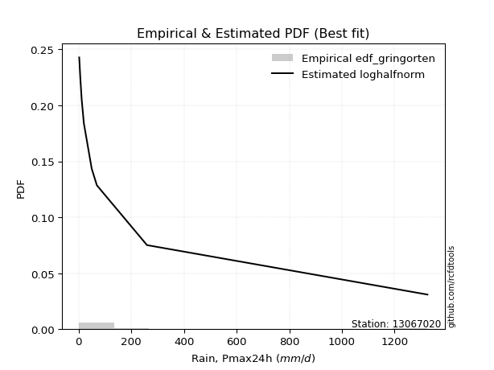</img>

</div>


### 9. Empirical - EDF Filliben (1975)

The specific values of the constants (0.3175) (often denoted as $alpha$) and (0.365) are derived from a method proposed by James J. Filliben in a 1975 paper. This particular formula is the mean value of the $i$-th order statistic of the normal distribution and is considered a robust and effective plotting position formula for the normal probability plot correlation coefficient test for normality.

<div align="center">


$P=(m-0.3175)/(n+0.365)$


</div>


**9.1. Empirical values**

<div align="center">

|                | 0                    | 1                   | 2                   | 3                  | 4                   | 5            | 6                  | 7                  | 8                  | 9                  | 10                 |
|:---------------|:---------------------|:--------------------|:--------------------|:-------------------|:--------------------|:-------------|:-------------------|:-------------------|:-------------------|:-------------------|:-------------------|
| date           | 2021                 | 2023                | 2022                | 2019               | 2025                | 2020         | 2024               | 2015               | 2016               | 2017               | 2018               |
| x              | 2.2                  | 2.5                 | 5.2                 | 6.1                | 7.8                 | 11.6         | 19.8               | 49.65              | 69.25              | 259.7              | 1325.0             |
| m              | 1                    | 2                   | 3                   | 4                  | 5                   | 6            | 7                  | 8                  | 9                  | 10                 | 11                 |
| empirical_dist | edf_filliben         | edf_filliben        | edf_filliben        | edf_filliben       | edf_filliben        | edf_filliben | edf_filliben       | edf_filliben       | edf_filliben       | edf_filliben       | edf_filliben       |
| empirical      | 0.060052793664760226 | 0.14804223493180818 | 0.23603167619885615 | 0.3240211174659041 | 0.41201055873295206 | 0.5          | 0.587989441267048  | 0.6759788825340959 | 0.7639683238011438 | 0.8519577650681918 | 0.9399472063352396 |
| empirical_tr   | 1.063889538965598    | 1.173767105602892   | 1.3089547941261157  | 1.4793361535958347 | 1.7007108118219232  | 2.0          | 2.4271222637479983 | 3.08621860149355   | 4.236719478098787  | 6.754829123328378  | 16.652014652014618 |

</div>


**9.2. Kolmogorov-Smirnov fit test (sorted by Δ)**


<div align="center">

|                | 0                   | 1                   | 2                   | 3                   | 4                   | 5                     | 6                   | 7                   | 8                   | 9                   | 10                  | 11                  | 12                  | 13                  | 14                  | 15                  | 16                  | 17                  | 18                  | 19                  | 20                  | 21                  | 22                  | 23                  | 24                  | 25                  | 26                  | 27                  | 28                  | 29                  | 30                  | 31                  | 32                  | 33                  | 34                  | 35                  | 36                  | 37                  | 38                  | 39                  | 40                  | 41                  | 42                  | 43                  | 44                  | 45                  | 46                  | 47                  | 48                  | 49                  | 50                  | 51                  | 52                  | 53                  | 54                  | 55                  | 56                  | 57                  | 58                  | 59                  | 60                  | 61                  | 62                  | 63                  | 64                  | 65                  | 66                  | 67                  | 68                  | 69                  | 70                  | 71                  | 72                  | 73                  | 74                  | 75                  | 76                  | 77                  | 78                  | 79                  | 80                  | 81                  | 82                  | 83                  | 84                  | 85                  | 86                  | 87                  | 88                  | 89                  |
|:---------------|:--------------------|:--------------------|:--------------------|:--------------------|:--------------------|:----------------------|:--------------------|:--------------------|:--------------------|:--------------------|:--------------------|:--------------------|:--------------------|:--------------------|:--------------------|:--------------------|:--------------------|:--------------------|:--------------------|:--------------------|:--------------------|:--------------------|:--------------------|:--------------------|:--------------------|:--------------------|:--------------------|:--------------------|:--------------------|:--------------------|:--------------------|:--------------------|:--------------------|:--------------------|:--------------------|:--------------------|:--------------------|:--------------------|:--------------------|:--------------------|:--------------------|:--------------------|:--------------------|:--------------------|:--------------------|:--------------------|:--------------------|:--------------------|:--------------------|:--------------------|:--------------------|:--------------------|:--------------------|:--------------------|:--------------------|:--------------------|:--------------------|:--------------------|:--------------------|:--------------------|:--------------------|:--------------------|:--------------------|:--------------------|:--------------------|:--------------------|:--------------------|:--------------------|:--------------------|:--------------------|:--------------------|:--------------------|:--------------------|:--------------------|:--------------------|:--------------------|:--------------------|:--------------------|:--------------------|:--------------------|:--------------------|:--------------------|:--------------------|:--------------------|:--------------------|:--------------------|:--------------------|:--------------------|:--------------------|:--------------------|
| station        | 13067020            | 13067020            | 13067020            | 13067020            | 13067020            | 13067020              | 13067020            | 13067020            | 13067020            | 13067020            | 13067020            | 13067020            | 13067020            | 13067020            | 13067020            | 13067020            | 13067020            | 13067020            | 13067020            | 13067020            | 13067020            | 13067020            | 13067020            | 13067020            | 13067020            | 13067020            | 13067020            | 13067020            | 13067020            | 13067020            | 13067020            | 13067020            | 13067020            | 13067020            | 13067020            | 13067020            | 13067020            | 13067020            | 13067020            | 13067020            | 13067020            | 13067020            | 13067020            | 13067020            | 13067020            | 13067020            | 13067020            | 13067020            | 13067020            | 13067020            | 13067020            | 13067020            | 13067020            | 13067020            | 13067020            | 13067020            | 13067020            | 13067020            | 13067020            | 13067020            | 13067020            | 13067020            | 13067020            | 13067020            | 13067020            | 13067020            | 13067020            | 13067020            | 13067020            | 13067020            | 13067020            | 13067020            | 13067020            | 13067020            | 13067020            | 13067020            | 13067020            | 13067020            | 13067020            | 13067020            | 13067020            | 13067020            | 13067020            | 13067020            | 13067020            | 13067020            | 13067020            | 13067020            | 13067020            | 13067020            |
| empirical_dist | edf_filliben        | edf_filliben        | edf_filliben        | edf_filliben        | edf_filliben        | edf_filliben          | edf_filliben        | edf_filliben        | edf_filliben        | edf_filliben        | edf_filliben        | edf_filliben        | edf_filliben        | edf_filliben        | edf_filliben        | edf_filliben        | edf_filliben        | edf_filliben        | edf_filliben        | edf_filliben        | edf_filliben        | edf_filliben        | edf_filliben        | edf_filliben        | edf_filliben        | edf_filliben        | edf_filliben        | edf_filliben        | edf_filliben        | edf_filliben        | edf_filliben        | edf_filliben        | edf_filliben        | edf_filliben        | edf_filliben        | edf_filliben        | edf_filliben        | edf_filliben        | edf_filliben        | edf_filliben        | edf_filliben        | edf_filliben        | edf_filliben        | edf_filliben        | edf_filliben        | edf_filliben        | edf_filliben        | edf_filliben        | edf_filliben        | edf_filliben        | edf_filliben        | edf_filliben        | edf_filliben        | edf_filliben        | edf_filliben        | edf_filliben        | edf_filliben        | edf_filliben        | edf_filliben        | edf_filliben        | edf_filliben        | edf_filliben        | edf_filliben        | edf_filliben        | edf_filliben        | edf_filliben        | edf_filliben        | edf_filliben        | edf_filliben        | edf_filliben        | edf_filliben        | edf_filliben        | edf_filliben        | edf_filliben        | edf_filliben        | edf_filliben        | edf_filliben        | edf_filliben        | edf_filliben        | edf_filliben        | edf_filliben        | edf_filliben        | edf_filliben        | edf_filliben        | edf_filliben        | edf_filliben        | edf_filliben        | edf_filliben        | edf_filliben        | edf_filliben        |
| p_dist         | loghalfnorm         | logncf              | betaprime           | nct                 | loggenlogistic      | loglaplace_asymmetric | logpearson3         | lograyleigh         | loggumbel_r         | logalpha            | loginvgamma         | logfatiguelife      | ncf                 | loginvgauss         | lognct              | loginvweibull       | logmoyal            | logjohnsonsu        | logkstwobign        | logfisk             | logmaxwell          | logexponnorm        | fisk                | logexpon            | loggenexpon         | pareto              | invgamma            | logtruncnorm        | loggompertz         | loghalflogistic     | invgauss            | logrice             | logt                | logcrystalball      | lognorm             | lognorm             | logloggamma         | erlang              | fatiguelife         | loglogistic         | logwald             | loghypsecant        | invweibull          | f                   | loglaplace          | loggumbel_l         | gamma               | logweibull_min      | chi2                | logmielke           | logchi2             | loggibrat           | alpha               | nakagami            | t                   | logf                | logerlang           | weibull_min         | rayleigh            | gumbel_r            | gibrat              | maxwell             | genlogistic         | moyal               | halfnorm            | crystalball         | norm                | halflogistic        | wald                | logistic            | hypsecant           | loglognorm          | johnsonsu           | laplace             | kstwobign           | lognakagami         | pearson3            | logpareto           | rice                | gumbel_l            | gompertz            | exponnorm           | genexpon            | expon               | laplace_asymmetric  | truncnorm           | loggamma            | loggamma            | logbetaprime        | mielke              |
| delta          | 0.0490424758322168  | 0.06959534280986078 | 0.0706048365764308  | 0.07603757366552555 | 0.07650955273676602 | 0.0766198083668754    | 0.0767506118186711  | 0.07745666899663439 | 0.07770049602932994 | 0.07893972089048884 | 0.07922287538582551 | 0.07990588432412479 | 0.0804474185291044  | 0.08049253655016586 | 0.08086584918465034 | 0.08094141407453892 | 0.08118829996361705 | 0.0818337970631336  | 0.08512903305902791 | 0.08735224941177847 | 0.0897338483154902  | 0.09197029024713382 | 0.09267940966066948 | 0.09307217635415721 | 0.09308250712762225 | 0.0963393422515843  | 0.09869776745753764 | 0.10491802905667832 | 0.10494986244848911 | 0.10830272424416167 | 0.10928767422423746 | 0.11925844098327648 | 0.1230242654139963  | 0.12302501060011906 | 0.1230250267731699  | 0.1230250267731699  | 0.12457566476677279 | 0.12562859669346013 | 0.12834877838605674 | 0.1384190176760277  | 0.14804223493180818 | 0.15074481031695464 | 0.16002234869570983 | 0.1633505588868089  | 0.17903130192482708 | 0.18687227199455686 | 0.19093634910674928 | 0.19543759899515067 | 0.19916383147473016 | 0.20564695995438673 | 0.23298382784145064 | 0.24496571420448404 | 0.24501962083381945 | 0.2502229991354382  | 0.2502406791837757  | 0.27453833687941187 | 0.2819123211339818  | 0.2929815797852774  | 0.32012434571151    | 0.32194863598683066 | 0.3220105567901953  | 0.3252625868635825  | 0.32628157770445854 | 0.338120330768212   | 0.3539424600082551  | 0.35937780635664973 | 0.3593778223833583  | 0.3597523965255294  | 0.37097277253671157 | 0.37175098126761325 | 0.3819142203616296  | 0.38218118431734377 | 0.3980303080444698  | 0.4086194848834285  | 0.4093088521213783  | 0.40951097594738706 | 0.4101331840683261  | 0.4214732358893994  | 0.4234327675119542  | 0.42634645317502307 | 0.47482871655967734 | 0.48129189794041827 | 0.4823817312566939  | 0.482381776817786   | 0.4823820853290469  | 0.5028622352109712  | 0.5330996177869568  | 0.5330996177869568  | 0.5532546407434799  | nan                 |
| deltao         | 0.37613735880099997 | 0.37613735880099997 | 0.37613735880099997 | 0.37613735880099997 | 0.37613735880099997 | 0.37613735880099997   | 0.37613735880099997 | 0.37613735880099997 | 0.37613735880099997 | 0.37613735880099997 | 0.37613735880099997 | 0.37613735880099997 | 0.37613735880099997 | 0.37613735880099997 | 0.37613735880099997 | 0.37613735880099997 | 0.37613735880099997 | 0.37613735880099997 | 0.37613735880099997 | 0.37613735880099997 | 0.37613735880099997 | 0.37613735880099997 | 0.37613735880099997 | 0.37613735880099997 | 0.37613735880099997 | 0.37613735880099997 | 0.37613735880099997 | 0.37613735880099997 | 0.37613735880099997 | 0.37613735880099997 | 0.37613735880099997 | 0.37613735880099997 | 0.37613735880099997 | 0.37613735880099997 | 0.37613735880099997 | 0.37613735880099997 | 0.37613735880099997 | 0.37613735880099997 | 0.37613735880099997 | 0.37613735880099997 | 0.37613735880099997 | 0.37613735880099997 | 0.37613735880099997 | 0.37613735880099997 | 0.37613735880099997 | 0.37613735880099997 | 0.37613735880099997 | 0.37613735880099997 | 0.37613735880099997 | 0.37613735880099997 | 0.37613735880099997 | 0.37613735880099997 | 0.37613735880099997 | 0.37613735880099997 | 0.37613735880099997 | 0.37613735880099997 | 0.37613735880099997 | 0.37613735880099997 | 0.37613735880099997 | 0.37613735880099997 | 0.37613735880099997 | 0.37613735880099997 | 0.37613735880099997 | 0.37613735880099997 | 0.37613735880099997 | 0.37613735880099997 | 0.37613735880099997 | 0.37613735880099997 | 0.37613735880099997 | 0.37613735880099997 | 0.37613735880099997 | 0.37613735880099997 | 0.37613735880099997 | 0.37613735880099997 | 0.37613735880099997 | 0.37613735880099997 | 0.37613735880099997 | 0.37613735880099997 | 0.37613735880099997 | 0.37613735880099997 | 0.37613735880099997 | 0.37613735880099997 | 0.37613735880099997 | 0.37613735880099997 | 0.37613735880099997 | 0.37613735880099997 | 0.37613735880099997 | 0.37613735880099997 | 0.37613735880099997 | 0.37613735880099997 |
| eval           | Δo > Δ              | Δo > Δ              | Δo > Δ              | Δo > Δ              | Δo > Δ              | Δo > Δ                | Δo > Δ              | Δo > Δ              | Δo > Δ              | Δo > Δ              | Δo > Δ              | Δo > Δ              | Δo > Δ              | Δo > Δ              | Δo > Δ              | Δo > Δ              | Δo > Δ              | Δo > Δ              | Δo > Δ              | Δo > Δ              | Δo > Δ              | Δo > Δ              | Δo > Δ              | Δo > Δ              | Δo > Δ              | Δo > Δ              | Δo > Δ              | Δo > Δ              | Δo > Δ              | Δo > Δ              | Δo > Δ              | Δo > Δ              | Δo > Δ              | Δo > Δ              | Δo > Δ              | Δo > Δ              | Δo > Δ              | Δo > Δ              | Δo > Δ              | Δo > Δ              | Δo > Δ              | Δo > Δ              | Δo > Δ              | Δo > Δ              | Δo > Δ              | Δo > Δ              | Δo > Δ              | Δo > Δ              | Δo > Δ              | Δo > Δ              | Δo > Δ              | Δo > Δ              | Δo > Δ              | Δo > Δ              | Δo > Δ              | Δo > Δ              | Δo > Δ              | Δo > Δ              | Δo > Δ              | Δo > Δ              | Δo > Δ              | Δo > Δ              | Δo > Δ              | Δo > Δ              | Δo > Δ              | Δo > Δ              | Δo > Δ              | Δo > Δ              | Δo > Δ              | Δo > Δ              | Δo <= Δ             | Δo <= Δ             | Δo <= Δ             | Δo <= Δ             | Δo <= Δ             | Δo <= Δ             | Δo <= Δ             | Δo <= Δ             | Δo <= Δ             | Δo <= Δ             | Δo <= Δ             | Δo <= Δ             | Δo <= Δ             | Δo <= Δ             | Δo <= Δ             | Δo <= Δ             | Δo <= Δ             | Δo <= Δ             | Δo <= Δ             | Δo <= Δ             |
| fit            | 1                   | 1                   | 1                   | 1                   | 1                   | 1                     | 1                   | 1                   | 1                   | 1                   | 1                   | 1                   | 1                   | 1                   | 1                   | 1                   | 1                   | 1                   | 1                   | 1                   | 1                   | 1                   | 1                   | 1                   | 1                   | 1                   | 1                   | 1                   | 1                   | 1                   | 1                   | 1                   | 1                   | 1                   | 1                   | 1                   | 1                   | 1                   | 1                   | 1                   | 1                   | 1                   | 1                   | 1                   | 1                   | 1                   | 1                   | 1                   | 1                   | 1                   | 1                   | 1                   | 1                   | 1                   | 1                   | 1                   | 1                   | 1                   | 1                   | 1                   | 1                   | 1                   | 1                   | 1                   | 1                   | 1                   | 1                   | 1                   | 1                   | 1                   | 0                   | 0                   | 0                   | 0                   | 0                   | 0                   | 0                   | 0                   | 0                   | 0                   | 0                   | 0                   | 0                   | 0                   | 0                   | 0                   | 0                   | 0                   | 0                   | 0                   |
| n              | 11                  | 11                  | 11                  | 11                  | 11                  | 11                    | 11                  | 11                  | 11                  | 11                  | 11                  | 11                  | 11                  | 11                  | 11                  | 11                  | 11                  | 11                  | 11                  | 11                  | 11                  | 11                  | 11                  | 11                  | 11                  | 11                  | 11                  | 11                  | 11                  | 11                  | 11                  | 11                  | 11                  | 11                  | 11                  | 11                  | 11                  | 11                  | 11                  | 11                  | 11                  | 11                  | 11                  | 11                  | 11                  | 11                  | 11                  | 11                  | 11                  | 11                  | 11                  | 11                  | 11                  | 11                  | 11                  | 11                  | 11                  | 11                  | 11                  | 11                  | 11                  | 11                  | 11                  | 11                  | 11                  | 11                  | 11                  | 11                  | 11                  | 11                  | 11                  | 11                  | 11                  | 11                  | 11                  | 11                  | 11                  | 11                  | 11                  | 11                  | 11                  | 11                  | 11                  | 11                  | 11                  | 11                  | 11                  | 11                  | 11                  | 11                  |
| best_fit       | 1                   | 0                   | 0                   | 0                   | 0                   | 0                     | 0                   | 0                   | 0                   | 0                   | 0                   | 0                   | 0                   | 0                   | 0                   | 0                   | 0                   | 0                   | 0                   | 0                   | 0                   | 0                   | 0                   | 0                   | 0                   | 0                   | 0                   | 0                   | 0                   | 0                   | 0                   | 0                   | 0                   | 0                   | 0                   | 0                   | 0                   | 0                   | 0                   | 0                   | 0                   | 0                   | 0                   | 0                   | 0                   | 0                   | 0                   | 0                   | 0                   | 0                   | 0                   | 0                   | 0                   | 0                   | 0                   | 0                   | 0                   | 0                   | 0                   | 0                   | 0                   | 0                   | 0                   | 0                   | 0                   | 0                   | 0                   | 0                   | 0                   | 0                   | 0                   | 0                   | 0                   | 0                   | 0                   | 0                   | 0                   | 0                   | 0                   | 0                   | 0                   | 0                   | 0                   | 0                   | 0                   | 0                   | 0                   | 0                   | 0                   | 0                   |
| best_fit_sort  | 1                   | 2                   | 3                   | 4                   | 5                   | 6                     | 7                   | 8                   | 9                   | 10                  | 11                  | 12                  | 13                  | 14                  | 15                  | 16                  | 17                  | 18                  | 19                  | 20                  | 21                  | 22                  | 23                  | 24                  | 25                  | 26                  | 27                  | 28                  | 29                  | 30                  | 31                  | 32                  | 33                  | 34                  | 35                  | 36                  | 37                  | 38                  | 39                  | 40                  | 41                  | 42                  | 43                  | 44                  | 45                  | 46                  | 47                  | 48                  | 49                  | 50                  | 51                  | 52                  | 53                  | 54                  | 55                  | 56                  | 57                  | 58                  | 59                  | 60                  | 61                  | 62                  | 63                  | 64                  | 65                  | 66                  | 67                  | 68                  | 69                  | 70                  | 71                  | 72                  | 73                  | 74                  | 75                  | 76                  | 77                  | 78                  | 79                  | 80                  | 81                  | 82                  | 83                  | 84                  | 85                  | 86                  | 87                  | 88                  | 89                  | 90                  |

</div>


<div align="center">

</img>

</div>


**9.3. Best fit**

<div align="center">

|   id |   station | empirical_dist   | p_dist      |     delta |   deltao | eval   |   fit |   n |   best_fit |   best_fit_sort |
|-----:|----------:|:-----------------|:------------|----------:|---------:|:-------|------:|----:|-----------:|----------------:|
|    0 |  13067020 | edf_filliben     | loghalfnorm | 0.0490425 | 0.376137 | Δo > Δ |     1 |  11 |          1 |               1 |

</div>


<div align="center">

</img>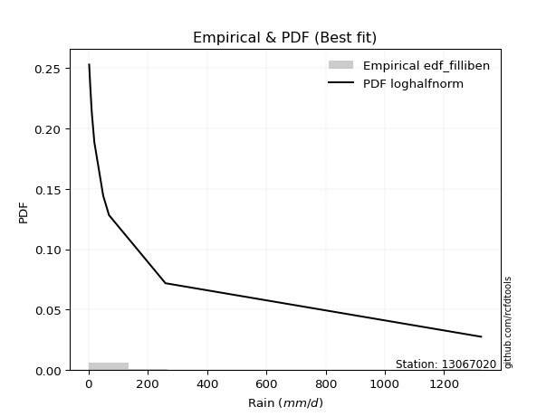</img>

</div>


### 10. Empirical - EDF Jenkinson (1977)

The Jenkinson formula in hydrology is an empirical plotting position formula used to estimate the non-exceedance probability _(P)_ or return period _(T)_ of a given ordered observation within a sample. It is a widely used method in the frequency analysis of extreme events such as floods and rainfall, as it provides a distribution-free way to plot data. _a≈0.31_ and _b≈0.38_ are constants derived to approximate the median of the probability distribution for the given rank.

<div align="center">


$P=(m-a)/(n+b)$


</div>


**10.1. Empirical values**

<div align="center">

|                | 0                    | 1                 | 2                   | 3                  | 4                  | 5             | 6                  | 7                  | 8                  | 9                  | 10                 |
|:---------------|:---------------------|:------------------|:--------------------|:-------------------|:-------------------|:--------------|:-------------------|:-------------------|:-------------------|:-------------------|:-------------------|
| date           | 2021                 | 2023              | 2022                | 2019               | 2025               | 2020          | 2024               | 2015               | 2016               | 2017               | 2018               |
| x              | 2.2                  | 2.5               | 5.2                 | 6.1                | 7.8                | 11.6          | 19.8               | 49.65              | 69.25              | 259.7              | 1325.0             |
| m              | 1                    | 2                 | 3                   | 4                  | 5                  | 6             | 7                  | 8                  | 9                  | 10                 | 11                 |
| empirical_dist | edf_jenkinson        | edf_jenkinson     | edf_jenkinson       | edf_jenkinson      | edf_jenkinson      | edf_jenkinson | edf_jenkinson      | edf_jenkinson      | edf_jenkinson      | edf_jenkinson      | edf_jenkinson      |
| empirical      | 0.060632688927943754 | 0.148506151142355 | 0.23637961335676624 | 0.3242530755711775 | 0.4121265377855888 | 0.5           | 0.5878734622144113 | 0.6757469244288224 | 0.7636203866432336 | 0.8514938488576449 | 0.9393673110720562 |
| empirical_tr   | 1.0645463049579045   | 1.174406604747162 | 1.3095512082853855  | 1.4798439531859557 | 1.7010463378176381 | 2.0           | 2.4264392324093818 | 3.0840108401084008 | 4.230483271375462  | 6.733727810650883  | 16.49275362318839  |

</div>


**10.2. Kolmogorov-Smirnov fit test (sorted by Δ)**


<div align="center">

|                | 0                   | 1                   | 2                   | 3                   | 4                   | 5                   | 6                     | 7                   | 8                   | 9                   | 10                  | 11                  | 12                  | 13                  | 14                  | 15                  | 16                  | 17                  | 18                  | 19                  | 20                  | 21                  | 22                  | 23                  | 24                  | 25                  | 26                  | 27                  | 28                  | 29                  | 30                  | 31                  | 32                  | 33                  | 34                  | 35                  | 36                  | 37                  | 38                  | 39                  | 40                  | 41                  | 42                  | 43                  | 44                  | 45                  | 46                  | 47                  | 48                  | 49                  | 50                  | 51                  | 52                  | 53                  | 54                  | 55                  | 56                  | 57                  | 58                  | 59                  | 60                  | 61                  | 62                  | 63                  | 64                  | 65                  | 66                  | 67                  | 68                  | 69                  | 70                  | 71                  | 72                  | 73                  | 74                  | 75                  | 76                  | 77                  | 78                  | 79                  | 80                  | 81                  | 82                  | 83                  | 84                  | 85                  | 86                  | 87                  | 88                  | 89                  |
|:---------------|:--------------------|:--------------------|:--------------------|:--------------------|:--------------------|:--------------------|:----------------------|:--------------------|:--------------------|:--------------------|:--------------------|:--------------------|:--------------------|:--------------------|:--------------------|:--------------------|:--------------------|:--------------------|:--------------------|:--------------------|:--------------------|:--------------------|:--------------------|:--------------------|:--------------------|:--------------------|:--------------------|:--------------------|:--------------------|:--------------------|:--------------------|:--------------------|:--------------------|:--------------------|:--------------------|:--------------------|:--------------------|:--------------------|:--------------------|:--------------------|:--------------------|:--------------------|:--------------------|:--------------------|:--------------------|:--------------------|:--------------------|:--------------------|:--------------------|:--------------------|:--------------------|:--------------------|:--------------------|:--------------------|:--------------------|:--------------------|:--------------------|:--------------------|:--------------------|:--------------------|:--------------------|:--------------------|:--------------------|:--------------------|:--------------------|:--------------------|:--------------------|:--------------------|:--------------------|:--------------------|:--------------------|:--------------------|:--------------------|:--------------------|:--------------------|:--------------------|:--------------------|:--------------------|:--------------------|:--------------------|:--------------------|:--------------------|:--------------------|:--------------------|:--------------------|:--------------------|:--------------------|:--------------------|:--------------------|:--------------------|
| station        | 13067020            | 13067020            | 13067020            | 13067020            | 13067020            | 13067020            | 13067020              | 13067020            | 13067020            | 13067020            | 13067020            | 13067020            | 13067020            | 13067020            | 13067020            | 13067020            | 13067020            | 13067020            | 13067020            | 13067020            | 13067020            | 13067020            | 13067020            | 13067020            | 13067020            | 13067020            | 13067020            | 13067020            | 13067020            | 13067020            | 13067020            | 13067020            | 13067020            | 13067020            | 13067020            | 13067020            | 13067020            | 13067020            | 13067020            | 13067020            | 13067020            | 13067020            | 13067020            | 13067020            | 13067020            | 13067020            | 13067020            | 13067020            | 13067020            | 13067020            | 13067020            | 13067020            | 13067020            | 13067020            | 13067020            | 13067020            | 13067020            | 13067020            | 13067020            | 13067020            | 13067020            | 13067020            | 13067020            | 13067020            | 13067020            | 13067020            | 13067020            | 13067020            | 13067020            | 13067020            | 13067020            | 13067020            | 13067020            | 13067020            | 13067020            | 13067020            | 13067020            | 13067020            | 13067020            | 13067020            | 13067020            | 13067020            | 13067020            | 13067020            | 13067020            | 13067020            | 13067020            | 13067020            | 13067020            | 13067020            |
| empirical_dist | edf_jenkinson       | edf_jenkinson       | edf_jenkinson       | edf_jenkinson       | edf_jenkinson       | edf_jenkinson       | edf_jenkinson         | edf_jenkinson       | edf_jenkinson       | edf_jenkinson       | edf_jenkinson       | edf_jenkinson       | edf_jenkinson       | edf_jenkinson       | edf_jenkinson       | edf_jenkinson       | edf_jenkinson       | edf_jenkinson       | edf_jenkinson       | edf_jenkinson       | edf_jenkinson       | edf_jenkinson       | edf_jenkinson       | edf_jenkinson       | edf_jenkinson       | edf_jenkinson       | edf_jenkinson       | edf_jenkinson       | edf_jenkinson       | edf_jenkinson       | edf_jenkinson       | edf_jenkinson       | edf_jenkinson       | edf_jenkinson       | edf_jenkinson       | edf_jenkinson       | edf_jenkinson       | edf_jenkinson       | edf_jenkinson       | edf_jenkinson       | edf_jenkinson       | edf_jenkinson       | edf_jenkinson       | edf_jenkinson       | edf_jenkinson       | edf_jenkinson       | edf_jenkinson       | edf_jenkinson       | edf_jenkinson       | edf_jenkinson       | edf_jenkinson       | edf_jenkinson       | edf_jenkinson       | edf_jenkinson       | edf_jenkinson       | edf_jenkinson       | edf_jenkinson       | edf_jenkinson       | edf_jenkinson       | edf_jenkinson       | edf_jenkinson       | edf_jenkinson       | edf_jenkinson       | edf_jenkinson       | edf_jenkinson       | edf_jenkinson       | edf_jenkinson       | edf_jenkinson       | edf_jenkinson       | edf_jenkinson       | edf_jenkinson       | edf_jenkinson       | edf_jenkinson       | edf_jenkinson       | edf_jenkinson       | edf_jenkinson       | edf_jenkinson       | edf_jenkinson       | edf_jenkinson       | edf_jenkinson       | edf_jenkinson       | edf_jenkinson       | edf_jenkinson       | edf_jenkinson       | edf_jenkinson       | edf_jenkinson       | edf_jenkinson       | edf_jenkinson       | edf_jenkinson       | edf_jenkinson       |
| p_dist         | loghalfnorm         | logncf              | betaprime           | nct                 | loggenlogistic      | logpearson3         | loglaplace_asymmetric | lograyleigh         | loggumbel_r         | logalpha            | loginvgamma         | logfatiguelife      | ncf                 | loginvgauss         | lognct              | loginvweibull       | logmoyal            | logjohnsonsu        | logkstwobign        | logfisk             | logmaxwell          | logexponnorm        | fisk                | logexpon            | loggenexpon         | pareto              | invgamma            | logtruncnorm        | loggompertz         | loghalflogistic     | invgauss            | logrice             | logt                | logcrystalball      | lognorm             | lognorm             | logloggamma         | erlang              | fatiguelife         | loglogistic         | logwald             | loghypsecant        | invweibull          | f                   | loglaplace          | loggumbel_l         | gamma               | logweibull_min      | chi2                | logmielke           | logchi2             | loggibrat           | alpha               | t                   | nakagami            | logf                | logerlang           | weibull_min         | rayleigh            | gumbel_r            | gibrat              | maxwell             | genlogistic         | moyal               | halfnorm            | crystalball         | norm                | halflogistic        | wald                | logistic            | hypsecant           | loglognorm          | johnsonsu           | laplace             | kstwobign           | lognakagami         | pearson3            | logpareto           | rice                | gumbel_l            | gompertz            | exponnorm           | genexpon            | expon               | laplace_asymmetric  | truncnorm           | loggamma            | loggamma            | logbetaprime        | mielke              |
| delta          | 0.04950639204276361 | 0.07005925902040759 | 0.07083679468170423 | 0.07650148987607236 | 0.07662553178940273 | 0.07686659087130782 | 0.07708372457742221   | 0.07745666899663439 | 0.07781647508196665 | 0.07917167899576227 | 0.07945483349109894 | 0.0803698005346716  | 0.08091133473965122 | 0.08095645276071267 | 0.08109780728992377 | 0.08117337217981235 | 0.08165221617416386 | 0.0822977132736804  | 0.08524501211166463 | 0.08781616562232528 | 0.0897338483154902  | 0.09243420645768063 | 0.09314332587121629 | 0.09353609256470402 | 0.09354642333816907 | 0.09680325846213111 | 0.09834983029962754 | 0.10538194526722514 | 0.10541377865903592 | 0.10876664045470848 | 0.1095196323295109  | 0.1193744200359132  | 0.1230242654139963  | 0.12302501060011906 | 0.1230250267731699  | 0.1230250267731699  | 0.12457566476677279 | 0.12528065953555004 | 0.1280008412281466  | 0.1384190176760277  | 0.148506151142355   | 0.15074481031695464 | 0.15967441153779974 | 0.16300262172889882 | 0.17903130192482708 | 0.18687227199455686 | 0.19058841194883913 | 0.1948577037319672  | 0.19881589431682    | 0.20529902279647663 | 0.23263589068354054 | 0.24519767230975742 | 0.24525157893909288 | 0.24966078392059216 | 0.24987506197752807 | 0.2741903997215017  | 0.28156438397607164 | 0.29263364262736724 | 0.31954445044832647 | 0.32136874072364713 | 0.3214306615270118  | 0.32491464970567235 | 0.3259336405465484  | 0.3375404355050285  | 0.35336256474507155 | 0.3590298691987396  | 0.35902988522544815 | 0.3591725012623459  | 0.37039287727352804 | 0.3714030441097031  | 0.38156628320371944 | 0.38171726810679696 | 0.39768237088655967 | 0.4082715477255183  | 0.40896091496346815 | 0.4091630387894769  | 0.4095532888051426  | 0.4210093196788526  | 0.42308483035404404 | 0.4259985160171129  | 0.4747127375070406  | 0.48117591888778155 | 0.4822657522040572  | 0.4822657977651493  | 0.4822661062764102  | 0.5027462561583345  | 0.5327516806290467  | 0.5327516806290467  | 0.5529067035855697  | nan                 |
| deltao         | 0.37613735880099997 | 0.37613735880099997 | 0.37613735880099997 | 0.37613735880099997 | 0.37613735880099997 | 0.37613735880099997 | 0.37613735880099997   | 0.37613735880099997 | 0.37613735880099997 | 0.37613735880099997 | 0.37613735880099997 | 0.37613735880099997 | 0.37613735880099997 | 0.37613735880099997 | 0.37613735880099997 | 0.37613735880099997 | 0.37613735880099997 | 0.37613735880099997 | 0.37613735880099997 | 0.37613735880099997 | 0.37613735880099997 | 0.37613735880099997 | 0.37613735880099997 | 0.37613735880099997 | 0.37613735880099997 | 0.37613735880099997 | 0.37613735880099997 | 0.37613735880099997 | 0.37613735880099997 | 0.37613735880099997 | 0.37613735880099997 | 0.37613735880099997 | 0.37613735880099997 | 0.37613735880099997 | 0.37613735880099997 | 0.37613735880099997 | 0.37613735880099997 | 0.37613735880099997 | 0.37613735880099997 | 0.37613735880099997 | 0.37613735880099997 | 0.37613735880099997 | 0.37613735880099997 | 0.37613735880099997 | 0.37613735880099997 | 0.37613735880099997 | 0.37613735880099997 | 0.37613735880099997 | 0.37613735880099997 | 0.37613735880099997 | 0.37613735880099997 | 0.37613735880099997 | 0.37613735880099997 | 0.37613735880099997 | 0.37613735880099997 | 0.37613735880099997 | 0.37613735880099997 | 0.37613735880099997 | 0.37613735880099997 | 0.37613735880099997 | 0.37613735880099997 | 0.37613735880099997 | 0.37613735880099997 | 0.37613735880099997 | 0.37613735880099997 | 0.37613735880099997 | 0.37613735880099997 | 0.37613735880099997 | 0.37613735880099997 | 0.37613735880099997 | 0.37613735880099997 | 0.37613735880099997 | 0.37613735880099997 | 0.37613735880099997 | 0.37613735880099997 | 0.37613735880099997 | 0.37613735880099997 | 0.37613735880099997 | 0.37613735880099997 | 0.37613735880099997 | 0.37613735880099997 | 0.37613735880099997 | 0.37613735880099997 | 0.37613735880099997 | 0.37613735880099997 | 0.37613735880099997 | 0.37613735880099997 | 0.37613735880099997 | 0.37613735880099997 | 0.37613735880099997 |
| eval           | Δo > Δ              | Δo > Δ              | Δo > Δ              | Δo > Δ              | Δo > Δ              | Δo > Δ              | Δo > Δ                | Δo > Δ              | Δo > Δ              | Δo > Δ              | Δo > Δ              | Δo > Δ              | Δo > Δ              | Δo > Δ              | Δo > Δ              | Δo > Δ              | Δo > Δ              | Δo > Δ              | Δo > Δ              | Δo > Δ              | Δo > Δ              | Δo > Δ              | Δo > Δ              | Δo > Δ              | Δo > Δ              | Δo > Δ              | Δo > Δ              | Δo > Δ              | Δo > Δ              | Δo > Δ              | Δo > Δ              | Δo > Δ              | Δo > Δ              | Δo > Δ              | Δo > Δ              | Δo > Δ              | Δo > Δ              | Δo > Δ              | Δo > Δ              | Δo > Δ              | Δo > Δ              | Δo > Δ              | Δo > Δ              | Δo > Δ              | Δo > Δ              | Δo > Δ              | Δo > Δ              | Δo > Δ              | Δo > Δ              | Δo > Δ              | Δo > Δ              | Δo > Δ              | Δo > Δ              | Δo > Δ              | Δo > Δ              | Δo > Δ              | Δo > Δ              | Δo > Δ              | Δo > Δ              | Δo > Δ              | Δo > Δ              | Δo > Δ              | Δo > Δ              | Δo > Δ              | Δo > Δ              | Δo > Δ              | Δo > Δ              | Δo > Δ              | Δo > Δ              | Δo > Δ              | Δo <= Δ             | Δo <= Δ             | Δo <= Δ             | Δo <= Δ             | Δo <= Δ             | Δo <= Δ             | Δo <= Δ             | Δo <= Δ             | Δo <= Δ             | Δo <= Δ             | Δo <= Δ             | Δo <= Δ             | Δo <= Δ             | Δo <= Δ             | Δo <= Δ             | Δo <= Δ             | Δo <= Δ             | Δo <= Δ             | Δo <= Δ             | Δo <= Δ             |
| fit            | 1                   | 1                   | 1                   | 1                   | 1                   | 1                   | 1                     | 1                   | 1                   | 1                   | 1                   | 1                   | 1                   | 1                   | 1                   | 1                   | 1                   | 1                   | 1                   | 1                   | 1                   | 1                   | 1                   | 1                   | 1                   | 1                   | 1                   | 1                   | 1                   | 1                   | 1                   | 1                   | 1                   | 1                   | 1                   | 1                   | 1                   | 1                   | 1                   | 1                   | 1                   | 1                   | 1                   | 1                   | 1                   | 1                   | 1                   | 1                   | 1                   | 1                   | 1                   | 1                   | 1                   | 1                   | 1                   | 1                   | 1                   | 1                   | 1                   | 1                   | 1                   | 1                   | 1                   | 1                   | 1                   | 1                   | 1                   | 1                   | 1                   | 1                   | 0                   | 0                   | 0                   | 0                   | 0                   | 0                   | 0                   | 0                   | 0                   | 0                   | 0                   | 0                   | 0                   | 0                   | 0                   | 0                   | 0                   | 0                   | 0                   | 0                   |
| n              | 11                  | 11                  | 11                  | 11                  | 11                  | 11                  | 11                    | 11                  | 11                  | 11                  | 11                  | 11                  | 11                  | 11                  | 11                  | 11                  | 11                  | 11                  | 11                  | 11                  | 11                  | 11                  | 11                  | 11                  | 11                  | 11                  | 11                  | 11                  | 11                  | 11                  | 11                  | 11                  | 11                  | 11                  | 11                  | 11                  | 11                  | 11                  | 11                  | 11                  | 11                  | 11                  | 11                  | 11                  | 11                  | 11                  | 11                  | 11                  | 11                  | 11                  | 11                  | 11                  | 11                  | 11                  | 11                  | 11                  | 11                  | 11                  | 11                  | 11                  | 11                  | 11                  | 11                  | 11                  | 11                  | 11                  | 11                  | 11                  | 11                  | 11                  | 11                  | 11                  | 11                  | 11                  | 11                  | 11                  | 11                  | 11                  | 11                  | 11                  | 11                  | 11                  | 11                  | 11                  | 11                  | 11                  | 11                  | 11                  | 11                  | 11                  |
| best_fit       | 1                   | 0                   | 0                   | 0                   | 0                   | 0                   | 0                     | 0                   | 0                   | 0                   | 0                   | 0                   | 0                   | 0                   | 0                   | 0                   | 0                   | 0                   | 0                   | 0                   | 0                   | 0                   | 0                   | 0                   | 0                   | 0                   | 0                   | 0                   | 0                   | 0                   | 0                   | 0                   | 0                   | 0                   | 0                   | 0                   | 0                   | 0                   | 0                   | 0                   | 0                   | 0                   | 0                   | 0                   | 0                   | 0                   | 0                   | 0                   | 0                   | 0                   | 0                   | 0                   | 0                   | 0                   | 0                   | 0                   | 0                   | 0                   | 0                   | 0                   | 0                   | 0                   | 0                   | 0                   | 0                   | 0                   | 0                   | 0                   | 0                   | 0                   | 0                   | 0                   | 0                   | 0                   | 0                   | 0                   | 0                   | 0                   | 0                   | 0                   | 0                   | 0                   | 0                   | 0                   | 0                   | 0                   | 0                   | 0                   | 0                   | 0                   |
| best_fit_sort  | 1                   | 2                   | 3                   | 4                   | 5                   | 6                   | 7                     | 8                   | 9                   | 10                  | 11                  | 12                  | 13                  | 14                  | 15                  | 16                  | 17                  | 18                  | 19                  | 20                  | 21                  | 22                  | 23                  | 24                  | 25                  | 26                  | 27                  | 28                  | 29                  | 30                  | 31                  | 32                  | 33                  | 34                  | 35                  | 36                  | 37                  | 38                  | 39                  | 40                  | 41                  | 42                  | 43                  | 44                  | 45                  | 46                  | 47                  | 48                  | 49                  | 50                  | 51                  | 52                  | 53                  | 54                  | 55                  | 56                  | 57                  | 58                  | 59                  | 60                  | 61                  | 62                  | 63                  | 64                  | 65                  | 66                  | 67                  | 68                  | 69                  | 70                  | 71                  | 72                  | 73                  | 74                  | 75                  | 76                  | 77                  | 78                  | 79                  | 80                  | 81                  | 82                  | 83                  | 84                  | 85                  | 86                  | 87                  | 88                  | 89                  | 90                  |

</div>


<div align="center">

</img>

</div>


**10.3. Best fit**

<div align="center">

|   id |   station | empirical_dist   | p_dist      |     delta |   deltao | eval   |   fit |   n |   best_fit |   best_fit_sort |
|-----:|----------:|:-----------------|:------------|----------:|---------:|:-------|------:|----:|-----------:|----------------:|
|    0 |  13067020 | edf_jenkinson    | loghalfnorm | 0.0495064 | 0.376137 | Δo > Δ |     1 |  11 |          1 |               1 |

</div>


<div align="center">

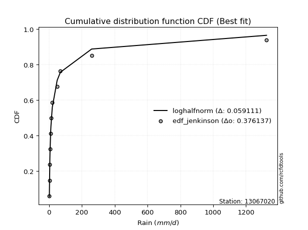</img></img>

</div>


### 11. Empirical - EDF Cunnane (1978)

Cunnane´s work in statistical hydrology has focused on the performance and evaluation of different probability distributions (such as GEV, Gumbel, Lognormal) for flood frequency estimation. _b_ is a constant, typically set to 0.4.

<div align="center">


$P=(m-b)/(n+1-2b)$


</div>


**11.1. Empirical values**

<div align="center">

|                | 0                    | 1                   | 2                   | 3                   | 4                  | 5           | 6                  | 7                  | 8                  | 9                  | 10                 |
|:---------------|:---------------------|:--------------------|:--------------------|:--------------------|:-------------------|:------------|:-------------------|:-------------------|:-------------------|:-------------------|:-------------------|
| date           | 2021                 | 2023                | 2022                | 2019                | 2025               | 2020        | 2024               | 2015               | 2016               | 2017               | 2018               |
| x              | 2.2                  | 2.5                 | 5.2                 | 6.1                 | 7.8                | 11.6        | 19.8               | 49.65              | 69.25              | 259.7              | 1325.0             |
| m              | 1                    | 2                   | 3                   | 4                   | 5                  | 6           | 7                  | 8                  | 9                  | 10                 | 11                 |
| empirical_dist | edf_cunnane          | edf_cunnane         | edf_cunnane         | edf_cunnane         | edf_cunnane        | edf_cunnane | edf_cunnane        | edf_cunnane        | edf_cunnane        | edf_cunnane        | edf_cunnane        |
| empirical      | 0.053571428571428575 | 0.14285714285714288 | 0.23214285714285718 | 0.32142857142857145 | 0.4107142857142857 | 0.5         | 0.5892857142857143 | 0.6785714285714286 | 0.7678571428571429 | 0.8571428571428572 | 0.9464285714285715 |
| empirical_tr   | 1.0566037735849056   | 1.1666666666666667  | 1.302325581395349   | 1.4736842105263157  | 1.696969696969697  | 2.0         | 2.4347826086956523 | 3.1111111111111116 | 4.307692307692308  | 7.0000000000000036 | 18.666666666666693 |

</div>


**11.2. Kolmogorov-Smirnov fit test (sorted by Δ)**


<div align="center">

|                | 0                   | 1                   | 2                   | 3                   | 4                     | 5                   | 6                   | 7                   | 8                   | 9                   | 10                  | 11                  | 12                  | 13                  | 14                  | 15                  | 16                  | 17                  | 18                  | 19                  | 20                  | 21                  | 22                  | 23                  | 24                  | 25                  | 26                  | 27                  | 28                  | 29                  | 30                  | 31                  | 32                  | 33                  | 34                  | 35                  | 36                  | 37                  | 38                  | 39                  | 40                  | 41                  | 42                  | 43                  | 44                  | 45                  | 46                  | 47                  | 48                  | 49                  | 50                  | 51                  | 52                  | 53                  | 54                  | 55                  | 56                  | 57                  | 58                  | 59                  | 60                  | 61                  | 62                  | 63                  | 64                  | 65                  | 66                  | 67                  | 68                  | 69                  | 70                  | 71                  | 72                  | 73                  | 74                  | 75                  | 76                  | 77                  | 78                  | 79                  | 80                  | 81                  | 82                  | 83                  | 84                  | 85                  | 86                  | 87                  | 88                  | 89                  |
|:---------------|:--------------------|:--------------------|:--------------------|:--------------------|:----------------------|:--------------------|:--------------------|:--------------------|:--------------------|:--------------------|:--------------------|:--------------------|:--------------------|:--------------------|:--------------------|:--------------------|:--------------------|:--------------------|:--------------------|:--------------------|:--------------------|:--------------------|:--------------------|:--------------------|:--------------------|:--------------------|:--------------------|:--------------------|:--------------------|:--------------------|:--------------------|:--------------------|:--------------------|:--------------------|:--------------------|:--------------------|:--------------------|:--------------------|:--------------------|:--------------------|:--------------------|:--------------------|:--------------------|:--------------------|:--------------------|:--------------------|:--------------------|:--------------------|:--------------------|:--------------------|:--------------------|:--------------------|:--------------------|:--------------------|:--------------------|:--------------------|:--------------------|:--------------------|:--------------------|:--------------------|:--------------------|:--------------------|:--------------------|:--------------------|:--------------------|:--------------------|:--------------------|:--------------------|:--------------------|:--------------------|:--------------------|:--------------------|:--------------------|:--------------------|:--------------------|:--------------------|:--------------------|:--------------------|:--------------------|:--------------------|:--------------------|:--------------------|:--------------------|:--------------------|:--------------------|:--------------------|:--------------------|:--------------------|:--------------------|:--------------------|
| station        | 13067020            | 13067020            | 13067020            | 13067020            | 13067020              | 13067020            | 13067020            | 13067020            | 13067020            | 13067020            | 13067020            | 13067020            | 13067020            | 13067020            | 13067020            | 13067020            | 13067020            | 13067020            | 13067020            | 13067020            | 13067020            | 13067020            | 13067020            | 13067020            | 13067020            | 13067020            | 13067020            | 13067020            | 13067020            | 13067020            | 13067020            | 13067020            | 13067020            | 13067020            | 13067020            | 13067020            | 13067020            | 13067020            | 13067020            | 13067020            | 13067020            | 13067020            | 13067020            | 13067020            | 13067020            | 13067020            | 13067020            | 13067020            | 13067020            | 13067020            | 13067020            | 13067020            | 13067020            | 13067020            | 13067020            | 13067020            | 13067020            | 13067020            | 13067020            | 13067020            | 13067020            | 13067020            | 13067020            | 13067020            | 13067020            | 13067020            | 13067020            | 13067020            | 13067020            | 13067020            | 13067020            | 13067020            | 13067020            | 13067020            | 13067020            | 13067020            | 13067020            | 13067020            | 13067020            | 13067020            | 13067020            | 13067020            | 13067020            | 13067020            | 13067020            | 13067020            | 13067020            | 13067020            | 13067020            | 13067020            |
| empirical_dist | edf_cunnane         | edf_cunnane         | edf_cunnane         | edf_cunnane         | edf_cunnane           | edf_cunnane         | edf_cunnane         | edf_cunnane         | edf_cunnane         | edf_cunnane         | edf_cunnane         | edf_cunnane         | edf_cunnane         | edf_cunnane         | edf_cunnane         | edf_cunnane         | edf_cunnane         | edf_cunnane         | edf_cunnane         | edf_cunnane         | edf_cunnane         | edf_cunnane         | edf_cunnane         | edf_cunnane         | edf_cunnane         | edf_cunnane         | edf_cunnane         | edf_cunnane         | edf_cunnane         | edf_cunnane         | edf_cunnane         | edf_cunnane         | edf_cunnane         | edf_cunnane         | edf_cunnane         | edf_cunnane         | edf_cunnane         | edf_cunnane         | edf_cunnane         | edf_cunnane         | edf_cunnane         | edf_cunnane         | edf_cunnane         | edf_cunnane         | edf_cunnane         | edf_cunnane         | edf_cunnane         | edf_cunnane         | edf_cunnane         | edf_cunnane         | edf_cunnane         | edf_cunnane         | edf_cunnane         | edf_cunnane         | edf_cunnane         | edf_cunnane         | edf_cunnane         | edf_cunnane         | edf_cunnane         | edf_cunnane         | edf_cunnane         | edf_cunnane         | edf_cunnane         | edf_cunnane         | edf_cunnane         | edf_cunnane         | edf_cunnane         | edf_cunnane         | edf_cunnane         | edf_cunnane         | edf_cunnane         | edf_cunnane         | edf_cunnane         | edf_cunnane         | edf_cunnane         | edf_cunnane         | edf_cunnane         | edf_cunnane         | edf_cunnane         | edf_cunnane         | edf_cunnane         | edf_cunnane         | edf_cunnane         | edf_cunnane         | edf_cunnane         | edf_cunnane         | edf_cunnane         | edf_cunnane         | edf_cunnane         | edf_cunnane         |
| p_dist         | loghalfnorm         | logncf              | betaprime           | nct                 | loglaplace_asymmetric | loggenlogistic      | logpearson3         | logmoyal            | loginvgauss         | logfatiguelife      | logalpha            | loggumbel_r         | loginvgamma         | logjohnsonsu        | lograyleigh         | lognct              | loginvweibull       | logfisk             | ncf                 | logkstwobign        | logexponnorm        | fisk                | logexpon            | loggenexpon         | logmaxwell          | pareto              | logtruncnorm        | loggompertz         | invgamma            | loghalflogistic     | invgauss            | logrice             | logt                | logcrystalball      | lognorm             | lognorm             | logloggamma         | erlang              | fatiguelife         | loglogistic         | logwald             | loghypsecant        | invweibull          | f                   | loglaplace          | loggumbel_l         | gamma               | logweibull_min      | chi2                | logmielke           | logchi2             | loggibrat           | alpha               | nakagami            | t                   | logf                | logerlang           | weibull_min         | rayleigh            | gumbel_r            | gibrat              | maxwell             | genlogistic         | moyal               | halfnorm            | crystalball         | norm                | halflogistic        | logistic            | wald                | hypsecant           | loglognorm          | johnsonsu           | laplace             | kstwobign           | lognakagami         | pearson3            | logpareto           | rice                | gumbel_l            | gompertz            | exponnorm           | genexpon            | expon               | laplace_asymmetric  | truncnorm           | loggamma            | loggamma            | logbetaprime        | mielke              |
| delta          | 0.04573443972446542 | 0.0649513786246545  | 0.06801229053909807 | 0.07085248159086024 | 0.0714347162922101    | 0.07521327971809966 | 0.07573183931254512 | 0.07600320788895175 | 0.07614456541704151 | 0.0762022698242586  | 0.07634717485315612 | 0.07640422301066357 | 0.07663032934849279 | 0.07664870498846829 | 0.07745666899663439 | 0.07827330314731762 | 0.0783488680372062  | 0.08216715733711316 | 0.08231633378931705 | 0.08383276004036155 | 0.08678519817246852 | 0.08749431758600418 | 0.0878870842794919  | 0.08789741505295695 | 0.0897338483154902  | 0.091154250176919   | 0.09973293698201302 | 0.09976477037382381 | 0.10258658651353661 | 0.10311763216949636 | 0.10669512818690474 | 0.11796216796461012 | 0.1230242654139963  | 0.12302501060011906 | 0.1230250267731699  | 0.1230250267731699  | 0.12457566476677279 | 0.1295174157494591  | 0.13223759744205588 | 0.1384190176760277  | 0.14285714285714288 | 0.15074481031695464 | 0.1639111677517088  | 0.16723937794280788 | 0.17903130192482708 | 0.18687227199455686 | 0.19482516816274842 | 0.20191896408848253 | 0.2030526505307293  | 0.2095357790103857  | 0.2368726468974496  | 0.24237316816715138 | 0.24242707479648673 | 0.25411181819143736 | 0.2567220442771073  | 0.2784271559354108  | 0.2858011401899807  | 0.29687039884127653 | 0.3266057108048417  | 0.3284300010801623  | 0.32849192188352694 | 0.32915140591958164 | 0.3301703967604577  | 0.34460169586154366 | 0.36042382510158677 | 0.36326662541264887 | 0.36326664143935744 | 0.3662337616188611  | 0.3756398003236124  | 0.3774541376300432  | 0.3858030394176287  | 0.38736627639200905 | 0.40191912710046873 | 0.4125083039394276  | 0.41319767117737743 | 0.413399795003386   | 0.41661454916165774 | 0.42665832796406467 | 0.4273215865679533  | 0.4302352722310222  | 0.47612498957834365 | 0.4825881709590846  | 0.48367800427536023 | 0.4836780498364523  | 0.4836783583477132  | 0.5041585082296375  | 0.5369884368429557  | 0.5369884368429557  | 0.5571434597994788  | nan                 |
| deltao         | 0.37613735880099997 | 0.37613735880099997 | 0.37613735880099997 | 0.37613735880099997 | 0.37613735880099997   | 0.37613735880099997 | 0.37613735880099997 | 0.37613735880099997 | 0.37613735880099997 | 0.37613735880099997 | 0.37613735880099997 | 0.37613735880099997 | 0.37613735880099997 | 0.37613735880099997 | 0.37613735880099997 | 0.37613735880099997 | 0.37613735880099997 | 0.37613735880099997 | 0.37613735880099997 | 0.37613735880099997 | 0.37613735880099997 | 0.37613735880099997 | 0.37613735880099997 | 0.37613735880099997 | 0.37613735880099997 | 0.37613735880099997 | 0.37613735880099997 | 0.37613735880099997 | 0.37613735880099997 | 0.37613735880099997 | 0.37613735880099997 | 0.37613735880099997 | 0.37613735880099997 | 0.37613735880099997 | 0.37613735880099997 | 0.37613735880099997 | 0.37613735880099997 | 0.37613735880099997 | 0.37613735880099997 | 0.37613735880099997 | 0.37613735880099997 | 0.37613735880099997 | 0.37613735880099997 | 0.37613735880099997 | 0.37613735880099997 | 0.37613735880099997 | 0.37613735880099997 | 0.37613735880099997 | 0.37613735880099997 | 0.37613735880099997 | 0.37613735880099997 | 0.37613735880099997 | 0.37613735880099997 | 0.37613735880099997 | 0.37613735880099997 | 0.37613735880099997 | 0.37613735880099997 | 0.37613735880099997 | 0.37613735880099997 | 0.37613735880099997 | 0.37613735880099997 | 0.37613735880099997 | 0.37613735880099997 | 0.37613735880099997 | 0.37613735880099997 | 0.37613735880099997 | 0.37613735880099997 | 0.37613735880099997 | 0.37613735880099997 | 0.37613735880099997 | 0.37613735880099997 | 0.37613735880099997 | 0.37613735880099997 | 0.37613735880099997 | 0.37613735880099997 | 0.37613735880099997 | 0.37613735880099997 | 0.37613735880099997 | 0.37613735880099997 | 0.37613735880099997 | 0.37613735880099997 | 0.37613735880099997 | 0.37613735880099997 | 0.37613735880099997 | 0.37613735880099997 | 0.37613735880099997 | 0.37613735880099997 | 0.37613735880099997 | 0.37613735880099997 | 0.37613735880099997 |
| eval           | Δo > Δ              | Δo > Δ              | Δo > Δ              | Δo > Δ              | Δo > Δ                | Δo > Δ              | Δo > Δ              | Δo > Δ              | Δo > Δ              | Δo > Δ              | Δo > Δ              | Δo > Δ              | Δo > Δ              | Δo > Δ              | Δo > Δ              | Δo > Δ              | Δo > Δ              | Δo > Δ              | Δo > Δ              | Δo > Δ              | Δo > Δ              | Δo > Δ              | Δo > Δ              | Δo > Δ              | Δo > Δ              | Δo > Δ              | Δo > Δ              | Δo > Δ              | Δo > Δ              | Δo > Δ              | Δo > Δ              | Δo > Δ              | Δo > Δ              | Δo > Δ              | Δo > Δ              | Δo > Δ              | Δo > Δ              | Δo > Δ              | Δo > Δ              | Δo > Δ              | Δo > Δ              | Δo > Δ              | Δo > Δ              | Δo > Δ              | Δo > Δ              | Δo > Δ              | Δo > Δ              | Δo > Δ              | Δo > Δ              | Δo > Δ              | Δo > Δ              | Δo > Δ              | Δo > Δ              | Δo > Δ              | Δo > Δ              | Δo > Δ              | Δo > Δ              | Δo > Δ              | Δo > Δ              | Δo > Δ              | Δo > Δ              | Δo > Δ              | Δo > Δ              | Δo > Δ              | Δo > Δ              | Δo > Δ              | Δo > Δ              | Δo > Δ              | Δo > Δ              | Δo <= Δ             | Δo <= Δ             | Δo <= Δ             | Δo <= Δ             | Δo <= Δ             | Δo <= Δ             | Δo <= Δ             | Δo <= Δ             | Δo <= Δ             | Δo <= Δ             | Δo <= Δ             | Δo <= Δ             | Δo <= Δ             | Δo <= Δ             | Δo <= Δ             | Δo <= Δ             | Δo <= Δ             | Δo <= Δ             | Δo <= Δ             | Δo <= Δ             | Δo <= Δ             |
| fit            | 1                   | 1                   | 1                   | 1                   | 1                     | 1                   | 1                   | 1                   | 1                   | 1                   | 1                   | 1                   | 1                   | 1                   | 1                   | 1                   | 1                   | 1                   | 1                   | 1                   | 1                   | 1                   | 1                   | 1                   | 1                   | 1                   | 1                   | 1                   | 1                   | 1                   | 1                   | 1                   | 1                   | 1                   | 1                   | 1                   | 1                   | 1                   | 1                   | 1                   | 1                   | 1                   | 1                   | 1                   | 1                   | 1                   | 1                   | 1                   | 1                   | 1                   | 1                   | 1                   | 1                   | 1                   | 1                   | 1                   | 1                   | 1                   | 1                   | 1                   | 1                   | 1                   | 1                   | 1                   | 1                   | 1                   | 1                   | 1                   | 1                   | 0                   | 0                   | 0                   | 0                   | 0                   | 0                   | 0                   | 0                   | 0                   | 0                   | 0                   | 0                   | 0                   | 0                   | 0                   | 0                   | 0                   | 0                   | 0                   | 0                   | 0                   |
| n              | 11                  | 11                  | 11                  | 11                  | 11                    | 11                  | 11                  | 11                  | 11                  | 11                  | 11                  | 11                  | 11                  | 11                  | 11                  | 11                  | 11                  | 11                  | 11                  | 11                  | 11                  | 11                  | 11                  | 11                  | 11                  | 11                  | 11                  | 11                  | 11                  | 11                  | 11                  | 11                  | 11                  | 11                  | 11                  | 11                  | 11                  | 11                  | 11                  | 11                  | 11                  | 11                  | 11                  | 11                  | 11                  | 11                  | 11                  | 11                  | 11                  | 11                  | 11                  | 11                  | 11                  | 11                  | 11                  | 11                  | 11                  | 11                  | 11                  | 11                  | 11                  | 11                  | 11                  | 11                  | 11                  | 11                  | 11                  | 11                  | 11                  | 11                  | 11                  | 11                  | 11                  | 11                  | 11                  | 11                  | 11                  | 11                  | 11                  | 11                  | 11                  | 11                  | 11                  | 11                  | 11                  | 11                  | 11                  | 11                  | 11                  | 11                  |
| best_fit       | 1                   | 0                   | 0                   | 0                   | 0                     | 0                   | 0                   | 0                   | 0                   | 0                   | 0                   | 0                   | 0                   | 0                   | 0                   | 0                   | 0                   | 0                   | 0                   | 0                   | 0                   | 0                   | 0                   | 0                   | 0                   | 0                   | 0                   | 0                   | 0                   | 0                   | 0                   | 0                   | 0                   | 0                   | 0                   | 0                   | 0                   | 0                   | 0                   | 0                   | 0                   | 0                   | 0                   | 0                   | 0                   | 0                   | 0                   | 0                   | 0                   | 0                   | 0                   | 0                   | 0                   | 0                   | 0                   | 0                   | 0                   | 0                   | 0                   | 0                   | 0                   | 0                   | 0                   | 0                   | 0                   | 0                   | 0                   | 0                   | 0                   | 0                   | 0                   | 0                   | 0                   | 0                   | 0                   | 0                   | 0                   | 0                   | 0                   | 0                   | 0                   | 0                   | 0                   | 0                   | 0                   | 0                   | 0                   | 0                   | 0                   | 0                   |
| best_fit_sort  | 1                   | 2                   | 3                   | 4                   | 5                     | 6                   | 7                   | 8                   | 9                   | 10                  | 11                  | 12                  | 13                  | 14                  | 15                  | 16                  | 17                  | 18                  | 19                  | 20                  | 21                  | 22                  | 23                  | 24                  | 25                  | 26                  | 27                  | 28                  | 29                  | 30                  | 31                  | 32                  | 33                  | 34                  | 35                  | 36                  | 37                  | 38                  | 39                  | 40                  | 41                  | 42                  | 43                  | 44                  | 45                  | 46                  | 47                  | 48                  | 49                  | 50                  | 51                  | 52                  | 53                  | 54                  | 55                  | 56                  | 57                  | 58                  | 59                  | 60                  | 61                  | 62                  | 63                  | 64                  | 65                  | 66                  | 67                  | 68                  | 69                  | 70                  | 71                  | 72                  | 73                  | 74                  | 75                  | 76                  | 77                  | 78                  | 79                  | 80                  | 81                  | 82                  | 83                  | 84                  | 85                  | 86                  | 87                  | 88                  | 89                  | 90                  |

</div>


<div align="center">

</img>

</div>


**11.3. Best fit**

<div align="center">

|   id |   station | empirical_dist   | p_dist      |     delta |   deltao | eval   |   fit |   n |   best_fit |   best_fit_sort |
|-----:|----------:|:-----------------|:------------|----------:|---------:|:-------|------:|----:|-----------:|----------------:|
|    0 |  13067020 | edf_cunnane      | loghalfnorm | 0.0457344 | 0.376137 | Δo > Δ |     1 |  11 |          1 |               1 |

</div>


<div align="center">

</img>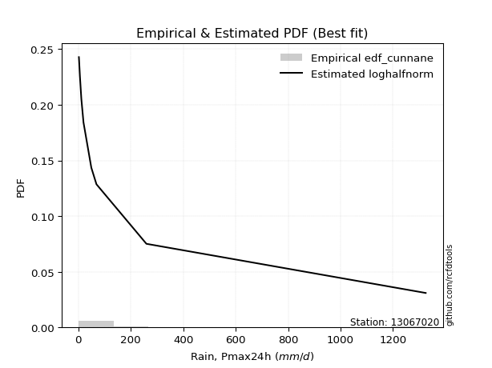</img>

</div>


### 12. Empirical - EDF Adamowski (1981)

The Adamowski formula in hydrology refers to a specific plotting position formula used for estimating the non-parametric empirical distribution of hydrological events (like flood peaks) to calculate their return periods. This formula provides an alternative to traditional parametric methods (like the Gumbel or Log Pearson Type III distributions). 

<div align="center">


$P=(m-0.25)/(n+0.5)$


</div>


**12.1. Empirical values**

<div align="center">

|                | 0                   | 1                   | 2                  | 3                   | 4                   | 5             | 6                  | 7                  | 8                  | 9                  | 10                 |
|:---------------|:--------------------|:--------------------|:-------------------|:--------------------|:--------------------|:--------------|:-------------------|:-------------------|:-------------------|:-------------------|:-------------------|
| date           | 2021                | 2023                | 2022               | 2019                | 2025                | 2020          | 2024               | 2015               | 2016               | 2017               | 2018               |
| x              | 2.2                 | 2.5                 | 5.2                | 6.1                 | 7.8                 | 11.6          | 19.8               | 49.65              | 69.25              | 259.7              | 1325.0             |
| m              | 1                   | 2                   | 3                  | 4                   | 5                   | 6             | 7                  | 8                  | 9                  | 10                 | 11                 |
| empirical_dist | edf_adamowski       | edf_adamowski       | edf_adamowski      | edf_adamowski       | edf_adamowski       | edf_adamowski | edf_adamowski      | edf_adamowski      | edf_adamowski      | edf_adamowski      | edf_adamowski      |
| empirical      | 0.06521739130434782 | 0.15217391304347827 | 0.2391304347826087 | 0.32608695652173914 | 0.41304347826086957 | 0.5           | 0.5869565217391305 | 0.6739130434782609 | 0.7608695652173914 | 0.8478260869565217 | 0.9347826086956522 |
| empirical_tr   | 1.069767441860465   | 1.1794871794871795  | 1.3142857142857143 | 1.4838709677419355  | 1.703703703703704   | 2.0           | 2.421052631578948  | 3.0666666666666664 | 4.1818181818181825 | 6.571428571428571  | 15.333333333333343 |

</div>


**12.2. Kolmogorov-Smirnov fit test (sorted by Δ)**


<div align="center">

|                | 0                   | 1                   | 2                   | 3                   | 4                   | 5                   | 6                   | 7                   | 8                     | 9                   | 10                  | 11                  | 12                  | 13                  | 14                  | 15                  | 16                  | 17                  | 18                  | 19                  | 20                  | 21                  | 22                  | 23                  | 24                  | 25                  | 26                  | 27                  | 28                  | 29                  | 30                  | 31                  | 32                  | 33                  | 34                  | 35                  | 36                  | 37                  | 38                  | 39                  | 40                  | 41                  | 42                  | 43                  | 44                  | 45                  | 46                  | 47                  | 48                  | 49                  | 50                  | 51                  | 52                  | 53                  | 54                  | 55                  | 56                  | 57                  | 58                  | 59                  | 60                  | 61                  | 62                  | 63                  | 64                  | 65                  | 66                  | 67                  | 68                  | 69                  | 70                  | 71                  | 72                  | 73                  | 74                  | 75                  | 76                  | 77                  | 78                  | 79                  | 80                  | 81                  | 82                  | 83                  | 84                  | 85                  | 86                  | 87                  | 88                  | 89                  |
|:---------------|:--------------------|:--------------------|:--------------------|:--------------------|:--------------------|:--------------------|:--------------------|:--------------------|:----------------------|:--------------------|:--------------------|:--------------------|:--------------------|:--------------------|:--------------------|:--------------------|:--------------------|:--------------------|:--------------------|:--------------------|:--------------------|:--------------------|:--------------------|:--------------------|:--------------------|:--------------------|:--------------------|:--------------------|:--------------------|:--------------------|:--------------------|:--------------------|:--------------------|:--------------------|:--------------------|:--------------------|:--------------------|:--------------------|:--------------------|:--------------------|:--------------------|:--------------------|:--------------------|:--------------------|:--------------------|:--------------------|:--------------------|:--------------------|:--------------------|:--------------------|:--------------------|:--------------------|:--------------------|:--------------------|:--------------------|:--------------------|:--------------------|:--------------------|:--------------------|:--------------------|:--------------------|:--------------------|:--------------------|:--------------------|:--------------------|:--------------------|:--------------------|:--------------------|:--------------------|:--------------------|:--------------------|:--------------------|:--------------------|:--------------------|:--------------------|:--------------------|:--------------------|:--------------------|:--------------------|:--------------------|:--------------------|:--------------------|:--------------------|:--------------------|:--------------------|:--------------------|:--------------------|:--------------------|:--------------------|:--------------------|
| station        | 13067020            | 13067020            | 13067020            | 13067020            | 13067020            | 13067020            | 13067020            | 13067020            | 13067020              | 13067020            | 13067020            | 13067020            | 13067020            | 13067020            | 13067020            | 13067020            | 13067020            | 13067020            | 13067020            | 13067020            | 13067020            | 13067020            | 13067020            | 13067020            | 13067020            | 13067020            | 13067020            | 13067020            | 13067020            | 13067020            | 13067020            | 13067020            | 13067020            | 13067020            | 13067020            | 13067020            | 13067020            | 13067020            | 13067020            | 13067020            | 13067020            | 13067020            | 13067020            | 13067020            | 13067020            | 13067020            | 13067020            | 13067020            | 13067020            | 13067020            | 13067020            | 13067020            | 13067020            | 13067020            | 13067020            | 13067020            | 13067020            | 13067020            | 13067020            | 13067020            | 13067020            | 13067020            | 13067020            | 13067020            | 13067020            | 13067020            | 13067020            | 13067020            | 13067020            | 13067020            | 13067020            | 13067020            | 13067020            | 13067020            | 13067020            | 13067020            | 13067020            | 13067020            | 13067020            | 13067020            | 13067020            | 13067020            | 13067020            | 13067020            | 13067020            | 13067020            | 13067020            | 13067020            | 13067020            | 13067020            |
| empirical_dist | edf_adamowski       | edf_adamowski       | edf_adamowski       | edf_adamowski       | edf_adamowski       | edf_adamowski       | edf_adamowski       | edf_adamowski       | edf_adamowski         | edf_adamowski       | edf_adamowski       | edf_adamowski       | edf_adamowski       | edf_adamowski       | edf_adamowski       | edf_adamowski       | edf_adamowski       | edf_adamowski       | edf_adamowski       | edf_adamowski       | edf_adamowski       | edf_adamowski       | edf_adamowski       | edf_adamowski       | edf_adamowski       | edf_adamowski       | edf_adamowski       | edf_adamowski       | edf_adamowski       | edf_adamowski       | edf_adamowski       | edf_adamowski       | edf_adamowski       | edf_adamowski       | edf_adamowski       | edf_adamowski       | edf_adamowski       | edf_adamowski       | edf_adamowski       | edf_adamowski       | edf_adamowski       | edf_adamowski       | edf_adamowski       | edf_adamowski       | edf_adamowski       | edf_adamowski       | edf_adamowski       | edf_adamowski       | edf_adamowski       | edf_adamowski       | edf_adamowski       | edf_adamowski       | edf_adamowski       | edf_adamowski       | edf_adamowski       | edf_adamowski       | edf_adamowski       | edf_adamowski       | edf_adamowski       | edf_adamowski       | edf_adamowski       | edf_adamowski       | edf_adamowski       | edf_adamowski       | edf_adamowski       | edf_adamowski       | edf_adamowski       | edf_adamowski       | edf_adamowski       | edf_adamowski       | edf_adamowski       | edf_adamowski       | edf_adamowski       | edf_adamowski       | edf_adamowski       | edf_adamowski       | edf_adamowski       | edf_adamowski       | edf_adamowski       | edf_adamowski       | edf_adamowski       | edf_adamowski       | edf_adamowski       | edf_adamowski       | edf_adamowski       | edf_adamowski       | edf_adamowski       | edf_adamowski       | edf_adamowski       | edf_adamowski       |
| p_dist         | loghalfnorm         | betaprime           | logncf              | lograyleigh         | loggenlogistic      | logpearson3         | loggumbel_r         | nct                 | loglaplace_asymmetric | logalpha            | loginvgamma         | lognct              | loginvweibull       | logfatiguelife      | ncf                 | loginvgauss         | logmoyal            | logjohnsonsu        | logkstwobign        | logmaxwell          | logfisk             | invgamma            | logexponnorm        | fisk                | logexpon            | loggenexpon         | pareto              | logtruncnorm        | loggompertz         | invgauss            | loghalflogistic     | logrice             | erlang              | logt                | logcrystalball      | lognorm             | lognorm             | logloggamma         | fatiguelife         | loglogistic         | loghypsecant        | logwald             | invweibull          | f                   | loglaplace          | loggumbel_l         | gamma               | logweibull_min      | chi2                | logmielke           | logchi2             | t                   | loggibrat           | alpha               | nakagami            | logf                | logerlang           | weibull_min         | rayleigh            | gumbel_r            | gibrat              | maxwell             | genlogistic         | moyal               | halfnorm            | halflogistic        | crystalball         | norm                | wald                | logistic            | loglognorm          | hypsecant           | johnsonsu           | pearson3            | laplace             | kstwobign           | lognakagami         | logpareto           | rice                | gumbel_l            | gompertz            | exponnorm           | genexpon            | expon               | laplace_asymmetric  | truncnorm           | loggamma            | loggamma            | logbetaprime        | mielke              |
| delta          | 0.05317415394388689 | 0.07267067563226581 | 0.07372702092153087 | 0.07745666899663439 | 0.07754247226468353 | 0.07778353134658861 | 0.07873341555724744 | 0.08016925177719564 | 0.08075148647854549   | 0.08100555994632386 | 0.08137274737922436 | 0.08293168824048536 | 0.08300725313037394 | 0.08403756243579488 | 0.0845790966407745  | 0.08462421466183595 | 0.08531997807528714 | 0.08596547517480368 | 0.08616195258694542 | 0.0897338483154902  | 0.09148392752344855 | 0.09559900887378509 | 0.09610196835880391 | 0.09681108777233957 | 0.0972038544658273  | 0.09721418523929234 | 0.10047102036325439 | 0.10904970716834841 | 0.1090815405601592  | 0.11135351328007248 | 0.11243440235583176 | 0.12029136051119399 | 0.12252983810970758 | 0.1230242654139963  | 0.12302501060011906 | 0.1230250267731699  | 0.1230250267731699  | 0.12457566476677279 | 0.12525001980230432 | 0.1384190176760277  | 0.15074481031695464 | 0.15217391304347827 | 0.15692359011195728 | 0.16025180030305636 | 0.17903130192482708 | 0.18687227199455686 | 0.18783759052299687 | 0.19027300135556324 | 0.19606507289097774 | 0.20254820137063417 | 0.22988506925769808 | 0.24507608154418808 | 0.24703155326031906 | 0.24708545988965447 | 0.2471242405516858  | 0.2714395782956593  | 0.2788135625502292  | 0.289882821201525   | 0.3149597480719224  | 0.31678403834724306 | 0.3168459591506077  | 0.3221638282798301  | 0.3231828191207061  | 0.3329557331286244  | 0.3487778623686675  | 0.35458779888594183 | 0.3562790477728973  | 0.3562790637996059  | 0.36580817489712397 | 0.36865222268386083 | 0.3780495062056737  | 0.37881546177787717 | 0.39493154946071723 | 0.4049685864287385  | 0.40552072629967606 | 0.4062100935376259  | 0.4064122173636345  | 0.4173415577777293  | 0.4203340089282018  | 0.42324769459127065 | 0.47379579703175984 | 0.48025897841250076 | 0.4813488117287764  | 0.4813488572898685  | 0.4813491658011294  | 0.5018293156830537  | 0.5300008592032042  | 0.5300008592032042  | 0.5501558821597272  | nan                 |
| deltao         | 0.37613735880099997 | 0.37613735880099997 | 0.37613735880099997 | 0.37613735880099997 | 0.37613735880099997 | 0.37613735880099997 | 0.37613735880099997 | 0.37613735880099997 | 0.37613735880099997   | 0.37613735880099997 | 0.37613735880099997 | 0.37613735880099997 | 0.37613735880099997 | 0.37613735880099997 | 0.37613735880099997 | 0.37613735880099997 | 0.37613735880099997 | 0.37613735880099997 | 0.37613735880099997 | 0.37613735880099997 | 0.37613735880099997 | 0.37613735880099997 | 0.37613735880099997 | 0.37613735880099997 | 0.37613735880099997 | 0.37613735880099997 | 0.37613735880099997 | 0.37613735880099997 | 0.37613735880099997 | 0.37613735880099997 | 0.37613735880099997 | 0.37613735880099997 | 0.37613735880099997 | 0.37613735880099997 | 0.37613735880099997 | 0.37613735880099997 | 0.37613735880099997 | 0.37613735880099997 | 0.37613735880099997 | 0.37613735880099997 | 0.37613735880099997 | 0.37613735880099997 | 0.37613735880099997 | 0.37613735880099997 | 0.37613735880099997 | 0.37613735880099997 | 0.37613735880099997 | 0.37613735880099997 | 0.37613735880099997 | 0.37613735880099997 | 0.37613735880099997 | 0.37613735880099997 | 0.37613735880099997 | 0.37613735880099997 | 0.37613735880099997 | 0.37613735880099997 | 0.37613735880099997 | 0.37613735880099997 | 0.37613735880099997 | 0.37613735880099997 | 0.37613735880099997 | 0.37613735880099997 | 0.37613735880099997 | 0.37613735880099997 | 0.37613735880099997 | 0.37613735880099997 | 0.37613735880099997 | 0.37613735880099997 | 0.37613735880099997 | 0.37613735880099997 | 0.37613735880099997 | 0.37613735880099997 | 0.37613735880099997 | 0.37613735880099997 | 0.37613735880099997 | 0.37613735880099997 | 0.37613735880099997 | 0.37613735880099997 | 0.37613735880099997 | 0.37613735880099997 | 0.37613735880099997 | 0.37613735880099997 | 0.37613735880099997 | 0.37613735880099997 | 0.37613735880099997 | 0.37613735880099997 | 0.37613735880099997 | 0.37613735880099997 | 0.37613735880099997 | 0.37613735880099997 |
| eval           | Δo > Δ              | Δo > Δ              | Δo > Δ              | Δo > Δ              | Δo > Δ              | Δo > Δ              | Δo > Δ              | Δo > Δ              | Δo > Δ                | Δo > Δ              | Δo > Δ              | Δo > Δ              | Δo > Δ              | Δo > Δ              | Δo > Δ              | Δo > Δ              | Δo > Δ              | Δo > Δ              | Δo > Δ              | Δo > Δ              | Δo > Δ              | Δo > Δ              | Δo > Δ              | Δo > Δ              | Δo > Δ              | Δo > Δ              | Δo > Δ              | Δo > Δ              | Δo > Δ              | Δo > Δ              | Δo > Δ              | Δo > Δ              | Δo > Δ              | Δo > Δ              | Δo > Δ              | Δo > Δ              | Δo > Δ              | Δo > Δ              | Δo > Δ              | Δo > Δ              | Δo > Δ              | Δo > Δ              | Δo > Δ              | Δo > Δ              | Δo > Δ              | Δo > Δ              | Δo > Δ              | Δo > Δ              | Δo > Δ              | Δo > Δ              | Δo > Δ              | Δo > Δ              | Δo > Δ              | Δo > Δ              | Δo > Δ              | Δo > Δ              | Δo > Δ              | Δo > Δ              | Δo > Δ              | Δo > Δ              | Δo > Δ              | Δo > Δ              | Δo > Δ              | Δo > Δ              | Δo > Δ              | Δo > Δ              | Δo > Δ              | Δo > Δ              | Δo > Δ              | Δo > Δ              | Δo <= Δ             | Δo <= Δ             | Δo <= Δ             | Δo <= Δ             | Δo <= Δ             | Δo <= Δ             | Δo <= Δ             | Δo <= Δ             | Δo <= Δ             | Δo <= Δ             | Δo <= Δ             | Δo <= Δ             | Δo <= Δ             | Δo <= Δ             | Δo <= Δ             | Δo <= Δ             | Δo <= Δ             | Δo <= Δ             | Δo <= Δ             | Δo <= Δ             |
| fit            | 1                   | 1                   | 1                   | 1                   | 1                   | 1                   | 1                   | 1                   | 1                     | 1                   | 1                   | 1                   | 1                   | 1                   | 1                   | 1                   | 1                   | 1                   | 1                   | 1                   | 1                   | 1                   | 1                   | 1                   | 1                   | 1                   | 1                   | 1                   | 1                   | 1                   | 1                   | 1                   | 1                   | 1                   | 1                   | 1                   | 1                   | 1                   | 1                   | 1                   | 1                   | 1                   | 1                   | 1                   | 1                   | 1                   | 1                   | 1                   | 1                   | 1                   | 1                   | 1                   | 1                   | 1                   | 1                   | 1                   | 1                   | 1                   | 1                   | 1                   | 1                   | 1                   | 1                   | 1                   | 1                   | 1                   | 1                   | 1                   | 1                   | 1                   | 0                   | 0                   | 0                   | 0                   | 0                   | 0                   | 0                   | 0                   | 0                   | 0                   | 0                   | 0                   | 0                   | 0                   | 0                   | 0                   | 0                   | 0                   | 0                   | 0                   |
| n              | 11                  | 11                  | 11                  | 11                  | 11                  | 11                  | 11                  | 11                  | 11                    | 11                  | 11                  | 11                  | 11                  | 11                  | 11                  | 11                  | 11                  | 11                  | 11                  | 11                  | 11                  | 11                  | 11                  | 11                  | 11                  | 11                  | 11                  | 11                  | 11                  | 11                  | 11                  | 11                  | 11                  | 11                  | 11                  | 11                  | 11                  | 11                  | 11                  | 11                  | 11                  | 11                  | 11                  | 11                  | 11                  | 11                  | 11                  | 11                  | 11                  | 11                  | 11                  | 11                  | 11                  | 11                  | 11                  | 11                  | 11                  | 11                  | 11                  | 11                  | 11                  | 11                  | 11                  | 11                  | 11                  | 11                  | 11                  | 11                  | 11                  | 11                  | 11                  | 11                  | 11                  | 11                  | 11                  | 11                  | 11                  | 11                  | 11                  | 11                  | 11                  | 11                  | 11                  | 11                  | 11                  | 11                  | 11                  | 11                  | 11                  | 11                  |
| best_fit       | 1                   | 0                   | 0                   | 0                   | 0                   | 0                   | 0                   | 0                   | 0                     | 0                   | 0                   | 0                   | 0                   | 0                   | 0                   | 0                   | 0                   | 0                   | 0                   | 0                   | 0                   | 0                   | 0                   | 0                   | 0                   | 0                   | 0                   | 0                   | 0                   | 0                   | 0                   | 0                   | 0                   | 0                   | 0                   | 0                   | 0                   | 0                   | 0                   | 0                   | 0                   | 0                   | 0                   | 0                   | 0                   | 0                   | 0                   | 0                   | 0                   | 0                   | 0                   | 0                   | 0                   | 0                   | 0                   | 0                   | 0                   | 0                   | 0                   | 0                   | 0                   | 0                   | 0                   | 0                   | 0                   | 0                   | 0                   | 0                   | 0                   | 0                   | 0                   | 0                   | 0                   | 0                   | 0                   | 0                   | 0                   | 0                   | 0                   | 0                   | 0                   | 0                   | 0                   | 0                   | 0                   | 0                   | 0                   | 0                   | 0                   | 0                   |
| best_fit_sort  | 1                   | 2                   | 3                   | 4                   | 5                   | 6                   | 7                   | 8                   | 9                     | 10                  | 11                  | 12                  | 13                  | 14                  | 15                  | 16                  | 17                  | 18                  | 19                  | 20                  | 21                  | 22                  | 23                  | 24                  | 25                  | 26                  | 27                  | 28                  | 29                  | 30                  | 31                  | 32                  | 33                  | 34                  | 35                  | 36                  | 37                  | 38                  | 39                  | 40                  | 41                  | 42                  | 43                  | 44                  | 45                  | 46                  | 47                  | 48                  | 49                  | 50                  | 51                  | 52                  | 53                  | 54                  | 55                  | 56                  | 57                  | 58                  | 59                  | 60                  | 61                  | 62                  | 63                  | 64                  | 65                  | 66                  | 67                  | 68                  | 69                  | 70                  | 71                  | 72                  | 73                  | 74                  | 75                  | 76                  | 77                  | 78                  | 79                  | 80                  | 81                  | 82                  | 83                  | 84                  | 85                  | 86                  | 87                  | 88                  | 89                  | 90                  |

</div>


<div align="center">

</img>

</div>


**12.3. Best fit**

<div align="center">

|   id |   station | empirical_dist   | p_dist      |     delta |   deltao | eval   |   fit |   n |   best_fit |   best_fit_sort |
|-----:|----------:|:-----------------|:------------|----------:|---------:|:-------|------:|----:|-----------:|----------------:|
|    0 |  13067020 | edf_adamowski    | loghalfnorm | 0.0531742 | 0.376137 | Δo > Δ |     1 |  11 |          1 |               1 |

</div>


<div align="center">

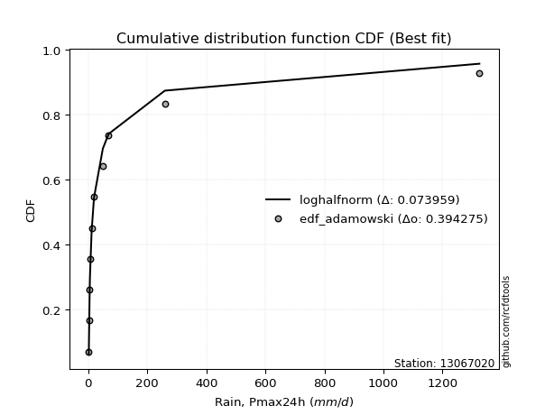</img>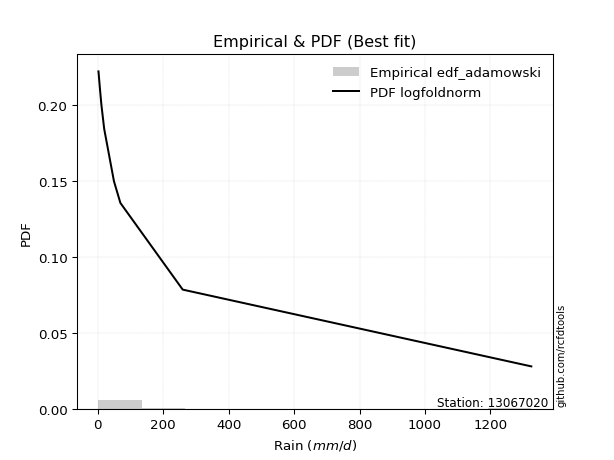</img>

</div>


## C. Best fit & Estimate extreme values for specific return periods - Tr


### 1. Best fit (ordered by delta Δ)

<div align="center">

|   id |   station | empirical_dist   | p_dist      |     delta |   deltao | eval   |   fit |   n |   best_fit |   best_fit_sort |
|-----:|----------:|:-----------------|:------------|----------:|---------:|:-------|------:|----:|-----------:|----------------:|
|    0 |  13067020 | edf_blom         | loghalfnorm | 0.0454447 | 0.376137 | Δo > Δ |     1 |  11 |          1 |               1 |
|    1 |  13067020 | edf_cunnane      | loghalfnorm | 0.0457344 | 0.376137 | Δo > Δ |     1 |  11 |          1 |               2 |
|    2 |  13067020 | edf_gringorten   | loghalfnorm | 0.0476615 | 0.376137 | Δo > Δ |     1 |  11 |          1 |               3 |
|    3 |  13067020 | edf_tukey        | loghalfnorm | 0.0480591 | 0.376137 | Δo > Δ |     1 |  11 |          1 |               4 |
|    4 |  13067020 | edf_filliben     | loghalfnorm | 0.0490425 | 0.376137 | Δo > Δ |     1 |  11 |          1 |               5 |
|    5 |  13067020 | edf_jenkinson    | loghalfnorm | 0.0495064 | 0.376137 | Δo > Δ |     1 |  11 |          1 |               6 |
|    6 |  13067020 | edf_beard        | loghalfnorm | 0.0495064 | 0.376137 | Δo > Δ |     1 |  11 |          1 |               7 |
|    7 |  13067020 | edf_chegodayev   | loghalfnorm | 0.050123  | 0.376137 | Δo > Δ |     1 |  11 |          1 |               8 |
|    8 |  13067020 | edf_hazen        | loghalfnorm | 0.0506046 | 0.376137 | Δo > Δ |     1 |  11 |          1 |               9 |
|    9 |  13067020 | edf_adamowski    | loghalfnorm | 0.0531742 | 0.376137 | Δo > Δ |     1 |  11 |          1 |              10 |
|   10 |  13067020 | edf_weibull      | loghalfnorm | 0.0676669 | 0.376137 | Δo > Δ |     1 |  11 |          1 |              11 |
|   11 |  13067020 | edf_california   | loghalfnorm | 0.0880171 | 0.376137 | Δo > Δ |     1 |  11 |          1 |              12 |

</div>

:file_folder:Tables: [bestfit_13067020.csv](table/bestfit_13067020.csv) | [extreme_13067020.csv](table/extreme_13067020.csv)


### 2. Extreme values

In hydrology, a return period (or recurrence interval $Tr$) is the statistical average time between extreme events like floods or droughts of a specific magnitude, indicating how rare an event is, with a 100-year flood, for example, having a 1% chance of occurring in any given year, not that it happens exactly every century. It is a key tool for infrastructure design (like bridges or dams) and risk assessment, calculated from historical data to determine the probability of future events, although it is important to remember it is statistical average, and events can cluster or be missed.

> risk_rate: assuming the return period as the project useful life.

|   id |      tr |   prob_l |     prob_g |      alpha |        betaprime |      chi2 |   crystalball |    erlang |    expon |   exponnorm |            f |   fatiguelife |       fisk |     gamma |   genexpon |   genlogistic |    gibrat |   gompertz |   gumbel_l |   gumbel_r |   halflogistic |   halfnorm |   hypsecant |         invgamma |   invgauss |       invweibull |        johnsonsu |   kstwobign |   laplace |   laplace_asymmetric |     loggamma |   logistic |   lognorm |   maxwell |      mielke |     moyal |   nakagami |              ncf |              nct |     norm |           pareto |   pearson3 |   rayleigh |     rice |                t |   truncnorm |      wald |   weibull_min |         logalpha |     logbetaprime |      logchi2 |   logcrystalball |        logerlang |         logexpon |     logexponnorm |             logf |   logfatiguelife |         logfisk |      loggenexpon |   loggenlogistic |        loggibrat |   loggompertz |   loggumbel_l |   loggumbel_r |   loghalflogistic |   loghalfnorm |   loghypsecant |      loginvgamma |      loginvgauss |    loginvweibull |     logjohnsonsu |   logkstwobign |   loglaplace |   loglaplace_asymmetric |   logloggamma |   loglogistic |     loglognorm |   logmaxwell |        logmielke |    logmoyal |      lognakagami |           logncf |           lognct |      logpareto |   logpearson3 |   lograyleigh |    logrice |      logt |   logtruncnorm |          logwald |   logweibull_min |   station |   n |   risk_rate |
|-----:|--------:|---------:|-----------:|-----------:|-----------------:|----------:|--------------:|----------:|---------:|------------:|-------------:|--------------:|-----------:|----------:|-----------:|--------------:|----------:|-----------:|-----------:|-----------:|---------------:|-----------:|------------:|-----------------:|-----------:|-----------------:|-----------------:|------------:|----------:|---------------------:|-------------:|-----------:|----------:|----------:|------------:|----------:|-----------:|-----------------:|-----------------:|---------:|-----------------:|-----------:|-----------:|---------:|-----------------:|------------:|----------:|--------------:|-----------------:|-----------------:|-------------:|-----------------:|-----------------:|-----------------:|-----------------:|-----------------:|-----------------:|----------------:|-----------------:|-----------------:|-----------------:|--------------:|--------------:|--------------:|------------------:|--------------:|---------------:|-----------------:|-----------------:|-----------------:|-----------------:|---------------:|-------------:|------------------------:|--------------:|--------------:|---------------:|-------------:|-----------------:|------------:|-----------------:|-----------------:|-----------------:|---------------:|--------------:|--------------:|-----------:|----------:|---------------:|-----------------:|-----------------:|----------:|----:|------------:|
|    0 |    2    | 0.5      | 0.5        |    7.29245 |     12.7879      |   39.9402 |       159.891 |   15.921  |  111.503 |     110.887 |      8.13625 |       19.0847 |    13.5961 |   37.1368 |    111.503 |       93.7317 |   47.2226 |    103.784 |    221.555 |    98.2266 |        67.5702 |    83.0567 |     159.891 |      9.87599     |    10.1848 |      8.76928     |      2.61569     |     154.989 |   159.891 |              111.503 |      2.50472 |    159.891 |   21.1037 |   127.788 |     10.8151 |   78.3192 |     61.102 |     10.6027      |     12.0047      |  159.891 |     10.8766      |    19.3354 |    116.403 |  184.54  |      5.87592     |     136.387 |   38.2174 |       92.2748 |     13.0296      |      2.42993     |      5.73764 |          21.1037 |      4.88223     |     10.545       |     10.513       |      4.97812     |     10.6761      |    11.6323      |     10.5487      |          14.8669 |     11.8978      |       13.4459 |       28.879  |       15.4218 |           13.195  |       14.2765 |        21.1037 |     12.2218      |     11.3673      |     12.3946      |     11.4914      |        15.8651 |      21.1037 |            12.3002      |       21.3935 |       21.1037 |   2.32798      |      17.9242 |      6.45006     |     13.9366 |      2.81294     |     13.2997      |     12.2918      |   2.26384      |       16.3572 |       16.9156 |    19.2692 |   21.1036 |        13.2231 |     11.3647      |     13.3965      |  13067020 |  11 |    0.75     |
|    1 |    2.33 | 0.570815 | 0.429185   |    8.67899 |     17.5823      |   72.7214 |       226.873 |   28.0677 |  135.586 |     134.859 |     11.559   |       37.9685 |    18.6267 |   68.0054 |    135.586 |      123.289  |   81.1529 |    126.166 |    279.83  |   160.293  |       131.384  |   155.347  |     213.496 |     14.0773      |    13.7086 |     13.8127      |      3.36364     |     200.324 |   200.425 |              135.586 |      2.75384 |    218.906 |   29.6708 |   197.378 |     14.8313 |  137.073  |    113.152 |     15.0076      |     16.6205      |  226.873 |     15.2928      |    67.0356 |    187.022 |  238.181 |      6.87767     |     165.094 |   82.138  |      182.239  |     17.5394      |      2.62722     |      7.40577 |          29.6708 |      6.40164     |     14.894       |     14.8472      |      6.91152     |     14.7926      |    15.9042      |     14.9002      |          20.0851 |     14.1391      |       19.0795 |       38.8436 |       21.1468 |           18.255  |       20.6215 |        27.7191 |     16.5684      |     15.6078      |     16.7246      |     15.7371      |        21.7703 |      25.936  |            16.7422      |       30.158  |       28.4925 |   3.23478      |      25.5371 |      8.6655      |     18.791  |      3.5203      |     18.2441      |     16.611       |   2.50983      |       22.9348 |       24.2266 |    26.6164 |   29.6707 |        18.6918 |     14.2097      |     30.2272      |  13067020 |  11 |    0.729209 |
|    2 |    5    | 0.8      | 0.2        |   19.4304  |     77.9699      |  401.152  |       475.795 |  151.722  |  255.994 |     254.71  |     52.2848  |      255.353  |    69.6019 |  381.737  |    255.994 |      251.692  |  276.499  |    238.071 |    468.092 |   429.936  |       420.128  |   461.056  |     428.52  |     88.2252      |    56.3694 |    138.53        |     55.5564      |     392.9   |   403.087 |              255.995 |      6.31451 |    446.774 |  105.252  |   471.276 |     64.315  |  409.224  |    576.744 |     87.1412      |     83.0939      |  475.795 |     82.5367      |   341.667  |    469.74  |  452.934 |     17.6633      |     304.431 |  328.006  |     1688.77   |     72.3945      |      5.57399     |     28.5083  |         105.252  |     30.4361      |     83.7119      |     83.4078      |     56.2712      |     77.8466      |    88.6157      |     83.7789      |          74.2003 |     38.1909      |       90.262  |      101.208  |       83.353  |           79.2968 |       97.6493 |        82.7549 |     74.183       |     76.1469      |     72.5311      |     77.2269      |        83.4827 |      72.7125 |            78.2115      |      107.612  |       90.8068 |   1.37156e+210 |     102.86   |     34.0302      |     75.0182 |     27.5476      |     79.2015      |     72.7863      |   3.21247e+118 |       93.3758 |      102.06   |    97.0003 |  105.252  |        88.3353 |     49.6304      |  13358.8         |  13067020 |  11 |    0.67232  |
|    3 |   10    | 0.9      | 0.1        |   39.1834  |    286.572       |  877.696  |       640.923 |  332.789  |  365.297 |     363.507 |    174.303   |      546.48   |   192.84   |  840.703  |    365.297 |      356.272  |  499.171  |    339.655 |    572.907 |   649.556  |       659.919  |   687.273  |     600.223 |    481.783       |   183.165  |   1012.29        |    677.188       |     539.521 |   587.058 |              365.298 |     19.2048  |    614.589 |  243.792  |   664.032 |    222.743  |  646.174  |   1101.37  |    435.595       |    358.004       |  640.923 |    377.937       |   620.711  |    671.324 |  606.056 |     71.8016      |     425.428 |  588.93   |     5863.17   |    279.383       |     17.6805      |    102.614   |         243.792  |    148.275       |    401.248       |    399.612       |    625.171       |    371.779       |   663.425       |    401.708       |         215.08   |    118.54        |      297.395  |      172.49   |      254.736  |          268.524  |      308.611  |       198.201  |    316.367       |    337.539       |    300.604       |    365.751       |       232.292  |     185.363  |           316.947       |      249.378  |      213.228  | inf            |     274.202  |    110.617       |    250.391  |    293.602       |    288.189       |    305.367       | inf            |      270.844  |      284.563  |   243.906  |  243.792  |       299.87   |    187.142       |      5.34038e+07 |  13067020 |  11 |    0.651322 |
|    4 |   15    | 0.933333 | 0.0666667  |   58.8659  |    610.004       | 1208.05   |       723.326 |  458.69   |  429.235 |     427.15  |    343.944   |      736.617  |   338.119  | 1159.74   |    429.235 |      415.274  |  652.76   |    399.078 |    620.376 |   773.464  |       795.618  |   804.995  |     698.212 |   1304.29        |   344.022  |   3128.29        |   2397.01        |     617.359 |   694.674 |              429.236 |     40.6981  |    706.023 |  370.729  |   762.933 |    451.478  |  783.689  |   1402.29  |   1118.02        |    841.746       |  723.326 |    919.491       |   791.505  |    775.189 |  684.952 |    185.39        |     494.031 |  756.484  |    10305.1    |    664.244       |     42.341       |    220.187   |         370.729  |    390.751       |   1003.58        |    999.23        |   3094.94        |    948.208       |  2930.74        |   1004.94        |         392.063  |    258.915       |      555.153  |      219.598  |      478.43   |          535.501  |      561.662  |       326.27   |    793.486       |    829.35        |    743.787       |    973.193       |       399.923  |     320.45   |           718.585       |      378.928  |      339.495  | inf            |     453.475  |    227.515       |    503.973  |   1146.98        |    618.457       |    762.876       | inf            |      480.195  |      482.647  |   392.241  |  370.729  |       577.124  |    438.857       |      2.18979e+10 |  13067020 |  11 |    0.644736 |
|    5 |   20    | 0.95     | 0.05       |   78.5311  |   1041.53        | 1459.45   |       777.289 |  554.61   |  474.6   |     472.305 |    554.37    |      877.351  |   499.108  | 1402.77   |    474.6   |      456.586  |  773.239  |    441.239 |    649.923 |   860.221  |       890.694  |   883.482  |     767.339 |   2644.97        |   521.636  |   6897.12        |   5490.49        |     669.794 |   771.028 |              474.601 |     71.6591  |    769.219 |  487.831  |   828.569 |    741.165  |  881.08   |   1608.08  |   2182.63        |   1544.06        |  777.289 |   1727.63        |   915.129  |    844.225 |  737.392 |    371.216       |     541.802 |  881.345  |    14639.3    |   1287.84        |     86.2247      |    380.241   |         487.831  |    787.926       |   1923.26        |   1914.56        |  10457.9         |   1857.66        | 10053.1         |   1926.13        |         596.935  |    477.867       |      841.13   |      255.212  |      743.835  |          868.548  |      837.265  |       463.755  |   1584.12        |   1588.8         |   1473.53        |   2017.48        |       576.655  |     472.539  |          1284.41        |      498.183  |      468.211  | inf            |     633.218  |    391.105       |    827.095  |   2915.26        |   1071.64        |   1524.59        | inf            |      709.361  |      685.707  |   537.89   |  487.83   |       898.308  |    828.248       |      2.59981e+12 |  13067020 |  11 |    0.641514 |
|    6 |   25    | 0.96     | 0.04       |   98.1894  |   1576.67        | 1662.53   |       817.014 |  632.143  |  509.787 |     507.33  |    801.456   |      989.157  |   672.636  | 1599.21   |    509.787 |      488.406  |  873.676  |    473.942 |    670.948 |   927.047  |       963.945  |   941.879  |     820.838 |   4577.49        |   706.943  |  12682.6         |  10107.9         |     709.069 |   830.254 |              509.789 |    112.882   |    817.564 |  597.07   |   877.298 |   1086.12   |  956.567  |   1762.79  |   3667.37        |   2472.01        |  817.014 |   2817.66        |  1012.18   |    895.517 |  776.353 |    639.828       |     578.364 |  981.356  |    18794.1    |   2223.72        |    158.131       |    582.171   |         597.07   |   1366.43        |   3185.31        |   3170.44        |  28193.5         |   3142.87        | 29489.8         |   3190.42        |         825.191  |    796.496       |     1144.84   |      284.02   |     1044.97   |         1260.71   |     1126.86   |       608.799  |   2775.73        |   2648.46        |   2569.83        |   3626.65        |       758.521  |     638.667  |          2015.32        |      609.234  |      598.745  | inf            |     811.337  |    608.903       |   1214.28   |   5880.22        |   1650.78        |   2680.91        | inf            |      952.726  |      890.123  |   680.123  |  597.069  |      1252      |   1377.53        |      1.40744e+14 |  13067020 |  11 |    0.639603 |
|    7 |   50    | 0.98     | 0.02       |  196.45    |   5710.8         | 2329.52   |       930.769 |  887.001  |  619.09  |     616.127 |   2505.98    |     1347.84   |  1676.36   | 2244.85   |    619.09  |      586.431  | 1227.72   |    575.526 |    728.024 |  1132.91   |      1189.64   |  1111.62   |     986.706 |  25157.2         |  1630.79   |  82844.3         |  58051.6         |     824.401 |  1014.22  |              619.092 |    496.621   |    965.273 | 1064.94   |  1018.62  |   3528.15   | 1190.91   |   2216.24  |  18385.8         |  10665.2         |  930.769 |  12874.8         |  1318.87   |   1044.41  |  889.452 |   3517.98        |     689.351 | 1307.89   |    37031.3    |  15258.4         |   1448.92        |   2207.93    |        1064.94   |   7782.91        |  15267.8         |  15189.8         | 802848           |  16423           |     1.90761e+06 |  15297.6         |        2237.47   |   4822.88        |     2785.74   |      379.696  |     2977.63   |         3973.83   |     2672.05   |      1415.46   |  18493.3         |  13417           |  17004.7         |  25391.2         |      1696.53   |    1628.13   |          8166.96        |     1083.12   |     1269.25   | inf            |    1664.94   |   2830.03        |   3999.59   |  46004.7         |   6562.8         |  18415.3         | inf            |     2300.15   |     1898.34   |  1343.9    | 1064.94   |      3325.67   |   7252.18        |      1.63905e+20 |  13067020 |  11 |    0.63583  |
|    8 |   75    | 0.986667 | 0.0133333  |  294.697   |  12121           | 2739.95   |       991.806 | 1043.94   |  683.029 |     679.77  |   4873.52    |     1563.83   |  2842.36   | 2642.4    |    683.028 |      643.407  | 1466.85   |    634.949 |    756.886 |  1252.56   |      1320.84   |  1204.02   |    1083.64  |  68167.6         |  2469.62   | 246622           | 148314           |     887.856 |  1121.84  |              683.031 |   1228.68    |   1050.58  | 1452.66   |  1095.45  |   6999.77   | 1327.95   |   2463.72  |  47211.2         |  25083.1         |  991.806 |  31312.3         |  1501.23   |   1125.41  |  950.982 |   9566.62        |     752.573 | 1508.83   |    52182      |  57822.8         |   6850.23        |   4842.62    |        1452.66   |  21896.9         |  38187.2         |  37982.1         |      6.91809e+06 |  43733.2         |     4.52138e+07 |  38269.5         |        3995.3    |  16276.2         |     4494.74   |      439.739  |     5472.67   |         7745.34   |     4275.29   |      2317.57   |  63314.2         |  35463           |  58331.9         |  86953.8         |      2641.83   |    2814.66   |         18516.2         |     1474.11   |     1958.89   | inf            |    2461.14   |   8002.69        |   8030.73   | 141409           |  15174.1         |  65310.2         | inf            |     3775.8    |     2866.3    |  1946.62   | 1452.66   |      5697.69   |  20154.2         |      1.71128e+24 |  13067020 |  11 |    0.634587 |
|    9 |  100    | 0.99     | 0.01       |  392.94    |  20673.5         | 3038.42   |      1033.09  | 1158.11   |  728.393 |     724.925 |   7809.89    |     1719.25   |  4127.04   | 2931.59   |    728.393 |      683.732  | 1652.09   |    677.11  |    775.764 |  1337.24   |      1413.7    |  1266.96   |    1152.4   | 138274           |  3215.63   | 533765           | 279714           |     931.333 |  1198.2   |              728.396 |   2369.72    |   1110.81  | 1792.1    |  1147.79  |  11368.3    | 1425.18   |   2632.12  |  92179.8         |  46015.6         | 1033.09  |  58825.9         |  1631.7    |   1180.6   |  992.901 |  19462.9         |     796.716 | 1655.33   |    65305.6    | 167578           |  23481           |   8471.92    |        1792.1    |  45894.8         |  73181.8         |  72775.2         |      3.49288e+07 |  88029.9         |     6.42909e+08 |  73350           |        6022.23   |  41760.6         |     6209.26   |      484.061  |     8419.38   |        12421.6    |     5888.7    |      3287.98   | 161098           |  71341.4         | 149056           | 217588           |      3578.41   |    4150.53   |         33096.1         |     1815.41   |     2661.15   | inf            |    3211.82   |  18060.8         |  13168.5    | 303617           |  27931.4         | 172056           | inf            |     5327.73   |     3795.19   |  2505.58   | 1792.1    |      8241.46   |  42462.8         |      1.95867e+27 |  13067020 |  11 |    0.633968 |
|   10 |  200    | 0.995    | 0.005      |  785.905   |  74828.5         | 3777.93   |      1126.73  | 1441.06   |  837.696 |     833.722 |  24313.7     |     2099.66   | 10098.7    | 3648.31   |    837.696 |      780.677  | 2156.05   |    778.694 |    816.798 |  1540.84   |      1636.94   |  1410.93   |    1318.04  | 760024           |  5545.03   |      3.41581e+06 |      1.17953e+06 |    1031.47  |  1382.17  |              837.699 |  12000.4     |   1255.3   | 2885.58   |  1267.52  |  36480.9    | 1659.42   |   3016     | 462162           | 198540           | 1126.73  | 268778           |  1949.1    |   1306.87  | 1088.82  | 107797           |     900.783 | 2020.24   |   106347      |      3.71255e+06 | 754897           |  32792       |        2885.58   | 277717           | 350775           | 348671           |      2.39688e+09 | 481533           |     2.23652e+12 | 351703           |       16150.5    | 542099           |    12879.3    |      596.415  |    23716.1    |        38668.1    |    12247.7    |      7635.95   |      1.92464e+06 | 395776           |      1.81812e+06 |      2.3215e+06  |      7198.21   |   10580.8    |        134120           |     2909.77   |     5549.48   | inf            |    5905.55   | 175113           |  43352.5    |      1.7329e+06  | 128719           |      2.32877e+06 | inf            |    11957.5    |     7214.11   |  4464.25   | 2885.58   |     19293.7    | 271750           |      2.28463e+35 |  13067020 |  11 |    0.633042 |
|   11 |  250    | 0.996    | 0.004      |  982.386   | 113216           | 4021.2    |      1155.35  | 1534.17   |  872.884 |     868.747 |  35042.1     |     2223.63   | 13460.2    | 3884.15   |    872.884 |      811.844  | 2336.88   |    811.397 |    828.871 |  1606.29   |      1708.71   |  1455.22   |    1371.37  |      1.31547e+06 |  6452.4    |      6.20379e+06 |      1.83108e+06 |    1062.46  |  1441.39  |              872.887 |  20436.5     |   1301.68  | 3337.73   |  1304.38  |  53071.7    | 1734.83   |   3133.64  | 776595           | 317873           | 1155.35  | 438338           |  2052.07   |   1345.74  | 1118.34  | 187049           |     933.631 | 2140.97   |   122754      |      1.23658e+07 |      2.73227e+06 |  50775.2     |        3337.73   | 498013           | 580954           | 577385           |      1.03698e+10 | 835216           |     5.88424e+13 | 582555           |       22177.9    |      1.36e+06    |    16074.2    |      634.191  |    33085.3    |        55706.1    |    15342.5    |     10015.2    |      4.61372e+06 | 692676           |      4.40224e+06 |      5.22645e+06 |      8936.37   |   14300.6    |        210443           |     3360.43   |     7026.26   | inf            |    7123.33   | 405202           |  63621.2    |      2.95509e+06 | 214453           |      5.89702e+06 | inf            |    15426.2    |     8791.23   |  5332.89   | 3337.73   |     25105.4    | 502191           |      1.45621e+38 |  13067020 |  11 |    0.632858 |
|   12 |  500    | 0.998    | 0.002      | 1964.79    | 409769           | 4790.16   |      1240.21  | 1828.53   |  982.187 |     977.544 | 109051       |     2612.53   | 32815.8    | 4629.73   |    982.187 |      908.578  | 2961.8    |    912.981 |    863.481 |  1809.44   |      1931.47   |  1587.27   |    1537     |      7.23054e+06 |  9726.48   |      3.95411e+07 |      6.74698e+06 |    1155.33  |  1625.36  |              982.19  | 109617       |   1445.54  | 5139.57   |  1414.37  | 169886      | 1969.07   |   3482.93  |      3.89362e+06 |      1.3715e+06  | 1240.21  |      2.00278e+06 |  2373.97   |   1461.71  | 1206.44  |      1.03622e+06 |    1033.76  | 2524.84   |   185207      |      1.29484e+09 |      2.74198e+08 | 198241       |        5139.57   |      3.09126e+06 |      2.78463e+06 |      2.76629e+06 |      1.38484e+12 |      4.66642e+06 |     2.06577e+19 |      2.79327e+06 |       59349.5    |      3.26633e+07 |    30858.4    |      756.272  |    92986.4    |       172985      |    30033.7    |     23257.8    |      9.0874e+07  |      4.0319e+06  |      9.04533e+07 |      7.64464e+07 |     17087.2    |   36456      |        852806           |     5148.06   |    14605.7    | inf            |   12463.8    |      8.19799e+06 | 209444      |      1.4412e+07  |      1.11462e+06 |      1.45715e+08 | inf            |    33536.3    |    15858.1    |  9064.55   | 5139.57   |     55267.7    |      3.53908e+06 |      3.23968e+47 |  13067020 |  11 |    0.632489 |
|   13 |  750    | 0.998667 | 0.00133333 | 2947.19    | 869594           | 5247.98   |      1287.36  | 2003.82   | 1046.13  |    1041.19  | 211846       |     2842.31   | 55234.9    | 5073.71   |   1046.12  |      965.129  | 3375.09   |    972.404 |    881.978 |  1928.2    |      2061.7    |  1661.04   |    1633.89  |      1.95927e+07 | 11934.4    |      1.1676e+08  |      1.39237e+07 |    1207.5   |  1732.98  |             1046.13  | 297447       |   1529.59  | 6532.39   |  1475.88  | 335395      | 2106.09   |   3677.05  |      9.99818e+06 |      3.22563e+06 | 1287.36  |      4.87084e+06 |  2563.52   |   1526.57  | 1255.7   |      2.82082e+06 |    1091.07  | 2754.99   |   230740      |      4.74952e+10 |      6.62889e+09 | 440831       |        6532.38   |      9.05769e+06 |      6.96479e+06 |      6.9171e+06  |      3.13522e+13 |      1.28442e+07 |     3.53913e+23 |      6.98782e+06 |      105519      |      2.67332e+08 |    44167.9    |      830.884  |   170129      |       335501      |    43709.7    |     38072.2    |      6.37174e+08 |      1.14655e+07 |      6.55579e+08 |      4.13499e+08 |     24593.1    |   63024      |             1.93349e+06 |     6522.59   |    22397      | inf            |   17043      |      6.594e+07   | 420498      |      3.4765e+07  |      3.06247e+06 |      1.2228e+09  | inf            |    52343.9    |    22055.5    | 12194.8    | 6532.39   |     86094.1    |      1.14115e+07 |      2.63018e+53 |  13067020 |  11 |    0.632366 |
|   14 | 1000    | 0.999    | 0.001      | 3929.59    |      1.48309e+06 | 5575.89   |      1319.81  | 2129.39   | 1091.49  |    1086.34  | 339339       |     3006.21   | 79906.3    | 5391.74   |   1091.49  |     1005.24   | 3691.36   |   1014.57  |    894.428 |  2012.44   |      2154.07   |  1711.98   |    1702.63  |      3.97429e+07 | 13618.6    |      2.51685e+08 |      2.29291e+07 |    1243.65  |  1809.33  |             1091.49  | 607626       |   1589.19  | 7705.05   |  1518.4   | 543367      | 2203.31   |   3810.69  |      1.95215e+07 |      5.91753e+06 | 1319.81  |      9.15073e+06 |  2698.49   |   1571.38  | 1289.74  |      5.74062e+06 |    1131.19  | 2920.55   |   267531      |      1.06719e+12 |      8.16308e+10 | 777925       |        7705.05   |      1.94747e+07 |      1.33473e+07 |      1.32534e+07 |      3.24158e+14 |      2.64088e+07 |     1.28008e+27 |      1.33934e+07 |      158710      |      1.33573e+09 |    56439.2    |      885.202  |   261143      |       536736      |    56640.3    |     54009.6    |      2.80633e+09 |      2.42135e+07 |      2.96803e+09 |      1.44793e+09 |     31650.1    |   92935.8    |             3.45594e+06 |     7675.84   |    30329.1    | inf            |   21157.7    |      3.42816e+08 | 689495      |      6.3736e+07  |      6.4137e+06  |      6.27267e+09 | inf            |    71531      |    27702.6    | 14969.3    | 7705.05   |    117036      |      2.64904e+07 |      6.43632e+57 |  13067020 |  11 |    0.632305 |

<div align="center">

</img>

</div>


<div align="center">

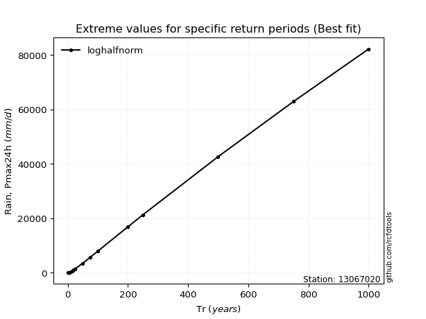</img>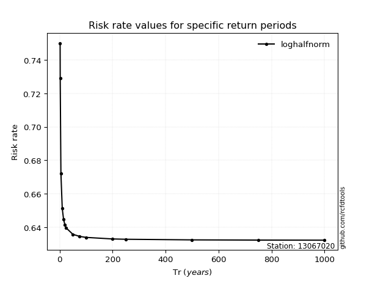</img>

</div>


<sub>**APP DISCLAIMER**: NO WARRANTY - This software is provided by [github.com/rcfdtools](https://github.com/rcfdtools) "as is", without any express or implied warranty, including warranties of merchantability, fitness for a particular purpose, or non-infringement. There is no guarantee that the software will be error-free or operate without interruption. LIMITATION OF LIABILITY - Neither the authors nor copyright holders will be liable for claims or damages arising from the software or its use. You are responsible for determining if the software is appropriate for your use and assume all associated risks, including errors, legal compliance, and data loss. NO PROFESSIONAL ADVICE - The software provides general information and does not offer professional advice. It should not replace consultation with professional advisors.</sub>