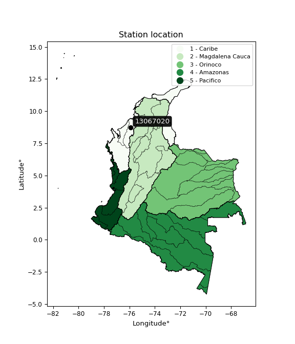

<div align="center">


</div>

# PMP Station (Rain, Pmax24h): 13067020

Probable Maximum Precipitation (PMP) is the greatest amount of rainfall for a specific duration that is meteorologically possible for a given location, acting as a "worst-case" scenario for extreme storms, crucial for designing safety-critical infrastructure like bridges, river deviations, dams, spillways, and nuclear plants to prevent catastrophic failure. PMP is calculated by hydrologists using meteorological data to determine the upper limit of extreme rainfall, often leading to the Probable Maximum Flood (PMF) for flood control design, and is increasingly being studied for climate change impacts. Probable Maximum Precipitation (PMP) is the theoretical upper limit of rainfall, a deterministic estimate for extreme events, while probability distributions (like GEV, Gumbel) describe the likelihood and frequency of various precipitation amounts, including rare ones, showing how often events occur, with PMP representing the extreme end of these distributions, used for critical infrastructure design to ensure safety against the worst conceivable weather, unlike standard statistical forecasts which cover typical probabilities.

The most common probability distributions in hydrology, used for analyzing floods, rainfall, and streamflow, include the Normal, Log-Normal, Gumbel, Gamma (including Log-Pearson Type III), and Generalized Extreme Value (GEV) distributions, often chosen based on the data´s skewness and whether modeling extremes or general conditions, with Gumbel and GEV popular for extreme events like floods, while the Normal distribution serves as a baseline, though often requiring transformations for skewed hydrological data. These distributions help in designing water infrastructure, managing water resources, and forecasting hydrologic events.

> Hydrological data often isn´t perfectly normal (it´s skewed), so different distributions are needed for different applications, such as: **Flood Frequency Analysis**: Using Gumbel, GEV, or Log-Pearson Type III for predicting extreme flood magnitudes and their return periods, **Rainfall Analysis**: Normal for annual totals, but Log-Normal, Weibull, or GEV for intensity or extreme daily rainfall, **Streamflow Modeling**: Gamma and Log-Normal for maximum flows, GEV for minimum flows, and Kappa for daily flows.

<div align="center">

</img>

</div>


## A. General information


### 1. General running parameters

• app_version: _v20260113_. • runtime: _2026-01-17 18:24:04.630693_. • Python version: _3.14.0_. • SciPy version: _1.16.3_. • Pandas version: _2.3.3_. • NumPy version: _2.3.5_. • Stations dataset (station_dataset_file): _dataset/pmax24h_in/automatic_colombia_2003_2025.csv_. • Stations catalog (station_catalog_file): _dataset/CNE.xls_. • Minimum year to eval til year_max (date_min): _1900_. • Maximum year to eval since year_min (date_max): _2025_. • Creates, save and include plots into reports (create_plot): _False_. • Plot only fit distributions with Δo > Δ (plot_only_fit): _True_. • Plot only simple graphs avoiding multiple CDFs and multiple Extreme values plots (plot_only_simple): _True_. • Eval low extreme values, if False, evaluates high extreme values (low_extreme): _False_. • Eval every SciPy distribution as logarithmic (pdist_logarithmic_on): _True_. • Standard deviation normalized (ddof): _1.0_. • Return periods to eval in years (Tr): _[2, 2.33, 5, 10, 15, 20, 25, 50, 75, 100, 200, 250, 500, 750, 1000]_. • Minimum data sample per station, 0 means any (minimum_sample): _5_. • Z-Score maximum threshold to adjust a value, 0 means disable (zscore_max): _3.5_. • Z-Score minimum threshold to adjust a value, 0 means disable (zscore_min): _-2.5_. • Avoid zeros, e.g. rain = 0 (avoid_zeros): _True_. • Avoid null values (avoid_nans): _True_. 

:file_folder:Table: [dataset.csv](../../dataset/pmax24h_in/automatic_colombia_2003_2025.csv)

> Delta Degrees of Freedom (DDOF): is a parameter used in the formulas for calculating variance and standard deviation. When ddof=0, the divisor is $N$ (the total number of observations) and this is used when your data set is the entire population. When ddof=1, the divisor is $N-1$ and this is used when your data set is a sample drawn from a larger population. Using $N-1$ provides an unbiased estimate of the population variance (known as Bessel´s correction).


### 2. Station info and location

|   id |   CODIGO | NOMBRE                     | CATEGORIA    | TECNOLOGIA                              | ESTADO   | FECHA_INSTALACION   |   FECHA_SUSPENSION |   ALTITUD |   LATITUD |   LONGITUD | DEPARTAMENTO   | MUNICIPIO   | AREA_OPERATIVA                              | ENTIDAD                                                     | AREA_HIDROGRAFICA   | ZONA_HIDROGRAFICA   | SUBZONA_HIDROGRAFICA   | CORRIENTE   | Catalogo   |   Version |
|-----:|---------:|:---------------------------|:-------------|:----------------------------------------|:---------|:--------------------|-------------------:|----------:|----------:|-----------:|:---------------|:------------|:--------------------------------------------|:------------------------------------------------------------|:--------------------|:--------------------|:-----------------------|:------------|:-----------|----------:|
|    0 | 13067020 | MONTERIA  - AUT [13067020] | Limnigráfica | Automática con Telemetría, Convencional | Activa   | 15/02/1963          |                nan |        15 |   8.75161 |   -75.8924 | Cordoba        | Montería    | Area Operativa 02 - Atlántico-Bolivar-Sucre | INSTITUTO DE HIDROLOGIA METEOROLOGIA Y ESTUDIOS AMBIENTALES | Caribe              | Sinú                | Bajo Sinú              | Sinu        | CNE_IDEAM  |  20251226 |

<div align="center">

Dynamic map: [:earth_americas:Google](http://maps.google.com/maps?q=8.751611111,-75.89241667) [:earth_americas:OSM](https://www.openstreetmap.org/#map=18/8.751611111/-75.89241667&layers=P) [:earth_americas:Bing](https://www.bing.com/maps?cp=8.751611111~-75.89241667&lvl=18) [:earth_americas:Apple](https://maps.apple.com/frame?center=8.751611111%2C-75.89241667&span=0.003%2C0.006)

</div>


<div align="center">

```geojson
{
  "type": "Feature",
  "geometry": {
    "type": "Point", 
    "coordinates": [-75.89241667, 8.751611111]
  }, 
  "properties": {
    "Name": "13067020"
  }
}
```

</div>


### 3. Discrete values table and plot

<div align="center">

|               |           0 |           1 |           2 |          3 |          4 |           5 |           6 |           7 |           8 |           9 |          10 |
|:--------------|------------:|------------:|------------:|-----------:|-----------:|------------:|------------:|------------:|------------:|------------:|------------:|
| Date          | 2015        | 2016        | 2017        | 2018       | 2019       | 2020        | 2021        | 2022        | 2023        | 2024        | 2025        |
| Value         |   49.65     |   69.25     |  259.7      | 1325       |    6.1     |   11.6      |    2.2      |    5.2      |    2.5      |   19.8      |   10.3      |
| Value_initial |   49.65     |   69.25     |  259.7      | 1325       |    6.1     |   11.6      |    2.2      |    5.2      |    2.5      |   19.8      |   10.3      |
| count         |   11        |   11        |   11        |   11       |   11       |   11        |   11        |   11        |   11        |   11        |   11        |
| mean          |  160.118    |  160.118    |  160.118    |  160.118   |  160.118   |  160.118    |  160.118    |  160.118    |  160.118    |  160.118    |  160.118    |
| std           |  393.576    |  393.576    |  393.576    |  393.576   |  393.576   |  393.576    |  393.576    |  393.576    |  393.576    |  393.576    |  393.576    |
| zscore        |   -0.280678 |   -0.230878 |    0.253018 |    2.95974 |   -0.39133 |   -0.377356 |   -0.401239 |   -0.393617 |   -0.400477 |   -0.356521 |   -0.380659 |


</div>


> The initial value (value_initial) correspond to the initial obtained or null completed value, and value (value) is adjusted only when the initial value is outside the valid range (outlier) definite through the Z-Score value. If Z-Score is active, values out of range or outliers are replaced with the station mean value. A Z-Score (or standard score) measures how many standard deviations a data point is from the mean of a dataset, indicating its relative position; positive scores mean above the mean, negative mean below, and a score of zero is exactly at the mean, allowing for comparison of values from different distributions. It´s calculated using the formula $z=(x–μ)/σ$, where $x$ is the data point, $μ$ is the mean, and $σ$ is the standard deviation, helping identify outliers and understand probability.
>
> <sub>**Note**: In this study, "completing" (filling gaps in) and "extending" (forecasting or lengthening the historical record) rainfall data series are avoided for certain critical analyses because they introduce artificial bias and uncertainty, which can distort the statistics of rare events (extremes), alter day-to-day variability, and compromise the integrity and homogeneity of the original data. Some reasons against Completing/Extending rainfall data are: **Distortion of Extremes and Variability**: The primary issue is that most gap-filling or extension methods rely on averaging or regression with nearby stations, which inherently smooths the data. Rainfall is highly variable in space and time, with a large percentage of zero values and occasional large storms. Infilling methods often underestimate the highest values and overestimate the lowest (zero) values, which severely distorts analyses focused on flood frequency, drought severity, and intensity-duration-frequency (IDF) curves, **Loss of Data Homogeneity**: Infilled or extended data are synthetic estimates, not actual measurements. Combining these estimates with observed data can violate the assumption of data homogeneity, which requires that the data properties do not change over time. Inhomogeneity can lead to incorrect conclusions about long-term trends or changes in climate patterns, **Propagation of Errors**: Errors and biases from the original data (e.g., wind-induced undercatch, instrument errors, site changes) or the data used for imputation can propagate through the analysis, leading to unreliable hydrological models and inaccurate predictions, **Compromised Statistical Integrity**: For statistical analyses, especially those involving the frequency of events, using artificial data can introduce time bias or autocorrelation that doesn´t exist in reality, making it difficult to assess the true probability of events, **Difficulty in Validation**: It is difficult to accurately validate the quality of filled or extended data, especially for past periods where ground-truth measurements are unavailable. The reliability of imputation techniques heavily depends on the density of the surrounding station network and the complexity of the local topography.</sub>


### 4. Active continuous probability distributions from SciPy (80 of 104 available)

A Probability Density Function (PDF) describes the relative likelihood of a continuous random variable falling within a specific range, where the total area under its curve equals 1, and the area over any interval gives the actual probability for that range. Unlike discrete probabilities (like rolling a die), a PDF shows density, not direct probability for a single point (which is zero), with higher points indicating higher likelihood, often visualized as a bell curve for normal distributions.

A log of a probability density function (log-PDF) is simply the logarithm of the PDF´s value, denoted as $log(f(x))$, useful for converting multiplication of probabilities into addition, improving numerical stability with tiny numbers, and connecting to information theory concepts like entropy. Instead of dealing with very small probabilities (e.g., 0.000001), log-PDFs use negative numbers (e.g., $log(0.00001) ≈ -11.51$ that are easier for computers to handle, preventing underflow errors and simplifying complex calculations. In this study, each active probability distribution from SciPy is also evaluated in the $log$ form.

[scipy.stats](https://docs.scipy.org/doc/scipy/reference/stats.html) is a Python´s powerful submodule within the SciPy library for comprehensive statistical analysis, offering over 130 probability distributions (like Normal, Poisson), functions for descriptive stats (mean, variance), hypothesis testing (t-tests, chi-square), random variable generation, and statistical tests, making it essential for data science, modeling, and research. It provides tools to explore, model, and draw conclusions from data efficiently, working seamlessly with NumPy.

<div align="center">

|   id | p_dist           |   n_parameter | fit_method   | label                                                                       | active   | ref                                                                                                      |
|-----:|:-----------------|--------------:|:-------------|:----------------------------------------------------------------------------|:---------|:---------------------------------------------------------------------------------------------------------|
|    0 | alpha            |             3 | MLE          | Alpha                                                                       | True     | [:mortar_board:](https://docs.scipy.org/doc/scipy/reference/generated/scipy.stats.alpha.html)            |
|    1 | anglit           |             2 | MM           | Anglit                                                                      | True     | [:mortar_board:](https://docs.scipy.org/doc/scipy/reference/generated/scipy.stats.anglit.html)           |
|    2 | arcsine          |             2 | MM           | Arcsine                                                                     | True     | [:mortar_board:](https://docs.scipy.org/doc/scipy/reference/generated/scipy.stats.arcsine.html)          |
|    3 | argus            |             3 | MLE          | Argus                                                                       | True     | [:mortar_board:](https://docs.scipy.org/doc/scipy/reference/generated/scipy.stats.argus.html)            |
|    4 | beta             |             4 | MLE          | Beta                                                                        | True     | [:mortar_board:](https://docs.scipy.org/doc/scipy/reference/generated/scipy.stats.beta.html)             |
|    5 | betaprime        |             4 | MLE          | Beta prime                                                                  | True     | [:mortar_board:](https://docs.scipy.org/doc/scipy/reference/generated/scipy.stats.betaprime.html)        |
|    6 | bradford         |             3 | MLE          | Bradford                                                                    | True     | [:mortar_board:](https://docs.scipy.org/doc/scipy/reference/generated/scipy.stats.bradford.html)         |
|    7 | burr             |             4 | MLE          | Burr (Type III)                                                             | True     | [:mortar_board:](https://docs.scipy.org/doc/scipy/reference/generated/scipy.stats.burr.html)             |
|    8 | burr12           |             4 | MLE          | Burr (Type III) 12                                                          | True     | [:mortar_board:](https://docs.scipy.org/doc/scipy/reference/generated/scipy.stats.burr12.html)           |
|    9 | cosine           |             2 | MLE          | Cosine                                                                      | True     | [:mortar_board:](https://docs.scipy.org/doc/scipy/reference/generated/scipy.stats.cosine.html)           |
|   10 | crystalball      |             4 | MLE          | Crystalball                                                                 | True     | [:mortar_board:](https://docs.scipy.org/doc/scipy/reference/generated/scipy.stats.crystalball.html)      |
|   11 | dgamma           |             3 | MLE          | Double gamma                                                                | True     | [:mortar_board:](https://docs.scipy.org/doc/scipy/reference/generated/scipy.stats.dgamma.html)           |
|   12 | dweibull         |             3 | MLE          | Double Weibull                                                              | True     | [:mortar_board:](https://docs.scipy.org/doc/scipy/reference/generated/scipy.stats.dweibull.html)         |
|   13 | erlang           |             3 | MLE          | Erlang                                                                      | True     | [:mortar_board:](https://docs.scipy.org/doc/scipy/reference/generated/scipy.stats.erlang.html)           |
|   14 | exponnorm        |             3 | MLE          | Exponentially modified Normal                                               | True     | [:mortar_board:](https://docs.scipy.org/doc/scipy/reference/generated/scipy.stats.exponnorm.html)        |
|   15 | exponpow         |             3 | MLE          | Exponential power                                                           | True     | [:mortar_board:](https://docs.scipy.org/doc/scipy/reference/generated/scipy.stats.exponpow.html)         |
|   16 | exponweib        |             4 | MLE          | Exponentiated Weibull                                                       | True     | [:mortar_board:](https://docs.scipy.org/doc/scipy/reference/generated/scipy.stats.exponweib.html)        |
|   17 | f                |             4 | MLE          | F                                                                           | True     | [:mortar_board:](https://docs.scipy.org/doc/scipy/reference/generated/scipy.stats.f.html)                |
|   18 | fatiguelife      |             3 | MLE          | Fatigue-life (Birnbaum-Saunders)                                            | True     | [:mortar_board:](https://docs.scipy.org/doc/scipy/reference/generated/scipy.stats.fatiguelife.html)      |
|   19 | foldnorm         |             3 | MM           | Fold Normal                                                                 | True     | [:mortar_board:](https://docs.scipy.org/doc/scipy/reference/generated/scipy.stats.foldnorm.html)         |
|   20 | gamma            |             3 | MLE          | Gamma                                                                       | True     | [:mortar_board:](https://docs.scipy.org/doc/scipy/reference/generated/scipy.stats.gamma.html)            |
|   21 | gausshyper       |             6 | MLE          | Gauss hypergeometric                                                        | True     | [:mortar_board:](https://docs.scipy.org/doc/scipy/reference/generated/scipy.stats.gausshyper.html)       |
|   22 | genexpon         |             5 | MLE          | Generalized exponential                                                     | True     | [:mortar_board:](https://docs.scipy.org/doc/scipy/reference/generated/scipy.stats.genexpon.html)         |
|   23 | genextreme       |             3 | MLE          | Generalized exponential                                                     | True     | [:mortar_board:](https://docs.scipy.org/doc/scipy/reference/generated/scipy.stats.genextreme.html)       |
|   24 | gengamma         |             4 | MLE          | Generalized gamma                                                           | True     | [:mortar_board:](https://docs.scipy.org/doc/scipy/reference/generated/scipy.stats.gengamma.html)         |
|   25 | genhalflogistic  |             3 | MLE          | Generalized half-logistic                                                   | True     | [:mortar_board:](https://docs.scipy.org/doc/scipy/reference/generated/scipy.stats.genhalflogistic.html)  |
|   26 | genlogistic      |             3 | MLE          | Generalized logistic                                                        | True     | [:mortar_board:](https://docs.scipy.org/doc/scipy/reference/generated/scipy.stats.genlogistic.html)      |
|   27 | gennorm          |             3 | MLE          | Generalized Normal                                                          | True     | [:mortar_board:](https://docs.scipy.org/doc/scipy/reference/generated/scipy.stats.gennorm.html)          |
|   28 | genpareto        |             3 | MLE          | Generalized Pareto                                                          | True     | [:mortar_board:](https://docs.scipy.org/doc/scipy/reference/generated/scipy.stats.genpareto.html)        |
|   29 | gompertz         |             3 | MLE          | Gompertz (or truncated Gumbel)                                              | True     | [:mortar_board:](https://docs.scipy.org/doc/scipy/reference/generated/scipy.stats.gompertz.html)         |
|   30 | gumbel_l         |             2 | MM           | Gumbel Left Skew                                                            | True     | [:mortar_board:](https://docs.scipy.org/doc/scipy/reference/generated/scipy.stats.gumbel_l.html)         |
|   31 | gumbel_r         |             2 | MM           | Gumbel Right Skew                                                           | True     | [:mortar_board:](https://docs.scipy.org/doc/scipy/reference/generated/scipy.stats.gumbel_r.html)         |
|   32 | halfgennorm      |             3 | MLE          | Upper half of a generalized normal                                          | True     | [:mortar_board:](https://docs.scipy.org/doc/scipy/reference/generated/scipy.stats.halfgennorm.html)      |
|   33 | halflogistic     |             2 | MM           | Half-logistic                                                               | True     | [:mortar_board:](https://docs.scipy.org/doc/scipy/reference/generated/scipy.stats.halflogistic.html)     |
|   34 | halfnorm         |             2 | MM           | Half Normal                                                                 | True     | [:mortar_board:](https://docs.scipy.org/doc/scipy/reference/generated/scipy.stats.halfnorm.html)         |
|   35 | hypsecant        |             2 | MM           | hyperbolic secant                                                           | True     | [:mortar_board:](https://docs.scipy.org/doc/scipy/reference/generated/scipy.stats.hypsecant.html)        |
|   36 | invgamma         |             3 | MLE          | Inverted gamma                                                              | True     | [:mortar_board:](https://docs.scipy.org/doc/scipy/reference/generated/scipy.stats.invgamma.html)         |
|   37 | invgauss         |             3 | MLE          | Inverse Gaussian                                                            | True     | [:mortar_board:](https://docs.scipy.org/doc/scipy/reference/generated/scipy.stats.invgauss.html)         |
|   38 | invweibull       |             3 | MLE          | Inverted Weibull                                                            | True     | [:mortar_board:](https://docs.scipy.org/doc/scipy/reference/generated/scipy.stats.invweibull.html)       |
|   39 | johnsonsb        |             4 | MLE          | Johnson SB                                                                  | True     | [:mortar_board:](https://docs.scipy.org/doc/scipy/reference/generated/scipy.stats.johnsonsb.html)        |
|   40 | johnsonsu        |             4 | MLE          | Johnson Su                                                                  | True     | [:mortar_board:](https://docs.scipy.org/doc/scipy/reference/generated/scipy.stats.johnsonsu.html)        |
|   41 | kappa3           |             3 | MLE          | Kappa 3                                                                     | True     | [:mortar_board:](https://docs.scipy.org/doc/scipy/reference/generated/scipy.stats.kappa3.html)           |
|   42 | kappa4           |             4 | MLE          | Kappa 4                                                                     | True     | [:mortar_board:](https://docs.scipy.org/doc/scipy/reference/generated/scipy.stats.kappa4.html)           |
|   43 | ksone            |             3 | MLE          | Kolmogorov-Smirnov one-sided test statistic distribution                    | True     | [:mortar_board:](https://docs.scipy.org/doc/scipy/reference/generated/scipy.stats.ksone.html)            |
|   44 | kstwobign        |             2 | MLE          | Limiting distribution of scaled Kolmogorov-Smirnov two-sided test statistic | True     | [:mortar_board:](https://docs.scipy.org/doc/scipy/reference/generated/scipy.stats.kstwobign.html)        |
|   45 | laplace          |             2 | MM           | Laplace                                                                     | True     | [:mortar_board:](https://docs.scipy.org/doc/scipy/reference/generated/scipy.stats.laplace.html)          |
|   46 | levy_l           |             2 | MLE          | Left-skewed Levy                                                            | True     | [:mortar_board:](https://docs.scipy.org/doc/scipy/reference/generated/scipy.stats.levy_l.html)           |
|   47 | loggamma         |             3 | MLE          | Log gamma                                                                   | True     | [:mortar_board:](https://docs.scipy.org/doc/scipy/reference/generated/scipy.stats.loggamma.html)         |
|   48 | logistic         |             2 | MM           | Logistic (or Sech-squared)                                                  | True     | [:mortar_board:](https://docs.scipy.org/doc/scipy/reference/generated/scipy.stats.logistic.html)         |
|   49 | loglaplace       |             3 | MLE          | Log-Laplace                                                                 | True     | [:mortar_board:](https://docs.scipy.org/doc/scipy/reference/generated/scipy.stats.loglaplace.html)       |
|   50 | lomax            |             3 | MLE          | Lomax (Pareto of the second kind)                                           | True     | [:mortar_board:](https://docs.scipy.org/doc/scipy/reference/generated/scipy.stats.lomax.html)            |
|   51 | maxwell          |             2 | MM           | Maxwell                                                                     | True     | [:mortar_board:](https://docs.scipy.org/doc/scipy/reference/generated/scipy.stats.maxwell.html)          |
|   52 | mielke           |             4 | MLE          | Mielke Beta-Kappa / Dagum                                                   | True     | [:mortar_board:](https://docs.scipy.org/doc/scipy/reference/generated/scipy.stats.mielke.html)           |
|   53 | moyal            |             2 | MM           | Moyal                                                                       | True     | [:mortar_board:](https://docs.scipy.org/doc/scipy/reference/generated/scipy.stats.moyal.html)            |
|   54 | nakagami         |             3 | MLE          | Nakagami                                                                    | True     | [:mortar_board:](https://docs.scipy.org/doc/scipy/reference/generated/scipy.stats.nakagami.html)         |
|   55 | ncf              |             5 | MLE          | Non-central F distribution                                                  | True     | [:mortar_board:](https://docs.scipy.org/doc/scipy/reference/generated/scipy.stats.ncf.html)              |
|   56 | nct              |             4 | MLE          | Non-central Student’s t                                                     | True     | [:mortar_board:](https://docs.scipy.org/doc/scipy/reference/generated/scipy.stats.nct.html)              |
|   57 | norm             |             2 | MM           | Normal                                                                      | True     | [:mortar_board:](https://docs.scipy.org/doc/scipy/reference/generated/scipy.stats.norm.html)             |
|   58 | pearson3         |             3 | MM           | Pearson type III                                                            | True     | [:mortar_board:](https://docs.scipy.org/doc/scipy/reference/generated/scipy.stats.pearson3.html)         |
|   59 | powerlaw         |             3 | MLE          | Power-function                                                              | True     | [:mortar_board:](https://docs.scipy.org/doc/scipy/reference/generated/scipy.stats.powerlaw.html)         |
|   60 | rayleigh         |             2 | MM           | Rayleigh                                                                    | True     | [:mortar_board:](https://docs.scipy.org/doc/scipy/reference/generated/scipy.stats.rayleigh.html)         |
|   61 | rdist            |             3 | MLE          | R-distributed (symmetric beta)                                              | True     | [:mortar_board:](https://docs.scipy.org/doc/scipy/reference/generated/scipy.stats.rdist.html)            |
|   62 | rice             |             3 | MLE          | Rice                                                                        | True     | [:mortar_board:](https://docs.scipy.org/doc/scipy/reference/generated/scipy.stats.rice.html)             |
|   63 | semicircular     |             2 | MM           | Semicircular                                                                | True     | [:mortar_board:](https://docs.scipy.org/doc/scipy/reference/generated/scipy.stats.semicircular.html)     |
|   64 | skewnorm         |             3 | MLE          | Skew normal                                                                 | True     | [:mortar_board:](https://docs.scipy.org/doc/scipy/reference/generated/scipy.stats.skewnorm.html)         |
|   65 | t                |             3 | MLE          | Student’s t                                                                 | True     | [:mortar_board:](https://docs.scipy.org/doc/scipy/reference/generated/scipy.stats.t.html)                |
|   66 | trapezoid        |             4 | MLE          | Trapezoid                                                                   | True     | [:mortar_board:](https://docs.scipy.org/doc/scipy/reference/generated/scipy.stats.trapezoid.html)        |
|   67 | triang           |             3 | MLE          | Triangular                                                                  | True     | [:mortar_board:](https://docs.scipy.org/doc/scipy/reference/generated/scipy.stats.triang.html)           |
|   68 | truncexpon       |             3 | MLE          | Truncated exponential                                                       | True     | [:mortar_board:](https://docs.scipy.org/doc/scipy/reference/generated/scipy.stats.truncexpon.html)       |
|   69 | truncnorm        |             4 | MLE          | Truncated normal                                                            | True     | [:mortar_board:](https://docs.scipy.org/doc/scipy/reference/generated/scipy.stats.truncnorm.html)        |
|   70 | truncpareto      |             4 | MLE          | Upper truncated Pareto                                                      | True     | [:mortar_board:](https://docs.scipy.org/doc/scipy/reference/generated/scipy.stats.truncpareto.html)      |
|   71 | truncweibull_min |             5 | MLE          | Doubly truncated Weibull minimum                                            | True     | [:mortar_board:](https://docs.scipy.org/doc/scipy/reference/generated/scipy.stats.truncweibull_min.html) |
|   72 | tukeylambda      |             3 | MLE          | Tukey-Lamdba                                                                | True     | [:mortar_board:](https://docs.scipy.org/doc/scipy/reference/generated/scipy.stats.tukeylambda.html)      |
|   73 | uniform          |             2 | MLE          | Uniform                                                                     | True     | [:mortar_board:](https://docs.scipy.org/doc/scipy/reference/generated/scipy.stats.uniform.html)          |
|   74 | vonmises         |             3 | MLE          | Von Mises                                                                   | True     | [:mortar_board:](https://docs.scipy.org/doc/scipy/reference/generated/scipy.stats.vonmises.html)         |
|   75 | vonmises_line    |             3 | MLE          | Von Mises line                                                              | True     | [:mortar_board:](https://docs.scipy.org/doc/scipy/reference/generated/scipy.stats.vonmises_line.html)    |
|   76 | wald             |             2 | MM           | Wald                                                                        | True     | [:mortar_board:](https://docs.scipy.org/doc/scipy/reference/generated/scipy.stats.wald.html)             |
|   77 | weibull_max      |             3 | MLE          | Weibull maximum                                                             | True     | [:mortar_board:](https://docs.scipy.org/doc/scipy/reference/generated/scipy.stats.weibull_max.html)      |
|   78 | weibull_min      |             3 | MLE          | Weibull minimum                                                             | True     | [:mortar_board:](https://docs.scipy.org/doc/scipy/reference/generated/scipy.stats.weibull_min.html)      |
|   79 | wrapcauchy       |             3 | MLE          | Wrapped  Cauchy                                                             | True     | [:mortar_board:](https://docs.scipy.org/doc/scipy/reference/generated/scipy.stats.wrapcauchy.html)       |

</div>

> **n_parameter:** # arguments & localization & scale.
>
> **Fit methods:** (MLE) maximum likelihood, (MM) L-moments.
>
>**Inactive** (With the only purpose of prevent loops, zero divisions, infinite values, over high estimated values or horizontal trending for recurrence intervals estimations, the follow distributions were disabled.)**:** lognorm, norminvgauss, powernorm, powerlognorm, cauchy, halfcauchy, foldcauchy, skewcauchy, chi2, expon, fisk, genhyperbolic, geninvgauss, gibrat, kstwo, laplace_asymmetric, levy, levy_stable, ncx2, pareto, rel_breitwigner, recipinvgauss, studentized_range, loguniform, 


## B. Probability (PDF) vs. Empirical (EDF) distributions functions

A continuous probability distribution (CPD) describes probabilities for variables that can take any value within a range (like rain any time), unlike discrete variables with specific outcomes (like temperature). It uses a Probability Density Function (PDF), a curve where the total area under it equals 1, and the probability of the variable falling within an interval (a to b) is found by calculating the area under the curve between those points. A key feature is that the probability of hitting any single exact value is zero, so probabilities are always expressed for ranges, e.g., $P(a ≤ X ≤ b)$.

<div align="center">

Distributions parameters from station values
|     |   station | p_dist              |   n |              loc |           scale | shape                  | shape1                | shape2                 | shape3             |
|----:|----------:|:--------------------|----:|-----------------:|----------------:|:-----------------------|:----------------------|:-----------------------|:-------------------|
|   0 |  13067020 | alpha               |  11 |      -0.00950081 |     4.96288     | 1.142447000874659e-09  |                       |                        |                    |
|   1 |  13067020 | anglit              |  11 |     160.118      |  1097.79        |                        |                       |                        |                    |
|   2 |  13067020 | arcsine             |  11 |    -370.58       |  1061.4         |                        |                       |                        |                    |
|   3 |  13067020 | argus               |  11 |    -894.021      |  2274.04        | 1.0469612150674456e-07 |                       |                        |                    |
|   4 |  13067020 | beta                |  11 |     -75.0783     |  1400.08        | 0.022749569849001096   | 0.19134449790940444   |                        |                    |
|   5 |  13067020 | betaprime           |  11 |      -0.0172715  |     0.0254676   | 173.2569665722674      | 0.5890473281664577    |                        |                    |
|   6 |  13067020 | bradford            |  11 |       2.2        |  1322.8         | 2.5487729138507813     |                       |                        |                    |
|   7 |  13067020 | burr                |  11 |       0.00434081 |     0.152628    | 0.7112681582235671     | 18.80359094701098     |                        |                    |
|   8 |  13067020 | burr12              |  11 |      -0.320906   |     2.453       | 112.80540643860454     | 0.003995091341317954  |                        |                    |
|   9 |  13067020 | cosine              |  11 |      70.4287     |    74.2928      |                        |                       |                        |                    |
|  10 |  13067020 | crystalball         |  11 |       1.32278    |   407.719       | 5.2992573148507        | 1.0556346517803927    |                        |                    |
|  11 |  13067020 | dgamma              |  11 |       5.2        |   245.583       | 0.4756919192110003     |                       |                        |                    |
|  12 |  13067020 | dweibull            |  11 |       6.1        |   187.509       | 0.43431799940366084    |                       |                        |                    |
|  13 |  13067020 | erlang              |  11 |       2.2        |   298.854       | 0.5515565656809501     |                       |                        |                    |
|  14 |  13067020 | exponnorm           |  11 |       2.05621    |     0.0465464   | 3400.297984751295      |                       |                        |                    |
|  15 |  13067020 | exponpow            |  11 |       2.2        |   784.032       | 0.27801913222507535    |                       |                        |                    |
|  16 |  13067020 | exponweib           |  11 |       2.2        |    59.9076      | 0.8213185006477741     | 0.45806817951344975   |                        |                    |
|  17 |  13067020 | f                   |  11 |       1.53106    |     3.33824     | 211.22694828241532     | 0.827723488080365     |                        |                    |
|  18 |  13067020 | fatiguelife         |  11 |       1.96294    |    16.9904      | 4.2479840889206555     |                       |                        |                    |
|  19 |  13067020 | foldnorm            |  11 |    -384.055      |   690.168       | 0.0007820171818060571  |                       |                        |                    |
|  20 |  13067020 | gamma               |  11 |       2.2        |  1239.32        | 0.25814273721537057    |                       |                        |                    |
|  21 |  13067020 | gausshyper          |  11 |       2.2        |  1754.78        | 0.4044954260314473     | 1.9717699900761287    | 1.4787629684137211     | 1.5491074812436665 |
|  22 |  13067020 | genexpon            |  11 |       2.2        |   321.448       | 2.035533300661951      | 4.885160141826515e-13 | 1.2575517410202415     |                    |
|  23 |  13067020 | genextreme          |  11 |       3.10017    |     6.01397     | -6.680909122460138     |                       |                        |                    |
|  24 |  13067020 | gengamma            |  11 |       2.2        |     7.10308     | 1.7602987408516801     | 0.3263026890871358    |                        |                    |
|  25 |  13067020 | genhalflogistic     |  11 |    -133.278      |  1499.59        | 1.0283261947677533     |                       |                        |                    |
|  26 |  13067020 | genlogistic         |  11 |   -1049.82       |   139.089       | 2578.7338882128115     |                       |                        |                    |
|  27 |  13067020 | gennorm             |  11 |      10.3        |     2.16987     | 0.35556745546630764    |                       |                        |                    |
|  28 |  13067020 | genpareto           |  11 |       2.2        |     5.83363     | 2.1367207199566485     |                       |                        |                    |
|  29 |  13067020 | gompertz            |  11 |      -5.19415    |  8037.35        | 44.19270541329847      |                       |                        |                    |
|  30 |  13067020 | gumbel_l            |  11 |     329.005      |   292.589       |                        |                       |                        |                    |
|  31 |  13067020 | gumbel_r            |  11 |      -8.76883    |   292.589       |                        |                       |                        |                    |
|  32 |  13067020 | halfgennorm         |  11 |       2.2        |     0.000241465 | 0.16532286016727843    |                       |                        |                    |
|  33 |  13067020 | halflogistic        |  11 |    -284.652      |   320.834       |                        |                       |                        |                    |
|  34 |  13067020 | halfnorm            |  11 |    -336.579      |   622.518       |                        |                       |                        |                    |
|  35 |  13067020 | hypsecant           |  11 |     160.118      |   238.898       |                        |                       |                        |                    |
|  36 |  13067020 | invgamma            |  11 |       1.52466    |     1.37751     | 0.41383603963374255    |                       |                        |                    |
|  37 |  13067020 | invgauss            |  11 |       1.14357    |     4.6585      | 34.12572448693698      |                       |                        |                    |
|  38 |  13067020 | invweibull          |  11 |       2.14442    |     2.49345     | 0.3708789147774364     |                       |                        |                    |
|  39 |  13067020 | johnsonsb           |  11 |       2.2        |  3920.11        | 1.7102565211218497     | 0.12199647062502789   |                        |                    |
|  40 |  13067020 | johnsonsu           |  11 |       2.2        |     1.80434e-10 | -1.8096926704476317    | 0.10237092044113122   |                        |                    |
|  41 |  13067020 | kappa3              |  11 |       2.2        |     2.96557     | 0.15583514548844352    |                       |                        |                    |
|  42 |  13067020 | kappa4              |  11 |    -127.642      |  1472.04        | 1.0967851569280205     | 1.0096775776468845    |                        |                    |
|  43 |  13067020 | ksone               |  11 |    -130.08       |  1587.36        | 1.0                    |                       |                        |                    |
|  44 |  13067020 | kstwobign           |  11 |    -647.554      |   970.049       |                        |                       |                        |                    |
|  45 |  13067020 | laplace             |  11 |     160.118      |   265.349       |                        |                       |                        |                    |
|  46 |  13067020 | levy_l              |  11 |    1468.55       |   785.339       |                        |                       |                        |                    |
|  47 |  13067020 | loggamma            |  11 | -145477          | 18801.7         | 2312.826245924188      |                       |                        |                    |
|  48 |  13067020 | logistic            |  11 |     160.118      |   206.892       |                        |                       |                        |                    |
|  49 |  13067020 | loglaplace          |  11 |      -0.0314751  |    11.6314      | 0.6717503561881653     |                       |                        |                    |
|  50 |  13067020 | lomax               |  11 |       2.2        |     2.73886     | 0.4686657538818205     |                       |                        |                    |
|  51 |  13067020 | maxwell             |  11 |    -729.091      |   557.229       |                        |                       |                        |                    |
|  52 |  13067020 | mielke              |  11 |       2.18701    |     0.0156582   | 2.240162803678036      | 0.3585758575881902    |                        |                    |
|  53 |  13067020 | moyal               |  11 |     -54.4796     |   168.926       |                        |                       |                        |                    |
|  54 |  13067020 | nakagami            |  11 |       2.2        |   667.604       | 0.10474618234980348    |                       |                        |                    |
|  55 |  13067020 | ncf                 |  11 |       0.0440304  |     1.54075e-05 | 0.0001143283943122793  | 1.1756853539188798    | 57.15391711918485      |                    |
|  56 |  13067020 | nct                 |  11 |       0.910784   |     0.114161    | 0.4107318086889655     | 27.502104435793782    |                        |                    |
|  57 |  13067020 | norm                |  11 |     160.118      |   375.26        |                        |                       |                        |                    |
|  58 |  13067020 | pearson3            |  11 |     160.118      |   375.26        | 2.675014086557294      |                       |                        |                    |
|  59 |  13067020 | powerlaw            |  11 |       2.2        |  1322.8         | 0.129178722530167      |                       |                        |                    |
|  60 |  13067020 | rayleigh            |  11 |    -557.776      |   572.797       |                        |                       |                        |                    |
|  61 |  13067020 | rdist               |  11 |    -140.985      |   400.685       | 1.2920682157964016     |                       |                        |                    |
|  62 |  13067020 | rice                |  11 |    -327.498      |   435.08        | 0.0004954565522449425  |                       |                        |                    |
|  63 |  13067020 | semicircular        |  11 |     160.118      |   750.52        |                        |                       |                        |                    |
|  64 |  13067020 | skewnorm            |  11 |       2.19982    |   407.141       | 11904127.279768296     |                       |                        |                    |
|  65 |  13067020 | t                   |  11 |       6.12072    |     4.66532     | 0.4452974513723098     |                       |                        |                    |
|  66 |  13067020 | trapezoid           |  11 |    -136.584      |  1587.36        | 1.0                    | 1.0                   |                        |                    |
|  67 |  13067020 | triang              |  11 |       2.19557    |  1446.06        | 2.273820953716353e-06  |                       |                        |                    |
|  68 |  13067020 | truncexpon          |  11 |    -107.016      |  1071.6         | 1.3363299871218626     |                       |                        |                    |
|  69 |  13067020 | truncnorm           |  11 |   -2300.46       |   706.885       | 3.2574769737699985     | 696.3233176382997     |                        |                    |
|  70 |  13067020 | truncpareto         |  11 |      -0.5632     |     2.7632      | 0.3229504121264972     | 479.72058101654625    |                        |                    |
|  71 |  13067020 | truncweibull_min    |  11 |      -2.51248    |   712.932       | 3.2213773943233536e-07 | 0.0066100011927264345 | 1.8620465847670657     |                    |
|  72 |  13067020 | tukeylambda         |  11 |    -139.674      |   493.786       | 1.236398213044959      |                       |                        |                    |
|  73 |  13067020 | uniform             |  11 |       2.2        |  1322.8         |                        |                       |                        |                    |
|  74 |  13067020 | vonmises            |  11 |      -0.259235   |     1           | 0.5071317876267825     |                       |                        |                    |
|  75 |  13067020 | vonmises_line       |  11 |      29.1417     |    73.389       | 2.379860898122736      |                       |                        |                    |
|  76 |  13067020 | wald                |  11 |    -215.142      |   375.26        |                        |                       |                        |                    |
|  77 |  13067020 | weibull_max         |  11 |    1325          |     1.72316     | 0.12386893239210928    |                       |                        |                    |
|  78 |  13067020 | weibull_min         |  11 |       2.2        |   322.902       | 0.36130942688868906    |                       |                        |                    |
|  79 |  13067020 | wrapcauchy          |  11 |       1.77182    |   210.598       | 0.965662649211517      |                       |                        |                    |
|  80 |  13067020 | logalpha            |  11 |      -3.92374    |    26.6609      | 4.071459528601933      |                       |                        |                    |
|  81 |  13067020 | loganglit           |  11 |       3.07472    |     5.55172     |                        |                       |                        |                    |
|  82 |  13067020 | logarcsine          |  11 |       0.390871   |     5.3677      |                        |                       |                        |                    |
|  83 |  13067020 | logargus            |  11 |      -1.42369    |     8.85058     | 1.2977696810360343e-05 |                       |                        |                    |
|  84 |  13067020 | logbeta             |  11 |       0.788457   |     6.45018     | 0.3764535818577694     | 1.099269723335195     |                        |                    |
|  85 |  13067020 | logbetaprime        |  11 |       0.788457   |   817.415       | 0.8571100082598457     | 245.18559121110354    |                        |                    |
|  86 |  13067020 | logbradford         |  11 |       0.305656   |     6.88351     | 0.4485148425193818     |                       |                        |                    |
|  87 |  13067020 | logburr             |  11 |       0.788457   |     5.24971     | 5.952865629615522      | 0.03665866564681987   |                        |                    |
|  88 |  13067020 | logburr12           |  11 |       0.788457   |  1939.56        | 0.9674813379763072     | 758.217014023783      |                        |                    |
|  89 |  13067020 | logcosine           |  11 |       3.33056    |     1.65002     |                        |                       |                        |                    |
|  90 |  13067020 | logcrystalball      |  11 |       3.07473    |     1.89776     | 4.916212962316561      | 21.650198199474563    |                        |                    |
|  91 |  13067020 | logdgamma           |  11 |       2.76783    |     0.929576    | 1.6332324020880595     |                       |                        |                    |
|  92 |  13067020 | logdweibull         |  11 |       2.79697    |     1.65959     | 1.335492754050191      |                       |                        |                    |
|  93 |  13067020 | logerlang           |  11 |       0.788457   |     2.44763     | 0.7466157732625585     |                       |                        |                    |
|  94 |  13067020 | logexponnorm        |  11 |       0.785366   |     0.0010474   | 2167.4113243111215     |                       |                        |                    |
|  95 |  13067020 | logexponpow         |  11 |       0.788457   |     3.84106     | 0.7413058045577763     |                       |                        |                    |
|  96 |  13067020 | logexponweib        |  11 |       0.788457   |     1.77813     | 0.2668299209483754     | 0.9162080282830066    |                        |                    |
|  97 |  13067020 | logf                |  11 |       0.788457   |     2.64233     | 0.3526151622411089     | 81.5472774512362      |                        |                    |
|  98 |  13067020 | logfatiguelife      |  11 |       0.107363   |     2.32791     | 0.7371178541662178     |                       |                        |                    |
|  99 |  13067020 | logfoldnorm         |  11 |       0.403606   |     2.4973      | 0.84943392078326       |                       |                        |                    |
| 100 |  13067020 | loggamma            |  11 |       0.788457   |     2.55462     | 0.6591211284366174     |                       |                        |                    |
| 101 |  13067020 | loggausshyper       |  11 |       0.172107   |     7.01706     | 0.9979187031005624     | 0.9155656351809898    | 1.0858357638303953     | 1.0921025719732853 |
| 102 |  13067020 | loggenexpon         |  11 |       0.788445   |     0.0390989   | 0.017077776917174617   | 9.384593178364142e-07 | 1.0021301058989787     |                    |
| 103 |  13067020 | loggenextreme       |  11 |       2.08628    |     1.31693     | -0.16600635605153122   |                       |                        |                    |
| 104 |  13067020 | loggengamma         |  11 |       0.788457   |     2.89756     | 0.1837306334617603     | 1.4356320960344358    |                        |                    |
| 105 |  13067020 | loggenhalflogistic  |  11 |       0.155544   |     7.2146      | 1.025730508007642      |                       |                        |                    |
| 106 |  13067020 | loggenlogistic      |  11 |      -7.64843    |     1.42662     | 1001.6774980561618     |                       |                        |                    |
| 107 |  13067020 | loggennorm          |  11 |       3.98881    |     3.20037     | 3502386.291757897      |                       |                        |                    |
| 108 |  13067020 | loggenpareto        |  11 |       0.788457   |     4.19128     | -0.6290249733027065    |                       |                        |                    |
| 109 |  13067020 | loggompertz         |  11 |       0.788457   |     7.41095     | 2.4405335000841664     |                       |                        |                    |
| 110 |  13067020 | loggumbel_l         |  11 |       3.92882    |     1.47968     |                        |                       |                        |                    |
| 111 |  13067020 | loggumbel_r         |  11 |       2.22063    |     1.47968     |                        |                       |                        |                    |
| 112 |  13067020 | loghalfgennorm      |  11 |       0.788457   |     0.738661    | 0.5917165546407114     |                       |                        |                    |
| 113 |  13067020 | loghalflogistic     |  11 |       0.825499   |     1.62249     |                        |                       |                        |                    |
| 114 |  13067020 | loghalfnorm         |  11 |       0.562827   |     3.14819     |                        |                       |                        |                    |
| 115 |  13067020 | loghypsecant        |  11 |       3.07472    |     1.20815     |                        |                       |                        |                    |
| 116 |  13067020 | loginvgamma         |  11 |      -1.18359    |    19.6031      | 5.5579309060459074     |                       |                        |                    |
| 117 |  13067020 | loginvgauss         |  11 |      -0.158201   |     7.17091     | 0.4508381237541945     |                       |                        |                    |
| 118 |  13067020 | loginvweibull       |  11 |      -5.84847    |     7.93475     | 6.025107055417866      |                       |                        |                    |
| 119 |  13067020 | logjohnsonsb        |  11 |       0.788457   |     6.40072     | -0.7942355217298958    | 0.08369892209891916   |                        |                    |
| 120 |  13067020 | logjohnsonsu        |  11 |      -0.0220604  |     0.0425284   | -7.257172391263516     | 1.5184414382539013    |                        |                    |
| 121 |  13067020 | logkappa3           |  11 |       0.788457   |     2.68774     | 3.3984891635559467     |                       |                        |                    |
| 122 |  13067020 | logkappa4           |  11 |       0.15508    |     6.86632     | 1.1013823007028725     | 0.9556977340016735    |                        |                    |
| 123 |  13067020 | logksone            |  11 |       0.148386   |     7.68085     | 1.0                    |                       |                        |                    |
| 124 |  13067020 | logkstwobign        |  11 |      -2.83643    |     6.79574     |                        |                       |                        |                    |
| 125 |  13067020 | loglaplace          |  11 |       3.07472    |     1.34192     |                        |                       |                        |                    |
| 126 |  13067020 | loglevy_l           |  11 |       7.64371    |     2.46133     |                        |                       |                        |                    |
| 127 |  13067020 | logloggamma         |  11 |    -484.714      |    68.2999      | 1264.4740190407288     |                       |                        |                    |
| 128 |  13067020 | loglogistic         |  11 |       3.07472    |     1.04629     |                        |                       |                        |                    |
| 129 |  13067020 | logloglaplace       |  11 |      -0.00400684 |     2.45501     | 1.845506878456856      |                       |                        |                    |
| 130 |  13067020 | loglomax            |  11 |       0.788457   |    16.3052      | 7.560603205873525      |                       |                        |                    |
| 131 |  13067020 | logmaxwell          |  11 |      -1.42218    |     2.81802     |                        |                       |                        |                    |
| 132 |  13067020 | logmielke           |  11 |       0.788457   |     4.86055     | 0.4550992256556869     | 4.221562382996238     |                        |                    |
| 133 |  13067020 | logmoyal            |  11 |       1.98946    |     0.854294    |                        |                       |                        |                    |
| 134 |  13067020 | lognakagami         |  11 |       0.788457   |     3.18758     | 0.10248723793426544    |                       |                        |                    |
| 135 |  13067020 | logncf              |  11 |      -0.127084   |     2.96097     | 7.139786481661595      | 25.338948067124157    | 2.0663497446866516e-10 |                    |
| 136 |  13067020 | lognct              |  11 |      -2.18938    |     0.238218    | 5.02635985441648       | 18.6690597493807      |                        |                    |
| 137 |  13067020 | lognorm             |  11 |       3.07472    |     1.89776     |                        |                       |                        |                    |
| 138 |  13067020 | logpearson3         |  11 |       3.07473    |     1.89775     | 0.7920904645666906     |                       |                        |                    |
| 139 |  13067020 | logpowerlaw         |  11 |       0.788457   |     6.40071     | 0.21226631343940602    |                       |                        |                    |
| 140 |  13067020 | lograyleigh         |  11 |      -0.55581    |     2.89675     |                        |                       |                        |                    |
| 141 |  13067020 | logrdist            |  11 |       1.26221    |     2.97551     | 1.1556692243106226     |                       |                        |                    |
| 142 |  13067020 | logrice             |  11 |      -0.108071   |     2.62027     | 0.000343868586043627   |                       |                        |                    |
| 143 |  13067020 | logsemicircular     |  11 |       3.07472    |     3.79554     |                        |                       |                        |                    |
| 144 |  13067020 | logskewnorm         |  11 |       0.788457   |     2.9713      | 274051760.9128102      |                       |                        |                    |
| 145 |  13067020 | logt                |  11 |       3.07472    |     1.89777     | 2158235007.6908693     |                       |                        |                    |
| 146 |  13067020 | logtrapezoid        |  11 |       0.148386   |     7.68085     | 1.0                    | 1.0                   |                        |                    |
| 147 |  13067020 | logtriang           |  11 |      -1.62369    |     9.01901     | 0.9999999999163818     |                       |                        |                    |
| 148 |  13067020 | logtruncexpon       |  11 |       0.158943   |     7.01622     | 1.001996155981207      |                       |                        |                    |
| 149 |  13067020 | logtruncnorm        |  11 |      -0.28492    |     3.3088      | 0.3244002958437723     | 5.182209779796729     |                        |                    |
| 150 |  13067020 | logtruncpareto      |  11 |       0.788429   |     2.86021e-05 | 0.1000397853643895     | 223785.2401468776     |                        |                    |
| 151 |  13067020 | logtruncweibull_min |  11 |       0.166807   |     6.47085     | 1.1699020127078568     | 4.228057212465068e-08 | 1.0852296150935135     |                    |
| 152 |  13067020 | logtukeylambda      |  11 |       2.50908    |     1.9902      | 1.151307710347041      |                       |                        |                    |
| 153 |  13067020 | loguniform          |  11 |       0.788457   |     6.40071     |                        |                       |                        |                    |
| 154 |  13067020 | logvonmises         |  11 |       1.91379    |     1           | 0.7257991593153503     |                       |                        |                    |
| 155 |  13067020 | logvonmises_line    |  11 |       2.90351    |     1.36417     | 0.8331028808248535     |                       |                        |                    |
| 156 |  13067020 | logwald             |  11 |       1.17697    |     1.89775     |                        |                       |                        |                    |
| 157 |  13067020 | logweibull_max      |  11 |       7.18917    |     1.63853     | 0.28196402890541594    |                       |                        |                    |
| 158 |  13067020 | logweibull_min      |  11 |       0.788457   |     2.5436      | 0.8802460244902433     |                       |                        |                    |
| 159 |  13067020 | logwrapcauchy       |  11 |       0.785926   |     1.01911     | 0.16308177067667284    |                       |                        |                    |

</div>

> **loc** (Location parameter): This shifts the distribution along the x-axis. For many common distributions, like the normal (Gaussian) distribution, loc represents the mean $μ$. For others, like the uniform distribution, it might represent the minimum value, or for the beta distribution, the left end of the support interval.
>
> **scale** (Scale parameter): This determines the width or spread of the distribution. For the normal distribution, scale represents the standard deviation $σ$. For a uniform distribution, it defines the length of the interval (from $loc$ to $loc + scale$).
>
> **shape** (Shape parameters): Refers to parameters that define the specific form of a probability distribution, distinct from its location (loc) and scale (scale). These parameters are required arguments for most distribution functions. For example, a normal (Gaussian) distribution is fully defined by its location (mean) and scale (standard deviation), so it has no specific shape parameters beyond loc and scale. However, other distributions have intrinsic properties that need specification, as Gamma distribution that takes a shape parameter, often named $a$ or $alpha$.


### 0. Cumulative distribution values - CDF (160 evaluated)

Cumulative Distribution Function (CDF), denoted as $F$<sub>$X$</sub>$(x)$, is a function that gives the probability that a random variable $X$ will take a value less than or equal to a specific value, $x$ (i.e., $(P(X≥x)$. It essentially "accumulates" probabilities from a given point up to the far right (positive infinity), providing a complete picture of the distribution´s probabilities for both discrete (like rain) and continuous (like temperature) variables, helping to find probabilities over ranges or above certain values. Each station is evaluated separately ordering the $x$ values ascending, calculating the CDF and PDF values for the activated distributions and their logarithmic forms.

<div align="center">

CDF ordered by x ascending and calculating $log(f(x))$ separately
|   id |   Station |   date |       x |   count |    mean |     std |    zscore |   Value_initial |   station |   m |     alpha |   alpha_pdf |   anglit |   anglit_pdf |   arcsine |   arcsine_pdf |    argus |   argus_pdf |     beta |    beta_pdf |   betaprime |   betaprime_pdf |    bradford |   bradford_pdf |      burr |    burr_pdf |   burr12 |   burr12_pdf |   cosine |   cosine_pdf |   crystalball |   crystalball_pdf |   dgamma |   dgamma_pdf |   dweibull |   dweibull_pdf |      erlang |       erlang_pdf |   exponnorm |   exponnorm_pdf |    exponpow |   exponpow_pdf |   exponweib |   exponweib_pdf |         f |       f_pdf |   fatiguelife |   fatiguelife_pdf |   foldnorm |   foldnorm_pdf |       gamma |   gamma_pdf |   gausshyper |   gausshyper_pdf |    genexpon |   genexpon_pdf |   genextreme |   genextreme_pdf |    gengamma |     gengamma_pdf |   genhalflogistic |   genhalflogistic_pdf |   genlogistic |   genlogistic_pdf |   gennorm |   gennorm_pdf |   genpareto |   genpareto_pdf |   gompertz |   gompertz_pdf |   gumbel_l |   gumbel_l_pdf |   gumbel_r |   gumbel_r_pdf |   halfgennorm |   halfgennorm_pdf |   halflogistic |   halflogistic_pdf |   halfnorm |   halfnorm_pdf |   hypsecant |   hypsecant_pdf |   invgamma |   invgamma_pdf |   invgauss |   invgauss_pdf |   invweibull |   invweibull_pdf |   johnsonsb |   johnsonsb_pdf |   johnsonsu |   johnsonsu_pdf |   kappa3 |      kappa3_pdf |      kappa4 |   kappa4_pdf |     ksone |   ksone_pdf |   kstwobign |   kstwobign_pdf |   laplace |   laplace_pdf |   levy_l |   levy_l_pdf |    loggamma |   loggamma_pdf |   logistic |   logistic_pdf |   loglaplace |   loglaplace_pdf |       lomax |   lomax_pdf |   maxwell |   maxwell_pdf |    mielke |   mielke_pdf |    moyal |   moyal_pdf |    nakagami |   nakagami_pdf |       ncf |     ncf_pdf |       nct |     nct_pdf |     norm |    norm_pdf |   pearson3 |   pearson3_pdf |   powerlaw |   powerlaw_pdf |   rayleigh |   rayleigh_pdf |    rdist |     rdist_pdf |     rice |    rice_pdf |   semicircular |   semicircular_pdf |    skewnorm |   skewnorm_pdf |        t |       t_pdf |   trapezoid |   trapezoid_pdf |      triang |   triang_pdf |   truncexpon |   truncexpon_pdf |   truncnorm |   truncnorm_pdf |   truncpareto |   truncpareto_pdf |   truncweibull_min |   truncweibull_min_pdf |   tukeylambda |   tukeylambda_pdf |     uniform |   uniform_pdf |   vonmises |   vonmises_pdf |   vonmises_line |   vonmises_line_pdf |     wald |    wald_pdf |   weibull_max |   weibull_max_pdf |   weibull_min |   weibull_min_pdf |   wrapcauchy |   wrapcauchy_pdf |   logalpha |   logalpha_pdf |   loganglit |   loganglit_pdf |   logarcsine |   logarcsine_pdf |   logargus |   logargus_pdf |     logbeta |   logbeta_pdf |   logbetaprime |   logbetaprime_pdf |   logbradford |   logbradford_pdf |     logburr |   logburr_pdf |   logburr12 |   logburr12_pdf |   logcosine |   logcosine_pdf |   logcrystalball |   logcrystalball_pdf |   logdgamma |   logdgamma_pdf |   logdweibull |   logdweibull_pdf |   logerlang |   logerlang_pdf |   logexponnorm |   logexponnorm_pdf |   logexponpow |   logexponpow_pdf |   logexponweib |   logexponweib_pdf |       logf |    logf_pdf |   logfatiguelife |   logfatiguelife_pdf |   logfoldnorm |   logfoldnorm_pdf |   loggausshyper |   loggausshyper_pdf |   loggenexpon |   loggenexpon_pdf |   loggenextreme |   loggenextreme_pdf |   loggengamma |   loggengamma_pdf |   loggenhalflogistic |   loggenhalflogistic_pdf |   loggenlogistic |   loggenlogistic_pdf |   loggennorm |   loggennorm_pdf |   loggenpareto |   loggenpareto_pdf |   loggompertz |   loggompertz_pdf |   loggumbel_l |   loggumbel_l_pdf |   loggumbel_r |   loggumbel_r_pdf |   loghalfgennorm |   loghalfgennorm_pdf |   loghalflogistic |   loghalflogistic_pdf |   loghalfnorm |   loghalfnorm_pdf |   loghypsecant |   loghypsecant_pdf |   loginvgamma |   loginvgamma_pdf |   loginvgauss |   loginvgauss_pdf |   loginvweibull |   loginvweibull_pdf |   logjohnsonsb |   logjohnsonsb_pdf |   logjohnsonsu |   logjohnsonsu_pdf |   logkappa3 |   logkappa3_pdf |   logkappa4 |   logkappa4_pdf |   logksone |   logksone_pdf |   logkstwobign |   logkstwobign_pdf |   loglevy_l |   loglevy_l_pdf |   logloggamma |   logloggamma_pdf |   loglogistic |   loglogistic_pdf |   logloglaplace |   logloglaplace_pdf |    loglomax |   loglomax_pdf |   logmaxwell |   logmaxwell_pdf |   logmielke |   logmielke_pdf |   logmoyal |   logmoyal_pdf |   lognakagami |   lognakagami_pdf |    logncf |   logncf_pdf |    lognct |   lognct_pdf |   lognorm |   lognorm_pdf |   logpearson3 |   logpearson3_pdf |   logpowerlaw |   logpowerlaw_pdf |   lograyleigh |   lograyleigh_pdf |   logrdist |   logrdist_pdf |   logrice |   logrice_pdf |   logsemicircular |   logsemicircular_pdf |   logskewnorm |   logskewnorm_pdf |     logt |   logt_pdf |   logtrapezoid |   logtrapezoid_pdf |   logtriang |   logtriang_pdf |   logtruncexpon |   logtruncexpon_pdf |   logtruncnorm |   logtruncnorm_pdf |   logtruncpareto |   logtruncpareto_pdf |   logtruncweibull_min |   logtruncweibull_min_pdf |   logtukeylambda |   logtukeylambda_pdf |   loguniform |   loguniform_pdf |   logvonmises |   logvonmises_pdf |   logvonmises_line |   logvonmises_line_pdf |   logwald |   logwald_pdf |   logweibull_max |   logweibull_max_pdf |   logweibull_min |   logweibull_min_pdf |   logwrapcauchy |   logwrapcauchy_pdf |
|-----:|----------:|-------:|--------:|--------:|--------:|--------:|----------:|----------------:|----------:|----:|----------:|------------:|---------:|-------------:|----------:|--------------:|---------:|------------:|---------:|------------:|------------:|----------------:|------------:|---------------:|----------:|------------:|---------:|-------------:|---------:|-------------:|--------------:|------------------:|---------:|-------------:|-----------:|---------------:|------------:|-----------------:|------------:|----------------:|------------:|---------------:|------------:|----------------:|----------:|------------:|--------------:|------------------:|-----------:|---------------:|------------:|------------:|-------------:|-----------------:|------------:|---------------:|-------------:|-----------------:|------------:|-----------------:|------------------:|----------------------:|--------------:|------------------:|----------:|--------------:|------------:|----------------:|-----------:|---------------:|-----------:|---------------:|-----------:|---------------:|--------------:|------------------:|---------------:|-------------------:|-----------:|---------------:|------------:|----------------:|-----------:|---------------:|-----------:|---------------:|-------------:|-----------------:|------------:|----------------:|------------:|----------------:|---------:|----------------:|------------:|-------------:|----------:|------------:|------------:|----------------:|----------:|--------------:|---------:|-------------:|------------:|---------------:|-----------:|---------------:|-------------:|-----------------:|------------:|------------:|----------:|--------------:|----------:|-------------:|---------:|------------:|------------:|---------------:|----------:|------------:|----------:|------------:|---------:|------------:|-----------:|---------------:|-----------:|---------------:|-----------:|---------------:|---------:|--------------:|---------:|------------:|---------------:|-------------------:|------------:|---------------:|---------:|------------:|------------:|----------------:|------------:|-------------:|-------------:|-----------------:|------------:|----------------:|--------------:|------------------:|-------------------:|-----------------------:|--------------:|------------------:|------------:|--------------:|-----------:|---------------:|----------------:|--------------------:|---------:|------------:|--------------:|------------------:|--------------:|------------------:|-------------:|-----------------:|-----------:|---------------:|------------:|----------------:|-------------:|-----------------:|-----------:|---------------:|------------:|--------------:|---------------:|-------------------:|--------------:|------------------:|------------:|--------------:|------------:|----------------:|------------:|----------------:|-----------------:|---------------------:|------------:|----------------:|--------------:|------------------:|------------:|----------------:|---------------:|-------------------:|--------------:|------------------:|---------------:|-------------------:|-----------:|------------:|-----------------:|---------------------:|--------------:|------------------:|----------------:|--------------------:|--------------:|------------------:|----------------:|--------------------:|--------------:|------------------:|---------------------:|-------------------------:|-----------------:|---------------------:|-------------:|-----------------:|---------------:|-------------------:|--------------:|------------------:|--------------:|------------------:|--------------:|------------------:|-----------------:|---------------------:|------------------:|----------------------:|--------------:|------------------:|---------------:|-------------------:|--------------:|------------------:|--------------:|------------------:|----------------:|--------------------:|---------------:|-------------------:|---------------:|-------------------:|------------:|----------------:|------------:|----------------:|-----------:|---------------:|---------------:|-------------------:|------------:|----------------:|--------------:|------------------:|--------------:|------------------:|----------------:|--------------------:|------------:|---------------:|-------------:|-----------------:|------------:|----------------:|-----------:|---------------:|--------------:|------------------:|----------:|-------------:|----------:|-------------:|----------:|--------------:|--------------:|------------------:|--------------:|------------------:|--------------:|------------------:|-----------:|---------------:|----------:|--------------:|------------------:|----------------------:|--------------:|------------------:|---------:|-----------:|---------------:|-------------------:|------------:|----------------:|----------------:|--------------------:|---------------:|-------------------:|-----------------:|---------------------:|----------------------:|--------------------------:|-----------------:|---------------------:|-------------:|-----------------:|--------------:|------------------:|-------------------:|-----------------------:|----------:|--------------:|-----------------:|---------------------:|-----------------:|---------------------:|----------------:|--------------------:|
|    0 |  13067020 |   2021 |    2.2  |      11 | 160.118 | 393.576 | -0.401239 |            2.2  |  13067020 |   1 | 0.0246941 | 0.0650926   | 0.358125 |  0.000873484 |  0.403825 |   0.000628254 | 0.223688 | 0.000477843 | 0.842812 | 0.000259504 |   0.0599126 |     0.0612762   | 1.07859e-09 |    0.00152124  | 0.0720948 | 0.057316    | 0.012408 |  0.168799    | 0.227369 |  0.00344286  |      0.500859 |       0.00097847  | 0.430825 |  0.0108781   |   0.41514  |    0.0085987   | 1.65182e-10 | 205155           | 0.000908132 |     0.00630617  | 8.45323e-06 |    5.29209e+09 | 3.59211e-07 |     3.04313e+08 | 0.032868  | 0.120733    |     0.0246998 |       0.246591    |   0.424284 |    0.000988489 | 1.91355e-05 | 1.11232e+10 |  5.34178e-08 |      4.94591e+07 | 1.09977e-13 |    0.00633239  |  0.000608052 |    482.653       | 3.03765e-10 | 392892           |         0.0473745 |           0.000366749 |      0.262386 |       0.00252331  |  0.372527 |   0.00979015  | 3.15343e-12 |     0.17142     |  0.0398587 |    0.00528412  |   0.279117 |    0.000806352 |   0.381668 |    0.00125645  |    3.8188e-11 |        4.95528    |       0.419464 |        0.00128423  |   0.413702 |    0.00110529  |    0.303425 |     0.00108631  |  0.0328637 |    0.120739    |  0.0367956 |    0.0900346   |     0.016594 |      0.453848    | 0.000152061 |     1.61115e+11 |   0.0357121 |     4.44685e+07 | 0        | 51119.7         | 2.83997e-15 |  0.0173929   | 0.0833333 | 0.000629977 |    0.239286 |     0.00165707  |  0.275744 |   0.00103918  | 0.535728 |  0.00015233  | 1.82195e-11 | 108166         |   0.317933 |    0.00104814  |    0.0910022 |        0.0678148 | 2.29155e-09 | 0.171117    |  0.368016 |   0.00104237  | 0.0106429 |  0.948182    | 0.397802 | 0.0013967   | 0.000129401 |    6.10428e+10 | 0.0632396 | 0.0609152   | 0.0393373 | 0.107141    | 0.336942 | 0.000973022 |   0.469718 |    0.00182541  | 0.00410723 |    1.19473e+12 |   0.379896 |    0.00105836  | 0.637447 |   0.000991706 | 0.249579 | 0.00130702  |       0.367043 |        0.000829248 | 0           |    0.00195972  | 0.329604 | 0.0281209   |  0.00764413 |     0.000110159 | 3.85906e-06 |  0.00138307  |     0.13144  |      0.0011432   | 2.01114e-09 |     0.0049844   |   2.94752e-12 |       0.135304    |        1.66081e-09 |            0.0376189   |      0.669845 |        0.00120607 | 0           |   0.000755972 |   0.936166 |       0.100787 |        0.300481 |         0.00665687  | 0.430476 | 0.00206997  |      0.102581 |       2.18735e-05 |   3.51913e-07 |       2.86315e+08 |    0.018503  |      0.0431161   |  0.0563277 |      0.136105  |    0.133193 |        0.122407 |     0.175475 |         0.226439 |   0.092229 |      0.0820323 | 5.11766e-07 |   1.73529e+09 |    3.69044e-14 |         47.4847    |     0.0835909 |          0.170483 | 0.000229706 |   4.51508e+11 | 1.31797e-14 |       1.38376   |   0.0957143 |       0.0993634 |         0.114156 |            0.101745  |    0.135044 |       0.11499   |      0.137599 |         0.118049  | 6.83635e-13 |    4597.39      |     0.00136073 |          0.439202  |   5.48925e-13 |      3665.22      |    0.000109256 |        2.40582e+11 | 0.00103031 | 1.63618e+12 |        0.0380088 |            0.196735  |     0.0856253 |         0.221995  |        0.11971  |            0.185211 |   5.45389e-06 |         0.436782  |       0.0532206 |           0.141729  |   5.06706e-05 |       1.20385e+11 |            0.0459315 |                0.0759961 |        0.0670346 |            0.126817  |  1.73369e-06 |         0.156232 |    5.79589e-11 |          0.238591  |   9.53189e-13 |         0.329315  |      0.112861 |       0.0717978   |     0.0719065 |         0.127923  |      4.87547e-11 |            0.883416  |         0         |             0         |     0.0571353 |         0.252792  |      0.0952316 |          0.0776534 |     0.0492805 |         0.148583  |     0.0415746 |         0.174498  |       0.0532259 |           0.141731  |    2.85548e-05 |        9.14677e+10 |      0.0419927 |          0.167702  | 1.08712e-10 |       0.259587  | 3.26611e-15 |        4.26618  |  0.0833333 |       0.130194 |      0.0615042 |          0.130175  |    0.450961 |       0.0291403 |      0.116276 |         0.100704  |      0.101095 |         0.0868545 |       0.0620425 |           0.144486  | 3.02508e-12 |      0.463693  |     0.107099 |        0.12809   | 2.67035e-08 |     1.09462e+08 |  0.0434204 |      0.1227    |   0.000352567 |       6.50925e+11 | 0.0549686 |    0.15587   | 0.052421  |    0.144268  |  0.114157 |     0.101745  |     0.0902393 |         0.133148  |   0.000276849 |       5.29315e+11 |      0.102082 |         0.143847  |   0.443846 |       0.11939  | 0.0568534 |     0.123154  |          0.14118  |              0.133886 |     0         |         0.26853   | 0.114157 |  0.101745  |     0.00694444 |          0.021699  |   0.0715305 |       0.0593085 |        0.1356   |            0.205886 |    8.93264e-12 |          0.306825  |         0        |        4937.45       |             0.0936458 |                 0.17061   |       0.00296516 |             0.35534  |    0         |         0.156233 |      0.215706 |         0.191524  |           0.131613 |              0.100462  |  0        |     0         |         0.230282 |          0.0148965   |      3.97321e-15 |           31.5018    |     0.000549453 |            0.217033 |
|    1 |  13067020 |   2023 |    2.5  |      11 | 160.118 | 393.576 | -0.400477 |            2.5  |  13067020 |   2 | 0.0479697 | 0.0889664   | 0.358387 |  0.000873625 |  0.404013 |   0.000628138 | 0.223831 | 0.000477974 | 0.842889 | 0.00025857  |   0.0786623 |     0.0633815   | 0.00045624  |    0.00152036  | 0.0893786 | 0.0577281   | 0.061037 |  0.150009    | 0.228403 |  0.00344972  |      0.501152 |       0.000978468 | 0.434181 |  0.01151     |   0.417786 |    0.00905435  | 0.0249573   |      0.0458549   | 0.00280001  |     0.00630056  | 0.111947    |    0.103292    | 0.131497    |     0.157727    | 0.0719748 | 0.134459    |     0.0998846 |       0.222988    |   0.424581 |    0.000988248 | 0.12882     | 0.110826    |  0.0541077   |      0.0729254   | 0.00189791  |    0.00632037  |  0.307658    |      0.180941    | 0.0801011   |      0.134272    |         0.0474845 |           0.000366829 |      0.263144 |       0.00252515  |  0.375495 |   0.0100008   | 0.0476206   |     0.147094    |  0.0414427 |    0.0052756   |   0.279359 |    0.000806908 |   0.382045 |    0.0012564   |    0.106715   |        0.204025   |       0.419849 |        0.00128373  |   0.414033 |    0.001105    |    0.303751 |     0.0010871   |  0.0719733 |    0.13447     |  0.065745  |    0.100773    |     0.127547 |      0.273955    | 0.710211    |     0.139163    |   0.668136  |     0.123856    | 0.275211 |     0.167088    | 0.000469709 |  0.00142753  | 0.0835223 | 0.000629977 |    0.239783 |     0.00165787  |  0.276056 |   0.00104035  | 0.535774 |  0.000152368 | 0.151053    |      0.755619  |   0.318247 |    0.00104869  |    0.100098  |        0.0745927 | 0.047546    | 0.146892    |  0.368329 |   0.00104249  | 0.159445  |  0.290594    | 0.398221 | 0.00139634  | 0.165438    |    0.115527    | 0.0818152 | 0.0626183   | 0.0740543 | 0.120812    | 0.337234 | 0.000973349 |   0.470265 |    0.00182235  | 0.33824    |    0.145645    |   0.380213 |    0.00105838  | 0.637744 |   0.000991921 | 0.249971 | 0.00130753  |       0.367292 |        0.000829321 | 0.000588263 |    0.00195972  | 0.338335 | 0.0301107   |  0.00767721 |     0.000110397 | 0.000418737 |  0.00138278  |     0.131783 |      0.00114288  | 0.00149429  |     0.00497752  |   0.0379009   |       0.118057    |        0.010941    |            0.0353674   |      0.670207 |        0.00120613 | 0.000226792 |   0.000755972 |   0.965173 |       0.093324 |        0.302482 |         0.00668003  | 0.431097 | 0.00206733  |      0.102587 |       2.18792e-05 |   0.0771286   |       0.0892128   |    0.0314003 |      0.0428426   |  0.0753681 |      0.161707  |    0.149224 |        0.12836  |     0.202578 |         0.199559 |   0.102997 |      0.0864282 | 0.239162    |   0.703285    |    0.0633239   |          0.415848  |     0.105297  |          0.169117 | 0.444526    |   0.75885     | 0.0660574   |       0.483032  |   0.108893  |       0.106817  |         0.127694 |            0.110096  |    0.15047  |       0.12648   |      0.153366 |         0.128704  | 0.117527    |       0.666116  |     0.0560403  |          0.415813  |   0.0801711   |         0.463884  |    0.519202    |        0.949097    | 0.465396   | 0.637215    |        0.0665899 |            0.247635  |     0.113968  |         0.221416  |        0.143171 |            0.181867 |   0.0543127   |         0.413084  |       0.073184  |           0.170445  |   0.474996    |       0.970761    |            0.0557399 |                0.0774673 |        0.0844833 |            0.146162  |  0.5         |         0.156232 |    0.0303269   |          0.23588   |   0.0415737   |         0.321115  |      0.122395 |       0.0774351   |     0.0894105 |         0.145899  |      0.0907648   |            0.619934  |         0.0279719 |             0.307928  |     0.0893947 |         0.25185   |      0.105676  |          0.0858708 |     0.0703215 |         0.180259  |     0.0666706 |         0.216732  |       0.0731892 |           0.170444  |    0.131336    |        0.142334    |      0.066046  |          0.207521  | 0.0331837   |       0.259584  | 0.0292002   |        0.207302 |  0.0999765 |       0.130194 |      0.0794259 |          0.150088  |    0.454733 |       0.0298727 |      0.129663 |         0.108769  |      0.112752 |         0.0956129 |       0.0817622 |           0.163961  | 0.057335    |      0.433707  |     0.124122 |        0.138179  | 0.190952    |     0.679808    |  0.0609233 |      0.151164  |   0.430926    |       0.690866    | 0.0765985 |    0.182035  | 0.0727599 |    0.173729  |  0.127695 |     0.110096  |     0.108136  |         0.146771  |   0.435748    |       0.723556    |      0.12114  |         0.154183  |   0.459067 |       0.118783 | 0.0735691 |     0.138221  |          0.15856  |              0.137967 |     0.0343166 |         0.268282  | 0.127695 |  0.110096  |     0.00999529 |          0.0260326 |   0.079313  |       0.0624516 |        0.161681 |            0.202169 |    0.0389681   |          0.302778  |         0.80275  |           0.476409   |             0.115643  |                 0.173361  |       0.0443637  |             0.310679 |    0.0199717 |         0.156233 |      0.241219 |         0.207672  |           0.14497  |              0.108597  |  0        |     0         |         0.232208 |          0.0152403   |      0.0693766   |            0.460751  |     0.0282578   |            0.216211 |
|    2 |  13067020 |   2022 |    5.2  |      11 | 160.118 | 393.576 | -0.393617 |            5.2  |  13067020 |   3 | 0.340762  | 0.0926846   | 0.360747 |  0.000874884 |  0.405708 |   0.000627109 | 0.225123 | 0.000479147 | 0.843576 | 0.000250482 |   0.235656  |     0.0491322   | 0.00455057  |    0.00151249  | 0.229799  | 0.0444989   | 0.306217 |  0.0566331   | 0.237799 |  0.00351052  |      0.503794 |       0.000978428 | 0.5      |  1.5263e+06  |   0.453152 |    0.021514    | 0.0885854   |      0.0161815   | 0.0196672   |     0.00619399  | 0.211116    |    0.0192465   | 0.292742    |     0.0322514   | 0.322682  | 0.0581643   |     0.331214  |       0.0359687   |   0.427246 |    0.000986078 | 0.23331     | 0.0200372   |  0.137128    |      0.018416    | 0.0188179   |    0.00621323  |  0.433823    |      0.0180761   | 0.236417    |      0.0338218   |         0.0484759 |           0.000367544 |      0.269983 |       0.002541    |  0.405562 |   0.0124742   | 0.293174    |     0.0577293   |  0.0555838 |    0.00519952  |   0.281545 |    0.000811919 |   0.385436 |    0.00125591  |    0.332897   |        0.0453213  |       0.423309 |        0.00127918  |   0.417013 |    0.00110239  |    0.306696 |     0.00109418  |  0.322691  |    0.058164    |  0.292261  |    0.0610948   |     0.395592 |      0.0445287   | 0.798139    |     0.011457    |   0.748727  |     0.0108729   | 0.39543  |     0.0177436   | 0.00383343  |  0.00116506  | 0.0852233 | 0.000629977 |    0.244269 |     0.00166493  |  0.27888  |   0.00105099  | 0.536185 |  0.000152715 | 0.475914    |      0.296186  |   0.321085 |    0.00105364  |    0.17276   |        0.128741  | 0.292969    | 0.0577399   |  0.371145 |   0.00104353  | 0.413849  |  0.0405241   | 0.401987 | 0.00139309  | 0.267995    |    0.0187143   | 0.236085  | 0.0483057   | 0.319474  | 0.0594469   | 0.339866 | 0.00097627  |   0.475149 |    0.00179529  | 0.455411   |    0.0196098   |   0.383071 |    0.00105858  | 0.640425 |   0.000993891 | 0.253507 | 0.00131201  |       0.369532 |        0.000829971 | 0.00587946  |    0.00195967  | 0.449592 | 0.0525904   |  0.00797818 |     0.00011254  | 0.00414876  |  0.0013802   |     0.134865 |      0.00114001  | 0.0148503   |     0.00491593  |   0.244646    |       0.051163    |        0.0873318   |            0.0229859   |      0.673464 |        0.00120667 | 0.00226792  |   0.000755972 |   1.3064   |       0.210839 |        0.320792 |         0.00688057  | 0.436646 | 0.00204363  |      0.102647 |       2.19311e-05 |   0.168424    |       0.0184713   |    0.138793  |      0.0355476   |  0.237931  |      0.265658  |    0.254282 |        0.156873 |     0.321685 |         0.140001 |   0.175195 |      0.110348  | 0.48863     |   0.211619    |    0.293955    |          0.254067  |     0.226395  |          0.161697 | 0.673871    |   0.170951    | 0.350869    |       0.315396  |   0.202208  |       0.146994  |         0.226192 |            0.158508  |    0.270254 |       0.202178  |      0.271267 |         0.19292   | 0.431585    |       0.304657  |     0.316329   |          0.301156  |   0.323418    |         0.267432  |    0.784129    |        0.170453    | 0.646614   | 0.126185    |        0.28659   |            0.306008  |     0.274011  |         0.214609  |        0.270003 |            0.165127 |   0.313225    |         0.299989  |       0.244754  |           0.276859  |   0.766373    |       0.202538    |            0.115793  |                0.086801  |        0.227705  |            0.236003  |  0.5         |         0.156232 |    0.197278    |          0.219912  |   0.259457    |         0.273886  |      0.19279  |       0.116837    |     0.229491  |         0.228283  |      0.397377    |            0.295739  |         0.248368  |             0.289159  |     0.269835  |         0.238807  |      0.189724  |          0.147902  |     0.24947   |         0.283235  |     0.269959  |         0.29897   |       0.244756  |           0.276853  |    0.171021    |        0.0285546   |      0.264193  |          0.297132  | 0.222896    |       0.257543  | 0.164457    |        0.173007 |  0.195326  |       0.130194 |      0.223612  |          0.232564  |    0.478314 |       0.0347259 |      0.226603 |         0.155656  |      0.203758 |         0.155063  |       0.240871  |           0.268977  | 0.322065    |      0.298601  |     0.243992 |        0.18568   | 0.454669    |     0.240387    |  0.222182  |      0.270602  |   0.63653     |       0.150653    | 0.246887  |    0.263098  | 0.24676   |    0.279086  |  0.226193 |     0.158508  |     0.239973  |         0.207166  |   0.653105    |       0.161162    |      0.251416 |         0.196663  |   0.545749 |       0.118954 | 0.201279  |     0.204365  |          0.266562 |              0.15544  |     0.227804  |         0.25751   | 0.226193 |  0.158508  |     0.0381524  |          0.0508606 |   0.131644  |       0.0804586 |        0.302278 |            0.18213  |    0.250345    |          0.272639  |         0.908468 |           0.0585176  |             0.244705  |                 0.176483  |       0.258648   |             0.283766 |    0.134392  |         0.156233 |      0.423897 |         0.282229  |           0.244019 |              0.163631  |  0.111191 |     0.544776  |         0.244169 |          0.0175195   |      0.319596    |            0.268107  |     0.178056    |            0.187562 |
|    3 |  13067020 |   2019 |    6.1  |      11 | 160.118 | 393.576 | -0.39133  |            6.1  |  13067020 |   4 | 0.416607  | 0.0762736   | 0.361535 |  0.000875298 |  0.406272 |   0.000626771 | 0.225554 | 0.000479538 | 0.843801 | 0.000247905 |   0.277147  |     0.0432034   | 0.00591064  |    0.00150989  | 0.26767   | 0.0397554   | 0.351864 |  0.0454911   | 0.240968 |  0.00353039  |      0.504675 |       0.000978405 | 0.539121 |  0.0206261   |   0.5      |    7.31014e+06 | 0.102269    |      0.0143421   | 0.025226    |     0.00615887  | 0.2268      |    0.0158621   | 0.319032    |     0.0265829   | 0.369175  | 0.0459397   |     0.359088  |       0.0267992   |   0.428133 |    0.000985352 | 0.249622    | 0.0164813   |  0.152408    |      0.0157259   | 0.0243939   |    0.00617792  |  0.448002    |      0.0138061   | 0.264191    |      0.0282748   |         0.0488068 |           0.000367783 |      0.272272 |       0.00254602  |  0.417301 |   0.0136543   | 0.339822    |     0.0466002   |  0.0602521 |    0.00517439  |   0.282276 |    0.000813591 |   0.386566 |    0.00125573  |    0.369535   |        0.0367128  |       0.42446  |        0.00127766  |   0.418005 |    0.00110151  |    0.307681 |     0.00109653  |  0.369183  |    0.0459389   |  0.342107  |    0.0502011   |     0.430547 |      0.0340185   | 0.807037    |     0.00857802  |   0.757208  |     0.00821154  | 0.409392 |     0.0136383   | 0.00486943  |  0.00113841  | 0.0857902 | 0.000629977 |    0.245769 |     0.0016672   |  0.279827 |   0.00105456  | 0.536323 |  0.000152831 | 0.520419    |      0.262559  |   0.322034 |    0.00105528  |    0.194584  |        0.145004  | 0.339631    | 0.0466183   |  0.372084 |   0.00104386  | 0.445656  |  0.0309604   | 0.40324  | 0.00139198  | 0.283137    |    0.015209    | 0.276914  | 0.0425522   | 0.367058  | 0.047054    | 0.340745 | 0.000977234 |   0.476761 |    0.00178645  | 0.47111    |    0.0156045   |   0.384024 |    0.00105863  | 0.64132  |   0.000994559 | 0.254689 | 0.00131348  |       0.370279 |        0.000830185 | 0.00764315  |    0.00195963  | 0.498842 | 0.0558739   |  0.00807978 |     0.000113254 | 0.00539056  |  0.00137934  |     0.13589  |      0.00113905  | 0.0192654   |     0.00489555  |   0.286446    |       0.0422265   |        0.106898    |            0.0205839   |      0.674551 |        0.00120686 | 0.00294829  |   0.000755972 |   1.51886  |       0.247709 |        0.327013 |         0.00694405  | 0.438482 | 0.00203578  |      0.102666 |       2.19484e-05 |   0.183535    |       0.0153376   |    0.169262  |      0.0321431   |  0.281049  |      0.273648  |    0.279716 |        0.161701 |     0.343578 |         0.13452  |   0.193201 |      0.115231  | 0.520587    |   0.189761    |    0.333066    |          0.236342  |     0.252084  |          0.160165 | 0.699374    |   0.149644    | 0.399178    |       0.290283  |   0.226294  |       0.154694  |         0.25228  |            0.168254  |    0.303799 |       0.217767  |      0.303049 |         0.204968  | 0.477647    |       0.273373  |     0.362752   |          0.280707  |   0.364777    |         0.251165  |    0.808905    |        0.14145     | 0.665273   | 0.108511    |        0.334523  |            0.293991  |     0.308087  |         0.212266  |        0.296106 |            0.161945 |   0.35948     |         0.279784  |       0.289469  |           0.28239   |   0.796007    |       0.170235    |            0.129829  |                0.0890637 |        0.266291  |            0.246817  |  0.5         |         0.156232 |    0.232097    |          0.216324  |   0.302359    |         0.263637  |      0.212245 |       0.12701     |     0.26677   |         0.238228  |      0.441922    |            0.263356  |         0.293933  |             0.281544  |     0.307608  |         0.234365  |      0.214648  |          0.164504  |     0.294982  |         0.286     |     0.317258  |         0.292853  |       0.28947   |           0.282385  |    0.175295    |        0.0251925   |      0.311377  |          0.29316   | 0.26389     |       0.255962  | 0.191835    |        0.170102 |  0.216109  |       0.130194 |      0.261459  |          0.241039  |    0.483955 |       0.035958  |      0.252216 |         0.165164  |      0.22963  |         0.169073  |       0.285553  |           0.290786  | 0.367888    |      0.275852  |     0.274224 |        0.192876  | 0.491255    |     0.218922    |  0.266198  |      0.279839  |   0.658947    |       0.131186    | 0.289187  |    0.266155  | 0.291775  |    0.283915  |  0.252281 |     0.168254  |     0.273689  |         0.21491   |   0.677135    |       0.140938    |      0.28325  |         0.201936  |   0.564803 |       0.119824 | 0.234666  |     0.213616  |          0.291593 |              0.158116 |     0.268572  |         0.25317   | 0.252281 |  0.168254  |     0.0467032  |          0.0562722 |   0.144801  |       0.0843835 |        0.331023 |            0.178033 |    0.293242    |          0.264752  |         0.916964 |           0.048525   |             0.272808  |                 0.175553  |       0.303797   |             0.282008 |    0.159331  |         0.156233 |      0.469502 |         0.288312  |           0.271146 |              0.176185  |  0.200691 |     0.561005  |         0.247012 |          0.0180994   |      0.360657    |            0.246844  |     0.207282    |            0.178582 |
|    4 |  13067020 |   2025 |   10.3  |      11 | 160.118 | 393.576 | -0.380659 |           10.3  |  13067020 |   5 | 0.63024   | 0.0331801   | 0.365215 |  0.000877203 |  0.408901 |   0.000625226 | 0.227572 | 0.000481356 | 0.844818 | 0.00023659  |   0.416066  |     0.0252538   | 0.0122269   |    0.00149786  | 0.399457  | 0.0247156   | 0.483386 |  0.021921    | 0.255986 |  0.00362037  |      0.508784 |       0.000978235 | 0.588793 |  0.00816609  |   0.587378 |    0.00819567  | 0.152286    |      0.0101898   | 0.050753    |     0.00599758  | 0.276576    |    0.00921908  | 0.401902    |     0.0151828   | 0.498834  | 0.0211294   |     0.432051  |       0.0118115   |   0.432265 |    0.00098195  | 0.301246    | 0.00955078  |  0.204377    |      0.0100974   | 0.0499991   |    0.00601578  |  0.486874    |      0.00647556  | 0.353729    |      0.0166004   |         0.0503538 |           0.000368901 |      0.283012 |       0.00256777  |  0.5      |   0.0483449   | 0.475285    |     0.0226746   |  0.0817407 |    0.00505872  |   0.28571  |    0.000821405 |   0.391838 |    0.00125471  |    0.479939   |        0.0194091  |       0.429811 |        0.00127054  |   0.422623 |    0.0010974   |    0.31231  |     0.00110741  |  0.498838  |    0.0211286   |  0.489645  |    0.0247928   |     0.525001 |      0.0153838   | 0.830546    |     0.00381133  |   0.779993  |     0.00374221  | 0.448119 |     0.00650498  | 0.00948186  |  0.00106733  | 0.0884361 | 0.000629977 |    0.252792 |     0.00167732  |  0.284291 |   0.00107139  | 0.536966 |  0.000153373 | 0.636104    |      0.185695  |   0.326482 |    0.00106283  |    0.287505  |        0.214248  | 0.475178    | 0.022693    |  0.376472 |   0.00104535  | 0.531897  |  0.0141159   | 0.409075 | 0.00138662  | 0.329985    |    0.00853436  | 0.414197  | 0.0250406   | 0.499516  | 0.0214792   | 0.344859 | 0.000981672 |   0.484179 |    0.00174623  | 0.517757   |    0.00825719  |   0.388471 |    0.00105882  | 0.645504 |   0.000997754 | 0.260219 | 0.00132014  |       0.373768 |        0.000831166 | 0.0158731   |    0.00195934  | 0.677459 | 0.0265365   |  0.00856245 |     0.000116588 | 0.0111753   |  0.00137532  |     0.140665 |      0.00113459  | 0.0396286   |     0.00480147  |   0.413666    |       0.0221185   |        0.177315    |            0.0138364   |      0.679621 |        0.00120774 | 0.00612337  |   0.000755972 |   2.11348  |       0.120574 |        0.356763 |         0.00721541  | 0.446956 | 0.00199946  |      0.102759 |       2.20296e-05 |   0.232068    |       0.00904503  |    0.273432  |      0.0184654   |  0.42456   |      0.266905  |    0.367833 |        0.173718 |     0.410764 |         0.12342  |   0.25757  |      0.130248  | 0.606999    |   0.14507     |    0.444153    |          0.190302  |     0.334709  |          0.155335 | 0.765573    |   0.108152    | 0.532659    |       0.222695  |   0.313162  |       0.175787  |         0.34779  |            0.194725  |    0.425499 |       0.232062  |      0.416487 |         0.218682  | 0.599813    |       0.198696  |     0.494068   |          0.222862  |   0.484824    |         0.20935   |    0.866542    |        0.0856681   | 0.712088   | 0.0744682   |        0.47549   |            0.242872  |     0.416803  |         0.202166  |        0.378398 |            0.152469 |   0.490487    |         0.22256   |       0.435156  |           0.266671  |   0.866061    |       0.104624    |            0.178559  |                0.0971615 |        0.399834  |            0.256804  |  0.5         |         0.156232 |    0.342277    |          0.204245  |   0.431742    |         0.230473  |      0.288168 |       0.163522    |     0.395579  |         0.247933  |      0.558519    |            0.188116  |         0.433583  |             0.250235  |     0.425891  |         0.216417  |      0.315624  |          0.220492  |     0.440581  |         0.263532  |     0.460852  |         0.251953  |       0.435156  |           0.26667   |    0.186686    |        0.0191804   |      0.456266  |          0.255725  | 0.395598    |       0.245304  | 0.278963    |        0.163012 |  0.284312  |       0.130194 |      0.390579  |          0.24677   |    0.503956 |       0.0405543 |      0.345985 |         0.191293  |      0.32966  |         0.211207  |       0.456241  |           0.36042   | 0.49536     |      0.21376   |     0.37959  |        0.206898  | 0.592837    |     0.173408    |  0.413205  |      0.273404  |   0.716488    |       0.0930843   | 0.426276  |    0.252156  | 0.437774  |    0.26655   |  0.347791 |     0.194725  |     0.389997  |         0.225417  |   0.739417    |       0.101674    |      0.391629 |         0.209382  |   0.628798 |       0.125212 | 0.351857  |     0.230359  |          0.376248 |              0.164487 |     0.39661   |         0.234629  | 0.347791 |  0.194725  |     0.0808332  |          0.0740313 |   0.19238   |       0.0972637 |        0.42089  |            0.165225 |    0.424679    |          0.236537  |         0.937059 |           0.0307559  |             0.363539  |                 0.170392  |       0.450623   |             0.279186 |    0.241174  |         0.156233 |      0.618611 |         0.271914  |           0.373243 |              0.211432  |  0.452879 |     0.390336  |         0.257043 |          0.0202718   |      0.474967    |            0.192893  |     0.293304    |            0.150642 |
|    5 |  13067020 |   2020 |   11.6  |      11 | 160.118 | 393.576 | -0.377356 |           11.6  |  13067020 |   6 | 0.669026  | 0.0268142   | 0.366356 |  0.000877782 |  0.409714 |   0.000624759 | 0.228198 | 0.000481918 | 0.845123 | 0.000233308 |   0.446664  |     0.0219399   | 0.0141717   |    0.00149417  | 0.429611  | 0.0217714   | 0.509582 |  0.0185402   | 0.26071  |  0.00364727  |      0.510055 |       0.000978161 | 0.598753 |  0.00721129  |   0.597109 |    0.00687022  | 0.165063    |      0.00949047  | 0.058518    |     0.00594852  | 0.287902    |    0.00824727  | 0.420489    |     0.0134833   | 0.523988  | 0.0177362   |     0.446196  |       0.010047    |   0.43354  |    0.000980892 | 0.312979    | 0.00854334  |  0.21691     |      0.00921866  | 0.0577875   |    0.00596646  |  0.494657    |      0.00554429  | 0.374087    |      0.0147926   |         0.0508336 |           0.000369248 |      0.286354 |       0.00257394  |  0.534496 |   0.0210156   | 0.502397    |     0.0191985   |  0.0882941 |    0.00502343  |   0.286779 |    0.000823828 |   0.393469 |    0.00125435  |    0.503456   |        0.0168817  |       0.431461 |        0.00126832  |   0.424048 |    0.00109612  |    0.313751 |     0.00111076  |  0.523991  |    0.0177355   |  0.519274  |    0.0209664   |     0.543371 |      0.013       | 0.835102    |     0.00322811  |   0.784478  |     0.00318658  | 0.455949 |     0.0055876   | 0.0108601   |  0.00105341  | 0.0892551 | 0.000629977 |    0.254975 |     0.00168029  |  0.285688 |   0.00107665  | 0.537165 |  0.000153541 | 0.657398    |      0.172827  |   0.327866 |    0.00106515  |    0.314132  |        0.234091  | 0.502313    | 0.0192151   |  0.377831 |   0.00104578  | 0.548776  |  0.0119607   | 0.410877 | 0.00138491  | 0.340436    |    0.00758697  | 0.444558  | 0.0217862   | 0.525053  | 0.0179827   | 0.346136 | 0.000983025 |   0.486441 |    0.00173413  | 0.527809   |    0.00725337  |   0.389847 |    0.00105886  | 0.646801 |   0.00099877  | 0.261937 | 0.00132215  |       0.374848 |        0.000831464 | 0.0184201   |    0.0019592   | 0.70755  | 0.0201639   |  0.00871469 |     0.00011762  | 0.0129625   |  0.00137408  |     0.142139 |      0.00113322  | 0.0458518   |     0.00477268  |   0.440336    |       0.0190464   |        0.194447    |            0.0125618   |      0.681191 |        0.00120802 | 0.00710614  |   0.000755972 |   2.33155  |       0.219669 |        0.366192 |         0.00729042  | 0.449548 | 0.00198832  |      0.102787 |       2.20549e-05 |   0.243191    |       0.00810564  |    0.295473  |      0.0155429   |  0.455897  |      0.260137  |    0.388596 |        0.175597 |     0.425343 |         0.12194  |   0.27324  |      0.133417  | 0.623824    |   0.138176    |    0.466255    |          0.181691  |     0.35311   |          0.15428  | 0.778055    |   0.102018    | 0.558362    |       0.209925  |   0.334283  |       0.17953   |         0.371206 |            0.199165  |    0.45223  |       0.215538  |      0.442048 |         0.210209  | 0.622649    |       0.185753  |     0.519876   |          0.211494  |   0.509229    |         0.201351  |    0.876236    |        0.0776272   | 0.720637   | 0.0695001   |        0.503646  |            0.230922  |     0.440667  |         0.19934   |        0.396404 |            0.150507 |   0.516266    |         0.211299  |       0.466365  |           0.258252  |   0.877892    |       0.0946564   |            0.190226  |                0.0991562 |        0.430222  |            0.25425   |  0.5         |         0.156232 |    0.366387    |          0.201435  |   0.458697    |         0.22309   |      0.308121 |       0.172233    |     0.424934  |         0.245774  |      0.580116    |            0.175503  |         0.462849  |             0.24215   |     0.451338  |         0.211722  |      0.342518  |          0.231876  |     0.471364  |         0.254289  |     0.490141  |         0.240836  |       0.466364  |           0.258252  |    0.188917    |        0.0183904   |      0.486014  |          0.24476   | 0.424532    |       0.241464  | 0.298261    |        0.16173  |  0.299787  |       0.130194 |      0.419769  |          0.244196  |    0.508846 |       0.0417327 |      0.368995 |         0.195765  |      0.355232 |         0.218908  |       0.5       |           0.375865  | 0.520059    |      0.201953  |     0.404255 |        0.207988  | 0.613001    |     0.166009    |  0.445298  |      0.266365  |   0.727209    |       0.0874169   | 0.45586   |    0.245471  | 0.468956  |    0.257933  |  0.371207 |     0.199165  |     0.416766  |         0.224827  |   0.751152    |       0.0959036   |      0.416505 |         0.209085  |   0.64379  |       0.1271   | 0.379306  |     0.231349  |          0.395858 |              0.165448 |     0.424203  |         0.22962   | 0.371207 |  0.199165  |     0.0898722  |          0.0780608 |   0.204114  |       0.100186  |        0.440363 |            0.162449 |    0.452393    |          0.229762  |         0.940568 |           0.028346   |             0.383704  |                 0.168891  |       0.483797   |             0.27903  |    0.259744  |         0.156233 |      0.650323 |         0.261345  |           0.398724 |              0.217131  |  0.496998 |     0.35263   |         0.259485 |          0.0208318   |      0.497302    |            0.183053  |     0.31088     |            0.145172 |
|    6 |  13067020 |   2024 |   19.8  |      11 | 160.118 | 393.576 | -0.356521 |           19.8  |  13067020 |   7 | 0.802177  | 0.00977907  | 0.373568 |  0.000881321 |  0.414825 |   0.000621928 | 0.232165 | 0.000485447 | 0.846958 | 0.000214667 |   0.57351   |     0.010991    | 0.0263298   |    0.00147134  | 0.55899   | 0.011503    | 0.612642 |  0.00867603  | 0.291282 |  0.00380604  |      0.518074 |       0.000977468 | 0.644647 |  0.00452605  |   0.637283 |    0.00369096  | 0.231045    |      0.00696983  | 0.106054    |     0.00564818  | 0.340486    |    0.00513479  | 0.504575    |     0.00799978  | 0.621424  | 0.00812601  |     0.504568  |       0.00526628  |   0.441556 |    0.000974165 | 0.367486    | 0.00532946  |  0.278337    |      0.00625     | 0.105464    |    0.00566455  |  0.526861    |      0.00287133  | 0.466734    |      0.00883171  |         0.0538705 |           0.00037145  |      0.307602 |       0.0026067   |  0.64055  |   0.00891924  | 0.60923     |     0.00899565  |  0.12859   |    0.0048063   |   0.293597 |    0.000839143 |   0.403744 |    0.00125153  |    0.60353    |        0.0090174  |       0.441804 |        0.00125425  |   0.433003 |    0.00108798  |    0.322945 |     0.00113155  |  0.621423  |    0.00812566  |  0.635293  |    0.00969501  |     0.616397 |      0.00626518  | 0.853439    |     0.00159846  |   0.802786  |     0.00161469  | 0.48862  |     0.00293178  | 0.0192395   |  0.000996753 | 0.0944209 | 0.000629977 |    0.268825 |     0.00169722  |  0.294654 |   0.00111044  | 0.538429 |  0.00015461  | 0.736892    |      0.127478  |   0.336659 |    0.0010794   |    0.4679    |        0.348679  | 0.609244    | 0.00900415  |  0.386417 |   0.00104824  | 0.616396  |  0.00584282  | 0.422187 | 0.00137353  | 0.388236    |    0.00462086  | 0.570874  | 0.0109749   | 0.623319  | 0.00815209  | 0.354231 | 0.000991326 |   0.500358 |    0.0016613   | 0.572352   |    0.00420089  |   0.39853  |    0.00105882  | 0.655018 |   0.00100547  | 0.272828 | 0.00133414  |       0.381674 |        0.000833281 | 0.0344807   |    0.00195789  | 0.799268 | 0.00634242  |  0.00970585 |     0.000124128 | 0.0241977   |  0.00136624  |     0.151396 |      0.00112458  | 0.0842538   |     0.00459468  |   0.550311    |       0.00963248  |        0.275656    |            0.00794525  |      0.691105 |        0.00120986 | 0.0133051   |   0.000755972 |   3.76881  |       0.17871  |        0.427593 |         0.007652    | 0.465568 | 0.00191929  |      0.102969 |       2.22154e-05 |   0.294969    |       0.0050587   |    0.376726  |      0.00618189  |  0.584286  |      0.217808  |    0.483964 |        0.180032 |     0.489438 |         0.118667 |   0.348148 |      0.146421  | 0.690988    |   0.114767    |    0.554204    |          0.148696  |     0.434364  |          0.149704 | 0.826733    |   0.0816522   | 0.657049    |       0.16149   |   0.433709  |       0.190814  |         0.481288 |            0.209986  |    0.527626 |       0.189134  |      0.526677 |         0.183664  | 0.708758    |       0.139117  |     0.620627   |          0.167113  |   0.608063    |         0.169265  |    0.91025     |        0.0519464   | 0.753101   | 0.0532996   |        0.613506  |            0.181387  |     0.543371  |         0.184167  |        0.474668 |            0.142444 |   0.617019    |         0.167289  |       0.592357  |           0.211552  |   0.918979    |       0.061757    |            0.245799  |                0.108959  |        0.559955  |            0.227546  |  0.5         |         0.156232 |    0.470642    |          0.188439  |   0.569272    |         0.190799  |      0.410612 |       0.210581    |     0.550856  |         0.221984  |      0.661353    |            0.131334  |         0.582145  |             0.203733  |     0.558464  |         0.18848   |      0.476562  |          0.262754  |     0.594778  |         0.206461  |     0.605548  |         0.191479  |       0.592357  |           0.211554  |    0.198071    |        0.0161446   |      0.60338   |          0.194584  | 0.54762     |       0.217035  | 0.383369    |        0.156822 |  0.369399  |       0.130194 |      0.544845  |          0.221012  |    0.532722 |       0.0478024 |      0.477398 |         0.207238  |      0.478738 |         0.238507  |       0.652427  |           0.214554  | 0.615493    |      0.15712   |     0.514987 |        0.203838  | 0.694169    |     0.138914    |  0.576719  |      0.223061  |   0.768519    |       0.0685926   | 0.577454  |    0.207932  | 0.594654  |    0.210891  |  0.481289 |     0.209986  |     0.534053  |         0.211184  |   0.796954    |       0.076991    |      0.526378 |         0.199893  |   0.714877 |       0.140345 | 0.501935  |     0.224429  |          0.485067 |              0.167682 |     0.540386  |         0.204291  | 0.481289 |  0.209986  |     0.136455   |          0.0961869 |   0.261196  |       0.113333  |        0.523994 |            0.15053  |    0.566906    |          0.198418  |         0.953527 |           0.0208583  |             0.472004  |                 0.161173  |       0.633184   |             0.280329 |    0.343278  |         0.156233 |      0.773881 |         0.198253  |           0.518662 |              0.226876  |  0.648707 |     0.22567   |         0.271371 |          0.0237418   |      0.584844    |            0.146211  |     0.382953    |            0.125901 |
|    7 |  13067020 |   2015 |   49.65 |      11 | 160.118 | 393.576 | -0.280678 |           49.65 |  13067020 |   8 | 0.920393  | 0.00159772  | 0.40005  |  0.000892539 |  0.433254 |   0.000613227 | 0.246845 | 0.000498089 | 0.852596 | 0.000167415 |   0.73959   |     0.00291896  | 0.0690712   |    0.00139381  | 0.737363  | 0.00319268  | 0.742921 |  0.0023185   | 0.411551 |  0.00420129  |      0.547177 |       0.000971622 | 0.736511 |  0.00223573  |   0.705824 |    0.00155616  | 0.385713    |      0.00404286  | 0.259707    |     0.00467736  | 0.441058    |    0.00237508  | 0.650954    |     0.00318481  | 0.742975  | 0.00216594  |     0.600201  |       0.00216647  |   0.470261 |    0.000948932 | 0.472393    | 0.0024928   |  0.409292    |      0.00327805  | 0.259531    |    0.00468894  |  0.575559    |      0.00100296  | 0.627494    |      0.00346408  |         0.0650798 |           0.000379635 |      0.386245 |       0.00264119  |  0.788471 |   0.00293476  | 0.743977    |     0.00238781  |  0.261096  |    0.00409062  |   0.319482 |    0.000895221 |   0.440869 |    0.00123407  |    0.752518   |        0.00290028 |       0.478463 |        0.00120167  |   0.465026 |    0.00105731  |    0.357792 |     0.00120164  |  0.742969  |    0.00216587  |  0.778387  |    0.00249037  |     0.7152   |      0.00187159  | 0.879647    |     0.000521694 |   0.829741  |     0.000546482 | 0.538812 |     0.00104321  | 0.0475283   |  0.00091342  | 0.113226  | 0.000629977 |    0.32013  |     0.00173401  |  0.329737 |   0.00124265  | 0.543103 |  0.000158608 | 0.829686    |      0.0789591 |   0.369598 |    0.00112617  |    0.730684  |        0.200694  | 0.744108    | 0.00238953  |  0.417796 |   0.00105322  | 0.709635  |  0.00178934  | 0.462485 | 0.00132473  | 0.477871    |    0.0021088   | 0.737233  | 0.0029324   | 0.744584  | 0.0021509   | 0.384235 | 0.00101803  |   0.546467 |    0.00143768  | 0.650584   |    0.00177116  |   0.430094 |    0.0010551   | 0.685448 |   0.00103475  | 0.3132   | 0.00136837  |       0.406636 |        0.000838999 | 0.0927792   |    0.00194646  | 0.879395 | 0.00123006  |  0.0137647  |     0.000147822 | 0.0645538   |  0.00133769  |     0.184502 |      0.00109369  | 0.212288    |     0.00399643  |   0.703878    |       0.00291863  |        0.426203    |            0.00339858  |      0.727332 |        0.00121778 | 0.0358709   |   0.000755972 |   8.41256  |       0.240297 |        0.655179 |         0.00711284  | 0.519314 | 0.00168675  |      0.103641 |       2.28182e-05 |   0.393552    |       0.00230954  |    0.451669  |      0.00100262  |  0.747295  |      0.13903   |    0.647333 |        0.172127 |     0.600115 |         0.12472  |   0.490987 |      0.162945  | 0.784146    |   0.0900869   |    0.670697    |          0.107355  |     0.568595  |          0.14244  | 0.891008    |   0.0597106   | 0.776947    |       0.103786  |   0.609703  |       0.187127  |         0.669126 |            0.191032  |    0.73337  |       0.200314  |      0.720896 |         0.19613   | 0.810811    |       0.0874579 |     0.746956   |          0.111465  |   0.742002    |         0.123766  |    0.945999    |        0.0286987   | 0.794114   | 0.037588    |        0.748761  |            0.117242  |     0.697568  |         0.149793  |        0.600189 |            0.131131 |   0.743682    |         0.111962  |       0.74946   |           0.133518  |   0.959811    |       0.0308092   |            0.355077  |                0.129713  |        0.73751   |            0.157378  |  0.5         |         0.156232 |    0.633042    |          0.164489  |   0.720804    |         0.140009  |      0.626199 |       0.248589    |     0.725893  |         0.157157  |      0.758617    |            0.0847578 |         0.739333  |             0.13972   |     0.71159   |         0.144261  |      0.703323  |          0.211522  |     0.748105  |         0.130689  |     0.74822   |         0.123061  |       0.749463  |           0.133521  |    0.212255    |        0.0151797   |      0.747628  |          0.12348   | 0.719923    |       0.155387  | 0.524398    |        0.150259 |  0.489088  |       0.130194 |      0.721333  |          0.161378  |    0.582852 |       0.0622954 |      0.663747 |         0.190684  |      0.688591 |         0.204946  |       0.788088  |           0.100047  | 0.73351     |      0.103741  |     0.688661 |        0.169474  | 0.804429    |     0.101865    |  0.74449   |      0.144324  |   0.821944    |       0.0494532   | 0.736688  |    0.139995  | 0.751207  |    0.133018  |  0.669127 |     0.191031  |     0.707196  |         0.162289  |   0.858331    |       0.0584606   |      0.694469 |         0.162423  |   0.870887 |       0.227722 | 0.690506  |     0.180899  |          0.638143 |              0.163666 |     0.705767  |         0.154917  | 0.669127 |  0.191031  |     0.239207   |          0.127353  |   0.375774  |       0.135936  |        0.653696 |            0.132044 |    0.72452     |          0.14506   |         0.969269 |           0.0142002  |             0.613245  |                 0.145828  |       0.896066   |             0.296703 |    0.486905  |         0.156233 |      0.908617 |         0.104173  |           0.712004 |              0.183335  |  0.797767 |     0.114115  |         0.296238 |          0.0309424   |      0.697538    |            0.102155  |     0.490721    |            0.112465 |
|    8 |  13067020 |   2016 |   69.25 |      11 | 160.118 | 393.576 | -0.230878 |           69.25 |  13067020 |   9 | 0.942875  | 0.00082338  | 0.417604 |  0.000898471 |  0.445228 |   0.000608785 | 0.256687 | 0.00050621  | 0.855668 | 0.000146991 |   0.783952  |     0.00176452  | 0.0959278   |    0.00134719  | 0.785941  | 0.00193215  | 0.778537 |  0.0014346   | 0.49495  |  0.00428426  |      0.566159 |       0.000964986 | 0.774667 |  0.00170442  |   0.731923 |    0.00114925  | 0.456504    |      0.0032424   | 0.345934    |     0.00413255  | 0.481391    |    0.00179816  | 0.702977    |     0.00222566  | 0.776327  | 0.00134729  |     0.636898  |       0.001636    |   0.488693 |    0.000931772 | 0.514849    | 0.00189854  |  0.466034    |      0.00257479  | 0.34596     |    0.00414164  |  0.591821    |      0.000693017 | 0.683786    |      0.00239489  |         0.0725746 |           0.000385161 |      0.43768  |       0.00259965  |  0.83472  |   0.0019032   | 0.780588    |     0.00147157  |  0.337163  |    0.00367847  |   0.337389 |    0.000932055 |   0.464896 |    0.00121701  |    0.797995   |        0.00186553 |       0.50167  |        0.00116622  |   0.485544 |    0.00103634  |    0.381744 |     0.00124151  |  0.77632   |    0.00134725  |  0.816331  |    0.00151495  |     0.744614 |      0.00121357  | 0.888013    |     0.000352575 |   0.838556  |     0.000373671 | 0.555777 |     0.000725049 | 0.0651467   |  0.000886096 | 0.125573  | 0.000629977 |    0.354186 |     0.00173872  |  0.355015 |   0.00133792  | 0.546238 |  0.000161326 | 0.8539      |      0.0669608 |   0.39193  |    0.00115191  |    0.789825  |        0.156622  | 0.780743    | 0.00147242  |  0.438443 |   0.00105316  | 0.73788   |  0.00117057  | 0.488091 | 0.00128758  | 0.513744    |    0.00160362  | 0.781831  | 0.00177515  | 0.777676  | 0.00133573  | 0.404333 | 0.00103239  |   0.573441 |    0.0013177   | 0.680301   |    0.00131067  |   0.450725 |    0.00104972  | 0.705959 |   0.00105896  | 0.340173 | 0.00138295  |       0.423111 |        0.000841998 | 0.130808    |    0.00193333  | 0.897759 | 0.000720147 |  0.0168145  |     0.000163379 | 0.0905887   |  0.00131894  |     0.205743 |      0.00107386  | 0.287106    |     0.0036431   |   0.749693    |       0.00188729  |        0.482755    |            0.00247035  |      0.751262 |        0.00122416 | 0.0506879   |   0.000755972 |  11.5965   |       0.238609 |        0.779878 |         0.00551554  | 0.551015 | 0.00155024  |      0.104092 |       2.32307e-05 |   0.432599    |       0.00173267  |    0.465723  |      0.000512789 |  0.789546  |      0.115509  |    0.70341  |        0.164545 |     0.642662 |         0.131599 |   0.545859 |      0.166661  | 0.81303     |   0.0836872   |    0.704448    |          0.095765  |     0.615577  |          0.139982 | 0.909784    |   0.0531939   | 0.808886    |       0.088614  |   0.670661  |       0.178699  |         0.730004 |            0.174228  |    0.794122 |       0.164757  |      0.78152  |         0.167668  | 0.837675    |       0.0744046 |     0.781454   |          0.0962693 |   0.780783    |         0.109524  |    0.954663    |        0.0235809   | 0.805973   | 0.0338167   |        0.784824  |            0.0999901 |     0.745058  |         0.135568  |        0.643247 |            0.127746 |   0.778354    |         0.0968169 |       0.790075  |           0.111203  |   0.968886    |       0.0240247   |            0.399717  |                0.138771  |        0.785728  |            0.132797  |  0.5         |         0.156232 |    0.686238    |          0.155205  |   0.764606    |         0.123464  |      0.708337 |       0.242873    |     0.774265  |         0.133873  |      0.784855    |            0.0733174 |         0.782405  |             0.119521  |     0.756912  |         0.128231  |      0.767764  |          0.175619  |     0.787932  |         0.109278  |     0.785962  |         0.104299  |       0.790078  |           0.111205  |    0.217345    |        0.0154732   |      0.78539   |          0.104039  | 0.767692    |       0.131937  | 0.574045    |        0.148185 |  0.532407  |       0.130194 |      0.771355  |          0.139463  |    0.604723 |       0.069376  |      0.724663 |         0.174781  |      0.752417 |         0.178044  |       0.817744  |           0.0792966 | 0.765628    |      0.0897009 |     0.742179 |        0.151973  | 0.836229    |     0.0893346   |  0.788512  |      0.120839  |   0.837574    |       0.0446273   | 0.779684  |    0.118862  | 0.791665  |    0.110764  |  0.730005 |     0.174228  |     0.757816  |         0.141991  |   0.877013    |       0.053971    |      0.745685 |         0.145281  |   1        |  266983        | 0.74725   |     0.15998   |          0.691972 |              0.159661 |     0.754301  |         0.136888  | 0.730005 |  0.174227  |     0.283457   |          0.138632  |   0.422365  |       0.144117  |        0.696605 |            0.125928 |    0.769764    |          0.127072  |         0.973736 |           0.0127009  |             0.660799  |                 0.14001   |       1          |             0.498854 |    0.538888  |         0.156233 |      0.939913 |         0.0852751 |           0.768718 |              0.157311  |  0.831777 |     0.0913529 |         0.307126 |          0.034637    |      0.729501    |            0.0902569 |     0.528182    |            0.113194 |
|    9 |  13067020 |   2017 |  259.7  |      11 | 160.118 | 393.576 |  0.253018 |          259.7  |  13067020 |  10 | 0.984754  | 5.86974e-05 | 0.590215 |  0.000895974 |  0.560085 |   0.000610642 | 0.360067 | 0.000576771 | 0.874736 | 7.37837e-05 |   0.899092  |     0.000226417 | 0.318092    |    0.00101677  | 0.909881  | 0.000234761 | 0.877748 |  0.000211888 | 0.994539 |  0.000366896 |      0.736866 |       0.000800467 | 0.929547 |  0.000380743 |   0.84011  |    0.000312199 | 0.787303    |      0.000937659 | 0.80365     |     0.00124059  | 0.661397    |    0.000558759 | 0.881603    |     0.000416558 | 0.87088   | 0.000206202 |     0.804118  |       0.00052416  |   0.649051 |    0.000748276 | 0.707056    | 0.000600005 |  0.733796    |      0.000827168 | 0.804186    |    0.00123997  |  0.65125     |      0.00016235  | 0.871752    |      0.000429064 |         0.1515    |           0.000445947 |      0.810471 |       0.00122443  |  0.960859 |   0.000217786 | 0.881495    |     0.000213123 |  0.772537  |    0.0012926   |   0.545744 |    0.0012251   |   0.670661 |    0.000915698 |    0.927322   |        0.0002579  |       0.690201 |        0.000816034 |   0.661862 |    0.000810141 |    0.629    |     0.00122448  |  0.870872  |    0.000206203 |  0.917584  |    0.000206379 |     0.836047 |      0.000215584 | 0.917183    |     7.73799e-05 |   0.869978  |     8.41111e-05 | 0.618584 |     0.000173248 | 0.222331    |  0.000788071 | 0.245552  | 0.000629977 |    0.654087 |     0.0013129   |  0.656454 |   0.0012947   | 0.579766 |  0.000192225 | 0.919429    |      0.0357341 |   0.61806  |    0.00114099  |    0.921513  |        0.0584884 | 0.881676    | 0.00021309  |  0.630749 |   0.0009339   | 0.827476  |  0.000214929 | 0.693152 | 0.000862065 | 0.680102    |    0.000545553 | 0.897869  | 0.000228587 | 0.871323  | 0.000204221 | 0.604637 | 0.00102633  |   0.75185  |    0.000663573 | 0.809451   |    0.000406073 |   0.638828 |    0.000899886 | 1        | 200.955       | 0.597779 | 0.0012477   |       0.584221 |        0.000840738 | 0.472913    |    0.00160448  | 0.944938 | 9.66821e-05 |  0.062325   |     0.000314547 | 0.324435    |  0.00113679  |     0.393117 |      0.00089901  | 0.739683    |     0.00142383  |   0.890938    |       0.000330983 |        0.712471    |            0.000676087 |      1        |        0.00202425 | 0.194663    |   0.000755972 |  41.9248   |       0.104659 |        1        |         6.68369e-05 | 0.755894 | 0.000726387 |      0.108952 |       2.80841e-05 |   0.60207     |       0.000514511 |    0.492086  |      3.99308e-05 |  0.896205  |      0.0534663 |    0.890151 |        0.11265  |     0.876636 |         0.313821 |   0.768098 |      0.164312  | 0.910176    |   0.064532    |    0.806615    |          0.0615388 |     0.794539  |          0.131001 | 0.963382    |   0.0281374   | 0.896079    |       0.047641  |   0.87032   |       0.117499  |         0.904789 |            0.0892075 |    0.933882 |       0.0596635 |      0.930616 |         0.0662438 | 0.910733    |       0.0399362 |     0.877912   |          0.0537797 |   0.893126    |         0.0631076 |    0.976699    |        0.0114204   | 0.843325   | 0.0237066   |        0.882921  |            0.0534117 |     0.886065  |         0.0786356 |        0.804974 |            0.118008 |   0.875575    |         0.0543501 |       0.893862  |           0.0529673 |   0.989002    |       0.00883231  |            0.612448  |                0.186922  |        0.908934  |            0.0608312 |  0.5         |         0.156232 |    0.864852    |          0.113555  |   0.889799    |         0.0690858 |      0.950728 |       0.100244    |     0.90058   |         0.0637336 |      0.859757    |            0.0432967 |         0.897435  |             0.0599729 |     0.887525  |         0.0719226 |      0.919031  |          0.0662982 |     0.890786  |         0.0530833 |     0.886882  |         0.0539489 |       0.893868  |           0.0529678 |    0.240615    |        0.02145     |      0.885101  |          0.0527701 | 0.89045     |       0.0608175 | 0.764713    |        0.140281 |  0.704497  |       0.130194 |      0.905555  |          0.0686587 |    0.722838 |       0.115252  |      0.90164  |         0.0913581 |      0.914891 |         0.0744207 |       0.889524  |           0.0366465 | 0.856373    |      0.0515229 |     0.89492  |        0.0807521 | 0.924008    |     0.0457969   |  0.901513  |      0.057349  |   0.886738    |       0.0309024   | 0.893121  |    0.0588595 | 0.894955  |    0.0526286 |  0.904789 |     0.0892074 |     0.896396  |         0.0718588 |   0.939533    |       0.0418001   |      0.892298 |         0.0784919 |   1        |       0        | 0.903599  |     0.0795769 |          0.884714 |              0.126789 |     0.891664  |         0.0739804 | 0.904789 |  0.0892073 |     0.496317   |          0.183443  |   0.634338  |       0.176617  |        0.848317 |            0.104305 |    0.896276    |          0.0679609 |         0.98772  |           0.008889   |             0.830612  |                 0.117096  |       1          |             0        |    0.745397  |         0.156233 |      1.03524  |         0.0742012 |           0.914741 |              0.0727294 |  0.914273 |     0.0413271 |         0.368443 |          0.0636512   |      0.824413    |            0.0563554 |     0.694292    |            0.14676  |
|   10 |  13067020 |   2018 | 1325    |      11 | 160.118 | 393.576 |  2.95974  |         1325    |  13067020 |  11 | 0.997011  | 2.25545e-06 | 1        |  0           |  1        |   0           | 0.989548 | 0.000281461 | 0.999905 | 1.16546e+08 |   0.961163  |     1.7229e-05  | 1           |    0.000428666 | 0.970753  | 1.5456e-05  | 0.941319 |  1.9954e-05  | 1        |  0           |      0.999416 |       5.03282e-06 | 0.999525 |  2.09866e-06 |   0.951507 |    3.72585e-05 | 0.996493    |      1.2742e-05  | 0.999766    |     1.48069e-06 | 0.88683     |    8.74456e-05 | 0.986734    |     1.89873e-05 | 0.934268  | 2.05399e-05 |     0.979849  |       3.87457e-05 |   0.986724 |    5.38814e-05 | 0.93614     | 7.54381e-05 |  0.992338    |      4.02183e-05 | 0.99977     |    1.45783e-06 |  0.714845    |      2.71531e-05 | 0.981703    |      2.19255e-05 |         1         |           0.00366896  |      0.999901 |       7.12651e-07 |  0.998726 |   2.79889e-06 | 0.944685    |     1.953e-05   |  0.999649  |    2.27891e-06 |   1        |    8.82577e-15 |   0.989577 |    3.54371e-05 |    0.988777   |        1.1826e-05 |       0.98684  |        4.07495e-05 |   0.992395 |    3.6373e-05  |    0.995145 |     2.03233e-05 |  0.934261  |    2.05408e-05 |  0.97563   |    1.62647e-05 |     0.907009 |      2.48195e-05 | 0.948231    |     1.47589e-05 |   0.902136  |     1.33689e-05 | 0.687088 |     2.95064e-05 | 0.996169    |  0.000717182 | 0.916667  | 0.000629977 |    0.999488 |     4.29495e-06 |  0.9938   |   2.33668e-05 | 0.980666 |  0.000421638 | 0.960511    |      0.0170819 |   0.996426 |    1.72146e-05 |    0.976698  |        0.0173644 | 0.944828    | 1.95068e-05 |  0.996478 |   2.17957e-05 | 0.899406  |  2.56301e-05 | 0.986552 | 3.98008e-05 | 0.925902    |    0.000100735 | 0.960607  | 1.74385e-05 | 0.934188  | 2.04148e-05 | 0.999046 | 8.59284e-06 |   0.980273 |    4.40863e-05 | 1          |    9.76555e-05 |   0.995493 |    2.58629e-05 | 1        |   0           | 0.999263 | 6.43365e-06 |       1        |        0           | 0.998842    |    9.99989e-06 | 0.973577 | 8.92127e-06 |  0.847806   |     0.00116012  | 0.992735    |  0.000117885 |     1        |      0.000332679 | 0.999741    |     1.94922e-06 |   1           |       3.84145e-05 |        1           |            0.000133542 |      1        |        0          | 1           |   0.000755972 | 211.38     |       0.233542 |        1        |         0           | 0.980691 | 3.95281e-05 |      0.974932 |       1.34839e+10 |   0.810708    |       8.60582e-05 |    0.999974  |      0.0432621   |  0.952797  |      0.0212724 |    0.99804  |        0.015933 |     1        |         0        |   0.9878   |      0.0759364 | 0.9983      |   0.037866    |    0.884401    |          0.0362517 |     1         |          0.121398 | 0.990226    |   0.00793501  | 0.950566    |       0.0224248 |   0.986698  |       0.0294672 |         0.984923 |            0.0200438 |    0.985539 |       0.0138291 |      0.987242 |         0.0142303 | 0.956632    |       0.0190492 |     0.940446   |          0.0262336 |   0.963364    |         0.0266829 |    0.989325    |        0.00501454  | 0.875724   | 0.0167016   |        0.943901  |            0.0250818 |     0.968919  |         0.0281978 |        1        |            2.01516  |   0.938939    |         0.0266718 |       0.951047  |           0.0220583 |   0.997137    |       0.00243108  |            1         |                0.69669   |        0.969992  |            0.0207154 |  0.999998    |         0.156231 |    0.994153    |          0.0354183 |   0.96485     |         0.0274558 |      0.999883 |       0.000714228 |     0.965789  |         0.0227206 |      0.913168    |            0.0244197 |         0.961173  |             0.0234662 |     0.964692  |         0.0276611 |      0.97888   |          0.0174688 |     0.948671  |         0.0226047 |     0.947378  |         0.0243352 |       0.951052  |           0.0220577 |    0.638454    |     4464.6         |      0.944065  |          0.0237372 | 0.952923    |       0.0225037 | 0.98247     |        0.121964 |  0.916667  |       0.130194 |      0.974261  |          0.0223508 |    0.980035 |       0.136236  |      0.984343 |         0.0208688 |      0.98078  |         0.0180164 |       0.931236  |           0.0176425 | 0.918212    |      0.0272336 |     0.974882 |        0.0248041 | 0.971082    |     0.0164536   |  0.961973  |      0.0222397 |   0.92786     |       0.0203603   | 0.956189  |    0.0237055 | 0.951647  |    0.0217987 |  0.984923 |     0.0200438 |     0.969254  |         0.0243562 |   1           |       0.0331629   |      0.971965 |         0.0258765 |   1        |       0        | 0.979305  |     0.0219951 |          1        |              0        |     0.968774  |         0.0263831 | 0.984923 |  0.0200438 |     0.840278   |          0.238689  |   0.954808  |       0.216685  |        1        |            0.082686 |    0.967957    |          0.0252215 |         1        |           0.00643391 |             1         |                 0.0914153 |       1          |             0        |    1         |         0.156233 |      1.23909  |         0.206366  |           1        |              0.0429359 |  0.959317 |     0.0177539 |         0.99995  |          1.57479e+10 |      0.894929    |            0.0325569 |     1           |            0.217034 |


</div>

An Empirical Distribution Function (EDF) is a step-function estimate of a true cumulative distribution function (CDF) based on observed sample data, representing the proportion of data points less than or equal to a given value. It is calculated by ordering your data and jumping up by $1/n$ (where $n$ is sample size) at each unique data point, allowing analysis without assuming an underlying population distribution, and it gets closer to the true CDF as the sample size grows. For the empirical probability calculations, the parameter $m$ correspond to the order number which means the position of the $x$ values in an ascending order list.

The Kolmogorov-Smirnov (K-S) test is a non-parametric statistical test used to determine if a sample data set comes from a specific theoretical distribution (one-sample) or if two different samples come from the same underlying distribution (two-sample), by comparing their cumulative distribution functions (CDFs). It calculates the maximum vertical difference (D statistic) between these functions, with a small p-value indicating a significant difference and rejection of the null hypothesis (that the data/samples match).


### 1. EDF California (1923)

California´s estimates the true probability distribution of water-related data (like rainfall, streamflow) using observed samples, crucial for risk assessment.

<div align="center">


$P=m/n$


</div>


**1.1. Empirical values**

<div align="center">

|                | 0                   | 1                   | 2                  | 3                   | 4                   | 5                  | 6                  | 7                  | 8                  | 9                  | 10             |
|:---------------|:--------------------|:--------------------|:-------------------|:--------------------|:--------------------|:-------------------|:-------------------|:-------------------|:-------------------|:-------------------|:---------------|
| date           | 2021                | 2023                | 2022               | 2019                | 2025                | 2020               | 2024               | 2015               | 2016               | 2017               | 2018           |
| x              | 2.2                 | 2.5                 | 5.2                | 6.1                 | 10.3                | 11.6               | 19.8               | 49.65              | 69.25              | 259.7              | 1325.0         |
| m              | 1                   | 2                   | 3                  | 4                   | 5                   | 6                  | 7                  | 8                  | 9                  | 10                 | 11             |
| empirical_dist | edf_california      | edf_california      | edf_california     | edf_california      | edf_california      | edf_california     | edf_california     | edf_california     | edf_california     | edf_california     | edf_california |
| empirical      | 0.09090909090909091 | 0.18181818181818182 | 0.2727272727272727 | 0.36363636363636365 | 0.45454545454545453 | 0.5454545454545454 | 0.6363636363636364 | 0.7272727272727273 | 0.8181818181818182 | 0.9090909090909091 | 1.0            |
| empirical_tr   | 1.1                 | 1.2222222222222223  | 1.375              | 1.5714285714285714  | 1.8333333333333335  | 2.1999999999999997 | 2.75               | 3.666666666666667  | 5.500000000000002  | 10.999999999999996 | inf            |

</div>


**1.2. Kolmogorov-Smirnov fit test (sorted by Δ)**


<div align="center">

|                | 0                   | 1                   | 2                   | 3                   | 4                   | 5                   | 6                   | 7                   | 8                   | 9                   | 10                  | 11                  | 12                  | 13                  | 14                  | 15                  | 16                  | 17                  | 18                  | 19                  | 20                  | 21                  | 22                  | 23                  | 24                  | 25                  | 26                  | 27                  | 28                  | 29                  | 30                  | 31                  | 32                  | 33                  | 34                  | 35                  | 36                  | 37                  | 38                  | 39                  | 40                  | 41                  | 42                  | 43                  | 44                  | 45                  | 46                  | 47                  | 48                  | 49                  | 50                  | 51                  | 52                  | 53                  | 54                  | 55                  | 56                  | 57                  | 58                  | 59                  | 60                  | 61                  | 62                  | 63                  | 64                  | 65                  | 66                  | 67                  | 68                  | 69                  | 70                  | 71                  | 72                  | 73                  | 74                  | 75                  | 76                  | 77                  | 78                  | 79                  | 80                  | 81                  | 82                  | 83                  | 84                  | 85                  | 86                  | 87                  | 88                  | 89                  | 90                  | 91                  | 92                  | 93                  | 94                  | 95                  | 96                  | 97                  | 98                  | 99                  | 100                 | 101                 | 102                 | 103                 | 104                 | 105                 | 106                 | 107                 | 108                 | 109                 | 110                 | 111                 | 112                 | 113                 | 114                 | 115                 | 116                 | 117                 | 118                 | 119                 | 120                 | 121                 | 122                 | 123                 | 124                 | 125                 | 126                 | 127                 | 128                 | 129                 | 130                 | 131                 | 132                 | 133                 | 134                 | 135                 | 136                 | 137                 | 138                 | 139                 | 140                 | 141                 | 142                 | 143                 | 144                 | 145                 | 146                 | 147                 | 148                 | 149                 | 150                 | 151                 | 152                 | 153                 | 154                 | 155                 | 156                 | 157                 | 158                 | 159                 |
|:---------------|:--------------------|:--------------------|:--------------------|:--------------------|:--------------------|:--------------------|:--------------------|:--------------------|:--------------------|:--------------------|:--------------------|:--------------------|:--------------------|:--------------------|:--------------------|:--------------------|:--------------------|:--------------------|:--------------------|:--------------------|:--------------------|:--------------------|:--------------------|:--------------------|:--------------------|:--------------------|:--------------------|:--------------------|:--------------------|:--------------------|:--------------------|:--------------------|:--------------------|:--------------------|:--------------------|:--------------------|:--------------------|:--------------------|:--------------------|:--------------------|:--------------------|:--------------------|:--------------------|:--------------------|:--------------------|:--------------------|:--------------------|:--------------------|:--------------------|:--------------------|:--------------------|:--------------------|:--------------------|:--------------------|:--------------------|:--------------------|:--------------------|:--------------------|:--------------------|:--------------------|:--------------------|:--------------------|:--------------------|:--------------------|:--------------------|:--------------------|:--------------------|:--------------------|:--------------------|:--------------------|:--------------------|:--------------------|:--------------------|:--------------------|:--------------------|:--------------------|:--------------------|:--------------------|:--------------------|:--------------------|:--------------------|:--------------------|:--------------------|:--------------------|:--------------------|:--------------------|:--------------------|:--------------------|:--------------------|:--------------------|:--------------------|:--------------------|:--------------------|:--------------------|:--------------------|:--------------------|:--------------------|:--------------------|:--------------------|:--------------------|:--------------------|:--------------------|:--------------------|:--------------------|:--------------------|:--------------------|:--------------------|:--------------------|:--------------------|:--------------------|:--------------------|:--------------------|:--------------------|:--------------------|:--------------------|:--------------------|:--------------------|:--------------------|:--------------------|:--------------------|:--------------------|:--------------------|:--------------------|:--------------------|:--------------------|:--------------------|:--------------------|:--------------------|:--------------------|:--------------------|:--------------------|:--------------------|:--------------------|:--------------------|:--------------------|:--------------------|:--------------------|:--------------------|:--------------------|:--------------------|:--------------------|:--------------------|:--------------------|:--------------------|:--------------------|:--------------------|:--------------------|:--------------------|:--------------------|:--------------------|:--------------------|:--------------------|:--------------------|:--------------------|:--------------------|:--------------------|:--------------------|:--------------------|:--------------------|:--------------------|
| station        | 13067020            | 13067020            | 13067020            | 13067020            | 13067020            | 13067020            | 13067020            | 13067020            | 13067020            | 13067020            | 13067020            | 13067020            | 13067020            | 13067020            | 13067020            | 13067020            | 13067020            | 13067020            | 13067020            | 13067020            | 13067020            | 13067020            | 13067020            | 13067020            | 13067020            | 13067020            | 13067020            | 13067020            | 13067020            | 13067020            | 13067020            | 13067020            | 13067020            | 13067020            | 13067020            | 13067020            | 13067020            | 13067020            | 13067020            | 13067020            | 13067020            | 13067020            | 13067020            | 13067020            | 13067020            | 13067020            | 13067020            | 13067020            | 13067020            | 13067020            | 13067020            | 13067020            | 13067020            | 13067020            | 13067020            | 13067020            | 13067020            | 13067020            | 13067020            | 13067020            | 13067020            | 13067020            | 13067020            | 13067020            | 13067020            | 13067020            | 13067020            | 13067020            | 13067020            | 13067020            | 13067020            | 13067020            | 13067020            | 13067020            | 13067020            | 13067020            | 13067020            | 13067020            | 13067020            | 13067020            | 13067020            | 13067020            | 13067020            | 13067020            | 13067020            | 13067020            | 13067020            | 13067020            | 13067020            | 13067020            | 13067020            | 13067020            | 13067020            | 13067020            | 13067020            | 13067020            | 13067020            | 13067020            | 13067020            | 13067020            | 13067020            | 13067020            | 13067020            | 13067020            | 13067020            | 13067020            | 13067020            | 13067020            | 13067020            | 13067020            | 13067020            | 13067020            | 13067020            | 13067020            | 13067020            | 13067020            | 13067020            | 13067020            | 13067020            | 13067020            | 13067020            | 13067020            | 13067020            | 13067020            | 13067020            | 13067020            | 13067020            | 13067020            | 13067020            | 13067020            | 13067020            | 13067020            | 13067020            | 13067020            | 13067020            | 13067020            | 13067020            | 13067020            | 13067020            | 13067020            | 13067020            | 13067020            | 13067020            | 13067020            | 13067020            | 13067020            | 13067020            | 13067020            | 13067020            | 13067020            | 13067020            | 13067020            | 13067020            | 13067020            | 13067020            | 13067020            | 13067020            | 13067020            | 13067020            | 13067020            |
| empirical_dist | edf_california      | edf_california      | edf_california      | edf_california      | edf_california      | edf_california      | edf_california      | edf_california      | edf_california      | edf_california      | edf_california      | edf_california      | edf_california      | edf_california      | edf_california      | edf_california      | edf_california      | edf_california      | edf_california      | edf_california      | edf_california      | edf_california      | edf_california      | edf_california      | edf_california      | edf_california      | edf_california      | edf_california      | edf_california      | edf_california      | edf_california      | edf_california      | edf_california      | edf_california      | edf_california      | edf_california      | edf_california      | edf_california      | edf_california      | edf_california      | edf_california      | edf_california      | edf_california      | edf_california      | edf_california      | edf_california      | edf_california      | edf_california      | edf_california      | edf_california      | edf_california      | edf_california      | edf_california      | edf_california      | edf_california      | edf_california      | edf_california      | edf_california      | edf_california      | edf_california      | edf_california      | edf_california      | edf_california      | edf_california      | edf_california      | edf_california      | edf_california      | edf_california      | edf_california      | edf_california      | edf_california      | edf_california      | edf_california      | edf_california      | edf_california      | edf_california      | edf_california      | edf_california      | edf_california      | edf_california      | edf_california      | edf_california      | edf_california      | edf_california      | edf_california      | edf_california      | edf_california      | edf_california      | edf_california      | edf_california      | edf_california      | edf_california      | edf_california      | edf_california      | edf_california      | edf_california      | edf_california      | edf_california      | edf_california      | edf_california      | edf_california      | edf_california      | edf_california      | edf_california      | edf_california      | edf_california      | edf_california      | edf_california      | edf_california      | edf_california      | edf_california      | edf_california      | edf_california      | edf_california      | edf_california      | edf_california      | edf_california      | edf_california      | edf_california      | edf_california      | edf_california      | edf_california      | edf_california      | edf_california      | edf_california      | edf_california      | edf_california      | edf_california      | edf_california      | edf_california      | edf_california      | edf_california      | edf_california      | edf_california      | edf_california      | edf_california      | edf_california      | edf_california      | edf_california      | edf_california      | edf_california      | edf_california      | edf_california      | edf_california      | edf_california      | edf_california      | edf_california      | edf_california      | edf_california      | edf_california      | edf_california      | edf_california      | edf_california      | edf_california      | edf_california      | edf_california      | edf_california      | edf_california      | edf_california      | edf_california      |
| p_dist         | halfgennorm         | loghalfnorm         | logloglaplace       | ncf                 | logexponpow         | betaprime           | logfoldnorm         | logncf              | logalpha            | nct                 | loginvweibull       | loggenextreme       | logdgamma           | lognct              | logdweibull         | f                   | invgamma            | loginvgamma         | logweibull_min      | loginvgauss         | logfatiguelife      | loggenlogistic      | logburr12           | logjohnsonsu        | burr                | invgauss            | logbetaprime        | loggumbel_r         | burr12              | logmoyal            | logtruncexpon       | invweibull          | loglomax            | loghalfgennorm      | logkstwobign        | logexponnorm        | loggenexpon         | logpearson3         | lograyleigh         | exponweib           | genpareto           | lomax               | loggompertz         | mielke              | logmaxwell          | logtruncnorm        | truncpareto         | logvonmises_line    | logskewnorm         | logkappa3           | logsemicircular     | loghalflogistic     | loganglit           | logerlang           | logtruncweibull_min | logrice             | gengamma            | logt                | lognorm             | logcrystalball      | loggausshyper       | logarcsine          | logloggamma         | loggenpareto        | fatiguelife         | logtukeylambda      | logwald             | logmielke           | powerlaw            | loglogistic         | alpha               | logbradford         | loghypsecant        | loggamma            | loggamma            | vonmises_line       | logcosine           | logbeta             | loglaplace          | loglaplace          | loggumbel_l         | t                   | logvonmises         | logkappa4           | gennorm             | genextreme          | logksone            | logargus            | logwrapcauchy       | loguniform          | gamma               | nakagami            | kappa3              | dweibull            | halflogistic        | moyal               | halfnorm            | foldnorm            | exponpow            | wald                | dgamma              | cosine              | logrdist            | gumbel_r            | gausshyper          | loglevy_l           | truncweibull_min    | lognakagami         | rayleigh            | arcsine             | logf                | pearson3            | maxwell             | logpowerlaw         | genlogistic         | weibull_min         | semicircular        | logtriang           | anglit              | logburr             | erlang              | loggennorm          | crystalball         | norm                | wrapcauchy          | loggenhalflogistic  | logistic            | hypsecant           | levy_l              | laplace             | kstwobign           | rice                | gumbel_l            | johnsonsu           | loggengamma         | gompertz            | logexponweib        | johnsonsb           | exponnorm           | genexpon            | logtrapezoid        | logweibull_max      | rdist               | truncnorm           | argus               | tukeylambda         | truncexpon          | logtruncpareto      | logjohnsonsb        | skewnorm            | ksone               | bradford            | triang              | beta                | kappa4              | genhalflogistic     | uniform             | weibull_max         | trapezoid           | vonmises            |
| delta          | 0.0909090908709029  | 0.0941170386081413  | 0.10005601477144871 | 0.10089685592031261 | 0.10164708416468382 | 0.10315591032960486 | 0.10478761392297459 | 0.10521971928828192 | 0.10645004621122797 | 0.1077638491013861  | 0.1086289426976698  | 0.10863422907107655 | 0.10873722403688235 | 0.10905824359593867 | 0.10968665411111389 | 0.10984333229193534 | 0.1098448482285404  | 0.11149668146172197 | 0.11244159262159377 | 0.11514761278122104 | 0.11522830578726351 | 0.11523269559720317 | 0.11576076022670281 | 0.1157722185063283  | 0.11584371592603204 | 0.11607322006434803 | 0.11849431954196764 | 0.12052032672406404 | 0.12078118029090242 | 0.12089487305719995 | 0.12157728206468199 | 0.12286465586309564 | 0.12448320949693803 | 0.12465014644327527 | 0.12568549862124034 | 0.1257778320881488  | 0.1275055248457129  | 0.12868903093982847 | 0.12894942722902836 | 0.1317886230083265  | 0.13419754266365172 | 0.13427215087559244 | 0.1402445233986475  | 0.14112179189683816 | 0.14119962235045297 | 0.14285009510874133 | 0.14391730433597746 | 0.14673052384055157 | 0.14750162539520717 | 0.14863443371410345 | 0.15129655992454327 | 0.15384630145216036 | 0.15685829697740544 | 0.15885745065034085 | 0.16435963399735354 | 0.16614855523809968 | 0.1713677410103956  | 0.1742473666639479  | 0.17424781238564568 | 0.17424877023224744 | 0.17493488547372882 | 0.17551953410180432 | 0.1764598265266623  | 0.17906743332072578 | 0.18128411491322194 | 0.18181818181817466 | 0.18181818181818182 | 0.1819415452755605  | 0.18268348237257387 | 0.19022299790881386 | 0.1931206498541167  | 0.202604363409023   | 0.2029361249440066  | 0.20318634027897653 | 0.20318634027897653 | 0.20957200137583207 | 0.21117196054544013 | 0.2159031625854823  | 0.23132228207748456 | 0.23132228207748456 | 0.23733347156828066 | 0.2386949110283735  | 0.23908543564695073 | 0.2529942732750088  | 0.28161798933751647 | 0.2851548356338578  | 0.28577518139551894 | 0.288215674840293   | 0.28999987000543326 | 0.29308539886220225 | 0.303332834339734   | 0.3044375033895963  | 0.31291242955718046 | 0.32423085717666367 | 0.3285549682964284  | 0.3300905117693351  | 0.3326373449892342  | 0.33337514768277565 | 0.33679104563319373 | 0.33956684260918224 | 0.3399162090686588  | 0.3450817122468398  | 0.3529370519819157  | 0.3532856710481591  | 0.35802662911957317 | 0.36005229163904995 | 0.3607080654095789  | 0.3638023908586867  | 0.3674566529465779  | 0.37295397821419596 | 0.3738864473939356  | 0.3788091112339633  | 0.3797386816175479  | 0.38037728816866023 | 0.38050201072102324 | 0.3855832629072945  | 0.39507092487418294 | 0.395817153031825   | 0.4005783153302581  | 0.40114408933033874 | 0.40531860722773894 | 0.40909090909090906 | 0.4099497816945188  | 0.4138487620428448  | 0.4170050128899033  | 0.4184652067722417  | 0.4262517390654041  | 0.43643734118476507 | 0.4448188098407061  | 0.4631667423533427  | 0.4639957532551931  | 0.47800888537142466 | 0.480792411355942   | 0.4863180786588624  | 0.4936457731661539  | 0.5077740345161235  | 0.5114015822638752  | 0.52839300840622    | 0.5303098503138897  | 0.5308996719770023  | 0.5347249912877199  | 0.5406474837431954  | 0.5465374692184567  | 0.5521098822180315  | 0.5614947365329507  | 0.578936255725078   | 0.6124388108108515  | 0.635740714410485   | 0.6684758881956521  | 0.6873735347924343  | 0.6926085392784819  | 0.7222539982593511  | 0.727593090863089   | 0.7519024609357657  | 0.7530351022741751  | 0.7575909000785191  | 0.7674938834978146  | 0.8001391388924785  | 0.8467659199589458  | 210.38016969278024  |
| deltao         | 0.37613735880099997 | 0.37613735880099997 | 0.37613735880099997 | 0.37613735880099997 | 0.37613735880099997 | 0.37613735880099997 | 0.37613735880099997 | 0.37613735880099997 | 0.37613735880099997 | 0.37613735880099997 | 0.37613735880099997 | 0.37613735880099997 | 0.37613735880099997 | 0.37613735880099997 | 0.37613735880099997 | 0.37613735880099997 | 0.37613735880099997 | 0.37613735880099997 | 0.37613735880099997 | 0.37613735880099997 | 0.37613735880099997 | 0.37613735880099997 | 0.37613735880099997 | 0.37613735880099997 | 0.37613735880099997 | 0.37613735880099997 | 0.37613735880099997 | 0.37613735880099997 | 0.37613735880099997 | 0.37613735880099997 | 0.37613735880099997 | 0.37613735880099997 | 0.37613735880099997 | 0.37613735880099997 | 0.37613735880099997 | 0.37613735880099997 | 0.37613735880099997 | 0.37613735880099997 | 0.37613735880099997 | 0.37613735880099997 | 0.37613735880099997 | 0.37613735880099997 | 0.37613735880099997 | 0.37613735880099997 | 0.37613735880099997 | 0.37613735880099997 | 0.37613735880099997 | 0.37613735880099997 | 0.37613735880099997 | 0.37613735880099997 | 0.37613735880099997 | 0.37613735880099997 | 0.37613735880099997 | 0.37613735880099997 | 0.37613735880099997 | 0.37613735880099997 | 0.37613735880099997 | 0.37613735880099997 | 0.37613735880099997 | 0.37613735880099997 | 0.37613735880099997 | 0.37613735880099997 | 0.37613735880099997 | 0.37613735880099997 | 0.37613735880099997 | 0.37613735880099997 | 0.37613735880099997 | 0.37613735880099997 | 0.37613735880099997 | 0.37613735880099997 | 0.37613735880099997 | 0.37613735880099997 | 0.37613735880099997 | 0.37613735880099997 | 0.37613735880099997 | 0.37613735880099997 | 0.37613735880099997 | 0.37613735880099997 | 0.37613735880099997 | 0.37613735880099997 | 0.37613735880099997 | 0.37613735880099997 | 0.37613735880099997 | 0.37613735880099997 | 0.37613735880099997 | 0.37613735880099997 | 0.37613735880099997 | 0.37613735880099997 | 0.37613735880099997 | 0.37613735880099997 | 0.37613735880099997 | 0.37613735880099997 | 0.37613735880099997 | 0.37613735880099997 | 0.37613735880099997 | 0.37613735880099997 | 0.37613735880099997 | 0.37613735880099997 | 0.37613735880099997 | 0.37613735880099997 | 0.37613735880099997 | 0.37613735880099997 | 0.37613735880099997 | 0.37613735880099997 | 0.37613735880099997 | 0.37613735880099997 | 0.37613735880099997 | 0.37613735880099997 | 0.37613735880099997 | 0.37613735880099997 | 0.37613735880099997 | 0.37613735880099997 | 0.37613735880099997 | 0.37613735880099997 | 0.37613735880099997 | 0.37613735880099997 | 0.37613735880099997 | 0.37613735880099997 | 0.37613735880099997 | 0.37613735880099997 | 0.37613735880099997 | 0.37613735880099997 | 0.37613735880099997 | 0.37613735880099997 | 0.37613735880099997 | 0.37613735880099997 | 0.37613735880099997 | 0.37613735880099997 | 0.37613735880099997 | 0.37613735880099997 | 0.37613735880099997 | 0.37613735880099997 | 0.37613735880099997 | 0.37613735880099997 | 0.37613735880099997 | 0.37613735880099997 | 0.37613735880099997 | 0.37613735880099997 | 0.37613735880099997 | 0.37613735880099997 | 0.37613735880099997 | 0.37613735880099997 | 0.37613735880099997 | 0.37613735880099997 | 0.37613735880099997 | 0.37613735880099997 | 0.37613735880099997 | 0.37613735880099997 | 0.37613735880099997 | 0.37613735880099997 | 0.37613735880099997 | 0.37613735880099997 | 0.37613735880099997 | 0.37613735880099997 | 0.37613735880099997 | 0.37613735880099997 | 0.37613735880099997 | 0.37613735880099997 | 0.37613735880099997 | 0.37613735880099997 |
| eval           | Δo > Δ              | Δo > Δ              | Δo > Δ              | Δo > Δ              | Δo > Δ              | Δo > Δ              | Δo > Δ              | Δo > Δ              | Δo > Δ              | Δo > Δ              | Δo > Δ              | Δo > Δ              | Δo > Δ              | Δo > Δ              | Δo > Δ              | Δo > Δ              | Δo > Δ              | Δo > Δ              | Δo > Δ              | Δo > Δ              | Δo > Δ              | Δo > Δ              | Δo > Δ              | Δo > Δ              | Δo > Δ              | Δo > Δ              | Δo > Δ              | Δo > Δ              | Δo > Δ              | Δo > Δ              | Δo > Δ              | Δo > Δ              | Δo > Δ              | Δo > Δ              | Δo > Δ              | Δo > Δ              | Δo > Δ              | Δo > Δ              | Δo > Δ              | Δo > Δ              | Δo > Δ              | Δo > Δ              | Δo > Δ              | Δo > Δ              | Δo > Δ              | Δo > Δ              | Δo > Δ              | Δo > Δ              | Δo > Δ              | Δo > Δ              | Δo > Δ              | Δo > Δ              | Δo > Δ              | Δo > Δ              | Δo > Δ              | Δo > Δ              | Δo > Δ              | Δo > Δ              | Δo > Δ              | Δo > Δ              | Δo > Δ              | Δo > Δ              | Δo > Δ              | Δo > Δ              | Δo > Δ              | Δo > Δ              | Δo > Δ              | Δo > Δ              | Δo > Δ              | Δo > Δ              | Δo > Δ              | Δo > Δ              | Δo > Δ              | Δo > Δ              | Δo > Δ              | Δo > Δ              | Δo > Δ              | Δo > Δ              | Δo > Δ              | Δo > Δ              | Δo > Δ              | Δo > Δ              | Δo > Δ              | Δo > Δ              | Δo > Δ              | Δo > Δ              | Δo > Δ              | Δo > Δ              | Δo > Δ              | Δo > Δ              | Δo > Δ              | Δo > Δ              | Δo > Δ              | Δo > Δ              | Δo > Δ              | Δo > Δ              | Δo > Δ              | Δo > Δ              | Δo > Δ              | Δo > Δ              | Δo > Δ              | Δo > Δ              | Δo > Δ              | Δo > Δ              | Δo > Δ              | Δo > Δ              | Δo > Δ              | Δo > Δ              | Δo > Δ              | Δo > Δ              | Δo > Δ              | Δo <= Δ             | Δo <= Δ             | Δo <= Δ             | Δo <= Δ             | Δo <= Δ             | Δo <= Δ             | Δo <= Δ             | Δo <= Δ             | Δo <= Δ             | Δo <= Δ             | Δo <= Δ             | Δo <= Δ             | Δo <= Δ             | Δo <= Δ             | Δo <= Δ             | Δo <= Δ             | Δo <= Δ             | Δo <= Δ             | Δo <= Δ             | Δo <= Δ             | Δo <= Δ             | Δo <= Δ             | Δo <= Δ             | Δo <= Δ             | Δo <= Δ             | Δo <= Δ             | Δo <= Δ             | Δo <= Δ             | Δo <= Δ             | Δo <= Δ             | Δo <= Δ             | Δo <= Δ             | Δo <= Δ             | Δo <= Δ             | Δo <= Δ             | Δo <= Δ             | Δo <= Δ             | Δo <= Δ             | Δo <= Δ             | Δo <= Δ             | Δo <= Δ             | Δo <= Δ             | Δo <= Δ             | Δo <= Δ             | Δo <= Δ             | Δo <= Δ             | Δo <= Δ             | Δo <= Δ             | Δo <= Δ             |
| fit            | 1                   | 1                   | 1                   | 1                   | 1                   | 1                   | 1                   | 1                   | 1                   | 1                   | 1                   | 1                   | 1                   | 1                   | 1                   | 1                   | 1                   | 1                   | 1                   | 1                   | 1                   | 1                   | 1                   | 1                   | 1                   | 1                   | 1                   | 1                   | 1                   | 1                   | 1                   | 1                   | 1                   | 1                   | 1                   | 1                   | 1                   | 1                   | 1                   | 1                   | 1                   | 1                   | 1                   | 1                   | 1                   | 1                   | 1                   | 1                   | 1                   | 1                   | 1                   | 1                   | 1                   | 1                   | 1                   | 1                   | 1                   | 1                   | 1                   | 1                   | 1                   | 1                   | 1                   | 1                   | 1                   | 1                   | 1                   | 1                   | 1                   | 1                   | 1                   | 1                   | 1                   | 1                   | 1                   | 1                   | 1                   | 1                   | 1                   | 1                   | 1                   | 1                   | 1                   | 1                   | 1                   | 1                   | 1                   | 1                   | 1                   | 1                   | 1                   | 1                   | 1                   | 1                   | 1                   | 1                   | 1                   | 1                   | 1                   | 1                   | 1                   | 1                   | 1                   | 1                   | 1                   | 1                   | 1                   | 1                   | 1                   | 1                   | 1                   | 0                   | 0                   | 0                   | 0                   | 0                   | 0                   | 0                   | 0                   | 0                   | 0                   | 0                   | 0                   | 0                   | 0                   | 0                   | 0                   | 0                   | 0                   | 0                   | 0                   | 0                   | 0                   | 0                   | 0                   | 0                   | 0                   | 0                   | 0                   | 0                   | 0                   | 0                   | 0                   | 0                   | 0                   | 0                   | 0                   | 0                   | 0                   | 0                   | 0                   | 0                   | 0                   | 0                   | 0                   | 0                   | 0                   | 0                   | 0                   | 0                   |
| n              | 11                  | 11                  | 11                  | 11                  | 11                  | 11                  | 11                  | 11                  | 11                  | 11                  | 11                  | 11                  | 11                  | 11                  | 11                  | 11                  | 11                  | 11                  | 11                  | 11                  | 11                  | 11                  | 11                  | 11                  | 11                  | 11                  | 11                  | 11                  | 11                  | 11                  | 11                  | 11                  | 11                  | 11                  | 11                  | 11                  | 11                  | 11                  | 11                  | 11                  | 11                  | 11                  | 11                  | 11                  | 11                  | 11                  | 11                  | 11                  | 11                  | 11                  | 11                  | 11                  | 11                  | 11                  | 11                  | 11                  | 11                  | 11                  | 11                  | 11                  | 11                  | 11                  | 11                  | 11                  | 11                  | 11                  | 11                  | 11                  | 11                  | 11                  | 11                  | 11                  | 11                  | 11                  | 11                  | 11                  | 11                  | 11                  | 11                  | 11                  | 11                  | 11                  | 11                  | 11                  | 11                  | 11                  | 11                  | 11                  | 11                  | 11                  | 11                  | 11                  | 11                  | 11                  | 11                  | 11                  | 11                  | 11                  | 11                  | 11                  | 11                  | 11                  | 11                  | 11                  | 11                  | 11                  | 11                  | 11                  | 11                  | 11                  | 11                  | 11                  | 11                  | 11                  | 11                  | 11                  | 11                  | 11                  | 11                  | 11                  | 11                  | 11                  | 11                  | 11                  | 11                  | 11                  | 11                  | 11                  | 11                  | 11                  | 11                  | 11                  | 11                  | 11                  | 11                  | 11                  | 11                  | 11                  | 11                  | 11                  | 11                  | 11                  | 11                  | 11                  | 11                  | 11                  | 11                  | 11                  | 11                  | 11                  | 11                  | 11                  | 11                  | 11                  | 11                  | 11                  | 11                  | 11                  | 11                  | 11                  |
| best_fit       | 1                   | 0                   | 0                   | 0                   | 0                   | 0                   | 0                   | 0                   | 0                   | 0                   | 0                   | 0                   | 0                   | 0                   | 0                   | 0                   | 0                   | 0                   | 0                   | 0                   | 0                   | 0                   | 0                   | 0                   | 0                   | 0                   | 0                   | 0                   | 0                   | 0                   | 0                   | 0                   | 0                   | 0                   | 0                   | 0                   | 0                   | 0                   | 0                   | 0                   | 0                   | 0                   | 0                   | 0                   | 0                   | 0                   | 0                   | 0                   | 0                   | 0                   | 0                   | 0                   | 0                   | 0                   | 0                   | 0                   | 0                   | 0                   | 0                   | 0                   | 0                   | 0                   | 0                   | 0                   | 0                   | 0                   | 0                   | 0                   | 0                   | 0                   | 0                   | 0                   | 0                   | 0                   | 0                   | 0                   | 0                   | 0                   | 0                   | 0                   | 0                   | 0                   | 0                   | 0                   | 0                   | 0                   | 0                   | 0                   | 0                   | 0                   | 0                   | 0                   | 0                   | 0                   | 0                   | 0                   | 0                   | 0                   | 0                   | 0                   | 0                   | 0                   | 0                   | 0                   | 0                   | 0                   | 0                   | 0                   | 0                   | 0                   | 0                   | 0                   | 0                   | 0                   | 0                   | 0                   | 0                   | 0                   | 0                   | 0                   | 0                   | 0                   | 0                   | 0                   | 0                   | 0                   | 0                   | 0                   | 0                   | 0                   | 0                   | 0                   | 0                   | 0                   | 0                   | 0                   | 0                   | 0                   | 0                   | 0                   | 0                   | 0                   | 0                   | 0                   | 0                   | 0                   | 0                   | 0                   | 0                   | 0                   | 0                   | 0                   | 0                   | 0                   | 0                   | 0                   | 0                   | 0                   | 0                   | 0                   |
| best_fit_sort  | 1                   | 2                   | 3                   | 4                   | 5                   | 6                   | 7                   | 8                   | 9                   | 10                  | 11                  | 12                  | 13                  | 14                  | 15                  | 16                  | 17                  | 18                  | 19                  | 20                  | 21                  | 22                  | 23                  | 24                  | 25                  | 26                  | 27                  | 28                  | 29                  | 30                  | 31                  | 32                  | 33                  | 34                  | 35                  | 36                  | 37                  | 38                  | 39                  | 40                  | 41                  | 42                  | 43                  | 44                  | 45                  | 46                  | 47                  | 48                  | 49                  | 50                  | 51                  | 52                  | 53                  | 54                  | 55                  | 56                  | 57                  | 58                  | 59                  | 60                  | 61                  | 62                  | 63                  | 64                  | 65                  | 66                  | 67                  | 68                  | 69                  | 70                  | 71                  | 72                  | 73                  | 74                  | 75                  | 76                  | 77                  | 78                  | 79                  | 80                  | 81                  | 82                  | 83                  | 84                  | 85                  | 86                  | 87                  | 88                  | 89                  | 90                  | 91                  | 92                  | 93                  | 94                  | 95                  | 96                  | 97                  | 98                  | 99                  | 100                 | 101                 | 102                 | 103                 | 104                 | 105                 | 106                 | 107                 | 108                 | 109                 | 110                 | 111                 | 112                 | 113                 | 114                 | 115                 | 116                 | 117                 | 118                 | 119                 | 120                 | 121                 | 122                 | 123                 | 124                 | 125                 | 126                 | 127                 | 128                 | 129                 | 130                 | 131                 | 132                 | 133                 | 134                 | 135                 | 136                 | 137                 | 138                 | 139                 | 140                 | 141                 | 142                 | 143                 | 144                 | 145                 | 146                 | 147                 | 148                 | 149                 | 150                 | 151                 | 152                 | 153                 | 154                 | 155                 | 156                 | 157                 | 158                 | 159                 | 160                 |

</div>


**1.3. Best fit**

<div align="center">

|   id |   station | empirical_dist   | p_dist      |     delta |   deltao | eval   |   fit |   n |   best_fit |   best_fit_sort |
|-----:|----------:|:-----------------|:------------|----------:|---------:|:-------|------:|----:|-----------:|----------------:|
|    0 |  13067020 | edf_california   | halfgennorm | 0.0909091 | 0.376137 | Δo > Δ |     1 |  11 |          1 |               1 |

</div>


### 2. EDF Hazen (1930)

Hazen method for plotting positions is a formula used to estimate the empirical cumulative probability distribution of flood events or other hydrological data. This formula often results in biased estimations, particularly when extrapolating to extreme events (high return periods).

<div align="center">


$P=(m-0.5)/n$


</div>


**2.1. Empirical values**

<div align="center">

|                | 0                    | 1                   | 2                   | 3                  | 4                  | 5         | 6                  | 7                  | 8                  | 9                  | 10                 |
|:---------------|:---------------------|:--------------------|:--------------------|:-------------------|:-------------------|:----------|:-------------------|:-------------------|:-------------------|:-------------------|:-------------------|
| date           | 2021                 | 2023                | 2022                | 2019               | 2025               | 2020      | 2024               | 2015               | 2016               | 2017               | 2018               |
| x              | 2.2                  | 2.5                 | 5.2                 | 6.1                | 10.3               | 11.6      | 19.8               | 49.65              | 69.25              | 259.7              | 1325.0             |
| m              | 1                    | 2                   | 3                   | 4                  | 5                  | 6         | 7                  | 8                  | 9                  | 10                 | 11                 |
| empirical_dist | edf_hazen            | edf_hazen           | edf_hazen           | edf_hazen          | edf_hazen          | edf_hazen | edf_hazen          | edf_hazen          | edf_hazen          | edf_hazen          | edf_hazen          |
| empirical      | 0.045454545454545456 | 0.13636363636363635 | 0.22727272727272727 | 0.3181818181818182 | 0.4090909090909091 | 0.5       | 0.5909090909090909 | 0.6818181818181818 | 0.7727272727272727 | 0.8636363636363636 | 0.9545454545454546 |
| empirical_tr   | 1.0476190476190477   | 1.1578947368421053  | 1.2941176470588236  | 1.4666666666666666 | 1.6923076923076925 | 2.0       | 2.4444444444444446 | 3.1428571428571423 | 4.3999999999999995 | 7.333333333333334  | 22.00000000000002  |

</div>


**2.2. Kolmogorov-Smirnov fit test (sorted by Δ)**


<div align="center">

|                | 0                   | 1                   | 2                   | 3                   | 4                    | 5                   | 6                   | 7                   | 8                   | 9                   | 10                  | 11                  | 12                  | 13                  | 14                  | 15                  | 16                  | 17                  | 18                  | 19                  | 20                  | 21                  | 22                  | 23                  | 24                  | 25                  | 26                  | 27                  | 28                  | 29                  | 30                  | 31                  | 32                  | 33                  | 34                  | 35                  | 36                  | 37                  | 38                  | 39                  | 40                  | 41                  | 42                  | 43                  | 44                  | 45                  | 46                  | 47                  | 48                  | 49                  | 50                  | 51                  | 52                  | 53                  | 54                  | 55                  | 56                  | 57                  | 58                  | 59                  | 60                  | 61                  | 62                  | 63                  | 64                  | 65                  | 66                  | 67                  | 68                  | 69                  | 70                  | 71                  | 72                  | 73                  | 74                  | 75                  | 76                  | 77                  | 78                  | 79                  | 80                  | 81                  | 82                  | 83                  | 84                  | 85                  | 86                  | 87                  | 88                  | 89                  | 90                  | 91                  | 92                  | 93                  | 94                  | 95                  | 96                  | 97                  | 98                  | 99                  | 100                 | 101                 | 102                 | 103                 | 104                 | 105                 | 106                 | 107                 | 108                 | 109                 | 110                 | 111                 | 112                 | 113                 | 114                 | 115                 | 116                 | 117                 | 118                 | 119                 | 120                 | 121                 | 122                 | 123                 | 124                 | 125                 | 126                 | 127                 | 128                 | 129                 | 130                 | 131                 | 132                 | 133                 | 134                 | 135                 | 136                 | 137                 | 138                 | 139                 | 140                 | 141                 | 142                 | 143                 | 144                 | 145                 | 146                 | 147                 | 148                 | 149                 | 150                 | 151                 | 152                 | 153                 | 154                 | 155                 | 156                 | 157                 | 158                 | 159                 |
|:---------------|:--------------------|:--------------------|:--------------------|:--------------------|:---------------------|:--------------------|:--------------------|:--------------------|:--------------------|:--------------------|:--------------------|:--------------------|:--------------------|:--------------------|:--------------------|:--------------------|:--------------------|:--------------------|:--------------------|:--------------------|:--------------------|:--------------------|:--------------------|:--------------------|:--------------------|:--------------------|:--------------------|:--------------------|:--------------------|:--------------------|:--------------------|:--------------------|:--------------------|:--------------------|:--------------------|:--------------------|:--------------------|:--------------------|:--------------------|:--------------------|:--------------------|:--------------------|:--------------------|:--------------------|:--------------------|:--------------------|:--------------------|:--------------------|:--------------------|:--------------------|:--------------------|:--------------------|:--------------------|:--------------------|:--------------------|:--------------------|:--------------------|:--------------------|:--------------------|:--------------------|:--------------------|:--------------------|:--------------------|:--------------------|:--------------------|:--------------------|:--------------------|:--------------------|:--------------------|:--------------------|:--------------------|:--------------------|:--------------------|:--------------------|:--------------------|:--------------------|:--------------------|:--------------------|:--------------------|:--------------------|:--------------------|:--------------------|:--------------------|:--------------------|:--------------------|:--------------------|:--------------------|:--------------------|:--------------------|:--------------------|:--------------------|:--------------------|:--------------------|:--------------------|:--------------------|:--------------------|:--------------------|:--------------------|:--------------------|:--------------------|:--------------------|:--------------------|:--------------------|:--------------------|:--------------------|:--------------------|:--------------------|:--------------------|:--------------------|:--------------------|:--------------------|:--------------------|:--------------------|:--------------------|:--------------------|:--------------------|:--------------------|:--------------------|:--------------------|:--------------------|:--------------------|:--------------------|:--------------------|:--------------------|:--------------------|:--------------------|:--------------------|:--------------------|:--------------------|:--------------------|:--------------------|:--------------------|:--------------------|:--------------------|:--------------------|:--------------------|:--------------------|:--------------------|:--------------------|:--------------------|:--------------------|:--------------------|:--------------------|:--------------------|:--------------------|:--------------------|:--------------------|:--------------------|:--------------------|:--------------------|:--------------------|:--------------------|:--------------------|:--------------------|:--------------------|:--------------------|:--------------------|:--------------------|:--------------------|:--------------------|
| station        | 13067020            | 13067020            | 13067020            | 13067020            | 13067020             | 13067020            | 13067020            | 13067020            | 13067020            | 13067020            | 13067020            | 13067020            | 13067020            | 13067020            | 13067020            | 13067020            | 13067020            | 13067020            | 13067020            | 13067020            | 13067020            | 13067020            | 13067020            | 13067020            | 13067020            | 13067020            | 13067020            | 13067020            | 13067020            | 13067020            | 13067020            | 13067020            | 13067020            | 13067020            | 13067020            | 13067020            | 13067020            | 13067020            | 13067020            | 13067020            | 13067020            | 13067020            | 13067020            | 13067020            | 13067020            | 13067020            | 13067020            | 13067020            | 13067020            | 13067020            | 13067020            | 13067020            | 13067020            | 13067020            | 13067020            | 13067020            | 13067020            | 13067020            | 13067020            | 13067020            | 13067020            | 13067020            | 13067020            | 13067020            | 13067020            | 13067020            | 13067020            | 13067020            | 13067020            | 13067020            | 13067020            | 13067020            | 13067020            | 13067020            | 13067020            | 13067020            | 13067020            | 13067020            | 13067020            | 13067020            | 13067020            | 13067020            | 13067020            | 13067020            | 13067020            | 13067020            | 13067020            | 13067020            | 13067020            | 13067020            | 13067020            | 13067020            | 13067020            | 13067020            | 13067020            | 13067020            | 13067020            | 13067020            | 13067020            | 13067020            | 13067020            | 13067020            | 13067020            | 13067020            | 13067020            | 13067020            | 13067020            | 13067020            | 13067020            | 13067020            | 13067020            | 13067020            | 13067020            | 13067020            | 13067020            | 13067020            | 13067020            | 13067020            | 13067020            | 13067020            | 13067020            | 13067020            | 13067020            | 13067020            | 13067020            | 13067020            | 13067020            | 13067020            | 13067020            | 13067020            | 13067020            | 13067020            | 13067020            | 13067020            | 13067020            | 13067020            | 13067020            | 13067020            | 13067020            | 13067020            | 13067020            | 13067020            | 13067020            | 13067020            | 13067020            | 13067020            | 13067020            | 13067020            | 13067020            | 13067020            | 13067020            | 13067020            | 13067020            | 13067020            | 13067020            | 13067020            | 13067020            | 13067020            | 13067020            | 13067020            |
| empirical_dist | edf_hazen           | edf_hazen           | edf_hazen           | edf_hazen           | edf_hazen            | edf_hazen           | edf_hazen           | edf_hazen           | edf_hazen           | edf_hazen           | edf_hazen           | edf_hazen           | edf_hazen           | edf_hazen           | edf_hazen           | edf_hazen           | edf_hazen           | edf_hazen           | edf_hazen           | edf_hazen           | edf_hazen           | edf_hazen           | edf_hazen           | edf_hazen           | edf_hazen           | edf_hazen           | edf_hazen           | edf_hazen           | edf_hazen           | edf_hazen           | edf_hazen           | edf_hazen           | edf_hazen           | edf_hazen           | edf_hazen           | edf_hazen           | edf_hazen           | edf_hazen           | edf_hazen           | edf_hazen           | edf_hazen           | edf_hazen           | edf_hazen           | edf_hazen           | edf_hazen           | edf_hazen           | edf_hazen           | edf_hazen           | edf_hazen           | edf_hazen           | edf_hazen           | edf_hazen           | edf_hazen           | edf_hazen           | edf_hazen           | edf_hazen           | edf_hazen           | edf_hazen           | edf_hazen           | edf_hazen           | edf_hazen           | edf_hazen           | edf_hazen           | edf_hazen           | edf_hazen           | edf_hazen           | edf_hazen           | edf_hazen           | edf_hazen           | edf_hazen           | edf_hazen           | edf_hazen           | edf_hazen           | edf_hazen           | edf_hazen           | edf_hazen           | edf_hazen           | edf_hazen           | edf_hazen           | edf_hazen           | edf_hazen           | edf_hazen           | edf_hazen           | edf_hazen           | edf_hazen           | edf_hazen           | edf_hazen           | edf_hazen           | edf_hazen           | edf_hazen           | edf_hazen           | edf_hazen           | edf_hazen           | edf_hazen           | edf_hazen           | edf_hazen           | edf_hazen           | edf_hazen           | edf_hazen           | edf_hazen           | edf_hazen           | edf_hazen           | edf_hazen           | edf_hazen           | edf_hazen           | edf_hazen           | edf_hazen           | edf_hazen           | edf_hazen           | edf_hazen           | edf_hazen           | edf_hazen           | edf_hazen           | edf_hazen           | edf_hazen           | edf_hazen           | edf_hazen           | edf_hazen           | edf_hazen           | edf_hazen           | edf_hazen           | edf_hazen           | edf_hazen           | edf_hazen           | edf_hazen           | edf_hazen           | edf_hazen           | edf_hazen           | edf_hazen           | edf_hazen           | edf_hazen           | edf_hazen           | edf_hazen           | edf_hazen           | edf_hazen           | edf_hazen           | edf_hazen           | edf_hazen           | edf_hazen           | edf_hazen           | edf_hazen           | edf_hazen           | edf_hazen           | edf_hazen           | edf_hazen           | edf_hazen           | edf_hazen           | edf_hazen           | edf_hazen           | edf_hazen           | edf_hazen           | edf_hazen           | edf_hazen           | edf_hazen           | edf_hazen           | edf_hazen           | edf_hazen           | edf_hazen           | edf_hazen           | edf_hazen           |
| p_dist         | loghalfnorm         | ncf                 | betaprime           | logfoldnorm         | logncf               | logalpha            | loginvgamma         | loggenextreme       | loginvweibull       | lognct              | loginvgauss         | logfatiguelife      | loggenlogistic      | logjohnsonsu        | burr                | logbetaprime        | loggumbel_r         | logmoyal            | burr12              | logkstwobign        | logpearson3         | lograyleigh         | loggenexpon         | exponweib           | genpareto           | lomax               | logexponnorm        | logdgamma           | logtruncexpon       | logdweibull         | nct                 | logweibull_min      | loggompertz         | loglomax            | f                   | invgamma            | logmaxwell          | logexponpow         | invgauss            | logtruncnorm        | truncpareto         | logvonmises_line    | logskewnorm         | logkappa3           | halfgennorm         | logsemicircular     | logloglaplace       | loghalflogistic     | loganglit           | logtruncweibull_min | logrice             | logburr12           | gengamma            | logt                | lognorm             | logcrystalball      | loggausshyper       | logarcsine          | logloggamma         | loggenpareto        | fatiguelife         | logwald             | loglogistic         | logbradford         | loghypsecant        | logcosine           | invweibull          | loghalfgennorm      | loglaplace          | loglaplace          | mielke              | loggumbel_l         | logerlang           | logkappa4           | logtukeylambda      | logmielke           | powerlaw            | alpha               | genextreme          | logksone            | logargus            | logwrapcauchy       | loguniform          | loggamma            | loggamma            | vonmises_line       | gamma               | nakagami            | logbeta             | kappa3              | t                   | logvonmises         | exponpow            | cosine              | gausshyper          | truncweibull_min    | gennorm             | maxwell             | rayleigh            | genlogistic         | gumbel_r            | weibull_min         | semicircular        | logtriang           | moyal               | anglit              | arcsine             | erlang              | loggennorm          | halfnorm            | norm                | dweibull            | wrapcauchy          | loggenhalflogistic  | halflogistic        | foldnorm            | logistic            | wald                | dgamma              | hypsecant           | logrdist            | loglevy_l           | lognakagami         | laplace             | kstwobign           | logf                | pearson3            | logpowerlaw         | rice                | gumbel_l            | logburr             | crystalball         | gompertz            | exponnorm           | genexpon            | logtrapezoid        | levy_l              | logweibull_max      | truncnorm           | argus               | johnsonsu           | loggengamma         | logexponweib        | truncexpon          | johnsonsb           | rdist               | logjohnsonsb        | tukeylambda         | skewnorm            | ksone               | bradford            | logtruncpareto      | triang              | kappa4              | genhalflogistic     | uniform             | weibull_max         | beta                | trapezoid           | vonmises            |
| delta          | 0.04866249315359589 | 0.0554423104657672  | 0.05777163071825819 | 0.05933306846842917 | 0.059765173833736446 | 0.0654770682181397  | 0.06628666434878638 | 0.06764179033668716 | 0.06764447898879011 | 0.06938835351539241 | 0.06969306732667557 | 0.06977376033271804 | 0.06977815014265776 | 0.07031767305178283 | 0.07038917047148663 | 0.07303977408742217 | 0.07506578126951863 | 0.07544032760265448 | 0.07894386934843253 | 0.08023095316669493 | 0.08323448548528306 | 0.08349488177448294 | 0.08595177432281989 | 0.08633407755378109 | 0.08874299720910625 | 0.08881760542104697 | 0.08905652941288203 | 0.08958995232490259 | 0.09014592104163592 | 0.09214486287654582 | 0.09220123725743437 | 0.0923227939370029  | 0.09478997794410204 | 0.09479224819641655 | 0.09540976781481472 | 0.09541792954501685 | 0.09574507689590755 | 0.09614537805963838 | 0.09656835848966261 | 0.09739554965419586 | 0.098462758881432   | 0.10127597838600616 | 0.1020470799406617  | 0.103179888259558   | 0.10562433762319681 | 0.10584201446999786 | 0.10627025352614106 | 0.10839175599761487 | 0.11140375152286003 | 0.11890508854280812 | 0.12069400978355427 | 0.12359597790767399 | 0.12591319555585018 | 0.1287928212094025  | 0.12879326693110027 | 0.12879422477770203 | 0.1294803400191833  | 0.1300649886472588  | 0.1310052810721169  | 0.13361288786618036 | 0.1358295694586764  | 0.13636363636363635 | 0.14476845245426845 | 0.15714981795447747 | 0.15748157948946118 | 0.16571741509089472 | 0.16831920131764108 | 0.1701046918978207  | 0.18586773662293915 | 0.18586773662293915 | 0.1865763373513836  | 0.19187892611373525 | 0.2043119961048863  | 0.20753972782046337 | 0.2272727272727202  | 0.22739609073010594 | 0.2281380278271193  | 0.23857519530866222 | 0.23970029017931238 | 0.24032063594097341 | 0.24276112938574756 | 0.24454532455088773 | 0.24763085340765684 | 0.24864088573352197 | 0.24864088573352197 | 0.2550265468303775  | 0.2578782888851885  | 0.2589829579350508  | 0.2613577080400278  | 0.26745788410263505 | 0.28414945648291895 | 0.28453998110149614 | 0.2913365001786482  | 0.2996271667922944  | 0.31257208366502776 | 0.3152535199550335  | 0.32707253479206194 | 0.3342841361630024  | 0.33444140971371694 | 0.3350474652664777  | 0.3362130796911151  | 0.340128717452749   | 0.3496163794196374  | 0.3503626075772795  | 0.35234755102069254 | 0.3551237698757126  | 0.35837028959746564 | 0.3598640617731935  | 0.36363636363636365 | 0.3682470916382042  | 0.3683942165882993  | 0.36968540263120914 | 0.3715504674353579  | 0.37301066131769617 | 0.3740095137509738  | 0.3788296931373211  | 0.38079719361085856 | 0.3850213880637277  | 0.38537075452320424 | 0.39098279573021955 | 0.3983915974364612  | 0.4055068370935954  | 0.4092569363132321  | 0.4177121968987972  | 0.4185412078006476  | 0.41934099284848103 | 0.4242636566885088  | 0.42583183362320565 | 0.43255433991687914 | 0.43533786590139645 | 0.44659863478488415 | 0.45540432714906426 | 0.46231948906157805 | 0.48485530485934425 | 0.48544512652245686 | 0.4892704458331743  | 0.49027335529525157 | 0.49519293828864996 | 0.5066553367634861  | 0.5160401910784052  | 0.5317726241134079  | 0.5391003186206993  | 0.5568561277184206  | 0.566984265356306   | 0.5738475538607656  | 0.5919920146730022  | 0.6230213427411067  | 0.6243908011796235  | 0.6419189893378887  | 0.6471539938239363  | 0.6767994528048056  | 0.6811952598650304  | 0.6821385454085435  | 0.7075805568196296  | 0.7121363546239737  | 0.722039338043269   | 0.754684593437933   | 0.7973570063903113  | 0.8013113745044004  | 210.42562423823478  |
| deltao         | 0.37613735880099997 | 0.37613735880099997 | 0.37613735880099997 | 0.37613735880099997 | 0.37613735880099997  | 0.37613735880099997 | 0.37613735880099997 | 0.37613735880099997 | 0.37613735880099997 | 0.37613735880099997 | 0.37613735880099997 | 0.37613735880099997 | 0.37613735880099997 | 0.37613735880099997 | 0.37613735880099997 | 0.37613735880099997 | 0.37613735880099997 | 0.37613735880099997 | 0.37613735880099997 | 0.37613735880099997 | 0.37613735880099997 | 0.37613735880099997 | 0.37613735880099997 | 0.37613735880099997 | 0.37613735880099997 | 0.37613735880099997 | 0.37613735880099997 | 0.37613735880099997 | 0.37613735880099997 | 0.37613735880099997 | 0.37613735880099997 | 0.37613735880099997 | 0.37613735880099997 | 0.37613735880099997 | 0.37613735880099997 | 0.37613735880099997 | 0.37613735880099997 | 0.37613735880099997 | 0.37613735880099997 | 0.37613735880099997 | 0.37613735880099997 | 0.37613735880099997 | 0.37613735880099997 | 0.37613735880099997 | 0.37613735880099997 | 0.37613735880099997 | 0.37613735880099997 | 0.37613735880099997 | 0.37613735880099997 | 0.37613735880099997 | 0.37613735880099997 | 0.37613735880099997 | 0.37613735880099997 | 0.37613735880099997 | 0.37613735880099997 | 0.37613735880099997 | 0.37613735880099997 | 0.37613735880099997 | 0.37613735880099997 | 0.37613735880099997 | 0.37613735880099997 | 0.37613735880099997 | 0.37613735880099997 | 0.37613735880099997 | 0.37613735880099997 | 0.37613735880099997 | 0.37613735880099997 | 0.37613735880099997 | 0.37613735880099997 | 0.37613735880099997 | 0.37613735880099997 | 0.37613735880099997 | 0.37613735880099997 | 0.37613735880099997 | 0.37613735880099997 | 0.37613735880099997 | 0.37613735880099997 | 0.37613735880099997 | 0.37613735880099997 | 0.37613735880099997 | 0.37613735880099997 | 0.37613735880099997 | 0.37613735880099997 | 0.37613735880099997 | 0.37613735880099997 | 0.37613735880099997 | 0.37613735880099997 | 0.37613735880099997 | 0.37613735880099997 | 0.37613735880099997 | 0.37613735880099997 | 0.37613735880099997 | 0.37613735880099997 | 0.37613735880099997 | 0.37613735880099997 | 0.37613735880099997 | 0.37613735880099997 | 0.37613735880099997 | 0.37613735880099997 | 0.37613735880099997 | 0.37613735880099997 | 0.37613735880099997 | 0.37613735880099997 | 0.37613735880099997 | 0.37613735880099997 | 0.37613735880099997 | 0.37613735880099997 | 0.37613735880099997 | 0.37613735880099997 | 0.37613735880099997 | 0.37613735880099997 | 0.37613735880099997 | 0.37613735880099997 | 0.37613735880099997 | 0.37613735880099997 | 0.37613735880099997 | 0.37613735880099997 | 0.37613735880099997 | 0.37613735880099997 | 0.37613735880099997 | 0.37613735880099997 | 0.37613735880099997 | 0.37613735880099997 | 0.37613735880099997 | 0.37613735880099997 | 0.37613735880099997 | 0.37613735880099997 | 0.37613735880099997 | 0.37613735880099997 | 0.37613735880099997 | 0.37613735880099997 | 0.37613735880099997 | 0.37613735880099997 | 0.37613735880099997 | 0.37613735880099997 | 0.37613735880099997 | 0.37613735880099997 | 0.37613735880099997 | 0.37613735880099997 | 0.37613735880099997 | 0.37613735880099997 | 0.37613735880099997 | 0.37613735880099997 | 0.37613735880099997 | 0.37613735880099997 | 0.37613735880099997 | 0.37613735880099997 | 0.37613735880099997 | 0.37613735880099997 | 0.37613735880099997 | 0.37613735880099997 | 0.37613735880099997 | 0.37613735880099997 | 0.37613735880099997 | 0.37613735880099997 | 0.37613735880099997 | 0.37613735880099997 | 0.37613735880099997 | 0.37613735880099997 | 0.37613735880099997 |
| eval           | Δo > Δ              | Δo > Δ              | Δo > Δ              | Δo > Δ              | Δo > Δ               | Δo > Δ              | Δo > Δ              | Δo > Δ              | Δo > Δ              | Δo > Δ              | Δo > Δ              | Δo > Δ              | Δo > Δ              | Δo > Δ              | Δo > Δ              | Δo > Δ              | Δo > Δ              | Δo > Δ              | Δo > Δ              | Δo > Δ              | Δo > Δ              | Δo > Δ              | Δo > Δ              | Δo > Δ              | Δo > Δ              | Δo > Δ              | Δo > Δ              | Δo > Δ              | Δo > Δ              | Δo > Δ              | Δo > Δ              | Δo > Δ              | Δo > Δ              | Δo > Δ              | Δo > Δ              | Δo > Δ              | Δo > Δ              | Δo > Δ              | Δo > Δ              | Δo > Δ              | Δo > Δ              | Δo > Δ              | Δo > Δ              | Δo > Δ              | Δo > Δ              | Δo > Δ              | Δo > Δ              | Δo > Δ              | Δo > Δ              | Δo > Δ              | Δo > Δ              | Δo > Δ              | Δo > Δ              | Δo > Δ              | Δo > Δ              | Δo > Δ              | Δo > Δ              | Δo > Δ              | Δo > Δ              | Δo > Δ              | Δo > Δ              | Δo > Δ              | Δo > Δ              | Δo > Δ              | Δo > Δ              | Δo > Δ              | Δo > Δ              | Δo > Δ              | Δo > Δ              | Δo > Δ              | Δo > Δ              | Δo > Δ              | Δo > Δ              | Δo > Δ              | Δo > Δ              | Δo > Δ              | Δo > Δ              | Δo > Δ              | Δo > Δ              | Δo > Δ              | Δo > Δ              | Δo > Δ              | Δo > Δ              | Δo > Δ              | Δo > Δ              | Δo > Δ              | Δo > Δ              | Δo > Δ              | Δo > Δ              | Δo > Δ              | Δo > Δ              | Δo > Δ              | Δo > Δ              | Δo > Δ              | Δo > Δ              | Δo > Δ              | Δo > Δ              | Δo > Δ              | Δo > Δ              | Δo > Δ              | Δo > Δ              | Δo > Δ              | Δo > Δ              | Δo > Δ              | Δo > Δ              | Δo > Δ              | Δo > Δ              | Δo > Δ              | Δo > Δ              | Δo > Δ              | Δo > Δ              | Δo > Δ              | Δo > Δ              | Δo > Δ              | Δo > Δ              | Δo <= Δ             | Δo <= Δ             | Δo <= Δ             | Δo <= Δ             | Δo <= Δ             | Δo <= Δ             | Δo <= Δ             | Δo <= Δ             | Δo <= Δ             | Δo <= Δ             | Δo <= Δ             | Δo <= Δ             | Δo <= Δ             | Δo <= Δ             | Δo <= Δ             | Δo <= Δ             | Δo <= Δ             | Δo <= Δ             | Δo <= Δ             | Δo <= Δ             | Δo <= Δ             | Δo <= Δ             | Δo <= Δ             | Δo <= Δ             | Δo <= Δ             | Δo <= Δ             | Δo <= Δ             | Δo <= Δ             | Δo <= Δ             | Δo <= Δ             | Δo <= Δ             | Δo <= Δ             | Δo <= Δ             | Δo <= Δ             | Δo <= Δ             | Δo <= Δ             | Δo <= Δ             | Δo <= Δ             | Δo <= Δ             | Δo <= Δ             | Δo <= Δ             | Δo <= Δ             | Δo <= Δ             | Δo <= Δ             | Δo <= Δ             |
| fit            | 1                   | 1                   | 1                   | 1                   | 1                    | 1                   | 1                   | 1                   | 1                   | 1                   | 1                   | 1                   | 1                   | 1                   | 1                   | 1                   | 1                   | 1                   | 1                   | 1                   | 1                   | 1                   | 1                   | 1                   | 1                   | 1                   | 1                   | 1                   | 1                   | 1                   | 1                   | 1                   | 1                   | 1                   | 1                   | 1                   | 1                   | 1                   | 1                   | 1                   | 1                   | 1                   | 1                   | 1                   | 1                   | 1                   | 1                   | 1                   | 1                   | 1                   | 1                   | 1                   | 1                   | 1                   | 1                   | 1                   | 1                   | 1                   | 1                   | 1                   | 1                   | 1                   | 1                   | 1                   | 1                   | 1                   | 1                   | 1                   | 1                   | 1                   | 1                   | 1                   | 1                   | 1                   | 1                   | 1                   | 1                   | 1                   | 1                   | 1                   | 1                   | 1                   | 1                   | 1                   | 1                   | 1                   | 1                   | 1                   | 1                   | 1                   | 1                   | 1                   | 1                   | 1                   | 1                   | 1                   | 1                   | 1                   | 1                   | 1                   | 1                   | 1                   | 1                   | 1                   | 1                   | 1                   | 1                   | 1                   | 1                   | 1                   | 1                   | 1                   | 1                   | 1                   | 1                   | 0                   | 0                   | 0                   | 0                   | 0                   | 0                   | 0                   | 0                   | 0                   | 0                   | 0                   | 0                   | 0                   | 0                   | 0                   | 0                   | 0                   | 0                   | 0                   | 0                   | 0                   | 0                   | 0                   | 0                   | 0                   | 0                   | 0                   | 0                   | 0                   | 0                   | 0                   | 0                   | 0                   | 0                   | 0                   | 0                   | 0                   | 0                   | 0                   | 0                   | 0                   | 0                   | 0                   | 0                   | 0                   |
| n              | 11                  | 11                  | 11                  | 11                  | 11                   | 11                  | 11                  | 11                  | 11                  | 11                  | 11                  | 11                  | 11                  | 11                  | 11                  | 11                  | 11                  | 11                  | 11                  | 11                  | 11                  | 11                  | 11                  | 11                  | 11                  | 11                  | 11                  | 11                  | 11                  | 11                  | 11                  | 11                  | 11                  | 11                  | 11                  | 11                  | 11                  | 11                  | 11                  | 11                  | 11                  | 11                  | 11                  | 11                  | 11                  | 11                  | 11                  | 11                  | 11                  | 11                  | 11                  | 11                  | 11                  | 11                  | 11                  | 11                  | 11                  | 11                  | 11                  | 11                  | 11                  | 11                  | 11                  | 11                  | 11                  | 11                  | 11                  | 11                  | 11                  | 11                  | 11                  | 11                  | 11                  | 11                  | 11                  | 11                  | 11                  | 11                  | 11                  | 11                  | 11                  | 11                  | 11                  | 11                  | 11                  | 11                  | 11                  | 11                  | 11                  | 11                  | 11                  | 11                  | 11                  | 11                  | 11                  | 11                  | 11                  | 11                  | 11                  | 11                  | 11                  | 11                  | 11                  | 11                  | 11                  | 11                  | 11                  | 11                  | 11                  | 11                  | 11                  | 11                  | 11                  | 11                  | 11                  | 11                  | 11                  | 11                  | 11                  | 11                  | 11                  | 11                  | 11                  | 11                  | 11                  | 11                  | 11                  | 11                  | 11                  | 11                  | 11                  | 11                  | 11                  | 11                  | 11                  | 11                  | 11                  | 11                  | 11                  | 11                  | 11                  | 11                  | 11                  | 11                  | 11                  | 11                  | 11                  | 11                  | 11                  | 11                  | 11                  | 11                  | 11                  | 11                  | 11                  | 11                  | 11                  | 11                  | 11                  | 11                  |
| best_fit       | 1                   | 0                   | 0                   | 0                   | 0                    | 0                   | 0                   | 0                   | 0                   | 0                   | 0                   | 0                   | 0                   | 0                   | 0                   | 0                   | 0                   | 0                   | 0                   | 0                   | 0                   | 0                   | 0                   | 0                   | 0                   | 0                   | 0                   | 0                   | 0                   | 0                   | 0                   | 0                   | 0                   | 0                   | 0                   | 0                   | 0                   | 0                   | 0                   | 0                   | 0                   | 0                   | 0                   | 0                   | 0                   | 0                   | 0                   | 0                   | 0                   | 0                   | 0                   | 0                   | 0                   | 0                   | 0                   | 0                   | 0                   | 0                   | 0                   | 0                   | 0                   | 0                   | 0                   | 0                   | 0                   | 0                   | 0                   | 0                   | 0                   | 0                   | 0                   | 0                   | 0                   | 0                   | 0                   | 0                   | 0                   | 0                   | 0                   | 0                   | 0                   | 0                   | 0                   | 0                   | 0                   | 0                   | 0                   | 0                   | 0                   | 0                   | 0                   | 0                   | 0                   | 0                   | 0                   | 0                   | 0                   | 0                   | 0                   | 0                   | 0                   | 0                   | 0                   | 0                   | 0                   | 0                   | 0                   | 0                   | 0                   | 0                   | 0                   | 0                   | 0                   | 0                   | 0                   | 0                   | 0                   | 0                   | 0                   | 0                   | 0                   | 0                   | 0                   | 0                   | 0                   | 0                   | 0                   | 0                   | 0                   | 0                   | 0                   | 0                   | 0                   | 0                   | 0                   | 0                   | 0                   | 0                   | 0                   | 0                   | 0                   | 0                   | 0                   | 0                   | 0                   | 0                   | 0                   | 0                   | 0                   | 0                   | 0                   | 0                   | 0                   | 0                   | 0                   | 0                   | 0                   | 0                   | 0                   | 0                   |
| best_fit_sort  | 1                   | 2                   | 3                   | 4                   | 5                    | 6                   | 7                   | 8                   | 9                   | 10                  | 11                  | 12                  | 13                  | 14                  | 15                  | 16                  | 17                  | 18                  | 19                  | 20                  | 21                  | 22                  | 23                  | 24                  | 25                  | 26                  | 27                  | 28                  | 29                  | 30                  | 31                  | 32                  | 33                  | 34                  | 35                  | 36                  | 37                  | 38                  | 39                  | 40                  | 41                  | 42                  | 43                  | 44                  | 45                  | 46                  | 47                  | 48                  | 49                  | 50                  | 51                  | 52                  | 53                  | 54                  | 55                  | 56                  | 57                  | 58                  | 59                  | 60                  | 61                  | 62                  | 63                  | 64                  | 65                  | 66                  | 67                  | 68                  | 69                  | 70                  | 71                  | 72                  | 73                  | 74                  | 75                  | 76                  | 77                  | 78                  | 79                  | 80                  | 81                  | 82                  | 83                  | 84                  | 85                  | 86                  | 87                  | 88                  | 89                  | 90                  | 91                  | 92                  | 93                  | 94                  | 95                  | 96                  | 97                  | 98                  | 99                  | 100                 | 101                 | 102                 | 103                 | 104                 | 105                 | 106                 | 107                 | 108                 | 109                 | 110                 | 111                 | 112                 | 113                 | 114                 | 115                 | 116                 | 117                 | 118                 | 119                 | 120                 | 121                 | 122                 | 123                 | 124                 | 125                 | 126                 | 127                 | 128                 | 129                 | 130                 | 131                 | 132                 | 133                 | 134                 | 135                 | 136                 | 137                 | 138                 | 139                 | 140                 | 141                 | 142                 | 143                 | 144                 | 145                 | 146                 | 147                 | 148                 | 149                 | 150                 | 151                 | 152                 | 153                 | 154                 | 155                 | 156                 | 157                 | 158                 | 159                 | 160                 |

</div>


**2.3. Best fit**

<div align="center">

|   id |   station | empirical_dist   | p_dist      |     delta |   deltao | eval   |   fit |   n |   best_fit |   best_fit_sort |
|-----:|----------:|:-----------------|:------------|----------:|---------:|:-------|------:|----:|-----------:|----------------:|
|    0 |  13067020 | edf_hazen        | loghalfnorm | 0.0486625 | 0.376137 | Δo > Δ |     1 |  11 |          1 |               1 |

</div>


### 3. EDF Weibull (1939)

Weibull plotting position formula is an empirical method used to estimate the non-exceedance probability or plotting position for a set of observed data, is often recommended or widely used in practice, particularly in flood frequency analysis.

<div align="center">


$P=m/(n+1)$


</div>


**3.1. Empirical values**

<div align="center">

|                | 0                   | 1                   | 2                  | 3                  | 4                  | 5           | 6                  | 7                  | 8           | 9                  | 10                 |
|:---------------|:--------------------|:--------------------|:-------------------|:-------------------|:-------------------|:------------|:-------------------|:-------------------|:------------|:-------------------|:-------------------|
| date           | 2021                | 2023                | 2022               | 2019               | 2025               | 2020        | 2024               | 2015               | 2016        | 2017               | 2018               |
| x              | 2.2                 | 2.5                 | 5.2                | 6.1                | 10.3               | 11.6        | 19.8               | 49.65              | 69.25       | 259.7              | 1325.0             |
| m              | 1                   | 2                   | 3                  | 4                  | 5                  | 6           | 7                  | 8                  | 9           | 10                 | 11                 |
| empirical_dist | edf_weibull         | edf_weibull         | edf_weibull        | edf_weibull        | edf_weibull        | edf_weibull | edf_weibull        | edf_weibull        | edf_weibull | edf_weibull        | edf_weibull        |
| empirical      | 0.08333333333333333 | 0.16666666666666666 | 0.25               | 0.3333333333333333 | 0.4166666666666667 | 0.5         | 0.5833333333333334 | 0.6666666666666666 | 0.75        | 0.8333333333333334 | 0.9166666666666666 |
| empirical_tr   | 1.090909090909091   | 1.2                 | 1.3333333333333333 | 1.4999999999999998 | 1.7142857142857144 | 2.0         | 2.4000000000000004 | 2.9999999999999996 | 4.0         | 6.000000000000002  | 11.999999999999995 |

</div>


**3.2. Kolmogorov-Smirnov fit test (sorted by Δ)**


<div align="center">

|                | 0                   | 1                   | 2                   | 3                   | 4                   | 5                   | 6                   | 7                   | 8                   | 9                   | 10                  | 11                  | 12                  | 13                  | 14                  | 15                  | 16                  | 17                  | 18                  | 19                  | 20                  | 21                  | 22                  | 23                  | 24                  | 25                  | 26                  | 27                  | 28                  | 29                  | 30                  | 31                  | 32                  | 33                  | 34                  | 35                  | 36                  | 37                  | 38                  | 39                  | 40                  | 41                  | 42                  | 43                  | 44                  | 45                  | 46                  | 47                  | 48                  | 49                  | 50                  | 51                  | 52                  | 53                  | 54                  | 55                  | 56                  | 57                  | 58                  | 59                  | 60                  | 61                  | 62                  | 63                  | 64                  | 65                  | 66                  | 67                  | 68                  | 69                  | 70                  | 71                  | 72                  | 73                  | 74                  | 75                  | 76                  | 77                  | 78                  | 79                  | 80                  | 81                  | 82                  | 83                  | 84                  | 85                  | 86                  | 87                  | 88                  | 89                  | 90                  | 91                  | 92                  | 93                  | 94                  | 95                  | 96                  | 97                  | 98                  | 99                  | 100                 | 101                 | 102                 | 103                 | 104                 | 105                 | 106                 | 107                 | 108                 | 109                 | 110                 | 111                 | 112                 | 113                 | 114                 | 115                 | 116                 | 117                 | 118                 | 119                 | 120                 | 121                 | 122                 | 123                 | 124                 | 125                 | 126                 | 127                 | 128                 | 129                 | 130                 | 131                 | 132                 | 133                 | 134                 | 135                 | 136                 | 137                 | 138                 | 139                 | 140                 | 141                 | 142                 | 143                 | 144                 | 145                 | 146                 | 147                 | 148                 | 149                 | 150                 | 151                 | 152                 | 153                 | 154                 | 155                 | 156                 | 157                 | 158                 | 159                 |
|:---------------|:--------------------|:--------------------|:--------------------|:--------------------|:--------------------|:--------------------|:--------------------|:--------------------|:--------------------|:--------------------|:--------------------|:--------------------|:--------------------|:--------------------|:--------------------|:--------------------|:--------------------|:--------------------|:--------------------|:--------------------|:--------------------|:--------------------|:--------------------|:--------------------|:--------------------|:--------------------|:--------------------|:--------------------|:--------------------|:--------------------|:--------------------|:--------------------|:--------------------|:--------------------|:--------------------|:--------------------|:--------------------|:--------------------|:--------------------|:--------------------|:--------------------|:--------------------|:--------------------|:--------------------|:--------------------|:--------------------|:--------------------|:--------------------|:--------------------|:--------------------|:--------------------|:--------------------|:--------------------|:--------------------|:--------------------|:--------------------|:--------------------|:--------------------|:--------------------|:--------------------|:--------------------|:--------------------|:--------------------|:--------------------|:--------------------|:--------------------|:--------------------|:--------------------|:--------------------|:--------------------|:--------------------|:--------------------|:--------------------|:--------------------|:--------------------|:--------------------|:--------------------|:--------------------|:--------------------|:--------------------|:--------------------|:--------------------|:--------------------|:--------------------|:--------------------|:--------------------|:--------------------|:--------------------|:--------------------|:--------------------|:--------------------|:--------------------|:--------------------|:--------------------|:--------------------|:--------------------|:--------------------|:--------------------|:--------------------|:--------------------|:--------------------|:--------------------|:--------------------|:--------------------|:--------------------|:--------------------|:--------------------|:--------------------|:--------------------|:--------------------|:--------------------|:--------------------|:--------------------|:--------------------|:--------------------|:--------------------|:--------------------|:--------------------|:--------------------|:--------------------|:--------------------|:--------------------|:--------------------|:--------------------|:--------------------|:--------------------|:--------------------|:--------------------|:--------------------|:--------------------|:--------------------|:--------------------|:--------------------|:--------------------|:--------------------|:--------------------|:--------------------|:--------------------|:--------------------|:--------------------|:--------------------|:--------------------|:--------------------|:--------------------|:--------------------|:--------------------|:--------------------|:--------------------|:--------------------|:--------------------|:--------------------|:--------------------|:--------------------|:--------------------|:--------------------|:--------------------|:--------------------|:--------------------|:--------------------|:--------------------|
| station        | 13067020            | 13067020            | 13067020            | 13067020            | 13067020            | 13067020            | 13067020            | 13067020            | 13067020            | 13067020            | 13067020            | 13067020            | 13067020            | 13067020            | 13067020            | 13067020            | 13067020            | 13067020            | 13067020            | 13067020            | 13067020            | 13067020            | 13067020            | 13067020            | 13067020            | 13067020            | 13067020            | 13067020            | 13067020            | 13067020            | 13067020            | 13067020            | 13067020            | 13067020            | 13067020            | 13067020            | 13067020            | 13067020            | 13067020            | 13067020            | 13067020            | 13067020            | 13067020            | 13067020            | 13067020            | 13067020            | 13067020            | 13067020            | 13067020            | 13067020            | 13067020            | 13067020            | 13067020            | 13067020            | 13067020            | 13067020            | 13067020            | 13067020            | 13067020            | 13067020            | 13067020            | 13067020            | 13067020            | 13067020            | 13067020            | 13067020            | 13067020            | 13067020            | 13067020            | 13067020            | 13067020            | 13067020            | 13067020            | 13067020            | 13067020            | 13067020            | 13067020            | 13067020            | 13067020            | 13067020            | 13067020            | 13067020            | 13067020            | 13067020            | 13067020            | 13067020            | 13067020            | 13067020            | 13067020            | 13067020            | 13067020            | 13067020            | 13067020            | 13067020            | 13067020            | 13067020            | 13067020            | 13067020            | 13067020            | 13067020            | 13067020            | 13067020            | 13067020            | 13067020            | 13067020            | 13067020            | 13067020            | 13067020            | 13067020            | 13067020            | 13067020            | 13067020            | 13067020            | 13067020            | 13067020            | 13067020            | 13067020            | 13067020            | 13067020            | 13067020            | 13067020            | 13067020            | 13067020            | 13067020            | 13067020            | 13067020            | 13067020            | 13067020            | 13067020            | 13067020            | 13067020            | 13067020            | 13067020            | 13067020            | 13067020            | 13067020            | 13067020            | 13067020            | 13067020            | 13067020            | 13067020            | 13067020            | 13067020            | 13067020            | 13067020            | 13067020            | 13067020            | 13067020            | 13067020            | 13067020            | 13067020            | 13067020            | 13067020            | 13067020            | 13067020            | 13067020            | 13067020            | 13067020            | 13067020            | 13067020            |
| empirical_dist | edf_weibull         | edf_weibull         | edf_weibull         | edf_weibull         | edf_weibull         | edf_weibull         | edf_weibull         | edf_weibull         | edf_weibull         | edf_weibull         | edf_weibull         | edf_weibull         | edf_weibull         | edf_weibull         | edf_weibull         | edf_weibull         | edf_weibull         | edf_weibull         | edf_weibull         | edf_weibull         | edf_weibull         | edf_weibull         | edf_weibull         | edf_weibull         | edf_weibull         | edf_weibull         | edf_weibull         | edf_weibull         | edf_weibull         | edf_weibull         | edf_weibull         | edf_weibull         | edf_weibull         | edf_weibull         | edf_weibull         | edf_weibull         | edf_weibull         | edf_weibull         | edf_weibull         | edf_weibull         | edf_weibull         | edf_weibull         | edf_weibull         | edf_weibull         | edf_weibull         | edf_weibull         | edf_weibull         | edf_weibull         | edf_weibull         | edf_weibull         | edf_weibull         | edf_weibull         | edf_weibull         | edf_weibull         | edf_weibull         | edf_weibull         | edf_weibull         | edf_weibull         | edf_weibull         | edf_weibull         | edf_weibull         | edf_weibull         | edf_weibull         | edf_weibull         | edf_weibull         | edf_weibull         | edf_weibull         | edf_weibull         | edf_weibull         | edf_weibull         | edf_weibull         | edf_weibull         | edf_weibull         | edf_weibull         | edf_weibull         | edf_weibull         | edf_weibull         | edf_weibull         | edf_weibull         | edf_weibull         | edf_weibull         | edf_weibull         | edf_weibull         | edf_weibull         | edf_weibull         | edf_weibull         | edf_weibull         | edf_weibull         | edf_weibull         | edf_weibull         | edf_weibull         | edf_weibull         | edf_weibull         | edf_weibull         | edf_weibull         | edf_weibull         | edf_weibull         | edf_weibull         | edf_weibull         | edf_weibull         | edf_weibull         | edf_weibull         | edf_weibull         | edf_weibull         | edf_weibull         | edf_weibull         | edf_weibull         | edf_weibull         | edf_weibull         | edf_weibull         | edf_weibull         | edf_weibull         | edf_weibull         | edf_weibull         | edf_weibull         | edf_weibull         | edf_weibull         | edf_weibull         | edf_weibull         | edf_weibull         | edf_weibull         | edf_weibull         | edf_weibull         | edf_weibull         | edf_weibull         | edf_weibull         | edf_weibull         | edf_weibull         | edf_weibull         | edf_weibull         | edf_weibull         | edf_weibull         | edf_weibull         | edf_weibull         | edf_weibull         | edf_weibull         | edf_weibull         | edf_weibull         | edf_weibull         | edf_weibull         | edf_weibull         | edf_weibull         | edf_weibull         | edf_weibull         | edf_weibull         | edf_weibull         | edf_weibull         | edf_weibull         | edf_weibull         | edf_weibull         | edf_weibull         | edf_weibull         | edf_weibull         | edf_weibull         | edf_weibull         | edf_weibull         | edf_weibull         | edf_weibull         | edf_weibull         | edf_weibull         |
| p_dist         | logfoldnorm         | loggumbel_r         | loghalfnorm         | burr                | loggenlogistic      | logpearson3         | exponweib           | logtruncexpon       | lograyleigh         | ncf                 | logexponpow         | logkstwobign        | betaprime           | logncf              | logalpha            | nct                 | loginvweibull       | loggenextreme       | lognct              | halfgennorm         | f                   | invgamma            | logmaxwell          | loginvgamma         | logdweibull         | logweibull_min      | loginvgauss         | logfatiguelife      | logdgamma           | logjohnsonsu        | logvonmises_line    | logbetaprime        | logsemicircular     | burr12              | logmoyal            | logarcsine          | loggausshyper       | loglomax            | logexponnorm        | loganglit           | invgauss            | loggenexpon         | fatiguelife         | logburr12           | logtruncweibull_min | genpareto           | lomax               | logrice             | logloglaplace       | loggompertz         | gengamma            | logtruncnorm        | truncpareto         | logt                | lognorm             | logcrystalball      | logloggamma         | logskewnorm         | logkappa3           | loggenpareto        | loghalflogistic     | loglogistic         | invweibull          | loghalfgennorm      | logbradford         | loghypsecant        | mielke              | logcosine           | logwald             | logerlang           | loglaplace          | loglaplace          | loggumbel_l         | logkappa4           | genextreme          | logmielke           | powerlaw            | vonmises_line       | logksone            | logwrapcauchy       | loggamma            | loggamma            | kappa3              | gamma               | logargus            | nakagami            | logbeta             | loguniform          | logtukeylambda      | alpha               | t                   | exponpow            | gennorm             | cosine              | gumbel_r            | rayleigh            | gausshyper          | truncweibull_min    | maxwell             | genlogistic         | moyal               | weibull_min         | arcsine             | logvonmises         | semicircular        | logtriang           | halfnorm            | dweibull            | anglit              | loggennorm          | halflogistic        | foldnorm            | wrapcauchy          | norm                | wald                | dgamma              | loggenhalflogistic  | erlang              | logistic            | logrdist            | loglevy_l           | hypsecant           | pearson3            | lognakagami         | laplace             | kstwobign           | logf                | logpowerlaw         | rice                | gumbel_l            | crystalball         | logburr             | levy_l              | gompertz            | logweibull_max      | logtrapezoid        | exponnorm           | genexpon            | argus               | truncnorm           | johnsonsu           | loggengamma         | logexponweib        | truncexpon          | johnsonsb           | rdist               | tukeylambda         | logjohnsonsb        | skewnorm            | ksone               | bradford            | logtruncpareto      | triang              | genhalflogistic     | kappa4              | uniform             | weibull_max         | beta                | trapezoid           | vonmises            |
| delta          | 0.05933306846842917 | 0.07725614561569452 | 0.07727197038894477 | 0.07728805110986678 | 0.08218339593614657 | 0.08323448548528306 | 0.08333297412267296 | 0.08333333218750605 | 0.08349488177448294 | 0.08485143377359654 | 0.08649556901316865 | 0.08724072000931563 | 0.0880043951780897  | 0.09006820413676675 | 0.0912985310597128  | 0.09261233394987094 | 0.09347742754615464 | 0.09348271391956138 | 0.0939067284444235  | 0.09398869961488965 | 0.09469181714042017 | 0.09469333307702524 | 0.09574507689590755 | 0.0963451663102068  | 0.09728307114475876 | 0.0972900774700786  | 0.09999609762970588 | 0.10007679063574834 | 0.10054901827194573 | 0.10062070335481313 | 0.10127597838600616 | 0.10334280439045247 | 0.1041420886574147  | 0.10562966513938725 | 0.10574335790568479 | 0.10733771591998609 | 0.108665737359044   | 0.10933169434542286 | 0.11062631693663363 | 0.11140375152286003 | 0.11171987364117775 | 0.11235400969419773 | 0.1131022967314037  | 0.1159923156868446  | 0.11629579691581438 | 0.11904602751213655 | 0.11912063572407727 | 0.12069400978355427 | 0.1214217686776562  | 0.12509300824713235 | 0.12591319555585018 | 0.12769857995722617 | 0.1287657891844623  | 0.1287928212094025  | 0.12879326693110027 | 0.12879422477770203 | 0.1310052810721169  | 0.132350110243692   | 0.13348291856258832 | 0.13633980738838716 | 0.1386947863006452  | 0.14476845245426845 | 0.14559192859036835 | 0.14737741917054797 | 0.14896925589732052 | 0.15748157948946118 | 0.16384906462411086 | 0.16571741509089472 | 0.16666666666666666 | 0.18314591806403852 | 0.18586773662293915 | 0.18586773662293915 | 0.19187892611373525 | 0.20173868917304127 | 0.20182150230052442 | 0.2046688180028332  | 0.20541075509984658 | 0.21714775895158966 | 0.2175933632137007  | 0.22181805182361503 | 0.22591361300624924 | 0.22591361300624924 | 0.2295790962238471  | 0.23515101615791578 | 0.23518537180999    | 0.23625568520777807 | 0.23863043531275502 | 0.24025574669838784 | 0.2499999999999929  | 0.25372671046017736 | 0.26079271540513654 | 0.2686092274513755  | 0.2891937469132741  | 0.29205140921653683 | 0.29833429181232723 | 0.2992748347647597  | 0.3049963260892702  | 0.3076777623792759  | 0.3115568634357297  | 0.312320192539205   | 0.3144687631419047  | 0.31740144472547627 | 0.3204915017186778  | 0.3224187689802841  | 0.3268891066923647  | 0.3276353348500068  | 0.33036830375941634 | 0.3318066147524213  | 0.3323964971484399  | 0.33333333333333337 | 0.33613072587218595 | 0.3409509052585333  | 0.34124743713232764 | 0.3456669438610266  | 0.34714260018493986 | 0.3474919666444164  | 0.35028338859042346 | 0.35228830419743595 | 0.35806992088358586 | 0.36051280955767334 | 0.3676280492148076  | 0.36825552300294684 | 0.38638486880972095 | 0.3865296635859594  | 0.3949849241715245  | 0.39581393507337487 | 0.3966137201212083  | 0.40310456089593294 | 0.40982706718960643 | 0.41261059317412374 | 0.4175255392702764  | 0.42387136205761144 | 0.4523945674164637  | 0.4547437314858205  | 0.4648899079856197  | 0.4665431731059016  | 0.4772795472835867  | 0.4778693689466993  | 0.49331291835113245 | 0.4990795791877285  | 0.5014695938103776  | 0.5163730458934266  | 0.5341288549911479  | 0.5442569926290333  | 0.5481392054233412  | 0.5541132267942143  | 0.5865120133008356  | 0.5927183124380764  | 0.619191716610616   | 0.6244267210966636  | 0.6540721800775329  | 0.6584679871377577  | 0.6594112726812708  | 0.6818333243209435  | 0.6848532840923569  | 0.6993120653159963  | 0.7243815631349028  | 0.7594782185115233  | 0.7710083442013701  | 210.46350302611359  |
| deltao         | 0.37613735880099997 | 0.37613735880099997 | 0.37613735880099997 | 0.37613735880099997 | 0.37613735880099997 | 0.37613735880099997 | 0.37613735880099997 | 0.37613735880099997 | 0.37613735880099997 | 0.37613735880099997 | 0.37613735880099997 | 0.37613735880099997 | 0.37613735880099997 | 0.37613735880099997 | 0.37613735880099997 | 0.37613735880099997 | 0.37613735880099997 | 0.37613735880099997 | 0.37613735880099997 | 0.37613735880099997 | 0.37613735880099997 | 0.37613735880099997 | 0.37613735880099997 | 0.37613735880099997 | 0.37613735880099997 | 0.37613735880099997 | 0.37613735880099997 | 0.37613735880099997 | 0.37613735880099997 | 0.37613735880099997 | 0.37613735880099997 | 0.37613735880099997 | 0.37613735880099997 | 0.37613735880099997 | 0.37613735880099997 | 0.37613735880099997 | 0.37613735880099997 | 0.37613735880099997 | 0.37613735880099997 | 0.37613735880099997 | 0.37613735880099997 | 0.37613735880099997 | 0.37613735880099997 | 0.37613735880099997 | 0.37613735880099997 | 0.37613735880099997 | 0.37613735880099997 | 0.37613735880099997 | 0.37613735880099997 | 0.37613735880099997 | 0.37613735880099997 | 0.37613735880099997 | 0.37613735880099997 | 0.37613735880099997 | 0.37613735880099997 | 0.37613735880099997 | 0.37613735880099997 | 0.37613735880099997 | 0.37613735880099997 | 0.37613735880099997 | 0.37613735880099997 | 0.37613735880099997 | 0.37613735880099997 | 0.37613735880099997 | 0.37613735880099997 | 0.37613735880099997 | 0.37613735880099997 | 0.37613735880099997 | 0.37613735880099997 | 0.37613735880099997 | 0.37613735880099997 | 0.37613735880099997 | 0.37613735880099997 | 0.37613735880099997 | 0.37613735880099997 | 0.37613735880099997 | 0.37613735880099997 | 0.37613735880099997 | 0.37613735880099997 | 0.37613735880099997 | 0.37613735880099997 | 0.37613735880099997 | 0.37613735880099997 | 0.37613735880099997 | 0.37613735880099997 | 0.37613735880099997 | 0.37613735880099997 | 0.37613735880099997 | 0.37613735880099997 | 0.37613735880099997 | 0.37613735880099997 | 0.37613735880099997 | 0.37613735880099997 | 0.37613735880099997 | 0.37613735880099997 | 0.37613735880099997 | 0.37613735880099997 | 0.37613735880099997 | 0.37613735880099997 | 0.37613735880099997 | 0.37613735880099997 | 0.37613735880099997 | 0.37613735880099997 | 0.37613735880099997 | 0.37613735880099997 | 0.37613735880099997 | 0.37613735880099997 | 0.37613735880099997 | 0.37613735880099997 | 0.37613735880099997 | 0.37613735880099997 | 0.37613735880099997 | 0.37613735880099997 | 0.37613735880099997 | 0.37613735880099997 | 0.37613735880099997 | 0.37613735880099997 | 0.37613735880099997 | 0.37613735880099997 | 0.37613735880099997 | 0.37613735880099997 | 0.37613735880099997 | 0.37613735880099997 | 0.37613735880099997 | 0.37613735880099997 | 0.37613735880099997 | 0.37613735880099997 | 0.37613735880099997 | 0.37613735880099997 | 0.37613735880099997 | 0.37613735880099997 | 0.37613735880099997 | 0.37613735880099997 | 0.37613735880099997 | 0.37613735880099997 | 0.37613735880099997 | 0.37613735880099997 | 0.37613735880099997 | 0.37613735880099997 | 0.37613735880099997 | 0.37613735880099997 | 0.37613735880099997 | 0.37613735880099997 | 0.37613735880099997 | 0.37613735880099997 | 0.37613735880099997 | 0.37613735880099997 | 0.37613735880099997 | 0.37613735880099997 | 0.37613735880099997 | 0.37613735880099997 | 0.37613735880099997 | 0.37613735880099997 | 0.37613735880099997 | 0.37613735880099997 | 0.37613735880099997 | 0.37613735880099997 | 0.37613735880099997 | 0.37613735880099997 | 0.37613735880099997 |
| eval           | Δo > Δ              | Δo > Δ              | Δo > Δ              | Δo > Δ              | Δo > Δ              | Δo > Δ              | Δo > Δ              | Δo > Δ              | Δo > Δ              | Δo > Δ              | Δo > Δ              | Δo > Δ              | Δo > Δ              | Δo > Δ              | Δo > Δ              | Δo > Δ              | Δo > Δ              | Δo > Δ              | Δo > Δ              | Δo > Δ              | Δo > Δ              | Δo > Δ              | Δo > Δ              | Δo > Δ              | Δo > Δ              | Δo > Δ              | Δo > Δ              | Δo > Δ              | Δo > Δ              | Δo > Δ              | Δo > Δ              | Δo > Δ              | Δo > Δ              | Δo > Δ              | Δo > Δ              | Δo > Δ              | Δo > Δ              | Δo > Δ              | Δo > Δ              | Δo > Δ              | Δo > Δ              | Δo > Δ              | Δo > Δ              | Δo > Δ              | Δo > Δ              | Δo > Δ              | Δo > Δ              | Δo > Δ              | Δo > Δ              | Δo > Δ              | Δo > Δ              | Δo > Δ              | Δo > Δ              | Δo > Δ              | Δo > Δ              | Δo > Δ              | Δo > Δ              | Δo > Δ              | Δo > Δ              | Δo > Δ              | Δo > Δ              | Δo > Δ              | Δo > Δ              | Δo > Δ              | Δo > Δ              | Δo > Δ              | Δo > Δ              | Δo > Δ              | Δo > Δ              | Δo > Δ              | Δo > Δ              | Δo > Δ              | Δo > Δ              | Δo > Δ              | Δo > Δ              | Δo > Δ              | Δo > Δ              | Δo > Δ              | Δo > Δ              | Δo > Δ              | Δo > Δ              | Δo > Δ              | Δo > Δ              | Δo > Δ              | Δo > Δ              | Δo > Δ              | Δo > Δ              | Δo > Δ              | Δo > Δ              | Δo > Δ              | Δo > Δ              | Δo > Δ              | Δo > Δ              | Δo > Δ              | Δo > Δ              | Δo > Δ              | Δo > Δ              | Δo > Δ              | Δo > Δ              | Δo > Δ              | Δo > Δ              | Δo > Δ              | Δo > Δ              | Δo > Δ              | Δo > Δ              | Δo > Δ              | Δo > Δ              | Δo > Δ              | Δo > Δ              | Δo > Δ              | Δo > Δ              | Δo > Δ              | Δo > Δ              | Δo > Δ              | Δo > Δ              | Δo > Δ              | Δo > Δ              | Δo > Δ              | Δo > Δ              | Δo > Δ              | Δo > Δ              | Δo > Δ              | Δo <= Δ             | Δo <= Δ             | Δo <= Δ             | Δo <= Δ             | Δo <= Δ             | Δo <= Δ             | Δo <= Δ             | Δo <= Δ             | Δo <= Δ             | Δo <= Δ             | Δo <= Δ             | Δo <= Δ             | Δo <= Δ             | Δo <= Δ             | Δo <= Δ             | Δo <= Δ             | Δo <= Δ             | Δo <= Δ             | Δo <= Δ             | Δo <= Δ             | Δo <= Δ             | Δo <= Δ             | Δo <= Δ             | Δo <= Δ             | Δo <= Δ             | Δo <= Δ             | Δo <= Δ             | Δo <= Δ             | Δo <= Δ             | Δo <= Δ             | Δo <= Δ             | Δo <= Δ             | Δo <= Δ             | Δo <= Δ             | Δo <= Δ             | Δo <= Δ             | Δo <= Δ             | Δo <= Δ             |
| fit            | 1                   | 1                   | 1                   | 1                   | 1                   | 1                   | 1                   | 1                   | 1                   | 1                   | 1                   | 1                   | 1                   | 1                   | 1                   | 1                   | 1                   | 1                   | 1                   | 1                   | 1                   | 1                   | 1                   | 1                   | 1                   | 1                   | 1                   | 1                   | 1                   | 1                   | 1                   | 1                   | 1                   | 1                   | 1                   | 1                   | 1                   | 1                   | 1                   | 1                   | 1                   | 1                   | 1                   | 1                   | 1                   | 1                   | 1                   | 1                   | 1                   | 1                   | 1                   | 1                   | 1                   | 1                   | 1                   | 1                   | 1                   | 1                   | 1                   | 1                   | 1                   | 1                   | 1                   | 1                   | 1                   | 1                   | 1                   | 1                   | 1                   | 1                   | 1                   | 1                   | 1                   | 1                   | 1                   | 1                   | 1                   | 1                   | 1                   | 1                   | 1                   | 1                   | 1                   | 1                   | 1                   | 1                   | 1                   | 1                   | 1                   | 1                   | 1                   | 1                   | 1                   | 1                   | 1                   | 1                   | 1                   | 1                   | 1                   | 1                   | 1                   | 1                   | 1                   | 1                   | 1                   | 1                   | 1                   | 1                   | 1                   | 1                   | 1                   | 1                   | 1                   | 1                   | 1                   | 1                   | 1                   | 1                   | 1                   | 1                   | 1                   | 1                   | 0                   | 0                   | 0                   | 0                   | 0                   | 0                   | 0                   | 0                   | 0                   | 0                   | 0                   | 0                   | 0                   | 0                   | 0                   | 0                   | 0                   | 0                   | 0                   | 0                   | 0                   | 0                   | 0                   | 0                   | 0                   | 0                   | 0                   | 0                   | 0                   | 0                   | 0                   | 0                   | 0                   | 0                   | 0                   | 0                   | 0                   | 0                   |
| n              | 11                  | 11                  | 11                  | 11                  | 11                  | 11                  | 11                  | 11                  | 11                  | 11                  | 11                  | 11                  | 11                  | 11                  | 11                  | 11                  | 11                  | 11                  | 11                  | 11                  | 11                  | 11                  | 11                  | 11                  | 11                  | 11                  | 11                  | 11                  | 11                  | 11                  | 11                  | 11                  | 11                  | 11                  | 11                  | 11                  | 11                  | 11                  | 11                  | 11                  | 11                  | 11                  | 11                  | 11                  | 11                  | 11                  | 11                  | 11                  | 11                  | 11                  | 11                  | 11                  | 11                  | 11                  | 11                  | 11                  | 11                  | 11                  | 11                  | 11                  | 11                  | 11                  | 11                  | 11                  | 11                  | 11                  | 11                  | 11                  | 11                  | 11                  | 11                  | 11                  | 11                  | 11                  | 11                  | 11                  | 11                  | 11                  | 11                  | 11                  | 11                  | 11                  | 11                  | 11                  | 11                  | 11                  | 11                  | 11                  | 11                  | 11                  | 11                  | 11                  | 11                  | 11                  | 11                  | 11                  | 11                  | 11                  | 11                  | 11                  | 11                  | 11                  | 11                  | 11                  | 11                  | 11                  | 11                  | 11                  | 11                  | 11                  | 11                  | 11                  | 11                  | 11                  | 11                  | 11                  | 11                  | 11                  | 11                  | 11                  | 11                  | 11                  | 11                  | 11                  | 11                  | 11                  | 11                  | 11                  | 11                  | 11                  | 11                  | 11                  | 11                  | 11                  | 11                  | 11                  | 11                  | 11                  | 11                  | 11                  | 11                  | 11                  | 11                  | 11                  | 11                  | 11                  | 11                  | 11                  | 11                  | 11                  | 11                  | 11                  | 11                  | 11                  | 11                  | 11                  | 11                  | 11                  | 11                  | 11                  |
| best_fit       | 1                   | 0                   | 0                   | 0                   | 0                   | 0                   | 0                   | 0                   | 0                   | 0                   | 0                   | 0                   | 0                   | 0                   | 0                   | 0                   | 0                   | 0                   | 0                   | 0                   | 0                   | 0                   | 0                   | 0                   | 0                   | 0                   | 0                   | 0                   | 0                   | 0                   | 0                   | 0                   | 0                   | 0                   | 0                   | 0                   | 0                   | 0                   | 0                   | 0                   | 0                   | 0                   | 0                   | 0                   | 0                   | 0                   | 0                   | 0                   | 0                   | 0                   | 0                   | 0                   | 0                   | 0                   | 0                   | 0                   | 0                   | 0                   | 0                   | 0                   | 0                   | 0                   | 0                   | 0                   | 0                   | 0                   | 0                   | 0                   | 0                   | 0                   | 0                   | 0                   | 0                   | 0                   | 0                   | 0                   | 0                   | 0                   | 0                   | 0                   | 0                   | 0                   | 0                   | 0                   | 0                   | 0                   | 0                   | 0                   | 0                   | 0                   | 0                   | 0                   | 0                   | 0                   | 0                   | 0                   | 0                   | 0                   | 0                   | 0                   | 0                   | 0                   | 0                   | 0                   | 0                   | 0                   | 0                   | 0                   | 0                   | 0                   | 0                   | 0                   | 0                   | 0                   | 0                   | 0                   | 0                   | 0                   | 0                   | 0                   | 0                   | 0                   | 0                   | 0                   | 0                   | 0                   | 0                   | 0                   | 0                   | 0                   | 0                   | 0                   | 0                   | 0                   | 0                   | 0                   | 0                   | 0                   | 0                   | 0                   | 0                   | 0                   | 0                   | 0                   | 0                   | 0                   | 0                   | 0                   | 0                   | 0                   | 0                   | 0                   | 0                   | 0                   | 0                   | 0                   | 0                   | 0                   | 0                   | 0                   |
| best_fit_sort  | 1                   | 2                   | 3                   | 4                   | 5                   | 6                   | 7                   | 8                   | 9                   | 10                  | 11                  | 12                  | 13                  | 14                  | 15                  | 16                  | 17                  | 18                  | 19                  | 20                  | 21                  | 22                  | 23                  | 24                  | 25                  | 26                  | 27                  | 28                  | 29                  | 30                  | 31                  | 32                  | 33                  | 34                  | 35                  | 36                  | 37                  | 38                  | 39                  | 40                  | 41                  | 42                  | 43                  | 44                  | 45                  | 46                  | 47                  | 48                  | 49                  | 50                  | 51                  | 52                  | 53                  | 54                  | 55                  | 56                  | 57                  | 58                  | 59                  | 60                  | 61                  | 62                  | 63                  | 64                  | 65                  | 66                  | 67                  | 68                  | 69                  | 70                  | 71                  | 72                  | 73                  | 74                  | 75                  | 76                  | 77                  | 78                  | 79                  | 80                  | 81                  | 82                  | 83                  | 84                  | 85                  | 86                  | 87                  | 88                  | 89                  | 90                  | 91                  | 92                  | 93                  | 94                  | 95                  | 96                  | 97                  | 98                  | 99                  | 100                 | 101                 | 102                 | 103                 | 104                 | 105                 | 106                 | 107                 | 108                 | 109                 | 110                 | 111                 | 112                 | 113                 | 114                 | 115                 | 116                 | 117                 | 118                 | 119                 | 120                 | 121                 | 122                 | 123                 | 124                 | 125                 | 126                 | 127                 | 128                 | 129                 | 130                 | 131                 | 132                 | 133                 | 134                 | 135                 | 136                 | 137                 | 138                 | 139                 | 140                 | 141                 | 142                 | 143                 | 144                 | 145                 | 146                 | 147                 | 148                 | 149                 | 150                 | 151                 | 152                 | 153                 | 154                 | 155                 | 156                 | 157                 | 158                 | 159                 | 160                 |

</div>


**3.3. Best fit**

<div align="center">

|   id |   station | empirical_dist   | p_dist      |     delta |   deltao | eval   |   fit |   n |   best_fit |   best_fit_sort |
|-----:|----------:|:-----------------|:------------|----------:|---------:|:-------|------:|----:|-----------:|----------------:|
|    0 |  13067020 | edf_weibull      | logfoldnorm | 0.0593331 | 0.376137 | Δo > Δ |     1 |  11 |          1 |               1 |

</div>


### 4. EDF Beard (1943)

The Beard formula (or Beard´s plotting position formula) in hydrology is used to estimate the empirical non-exceedance probability _(P)_ of a flood event (or other extreme hydrological data point) within a given dataset.

<div align="center">


$P=(m-0.31)/(n+0.38)$


</div>


**4.1. Empirical values**

<div align="center">

|                | 0                    | 1                 | 2                   | 3                  | 4                  | 5         | 6                  | 7                  | 8                  | 9                  | 10                 |
|:---------------|:---------------------|:------------------|:--------------------|:-------------------|:-------------------|:----------|:-------------------|:-------------------|:-------------------|:-------------------|:-------------------|
| date           | 2021                 | 2023              | 2022                | 2019               | 2025               | 2020      | 2024               | 2015               | 2016               | 2017               | 2018               |
| x              | 2.2                  | 2.5               | 5.2                 | 6.1                | 10.3               | 11.6      | 19.8               | 49.65              | 69.25              | 259.7              | 1325.0             |
| m              | 1                    | 2                 | 3                   | 4                  | 5                  | 6         | 7                  | 8                  | 9                  | 10                 | 11                 |
| empirical_dist | edf_beard            | edf_beard         | edf_beard           | edf_beard          | edf_beard          | edf_beard | edf_beard          | edf_beard          | edf_beard          | edf_beard          | edf_beard          |
| empirical      | 0.060632688927943754 | 0.148506151142355 | 0.23637961335676624 | 0.3242530755711775 | 0.4121265377855888 | 0.5       | 0.5878734622144113 | 0.6757469244288224 | 0.7636203866432336 | 0.8514938488576449 | 0.9393673110720562 |
| empirical_tr   | 1.0645463049579045   | 1.174406604747162 | 1.3095512082853855  | 1.4798439531859557 | 1.7010463378176381 | 2.0       | 2.4264392324093818 | 3.0840108401084008 | 4.230483271375462  | 6.733727810650883  | 16.49275362318839  |

</div>


**4.2. Kolmogorov-Smirnov fit test (sorted by Δ)**


<div align="center">

|                | 0                   | 1                   | 2                   | 3                   | 4                   | 5                   | 6                   | 7                   | 8                   | 9                   | 10                  | 11                  | 12                  | 13                  | 14                  | 15                  | 16                  | 17                  | 18                  | 19                  | 20                  | 21                  | 22                  | 23                  | 24                  | 25                  | 26                  | 27                  | 28                  | 29                  | 30                  | 31                  | 32                  | 33                  | 34                  | 35                  | 36                  | 37                  | 38                  | 39                  | 40                  | 41                  | 42                  | 43                  | 44                  | 45                  | 46                  | 47                  | 48                  | 49                  | 50                  | 51                  | 52                  | 53                  | 54                  | 55                  | 56                  | 57                  | 58                  | 59                  | 60                  | 61                  | 62                  | 63                  | 64                  | 65                  | 66                  | 67                  | 68                  | 69                  | 70                  | 71                  | 72                  | 73                  | 74                  | 75                  | 76                  | 77                  | 78                  | 79                  | 80                  | 81                  | 82                  | 83                  | 84                  | 85                  | 86                  | 87                  | 88                  | 89                  | 90                  | 91                  | 92                  | 93                  | 94                  | 95                  | 96                  | 97                  | 98                  | 99                  | 100                 | 101                 | 102                 | 103                 | 104                 | 105                 | 106                 | 107                 | 108                 | 109                 | 110                 | 111                 | 112                 | 113                 | 114                 | 115                 | 116                 | 117                 | 118                 | 119                 | 120                 | 121                 | 122                 | 123                 | 124                 | 125                 | 126                 | 127                 | 128                 | 129                 | 130                 | 131                 | 132                 | 133                 | 134                 | 135                 | 136                 | 137                 | 138                 | 139                 | 140                 | 141                 | 142                 | 143                 | 144                 | 145                 | 146                 | 147                 | 148                 | 149                 | 150                 | 151                 | 152                 | 153                 | 154                 | 155                 | 156                 | 157                 | 158                 | 159                 |
|:---------------|:--------------------|:--------------------|:--------------------|:--------------------|:--------------------|:--------------------|:--------------------|:--------------------|:--------------------|:--------------------|:--------------------|:--------------------|:--------------------|:--------------------|:--------------------|:--------------------|:--------------------|:--------------------|:--------------------|:--------------------|:--------------------|:--------------------|:--------------------|:--------------------|:--------------------|:--------------------|:--------------------|:--------------------|:--------------------|:--------------------|:--------------------|:--------------------|:--------------------|:--------------------|:--------------------|:--------------------|:--------------------|:--------------------|:--------------------|:--------------------|:--------------------|:--------------------|:--------------------|:--------------------|:--------------------|:--------------------|:--------------------|:--------------------|:--------------------|:--------------------|:--------------------|:--------------------|:--------------------|:--------------------|:--------------------|:--------------------|:--------------------|:--------------------|:--------------------|:--------------------|:--------------------|:--------------------|:--------------------|:--------------------|:--------------------|:--------------------|:--------------------|:--------------------|:--------------------|:--------------------|:--------------------|:--------------------|:--------------------|:--------------------|:--------------------|:--------------------|:--------------------|:--------------------|:--------------------|:--------------------|:--------------------|:--------------------|:--------------------|:--------------------|:--------------------|:--------------------|:--------------------|:--------------------|:--------------------|:--------------------|:--------------------|:--------------------|:--------------------|:--------------------|:--------------------|:--------------------|:--------------------|:--------------------|:--------------------|:--------------------|:--------------------|:--------------------|:--------------------|:--------------------|:--------------------|:--------------------|:--------------------|:--------------------|:--------------------|:--------------------|:--------------------|:--------------------|:--------------------|:--------------------|:--------------------|:--------------------|:--------------------|:--------------------|:--------------------|:--------------------|:--------------------|:--------------------|:--------------------|:--------------------|:--------------------|:--------------------|:--------------------|:--------------------|:--------------------|:--------------------|:--------------------|:--------------------|:--------------------|:--------------------|:--------------------|:--------------------|:--------------------|:--------------------|:--------------------|:--------------------|:--------------------|:--------------------|:--------------------|:--------------------|:--------------------|:--------------------|:--------------------|:--------------------|:--------------------|:--------------------|:--------------------|:--------------------|:--------------------|:--------------------|:--------------------|:--------------------|:--------------------|:--------------------|:--------------------|:--------------------|
| station        | 13067020            | 13067020            | 13067020            | 13067020            | 13067020            | 13067020            | 13067020            | 13067020            | 13067020            | 13067020            | 13067020            | 13067020            | 13067020            | 13067020            | 13067020            | 13067020            | 13067020            | 13067020            | 13067020            | 13067020            | 13067020            | 13067020            | 13067020            | 13067020            | 13067020            | 13067020            | 13067020            | 13067020            | 13067020            | 13067020            | 13067020            | 13067020            | 13067020            | 13067020            | 13067020            | 13067020            | 13067020            | 13067020            | 13067020            | 13067020            | 13067020            | 13067020            | 13067020            | 13067020            | 13067020            | 13067020            | 13067020            | 13067020            | 13067020            | 13067020            | 13067020            | 13067020            | 13067020            | 13067020            | 13067020            | 13067020            | 13067020            | 13067020            | 13067020            | 13067020            | 13067020            | 13067020            | 13067020            | 13067020            | 13067020            | 13067020            | 13067020            | 13067020            | 13067020            | 13067020            | 13067020            | 13067020            | 13067020            | 13067020            | 13067020            | 13067020            | 13067020            | 13067020            | 13067020            | 13067020            | 13067020            | 13067020            | 13067020            | 13067020            | 13067020            | 13067020            | 13067020            | 13067020            | 13067020            | 13067020            | 13067020            | 13067020            | 13067020            | 13067020            | 13067020            | 13067020            | 13067020            | 13067020            | 13067020            | 13067020            | 13067020            | 13067020            | 13067020            | 13067020            | 13067020            | 13067020            | 13067020            | 13067020            | 13067020            | 13067020            | 13067020            | 13067020            | 13067020            | 13067020            | 13067020            | 13067020            | 13067020            | 13067020            | 13067020            | 13067020            | 13067020            | 13067020            | 13067020            | 13067020            | 13067020            | 13067020            | 13067020            | 13067020            | 13067020            | 13067020            | 13067020            | 13067020            | 13067020            | 13067020            | 13067020            | 13067020            | 13067020            | 13067020            | 13067020            | 13067020            | 13067020            | 13067020            | 13067020            | 13067020            | 13067020            | 13067020            | 13067020            | 13067020            | 13067020            | 13067020            | 13067020            | 13067020            | 13067020            | 13067020            | 13067020            | 13067020            | 13067020            | 13067020            | 13067020            | 13067020            |
| empirical_dist | edf_beard           | edf_beard           | edf_beard           | edf_beard           | edf_beard           | edf_beard           | edf_beard           | edf_beard           | edf_beard           | edf_beard           | edf_beard           | edf_beard           | edf_beard           | edf_beard           | edf_beard           | edf_beard           | edf_beard           | edf_beard           | edf_beard           | edf_beard           | edf_beard           | edf_beard           | edf_beard           | edf_beard           | edf_beard           | edf_beard           | edf_beard           | edf_beard           | edf_beard           | edf_beard           | edf_beard           | edf_beard           | edf_beard           | edf_beard           | edf_beard           | edf_beard           | edf_beard           | edf_beard           | edf_beard           | edf_beard           | edf_beard           | edf_beard           | edf_beard           | edf_beard           | edf_beard           | edf_beard           | edf_beard           | edf_beard           | edf_beard           | edf_beard           | edf_beard           | edf_beard           | edf_beard           | edf_beard           | edf_beard           | edf_beard           | edf_beard           | edf_beard           | edf_beard           | edf_beard           | edf_beard           | edf_beard           | edf_beard           | edf_beard           | edf_beard           | edf_beard           | edf_beard           | edf_beard           | edf_beard           | edf_beard           | edf_beard           | edf_beard           | edf_beard           | edf_beard           | edf_beard           | edf_beard           | edf_beard           | edf_beard           | edf_beard           | edf_beard           | edf_beard           | edf_beard           | edf_beard           | edf_beard           | edf_beard           | edf_beard           | edf_beard           | edf_beard           | edf_beard           | edf_beard           | edf_beard           | edf_beard           | edf_beard           | edf_beard           | edf_beard           | edf_beard           | edf_beard           | edf_beard           | edf_beard           | edf_beard           | edf_beard           | edf_beard           | edf_beard           | edf_beard           | edf_beard           | edf_beard           | edf_beard           | edf_beard           | edf_beard           | edf_beard           | edf_beard           | edf_beard           | edf_beard           | edf_beard           | edf_beard           | edf_beard           | edf_beard           | edf_beard           | edf_beard           | edf_beard           | edf_beard           | edf_beard           | edf_beard           | edf_beard           | edf_beard           | edf_beard           | edf_beard           | edf_beard           | edf_beard           | edf_beard           | edf_beard           | edf_beard           | edf_beard           | edf_beard           | edf_beard           | edf_beard           | edf_beard           | edf_beard           | edf_beard           | edf_beard           | edf_beard           | edf_beard           | edf_beard           | edf_beard           | edf_beard           | edf_beard           | edf_beard           | edf_beard           | edf_beard           | edf_beard           | edf_beard           | edf_beard           | edf_beard           | edf_beard           | edf_beard           | edf_beard           | edf_beard           | edf_beard           | edf_beard           | edf_beard           |
| p_dist         | loghalfnorm         | logfoldnorm         | ncf                 | loggenlogistic      | betaprime           | burr                | logncf              | logalpha            | logtruncexpon       | loggumbel_r         | loginvweibull       | loggenextreme       | lognct              | loginvgamma         | logdweibull         | logkstwobign        | loginvgauss         | logfatiguelife      | logdgamma           | logjohnsonsu        | logweibull_min      | logpearson3         | exponweib           | lograyleigh         | logbetaprime        | f                   | invgamma            | logexponpow         | nct                 | burr12              | logmoyal            | loglomax            | logexponnorm        | loggenexpon         | logmaxwell          | halfgennorm         | genpareto           | lomax               | logvonmises_line    | invgauss            | logsemicircular     | loggompertz         | logtruncnorm        | truncpareto         | loganglit           | logloglaplace       | logskewnorm         | logkappa3           | logtruncweibull_min | loggausshyper       | logburr12           | loghalflogistic     | logrice             | logarcsine          | gengamma            | fatiguelife         | logt                | lognorm             | logcrystalball      | logloggamma         | loggenpareto        | loglogistic         | logwald             | logbradford         | loghypsecant        | invweibull          | loghalfgennorm      | logcosine           | mielke              | loglaplace          | loglaplace          | loggumbel_l         | logerlang           | logkappa4           | logmielke           | powerlaw            | genextreme          | logksone            | logwrapcauchy       | logtukeylambda      | loggamma            | loggamma            | logargus            | vonmises_line       | loguniform          | alpha               | gamma               | nakagami            | logbeta             | kappa3              | t                   | exponpow            | cosine              | logvonmises         | gausshyper          | gennorm             | truncweibull_min    | rayleigh            | gumbel_r            | maxwell             | genlogistic         | weibull_min         | moyal               | semicircular        | logtriang           | arcsine             | anglit              | loggennorm          | halfnorm            | dweibull            | erlang              | halflogistic        | norm                | wrapcauchy          | foldnorm            | loggenhalflogistic  | wald                | dgamma              | logistic            | hypsecant           | logrdist            | loglevy_l           | lognakagami         | laplace             | pearson3            | kstwobign           | logf                | logpowerlaw         | rice                | gumbel_l            | logburr             | crystalball         | gompertz            | levy_l              | logtrapezoid        | exponnorm           | genexpon            | logweibull_max      | truncnorm           | argus               | johnsonsu           | loggengamma         | logexponweib        | truncexpon          | johnsonsb           | rdist               | tukeylambda         | logjohnsonsb        | skewnorm            | ksone               | bradford            | logtruncpareto      | triang              | kappa4              | genhalflogistic     | uniform             | weibull_max         | beta                | trapezoid           | vonmises            |
| delta          | 0.05911145486463311 | 0.05933306846842917 | 0.06669091824928487 | 0.06977815014265776 | 0.06984387965377803 | 0.07038917047148663 | 0.07190768861245508 | 0.07313801553540114 | 0.07496777756823762 | 0.07506578126951863 | 0.07531691202184297 | 0.07532219839524971 | 0.07574621292011184 | 0.07818465078589514 | 0.07912255562044723 | 0.08023095316669493 | 0.08183558210539421 | 0.08191627511143668 | 0.0823885027476342  | 0.08246018783050146 | 0.08321590785296393 | 0.08323448548528306 | 0.08329844885910143 | 0.08349488177448294 | 0.0851822888661408  | 0.08670786338650277 | 0.08671166879802578 | 0.0870384919755994  | 0.08738915685981291 | 0.08746914961507558 | 0.08758284238137312 | 0.0911711788211112  | 0.09246580141232197 | 0.09419349416988607 | 0.09574507689590755 | 0.09651745153915783 | 0.10088551198782489 | 0.10096012019976561 | 0.10127597838600616 | 0.10263961587902193 | 0.1041420886574147  | 0.10693249272282068 | 0.1095380644329145  | 0.11060527366015063 | 0.11140375152286003 | 0.11234151091550038 | 0.11418959471938034 | 0.11532240303827664 | 0.11629579691581438 | 0.1203734539351442  | 0.1205324445679225  | 0.12053427077633351 | 0.12069400978355427 | 0.1209581025632197  | 0.12591319555585018 | 0.12672268337463732 | 0.1287928212094025  | 0.12879326693110027 | 0.12879422477770203 | 0.1310052810721169  | 0.13361288786618036 | 0.14476845245426845 | 0.148506151142355   | 0.15350938477839843 | 0.15748157948946118 | 0.1592123152336021  | 0.16099780581378173 | 0.16571741509089472 | 0.17746945126734462 | 0.18586773662293915 | 0.18586773662293915 | 0.19187892611373525 | 0.1952051100208473  | 0.2045040991257837  | 0.21828920464606696 | 0.21903114174308033 | 0.22452214670591397 | 0.23121374985693433 | 0.23543843846684864 | 0.23637961335675928 | 0.239533999649483   | 0.239533999649483   | 0.2397255006910679  | 0.2398484033569792  | 0.24459522471297718 | 0.24464645269802154 | 0.2487714028011494  | 0.24987607185101168 | 0.2522508219559888  | 0.25227974062923664 | 0.26897131300952065 | 0.2822296140946091  | 0.29659153809761474 | 0.29971812457489455 | 0.3095364549703481  | 0.31189439131866364 | 0.3122178912603538  | 0.31926326624031864 | 0.3210349362177168  | 0.3251772500789633  | 0.32594057918243863 | 0.3310218313687099  | 0.33716940754729424 | 0.3405094933355983  | 0.3412557214932404  | 0.34319214612406734 | 0.3460168837916735  | 0.351493848857645   | 0.3530689481648059  | 0.35450725915781084 | 0.35682843307851386 | 0.3588313702775755  | 0.3592873305042602  | 0.35940795265663916 | 0.3636515496639228  | 0.3639037752336571  | 0.3698432445903294  | 0.37019261104980594 | 0.3716903075268195  | 0.38187590964618046 | 0.3832134539630629  | 0.3903286936201971  | 0.40015005022919314 | 0.4086053108147581  | 0.4090855132151105  | 0.4094343217166085  | 0.41023410676444205 | 0.41672494753916667 | 0.42344745383284005 | 0.42623097981735736 | 0.4374917487008452  | 0.44022618367566596 | 0.4592838603668984  | 0.47509521182185327 | 0.4801635597491352  | 0.4818196761646646  | 0.4824094978277772  | 0.4830504235099312  | 0.5036197080688064  | 0.5069333049943661  | 0.5196301093346892  | 0.5299934325366603  | 0.5477492416343817  | 0.5578773792722669  | 0.5617595920665749  | 0.5768138711996039  | 0.6092126577062252  | 0.6108788279623879  | 0.6328121032538496  | 0.6380471077398973  | 0.6676925667207665  | 0.6720883737809914  | 0.6730316593245044  | 0.6984736707355905  | 0.699993839845255   | 0.7129324519592299  | 0.7425420786592143  | 0.782178862916913   | 0.7891688597256816  | 210.44080238170818  |
| deltao         | 0.37613735880099997 | 0.37613735880099997 | 0.37613735880099997 | 0.37613735880099997 | 0.37613735880099997 | 0.37613735880099997 | 0.37613735880099997 | 0.37613735880099997 | 0.37613735880099997 | 0.37613735880099997 | 0.37613735880099997 | 0.37613735880099997 | 0.37613735880099997 | 0.37613735880099997 | 0.37613735880099997 | 0.37613735880099997 | 0.37613735880099997 | 0.37613735880099997 | 0.37613735880099997 | 0.37613735880099997 | 0.37613735880099997 | 0.37613735880099997 | 0.37613735880099997 | 0.37613735880099997 | 0.37613735880099997 | 0.37613735880099997 | 0.37613735880099997 | 0.37613735880099997 | 0.37613735880099997 | 0.37613735880099997 | 0.37613735880099997 | 0.37613735880099997 | 0.37613735880099997 | 0.37613735880099997 | 0.37613735880099997 | 0.37613735880099997 | 0.37613735880099997 | 0.37613735880099997 | 0.37613735880099997 | 0.37613735880099997 | 0.37613735880099997 | 0.37613735880099997 | 0.37613735880099997 | 0.37613735880099997 | 0.37613735880099997 | 0.37613735880099997 | 0.37613735880099997 | 0.37613735880099997 | 0.37613735880099997 | 0.37613735880099997 | 0.37613735880099997 | 0.37613735880099997 | 0.37613735880099997 | 0.37613735880099997 | 0.37613735880099997 | 0.37613735880099997 | 0.37613735880099997 | 0.37613735880099997 | 0.37613735880099997 | 0.37613735880099997 | 0.37613735880099997 | 0.37613735880099997 | 0.37613735880099997 | 0.37613735880099997 | 0.37613735880099997 | 0.37613735880099997 | 0.37613735880099997 | 0.37613735880099997 | 0.37613735880099997 | 0.37613735880099997 | 0.37613735880099997 | 0.37613735880099997 | 0.37613735880099997 | 0.37613735880099997 | 0.37613735880099997 | 0.37613735880099997 | 0.37613735880099997 | 0.37613735880099997 | 0.37613735880099997 | 0.37613735880099997 | 0.37613735880099997 | 0.37613735880099997 | 0.37613735880099997 | 0.37613735880099997 | 0.37613735880099997 | 0.37613735880099997 | 0.37613735880099997 | 0.37613735880099997 | 0.37613735880099997 | 0.37613735880099997 | 0.37613735880099997 | 0.37613735880099997 | 0.37613735880099997 | 0.37613735880099997 | 0.37613735880099997 | 0.37613735880099997 | 0.37613735880099997 | 0.37613735880099997 | 0.37613735880099997 | 0.37613735880099997 | 0.37613735880099997 | 0.37613735880099997 | 0.37613735880099997 | 0.37613735880099997 | 0.37613735880099997 | 0.37613735880099997 | 0.37613735880099997 | 0.37613735880099997 | 0.37613735880099997 | 0.37613735880099997 | 0.37613735880099997 | 0.37613735880099997 | 0.37613735880099997 | 0.37613735880099997 | 0.37613735880099997 | 0.37613735880099997 | 0.37613735880099997 | 0.37613735880099997 | 0.37613735880099997 | 0.37613735880099997 | 0.37613735880099997 | 0.37613735880099997 | 0.37613735880099997 | 0.37613735880099997 | 0.37613735880099997 | 0.37613735880099997 | 0.37613735880099997 | 0.37613735880099997 | 0.37613735880099997 | 0.37613735880099997 | 0.37613735880099997 | 0.37613735880099997 | 0.37613735880099997 | 0.37613735880099997 | 0.37613735880099997 | 0.37613735880099997 | 0.37613735880099997 | 0.37613735880099997 | 0.37613735880099997 | 0.37613735880099997 | 0.37613735880099997 | 0.37613735880099997 | 0.37613735880099997 | 0.37613735880099997 | 0.37613735880099997 | 0.37613735880099997 | 0.37613735880099997 | 0.37613735880099997 | 0.37613735880099997 | 0.37613735880099997 | 0.37613735880099997 | 0.37613735880099997 | 0.37613735880099997 | 0.37613735880099997 | 0.37613735880099997 | 0.37613735880099997 | 0.37613735880099997 | 0.37613735880099997 | 0.37613735880099997 | 0.37613735880099997 |
| eval           | Δo > Δ              | Δo > Δ              | Δo > Δ              | Δo > Δ              | Δo > Δ              | Δo > Δ              | Δo > Δ              | Δo > Δ              | Δo > Δ              | Δo > Δ              | Δo > Δ              | Δo > Δ              | Δo > Δ              | Δo > Δ              | Δo > Δ              | Δo > Δ              | Δo > Δ              | Δo > Δ              | Δo > Δ              | Δo > Δ              | Δo > Δ              | Δo > Δ              | Δo > Δ              | Δo > Δ              | Δo > Δ              | Δo > Δ              | Δo > Δ              | Δo > Δ              | Δo > Δ              | Δo > Δ              | Δo > Δ              | Δo > Δ              | Δo > Δ              | Δo > Δ              | Δo > Δ              | Δo > Δ              | Δo > Δ              | Δo > Δ              | Δo > Δ              | Δo > Δ              | Δo > Δ              | Δo > Δ              | Δo > Δ              | Δo > Δ              | Δo > Δ              | Δo > Δ              | Δo > Δ              | Δo > Δ              | Δo > Δ              | Δo > Δ              | Δo > Δ              | Δo > Δ              | Δo > Δ              | Δo > Δ              | Δo > Δ              | Δo > Δ              | Δo > Δ              | Δo > Δ              | Δo > Δ              | Δo > Δ              | Δo > Δ              | Δo > Δ              | Δo > Δ              | Δo > Δ              | Δo > Δ              | Δo > Δ              | Δo > Δ              | Δo > Δ              | Δo > Δ              | Δo > Δ              | Δo > Δ              | Δo > Δ              | Δo > Δ              | Δo > Δ              | Δo > Δ              | Δo > Δ              | Δo > Δ              | Δo > Δ              | Δo > Δ              | Δo > Δ              | Δo > Δ              | Δo > Δ              | Δo > Δ              | Δo > Δ              | Δo > Δ              | Δo > Δ              | Δo > Δ              | Δo > Δ              | Δo > Δ              | Δo > Δ              | Δo > Δ              | Δo > Δ              | Δo > Δ              | Δo > Δ              | Δo > Δ              | Δo > Δ              | Δo > Δ              | Δo > Δ              | Δo > Δ              | Δo > Δ              | Δo > Δ              | Δo > Δ              | Δo > Δ              | Δo > Δ              | Δo > Δ              | Δo > Δ              | Δo > Δ              | Δo > Δ              | Δo > Δ              | Δo > Δ              | Δo > Δ              | Δo > Δ              | Δo > Δ              | Δo > Δ              | Δo > Δ              | Δo > Δ              | Δo > Δ              | Δo > Δ              | Δo > Δ              | Δo <= Δ             | Δo <= Δ             | Δo <= Δ             | Δo <= Δ             | Δo <= Δ             | Δo <= Δ             | Δo <= Δ             | Δo <= Δ             | Δo <= Δ             | Δo <= Δ             | Δo <= Δ             | Δo <= Δ             | Δo <= Δ             | Δo <= Δ             | Δo <= Δ             | Δo <= Δ             | Δo <= Δ             | Δo <= Δ             | Δo <= Δ             | Δo <= Δ             | Δo <= Δ             | Δo <= Δ             | Δo <= Δ             | Δo <= Δ             | Δo <= Δ             | Δo <= Δ             | Δo <= Δ             | Δo <= Δ             | Δo <= Δ             | Δo <= Δ             | Δo <= Δ             | Δo <= Δ             | Δo <= Δ             | Δo <= Δ             | Δo <= Δ             | Δo <= Δ             | Δo <= Δ             | Δo <= Δ             | Δo <= Δ             | Δo <= Δ             | Δo <= Δ             |
| fit            | 1                   | 1                   | 1                   | 1                   | 1                   | 1                   | 1                   | 1                   | 1                   | 1                   | 1                   | 1                   | 1                   | 1                   | 1                   | 1                   | 1                   | 1                   | 1                   | 1                   | 1                   | 1                   | 1                   | 1                   | 1                   | 1                   | 1                   | 1                   | 1                   | 1                   | 1                   | 1                   | 1                   | 1                   | 1                   | 1                   | 1                   | 1                   | 1                   | 1                   | 1                   | 1                   | 1                   | 1                   | 1                   | 1                   | 1                   | 1                   | 1                   | 1                   | 1                   | 1                   | 1                   | 1                   | 1                   | 1                   | 1                   | 1                   | 1                   | 1                   | 1                   | 1                   | 1                   | 1                   | 1                   | 1                   | 1                   | 1                   | 1                   | 1                   | 1                   | 1                   | 1                   | 1                   | 1                   | 1                   | 1                   | 1                   | 1                   | 1                   | 1                   | 1                   | 1                   | 1                   | 1                   | 1                   | 1                   | 1                   | 1                   | 1                   | 1                   | 1                   | 1                   | 1                   | 1                   | 1                   | 1                   | 1                   | 1                   | 1                   | 1                   | 1                   | 1                   | 1                   | 1                   | 1                   | 1                   | 1                   | 1                   | 1                   | 1                   | 1                   | 1                   | 1                   | 1                   | 1                   | 1                   | 1                   | 1                   | 0                   | 0                   | 0                   | 0                   | 0                   | 0                   | 0                   | 0                   | 0                   | 0                   | 0                   | 0                   | 0                   | 0                   | 0                   | 0                   | 0                   | 0                   | 0                   | 0                   | 0                   | 0                   | 0                   | 0                   | 0                   | 0                   | 0                   | 0                   | 0                   | 0                   | 0                   | 0                   | 0                   | 0                   | 0                   | 0                   | 0                   | 0                   | 0                   | 0                   | 0                   |
| n              | 11                  | 11                  | 11                  | 11                  | 11                  | 11                  | 11                  | 11                  | 11                  | 11                  | 11                  | 11                  | 11                  | 11                  | 11                  | 11                  | 11                  | 11                  | 11                  | 11                  | 11                  | 11                  | 11                  | 11                  | 11                  | 11                  | 11                  | 11                  | 11                  | 11                  | 11                  | 11                  | 11                  | 11                  | 11                  | 11                  | 11                  | 11                  | 11                  | 11                  | 11                  | 11                  | 11                  | 11                  | 11                  | 11                  | 11                  | 11                  | 11                  | 11                  | 11                  | 11                  | 11                  | 11                  | 11                  | 11                  | 11                  | 11                  | 11                  | 11                  | 11                  | 11                  | 11                  | 11                  | 11                  | 11                  | 11                  | 11                  | 11                  | 11                  | 11                  | 11                  | 11                  | 11                  | 11                  | 11                  | 11                  | 11                  | 11                  | 11                  | 11                  | 11                  | 11                  | 11                  | 11                  | 11                  | 11                  | 11                  | 11                  | 11                  | 11                  | 11                  | 11                  | 11                  | 11                  | 11                  | 11                  | 11                  | 11                  | 11                  | 11                  | 11                  | 11                  | 11                  | 11                  | 11                  | 11                  | 11                  | 11                  | 11                  | 11                  | 11                  | 11                  | 11                  | 11                  | 11                  | 11                  | 11                  | 11                  | 11                  | 11                  | 11                  | 11                  | 11                  | 11                  | 11                  | 11                  | 11                  | 11                  | 11                  | 11                  | 11                  | 11                  | 11                  | 11                  | 11                  | 11                  | 11                  | 11                  | 11                  | 11                  | 11                  | 11                  | 11                  | 11                  | 11                  | 11                  | 11                  | 11                  | 11                  | 11                  | 11                  | 11                  | 11                  | 11                  | 11                  | 11                  | 11                  | 11                  | 11                  |
| best_fit       | 1                   | 0                   | 0                   | 0                   | 0                   | 0                   | 0                   | 0                   | 0                   | 0                   | 0                   | 0                   | 0                   | 0                   | 0                   | 0                   | 0                   | 0                   | 0                   | 0                   | 0                   | 0                   | 0                   | 0                   | 0                   | 0                   | 0                   | 0                   | 0                   | 0                   | 0                   | 0                   | 0                   | 0                   | 0                   | 0                   | 0                   | 0                   | 0                   | 0                   | 0                   | 0                   | 0                   | 0                   | 0                   | 0                   | 0                   | 0                   | 0                   | 0                   | 0                   | 0                   | 0                   | 0                   | 0                   | 0                   | 0                   | 0                   | 0                   | 0                   | 0                   | 0                   | 0                   | 0                   | 0                   | 0                   | 0                   | 0                   | 0                   | 0                   | 0                   | 0                   | 0                   | 0                   | 0                   | 0                   | 0                   | 0                   | 0                   | 0                   | 0                   | 0                   | 0                   | 0                   | 0                   | 0                   | 0                   | 0                   | 0                   | 0                   | 0                   | 0                   | 0                   | 0                   | 0                   | 0                   | 0                   | 0                   | 0                   | 0                   | 0                   | 0                   | 0                   | 0                   | 0                   | 0                   | 0                   | 0                   | 0                   | 0                   | 0                   | 0                   | 0                   | 0                   | 0                   | 0                   | 0                   | 0                   | 0                   | 0                   | 0                   | 0                   | 0                   | 0                   | 0                   | 0                   | 0                   | 0                   | 0                   | 0                   | 0                   | 0                   | 0                   | 0                   | 0                   | 0                   | 0                   | 0                   | 0                   | 0                   | 0                   | 0                   | 0                   | 0                   | 0                   | 0                   | 0                   | 0                   | 0                   | 0                   | 0                   | 0                   | 0                   | 0                   | 0                   | 0                   | 0                   | 0                   | 0                   | 0                   |
| best_fit_sort  | 1                   | 2                   | 3                   | 4                   | 5                   | 6                   | 7                   | 8                   | 9                   | 10                  | 11                  | 12                  | 13                  | 14                  | 15                  | 16                  | 17                  | 18                  | 19                  | 20                  | 21                  | 22                  | 23                  | 24                  | 25                  | 26                  | 27                  | 28                  | 29                  | 30                  | 31                  | 32                  | 33                  | 34                  | 35                  | 36                  | 37                  | 38                  | 39                  | 40                  | 41                  | 42                  | 43                  | 44                  | 45                  | 46                  | 47                  | 48                  | 49                  | 50                  | 51                  | 52                  | 53                  | 54                  | 55                  | 56                  | 57                  | 58                  | 59                  | 60                  | 61                  | 62                  | 63                  | 64                  | 65                  | 66                  | 67                  | 68                  | 69                  | 70                  | 71                  | 72                  | 73                  | 74                  | 75                  | 76                  | 77                  | 78                  | 79                  | 80                  | 81                  | 82                  | 83                  | 84                  | 85                  | 86                  | 87                  | 88                  | 89                  | 90                  | 91                  | 92                  | 93                  | 94                  | 95                  | 96                  | 97                  | 98                  | 99                  | 100                 | 101                 | 102                 | 103                 | 104                 | 105                 | 106                 | 107                 | 108                 | 109                 | 110                 | 111                 | 112                 | 113                 | 114                 | 115                 | 116                 | 117                 | 118                 | 119                 | 120                 | 121                 | 122                 | 123                 | 124                 | 125                 | 126                 | 127                 | 128                 | 129                 | 130                 | 131                 | 132                 | 133                 | 134                 | 135                 | 136                 | 137                 | 138                 | 139                 | 140                 | 141                 | 142                 | 143                 | 144                 | 145                 | 146                 | 147                 | 148                 | 149                 | 150                 | 151                 | 152                 | 153                 | 154                 | 155                 | 156                 | 157                 | 158                 | 159                 | 160                 |

</div>


**4.3. Best fit**

<div align="center">

|   id |   station | empirical_dist   | p_dist      |     delta |   deltao | eval   |   fit |   n |   best_fit |   best_fit_sort |
|-----:|----------:|:-----------------|:------------|----------:|---------:|:-------|------:|----:|-----------:|----------------:|
|    0 |  13067020 | edf_beard        | loghalfnorm | 0.0591115 | 0.376137 | Δo > Δ |     1 |  11 |          1 |               1 |

</div>


### 5. EDF Chegodayev (1955)

The Chegodayev formula is an empirical plotting position formula used in hydrological frequency analysis to estimate the exceedance probability or return period of a specific event from a set of observed data. It is primarily used for plotting observed data points on probability paper to fit a theoretical distribution, particularly for analyzing extreme events like maximum flood flows or rainfall intensities. The constant _b_ value in the generalized plotting position formula is 0.3.

<div align="center">


$P=(m-b)/(n+1-2b)$


</div>


**5.1. Empirical values**

<div align="center">

|                | 0                   | 1                   | 2                  | 3                   | 4                   | 5              | 6                  | 7                  | 8                  | 9                 | 10                 |
|:---------------|:--------------------|:--------------------|:-------------------|:--------------------|:--------------------|:---------------|:-------------------|:-------------------|:-------------------|:------------------|:-------------------|
| date           | 2021                | 2023                | 2022               | 2019                | 2025                | 2020           | 2024               | 2015               | 2016               | 2017              | 2018               |
| x              | 2.2                 | 2.5                 | 5.2                | 6.1                 | 10.3                | 11.6           | 19.8               | 49.65              | 69.25              | 259.7             | 1325.0             |
| m              | 1                   | 2                   | 3                  | 4                   | 5                   | 6              | 7                  | 8                  | 9                  | 10                | 11                 |
| empirical_dist | edf_chegodayev      | edf_chegodayev      | edf_chegodayev     | edf_chegodayev      | edf_chegodayev      | edf_chegodayev | edf_chegodayev     | edf_chegodayev     | edf_chegodayev     | edf_chegodayev    | edf_chegodayev     |
| empirical      | 0.06140350877192982 | 0.14912280701754385 | 0.2368421052631579 | 0.32456140350877194 | 0.41228070175438597 | 0.5            | 0.5877192982456141 | 0.6754385964912281 | 0.763157894736842  | 0.850877192982456 | 0.9385964912280701 |
| empirical_tr   | 1.0654205607476634  | 1.175257731958763   | 1.310344827586207  | 1.4805194805194806  | 1.7014925373134326  | 2.0            | 2.425531914893617  | 3.081081081081081  | 4.2222222222222205 | 6.70588235294117  | 16.285714285714263 |

</div>


**5.2. Kolmogorov-Smirnov fit test (sorted by Δ)**


<div align="center">

|                | 0                   | 1                   | 2                   | 3                   | 4                   | 5                   | 6                   | 7                   | 8                   | 9                   | 10                  | 11                  | 12                  | 13                  | 14                  | 15                  | 16                  | 17                  | 18                  | 19                  | 20                  | 21                  | 22                  | 23                  | 24                  | 25                  | 26                  | 27                  | 28                  | 29                  | 30                  | 31                  | 32                  | 33                  | 34                  | 35                  | 36                  | 37                  | 38                  | 39                  | 40                  | 41                  | 42                  | 43                  | 44                  | 45                  | 46                  | 47                  | 48                  | 49                  | 50                  | 51                  | 52                  | 53                  | 54                  | 55                  | 56                  | 57                  | 58                  | 59                  | 60                  | 61                  | 62                  | 63                  | 64                  | 65                  | 66                  | 67                  | 68                  | 69                  | 70                  | 71                  | 72                  | 73                  | 74                  | 75                  | 76                  | 77                  | 78                  | 79                  | 80                  | 81                  | 82                  | 83                  | 84                  | 85                  | 86                  | 87                  | 88                  | 89                  | 90                  | 91                  | 92                  | 93                  | 94                  | 95                  | 96                  | 97                  | 98                  | 99                  | 100                 | 101                 | 102                 | 103                 | 104                 | 105                 | 106                 | 107                 | 108                 | 109                 | 110                 | 111                 | 112                 | 113                 | 114                 | 115                 | 116                 | 117                 | 118                 | 119                 | 120                 | 121                 | 122                 | 123                 | 124                 | 125                 | 126                 | 127                 | 128                 | 129                 | 130                 | 131                 | 132                 | 133                 | 134                 | 135                 | 136                 | 137                 | 138                 | 139                 | 140                 | 141                 | 142                 | 143                 | 144                 | 145                 | 146                 | 147                 | 148                 | 149                 | 150                 | 151                 | 152                 | 153                 | 154                 | 155                 | 156                 | 157                 | 158                 | 159                 |
|:---------------|:--------------------|:--------------------|:--------------------|:--------------------|:--------------------|:--------------------|:--------------------|:--------------------|:--------------------|:--------------------|:--------------------|:--------------------|:--------------------|:--------------------|:--------------------|:--------------------|:--------------------|:--------------------|:--------------------|:--------------------|:--------------------|:--------------------|:--------------------|:--------------------|:--------------------|:--------------------|:--------------------|:--------------------|:--------------------|:--------------------|:--------------------|:--------------------|:--------------------|:--------------------|:--------------------|:--------------------|:--------------------|:--------------------|:--------------------|:--------------------|:--------------------|:--------------------|:--------------------|:--------------------|:--------------------|:--------------------|:--------------------|:--------------------|:--------------------|:--------------------|:--------------------|:--------------------|:--------------------|:--------------------|:--------------------|:--------------------|:--------------------|:--------------------|:--------------------|:--------------------|:--------------------|:--------------------|:--------------------|:--------------------|:--------------------|:--------------------|:--------------------|:--------------------|:--------------------|:--------------------|:--------------------|:--------------------|:--------------------|:--------------------|:--------------------|:--------------------|:--------------------|:--------------------|:--------------------|:--------------------|:--------------------|:--------------------|:--------------------|:--------------------|:--------------------|:--------------------|:--------------------|:--------------------|:--------------------|:--------------------|:--------------------|:--------------------|:--------------------|:--------------------|:--------------------|:--------------------|:--------------------|:--------------------|:--------------------|:--------------------|:--------------------|:--------------------|:--------------------|:--------------------|:--------------------|:--------------------|:--------------------|:--------------------|:--------------------|:--------------------|:--------------------|:--------------------|:--------------------|:--------------------|:--------------------|:--------------------|:--------------------|:--------------------|:--------------------|:--------------------|:--------------------|:--------------------|:--------------------|:--------------------|:--------------------|:--------------------|:--------------------|:--------------------|:--------------------|:--------------------|:--------------------|:--------------------|:--------------------|:--------------------|:--------------------|:--------------------|:--------------------|:--------------------|:--------------------|:--------------------|:--------------------|:--------------------|:--------------------|:--------------------|:--------------------|:--------------------|:--------------------|:--------------------|:--------------------|:--------------------|:--------------------|:--------------------|:--------------------|:--------------------|:--------------------|:--------------------|:--------------------|:--------------------|:--------------------|:--------------------|
| station        | 13067020            | 13067020            | 13067020            | 13067020            | 13067020            | 13067020            | 13067020            | 13067020            | 13067020            | 13067020            | 13067020            | 13067020            | 13067020            | 13067020            | 13067020            | 13067020            | 13067020            | 13067020            | 13067020            | 13067020            | 13067020            | 13067020            | 13067020            | 13067020            | 13067020            | 13067020            | 13067020            | 13067020            | 13067020            | 13067020            | 13067020            | 13067020            | 13067020            | 13067020            | 13067020            | 13067020            | 13067020            | 13067020            | 13067020            | 13067020            | 13067020            | 13067020            | 13067020            | 13067020            | 13067020            | 13067020            | 13067020            | 13067020            | 13067020            | 13067020            | 13067020            | 13067020            | 13067020            | 13067020            | 13067020            | 13067020            | 13067020            | 13067020            | 13067020            | 13067020            | 13067020            | 13067020            | 13067020            | 13067020            | 13067020            | 13067020            | 13067020            | 13067020            | 13067020            | 13067020            | 13067020            | 13067020            | 13067020            | 13067020            | 13067020            | 13067020            | 13067020            | 13067020            | 13067020            | 13067020            | 13067020            | 13067020            | 13067020            | 13067020            | 13067020            | 13067020            | 13067020            | 13067020            | 13067020            | 13067020            | 13067020            | 13067020            | 13067020            | 13067020            | 13067020            | 13067020            | 13067020            | 13067020            | 13067020            | 13067020            | 13067020            | 13067020            | 13067020            | 13067020            | 13067020            | 13067020            | 13067020            | 13067020            | 13067020            | 13067020            | 13067020            | 13067020            | 13067020            | 13067020            | 13067020            | 13067020            | 13067020            | 13067020            | 13067020            | 13067020            | 13067020            | 13067020            | 13067020            | 13067020            | 13067020            | 13067020            | 13067020            | 13067020            | 13067020            | 13067020            | 13067020            | 13067020            | 13067020            | 13067020            | 13067020            | 13067020            | 13067020            | 13067020            | 13067020            | 13067020            | 13067020            | 13067020            | 13067020            | 13067020            | 13067020            | 13067020            | 13067020            | 13067020            | 13067020            | 13067020            | 13067020            | 13067020            | 13067020            | 13067020            | 13067020            | 13067020            | 13067020            | 13067020            | 13067020            | 13067020            |
| empirical_dist | edf_chegodayev      | edf_chegodayev      | edf_chegodayev      | edf_chegodayev      | edf_chegodayev      | edf_chegodayev      | edf_chegodayev      | edf_chegodayev      | edf_chegodayev      | edf_chegodayev      | edf_chegodayev      | edf_chegodayev      | edf_chegodayev      | edf_chegodayev      | edf_chegodayev      | edf_chegodayev      | edf_chegodayev      | edf_chegodayev      | edf_chegodayev      | edf_chegodayev      | edf_chegodayev      | edf_chegodayev      | edf_chegodayev      | edf_chegodayev      | edf_chegodayev      | edf_chegodayev      | edf_chegodayev      | edf_chegodayev      | edf_chegodayev      | edf_chegodayev      | edf_chegodayev      | edf_chegodayev      | edf_chegodayev      | edf_chegodayev      | edf_chegodayev      | edf_chegodayev      | edf_chegodayev      | edf_chegodayev      | edf_chegodayev      | edf_chegodayev      | edf_chegodayev      | edf_chegodayev      | edf_chegodayev      | edf_chegodayev      | edf_chegodayev      | edf_chegodayev      | edf_chegodayev      | edf_chegodayev      | edf_chegodayev      | edf_chegodayev      | edf_chegodayev      | edf_chegodayev      | edf_chegodayev      | edf_chegodayev      | edf_chegodayev      | edf_chegodayev      | edf_chegodayev      | edf_chegodayev      | edf_chegodayev      | edf_chegodayev      | edf_chegodayev      | edf_chegodayev      | edf_chegodayev      | edf_chegodayev      | edf_chegodayev      | edf_chegodayev      | edf_chegodayev      | edf_chegodayev      | edf_chegodayev      | edf_chegodayev      | edf_chegodayev      | edf_chegodayev      | edf_chegodayev      | edf_chegodayev      | edf_chegodayev      | edf_chegodayev      | edf_chegodayev      | edf_chegodayev      | edf_chegodayev      | edf_chegodayev      | edf_chegodayev      | edf_chegodayev      | edf_chegodayev      | edf_chegodayev      | edf_chegodayev      | edf_chegodayev      | edf_chegodayev      | edf_chegodayev      | edf_chegodayev      | edf_chegodayev      | edf_chegodayev      | edf_chegodayev      | edf_chegodayev      | edf_chegodayev      | edf_chegodayev      | edf_chegodayev      | edf_chegodayev      | edf_chegodayev      | edf_chegodayev      | edf_chegodayev      | edf_chegodayev      | edf_chegodayev      | edf_chegodayev      | edf_chegodayev      | edf_chegodayev      | edf_chegodayev      | edf_chegodayev      | edf_chegodayev      | edf_chegodayev      | edf_chegodayev      | edf_chegodayev      | edf_chegodayev      | edf_chegodayev      | edf_chegodayev      | edf_chegodayev      | edf_chegodayev      | edf_chegodayev      | edf_chegodayev      | edf_chegodayev      | edf_chegodayev      | edf_chegodayev      | edf_chegodayev      | edf_chegodayev      | edf_chegodayev      | edf_chegodayev      | edf_chegodayev      | edf_chegodayev      | edf_chegodayev      | edf_chegodayev      | edf_chegodayev      | edf_chegodayev      | edf_chegodayev      | edf_chegodayev      | edf_chegodayev      | edf_chegodayev      | edf_chegodayev      | edf_chegodayev      | edf_chegodayev      | edf_chegodayev      | edf_chegodayev      | edf_chegodayev      | edf_chegodayev      | edf_chegodayev      | edf_chegodayev      | edf_chegodayev      | edf_chegodayev      | edf_chegodayev      | edf_chegodayev      | edf_chegodayev      | edf_chegodayev      | edf_chegodayev      | edf_chegodayev      | edf_chegodayev      | edf_chegodayev      | edf_chegodayev      | edf_chegodayev      | edf_chegodayev      | edf_chegodayev      | edf_chegodayev      | edf_chegodayev      |
| p_dist         | logfoldnorm         | loghalfnorm         | ncf                 | loggenlogistic      | burr                | betaprime           | logncf              | logalpha            | logtruncexpon       | loggumbel_r         | loginvweibull       | loggenextreme       | lognct              | loginvgamma         | logdweibull         | logkstwobign        | loginvgauss         | logfatiguelife      | logweibull_min      | logdgamma           | logjohnsonsu        | exponweib           | logpearson3         | lograyleigh         | logbetaprime        | f                   | invgamma            | logexponpow         | nct                 | burr12              | logmoyal            | loglomax            | logexponnorm        | loggenexpon         | logmaxwell          | halfgennorm         | logvonmises_line    | genpareto           | lomax               | invgauss            | logsemicircular     | loggompertz         | logtruncnorm        | truncpareto         | loganglit           | logloglaplace       | logskewnorm         | logkappa3           | logtruncweibull_min | loggausshyper       | logburr12           | logarcsine          | logrice             | loghalflogistic     | gengamma            | fatiguelife         | logt                | lognorm             | logcrystalball      | logloggamma         | loggenpareto        | loglogistic         | logwald             | logbradford         | loghypsecant        | invweibull          | loghalfgennorm      | logcosine           | mielke              | loglaplace          | loglaplace          | loggumbel_l         | logerlang           | logkappa4           | logmielke           | powerlaw            | genextreme          | logksone            | logwrapcauchy       | logtukeylambda      | loggamma            | loggamma            | vonmises_line       | logargus            | loguniform          | alpha               | gamma               | nakagami            | kappa3              | logbeta             | t                   | exponpow            | cosine              | logvonmises         | gausshyper          | gennorm             | truncweibull_min    | rayleigh            | gumbel_r            | maxwell             | genlogistic         | weibull_min         | moyal               | semicircular        | logtriang           | arcsine             | anglit              | loggennorm          | halfnorm            | dweibull            | erlang              | halflogistic        | wrapcauchy          | norm                | foldnorm            | loggenhalflogistic  | wald                | dgamma              | logistic            | hypsecant           | logrdist            | loglevy_l           | lognakagami         | laplace             | pearson3            | kstwobign           | logf                | logpowerlaw         | rice                | gumbel_l            | logburr             | crystalball         | gompertz            | levy_l              | logtrapezoid        | exponnorm           | genexpon            | logweibull_max      | truncnorm           | argus               | johnsonsu           | loggengamma         | logexponweib        | truncexpon          | johnsonsb           | rdist               | tukeylambda         | logjohnsonsb        | skewnorm            | ksone               | bradford            | logtruncpareto      | triang              | kappa4              | genhalflogistic     | uniform             | weibull_max         | beta                | trapezoid           | vonmises            |
| delta          | 0.05933306846842917 | 0.05972811073982197 | 0.06730757412447373 | 0.06977815014265776 | 0.07038917047148663 | 0.07046053552896689 | 0.07252434448764394 | 0.07375467141059    | 0.07419695772425156 | 0.07506578126951863 | 0.07593356789703183 | 0.07593885427043857 | 0.0763628687953007  | 0.078801306661084   | 0.07973921149563612 | 0.08023095316669493 | 0.08245223798058307 | 0.08253293098662554 | 0.08275341594657226 | 0.0830051586228231  | 0.08307684370569032 | 0.08314428489030423 | 0.08323448548528306 | 0.08349488177448294 | 0.08579894474132967 | 0.08655369941770558 | 0.08655750482922858 | 0.08657600006920774 | 0.08723499289101572 | 0.08808580549026444 | 0.08819949825656198 | 0.09178783469630006 | 0.09308245728751083 | 0.09481015004507493 | 0.09574507689590755 | 0.09605495963276617 | 0.10127597838600616 | 0.10150216786301375 | 0.10157677607495447 | 0.10294794381661632 | 0.1041420886574147  | 0.10754914859800954 | 0.11015472030810336 | 0.11122192953533949 | 0.11140375152286003 | 0.11264983885309476 | 0.1148062505945692  | 0.1159390589134655  | 0.11629579691581438 | 0.11991096202875262 | 0.12037828059912531 | 0.12049561065682812 | 0.12069400978355427 | 0.12115092665152237 | 0.12591319555585018 | 0.12626019146824574 | 0.1287928212094025  | 0.12879326693110027 | 0.12879422477770203 | 0.1310052810721169  | 0.13361288786618036 | 0.14476845245426845 | 0.14912280701754385 | 0.15335522080960123 | 0.15748157948946118 | 0.15874982332721044 | 0.16053531390739006 | 0.16571741509089472 | 0.17700695936095295 | 0.18586773662293915 | 0.18586773662293915 | 0.19187892611373525 | 0.19474261811445565 | 0.20434993515698652 | 0.2178267127396753  | 0.21856864983668867 | 0.2237513268619279  | 0.23075125795054274 | 0.23497594656045706 | 0.23684210526315086 | 0.23907150774309133 | 0.23907150774309133 | 0.23907758351299316 | 0.2395713367222707  | 0.24444106074417998 | 0.24495478063561593 | 0.24830891089475782 | 0.2494135799446201  | 0.25150892078525056 | 0.2517883300495971  | 0.2682004931655346  | 0.28176712218821753 | 0.29643737412881754 | 0.30048894441888063 | 0.3093822910015509  | 0.3111235714746776  | 0.3120637272915566  | 0.31849244639633256 | 0.32026411637373076 | 0.3247147581725717  | 0.32547808727604705 | 0.3305593394623183  | 0.3363985877033082  | 0.34004700142920674 | 0.3407932295868488  | 0.34242132628008126 | 0.3455543918852819  | 0.3508771929824561  | 0.35229812832081986 | 0.3537364393138248  | 0.35667426910971667 | 0.3580605504335894  | 0.3587912967814503  | 0.3588248385978686  | 0.3628807298199368  | 0.3634412833272655  | 0.3690724247463434  | 0.36942179120581986 | 0.3712278156204279  | 0.3814134177397889  | 0.38244263411907686 | 0.3895578737762111  | 0.3996875583228015  | 0.4081428189083665  | 0.40831469337112447 | 0.4089718298102169  | 0.4097716148580504  | 0.41626245563277503 | 0.42298496192644847 | 0.4257684879109658  | 0.43702925679445354 | 0.43945536383167993 | 0.4591296963981012  | 0.47432439197786724 | 0.47970106784274363 | 0.4816655121958674  | 0.48225533385898    | 0.4824337676347423  | 0.5034655441000092  | 0.5064708130879745  | 0.5190134534595003  | 0.5295309406302686  | 0.5472867497279901  | 0.5574148873658753  | 0.5612971001601832  | 0.5760430513556178  | 0.6084418378622392  | 0.610262172087199   | 0.632349611347458   | 0.6375846158335057  | 0.6672300748143749  | 0.6716258818745997  | 0.6725691674181128  | 0.6980111788291989  | 0.6993771839700661  | 0.7124699600528384  | 0.7419254227840254  | 0.7814080430729269  | 0.7885522038504927  | 210.44157320155216  |
| deltao         | 0.37613735880099997 | 0.37613735880099997 | 0.37613735880099997 | 0.37613735880099997 | 0.37613735880099997 | 0.37613735880099997 | 0.37613735880099997 | 0.37613735880099997 | 0.37613735880099997 | 0.37613735880099997 | 0.37613735880099997 | 0.37613735880099997 | 0.37613735880099997 | 0.37613735880099997 | 0.37613735880099997 | 0.37613735880099997 | 0.37613735880099997 | 0.37613735880099997 | 0.37613735880099997 | 0.37613735880099997 | 0.37613735880099997 | 0.37613735880099997 | 0.37613735880099997 | 0.37613735880099997 | 0.37613735880099997 | 0.37613735880099997 | 0.37613735880099997 | 0.37613735880099997 | 0.37613735880099997 | 0.37613735880099997 | 0.37613735880099997 | 0.37613735880099997 | 0.37613735880099997 | 0.37613735880099997 | 0.37613735880099997 | 0.37613735880099997 | 0.37613735880099997 | 0.37613735880099997 | 0.37613735880099997 | 0.37613735880099997 | 0.37613735880099997 | 0.37613735880099997 | 0.37613735880099997 | 0.37613735880099997 | 0.37613735880099997 | 0.37613735880099997 | 0.37613735880099997 | 0.37613735880099997 | 0.37613735880099997 | 0.37613735880099997 | 0.37613735880099997 | 0.37613735880099997 | 0.37613735880099997 | 0.37613735880099997 | 0.37613735880099997 | 0.37613735880099997 | 0.37613735880099997 | 0.37613735880099997 | 0.37613735880099997 | 0.37613735880099997 | 0.37613735880099997 | 0.37613735880099997 | 0.37613735880099997 | 0.37613735880099997 | 0.37613735880099997 | 0.37613735880099997 | 0.37613735880099997 | 0.37613735880099997 | 0.37613735880099997 | 0.37613735880099997 | 0.37613735880099997 | 0.37613735880099997 | 0.37613735880099997 | 0.37613735880099997 | 0.37613735880099997 | 0.37613735880099997 | 0.37613735880099997 | 0.37613735880099997 | 0.37613735880099997 | 0.37613735880099997 | 0.37613735880099997 | 0.37613735880099997 | 0.37613735880099997 | 0.37613735880099997 | 0.37613735880099997 | 0.37613735880099997 | 0.37613735880099997 | 0.37613735880099997 | 0.37613735880099997 | 0.37613735880099997 | 0.37613735880099997 | 0.37613735880099997 | 0.37613735880099997 | 0.37613735880099997 | 0.37613735880099997 | 0.37613735880099997 | 0.37613735880099997 | 0.37613735880099997 | 0.37613735880099997 | 0.37613735880099997 | 0.37613735880099997 | 0.37613735880099997 | 0.37613735880099997 | 0.37613735880099997 | 0.37613735880099997 | 0.37613735880099997 | 0.37613735880099997 | 0.37613735880099997 | 0.37613735880099997 | 0.37613735880099997 | 0.37613735880099997 | 0.37613735880099997 | 0.37613735880099997 | 0.37613735880099997 | 0.37613735880099997 | 0.37613735880099997 | 0.37613735880099997 | 0.37613735880099997 | 0.37613735880099997 | 0.37613735880099997 | 0.37613735880099997 | 0.37613735880099997 | 0.37613735880099997 | 0.37613735880099997 | 0.37613735880099997 | 0.37613735880099997 | 0.37613735880099997 | 0.37613735880099997 | 0.37613735880099997 | 0.37613735880099997 | 0.37613735880099997 | 0.37613735880099997 | 0.37613735880099997 | 0.37613735880099997 | 0.37613735880099997 | 0.37613735880099997 | 0.37613735880099997 | 0.37613735880099997 | 0.37613735880099997 | 0.37613735880099997 | 0.37613735880099997 | 0.37613735880099997 | 0.37613735880099997 | 0.37613735880099997 | 0.37613735880099997 | 0.37613735880099997 | 0.37613735880099997 | 0.37613735880099997 | 0.37613735880099997 | 0.37613735880099997 | 0.37613735880099997 | 0.37613735880099997 | 0.37613735880099997 | 0.37613735880099997 | 0.37613735880099997 | 0.37613735880099997 | 0.37613735880099997 | 0.37613735880099997 | 0.37613735880099997 | 0.37613735880099997 |
| eval           | Δo > Δ              | Δo > Δ              | Δo > Δ              | Δo > Δ              | Δo > Δ              | Δo > Δ              | Δo > Δ              | Δo > Δ              | Δo > Δ              | Δo > Δ              | Δo > Δ              | Δo > Δ              | Δo > Δ              | Δo > Δ              | Δo > Δ              | Δo > Δ              | Δo > Δ              | Δo > Δ              | Δo > Δ              | Δo > Δ              | Δo > Δ              | Δo > Δ              | Δo > Δ              | Δo > Δ              | Δo > Δ              | Δo > Δ              | Δo > Δ              | Δo > Δ              | Δo > Δ              | Δo > Δ              | Δo > Δ              | Δo > Δ              | Δo > Δ              | Δo > Δ              | Δo > Δ              | Δo > Δ              | Δo > Δ              | Δo > Δ              | Δo > Δ              | Δo > Δ              | Δo > Δ              | Δo > Δ              | Δo > Δ              | Δo > Δ              | Δo > Δ              | Δo > Δ              | Δo > Δ              | Δo > Δ              | Δo > Δ              | Δo > Δ              | Δo > Δ              | Δo > Δ              | Δo > Δ              | Δo > Δ              | Δo > Δ              | Δo > Δ              | Δo > Δ              | Δo > Δ              | Δo > Δ              | Δo > Δ              | Δo > Δ              | Δo > Δ              | Δo > Δ              | Δo > Δ              | Δo > Δ              | Δo > Δ              | Δo > Δ              | Δo > Δ              | Δo > Δ              | Δo > Δ              | Δo > Δ              | Δo > Δ              | Δo > Δ              | Δo > Δ              | Δo > Δ              | Δo > Δ              | Δo > Δ              | Δo > Δ              | Δo > Δ              | Δo > Δ              | Δo > Δ              | Δo > Δ              | Δo > Δ              | Δo > Δ              | Δo > Δ              | Δo > Δ              | Δo > Δ              | Δo > Δ              | Δo > Δ              | Δo > Δ              | Δo > Δ              | Δo > Δ              | Δo > Δ              | Δo > Δ              | Δo > Δ              | Δo > Δ              | Δo > Δ              | Δo > Δ              | Δo > Δ              | Δo > Δ              | Δo > Δ              | Δo > Δ              | Δo > Δ              | Δo > Δ              | Δo > Δ              | Δo > Δ              | Δo > Δ              | Δo > Δ              | Δo > Δ              | Δo > Δ              | Δo > Δ              | Δo > Δ              | Δo > Δ              | Δo > Δ              | Δo > Δ              | Δo > Δ              | Δo > Δ              | Δo > Δ              | Δo > Δ              | Δo <= Δ             | Δo <= Δ             | Δo <= Δ             | Δo <= Δ             | Δo <= Δ             | Δo <= Δ             | Δo <= Δ             | Δo <= Δ             | Δo <= Δ             | Δo <= Δ             | Δo <= Δ             | Δo <= Δ             | Δo <= Δ             | Δo <= Δ             | Δo <= Δ             | Δo <= Δ             | Δo <= Δ             | Δo <= Δ             | Δo <= Δ             | Δo <= Δ             | Δo <= Δ             | Δo <= Δ             | Δo <= Δ             | Δo <= Δ             | Δo <= Δ             | Δo <= Δ             | Δo <= Δ             | Δo <= Δ             | Δo <= Δ             | Δo <= Δ             | Δo <= Δ             | Δo <= Δ             | Δo <= Δ             | Δo <= Δ             | Δo <= Δ             | Δo <= Δ             | Δo <= Δ             | Δo <= Δ             | Δo <= Δ             | Δo <= Δ             | Δo <= Δ             |
| fit            | 1                   | 1                   | 1                   | 1                   | 1                   | 1                   | 1                   | 1                   | 1                   | 1                   | 1                   | 1                   | 1                   | 1                   | 1                   | 1                   | 1                   | 1                   | 1                   | 1                   | 1                   | 1                   | 1                   | 1                   | 1                   | 1                   | 1                   | 1                   | 1                   | 1                   | 1                   | 1                   | 1                   | 1                   | 1                   | 1                   | 1                   | 1                   | 1                   | 1                   | 1                   | 1                   | 1                   | 1                   | 1                   | 1                   | 1                   | 1                   | 1                   | 1                   | 1                   | 1                   | 1                   | 1                   | 1                   | 1                   | 1                   | 1                   | 1                   | 1                   | 1                   | 1                   | 1                   | 1                   | 1                   | 1                   | 1                   | 1                   | 1                   | 1                   | 1                   | 1                   | 1                   | 1                   | 1                   | 1                   | 1                   | 1                   | 1                   | 1                   | 1                   | 1                   | 1                   | 1                   | 1                   | 1                   | 1                   | 1                   | 1                   | 1                   | 1                   | 1                   | 1                   | 1                   | 1                   | 1                   | 1                   | 1                   | 1                   | 1                   | 1                   | 1                   | 1                   | 1                   | 1                   | 1                   | 1                   | 1                   | 1                   | 1                   | 1                   | 1                   | 1                   | 1                   | 1                   | 1                   | 1                   | 1                   | 1                   | 0                   | 0                   | 0                   | 0                   | 0                   | 0                   | 0                   | 0                   | 0                   | 0                   | 0                   | 0                   | 0                   | 0                   | 0                   | 0                   | 0                   | 0                   | 0                   | 0                   | 0                   | 0                   | 0                   | 0                   | 0                   | 0                   | 0                   | 0                   | 0                   | 0                   | 0                   | 0                   | 0                   | 0                   | 0                   | 0                   | 0                   | 0                   | 0                   | 0                   | 0                   |
| n              | 11                  | 11                  | 11                  | 11                  | 11                  | 11                  | 11                  | 11                  | 11                  | 11                  | 11                  | 11                  | 11                  | 11                  | 11                  | 11                  | 11                  | 11                  | 11                  | 11                  | 11                  | 11                  | 11                  | 11                  | 11                  | 11                  | 11                  | 11                  | 11                  | 11                  | 11                  | 11                  | 11                  | 11                  | 11                  | 11                  | 11                  | 11                  | 11                  | 11                  | 11                  | 11                  | 11                  | 11                  | 11                  | 11                  | 11                  | 11                  | 11                  | 11                  | 11                  | 11                  | 11                  | 11                  | 11                  | 11                  | 11                  | 11                  | 11                  | 11                  | 11                  | 11                  | 11                  | 11                  | 11                  | 11                  | 11                  | 11                  | 11                  | 11                  | 11                  | 11                  | 11                  | 11                  | 11                  | 11                  | 11                  | 11                  | 11                  | 11                  | 11                  | 11                  | 11                  | 11                  | 11                  | 11                  | 11                  | 11                  | 11                  | 11                  | 11                  | 11                  | 11                  | 11                  | 11                  | 11                  | 11                  | 11                  | 11                  | 11                  | 11                  | 11                  | 11                  | 11                  | 11                  | 11                  | 11                  | 11                  | 11                  | 11                  | 11                  | 11                  | 11                  | 11                  | 11                  | 11                  | 11                  | 11                  | 11                  | 11                  | 11                  | 11                  | 11                  | 11                  | 11                  | 11                  | 11                  | 11                  | 11                  | 11                  | 11                  | 11                  | 11                  | 11                  | 11                  | 11                  | 11                  | 11                  | 11                  | 11                  | 11                  | 11                  | 11                  | 11                  | 11                  | 11                  | 11                  | 11                  | 11                  | 11                  | 11                  | 11                  | 11                  | 11                  | 11                  | 11                  | 11                  | 11                  | 11                  | 11                  |
| best_fit       | 1                   | 0                   | 0                   | 0                   | 0                   | 0                   | 0                   | 0                   | 0                   | 0                   | 0                   | 0                   | 0                   | 0                   | 0                   | 0                   | 0                   | 0                   | 0                   | 0                   | 0                   | 0                   | 0                   | 0                   | 0                   | 0                   | 0                   | 0                   | 0                   | 0                   | 0                   | 0                   | 0                   | 0                   | 0                   | 0                   | 0                   | 0                   | 0                   | 0                   | 0                   | 0                   | 0                   | 0                   | 0                   | 0                   | 0                   | 0                   | 0                   | 0                   | 0                   | 0                   | 0                   | 0                   | 0                   | 0                   | 0                   | 0                   | 0                   | 0                   | 0                   | 0                   | 0                   | 0                   | 0                   | 0                   | 0                   | 0                   | 0                   | 0                   | 0                   | 0                   | 0                   | 0                   | 0                   | 0                   | 0                   | 0                   | 0                   | 0                   | 0                   | 0                   | 0                   | 0                   | 0                   | 0                   | 0                   | 0                   | 0                   | 0                   | 0                   | 0                   | 0                   | 0                   | 0                   | 0                   | 0                   | 0                   | 0                   | 0                   | 0                   | 0                   | 0                   | 0                   | 0                   | 0                   | 0                   | 0                   | 0                   | 0                   | 0                   | 0                   | 0                   | 0                   | 0                   | 0                   | 0                   | 0                   | 0                   | 0                   | 0                   | 0                   | 0                   | 0                   | 0                   | 0                   | 0                   | 0                   | 0                   | 0                   | 0                   | 0                   | 0                   | 0                   | 0                   | 0                   | 0                   | 0                   | 0                   | 0                   | 0                   | 0                   | 0                   | 0                   | 0                   | 0                   | 0                   | 0                   | 0                   | 0                   | 0                   | 0                   | 0                   | 0                   | 0                   | 0                   | 0                   | 0                   | 0                   | 0                   |
| best_fit_sort  | 1                   | 2                   | 3                   | 4                   | 5                   | 6                   | 7                   | 8                   | 9                   | 10                  | 11                  | 12                  | 13                  | 14                  | 15                  | 16                  | 17                  | 18                  | 19                  | 20                  | 21                  | 22                  | 23                  | 24                  | 25                  | 26                  | 27                  | 28                  | 29                  | 30                  | 31                  | 32                  | 33                  | 34                  | 35                  | 36                  | 37                  | 38                  | 39                  | 40                  | 41                  | 42                  | 43                  | 44                  | 45                  | 46                  | 47                  | 48                  | 49                  | 50                  | 51                  | 52                  | 53                  | 54                  | 55                  | 56                  | 57                  | 58                  | 59                  | 60                  | 61                  | 62                  | 63                  | 64                  | 65                  | 66                  | 67                  | 68                  | 69                  | 70                  | 71                  | 72                  | 73                  | 74                  | 75                  | 76                  | 77                  | 78                  | 79                  | 80                  | 81                  | 82                  | 83                  | 84                  | 85                  | 86                  | 87                  | 88                  | 89                  | 90                  | 91                  | 92                  | 93                  | 94                  | 95                  | 96                  | 97                  | 98                  | 99                  | 100                 | 101                 | 102                 | 103                 | 104                 | 105                 | 106                 | 107                 | 108                 | 109                 | 110                 | 111                 | 112                 | 113                 | 114                 | 115                 | 116                 | 117                 | 118                 | 119                 | 120                 | 121                 | 122                 | 123                 | 124                 | 125                 | 126                 | 127                 | 128                 | 129                 | 130                 | 131                 | 132                 | 133                 | 134                 | 135                 | 136                 | 137                 | 138                 | 139                 | 140                 | 141                 | 142                 | 143                 | 144                 | 145                 | 146                 | 147                 | 148                 | 149                 | 150                 | 151                 | 152                 | 153                 | 154                 | 155                 | 156                 | 157                 | 158                 | 159                 | 160                 |

</div>


**5.3. Best fit**

<div align="center">

|   id |   station | empirical_dist   | p_dist      |     delta |   deltao | eval   |   fit |   n |   best_fit |   best_fit_sort |
|-----:|----------:|:-----------------|:------------|----------:|---------:|:-------|------:|----:|-----------:|----------------:|
|    0 |  13067020 | edf_chegodayev   | logfoldnorm | 0.0593331 | 0.376137 | Δo > Δ |     1 |  11 |          1 |               1 |

</div>


### 6. EDF Blom (1958)

The Blom formula is a specific "plotting position" formula used in hydrology and statistical analysis to estimate the empirical cumulative probability (or non-exceedance probability) of a data series. It is particularly recommended for data that are approximately normally distributed. The constant _a_ is set to 0.375 (or 3/8).

<div align="center">


$P=(m-a)/(n+1-2a)$


</div>


**6.1. Empirical values**

<div align="center">

|                | 0                   | 1                   | 2                   | 3                   | 4                  | 5        | 6                  | 7                  | 8                  | 9                  | 10                 |
|:---------------|:--------------------|:--------------------|:--------------------|:--------------------|:-------------------|:---------|:-------------------|:-------------------|:-------------------|:-------------------|:-------------------|
| date           | 2021                | 2023                | 2022                | 2019                | 2025               | 2020     | 2024               | 2015               | 2016               | 2017               | 2018               |
| x              | 2.2                 | 2.5                 | 5.2                 | 6.1                 | 10.3               | 11.6     | 19.8               | 49.65              | 69.25              | 259.7              | 1325.0             |
| m              | 1                   | 2                   | 3                   | 4                   | 5                  | 6        | 7                  | 8                  | 9                  | 10                 | 11                 |
| empirical_dist | edf_blom            | edf_blom            | edf_blom            | edf_blom            | edf_blom           | edf_blom | edf_blom           | edf_blom           | edf_blom           | edf_blom           | edf_blom           |
| empirical      | 0.05555555555555555 | 0.14444444444444443 | 0.23333333333333334 | 0.32222222222222224 | 0.4111111111111111 | 0.5      | 0.5888888888888889 | 0.6777777777777778 | 0.7666666666666667 | 0.8555555555555555 | 0.9444444444444444 |
| empirical_tr   | 1.0588235294117647  | 1.1688311688311688  | 1.3043478260869565  | 1.4754098360655736  | 1.6981132075471697 | 2.0      | 2.4324324324324325 | 3.1034482758620694 | 4.2857142857142865 | 6.923076923076921  | 17.999999999999993 |

</div>


**6.2. Kolmogorov-Smirnov fit test (sorted by Δ)**


<div align="center">

|                | 0                   | 1                   | 2                   | 3                   | 4                   | 5                   | 6                   | 7                   | 8                   | 9                   | 10                  | 11                  | 12                  | 13                  | 14                  | 15                  | 16                  | 17                  | 18                  | 19                  | 20                  | 21                  | 22                  | 23                  | 24                  | 25                  | 26                  | 27                  | 28                  | 29                  | 30                  | 31                  | 32                  | 33                  | 34                  | 35                  | 36                  | 37                  | 38                  | 39                  | 40                  | 41                  | 42                  | 43                  | 44                  | 45                  | 46                  | 47                  | 48                  | 49                  | 50                  | 51                  | 52                  | 53                  | 54                  | 55                  | 56                  | 57                  | 58                  | 59                  | 60                  | 61                  | 62                  | 63                  | 64                  | 65                  | 66                  | 67                  | 68                  | 69                  | 70                  | 71                  | 72                  | 73                  | 74                  | 75                  | 76                  | 77                  | 78                  | 79                  | 80                  | 81                  | 82                  | 83                  | 84                  | 85                  | 86                  | 87                  | 88                  | 89                  | 90                  | 91                  | 92                  | 93                  | 94                  | 95                  | 96                  | 97                  | 98                  | 99                  | 100                 | 101                 | 102                 | 103                 | 104                 | 105                 | 106                 | 107                 | 108                 | 109                 | 110                 | 111                 | 112                 | 113                 | 114                 | 115                 | 116                 | 117                 | 118                 | 119                 | 120                 | 121                 | 122                 | 123                 | 124                 | 125                 | 126                 | 127                 | 128                 | 129                 | 130                 | 131                 | 132                 | 133                 | 134                 | 135                 | 136                 | 137                 | 138                 | 139                 | 140                 | 141                 | 142                 | 143                 | 144                 | 145                 | 146                 | 147                 | 148                 | 149                 | 150                 | 151                 | 152                 | 153                 | 154                 | 155                 | 156                 | 157                 | 158                 | 159                 |
|:---------------|:--------------------|:--------------------|:--------------------|:--------------------|:--------------------|:--------------------|:--------------------|:--------------------|:--------------------|:--------------------|:--------------------|:--------------------|:--------------------|:--------------------|:--------------------|:--------------------|:--------------------|:--------------------|:--------------------|:--------------------|:--------------------|:--------------------|:--------------------|:--------------------|:--------------------|:--------------------|:--------------------|:--------------------|:--------------------|:--------------------|:--------------------|:--------------------|:--------------------|:--------------------|:--------------------|:--------------------|:--------------------|:--------------------|:--------------------|:--------------------|:--------------------|:--------------------|:--------------------|:--------------------|:--------------------|:--------------------|:--------------------|:--------------------|:--------------------|:--------------------|:--------------------|:--------------------|:--------------------|:--------------------|:--------------------|:--------------------|:--------------------|:--------------------|:--------------------|:--------------------|:--------------------|:--------------------|:--------------------|:--------------------|:--------------------|:--------------------|:--------------------|:--------------------|:--------------------|:--------------------|:--------------------|:--------------------|:--------------------|:--------------------|:--------------------|:--------------------|:--------------------|:--------------------|:--------------------|:--------------------|:--------------------|:--------------------|:--------------------|:--------------------|:--------------------|:--------------------|:--------------------|:--------------------|:--------------------|:--------------------|:--------------------|:--------------------|:--------------------|:--------------------|:--------------------|:--------------------|:--------------------|:--------------------|:--------------------|:--------------------|:--------------------|:--------------------|:--------------------|:--------------------|:--------------------|:--------------------|:--------------------|:--------------------|:--------------------|:--------------------|:--------------------|:--------------------|:--------------------|:--------------------|:--------------------|:--------------------|:--------------------|:--------------------|:--------------------|:--------------------|:--------------------|:--------------------|:--------------------|:--------------------|:--------------------|:--------------------|:--------------------|:--------------------|:--------------------|:--------------------|:--------------------|:--------------------|:--------------------|:--------------------|:--------------------|:--------------------|:--------------------|:--------------------|:--------------------|:--------------------|:--------------------|:--------------------|:--------------------|:--------------------|:--------------------|:--------------------|:--------------------|:--------------------|:--------------------|:--------------------|:--------------------|:--------------------|:--------------------|:--------------------|:--------------------|:--------------------|:--------------------|:--------------------|:--------------------|:--------------------|
| station        | 13067020            | 13067020            | 13067020            | 13067020            | 13067020            | 13067020            | 13067020            | 13067020            | 13067020            | 13067020            | 13067020            | 13067020            | 13067020            | 13067020            | 13067020            | 13067020            | 13067020            | 13067020            | 13067020            | 13067020            | 13067020            | 13067020            | 13067020            | 13067020            | 13067020            | 13067020            | 13067020            | 13067020            | 13067020            | 13067020            | 13067020            | 13067020            | 13067020            | 13067020            | 13067020            | 13067020            | 13067020            | 13067020            | 13067020            | 13067020            | 13067020            | 13067020            | 13067020            | 13067020            | 13067020            | 13067020            | 13067020            | 13067020            | 13067020            | 13067020            | 13067020            | 13067020            | 13067020            | 13067020            | 13067020            | 13067020            | 13067020            | 13067020            | 13067020            | 13067020            | 13067020            | 13067020            | 13067020            | 13067020            | 13067020            | 13067020            | 13067020            | 13067020            | 13067020            | 13067020            | 13067020            | 13067020            | 13067020            | 13067020            | 13067020            | 13067020            | 13067020            | 13067020            | 13067020            | 13067020            | 13067020            | 13067020            | 13067020            | 13067020            | 13067020            | 13067020            | 13067020            | 13067020            | 13067020            | 13067020            | 13067020            | 13067020            | 13067020            | 13067020            | 13067020            | 13067020            | 13067020            | 13067020            | 13067020            | 13067020            | 13067020            | 13067020            | 13067020            | 13067020            | 13067020            | 13067020            | 13067020            | 13067020            | 13067020            | 13067020            | 13067020            | 13067020            | 13067020            | 13067020            | 13067020            | 13067020            | 13067020            | 13067020            | 13067020            | 13067020            | 13067020            | 13067020            | 13067020            | 13067020            | 13067020            | 13067020            | 13067020            | 13067020            | 13067020            | 13067020            | 13067020            | 13067020            | 13067020            | 13067020            | 13067020            | 13067020            | 13067020            | 13067020            | 13067020            | 13067020            | 13067020            | 13067020            | 13067020            | 13067020            | 13067020            | 13067020            | 13067020            | 13067020            | 13067020            | 13067020            | 13067020            | 13067020            | 13067020            | 13067020            | 13067020            | 13067020            | 13067020            | 13067020            | 13067020            | 13067020            |
| empirical_dist | edf_blom            | edf_blom            | edf_blom            | edf_blom            | edf_blom            | edf_blom            | edf_blom            | edf_blom            | edf_blom            | edf_blom            | edf_blom            | edf_blom            | edf_blom            | edf_blom            | edf_blom            | edf_blom            | edf_blom            | edf_blom            | edf_blom            | edf_blom            | edf_blom            | edf_blom            | edf_blom            | edf_blom            | edf_blom            | edf_blom            | edf_blom            | edf_blom            | edf_blom            | edf_blom            | edf_blom            | edf_blom            | edf_blom            | edf_blom            | edf_blom            | edf_blom            | edf_blom            | edf_blom            | edf_blom            | edf_blom            | edf_blom            | edf_blom            | edf_blom            | edf_blom            | edf_blom            | edf_blom            | edf_blom            | edf_blom            | edf_blom            | edf_blom            | edf_blom            | edf_blom            | edf_blom            | edf_blom            | edf_blom            | edf_blom            | edf_blom            | edf_blom            | edf_blom            | edf_blom            | edf_blom            | edf_blom            | edf_blom            | edf_blom            | edf_blom            | edf_blom            | edf_blom            | edf_blom            | edf_blom            | edf_blom            | edf_blom            | edf_blom            | edf_blom            | edf_blom            | edf_blom            | edf_blom            | edf_blom            | edf_blom            | edf_blom            | edf_blom            | edf_blom            | edf_blom            | edf_blom            | edf_blom            | edf_blom            | edf_blom            | edf_blom            | edf_blom            | edf_blom            | edf_blom            | edf_blom            | edf_blom            | edf_blom            | edf_blom            | edf_blom            | edf_blom            | edf_blom            | edf_blom            | edf_blom            | edf_blom            | edf_blom            | edf_blom            | edf_blom            | edf_blom            | edf_blom            | edf_blom            | edf_blom            | edf_blom            | edf_blom            | edf_blom            | edf_blom            | edf_blom            | edf_blom            | edf_blom            | edf_blom            | edf_blom            | edf_blom            | edf_blom            | edf_blom            | edf_blom            | edf_blom            | edf_blom            | edf_blom            | edf_blom            | edf_blom            | edf_blom            | edf_blom            | edf_blom            | edf_blom            | edf_blom            | edf_blom            | edf_blom            | edf_blom            | edf_blom            | edf_blom            | edf_blom            | edf_blom            | edf_blom            | edf_blom            | edf_blom            | edf_blom            | edf_blom            | edf_blom            | edf_blom            | edf_blom            | edf_blom            | edf_blom            | edf_blom            | edf_blom            | edf_blom            | edf_blom            | edf_blom            | edf_blom            | edf_blom            | edf_blom            | edf_blom            | edf_blom            | edf_blom            | edf_blom            | edf_blom            |
| p_dist         | loghalfnorm         | logfoldnorm         | ncf                 | betaprime           | logncf              | logalpha            | loggenlogistic      | burr                | loggenextreme       | loginvweibull       | lognct              | loginvgamma         | loggumbel_r         | loginvgauss         | logfatiguelife      | logjohnsonsu        | logdgamma           | logtruncexpon       | logkstwobign        | logbetaprime        | logdweibull         | logpearson3         | burr12              | lograyleigh         | logmoyal            | exponweib           | logweibull_min      | logexponnorm        | nct                 | loglomax            | f                   | invgamma            | logexponpow         | loggenexpon         | logmaxwell          | genpareto           | lomax               | halfgennorm         | invgauss            | logvonmises_line    | loggompertz         | logsemicircular     | logtruncnorm        | truncpareto         | logskewnorm         | logloglaplace       | logkappa3           | loganglit           | loghalflogistic     | logtruncweibull_min | logrice             | logburr12           | loggausshyper       | logarcsine          | gengamma            | logt                | lognorm             | logcrystalball      | fatiguelife         | logloggamma         | loggenpareto        | logwald             | loglogistic         | logbradford         | loghypsecant        | invweibull          | loghalfgennorm      | logcosine           | mielke              | loglaplace          | loglaplace          | loggumbel_l         | logerlang           | logkappa4           | logmielke           | powerlaw            | genextreme          | logtukeylambda      | logksone            | logwrapcauchy       | logargus            | loggamma            | loggamma            | alpha               | vonmises_line       | loguniform          | gamma               | nakagami            | logbeta             | kappa3              | t                   | exponpow            | logvonmises         | cosine              | gausshyper          | truncweibull_min    | gennorm             | rayleigh            | gumbel_r            | maxwell             | genlogistic         | weibull_min         | moyal               | semicircular        | logtriang           | arcsine             | anglit              | loggennorm          | erlang              | halfnorm            | dweibull            | norm                | wrapcauchy          | halflogistic        | loggenhalflogistic  | foldnorm            | logistic            | wald                | dgamma              | hypsecant           | logrdist            | loglevy_l           | lognakagami         | laplace             | kstwobign           | logf                | pearson3            | logpowerlaw         | rice                | gumbel_l            | logburr             | crystalball         | gompertz            | levy_l              | exponnorm           | logtrapezoid        | genexpon            | logweibull_max      | truncnorm           | argus               | johnsonsu           | loggengamma         | logexponweib        | truncexpon          | johnsonsb           | rdist               | tukeylambda         | logjohnsonsb        | skewnorm            | ksone               | bradford            | logtruncpareto      | triang              | kappa4              | genhalflogistic     | uniform             | weibull_max         | beta                | trapezoid           | vonmises            |
| delta          | 0.05504974816672255 | 0.05933306846842917 | 0.06262921155137431 | 0.06578217295586747 | 0.06784598191454452 | 0.06951747225854366 | 0.06977815014265776 | 0.07038917047148663 | 0.07168219437709111 | 0.07168488302919407 | 0.07342875755579636 | 0.07412294408798457 | 0.07506578126951863 | 0.07777387540748365 | 0.07785456841352612 | 0.0783984811325909  | 0.0794889422238925  | 0.08004491094062582 | 0.08023095316669493 | 0.08112058216823025 | 0.08204385277553572 | 0.08323448548528306 | 0.08340744291716502 | 0.08349488177448294 | 0.08352113568346256 | 0.08431387553357905 | 0.08626218787639683 | 0.08840409471441141 | 0.08840458353429059 | 0.08873164213581047 | 0.08934916175420865 | 0.08935732348441078 | 0.09008477199903231 | 0.0901317874719755  | 0.09574507689590755 | 0.09682380528991433 | 0.09689841350185505 | 0.09956373156259074 | 0.10060876253006656 | 0.10127597838600616 | 0.10287078602491012 | 0.1041420886574147  | 0.10547635773500394 | 0.10654356696224007 | 0.11012788802146978 | 0.11031065756654501 | 0.11126069634036607 | 0.11140375152286003 | 0.11647256407842295 | 0.11688488652260609 | 0.12069400978355427 | 0.12154787124240019 | 0.1234197339585773  | 0.1240043825866528  | 0.12591319555585018 | 0.1287928212094025  | 0.12879326693110027 | 0.12879422477770203 | 0.12976896339807042 | 0.1310052810721169  | 0.13361288786618036 | 0.14444444444444443 | 0.14476845245426845 | 0.15452481145287605 | 0.15748157948946118 | 0.162258595257035   | 0.16404408583721464 | 0.16571741509089472 | 0.18051573129077753 | 0.18586773662293915 | 0.18586773662293915 | 0.19187892611373525 | 0.19825139004428022 | 0.20551952580026134 | 0.22133548466949987 | 0.22207742176651324 | 0.22959928007830221 | 0.23333333333332618 | 0.23426002988036743 | 0.23848471849028174 | 0.24074092736554553 | 0.2425802796729159  | 0.2425802796729159  | 0.24261559934906618 | 0.24492553672936743 | 0.2456106513874548  | 0.2518176828245825  | 0.2529223518744448  | 0.2552971019794217  | 0.2573568740016249  | 0.27404844638190884 | 0.2852758941180422  | 0.2946409912025063  | 0.29760696477209236 | 0.3105518816448257  | 0.31323331793483145 | 0.31697152469105183 | 0.3243403996127069  | 0.32611206959010497 | 0.3282235301023964  | 0.32898685920587173 | 0.334068111392143   | 0.34224654091968243 | 0.3435557733590314  | 0.3443020015166735  | 0.3482692794964556  | 0.3490631638151066  | 0.35555555555555557 | 0.3578438597529915  | 0.35814608153719407 | 0.359584392530199   | 0.3623336105276933  | 0.3634696593545498  | 0.36390850364996374 | 0.3669500552570902  | 0.368728683036311   | 0.3747365875502526  | 0.3749203779627176  | 0.3752697444221942  | 0.38492218966961356 | 0.3882905873354511  | 0.3954058269925853  | 0.4031963302526261  | 0.4116515908381912  | 0.4124806017400416  | 0.413280386787875   | 0.4141626465874987  | 0.4197712275625996  | 0.42649373385627315 | 0.42927725984079046 | 0.4405380287242781  | 0.44530331704805415 | 0.460299287041376   | 0.48017234519424146 | 0.4828351028391422  | 0.4832098397725683  | 0.4834249245022548  | 0.48711213020784183 | 0.504635134743284   | 0.5099795850177992  | 0.5236918160325998  | 0.5330397125600932  | 0.5507955216578146  | 0.5609236592957     | 0.5657667457799576  | 0.581891004571992   | 0.6142897910786134  | 0.6149405346602985  | 0.6358583832772828  | 0.6410933877633304  | 0.6707388467441996  | 0.6751346538044243  | 0.6760779393479375  | 0.7015199507590236  | 0.7040555465431656  | 0.715978731982663   | 0.7466037853571249  | 0.7872559962893011  | 0.7932305664235922  | 210.43572524833579  |
| deltao         | 0.37613735880099997 | 0.37613735880099997 | 0.37613735880099997 | 0.37613735880099997 | 0.37613735880099997 | 0.37613735880099997 | 0.37613735880099997 | 0.37613735880099997 | 0.37613735880099997 | 0.37613735880099997 | 0.37613735880099997 | 0.37613735880099997 | 0.37613735880099997 | 0.37613735880099997 | 0.37613735880099997 | 0.37613735880099997 | 0.37613735880099997 | 0.37613735880099997 | 0.37613735880099997 | 0.37613735880099997 | 0.37613735880099997 | 0.37613735880099997 | 0.37613735880099997 | 0.37613735880099997 | 0.37613735880099997 | 0.37613735880099997 | 0.37613735880099997 | 0.37613735880099997 | 0.37613735880099997 | 0.37613735880099997 | 0.37613735880099997 | 0.37613735880099997 | 0.37613735880099997 | 0.37613735880099997 | 0.37613735880099997 | 0.37613735880099997 | 0.37613735880099997 | 0.37613735880099997 | 0.37613735880099997 | 0.37613735880099997 | 0.37613735880099997 | 0.37613735880099997 | 0.37613735880099997 | 0.37613735880099997 | 0.37613735880099997 | 0.37613735880099997 | 0.37613735880099997 | 0.37613735880099997 | 0.37613735880099997 | 0.37613735880099997 | 0.37613735880099997 | 0.37613735880099997 | 0.37613735880099997 | 0.37613735880099997 | 0.37613735880099997 | 0.37613735880099997 | 0.37613735880099997 | 0.37613735880099997 | 0.37613735880099997 | 0.37613735880099997 | 0.37613735880099997 | 0.37613735880099997 | 0.37613735880099997 | 0.37613735880099997 | 0.37613735880099997 | 0.37613735880099997 | 0.37613735880099997 | 0.37613735880099997 | 0.37613735880099997 | 0.37613735880099997 | 0.37613735880099997 | 0.37613735880099997 | 0.37613735880099997 | 0.37613735880099997 | 0.37613735880099997 | 0.37613735880099997 | 0.37613735880099997 | 0.37613735880099997 | 0.37613735880099997 | 0.37613735880099997 | 0.37613735880099997 | 0.37613735880099997 | 0.37613735880099997 | 0.37613735880099997 | 0.37613735880099997 | 0.37613735880099997 | 0.37613735880099997 | 0.37613735880099997 | 0.37613735880099997 | 0.37613735880099997 | 0.37613735880099997 | 0.37613735880099997 | 0.37613735880099997 | 0.37613735880099997 | 0.37613735880099997 | 0.37613735880099997 | 0.37613735880099997 | 0.37613735880099997 | 0.37613735880099997 | 0.37613735880099997 | 0.37613735880099997 | 0.37613735880099997 | 0.37613735880099997 | 0.37613735880099997 | 0.37613735880099997 | 0.37613735880099997 | 0.37613735880099997 | 0.37613735880099997 | 0.37613735880099997 | 0.37613735880099997 | 0.37613735880099997 | 0.37613735880099997 | 0.37613735880099997 | 0.37613735880099997 | 0.37613735880099997 | 0.37613735880099997 | 0.37613735880099997 | 0.37613735880099997 | 0.37613735880099997 | 0.37613735880099997 | 0.37613735880099997 | 0.37613735880099997 | 0.37613735880099997 | 0.37613735880099997 | 0.37613735880099997 | 0.37613735880099997 | 0.37613735880099997 | 0.37613735880099997 | 0.37613735880099997 | 0.37613735880099997 | 0.37613735880099997 | 0.37613735880099997 | 0.37613735880099997 | 0.37613735880099997 | 0.37613735880099997 | 0.37613735880099997 | 0.37613735880099997 | 0.37613735880099997 | 0.37613735880099997 | 0.37613735880099997 | 0.37613735880099997 | 0.37613735880099997 | 0.37613735880099997 | 0.37613735880099997 | 0.37613735880099997 | 0.37613735880099997 | 0.37613735880099997 | 0.37613735880099997 | 0.37613735880099997 | 0.37613735880099997 | 0.37613735880099997 | 0.37613735880099997 | 0.37613735880099997 | 0.37613735880099997 | 0.37613735880099997 | 0.37613735880099997 | 0.37613735880099997 | 0.37613735880099997 | 0.37613735880099997 | 0.37613735880099997 |
| eval           | Δo > Δ              | Δo > Δ              | Δo > Δ              | Δo > Δ              | Δo > Δ              | Δo > Δ              | Δo > Δ              | Δo > Δ              | Δo > Δ              | Δo > Δ              | Δo > Δ              | Δo > Δ              | Δo > Δ              | Δo > Δ              | Δo > Δ              | Δo > Δ              | Δo > Δ              | Δo > Δ              | Δo > Δ              | Δo > Δ              | Δo > Δ              | Δo > Δ              | Δo > Δ              | Δo > Δ              | Δo > Δ              | Δo > Δ              | Δo > Δ              | Δo > Δ              | Δo > Δ              | Δo > Δ              | Δo > Δ              | Δo > Δ              | Δo > Δ              | Δo > Δ              | Δo > Δ              | Δo > Δ              | Δo > Δ              | Δo > Δ              | Δo > Δ              | Δo > Δ              | Δo > Δ              | Δo > Δ              | Δo > Δ              | Δo > Δ              | Δo > Δ              | Δo > Δ              | Δo > Δ              | Δo > Δ              | Δo > Δ              | Δo > Δ              | Δo > Δ              | Δo > Δ              | Δo > Δ              | Δo > Δ              | Δo > Δ              | Δo > Δ              | Δo > Δ              | Δo > Δ              | Δo > Δ              | Δo > Δ              | Δo > Δ              | Δo > Δ              | Δo > Δ              | Δo > Δ              | Δo > Δ              | Δo > Δ              | Δo > Δ              | Δo > Δ              | Δo > Δ              | Δo > Δ              | Δo > Δ              | Δo > Δ              | Δo > Δ              | Δo > Δ              | Δo > Δ              | Δo > Δ              | Δo > Δ              | Δo > Δ              | Δo > Δ              | Δo > Δ              | Δo > Δ              | Δo > Δ              | Δo > Δ              | Δo > Δ              | Δo > Δ              | Δo > Δ              | Δo > Δ              | Δo > Δ              | Δo > Δ              | Δo > Δ              | Δo > Δ              | Δo > Δ              | Δo > Δ              | Δo > Δ              | Δo > Δ              | Δo > Δ              | Δo > Δ              | Δo > Δ              | Δo > Δ              | Δo > Δ              | Δo > Δ              | Δo > Δ              | Δo > Δ              | Δo > Δ              | Δo > Δ              | Δo > Δ              | Δo > Δ              | Δo > Δ              | Δo > Δ              | Δo > Δ              | Δo > Δ              | Δo > Δ              | Δo > Δ              | Δo > Δ              | Δo > Δ              | Δo > Δ              | Δo > Δ              | Δo > Δ              | Δo > Δ              | Δo <= Δ             | Δo <= Δ             | Δo <= Δ             | Δo <= Δ             | Δo <= Δ             | Δo <= Δ             | Δo <= Δ             | Δo <= Δ             | Δo <= Δ             | Δo <= Δ             | Δo <= Δ             | Δo <= Δ             | Δo <= Δ             | Δo <= Δ             | Δo <= Δ             | Δo <= Δ             | Δo <= Δ             | Δo <= Δ             | Δo <= Δ             | Δo <= Δ             | Δo <= Δ             | Δo <= Δ             | Δo <= Δ             | Δo <= Δ             | Δo <= Δ             | Δo <= Δ             | Δo <= Δ             | Δo <= Δ             | Δo <= Δ             | Δo <= Δ             | Δo <= Δ             | Δo <= Δ             | Δo <= Δ             | Δo <= Δ             | Δo <= Δ             | Δo <= Δ             | Δo <= Δ             | Δo <= Δ             | Δo <= Δ             | Δo <= Δ             | Δo <= Δ             |
| fit            | 1                   | 1                   | 1                   | 1                   | 1                   | 1                   | 1                   | 1                   | 1                   | 1                   | 1                   | 1                   | 1                   | 1                   | 1                   | 1                   | 1                   | 1                   | 1                   | 1                   | 1                   | 1                   | 1                   | 1                   | 1                   | 1                   | 1                   | 1                   | 1                   | 1                   | 1                   | 1                   | 1                   | 1                   | 1                   | 1                   | 1                   | 1                   | 1                   | 1                   | 1                   | 1                   | 1                   | 1                   | 1                   | 1                   | 1                   | 1                   | 1                   | 1                   | 1                   | 1                   | 1                   | 1                   | 1                   | 1                   | 1                   | 1                   | 1                   | 1                   | 1                   | 1                   | 1                   | 1                   | 1                   | 1                   | 1                   | 1                   | 1                   | 1                   | 1                   | 1                   | 1                   | 1                   | 1                   | 1                   | 1                   | 1                   | 1                   | 1                   | 1                   | 1                   | 1                   | 1                   | 1                   | 1                   | 1                   | 1                   | 1                   | 1                   | 1                   | 1                   | 1                   | 1                   | 1                   | 1                   | 1                   | 1                   | 1                   | 1                   | 1                   | 1                   | 1                   | 1                   | 1                   | 1                   | 1                   | 1                   | 1                   | 1                   | 1                   | 1                   | 1                   | 1                   | 1                   | 1                   | 1                   | 1                   | 1                   | 0                   | 0                   | 0                   | 0                   | 0                   | 0                   | 0                   | 0                   | 0                   | 0                   | 0                   | 0                   | 0                   | 0                   | 0                   | 0                   | 0                   | 0                   | 0                   | 0                   | 0                   | 0                   | 0                   | 0                   | 0                   | 0                   | 0                   | 0                   | 0                   | 0                   | 0                   | 0                   | 0                   | 0                   | 0                   | 0                   | 0                   | 0                   | 0                   | 0                   | 0                   |
| n              | 11                  | 11                  | 11                  | 11                  | 11                  | 11                  | 11                  | 11                  | 11                  | 11                  | 11                  | 11                  | 11                  | 11                  | 11                  | 11                  | 11                  | 11                  | 11                  | 11                  | 11                  | 11                  | 11                  | 11                  | 11                  | 11                  | 11                  | 11                  | 11                  | 11                  | 11                  | 11                  | 11                  | 11                  | 11                  | 11                  | 11                  | 11                  | 11                  | 11                  | 11                  | 11                  | 11                  | 11                  | 11                  | 11                  | 11                  | 11                  | 11                  | 11                  | 11                  | 11                  | 11                  | 11                  | 11                  | 11                  | 11                  | 11                  | 11                  | 11                  | 11                  | 11                  | 11                  | 11                  | 11                  | 11                  | 11                  | 11                  | 11                  | 11                  | 11                  | 11                  | 11                  | 11                  | 11                  | 11                  | 11                  | 11                  | 11                  | 11                  | 11                  | 11                  | 11                  | 11                  | 11                  | 11                  | 11                  | 11                  | 11                  | 11                  | 11                  | 11                  | 11                  | 11                  | 11                  | 11                  | 11                  | 11                  | 11                  | 11                  | 11                  | 11                  | 11                  | 11                  | 11                  | 11                  | 11                  | 11                  | 11                  | 11                  | 11                  | 11                  | 11                  | 11                  | 11                  | 11                  | 11                  | 11                  | 11                  | 11                  | 11                  | 11                  | 11                  | 11                  | 11                  | 11                  | 11                  | 11                  | 11                  | 11                  | 11                  | 11                  | 11                  | 11                  | 11                  | 11                  | 11                  | 11                  | 11                  | 11                  | 11                  | 11                  | 11                  | 11                  | 11                  | 11                  | 11                  | 11                  | 11                  | 11                  | 11                  | 11                  | 11                  | 11                  | 11                  | 11                  | 11                  | 11                  | 11                  | 11                  |
| best_fit       | 1                   | 0                   | 0                   | 0                   | 0                   | 0                   | 0                   | 0                   | 0                   | 0                   | 0                   | 0                   | 0                   | 0                   | 0                   | 0                   | 0                   | 0                   | 0                   | 0                   | 0                   | 0                   | 0                   | 0                   | 0                   | 0                   | 0                   | 0                   | 0                   | 0                   | 0                   | 0                   | 0                   | 0                   | 0                   | 0                   | 0                   | 0                   | 0                   | 0                   | 0                   | 0                   | 0                   | 0                   | 0                   | 0                   | 0                   | 0                   | 0                   | 0                   | 0                   | 0                   | 0                   | 0                   | 0                   | 0                   | 0                   | 0                   | 0                   | 0                   | 0                   | 0                   | 0                   | 0                   | 0                   | 0                   | 0                   | 0                   | 0                   | 0                   | 0                   | 0                   | 0                   | 0                   | 0                   | 0                   | 0                   | 0                   | 0                   | 0                   | 0                   | 0                   | 0                   | 0                   | 0                   | 0                   | 0                   | 0                   | 0                   | 0                   | 0                   | 0                   | 0                   | 0                   | 0                   | 0                   | 0                   | 0                   | 0                   | 0                   | 0                   | 0                   | 0                   | 0                   | 0                   | 0                   | 0                   | 0                   | 0                   | 0                   | 0                   | 0                   | 0                   | 0                   | 0                   | 0                   | 0                   | 0                   | 0                   | 0                   | 0                   | 0                   | 0                   | 0                   | 0                   | 0                   | 0                   | 0                   | 0                   | 0                   | 0                   | 0                   | 0                   | 0                   | 0                   | 0                   | 0                   | 0                   | 0                   | 0                   | 0                   | 0                   | 0                   | 0                   | 0                   | 0                   | 0                   | 0                   | 0                   | 0                   | 0                   | 0                   | 0                   | 0                   | 0                   | 0                   | 0                   | 0                   | 0                   | 0                   |
| best_fit_sort  | 1                   | 2                   | 3                   | 4                   | 5                   | 6                   | 7                   | 8                   | 9                   | 10                  | 11                  | 12                  | 13                  | 14                  | 15                  | 16                  | 17                  | 18                  | 19                  | 20                  | 21                  | 22                  | 23                  | 24                  | 25                  | 26                  | 27                  | 28                  | 29                  | 30                  | 31                  | 32                  | 33                  | 34                  | 35                  | 36                  | 37                  | 38                  | 39                  | 40                  | 41                  | 42                  | 43                  | 44                  | 45                  | 46                  | 47                  | 48                  | 49                  | 50                  | 51                  | 52                  | 53                  | 54                  | 55                  | 56                  | 57                  | 58                  | 59                  | 60                  | 61                  | 62                  | 63                  | 64                  | 65                  | 66                  | 67                  | 68                  | 69                  | 70                  | 71                  | 72                  | 73                  | 74                  | 75                  | 76                  | 77                  | 78                  | 79                  | 80                  | 81                  | 82                  | 83                  | 84                  | 85                  | 86                  | 87                  | 88                  | 89                  | 90                  | 91                  | 92                  | 93                  | 94                  | 95                  | 96                  | 97                  | 98                  | 99                  | 100                 | 101                 | 102                 | 103                 | 104                 | 105                 | 106                 | 107                 | 108                 | 109                 | 110                 | 111                 | 112                 | 113                 | 114                 | 115                 | 116                 | 117                 | 118                 | 119                 | 120                 | 121                 | 122                 | 123                 | 124                 | 125                 | 126                 | 127                 | 128                 | 129                 | 130                 | 131                 | 132                 | 133                 | 134                 | 135                 | 136                 | 137                 | 138                 | 139                 | 140                 | 141                 | 142                 | 143                 | 144                 | 145                 | 146                 | 147                 | 148                 | 149                 | 150                 | 151                 | 152                 | 153                 | 154                 | 155                 | 156                 | 157                 | 158                 | 159                 | 160                 |

</div>


**6.3. Best fit**

<div align="center">

|   id |   station | empirical_dist   | p_dist      |     delta |   deltao | eval   |   fit |   n |   best_fit |   best_fit_sort |
|-----:|----------:|:-----------------|:------------|----------:|---------:|:-------|------:|----:|-----------:|----------------:|
|    0 |  13067020 | edf_blom         | loghalfnorm | 0.0550497 | 0.376137 | Δo > Δ |     1 |  11 |          1 |               1 |

</div>


### 7. EDF Tukey (1962)

In hydrology, the Tukey formula is used as a plotting position formula to estimate the empirical probability or frequency of a flood event (or other hydrological data). The formula parameter is given as _c=0.333_ (or 1/3).

<div align="center">


$P=(m-c)/(n+1-2c)$


</div>


**7.1. Empirical values**

<div align="center">

|                | 0                    | 1                   | 2                   | 3                  | 4                  | 5         | 6                  | 7                  | 8                  | 9                  | 10                 |
|:---------------|:---------------------|:--------------------|:--------------------|:-------------------|:-------------------|:----------|:-------------------|:-------------------|:-------------------|:-------------------|:-------------------|
| date           | 2021                 | 2023                | 2022                | 2019               | 2025               | 2020      | 2024               | 2015               | 2016               | 2017               | 2018               |
| x              | 2.2                  | 2.5                 | 5.2                 | 6.1                | 10.3               | 11.6      | 19.8               | 49.65              | 69.25              | 259.7              | 1325.0             |
| m              | 1                    | 2                   | 3                   | 4                  | 5                  | 6         | 7                  | 8                  | 9                  | 10                 | 11                 |
| empirical_dist | edf_tukey            | edf_tukey           | edf_tukey           | edf_tukey          | edf_tukey          | edf_tukey | edf_tukey          | edf_tukey          | edf_tukey          | edf_tukey          | edf_tukey          |
| empirical      | 0.058823529411764705 | 0.14705882352941177 | 0.23529411764705882 | 0.3235294117647059 | 0.4117647058823529 | 0.5       | 0.5882352941176471 | 0.6764705882352942 | 0.7647058823529411 | 0.8529411764705882 | 0.9411764705882353 |
| empirical_tr   | 1.0625               | 1.1724137931034484  | 1.3076923076923077  | 1.4782608695652173 | 1.7                | 2.0       | 2.428571428571429  | 3.0909090909090913 | 4.249999999999999  | 6.799999999999999  | 16.999999999999996 |

</div>


**7.2. Kolmogorov-Smirnov fit test (sorted by Δ)**


<div align="center">

|                | 0                   | 1                   | 2                   | 3                   | 4                   | 5                   | 6                   | 7                   | 8                   | 9                   | 10                  | 11                  | 12                  | 13                  | 14                  | 15                  | 16                  | 17                  | 18                  | 19                  | 20                  | 21                  | 22                  | 23                  | 24                  | 25                  | 26                  | 27                  | 28                  | 29                  | 30                  | 31                  | 32                  | 33                  | 34                  | 35                  | 36                  | 37                  | 38                  | 39                  | 40                  | 41                  | 42                  | 43                  | 44                  | 45                  | 46                  | 47                  | 48                  | 49                  | 50                  | 51                  | 52                  | 53                  | 54                  | 55                  | 56                  | 57                  | 58                  | 59                  | 60                  | 61                  | 62                  | 63                  | 64                  | 65                  | 66                  | 67                  | 68                  | 69                  | 70                  | 71                  | 72                  | 73                  | 74                  | 75                  | 76                  | 77                  | 78                  | 79                  | 80                  | 81                  | 82                  | 83                  | 84                  | 85                  | 86                  | 87                  | 88                  | 89                  | 90                  | 91                  | 92                  | 93                  | 94                  | 95                  | 96                  | 97                  | 98                  | 99                  | 100                 | 101                 | 102                 | 103                 | 104                 | 105                 | 106                 | 107                 | 108                 | 109                 | 110                 | 111                 | 112                 | 113                 | 114                 | 115                 | 116                 | 117                 | 118                 | 119                 | 120                 | 121                 | 122                 | 123                 | 124                 | 125                 | 126                 | 127                 | 128                 | 129                 | 130                 | 131                 | 132                 | 133                 | 134                 | 135                 | 136                 | 137                 | 138                 | 139                 | 140                 | 141                 | 142                 | 143                 | 144                 | 145                 | 146                 | 147                 | 148                 | 149                 | 150                 | 151                 | 152                 | 153                 | 154                 | 155                 | 156                 | 157                 | 158                 | 159                 |
|:---------------|:--------------------|:--------------------|:--------------------|:--------------------|:--------------------|:--------------------|:--------------------|:--------------------|:--------------------|:--------------------|:--------------------|:--------------------|:--------------------|:--------------------|:--------------------|:--------------------|:--------------------|:--------------------|:--------------------|:--------------------|:--------------------|:--------------------|:--------------------|:--------------------|:--------------------|:--------------------|:--------------------|:--------------------|:--------------------|:--------------------|:--------------------|:--------------------|:--------------------|:--------------------|:--------------------|:--------------------|:--------------------|:--------------------|:--------------------|:--------------------|:--------------------|:--------------------|:--------------------|:--------------------|:--------------------|:--------------------|:--------------------|:--------------------|:--------------------|:--------------------|:--------------------|:--------------------|:--------------------|:--------------------|:--------------------|:--------------------|:--------------------|:--------------------|:--------------------|:--------------------|:--------------------|:--------------------|:--------------------|:--------------------|:--------------------|:--------------------|:--------------------|:--------------------|:--------------------|:--------------------|:--------------------|:--------------------|:--------------------|:--------------------|:--------------------|:--------------------|:--------------------|:--------------------|:--------------------|:--------------------|:--------------------|:--------------------|:--------------------|:--------------------|:--------------------|:--------------------|:--------------------|:--------------------|:--------------------|:--------------------|:--------------------|:--------------------|:--------------------|:--------------------|:--------------------|:--------------------|:--------------------|:--------------------|:--------------------|:--------------------|:--------------------|:--------------------|:--------------------|:--------------------|:--------------------|:--------------------|:--------------------|:--------------------|:--------------------|:--------------------|:--------------------|:--------------------|:--------------------|:--------------------|:--------------------|:--------------------|:--------------------|:--------------------|:--------------------|:--------------------|:--------------------|:--------------------|:--------------------|:--------------------|:--------------------|:--------------------|:--------------------|:--------------------|:--------------------|:--------------------|:--------------------|:--------------------|:--------------------|:--------------------|:--------------------|:--------------------|:--------------------|:--------------------|:--------------------|:--------------------|:--------------------|:--------------------|:--------------------|:--------------------|:--------------------|:--------------------|:--------------------|:--------------------|:--------------------|:--------------------|:--------------------|:--------------------|:--------------------|:--------------------|:--------------------|:--------------------|:--------------------|:--------------------|:--------------------|:--------------------|
| station        | 13067020            | 13067020            | 13067020            | 13067020            | 13067020            | 13067020            | 13067020            | 13067020            | 13067020            | 13067020            | 13067020            | 13067020            | 13067020            | 13067020            | 13067020            | 13067020            | 13067020            | 13067020            | 13067020            | 13067020            | 13067020            | 13067020            | 13067020            | 13067020            | 13067020            | 13067020            | 13067020            | 13067020            | 13067020            | 13067020            | 13067020            | 13067020            | 13067020            | 13067020            | 13067020            | 13067020            | 13067020            | 13067020            | 13067020            | 13067020            | 13067020            | 13067020            | 13067020            | 13067020            | 13067020            | 13067020            | 13067020            | 13067020            | 13067020            | 13067020            | 13067020            | 13067020            | 13067020            | 13067020            | 13067020            | 13067020            | 13067020            | 13067020            | 13067020            | 13067020            | 13067020            | 13067020            | 13067020            | 13067020            | 13067020            | 13067020            | 13067020            | 13067020            | 13067020            | 13067020            | 13067020            | 13067020            | 13067020            | 13067020            | 13067020            | 13067020            | 13067020            | 13067020            | 13067020            | 13067020            | 13067020            | 13067020            | 13067020            | 13067020            | 13067020            | 13067020            | 13067020            | 13067020            | 13067020            | 13067020            | 13067020            | 13067020            | 13067020            | 13067020            | 13067020            | 13067020            | 13067020            | 13067020            | 13067020            | 13067020            | 13067020            | 13067020            | 13067020            | 13067020            | 13067020            | 13067020            | 13067020            | 13067020            | 13067020            | 13067020            | 13067020            | 13067020            | 13067020            | 13067020            | 13067020            | 13067020            | 13067020            | 13067020            | 13067020            | 13067020            | 13067020            | 13067020            | 13067020            | 13067020            | 13067020            | 13067020            | 13067020            | 13067020            | 13067020            | 13067020            | 13067020            | 13067020            | 13067020            | 13067020            | 13067020            | 13067020            | 13067020            | 13067020            | 13067020            | 13067020            | 13067020            | 13067020            | 13067020            | 13067020            | 13067020            | 13067020            | 13067020            | 13067020            | 13067020            | 13067020            | 13067020            | 13067020            | 13067020            | 13067020            | 13067020            | 13067020            | 13067020            | 13067020            | 13067020            | 13067020            |
| empirical_dist | edf_tukey           | edf_tukey           | edf_tukey           | edf_tukey           | edf_tukey           | edf_tukey           | edf_tukey           | edf_tukey           | edf_tukey           | edf_tukey           | edf_tukey           | edf_tukey           | edf_tukey           | edf_tukey           | edf_tukey           | edf_tukey           | edf_tukey           | edf_tukey           | edf_tukey           | edf_tukey           | edf_tukey           | edf_tukey           | edf_tukey           | edf_tukey           | edf_tukey           | edf_tukey           | edf_tukey           | edf_tukey           | edf_tukey           | edf_tukey           | edf_tukey           | edf_tukey           | edf_tukey           | edf_tukey           | edf_tukey           | edf_tukey           | edf_tukey           | edf_tukey           | edf_tukey           | edf_tukey           | edf_tukey           | edf_tukey           | edf_tukey           | edf_tukey           | edf_tukey           | edf_tukey           | edf_tukey           | edf_tukey           | edf_tukey           | edf_tukey           | edf_tukey           | edf_tukey           | edf_tukey           | edf_tukey           | edf_tukey           | edf_tukey           | edf_tukey           | edf_tukey           | edf_tukey           | edf_tukey           | edf_tukey           | edf_tukey           | edf_tukey           | edf_tukey           | edf_tukey           | edf_tukey           | edf_tukey           | edf_tukey           | edf_tukey           | edf_tukey           | edf_tukey           | edf_tukey           | edf_tukey           | edf_tukey           | edf_tukey           | edf_tukey           | edf_tukey           | edf_tukey           | edf_tukey           | edf_tukey           | edf_tukey           | edf_tukey           | edf_tukey           | edf_tukey           | edf_tukey           | edf_tukey           | edf_tukey           | edf_tukey           | edf_tukey           | edf_tukey           | edf_tukey           | edf_tukey           | edf_tukey           | edf_tukey           | edf_tukey           | edf_tukey           | edf_tukey           | edf_tukey           | edf_tukey           | edf_tukey           | edf_tukey           | edf_tukey           | edf_tukey           | edf_tukey           | edf_tukey           | edf_tukey           | edf_tukey           | edf_tukey           | edf_tukey           | edf_tukey           | edf_tukey           | edf_tukey           | edf_tukey           | edf_tukey           | edf_tukey           | edf_tukey           | edf_tukey           | edf_tukey           | edf_tukey           | edf_tukey           | edf_tukey           | edf_tukey           | edf_tukey           | edf_tukey           | edf_tukey           | edf_tukey           | edf_tukey           | edf_tukey           | edf_tukey           | edf_tukey           | edf_tukey           | edf_tukey           | edf_tukey           | edf_tukey           | edf_tukey           | edf_tukey           | edf_tukey           | edf_tukey           | edf_tukey           | edf_tukey           | edf_tukey           | edf_tukey           | edf_tukey           | edf_tukey           | edf_tukey           | edf_tukey           | edf_tukey           | edf_tukey           | edf_tukey           | edf_tukey           | edf_tukey           | edf_tukey           | edf_tukey           | edf_tukey           | edf_tukey           | edf_tukey           | edf_tukey           | edf_tukey           | edf_tukey           | edf_tukey           |
| p_dist         | loghalfnorm         | logfoldnorm         | ncf                 | betaprime           | loggenlogistic      | burr                | logncf              | logalpha            | loginvweibull       | loggenextreme       | lognct              | loggumbel_r         | loginvgamma         | logtruncexpon       | logdweibull         | logkstwobign        | loginvgauss         | logfatiguelife      | logdgamma           | logjohnsonsu        | logpearson3         | lograyleigh         | exponweib           | logbetaprime        | logweibull_min      | burr12              | logmoyal            | f                   | invgamma            | nct                 | logexponpow         | loglomax            | logexponnorm        | loggenexpon         | logmaxwell          | halfgennorm         | genpareto           | lomax               | logvonmises_line    | invgauss            | logsemicircular     | loggompertz         | logtruncnorm        | truncpareto         | loganglit           | logloglaplace       | logskewnorm         | logkappa3           | logtruncweibull_min | loghalflogistic     | logrice             | logburr12           | loggausshyper       | logarcsine          | gengamma            | fatiguelife         | logt                | lognorm             | logcrystalball      | logloggamma         | loggenpareto        | loglogistic         | logwald             | logbradford         | loghypsecant        | invweibull          | loghalfgennorm      | logcosine           | mielke              | loglaplace          | loglaplace          | loggumbel_l         | logerlang           | logkappa4           | logmielke           | powerlaw            | genextreme          | logksone            | logtukeylambda      | logwrapcauchy       | logargus            | loggamma            | loggamma            | vonmises_line       | alpha               | loguniform          | gamma               | nakagami            | logbeta             | kappa3              | t                   | exponpow            | cosine              | logvonmises         | gausshyper          | truncweibull_min    | gennorm             | rayleigh            | gumbel_r            | maxwell             | genlogistic         | weibull_min         | moyal               | semicircular        | logtriang           | arcsine             | anglit              | loggennorm          | halfnorm            | dweibull            | erlang              | norm                | halflogistic        | wrapcauchy          | loggenhalflogistic  | foldnorm            | wald                | dgamma              | logistic            | hypsecant           | logrdist            | loglevy_l           | lognakagami         | laplace             | kstwobign           | pearson3            | logf                | logpowerlaw         | rice                | gumbel_l            | logburr             | crystalball         | gompertz            | levy_l              | logtrapezoid        | exponnorm           | genexpon            | logweibull_max      | truncnorm           | argus               | johnsonsu           | loggengamma         | logexponweib        | truncexpon          | johnsonsb           | rdist               | tukeylambda         | logjohnsonsb        | skewnorm            | ksone               | bradford            | logtruncpareto      | triang              | kappa4              | genhalflogistic     | uniform             | weibull_max         | beta                | trapezoid           | vonmises            |
| delta          | 0.05766412725168989 | 0.05933306846842917 | 0.06524359063634165 | 0.06839655204083481 | 0.06977815014265776 | 0.07038917047148663 | 0.07046036099951186 | 0.07169068792245792 | 0.07386958440889975 | 0.07387487078230649 | 0.07473594709828002 | 0.07506578126951863 | 0.07673732317295191 | 0.07677693708441667 | 0.07877587891932657 | 0.08023095316669493 | 0.08038825449245099 | 0.08046894749849345 | 0.0809411751346909  | 0.08101286021755824 | 0.08323448548528306 | 0.08349488177448294 | 0.08366028076233722 | 0.08373496125319758 | 0.08430140356267135 | 0.08602182200213236 | 0.0861355147684299  | 0.08738837744048317 | 0.0873965391706853  | 0.08775098876304877 | 0.08812398768530683 | 0.08972385120816798 | 0.09101847379937875 | 0.09274616655694284 | 0.09574507689590755 | 0.09760294724886526 | 0.09943818437488167 | 0.09951279258682239 | 0.10127597838600616 | 0.10191595207255022 | 0.1041420886574147  | 0.10548516510987746 | 0.10809073681997128 | 0.10915794604720741 | 0.11140375152286003 | 0.11161784710902867 | 0.11274226710643712 | 0.11387507542533341 | 0.11629579691581438 | 0.11908694316339029 | 0.12069400978355427 | 0.12089427647115836 | 0.12145894964485171 | 0.12204359827292721 | 0.12591319555585018 | 0.12780817908434483 | 0.1287928212094025  | 0.12879326693110027 | 0.12879422477770203 | 0.1310052810721169  | 0.13361288786618036 | 0.14476845245426845 | 0.14705882352941177 | 0.15387121668163423 | 0.15748157948946118 | 0.16029781094330953 | 0.16208330152348915 | 0.16571741509089472 | 0.17855494697705204 | 0.18586773662293915 | 0.18586773662293915 | 0.19187892611373525 | 0.19629060573055473 | 0.2048659310290195  | 0.2193747003557744  | 0.22011663745278776 | 0.22633130622209308 | 0.23229924556664183 | 0.23529411764705177 | 0.23652393417655615 | 0.2400873325943037  | 0.24061949535919042 | 0.24061949535919042 | 0.24165756287315826 | 0.24392278889154984 | 0.24495705661621298 | 0.2498568985108569  | 0.2509615675607192  | 0.2533363176656962  | 0.25408890014541574 | 0.2707804725256997  | 0.2833151098043166  | 0.29695337000085054 | 0.29790896505871545 | 0.3098982868735839  | 0.3125797231635896  | 0.3137035508348427  | 0.3210724257564977  | 0.32284409573389583 | 0.3262627457886708  | 0.32702607489214613 | 0.3321073270784174  | 0.3389785670634733  | 0.34159498904530583 | 0.3423412172029479  | 0.3450013056402464  | 0.347102379501381   | 0.3529411764705882  | 0.35487810768098493 | 0.3563164186739899  | 0.35719026498174966 | 0.3603728262139677  | 0.36064052979375455 | 0.36085528026958247 | 0.3649892709433646  | 0.3654607091801019  | 0.37165240410650846 | 0.372001770565985   | 0.372775803236527   | 0.38296140535588796 | 0.38502261347924194 | 0.39213785313637617 | 0.4012355459389006  | 0.4096908065244656  | 0.410519817426316   | 0.41089467273128955 | 0.4113196024741495  | 0.4178104432488741  | 0.42453294954254756 | 0.42731647552706487 | 0.4385772444105526  | 0.442035343191845   | 0.4596456922701342  | 0.4769043713380323  | 0.4812490554588427  | 0.4821815080679004  | 0.482771329731013   | 0.4844977511228745  | 0.5039815399720422  | 0.5080188007040736  | 0.5210774369476324  | 0.5310789282463677  | 0.5488347373440892  | 0.5589628749819744  | 0.5631523666949901  | 0.5786230307157829  | 0.6110218172224042  | 0.6123261555753312  | 0.6338975989635571  | 0.6391326034496048  | 0.668778062430474   | 0.6731738694906988  | 0.6741171550342119  | 0.699559166445298   | 0.7014411674581983  | 0.7140179476689374  | 0.7439894062721576  | 0.783988022433092   | 0.7906161873386249  | 210.438993222192    |
| deltao         | 0.37613735880099997 | 0.37613735880099997 | 0.37613735880099997 | 0.37613735880099997 | 0.37613735880099997 | 0.37613735880099997 | 0.37613735880099997 | 0.37613735880099997 | 0.37613735880099997 | 0.37613735880099997 | 0.37613735880099997 | 0.37613735880099997 | 0.37613735880099997 | 0.37613735880099997 | 0.37613735880099997 | 0.37613735880099997 | 0.37613735880099997 | 0.37613735880099997 | 0.37613735880099997 | 0.37613735880099997 | 0.37613735880099997 | 0.37613735880099997 | 0.37613735880099997 | 0.37613735880099997 | 0.37613735880099997 | 0.37613735880099997 | 0.37613735880099997 | 0.37613735880099997 | 0.37613735880099997 | 0.37613735880099997 | 0.37613735880099997 | 0.37613735880099997 | 0.37613735880099997 | 0.37613735880099997 | 0.37613735880099997 | 0.37613735880099997 | 0.37613735880099997 | 0.37613735880099997 | 0.37613735880099997 | 0.37613735880099997 | 0.37613735880099997 | 0.37613735880099997 | 0.37613735880099997 | 0.37613735880099997 | 0.37613735880099997 | 0.37613735880099997 | 0.37613735880099997 | 0.37613735880099997 | 0.37613735880099997 | 0.37613735880099997 | 0.37613735880099997 | 0.37613735880099997 | 0.37613735880099997 | 0.37613735880099997 | 0.37613735880099997 | 0.37613735880099997 | 0.37613735880099997 | 0.37613735880099997 | 0.37613735880099997 | 0.37613735880099997 | 0.37613735880099997 | 0.37613735880099997 | 0.37613735880099997 | 0.37613735880099997 | 0.37613735880099997 | 0.37613735880099997 | 0.37613735880099997 | 0.37613735880099997 | 0.37613735880099997 | 0.37613735880099997 | 0.37613735880099997 | 0.37613735880099997 | 0.37613735880099997 | 0.37613735880099997 | 0.37613735880099997 | 0.37613735880099997 | 0.37613735880099997 | 0.37613735880099997 | 0.37613735880099997 | 0.37613735880099997 | 0.37613735880099997 | 0.37613735880099997 | 0.37613735880099997 | 0.37613735880099997 | 0.37613735880099997 | 0.37613735880099997 | 0.37613735880099997 | 0.37613735880099997 | 0.37613735880099997 | 0.37613735880099997 | 0.37613735880099997 | 0.37613735880099997 | 0.37613735880099997 | 0.37613735880099997 | 0.37613735880099997 | 0.37613735880099997 | 0.37613735880099997 | 0.37613735880099997 | 0.37613735880099997 | 0.37613735880099997 | 0.37613735880099997 | 0.37613735880099997 | 0.37613735880099997 | 0.37613735880099997 | 0.37613735880099997 | 0.37613735880099997 | 0.37613735880099997 | 0.37613735880099997 | 0.37613735880099997 | 0.37613735880099997 | 0.37613735880099997 | 0.37613735880099997 | 0.37613735880099997 | 0.37613735880099997 | 0.37613735880099997 | 0.37613735880099997 | 0.37613735880099997 | 0.37613735880099997 | 0.37613735880099997 | 0.37613735880099997 | 0.37613735880099997 | 0.37613735880099997 | 0.37613735880099997 | 0.37613735880099997 | 0.37613735880099997 | 0.37613735880099997 | 0.37613735880099997 | 0.37613735880099997 | 0.37613735880099997 | 0.37613735880099997 | 0.37613735880099997 | 0.37613735880099997 | 0.37613735880099997 | 0.37613735880099997 | 0.37613735880099997 | 0.37613735880099997 | 0.37613735880099997 | 0.37613735880099997 | 0.37613735880099997 | 0.37613735880099997 | 0.37613735880099997 | 0.37613735880099997 | 0.37613735880099997 | 0.37613735880099997 | 0.37613735880099997 | 0.37613735880099997 | 0.37613735880099997 | 0.37613735880099997 | 0.37613735880099997 | 0.37613735880099997 | 0.37613735880099997 | 0.37613735880099997 | 0.37613735880099997 | 0.37613735880099997 | 0.37613735880099997 | 0.37613735880099997 | 0.37613735880099997 | 0.37613735880099997 | 0.37613735880099997 | 0.37613735880099997 |
| eval           | Δo > Δ              | Δo > Δ              | Δo > Δ              | Δo > Δ              | Δo > Δ              | Δo > Δ              | Δo > Δ              | Δo > Δ              | Δo > Δ              | Δo > Δ              | Δo > Δ              | Δo > Δ              | Δo > Δ              | Δo > Δ              | Δo > Δ              | Δo > Δ              | Δo > Δ              | Δo > Δ              | Δo > Δ              | Δo > Δ              | Δo > Δ              | Δo > Δ              | Δo > Δ              | Δo > Δ              | Δo > Δ              | Δo > Δ              | Δo > Δ              | Δo > Δ              | Δo > Δ              | Δo > Δ              | Δo > Δ              | Δo > Δ              | Δo > Δ              | Δo > Δ              | Δo > Δ              | Δo > Δ              | Δo > Δ              | Δo > Δ              | Δo > Δ              | Δo > Δ              | Δo > Δ              | Δo > Δ              | Δo > Δ              | Δo > Δ              | Δo > Δ              | Δo > Δ              | Δo > Δ              | Δo > Δ              | Δo > Δ              | Δo > Δ              | Δo > Δ              | Δo > Δ              | Δo > Δ              | Δo > Δ              | Δo > Δ              | Δo > Δ              | Δo > Δ              | Δo > Δ              | Δo > Δ              | Δo > Δ              | Δo > Δ              | Δo > Δ              | Δo > Δ              | Δo > Δ              | Δo > Δ              | Δo > Δ              | Δo > Δ              | Δo > Δ              | Δo > Δ              | Δo > Δ              | Δo > Δ              | Δo > Δ              | Δo > Δ              | Δo > Δ              | Δo > Δ              | Δo > Δ              | Δo > Δ              | Δo > Δ              | Δo > Δ              | Δo > Δ              | Δo > Δ              | Δo > Δ              | Δo > Δ              | Δo > Δ              | Δo > Δ              | Δo > Δ              | Δo > Δ              | Δo > Δ              | Δo > Δ              | Δo > Δ              | Δo > Δ              | Δo > Δ              | Δo > Δ              | Δo > Δ              | Δo > Δ              | Δo > Δ              | Δo > Δ              | Δo > Δ              | Δo > Δ              | Δo > Δ              | Δo > Δ              | Δo > Δ              | Δo > Δ              | Δo > Δ              | Δo > Δ              | Δo > Δ              | Δo > Δ              | Δo > Δ              | Δo > Δ              | Δo > Δ              | Δo > Δ              | Δo > Δ              | Δo > Δ              | Δo > Δ              | Δo > Δ              | Δo > Δ              | Δo > Δ              | Δo > Δ              | Δo > Δ              | Δo <= Δ             | Δo <= Δ             | Δo <= Δ             | Δo <= Δ             | Δo <= Δ             | Δo <= Δ             | Δo <= Δ             | Δo <= Δ             | Δo <= Δ             | Δo <= Δ             | Δo <= Δ             | Δo <= Δ             | Δo <= Δ             | Δo <= Δ             | Δo <= Δ             | Δo <= Δ             | Δo <= Δ             | Δo <= Δ             | Δo <= Δ             | Δo <= Δ             | Δo <= Δ             | Δo <= Δ             | Δo <= Δ             | Δo <= Δ             | Δo <= Δ             | Δo <= Δ             | Δo <= Δ             | Δo <= Δ             | Δo <= Δ             | Δo <= Δ             | Δo <= Δ             | Δo <= Δ             | Δo <= Δ             | Δo <= Δ             | Δo <= Δ             | Δo <= Δ             | Δo <= Δ             | Δo <= Δ             | Δo <= Δ             | Δo <= Δ             | Δo <= Δ             |
| fit            | 1                   | 1                   | 1                   | 1                   | 1                   | 1                   | 1                   | 1                   | 1                   | 1                   | 1                   | 1                   | 1                   | 1                   | 1                   | 1                   | 1                   | 1                   | 1                   | 1                   | 1                   | 1                   | 1                   | 1                   | 1                   | 1                   | 1                   | 1                   | 1                   | 1                   | 1                   | 1                   | 1                   | 1                   | 1                   | 1                   | 1                   | 1                   | 1                   | 1                   | 1                   | 1                   | 1                   | 1                   | 1                   | 1                   | 1                   | 1                   | 1                   | 1                   | 1                   | 1                   | 1                   | 1                   | 1                   | 1                   | 1                   | 1                   | 1                   | 1                   | 1                   | 1                   | 1                   | 1                   | 1                   | 1                   | 1                   | 1                   | 1                   | 1                   | 1                   | 1                   | 1                   | 1                   | 1                   | 1                   | 1                   | 1                   | 1                   | 1                   | 1                   | 1                   | 1                   | 1                   | 1                   | 1                   | 1                   | 1                   | 1                   | 1                   | 1                   | 1                   | 1                   | 1                   | 1                   | 1                   | 1                   | 1                   | 1                   | 1                   | 1                   | 1                   | 1                   | 1                   | 1                   | 1                   | 1                   | 1                   | 1                   | 1                   | 1                   | 1                   | 1                   | 1                   | 1                   | 1                   | 1                   | 1                   | 1                   | 0                   | 0                   | 0                   | 0                   | 0                   | 0                   | 0                   | 0                   | 0                   | 0                   | 0                   | 0                   | 0                   | 0                   | 0                   | 0                   | 0                   | 0                   | 0                   | 0                   | 0                   | 0                   | 0                   | 0                   | 0                   | 0                   | 0                   | 0                   | 0                   | 0                   | 0                   | 0                   | 0                   | 0                   | 0                   | 0                   | 0                   | 0                   | 0                   | 0                   | 0                   |
| n              | 11                  | 11                  | 11                  | 11                  | 11                  | 11                  | 11                  | 11                  | 11                  | 11                  | 11                  | 11                  | 11                  | 11                  | 11                  | 11                  | 11                  | 11                  | 11                  | 11                  | 11                  | 11                  | 11                  | 11                  | 11                  | 11                  | 11                  | 11                  | 11                  | 11                  | 11                  | 11                  | 11                  | 11                  | 11                  | 11                  | 11                  | 11                  | 11                  | 11                  | 11                  | 11                  | 11                  | 11                  | 11                  | 11                  | 11                  | 11                  | 11                  | 11                  | 11                  | 11                  | 11                  | 11                  | 11                  | 11                  | 11                  | 11                  | 11                  | 11                  | 11                  | 11                  | 11                  | 11                  | 11                  | 11                  | 11                  | 11                  | 11                  | 11                  | 11                  | 11                  | 11                  | 11                  | 11                  | 11                  | 11                  | 11                  | 11                  | 11                  | 11                  | 11                  | 11                  | 11                  | 11                  | 11                  | 11                  | 11                  | 11                  | 11                  | 11                  | 11                  | 11                  | 11                  | 11                  | 11                  | 11                  | 11                  | 11                  | 11                  | 11                  | 11                  | 11                  | 11                  | 11                  | 11                  | 11                  | 11                  | 11                  | 11                  | 11                  | 11                  | 11                  | 11                  | 11                  | 11                  | 11                  | 11                  | 11                  | 11                  | 11                  | 11                  | 11                  | 11                  | 11                  | 11                  | 11                  | 11                  | 11                  | 11                  | 11                  | 11                  | 11                  | 11                  | 11                  | 11                  | 11                  | 11                  | 11                  | 11                  | 11                  | 11                  | 11                  | 11                  | 11                  | 11                  | 11                  | 11                  | 11                  | 11                  | 11                  | 11                  | 11                  | 11                  | 11                  | 11                  | 11                  | 11                  | 11                  | 11                  |
| best_fit       | 1                   | 0                   | 0                   | 0                   | 0                   | 0                   | 0                   | 0                   | 0                   | 0                   | 0                   | 0                   | 0                   | 0                   | 0                   | 0                   | 0                   | 0                   | 0                   | 0                   | 0                   | 0                   | 0                   | 0                   | 0                   | 0                   | 0                   | 0                   | 0                   | 0                   | 0                   | 0                   | 0                   | 0                   | 0                   | 0                   | 0                   | 0                   | 0                   | 0                   | 0                   | 0                   | 0                   | 0                   | 0                   | 0                   | 0                   | 0                   | 0                   | 0                   | 0                   | 0                   | 0                   | 0                   | 0                   | 0                   | 0                   | 0                   | 0                   | 0                   | 0                   | 0                   | 0                   | 0                   | 0                   | 0                   | 0                   | 0                   | 0                   | 0                   | 0                   | 0                   | 0                   | 0                   | 0                   | 0                   | 0                   | 0                   | 0                   | 0                   | 0                   | 0                   | 0                   | 0                   | 0                   | 0                   | 0                   | 0                   | 0                   | 0                   | 0                   | 0                   | 0                   | 0                   | 0                   | 0                   | 0                   | 0                   | 0                   | 0                   | 0                   | 0                   | 0                   | 0                   | 0                   | 0                   | 0                   | 0                   | 0                   | 0                   | 0                   | 0                   | 0                   | 0                   | 0                   | 0                   | 0                   | 0                   | 0                   | 0                   | 0                   | 0                   | 0                   | 0                   | 0                   | 0                   | 0                   | 0                   | 0                   | 0                   | 0                   | 0                   | 0                   | 0                   | 0                   | 0                   | 0                   | 0                   | 0                   | 0                   | 0                   | 0                   | 0                   | 0                   | 0                   | 0                   | 0                   | 0                   | 0                   | 0                   | 0                   | 0                   | 0                   | 0                   | 0                   | 0                   | 0                   | 0                   | 0                   | 0                   |
| best_fit_sort  | 1                   | 2                   | 3                   | 4                   | 5                   | 6                   | 7                   | 8                   | 9                   | 10                  | 11                  | 12                  | 13                  | 14                  | 15                  | 16                  | 17                  | 18                  | 19                  | 20                  | 21                  | 22                  | 23                  | 24                  | 25                  | 26                  | 27                  | 28                  | 29                  | 30                  | 31                  | 32                  | 33                  | 34                  | 35                  | 36                  | 37                  | 38                  | 39                  | 40                  | 41                  | 42                  | 43                  | 44                  | 45                  | 46                  | 47                  | 48                  | 49                  | 50                  | 51                  | 52                  | 53                  | 54                  | 55                  | 56                  | 57                  | 58                  | 59                  | 60                  | 61                  | 62                  | 63                  | 64                  | 65                  | 66                  | 67                  | 68                  | 69                  | 70                  | 71                  | 72                  | 73                  | 74                  | 75                  | 76                  | 77                  | 78                  | 79                  | 80                  | 81                  | 82                  | 83                  | 84                  | 85                  | 86                  | 87                  | 88                  | 89                  | 90                  | 91                  | 92                  | 93                  | 94                  | 95                  | 96                  | 97                  | 98                  | 99                  | 100                 | 101                 | 102                 | 103                 | 104                 | 105                 | 106                 | 107                 | 108                 | 109                 | 110                 | 111                 | 112                 | 113                 | 114                 | 115                 | 116                 | 117                 | 118                 | 119                 | 120                 | 121                 | 122                 | 123                 | 124                 | 125                 | 126                 | 127                 | 128                 | 129                 | 130                 | 131                 | 132                 | 133                 | 134                 | 135                 | 136                 | 137                 | 138                 | 139                 | 140                 | 141                 | 142                 | 143                 | 144                 | 145                 | 146                 | 147                 | 148                 | 149                 | 150                 | 151                 | 152                 | 153                 | 154                 | 155                 | 156                 | 157                 | 158                 | 159                 | 160                 |

</div>


**7.3. Best fit**

<div align="center">

|   id |   station | empirical_dist   | p_dist      |     delta |   deltao | eval   |   fit |   n |   best_fit |   best_fit_sort |
|-----:|----------:|:-----------------|:------------|----------:|---------:|:-------|------:|----:|-----------:|----------------:|
|    0 |  13067020 | edf_tukey        | loghalfnorm | 0.0576641 | 0.376137 | Δo > Δ |     1 |  11 |          1 |               1 |

</div>


### 8. EDF Gringorten (1963)

Gringorten plotting position formula is essential for estimating the probability and return periods of extreme events like floods and heavy rainfall. The constant _a=0.44_.

<div align="center">


$P=(m-a)/(n+1-2a)$


</div>


**8.1. Empirical values**

<div align="center">

|                | 0                   | 1                   | 2                  | 3                   | 4                   | 5              | 6                  | 7                  | 8                  | 9                  | 10                 |
|:---------------|:--------------------|:--------------------|:-------------------|:--------------------|:--------------------|:---------------|:-------------------|:-------------------|:-------------------|:-------------------|:-------------------|
| date           | 2021                | 2023                | 2022               | 2019                | 2025                | 2020           | 2024               | 2015               | 2016               | 2017               | 2018               |
| x              | 2.2                 | 2.5                 | 5.2                | 6.1                 | 10.3                | 11.6           | 19.8               | 49.65              | 69.25              | 259.7              | 1325.0             |
| m              | 1                   | 2                   | 3                  | 4                   | 5                   | 6              | 7                  | 8                  | 9                  | 10                 | 11                 |
| empirical_dist | edf_gringorten      | edf_gringorten      | edf_gringorten     | edf_gringorten      | edf_gringorten      | edf_gringorten | edf_gringorten     | edf_gringorten     | edf_gringorten     | edf_gringorten     | edf_gringorten     |
| empirical      | 0.05035971223021583 | 0.14028776978417268 | 0.2302158273381295 | 0.32014388489208634 | 0.41007194244604317 | 0.5            | 0.5899280575539568 | 0.6798561151079137 | 0.7697841726618706 | 0.8597122302158274 | 0.9496402877697843 |
| empirical_tr   | 1.053030303030303   | 1.1631799163179917  | 1.2990654205607477 | 1.470899470899471   | 1.6951219512195121  | 2.0            | 2.43859649122807   | 3.1235955056179776 | 4.343750000000002  | 7.128205128205133  | 19.857142857142893 |

</div>


**8.2. Kolmogorov-Smirnov fit test (sorted by Δ)**


<div align="center">

|                | 0                    | 1                   | 2                   | 3                    | 4                   | 5                   | 6                   | 7                   | 8                   | 9                   | 10                  | 11                  | 12                  | 13                  | 14                  | 15                  | 16                  | 17                  | 18                  | 19                  | 20                  | 21                  | 22                  | 23                  | 24                  | 25                  | 26                  | 27                  | 28                  | 29                  | 30                  | 31                  | 32                  | 33                  | 34                  | 35                  | 36                  | 37                  | 38                  | 39                  | 40                  | 41                  | 42                  | 43                  | 44                  | 45                  | 46                  | 47                  | 48                  | 49                  | 50                  | 51                  | 52                  | 53                  | 54                  | 55                  | 56                  | 57                  | 58                  | 59                  | 60                  | 61                  | 62                  | 63                  | 64                  | 65                  | 66                  | 67                  | 68                  | 69                  | 70                  | 71                  | 72                  | 73                  | 74                  | 75                  | 76                  | 77                  | 78                  | 79                  | 80                  | 81                  | 82                  | 83                  | 84                  | 85                  | 86                  | 87                  | 88                  | 89                  | 90                  | 91                  | 92                  | 93                  | 94                  | 95                  | 96                  | 97                  | 98                  | 99                  | 100                 | 101                 | 102                 | 103                 | 104                 | 105                 | 106                 | 107                 | 108                 | 109                 | 110                 | 111                 | 112                 | 113                 | 114                 | 115                 | 116                 | 117                 | 118                 | 119                 | 120                 | 121                 | 122                 | 123                 | 124                 | 125                 | 126                 | 127                 | 128                 | 129                 | 130                 | 131                 | 132                 | 133                 | 134                 | 135                 | 136                 | 137                 | 138                 | 139                 | 140                 | 141                 | 142                 | 143                 | 144                 | 145                 | 146                 | 147                 | 148                 | 149                 | 150                 | 151                 | 152                 | 153                 | 154                 | 155                 | 156                 | 157                 | 158                 | 159                 |
|:---------------|:---------------------|:--------------------|:--------------------|:---------------------|:--------------------|:--------------------|:--------------------|:--------------------|:--------------------|:--------------------|:--------------------|:--------------------|:--------------------|:--------------------|:--------------------|:--------------------|:--------------------|:--------------------|:--------------------|:--------------------|:--------------------|:--------------------|:--------------------|:--------------------|:--------------------|:--------------------|:--------------------|:--------------------|:--------------------|:--------------------|:--------------------|:--------------------|:--------------------|:--------------------|:--------------------|:--------------------|:--------------------|:--------------------|:--------------------|:--------------------|:--------------------|:--------------------|:--------------------|:--------------------|:--------------------|:--------------------|:--------------------|:--------------------|:--------------------|:--------------------|:--------------------|:--------------------|:--------------------|:--------------------|:--------------------|:--------------------|:--------------------|:--------------------|:--------------------|:--------------------|:--------------------|:--------------------|:--------------------|:--------------------|:--------------------|:--------------------|:--------------------|:--------------------|:--------------------|:--------------------|:--------------------|:--------------------|:--------------------|:--------------------|:--------------------|:--------------------|:--------------------|:--------------------|:--------------------|:--------------------|:--------------------|:--------------------|:--------------------|:--------------------|:--------------------|:--------------------|:--------------------|:--------------------|:--------------------|:--------------------|:--------------------|:--------------------|:--------------------|:--------------------|:--------------------|:--------------------|:--------------------|:--------------------|:--------------------|:--------------------|:--------------------|:--------------------|:--------------------|:--------------------|:--------------------|:--------------------|:--------------------|:--------------------|:--------------------|:--------------------|:--------------------|:--------------------|:--------------------|:--------------------|:--------------------|:--------------------|:--------------------|:--------------------|:--------------------|:--------------------|:--------------------|:--------------------|:--------------------|:--------------------|:--------------------|:--------------------|:--------------------|:--------------------|:--------------------|:--------------------|:--------------------|:--------------------|:--------------------|:--------------------|:--------------------|:--------------------|:--------------------|:--------------------|:--------------------|:--------------------|:--------------------|:--------------------|:--------------------|:--------------------|:--------------------|:--------------------|:--------------------|:--------------------|:--------------------|:--------------------|:--------------------|:--------------------|:--------------------|:--------------------|:--------------------|:--------------------|:--------------------|:--------------------|:--------------------|:--------------------|
| station        | 13067020             | 13067020            | 13067020            | 13067020             | 13067020            | 13067020            | 13067020            | 13067020            | 13067020            | 13067020            | 13067020            | 13067020            | 13067020            | 13067020            | 13067020            | 13067020            | 13067020            | 13067020            | 13067020            | 13067020            | 13067020            | 13067020            | 13067020            | 13067020            | 13067020            | 13067020            | 13067020            | 13067020            | 13067020            | 13067020            | 13067020            | 13067020            | 13067020            | 13067020            | 13067020            | 13067020            | 13067020            | 13067020            | 13067020            | 13067020            | 13067020            | 13067020            | 13067020            | 13067020            | 13067020            | 13067020            | 13067020            | 13067020            | 13067020            | 13067020            | 13067020            | 13067020            | 13067020            | 13067020            | 13067020            | 13067020            | 13067020            | 13067020            | 13067020            | 13067020            | 13067020            | 13067020            | 13067020            | 13067020            | 13067020            | 13067020            | 13067020            | 13067020            | 13067020            | 13067020            | 13067020            | 13067020            | 13067020            | 13067020            | 13067020            | 13067020            | 13067020            | 13067020            | 13067020            | 13067020            | 13067020            | 13067020            | 13067020            | 13067020            | 13067020            | 13067020            | 13067020            | 13067020            | 13067020            | 13067020            | 13067020            | 13067020            | 13067020            | 13067020            | 13067020            | 13067020            | 13067020            | 13067020            | 13067020            | 13067020            | 13067020            | 13067020            | 13067020            | 13067020            | 13067020            | 13067020            | 13067020            | 13067020            | 13067020            | 13067020            | 13067020            | 13067020            | 13067020            | 13067020            | 13067020            | 13067020            | 13067020            | 13067020            | 13067020            | 13067020            | 13067020            | 13067020            | 13067020            | 13067020            | 13067020            | 13067020            | 13067020            | 13067020            | 13067020            | 13067020            | 13067020            | 13067020            | 13067020            | 13067020            | 13067020            | 13067020            | 13067020            | 13067020            | 13067020            | 13067020            | 13067020            | 13067020            | 13067020            | 13067020            | 13067020            | 13067020            | 13067020            | 13067020            | 13067020            | 13067020            | 13067020            | 13067020            | 13067020            | 13067020            | 13067020            | 13067020            | 13067020            | 13067020            | 13067020            | 13067020            |
| empirical_dist | edf_gringorten       | edf_gringorten      | edf_gringorten      | edf_gringorten       | edf_gringorten      | edf_gringorten      | edf_gringorten      | edf_gringorten      | edf_gringorten      | edf_gringorten      | edf_gringorten      | edf_gringorten      | edf_gringorten      | edf_gringorten      | edf_gringorten      | edf_gringorten      | edf_gringorten      | edf_gringorten      | edf_gringorten      | edf_gringorten      | edf_gringorten      | edf_gringorten      | edf_gringorten      | edf_gringorten      | edf_gringorten      | edf_gringorten      | edf_gringorten      | edf_gringorten      | edf_gringorten      | edf_gringorten      | edf_gringorten      | edf_gringorten      | edf_gringorten      | edf_gringorten      | edf_gringorten      | edf_gringorten      | edf_gringorten      | edf_gringorten      | edf_gringorten      | edf_gringorten      | edf_gringorten      | edf_gringorten      | edf_gringorten      | edf_gringorten      | edf_gringorten      | edf_gringorten      | edf_gringorten      | edf_gringorten      | edf_gringorten      | edf_gringorten      | edf_gringorten      | edf_gringorten      | edf_gringorten      | edf_gringorten      | edf_gringorten      | edf_gringorten      | edf_gringorten      | edf_gringorten      | edf_gringorten      | edf_gringorten      | edf_gringorten      | edf_gringorten      | edf_gringorten      | edf_gringorten      | edf_gringorten      | edf_gringorten      | edf_gringorten      | edf_gringorten      | edf_gringorten      | edf_gringorten      | edf_gringorten      | edf_gringorten      | edf_gringorten      | edf_gringorten      | edf_gringorten      | edf_gringorten      | edf_gringorten      | edf_gringorten      | edf_gringorten      | edf_gringorten      | edf_gringorten      | edf_gringorten      | edf_gringorten      | edf_gringorten      | edf_gringorten      | edf_gringorten      | edf_gringorten      | edf_gringorten      | edf_gringorten      | edf_gringorten      | edf_gringorten      | edf_gringorten      | edf_gringorten      | edf_gringorten      | edf_gringorten      | edf_gringorten      | edf_gringorten      | edf_gringorten      | edf_gringorten      | edf_gringorten      | edf_gringorten      | edf_gringorten      | edf_gringorten      | edf_gringorten      | edf_gringorten      | edf_gringorten      | edf_gringorten      | edf_gringorten      | edf_gringorten      | edf_gringorten      | edf_gringorten      | edf_gringorten      | edf_gringorten      | edf_gringorten      | edf_gringorten      | edf_gringorten      | edf_gringorten      | edf_gringorten      | edf_gringorten      | edf_gringorten      | edf_gringorten      | edf_gringorten      | edf_gringorten      | edf_gringorten      | edf_gringorten      | edf_gringorten      | edf_gringorten      | edf_gringorten      | edf_gringorten      | edf_gringorten      | edf_gringorten      | edf_gringorten      | edf_gringorten      | edf_gringorten      | edf_gringorten      | edf_gringorten      | edf_gringorten      | edf_gringorten      | edf_gringorten      | edf_gringorten      | edf_gringorten      | edf_gringorten      | edf_gringorten      | edf_gringorten      | edf_gringorten      | edf_gringorten      | edf_gringorten      | edf_gringorten      | edf_gringorten      | edf_gringorten      | edf_gringorten      | edf_gringorten      | edf_gringorten      | edf_gringorten      | edf_gringorten      | edf_gringorten      | edf_gringorten      | edf_gringorten      | edf_gringorten      | edf_gringorten      |
| p_dist         | loghalfnorm          | ncf                 | logfoldnorm         | betaprime            | logncf              | logalpha            | loggenextreme       | loginvweibull       | loggenlogistic      | loginvgamma         | burr                | lognct              | loginvgauss         | logfatiguelife      | logjohnsonsu        | loggumbel_r         | logbetaprime        | burr12              | logmoyal            | logkstwobign        | logpearson3         | lograyleigh         | logdgamma           | logtruncexpon       | exponweib           | loggenexpon         | logexponnorm        | logdweibull         | logweibull_min      | nct                 | loglomax            | f                   | invgamma            | genpareto           | lomax               | logexponpow         | logmaxwell          | invgauss            | loggompertz         | logvonmises_line    | logtruncnorm        | truncpareto         | halfgennorm         | logsemicircular     | logskewnorm         | logkappa3           | logloglaplace       | loganglit           | loghalflogistic     | logtruncweibull_min | logrice             | logburr12           | gengamma            | loggausshyper       | logarcsine          | logt                | lognorm             | logcrystalball      | logloggamma         | fatiguelife         | loggenpareto        | logwald             | loglogistic         | logbradford         | loghypsecant        | invweibull          | logcosine           | loghalfgennorm      | mielke              | loglaplace          | loglaplace          | loggumbel_l         | logerlang           | logkappa4           | logmielke           | powerlaw            | logtukeylambda      | genextreme          | logksone            | alpha               | logwrapcauchy       | logargus            | loggamma            | loggamma            | loguniform          | vonmises_line       | gamma               | nakagami            | logbeta             | kappa3              | t                   | exponpow            | logvonmises         | cosine              | gausshyper          | truncweibull_min    | gennorm             | rayleigh            | gumbel_r            | maxwell             | genlogistic         | weibull_min         | semicircular        | logtriang           | moyal               | anglit              | arcsine             | erlang              | loggennorm          | halfnorm            | dweibull            | norm                | wrapcauchy          | halflogistic        | loggenhalflogistic  | foldnorm            | logistic            | wald                | dgamma              | hypsecant           | logrdist            | loglevy_l           | lognakagami         | laplace             | kstwobign           | logf                | pearson3            | logpowerlaw         | rice                | gumbel_l            | logburr             | crystalball         | gompertz            | exponnorm           | genexpon            | levy_l              | logtrapezoid        | logweibull_max      | truncnorm           | argus               | johnsonsu           | loggengamma         | logexponweib        | truncexpon          | johnsonsb           | rdist               | logjohnsonsb        | tukeylambda         | skewnorm            | ksone               | bradford            | logtruncpareto      | triang              | kappa4              | genhalflogistic     | uniform             | weibull_max         | beta                | trapezoid           | vonmises            |
| delta          | 0.050893073506450795 | 0.05847253689110256 | 0.05933306846842917 | 0.061625498295595715 | 0.06368930725427277 | 0.0674391349284078  | 0.06960385704695526 | 0.06960654569905822 | 0.06977815014265776 | 0.06996626942771282 | 0.07038917047148663 | 0.07135042022566052 | 0.0736172007472119  | 0.07369789375325436 | 0.07424180647231915 | 0.07506578126951863 | 0.07696390750795849 | 0.07925076825689327 | 0.07936446102319081 | 0.08023095316669493 | 0.08323448548528306 | 0.08349488177448294 | 0.08468478554923221 | 0.08524075426596554 | 0.08535304419864698 | 0.08597511281170375 | 0.08611342934747979 | 0.08723969610087544 | 0.08937969387160066 | 0.08944375219935852 | 0.0918491481310143  | 0.09246666774941248 | 0.0924748294796146  | 0.09266713062964257 | 0.0927417388415833  | 0.09320227799423614 | 0.09574507689590755 | 0.09853042519993072 | 0.09871411136463837 | 0.10127597838600616 | 0.10131968307473219 | 0.10238689230196832 | 0.10268123755779457 | 0.10486098111486375 | 0.10597121336119802 | 0.10710402168009432 | 0.10823232023640916 | 0.11140375152286003 | 0.1123158894181512  | 0.11792405518767402 | 0.12069400978355427 | 0.12258703990746811 | 0.12591319555585018 | 0.1265372399537812  | 0.1271218885818567  | 0.1287928212094025  | 0.12879326693110027 | 0.12879422477770203 | 0.1310052810721169  | 0.1328864693932743  | 0.13361288786618036 | 0.14028776978417268 | 0.14476845245426845 | 0.15556398011794398 | 0.15748157948946118 | 0.16537610125223884 | 0.16571741509089472 | 0.16716159183241847 | 0.18363323728598135 | 0.18586773662293915 | 0.18586773662293915 | 0.19187892611373525 | 0.20136889603948405 | 0.20655869446532926 | 0.2244529906647037  | 0.22519492776171707 | 0.2302158273381223  | 0.23479512340364206 | 0.2373775358755713  | 0.24053726201893033 | 0.24160222448548563 | 0.24178009603061346 | 0.24569778566811973 | 0.24569778566811973 | 0.24664982005252273 | 0.25012138005470713 | 0.2549351888197864  | 0.25603985786964867 | 0.2584146079746255  | 0.2625527173269647  | 0.27924428970724857 | 0.2883934001132461  | 0.28944514787716646 | 0.2986461334371603  | 0.31159105030989365 | 0.31427248659989937 | 0.32216736801639156 | 0.32953624293804656 | 0.3313079129154447  | 0.3313410360976003  | 0.3321043652010756  | 0.33718561738734687 | 0.3466732793542353  | 0.3474195075118774  | 0.34744238424502216 | 0.3521806698103105  | 0.35346512282179526 | 0.3588830284180594  | 0.35971223021582743 | 0.3633419248625338  | 0.36478023585553876 | 0.3654511165228972  | 0.3676263340148217  | 0.3691043469753034  | 0.37006756125229406 | 0.37392452636165074 | 0.37785409354545646 | 0.38011622128805733 | 0.38046558774753386 | 0.38803969566481744 | 0.3934864306607908  | 0.40060167031792504 | 0.4063138362478299  | 0.4147690968333951  | 0.41559810773524547 | 0.4163978927830788  | 0.4193584899128384  | 0.42288873355780343 | 0.42961123985147703 | 0.43239476583599434 | 0.44365553471948194 | 0.4504991603733939  | 0.46133845570644394 | 0.48387427150421014 | 0.48446409316732275 | 0.4853681885195812  | 0.4863273457677722  | 0.49126880486811375 | 0.505674303408352   | 0.513097091013003   | 0.5278484906928715  | 0.5361572185552971  | 0.5539130276530184  | 0.5640411652909039  | 0.5699234204402293  | 0.5870868478973318  | 0.6190972093205704  | 0.6194856344039531  | 0.6389758892724866  | 0.6442108937585342  | 0.6738563527394035  | 0.6782521597996282  | 0.6791954453431414  | 0.7046374567542275  | 0.7082122212034375  | 0.7190962379778669  | 0.7507604600173968  | 0.7924518396146408  | 0.7973872410838642  | 210.43052940501045  |
| deltao         | 0.37613735880099997  | 0.37613735880099997 | 0.37613735880099997 | 0.37613735880099997  | 0.37613735880099997 | 0.37613735880099997 | 0.37613735880099997 | 0.37613735880099997 | 0.37613735880099997 | 0.37613735880099997 | 0.37613735880099997 | 0.37613735880099997 | 0.37613735880099997 | 0.37613735880099997 | 0.37613735880099997 | 0.37613735880099997 | 0.37613735880099997 | 0.37613735880099997 | 0.37613735880099997 | 0.37613735880099997 | 0.37613735880099997 | 0.37613735880099997 | 0.37613735880099997 | 0.37613735880099997 | 0.37613735880099997 | 0.37613735880099997 | 0.37613735880099997 | 0.37613735880099997 | 0.37613735880099997 | 0.37613735880099997 | 0.37613735880099997 | 0.37613735880099997 | 0.37613735880099997 | 0.37613735880099997 | 0.37613735880099997 | 0.37613735880099997 | 0.37613735880099997 | 0.37613735880099997 | 0.37613735880099997 | 0.37613735880099997 | 0.37613735880099997 | 0.37613735880099997 | 0.37613735880099997 | 0.37613735880099997 | 0.37613735880099997 | 0.37613735880099997 | 0.37613735880099997 | 0.37613735880099997 | 0.37613735880099997 | 0.37613735880099997 | 0.37613735880099997 | 0.37613735880099997 | 0.37613735880099997 | 0.37613735880099997 | 0.37613735880099997 | 0.37613735880099997 | 0.37613735880099997 | 0.37613735880099997 | 0.37613735880099997 | 0.37613735880099997 | 0.37613735880099997 | 0.37613735880099997 | 0.37613735880099997 | 0.37613735880099997 | 0.37613735880099997 | 0.37613735880099997 | 0.37613735880099997 | 0.37613735880099997 | 0.37613735880099997 | 0.37613735880099997 | 0.37613735880099997 | 0.37613735880099997 | 0.37613735880099997 | 0.37613735880099997 | 0.37613735880099997 | 0.37613735880099997 | 0.37613735880099997 | 0.37613735880099997 | 0.37613735880099997 | 0.37613735880099997 | 0.37613735880099997 | 0.37613735880099997 | 0.37613735880099997 | 0.37613735880099997 | 0.37613735880099997 | 0.37613735880099997 | 0.37613735880099997 | 0.37613735880099997 | 0.37613735880099997 | 0.37613735880099997 | 0.37613735880099997 | 0.37613735880099997 | 0.37613735880099997 | 0.37613735880099997 | 0.37613735880099997 | 0.37613735880099997 | 0.37613735880099997 | 0.37613735880099997 | 0.37613735880099997 | 0.37613735880099997 | 0.37613735880099997 | 0.37613735880099997 | 0.37613735880099997 | 0.37613735880099997 | 0.37613735880099997 | 0.37613735880099997 | 0.37613735880099997 | 0.37613735880099997 | 0.37613735880099997 | 0.37613735880099997 | 0.37613735880099997 | 0.37613735880099997 | 0.37613735880099997 | 0.37613735880099997 | 0.37613735880099997 | 0.37613735880099997 | 0.37613735880099997 | 0.37613735880099997 | 0.37613735880099997 | 0.37613735880099997 | 0.37613735880099997 | 0.37613735880099997 | 0.37613735880099997 | 0.37613735880099997 | 0.37613735880099997 | 0.37613735880099997 | 0.37613735880099997 | 0.37613735880099997 | 0.37613735880099997 | 0.37613735880099997 | 0.37613735880099997 | 0.37613735880099997 | 0.37613735880099997 | 0.37613735880099997 | 0.37613735880099997 | 0.37613735880099997 | 0.37613735880099997 | 0.37613735880099997 | 0.37613735880099997 | 0.37613735880099997 | 0.37613735880099997 | 0.37613735880099997 | 0.37613735880099997 | 0.37613735880099997 | 0.37613735880099997 | 0.37613735880099997 | 0.37613735880099997 | 0.37613735880099997 | 0.37613735880099997 | 0.37613735880099997 | 0.37613735880099997 | 0.37613735880099997 | 0.37613735880099997 | 0.37613735880099997 | 0.37613735880099997 | 0.37613735880099997 | 0.37613735880099997 | 0.37613735880099997 | 0.37613735880099997 | 0.37613735880099997 |
| eval           | Δo > Δ               | Δo > Δ              | Δo > Δ              | Δo > Δ               | Δo > Δ              | Δo > Δ              | Δo > Δ              | Δo > Δ              | Δo > Δ              | Δo > Δ              | Δo > Δ              | Δo > Δ              | Δo > Δ              | Δo > Δ              | Δo > Δ              | Δo > Δ              | Δo > Δ              | Δo > Δ              | Δo > Δ              | Δo > Δ              | Δo > Δ              | Δo > Δ              | Δo > Δ              | Δo > Δ              | Δo > Δ              | Δo > Δ              | Δo > Δ              | Δo > Δ              | Δo > Δ              | Δo > Δ              | Δo > Δ              | Δo > Δ              | Δo > Δ              | Δo > Δ              | Δo > Δ              | Δo > Δ              | Δo > Δ              | Δo > Δ              | Δo > Δ              | Δo > Δ              | Δo > Δ              | Δo > Δ              | Δo > Δ              | Δo > Δ              | Δo > Δ              | Δo > Δ              | Δo > Δ              | Δo > Δ              | Δo > Δ              | Δo > Δ              | Δo > Δ              | Δo > Δ              | Δo > Δ              | Δo > Δ              | Δo > Δ              | Δo > Δ              | Δo > Δ              | Δo > Δ              | Δo > Δ              | Δo > Δ              | Δo > Δ              | Δo > Δ              | Δo > Δ              | Δo > Δ              | Δo > Δ              | Δo > Δ              | Δo > Δ              | Δo > Δ              | Δo > Δ              | Δo > Δ              | Δo > Δ              | Δo > Δ              | Δo > Δ              | Δo > Δ              | Δo > Δ              | Δo > Δ              | Δo > Δ              | Δo > Δ              | Δo > Δ              | Δo > Δ              | Δo > Δ              | Δo > Δ              | Δo > Δ              | Δo > Δ              | Δo > Δ              | Δo > Δ              | Δo > Δ              | Δo > Δ              | Δo > Δ              | Δo > Δ              | Δo > Δ              | Δo > Δ              | Δo > Δ              | Δo > Δ              | Δo > Δ              | Δo > Δ              | Δo > Δ              | Δo > Δ              | Δo > Δ              | Δo > Δ              | Δo > Δ              | Δo > Δ              | Δo > Δ              | Δo > Δ              | Δo > Δ              | Δo > Δ              | Δo > Δ              | Δo > Δ              | Δo > Δ              | Δo > Δ              | Δo > Δ              | Δo > Δ              | Δo > Δ              | Δo > Δ              | Δo > Δ              | Δo > Δ              | Δo <= Δ             | Δo <= Δ             | Δo <= Δ             | Δo <= Δ             | Δo <= Δ             | Δo <= Δ             | Δo <= Δ             | Δo <= Δ             | Δo <= Δ             | Δo <= Δ             | Δo <= Δ             | Δo <= Δ             | Δo <= Δ             | Δo <= Δ             | Δo <= Δ             | Δo <= Δ             | Δo <= Δ             | Δo <= Δ             | Δo <= Δ             | Δo <= Δ             | Δo <= Δ             | Δo <= Δ             | Δo <= Δ             | Δo <= Δ             | Δo <= Δ             | Δo <= Δ             | Δo <= Δ             | Δo <= Δ             | Δo <= Δ             | Δo <= Δ             | Δo <= Δ             | Δo <= Δ             | Δo <= Δ             | Δo <= Δ             | Δo <= Δ             | Δo <= Δ             | Δo <= Δ             | Δo <= Δ             | Δo <= Δ             | Δo <= Δ             | Δo <= Δ             | Δo <= Δ             | Δo <= Δ             | Δo <= Δ             |
| fit            | 1                    | 1                   | 1                   | 1                    | 1                   | 1                   | 1                   | 1                   | 1                   | 1                   | 1                   | 1                   | 1                   | 1                   | 1                   | 1                   | 1                   | 1                   | 1                   | 1                   | 1                   | 1                   | 1                   | 1                   | 1                   | 1                   | 1                   | 1                   | 1                   | 1                   | 1                   | 1                   | 1                   | 1                   | 1                   | 1                   | 1                   | 1                   | 1                   | 1                   | 1                   | 1                   | 1                   | 1                   | 1                   | 1                   | 1                   | 1                   | 1                   | 1                   | 1                   | 1                   | 1                   | 1                   | 1                   | 1                   | 1                   | 1                   | 1                   | 1                   | 1                   | 1                   | 1                   | 1                   | 1                   | 1                   | 1                   | 1                   | 1                   | 1                   | 1                   | 1                   | 1                   | 1                   | 1                   | 1                   | 1                   | 1                   | 1                   | 1                   | 1                   | 1                   | 1                   | 1                   | 1                   | 1                   | 1                   | 1                   | 1                   | 1                   | 1                   | 1                   | 1                   | 1                   | 1                   | 1                   | 1                   | 1                   | 1                   | 1                   | 1                   | 1                   | 1                   | 1                   | 1                   | 1                   | 1                   | 1                   | 1                   | 1                   | 1                   | 1                   | 1                   | 1                   | 1                   | 1                   | 0                   | 0                   | 0                   | 0                   | 0                   | 0                   | 0                   | 0                   | 0                   | 0                   | 0                   | 0                   | 0                   | 0                   | 0                   | 0                   | 0                   | 0                   | 0                   | 0                   | 0                   | 0                   | 0                   | 0                   | 0                   | 0                   | 0                   | 0                   | 0                   | 0                   | 0                   | 0                   | 0                   | 0                   | 0                   | 0                   | 0                   | 0                   | 0                   | 0                   | 0                   | 0                   | 0                   | 0                   |
| n              | 11                   | 11                  | 11                  | 11                   | 11                  | 11                  | 11                  | 11                  | 11                  | 11                  | 11                  | 11                  | 11                  | 11                  | 11                  | 11                  | 11                  | 11                  | 11                  | 11                  | 11                  | 11                  | 11                  | 11                  | 11                  | 11                  | 11                  | 11                  | 11                  | 11                  | 11                  | 11                  | 11                  | 11                  | 11                  | 11                  | 11                  | 11                  | 11                  | 11                  | 11                  | 11                  | 11                  | 11                  | 11                  | 11                  | 11                  | 11                  | 11                  | 11                  | 11                  | 11                  | 11                  | 11                  | 11                  | 11                  | 11                  | 11                  | 11                  | 11                  | 11                  | 11                  | 11                  | 11                  | 11                  | 11                  | 11                  | 11                  | 11                  | 11                  | 11                  | 11                  | 11                  | 11                  | 11                  | 11                  | 11                  | 11                  | 11                  | 11                  | 11                  | 11                  | 11                  | 11                  | 11                  | 11                  | 11                  | 11                  | 11                  | 11                  | 11                  | 11                  | 11                  | 11                  | 11                  | 11                  | 11                  | 11                  | 11                  | 11                  | 11                  | 11                  | 11                  | 11                  | 11                  | 11                  | 11                  | 11                  | 11                  | 11                  | 11                  | 11                  | 11                  | 11                  | 11                  | 11                  | 11                  | 11                  | 11                  | 11                  | 11                  | 11                  | 11                  | 11                  | 11                  | 11                  | 11                  | 11                  | 11                  | 11                  | 11                  | 11                  | 11                  | 11                  | 11                  | 11                  | 11                  | 11                  | 11                  | 11                  | 11                  | 11                  | 11                  | 11                  | 11                  | 11                  | 11                  | 11                  | 11                  | 11                  | 11                  | 11                  | 11                  | 11                  | 11                  | 11                  | 11                  | 11                  | 11                  | 11                  |
| best_fit       | 1                    | 0                   | 0                   | 0                    | 0                   | 0                   | 0                   | 0                   | 0                   | 0                   | 0                   | 0                   | 0                   | 0                   | 0                   | 0                   | 0                   | 0                   | 0                   | 0                   | 0                   | 0                   | 0                   | 0                   | 0                   | 0                   | 0                   | 0                   | 0                   | 0                   | 0                   | 0                   | 0                   | 0                   | 0                   | 0                   | 0                   | 0                   | 0                   | 0                   | 0                   | 0                   | 0                   | 0                   | 0                   | 0                   | 0                   | 0                   | 0                   | 0                   | 0                   | 0                   | 0                   | 0                   | 0                   | 0                   | 0                   | 0                   | 0                   | 0                   | 0                   | 0                   | 0                   | 0                   | 0                   | 0                   | 0                   | 0                   | 0                   | 0                   | 0                   | 0                   | 0                   | 0                   | 0                   | 0                   | 0                   | 0                   | 0                   | 0                   | 0                   | 0                   | 0                   | 0                   | 0                   | 0                   | 0                   | 0                   | 0                   | 0                   | 0                   | 0                   | 0                   | 0                   | 0                   | 0                   | 0                   | 0                   | 0                   | 0                   | 0                   | 0                   | 0                   | 0                   | 0                   | 0                   | 0                   | 0                   | 0                   | 0                   | 0                   | 0                   | 0                   | 0                   | 0                   | 0                   | 0                   | 0                   | 0                   | 0                   | 0                   | 0                   | 0                   | 0                   | 0                   | 0                   | 0                   | 0                   | 0                   | 0                   | 0                   | 0                   | 0                   | 0                   | 0                   | 0                   | 0                   | 0                   | 0                   | 0                   | 0                   | 0                   | 0                   | 0                   | 0                   | 0                   | 0                   | 0                   | 0                   | 0                   | 0                   | 0                   | 0                   | 0                   | 0                   | 0                   | 0                   | 0                   | 0                   | 0                   |
| best_fit_sort  | 1                    | 2                   | 3                   | 4                    | 5                   | 6                   | 7                   | 8                   | 9                   | 10                  | 11                  | 12                  | 13                  | 14                  | 15                  | 16                  | 17                  | 18                  | 19                  | 20                  | 21                  | 22                  | 23                  | 24                  | 25                  | 26                  | 27                  | 28                  | 29                  | 30                  | 31                  | 32                  | 33                  | 34                  | 35                  | 36                  | 37                  | 38                  | 39                  | 40                  | 41                  | 42                  | 43                  | 44                  | 45                  | 46                  | 47                  | 48                  | 49                  | 50                  | 51                  | 52                  | 53                  | 54                  | 55                  | 56                  | 57                  | 58                  | 59                  | 60                  | 61                  | 62                  | 63                  | 64                  | 65                  | 66                  | 67                  | 68                  | 69                  | 70                  | 71                  | 72                  | 73                  | 74                  | 75                  | 76                  | 77                  | 78                  | 79                  | 80                  | 81                  | 82                  | 83                  | 84                  | 85                  | 86                  | 87                  | 88                  | 89                  | 90                  | 91                  | 92                  | 93                  | 94                  | 95                  | 96                  | 97                  | 98                  | 99                  | 100                 | 101                 | 102                 | 103                 | 104                 | 105                 | 106                 | 107                 | 108                 | 109                 | 110                 | 111                 | 112                 | 113                 | 114                 | 115                 | 116                 | 117                 | 118                 | 119                 | 120                 | 121                 | 122                 | 123                 | 124                 | 125                 | 126                 | 127                 | 128                 | 129                 | 130                 | 131                 | 132                 | 133                 | 134                 | 135                 | 136                 | 137                 | 138                 | 139                 | 140                 | 141                 | 142                 | 143                 | 144                 | 145                 | 146                 | 147                 | 148                 | 149                 | 150                 | 151                 | 152                 | 153                 | 154                 | 155                 | 156                 | 157                 | 158                 | 159                 | 160                 |

</div>


**8.3. Best fit**

<div align="center">

|   id |   station | empirical_dist   | p_dist      |     delta |   deltao | eval   |   fit |   n |   best_fit |   best_fit_sort |
|-----:|----------:|:-----------------|:------------|----------:|---------:|:-------|------:|----:|-----------:|----------------:|
|    0 |  13067020 | edf_gringorten   | loghalfnorm | 0.0508931 | 0.376137 | Δo > Δ |     1 |  11 |          1 |               1 |

</div>


### 9. EDF Filliben (1975)

The specific values of the constants (0.3175) (often denoted as $alpha$) and (0.365) are derived from a method proposed by James J. Filliben in a 1975 paper. This particular formula is the mean value of the $i$-th order statistic of the normal distribution and is considered a robust and effective plotting position formula for the normal probability plot correlation coefficient test for normality.

<div align="center">


$P=(m-0.3175)/(n+0.365)$


</div>


**9.1. Empirical values**

<div align="center">

|                | 0                    | 1                   | 2                   | 3                  | 4                   | 5            | 6                  | 7                  | 8                  | 9                  | 10                 |
|:---------------|:---------------------|:--------------------|:--------------------|:-------------------|:--------------------|:-------------|:-------------------|:-------------------|:-------------------|:-------------------|:-------------------|
| date           | 2021                 | 2023                | 2022                | 2019               | 2025                | 2020         | 2024               | 2015               | 2016               | 2017               | 2018               |
| x              | 2.2                  | 2.5                 | 5.2                 | 6.1                | 10.3                | 11.6         | 19.8               | 49.65              | 69.25              | 259.7              | 1325.0             |
| m              | 1                    | 2                   | 3                   | 4                  | 5                   | 6            | 7                  | 8                  | 9                  | 10                 | 11                 |
| empirical_dist | edf_filliben         | edf_filliben        | edf_filliben        | edf_filliben       | edf_filliben        | edf_filliben | edf_filliben       | edf_filliben       | edf_filliben       | edf_filliben       | edf_filliben       |
| empirical      | 0.060052793664760226 | 0.14804223493180818 | 0.23603167619885615 | 0.3240211174659041 | 0.41201055873295206 | 0.5          | 0.587989441267048  | 0.6759788825340959 | 0.7639683238011438 | 0.8519577650681918 | 0.9399472063352396 |
| empirical_tr   | 1.063889538965598    | 1.173767105602892   | 1.3089547941261157  | 1.4793361535958347 | 1.7007108118219232  | 2.0          | 2.4271222637479983 | 3.08621860149355   | 4.236719478098787  | 6.754829123328378  | 16.652014652014618 |

</div>


**9.2. Kolmogorov-Smirnov fit test (sorted by Δ)**


<div align="center">

|                | 0                   | 1                   | 2                   | 3                   | 4                   | 5                   | 6                   | 7                   | 8                   | 9                   | 10                  | 11                  | 12                  | 13                  | 14                  | 15                  | 16                  | 17                  | 18                  | 19                  | 20                  | 21                  | 22                  | 23                  | 24                  | 25                  | 26                  | 27                  | 28                  | 29                  | 30                  | 31                  | 32                  | 33                  | 34                  | 35                  | 36                  | 37                  | 38                  | 39                  | 40                  | 41                  | 42                  | 43                  | 44                  | 45                  | 46                  | 47                  | 48                  | 49                  | 50                  | 51                  | 52                  | 53                  | 54                  | 55                  | 56                  | 57                  | 58                  | 59                  | 60                  | 61                  | 62                  | 63                  | 64                  | 65                  | 66                  | 67                  | 68                  | 69                  | 70                  | 71                  | 72                  | 73                  | 74                  | 75                  | 76                  | 77                  | 78                  | 79                  | 80                  | 81                  | 82                  | 83                  | 84                  | 85                  | 86                  | 87                  | 88                  | 89                  | 90                  | 91                  | 92                  | 93                  | 94                  | 95                  | 96                  | 97                  | 98                  | 99                  | 100                 | 101                 | 102                 | 103                 | 104                 | 105                 | 106                 | 107                 | 108                 | 109                 | 110                 | 111                 | 112                 | 113                 | 114                 | 115                 | 116                 | 117                 | 118                 | 119                 | 120                 | 121                 | 122                 | 123                 | 124                 | 125                 | 126                 | 127                 | 128                 | 129                 | 130                 | 131                 | 132                 | 133                 | 134                 | 135                 | 136                 | 137                 | 138                 | 139                 | 140                 | 141                 | 142                 | 143                 | 144                 | 145                 | 146                 | 147                 | 148                 | 149                 | 150                 | 151                 | 152                 | 153                 | 154                 | 155                 | 156                 | 157                 | 158                 | 159                 |
|:---------------|:--------------------|:--------------------|:--------------------|:--------------------|:--------------------|:--------------------|:--------------------|:--------------------|:--------------------|:--------------------|:--------------------|:--------------------|:--------------------|:--------------------|:--------------------|:--------------------|:--------------------|:--------------------|:--------------------|:--------------------|:--------------------|:--------------------|:--------------------|:--------------------|:--------------------|:--------------------|:--------------------|:--------------------|:--------------------|:--------------------|:--------------------|:--------------------|:--------------------|:--------------------|:--------------------|:--------------------|:--------------------|:--------------------|:--------------------|:--------------------|:--------------------|:--------------------|:--------------------|:--------------------|:--------------------|:--------------------|:--------------------|:--------------------|:--------------------|:--------------------|:--------------------|:--------------------|:--------------------|:--------------------|:--------------------|:--------------------|:--------------------|:--------------------|:--------------------|:--------------------|:--------------------|:--------------------|:--------------------|:--------------------|:--------------------|:--------------------|:--------------------|:--------------------|:--------------------|:--------------------|:--------------------|:--------------------|:--------------------|:--------------------|:--------------------|:--------------------|:--------------------|:--------------------|:--------------------|:--------------------|:--------------------|:--------------------|:--------------------|:--------------------|:--------------------|:--------------------|:--------------------|:--------------------|:--------------------|:--------------------|:--------------------|:--------------------|:--------------------|:--------------------|:--------------------|:--------------------|:--------------------|:--------------------|:--------------------|:--------------------|:--------------------|:--------------------|:--------------------|:--------------------|:--------------------|:--------------------|:--------------------|:--------------------|:--------------------|:--------------------|:--------------------|:--------------------|:--------------------|:--------------------|:--------------------|:--------------------|:--------------------|:--------------------|:--------------------|:--------------------|:--------------------|:--------------------|:--------------------|:--------------------|:--------------------|:--------------------|:--------------------|:--------------------|:--------------------|:--------------------|:--------------------|:--------------------|:--------------------|:--------------------|:--------------------|:--------------------|:--------------------|:--------------------|:--------------------|:--------------------|:--------------------|:--------------------|:--------------------|:--------------------|:--------------------|:--------------------|:--------------------|:--------------------|:--------------------|:--------------------|:--------------------|:--------------------|:--------------------|:--------------------|:--------------------|:--------------------|:--------------------|:--------------------|:--------------------|:--------------------|
| station        | 13067020            | 13067020            | 13067020            | 13067020            | 13067020            | 13067020            | 13067020            | 13067020            | 13067020            | 13067020            | 13067020            | 13067020            | 13067020            | 13067020            | 13067020            | 13067020            | 13067020            | 13067020            | 13067020            | 13067020            | 13067020            | 13067020            | 13067020            | 13067020            | 13067020            | 13067020            | 13067020            | 13067020            | 13067020            | 13067020            | 13067020            | 13067020            | 13067020            | 13067020            | 13067020            | 13067020            | 13067020            | 13067020            | 13067020            | 13067020            | 13067020            | 13067020            | 13067020            | 13067020            | 13067020            | 13067020            | 13067020            | 13067020            | 13067020            | 13067020            | 13067020            | 13067020            | 13067020            | 13067020            | 13067020            | 13067020            | 13067020            | 13067020            | 13067020            | 13067020            | 13067020            | 13067020            | 13067020            | 13067020            | 13067020            | 13067020            | 13067020            | 13067020            | 13067020            | 13067020            | 13067020            | 13067020            | 13067020            | 13067020            | 13067020            | 13067020            | 13067020            | 13067020            | 13067020            | 13067020            | 13067020            | 13067020            | 13067020            | 13067020            | 13067020            | 13067020            | 13067020            | 13067020            | 13067020            | 13067020            | 13067020            | 13067020            | 13067020            | 13067020            | 13067020            | 13067020            | 13067020            | 13067020            | 13067020            | 13067020            | 13067020            | 13067020            | 13067020            | 13067020            | 13067020            | 13067020            | 13067020            | 13067020            | 13067020            | 13067020            | 13067020            | 13067020            | 13067020            | 13067020            | 13067020            | 13067020            | 13067020            | 13067020            | 13067020            | 13067020            | 13067020            | 13067020            | 13067020            | 13067020            | 13067020            | 13067020            | 13067020            | 13067020            | 13067020            | 13067020            | 13067020            | 13067020            | 13067020            | 13067020            | 13067020            | 13067020            | 13067020            | 13067020            | 13067020            | 13067020            | 13067020            | 13067020            | 13067020            | 13067020            | 13067020            | 13067020            | 13067020            | 13067020            | 13067020            | 13067020            | 13067020            | 13067020            | 13067020            | 13067020            | 13067020            | 13067020            | 13067020            | 13067020            | 13067020            | 13067020            |
| empirical_dist | edf_filliben        | edf_filliben        | edf_filliben        | edf_filliben        | edf_filliben        | edf_filliben        | edf_filliben        | edf_filliben        | edf_filliben        | edf_filliben        | edf_filliben        | edf_filliben        | edf_filliben        | edf_filliben        | edf_filliben        | edf_filliben        | edf_filliben        | edf_filliben        | edf_filliben        | edf_filliben        | edf_filliben        | edf_filliben        | edf_filliben        | edf_filliben        | edf_filliben        | edf_filliben        | edf_filliben        | edf_filliben        | edf_filliben        | edf_filliben        | edf_filliben        | edf_filliben        | edf_filliben        | edf_filliben        | edf_filliben        | edf_filliben        | edf_filliben        | edf_filliben        | edf_filliben        | edf_filliben        | edf_filliben        | edf_filliben        | edf_filliben        | edf_filliben        | edf_filliben        | edf_filliben        | edf_filliben        | edf_filliben        | edf_filliben        | edf_filliben        | edf_filliben        | edf_filliben        | edf_filliben        | edf_filliben        | edf_filliben        | edf_filliben        | edf_filliben        | edf_filliben        | edf_filliben        | edf_filliben        | edf_filliben        | edf_filliben        | edf_filliben        | edf_filliben        | edf_filliben        | edf_filliben        | edf_filliben        | edf_filliben        | edf_filliben        | edf_filliben        | edf_filliben        | edf_filliben        | edf_filliben        | edf_filliben        | edf_filliben        | edf_filliben        | edf_filliben        | edf_filliben        | edf_filliben        | edf_filliben        | edf_filliben        | edf_filliben        | edf_filliben        | edf_filliben        | edf_filliben        | edf_filliben        | edf_filliben        | edf_filliben        | edf_filliben        | edf_filliben        | edf_filliben        | edf_filliben        | edf_filliben        | edf_filliben        | edf_filliben        | edf_filliben        | edf_filliben        | edf_filliben        | edf_filliben        | edf_filliben        | edf_filliben        | edf_filliben        | edf_filliben        | edf_filliben        | edf_filliben        | edf_filliben        | edf_filliben        | edf_filliben        | edf_filliben        | edf_filliben        | edf_filliben        | edf_filliben        | edf_filliben        | edf_filliben        | edf_filliben        | edf_filliben        | edf_filliben        | edf_filliben        | edf_filliben        | edf_filliben        | edf_filliben        | edf_filliben        | edf_filliben        | edf_filliben        | edf_filliben        | edf_filliben        | edf_filliben        | edf_filliben        | edf_filliben        | edf_filliben        | edf_filliben        | edf_filliben        | edf_filliben        | edf_filliben        | edf_filliben        | edf_filliben        | edf_filliben        | edf_filliben        | edf_filliben        | edf_filliben        | edf_filliben        | edf_filliben        | edf_filliben        | edf_filliben        | edf_filliben        | edf_filliben        | edf_filliben        | edf_filliben        | edf_filliben        | edf_filliben        | edf_filliben        | edf_filliben        | edf_filliben        | edf_filliben        | edf_filliben        | edf_filliben        | edf_filliben        | edf_filliben        | edf_filliben        | edf_filliben        |
| p_dist         | loghalfnorm         | logfoldnorm         | ncf                 | betaprime           | loggenlogistic      | burr                | logncf              | logalpha            | loginvweibull       | loggenextreme       | loggumbel_r         | lognct              | logtruncexpon       | loginvgamma         | logdweibull         | logkstwobign        | loginvgauss         | logfatiguelife      | logdgamma           | logjohnsonsu        | logpearson3         | exponweib           | lograyleigh         | logweibull_min      | logbetaprime        | f                   | invgamma            | burr12              | logmoyal            | logexponpow         | nct                 | loglomax            | logexponnorm        | loggenexpon         | logmaxwell          | halfgennorm         | genpareto           | lomax               | logvonmises_line    | invgauss            | logsemicircular     | loggompertz         | logtruncnorm        | truncpareto         | loganglit           | logloglaplace       | logskewnorm         | logkappa3           | logtruncweibull_min | loghalflogistic     | logburr12           | logrice             | loggausshyper       | logarcsine          | gengamma            | fatiguelife         | logt                | lognorm             | logcrystalball      | logloggamma         | loggenpareto        | loglogistic         | logwald             | logbradford         | loghypsecant        | invweibull          | loghalfgennorm      | logcosine           | mielke              | loglaplace          | loglaplace          | loggumbel_l         | logerlang           | logkappa4           | logmielke           | powerlaw            | genextreme          | logksone            | logwrapcauchy       | logtukeylambda      | logargus            | loggamma            | loggamma            | vonmises_line       | alpha               | loguniform          | gamma               | nakagami            | logbeta             | kappa3              | t                   | exponpow            | cosine              | logvonmises         | gausshyper          | truncweibull_min    | gennorm             | rayleigh            | gumbel_r            | maxwell             | genlogistic         | weibull_min         | moyal               | semicircular        | logtriang           | arcsine             | anglit              | loggennorm          | halfnorm            | dweibull            | erlang              | halflogistic        | norm                | wrapcauchy          | foldnorm            | loggenhalflogistic  | wald                | dgamma              | logistic            | hypsecant           | logrdist            | loglevy_l           | lognakagami         | laplace             | pearson3            | kstwobign           | logf                | logpowerlaw         | rice                | gumbel_l            | logburr             | crystalball         | gompertz            | levy_l              | logtrapezoid        | exponnorm           | genexpon            | logweibull_max      | truncnorm           | argus               | johnsonsu           | loggengamma         | logexponweib        | truncexpon          | johnsonsb           | rdist               | tukeylambda         | logjohnsonsb        | skewnorm            | ksone               | bradford            | logtruncpareto      | triang              | kappa4              | genhalflogistic     | uniform             | weibull_max         | beta                | trapezoid           | vonmises            |
| delta          | 0.0586475386540863  | 0.05933306846842917 | 0.06622700203873806 | 0.06937996344323122 | 0.06977815014265776 | 0.07038917047148663 | 0.07144377240190827 | 0.07267409932485433 | 0.07485299581129616 | 0.0748582821847029  | 0.07506578126951863 | 0.07528229670956503 | 0.07554767283142115 | 0.07772073457534832 | 0.07865863940990037 | 0.08023095316669493 | 0.0813716658948474  | 0.08145235890088987 | 0.08192458653708734 | 0.08199627161995465 | 0.08323448548528306 | 0.08341442791173814 | 0.08349488177448294 | 0.08356384501087402 | 0.084718372655594   | 0.08682384243913949 | 0.08682764785066249 | 0.08700523340452877 | 0.08711892617082631 | 0.0873864291335095  | 0.08750513591244963 | 0.09070726261056439 | 0.09200188520177516 | 0.09372957795933926 | 0.09574507689590755 | 0.09686538869706793 | 0.10042159577727808 | 0.1004962039892188  | 0.10127597838600616 | 0.1024076577737485  | 0.1041420886574147  | 0.10646857651227387 | 0.10907414822236769 | 0.11014135744960382 | 0.11140375152286003 | 0.11210955281022694 | 0.11372567850883353 | 0.11485848682772982 | 0.11629579691581438 | 0.1200703545657867  | 0.12064842362055922 | 0.12069400978355427 | 0.12072139109305435 | 0.12130603972112985 | 0.12591319555585018 | 0.12707062053254747 | 0.1287928212094025  | 0.12879326693110027 | 0.12879422477770203 | 0.1310052810721169  | 0.13361288786618036 | 0.14476845245426845 | 0.14804223493180818 | 0.15362536383103514 | 0.15748157948946118 | 0.1595602523915122  | 0.16134574297169182 | 0.16571741509089472 | 0.1778173884252547  | 0.18586773662293915 | 0.18586773662293915 | 0.19187892611373525 | 0.1955530471787574  | 0.20462007817842043 | 0.21863714180397706 | 0.21937907890099043 | 0.22510204196909744 | 0.23156168701484448 | 0.2357863756247588  | 0.23603167619884913 | 0.23984147974370462 | 0.2398819368073931  | 0.2398819368073931  | 0.24042829862016274 | 0.2444144945927481  | 0.2447112037656139  | 0.24911933995905955 | 0.25022400900892183 | 0.25259875911389884 | 0.2528596358924201  | 0.2695512082727042  | 0.28257755125251927 | 0.29670751715025145 | 0.2991382293117111  | 0.3096524340229848  | 0.31233387031299054 | 0.31247428658184717 | 0.31984316150350217 | 0.3216148314809003  | 0.32552518723687346 | 0.3262885163403488  | 0.33136976852662003 | 0.33774930281047777 | 0.3408574304935085  | 0.34160365865115055 | 0.34377204138725087 | 0.34636482094958365 | 0.3519577650681918  | 0.3536488434279894  | 0.35508715442099437 | 0.3569444121311506  | 0.35941126554075903 | 0.35963526766217035 | 0.35987186886718603 | 0.36423144492710635 | 0.36425171239156723 | 0.37042313985351294 | 0.37077250631298947 | 0.3720382446847296  | 0.3822238468040906  | 0.3837933492262464  | 0.39090858888338065 | 0.4004979873871033  | 0.40895324797266824 | 0.409665408478294   | 0.40978225887451863 | 0.4105820439223522  | 0.4170728846970768  | 0.4237953909907502  | 0.4265789169752675  | 0.4378396858587553  | 0.4408060789388495  | 0.4593998394195351  | 0.4756751070850368  | 0.48051149690704537 | 0.4819356552173013  | 0.4825254768804139  | 0.4835143397204781  | 0.5037356871214431  | 0.5072812421522762  | 0.520094025545236   | 0.5303413696945705  | 0.5480971787922918  | 0.558225316430177   | 0.5621689552925937  | 0.5773937664627874  | 0.6097925529694087  | 0.6113427441729348  | 0.6331600404117599  | 0.6383950448978074  | 0.6680405038786766  | 0.6724363109389015  | 0.6733795964824145  | 0.6988216078935007  | 0.7004577560558019  | 0.7132803891171401  | 0.7430059948697612  | 0.7827587581800964  | 0.7896327759362285  | 210.440222486445    |
| deltao         | 0.37613735880099997 | 0.37613735880099997 | 0.37613735880099997 | 0.37613735880099997 | 0.37613735880099997 | 0.37613735880099997 | 0.37613735880099997 | 0.37613735880099997 | 0.37613735880099997 | 0.37613735880099997 | 0.37613735880099997 | 0.37613735880099997 | 0.37613735880099997 | 0.37613735880099997 | 0.37613735880099997 | 0.37613735880099997 | 0.37613735880099997 | 0.37613735880099997 | 0.37613735880099997 | 0.37613735880099997 | 0.37613735880099997 | 0.37613735880099997 | 0.37613735880099997 | 0.37613735880099997 | 0.37613735880099997 | 0.37613735880099997 | 0.37613735880099997 | 0.37613735880099997 | 0.37613735880099997 | 0.37613735880099997 | 0.37613735880099997 | 0.37613735880099997 | 0.37613735880099997 | 0.37613735880099997 | 0.37613735880099997 | 0.37613735880099997 | 0.37613735880099997 | 0.37613735880099997 | 0.37613735880099997 | 0.37613735880099997 | 0.37613735880099997 | 0.37613735880099997 | 0.37613735880099997 | 0.37613735880099997 | 0.37613735880099997 | 0.37613735880099997 | 0.37613735880099997 | 0.37613735880099997 | 0.37613735880099997 | 0.37613735880099997 | 0.37613735880099997 | 0.37613735880099997 | 0.37613735880099997 | 0.37613735880099997 | 0.37613735880099997 | 0.37613735880099997 | 0.37613735880099997 | 0.37613735880099997 | 0.37613735880099997 | 0.37613735880099997 | 0.37613735880099997 | 0.37613735880099997 | 0.37613735880099997 | 0.37613735880099997 | 0.37613735880099997 | 0.37613735880099997 | 0.37613735880099997 | 0.37613735880099997 | 0.37613735880099997 | 0.37613735880099997 | 0.37613735880099997 | 0.37613735880099997 | 0.37613735880099997 | 0.37613735880099997 | 0.37613735880099997 | 0.37613735880099997 | 0.37613735880099997 | 0.37613735880099997 | 0.37613735880099997 | 0.37613735880099997 | 0.37613735880099997 | 0.37613735880099997 | 0.37613735880099997 | 0.37613735880099997 | 0.37613735880099997 | 0.37613735880099997 | 0.37613735880099997 | 0.37613735880099997 | 0.37613735880099997 | 0.37613735880099997 | 0.37613735880099997 | 0.37613735880099997 | 0.37613735880099997 | 0.37613735880099997 | 0.37613735880099997 | 0.37613735880099997 | 0.37613735880099997 | 0.37613735880099997 | 0.37613735880099997 | 0.37613735880099997 | 0.37613735880099997 | 0.37613735880099997 | 0.37613735880099997 | 0.37613735880099997 | 0.37613735880099997 | 0.37613735880099997 | 0.37613735880099997 | 0.37613735880099997 | 0.37613735880099997 | 0.37613735880099997 | 0.37613735880099997 | 0.37613735880099997 | 0.37613735880099997 | 0.37613735880099997 | 0.37613735880099997 | 0.37613735880099997 | 0.37613735880099997 | 0.37613735880099997 | 0.37613735880099997 | 0.37613735880099997 | 0.37613735880099997 | 0.37613735880099997 | 0.37613735880099997 | 0.37613735880099997 | 0.37613735880099997 | 0.37613735880099997 | 0.37613735880099997 | 0.37613735880099997 | 0.37613735880099997 | 0.37613735880099997 | 0.37613735880099997 | 0.37613735880099997 | 0.37613735880099997 | 0.37613735880099997 | 0.37613735880099997 | 0.37613735880099997 | 0.37613735880099997 | 0.37613735880099997 | 0.37613735880099997 | 0.37613735880099997 | 0.37613735880099997 | 0.37613735880099997 | 0.37613735880099997 | 0.37613735880099997 | 0.37613735880099997 | 0.37613735880099997 | 0.37613735880099997 | 0.37613735880099997 | 0.37613735880099997 | 0.37613735880099997 | 0.37613735880099997 | 0.37613735880099997 | 0.37613735880099997 | 0.37613735880099997 | 0.37613735880099997 | 0.37613735880099997 | 0.37613735880099997 | 0.37613735880099997 | 0.37613735880099997 | 0.37613735880099997 |
| eval           | Δo > Δ              | Δo > Δ              | Δo > Δ              | Δo > Δ              | Δo > Δ              | Δo > Δ              | Δo > Δ              | Δo > Δ              | Δo > Δ              | Δo > Δ              | Δo > Δ              | Δo > Δ              | Δo > Δ              | Δo > Δ              | Δo > Δ              | Δo > Δ              | Δo > Δ              | Δo > Δ              | Δo > Δ              | Δo > Δ              | Δo > Δ              | Δo > Δ              | Δo > Δ              | Δo > Δ              | Δo > Δ              | Δo > Δ              | Δo > Δ              | Δo > Δ              | Δo > Δ              | Δo > Δ              | Δo > Δ              | Δo > Δ              | Δo > Δ              | Δo > Δ              | Δo > Δ              | Δo > Δ              | Δo > Δ              | Δo > Δ              | Δo > Δ              | Δo > Δ              | Δo > Δ              | Δo > Δ              | Δo > Δ              | Δo > Δ              | Δo > Δ              | Δo > Δ              | Δo > Δ              | Δo > Δ              | Δo > Δ              | Δo > Δ              | Δo > Δ              | Δo > Δ              | Δo > Δ              | Δo > Δ              | Δo > Δ              | Δo > Δ              | Δo > Δ              | Δo > Δ              | Δo > Δ              | Δo > Δ              | Δo > Δ              | Δo > Δ              | Δo > Δ              | Δo > Δ              | Δo > Δ              | Δo > Δ              | Δo > Δ              | Δo > Δ              | Δo > Δ              | Δo > Δ              | Δo > Δ              | Δo > Δ              | Δo > Δ              | Δo > Δ              | Δo > Δ              | Δo > Δ              | Δo > Δ              | Δo > Δ              | Δo > Δ              | Δo > Δ              | Δo > Δ              | Δo > Δ              | Δo > Δ              | Δo > Δ              | Δo > Δ              | Δo > Δ              | Δo > Δ              | Δo > Δ              | Δo > Δ              | Δo > Δ              | Δo > Δ              | Δo > Δ              | Δo > Δ              | Δo > Δ              | Δo > Δ              | Δo > Δ              | Δo > Δ              | Δo > Δ              | Δo > Δ              | Δo > Δ              | Δo > Δ              | Δo > Δ              | Δo > Δ              | Δo > Δ              | Δo > Δ              | Δo > Δ              | Δo > Δ              | Δo > Δ              | Δo > Δ              | Δo > Δ              | Δo > Δ              | Δo > Δ              | Δo > Δ              | Δo > Δ              | Δo > Δ              | Δo > Δ              | Δo > Δ              | Δo > Δ              | Δo > Δ              | Δo <= Δ             | Δo <= Δ             | Δo <= Δ             | Δo <= Δ             | Δo <= Δ             | Δo <= Δ             | Δo <= Δ             | Δo <= Δ             | Δo <= Δ             | Δo <= Δ             | Δo <= Δ             | Δo <= Δ             | Δo <= Δ             | Δo <= Δ             | Δo <= Δ             | Δo <= Δ             | Δo <= Δ             | Δo <= Δ             | Δo <= Δ             | Δo <= Δ             | Δo <= Δ             | Δo <= Δ             | Δo <= Δ             | Δo <= Δ             | Δo <= Δ             | Δo <= Δ             | Δo <= Δ             | Δo <= Δ             | Δo <= Δ             | Δo <= Δ             | Δo <= Δ             | Δo <= Δ             | Δo <= Δ             | Δo <= Δ             | Δo <= Δ             | Δo <= Δ             | Δo <= Δ             | Δo <= Δ             | Δo <= Δ             | Δo <= Δ             | Δo <= Δ             |
| fit            | 1                   | 1                   | 1                   | 1                   | 1                   | 1                   | 1                   | 1                   | 1                   | 1                   | 1                   | 1                   | 1                   | 1                   | 1                   | 1                   | 1                   | 1                   | 1                   | 1                   | 1                   | 1                   | 1                   | 1                   | 1                   | 1                   | 1                   | 1                   | 1                   | 1                   | 1                   | 1                   | 1                   | 1                   | 1                   | 1                   | 1                   | 1                   | 1                   | 1                   | 1                   | 1                   | 1                   | 1                   | 1                   | 1                   | 1                   | 1                   | 1                   | 1                   | 1                   | 1                   | 1                   | 1                   | 1                   | 1                   | 1                   | 1                   | 1                   | 1                   | 1                   | 1                   | 1                   | 1                   | 1                   | 1                   | 1                   | 1                   | 1                   | 1                   | 1                   | 1                   | 1                   | 1                   | 1                   | 1                   | 1                   | 1                   | 1                   | 1                   | 1                   | 1                   | 1                   | 1                   | 1                   | 1                   | 1                   | 1                   | 1                   | 1                   | 1                   | 1                   | 1                   | 1                   | 1                   | 1                   | 1                   | 1                   | 1                   | 1                   | 1                   | 1                   | 1                   | 1                   | 1                   | 1                   | 1                   | 1                   | 1                   | 1                   | 1                   | 1                   | 1                   | 1                   | 1                   | 1                   | 1                   | 1                   | 1                   | 0                   | 0                   | 0                   | 0                   | 0                   | 0                   | 0                   | 0                   | 0                   | 0                   | 0                   | 0                   | 0                   | 0                   | 0                   | 0                   | 0                   | 0                   | 0                   | 0                   | 0                   | 0                   | 0                   | 0                   | 0                   | 0                   | 0                   | 0                   | 0                   | 0                   | 0                   | 0                   | 0                   | 0                   | 0                   | 0                   | 0                   | 0                   | 0                   | 0                   | 0                   |
| n              | 11                  | 11                  | 11                  | 11                  | 11                  | 11                  | 11                  | 11                  | 11                  | 11                  | 11                  | 11                  | 11                  | 11                  | 11                  | 11                  | 11                  | 11                  | 11                  | 11                  | 11                  | 11                  | 11                  | 11                  | 11                  | 11                  | 11                  | 11                  | 11                  | 11                  | 11                  | 11                  | 11                  | 11                  | 11                  | 11                  | 11                  | 11                  | 11                  | 11                  | 11                  | 11                  | 11                  | 11                  | 11                  | 11                  | 11                  | 11                  | 11                  | 11                  | 11                  | 11                  | 11                  | 11                  | 11                  | 11                  | 11                  | 11                  | 11                  | 11                  | 11                  | 11                  | 11                  | 11                  | 11                  | 11                  | 11                  | 11                  | 11                  | 11                  | 11                  | 11                  | 11                  | 11                  | 11                  | 11                  | 11                  | 11                  | 11                  | 11                  | 11                  | 11                  | 11                  | 11                  | 11                  | 11                  | 11                  | 11                  | 11                  | 11                  | 11                  | 11                  | 11                  | 11                  | 11                  | 11                  | 11                  | 11                  | 11                  | 11                  | 11                  | 11                  | 11                  | 11                  | 11                  | 11                  | 11                  | 11                  | 11                  | 11                  | 11                  | 11                  | 11                  | 11                  | 11                  | 11                  | 11                  | 11                  | 11                  | 11                  | 11                  | 11                  | 11                  | 11                  | 11                  | 11                  | 11                  | 11                  | 11                  | 11                  | 11                  | 11                  | 11                  | 11                  | 11                  | 11                  | 11                  | 11                  | 11                  | 11                  | 11                  | 11                  | 11                  | 11                  | 11                  | 11                  | 11                  | 11                  | 11                  | 11                  | 11                  | 11                  | 11                  | 11                  | 11                  | 11                  | 11                  | 11                  | 11                  | 11                  |
| best_fit       | 1                   | 0                   | 0                   | 0                   | 0                   | 0                   | 0                   | 0                   | 0                   | 0                   | 0                   | 0                   | 0                   | 0                   | 0                   | 0                   | 0                   | 0                   | 0                   | 0                   | 0                   | 0                   | 0                   | 0                   | 0                   | 0                   | 0                   | 0                   | 0                   | 0                   | 0                   | 0                   | 0                   | 0                   | 0                   | 0                   | 0                   | 0                   | 0                   | 0                   | 0                   | 0                   | 0                   | 0                   | 0                   | 0                   | 0                   | 0                   | 0                   | 0                   | 0                   | 0                   | 0                   | 0                   | 0                   | 0                   | 0                   | 0                   | 0                   | 0                   | 0                   | 0                   | 0                   | 0                   | 0                   | 0                   | 0                   | 0                   | 0                   | 0                   | 0                   | 0                   | 0                   | 0                   | 0                   | 0                   | 0                   | 0                   | 0                   | 0                   | 0                   | 0                   | 0                   | 0                   | 0                   | 0                   | 0                   | 0                   | 0                   | 0                   | 0                   | 0                   | 0                   | 0                   | 0                   | 0                   | 0                   | 0                   | 0                   | 0                   | 0                   | 0                   | 0                   | 0                   | 0                   | 0                   | 0                   | 0                   | 0                   | 0                   | 0                   | 0                   | 0                   | 0                   | 0                   | 0                   | 0                   | 0                   | 0                   | 0                   | 0                   | 0                   | 0                   | 0                   | 0                   | 0                   | 0                   | 0                   | 0                   | 0                   | 0                   | 0                   | 0                   | 0                   | 0                   | 0                   | 0                   | 0                   | 0                   | 0                   | 0                   | 0                   | 0                   | 0                   | 0                   | 0                   | 0                   | 0                   | 0                   | 0                   | 0                   | 0                   | 0                   | 0                   | 0                   | 0                   | 0                   | 0                   | 0                   | 0                   |
| best_fit_sort  | 1                   | 2                   | 3                   | 4                   | 5                   | 6                   | 7                   | 8                   | 9                   | 10                  | 11                  | 12                  | 13                  | 14                  | 15                  | 16                  | 17                  | 18                  | 19                  | 20                  | 21                  | 22                  | 23                  | 24                  | 25                  | 26                  | 27                  | 28                  | 29                  | 30                  | 31                  | 32                  | 33                  | 34                  | 35                  | 36                  | 37                  | 38                  | 39                  | 40                  | 41                  | 42                  | 43                  | 44                  | 45                  | 46                  | 47                  | 48                  | 49                  | 50                  | 51                  | 52                  | 53                  | 54                  | 55                  | 56                  | 57                  | 58                  | 59                  | 60                  | 61                  | 62                  | 63                  | 64                  | 65                  | 66                  | 67                  | 68                  | 69                  | 70                  | 71                  | 72                  | 73                  | 74                  | 75                  | 76                  | 77                  | 78                  | 79                  | 80                  | 81                  | 82                  | 83                  | 84                  | 85                  | 86                  | 87                  | 88                  | 89                  | 90                  | 91                  | 92                  | 93                  | 94                  | 95                  | 96                  | 97                  | 98                  | 99                  | 100                 | 101                 | 102                 | 103                 | 104                 | 105                 | 106                 | 107                 | 108                 | 109                 | 110                 | 111                 | 112                 | 113                 | 114                 | 115                 | 116                 | 117                 | 118                 | 119                 | 120                 | 121                 | 122                 | 123                 | 124                 | 125                 | 126                 | 127                 | 128                 | 129                 | 130                 | 131                 | 132                 | 133                 | 134                 | 135                 | 136                 | 137                 | 138                 | 139                 | 140                 | 141                 | 142                 | 143                 | 144                 | 145                 | 146                 | 147                 | 148                 | 149                 | 150                 | 151                 | 152                 | 153                 | 154                 | 155                 | 156                 | 157                 | 158                 | 159                 | 160                 |

</div>


**9.3. Best fit**

<div align="center">

|   id |   station | empirical_dist   | p_dist      |     delta |   deltao | eval   |   fit |   n |   best_fit |   best_fit_sort |
|-----:|----------:|:-----------------|:------------|----------:|---------:|:-------|------:|----:|-----------:|----------------:|
|    0 |  13067020 | edf_filliben     | loghalfnorm | 0.0586475 | 0.376137 | Δo > Δ |     1 |  11 |          1 |               1 |

</div>


### 10. EDF Jenkinson (1977)

The Jenkinson formula in hydrology is an empirical plotting position formula used to estimate the non-exceedance probability _(P)_ or return period _(T)_ of a given ordered observation within a sample. It is a widely used method in the frequency analysis of extreme events such as floods and rainfall, as it provides a distribution-free way to plot data. _a≈0.31_ and _b≈0.38_ are constants derived to approximate the median of the probability distribution for the given rank.

<div align="center">


$P=(m-a)/(n+b)$


</div>


**10.1. Empirical values**

<div align="center">

|                | 0                    | 1                 | 2                   | 3                  | 4                  | 5             | 6                  | 7                  | 8                  | 9                  | 10                 |
|:---------------|:---------------------|:------------------|:--------------------|:-------------------|:-------------------|:--------------|:-------------------|:-------------------|:-------------------|:-------------------|:-------------------|
| date           | 2021                 | 2023              | 2022                | 2019               | 2025               | 2020          | 2024               | 2015               | 2016               | 2017               | 2018               |
| x              | 2.2                  | 2.5               | 5.2                 | 6.1                | 10.3               | 11.6          | 19.8               | 49.65              | 69.25              | 259.7              | 1325.0             |
| m              | 1                    | 2                 | 3                   | 4                  | 5                  | 6             | 7                  | 8                  | 9                  | 10                 | 11                 |
| empirical_dist | edf_jenkinson        | edf_jenkinson     | edf_jenkinson       | edf_jenkinson      | edf_jenkinson      | edf_jenkinson | edf_jenkinson      | edf_jenkinson      | edf_jenkinson      | edf_jenkinson      | edf_jenkinson      |
| empirical      | 0.060632688927943754 | 0.148506151142355 | 0.23637961335676624 | 0.3242530755711775 | 0.4121265377855888 | 0.5           | 0.5878734622144113 | 0.6757469244288224 | 0.7636203866432336 | 0.8514938488576449 | 0.9393673110720562 |
| empirical_tr   | 1.0645463049579045   | 1.174406604747162 | 1.3095512082853855  | 1.4798439531859557 | 1.7010463378176381 | 2.0           | 2.4264392324093818 | 3.0840108401084008 | 4.230483271375462  | 6.733727810650883  | 16.49275362318839  |

</div>


**10.2. Kolmogorov-Smirnov fit test (sorted by Δ)**


<div align="center">

|                | 0                   | 1                   | 2                   | 3                   | 4                   | 5                   | 6                   | 7                   | 8                   | 9                   | 10                  | 11                  | 12                  | 13                  | 14                  | 15                  | 16                  | 17                  | 18                  | 19                  | 20                  | 21                  | 22                  | 23                  | 24                  | 25                  | 26                  | 27                  | 28                  | 29                  | 30                  | 31                  | 32                  | 33                  | 34                  | 35                  | 36                  | 37                  | 38                  | 39                  | 40                  | 41                  | 42                  | 43                  | 44                  | 45                  | 46                  | 47                  | 48                  | 49                  | 50                  | 51                  | 52                  | 53                  | 54                  | 55                  | 56                  | 57                  | 58                  | 59                  | 60                  | 61                  | 62                  | 63                  | 64                  | 65                  | 66                  | 67                  | 68                  | 69                  | 70                  | 71                  | 72                  | 73                  | 74                  | 75                  | 76                  | 77                  | 78                  | 79                  | 80                  | 81                  | 82                  | 83                  | 84                  | 85                  | 86                  | 87                  | 88                  | 89                  | 90                  | 91                  | 92                  | 93                  | 94                  | 95                  | 96                  | 97                  | 98                  | 99                  | 100                 | 101                 | 102                 | 103                 | 104                 | 105                 | 106                 | 107                 | 108                 | 109                 | 110                 | 111                 | 112                 | 113                 | 114                 | 115                 | 116                 | 117                 | 118                 | 119                 | 120                 | 121                 | 122                 | 123                 | 124                 | 125                 | 126                 | 127                 | 128                 | 129                 | 130                 | 131                 | 132                 | 133                 | 134                 | 135                 | 136                 | 137                 | 138                 | 139                 | 140                 | 141                 | 142                 | 143                 | 144                 | 145                 | 146                 | 147                 | 148                 | 149                 | 150                 | 151                 | 152                 | 153                 | 154                 | 155                 | 156                 | 157                 | 158                 | 159                 |
|:---------------|:--------------------|:--------------------|:--------------------|:--------------------|:--------------------|:--------------------|:--------------------|:--------------------|:--------------------|:--------------------|:--------------------|:--------------------|:--------------------|:--------------------|:--------------------|:--------------------|:--------------------|:--------------------|:--------------------|:--------------------|:--------------------|:--------------------|:--------------------|:--------------------|:--------------------|:--------------------|:--------------------|:--------------------|:--------------------|:--------------------|:--------------------|:--------------------|:--------------------|:--------------------|:--------------------|:--------------------|:--------------------|:--------------------|:--------------------|:--------------------|:--------------------|:--------------------|:--------------------|:--------------------|:--------------------|:--------------------|:--------------------|:--------------------|:--------------------|:--------------------|:--------------------|:--------------------|:--------------------|:--------------------|:--------------------|:--------------------|:--------------------|:--------------------|:--------------------|:--------------------|:--------------------|:--------------------|:--------------------|:--------------------|:--------------------|:--------------------|:--------------------|:--------------------|:--------------------|:--------------------|:--------------------|:--------------------|:--------------------|:--------------------|:--------------------|:--------------------|:--------------------|:--------------------|:--------------------|:--------------------|:--------------------|:--------------------|:--------------------|:--------------------|:--------------------|:--------------------|:--------------------|:--------------------|:--------------------|:--------------------|:--------------------|:--------------------|:--------------------|:--------------------|:--------------------|:--------------------|:--------------------|:--------------------|:--------------------|:--------------------|:--------------------|:--------------------|:--------------------|:--------------------|:--------------------|:--------------------|:--------------------|:--------------------|:--------------------|:--------------------|:--------------------|:--------------------|:--------------------|:--------------------|:--------------------|:--------------------|:--------------------|:--------------------|:--------------------|:--------------------|:--------------------|:--------------------|:--------------------|:--------------------|:--------------------|:--------------------|:--------------------|:--------------------|:--------------------|:--------------------|:--------------------|:--------------------|:--------------------|:--------------------|:--------------------|:--------------------|:--------------------|:--------------------|:--------------------|:--------------------|:--------------------|:--------------------|:--------------------|:--------------------|:--------------------|:--------------------|:--------------------|:--------------------|:--------------------|:--------------------|:--------------------|:--------------------|:--------------------|:--------------------|:--------------------|:--------------------|:--------------------|:--------------------|:--------------------|:--------------------|
| station        | 13067020            | 13067020            | 13067020            | 13067020            | 13067020            | 13067020            | 13067020            | 13067020            | 13067020            | 13067020            | 13067020            | 13067020            | 13067020            | 13067020            | 13067020            | 13067020            | 13067020            | 13067020            | 13067020            | 13067020            | 13067020            | 13067020            | 13067020            | 13067020            | 13067020            | 13067020            | 13067020            | 13067020            | 13067020            | 13067020            | 13067020            | 13067020            | 13067020            | 13067020            | 13067020            | 13067020            | 13067020            | 13067020            | 13067020            | 13067020            | 13067020            | 13067020            | 13067020            | 13067020            | 13067020            | 13067020            | 13067020            | 13067020            | 13067020            | 13067020            | 13067020            | 13067020            | 13067020            | 13067020            | 13067020            | 13067020            | 13067020            | 13067020            | 13067020            | 13067020            | 13067020            | 13067020            | 13067020            | 13067020            | 13067020            | 13067020            | 13067020            | 13067020            | 13067020            | 13067020            | 13067020            | 13067020            | 13067020            | 13067020            | 13067020            | 13067020            | 13067020            | 13067020            | 13067020            | 13067020            | 13067020            | 13067020            | 13067020            | 13067020            | 13067020            | 13067020            | 13067020            | 13067020            | 13067020            | 13067020            | 13067020            | 13067020            | 13067020            | 13067020            | 13067020            | 13067020            | 13067020            | 13067020            | 13067020            | 13067020            | 13067020            | 13067020            | 13067020            | 13067020            | 13067020            | 13067020            | 13067020            | 13067020            | 13067020            | 13067020            | 13067020            | 13067020            | 13067020            | 13067020            | 13067020            | 13067020            | 13067020            | 13067020            | 13067020            | 13067020            | 13067020            | 13067020            | 13067020            | 13067020            | 13067020            | 13067020            | 13067020            | 13067020            | 13067020            | 13067020            | 13067020            | 13067020            | 13067020            | 13067020            | 13067020            | 13067020            | 13067020            | 13067020            | 13067020            | 13067020            | 13067020            | 13067020            | 13067020            | 13067020            | 13067020            | 13067020            | 13067020            | 13067020            | 13067020            | 13067020            | 13067020            | 13067020            | 13067020            | 13067020            | 13067020            | 13067020            | 13067020            | 13067020            | 13067020            | 13067020            |
| empirical_dist | edf_jenkinson       | edf_jenkinson       | edf_jenkinson       | edf_jenkinson       | edf_jenkinson       | edf_jenkinson       | edf_jenkinson       | edf_jenkinson       | edf_jenkinson       | edf_jenkinson       | edf_jenkinson       | edf_jenkinson       | edf_jenkinson       | edf_jenkinson       | edf_jenkinson       | edf_jenkinson       | edf_jenkinson       | edf_jenkinson       | edf_jenkinson       | edf_jenkinson       | edf_jenkinson       | edf_jenkinson       | edf_jenkinson       | edf_jenkinson       | edf_jenkinson       | edf_jenkinson       | edf_jenkinson       | edf_jenkinson       | edf_jenkinson       | edf_jenkinson       | edf_jenkinson       | edf_jenkinson       | edf_jenkinson       | edf_jenkinson       | edf_jenkinson       | edf_jenkinson       | edf_jenkinson       | edf_jenkinson       | edf_jenkinson       | edf_jenkinson       | edf_jenkinson       | edf_jenkinson       | edf_jenkinson       | edf_jenkinson       | edf_jenkinson       | edf_jenkinson       | edf_jenkinson       | edf_jenkinson       | edf_jenkinson       | edf_jenkinson       | edf_jenkinson       | edf_jenkinson       | edf_jenkinson       | edf_jenkinson       | edf_jenkinson       | edf_jenkinson       | edf_jenkinson       | edf_jenkinson       | edf_jenkinson       | edf_jenkinson       | edf_jenkinson       | edf_jenkinson       | edf_jenkinson       | edf_jenkinson       | edf_jenkinson       | edf_jenkinson       | edf_jenkinson       | edf_jenkinson       | edf_jenkinson       | edf_jenkinson       | edf_jenkinson       | edf_jenkinson       | edf_jenkinson       | edf_jenkinson       | edf_jenkinson       | edf_jenkinson       | edf_jenkinson       | edf_jenkinson       | edf_jenkinson       | edf_jenkinson       | edf_jenkinson       | edf_jenkinson       | edf_jenkinson       | edf_jenkinson       | edf_jenkinson       | edf_jenkinson       | edf_jenkinson       | edf_jenkinson       | edf_jenkinson       | edf_jenkinson       | edf_jenkinson       | edf_jenkinson       | edf_jenkinson       | edf_jenkinson       | edf_jenkinson       | edf_jenkinson       | edf_jenkinson       | edf_jenkinson       | edf_jenkinson       | edf_jenkinson       | edf_jenkinson       | edf_jenkinson       | edf_jenkinson       | edf_jenkinson       | edf_jenkinson       | edf_jenkinson       | edf_jenkinson       | edf_jenkinson       | edf_jenkinson       | edf_jenkinson       | edf_jenkinson       | edf_jenkinson       | edf_jenkinson       | edf_jenkinson       | edf_jenkinson       | edf_jenkinson       | edf_jenkinson       | edf_jenkinson       | edf_jenkinson       | edf_jenkinson       | edf_jenkinson       | edf_jenkinson       | edf_jenkinson       | edf_jenkinson       | edf_jenkinson       | edf_jenkinson       | edf_jenkinson       | edf_jenkinson       | edf_jenkinson       | edf_jenkinson       | edf_jenkinson       | edf_jenkinson       | edf_jenkinson       | edf_jenkinson       | edf_jenkinson       | edf_jenkinson       | edf_jenkinson       | edf_jenkinson       | edf_jenkinson       | edf_jenkinson       | edf_jenkinson       | edf_jenkinson       | edf_jenkinson       | edf_jenkinson       | edf_jenkinson       | edf_jenkinson       | edf_jenkinson       | edf_jenkinson       | edf_jenkinson       | edf_jenkinson       | edf_jenkinson       | edf_jenkinson       | edf_jenkinson       | edf_jenkinson       | edf_jenkinson       | edf_jenkinson       | edf_jenkinson       | edf_jenkinson       | edf_jenkinson       | edf_jenkinson       |
| p_dist         | loghalfnorm         | logfoldnorm         | ncf                 | loggenlogistic      | betaprime           | burr                | logncf              | logalpha            | logtruncexpon       | loggumbel_r         | loginvweibull       | loggenextreme       | lognct              | loginvgamma         | logdweibull         | logkstwobign        | loginvgauss         | logfatiguelife      | logdgamma           | logjohnsonsu        | logweibull_min      | logpearson3         | exponweib           | lograyleigh         | logbetaprime        | f                   | invgamma            | logexponpow         | nct                 | burr12              | logmoyal            | loglomax            | logexponnorm        | loggenexpon         | logmaxwell          | halfgennorm         | genpareto           | lomax               | logvonmises_line    | invgauss            | logsemicircular     | loggompertz         | logtruncnorm        | truncpareto         | loganglit           | logloglaplace       | logskewnorm         | logkappa3           | logtruncweibull_min | loggausshyper       | logburr12           | loghalflogistic     | logrice             | logarcsine          | gengamma            | fatiguelife         | logt                | lognorm             | logcrystalball      | logloggamma         | loggenpareto        | loglogistic         | logwald             | logbradford         | loghypsecant        | invweibull          | loghalfgennorm      | logcosine           | mielke              | loglaplace          | loglaplace          | loggumbel_l         | logerlang           | logkappa4           | logmielke           | powerlaw            | genextreme          | logksone            | logwrapcauchy       | logtukeylambda      | loggamma            | loggamma            | logargus            | vonmises_line       | loguniform          | alpha               | gamma               | nakagami            | logbeta             | kappa3              | t                   | exponpow            | cosine              | logvonmises         | gausshyper          | gennorm             | truncweibull_min    | rayleigh            | gumbel_r            | maxwell             | genlogistic         | weibull_min         | moyal               | semicircular        | logtriang           | arcsine             | anglit              | loggennorm          | halfnorm            | dweibull            | erlang              | halflogistic        | norm                | wrapcauchy          | foldnorm            | loggenhalflogistic  | wald                | dgamma              | logistic            | hypsecant           | logrdist            | loglevy_l           | lognakagami         | laplace             | pearson3            | kstwobign           | logf                | logpowerlaw         | rice                | gumbel_l            | logburr             | crystalball         | gompertz            | levy_l              | logtrapezoid        | exponnorm           | genexpon            | logweibull_max      | truncnorm           | argus               | johnsonsu           | loggengamma         | logexponweib        | truncexpon          | johnsonsb           | rdist               | tukeylambda         | logjohnsonsb        | skewnorm            | ksone               | bradford            | logtruncpareto      | triang              | kappa4              | genhalflogistic     | uniform             | weibull_max         | beta                | trapezoid           | vonmises            |
| delta          | 0.05911145486463311 | 0.05933306846842917 | 0.06669091824928487 | 0.06977815014265776 | 0.06984387965377803 | 0.07038917047148663 | 0.07190768861245508 | 0.07313801553540114 | 0.07496777756823762 | 0.07506578126951863 | 0.07531691202184297 | 0.07532219839524971 | 0.07574621292011184 | 0.07818465078589514 | 0.07912255562044723 | 0.08023095316669493 | 0.08183558210539421 | 0.08191627511143668 | 0.0823885027476342  | 0.08246018783050146 | 0.08321590785296393 | 0.08323448548528306 | 0.08329844885910143 | 0.08349488177448294 | 0.0851822888661408  | 0.08670786338650277 | 0.08671166879802578 | 0.0870384919755994  | 0.08738915685981291 | 0.08746914961507558 | 0.08758284238137312 | 0.0911711788211112  | 0.09246580141232197 | 0.09419349416988607 | 0.09574507689590755 | 0.09651745153915783 | 0.10088551198782489 | 0.10096012019976561 | 0.10127597838600616 | 0.10263961587902193 | 0.1041420886574147  | 0.10693249272282068 | 0.1095380644329145  | 0.11060527366015063 | 0.11140375152286003 | 0.11234151091550038 | 0.11418959471938034 | 0.11532240303827664 | 0.11629579691581438 | 0.1203734539351442  | 0.1205324445679225  | 0.12053427077633351 | 0.12069400978355427 | 0.1209581025632197  | 0.12591319555585018 | 0.12672268337463732 | 0.1287928212094025  | 0.12879326693110027 | 0.12879422477770203 | 0.1310052810721169  | 0.13361288786618036 | 0.14476845245426845 | 0.148506151142355   | 0.15350938477839843 | 0.15748157948946118 | 0.1592123152336021  | 0.16099780581378173 | 0.16571741509089472 | 0.17746945126734462 | 0.18586773662293915 | 0.18586773662293915 | 0.19187892611373525 | 0.1952051100208473  | 0.2045040991257837  | 0.21828920464606696 | 0.21903114174308033 | 0.22452214670591397 | 0.23121374985693433 | 0.23543843846684864 | 0.23637961335675928 | 0.239533999649483   | 0.239533999649483   | 0.2397255006910679  | 0.2398484033569792  | 0.24459522471297718 | 0.24464645269802154 | 0.2487714028011494  | 0.24987607185101168 | 0.2522508219559888  | 0.25227974062923664 | 0.26897131300952065 | 0.2822296140946091  | 0.29659153809761474 | 0.29971812457489455 | 0.3095364549703481  | 0.31189439131866364 | 0.3122178912603538  | 0.31926326624031864 | 0.3210349362177168  | 0.3251772500789633  | 0.32594057918243863 | 0.3310218313687099  | 0.33716940754729424 | 0.3405094933355983  | 0.3412557214932404  | 0.34319214612406734 | 0.3460168837916735  | 0.351493848857645   | 0.3530689481648059  | 0.35450725915781084 | 0.35682843307851386 | 0.3588313702775755  | 0.3592873305042602  | 0.35940795265663916 | 0.3636515496639228  | 0.3639037752336571  | 0.3698432445903294  | 0.37019261104980594 | 0.3716903075268195  | 0.38187590964618046 | 0.3832134539630629  | 0.3903286936201971  | 0.40015005022919314 | 0.4086053108147581  | 0.4090855132151105  | 0.4094343217166085  | 0.41023410676444205 | 0.41672494753916667 | 0.42344745383284005 | 0.42623097981735736 | 0.4374917487008452  | 0.44022618367566596 | 0.4592838603668984  | 0.47509521182185327 | 0.4801635597491352  | 0.4818196761646646  | 0.4824094978277772  | 0.4830504235099312  | 0.5036197080688064  | 0.5069333049943661  | 0.5196301093346892  | 0.5299934325366603  | 0.5477492416343817  | 0.5578773792722669  | 0.5617595920665749  | 0.5768138711996039  | 0.6092126577062252  | 0.6108788279623879  | 0.6328121032538496  | 0.6380471077398973  | 0.6676925667207665  | 0.6720883737809914  | 0.6730316593245044  | 0.6984736707355905  | 0.699993839845255   | 0.7129324519592299  | 0.7425420786592143  | 0.782178862916913   | 0.7891688597256816  | 210.44080238170818  |
| deltao         | 0.37613735880099997 | 0.37613735880099997 | 0.37613735880099997 | 0.37613735880099997 | 0.37613735880099997 | 0.37613735880099997 | 0.37613735880099997 | 0.37613735880099997 | 0.37613735880099997 | 0.37613735880099997 | 0.37613735880099997 | 0.37613735880099997 | 0.37613735880099997 | 0.37613735880099997 | 0.37613735880099997 | 0.37613735880099997 | 0.37613735880099997 | 0.37613735880099997 | 0.37613735880099997 | 0.37613735880099997 | 0.37613735880099997 | 0.37613735880099997 | 0.37613735880099997 | 0.37613735880099997 | 0.37613735880099997 | 0.37613735880099997 | 0.37613735880099997 | 0.37613735880099997 | 0.37613735880099997 | 0.37613735880099997 | 0.37613735880099997 | 0.37613735880099997 | 0.37613735880099997 | 0.37613735880099997 | 0.37613735880099997 | 0.37613735880099997 | 0.37613735880099997 | 0.37613735880099997 | 0.37613735880099997 | 0.37613735880099997 | 0.37613735880099997 | 0.37613735880099997 | 0.37613735880099997 | 0.37613735880099997 | 0.37613735880099997 | 0.37613735880099997 | 0.37613735880099997 | 0.37613735880099997 | 0.37613735880099997 | 0.37613735880099997 | 0.37613735880099997 | 0.37613735880099997 | 0.37613735880099997 | 0.37613735880099997 | 0.37613735880099997 | 0.37613735880099997 | 0.37613735880099997 | 0.37613735880099997 | 0.37613735880099997 | 0.37613735880099997 | 0.37613735880099997 | 0.37613735880099997 | 0.37613735880099997 | 0.37613735880099997 | 0.37613735880099997 | 0.37613735880099997 | 0.37613735880099997 | 0.37613735880099997 | 0.37613735880099997 | 0.37613735880099997 | 0.37613735880099997 | 0.37613735880099997 | 0.37613735880099997 | 0.37613735880099997 | 0.37613735880099997 | 0.37613735880099997 | 0.37613735880099997 | 0.37613735880099997 | 0.37613735880099997 | 0.37613735880099997 | 0.37613735880099997 | 0.37613735880099997 | 0.37613735880099997 | 0.37613735880099997 | 0.37613735880099997 | 0.37613735880099997 | 0.37613735880099997 | 0.37613735880099997 | 0.37613735880099997 | 0.37613735880099997 | 0.37613735880099997 | 0.37613735880099997 | 0.37613735880099997 | 0.37613735880099997 | 0.37613735880099997 | 0.37613735880099997 | 0.37613735880099997 | 0.37613735880099997 | 0.37613735880099997 | 0.37613735880099997 | 0.37613735880099997 | 0.37613735880099997 | 0.37613735880099997 | 0.37613735880099997 | 0.37613735880099997 | 0.37613735880099997 | 0.37613735880099997 | 0.37613735880099997 | 0.37613735880099997 | 0.37613735880099997 | 0.37613735880099997 | 0.37613735880099997 | 0.37613735880099997 | 0.37613735880099997 | 0.37613735880099997 | 0.37613735880099997 | 0.37613735880099997 | 0.37613735880099997 | 0.37613735880099997 | 0.37613735880099997 | 0.37613735880099997 | 0.37613735880099997 | 0.37613735880099997 | 0.37613735880099997 | 0.37613735880099997 | 0.37613735880099997 | 0.37613735880099997 | 0.37613735880099997 | 0.37613735880099997 | 0.37613735880099997 | 0.37613735880099997 | 0.37613735880099997 | 0.37613735880099997 | 0.37613735880099997 | 0.37613735880099997 | 0.37613735880099997 | 0.37613735880099997 | 0.37613735880099997 | 0.37613735880099997 | 0.37613735880099997 | 0.37613735880099997 | 0.37613735880099997 | 0.37613735880099997 | 0.37613735880099997 | 0.37613735880099997 | 0.37613735880099997 | 0.37613735880099997 | 0.37613735880099997 | 0.37613735880099997 | 0.37613735880099997 | 0.37613735880099997 | 0.37613735880099997 | 0.37613735880099997 | 0.37613735880099997 | 0.37613735880099997 | 0.37613735880099997 | 0.37613735880099997 | 0.37613735880099997 | 0.37613735880099997 | 0.37613735880099997 |
| eval           | Δo > Δ              | Δo > Δ              | Δo > Δ              | Δo > Δ              | Δo > Δ              | Δo > Δ              | Δo > Δ              | Δo > Δ              | Δo > Δ              | Δo > Δ              | Δo > Δ              | Δo > Δ              | Δo > Δ              | Δo > Δ              | Δo > Δ              | Δo > Δ              | Δo > Δ              | Δo > Δ              | Δo > Δ              | Δo > Δ              | Δo > Δ              | Δo > Δ              | Δo > Δ              | Δo > Δ              | Δo > Δ              | Δo > Δ              | Δo > Δ              | Δo > Δ              | Δo > Δ              | Δo > Δ              | Δo > Δ              | Δo > Δ              | Δo > Δ              | Δo > Δ              | Δo > Δ              | Δo > Δ              | Δo > Δ              | Δo > Δ              | Δo > Δ              | Δo > Δ              | Δo > Δ              | Δo > Δ              | Δo > Δ              | Δo > Δ              | Δo > Δ              | Δo > Δ              | Δo > Δ              | Δo > Δ              | Δo > Δ              | Δo > Δ              | Δo > Δ              | Δo > Δ              | Δo > Δ              | Δo > Δ              | Δo > Δ              | Δo > Δ              | Δo > Δ              | Δo > Δ              | Δo > Δ              | Δo > Δ              | Δo > Δ              | Δo > Δ              | Δo > Δ              | Δo > Δ              | Δo > Δ              | Δo > Δ              | Δo > Δ              | Δo > Δ              | Δo > Δ              | Δo > Δ              | Δo > Δ              | Δo > Δ              | Δo > Δ              | Δo > Δ              | Δo > Δ              | Δo > Δ              | Δo > Δ              | Δo > Δ              | Δo > Δ              | Δo > Δ              | Δo > Δ              | Δo > Δ              | Δo > Δ              | Δo > Δ              | Δo > Δ              | Δo > Δ              | Δo > Δ              | Δo > Δ              | Δo > Δ              | Δo > Δ              | Δo > Δ              | Δo > Δ              | Δo > Δ              | Δo > Δ              | Δo > Δ              | Δo > Δ              | Δo > Δ              | Δo > Δ              | Δo > Δ              | Δo > Δ              | Δo > Δ              | Δo > Δ              | Δo > Δ              | Δo > Δ              | Δo > Δ              | Δo > Δ              | Δo > Δ              | Δo > Δ              | Δo > Δ              | Δo > Δ              | Δo > Δ              | Δo > Δ              | Δo > Δ              | Δo > Δ              | Δo > Δ              | Δo > Δ              | Δo > Δ              | Δo > Δ              | Δo > Δ              | Δo <= Δ             | Δo <= Δ             | Δo <= Δ             | Δo <= Δ             | Δo <= Δ             | Δo <= Δ             | Δo <= Δ             | Δo <= Δ             | Δo <= Δ             | Δo <= Δ             | Δo <= Δ             | Δo <= Δ             | Δo <= Δ             | Δo <= Δ             | Δo <= Δ             | Δo <= Δ             | Δo <= Δ             | Δo <= Δ             | Δo <= Δ             | Δo <= Δ             | Δo <= Δ             | Δo <= Δ             | Δo <= Δ             | Δo <= Δ             | Δo <= Δ             | Δo <= Δ             | Δo <= Δ             | Δo <= Δ             | Δo <= Δ             | Δo <= Δ             | Δo <= Δ             | Δo <= Δ             | Δo <= Δ             | Δo <= Δ             | Δo <= Δ             | Δo <= Δ             | Δo <= Δ             | Δo <= Δ             | Δo <= Δ             | Δo <= Δ             | Δo <= Δ             |
| fit            | 1                   | 1                   | 1                   | 1                   | 1                   | 1                   | 1                   | 1                   | 1                   | 1                   | 1                   | 1                   | 1                   | 1                   | 1                   | 1                   | 1                   | 1                   | 1                   | 1                   | 1                   | 1                   | 1                   | 1                   | 1                   | 1                   | 1                   | 1                   | 1                   | 1                   | 1                   | 1                   | 1                   | 1                   | 1                   | 1                   | 1                   | 1                   | 1                   | 1                   | 1                   | 1                   | 1                   | 1                   | 1                   | 1                   | 1                   | 1                   | 1                   | 1                   | 1                   | 1                   | 1                   | 1                   | 1                   | 1                   | 1                   | 1                   | 1                   | 1                   | 1                   | 1                   | 1                   | 1                   | 1                   | 1                   | 1                   | 1                   | 1                   | 1                   | 1                   | 1                   | 1                   | 1                   | 1                   | 1                   | 1                   | 1                   | 1                   | 1                   | 1                   | 1                   | 1                   | 1                   | 1                   | 1                   | 1                   | 1                   | 1                   | 1                   | 1                   | 1                   | 1                   | 1                   | 1                   | 1                   | 1                   | 1                   | 1                   | 1                   | 1                   | 1                   | 1                   | 1                   | 1                   | 1                   | 1                   | 1                   | 1                   | 1                   | 1                   | 1                   | 1                   | 1                   | 1                   | 1                   | 1                   | 1                   | 1                   | 0                   | 0                   | 0                   | 0                   | 0                   | 0                   | 0                   | 0                   | 0                   | 0                   | 0                   | 0                   | 0                   | 0                   | 0                   | 0                   | 0                   | 0                   | 0                   | 0                   | 0                   | 0                   | 0                   | 0                   | 0                   | 0                   | 0                   | 0                   | 0                   | 0                   | 0                   | 0                   | 0                   | 0                   | 0                   | 0                   | 0                   | 0                   | 0                   | 0                   | 0                   |
| n              | 11                  | 11                  | 11                  | 11                  | 11                  | 11                  | 11                  | 11                  | 11                  | 11                  | 11                  | 11                  | 11                  | 11                  | 11                  | 11                  | 11                  | 11                  | 11                  | 11                  | 11                  | 11                  | 11                  | 11                  | 11                  | 11                  | 11                  | 11                  | 11                  | 11                  | 11                  | 11                  | 11                  | 11                  | 11                  | 11                  | 11                  | 11                  | 11                  | 11                  | 11                  | 11                  | 11                  | 11                  | 11                  | 11                  | 11                  | 11                  | 11                  | 11                  | 11                  | 11                  | 11                  | 11                  | 11                  | 11                  | 11                  | 11                  | 11                  | 11                  | 11                  | 11                  | 11                  | 11                  | 11                  | 11                  | 11                  | 11                  | 11                  | 11                  | 11                  | 11                  | 11                  | 11                  | 11                  | 11                  | 11                  | 11                  | 11                  | 11                  | 11                  | 11                  | 11                  | 11                  | 11                  | 11                  | 11                  | 11                  | 11                  | 11                  | 11                  | 11                  | 11                  | 11                  | 11                  | 11                  | 11                  | 11                  | 11                  | 11                  | 11                  | 11                  | 11                  | 11                  | 11                  | 11                  | 11                  | 11                  | 11                  | 11                  | 11                  | 11                  | 11                  | 11                  | 11                  | 11                  | 11                  | 11                  | 11                  | 11                  | 11                  | 11                  | 11                  | 11                  | 11                  | 11                  | 11                  | 11                  | 11                  | 11                  | 11                  | 11                  | 11                  | 11                  | 11                  | 11                  | 11                  | 11                  | 11                  | 11                  | 11                  | 11                  | 11                  | 11                  | 11                  | 11                  | 11                  | 11                  | 11                  | 11                  | 11                  | 11                  | 11                  | 11                  | 11                  | 11                  | 11                  | 11                  | 11                  | 11                  |
| best_fit       | 1                   | 0                   | 0                   | 0                   | 0                   | 0                   | 0                   | 0                   | 0                   | 0                   | 0                   | 0                   | 0                   | 0                   | 0                   | 0                   | 0                   | 0                   | 0                   | 0                   | 0                   | 0                   | 0                   | 0                   | 0                   | 0                   | 0                   | 0                   | 0                   | 0                   | 0                   | 0                   | 0                   | 0                   | 0                   | 0                   | 0                   | 0                   | 0                   | 0                   | 0                   | 0                   | 0                   | 0                   | 0                   | 0                   | 0                   | 0                   | 0                   | 0                   | 0                   | 0                   | 0                   | 0                   | 0                   | 0                   | 0                   | 0                   | 0                   | 0                   | 0                   | 0                   | 0                   | 0                   | 0                   | 0                   | 0                   | 0                   | 0                   | 0                   | 0                   | 0                   | 0                   | 0                   | 0                   | 0                   | 0                   | 0                   | 0                   | 0                   | 0                   | 0                   | 0                   | 0                   | 0                   | 0                   | 0                   | 0                   | 0                   | 0                   | 0                   | 0                   | 0                   | 0                   | 0                   | 0                   | 0                   | 0                   | 0                   | 0                   | 0                   | 0                   | 0                   | 0                   | 0                   | 0                   | 0                   | 0                   | 0                   | 0                   | 0                   | 0                   | 0                   | 0                   | 0                   | 0                   | 0                   | 0                   | 0                   | 0                   | 0                   | 0                   | 0                   | 0                   | 0                   | 0                   | 0                   | 0                   | 0                   | 0                   | 0                   | 0                   | 0                   | 0                   | 0                   | 0                   | 0                   | 0                   | 0                   | 0                   | 0                   | 0                   | 0                   | 0                   | 0                   | 0                   | 0                   | 0                   | 0                   | 0                   | 0                   | 0                   | 0                   | 0                   | 0                   | 0                   | 0                   | 0                   | 0                   | 0                   |
| best_fit_sort  | 1                   | 2                   | 3                   | 4                   | 5                   | 6                   | 7                   | 8                   | 9                   | 10                  | 11                  | 12                  | 13                  | 14                  | 15                  | 16                  | 17                  | 18                  | 19                  | 20                  | 21                  | 22                  | 23                  | 24                  | 25                  | 26                  | 27                  | 28                  | 29                  | 30                  | 31                  | 32                  | 33                  | 34                  | 35                  | 36                  | 37                  | 38                  | 39                  | 40                  | 41                  | 42                  | 43                  | 44                  | 45                  | 46                  | 47                  | 48                  | 49                  | 50                  | 51                  | 52                  | 53                  | 54                  | 55                  | 56                  | 57                  | 58                  | 59                  | 60                  | 61                  | 62                  | 63                  | 64                  | 65                  | 66                  | 67                  | 68                  | 69                  | 70                  | 71                  | 72                  | 73                  | 74                  | 75                  | 76                  | 77                  | 78                  | 79                  | 80                  | 81                  | 82                  | 83                  | 84                  | 85                  | 86                  | 87                  | 88                  | 89                  | 90                  | 91                  | 92                  | 93                  | 94                  | 95                  | 96                  | 97                  | 98                  | 99                  | 100                 | 101                 | 102                 | 103                 | 104                 | 105                 | 106                 | 107                 | 108                 | 109                 | 110                 | 111                 | 112                 | 113                 | 114                 | 115                 | 116                 | 117                 | 118                 | 119                 | 120                 | 121                 | 122                 | 123                 | 124                 | 125                 | 126                 | 127                 | 128                 | 129                 | 130                 | 131                 | 132                 | 133                 | 134                 | 135                 | 136                 | 137                 | 138                 | 139                 | 140                 | 141                 | 142                 | 143                 | 144                 | 145                 | 146                 | 147                 | 148                 | 149                 | 150                 | 151                 | 152                 | 153                 | 154                 | 155                 | 156                 | 157                 | 158                 | 159                 | 160                 |

</div>


**10.3. Best fit**

<div align="center">

|   id |   station | empirical_dist   | p_dist      |     delta |   deltao | eval   |   fit |   n |   best_fit |   best_fit_sort |
|-----:|----------:|:-----------------|:------------|----------:|---------:|:-------|------:|----:|-----------:|----------------:|
|    0 |  13067020 | edf_jenkinson    | loghalfnorm | 0.0591115 | 0.376137 | Δo > Δ |     1 |  11 |          1 |               1 |

</div>


### 11. EDF Cunnane (1978)

Cunnane´s work in statistical hydrology has focused on the performance and evaluation of different probability distributions (such as GEV, Gumbel, Lognormal) for flood frequency estimation. _b_ is a constant, typically set to 0.4.

<div align="center">


$P=(m-b)/(n+1-2b)$


</div>


**11.1. Empirical values**

<div align="center">

|                | 0                    | 1                   | 2                   | 3                   | 4                  | 5           | 6                  | 7                  | 8                  | 9                  | 10                 |
|:---------------|:---------------------|:--------------------|:--------------------|:--------------------|:-------------------|:------------|:-------------------|:-------------------|:-------------------|:-------------------|:-------------------|
| date           | 2021                 | 2023                | 2022                | 2019                | 2025               | 2020        | 2024               | 2015               | 2016               | 2017               | 2018               |
| x              | 2.2                  | 2.5                 | 5.2                 | 6.1                 | 10.3               | 11.6        | 19.8               | 49.65              | 69.25              | 259.7              | 1325.0             |
| m              | 1                    | 2                   | 3                   | 4                   | 5                  | 6           | 7                  | 8                  | 9                  | 10                 | 11                 |
| empirical_dist | edf_cunnane          | edf_cunnane         | edf_cunnane         | edf_cunnane         | edf_cunnane        | edf_cunnane | edf_cunnane        | edf_cunnane        | edf_cunnane        | edf_cunnane        | edf_cunnane        |
| empirical      | 0.053571428571428575 | 0.14285714285714288 | 0.23214285714285718 | 0.32142857142857145 | 0.4107142857142857 | 0.5         | 0.5892857142857143 | 0.6785714285714286 | 0.7678571428571429 | 0.8571428571428572 | 0.9464285714285715 |
| empirical_tr   | 1.0566037735849056   | 1.1666666666666667  | 1.302325581395349   | 1.4736842105263157  | 1.696969696969697  | 2.0         | 2.4347826086956523 | 3.1111111111111116 | 4.307692307692308  | 7.0000000000000036 | 18.666666666666693 |

</div>


**11.2. Kolmogorov-Smirnov fit test (sorted by Δ)**


<div align="center">

|                | 0                    | 1                   | 2                   | 3                   | 4                   | 5                   | 6                   | 7                   | 8                   | 9                   | 10                  | 11                  | 12                  | 13                  | 14                  | 15                  | 16                  | 17                  | 18                  | 19                  | 20                  | 21                  | 22                  | 23                  | 24                  | 25                  | 26                  | 27                  | 28                  | 29                  | 30                  | 31                  | 32                  | 33                  | 34                  | 35                  | 36                  | 37                  | 38                  | 39                  | 40                  | 41                  | 42                  | 43                  | 44                  | 45                  | 46                  | 47                  | 48                  | 49                  | 50                  | 51                  | 52                  | 53                  | 54                  | 55                  | 56                  | 57                  | 58                  | 59                  | 60                  | 61                  | 62                  | 63                  | 64                  | 65                  | 66                  | 67                  | 68                  | 69                  | 70                  | 71                  | 72                  | 73                  | 74                  | 75                  | 76                  | 77                  | 78                  | 79                  | 80                  | 81                  | 82                  | 83                  | 84                  | 85                  | 86                  | 87                  | 88                  | 89                  | 90                  | 91                  | 92                  | 93                  | 94                  | 95                  | 96                  | 97                  | 98                  | 99                  | 100                 | 101                 | 102                 | 103                 | 104                 | 105                 | 106                 | 107                 | 108                 | 109                 | 110                 | 111                 | 112                 | 113                 | 114                 | 115                 | 116                 | 117                 | 118                 | 119                 | 120                 | 121                 | 122                 | 123                 | 124                 | 125                 | 126                 | 127                 | 128                 | 129                 | 130                 | 131                 | 132                 | 133                 | 134                 | 135                 | 136                 | 137                 | 138                 | 139                 | 140                 | 141                 | 142                 | 143                 | 144                 | 145                 | 146                 | 147                 | 148                 | 149                 | 150                 | 151                 | 152                 | 153                 | 154                 | 155                 | 156                 | 157                 | 158                 | 159                 |
|:---------------|:---------------------|:--------------------|:--------------------|:--------------------|:--------------------|:--------------------|:--------------------|:--------------------|:--------------------|:--------------------|:--------------------|:--------------------|:--------------------|:--------------------|:--------------------|:--------------------|:--------------------|:--------------------|:--------------------|:--------------------|:--------------------|:--------------------|:--------------------|:--------------------|:--------------------|:--------------------|:--------------------|:--------------------|:--------------------|:--------------------|:--------------------|:--------------------|:--------------------|:--------------------|:--------------------|:--------------------|:--------------------|:--------------------|:--------------------|:--------------------|:--------------------|:--------------------|:--------------------|:--------------------|:--------------------|:--------------------|:--------------------|:--------------------|:--------------------|:--------------------|:--------------------|:--------------------|:--------------------|:--------------------|:--------------------|:--------------------|:--------------------|:--------------------|:--------------------|:--------------------|:--------------------|:--------------------|:--------------------|:--------------------|:--------------------|:--------------------|:--------------------|:--------------------|:--------------------|:--------------------|:--------------------|:--------------------|:--------------------|:--------------------|:--------------------|:--------------------|:--------------------|:--------------------|:--------------------|:--------------------|:--------------------|:--------------------|:--------------------|:--------------------|:--------------------|:--------------------|:--------------------|:--------------------|:--------------------|:--------------------|:--------------------|:--------------------|:--------------------|:--------------------|:--------------------|:--------------------|:--------------------|:--------------------|:--------------------|:--------------------|:--------------------|:--------------------|:--------------------|:--------------------|:--------------------|:--------------------|:--------------------|:--------------------|:--------------------|:--------------------|:--------------------|:--------------------|:--------------------|:--------------------|:--------------------|:--------------------|:--------------------|:--------------------|:--------------------|:--------------------|:--------------------|:--------------------|:--------------------|:--------------------|:--------------------|:--------------------|:--------------------|:--------------------|:--------------------|:--------------------|:--------------------|:--------------------|:--------------------|:--------------------|:--------------------|:--------------------|:--------------------|:--------------------|:--------------------|:--------------------|:--------------------|:--------------------|:--------------------|:--------------------|:--------------------|:--------------------|:--------------------|:--------------------|:--------------------|:--------------------|:--------------------|:--------------------|:--------------------|:--------------------|:--------------------|:--------------------|:--------------------|:--------------------|:--------------------|:--------------------|
| station        | 13067020             | 13067020            | 13067020            | 13067020            | 13067020            | 13067020            | 13067020            | 13067020            | 13067020            | 13067020            | 13067020            | 13067020            | 13067020            | 13067020            | 13067020            | 13067020            | 13067020            | 13067020            | 13067020            | 13067020            | 13067020            | 13067020            | 13067020            | 13067020            | 13067020            | 13067020            | 13067020            | 13067020            | 13067020            | 13067020            | 13067020            | 13067020            | 13067020            | 13067020            | 13067020            | 13067020            | 13067020            | 13067020            | 13067020            | 13067020            | 13067020            | 13067020            | 13067020            | 13067020            | 13067020            | 13067020            | 13067020            | 13067020            | 13067020            | 13067020            | 13067020            | 13067020            | 13067020            | 13067020            | 13067020            | 13067020            | 13067020            | 13067020            | 13067020            | 13067020            | 13067020            | 13067020            | 13067020            | 13067020            | 13067020            | 13067020            | 13067020            | 13067020            | 13067020            | 13067020            | 13067020            | 13067020            | 13067020            | 13067020            | 13067020            | 13067020            | 13067020            | 13067020            | 13067020            | 13067020            | 13067020            | 13067020            | 13067020            | 13067020            | 13067020            | 13067020            | 13067020            | 13067020            | 13067020            | 13067020            | 13067020            | 13067020            | 13067020            | 13067020            | 13067020            | 13067020            | 13067020            | 13067020            | 13067020            | 13067020            | 13067020            | 13067020            | 13067020            | 13067020            | 13067020            | 13067020            | 13067020            | 13067020            | 13067020            | 13067020            | 13067020            | 13067020            | 13067020            | 13067020            | 13067020            | 13067020            | 13067020            | 13067020            | 13067020            | 13067020            | 13067020            | 13067020            | 13067020            | 13067020            | 13067020            | 13067020            | 13067020            | 13067020            | 13067020            | 13067020            | 13067020            | 13067020            | 13067020            | 13067020            | 13067020            | 13067020            | 13067020            | 13067020            | 13067020            | 13067020            | 13067020            | 13067020            | 13067020            | 13067020            | 13067020            | 13067020            | 13067020            | 13067020            | 13067020            | 13067020            | 13067020            | 13067020            | 13067020            | 13067020            | 13067020            | 13067020            | 13067020            | 13067020            | 13067020            | 13067020            |
| empirical_dist | edf_cunnane          | edf_cunnane         | edf_cunnane         | edf_cunnane         | edf_cunnane         | edf_cunnane         | edf_cunnane         | edf_cunnane         | edf_cunnane         | edf_cunnane         | edf_cunnane         | edf_cunnane         | edf_cunnane         | edf_cunnane         | edf_cunnane         | edf_cunnane         | edf_cunnane         | edf_cunnane         | edf_cunnane         | edf_cunnane         | edf_cunnane         | edf_cunnane         | edf_cunnane         | edf_cunnane         | edf_cunnane         | edf_cunnane         | edf_cunnane         | edf_cunnane         | edf_cunnane         | edf_cunnane         | edf_cunnane         | edf_cunnane         | edf_cunnane         | edf_cunnane         | edf_cunnane         | edf_cunnane         | edf_cunnane         | edf_cunnane         | edf_cunnane         | edf_cunnane         | edf_cunnane         | edf_cunnane         | edf_cunnane         | edf_cunnane         | edf_cunnane         | edf_cunnane         | edf_cunnane         | edf_cunnane         | edf_cunnane         | edf_cunnane         | edf_cunnane         | edf_cunnane         | edf_cunnane         | edf_cunnane         | edf_cunnane         | edf_cunnane         | edf_cunnane         | edf_cunnane         | edf_cunnane         | edf_cunnane         | edf_cunnane         | edf_cunnane         | edf_cunnane         | edf_cunnane         | edf_cunnane         | edf_cunnane         | edf_cunnane         | edf_cunnane         | edf_cunnane         | edf_cunnane         | edf_cunnane         | edf_cunnane         | edf_cunnane         | edf_cunnane         | edf_cunnane         | edf_cunnane         | edf_cunnane         | edf_cunnane         | edf_cunnane         | edf_cunnane         | edf_cunnane         | edf_cunnane         | edf_cunnane         | edf_cunnane         | edf_cunnane         | edf_cunnane         | edf_cunnane         | edf_cunnane         | edf_cunnane         | edf_cunnane         | edf_cunnane         | edf_cunnane         | edf_cunnane         | edf_cunnane         | edf_cunnane         | edf_cunnane         | edf_cunnane         | edf_cunnane         | edf_cunnane         | edf_cunnane         | edf_cunnane         | edf_cunnane         | edf_cunnane         | edf_cunnane         | edf_cunnane         | edf_cunnane         | edf_cunnane         | edf_cunnane         | edf_cunnane         | edf_cunnane         | edf_cunnane         | edf_cunnane         | edf_cunnane         | edf_cunnane         | edf_cunnane         | edf_cunnane         | edf_cunnane         | edf_cunnane         | edf_cunnane         | edf_cunnane         | edf_cunnane         | edf_cunnane         | edf_cunnane         | edf_cunnane         | edf_cunnane         | edf_cunnane         | edf_cunnane         | edf_cunnane         | edf_cunnane         | edf_cunnane         | edf_cunnane         | edf_cunnane         | edf_cunnane         | edf_cunnane         | edf_cunnane         | edf_cunnane         | edf_cunnane         | edf_cunnane         | edf_cunnane         | edf_cunnane         | edf_cunnane         | edf_cunnane         | edf_cunnane         | edf_cunnane         | edf_cunnane         | edf_cunnane         | edf_cunnane         | edf_cunnane         | edf_cunnane         | edf_cunnane         | edf_cunnane         | edf_cunnane         | edf_cunnane         | edf_cunnane         | edf_cunnane         | edf_cunnane         | edf_cunnane         | edf_cunnane         | edf_cunnane         | edf_cunnane         |
| p_dist         | loghalfnorm          | logfoldnorm         | ncf                 | betaprime           | logncf              | logalpha            | loggenlogistic      | burr                | loggenextreme       | loginvweibull       | loginvgamma         | lognct              | loggumbel_r         | loginvgauss         | logfatiguelife      | logjohnsonsu        | logbetaprime        | logkstwobign        | logdgamma           | burr12              | logmoyal            | logtruncexpon       | logpearson3         | lograyleigh         | logdweibull         | exponweib           | logexponnorm        | logweibull_min      | loggenexpon         | nct                 | loglomax            | f                   | invgamma            | logexponpow         | genpareto           | lomax               | logmaxwell          | invgauss            | halfgennorm         | logvonmises_line    | loggompertz         | logtruncnorm        | logsemicircular     | truncpareto         | logskewnorm         | logloglaplace       | logkappa3           | loganglit           | loghalflogistic     | logtruncweibull_min | logrice             | logburr12           | loggausshyper       | logarcsine          | gengamma            | logt                | lognorm             | logcrystalball      | fatiguelife         | logloggamma         | loggenpareto        | logwald             | loglogistic         | logbradford         | loghypsecant        | invweibull          | loghalfgennorm      | logcosine           | mielke              | loglaplace          | loglaplace          | loggumbel_l         | logerlang           | logkappa4           | logmielke           | powerlaw            | genextreme          | logtukeylambda      | logksone            | logwrapcauchy       | logargus            | alpha               | loggamma            | loggamma            | loguniform          | vonmises_line       | gamma               | nakagami            | logbeta             | kappa3              | t                   | exponpow            | logvonmises         | cosine              | gausshyper          | truncweibull_min    | gennorm             | rayleigh            | gumbel_r            | maxwell             | genlogistic         | weibull_min         | moyal               | semicircular        | logtriang           | arcsine             | anglit              | loggennorm          | erlang              | halfnorm            | dweibull            | norm                | wrapcauchy          | halflogistic        | loggenhalflogistic  | foldnorm            | logistic            | wald                | dgamma              | hypsecant           | logrdist            | loglevy_l           | lognakagami         | laplace             | kstwobign           | logf                | pearson3            | logpowerlaw         | rice                | gumbel_l            | logburr             | crystalball         | gompertz            | levy_l              | exponnorm           | genexpon            | logtrapezoid        | logweibull_max      | truncnorm           | argus               | johnsonsu           | loggengamma         | logexponweib        | truncexpon          | johnsonsb           | rdist               | tukeylambda         | logjohnsonsb        | skewnorm            | ksone               | bradford            | logtruncpareto      | triang              | kappa4              | genhalflogistic     | uniform             | weibull_max         | beta                | trapezoid           | vonmises            |
| delta          | 0.053462446579420994 | 0.05933306846842917 | 0.06104190996407276 | 0.06419487136856591 | 0.06625868032724297 | 0.06872382146489286 | 0.06977815014265776 | 0.07038917047148663 | 0.07088854358344032 | 0.07089123223554328 | 0.07253564250068302 | 0.07263510676214557 | 0.07506578126951863 | 0.0761865738201821  | 0.07626726682622456 | 0.07681117954528935 | 0.07953328058092869 | 0.08023095316669493 | 0.08147306920801947 | 0.08182014132986347 | 0.081933834096161   | 0.0820290379247528  | 0.08323448548528306 | 0.08349488177448294 | 0.0840279797596627  | 0.08471070093040445 | 0.08681679312710985 | 0.08745266406687299 | 0.08854448588467395 | 0.08880140893111599 | 0.08992211832628663 | 0.09053963794468481 | 0.09054779967488694 | 0.09127524818950847 | 0.09523650370261277 | 0.09531111191455349 | 0.09574507689590755 | 0.09981511173641577 | 0.1007542077530669  | 0.10127597838600616 | 0.10128348443760857 | 0.10388905614770239 | 0.10421863784662122 | 0.10495626537493852 | 0.10854058643416822 | 0.10951700677289422 | 0.10967339475306452 | 0.11140375152286003 | 0.1148852624911214  | 0.11728171191943149 | 0.12069400978355427 | 0.12194469663922558 | 0.12461021014905349 | 0.125194858777129   | 0.12591319555585018 | 0.1287928212094025  | 0.12879326693110027 | 0.12879422477770203 | 0.1309594395885466  | 0.1310052810721169  | 0.13361288786618036 | 0.14285714285714288 | 0.14476845245426845 | 0.15492163684970145 | 0.15748157948946118 | 0.16344907144751117 | 0.1652345620276908  | 0.16571741509089472 | 0.18170620748125368 | 0.18586773662293915 | 0.18586773662293915 | 0.19187892611373525 | 0.19944186623475638 | 0.20591635119708673 | 0.22252596085997603 | 0.2232678979569894  | 0.2315834070624293  | 0.23214285714285    | 0.2354505060708436  | 0.23967519468075793 | 0.24113775276237093 | 0.2418219485554154  | 0.24377075586339206 | 0.24377075586339206 | 0.2460074767842802  | 0.2469096637134944  | 0.2530081590150587  | 0.25411282806492097 | 0.25648757816989787 | 0.25934100098575197 | 0.2760325733660358  | 0.2864663703085184  | 0.2926568642183792  | 0.29800379016891776 | 0.3109487070416511  | 0.31363014333165684 | 0.3189556516751788  | 0.32632452659683386 | 0.32809619657423195 | 0.3294140062928726  | 0.3301773353963479  | 0.33525858758261917 | 0.3442306679038094  | 0.3447462495495076  | 0.3454924777071497  | 0.35025340648058256 | 0.3502536400055828  | 0.3571428571428572  | 0.3582406851498169  | 0.36013020852132105 | 0.361568519514326   | 0.3635240867181695  | 0.36505696094185147 | 0.3658926306340907  | 0.36814053144756637 | 0.370712810020438   | 0.37592706374072876 | 0.3769045049468446  | 0.37725387140632116 | 0.38611266586008974 | 0.39027471431957805 | 0.3973899539767123  | 0.4043868064431022  | 0.4128420670286674  | 0.41367107793051777 | 0.4144708629783511  | 0.41614677357162566 | 0.42096170375307573 | 0.42768421004674934 | 0.43046773603126665 | 0.44172850491475424 | 0.4472874440321811  | 0.4606961124382014  | 0.48215647217836843 | 0.4832319282359676  | 0.4838217498990802  | 0.4844003159630445  | 0.4886994317951435  | 0.5050319601401094  | 0.5111700612082754  | 0.5252791176199013  | 0.5342301887505694  | 0.5519859978482907  | 0.5621141354861762  | 0.567354047367259   | 0.583875131556119   | 0.6162739180627403  | 0.6165278362476002  | 0.637048859467759   | 0.6422838639538065  | 0.6719293229346758  | 0.6763251299949005  | 0.6772684155384137  | 0.7027104269494998  | 0.7056428481304673  | 0.7171692081731392  | 0.7481910869444266  | 0.7892401232734281  | 0.7948178680108939  | 210.43374112135166  |
| deltao         | 0.37613735880099997  | 0.37613735880099997 | 0.37613735880099997 | 0.37613735880099997 | 0.37613735880099997 | 0.37613735880099997 | 0.37613735880099997 | 0.37613735880099997 | 0.37613735880099997 | 0.37613735880099997 | 0.37613735880099997 | 0.37613735880099997 | 0.37613735880099997 | 0.37613735880099997 | 0.37613735880099997 | 0.37613735880099997 | 0.37613735880099997 | 0.37613735880099997 | 0.37613735880099997 | 0.37613735880099997 | 0.37613735880099997 | 0.37613735880099997 | 0.37613735880099997 | 0.37613735880099997 | 0.37613735880099997 | 0.37613735880099997 | 0.37613735880099997 | 0.37613735880099997 | 0.37613735880099997 | 0.37613735880099997 | 0.37613735880099997 | 0.37613735880099997 | 0.37613735880099997 | 0.37613735880099997 | 0.37613735880099997 | 0.37613735880099997 | 0.37613735880099997 | 0.37613735880099997 | 0.37613735880099997 | 0.37613735880099997 | 0.37613735880099997 | 0.37613735880099997 | 0.37613735880099997 | 0.37613735880099997 | 0.37613735880099997 | 0.37613735880099997 | 0.37613735880099997 | 0.37613735880099997 | 0.37613735880099997 | 0.37613735880099997 | 0.37613735880099997 | 0.37613735880099997 | 0.37613735880099997 | 0.37613735880099997 | 0.37613735880099997 | 0.37613735880099997 | 0.37613735880099997 | 0.37613735880099997 | 0.37613735880099997 | 0.37613735880099997 | 0.37613735880099997 | 0.37613735880099997 | 0.37613735880099997 | 0.37613735880099997 | 0.37613735880099997 | 0.37613735880099997 | 0.37613735880099997 | 0.37613735880099997 | 0.37613735880099997 | 0.37613735880099997 | 0.37613735880099997 | 0.37613735880099997 | 0.37613735880099997 | 0.37613735880099997 | 0.37613735880099997 | 0.37613735880099997 | 0.37613735880099997 | 0.37613735880099997 | 0.37613735880099997 | 0.37613735880099997 | 0.37613735880099997 | 0.37613735880099997 | 0.37613735880099997 | 0.37613735880099997 | 0.37613735880099997 | 0.37613735880099997 | 0.37613735880099997 | 0.37613735880099997 | 0.37613735880099997 | 0.37613735880099997 | 0.37613735880099997 | 0.37613735880099997 | 0.37613735880099997 | 0.37613735880099997 | 0.37613735880099997 | 0.37613735880099997 | 0.37613735880099997 | 0.37613735880099997 | 0.37613735880099997 | 0.37613735880099997 | 0.37613735880099997 | 0.37613735880099997 | 0.37613735880099997 | 0.37613735880099997 | 0.37613735880099997 | 0.37613735880099997 | 0.37613735880099997 | 0.37613735880099997 | 0.37613735880099997 | 0.37613735880099997 | 0.37613735880099997 | 0.37613735880099997 | 0.37613735880099997 | 0.37613735880099997 | 0.37613735880099997 | 0.37613735880099997 | 0.37613735880099997 | 0.37613735880099997 | 0.37613735880099997 | 0.37613735880099997 | 0.37613735880099997 | 0.37613735880099997 | 0.37613735880099997 | 0.37613735880099997 | 0.37613735880099997 | 0.37613735880099997 | 0.37613735880099997 | 0.37613735880099997 | 0.37613735880099997 | 0.37613735880099997 | 0.37613735880099997 | 0.37613735880099997 | 0.37613735880099997 | 0.37613735880099997 | 0.37613735880099997 | 0.37613735880099997 | 0.37613735880099997 | 0.37613735880099997 | 0.37613735880099997 | 0.37613735880099997 | 0.37613735880099997 | 0.37613735880099997 | 0.37613735880099997 | 0.37613735880099997 | 0.37613735880099997 | 0.37613735880099997 | 0.37613735880099997 | 0.37613735880099997 | 0.37613735880099997 | 0.37613735880099997 | 0.37613735880099997 | 0.37613735880099997 | 0.37613735880099997 | 0.37613735880099997 | 0.37613735880099997 | 0.37613735880099997 | 0.37613735880099997 | 0.37613735880099997 | 0.37613735880099997 | 0.37613735880099997 |
| eval           | Δo > Δ               | Δo > Δ              | Δo > Δ              | Δo > Δ              | Δo > Δ              | Δo > Δ              | Δo > Δ              | Δo > Δ              | Δo > Δ              | Δo > Δ              | Δo > Δ              | Δo > Δ              | Δo > Δ              | Δo > Δ              | Δo > Δ              | Δo > Δ              | Δo > Δ              | Δo > Δ              | Δo > Δ              | Δo > Δ              | Δo > Δ              | Δo > Δ              | Δo > Δ              | Δo > Δ              | Δo > Δ              | Δo > Δ              | Δo > Δ              | Δo > Δ              | Δo > Δ              | Δo > Δ              | Δo > Δ              | Δo > Δ              | Δo > Δ              | Δo > Δ              | Δo > Δ              | Δo > Δ              | Δo > Δ              | Δo > Δ              | Δo > Δ              | Δo > Δ              | Δo > Δ              | Δo > Δ              | Δo > Δ              | Δo > Δ              | Δo > Δ              | Δo > Δ              | Δo > Δ              | Δo > Δ              | Δo > Δ              | Δo > Δ              | Δo > Δ              | Δo > Δ              | Δo > Δ              | Δo > Δ              | Δo > Δ              | Δo > Δ              | Δo > Δ              | Δo > Δ              | Δo > Δ              | Δo > Δ              | Δo > Δ              | Δo > Δ              | Δo > Δ              | Δo > Δ              | Δo > Δ              | Δo > Δ              | Δo > Δ              | Δo > Δ              | Δo > Δ              | Δo > Δ              | Δo > Δ              | Δo > Δ              | Δo > Δ              | Δo > Δ              | Δo > Δ              | Δo > Δ              | Δo > Δ              | Δo > Δ              | Δo > Δ              | Δo > Δ              | Δo > Δ              | Δo > Δ              | Δo > Δ              | Δo > Δ              | Δo > Δ              | Δo > Δ              | Δo > Δ              | Δo > Δ              | Δo > Δ              | Δo > Δ              | Δo > Δ              | Δo > Δ              | Δo > Δ              | Δo > Δ              | Δo > Δ              | Δo > Δ              | Δo > Δ              | Δo > Δ              | Δo > Δ              | Δo > Δ              | Δo > Δ              | Δo > Δ              | Δo > Δ              | Δo > Δ              | Δo > Δ              | Δo > Δ              | Δo > Δ              | Δo > Δ              | Δo > Δ              | Δo > Δ              | Δo > Δ              | Δo > Δ              | Δo > Δ              | Δo > Δ              | Δo > Δ              | Δo > Δ              | Δo > Δ              | Δo <= Δ             | Δo <= Δ             | Δo <= Δ             | Δo <= Δ             | Δo <= Δ             | Δo <= Δ             | Δo <= Δ             | Δo <= Δ             | Δo <= Δ             | Δo <= Δ             | Δo <= Δ             | Δo <= Δ             | Δo <= Δ             | Δo <= Δ             | Δo <= Δ             | Δo <= Δ             | Δo <= Δ             | Δo <= Δ             | Δo <= Δ             | Δo <= Δ             | Δo <= Δ             | Δo <= Δ             | Δo <= Δ             | Δo <= Δ             | Δo <= Δ             | Δo <= Δ             | Δo <= Δ             | Δo <= Δ             | Δo <= Δ             | Δo <= Δ             | Δo <= Δ             | Δo <= Δ             | Δo <= Δ             | Δo <= Δ             | Δo <= Δ             | Δo <= Δ             | Δo <= Δ             | Δo <= Δ             | Δo <= Δ             | Δo <= Δ             | Δo <= Δ             | Δo <= Δ             | Δo <= Δ             |
| fit            | 1                    | 1                   | 1                   | 1                   | 1                   | 1                   | 1                   | 1                   | 1                   | 1                   | 1                   | 1                   | 1                   | 1                   | 1                   | 1                   | 1                   | 1                   | 1                   | 1                   | 1                   | 1                   | 1                   | 1                   | 1                   | 1                   | 1                   | 1                   | 1                   | 1                   | 1                   | 1                   | 1                   | 1                   | 1                   | 1                   | 1                   | 1                   | 1                   | 1                   | 1                   | 1                   | 1                   | 1                   | 1                   | 1                   | 1                   | 1                   | 1                   | 1                   | 1                   | 1                   | 1                   | 1                   | 1                   | 1                   | 1                   | 1                   | 1                   | 1                   | 1                   | 1                   | 1                   | 1                   | 1                   | 1                   | 1                   | 1                   | 1                   | 1                   | 1                   | 1                   | 1                   | 1                   | 1                   | 1                   | 1                   | 1                   | 1                   | 1                   | 1                   | 1                   | 1                   | 1                   | 1                   | 1                   | 1                   | 1                   | 1                   | 1                   | 1                   | 1                   | 1                   | 1                   | 1                   | 1                   | 1                   | 1                   | 1                   | 1                   | 1                   | 1                   | 1                   | 1                   | 1                   | 1                   | 1                   | 1                   | 1                   | 1                   | 1                   | 1                   | 1                   | 1                   | 1                   | 1                   | 1                   | 0                   | 0                   | 0                   | 0                   | 0                   | 0                   | 0                   | 0                   | 0                   | 0                   | 0                   | 0                   | 0                   | 0                   | 0                   | 0                   | 0                   | 0                   | 0                   | 0                   | 0                   | 0                   | 0                   | 0                   | 0                   | 0                   | 0                   | 0                   | 0                   | 0                   | 0                   | 0                   | 0                   | 0                   | 0                   | 0                   | 0                   | 0                   | 0                   | 0                   | 0                   | 0                   | 0                   |
| n              | 11                   | 11                  | 11                  | 11                  | 11                  | 11                  | 11                  | 11                  | 11                  | 11                  | 11                  | 11                  | 11                  | 11                  | 11                  | 11                  | 11                  | 11                  | 11                  | 11                  | 11                  | 11                  | 11                  | 11                  | 11                  | 11                  | 11                  | 11                  | 11                  | 11                  | 11                  | 11                  | 11                  | 11                  | 11                  | 11                  | 11                  | 11                  | 11                  | 11                  | 11                  | 11                  | 11                  | 11                  | 11                  | 11                  | 11                  | 11                  | 11                  | 11                  | 11                  | 11                  | 11                  | 11                  | 11                  | 11                  | 11                  | 11                  | 11                  | 11                  | 11                  | 11                  | 11                  | 11                  | 11                  | 11                  | 11                  | 11                  | 11                  | 11                  | 11                  | 11                  | 11                  | 11                  | 11                  | 11                  | 11                  | 11                  | 11                  | 11                  | 11                  | 11                  | 11                  | 11                  | 11                  | 11                  | 11                  | 11                  | 11                  | 11                  | 11                  | 11                  | 11                  | 11                  | 11                  | 11                  | 11                  | 11                  | 11                  | 11                  | 11                  | 11                  | 11                  | 11                  | 11                  | 11                  | 11                  | 11                  | 11                  | 11                  | 11                  | 11                  | 11                  | 11                  | 11                  | 11                  | 11                  | 11                  | 11                  | 11                  | 11                  | 11                  | 11                  | 11                  | 11                  | 11                  | 11                  | 11                  | 11                  | 11                  | 11                  | 11                  | 11                  | 11                  | 11                  | 11                  | 11                  | 11                  | 11                  | 11                  | 11                  | 11                  | 11                  | 11                  | 11                  | 11                  | 11                  | 11                  | 11                  | 11                  | 11                  | 11                  | 11                  | 11                  | 11                  | 11                  | 11                  | 11                  | 11                  | 11                  |
| best_fit       | 1                    | 0                   | 0                   | 0                   | 0                   | 0                   | 0                   | 0                   | 0                   | 0                   | 0                   | 0                   | 0                   | 0                   | 0                   | 0                   | 0                   | 0                   | 0                   | 0                   | 0                   | 0                   | 0                   | 0                   | 0                   | 0                   | 0                   | 0                   | 0                   | 0                   | 0                   | 0                   | 0                   | 0                   | 0                   | 0                   | 0                   | 0                   | 0                   | 0                   | 0                   | 0                   | 0                   | 0                   | 0                   | 0                   | 0                   | 0                   | 0                   | 0                   | 0                   | 0                   | 0                   | 0                   | 0                   | 0                   | 0                   | 0                   | 0                   | 0                   | 0                   | 0                   | 0                   | 0                   | 0                   | 0                   | 0                   | 0                   | 0                   | 0                   | 0                   | 0                   | 0                   | 0                   | 0                   | 0                   | 0                   | 0                   | 0                   | 0                   | 0                   | 0                   | 0                   | 0                   | 0                   | 0                   | 0                   | 0                   | 0                   | 0                   | 0                   | 0                   | 0                   | 0                   | 0                   | 0                   | 0                   | 0                   | 0                   | 0                   | 0                   | 0                   | 0                   | 0                   | 0                   | 0                   | 0                   | 0                   | 0                   | 0                   | 0                   | 0                   | 0                   | 0                   | 0                   | 0                   | 0                   | 0                   | 0                   | 0                   | 0                   | 0                   | 0                   | 0                   | 0                   | 0                   | 0                   | 0                   | 0                   | 0                   | 0                   | 0                   | 0                   | 0                   | 0                   | 0                   | 0                   | 0                   | 0                   | 0                   | 0                   | 0                   | 0                   | 0                   | 0                   | 0                   | 0                   | 0                   | 0                   | 0                   | 0                   | 0                   | 0                   | 0                   | 0                   | 0                   | 0                   | 0                   | 0                   | 0                   |
| best_fit_sort  | 1                    | 2                   | 3                   | 4                   | 5                   | 6                   | 7                   | 8                   | 9                   | 10                  | 11                  | 12                  | 13                  | 14                  | 15                  | 16                  | 17                  | 18                  | 19                  | 20                  | 21                  | 22                  | 23                  | 24                  | 25                  | 26                  | 27                  | 28                  | 29                  | 30                  | 31                  | 32                  | 33                  | 34                  | 35                  | 36                  | 37                  | 38                  | 39                  | 40                  | 41                  | 42                  | 43                  | 44                  | 45                  | 46                  | 47                  | 48                  | 49                  | 50                  | 51                  | 52                  | 53                  | 54                  | 55                  | 56                  | 57                  | 58                  | 59                  | 60                  | 61                  | 62                  | 63                  | 64                  | 65                  | 66                  | 67                  | 68                  | 69                  | 70                  | 71                  | 72                  | 73                  | 74                  | 75                  | 76                  | 77                  | 78                  | 79                  | 80                  | 81                  | 82                  | 83                  | 84                  | 85                  | 86                  | 87                  | 88                  | 89                  | 90                  | 91                  | 92                  | 93                  | 94                  | 95                  | 96                  | 97                  | 98                  | 99                  | 100                 | 101                 | 102                 | 103                 | 104                 | 105                 | 106                 | 107                 | 108                 | 109                 | 110                 | 111                 | 112                 | 113                 | 114                 | 115                 | 116                 | 117                 | 118                 | 119                 | 120                 | 121                 | 122                 | 123                 | 124                 | 125                 | 126                 | 127                 | 128                 | 129                 | 130                 | 131                 | 132                 | 133                 | 134                 | 135                 | 136                 | 137                 | 138                 | 139                 | 140                 | 141                 | 142                 | 143                 | 144                 | 145                 | 146                 | 147                 | 148                 | 149                 | 150                 | 151                 | 152                 | 153                 | 154                 | 155                 | 156                 | 157                 | 158                 | 159                 | 160                 |

</div>


**11.3. Best fit**

<div align="center">

|   id |   station | empirical_dist   | p_dist      |     delta |   deltao | eval   |   fit |   n |   best_fit |   best_fit_sort |
|-----:|----------:|:-----------------|:------------|----------:|---------:|:-------|------:|----:|-----------:|----------------:|
|    0 |  13067020 | edf_cunnane      | loghalfnorm | 0.0534624 | 0.376137 | Δo > Δ |     1 |  11 |          1 |               1 |

</div>


### 12. EDF Adamowski (1981)

The Adamowski formula in hydrology refers to a specific plotting position formula used for estimating the non-parametric empirical distribution of hydrological events (like flood peaks) to calculate their return periods. This formula provides an alternative to traditional parametric methods (like the Gumbel or Log Pearson Type III distributions). 

<div align="center">


$P=(m-0.25)/(n+0.5)$


</div>


**12.1. Empirical values**

<div align="center">

|                | 0                   | 1                   | 2                  | 3                   | 4                   | 5             | 6                  | 7                  | 8                  | 9                  | 10                 |
|:---------------|:--------------------|:--------------------|:-------------------|:--------------------|:--------------------|:--------------|:-------------------|:-------------------|:-------------------|:-------------------|:-------------------|
| date           | 2021                | 2023                | 2022               | 2019                | 2025                | 2020          | 2024               | 2015               | 2016               | 2017               | 2018               |
| x              | 2.2                 | 2.5                 | 5.2                | 6.1                 | 10.3                | 11.6          | 19.8               | 49.65              | 69.25              | 259.7              | 1325.0             |
| m              | 1                   | 2                   | 3                  | 4                   | 5                   | 6             | 7                  | 8                  | 9                  | 10                 | 11                 |
| empirical_dist | edf_adamowski       | edf_adamowski       | edf_adamowski      | edf_adamowski       | edf_adamowski       | edf_adamowski | edf_adamowski      | edf_adamowski      | edf_adamowski      | edf_adamowski      | edf_adamowski      |
| empirical      | 0.06521739130434782 | 0.15217391304347827 | 0.2391304347826087 | 0.32608695652173914 | 0.41304347826086957 | 0.5           | 0.5869565217391305 | 0.6739130434782609 | 0.7608695652173914 | 0.8478260869565217 | 0.9347826086956522 |
| empirical_tr   | 1.069767441860465   | 1.1794871794871795  | 1.3142857142857143 | 1.4838709677419355  | 1.703703703703704   | 2.0           | 2.421052631578948  | 3.0666666666666664 | 4.1818181818181825 | 6.571428571428571  | 15.333333333333343 |

</div>


**12.2. Kolmogorov-Smirnov fit test (sorted by Δ)**


<div align="center">

|                | 0                   | 1                   | 2                   | 3                   | 4                   | 5                   | 6                   | 7                   | 8                   | 9                   | 10                  | 11                  | 12                  | 13                  | 14                  | 15                  | 16                  | 17                  | 18                  | 19                  | 20                  | 21                  | 22                  | 23                  | 24                  | 25                  | 26                  | 27                  | 28                  | 29                  | 30                  | 31                  | 32                  | 33                  | 34                  | 35                  | 36                  | 37                  | 38                  | 39                  | 40                  | 41                  | 42                  | 43                  | 44                  | 45                  | 46                  | 47                  | 48                  | 49                  | 50                  | 51                  | 52                  | 53                  | 54                  | 55                  | 56                  | 57                  | 58                  | 59                  | 60                  | 61                  | 62                  | 63                  | 64                  | 65                  | 66                  | 67                  | 68                  | 69                  | 70                  | 71                  | 72                  | 73                  | 74                  | 75                  | 76                  | 77                  | 78                  | 79                  | 80                  | 81                  | 82                  | 83                  | 84                  | 85                  | 86                  | 87                  | 88                  | 89                  | 90                  | 91                  | 92                  | 93                  | 94                  | 95                  | 96                  | 97                  | 98                  | 99                  | 100                 | 101                 | 102                 | 103                 | 104                 | 105                 | 106                 | 107                 | 108                 | 109                 | 110                 | 111                 | 112                 | 113                 | 114                 | 115                 | 116                 | 117                 | 118                 | 119                 | 120                 | 121                 | 122                 | 123                 | 124                 | 125                 | 126                 | 127                 | 128                 | 129                 | 130                 | 131                 | 132                 | 133                 | 134                 | 135                 | 136                 | 137                 | 138                 | 139                 | 140                 | 141                 | 142                 | 143                 | 144                 | 145                 | 146                 | 147                 | 148                 | 149                 | 150                 | 151                 | 152                 | 153                 | 154                 | 155                 | 156                 | 157                 | 158                 | 159                 |
|:---------------|:--------------------|:--------------------|:--------------------|:--------------------|:--------------------|:--------------------|:--------------------|:--------------------|:--------------------|:--------------------|:--------------------|:--------------------|:--------------------|:--------------------|:--------------------|:--------------------|:--------------------|:--------------------|:--------------------|:--------------------|:--------------------|:--------------------|:--------------------|:--------------------|:--------------------|:--------------------|:--------------------|:--------------------|:--------------------|:--------------------|:--------------------|:--------------------|:--------------------|:--------------------|:--------------------|:--------------------|:--------------------|:--------------------|:--------------------|:--------------------|:--------------------|:--------------------|:--------------------|:--------------------|:--------------------|:--------------------|:--------------------|:--------------------|:--------------------|:--------------------|:--------------------|:--------------------|:--------------------|:--------------------|:--------------------|:--------------------|:--------------------|:--------------------|:--------------------|:--------------------|:--------------------|:--------------------|:--------------------|:--------------------|:--------------------|:--------------------|:--------------------|:--------------------|:--------------------|:--------------------|:--------------------|:--------------------|:--------------------|:--------------------|:--------------------|:--------------------|:--------------------|:--------------------|:--------------------|:--------------------|:--------------------|:--------------------|:--------------------|:--------------------|:--------------------|:--------------------|:--------------------|:--------------------|:--------------------|:--------------------|:--------------------|:--------------------|:--------------------|:--------------------|:--------------------|:--------------------|:--------------------|:--------------------|:--------------------|:--------------------|:--------------------|:--------------------|:--------------------|:--------------------|:--------------------|:--------------------|:--------------------|:--------------------|:--------------------|:--------------------|:--------------------|:--------------------|:--------------------|:--------------------|:--------------------|:--------------------|:--------------------|:--------------------|:--------------------|:--------------------|:--------------------|:--------------------|:--------------------|:--------------------|:--------------------|:--------------------|:--------------------|:--------------------|:--------------------|:--------------------|:--------------------|:--------------------|:--------------------|:--------------------|:--------------------|:--------------------|:--------------------|:--------------------|:--------------------|:--------------------|:--------------------|:--------------------|:--------------------|:--------------------|:--------------------|:--------------------|:--------------------|:--------------------|:--------------------|:--------------------|:--------------------|:--------------------|:--------------------|:--------------------|:--------------------|:--------------------|:--------------------|:--------------------|:--------------------|:--------------------|
| station        | 13067020            | 13067020            | 13067020            | 13067020            | 13067020            | 13067020            | 13067020            | 13067020            | 13067020            | 13067020            | 13067020            | 13067020            | 13067020            | 13067020            | 13067020            | 13067020            | 13067020            | 13067020            | 13067020            | 13067020            | 13067020            | 13067020            | 13067020            | 13067020            | 13067020            | 13067020            | 13067020            | 13067020            | 13067020            | 13067020            | 13067020            | 13067020            | 13067020            | 13067020            | 13067020            | 13067020            | 13067020            | 13067020            | 13067020            | 13067020            | 13067020            | 13067020            | 13067020            | 13067020            | 13067020            | 13067020            | 13067020            | 13067020            | 13067020            | 13067020            | 13067020            | 13067020            | 13067020            | 13067020            | 13067020            | 13067020            | 13067020            | 13067020            | 13067020            | 13067020            | 13067020            | 13067020            | 13067020            | 13067020            | 13067020            | 13067020            | 13067020            | 13067020            | 13067020            | 13067020            | 13067020            | 13067020            | 13067020            | 13067020            | 13067020            | 13067020            | 13067020            | 13067020            | 13067020            | 13067020            | 13067020            | 13067020            | 13067020            | 13067020            | 13067020            | 13067020            | 13067020            | 13067020            | 13067020            | 13067020            | 13067020            | 13067020            | 13067020            | 13067020            | 13067020            | 13067020            | 13067020            | 13067020            | 13067020            | 13067020            | 13067020            | 13067020            | 13067020            | 13067020            | 13067020            | 13067020            | 13067020            | 13067020            | 13067020            | 13067020            | 13067020            | 13067020            | 13067020            | 13067020            | 13067020            | 13067020            | 13067020            | 13067020            | 13067020            | 13067020            | 13067020            | 13067020            | 13067020            | 13067020            | 13067020            | 13067020            | 13067020            | 13067020            | 13067020            | 13067020            | 13067020            | 13067020            | 13067020            | 13067020            | 13067020            | 13067020            | 13067020            | 13067020            | 13067020            | 13067020            | 13067020            | 13067020            | 13067020            | 13067020            | 13067020            | 13067020            | 13067020            | 13067020            | 13067020            | 13067020            | 13067020            | 13067020            | 13067020            | 13067020            | 13067020            | 13067020            | 13067020            | 13067020            | 13067020            | 13067020            |
| empirical_dist | edf_adamowski       | edf_adamowski       | edf_adamowski       | edf_adamowski       | edf_adamowski       | edf_adamowski       | edf_adamowski       | edf_adamowski       | edf_adamowski       | edf_adamowski       | edf_adamowski       | edf_adamowski       | edf_adamowski       | edf_adamowski       | edf_adamowski       | edf_adamowski       | edf_adamowski       | edf_adamowski       | edf_adamowski       | edf_adamowski       | edf_adamowski       | edf_adamowski       | edf_adamowski       | edf_adamowski       | edf_adamowski       | edf_adamowski       | edf_adamowski       | edf_adamowski       | edf_adamowski       | edf_adamowski       | edf_adamowski       | edf_adamowski       | edf_adamowski       | edf_adamowski       | edf_adamowski       | edf_adamowski       | edf_adamowski       | edf_adamowski       | edf_adamowski       | edf_adamowski       | edf_adamowski       | edf_adamowski       | edf_adamowski       | edf_adamowski       | edf_adamowski       | edf_adamowski       | edf_adamowski       | edf_adamowski       | edf_adamowski       | edf_adamowski       | edf_adamowski       | edf_adamowski       | edf_adamowski       | edf_adamowski       | edf_adamowski       | edf_adamowski       | edf_adamowski       | edf_adamowski       | edf_adamowski       | edf_adamowski       | edf_adamowski       | edf_adamowski       | edf_adamowski       | edf_adamowski       | edf_adamowski       | edf_adamowski       | edf_adamowski       | edf_adamowski       | edf_adamowski       | edf_adamowski       | edf_adamowski       | edf_adamowski       | edf_adamowski       | edf_adamowski       | edf_adamowski       | edf_adamowski       | edf_adamowski       | edf_adamowski       | edf_adamowski       | edf_adamowski       | edf_adamowski       | edf_adamowski       | edf_adamowski       | edf_adamowski       | edf_adamowski       | edf_adamowski       | edf_adamowski       | edf_adamowski       | edf_adamowski       | edf_adamowski       | edf_adamowski       | edf_adamowski       | edf_adamowski       | edf_adamowski       | edf_adamowski       | edf_adamowski       | edf_adamowski       | edf_adamowski       | edf_adamowski       | edf_adamowski       | edf_adamowski       | edf_adamowski       | edf_adamowski       | edf_adamowski       | edf_adamowski       | edf_adamowski       | edf_adamowski       | edf_adamowski       | edf_adamowski       | edf_adamowski       | edf_adamowski       | edf_adamowski       | edf_adamowski       | edf_adamowski       | edf_adamowski       | edf_adamowski       | edf_adamowski       | edf_adamowski       | edf_adamowski       | edf_adamowski       | edf_adamowski       | edf_adamowski       | edf_adamowski       | edf_adamowski       | edf_adamowski       | edf_adamowski       | edf_adamowski       | edf_adamowski       | edf_adamowski       | edf_adamowski       | edf_adamowski       | edf_adamowski       | edf_adamowski       | edf_adamowski       | edf_adamowski       | edf_adamowski       | edf_adamowski       | edf_adamowski       | edf_adamowski       | edf_adamowski       | edf_adamowski       | edf_adamowski       | edf_adamowski       | edf_adamowski       | edf_adamowski       | edf_adamowski       | edf_adamowski       | edf_adamowski       | edf_adamowski       | edf_adamowski       | edf_adamowski       | edf_adamowski       | edf_adamowski       | edf_adamowski       | edf_adamowski       | edf_adamowski       | edf_adamowski       | edf_adamowski       | edf_adamowski       | edf_adamowski       |
| p_dist         | logfoldnorm         | loghalfnorm         | loggenlogistic      | ncf                 | logtruncexpon       | burr                | betaprime           | loggumbel_r         | logncf              | logalpha            | loginvweibull       | loggenextreme       | lognct              | logkstwobign        | loginvgamma         | exponweib           | logdweibull         | logweibull_min      | logpearson3         | lograyleigh         | logexponpow         | loginvgauss         | logfatiguelife      | f                   | invgamma            | logdgamma           | logjohnsonsu        | nct                 | logbetaprime        | burr12              | logmoyal            | halfgennorm         | loglomax            | logmaxwell          | logexponnorm        | loggenexpon         | logvonmises_line    | logsemicircular     | invgauss            | genpareto           | lomax               | loggompertz         | loganglit           | logtruncnorm        | logloglaplace       | truncpareto         | logtruncweibull_min | loggausshyper       | logskewnorm         | logarcsine          | logkappa3           | logburr12           | logrice             | fatiguelife         | loghalflogistic     | gengamma            | logt                | lognorm             | logcrystalball      | logloggamma         | loggenpareto        | loglogistic         | logwald             | logbradford         | invweibull          | loghypsecant        | loghalfgennorm      | logcosine           | mielke              | loglaplace          | loglaplace          | loggumbel_l         | logerlang           | logkappa4           | logmielke           | powerlaw            | genextreme          | logksone            | logwrapcauchy       | vonmises_line       | loggamma            | loggamma            | logargus            | logtukeylambda      | loguniform          | gamma               | alpha               | nakagami            | kappa3              | logbeta             | t                   | exponpow            | cosine              | logvonmises         | gennorm             | gausshyper          | truncweibull_min    | rayleigh            | gumbel_r            | maxwell             | genlogistic         | weibull_min         | moyal               | semicircular        | logtriang           | arcsine             | anglit              | loggennorm          | halfnorm            | dweibull            | halflogistic        | wrapcauchy          | erlang              | norm                | foldnorm            | loggenhalflogistic  | wald                | dgamma              | logistic            | logrdist            | hypsecant           | loglevy_l           | lognakagami         | pearson3            | laplace             | kstwobign           | logf                | logpowerlaw         | rice                | gumbel_l            | logburr             | crystalball         | gompertz            | levy_l              | logtrapezoid        | logweibull_max      | exponnorm           | genexpon            | truncnorm           | argus               | johnsonsu           | loggengamma         | logexponweib        | truncexpon          | johnsonsb           | rdist               | tukeylambda         | logjohnsonsb        | skewnorm            | ksone               | bradford            | logtruncpareto      | triang              | kappa4              | genhalflogistic     | uniform             | weibull_max         | beta                | trapezoid           | vonmises            |
| delta          | 0.05933306846842917 | 0.06277921676575639 | 0.06977815014265776 | 0.07035868015040815 | 0.07038307519183355 | 0.07038917047148663 | 0.07351164155490131 | 0.07506578126951863 | 0.07557545051357836 | 0.07680577743652442 | 0.07898467392296625 | 0.078989960296373   | 0.07941397482123512 | 0.08023095316669493 | 0.08185241268701841 | 0.08238150838382063 | 0.0827903175215704  | 0.08279732384689022 | 0.08323448548528306 | 0.08349488177448294 | 0.08428767054975694 | 0.08550334400651749 | 0.08558403701255995 | 0.08579092291122198 | 0.08579472832274498 | 0.08605626464875737 | 0.08612794973162474 | 0.08647221638453212 | 0.08885005076726409 | 0.09113691151619886 | 0.0912506042824964  | 0.09376663011331537 | 0.09483894072223448 | 0.09574507689590755 | 0.09613356331344525 | 0.09786125607100934 | 0.10127597838600616 | 0.1041420886574147  | 0.10447349682958351 | 0.10455327388894817 | 0.10462788210088889 | 0.11060025462394396 | 0.11140375152286003 | 0.11320582633403778 | 0.11417539186606196 | 0.11427303556127391 | 0.11629579691581438 | 0.11762263250930194 | 0.11785735662050362 | 0.11820728113737744 | 0.11899016493939991 | 0.11961550409264171 | 0.12069400978355427 | 0.12397186194879506 | 0.12420203267745679 | 0.12591319555585018 | 0.1287928212094025  | 0.12879326693110027 | 0.12879422477770203 | 0.1310052810721169  | 0.13361288786618036 | 0.14476845245426845 | 0.15217391304347827 | 0.15259244430311764 | 0.15646149380775964 | 0.15748157948946118 | 0.15824698438793927 | 0.16571741509089472 | 0.17471862984150216 | 0.18586773662293915 | 0.18586773662293915 | 0.19187892611373525 | 0.19245428859500485 | 0.20358715865050292 | 0.2155383832202245  | 0.21628032031723787 | 0.21993744432951    | 0.22846292843109206 | 0.23268761704100638 | 0.23526370098057514 | 0.23678317822364053 | 0.23678317822364053 | 0.2388085602157871  | 0.23913043478260154 | 0.24367828423769639 | 0.24602058137530713 | 0.24648033364858313 | 0.24712525042516942 | 0.24769503825283268 | 0.24950000053014632 | 0.26441590381093366 | 0.27947879266876685 | 0.29567459762233395 | 0.3043028269512985  | 0.3073096889422596  | 0.3086195144950673  | 0.311300950785073   | 0.3146785638639146  | 0.3164502338413127  | 0.32242642865312104 | 0.32318975775659636 | 0.3282710099428676  | 0.33258470517089017 | 0.33775867190975606 | 0.33850490006739814 | 0.3386074437476633  | 0.34326606236583124 | 0.34782608695652173 | 0.3484842457884018  | 0.34992255678140677 | 0.35424666790117143 | 0.355740190755516   | 0.35591149260323307 | 0.35653650907841794 | 0.35906684728751875 | 0.3611529538078148  | 0.36525854221392534 | 0.36560790867340187 | 0.3689394861009772  | 0.3786287515866588  | 0.3791250882203382  | 0.38574399124379305 | 0.3973992288033507  | 0.4045008108387064  | 0.40585448938891583 | 0.4066835002907662  | 0.4074832853385996  | 0.41397412611332424 | 0.4206966324069978  | 0.4234801583915151  | 0.43474092727500274 | 0.4356414812992619  | 0.4583669198916176  | 0.4705105094454492  | 0.47741273832329295 | 0.47938266160880805 | 0.4809027356893838  | 0.4814925573524964  | 0.5027027675935256  | 0.5041824835685238  | 0.515962347433566   | 0.5272426111108179  | 0.5449984202085392  | 0.5551265578464246  | 0.5590087706407325  | 0.5722291688231999  | 0.6046279553298212  | 0.6072110660612647  | 0.6300612818280074  | 0.635296286314055   | 0.6649417452949242  | 0.669337552355149   | 0.6702808378986621  | 0.6957228493097483  | 0.6963260779441318  | 0.7101816305333877  | 0.7388743167580911  | 0.7775941605405089  | 0.7855010978245585  | 210.4453870840846   |
| deltao         | 0.37613735880099997 | 0.37613735880099997 | 0.37613735880099997 | 0.37613735880099997 | 0.37613735880099997 | 0.37613735880099997 | 0.37613735880099997 | 0.37613735880099997 | 0.37613735880099997 | 0.37613735880099997 | 0.37613735880099997 | 0.37613735880099997 | 0.37613735880099997 | 0.37613735880099997 | 0.37613735880099997 | 0.37613735880099997 | 0.37613735880099997 | 0.37613735880099997 | 0.37613735880099997 | 0.37613735880099997 | 0.37613735880099997 | 0.37613735880099997 | 0.37613735880099997 | 0.37613735880099997 | 0.37613735880099997 | 0.37613735880099997 | 0.37613735880099997 | 0.37613735880099997 | 0.37613735880099997 | 0.37613735880099997 | 0.37613735880099997 | 0.37613735880099997 | 0.37613735880099997 | 0.37613735880099997 | 0.37613735880099997 | 0.37613735880099997 | 0.37613735880099997 | 0.37613735880099997 | 0.37613735880099997 | 0.37613735880099997 | 0.37613735880099997 | 0.37613735880099997 | 0.37613735880099997 | 0.37613735880099997 | 0.37613735880099997 | 0.37613735880099997 | 0.37613735880099997 | 0.37613735880099997 | 0.37613735880099997 | 0.37613735880099997 | 0.37613735880099997 | 0.37613735880099997 | 0.37613735880099997 | 0.37613735880099997 | 0.37613735880099997 | 0.37613735880099997 | 0.37613735880099997 | 0.37613735880099997 | 0.37613735880099997 | 0.37613735880099997 | 0.37613735880099997 | 0.37613735880099997 | 0.37613735880099997 | 0.37613735880099997 | 0.37613735880099997 | 0.37613735880099997 | 0.37613735880099997 | 0.37613735880099997 | 0.37613735880099997 | 0.37613735880099997 | 0.37613735880099997 | 0.37613735880099997 | 0.37613735880099997 | 0.37613735880099997 | 0.37613735880099997 | 0.37613735880099997 | 0.37613735880099997 | 0.37613735880099997 | 0.37613735880099997 | 0.37613735880099997 | 0.37613735880099997 | 0.37613735880099997 | 0.37613735880099997 | 0.37613735880099997 | 0.37613735880099997 | 0.37613735880099997 | 0.37613735880099997 | 0.37613735880099997 | 0.37613735880099997 | 0.37613735880099997 | 0.37613735880099997 | 0.37613735880099997 | 0.37613735880099997 | 0.37613735880099997 | 0.37613735880099997 | 0.37613735880099997 | 0.37613735880099997 | 0.37613735880099997 | 0.37613735880099997 | 0.37613735880099997 | 0.37613735880099997 | 0.37613735880099997 | 0.37613735880099997 | 0.37613735880099997 | 0.37613735880099997 | 0.37613735880099997 | 0.37613735880099997 | 0.37613735880099997 | 0.37613735880099997 | 0.37613735880099997 | 0.37613735880099997 | 0.37613735880099997 | 0.37613735880099997 | 0.37613735880099997 | 0.37613735880099997 | 0.37613735880099997 | 0.37613735880099997 | 0.37613735880099997 | 0.37613735880099997 | 0.37613735880099997 | 0.37613735880099997 | 0.37613735880099997 | 0.37613735880099997 | 0.37613735880099997 | 0.37613735880099997 | 0.37613735880099997 | 0.37613735880099997 | 0.37613735880099997 | 0.37613735880099997 | 0.37613735880099997 | 0.37613735880099997 | 0.37613735880099997 | 0.37613735880099997 | 0.37613735880099997 | 0.37613735880099997 | 0.37613735880099997 | 0.37613735880099997 | 0.37613735880099997 | 0.37613735880099997 | 0.37613735880099997 | 0.37613735880099997 | 0.37613735880099997 | 0.37613735880099997 | 0.37613735880099997 | 0.37613735880099997 | 0.37613735880099997 | 0.37613735880099997 | 0.37613735880099997 | 0.37613735880099997 | 0.37613735880099997 | 0.37613735880099997 | 0.37613735880099997 | 0.37613735880099997 | 0.37613735880099997 | 0.37613735880099997 | 0.37613735880099997 | 0.37613735880099997 | 0.37613735880099997 | 0.37613735880099997 | 0.37613735880099997 |
| eval           | Δo > Δ              | Δo > Δ              | Δo > Δ              | Δo > Δ              | Δo > Δ              | Δo > Δ              | Δo > Δ              | Δo > Δ              | Δo > Δ              | Δo > Δ              | Δo > Δ              | Δo > Δ              | Δo > Δ              | Δo > Δ              | Δo > Δ              | Δo > Δ              | Δo > Δ              | Δo > Δ              | Δo > Δ              | Δo > Δ              | Δo > Δ              | Δo > Δ              | Δo > Δ              | Δo > Δ              | Δo > Δ              | Δo > Δ              | Δo > Δ              | Δo > Δ              | Δo > Δ              | Δo > Δ              | Δo > Δ              | Δo > Δ              | Δo > Δ              | Δo > Δ              | Δo > Δ              | Δo > Δ              | Δo > Δ              | Δo > Δ              | Δo > Δ              | Δo > Δ              | Δo > Δ              | Δo > Δ              | Δo > Δ              | Δo > Δ              | Δo > Δ              | Δo > Δ              | Δo > Δ              | Δo > Δ              | Δo > Δ              | Δo > Δ              | Δo > Δ              | Δo > Δ              | Δo > Δ              | Δo > Δ              | Δo > Δ              | Δo > Δ              | Δo > Δ              | Δo > Δ              | Δo > Δ              | Δo > Δ              | Δo > Δ              | Δo > Δ              | Δo > Δ              | Δo > Δ              | Δo > Δ              | Δo > Δ              | Δo > Δ              | Δo > Δ              | Δo > Δ              | Δo > Δ              | Δo > Δ              | Δo > Δ              | Δo > Δ              | Δo > Δ              | Δo > Δ              | Δo > Δ              | Δo > Δ              | Δo > Δ              | Δo > Δ              | Δo > Δ              | Δo > Δ              | Δo > Δ              | Δo > Δ              | Δo > Δ              | Δo > Δ              | Δo > Δ              | Δo > Δ              | Δo > Δ              | Δo > Δ              | Δo > Δ              | Δo > Δ              | Δo > Δ              | Δo > Δ              | Δo > Δ              | Δo > Δ              | Δo > Δ              | Δo > Δ              | Δo > Δ              | Δo > Δ              | Δo > Δ              | Δo > Δ              | Δo > Δ              | Δo > Δ              | Δo > Δ              | Δo > Δ              | Δo > Δ              | Δo > Δ              | Δo > Δ              | Δo > Δ              | Δo > Δ              | Δo > Δ              | Δo > Δ              | Δo > Δ              | Δo > Δ              | Δo > Δ              | Δo > Δ              | Δo > Δ              | Δo > Δ              | Δo > Δ              | Δo <= Δ             | Δo <= Δ             | Δo <= Δ             | Δo <= Δ             | Δo <= Δ             | Δo <= Δ             | Δo <= Δ             | Δo <= Δ             | Δo <= Δ             | Δo <= Δ             | Δo <= Δ             | Δo <= Δ             | Δo <= Δ             | Δo <= Δ             | Δo <= Δ             | Δo <= Δ             | Δo <= Δ             | Δo <= Δ             | Δo <= Δ             | Δo <= Δ             | Δo <= Δ             | Δo <= Δ             | Δo <= Δ             | Δo <= Δ             | Δo <= Δ             | Δo <= Δ             | Δo <= Δ             | Δo <= Δ             | Δo <= Δ             | Δo <= Δ             | Δo <= Δ             | Δo <= Δ             | Δo <= Δ             | Δo <= Δ             | Δo <= Δ             | Δo <= Δ             | Δo <= Δ             | Δo <= Δ             | Δo <= Δ             | Δo <= Δ             | Δo <= Δ             |
| fit            | 1                   | 1                   | 1                   | 1                   | 1                   | 1                   | 1                   | 1                   | 1                   | 1                   | 1                   | 1                   | 1                   | 1                   | 1                   | 1                   | 1                   | 1                   | 1                   | 1                   | 1                   | 1                   | 1                   | 1                   | 1                   | 1                   | 1                   | 1                   | 1                   | 1                   | 1                   | 1                   | 1                   | 1                   | 1                   | 1                   | 1                   | 1                   | 1                   | 1                   | 1                   | 1                   | 1                   | 1                   | 1                   | 1                   | 1                   | 1                   | 1                   | 1                   | 1                   | 1                   | 1                   | 1                   | 1                   | 1                   | 1                   | 1                   | 1                   | 1                   | 1                   | 1                   | 1                   | 1                   | 1                   | 1                   | 1                   | 1                   | 1                   | 1                   | 1                   | 1                   | 1                   | 1                   | 1                   | 1                   | 1                   | 1                   | 1                   | 1                   | 1                   | 1                   | 1                   | 1                   | 1                   | 1                   | 1                   | 1                   | 1                   | 1                   | 1                   | 1                   | 1                   | 1                   | 1                   | 1                   | 1                   | 1                   | 1                   | 1                   | 1                   | 1                   | 1                   | 1                   | 1                   | 1                   | 1                   | 1                   | 1                   | 1                   | 1                   | 1                   | 1                   | 1                   | 1                   | 1                   | 1                   | 1                   | 1                   | 0                   | 0                   | 0                   | 0                   | 0                   | 0                   | 0                   | 0                   | 0                   | 0                   | 0                   | 0                   | 0                   | 0                   | 0                   | 0                   | 0                   | 0                   | 0                   | 0                   | 0                   | 0                   | 0                   | 0                   | 0                   | 0                   | 0                   | 0                   | 0                   | 0                   | 0                   | 0                   | 0                   | 0                   | 0                   | 0                   | 0                   | 0                   | 0                   | 0                   | 0                   |
| n              | 11                  | 11                  | 11                  | 11                  | 11                  | 11                  | 11                  | 11                  | 11                  | 11                  | 11                  | 11                  | 11                  | 11                  | 11                  | 11                  | 11                  | 11                  | 11                  | 11                  | 11                  | 11                  | 11                  | 11                  | 11                  | 11                  | 11                  | 11                  | 11                  | 11                  | 11                  | 11                  | 11                  | 11                  | 11                  | 11                  | 11                  | 11                  | 11                  | 11                  | 11                  | 11                  | 11                  | 11                  | 11                  | 11                  | 11                  | 11                  | 11                  | 11                  | 11                  | 11                  | 11                  | 11                  | 11                  | 11                  | 11                  | 11                  | 11                  | 11                  | 11                  | 11                  | 11                  | 11                  | 11                  | 11                  | 11                  | 11                  | 11                  | 11                  | 11                  | 11                  | 11                  | 11                  | 11                  | 11                  | 11                  | 11                  | 11                  | 11                  | 11                  | 11                  | 11                  | 11                  | 11                  | 11                  | 11                  | 11                  | 11                  | 11                  | 11                  | 11                  | 11                  | 11                  | 11                  | 11                  | 11                  | 11                  | 11                  | 11                  | 11                  | 11                  | 11                  | 11                  | 11                  | 11                  | 11                  | 11                  | 11                  | 11                  | 11                  | 11                  | 11                  | 11                  | 11                  | 11                  | 11                  | 11                  | 11                  | 11                  | 11                  | 11                  | 11                  | 11                  | 11                  | 11                  | 11                  | 11                  | 11                  | 11                  | 11                  | 11                  | 11                  | 11                  | 11                  | 11                  | 11                  | 11                  | 11                  | 11                  | 11                  | 11                  | 11                  | 11                  | 11                  | 11                  | 11                  | 11                  | 11                  | 11                  | 11                  | 11                  | 11                  | 11                  | 11                  | 11                  | 11                  | 11                  | 11                  | 11                  |
| best_fit       | 1                   | 0                   | 0                   | 0                   | 0                   | 0                   | 0                   | 0                   | 0                   | 0                   | 0                   | 0                   | 0                   | 0                   | 0                   | 0                   | 0                   | 0                   | 0                   | 0                   | 0                   | 0                   | 0                   | 0                   | 0                   | 0                   | 0                   | 0                   | 0                   | 0                   | 0                   | 0                   | 0                   | 0                   | 0                   | 0                   | 0                   | 0                   | 0                   | 0                   | 0                   | 0                   | 0                   | 0                   | 0                   | 0                   | 0                   | 0                   | 0                   | 0                   | 0                   | 0                   | 0                   | 0                   | 0                   | 0                   | 0                   | 0                   | 0                   | 0                   | 0                   | 0                   | 0                   | 0                   | 0                   | 0                   | 0                   | 0                   | 0                   | 0                   | 0                   | 0                   | 0                   | 0                   | 0                   | 0                   | 0                   | 0                   | 0                   | 0                   | 0                   | 0                   | 0                   | 0                   | 0                   | 0                   | 0                   | 0                   | 0                   | 0                   | 0                   | 0                   | 0                   | 0                   | 0                   | 0                   | 0                   | 0                   | 0                   | 0                   | 0                   | 0                   | 0                   | 0                   | 0                   | 0                   | 0                   | 0                   | 0                   | 0                   | 0                   | 0                   | 0                   | 0                   | 0                   | 0                   | 0                   | 0                   | 0                   | 0                   | 0                   | 0                   | 0                   | 0                   | 0                   | 0                   | 0                   | 0                   | 0                   | 0                   | 0                   | 0                   | 0                   | 0                   | 0                   | 0                   | 0                   | 0                   | 0                   | 0                   | 0                   | 0                   | 0                   | 0                   | 0                   | 0                   | 0                   | 0                   | 0                   | 0                   | 0                   | 0                   | 0                   | 0                   | 0                   | 0                   | 0                   | 0                   | 0                   | 0                   |
| best_fit_sort  | 1                   | 2                   | 3                   | 4                   | 5                   | 6                   | 7                   | 8                   | 9                   | 10                  | 11                  | 12                  | 13                  | 14                  | 15                  | 16                  | 17                  | 18                  | 19                  | 20                  | 21                  | 22                  | 23                  | 24                  | 25                  | 26                  | 27                  | 28                  | 29                  | 30                  | 31                  | 32                  | 33                  | 34                  | 35                  | 36                  | 37                  | 38                  | 39                  | 40                  | 41                  | 42                  | 43                  | 44                  | 45                  | 46                  | 47                  | 48                  | 49                  | 50                  | 51                  | 52                  | 53                  | 54                  | 55                  | 56                  | 57                  | 58                  | 59                  | 60                  | 61                  | 62                  | 63                  | 64                  | 65                  | 66                  | 67                  | 68                  | 69                  | 70                  | 71                  | 72                  | 73                  | 74                  | 75                  | 76                  | 77                  | 78                  | 79                  | 80                  | 81                  | 82                  | 83                  | 84                  | 85                  | 86                  | 87                  | 88                  | 89                  | 90                  | 91                  | 92                  | 93                  | 94                  | 95                  | 96                  | 97                  | 98                  | 99                  | 100                 | 101                 | 102                 | 103                 | 104                 | 105                 | 106                 | 107                 | 108                 | 109                 | 110                 | 111                 | 112                 | 113                 | 114                 | 115                 | 116                 | 117                 | 118                 | 119                 | 120                 | 121                 | 122                 | 123                 | 124                 | 125                 | 126                 | 127                 | 128                 | 129                 | 130                 | 131                 | 132                 | 133                 | 134                 | 135                 | 136                 | 137                 | 138                 | 139                 | 140                 | 141                 | 142                 | 143                 | 144                 | 145                 | 146                 | 147                 | 148                 | 149                 | 150                 | 151                 | 152                 | 153                 | 154                 | 155                 | 156                 | 157                 | 158                 | 159                 | 160                 |

</div>


**12.3. Best fit**

<div align="center">

|   id |   station | empirical_dist   | p_dist      |     delta |   deltao | eval   |   fit |   n |   best_fit |   best_fit_sort |
|-----:|----------:|:-----------------|:------------|----------:|---------:|:-------|------:|----:|-----------:|----------------:|
|    0 |  13067020 | edf_adamowski    | logfoldnorm | 0.0593331 | 0.376137 | Δo > Δ |     1 |  11 |          1 |               1 |

</div>


## C. Best fit & Estimate extreme values for specific return periods - Tr

Best fit in probability distribution analysis means finding the theoretical distribution (like Normal, Poisson, Exponential) that most accurately mirrors your real-world data´s patterns (shape, center, spread) for better predictions, using methods like visual checks (Q-Q plots), goodness-of-fit tests (Kolmogorov-Smirnov, Chi-Squared), and information criteria (AIC) to score and select the simplest, most representative model.


### 1. Best fit (ordered by delta Δ)

:file_folder:Table: [bestfit_13067020.csv](table/bestfit_13067020.csv)

<div align="center">

|   id |   station | empirical_dist   | p_dist      |     delta |   deltao | eval   |   fit |   n |   best_fit |   best_fit_sort |
|-----:|----------:|:-----------------|:------------|----------:|---------:|:-------|------:|----:|-----------:|----------------:|
|    0 |  13067020 | edf_hazen        | loghalfnorm | 0.0486625 | 0.376137 | Δo > Δ |     1 |  11 |          1 |               1 |
|    1 |  13067020 | edf_gringorten   | loghalfnorm | 0.0508931 | 0.376137 | Δo > Δ |     1 |  11 |          1 |               2 |
|    2 |  13067020 | edf_cunnane      | loghalfnorm | 0.0534624 | 0.376137 | Δo > Δ |     1 |  11 |          1 |               3 |
|    3 |  13067020 | edf_blom         | loghalfnorm | 0.0550497 | 0.376137 | Δo > Δ |     1 |  11 |          1 |               4 |
|    4 |  13067020 | edf_tukey        | loghalfnorm | 0.0576641 | 0.376137 | Δo > Δ |     1 |  11 |          1 |               5 |
|    5 |  13067020 | edf_filliben     | loghalfnorm | 0.0586475 | 0.376137 | Δo > Δ |     1 |  11 |          1 |               6 |
|    6 |  13067020 | edf_beard        | loghalfnorm | 0.0591115 | 0.376137 | Δo > Δ |     1 |  11 |          1 |               7 |
|    7 |  13067020 | edf_jenkinson    | loghalfnorm | 0.0591115 | 0.376137 | Δo > Δ |     1 |  11 |          1 |               8 |
|    8 |  13067020 | edf_chegodayev   | logfoldnorm | 0.0593331 | 0.376137 | Δo > Δ |     1 |  11 |          1 |               9 |
|    9 |  13067020 | edf_adamowski    | logfoldnorm | 0.0593331 | 0.376137 | Δo > Δ |     1 |  11 |          1 |              10 |
|   10 |  13067020 | edf_weibull      | logfoldnorm | 0.0593331 | 0.376137 | Δo > Δ |     1 |  11 |          1 |              11 |
|   11 |  13067020 | edf_california   | halfgennorm | 0.0909091 | 0.376137 | Δo > Δ |     1 |  11 |          1 |              12 |

</div>


### 2. Extreme values and % difference analysis

In hydrology, a return period (or recurrence interval $Tr$) is the statistical average time between extreme events like floods or droughts of a specific magnitude, indicating how rare an event is, with a 100-year flood, for example, having a 1% chance of occurring in any given year, not that it happens exactly every century. It is a key tool for infrastructure design (like bridges or dams) and risk assessment, calculated from historical data to determine the probability of future events, although it is important to remember it is statistical average, and events can cluster or be missed.

The extreme value porcentage difference is evaluated as $pdiff = 1 - (ETrBf / ETr) * 100$, where _ETrBf_ correspond to the bestfit extreme value for a specific recurrence interval and _ETr_ correspond to the extreme value for one of the most used PDFsused in hydrology.

> risk_rate: assuming the return period as the project useful life.

:file_folder:Table: [extreme_13067020.csv](table/extreme_13067020.csv), all PDFs.  
:file_folder:Table: [extremepdiff_13067020.csv](table/extremepdiff_13067020.csv), % difference between bestfit and most used PDFs in Hydrology.

<div align="center">

Extreme values table for only best fit PDFs
|   id |      tr |   prob_l |     prob_g |      alpha |   anglit |   arcsine |    argus |      beta |   betaprime |   bradford |        burr |   burr12 |   cosine |   crystalball |     dgamma |    dweibull |    erlang |   exponnorm |   exponpow |   exponweib |                f |   fatiguelife |   foldnorm |     gamma |   gausshyper |   genexpon |      genextreme |   gengamma |   genhalflogistic |   genlogistic |   gennorm |        genpareto |   gompertz |   gumbel_l |   gumbel_r |   halfgennorm |   halflogistic |   halfnorm |   hypsecant |         invgamma |   invgauss |       invweibull |   johnsonsb |        johnsonsu |          kappa3 |   kappa4 |   ksone |   kstwobign |   laplace |   levy_l |         loggamma |   logistic |   loglaplace |            lomax |   maxwell |           mielke |     moyal |   nakagami |         ncf |              nct |     norm |   pearson3 |   powerlaw |   rayleigh |     rdist |     rice |   semicircular |   skewnorm |                t |   trapezoid |   triang |   truncexpon |   truncnorm |   truncpareto |   truncweibull_min |   tukeylambda |   uniform |   vonmises |   vonmises_line |      wald |   weibull_max |   weibull_min |   wrapcauchy |        logalpha |   loganglit |   logarcsine |   logargus |    logbeta |     logbetaprime |   logbradford |     logburr |        logburr12 |   logcosine |   logcrystalball |   logdgamma |   logdweibull |        logerlang |     logexponnorm |   logexponpow |   logexponweib |             logf |   logfatiguelife |   logfoldnorm |   loggausshyper |      loggenexpon |    loggenextreme |   loggengamma |   loggenhalflogistic |   loggenlogistic |   loggennorm |   loggenpareto |   loggompertz |   loggumbel_l |   loggumbel_r |   loghalfgennorm |   loghalflogistic |   loghalfnorm |   loghypsecant |      loginvgamma |      loginvgauss |    loginvweibull |   logjohnsonsb |     logjohnsonsu |        logkappa3 |   logkappa4 |   logksone |   logkstwobign |   loglevy_l |   logloggamma |   loglogistic |   logloglaplace |         loglomax |   logmaxwell |        logmielke |    logmoyal |      lognakagami |           logncf |           lognct |   lognorm |   logpearson3 |   logpowerlaw |   lograyleigh |   logrdist |    logrice |   logsemicircular |   logskewnorm |      logt |   logtrapezoid |   logtriang |   logtruncexpon |   logtruncnorm |   logtruncpareto |   logtruncweibull_min |   logtukeylambda |   loguniform |   logvonmises |   logvonmises_line |          logwald |   logweibull_max |   logweibull_min |   logwrapcauchy |   station |   n |   risk_rate |
|-----:|--------:|---------:|-----------:|-----------:|---------:|----------:|---------:|----------:|------------:|-----------:|------------:|---------:|---------:|--------------:|-----------:|------------:|----------:|------------:|-----------:|------------:|-----------------:|--------------:|-----------:|----------:|-------------:|-----------:|----------------:|-----------:|------------------:|--------------:|----------:|-----------------:|-----------:|-----------:|-----------:|--------------:|---------------:|-----------:|------------:|-----------------:|-----------:|-----------------:|------------:|-----------------:|----------------:|---------:|--------:|------------:|----------:|---------:|-----------------:|-----------:|-------------:|-----------------:|----------:|-----------------:|----------:|-----------:|------------:|-----------------:|---------:|-----------:|-----------:|-----------:|----------:|---------:|---------------:|-----------:|-----------------:|------------:|---------:|-------------:|------------:|--------------:|-------------------:|--------------:|----------:|-----------:|----------------:|----------:|--------------:|--------------:|-------------:|----------------:|------------:|-------------:|-----------:|-----------:|-----------------:|--------------:|------------:|-----------------:|------------:|-----------------:|------------:|--------------:|-----------------:|-----------------:|--------------:|---------------:|-----------------:|-----------------:|--------------:|----------------:|-----------------:|-----------------:|--------------:|---------------------:|-----------------:|-------------:|---------------:|--------------:|--------------:|--------------:|-----------------:|------------------:|--------------:|---------------:|-----------------:|-----------------:|-----------------:|---------------:|-----------------:|-----------------:|------------:|-----------:|---------------:|------------:|--------------:|--------------:|----------------:|-----------------:|-------------:|-----------------:|------------:|-----------------:|-----------------:|-----------------:|----------:|--------------:|--------------:|--------------:|-----------:|-----------:|------------------:|--------------:|----------:|---------------:|------------:|----------------:|---------------:|-----------------:|----------------------:|-----------------:|-------------:|--------------:|-------------------:|-----------------:|-----------------:|-----------------:|----------------:|----------:|----:|------------:|
|    0 |    2    | 0.5      | 0.5        |    7.34848 |  160.118 |   160.118 |  489.298 |  -75.0783 |     14.3803 |    460.897 |     15.4086 |  11.099  |  70.4287 |       1.32223 |    5.2     |     6.1     |   83.6114 |     111.762 |    80.2734 |     19.2361 |     10.3554      |       18.9533 |    81.4563 |   61.7827 |       83.41  |    111.661 |    12.6173      |    23.9387 |           853.801 |       93.6883 |   10.3    |     11.4761      |    119.89  |    221.768 |    98.4689 |       11.3974 |         67.82  |    83.3027 |     160.118 |     10.3552      |    10.7299 |      8.843       |     2.2032  |      2.20429     |    24.1618      |  627.459 |  663.6  |     155.233 |   160.118 | -257.716 |      5.65567     |    160.118 |      21.6439 |     11.4805      |   128.024 |      8.35143     |   78.5664 |    61.1026 |     14.5257 |     10.3226      |  160.118 |    19.5844 |     8.3824 |    116.641 | -140.985  |  184.77  |        160.118 |    276.812 |      6.12072     |     985.849 |  425.737 |      385.717 |     137.799 |       15.3525 |            76.5817 |      -139.674 |   663.6   | -0.259235  |         29.1417 |   38.4744 |       1324.91 |       119.291 |      663.386 |    13.7969      |     21.6439 |      21.6439 |    52.4673 |    5.49294 |     14.0648      |       30.861  |     2.73896 |      8.94069     |     27.9541 |          21.6439 |     15.924  |       16.3949 |      6.63468     |     10.5795      |       11.0841 |        2.45299 |      2.66757     |     11.4189      |       15.716  |         23.6906 |     10.7541      |     13.2492      |       2.57043 |              135.636 |          15.3499 |      53.9907 |        23.1761 |       14.0291 |       29.5621 |       15.8465 |      7.74675     |           13.5716 |       14.6766 |        21.6439 |     13.0107      |     12.0888      |     13.2492      |        1324.37 |     12.29        |     15.989       |     42.2324 |    53.9907 |        16.2412 |     9.33199 |       22.0784 |       21.6439 |    11.6         |     10.5272      |      18.4012 |      6.35134     |     14.3292 |      2.86494     |     13.9459      |     13.1141      |   21.6439 |       16.8889 |       2.80901 |       17.3718 |    3.53324 |    19.6301 |           21.6438 |       16.3229 |   21.6438 |        264.957 |     116.014 |         16.9127 |        14.3523 |          2.20492 |               23.5915 |          12.2936 |      53.9907 |       6.77871 |            18.238  |     11.6995      |          847.723 |     11.7728      |         53.9224 |  13067020 |  11 |    0.75     |
|    1 |    2.33 | 0.570815 | 0.429185   |    8.74568 |  238.121 |   277.213 |  598.937 |  -75.0783 |     19.5569 |    552.645 |     20.8634 |  15.7054 |  87.0257 |      74.0801  |    8.35287 |     8.57732 |  111.64   |     135.933 |   137.012  |     30.0205 |     14.7559      |       37.6088 |   161.584  |  104.429  |      120.047 |    135.778 |    45.1625      |    35.8308 |           940.941 |      123.189  |   13.6695 |     16.1089      |    147.191 |    280.028 |   160.52   |       16.5339 |        131.618 |   155.576  |     213.711 |     14.7558      |    14.485  |     14.0109      |     2.21381 |      2.22453     |    93.8069      |  724.828 |  776.01 |     200.553 |   200.643 |  212.062 |      7.49722     |    219.119 |      26.5668 |     16.1107      |   197.596 |     13.6634      |  137.306  |   113.153  |     19.7946 |     14.6299      |  227.084 |    67.266  |    19.4376 |    187.242 |  -66.3493 |  238.397 |        243.777 |    324.081 |      7.44047     |    1062.7   |  500.91  |      478.195 |     166.796 |       22.0847 |           115.418  |       -80.345 |   757.275 |  0.0282147 |         38.2754 |   82.3843 |       1324.98 |       205.373 |     1292.54  |    18.6267      |     32.1109 |      39.1303 |    80.3914 |    8.1308  |     22.1921      |       50.4302 |     3.28878 |     12.3199      |     40.4141 |          30.3678 |     24.2295 |       24.6145 |      8.95342     |     14.9636      |       16.009  |        2.66709 |      3.32705     |     15.8359      |       23.0284 |         39.7676 |     15.2552      |     17.922       |       2.85205 |              206.543 |          20.775  |      53.9907 |        34.3897 |       19.961  |       39.6912 |       21.6879 |     11.01        |           18.7392 |       21.1523 |        28.3818 |     17.6808      |     16.6324      |     17.922       |        1324.93 |     16.8516      |     22.0676      |     67.7578 |    93.0127 |        22.3103 |    40.6815  |       31.0968 |       29.1689 |    14.3365      |     15.1593      |      26.1606 |      9.09893     |     19.2855 |      3.64314     |     19.1814      |     17.7311      |   30.3677 |       23.6387 |       3.47141 |       24.826  |    6.41343 |    27.1136 |           33.0427 |       23.0469 |   30.3676 |        384.31  |     179.536 |         27.2167 |        20.1952 |          2.21114 |               37.2965 |          15.8438 |      84.9516 |       8.67296 |            24.9645 |     14.6086      |         1073.47  |     18.0215      |        100.321  |  13067020 |  11 |    0.729209 |
|    2 |    5    | 0.8      | 0.2        |   19.5798  |  513.331 |   589.462 |  950.624 |  -66.9446 |     79.3467 |    912.842 |     77.1593 |  86.9083 | 146.835  |     344.468   |   85.5709  |   159.423   |  273.727  |     256.785 |   676.972  |    134.17   |     90.5741      |      251.96   |   500.431  |  471.991  |      355.025 |    256.36  | 20249.9         |   147.085  |          1172.75  |      251.348  |   53.7829 |     84.5238      |    282.311 |    468.244 |   430.097  |       70.336  |        420.292 |   461.209  |     428.682 |     90.5824      |    59.6071 |    144.447       |     5.36737 |     18.1632      | 40150.9         | 1046.2   | 1139.81 |     393.065 |   403.255 |  990.373 |     35.1904      |    446.931 |      74.0183 |     84.374       |   471.428 |    163.911       |  409.39   |   576.75   |     80.7664 |     89.3391      |  475.945 |   341.819  |   237.322  |    469.892 |  152.092  |  453.089 |        529.27  |    523.972 |     19.9161      |    1283.19  |  801.557 |      847.779 |     307.495 |      104.369  |           427.104  |       108.81  |  1060.44  |  1.1328    |         73.0187 |  328.193  |       1325    |      1207.47  |     1319.66  |    75.9928      |    129.152  |     189.807  |   315.979  |   59.4176  |    233.667       |      270.766  |    14.5471  |     62.7874      |    152.556  |         106.903  |     71.7953 |       77.5874 |     44.035       |     84.6936      |       83.0379 |        5.73993 |     58.3085      |     81.068       |      107.106  |        248.991  |     87.6179      |     75.889       |       6.24656 |              633.089 |          77.3557 |      53.9907 |       153.011  |       93.8832 |      102.819  |       84.7799 |     85.9601      |           80.678  |       99.2259 |        84.1753 |     77.6031      |     79.6031      |     75.8863      |        1325.01 |     80.1182      |     90.0237      |    334.462  |   540.81   |        85.9445 |   466.414   |      110.493  |       92.3135 |    56.2314      |    105.264       |     104.488  |     47.5542      |     76.351  |     32.8085      |     82.8061      |     74.7831      |  106.903  |       95.2286 |      20.6048  |      103.68   |   34.4821  |    98.7926 |          139.994  |       99.1203 |  106.903  |       1116.94  |     628.385 |        165.827  |        88.9818 |          2.48596 |              200.911  |          35.6974 |     368.347  |      22.7243  |            85.4299 |     50.6379      |         1314.42  |    173.475       |        496.369  |  13067020 |  11 |    0.67232  |
|    3 |   10    | 0.9      | 0.1        |   39.4846  |  669.104 |   664.842 | 1120.22  |  706.208  |    263.757  |   1105.89  |    222.583  | 405.773  | 182.97   |     523.836   |  196.58    |   566.996   |  438.965  |     366.49  |  1488.93   |    310.198  |    481.103       |      538.953  |   751.171  |  960.142  |      599.389 |    365.82  |     3.04598e+06 |   340.857  |          1254.39  |      355.728  |  120.607  |    373.504       |    403.033 |    573.034 |   649.664  |      180.55   |        660.024 |   687.371  |     600.343 |    481.196       |   191.821  |   1078.49        |   115.548   |   1175.65        |     5.25668e+06 | 1188.43  | 1298.54 |     539.638 |   587.181 | 1178.28  |    159.948       |    614.706 |     187.628  |    372.098       |   664.137 |   1348.46        |  646.283  |  1101.39   |    269.293  |    479.043       |  641.033 |   620.804  |   587.361  |    671.426 |  222.15   |  606.17  |        675.762 |    671.888 |     72.4761      |    1369.32  |  990.97  |     1060.04  |     429.613 |      289.101  |           752.684  |       187.748 |  1192.72  |  1.86259   |         97.8704 |  589.053  |       1325    |      3249.92  |     1322.61  |   279.228       |    283.94   |     277.888  |   611.384  |  222.325   |   2105.18        |      590.224  |    57.9489  |    282.432       |    340.383  |         246.362  |    163.155  |      175.39   |    201.583       |    408.541       |      290.414  |       16.4617  |   7203.84        |    367.226       |      312.737  |        586.14   |    428.302       |    292.745       |      15.033   |              940.101 |         225.67   |      53.9907 |       359.994  |      302.739  |      174.673  |      257.354  |    807.151       |          271.188  |      311.421  |       200.542  |    311.62        |    336.506       |    292.713       |        1325.01 |    352.164       |    306.362       |    697.884  |  1165.79   |       239.974  |   840.484   |      255.106  |      215.651  |   353.583       |    730.227       |     276.896  |    164.147       |    252.99   |    409.392       |    293.049       |    286.588       |  246.362  |      273.264  |     108.293   |      287.294  |   55.8535  |   248.377  |          293.665  |      291.726  |  246.363  |       1694.4   |    1025.04  |        434.15   |       274.551  |          4.55618 |              482.664  |          50.3119 |     698.613  |      45.8096  |           214.403  |    189.41        |         1324.26  |   1554.71        |        829.678  |  13067020 |  11 |    0.651322 |
|    4 |   15    | 0.933333 | 0.0666667  |   59.3184  |  735.622 |   679.219 | 1184.69  | 1214.16   |    527.775  |   1175.86  |    404.198  | 998.207  | 199.43   |     613.344   |  269.961   |   947.027   |  540.23   |     430.664 |  2075.91   |    452.24   |   1280.59        |      726.388  |   881.655  | 1288.72   |      740.717 |    429.85  |     5.1543e+07  |   504.049  |          1279.29  |      414.617  |  173.622  |    889.018       |    472.819 |    620.491 |   773.542  |      284.877  |        795.691 |   805.065  |     698.308 |   1280.92        |   357.327  |   3372.92        |   600.303   |  10020.8         |     8.10122e+07 | 1235.92  | 1351.46 |     617.451 |   694.771 | 1235.04  |    398.757       |    706.117 |     323.294  |    884.607       |   763.013 |   4422.53        |  783.765  |  1402.31   |    539.68   |   1284.05        |  723.416 |   791.567  |   777.63   |    775.266 |  239.557  |  685.043 |        732.889 |    748.862 |    171.149       |    1396.95  | 1074.88  |     1141.29  |     498.829 |      444.258  |           908.91   |       213.008 |  1236.81  |  2.17202   |        111.323  |  756.566  |       1325    |      5090.11  |     1323.44  |   631.405       |    397.485  |     298.846  |   785.764  |  376.641   |   7743.39        |      770.266  |   112.494   |    686.194       |    490.606  |         373.69   |    257.33   |      270.767  |    500.142       |   1025.63        |      555.761  |       33.5944  | 243630           |    901.426       |      537.343  |        779.566  |   1083.63        |    677.597       |      25.5789  |             1060.78  |         412.862  |      53.9907 |       512.097  |      555.999  |      222.053  |      481.509  |   3466.55        |          538.555  |      564.729  |       329.13   |    739.755       |    796.329       |    677.482       |        1325.01 |    879.828       |    656.806       |    899.15   |  1505.95   |       413.911  |  1004.13    |      386.814  |      342.389  |  1496.59        |   2468.73        |     456.541  |    322.629       |    507.057  |   1750.38        |    612.945       |    660.759       |  373.691  |      481.326  |     224.305   |      485.727  |   62.2162  |   399.402  |          392.031  |      511.615  |  373.691  |       1936.8   |    1199.3   |        617.674  |       496.94   |          9.17128 |              664.319  |          56.2173 |     864.761  |      64.2082  |           342.089  |    441.886       |         1324.83  |   5863.23        |        972.453  |  13067020 |  11 |    0.644736 |
|    5 |   20    | 0.95     | 0.05       |   79.1348  |  774.752 |   684.282 | 1220.08  | 1299.04   |    861.876  |   1211.98  |    613.601  | inf      | 209.553  |     671.961   |  324.502   |  1285.51    |  613.567  |     476.196 |  2533.64   |    571.26   |   2565.69        |      865.121  |   968.65   | 1535.94   |      836.891 |    475.281 |     3.73503e+08 |   645.052  |          1291.29  |      455.85   |  217.751  |   1644.33        |    521.969 |    650.031 |   860.278  |      381.83   |        890.743 |   883.533  |     767.419 |   2566.45        |   538.268  |   7498.7         |  1449.09    |  40808.1         |     5.47712e+08 | 1259.65  | 1377.91 |     669.868 |   771.107 | 1264.11  |    769.295       |    769.298 |     475.616  |   1634.77        |   828.634 |  10146.3         |  881.131  |  1608.09   |    882.239  |   2585.91        |  777.366 |   915.17   |   891.499  |    844.286 |  246.771  |  737.468 |        764.575 |    800.182 |    321.016       |    1410.58  | 1124.91  |     1184.35  |     547.018 |      564.37   |           998.754  |       225.323 |  1258.86  |  2.34018   |        120.696  |  881.397  |       1325    |      6730.31  |     1323.84  |  1166.98        |    484.464  |     306.597  |   901.799  |  501.09    |  19621.8         |      881.028  |   170.866   |   1292.15        |    614.284  |         490.911  |    353.11   |      363.575  |    958.81        |   1970.7         |      854.056  |       57.4303  |      3.77514e+06 |   1714.61        |      766.995  |        897.288  |   2093.67        |   1264.32        |      37.3146  |             1124.44  |         630.2    |      53.9907 |       625.978  |      831.895  |      257.831  |      746.627  |  10372.4         |          870.944  |      839.808  |       466.827  |   1406.5         |   1479.99        |   1264.04        |        1325.01 |   1728.85        |   1169.09        |   1023      |  1711.62   |       597.565  |  1099.91    |      507.799  |      471.286  |  5140.45        |   6100.99        |     636.215  |    520.221       |    829.668  |   4731.96        |   1038.47        |   1230.35        |  490.912  |      707.684  |     335.343   |      688.62   |   64.8772  |   547.684  |          460.164  |      744.046  |  490.913  |       2068.86  |    1295.88  |        741.831  |       739.67   |         16.8361  |              784.094  |          59.3626 |     962.113  |      78.235   |           454.856  |    830.759       |         1324.94  |  15292.1         |       1051.4    |  13067020 |  11 |    0.641514 |
|    6 |   25    | 0.96     | 0.04       |   98.9442  |  801.269 |   686.631 | 1242.9   | 1316.83   |   1260.12   |   1234.01  |    846.208  | inf      | 216.651  |     715.111   |  367.93    |  1589.18    |  671.158  |     511.513 |  2909.41   |    674.24   |   4398.71        |      975.337  |  1033.38   | 1734.38   |      908.268 |    510.519 |     1.71718e+09 |   769.922  |          1298.35  |      487.609  |  255.817  |   2649.18        |    559.886 |    671.051 |   927.087  |      472.319  |        963.976 |   941.916  |     820.904 |   4400.16        |   725.603  |  13877.5         |  2284.1     | 114739           |     2.38333e+09 | 1273.87  | 1393.79 |     709.131 |   830.318 | 1282.35  |   1286.2         |    817.631 |     641.655  |   2632.02        |   877.351 |  19223.7         |  956.601  |  1762.81   |   1290.92   |   4451.37        |  817.081 |  1012.2    |   966.589  |    895.566 |  250.538  |  776.419 |        785.131 |    838.366 |    525.882       |    1418.7   | 1159.04  |     1211.04  |     583.895 |      657.643  |          1056.86   |       232.579 |  1272.09  |  2.44487   |        127.96   |  981.383  |       1325    |      8210.42  |     1324.07  |  1925.41        |    553.99   |     310.261  |   985.562  |  599.856   |  40475.3         |      955.373  |   231.279   |   2114.5         |    719.182  |         600.107  |    449.944  |      454.062  |   1593.01        |   3270.55        |     1173.35   |       88.2511  |      3.56031e+07 |   2831.96        |      997.188  |        975.143  |   3489.53        |   2088.28        |      49.9568  |             1163.63  |         872.881  |      53.9907 |       714.713  |     1120.83   |      286.75   |     1046.74   |  25114.9         |         1261.33   |     1128.25   |       611.825  |   2358.68        |   2405.23        |   2087.72        |        1325.01 |   2965.98        |   1874.82        |   1106.45   |  1848.27   |       786.756  |  1164.64    |      620.289  |      601.781  | 15423.5         |  12607.9         |     813.956  |    757.149       |   1215.23   |   9997.53        |   1568.13        |   2030.43        |  600.108  |      946.965  |     432.397   |      892.497  |   66.2443  |   692.48   |          510.576  |      983.155  |  600.109  |       2151.79  |    1357.08  |        829.944  |       995.378  |         27.7031  |              867.891  |          61.3057 |    1025.71   |      88.9329  |           549.959  |   1377.45        |         1324.97  |  32448.8         |       1101.46   |  13067020 |  11 |    0.639603 |
|    7 |   50    | 0.98     | 0.02       |  197.96    |  866.544 |   689.769 | 1294.64  | 1324.78   |   4093.78   |   1278.93  |   2276.69   | inf      | 235.239  |     838.676   |  507.657   |  2772.99    |  853.236  |     621.219 |  4174.63   |   1055.02   |  23477.4         |     1328.92   |  1221.52   | 2380.74   |     1108.13  |    619.98  |     1.88682e+11 |  1252.04   |          1312.07  |      585.446  |  396.287  |  11651.9         |    676.539 |    728.113 |  1132.9    |      856.507  |       1189.62  |  1111.61   |     986.732 |  23487.6         |  1646.07   |  92455.2         |  3700.88    |      2.21516e+06 |     2.19771e+11 | 1302.24  | 1425.53 |     824.425 |  1014.24  | 1323.43  |   6471.88        |    965.304 |    1626.52   |  11552.3         |  1018.64  | 137320           | 1190.89   |  2216.26   |   4204.1    |  24062.1         |  930.808 |  1318.85   |  1133.49   |   1044.42  |  256.561  |  889.487 |        832.09  |    949.352 |   2471.18        |    1434.82  | 1243.75  |     1266.51  |     695.814 |      915.25   |          1183.37   |       246.68  |  1298.54  |  2.66097   |        151.061  | 1307.84   |       1325    |     14084.3   |     1324.54  | 10792.3         |    770.668  |     315.223  |  1205.43   |  881.621   | 388954           |     1124.43   |   553.696   |   9841.96        |   1086.75   |        1066.62   |    942.593  |      879.666  |   7812.1         |  15776.3         |     2918.47   |      355.235   |      6.56554e+10 |  13665.1         |     2117.95   |       1146.38   |  17057.9         |  11104.2         |     122.214   |             1243.95  |        2381.07   |      53.9907 |       975.313  |     2638.78   |      382.673  |     2963.86   | 470407           |         3948.21   |     2661.43   |      1415.26   |  13207.4         |  11158.1         |  11099.2         |        1325.01 |  17430           |   9657.07        |   1298.52   |  2155.16   |      1764.49   |  1324.66    |     1098.95   |     1269.91   |     1.25354e+06 | 138474           |    1663.08   |   2576.61        |   3974      |  89599.4         |   5776.5         |  10844.7         | 1066.62   |     2259.75   |     741.047   |     1894.71   |   68.3289  |  1368.17   |          647.436  |     2209.98   | 1066.62   |       2326.32  |    1487.23  |       1044.57   |      2369.23   |        118.161   |             1068.59   |          65.2908 |    1165.79   |     117.143   |           837.66   |   7179.07        |         1325     | 350847           |       1208.29   |  13067020 |  11 |    0.63583  |
|    8 |   75    | 0.986667 | 0.0133333  |  296.962   |  895.272 |   690.351 | 1315.16  | 1324.97   |   8151.08   |   1294.16  |   4046.23   | inf      | 244.116  |     904.977   |  592.011   |  3642.12    |  961.548  |     685.392 |  4972.16   |   1321.48   |  62535.5         |     1541.84   |  1323.93   | 2775.67   |     1208.26  |    684.01  |     2.89726e+12 |  1606.17   |          1316.51  |      642.312  |  494.701  |  27711.8         |    744.001 |    756.968 |  1252.52   |     1168.98   |       1320.78  |  1203.99   |    1083.64  |  62566.4         |  2470.12   | 278405           |  3861.39    |      1.0846e+07  |     3.03983e+12 | 1311.66  | 1436.12 |     887.859 |  1121.83  | 1340.31  |  16836.5         |   1050.59  |    2802.6    |  27441.7         |  1095.45  | 430097           | 1327.9    |  2463.74   |   8382.6    |  64572.6         |  991.831 |  1501.19   |  1194.45   |   1125.41  |  258.024  |  951     |        850.849 |   1009.77  |   6133.5         |    1440.16  | 1281.28  |     1285.65  |     759.552 |     1030.38   |          1228.82   |       251.208 |  1307.36  |  2.73443   |        165.32   | 1508.72   |       1325    |     18503.7   |     1324.69  | 34294.1         |    891.173  |     316.152  |  1305.65   | 1012.9     |      1.47356e+06 |     1187.5    |   906.371   |  24319.4         |   1323.58   |        1452.22   |   1442.29   |     1273.51   |  19949.3         |  39605.9         |     4751.97   |      827.314   |      7.37153e+12 |  34635.4         |     3175.1    |       1207.09   |  43157.5         |  32204.2         |     204.132   |             1271.13  |        4266.63   |      53.9907 |      1108.56   |     4173.91   |      442.795  |     5427.36   |      2.95508e+06 |         7664.33   |     4246.23   |      2310.35   |  39651.3         |  27856.2         |  32185.1         |        1325.01 |  52699.7         |  29145.1         |   1371.67   |  2268.39   |      2751.79   |  1396.63    |     1492.66   |     1954.77   |     3.95298e+07 | 625003           |    2452.58   |   5610.95        |   7945.82   | 296604           |  12639.4         |  31774.9         | 1452.23   |     3683.91   |     895.104   |     2853.7    |   68.7917  |  1981.66   |          711.866  |     3434.6    | 1452.23   |       2387.16  |    1533.01  |       1129.74   |      3807.19   |        231.058   |             1147.08   |          66.6344 |    1216.61   |     128.975   |           973.427  |  19827.8         |         1325     |      1.45182e+06 |       1246.03   |  13067020 |  11 |    0.634587 |
|    9 |  100    | 0.99     | 0.01       |  395.961   |  912.355 |   690.554 | 1326.62  | 1324.99   |  13285.4    |   1301.82  |   6078.4    | inf      | 249.68   |     949.82    |  652.776   |  4341.25    | 1039.05   |     730.924 |  5559.29   |   1530.53   | 125317           |     1695.04   |  1393.7    | 3061.92   |     1271.71  |    729.44  |     2.00252e+13 |  1892.53   |          1318.69  |      682.56   |  572.105  |  51242.2         |    791.524 |    775.841 |  1337.18   |     1438.02   |       1413.62  |  1266.92   |    1152.38  | 125384           |  3197.22   | 607461           |  3897.35    |      3.17591e+07 |     1.94988e+13 | 1316.35  | 1441.41 |     931.321 |  1198.17  | 1350.18  |  33310.7         |   1110.81  |    4123.05   |  50698.9         |  1147.78  | 964631           | 1425.1    |  2632.14   |  13676.5    | 130086           | 1033.1   |  1631.64   |  1225.99   |   1180.58  |  258.626  |  992.907 |        861.354 |   1050.93  |  11697           |    1442.82  | 1303.65  |     1295.35  |     804.048 |     1095.18   |          1252.19   |       253.423 |  1311.77  |  2.77132   |        175.862  | 1655.19   |       1325    |     22120.1   |     1324.77  | 84637           |    971.584  |     316.477  |  1365.18   | 1088.94    |      3.8039e+06  |     1220.41   |  1288.21    |  46301.1         |   1497.67   |        1789.29   |   1945.41   |     1645.38   |  38903           |  76101           |     6598.99   |     1523.06    |      2.37265e+14 |  67249.4         |     4176.1    |       1237.72   |  83384           |  71563.9         |     292.275   |             1284.76  |        6447.18   |      53.9907 |      1192.46   |     5684.82   |      487.141  |     8327.98   |      1.14819e+07 |        12256.5    |     5837.37   |      3270.82   |  90534.9         |  53697.7         |  71513.3         |        1325.01 | 119464           |  68952.2         |   1410.41   |  2327.22   |      3731.2    |  1440.5     |     1835.67   |     2650.65   |     7.5637e+08  |      1.91434e+06 |    3195.5    |  10104.6         |  12990.4    | 669790           |  22261.9         |  71466.2         | 1789.3    |     5172.44   |     985.522   |     3772.11   |   68.971   |  2550.59   |          750.707  |     4637.94   | 1789.3    |       2418.1   |    1556.36  |       1175.28   |      5263.56   |        338.26    |             1188.82   |          67.3043 |    1242.85   |     135.404   |          1050.68   |  41586.7         |         1325     |      4.02152e+06 |       1265.33   |  13067020 |  11 |    0.633968 |
|   10 |  200    | 0.995    | 0.005      |  791.947   |  944.627 |   690.751 | 1346.53  | 1325      |  43100.8    |   1313.37  |  16167.3    | inf      | 260.993  |    1051.54    |  801.703   |  6317.42    | 1227.65   |     840.63  |  7034.38   |   2103.75   | 668924           |     2070.04   |  1553.27   | 3768.59   |     1400.05  |    838.901 |     2.08944e+15 |  2711.72   |          1321.92  |      779.319  |  785.479  | 225345           |    904.887 |    816.865 |  1540.73   |     2278.79   |       1636.81  |  1410.85   |    1317.99  | 669354           |  5446.17   |      3.96396e+06 |  3919.06    |      3.63294e+08 |     1.6976e+15  | 1323.37  | 1449.34 |    1031.42  |  1382.1   | 1368.88  | 174371           |   1255.26  |   10451.5    | 222492           |  1267.48  |      6.72065e+06 | 1659.29   |  3016.03   |  44476.7    | 703299           | 1126.72  |  1948.99   |  1274.65   |   1306.82  |  259.333  | 1088.8   |        879.668 |   1145.06  |  55451.9         |    1446.8   | 1346     |     1310.07  |     908.93  |     1202.86   |          1288.08   |       256.662 |  1318.39  |  2.8268    |        202.033  | 2020.02   |       1325    |     32606.5   |     1324.89  |     1.06982e+06 |   1143.83   |     316.792  |  1475.17   | 1220.68    |      3.77565e+07 |     1271.58   |  3093.31    | 219863           |   1925.45   |        2872.77   |   3972.43   |     2994.38   | 195967           | 367092           |    13817.8    |     6817.46    |      1.46291e+18 | 336339           |     7778.77   |       1283.26   | 407606           | 575220           |     682.047   |             1305.13  |       17393.5    |      53.9907 |      1357.98   |    11395.4    |      599.454  |    23312.3    |      3.60448e+08 |        37892.4    |    12087.3    |      7557.51   | 785766           | 267047           | 574624           |        1325.01 | 967362           | 747888           |   1471.86   |  2418.33   |      7523.37   |  1527.43    |     2932.41   |     5503.08   |     8.44991e+12 |      3.40555e+07 |    5853.97   |  48395.6         |  42459.3    |      4.28877e+06 |  90608.5         | 604418           | 2872.78   |    11470.3    |    1141.15    |     7142.46   |   69.1658  |  4544.04   |          823.558  |     9218.83   | 2872.79   |       2465.16  |    1591.99  |       1247.58   |     11064.7    |        640.025   |             1254.77   |          68.2992 |    1283.27   |     145.718   |          1179.48   | 263163           |         1325     |      4.84902e+07 |       1294.82   |  13067020 |  11 |    0.633042 |
|   11 |  250    | 0.996    | 0.004      |  989.938   |  952.841 |   690.774 | 1351.19  | 1325      |  62952.6    |   1315.69  |  22141.6    | inf      | 264.094  |    1082.62    |  850.284   |  7043.87    | 1288.84   |     875.947 |  7524.79   |   2309.51   |      1.14693e+06 |     2192.25   |  1602.36   | 4000.45   |     1434.57  |    874.139 |     9.30963e+15 |  3016.78   |          1322.55  |      810.425  |  862.522  | 363010           |    941.044 |    828.935 |  1606.16   |     2616.33   |       1708.56  |  1455.13   |    1371.3   |      1.14771e+06 |  6316.34   |      7.24462e+06 |  3920.57    |      7.65065e+08 |     7.13389e+15 | 1324.76  | 1450.93 |    1062.4   |  1441.31  | 1373.74  | 297975           |   1301.63  |   14100.1    | 358174           |  1304.33  |      1.25424e+07 | 1734.68   |  3133.67   |  65012.7    |      1.21083e+06 | 1155.33  |  2051.95   |  1284.59   |   1345.68  |  259.44   | 1118.31  |        883.965 |   1174.02  |  91522.3         |    1447.6   | 1356.8   |     1313.04  |     942.03  |     1226.06   |          1295.38   |       257.293 |  1319.71  |  2.8379    |        210.169  | 2140.71   |       1325    |     36550     |     1324.91  |     2.76817e+06 |   1192.34   |     316.83   |  1502.17   | 1250.37    |      7.92701e+07 |     1282.08   |  4155.54    | 363701           |   2062.74   |        3319.99   |   4989.78   |     3613.05   | 330452           | 609223           |    17285.6    |    11124       |      2.67873e+19 | 566397           |     9408.1    |       1292.17   | 679359           |      1.18506e+06 |     891.363   |             1309.18  |       23930.5    |      53.9907 |      1400.95   |    14067.6    |      637.185  |    32456.6    |      1.15128e+09 |        54467.9    |    15121      |      9896.12   |      1.66629e+06 | 450428           |      1.18368e+06 |        1325.01 |      1.96921e+06 |      1.79087e+06 |   1484.75   |  2436.98   |      9346.91   |  1550.89    |     3382.97   |     6957.59   |     3.87707e+14 |      9.11296e+07 |    7053.12   |  84361.8         |  62166.2    |      7.57597e+06 | 144219           |      1.27613e+06 | 3320.01   |    14740.1    |    1175.49    |     8693.53   |   69.1928  |  5428.05   |          841.648  |    11388.3    | 3320.02   |       2474.67  |    1599.2   |       1262.64   |     13913.4    |        734.672   |             1268.47   |          68.4954 |    1291.51   |     147.88    |          1207.21   | 484516           |         1325     |      1.09142e+08 |       1300.8    |  13067020 |  11 |    0.632858 |
|   12 |  500    | 0.998    | 0.002      | 1979.89    |  973.206 |   690.806 | 1361.9   | 1325      | 204208      |   1320.34  |  58760.3    | inf      | 272.347  |    1174.8     | 1002.8     |  9590.68    | 1480.18   |     985.653 |  9087.26   |   3015.81   |      6.12217e+06 |     2575.63   |  1748.73   | 4731.79   |     1523.52  |    983.6   |     9.61602e+17 |  4103.13   |          1323.8   |      906.974  | 1128.88   |      1.59638e+06 |   1052.33  |    863.537 |  1809.26   |     3913.91   |       1931.27  |  1587.15   |    1536.89  |      6.12694e+06 |  9439.56   |      4.70821e+07 |  3922.04    |      6.96405e+09 |     6.14153e+17 | 1327.55  | 1454.11 |    1155.24  |  1625.23  | 1386.31  |      1.58609e+06 |   1445.46  |   35742.2    |      1.57183e+06 |  1414.29  |      8.69569e+07 | 1968.86   |  3482.96   | 211400      |      6.54629e+06 | 1240.18  |  2373.81   |  1304.66   |   1461.62  |  259.611  | 1206.38  |        893.857 |   1260.36  | 434034           |    1449.19  | 1383.58  |     1319     |    1042.92  |     1274.26   |          1310.11   |       258.529 |  1322.35  |  2.86013   |        231.504  | 2524.49   |       1325    |     50702.5   |     1324.95  |     9.31901e+07 |   1321.69   |     316.88   |  1566.12   | 1314.64    |      8.00219e+08 |     1303.36   | 10990.4     |      1.7459e+06  |   2477.69   |        5098.93   |  10084.9    |     6389.43   |      1.68364e+06 |      2.93874e+06 |    33371.4    |    51833.8     |      2.93624e+23 |      2.88197e+06 |    16538.5    |       1309.49   |      3.32091e+06 |      1.33563e+07 |    2015.9     |             1317.21  |       64421.4    |      53.9907 |      1507.1    |    26114.6    |      759.035  |    90651.5    |      4.95989e+10 |       167982      |    29480.3    |     22864.5    |      2.08854e+07 |      2.32659e+06 |      1.33346e+07 |        1325.01 |      2.02491e+07 |      3.97877e+07 |   1511.37   |  2474.71   |     17911.5    |  1613.19    |     5165.59   |    14399.1    |     1.73536e+21 |      2.3491e+09  |   12299.3    | 571910           | 203185      |      4.10242e+07 | 638264           |      1.60365e+07 | 5098.96   |    31656.8    |    1247.73    |    15626      |   69.2327  |  9225.55   |          884.826  |    21385.6    | 5098.98   |       2493.78  |    1613.71  |       1293.39   |     27582.9    |        978.929   |             1296.38   |          68.8819 |    1308.15   |     152.304   |          1264.71   |      3.37433e+06 |         1325     |      1.39493e+09 |       1312.85   |  13067020 |  11 |    0.632489 |
|   13 |  750    | 0.998667 | 0.00133333 | 2969.84    |  982.223 |   690.811 | 1366.2   | 1325      | 406460      |   1321.89  | 103961      | inf      | 276.346  |    1226.01    | 1092.98    | 11289.3     | 1592.87   |    1049.83  | 10024.4    |   3476.72   |      1.63075e+07 |     2802.13   |  1830.49   | 5166.33   |     1564.46  |   1047.63  |     1.44682e+19 |  4841.81   |          1324.21  |      963.416  | 1304.29   |      3.79659e+06 |   1116.72  |    882.03  |  1928      |     4874.19   |       2061.46  |  1660.9    |    1633.76  |      1.63213e+07 | 11535.7    |      1.40618e+08 |  3922.22    |      2.37514e+10 |     8.30493e+18 | 1328.47  | 1455.16 |    1207.4   |  1732.82  | 1392.27  |      4.23755e+06 |   1529.48  |   61586.1    |      3.73367e+06 |  1475.79  |      2.69686e+08 | 2105.85   |  3677.08   | 421369      |      1.75679e+07 | 1287.31  |  2563.34   |  1311.41   |   1526.46  |  259.653  | 1255.63  |        897.839 |   1308.6   |      1.07886e+06 |    1449.72  | 1395.45  |     1321     |    1100.65  |     1290.88   |          1315.05   |       258.93  |  1323.24  |  2.86754   |        240.3    | 2754.59   |       1325    |     60394.5   |     1324.97  |     1.22193e+09 |   1383.35   |     316.889  |  1592.59   | 1338.05    |      3.11095e+09 |     1310.53   | 20325.6     |      4.38572e+06 |   2707.84   |        6471.35   |  15177.8    |     8843.9    |      4.37803e+06 |      7.3776e+06  |    47882.8    |   128931       |      8.07164e+25 |      7.50235e+06 |    22627.1    |       1315.02   |      8.40211e+06 |      6.29786e+07 |    3216.05    |             1319.86  |      114935      |      53.9907 |      1553.13   |    36663.7    |      833.446  |   165253      |      4.98732e+11 |       324492      |    42807      |     37317      |      1.06253e+08 |      6.15125e+06 |      6.2856e+07  |        1325.01 |      8.65521e+07 |      3.33355e+08 |   1520.59   |  2487.41   |     25811.4    |  1643.61    |     6532.35   |    22023.3    |     2.87411e+26 |      1.81314e+10 |   16786.3    |      2.03264e+06 | 406219      |      1.04887e+08 |      1.57397e+06 |      8.28527e+07 | 6471.39   |    49057.1    |    1272.91    |    21689.5    |   69.2414  | 12410.8    |          902.824  |    30409.1    | 6471.41   |       2500.18  |    1618.57  |       1303.83   |     40457.9    |       1080.93    |             1305.84   |          69.0081 |    1313.74   |     153.809   |          1284.49   |      1.08033e+07 |         1325     |      6.30678e+09 |       1316.88   |  13067020 |  11 |    0.632366 |
|   14 | 1000    | 0.999    | 0.001      | 3959.8     |  987.596 |   690.813 | 1368.62  | 1325      | 662403      |   1322.67  | 155825      | inf      | 278.869  |    1261.27    | 1157.33    | 12590.3     | 1673.12   |    1095.36  | 10698      |   3825.41   |      3.26794e+07 |     2963.71   |  1886.96   | 5477.24   |     1589.32  |   1093.06  |     9.89924e+19 |  5414.9    |          1324.41  |     1003.45   | 1437.81   |      7.02026e+06 |   1162.1   |    894.476 |  2012.22   |     5659.14   |       2153.82  |  1711.83   |    1702.48  |      3.27083e+07 | 13130.9    |      3.05568e+08 |  3922.26    |      5.52767e+10 |     5.26757e+19 | 1328.93  | 1455.69 |    1243.53  |  1809.16  | 1396.01  |      8.52538e+06 |   1589.07  |   90602.5    |      6.89794e+06 |  1518.29  |      6.01898e+08 | 2203.04   |  3810.72   | 687387      |      3.53921e+07 | 1319.76  |  2698.3    |  1314.79   |   1571.27  |  259.67   | 1289.66  |        900.076 |   1341.91  |      2.05845e+06 |    1449.98  | 1402.52  |     1322     |    1141.06  |     1299.3    |          1317.53   |       259.128 |  1323.68  |  2.87124   |        244.976  | 2920.11   |       1325    |     67940.2   |     1324.98  |     1.03331e+10 |   1421.46   |     316.893  |  1607.64   | 1350.31    |      8.17082e+09 |     1314.13   | 32189.4     |      8.44296e+06 |   2863.89   |        7625.44   |  20262.9    |    11100.5    |      8.63544e+06 |      1.41757e+07 |    61276.9    |   247187       |      4.66843e+27 |      1.48212e+07 |    28078      |       1317.7    |      1.62336e+07 |      2.01932e+08 |    4460.15    |             1321.17  |      173299      |      53.9907 |      1579.99   |    46220.9    |      887.592  |   253003      |      2.68772e+12 |       517646      |    55383.8    |     52826.6    |      3.62194e+08 |      1.23216e+07 |      2.01487e+08 |        1325.01 |      2.52917e+08 |      1.76792e+09 |   1525.29   |  2493.79   |     33246.4    |  1663.02    |     7677.03   |    29768.4    |     8.35699e+30 |      8.2726e+10  |   20811.8    |      5.38723e+06 | 664093      |      2.00149e+08 |      3.03263e+06 |      2.87702e+08 | 7625.49   |    66697.8    |    1285.71    |    27205.3    |   69.2448  | 15234      |          913.095  |    38778      | 7625.51   |       2503.38  |    1621.01  |       1309.09   |     52725      |       1136.6     |             1310.6    |          69.0703 |    1316.55   |     154.567   |          1294.5    |      2.49507e+07 |         1325     |      1.8538e+10  |       1318.91   |  13067020 |  11 |    0.632305 |


</div>


<sub>**APP DISCLAIMER**: NO WARRANTY - This software is provided by [github.com/rcfdtools](https://github.com/rcfdtools) "as is", without any express or implied warranty, including warranties of merchantability, fitness for a particular purpose, or non-infringement. There is no guarantee that the software will be error-free or operate without interruption. LIMITATION OF LIABILITY - Neither the authors nor copyright holders will be liable for claims or damages arising from the software or its use. You are responsible for determining if the software is appropriate for your use and assume all associated risks, including errors, legal compliance, and data loss. NO PROFESSIONAL ADVICE - The software provides general information and does not offer professional advice. It should not replace consultation with professional advisors.</sub>