<div align="center">


</div>

# PMax24h Station (Rain): 13077060

Maximum Precipitation in 24 hours (PMax24h) is the greatest amount of rainfall for a specific duration that is meteorologically possible for a given location, acting as a "worst-case" scenario for extreme storms, crucial for designing safety-critical infrastructure like bridges, river deviations, dams, spillways, and nuclear plants to prevent catastrophic failure. The PMax24h is related with the Probable Maximum Precipitation (PMP) and it is calculated by hydrologists using meteorological data to determine the upper limit of extreme rainfall, often leading to the Probable Maximum Flood (PMF) for flood control design, and is increasingly being studied for climate change impacts. Probable Maximum Precipitation (PMP) is the theoretical upper limit of rainfall, a deterministic estimate for extreme events, while probability distributions (like GEV, Gumbel) describe the likelihood and frequency of various precipitation amounts, including rare ones, showing how often events occur, with PMP representing the extreme end of these distributions, used for critical infrastructure design to ensure safety against the worst conceivable weather, unlike standard statistical forecasts which cover typical probabilities.

The most common probability distributions in hydrology, used for analyzing floods, rainfall, and streamflow, include the Normal, Log-Normal, Gumbel, Gamma (including Log-Pearson Type III), and Generalized Extreme Value (GEV) distributions, often chosen based on the data´s skewness and whether modeling extremes or general conditions, with Gumbel and GEV popular for extreme events like floods, while the Normal distribution serves as a baseline, though often requiring transformations for skewed hydrological data. These distributions help in designing water infrastructure, managing water resources, and forecasting hydrologic events.

> Hydrological data often isn´t perfectly normal (it´s skewed), so different distributions are needed for different applications, such as: **Flood Frequency Analysis**: Using Gumbel, GEV, or Log-Pearson Type III for predicting extreme flood magnitudes and their return periods, **Rainfall Analysis**: Normal for annual totals, but Log-Normal, Weibull, or GEV for intensity or extreme daily rainfall, **Streamflow Modeling**: Gamma and Log-Normal for maximum flows, GEV for minimum flows, and Kappa for daily flows.

<div align="center">

</img>

</div>


## A. General information


### 1. General running parameters

• app_version: _v20260312_. • runtime: _2026-03-12 07:15:23.203550_. • Python version: _3.14.0_. • SciPy version: _1.16.3_. • Pandas version: _2.3.3_. • NumPy version: _2.3.5_. • Stations dataset (station_dataset_file): _dataset/pmax24h_in/automatic_colombia_2003_2025.csv_. • Stations catalog (station_catalog_file): _dataset/CNE.xls_. • Minimum year to eval til year_max (date_min): _1900_. • Maximum year to eval since year_min (date_max): _2025_. • Creates, save and include plots into reports (create_plot): _True_. • Plot only fit distributions with Δo > Δ (plot_only_fit): _True_. • Plot only simple graphs avoiding multiple CDFs and multiple Extreme values plots (plot_only_simple): _True_. • Eval low extreme values, if False, evaluates high extreme values (low_extreme): _False_. • Eval every SciPy distribution as logarithmic (pdist_logarithmic_on): _True_. • Standard deviation normalized (ddof): _1.0_. • Return periods to eval in years (Tr): _[2, 2.33, 5, 10, 15, 20, 25, 50, 75, 100, 200, 250, 500, 750, 1000]_. • Minimum data sample per station, 0 means any (minimum_sample): _5_. • Z-Score maximum threshold to adjust a value, 0 means disable (zscore_max): _3.5_. • Z-Score minimum threshold to adjust a value, 0 means disable (zscore_min): _-2.5_. • Avoid zeros, e.g. rain = 0 (avoid_zeros): _True_. • Avoid null values (avoid_nans): _True_. 

:file_folder:Table: [dataset.csv](../../dataset/pmax24h_in/automatic_colombia_2003_2025.csv)

> Delta Degrees of Freedom (DDOF): is a parameter used in the formulas for calculating variance and standard deviation. When ddof=0, the divisor is $N$ (the total number of observations) and this is used when your data set is the entire population. When ddof=1, the divisor is $N-1$ and this is used when your data set is a sample drawn from a larger population. Using $N-1$ provides an unbiased estimate of the population variance (known as Bessel´s correction).


### 2. Station info and location

|   id |   CODIGO | NOMBRE                         | CATEGORIA    | TECNOLOGIA                              | ESTADO   | FECHA_INSTALACION   |   FECHA_SUSPENSION |   ALTITUD |   LATITUD |   LONGITUD | DEPARTAMENTO   | MUNICIPIO   | AREA_OPERATIVA                              | ENTIDAD                                                     | AREA_HIDROGRAFICA   | ZONA_HIDROGRAFICA   | SUBZONA_HIDROGRAFICA   | CORRIENTE   | Catalogo   |   Version |
|-----:|---------:|:-------------------------------|:-------------|:----------------------------------------|:---------|:--------------------|-------------------:|----------:|----------:|-----------:|:---------------|:------------|:--------------------------------------------|:------------------------------------------------------------|:--------------------|:--------------------|:-----------------------|:------------|:-----------|----------:|
|    0 | 13077060 | COTOCA ABAJO  - AUT [13077060] | Limnigráfica | Automática con Telemetría, Convencional | Activa   | 15/02/1970          |                nan |         5 |   9.22368 |   -75.8361 | Cordoba        | Lorica      | Area Operativa 02 - Atlántico-Bolivar-Sucre | INSTITUTO DE HIDROLOGIA METEOROLOGIA Y ESTUDIOS AMBIENTALES | Caribe              | Sinú                | Bajo Sinú              | Sinu        | CNE_IDEAM  |  20251226 |

<div align="center">

Dynamic map: [:earth_americas:Google](http://maps.google.com/maps?q=9.223685,-75.836095) [:earth_americas:OSM](https://www.openstreetmap.org/#map=18/9.223685/-75.836095&layers=P) [:earth_americas:Bing](https://www.bing.com/maps?cp=9.223685~-75.836095&lvl=18) [:earth_americas:Apple](https://maps.apple.com/frame?center=9.223685%2C-75.836095&span=0.003%2C0.006)

</div>


<div align="center">

```geojson
{
  "type": "Feature",
  "geometry": {
    "type": "Point", 
    "coordinates": [-75.836095, 9.223685]
  }, 
  "properties": {
    "Name": "13077060"
  }
}
```

</div>


### 3. Discrete values table and plot

<div align="center">

|               |          0 |           1 |            2 |           3 |          4 |           5 |            6 |
|:--------------|-----------:|------------:|-------------:|------------:|-----------:|------------:|-------------:|
| Date          | 2019       | 2020        | 2021         | 2022        | 2023       | 2024        | 2025         |
| Value         |  136.8     |   50.4      |   64.4       |   30.6      |    0.2     |   83.8      |   63         |
| Value_initial |  136.8     |   50.4      |   64.4       |   30.6      |    0.2     |   83.8      |   63         |
| count         |    7       |    7        |    7         |    7        |    7       |    7        |    7         |
| mean          |   61.3143  |   61.3143   |   61.3143    |   61.3143   |   61.3143  |   61.3143   |   61.3143    |
| std           |   42.8437  |   42.8437   |   42.8437    |   42.8437   |   42.8437  |   42.8437   |   42.8437    |
| zscore        |    1.76188 |   -0.254746 |    0.0720225 |   -0.716891 |   -1.42645 |    0.524831 |    0.0393457 |


</div>


<div align="center">

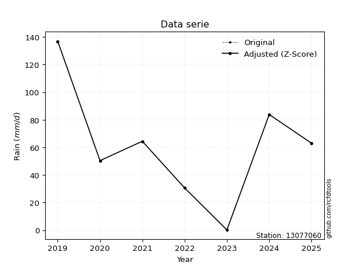</img>

</div>


> The initial value (value_initial) correspond to the initial obtained or null completed value, and value (value) is adjusted only when the initial value is outside the valid range (outlier) definite through the Z-Score value. If Z-Score is active, values out of range or outliers are replaced with the station mean value. A Z-Score (or standard score) measures how many standard deviations a data point is from the mean of a dataset, indicating its relative position; positive scores mean above the mean, negative mean below, and a score of zero is exactly at the mean, allowing for comparison of values from different distributions. It´s calculated using the formula $z=(x–μ)/σ$, where $x$ is the data point, $μ$ is the mean, and $σ$ is the standard deviation, helping identify outliers and understand probability.
>
> <sub>**Note**: In this study, "completing" (filling gaps in) and "extending" (forecasting or lengthening the historical record) rainfall data series are avoided for certain critical analyses because they introduce artificial bias and uncertainty, which can distort the statistics of rare events (extremes), alter day-to-day variability, and compromise the integrity and homogeneity of the original data. Some reasons against Completing/Extending rainfall data are: **Distortion of Extremes and Variability**: The primary issue is that most gap-filling or extension methods rely on averaging or regression with nearby stations, which inherently smooths the data. Rainfall is highly variable in space and time, with a large percentage of zero values and occasional large storms. Infilling methods often underestimate the highest values and overestimate the lowest (zero) values, which severely distorts analyses focused on flood frequency, drought severity, and intensity-duration-frequency (IDF) curves, **Loss of Data Homogeneity**: Infilled or extended data are synthetic estimates, not actual measurements. Combining these estimates with observed data can violate the assumption of data homogeneity, which requires that the data properties do not change over time. Inhomogeneity can lead to incorrect conclusions about long-term trends or changes in climate patterns, **Propagation of Errors**: Errors and biases from the original data (e.g., wind-induced undercatch, instrument errors, site changes) or the data used for imputation can propagate through the analysis, leading to unreliable hydrological models and inaccurate predictions, **Compromised Statistical Integrity**: For statistical analyses, especially those involving the frequency of events, using artificial data can introduce time bias or autocorrelation that doesn´t exist in reality, making it difficult to assess the true probability of events, **Difficulty in Validation**: It is difficult to accurately validate the quality of filled or extended data, especially for past periods where ground-truth measurements are unavailable. The reliability of imputation techniques heavily depends on the density of the surrounding station network and the complexity of the local topography.</sub>


### 4. Active continuous probability distributions from SciPy (80 of 104 available)

A Probability Density Function (PDF) describes the relative likelihood of a continuous random variable falling within a specific range, where the total area under its curve equals 1, and the area over any interval gives the actual probability for that range. Unlike discrete probabilities (like rolling a die), a PDF shows density, not direct probability for a single point (which is zero), with higher points indicating higher likelihood, often visualized as a bell curve for normal distributions.

A log of a probability density function (log-PDF) is simply the logarithm of the PDF´s value, denoted as $log(f(x))$, useful for converting multiplication of probabilities into addition, improving numerical stability with tiny numbers, and connecting to information theory concepts like entropy. Instead of dealing with very small probabilities (e.g., 0.000001), log-PDFs use negative numbers (e.g., $log(0.00001) ≈ -11.51$ that are easier for computers to handle, preventing underflow errors and simplifying complex calculations. In this study, each active probability distribution from SciPy is also evaluated in the $log$ form.

[scipy.stats](https://docs.scipy.org/doc/scipy/reference/stats.html) is a Python´s powerful submodule within the SciPy library for comprehensive statistical analysis, offering over 130 probability distributions (like Normal, Poisson, etc.), functions for descriptive stats (mean, variance), hypothesis testing (t-tests, chi-square), random variable generation, and statistical tests, making it essential for data science, modeling, and research. It provides tools to explore, model, and draw conclusions from data efficiently, working seamlessly with [NumPy](https://numpy.org/).

<div align="center">

|   id | p_dist           |   n_parameter | fit_method   | label                                                                       | active   | ref                                                                                                      |
|-----:|:-----------------|--------------:|:-------------|:----------------------------------------------------------------------------|:---------|:---------------------------------------------------------------------------------------------------------|
|    0 | alpha            |             3 | MLE          | Alpha                                                                       | True     | [:mortar_board:](https://docs.scipy.org/doc/scipy/reference/generated/scipy.stats.alpha.html)            |
|    1 | anglit           |             2 | MM           | Anglit                                                                      | True     | [:mortar_board:](https://docs.scipy.org/doc/scipy/reference/generated/scipy.stats.anglit.html)           |
|    2 | arcsine          |             2 | MM           | Arcsine                                                                     | True     | [:mortar_board:](https://docs.scipy.org/doc/scipy/reference/generated/scipy.stats.arcsine.html)          |
|    3 | argus            |             3 | MLE          | Argus                                                                       | True     | [:mortar_board:](https://docs.scipy.org/doc/scipy/reference/generated/scipy.stats.argus.html)            |
|    4 | beta             |             4 | MLE          | Beta                                                                        | True     | [:mortar_board:](https://docs.scipy.org/doc/scipy/reference/generated/scipy.stats.beta.html)             |
|    5 | betaprime        |             4 | MLE          | Beta prime                                                                  | True     | [:mortar_board:](https://docs.scipy.org/doc/scipy/reference/generated/scipy.stats.betaprime.html)        |
|    6 | bradford         |             3 | MLE          | Bradford                                                                    | True     | [:mortar_board:](https://docs.scipy.org/doc/scipy/reference/generated/scipy.stats.bradford.html)         |
|    7 | burr             |             4 | MLE          | Burr (Type III)                                                             | True     | [:mortar_board:](https://docs.scipy.org/doc/scipy/reference/generated/scipy.stats.burr.html)             |
|    8 | burr12           |             4 | MLE          | Burr (Type III) 12                                                          | True     | [:mortar_board:](https://docs.scipy.org/doc/scipy/reference/generated/scipy.stats.burr12.html)           |
|    9 | cosine           |             2 | MLE          | Cosine                                                                      | True     | [:mortar_board:](https://docs.scipy.org/doc/scipy/reference/generated/scipy.stats.cosine.html)           |
|   10 | crystalball      |             4 | MLE          | Crystalball                                                                 | True     | [:mortar_board:](https://docs.scipy.org/doc/scipy/reference/generated/scipy.stats.crystalball.html)      |
|   11 | dgamma           |             3 | MLE          | Double gamma                                                                | True     | [:mortar_board:](https://docs.scipy.org/doc/scipy/reference/generated/scipy.stats.dgamma.html)           |
|   12 | dweibull         |             3 | MLE          | Double Weibull                                                              | True     | [:mortar_board:](https://docs.scipy.org/doc/scipy/reference/generated/scipy.stats.dweibull.html)         |
|   13 | erlang           |             3 | MLE          | Erlang                                                                      | True     | [:mortar_board:](https://docs.scipy.org/doc/scipy/reference/generated/scipy.stats.erlang.html)           |
|   14 | exponnorm        |             3 | MLE          | Exponentially modified Normal                                               | True     | [:mortar_board:](https://docs.scipy.org/doc/scipy/reference/generated/scipy.stats.exponnorm.html)        |
|   15 | exponpow         |             3 | MLE          | Exponential power                                                           | True     | [:mortar_board:](https://docs.scipy.org/doc/scipy/reference/generated/scipy.stats.exponpow.html)         |
|   16 | exponweib        |             4 | MLE          | Exponentiated Weibull                                                       | True     | [:mortar_board:](https://docs.scipy.org/doc/scipy/reference/generated/scipy.stats.exponweib.html)        |
|   17 | f                |             4 | MLE          | F                                                                           | True     | [:mortar_board:](https://docs.scipy.org/doc/scipy/reference/generated/scipy.stats.f.html)                |
|   18 | fatiguelife      |             3 | MLE          | Fatigue-life (Birnbaum-Saunders)                                            | True     | [:mortar_board:](https://docs.scipy.org/doc/scipy/reference/generated/scipy.stats.fatiguelife.html)      |
|   19 | foldnorm         |             3 | MM           | Fold Normal                                                                 | True     | [:mortar_board:](https://docs.scipy.org/doc/scipy/reference/generated/scipy.stats.foldnorm.html)         |
|   20 | gamma            |             3 | MLE          | Gamma                                                                       | True     | [:mortar_board:](https://docs.scipy.org/doc/scipy/reference/generated/scipy.stats.gamma.html)            |
|   21 | gausshyper       |             6 | MLE          | Gauss hypergeometric                                                        | True     | [:mortar_board:](https://docs.scipy.org/doc/scipy/reference/generated/scipy.stats.gausshyper.html)       |
|   22 | genexpon         |             5 | MLE          | Generalized exponential                                                     | True     | [:mortar_board:](https://docs.scipy.org/doc/scipy/reference/generated/scipy.stats.genexpon.html)         |
|   23 | genextreme       |             3 | MLE          | Generalized exponential                                                     | True     | [:mortar_board:](https://docs.scipy.org/doc/scipy/reference/generated/scipy.stats.genextreme.html)       |
|   24 | gengamma         |             4 | MLE          | Generalized gamma                                                           | True     | [:mortar_board:](https://docs.scipy.org/doc/scipy/reference/generated/scipy.stats.gengamma.html)         |
|   25 | genhalflogistic  |             3 | MLE          | Generalized half-logistic                                                   | True     | [:mortar_board:](https://docs.scipy.org/doc/scipy/reference/generated/scipy.stats.genhalflogistic.html)  |
|   26 | genlogistic      |             3 | MLE          | Generalized logistic                                                        | True     | [:mortar_board:](https://docs.scipy.org/doc/scipy/reference/generated/scipy.stats.genlogistic.html)      |
|   27 | gennorm          |             3 | MLE          | Generalized Normal                                                          | True     | [:mortar_board:](https://docs.scipy.org/doc/scipy/reference/generated/scipy.stats.gennorm.html)          |
|   28 | genpareto        |             3 | MLE          | Generalized Pareto                                                          | True     | [:mortar_board:](https://docs.scipy.org/doc/scipy/reference/generated/scipy.stats.genpareto.html)        |
|   29 | gompertz         |             3 | MLE          | Gompertz (or truncated Gumbel)                                              | True     | [:mortar_board:](https://docs.scipy.org/doc/scipy/reference/generated/scipy.stats.gompertz.html)         |
|   30 | gumbel_l         |             2 | MM           | Gumbel Left Skew                                                            | True     | [:mortar_board:](https://docs.scipy.org/doc/scipy/reference/generated/scipy.stats.gumbel_l.html)         |
|   31 | gumbel_r         |             2 | MM           | Gumbel Right Skew                                                           | True     | [:mortar_board:](https://docs.scipy.org/doc/scipy/reference/generated/scipy.stats.gumbel_r.html)         |
|   32 | halfgennorm      |             3 | MLE          | Upper half of a generalized normal                                          | True     | [:mortar_board:](https://docs.scipy.org/doc/scipy/reference/generated/scipy.stats.halfgennorm.html)      |
|   33 | halflogistic     |             2 | MM           | Half-logistic                                                               | True     | [:mortar_board:](https://docs.scipy.org/doc/scipy/reference/generated/scipy.stats.halflogistic.html)     |
|   34 | halfnorm         |             2 | MM           | Half Normal                                                                 | True     | [:mortar_board:](https://docs.scipy.org/doc/scipy/reference/generated/scipy.stats.halfnorm.html)         |
|   35 | hypsecant        |             2 | MM           | hyperbolic secant                                                           | True     | [:mortar_board:](https://docs.scipy.org/doc/scipy/reference/generated/scipy.stats.hypsecant.html)        |
|   36 | invgamma         |             3 | MLE          | Inverted gamma                                                              | True     | [:mortar_board:](https://docs.scipy.org/doc/scipy/reference/generated/scipy.stats.invgamma.html)         |
|   37 | invgauss         |             3 | MLE          | Inverse Gaussian                                                            | True     | [:mortar_board:](https://docs.scipy.org/doc/scipy/reference/generated/scipy.stats.invgauss.html)         |
|   38 | invweibull       |             3 | MLE          | Inverted Weibull                                                            | True     | [:mortar_board:](https://docs.scipy.org/doc/scipy/reference/generated/scipy.stats.invweibull.html)       |
|   39 | johnsonsb        |             4 | MLE          | Johnson SB                                                                  | True     | [:mortar_board:](https://docs.scipy.org/doc/scipy/reference/generated/scipy.stats.johnsonsb.html)        |
|   40 | johnsonsu        |             4 | MLE          | Johnson Su                                                                  | True     | [:mortar_board:](https://docs.scipy.org/doc/scipy/reference/generated/scipy.stats.johnsonsu.html)        |
|   41 | kappa3           |             3 | MLE          | Kappa 3                                                                     | True     | [:mortar_board:](https://docs.scipy.org/doc/scipy/reference/generated/scipy.stats.kappa3.html)           |
|   42 | kappa4           |             4 | MLE          | Kappa 4                                                                     | True     | [:mortar_board:](https://docs.scipy.org/doc/scipy/reference/generated/scipy.stats.kappa4.html)           |
|   43 | ksone            |             3 | MLE          | Kolmogorov-Smirnov one-sided test statistic distribution                    | True     | [:mortar_board:](https://docs.scipy.org/doc/scipy/reference/generated/scipy.stats.ksone.html)            |
|   44 | kstwobign        |             2 | MLE          | Limiting distribution of scaled Kolmogorov-Smirnov two-sided test statistic | True     | [:mortar_board:](https://docs.scipy.org/doc/scipy/reference/generated/scipy.stats.kstwobign.html)        |
|   45 | laplace          |             2 | MM           | Laplace                                                                     | True     | [:mortar_board:](https://docs.scipy.org/doc/scipy/reference/generated/scipy.stats.laplace.html)          |
|   46 | levy_l           |             2 | MLE          | Left-skewed Levy                                                            | True     | [:mortar_board:](https://docs.scipy.org/doc/scipy/reference/generated/scipy.stats.levy_l.html)           |
|   47 | loggamma         |             3 | MLE          | Log gamma                                                                   | True     | [:mortar_board:](https://docs.scipy.org/doc/scipy/reference/generated/scipy.stats.loggamma.html)         |
|   48 | logistic         |             2 | MM           | Logistic (or Sech-squared)                                                  | True     | [:mortar_board:](https://docs.scipy.org/doc/scipy/reference/generated/scipy.stats.logistic.html)         |
|   49 | loglaplace       |             3 | MLE          | Log-Laplace                                                                 | True     | [:mortar_board:](https://docs.scipy.org/doc/scipy/reference/generated/scipy.stats.loglaplace.html)       |
|   50 | lomax            |             3 | MLE          | Lomax (Pareto of the second kind)                                           | True     | [:mortar_board:](https://docs.scipy.org/doc/scipy/reference/generated/scipy.stats.lomax.html)            |
|   51 | maxwell          |             2 | MM           | Maxwell                                                                     | True     | [:mortar_board:](https://docs.scipy.org/doc/scipy/reference/generated/scipy.stats.maxwell.html)          |
|   52 | mielke           |             4 | MLE          | Mielke Beta-Kappa / Dagum                                                   | True     | [:mortar_board:](https://docs.scipy.org/doc/scipy/reference/generated/scipy.stats.mielke.html)           |
|   53 | moyal            |             2 | MM           | Moyal                                                                       | True     | [:mortar_board:](https://docs.scipy.org/doc/scipy/reference/generated/scipy.stats.moyal.html)            |
|   54 | nakagami         |             3 | MLE          | Nakagami                                                                    | True     | [:mortar_board:](https://docs.scipy.org/doc/scipy/reference/generated/scipy.stats.nakagami.html)         |
|   55 | ncf              |             5 | MLE          | Non-central F distribution                                                  | True     | [:mortar_board:](https://docs.scipy.org/doc/scipy/reference/generated/scipy.stats.ncf.html)              |
|   56 | nct              |             4 | MLE          | Non-central Student’s t                                                     | True     | [:mortar_board:](https://docs.scipy.org/doc/scipy/reference/generated/scipy.stats.nct.html)              |
|   57 | norm             |             2 | MM           | Normal                                                                      | True     | [:mortar_board:](https://docs.scipy.org/doc/scipy/reference/generated/scipy.stats.norm.html)             |
|   58 | pearson3         |             3 | MM           | Pearson type III                                                            | True     | [:mortar_board:](https://docs.scipy.org/doc/scipy/reference/generated/scipy.stats.pearson3.html)         |
|   59 | powerlaw         |             3 | MLE          | Power-function                                                              | True     | [:mortar_board:](https://docs.scipy.org/doc/scipy/reference/generated/scipy.stats.powerlaw.html)         |
|   60 | rayleigh         |             2 | MM           | Rayleigh                                                                    | True     | [:mortar_board:](https://docs.scipy.org/doc/scipy/reference/generated/scipy.stats.rayleigh.html)         |
|   61 | rdist            |             3 | MLE          | R-distributed (symmetric beta)                                              | True     | [:mortar_board:](https://docs.scipy.org/doc/scipy/reference/generated/scipy.stats.rdist.html)            |
|   62 | rice             |             3 | MLE          | Rice                                                                        | True     | [:mortar_board:](https://docs.scipy.org/doc/scipy/reference/generated/scipy.stats.rice.html)             |
|   63 | semicircular     |             2 | MM           | Semicircular                                                                | True     | [:mortar_board:](https://docs.scipy.org/doc/scipy/reference/generated/scipy.stats.semicircular.html)     |
|   64 | skewnorm         |             3 | MLE          | Skew normal                                                                 | True     | [:mortar_board:](https://docs.scipy.org/doc/scipy/reference/generated/scipy.stats.skewnorm.html)         |
|   65 | t                |             3 | MLE          | Student’s t                                                                 | True     | [:mortar_board:](https://docs.scipy.org/doc/scipy/reference/generated/scipy.stats.t.html)                |
|   66 | trapezoid        |             4 | MLE          | Trapezoid                                                                   | True     | [:mortar_board:](https://docs.scipy.org/doc/scipy/reference/generated/scipy.stats.trapezoid.html)        |
|   67 | triang           |             3 | MLE          | Triangular                                                                  | True     | [:mortar_board:](https://docs.scipy.org/doc/scipy/reference/generated/scipy.stats.triang.html)           |
|   68 | truncexpon       |             3 | MLE          | Truncated exponential                                                       | True     | [:mortar_board:](https://docs.scipy.org/doc/scipy/reference/generated/scipy.stats.truncexpon.html)       |
|   69 | truncnorm        |             4 | MLE          | Truncated normal                                                            | True     | [:mortar_board:](https://docs.scipy.org/doc/scipy/reference/generated/scipy.stats.truncnorm.html)        |
|   70 | truncpareto      |             4 | MLE          | Upper truncated Pareto                                                      | True     | [:mortar_board:](https://docs.scipy.org/doc/scipy/reference/generated/scipy.stats.truncpareto.html)      |
|   71 | truncweibull_min |             5 | MLE          | Doubly truncated Weibull minimum                                            | True     | [:mortar_board:](https://docs.scipy.org/doc/scipy/reference/generated/scipy.stats.truncweibull_min.html) |
|   72 | tukeylambda      |             3 | MLE          | Tukey-Lamdba                                                                | True     | [:mortar_board:](https://docs.scipy.org/doc/scipy/reference/generated/scipy.stats.tukeylambda.html)      |
|   73 | uniform          |             2 | MLE          | Uniform                                                                     | True     | [:mortar_board:](https://docs.scipy.org/doc/scipy/reference/generated/scipy.stats.uniform.html)          |
|   74 | vonmises         |             3 | MLE          | Von Mises                                                                   | True     | [:mortar_board:](https://docs.scipy.org/doc/scipy/reference/generated/scipy.stats.vonmises.html)         |
|   75 | vonmises_line    |             3 | MLE          | Von Mises line                                                              | True     | [:mortar_board:](https://docs.scipy.org/doc/scipy/reference/generated/scipy.stats.vonmises_line.html)    |
|   76 | wald             |             2 | MM           | Wald                                                                        | True     | [:mortar_board:](https://docs.scipy.org/doc/scipy/reference/generated/scipy.stats.wald.html)             |
|   77 | weibull_max      |             3 | MLE          | Weibull maximum                                                             | True     | [:mortar_board:](https://docs.scipy.org/doc/scipy/reference/generated/scipy.stats.weibull_max.html)      |
|   78 | weibull_min      |             3 | MLE          | Weibull minimum                                                             | True     | [:mortar_board:](https://docs.scipy.org/doc/scipy/reference/generated/scipy.stats.weibull_min.html)      |
|   79 | wrapcauchy       |             3 | MLE          | Wrapped  Cauchy                                                             | True     | [:mortar_board:](https://docs.scipy.org/doc/scipy/reference/generated/scipy.stats.wrapcauchy.html)       |

</div>

> **n_parameter:** # arguments & localization & scale.
>
> **Fit methods:** (MLE) maximum likelihood, (MM) L-moments.
>
>**Inactive** (With the only purpose of prevent loops, zero divisions, infinite values, over high estimated values or horizontal trending for recurrence intervals estimations, the follow distributions were disabled.)**:** lognorm, norminvgauss, powernorm, powerlognorm, cauchy, halfcauchy, foldcauchy, skewcauchy, chi2, expon, fisk, genhyperbolic, geninvgauss, gibrat, kstwo, laplace_asymmetric, levy, levy_stable, ncx2, pareto, rel_breitwigner, recipinvgauss, studentized_range, loguniform, 


## B. Probability (PDF) vs. Empirical (EDF) distributions functions

A continuous probability distribution (CPD) describes probabilities for variables that can take any value within a range (like rain any time), unlike discrete variables with specific outcomes (like temperature). It uses a Probability Density Function (PDF), a curve where the total area under it equals 1, and the probability of the variable falling within an interval (a to b) is found by calculating the area under the curve between those points. A key feature is that the probability of hitting any single exact value is zero, so probabilities are always expressed for ranges, e.g., $P(a ≤ X ≤ b)$.

<div align="center">

Distributions parameters from station values
|     |   station | p_dist              |   n |             loc |           scale | shape                  | shape1                | shape2                | shape3             |
|----:|----------:|:--------------------|----:|----------------:|----------------:|:-----------------------|:----------------------|:----------------------|:-------------------|
|   0 |  13077060 | alpha               |   7 |      0.00623553 |     0.520735    | 1.0734344646290818e-07 |                       |                       |                    |
|   1 |  13077060 | anglit              |   7 |     61.3143     |   116.038       |                        |                       |                       |                    |
|   2 |  13077060 | arcsine             |   7 |      5.2187     |   112.191       |                        |                       |                       |                    |
|   3 |  13077060 | argus               |   7 |    -33.5024     |   177.322       | 1.2947115731619536e-06 |                       |                       |                    |
|   4 |  13077060 | beta                |   7 |      0.2        |   187.612       | 0.5704329697161309     | 0.7855704039088978    |                       |                    |
|   5 |  13077060 | betaprime           |   7 |    -72.8569     | 13508.7         | 11.34048304412769      | 1142.782459146209     |                       |                    |
|   6 |  13077060 | bradford            |   7 |      0.19998    |   136.6         | 0.9911693944646729     |                       |                       |                    |
|   7 |  13077060 | burr                |   7 |      0.2        |   143.731       | 29.091477603859175     | 0.01551778111545235   |                       |                    |
|   8 |  13077060 | burr12              |   7 |    -14.8848     |  1874.93        | 1.9896515592174442     | 463.1986441034828     |                       |                    |
|   9 |  13077060 | cosine              |   7 |     64.0167     |    34.3915      |                        |                       |                       |                    |
|  10 |  13077060 | crystalball         |   7 |     61.3143     |    39.6656      | 3112.2674870805704     | 9151.87525294079      |                       |                    |
|  11 |  13077060 | dgamma              |   7 |     64.4        |    31.6426      | 0.7580248212328065     |                       |                       |                    |
|  12 |  13077060 | dweibull            |   7 |     64.4        |    30.1715      | 0.8211544012060478     |                       |                       |                    |
|  13 |  13077060 | erlang              |   7 |    -70.8718     |    12.1466      | 10.882593009472384     |                       |                       |                    |
|  14 |  13077060 | exponnorm           |   7 |     31.7134     |    27.8843      | 1.0615607383205528     |                       |                       |                    |
|  15 |  13077060 | exponpow            |   7 |      0.2        |     3.84175     | 0.12772456120826023    |                       |                       |                    |
|  16 |  13077060 | exponweib           |   7 |   -254.774      |    84.5698      | 398.2371093816528      | 1.4239561010477324    |                       |                    |
|  17 |  13077060 | f                   |   7 |      0.2        |    51.3899      | 1.3876877579153724     | 14.278177088823945    |                       |                    |
|  18 |  13077060 | fatiguelife         |   7 |   -146.059      |   203.627       | 0.19178687440657666    |                       |                       |                    |
|  19 |  13077060 | foldnorm            |   7 |     -6.19625    |    44.0208      | 1.4710077635878749     |                       |                       |                    |
|  20 |  13077060 | gamma               |   7 |    -70.8717     |    12.1466      | 10.882584566245978     |                       |                       |                    |
|  21 |  13077060 | gausshyper          |   7 |    -11.8053     |   148.605       | 1.4236407437269945     | 0.8613149863597749    | 1.151995223557087     | 0.9451753509303691 |
|  22 |  13077060 | genexpon            |   7 |      0.199983   |     2.39564     | 0.03924926634382151    | 8.709815756926368e-07 | 2.3075924174443054    |                    |
|  23 |  13077060 | genextreme          |   7 |     45.3115     |    36.0992      | 0.160312423282568      |                       |                       |                    |
|  24 |  13077060 | gengamma            |   7 |    -97.6432     |     1.01952     | 33.03180264390936      | 0.6939431367327571    |                       |                    |
|  25 |  13077060 | genhalflogistic     |   7 |    -14.0303     |   158.946       | 1.0538050044079563     |                       |                       |                    |
|  26 |  13077060 | genlogistic         |   7 |     23.4432     |    28.2548      | 2.6436153464238776     |                       |                       |                    |
|  27 |  13077060 | gennorm             |   7 |     63          |     1.38705     | 0.38586807688334224    |                       |                       |                    |
|  28 |  13077060 | genpareto           |   7 |     -0.558796   |   161.09        | -1.1727687862611473    |                       |                       |                    |
|  29 |  13077060 | gompertz            |   7 |     50.4        |     8.22042     | 0.00013632103726046656 |                       |                       |                    |
|  30 |  13077060 | gumbel_l            |   7 |     79.1659     |    30.9271      |                        |                       |                       |                    |
|  31 |  13077060 | gumbel_r            |   7 |     43.4627     |    30.9271      |                        |                       |                       |                    |
|  32 |  13077060 | halfgennorm         |   7 |      0.2        |     3.40219     | 0.3896359347017555     |                       |                       |                    |
|  33 |  13077060 | halflogistic        |   7 |     14.3013     |    33.9127      |                        |                       |                       |                    |
|  34 |  13077060 | halfnorm            |   7 |      8.81259    |    65.8011      |                        |                       |                       |                    |
|  35 |  13077060 | hypsecant           |   7 |     61.3143     |    25.2519      |                        |                       |                       |                    |
|  36 |  13077060 | invgamma            |   7 |      0.00295722 |     0.319569    | 0.23610671917516057    |                       |                       |                    |
|  37 |  13077060 | invgauss            |   7 |   -109.289      |  2902.4         | 0.05870344954284726    |                       |                       |                    |
|  38 |  13077060 | invweibull          |   7 |      0.2        |     3.8538      | 0.05442656183768199    |                       |                       |                    |
|  39 |  13077060 | johnsonsb           |   7 |      0.199799   |   136.602       | 0.3216857683709725     | 0.286397177127155     |                       |                    |
|  40 |  13077060 | johnsonsu           |   7 |   -144.205      |    44.5237      | -11.784250728641222    | 5.315628616995939     |                       |                    |
|  41 |  13077060 | kappa3              |   7 |      0.2        |    78.9498      | 5.311751846533614      |                       |                       |                    |
|  42 |  13077060 | kappa4              |   7 |    -13.2661     |   152.668       | 1.0967204627799987     | 0.9963936971008698    |                       |                    |
|  43 |  13077060 | ksone               |   7 |    -13.46       |   163.92        | 1.0                    |                       |                       |                    |
|  44 |  13077060 | kstwobign           |   7 |    -81.4087     |   163.812       |                        |                       |                       |                    |
|  45 |  13077060 | laplace             |   7 |     61.3143     |    28.0478      |                        |                       |                       |                    |
|  46 |  13077060 | levy_l              |   7 |    145.343      |    38.0562      |                        |                       |                       |                    |
|  47 |  13077060 | loggamma            |   7 | -12206.6        |  1650.26        | 1692.9328256979315     |                       |                       |                    |
|  48 |  13077060 | logistic            |   7 |     61.3143     |    21.8688      |                        |                       |                       |                    |
|  49 |  13077060 | loglaplace          |   7 |     -0.186047   |    63.186       | 0.9833394601585952     |                       |                       |                    |
|  50 |  13077060 | lomax               |   7 |      0.2        |     3.9075e+09  | 67219796.59086628      |                       |                       |                    |
|  51 |  13077060 | maxwell             |   7 |    -32.6765     |    58.9         |                        |                       |                       |                    |
|  52 |  13077060 | mielke              |   7 |      0.2        |   143.356       | 0.6592192186087702     | 20.38385864337664     |                       |                    |
|  53 |  13077060 | moyal               |   7 |     38.631      |    17.8558      |                        |                       |                       |                    |
|  54 |  13077060 | nakagami            |   7 |      0.2        |    65.4549      | 0.2008175423870901     |                       |                       |                    |
|  55 |  13077060 | ncf                 |   7 |      0.2        |     7.51829     | 0.8985064238333196     | 18.02580171596105     | 5.437524757792163     |                    |
|  56 |  13077060 | nct                 |   7 |     -2.37594    |     0.179394    | 0.3292702240685441     | 38.3393588756839      |                       |                    |
|  57 |  13077060 | norm                |   7 |     61.3143     |    39.6656      |                        |                       |                       |                    |
|  58 |  13077060 | pearson3            |   7 |     61.3143     |    39.6656      | 0.4188844229038451     |                       |                       |                    |
|  59 |  13077060 | powerlaw            |   7 |      0.2        |   136.6         | 0.1471609174229785     |                       |                       |                    |
|  60 |  13077060 | rayleigh            |   7 |    -14.5683     |    60.5455      |                        |                       |                       |                    |
|  61 |  13077060 | rdist               |   7 |    -12.931      |    77.331       | 1.062712891159093      |                       |                       |                    |
|  62 |  13077060 | rice                |   7 |    -16.5733     |    50.4341      | 1.0017739559669123     |                       |                       |                    |
|  63 |  13077060 | semicircular        |   7 |     61.3143     |    79.3312      |                        |                       |                       |                    |
|  64 |  13077060 | skewnorm            |   7 |     20.9216     |    56.6121      | 2.0109963622561713     |                       |                       |                    |
|  65 |  13077060 | t                   |   7 |     61.31       |    39.6654      | 508547.6053104615      |                       |                       |                    |
|  66 |  13077060 | trapezoid           |   7 |    -14.133      |   163.92        | 1.0                    | 1.0                   |                       |                    |
|  67 |  13077060 | triang              |   7 |    -15.2209     |   152.021       | 0.9999992385533746     |                       |                       |                    |
|  68 |  13077060 | truncexpon          |   7 |      0.199994   |   122.929       | 1.1112120057116242     |                       |                       |                    |
|  69 |  13077060 | truncnorm           |   7 |     -3.17495    |     5.75801     | -0.2234964994486951    | 24.309586458627912    |                       |                    |
|  70 |  13077060 | truncpareto         |   7 |      0.13824    |     0.0617603   | 0.16791047683624383    | 2212.7783434610847    |                       |                    |
|  71 |  13077060 | truncweibull_min    |   7 |     -6.65609    |   126.381       | 1.3228326923242113     | 0.0014405907004287222 | 1.1351087989686417    |                    |
|  72 |  13077060 | tukeylambda         |   7 |     -9.86699    |    84.8486      | 1.142480720436116      |                       |                       |                    |
|  73 |  13077060 | uniform             |   7 |      0.2        |   136.6         |                        |                       |                       |                    |
|  74 |  13077060 | vonmises            |   7 |      0.192232   |     1           | 1.0831201159843389     |                       |                       |                    |
|  75 |  13077060 | vonmises_line       |   7 |     68.4999     |    21.7406      | 0.35096357188048316    |                       |                       |                    |
|  76 |  13077060 | wald                |   7 |     21.6487     |    39.6656      |                        |                       |                       |                    |
|  77 |  13077060 | weibull_max         |   7 |    136.8        |     1.63068     | 0.21160664343296376    |                       |                       |                    |
|  78 |  13077060 | weibull_min         |   7 |    -14.7563     |    85.6341      | 1.9820025536345816     |                       |                       |                    |
|  79 |  13077060 | wrapcauchy          |   7 |      0.194978   |    21.7414      | 5.094558350240743e-07  |                       |                       |                    |
|  80 |  13077060 | logalpha            |   7 |    -38.7442     |   761.877       | 18.220658063156776     |                       |                       |                    |
|  81 |  13077060 | loganglit           |   7 |      3.34097    |     6.04016     |                        |                       |                       |                    |
|  82 |  13077060 | logarcsine          |   7 |      0.420961   |     5.83999     |                        |                       |                       |                    |
|  83 |  13077060 | logargus            |   7 |     -4.38802    |     9.41313     | 3.198157434254007      |                       |                       |                    |
|  84 |  13077060 | logbeta             |   7 |     -2.38759    |     7.30611     | 0.2325009261079208     | 0.04533147267128309   |                       |                    |
|  85 |  13077060 | logbetaprime        |   7 |     -1.60944    |     2.70128     | 0.16722454252478552    | 0.8432257832155978    |                       |                    |
|  86 |  13077060 | logbradford         |   7 |     -1.60949    |     6.57901     | 0.0005669724925543799  |                       |                       |                    |
|  87 |  13077060 | logburr             |   7 |     -1.60944    |     1.418       | 0.11504415112240218    | 1.8717304618580335    |                       |                    |
|  88 |  13077060 | logburr12           |   7 | -43962.1        | 43979.6         | 37025.9065497632       | 77482.7873186385      |                       |                    |
|  89 |  13077060 | logcosine           |   7 |      2.8092     |     1.91528     |                        |                       |                       |                    |
|  90 |  13077060 | logcrystalball      |   7 |      3.34096    |     2.06474     | 2847.3446915619934     | 265.0558457018349     |                       |                    |
|  91 |  13077060 | logdgamma           |   7 |      4.16511    |     1.55518     | 0.6454049442413721     |                       |                       |                    |
|  92 |  13077060 | logdweibull         |   7 |      4.16511    |     1.34146     | 0.8134516385883772     |                       |                       |                    |
|  93 |  13077060 | logerlang           |   7 |    -32.6303     |     0.148062    | 242.8708998549887      |                       |                       |                    |
|  94 |  13077060 | logexponnorm        |   7 |      3.33989    |     2.06474     | 0.000526461696471184   |                       |                       |                    |
|  95 |  13077060 | logexponpow         |   7 |     -1.60944    |     1.82149     | 0.3271670919469508     |                       |                       |                    |
|  96 |  13077060 | logexponweib        |   7 |     -1.60944    |     1.68496     | 2.1276375344467753     | 0.1000553740120274    |                       |                    |
|  97 |  13077060 | logf                |   7 |     -1.60944    |     1.20298     | 1.0189279478432964     | 1.0762240313684053    |                       |                    |
|  98 |  13077060 | logfatiguelife      |   7 |  -1107.66       |  1110.99        | 0.0018527554655076899  |                       |                       |                    |
|  99 |  13077060 | logfoldnorm         |   7 |     -6.34299    |     1.48455     | 6.620155557084761      |                       |                       |                    |
| 100 |  13077060 | loggamma            |   7 |    -30.7086     |     0.145616    | 234.099013356343       |                       |                       |                    |
| 101 |  13077060 | loggausshyper       |   7 |     -1.77693    |     6.69545     | 1.3916393075214057     | 0.43051132878235376   | 1.2001644335144555    | 0.9578062020021727 |
| 102 |  13077060 | loggenexpon         |   7 |     -1.92344    |     0.0722874   | 0.002567693289699661   | 5.69787253991197      | 4.660133469634194e-05 |                    |
| 103 |  13077060 | loggenextreme       |   7 |      3.67566    |     1.43401     | 1.1537970976154834     |                       |                       |                    |
| 104 |  13077060 | loggengamma         |   7 |     -1.60944    |     2.75689     | 0.7349483374828769     | 0.23767363579030326   |                       |                    |
| 105 |  13077060 | loggenhalflogistic  |   7 |     -2.15575    |     7.61966     | 1.0770959798916426     |                       |                       |                    |
| 106 |  13077060 | loggenlogistic      |   7 |      4.91888    |     3.52253e-05 | 2.2367196366784847e-05 |                       |                       |                    |
| 107 |  13077060 | loggennorm          |   7 |      4.16511    |     0.00625502  | 0.3002713479598411     |                       |                       |                    |
| 108 |  13077060 | loggenpareto        |   7 |     -2.45883    |    10.6337      | -1.4413941195016668    |                       |                       |                    |
| 109 |  13077060 | loggompertz         |   7 |     -1.60944    |     1.04401     | 0.004214646079496439   |                       |                       |                    |
| 110 |  13077060 | loggumbel_l         |   7 |      4.27021    |     1.60987     |                        |                       |                       |                    |
| 111 |  13077060 | loggumbel_r         |   7 |      2.41172    |     1.60987     |                        |                       |                       |                    |
| 112 |  13077060 | loghalfgennorm      |   7 |     -1.60944    |     1.71086     | 0.6033502900591792     |                       |                       |                    |
| 113 |  13077060 | loghalflogistic     |   7 |      0.89374    |     1.76529     |                        |                       |                       |                    |
| 114 |  13077060 | loghalfnorm         |   7 |      0.608069   |     3.42519     |                        |                       |                       |                    |
| 115 |  13077060 | loghypsecant        |   7 |      3.34096    |     1.31446     |                        |                       |                       |                    |
| 116 |  13077060 | loginvgamma         |   7 |    -51.7462     | 34813           | 633.6796998095322      |                       |                       |                    |
| 117 |  13077060 | loginvgauss         |   7 |    -21.2958     |  2768.83        | 0.0088855394978513     |                       |                       |                    |
| 118 |  13077060 | loginvweibull       |   7 |     -4.7492e+08 |     4.7492e+08  | 177415047.7725374      |                       |                       |                    |
| 119 |  13077060 | logjohnsonsb        |   7 |     -3.01687    |     7.93539     | -0.06052860761265995   | 0.12439291535123885   |                       |                    |
| 120 |  13077060 | logjohnsonsu        |   7 |      4.15664    |     0.020868    | 0.2509818164502001     | 0.27650947425501937   |                       |                    |
| 121 |  13077060 | logkappa3           |   7 |     -1.60944    |     1.53323     | 0.7023902913702966     |                       |                       |                    |
| 122 |  13077060 | logkappa4           |   7 |     -2.02087    |     7.67533     | 1.0568122155887745     | 1.1043768687718623    |                       |                    |
| 123 |  13077060 | logksone            |   7 |     -2.26223    |     7.83355     | 1.0                    |                       |                       |                    |
| 124 |  13077060 | logkstwobign        |   7 |     -7.38808    |    12.2776      |                        |                       |                       |                    |
| 125 |  13077060 | loglaplace          |   7 |      3.34096    |     1.45999     |                        |                       |                       |                    |
| 126 |  13077060 | loglevy_l           |   7 |      5.02069    |     0.45255     |                        |                       |                       |                    |
| 127 |  13077060 | logloggamma         |   7 |      4.91857    |     4.20568e-06 | 2.6608343001941835e-06 |                       |                       |                    |
| 128 |  13077060 | loglogistic         |   7 |      3.34096    |     1.13835     |                        |                       |                       |                    |
| 129 |  13077060 | logloglaplace       |   7 |     -1.60944    |     1.33408     | 0.15515681401842943    |                       |                       |                    |
| 130 |  13077060 | loglomax            |   7 |     -1.60944    |     5.04967e+06 | 1109059.8296149636     |                       |                       |                    |
| 131 |  13077060 | logmaxwell          |   7 |     -1.55158    |     3.06595     |                        |                       |                       |                    |
| 132 |  13077060 | logmielke           |   7 |     -1.60944    |     7.5213      | 0.4510193815581217     | 1.8601202569324253    |                       |                    |
| 133 |  13077060 | logmoyal            |   7 |      2.16021    |     0.929461    |                        |                       |                       |                    |
| 134 |  13077060 | lognakagami         |   7 |  -2563.28       |  2566.62        | 384129.45513193717     |                       |                       |                    |
| 135 |  13077060 | logncf              |   7 |     -1.60944    |     1.07053     | 1.0428935570358855     | 1.148832094000157     | 1.0795198407195459    |                    |
| 136 |  13077060 | lognct              |   7 |   -116.454      |     2.00109     | 23675.036637644545     | 59.86203056613814     |                       |                    |
| 137 |  13077060 | lognorm             |   7 |      3.34096    |     2.06474     |                        |                       |                       |                    |
| 138 |  13077060 | logpearson3         |   7 |      3.34096    |     2.06476     | -1.8637436448063958    |                       |                       |                    |
| 139 |  13077060 | logpowerlaw         |   7 |     -1.60944    |     6.52796     | 0.1810026469795752     |                       |                       |                    |
| 140 |  13077060 | lograyleigh         |   7 |     -0.608972   |     3.1516      |                        |                       |                       |                    |
| 141 |  13077060 | logrdist            |   7 |     -1.60946    |     1.866e-05   | 1.4746930794681878     |                       |                       |                    |
| 142 |  13077060 | logrice             |   7 |   -673.682      |     2.06564     | 327.7527782295623      |                       |                       |                    |
| 143 |  13077060 | logsemicircular     |   7 |      3.34097    |     4.1295      |                        |                       |                       |                    |
| 144 |  13077060 | logskewnorm         |   7 |      4.91853    |     2.59894     | -2012737.9770891902    |                       |                       |                    |
| 145 |  13077060 | logt                |   7 |      4.14667    |     0.260688    | 0.7864381539410839     |                       |                       |                    |
| 146 |  13077060 | logtrapezoid        |   7 |     -2.62396    |     8.75996     | 1.0                    | 1.0                   |                       |                    |
| 147 |  13077060 | logtriang           |   7 |     -2.8134     |     7.732       | 0.999995548072788      |                       |                       |                    |
| 148 |  13077060 | logtruncexpon       |   7 |     -1.64607    |     9.93353     | 0.6608522738307006     |                       |                       |                    |
| 149 |  13077060 | logtruncnorm        |   7 |      2.38606    |     7.20788     | -0.55432970472581      | 0.3513504745526625    |                       |                    |
| 150 |  13077060 | logtruncpareto      |   7 |     -1.61498    |     0.00554314  | 7.302175735756394e-05  | 1198.6946354394886    |                       |                    |
| 151 |  13077060 | logtruncweibull_min |   7 |     -1.89799    |     9.1868      | 1.432759107291281      | 0.003641881749991237  | 0.7419902637352558    |                    |
| 152 |  13077060 | logtukeylambda      |   7 |     -1.60944    |     3.56791e-16 | 1.5689727754927754     |                       |                       |                    |
| 153 |  13077060 | loguniform          |   7 |     -1.60944    |     6.52796     |                        |                       |                       |                    |
| 154 |  13077060 | logvonmises         |   7 |     -2.04022    |     1           | 5.255472909163981      |                       |                       |                    |
| 155 |  13077060 | logvonmises_line    |   7 |      3.88333    |     1.7484      | 1.827415011303831      |                       |                       |                    |
| 156 |  13077060 | logwald             |   7 |      1.27623    |     2.06473     |                        |                       |                       |                    |
| 157 |  13077060 | logweibull_max      |   7 |      4.91852    |     2.31586     | 0.19118644131046053    |                       |                       |                    |
| 158 |  13077060 | logweibull_min      |   7 |     -1.60944    |     1.67973     | 0.6527578253402485     |                       |                       |                    |
| 159 |  13077060 | logwrapcauchy       |   7 |     -1.60944    |     1.03896     | 0.5768029530602825     |                       |                       |                    |

</div>

> **loc** (Location parameter): This shifts the distribution along the x-axis. For many common distributions, like the normal (Gaussian) distribution, loc represents the mean $μ$. For others, like the uniform distribution, it might represent the minimum value, or for the beta distribution, the left end of the support interval.
>
> **scale** (Scale parameter): This determines the width or spread of the distribution. For the normal distribution, scale represents the standard deviation $σ$. For a uniform distribution, it defines the length of the interval (from $loc$ to $loc + scale$).
>
> **shape** (Shape parameters): Refers to parameters that define the specific form of a probability distribution, distinct from its location (loc) and scale (scale). These parameters are required arguments for most distribution functions. For example, a normal (Gaussian) distribution is fully defined by its location (mean) and scale (standard deviation), so it has no specific shape parameters beyond loc and scale. However, other distributions have intrinsic properties that need specification, as Gamma distribution that takes a shape parameter, often named $a$ or $alpha$.


### 0. Cumulative distribution values - CDF (160 evaluated)

Cumulative Distribution Function (CDF), denoted as $F$<sub>$X$</sub>$(x)$, is a function that gives the probability that a random variable $X$ will take a value less than or equal to a specific value, $x$ (i.e., $(P(X≥x)$. It essentially "accumulates" probabilities from a given point up to the far right (positive infinity), providing a complete picture of the distribution´s probabilities for both discrete (like rain) and continuous (like temperature) variables, helping to find probabilities over ranges or above certain values. Each station is evaluated separately ordering the $x$ values ascending, calculating the CDF and PDF values for the activated distributions and their logarithmic forms.

<div align="center">

CDF ordered by x ascending and calculating $log(f(x))$ separately
|   id |   Station |   date |     x |   count |    mean |     std |     zscore |   Value_initial |   station |   m |      alpha |   alpha_pdf |    anglit |   anglit_pdf |   arcsine |   arcsine_pdf |    argus |   argus_pdf |        beta |        beta_pdf |   betaprime |   betaprime_pdf |    bradford |   bradford_pdf |        burr |     burr_pdf |    burr12 |   burr12_pdf |    cosine |   cosine_pdf |   crystalball |   crystalball_pdf |    dgamma |   dgamma_pdf |   dweibull |   dweibull_pdf |    erlang |   erlang_pdf |   exponnorm |   exponnorm_pdf |   exponpow |   exponpow_pdf |   exponweib |   exponweib_pdf |           f |         f_pdf |   fatiguelife |   fatiguelife_pdf |   foldnorm |   foldnorm_pdf |     gamma |   gamma_pdf |   gausshyper |   gausshyper_pdf |    genexpon |   genexpon_pdf |   genextreme |   genextreme_pdf |   gengamma |   gengamma_pdf |   genhalflogistic |   genhalflogistic_pdf |   genlogistic |   genlogistic_pdf |   gennorm |   gennorm_pdf |   genpareto |   genpareto_pdf |    gompertz |   gompertz_pdf |   gumbel_l |   gumbel_l_pdf |   gumbel_r |   gumbel_r_pdf |   halfgennorm |   halfgennorm_pdf |   halflogistic |   halflogistic_pdf |   halfnorm |   halfnorm_pdf |   hypsecant |   hypsecant_pdf |   invgamma |   invgamma_pdf |   invgauss |   invgauss_pdf |   invweibull |   invweibull_pdf |   johnsonsb |   johnsonsb_pdf |   johnsonsu |   johnsonsu_pdf |      kappa3 |   kappa3_pdf |      kappa4 |   kappa4_pdf |     ksone |   ksone_pdf |   kstwobign |   kstwobign_pdf |   laplace |   laplace_pdf |   levy_l |   levy_l_pdf |   loggamma |   loggamma_pdf |   logistic |   logistic_pdf |   loglaplace |   loglaplace_pdf |       lomax |   lomax_pdf |   maxwell |   maxwell_pdf |      mielke |   mielke_pdf |      moyal |   moyal_pdf |   nakagami |   nakagami_pdf |         ncf |     ncf_pdf |       nct |     nct_pdf |      norm |   norm_pdf |   pearson3 |   pearson3_pdf |   powerlaw |   powerlaw_pdf |   rayleigh |   rayleigh_pdf |    rdist |      rdist_pdf |      rice |   rice_pdf |   semicircular |   semicircular_pdf |   skewnorm |   skewnorm_pdf |         t |      t_pdf |   trapezoid |   trapezoid_pdf |    triang |   triang_pdf |   truncexpon |   truncexpon_pdf |   truncnorm |   truncnorm_pdf |   truncpareto |   truncpareto_pdf |   truncweibull_min |   truncweibull_min_pdf |   tukeylambda |   tukeylambda_pdf |   uniform |   uniform_pdf |   vonmises |   vonmises_pdf |   vonmises_line |   vonmises_line_pdf |      wald |   wald_pdf |   weibull_max |   weibull_max_pdf |   weibull_min |   weibull_min_pdf |   wrapcauchy |   wrapcauchy_pdf |   logalpha |   logalpha_pdf |   loganglit |   loganglit_pdf |   logarcsine |   logarcsine_pdf |   logargus |   logargus_pdf |   logbeta |   logbeta_pdf |   logbetaprime |   logbetaprime_pdf |   logbradford |   logbradford_pdf |     logburr |   logburr_pdf |   logburr12 |   logburr12_pdf |   logcosine |   logcosine_pdf |   logcrystalball |   logcrystalball_pdf |   logdgamma |   logdgamma_pdf |   logdweibull |   logdweibull_pdf |   logerlang |   logerlang_pdf |   logexponnorm |   logexponnorm_pdf |   logexponpow |   logexponpow_pdf |   logexponweib |   logexponweib_pdf |        logf |    logf_pdf |   logfatiguelife |   logfatiguelife_pdf |   logfoldnorm |   logfoldnorm_pdf |   loggausshyper |   loggausshyper_pdf |   loggenexpon |   loggenexpon_pdf |   loggenextreme |   loggenextreme_pdf |   loggengamma |   loggengamma_pdf |   loggenhalflogistic |   loggenhalflogistic_pdf |   loggenlogistic |   loggenlogistic_pdf |   loggennorm |   loggennorm_pdf |   loggenpareto |   loggenpareto_pdf |   loggompertz |   loggompertz_pdf |   loggumbel_l |   loggumbel_l_pdf |   loggumbel_r |   loggumbel_r_pdf |   loghalfgennorm |   loghalfgennorm_pdf |   loghalflogistic |   loghalflogistic_pdf |   loghalfnorm |   loghalfnorm_pdf |   loghypsecant |   loghypsecant_pdf |   loginvgamma |   loginvgamma_pdf |   loginvgauss |   loginvgauss_pdf |   loginvweibull |   loginvweibull_pdf |   logjohnsonsb |   logjohnsonsb_pdf |   logjohnsonsu |   logjohnsonsu_pdf |   logkappa3 |   logkappa3_pdf |   logkappa4 |   logkappa4_pdf |   logksone |   logksone_pdf |   logkstwobign |   logkstwobign_pdf |   loglevy_l |   loglevy_l_pdf |   logloggamma |   logloggamma_pdf |   loglogistic |   loglogistic_pdf |   logloglaplace |   logloglaplace_pdf |    loglomax |   loglomax_pdf |   logmaxwell |   logmaxwell_pdf |   logmielke |   logmielke_pdf |   logmoyal |   logmoyal_pdf |   lognakagami |   lognakagami_pdf |      logncf |   logncf_pdf |     lognct |   lognct_pdf |   lognorm |   lognorm_pdf |   logpearson3 |   logpearson3_pdf |   logpowerlaw |   logpowerlaw_pdf |   lograyleigh |   lograyleigh_pdf |   logrdist |   logrdist_pdf |    logrice |   logrice_pdf |   logsemicircular |   logsemicircular_pdf |   logskewnorm |   logskewnorm_pdf |      logt |   logt_pdf |   logtrapezoid |   logtrapezoid_pdf |   logtriang |   logtriang_pdf |   logtruncexpon |   logtruncexpon_pdf |   logtruncnorm |   logtruncnorm_pdf |   logtruncpareto |   logtruncpareto_pdf |   logtruncweibull_min |   logtruncweibull_min_pdf |   logtukeylambda |   logtukeylambda_pdf |   loguniform |   loguniform_pdf |   logvonmises |   logvonmises_pdf |   logvonmises_line |   logvonmises_line_pdf |   logwald |   logwald_pdf |   logweibull_max |   logweibull_max_pdf |   logweibull_min |   logweibull_min_pdf |   logwrapcauchy |   logwrapcauchy_pdf |
|-----:|----------:|-------:|------:|--------:|--------:|--------:|-----------:|----------------:|----------:|----:|-----------:|------------:|----------:|-------------:|----------:|--------------:|---------:|------------:|------------:|----------------:|------------:|----------------:|------------:|---------------:|------------:|-------------:|----------:|-------------:|----------:|-------------:|--------------:|------------------:|----------:|-------------:|-----------:|---------------:|----------:|-------------:|------------:|----------------:|-----------:|---------------:|------------:|----------------:|------------:|--------------:|--------------:|------------------:|-----------:|---------------:|----------:|------------:|-------------:|-----------------:|------------:|---------------:|-------------:|-----------------:|-----------:|---------------:|------------------:|----------------------:|--------------:|------------------:|----------:|--------------:|------------:|----------------:|------------:|---------------:|-----------:|---------------:|-----------:|---------------:|--------------:|------------------:|---------------:|-------------------:|-----------:|---------------:|------------:|----------------:|-----------:|---------------:|-----------:|---------------:|-------------:|-----------------:|------------:|----------------:|------------:|----------------:|------------:|-------------:|------------:|-------------:|----------:|------------:|------------:|----------------:|----------:|--------------:|---------:|-------------:|-----------:|---------------:|-----------:|---------------:|-------------:|-----------------:|------------:|------------:|----------:|--------------:|------------:|-------------:|-----------:|------------:|-----------:|---------------:|------------:|------------:|----------:|------------:|----------:|-----------:|-----------:|---------------:|-----------:|---------------:|-----------:|---------------:|---------:|---------------:|----------:|-----------:|---------------:|-------------------:|-----------:|---------------:|----------:|-----------:|------------:|----------------:|----------:|-------------:|-------------:|-----------------:|------------:|----------------:|--------------:|------------------:|-------------------:|-----------------------:|--------------:|------------------:|----------:|--------------:|-----------:|---------------:|----------------:|--------------------:|----------:|-----------:|--------------:|------------------:|--------------:|------------------:|-------------:|-----------------:|-----------:|---------------:|------------:|----------------:|-------------:|-----------------:|-----------:|---------------:|----------:|--------------:|---------------:|-------------------:|--------------:|------------------:|------------:|--------------:|------------:|----------------:|------------:|----------------:|-----------------:|---------------------:|------------:|----------------:|--------------:|------------------:|------------:|----------------:|---------------:|-------------------:|--------------:|------------------:|---------------:|-------------------:|------------:|------------:|-----------------:|---------------------:|--------------:|------------------:|----------------:|--------------------:|--------------:|------------------:|----------------:|--------------------:|--------------:|------------------:|---------------------:|-------------------------:|-----------------:|---------------------:|-------------:|-----------------:|---------------:|-------------------:|--------------:|------------------:|--------------:|------------------:|--------------:|------------------:|-----------------:|---------------------:|------------------:|----------------------:|--------------:|------------------:|---------------:|-------------------:|--------------:|------------------:|--------------:|------------------:|----------------:|--------------------:|---------------:|-------------------:|---------------:|-------------------:|------------:|----------------:|------------:|----------------:|-----------:|---------------:|---------------:|-------------------:|------------:|----------------:|--------------:|------------------:|--------------:|------------------:|----------------:|--------------------:|------------:|---------------:|-------------:|-----------------:|------------:|----------------:|-----------:|---------------:|--------------:|------------------:|------------:|-------------:|-----------:|-------------:|----------:|--------------:|--------------:|------------------:|--------------:|------------------:|--------------:|------------------:|-----------:|---------------:|-----------:|--------------:|------------------:|----------------------:|--------------:|------------------:|----------:|-----------:|---------------:|-------------------:|------------:|----------------:|----------------:|--------------------:|---------------:|-------------------:|-----------------:|---------------------:|----------------------:|--------------------------:|-----------------:|---------------------:|-------------:|-----------------:|--------------:|------------------:|-------------------:|-----------------------:|----------:|--------------:|-----------------:|---------------------:|-----------------:|---------------------:|----------------:|--------------------:|
|    0 |  13077060 |   2023 |   0.2 |       7 | 61.3143 | 42.8437 | -1.42645   |             0.2 |  13077060 |   1 | 0.00719972 | 0.299001    | 0.0654567 |   0.00426293 |  0        |    0          | 0.053694 |  0.00315696 | 1.53682e-11 | 315847          |   0.0402234 |      0.00327864 | 2.05739e-07 |     0.0105354  | 1.72623e-05 | nan          | 0.0310251 |   0.00402785 | 0.0519293 |   0.00332752 |     0.0616902 |        0.00306913 | 0.0419146 |   0.00144102 |  0.0779115 |     0.00185259 | 0.0400844 |   0.00328574 |   0.0427782 |      0.00291978 | 0.00646617 |    2.97554e+13 |   0.0389225 |      0.00341051 | 2.88189e-13 | 3602.13       |      0.04152  |        0.00320993 |  0.0394545 |     0.00621822 | 0.0400843 |  0.00328574 |     0.036469 |       0.00419799 | 2.70461e-07 |     0.0163836  |    0.0439922 |       0.0031714  |  0.0409489 |     0.00321408 |         0.0469846 |            0.00346577 |     0.0433973 |        0.00282114 | 0.0663631 |   0.00125797  |   0.0047123 |      0.00621277 | 0           |    0           |  0.0748739 |    0.00232799  |  0.0174124 |     0.00228053 |   1.84717e-11 |        0.082119   |       0        |         0          |   0        |     0          |   0.0564503 |      0.00222379 |  0.0263851 |    0.291768    |   0.041442 |     0.00345154 |  0.000189605 |      3.18655e+12 | 0.000212011 |      1.14124    |   0.0424168 |      0.00317894 | 9.60421e-13 |   0.00924942 | 2.83436e-15 |   0.167168   | 0.0833333 |  0.00610054 |    0.034905 |      0.00382447 | 0.0565811 |    0.00201731 | 0.391386 |   0.0012345  | 0.00972025 |      0.0129758 |  0.0576172 |     0.00248288 |    0.0168425 |         0.011536 | 3.33234e-10 |  0.0172028  | 0.0421599 |    0.0036117  | 1.24617e-08 |  56.0756     | 0.00335314 | 0.000887218 | 3.2968e-08 |    4.77061e+08 | 7.55386e-10 | 1.22267e+07 | 0.0323208 | 0.0437355   | 0.0616902 | 0.00306913 |  0.0469655 |     0.0032166  | 0.00177522 |     9.4123e+12 |  0.0293104 |     0.00391063 | 0.556621 |     0.00435169 | 0.0330249 | 0.00388331 |      0.0637226 |         0.00511662 |  0.0437779 |     0.00304264 | 0.0617028 | 0.00306962 |  0.00764558 |      0.00106685 | 0.0102899 |   0.00133454 |  7.37559e-08 |       0.0121263  |    0.526034 |    0.0991619    |   6.12012e-16 |       3.74678     |          0.0299686 |             0.00576921 |      0.565504 |        0.00651141 |  0        |    0.00732064 |   0.502776 |      0.35736   |     1.28396e-06 |          0.00499867 | 0         | 0          |     0.0778998 |       0.000308001 |     0.0309867 |        0.00404206 |  3.67642e-05 |       0.00732038 |   0.010841 |      0.0157988 |    0        |        0        |     0        |         0        | 0.00855047 |      0.0074648 |  0.100352 |   0.0327206   |     0.00195625 |        1.47327e+12 |   7.87925e-06 |          0.152042 | 0.000384038 |   3.66853e+11 |  0.00832453 |       0.0069821 |   0.0148893 |        0.027296 |        0.0082517 |            0.0109091 |  0.00509706 |      0.00353549 |     0.0188417 |        0.00870189 |    0.013022 |       0.0160405 |     0.00825145 |          0.0109088 |   6.21537e-06 |       9.15791e+09 |    0.000405069 |        3.83371e+11 | 6.24691e-09 | 1.43331e+07 |       0.00809421 |            0.0108071 |   0.000299996 |       0.000745054 |      0.00403814 |         0.033358    |     0.0135658 |         0.0507767 |       0.0148389 |          0.00829522 |    0.00168634 |        1.3265e+12 |            0.0372912 |                0.0710124 |          0       |            0.0100569 |    0.0122642 |       0.00366124 |      0.0813612 |          0.0976303 |   1.17801e-08 |          0.004037 |     0.0255995 |         0.0156963 |   5.25749e-06 |       3.96983e-05 |      6.86312e-09 |            0.39129   |          0        |             0         |      0        |          0        |      0.0147298 |           0.011202 |    0.00936648 |         0.0130315 |      0.010023 |         0.0144976 |       0.0164351 |           0.0252237 |       0.400757 |        0.0415284   |      0.0674459 |         0.00625679 | 2.07632e-11 |       1.0785    | 8.00016e-16 |        0.94427  |  0.0833333 |       0.127656 |      0.0203127 |          0.0356367 |    0.206108 |       0.0151928 |      0.016081 |          0.010174 |     0.0127582 |         0.0110646 |      0.00178152 |         1.24486e+12 | 1.17269e-08 |      0.21963   |     0        |         0        | 3.50523e-08 |     7.11985e+07 | 3.0101e-14 |    9.50446e-13 |    0.00838615 |         0.0110409 | 2.54844e-09 |  5.98473e+06 | 0.00842405 |    0.0111136 | 0.0082517 |     0.0109091 |     0.0326587 |         0.0164125 |    0.00104517 |       8.51985e+11 |      0        |          0        |          1 |    1.38032e+08 | 0.00827791 |     0.0109348 |          0        |              0        |     0.0120123 |         0.0130964 | 0.0272294 | 0.00371643 |      0.0134128 |          0.0264415 |   0.0242463 |       0.0402775 |      0.00761248 |            0.207405 |    6.02751e-06 |           0.136528 |      2.74915e-08 |           25.455     |             0.0139533 |                 0.0723533 |        0.0142687 |          2.59285e+15 |     0        |         0.153187 |      0.829796 |          0.550906 |         6.2278e-11 |             0.00722556 |  0        |     0         |         0.29549  |          0.0105504   |      4.31508e-11 |       126853         |     5.70444e-08 |           0.570765  |
|    1 |  13077060 |   2022 |  30.6 |       7 | 61.3143 | 42.8437 | -0.716891  |            30.6 |  13077060 |   2 | 0.98642    | 0.000443841 | 0.247499  |   0.00743826 |  0.315566 |    0.00678123 | 0.189476 |  0.00570244 | 0.303923    |      0.0058446  |   0.231752  |      0.00906735 | 0.289417    |     0.00863149 | 0.495937    |   0.00736459 | 0.246641  |   0.00933025 | 0.213923  |   0.00723747 |     0.219368  |        0.00745242 | 0.121822  |   0.00439873 |  0.166812  |     0.00444872 | 0.232034  |   0.00907862 |   0.220205  |      0.00891424 | 0.931305   |    0.00138258  |   0.246164  |      0.00974712 | 0.492509    |    0.00862277 |      0.229224 |        0.00896786 |  0.252143  |     0.00804064 | 0.232034  |  0.00907862 |     0.199735 |       0.00613373 | 0.392299    |     0.00995655 |    0.226719  |       0.00874887 |  0.229196  |     0.00898514 |         0.164939  |            0.00434617 |     0.218985  |        0.00895395 | 0.129263  |   0.00335643  |   0.196977  |      0.0064475  | 0           |    0           |  0.187773  |    0.00546198  |  0.219646  |     0.0107648  |   0.527994    |        0.00785281 |       0.235782 |         0.0139241  |   0.259439 |     0.0114789  |   0.183396  |      0.00686745 |  0.626202  |    0.00286019  |   0.241505 |     0.00931789 |  0.409149    |      0.000654634 | 0.485415    |      0.004831   |   0.227947  |      0.008903   | 0.28112     |   0.00923643 | 0.249572    |   0.00748213 | 0.26879   |  0.00610054 |    0.26193  |      0.0100029  | 0.167258  |    0.00596333 | 0.435319 |   0.00169634 | 0.516055   |      0.178752  |  0.197106  |     0.00723658 |    0.526672  |         0.324199 | 0.407239    |  0.0101971  | 0.235974  |    0.00877937 | 0.35974     |   0.0078009  | 0.210505   | 0.0127738   | 0.575808   |    0.00733743  | 0.341739    | 0.010961    | 0.522823  | 0.00473544  | 0.219368  | 0.00745242 |  0.226692  |     0.00854106 | 0.801616   |     0.00388048 |  0.242911  |     0.0093286  | 0.697702 |     0.00513173 | 0.237133  | 0.00893113 |      0.259827  |         0.00739898 |  0.223955  |     0.00881286 | 0.219398  | 0.00745304 |  0.0744719  |      0.00332962 | 0.0908489 |   0.00396539 |  0.326593    |       0.0094695  |    1        |    3.97749e-09  |   0.89161     |       0.00268177  |          0.259697  |             0.00834309 |      0.764862 |        0.00663551 |  0.222548 |    0.00732064 |   5.19393  |      0.215598  |     0.169242    |          0.00668524 | 0.0880404 | 0.0248509  |     0.0889277 |       0.00042879  |     0.247051  |        0.00933642 |  0.222576    |       0.00732037 |   0.560326 |      0.168999  |    0.513248 |        0.1655   |     0.508727 |         0.109051 | 0.352568   |      0.265179  |  0.203856 |   0.0285239   |     0.908446   |        0.0122074   |   0.764678    |          0.151976 | 0.311607    |   0.00618437  |  0.439133   |       0.273139  |   0.600817  |        0.161992 |        0.51546   |            0.193071  |  0.210759   |      0.185685   |     0.269197  |        0.182209   |    0.524293 |       0.172262  |     0.515459   |          0.193072  |   0.951778    |       0.0176305   |    0.429649    |        0.00988762  | 0.723368    | 0.0254132   |       0.517781   |            0.193605  |   0.482811    |       0.268479    |      0.470708   |         0.156374    |     0.599368  |         0.122845  |       0.308717  |          0.21       |    0.787658   |        0.0132881  |            0.617379  |                0.191833  |          0       |            0.245296  |    0.133753  |       0.130045   |      0.669217  |          0.153246  |   0.403943    |          0.297818 |     0.445716  |         0.203166  |   0.586121    |       0.194502    |      0.673823    |            0.0575436 |          0.614312 |             0.17635   |      0.588495 |          0.166265 |      0.519369  |           0.241713 |    0.536466   |         0.181018  |      0.538334 |         0.170626  |       0.533986  |           0.125151  |       0.548109 |        0.0405495   |      0.177274  |         0.0976475  | 0.684629    |       0.0317996 | 0.747324    |        0.15304  |  0.725499  |       0.127656 |      0.579638  |          0.117087  |    0.405192 |       0.115148  |      0.387717 |          0.2453   |     0.51757   |         0.219345  |      0.593057   |         0.0125516   | 0.668734    |      0.0727558 |     0.547828 |         0.183742 | 0.7593      |     0.04621     | 0.611796   |    0.191511    |    0.515391   |         0.192526  | 0.633226    |  0.0325247   | 0.516156   |    0.192043  | 0.51546   |     0.193071  |     0.391297  |         0.186607  |    0.953928   |       0.0343238   |      0.558487 |          0.179137 |          1 |    0           | 0.515503   |     0.192987  |          0.512337 |              0.154135 |     0.564475  |         0.260045  | 0.135479  | 0.138025   |      0.476192  |          0.15755   |   0.650142  |       0.208566  |      0.826246   |            0.124993 |    0.769167    |           0.157569 |      0.960909    |            0.0280045 |             0.765625  |                 0.162825  |        1         |          0           |     0.770599 |         0.153187 |      1.03769  |          0.166345 |         0.373539   |             0.262155   |  0.683128 |     0.182371  |         0.398508 |          0.0468082   |      0.870777    |            0.0343113 |     0.594402    |           0.0863496 |
|    2 |  13077060 |   2020 |  50.4 |       7 | 61.3143 | 42.8437 | -0.254746  |            50.4 |  13077060 |   3 | 0.991755   | 0.000163599 | 0.406496  |   0.00846586 |  0.43767  |    0.00578497 | 0.316263 |  0.00705238 | 0.408513    |      0.00484973 |   0.428903  |      0.0103597  | 0.450988    |     0.00772251 | 0.62196     |   0.00559312 | 0.44071   |   0.00989853 | 0.375605  |   0.00889746 |     0.391598  |        0.00968402 | 0.256116  |   0.010179   |  0.293621  |     0.00916758 | 0.429245  |   0.0103547  |   0.422953  |      0.0110019  | 0.950662   |    0.000698813 |   0.451597  |      0.0104255  | 0.630526    |    0.00563095 |      0.425876 |        0.0104065  |  0.423563  |     0.00911108 | 0.429245  |  0.0103547  |     0.326785 |       0.00665789 | 0.560657    |     0.00719818 |    0.420159  |       0.0103258  |  0.425991  |     0.010404   |         0.258369  |            0.00512498 |     0.422588  |        0.0109945  | 0.239914  |   0.00940364  |   0.32653   |      0.00664649 | 2.87291e-10 |    1.65833e-05 |  0.325988  |    0.00859771  |  0.449749  |     0.0116202  |   0.648418    |        0.00473139 |       0.487084 |         0.0112458  |   0.472624 |     0.00993044 |   0.366515  |      0.0115131  |  0.667489  |    0.00154982  |   0.440481 |     0.0102762  |  0.419115    |      0.000395153 | 0.56599     |      0.00354904 |   0.424182  |      0.0104302  | 0.46285     |   0.00906608 | 0.394174    |   0.00715341 | 0.38958   |  0.00610054 |    0.463375 |      0.00988233 | 0.338823  |    0.0120802  | 0.47334  |   0.00217715 | 0.603699   |      0.171155  |  0.377757  |     0.0107485  |    0.663697  |         0.230346 | 0.57835     |  0.00725355 | 0.425394  |    0.00996677 | 0.50071     |   0.00657525 | 0.471992   | 0.0124072   | 0.695819   |    0.00504331  | 0.538607    | 0.0087496   | 0.591024  | 0.00254548  | 0.391598  | 0.00968402 |  0.416677  |     0.0102232  | 0.863023   |     0.00252994 |  0.437698  |     0.00996568 | 0.815149 |     0.00722401 | 0.426568  | 0.00986084 |      0.412692  |         0.00794853 |  0.420224  |     0.0104916  | 0.391638  | 0.00968434 |  0.154989   |      0.00480339 | 0.186327  |   0.00567891 |  0.499768    |       0.00806076 |    1        |    1.87088e-20  |   0.930847    |       0.00149424  |          0.424913  |             0.00823606 |      0.898426 |        0.00690527 |  0.367496 |    0.00732064 |   8.47939  |      0.356728  |     0.32436     |          0.008992   | 0.531292  | 0.0154685  |     0.0986137 |       0.000559492 |     0.441094  |        0.00989102 |  0.367519    |       0.00732036 |   0.641744 |      0.156327  |    0.595276 |        0.162525 |     0.563542 |         0.111219 | 0.511941   |      0.377847  |  0.220437 |   0.0394249   |     0.914119   |        0.0105919   |   0.840511    |          0.151969 | 0.314555    |   0.00564636  |  0.585343   |       0.307403  |   0.679519  |        0.152607 |        0.610428  |            0.185766  |  0.341232   |      0.379427   |     0.389047  |        0.32394    |    0.608651 |       0.164627  |     0.610427   |          0.185767  |   0.959745    |       0.0144287   |    0.434364    |        0.00903717  | 0.735271    | 0.0223995   |       0.612917   |            0.185898  |   0.615248    |       0.257436    |      0.557254   |         0.194571    |     0.658367  |         0.113385  |       0.437273  |          0.313958   |    0.793949   |        0.0119722  |            0.720602  |                0.22349   |          0       |            0.336741  |    0.249405  |       0.427765   |      0.750293  |          0.173495  |   0.56702     |          0.348903 |     0.552685  |         0.223534  |   0.675809    |       0.164493    |      0.70097     |            0.0514174 |          0.694787 |             0.146511  |      0.666421 |          0.14596  |      0.635891  |           0.220426 |    0.624583   |         0.170779  |      0.621155 |         0.160227  |       0.594111  |           0.115562  |       0.571653 |        0.0559331   |      0.270045  |         0.384882   | 0.699537    |       0.0280817 | 0.824838    |        0.158074 |  0.789198  |       0.127656 |      0.635652  |          0.107299  |    0.478612 |       0.189217  |      0.531645 |          0.33636  |     0.624491  |         0.206001  |      0.598985   |         0.0112526   | 0.70312     |      0.0652036 |     0.636012 |         0.168609 | 0.780955    |     0.0407227   | 0.697992   |    0.154473    |    0.610096   |         0.185273  | 0.648529    |  0.0289275   | 0.610583   |    0.184661  | 0.610428  |     0.185766  |     0.495489  |         0.232296  |    0.970399   |       0.0317654   |      0.643898 |          0.162372 |          1 |    0           | 0.610429   |     0.185686  |          0.588971 |              0.152641 |     0.700823  |         0.285161  | 0.286927  | 0.636218   |      0.558053  |          0.170555  |   0.758379  |       0.225259  |      0.887076   |            0.11887  |    0.84734     |           0.155637 |      0.974233    |            0.0254797 |             0.845952  |                 0.158987  |        1         |          0           |     0.847038 |         0.153187 |      1.23655  |          0.67856  |         0.51024    |             0.279235   |  0.75996  |     0.129321  |         0.426804 |          0.0695784   |      0.886565    |            0.0291463 |     0.651341    |           0.152089  |
|    3 |  13077060 |   2025 |  63   |       7 | 61.3143 | 42.8437 |  0.0393457 |            63   |  13077060 |   4 | 0.993404   | 0.0001047   | 0.514525  |   0.00861425 |  0.509567 |    0.00567698 | 0.409535 |  0.00772445 | 0.467253    |      0.00449672 |   0.556637  |      0.00975826 | 0.54517     |     0.00723749 | 0.688125    |   0.00494656 | 0.561899  |   0.0092284  | 0.490591  |   0.00925345 |     0.516949  |        0.0100486  | 0.449878  |   0.0264617  |  0.461394  |     0.0217463  | 0.556872  |   0.00974724 |   0.559597  |      0.0104549  | 0.958159   |    0.000507509 |   0.577154  |      0.00936892 | 0.69359     |    0.00444188 |      0.554586 |        0.00985756 |  0.53901   |     0.00910502 | 0.556872  |  0.00974724 |     0.412241 |       0.00689974 | 0.642605    |     0.00585555 |    0.548643  |       0.00990138 |  0.55462   |     0.0098486  |         0.326719  |            0.00574287 |     0.55839   |        0.0103349  | 0.5       |   0.0978791   |   0.41123   |      0.00680264 | 0.000494858 |    7.67588e-05 |  0.447284  |    0.0105962   |  0.58762   |     0.0101019  |   0.700753    |        0.00364735 |       0.615669 |         0.00915515 |   0.589778 |     0.00863867 |   0.521233  |      0.0125774  |  0.684479  |    0.0011777   |   0.56593  |     0.00949388 |  0.423554    |      0.000315349 | 0.608516    |      0.00324214 |   0.553443  |      0.00991611 | 0.574953    |   0.00867125 | 0.483367    |   0.00700981 | 0.466447  |  0.00610054 |    0.581296 |      0.00875555 | 0.529166  |    0.0167869  | 0.503387 |   0.00261411 | 0.641258   |      0.165241  |  0.519261  |     0.0114149  |    0.711362  |         0.197698 | 0.660518    |  0.00584003 | 0.549244  |    0.00955502 | 0.580362    |   0.00609213 | 0.613271   | 0.00993819  | 0.75332    |    0.00412608  | 0.63858     | 0.00713113  | 0.61881   | 0.00191688  | 0.516949  | 0.0100486  |  0.54467   |     0.00992363 | 0.891938   |     0.0020901  |  0.559868  |     0.00931329 | 0.946359 |     0.0204155  | 0.548874  | 0.00943333 |      0.513527  |         0.00802303 |  0.550272  |     0.00997052 | 0.516992  | 0.0100486  |  0.22142    |      0.00574125 | 0.264751  |   0.00676933 |  0.596302    |       0.00727548 |    1        |    2.45373e-30  |   0.947335    |       0.0011507   |          0.526752  |             0.00790461 |      0.988708 |        0.00772181 |  0.459736 |    0.00732064 |  10.4914   |      0.35726   |     0.444737    |          0.00997348 | 0.68453   | 0.00944077 |     0.1064    |       0.000683548 |     0.562163  |        0.0092175  |  0.459756    |       0.00732036 |   0.675819 |      0.148928  |    0.631249 |        0.159753 |     0.588585 |         0.113372 | 0.602452   |      0.433266  |  0.2302   |   0.0488705   |     0.916413   |        0.00997529  |   0.874421    |          0.151966 | 0.315791    |   0.0054353   |  0.654338   |       0.309229  |   0.712946  |        0.146843 |        0.65118   |            0.179171  |  0.464621   |      1.03       |     0.482668  |        0.630228   |    0.644779 |       0.158975  |     0.651179   |          0.179172  |   0.962827    |       0.0132193   |    0.436343    |        0.00870314  | 0.740138    | 0.0212383   |       0.653678   |            0.179118  |   0.671238    |       0.243576    |      0.603673   |         0.223398    |     0.683154  |         0.108738  |       0.514599  |          0.382147   |    0.796563   |        0.0114591  |            0.772422  |                0.241488  |          0       |            0.388     |    0.435519  |       2.01597    |      0.79048   |          0.187467  |   0.645675    |          0.353561 |     0.603112  |         0.227822  |   0.710968    |       0.150652    |      0.712166    |            0.0489573 |          0.726065 |             0.133924  |      0.697965 |          0.136758 |      0.683211  |           0.203144 |    0.661929   |         0.163728  |      0.656193 |         0.153637  |       0.619375  |           0.110841  |       0.5855   |        0.0692968   |      0.532938  |         4.42297    | 0.705641    |       0.0266438 | 0.86047     |        0.161464 |  0.817684  |       0.127656 |      0.659087  |          0.102736  |    0.527315 |       0.25226   |      0.612258 |          0.387362 |     0.669224  |         0.194459  |      0.601439   |         0.0107499   | 0.717319    |      0.0620851 |     0.67269  |         0.159971 | 0.789794    |     0.0385249   | 0.730741   |    0.139219    |    0.650743   |         0.178729  | 0.654826    |  0.0275252   | 0.651091   |    0.178096  | 0.65118   |     0.179171  |     0.549847  |         0.255129  |    0.977373   |       0.0307527   |      0.679154 |          0.153505 |          1 |    0           | 0.651164   |     0.179097  |          0.622883 |              0.151227 |     0.765436  |         0.29364   | 0.495898  | 1.16102    |      0.596761  |          0.176371  |   0.809477  |       0.232724  |      0.913305   |            0.116229 |    0.88195     |           0.154541 |      0.979807    |            0.0244922 |             0.881211  |                 0.157011  |        1         |          0           |     0.881221 |         0.153187 |      1.41188  |          0.867433 |         0.572091   |             0.273778   |  0.786809 |     0.111845  |         0.444307 |          0.0888734   |      0.892843    |            0.0271574 |     0.691291    |           0.210451  |
|    4 |  13077060 |   2021 |  64.4 |       7 | 61.3143 | 42.8437 |  0.0720225 |            64.4 |  13077060 |   5 | 0.993548   | 0.000100197 | 0.52658   |   0.00860571 |  0.517518 |    0.00568302 | 0.420394 |  0.00778817 | 0.473526    |      0.00446512 |   0.570215  |      0.00963801 | 0.555268    |     0.00718734 | 0.695009    |   0.00488709 | 0.574741  |   0.00911664 | 0.503548  |   0.00925518 |     0.531004  |        0.0100273  | 0.5       |  56.8947     |  0.5       |     6.62402    | 0.570435  |   0.00962668 |   0.574137  |      0.0103142  | 0.958858   |    0.000491499 |   0.590159  |      0.00920855 | 0.69973     |    0.00433105 |      0.568305 |        0.0097399  |  0.551729  |     0.00906339 | 0.570435  |  0.00962668 |     0.421918 |       0.00692449 | 0.650709    |     0.00572277 |    0.562432  |       0.00979662 |  0.568326  |     0.00973068 |         0.334812  |            0.00581883 |     0.572756  |        0.0101857  | 0.568004  |   0.035891    |   0.420767  |      0.00682186 | 0.000612007 |    9.09999e-05 |  0.462254  |    0.0107867   |  0.601611  |     0.0098847  |   0.705792    |        0.00355065 |       0.628324 |         0.00892305 |   0.601766 |     0.00848671 |   0.5388    |      0.0125119  |  0.686105  |    0.00114626  |   0.579128 |     0.00935971 |  0.42399     |      0.000308419 | 0.613041    |      0.00322205 |   0.567246  |      0.00980024 | 0.587047    |   0.00860404 | 0.493171    |   0.00699574 | 0.474988  |  0.00610054 |    0.593449 |      0.0086059  | 0.55209   |    0.0159695  | 0.507086 |   0.00267152 | 0.644883   |      0.164584  |  0.535217  |     0.0113751  |    0.715674  |         0.194744 | 0.668597    |  0.00570106 | 0.562557  |    0.00946147 | 0.588859    |   0.00604653 | 0.626981   | 0.0096486   | 0.759035   |    0.00403821  | 0.648442    | 0.00695817  | 0.621456  | 0.00186379  | 0.531004  | 0.0100273  |  0.5585    |     0.00983082 | 0.894836   |     0.00205117 |  0.57283   |     0.00920216 | 1        | 67230.7        | 0.562019  | 0.00934378 |      0.524756  |         0.00801877 |  0.564149  |     0.00985157 | 0.531046  | 0.0100272  |  0.229531   |      0.00584545 | 0.274313  |   0.00689049 |  0.60643     |       0.00719309 |    1        |    1.45691e-31  |   0.948925    |       0.00112147  |          0.537787  |             0.00785964 |      1        |        0.0116543  |  0.469985 |    0.00732064 |  10.8727   |      0.149217  |     0.458736    |          0.010023   | 0.697409  | 0.00896342 |     0.107368  |       0.000700265 |     0.574989  |        0.00910564 |  0.470005    |       0.00732036 |   0.679083 |      0.148153  |    0.634757 |        0.159432 |     0.591079 |         0.11363  | 0.612033   |      0.438602  |  0.231287 |   0.0501013   |     0.916632   |        0.00991761  |   0.877761    |          0.151966 | 0.31591     |   0.00541537  |  0.66113    |       0.308815  |   0.716167  |        0.146227 |        0.65511   |            0.178422  |  0.5        |  58647          |     0.5       |      205.758      |    0.648267 |       0.158352  |     0.655109   |          0.178422  |   0.963117    |       0.0131066   |    0.436534    |        0.00867159  | 0.740603    | 0.0211293   |       0.657606   |            0.17835   |   0.676573    |       0.241956    |      0.608622   |         0.226953    |     0.685539  |         0.108269  |       0.523083  |          0.389939   |    0.796814   |        0.0114108  |            0.777751  |                0.243442  |          0       |            0.393453  |    0.5       |       8.66227    |      0.794619  |          0.189125  |   0.653441    |          0.353168 |     0.608122  |         0.228039  |   0.714264    |       0.149299    |      0.713239    |            0.0487235 |          0.728996 |             0.132716  |      0.700961 |          0.135853 |      0.687655  |           0.201284 |    0.66552    |         0.162963  |      0.659562 |         0.152934  |       0.621806  |           0.110366  |       0.587042 |        0.0710388   |      0.640732  |         4.58956    | 0.706225    |       0.0265087 | 0.864023    |        0.16186  |  0.82049   |       0.127656 |      0.661341  |          0.102283  |    0.532947 |       0.260313  |      0.620832 |          0.392786 |     0.673484  |         0.193177  |      0.601675   |         0.0107026   | 0.71868     |      0.0617861 |     0.676196 |         0.159071 | 0.790638    |     0.0383162   | 0.733785   |    0.137773    |    0.654663   |         0.177985  | 0.655429    |  0.0273931   | 0.654998   |    0.177351  | 0.65511   |     0.178422  |     0.55548   |         0.257448  |    0.978048   |       0.0306568   |      0.682517 |          0.152598 |          1 |    0           | 0.655092   |     0.178348  |          0.626205 |              0.151062 |     0.771898  |         0.294372  | 0.521381  | 1.1547     |      0.600643  |          0.176944  |   0.8146    |       0.23346   |      0.915857   |            0.115972 |    0.885345    |           0.154425 |      0.980344    |            0.024399  |             0.88466   |                 0.156809  |        1         |          0           |     0.884588 |         0.153187 |      1.43104  |          0.876368 |         0.578098   |             0.272809   |  0.78925  |     0.110286  |         0.446288 |          0.0913701   |      0.893438    |            0.0269709 |     0.695996    |           0.217794  |
|    5 |  13077060 |   2024 |  83.8 |       7 | 61.3143 | 42.8437 |  0.524831  |            83.8 |  13077060 |   6 | 0.995042   | 5.91732e-05 | 0.688965  |   0.00797874 |  0.631284 |    0.0061938  | 0.578253 |  0.0083931  | 0.556657    |      0.00413524 |   0.736332  |      0.00733867 | 0.688407    |     0.0065576  | 0.782991    |   0.00422811 | 0.73314   |   0.00709748 | 0.678138  |   0.0085107  |     0.714603  |        0.00856475 | 0.792424  |   0.00793069 |  0.750671  |     0.00734348 | 0.736332  |   0.00732898 |   0.748433  |      0.0074553  | 0.966688   |    0.000332016 |   0.744599  |      0.0066598  | 0.771019    |    0.00310435 |      0.736371 |        0.00742402 |  0.716592  |     0.00770757 | 0.736332  |  0.00732898 |     0.559497 |       0.00726039 | 0.745817    |     0.00416453 |    0.733003  |       0.00760717 |  0.736226  |     0.00741772 |         0.459149  |            0.00706499 |     0.744438  |        0.00735746 | 0.819997  |   0.00570377  |   0.556037  |      0.00714264 | 0.00776072  |    0.000956861 |  0.68703   |    0.0117554   |  0.762334  |     0.00668911 |   0.76391     |        0.00252632 |       0.771762 |         0.00596212 |   0.74555  |     0.00633427 |   0.752038  |      0.00885611 |  0.704963  |    0.000828737 |   0.738942 |     0.00700927 |  0.429213    |      0.000236345 | 0.674438    |      0.00318004 |   0.736468  |      0.00747349 | 0.740867    |   0.00706058 | 0.627186    |   0.00682763 | 0.593338  |  0.00610054 |    0.739025 |      0.00638363 | 0.775715  |    0.00799651 | 0.568345 |   0.00374177 | 0.687099   |      0.155795  |  0.736569  |     0.0088727  |    0.762596  |         0.162606 | 0.762634    |  0.00408335 | 0.728722  |    0.00749704 | 0.700817    |   0.00552613 | 0.777723   | 0.00606065  | 0.826925   |    0.00301443  | 0.761917    | 0.00483058  | 0.651914  | 0.00132881  | 0.714603  | 0.00856475 |  0.730758  |     0.0077175  | 0.930291   |     0.00163759 |  0.732818  |     0.00716966 | 1        |     0          | 0.726835  | 0.00748374 |      0.677998  |         0.00769574 |  0.73409   |     0.00750891 | 0.71464   | 0.00856425 |  0.356939   |      0.00728946 | 0.424274  |   0.00856939 |  0.735522    |       0.00614295 |    1        |    3.35927e-51  |   0.967523    |       0.000824092 |          0.683446  |             0.00712806 |      1        |        0          |  0.612006 |    0.00732064 |  13.9347   |      0.0829803 |     0.650056    |          0.00927866 | 0.823579  | 0.00462814 |     0.123816  |       0.00103267  |     0.733191  |        0.00708918 |  0.61202     |       0.00732036 |   0.716824 |      0.138349  |    0.676174 |        0.154941 |     0.621473 |         0.11746  | 0.735279   |      0.49393   |  0.247104 |   0.0732836   |     0.919156   |        0.00926518  |   0.917776    |          0.151962 | 0.317305    |   0.00518766  |  0.740965   |       0.294664  |   0.753643  |        0.138226 |        0.700794  |            0.168193  |  0.665545   |      0.36561    |     0.616764  |        0.314867   |    0.688906 |       0.150073  |     0.700793   |          0.168194  |   0.966398    |       0.0118388   |    0.438769    |        0.00831093  | 0.746001    | 0.0198926   |       0.703244   |            0.167915  |   0.737452    |       0.219591    |      0.675495   |         0.287846    |     0.713297  |         0.102533  |       0.639929  |          0.505186   |    0.799745   |        0.0108597  |            0.845249  |                0.270478  |          0       |            0.465058  |    0.758128  |       0.400687   |      0.847597  |          0.215744  |   0.744599    |          0.334939 |     0.668217  |         0.227377  |   0.751467    |       0.133374    |      0.725711    |            0.0460327 |          0.762082 |             0.118743  |      0.735309 |          0.125058 |      0.7376    |           0.177773 |    0.707145   |         0.152952  |      0.698663 |         0.143868  |       0.650109  |           0.104579  |       0.609461 |        0.103836    |      0.875504  |         0.20822    | 0.713       |       0.0249735 | 0.907385    |        0.167988 |  0.854104  |       0.127656 |      0.687557  |          0.0968331 |    0.617954 |       0.401838  |      0.733374 |          0.463989 |     0.72218   |         0.176251  |      0.604421   |         0.0101653   | 0.734488    |      0.0583142 |     0.716613 |         0.14776  | 0.800408    |     0.0359191   | 0.767859   |    0.121295    |    0.700242   |         0.167835  | 0.662441    |  0.0258883   | 0.70041    |    0.167209  | 0.700794  |     0.168193  |     0.627     |         0.285968  |    0.985973   |       0.0295574   |      0.721235 |          0.141379 |          1 |    0           | 0.700757   |     0.16813   |          0.66569  |              0.148722 |     0.850426  |         0.301594  | 0.744652  | 0.514923   |      0.64814   |          0.183807  |   0.877235  |       0.242269  |      0.945993   |            0.112939 |    0.925817    |           0.152937 |      0.986627    |            0.0233359 |             0.925622  |                 0.154285  |        1         |          0           |     0.924925 |         0.153187 |      1.66031  |          0.813687 |         0.647903   |             0.25579    |  0.816011 |     0.0935329 |         0.47563  |          0.137883    |      0.900257    |            0.0248572 |     0.76754     |           0.335066  |
|    6 |  13077060 |   2019 | 136.8 |       7 | 61.3143 | 42.8437 |  1.76188   |           136.8 |  13077060 |   7 | 0.996963   | 2.22035e-05 | 0.98192   |   0.00229651 |  1        |    0          | 0.978382 |  0.00452642 | 0.765869    |      0.00390162 |   0.956353  |      0.00171433 | 1           |     0.00529109 | 0.974185    |   0.00262272 | 0.955005  |   0.00182422 | 0.972877  |   0.00222658 |     0.971483  |        0.00164465 | 0.968348  |   0.00108017 |  0.935754  |     0.00149515 | 0.956239  |   0.0017167  |   0.955263  |      0.00150858 | 0.978613   |    0.000152882 |   0.945412  |      0.00171139 | 0.883054    |    0.00139415 |      0.957408 |        0.00169405 |  0.962245  |     0.00186769 | 0.956239  |  0.0017167  |     1        |       0.903051   | 0.893334    |     0.00174762 |    0.962049  |       0.00173669 |  0.957287  |     0.00169725 |         1         |            0.0821085  |     0.95369   |        0.00158619 | 0.945679  |   0.000950917 |   1         |      1.39096    | 0.993277    |    0.00409093  |  0.998414  |    0.000330588 |  0.952276  |     0.00150568 |   0.857054    |        0.00121253 |       0.947433 |         0.00150933 |   0.948233 |     0.00182885 |   0.967991  |      0.00126546 |  0.737128  |    0.000452851 |   0.951127 |     0.00173774 |  0.438894    |      0.000144007 | 0.999766    |      0.120781   |   0.957878  |      0.00167896 | 0.953366    |   0.0015637  | 0.979679    |   0.00647158 | 0.916667  |  0.00610054 |    0.942483 |      0.00187071 | 0.966104  |    0.00120849 | 0.965193 |   0.0106266  | 0.758725   |      0.135868  |  0.969283  |     0.00136144 |    0.830291  |         0.11624  | 0.904621    |  0.00164078 | 0.95942   |    0.00178652 | 0.95878     |   0.00336798 | 0.948974   | 0.00142689  | 0.936026   |    0.00130027  | 0.91838     | 0.00161848  | 0.70271   | 0.000703102 | 0.971483  | 0.00164465 |  0.961157  |     0.00169934 | 1          |     0.00107731 |  0.956071  |     0.00181393 | 1        |     0          | 0.960052  | 0.00181576 |      0.993641  |         0.00246817 |  0.959331  |     0.00173474 | 0.97149   | 0.0016443  |  0.847822   |      0.0112344  | 0.999999  |   0.0131561  |  1           |       0.00399148 |    1        |    5.57805e-130 |   1           |       0.000464591 |          1         |             0.0048206  |      1        |        0          |  1        |    0.00732064 |  22.095    |      0.114421  |     1           |          0.00499867 | 0.949185  | 0.00108973 |     0.998775  |       9.11823e+09 |     0.954961  |        0.00182606 |  0.999999    |       0.00732038 |   0.779798 |      0.118392  |    0.749461 |        0.143481 |     0.681675 |         0.129543 | 0.972084   |      0.372855  |  0.839423 |   8.97402e+12 |     0.923432   |        0.00821645  |   0.99225     |          0.151956 | 0.319753    |   0.00481172  |  0.870092   |       0.223273  |   0.817214  |        0.120693 |        0.77758   |            0.144305  |  0.790958   |      0.183768   |     0.732489  |        0.180649   |    0.758036 |       0.131472  |     0.777579   |          0.144306  |   0.971691    |       0.00983288  |    0.442692    |        0.00771486  | 0.755245    | 0.017887    |       0.779812   |            0.143713  |   0.832887    |       0.168591    |      1          |         7.80515e+07 |     0.760848  |         0.0914577 |       1         |         93.3553     |    0.80484    |        0.00995515 |            1         |                3.63987   |          0.99977 |            0.634808  |    0.867446  |       0.128022   |      1         |       7228.48      |   0.887538    |          0.23584  |     0.775947  |         0.208187  |   0.809986    |       0.10603     |      0.74714     |            0.0415198 |          0.814405 |             0.0953789 |      0.791773 |          0.105525 |      0.813783  |           0.133724 |    0.776909   |         0.131228  |      0.764564 |         0.124686  |       0.698672  |           0.0935884 |       0.999997 |        2.16452e+09 |      0.924706  |         0.0515087  | 0.724609    |       0.0224761 | 0.997201    |        0.240689 |  0.916667  |       0.127656 |      0.732528  |          0.0867152 |    0.964672 |       0.897302  |      0.999967 |          0.632654 |     0.799925  |         0.140594  |      0.609182   |         0.00928898  | 0.761583    |      0.0523634 |     0.783516 |         0.125032 | 0.817008    |     0.0319205   | 0.820603   |    0.094863    |    0.776894   |         0.144121  | 0.674508    |  0.0234245   | 0.776775   |    0.14359   | 0.77758   |     0.144305  |     0.780262  |         0.338398  |    1          |       0.0277273   |      0.785196 |          0.119539 |          1 |    0           | 0.777518   |     0.144265  |          0.737149 |              0.142471 |     0.999998  |         0.307004  | 0.870583  | 0.124813   |      0.741351  |          0.19658   |   0.999985  |       0.258664  |      1          |            0.107502 |    0.999995    |           0.149672 |      0.997624    |            0.0215853 |             0.999999  |                 0.149153  |        1         |          0           |     1        |         0.153187 |      1.93009  |          0.280731 |         0.761485   |             0.20467    |  0.855714 |     0.0698908 |         0.998872 |          2.42715e+11 |      0.911578    |            0.0214467 |     0.999999    |           0.570765  |


</div>

An Empirical Distribution Function (EDF) is a step-function estimate of a true cumulative distribution function (CDF) based on observed sample data, representing the proportion of data points less than or equal to a given value. It is calculated by ordering your data and jumping up by $1/n$ (where $n$ is sample size) at each unique data point, allowing analysis without assuming an underlying population distribution, and it gets closer to the true CDF as the sample size grows. For the empirical probability calculations, the parameter $m$ correspond to the order number which means the position of the $x$ values in an ascending order list.

The Kolmogorov-Smirnov (K-S) test is a non-parametric statistical test used to determine if a sample data set comes from a specific theoretical distribution (one-sample) or if two different samples come from the same underlying distribution (two-sample), by comparing their cumulative distribution functions (CDFs). It calculates the maximum vertical difference (D statistic) between these functions, with a small p-value indicating a significant difference and rejection of the null hypothesis (that the data/samples match).


### 1. EDF California (1923)

California´s estimates the true probability distribution of water-related data (like rainfall, streamflow) using observed samples, crucial for risk assessment.

<div align="center">


$P=m/n$


</div>


**1.1. Empirical values**

<div align="center">

|                | 0                   | 1                  | 2                   | 3                  | 4                  | 5                  | 6              |
|:---------------|:--------------------|:-------------------|:--------------------|:-------------------|:-------------------|:-------------------|:---------------|
| date           | 2023                | 2022               | 2020                | 2025               | 2021               | 2024               | 2019           |
| x              | 0.2                 | 30.6               | 50.4                | 63.0               | 64.4               | 83.8               | 136.8          |
| m              | 1                   | 2                  | 3                   | 4                  | 5                  | 6                  | 7              |
| empirical_dist | edf_california      | edf_california     | edf_california      | edf_california     | edf_california     | edf_california     | edf_california |
| empirical      | 0.14285714285714285 | 0.2857142857142857 | 0.42857142857142855 | 0.5714285714285714 | 0.7142857142857143 | 0.8571428571428571 | 1.0            |
| empirical_tr   | 1.1666666666666665  | 1.4                | 1.75                | 2.333333333333333  | 3.5                | 6.999999999999997  | inf            |

</div>


**1.2. Kolmogorov-Smirnov fit test (sorted by Δ)**


<div align="center">

|                | 0                   | 1                   | 2                   | 3                   | 4                   | 5                   | 6                   | 7                   | 8                   | 9                   | 10                  | 11                  | 12                  | 13                  | 14                  | 15                  | 16                  | 17                  | 18                  | 19                  | 20                  | 21                  | 22                  | 23                  | 24                  | 25                  | 26                  | 27                  | 28                  | 29                  | 30                  | 31                  | 32                  | 33                  | 34                  | 35                  | 36                  | 37                  | 38                  | 39                  | 40                  | 41                  | 42                  | 43                  | 44                  | 45                  | 46                  | 47                  | 48                  | 49                  | 50                  | 51                  | 52                  | 53                  | 54                  | 55                  | 56                  | 57                  | 58                  | 59                  | 60                  | 61                  | 62                  | 63                  | 64                  | 65                  | 66                  | 67                  | 68                  | 69                  | 70                  | 71                  | 72                  | 73                  | 74                  | 75                  | 76                  | 77                  | 78                  | 79                  | 80                  | 81                  | 82                  | 83                  | 84                  | 85                  | 86                  | 87                  | 88                  | 89                  | 90                  | 91                  | 92                  | 93                  | 94                  | 95                  | 96                  | 97                  | 98                  | 99                  | 100                 | 101                 | 102                 | 103                 | 104                 | 105                 | 106                 | 107                 | 108                 | 109                 | 110                 | 111                 | 112                 | 113                 | 114                 | 115                 | 116                 | 117                 | 118                 | 119                 | 120                 | 121                 | 122                 | 123                 | 124                 | 125                 | 126                 | 127                 | 128                 | 129                 | 130                 | 131                 | 132                 | 133                 | 134                 | 135                 | 136                 | 137                 | 138                 | 139                 | 140                 | 141                 | 142                 | 143                 | 144                 | 145                 | 146                 | 147                 | 148                 | 149                 | 150                 | 151                 | 152                 | 153                 | 154                 | 155                 | 156                 | 157                 | 158                 | 159                 |
|:---------------|:--------------------|:--------------------|:--------------------|:--------------------|:--------------------|:--------------------|:--------------------|:--------------------|:--------------------|:--------------------|:--------------------|:--------------------|:--------------------|:--------------------|:--------------------|:--------------------|:--------------------|:--------------------|:--------------------|:--------------------|:--------------------|:--------------------|:--------------------|:--------------------|:--------------------|:--------------------|:--------------------|:--------------------|:--------------------|:--------------------|:--------------------|:--------------------|:--------------------|:--------------------|:--------------------|:--------------------|:--------------------|:--------------------|:--------------------|:--------------------|:--------------------|:--------------------|:--------------------|:--------------------|:--------------------|:--------------------|:--------------------|:--------------------|:--------------------|:--------------------|:--------------------|:--------------------|:--------------------|:--------------------|:--------------------|:--------------------|:--------------------|:--------------------|:--------------------|:--------------------|:--------------------|:--------------------|:--------------------|:--------------------|:--------------------|:--------------------|:--------------------|:--------------------|:--------------------|:--------------------|:--------------------|:--------------------|:--------------------|:--------------------|:--------------------|:--------------------|:--------------------|:--------------------|:--------------------|:--------------------|:--------------------|:--------------------|:--------------------|:--------------------|:--------------------|:--------------------|:--------------------|:--------------------|:--------------------|:--------------------|:--------------------|:--------------------|:--------------------|:--------------------|:--------------------|:--------------------|:--------------------|:--------------------|:--------------------|:--------------------|:--------------------|:--------------------|:--------------------|:--------------------|:--------------------|:--------------------|:--------------------|:--------------------|:--------------------|:--------------------|:--------------------|:--------------------|:--------------------|:--------------------|:--------------------|:--------------------|:--------------------|:--------------------|:--------------------|:--------------------|:--------------------|:--------------------|:--------------------|:--------------------|:--------------------|:--------------------|:--------------------|:--------------------|:--------------------|:--------------------|:--------------------|:--------------------|:--------------------|:--------------------|:--------------------|:--------------------|:--------------------|:--------------------|:--------------------|:--------------------|:--------------------|:--------------------|:--------------------|:--------------------|:--------------------|:--------------------|:--------------------|:--------------------|:--------------------|:--------------------|:--------------------|:--------------------|:--------------------|:--------------------|:--------------------|:--------------------|:--------------------|:--------------------|:--------------------|:--------------------|
| station        | 13077060            | 13077060            | 13077060            | 13077060            | 13077060            | 13077060            | 13077060            | 13077060            | 13077060            | 13077060            | 13077060            | 13077060            | 13077060            | 13077060            | 13077060            | 13077060            | 13077060            | 13077060            | 13077060            | 13077060            | 13077060            | 13077060            | 13077060            | 13077060            | 13077060            | 13077060            | 13077060            | 13077060            | 13077060            | 13077060            | 13077060            | 13077060            | 13077060            | 13077060            | 13077060            | 13077060            | 13077060            | 13077060            | 13077060            | 13077060            | 13077060            | 13077060            | 13077060            | 13077060            | 13077060            | 13077060            | 13077060            | 13077060            | 13077060            | 13077060            | 13077060            | 13077060            | 13077060            | 13077060            | 13077060            | 13077060            | 13077060            | 13077060            | 13077060            | 13077060            | 13077060            | 13077060            | 13077060            | 13077060            | 13077060            | 13077060            | 13077060            | 13077060            | 13077060            | 13077060            | 13077060            | 13077060            | 13077060            | 13077060            | 13077060            | 13077060            | 13077060            | 13077060            | 13077060            | 13077060            | 13077060            | 13077060            | 13077060            | 13077060            | 13077060            | 13077060            | 13077060            | 13077060            | 13077060            | 13077060            | 13077060            | 13077060            | 13077060            | 13077060            | 13077060            | 13077060            | 13077060            | 13077060            | 13077060            | 13077060            | 13077060            | 13077060            | 13077060            | 13077060            | 13077060            | 13077060            | 13077060            | 13077060            | 13077060            | 13077060            | 13077060            | 13077060            | 13077060            | 13077060            | 13077060            | 13077060            | 13077060            | 13077060            | 13077060            | 13077060            | 13077060            | 13077060            | 13077060            | 13077060            | 13077060            | 13077060            | 13077060            | 13077060            | 13077060            | 13077060            | 13077060            | 13077060            | 13077060            | 13077060            | 13077060            | 13077060            | 13077060            | 13077060            | 13077060            | 13077060            | 13077060            | 13077060            | 13077060            | 13077060            | 13077060            | 13077060            | 13077060            | 13077060            | 13077060            | 13077060            | 13077060            | 13077060            | 13077060            | 13077060            | 13077060            | 13077060            | 13077060            | 13077060            | 13077060            | 13077060            |
| empirical_dist | edf_california      | edf_california      | edf_california      | edf_california      | edf_california      | edf_california      | edf_california      | edf_california      | edf_california      | edf_california      | edf_california      | edf_california      | edf_california      | edf_california      | edf_california      | edf_california      | edf_california      | edf_california      | edf_california      | edf_california      | edf_california      | edf_california      | edf_california      | edf_california      | edf_california      | edf_california      | edf_california      | edf_california      | edf_california      | edf_california      | edf_california      | edf_california      | edf_california      | edf_california      | edf_california      | edf_california      | edf_california      | edf_california      | edf_california      | edf_california      | edf_california      | edf_california      | edf_california      | edf_california      | edf_california      | edf_california      | edf_california      | edf_california      | edf_california      | edf_california      | edf_california      | edf_california      | edf_california      | edf_california      | edf_california      | edf_california      | edf_california      | edf_california      | edf_california      | edf_california      | edf_california      | edf_california      | edf_california      | edf_california      | edf_california      | edf_california      | edf_california      | edf_california      | edf_california      | edf_california      | edf_california      | edf_california      | edf_california      | edf_california      | edf_california      | edf_california      | edf_california      | edf_california      | edf_california      | edf_california      | edf_california      | edf_california      | edf_california      | edf_california      | edf_california      | edf_california      | edf_california      | edf_california      | edf_california      | edf_california      | edf_california      | edf_california      | edf_california      | edf_california      | edf_california      | edf_california      | edf_california      | edf_california      | edf_california      | edf_california      | edf_california      | edf_california      | edf_california      | edf_california      | edf_california      | edf_california      | edf_california      | edf_california      | edf_california      | edf_california      | edf_california      | edf_california      | edf_california      | edf_california      | edf_california      | edf_california      | edf_california      | edf_california      | edf_california      | edf_california      | edf_california      | edf_california      | edf_california      | edf_california      | edf_california      | edf_california      | edf_california      | edf_california      | edf_california      | edf_california      | edf_california      | edf_california      | edf_california      | edf_california      | edf_california      | edf_california      | edf_california      | edf_california      | edf_california      | edf_california      | edf_california      | edf_california      | edf_california      | edf_california      | edf_california      | edf_california      | edf_california      | edf_california      | edf_california      | edf_california      | edf_california      | edf_california      | edf_california      | edf_california      | edf_california      | edf_california      | edf_california      | edf_california      | edf_california      | edf_california      |
| p_dist         | kstwobign           | exponweib           | gumbel_r            | logloggamma         | logargus            | invgauss            | weibull_min         | moyal               | burr12              | exponnorm           | rayleigh            | genlogistic         | genexpon            | truncexpon          | loggompertz         | ncf                 | kappa3              | halflogistic        | halfnorm            | erlang              | gamma               | betaprime           | gengamma            | fatiguelife         | johnsonsu           | lomax               | skewnorm            | maxwell             | genextreme          | rice                | pearson3            | mielke              | logburr12           | logjohnsonsu        | laplace             | foldnorm            | bradford            | hypsecant           | truncweibull_min    | logistic            | t                   | crystalball         | norm                | loggausshyper       | anglit              | gennorm             | semicircular        | logt                | logfoldnorm         | wald                | johnsonsb           | f                   | burr                | cosine              | dgamma              | loggennorm          | dweibull            | logdgamma           | loggenextreme       | loggumbel_l         | arcsine             | lognakagami         | logexponnorm        | logcrystalball      | lognorm             | logrice             | kappa4              | logpearson3         | lognct              | loglogistic         | logfatiguelife      | loghypsecant        | logvonmises_line    | loglevy_l           | loglaplace          | loglaplace          | loggamma            | loggamma            | logerlang           | halfgennorm         | wrapcauchy          | uniform             | loganglit           | loginvgamma         | gumbel_l            | loginvgauss         | vonmises_line       | logtrapezoid        | logmaxwell          | logjohnsonsb        | logsemicircular     | ksone               | logdweibull         | lograyleigh         | logalpha            | logskewnorm         | levy_l              | nakagami            | argus               | logkstwobign        | nct                 | gausshyper          | loggumbel_r         | beta                | genpareto           | loginvweibull       | loghalfnorm         | logwrapcauchy       | loggenexpon         | logcosine           | logarcsine          | logmoyal            | loghalflogistic     | loggenhalflogistic  | invgamma            | logncf              | logtriang           | logweibull_max      | loglomax            | loggenpareto        | loghalfgennorm      | logloglaplace       | logwald             | genhalflogistic     | logkappa3           | rdist               | logf                | logksone            | triang              | logkappa4           | logmielke           | logbradford         | tukeylambda         | logtruncweibull_min | logtruncnorm        | loguniform          | trapezoid           | loggengamma         | powerlaw            | logtruncexpon       | logexponweib        | invweibull          | logweibull_min      | truncpareto         | logbeta             | logbetaprime        | exponpow            | logexponpow         | logpowerlaw         | logtruncpareto      | logburr             | alpha               | truncnorm           | logtukeylambda      | weibull_max         | gompertz            | logrdist            | loggenlogistic      | logvonmises         | vonmises            |
| delta          | 0.1208362555512239  | 0.12412716320663086 | 0.12544473323464014 | 0.1267761813673113  | 0.1343066697990541  | 0.13515730940025916 | 0.13929627875965378 | 0.13950399972398955 | 0.13954471507937283 | 0.14014863337606143 | 0.1414561175824094  | 0.14152965655534633 | 0.14285687239585787 | 0.14285706910122448 | 0.14285713107701248 | 0.14285714210175715 | 0.14285714285618242 | 0.14285714285714285 | 0.14285714285714285 | 0.14385060983893583 | 0.14385065975887013 | 0.1440702758697867  | 0.14595944118843862 | 0.14598063878261414 | 0.14703987646041794 | 0.14977857927833732 | 0.15013671689736185 | 0.15172890275687112 | 0.15185328261291575 | 0.15226642909679633 | 0.1557858803006028  | 0.1563258376706982  | 0.15677184408472195 | 0.15852641513838966 | 0.16219549830830504 | 0.16255671213550293 | 0.16873590914481607 | 0.17548553426136715 | 0.1764987661700742  | 0.17906879015139754 | 0.18323923171881962 | 0.18328196699276877 | 0.18328197447779726 | 0.18499351828327654 | 0.18770589692138406 | 0.1886579197018452  | 0.18952960096892368 | 0.19290483295917482 | 0.19709698666701797 | 0.19767384036241664 | 0.19970089387086337 | 0.2067949672393407  | 0.21022277825106467 | 0.2107379798011323  | 0.21428571428358112 | 0.21428571428499865 | 0.21428571428594356 | 0.2142857143664217  | 0.21721408339414894 | 0.22405310143468293 | 0.22585899244746932 | 0.22967637519741047 | 0.22974425086497263 | 0.22974592684153616 | 0.22974593559530143 | 0.22978863429551444 | 0.2299568464505255  | 0.23014312577119755 | 0.23044164476757667 | 0.2318554323867985  | 0.2320669322862694  | 0.23365511606893807 | 0.23851481206184488 | 0.2391890164593412  | 0.24095737269570539 | 0.24095737269570539 | 0.2412754427813395  | 0.2412754427813395  | 0.24196404284381612 | 0.24227993082550092 | 0.24512332571855489 | 0.2451370006274839  | 0.25053909741979585 | 0.2507520828463473  | 0.2520320659286407  | 0.25261999300898264 | 0.2555493419169021  | 0.258648884613521   | 0.2621133375445829  | 0.2623944633402069  | 0.2628506475935539  | 0.26380464338004594 | 0.26751094249991436 | 0.27277253919055344 | 0.2746114597479731  | 0.2787607585036279  | 0.2887977106491052  | 0.2900938061139403  | 0.2938914751817642  | 0.2939233197994291  | 0.2972897559989942  | 0.29764596893429074 | 0.3004067634875418  | 0.3004854169605068  | 0.301105931740387   | 0.3013281186612684  | 0.30278073846829956 | 0.3086877344592246  | 0.3136533809360088  | 0.31510315661936916 | 0.31832529052699543 | 0.3260817142052197  | 0.32859819183989936 | 0.3316649917000597  | 0.3404879132939892  | 0.347511637610017   | 0.3644275592889049  | 0.3815130303246697  | 0.3830200222508656  | 0.3835027013149416  | 0.3881085277632147  | 0.39081783072732545 | 0.39741360361711087 | 0.3979943258969608  | 0.39891437761738924 | 0.4137638501007634  | 0.43765362571498945 | 0.43978489091343564 | 0.4399724720514383  | 0.46160947355977777 | 0.4735857494967355  | 0.4789634602038523  | 0.4791476545409513  | 0.47991114804581136 | 0.4834524094161349  | 0.48488472623897994 | 0.5002036732949469  | 0.5019433675918323  | 0.515901300773229   | 0.5405315225858889  | 0.5573075556038762  | 0.561106413989108   | 0.5850626164432323  | 0.6058961536397899  | 0.6100391605802232  | 0.6227317633654698  | 0.645590283324664   | 0.6660632526903495  | 0.6682138306342497  | 0.6751946129219392  | 0.6802465911649354  | 0.7007056224058862  | 0.714285710486056   | 0.7142857142857143  | 0.7333268650713116  | 0.8493821342690175  | 0.857142857136652   | 0.8571428571428571  | 0.9300930113441319  | 21.094996327910483  |
| deltao         | 0.48442053926100004 | 0.48442053926100004 | 0.48442053926100004 | 0.48442053926100004 | 0.48442053926100004 | 0.48442053926100004 | 0.48442053926100004 | 0.48442053926100004 | 0.48442053926100004 | 0.48442053926100004 | 0.48442053926100004 | 0.48442053926100004 | 0.48442053926100004 | 0.48442053926100004 | 0.48442053926100004 | 0.48442053926100004 | 0.48442053926100004 | 0.48442053926100004 | 0.48442053926100004 | 0.48442053926100004 | 0.48442053926100004 | 0.48442053926100004 | 0.48442053926100004 | 0.48442053926100004 | 0.48442053926100004 | 0.48442053926100004 | 0.48442053926100004 | 0.48442053926100004 | 0.48442053926100004 | 0.48442053926100004 | 0.48442053926100004 | 0.48442053926100004 | 0.48442053926100004 | 0.48442053926100004 | 0.48442053926100004 | 0.48442053926100004 | 0.48442053926100004 | 0.48442053926100004 | 0.48442053926100004 | 0.48442053926100004 | 0.48442053926100004 | 0.48442053926100004 | 0.48442053926100004 | 0.48442053926100004 | 0.48442053926100004 | 0.48442053926100004 | 0.48442053926100004 | 0.48442053926100004 | 0.48442053926100004 | 0.48442053926100004 | 0.48442053926100004 | 0.48442053926100004 | 0.48442053926100004 | 0.48442053926100004 | 0.48442053926100004 | 0.48442053926100004 | 0.48442053926100004 | 0.48442053926100004 | 0.48442053926100004 | 0.48442053926100004 | 0.48442053926100004 | 0.48442053926100004 | 0.48442053926100004 | 0.48442053926100004 | 0.48442053926100004 | 0.48442053926100004 | 0.48442053926100004 | 0.48442053926100004 | 0.48442053926100004 | 0.48442053926100004 | 0.48442053926100004 | 0.48442053926100004 | 0.48442053926100004 | 0.48442053926100004 | 0.48442053926100004 | 0.48442053926100004 | 0.48442053926100004 | 0.48442053926100004 | 0.48442053926100004 | 0.48442053926100004 | 0.48442053926100004 | 0.48442053926100004 | 0.48442053926100004 | 0.48442053926100004 | 0.48442053926100004 | 0.48442053926100004 | 0.48442053926100004 | 0.48442053926100004 | 0.48442053926100004 | 0.48442053926100004 | 0.48442053926100004 | 0.48442053926100004 | 0.48442053926100004 | 0.48442053926100004 | 0.48442053926100004 | 0.48442053926100004 | 0.48442053926100004 | 0.48442053926100004 | 0.48442053926100004 | 0.48442053926100004 | 0.48442053926100004 | 0.48442053926100004 | 0.48442053926100004 | 0.48442053926100004 | 0.48442053926100004 | 0.48442053926100004 | 0.48442053926100004 | 0.48442053926100004 | 0.48442053926100004 | 0.48442053926100004 | 0.48442053926100004 | 0.48442053926100004 | 0.48442053926100004 | 0.48442053926100004 | 0.48442053926100004 | 0.48442053926100004 | 0.48442053926100004 | 0.48442053926100004 | 0.48442053926100004 | 0.48442053926100004 | 0.48442053926100004 | 0.48442053926100004 | 0.48442053926100004 | 0.48442053926100004 | 0.48442053926100004 | 0.48442053926100004 | 0.48442053926100004 | 0.48442053926100004 | 0.48442053926100004 | 0.48442053926100004 | 0.48442053926100004 | 0.48442053926100004 | 0.48442053926100004 | 0.48442053926100004 | 0.48442053926100004 | 0.48442053926100004 | 0.48442053926100004 | 0.48442053926100004 | 0.48442053926100004 | 0.48442053926100004 | 0.48442053926100004 | 0.48442053926100004 | 0.48442053926100004 | 0.48442053926100004 | 0.48442053926100004 | 0.48442053926100004 | 0.48442053926100004 | 0.48442053926100004 | 0.48442053926100004 | 0.48442053926100004 | 0.48442053926100004 | 0.48442053926100004 | 0.48442053926100004 | 0.48442053926100004 | 0.48442053926100004 | 0.48442053926100004 | 0.48442053926100004 | 0.48442053926100004 | 0.48442053926100004 | 0.48442053926100004 |
| eval           | Δo > Δ              | Δo > Δ              | Δo > Δ              | Δo > Δ              | Δo > Δ              | Δo > Δ              | Δo > Δ              | Δo > Δ              | Δo > Δ              | Δo > Δ              | Δo > Δ              | Δo > Δ              | Δo > Δ              | Δo > Δ              | Δo > Δ              | Δo > Δ              | Δo > Δ              | Δo > Δ              | Δo > Δ              | Δo > Δ              | Δo > Δ              | Δo > Δ              | Δo > Δ              | Δo > Δ              | Δo > Δ              | Δo > Δ              | Δo > Δ              | Δo > Δ              | Δo > Δ              | Δo > Δ              | Δo > Δ              | Δo > Δ              | Δo > Δ              | Δo > Δ              | Δo > Δ              | Δo > Δ              | Δo > Δ              | Δo > Δ              | Δo > Δ              | Δo > Δ              | Δo > Δ              | Δo > Δ              | Δo > Δ              | Δo > Δ              | Δo > Δ              | Δo > Δ              | Δo > Δ              | Δo > Δ              | Δo > Δ              | Δo > Δ              | Δo > Δ              | Δo > Δ              | Δo > Δ              | Δo > Δ              | Δo > Δ              | Δo > Δ              | Δo > Δ              | Δo > Δ              | Δo > Δ              | Δo > Δ              | Δo > Δ              | Δo > Δ              | Δo > Δ              | Δo > Δ              | Δo > Δ              | Δo > Δ              | Δo > Δ              | Δo > Δ              | Δo > Δ              | Δo > Δ              | Δo > Δ              | Δo > Δ              | Δo > Δ              | Δo > Δ              | Δo > Δ              | Δo > Δ              | Δo > Δ              | Δo > Δ              | Δo > Δ              | Δo > Δ              | Δo > Δ              | Δo > Δ              | Δo > Δ              | Δo > Δ              | Δo > Δ              | Δo > Δ              | Δo > Δ              | Δo > Δ              | Δo > Δ              | Δo > Δ              | Δo > Δ              | Δo > Δ              | Δo > Δ              | Δo > Δ              | Δo > Δ              | Δo > Δ              | Δo > Δ              | Δo > Δ              | Δo > Δ              | Δo > Δ              | Δo > Δ              | Δo > Δ              | Δo > Δ              | Δo > Δ              | Δo > Δ              | Δo > Δ              | Δo > Δ              | Δo > Δ              | Δo > Δ              | Δo > Δ              | Δo > Δ              | Δo > Δ              | Δo > Δ              | Δo > Δ              | Δo > Δ              | Δo > Δ              | Δo > Δ              | Δo > Δ              | Δo > Δ              | Δo > Δ              | Δo > Δ              | Δo > Δ              | Δo > Δ              | Δo > Δ              | Δo > Δ              | Δo > Δ              | Δo > Δ              | Δo > Δ              | Δo > Δ              | Δo > Δ              | Δo > Δ              | Δo > Δ              | Δo > Δ              | Δo > Δ              | Δo > Δ              | Δo <= Δ             | Δo <= Δ             | Δo <= Δ             | Δo <= Δ             | Δo <= Δ             | Δo <= Δ             | Δo <= Δ             | Δo <= Δ             | Δo <= Δ             | Δo <= Δ             | Δo <= Δ             | Δo <= Δ             | Δo <= Δ             | Δo <= Δ             | Δo <= Δ             | Δo <= Δ             | Δo <= Δ             | Δo <= Δ             | Δo <= Δ             | Δo <= Δ             | Δo <= Δ             | Δo <= Δ             | Δo <= Δ             | Δo <= Δ             | Δo <= Δ             |
| fit            | 1                   | 1                   | 1                   | 1                   | 1                   | 1                   | 1                   | 1                   | 1                   | 1                   | 1                   | 1                   | 1                   | 1                   | 1                   | 1                   | 1                   | 1                   | 1                   | 1                   | 1                   | 1                   | 1                   | 1                   | 1                   | 1                   | 1                   | 1                   | 1                   | 1                   | 1                   | 1                   | 1                   | 1                   | 1                   | 1                   | 1                   | 1                   | 1                   | 1                   | 1                   | 1                   | 1                   | 1                   | 1                   | 1                   | 1                   | 1                   | 1                   | 1                   | 1                   | 1                   | 1                   | 1                   | 1                   | 1                   | 1                   | 1                   | 1                   | 1                   | 1                   | 1                   | 1                   | 1                   | 1                   | 1                   | 1                   | 1                   | 1                   | 1                   | 1                   | 1                   | 1                   | 1                   | 1                   | 1                   | 1                   | 1                   | 1                   | 1                   | 1                   | 1                   | 1                   | 1                   | 1                   | 1                   | 1                   | 1                   | 1                   | 1                   | 1                   | 1                   | 1                   | 1                   | 1                   | 1                   | 1                   | 1                   | 1                   | 1                   | 1                   | 1                   | 1                   | 1                   | 1                   | 1                   | 1                   | 1                   | 1                   | 1                   | 1                   | 1                   | 1                   | 1                   | 1                   | 1                   | 1                   | 1                   | 1                   | 1                   | 1                   | 1                   | 1                   | 1                   | 1                   | 1                   | 1                   | 1                   | 1                   | 1                   | 1                   | 1                   | 1                   | 1                   | 1                   | 0                   | 0                   | 0                   | 0                   | 0                   | 0                   | 0                   | 0                   | 0                   | 0                   | 0                   | 0                   | 0                   | 0                   | 0                   | 0                   | 0                   | 0                   | 0                   | 0                   | 0                   | 0                   | 0                   | 0                   | 0                   |
| n              | 7                   | 7                   | 7                   | 7                   | 7                   | 7                   | 7                   | 7                   | 7                   | 7                   | 7                   | 7                   | 7                   | 7                   | 7                   | 7                   | 7                   | 7                   | 7                   | 7                   | 7                   | 7                   | 7                   | 7                   | 7                   | 7                   | 7                   | 7                   | 7                   | 7                   | 7                   | 7                   | 7                   | 7                   | 7                   | 7                   | 7                   | 7                   | 7                   | 7                   | 7                   | 7                   | 7                   | 7                   | 7                   | 7                   | 7                   | 7                   | 7                   | 7                   | 7                   | 7                   | 7                   | 7                   | 7                   | 7                   | 7                   | 7                   | 7                   | 7                   | 7                   | 7                   | 7                   | 7                   | 7                   | 7                   | 7                   | 7                   | 7                   | 7                   | 7                   | 7                   | 7                   | 7                   | 7                   | 7                   | 7                   | 7                   | 7                   | 7                   | 7                   | 7                   | 7                   | 7                   | 7                   | 7                   | 7                   | 7                   | 7                   | 7                   | 7                   | 7                   | 7                   | 7                   | 7                   | 7                   | 7                   | 7                   | 7                   | 7                   | 7                   | 7                   | 7                   | 7                   | 7                   | 7                   | 7                   | 7                   | 7                   | 7                   | 7                   | 7                   | 7                   | 7                   | 7                   | 7                   | 7                   | 7                   | 7                   | 7                   | 7                   | 7                   | 7                   | 7                   | 7                   | 7                   | 7                   | 7                   | 7                   | 7                   | 7                   | 7                   | 7                   | 7                   | 7                   | 7                   | 7                   | 7                   | 7                   | 7                   | 7                   | 7                   | 7                   | 7                   | 7                   | 7                   | 7                   | 7                   | 7                   | 7                   | 7                   | 7                   | 7                   | 7                   | 7                   | 7                   | 7                   | 7                   | 7                   | 7                   |
| best_fit       | 1                   | 0                   | 0                   | 0                   | 0                   | 0                   | 0                   | 0                   | 0                   | 0                   | 0                   | 0                   | 0                   | 0                   | 0                   | 0                   | 0                   | 0                   | 0                   | 0                   | 0                   | 0                   | 0                   | 0                   | 0                   | 0                   | 0                   | 0                   | 0                   | 0                   | 0                   | 0                   | 0                   | 0                   | 0                   | 0                   | 0                   | 0                   | 0                   | 0                   | 0                   | 0                   | 0                   | 0                   | 0                   | 0                   | 0                   | 0                   | 0                   | 0                   | 0                   | 0                   | 0                   | 0                   | 0                   | 0                   | 0                   | 0                   | 0                   | 0                   | 0                   | 0                   | 0                   | 0                   | 0                   | 0                   | 0                   | 0                   | 0                   | 0                   | 0                   | 0                   | 0                   | 0                   | 0                   | 0                   | 0                   | 0                   | 0                   | 0                   | 0                   | 0                   | 0                   | 0                   | 0                   | 0                   | 0                   | 0                   | 0                   | 0                   | 0                   | 0                   | 0                   | 0                   | 0                   | 0                   | 0                   | 0                   | 0                   | 0                   | 0                   | 0                   | 0                   | 0                   | 0                   | 0                   | 0                   | 0                   | 0                   | 0                   | 0                   | 0                   | 0                   | 0                   | 0                   | 0                   | 0                   | 0                   | 0                   | 0                   | 0                   | 0                   | 0                   | 0                   | 0                   | 0                   | 0                   | 0                   | 0                   | 0                   | 0                   | 0                   | 0                   | 0                   | 0                   | 0                   | 0                   | 0                   | 0                   | 0                   | 0                   | 0                   | 0                   | 0                   | 0                   | 0                   | 0                   | 0                   | 0                   | 0                   | 0                   | 0                   | 0                   | 0                   | 0                   | 0                   | 0                   | 0                   | 0                   | 0                   |
| best_fit_sort  | 1                   | 2                   | 3                   | 4                   | 5                   | 6                   | 7                   | 8                   | 9                   | 10                  | 11                  | 12                  | 13                  | 14                  | 15                  | 16                  | 17                  | 18                  | 19                  | 20                  | 21                  | 22                  | 23                  | 24                  | 25                  | 26                  | 27                  | 28                  | 29                  | 30                  | 31                  | 32                  | 33                  | 34                  | 35                  | 36                  | 37                  | 38                  | 39                  | 40                  | 41                  | 42                  | 43                  | 44                  | 45                  | 46                  | 47                  | 48                  | 49                  | 50                  | 51                  | 52                  | 53                  | 54                  | 55                  | 56                  | 57                  | 58                  | 59                  | 60                  | 61                  | 62                  | 63                  | 64                  | 65                  | 66                  | 67                  | 68                  | 69                  | 70                  | 71                  | 72                  | 73                  | 74                  | 75                  | 76                  | 77                  | 78                  | 79                  | 80                  | 81                  | 82                  | 83                  | 84                  | 85                  | 86                  | 87                  | 88                  | 89                  | 90                  | 91                  | 92                  | 93                  | 94                  | 95                  | 96                  | 97                  | 98                  | 99                  | 100                 | 101                 | 102                 | 103                 | 104                 | 105                 | 106                 | 107                 | 108                 | 109                 | 110                 | 111                 | 112                 | 113                 | 114                 | 115                 | 116                 | 117                 | 118                 | 119                 | 120                 | 121                 | 122                 | 123                 | 124                 | 125                 | 126                 | 127                 | 128                 | 129                 | 130                 | 131                 | 132                 | 133                 | 134                 | 135                 | 136                 | 137                 | 138                 | 139                 | 140                 | 141                 | 142                 | 143                 | 144                 | 145                 | 146                 | 147                 | 148                 | 149                 | 150                 | 151                 | 152                 | 153                 | 154                 | 155                 | 156                 | 157                 | 158                 | 159                 | 160                 |

</div>


**1.3. Best fit**

<div align="center">

|   id |   station | empirical_dist   | p_dist    |    delta |   deltao | eval   |   fit |   n |   best_fit |   best_fit_sort |
|-----:|----------:|:-----------------|:----------|---------:|---------:|:-------|------:|----:|-----------:|----------------:|
|    0 |  13077060 | edf_california   | kstwobign | 0.120836 | 0.484421 | Δo > Δ |     1 |   7 |          1 |               1 |

</div>


<div align="center">

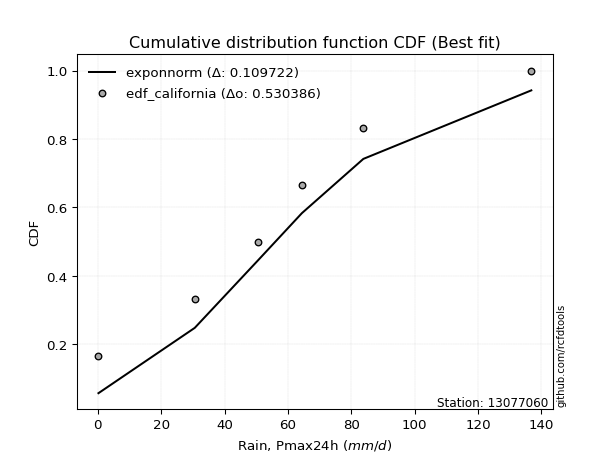</img>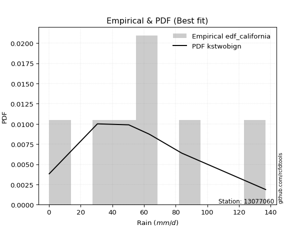</img>

</div>


### 2. EDF Hazen (1930)

Hazen method for plotting positions is a formula used to estimate the empirical cumulative probability distribution of flood events or other hydrological data. This formula often results in biased estimations, particularly when extrapolating to extreme events (high return periods).

<div align="center">


$P=(m-0.5)/n$


</div>


**2.1. Empirical values**

<div align="center">

|                | 0                   | 1                   | 2                   | 3         | 4                  | 5                  | 6                  |
|:---------------|:--------------------|:--------------------|:--------------------|:----------|:-------------------|:-------------------|:-------------------|
| date           | 2023                | 2022                | 2020                | 2025      | 2021               | 2024               | 2019               |
| x              | 0.2                 | 30.6                | 50.4                | 63.0      | 64.4               | 83.8               | 136.8              |
| m              | 1                   | 2                   | 3                   | 4         | 5                  | 6                  | 7                  |
| empirical_dist | edf_hazen           | edf_hazen           | edf_hazen           | edf_hazen | edf_hazen          | edf_hazen          | edf_hazen          |
| empirical      | 0.07142857142857142 | 0.21428571428571427 | 0.35714285714285715 | 0.5       | 0.6428571428571429 | 0.7857142857142857 | 0.9285714285714286 |
| empirical_tr   | 1.0769230769230769  | 1.2727272727272727  | 1.5555555555555558  | 2.0       | 2.8000000000000003 | 4.666666666666666  | 14.000000000000007 |

</div>


**2.2. Kolmogorov-Smirnov fit test (sorted by Δ)**


<div align="center">

|                | 0                   | 1                   | 2                   | 3                   | 4                   | 5                   | 6                   | 7                   | 8                   | 9                   | 10                  | 11                  | 12                  | 13                  | 14                  | 15                  | 16                  | 17                  | 18                  | 19                  | 20                  | 21                  | 22                  | 23                  | 24                  | 25                  | 26                  | 27                  | 28                  | 29                  | 30                  | 31                  | 32                  | 33                  | 34                  | 35                  | 36                  | 37                  | 38                  | 39                  | 40                  | 41                  | 42                  | 43                  | 44                  | 45                  | 46                  | 47                  | 48                  | 49                  | 50                  | 51                  | 52                  | 53                  | 54                  | 55                  | 56                  | 57                  | 58                  | 59                  | 60                  | 61                  | 62                  | 63                  | 64                  | 65                  | 66                  | 67                  | 68                  | 69                  | 70                  | 71                  | 72                  | 73                  | 74                  | 75                  | 76                  | 77                  | 78                  | 79                  | 80                  | 81                  | 82                  | 83                  | 84                  | 85                  | 86                  | 87                  | 88                  | 89                  | 90                  | 91                  | 92                  | 93                  | 94                  | 95                  | 96                  | 97                  | 98                  | 99                  | 100                 | 101                 | 102                 | 103                 | 104                 | 105                 | 106                 | 107                 | 108                 | 109                 | 110                 | 111                 | 112                 | 113                 | 114                 | 115                 | 116                 | 117                 | 118                 | 119                 | 120                 | 121                 | 122                 | 123                 | 124                 | 125                 | 126                 | 127                 | 128                 | 129                 | 130                 | 131                 | 132                 | 133                 | 134                 | 135                 | 136                 | 137                 | 138                 | 139                 | 140                 | 141                 | 142                 | 143                 | 144                 | 145                 | 146                 | 147                 | 148                 | 149                 | 150                 | 151                 | 152                 | 153                 | 154                 | 155                 | 156                 | 157                 | 158                 | 159                 |
|:---------------|:--------------------|:--------------------|:--------------------|:--------------------|:--------------------|:--------------------|:--------------------|:--------------------|:--------------------|:--------------------|:--------------------|:--------------------|:--------------------|:--------------------|:--------------------|:--------------------|:--------------------|:--------------------|:--------------------|:--------------------|:--------------------|:--------------------|:--------------------|:--------------------|:--------------------|:--------------------|:--------------------|:--------------------|:--------------------|:--------------------|:--------------------|:--------------------|:--------------------|:--------------------|:--------------------|:--------------------|:--------------------|:--------------------|:--------------------|:--------------------|:--------------------|:--------------------|:--------------------|:--------------------|:--------------------|:--------------------|:--------------------|:--------------------|:--------------------|:--------------------|:--------------------|:--------------------|:--------------------|:--------------------|:--------------------|:--------------------|:--------------------|:--------------------|:--------------------|:--------------------|:--------------------|:--------------------|:--------------------|:--------------------|:--------------------|:--------------------|:--------------------|:--------------------|:--------------------|:--------------------|:--------------------|:--------------------|:--------------------|:--------------------|:--------------------|:--------------------|:--------------------|:--------------------|:--------------------|:--------------------|:--------------------|:--------------------|:--------------------|:--------------------|:--------------------|:--------------------|:--------------------|:--------------------|:--------------------|:--------------------|:--------------------|:--------------------|:--------------------|:--------------------|:--------------------|:--------------------|:--------------------|:--------------------|:--------------------|:--------------------|:--------------------|:--------------------|:--------------------|:--------------------|:--------------------|:--------------------|:--------------------|:--------------------|:--------------------|:--------------------|:--------------------|:--------------------|:--------------------|:--------------------|:--------------------|:--------------------|:--------------------|:--------------------|:--------------------|:--------------------|:--------------------|:--------------------|:--------------------|:--------------------|:--------------------|:--------------------|:--------------------|:--------------------|:--------------------|:--------------------|:--------------------|:--------------------|:--------------------|:--------------------|:--------------------|:--------------------|:--------------------|:--------------------|:--------------------|:--------------------|:--------------------|:--------------------|:--------------------|:--------------------|:--------------------|:--------------------|:--------------------|:--------------------|:--------------------|:--------------------|:--------------------|:--------------------|:--------------------|:--------------------|:--------------------|:--------------------|:--------------------|:--------------------|:--------------------|:--------------------|
| station        | 13077060            | 13077060            | 13077060            | 13077060            | 13077060            | 13077060            | 13077060            | 13077060            | 13077060            | 13077060            | 13077060            | 13077060            | 13077060            | 13077060            | 13077060            | 13077060            | 13077060            | 13077060            | 13077060            | 13077060            | 13077060            | 13077060            | 13077060            | 13077060            | 13077060            | 13077060            | 13077060            | 13077060            | 13077060            | 13077060            | 13077060            | 13077060            | 13077060            | 13077060            | 13077060            | 13077060            | 13077060            | 13077060            | 13077060            | 13077060            | 13077060            | 13077060            | 13077060            | 13077060            | 13077060            | 13077060            | 13077060            | 13077060            | 13077060            | 13077060            | 13077060            | 13077060            | 13077060            | 13077060            | 13077060            | 13077060            | 13077060            | 13077060            | 13077060            | 13077060            | 13077060            | 13077060            | 13077060            | 13077060            | 13077060            | 13077060            | 13077060            | 13077060            | 13077060            | 13077060            | 13077060            | 13077060            | 13077060            | 13077060            | 13077060            | 13077060            | 13077060            | 13077060            | 13077060            | 13077060            | 13077060            | 13077060            | 13077060            | 13077060            | 13077060            | 13077060            | 13077060            | 13077060            | 13077060            | 13077060            | 13077060            | 13077060            | 13077060            | 13077060            | 13077060            | 13077060            | 13077060            | 13077060            | 13077060            | 13077060            | 13077060            | 13077060            | 13077060            | 13077060            | 13077060            | 13077060            | 13077060            | 13077060            | 13077060            | 13077060            | 13077060            | 13077060            | 13077060            | 13077060            | 13077060            | 13077060            | 13077060            | 13077060            | 13077060            | 13077060            | 13077060            | 13077060            | 13077060            | 13077060            | 13077060            | 13077060            | 13077060            | 13077060            | 13077060            | 13077060            | 13077060            | 13077060            | 13077060            | 13077060            | 13077060            | 13077060            | 13077060            | 13077060            | 13077060            | 13077060            | 13077060            | 13077060            | 13077060            | 13077060            | 13077060            | 13077060            | 13077060            | 13077060            | 13077060            | 13077060            | 13077060            | 13077060            | 13077060            | 13077060            | 13077060            | 13077060            | 13077060            | 13077060            | 13077060            | 13077060            |
| empirical_dist | edf_hazen           | edf_hazen           | edf_hazen           | edf_hazen           | edf_hazen           | edf_hazen           | edf_hazen           | edf_hazen           | edf_hazen           | edf_hazen           | edf_hazen           | edf_hazen           | edf_hazen           | edf_hazen           | edf_hazen           | edf_hazen           | edf_hazen           | edf_hazen           | edf_hazen           | edf_hazen           | edf_hazen           | edf_hazen           | edf_hazen           | edf_hazen           | edf_hazen           | edf_hazen           | edf_hazen           | edf_hazen           | edf_hazen           | edf_hazen           | edf_hazen           | edf_hazen           | edf_hazen           | edf_hazen           | edf_hazen           | edf_hazen           | edf_hazen           | edf_hazen           | edf_hazen           | edf_hazen           | edf_hazen           | edf_hazen           | edf_hazen           | edf_hazen           | edf_hazen           | edf_hazen           | edf_hazen           | edf_hazen           | edf_hazen           | edf_hazen           | edf_hazen           | edf_hazen           | edf_hazen           | edf_hazen           | edf_hazen           | edf_hazen           | edf_hazen           | edf_hazen           | edf_hazen           | edf_hazen           | edf_hazen           | edf_hazen           | edf_hazen           | edf_hazen           | edf_hazen           | edf_hazen           | edf_hazen           | edf_hazen           | edf_hazen           | edf_hazen           | edf_hazen           | edf_hazen           | edf_hazen           | edf_hazen           | edf_hazen           | edf_hazen           | edf_hazen           | edf_hazen           | edf_hazen           | edf_hazen           | edf_hazen           | edf_hazen           | edf_hazen           | edf_hazen           | edf_hazen           | edf_hazen           | edf_hazen           | edf_hazen           | edf_hazen           | edf_hazen           | edf_hazen           | edf_hazen           | edf_hazen           | edf_hazen           | edf_hazen           | edf_hazen           | edf_hazen           | edf_hazen           | edf_hazen           | edf_hazen           | edf_hazen           | edf_hazen           | edf_hazen           | edf_hazen           | edf_hazen           | edf_hazen           | edf_hazen           | edf_hazen           | edf_hazen           | edf_hazen           | edf_hazen           | edf_hazen           | edf_hazen           | edf_hazen           | edf_hazen           | edf_hazen           | edf_hazen           | edf_hazen           | edf_hazen           | edf_hazen           | edf_hazen           | edf_hazen           | edf_hazen           | edf_hazen           | edf_hazen           | edf_hazen           | edf_hazen           | edf_hazen           | edf_hazen           | edf_hazen           | edf_hazen           | edf_hazen           | edf_hazen           | edf_hazen           | edf_hazen           | edf_hazen           | edf_hazen           | edf_hazen           | edf_hazen           | edf_hazen           | edf_hazen           | edf_hazen           | edf_hazen           | edf_hazen           | edf_hazen           | edf_hazen           | edf_hazen           | edf_hazen           | edf_hazen           | edf_hazen           | edf_hazen           | edf_hazen           | edf_hazen           | edf_hazen           | edf_hazen           | edf_hazen           | edf_hazen           | edf_hazen           | edf_hazen           | edf_hazen           |
| p_dist         | exponnorm           | genlogistic         | erlang              | gamma               | betaprime           | gengamma            | fatiguelife         | johnsonsu           | skewnorm            | maxwell             | genextreme          | rayleigh            | rice                | invgauss            | burr12              | weibull_min         | pearson3            | logjohnsonsu        | laplace             | foldnorm            | gumbel_r            | exponweib           | bradford            | hypsecant           | truncweibull_min    | kappa3              | kstwobign           | logistic            | t                   | crystalball         | norm                | moyal               | halfnorm            | anglit              | gennorm             | semicircular        | logt                | halflogistic        | cosine              | truncexpon          | dgamma              | loggennorm          | dweibull            | logdgamma           | mielke              | loggenextreme       | arcsine             | logargus            | kappa4              | logvonmises_line    | wrapcauchy          | uniform             | logloggamma         | logpearson3         | gumbel_l            | ncf                 | vonmises_line       | wald                | loglevy_l           | ksone               | logdweibull         | genexpon            | loggompertz         | lomax               | argus               | gausshyper          | logburr12           | beta                | genpareto           | loggumbel_l         | loggausshyper       | logtrapezoid        | logfoldnorm         | johnsonsb           | f                   | burr                | logarcsine          | logsemicircular     | loganglit           | lognakagami         | logexponnorm        | logcrystalball      | lognorm             | logrice             | loggamma            | loggamma            | lognct              | loglogistic         | logfatiguelife      | loghypsecant        | nct                 | logerlang           | logweibull_max      | loglaplace          | loglaplace          | halfgennorm         | loginvweibull       | levy_l              | loginvgamma         | loginvgauss         | genhalflogistic     | logmaxwell          | logjohnsonsb        | lograyleigh         | logalpha            | logskewnorm         | nakagami            | logkstwobign        | triang              | loggumbel_r         | loghalfnorm         | logloglaplace       | logwrapcauchy       | loggenexpon         | logcosine           | logmoyal            | loghalflogistic     | loggenhalflogistic  | invgamma            | logncf              | trapezoid           | logtriang           | loglomax            | loggenpareto        | loghalfgennorm      | logwald             | logkappa3           | rdist               | logexponweib        | invweibull          | logf                | logksone            | logkappa4           | logbeta             | logmielke           | logbradford         | tukeylambda         | logtruncweibull_min | logtruncnorm        | loguniform          | loggengamma         | powerlaw            | logburr             | logtruncexpon       | logweibull_min      | weibull_max         | truncpareto         | logbetaprime        | exponpow            | logexponpow         | logpowerlaw         | logtruncpareto      | alpha               | gompertz            | truncnorm           | loggenlogistic      | logtukeylambda      | logrdist            | logvonmises         | vonmises            |
| delta          | 0.06872006194749003 | 0.07010108512677493 | 0.07242203841036443 | 0.07242208833029873 | 0.07264170444121532 | 0.07453086975986722 | 0.07455206735404274 | 0.07561130503184654 | 0.07870814546879046 | 0.08030033132829972 | 0.08042471118434436 | 0.08055526644621219 | 0.08083785766822493 | 0.08333853754223969 | 0.08356695323010527 | 0.08395155351457956 | 0.08435730887203141 | 0.08979015663022827 | 0.09076692687973364 | 0.09112814070693154 | 0.09260619752749011 | 0.09445378201202742 | 0.09730733771624467 | 0.10405696283279575 | 0.10507019474150281 | 0.10570736487525889 | 0.10623195745569641 | 0.10764021872282614 | 0.11181066029024822 | 0.11185339556419738 | 0.11185340304922586 | 0.11484931687110472 | 0.11548135096324441 | 0.11627732549281267 | 0.1172293482732738  | 0.11810102954035229 | 0.12147626153060342 | 0.12994076992857517 | 0.1393094083725609  | 0.14262541884822727 | 0.14285714285500972 | 0.14285714285642725 | 0.14285714285737217 | 0.1428571429378503  | 0.14545394696016398 | 0.14578551196557754 | 0.15443042101889792 | 0.1547982377890183  | 0.1585282750219541  | 0.1670862406332735  | 0.1736947542899835  | 0.1737084291989125  | 0.1745026045141807  | 0.17701139422412418 | 0.1806034945000693  | 0.1814640900114159  | 0.1841207704883307  | 0.18452963594556304 | 0.19090635508895795 | 0.19237607195147455 | 0.19608237107134296 | 0.20351405017134566 | 0.20987749685621854 | 0.22120715070690872 | 0.22246290375319278 | 0.22621739750571934 | 0.22820041551329334 | 0.2290568455319354  | 0.22967736031181563 | 0.23143024301675122 | 0.256422089711848   | 0.2619066711439525  | 0.2685255580955894  | 0.2711294652994348  | 0.27822353866791216 | 0.2816513496796361  | 0.2944408159109202  | 0.2980515973637594  | 0.29896269204106174 | 0.30110494662598186 | 0.30117282229354403 | 0.30117449827010756 | 0.30117450702387283 | 0.30121720572408583 | 0.3017691603525686  | 0.3017691603525686  | 0.30187021619614807 | 0.3032840038153699  | 0.3034955037148408  | 0.30508368749750947 | 0.3085369370892984  | 0.3100071770057119  | 0.3100844588960983  | 0.3123859441242768  | 0.3123859441242768  | 0.3137085022540723  | 0.3197003392509391  | 0.31995722925820713 | 0.3221806542749187  | 0.32404856443755403 | 0.3265657544683894  | 0.3335419089731543  | 0.3338230347687783  | 0.34420111061912484 | 0.34604003117654447 | 0.3501893299321993  | 0.3615223775425117  | 0.3653518912280005  | 0.3685439006228669  | 0.3718353349161132  | 0.37420930989687096 | 0.3787711686939277  | 0.380116305887796   | 0.3850819523645802  | 0.38653172804794056 | 0.3975102856337911  | 0.40002676326847075 | 0.4030935631286311  | 0.4119164847225606  | 0.4189402090385884  | 0.4287751018663755  | 0.4358561307174763  | 0.454448593679437   | 0.45493127274351297 | 0.4595370991917861  | 0.46884217504568226 | 0.47034294904596063 | 0.48519242152933484 | 0.48587898417530484 | 0.48967784256053665 | 0.5090821971435608  | 0.511213462342007   | 0.5330380449883492  | 0.5386105891516518  | 0.5450143209253069  | 0.5503920316324237  | 0.5505762259695227  | 0.5513397194743828  | 0.5548809808447063  | 0.5563132976675513  | 0.5733719390204037  | 0.5873298722018004  | 0.608818019736364   | 0.6119600940144603  | 0.6564911878718037  | 0.6618982936427402  | 0.6773247250683613  | 0.6941603347940412  | 0.7170188547532353  | 0.7374918241189209  | 0.7396424020628211  | 0.7466231843505106  | 0.7721341938344576  | 0.7779535628404461  | 0.7857142819146274  | 0.7857142857142857  | 0.7857142857142857  | 0.9285714285652235  | 1.0015215827727033  | 21.166424899339056  |
| deltao         | 0.48442053926100004 | 0.48442053926100004 | 0.48442053926100004 | 0.48442053926100004 | 0.48442053926100004 | 0.48442053926100004 | 0.48442053926100004 | 0.48442053926100004 | 0.48442053926100004 | 0.48442053926100004 | 0.48442053926100004 | 0.48442053926100004 | 0.48442053926100004 | 0.48442053926100004 | 0.48442053926100004 | 0.48442053926100004 | 0.48442053926100004 | 0.48442053926100004 | 0.48442053926100004 | 0.48442053926100004 | 0.48442053926100004 | 0.48442053926100004 | 0.48442053926100004 | 0.48442053926100004 | 0.48442053926100004 | 0.48442053926100004 | 0.48442053926100004 | 0.48442053926100004 | 0.48442053926100004 | 0.48442053926100004 | 0.48442053926100004 | 0.48442053926100004 | 0.48442053926100004 | 0.48442053926100004 | 0.48442053926100004 | 0.48442053926100004 | 0.48442053926100004 | 0.48442053926100004 | 0.48442053926100004 | 0.48442053926100004 | 0.48442053926100004 | 0.48442053926100004 | 0.48442053926100004 | 0.48442053926100004 | 0.48442053926100004 | 0.48442053926100004 | 0.48442053926100004 | 0.48442053926100004 | 0.48442053926100004 | 0.48442053926100004 | 0.48442053926100004 | 0.48442053926100004 | 0.48442053926100004 | 0.48442053926100004 | 0.48442053926100004 | 0.48442053926100004 | 0.48442053926100004 | 0.48442053926100004 | 0.48442053926100004 | 0.48442053926100004 | 0.48442053926100004 | 0.48442053926100004 | 0.48442053926100004 | 0.48442053926100004 | 0.48442053926100004 | 0.48442053926100004 | 0.48442053926100004 | 0.48442053926100004 | 0.48442053926100004 | 0.48442053926100004 | 0.48442053926100004 | 0.48442053926100004 | 0.48442053926100004 | 0.48442053926100004 | 0.48442053926100004 | 0.48442053926100004 | 0.48442053926100004 | 0.48442053926100004 | 0.48442053926100004 | 0.48442053926100004 | 0.48442053926100004 | 0.48442053926100004 | 0.48442053926100004 | 0.48442053926100004 | 0.48442053926100004 | 0.48442053926100004 | 0.48442053926100004 | 0.48442053926100004 | 0.48442053926100004 | 0.48442053926100004 | 0.48442053926100004 | 0.48442053926100004 | 0.48442053926100004 | 0.48442053926100004 | 0.48442053926100004 | 0.48442053926100004 | 0.48442053926100004 | 0.48442053926100004 | 0.48442053926100004 | 0.48442053926100004 | 0.48442053926100004 | 0.48442053926100004 | 0.48442053926100004 | 0.48442053926100004 | 0.48442053926100004 | 0.48442053926100004 | 0.48442053926100004 | 0.48442053926100004 | 0.48442053926100004 | 0.48442053926100004 | 0.48442053926100004 | 0.48442053926100004 | 0.48442053926100004 | 0.48442053926100004 | 0.48442053926100004 | 0.48442053926100004 | 0.48442053926100004 | 0.48442053926100004 | 0.48442053926100004 | 0.48442053926100004 | 0.48442053926100004 | 0.48442053926100004 | 0.48442053926100004 | 0.48442053926100004 | 0.48442053926100004 | 0.48442053926100004 | 0.48442053926100004 | 0.48442053926100004 | 0.48442053926100004 | 0.48442053926100004 | 0.48442053926100004 | 0.48442053926100004 | 0.48442053926100004 | 0.48442053926100004 | 0.48442053926100004 | 0.48442053926100004 | 0.48442053926100004 | 0.48442053926100004 | 0.48442053926100004 | 0.48442053926100004 | 0.48442053926100004 | 0.48442053926100004 | 0.48442053926100004 | 0.48442053926100004 | 0.48442053926100004 | 0.48442053926100004 | 0.48442053926100004 | 0.48442053926100004 | 0.48442053926100004 | 0.48442053926100004 | 0.48442053926100004 | 0.48442053926100004 | 0.48442053926100004 | 0.48442053926100004 | 0.48442053926100004 | 0.48442053926100004 | 0.48442053926100004 | 0.48442053926100004 | 0.48442053926100004 | 0.48442053926100004 |
| eval           | Δo > Δ              | Δo > Δ              | Δo > Δ              | Δo > Δ              | Δo > Δ              | Δo > Δ              | Δo > Δ              | Δo > Δ              | Δo > Δ              | Δo > Δ              | Δo > Δ              | Δo > Δ              | Δo > Δ              | Δo > Δ              | Δo > Δ              | Δo > Δ              | Δo > Δ              | Δo > Δ              | Δo > Δ              | Δo > Δ              | Δo > Δ              | Δo > Δ              | Δo > Δ              | Δo > Δ              | Δo > Δ              | Δo > Δ              | Δo > Δ              | Δo > Δ              | Δo > Δ              | Δo > Δ              | Δo > Δ              | Δo > Δ              | Δo > Δ              | Δo > Δ              | Δo > Δ              | Δo > Δ              | Δo > Δ              | Δo > Δ              | Δo > Δ              | Δo > Δ              | Δo > Δ              | Δo > Δ              | Δo > Δ              | Δo > Δ              | Δo > Δ              | Δo > Δ              | Δo > Δ              | Δo > Δ              | Δo > Δ              | Δo > Δ              | Δo > Δ              | Δo > Δ              | Δo > Δ              | Δo > Δ              | Δo > Δ              | Δo > Δ              | Δo > Δ              | Δo > Δ              | Δo > Δ              | Δo > Δ              | Δo > Δ              | Δo > Δ              | Δo > Δ              | Δo > Δ              | Δo > Δ              | Δo > Δ              | Δo > Δ              | Δo > Δ              | Δo > Δ              | Δo > Δ              | Δo > Δ              | Δo > Δ              | Δo > Δ              | Δo > Δ              | Δo > Δ              | Δo > Δ              | Δo > Δ              | Δo > Δ              | Δo > Δ              | Δo > Δ              | Δo > Δ              | Δo > Δ              | Δo > Δ              | Δo > Δ              | Δo > Δ              | Δo > Δ              | Δo > Δ              | Δo > Δ              | Δo > Δ              | Δo > Δ              | Δo > Δ              | Δo > Δ              | Δo > Δ              | Δo > Δ              | Δo > Δ              | Δo > Δ              | Δo > Δ              | Δo > Δ              | Δo > Δ              | Δo > Δ              | Δo > Δ              | Δo > Δ              | Δo > Δ              | Δo > Δ              | Δo > Δ              | Δo > Δ              | Δo > Δ              | Δo > Δ              | Δo > Δ              | Δo > Δ              | Δo > Δ              | Δo > Δ              | Δo > Δ              | Δo > Δ              | Δo > Δ              | Δo > Δ              | Δo > Δ              | Δo > Δ              | Δo > Δ              | Δo > Δ              | Δo > Δ              | Δo > Δ              | Δo > Δ              | Δo > Δ              | Δo > Δ              | Δo > Δ              | Δo > Δ              | Δo <= Δ             | Δo <= Δ             | Δo <= Δ             | Δo <= Δ             | Δo <= Δ             | Δo <= Δ             | Δo <= Δ             | Δo <= Δ             | Δo <= Δ             | Δo <= Δ             | Δo <= Δ             | Δo <= Δ             | Δo <= Δ             | Δo <= Δ             | Δo <= Δ             | Δo <= Δ             | Δo <= Δ             | Δo <= Δ             | Δo <= Δ             | Δo <= Δ             | Δo <= Δ             | Δo <= Δ             | Δo <= Δ             | Δo <= Δ             | Δo <= Δ             | Δo <= Δ             | Δo <= Δ             | Δo <= Δ             | Δo <= Δ             | Δo <= Δ             | Δo <= Δ             | Δo <= Δ             | Δo <= Δ             |
| fit            | 1                   | 1                   | 1                   | 1                   | 1                   | 1                   | 1                   | 1                   | 1                   | 1                   | 1                   | 1                   | 1                   | 1                   | 1                   | 1                   | 1                   | 1                   | 1                   | 1                   | 1                   | 1                   | 1                   | 1                   | 1                   | 1                   | 1                   | 1                   | 1                   | 1                   | 1                   | 1                   | 1                   | 1                   | 1                   | 1                   | 1                   | 1                   | 1                   | 1                   | 1                   | 1                   | 1                   | 1                   | 1                   | 1                   | 1                   | 1                   | 1                   | 1                   | 1                   | 1                   | 1                   | 1                   | 1                   | 1                   | 1                   | 1                   | 1                   | 1                   | 1                   | 1                   | 1                   | 1                   | 1                   | 1                   | 1                   | 1                   | 1                   | 1                   | 1                   | 1                   | 1                   | 1                   | 1                   | 1                   | 1                   | 1                   | 1                   | 1                   | 1                   | 1                   | 1                   | 1                   | 1                   | 1                   | 1                   | 1                   | 1                   | 1                   | 1                   | 1                   | 1                   | 1                   | 1                   | 1                   | 1                   | 1                   | 1                   | 1                   | 1                   | 1                   | 1                   | 1                   | 1                   | 1                   | 1                   | 1                   | 1                   | 1                   | 1                   | 1                   | 1                   | 1                   | 1                   | 1                   | 1                   | 1                   | 1                   | 1                   | 1                   | 1                   | 1                   | 1                   | 1                   | 1                   | 1                   | 0                   | 0                   | 0                   | 0                   | 0                   | 0                   | 0                   | 0                   | 0                   | 0                   | 0                   | 0                   | 0                   | 0                   | 0                   | 0                   | 0                   | 0                   | 0                   | 0                   | 0                   | 0                   | 0                   | 0                   | 0                   | 0                   | 0                   | 0                   | 0                   | 0                   | 0                   | 0                   | 0                   |
| n              | 7                   | 7                   | 7                   | 7                   | 7                   | 7                   | 7                   | 7                   | 7                   | 7                   | 7                   | 7                   | 7                   | 7                   | 7                   | 7                   | 7                   | 7                   | 7                   | 7                   | 7                   | 7                   | 7                   | 7                   | 7                   | 7                   | 7                   | 7                   | 7                   | 7                   | 7                   | 7                   | 7                   | 7                   | 7                   | 7                   | 7                   | 7                   | 7                   | 7                   | 7                   | 7                   | 7                   | 7                   | 7                   | 7                   | 7                   | 7                   | 7                   | 7                   | 7                   | 7                   | 7                   | 7                   | 7                   | 7                   | 7                   | 7                   | 7                   | 7                   | 7                   | 7                   | 7                   | 7                   | 7                   | 7                   | 7                   | 7                   | 7                   | 7                   | 7                   | 7                   | 7                   | 7                   | 7                   | 7                   | 7                   | 7                   | 7                   | 7                   | 7                   | 7                   | 7                   | 7                   | 7                   | 7                   | 7                   | 7                   | 7                   | 7                   | 7                   | 7                   | 7                   | 7                   | 7                   | 7                   | 7                   | 7                   | 7                   | 7                   | 7                   | 7                   | 7                   | 7                   | 7                   | 7                   | 7                   | 7                   | 7                   | 7                   | 7                   | 7                   | 7                   | 7                   | 7                   | 7                   | 7                   | 7                   | 7                   | 7                   | 7                   | 7                   | 7                   | 7                   | 7                   | 7                   | 7                   | 7                   | 7                   | 7                   | 7                   | 7                   | 7                   | 7                   | 7                   | 7                   | 7                   | 7                   | 7                   | 7                   | 7                   | 7                   | 7                   | 7                   | 7                   | 7                   | 7                   | 7                   | 7                   | 7                   | 7                   | 7                   | 7                   | 7                   | 7                   | 7                   | 7                   | 7                   | 7                   | 7                   |
| best_fit       | 1                   | 0                   | 0                   | 0                   | 0                   | 0                   | 0                   | 0                   | 0                   | 0                   | 0                   | 0                   | 0                   | 0                   | 0                   | 0                   | 0                   | 0                   | 0                   | 0                   | 0                   | 0                   | 0                   | 0                   | 0                   | 0                   | 0                   | 0                   | 0                   | 0                   | 0                   | 0                   | 0                   | 0                   | 0                   | 0                   | 0                   | 0                   | 0                   | 0                   | 0                   | 0                   | 0                   | 0                   | 0                   | 0                   | 0                   | 0                   | 0                   | 0                   | 0                   | 0                   | 0                   | 0                   | 0                   | 0                   | 0                   | 0                   | 0                   | 0                   | 0                   | 0                   | 0                   | 0                   | 0                   | 0                   | 0                   | 0                   | 0                   | 0                   | 0                   | 0                   | 0                   | 0                   | 0                   | 0                   | 0                   | 0                   | 0                   | 0                   | 0                   | 0                   | 0                   | 0                   | 0                   | 0                   | 0                   | 0                   | 0                   | 0                   | 0                   | 0                   | 0                   | 0                   | 0                   | 0                   | 0                   | 0                   | 0                   | 0                   | 0                   | 0                   | 0                   | 0                   | 0                   | 0                   | 0                   | 0                   | 0                   | 0                   | 0                   | 0                   | 0                   | 0                   | 0                   | 0                   | 0                   | 0                   | 0                   | 0                   | 0                   | 0                   | 0                   | 0                   | 0                   | 0                   | 0                   | 0                   | 0                   | 0                   | 0                   | 0                   | 0                   | 0                   | 0                   | 0                   | 0                   | 0                   | 0                   | 0                   | 0                   | 0                   | 0                   | 0                   | 0                   | 0                   | 0                   | 0                   | 0                   | 0                   | 0                   | 0                   | 0                   | 0                   | 0                   | 0                   | 0                   | 0                   | 0                   | 0                   |
| best_fit_sort  | 1                   | 2                   | 3                   | 4                   | 5                   | 6                   | 7                   | 8                   | 9                   | 10                  | 11                  | 12                  | 13                  | 14                  | 15                  | 16                  | 17                  | 18                  | 19                  | 20                  | 21                  | 22                  | 23                  | 24                  | 25                  | 26                  | 27                  | 28                  | 29                  | 30                  | 31                  | 32                  | 33                  | 34                  | 35                  | 36                  | 37                  | 38                  | 39                  | 40                  | 41                  | 42                  | 43                  | 44                  | 45                  | 46                  | 47                  | 48                  | 49                  | 50                  | 51                  | 52                  | 53                  | 54                  | 55                  | 56                  | 57                  | 58                  | 59                  | 60                  | 61                  | 62                  | 63                  | 64                  | 65                  | 66                  | 67                  | 68                  | 69                  | 70                  | 71                  | 72                  | 73                  | 74                  | 75                  | 76                  | 77                  | 78                  | 79                  | 80                  | 81                  | 82                  | 83                  | 84                  | 85                  | 86                  | 87                  | 88                  | 89                  | 90                  | 91                  | 92                  | 93                  | 94                  | 95                  | 96                  | 97                  | 98                  | 99                  | 100                 | 101                 | 102                 | 103                 | 104                 | 105                 | 106                 | 107                 | 108                 | 109                 | 110                 | 111                 | 112                 | 113                 | 114                 | 115                 | 116                 | 117                 | 118                 | 119                 | 120                 | 121                 | 122                 | 123                 | 124                 | 125                 | 126                 | 127                 | 128                 | 129                 | 130                 | 131                 | 132                 | 133                 | 134                 | 135                 | 136                 | 137                 | 138                 | 139                 | 140                 | 141                 | 142                 | 143                 | 144                 | 145                 | 146                 | 147                 | 148                 | 149                 | 150                 | 151                 | 152                 | 153                 | 154                 | 155                 | 156                 | 157                 | 158                 | 159                 | 160                 |

</div>


**2.3. Best fit**

<div align="center">

|   id |   station | empirical_dist   | p_dist    |     delta |   deltao | eval   |   fit |   n |   best_fit |   best_fit_sort |
|-----:|----------:|:-----------------|:----------|----------:|---------:|:-------|------:|----:|-----------:|----------------:|
|    0 |  13077060 | edf_hazen        | exponnorm | 0.0687201 | 0.484421 | Δo > Δ |     1 |   7 |          1 |               1 |

</div>


<div align="center">

</img></img>

</div>


### 3. EDF Weibull (1939)

Weibull plotting position formula is an empirical method used to estimate the non-exceedance probability or plotting position for a set of observed data, is often recommended or widely used in practice, particularly in flood frequency analysis.

<div align="center">


$P=m/(n+1)$


</div>


**3.1. Empirical values**

<div align="center">

|                | 0                  | 1                  | 2           | 3           | 4                  | 5           | 6           |
|:---------------|:-------------------|:-------------------|:------------|:------------|:-------------------|:------------|:------------|
| date           | 2023               | 2022               | 2020        | 2025        | 2021               | 2024        | 2019        |
| x              | 0.2                | 30.6               | 50.4        | 63.0        | 64.4               | 83.8        | 136.8       |
| m              | 1                  | 2                  | 3           | 4           | 5                  | 6           | 7           |
| empirical_dist | edf_weibull        | edf_weibull        | edf_weibull | edf_weibull | edf_weibull        | edf_weibull | edf_weibull |
| empirical      | 0.125              | 0.25               | 0.375       | 0.5         | 0.625              | 0.75        | 0.875       |
| empirical_tr   | 1.1428571428571428 | 1.3333333333333333 | 1.6         | 2.0         | 2.6666666666666665 | 4.0         | 8.0         |

</div>


**3.2. Kolmogorov-Smirnov fit test (sorted by Δ)**


<div align="center">

|                | 0                   | 1                   | 2                   | 3                   | 4                   | 5                   | 6                   | 7                   | 8                   | 9                   | 10                  | 11                  | 12                  | 13                  | 14                  | 15                  | 16                  | 17                  | 18                  | 19                  | 20                  | 21                  | 22                  | 23                  | 24                  | 25                  | 26                  | 27                  | 28                  | 29                  | 30                  | 31                  | 32                  | 33                  | 34                  | 35                  | 36                  | 37                  | 38                  | 39                  | 40                  | 41                  | 42                  | 43                  | 44                  | 45                  | 46                  | 47                  | 48                  | 49                  | 50                  | 51                  | 52                  | 53                  | 54                  | 55                  | 56                  | 57                  | 58                  | 59                  | 60                  | 61                  | 62                  | 63                  | 64                  | 65                  | 66                  | 67                  | 68                  | 69                  | 70                  | 71                  | 72                  | 73                  | 74                  | 75                  | 76                  | 77                  | 78                  | 79                  | 80                  | 81                  | 82                  | 83                  | 84                  | 85                  | 86                  | 87                  | 88                  | 89                  | 90                  | 91                  | 92                  | 93                  | 94                  | 95                  | 96                  | 97                  | 98                  | 99                  | 100                 | 101                 | 102                 | 103                 | 104                 | 105                 | 106                 | 107                 | 108                 | 109                 | 110                 | 111                 | 112                 | 113                 | 114                 | 115                 | 116                 | 117                 | 118                 | 119                 | 120                 | 121                 | 122                 | 123                 | 124                 | 125                 | 126                 | 127                 | 128                 | 129                 | 130                 | 131                 | 132                 | 133                 | 134                 | 135                 | 136                 | 137                 | 138                 | 139                 | 140                 | 141                 | 142                 | 143                 | 144                 | 145                 | 146                 | 147                 | 148                 | 149                 | 150                 | 151                 | 152                 | 153                 | 154                 | 155                 | 156                 | 157                 | 158                 | 159                 |
|:---------------|:--------------------|:--------------------|:--------------------|:--------------------|:--------------------|:--------------------|:--------------------|:--------------------|:--------------------|:--------------------|:--------------------|:--------------------|:--------------------|:--------------------|:--------------------|:--------------------|:--------------------|:--------------------|:--------------------|:--------------------|:--------------------|:--------------------|:--------------------|:--------------------|:--------------------|:--------------------|:--------------------|:--------------------|:--------------------|:--------------------|:--------------------|:--------------------|:--------------------|:--------------------|:--------------------|:--------------------|:--------------------|:--------------------|:--------------------|:--------------------|:--------------------|:--------------------|:--------------------|:--------------------|:--------------------|:--------------------|:--------------------|:--------------------|:--------------------|:--------------------|:--------------------|:--------------------|:--------------------|:--------------------|:--------------------|:--------------------|:--------------------|:--------------------|:--------------------|:--------------------|:--------------------|:--------------------|:--------------------|:--------------------|:--------------------|:--------------------|:--------------------|:--------------------|:--------------------|:--------------------|:--------------------|:--------------------|:--------------------|:--------------------|:--------------------|:--------------------|:--------------------|:--------------------|:--------------------|:--------------------|:--------------------|:--------------------|:--------------------|:--------------------|:--------------------|:--------------------|:--------------------|:--------------------|:--------------------|:--------------------|:--------------------|:--------------------|:--------------------|:--------------------|:--------------------|:--------------------|:--------------------|:--------------------|:--------------------|:--------------------|:--------------------|:--------------------|:--------------------|:--------------------|:--------------------|:--------------------|:--------------------|:--------------------|:--------------------|:--------------------|:--------------------|:--------------------|:--------------------|:--------------------|:--------------------|:--------------------|:--------------------|:--------------------|:--------------------|:--------------------|:--------------------|:--------------------|:--------------------|:--------------------|:--------------------|:--------------------|:--------------------|:--------------------|:--------------------|:--------------------|:--------------------|:--------------------|:--------------------|:--------------------|:--------------------|:--------------------|:--------------------|:--------------------|:--------------------|:--------------------|:--------------------|:--------------------|:--------------------|:--------------------|:--------------------|:--------------------|:--------------------|:--------------------|:--------------------|:--------------------|:--------------------|:--------------------|:--------------------|:--------------------|:--------------------|:--------------------|:--------------------|:--------------------|:--------------------|:--------------------|
| station        | 13077060            | 13077060            | 13077060            | 13077060            | 13077060            | 13077060            | 13077060            | 13077060            | 13077060            | 13077060            | 13077060            | 13077060            | 13077060            | 13077060            | 13077060            | 13077060            | 13077060            | 13077060            | 13077060            | 13077060            | 13077060            | 13077060            | 13077060            | 13077060            | 13077060            | 13077060            | 13077060            | 13077060            | 13077060            | 13077060            | 13077060            | 13077060            | 13077060            | 13077060            | 13077060            | 13077060            | 13077060            | 13077060            | 13077060            | 13077060            | 13077060            | 13077060            | 13077060            | 13077060            | 13077060            | 13077060            | 13077060            | 13077060            | 13077060            | 13077060            | 13077060            | 13077060            | 13077060            | 13077060            | 13077060            | 13077060            | 13077060            | 13077060            | 13077060            | 13077060            | 13077060            | 13077060            | 13077060            | 13077060            | 13077060            | 13077060            | 13077060            | 13077060            | 13077060            | 13077060            | 13077060            | 13077060            | 13077060            | 13077060            | 13077060            | 13077060            | 13077060            | 13077060            | 13077060            | 13077060            | 13077060            | 13077060            | 13077060            | 13077060            | 13077060            | 13077060            | 13077060            | 13077060            | 13077060            | 13077060            | 13077060            | 13077060            | 13077060            | 13077060            | 13077060            | 13077060            | 13077060            | 13077060            | 13077060            | 13077060            | 13077060            | 13077060            | 13077060            | 13077060            | 13077060            | 13077060            | 13077060            | 13077060            | 13077060            | 13077060            | 13077060            | 13077060            | 13077060            | 13077060            | 13077060            | 13077060            | 13077060            | 13077060            | 13077060            | 13077060            | 13077060            | 13077060            | 13077060            | 13077060            | 13077060            | 13077060            | 13077060            | 13077060            | 13077060            | 13077060            | 13077060            | 13077060            | 13077060            | 13077060            | 13077060            | 13077060            | 13077060            | 13077060            | 13077060            | 13077060            | 13077060            | 13077060            | 13077060            | 13077060            | 13077060            | 13077060            | 13077060            | 13077060            | 13077060            | 13077060            | 13077060            | 13077060            | 13077060            | 13077060            | 13077060            | 13077060            | 13077060            | 13077060            | 13077060            | 13077060            |
| empirical_dist | edf_weibull         | edf_weibull         | edf_weibull         | edf_weibull         | edf_weibull         | edf_weibull         | edf_weibull         | edf_weibull         | edf_weibull         | edf_weibull         | edf_weibull         | edf_weibull         | edf_weibull         | edf_weibull         | edf_weibull         | edf_weibull         | edf_weibull         | edf_weibull         | edf_weibull         | edf_weibull         | edf_weibull         | edf_weibull         | edf_weibull         | edf_weibull         | edf_weibull         | edf_weibull         | edf_weibull         | edf_weibull         | edf_weibull         | edf_weibull         | edf_weibull         | edf_weibull         | edf_weibull         | edf_weibull         | edf_weibull         | edf_weibull         | edf_weibull         | edf_weibull         | edf_weibull         | edf_weibull         | edf_weibull         | edf_weibull         | edf_weibull         | edf_weibull         | edf_weibull         | edf_weibull         | edf_weibull         | edf_weibull         | edf_weibull         | edf_weibull         | edf_weibull         | edf_weibull         | edf_weibull         | edf_weibull         | edf_weibull         | edf_weibull         | edf_weibull         | edf_weibull         | edf_weibull         | edf_weibull         | edf_weibull         | edf_weibull         | edf_weibull         | edf_weibull         | edf_weibull         | edf_weibull         | edf_weibull         | edf_weibull         | edf_weibull         | edf_weibull         | edf_weibull         | edf_weibull         | edf_weibull         | edf_weibull         | edf_weibull         | edf_weibull         | edf_weibull         | edf_weibull         | edf_weibull         | edf_weibull         | edf_weibull         | edf_weibull         | edf_weibull         | edf_weibull         | edf_weibull         | edf_weibull         | edf_weibull         | edf_weibull         | edf_weibull         | edf_weibull         | edf_weibull         | edf_weibull         | edf_weibull         | edf_weibull         | edf_weibull         | edf_weibull         | edf_weibull         | edf_weibull         | edf_weibull         | edf_weibull         | edf_weibull         | edf_weibull         | edf_weibull         | edf_weibull         | edf_weibull         | edf_weibull         | edf_weibull         | edf_weibull         | edf_weibull         | edf_weibull         | edf_weibull         | edf_weibull         | edf_weibull         | edf_weibull         | edf_weibull         | edf_weibull         | edf_weibull         | edf_weibull         | edf_weibull         | edf_weibull         | edf_weibull         | edf_weibull         | edf_weibull         | edf_weibull         | edf_weibull         | edf_weibull         | edf_weibull         | edf_weibull         | edf_weibull         | edf_weibull         | edf_weibull         | edf_weibull         | edf_weibull         | edf_weibull         | edf_weibull         | edf_weibull         | edf_weibull         | edf_weibull         | edf_weibull         | edf_weibull         | edf_weibull         | edf_weibull         | edf_weibull         | edf_weibull         | edf_weibull         | edf_weibull         | edf_weibull         | edf_weibull         | edf_weibull         | edf_weibull         | edf_weibull         | edf_weibull         | edf_weibull         | edf_weibull         | edf_weibull         | edf_weibull         | edf_weibull         | edf_weibull         | edf_weibull         | edf_weibull         |
| p_dist         | genlogistic         | exponnorm           | johnsonsu           | fatiguelife         | invgauss            | gengamma            | skewnorm            | maxwell             | betaprime           | erlang              | gamma               | exponweib           | pearson3            | genextreme          | foldnorm            | kstwobign           | laplace             | rice                | hypsecant           | burr12              | weibull_min         | logistic            | rayleigh            | norm                | crystalball         | t                   | anglit              | gumbel_r            | logt                | semicircular        | cosine              | moyal               | truncexpon          | bradford            | kappa3              | truncweibull_min    | loggenextreme       | halflogistic        | arcsine             | halfnorm            | dweibull            | logdgamma           | logjohnsonsu        | loggennorm          | mielke              | dgamma              | kappa4              | gennorm             | logvonmises_line    | logargus            | logpearson3         | logdweibull         | wrapcauchy          | uniform             | loglevy_l           | logloggamma         | ksone               | gumbel_l            | ncf                 | vonmises_line       | wald                | genexpon            | loggompertz         | beta                | loggumbel_l         | gausshyper          | lomax               | genpareto           | argus               | logburr12           | loggausshyper       | logtrapezoid        | johnsonsb           | logfoldnorm         | burr                | f                   | logarcsine          | logsemicircular     | loganglit           | lognakagami         | logexponnorm        | logcrystalball      | lognorm             | logrice             | loggamma            | loggamma            | lognct              | levy_l              | loglogistic         | logfatiguelife      | loghypsecant        | nct                 | logerlang           | logweibull_max      | halfgennorm         | loginvweibull       | loginvgamma         | loginvgauss         | loglaplace          | loglaplace          | genhalflogistic     | logmaxwell          | logjohnsonsb        | lograyleigh         | logalpha            | nakagami            | logskewnorm         | logkstwobign        | loggumbel_r         | loghalfnorm         | logloglaplace       | logwrapcauchy       | loggenexpon         | triang              | logcosine           | logmoyal            | loghalflogistic     | loggenhalflogistic  | invgamma            | logncf              | trapezoid           | logtriang           | loglomax            | loggenpareto        | loghalfgennorm      | logexponweib        | logwald             | logkappa3           | invweibull          | rdist               | logf                | logksone            | logkappa4           | logbeta             | logmielke           | logbradford         | logtruncweibull_min | logtruncnorm        | loguniform          | tukeylambda         | loggengamma         | powerlaw            | logburr             | logtruncexpon       | logweibull_min      | weibull_max         | truncpareto         | logbetaprime        | exponpow            | logexponpow         | logpowerlaw         | logtruncpareto      | alpha               | gompertz            | truncnorm           | loggenlogistic      | logtukeylambda      | logrdist            | logvonmises         | vonmises            |
| delta          | 0.0816026886786224  | 0.08222181726987084 | 0.0828776730636881  | 0.08348001864499698 | 0.0835579516107849  | 0.08405114453987346 | 0.08433071039228879 | 0.08441956645472892 | 0.08477659466862487 | 0.08491563131367419 | 0.08491565030772966 | 0.08607754360453093 | 0.08615737352828468 | 0.08704903298983213 | 0.08724528690672662 | 0.09009502731198679 | 0.09110442840301514 | 0.09197513125509112 | 0.09299089712259534 | 0.09397485413629307 | 0.09401331267322002 | 0.09428348856029256 | 0.09568956518579108 | 0.09648320173707892 | 0.09648320291151347 | 0.09649045837942416 | 0.1069199904804442  | 0.1075875903774973  | 0.11452147489773126 | 0.11864119480114199 | 0.12145226551541799 | 0.1216468568668467  | 0.12499992624408164 | 0.12499996817916004 | 0.12499999999903957 | 0.12499999999969769 | 0.12499999999998512 | 0.125               | 0.125               | 0.125               | 0.12500000000022926 | 0.12500000008070739 | 0.12550444234451397 | 0.12559483739415134 | 0.1257098463321379  | 0.12817751623861795 | 0.1318289685686767  | 0.13508649113041665 | 0.1352395599800148  | 0.13694109493187545 | 0.14129710850983845 | 0.14251094249991436 | 0.1549954973645012  | 0.15501464128843345 | 0.15519206937467223 | 0.15664546165703785 | 0.15666178623718885 | 0.1627463516429264  | 0.16360694715427304 | 0.1662636276311878  | 0.18452963594556304 | 0.1856569073142028  | 0.1920203539990757  | 0.1933425598176497  | 0.1957159573024655  | 0.20308160804641806 | 0.20335000784976587 | 0.2042333889388136  | 0.20460576089604987 | 0.2103432726561505  | 0.22070780399756224 | 0.2261923854296668  | 0.23541517958514907 | 0.24024769630407006 | 0.24696042624150372 | 0.2555263767743885  | 0.2587265301966345  | 0.2623373116494737  | 0.26324840632677604 | 0.26539066091169616 | 0.26545853657925833 | 0.26546021255582186 | 0.26546022130958713 | 0.26550292000980014 | 0.2660548746382829  | 0.2660548746382829  | 0.26615593048186237 | 0.26638580068677853 | 0.2675697181010842  | 0.2677812180005551  | 0.26936940178322377 | 0.2728226513750127  | 0.2742928912914262  | 0.2743701731818126  | 0.2779942165397866  | 0.2839860535366534  | 0.286466368560633   | 0.28833427872326833 | 0.28869684632340054 | 0.28869684632340054 | 0.2908514687541037  | 0.2978276232588686  | 0.2981087490544926  | 0.30848682490483914 | 0.3103257454622588  | 0.325808091828226   | 0.32582343823808935 | 0.3296376055137148  | 0.3361210492018275  | 0.33849502418258526 | 0.343056882979642   | 0.3444020201735103  | 0.3493676666502945  | 0.350686757765724   | 0.35081744233365486 | 0.3617959999195054  | 0.36431247755418505 | 0.3673792774143454  | 0.3762021990082749  | 0.3832259233243027  | 0.39546945637011566 | 0.4001418450031906  | 0.4187343079651513  | 0.4192169870292273  | 0.4238228134775004  | 0.43230755560387624 | 0.43312788933139656 | 0.43462866333167494 | 0.43610641398910804 | 0.4477022167167717  | 0.47336791142927515 | 0.47549917662772134 | 0.49732375927406347 | 0.5028963034373661  | 0.5093000352110212  | 0.514677745918138   | 0.5156254337600971  | 0.5191666951304206  | 0.5205990119532656  | 0.523425840071873   | 0.537657653306118   | 0.5516155864875147  | 0.5552465911649354  | 0.5762458083001746  | 0.620776902157518   | 0.6261840079284546  | 0.6416104393540756  | 0.6584460490797555  | 0.6813045690389496  | 0.7017775384046352  | 0.7039281163485354  | 0.7109088986362249  | 0.7364199081201719  | 0.7422392771261604  | 0.7499999962003417  | 0.75                | 0.75                | 0.8749999999937949  | 1.055093011344132   | 21.219996327910483  |
| deltao         | 0.48442053926100004 | 0.48442053926100004 | 0.48442053926100004 | 0.48442053926100004 | 0.48442053926100004 | 0.48442053926100004 | 0.48442053926100004 | 0.48442053926100004 | 0.48442053926100004 | 0.48442053926100004 | 0.48442053926100004 | 0.48442053926100004 | 0.48442053926100004 | 0.48442053926100004 | 0.48442053926100004 | 0.48442053926100004 | 0.48442053926100004 | 0.48442053926100004 | 0.48442053926100004 | 0.48442053926100004 | 0.48442053926100004 | 0.48442053926100004 | 0.48442053926100004 | 0.48442053926100004 | 0.48442053926100004 | 0.48442053926100004 | 0.48442053926100004 | 0.48442053926100004 | 0.48442053926100004 | 0.48442053926100004 | 0.48442053926100004 | 0.48442053926100004 | 0.48442053926100004 | 0.48442053926100004 | 0.48442053926100004 | 0.48442053926100004 | 0.48442053926100004 | 0.48442053926100004 | 0.48442053926100004 | 0.48442053926100004 | 0.48442053926100004 | 0.48442053926100004 | 0.48442053926100004 | 0.48442053926100004 | 0.48442053926100004 | 0.48442053926100004 | 0.48442053926100004 | 0.48442053926100004 | 0.48442053926100004 | 0.48442053926100004 | 0.48442053926100004 | 0.48442053926100004 | 0.48442053926100004 | 0.48442053926100004 | 0.48442053926100004 | 0.48442053926100004 | 0.48442053926100004 | 0.48442053926100004 | 0.48442053926100004 | 0.48442053926100004 | 0.48442053926100004 | 0.48442053926100004 | 0.48442053926100004 | 0.48442053926100004 | 0.48442053926100004 | 0.48442053926100004 | 0.48442053926100004 | 0.48442053926100004 | 0.48442053926100004 | 0.48442053926100004 | 0.48442053926100004 | 0.48442053926100004 | 0.48442053926100004 | 0.48442053926100004 | 0.48442053926100004 | 0.48442053926100004 | 0.48442053926100004 | 0.48442053926100004 | 0.48442053926100004 | 0.48442053926100004 | 0.48442053926100004 | 0.48442053926100004 | 0.48442053926100004 | 0.48442053926100004 | 0.48442053926100004 | 0.48442053926100004 | 0.48442053926100004 | 0.48442053926100004 | 0.48442053926100004 | 0.48442053926100004 | 0.48442053926100004 | 0.48442053926100004 | 0.48442053926100004 | 0.48442053926100004 | 0.48442053926100004 | 0.48442053926100004 | 0.48442053926100004 | 0.48442053926100004 | 0.48442053926100004 | 0.48442053926100004 | 0.48442053926100004 | 0.48442053926100004 | 0.48442053926100004 | 0.48442053926100004 | 0.48442053926100004 | 0.48442053926100004 | 0.48442053926100004 | 0.48442053926100004 | 0.48442053926100004 | 0.48442053926100004 | 0.48442053926100004 | 0.48442053926100004 | 0.48442053926100004 | 0.48442053926100004 | 0.48442053926100004 | 0.48442053926100004 | 0.48442053926100004 | 0.48442053926100004 | 0.48442053926100004 | 0.48442053926100004 | 0.48442053926100004 | 0.48442053926100004 | 0.48442053926100004 | 0.48442053926100004 | 0.48442053926100004 | 0.48442053926100004 | 0.48442053926100004 | 0.48442053926100004 | 0.48442053926100004 | 0.48442053926100004 | 0.48442053926100004 | 0.48442053926100004 | 0.48442053926100004 | 0.48442053926100004 | 0.48442053926100004 | 0.48442053926100004 | 0.48442053926100004 | 0.48442053926100004 | 0.48442053926100004 | 0.48442053926100004 | 0.48442053926100004 | 0.48442053926100004 | 0.48442053926100004 | 0.48442053926100004 | 0.48442053926100004 | 0.48442053926100004 | 0.48442053926100004 | 0.48442053926100004 | 0.48442053926100004 | 0.48442053926100004 | 0.48442053926100004 | 0.48442053926100004 | 0.48442053926100004 | 0.48442053926100004 | 0.48442053926100004 | 0.48442053926100004 | 0.48442053926100004 | 0.48442053926100004 | 0.48442053926100004 | 0.48442053926100004 |
| eval           | Δo > Δ              | Δo > Δ              | Δo > Δ              | Δo > Δ              | Δo > Δ              | Δo > Δ              | Δo > Δ              | Δo > Δ              | Δo > Δ              | Δo > Δ              | Δo > Δ              | Δo > Δ              | Δo > Δ              | Δo > Δ              | Δo > Δ              | Δo > Δ              | Δo > Δ              | Δo > Δ              | Δo > Δ              | Δo > Δ              | Δo > Δ              | Δo > Δ              | Δo > Δ              | Δo > Δ              | Δo > Δ              | Δo > Δ              | Δo > Δ              | Δo > Δ              | Δo > Δ              | Δo > Δ              | Δo > Δ              | Δo > Δ              | Δo > Δ              | Δo > Δ              | Δo > Δ              | Δo > Δ              | Δo > Δ              | Δo > Δ              | Δo > Δ              | Δo > Δ              | Δo > Δ              | Δo > Δ              | Δo > Δ              | Δo > Δ              | Δo > Δ              | Δo > Δ              | Δo > Δ              | Δo > Δ              | Δo > Δ              | Δo > Δ              | Δo > Δ              | Δo > Δ              | Δo > Δ              | Δo > Δ              | Δo > Δ              | Δo > Δ              | Δo > Δ              | Δo > Δ              | Δo > Δ              | Δo > Δ              | Δo > Δ              | Δo > Δ              | Δo > Δ              | Δo > Δ              | Δo > Δ              | Δo > Δ              | Δo > Δ              | Δo > Δ              | Δo > Δ              | Δo > Δ              | Δo > Δ              | Δo > Δ              | Δo > Δ              | Δo > Δ              | Δo > Δ              | Δo > Δ              | Δo > Δ              | Δo > Δ              | Δo > Δ              | Δo > Δ              | Δo > Δ              | Δo > Δ              | Δo > Δ              | Δo > Δ              | Δo > Δ              | Δo > Δ              | Δo > Δ              | Δo > Δ              | Δo > Δ              | Δo > Δ              | Δo > Δ              | Δo > Δ              | Δo > Δ              | Δo > Δ              | Δo > Δ              | Δo > Δ              | Δo > Δ              | Δo > Δ              | Δo > Δ              | Δo > Δ              | Δo > Δ              | Δo > Δ              | Δo > Δ              | Δo > Δ              | Δo > Δ              | Δo > Δ              | Δo > Δ              | Δo > Δ              | Δo > Δ              | Δo > Δ              | Δo > Δ              | Δo > Δ              | Δo > Δ              | Δo > Δ              | Δo > Δ              | Δo > Δ              | Δo > Δ              | Δo > Δ              | Δo > Δ              | Δo > Δ              | Δo > Δ              | Δo > Δ              | Δo > Δ              | Δo > Δ              | Δo > Δ              | Δo > Δ              | Δo > Δ              | Δo > Δ              | Δo > Δ              | Δo > Δ              | Δo > Δ              | Δo > Δ              | Δo <= Δ             | Δo <= Δ             | Δo <= Δ             | Δo <= Δ             | Δo <= Δ             | Δo <= Δ             | Δo <= Δ             | Δo <= Δ             | Δo <= Δ             | Δo <= Δ             | Δo <= Δ             | Δo <= Δ             | Δo <= Δ             | Δo <= Δ             | Δo <= Δ             | Δo <= Δ             | Δo <= Δ             | Δo <= Δ             | Δo <= Δ             | Δo <= Δ             | Δo <= Δ             | Δo <= Δ             | Δo <= Δ             | Δo <= Δ             | Δo <= Δ             | Δo <= Δ             | Δo <= Δ             | Δo <= Δ             |
| fit            | 1                   | 1                   | 1                   | 1                   | 1                   | 1                   | 1                   | 1                   | 1                   | 1                   | 1                   | 1                   | 1                   | 1                   | 1                   | 1                   | 1                   | 1                   | 1                   | 1                   | 1                   | 1                   | 1                   | 1                   | 1                   | 1                   | 1                   | 1                   | 1                   | 1                   | 1                   | 1                   | 1                   | 1                   | 1                   | 1                   | 1                   | 1                   | 1                   | 1                   | 1                   | 1                   | 1                   | 1                   | 1                   | 1                   | 1                   | 1                   | 1                   | 1                   | 1                   | 1                   | 1                   | 1                   | 1                   | 1                   | 1                   | 1                   | 1                   | 1                   | 1                   | 1                   | 1                   | 1                   | 1                   | 1                   | 1                   | 1                   | 1                   | 1                   | 1                   | 1                   | 1                   | 1                   | 1                   | 1                   | 1                   | 1                   | 1                   | 1                   | 1                   | 1                   | 1                   | 1                   | 1                   | 1                   | 1                   | 1                   | 1                   | 1                   | 1                   | 1                   | 1                   | 1                   | 1                   | 1                   | 1                   | 1                   | 1                   | 1                   | 1                   | 1                   | 1                   | 1                   | 1                   | 1                   | 1                   | 1                   | 1                   | 1                   | 1                   | 1                   | 1                   | 1                   | 1                   | 1                   | 1                   | 1                   | 1                   | 1                   | 1                   | 1                   | 1                   | 1                   | 1                   | 1                   | 1                   | 1                   | 1                   | 1                   | 1                   | 1                   | 0                   | 0                   | 0                   | 0                   | 0                   | 0                   | 0                   | 0                   | 0                   | 0                   | 0                   | 0                   | 0                   | 0                   | 0                   | 0                   | 0                   | 0                   | 0                   | 0                   | 0                   | 0                   | 0                   | 0                   | 0                   | 0                   | 0                   | 0                   |
| n              | 7                   | 7                   | 7                   | 7                   | 7                   | 7                   | 7                   | 7                   | 7                   | 7                   | 7                   | 7                   | 7                   | 7                   | 7                   | 7                   | 7                   | 7                   | 7                   | 7                   | 7                   | 7                   | 7                   | 7                   | 7                   | 7                   | 7                   | 7                   | 7                   | 7                   | 7                   | 7                   | 7                   | 7                   | 7                   | 7                   | 7                   | 7                   | 7                   | 7                   | 7                   | 7                   | 7                   | 7                   | 7                   | 7                   | 7                   | 7                   | 7                   | 7                   | 7                   | 7                   | 7                   | 7                   | 7                   | 7                   | 7                   | 7                   | 7                   | 7                   | 7                   | 7                   | 7                   | 7                   | 7                   | 7                   | 7                   | 7                   | 7                   | 7                   | 7                   | 7                   | 7                   | 7                   | 7                   | 7                   | 7                   | 7                   | 7                   | 7                   | 7                   | 7                   | 7                   | 7                   | 7                   | 7                   | 7                   | 7                   | 7                   | 7                   | 7                   | 7                   | 7                   | 7                   | 7                   | 7                   | 7                   | 7                   | 7                   | 7                   | 7                   | 7                   | 7                   | 7                   | 7                   | 7                   | 7                   | 7                   | 7                   | 7                   | 7                   | 7                   | 7                   | 7                   | 7                   | 7                   | 7                   | 7                   | 7                   | 7                   | 7                   | 7                   | 7                   | 7                   | 7                   | 7                   | 7                   | 7                   | 7                   | 7                   | 7                   | 7                   | 7                   | 7                   | 7                   | 7                   | 7                   | 7                   | 7                   | 7                   | 7                   | 7                   | 7                   | 7                   | 7                   | 7                   | 7                   | 7                   | 7                   | 7                   | 7                   | 7                   | 7                   | 7                   | 7                   | 7                   | 7                   | 7                   | 7                   | 7                   |
| best_fit       | 1                   | 0                   | 0                   | 0                   | 0                   | 0                   | 0                   | 0                   | 0                   | 0                   | 0                   | 0                   | 0                   | 0                   | 0                   | 0                   | 0                   | 0                   | 0                   | 0                   | 0                   | 0                   | 0                   | 0                   | 0                   | 0                   | 0                   | 0                   | 0                   | 0                   | 0                   | 0                   | 0                   | 0                   | 0                   | 0                   | 0                   | 0                   | 0                   | 0                   | 0                   | 0                   | 0                   | 0                   | 0                   | 0                   | 0                   | 0                   | 0                   | 0                   | 0                   | 0                   | 0                   | 0                   | 0                   | 0                   | 0                   | 0                   | 0                   | 0                   | 0                   | 0                   | 0                   | 0                   | 0                   | 0                   | 0                   | 0                   | 0                   | 0                   | 0                   | 0                   | 0                   | 0                   | 0                   | 0                   | 0                   | 0                   | 0                   | 0                   | 0                   | 0                   | 0                   | 0                   | 0                   | 0                   | 0                   | 0                   | 0                   | 0                   | 0                   | 0                   | 0                   | 0                   | 0                   | 0                   | 0                   | 0                   | 0                   | 0                   | 0                   | 0                   | 0                   | 0                   | 0                   | 0                   | 0                   | 0                   | 0                   | 0                   | 0                   | 0                   | 0                   | 0                   | 0                   | 0                   | 0                   | 0                   | 0                   | 0                   | 0                   | 0                   | 0                   | 0                   | 0                   | 0                   | 0                   | 0                   | 0                   | 0                   | 0                   | 0                   | 0                   | 0                   | 0                   | 0                   | 0                   | 0                   | 0                   | 0                   | 0                   | 0                   | 0                   | 0                   | 0                   | 0                   | 0                   | 0                   | 0                   | 0                   | 0                   | 0                   | 0                   | 0                   | 0                   | 0                   | 0                   | 0                   | 0                   | 0                   |
| best_fit_sort  | 1                   | 2                   | 3                   | 4                   | 5                   | 6                   | 7                   | 8                   | 9                   | 10                  | 11                  | 12                  | 13                  | 14                  | 15                  | 16                  | 17                  | 18                  | 19                  | 20                  | 21                  | 22                  | 23                  | 24                  | 25                  | 26                  | 27                  | 28                  | 29                  | 30                  | 31                  | 32                  | 33                  | 34                  | 35                  | 36                  | 37                  | 38                  | 39                  | 40                  | 41                  | 42                  | 43                  | 44                  | 45                  | 46                  | 47                  | 48                  | 49                  | 50                  | 51                  | 52                  | 53                  | 54                  | 55                  | 56                  | 57                  | 58                  | 59                  | 60                  | 61                  | 62                  | 63                  | 64                  | 65                  | 66                  | 67                  | 68                  | 69                  | 70                  | 71                  | 72                  | 73                  | 74                  | 75                  | 76                  | 77                  | 78                  | 79                  | 80                  | 81                  | 82                  | 83                  | 84                  | 85                  | 86                  | 87                  | 88                  | 89                  | 90                  | 91                  | 92                  | 93                  | 94                  | 95                  | 96                  | 97                  | 98                  | 99                  | 100                 | 101                 | 102                 | 103                 | 104                 | 105                 | 106                 | 107                 | 108                 | 109                 | 110                 | 111                 | 112                 | 113                 | 114                 | 115                 | 116                 | 117                 | 118                 | 119                 | 120                 | 121                 | 122                 | 123                 | 124                 | 125                 | 126                 | 127                 | 128                 | 129                 | 130                 | 131                 | 132                 | 133                 | 134                 | 135                 | 136                 | 137                 | 138                 | 139                 | 140                 | 141                 | 142                 | 143                 | 144                 | 145                 | 146                 | 147                 | 148                 | 149                 | 150                 | 151                 | 152                 | 153                 | 154                 | 155                 | 156                 | 157                 | 158                 | 159                 | 160                 |

</div>


**3.3. Best fit**

<div align="center">

|   id |   station | empirical_dist   | p_dist      |     delta |   deltao | eval   |   fit |   n |   best_fit |   best_fit_sort |
|-----:|----------:|:-----------------|:------------|----------:|---------:|:-------|------:|----:|-----------:|----------------:|
|    0 |  13077060 | edf_weibull      | genlogistic | 0.0816027 | 0.484421 | Δo > Δ |     1 |   7 |          1 |               1 |

</div>


<div align="center">

</img>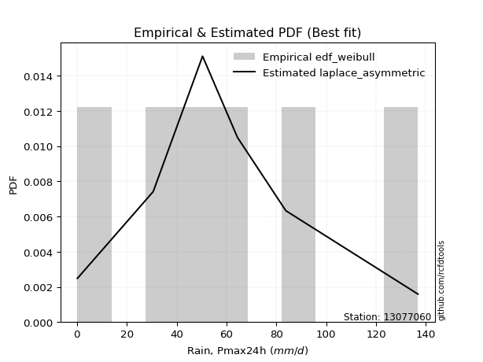</img>

</div>


### 4. EDF Beard (1943)

The Beard formula (or Beard´s plotting position formula) in hydrology is used to estimate the empirical non-exceedance probability _(P)_ of a flood event (or other extreme hydrological data point) within a given dataset.

<div align="center">


$P=(m-0.31)/(n+0.38)$


</div>


**4.1. Empirical values**

<div align="center">

|                | 0                   | 1                   | 2                   | 3         | 4                  | 5                  | 6                  |
|:---------------|:--------------------|:--------------------|:--------------------|:----------|:-------------------|:-------------------|:-------------------|
| date           | 2023                | 2022                | 2020                | 2025      | 2021               | 2024               | 2019               |
| x              | 0.2                 | 30.6                | 50.4                | 63.0      | 64.4               | 83.8               | 136.8              |
| m              | 1                   | 2                   | 3                   | 4         | 5                  | 6                  | 7                  |
| empirical_dist | edf_beard           | edf_beard           | edf_beard           | edf_beard | edf_beard          | edf_beard          | edf_beard          |
| empirical      | 0.09349593495934959 | 0.22899728997289973 | 0.36449864498644985 | 0.5       | 0.6355013550135502 | 0.7710027100271003 | 0.9065040650406505 |
| empirical_tr   | 1.1031390134529149  | 1.29701230228471    | 1.5735607675906182  | 2.0       | 2.743494423791822  | 4.366863905325444  | 10.695652173913055 |

</div>


**4.2. Kolmogorov-Smirnov fit test (sorted by Δ)**


<div align="center">

|                | 0                   | 1                   | 2                   | 3                   | 4                   | 5                   | 6                   | 7                   | 8                   | 9                   | 10                  | 11                  | 12                  | 13                  | 14                  | 15                  | 16                  | 17                  | 18                  | 19                  | 20                  | 21                  | 22                  | 23                  | 24                  | 25                  | 26                  | 27                  | 28                  | 29                  | 30                  | 31                  | 32                  | 33                  | 34                  | 35                  | 36                  | 37                  | 38                  | 39                  | 40                  | 41                  | 42                  | 43                  | 44                  | 45                  | 46                  | 47                  | 48                  | 49                  | 50                  | 51                  | 52                  | 53                  | 54                  | 55                  | 56                  | 57                  | 58                  | 59                  | 60                  | 61                  | 62                  | 63                  | 64                  | 65                  | 66                  | 67                  | 68                  | 69                  | 70                  | 71                  | 72                  | 73                  | 74                  | 75                  | 76                  | 77                  | 78                  | 79                  | 80                  | 81                  | 82                  | 83                  | 84                  | 85                  | 86                  | 87                  | 88                  | 89                  | 90                  | 91                  | 92                  | 93                  | 94                  | 95                  | 96                  | 97                  | 98                  | 99                  | 100                 | 101                 | 102                 | 103                 | 104                 | 105                 | 106                 | 107                 | 108                 | 109                 | 110                 | 111                 | 112                 | 113                 | 114                 | 115                 | 116                 | 117                 | 118                 | 119                 | 120                 | 121                 | 122                 | 123                 | 124                 | 125                 | 126                 | 127                 | 128                 | 129                 | 130                 | 131                 | 132                 | 133                 | 134                 | 135                 | 136                 | 137                 | 138                 | 139                 | 140                 | 141                 | 142                 | 143                 | 144                 | 145                 | 146                 | 147                 | 148                 | 149                 | 150                 | 151                 | 152                 | 153                 | 154                 | 155                 | 156                 | 157                 | 158                 | 159                 |
|:---------------|:--------------------|:--------------------|:--------------------|:--------------------|:--------------------|:--------------------|:--------------------|:--------------------|:--------------------|:--------------------|:--------------------|:--------------------|:--------------------|:--------------------|:--------------------|:--------------------|:--------------------|:--------------------|:--------------------|:--------------------|:--------------------|:--------------------|:--------------------|:--------------------|:--------------------|:--------------------|:--------------------|:--------------------|:--------------------|:--------------------|:--------------------|:--------------------|:--------------------|:--------------------|:--------------------|:--------------------|:--------------------|:--------------------|:--------------------|:--------------------|:--------------------|:--------------------|:--------------------|:--------------------|:--------------------|:--------------------|:--------------------|:--------------------|:--------------------|:--------------------|:--------------------|:--------------------|:--------------------|:--------------------|:--------------------|:--------------------|:--------------------|:--------------------|:--------------------|:--------------------|:--------------------|:--------------------|:--------------------|:--------------------|:--------------------|:--------------------|:--------------------|:--------------------|:--------------------|:--------------------|:--------------------|:--------------------|:--------------------|:--------------------|:--------------------|:--------------------|:--------------------|:--------------------|:--------------------|:--------------------|:--------------------|:--------------------|:--------------------|:--------------------|:--------------------|:--------------------|:--------------------|:--------------------|:--------------------|:--------------------|:--------------------|:--------------------|:--------------------|:--------------------|:--------------------|:--------------------|:--------------------|:--------------------|:--------------------|:--------------------|:--------------------|:--------------------|:--------------------|:--------------------|:--------------------|:--------------------|:--------------------|:--------------------|:--------------------|:--------------------|:--------------------|:--------------------|:--------------------|:--------------------|:--------------------|:--------------------|:--------------------|:--------------------|:--------------------|:--------------------|:--------------------|:--------------------|:--------------------|:--------------------|:--------------------|:--------------------|:--------------------|:--------------------|:--------------------|:--------------------|:--------------------|:--------------------|:--------------------|:--------------------|:--------------------|:--------------------|:--------------------|:--------------------|:--------------------|:--------------------|:--------------------|:--------------------|:--------------------|:--------------------|:--------------------|:--------------------|:--------------------|:--------------------|:--------------------|:--------------------|:--------------------|:--------------------|:--------------------|:--------------------|:--------------------|:--------------------|:--------------------|:--------------------|:--------------------|:--------------------|
| station        | 13077060            | 13077060            | 13077060            | 13077060            | 13077060            | 13077060            | 13077060            | 13077060            | 13077060            | 13077060            | 13077060            | 13077060            | 13077060            | 13077060            | 13077060            | 13077060            | 13077060            | 13077060            | 13077060            | 13077060            | 13077060            | 13077060            | 13077060            | 13077060            | 13077060            | 13077060            | 13077060            | 13077060            | 13077060            | 13077060            | 13077060            | 13077060            | 13077060            | 13077060            | 13077060            | 13077060            | 13077060            | 13077060            | 13077060            | 13077060            | 13077060            | 13077060            | 13077060            | 13077060            | 13077060            | 13077060            | 13077060            | 13077060            | 13077060            | 13077060            | 13077060            | 13077060            | 13077060            | 13077060            | 13077060            | 13077060            | 13077060            | 13077060            | 13077060            | 13077060            | 13077060            | 13077060            | 13077060            | 13077060            | 13077060            | 13077060            | 13077060            | 13077060            | 13077060            | 13077060            | 13077060            | 13077060            | 13077060            | 13077060            | 13077060            | 13077060            | 13077060            | 13077060            | 13077060            | 13077060            | 13077060            | 13077060            | 13077060            | 13077060            | 13077060            | 13077060            | 13077060            | 13077060            | 13077060            | 13077060            | 13077060            | 13077060            | 13077060            | 13077060            | 13077060            | 13077060            | 13077060            | 13077060            | 13077060            | 13077060            | 13077060            | 13077060            | 13077060            | 13077060            | 13077060            | 13077060            | 13077060            | 13077060            | 13077060            | 13077060            | 13077060            | 13077060            | 13077060            | 13077060            | 13077060            | 13077060            | 13077060            | 13077060            | 13077060            | 13077060            | 13077060            | 13077060            | 13077060            | 13077060            | 13077060            | 13077060            | 13077060            | 13077060            | 13077060            | 13077060            | 13077060            | 13077060            | 13077060            | 13077060            | 13077060            | 13077060            | 13077060            | 13077060            | 13077060            | 13077060            | 13077060            | 13077060            | 13077060            | 13077060            | 13077060            | 13077060            | 13077060            | 13077060            | 13077060            | 13077060            | 13077060            | 13077060            | 13077060            | 13077060            | 13077060            | 13077060            | 13077060            | 13077060            | 13077060            | 13077060            |
| empirical_dist | edf_beard           | edf_beard           | edf_beard           | edf_beard           | edf_beard           | edf_beard           | edf_beard           | edf_beard           | edf_beard           | edf_beard           | edf_beard           | edf_beard           | edf_beard           | edf_beard           | edf_beard           | edf_beard           | edf_beard           | edf_beard           | edf_beard           | edf_beard           | edf_beard           | edf_beard           | edf_beard           | edf_beard           | edf_beard           | edf_beard           | edf_beard           | edf_beard           | edf_beard           | edf_beard           | edf_beard           | edf_beard           | edf_beard           | edf_beard           | edf_beard           | edf_beard           | edf_beard           | edf_beard           | edf_beard           | edf_beard           | edf_beard           | edf_beard           | edf_beard           | edf_beard           | edf_beard           | edf_beard           | edf_beard           | edf_beard           | edf_beard           | edf_beard           | edf_beard           | edf_beard           | edf_beard           | edf_beard           | edf_beard           | edf_beard           | edf_beard           | edf_beard           | edf_beard           | edf_beard           | edf_beard           | edf_beard           | edf_beard           | edf_beard           | edf_beard           | edf_beard           | edf_beard           | edf_beard           | edf_beard           | edf_beard           | edf_beard           | edf_beard           | edf_beard           | edf_beard           | edf_beard           | edf_beard           | edf_beard           | edf_beard           | edf_beard           | edf_beard           | edf_beard           | edf_beard           | edf_beard           | edf_beard           | edf_beard           | edf_beard           | edf_beard           | edf_beard           | edf_beard           | edf_beard           | edf_beard           | edf_beard           | edf_beard           | edf_beard           | edf_beard           | edf_beard           | edf_beard           | edf_beard           | edf_beard           | edf_beard           | edf_beard           | edf_beard           | edf_beard           | edf_beard           | edf_beard           | edf_beard           | edf_beard           | edf_beard           | edf_beard           | edf_beard           | edf_beard           | edf_beard           | edf_beard           | edf_beard           | edf_beard           | edf_beard           | edf_beard           | edf_beard           | edf_beard           | edf_beard           | edf_beard           | edf_beard           | edf_beard           | edf_beard           | edf_beard           | edf_beard           | edf_beard           | edf_beard           | edf_beard           | edf_beard           | edf_beard           | edf_beard           | edf_beard           | edf_beard           | edf_beard           | edf_beard           | edf_beard           | edf_beard           | edf_beard           | edf_beard           | edf_beard           | edf_beard           | edf_beard           | edf_beard           | edf_beard           | edf_beard           | edf_beard           | edf_beard           | edf_beard           | edf_beard           | edf_beard           | edf_beard           | edf_beard           | edf_beard           | edf_beard           | edf_beard           | edf_beard           | edf_beard           | edf_beard           | edf_beard           |
| p_dist         | exponnorm           | genlogistic         | erlang              | gamma               | betaprime           | gengamma            | fatiguelife         | johnsonsu           | skewnorm            | maxwell             | genextreme          | rayleigh            | rice                | invgauss            | burr12              | weibull_min         | pearson3            | laplace             | foldnorm            | exponweib           | gumbel_r            | bradford            | hypsecant           | truncweibull_min    | kappa3              | kstwobign           | logistic            | t                   | crystalball         | norm                | logjohnsonsu        | halfnorm            | anglit              | semicircular        | moyal               | logt                | halflogistic        | gennorm             | loggenextreme       | cosine              | truncexpon          | dgamma              | loggennorm          | dweibull            | logdgamma           | mielke              | arcsine             | kappa4              | logvonmises_line    | logargus            | logpearson3         | wrapcauchy          | uniform             | logloggamma         | gumbel_l            | logdweibull         | ncf                 | loglevy_l           | vonmises_line       | ksone               | wald                | genexpon            | loggompertz         | gausshyper          | lomax               | beta                | genpareto           | argus               | loggumbel_l         | logburr12           | loggausshyper       | logtrapezoid        | logfoldnorm         | johnsonsb           | f                   | burr                | logarcsine          | logsemicircular     | loganglit           | lognakagami         | logexponnorm        | logcrystalball      | lognorm             | logrice             | loggamma            | loggamma            | lognct              | loglogistic         | logfatiguelife      | loghypsecant        | nct                 | logerlang           | logweibull_max      | levy_l              | halfgennorm         | loglaplace          | loglaplace          | loginvweibull       | loginvgamma         | loginvgauss         | genhalflogistic     | logmaxwell          | logjohnsonsb        | lograyleigh         | logalpha            | logskewnorm         | nakagami            | logkstwobign        | loggumbel_r         | loghalfnorm         | triang              | logloglaplace       | logwrapcauchy       | loggenexpon         | logcosine           | logmoyal            | loghalflogistic     | loggenhalflogistic  | invgamma            | logncf              | trapezoid           | logtriang           | loglomax            | loggenpareto        | loghalfgennorm      | logwald             | logkappa3           | logexponweib        | invweibull          | rdist               | logf                | logksone            | logkappa4           | logbeta             | logmielke           | logbradford         | tukeylambda         | logtruncweibull_min | logtruncnorm        | loguniform          | loggengamma         | powerlaw            | logburr             | logtruncexpon       | logweibull_min      | weibull_max         | truncpareto         | logbetaprime        | exponpow            | logexponpow         | logpowerlaw         | logtruncpareto      | alpha               | gompertz            | truncnorm           | loggenlogistic      | logtukeylambda      | logrdist            | logvonmises         | vonmises            |
| delta          | 0.06136427410389733 | 0.06274529728318223 | 0.06506625056677173 | 0.06506630048670603 | 0.06528591659762262 | 0.06717508191627453 | 0.06719627951045004 | 0.06825551718825384 | 0.07135235762519776 | 0.07294454348470703 | 0.07306892334075166 | 0.0731994786026195  | 0.07348206982463223 | 0.07598274969864699 | 0.07621116538651257 | 0.07659576567098686 | 0.07700152102843871 | 0.08341113903614095 | 0.08377235286333884 | 0.08709799416843472 | 0.08761950539134045 | 0.09349590313850953 | 0.09670117498920305 | 0.09771440689791011 | 0.09835157703166619 | 0.09887616961210371 | 0.10028443087923344 | 0.10445487244665552 | 0.10449760772060468 | 0.10449761520563317 | 0.10450173231741366 | 0.10812556311965171 | 0.10892153764921997 | 0.11074524169675959 | 0.1132707950561953  | 0.11412047368701073 | 0.12258498208498247 | 0.1245851361168665  | 0.13107393627839214 | 0.1319536205289682  | 0.13526963100463457 | 0.13550135501141702 | 0.13550135501283456 | 0.13550135501377947 | 0.1355013550942576  | 0.13621120134568804 | 0.13971884533171253 | 0.1438166993347687  | 0.14574091499356495 | 0.1474424499454256  | 0.16229981853693873 | 0.1654968523780514  | 0.16551599630198366 | 0.167146816670588   | 0.1732477066564766  | 0.17401500754056487 | 0.1741083021678232  | 0.1761947794017725  | 0.176764982644738   | 0.17766449626428915 | 0.18452963594556304 | 0.19615826232775296 | 0.20252170901262584 | 0.21358296305996827 | 0.21385136286331602 | 0.21434526984475    | 0.21496578462463023 | 0.21510711590960008 | 0.21671866732956577 | 0.22084462766970064 | 0.2417105140246625  | 0.24719509545676707 | 0.2538139824084039  | 0.2564178896122493  | 0.26602773178793865 | 0.2669397739924506  | 0.2797292402237348  | 0.283340021676574   | 0.28425111635387634 | 0.28639337093879647 | 0.28646124660635863 | 0.28646292258292216 | 0.28646293133668743 | 0.28650563003690044 | 0.2870575846653832  | 0.2870575846653832  | 0.28715864050896267 | 0.2885724281281845  | 0.2887839280276554  | 0.2903721118103241  | 0.293825361402113   | 0.2952956013185265  | 0.2953728832089129  | 0.2978898657274289  | 0.2989969265668869  | 0.2991982013369507  | 0.2991982013369507  | 0.3049887635637537  | 0.3074690785877333  | 0.30933698875036864 | 0.31185417878120403 | 0.3188303332859689  | 0.3191114590815929  | 0.32948953493193944 | 0.3313284554893591  | 0.3363247932516395  | 0.3468108018553263  | 0.3506403155408151  | 0.3571237592289278  | 0.35949773420968556 | 0.3611881127792742  | 0.3640595930067423  | 0.3654047302006106  | 0.3703703766773948  | 0.37182015236075516 | 0.3827987099466057  | 0.38531518758128536 | 0.3883819874414457  | 0.3972049090353752  | 0.404228633351403   | 0.4140635261791901  | 0.4211445550302909  | 0.4397370179922516  | 0.4402196970563276  | 0.4448255235046007  | 0.45413059935849687 | 0.45563137335877524 | 0.46381162064452675 | 0.46761047902975855 | 0.468704926743872   | 0.49437062145637545 | 0.49650188665482164 | 0.5183264693011638  | 0.5238990134644664  | 0.5303027452381215  | 0.5356804559452383  | 0.5358646502823373  | 0.5366281437871974  | 0.5401694051575209  | 0.5416017219803659  | 0.5586603633332183  | 0.572618296514615   | 0.5867506562055859  | 0.5972485183272749  | 0.6417796121846183  | 0.6471867179555548  | 0.6626131493811759  | 0.6794487591068558  | 0.70230727906605    | 0.7227802484317355  | 0.7249308263756357  | 0.7319116086633252  | 0.7574226181472722  | 0.7632419871532607  | 0.771002706227442   | 0.7710027100271003  | 0.7710027100271003  | 0.9065040650344452  | 1.0235889463034815  | 21.188492262869833  |
| deltao         | 0.48442053926100004 | 0.48442053926100004 | 0.48442053926100004 | 0.48442053926100004 | 0.48442053926100004 | 0.48442053926100004 | 0.48442053926100004 | 0.48442053926100004 | 0.48442053926100004 | 0.48442053926100004 | 0.48442053926100004 | 0.48442053926100004 | 0.48442053926100004 | 0.48442053926100004 | 0.48442053926100004 | 0.48442053926100004 | 0.48442053926100004 | 0.48442053926100004 | 0.48442053926100004 | 0.48442053926100004 | 0.48442053926100004 | 0.48442053926100004 | 0.48442053926100004 | 0.48442053926100004 | 0.48442053926100004 | 0.48442053926100004 | 0.48442053926100004 | 0.48442053926100004 | 0.48442053926100004 | 0.48442053926100004 | 0.48442053926100004 | 0.48442053926100004 | 0.48442053926100004 | 0.48442053926100004 | 0.48442053926100004 | 0.48442053926100004 | 0.48442053926100004 | 0.48442053926100004 | 0.48442053926100004 | 0.48442053926100004 | 0.48442053926100004 | 0.48442053926100004 | 0.48442053926100004 | 0.48442053926100004 | 0.48442053926100004 | 0.48442053926100004 | 0.48442053926100004 | 0.48442053926100004 | 0.48442053926100004 | 0.48442053926100004 | 0.48442053926100004 | 0.48442053926100004 | 0.48442053926100004 | 0.48442053926100004 | 0.48442053926100004 | 0.48442053926100004 | 0.48442053926100004 | 0.48442053926100004 | 0.48442053926100004 | 0.48442053926100004 | 0.48442053926100004 | 0.48442053926100004 | 0.48442053926100004 | 0.48442053926100004 | 0.48442053926100004 | 0.48442053926100004 | 0.48442053926100004 | 0.48442053926100004 | 0.48442053926100004 | 0.48442053926100004 | 0.48442053926100004 | 0.48442053926100004 | 0.48442053926100004 | 0.48442053926100004 | 0.48442053926100004 | 0.48442053926100004 | 0.48442053926100004 | 0.48442053926100004 | 0.48442053926100004 | 0.48442053926100004 | 0.48442053926100004 | 0.48442053926100004 | 0.48442053926100004 | 0.48442053926100004 | 0.48442053926100004 | 0.48442053926100004 | 0.48442053926100004 | 0.48442053926100004 | 0.48442053926100004 | 0.48442053926100004 | 0.48442053926100004 | 0.48442053926100004 | 0.48442053926100004 | 0.48442053926100004 | 0.48442053926100004 | 0.48442053926100004 | 0.48442053926100004 | 0.48442053926100004 | 0.48442053926100004 | 0.48442053926100004 | 0.48442053926100004 | 0.48442053926100004 | 0.48442053926100004 | 0.48442053926100004 | 0.48442053926100004 | 0.48442053926100004 | 0.48442053926100004 | 0.48442053926100004 | 0.48442053926100004 | 0.48442053926100004 | 0.48442053926100004 | 0.48442053926100004 | 0.48442053926100004 | 0.48442053926100004 | 0.48442053926100004 | 0.48442053926100004 | 0.48442053926100004 | 0.48442053926100004 | 0.48442053926100004 | 0.48442053926100004 | 0.48442053926100004 | 0.48442053926100004 | 0.48442053926100004 | 0.48442053926100004 | 0.48442053926100004 | 0.48442053926100004 | 0.48442053926100004 | 0.48442053926100004 | 0.48442053926100004 | 0.48442053926100004 | 0.48442053926100004 | 0.48442053926100004 | 0.48442053926100004 | 0.48442053926100004 | 0.48442053926100004 | 0.48442053926100004 | 0.48442053926100004 | 0.48442053926100004 | 0.48442053926100004 | 0.48442053926100004 | 0.48442053926100004 | 0.48442053926100004 | 0.48442053926100004 | 0.48442053926100004 | 0.48442053926100004 | 0.48442053926100004 | 0.48442053926100004 | 0.48442053926100004 | 0.48442053926100004 | 0.48442053926100004 | 0.48442053926100004 | 0.48442053926100004 | 0.48442053926100004 | 0.48442053926100004 | 0.48442053926100004 | 0.48442053926100004 | 0.48442053926100004 | 0.48442053926100004 | 0.48442053926100004 | 0.48442053926100004 |
| eval           | Δo > Δ              | Δo > Δ              | Δo > Δ              | Δo > Δ              | Δo > Δ              | Δo > Δ              | Δo > Δ              | Δo > Δ              | Δo > Δ              | Δo > Δ              | Δo > Δ              | Δo > Δ              | Δo > Δ              | Δo > Δ              | Δo > Δ              | Δo > Δ              | Δo > Δ              | Δo > Δ              | Δo > Δ              | Δo > Δ              | Δo > Δ              | Δo > Δ              | Δo > Δ              | Δo > Δ              | Δo > Δ              | Δo > Δ              | Δo > Δ              | Δo > Δ              | Δo > Δ              | Δo > Δ              | Δo > Δ              | Δo > Δ              | Δo > Δ              | Δo > Δ              | Δo > Δ              | Δo > Δ              | Δo > Δ              | Δo > Δ              | Δo > Δ              | Δo > Δ              | Δo > Δ              | Δo > Δ              | Δo > Δ              | Δo > Δ              | Δo > Δ              | Δo > Δ              | Δo > Δ              | Δo > Δ              | Δo > Δ              | Δo > Δ              | Δo > Δ              | Δo > Δ              | Δo > Δ              | Δo > Δ              | Δo > Δ              | Δo > Δ              | Δo > Δ              | Δo > Δ              | Δo > Δ              | Δo > Δ              | Δo > Δ              | Δo > Δ              | Δo > Δ              | Δo > Δ              | Δo > Δ              | Δo > Δ              | Δo > Δ              | Δo > Δ              | Δo > Δ              | Δo > Δ              | Δo > Δ              | Δo > Δ              | Δo > Δ              | Δo > Δ              | Δo > Δ              | Δo > Δ              | Δo > Δ              | Δo > Δ              | Δo > Δ              | Δo > Δ              | Δo > Δ              | Δo > Δ              | Δo > Δ              | Δo > Δ              | Δo > Δ              | Δo > Δ              | Δo > Δ              | Δo > Δ              | Δo > Δ              | Δo > Δ              | Δo > Δ              | Δo > Δ              | Δo > Δ              | Δo > Δ              | Δo > Δ              | Δo > Δ              | Δo > Δ              | Δo > Δ              | Δo > Δ              | Δo > Δ              | Δo > Δ              | Δo > Δ              | Δo > Δ              | Δo > Δ              | Δo > Δ              | Δo > Δ              | Δo > Δ              | Δo > Δ              | Δo > Δ              | Δo > Δ              | Δo > Δ              | Δo > Δ              | Δo > Δ              | Δo > Δ              | Δo > Δ              | Δo > Δ              | Δo > Δ              | Δo > Δ              | Δo > Δ              | Δo > Δ              | Δo > Δ              | Δo > Δ              | Δo > Δ              | Δo > Δ              | Δo > Δ              | Δo > Δ              | Δo > Δ              | Δo > Δ              | Δo > Δ              | Δo > Δ              | Δo <= Δ             | Δo <= Δ             | Δo <= Δ             | Δo <= Δ             | Δo <= Δ             | Δo <= Δ             | Δo <= Δ             | Δo <= Δ             | Δo <= Δ             | Δo <= Δ             | Δo <= Δ             | Δo <= Δ             | Δo <= Δ             | Δo <= Δ             | Δo <= Δ             | Δo <= Δ             | Δo <= Δ             | Δo <= Δ             | Δo <= Δ             | Δo <= Δ             | Δo <= Δ             | Δo <= Δ             | Δo <= Δ             | Δo <= Δ             | Δo <= Δ             | Δo <= Δ             | Δo <= Δ             | Δo <= Δ             | Δo <= Δ             | Δo <= Δ             |
| fit            | 1                   | 1                   | 1                   | 1                   | 1                   | 1                   | 1                   | 1                   | 1                   | 1                   | 1                   | 1                   | 1                   | 1                   | 1                   | 1                   | 1                   | 1                   | 1                   | 1                   | 1                   | 1                   | 1                   | 1                   | 1                   | 1                   | 1                   | 1                   | 1                   | 1                   | 1                   | 1                   | 1                   | 1                   | 1                   | 1                   | 1                   | 1                   | 1                   | 1                   | 1                   | 1                   | 1                   | 1                   | 1                   | 1                   | 1                   | 1                   | 1                   | 1                   | 1                   | 1                   | 1                   | 1                   | 1                   | 1                   | 1                   | 1                   | 1                   | 1                   | 1                   | 1                   | 1                   | 1                   | 1                   | 1                   | 1                   | 1                   | 1                   | 1                   | 1                   | 1                   | 1                   | 1                   | 1                   | 1                   | 1                   | 1                   | 1                   | 1                   | 1                   | 1                   | 1                   | 1                   | 1                   | 1                   | 1                   | 1                   | 1                   | 1                   | 1                   | 1                   | 1                   | 1                   | 1                   | 1                   | 1                   | 1                   | 1                   | 1                   | 1                   | 1                   | 1                   | 1                   | 1                   | 1                   | 1                   | 1                   | 1                   | 1                   | 1                   | 1                   | 1                   | 1                   | 1                   | 1                   | 1                   | 1                   | 1                   | 1                   | 1                   | 1                   | 1                   | 1                   | 1                   | 1                   | 1                   | 1                   | 1                   | 1                   | 0                   | 0                   | 0                   | 0                   | 0                   | 0                   | 0                   | 0                   | 0                   | 0                   | 0                   | 0                   | 0                   | 0                   | 0                   | 0                   | 0                   | 0                   | 0                   | 0                   | 0                   | 0                   | 0                   | 0                   | 0                   | 0                   | 0                   | 0                   | 0                   | 0                   |
| n              | 7                   | 7                   | 7                   | 7                   | 7                   | 7                   | 7                   | 7                   | 7                   | 7                   | 7                   | 7                   | 7                   | 7                   | 7                   | 7                   | 7                   | 7                   | 7                   | 7                   | 7                   | 7                   | 7                   | 7                   | 7                   | 7                   | 7                   | 7                   | 7                   | 7                   | 7                   | 7                   | 7                   | 7                   | 7                   | 7                   | 7                   | 7                   | 7                   | 7                   | 7                   | 7                   | 7                   | 7                   | 7                   | 7                   | 7                   | 7                   | 7                   | 7                   | 7                   | 7                   | 7                   | 7                   | 7                   | 7                   | 7                   | 7                   | 7                   | 7                   | 7                   | 7                   | 7                   | 7                   | 7                   | 7                   | 7                   | 7                   | 7                   | 7                   | 7                   | 7                   | 7                   | 7                   | 7                   | 7                   | 7                   | 7                   | 7                   | 7                   | 7                   | 7                   | 7                   | 7                   | 7                   | 7                   | 7                   | 7                   | 7                   | 7                   | 7                   | 7                   | 7                   | 7                   | 7                   | 7                   | 7                   | 7                   | 7                   | 7                   | 7                   | 7                   | 7                   | 7                   | 7                   | 7                   | 7                   | 7                   | 7                   | 7                   | 7                   | 7                   | 7                   | 7                   | 7                   | 7                   | 7                   | 7                   | 7                   | 7                   | 7                   | 7                   | 7                   | 7                   | 7                   | 7                   | 7                   | 7                   | 7                   | 7                   | 7                   | 7                   | 7                   | 7                   | 7                   | 7                   | 7                   | 7                   | 7                   | 7                   | 7                   | 7                   | 7                   | 7                   | 7                   | 7                   | 7                   | 7                   | 7                   | 7                   | 7                   | 7                   | 7                   | 7                   | 7                   | 7                   | 7                   | 7                   | 7                   | 7                   |
| best_fit       | 1                   | 0                   | 0                   | 0                   | 0                   | 0                   | 0                   | 0                   | 0                   | 0                   | 0                   | 0                   | 0                   | 0                   | 0                   | 0                   | 0                   | 0                   | 0                   | 0                   | 0                   | 0                   | 0                   | 0                   | 0                   | 0                   | 0                   | 0                   | 0                   | 0                   | 0                   | 0                   | 0                   | 0                   | 0                   | 0                   | 0                   | 0                   | 0                   | 0                   | 0                   | 0                   | 0                   | 0                   | 0                   | 0                   | 0                   | 0                   | 0                   | 0                   | 0                   | 0                   | 0                   | 0                   | 0                   | 0                   | 0                   | 0                   | 0                   | 0                   | 0                   | 0                   | 0                   | 0                   | 0                   | 0                   | 0                   | 0                   | 0                   | 0                   | 0                   | 0                   | 0                   | 0                   | 0                   | 0                   | 0                   | 0                   | 0                   | 0                   | 0                   | 0                   | 0                   | 0                   | 0                   | 0                   | 0                   | 0                   | 0                   | 0                   | 0                   | 0                   | 0                   | 0                   | 0                   | 0                   | 0                   | 0                   | 0                   | 0                   | 0                   | 0                   | 0                   | 0                   | 0                   | 0                   | 0                   | 0                   | 0                   | 0                   | 0                   | 0                   | 0                   | 0                   | 0                   | 0                   | 0                   | 0                   | 0                   | 0                   | 0                   | 0                   | 0                   | 0                   | 0                   | 0                   | 0                   | 0                   | 0                   | 0                   | 0                   | 0                   | 0                   | 0                   | 0                   | 0                   | 0                   | 0                   | 0                   | 0                   | 0                   | 0                   | 0                   | 0                   | 0                   | 0                   | 0                   | 0                   | 0                   | 0                   | 0                   | 0                   | 0                   | 0                   | 0                   | 0                   | 0                   | 0                   | 0                   | 0                   |
| best_fit_sort  | 1                   | 2                   | 3                   | 4                   | 5                   | 6                   | 7                   | 8                   | 9                   | 10                  | 11                  | 12                  | 13                  | 14                  | 15                  | 16                  | 17                  | 18                  | 19                  | 20                  | 21                  | 22                  | 23                  | 24                  | 25                  | 26                  | 27                  | 28                  | 29                  | 30                  | 31                  | 32                  | 33                  | 34                  | 35                  | 36                  | 37                  | 38                  | 39                  | 40                  | 41                  | 42                  | 43                  | 44                  | 45                  | 46                  | 47                  | 48                  | 49                  | 50                  | 51                  | 52                  | 53                  | 54                  | 55                  | 56                  | 57                  | 58                  | 59                  | 60                  | 61                  | 62                  | 63                  | 64                  | 65                  | 66                  | 67                  | 68                  | 69                  | 70                  | 71                  | 72                  | 73                  | 74                  | 75                  | 76                  | 77                  | 78                  | 79                  | 80                  | 81                  | 82                  | 83                  | 84                  | 85                  | 86                  | 87                  | 88                  | 89                  | 90                  | 91                  | 92                  | 93                  | 94                  | 95                  | 96                  | 97                  | 98                  | 99                  | 100                 | 101                 | 102                 | 103                 | 104                 | 105                 | 106                 | 107                 | 108                 | 109                 | 110                 | 111                 | 112                 | 113                 | 114                 | 115                 | 116                 | 117                 | 118                 | 119                 | 120                 | 121                 | 122                 | 123                 | 124                 | 125                 | 126                 | 127                 | 128                 | 129                 | 130                 | 131                 | 132                 | 133                 | 134                 | 135                 | 136                 | 137                 | 138                 | 139                 | 140                 | 141                 | 142                 | 143                 | 144                 | 145                 | 146                 | 147                 | 148                 | 149                 | 150                 | 151                 | 152                 | 153                 | 154                 | 155                 | 156                 | 157                 | 158                 | 159                 | 160                 |

</div>


**4.3. Best fit**

<div align="center">

|   id |   station | empirical_dist   | p_dist    |     delta |   deltao | eval   |   fit |   n |   best_fit |   best_fit_sort |
|-----:|----------:|:-----------------|:----------|----------:|---------:|:-------|------:|----:|-----------:|----------------:|
|    0 |  13077060 | edf_beard        | exponnorm | 0.0613643 | 0.484421 | Δo > Δ |     1 |   7 |          1 |               1 |

</div>


<div align="center">

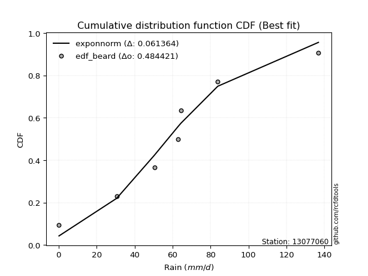</img>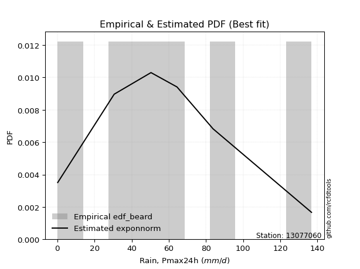</img>

</div>


### 5. EDF Chegodayev (1955)

The Chegodayev formula is an empirical plotting position formula used in hydrological frequency analysis to estimate the exceedance probability or return period of a specific event from a set of observed data. It is primarily used for plotting observed data points on probability paper to fit a theoretical distribution, particularly for analyzing extreme events like maximum flood flows or rainfall intensities. The constant _b_ value in the generalized plotting position formula is 0.3.

<div align="center">


$P=(m-b)/(n+1-2b)$


</div>


**5.1. Empirical values**

<div align="center">

|                | 0                   | 1                   | 2                   | 3              | 4                  | 5                  | 6                  |
|:---------------|:--------------------|:--------------------|:--------------------|:---------------|:-------------------|:-------------------|:-------------------|
| date           | 2023                | 2022                | 2020                | 2025           | 2021               | 2024               | 2019               |
| x              | 0.2                 | 30.6                | 50.4                | 63.0           | 64.4               | 83.8               | 136.8              |
| m              | 1                   | 2                   | 3                   | 4              | 5                  | 6                  | 7                  |
| empirical_dist | edf_chegodayev      | edf_chegodayev      | edf_chegodayev      | edf_chegodayev | edf_chegodayev     | edf_chegodayev     | edf_chegodayev     |
| empirical      | 0.09459459459459459 | 0.22972972972972971 | 0.36486486486486486 | 0.5            | 0.6351351351351351 | 0.7702702702702703 | 0.9054054054054054 |
| empirical_tr   | 1.1044776119402986  | 1.2982456140350878  | 1.574468085106383   | 2.0            | 2.7407407407407405 | 4.352941176470589  | 10.571428571428568 |

</div>


**5.2. Kolmogorov-Smirnov fit test (sorted by Δ)**


<div align="center">

|                | 0                   | 1                    | 2                   | 3                   | 4                   | 5                   | 6                   | 7                   | 8                   | 9                   | 10                  | 11                  | 12                  | 13                  | 14                  | 15                  | 16                  | 17                  | 18                  | 19                  | 20                  | 21                  | 22                  | 23                  | 24                  | 25                  | 26                  | 27                  | 28                  | 29                  | 30                  | 31                  | 32                  | 33                  | 34                  | 35                  | 36                  | 37                  | 38                  | 39                  | 40                  | 41                  | 42                  | 43                  | 44                  | 45                  | 46                  | 47                  | 48                  | 49                  | 50                  | 51                  | 52                  | 53                  | 54                  | 55                  | 56                  | 57                  | 58                  | 59                  | 60                  | 61                  | 62                  | 63                  | 64                  | 65                  | 66                  | 67                  | 68                  | 69                  | 70                  | 71                  | 72                  | 73                  | 74                  | 75                  | 76                  | 77                  | 78                  | 79                  | 80                  | 81                  | 82                  | 83                  | 84                  | 85                  | 86                  | 87                  | 88                  | 89                  | 90                  | 91                  | 92                  | 93                  | 94                  | 95                  | 96                  | 97                  | 98                  | 99                  | 100                 | 101                 | 102                 | 103                 | 104                 | 105                 | 106                 | 107                 | 108                 | 109                 | 110                 | 111                 | 112                 | 113                 | 114                 | 115                 | 116                 | 117                 | 118                 | 119                 | 120                 | 121                 | 122                 | 123                 | 124                 | 125                 | 126                 | 127                 | 128                 | 129                 | 130                 | 131                 | 132                 | 133                 | 134                 | 135                 | 136                 | 137                 | 138                 | 139                 | 140                 | 141                 | 142                 | 143                 | 144                 | 145                 | 146                 | 147                 | 148                 | 149                 | 150                 | 151                 | 152                 | 153                 | 154                 | 155                 | 156                 | 157                 | 158                 | 159                 |
|:---------------|:--------------------|:---------------------|:--------------------|:--------------------|:--------------------|:--------------------|:--------------------|:--------------------|:--------------------|:--------------------|:--------------------|:--------------------|:--------------------|:--------------------|:--------------------|:--------------------|:--------------------|:--------------------|:--------------------|:--------------------|:--------------------|:--------------------|:--------------------|:--------------------|:--------------------|:--------------------|:--------------------|:--------------------|:--------------------|:--------------------|:--------------------|:--------------------|:--------------------|:--------------------|:--------------------|:--------------------|:--------------------|:--------------------|:--------------------|:--------------------|:--------------------|:--------------------|:--------------------|:--------------------|:--------------------|:--------------------|:--------------------|:--------------------|:--------------------|:--------------------|:--------------------|:--------------------|:--------------------|:--------------------|:--------------------|:--------------------|:--------------------|:--------------------|:--------------------|:--------------------|:--------------------|:--------------------|:--------------------|:--------------------|:--------------------|:--------------------|:--------------------|:--------------------|:--------------------|:--------------------|:--------------------|:--------------------|:--------------------|:--------------------|:--------------------|:--------------------|:--------------------|:--------------------|:--------------------|:--------------------|:--------------------|:--------------------|:--------------------|:--------------------|:--------------------|:--------------------|:--------------------|:--------------------|:--------------------|:--------------------|:--------------------|:--------------------|:--------------------|:--------------------|:--------------------|:--------------------|:--------------------|:--------------------|:--------------------|:--------------------|:--------------------|:--------------------|:--------------------|:--------------------|:--------------------|:--------------------|:--------------------|:--------------------|:--------------------|:--------------------|:--------------------|:--------------------|:--------------------|:--------------------|:--------------------|:--------------------|:--------------------|:--------------------|:--------------------|:--------------------|:--------------------|:--------------------|:--------------------|:--------------------|:--------------------|:--------------------|:--------------------|:--------------------|:--------------------|:--------------------|:--------------------|:--------------------|:--------------------|:--------------------|:--------------------|:--------------------|:--------------------|:--------------------|:--------------------|:--------------------|:--------------------|:--------------------|:--------------------|:--------------------|:--------------------|:--------------------|:--------------------|:--------------------|:--------------------|:--------------------|:--------------------|:--------------------|:--------------------|:--------------------|:--------------------|:--------------------|:--------------------|:--------------------|:--------------------|:--------------------|
| station        | 13077060            | 13077060             | 13077060            | 13077060            | 13077060            | 13077060            | 13077060            | 13077060            | 13077060            | 13077060            | 13077060            | 13077060            | 13077060            | 13077060            | 13077060            | 13077060            | 13077060            | 13077060            | 13077060            | 13077060            | 13077060            | 13077060            | 13077060            | 13077060            | 13077060            | 13077060            | 13077060            | 13077060            | 13077060            | 13077060            | 13077060            | 13077060            | 13077060            | 13077060            | 13077060            | 13077060            | 13077060            | 13077060            | 13077060            | 13077060            | 13077060            | 13077060            | 13077060            | 13077060            | 13077060            | 13077060            | 13077060            | 13077060            | 13077060            | 13077060            | 13077060            | 13077060            | 13077060            | 13077060            | 13077060            | 13077060            | 13077060            | 13077060            | 13077060            | 13077060            | 13077060            | 13077060            | 13077060            | 13077060            | 13077060            | 13077060            | 13077060            | 13077060            | 13077060            | 13077060            | 13077060            | 13077060            | 13077060            | 13077060            | 13077060            | 13077060            | 13077060            | 13077060            | 13077060            | 13077060            | 13077060            | 13077060            | 13077060            | 13077060            | 13077060            | 13077060            | 13077060            | 13077060            | 13077060            | 13077060            | 13077060            | 13077060            | 13077060            | 13077060            | 13077060            | 13077060            | 13077060            | 13077060            | 13077060            | 13077060            | 13077060            | 13077060            | 13077060            | 13077060            | 13077060            | 13077060            | 13077060            | 13077060            | 13077060            | 13077060            | 13077060            | 13077060            | 13077060            | 13077060            | 13077060            | 13077060            | 13077060            | 13077060            | 13077060            | 13077060            | 13077060            | 13077060            | 13077060            | 13077060            | 13077060            | 13077060            | 13077060            | 13077060            | 13077060            | 13077060            | 13077060            | 13077060            | 13077060            | 13077060            | 13077060            | 13077060            | 13077060            | 13077060            | 13077060            | 13077060            | 13077060            | 13077060            | 13077060            | 13077060            | 13077060            | 13077060            | 13077060            | 13077060            | 13077060            | 13077060            | 13077060            | 13077060            | 13077060            | 13077060            | 13077060            | 13077060            | 13077060            | 13077060            | 13077060            | 13077060            |
| empirical_dist | edf_chegodayev      | edf_chegodayev       | edf_chegodayev      | edf_chegodayev      | edf_chegodayev      | edf_chegodayev      | edf_chegodayev      | edf_chegodayev      | edf_chegodayev      | edf_chegodayev      | edf_chegodayev      | edf_chegodayev      | edf_chegodayev      | edf_chegodayev      | edf_chegodayev      | edf_chegodayev      | edf_chegodayev      | edf_chegodayev      | edf_chegodayev      | edf_chegodayev      | edf_chegodayev      | edf_chegodayev      | edf_chegodayev      | edf_chegodayev      | edf_chegodayev      | edf_chegodayev      | edf_chegodayev      | edf_chegodayev      | edf_chegodayev      | edf_chegodayev      | edf_chegodayev      | edf_chegodayev      | edf_chegodayev      | edf_chegodayev      | edf_chegodayev      | edf_chegodayev      | edf_chegodayev      | edf_chegodayev      | edf_chegodayev      | edf_chegodayev      | edf_chegodayev      | edf_chegodayev      | edf_chegodayev      | edf_chegodayev      | edf_chegodayev      | edf_chegodayev      | edf_chegodayev      | edf_chegodayev      | edf_chegodayev      | edf_chegodayev      | edf_chegodayev      | edf_chegodayev      | edf_chegodayev      | edf_chegodayev      | edf_chegodayev      | edf_chegodayev      | edf_chegodayev      | edf_chegodayev      | edf_chegodayev      | edf_chegodayev      | edf_chegodayev      | edf_chegodayev      | edf_chegodayev      | edf_chegodayev      | edf_chegodayev      | edf_chegodayev      | edf_chegodayev      | edf_chegodayev      | edf_chegodayev      | edf_chegodayev      | edf_chegodayev      | edf_chegodayev      | edf_chegodayev      | edf_chegodayev      | edf_chegodayev      | edf_chegodayev      | edf_chegodayev      | edf_chegodayev      | edf_chegodayev      | edf_chegodayev      | edf_chegodayev      | edf_chegodayev      | edf_chegodayev      | edf_chegodayev      | edf_chegodayev      | edf_chegodayev      | edf_chegodayev      | edf_chegodayev      | edf_chegodayev      | edf_chegodayev      | edf_chegodayev      | edf_chegodayev      | edf_chegodayev      | edf_chegodayev      | edf_chegodayev      | edf_chegodayev      | edf_chegodayev      | edf_chegodayev      | edf_chegodayev      | edf_chegodayev      | edf_chegodayev      | edf_chegodayev      | edf_chegodayev      | edf_chegodayev      | edf_chegodayev      | edf_chegodayev      | edf_chegodayev      | edf_chegodayev      | edf_chegodayev      | edf_chegodayev      | edf_chegodayev      | edf_chegodayev      | edf_chegodayev      | edf_chegodayev      | edf_chegodayev      | edf_chegodayev      | edf_chegodayev      | edf_chegodayev      | edf_chegodayev      | edf_chegodayev      | edf_chegodayev      | edf_chegodayev      | edf_chegodayev      | edf_chegodayev      | edf_chegodayev      | edf_chegodayev      | edf_chegodayev      | edf_chegodayev      | edf_chegodayev      | edf_chegodayev      | edf_chegodayev      | edf_chegodayev      | edf_chegodayev      | edf_chegodayev      | edf_chegodayev      | edf_chegodayev      | edf_chegodayev      | edf_chegodayev      | edf_chegodayev      | edf_chegodayev      | edf_chegodayev      | edf_chegodayev      | edf_chegodayev      | edf_chegodayev      | edf_chegodayev      | edf_chegodayev      | edf_chegodayev      | edf_chegodayev      | edf_chegodayev      | edf_chegodayev      | edf_chegodayev      | edf_chegodayev      | edf_chegodayev      | edf_chegodayev      | edf_chegodayev      | edf_chegodayev      | edf_chegodayev      | edf_chegodayev      | edf_chegodayev      | edf_chegodayev      |
| p_dist         | exponnorm           | genlogistic          | erlang              | gamma               | betaprime           | gengamma            | fatiguelife         | johnsonsu           | skewnorm            | maxwell             | genextreme          | rayleigh            | rice                | invgauss            | burr12              | weibull_min         | pearson3            | laplace             | foldnorm            | exponweib           | gumbel_r            | bradford            | hypsecant           | truncweibull_min    | kappa3              | kstwobign           | logistic            | t                   | crystalball         | norm                | logjohnsonsu        | halfnorm            | anglit              | semicircular        | moyal               | logt                | halflogistic        | gennorm             | loggenextreme       | cosine              | truncexpon          | dgamma              | loggennorm          | dweibull            | logdgamma           | mielke              | arcsine             | kappa4              | logvonmises_line    | logargus            | logpearson3         | wrapcauchy          | uniform             | logloggamma         | gumbel_l            | logdweibull         | ncf                 | loglevy_l           | vonmises_line       | ksone               | wald                | genexpon            | loggompertz         | gausshyper          | lomax               | beta                | genpareto           | argus               | loggumbel_l         | logburr12           | loggausshyper       | logtrapezoid        | logfoldnorm         | johnsonsb           | f                   | burr                | logarcsine          | logsemicircular     | loganglit           | lognakagami         | logexponnorm        | logcrystalball      | lognorm             | logrice             | loggamma            | loggamma            | lognct              | loglogistic         | logfatiguelife      | loghypsecant        | nct                 | logerlang           | logweibull_max      | levy_l              | halfgennorm         | loglaplace          | loglaplace          | loginvweibull       | loginvgamma         | loginvgauss         | genhalflogistic     | logmaxwell          | logjohnsonsb        | lograyleigh         | logalpha            | logskewnorm         | nakagami            | logkstwobign        | loggumbel_r         | loghalfnorm         | triang              | logloglaplace       | logwrapcauchy       | loggenexpon         | logcosine           | logmoyal            | loghalflogistic     | loggenhalflogistic  | invgamma            | logncf              | trapezoid           | logtriang           | loglomax            | loggenpareto        | loghalfgennorm      | logwald             | logkappa3           | logexponweib        | invweibull          | rdist               | logf                | logksone            | logkappa4           | logbeta             | logmielke           | logbradford         | tukeylambda         | logtruncweibull_min | logtruncnorm        | loguniform          | loggengamma         | powerlaw            | logburr             | logtruncexpon       | logweibull_min      | weibull_max         | truncpareto         | logbetaprime        | exponpow            | logexponpow         | logpowerlaw         | logtruncpareto      | alpha               | gompertz            | truncnorm           | loggenlogistic      | logtukeylambda      | logrdist            | logvonmises         | vonmises            |
| delta          | 0.06099805422548221 | 0.062379077404767114 | 0.06470003068835661 | 0.06470008060829091 | 0.0649196967192075  | 0.0668088620378594  | 0.06683005963203492 | 0.06788929730983873 | 0.07098613774678264 | 0.0725783236062919  | 0.07270270346233654 | 0.07283325872420449 | 0.07311584994621712 | 0.07561652982023198 | 0.07584494550809756 | 0.07622954579257185 | 0.0766353011500236  | 0.08304491915772583 | 0.08340613298492372 | 0.08673177429001971 | 0.08761950539134045 | 0.09459456277375466 | 0.09633495511078793 | 0.09734818701949499 | 0.09798535715325118 | 0.0985099497336887  | 0.09991821100081832 | 0.1040886525682404  | 0.10413138784218956 | 0.10413139532721805 | 0.10523417207424368 | 0.1077593432412367  | 0.10855531777080485 | 0.11037902181834447 | 0.1132707950561953  | 0.1137542538085956  | 0.12221876220656747 | 0.12495135599528151 | 0.13034149652156213 | 0.13158740065055308 | 0.13490341112621956 | 0.1351351351330019  | 0.13513513513441944 | 0.13513513513536435 | 0.13513513521584247 | 0.13584498146727303 | 0.1389864055748825  | 0.1430842595779387  | 0.14537469511514994 | 0.1470762300670106  | 0.16156737878010874 | 0.16513063249963628 | 0.16514977642356854 | 0.166780596792173   | 0.17288148677806148 | 0.17291634790531973 | 0.17374208228940818 | 0.1754623396449425  | 0.17639876276632288 | 0.17693205650745913 | 0.18452963594556304 | 0.19579204244933796 | 0.20215548913421083 | 0.21321674318155315 | 0.213485142984901   | 0.21361283008791998 | 0.21436852407394869 | 0.21474089603118496 | 0.21598622757273578 | 0.22047840779128564 | 0.24097807426783252 | 0.24646265569993708 | 0.25308154265157395 | 0.25568544985541936 | 0.26566151190952364 | 0.26620733423562065 | 0.2789968004669048  | 0.282607581919744   | 0.2835186765970463  | 0.28566093118196645 | 0.2857288068495286  | 0.28573048282609215 | 0.2857304915798574  | 0.2857731902800704  | 0.2863251449085532  | 0.2863251449085532  | 0.28642620075213265 | 0.2878399883713545  | 0.2880514882708254  | 0.28963967205349406 | 0.293092921645283   | 0.2945631615616965  | 0.2946404434520829  | 0.29679120609218396 | 0.2982644868100569  | 0.2988319814585357  | 0.2988319814585357  | 0.3042563238069237  | 0.3067366388309033  | 0.3086045489935386  | 0.311121739024374   | 0.31809789352913886 | 0.31837901932476287 | 0.3287570951751094  | 0.33059601573252906 | 0.3359585733732245  | 0.3460783620984963  | 0.3499078757839851  | 0.3563913194720978  | 0.35876529445285554 | 0.3608218929008591  | 0.36332715324991227 | 0.3646722904437806  | 0.3696379369205648  | 0.37108771260392515 | 0.3820662701897757  | 0.38458274782445534 | 0.3876495476846157  | 0.3964724692785452  | 0.403496193594573   | 0.4133310864223601  | 0.4204121152734609  | 0.4390045782354216  | 0.43948725729949756 | 0.4440930837477707  | 0.45339815960166685 | 0.4548989336019452  | 0.4627129610092816  | 0.4665118193945134  | 0.46797248698704197 | 0.49363818169954543 | 0.49576944689799163 | 0.5175940295443338  | 0.5231665737076364  | 0.5295703054812915  | 0.5349480161884083  | 0.5351322105255073  | 0.5358957040303673  | 0.5394369654006909  | 0.5408692822235359  | 0.5579279235763883  | 0.571885856757785   | 0.5856519965703407  | 0.5965160785704449  | 0.6410471724277883  | 0.6464542781987248  | 0.6618807096243459  | 0.6787163193500257  | 0.7015748393092199  | 0.7220478086749055  | 0.7241983866188056  | 0.7311791689064951  | 0.7566901783904422  | 0.7625095473964307  | 0.770270266470612   | 0.7702702702702703  | 0.7702702702702703  | 0.9054054053992002  | 1.0246876059387264  | 21.189590922505076  |
| deltao         | 0.48442053926100004 | 0.48442053926100004  | 0.48442053926100004 | 0.48442053926100004 | 0.48442053926100004 | 0.48442053926100004 | 0.48442053926100004 | 0.48442053926100004 | 0.48442053926100004 | 0.48442053926100004 | 0.48442053926100004 | 0.48442053926100004 | 0.48442053926100004 | 0.48442053926100004 | 0.48442053926100004 | 0.48442053926100004 | 0.48442053926100004 | 0.48442053926100004 | 0.48442053926100004 | 0.48442053926100004 | 0.48442053926100004 | 0.48442053926100004 | 0.48442053926100004 | 0.48442053926100004 | 0.48442053926100004 | 0.48442053926100004 | 0.48442053926100004 | 0.48442053926100004 | 0.48442053926100004 | 0.48442053926100004 | 0.48442053926100004 | 0.48442053926100004 | 0.48442053926100004 | 0.48442053926100004 | 0.48442053926100004 | 0.48442053926100004 | 0.48442053926100004 | 0.48442053926100004 | 0.48442053926100004 | 0.48442053926100004 | 0.48442053926100004 | 0.48442053926100004 | 0.48442053926100004 | 0.48442053926100004 | 0.48442053926100004 | 0.48442053926100004 | 0.48442053926100004 | 0.48442053926100004 | 0.48442053926100004 | 0.48442053926100004 | 0.48442053926100004 | 0.48442053926100004 | 0.48442053926100004 | 0.48442053926100004 | 0.48442053926100004 | 0.48442053926100004 | 0.48442053926100004 | 0.48442053926100004 | 0.48442053926100004 | 0.48442053926100004 | 0.48442053926100004 | 0.48442053926100004 | 0.48442053926100004 | 0.48442053926100004 | 0.48442053926100004 | 0.48442053926100004 | 0.48442053926100004 | 0.48442053926100004 | 0.48442053926100004 | 0.48442053926100004 | 0.48442053926100004 | 0.48442053926100004 | 0.48442053926100004 | 0.48442053926100004 | 0.48442053926100004 | 0.48442053926100004 | 0.48442053926100004 | 0.48442053926100004 | 0.48442053926100004 | 0.48442053926100004 | 0.48442053926100004 | 0.48442053926100004 | 0.48442053926100004 | 0.48442053926100004 | 0.48442053926100004 | 0.48442053926100004 | 0.48442053926100004 | 0.48442053926100004 | 0.48442053926100004 | 0.48442053926100004 | 0.48442053926100004 | 0.48442053926100004 | 0.48442053926100004 | 0.48442053926100004 | 0.48442053926100004 | 0.48442053926100004 | 0.48442053926100004 | 0.48442053926100004 | 0.48442053926100004 | 0.48442053926100004 | 0.48442053926100004 | 0.48442053926100004 | 0.48442053926100004 | 0.48442053926100004 | 0.48442053926100004 | 0.48442053926100004 | 0.48442053926100004 | 0.48442053926100004 | 0.48442053926100004 | 0.48442053926100004 | 0.48442053926100004 | 0.48442053926100004 | 0.48442053926100004 | 0.48442053926100004 | 0.48442053926100004 | 0.48442053926100004 | 0.48442053926100004 | 0.48442053926100004 | 0.48442053926100004 | 0.48442053926100004 | 0.48442053926100004 | 0.48442053926100004 | 0.48442053926100004 | 0.48442053926100004 | 0.48442053926100004 | 0.48442053926100004 | 0.48442053926100004 | 0.48442053926100004 | 0.48442053926100004 | 0.48442053926100004 | 0.48442053926100004 | 0.48442053926100004 | 0.48442053926100004 | 0.48442053926100004 | 0.48442053926100004 | 0.48442053926100004 | 0.48442053926100004 | 0.48442053926100004 | 0.48442053926100004 | 0.48442053926100004 | 0.48442053926100004 | 0.48442053926100004 | 0.48442053926100004 | 0.48442053926100004 | 0.48442053926100004 | 0.48442053926100004 | 0.48442053926100004 | 0.48442053926100004 | 0.48442053926100004 | 0.48442053926100004 | 0.48442053926100004 | 0.48442053926100004 | 0.48442053926100004 | 0.48442053926100004 | 0.48442053926100004 | 0.48442053926100004 | 0.48442053926100004 | 0.48442053926100004 | 0.48442053926100004 | 0.48442053926100004 |
| eval           | Δo > Δ              | Δo > Δ               | Δo > Δ              | Δo > Δ              | Δo > Δ              | Δo > Δ              | Δo > Δ              | Δo > Δ              | Δo > Δ              | Δo > Δ              | Δo > Δ              | Δo > Δ              | Δo > Δ              | Δo > Δ              | Δo > Δ              | Δo > Δ              | Δo > Δ              | Δo > Δ              | Δo > Δ              | Δo > Δ              | Δo > Δ              | Δo > Δ              | Δo > Δ              | Δo > Δ              | Δo > Δ              | Δo > Δ              | Δo > Δ              | Δo > Δ              | Δo > Δ              | Δo > Δ              | Δo > Δ              | Δo > Δ              | Δo > Δ              | Δo > Δ              | Δo > Δ              | Δo > Δ              | Δo > Δ              | Δo > Δ              | Δo > Δ              | Δo > Δ              | Δo > Δ              | Δo > Δ              | Δo > Δ              | Δo > Δ              | Δo > Δ              | Δo > Δ              | Δo > Δ              | Δo > Δ              | Δo > Δ              | Δo > Δ              | Δo > Δ              | Δo > Δ              | Δo > Δ              | Δo > Δ              | Δo > Δ              | Δo > Δ              | Δo > Δ              | Δo > Δ              | Δo > Δ              | Δo > Δ              | Δo > Δ              | Δo > Δ              | Δo > Δ              | Δo > Δ              | Δo > Δ              | Δo > Δ              | Δo > Δ              | Δo > Δ              | Δo > Δ              | Δo > Δ              | Δo > Δ              | Δo > Δ              | Δo > Δ              | Δo > Δ              | Δo > Δ              | Δo > Δ              | Δo > Δ              | Δo > Δ              | Δo > Δ              | Δo > Δ              | Δo > Δ              | Δo > Δ              | Δo > Δ              | Δo > Δ              | Δo > Δ              | Δo > Δ              | Δo > Δ              | Δo > Δ              | Δo > Δ              | Δo > Δ              | Δo > Δ              | Δo > Δ              | Δo > Δ              | Δo > Δ              | Δo > Δ              | Δo > Δ              | Δo > Δ              | Δo > Δ              | Δo > Δ              | Δo > Δ              | Δo > Δ              | Δo > Δ              | Δo > Δ              | Δo > Δ              | Δo > Δ              | Δo > Δ              | Δo > Δ              | Δo > Δ              | Δo > Δ              | Δo > Δ              | Δo > Δ              | Δo > Δ              | Δo > Δ              | Δo > Δ              | Δo > Δ              | Δo > Δ              | Δo > Δ              | Δo > Δ              | Δo > Δ              | Δo > Δ              | Δo > Δ              | Δo > Δ              | Δo > Δ              | Δo > Δ              | Δo > Δ              | Δo > Δ              | Δo > Δ              | Δo > Δ              | Δo > Δ              | Δo > Δ              | Δo <= Δ             | Δo <= Δ             | Δo <= Δ             | Δo <= Δ             | Δo <= Δ             | Δo <= Δ             | Δo <= Δ             | Δo <= Δ             | Δo <= Δ             | Δo <= Δ             | Δo <= Δ             | Δo <= Δ             | Δo <= Δ             | Δo <= Δ             | Δo <= Δ             | Δo <= Δ             | Δo <= Δ             | Δo <= Δ             | Δo <= Δ             | Δo <= Δ             | Δo <= Δ             | Δo <= Δ             | Δo <= Δ             | Δo <= Δ             | Δo <= Δ             | Δo <= Δ             | Δo <= Δ             | Δo <= Δ             | Δo <= Δ             | Δo <= Δ             |
| fit            | 1                   | 1                    | 1                   | 1                   | 1                   | 1                   | 1                   | 1                   | 1                   | 1                   | 1                   | 1                   | 1                   | 1                   | 1                   | 1                   | 1                   | 1                   | 1                   | 1                   | 1                   | 1                   | 1                   | 1                   | 1                   | 1                   | 1                   | 1                   | 1                   | 1                   | 1                   | 1                   | 1                   | 1                   | 1                   | 1                   | 1                   | 1                   | 1                   | 1                   | 1                   | 1                   | 1                   | 1                   | 1                   | 1                   | 1                   | 1                   | 1                   | 1                   | 1                   | 1                   | 1                   | 1                   | 1                   | 1                   | 1                   | 1                   | 1                   | 1                   | 1                   | 1                   | 1                   | 1                   | 1                   | 1                   | 1                   | 1                   | 1                   | 1                   | 1                   | 1                   | 1                   | 1                   | 1                   | 1                   | 1                   | 1                   | 1                   | 1                   | 1                   | 1                   | 1                   | 1                   | 1                   | 1                   | 1                   | 1                   | 1                   | 1                   | 1                   | 1                   | 1                   | 1                   | 1                   | 1                   | 1                   | 1                   | 1                   | 1                   | 1                   | 1                   | 1                   | 1                   | 1                   | 1                   | 1                   | 1                   | 1                   | 1                   | 1                   | 1                   | 1                   | 1                   | 1                   | 1                   | 1                   | 1                   | 1                   | 1                   | 1                   | 1                   | 1                   | 1                   | 1                   | 1                   | 1                   | 1                   | 1                   | 1                   | 0                   | 0                   | 0                   | 0                   | 0                   | 0                   | 0                   | 0                   | 0                   | 0                   | 0                   | 0                   | 0                   | 0                   | 0                   | 0                   | 0                   | 0                   | 0                   | 0                   | 0                   | 0                   | 0                   | 0                   | 0                   | 0                   | 0                   | 0                   | 0                   | 0                   |
| n              | 7                   | 7                    | 7                   | 7                   | 7                   | 7                   | 7                   | 7                   | 7                   | 7                   | 7                   | 7                   | 7                   | 7                   | 7                   | 7                   | 7                   | 7                   | 7                   | 7                   | 7                   | 7                   | 7                   | 7                   | 7                   | 7                   | 7                   | 7                   | 7                   | 7                   | 7                   | 7                   | 7                   | 7                   | 7                   | 7                   | 7                   | 7                   | 7                   | 7                   | 7                   | 7                   | 7                   | 7                   | 7                   | 7                   | 7                   | 7                   | 7                   | 7                   | 7                   | 7                   | 7                   | 7                   | 7                   | 7                   | 7                   | 7                   | 7                   | 7                   | 7                   | 7                   | 7                   | 7                   | 7                   | 7                   | 7                   | 7                   | 7                   | 7                   | 7                   | 7                   | 7                   | 7                   | 7                   | 7                   | 7                   | 7                   | 7                   | 7                   | 7                   | 7                   | 7                   | 7                   | 7                   | 7                   | 7                   | 7                   | 7                   | 7                   | 7                   | 7                   | 7                   | 7                   | 7                   | 7                   | 7                   | 7                   | 7                   | 7                   | 7                   | 7                   | 7                   | 7                   | 7                   | 7                   | 7                   | 7                   | 7                   | 7                   | 7                   | 7                   | 7                   | 7                   | 7                   | 7                   | 7                   | 7                   | 7                   | 7                   | 7                   | 7                   | 7                   | 7                   | 7                   | 7                   | 7                   | 7                   | 7                   | 7                   | 7                   | 7                   | 7                   | 7                   | 7                   | 7                   | 7                   | 7                   | 7                   | 7                   | 7                   | 7                   | 7                   | 7                   | 7                   | 7                   | 7                   | 7                   | 7                   | 7                   | 7                   | 7                   | 7                   | 7                   | 7                   | 7                   | 7                   | 7                   | 7                   | 7                   |
| best_fit       | 1                   | 0                    | 0                   | 0                   | 0                   | 0                   | 0                   | 0                   | 0                   | 0                   | 0                   | 0                   | 0                   | 0                   | 0                   | 0                   | 0                   | 0                   | 0                   | 0                   | 0                   | 0                   | 0                   | 0                   | 0                   | 0                   | 0                   | 0                   | 0                   | 0                   | 0                   | 0                   | 0                   | 0                   | 0                   | 0                   | 0                   | 0                   | 0                   | 0                   | 0                   | 0                   | 0                   | 0                   | 0                   | 0                   | 0                   | 0                   | 0                   | 0                   | 0                   | 0                   | 0                   | 0                   | 0                   | 0                   | 0                   | 0                   | 0                   | 0                   | 0                   | 0                   | 0                   | 0                   | 0                   | 0                   | 0                   | 0                   | 0                   | 0                   | 0                   | 0                   | 0                   | 0                   | 0                   | 0                   | 0                   | 0                   | 0                   | 0                   | 0                   | 0                   | 0                   | 0                   | 0                   | 0                   | 0                   | 0                   | 0                   | 0                   | 0                   | 0                   | 0                   | 0                   | 0                   | 0                   | 0                   | 0                   | 0                   | 0                   | 0                   | 0                   | 0                   | 0                   | 0                   | 0                   | 0                   | 0                   | 0                   | 0                   | 0                   | 0                   | 0                   | 0                   | 0                   | 0                   | 0                   | 0                   | 0                   | 0                   | 0                   | 0                   | 0                   | 0                   | 0                   | 0                   | 0                   | 0                   | 0                   | 0                   | 0                   | 0                   | 0                   | 0                   | 0                   | 0                   | 0                   | 0                   | 0                   | 0                   | 0                   | 0                   | 0                   | 0                   | 0                   | 0                   | 0                   | 0                   | 0                   | 0                   | 0                   | 0                   | 0                   | 0                   | 0                   | 0                   | 0                   | 0                   | 0                   | 0                   |
| best_fit_sort  | 1                   | 2                    | 3                   | 4                   | 5                   | 6                   | 7                   | 8                   | 9                   | 10                  | 11                  | 12                  | 13                  | 14                  | 15                  | 16                  | 17                  | 18                  | 19                  | 20                  | 21                  | 22                  | 23                  | 24                  | 25                  | 26                  | 27                  | 28                  | 29                  | 30                  | 31                  | 32                  | 33                  | 34                  | 35                  | 36                  | 37                  | 38                  | 39                  | 40                  | 41                  | 42                  | 43                  | 44                  | 45                  | 46                  | 47                  | 48                  | 49                  | 50                  | 51                  | 52                  | 53                  | 54                  | 55                  | 56                  | 57                  | 58                  | 59                  | 60                  | 61                  | 62                  | 63                  | 64                  | 65                  | 66                  | 67                  | 68                  | 69                  | 70                  | 71                  | 72                  | 73                  | 74                  | 75                  | 76                  | 77                  | 78                  | 79                  | 80                  | 81                  | 82                  | 83                  | 84                  | 85                  | 86                  | 87                  | 88                  | 89                  | 90                  | 91                  | 92                  | 93                  | 94                  | 95                  | 96                  | 97                  | 98                  | 99                  | 100                 | 101                 | 102                 | 103                 | 104                 | 105                 | 106                 | 107                 | 108                 | 109                 | 110                 | 111                 | 112                 | 113                 | 114                 | 115                 | 116                 | 117                 | 118                 | 119                 | 120                 | 121                 | 122                 | 123                 | 124                 | 125                 | 126                 | 127                 | 128                 | 129                 | 130                 | 131                 | 132                 | 133                 | 134                 | 135                 | 136                 | 137                 | 138                 | 139                 | 140                 | 141                 | 142                 | 143                 | 144                 | 145                 | 146                 | 147                 | 148                 | 149                 | 150                 | 151                 | 152                 | 153                 | 154                 | 155                 | 156                 | 157                 | 158                 | 159                 | 160                 |

</div>


**5.3. Best fit**

<div align="center">

|   id |   station | empirical_dist   | p_dist    |     delta |   deltao | eval   |   fit |   n |   best_fit |   best_fit_sort |
|-----:|----------:|:-----------------|:----------|----------:|---------:|:-------|------:|----:|-----------:|----------------:|
|    0 |  13077060 | edf_chegodayev   | exponnorm | 0.0609981 | 0.484421 | Δo > Δ |     1 |   7 |          1 |               1 |

</div>


<div align="center">

</img>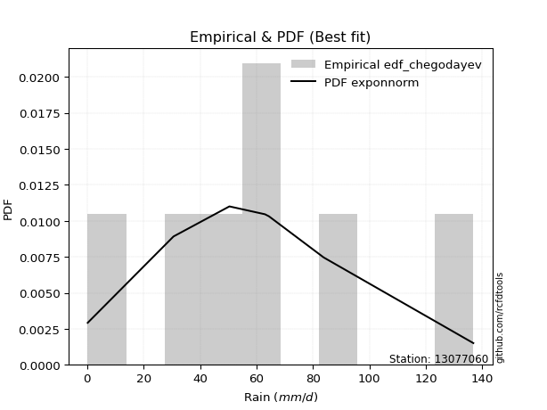</img>

</div>


### 6. EDF Blom (1958)

The Blom formula is a specific "plotting position" formula used in hydrology and statistical analysis to estimate the empirical cumulative probability (or non-exceedance probability) of a data series. It is particularly recommended for data that are approximately normally distributed. The constant _a_ is set to 0.375 (or 3/8).

<div align="center">


$P=(m-a)/(n+1-2a)$


</div>


**6.1. Empirical values**

<div align="center">

|                | 0                   | 1                   | 2                  | 3        | 4                  | 5                  | 6                  |
|:---------------|:--------------------|:--------------------|:-------------------|:---------|:-------------------|:-------------------|:-------------------|
| date           | 2023                | 2022                | 2020               | 2025     | 2021               | 2024               | 2019               |
| x              | 0.2                 | 30.6                | 50.4               | 63.0     | 64.4               | 83.8               | 136.8              |
| m              | 1                   | 2                   | 3                  | 4        | 5                  | 6                  | 7                  |
| empirical_dist | edf_blom            | edf_blom            | edf_blom           | edf_blom | edf_blom           | edf_blom           | edf_blom           |
| empirical      | 0.08620689655172414 | 0.22413793103448276 | 0.3620689655172414 | 0.5      | 0.6379310344827587 | 0.7758620689655172 | 0.9137931034482759 |
| empirical_tr   | 1.0943396226415094  | 1.288888888888889   | 1.5675675675675675 | 2.0      | 2.7619047619047623 | 4.461538461538462  | 11.600000000000007 |

</div>


**6.2. Kolmogorov-Smirnov fit test (sorted by Δ)**


<div align="center">

|                | 0                   | 1                   | 2                   | 3                   | 4                   | 5                   | 6                   | 7                   | 8                   | 9                   | 10                  | 11                  | 12                  | 13                  | 14                  | 15                  | 16                  | 17                  | 18                  | 19                  | 20                  | 21                  | 22                  | 23                  | 24                  | 25                  | 26                  | 27                  | 28                  | 29                  | 30                  | 31                  | 32                  | 33                  | 34                  | 35                  | 36                  | 37                  | 38                  | 39                  | 40                  | 41                  | 42                  | 43                  | 44                  | 45                  | 46                  | 47                  | 48                  | 49                  | 50                  | 51                  | 52                  | 53                  | 54                  | 55                  | 56                  | 57                  | 58                  | 59                  | 60                  | 61                  | 62                  | 63                  | 64                  | 65                  | 66                  | 67                  | 68                  | 69                  | 70                  | 71                  | 72                  | 73                  | 74                  | 75                  | 76                  | 77                  | 78                  | 79                  | 80                  | 81                  | 82                  | 83                  | 84                  | 85                  | 86                  | 87                  | 88                  | 89                  | 90                  | 91                  | 92                  | 93                  | 94                  | 95                  | 96                  | 97                  | 98                  | 99                  | 100                 | 101                 | 102                 | 103                 | 104                 | 105                 | 106                 | 107                 | 108                 | 109                 | 110                 | 111                 | 112                 | 113                 | 114                 | 115                 | 116                 | 117                 | 118                 | 119                 | 120                 | 121                 | 122                 | 123                 | 124                 | 125                 | 126                 | 127                 | 128                 | 129                 | 130                 | 131                 | 132                 | 133                 | 134                 | 135                 | 136                 | 137                 | 138                 | 139                 | 140                 | 141                 | 142                 | 143                 | 144                 | 145                 | 146                 | 147                 | 148                 | 149                 | 150                 | 151                 | 152                 | 153                 | 154                 | 155                 | 156                 | 157                 | 158                 | 159                 |
|:---------------|:--------------------|:--------------------|:--------------------|:--------------------|:--------------------|:--------------------|:--------------------|:--------------------|:--------------------|:--------------------|:--------------------|:--------------------|:--------------------|:--------------------|:--------------------|:--------------------|:--------------------|:--------------------|:--------------------|:--------------------|:--------------------|:--------------------|:--------------------|:--------------------|:--------------------|:--------------------|:--------------------|:--------------------|:--------------------|:--------------------|:--------------------|:--------------------|:--------------------|:--------------------|:--------------------|:--------------------|:--------------------|:--------------------|:--------------------|:--------------------|:--------------------|:--------------------|:--------------------|:--------------------|:--------------------|:--------------------|:--------------------|:--------------------|:--------------------|:--------------------|:--------------------|:--------------------|:--------------------|:--------------------|:--------------------|:--------------------|:--------------------|:--------------------|:--------------------|:--------------------|:--------------------|:--------------------|:--------------------|:--------------------|:--------------------|:--------------------|:--------------------|:--------------------|:--------------------|:--------------------|:--------------------|:--------------------|:--------------------|:--------------------|:--------------------|:--------------------|:--------------------|:--------------------|:--------------------|:--------------------|:--------------------|:--------------------|:--------------------|:--------------------|:--------------------|:--------------------|:--------------------|:--------------------|:--------------------|:--------------------|:--------------------|:--------------------|:--------------------|:--------------------|:--------------------|:--------------------|:--------------------|:--------------------|:--------------------|:--------------------|:--------------------|:--------------------|:--------------------|:--------------------|:--------------------|:--------------------|:--------------------|:--------------------|:--------------------|:--------------------|:--------------------|:--------------------|:--------------------|:--------------------|:--------------------|:--------------------|:--------------------|:--------------------|:--------------------|:--------------------|:--------------------|:--------------------|:--------------------|:--------------------|:--------------------|:--------------------|:--------------------|:--------------------|:--------------------|:--------------------|:--------------------|:--------------------|:--------------------|:--------------------|:--------------------|:--------------------|:--------------------|:--------------------|:--------------------|:--------------------|:--------------------|:--------------------|:--------------------|:--------------------|:--------------------|:--------------------|:--------------------|:--------------------|:--------------------|:--------------------|:--------------------|:--------------------|:--------------------|:--------------------|:--------------------|:--------------------|:--------------------|:--------------------|:--------------------|:--------------------|
| station        | 13077060            | 13077060            | 13077060            | 13077060            | 13077060            | 13077060            | 13077060            | 13077060            | 13077060            | 13077060            | 13077060            | 13077060            | 13077060            | 13077060            | 13077060            | 13077060            | 13077060            | 13077060            | 13077060            | 13077060            | 13077060            | 13077060            | 13077060            | 13077060            | 13077060            | 13077060            | 13077060            | 13077060            | 13077060            | 13077060            | 13077060            | 13077060            | 13077060            | 13077060            | 13077060            | 13077060            | 13077060            | 13077060            | 13077060            | 13077060            | 13077060            | 13077060            | 13077060            | 13077060            | 13077060            | 13077060            | 13077060            | 13077060            | 13077060            | 13077060            | 13077060            | 13077060            | 13077060            | 13077060            | 13077060            | 13077060            | 13077060            | 13077060            | 13077060            | 13077060            | 13077060            | 13077060            | 13077060            | 13077060            | 13077060            | 13077060            | 13077060            | 13077060            | 13077060            | 13077060            | 13077060            | 13077060            | 13077060            | 13077060            | 13077060            | 13077060            | 13077060            | 13077060            | 13077060            | 13077060            | 13077060            | 13077060            | 13077060            | 13077060            | 13077060            | 13077060            | 13077060            | 13077060            | 13077060            | 13077060            | 13077060            | 13077060            | 13077060            | 13077060            | 13077060            | 13077060            | 13077060            | 13077060            | 13077060            | 13077060            | 13077060            | 13077060            | 13077060            | 13077060            | 13077060            | 13077060            | 13077060            | 13077060            | 13077060            | 13077060            | 13077060            | 13077060            | 13077060            | 13077060            | 13077060            | 13077060            | 13077060            | 13077060            | 13077060            | 13077060            | 13077060            | 13077060            | 13077060            | 13077060            | 13077060            | 13077060            | 13077060            | 13077060            | 13077060            | 13077060            | 13077060            | 13077060            | 13077060            | 13077060            | 13077060            | 13077060            | 13077060            | 13077060            | 13077060            | 13077060            | 13077060            | 13077060            | 13077060            | 13077060            | 13077060            | 13077060            | 13077060            | 13077060            | 13077060            | 13077060            | 13077060            | 13077060            | 13077060            | 13077060            | 13077060            | 13077060            | 13077060            | 13077060            | 13077060            | 13077060            |
| empirical_dist | edf_blom            | edf_blom            | edf_blom            | edf_blom            | edf_blom            | edf_blom            | edf_blom            | edf_blom            | edf_blom            | edf_blom            | edf_blom            | edf_blom            | edf_blom            | edf_blom            | edf_blom            | edf_blom            | edf_blom            | edf_blom            | edf_blom            | edf_blom            | edf_blom            | edf_blom            | edf_blom            | edf_blom            | edf_blom            | edf_blom            | edf_blom            | edf_blom            | edf_blom            | edf_blom            | edf_blom            | edf_blom            | edf_blom            | edf_blom            | edf_blom            | edf_blom            | edf_blom            | edf_blom            | edf_blom            | edf_blom            | edf_blom            | edf_blom            | edf_blom            | edf_blom            | edf_blom            | edf_blom            | edf_blom            | edf_blom            | edf_blom            | edf_blom            | edf_blom            | edf_blom            | edf_blom            | edf_blom            | edf_blom            | edf_blom            | edf_blom            | edf_blom            | edf_blom            | edf_blom            | edf_blom            | edf_blom            | edf_blom            | edf_blom            | edf_blom            | edf_blom            | edf_blom            | edf_blom            | edf_blom            | edf_blom            | edf_blom            | edf_blom            | edf_blom            | edf_blom            | edf_blom            | edf_blom            | edf_blom            | edf_blom            | edf_blom            | edf_blom            | edf_blom            | edf_blom            | edf_blom            | edf_blom            | edf_blom            | edf_blom            | edf_blom            | edf_blom            | edf_blom            | edf_blom            | edf_blom            | edf_blom            | edf_blom            | edf_blom            | edf_blom            | edf_blom            | edf_blom            | edf_blom            | edf_blom            | edf_blom            | edf_blom            | edf_blom            | edf_blom            | edf_blom            | edf_blom            | edf_blom            | edf_blom            | edf_blom            | edf_blom            | edf_blom            | edf_blom            | edf_blom            | edf_blom            | edf_blom            | edf_blom            | edf_blom            | edf_blom            | edf_blom            | edf_blom            | edf_blom            | edf_blom            | edf_blom            | edf_blom            | edf_blom            | edf_blom            | edf_blom            | edf_blom            | edf_blom            | edf_blom            | edf_blom            | edf_blom            | edf_blom            | edf_blom            | edf_blom            | edf_blom            | edf_blom            | edf_blom            | edf_blom            | edf_blom            | edf_blom            | edf_blom            | edf_blom            | edf_blom            | edf_blom            | edf_blom            | edf_blom            | edf_blom            | edf_blom            | edf_blom            | edf_blom            | edf_blom            | edf_blom            | edf_blom            | edf_blom            | edf_blom            | edf_blom            | edf_blom            | edf_blom            | edf_blom            | edf_blom            |
| p_dist         | exponnorm           | genlogistic         | erlang              | gamma               | betaprime           | gengamma            | fatiguelife         | johnsonsu           | skewnorm            | maxwell             | genextreme          | rayleigh            | rice                | invgauss            | burr12              | weibull_min         | pearson3            | laplace             | foldnorm            | gumbel_r            | bradford            | exponweib           | hypsecant           | logjohnsonsu        | truncweibull_min    | kappa3              | kstwobign           | logistic            | t                   | crystalball         | norm                | halfnorm            | anglit              | semicircular        | moyal               | logt                | gennorm             | halflogistic        | cosine              | loggenextreme       | truncexpon          | dgamma              | loggennorm          | dweibull            | logdgamma           | mielke              | arcsine             | kappa4              | logargus            | logvonmises_line    | logpearson3         | wrapcauchy          | uniform             | logloggamma         | gumbel_l            | ncf                 | vonmises_line       | loglevy_l           | logdweibull         | ksone               | wald                | genexpon            | loggompertz         | lomax               | gausshyper          | argus               | beta                | genpareto           | loggumbel_l         | logburr12           | loggausshyper       | logtrapezoid        | logfoldnorm         | johnsonsb           | f                   | burr                | logarcsine          | logsemicircular     | loganglit           | lognakagami         | logexponnorm        | logcrystalball      | lognorm             | logrice             | loggamma            | loggamma            | lognct              | loglogistic         | logfatiguelife      | loghypsecant        | nct                 | logerlang           | logweibull_max      | loglaplace          | loglaplace          | halfgennorm         | levy_l              | loginvweibull       | loginvgamma         | loginvgauss         | genhalflogistic     | logmaxwell          | logjohnsonsb        | lograyleigh         | logalpha            | logskewnorm         | nakagami            | logkstwobign        | loggumbel_r         | triang              | loghalfnorm         | logloglaplace       | logwrapcauchy       | loggenexpon         | logcosine           | logmoyal            | loghalflogistic     | loggenhalflogistic  | invgamma            | logncf              | trapezoid           | logtriang           | loglomax            | loggenpareto        | loghalfgennorm      | logwald             | logkappa3           | logexponweib        | rdist               | invweibull          | logf                | logksone            | logkappa4           | logbeta             | logmielke           | logbradford         | tukeylambda         | logtruncweibull_min | logtruncnorm        | loguniform          | loggengamma         | powerlaw            | logburr             | logtruncexpon       | logweibull_min      | weibull_max         | truncpareto         | logbetaprime        | exponpow            | logexponpow         | logpowerlaw         | logtruncpareto      | alpha               | gompertz            | truncnorm           | loggenlogistic      | logtukeylambda      | logrdist            | logvonmises         | vonmises            |
| delta          | 0.0637939535731058  | 0.0651749767523907  | 0.0674959300359802  | 0.0674959799559145  | 0.06771559606683109 | 0.069604761385483   | 0.06962595897965851 | 0.07068519665746231 | 0.07378203709440623 | 0.07537422295391549 | 0.07549860280996012 | 0.07562915807182796 | 0.0759117492938407  | 0.07841242916785546 | 0.07864084485572104 | 0.07902544514019533 | 0.07943120049764718 | 0.08584081850534941 | 0.08620203233254731 | 0.08768008915310588 | 0.08891947315725884 | 0.08952767363764319 | 0.09913085445841152 | 0.09964237337899673 | 0.10014408636711858 | 0.10078125650087466 | 0.10130584908131218 | 0.10271411034844191 | 0.10688455191586399 | 0.10692728718981315 | 0.10692729467484163 | 0.11055524258886018 | 0.11135121711842844 | 0.11317492116596806 | 0.1132707950561953  | 0.1165501531562192  | 0.12215545664765803 | 0.12501466155419094 | 0.13438329999817666 | 0.13593329521680908 | 0.13769931047384304 | 0.1379310344806255  | 0.13793103448204302 | 0.13793103448298794 | 0.13793103456346606 | 0.1386408808148965  | 0.14457820427012946 | 0.14867605827318564 | 0.14987212941463407 | 0.1523079155101208  | 0.1671591774753557  | 0.16792653184725986 | 0.16794567577119213 | 0.16957649613979647 | 0.17567738612568506 | 0.17653798163703166 | 0.17919466211394647 | 0.18105413834018946 | 0.18130404594819027 | 0.1825238552027061  | 0.18452963594556304 | 0.19858794179696143 | 0.2049513884818343  | 0.2162810423325245  | 0.21636518075695088 | 0.21753679537880855 | 0.21920462878316693 | 0.21982514356304717 | 0.22157802626798273 | 0.2232743071389091  | 0.24656987296307947 | 0.25205445439518404 | 0.2586733413468209  | 0.2612772485506663  | 0.2684574112571471  | 0.2717991329308676  | 0.28458859916215173 | 0.28819938061499095 | 0.2891104752922933  | 0.2912527298772134  | 0.29132060554477557 | 0.2913222815213391  | 0.29132229027510437 | 0.2913649889753174  | 0.29191694360380016 | 0.29191694360380016 | 0.2920179994473796  | 0.29343178706660145 | 0.29364328696607234 | 0.295231470748741   | 0.29868472034052995 | 0.30015496025694344 | 0.30023224214732985 | 0.3025337273755083  | 0.3025337273755083  | 0.30385628550530386 | 0.3051789041350544  | 0.30984812250217064 | 0.31232843752615025 | 0.31419634768878557 | 0.31671353771962096 | 0.3236896922243858  | 0.3239708180200098  | 0.3343488938703564  | 0.336187814427776   | 0.34033711318343085 | 0.35167016079374325 | 0.35549967447923203 | 0.36198311816734474 | 0.3636177922484827  | 0.3643570931481025  | 0.3689189519451592  | 0.37026408913902753 | 0.37522973561581174 | 0.3766795112991721  | 0.38765806888502263 | 0.3901745465197023  | 0.39324134637986263 | 0.40206426797379213 | 0.40908799228981996 | 0.41892288511760706 | 0.42600391396870785 | 0.44459637693066856 | 0.4450790559947445  | 0.44968488244301763 | 0.4589899582969138  | 0.4604907322971922  | 0.47110065905215215 | 0.4735642856822889  | 0.47489951743738396 | 0.4992299803947924  | 0.5013612455932386  | 0.5231858282395807  | 0.5287583724028834  | 0.5351621041765384  | 0.5405398148836552  | 0.5407240092207543  | 0.5414875027256143  | 0.5450287640959378  | 0.5464610809187829  | 0.5635197222716353  | 0.577477655453032   | 0.5940396946132113  | 0.6021078772656918  | 0.6466389711230353  | 0.6520460768939718  | 0.6674725083195928  | 0.6843081180452727  | 0.7071666380044669  | 0.7276396073701524  | 0.7297901853140526  | 0.7367709676017421  | 0.7622819770856891  | 0.7681013460916777  | 0.775862065165859   | 0.7758620689655172  | 0.7758620689655172  | 0.9137931034420708  | 1.016299907895856   | 21.181203224462205  |
| deltao         | 0.48442053926100004 | 0.48442053926100004 | 0.48442053926100004 | 0.48442053926100004 | 0.48442053926100004 | 0.48442053926100004 | 0.48442053926100004 | 0.48442053926100004 | 0.48442053926100004 | 0.48442053926100004 | 0.48442053926100004 | 0.48442053926100004 | 0.48442053926100004 | 0.48442053926100004 | 0.48442053926100004 | 0.48442053926100004 | 0.48442053926100004 | 0.48442053926100004 | 0.48442053926100004 | 0.48442053926100004 | 0.48442053926100004 | 0.48442053926100004 | 0.48442053926100004 | 0.48442053926100004 | 0.48442053926100004 | 0.48442053926100004 | 0.48442053926100004 | 0.48442053926100004 | 0.48442053926100004 | 0.48442053926100004 | 0.48442053926100004 | 0.48442053926100004 | 0.48442053926100004 | 0.48442053926100004 | 0.48442053926100004 | 0.48442053926100004 | 0.48442053926100004 | 0.48442053926100004 | 0.48442053926100004 | 0.48442053926100004 | 0.48442053926100004 | 0.48442053926100004 | 0.48442053926100004 | 0.48442053926100004 | 0.48442053926100004 | 0.48442053926100004 | 0.48442053926100004 | 0.48442053926100004 | 0.48442053926100004 | 0.48442053926100004 | 0.48442053926100004 | 0.48442053926100004 | 0.48442053926100004 | 0.48442053926100004 | 0.48442053926100004 | 0.48442053926100004 | 0.48442053926100004 | 0.48442053926100004 | 0.48442053926100004 | 0.48442053926100004 | 0.48442053926100004 | 0.48442053926100004 | 0.48442053926100004 | 0.48442053926100004 | 0.48442053926100004 | 0.48442053926100004 | 0.48442053926100004 | 0.48442053926100004 | 0.48442053926100004 | 0.48442053926100004 | 0.48442053926100004 | 0.48442053926100004 | 0.48442053926100004 | 0.48442053926100004 | 0.48442053926100004 | 0.48442053926100004 | 0.48442053926100004 | 0.48442053926100004 | 0.48442053926100004 | 0.48442053926100004 | 0.48442053926100004 | 0.48442053926100004 | 0.48442053926100004 | 0.48442053926100004 | 0.48442053926100004 | 0.48442053926100004 | 0.48442053926100004 | 0.48442053926100004 | 0.48442053926100004 | 0.48442053926100004 | 0.48442053926100004 | 0.48442053926100004 | 0.48442053926100004 | 0.48442053926100004 | 0.48442053926100004 | 0.48442053926100004 | 0.48442053926100004 | 0.48442053926100004 | 0.48442053926100004 | 0.48442053926100004 | 0.48442053926100004 | 0.48442053926100004 | 0.48442053926100004 | 0.48442053926100004 | 0.48442053926100004 | 0.48442053926100004 | 0.48442053926100004 | 0.48442053926100004 | 0.48442053926100004 | 0.48442053926100004 | 0.48442053926100004 | 0.48442053926100004 | 0.48442053926100004 | 0.48442053926100004 | 0.48442053926100004 | 0.48442053926100004 | 0.48442053926100004 | 0.48442053926100004 | 0.48442053926100004 | 0.48442053926100004 | 0.48442053926100004 | 0.48442053926100004 | 0.48442053926100004 | 0.48442053926100004 | 0.48442053926100004 | 0.48442053926100004 | 0.48442053926100004 | 0.48442053926100004 | 0.48442053926100004 | 0.48442053926100004 | 0.48442053926100004 | 0.48442053926100004 | 0.48442053926100004 | 0.48442053926100004 | 0.48442053926100004 | 0.48442053926100004 | 0.48442053926100004 | 0.48442053926100004 | 0.48442053926100004 | 0.48442053926100004 | 0.48442053926100004 | 0.48442053926100004 | 0.48442053926100004 | 0.48442053926100004 | 0.48442053926100004 | 0.48442053926100004 | 0.48442053926100004 | 0.48442053926100004 | 0.48442053926100004 | 0.48442053926100004 | 0.48442053926100004 | 0.48442053926100004 | 0.48442053926100004 | 0.48442053926100004 | 0.48442053926100004 | 0.48442053926100004 | 0.48442053926100004 | 0.48442053926100004 | 0.48442053926100004 | 0.48442053926100004 |
| eval           | Δo > Δ              | Δo > Δ              | Δo > Δ              | Δo > Δ              | Δo > Δ              | Δo > Δ              | Δo > Δ              | Δo > Δ              | Δo > Δ              | Δo > Δ              | Δo > Δ              | Δo > Δ              | Δo > Δ              | Δo > Δ              | Δo > Δ              | Δo > Δ              | Δo > Δ              | Δo > Δ              | Δo > Δ              | Δo > Δ              | Δo > Δ              | Δo > Δ              | Δo > Δ              | Δo > Δ              | Δo > Δ              | Δo > Δ              | Δo > Δ              | Δo > Δ              | Δo > Δ              | Δo > Δ              | Δo > Δ              | Δo > Δ              | Δo > Δ              | Δo > Δ              | Δo > Δ              | Δo > Δ              | Δo > Δ              | Δo > Δ              | Δo > Δ              | Δo > Δ              | Δo > Δ              | Δo > Δ              | Δo > Δ              | Δo > Δ              | Δo > Δ              | Δo > Δ              | Δo > Δ              | Δo > Δ              | Δo > Δ              | Δo > Δ              | Δo > Δ              | Δo > Δ              | Δo > Δ              | Δo > Δ              | Δo > Δ              | Δo > Δ              | Δo > Δ              | Δo > Δ              | Δo > Δ              | Δo > Δ              | Δo > Δ              | Δo > Δ              | Δo > Δ              | Δo > Δ              | Δo > Δ              | Δo > Δ              | Δo > Δ              | Δo > Δ              | Δo > Δ              | Δo > Δ              | Δo > Δ              | Δo > Δ              | Δo > Δ              | Δo > Δ              | Δo > Δ              | Δo > Δ              | Δo > Δ              | Δo > Δ              | Δo > Δ              | Δo > Δ              | Δo > Δ              | Δo > Δ              | Δo > Δ              | Δo > Δ              | Δo > Δ              | Δo > Δ              | Δo > Δ              | Δo > Δ              | Δo > Δ              | Δo > Δ              | Δo > Δ              | Δo > Δ              | Δo > Δ              | Δo > Δ              | Δo > Δ              | Δo > Δ              | Δo > Δ              | Δo > Δ              | Δo > Δ              | Δo > Δ              | Δo > Δ              | Δo > Δ              | Δo > Δ              | Δo > Δ              | Δo > Δ              | Δo > Δ              | Δo > Δ              | Δo > Δ              | Δo > Δ              | Δo > Δ              | Δo > Δ              | Δo > Δ              | Δo > Δ              | Δo > Δ              | Δo > Δ              | Δo > Δ              | Δo > Δ              | Δo > Δ              | Δo > Δ              | Δo > Δ              | Δo > Δ              | Δo > Δ              | Δo > Δ              | Δo > Δ              | Δo > Δ              | Δo > Δ              | Δo > Δ              | Δo > Δ              | Δo > Δ              | Δo > Δ              | Δo <= Δ             | Δo <= Δ             | Δo <= Δ             | Δo <= Δ             | Δo <= Δ             | Δo <= Δ             | Δo <= Δ             | Δo <= Δ             | Δo <= Δ             | Δo <= Δ             | Δo <= Δ             | Δo <= Δ             | Δo <= Δ             | Δo <= Δ             | Δo <= Δ             | Δo <= Δ             | Δo <= Δ             | Δo <= Δ             | Δo <= Δ             | Δo <= Δ             | Δo <= Δ             | Δo <= Δ             | Δo <= Δ             | Δo <= Δ             | Δo <= Δ             | Δo <= Δ             | Δo <= Δ             | Δo <= Δ             | Δo <= Δ             | Δo <= Δ             |
| fit            | 1                   | 1                   | 1                   | 1                   | 1                   | 1                   | 1                   | 1                   | 1                   | 1                   | 1                   | 1                   | 1                   | 1                   | 1                   | 1                   | 1                   | 1                   | 1                   | 1                   | 1                   | 1                   | 1                   | 1                   | 1                   | 1                   | 1                   | 1                   | 1                   | 1                   | 1                   | 1                   | 1                   | 1                   | 1                   | 1                   | 1                   | 1                   | 1                   | 1                   | 1                   | 1                   | 1                   | 1                   | 1                   | 1                   | 1                   | 1                   | 1                   | 1                   | 1                   | 1                   | 1                   | 1                   | 1                   | 1                   | 1                   | 1                   | 1                   | 1                   | 1                   | 1                   | 1                   | 1                   | 1                   | 1                   | 1                   | 1                   | 1                   | 1                   | 1                   | 1                   | 1                   | 1                   | 1                   | 1                   | 1                   | 1                   | 1                   | 1                   | 1                   | 1                   | 1                   | 1                   | 1                   | 1                   | 1                   | 1                   | 1                   | 1                   | 1                   | 1                   | 1                   | 1                   | 1                   | 1                   | 1                   | 1                   | 1                   | 1                   | 1                   | 1                   | 1                   | 1                   | 1                   | 1                   | 1                   | 1                   | 1                   | 1                   | 1                   | 1                   | 1                   | 1                   | 1                   | 1                   | 1                   | 1                   | 1                   | 1                   | 1                   | 1                   | 1                   | 1                   | 1                   | 1                   | 1                   | 1                   | 1                   | 1                   | 0                   | 0                   | 0                   | 0                   | 0                   | 0                   | 0                   | 0                   | 0                   | 0                   | 0                   | 0                   | 0                   | 0                   | 0                   | 0                   | 0                   | 0                   | 0                   | 0                   | 0                   | 0                   | 0                   | 0                   | 0                   | 0                   | 0                   | 0                   | 0                   | 0                   |
| n              | 7                   | 7                   | 7                   | 7                   | 7                   | 7                   | 7                   | 7                   | 7                   | 7                   | 7                   | 7                   | 7                   | 7                   | 7                   | 7                   | 7                   | 7                   | 7                   | 7                   | 7                   | 7                   | 7                   | 7                   | 7                   | 7                   | 7                   | 7                   | 7                   | 7                   | 7                   | 7                   | 7                   | 7                   | 7                   | 7                   | 7                   | 7                   | 7                   | 7                   | 7                   | 7                   | 7                   | 7                   | 7                   | 7                   | 7                   | 7                   | 7                   | 7                   | 7                   | 7                   | 7                   | 7                   | 7                   | 7                   | 7                   | 7                   | 7                   | 7                   | 7                   | 7                   | 7                   | 7                   | 7                   | 7                   | 7                   | 7                   | 7                   | 7                   | 7                   | 7                   | 7                   | 7                   | 7                   | 7                   | 7                   | 7                   | 7                   | 7                   | 7                   | 7                   | 7                   | 7                   | 7                   | 7                   | 7                   | 7                   | 7                   | 7                   | 7                   | 7                   | 7                   | 7                   | 7                   | 7                   | 7                   | 7                   | 7                   | 7                   | 7                   | 7                   | 7                   | 7                   | 7                   | 7                   | 7                   | 7                   | 7                   | 7                   | 7                   | 7                   | 7                   | 7                   | 7                   | 7                   | 7                   | 7                   | 7                   | 7                   | 7                   | 7                   | 7                   | 7                   | 7                   | 7                   | 7                   | 7                   | 7                   | 7                   | 7                   | 7                   | 7                   | 7                   | 7                   | 7                   | 7                   | 7                   | 7                   | 7                   | 7                   | 7                   | 7                   | 7                   | 7                   | 7                   | 7                   | 7                   | 7                   | 7                   | 7                   | 7                   | 7                   | 7                   | 7                   | 7                   | 7                   | 7                   | 7                   | 7                   |
| best_fit       | 1                   | 0                   | 0                   | 0                   | 0                   | 0                   | 0                   | 0                   | 0                   | 0                   | 0                   | 0                   | 0                   | 0                   | 0                   | 0                   | 0                   | 0                   | 0                   | 0                   | 0                   | 0                   | 0                   | 0                   | 0                   | 0                   | 0                   | 0                   | 0                   | 0                   | 0                   | 0                   | 0                   | 0                   | 0                   | 0                   | 0                   | 0                   | 0                   | 0                   | 0                   | 0                   | 0                   | 0                   | 0                   | 0                   | 0                   | 0                   | 0                   | 0                   | 0                   | 0                   | 0                   | 0                   | 0                   | 0                   | 0                   | 0                   | 0                   | 0                   | 0                   | 0                   | 0                   | 0                   | 0                   | 0                   | 0                   | 0                   | 0                   | 0                   | 0                   | 0                   | 0                   | 0                   | 0                   | 0                   | 0                   | 0                   | 0                   | 0                   | 0                   | 0                   | 0                   | 0                   | 0                   | 0                   | 0                   | 0                   | 0                   | 0                   | 0                   | 0                   | 0                   | 0                   | 0                   | 0                   | 0                   | 0                   | 0                   | 0                   | 0                   | 0                   | 0                   | 0                   | 0                   | 0                   | 0                   | 0                   | 0                   | 0                   | 0                   | 0                   | 0                   | 0                   | 0                   | 0                   | 0                   | 0                   | 0                   | 0                   | 0                   | 0                   | 0                   | 0                   | 0                   | 0                   | 0                   | 0                   | 0                   | 0                   | 0                   | 0                   | 0                   | 0                   | 0                   | 0                   | 0                   | 0                   | 0                   | 0                   | 0                   | 0                   | 0                   | 0                   | 0                   | 0                   | 0                   | 0                   | 0                   | 0                   | 0                   | 0                   | 0                   | 0                   | 0                   | 0                   | 0                   | 0                   | 0                   | 0                   |
| best_fit_sort  | 1                   | 2                   | 3                   | 4                   | 5                   | 6                   | 7                   | 8                   | 9                   | 10                  | 11                  | 12                  | 13                  | 14                  | 15                  | 16                  | 17                  | 18                  | 19                  | 20                  | 21                  | 22                  | 23                  | 24                  | 25                  | 26                  | 27                  | 28                  | 29                  | 30                  | 31                  | 32                  | 33                  | 34                  | 35                  | 36                  | 37                  | 38                  | 39                  | 40                  | 41                  | 42                  | 43                  | 44                  | 45                  | 46                  | 47                  | 48                  | 49                  | 50                  | 51                  | 52                  | 53                  | 54                  | 55                  | 56                  | 57                  | 58                  | 59                  | 60                  | 61                  | 62                  | 63                  | 64                  | 65                  | 66                  | 67                  | 68                  | 69                  | 70                  | 71                  | 72                  | 73                  | 74                  | 75                  | 76                  | 77                  | 78                  | 79                  | 80                  | 81                  | 82                  | 83                  | 84                  | 85                  | 86                  | 87                  | 88                  | 89                  | 90                  | 91                  | 92                  | 93                  | 94                  | 95                  | 96                  | 97                  | 98                  | 99                  | 100                 | 101                 | 102                 | 103                 | 104                 | 105                 | 106                 | 107                 | 108                 | 109                 | 110                 | 111                 | 112                 | 113                 | 114                 | 115                 | 116                 | 117                 | 118                 | 119                 | 120                 | 121                 | 122                 | 123                 | 124                 | 125                 | 126                 | 127                 | 128                 | 129                 | 130                 | 131                 | 132                 | 133                 | 134                 | 135                 | 136                 | 137                 | 138                 | 139                 | 140                 | 141                 | 142                 | 143                 | 144                 | 145                 | 146                 | 147                 | 148                 | 149                 | 150                 | 151                 | 152                 | 153                 | 154                 | 155                 | 156                 | 157                 | 158                 | 159                 | 160                 |

</div>


**6.3. Best fit**

<div align="center">

|   id |   station | empirical_dist   | p_dist    |    delta |   deltao | eval   |   fit |   n |   best_fit |   best_fit_sort |
|-----:|----------:|:-----------------|:----------|---------:|---------:|:-------|------:|----:|-----------:|----------------:|
|    0 |  13077060 | edf_blom         | exponnorm | 0.063794 | 0.484421 | Δo > Δ |     1 |   7 |          1 |               1 |

</div>


<div align="center">

</img></img>

</div>


### 7. EDF Tukey (1962)

In hydrology, the Tukey formula is used as a plotting position formula to estimate the empirical probability or frequency of a flood event (or other hydrological data). The formula parameter is given as _c=0.333_ (or 1/3).

<div align="center">


$P=(m-c)/(n+1-2c)$


</div>


**7.1. Empirical values**

<div align="center">

|                | 0                   | 1                   | 2                   | 3         | 4                  | 5                  | 6                  |
|:---------------|:--------------------|:--------------------|:--------------------|:----------|:-------------------|:-------------------|:-------------------|
| date           | 2023                | 2022                | 2020                | 2025      | 2021               | 2024               | 2019               |
| x              | 0.2                 | 30.6                | 50.4                | 63.0      | 64.4               | 83.8               | 136.8              |
| m              | 1                   | 2                   | 3                   | 4         | 5                  | 6                  | 7                  |
| empirical_dist | edf_tukey           | edf_tukey           | edf_tukey           | edf_tukey | edf_tukey          | edf_tukey          | edf_tukey          |
| empirical      | 0.09090909090909091 | 0.22727272727272727 | 0.36363636363636365 | 0.5       | 0.6363636363636364 | 0.7727272727272727 | 0.9090909090909091 |
| empirical_tr   | 1.1                 | 1.2941176470588236  | 1.5714285714285714  | 2.0       | 2.75               | 4.3999999999999995 | 10.999999999999996 |

</div>


**7.2. Kolmogorov-Smirnov fit test (sorted by Δ)**


<div align="center">

|                | 0                   | 1                   | 2                   | 3                   | 4                   | 5                   | 6                   | 7                   | 8                   | 9                   | 10                  | 11                  | 12                  | 13                  | 14                  | 15                  | 16                  | 17                  | 18                  | 19                  | 20                  | 21                  | 22                  | 23                  | 24                  | 25                  | 26                  | 27                  | 28                  | 29                  | 30                  | 31                  | 32                  | 33                  | 34                  | 35                  | 36                  | 37                  | 38                  | 39                  | 40                  | 41                  | 42                  | 43                  | 44                  | 45                  | 46                  | 47                  | 48                  | 49                  | 50                  | 51                  | 52                  | 53                  | 54                  | 55                  | 56                  | 57                  | 58                  | 59                  | 60                  | 61                  | 62                  | 63                  | 64                  | 65                  | 66                  | 67                  | 68                  | 69                  | 70                  | 71                  | 72                  | 73                  | 74                  | 75                  | 76                  | 77                  | 78                  | 79                  | 80                  | 81                  | 82                  | 83                  | 84                  | 85                  | 86                  | 87                  | 88                  | 89                  | 90                  | 91                  | 92                  | 93                  | 94                  | 95                  | 96                  | 97                  | 98                  | 99                  | 100                 | 101                 | 102                 | 103                 | 104                 | 105                 | 106                 | 107                 | 108                 | 109                 | 110                 | 111                 | 112                 | 113                 | 114                 | 115                 | 116                 | 117                 | 118                 | 119                 | 120                 | 121                 | 122                 | 123                 | 124                 | 125                 | 126                 | 127                 | 128                 | 129                 | 130                 | 131                 | 132                 | 133                 | 134                 | 135                 | 136                 | 137                 | 138                 | 139                 | 140                 | 141                 | 142                 | 143                 | 144                 | 145                 | 146                 | 147                 | 148                 | 149                 | 150                 | 151                 | 152                 | 153                 | 154                 | 155                 | 156                 | 157                 | 158                 | 159                 |
|:---------------|:--------------------|:--------------------|:--------------------|:--------------------|:--------------------|:--------------------|:--------------------|:--------------------|:--------------------|:--------------------|:--------------------|:--------------------|:--------------------|:--------------------|:--------------------|:--------------------|:--------------------|:--------------------|:--------------------|:--------------------|:--------------------|:--------------------|:--------------------|:--------------------|:--------------------|:--------------------|:--------------------|:--------------------|:--------------------|:--------------------|:--------------------|:--------------------|:--------------------|:--------------------|:--------------------|:--------------------|:--------------------|:--------------------|:--------------------|:--------------------|:--------------------|:--------------------|:--------------------|:--------------------|:--------------------|:--------------------|:--------------------|:--------------------|:--------------------|:--------------------|:--------------------|:--------------------|:--------------------|:--------------------|:--------------------|:--------------------|:--------------------|:--------------------|:--------------------|:--------------------|:--------------------|:--------------------|:--------------------|:--------------------|:--------------------|:--------------------|:--------------------|:--------------------|:--------------------|:--------------------|:--------------------|:--------------------|:--------------------|:--------------------|:--------------------|:--------------------|:--------------------|:--------------------|:--------------------|:--------------------|:--------------------|:--------------------|:--------------------|:--------------------|:--------------------|:--------------------|:--------------------|:--------------------|:--------------------|:--------------------|:--------------------|:--------------------|:--------------------|:--------------------|:--------------------|:--------------------|:--------------------|:--------------------|:--------------------|:--------------------|:--------------------|:--------------------|:--------------------|:--------------------|:--------------------|:--------------------|:--------------------|:--------------------|:--------------------|:--------------------|:--------------------|:--------------------|:--------------------|:--------------------|:--------------------|:--------------------|:--------------------|:--------------------|:--------------------|:--------------------|:--------------------|:--------------------|:--------------------|:--------------------|:--------------------|:--------------------|:--------------------|:--------------------|:--------------------|:--------------------|:--------------------|:--------------------|:--------------------|:--------------------|:--------------------|:--------------------|:--------------------|:--------------------|:--------------------|:--------------------|:--------------------|:--------------------|:--------------------|:--------------------|:--------------------|:--------------------|:--------------------|:--------------------|:--------------------|:--------------------|:--------------------|:--------------------|:--------------------|:--------------------|:--------------------|:--------------------|:--------------------|:--------------------|:--------------------|:--------------------|
| station        | 13077060            | 13077060            | 13077060            | 13077060            | 13077060            | 13077060            | 13077060            | 13077060            | 13077060            | 13077060            | 13077060            | 13077060            | 13077060            | 13077060            | 13077060            | 13077060            | 13077060            | 13077060            | 13077060            | 13077060            | 13077060            | 13077060            | 13077060            | 13077060            | 13077060            | 13077060            | 13077060            | 13077060            | 13077060            | 13077060            | 13077060            | 13077060            | 13077060            | 13077060            | 13077060            | 13077060            | 13077060            | 13077060            | 13077060            | 13077060            | 13077060            | 13077060            | 13077060            | 13077060            | 13077060            | 13077060            | 13077060            | 13077060            | 13077060            | 13077060            | 13077060            | 13077060            | 13077060            | 13077060            | 13077060            | 13077060            | 13077060            | 13077060            | 13077060            | 13077060            | 13077060            | 13077060            | 13077060            | 13077060            | 13077060            | 13077060            | 13077060            | 13077060            | 13077060            | 13077060            | 13077060            | 13077060            | 13077060            | 13077060            | 13077060            | 13077060            | 13077060            | 13077060            | 13077060            | 13077060            | 13077060            | 13077060            | 13077060            | 13077060            | 13077060            | 13077060            | 13077060            | 13077060            | 13077060            | 13077060            | 13077060            | 13077060            | 13077060            | 13077060            | 13077060            | 13077060            | 13077060            | 13077060            | 13077060            | 13077060            | 13077060            | 13077060            | 13077060            | 13077060            | 13077060            | 13077060            | 13077060            | 13077060            | 13077060            | 13077060            | 13077060            | 13077060            | 13077060            | 13077060            | 13077060            | 13077060            | 13077060            | 13077060            | 13077060            | 13077060            | 13077060            | 13077060            | 13077060            | 13077060            | 13077060            | 13077060            | 13077060            | 13077060            | 13077060            | 13077060            | 13077060            | 13077060            | 13077060            | 13077060            | 13077060            | 13077060            | 13077060            | 13077060            | 13077060            | 13077060            | 13077060            | 13077060            | 13077060            | 13077060            | 13077060            | 13077060            | 13077060            | 13077060            | 13077060            | 13077060            | 13077060            | 13077060            | 13077060            | 13077060            | 13077060            | 13077060            | 13077060            | 13077060            | 13077060            | 13077060            |
| empirical_dist | edf_tukey           | edf_tukey           | edf_tukey           | edf_tukey           | edf_tukey           | edf_tukey           | edf_tukey           | edf_tukey           | edf_tukey           | edf_tukey           | edf_tukey           | edf_tukey           | edf_tukey           | edf_tukey           | edf_tukey           | edf_tukey           | edf_tukey           | edf_tukey           | edf_tukey           | edf_tukey           | edf_tukey           | edf_tukey           | edf_tukey           | edf_tukey           | edf_tukey           | edf_tukey           | edf_tukey           | edf_tukey           | edf_tukey           | edf_tukey           | edf_tukey           | edf_tukey           | edf_tukey           | edf_tukey           | edf_tukey           | edf_tukey           | edf_tukey           | edf_tukey           | edf_tukey           | edf_tukey           | edf_tukey           | edf_tukey           | edf_tukey           | edf_tukey           | edf_tukey           | edf_tukey           | edf_tukey           | edf_tukey           | edf_tukey           | edf_tukey           | edf_tukey           | edf_tukey           | edf_tukey           | edf_tukey           | edf_tukey           | edf_tukey           | edf_tukey           | edf_tukey           | edf_tukey           | edf_tukey           | edf_tukey           | edf_tukey           | edf_tukey           | edf_tukey           | edf_tukey           | edf_tukey           | edf_tukey           | edf_tukey           | edf_tukey           | edf_tukey           | edf_tukey           | edf_tukey           | edf_tukey           | edf_tukey           | edf_tukey           | edf_tukey           | edf_tukey           | edf_tukey           | edf_tukey           | edf_tukey           | edf_tukey           | edf_tukey           | edf_tukey           | edf_tukey           | edf_tukey           | edf_tukey           | edf_tukey           | edf_tukey           | edf_tukey           | edf_tukey           | edf_tukey           | edf_tukey           | edf_tukey           | edf_tukey           | edf_tukey           | edf_tukey           | edf_tukey           | edf_tukey           | edf_tukey           | edf_tukey           | edf_tukey           | edf_tukey           | edf_tukey           | edf_tukey           | edf_tukey           | edf_tukey           | edf_tukey           | edf_tukey           | edf_tukey           | edf_tukey           | edf_tukey           | edf_tukey           | edf_tukey           | edf_tukey           | edf_tukey           | edf_tukey           | edf_tukey           | edf_tukey           | edf_tukey           | edf_tukey           | edf_tukey           | edf_tukey           | edf_tukey           | edf_tukey           | edf_tukey           | edf_tukey           | edf_tukey           | edf_tukey           | edf_tukey           | edf_tukey           | edf_tukey           | edf_tukey           | edf_tukey           | edf_tukey           | edf_tukey           | edf_tukey           | edf_tukey           | edf_tukey           | edf_tukey           | edf_tukey           | edf_tukey           | edf_tukey           | edf_tukey           | edf_tukey           | edf_tukey           | edf_tukey           | edf_tukey           | edf_tukey           | edf_tukey           | edf_tukey           | edf_tukey           | edf_tukey           | edf_tukey           | edf_tukey           | edf_tukey           | edf_tukey           | edf_tukey           | edf_tukey           | edf_tukey           | edf_tukey           |
| p_dist         | exponnorm           | genlogistic         | erlang              | gamma               | betaprime           | gengamma            | fatiguelife         | johnsonsu           | skewnorm            | maxwell             | genextreme          | rayleigh            | rice                | invgauss            | burr12              | weibull_min         | pearson3            | laplace             | foldnorm            | gumbel_r            | exponweib           | bradford            | hypsecant           | truncweibull_min    | kappa3              | kstwobign           | logistic            | logjohnsonsu        | t                   | crystalball         | norm                | halfnorm            | anglit              | semicircular        | moyal               | logt                | halflogistic        | gennorm             | loggenextreme       | cosine              | truncexpon          | dgamma              | loggennorm          | dweibull            | logdgamma           | mielke              | arcsine             | kappa4              | logvonmises_line    | logargus            | logpearson3         | wrapcauchy          | uniform             | logloggamma         | gumbel_l            | ncf                 | logdweibull         | vonmises_line       | loglevy_l           | ksone               | wald                | genexpon            | loggompertz         | gausshyper          | lomax               | argus               | beta                | genpareto           | loggumbel_l         | logburr12           | loggausshyper       | logtrapezoid        | logfoldnorm         | johnsonsb           | f                   | burr                | logarcsine          | logsemicircular     | loganglit           | lognakagami         | logexponnorm        | logcrystalball      | lognorm             | logrice             | loggamma            | loggamma            | lognct              | loglogistic         | logfatiguelife      | loghypsecant        | nct                 | logerlang           | logweibull_max      | loglaplace          | loglaplace          | levy_l              | halfgennorm         | loginvweibull       | loginvgamma         | loginvgauss         | genhalflogistic     | logmaxwell          | logjohnsonsb        | lograyleigh         | logalpha            | logskewnorm         | nakagami            | logkstwobign        | loggumbel_r         | loghalfnorm         | triang              | logloglaplace       | logwrapcauchy       | loggenexpon         | logcosine           | logmoyal            | loghalflogistic     | loggenhalflogistic  | invgamma            | logncf              | trapezoid           | logtriang           | loglomax            | loggenpareto        | loghalfgennorm      | logwald             | logkappa3           | logexponweib        | invweibull          | rdist               | logf                | logksone            | logkappa4           | logbeta             | logmielke           | logbradford         | tukeylambda         | logtruncweibull_min | logtruncnorm        | loguniform          | loggengamma         | powerlaw            | logburr             | logtruncexpon       | logweibull_min      | weibull_max         | truncpareto         | logbetaprime        | exponpow            | logexponpow         | logpowerlaw         | logtruncpareto      | alpha               | gompertz            | truncnorm           | loggenlogistic      | logtukeylambda      | logrdist            | logvonmises         | vonmises            |
| delta          | 0.06222655545398348 | 0.06360757863326838 | 0.06592853191685788 | 0.06592858183679218 | 0.06614819794770876 | 0.06803736326636067 | 0.06805856086053619 | 0.06911779853833999 | 0.0722146389752839  | 0.07380682483479317 | 0.0739312046908378  | 0.0740617599527057  | 0.07434435117471838 | 0.07684503104873319 | 0.07707344673659877 | 0.07745804702107306 | 0.07786380237852486 | 0.0842734203862271  | 0.08463463421342499 | 0.08761950539134045 | 0.08796027551852093 | 0.09090905908825098 | 0.0975634563392892  | 0.09857668824799626 | 0.0992138583817524  | 0.09973845096218992 | 0.10114671222931959 | 0.10277716961724126 | 0.10531715379674167 | 0.10535988907069083 | 0.10535989655571931 | 0.10898784446973792 | 0.10978381899930612 | 0.11160752304684574 | 0.1132707950561953  | 0.11498275503709687 | 0.12344726343506868 | 0.1237228547667803  | 0.13279849897856455 | 0.13281590187905434 | 0.13613191235472077 | 0.13636363636150317 | 0.1363636363629207  | 0.13636363636386561 | 0.13636363644434374 | 0.13707348269577424 | 0.14144340803188493 | 0.1455412620349411  | 0.14760572115275394 | 0.1483047312955118  | 0.1640243812371112  | 0.16635913372813754 | 0.1663782776520698  | 0.1680090980206742  | 0.17410998800656274 | 0.1749705835179094  | 0.17660185159082342 | 0.17762726399482415 | 0.17791934210194496 | 0.17938905896446156 | 0.18452963594556304 | 0.19702054367783917 | 0.20338399036271204 | 0.21444524441005441 | 0.21471364421340222 | 0.21596939725968622 | 0.2160698325449224  | 0.21669034732480263 | 0.21844323002973823 | 0.22170690901978685 | 0.24343507672483497 | 0.24891965815693953 | 0.25553854510857643 | 0.25814245231242183 | 0.26689001313802485 | 0.26866433669262313 | 0.2814538029239072  | 0.2850645843767464  | 0.28597567905404875 | 0.28811793363896887 | 0.28818580930653104 | 0.28818748528309457 | 0.28818749403685984 | 0.28823019273707284 | 0.28878214736555563 | 0.28878214736555563 | 0.2888832032091351  | 0.2902969908283569  | 0.2905084907278278  | 0.2920966745104965  | 0.2955499241022854  | 0.2970201640186989  | 0.2970974459090853  | 0.3000604826870369  | 0.3000604826870369  | 0.3004767097776876  | 0.3007214892670593  | 0.3067133262639261  | 0.3091936412879057  | 0.31106155145054104 | 0.31357874148137643 | 0.3205548959861413  | 0.3208360217817653  | 0.33121409763211185 | 0.3330530181895315  | 0.3372023169451863  | 0.3485353645554987  | 0.3523648782409875  | 0.3588483219291002  | 0.36122229690985797 | 0.36205039412936035 | 0.3657841557069147  | 0.367129292900783   | 0.3720949393775672  | 0.37354471506092757 | 0.3845232726467781  | 0.38703975028145776 | 0.3901065501416181  | 0.3989294717355476  | 0.4059531960515754  | 0.4157880888793625  | 0.4228691177304633  | 0.441461580692424   | 0.4419442597565     | 0.4465500862047731  | 0.45585516205866927 | 0.45735593605894764 | 0.4663984646947853  | 0.4701973230800171  | 0.4704294894440444  | 0.49609518415654785 | 0.49822644935499405 | 0.5200510320013362  | 0.5256235761646388  | 0.5320273079382939  | 0.5374050186454107  | 0.5375892129825097  | 0.5383527064873698  | 0.5418939678576933  | 0.5433262846805383  | 0.5603849260333907  | 0.5743428592147874  | 0.5893375002558444  | 0.5989730810274473  | 0.6435041748847907  | 0.6489112806557273  | 0.6643377120813483  | 0.6811733218070282  | 0.7040318417662224  | 0.7245048111319079  | 0.7266553890758081  | 0.7336361713634976  | 0.7591471808474446  | 0.7649665498534332  | 0.7727272689276145  | 0.7727272727272727  | 0.7727272727272727  | 0.9090909090847039  | 1.021002102253223   | 21.185905418819573  |
| deltao         | 0.48442053926100004 | 0.48442053926100004 | 0.48442053926100004 | 0.48442053926100004 | 0.48442053926100004 | 0.48442053926100004 | 0.48442053926100004 | 0.48442053926100004 | 0.48442053926100004 | 0.48442053926100004 | 0.48442053926100004 | 0.48442053926100004 | 0.48442053926100004 | 0.48442053926100004 | 0.48442053926100004 | 0.48442053926100004 | 0.48442053926100004 | 0.48442053926100004 | 0.48442053926100004 | 0.48442053926100004 | 0.48442053926100004 | 0.48442053926100004 | 0.48442053926100004 | 0.48442053926100004 | 0.48442053926100004 | 0.48442053926100004 | 0.48442053926100004 | 0.48442053926100004 | 0.48442053926100004 | 0.48442053926100004 | 0.48442053926100004 | 0.48442053926100004 | 0.48442053926100004 | 0.48442053926100004 | 0.48442053926100004 | 0.48442053926100004 | 0.48442053926100004 | 0.48442053926100004 | 0.48442053926100004 | 0.48442053926100004 | 0.48442053926100004 | 0.48442053926100004 | 0.48442053926100004 | 0.48442053926100004 | 0.48442053926100004 | 0.48442053926100004 | 0.48442053926100004 | 0.48442053926100004 | 0.48442053926100004 | 0.48442053926100004 | 0.48442053926100004 | 0.48442053926100004 | 0.48442053926100004 | 0.48442053926100004 | 0.48442053926100004 | 0.48442053926100004 | 0.48442053926100004 | 0.48442053926100004 | 0.48442053926100004 | 0.48442053926100004 | 0.48442053926100004 | 0.48442053926100004 | 0.48442053926100004 | 0.48442053926100004 | 0.48442053926100004 | 0.48442053926100004 | 0.48442053926100004 | 0.48442053926100004 | 0.48442053926100004 | 0.48442053926100004 | 0.48442053926100004 | 0.48442053926100004 | 0.48442053926100004 | 0.48442053926100004 | 0.48442053926100004 | 0.48442053926100004 | 0.48442053926100004 | 0.48442053926100004 | 0.48442053926100004 | 0.48442053926100004 | 0.48442053926100004 | 0.48442053926100004 | 0.48442053926100004 | 0.48442053926100004 | 0.48442053926100004 | 0.48442053926100004 | 0.48442053926100004 | 0.48442053926100004 | 0.48442053926100004 | 0.48442053926100004 | 0.48442053926100004 | 0.48442053926100004 | 0.48442053926100004 | 0.48442053926100004 | 0.48442053926100004 | 0.48442053926100004 | 0.48442053926100004 | 0.48442053926100004 | 0.48442053926100004 | 0.48442053926100004 | 0.48442053926100004 | 0.48442053926100004 | 0.48442053926100004 | 0.48442053926100004 | 0.48442053926100004 | 0.48442053926100004 | 0.48442053926100004 | 0.48442053926100004 | 0.48442053926100004 | 0.48442053926100004 | 0.48442053926100004 | 0.48442053926100004 | 0.48442053926100004 | 0.48442053926100004 | 0.48442053926100004 | 0.48442053926100004 | 0.48442053926100004 | 0.48442053926100004 | 0.48442053926100004 | 0.48442053926100004 | 0.48442053926100004 | 0.48442053926100004 | 0.48442053926100004 | 0.48442053926100004 | 0.48442053926100004 | 0.48442053926100004 | 0.48442053926100004 | 0.48442053926100004 | 0.48442053926100004 | 0.48442053926100004 | 0.48442053926100004 | 0.48442053926100004 | 0.48442053926100004 | 0.48442053926100004 | 0.48442053926100004 | 0.48442053926100004 | 0.48442053926100004 | 0.48442053926100004 | 0.48442053926100004 | 0.48442053926100004 | 0.48442053926100004 | 0.48442053926100004 | 0.48442053926100004 | 0.48442053926100004 | 0.48442053926100004 | 0.48442053926100004 | 0.48442053926100004 | 0.48442053926100004 | 0.48442053926100004 | 0.48442053926100004 | 0.48442053926100004 | 0.48442053926100004 | 0.48442053926100004 | 0.48442053926100004 | 0.48442053926100004 | 0.48442053926100004 | 0.48442053926100004 | 0.48442053926100004 | 0.48442053926100004 | 0.48442053926100004 |
| eval           | Δo > Δ              | Δo > Δ              | Δo > Δ              | Δo > Δ              | Δo > Δ              | Δo > Δ              | Δo > Δ              | Δo > Δ              | Δo > Δ              | Δo > Δ              | Δo > Δ              | Δo > Δ              | Δo > Δ              | Δo > Δ              | Δo > Δ              | Δo > Δ              | Δo > Δ              | Δo > Δ              | Δo > Δ              | Δo > Δ              | Δo > Δ              | Δo > Δ              | Δo > Δ              | Δo > Δ              | Δo > Δ              | Δo > Δ              | Δo > Δ              | Δo > Δ              | Δo > Δ              | Δo > Δ              | Δo > Δ              | Δo > Δ              | Δo > Δ              | Δo > Δ              | Δo > Δ              | Δo > Δ              | Δo > Δ              | Δo > Δ              | Δo > Δ              | Δo > Δ              | Δo > Δ              | Δo > Δ              | Δo > Δ              | Δo > Δ              | Δo > Δ              | Δo > Δ              | Δo > Δ              | Δo > Δ              | Δo > Δ              | Δo > Δ              | Δo > Δ              | Δo > Δ              | Δo > Δ              | Δo > Δ              | Δo > Δ              | Δo > Δ              | Δo > Δ              | Δo > Δ              | Δo > Δ              | Δo > Δ              | Δo > Δ              | Δo > Δ              | Δo > Δ              | Δo > Δ              | Δo > Δ              | Δo > Δ              | Δo > Δ              | Δo > Δ              | Δo > Δ              | Δo > Δ              | Δo > Δ              | Δo > Δ              | Δo > Δ              | Δo > Δ              | Δo > Δ              | Δo > Δ              | Δo > Δ              | Δo > Δ              | Δo > Δ              | Δo > Δ              | Δo > Δ              | Δo > Δ              | Δo > Δ              | Δo > Δ              | Δo > Δ              | Δo > Δ              | Δo > Δ              | Δo > Δ              | Δo > Δ              | Δo > Δ              | Δo > Δ              | Δo > Δ              | Δo > Δ              | Δo > Δ              | Δo > Δ              | Δo > Δ              | Δo > Δ              | Δo > Δ              | Δo > Δ              | Δo > Δ              | Δo > Δ              | Δo > Δ              | Δo > Δ              | Δo > Δ              | Δo > Δ              | Δo > Δ              | Δo > Δ              | Δo > Δ              | Δo > Δ              | Δo > Δ              | Δo > Δ              | Δo > Δ              | Δo > Δ              | Δo > Δ              | Δo > Δ              | Δo > Δ              | Δo > Δ              | Δo > Δ              | Δo > Δ              | Δo > Δ              | Δo > Δ              | Δo > Δ              | Δo > Δ              | Δo > Δ              | Δo > Δ              | Δo > Δ              | Δo > Δ              | Δo > Δ              | Δo > Δ              | Δo > Δ              | Δo <= Δ             | Δo <= Δ             | Δo <= Δ             | Δo <= Δ             | Δo <= Δ             | Δo <= Δ             | Δo <= Δ             | Δo <= Δ             | Δo <= Δ             | Δo <= Δ             | Δo <= Δ             | Δo <= Δ             | Δo <= Δ             | Δo <= Δ             | Δo <= Δ             | Δo <= Δ             | Δo <= Δ             | Δo <= Δ             | Δo <= Δ             | Δo <= Δ             | Δo <= Δ             | Δo <= Δ             | Δo <= Δ             | Δo <= Δ             | Δo <= Δ             | Δo <= Δ             | Δo <= Δ             | Δo <= Δ             | Δo <= Δ             | Δo <= Δ             |
| fit            | 1                   | 1                   | 1                   | 1                   | 1                   | 1                   | 1                   | 1                   | 1                   | 1                   | 1                   | 1                   | 1                   | 1                   | 1                   | 1                   | 1                   | 1                   | 1                   | 1                   | 1                   | 1                   | 1                   | 1                   | 1                   | 1                   | 1                   | 1                   | 1                   | 1                   | 1                   | 1                   | 1                   | 1                   | 1                   | 1                   | 1                   | 1                   | 1                   | 1                   | 1                   | 1                   | 1                   | 1                   | 1                   | 1                   | 1                   | 1                   | 1                   | 1                   | 1                   | 1                   | 1                   | 1                   | 1                   | 1                   | 1                   | 1                   | 1                   | 1                   | 1                   | 1                   | 1                   | 1                   | 1                   | 1                   | 1                   | 1                   | 1                   | 1                   | 1                   | 1                   | 1                   | 1                   | 1                   | 1                   | 1                   | 1                   | 1                   | 1                   | 1                   | 1                   | 1                   | 1                   | 1                   | 1                   | 1                   | 1                   | 1                   | 1                   | 1                   | 1                   | 1                   | 1                   | 1                   | 1                   | 1                   | 1                   | 1                   | 1                   | 1                   | 1                   | 1                   | 1                   | 1                   | 1                   | 1                   | 1                   | 1                   | 1                   | 1                   | 1                   | 1                   | 1                   | 1                   | 1                   | 1                   | 1                   | 1                   | 1                   | 1                   | 1                   | 1                   | 1                   | 1                   | 1                   | 1                   | 1                   | 1                   | 1                   | 0                   | 0                   | 0                   | 0                   | 0                   | 0                   | 0                   | 0                   | 0                   | 0                   | 0                   | 0                   | 0                   | 0                   | 0                   | 0                   | 0                   | 0                   | 0                   | 0                   | 0                   | 0                   | 0                   | 0                   | 0                   | 0                   | 0                   | 0                   | 0                   | 0                   |
| n              | 7                   | 7                   | 7                   | 7                   | 7                   | 7                   | 7                   | 7                   | 7                   | 7                   | 7                   | 7                   | 7                   | 7                   | 7                   | 7                   | 7                   | 7                   | 7                   | 7                   | 7                   | 7                   | 7                   | 7                   | 7                   | 7                   | 7                   | 7                   | 7                   | 7                   | 7                   | 7                   | 7                   | 7                   | 7                   | 7                   | 7                   | 7                   | 7                   | 7                   | 7                   | 7                   | 7                   | 7                   | 7                   | 7                   | 7                   | 7                   | 7                   | 7                   | 7                   | 7                   | 7                   | 7                   | 7                   | 7                   | 7                   | 7                   | 7                   | 7                   | 7                   | 7                   | 7                   | 7                   | 7                   | 7                   | 7                   | 7                   | 7                   | 7                   | 7                   | 7                   | 7                   | 7                   | 7                   | 7                   | 7                   | 7                   | 7                   | 7                   | 7                   | 7                   | 7                   | 7                   | 7                   | 7                   | 7                   | 7                   | 7                   | 7                   | 7                   | 7                   | 7                   | 7                   | 7                   | 7                   | 7                   | 7                   | 7                   | 7                   | 7                   | 7                   | 7                   | 7                   | 7                   | 7                   | 7                   | 7                   | 7                   | 7                   | 7                   | 7                   | 7                   | 7                   | 7                   | 7                   | 7                   | 7                   | 7                   | 7                   | 7                   | 7                   | 7                   | 7                   | 7                   | 7                   | 7                   | 7                   | 7                   | 7                   | 7                   | 7                   | 7                   | 7                   | 7                   | 7                   | 7                   | 7                   | 7                   | 7                   | 7                   | 7                   | 7                   | 7                   | 7                   | 7                   | 7                   | 7                   | 7                   | 7                   | 7                   | 7                   | 7                   | 7                   | 7                   | 7                   | 7                   | 7                   | 7                   | 7                   |
| best_fit       | 1                   | 0                   | 0                   | 0                   | 0                   | 0                   | 0                   | 0                   | 0                   | 0                   | 0                   | 0                   | 0                   | 0                   | 0                   | 0                   | 0                   | 0                   | 0                   | 0                   | 0                   | 0                   | 0                   | 0                   | 0                   | 0                   | 0                   | 0                   | 0                   | 0                   | 0                   | 0                   | 0                   | 0                   | 0                   | 0                   | 0                   | 0                   | 0                   | 0                   | 0                   | 0                   | 0                   | 0                   | 0                   | 0                   | 0                   | 0                   | 0                   | 0                   | 0                   | 0                   | 0                   | 0                   | 0                   | 0                   | 0                   | 0                   | 0                   | 0                   | 0                   | 0                   | 0                   | 0                   | 0                   | 0                   | 0                   | 0                   | 0                   | 0                   | 0                   | 0                   | 0                   | 0                   | 0                   | 0                   | 0                   | 0                   | 0                   | 0                   | 0                   | 0                   | 0                   | 0                   | 0                   | 0                   | 0                   | 0                   | 0                   | 0                   | 0                   | 0                   | 0                   | 0                   | 0                   | 0                   | 0                   | 0                   | 0                   | 0                   | 0                   | 0                   | 0                   | 0                   | 0                   | 0                   | 0                   | 0                   | 0                   | 0                   | 0                   | 0                   | 0                   | 0                   | 0                   | 0                   | 0                   | 0                   | 0                   | 0                   | 0                   | 0                   | 0                   | 0                   | 0                   | 0                   | 0                   | 0                   | 0                   | 0                   | 0                   | 0                   | 0                   | 0                   | 0                   | 0                   | 0                   | 0                   | 0                   | 0                   | 0                   | 0                   | 0                   | 0                   | 0                   | 0                   | 0                   | 0                   | 0                   | 0                   | 0                   | 0                   | 0                   | 0                   | 0                   | 0                   | 0                   | 0                   | 0                   | 0                   |
| best_fit_sort  | 1                   | 2                   | 3                   | 4                   | 5                   | 6                   | 7                   | 8                   | 9                   | 10                  | 11                  | 12                  | 13                  | 14                  | 15                  | 16                  | 17                  | 18                  | 19                  | 20                  | 21                  | 22                  | 23                  | 24                  | 25                  | 26                  | 27                  | 28                  | 29                  | 30                  | 31                  | 32                  | 33                  | 34                  | 35                  | 36                  | 37                  | 38                  | 39                  | 40                  | 41                  | 42                  | 43                  | 44                  | 45                  | 46                  | 47                  | 48                  | 49                  | 50                  | 51                  | 52                  | 53                  | 54                  | 55                  | 56                  | 57                  | 58                  | 59                  | 60                  | 61                  | 62                  | 63                  | 64                  | 65                  | 66                  | 67                  | 68                  | 69                  | 70                  | 71                  | 72                  | 73                  | 74                  | 75                  | 76                  | 77                  | 78                  | 79                  | 80                  | 81                  | 82                  | 83                  | 84                  | 85                  | 86                  | 87                  | 88                  | 89                  | 90                  | 91                  | 92                  | 93                  | 94                  | 95                  | 96                  | 97                  | 98                  | 99                  | 100                 | 101                 | 102                 | 103                 | 104                 | 105                 | 106                 | 107                 | 108                 | 109                 | 110                 | 111                 | 112                 | 113                 | 114                 | 115                 | 116                 | 117                 | 118                 | 119                 | 120                 | 121                 | 122                 | 123                 | 124                 | 125                 | 126                 | 127                 | 128                 | 129                 | 130                 | 131                 | 132                 | 133                 | 134                 | 135                 | 136                 | 137                 | 138                 | 139                 | 140                 | 141                 | 142                 | 143                 | 144                 | 145                 | 146                 | 147                 | 148                 | 149                 | 150                 | 151                 | 152                 | 153                 | 154                 | 155                 | 156                 | 157                 | 158                 | 159                 | 160                 |

</div>


**7.3. Best fit**

<div align="center">

|   id |   station | empirical_dist   | p_dist    |     delta |   deltao | eval   |   fit |   n |   best_fit |   best_fit_sort |
|-----:|----------:|:-----------------|:----------|----------:|---------:|:-------|------:|----:|-----------:|----------------:|
|    0 |  13077060 | edf_tukey        | exponnorm | 0.0622266 | 0.484421 | Δo > Δ |     1 |   7 |          1 |               1 |

</div>


<div align="center">

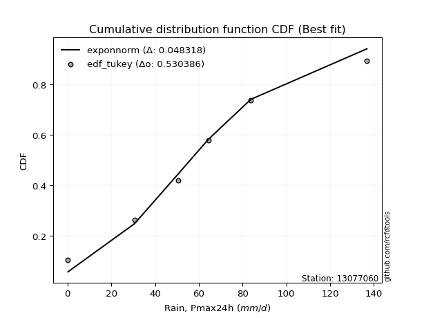</img>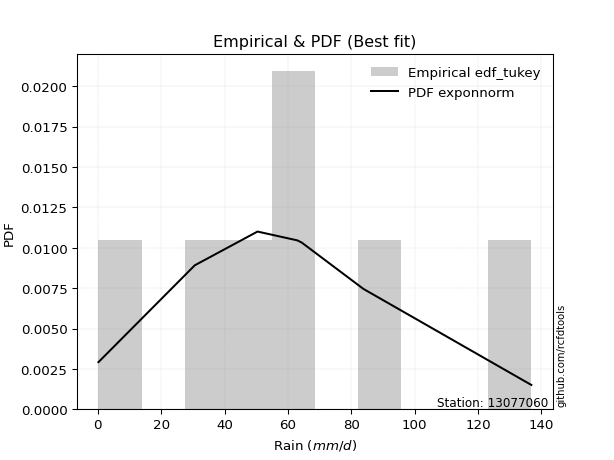</img>

</div>


### 8. EDF Gringorten (1963)

Gringorten plotting position formula is essential for estimating the probability and return periods of extreme events like floods and heavy rainfall. The constant _a=0.44_.

<div align="center">


$P=(m-a)/(n+1-2a)$


</div>


**8.1. Empirical values**

<div align="center">

|                | 0                   | 1                   | 2                  | 3              | 4                  | 5                  | 6                  |
|:---------------|:--------------------|:--------------------|:-------------------|:---------------|:-------------------|:-------------------|:-------------------|
| date           | 2023                | 2022                | 2020               | 2025           | 2021               | 2024               | 2019               |
| x              | 0.2                 | 30.6                | 50.4               | 63.0           | 64.4               | 83.8               | 136.8              |
| m              | 1                   | 2                   | 3                  | 4              | 5                  | 6                  | 7                  |
| empirical_dist | edf_gringorten      | edf_gringorten      | edf_gringorten     | edf_gringorten | edf_gringorten     | edf_gringorten     | edf_gringorten     |
| empirical      | 0.07865168539325844 | 0.21910112359550563 | 0.3595505617977528 | 0.5            | 0.6404494382022471 | 0.7808988764044943 | 0.9213483146067415 |
| empirical_tr   | 1.0853658536585364  | 1.2805755395683454  | 1.5614035087719298 | 2.0            | 2.781249999999999  | 4.564102564102562  | 12.714285714285701 |

</div>


**8.2. Kolmogorov-Smirnov fit test (sorted by Δ)**


<div align="center">

|                | 0                   | 1                   | 2                   | 3                   | 4                   | 5                   | 6                   | 7                   | 8                   | 9                   | 10                  | 11                  | 12                  | 13                  | 14                  | 15                  | 16                  | 17                  | 18                  | 19                  | 20                  | 21                  | 22                  | 23                  | 24                  | 25                  | 26                  | 27                  | 28                  | 29                  | 30                  | 31                  | 32                  | 33                  | 34                  | 35                  | 36                  | 37                  | 38                  | 39                  | 40                  | 41                  | 42                  | 43                  | 44                  | 45                  | 46                  | 47                  | 48                  | 49                  | 50                  | 51                  | 52                  | 53                  | 54                  | 55                  | 56                  | 57                  | 58                  | 59                  | 60                  | 61                  | 62                  | 63                  | 64                  | 65                  | 66                  | 67                  | 68                  | 69                  | 70                  | 71                  | 72                  | 73                  | 74                  | 75                  | 76                  | 77                  | 78                  | 79                  | 80                  | 81                  | 82                  | 83                  | 84                  | 85                  | 86                  | 87                  | 88                  | 89                  | 90                  | 91                  | 92                  | 93                  | 94                  | 95                  | 96                  | 97                  | 98                  | 99                  | 100                 | 101                 | 102                 | 103                 | 104                 | 105                 | 106                 | 107                 | 108                 | 109                 | 110                 | 111                 | 112                 | 113                 | 114                 | 115                 | 116                 | 117                 | 118                 | 119                 | 120                 | 121                 | 122                 | 123                 | 124                 | 125                 | 126                 | 127                 | 128                 | 129                 | 130                 | 131                 | 132                 | 133                 | 134                 | 135                 | 136                 | 137                 | 138                 | 139                 | 140                 | 141                 | 142                 | 143                 | 144                 | 145                 | 146                 | 147                 | 148                 | 149                 | 150                 | 151                 | 152                 | 153                 | 154                 | 155                 | 156                 | 157                 | 158                 | 159                 |
|:---------------|:--------------------|:--------------------|:--------------------|:--------------------|:--------------------|:--------------------|:--------------------|:--------------------|:--------------------|:--------------------|:--------------------|:--------------------|:--------------------|:--------------------|:--------------------|:--------------------|:--------------------|:--------------------|:--------------------|:--------------------|:--------------------|:--------------------|:--------------------|:--------------------|:--------------------|:--------------------|:--------------------|:--------------------|:--------------------|:--------------------|:--------------------|:--------------------|:--------------------|:--------------------|:--------------------|:--------------------|:--------------------|:--------------------|:--------------------|:--------------------|:--------------------|:--------------------|:--------------------|:--------------------|:--------------------|:--------------------|:--------------------|:--------------------|:--------------------|:--------------------|:--------------------|:--------------------|:--------------------|:--------------------|:--------------------|:--------------------|:--------------------|:--------------------|:--------------------|:--------------------|:--------------------|:--------------------|:--------------------|:--------------------|:--------------------|:--------------------|:--------------------|:--------------------|:--------------------|:--------------------|:--------------------|:--------------------|:--------------------|:--------------------|:--------------------|:--------------------|:--------------------|:--------------------|:--------------------|:--------------------|:--------------------|:--------------------|:--------------------|:--------------------|:--------------------|:--------------------|:--------------------|:--------------------|:--------------------|:--------------------|:--------------------|:--------------------|:--------------------|:--------------------|:--------------------|:--------------------|:--------------------|:--------------------|:--------------------|:--------------------|:--------------------|:--------------------|:--------------------|:--------------------|:--------------------|:--------------------|:--------------------|:--------------------|:--------------------|:--------------------|:--------------------|:--------------------|:--------------------|:--------------------|:--------------------|:--------------------|:--------------------|:--------------------|:--------------------|:--------------------|:--------------------|:--------------------|:--------------------|:--------------------|:--------------------|:--------------------|:--------------------|:--------------------|:--------------------|:--------------------|:--------------------|:--------------------|:--------------------|:--------------------|:--------------------|:--------------------|:--------------------|:--------------------|:--------------------|:--------------------|:--------------------|:--------------------|:--------------------|:--------------------|:--------------------|:--------------------|:--------------------|:--------------------|:--------------------|:--------------------|:--------------------|:--------------------|:--------------------|:--------------------|:--------------------|:--------------------|:--------------------|:--------------------|:--------------------|:--------------------|
| station        | 13077060            | 13077060            | 13077060            | 13077060            | 13077060            | 13077060            | 13077060            | 13077060            | 13077060            | 13077060            | 13077060            | 13077060            | 13077060            | 13077060            | 13077060            | 13077060            | 13077060            | 13077060            | 13077060            | 13077060            | 13077060            | 13077060            | 13077060            | 13077060            | 13077060            | 13077060            | 13077060            | 13077060            | 13077060            | 13077060            | 13077060            | 13077060            | 13077060            | 13077060            | 13077060            | 13077060            | 13077060            | 13077060            | 13077060            | 13077060            | 13077060            | 13077060            | 13077060            | 13077060            | 13077060            | 13077060            | 13077060            | 13077060            | 13077060            | 13077060            | 13077060            | 13077060            | 13077060            | 13077060            | 13077060            | 13077060            | 13077060            | 13077060            | 13077060            | 13077060            | 13077060            | 13077060            | 13077060            | 13077060            | 13077060            | 13077060            | 13077060            | 13077060            | 13077060            | 13077060            | 13077060            | 13077060            | 13077060            | 13077060            | 13077060            | 13077060            | 13077060            | 13077060            | 13077060            | 13077060            | 13077060            | 13077060            | 13077060            | 13077060            | 13077060            | 13077060            | 13077060            | 13077060            | 13077060            | 13077060            | 13077060            | 13077060            | 13077060            | 13077060            | 13077060            | 13077060            | 13077060            | 13077060            | 13077060            | 13077060            | 13077060            | 13077060            | 13077060            | 13077060            | 13077060            | 13077060            | 13077060            | 13077060            | 13077060            | 13077060            | 13077060            | 13077060            | 13077060            | 13077060            | 13077060            | 13077060            | 13077060            | 13077060            | 13077060            | 13077060            | 13077060            | 13077060            | 13077060            | 13077060            | 13077060            | 13077060            | 13077060            | 13077060            | 13077060            | 13077060            | 13077060            | 13077060            | 13077060            | 13077060            | 13077060            | 13077060            | 13077060            | 13077060            | 13077060            | 13077060            | 13077060            | 13077060            | 13077060            | 13077060            | 13077060            | 13077060            | 13077060            | 13077060            | 13077060            | 13077060            | 13077060            | 13077060            | 13077060            | 13077060            | 13077060            | 13077060            | 13077060            | 13077060            | 13077060            | 13077060            |
| empirical_dist | edf_gringorten      | edf_gringorten      | edf_gringorten      | edf_gringorten      | edf_gringorten      | edf_gringorten      | edf_gringorten      | edf_gringorten      | edf_gringorten      | edf_gringorten      | edf_gringorten      | edf_gringorten      | edf_gringorten      | edf_gringorten      | edf_gringorten      | edf_gringorten      | edf_gringorten      | edf_gringorten      | edf_gringorten      | edf_gringorten      | edf_gringorten      | edf_gringorten      | edf_gringorten      | edf_gringorten      | edf_gringorten      | edf_gringorten      | edf_gringorten      | edf_gringorten      | edf_gringorten      | edf_gringorten      | edf_gringorten      | edf_gringorten      | edf_gringorten      | edf_gringorten      | edf_gringorten      | edf_gringorten      | edf_gringorten      | edf_gringorten      | edf_gringorten      | edf_gringorten      | edf_gringorten      | edf_gringorten      | edf_gringorten      | edf_gringorten      | edf_gringorten      | edf_gringorten      | edf_gringorten      | edf_gringorten      | edf_gringorten      | edf_gringorten      | edf_gringorten      | edf_gringorten      | edf_gringorten      | edf_gringorten      | edf_gringorten      | edf_gringorten      | edf_gringorten      | edf_gringorten      | edf_gringorten      | edf_gringorten      | edf_gringorten      | edf_gringorten      | edf_gringorten      | edf_gringorten      | edf_gringorten      | edf_gringorten      | edf_gringorten      | edf_gringorten      | edf_gringorten      | edf_gringorten      | edf_gringorten      | edf_gringorten      | edf_gringorten      | edf_gringorten      | edf_gringorten      | edf_gringorten      | edf_gringorten      | edf_gringorten      | edf_gringorten      | edf_gringorten      | edf_gringorten      | edf_gringorten      | edf_gringorten      | edf_gringorten      | edf_gringorten      | edf_gringorten      | edf_gringorten      | edf_gringorten      | edf_gringorten      | edf_gringorten      | edf_gringorten      | edf_gringorten      | edf_gringorten      | edf_gringorten      | edf_gringorten      | edf_gringorten      | edf_gringorten      | edf_gringorten      | edf_gringorten      | edf_gringorten      | edf_gringorten      | edf_gringorten      | edf_gringorten      | edf_gringorten      | edf_gringorten      | edf_gringorten      | edf_gringorten      | edf_gringorten      | edf_gringorten      | edf_gringorten      | edf_gringorten      | edf_gringorten      | edf_gringorten      | edf_gringorten      | edf_gringorten      | edf_gringorten      | edf_gringorten      | edf_gringorten      | edf_gringorten      | edf_gringorten      | edf_gringorten      | edf_gringorten      | edf_gringorten      | edf_gringorten      | edf_gringorten      | edf_gringorten      | edf_gringorten      | edf_gringorten      | edf_gringorten      | edf_gringorten      | edf_gringorten      | edf_gringorten      | edf_gringorten      | edf_gringorten      | edf_gringorten      | edf_gringorten      | edf_gringorten      | edf_gringorten      | edf_gringorten      | edf_gringorten      | edf_gringorten      | edf_gringorten      | edf_gringorten      | edf_gringorten      | edf_gringorten      | edf_gringorten      | edf_gringorten      | edf_gringorten      | edf_gringorten      | edf_gringorten      | edf_gringorten      | edf_gringorten      | edf_gringorten      | edf_gringorten      | edf_gringorten      | edf_gringorten      | edf_gringorten      | edf_gringorten      | edf_gringorten      | edf_gringorten      |
| p_dist         | exponnorm           | genlogistic         | erlang              | gamma               | betaprime           | gengamma            | fatiguelife         | johnsonsu           | skewnorm            | maxwell             | genextreme          | rayleigh            | rice                | invgauss            | burr12              | weibull_min         | pearson3            | laplace             | foldnorm            | gumbel_r            | exponweib           | bradford            | logjohnsonsu        | hypsecant           | truncweibull_min    | kappa3              | kstwobign           | logistic            | t                   | crystalball         | norm                | halfnorm            | moyal               | anglit              | semicircular        | logt                | gennorm             | halflogistic        | cosine              | truncexpon          | dgamma              | loggennorm          | dweibull            | logdgamma           | loggenextreme       | mielke              | arcsine             | logargus            | kappa4              | logvonmises_line    | wrapcauchy          | uniform             | logloggamma         | logpearson3         | gumbel_l            | ncf                 | vonmises_line       | wald                | loglevy_l           | ksone               | logdweibull         | genexpon            | loggompertz         | lomax               | argus               | gausshyper          | beta                | genpareto           | logburr12           | loggumbel_l         | loggausshyper       | logtrapezoid        | logfoldnorm         | johnsonsb           | f                   | burr                | logarcsine          | logsemicircular     | loganglit           | lognakagami         | logexponnorm        | logcrystalball      | lognorm             | logrice             | loggamma            | loggamma            | lognct              | loglogistic         | logfatiguelife      | loghypsecant        | nct                 | logerlang           | logweibull_max      | loglaplace          | loglaplace          | halfgennorm         | levy_l              | loginvweibull       | loginvgamma         | loginvgauss         | genhalflogistic     | logmaxwell          | logjohnsonsb        | lograyleigh         | logalpha            | logskewnorm         | nakagami            | logkstwobign        | triang              | loggumbel_r         | loghalfnorm         | logloglaplace       | logwrapcauchy       | loggenexpon         | logcosine           | logmoyal            | loghalflogistic     | loggenhalflogistic  | invgamma            | logncf              | trapezoid           | logtriang           | loglomax            | loggenpareto        | loghalfgennorm      | logwald             | logkappa3           | rdist               | logexponweib        | invweibull          | logf                | logksone            | logkappa4           | logbeta             | logmielke           | logbradford         | tukeylambda         | logtruncweibull_min | logtruncnorm        | loguniform          | loggengamma         | powerlaw            | logburr             | logtruncexpon       | logweibull_min      | weibull_max         | truncpareto         | logbetaprime        | exponpow            | logexponpow         | logpowerlaw         | logtruncpareto      | alpha               | gompertz            | truncnorm           | loggenlogistic      | logtukeylambda      | logrdist            | logvonmises         | vonmises            |
| delta          | 0.06631235729259422 | 0.06769338047187912 | 0.07001433375546862 | 0.07001438367540291 | 0.0702339997863195  | 0.07212316510497141 | 0.07214436269914692 | 0.07320360037695073 | 0.07630044081389464 | 0.07789262667340391 | 0.07801700652944854 | 0.07814756179131654 | 0.07843015301332912 | 0.08093083288734404 | 0.08115924857520962 | 0.08154384885968391 | 0.0819496042171356  | 0.08835922222483783 | 0.08872043605203572 | 0.09019849287259446 | 0.09204607735713177 | 0.09249192840645326 | 0.09460556594001968 | 0.10164925817789994 | 0.102662490086607   | 0.10329966022036324 | 0.10382425280080076 | 0.10523251406793033 | 0.1094029556353524  | 0.10944569090930156 | 0.10944569839433005 | 0.11307364630834876 | 0.1132707950561953  | 0.11386962083791685 | 0.11569332488545647 | 0.11906855687570761 | 0.11963705292816945 | 0.12753306527367952 | 0.13690170371766508 | 0.14021771419333162 | 0.1404494382001139  | 0.14044943820153144 | 0.14044943820247635 | 0.14044943828295448 | 0.14097010265578613 | 0.1411592845343851  | 0.14961501170910652 | 0.15239053313412265 | 0.1537128657121627  | 0.15986312666858637 | 0.17044493556674828 | 0.17046407949068054 | 0.17209489985928506 | 0.17219598491433283 | 0.17819578984517348 | 0.17905638535652024 | 0.18171306583343488 | 0.18452963594556304 | 0.1860909457791666  | 0.18756066264168314 | 0.18885925710665585 | 0.20110634551645    | 0.2074697922013229  | 0.21879944605201307 | 0.22005519909829696 | 0.22140198819592793 | 0.22424143622214399 | 0.22486195100202422 | 0.2257927108583977  | 0.22661483370695987 | 0.2516066804020566  | 0.2570912618341612  | 0.263710148785798   | 0.2663140559896434  | 0.27340812935812076 | 0.2768359403698447  | 0.2896254066011289  | 0.2932361880539681  | 0.29414728273127044 | 0.29628953731619057 | 0.29635741298375273 | 0.29635908896031626 | 0.29635909771408153 | 0.29640179641429454 | 0.2969537510427773  | 0.2969537510427773  | 0.29705480688635677 | 0.2984685945055786  | 0.2986800944050495  | 0.3002682781877182  | 0.3037215277795071  | 0.3051917676959206  | 0.3052690495863069  | 0.3075705348144855  | 0.3075705348144855  | 0.308893092944281   | 0.3127341152935201  | 0.3148849299411478  | 0.3173652449651274  | 0.31923315512776274 | 0.321750345158598   | 0.328726499663363   | 0.329007625458987   | 0.33938570130933354 | 0.3412246218667532  | 0.345373920622408   | 0.3567069682327204  | 0.3605364819182092  | 0.3661361959679711  | 0.3670199256063219  | 0.36939390058707966 | 0.3739557593841364  | 0.3753008965780047  | 0.3802665430547889  | 0.38171631873814926 | 0.3926948763239998  | 0.39521135395867946 | 0.3982781538188398  | 0.4071010754127693  | 0.4141247997287971  | 0.4239596925565841  | 0.431040721407685   | 0.4496331843696457  | 0.4501158634337217  | 0.4547216898819948  | 0.46402676573589097 | 0.46552753973616934 | 0.4786010931212661  | 0.47865587021061773 | 0.48245472859584954 | 0.5042667878337695  | 0.5063980530322157  | 0.5282226356785579  | 0.5337951798418604  | 0.5401989116155156  | 0.5455766223226324  | 0.5457608166597314  | 0.5465243101645915  | 0.550065571534915   | 0.55149788835776    | 0.5685565297106124  | 0.5825144628920091  | 0.6015949057716768  | 0.607144684704669   | 0.6516757785620124  | 0.6570828843329488  | 0.67250931575857    | 0.6893449254842499  | 0.712203445443444   | 0.7326764148091296  | 0.7348269927530298  | 0.7418077750407193  | 0.7673187845246663  | 0.7731381535306547  | 0.7808988726048361  | 0.7808988764044943  | 0.7808988764044944  | 0.9213483146005365  | 1.0087446967373905  | 21.17364801330374   |
| deltao         | 0.48442053926100004 | 0.48442053926100004 | 0.48442053926100004 | 0.48442053926100004 | 0.48442053926100004 | 0.48442053926100004 | 0.48442053926100004 | 0.48442053926100004 | 0.48442053926100004 | 0.48442053926100004 | 0.48442053926100004 | 0.48442053926100004 | 0.48442053926100004 | 0.48442053926100004 | 0.48442053926100004 | 0.48442053926100004 | 0.48442053926100004 | 0.48442053926100004 | 0.48442053926100004 | 0.48442053926100004 | 0.48442053926100004 | 0.48442053926100004 | 0.48442053926100004 | 0.48442053926100004 | 0.48442053926100004 | 0.48442053926100004 | 0.48442053926100004 | 0.48442053926100004 | 0.48442053926100004 | 0.48442053926100004 | 0.48442053926100004 | 0.48442053926100004 | 0.48442053926100004 | 0.48442053926100004 | 0.48442053926100004 | 0.48442053926100004 | 0.48442053926100004 | 0.48442053926100004 | 0.48442053926100004 | 0.48442053926100004 | 0.48442053926100004 | 0.48442053926100004 | 0.48442053926100004 | 0.48442053926100004 | 0.48442053926100004 | 0.48442053926100004 | 0.48442053926100004 | 0.48442053926100004 | 0.48442053926100004 | 0.48442053926100004 | 0.48442053926100004 | 0.48442053926100004 | 0.48442053926100004 | 0.48442053926100004 | 0.48442053926100004 | 0.48442053926100004 | 0.48442053926100004 | 0.48442053926100004 | 0.48442053926100004 | 0.48442053926100004 | 0.48442053926100004 | 0.48442053926100004 | 0.48442053926100004 | 0.48442053926100004 | 0.48442053926100004 | 0.48442053926100004 | 0.48442053926100004 | 0.48442053926100004 | 0.48442053926100004 | 0.48442053926100004 | 0.48442053926100004 | 0.48442053926100004 | 0.48442053926100004 | 0.48442053926100004 | 0.48442053926100004 | 0.48442053926100004 | 0.48442053926100004 | 0.48442053926100004 | 0.48442053926100004 | 0.48442053926100004 | 0.48442053926100004 | 0.48442053926100004 | 0.48442053926100004 | 0.48442053926100004 | 0.48442053926100004 | 0.48442053926100004 | 0.48442053926100004 | 0.48442053926100004 | 0.48442053926100004 | 0.48442053926100004 | 0.48442053926100004 | 0.48442053926100004 | 0.48442053926100004 | 0.48442053926100004 | 0.48442053926100004 | 0.48442053926100004 | 0.48442053926100004 | 0.48442053926100004 | 0.48442053926100004 | 0.48442053926100004 | 0.48442053926100004 | 0.48442053926100004 | 0.48442053926100004 | 0.48442053926100004 | 0.48442053926100004 | 0.48442053926100004 | 0.48442053926100004 | 0.48442053926100004 | 0.48442053926100004 | 0.48442053926100004 | 0.48442053926100004 | 0.48442053926100004 | 0.48442053926100004 | 0.48442053926100004 | 0.48442053926100004 | 0.48442053926100004 | 0.48442053926100004 | 0.48442053926100004 | 0.48442053926100004 | 0.48442053926100004 | 0.48442053926100004 | 0.48442053926100004 | 0.48442053926100004 | 0.48442053926100004 | 0.48442053926100004 | 0.48442053926100004 | 0.48442053926100004 | 0.48442053926100004 | 0.48442053926100004 | 0.48442053926100004 | 0.48442053926100004 | 0.48442053926100004 | 0.48442053926100004 | 0.48442053926100004 | 0.48442053926100004 | 0.48442053926100004 | 0.48442053926100004 | 0.48442053926100004 | 0.48442053926100004 | 0.48442053926100004 | 0.48442053926100004 | 0.48442053926100004 | 0.48442053926100004 | 0.48442053926100004 | 0.48442053926100004 | 0.48442053926100004 | 0.48442053926100004 | 0.48442053926100004 | 0.48442053926100004 | 0.48442053926100004 | 0.48442053926100004 | 0.48442053926100004 | 0.48442053926100004 | 0.48442053926100004 | 0.48442053926100004 | 0.48442053926100004 | 0.48442053926100004 | 0.48442053926100004 | 0.48442053926100004 | 0.48442053926100004 |
| eval           | Δo > Δ              | Δo > Δ              | Δo > Δ              | Δo > Δ              | Δo > Δ              | Δo > Δ              | Δo > Δ              | Δo > Δ              | Δo > Δ              | Δo > Δ              | Δo > Δ              | Δo > Δ              | Δo > Δ              | Δo > Δ              | Δo > Δ              | Δo > Δ              | Δo > Δ              | Δo > Δ              | Δo > Δ              | Δo > Δ              | Δo > Δ              | Δo > Δ              | Δo > Δ              | Δo > Δ              | Δo > Δ              | Δo > Δ              | Δo > Δ              | Δo > Δ              | Δo > Δ              | Δo > Δ              | Δo > Δ              | Δo > Δ              | Δo > Δ              | Δo > Δ              | Δo > Δ              | Δo > Δ              | Δo > Δ              | Δo > Δ              | Δo > Δ              | Δo > Δ              | Δo > Δ              | Δo > Δ              | Δo > Δ              | Δo > Δ              | Δo > Δ              | Δo > Δ              | Δo > Δ              | Δo > Δ              | Δo > Δ              | Δo > Δ              | Δo > Δ              | Δo > Δ              | Δo > Δ              | Δo > Δ              | Δo > Δ              | Δo > Δ              | Δo > Δ              | Δo > Δ              | Δo > Δ              | Δo > Δ              | Δo > Δ              | Δo > Δ              | Δo > Δ              | Δo > Δ              | Δo > Δ              | Δo > Δ              | Δo > Δ              | Δo > Δ              | Δo > Δ              | Δo > Δ              | Δo > Δ              | Δo > Δ              | Δo > Δ              | Δo > Δ              | Δo > Δ              | Δo > Δ              | Δo > Δ              | Δo > Δ              | Δo > Δ              | Δo > Δ              | Δo > Δ              | Δo > Δ              | Δo > Δ              | Δo > Δ              | Δo > Δ              | Δo > Δ              | Δo > Δ              | Δo > Δ              | Δo > Δ              | Δo > Δ              | Δo > Δ              | Δo > Δ              | Δo > Δ              | Δo > Δ              | Δo > Δ              | Δo > Δ              | Δo > Δ              | Δo > Δ              | Δo > Δ              | Δo > Δ              | Δo > Δ              | Δo > Δ              | Δo > Δ              | Δo > Δ              | Δo > Δ              | Δo > Δ              | Δo > Δ              | Δo > Δ              | Δo > Δ              | Δo > Δ              | Δo > Δ              | Δo > Δ              | Δo > Δ              | Δo > Δ              | Δo > Δ              | Δo > Δ              | Δo > Δ              | Δo > Δ              | Δo > Δ              | Δo > Δ              | Δo > Δ              | Δo > Δ              | Δo > Δ              | Δo > Δ              | Δo > Δ              | Δo > Δ              | Δo > Δ              | Δo > Δ              | Δo > Δ              | Δo > Δ              | Δo <= Δ             | Δo <= Δ             | Δo <= Δ             | Δo <= Δ             | Δo <= Δ             | Δo <= Δ             | Δo <= Δ             | Δo <= Δ             | Δo <= Δ             | Δo <= Δ             | Δo <= Δ             | Δo <= Δ             | Δo <= Δ             | Δo <= Δ             | Δo <= Δ             | Δo <= Δ             | Δo <= Δ             | Δo <= Δ             | Δo <= Δ             | Δo <= Δ             | Δo <= Δ             | Δo <= Δ             | Δo <= Δ             | Δo <= Δ             | Δo <= Δ             | Δo <= Δ             | Δo <= Δ             | Δo <= Δ             | Δo <= Δ             | Δo <= Δ             |
| fit            | 1                   | 1                   | 1                   | 1                   | 1                   | 1                   | 1                   | 1                   | 1                   | 1                   | 1                   | 1                   | 1                   | 1                   | 1                   | 1                   | 1                   | 1                   | 1                   | 1                   | 1                   | 1                   | 1                   | 1                   | 1                   | 1                   | 1                   | 1                   | 1                   | 1                   | 1                   | 1                   | 1                   | 1                   | 1                   | 1                   | 1                   | 1                   | 1                   | 1                   | 1                   | 1                   | 1                   | 1                   | 1                   | 1                   | 1                   | 1                   | 1                   | 1                   | 1                   | 1                   | 1                   | 1                   | 1                   | 1                   | 1                   | 1                   | 1                   | 1                   | 1                   | 1                   | 1                   | 1                   | 1                   | 1                   | 1                   | 1                   | 1                   | 1                   | 1                   | 1                   | 1                   | 1                   | 1                   | 1                   | 1                   | 1                   | 1                   | 1                   | 1                   | 1                   | 1                   | 1                   | 1                   | 1                   | 1                   | 1                   | 1                   | 1                   | 1                   | 1                   | 1                   | 1                   | 1                   | 1                   | 1                   | 1                   | 1                   | 1                   | 1                   | 1                   | 1                   | 1                   | 1                   | 1                   | 1                   | 1                   | 1                   | 1                   | 1                   | 1                   | 1                   | 1                   | 1                   | 1                   | 1                   | 1                   | 1                   | 1                   | 1                   | 1                   | 1                   | 1                   | 1                   | 1                   | 1                   | 1                   | 1                   | 1                   | 0                   | 0                   | 0                   | 0                   | 0                   | 0                   | 0                   | 0                   | 0                   | 0                   | 0                   | 0                   | 0                   | 0                   | 0                   | 0                   | 0                   | 0                   | 0                   | 0                   | 0                   | 0                   | 0                   | 0                   | 0                   | 0                   | 0                   | 0                   | 0                   | 0                   |
| n              | 7                   | 7                   | 7                   | 7                   | 7                   | 7                   | 7                   | 7                   | 7                   | 7                   | 7                   | 7                   | 7                   | 7                   | 7                   | 7                   | 7                   | 7                   | 7                   | 7                   | 7                   | 7                   | 7                   | 7                   | 7                   | 7                   | 7                   | 7                   | 7                   | 7                   | 7                   | 7                   | 7                   | 7                   | 7                   | 7                   | 7                   | 7                   | 7                   | 7                   | 7                   | 7                   | 7                   | 7                   | 7                   | 7                   | 7                   | 7                   | 7                   | 7                   | 7                   | 7                   | 7                   | 7                   | 7                   | 7                   | 7                   | 7                   | 7                   | 7                   | 7                   | 7                   | 7                   | 7                   | 7                   | 7                   | 7                   | 7                   | 7                   | 7                   | 7                   | 7                   | 7                   | 7                   | 7                   | 7                   | 7                   | 7                   | 7                   | 7                   | 7                   | 7                   | 7                   | 7                   | 7                   | 7                   | 7                   | 7                   | 7                   | 7                   | 7                   | 7                   | 7                   | 7                   | 7                   | 7                   | 7                   | 7                   | 7                   | 7                   | 7                   | 7                   | 7                   | 7                   | 7                   | 7                   | 7                   | 7                   | 7                   | 7                   | 7                   | 7                   | 7                   | 7                   | 7                   | 7                   | 7                   | 7                   | 7                   | 7                   | 7                   | 7                   | 7                   | 7                   | 7                   | 7                   | 7                   | 7                   | 7                   | 7                   | 7                   | 7                   | 7                   | 7                   | 7                   | 7                   | 7                   | 7                   | 7                   | 7                   | 7                   | 7                   | 7                   | 7                   | 7                   | 7                   | 7                   | 7                   | 7                   | 7                   | 7                   | 7                   | 7                   | 7                   | 7                   | 7                   | 7                   | 7                   | 7                   | 7                   |
| best_fit       | 1                   | 0                   | 0                   | 0                   | 0                   | 0                   | 0                   | 0                   | 0                   | 0                   | 0                   | 0                   | 0                   | 0                   | 0                   | 0                   | 0                   | 0                   | 0                   | 0                   | 0                   | 0                   | 0                   | 0                   | 0                   | 0                   | 0                   | 0                   | 0                   | 0                   | 0                   | 0                   | 0                   | 0                   | 0                   | 0                   | 0                   | 0                   | 0                   | 0                   | 0                   | 0                   | 0                   | 0                   | 0                   | 0                   | 0                   | 0                   | 0                   | 0                   | 0                   | 0                   | 0                   | 0                   | 0                   | 0                   | 0                   | 0                   | 0                   | 0                   | 0                   | 0                   | 0                   | 0                   | 0                   | 0                   | 0                   | 0                   | 0                   | 0                   | 0                   | 0                   | 0                   | 0                   | 0                   | 0                   | 0                   | 0                   | 0                   | 0                   | 0                   | 0                   | 0                   | 0                   | 0                   | 0                   | 0                   | 0                   | 0                   | 0                   | 0                   | 0                   | 0                   | 0                   | 0                   | 0                   | 0                   | 0                   | 0                   | 0                   | 0                   | 0                   | 0                   | 0                   | 0                   | 0                   | 0                   | 0                   | 0                   | 0                   | 0                   | 0                   | 0                   | 0                   | 0                   | 0                   | 0                   | 0                   | 0                   | 0                   | 0                   | 0                   | 0                   | 0                   | 0                   | 0                   | 0                   | 0                   | 0                   | 0                   | 0                   | 0                   | 0                   | 0                   | 0                   | 0                   | 0                   | 0                   | 0                   | 0                   | 0                   | 0                   | 0                   | 0                   | 0                   | 0                   | 0                   | 0                   | 0                   | 0                   | 0                   | 0                   | 0                   | 0                   | 0                   | 0                   | 0                   | 0                   | 0                   | 0                   |
| best_fit_sort  | 1                   | 2                   | 3                   | 4                   | 5                   | 6                   | 7                   | 8                   | 9                   | 10                  | 11                  | 12                  | 13                  | 14                  | 15                  | 16                  | 17                  | 18                  | 19                  | 20                  | 21                  | 22                  | 23                  | 24                  | 25                  | 26                  | 27                  | 28                  | 29                  | 30                  | 31                  | 32                  | 33                  | 34                  | 35                  | 36                  | 37                  | 38                  | 39                  | 40                  | 41                  | 42                  | 43                  | 44                  | 45                  | 46                  | 47                  | 48                  | 49                  | 50                  | 51                  | 52                  | 53                  | 54                  | 55                  | 56                  | 57                  | 58                  | 59                  | 60                  | 61                  | 62                  | 63                  | 64                  | 65                  | 66                  | 67                  | 68                  | 69                  | 70                  | 71                  | 72                  | 73                  | 74                  | 75                  | 76                  | 77                  | 78                  | 79                  | 80                  | 81                  | 82                  | 83                  | 84                  | 85                  | 86                  | 87                  | 88                  | 89                  | 90                  | 91                  | 92                  | 93                  | 94                  | 95                  | 96                  | 97                  | 98                  | 99                  | 100                 | 101                 | 102                 | 103                 | 104                 | 105                 | 106                 | 107                 | 108                 | 109                 | 110                 | 111                 | 112                 | 113                 | 114                 | 115                 | 116                 | 117                 | 118                 | 119                 | 120                 | 121                 | 122                 | 123                 | 124                 | 125                 | 126                 | 127                 | 128                 | 129                 | 130                 | 131                 | 132                 | 133                 | 134                 | 135                 | 136                 | 137                 | 138                 | 139                 | 140                 | 141                 | 142                 | 143                 | 144                 | 145                 | 146                 | 147                 | 148                 | 149                 | 150                 | 151                 | 152                 | 153                 | 154                 | 155                 | 156                 | 157                 | 158                 | 159                 | 160                 |

</div>


**8.3. Best fit**

<div align="center">

|   id |   station | empirical_dist   | p_dist    |     delta |   deltao | eval   |   fit |   n |   best_fit |   best_fit_sort |
|-----:|----------:|:-----------------|:----------|----------:|---------:|:-------|------:|----:|-----------:|----------------:|
|    0 |  13077060 | edf_gringorten   | exponnorm | 0.0663124 | 0.484421 | Δo > Δ |     1 |   7 |          1 |               1 |

</div>


<div align="center">

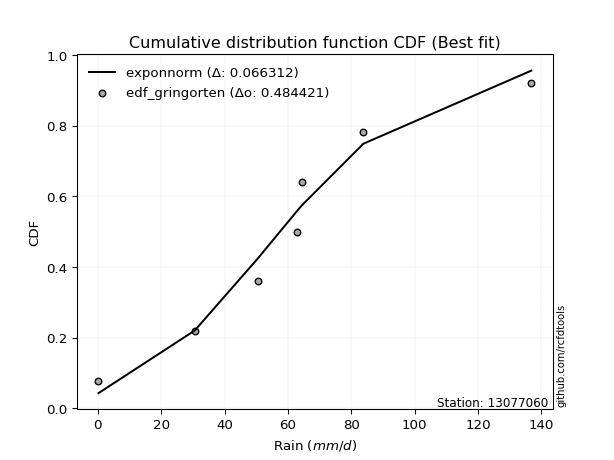</img></img>

</div>


### 9. EDF Filliben (1975)

The specific values of the constants (0.3175) (often denoted as $alpha$) and (0.365) are derived from a method proposed by James J. Filliben in a 1975 paper. This particular formula is the mean value of the $i$-th order statistic of the normal distribution and is considered a robust and effective plotting position formula for the normal probability plot correlation coefficient test for normality.

<div align="center">


$P=(m-0.3175)/(n+0.365)$


</div>


**9.1. Empirical values**

<div align="center">

|                | 0                   | 1                   | 2                   | 3            | 4                  | 5                  | 6                  |
|:---------------|:--------------------|:--------------------|:--------------------|:-------------|:-------------------|:-------------------|:-------------------|
| date           | 2023                | 2022                | 2020                | 2025         | 2021               | 2024               | 2019               |
| x              | 0.2                 | 30.6                | 50.4                | 63.0         | 64.4               | 83.8               | 136.8              |
| m              | 1                   | 2                   | 3                   | 4            | 5                  | 6                  | 7                  |
| empirical_dist | edf_filliben        | edf_filliben        | edf_filliben        | edf_filliben | edf_filliben       | edf_filliben       | edf_filliben       |
| empirical      | 0.09266802443991853 | 0.22844534962661237 | 0.36422267481330617 | 0.5          | 0.6357773251866938 | 0.7715546503733877 | 0.9073319755600815 |
| empirical_tr   | 1.1021324354657687  | 1.2960844698636163  | 1.5728777362520021  | 2.0          | 2.7455731593662627 | 4.377414561664191  | 10.791208791208794 |

</div>


**9.2. Kolmogorov-Smirnov fit test (sorted by Δ)**


<div align="center">

|                | 0                    | 1                   | 2                   | 3                   | 4                   | 5                   | 6                   | 7                   | 8                   | 9                   | 10                  | 11                  | 12                  | 13                  | 14                  | 15                  | 16                  | 17                  | 18                  | 19                  | 20                  | 21                  | 22                  | 23                  | 24                  | 25                  | 26                  | 27                  | 28                  | 29                  | 30                  | 31                  | 32                  | 33                  | 34                  | 35                  | 36                  | 37                  | 38                  | 39                  | 40                  | 41                  | 42                  | 43                  | 44                  | 45                  | 46                  | 47                  | 48                  | 49                  | 50                  | 51                  | 52                  | 53                  | 54                  | 55                  | 56                  | 57                  | 58                  | 59                  | 60                  | 61                  | 62                  | 63                  | 64                  | 65                  | 66                  | 67                  | 68                  | 69                  | 70                  | 71                  | 72                  | 73                  | 74                  | 75                  | 76                  | 77                  | 78                  | 79                  | 80                  | 81                  | 82                  | 83                  | 84                  | 85                  | 86                  | 87                  | 88                  | 89                  | 90                  | 91                  | 92                  | 93                  | 94                  | 95                  | 96                  | 97                  | 98                  | 99                  | 100                 | 101                 | 102                 | 103                 | 104                 | 105                 | 106                 | 107                 | 108                 | 109                 | 110                 | 111                 | 112                 | 113                 | 114                 | 115                 | 116                 | 117                 | 118                 | 119                 | 120                 | 121                 | 122                 | 123                 | 124                 | 125                 | 126                 | 127                 | 128                 | 129                 | 130                 | 131                 | 132                 | 133                 | 134                 | 135                 | 136                 | 137                 | 138                 | 139                 | 140                 | 141                 | 142                 | 143                 | 144                 | 145                 | 146                 | 147                 | 148                 | 149                 | 150                 | 151                 | 152                 | 153                 | 154                 | 155                 | 156                 | 157                 | 158                 | 159                 |
|:---------------|:---------------------|:--------------------|:--------------------|:--------------------|:--------------------|:--------------------|:--------------------|:--------------------|:--------------------|:--------------------|:--------------------|:--------------------|:--------------------|:--------------------|:--------------------|:--------------------|:--------------------|:--------------------|:--------------------|:--------------------|:--------------------|:--------------------|:--------------------|:--------------------|:--------------------|:--------------------|:--------------------|:--------------------|:--------------------|:--------------------|:--------------------|:--------------------|:--------------------|:--------------------|:--------------------|:--------------------|:--------------------|:--------------------|:--------------------|:--------------------|:--------------------|:--------------------|:--------------------|:--------------------|:--------------------|:--------------------|:--------------------|:--------------------|:--------------------|:--------------------|:--------------------|:--------------------|:--------------------|:--------------------|:--------------------|:--------------------|:--------------------|:--------------------|:--------------------|:--------------------|:--------------------|:--------------------|:--------------------|:--------------------|:--------------------|:--------------------|:--------------------|:--------------------|:--------------------|:--------------------|:--------------------|:--------------------|:--------------------|:--------------------|:--------------------|:--------------------|:--------------------|:--------------------|:--------------------|:--------------------|:--------------------|:--------------------|:--------------------|:--------------------|:--------------------|:--------------------|:--------------------|:--------------------|:--------------------|:--------------------|:--------------------|:--------------------|:--------------------|:--------------------|:--------------------|:--------------------|:--------------------|:--------------------|:--------------------|:--------------------|:--------------------|:--------------------|:--------------------|:--------------------|:--------------------|:--------------------|:--------------------|:--------------------|:--------------------|:--------------------|:--------------------|:--------------------|:--------------------|:--------------------|:--------------------|:--------------------|:--------------------|:--------------------|:--------------------|:--------------------|:--------------------|:--------------------|:--------------------|:--------------------|:--------------------|:--------------------|:--------------------|:--------------------|:--------------------|:--------------------|:--------------------|:--------------------|:--------------------|:--------------------|:--------------------|:--------------------|:--------------------|:--------------------|:--------------------|:--------------------|:--------------------|:--------------------|:--------------------|:--------------------|:--------------------|:--------------------|:--------------------|:--------------------|:--------------------|:--------------------|:--------------------|:--------------------|:--------------------|:--------------------|:--------------------|:--------------------|:--------------------|:--------------------|:--------------------|:--------------------|
| station        | 13077060             | 13077060            | 13077060            | 13077060            | 13077060            | 13077060            | 13077060            | 13077060            | 13077060            | 13077060            | 13077060            | 13077060            | 13077060            | 13077060            | 13077060            | 13077060            | 13077060            | 13077060            | 13077060            | 13077060            | 13077060            | 13077060            | 13077060            | 13077060            | 13077060            | 13077060            | 13077060            | 13077060            | 13077060            | 13077060            | 13077060            | 13077060            | 13077060            | 13077060            | 13077060            | 13077060            | 13077060            | 13077060            | 13077060            | 13077060            | 13077060            | 13077060            | 13077060            | 13077060            | 13077060            | 13077060            | 13077060            | 13077060            | 13077060            | 13077060            | 13077060            | 13077060            | 13077060            | 13077060            | 13077060            | 13077060            | 13077060            | 13077060            | 13077060            | 13077060            | 13077060            | 13077060            | 13077060            | 13077060            | 13077060            | 13077060            | 13077060            | 13077060            | 13077060            | 13077060            | 13077060            | 13077060            | 13077060            | 13077060            | 13077060            | 13077060            | 13077060            | 13077060            | 13077060            | 13077060            | 13077060            | 13077060            | 13077060            | 13077060            | 13077060            | 13077060            | 13077060            | 13077060            | 13077060            | 13077060            | 13077060            | 13077060            | 13077060            | 13077060            | 13077060            | 13077060            | 13077060            | 13077060            | 13077060            | 13077060            | 13077060            | 13077060            | 13077060            | 13077060            | 13077060            | 13077060            | 13077060            | 13077060            | 13077060            | 13077060            | 13077060            | 13077060            | 13077060            | 13077060            | 13077060            | 13077060            | 13077060            | 13077060            | 13077060            | 13077060            | 13077060            | 13077060            | 13077060            | 13077060            | 13077060            | 13077060            | 13077060            | 13077060            | 13077060            | 13077060            | 13077060            | 13077060            | 13077060            | 13077060            | 13077060            | 13077060            | 13077060            | 13077060            | 13077060            | 13077060            | 13077060            | 13077060            | 13077060            | 13077060            | 13077060            | 13077060            | 13077060            | 13077060            | 13077060            | 13077060            | 13077060            | 13077060            | 13077060            | 13077060            | 13077060            | 13077060            | 13077060            | 13077060            | 13077060            | 13077060            |
| empirical_dist | edf_filliben         | edf_filliben        | edf_filliben        | edf_filliben        | edf_filliben        | edf_filliben        | edf_filliben        | edf_filliben        | edf_filliben        | edf_filliben        | edf_filliben        | edf_filliben        | edf_filliben        | edf_filliben        | edf_filliben        | edf_filliben        | edf_filliben        | edf_filliben        | edf_filliben        | edf_filliben        | edf_filliben        | edf_filliben        | edf_filliben        | edf_filliben        | edf_filliben        | edf_filliben        | edf_filliben        | edf_filliben        | edf_filliben        | edf_filliben        | edf_filliben        | edf_filliben        | edf_filliben        | edf_filliben        | edf_filliben        | edf_filliben        | edf_filliben        | edf_filliben        | edf_filliben        | edf_filliben        | edf_filliben        | edf_filliben        | edf_filliben        | edf_filliben        | edf_filliben        | edf_filliben        | edf_filliben        | edf_filliben        | edf_filliben        | edf_filliben        | edf_filliben        | edf_filliben        | edf_filliben        | edf_filliben        | edf_filliben        | edf_filliben        | edf_filliben        | edf_filliben        | edf_filliben        | edf_filliben        | edf_filliben        | edf_filliben        | edf_filliben        | edf_filliben        | edf_filliben        | edf_filliben        | edf_filliben        | edf_filliben        | edf_filliben        | edf_filliben        | edf_filliben        | edf_filliben        | edf_filliben        | edf_filliben        | edf_filliben        | edf_filliben        | edf_filliben        | edf_filliben        | edf_filliben        | edf_filliben        | edf_filliben        | edf_filliben        | edf_filliben        | edf_filliben        | edf_filliben        | edf_filliben        | edf_filliben        | edf_filliben        | edf_filliben        | edf_filliben        | edf_filliben        | edf_filliben        | edf_filliben        | edf_filliben        | edf_filliben        | edf_filliben        | edf_filliben        | edf_filliben        | edf_filliben        | edf_filliben        | edf_filliben        | edf_filliben        | edf_filliben        | edf_filliben        | edf_filliben        | edf_filliben        | edf_filliben        | edf_filliben        | edf_filliben        | edf_filliben        | edf_filliben        | edf_filliben        | edf_filliben        | edf_filliben        | edf_filliben        | edf_filliben        | edf_filliben        | edf_filliben        | edf_filliben        | edf_filliben        | edf_filliben        | edf_filliben        | edf_filliben        | edf_filliben        | edf_filliben        | edf_filliben        | edf_filliben        | edf_filliben        | edf_filliben        | edf_filliben        | edf_filliben        | edf_filliben        | edf_filliben        | edf_filliben        | edf_filliben        | edf_filliben        | edf_filliben        | edf_filliben        | edf_filliben        | edf_filliben        | edf_filliben        | edf_filliben        | edf_filliben        | edf_filliben        | edf_filliben        | edf_filliben        | edf_filliben        | edf_filliben        | edf_filliben        | edf_filliben        | edf_filliben        | edf_filliben        | edf_filliben        | edf_filliben        | edf_filliben        | edf_filliben        | edf_filliben        | edf_filliben        | edf_filliben        | edf_filliben        |
| p_dist         | exponnorm            | genlogistic         | erlang              | gamma               | betaprime           | gengamma            | fatiguelife         | johnsonsu           | skewnorm            | maxwell             | genextreme          | rayleigh            | rice                | invgauss            | burr12              | weibull_min         | pearson3            | laplace             | foldnorm            | exponweib           | gumbel_r            | bradford            | hypsecant           | truncweibull_min    | kappa3              | kstwobign           | logistic            | logjohnsonsu        | t                   | crystalball         | norm                | halfnorm            | anglit              | semicircular        | moyal               | logt                | halflogistic        | gennorm             | loggenextreme       | cosine              | truncexpon          | dgamma              | loggennorm          | dweibull            | logdgamma           | mielke              | arcsine             | kappa4              | logvonmises_line    | logargus            | logpearson3         | wrapcauchy          | uniform             | logloggamma         | gumbel_l            | ncf                 | logdweibull         | loglevy_l           | vonmises_line       | ksone               | wald                | genexpon            | loggompertz         | gausshyper          | lomax               | beta                | argus               | genpareto           | loggumbel_l         | logburr12           | loggausshyper       | logtrapezoid        | logfoldnorm         | johnsonsb           | f                   | burr                | logarcsine          | logsemicircular     | loganglit           | lognakagami         | logexponnorm        | logcrystalball      | lognorm             | logrice             | loggamma            | loggamma            | lognct              | loglogistic         | logfatiguelife      | loghypsecant        | nct                 | logerlang           | logweibull_max      | levy_l              | loglaplace          | loglaplace          | halfgennorm         | loginvweibull       | loginvgamma         | loginvgauss         | genhalflogistic     | logmaxwell          | logjohnsonsb        | lograyleigh         | logalpha            | logskewnorm         | nakagami            | logkstwobign        | loggumbel_r         | loghalfnorm         | triang              | logloglaplace       | logwrapcauchy       | loggenexpon         | logcosine           | logmoyal            | loghalflogistic     | loggenhalflogistic  | invgamma            | logncf              | trapezoid           | logtriang           | loglomax            | loggenpareto        | loghalfgennorm      | logwald             | logkappa3           | logexponweib        | invweibull          | rdist               | logf                | logksone            | logkappa4           | logbeta             | logmielke           | logbradford         | tukeylambda         | logtruncweibull_min | logtruncnorm        | loguniform          | loggengamma         | powerlaw            | logburr             | logtruncexpon       | logweibull_min      | weibull_max         | truncpareto         | logbetaprime        | exponpow            | logexponpow         | logpowerlaw         | logtruncpareto      | alpha               | gompertz            | truncnorm           | loggenlogistic      | logtukeylambda      | logrdist            | logvonmises         | vonmises            |
| delta          | 0.061640244277040956 | 0.06302126745632586 | 0.06534222073991536 | 0.06534227065984965 | 0.06556188677076624 | 0.06745105208941815 | 0.06747224968359367 | 0.06853148736139747 | 0.07162832779834138 | 0.07322051365785065 | 0.07334489351389528 | 0.07347544877576317 | 0.07375803999777586 | 0.07625871987179067 | 0.07648713555965625 | 0.07687173584413054 | 0.07727749120158234 | 0.08368710920928457 | 0.08404832303648246 | 0.0873739643415784  | 0.08761950539134045 | 0.09266799261907854 | 0.09697714516234668 | 0.09799037707105374 | 0.09862754720480987 | 0.0991521397852474  | 0.10056040105237707 | 0.1039497919711263  | 0.10473084261979915 | 0.1047735778937483  | 0.10477358537877679 | 0.1084015332927954  | 0.1091975078223636  | 0.11102121186990321 | 0.1132707950561953  | 0.11439644386015435 | 0.12286095225812615 | 0.12430916594372282 | 0.1316258766246795  | 0.13222959070211182 | 0.13554560117777825 | 0.13577732518456065 | 0.13577732518597818 | 0.1357773251869231  | 0.13577732526740122 | 0.13648717151883172 | 0.1402707856779999  | 0.14436863968105607 | 0.14601688516670863 | 0.14771842011856928 | 0.1628517588832261  | 0.16577282255119502 | 0.16579196647512728 | 0.16742278684373169 | 0.17352367682962022 | 0.17438427234096687 | 0.17484291805999586 | 0.17674671974805986 | 0.17704095281788162 | 0.1782164366105765  | 0.18452963594556304 | 0.19643423250089664 | 0.20279767918576952 | 0.2138589332331119  | 0.2141273330364597  | 0.21489721019103736 | 0.2153830860827437  | 0.2155177249709176  | 0.21727060767585313 | 0.22112059784284432 | 0.24226245437094987 | 0.24774703580305443 | 0.2543659227546913  | 0.2569698299585367  | 0.26630370196108233 | 0.267491714338738   | 0.28028118057002216 | 0.2838919620228614  | 0.2848030567001637  | 0.2869453112850838  | 0.287013186952646   | 0.2870148629292095  | 0.2870148716829748  | 0.2870575703831878  | 0.2876095250116706  | 0.2876095250116706  | 0.28771058085525003 | 0.28912436847447187 | 0.28933586837394276 | 0.29092405215661143 | 0.2943773017484004  | 0.29584754166481386 | 0.2959248235552003  | 0.29871777624686    | 0.29947417151009437 | 0.29947417151009437 | 0.2995488669131743  | 0.30554070391004107 | 0.3080210189340207  | 0.309888929096656   | 0.3124061191274914  | 0.31938227363225624 | 0.31966339942788025 | 0.3300414752782268  | 0.33188039583564644 | 0.3366007634247832  | 0.3473627422016137  | 0.35119225588710246 | 0.35767569957521517 | 0.3600496745559729  | 0.36146408295241783 | 0.36461153335302965 | 0.36595667054689796 | 0.37092231702368217 | 0.3723720927070425  | 0.38335065029289306 | 0.3858671279275727  | 0.38893392778773306 | 0.39775684938166256 | 0.4047805736976904  | 0.4146154665254775  | 0.4216964953765783  | 0.440288958338539   | 0.44077163740261494 | 0.44537746385088806 | 0.4546825397047842  | 0.4561833137050626  | 0.46463953116395773 | 0.46843838954918954 | 0.46925686709015935 | 0.4949225618026628  | 0.497053827001109   | 0.5188784096474511  | 0.5244509538107538  | 0.5308546855844088  | 0.5362323962915256  | 0.5364165906286247  | 0.5371800841334847  | 0.5407213455038082  | 0.5421536623266533  | 0.5592123036795057  | 0.5731702368609024  | 0.5875785667250168  | 0.5978004586735622  | 0.6423315525309057  | 0.6477386583018423  | 0.6631650897274632  | 0.6800006994531431  | 0.7028592194123373  | 0.7233321887780229  | 0.725482766721923   | 0.7324635490096125  | 0.7579745584935595  | 0.7637939274995481  | 0.7715546465737294  | 0.7715546503733877  | 0.7715546503733877  | 0.9073319755538763  | 1.0227610357840504  | 21.187664352350403  |
| deltao         | 0.48442053926100004  | 0.48442053926100004 | 0.48442053926100004 | 0.48442053926100004 | 0.48442053926100004 | 0.48442053926100004 | 0.48442053926100004 | 0.48442053926100004 | 0.48442053926100004 | 0.48442053926100004 | 0.48442053926100004 | 0.48442053926100004 | 0.48442053926100004 | 0.48442053926100004 | 0.48442053926100004 | 0.48442053926100004 | 0.48442053926100004 | 0.48442053926100004 | 0.48442053926100004 | 0.48442053926100004 | 0.48442053926100004 | 0.48442053926100004 | 0.48442053926100004 | 0.48442053926100004 | 0.48442053926100004 | 0.48442053926100004 | 0.48442053926100004 | 0.48442053926100004 | 0.48442053926100004 | 0.48442053926100004 | 0.48442053926100004 | 0.48442053926100004 | 0.48442053926100004 | 0.48442053926100004 | 0.48442053926100004 | 0.48442053926100004 | 0.48442053926100004 | 0.48442053926100004 | 0.48442053926100004 | 0.48442053926100004 | 0.48442053926100004 | 0.48442053926100004 | 0.48442053926100004 | 0.48442053926100004 | 0.48442053926100004 | 0.48442053926100004 | 0.48442053926100004 | 0.48442053926100004 | 0.48442053926100004 | 0.48442053926100004 | 0.48442053926100004 | 0.48442053926100004 | 0.48442053926100004 | 0.48442053926100004 | 0.48442053926100004 | 0.48442053926100004 | 0.48442053926100004 | 0.48442053926100004 | 0.48442053926100004 | 0.48442053926100004 | 0.48442053926100004 | 0.48442053926100004 | 0.48442053926100004 | 0.48442053926100004 | 0.48442053926100004 | 0.48442053926100004 | 0.48442053926100004 | 0.48442053926100004 | 0.48442053926100004 | 0.48442053926100004 | 0.48442053926100004 | 0.48442053926100004 | 0.48442053926100004 | 0.48442053926100004 | 0.48442053926100004 | 0.48442053926100004 | 0.48442053926100004 | 0.48442053926100004 | 0.48442053926100004 | 0.48442053926100004 | 0.48442053926100004 | 0.48442053926100004 | 0.48442053926100004 | 0.48442053926100004 | 0.48442053926100004 | 0.48442053926100004 | 0.48442053926100004 | 0.48442053926100004 | 0.48442053926100004 | 0.48442053926100004 | 0.48442053926100004 | 0.48442053926100004 | 0.48442053926100004 | 0.48442053926100004 | 0.48442053926100004 | 0.48442053926100004 | 0.48442053926100004 | 0.48442053926100004 | 0.48442053926100004 | 0.48442053926100004 | 0.48442053926100004 | 0.48442053926100004 | 0.48442053926100004 | 0.48442053926100004 | 0.48442053926100004 | 0.48442053926100004 | 0.48442053926100004 | 0.48442053926100004 | 0.48442053926100004 | 0.48442053926100004 | 0.48442053926100004 | 0.48442053926100004 | 0.48442053926100004 | 0.48442053926100004 | 0.48442053926100004 | 0.48442053926100004 | 0.48442053926100004 | 0.48442053926100004 | 0.48442053926100004 | 0.48442053926100004 | 0.48442053926100004 | 0.48442053926100004 | 0.48442053926100004 | 0.48442053926100004 | 0.48442053926100004 | 0.48442053926100004 | 0.48442053926100004 | 0.48442053926100004 | 0.48442053926100004 | 0.48442053926100004 | 0.48442053926100004 | 0.48442053926100004 | 0.48442053926100004 | 0.48442053926100004 | 0.48442053926100004 | 0.48442053926100004 | 0.48442053926100004 | 0.48442053926100004 | 0.48442053926100004 | 0.48442053926100004 | 0.48442053926100004 | 0.48442053926100004 | 0.48442053926100004 | 0.48442053926100004 | 0.48442053926100004 | 0.48442053926100004 | 0.48442053926100004 | 0.48442053926100004 | 0.48442053926100004 | 0.48442053926100004 | 0.48442053926100004 | 0.48442053926100004 | 0.48442053926100004 | 0.48442053926100004 | 0.48442053926100004 | 0.48442053926100004 | 0.48442053926100004 | 0.48442053926100004 | 0.48442053926100004 | 0.48442053926100004 |
| eval           | Δo > Δ               | Δo > Δ              | Δo > Δ              | Δo > Δ              | Δo > Δ              | Δo > Δ              | Δo > Δ              | Δo > Δ              | Δo > Δ              | Δo > Δ              | Δo > Δ              | Δo > Δ              | Δo > Δ              | Δo > Δ              | Δo > Δ              | Δo > Δ              | Δo > Δ              | Δo > Δ              | Δo > Δ              | Δo > Δ              | Δo > Δ              | Δo > Δ              | Δo > Δ              | Δo > Δ              | Δo > Δ              | Δo > Δ              | Δo > Δ              | Δo > Δ              | Δo > Δ              | Δo > Δ              | Δo > Δ              | Δo > Δ              | Δo > Δ              | Δo > Δ              | Δo > Δ              | Δo > Δ              | Δo > Δ              | Δo > Δ              | Δo > Δ              | Δo > Δ              | Δo > Δ              | Δo > Δ              | Δo > Δ              | Δo > Δ              | Δo > Δ              | Δo > Δ              | Δo > Δ              | Δo > Δ              | Δo > Δ              | Δo > Δ              | Δo > Δ              | Δo > Δ              | Δo > Δ              | Δo > Δ              | Δo > Δ              | Δo > Δ              | Δo > Δ              | Δo > Δ              | Δo > Δ              | Δo > Δ              | Δo > Δ              | Δo > Δ              | Δo > Δ              | Δo > Δ              | Δo > Δ              | Δo > Δ              | Δo > Δ              | Δo > Δ              | Δo > Δ              | Δo > Δ              | Δo > Δ              | Δo > Δ              | Δo > Δ              | Δo > Δ              | Δo > Δ              | Δo > Δ              | Δo > Δ              | Δo > Δ              | Δo > Δ              | Δo > Δ              | Δo > Δ              | Δo > Δ              | Δo > Δ              | Δo > Δ              | Δo > Δ              | Δo > Δ              | Δo > Δ              | Δo > Δ              | Δo > Δ              | Δo > Δ              | Δo > Δ              | Δo > Δ              | Δo > Δ              | Δo > Δ              | Δo > Δ              | Δo > Δ              | Δo > Δ              | Δo > Δ              | Δo > Δ              | Δo > Δ              | Δo > Δ              | Δo > Δ              | Δo > Δ              | Δo > Δ              | Δo > Δ              | Δo > Δ              | Δo > Δ              | Δo > Δ              | Δo > Δ              | Δo > Δ              | Δo > Δ              | Δo > Δ              | Δo > Δ              | Δo > Δ              | Δo > Δ              | Δo > Δ              | Δo > Δ              | Δo > Δ              | Δo > Δ              | Δo > Δ              | Δo > Δ              | Δo > Δ              | Δo > Δ              | Δo > Δ              | Δo > Δ              | Δo > Δ              | Δo > Δ              | Δo > Δ              | Δo > Δ              | Δo > Δ              | Δo <= Δ             | Δo <= Δ             | Δo <= Δ             | Δo <= Δ             | Δo <= Δ             | Δo <= Δ             | Δo <= Δ             | Δo <= Δ             | Δo <= Δ             | Δo <= Δ             | Δo <= Δ             | Δo <= Δ             | Δo <= Δ             | Δo <= Δ             | Δo <= Δ             | Δo <= Δ             | Δo <= Δ             | Δo <= Δ             | Δo <= Δ             | Δo <= Δ             | Δo <= Δ             | Δo <= Δ             | Δo <= Δ             | Δo <= Δ             | Δo <= Δ             | Δo <= Δ             | Δo <= Δ             | Δo <= Δ             | Δo <= Δ             | Δo <= Δ             |
| fit            | 1                    | 1                   | 1                   | 1                   | 1                   | 1                   | 1                   | 1                   | 1                   | 1                   | 1                   | 1                   | 1                   | 1                   | 1                   | 1                   | 1                   | 1                   | 1                   | 1                   | 1                   | 1                   | 1                   | 1                   | 1                   | 1                   | 1                   | 1                   | 1                   | 1                   | 1                   | 1                   | 1                   | 1                   | 1                   | 1                   | 1                   | 1                   | 1                   | 1                   | 1                   | 1                   | 1                   | 1                   | 1                   | 1                   | 1                   | 1                   | 1                   | 1                   | 1                   | 1                   | 1                   | 1                   | 1                   | 1                   | 1                   | 1                   | 1                   | 1                   | 1                   | 1                   | 1                   | 1                   | 1                   | 1                   | 1                   | 1                   | 1                   | 1                   | 1                   | 1                   | 1                   | 1                   | 1                   | 1                   | 1                   | 1                   | 1                   | 1                   | 1                   | 1                   | 1                   | 1                   | 1                   | 1                   | 1                   | 1                   | 1                   | 1                   | 1                   | 1                   | 1                   | 1                   | 1                   | 1                   | 1                   | 1                   | 1                   | 1                   | 1                   | 1                   | 1                   | 1                   | 1                   | 1                   | 1                   | 1                   | 1                   | 1                   | 1                   | 1                   | 1                   | 1                   | 1                   | 1                   | 1                   | 1                   | 1                   | 1                   | 1                   | 1                   | 1                   | 1                   | 1                   | 1                   | 1                   | 1                   | 1                   | 1                   | 0                   | 0                   | 0                   | 0                   | 0                   | 0                   | 0                   | 0                   | 0                   | 0                   | 0                   | 0                   | 0                   | 0                   | 0                   | 0                   | 0                   | 0                   | 0                   | 0                   | 0                   | 0                   | 0                   | 0                   | 0                   | 0                   | 0                   | 0                   | 0                   | 0                   |
| n              | 7                    | 7                   | 7                   | 7                   | 7                   | 7                   | 7                   | 7                   | 7                   | 7                   | 7                   | 7                   | 7                   | 7                   | 7                   | 7                   | 7                   | 7                   | 7                   | 7                   | 7                   | 7                   | 7                   | 7                   | 7                   | 7                   | 7                   | 7                   | 7                   | 7                   | 7                   | 7                   | 7                   | 7                   | 7                   | 7                   | 7                   | 7                   | 7                   | 7                   | 7                   | 7                   | 7                   | 7                   | 7                   | 7                   | 7                   | 7                   | 7                   | 7                   | 7                   | 7                   | 7                   | 7                   | 7                   | 7                   | 7                   | 7                   | 7                   | 7                   | 7                   | 7                   | 7                   | 7                   | 7                   | 7                   | 7                   | 7                   | 7                   | 7                   | 7                   | 7                   | 7                   | 7                   | 7                   | 7                   | 7                   | 7                   | 7                   | 7                   | 7                   | 7                   | 7                   | 7                   | 7                   | 7                   | 7                   | 7                   | 7                   | 7                   | 7                   | 7                   | 7                   | 7                   | 7                   | 7                   | 7                   | 7                   | 7                   | 7                   | 7                   | 7                   | 7                   | 7                   | 7                   | 7                   | 7                   | 7                   | 7                   | 7                   | 7                   | 7                   | 7                   | 7                   | 7                   | 7                   | 7                   | 7                   | 7                   | 7                   | 7                   | 7                   | 7                   | 7                   | 7                   | 7                   | 7                   | 7                   | 7                   | 7                   | 7                   | 7                   | 7                   | 7                   | 7                   | 7                   | 7                   | 7                   | 7                   | 7                   | 7                   | 7                   | 7                   | 7                   | 7                   | 7                   | 7                   | 7                   | 7                   | 7                   | 7                   | 7                   | 7                   | 7                   | 7                   | 7                   | 7                   | 7                   | 7                   | 7                   |
| best_fit       | 1                    | 0                   | 0                   | 0                   | 0                   | 0                   | 0                   | 0                   | 0                   | 0                   | 0                   | 0                   | 0                   | 0                   | 0                   | 0                   | 0                   | 0                   | 0                   | 0                   | 0                   | 0                   | 0                   | 0                   | 0                   | 0                   | 0                   | 0                   | 0                   | 0                   | 0                   | 0                   | 0                   | 0                   | 0                   | 0                   | 0                   | 0                   | 0                   | 0                   | 0                   | 0                   | 0                   | 0                   | 0                   | 0                   | 0                   | 0                   | 0                   | 0                   | 0                   | 0                   | 0                   | 0                   | 0                   | 0                   | 0                   | 0                   | 0                   | 0                   | 0                   | 0                   | 0                   | 0                   | 0                   | 0                   | 0                   | 0                   | 0                   | 0                   | 0                   | 0                   | 0                   | 0                   | 0                   | 0                   | 0                   | 0                   | 0                   | 0                   | 0                   | 0                   | 0                   | 0                   | 0                   | 0                   | 0                   | 0                   | 0                   | 0                   | 0                   | 0                   | 0                   | 0                   | 0                   | 0                   | 0                   | 0                   | 0                   | 0                   | 0                   | 0                   | 0                   | 0                   | 0                   | 0                   | 0                   | 0                   | 0                   | 0                   | 0                   | 0                   | 0                   | 0                   | 0                   | 0                   | 0                   | 0                   | 0                   | 0                   | 0                   | 0                   | 0                   | 0                   | 0                   | 0                   | 0                   | 0                   | 0                   | 0                   | 0                   | 0                   | 0                   | 0                   | 0                   | 0                   | 0                   | 0                   | 0                   | 0                   | 0                   | 0                   | 0                   | 0                   | 0                   | 0                   | 0                   | 0                   | 0                   | 0                   | 0                   | 0                   | 0                   | 0                   | 0                   | 0                   | 0                   | 0                   | 0                   | 0                   |
| best_fit_sort  | 1                    | 2                   | 3                   | 4                   | 5                   | 6                   | 7                   | 8                   | 9                   | 10                  | 11                  | 12                  | 13                  | 14                  | 15                  | 16                  | 17                  | 18                  | 19                  | 20                  | 21                  | 22                  | 23                  | 24                  | 25                  | 26                  | 27                  | 28                  | 29                  | 30                  | 31                  | 32                  | 33                  | 34                  | 35                  | 36                  | 37                  | 38                  | 39                  | 40                  | 41                  | 42                  | 43                  | 44                  | 45                  | 46                  | 47                  | 48                  | 49                  | 50                  | 51                  | 52                  | 53                  | 54                  | 55                  | 56                  | 57                  | 58                  | 59                  | 60                  | 61                  | 62                  | 63                  | 64                  | 65                  | 66                  | 67                  | 68                  | 69                  | 70                  | 71                  | 72                  | 73                  | 74                  | 75                  | 76                  | 77                  | 78                  | 79                  | 80                  | 81                  | 82                  | 83                  | 84                  | 85                  | 86                  | 87                  | 88                  | 89                  | 90                  | 91                  | 92                  | 93                  | 94                  | 95                  | 96                  | 97                  | 98                  | 99                  | 100                 | 101                 | 102                 | 103                 | 104                 | 105                 | 106                 | 107                 | 108                 | 109                 | 110                 | 111                 | 112                 | 113                 | 114                 | 115                 | 116                 | 117                 | 118                 | 119                 | 120                 | 121                 | 122                 | 123                 | 124                 | 125                 | 126                 | 127                 | 128                 | 129                 | 130                 | 131                 | 132                 | 133                 | 134                 | 135                 | 136                 | 137                 | 138                 | 139                 | 140                 | 141                 | 142                 | 143                 | 144                 | 145                 | 146                 | 147                 | 148                 | 149                 | 150                 | 151                 | 152                 | 153                 | 154                 | 155                 | 156                 | 157                 | 158                 | 159                 | 160                 |

</div>


**9.3. Best fit**

<div align="center">

|   id |   station | empirical_dist   | p_dist    |     delta |   deltao | eval   |   fit |   n |   best_fit |   best_fit_sort |
|-----:|----------:|:-----------------|:----------|----------:|---------:|:-------|------:|----:|-----------:|----------------:|
|    0 |  13077060 | edf_filliben     | exponnorm | 0.0616402 | 0.484421 | Δo > Δ |     1 |   7 |          1 |               1 |

</div>


<div align="center">

</img></img>

</div>


### 10. EDF Jenkinson (1977)

The Jenkinson formula in hydrology is an empirical plotting position formula used to estimate the non-exceedance probability _(P)_ or return period _(T)_ of a given ordered observation within a sample. It is a widely used method in the frequency analysis of extreme events such as floods and rainfall, as it provides a distribution-free way to plot data. _a≈0.31_ and _b≈0.38_ are constants derived to approximate the median of the probability distribution for the given rank.

<div align="center">


$P=(m-a)/(n+b)$


</div>


**10.1. Empirical values**

<div align="center">

|                | 0                   | 1                   | 2                   | 3             | 4                  | 5                  | 6                  |
|:---------------|:--------------------|:--------------------|:--------------------|:--------------|:-------------------|:-------------------|:-------------------|
| date           | 2023                | 2022                | 2020                | 2025          | 2021               | 2024               | 2019               |
| x              | 0.2                 | 30.6                | 50.4                | 63.0          | 64.4               | 83.8               | 136.8              |
| m              | 1                   | 2                   | 3                   | 4             | 5                  | 6                  | 7                  |
| empirical_dist | edf_jenkinson       | edf_jenkinson       | edf_jenkinson       | edf_jenkinson | edf_jenkinson      | edf_jenkinson      | edf_jenkinson      |
| empirical      | 0.09349593495934959 | 0.22899728997289973 | 0.36449864498644985 | 0.5           | 0.6355013550135502 | 0.7710027100271003 | 0.9065040650406505 |
| empirical_tr   | 1.1031390134529149  | 1.29701230228471    | 1.5735607675906182  | 2.0           | 2.743494423791822  | 4.366863905325444  | 10.695652173913055 |

</div>


**10.2. Kolmogorov-Smirnov fit test (sorted by Δ)**


<div align="center">

|                | 0                   | 1                   | 2                   | 3                   | 4                   | 5                   | 6                   | 7                   | 8                   | 9                   | 10                  | 11                  | 12                  | 13                  | 14                  | 15                  | 16                  | 17                  | 18                  | 19                  | 20                  | 21                  | 22                  | 23                  | 24                  | 25                  | 26                  | 27                  | 28                  | 29                  | 30                  | 31                  | 32                  | 33                  | 34                  | 35                  | 36                  | 37                  | 38                  | 39                  | 40                  | 41                  | 42                  | 43                  | 44                  | 45                  | 46                  | 47                  | 48                  | 49                  | 50                  | 51                  | 52                  | 53                  | 54                  | 55                  | 56                  | 57                  | 58                  | 59                  | 60                  | 61                  | 62                  | 63                  | 64                  | 65                  | 66                  | 67                  | 68                  | 69                  | 70                  | 71                  | 72                  | 73                  | 74                  | 75                  | 76                  | 77                  | 78                  | 79                  | 80                  | 81                  | 82                  | 83                  | 84                  | 85                  | 86                  | 87                  | 88                  | 89                  | 90                  | 91                  | 92                  | 93                  | 94                  | 95                  | 96                  | 97                  | 98                  | 99                  | 100                 | 101                 | 102                 | 103                 | 104                 | 105                 | 106                 | 107                 | 108                 | 109                 | 110                 | 111                 | 112                 | 113                 | 114                 | 115                 | 116                 | 117                 | 118                 | 119                 | 120                 | 121                 | 122                 | 123                 | 124                 | 125                 | 126                 | 127                 | 128                 | 129                 | 130                 | 131                 | 132                 | 133                 | 134                 | 135                 | 136                 | 137                 | 138                 | 139                 | 140                 | 141                 | 142                 | 143                 | 144                 | 145                 | 146                 | 147                 | 148                 | 149                 | 150                 | 151                 | 152                 | 153                 | 154                 | 155                 | 156                 | 157                 | 158                 | 159                 |
|:---------------|:--------------------|:--------------------|:--------------------|:--------------------|:--------------------|:--------------------|:--------------------|:--------------------|:--------------------|:--------------------|:--------------------|:--------------------|:--------------------|:--------------------|:--------------------|:--------------------|:--------------------|:--------------------|:--------------------|:--------------------|:--------------------|:--------------------|:--------------------|:--------------------|:--------------------|:--------------------|:--------------------|:--------------------|:--------------------|:--------------------|:--------------------|:--------------------|:--------------------|:--------------------|:--------------------|:--------------------|:--------------------|:--------------------|:--------------------|:--------------------|:--------------------|:--------------------|:--------------------|:--------------------|:--------------------|:--------------------|:--------------------|:--------------------|:--------------------|:--------------------|:--------------------|:--------------------|:--------------------|:--------------------|:--------------------|:--------------------|:--------------------|:--------------------|:--------------------|:--------------------|:--------------------|:--------------------|:--------------------|:--------------------|:--------------------|:--------------------|:--------------------|:--------------------|:--------------------|:--------------------|:--------------------|:--------------------|:--------------------|:--------------------|:--------------------|:--------------------|:--------------------|:--------------------|:--------------------|:--------------------|:--------------------|:--------------------|:--------------------|:--------------------|:--------------------|:--------------------|:--------------------|:--------------------|:--------------------|:--------------------|:--------------------|:--------------------|:--------------------|:--------------------|:--------------------|:--------------------|:--------------------|:--------------------|:--------------------|:--------------------|:--------------------|:--------------------|:--------------------|:--------------------|:--------------------|:--------------------|:--------------------|:--------------------|:--------------------|:--------------------|:--------------------|:--------------------|:--------------------|:--------------------|:--------------------|:--------------------|:--------------------|:--------------------|:--------------------|:--------------------|:--------------------|:--------------------|:--------------------|:--------------------|:--------------------|:--------------------|:--------------------|:--------------------|:--------------------|:--------------------|:--------------------|:--------------------|:--------------------|:--------------------|:--------------------|:--------------------|:--------------------|:--------------------|:--------------------|:--------------------|:--------------------|:--------------------|:--------------------|:--------------------|:--------------------|:--------------------|:--------------------|:--------------------|:--------------------|:--------------------|:--------------------|:--------------------|:--------------------|:--------------------|:--------------------|:--------------------|:--------------------|:--------------------|:--------------------|:--------------------|
| station        | 13077060            | 13077060            | 13077060            | 13077060            | 13077060            | 13077060            | 13077060            | 13077060            | 13077060            | 13077060            | 13077060            | 13077060            | 13077060            | 13077060            | 13077060            | 13077060            | 13077060            | 13077060            | 13077060            | 13077060            | 13077060            | 13077060            | 13077060            | 13077060            | 13077060            | 13077060            | 13077060            | 13077060            | 13077060            | 13077060            | 13077060            | 13077060            | 13077060            | 13077060            | 13077060            | 13077060            | 13077060            | 13077060            | 13077060            | 13077060            | 13077060            | 13077060            | 13077060            | 13077060            | 13077060            | 13077060            | 13077060            | 13077060            | 13077060            | 13077060            | 13077060            | 13077060            | 13077060            | 13077060            | 13077060            | 13077060            | 13077060            | 13077060            | 13077060            | 13077060            | 13077060            | 13077060            | 13077060            | 13077060            | 13077060            | 13077060            | 13077060            | 13077060            | 13077060            | 13077060            | 13077060            | 13077060            | 13077060            | 13077060            | 13077060            | 13077060            | 13077060            | 13077060            | 13077060            | 13077060            | 13077060            | 13077060            | 13077060            | 13077060            | 13077060            | 13077060            | 13077060            | 13077060            | 13077060            | 13077060            | 13077060            | 13077060            | 13077060            | 13077060            | 13077060            | 13077060            | 13077060            | 13077060            | 13077060            | 13077060            | 13077060            | 13077060            | 13077060            | 13077060            | 13077060            | 13077060            | 13077060            | 13077060            | 13077060            | 13077060            | 13077060            | 13077060            | 13077060            | 13077060            | 13077060            | 13077060            | 13077060            | 13077060            | 13077060            | 13077060            | 13077060            | 13077060            | 13077060            | 13077060            | 13077060            | 13077060            | 13077060            | 13077060            | 13077060            | 13077060            | 13077060            | 13077060            | 13077060            | 13077060            | 13077060            | 13077060            | 13077060            | 13077060            | 13077060            | 13077060            | 13077060            | 13077060            | 13077060            | 13077060            | 13077060            | 13077060            | 13077060            | 13077060            | 13077060            | 13077060            | 13077060            | 13077060            | 13077060            | 13077060            | 13077060            | 13077060            | 13077060            | 13077060            | 13077060            | 13077060            |
| empirical_dist | edf_jenkinson       | edf_jenkinson       | edf_jenkinson       | edf_jenkinson       | edf_jenkinson       | edf_jenkinson       | edf_jenkinson       | edf_jenkinson       | edf_jenkinson       | edf_jenkinson       | edf_jenkinson       | edf_jenkinson       | edf_jenkinson       | edf_jenkinson       | edf_jenkinson       | edf_jenkinson       | edf_jenkinson       | edf_jenkinson       | edf_jenkinson       | edf_jenkinson       | edf_jenkinson       | edf_jenkinson       | edf_jenkinson       | edf_jenkinson       | edf_jenkinson       | edf_jenkinson       | edf_jenkinson       | edf_jenkinson       | edf_jenkinson       | edf_jenkinson       | edf_jenkinson       | edf_jenkinson       | edf_jenkinson       | edf_jenkinson       | edf_jenkinson       | edf_jenkinson       | edf_jenkinson       | edf_jenkinson       | edf_jenkinson       | edf_jenkinson       | edf_jenkinson       | edf_jenkinson       | edf_jenkinson       | edf_jenkinson       | edf_jenkinson       | edf_jenkinson       | edf_jenkinson       | edf_jenkinson       | edf_jenkinson       | edf_jenkinson       | edf_jenkinson       | edf_jenkinson       | edf_jenkinson       | edf_jenkinson       | edf_jenkinson       | edf_jenkinson       | edf_jenkinson       | edf_jenkinson       | edf_jenkinson       | edf_jenkinson       | edf_jenkinson       | edf_jenkinson       | edf_jenkinson       | edf_jenkinson       | edf_jenkinson       | edf_jenkinson       | edf_jenkinson       | edf_jenkinson       | edf_jenkinson       | edf_jenkinson       | edf_jenkinson       | edf_jenkinson       | edf_jenkinson       | edf_jenkinson       | edf_jenkinson       | edf_jenkinson       | edf_jenkinson       | edf_jenkinson       | edf_jenkinson       | edf_jenkinson       | edf_jenkinson       | edf_jenkinson       | edf_jenkinson       | edf_jenkinson       | edf_jenkinson       | edf_jenkinson       | edf_jenkinson       | edf_jenkinson       | edf_jenkinson       | edf_jenkinson       | edf_jenkinson       | edf_jenkinson       | edf_jenkinson       | edf_jenkinson       | edf_jenkinson       | edf_jenkinson       | edf_jenkinson       | edf_jenkinson       | edf_jenkinson       | edf_jenkinson       | edf_jenkinson       | edf_jenkinson       | edf_jenkinson       | edf_jenkinson       | edf_jenkinson       | edf_jenkinson       | edf_jenkinson       | edf_jenkinson       | edf_jenkinson       | edf_jenkinson       | edf_jenkinson       | edf_jenkinson       | edf_jenkinson       | edf_jenkinson       | edf_jenkinson       | edf_jenkinson       | edf_jenkinson       | edf_jenkinson       | edf_jenkinson       | edf_jenkinson       | edf_jenkinson       | edf_jenkinson       | edf_jenkinson       | edf_jenkinson       | edf_jenkinson       | edf_jenkinson       | edf_jenkinson       | edf_jenkinson       | edf_jenkinson       | edf_jenkinson       | edf_jenkinson       | edf_jenkinson       | edf_jenkinson       | edf_jenkinson       | edf_jenkinson       | edf_jenkinson       | edf_jenkinson       | edf_jenkinson       | edf_jenkinson       | edf_jenkinson       | edf_jenkinson       | edf_jenkinson       | edf_jenkinson       | edf_jenkinson       | edf_jenkinson       | edf_jenkinson       | edf_jenkinson       | edf_jenkinson       | edf_jenkinson       | edf_jenkinson       | edf_jenkinson       | edf_jenkinson       | edf_jenkinson       | edf_jenkinson       | edf_jenkinson       | edf_jenkinson       | edf_jenkinson       | edf_jenkinson       | edf_jenkinson       | edf_jenkinson       |
| p_dist         | exponnorm           | genlogistic         | erlang              | gamma               | betaprime           | gengamma            | fatiguelife         | johnsonsu           | skewnorm            | maxwell             | genextreme          | rayleigh            | rice                | invgauss            | burr12              | weibull_min         | pearson3            | laplace             | foldnorm            | exponweib           | gumbel_r            | bradford            | hypsecant           | truncweibull_min    | kappa3              | kstwobign           | logistic            | t                   | crystalball         | norm                | logjohnsonsu        | halfnorm            | anglit              | semicircular        | moyal               | logt                | halflogistic        | gennorm             | loggenextreme       | cosine              | truncexpon          | dgamma              | loggennorm          | dweibull            | logdgamma           | mielke              | arcsine             | kappa4              | logvonmises_line    | logargus            | logpearson3         | wrapcauchy          | uniform             | logloggamma         | gumbel_l            | logdweibull         | ncf                 | loglevy_l           | vonmises_line       | ksone               | wald                | genexpon            | loggompertz         | gausshyper          | lomax               | beta                | genpareto           | argus               | loggumbel_l         | logburr12           | loggausshyper       | logtrapezoid        | logfoldnorm         | johnsonsb           | f                   | burr                | logarcsine          | logsemicircular     | loganglit           | lognakagami         | logexponnorm        | logcrystalball      | lognorm             | logrice             | loggamma            | loggamma            | lognct              | loglogistic         | logfatiguelife      | loghypsecant        | nct                 | logerlang           | logweibull_max      | levy_l              | halfgennorm         | loglaplace          | loglaplace          | loginvweibull       | loginvgamma         | loginvgauss         | genhalflogistic     | logmaxwell          | logjohnsonsb        | lograyleigh         | logalpha            | logskewnorm         | nakagami            | logkstwobign        | loggumbel_r         | loghalfnorm         | triang              | logloglaplace       | logwrapcauchy       | loggenexpon         | logcosine           | logmoyal            | loghalflogistic     | loggenhalflogistic  | invgamma            | logncf              | trapezoid           | logtriang           | loglomax            | loggenpareto        | loghalfgennorm      | logwald             | logkappa3           | logexponweib        | invweibull          | rdist               | logf                | logksone            | logkappa4           | logbeta             | logmielke           | logbradford         | tukeylambda         | logtruncweibull_min | logtruncnorm        | loguniform          | loggengamma         | powerlaw            | logburr             | logtruncexpon       | logweibull_min      | weibull_max         | truncpareto         | logbetaprime        | exponpow            | logexponpow         | logpowerlaw         | logtruncpareto      | alpha               | gompertz            | truncnorm           | loggenlogistic      | logtukeylambda      | logrdist            | logvonmises         | vonmises            |
| delta          | 0.06136427410389733 | 0.06274529728318223 | 0.06506625056677173 | 0.06506630048670603 | 0.06528591659762262 | 0.06717508191627453 | 0.06719627951045004 | 0.06825551718825384 | 0.07135235762519776 | 0.07294454348470703 | 0.07306892334075166 | 0.0731994786026195  | 0.07348206982463223 | 0.07598274969864699 | 0.07621116538651257 | 0.07659576567098686 | 0.07700152102843871 | 0.08341113903614095 | 0.08377235286333884 | 0.08709799416843472 | 0.08761950539134045 | 0.09349590313850953 | 0.09670117498920305 | 0.09771440689791011 | 0.09835157703166619 | 0.09887616961210371 | 0.10028443087923344 | 0.10445487244665552 | 0.10449760772060468 | 0.10449761520563317 | 0.10450173231741366 | 0.10812556311965171 | 0.10892153764921997 | 0.11074524169675959 | 0.1132707950561953  | 0.11412047368701073 | 0.12258498208498247 | 0.1245851361168665  | 0.13107393627839214 | 0.1319536205289682  | 0.13526963100463457 | 0.13550135501141702 | 0.13550135501283456 | 0.13550135501377947 | 0.1355013550942576  | 0.13621120134568804 | 0.13971884533171253 | 0.1438166993347687  | 0.14574091499356495 | 0.1474424499454256  | 0.16229981853693873 | 0.1654968523780514  | 0.16551599630198366 | 0.167146816670588   | 0.1732477066564766  | 0.17401500754056487 | 0.1741083021678232  | 0.1761947794017725  | 0.176764982644738   | 0.17766449626428915 | 0.18452963594556304 | 0.19615826232775296 | 0.20252170901262584 | 0.21358296305996827 | 0.21385136286331602 | 0.21434526984475    | 0.21496578462463023 | 0.21510711590960008 | 0.21671866732956577 | 0.22084462766970064 | 0.2417105140246625  | 0.24719509545676707 | 0.2538139824084039  | 0.2564178896122493  | 0.26602773178793865 | 0.2669397739924506  | 0.2797292402237348  | 0.283340021676574   | 0.28425111635387634 | 0.28639337093879647 | 0.28646124660635863 | 0.28646292258292216 | 0.28646293133668743 | 0.28650563003690044 | 0.2870575846653832  | 0.2870575846653832  | 0.28715864050896267 | 0.2885724281281845  | 0.2887839280276554  | 0.2903721118103241  | 0.293825361402113   | 0.2952956013185265  | 0.2953728832089129  | 0.2978898657274289  | 0.2989969265668869  | 0.2991982013369507  | 0.2991982013369507  | 0.3049887635637537  | 0.3074690785877333  | 0.30933698875036864 | 0.31185417878120403 | 0.3188303332859689  | 0.3191114590815929  | 0.32948953493193944 | 0.3313284554893591  | 0.3363247932516395  | 0.3468108018553263  | 0.3506403155408151  | 0.3571237592289278  | 0.35949773420968556 | 0.3611881127792742  | 0.3640595930067423  | 0.3654047302006106  | 0.3703703766773948  | 0.37182015236075516 | 0.3827987099466057  | 0.38531518758128536 | 0.3883819874414457  | 0.3972049090353752  | 0.404228633351403   | 0.4140635261791901  | 0.4211445550302909  | 0.4397370179922516  | 0.4402196970563276  | 0.4448255235046007  | 0.45413059935849687 | 0.45563137335877524 | 0.46381162064452675 | 0.46761047902975855 | 0.468704926743872   | 0.49437062145637545 | 0.49650188665482164 | 0.5183264693011638  | 0.5238990134644664  | 0.5303027452381215  | 0.5356804559452383  | 0.5358646502823373  | 0.5366281437871974  | 0.5401694051575209  | 0.5416017219803659  | 0.5586603633332183  | 0.572618296514615   | 0.5867506562055859  | 0.5972485183272749  | 0.6417796121846183  | 0.6471867179555548  | 0.6626131493811759  | 0.6794487591068558  | 0.70230727906605    | 0.7227802484317355  | 0.7249308263756357  | 0.7319116086633252  | 0.7574226181472722  | 0.7632419871532607  | 0.771002706227442   | 0.7710027100271003  | 0.7710027100271003  | 0.9065040650344452  | 1.0235889463034815  | 21.188492262869833  |
| deltao         | 0.48442053926100004 | 0.48442053926100004 | 0.48442053926100004 | 0.48442053926100004 | 0.48442053926100004 | 0.48442053926100004 | 0.48442053926100004 | 0.48442053926100004 | 0.48442053926100004 | 0.48442053926100004 | 0.48442053926100004 | 0.48442053926100004 | 0.48442053926100004 | 0.48442053926100004 | 0.48442053926100004 | 0.48442053926100004 | 0.48442053926100004 | 0.48442053926100004 | 0.48442053926100004 | 0.48442053926100004 | 0.48442053926100004 | 0.48442053926100004 | 0.48442053926100004 | 0.48442053926100004 | 0.48442053926100004 | 0.48442053926100004 | 0.48442053926100004 | 0.48442053926100004 | 0.48442053926100004 | 0.48442053926100004 | 0.48442053926100004 | 0.48442053926100004 | 0.48442053926100004 | 0.48442053926100004 | 0.48442053926100004 | 0.48442053926100004 | 0.48442053926100004 | 0.48442053926100004 | 0.48442053926100004 | 0.48442053926100004 | 0.48442053926100004 | 0.48442053926100004 | 0.48442053926100004 | 0.48442053926100004 | 0.48442053926100004 | 0.48442053926100004 | 0.48442053926100004 | 0.48442053926100004 | 0.48442053926100004 | 0.48442053926100004 | 0.48442053926100004 | 0.48442053926100004 | 0.48442053926100004 | 0.48442053926100004 | 0.48442053926100004 | 0.48442053926100004 | 0.48442053926100004 | 0.48442053926100004 | 0.48442053926100004 | 0.48442053926100004 | 0.48442053926100004 | 0.48442053926100004 | 0.48442053926100004 | 0.48442053926100004 | 0.48442053926100004 | 0.48442053926100004 | 0.48442053926100004 | 0.48442053926100004 | 0.48442053926100004 | 0.48442053926100004 | 0.48442053926100004 | 0.48442053926100004 | 0.48442053926100004 | 0.48442053926100004 | 0.48442053926100004 | 0.48442053926100004 | 0.48442053926100004 | 0.48442053926100004 | 0.48442053926100004 | 0.48442053926100004 | 0.48442053926100004 | 0.48442053926100004 | 0.48442053926100004 | 0.48442053926100004 | 0.48442053926100004 | 0.48442053926100004 | 0.48442053926100004 | 0.48442053926100004 | 0.48442053926100004 | 0.48442053926100004 | 0.48442053926100004 | 0.48442053926100004 | 0.48442053926100004 | 0.48442053926100004 | 0.48442053926100004 | 0.48442053926100004 | 0.48442053926100004 | 0.48442053926100004 | 0.48442053926100004 | 0.48442053926100004 | 0.48442053926100004 | 0.48442053926100004 | 0.48442053926100004 | 0.48442053926100004 | 0.48442053926100004 | 0.48442053926100004 | 0.48442053926100004 | 0.48442053926100004 | 0.48442053926100004 | 0.48442053926100004 | 0.48442053926100004 | 0.48442053926100004 | 0.48442053926100004 | 0.48442053926100004 | 0.48442053926100004 | 0.48442053926100004 | 0.48442053926100004 | 0.48442053926100004 | 0.48442053926100004 | 0.48442053926100004 | 0.48442053926100004 | 0.48442053926100004 | 0.48442053926100004 | 0.48442053926100004 | 0.48442053926100004 | 0.48442053926100004 | 0.48442053926100004 | 0.48442053926100004 | 0.48442053926100004 | 0.48442053926100004 | 0.48442053926100004 | 0.48442053926100004 | 0.48442053926100004 | 0.48442053926100004 | 0.48442053926100004 | 0.48442053926100004 | 0.48442053926100004 | 0.48442053926100004 | 0.48442053926100004 | 0.48442053926100004 | 0.48442053926100004 | 0.48442053926100004 | 0.48442053926100004 | 0.48442053926100004 | 0.48442053926100004 | 0.48442053926100004 | 0.48442053926100004 | 0.48442053926100004 | 0.48442053926100004 | 0.48442053926100004 | 0.48442053926100004 | 0.48442053926100004 | 0.48442053926100004 | 0.48442053926100004 | 0.48442053926100004 | 0.48442053926100004 | 0.48442053926100004 | 0.48442053926100004 | 0.48442053926100004 | 0.48442053926100004 |
| eval           | Δo > Δ              | Δo > Δ              | Δo > Δ              | Δo > Δ              | Δo > Δ              | Δo > Δ              | Δo > Δ              | Δo > Δ              | Δo > Δ              | Δo > Δ              | Δo > Δ              | Δo > Δ              | Δo > Δ              | Δo > Δ              | Δo > Δ              | Δo > Δ              | Δo > Δ              | Δo > Δ              | Δo > Δ              | Δo > Δ              | Δo > Δ              | Δo > Δ              | Δo > Δ              | Δo > Δ              | Δo > Δ              | Δo > Δ              | Δo > Δ              | Δo > Δ              | Δo > Δ              | Δo > Δ              | Δo > Δ              | Δo > Δ              | Δo > Δ              | Δo > Δ              | Δo > Δ              | Δo > Δ              | Δo > Δ              | Δo > Δ              | Δo > Δ              | Δo > Δ              | Δo > Δ              | Δo > Δ              | Δo > Δ              | Δo > Δ              | Δo > Δ              | Δo > Δ              | Δo > Δ              | Δo > Δ              | Δo > Δ              | Δo > Δ              | Δo > Δ              | Δo > Δ              | Δo > Δ              | Δo > Δ              | Δo > Δ              | Δo > Δ              | Δo > Δ              | Δo > Δ              | Δo > Δ              | Δo > Δ              | Δo > Δ              | Δo > Δ              | Δo > Δ              | Δo > Δ              | Δo > Δ              | Δo > Δ              | Δo > Δ              | Δo > Δ              | Δo > Δ              | Δo > Δ              | Δo > Δ              | Δo > Δ              | Δo > Δ              | Δo > Δ              | Δo > Δ              | Δo > Δ              | Δo > Δ              | Δo > Δ              | Δo > Δ              | Δo > Δ              | Δo > Δ              | Δo > Δ              | Δo > Δ              | Δo > Δ              | Δo > Δ              | Δo > Δ              | Δo > Δ              | Δo > Δ              | Δo > Δ              | Δo > Δ              | Δo > Δ              | Δo > Δ              | Δo > Δ              | Δo > Δ              | Δo > Δ              | Δo > Δ              | Δo > Δ              | Δo > Δ              | Δo > Δ              | Δo > Δ              | Δo > Δ              | Δo > Δ              | Δo > Δ              | Δo > Δ              | Δo > Δ              | Δo > Δ              | Δo > Δ              | Δo > Δ              | Δo > Δ              | Δo > Δ              | Δo > Δ              | Δo > Δ              | Δo > Δ              | Δo > Δ              | Δo > Δ              | Δo > Δ              | Δo > Δ              | Δo > Δ              | Δo > Δ              | Δo > Δ              | Δo > Δ              | Δo > Δ              | Δo > Δ              | Δo > Δ              | Δo > Δ              | Δo > Δ              | Δo > Δ              | Δo > Δ              | Δo > Δ              | Δo > Δ              | Δo <= Δ             | Δo <= Δ             | Δo <= Δ             | Δo <= Δ             | Δo <= Δ             | Δo <= Δ             | Δo <= Δ             | Δo <= Δ             | Δo <= Δ             | Δo <= Δ             | Δo <= Δ             | Δo <= Δ             | Δo <= Δ             | Δo <= Δ             | Δo <= Δ             | Δo <= Δ             | Δo <= Δ             | Δo <= Δ             | Δo <= Δ             | Δo <= Δ             | Δo <= Δ             | Δo <= Δ             | Δo <= Δ             | Δo <= Δ             | Δo <= Δ             | Δo <= Δ             | Δo <= Δ             | Δo <= Δ             | Δo <= Δ             | Δo <= Δ             |
| fit            | 1                   | 1                   | 1                   | 1                   | 1                   | 1                   | 1                   | 1                   | 1                   | 1                   | 1                   | 1                   | 1                   | 1                   | 1                   | 1                   | 1                   | 1                   | 1                   | 1                   | 1                   | 1                   | 1                   | 1                   | 1                   | 1                   | 1                   | 1                   | 1                   | 1                   | 1                   | 1                   | 1                   | 1                   | 1                   | 1                   | 1                   | 1                   | 1                   | 1                   | 1                   | 1                   | 1                   | 1                   | 1                   | 1                   | 1                   | 1                   | 1                   | 1                   | 1                   | 1                   | 1                   | 1                   | 1                   | 1                   | 1                   | 1                   | 1                   | 1                   | 1                   | 1                   | 1                   | 1                   | 1                   | 1                   | 1                   | 1                   | 1                   | 1                   | 1                   | 1                   | 1                   | 1                   | 1                   | 1                   | 1                   | 1                   | 1                   | 1                   | 1                   | 1                   | 1                   | 1                   | 1                   | 1                   | 1                   | 1                   | 1                   | 1                   | 1                   | 1                   | 1                   | 1                   | 1                   | 1                   | 1                   | 1                   | 1                   | 1                   | 1                   | 1                   | 1                   | 1                   | 1                   | 1                   | 1                   | 1                   | 1                   | 1                   | 1                   | 1                   | 1                   | 1                   | 1                   | 1                   | 1                   | 1                   | 1                   | 1                   | 1                   | 1                   | 1                   | 1                   | 1                   | 1                   | 1                   | 1                   | 1                   | 1                   | 0                   | 0                   | 0                   | 0                   | 0                   | 0                   | 0                   | 0                   | 0                   | 0                   | 0                   | 0                   | 0                   | 0                   | 0                   | 0                   | 0                   | 0                   | 0                   | 0                   | 0                   | 0                   | 0                   | 0                   | 0                   | 0                   | 0                   | 0                   | 0                   | 0                   |
| n              | 7                   | 7                   | 7                   | 7                   | 7                   | 7                   | 7                   | 7                   | 7                   | 7                   | 7                   | 7                   | 7                   | 7                   | 7                   | 7                   | 7                   | 7                   | 7                   | 7                   | 7                   | 7                   | 7                   | 7                   | 7                   | 7                   | 7                   | 7                   | 7                   | 7                   | 7                   | 7                   | 7                   | 7                   | 7                   | 7                   | 7                   | 7                   | 7                   | 7                   | 7                   | 7                   | 7                   | 7                   | 7                   | 7                   | 7                   | 7                   | 7                   | 7                   | 7                   | 7                   | 7                   | 7                   | 7                   | 7                   | 7                   | 7                   | 7                   | 7                   | 7                   | 7                   | 7                   | 7                   | 7                   | 7                   | 7                   | 7                   | 7                   | 7                   | 7                   | 7                   | 7                   | 7                   | 7                   | 7                   | 7                   | 7                   | 7                   | 7                   | 7                   | 7                   | 7                   | 7                   | 7                   | 7                   | 7                   | 7                   | 7                   | 7                   | 7                   | 7                   | 7                   | 7                   | 7                   | 7                   | 7                   | 7                   | 7                   | 7                   | 7                   | 7                   | 7                   | 7                   | 7                   | 7                   | 7                   | 7                   | 7                   | 7                   | 7                   | 7                   | 7                   | 7                   | 7                   | 7                   | 7                   | 7                   | 7                   | 7                   | 7                   | 7                   | 7                   | 7                   | 7                   | 7                   | 7                   | 7                   | 7                   | 7                   | 7                   | 7                   | 7                   | 7                   | 7                   | 7                   | 7                   | 7                   | 7                   | 7                   | 7                   | 7                   | 7                   | 7                   | 7                   | 7                   | 7                   | 7                   | 7                   | 7                   | 7                   | 7                   | 7                   | 7                   | 7                   | 7                   | 7                   | 7                   | 7                   | 7                   |
| best_fit       | 1                   | 0                   | 0                   | 0                   | 0                   | 0                   | 0                   | 0                   | 0                   | 0                   | 0                   | 0                   | 0                   | 0                   | 0                   | 0                   | 0                   | 0                   | 0                   | 0                   | 0                   | 0                   | 0                   | 0                   | 0                   | 0                   | 0                   | 0                   | 0                   | 0                   | 0                   | 0                   | 0                   | 0                   | 0                   | 0                   | 0                   | 0                   | 0                   | 0                   | 0                   | 0                   | 0                   | 0                   | 0                   | 0                   | 0                   | 0                   | 0                   | 0                   | 0                   | 0                   | 0                   | 0                   | 0                   | 0                   | 0                   | 0                   | 0                   | 0                   | 0                   | 0                   | 0                   | 0                   | 0                   | 0                   | 0                   | 0                   | 0                   | 0                   | 0                   | 0                   | 0                   | 0                   | 0                   | 0                   | 0                   | 0                   | 0                   | 0                   | 0                   | 0                   | 0                   | 0                   | 0                   | 0                   | 0                   | 0                   | 0                   | 0                   | 0                   | 0                   | 0                   | 0                   | 0                   | 0                   | 0                   | 0                   | 0                   | 0                   | 0                   | 0                   | 0                   | 0                   | 0                   | 0                   | 0                   | 0                   | 0                   | 0                   | 0                   | 0                   | 0                   | 0                   | 0                   | 0                   | 0                   | 0                   | 0                   | 0                   | 0                   | 0                   | 0                   | 0                   | 0                   | 0                   | 0                   | 0                   | 0                   | 0                   | 0                   | 0                   | 0                   | 0                   | 0                   | 0                   | 0                   | 0                   | 0                   | 0                   | 0                   | 0                   | 0                   | 0                   | 0                   | 0                   | 0                   | 0                   | 0                   | 0                   | 0                   | 0                   | 0                   | 0                   | 0                   | 0                   | 0                   | 0                   | 0                   | 0                   |
| best_fit_sort  | 1                   | 2                   | 3                   | 4                   | 5                   | 6                   | 7                   | 8                   | 9                   | 10                  | 11                  | 12                  | 13                  | 14                  | 15                  | 16                  | 17                  | 18                  | 19                  | 20                  | 21                  | 22                  | 23                  | 24                  | 25                  | 26                  | 27                  | 28                  | 29                  | 30                  | 31                  | 32                  | 33                  | 34                  | 35                  | 36                  | 37                  | 38                  | 39                  | 40                  | 41                  | 42                  | 43                  | 44                  | 45                  | 46                  | 47                  | 48                  | 49                  | 50                  | 51                  | 52                  | 53                  | 54                  | 55                  | 56                  | 57                  | 58                  | 59                  | 60                  | 61                  | 62                  | 63                  | 64                  | 65                  | 66                  | 67                  | 68                  | 69                  | 70                  | 71                  | 72                  | 73                  | 74                  | 75                  | 76                  | 77                  | 78                  | 79                  | 80                  | 81                  | 82                  | 83                  | 84                  | 85                  | 86                  | 87                  | 88                  | 89                  | 90                  | 91                  | 92                  | 93                  | 94                  | 95                  | 96                  | 97                  | 98                  | 99                  | 100                 | 101                 | 102                 | 103                 | 104                 | 105                 | 106                 | 107                 | 108                 | 109                 | 110                 | 111                 | 112                 | 113                 | 114                 | 115                 | 116                 | 117                 | 118                 | 119                 | 120                 | 121                 | 122                 | 123                 | 124                 | 125                 | 126                 | 127                 | 128                 | 129                 | 130                 | 131                 | 132                 | 133                 | 134                 | 135                 | 136                 | 137                 | 138                 | 139                 | 140                 | 141                 | 142                 | 143                 | 144                 | 145                 | 146                 | 147                 | 148                 | 149                 | 150                 | 151                 | 152                 | 153                 | 154                 | 155                 | 156                 | 157                 | 158                 | 159                 | 160                 |

</div>


**10.3. Best fit**

<div align="center">

|   id |   station | empirical_dist   | p_dist    |     delta |   deltao | eval   |   fit |   n |   best_fit |   best_fit_sort |
|-----:|----------:|:-----------------|:----------|----------:|---------:|:-------|------:|----:|-----------:|----------------:|
|    0 |  13077060 | edf_jenkinson    | exponnorm | 0.0613643 | 0.484421 | Δo > Δ |     1 |   7 |          1 |               1 |

</div>


<div align="center">

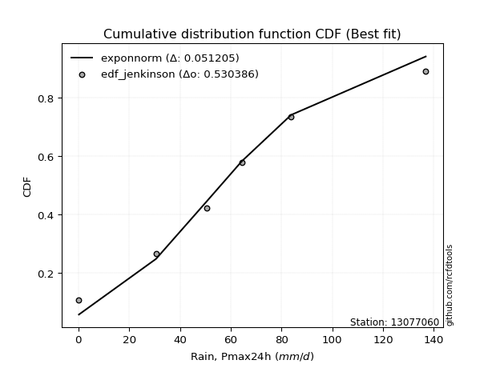</img></img>

</div>


### 11. EDF Cunnane (1978)

Cunnane´s work in statistical hydrology has focused on the performance and evaluation of different probability distributions (such as GEV, Gumbel, Lognormal) for flood frequency estimation. _b_ is a constant, typically set to 0.4.

<div align="center">


$P=(m-b)/(n+1-2b)$


</div>


**11.1. Empirical values**

<div align="center">

|                | 0                   | 1                   | 2                  | 3           | 4                  | 5                  | 6                  |
|:---------------|:--------------------|:--------------------|:-------------------|:------------|:-------------------|:-------------------|:-------------------|
| date           | 2023                | 2022                | 2020               | 2025        | 2021               | 2024               | 2019               |
| x              | 0.2                 | 30.6                | 50.4               | 63.0        | 64.4               | 83.8               | 136.8              |
| m              | 1                   | 2                   | 3                  | 4           | 5                  | 6                  | 7                  |
| empirical_dist | edf_cunnane         | edf_cunnane         | edf_cunnane        | edf_cunnane | edf_cunnane        | edf_cunnane        | edf_cunnane        |
| empirical      | 0.08333333333333333 | 0.22222222222222224 | 0.3611111111111111 | 0.5         | 0.6388888888888888 | 0.7777777777777777 | 0.9166666666666666 |
| empirical_tr   | 1.090909090909091   | 1.2857142857142856  | 1.565217391304348  | 2.0         | 2.7692307692307687 | 4.499999999999998  | 11.999999999999995 |

</div>


**11.2. Kolmogorov-Smirnov fit test (sorted by Δ)**


<div align="center">

|                | 0                   | 1                   | 2                   | 3                   | 4                   | 5                   | 6                   | 7                   | 8                   | 9                   | 10                  | 11                  | 12                  | 13                  | 14                  | 15                  | 16                  | 17                  | 18                  | 19                  | 20                  | 21                  | 22                  | 23                  | 24                  | 25                  | 26                  | 27                  | 28                  | 29                  | 30                  | 31                  | 32                  | 33                  | 34                  | 35                  | 36                  | 37                  | 38                  | 39                  | 40                  | 41                  | 42                  | 43                  | 44                  | 45                  | 46                  | 47                  | 48                  | 49                  | 50                  | 51                  | 52                  | 53                  | 54                  | 55                  | 56                  | 57                  | 58                  | 59                  | 60                  | 61                  | 62                  | 63                  | 64                  | 65                  | 66                  | 67                  | 68                  | 69                  | 70                  | 71                  | 72                  | 73                  | 74                  | 75                  | 76                  | 77                  | 78                  | 79                  | 80                  | 81                  | 82                  | 83                  | 84                  | 85                  | 86                  | 87                  | 88                  | 89                  | 90                  | 91                  | 92                  | 93                  | 94                  | 95                  | 96                  | 97                  | 98                  | 99                  | 100                 | 101                 | 102                 | 103                 | 104                 | 105                 | 106                 | 107                 | 108                 | 109                 | 110                 | 111                 | 112                 | 113                 | 114                 | 115                 | 116                 | 117                 | 118                 | 119                 | 120                 | 121                 | 122                 | 123                 | 124                 | 125                 | 126                 | 127                 | 128                 | 129                 | 130                 | 131                 | 132                 | 133                 | 134                 | 135                 | 136                 | 137                 | 138                 | 139                 | 140                 | 141                 | 142                 | 143                 | 144                 | 145                 | 146                 | 147                 | 148                 | 149                 | 150                 | 151                 | 152                 | 153                 | 154                 | 155                 | 156                 | 157                 | 158                 | 159                 |
|:---------------|:--------------------|:--------------------|:--------------------|:--------------------|:--------------------|:--------------------|:--------------------|:--------------------|:--------------------|:--------------------|:--------------------|:--------------------|:--------------------|:--------------------|:--------------------|:--------------------|:--------------------|:--------------------|:--------------------|:--------------------|:--------------------|:--------------------|:--------------------|:--------------------|:--------------------|:--------------------|:--------------------|:--------------------|:--------------------|:--------------------|:--------------------|:--------------------|:--------------------|:--------------------|:--------------------|:--------------------|:--------------------|:--------------------|:--------------------|:--------------------|:--------------------|:--------------------|:--------------------|:--------------------|:--------------------|:--------------------|:--------------------|:--------------------|:--------------------|:--------------------|:--------------------|:--------------------|:--------------------|:--------------------|:--------------------|:--------------------|:--------------------|:--------------------|:--------------------|:--------------------|:--------------------|:--------------------|:--------------------|:--------------------|:--------------------|:--------------------|:--------------------|:--------------------|:--------------------|:--------------------|:--------------------|:--------------------|:--------------------|:--------------------|:--------------------|:--------------------|:--------------------|:--------------------|:--------------------|:--------------------|:--------------------|:--------------------|:--------------------|:--------------------|:--------------------|:--------------------|:--------------------|:--------------------|:--------------------|:--------------------|:--------------------|:--------------------|:--------------------|:--------------------|:--------------------|:--------------------|:--------------------|:--------------------|:--------------------|:--------------------|:--------------------|:--------------------|:--------------------|:--------------------|:--------------------|:--------------------|:--------------------|:--------------------|:--------------------|:--------------------|:--------------------|:--------------------|:--------------------|:--------------------|:--------------------|:--------------------|:--------------------|:--------------------|:--------------------|:--------------------|:--------------------|:--------------------|:--------------------|:--------------------|:--------------------|:--------------------|:--------------------|:--------------------|:--------------------|:--------------------|:--------------------|:--------------------|:--------------------|:--------------------|:--------------------|:--------------------|:--------------------|:--------------------|:--------------------|:--------------------|:--------------------|:--------------------|:--------------------|:--------------------|:--------------------|:--------------------|:--------------------|:--------------------|:--------------------|:--------------------|:--------------------|:--------------------|:--------------------|:--------------------|:--------------------|:--------------------|:--------------------|:--------------------|:--------------------|:--------------------|
| station        | 13077060            | 13077060            | 13077060            | 13077060            | 13077060            | 13077060            | 13077060            | 13077060            | 13077060            | 13077060            | 13077060            | 13077060            | 13077060            | 13077060            | 13077060            | 13077060            | 13077060            | 13077060            | 13077060            | 13077060            | 13077060            | 13077060            | 13077060            | 13077060            | 13077060            | 13077060            | 13077060            | 13077060            | 13077060            | 13077060            | 13077060            | 13077060            | 13077060            | 13077060            | 13077060            | 13077060            | 13077060            | 13077060            | 13077060            | 13077060            | 13077060            | 13077060            | 13077060            | 13077060            | 13077060            | 13077060            | 13077060            | 13077060            | 13077060            | 13077060            | 13077060            | 13077060            | 13077060            | 13077060            | 13077060            | 13077060            | 13077060            | 13077060            | 13077060            | 13077060            | 13077060            | 13077060            | 13077060            | 13077060            | 13077060            | 13077060            | 13077060            | 13077060            | 13077060            | 13077060            | 13077060            | 13077060            | 13077060            | 13077060            | 13077060            | 13077060            | 13077060            | 13077060            | 13077060            | 13077060            | 13077060            | 13077060            | 13077060            | 13077060            | 13077060            | 13077060            | 13077060            | 13077060            | 13077060            | 13077060            | 13077060            | 13077060            | 13077060            | 13077060            | 13077060            | 13077060            | 13077060            | 13077060            | 13077060            | 13077060            | 13077060            | 13077060            | 13077060            | 13077060            | 13077060            | 13077060            | 13077060            | 13077060            | 13077060            | 13077060            | 13077060            | 13077060            | 13077060            | 13077060            | 13077060            | 13077060            | 13077060            | 13077060            | 13077060            | 13077060            | 13077060            | 13077060            | 13077060            | 13077060            | 13077060            | 13077060            | 13077060            | 13077060            | 13077060            | 13077060            | 13077060            | 13077060            | 13077060            | 13077060            | 13077060            | 13077060            | 13077060            | 13077060            | 13077060            | 13077060            | 13077060            | 13077060            | 13077060            | 13077060            | 13077060            | 13077060            | 13077060            | 13077060            | 13077060            | 13077060            | 13077060            | 13077060            | 13077060            | 13077060            | 13077060            | 13077060            | 13077060            | 13077060            | 13077060            | 13077060            |
| empirical_dist | edf_cunnane         | edf_cunnane         | edf_cunnane         | edf_cunnane         | edf_cunnane         | edf_cunnane         | edf_cunnane         | edf_cunnane         | edf_cunnane         | edf_cunnane         | edf_cunnane         | edf_cunnane         | edf_cunnane         | edf_cunnane         | edf_cunnane         | edf_cunnane         | edf_cunnane         | edf_cunnane         | edf_cunnane         | edf_cunnane         | edf_cunnane         | edf_cunnane         | edf_cunnane         | edf_cunnane         | edf_cunnane         | edf_cunnane         | edf_cunnane         | edf_cunnane         | edf_cunnane         | edf_cunnane         | edf_cunnane         | edf_cunnane         | edf_cunnane         | edf_cunnane         | edf_cunnane         | edf_cunnane         | edf_cunnane         | edf_cunnane         | edf_cunnane         | edf_cunnane         | edf_cunnane         | edf_cunnane         | edf_cunnane         | edf_cunnane         | edf_cunnane         | edf_cunnane         | edf_cunnane         | edf_cunnane         | edf_cunnane         | edf_cunnane         | edf_cunnane         | edf_cunnane         | edf_cunnane         | edf_cunnane         | edf_cunnane         | edf_cunnane         | edf_cunnane         | edf_cunnane         | edf_cunnane         | edf_cunnane         | edf_cunnane         | edf_cunnane         | edf_cunnane         | edf_cunnane         | edf_cunnane         | edf_cunnane         | edf_cunnane         | edf_cunnane         | edf_cunnane         | edf_cunnane         | edf_cunnane         | edf_cunnane         | edf_cunnane         | edf_cunnane         | edf_cunnane         | edf_cunnane         | edf_cunnane         | edf_cunnane         | edf_cunnane         | edf_cunnane         | edf_cunnane         | edf_cunnane         | edf_cunnane         | edf_cunnane         | edf_cunnane         | edf_cunnane         | edf_cunnane         | edf_cunnane         | edf_cunnane         | edf_cunnane         | edf_cunnane         | edf_cunnane         | edf_cunnane         | edf_cunnane         | edf_cunnane         | edf_cunnane         | edf_cunnane         | edf_cunnane         | edf_cunnane         | edf_cunnane         | edf_cunnane         | edf_cunnane         | edf_cunnane         | edf_cunnane         | edf_cunnane         | edf_cunnane         | edf_cunnane         | edf_cunnane         | edf_cunnane         | edf_cunnane         | edf_cunnane         | edf_cunnane         | edf_cunnane         | edf_cunnane         | edf_cunnane         | edf_cunnane         | edf_cunnane         | edf_cunnane         | edf_cunnane         | edf_cunnane         | edf_cunnane         | edf_cunnane         | edf_cunnane         | edf_cunnane         | edf_cunnane         | edf_cunnane         | edf_cunnane         | edf_cunnane         | edf_cunnane         | edf_cunnane         | edf_cunnane         | edf_cunnane         | edf_cunnane         | edf_cunnane         | edf_cunnane         | edf_cunnane         | edf_cunnane         | edf_cunnane         | edf_cunnane         | edf_cunnane         | edf_cunnane         | edf_cunnane         | edf_cunnane         | edf_cunnane         | edf_cunnane         | edf_cunnane         | edf_cunnane         | edf_cunnane         | edf_cunnane         | edf_cunnane         | edf_cunnane         | edf_cunnane         | edf_cunnane         | edf_cunnane         | edf_cunnane         | edf_cunnane         | edf_cunnane         | edf_cunnane         | edf_cunnane         | edf_cunnane         |
| p_dist         | exponnorm           | genlogistic         | erlang              | gamma               | betaprime           | gengamma            | fatiguelife         | johnsonsu           | skewnorm            | maxwell             | genextreme          | rayleigh            | rice                | invgauss            | burr12              | weibull_min         | pearson3            | laplace             | foldnorm            | gumbel_r            | bradford            | exponweib           | logjohnsonsu        | hypsecant           | truncweibull_min    | kappa3              | kstwobign           | logistic            | t                   | crystalball         | norm                | halfnorm            | anglit              | moyal               | semicircular        | logt                | gennorm             | halflogistic        | cosine              | loggenextreme       | truncexpon          | dgamma              | loggennorm          | dweibull            | logdgamma           | mielke              | arcsine             | kappa4              | logargus            | logvonmises_line    | wrapcauchy          | uniform             | logpearson3         | logloggamma         | gumbel_l            | ncf                 | vonmises_line       | loglevy_l           | logdweibull         | ksone               | wald                | genexpon            | loggompertz         | lomax               | gausshyper          | argus               | beta                | genpareto           | loggumbel_l         | logburr12           | loggausshyper       | logtrapezoid        | logfoldnorm         | johnsonsb           | f                   | burr                | logarcsine          | logsemicircular     | loganglit           | lognakagami         | logexponnorm        | logcrystalball      | lognorm             | logrice             | loggamma            | loggamma            | lognct              | loglogistic         | logfatiguelife      | loghypsecant        | nct                 | logerlang           | logweibull_max      | loglaplace          | loglaplace          | halfgennorm         | levy_l              | loginvweibull       | loginvgamma         | loginvgauss         | genhalflogistic     | logmaxwell          | logjohnsonsb        | lograyleigh         | logalpha            | logskewnorm         | nakagami            | logkstwobign        | loggumbel_r         | triang              | loghalfnorm         | logloglaplace       | logwrapcauchy       | loggenexpon         | logcosine           | logmoyal            | loghalflogistic     | loggenhalflogistic  | invgamma            | logncf              | trapezoid           | logtriang           | loglomax            | loggenpareto        | loghalfgennorm      | logwald             | logkappa3           | logexponweib        | rdist               | invweibull          | logf                | logksone            | logkappa4           | logbeta             | logmielke           | logbradford         | tukeylambda         | logtruncweibull_min | logtruncnorm        | loguniform          | loggengamma         | powerlaw            | logburr             | logtruncexpon       | logweibull_min      | weibull_max         | truncpareto         | logbetaprime        | exponpow            | logexponpow         | logpowerlaw         | logtruncpareto      | alpha               | gompertz            | truncnorm           | loggenlogistic      | logtukeylambda      | logrdist            | logvonmises         | vonmises            |
| delta          | 0.06475180797923596 | 0.06613283115852087 | 0.06845378444211037 | 0.06845383436204466 | 0.06867345047296125 | 0.07056261579161316 | 0.07058381338578867 | 0.07164305106359248 | 0.07473989150053639 | 0.07633207736004566 | 0.07645645721609029 | 0.07658701247795824 | 0.07686960369997087 | 0.07937028357398573 | 0.07959869926185131 | 0.0799832995463256  | 0.08038905490377735 | 0.08679867291147958 | 0.08715988673867747 | 0.08863794355923615 | 0.08987732756338912 | 0.09048552804377347 | 0.09772666456673629 | 0.10008870886454169 | 0.10110194077324874 | 0.10173911090700494 | 0.10226370348744246 | 0.10367196475457208 | 0.10784240632199416 | 0.10788514159594331 | 0.1078851490809718  | 0.11151309699499046 | 0.1123090715245586  | 0.1132707950561953  | 0.11413277557209822 | 0.11750800756234936 | 0.12119760224152776 | 0.12597251596032122 | 0.13534115440430683 | 0.13784900402906952 | 0.13865716487997332 | 0.13888888888675566 | 0.1388888888881732  | 0.1388888888891181  | 0.13888888896959622 | 0.13959873522102678 | 0.1464939130823899  | 0.15059176708544608 | 0.15082998382076435 | 0.1551814787285115  | 0.16888438625339003 | 0.1689035301773223  | 0.16907488628761622 | 0.17053435054592675 | 0.17663524053181523 | 0.17749583604316194 | 0.18015251652007663 | 0.18296984715245    | 0.184177609166581   | 0.18443956401496653 | 0.18452963594556304 | 0.1995457962030917  | 0.20590924288796458 | 0.21723889673865476 | 0.21828088956921132 | 0.2184946497849387  | 0.22112033759542737 | 0.2217408523753076  | 0.22349373508024326 | 0.2242321615450394  | 0.24848558177534    | 0.2539701632074446  | 0.2605890501590814  | 0.2631929573629268  | 0.27028703073140414 | 0.2737148417431281  | 0.2865043079744123  | 0.2901150894272515  | 0.29102618410455383 | 0.29316843868947395 | 0.2932363143570361  | 0.29323799033359965 | 0.2932379990873649  | 0.2932806977875779  | 0.2938326524160607  | 0.2938326524160607  | 0.29393370825964016 | 0.295347495878862   | 0.2955589957783329  | 0.29714717956100156 | 0.3006004291527905  | 0.302070669069204   | 0.3021479509595903  | 0.3044494361877689  | 0.3044494361877689  | 0.3057719943175644  | 0.3080524673534452  | 0.3117638313144312  | 0.3142441463384108  | 0.3161120565010461  | 0.3186292465318814  | 0.32560540103664637 | 0.3258865268322704  | 0.33626460268261693 | 0.33810352324003656 | 0.3422528219956914  | 0.3535858696060038  | 0.3574153832914926  | 0.3638988269796053  | 0.36457564665461284 | 0.36627280196036305 | 0.3708346607574198  | 0.3721797979512881  | 0.3771454444280723  | 0.37859522011143265 | 0.3895737776972832  | 0.39209025533196284 | 0.3951570551921232  | 0.4039799767860527  | 0.4110037011020805  | 0.4208385939298675  | 0.4279196227809684  | 0.4465120857429291  | 0.44699476480700506 | 0.4516005912552782  | 0.46090566710917436 | 0.4624064411094527  | 0.47397422227054287 | 0.4754799944945495  | 0.4777730806557747  | 0.5011456892070529  | 0.5032769544054991  | 0.5251015370518413  | 0.5306740812151438  | 0.537077812988799   | 0.5424555236959158  | 0.5426397180330148  | 0.5434032115378749  | 0.5469444729081984  | 0.5483767897310434  | 0.5654354310838958  | 0.5793933642652925  | 0.596913257831602   | 0.6040235860779524  | 0.6485546799352958  | 0.6539617857062323  | 0.6693882171318534  | 0.6862238268575332  | 0.7090823468167274  | 0.729555316182413   | 0.7317058941263131  | 0.7386866764140027  | 0.7641976858979497  | 0.7700170549039381  | 0.7777777739781195  | 0.7777777777777777  | 0.7777777777777778  | 0.9166666666604615  | 1.0134263446774652  | 21.178329661243815  |
| deltao         | 0.48442053926100004 | 0.48442053926100004 | 0.48442053926100004 | 0.48442053926100004 | 0.48442053926100004 | 0.48442053926100004 | 0.48442053926100004 | 0.48442053926100004 | 0.48442053926100004 | 0.48442053926100004 | 0.48442053926100004 | 0.48442053926100004 | 0.48442053926100004 | 0.48442053926100004 | 0.48442053926100004 | 0.48442053926100004 | 0.48442053926100004 | 0.48442053926100004 | 0.48442053926100004 | 0.48442053926100004 | 0.48442053926100004 | 0.48442053926100004 | 0.48442053926100004 | 0.48442053926100004 | 0.48442053926100004 | 0.48442053926100004 | 0.48442053926100004 | 0.48442053926100004 | 0.48442053926100004 | 0.48442053926100004 | 0.48442053926100004 | 0.48442053926100004 | 0.48442053926100004 | 0.48442053926100004 | 0.48442053926100004 | 0.48442053926100004 | 0.48442053926100004 | 0.48442053926100004 | 0.48442053926100004 | 0.48442053926100004 | 0.48442053926100004 | 0.48442053926100004 | 0.48442053926100004 | 0.48442053926100004 | 0.48442053926100004 | 0.48442053926100004 | 0.48442053926100004 | 0.48442053926100004 | 0.48442053926100004 | 0.48442053926100004 | 0.48442053926100004 | 0.48442053926100004 | 0.48442053926100004 | 0.48442053926100004 | 0.48442053926100004 | 0.48442053926100004 | 0.48442053926100004 | 0.48442053926100004 | 0.48442053926100004 | 0.48442053926100004 | 0.48442053926100004 | 0.48442053926100004 | 0.48442053926100004 | 0.48442053926100004 | 0.48442053926100004 | 0.48442053926100004 | 0.48442053926100004 | 0.48442053926100004 | 0.48442053926100004 | 0.48442053926100004 | 0.48442053926100004 | 0.48442053926100004 | 0.48442053926100004 | 0.48442053926100004 | 0.48442053926100004 | 0.48442053926100004 | 0.48442053926100004 | 0.48442053926100004 | 0.48442053926100004 | 0.48442053926100004 | 0.48442053926100004 | 0.48442053926100004 | 0.48442053926100004 | 0.48442053926100004 | 0.48442053926100004 | 0.48442053926100004 | 0.48442053926100004 | 0.48442053926100004 | 0.48442053926100004 | 0.48442053926100004 | 0.48442053926100004 | 0.48442053926100004 | 0.48442053926100004 | 0.48442053926100004 | 0.48442053926100004 | 0.48442053926100004 | 0.48442053926100004 | 0.48442053926100004 | 0.48442053926100004 | 0.48442053926100004 | 0.48442053926100004 | 0.48442053926100004 | 0.48442053926100004 | 0.48442053926100004 | 0.48442053926100004 | 0.48442053926100004 | 0.48442053926100004 | 0.48442053926100004 | 0.48442053926100004 | 0.48442053926100004 | 0.48442053926100004 | 0.48442053926100004 | 0.48442053926100004 | 0.48442053926100004 | 0.48442053926100004 | 0.48442053926100004 | 0.48442053926100004 | 0.48442053926100004 | 0.48442053926100004 | 0.48442053926100004 | 0.48442053926100004 | 0.48442053926100004 | 0.48442053926100004 | 0.48442053926100004 | 0.48442053926100004 | 0.48442053926100004 | 0.48442053926100004 | 0.48442053926100004 | 0.48442053926100004 | 0.48442053926100004 | 0.48442053926100004 | 0.48442053926100004 | 0.48442053926100004 | 0.48442053926100004 | 0.48442053926100004 | 0.48442053926100004 | 0.48442053926100004 | 0.48442053926100004 | 0.48442053926100004 | 0.48442053926100004 | 0.48442053926100004 | 0.48442053926100004 | 0.48442053926100004 | 0.48442053926100004 | 0.48442053926100004 | 0.48442053926100004 | 0.48442053926100004 | 0.48442053926100004 | 0.48442053926100004 | 0.48442053926100004 | 0.48442053926100004 | 0.48442053926100004 | 0.48442053926100004 | 0.48442053926100004 | 0.48442053926100004 | 0.48442053926100004 | 0.48442053926100004 | 0.48442053926100004 | 0.48442053926100004 | 0.48442053926100004 |
| eval           | Δo > Δ              | Δo > Δ              | Δo > Δ              | Δo > Δ              | Δo > Δ              | Δo > Δ              | Δo > Δ              | Δo > Δ              | Δo > Δ              | Δo > Δ              | Δo > Δ              | Δo > Δ              | Δo > Δ              | Δo > Δ              | Δo > Δ              | Δo > Δ              | Δo > Δ              | Δo > Δ              | Δo > Δ              | Δo > Δ              | Δo > Δ              | Δo > Δ              | Δo > Δ              | Δo > Δ              | Δo > Δ              | Δo > Δ              | Δo > Δ              | Δo > Δ              | Δo > Δ              | Δo > Δ              | Δo > Δ              | Δo > Δ              | Δo > Δ              | Δo > Δ              | Δo > Δ              | Δo > Δ              | Δo > Δ              | Δo > Δ              | Δo > Δ              | Δo > Δ              | Δo > Δ              | Δo > Δ              | Δo > Δ              | Δo > Δ              | Δo > Δ              | Δo > Δ              | Δo > Δ              | Δo > Δ              | Δo > Δ              | Δo > Δ              | Δo > Δ              | Δo > Δ              | Δo > Δ              | Δo > Δ              | Δo > Δ              | Δo > Δ              | Δo > Δ              | Δo > Δ              | Δo > Δ              | Δo > Δ              | Δo > Δ              | Δo > Δ              | Δo > Δ              | Δo > Δ              | Δo > Δ              | Δo > Δ              | Δo > Δ              | Δo > Δ              | Δo > Δ              | Δo > Δ              | Δo > Δ              | Δo > Δ              | Δo > Δ              | Δo > Δ              | Δo > Δ              | Δo > Δ              | Δo > Δ              | Δo > Δ              | Δo > Δ              | Δo > Δ              | Δo > Δ              | Δo > Δ              | Δo > Δ              | Δo > Δ              | Δo > Δ              | Δo > Δ              | Δo > Δ              | Δo > Δ              | Δo > Δ              | Δo > Δ              | Δo > Δ              | Δo > Δ              | Δo > Δ              | Δo > Δ              | Δo > Δ              | Δo > Δ              | Δo > Δ              | Δo > Δ              | Δo > Δ              | Δo > Δ              | Δo > Δ              | Δo > Δ              | Δo > Δ              | Δo > Δ              | Δo > Δ              | Δo > Δ              | Δo > Δ              | Δo > Δ              | Δo > Δ              | Δo > Δ              | Δo > Δ              | Δo > Δ              | Δo > Δ              | Δo > Δ              | Δo > Δ              | Δo > Δ              | Δo > Δ              | Δo > Δ              | Δo > Δ              | Δo > Δ              | Δo > Δ              | Δo > Δ              | Δo > Δ              | Δo > Δ              | Δo > Δ              | Δo > Δ              | Δo > Δ              | Δo > Δ              | Δo > Δ              | Δo > Δ              | Δo <= Δ             | Δo <= Δ             | Δo <= Δ             | Δo <= Δ             | Δo <= Δ             | Δo <= Δ             | Δo <= Δ             | Δo <= Δ             | Δo <= Δ             | Δo <= Δ             | Δo <= Δ             | Δo <= Δ             | Δo <= Δ             | Δo <= Δ             | Δo <= Δ             | Δo <= Δ             | Δo <= Δ             | Δo <= Δ             | Δo <= Δ             | Δo <= Δ             | Δo <= Δ             | Δo <= Δ             | Δo <= Δ             | Δo <= Δ             | Δo <= Δ             | Δo <= Δ             | Δo <= Δ             | Δo <= Δ             | Δo <= Δ             | Δo <= Δ             |
| fit            | 1                   | 1                   | 1                   | 1                   | 1                   | 1                   | 1                   | 1                   | 1                   | 1                   | 1                   | 1                   | 1                   | 1                   | 1                   | 1                   | 1                   | 1                   | 1                   | 1                   | 1                   | 1                   | 1                   | 1                   | 1                   | 1                   | 1                   | 1                   | 1                   | 1                   | 1                   | 1                   | 1                   | 1                   | 1                   | 1                   | 1                   | 1                   | 1                   | 1                   | 1                   | 1                   | 1                   | 1                   | 1                   | 1                   | 1                   | 1                   | 1                   | 1                   | 1                   | 1                   | 1                   | 1                   | 1                   | 1                   | 1                   | 1                   | 1                   | 1                   | 1                   | 1                   | 1                   | 1                   | 1                   | 1                   | 1                   | 1                   | 1                   | 1                   | 1                   | 1                   | 1                   | 1                   | 1                   | 1                   | 1                   | 1                   | 1                   | 1                   | 1                   | 1                   | 1                   | 1                   | 1                   | 1                   | 1                   | 1                   | 1                   | 1                   | 1                   | 1                   | 1                   | 1                   | 1                   | 1                   | 1                   | 1                   | 1                   | 1                   | 1                   | 1                   | 1                   | 1                   | 1                   | 1                   | 1                   | 1                   | 1                   | 1                   | 1                   | 1                   | 1                   | 1                   | 1                   | 1                   | 1                   | 1                   | 1                   | 1                   | 1                   | 1                   | 1                   | 1                   | 1                   | 1                   | 1                   | 1                   | 1                   | 1                   | 0                   | 0                   | 0                   | 0                   | 0                   | 0                   | 0                   | 0                   | 0                   | 0                   | 0                   | 0                   | 0                   | 0                   | 0                   | 0                   | 0                   | 0                   | 0                   | 0                   | 0                   | 0                   | 0                   | 0                   | 0                   | 0                   | 0                   | 0                   | 0                   | 0                   |
| n              | 7                   | 7                   | 7                   | 7                   | 7                   | 7                   | 7                   | 7                   | 7                   | 7                   | 7                   | 7                   | 7                   | 7                   | 7                   | 7                   | 7                   | 7                   | 7                   | 7                   | 7                   | 7                   | 7                   | 7                   | 7                   | 7                   | 7                   | 7                   | 7                   | 7                   | 7                   | 7                   | 7                   | 7                   | 7                   | 7                   | 7                   | 7                   | 7                   | 7                   | 7                   | 7                   | 7                   | 7                   | 7                   | 7                   | 7                   | 7                   | 7                   | 7                   | 7                   | 7                   | 7                   | 7                   | 7                   | 7                   | 7                   | 7                   | 7                   | 7                   | 7                   | 7                   | 7                   | 7                   | 7                   | 7                   | 7                   | 7                   | 7                   | 7                   | 7                   | 7                   | 7                   | 7                   | 7                   | 7                   | 7                   | 7                   | 7                   | 7                   | 7                   | 7                   | 7                   | 7                   | 7                   | 7                   | 7                   | 7                   | 7                   | 7                   | 7                   | 7                   | 7                   | 7                   | 7                   | 7                   | 7                   | 7                   | 7                   | 7                   | 7                   | 7                   | 7                   | 7                   | 7                   | 7                   | 7                   | 7                   | 7                   | 7                   | 7                   | 7                   | 7                   | 7                   | 7                   | 7                   | 7                   | 7                   | 7                   | 7                   | 7                   | 7                   | 7                   | 7                   | 7                   | 7                   | 7                   | 7                   | 7                   | 7                   | 7                   | 7                   | 7                   | 7                   | 7                   | 7                   | 7                   | 7                   | 7                   | 7                   | 7                   | 7                   | 7                   | 7                   | 7                   | 7                   | 7                   | 7                   | 7                   | 7                   | 7                   | 7                   | 7                   | 7                   | 7                   | 7                   | 7                   | 7                   | 7                   | 7                   |
| best_fit       | 1                   | 0                   | 0                   | 0                   | 0                   | 0                   | 0                   | 0                   | 0                   | 0                   | 0                   | 0                   | 0                   | 0                   | 0                   | 0                   | 0                   | 0                   | 0                   | 0                   | 0                   | 0                   | 0                   | 0                   | 0                   | 0                   | 0                   | 0                   | 0                   | 0                   | 0                   | 0                   | 0                   | 0                   | 0                   | 0                   | 0                   | 0                   | 0                   | 0                   | 0                   | 0                   | 0                   | 0                   | 0                   | 0                   | 0                   | 0                   | 0                   | 0                   | 0                   | 0                   | 0                   | 0                   | 0                   | 0                   | 0                   | 0                   | 0                   | 0                   | 0                   | 0                   | 0                   | 0                   | 0                   | 0                   | 0                   | 0                   | 0                   | 0                   | 0                   | 0                   | 0                   | 0                   | 0                   | 0                   | 0                   | 0                   | 0                   | 0                   | 0                   | 0                   | 0                   | 0                   | 0                   | 0                   | 0                   | 0                   | 0                   | 0                   | 0                   | 0                   | 0                   | 0                   | 0                   | 0                   | 0                   | 0                   | 0                   | 0                   | 0                   | 0                   | 0                   | 0                   | 0                   | 0                   | 0                   | 0                   | 0                   | 0                   | 0                   | 0                   | 0                   | 0                   | 0                   | 0                   | 0                   | 0                   | 0                   | 0                   | 0                   | 0                   | 0                   | 0                   | 0                   | 0                   | 0                   | 0                   | 0                   | 0                   | 0                   | 0                   | 0                   | 0                   | 0                   | 0                   | 0                   | 0                   | 0                   | 0                   | 0                   | 0                   | 0                   | 0                   | 0                   | 0                   | 0                   | 0                   | 0                   | 0                   | 0                   | 0                   | 0                   | 0                   | 0                   | 0                   | 0                   | 0                   | 0                   | 0                   |
| best_fit_sort  | 1                   | 2                   | 3                   | 4                   | 5                   | 6                   | 7                   | 8                   | 9                   | 10                  | 11                  | 12                  | 13                  | 14                  | 15                  | 16                  | 17                  | 18                  | 19                  | 20                  | 21                  | 22                  | 23                  | 24                  | 25                  | 26                  | 27                  | 28                  | 29                  | 30                  | 31                  | 32                  | 33                  | 34                  | 35                  | 36                  | 37                  | 38                  | 39                  | 40                  | 41                  | 42                  | 43                  | 44                  | 45                  | 46                  | 47                  | 48                  | 49                  | 50                  | 51                  | 52                  | 53                  | 54                  | 55                  | 56                  | 57                  | 58                  | 59                  | 60                  | 61                  | 62                  | 63                  | 64                  | 65                  | 66                  | 67                  | 68                  | 69                  | 70                  | 71                  | 72                  | 73                  | 74                  | 75                  | 76                  | 77                  | 78                  | 79                  | 80                  | 81                  | 82                  | 83                  | 84                  | 85                  | 86                  | 87                  | 88                  | 89                  | 90                  | 91                  | 92                  | 93                  | 94                  | 95                  | 96                  | 97                  | 98                  | 99                  | 100                 | 101                 | 102                 | 103                 | 104                 | 105                 | 106                 | 107                 | 108                 | 109                 | 110                 | 111                 | 112                 | 113                 | 114                 | 115                 | 116                 | 117                 | 118                 | 119                 | 120                 | 121                 | 122                 | 123                 | 124                 | 125                 | 126                 | 127                 | 128                 | 129                 | 130                 | 131                 | 132                 | 133                 | 134                 | 135                 | 136                 | 137                 | 138                 | 139                 | 140                 | 141                 | 142                 | 143                 | 144                 | 145                 | 146                 | 147                 | 148                 | 149                 | 150                 | 151                 | 152                 | 153                 | 154                 | 155                 | 156                 | 157                 | 158                 | 159                 | 160                 |

</div>


**11.3. Best fit**

<div align="center">

|   id |   station | empirical_dist   | p_dist    |     delta |   deltao | eval   |   fit |   n |   best_fit |   best_fit_sort |
|-----:|----------:|:-----------------|:----------|----------:|---------:|:-------|------:|----:|-----------:|----------------:|
|    0 |  13077060 | edf_cunnane      | exponnorm | 0.0647518 | 0.484421 | Δo > Δ |     1 |   7 |          1 |               1 |

</div>


<div align="center">

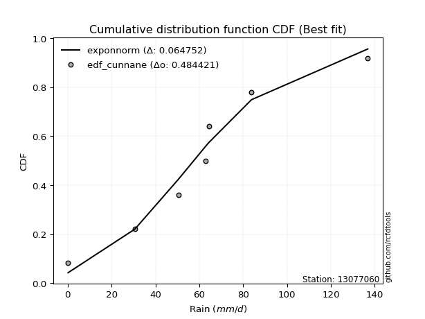</img>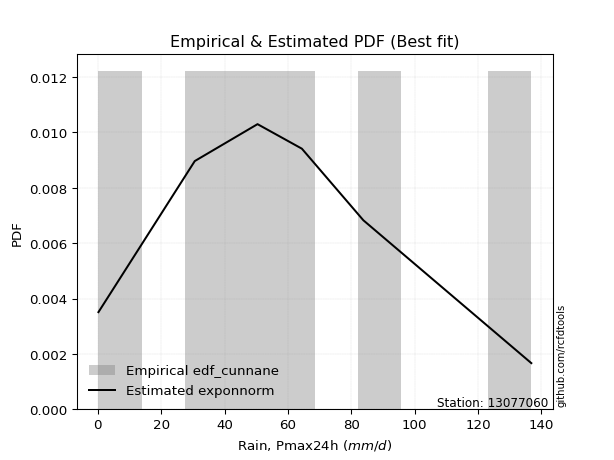</img>

</div>


### 12. EDF Adamowski (1981)

The Adamowski formula in hydrology refers to a specific plotting position formula used for estimating the non-parametric empirical distribution of hydrological events (like flood peaks) to calculate their return periods. This formula provides an alternative to traditional parametric methods (like the Gumbel or Log Pearson Type III distributions). 

<div align="center">


$P=(m-0.25)/(n+0.5)$


</div>


**12.1. Empirical values**

<div align="center">

|                | 0                  | 1                   | 2                   | 3             | 4                  | 5                  | 6                  |
|:---------------|:-------------------|:--------------------|:--------------------|:--------------|:-------------------|:-------------------|:-------------------|
| date           | 2023               | 2022                | 2020                | 2025          | 2021               | 2024               | 2019               |
| x              | 0.2                | 30.6                | 50.4                | 63.0          | 64.4               | 83.8               | 136.8              |
| m              | 1                  | 2                   | 3                   | 4             | 5                  | 6                  | 7                  |
| empirical_dist | edf_adamowski      | edf_adamowski       | edf_adamowski       | edf_adamowski | edf_adamowski      | edf_adamowski      | edf_adamowski      |
| empirical      | 0.1                | 0.23333333333333334 | 0.36666666666666664 | 0.5           | 0.6333333333333333 | 0.7666666666666667 | 0.9                |
| empirical_tr   | 1.1111111111111112 | 1.3043478260869565  | 1.5789473684210527  | 2.0           | 2.727272727272727  | 4.2857142857142865 | 10.000000000000002 |

</div>


**12.2. Kolmogorov-Smirnov fit test (sorted by Δ)**


<div align="center">

|                | 0                   | 1                   | 2                   | 3                   | 4                   | 5                   | 6                   | 7                   | 8                   | 9                   | 10                  | 11                  | 12                  | 13                  | 14                  | 15                  | 16                  | 17                  | 18                  | 19                  | 20                  | 21                  | 22                  | 23                  | 24                  | 25                  | 26                  | 27                  | 28                  | 29                  | 30                  | 31                  | 32                  | 33                  | 34                  | 35                  | 36                  | 37                  | 38                  | 39                  | 40                  | 41                  | 42                  | 43                  | 44                  | 45                  | 46                  | 47                  | 48                  | 49                  | 50                  | 51                  | 52                  | 53                  | 54                  | 55                  | 56                  | 57                  | 58                  | 59                  | 60                  | 61                  | 62                  | 63                  | 64                  | 65                  | 66                  | 67                  | 68                  | 69                  | 70                  | 71                  | 72                  | 73                  | 74                  | 75                  | 76                  | 77                  | 78                  | 79                  | 80                  | 81                  | 82                  | 83                  | 84                  | 85                  | 86                  | 87                  | 88                  | 89                  | 90                  | 91                  | 92                  | 93                  | 94                  | 95                  | 96                  | 97                  | 98                  | 99                  | 100                 | 101                 | 102                 | 103                 | 104                 | 105                 | 106                 | 107                 | 108                 | 109                 | 110                 | 111                 | 112                 | 113                 | 114                 | 115                 | 116                 | 117                 | 118                 | 119                 | 120                 | 121                 | 122                 | 123                 | 124                 | 125                 | 126                 | 127                 | 128                 | 129                 | 130                 | 131                 | 132                 | 133                 | 134                 | 135                 | 136                 | 137                 | 138                 | 139                 | 140                 | 141                 | 142                 | 143                 | 144                 | 145                 | 146                 | 147                 | 148                 | 149                 | 150                 | 151                 | 152                 | 153                 | 154                 | 155                 | 156                 | 157                 | 158                 | 159                 |
|:---------------|:--------------------|:--------------------|:--------------------|:--------------------|:--------------------|:--------------------|:--------------------|:--------------------|:--------------------|:--------------------|:--------------------|:--------------------|:--------------------|:--------------------|:--------------------|:--------------------|:--------------------|:--------------------|:--------------------|:--------------------|:--------------------|:--------------------|:--------------------|:--------------------|:--------------------|:--------------------|:--------------------|:--------------------|:--------------------|:--------------------|:--------------------|:--------------------|:--------------------|:--------------------|:--------------------|:--------------------|:--------------------|:--------------------|:--------------------|:--------------------|:--------------------|:--------------------|:--------------------|:--------------------|:--------------------|:--------------------|:--------------------|:--------------------|:--------------------|:--------------------|:--------------------|:--------------------|:--------------------|:--------------------|:--------------------|:--------------------|:--------------------|:--------------------|:--------------------|:--------------------|:--------------------|:--------------------|:--------------------|:--------------------|:--------------------|:--------------------|:--------------------|:--------------------|:--------------------|:--------------------|:--------------------|:--------------------|:--------------------|:--------------------|:--------------------|:--------------------|:--------------------|:--------------------|:--------------------|:--------------------|:--------------------|:--------------------|:--------------------|:--------------------|:--------------------|:--------------------|:--------------------|:--------------------|:--------------------|:--------------------|:--------------------|:--------------------|:--------------------|:--------------------|:--------------------|:--------------------|:--------------------|:--------------------|:--------------------|:--------------------|:--------------------|:--------------------|:--------------------|:--------------------|:--------------------|:--------------------|:--------------------|:--------------------|:--------------------|:--------------------|:--------------------|:--------------------|:--------------------|:--------------------|:--------------------|:--------------------|:--------------------|:--------------------|:--------------------|:--------------------|:--------------------|:--------------------|:--------------------|:--------------------|:--------------------|:--------------------|:--------------------|:--------------------|:--------------------|:--------------------|:--------------------|:--------------------|:--------------------|:--------------------|:--------------------|:--------------------|:--------------------|:--------------------|:--------------------|:--------------------|:--------------------|:--------------------|:--------------------|:--------------------|:--------------------|:--------------------|:--------------------|:--------------------|:--------------------|:--------------------|:--------------------|:--------------------|:--------------------|:--------------------|:--------------------|:--------------------|:--------------------|:--------------------|:--------------------|:--------------------|
| station        | 13077060            | 13077060            | 13077060            | 13077060            | 13077060            | 13077060            | 13077060            | 13077060            | 13077060            | 13077060            | 13077060            | 13077060            | 13077060            | 13077060            | 13077060            | 13077060            | 13077060            | 13077060            | 13077060            | 13077060            | 13077060            | 13077060            | 13077060            | 13077060            | 13077060            | 13077060            | 13077060            | 13077060            | 13077060            | 13077060            | 13077060            | 13077060            | 13077060            | 13077060            | 13077060            | 13077060            | 13077060            | 13077060            | 13077060            | 13077060            | 13077060            | 13077060            | 13077060            | 13077060            | 13077060            | 13077060            | 13077060            | 13077060            | 13077060            | 13077060            | 13077060            | 13077060            | 13077060            | 13077060            | 13077060            | 13077060            | 13077060            | 13077060            | 13077060            | 13077060            | 13077060            | 13077060            | 13077060            | 13077060            | 13077060            | 13077060            | 13077060            | 13077060            | 13077060            | 13077060            | 13077060            | 13077060            | 13077060            | 13077060            | 13077060            | 13077060            | 13077060            | 13077060            | 13077060            | 13077060            | 13077060            | 13077060            | 13077060            | 13077060            | 13077060            | 13077060            | 13077060            | 13077060            | 13077060            | 13077060            | 13077060            | 13077060            | 13077060            | 13077060            | 13077060            | 13077060            | 13077060            | 13077060            | 13077060            | 13077060            | 13077060            | 13077060            | 13077060            | 13077060            | 13077060            | 13077060            | 13077060            | 13077060            | 13077060            | 13077060            | 13077060            | 13077060            | 13077060            | 13077060            | 13077060            | 13077060            | 13077060            | 13077060            | 13077060            | 13077060            | 13077060            | 13077060            | 13077060            | 13077060            | 13077060            | 13077060            | 13077060            | 13077060            | 13077060            | 13077060            | 13077060            | 13077060            | 13077060            | 13077060            | 13077060            | 13077060            | 13077060            | 13077060            | 13077060            | 13077060            | 13077060            | 13077060            | 13077060            | 13077060            | 13077060            | 13077060            | 13077060            | 13077060            | 13077060            | 13077060            | 13077060            | 13077060            | 13077060            | 13077060            | 13077060            | 13077060            | 13077060            | 13077060            | 13077060            | 13077060            |
| empirical_dist | edf_adamowski       | edf_adamowski       | edf_adamowski       | edf_adamowski       | edf_adamowski       | edf_adamowski       | edf_adamowski       | edf_adamowski       | edf_adamowski       | edf_adamowski       | edf_adamowski       | edf_adamowski       | edf_adamowski       | edf_adamowski       | edf_adamowski       | edf_adamowski       | edf_adamowski       | edf_adamowski       | edf_adamowski       | edf_adamowski       | edf_adamowski       | edf_adamowski       | edf_adamowski       | edf_adamowski       | edf_adamowski       | edf_adamowski       | edf_adamowski       | edf_adamowski       | edf_adamowski       | edf_adamowski       | edf_adamowski       | edf_adamowski       | edf_adamowski       | edf_adamowski       | edf_adamowski       | edf_adamowski       | edf_adamowski       | edf_adamowski       | edf_adamowski       | edf_adamowski       | edf_adamowski       | edf_adamowski       | edf_adamowski       | edf_adamowski       | edf_adamowski       | edf_adamowski       | edf_adamowski       | edf_adamowski       | edf_adamowski       | edf_adamowski       | edf_adamowski       | edf_adamowski       | edf_adamowski       | edf_adamowski       | edf_adamowski       | edf_adamowski       | edf_adamowski       | edf_adamowski       | edf_adamowski       | edf_adamowski       | edf_adamowski       | edf_adamowski       | edf_adamowski       | edf_adamowski       | edf_adamowski       | edf_adamowski       | edf_adamowski       | edf_adamowski       | edf_adamowski       | edf_adamowski       | edf_adamowski       | edf_adamowski       | edf_adamowski       | edf_adamowski       | edf_adamowski       | edf_adamowski       | edf_adamowski       | edf_adamowski       | edf_adamowski       | edf_adamowski       | edf_adamowski       | edf_adamowski       | edf_adamowski       | edf_adamowski       | edf_adamowski       | edf_adamowski       | edf_adamowski       | edf_adamowski       | edf_adamowski       | edf_adamowski       | edf_adamowski       | edf_adamowski       | edf_adamowski       | edf_adamowski       | edf_adamowski       | edf_adamowski       | edf_adamowski       | edf_adamowski       | edf_adamowski       | edf_adamowski       | edf_adamowski       | edf_adamowski       | edf_adamowski       | edf_adamowski       | edf_adamowski       | edf_adamowski       | edf_adamowski       | edf_adamowski       | edf_adamowski       | edf_adamowski       | edf_adamowski       | edf_adamowski       | edf_adamowski       | edf_adamowski       | edf_adamowski       | edf_adamowski       | edf_adamowski       | edf_adamowski       | edf_adamowski       | edf_adamowski       | edf_adamowski       | edf_adamowski       | edf_adamowski       | edf_adamowski       | edf_adamowski       | edf_adamowski       | edf_adamowski       | edf_adamowski       | edf_adamowski       | edf_adamowski       | edf_adamowski       | edf_adamowski       | edf_adamowski       | edf_adamowski       | edf_adamowski       | edf_adamowski       | edf_adamowski       | edf_adamowski       | edf_adamowski       | edf_adamowski       | edf_adamowski       | edf_adamowski       | edf_adamowski       | edf_adamowski       | edf_adamowski       | edf_adamowski       | edf_adamowski       | edf_adamowski       | edf_adamowski       | edf_adamowski       | edf_adamowski       | edf_adamowski       | edf_adamowski       | edf_adamowski       | edf_adamowski       | edf_adamowski       | edf_adamowski       | edf_adamowski       | edf_adamowski       | edf_adamowski       |
| p_dist         | exponnorm           | genlogistic         | erlang              | gamma               | betaprime           | gengamma            | fatiguelife         | johnsonsu           | skewnorm            | maxwell             | genextreme          | rayleigh            | rice                | invgauss            | burr12              | weibull_min         | pearson3            | laplace             | foldnorm            | exponweib           | gumbel_r            | hypsecant           | kstwobign           | logistic            | bradford            | kappa3              | truncweibull_min    | t                   | crystalball         | norm                | halfnorm            | anglit              | semicircular        | logjohnsonsu        | logt                | moyal               | halflogistic        | loggenextreme       | gennorm             | cosine              | truncexpon          | dgamma              | loggennorm          | dweibull            | logdgamma           | mielke              | arcsine             | kappa4              | logvonmises_line    | logargus            | logpearson3         | wrapcauchy          | uniform             | logloggamma         | logdweibull         | gumbel_l            | loglevy_l           | ncf                 | ksone               | vonmises_line       | wald                | genexpon            | loggompertz         | beta                | gausshyper          | lomax               | loggumbel_l         | genpareto           | argus               | logburr12           | loggausshyper       | logtrapezoid        | logfoldnorm         | johnsonsb           | burr                | f                   | logarcsine          | logsemicircular     | loganglit           | lognakagami         | logexponnorm        | logcrystalball      | lognorm             | logrice             | loggamma            | loggamma            | lognct              | loglogistic         | logfatiguelife      | loghypsecant        | nct                 | logerlang           | logweibull_max      | levy_l              | halfgennorm         | loglaplace          | loglaplace          | loginvweibull       | loginvgamma         | loginvgauss         | genhalflogistic     | logmaxwell          | logjohnsonsb        | lograyleigh         | logalpha            | logskewnorm         | nakagami            | logkstwobign        | loggumbel_r         | loghalfnorm         | triang              | logloglaplace       | logwrapcauchy       | loggenexpon         | logcosine           | logmoyal            | loghalflogistic     | loggenhalflogistic  | invgamma            | logncf              | trapezoid           | logtriang           | loglomax            | loggenpareto        | loghalfgennorm      | logwald             | logkappa3           | logexponweib        | invweibull          | rdist               | logf                | logksone            | logkappa4           | logbeta             | logmielke           | logbradford         | tukeylambda         | logtruncweibull_min | logtruncnorm        | loguniform          | loggengamma         | powerlaw            | logburr             | logtruncexpon       | logweibull_min      | weibull_max         | truncpareto         | logbetaprime        | exponpow            | logexponpow         | logpowerlaw         | logtruncpareto      | alpha               | gompertz            | truncnorm           | logtukeylambda      | loggenlogistic      | logrdist            | logvonmises         | vonmises            |
| delta          | 0.05959710188503542 | 0.06057727560296533 | 0.06289822888655483 | 0.06289827880648913 | 0.06311789491740571 | 0.06500706023605762 | 0.06502825783023314 | 0.06608749550803694 | 0.06918433594498086 | 0.07077652180449012 | 0.07090090166053475 | 0.0710314569224027  | 0.07131404814441533 | 0.0738147280184302  | 0.07404314370629578 | 0.07442774399077007 | 0.07483349934822181 | 0.08124311735592404 | 0.08160433118312194 | 0.08492997248821793 | 0.08761950539134045 | 0.09453315330898615 | 0.09670814793188692 | 0.09811640919901654 | 0.09999996817916001 | 0.09999999999903958 | 0.09999999999969766 | 0.10228685076643862 | 0.10232958604038778 | 0.10232959352541626 | 0.10595754143943492 | 0.10675351596900307 | 0.10857722001654269 | 0.10883777567784725 | 0.11195245200679382 | 0.1132707950561953  | 0.12041696040476568 | 0.12673789291795856 | 0.1267531577970833  | 0.1297855988487513  | 0.13310160932441778 | 0.13333333333120012 | 0.13333333333261765 | 0.13333333333356256 | 0.1333333334140407  | 0.13404317966547125 | 0.13538280197127894 | 0.14016230190201    | 0.14357289331334816 | 0.1452744282652088  | 0.15796377517650512 | 0.1633288306978345  | 0.16334797462176676 | 0.1649787949903712  | 0.16751094249991438 | 0.1710796849762597  | 0.1718587360413389  | 0.1719402804876064  | 0.17332845290385557 | 0.1745969609645211  | 0.18452963594556304 | 0.19399024064753617 | 0.20035368733240905 | 0.2100092264843164  | 0.21141494137975136 | 0.21168334118309923 | 0.21238262396913216 | 0.2125667222721469  | 0.21293909422938317 | 0.21867660598948385 | 0.2373744706642289  | 0.24285905209633346 | 0.24947793904797033 | 0.25208184625181573 | 0.26260373063201703 | 0.26385971010772186 | 0.27539319686330116 | 0.2790039783161404  | 0.2799150729934427  | 0.2820573275783628  | 0.282125203245925   | 0.2821268792224885  | 0.2821268879762538  | 0.2821695866764668  | 0.2827215413049496  | 0.2827215413049496  | 0.28282259714852903 | 0.28423638476775087 | 0.28444788466722176 | 0.28603606844989043 | 0.2894893180416794  | 0.29095955795809286 | 0.29103683984847933 | 0.29138580068677855 | 0.2946608832064533  | 0.2970301796567339  | 0.2970301796567339  | 0.30065272020332007 | 0.3031330352272997  | 0.305000945389935   | 0.30751813542077044 | 0.31449428992553524 | 0.31477541572115925 | 0.3251534915715058  | 0.32699241212892544 | 0.3341567715714227  | 0.3424747584948927  | 0.34630427218038146 | 0.35278771586849417 | 0.3551616908492519  | 0.3590200910990573  | 0.35972354964630865 | 0.36106868684017696 | 0.36603433331696117 | 0.3674841090003215  | 0.37846266658617206 | 0.3809791442208517  | 0.38404594408101206 | 0.39286886567494156 | 0.3998925899909694  | 0.40972748281875654 | 0.4168085116698573  | 0.435400974631818   | 0.43588365369589394 | 0.44048948014416706 | 0.44979455599806323 | 0.4512953299983416  | 0.45730755560387626 | 0.46110641398910807 | 0.46436888338343835 | 0.4900345780959418  | 0.492165843294388   | 0.5139904259407302  | 0.5195629701040329  | 0.5259667018776879  | 0.5313444125848046  | 0.5317591734052063  | 0.5322921004267638  | 0.5358333617970872  | 0.5372656786199324  | 0.5543243199727848  | 0.5682822531541813  | 0.5802465911649354  | 0.5929124749668413  | 0.6374435688241846  | 0.6428506745951212  | 0.6582771060207422  | 0.6751127157464221  | 0.6979712357056163  | 0.7184442050713018  | 0.720594783015202   | 0.7275755653028915  | 0.7530865747868385  | 0.7589059437928272  | 0.7666666628670085  | 0.7666666666666666  | 0.7666666666666667  | 0.8999999999937949  | 1.0300930113441318  | 21.194996327910484  |
| deltao         | 0.48442053926100004 | 0.48442053926100004 | 0.48442053926100004 | 0.48442053926100004 | 0.48442053926100004 | 0.48442053926100004 | 0.48442053926100004 | 0.48442053926100004 | 0.48442053926100004 | 0.48442053926100004 | 0.48442053926100004 | 0.48442053926100004 | 0.48442053926100004 | 0.48442053926100004 | 0.48442053926100004 | 0.48442053926100004 | 0.48442053926100004 | 0.48442053926100004 | 0.48442053926100004 | 0.48442053926100004 | 0.48442053926100004 | 0.48442053926100004 | 0.48442053926100004 | 0.48442053926100004 | 0.48442053926100004 | 0.48442053926100004 | 0.48442053926100004 | 0.48442053926100004 | 0.48442053926100004 | 0.48442053926100004 | 0.48442053926100004 | 0.48442053926100004 | 0.48442053926100004 | 0.48442053926100004 | 0.48442053926100004 | 0.48442053926100004 | 0.48442053926100004 | 0.48442053926100004 | 0.48442053926100004 | 0.48442053926100004 | 0.48442053926100004 | 0.48442053926100004 | 0.48442053926100004 | 0.48442053926100004 | 0.48442053926100004 | 0.48442053926100004 | 0.48442053926100004 | 0.48442053926100004 | 0.48442053926100004 | 0.48442053926100004 | 0.48442053926100004 | 0.48442053926100004 | 0.48442053926100004 | 0.48442053926100004 | 0.48442053926100004 | 0.48442053926100004 | 0.48442053926100004 | 0.48442053926100004 | 0.48442053926100004 | 0.48442053926100004 | 0.48442053926100004 | 0.48442053926100004 | 0.48442053926100004 | 0.48442053926100004 | 0.48442053926100004 | 0.48442053926100004 | 0.48442053926100004 | 0.48442053926100004 | 0.48442053926100004 | 0.48442053926100004 | 0.48442053926100004 | 0.48442053926100004 | 0.48442053926100004 | 0.48442053926100004 | 0.48442053926100004 | 0.48442053926100004 | 0.48442053926100004 | 0.48442053926100004 | 0.48442053926100004 | 0.48442053926100004 | 0.48442053926100004 | 0.48442053926100004 | 0.48442053926100004 | 0.48442053926100004 | 0.48442053926100004 | 0.48442053926100004 | 0.48442053926100004 | 0.48442053926100004 | 0.48442053926100004 | 0.48442053926100004 | 0.48442053926100004 | 0.48442053926100004 | 0.48442053926100004 | 0.48442053926100004 | 0.48442053926100004 | 0.48442053926100004 | 0.48442053926100004 | 0.48442053926100004 | 0.48442053926100004 | 0.48442053926100004 | 0.48442053926100004 | 0.48442053926100004 | 0.48442053926100004 | 0.48442053926100004 | 0.48442053926100004 | 0.48442053926100004 | 0.48442053926100004 | 0.48442053926100004 | 0.48442053926100004 | 0.48442053926100004 | 0.48442053926100004 | 0.48442053926100004 | 0.48442053926100004 | 0.48442053926100004 | 0.48442053926100004 | 0.48442053926100004 | 0.48442053926100004 | 0.48442053926100004 | 0.48442053926100004 | 0.48442053926100004 | 0.48442053926100004 | 0.48442053926100004 | 0.48442053926100004 | 0.48442053926100004 | 0.48442053926100004 | 0.48442053926100004 | 0.48442053926100004 | 0.48442053926100004 | 0.48442053926100004 | 0.48442053926100004 | 0.48442053926100004 | 0.48442053926100004 | 0.48442053926100004 | 0.48442053926100004 | 0.48442053926100004 | 0.48442053926100004 | 0.48442053926100004 | 0.48442053926100004 | 0.48442053926100004 | 0.48442053926100004 | 0.48442053926100004 | 0.48442053926100004 | 0.48442053926100004 | 0.48442053926100004 | 0.48442053926100004 | 0.48442053926100004 | 0.48442053926100004 | 0.48442053926100004 | 0.48442053926100004 | 0.48442053926100004 | 0.48442053926100004 | 0.48442053926100004 | 0.48442053926100004 | 0.48442053926100004 | 0.48442053926100004 | 0.48442053926100004 | 0.48442053926100004 | 0.48442053926100004 | 0.48442053926100004 | 0.48442053926100004 |
| eval           | Δo > Δ              | Δo > Δ              | Δo > Δ              | Δo > Δ              | Δo > Δ              | Δo > Δ              | Δo > Δ              | Δo > Δ              | Δo > Δ              | Δo > Δ              | Δo > Δ              | Δo > Δ              | Δo > Δ              | Δo > Δ              | Δo > Δ              | Δo > Δ              | Δo > Δ              | Δo > Δ              | Δo > Δ              | Δo > Δ              | Δo > Δ              | Δo > Δ              | Δo > Δ              | Δo > Δ              | Δo > Δ              | Δo > Δ              | Δo > Δ              | Δo > Δ              | Δo > Δ              | Δo > Δ              | Δo > Δ              | Δo > Δ              | Δo > Δ              | Δo > Δ              | Δo > Δ              | Δo > Δ              | Δo > Δ              | Δo > Δ              | Δo > Δ              | Δo > Δ              | Δo > Δ              | Δo > Δ              | Δo > Δ              | Δo > Δ              | Δo > Δ              | Δo > Δ              | Δo > Δ              | Δo > Δ              | Δo > Δ              | Δo > Δ              | Δo > Δ              | Δo > Δ              | Δo > Δ              | Δo > Δ              | Δo > Δ              | Δo > Δ              | Δo > Δ              | Δo > Δ              | Δo > Δ              | Δo > Δ              | Δo > Δ              | Δo > Δ              | Δo > Δ              | Δo > Δ              | Δo > Δ              | Δo > Δ              | Δo > Δ              | Δo > Δ              | Δo > Δ              | Δo > Δ              | Δo > Δ              | Δo > Δ              | Δo > Δ              | Δo > Δ              | Δo > Δ              | Δo > Δ              | Δo > Δ              | Δo > Δ              | Δo > Δ              | Δo > Δ              | Δo > Δ              | Δo > Δ              | Δo > Δ              | Δo > Δ              | Δo > Δ              | Δo > Δ              | Δo > Δ              | Δo > Δ              | Δo > Δ              | Δo > Δ              | Δo > Δ              | Δo > Δ              | Δo > Δ              | Δo > Δ              | Δo > Δ              | Δo > Δ              | Δo > Δ              | Δo > Δ              | Δo > Δ              | Δo > Δ              | Δo > Δ              | Δo > Δ              | Δo > Δ              | Δo > Δ              | Δo > Δ              | Δo > Δ              | Δo > Δ              | Δo > Δ              | Δo > Δ              | Δo > Δ              | Δo > Δ              | Δo > Δ              | Δo > Δ              | Δo > Δ              | Δo > Δ              | Δo > Δ              | Δo > Δ              | Δo > Δ              | Δo > Δ              | Δo > Δ              | Δo > Δ              | Δo > Δ              | Δo > Δ              | Δo > Δ              | Δo > Δ              | Δo > Δ              | Δo > Δ              | Δo > Δ              | Δo > Δ              | Δo > Δ              | Δo <= Δ             | Δo <= Δ             | Δo <= Δ             | Δo <= Δ             | Δo <= Δ             | Δo <= Δ             | Δo <= Δ             | Δo <= Δ             | Δo <= Δ             | Δo <= Δ             | Δo <= Δ             | Δo <= Δ             | Δo <= Δ             | Δo <= Δ             | Δo <= Δ             | Δo <= Δ             | Δo <= Δ             | Δo <= Δ             | Δo <= Δ             | Δo <= Δ             | Δo <= Δ             | Δo <= Δ             | Δo <= Δ             | Δo <= Δ             | Δo <= Δ             | Δo <= Δ             | Δo <= Δ             | Δo <= Δ             | Δo <= Δ             | Δo <= Δ             |
| fit            | 1                   | 1                   | 1                   | 1                   | 1                   | 1                   | 1                   | 1                   | 1                   | 1                   | 1                   | 1                   | 1                   | 1                   | 1                   | 1                   | 1                   | 1                   | 1                   | 1                   | 1                   | 1                   | 1                   | 1                   | 1                   | 1                   | 1                   | 1                   | 1                   | 1                   | 1                   | 1                   | 1                   | 1                   | 1                   | 1                   | 1                   | 1                   | 1                   | 1                   | 1                   | 1                   | 1                   | 1                   | 1                   | 1                   | 1                   | 1                   | 1                   | 1                   | 1                   | 1                   | 1                   | 1                   | 1                   | 1                   | 1                   | 1                   | 1                   | 1                   | 1                   | 1                   | 1                   | 1                   | 1                   | 1                   | 1                   | 1                   | 1                   | 1                   | 1                   | 1                   | 1                   | 1                   | 1                   | 1                   | 1                   | 1                   | 1                   | 1                   | 1                   | 1                   | 1                   | 1                   | 1                   | 1                   | 1                   | 1                   | 1                   | 1                   | 1                   | 1                   | 1                   | 1                   | 1                   | 1                   | 1                   | 1                   | 1                   | 1                   | 1                   | 1                   | 1                   | 1                   | 1                   | 1                   | 1                   | 1                   | 1                   | 1                   | 1                   | 1                   | 1                   | 1                   | 1                   | 1                   | 1                   | 1                   | 1                   | 1                   | 1                   | 1                   | 1                   | 1                   | 1                   | 1                   | 1                   | 1                   | 1                   | 1                   | 0                   | 0                   | 0                   | 0                   | 0                   | 0                   | 0                   | 0                   | 0                   | 0                   | 0                   | 0                   | 0                   | 0                   | 0                   | 0                   | 0                   | 0                   | 0                   | 0                   | 0                   | 0                   | 0                   | 0                   | 0                   | 0                   | 0                   | 0                   | 0                   | 0                   |
| n              | 7                   | 7                   | 7                   | 7                   | 7                   | 7                   | 7                   | 7                   | 7                   | 7                   | 7                   | 7                   | 7                   | 7                   | 7                   | 7                   | 7                   | 7                   | 7                   | 7                   | 7                   | 7                   | 7                   | 7                   | 7                   | 7                   | 7                   | 7                   | 7                   | 7                   | 7                   | 7                   | 7                   | 7                   | 7                   | 7                   | 7                   | 7                   | 7                   | 7                   | 7                   | 7                   | 7                   | 7                   | 7                   | 7                   | 7                   | 7                   | 7                   | 7                   | 7                   | 7                   | 7                   | 7                   | 7                   | 7                   | 7                   | 7                   | 7                   | 7                   | 7                   | 7                   | 7                   | 7                   | 7                   | 7                   | 7                   | 7                   | 7                   | 7                   | 7                   | 7                   | 7                   | 7                   | 7                   | 7                   | 7                   | 7                   | 7                   | 7                   | 7                   | 7                   | 7                   | 7                   | 7                   | 7                   | 7                   | 7                   | 7                   | 7                   | 7                   | 7                   | 7                   | 7                   | 7                   | 7                   | 7                   | 7                   | 7                   | 7                   | 7                   | 7                   | 7                   | 7                   | 7                   | 7                   | 7                   | 7                   | 7                   | 7                   | 7                   | 7                   | 7                   | 7                   | 7                   | 7                   | 7                   | 7                   | 7                   | 7                   | 7                   | 7                   | 7                   | 7                   | 7                   | 7                   | 7                   | 7                   | 7                   | 7                   | 7                   | 7                   | 7                   | 7                   | 7                   | 7                   | 7                   | 7                   | 7                   | 7                   | 7                   | 7                   | 7                   | 7                   | 7                   | 7                   | 7                   | 7                   | 7                   | 7                   | 7                   | 7                   | 7                   | 7                   | 7                   | 7                   | 7                   | 7                   | 7                   | 7                   |
| best_fit       | 1                   | 0                   | 0                   | 0                   | 0                   | 0                   | 0                   | 0                   | 0                   | 0                   | 0                   | 0                   | 0                   | 0                   | 0                   | 0                   | 0                   | 0                   | 0                   | 0                   | 0                   | 0                   | 0                   | 0                   | 0                   | 0                   | 0                   | 0                   | 0                   | 0                   | 0                   | 0                   | 0                   | 0                   | 0                   | 0                   | 0                   | 0                   | 0                   | 0                   | 0                   | 0                   | 0                   | 0                   | 0                   | 0                   | 0                   | 0                   | 0                   | 0                   | 0                   | 0                   | 0                   | 0                   | 0                   | 0                   | 0                   | 0                   | 0                   | 0                   | 0                   | 0                   | 0                   | 0                   | 0                   | 0                   | 0                   | 0                   | 0                   | 0                   | 0                   | 0                   | 0                   | 0                   | 0                   | 0                   | 0                   | 0                   | 0                   | 0                   | 0                   | 0                   | 0                   | 0                   | 0                   | 0                   | 0                   | 0                   | 0                   | 0                   | 0                   | 0                   | 0                   | 0                   | 0                   | 0                   | 0                   | 0                   | 0                   | 0                   | 0                   | 0                   | 0                   | 0                   | 0                   | 0                   | 0                   | 0                   | 0                   | 0                   | 0                   | 0                   | 0                   | 0                   | 0                   | 0                   | 0                   | 0                   | 0                   | 0                   | 0                   | 0                   | 0                   | 0                   | 0                   | 0                   | 0                   | 0                   | 0                   | 0                   | 0                   | 0                   | 0                   | 0                   | 0                   | 0                   | 0                   | 0                   | 0                   | 0                   | 0                   | 0                   | 0                   | 0                   | 0                   | 0                   | 0                   | 0                   | 0                   | 0                   | 0                   | 0                   | 0                   | 0                   | 0                   | 0                   | 0                   | 0                   | 0                   | 0                   |
| best_fit_sort  | 1                   | 2                   | 3                   | 4                   | 5                   | 6                   | 7                   | 8                   | 9                   | 10                  | 11                  | 12                  | 13                  | 14                  | 15                  | 16                  | 17                  | 18                  | 19                  | 20                  | 21                  | 22                  | 23                  | 24                  | 25                  | 26                  | 27                  | 28                  | 29                  | 30                  | 31                  | 32                  | 33                  | 34                  | 35                  | 36                  | 37                  | 38                  | 39                  | 40                  | 41                  | 42                  | 43                  | 44                  | 45                  | 46                  | 47                  | 48                  | 49                  | 50                  | 51                  | 52                  | 53                  | 54                  | 55                  | 56                  | 57                  | 58                  | 59                  | 60                  | 61                  | 62                  | 63                  | 64                  | 65                  | 66                  | 67                  | 68                  | 69                  | 70                  | 71                  | 72                  | 73                  | 74                  | 75                  | 76                  | 77                  | 78                  | 79                  | 80                  | 81                  | 82                  | 83                  | 84                  | 85                  | 86                  | 87                  | 88                  | 89                  | 90                  | 91                  | 92                  | 93                  | 94                  | 95                  | 96                  | 97                  | 98                  | 99                  | 100                 | 101                 | 102                 | 103                 | 104                 | 105                 | 106                 | 107                 | 108                 | 109                 | 110                 | 111                 | 112                 | 113                 | 114                 | 115                 | 116                 | 117                 | 118                 | 119                 | 120                 | 121                 | 122                 | 123                 | 124                 | 125                 | 126                 | 127                 | 128                 | 129                 | 130                 | 131                 | 132                 | 133                 | 134                 | 135                 | 136                 | 137                 | 138                 | 139                 | 140                 | 141                 | 142                 | 143                 | 144                 | 145                 | 146                 | 147                 | 148                 | 149                 | 150                 | 151                 | 152                 | 153                 | 154                 | 155                 | 156                 | 157                 | 158                 | 159                 | 160                 |

</div>


**12.3. Best fit**

<div align="center">

|   id |   station | empirical_dist   | p_dist    |     delta |   deltao | eval   |   fit |   n |   best_fit |   best_fit_sort |
|-----:|----------:|:-----------------|:----------|----------:|---------:|:-------|------:|----:|-----------:|----------------:|
|    0 |  13077060 | edf_adamowski    | exponnorm | 0.0595971 | 0.484421 | Δo > Δ |     1 |   7 |          1 |               1 |

</div>


<div align="center">

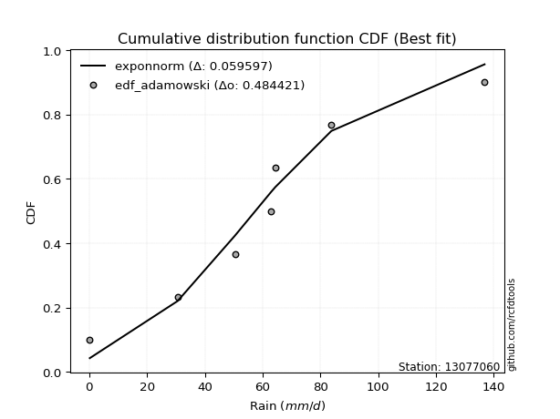</img></img>

</div>


## C. Best fit & Estimate extreme values for specific return periods - Tr

Best fit in probability distribution analysis means finding the theoretical distribution (like Normal, Poisson, Exponential, etc.) that most accurately mirrors your real-world data´s patterns (shape, center, spread) for better predictions, using methods like visual checks (Q-Q plots), goodness-of-fit tests (Kolmogorov-Smirnov, Chi-Squared), and information criteria (AIC) to score and select the simplest, most representative model.


### 1. Best fit (ordered by delta Δ)

:file_folder:Table: [bestfit_13077060.csv](table/bestfit_13077060.csv)

<div align="center">

|   id |   station | empirical_dist   | p_dist      |     delta |   deltao | eval   |   fit |   n |   best_fit |   best_fit_sort |
|-----:|----------:|:-----------------|:------------|----------:|---------:|:-------|------:|----:|-----------:|----------------:|
|    0 |  13077060 | edf_adamowski    | exponnorm   | 0.0595971 | 0.484421 | Δo > Δ |     1 |   7 |          1 |               1 |
|    1 |  13077060 | edf_chegodayev   | exponnorm   | 0.0609981 | 0.484421 | Δo > Δ |     1 |   7 |          1 |               2 |
|    2 |  13077060 | edf_jenkinson    | exponnorm   | 0.0613643 | 0.484421 | Δo > Δ |     1 |   7 |          1 |               3 |
|    3 |  13077060 | edf_beard        | exponnorm   | 0.0613643 | 0.484421 | Δo > Δ |     1 |   7 |          1 |               4 |
|    4 |  13077060 | edf_filliben     | exponnorm   | 0.0616402 | 0.484421 | Δo > Δ |     1 |   7 |          1 |               5 |
|    5 |  13077060 | edf_tukey        | exponnorm   | 0.0622266 | 0.484421 | Δo > Δ |     1 |   7 |          1 |               6 |
|    6 |  13077060 | edf_blom         | exponnorm   | 0.063794  | 0.484421 | Δo > Δ |     1 |   7 |          1 |               7 |
|    7 |  13077060 | edf_cunnane      | exponnorm   | 0.0647518 | 0.484421 | Δo > Δ |     1 |   7 |          1 |               8 |
|    8 |  13077060 | edf_gringorten   | exponnorm   | 0.0663124 | 0.484421 | Δo > Δ |     1 |   7 |          1 |               9 |
|    9 |  13077060 | edf_hazen        | exponnorm   | 0.0687201 | 0.484421 | Δo > Δ |     1 |   7 |          1 |              10 |
|   10 |  13077060 | edf_weibull      | genlogistic | 0.0816027 | 0.484421 | Δo > Δ |     1 |   7 |          1 |              11 |
|   11 |  13077060 | edf_california   | kstwobign   | 0.120836  | 0.484421 | Δo > Δ |     1 |   7 |          1 |              12 |

</div>


### 2. Extreme values and % difference analysis

In hydrology, a return period (or recurrence interval $Tr$) is the statistical average time between extreme events like floods or droughts of a specific magnitude, indicating how rare an event is, with a 100-year flood, for example, having a 1% chance of occurring in any given year, not that it happens exactly every century. It is a key tool for infrastructure design (like bridges or dams) and risk assessment, calculated from historical data to determine the probability of future events, although it is important to remember it is statistical average, and events can cluster or be missed.

The extreme value porcentage difference is evaluated as $pdiff = 1 - (ETrBf / ETr) * 100$, where _ETrBf_ correspond to the bestfit extreme value for a specific recurrence interval and _ETr_ correspond to the extreme value for one of the most used PDFsused in hydrology.

> risk_rate: assuming the return period as the project useful life.

:file_folder:Table: [extreme_13077060.csv](table/extreme_13077060.csv), all PDFs.  
:file_folder:Table: [extremepdiff_13077060.csv](table/extremepdiff_13077060.csv), % difference between bestfit and most used PDFs in Hydrology.

<div align="center">

Extreme values table for only best fit PDFs
|   id |      tr |   prob_l |     prob_g |      alpha |   anglit |   arcsine |    argus |     beta |   betaprime |   bradford |     burr |   burr12 |   cosine |   crystalball |   dgamma |   dweibull |   erlang |   exponnorm |    exponpow |   exponweib |        f |   fatiguelife |   foldnorm |    gamma |   gausshyper |   genexpon |   genextreme |   gengamma |   genhalflogistic |   genlogistic |   gennorm |   genpareto |   gompertz |   gumbel_l |   gumbel_r |   halfgennorm |   halflogistic |   halfnorm |   hypsecant |         invgamma |   invgauss |       invweibull |   johnsonsb |   johnsonsu |   kappa3 |   kappa4 |    ksone |   kstwobign |   laplace |   levy_l |   loggamma |   logistic |   loglaplace |    lomax |   maxwell |   mielke |    moyal |   nakagami |      ncf |              nct |     norm |   pearson3 |   powerlaw |   rayleigh |     rdist |     rice |   semicircular |   skewnorm |        t |   trapezoid |   triang |   truncexpon |   truncnorm |   truncpareto |   truncweibull_min |   tukeylambda |   uniform |   vonmises |   vonmises_line |     wald |   weibull_max |   weibull_min |   wrapcauchy |    logalpha |   loganglit |   logarcsine |   logargus |   logbeta |     logbetaprime |   logbradford |   logburr |   logburr12 |   logcosine |   logcrystalball |   logdgamma |      logdweibull |   logerlang |   logexponnorm |      logexponpow |   logexponweib |           logf |   logfatiguelife |   logfoldnorm |   loggausshyper |      loggenexpon |   loggenextreme |    loggengamma |   loggenhalflogistic |   loggenlogistic |       loggennorm |   loggenpareto |   loggompertz |   loggumbel_l |   loggumbel_r |   loghalfgennorm |   loghalflogistic |   loghalfnorm |   loghypsecant |   loginvgamma |   loginvgauss |    loginvweibull |   logjohnsonsb |     logjohnsonsu |        logkappa3 |   logkappa4 |   logksone |     logkstwobign |   loglevy_l |   logloggamma |   loglogistic |   logloglaplace |         loglomax |   logmaxwell |        logmielke |         logmoyal |   lognakagami |        logncf |     lognct |    lognorm |   logpearson3 |   logpowerlaw |   lograyleigh |   logrdist |    logrice |   logsemicircular |   logskewnorm |              logt |   logtrapezoid |   logtriang |   logtruncexpon |   logtruncnorm |   logtruncpareto |   logtruncweibull_min |   logtukeylambda |   loguniform |   logvonmises |   logvonmises_line |          logwald |   logweibull_max |   logweibull_min |   logwrapcauchy |   station |   n |   risk_rate |
|-----:|--------:|---------:|-----------:|-----------:|---------:|----------:|---------:|---------:|------------:|-----------:|---------:|---------:|---------:|--------------:|---------:|-----------:|---------:|------------:|------------:|------------:|---------:|--------------:|-----------:|---------:|-------------:|-----------:|-------------:|-----------:|------------------:|--------------:|----------:|------------:|-----------:|-----------:|-----------:|--------------:|---------------:|-----------:|------------:|-----------------:|-----------:|-----------------:|------------:|------------:|---------:|---------:|---------:|------------:|----------:|---------:|-----------:|-----------:|-------------:|---------:|----------:|---------:|---------:|-----------:|---------:|-----------------:|---------:|-----------:|-----------:|-----------:|----------:|---------:|---------------:|-----------:|---------:|------------:|---------:|-------------:|------------:|--------------:|-------------------:|--------------:|----------:|-----------:|----------------:|---------:|--------------:|--------------:|-------------:|------------:|------------:|-------------:|-----------:|----------:|-----------------:|--------------:|----------:|------------:|------------:|-----------------:|------------:|-----------------:|------------:|---------------:|-----------------:|---------------:|---------------:|-----------------:|--------------:|----------------:|-----------------:|----------------:|---------------:|---------------------:|-----------------:|-----------------:|---------------:|--------------:|--------------:|--------------:|-----------------:|------------------:|--------------:|---------------:|--------------:|--------------:|-----------------:|---------------:|-----------------:|-----------------:|------------:|-----------:|-----------------:|------------:|--------------:|--------------:|----------------:|-----------------:|-------------:|-----------------:|-----------------:|--------------:|--------------:|-----------:|-----------:|--------------:|--------------:|--------------:|-----------:|-----------:|------------------:|--------------:|------------------:|---------------:|------------:|----------------:|---------------:|-----------------:|----------------------:|-----------------:|-------------:|--------------:|-------------------:|-----------------:|-----------------:|-----------------:|----------------:|----------:|----:|------------:|
|    0 |    2    | 0.5      | 0.5        |   0.778278 |  61.3143 |   61.3143 |  74.3639 |  70.4137 |     57.3171 |    56.8549 |  31.1544 |  56.4547 |  64.0167 |       61.3143 |  64.4    |    64.4    |  57.2882 |     57.421  |    0.225342 |     55.1045 |  31.4779 |       57.5687 |    58.7363 |  57.2882 |      75.522  |    42.5065 |      58.1612 |    57.5611 |           89.409  |       57.4817 |   63      |     75.8719 |    120.555 |    67.8307 |    54.7979 |       27.2176 |        51.5582 |    53.1948 |     61.3143 |      8.74296     |    56.2551 |   3239.6         |     33.7241 |     57.7085 |  54.5176 |  65.3768 |  68.5    |     54.1581 |   61.3143 |  61.6914 |    27.975  |    61.3143 |      28.2464 |  40.4927 |   57.9218 |  50.2921 |  52.6941 |    21.3959 |  46.1224 |     26.2088      |  61.3143 |    58.5524 |    1.42989 |    56.7186 | -12.931   |  57.894  |        61.3143 |    58.0465 |  61.31   |     101.776 |  92.2742 |      50.4288 |  -0.0591824 |       1.04272 |            59.6377 |      -9.86699 |   68.5    |   0.192232 |         68.4999 |  48.4563 |       136.511 |       56.4203 |      68.4975 |     21.536  |     28.2465 |      28.2462 |    48.8158 |   136.792 |     0.211605     |       5.36315 |       inf |     37.9459 |     16.5967 |          28.2464 |     64.4    |     64.4         |     26.5847 |        28.2466 |      0.258481    |    8.47825e+07 |    0.632935    |          27.9166 |       32.6219 |         36.6738 |     14.143       |         60.5974 |   0.21822      |              15.6729 |          inf     |     64.4         |        9.04396 |       41.4346 |       39.6531 |       20.1209 |      3.2049      |      16.9983      |       18.5103 |        28.2464 |       25.0431 |       24.4844 |     23.4335      |        6.66948 |    62.4887       |     1.21166      |     5.80102 |    5.23068 |     15.9985      |     56.0329 |       45.7409 |       28.2464 |    0.759297     |      4.6952      |      23.674  |      1.06211     |     18.0339      |       28.2502 |   2.06891     |    28.1324 |    28.2464 |       51.3842 |      0.230467 |       22.2368 |   0.199996 |    28.2391 |           28.2464 |       23.7023 |     63.2229       |        35.5261 |     14.2098 |         3.0148  |        5.61702 |         0.240953 |               6.19598 |              0.2 |      5.23068 |      0.13     |            48.5858 |     14.4639      |          97.3189 |      0.521325    |         5.23068 |  13077060 |   7 |    0.75     |
|    1 |    2.33 | 0.570815 | 0.429185   |   0.92488  |  69.5593 |   73.6914 |  82.9131 |  87.2414 |     64.4623 |    66.5748 |  41.7099 |  63.9702 |  71.6998 |       68.3926 |  66.642  |    67.4602 |  64.4395 |     64.0785 |    0.283216 |     62.3262 |  40.7893 |       64.658  |    66.5147 |  64.4395 |      85.3559 |    51.8278 |      65.2587 |    64.6561 |           98.3683 |       64.2097 |   64.4792 |     85.8631 |    122.191 |    73.989  |    61.3567 |       36.5356 |        58.3018 |    60.8341 |     66.9791 |     16.9299      |    63.5159 | 159482           |     51.7686 |     64.7648 |  62.5234 |  75.5827 |  80.1081 |     61.8114 |   65.5978 |  84.456  |    41.6836 |    67.5508 |      35.3019 |  49.3704 |   65.2758 |  61.4396 |  58.9029 |    29.9248 |  54.1877 |     43.1904      |  68.3926 |    65.6586 |    3.22531 |    64.1813 |   3.44962 |  65.3446 |        70.1572 |    65.0788 |  68.3884 |     109.712 |  99.6345 |      59.5459 |   0.66281   |       1.6306  |            68.6406 |       1.01562 |   78.1734 |   0.391811 |         75.5645 |  53.0977 |       136.694 |       63.9425 |      78.1713 |     32.5668 |     43.3865 |      53.7979 |    58.4714 |   136.8   |     0.227154     |       8.54594 |       inf |     48.0676 |     25.4592 |          40.8301 |     68.7602 |     73.5715      |     40.1789 |        40.8304 |      0.300768    |    9.66215e+31 |    1.18312     |          40.3101 |       42.5169 |         53.9669 |     24.3409      |         72.3122 |   0.254787     |              23.7991 |          inf     |     66.0448      |       15.4688  |       50.9508 |       54.638  |       28.3089 |      6.90415     |      24.1466      |       27.5495 |        37.9337 |       37.0471 |       37.0799 |     41.3415      |       49.646   |    63.5038       |     2.73576      |     9.40655 |    9.10913 |     28.3918      |     73.453  |       56.3935 |       39.0795 |    7.10268      |      9.41116     |      34.7151 |      1.98445     |     24.9144      |       40.8785 |   6.50259     |    40.7465 |    40.8301 |       68.3039 |      0.268561 |       32.7927 |   0.199997 |    40.8262 |           44.7582 |       31.3532 |     67.2852       |        54.293  |     20.6619 |         4.77143 |        8.77151 |         0.273058 |               9.45134 |              0.2 |      8.3047  |      0.140824 |            62.7073 |     18.4167      |         122.268  |      0.7337      |        22.4164  |  13077060 |   7 |    0.729209 |
|    2 |    5    | 0.8      | 0.2        |   2.06166  |  98.6495 |  106.697  | 110.336  | 145.495  |     93.3145 |   101.488  |  87.876  |  94.114  |  99.3868 |       94.6977 |  84.7759 |    91.5245 |  93.3273 |     91.3528 |    2.97114  |     92.9429 |  93.9244 |       93.1961 |    95.6197 |  93.3273 |     115.369  |    98.4325 |      93.44   |    93.227  |          121.91   |       92.0907 |   80.5918 |    115.997  |    127.478 |    93.8837 |    89.8515 |       99.9687 |        88.8151 |    93.1401 |     89.7019 |    435.957       |    93.3681 |      3.5859e+12  |    117.68   |     93.1185 |  92.8406 | 109.449  | 117.676  |     94.321  |   87.0142 | 122.172  |   188.554  |    91.6309 |     107.635  |  93.7568 |   94.2202 | 102.395  |  87.6628 |    75.4171 |  92.3754 |    461.557       |  94.6977 |    93.638  |   30.1861  |    94.0578 |  48.2377  |  94.5012 |       100.334  |    93.436  |  94.6933 |     132.482 | 120.751  |      94.7717 |   3.65773   |      11.0409  |           101.044  |      35.8777  |  109.48   |   1.17261  |        101.961  |  79.08   |       136.799 |       94.1173 |     109.479  |    163.149  |    197.234  |     299.851  |    95.3266 |   136.8   |     0.732877     |      38.6066  |       inf |    103.18   |    118.983  |         160.565  |    143.899  |    214.838       |    191.691  |       160.565  |      0.993979    |  inf           | 3920.3         |         158.057  |      113.797  |        116.539  |    215.378       |        109.762  |  85.7933       |              70.455  |          inf     |     95.155       |       66.2478  |       99.4829 |      153.903  |      124.765  |    595.821       |     118.213       |      148.061  |       123.797  |      164.098  |      184.495  |    486.979       |      136.034   |    69.6679       | 21524.2          |    43.0297  |   54.8502  |    324.618       |    115.025  |       96.1466 |      136.873  |    9.55508e+211 |    304.454       |     156.622  |     82.8553      |    111.33        |      161.409  |   5.8407e+06  |   161.653  |   160.565  |      144.949  |      1.3408   |      155.303  |   0.199999 |   160.644  |          215.317  |       70.8166 |     96.0445       |       183.312  |     60.4787 |        24.8588  |       37.229   |         0.99418  |              37.8295  |              0.2 |     37.0745  |      0.190015 |           167.088  |     71.2168      |         136.676  |      6.50643     |        91.6849  |  13077060 |   7 |    0.67232  |
|    3 |   10    | 0.9      | 0.1        |   4.15019  | 115.115  |  114.664  | 123.561  | 169.673  |    114.518  |   118.536  | 114.017  | 115.66   | 116.114  |      112.148  | 103.704  |   118.262  | 114.56   |    112.81   |   15.6679   |    117.063  | 150.112  |      114.144  |   114.977  | 114.56   |     127.165  |   140.739  |     113.508  |   114.198  |          130.025  |      113.93   |  105.981  |    127.572  |    130.422 |   104.96   |   113.06   |      182.082  |       114.155  |   117.046  |    107.847  |   8215.97        |   115.852  |      3.4882e+18  |    132.179  |    113.939  | 114.33   | 124.582  | 134.068  |    119.073  |  106.455  | 131.277  |   525.55   |   109.365  |     296.111  | 134.05   |  114.59   | 122.616  | 112.703  |   114.035  | 126.611  |   3805.61        | 112.148  |   113.593  |   66.9599  |   115.36   |  59.9072  | 114.723  |       115.819  |   114.037  | 112.143  |     141.375 | 128.999  |     113.998  |   5.83383   |      33.9249  |           117.674  |      50.6279  |  123.14   |   1.77181  |        117.662  | 106.653  |       136.8   |      115.68   |     123.14   |    509.39   |    464.738  |     453.974  |   116.249  |   136.8   |    16.3413       |      74.5489  |       inf |    157.869  |    302.034  |         398.234  |    336.428  |    715.563       |    553.728  |       398.234  |      4.60905     |  inf           |    6.86677e+15 |         391.616  |      218.659  |        132.475  |   1023.32        |        124.696  |   2.01585e+14  |             101.677  |          inf     |    188.924       |      104.744   |      144.47   |      273.936  |      417.601  |  74039.1         |     442.102       |      513.888  |       318.35   |      453.62   |      565.485  |   3630.15        |      136.778   |    98.4939       |     7.13468e+14  |    80.1824  |  120.056   |   2075.12        |    128.179  |      115.82   |      344.53   |  inf            |   7147.38        |     452.208  |   6779.58        |    409.903       |      401.462  |   5.60856e+25 |   403.782  |   398.234  |      192.311  |      7.67455  |      470.712  |   0.2      |   398.589  |          482.093  |       98.6858 |    187.269        |       294.851  |     92.0009 |        56.2225  |       70.8219  |         5.23215  |              71.0388  |              0.2 |     71.2165  |      0.232933 |           344.592  |    299.172       |         136.798  |     82.9397      |       114.18    |  13077060 |   7 |    0.651322 |
|    4 |   15    | 0.933333 | 0.0666667  |   6.23127  | 122.146  |  116.184  | 128.588  | 176.88   |    125.734  |   124.485  | 123.611  | 126.779  | 123.734  |      120.856  | 115.203  |   135.214  | 125.789  |    124.949  |   32.1154   |    130.382  | 186.271  |      125.233  |   124.639  | 125.79   |     130.772  |   165.487  |     123.81   |   125.297  |          132.461  |      126.088  |  125.559  |    131.064  |    131.756 |   109.976  |   126.154  |      241.224  |       128.495  |   129.486  |    118.202  |  45759.6         |   127.929  |      8.33648e+21 |    134.614  |    124.98   | 126.244  | 129.673  | 139.532  |    132.213  |  117.828  | 134.028  |   882.831  |   119.027  |     535.237  | 157.619  |  125.041  | 130.112  | 127.235  |   134.765  | 147.064  |  13044           | 120.856  |   123.976  |   85.6756  |   126.336  |  62.2952  | 124.99   |       121.857  |   124.743  | 120.851  |     144.229 | 131.645  |     121.139  |   6.95749   |      52.0969  |           123.722  |      55.4047  |  127.693  |   2.10215  |        123.739  | 124.36   |       136.8   |      126.803  |     127.693  |    919.457  |    670.127  |     491.345  |   124.732  |   136.8   |   557.296        |      92.8334  |       inf |    191.401  |    461.682  |         626.608  |    571.194  |   1539.34        |    947.011  |       626.608  |     12.8501      |  inf           |    7.0854e+34  |         616.053  |      302.907  |        135.097  |   2286.01        |        129.241  |   8.0813e+31   |             113.336  |          inf     |    337.002       |      117.883   |      171.078  |      355.673  |      825.61   |      1.68436e+06 |     932.629       |      981.985  |       545.757  |      760.306  |     1005.97   |  11275.4         |      136.796   |   166.62         |     1.75745e+28  |    97.5679  |  155.879   |   5555.91        |    132.441  |      122.673  |      569.718  |  inf            |  45280.6         |     779.126  | 172746           |    873.379       |      632.606  |   3.38974e+53 |   637.825  |   626.608  |      211.026  |     17.2801   |      833.459  |   0.2      |   627.289  |          660.144  |      110.07   |    396.188        |       343.424  |    105.257  |        74.9606  |       88.0257  |        12.511    |              88.1018  |              0.2 |     88.5283  |      0.25849  |           516.687  |    751.973       |         136.8    |    454.104       |       121.524   |  13077060 |   7 |    0.644736 |
|    5 |   20    | 0.95     | 0.05       |   8.31052  | 126.282  |  116.719  | 131.347  | 180.199  |    133.313  |   127.511  | 128.659  | 134.176  | 128.42   |      126.558  | 123.483  |   147.711  | 133.376  |    133.501  |   49.4658   |    139.593  | 213.412  |      132.732  |   130.967  | 133.376  |     132.48   |   183.045  |     130.618  |   132.8    |          133.624  |      134.559  |  141.61   |    132.707  |    132.585 |   113.099  |   135.322  |      288.279  |       138.543  |   137.78   |    125.507  | 154755           |   136.158  |      1.93392e+24 |    135.469  |    132.459  | 134.726  | 132.229  | 142.264  |    141.065  |  125.897  | 135.436  |  1243.15   |   125.706  |     814.622  | 174.342  |  131.977  | 134.323  | 137.527  |   148.7    | 161.876  |  31253.4         | 126.558  |   130.93   |   96.5998  |   133.632  |  63.173   | 131.763  |       125.206  |   131.879  | 126.554  |     145.636 | 132.951  |     124.871  |   7.70405   |      65.3665  |           126.861  |      57.7497  |  129.97   |   2.32198  |        126.917  | 137.555  |       136.8   |      134.201  |     129.97   |   1365.14   |    831.11   |     505.225  |   129.511  |   136.8   | 24494.1          |     103.595   |       inf |    215.78   |    599.344  |         843.166  |    839.399  |   2710.84        |   1349.35   |       843.166  |     27.7214      |  inf           |    1.7428e+60  |         828.922  |      374.974  |        135.924  |   3901.18        |        131.387  |   9.36367e+51  |             119.314  |          inf     |    554.507       |      123.991   |      190.065  |      418.444  |     1330.56   |      1.75576e+07 |    1573.41        |     1512.2    |       798.257  |     1069.84   |     1476.16   |  24932.5         |      136.799   |   320.491        |     6.88609e+43  |   107.261   |  177.619   |  10786.4         |    134.678  |      126.153  |      806.556  |  inf            | 167793           |    1117.92   |      2.55119e+06 |   1492.33        |      852.06   |   1.58342e+89 |   860.576  |   843.166  |      221.186  |     27.32     |     1218.45   |   0.2      |   844.192  |          785.877  |      116.228  |    897.319        |       370.256  |    112.483  |        86.8317  |       98.2058  |        21.0341   |              98.2248  |              0.2 |     98.7037  |      0.277052 |           689.477  |   1494.48        |         136.8    |   1653.98        |       125.242   |  13077060 |   7 |    0.641514 |
|    6 |   25    | 0.96     | 0.04       |  10.389    | 129.085  |  116.968  | 133.127  | 182.067  |    139.01   |   129.343  | 131.842  | 139.676  | 131.706  |      130.756  | 129.961  |   157.644  | 139.079  |    140.118  |   66.7864   |    146.626  | 235.33   |      138.373  |   135.626  | 139.079  |     133.465  |   196.665  |     135.645  |   138.446  |          134.303  |      141.067  |  155.315  |    133.649  |    133.176 |   115.321  |   142.384  |      327.738  |       146.283  |   143.952  |    131.16   | 398195           |   142.382  |      1.28369e+26 |    135.878  |    138.094  | 141.402  | 133.766  | 143.903  |    147.695  |  132.155  | 136.321  |  1601.47   |   130.814  |    1128.35   | 187.314  |  137.127  | 137.165  | 145.504  |   159.103  | 173.568  |  61550.3         | 130.756  |   136.128  |  103.709   |   139.052  |  63.5931  | 136.772  |       127.379  |   137.189  | 130.752  |     146.475 | 133.729  |     127.166  |   8.25835   |      75.2254  |           128.783  |      59.1379  |  131.336  |   2.47925  |        128.86   | 148.123  |       136.8   |      139.699  |     131.336  |   1834.19   |    961.664  |     511.798  |   132.639  |   136.8   |     1.30265e+06  |     110.641   |       inf |    234.998  |    719.703  |        1049.09   |   1136.28   |   4253.08        |   1753.48   |      1049.09   |     51.3018      |  inf           |    5.62748e+91 |        1031.38   |      438.768  |        136.278  |   5803.69        |        132.621  |   1.8626e+73   |             122.925  |          inf     |    860.348       |      127.389   |      204.849  |      469.751  |     1921.68   |      1.16023e+08 |    2354.18        |     2085.05   |      1071.4    |     1378      |     1963.95   |  45943.4         |      136.799   |   680.042        |     1.87211e+61  |   113.367   |  192.092   |  17729.3         |    136.101  |      128.259  |     1052.27   |  inf            | 463465           |    1461.58   |      2.70141e+07 |   2260.5         |     1060.92   |   1.5149e+132 |  1072.95   |  1049.09   |      227.618  |     36.6153   |     1615.64   |   0.2      |  1050.47   |          879.983  |      120.083  |   2150.49         |       387.228  |    117.022  |        94.9388  |      104.896   |        29.6259   |             104.889   |              0.2 |    105.362   |      0.291764 |           864.867  |   2590.67        |         136.8    |   4724.09        |       127.497   |  13077060 |   7 |    0.639603 |
|    7 |   50    | 0.98     | 0.02       |  20.7784   | 135.985  |  117.299  | 137.162  | 185.425  |    155.892  |   133.046  | 139.149  | 155.657  | 140.311  |      142.777  | 150.319  |   189.679  | 155.972  |    160.646  |  146.398    |    167.973  | 308.404  |      155.11   |   148.967  | 155.972  |     135.307  |   238.972  |     150.025  |   155.192  |          135.61   |      161.051  |  205.044  |    135.402  |    134.779 |   121.352  |   164.138  |      467.158  |       170.134  |   161.889  |    148.689  |      7.50017e+06 |   161.003  |      5.26316e+31 |    136.48   |    154.855  | 163.111  | 136.85   | 147.182  |    167.165  |  151.597  | 138.311  |  3328.04   |   146.424  |    3104.17   | 227.606  |  152.061  | 144.558  | 170.268  |   189.416  | 211.193  | 505218           | 142.777  |   151.385  |  119.277   |   154.787  |  64.1808  | 151.204  |       132.343  |   152.621  | 142.773  |     148.14  | 135.272  |     131.889  |   9.86467   |     100.678   |           132.723  |      61.8548  |  134.068  |   2.86463  |        132.807  | 182.63   |       136.8   |      155.67   |     134.068  |   4365.62   |   1377.21   |     520.71   |   139.863  |   136.8   |     3.94067e+15  |     126.205   |       inf |    296.239  |   1162.16   |        1961.43   |   2964.33   |  18228.8         |   3736.28   |      1961.42   |    376.635       |  inf           |  inf           |        1928.85   |      688.065  |        136.695  |  18393.8         |        134.928  |   1.02051e+184 |             130.11   |          inf     |   4626.29        |      133.257   |      251.046  |      643.012  |     5963.11   |      5.95048e+10 |    8147.59        |     5304.19   |      2668.12   |     2867.8    |     4516.54   | 301975           |      136.8     | 75736.4          |     5.68044e+169 |   126.054   |  224.673   |  76282.9         |    139.362  |      132.508  |     2371.38   |  inf            |      1.08804e+07 |    3180.07   |      2.8084e+11  |   8204.45        |     1987.69   | inf           |  2018.52   |  1961.43   |      241.533  |     68.6547   |     3664.74   |   0.2      |  1964.53   |         1139.43   |      128.172  | 318314            |       423.248  |    126.579  |       113.772   |      119.744   |        63.4984   |             119.712   |              0.2 |    120.056   |      0.33967  |          1781.27   |  15613.3         |         136.8    | 157426           |       132.084   |  13077060 |   7 |    0.63583  |
|    8 |   75    | 0.986667 | 0.0133333  |  31.1662   | 139.021  |  117.361  | 138.762  | 186.385  |    165.299  |   134.292  | 142.367  | 164.363  | 144.42   |      149.228  | 162.357  |   209.152  | 165.383  |    172.648  |  214.14     |    180.173  | 354.81   |      164.454  |   156.125  | 165.383  |     135.867  |   263.719  |     157.668  |   164.539  |          136.027  |      172.64   |  239.283  |    135.931  |    135.59  |   124.402  |   176.783  |      560.811  |       183.999  |   171.653  |    158.932  |      4.17718e+07 |   171.494  |      9.62967e+34 |    136.619  |    164.246  | 176.752  | 137.881  | 148.274  |    177.877  |  162.969  | 139.129  |  4946.38   |   155.439  |    5610.97   | 251.176  |  160.181  | 148.307  | 184.75   |   205.923  | 234.241  |      1.7309e+06  | 149.228  |   159.801  |  124.892   |   163.347  |  64.2978  | 158.996  |       134.326  |   161.022  | 149.223  |     148.691 | 135.783  |     133.504  |  10.7365    |     111.315   |           134.067  |      62.7345  |  134.979  |   3.01424  |        134.135  | 203.864  |       136.8   |      164.365  |     134.979  |   7046.9    |   1613.05   |     522.379  |   142.78   |   136.8   |     1.1147e+26   |     131.865   |       inf |    333.045  |   1461.01   |        2744.03   |   5245.96   |  44233.5         |   5628.56   |      2744.02   |   1261.04        |  inf           |  inf           |        2699.24   |      875.935  |        136.759  |  34461.6         |        135.629  |   4.40702e+291 |             132.454  |          133.987 |  15737.5         |      134.813   |      278.241  |      753.65   |    11516.5    |      2.94629e+12 |   16767.1         |     8817.76   |      4547.51   |     4270.79   |     7127.75   | 902146           |      136.8     |     2.18927e+07  |     2.56017e+305 |   130.324   |  236.718   | 170257           |    140.724  |      133.935  |     3791.46   |  inf            |      6.89304e+07 |    4852.78   |      3.54858e+14 |  17435.6         |     2783.95   | inf           |  2833.88   |  2744.03   |      246.64   |     85.7921   |     5722.13   |   0.2      |  2748.77   |         1263.32   |      130.986  |      1.00262e+08  |       435.897  |    129.912  |       120.936   |      125.169   |        83.9422   |             125.139   |              0.2 |    125.396   |      0.369591 |          2707.68   |  47154.4         |         136.8    |      1.44101e+06 |       133.64    |  13077060 |   7 |    0.634587 |
|    9 |  100    | 0.99     | 0.01       |  41.5538   | 140.827  |  117.382  | 139.655  | 186.822  |    171.801  |   134.917  | 144.392  | 170.298  | 146.995  |      153.59   | 170.943  |   223.263  | 171.886  |    181.164  |  273.003    |    188.72   | 389.462  |      170.92   |   160.966  | 171.886  |     136.132  |   281.278  |     162.782  |   171.008  |          136.23   |      180.834  |  265.942  |    136.18   |    136.12  |   126.397  |   185.732  |      632.805  |       193.811  |   178.305  |    166.198  |      1.41268e+08 |   178.791  |      1.9615e+37  |    136.678  |    170.761  | 186.955  | 138.397  | 148.821  |    185.216  |  171.038  | 139.607  |  6476.51   |   161.804  |    8539.8    | 267.899  |  165.711  | 150.833  | 195.025  |   217.16   | 251.11   |      4.14682e+06 | 153.59   |   165.585  |  127.782   |   169.179  |  64.3405  | 164.283  |       135.436  |   166.745  | 153.586  |     148.965 | 136.038  |     134.32   |  11.3295    |     117.124   |           134.744  |      63.1668  |  135.434  |   3.09223  |        134.8    | 219.346  |       136.8   |      170.29   |     135.434  |   9796.26   |   1772.01   |     522.965  |   144.42   |   136.8   |     1.51545e+37  |     134.79    |       inf |    359.56   |   1686.34   |        3443.61   |   7892.52   |  84146.7         |   7437.45   |      3443.59   |   3012.54        |  inf           |  inf           |        3388.26   |     1031.3    |        136.779  |  52861.3         |        135.96   | inf            |             133.604  |          134.701 |  42118.9         |      135.484   |      297.606  |      836.122  |    18349.9    |      5.23419e+13 |   27944.6         |    12466.2    |      6637.99   |     5602.21   |     9741.05   |      1.9574e+06  |      136.8     |     1.10699e+10  |   inf            |   132.434   |  242.98    | 295123           |    141.526  |      134.651  |     5280.78   |  inf            |      2.55431e+08 |    6471.68   |      1.52747e+17 |  29764.9         |     3496.44   | inf           |  3565.13   |  3443.6    |      249.337  |     96.1519   |     7751.66   |   0.2      |  3449.9    |         1338.49   |      132.417  |      5.49554e+10  |       442.346  |    131.607  |       124.703   |      127.977   |        97.0002   |             127.951   |              0.2 |    128.155   |      0.391843 |          3572.56   | 105562           |         136.8    |      7.42946e+06 |       134.424   |  13077060 |   7 |    0.633968 |
|   10 |  200    | 0.995    | 0.005      |  83.1029   | 144.238  |  117.403  | 141.207  | 187.402  |    186.973  |   135.857  | 148.775  | 183.894  | 152.232  |      163.486  | 191.755  |   258.174  | 187.054  |    201.682  |  455.609    |    208.99   | 479.177  |      186.033  |   171.949  | 187.054  |     136.501  |   323.584  |     174.149  |   186.127  |          136.526  |      200.516  |  338.457  |    136.525  |    137.273 |   130.733  |   207.247  |      825.621  |       217.403  |   193.519  |    183.703  |      2.66084e+09 |   195.962  |      6.97592e+42 |    136.75   |    186.043  | 213.628  | 139.174  | 149.64   |    202.121  |  190.479  | 140.513  | 11990      |   177.072  |   23493.6    | 308.192  |  178.364  | 156.682  | 219.779  |   242.816  | 293.671  |      3.40368e+07 | 163.486  |   178.979  |  132.226   |   182.522  |  64.3839  | 176.318  |       137.372  |   179.834  | 163.482  |     149.377 | 136.42   |     135.554  |  12.6836    |     126.516   |           135.767  |      63.8014  |  136.117  |   3.21207  |        135.8    | 257.909  |       136.8   |      183.855  |     136.117  |  21039.1    |   2116.33   |     523.53   |   147.293  |   136.8   |     1.97237e+86  |     139.299   |       inf |    424.701  |   2257.38   |        5764.01   |  21319.7    | 413996           |  14058.7    |      5763.98   |  25364.3         |  inf           |  inf           |        5675.63   |     1493.59   |        136.796  | 140732           |        136.423  | inf            |             135.28   |          135.774 | 689214           |      136.314   |      344.476  |     1047.85   |    56235.7    |      7.67339e+16 |   95417.6         |    27520.7    |     16510.6    |    10430.8    |    20010.3    |      1.26017e+07 |      136.8     |     1.30446e+22  |   inf            |   135.513   |  252.686   |      1.04772e+06 |    143.059  |      135.727  |    11691.4    |  inf            |      5.99656e+09 |   12504.3    |      2.75787e+25 | 107972           |     5862.97   | inf           |  6002.32   |  5764.01   |      253.666  |    114.459    |    15525.7    |   0.2      |  5775.83   |         1480.4    |      134.591  |      2.41333e+23  |       452.177  |    134.186  |       130.597   |      132.314   |       121.28     |             132.297   |              0.2 |    132.407   |      0.449618 |          6087.42   | 785747           |         136.8    |      4.83925e+08 |       135.607   |  13077060 |   7 |    0.633042 |
|   11 |  250    | 0.996    | 0.004      | 103.877    | 145.106  |  117.405  | 141.571  | 187.504  |    191.728  |   136.045  | 150.096  | 188.083  | 153.668  |      166.51   | 198.487  |   269.668  | 191.806  |    208.287  |  527.587    |    215.427  | 510.029  |      190.777  |   175.305  | 191.806  |     136.569  |   337.204  |     177.542  |   190.873  |          136.584  |      206.841  |  364.346  |    136.588  |    137.612 |   132.009  |   214.164  |      893.629  |       224.987  |   198.199  |    189.338  |      6.84651e+09 |   201.383  |      4.24787e+44 |    136.762  |    190.856  | 222.918  | 139.329  | 149.804  |    207.352  |  196.738  | 140.749  | 14491.1    |   181.974  |   32541.5    | 321.163  |  182.259  | 158.532  | 227.747  |   250.694  | 307.989  |      6.70296e+07 | 166.51   |   183.149  |  133.13    |   186.63   |  64.3894  | 180.007  |       137.826  |   183.86   | 166.506  |     149.459 | 136.496  |     135.802  |  13.0995    |     128.498   |           135.973  |      63.9254  |  136.254  |   3.23633  |        136      | 270.666  |       136.8   |      188.032  |     136.254  |  26705.3    |   2214.17   |     523.598  |   147.969  |   136.8   |     6.98162e+112 |     140.218   |       inf |    446.025  |   2445.26   |        6746.68   |  29428.7    | 699969           |  17100.2    |      6746.64   |  50710.6         |  inf           |  inf           |        6645.07   |     1672.58   |        136.798  | 190252           |        136.509  | inf            |             135.604  |          135.989 |      1.93919e+06 |      136.448   |      359.624  |     1119.8    |    80607.5    |      8.90721e+17 |  141608           |    35112.8    |     22138.6    |    12634.2    |    25013.6    |      2.29313e+07 |      136.8     |     3.66124e+28  |   inf            |   136.105   |  254.673   |      1.55072e+06 |    143.461  |      135.943  |    15089.7    |  inf            |      1.65633e+10 |   15314.8    |      6.50221e+28 | 163479           |     6866.32   | inf           |  7038.61   |  6746.68   |      254.594  |    118.576    |    19226.8    |   0.2      |  6760.98   |         1515.81   |      135.03   |      2.90663e+30  |       454.166  |    134.707  |       131.813   |      133.199   |       126.942    |             133.184   |              0.2 |    133.274   |      0.469672 |          6893.52   |      1.52648e+06 |         136.8    |      1.98133e+09 |       135.845   |  13077060 |   7 |    0.632858 |
|   12 |  500    | 0.998    | 0.002      | 207.749    | 147.259  |  117.409  | 142.406  | 187.685  |    206.155  |   136.422  | 154.068  | 200.594  | 157.488  |      175.478  | 219.478  |   306.096  | 206.22   |    228.805  |  795.504    |    235.173  | 612.419  |      205.195  |   185.258  | 206.22   |     136.697  |   379.511  |     187.33   |   205.298  |          136.696  |      226.465  |  452.896  |    136.706  |    138.584 |   135.667  |   235.632  |     1123.78   |       248.528  |   212.153  |    206.842  |      1.28957e+11 |   217.946  |      1.4693e+50  |    136.784  |    205.541  | 254.266  | 139.641  | 150.132  |    223.03   |  216.179  | 141.358  | 25504.4    |   197.176  |   89523.9    | 361.456  |  193.882  | 164.27   | 252.501  |   274.133  | 354.545  |      5.50174e+08 | 175.478  |   195.728  |  134.954   |   198.886  |  64.3971  | 190.973  |       138.872  |   195.866  | 175.474  |     149.623 | 136.648  |     136.3    |  14.3383    |     132.573   |           136.386  |      64.1691  |  136.527  |   3.28501  |        136.4    | 311.232  |       136.8   |      200.5    |     136.527  |  54927.3    |   2476.71   |     523.689  |   149.53   |   136.8   |     2.75023e+258 |     142.076   |       inf |    513.276  |   3025      |       10760.4    |  80590.9    |      3.70433e+06 |  30673.5    |     10760.3    | 441688           |  inf           |  inf           |       10608.4    |     2339.68   |        136.8    | 467830           |        136.669  | inf            |             136.232  |          136.419 |      7.55625e+07 |      136.67    |      406.846  |     1354.64   |   246432      |      2.47676e+21 |  482238           |    72598.7    |     55061.3    |    22409.3    |    48915.4    |      1.47034e+08 |      136.8     |     2.62097e+62  |   inf            |   137.247   |  258.695   |      5.02164e+06 |    144.503  |      136.375  |    33292.9    |  inf            |      3.88846e+11 |   28045.2    |      1.81173e+42 | 593000           |    10969.5    | inf           | 11289.7    | 10760.4    |      256.564  |    127.321    |    36388.5    |   0.2      | 10785.4    |         1600.6    |      135.913  |      9.96903e+70  |       458.168  |    135.754  |       134.281   |      134.989   |       139.21     |             134.98    |              0.2 |    135.026   |      0.537521 |          8967.68   |      1.26105e+07 |         136.8    |      1.91574e+11 |       136.322   |  13077060 |   7 |    0.632489 |
|   13 |  750    | 0.998667 | 0.00133333 | 311.621    | 148.212  |  117.409  | 142.742  | 187.736  |    214.383  |   136.548  | 156.347  | 207.598  | 159.34   |      180.46   | 231.805  |   327.88   | 214.437  |    240.807  |  984.979    |    246.561  | 677.19   |      213.433  |   190.787  | 214.437  |     136.736  |   404.258  |     192.568  |   213.542  |          136.732  |      237.934  |  510.524  |    136.742  |    139.103 |   137.621  |   248.182  |     1271.94   |       262.29   |   219.949  |    217.08   |      7.18217e+11 |   227.466  |      2.54194e+53 |    136.79   |    213.969  | 274.528  | 139.745  | 150.241  |    231.838  |  227.552  | 141.647  | 34992.5    |   206.058  |  161820      | 385.026  |  200.383  | 167.654  | 266.981  |   287.194  | 383.331  |      1.88492e+09 | 180.46   |   202.853  |  135.567   |   205.739  |  64.3987  | 197.081  |       139.293  |   202.573  | 180.456  |     149.678 | 136.699  |     136.466  |  15.0295    |     133.965   |           136.524  |      64.2483  |  136.618  |   3.30128  |        136.533  | 335.554  |       136.8   |      207.475  |     136.618  |  82754.3    |   2602.68   |     523.705  |   150.159  |   136.8   |   inf            |     142.701   |       inf |    553.284  |   3353.52   |       13946.1    | 145822      |      1.00451e+07 |  42532.3    |     13946      |      1.57424e+06 |  inf           |  inf           |       13757.5    |     2819.24   |        136.8    | 773837           |        136.718  | inf            |             136.433  |          136.562 |      8.98376e+08 |      136.728   |      434.578  |     1499.73   |   473603      |      3.1778e+23  |  987121           |   108934      |     93823.6    |    30904.4    |    71408.7    |      4.35694e+08 |      136.8     |     1.85366e+97  |   inf            |   137.608   |  260.049   |      9.71688e+06 |    145.001  |      136.519  |    52861      |  inf            |      2.46346e+12 |   39338.2    |      5.88707e+52 |      1.26007e+06 |    14230.4    | inf           | 14680      | 13946.1    |      257.274  |    130.396    |    51986.7    |   0.2      | 13980      |         1636.05   |      136.208  |      4.77747e+117 |       459.509  |    136.104  |       135.115   |      135.592   |       143.599    |             135.584   |              0.2 |    135.614   |      0.581878 |          9820.14   |      4.47271e+07 |         136.8    |      3.16561e+12 |       136.481   |  13077060 |   7 |    0.632366 |
|   14 | 1000    | 0.999    | 0.001      | 415.492    | 148.78   |  117.41   | 142.93   | 187.759  |    220.137  |   136.611  | 157.959  | 212.441  | 160.507  |      183.89   | 240.57   |   343.535  | 220.181  |    249.322  | 1134.76     |    254.573  | 725.468  |      219.201  |   194.593  | 220.181  |     136.754  |   421.817  |     196.082  |   219.315  |          136.75   |      246.069  |  554.081  |    136.758  |    139.453 |   138.937  |   257.084  |     1383.24   |       272.051  |   225.333  |    224.345  |      2.42895e+12 |   234.156  |      5.03551e+55 |    136.793  |    219.889  | 289.853  | 139.797  | 150.296  |    237.939  |  235.62   | 141.828  | 43546.2    |   212.357  |  246287      | 401.749  |  204.876  | 170.079  | 277.254  |   296.201  | 404.494  |      4.5158e+09  | 183.89   |   207.816  |  135.874   |   210.475  |  64.3992  | 201.292  |       139.529  |   207.205  | 183.886  |     149.705 | 136.724  |     136.55   |  15.5065    |     134.667   |           136.593  |      64.2874  |  136.663  |   3.30941  |        136.6    | 353.049  |       136.8   |      212.296  |     136.664  | 110170      |   2680.77   |     523.711  |   150.513  |   136.8   |   inf            |     143.014   |       inf |    581.952  |   3578.88   |       16672.2    | 222416      |      2.05838e+07 |  53317.1    |     16672.1    |      3.88122e+06 |  inf           |  inf           |       16454.3    |     3205.42   |        136.8    |      1.09574e+06 |        136.741  | inf            |             136.531  |          136.634 |      6.09155e+09 |      136.752   |      454.301  |     1606.03   |   752778      |      1.09351e+25 |       1.64079e+06 |   144170      |    136943      |    38609.1    |    92880      |      9.41504e+08 |      136.8     |     2.07861e+132 |   inf            |   137.782   |  260.729   |      1.5351e+07  |    145.314  |      136.591  |    73371      |  inf            |      9.1287e+12  |   49703.2    |      5.51736e+61 |      2.15103e+06 |    17023.2    | inf           | 17589.9    | 16672.2    |      257.646  |    131.965    |    66520.5    |   0.2      | 16714.1    |         1656.31   |      136.356  |      7.23557e+168 |       460.181  |    136.28   |       135.534   |      135.894   |       145.853    |             135.887   |              0.2 |    135.91    |      0.615897 |         10280.1    |      1.11195e+08 |         136.8    |      2.45059e+13 |       136.561   |  13077060 |   7 |    0.632305 |


</div>


<div align="center">

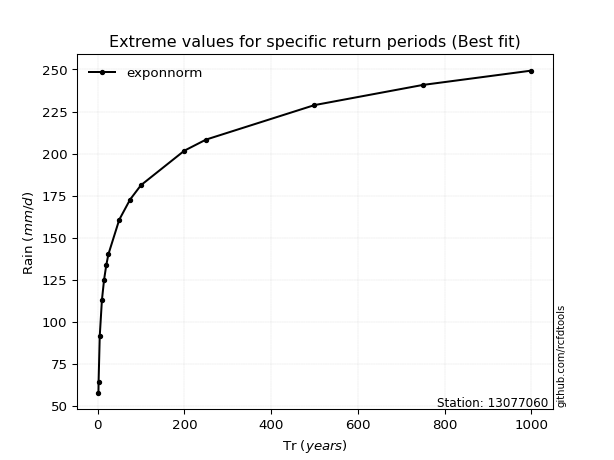</img>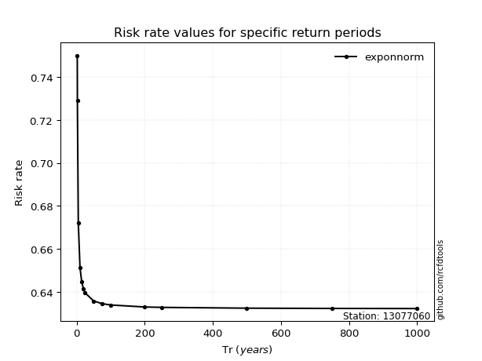</img>

</div>


<sub>**APP DISCLAIMER**: NO WARRANTY - This software is provided by [github.com/rcfdtools](https://github.com/rcfdtools) "as is", without any express or implied warranty, including warranties of merchantability, fitness for a particular purpose, or non-infringement. There is no guarantee that the software will be error-free or operate without interruption. LIMITATION OF LIABILITY - Neither the authors nor copyright holders will be liable for claims or damages arising from the software or its use. You are responsible for determining if the software is appropriate for your use and assume all associated risks, including errors, legal compliance, and data loss. NO PROFESSIONAL ADVICE - The software provides general information and does not offer professional advice. It should not replace consultation with professional advisors.</sub>