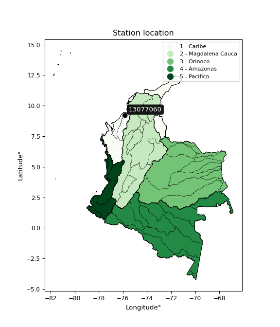

<div align="center">


</div>

# PMP Station (Rain, Pmax24h): 13077060

Probable Maximum Precipitation (PMP) is the greatest amount of rainfall for a specific duration that is meteorologically possible for a given location, acting as a "worst-case" scenario for extreme storms, crucial for designing safety-critical infrastructure like bridges, river deviations, dams, spillways, and nuclear plants to prevent catastrophic failure. PMP is calculated by hydrologists using meteorological data to determine the upper limit of extreme rainfall, often leading to the Probable Maximum Flood (PMF) for flood control design, and is increasingly being studied for climate change impacts.

<div align="center">

</img>

</div>


## A. General information


### 1. General running parameters

• app_version: _v20260103_. • runtime: _2026-01-03 07:24:50.581521_. • Python version: _3.14.0_. • SciPy version: _1.16.3_. • Pandas version: _2.3.3_. • NumPy version: _2.3.5_. • Stations dataset (station_dataset_file): _dataset/pmax24h_in/automatic_colombia_2003_2024.csv_. • Stations catalog (station_catalog_file): _dataset/CNE.xls_. • Minimum year to eval til year_max (date_min): _1900_. • Maximum year to eval since year_min (date_max): _2024_. • Creates, save and include plots into reports (create_plot): _False_. • Plot only fit distributions with Δo > Δ (plot_only_fit): _True_. • Eval low extreme values, if False, evaluates high extreme values (low_extreme): _False_. • Eval every SciPy distribution as logarithmic (pdist_logarithmic_on): _True_. • Standard deviation normalized (ddof): _1.0_. • Return periods to eval in years (Tr): _[2, 2.33, 5, 10, 15, 20, 25, 50, 75, 100, 200, 250, 500, 750, 1000]_. • Minimum data sample per station, 0 means any (minimum_sample): _5_. • Z-Score maximum threshold to adjust a value, 0 means disable (zscore_max): _3.5_. • Z-Score minimum threshold to adjust a value, 0 means disable (zscore_min): _-2.5_. • Avoid zeros, e.g. rain = 0 (avoid_zeros): _True_. • Avoid null values (avoid_nans): _True_. [:file_folder:Dataset file.](../../dataset/pmax24h_in/automatic_colombia_2003_2024.csv)

> Delta Degrees of Freedom (DDOF): is a parameter used in the formulas for calculating variance and standard deviation. When ddof=0, the divisor is $N$ (the total number of observations) and this is used when your data set is the entire population. When ddof=1, the divisor is $N-1$ and this is used when your data set is a sample drawn from a larger population. Using $N-1$ provides an unbiased estimate of the population variance (known as Bessel´s correction).


### 2. Station info and location

|   id |   CODIGO | NOMBRE                         | CATEGORIA    | TECNOLOGIA                              | ESTADO   | FECHA_INSTALACION   |   FECHA_SUSPENSION |   ALTITUD |   LATITUD |   LONGITUD | DEPARTAMENTO   | MUNICIPIO   | AREA_OPERATIVA                              | ENTIDAD                                                     | AREA_HIDROGRAFICA   | ZONA_HIDROGRAFICA   | SUBZONA_HIDROGRAFICA   | CORRIENTE   | Catalogo   |   Version |
|-----:|---------:|:-------------------------------|:-------------|:----------------------------------------|:---------|:--------------------|-------------------:|----------:|----------:|-----------:|:---------------|:------------|:--------------------------------------------|:------------------------------------------------------------|:--------------------|:--------------------|:-----------------------|:------------|:-----------|----------:|
|    0 | 13077060 | COTOCA ABAJO  - AUT [13077060] | Limnigráfica | Automática con Telemetría, Convencional | Activa   | 15/02/1970          |                nan |         5 |   9.22368 |   -75.8361 | Cordoba        | Lorica      | Area Operativa 02 - Atlántico-Bolivar-Sucre | INSTITUTO DE HIDROLOGIA METEOROLOGIA Y ESTUDIOS AMBIENTALES | Caribe              | Sinú                | Bajo Sinú              | Sinu        | CNE_IDEAM  |  20251226 |

<div align="center">

Dynamic map: [:earth_americas:Google](http://maps.google.com/maps?q=9.223685,-75.836095) [:earth_americas:OSM](https://www.openstreetmap.org/#map=18/9.223685/-75.836095&layers=P) [:earth_americas:Bing](https://www.bing.com/maps?cp=9.223685~-75.836095&lvl=18) [:earth_americas:Apple](https://maps.apple.com/frame?center=9.223685%2C-75.836095&span=0.003%2C0.006)

</div>


<div align="center">

```geojson
{
  "type": "Feature",
  "geometry": {
    "type": "Point", 
    "coordinates": [-75.836095, 9.223685]
  }, 
  "properties": {
    "Name": "13077060"
  }
}
```

</div>


### 3. Discrete values table and plot

<div align="center">

|               |         0 |           1 |            2 |          3 |          4 |           5 |
|:--------------|----------:|------------:|-------------:|-----------:|-----------:|------------:|
| Date          | 2019      | 2020        | 2021         | 2022       | 2023       | 2024        |
| Value         |  136.8    |   50.4      |   64.4       |   30.6     |    0.2     |   83.8      |
| Value_initial |  136.8    |   50.4      |   64.4       |   30.6     |    0.2     |   83.8      |
| count         |    6      |    6        |    6         |    6       |    6       |    6        |
| mean          |   61.0333 |   61.0333   |   61.0333    |   61.0333  |   61.0333  |   61.0333   |
| std           |   46.9259 |   46.9259   |   46.9259    |   46.9259  |   46.9259  |   46.9259   |
| zscore        |    1.6146 |   -0.226598 |    0.0717443 |   -0.64854 |   -1.29637 |    0.485162 |


</div>


> The initial value (value_initial) correspond to the initial obtained or null completed value, and value (value) is adjusted only when the initial value is outside the valid range definite through the Z-Score value. If Z-Score is active, values out of range or outliers are replaced with the station mean value


### 4. Active continuous probability distributions from SciPy (44 of 104 available)

A Probability Density Function (PDF) describes the relative likelihood of a continuous random variable falling within a specific range, where the total area under its curve equals 1, and the area over any interval gives the actual probability for that range. Unlike discrete probabilities (like rolling a die), a PDF shows density, not direct probability for a single point (which is zero), with higher points indicating higher likelihood, often visualized as a bell curve for normal distributions.

A log of a probability density function (log-PDF) is simply the logarithm of the PDF´s value, denoted as $log(f(x))$, useful for converting multiplication of probabilities into addition, improving numerical stability with tiny numbers, and connecting to information theory concepts like entropy. Instead of dealing with very small probabilities (e.g., 0.000001), log-PDFs use negative numbers (e.g., $log(0.00001) ≈ -11.51$ that are easier for computers to handle, preventing underflow errors and simplifying complex calculations. In this study, each active probability distribution from SciPy is also evaluated in the $log$ form.

[scipy.stats](https://docs.scipy.org/doc/scipy/reference/stats.html) is a Python´s powerful submodule within the SciPy library for comprehensive statistical analysis, offering over 130 probability distributions (like Normal, Poisson), functions for descriptive stats (mean, variance), hypothesis testing (t-tests, chi-square), random variable generation, and statistical tests, making it essential for data science, modeling, and research. It provides tools to explore, model, and draw conclusions from data efficiently, working seamlessly with NumPy.

<div align="center">

|   id | p_dist             |   n_parameter | fit_method   | label                                                                       | active   | ref                                                                                                        |
|-----:|:-------------------|--------------:|:-------------|:----------------------------------------------------------------------------|:---------|:-----------------------------------------------------------------------------------------------------------|
|    0 | alpha              |             3 | MLE          | Alpha                                                                       | True     | [:mortar_board:](https://docs.scipy.org/doc/scipy/reference/generated/scipy.stats.alpha.html)              |
|    1 | betaprime          |             4 | MLE          | Beta prime                                                                  | True     | [:mortar_board:](https://docs.scipy.org/doc/scipy/reference/generated/scipy.stats.betaprime.html)          |
|    2 | chi2               |             3 | MLE          | Chi²                                                                        | True     | [:mortar_board:](https://docs.scipy.org/doc/scipy/reference/generated/scipy.stats.chi2.html)               |
|    3 | crystalball        |             4 | MLE          | Crystalball                                                                 | True     | [:mortar_board:](https://docs.scipy.org/doc/scipy/reference/generated/scipy.stats.crystalball.html)        |
|    4 | erlang             |             3 | MLE          | Erlang                                                                      | True     | [:mortar_board:](https://docs.scipy.org/doc/scipy/reference/generated/scipy.stats.erlang.html)             |
|    5 | expon              |             2 | MLE          | Exponential                                                                 | True     | [:mortar_board:](https://docs.scipy.org/doc/scipy/reference/generated/scipy.stats.expon.html)              |
|    6 | exponnorm          |             3 | MLE          | Exponentially modified Normal                                               | True     | [:mortar_board:](https://docs.scipy.org/doc/scipy/reference/generated/scipy.stats.exponnorm.html)          |
|    7 | f                  |             4 | MLE          | F                                                                           | True     | [:mortar_board:](https://docs.scipy.org/doc/scipy/reference/generated/scipy.stats.f.html)                  |
|    8 | fatiguelife        |             3 | MLE          | Fatigue-life (Birnbaum-Saunders)                                            | True     | [:mortar_board:](https://docs.scipy.org/doc/scipy/reference/generated/scipy.stats.fatiguelife.html)        |
|    9 | fisk               |             3 | MLE          | Fisk                                                                        | True     | [:mortar_board:](https://docs.scipy.org/doc/scipy/reference/generated/scipy.stats.fisk.html)               |
|   10 | gamma              |             3 | MLE          | Gamma                                                                       | True     | [:mortar_board:](https://docs.scipy.org/doc/scipy/reference/generated/scipy.stats.gamma.html)              |
|   11 | genexpon           |             5 | MLE          | Generalized exponential                                                     | True     | [:mortar_board:](https://docs.scipy.org/doc/scipy/reference/generated/scipy.stats.genexpon.html)           |
|   12 | genlogistic        |             3 | MLE          | Generalized logistic                                                        | True     | [:mortar_board:](https://docs.scipy.org/doc/scipy/reference/generated/scipy.stats.genlogistic.html)        |
|   13 | gibrat             |             2 | MM           | Gibrat                                                                      | True     | [:mortar_board:](https://docs.scipy.org/doc/scipy/reference/generated/scipy.stats.gibrat.html)             |
|   14 | gompertz           |             3 | MLE          | Gompertz (or truncated Gumbel)                                              | True     | [:mortar_board:](https://docs.scipy.org/doc/scipy/reference/generated/scipy.stats.gompertz.html)           |
|   15 | gumbel_l           |             2 | MM           | Gumbel Left Skew                                                            | True     | [:mortar_board:](https://docs.scipy.org/doc/scipy/reference/generated/scipy.stats.gumbel_l.html)           |
|   16 | gumbel_r           |             2 | MM           | Gumbel Right Skew                                                           | True     | [:mortar_board:](https://docs.scipy.org/doc/scipy/reference/generated/scipy.stats.gumbel_r.html)           |
|   17 | halflogistic       |             2 | MM           | Half-logistic                                                               | True     | [:mortar_board:](https://docs.scipy.org/doc/scipy/reference/generated/scipy.stats.halflogistic.html)       |
|   18 | halfnorm           |             2 | MM           | Half Normal                                                                 | True     | [:mortar_board:](https://docs.scipy.org/doc/scipy/reference/generated/scipy.stats.halfnorm.html)           |
|   19 | hypsecant          |             2 | MM           | hyperbolic secant                                                           | True     | [:mortar_board:](https://docs.scipy.org/doc/scipy/reference/generated/scipy.stats.hypsecant.html)          |
|   20 | invgamma           |             3 | MLE          | Inverted gamma                                                              | True     | [:mortar_board:](https://docs.scipy.org/doc/scipy/reference/generated/scipy.stats.invgamma.html)           |
|   21 | invgauss           |             3 | MLE          | Inverse Gaussian                                                            | True     | [:mortar_board:](https://docs.scipy.org/doc/scipy/reference/generated/scipy.stats.invgauss.html)           |
|   22 | invweibull         |             3 | MLE          | Inverted Weibull                                                            | True     | [:mortar_board:](https://docs.scipy.org/doc/scipy/reference/generated/scipy.stats.invweibull.html)         |
|   23 | johnsonsu          |             4 | MLE          | Johnson Su                                                                  | True     | [:mortar_board:](https://docs.scipy.org/doc/scipy/reference/generated/scipy.stats.johnsonsu.html)          |
|   24 | kstwobign          |             2 | MLE          | Limiting distribution of scaled Kolmogorov-Smirnov two-sided test statistic | True     | [:mortar_board:](https://docs.scipy.org/doc/scipy/reference/generated/scipy.stats.kstwobign.html)          |
|   25 | laplace            |             2 | MM           | Laplace                                                                     | True     | [:mortar_board:](https://docs.scipy.org/doc/scipy/reference/generated/scipy.stats.laplace.html)            |
|   26 | laplace_asymmetric |             3 | MLE          | Asymmetric Laplace                                                          | True     | [:mortar_board:](https://docs.scipy.org/doc/scipy/reference/generated/scipy.stats.laplace_asymmetric.html) |
|   27 | loggamma           |             3 | MLE          | Log gamma                                                                   | True     | [:mortar_board:](https://docs.scipy.org/doc/scipy/reference/generated/scipy.stats.loggamma.html)           |
|   28 | logistic           |             2 | MM           | Logistic (or Sech-squared)                                                  | True     | [:mortar_board:](https://docs.scipy.org/doc/scipy/reference/generated/scipy.stats.logistic.html)           |
|   29 | lognorm            |             3 | MLE          | Log Normal                                                                  | True     | [:mortar_board:](https://docs.scipy.org/doc/scipy/reference/generated/scipy.stats.lognorm.html)            |
|   30 | maxwell            |             2 | MM           | Maxwell                                                                     | True     | [:mortar_board:](https://docs.scipy.org/doc/scipy/reference/generated/scipy.stats.maxwell.html)            |
|   31 | mielke             |             4 | MLE          | Mielke Beta-Kappa / Dagum                                                   | True     | [:mortar_board:](https://docs.scipy.org/doc/scipy/reference/generated/scipy.stats.mielke.html)             |
|   32 | moyal              |             2 | MM           | Moyal                                                                       | True     | [:mortar_board:](https://docs.scipy.org/doc/scipy/reference/generated/scipy.stats.moyal.html)              |
|   33 | nakagami           |             3 | MLE          | Nakagami                                                                    | True     | [:mortar_board:](https://docs.scipy.org/doc/scipy/reference/generated/scipy.stats.nakagami.html)           |
|   34 | ncf                |             5 | MLE          | Non-central F distribution                                                  | True     | [:mortar_board:](https://docs.scipy.org/doc/scipy/reference/generated/scipy.stats.ncf.html)                |
|   35 | nct                |             4 | MLE          | Non-central Student’s t                                                     | True     | [:mortar_board:](https://docs.scipy.org/doc/scipy/reference/generated/scipy.stats.nct.html)                |
|   36 | norm               |             2 | MM           | Normal                                                                      | True     | [:mortar_board:](https://docs.scipy.org/doc/scipy/reference/generated/scipy.stats.norm.html)               |
|   37 | pearson3           |             3 | MM           | Pearson type III                                                            | True     | [:mortar_board:](https://docs.scipy.org/doc/scipy/reference/generated/scipy.stats.pearson3.html)           |
|   38 | rayleigh           |             2 | MM           | Rayleigh                                                                    | True     | [:mortar_board:](https://docs.scipy.org/doc/scipy/reference/generated/scipy.stats.rayleigh.html)           |
|   39 | rice               |             3 | MLE          | Rice                                                                        | True     | [:mortar_board:](https://docs.scipy.org/doc/scipy/reference/generated/scipy.stats.rice.html)               |
|   40 | t                  |             3 | MLE          | Student’s t                                                                 | True     | [:mortar_board:](https://docs.scipy.org/doc/scipy/reference/generated/scipy.stats.t.html)                  |
|   41 | truncnorm          |             4 | MLE          | Truncated normal                                                            | True     | [:mortar_board:](https://docs.scipy.org/doc/scipy/reference/generated/scipy.stats.truncnorm.html)          |
|   42 | wald               |             2 | MM           | Wald                                                                        | True     | [:mortar_board:](https://docs.scipy.org/doc/scipy/reference/generated/scipy.stats.wald.html)               |
|   43 | weibull_min        |             3 | MLE          | Weibull minimum                                                             | True     | [:mortar_board:](https://docs.scipy.org/doc/scipy/reference/generated/scipy.stats.weibull_min.html)        |

</div>

> **n_parameter:** # arguments & localization & scale.
>
> **Fit methods:** (MLE) maximum likelihood, (MM) L-moments.
>
>**Inactive** (With the only purpose of prevent loops, zero divisions, infinite values, over high estimated values or horizontal trending for recurrence intervals estimations, the follow distributions were disabled.)**:** foldnorm, gennorm, norminvgauss, powernorm, powerlognorm, skewnorm, genextreme, anglit, arcsine, argus, beta, bradford, burr, burr12, cauchy, cosine, halfcauchy, foldcauchy, skewcauchy, wrapcauchy, dgamma, gengamma, exponweib, exponpow, truncexpon, gausshyper, genhalflogistic, genhyperbolic, geninvgauss, halfgennorm, johnsonsb, kappa4, kappa3, ksone, kstwo, loglaplace, levy, levy_l, levy_stable, ncx2, pareto, genpareto, truncpareto, lomax, powerlaw, rdist, rel_breitwigner, recipinvgauss, semicircular, studentized_range, trapezoid, triang, truncweibull_min, tukeylambda, uniform, loguniform, vonmises, vonmises_line, weibull_max, dweibull, 


## B. Probability distributions vs. Empirical distributions

A continuous probability distribution (CPD) describes probabilities for variables that can take any value within a range (like rain any time), unlike discrete variables with specific outcomes (like temperature). It uses a Probability Density Function (PDF), a curve where the total area under it equals 1, and the probability of the variable falling within an interval (a to b) is found by calculating the area under the curve between those points. A key feature is that the probability of hitting any single exact value is zero, so probabilities are always expressed for ranges, e.g., $P(a ≤ X ≤ b)$.

<div align="center">

Distributions parameters from station values
|    |   station | p_dist                |   n |              loc |            scale | shape                  | shape1                | shape2             | shape3   |
|---:|----------:|:----------------------|----:|-----------------:|-----------------:|:-----------------------|:----------------------|:-------------------|:---------|
|  0 |  13077060 | alpha                 |   6 |      0.00531447  |      0.476393    | 2.062668394301007e-08  |                       |                    |          |
|  1 |  13077060 | betaprime             |   6 |    -32.6013      | 335635           | 4.365177343362621      | 15653.860066955192    |                    |          |
|  2 |  13077060 | chi2                  |   6 |    -28.3569      |     11.5197      | 7.759761653023554      |                       |                    |          |
|  3 |  13077060 | crystalball           |   6 |     61.0333      |     42.8373      | 4753.667928116738      | 21.610463402687927    |                    |          |
|  4 |  13077060 | erlang                |   6 |    -28.3569      |     23.0394      | 3.8798797460740166     |                       |                    |          |
|  5 |  13077060 | expon                 |   6 |      0.2         |     60.8333      |                        |                       |                    |          |
|  6 |  13077060 | exponnorm             |   6 |     26.4442      |     28.4694      | 1.2149612371334406     |                       |                    |          |
|  7 |  13077060 | f                     |   6 |      0.2         |     52.6084      | 1.7194441377233232     | 19.11268116715417     |                    |          |
|  8 |  13077060 | fatiguelife           |   6 |      0.2         |      0.000409464 | 418.236161902617       |                       |                    |          |
|  9 |  13077060 | fisk                  |   6 |      0.2         |     50.8879      | 0.9459847288314387     |                       |                    |          |
| 10 |  13077060 | gamma                 |   6 |    -28.3569      |     23.0394      | 3.8798804739754247     |                       |                    |          |
| 11 |  13077060 | genexpon              |   6 |      0.199959    |      2.3856      | 0.03913417147097249    | 8.950608719640426e-06 | 2.3145449855738978 |          |
| 12 |  13077060 | genlogistic           |   6 |   -158.721       |     36.2909      | 242.68733495770846     |                       |                    |          |
| 13 |  13077060 | gibrat                |   6 |     28.3539      |     19.8211      |                        |                       |                    |          |
| 14 |  13077060 | gompertz              |   6 |      0.2         |     88.2661      | 0.7973171894363322     |                       |                    |          |
| 15 |  13077060 | gumbel_l              |   6 |     80.3124      |     33.4001      |                        |                       |                    |          |
| 16 |  13077060 | gumbel_r              |   6 |     41.7543      |     33.4001      |                        |                       |                    |          |
| 17 |  13077060 | halflogistic          |   6 |     10.2612      |     36.6244      |                        |                       |                    |          |
| 18 |  13077060 | halfnorm              |   6 |      4.33354     |     71.0626      |                        |                       |                    |          |
| 19 |  13077060 | hypsecant             |   6 |     61.0333      |     27.2711      |                        |                       |                    |          |
| 20 |  13077060 | invgamma              |   6 |   -175.836       |   7206.26        | 31.416311953863428     |                       |                    |          |
| 21 |  13077060 | invgauss              |   6 |    -95.0822      |   1951.96        | 0.07993552777740054    |                       |                    |          |
| 22 |  13077060 | invweibull            |   6 |      0.2         |      2.54134     | 0.05880968777688439    |                       |                    |          |
| 23 |  13077060 | johnsonsu             |   6 |   -105.822       |     19.2929      | -11.007236048932093    | 3.9020399599669124    |                    |          |
| 24 |  13077060 | kstwobign             |   6 |    -87.8022      |    170.628       |                        |                       |                    |          |
| 25 |  13077060 | laplace               |   6 |     61.0333      |     30.2905      |                        |                       |                    |          |
| 26 |  13077060 | laplace_asymmetric    |   6 |     50.4         |     32.6846      | 0.8513228634952233     |                       |                    |          |
| 27 |  13077060 | loggamma              |   6 | -13479.4         |   1812.2         | 1758.2588906966103     |                       |                    |          |
| 28 |  13077060 | logistic              |   6 |     61.0333      |     23.6174      |                        |                       |                    |          |
| 29 |  13077060 | lognorm               |   6 |      0.2         |      0.0560643   | 15.767285419550578     |                       |                    |          |
| 30 |  13077060 | maxwell               |   6 |    -40.473       |     63.6097      |                        |                       |                    |          |
| 31 |  13077060 | mielke                |   6 |      0.2         |    142.486       | 0.42585771909415593    | 22.450947200218938    |                    |          |
| 32 |  13077060 | moyal                 |   6 |     36.5362      |     19.2835      |                        |                       |                    |          |
| 33 |  13077060 | nakagami              |   6 |      0.2         |     63.6006      | 0.20406267136167827    |                       |                    |          |
| 34 |  13077060 | ncf                   |   6 |      0.2         |      2.89307     | 0.2804220390569112     | 8.073720496790035     | 3.964790639854396  |          |
| 35 |  13077060 | nct                   |   6 |      0.140838    |      0.0026469   | 0.1681548630752741     | 54.73619342716165     |                    |          |
| 36 |  13077060 | norm                  |   6 |     61.0333      |     42.8373      |                        |                       |                    |          |
| 37 |  13077060 | pearson3              |   6 |     61.0333      |     42.8373      | 0.40765469416812017    |                       |                    |          |
| 38 |  13077060 | rayleigh              |   6 |    -20.9169      |     65.3868      |                        |                       |                    |          |
| 39 |  13077060 | rice                  |   6 |    -18.7044      |     58.3935      | 0.6346768839913146     |                       |                    |          |
| 40 |  13077060 | t                     |   6 |     61.035       |     42.8361      | 23594315.64428258      |                       |                    |          |
| 41 |  13077060 | truncnorm             |   6 |     -4.57974     |      5.48049     | -0.2040331907719546    | 25.796913720073235    |                    |          |
| 42 |  13077060 | wald                  |   6 |     18.196       |     42.8373      |                        |                       |                    |          |
| 43 |  13077060 | weibull_min           |   6 |     -8.21623     |     76.6121      | 1.5647007725509248     |                       |                    |          |
| 44 |  13077060 | logalpha              |   6 |    -56.0293      |   1475.44        | 24.95726421134114      |                       |                    |          |
| 45 |  13077060 | logbetaprime          |   6 |     -1.60944     |      3.0157      | 0.12872168952416418    | 0.5228764191264932    |                    |          |
| 46 |  13077060 | logchi2               |   6 |     -1.60944     |      1.25146     | 1.0280348881434058     |                       |                    |          |
| 47 |  13077060 | logcrystalball        |   6 |      3.20727     |      2.20195     | 405.007576228125       | 512.1948188571519     |                    |          |
| 48 |  13077060 | logerlang             |   6 |    -28.2736      |      0.171066    | 183.94842705837823     |                       |                    |          |
| 49 |  13077060 | logexpon              |   6 |     -1.60944     |      4.81671     |                        |                       |                    |          |
| 50 |  13077060 | logexponnorm          |   6 |      3.20558     |      2.20195     | 0.000765395821614621   |                       |                    |          |
| 51 |  13077060 | logf                  |   6 |     -1.60944     |      1.20454     | 1.0099471115654812     | 1.072351767211986     |                    |          |
| 52 |  13077060 | logfatiguelife        |   6 |     -1.60944     |      2.2695e-06  | 1346.1409444214714     |                       |                    |          |
| 53 |  13077060 | logfisk               |   6 |     -1.60944     |      1.86447     | 0.16229646745882725    |                       |                    |          |
| 54 |  13077060 | loggamma              |   6 |    -31.9443      |      0.152633    | 230.23727729856046     |                       |                    |          |
| 55 |  13077060 | loggenexpon           |   6 |     -2.52553     |     22.2816      | 2.1216898244393336e-10 | 12.148229661578384    | 2.9947777483740134 |          |
| 56 |  13077060 | loggenlogistic        |   6 |      4.91874     |      1.86638e-05 | 1.0964800783869393e-05 |                       |                    |          |
| 57 |  13077060 | loggibrat             |   6 |      1.52747     |      1.01885     |                        |                       |                    |          |
| 58 |  13077060 | loggompertz           |   6 |     -1.60944     |      1.21134     | 0.009415141351041056   |                       |                    |          |
| 59 |  13077060 | loggumbel_l           |   6 |      4.19826     |      1.71685     |                        |                       |                    |          |
| 60 |  13077060 | loggumbel_r           |   6 |      2.21628     |      1.71685     |                        |                       |                    |          |
| 61 |  13077060 | loghalflogistic       |   6 |      0.597496    |      1.88257     |                        |                       |                    |          |
| 62 |  13077060 | loghalfnorm           |   6 |      0.292783    |      3.65278     |                        |                       |                    |          |
| 63 |  13077060 | loghypsecant          |   6 |      3.20727     |      1.4018      |                        |                       |                    |          |
| 64 |  13077060 | loginvgamma           |   6 |    -48.213       |  25145           | 489.96309355786525     |                       |                    |          |
| 65 |  13077060 | loginvgauss           |   6 |    -21.0815      |   2409.65        | 0.010066444727224476   |                       |                    |          |
| 66 |  13077060 | loginvweibull         |   6 |     -1.80391e+08 |      1.80391e+08 | 66978956.873079225     |                       |                    |          |
| 67 |  13077060 | logjohnsonsu          |   6 |      4.99814     |      0.00148147  | 5.362169524571328      | 0.7589717790642045    |                    |          |
| 68 |  13077060 | logkstwobign          |   6 |     -7.64086     |     12.3895      |                        |                       |                    |          |
| 69 |  13077060 | loglaplace            |   6 |      3.20727     |      1.55701     |                        |                       |                    |          |
| 70 |  13077060 | loglaplace_asymmetric |   6 |      4.42843     |      0.81518     | 1.9985638128231287     |                       |                    |          |
| 71 |  13077060 | logloggamma           |   6 |      4.91863     |      9.89287e-06 | 5.76955478512238e-06   |                       |                    |          |
| 72 |  13077060 | loglogistic           |   6 |      3.20727     |      1.214       |                        |                       |                    |          |
| 73 |  13077060 | loglognorm            |   6 |  -1298.35        |   1301.55        | 0.0016950856069597748  |                       |                    |          |
| 74 |  13077060 | logmaxwell            |   6 |     -2.01042     |      3.2697      |                        |                       |                    |          |
| 75 |  13077060 | logmielke             |   6 |     -1.60944     |      3.20853     | 0.1434322200368499     | 0.7437387323040971    |                    |          |
| 76 |  13077060 | logmoyal              |   6 |      1.94806     |      0.991224    |                        |                       |                    |          |
| 77 |  13077060 | lognakagami           |   6 |  -2647.66        |   2650.86        | 361573.0689478768      |                       |                    |          |
| 78 |  13077060 | logncf                |   6 |     -1.60944     |      1.07053     | 1.0428935570358855     | 1.148832094000157     | 1.0795198407195459 |          |
| 79 |  13077060 | lognct                |   6 |   -131.17        |      2.1488      | 34472.53916354696      | 62.53487083147836     |                    |          |
| 80 |  13077060 | lognorm               |   6 |      3.20727     |      2.20195     |                        |                       |                    |          |
| 81 |  13077060 | logpearson3           |   6 |      3.20723     |      2.20199     | -1.618237989905983     |                       |                    |          |
| 82 |  13077060 | lograyleigh           |   6 |     -1.00521     |      3.36106     |                        |                       |                    |          |
| 83 |  13077060 | logrice               |   6 |   -453.856       |      2.20216     | 207.54960560652762     |                       |                    |          |
| 84 |  13077060 | logt                  |   6 |      4.14752     |      0.424917    | 0.9531208602339201     |                       |                    |          |
| 85 |  13077060 | logtruncnorm          |   6 |     27.9568      |      6.87028     | -13.01071210702932     | -3.353332180809101    |                    |          |
| 86 |  13077060 | logwald               |   6 |      1.00529     |      2.20198     |                        |                       |                    |          |
| 87 |  13077060 | logweibull_min        |   6 |     -1.60944     |      0.998137    | 0.1557189242571848     |                       |                    |          |

</div>

> **loc** (Location parameter): This shifts the distribution along the x-axis. For many common distributions, like the normal (Gaussian) distribution, loc represents the mean $μ$. For others, like the uniform distribution, it might represent the minimum value, or for the beta distribution, the left end of the support interval.
>
> **scale** (Scale parameter): This determines the width or spread of the distribution. For the normal distribution, scale represents the standard deviation $σ$. For a uniform distribution, it defines the length of the interval (from $loc$ to $loc + scale$).
>
> **shape** (Shape parameters): Refers to parameters that define the specific form of a probability distribution, distinct from its location (loc) and scale (scale). These parameters are required arguments for most distribution functions. For example, a normal (Gaussian) distribution is fully defined by its location (mean) and scale (standard deviation), so it has no specific shape parameters beyond loc and scale. However, other distributions have intrinsic properties that need specification, as Gamma distribution that takes a shape parameter, often named $a$ or $alpha$.


### 0. Cumulative distribution values - CDF (88 evaluated)

Cumulative Distribution Function (CDF), denoted as $F$<sub>$X$</sub>$(x)$, is a function that gives the probability that a random variable $X$ will take a value less than or equal to a specific value, $x$ (i.e., $(P(X≥x)$. It essentially "accumulates" probabilities from a given point up to the far right (positive infinity), providing a complete picture of the distribution´s probabilities for both discrete (like rain) and continuous (like temperature) variables, helping to find probabilities over ranges or above certain values. Each station is evaluated separately ordering the $x$ values ascending, calculating the CDF and PDF values for the activated distributions and their logarithmic forms.

<div align="center">

CDF ordered by x ascending and calculating $log(f(x))$ separately
|   id |   Station |   date |     x |   count |    mean |     std |     zscore |   Value_initial |   station |   m |     alpha |   alpha_pdf |   betaprime |   betaprime_pdf |      chi2 |   chi2_pdf |   crystalball |   crystalball_pdf |    erlang |   erlang_pdf |    expon |   expon_pdf |   exponnorm |   exponnorm_pdf |           f |      f_pdf |   fatiguelife |   fatiguelife_pdf |        fisk |   fisk_pdf |    gamma |   gamma_pdf |    genexpon |   genexpon_pdf |   genlogistic |   genlogistic_pdf |    gibrat |   gibrat_pdf |    gompertz |   gompertz_pdf |   gumbel_l |   gumbel_l_pdf |   gumbel_r |   gumbel_r_pdf |   halflogistic |   halflogistic_pdf |   halfnorm |   halfnorm_pdf |   hypsecant |   hypsecant_pdf |   invgamma |   invgamma_pdf |   invgauss |   invgauss_pdf |   invweibull |   invweibull_pdf |   johnsonsu |   johnsonsu_pdf |   kstwobign |   kstwobign_pdf |   laplace |   laplace_pdf |   laplace_asymmetric |   laplace_asymmetric_pdf |   loggamma |   loggamma_pdf |   logistic |   logistic_pdf |   lognorm |   lognorm_pdf |   maxwell |   maxwell_pdf |      mielke |    mielke_pdf |     moyal |   moyal_pdf |    nakagami |   nakagami_pdf |         ncf |     ncf_pdf |       nct |     nct_pdf |      norm |   norm_pdf |   pearson3 |   pearson3_pdf |   rayleigh |   rayleigh_pdf |      rice |   rice_pdf |         t |      t_pdf |   truncnorm |   truncnorm_pdf |     wald |   wald_pdf |   weibull_min |   weibull_min_pdf |   logalpha |   logalpha_pdf |   logbetaprime |   logbetaprime_pdf |     logchi2 |   logchi2_pdf |   logcrystalball |   logcrystalball_pdf |   logerlang |   logerlang_pdf |   logexpon |   logexpon_pdf |   logexponnorm |   logexponnorm_pdf |        logf |    logf_pdf |   logfatiguelife |   logfatiguelife_pdf |    logfisk |   logfisk_pdf |   loggenexpon |   loggenexpon_pdf |   loggenlogistic |   loggenlogistic_pdf |   loggibrat |   loggibrat_pdf |   loggompertz |   loggompertz_pdf |   loggumbel_l |   loggumbel_l_pdf |   loggumbel_r |   loggumbel_r_pdf |   loghalflogistic |   loghalflogistic_pdf |   loghalfnorm |   loghalfnorm_pdf |   loghypsecant |   loghypsecant_pdf |   loginvgamma |   loginvgamma_pdf |   loginvgauss |   loginvgauss_pdf |   loginvweibull |   loginvweibull_pdf |   logjohnsonsu |   logjohnsonsu_pdf |   logkstwobign |   logkstwobign_pdf |   loglaplace |   loglaplace_pdf |   loglaplace_asymmetric |   loglaplace_asymmetric_pdf |   logloggamma |   logloggamma_pdf |   loglogistic |   loglogistic_pdf |   loglognorm |   loglognorm_pdf |   logmaxwell |   logmaxwell_pdf |   logmielke |   logmielke_pdf |    logmoyal |   logmoyal_pdf |   lognakagami |   lognakagami_pdf |      logncf |   logncf_pdf |    lognct |   lognct_pdf |   logpearson3 |   logpearson3_pdf |   lograyleigh |   lograyleigh_pdf |   logrice |   logrice_pdf |      logt |   logt_pdf |   logtruncnorm |   logtruncnorm_pdf |   logwald |   logwald_pdf |   logweibull_min |   logweibull_min_pdf |
|-----:|----------:|-------:|------:|--------:|--------:|--------:|-----------:|----------------:|----------:|----:|----------:|------------:|------------:|----------------:|----------:|-----------:|--------------:|------------------:|----------:|-------------:|---------:|------------:|------------:|----------------:|------------:|-----------:|--------------:|------------------:|------------:|-----------:|---------:|------------:|------------:|---------------:|--------------:|------------------:|----------:|-------------:|------------:|---------------:|-----------:|---------------:|-----------:|---------------:|---------------:|-------------------:|-----------:|---------------:|------------:|----------------:|-----------:|---------------:|-----------:|---------------:|-------------:|-----------------:|------------:|----------------:|------------:|----------------:|----------:|--------------:|---------------------:|-------------------------:|-----------:|---------------:|-----------:|---------------:|----------:|--------------:|----------:|--------------:|------------:|--------------:|----------:|------------:|------------:|---------------:|------------:|------------:|----------:|------------:|----------:|-----------:|-----------:|---------------:|-----------:|---------------:|----------:|-----------:|----------:|-----------:|------------:|----------------:|---------:|-----------:|--------------:|------------------:|-----------:|---------------:|---------------:|-------------------:|------------:|--------------:|-----------------:|---------------------:|------------:|----------------:|-----------:|---------------:|---------------:|-------------------:|------------:|------------:|-----------------:|---------------------:|-----------:|--------------:|--------------:|------------------:|-----------------:|---------------------:|------------:|----------------:|--------------:|------------------:|--------------:|------------------:|--------------:|------------------:|------------------:|----------------------:|--------------:|------------------:|---------------:|-------------------:|--------------:|------------------:|--------------:|------------------:|----------------:|--------------------:|---------------:|-------------------:|---------------:|-------------------:|-------------:|-----------------:|------------------------:|----------------------------:|--------------:|------------------:|--------------:|------------------:|-------------:|-----------------:|-------------:|-----------------:|------------:|----------------:|------------:|---------------:|--------------:|------------------:|------------:|-------------:|----------:|-------------:|--------------:|------------------:|--------------:|------------------:|----------:|--------------:|----------:|-----------:|---------------:|-------------------:|----------:|--------------:|-----------------:|---------------------:|
|    0 |  13077060 |   2023 |   0.2 |       6 | 61.0333 | 46.9259 | -1.29637   |             0.2 |  13077060 |   1 | 0.0144056 | 0.50236     |   0.0450211 |      0.00436974 | 0.0437869 | 0.0045105  |     0.0777889 |        0.00339758 | 0.0437869 |   0.0045105  | 0        |  0.0164384  |   0.0569451 |      0.00350864 | 1.77841e-16 | 5.50857    |     0.0427194 |       9.87843e+07 | 5.28726e-18 | 0.180204   | 0.043787 |  0.0045105  | 6.67365e-07 |     0.0164043  |     0.0486264 |        0.00402619 | 0         |  0           | 1.96789e-13 |     0.00903311 |  0.0868434 |    0.00248378  |  0.0311189 |     0.00323295 |       0        |         0          |   0        |     0          |   0.0681459 |      0.00247979 |  0.0536788 |     0.00379895 |  0.0503948 |     0.00401151 |  4.80678e-05 |      1.01267e+12 |   0.0524122 |      0.00387713 |   0.0470341 |      0.00442318 | 0.0671064 |    0.00221543 |            0.0691737 |               0.00248602 |  0.0155306 |      0.0185921 |  0.0707134 |     0.0027824  | 0.0143538 |     0.0165593 | 0.0615922 |    0.00418025 | 3.44534e-05 | 3106.03       | 0.0103025 |  0.00197547 | 2.53224e-08 |    3.72347e+08 | 0.000452075 | 2.28372e+12 | 0.0485604 | 1.69161     | 0.0777889 | 0.00339758 |  0.0647037 |     0.00371201 |  0.0508129 |     0.00468815 | 0.0419599 | 0.00434685 | 0.0777777 | 0.0033973  |    0.670188 |    0.085678     | 0        | 0          |     0.0310696 |        0.00568561 |   0.015585 |      0.0194974 |     0.00725861 |         4.2079e+12 | 6.32676e-09 |    1.4646e+07 |        0.0143539 |            0.0165593 |   0.0153431 |       0.0185972 |   0        |      0.207611  |       0.014354 |          0.0165594 | 7.32791e-09 | 1.66651e+07 |         0.042816 |          1.84627e+11 | 0.00259683 |   1.89314e+12 |     0.0290936 |         0.0613254 |         0        |            0.0126876 |    0        |       0         |   9.77179e-10 |         0.0077725 |     0.0333835 |         0.0191164 |   9.28638e-05 |       0.000502188 |          0        |             0         |      0        |         0         |      0.0204861 |           0.014604 |     0.0144902 |         0.0180339 |     0.0158951 |         0.0205234 |       0.0232296 |           0.0324505 |      0.0615971 |          0.0139669 |      0.0282437 |          0.0440712 |    0.0226701 |         0.01456  |               0.0196537 |                   0.0120635 |     0.0222106 |         0.0129533 |     0.0185667 |         0.0150099 |    0.0145187 |        0.0167523 |  0.000488321 |       0.00364247 |  0.00481011 |     3.10714e+12 | 1.78299e-09 |     3.3411e-08 |     0.0144277 |         0.0166254 | 2.54844e-09 |  5.98473e+06 | 0.0144875 |    0.0167013 |     0.0390567 |         0.0196789 |      0        |          0        | 0.0143631 |      0.016567 | 0.0262852 | 0.00433689 |      0.0210554 |          0.0138394 |  0        |     0         |       0.00364567 |          2.55203e+12 |
|    1 |  13077060 |   2022 |  30.6 |       6 | 61.0333 | 46.9259 | -0.64854   |            30.6 |  13077060 |   2 | 0.987577  | 0.000406033 |   0.272598  |      0.00961901 | 0.277147  | 0.00972383 |     0.238716  |        0.00723583 | 0.277147  |   0.00972383 | 0.393303 |  0.0099731  |   0.247984  |      0.00896367 | 0.454266    | 0.00957713 |     0.742632  |       0.00345746  | 0.380517    | 0.00733523 | 0.277147 |  0.00972383 | 0.392743    |     0.00996393 |     0.269017  |        0.00970657 | 0.0147195 |  0.0165891   | 0.279512    |     0.00918419 |  0.202071  |    0.00539283  |  0.247465  |     0.0103467  |       0.270745 |         0.0126514  |   0.288337 |     0.0104865  |   0.201543  |      0.00690637 |  0.254546  |     0.00901668 |  0.262696  |     0.00932496 |  0.421389    |      0.000704486 |   0.257614  |      0.00914256 |   0.278665  |      0.00970643 | 0.183075  |    0.00604395 |            0.206264  |               0.00741288 |  0.547073  |      0.170313  |  0.21609   |     0.00717247 | 0.538662  |     0.180326  | 0.258586  |    0.00838856 | 0.517956    |    0.00725577 | 0.243454  |  0.0122221  | 0.578748    |    0.00747418  | 0.457608    | 0.00945162  | 0.65513   | 0.00190391  | 0.238716  | 0.00723583 |  0.248539  |     0.00820427 |  0.266829  |     0.00883435 | 0.253526  | 0.00888207 | 0.238698  | 0.00723573 |    1        |    1.41435e-10  | 0.154533 | 0.0250021  |     0.291864  |        0.00985153 |   0.555362 |      0.164936  |     0.853949   |         0.0124869  | 0.953128    |    0.0221074  |        0.538662  |            0.180326  |   0.548674  |       0.169825  |   0.648087 |      0.0730608 |       0.538663 |          0.180326  | 0.723061    | 0.0253465   |         0.865632 |          0.0237908   | 0.540184   |   0.00801363  |     0.635679  |         0.109314  |         0        |            0.243703  |    0.732295 |       0.173872  |   0.445391    |         0.274208  |     0.470537  |         0.196104  |   0.60912     |       0.175883    |          0.635094 |             0.158469  |      0.60822  |         0.151377  |      0.548345  |           0.224458 |     0.54766   |         0.169448  |     0.559886  |         0.16065   |       0.559257  |           0.120676  |      0.324843  |          0.173169  |      0.597309  |          0.113142  |    0.564132  |         0.279939 |               0.430936  |                   0.264509  |     0.417522  |         0.2435    |     0.5439    |         0.204344  |    0.540282  |        0.179871  |  0.569768    |       0.169454   |  0.901127   |     0.0107183   | 0.634296    |     0.170972   |     0.538782  |         0.180128  | 0.633226    |  0.0325247   | 0.538873  |    0.179717  |     0.430748  |         0.185385  |      0.579841 |          0.164624 | 0.53868   |      0.180308 | 0.172924  | 0.188557   |      0.444875  |          0.247274  |  0.704165 |     0.156995  |       0.723739   |          0.0110011   |
|    2 |  13077060 |   2020 |  50.4 |       6 | 61.0333 | 46.9259 | -0.226598  |            50.4 |  13077060 |   3 | 0.992458  | 0.000149664 |   0.466444  |      0.00955762 | 0.471112  | 0.00947901 |     0.40198   |        0.00903043 | 0.471112  |   0.00947901 | 0.561855 |  0.00720238 |   0.443818  |      0.0102962  | 0.609939    | 0.00641764 |     0.798754  |       0.0023432   | 0.496781    | 0.00471088 | 0.471112 |  0.00947901 | 0.561188    |     0.00720008 |     0.466855  |        0.00978379 | 0.542363  |  0.0179937   | 0.457067    |     0.00866127 |  0.335268  |    0.00812745  |  0.462117  |     0.0106804  |       0.499005 |         0.0102527  |   0.483178 |     0.00910012 |   0.378917  |      0.0108377  |  0.445524  |     0.00982809 |  0.455836  |     0.00974124 |  0.432108    |      0.000424757 |   0.44968   |      0.00981066 |   0.471974  |      0.0094294  | 0.351976  |    0.01162    |            0.420206  |               0.0151017  |  0.629976  |      0.160816  |  0.389305  |     0.0100666  | 0.626909  |     0.171931  | 0.436041  |    0.00922705 | 0.641294    |    0.00544024 | 0.485149  |  0.0113187  | 0.700901    |    0.00512473  | 0.615515    | 0.00661491  | 0.682984  | 0.00106066  | 0.40198   | 0.00903043 |  0.426912  |     0.00946857 |  0.44833   |     0.0092022  | 0.437925  | 0.00942778 | 0.401962  | 0.00903057 |    1        |    1.75608e-23  | 0.547462 | 0.0137139  |     0.481982  |        0.00909528 |   0.635252 |      0.154276  |     0.859811   |         0.011057   | 0.962907    |    0.0172979  |        0.626909  |            0.171931  |   0.631267  |       0.160078  |   0.682719 |      0.0658709 |       0.62691  |          0.17193   | 0.734934    | 0.0223444   |         0.876881 |          0.0213562   | 0.543994   |   0.00728104  |     0.687595  |         0.0987053 |         0        |            0.326719  |    0.803357 |       0.115826  |   0.5913      |         0.305069  |     0.572744  |         0.211624  |   0.690248    |       0.149039    |          0.707638 |             0.132598  |      0.67929  |         0.133413  |      0.655286  |           0.200583 |     0.63      |         0.159466  |     0.637536  |         0.149695  |       0.617016  |           0.110622  |      0.434272  |          0.277018  |      0.651341  |          0.103332  |    0.683647  |         0.20318  |               0.585368  |                   0.3593    |     0.558554  |         0.325751  |     0.642696  |         0.189158  |    0.628255  |        0.171303  |  0.650918    |       0.154968   |  0.906136   |     0.00940576  | 0.711505    |     0.13901    |     0.626929  |         0.171733  | 0.648529    |  0.0289275   | 0.626808  |    0.171306  |     0.531439  |         0.218213  |      0.658242 |          0.149001 | 0.626918  |      0.171914 | 0.345251  | 0.574      |      0.585611  |          0.319656  |  0.771172 |     0.114351  |       0.728962   |          0.00996476  |
|    3 |  13077060 |   2021 |  64.4 |       6 | 61.0333 | 46.9259 |  0.0717443 |            64.4 |  13077060 |   4 | 0.994097  | 9.16629e-05 |   0.592873  |      0.00840562 | 0.595962  | 0.00826989 |     0.531321  |        0.00928425 | 0.595962  |   0.00826989 | 0.651927 |  0.00572175 |   0.583277  |      0.00941024 | 0.688904    | 0.00494009 |     0.828117  |       0.0018791   | 0.554736    | 0.00363959 | 0.595962 |  0.00826989 | 0.651249    |     0.00572234 |     0.595601  |        0.00849529 | 0.725097  |  0.0092552   | 0.573778    |     0.00796811 |  0.462595  |    0.0099919   |  0.601924  |     0.00914821 |       0.628607 |         0.00825753 |   0.602035 |     0.00785515 |   0.539197  |      0.0115837  |  0.578269  |     0.00898116 |  0.586003  |     0.00872523 |  0.437346    |      0.00033133  |   0.581644  |      0.00889589 |   0.596142  |      0.00822953 | 0.552596  |    0.0147704  |            0.597369  |               0.0104872  |  0.668566  |      0.153814  |  0.535577  |     0.0105318  | 0.668218  |     0.164822  | 0.562857  |    0.00875888 | 0.712118    |    0.00472369 | 0.627287  |  0.00892816 | 0.765019    |    0.0040865   | 0.696869    | 0.0050721   | 0.695816  | 0.000795995 | 0.531321  | 0.00928425 |  0.558077  |     0.00910659 |  0.573121  |     0.00851843 | 0.566284  | 0.00879109 | 0.531307  | 0.00928453 |    1        |    4.98915e-36  | 0.697693 | 0.00829008 |     0.601322  |        0.00789986 |   0.672208 |      0.147069  |     0.862446   |         0.0104526  | 0.966904    |    0.015357   |        0.668218  |            0.164822  |   0.669665  |       0.153001  |   0.698462 |      0.0626026 |       0.668219 |          0.164821  | 0.740254    | 0.021079    |         0.881983 |          0.0202844   | 0.54574    |   0.00696757  |     0.711141  |         0.0934121 |         0        |            0.377325  |    0.829251 |       0.0962097 |   0.666319    |         0.304935  |     0.625018  |         0.214236  |   0.725146    |       0.135742    |          0.738668 |             0.120678  |      0.710904 |         0.124532  |      0.702316  |           0.182729 |     0.66824   |         0.152324  |     0.673377  |         0.142582  |       0.643487  |           0.105331  |      0.512069  |          0.363311  |      0.676063  |          0.0983664 |    0.729728  |         0.173584 |               0.680412  |                   0.417638  |     0.644392  |         0.375812  |     0.687617  |         0.176936  |    0.669404  |        0.164144  |  0.687855    |       0.146267   |  0.908373   |     0.00885459  | 0.743803    |     0.124696   |     0.668191  |         0.164635  | 0.655429    |  0.0273931   | 0.667967  |    0.164226  |     0.586856  |         0.233785  |      0.693697 |          0.140189 | 0.668223  |      0.164805 | 0.513049  | 0.740783   |      0.669048  |          0.361925  |  0.797222 |     0.0986709 |       0.731349   |          0.00952182  |
|    4 |  13077060 |   2024 |  83.8 |       6 | 61.0333 | 46.9259 |  0.485162  |            83.8 |  13077060 |   5 | 0.995464  | 5.41334e-05 |   0.735668  |      0.00628186 | 0.736101  | 0.00615659 |     0.702453  |        0.00808636 | 0.736101  |   0.00615659 | 0.74697  |  0.0041594  |   0.741949  |      0.00682526 | 0.769875    | 0.00350271 |     0.860011  |       0.00143812  | 0.61529     | 0.0026785  | 0.736101 |  0.00615659 | 0.746328    |     0.00416227 |     0.738046  |        0.00617347 | 0.848181  |  0.00423901  | 0.715897    |     0.00661682 |  0.670463  |    0.0109523   |  0.752782  |     0.00640043 |       0.763252 |         0.00569902 |   0.736544 |     0.00600835 |   0.739351  |      0.00852484 |  0.732473  |     0.00681456 |  0.734841  |     0.00655348 |  0.442955    |      0.000253735 |   0.73396   |      0.0067189  |   0.736067  |      0.00617932 | 0.764197  |    0.00778472 |            0.757084  |               0.00632714 |  0.707924  |      0.144916  |  0.723917  |     0.00846244 | 0.71041   |     0.155352  | 0.71807   |    0.0071007  | 0.796867    |    0.00405921 | 0.769054  |  0.00581805 | 0.833461    |    0.00302454  | 0.779191    | 0.00351464  | 0.709016  | 0.000584878 | 0.702453  | 0.00808636 |  0.71932   |     0.00733972 |  0.722629  |     0.00679356 | 0.720894  | 0.00703026 | 0.702445  | 0.00808668 |    1        |    4.24259e-58  | 0.816931 | 0.00448101 |     0.736047  |        0.00597851 |   0.709791 |      0.138222  |     0.865119   |         0.00986273 | 0.970701    |    0.0135271  |        0.71041   |            0.155352  |   0.708803  |       0.144061  |   0.714504 |      0.0592721 |       0.710411 |          0.155352  | 0.745639    | 0.0198468   |         0.887182 |          0.0192122   | 0.547534   |   0.0066592   |     0.734991  |         0.0877436 |         0        |            0.440453  |    0.852304 |       0.0795457 |   0.744967    |         0.289653  |     0.681288  |         0.212271  |   0.759052    |       0.121886    |          0.768837 |             0.108599  |      0.742447 |         0.115071  |      0.747688  |           0.161726 |     0.707195  |         0.143357  |     0.709809  |         0.13399   |       0.67046   |           0.0995243 |      0.624993  |          0.505171  |      0.701259  |          0.0930049 |    0.77178   |         0.146575 |               0.79977   |                   0.4909    |     0.751354  |         0.438192  |     0.732218  |         0.161512  |    0.711414  |        0.154651  |  0.72505     |       0.136129   |  0.910633   |     0.00831907  | 0.774748    |     0.110555   |     0.710336  |         0.155185  | 0.662441    |  0.0258883   | 0.710009  |    0.154812  |     0.650453  |         0.248862  |      0.729306 |          0.130201 | 0.710411  |      0.155338 | 0.683768  | 0.513302   |      0.770938  |          0.412993  |  0.821302 |     0.084668  |       0.733799   |          0.00908642  |
|    5 |  13077060 |   2019 | 136.8 |       6 | 61.0333 | 46.9259 |  1.6146    |           136.8 |  13077060 |   6 | 0.997221  | 2.03125e-05 |   0.936581  |      0.00187543 | 0.934146  | 0.00188066 |     0.961529  |        0.00194886 | 0.934146  |   0.00188066 | 0.894123 |  0.00174044 |   0.942269  |      0.00166751 | 0.893228    | 0.0014767  |     0.916361  |       0.000777123 | 0.717905    | 0.00140248 | 0.934146 |  0.00188066 | 0.893684    |     0.00174444 |     0.931885  |        0.00181123 | 0.955388  |  0.000867969 | 0.94767     |     0.00222177 |  0.9956    |    0.000714784 |  0.94356   |     0.0016412  |       0.938763 |         0.00162085 |   0.93769  |     0.00197586 |   0.960488  |      0.00144515 |  0.944033  |     0.00182702 |  0.940878  |     0.00184614 |  0.453342    |      0.000154405 |   0.943252  |      0.00182803 |   0.937482  |      0.00192903 | 0.959012  |    0.00135316 |            0.938916  |               0.00159102 |  0.774336  |      0.125636  |  0.961137  |     0.00158156 | 0.781466  |     0.133953  | 0.948913  |    0.00200507 | 0.976107    |    0.00219265 | 0.940776  |  0.00153278 | 0.941323    |    0.00125532  | 0.898982    | 0.00137726  | 0.732064  | 0.000329687 | 0.961529  | 0.00194886 |  0.951363  |     0.00192089 |  0.945471  |     0.00201154 | 0.949018  | 0.00199197 | 0.96153   | 0.00194888 |    1        |    3.89697e-146 | 0.942985 | 0.001149   |     0.933728  |        0.00194067 |   0.773075 |      0.119699  |     0.869711   |         0.00890324 | 0.976612    |    0.0107077  |        0.781466  |            0.133953  |   0.774796  |       0.124803  |   0.742123 |      0.053538  |       0.781467 |          0.133953  | 0.754862    | 0.0178483   |         0.896146 |          0.0174082   | 0.55067    |   0.00615161  |     0.775446  |         0.0774141 |         0.999868 |            0.587408  |    0.885408 |       0.057095  |   0.871578    |         0.21859   |     0.781558  |         0.193553  |   0.812837    |       0.0981097   |          0.816971 |             0.0883256 |      0.794616 |         0.0979679 |      0.817372  |           0.12325  |     0.772855  |         0.124171  |     0.771202  |         0.116272  |       0.716571  |           0.0886723 |      0.965016  |          0.736182  |      0.744408  |          0.0831219 |    0.833408  |         0.106995 |               0.939785  |                   0.147629  |     0.999942  |         0.583156  |     0.803703  |         0.129955  |    0.782129  |        0.133282  |  0.786882    |       0.116038   |  0.914491   |     0.007453    | 0.823153    |     0.087731   |     0.781322  |         0.133836  | 0.674508    |  0.0234245   | 0.780836  |    0.133569  |     0.77743   |         0.26596   |      0.788414 |          0.11095  | 0.781461  |      0.133943 | 0.8351    | 0.172539   |      1         |          0.525937  |  0.857589 |     0.0645234 |       0.738072   |          0.00837045  |


</div>

An Empirical Distribution Function (EDF) is a step-function estimate of a true cumulative distribution function (CDF) based on observed sample data, representing the proportion of data points less than or equal to a given value. It is calculated by ordering your data and jumping up by $1/n$ (where $n$ is sample size) at each unique data point, allowing analysis without assuming an underlying population distribution, and it gets closer to the true CDF as the sample size grows. For the empirical probability calculations, the parameter $m$ correspond to the order number which means the position of the $x$ values in an ascending order list.


### 1. Empirical - EDF California (1923)

California´s estimates the true probability distribution of water-related data (like rainfall, streamflow) using observed samples, crucial for risk assessment.

<div align="center">


$P=m/n$


</div>


**1.1. Empirical values**

<div align="center">

|                | 0                   | 1                  | 2              | 3                  | 4                  | 5              |
|:---------------|:--------------------|:-------------------|:---------------|:-------------------|:-------------------|:---------------|
| date           | 2023                | 2022               | 2020           | 2021               | 2024               | 2019           |
| x              | 0.2                 | 30.6               | 50.4           | 64.4               | 83.8               | 136.8          |
| m              | 1                   | 2                  | 3              | 4                  | 5                  | 6              |
| empirical_dist | edf_california      | edf_california     | edf_california | edf_california     | edf_california     | edf_california |
| empirical      | 0.16666666666666666 | 0.3333333333333333 | 0.5            | 0.6666666666666666 | 0.8333333333333334 | 1.0            |
| empirical_tr   | 1.2                 | 1.4999999999999998 | 2.0            | 2.9999999999999996 | 6.000000000000002  | inf            |

</div>


**1.2. Kolmogorov-Smirnov fit test (sorted by Δ)**


<div align="center">

|                | 0                   | 1                   | 2                   | 3                   | 4                   | 5                   | 6                   | 7                   | 8                   | 9                   | 10                  | 11                  | 12                  | 13                 | 14                 | 15                  | 16                  | 17                  | 18                  | 19                 | 20                  | 21                  | 22                  | 23                  | 24                    | 25                 | 26                  | 27                  | 28                  | 29                  | 30                  | 31                  | 32                 | 33                  | 34                  | 35                  | 36                 | 37                  | 38                  | 39                  | 40                  | 41                  | 42                  | 43                 | 44                  | 45                  | 46                  | 47                  | 48               | 49                  | 50                  | 51                 | 52                | 53                  | 54                  | 55                  | 56                 | 57                  | 58                 | 59                  | 60                  | 61                  | 62                  | 63                 | 64                 | 65                 | 66                  | 67                 | 68                  | 69                 | 70                  | 71                  | 72                 | 73                 | 74                 | 75                 | 76                | 77                  | 78                  | 79                  | 80                | 81                | 82                 | 83                 | 84                | 85                 | 86                 | 87                 |
|:---------------|:--------------------|:--------------------|:--------------------|:--------------------|:--------------------|:--------------------|:--------------------|:--------------------|:--------------------|:--------------------|:--------------------|:--------------------|:--------------------|:-------------------|:-------------------|:--------------------|:--------------------|:--------------------|:--------------------|:-------------------|:--------------------|:--------------------|:--------------------|:--------------------|:----------------------|:-------------------|:--------------------|:--------------------|:--------------------|:--------------------|:--------------------|:--------------------|:-------------------|:--------------------|:--------------------|:--------------------|:-------------------|:--------------------|:--------------------|:--------------------|:--------------------|:--------------------|:--------------------|:-------------------|:--------------------|:--------------------|:--------------------|:--------------------|:-----------------|:--------------------|:--------------------|:-------------------|:------------------|:--------------------|:--------------------|:--------------------|:-------------------|:--------------------|:-------------------|:--------------------|:--------------------|:--------------------|:--------------------|:-------------------|:-------------------|:-------------------|:--------------------|:-------------------|:--------------------|:-------------------|:--------------------|:--------------------|:-------------------|:-------------------|:-------------------|:-------------------|:------------------|:--------------------|:--------------------|:--------------------|:------------------|:------------------|:-------------------|:-------------------|:------------------|:-------------------|:-------------------|:-------------------|
| station        | 13077060            | 13077060            | 13077060            | 13077060            | 13077060            | 13077060            | 13077060            | 13077060            | 13077060            | 13077060            | 13077060            | 13077060            | 13077060            | 13077060           | 13077060           | 13077060            | 13077060            | 13077060            | 13077060            | 13077060           | 13077060            | 13077060            | 13077060            | 13077060            | 13077060              | 13077060           | 13077060            | 13077060            | 13077060            | 13077060            | 13077060            | 13077060            | 13077060           | 13077060            | 13077060            | 13077060            | 13077060           | 13077060            | 13077060            | 13077060            | 13077060            | 13077060            | 13077060            | 13077060           | 13077060            | 13077060            | 13077060            | 13077060            | 13077060         | 13077060            | 13077060            | 13077060           | 13077060          | 13077060            | 13077060            | 13077060            | 13077060           | 13077060            | 13077060           | 13077060            | 13077060            | 13077060            | 13077060            | 13077060           | 13077060           | 13077060           | 13077060            | 13077060           | 13077060            | 13077060           | 13077060            | 13077060            | 13077060           | 13077060           | 13077060           | 13077060           | 13077060          | 13077060            | 13077060            | 13077060            | 13077060          | 13077060          | 13077060           | 13077060           | 13077060          | 13077060           | 13077060           | 13077060           |
| empirical_dist | edf_california      | edf_california      | edf_california      | edf_california      | edf_california      | edf_california      | edf_california      | edf_california      | edf_california      | edf_california      | edf_california      | edf_california      | edf_california      | edf_california     | edf_california     | edf_california      | edf_california      | edf_california      | edf_california      | edf_california     | edf_california      | edf_california      | edf_california      | edf_california      | edf_california        | edf_california     | edf_california      | edf_california      | edf_california      | edf_california      | edf_california      | edf_california      | edf_california     | edf_california      | edf_california      | edf_california      | edf_california     | edf_california      | edf_california      | edf_california      | edf_california      | edf_california      | edf_california      | edf_california     | edf_california      | edf_california      | edf_california      | edf_california      | edf_california   | edf_california      | edf_california      | edf_california     | edf_california    | edf_california      | edf_california      | edf_california      | edf_california     | edf_california      | edf_california     | edf_california      | edf_california      | edf_california      | edf_california      | edf_california     | edf_california     | edf_california     | edf_california      | edf_california     | edf_california      | edf_california     | edf_california      | edf_california      | edf_california     | edf_california     | edf_california     | edf_california     | edf_california    | edf_california      | edf_california      | edf_california      | edf_california    | edf_california    | edf_california     | edf_california     | edf_california    | edf_california     | edf_california     | edf_california     |
| p_dist         | exponnorm           | invgamma            | pearson3            | johnsonsu           | maxwell             | rayleigh            | invgauss            | genlogistic         | kstwobign           | betaprime           | gamma               | chi2                | erlang              | rice               | laplace_asymmetric | logistic            | hypsecant           | crystalball         | norm                | t                  | gumbel_r            | weibull_min         | logloggamma         | logtruncnorm        | loglaplace_asymmetric | laplace            | moyal               | logt                | ncf                 | genexpon            | loggompertz         | gompertz            | f                  | halflogistic        | halfnorm            | expon               | wald               | mielke              | gumbel_l            | logjohnsonsu        | loglogistic         | loghypsecant        | loglognorm          | loggumbel_l        | logexponnorm        | logcrystalball      | lognorm             | lognorm             | logrice          | lognakagami         | lognct              | logpearson3        | logerlang         | loggamma            | loggamma            | logalpha            | loginvgamma        | loginvgauss         | loglaplace         | logmaxwell          | nakagami            | lograyleigh         | logkstwobign        | loghalfnorm        | loggumbel_r        | fisk               | loginvweibull       | logmoyal           | loghalflogistic     | loggenexpon        | logexpon            | gibrat              | nct                | logncf             | logwald            | logf               | logweibull_min    | loggibrat           | fatiguelife         | logfisk             | logbetaprime      | logfatiguelife    | invweibull         | logmielke          | logchi2           | alpha              | truncnorm          | loggenlogistic     |
| delta          | 0.10972152038772687 | 0.11298789383042773 | 0.11401291610582032 | 0.11425448686932566 | 0.11526329736610386 | 0.11585373824592626 | 0.11627184994052722 | 0.11804030029145415 | 0.11963256283748584 | 0.12164560691316223 | 0.12287971572819921 | 0.12287974600512812 | 0.12287975326015323 | 0.1247067840362792 | 0.1270690222217678 | 0.13108936782800962 | 0.13179027368169707 | 0.13534523104384244 | 0.13534524710215856 | 0.1353597231438466 | 0.13554772208025856 | 0.13559710670590241 | 0.14445606491443788 | 0.14561131297249158 | 0.14701294465677453   | 0.1502587569973992 | 0.15636415400243775 | 0.16490005892767812 | 0.16621459142871137 | 0.16666599930179407 | 0.16666666568948782 | 0.16666666666646987 | 0.1666666666666665 | 0.16666666666666666 | 0.16666666666666666 | 0.16666666666666666 | 0.1788003893550073 | 0.18462229962607862 | 0.20407120193496686 | 0.20833985710146652 | 0.21056704998957726 | 0.21501178669972326 | 0.21787069088295707 | 0.2184420328081702 | 0.21853331859775393 | 0.21853412733534094 | 0.21853414903506352 | 0.21853414903506352 | 0.21853939308336 | 0.21867826773240273 | 0.21916408009384036 | 0.2225702212894396 | 0.225204068712194 | 0.22566406706238518 | 0.22566406706238518 | 0.22692470149554778 | 0.2271451369664983 | 0.22879779404152256 | 0.2307989997347541 | 0.23643502672245137 | 0.24541508782491456 | 0.24650744483251313 | 0.26397551352844334 | 0.2748869161836209 | 0.2757871332277341 | 0.2820946217116941 | 0.28342866466113725 | 0.3009631580354187 | 0.30176087075353714 | 0.3023457037169998 | 0.31475413901566124 | 0.31861387775806665 | 0.3217970075081344 | 0.3254916170082405 | 0.3708316809630737 | 0.3897281157625138 | 0.390405907382862 | 0.39896122177103116 | 0.40929859901354065 | 0.44933041502546844 | 0.520615540225029 | 0.532298945217855 | 0.5466582838459261 | 0.5677935703987382 | 0.619794404223601 | 0.6542432240648317 | 0.6666666665486518 | 0.8333333333333334 |
| deltao         | 0.530385761606      | 0.530385761606      | 0.530385761606      | 0.530385761606      | 0.530385761606      | 0.530385761606      | 0.530385761606      | 0.530385761606      | 0.530385761606      | 0.530385761606      | 0.530385761606      | 0.530385761606      | 0.530385761606      | 0.530385761606     | 0.530385761606     | 0.530385761606      | 0.530385761606      | 0.530385761606      | 0.530385761606      | 0.530385761606     | 0.530385761606      | 0.530385761606      | 0.530385761606      | 0.530385761606      | 0.530385761606        | 0.530385761606     | 0.530385761606      | 0.530385761606      | 0.530385761606      | 0.530385761606      | 0.530385761606      | 0.530385761606      | 0.530385761606     | 0.530385761606      | 0.530385761606      | 0.530385761606      | 0.530385761606     | 0.530385761606      | 0.530385761606      | 0.530385761606      | 0.530385761606      | 0.530385761606      | 0.530385761606      | 0.530385761606     | 0.530385761606      | 0.530385761606      | 0.530385761606      | 0.530385761606      | 0.530385761606   | 0.530385761606      | 0.530385761606      | 0.530385761606     | 0.530385761606    | 0.530385761606      | 0.530385761606      | 0.530385761606      | 0.530385761606     | 0.530385761606      | 0.530385761606     | 0.530385761606      | 0.530385761606      | 0.530385761606      | 0.530385761606      | 0.530385761606     | 0.530385761606     | 0.530385761606     | 0.530385761606      | 0.530385761606     | 0.530385761606      | 0.530385761606     | 0.530385761606      | 0.530385761606      | 0.530385761606     | 0.530385761606     | 0.530385761606     | 0.530385761606     | 0.530385761606    | 0.530385761606      | 0.530385761606      | 0.530385761606      | 0.530385761606    | 0.530385761606    | 0.530385761606     | 0.530385761606     | 0.530385761606    | 0.530385761606     | 0.530385761606     | 0.530385761606     |
| eval           | Δo > Δ              | Δo > Δ              | Δo > Δ              | Δo > Δ              | Δo > Δ              | Δo > Δ              | Δo > Δ              | Δo > Δ              | Δo > Δ              | Δo > Δ              | Δo > Δ              | Δo > Δ              | Δo > Δ              | Δo > Δ             | Δo > Δ             | Δo > Δ              | Δo > Δ              | Δo > Δ              | Δo > Δ              | Δo > Δ             | Δo > Δ              | Δo > Δ              | Δo > Δ              | Δo > Δ              | Δo > Δ                | Δo > Δ             | Δo > Δ              | Δo > Δ              | Δo > Δ              | Δo > Δ              | Δo > Δ              | Δo > Δ              | Δo > Δ             | Δo > Δ              | Δo > Δ              | Δo > Δ              | Δo > Δ             | Δo > Δ              | Δo > Δ              | Δo > Δ              | Δo > Δ              | Δo > Δ              | Δo > Δ              | Δo > Δ             | Δo > Δ              | Δo > Δ              | Δo > Δ              | Δo > Δ              | Δo > Δ           | Δo > Δ              | Δo > Δ              | Δo > Δ             | Δo > Δ            | Δo > Δ              | Δo > Δ              | Δo > Δ              | Δo > Δ             | Δo > Δ              | Δo > Δ             | Δo > Δ              | Δo > Δ              | Δo > Δ              | Δo > Δ              | Δo > Δ             | Δo > Δ             | Δo > Δ             | Δo > Δ              | Δo > Δ             | Δo > Δ              | Δo > Δ             | Δo > Δ              | Δo > Δ              | Δo > Δ             | Δo > Δ             | Δo > Δ             | Δo > Δ             | Δo > Δ            | Δo > Δ              | Δo > Δ              | Δo > Δ              | Δo > Δ            | Δo <= Δ           | Δo <= Δ            | Δo <= Δ            | Δo <= Δ           | Δo <= Δ            | Δo <= Δ            | Δo <= Δ            |
| fit            | 1                   | 1                   | 1                   | 1                   | 1                   | 1                   | 1                   | 1                   | 1                   | 1                   | 1                   | 1                   | 1                   | 1                  | 1                  | 1                   | 1                   | 1                   | 1                   | 1                  | 1                   | 1                   | 1                   | 1                   | 1                     | 1                  | 1                   | 1                   | 1                   | 1                   | 1                   | 1                   | 1                  | 1                   | 1                   | 1                   | 1                  | 1                   | 1                   | 1                   | 1                   | 1                   | 1                   | 1                  | 1                   | 1                   | 1                   | 1                   | 1                | 1                   | 1                   | 1                  | 1                 | 1                   | 1                   | 1                   | 1                  | 1                   | 1                  | 1                   | 1                   | 1                   | 1                   | 1                  | 1                  | 1                  | 1                   | 1                  | 1                   | 1                  | 1                   | 1                   | 1                  | 1                  | 1                  | 1                  | 1                 | 1                   | 1                   | 1                   | 1                 | 0                 | 0                  | 0                  | 0                 | 0                  | 0                  | 0                  |
| n              | 6                   | 6                   | 6                   | 6                   | 6                   | 6                   | 6                   | 6                   | 6                   | 6                   | 6                   | 6                   | 6                   | 6                  | 6                  | 6                   | 6                   | 6                   | 6                   | 6                  | 6                   | 6                   | 6                   | 6                   | 6                     | 6                  | 6                   | 6                   | 6                   | 6                   | 6                   | 6                   | 6                  | 6                   | 6                   | 6                   | 6                  | 6                   | 6                   | 6                   | 6                   | 6                   | 6                   | 6                  | 6                   | 6                   | 6                   | 6                   | 6                | 6                   | 6                   | 6                  | 6                 | 6                   | 6                   | 6                   | 6                  | 6                   | 6                  | 6                   | 6                   | 6                   | 6                   | 6                  | 6                  | 6                  | 6                   | 6                  | 6                   | 6                  | 6                   | 6                   | 6                  | 6                  | 6                  | 6                  | 6                 | 6                   | 6                   | 6                   | 6                 | 6                 | 6                  | 6                  | 6                 | 6                  | 6                  | 6                  |
| best_fit       | 1                   | 0                   | 0                   | 0                   | 0                   | 0                   | 0                   | 0                   | 0                   | 0                   | 0                   | 0                   | 0                   | 0                  | 0                  | 0                   | 0                   | 0                   | 0                   | 0                  | 0                   | 0                   | 0                   | 0                   | 0                     | 0                  | 0                   | 0                   | 0                   | 0                   | 0                   | 0                   | 0                  | 0                   | 0                   | 0                   | 0                  | 0                   | 0                   | 0                   | 0                   | 0                   | 0                   | 0                  | 0                   | 0                   | 0                   | 0                   | 0                | 0                   | 0                   | 0                  | 0                 | 0                   | 0                   | 0                   | 0                  | 0                   | 0                  | 0                   | 0                   | 0                   | 0                   | 0                  | 0                  | 0                  | 0                   | 0                  | 0                   | 0                  | 0                   | 0                   | 0                  | 0                  | 0                  | 0                  | 0                 | 0                   | 0                   | 0                   | 0                 | 0                 | 0                  | 0                  | 0                 | 0                  | 0                  | 0                  |
| best_fit_sort  | 1                   | 2                   | 3                   | 4                   | 5                   | 6                   | 7                   | 8                   | 9                   | 10                  | 11                  | 12                  | 13                  | 14                 | 15                 | 16                  | 17                  | 18                  | 19                  | 20                 | 21                  | 22                  | 23                  | 24                  | 25                    | 26                 | 27                  | 28                  | 29                  | 30                  | 31                  | 32                  | 33                 | 34                  | 35                  | 36                  | 37                 | 38                  | 39                  | 40                  | 41                  | 42                  | 43                  | 44                 | 45                  | 46                  | 47                  | 48                  | 49               | 50                  | 51                  | 52                 | 53                | 54                  | 55                  | 56                  | 57                 | 58                  | 59                 | 60                  | 61                  | 62                  | 63                  | 64                 | 65                 | 66                 | 67                  | 68                 | 69                  | 70                 | 71                  | 72                  | 73                 | 74                 | 75                 | 76                 | 77                | 78                  | 79                  | 80                  | 81                | 82                | 83                 | 84                 | 85                | 86                 | 87                 | 88                 |

</div>


**1.3. Best fit**

<div align="center">

|   id |   station | empirical_dist   | p_dist    |    delta |   deltao | eval   |   fit |   n |   best_fit |   best_fit_sort |
|-----:|----------:|:-----------------|:----------|---------:|---------:|:-------|------:|----:|-----------:|----------------:|
|    0 |  13077060 | edf_california   | exponnorm | 0.109722 | 0.530386 | Δo > Δ |     1 |   6 |          1 |               1 |

</div>


### 2. Empirical - EDF Hazen (1930)

Hazen method for plotting positions is a formula used to estimate the empirical cumulative probability distribution of flood events or other hydrological data. This formula often results in biased estimations, particularly when extrapolating to extreme events (high return periods).

<div align="center">


$P=(m-0.5)/n$


</div>


**2.1. Empirical values**

<div align="center">

|                | 0                   | 1                  | 2                  | 3                  | 4         | 5                  |
|:---------------|:--------------------|:-------------------|:-------------------|:-------------------|:----------|:-------------------|
| date           | 2023                | 2022               | 2020               | 2021               | 2024      | 2019               |
| x              | 0.2                 | 30.6               | 50.4               | 64.4               | 83.8      | 136.8              |
| m              | 1                   | 2                  | 3                  | 4                  | 5         | 6                  |
| empirical_dist | edf_hazen           | edf_hazen          | edf_hazen          | edf_hazen          | edf_hazen | edf_hazen          |
| empirical      | 0.08333333333333333 | 0.25               | 0.4166666666666667 | 0.5833333333333334 | 0.75      | 0.9166666666666666 |
| empirical_tr   | 1.090909090909091   | 1.3333333333333333 | 1.7142857142857144 | 2.4000000000000004 | 4.0       | 11.999999999999995 |

</div>


**2.2. Kolmogorov-Smirnov fit test (sorted by Δ)**


<div align="center">

|                | 0                    | 1                   | 2                   | 3                   | 4                   | 5                   | 6                   | 7                    | 8                   | 9                   | 10                  | 11                  | 12                  | 13                  | 14                 | 15                  | 16                  | 17                   | 18                  | 19                  | 20                  | 21                  | 22                 | 23                  | 24                  | 25                  | 26                  | 27                  | 28                 | 29                  | 30                  | 31                  | 32                  | 33                  | 34                  | 35                    | 36                  | 37                  | 38                 | 39                  | 40                  | 41                  | 42                  | 43                  | 44                  | 45                  | 46                 | 47                  | 48                  | 49                 | 50                 | 51                 | 52                 | 53                  | 54                  | 55                 | 56                 | 57                 | 58                 | 59                  | 60                  | 61                 | 62                 | 63                  | 64                  | 65                  | 66                 | 67                  | 68                 | 69                 | 70                | 71                  | 72                  | 73                  | 74                 | 75                | 76                 | 77                  | 78                  | 79                 | 80                  | 81                 | 82                 | 83                 | 84                 | 85                | 86                 | 87             |
|:---------------|:---------------------|:--------------------|:--------------------|:--------------------|:--------------------|:--------------------|:--------------------|:---------------------|:--------------------|:--------------------|:--------------------|:--------------------|:--------------------|:--------------------|:-------------------|:--------------------|:--------------------|:---------------------|:--------------------|:--------------------|:--------------------|:--------------------|:-------------------|:--------------------|:--------------------|:--------------------|:--------------------|:--------------------|:-------------------|:--------------------|:--------------------|:--------------------|:--------------------|:--------------------|:--------------------|:----------------------|:--------------------|:--------------------|:-------------------|:--------------------|:--------------------|:--------------------|:--------------------|:--------------------|:--------------------|:--------------------|:-------------------|:--------------------|:--------------------|:-------------------|:-------------------|:-------------------|:-------------------|:--------------------|:--------------------|:-------------------|:-------------------|:-------------------|:-------------------|:--------------------|:--------------------|:-------------------|:-------------------|:--------------------|:--------------------|:--------------------|:-------------------|:--------------------|:-------------------|:-------------------|:------------------|:--------------------|:--------------------|:--------------------|:-------------------|:------------------|:-------------------|:--------------------|:--------------------|:-------------------|:--------------------|:-------------------|:-------------------|:-------------------|:-------------------|:------------------|:-------------------|:---------------|
| station        | 13077060             | 13077060            | 13077060            | 13077060            | 13077060            | 13077060            | 13077060            | 13077060             | 13077060            | 13077060            | 13077060            | 13077060            | 13077060            | 13077060            | 13077060           | 13077060            | 13077060            | 13077060             | 13077060            | 13077060            | 13077060            | 13077060            | 13077060           | 13077060            | 13077060            | 13077060            | 13077060            | 13077060            | 13077060           | 13077060            | 13077060            | 13077060            | 13077060            | 13077060            | 13077060            | 13077060              | 13077060            | 13077060            | 13077060           | 13077060            | 13077060            | 13077060            | 13077060            | 13077060            | 13077060            | 13077060            | 13077060           | 13077060            | 13077060            | 13077060           | 13077060           | 13077060           | 13077060           | 13077060            | 13077060            | 13077060           | 13077060           | 13077060           | 13077060           | 13077060            | 13077060            | 13077060           | 13077060           | 13077060            | 13077060            | 13077060            | 13077060           | 13077060            | 13077060           | 13077060           | 13077060          | 13077060            | 13077060            | 13077060            | 13077060           | 13077060          | 13077060           | 13077060            | 13077060            | 13077060           | 13077060            | 13077060           | 13077060           | 13077060           | 13077060           | 13077060          | 13077060           | 13077060       |
| empirical_dist | edf_hazen            | edf_hazen           | edf_hazen           | edf_hazen           | edf_hazen           | edf_hazen           | edf_hazen           | edf_hazen            | edf_hazen           | edf_hazen           | edf_hazen           | edf_hazen           | edf_hazen           | edf_hazen           | edf_hazen          | edf_hazen           | edf_hazen           | edf_hazen            | edf_hazen           | edf_hazen           | edf_hazen           | edf_hazen           | edf_hazen          | edf_hazen           | edf_hazen           | edf_hazen           | edf_hazen           | edf_hazen           | edf_hazen          | edf_hazen           | edf_hazen           | edf_hazen           | edf_hazen           | edf_hazen           | edf_hazen           | edf_hazen             | edf_hazen           | edf_hazen           | edf_hazen          | edf_hazen           | edf_hazen           | edf_hazen           | edf_hazen           | edf_hazen           | edf_hazen           | edf_hazen           | edf_hazen          | edf_hazen           | edf_hazen           | edf_hazen          | edf_hazen          | edf_hazen          | edf_hazen          | edf_hazen           | edf_hazen           | edf_hazen          | edf_hazen          | edf_hazen          | edf_hazen          | edf_hazen           | edf_hazen           | edf_hazen          | edf_hazen          | edf_hazen           | edf_hazen           | edf_hazen           | edf_hazen          | edf_hazen           | edf_hazen          | edf_hazen          | edf_hazen         | edf_hazen           | edf_hazen           | edf_hazen           | edf_hazen          | edf_hazen         | edf_hazen          | edf_hazen           | edf_hazen           | edf_hazen          | edf_hazen           | edf_hazen          | edf_hazen          | edf_hazen          | edf_hazen          | edf_hazen         | edf_hazen          | edf_hazen      |
| p_dist         | exponnorm            | invgamma            | maxwell             | rayleigh            | johnsonsu           | pearson3            | invgauss            | rice                 | laplace_asymmetric  | logistic            | hypsecant           | betaprime           | genlogistic         | crystalball         | norm               | t                   | gumbel_r            | chi2                 | erlang              | gamma               | kstwobign           | weibull_min         | laplace            | moyal               | logt                | gompertz            | halfnorm            | halflogistic        | gumbel_l           | logjohnsonsu        | wald                | genexpon            | expon               | logloggamma         | logpearson3         | loglaplace_asymmetric | logtruncnorm        | loggompertz         | fisk               | f                   | ncf                 | loggumbel_l         | gibrat              | mielke              | lognorm             | lognorm             | logcrystalball     | logexponnorm        | logrice             | lognakagami        | lognct             | loglognorm         | loglogistic        | loggamma            | loggamma            | loginvgamma        | loghypsecant       | logerlang          | logalpha           | loginvweibull       | loginvgauss         | loglaplace         | logmaxwell         | nakagami            | lograyleigh         | logkstwobign        | loghalfnorm        | loggumbel_r         | logfisk            | logncf             | logmoyal          | loghalflogistic     | loggenexpon         | logexpon            | nct                | logwald           | invweibull         | logf                | logweibull_min      | loggibrat          | fatiguelife         | logbetaprime       | logfatiguelife     | logmielke          | logchi2            | alpha             | truncnorm          | loggenlogistic |
| delta          | 0.027151704830268963 | 0.02965456049709441 | 0.03224671939663892 | 0.03252040491259294 | 0.03301372443088385 | 0.03469632600899253 | 0.03916884843544627 | 0.041373450702945874 | 0.04373568888843449 | 0.04775603449467636 | 0.04845694034836376 | 0.04977739745288873 | 0.05018858455632019 | 0.05201189771050918 | 0.0520119137688253 | 0.05202638981051333 | 0.05221438874692523 | 0.054445576242748095 | 0.05444558094438412 | 0.05444560835842899 | 0.05530719160781722 | 0.06531501703091686 | 0.0669254236640659 | 0.07303082066910441 | 0.08156672559434475 | 0.08333333333313654 | 0.08333333333333333 | 0.08333333333333333 | 0.1207378686016336 | 0.12500652376813315 | 0.13079510643227416 | 0.14452090711609294 | 0.14518837990360428 | 0.16752240682935404 | 0.18074755342138205 | 0.18093607260477623   | 0.19487495747379152 | 0.19539094566786408 | 0.1987612883783607 | 0.20426610989204286 | 0.20760786963098204 | 0.22053716075512086 | 0.23528054442473334 | 0.26795563295941194 | 0.28866226911318726 | 0.28866226911318726 | 0.2886623073482295 | 0.28866343276640594 | 0.28867995720261097 | 0.2887822759068843 | 0.2888732234415903 | 0.2902822805147538 | 0.2939003833229106 | 0.29707330228199536 | 0.29707330228199536 | 0.2976597666118629 | 0.2983451200330566 | 0.2986743888816201 | 0.3053622380652111 | 0.30925724854220393 | 0.30988624745063154 | 0.3141323330680874 | 0.3197683600557847 | 0.32874842115824787 | 0.32984077816584645 | 0.34730884686177665 | 0.3582202495169542 | 0.35912046656106744 | 0.3659970816921351 | 0.3832259233243027 | 0.384296491368752 | 0.38509420408687045 | 0.38567903705033313 | 0.39808747234899455 | 0.4051303408414677 | 0.454165014296407 | 0.4633249505125927 | 0.47306144909584713 | 0.47373924071619533 | 0.4822945551043645 | 0.49263193234687397 | 0.6039488735583624 | 0.6156322785511884 | 0.6511269037320716 | 0.7031277375569344 | 0.737576557398165 | 0.7499999998819851 | 0.75           |
| deltao         | 0.530385761606       | 0.530385761606      | 0.530385761606      | 0.530385761606      | 0.530385761606      | 0.530385761606      | 0.530385761606      | 0.530385761606       | 0.530385761606      | 0.530385761606      | 0.530385761606      | 0.530385761606      | 0.530385761606      | 0.530385761606      | 0.530385761606     | 0.530385761606      | 0.530385761606      | 0.530385761606       | 0.530385761606      | 0.530385761606      | 0.530385761606      | 0.530385761606      | 0.530385761606     | 0.530385761606      | 0.530385761606      | 0.530385761606      | 0.530385761606      | 0.530385761606      | 0.530385761606     | 0.530385761606      | 0.530385761606      | 0.530385761606      | 0.530385761606      | 0.530385761606      | 0.530385761606      | 0.530385761606        | 0.530385761606      | 0.530385761606      | 0.530385761606     | 0.530385761606      | 0.530385761606      | 0.530385761606      | 0.530385761606      | 0.530385761606      | 0.530385761606      | 0.530385761606      | 0.530385761606     | 0.530385761606      | 0.530385761606      | 0.530385761606     | 0.530385761606     | 0.530385761606     | 0.530385761606     | 0.530385761606      | 0.530385761606      | 0.530385761606     | 0.530385761606     | 0.530385761606     | 0.530385761606     | 0.530385761606      | 0.530385761606      | 0.530385761606     | 0.530385761606     | 0.530385761606      | 0.530385761606      | 0.530385761606      | 0.530385761606     | 0.530385761606      | 0.530385761606     | 0.530385761606     | 0.530385761606    | 0.530385761606      | 0.530385761606      | 0.530385761606      | 0.530385761606     | 0.530385761606    | 0.530385761606     | 0.530385761606      | 0.530385761606      | 0.530385761606     | 0.530385761606      | 0.530385761606     | 0.530385761606     | 0.530385761606     | 0.530385761606     | 0.530385761606    | 0.530385761606     | 0.530385761606 |
| eval           | Δo > Δ               | Δo > Δ              | Δo > Δ              | Δo > Δ              | Δo > Δ              | Δo > Δ              | Δo > Δ              | Δo > Δ               | Δo > Δ              | Δo > Δ              | Δo > Δ              | Δo > Δ              | Δo > Δ              | Δo > Δ              | Δo > Δ             | Δo > Δ              | Δo > Δ              | Δo > Δ               | Δo > Δ              | Δo > Δ              | Δo > Δ              | Δo > Δ              | Δo > Δ             | Δo > Δ              | Δo > Δ              | Δo > Δ              | Δo > Δ              | Δo > Δ              | Δo > Δ             | Δo > Δ              | Δo > Δ              | Δo > Δ              | Δo > Δ              | Δo > Δ              | Δo > Δ              | Δo > Δ                | Δo > Δ              | Δo > Δ              | Δo > Δ             | Δo > Δ              | Δo > Δ              | Δo > Δ              | Δo > Δ              | Δo > Δ              | Δo > Δ              | Δo > Δ              | Δo > Δ             | Δo > Δ              | Δo > Δ              | Δo > Δ             | Δo > Δ             | Δo > Δ             | Δo > Δ             | Δo > Δ              | Δo > Δ              | Δo > Δ             | Δo > Δ             | Δo > Δ             | Δo > Δ             | Δo > Δ              | Δo > Δ              | Δo > Δ             | Δo > Δ             | Δo > Δ              | Δo > Δ              | Δo > Δ              | Δo > Δ             | Δo > Δ              | Δo > Δ             | Δo > Δ             | Δo > Δ            | Δo > Δ              | Δo > Δ              | Δo > Δ              | Δo > Δ             | Δo > Δ            | Δo > Δ             | Δo > Δ              | Δo > Δ              | Δo > Δ             | Δo > Δ              | Δo <= Δ            | Δo <= Δ            | Δo <= Δ            | Δo <= Δ            | Δo <= Δ           | Δo <= Δ            | Δo <= Δ        |
| fit            | 1                    | 1                   | 1                   | 1                   | 1                   | 1                   | 1                   | 1                    | 1                   | 1                   | 1                   | 1                   | 1                   | 1                   | 1                  | 1                   | 1                   | 1                    | 1                   | 1                   | 1                   | 1                   | 1                  | 1                   | 1                   | 1                   | 1                   | 1                   | 1                  | 1                   | 1                   | 1                   | 1                   | 1                   | 1                   | 1                     | 1                   | 1                   | 1                  | 1                   | 1                   | 1                   | 1                   | 1                   | 1                   | 1                   | 1                  | 1                   | 1                   | 1                  | 1                  | 1                  | 1                  | 1                   | 1                   | 1                  | 1                  | 1                  | 1                  | 1                   | 1                   | 1                  | 1                  | 1                   | 1                   | 1                   | 1                  | 1                   | 1                  | 1                  | 1                 | 1                   | 1                   | 1                   | 1                  | 1                 | 1                  | 1                   | 1                   | 1                  | 1                   | 0                  | 0                  | 0                  | 0                  | 0                 | 0                  | 0              |
| n              | 6                    | 6                   | 6                   | 6                   | 6                   | 6                   | 6                   | 6                    | 6                   | 6                   | 6                   | 6                   | 6                   | 6                   | 6                  | 6                   | 6                   | 6                    | 6                   | 6                   | 6                   | 6                   | 6                  | 6                   | 6                   | 6                   | 6                   | 6                   | 6                  | 6                   | 6                   | 6                   | 6                   | 6                   | 6                   | 6                     | 6                   | 6                   | 6                  | 6                   | 6                   | 6                   | 6                   | 6                   | 6                   | 6                   | 6                  | 6                   | 6                   | 6                  | 6                  | 6                  | 6                  | 6                   | 6                   | 6                  | 6                  | 6                  | 6                  | 6                   | 6                   | 6                  | 6                  | 6                   | 6                   | 6                   | 6                  | 6                   | 6                  | 6                  | 6                 | 6                   | 6                   | 6                   | 6                  | 6                 | 6                  | 6                   | 6                   | 6                  | 6                   | 6                  | 6                  | 6                  | 6                  | 6                 | 6                  | 6              |
| best_fit       | 1                    | 0                   | 0                   | 0                   | 0                   | 0                   | 0                   | 0                    | 0                   | 0                   | 0                   | 0                   | 0                   | 0                   | 0                  | 0                   | 0                   | 0                    | 0                   | 0                   | 0                   | 0                   | 0                  | 0                   | 0                   | 0                   | 0                   | 0                   | 0                  | 0                   | 0                   | 0                   | 0                   | 0                   | 0                   | 0                     | 0                   | 0                   | 0                  | 0                   | 0                   | 0                   | 0                   | 0                   | 0                   | 0                   | 0                  | 0                   | 0                   | 0                  | 0                  | 0                  | 0                  | 0                   | 0                   | 0                  | 0                  | 0                  | 0                  | 0                   | 0                   | 0                  | 0                  | 0                   | 0                   | 0                   | 0                  | 0                   | 0                  | 0                  | 0                 | 0                   | 0                   | 0                   | 0                  | 0                 | 0                  | 0                   | 0                   | 0                  | 0                   | 0                  | 0                  | 0                  | 0                  | 0                 | 0                  | 0              |
| best_fit_sort  | 1                    | 2                   | 3                   | 4                   | 5                   | 6                   | 7                   | 8                    | 9                   | 10                  | 11                  | 12                  | 13                  | 14                  | 15                 | 16                  | 17                  | 18                   | 19                  | 20                  | 21                  | 22                  | 23                 | 24                  | 25                  | 26                  | 27                  | 28                  | 29                 | 30                  | 31                  | 32                  | 33                  | 34                  | 35                  | 36                    | 37                  | 38                  | 39                 | 40                  | 41                  | 42                  | 43                  | 44                  | 45                  | 46                  | 47                 | 48                  | 49                  | 50                 | 51                 | 52                 | 53                 | 54                  | 55                  | 56                 | 57                 | 58                 | 59                 | 60                  | 61                  | 62                 | 63                 | 64                  | 65                  | 66                  | 67                 | 68                  | 69                 | 70                 | 71                | 72                  | 73                  | 74                  | 75                 | 76                | 77                 | 78                  | 79                  | 80                 | 81                  | 82                 | 83                 | 84                 | 85                 | 86                | 87                 | 88             |

</div>


**2.3. Best fit**

<div align="center">

|   id |   station | empirical_dist   | p_dist    |     delta |   deltao | eval   |   fit |   n |   best_fit |   best_fit_sort |
|-----:|----------:|:-----------------|:----------|----------:|---------:|:-------|------:|----:|-----------:|----------------:|
|    0 |  13077060 | edf_hazen        | exponnorm | 0.0271517 | 0.530386 | Δo > Δ |     1 |   6 |          1 |               1 |

</div>


### 3. Empirical - EDF Weibull (1939)

Weibull plotting position formula is an empirical method used to estimate the non-exceedance probability or plotting position for a set of observed data, is often recommended or widely used in practice, particularly in flood frequency analysis.

<div align="center">


$P=m/(n+1)$


</div>


**3.1. Empirical values**

<div align="center">

|                | 0                   | 1                  | 2                   | 3                  | 4                  | 5                  |
|:---------------|:--------------------|:-------------------|:--------------------|:-------------------|:-------------------|:-------------------|
| date           | 2023                | 2022               | 2020                | 2021               | 2024               | 2019               |
| x              | 0.2                 | 30.6               | 50.4                | 64.4               | 83.8               | 136.8              |
| m              | 1                   | 2                  | 3                   | 4                  | 5                  | 6                  |
| empirical_dist | edf_weibull         | edf_weibull        | edf_weibull         | edf_weibull        | edf_weibull        | edf_weibull        |
| empirical      | 0.14285714285714285 | 0.2857142857142857 | 0.42857142857142855 | 0.5714285714285714 | 0.7142857142857143 | 0.8571428571428571 |
| empirical_tr   | 1.1666666666666665  | 1.4                | 1.75                | 2.333333333333333  | 3.5                | 6.999999999999997  |

</div>


**3.2. Kolmogorov-Smirnov fit test (sorted by Δ)**


<div align="center">

|                | 0                   | 1                   | 2                   | 3                   | 4                   | 5                   | 6                   | 7                   | 8                   | 9                   | 10                  | 11                 | 12                  | 13                  | 14                 | 15                 | 16                  | 17                  | 18                  | 19                  | 20                  | 21                 | 22                  | 23                 | 24                  | 25                  | 26                 | 27                  | 28                  | 29                  | 30                  | 31                  | 32                  | 33                  | 34                  | 35                  | 36                    | 37                  | 38                  | 39                  | 40                  | 41                  | 42                  | 43                  | 44                  | 45                 | 46                  | 47                  | 48                 | 49                 | 50                 | 51                 | 52                  | 53                  | 54                 | 55                 | 56                 | 57                 | 58                  | 59                  | 60                  | 61                 | 62                | 63                 | 64                  | 65                  | 66                  | 67                 | 68                  | 69                | 70                 | 71                  | 72                  | 73                  | 74                | 75                  | 76                 | 77                  | 78                  | 79                 | 80                  | 81                 | 82                 | 83                 | 84                 | 85                 | 86                 | 87                 |
|:---------------|:--------------------|:--------------------|:--------------------|:--------------------|:--------------------|:--------------------|:--------------------|:--------------------|:--------------------|:--------------------|:--------------------|:-------------------|:--------------------|:--------------------|:-------------------|:-------------------|:--------------------|:--------------------|:--------------------|:--------------------|:--------------------|:-------------------|:--------------------|:-------------------|:--------------------|:--------------------|:-------------------|:--------------------|:--------------------|:--------------------|:--------------------|:--------------------|:--------------------|:--------------------|:--------------------|:--------------------|:----------------------|:--------------------|:--------------------|:--------------------|:--------------------|:--------------------|:--------------------|:--------------------|:--------------------|:-------------------|:--------------------|:--------------------|:-------------------|:-------------------|:-------------------|:-------------------|:--------------------|:--------------------|:-------------------|:-------------------|:-------------------|:-------------------|:--------------------|:--------------------|:--------------------|:-------------------|:------------------|:-------------------|:--------------------|:--------------------|:--------------------|:-------------------|:--------------------|:------------------|:-------------------|:--------------------|:--------------------|:--------------------|:------------------|:--------------------|:-------------------|:--------------------|:--------------------|:-------------------|:--------------------|:-------------------|:-------------------|:-------------------|:-------------------|:-------------------|:-------------------|:-------------------|
| station        | 13077060            | 13077060            | 13077060            | 13077060            | 13077060            | 13077060            | 13077060            | 13077060            | 13077060            | 13077060            | 13077060            | 13077060           | 13077060            | 13077060            | 13077060           | 13077060           | 13077060            | 13077060            | 13077060            | 13077060            | 13077060            | 13077060           | 13077060            | 13077060           | 13077060            | 13077060            | 13077060           | 13077060            | 13077060            | 13077060            | 13077060            | 13077060            | 13077060            | 13077060            | 13077060            | 13077060            | 13077060              | 13077060            | 13077060            | 13077060            | 13077060            | 13077060            | 13077060            | 13077060            | 13077060            | 13077060           | 13077060            | 13077060            | 13077060           | 13077060           | 13077060           | 13077060           | 13077060            | 13077060            | 13077060           | 13077060           | 13077060           | 13077060           | 13077060            | 13077060            | 13077060            | 13077060           | 13077060          | 13077060           | 13077060            | 13077060            | 13077060            | 13077060           | 13077060            | 13077060          | 13077060           | 13077060            | 13077060            | 13077060            | 13077060          | 13077060            | 13077060           | 13077060            | 13077060            | 13077060           | 13077060            | 13077060           | 13077060           | 13077060           | 13077060           | 13077060           | 13077060           | 13077060           |
| empirical_dist | edf_weibull         | edf_weibull         | edf_weibull         | edf_weibull         | edf_weibull         | edf_weibull         | edf_weibull         | edf_weibull         | edf_weibull         | edf_weibull         | edf_weibull         | edf_weibull        | edf_weibull         | edf_weibull         | edf_weibull        | edf_weibull        | edf_weibull         | edf_weibull         | edf_weibull         | edf_weibull         | edf_weibull         | edf_weibull        | edf_weibull         | edf_weibull        | edf_weibull         | edf_weibull         | edf_weibull        | edf_weibull         | edf_weibull         | edf_weibull         | edf_weibull         | edf_weibull         | edf_weibull         | edf_weibull         | edf_weibull         | edf_weibull         | edf_weibull           | edf_weibull         | edf_weibull         | edf_weibull         | edf_weibull         | edf_weibull         | edf_weibull         | edf_weibull         | edf_weibull         | edf_weibull        | edf_weibull         | edf_weibull         | edf_weibull        | edf_weibull        | edf_weibull        | edf_weibull        | edf_weibull         | edf_weibull         | edf_weibull        | edf_weibull        | edf_weibull        | edf_weibull        | edf_weibull         | edf_weibull         | edf_weibull         | edf_weibull        | edf_weibull       | edf_weibull        | edf_weibull         | edf_weibull         | edf_weibull         | edf_weibull        | edf_weibull         | edf_weibull       | edf_weibull        | edf_weibull         | edf_weibull         | edf_weibull         | edf_weibull       | edf_weibull         | edf_weibull        | edf_weibull         | edf_weibull         | edf_weibull        | edf_weibull         | edf_weibull        | edf_weibull        | edf_weibull        | edf_weibull        | edf_weibull        | edf_weibull        | edf_weibull        |
| p_dist         | laplace_asymmetric  | exponnorm           | invgamma            | johnsonsu           | maxwell             | rayleigh            | invgauss            | pearson3            | genlogistic         | kstwobign           | betaprime           | gamma              | chi2                | erlang              | rice               | laplace            | hypsecant           | logistic            | norm                | crystalball         | t                   | logjohnsonsu       | gumbel_r            | weibull_min        | logt                | moyal               | gumbel_l           | logloggamma         | genexpon            | gompertz            | fisk                | wald                | halflogistic        | expon               | halfnorm            | logpearson3         | loglaplace_asymmetric | logtruncnorm        | loggompertz         | f                   | loggumbel_l         | ncf                 | mielke              | lognorm             | lognorm             | logcrystalball     | logexponnorm        | logrice             | lognakagami        | lognct             | loglognorm         | loglogistic        | loggamma            | loggamma            | loginvgamma        | loghypsecant       | logerlang          | logalpha           | gibrat              | loginvweibull       | loginvgauss         | loglaplace         | logmaxwell        | nakagami           | lograyleigh         | logfisk             | logkstwobign        | loghalfnorm        | loggumbel_r         | logncf            | logmoyal           | loghalflogistic     | loggenexpon         | logexpon            | nct               | invweibull          | logwald            | logf                | logweibull_min      | loggibrat          | fatiguelife         | logbetaprime       | logfatiguelife     | logmielke          | logchi2            | alpha              | truncnorm          | loggenlogistic     |
| delta          | 0.08177341796215987 | 0.08591199657820306 | 0.08917837002090392 | 0.09044496305980185 | 0.09177052892044846 | 0.09204421443640246 | 0.09246232613100341 | 0.09422013553280206 | 0.09423077648193035 | 0.09582303902796203 | 0.09783608310363842 | 0.0990701919186754 | 0.09907022219560431 | 0.09907022945062942 | 0.1008972602267554 | 0.1026397093783516 | 0.10334507611313948 | 0.10399446251667321 | 0.10438590037899531 | 0.10438590447157114 | 0.10438665090686483 | 0.1078728271607986 | 0.11173819827073475 | 0.1117875828963786 | 0.11657198181857209 | 0.13255463019291394 | 0.1384574173260017 | 0.14279882516916298 | 0.14285647549227026 | 0.14285714285694606 | 0.14285714285714285 | 0.14285714285714285 | 0.14285714285714285 | 0.14285714285714285 | 0.14285714285714285 | 0.14503326770709635 | 0.1567970621488573    | 0.15916067175950582 | 0.16272892135050882 | 0.18136753302397907 | 0.18482287504083517 | 0.18694308913976204 | 0.23224134724512624 | 0.25294798339890157 | 0.25294798339890157 | 0.2529480216339438 | 0.25294914705212024 | 0.25296567148832527 | 0.2530679901925986 | 0.2531589377273046 | 0.2545679948004681 | 0.2581860976086249 | 0.26135901656770966 | 0.26135901656770966 | 0.2619454808975772 | 0.2626308343187709 | 0.2629601031673344 | 0.2696479523509254 | 0.27099483013901904 | 0.27354296282791823 | 0.27417196173634584 | 0.2784180473538017 | 0.284054074341499 | 0.2930341354439622 | 0.29412649245156075 | 0.30647327216832554 | 0.31159456114749096 | 0.3225059638026685 | 0.32340618084678174 | 0.347511637610017 | 0.3485822056544663 | 0.34937991837258475 | 0.34996475133604743 | 0.36237318663470885 | 0.369416055127182 | 0.40380114098878317 | 0.4184507285821213 | 0.43734716338156143 | 0.43802495500190963 | 0.4465802693900788 | 0.45691764663258827 | 0.5682345878440767 | 0.5799179928369027 | 0.6154126180177859 | 0.6674134518426487 | 0.7018622716838793 | 0.7142857141676994 | 0.7142857142857143 |
| deltao         | 0.530385761606      | 0.530385761606      | 0.530385761606      | 0.530385761606      | 0.530385761606      | 0.530385761606      | 0.530385761606      | 0.530385761606      | 0.530385761606      | 0.530385761606      | 0.530385761606      | 0.530385761606     | 0.530385761606      | 0.530385761606      | 0.530385761606     | 0.530385761606     | 0.530385761606      | 0.530385761606      | 0.530385761606      | 0.530385761606      | 0.530385761606      | 0.530385761606     | 0.530385761606      | 0.530385761606     | 0.530385761606      | 0.530385761606      | 0.530385761606     | 0.530385761606      | 0.530385761606      | 0.530385761606      | 0.530385761606      | 0.530385761606      | 0.530385761606      | 0.530385761606      | 0.530385761606      | 0.530385761606      | 0.530385761606        | 0.530385761606      | 0.530385761606      | 0.530385761606      | 0.530385761606      | 0.530385761606      | 0.530385761606      | 0.530385761606      | 0.530385761606      | 0.530385761606     | 0.530385761606      | 0.530385761606      | 0.530385761606     | 0.530385761606     | 0.530385761606     | 0.530385761606     | 0.530385761606      | 0.530385761606      | 0.530385761606     | 0.530385761606     | 0.530385761606     | 0.530385761606     | 0.530385761606      | 0.530385761606      | 0.530385761606      | 0.530385761606     | 0.530385761606    | 0.530385761606     | 0.530385761606      | 0.530385761606      | 0.530385761606      | 0.530385761606     | 0.530385761606      | 0.530385761606    | 0.530385761606     | 0.530385761606      | 0.530385761606      | 0.530385761606      | 0.530385761606    | 0.530385761606      | 0.530385761606     | 0.530385761606      | 0.530385761606      | 0.530385761606     | 0.530385761606      | 0.530385761606     | 0.530385761606     | 0.530385761606     | 0.530385761606     | 0.530385761606     | 0.530385761606     | 0.530385761606     |
| eval           | Δo > Δ              | Δo > Δ              | Δo > Δ              | Δo > Δ              | Δo > Δ              | Δo > Δ              | Δo > Δ              | Δo > Δ              | Δo > Δ              | Δo > Δ              | Δo > Δ              | Δo > Δ             | Δo > Δ              | Δo > Δ              | Δo > Δ             | Δo > Δ             | Δo > Δ              | Δo > Δ              | Δo > Δ              | Δo > Δ              | Δo > Δ              | Δo > Δ             | Δo > Δ              | Δo > Δ             | Δo > Δ              | Δo > Δ              | Δo > Δ             | Δo > Δ              | Δo > Δ              | Δo > Δ              | Δo > Δ              | Δo > Δ              | Δo > Δ              | Δo > Δ              | Δo > Δ              | Δo > Δ              | Δo > Δ                | Δo > Δ              | Δo > Δ              | Δo > Δ              | Δo > Δ              | Δo > Δ              | Δo > Δ              | Δo > Δ              | Δo > Δ              | Δo > Δ             | Δo > Δ              | Δo > Δ              | Δo > Δ             | Δo > Δ             | Δo > Δ             | Δo > Δ             | Δo > Δ              | Δo > Δ              | Δo > Δ             | Δo > Δ             | Δo > Δ             | Δo > Δ             | Δo > Δ              | Δo > Δ              | Δo > Δ              | Δo > Δ             | Δo > Δ            | Δo > Δ             | Δo > Δ              | Δo > Δ              | Δo > Δ              | Δo > Δ             | Δo > Δ              | Δo > Δ            | Δo > Δ             | Δo > Δ              | Δo > Δ              | Δo > Δ              | Δo > Δ            | Δo > Δ              | Δo > Δ             | Δo > Δ              | Δo > Δ              | Δo > Δ             | Δo > Δ              | Δo <= Δ            | Δo <= Δ            | Δo <= Δ            | Δo <= Δ            | Δo <= Δ            | Δo <= Δ            | Δo <= Δ            |
| fit            | 1                   | 1                   | 1                   | 1                   | 1                   | 1                   | 1                   | 1                   | 1                   | 1                   | 1                   | 1                  | 1                   | 1                   | 1                  | 1                  | 1                   | 1                   | 1                   | 1                   | 1                   | 1                  | 1                   | 1                  | 1                   | 1                   | 1                  | 1                   | 1                   | 1                   | 1                   | 1                   | 1                   | 1                   | 1                   | 1                   | 1                     | 1                   | 1                   | 1                   | 1                   | 1                   | 1                   | 1                   | 1                   | 1                  | 1                   | 1                   | 1                  | 1                  | 1                  | 1                  | 1                   | 1                   | 1                  | 1                  | 1                  | 1                  | 1                   | 1                   | 1                   | 1                  | 1                 | 1                  | 1                   | 1                   | 1                   | 1                  | 1                   | 1                 | 1                  | 1                   | 1                   | 1                   | 1                 | 1                   | 1                  | 1                   | 1                   | 1                  | 1                   | 0                  | 0                  | 0                  | 0                  | 0                  | 0                  | 0                  |
| n              | 6                   | 6                   | 6                   | 6                   | 6                   | 6                   | 6                   | 6                   | 6                   | 6                   | 6                   | 6                  | 6                   | 6                   | 6                  | 6                  | 6                   | 6                   | 6                   | 6                   | 6                   | 6                  | 6                   | 6                  | 6                   | 6                   | 6                  | 6                   | 6                   | 6                   | 6                   | 6                   | 6                   | 6                   | 6                   | 6                   | 6                     | 6                   | 6                   | 6                   | 6                   | 6                   | 6                   | 6                   | 6                   | 6                  | 6                   | 6                   | 6                  | 6                  | 6                  | 6                  | 6                   | 6                   | 6                  | 6                  | 6                  | 6                  | 6                   | 6                   | 6                   | 6                  | 6                 | 6                  | 6                   | 6                   | 6                   | 6                  | 6                   | 6                 | 6                  | 6                   | 6                   | 6                   | 6                 | 6                   | 6                  | 6                   | 6                   | 6                  | 6                   | 6                  | 6                  | 6                  | 6                  | 6                  | 6                  | 6                  |
| best_fit       | 1                   | 0                   | 0                   | 0                   | 0                   | 0                   | 0                   | 0                   | 0                   | 0                   | 0                   | 0                  | 0                   | 0                   | 0                  | 0                  | 0                   | 0                   | 0                   | 0                   | 0                   | 0                  | 0                   | 0                  | 0                   | 0                   | 0                  | 0                   | 0                   | 0                   | 0                   | 0                   | 0                   | 0                   | 0                   | 0                   | 0                     | 0                   | 0                   | 0                   | 0                   | 0                   | 0                   | 0                   | 0                   | 0                  | 0                   | 0                   | 0                  | 0                  | 0                  | 0                  | 0                   | 0                   | 0                  | 0                  | 0                  | 0                  | 0                   | 0                   | 0                   | 0                  | 0                 | 0                  | 0                   | 0                   | 0                   | 0                  | 0                   | 0                 | 0                  | 0                   | 0                   | 0                   | 0                 | 0                   | 0                  | 0                   | 0                   | 0                  | 0                   | 0                  | 0                  | 0                  | 0                  | 0                  | 0                  | 0                  |
| best_fit_sort  | 1                   | 2                   | 3                   | 4                   | 5                   | 6                   | 7                   | 8                   | 9                   | 10                  | 11                  | 12                 | 13                  | 14                  | 15                 | 16                 | 17                  | 18                  | 19                  | 20                  | 21                  | 22                 | 23                  | 24                 | 25                  | 26                  | 27                 | 28                  | 29                  | 30                  | 31                  | 32                  | 33                  | 34                  | 35                  | 36                  | 37                    | 38                  | 39                  | 40                  | 41                  | 42                  | 43                  | 44                  | 45                  | 46                 | 47                  | 48                  | 49                 | 50                 | 51                 | 52                 | 53                  | 54                  | 55                 | 56                 | 57                 | 58                 | 59                  | 60                  | 61                  | 62                 | 63                | 64                 | 65                  | 66                  | 67                  | 68                 | 69                  | 70                | 71                 | 72                  | 73                  | 74                  | 75                | 76                  | 77                 | 78                  | 79                  | 80                 | 81                  | 82                 | 83                 | 84                 | 85                 | 86                 | 87                 | 88                 |

</div>


**3.3. Best fit**

<div align="center">

|   id |   station | empirical_dist   | p_dist             |     delta |   deltao | eval   |   fit |   n |   best_fit |   best_fit_sort |
|-----:|----------:|:-----------------|:-------------------|----------:|---------:|:-------|------:|----:|-----------:|----------------:|
|    0 |  13077060 | edf_weibull      | laplace_asymmetric | 0.0817734 | 0.530386 | Δo > Δ |     1 |   6 |          1 |               1 |

</div>


### 4. Empirical - EDF Beard (1943)

The Beard formula (or Beard´s plotting position formula) in hydrology is used to estimate the empirical non-exceedance probability _(P)_ of a flood event (or other extreme hydrological data point) within a given dataset.

<div align="center">


$P=(m-0.31)/(n+0.38)$


</div>


**4.1. Empirical values**

<div align="center">

|                | 0                   | 1                   | 2                  | 3                  | 4                  | 5                  |
|:---------------|:--------------------|:--------------------|:-------------------|:-------------------|:-------------------|:-------------------|
| date           | 2023                | 2022                | 2020               | 2021               | 2024               | 2019               |
| x              | 0.2                 | 30.6                | 50.4               | 64.4               | 83.8               | 136.8              |
| m              | 1                   | 2                   | 3                  | 4                  | 5                  | 6                  |
| empirical_dist | edf_beard           | edf_beard           | edf_beard          | edf_beard          | edf_beard          | edf_beard          |
| empirical      | 0.10815047021943573 | 0.26489028213166144 | 0.4216300940438871 | 0.5783699059561128 | 0.7351097178683387 | 0.8918495297805643 |
| empirical_tr   | 1.1212653778558874  | 1.3603411513859276  | 1.7289972899728996 | 2.3717472118959106 | 3.7751479289940844 | 9.246376811594207  |

</div>


**4.2. Kolmogorov-Smirnov fit test (sorted by Δ)**


<div align="center">

|                | 0                   | 1                    | 2                   | 3                   | 4                    | 5                    | 6                    | 7                   | 8                   | 9                   | 10                  | 11                  | 12                  | 13                 | 14                  | 15                  | 16                | 17                 | 18                  | 19                  | 20                  | 21                  | 22                  | 23                  | 24                  | 25                  | 26                  | 27                  | 28                  | 29                  | 30                 | 31                 | 32                  | 33                 | 34                 | 35                    | 36                 | 37                  | 38                  | 39                  | 40                  | 41                  | 42                 | 43                 | 44                  | 45                  | 46                  | 47                 | 48                  | 49                 | 50                  | 51                  | 52                  | 53                 | 54                 | 55                  | 56                  | 57                 | 58                 | 59                 | 60                 | 61                | 62                  | 63                  | 64                | 65                 | 66                  | 67                  | 68                | 69                 | 70                  | 71                | 72                 | 73                 | 74                  | 75                 | 76                  | 77                 | 78                 | 79                  | 80                  | 81                 | 82                | 83                 | 84                 | 85                 | 86                 | 87                 |
|:---------------|:--------------------|:---------------------|:--------------------|:--------------------|:---------------------|:---------------------|:---------------------|:--------------------|:--------------------|:--------------------|:--------------------|:--------------------|:--------------------|:-------------------|:--------------------|:--------------------|:------------------|:-------------------|:--------------------|:--------------------|:--------------------|:--------------------|:--------------------|:--------------------|:--------------------|:--------------------|:--------------------|:--------------------|:--------------------|:--------------------|:-------------------|:-------------------|:--------------------|:-------------------|:-------------------|:----------------------|:-------------------|:--------------------|:--------------------|:--------------------|:--------------------|:--------------------|:-------------------|:-------------------|:--------------------|:--------------------|:--------------------|:-------------------|:--------------------|:-------------------|:--------------------|:--------------------|:--------------------|:-------------------|:-------------------|:--------------------|:--------------------|:-------------------|:-------------------|:-------------------|:-------------------|:------------------|:--------------------|:--------------------|:------------------|:-------------------|:--------------------|:--------------------|:------------------|:-------------------|:--------------------|:------------------|:-------------------|:-------------------|:--------------------|:-------------------|:--------------------|:-------------------|:-------------------|:--------------------|:--------------------|:-------------------|:------------------|:-------------------|:-------------------|:-------------------|:-------------------|:-------------------|
| station        | 13077060            | 13077060             | 13077060            | 13077060            | 13077060             | 13077060             | 13077060             | 13077060            | 13077060            | 13077060            | 13077060            | 13077060            | 13077060            | 13077060           | 13077060            | 13077060            | 13077060          | 13077060           | 13077060            | 13077060            | 13077060            | 13077060            | 13077060            | 13077060            | 13077060            | 13077060            | 13077060            | 13077060            | 13077060            | 13077060            | 13077060           | 13077060           | 13077060            | 13077060           | 13077060           | 13077060              | 13077060           | 13077060            | 13077060            | 13077060            | 13077060            | 13077060            | 13077060           | 13077060           | 13077060            | 13077060            | 13077060            | 13077060           | 13077060            | 13077060           | 13077060            | 13077060            | 13077060            | 13077060           | 13077060           | 13077060            | 13077060            | 13077060           | 13077060           | 13077060           | 13077060           | 13077060          | 13077060            | 13077060            | 13077060          | 13077060           | 13077060            | 13077060            | 13077060          | 13077060           | 13077060            | 13077060          | 13077060           | 13077060           | 13077060            | 13077060           | 13077060            | 13077060           | 13077060           | 13077060            | 13077060            | 13077060           | 13077060          | 13077060           | 13077060           | 13077060           | 13077060           | 13077060           |
| empirical_dist | edf_beard           | edf_beard            | edf_beard           | edf_beard           | edf_beard            | edf_beard            | edf_beard            | edf_beard           | edf_beard           | edf_beard           | edf_beard           | edf_beard           | edf_beard           | edf_beard          | edf_beard           | edf_beard           | edf_beard         | edf_beard          | edf_beard           | edf_beard           | edf_beard           | edf_beard           | edf_beard           | edf_beard           | edf_beard           | edf_beard           | edf_beard           | edf_beard           | edf_beard           | edf_beard           | edf_beard          | edf_beard          | edf_beard           | edf_beard          | edf_beard          | edf_beard             | edf_beard          | edf_beard           | edf_beard           | edf_beard           | edf_beard           | edf_beard           | edf_beard          | edf_beard          | edf_beard           | edf_beard           | edf_beard           | edf_beard          | edf_beard           | edf_beard          | edf_beard           | edf_beard           | edf_beard           | edf_beard          | edf_beard          | edf_beard           | edf_beard           | edf_beard          | edf_beard          | edf_beard          | edf_beard          | edf_beard         | edf_beard           | edf_beard           | edf_beard         | edf_beard          | edf_beard           | edf_beard           | edf_beard         | edf_beard          | edf_beard           | edf_beard         | edf_beard          | edf_beard          | edf_beard           | edf_beard          | edf_beard           | edf_beard          | edf_beard          | edf_beard           | edf_beard           | edf_beard          | edf_beard         | edf_beard          | edf_beard          | edf_beard          | edf_beard          | edf_beard          |
| p_dist         | exponnorm           | invgamma             | johnsonsu           | maxwell             | rayleigh             | invgauss             | laplace_asymmetric   | pearson3            | genlogistic         | kstwobign           | betaprime           | gamma               | chi2                | erlang             | rice                | hypsecant           | logistic          | norm               | crystalball         | t                   | gumbel_r            | weibull_min         | laplace             | logt                | moyal               | gompertz            | halfnorm            | halflogistic        | logjohnsonsu        | gumbel_l            | wald               | genexpon           | expon               | logloggamma        | logpearson3        | loglaplace_asymmetric | fisk               | logtruncnorm        | loggompertz         | f                   | ncf                 | loggumbel_l         | gibrat             | mielke             | lognorm             | lognorm             | logcrystalball      | logexponnorm       | logrice             | lognakagami        | lognct              | loglognorm          | loglogistic         | loggamma           | loggamma           | loginvgamma         | loghypsecant        | logerlang          | logalpha           | loginvweibull      | loginvgauss        | loglaplace        | logmaxwell          | nakagami            | lograyleigh       | logkstwobign       | logfisk             | loghalfnorm         | loggumbel_r       | logncf             | logmoyal            | loghalflogistic   | loggenexpon        | logexpon           | nct                 | invweibull         | logwald             | logf               | logweibull_min     | loggibrat           | fatiguelife         | logbetaprime       | logfatiguelife    | logmielke          | logchi2            | alpha              | truncnorm          | loggenlogistic     |
| delta          | 0.05120532394049594 | 0.054471697383196814 | 0.05573829042209474 | 0.05706385628274124 | 0.057337541798695345 | 0.057755653493296304 | 0.058625971020095924 | 0.05951346289509485 | 0.05952410384422323 | 0.06111636639025492 | 0.06312941046593129 | 0.06436351928096828 | 0.06436354955789719 | 0.0643635568129223 | 0.06619058758904828 | 0.06863840347543226 | 0.069287789878966 | 0.0696792277412881 | 0.06967923183386393 | 0.06967997826915762 | 0.07703152563302763 | 0.07708091025867149 | 0.08181570579572733 | 0.09196631097113286 | 0.09784795755520681 | 0.10815047021923894 | 0.10815047021943573 | 0.10815047021943573 | 0.11011624163647182 | 0.11577444122441305 | 0.1258316790550537 | 0.1395574797388725 | 0.14022495252638384 | 0.1526321246976926 | 0.1658572712897206 | 0.1660457904731148    | 0.1739441514922584 | 0.17998467534213008 | 0.18050066353620264 | 0.18937582776038142 | 0.19388442366730346 | 0.20564687862345943 | 0.2501708265563948 | 0.2530653508277505 | 0.27377198698152583 | 0.27377198698152583 | 0.27377202521656807 | 0.2737731506347445 | 0.27378967507094953 | 0.2738919937752229 | 0.27398294130992884 | 0.27539199838309236 | 0.27901010119124914 | 0.2821830201503339 | 0.2821830201503339 | 0.28276948448020145 | 0.28345483790139514 | 0.2837841067499587 | 0.2904719559335497 | 0.2943669664105425 | 0.2949959653189701 | 0.299242050936426 | 0.30487807792412325 | 0.31385813902658644 | 0.314950496034185 | 0.3324185647301152 | 0.34117994480603275 | 0.34332996738529276 | 0.344230184429406 | 0.3683356411926413 | 0.36940620923709055 | 0.370203921955209 | 0.3707887549186717 | 0.3831971902173331 | 0.39024005870980627 | 0.4385078136264904 | 0.43927473216474555 | 0.4581711669641857 | 0.4588489585845339 | 0.46740427297270304 | 0.47774165021521253 | 0.5890585914267009 | 0.600741996419527 | 0.6362366216004102 | 0.6882374554252729 | 0.7226862752665035 | 0.7351097177503236 | 0.7351097178683387 |
| deltao         | 0.530385761606      | 0.530385761606       | 0.530385761606      | 0.530385761606      | 0.530385761606       | 0.530385761606       | 0.530385761606       | 0.530385761606      | 0.530385761606      | 0.530385761606      | 0.530385761606      | 0.530385761606      | 0.530385761606      | 0.530385761606     | 0.530385761606      | 0.530385761606      | 0.530385761606    | 0.530385761606     | 0.530385761606      | 0.530385761606      | 0.530385761606      | 0.530385761606      | 0.530385761606      | 0.530385761606      | 0.530385761606      | 0.530385761606      | 0.530385761606      | 0.530385761606      | 0.530385761606      | 0.530385761606      | 0.530385761606     | 0.530385761606     | 0.530385761606      | 0.530385761606     | 0.530385761606     | 0.530385761606        | 0.530385761606     | 0.530385761606      | 0.530385761606      | 0.530385761606      | 0.530385761606      | 0.530385761606      | 0.530385761606     | 0.530385761606     | 0.530385761606      | 0.530385761606      | 0.530385761606      | 0.530385761606     | 0.530385761606      | 0.530385761606     | 0.530385761606      | 0.530385761606      | 0.530385761606      | 0.530385761606     | 0.530385761606     | 0.530385761606      | 0.530385761606      | 0.530385761606     | 0.530385761606     | 0.530385761606     | 0.530385761606     | 0.530385761606    | 0.530385761606      | 0.530385761606      | 0.530385761606    | 0.530385761606     | 0.530385761606      | 0.530385761606      | 0.530385761606    | 0.530385761606     | 0.530385761606      | 0.530385761606    | 0.530385761606     | 0.530385761606     | 0.530385761606      | 0.530385761606     | 0.530385761606      | 0.530385761606     | 0.530385761606     | 0.530385761606      | 0.530385761606      | 0.530385761606     | 0.530385761606    | 0.530385761606     | 0.530385761606     | 0.530385761606     | 0.530385761606     | 0.530385761606     |
| eval           | Δo > Δ              | Δo > Δ               | Δo > Δ              | Δo > Δ              | Δo > Δ               | Δo > Δ               | Δo > Δ               | Δo > Δ              | Δo > Δ              | Δo > Δ              | Δo > Δ              | Δo > Δ              | Δo > Δ              | Δo > Δ             | Δo > Δ              | Δo > Δ              | Δo > Δ            | Δo > Δ             | Δo > Δ              | Δo > Δ              | Δo > Δ              | Δo > Δ              | Δo > Δ              | Δo > Δ              | Δo > Δ              | Δo > Δ              | Δo > Δ              | Δo > Δ              | Δo > Δ              | Δo > Δ              | Δo > Δ             | Δo > Δ             | Δo > Δ              | Δo > Δ             | Δo > Δ             | Δo > Δ                | Δo > Δ             | Δo > Δ              | Δo > Δ              | Δo > Δ              | Δo > Δ              | Δo > Δ              | Δo > Δ             | Δo > Δ             | Δo > Δ              | Δo > Δ              | Δo > Δ              | Δo > Δ             | Δo > Δ              | Δo > Δ             | Δo > Δ              | Δo > Δ              | Δo > Δ              | Δo > Δ             | Δo > Δ             | Δo > Δ              | Δo > Δ              | Δo > Δ             | Δo > Δ             | Δo > Δ             | Δo > Δ             | Δo > Δ            | Δo > Δ              | Δo > Δ              | Δo > Δ            | Δo > Δ             | Δo > Δ              | Δo > Δ              | Δo > Δ            | Δo > Δ             | Δo > Δ              | Δo > Δ            | Δo > Δ             | Δo > Δ             | Δo > Δ              | Δo > Δ             | Δo > Δ              | Δo > Δ             | Δo > Δ             | Δo > Δ              | Δo > Δ              | Δo <= Δ            | Δo <= Δ           | Δo <= Δ            | Δo <= Δ            | Δo <= Δ            | Δo <= Δ            | Δo <= Δ            |
| fit            | 1                   | 1                    | 1                   | 1                   | 1                    | 1                    | 1                    | 1                   | 1                   | 1                   | 1                   | 1                   | 1                   | 1                  | 1                   | 1                   | 1                 | 1                  | 1                   | 1                   | 1                   | 1                   | 1                   | 1                   | 1                   | 1                   | 1                   | 1                   | 1                   | 1                   | 1                  | 1                  | 1                   | 1                  | 1                  | 1                     | 1                  | 1                   | 1                   | 1                   | 1                   | 1                   | 1                  | 1                  | 1                   | 1                   | 1                   | 1                  | 1                   | 1                  | 1                   | 1                   | 1                   | 1                  | 1                  | 1                   | 1                   | 1                  | 1                  | 1                  | 1                  | 1                 | 1                   | 1                   | 1                 | 1                  | 1                   | 1                   | 1                 | 1                  | 1                   | 1                 | 1                  | 1                  | 1                   | 1                  | 1                   | 1                  | 1                  | 1                   | 1                   | 0                  | 0                 | 0                  | 0                  | 0                  | 0                  | 0                  |
| n              | 6                   | 6                    | 6                   | 6                   | 6                    | 6                    | 6                    | 6                   | 6                   | 6                   | 6                   | 6                   | 6                   | 6                  | 6                   | 6                   | 6                 | 6                  | 6                   | 6                   | 6                   | 6                   | 6                   | 6                   | 6                   | 6                   | 6                   | 6                   | 6                   | 6                   | 6                  | 6                  | 6                   | 6                  | 6                  | 6                     | 6                  | 6                   | 6                   | 6                   | 6                   | 6                   | 6                  | 6                  | 6                   | 6                   | 6                   | 6                  | 6                   | 6                  | 6                   | 6                   | 6                   | 6                  | 6                  | 6                   | 6                   | 6                  | 6                  | 6                  | 6                  | 6                 | 6                   | 6                   | 6                 | 6                  | 6                   | 6                   | 6                 | 6                  | 6                   | 6                 | 6                  | 6                  | 6                   | 6                  | 6                   | 6                  | 6                  | 6                   | 6                   | 6                  | 6                 | 6                  | 6                  | 6                  | 6                  | 6                  |
| best_fit       | 1                   | 0                    | 0                   | 0                   | 0                    | 0                    | 0                    | 0                   | 0                   | 0                   | 0                   | 0                   | 0                   | 0                  | 0                   | 0                   | 0                 | 0                  | 0                   | 0                   | 0                   | 0                   | 0                   | 0                   | 0                   | 0                   | 0                   | 0                   | 0                   | 0                   | 0                  | 0                  | 0                   | 0                  | 0                  | 0                     | 0                  | 0                   | 0                   | 0                   | 0                   | 0                   | 0                  | 0                  | 0                   | 0                   | 0                   | 0                  | 0                   | 0                  | 0                   | 0                   | 0                   | 0                  | 0                  | 0                   | 0                   | 0                  | 0                  | 0                  | 0                  | 0                 | 0                   | 0                   | 0                 | 0                  | 0                   | 0                   | 0                 | 0                  | 0                   | 0                 | 0                  | 0                  | 0                   | 0                  | 0                   | 0                  | 0                  | 0                   | 0                   | 0                  | 0                 | 0                  | 0                  | 0                  | 0                  | 0                  |
| best_fit_sort  | 1                   | 2                    | 3                   | 4                   | 5                    | 6                    | 7                    | 8                   | 9                   | 10                  | 11                  | 12                  | 13                  | 14                 | 15                  | 16                  | 17                | 18                 | 19                  | 20                  | 21                  | 22                  | 23                  | 24                  | 25                  | 26                  | 27                  | 28                  | 29                  | 30                  | 31                 | 32                 | 33                  | 34                 | 35                 | 36                    | 37                 | 38                  | 39                  | 40                  | 41                  | 42                  | 43                 | 44                 | 45                  | 46                  | 47                  | 48                 | 49                  | 50                 | 51                  | 52                  | 53                  | 54                 | 55                 | 56                  | 57                  | 58                 | 59                 | 60                 | 61                 | 62                | 63                  | 64                  | 65                | 66                 | 67                  | 68                  | 69                | 70                 | 71                  | 72                | 73                 | 74                 | 75                  | 76                 | 77                  | 78                 | 79                 | 80                  | 81                  | 82                 | 83                | 84                 | 85                 | 86                 | 87                 | 88                 |

</div>


**4.3. Best fit**

<div align="center">

|   id |   station | empirical_dist   | p_dist    |     delta |   deltao | eval   |   fit |   n |   best_fit |   best_fit_sort |
|-----:|----------:|:-----------------|:----------|----------:|---------:|:-------|------:|----:|-----------:|----------------:|
|    0 |  13077060 | edf_beard        | exponnorm | 0.0512053 | 0.530386 | Δo > Δ |     1 |   6 |          1 |               1 |

</div>


### 5. Empirical - EDF Chegodayev (1955)

The Chegodayev formula is an empirical plotting position formula used in hydrological frequency analysis to estimate the exceedance probability or return period of a specific event from a set of observed data. It is primarily used for plotting observed data points on probability paper to fit a theoretical distribution, particularly for analyzing extreme events like maximum flood flows or rainfall intensities. The constant _b_ value in the generalized plotting position formula is 0.3.

<div align="center">


$P=(m-b)/(n+1-2b)$


</div>


**5.1. Empirical values**

<div align="center">

|                | 0                   | 1                  | 2                  | 3                  | 4                 | 5                 |
|:---------------|:--------------------|:-------------------|:-------------------|:-------------------|:------------------|:------------------|
| date           | 2023                | 2022               | 2020               | 2021               | 2024              | 2019              |
| x              | 0.2                 | 30.6               | 50.4               | 64.4               | 83.8              | 136.8             |
| m              | 1                   | 2                  | 3                  | 4                  | 5                 | 6                 |
| empirical_dist | edf_chegodayev      | edf_chegodayev     | edf_chegodayev     | edf_chegodayev     | edf_chegodayev    | edf_chegodayev    |
| empirical      | 0.10937499999999999 | 0.265625           | 0.421875           | 0.578125           | 0.734375          | 0.890625          |
| empirical_tr   | 1.1228070175438596  | 1.3617021276595744 | 1.7297297297297298 | 2.3703703703703702 | 3.764705882352941 | 9.142857142857142 |

</div>


**5.2. Kolmogorov-Smirnov fit test (sorted by Δ)**


<div align="center">

|                | 0                    | 1                   | 2                   | 3                   | 4                  | 5                   | 6                   | 7                   | 8                   | 9                   | 10                  | 11                  | 12                  | 13                  | 14                  | 15                  | 16                  | 17                 | 18                  | 19                  | 20                  | 21                  | 22                 | 23                  | 24                  | 25                 | 26                  | 27                  | 28                  | 29                  | 30                  | 31                  | 32                  | 33                  | 34                  | 35                    | 36                  | 37                  | 38                  | 39                  | 40                 | 41                  | 42                  | 43                  | 44                  | 45                  | 46                 | 47                  | 48                  | 49                 | 50                 | 51                 | 52                 | 53                  | 54                  | 55                 | 56                 | 57                 | 58                 | 59                  | 60                  | 61                 | 62                 | 63                  | 64                  | 65                  | 66                  | 67                 | 68                  | 69                 | 70                | 71                  | 72                  | 73                  | 74                 | 75                 | 76                | 77                  | 78                  | 79                 | 80                  | 81                 | 82                 | 83                 | 84                 | 85                | 86                 | 87             |
|:---------------|:---------------------|:--------------------|:--------------------|:--------------------|:-------------------|:--------------------|:--------------------|:--------------------|:--------------------|:--------------------|:--------------------|:--------------------|:--------------------|:--------------------|:--------------------|:--------------------|:--------------------|:-------------------|:--------------------|:--------------------|:--------------------|:--------------------|:-------------------|:--------------------|:--------------------|:-------------------|:--------------------|:--------------------|:--------------------|:--------------------|:--------------------|:--------------------|:--------------------|:--------------------|:--------------------|:----------------------|:--------------------|:--------------------|:--------------------|:--------------------|:-------------------|:--------------------|:--------------------|:--------------------|:--------------------|:--------------------|:-------------------|:--------------------|:--------------------|:-------------------|:-------------------|:-------------------|:-------------------|:--------------------|:--------------------|:-------------------|:-------------------|:-------------------|:-------------------|:--------------------|:--------------------|:-------------------|:-------------------|:--------------------|:--------------------|:--------------------|:--------------------|:-------------------|:--------------------|:-------------------|:------------------|:--------------------|:--------------------|:--------------------|:-------------------|:-------------------|:------------------|:--------------------|:--------------------|:-------------------|:--------------------|:-------------------|:-------------------|:-------------------|:-------------------|:------------------|:-------------------|:---------------|
| station        | 13077060             | 13077060            | 13077060            | 13077060            | 13077060           | 13077060            | 13077060            | 13077060            | 13077060            | 13077060            | 13077060            | 13077060            | 13077060            | 13077060            | 13077060            | 13077060            | 13077060            | 13077060           | 13077060            | 13077060            | 13077060            | 13077060            | 13077060           | 13077060            | 13077060            | 13077060           | 13077060            | 13077060            | 13077060            | 13077060            | 13077060            | 13077060            | 13077060            | 13077060            | 13077060            | 13077060              | 13077060            | 13077060            | 13077060            | 13077060            | 13077060           | 13077060            | 13077060            | 13077060            | 13077060            | 13077060            | 13077060           | 13077060            | 13077060            | 13077060           | 13077060           | 13077060           | 13077060           | 13077060            | 13077060            | 13077060           | 13077060           | 13077060           | 13077060           | 13077060            | 13077060            | 13077060           | 13077060           | 13077060            | 13077060            | 13077060            | 13077060            | 13077060           | 13077060            | 13077060           | 13077060          | 13077060            | 13077060            | 13077060            | 13077060           | 13077060           | 13077060          | 13077060            | 13077060            | 13077060           | 13077060            | 13077060           | 13077060           | 13077060           | 13077060           | 13077060          | 13077060           | 13077060       |
| empirical_dist | edf_chegodayev       | edf_chegodayev      | edf_chegodayev      | edf_chegodayev      | edf_chegodayev     | edf_chegodayev      | edf_chegodayev      | edf_chegodayev      | edf_chegodayev      | edf_chegodayev      | edf_chegodayev      | edf_chegodayev      | edf_chegodayev      | edf_chegodayev      | edf_chegodayev      | edf_chegodayev      | edf_chegodayev      | edf_chegodayev     | edf_chegodayev      | edf_chegodayev      | edf_chegodayev      | edf_chegodayev      | edf_chegodayev     | edf_chegodayev      | edf_chegodayev      | edf_chegodayev     | edf_chegodayev      | edf_chegodayev      | edf_chegodayev      | edf_chegodayev      | edf_chegodayev      | edf_chegodayev      | edf_chegodayev      | edf_chegodayev      | edf_chegodayev      | edf_chegodayev        | edf_chegodayev      | edf_chegodayev      | edf_chegodayev      | edf_chegodayev      | edf_chegodayev     | edf_chegodayev      | edf_chegodayev      | edf_chegodayev      | edf_chegodayev      | edf_chegodayev      | edf_chegodayev     | edf_chegodayev      | edf_chegodayev      | edf_chegodayev     | edf_chegodayev     | edf_chegodayev     | edf_chegodayev     | edf_chegodayev      | edf_chegodayev      | edf_chegodayev     | edf_chegodayev     | edf_chegodayev     | edf_chegodayev     | edf_chegodayev      | edf_chegodayev      | edf_chegodayev     | edf_chegodayev     | edf_chegodayev      | edf_chegodayev      | edf_chegodayev      | edf_chegodayev      | edf_chegodayev     | edf_chegodayev      | edf_chegodayev     | edf_chegodayev    | edf_chegodayev      | edf_chegodayev      | edf_chegodayev      | edf_chegodayev     | edf_chegodayev     | edf_chegodayev    | edf_chegodayev      | edf_chegodayev      | edf_chegodayev     | edf_chegodayev      | edf_chegodayev     | edf_chegodayev     | edf_chegodayev     | edf_chegodayev     | edf_chegodayev    | edf_chegodayev     | edf_chegodayev |
| p_dist         | exponnorm            | invgamma            | johnsonsu           | maxwell             | rayleigh           | invgauss            | laplace_asymmetric  | pearson3            | genlogistic         | kstwobign           | betaprime           | gamma               | chi2                | erlang              | rice                | hypsecant           | logistic            | norm               | crystalball         | t                   | gumbel_r            | weibull_min         | laplace            | logt                | moyal               | gompertz           | halfnorm            | halflogistic        | logjohnsonsu        | gumbel_l            | wald                | genexpon            | expon               | logloggamma         | logpearson3         | loglaplace_asymmetric | fisk                | logtruncnorm        | loggompertz         | f                   | ncf                | loggumbel_l         | gibrat              | mielke              | lognorm             | lognorm             | logcrystalball     | logexponnorm        | logrice             | lognakagami        | lognct             | loglognorm         | loglogistic        | loggamma            | loggamma            | loginvgamma        | loghypsecant       | logerlang          | logalpha           | loginvweibull       | loginvgauss         | loglaplace         | logmaxwell         | nakagami            | lograyleigh         | logkstwobign        | logfisk             | loghalfnorm        | loggumbel_r         | logncf             | logmoyal          | loghalflogistic     | loggenexpon         | logexpon            | nct                | invweibull         | logwald           | logf                | logweibull_min      | loggibrat          | fatiguelife         | logbetaprime       | logfatiguelife     | logmielke          | logchi2            | alpha             | truncnorm          | loggenlogistic |
| delta          | 0.052429853721060196 | 0.05569622716376107 | 0.05696282020265899 | 0.05828838606330555 | 0.0585620715792596 | 0.05898018327386056 | 0.05936068888843449 | 0.06073799267565916 | 0.06074863362478748 | 0.06234089617081917 | 0.06435394024649554 | 0.06558804906153254 | 0.06558807933846145 | 0.06558808659348656 | 0.06741511736961253 | 0.06986293325599657 | 0.07051231965953031 | 0.0709037575218524 | 0.07090376161442824 | 0.07090450804972193 | 0.07825605541359189 | 0.07830544003923574 | 0.0825504236640659 | 0.09270102883947143 | 0.09907248733577106 | 0.1093749999998032 | 0.10937499999999999 | 0.10937499999999999 | 0.10938152376813315 | 0.11552953526830023 | 0.12558677309894084 | 0.13931257378275963 | 0.13998004657027097 | 0.15189740682935404 | 0.16512255342138205 | 0.16531107260477623   | 0.17271962171169408 | 0.17924995747379152 | 0.17976594566786408 | 0.18864110989204286 | 0.1936395177111906 | 0.20491216075512086 | 0.25090554442473334 | 0.25233063295941194 | 0.27303726911318726 | 0.27303726911318726 | 0.2730373073482295 | 0.27303843276640594 | 0.27305495720261097 | 0.2731572759068843 | 0.2732482234415903 | 0.2746572805147538 | 0.2782753833229106 | 0.28144830228199536 | 0.28144830228199536 | 0.2820347666118629 | 0.2827201200330566 | 0.2830493888816201 | 0.2897372380652111 | 0.29363224854220393 | 0.29426124745063154 | 0.2985073330680874 | 0.3041433600557847 | 0.31312342115824787 | 0.31421577816584645 | 0.33168384686177665 | 0.33995541502546844 | 0.3425952495169542 | 0.34349546656106744 | 0.3676009233243027 | 0.368671491368752 | 0.36946920408687045 | 0.37005403705033313 | 0.38246247234899455 | 0.3895053408414677 | 0.4372832838459261 | 0.438540014296407 | 0.45743644909584713 | 0.45811424071619533 | 0.4666695551043645 | 0.47700693234687397 | 0.5883238735583624 | 0.6000072785511884 | 0.6355019037320716 | 0.6875027375569344 | 0.721951557398165 | 0.7343749998819851 | 0.734375       |
| deltao         | 0.530385761606       | 0.530385761606      | 0.530385761606      | 0.530385761606      | 0.530385761606     | 0.530385761606      | 0.530385761606      | 0.530385761606      | 0.530385761606      | 0.530385761606      | 0.530385761606      | 0.530385761606      | 0.530385761606      | 0.530385761606      | 0.530385761606      | 0.530385761606      | 0.530385761606      | 0.530385761606     | 0.530385761606      | 0.530385761606      | 0.530385761606      | 0.530385761606      | 0.530385761606     | 0.530385761606      | 0.530385761606      | 0.530385761606     | 0.530385761606      | 0.530385761606      | 0.530385761606      | 0.530385761606      | 0.530385761606      | 0.530385761606      | 0.530385761606      | 0.530385761606      | 0.530385761606      | 0.530385761606        | 0.530385761606      | 0.530385761606      | 0.530385761606      | 0.530385761606      | 0.530385761606     | 0.530385761606      | 0.530385761606      | 0.530385761606      | 0.530385761606      | 0.530385761606      | 0.530385761606     | 0.530385761606      | 0.530385761606      | 0.530385761606     | 0.530385761606     | 0.530385761606     | 0.530385761606     | 0.530385761606      | 0.530385761606      | 0.530385761606     | 0.530385761606     | 0.530385761606     | 0.530385761606     | 0.530385761606      | 0.530385761606      | 0.530385761606     | 0.530385761606     | 0.530385761606      | 0.530385761606      | 0.530385761606      | 0.530385761606      | 0.530385761606     | 0.530385761606      | 0.530385761606     | 0.530385761606    | 0.530385761606      | 0.530385761606      | 0.530385761606      | 0.530385761606     | 0.530385761606     | 0.530385761606    | 0.530385761606      | 0.530385761606      | 0.530385761606     | 0.530385761606      | 0.530385761606     | 0.530385761606     | 0.530385761606     | 0.530385761606     | 0.530385761606    | 0.530385761606     | 0.530385761606 |
| eval           | Δo > Δ               | Δo > Δ              | Δo > Δ              | Δo > Δ              | Δo > Δ             | Δo > Δ              | Δo > Δ              | Δo > Δ              | Δo > Δ              | Δo > Δ              | Δo > Δ              | Δo > Δ              | Δo > Δ              | Δo > Δ              | Δo > Δ              | Δo > Δ              | Δo > Δ              | Δo > Δ             | Δo > Δ              | Δo > Δ              | Δo > Δ              | Δo > Δ              | Δo > Δ             | Δo > Δ              | Δo > Δ              | Δo > Δ             | Δo > Δ              | Δo > Δ              | Δo > Δ              | Δo > Δ              | Δo > Δ              | Δo > Δ              | Δo > Δ              | Δo > Δ              | Δo > Δ              | Δo > Δ                | Δo > Δ              | Δo > Δ              | Δo > Δ              | Δo > Δ              | Δo > Δ             | Δo > Δ              | Δo > Δ              | Δo > Δ              | Δo > Δ              | Δo > Δ              | Δo > Δ             | Δo > Δ              | Δo > Δ              | Δo > Δ             | Δo > Δ             | Δo > Δ             | Δo > Δ             | Δo > Δ              | Δo > Δ              | Δo > Δ             | Δo > Δ             | Δo > Δ             | Δo > Δ             | Δo > Δ              | Δo > Δ              | Δo > Δ             | Δo > Δ             | Δo > Δ              | Δo > Δ              | Δo > Δ              | Δo > Δ              | Δo > Δ             | Δo > Δ              | Δo > Δ             | Δo > Δ            | Δo > Δ              | Δo > Δ              | Δo > Δ              | Δo > Δ             | Δo > Δ             | Δo > Δ            | Δo > Δ              | Δo > Δ              | Δo > Δ             | Δo > Δ              | Δo <= Δ            | Δo <= Δ            | Δo <= Δ            | Δo <= Δ            | Δo <= Δ           | Δo <= Δ            | Δo <= Δ        |
| fit            | 1                    | 1                   | 1                   | 1                   | 1                  | 1                   | 1                   | 1                   | 1                   | 1                   | 1                   | 1                   | 1                   | 1                   | 1                   | 1                   | 1                   | 1                  | 1                   | 1                   | 1                   | 1                   | 1                  | 1                   | 1                   | 1                  | 1                   | 1                   | 1                   | 1                   | 1                   | 1                   | 1                   | 1                   | 1                   | 1                     | 1                   | 1                   | 1                   | 1                   | 1                  | 1                   | 1                   | 1                   | 1                   | 1                   | 1                  | 1                   | 1                   | 1                  | 1                  | 1                  | 1                  | 1                   | 1                   | 1                  | 1                  | 1                  | 1                  | 1                   | 1                   | 1                  | 1                  | 1                   | 1                   | 1                   | 1                   | 1                  | 1                   | 1                  | 1                 | 1                   | 1                   | 1                   | 1                  | 1                  | 1                 | 1                   | 1                   | 1                  | 1                   | 0                  | 0                  | 0                  | 0                  | 0                 | 0                  | 0              |
| n              | 6                    | 6                   | 6                   | 6                   | 6                  | 6                   | 6                   | 6                   | 6                   | 6                   | 6                   | 6                   | 6                   | 6                   | 6                   | 6                   | 6                   | 6                  | 6                   | 6                   | 6                   | 6                   | 6                  | 6                   | 6                   | 6                  | 6                   | 6                   | 6                   | 6                   | 6                   | 6                   | 6                   | 6                   | 6                   | 6                     | 6                   | 6                   | 6                   | 6                   | 6                  | 6                   | 6                   | 6                   | 6                   | 6                   | 6                  | 6                   | 6                   | 6                  | 6                  | 6                  | 6                  | 6                   | 6                   | 6                  | 6                  | 6                  | 6                  | 6                   | 6                   | 6                  | 6                  | 6                   | 6                   | 6                   | 6                   | 6                  | 6                   | 6                  | 6                 | 6                   | 6                   | 6                   | 6                  | 6                  | 6                 | 6                   | 6                   | 6                  | 6                   | 6                  | 6                  | 6                  | 6                  | 6                 | 6                  | 6              |
| best_fit       | 1                    | 0                   | 0                   | 0                   | 0                  | 0                   | 0                   | 0                   | 0                   | 0                   | 0                   | 0                   | 0                   | 0                   | 0                   | 0                   | 0                   | 0                  | 0                   | 0                   | 0                   | 0                   | 0                  | 0                   | 0                   | 0                  | 0                   | 0                   | 0                   | 0                   | 0                   | 0                   | 0                   | 0                   | 0                   | 0                     | 0                   | 0                   | 0                   | 0                   | 0                  | 0                   | 0                   | 0                   | 0                   | 0                   | 0                  | 0                   | 0                   | 0                  | 0                  | 0                  | 0                  | 0                   | 0                   | 0                  | 0                  | 0                  | 0                  | 0                   | 0                   | 0                  | 0                  | 0                   | 0                   | 0                   | 0                   | 0                  | 0                   | 0                  | 0                 | 0                   | 0                   | 0                   | 0                  | 0                  | 0                 | 0                   | 0                   | 0                  | 0                   | 0                  | 0                  | 0                  | 0                  | 0                 | 0                  | 0              |
| best_fit_sort  | 1                    | 2                   | 3                   | 4                   | 5                  | 6                   | 7                   | 8                   | 9                   | 10                  | 11                  | 12                  | 13                  | 14                  | 15                  | 16                  | 17                  | 18                 | 19                  | 20                  | 21                  | 22                  | 23                 | 24                  | 25                  | 26                 | 27                  | 28                  | 29                  | 30                  | 31                  | 32                  | 33                  | 34                  | 35                  | 36                    | 37                  | 38                  | 39                  | 40                  | 41                 | 42                  | 43                  | 44                  | 45                  | 46                  | 47                 | 48                  | 49                  | 50                 | 51                 | 52                 | 53                 | 54                  | 55                  | 56                 | 57                 | 58                 | 59                 | 60                  | 61                  | 62                 | 63                 | 64                  | 65                  | 66                  | 67                  | 68                 | 69                  | 70                 | 71                | 72                  | 73                  | 74                  | 75                 | 76                 | 77                | 78                  | 79                  | 80                 | 81                  | 82                 | 83                 | 84                 | 85                 | 86                | 87                 | 88             |

</div>


**5.3. Best fit**

<div align="center">

|   id |   station | empirical_dist   | p_dist    |     delta |   deltao | eval   |   fit |   n |   best_fit |   best_fit_sort |
|-----:|----------:|:-----------------|:----------|----------:|---------:|:-------|------:|----:|-----------:|----------------:|
|    0 |  13077060 | edf_chegodayev   | exponnorm | 0.0524299 | 0.530386 | Δo > Δ |     1 |   6 |          1 |               1 |

</div>


### 6. Empirical - EDF Blom (1958)

The Blom formula is a specific "plotting position" formula used in hydrology and statistical analysis to estimate the empirical cumulative probability (or non-exceedance probability) of a data series. It is particularly recommended for data that are approximately normally distributed. The constant _a_ is set to 0.375 (or 3/8).

<div align="center">


$P=(m-a)/(n+1-2a)$


</div>


**6.1. Empirical values**

<div align="center">

|                | 0                  | 1                  | 2                  | 3                 | 4                 | 5                  |
|:---------------|:-------------------|:-------------------|:-------------------|:------------------|:------------------|:-------------------|
| date           | 2023               | 2022               | 2020               | 2021              | 2024              | 2019               |
| x              | 0.2                | 30.6               | 50.4               | 64.4              | 83.8              | 136.8              |
| m              | 1                  | 2                  | 3                  | 4                 | 5                 | 6                  |
| empirical_dist | edf_blom           | edf_blom           | edf_blom           | edf_blom          | edf_blom          | edf_blom           |
| empirical      | 0.1                | 0.26               | 0.42               | 0.58              | 0.74              | 0.9                |
| empirical_tr   | 1.1111111111111112 | 1.3513513513513513 | 1.7241379310344827 | 2.380952380952381 | 3.846153846153846 | 10.000000000000002 |

</div>


**6.2. Kolmogorov-Smirnov fit test (sorted by Δ)**


<div align="center">

|                | 0                    | 1                   | 2                   | 3                   | 4                   | 5                   | 6                    | 7                  | 8                   | 9                    | 10                  | 11                  | 12                   | 13                   | 14                  | 15                  | 16                  | 17                   | 18                  | 19                   | 20                  | 21                  | 22                 | 23                  | 24                  | 25                  | 26             | 27             | 28                  | 29                  | 30                  | 31                  | 32                  | 33                  | 34                  | 35                    | 36                 | 37                 | 38                  | 39                  | 40                  | 41                  | 42                  | 43                  | 44                  | 45                  | 46                 | 47                 | 48                  | 49                 | 50                  | 51                 | 52                  | 53                  | 54                  | 55                 | 56                  | 57                 | 58                 | 59                 | 60                 | 61                 | 62                 | 63                  | 64                  | 65                  | 66                 | 67                  | 68                  | 69                 | 70                | 71                  | 72                 | 73                  | 74                 | 75                | 76                 | 77                 | 78                 | 79                  | 80                  | 81                 | 82                 | 83                 | 84                 | 85                | 86                 | 87             |
|:---------------|:---------------------|:--------------------|:--------------------|:--------------------|:--------------------|:--------------------|:---------------------|:-------------------|:--------------------|:---------------------|:--------------------|:--------------------|:---------------------|:---------------------|:--------------------|:--------------------|:--------------------|:---------------------|:--------------------|:---------------------|:--------------------|:--------------------|:-------------------|:--------------------|:--------------------|:--------------------|:---------------|:---------------|:--------------------|:--------------------|:--------------------|:--------------------|:--------------------|:--------------------|:--------------------|:----------------------|:-------------------|:-------------------|:--------------------|:--------------------|:--------------------|:--------------------|:--------------------|:--------------------|:--------------------|:--------------------|:-------------------|:-------------------|:--------------------|:-------------------|:--------------------|:-------------------|:--------------------|:--------------------|:--------------------|:-------------------|:--------------------|:-------------------|:-------------------|:-------------------|:-------------------|:-------------------|:-------------------|:--------------------|:--------------------|:--------------------|:-------------------|:--------------------|:--------------------|:-------------------|:------------------|:--------------------|:-------------------|:--------------------|:-------------------|:------------------|:-------------------|:-------------------|:-------------------|:--------------------|:--------------------|:-------------------|:-------------------|:-------------------|:-------------------|:------------------|:-------------------|:---------------|
| station        | 13077060             | 13077060            | 13077060            | 13077060            | 13077060            | 13077060            | 13077060             | 13077060           | 13077060            | 13077060             | 13077060            | 13077060            | 13077060             | 13077060             | 13077060            | 13077060            | 13077060            | 13077060             | 13077060            | 13077060             | 13077060            | 13077060            | 13077060           | 13077060            | 13077060            | 13077060            | 13077060       | 13077060       | 13077060            | 13077060            | 13077060            | 13077060            | 13077060            | 13077060            | 13077060            | 13077060              | 13077060           | 13077060           | 13077060            | 13077060            | 13077060            | 13077060            | 13077060            | 13077060            | 13077060            | 13077060            | 13077060           | 13077060           | 13077060            | 13077060           | 13077060            | 13077060           | 13077060            | 13077060            | 13077060            | 13077060           | 13077060            | 13077060           | 13077060           | 13077060           | 13077060           | 13077060           | 13077060           | 13077060            | 13077060            | 13077060            | 13077060           | 13077060            | 13077060            | 13077060           | 13077060          | 13077060            | 13077060           | 13077060            | 13077060           | 13077060          | 13077060           | 13077060           | 13077060           | 13077060            | 13077060            | 13077060           | 13077060           | 13077060           | 13077060           | 13077060          | 13077060           | 13077060       |
| empirical_dist | edf_blom             | edf_blom            | edf_blom            | edf_blom            | edf_blom            | edf_blom            | edf_blom             | edf_blom           | edf_blom            | edf_blom             | edf_blom            | edf_blom            | edf_blom             | edf_blom             | edf_blom            | edf_blom            | edf_blom            | edf_blom             | edf_blom            | edf_blom             | edf_blom            | edf_blom            | edf_blom           | edf_blom            | edf_blom            | edf_blom            | edf_blom       | edf_blom       | edf_blom            | edf_blom            | edf_blom            | edf_blom            | edf_blom            | edf_blom            | edf_blom            | edf_blom              | edf_blom           | edf_blom           | edf_blom            | edf_blom            | edf_blom            | edf_blom            | edf_blom            | edf_blom            | edf_blom            | edf_blom            | edf_blom           | edf_blom           | edf_blom            | edf_blom           | edf_blom            | edf_blom           | edf_blom            | edf_blom            | edf_blom            | edf_blom           | edf_blom            | edf_blom           | edf_blom           | edf_blom           | edf_blom           | edf_blom           | edf_blom           | edf_blom            | edf_blom            | edf_blom            | edf_blom           | edf_blom            | edf_blom            | edf_blom           | edf_blom          | edf_blom            | edf_blom           | edf_blom            | edf_blom           | edf_blom          | edf_blom           | edf_blom           | edf_blom           | edf_blom            | edf_blom            | edf_blom           | edf_blom           | edf_blom           | edf_blom           | edf_blom          | edf_blom           | edf_blom       |
| p_dist         | exponnorm            | invgamma            | johnsonsu           | maxwell             | rayleigh            | invgauss            | pearson3             | genlogistic        | kstwobign           | laplace_asymmetric   | betaprime           | gamma               | chi2                 | erlang               | rice                | hypsecant           | logistic            | norm                 | crystalball         | t                    | gumbel_r            | weibull_min         | laplace            | logt                | moyal               | gompertz            | halfnorm       | halflogistic   | logjohnsonsu        | gumbel_l            | wald                | genexpon            | expon               | logloggamma         | logpearson3         | loglaplace_asymmetric | fisk               | logtruncnorm       | loggompertz         | f                   | ncf                 | loggumbel_l         | gibrat              | mielke              | lognorm             | lognorm             | logcrystalball     | logexponnorm       | logrice             | lognakagami        | lognct              | loglognorm         | loglogistic         | loggamma            | loggamma            | loginvgamma        | loghypsecant        | logerlang          | logalpha           | loginvweibull      | loginvgauss        | loglaplace         | logmaxwell         | nakagami            | lograyleigh         | logkstwobign        | loghalfnorm        | loggumbel_r         | logfisk             | logncf             | logmoyal          | loghalflogistic     | loggenexpon        | logexpon            | nct                | logwald           | invweibull         | logf               | logweibull_min     | loggibrat           | fatiguelife         | logbetaprime       | logfatiguelife     | logmielke          | logchi2            | alpha             | truncnorm          | loggenlogistic |
| delta          | 0.043054853721060216 | 0.04632122716376109 | 0.04758782020265901 | 0.04891338606330553 | 0.04918707157925962 | 0.04960518327386058 | 0.051362992675659136 | 0.0513736336247875 | 0.05296589617081919 | 0.053735688888434496 | 0.05497894024649557 | 0.05621304906153256 | 0.056213079338461466 | 0.056213086593486575 | 0.05804011736961255 | 0.06048793325599655 | 0.06113731965953029 | 0.061528757521852384 | 0.06152876161442822 | 0.061529508049721904 | 0.06888105541359191 | 0.06893044003923576 | 0.0769254236640659 | 0.08707602883947144 | 0.08969748733577108 | 0.09999999999980322 | 0.1            | 0.1            | 0.11500652376813314 | 0.11740453526830019 | 0.12746177309894086 | 0.14118757378275965 | 0.14185504657027098 | 0.15752240682935403 | 0.17074755342138204 | 0.17093607260477622   | 0.1820946217116941 | 0.1848749574737915 | 0.18539094566786407 | 0.19426610989204285 | 0.19760786963098204 | 0.21053716075512086 | 0.24528054442473335 | 0.25795563295941193 | 0.27866226911318726 | 0.27866226911318726 | 0.2786623073482295 | 0.2786634327664059 | 0.27867995720261096 | 0.2787822759068843 | 0.27887322344159027 | 0.2802822805147538 | 0.28390038332291057 | 0.28707330228199535 | 0.28707330228199535 | 0.2876597666118629 | 0.28834512003305657 | 0.2886743888816201 | 0.2953622380652111 | 0.2992572485422039 | 0.2998862474506315 | 0.3041323330680874 | 0.3097683600557847 | 0.31874842115824786 | 0.31984077816584644 | 0.33730884686177665 | 0.3482202495169542 | 0.34912046656106743 | 0.34933041502546847 | 0.3732259233243027 | 0.374296491368752 | 0.37509420408687044 | 0.3756790370503331 | 0.38808747234899454 | 0.3951303408414677 | 0.444165014296407 | 0.4466582838459261 | 0.4630614490958471 | 0.4637392407161953 | 0.47229455510436447 | 0.48263193234687396 | 0.5939488735583623 | 0.6056322785511884 | 0.6411269037320716 | 0.6931277375569344 | 0.727576557398165 | 0.7399999998819851 | 0.74           |
| deltao         | 0.530385761606       | 0.530385761606      | 0.530385761606      | 0.530385761606      | 0.530385761606      | 0.530385761606      | 0.530385761606       | 0.530385761606     | 0.530385761606      | 0.530385761606       | 0.530385761606      | 0.530385761606      | 0.530385761606       | 0.530385761606       | 0.530385761606      | 0.530385761606      | 0.530385761606      | 0.530385761606       | 0.530385761606      | 0.530385761606       | 0.530385761606      | 0.530385761606      | 0.530385761606     | 0.530385761606      | 0.530385761606      | 0.530385761606      | 0.530385761606 | 0.530385761606 | 0.530385761606      | 0.530385761606      | 0.530385761606      | 0.530385761606      | 0.530385761606      | 0.530385761606      | 0.530385761606      | 0.530385761606        | 0.530385761606     | 0.530385761606     | 0.530385761606      | 0.530385761606      | 0.530385761606      | 0.530385761606      | 0.530385761606      | 0.530385761606      | 0.530385761606      | 0.530385761606      | 0.530385761606     | 0.530385761606     | 0.530385761606      | 0.530385761606     | 0.530385761606      | 0.530385761606     | 0.530385761606      | 0.530385761606      | 0.530385761606      | 0.530385761606     | 0.530385761606      | 0.530385761606     | 0.530385761606     | 0.530385761606     | 0.530385761606     | 0.530385761606     | 0.530385761606     | 0.530385761606      | 0.530385761606      | 0.530385761606      | 0.530385761606     | 0.530385761606      | 0.530385761606      | 0.530385761606     | 0.530385761606    | 0.530385761606      | 0.530385761606     | 0.530385761606      | 0.530385761606     | 0.530385761606    | 0.530385761606     | 0.530385761606     | 0.530385761606     | 0.530385761606      | 0.530385761606      | 0.530385761606     | 0.530385761606     | 0.530385761606     | 0.530385761606     | 0.530385761606    | 0.530385761606     | 0.530385761606 |
| eval           | Δo > Δ               | Δo > Δ              | Δo > Δ              | Δo > Δ              | Δo > Δ              | Δo > Δ              | Δo > Δ               | Δo > Δ             | Δo > Δ              | Δo > Δ               | Δo > Δ              | Δo > Δ              | Δo > Δ               | Δo > Δ               | Δo > Δ              | Δo > Δ              | Δo > Δ              | Δo > Δ               | Δo > Δ              | Δo > Δ               | Δo > Δ              | Δo > Δ              | Δo > Δ             | Δo > Δ              | Δo > Δ              | Δo > Δ              | Δo > Δ         | Δo > Δ         | Δo > Δ              | Δo > Δ              | Δo > Δ              | Δo > Δ              | Δo > Δ              | Δo > Δ              | Δo > Δ              | Δo > Δ                | Δo > Δ             | Δo > Δ             | Δo > Δ              | Δo > Δ              | Δo > Δ              | Δo > Δ              | Δo > Δ              | Δo > Δ              | Δo > Δ              | Δo > Δ              | Δo > Δ             | Δo > Δ             | Δo > Δ              | Δo > Δ             | Δo > Δ              | Δo > Δ             | Δo > Δ              | Δo > Δ              | Δo > Δ              | Δo > Δ             | Δo > Δ              | Δo > Δ             | Δo > Δ             | Δo > Δ             | Δo > Δ             | Δo > Δ             | Δo > Δ             | Δo > Δ              | Δo > Δ              | Δo > Δ              | Δo > Δ             | Δo > Δ              | Δo > Δ              | Δo > Δ             | Δo > Δ            | Δo > Δ              | Δo > Δ             | Δo > Δ              | Δo > Δ             | Δo > Δ            | Δo > Δ             | Δo > Δ             | Δo > Δ             | Δo > Δ              | Δo > Δ              | Δo <= Δ            | Δo <= Δ            | Δo <= Δ            | Δo <= Δ            | Δo <= Δ           | Δo <= Δ            | Δo <= Δ        |
| fit            | 1                    | 1                   | 1                   | 1                   | 1                   | 1                   | 1                    | 1                  | 1                   | 1                    | 1                   | 1                   | 1                    | 1                    | 1                   | 1                   | 1                   | 1                    | 1                   | 1                    | 1                   | 1                   | 1                  | 1                   | 1                   | 1                   | 1              | 1              | 1                   | 1                   | 1                   | 1                   | 1                   | 1                   | 1                   | 1                     | 1                  | 1                  | 1                   | 1                   | 1                   | 1                   | 1                   | 1                   | 1                   | 1                   | 1                  | 1                  | 1                   | 1                  | 1                   | 1                  | 1                   | 1                   | 1                   | 1                  | 1                   | 1                  | 1                  | 1                  | 1                  | 1                  | 1                  | 1                   | 1                   | 1                   | 1                  | 1                   | 1                   | 1                  | 1                 | 1                   | 1                  | 1                   | 1                  | 1                 | 1                  | 1                  | 1                  | 1                   | 1                   | 0                  | 0                  | 0                  | 0                  | 0                 | 0                  | 0              |
| n              | 6                    | 6                   | 6                   | 6                   | 6                   | 6                   | 6                    | 6                  | 6                   | 6                    | 6                   | 6                   | 6                    | 6                    | 6                   | 6                   | 6                   | 6                    | 6                   | 6                    | 6                   | 6                   | 6                  | 6                   | 6                   | 6                   | 6              | 6              | 6                   | 6                   | 6                   | 6                   | 6                   | 6                   | 6                   | 6                     | 6                  | 6                  | 6                   | 6                   | 6                   | 6                   | 6                   | 6                   | 6                   | 6                   | 6                  | 6                  | 6                   | 6                  | 6                   | 6                  | 6                   | 6                   | 6                   | 6                  | 6                   | 6                  | 6                  | 6                  | 6                  | 6                  | 6                  | 6                   | 6                   | 6                   | 6                  | 6                   | 6                   | 6                  | 6                 | 6                   | 6                  | 6                   | 6                  | 6                 | 6                  | 6                  | 6                  | 6                   | 6                   | 6                  | 6                  | 6                  | 6                  | 6                 | 6                  | 6              |
| best_fit       | 1                    | 0                   | 0                   | 0                   | 0                   | 0                   | 0                    | 0                  | 0                   | 0                    | 0                   | 0                   | 0                    | 0                    | 0                   | 0                   | 0                   | 0                    | 0                   | 0                    | 0                   | 0                   | 0                  | 0                   | 0                   | 0                   | 0              | 0              | 0                   | 0                   | 0                   | 0                   | 0                   | 0                   | 0                   | 0                     | 0                  | 0                  | 0                   | 0                   | 0                   | 0                   | 0                   | 0                   | 0                   | 0                   | 0                  | 0                  | 0                   | 0                  | 0                   | 0                  | 0                   | 0                   | 0                   | 0                  | 0                   | 0                  | 0                  | 0                  | 0                  | 0                  | 0                  | 0                   | 0                   | 0                   | 0                  | 0                   | 0                   | 0                  | 0                 | 0                   | 0                  | 0                   | 0                  | 0                 | 0                  | 0                  | 0                  | 0                   | 0                   | 0                  | 0                  | 0                  | 0                  | 0                 | 0                  | 0              |
| best_fit_sort  | 1                    | 2                   | 3                   | 4                   | 5                   | 6                   | 7                    | 8                  | 9                   | 10                   | 11                  | 12                  | 13                   | 14                   | 15                  | 16                  | 17                  | 18                   | 19                  | 20                   | 21                  | 22                  | 23                 | 24                  | 25                  | 26                  | 27             | 28             | 29                  | 30                  | 31                  | 32                  | 33                  | 34                  | 35                  | 36                    | 37                 | 38                 | 39                  | 40                  | 41                  | 42                  | 43                  | 44                  | 45                  | 46                  | 47                 | 48                 | 49                  | 50                 | 51                  | 52                 | 53                  | 54                  | 55                  | 56                 | 57                  | 58                 | 59                 | 60                 | 61                 | 62                 | 63                 | 64                  | 65                  | 66                  | 67                 | 68                  | 69                  | 70                 | 71                | 72                  | 73                 | 74                  | 75                 | 76                | 77                 | 78                 | 79                 | 80                  | 81                  | 82                 | 83                 | 84                 | 85                 | 86                | 87                 | 88             |

</div>


**6.3. Best fit**

<div align="center">

|   id |   station | empirical_dist   | p_dist    |     delta |   deltao | eval   |   fit |   n |   best_fit |   best_fit_sort |
|-----:|----------:|:-----------------|:----------|----------:|---------:|:-------|------:|----:|-----------:|----------------:|
|    0 |  13077060 | edf_blom         | exponnorm | 0.0430549 | 0.530386 | Δo > Δ |     1 |   6 |          1 |               1 |

</div>


### 7. Empirical - EDF Tukey (1962)

In hydrology, the Tukey formula is used as a plotting position formula to estimate the empirical probability or frequency of a flood event (or other hydrological data). The formula parameter is given as _c=0.333_ (or 1/3).

<div align="center">


$P=(m-c)/(n+1-2c)$


</div>


**7.1. Empirical values**

<div align="center">

|                | 0                   | 1                  | 2                   | 3                  | 4                  | 5                  |
|:---------------|:--------------------|:-------------------|:--------------------|:-------------------|:-------------------|:-------------------|
| date           | 2023                | 2022               | 2020                | 2021               | 2024               | 2019               |
| x              | 0.2                 | 30.6               | 50.4                | 64.4               | 83.8               | 136.8              |
| m              | 1                   | 2                  | 3                   | 4                  | 5                  | 6                  |
| empirical_dist | edf_tukey           | edf_tukey          | edf_tukey           | edf_tukey          | edf_tukey          | edf_tukey          |
| empirical      | 0.10526315789473684 | 0.2631578947368421 | 0.42105263157894735 | 0.5789473684210527 | 0.7368421052631579 | 0.8947368421052632 |
| empirical_tr   | 1.1176470588235294  | 1.357142857142857  | 1.7272727272727273  | 2.375              | 3.7999999999999994 | 9.5                |

</div>


**7.2. Kolmogorov-Smirnov fit test (sorted by Δ)**


<div align="center">

|                | 0                    | 1                   | 2                   | 3                   | 4                   | 5                   | 6                    | 7                   | 8                   | 9                   | 10                 | 11                  | 12                 | 13                   | 14                  | 15                  | 16                  | 17                  | 18                  | 19                  | 20                  | 21                 | 22                  | 23                  | 24                  | 25                  | 26                  | 27                  | 28                | 29                  | 30                 | 31                  | 32                  | 33                  | 34                  | 35                    | 36                  | 37                  | 38                | 39                  | 40                  | 41                  | 42                  | 43                  | 44                 | 45                 | 46                 | 47                  | 48                 | 49                  | 50                 | 51                 | 52                 | 53                  | 54                  | 55                 | 56                 | 57                  | 58                  | 59                  | 60                  | 61                 | 62                 | 63                 | 64                  | 65                  | 66                 | 67                 | 68                  | 69                  | 70                 | 71                  | 72                  | 73                  | 74                 | 75                 | 76                  | 77                  | 78                  | 79                 | 80                 | 81                 | 82                 | 83                 | 84                 | 85                 | 86                | 87                 |
|:---------------|:---------------------|:--------------------|:--------------------|:--------------------|:--------------------|:--------------------|:---------------------|:--------------------|:--------------------|:--------------------|:-------------------|:--------------------|:-------------------|:---------------------|:--------------------|:--------------------|:--------------------|:--------------------|:--------------------|:--------------------|:--------------------|:-------------------|:--------------------|:--------------------|:--------------------|:--------------------|:--------------------|:--------------------|:------------------|:--------------------|:-------------------|:--------------------|:--------------------|:--------------------|:--------------------|:----------------------|:--------------------|:--------------------|:------------------|:--------------------|:--------------------|:--------------------|:--------------------|:--------------------|:-------------------|:-------------------|:-------------------|:--------------------|:-------------------|:--------------------|:-------------------|:-------------------|:-------------------|:--------------------|:--------------------|:-------------------|:-------------------|:--------------------|:--------------------|:--------------------|:--------------------|:-------------------|:-------------------|:-------------------|:--------------------|:--------------------|:-------------------|:-------------------|:--------------------|:--------------------|:-------------------|:--------------------|:--------------------|:--------------------|:-------------------|:-------------------|:--------------------|:--------------------|:--------------------|:-------------------|:-------------------|:-------------------|:-------------------|:-------------------|:-------------------|:-------------------|:------------------|:-------------------|
| station        | 13077060             | 13077060            | 13077060            | 13077060            | 13077060            | 13077060            | 13077060             | 13077060            | 13077060            | 13077060            | 13077060           | 13077060            | 13077060           | 13077060             | 13077060            | 13077060            | 13077060            | 13077060            | 13077060            | 13077060            | 13077060            | 13077060           | 13077060            | 13077060            | 13077060            | 13077060            | 13077060            | 13077060            | 13077060          | 13077060            | 13077060           | 13077060            | 13077060            | 13077060            | 13077060            | 13077060              | 13077060            | 13077060            | 13077060          | 13077060            | 13077060            | 13077060            | 13077060            | 13077060            | 13077060           | 13077060           | 13077060           | 13077060            | 13077060           | 13077060            | 13077060           | 13077060           | 13077060           | 13077060            | 13077060            | 13077060           | 13077060           | 13077060            | 13077060            | 13077060            | 13077060            | 13077060           | 13077060           | 13077060           | 13077060            | 13077060            | 13077060           | 13077060           | 13077060            | 13077060            | 13077060           | 13077060            | 13077060            | 13077060            | 13077060           | 13077060           | 13077060            | 13077060            | 13077060            | 13077060           | 13077060           | 13077060           | 13077060           | 13077060           | 13077060           | 13077060           | 13077060          | 13077060           |
| empirical_dist | edf_tukey            | edf_tukey           | edf_tukey           | edf_tukey           | edf_tukey           | edf_tukey           | edf_tukey            | edf_tukey           | edf_tukey           | edf_tukey           | edf_tukey          | edf_tukey           | edf_tukey          | edf_tukey            | edf_tukey           | edf_tukey           | edf_tukey           | edf_tukey           | edf_tukey           | edf_tukey           | edf_tukey           | edf_tukey          | edf_tukey           | edf_tukey           | edf_tukey           | edf_tukey           | edf_tukey           | edf_tukey           | edf_tukey         | edf_tukey           | edf_tukey          | edf_tukey           | edf_tukey           | edf_tukey           | edf_tukey           | edf_tukey             | edf_tukey           | edf_tukey           | edf_tukey         | edf_tukey           | edf_tukey           | edf_tukey           | edf_tukey           | edf_tukey           | edf_tukey          | edf_tukey          | edf_tukey          | edf_tukey           | edf_tukey          | edf_tukey           | edf_tukey          | edf_tukey          | edf_tukey          | edf_tukey           | edf_tukey           | edf_tukey          | edf_tukey          | edf_tukey           | edf_tukey           | edf_tukey           | edf_tukey           | edf_tukey          | edf_tukey          | edf_tukey          | edf_tukey           | edf_tukey           | edf_tukey          | edf_tukey          | edf_tukey           | edf_tukey           | edf_tukey          | edf_tukey           | edf_tukey           | edf_tukey           | edf_tukey          | edf_tukey          | edf_tukey           | edf_tukey           | edf_tukey           | edf_tukey          | edf_tukey          | edf_tukey          | edf_tukey          | edf_tukey          | edf_tukey          | edf_tukey          | edf_tukey         | edf_tukey          |
| p_dist         | exponnorm            | invgamma            | johnsonsu           | maxwell             | rayleigh            | invgauss            | pearson3             | genlogistic         | laplace_asymmetric  | kstwobign           | betaprime          | gamma               | chi2               | erlang               | rice                | hypsecant           | logistic            | norm                | crystalball         | t                   | gumbel_r            | weibull_min        | laplace             | logt                | moyal               | gompertz            | halfnorm            | halflogistic        | logjohnsonsu      | gumbel_l            | wald               | genexpon            | expon               | logloggamma         | logpearson3         | loglaplace_asymmetric | fisk                | logtruncnorm        | loggompertz       | f                   | ncf                 | loggumbel_l         | gibrat              | mielke              | lognorm            | lognorm            | logcrystalball     | logexponnorm        | logrice            | lognakagami         | lognct             | loglognorm         | loglogistic        | loggamma            | loggamma            | loginvgamma        | loghypsecant       | logerlang           | logalpha            | loginvweibull       | loginvgauss         | loglaplace         | logmaxwell         | nakagami           | lograyleigh         | logkstwobign        | logfisk            | loghalfnorm        | loggumbel_r         | logncf              | logmoyal           | loghalflogistic     | loggenexpon         | logexpon            | nct                | logwald            | invweibull          | logf                | logweibull_min      | loggibrat          | fatiguelife        | logbetaprime       | logfatiguelife     | logmielke          | logchi2            | alpha              | truncnorm         | loggenlogistic     |
| delta          | 0.048318011615797046 | 0.05158438505849792 | 0.05285097809739584 | 0.05417654395804239 | 0.05445022947399645 | 0.05486834116859741 | 0.056626150570395994 | 0.05663679151952433 | 0.05689358362527658 | 0.05822905406555602 | 0.0602420981412324 | 0.06147620695626939 | 0.0614762372331983 | 0.061476244488223405 | 0.06330327526434938 | 0.06575109115073341 | 0.06640047755426715 | 0.06679191541658924 | 0.06679191950916508 | 0.06679266594445876 | 0.07414421330832874 | 0.0741935979339726 | 0.08008331840090799 | 0.09023392357631352 | 0.09496064523050791 | 0.10526315789454005 | 0.10526315789473684 | 0.10526315789473684 | 0.111848629031291 | 0.11635190368935289 | 0.1264091415199935 | 0.14013494220381228 | 0.14080241499132362 | 0.15436451209251195 | 0.16758965868453995 | 0.16777817786793414   | 0.17683146381695725 | 0.18171706273694943 | 0.182233050931022 | 0.19110821515520077 | 0.19446188613224324 | 0.20737926601827877 | 0.24843843916157543 | 0.25479773822256985 | 0.2755043743763452 | 0.2755043743763452 | 0.2755044126113874 | 0.27550553802956385 | 0.2755220624657689 | 0.27562438117004223 | 0.2757153287047482 | 0.2771243857779117 | 0.2807424885860685 | 0.28391540754515326 | 0.28391540754515326 | 0.2845018718750208 | 0.2851872252962145 | 0.28551649414477803 | 0.29220434332836903 | 0.29609935380536184 | 0.29672835271378944 | 0.3009744383312453 | 0.3066104653189426 | 0.3155905264214058 | 0.31668288342900436 | 0.33415095212493456 | 0.3440672571307316 | 0.3450623547801121 | 0.34596257182422535 | 0.37006802858746063 | 0.3711385966319099 | 0.37193630935002836 | 0.37252114231349104 | 0.38492957761215246 | 0.3919724461046256 | 0.4410071195595649 | 0.44139512595118924 | 0.45990355435900504 | 0.46058134597935324 | 0.4691366603675224 | 0.4794740376100319 | 0.5907909788215202 | 0.6024743838143463 | 0.6379690089952295 | 0.6899698428200922 | 0.7244186626613229 | 0.736842105145143 | 0.7368421052631579 |
| deltao         | 0.530385761606       | 0.530385761606      | 0.530385761606      | 0.530385761606      | 0.530385761606      | 0.530385761606      | 0.530385761606       | 0.530385761606      | 0.530385761606      | 0.530385761606      | 0.530385761606     | 0.530385761606      | 0.530385761606     | 0.530385761606       | 0.530385761606      | 0.530385761606      | 0.530385761606      | 0.530385761606      | 0.530385761606      | 0.530385761606      | 0.530385761606      | 0.530385761606     | 0.530385761606      | 0.530385761606      | 0.530385761606      | 0.530385761606      | 0.530385761606      | 0.530385761606      | 0.530385761606    | 0.530385761606      | 0.530385761606     | 0.530385761606      | 0.530385761606      | 0.530385761606      | 0.530385761606      | 0.530385761606        | 0.530385761606      | 0.530385761606      | 0.530385761606    | 0.530385761606      | 0.530385761606      | 0.530385761606      | 0.530385761606      | 0.530385761606      | 0.530385761606     | 0.530385761606     | 0.530385761606     | 0.530385761606      | 0.530385761606     | 0.530385761606      | 0.530385761606     | 0.530385761606     | 0.530385761606     | 0.530385761606      | 0.530385761606      | 0.530385761606     | 0.530385761606     | 0.530385761606      | 0.530385761606      | 0.530385761606      | 0.530385761606      | 0.530385761606     | 0.530385761606     | 0.530385761606     | 0.530385761606      | 0.530385761606      | 0.530385761606     | 0.530385761606     | 0.530385761606      | 0.530385761606      | 0.530385761606     | 0.530385761606      | 0.530385761606      | 0.530385761606      | 0.530385761606     | 0.530385761606     | 0.530385761606      | 0.530385761606      | 0.530385761606      | 0.530385761606     | 0.530385761606     | 0.530385761606     | 0.530385761606     | 0.530385761606     | 0.530385761606     | 0.530385761606     | 0.530385761606    | 0.530385761606     |
| eval           | Δo > Δ               | Δo > Δ              | Δo > Δ              | Δo > Δ              | Δo > Δ              | Δo > Δ              | Δo > Δ               | Δo > Δ              | Δo > Δ              | Δo > Δ              | Δo > Δ             | Δo > Δ              | Δo > Δ             | Δo > Δ               | Δo > Δ              | Δo > Δ              | Δo > Δ              | Δo > Δ              | Δo > Δ              | Δo > Δ              | Δo > Δ              | Δo > Δ             | Δo > Δ              | Δo > Δ              | Δo > Δ              | Δo > Δ              | Δo > Δ              | Δo > Δ              | Δo > Δ            | Δo > Δ              | Δo > Δ             | Δo > Δ              | Δo > Δ              | Δo > Δ              | Δo > Δ              | Δo > Δ                | Δo > Δ              | Δo > Δ              | Δo > Δ            | Δo > Δ              | Δo > Δ              | Δo > Δ              | Δo > Δ              | Δo > Δ              | Δo > Δ             | Δo > Δ             | Δo > Δ             | Δo > Δ              | Δo > Δ             | Δo > Δ              | Δo > Δ             | Δo > Δ             | Δo > Δ             | Δo > Δ              | Δo > Δ              | Δo > Δ             | Δo > Δ             | Δo > Δ              | Δo > Δ              | Δo > Δ              | Δo > Δ              | Δo > Δ             | Δo > Δ             | Δo > Δ             | Δo > Δ              | Δo > Δ              | Δo > Δ             | Δo > Δ             | Δo > Δ              | Δo > Δ              | Δo > Δ             | Δo > Δ              | Δo > Δ              | Δo > Δ              | Δo > Δ             | Δo > Δ             | Δo > Δ              | Δo > Δ              | Δo > Δ              | Δo > Δ             | Δo > Δ             | Δo <= Δ            | Δo <= Δ            | Δo <= Δ            | Δo <= Δ            | Δo <= Δ            | Δo <= Δ           | Δo <= Δ            |
| fit            | 1                    | 1                   | 1                   | 1                   | 1                   | 1                   | 1                    | 1                   | 1                   | 1                   | 1                  | 1                   | 1                  | 1                    | 1                   | 1                   | 1                   | 1                   | 1                   | 1                   | 1                   | 1                  | 1                   | 1                   | 1                   | 1                   | 1                   | 1                   | 1                 | 1                   | 1                  | 1                   | 1                   | 1                   | 1                   | 1                     | 1                   | 1                   | 1                 | 1                   | 1                   | 1                   | 1                   | 1                   | 1                  | 1                  | 1                  | 1                   | 1                  | 1                   | 1                  | 1                  | 1                  | 1                   | 1                   | 1                  | 1                  | 1                   | 1                   | 1                   | 1                   | 1                  | 1                  | 1                  | 1                   | 1                   | 1                  | 1                  | 1                   | 1                   | 1                  | 1                   | 1                   | 1                   | 1                  | 1                  | 1                   | 1                   | 1                   | 1                  | 1                  | 0                  | 0                  | 0                  | 0                  | 0                  | 0                 | 0                  |
| n              | 6                    | 6                   | 6                   | 6                   | 6                   | 6                   | 6                    | 6                   | 6                   | 6                   | 6                  | 6                   | 6                  | 6                    | 6                   | 6                   | 6                   | 6                   | 6                   | 6                   | 6                   | 6                  | 6                   | 6                   | 6                   | 6                   | 6                   | 6                   | 6                 | 6                   | 6                  | 6                   | 6                   | 6                   | 6                   | 6                     | 6                   | 6                   | 6                 | 6                   | 6                   | 6                   | 6                   | 6                   | 6                  | 6                  | 6                  | 6                   | 6                  | 6                   | 6                  | 6                  | 6                  | 6                   | 6                   | 6                  | 6                  | 6                   | 6                   | 6                   | 6                   | 6                  | 6                  | 6                  | 6                   | 6                   | 6                  | 6                  | 6                   | 6                   | 6                  | 6                   | 6                   | 6                   | 6                  | 6                  | 6                   | 6                   | 6                   | 6                  | 6                  | 6                  | 6                  | 6                  | 6                  | 6                  | 6                 | 6                  |
| best_fit       | 1                    | 0                   | 0                   | 0                   | 0                   | 0                   | 0                    | 0                   | 0                   | 0                   | 0                  | 0                   | 0                  | 0                    | 0                   | 0                   | 0                   | 0                   | 0                   | 0                   | 0                   | 0                  | 0                   | 0                   | 0                   | 0                   | 0                   | 0                   | 0                 | 0                   | 0                  | 0                   | 0                   | 0                   | 0                   | 0                     | 0                   | 0                   | 0                 | 0                   | 0                   | 0                   | 0                   | 0                   | 0                  | 0                  | 0                  | 0                   | 0                  | 0                   | 0                  | 0                  | 0                  | 0                   | 0                   | 0                  | 0                  | 0                   | 0                   | 0                   | 0                   | 0                  | 0                  | 0                  | 0                   | 0                   | 0                  | 0                  | 0                   | 0                   | 0                  | 0                   | 0                   | 0                   | 0                  | 0                  | 0                   | 0                   | 0                   | 0                  | 0                  | 0                  | 0                  | 0                  | 0                  | 0                  | 0                 | 0                  |
| best_fit_sort  | 1                    | 2                   | 3                   | 4                   | 5                   | 6                   | 7                    | 8                   | 9                   | 10                  | 11                 | 12                  | 13                 | 14                   | 15                  | 16                  | 17                  | 18                  | 19                  | 20                  | 21                  | 22                 | 23                  | 24                  | 25                  | 26                  | 27                  | 28                  | 29                | 30                  | 31                 | 32                  | 33                  | 34                  | 35                  | 36                    | 37                  | 38                  | 39                | 40                  | 41                  | 42                  | 43                  | 44                  | 45                 | 46                 | 47                 | 48                  | 49                 | 50                  | 51                 | 52                 | 53                 | 54                  | 55                  | 56                 | 57                 | 58                  | 59                  | 60                  | 61                  | 62                 | 63                 | 64                 | 65                  | 66                  | 67                 | 68                 | 69                  | 70                  | 71                 | 72                  | 73                  | 74                  | 75                 | 76                 | 77                  | 78                  | 79                  | 80                 | 81                 | 82                 | 83                 | 84                 | 85                 | 86                 | 87                | 88                 |

</div>


**7.3. Best fit**

<div align="center">

|   id |   station | empirical_dist   | p_dist    |    delta |   deltao | eval   |   fit |   n |   best_fit |   best_fit_sort |
|-----:|----------:|:-----------------|:----------|---------:|---------:|:-------|------:|----:|-----------:|----------------:|
|    0 |  13077060 | edf_tukey        | exponnorm | 0.048318 | 0.530386 | Δo > Δ |     1 |   6 |          1 |               1 |

</div>


### 8. Empirical - EDF Gringorten (1963)

Gringorten plotting position formula is essential for estimating the probability and return periods of extreme events like floods and heavy rainfall. The constant _a=0.44_.

<div align="center">


$P=(m-a)/(n+1-2a)$


</div>


**8.1. Empirical values**

<div align="center">

|                | 0                   | 1                  | 2                   | 3                  | 4                  | 5                  |
|:---------------|:--------------------|:-------------------|:--------------------|:-------------------|:-------------------|:-------------------|
| date           | 2023                | 2022               | 2020                | 2021               | 2024               | 2019               |
| x              | 0.2                 | 30.6               | 50.4                | 64.4               | 83.8               | 136.8              |
| m              | 1                   | 2                  | 3                   | 4                  | 5                  | 6                  |
| empirical_dist | edf_gringorten      | edf_gringorten     | edf_gringorten      | edf_gringorten     | edf_gringorten     | edf_gringorten     |
| empirical      | 0.09150326797385622 | 0.2549019607843137 | 0.41830065359477125 | 0.5816993464052288 | 0.7450980392156862 | 0.9084967320261437 |
| empirical_tr   | 1.1007194244604317  | 1.3421052631578947 | 1.7191011235955058  | 2.3906250000000004 | 3.9230769230769216 | 10.928571428571415 |

</div>


**8.2. Kolmogorov-Smirnov fit test (sorted by Δ)**


<div align="center">

|                | 0                   | 1                  | 2                   | 3                   | 4                   | 5                   | 6                    | 7                   | 8                   | 9                    | 10                  | 11                  | 12                   | 13                  | 14                  | 15                   | 16                  | 17                   | 18                   | 19                  | 20                  | 21                  | 22                 | 23                 | 24                  | 25                  | 26                  | 27                  | 28                  | 29                  | 30                  | 31                  | 32                 | 33                  | 34                  | 35                    | 36                 | 37                  | 38                  | 39                  | 40                  | 41                  | 42                  | 43                  | 44                  | 45                  | 46                 | 47                  | 48                  | 49                 | 50                  | 51                 | 52                  | 53                  | 54                  | 55                 | 56                  | 57                 | 58                 | 59                 | 60                 | 61                 | 62                | 63                  | 64                  | 65                  | 66                 | 67                  | 68                 | 69                | 70                 | 71                  | 72                 | 73                  | 74                | 75                 | 76                  | 77                 | 78                 | 79                  | 80                  | 81                 | 82                 | 83                 | 84                 | 85                 | 86                 | 87                 |
|:---------------|:--------------------|:-------------------|:--------------------|:--------------------|:--------------------|:--------------------|:---------------------|:--------------------|:--------------------|:---------------------|:--------------------|:--------------------|:---------------------|:--------------------|:--------------------|:---------------------|:--------------------|:---------------------|:---------------------|:--------------------|:--------------------|:--------------------|:-------------------|:-------------------|:--------------------|:--------------------|:--------------------|:--------------------|:--------------------|:--------------------|:--------------------|:--------------------|:-------------------|:--------------------|:--------------------|:----------------------|:-------------------|:--------------------|:--------------------|:--------------------|:--------------------|:--------------------|:--------------------|:--------------------|:--------------------|:--------------------|:-------------------|:--------------------|:--------------------|:-------------------|:--------------------|:-------------------|:--------------------|:--------------------|:--------------------|:-------------------|:--------------------|:-------------------|:-------------------|:-------------------|:-------------------|:-------------------|:------------------|:--------------------|:--------------------|:--------------------|:-------------------|:--------------------|:-------------------|:------------------|:-------------------|:--------------------|:-------------------|:--------------------|:------------------|:-------------------|:--------------------|:-------------------|:-------------------|:--------------------|:--------------------|:-------------------|:-------------------|:-------------------|:-------------------|:-------------------|:-------------------|:-------------------|
| station        | 13077060            | 13077060           | 13077060            | 13077060            | 13077060            | 13077060            | 13077060             | 13077060            | 13077060            | 13077060             | 13077060            | 13077060            | 13077060             | 13077060            | 13077060            | 13077060             | 13077060            | 13077060             | 13077060             | 13077060            | 13077060            | 13077060            | 13077060           | 13077060           | 13077060            | 13077060            | 13077060            | 13077060            | 13077060            | 13077060            | 13077060            | 13077060            | 13077060           | 13077060            | 13077060            | 13077060              | 13077060           | 13077060            | 13077060            | 13077060            | 13077060            | 13077060            | 13077060            | 13077060            | 13077060            | 13077060            | 13077060           | 13077060            | 13077060            | 13077060           | 13077060            | 13077060           | 13077060            | 13077060            | 13077060            | 13077060           | 13077060            | 13077060           | 13077060           | 13077060           | 13077060           | 13077060           | 13077060          | 13077060            | 13077060            | 13077060            | 13077060           | 13077060            | 13077060           | 13077060          | 13077060           | 13077060            | 13077060           | 13077060            | 13077060          | 13077060           | 13077060            | 13077060           | 13077060           | 13077060            | 13077060            | 13077060           | 13077060           | 13077060           | 13077060           | 13077060           | 13077060           | 13077060           |
| empirical_dist | edf_gringorten      | edf_gringorten     | edf_gringorten      | edf_gringorten      | edf_gringorten      | edf_gringorten      | edf_gringorten       | edf_gringorten      | edf_gringorten      | edf_gringorten       | edf_gringorten      | edf_gringorten      | edf_gringorten       | edf_gringorten      | edf_gringorten      | edf_gringorten       | edf_gringorten      | edf_gringorten       | edf_gringorten       | edf_gringorten      | edf_gringorten      | edf_gringorten      | edf_gringorten     | edf_gringorten     | edf_gringorten      | edf_gringorten      | edf_gringorten      | edf_gringorten      | edf_gringorten      | edf_gringorten      | edf_gringorten      | edf_gringorten      | edf_gringorten     | edf_gringorten      | edf_gringorten      | edf_gringorten        | edf_gringorten     | edf_gringorten      | edf_gringorten      | edf_gringorten      | edf_gringorten      | edf_gringorten      | edf_gringorten      | edf_gringorten      | edf_gringorten      | edf_gringorten      | edf_gringorten     | edf_gringorten      | edf_gringorten      | edf_gringorten     | edf_gringorten      | edf_gringorten     | edf_gringorten      | edf_gringorten      | edf_gringorten      | edf_gringorten     | edf_gringorten      | edf_gringorten     | edf_gringorten     | edf_gringorten     | edf_gringorten     | edf_gringorten     | edf_gringorten    | edf_gringorten      | edf_gringorten      | edf_gringorten      | edf_gringorten     | edf_gringorten      | edf_gringorten     | edf_gringorten    | edf_gringorten     | edf_gringorten      | edf_gringorten     | edf_gringorten      | edf_gringorten    | edf_gringorten     | edf_gringorten      | edf_gringorten     | edf_gringorten     | edf_gringorten      | edf_gringorten      | edf_gringorten     | edf_gringorten     | edf_gringorten     | edf_gringorten     | edf_gringorten     | edf_gringorten     | edf_gringorten     |
| p_dist         | exponnorm           | invgamma           | johnsonsu           | maxwell             | rayleigh            | invgauss            | pearson3             | betaprime           | genlogistic         | laplace_asymmetric   | rice                | logistic            | chi2                 | erlang              | gamma               | norm                 | crystalball         | t                    | hypsecant            | kstwobign           | gumbel_r            | weibull_min         | laplace            | moyal              | logt                | gompertz            | halfnorm            | halflogistic        | gumbel_l            | logjohnsonsu        | wald                | genexpon            | expon              | logloggamma         | logpearson3         | loglaplace_asymmetric | logtruncnorm       | loggompertz         | fisk                | f                   | ncf                 | loggumbel_l         | gibrat              | mielke              | lognorm             | lognorm             | logcrystalball     | logexponnorm        | logrice             | lognakagami        | lognct              | loglognorm         | loglogistic         | loggamma            | loggamma            | loginvgamma        | loghypsecant        | logerlang          | logalpha           | loginvweibull      | loginvgauss        | loglaplace         | logmaxwell        | nakagami            | lograyleigh         | logkstwobign        | loghalfnorm        | loggumbel_r         | logfisk            | logncf            | logmoyal           | loghalflogistic     | loggenexpon        | logexpon            | nct               | logwald            | invweibull          | logf               | logweibull_min     | loggibrat           | fatiguelife         | logbetaprime       | logfatiguelife     | logmielke          | logchi2            | alpha              | truncnorm          | loggenlogistic     |
| delta          | 0.03455812169491643 | 0.0378244951376173 | 0.03909108817651522 | 0.04041665403716188 | 0.04069033955311583 | 0.04110845124771679 | 0.042866260649515486 | 0.04814341052478416 | 0.04855459762821562 | 0.048637649672748196 | 0.04954338534346876 | 0.05264058763338664 | 0.052811589314643526 | 0.05281159401627955 | 0.05281162143032442 | 0.053032025495708734 | 0.05303202958828457 | 0.053032776023578254 | 0.053358901132677466 | 0.05367320467971265 | 0.06038432338744812 | 0.06368103010281229 | 0.0718273844483796 | 0.0812007553096273 | 0.08197798962378514 | 0.09150326797365943 | 0.09150326797385622 | 0.09150326797385622 | 0.11910388167352903 | 0.12010456298381933 | 0.12916111950416959 | 0.14288692018798838 | 0.1435543929754997 | 0.16262044604504033 | 0.17584559263706834 | 0.17603411182046252   | 0.1899729966894778 | 0.19048898488355037 | 0.19059135373783775 | 0.19936414910772915 | 0.20270590884666834 | 0.21563519997080716 | 0.24018250520904705 | 0.26305367217509823 | 0.28376030832887356 | 0.28376030832887356 | 0.2837603465639158 | 0.28376147198209223 | 0.28377799641829726 | 0.2838803151225706 | 0.28397126265727657 | 0.2853803197304401 | 0.28899842253859687 | 0.29217134149768165 | 0.29217134149768165 | 0.2927578058275492 | 0.29344315924874287 | 0.2937724280973064 | 0.3004602772808974 | 0.3043552877578902 | 0.3049842866663178 | 0.3092303722837737 | 0.314866399271471 | 0.32384646037393416 | 0.32493881738153274 | 0.34240688607746295 | 0.3533182887326405 | 0.35421850577675373 | 0.3578271470516121 | 0.378323962539989 | 0.3793945305844383 | 0.38019224330255674 | 0.3807770762660194 | 0.39318551156468085 | 0.400228380057154 | 0.4492630535120933 | 0.45515501587206975 | 0.4681594883115334 | 0.4688372799318816 | 0.47739259432005077 | 0.48772997156256026 | 0.5990469127740486 | 0.6107303177668747 | 0.6462249429477579 | 0.6982257767726207 | 0.7326745966138513 | 0.7450980390976714 | 0.7450980392156862 |
| deltao         | 0.530385761606      | 0.530385761606     | 0.530385761606      | 0.530385761606      | 0.530385761606      | 0.530385761606      | 0.530385761606       | 0.530385761606      | 0.530385761606      | 0.530385761606       | 0.530385761606      | 0.530385761606      | 0.530385761606       | 0.530385761606      | 0.530385761606      | 0.530385761606       | 0.530385761606      | 0.530385761606       | 0.530385761606       | 0.530385761606      | 0.530385761606      | 0.530385761606      | 0.530385761606     | 0.530385761606     | 0.530385761606      | 0.530385761606      | 0.530385761606      | 0.530385761606      | 0.530385761606      | 0.530385761606      | 0.530385761606      | 0.530385761606      | 0.530385761606     | 0.530385761606      | 0.530385761606      | 0.530385761606        | 0.530385761606     | 0.530385761606      | 0.530385761606      | 0.530385761606      | 0.530385761606      | 0.530385761606      | 0.530385761606      | 0.530385761606      | 0.530385761606      | 0.530385761606      | 0.530385761606     | 0.530385761606      | 0.530385761606      | 0.530385761606     | 0.530385761606      | 0.530385761606     | 0.530385761606      | 0.530385761606      | 0.530385761606      | 0.530385761606     | 0.530385761606      | 0.530385761606     | 0.530385761606     | 0.530385761606     | 0.530385761606     | 0.530385761606     | 0.530385761606    | 0.530385761606      | 0.530385761606      | 0.530385761606      | 0.530385761606     | 0.530385761606      | 0.530385761606     | 0.530385761606    | 0.530385761606     | 0.530385761606      | 0.530385761606     | 0.530385761606      | 0.530385761606    | 0.530385761606     | 0.530385761606      | 0.530385761606     | 0.530385761606     | 0.530385761606      | 0.530385761606      | 0.530385761606     | 0.530385761606     | 0.530385761606     | 0.530385761606     | 0.530385761606     | 0.530385761606     | 0.530385761606     |
| eval           | Δo > Δ              | Δo > Δ             | Δo > Δ              | Δo > Δ              | Δo > Δ              | Δo > Δ              | Δo > Δ               | Δo > Δ              | Δo > Δ              | Δo > Δ               | Δo > Δ              | Δo > Δ              | Δo > Δ               | Δo > Δ              | Δo > Δ              | Δo > Δ               | Δo > Δ              | Δo > Δ               | Δo > Δ               | Δo > Δ              | Δo > Δ              | Δo > Δ              | Δo > Δ             | Δo > Δ             | Δo > Δ              | Δo > Δ              | Δo > Δ              | Δo > Δ              | Δo > Δ              | Δo > Δ              | Δo > Δ              | Δo > Δ              | Δo > Δ             | Δo > Δ              | Δo > Δ              | Δo > Δ                | Δo > Δ             | Δo > Δ              | Δo > Δ              | Δo > Δ              | Δo > Δ              | Δo > Δ              | Δo > Δ              | Δo > Δ              | Δo > Δ              | Δo > Δ              | Δo > Δ             | Δo > Δ              | Δo > Δ              | Δo > Δ             | Δo > Δ              | Δo > Δ             | Δo > Δ              | Δo > Δ              | Δo > Δ              | Δo > Δ             | Δo > Δ              | Δo > Δ             | Δo > Δ             | Δo > Δ             | Δo > Δ             | Δo > Δ             | Δo > Δ            | Δo > Δ              | Δo > Δ              | Δo > Δ              | Δo > Δ             | Δo > Δ              | Δo > Δ             | Δo > Δ            | Δo > Δ             | Δo > Δ              | Δo > Δ             | Δo > Δ              | Δo > Δ            | Δo > Δ             | Δo > Δ              | Δo > Δ             | Δo > Δ             | Δo > Δ              | Δo > Δ              | Δo <= Δ            | Δo <= Δ            | Δo <= Δ            | Δo <= Δ            | Δo <= Δ            | Δo <= Δ            | Δo <= Δ            |
| fit            | 1                   | 1                  | 1                   | 1                   | 1                   | 1                   | 1                    | 1                   | 1                   | 1                    | 1                   | 1                   | 1                    | 1                   | 1                   | 1                    | 1                   | 1                    | 1                    | 1                   | 1                   | 1                   | 1                  | 1                  | 1                   | 1                   | 1                   | 1                   | 1                   | 1                   | 1                   | 1                   | 1                  | 1                   | 1                   | 1                     | 1                  | 1                   | 1                   | 1                   | 1                   | 1                   | 1                   | 1                   | 1                   | 1                   | 1                  | 1                   | 1                   | 1                  | 1                   | 1                  | 1                   | 1                   | 1                   | 1                  | 1                   | 1                  | 1                  | 1                  | 1                  | 1                  | 1                 | 1                   | 1                   | 1                   | 1                  | 1                   | 1                  | 1                 | 1                  | 1                   | 1                  | 1                   | 1                 | 1                  | 1                   | 1                  | 1                  | 1                   | 1                   | 0                  | 0                  | 0                  | 0                  | 0                  | 0                  | 0                  |
| n              | 6                   | 6                  | 6                   | 6                   | 6                   | 6                   | 6                    | 6                   | 6                   | 6                    | 6                   | 6                   | 6                    | 6                   | 6                   | 6                    | 6                   | 6                    | 6                    | 6                   | 6                   | 6                   | 6                  | 6                  | 6                   | 6                   | 6                   | 6                   | 6                   | 6                   | 6                   | 6                   | 6                  | 6                   | 6                   | 6                     | 6                  | 6                   | 6                   | 6                   | 6                   | 6                   | 6                   | 6                   | 6                   | 6                   | 6                  | 6                   | 6                   | 6                  | 6                   | 6                  | 6                   | 6                   | 6                   | 6                  | 6                   | 6                  | 6                  | 6                  | 6                  | 6                  | 6                 | 6                   | 6                   | 6                   | 6                  | 6                   | 6                  | 6                 | 6                  | 6                   | 6                  | 6                   | 6                 | 6                  | 6                   | 6                  | 6                  | 6                   | 6                   | 6                  | 6                  | 6                  | 6                  | 6                  | 6                  | 6                  |
| best_fit       | 1                   | 0                  | 0                   | 0                   | 0                   | 0                   | 0                    | 0                   | 0                   | 0                    | 0                   | 0                   | 0                    | 0                   | 0                   | 0                    | 0                   | 0                    | 0                    | 0                   | 0                   | 0                   | 0                  | 0                  | 0                   | 0                   | 0                   | 0                   | 0                   | 0                   | 0                   | 0                   | 0                  | 0                   | 0                   | 0                     | 0                  | 0                   | 0                   | 0                   | 0                   | 0                   | 0                   | 0                   | 0                   | 0                   | 0                  | 0                   | 0                   | 0                  | 0                   | 0                  | 0                   | 0                   | 0                   | 0                  | 0                   | 0                  | 0                  | 0                  | 0                  | 0                  | 0                 | 0                   | 0                   | 0                   | 0                  | 0                   | 0                  | 0                 | 0                  | 0                   | 0                  | 0                   | 0                 | 0                  | 0                   | 0                  | 0                  | 0                   | 0                   | 0                  | 0                  | 0                  | 0                  | 0                  | 0                  | 0                  |
| best_fit_sort  | 1                   | 2                  | 3                   | 4                   | 5                   | 6                   | 7                    | 8                   | 9                   | 10                   | 11                  | 12                  | 13                   | 14                  | 15                  | 16                   | 17                  | 18                   | 19                   | 20                  | 21                  | 22                  | 23                 | 24                 | 25                  | 26                  | 27                  | 28                  | 29                  | 30                  | 31                  | 32                  | 33                 | 34                  | 35                  | 36                    | 37                 | 38                  | 39                  | 40                  | 41                  | 42                  | 43                  | 44                  | 45                  | 46                  | 47                 | 48                  | 49                  | 50                 | 51                  | 52                 | 53                  | 54                  | 55                  | 56                 | 57                  | 58                 | 59                 | 60                 | 61                 | 62                 | 63                | 64                  | 65                  | 66                  | 67                 | 68                  | 69                 | 70                | 71                 | 72                  | 73                 | 74                  | 75                | 76                 | 77                  | 78                 | 79                 | 80                  | 81                  | 82                 | 83                 | 84                 | 85                 | 86                 | 87                 | 88                 |

</div>


**8.3. Best fit**

<div align="center">

|   id |   station | empirical_dist   | p_dist    |     delta |   deltao | eval   |   fit |   n |   best_fit |   best_fit_sort |
|-----:|----------:|:-----------------|:----------|----------:|---------:|:-------|------:|----:|-----------:|----------------:|
|    0 |  13077060 | edf_gringorten   | exponnorm | 0.0345581 | 0.530386 | Δo > Δ |     1 |   6 |          1 |               1 |

</div>


### 9. Empirical - EDF Filliben (1975)

The specific values of the constants (0.3175) (often denoted as $alpha$) and (0.365) are derived from a method proposed by James J. Filliben in a 1975 paper. This particular formula is the mean value of the $i$-th order statistic of the normal distribution and is considered a robust and effective plotting position formula for the normal probability plot correlation coefficient test for normality.

<div align="center">


$P=(m-0.3175)/(n+0.365)$


</div>


**9.1. Empirical values**

<div align="center">

|                | 0                   | 1                   | 2                  | 3                  | 4                  | 5                  |
|:---------------|:--------------------|:--------------------|:-------------------|:-------------------|:-------------------|:-------------------|
| date           | 2023                | 2022                | 2020               | 2021               | 2024               | 2019               |
| x              | 0.2                 | 30.6                | 50.4               | 64.4               | 83.8               | 136.8              |
| m              | 1                   | 2                   | 3                  | 4                  | 5                  | 6                  |
| empirical_dist | edf_filliben        | edf_filliben        | edf_filliben       | edf_filliben       | edf_filliben       | edf_filliben       |
| empirical      | 0.10722702278083267 | 0.26433621366849963 | 0.4214454045561665 | 0.5785545954438335 | 0.7356637863315004 | 0.8927729772191673 |
| empirical_tr   | 1.1201055873295205  | 1.3593166043780034  | 1.7284453496266123 | 2.3727865796831313 | 3.783060921248143  | 9.326007326007321  |

</div>


**9.2. Kolmogorov-Smirnov fit test (sorted by Δ)**


<div align="center">

|                | 0                   | 1                   | 2                   | 3                   | 4                   | 5                   | 6                   | 7                    | 8                   | 9                   | 10                  | 11                  | 12                  | 13                  | 14                  | 15                  | 16                  | 17                  | 18                  | 19                  | 20                  | 21                  | 22                  | 23                  | 24                  | 25                  | 26                  | 27                  | 28                  | 29                 | 30                  | 31                 | 32                  | 33                 | 34                  | 35                    | 36                  | 37                 | 38                  | 39                  | 40                  | 41                  | 42                  | 43                 | 44                  | 45                  | 46                 | 47                 | 48                  | 49                 | 50                  | 51                  | 52                  | 53                 | 54                 | 55                  | 56                  | 57                 | 58                 | 59                 | 60                 | 61                 | 62                  | 63                  | 64                 | 65                | 66                 | 67                  | 68                 | 69                 | 70                  | 71                 | 72                 | 73                 | 74                 | 75                  | 76                  | 77                 | 78                 | 79                  | 80                  | 81                 | 82                 | 83                | 84                 | 85                 | 86                 | 87                 |
|:---------------|:--------------------|:--------------------|:--------------------|:--------------------|:--------------------|:--------------------|:--------------------|:---------------------|:--------------------|:--------------------|:--------------------|:--------------------|:--------------------|:--------------------|:--------------------|:--------------------|:--------------------|:--------------------|:--------------------|:--------------------|:--------------------|:--------------------|:--------------------|:--------------------|:--------------------|:--------------------|:--------------------|:--------------------|:--------------------|:-------------------|:--------------------|:-------------------|:--------------------|:-------------------|:--------------------|:----------------------|:--------------------|:-------------------|:--------------------|:--------------------|:--------------------|:--------------------|:--------------------|:-------------------|:--------------------|:--------------------|:-------------------|:-------------------|:--------------------|:-------------------|:--------------------|:--------------------|:--------------------|:-------------------|:-------------------|:--------------------|:--------------------|:-------------------|:-------------------|:-------------------|:-------------------|:-------------------|:--------------------|:--------------------|:-------------------|:------------------|:-------------------|:--------------------|:-------------------|:-------------------|:--------------------|:-------------------|:-------------------|:-------------------|:-------------------|:--------------------|:--------------------|:-------------------|:-------------------|:--------------------|:--------------------|:-------------------|:-------------------|:------------------|:-------------------|:-------------------|:-------------------|:-------------------|
| station        | 13077060            | 13077060            | 13077060            | 13077060            | 13077060            | 13077060            | 13077060            | 13077060             | 13077060            | 13077060            | 13077060            | 13077060            | 13077060            | 13077060            | 13077060            | 13077060            | 13077060            | 13077060            | 13077060            | 13077060            | 13077060            | 13077060            | 13077060            | 13077060            | 13077060            | 13077060            | 13077060            | 13077060            | 13077060            | 13077060           | 13077060            | 13077060           | 13077060            | 13077060           | 13077060            | 13077060              | 13077060            | 13077060           | 13077060            | 13077060            | 13077060            | 13077060            | 13077060            | 13077060           | 13077060            | 13077060            | 13077060           | 13077060           | 13077060            | 13077060           | 13077060            | 13077060            | 13077060            | 13077060           | 13077060           | 13077060            | 13077060            | 13077060           | 13077060           | 13077060           | 13077060           | 13077060           | 13077060            | 13077060            | 13077060           | 13077060          | 13077060           | 13077060            | 13077060           | 13077060           | 13077060            | 13077060           | 13077060           | 13077060           | 13077060           | 13077060            | 13077060            | 13077060           | 13077060           | 13077060            | 13077060            | 13077060           | 13077060           | 13077060          | 13077060           | 13077060           | 13077060           | 13077060           |
| empirical_dist | edf_filliben        | edf_filliben        | edf_filliben        | edf_filliben        | edf_filliben        | edf_filliben        | edf_filliben        | edf_filliben         | edf_filliben        | edf_filliben        | edf_filliben        | edf_filliben        | edf_filliben        | edf_filliben        | edf_filliben        | edf_filliben        | edf_filliben        | edf_filliben        | edf_filliben        | edf_filliben        | edf_filliben        | edf_filliben        | edf_filliben        | edf_filliben        | edf_filliben        | edf_filliben        | edf_filliben        | edf_filliben        | edf_filliben        | edf_filliben       | edf_filliben        | edf_filliben       | edf_filliben        | edf_filliben       | edf_filliben        | edf_filliben          | edf_filliben        | edf_filliben       | edf_filliben        | edf_filliben        | edf_filliben        | edf_filliben        | edf_filliben        | edf_filliben       | edf_filliben        | edf_filliben        | edf_filliben       | edf_filliben       | edf_filliben        | edf_filliben       | edf_filliben        | edf_filliben        | edf_filliben        | edf_filliben       | edf_filliben       | edf_filliben        | edf_filliben        | edf_filliben       | edf_filliben       | edf_filliben       | edf_filliben       | edf_filliben       | edf_filliben        | edf_filliben        | edf_filliben       | edf_filliben      | edf_filliben       | edf_filliben        | edf_filliben       | edf_filliben       | edf_filliben        | edf_filliben       | edf_filliben       | edf_filliben       | edf_filliben       | edf_filliben        | edf_filliben        | edf_filliben       | edf_filliben       | edf_filliben        | edf_filliben        | edf_filliben       | edf_filliben       | edf_filliben      | edf_filliben       | edf_filliben       | edf_filliben       | edf_filliben       |
| p_dist         | exponnorm           | invgamma            | johnsonsu           | maxwell             | rayleigh            | invgauss            | laplace_asymmetric  | pearson3             | genlogistic         | kstwobign           | betaprime           | gamma               | chi2                | erlang              | rice                | hypsecant           | logistic            | norm                | crystalball         | t                   | gumbel_r            | weibull_min         | laplace             | logt                | moyal               | gompertz            | halfnorm            | halflogistic        | logjohnsonsu        | gumbel_l           | wald                | genexpon           | expon               | logloggamma        | logpearson3         | loglaplace_asymmetric | fisk                | logtruncnorm       | loggompertz         | f                   | ncf                 | loggumbel_l         | gibrat              | mielke             | lognorm             | lognorm             | logcrystalball     | logexponnorm       | logrice             | lognakagami        | lognct              | loglognorm          | loglogistic         | loggamma           | loggamma           | loginvgamma         | loghypsecant        | logerlang          | logalpha           | loginvweibull      | loginvgauss        | loglaplace         | logmaxwell          | nakagami            | lograyleigh        | logkstwobign      | logfisk            | loghalfnorm         | loggumbel_r        | logncf             | logmoyal            | loghalflogistic    | loggenexpon        | logexpon           | nct                | invweibull          | logwald             | logf               | logweibull_min     | loggibrat           | fatiguelife         | logbetaprime       | logfatiguelife     | logmielke         | logchi2            | alpha              | truncnorm          | loggenlogistic     |
| delta          | 0.05028187650189288 | 0.05354824994459375 | 0.05481484298349167 | 0.05614040884413829 | 0.05641409436009228 | 0.05683220605469324 | 0.05807190255693412 | 0.058590015456491895 | 0.05860065640562016 | 0.06019291895165185 | 0.06220596302732823 | 0.06344007184236522 | 0.06344010211929413 | 0.06344010937431924 | 0.06526714015044521 | 0.06771495603682931 | 0.06836434244036305 | 0.06875578030268514 | 0.06875578439526098 | 0.06875653083055466 | 0.07610807819442457 | 0.07615746282006843 | 0.08126163733256553 | 0.09141224250797106 | 0.09692451011660375 | 0.10722702278063588 | 0.10722702278083267 | 0.10722702278083267 | 0.11067031009963357 | 0.1159591307121337 | 0.12601636854277432 | 0.1397421692265931 | 0.14040964201410444 | 0.1531861931608544 | 0.16641133975288241 | 0.1665998589362766    | 0.17486759893086135 | 0.1805387438052919 | 0.18105473199936445 | 0.18992989622354323 | 0.19406911315502406 | 0.20620094708662123 | 0.24961675809323297 | 0.2536194192909123 | 0.27432605544468763 | 0.27432605544468763 | 0.2743260936797299 | 0.2743272190979063 | 0.27434374353411134 | 0.2744460622383847 | 0.27453700977309065 | 0.27594606684625417 | 0.27956416965441094 | 0.2827370886134957 | 0.2827370886134957 | 0.28332355294336325 | 0.28400890636455695 | 0.2843381752131205 | 0.2910260243967115 | 0.2949210348737043 | 0.2955500337821319 | 0.2997961193995878 | 0.30543214638728505 | 0.31441220748974824 | 0.3155045644973468 | 0.332972633193277 | 0.3421033922446357 | 0.34388403584845456 | 0.3447842528925678 | 0.3688897096558031 | 0.36996027770025236 | 0.3707579904183708 | 0.3713428233818335 | 0.3837512586804949 | 0.3907941271729681 | 0.43943126106509334 | 0.43982880062790736 | 0.4587252354273475 | 0.4594030270476957 | 0.46795834143586484 | 0.47829571867837434 | 0.5896126598898628 | 0.6012960648826888 | 0.636790690063572 | 0.6887915238884348 | 0.7232403437296653 | 0.7356637862134854 | 0.7356637863315004 |
| deltao         | 0.530385761606      | 0.530385761606      | 0.530385761606      | 0.530385761606      | 0.530385761606      | 0.530385761606      | 0.530385761606      | 0.530385761606       | 0.530385761606      | 0.530385761606      | 0.530385761606      | 0.530385761606      | 0.530385761606      | 0.530385761606      | 0.530385761606      | 0.530385761606      | 0.530385761606      | 0.530385761606      | 0.530385761606      | 0.530385761606      | 0.530385761606      | 0.530385761606      | 0.530385761606      | 0.530385761606      | 0.530385761606      | 0.530385761606      | 0.530385761606      | 0.530385761606      | 0.530385761606      | 0.530385761606     | 0.530385761606      | 0.530385761606     | 0.530385761606      | 0.530385761606     | 0.530385761606      | 0.530385761606        | 0.530385761606      | 0.530385761606     | 0.530385761606      | 0.530385761606      | 0.530385761606      | 0.530385761606      | 0.530385761606      | 0.530385761606     | 0.530385761606      | 0.530385761606      | 0.530385761606     | 0.530385761606     | 0.530385761606      | 0.530385761606     | 0.530385761606      | 0.530385761606      | 0.530385761606      | 0.530385761606     | 0.530385761606     | 0.530385761606      | 0.530385761606      | 0.530385761606     | 0.530385761606     | 0.530385761606     | 0.530385761606     | 0.530385761606     | 0.530385761606      | 0.530385761606      | 0.530385761606     | 0.530385761606    | 0.530385761606     | 0.530385761606      | 0.530385761606     | 0.530385761606     | 0.530385761606      | 0.530385761606     | 0.530385761606     | 0.530385761606     | 0.530385761606     | 0.530385761606      | 0.530385761606      | 0.530385761606     | 0.530385761606     | 0.530385761606      | 0.530385761606      | 0.530385761606     | 0.530385761606     | 0.530385761606    | 0.530385761606     | 0.530385761606     | 0.530385761606     | 0.530385761606     |
| eval           | Δo > Δ              | Δo > Δ              | Δo > Δ              | Δo > Δ              | Δo > Δ              | Δo > Δ              | Δo > Δ              | Δo > Δ               | Δo > Δ              | Δo > Δ              | Δo > Δ              | Δo > Δ              | Δo > Δ              | Δo > Δ              | Δo > Δ              | Δo > Δ              | Δo > Δ              | Δo > Δ              | Δo > Δ              | Δo > Δ              | Δo > Δ              | Δo > Δ              | Δo > Δ              | Δo > Δ              | Δo > Δ              | Δo > Δ              | Δo > Δ              | Δo > Δ              | Δo > Δ              | Δo > Δ             | Δo > Δ              | Δo > Δ             | Δo > Δ              | Δo > Δ             | Δo > Δ              | Δo > Δ                | Δo > Δ              | Δo > Δ             | Δo > Δ              | Δo > Δ              | Δo > Δ              | Δo > Δ              | Δo > Δ              | Δo > Δ             | Δo > Δ              | Δo > Δ              | Δo > Δ             | Δo > Δ             | Δo > Δ              | Δo > Δ             | Δo > Δ              | Δo > Δ              | Δo > Δ              | Δo > Δ             | Δo > Δ             | Δo > Δ              | Δo > Δ              | Δo > Δ             | Δo > Δ             | Δo > Δ             | Δo > Δ             | Δo > Δ             | Δo > Δ              | Δo > Δ              | Δo > Δ             | Δo > Δ            | Δo > Δ             | Δo > Δ              | Δo > Δ             | Δo > Δ             | Δo > Δ              | Δo > Δ             | Δo > Δ             | Δo > Δ             | Δo > Δ             | Δo > Δ              | Δo > Δ              | Δo > Δ             | Δo > Δ             | Δo > Δ              | Δo > Δ              | Δo <= Δ            | Δo <= Δ            | Δo <= Δ           | Δo <= Δ            | Δo <= Δ            | Δo <= Δ            | Δo <= Δ            |
| fit            | 1                   | 1                   | 1                   | 1                   | 1                   | 1                   | 1                   | 1                    | 1                   | 1                   | 1                   | 1                   | 1                   | 1                   | 1                   | 1                   | 1                   | 1                   | 1                   | 1                   | 1                   | 1                   | 1                   | 1                   | 1                   | 1                   | 1                   | 1                   | 1                   | 1                  | 1                   | 1                  | 1                   | 1                  | 1                   | 1                     | 1                   | 1                  | 1                   | 1                   | 1                   | 1                   | 1                   | 1                  | 1                   | 1                   | 1                  | 1                  | 1                   | 1                  | 1                   | 1                   | 1                   | 1                  | 1                  | 1                   | 1                   | 1                  | 1                  | 1                  | 1                  | 1                  | 1                   | 1                   | 1                  | 1                 | 1                  | 1                   | 1                  | 1                  | 1                   | 1                  | 1                  | 1                  | 1                  | 1                   | 1                   | 1                  | 1                  | 1                   | 1                   | 0                  | 0                  | 0                 | 0                  | 0                  | 0                  | 0                  |
| n              | 6                   | 6                   | 6                   | 6                   | 6                   | 6                   | 6                   | 6                    | 6                   | 6                   | 6                   | 6                   | 6                   | 6                   | 6                   | 6                   | 6                   | 6                   | 6                   | 6                   | 6                   | 6                   | 6                   | 6                   | 6                   | 6                   | 6                   | 6                   | 6                   | 6                  | 6                   | 6                  | 6                   | 6                  | 6                   | 6                     | 6                   | 6                  | 6                   | 6                   | 6                   | 6                   | 6                   | 6                  | 6                   | 6                   | 6                  | 6                  | 6                   | 6                  | 6                   | 6                   | 6                   | 6                  | 6                  | 6                   | 6                   | 6                  | 6                  | 6                  | 6                  | 6                  | 6                   | 6                   | 6                  | 6                 | 6                  | 6                   | 6                  | 6                  | 6                   | 6                  | 6                  | 6                  | 6                  | 6                   | 6                   | 6                  | 6                  | 6                   | 6                   | 6                  | 6                  | 6                 | 6                  | 6                  | 6                  | 6                  |
| best_fit       | 1                   | 0                   | 0                   | 0                   | 0                   | 0                   | 0                   | 0                    | 0                   | 0                   | 0                   | 0                   | 0                   | 0                   | 0                   | 0                   | 0                   | 0                   | 0                   | 0                   | 0                   | 0                   | 0                   | 0                   | 0                   | 0                   | 0                   | 0                   | 0                   | 0                  | 0                   | 0                  | 0                   | 0                  | 0                   | 0                     | 0                   | 0                  | 0                   | 0                   | 0                   | 0                   | 0                   | 0                  | 0                   | 0                   | 0                  | 0                  | 0                   | 0                  | 0                   | 0                   | 0                   | 0                  | 0                  | 0                   | 0                   | 0                  | 0                  | 0                  | 0                  | 0                  | 0                   | 0                   | 0                  | 0                 | 0                  | 0                   | 0                  | 0                  | 0                   | 0                  | 0                  | 0                  | 0                  | 0                   | 0                   | 0                  | 0                  | 0                   | 0                   | 0                  | 0                  | 0                 | 0                  | 0                  | 0                  | 0                  |
| best_fit_sort  | 1                   | 2                   | 3                   | 4                   | 5                   | 6                   | 7                   | 8                    | 9                   | 10                  | 11                  | 12                  | 13                  | 14                  | 15                  | 16                  | 17                  | 18                  | 19                  | 20                  | 21                  | 22                  | 23                  | 24                  | 25                  | 26                  | 27                  | 28                  | 29                  | 30                 | 31                  | 32                 | 33                  | 34                 | 35                  | 36                    | 37                  | 38                 | 39                  | 40                  | 41                  | 42                  | 43                  | 44                 | 45                  | 46                  | 47                 | 48                 | 49                  | 50                 | 51                  | 52                  | 53                  | 54                 | 55                 | 56                  | 57                  | 58                 | 59                 | 60                 | 61                 | 62                 | 63                  | 64                  | 65                 | 66                | 67                 | 68                  | 69                 | 70                 | 71                  | 72                 | 73                 | 74                 | 75                 | 76                  | 77                  | 78                 | 79                 | 80                  | 81                  | 82                 | 83                 | 84                | 85                 | 86                 | 87                 | 88                 |

</div>


**9.3. Best fit**

<div align="center">

|   id |   station | empirical_dist   | p_dist    |     delta |   deltao | eval   |   fit |   n |   best_fit |   best_fit_sort |
|-----:|----------:|:-----------------|:----------|----------:|---------:|:-------|------:|----:|-----------:|----------------:|
|    0 |  13077060 | edf_filliben     | exponnorm | 0.0502819 | 0.530386 | Δo > Δ |     1 |   6 |          1 |               1 |

</div>


### 10. Empirical - EDF Jenkinson (1977)

The Jenkinson formula in hydrology is an empirical plotting position formula used to estimate the non-exceedance probability _(P)_ or return period _(T)_ of a given ordered observation within a sample. It is a widely used method in the frequency analysis of extreme events such as floods and rainfall, as it provides a distribution-free way to plot data. _a≈0.31_ and _b≈0.38_ are constants derived to approximate the median of the probability distribution for the given rank.

<div align="center">


$P=(m-a)/(n+b)$


</div>


**10.1. Empirical values**

<div align="center">

|                | 0                   | 1                   | 2                  | 3                  | 4                  | 5                  |
|:---------------|:--------------------|:--------------------|:-------------------|:-------------------|:-------------------|:-------------------|
| date           | 2023                | 2022                | 2020               | 2021               | 2024               | 2019               |
| x              | 0.2                 | 30.6                | 50.4               | 64.4               | 83.8               | 136.8              |
| m              | 1                   | 2                   | 3                  | 4                  | 5                  | 6                  |
| empirical_dist | edf_jenkinson       | edf_jenkinson       | edf_jenkinson      | edf_jenkinson      | edf_jenkinson      | edf_jenkinson      |
| empirical      | 0.10815047021943573 | 0.26489028213166144 | 0.4216300940438871 | 0.5783699059561128 | 0.7351097178683387 | 0.8918495297805643 |
| empirical_tr   | 1.1212653778558874  | 1.3603411513859276  | 1.7289972899728996 | 2.3717472118959106 | 3.7751479289940844 | 9.246376811594207  |

</div>


**10.2. Kolmogorov-Smirnov fit test (sorted by Δ)**


<div align="center">

|                | 0                   | 1                    | 2                   | 3                   | 4                    | 5                    | 6                    | 7                   | 8                   | 9                   | 10                  | 11                  | 12                  | 13                 | 14                  | 15                  | 16                | 17                 | 18                  | 19                  | 20                  | 21                  | 22                  | 23                  | 24                  | 25                  | 26                  | 27                  | 28                  | 29                  | 30                 | 31                 | 32                  | 33                 | 34                 | 35                    | 36                 | 37                  | 38                  | 39                  | 40                  | 41                  | 42                 | 43                 | 44                  | 45                  | 46                  | 47                 | 48                  | 49                 | 50                  | 51                  | 52                  | 53                 | 54                 | 55                  | 56                  | 57                 | 58                 | 59                 | 60                 | 61                | 62                  | 63                  | 64                | 65                 | 66                  | 67                  | 68                | 69                 | 70                  | 71                | 72                 | 73                 | 74                  | 75                 | 76                  | 77                 | 78                 | 79                  | 80                  | 81                 | 82                | 83                 | 84                 | 85                 | 86                 | 87                 |
|:---------------|:--------------------|:---------------------|:--------------------|:--------------------|:---------------------|:---------------------|:---------------------|:--------------------|:--------------------|:--------------------|:--------------------|:--------------------|:--------------------|:-------------------|:--------------------|:--------------------|:------------------|:-------------------|:--------------------|:--------------------|:--------------------|:--------------------|:--------------------|:--------------------|:--------------------|:--------------------|:--------------------|:--------------------|:--------------------|:--------------------|:-------------------|:-------------------|:--------------------|:-------------------|:-------------------|:----------------------|:-------------------|:--------------------|:--------------------|:--------------------|:--------------------|:--------------------|:-------------------|:-------------------|:--------------------|:--------------------|:--------------------|:-------------------|:--------------------|:-------------------|:--------------------|:--------------------|:--------------------|:-------------------|:-------------------|:--------------------|:--------------------|:-------------------|:-------------------|:-------------------|:-------------------|:------------------|:--------------------|:--------------------|:------------------|:-------------------|:--------------------|:--------------------|:------------------|:-------------------|:--------------------|:------------------|:-------------------|:-------------------|:--------------------|:-------------------|:--------------------|:-------------------|:-------------------|:--------------------|:--------------------|:-------------------|:------------------|:-------------------|:-------------------|:-------------------|:-------------------|:-------------------|
| station        | 13077060            | 13077060             | 13077060            | 13077060            | 13077060             | 13077060             | 13077060             | 13077060            | 13077060            | 13077060            | 13077060            | 13077060            | 13077060            | 13077060           | 13077060            | 13077060            | 13077060          | 13077060           | 13077060            | 13077060            | 13077060            | 13077060            | 13077060            | 13077060            | 13077060            | 13077060            | 13077060            | 13077060            | 13077060            | 13077060            | 13077060           | 13077060           | 13077060            | 13077060           | 13077060           | 13077060              | 13077060           | 13077060            | 13077060            | 13077060            | 13077060            | 13077060            | 13077060           | 13077060           | 13077060            | 13077060            | 13077060            | 13077060           | 13077060            | 13077060           | 13077060            | 13077060            | 13077060            | 13077060           | 13077060           | 13077060            | 13077060            | 13077060           | 13077060           | 13077060           | 13077060           | 13077060          | 13077060            | 13077060            | 13077060          | 13077060           | 13077060            | 13077060            | 13077060          | 13077060           | 13077060            | 13077060          | 13077060           | 13077060           | 13077060            | 13077060           | 13077060            | 13077060           | 13077060           | 13077060            | 13077060            | 13077060           | 13077060          | 13077060           | 13077060           | 13077060           | 13077060           | 13077060           |
| empirical_dist | edf_jenkinson       | edf_jenkinson        | edf_jenkinson       | edf_jenkinson       | edf_jenkinson        | edf_jenkinson        | edf_jenkinson        | edf_jenkinson       | edf_jenkinson       | edf_jenkinson       | edf_jenkinson       | edf_jenkinson       | edf_jenkinson       | edf_jenkinson      | edf_jenkinson       | edf_jenkinson       | edf_jenkinson     | edf_jenkinson      | edf_jenkinson       | edf_jenkinson       | edf_jenkinson       | edf_jenkinson       | edf_jenkinson       | edf_jenkinson       | edf_jenkinson       | edf_jenkinson       | edf_jenkinson       | edf_jenkinson       | edf_jenkinson       | edf_jenkinson       | edf_jenkinson      | edf_jenkinson      | edf_jenkinson       | edf_jenkinson      | edf_jenkinson      | edf_jenkinson         | edf_jenkinson      | edf_jenkinson       | edf_jenkinson       | edf_jenkinson       | edf_jenkinson       | edf_jenkinson       | edf_jenkinson      | edf_jenkinson      | edf_jenkinson       | edf_jenkinson       | edf_jenkinson       | edf_jenkinson      | edf_jenkinson       | edf_jenkinson      | edf_jenkinson       | edf_jenkinson       | edf_jenkinson       | edf_jenkinson      | edf_jenkinson      | edf_jenkinson       | edf_jenkinson       | edf_jenkinson      | edf_jenkinson      | edf_jenkinson      | edf_jenkinson      | edf_jenkinson     | edf_jenkinson       | edf_jenkinson       | edf_jenkinson     | edf_jenkinson      | edf_jenkinson       | edf_jenkinson       | edf_jenkinson     | edf_jenkinson      | edf_jenkinson       | edf_jenkinson     | edf_jenkinson      | edf_jenkinson      | edf_jenkinson       | edf_jenkinson      | edf_jenkinson       | edf_jenkinson      | edf_jenkinson      | edf_jenkinson       | edf_jenkinson       | edf_jenkinson      | edf_jenkinson     | edf_jenkinson      | edf_jenkinson      | edf_jenkinson      | edf_jenkinson      | edf_jenkinson      |
| p_dist         | exponnorm           | invgamma             | johnsonsu           | maxwell             | rayleigh             | invgauss             | laplace_asymmetric   | pearson3            | genlogistic         | kstwobign           | betaprime           | gamma               | chi2                | erlang             | rice                | hypsecant           | logistic          | norm               | crystalball         | t                   | gumbel_r            | weibull_min         | laplace             | logt                | moyal               | gompertz            | halfnorm            | halflogistic        | logjohnsonsu        | gumbel_l            | wald               | genexpon           | expon               | logloggamma        | logpearson3        | loglaplace_asymmetric | fisk               | logtruncnorm        | loggompertz         | f                   | ncf                 | loggumbel_l         | gibrat             | mielke             | lognorm             | lognorm             | logcrystalball      | logexponnorm       | logrice             | lognakagami        | lognct              | loglognorm          | loglogistic         | loggamma           | loggamma           | loginvgamma         | loghypsecant        | logerlang          | logalpha           | loginvweibull      | loginvgauss        | loglaplace        | logmaxwell          | nakagami            | lograyleigh       | logkstwobign       | logfisk             | loghalfnorm         | loggumbel_r       | logncf             | logmoyal            | loghalflogistic   | loggenexpon        | logexpon           | nct                 | invweibull         | logwald             | logf               | logweibull_min     | loggibrat           | fatiguelife         | logbetaprime       | logfatiguelife    | logmielke          | logchi2            | alpha              | truncnorm          | loggenlogistic     |
| delta          | 0.05120532394049594 | 0.054471697383196814 | 0.05573829042209474 | 0.05706385628274124 | 0.057337541798695345 | 0.057755653493296304 | 0.058625971020095924 | 0.05951346289509485 | 0.05952410384422323 | 0.06111636639025492 | 0.06312941046593129 | 0.06436351928096828 | 0.06436354955789719 | 0.0643635568129223 | 0.06619058758904828 | 0.06863840347543226 | 0.069287789878966 | 0.0696792277412881 | 0.06967923183386393 | 0.06967997826915762 | 0.07703152563302763 | 0.07708091025867149 | 0.08181570579572733 | 0.09196631097113286 | 0.09784795755520681 | 0.10815047021923894 | 0.10815047021943573 | 0.10815047021943573 | 0.11011624163647182 | 0.11577444122441305 | 0.1258316790550537 | 0.1395574797388725 | 0.14022495252638384 | 0.1526321246976926 | 0.1658572712897206 | 0.1660457904731148    | 0.1739441514922584 | 0.17998467534213008 | 0.18050066353620264 | 0.18937582776038142 | 0.19388442366730346 | 0.20564687862345943 | 0.2501708265563948 | 0.2530653508277505 | 0.27377198698152583 | 0.27377198698152583 | 0.27377202521656807 | 0.2737731506347445 | 0.27378967507094953 | 0.2738919937752229 | 0.27398294130992884 | 0.27539199838309236 | 0.27901010119124914 | 0.2821830201503339 | 0.2821830201503339 | 0.28276948448020145 | 0.28345483790139514 | 0.2837841067499587 | 0.2904719559335497 | 0.2943669664105425 | 0.2949959653189701 | 0.299242050936426 | 0.30487807792412325 | 0.31385813902658644 | 0.314950496034185 | 0.3324185647301152 | 0.34117994480603275 | 0.34332996738529276 | 0.344230184429406 | 0.3683356411926413 | 0.36940620923709055 | 0.370203921955209 | 0.3707887549186717 | 0.3831971902173331 | 0.39024005870980627 | 0.4385078136264904 | 0.43927473216474555 | 0.4581711669641857 | 0.4588489585845339 | 0.46740427297270304 | 0.47774165021521253 | 0.5890585914267009 | 0.600741996419527 | 0.6362366216004102 | 0.6882374554252729 | 0.7226862752665035 | 0.7351097177503236 | 0.7351097178683387 |
| deltao         | 0.530385761606      | 0.530385761606       | 0.530385761606      | 0.530385761606      | 0.530385761606       | 0.530385761606       | 0.530385761606       | 0.530385761606      | 0.530385761606      | 0.530385761606      | 0.530385761606      | 0.530385761606      | 0.530385761606      | 0.530385761606     | 0.530385761606      | 0.530385761606      | 0.530385761606    | 0.530385761606     | 0.530385761606      | 0.530385761606      | 0.530385761606      | 0.530385761606      | 0.530385761606      | 0.530385761606      | 0.530385761606      | 0.530385761606      | 0.530385761606      | 0.530385761606      | 0.530385761606      | 0.530385761606      | 0.530385761606     | 0.530385761606     | 0.530385761606      | 0.530385761606     | 0.530385761606     | 0.530385761606        | 0.530385761606     | 0.530385761606      | 0.530385761606      | 0.530385761606      | 0.530385761606      | 0.530385761606      | 0.530385761606     | 0.530385761606     | 0.530385761606      | 0.530385761606      | 0.530385761606      | 0.530385761606     | 0.530385761606      | 0.530385761606     | 0.530385761606      | 0.530385761606      | 0.530385761606      | 0.530385761606     | 0.530385761606     | 0.530385761606      | 0.530385761606      | 0.530385761606     | 0.530385761606     | 0.530385761606     | 0.530385761606     | 0.530385761606    | 0.530385761606      | 0.530385761606      | 0.530385761606    | 0.530385761606     | 0.530385761606      | 0.530385761606      | 0.530385761606    | 0.530385761606     | 0.530385761606      | 0.530385761606    | 0.530385761606     | 0.530385761606     | 0.530385761606      | 0.530385761606     | 0.530385761606      | 0.530385761606     | 0.530385761606     | 0.530385761606      | 0.530385761606      | 0.530385761606     | 0.530385761606    | 0.530385761606     | 0.530385761606     | 0.530385761606     | 0.530385761606     | 0.530385761606     |
| eval           | Δo > Δ              | Δo > Δ               | Δo > Δ              | Δo > Δ              | Δo > Δ               | Δo > Δ               | Δo > Δ               | Δo > Δ              | Δo > Δ              | Δo > Δ              | Δo > Δ              | Δo > Δ              | Δo > Δ              | Δo > Δ             | Δo > Δ              | Δo > Δ              | Δo > Δ            | Δo > Δ             | Δo > Δ              | Δo > Δ              | Δo > Δ              | Δo > Δ              | Δo > Δ              | Δo > Δ              | Δo > Δ              | Δo > Δ              | Δo > Δ              | Δo > Δ              | Δo > Δ              | Δo > Δ              | Δo > Δ             | Δo > Δ             | Δo > Δ              | Δo > Δ             | Δo > Δ             | Δo > Δ                | Δo > Δ             | Δo > Δ              | Δo > Δ              | Δo > Δ              | Δo > Δ              | Δo > Δ              | Δo > Δ             | Δo > Δ             | Δo > Δ              | Δo > Δ              | Δo > Δ              | Δo > Δ             | Δo > Δ              | Δo > Δ             | Δo > Δ              | Δo > Δ              | Δo > Δ              | Δo > Δ             | Δo > Δ             | Δo > Δ              | Δo > Δ              | Δo > Δ             | Δo > Δ             | Δo > Δ             | Δo > Δ             | Δo > Δ            | Δo > Δ              | Δo > Δ              | Δo > Δ            | Δo > Δ             | Δo > Δ              | Δo > Δ              | Δo > Δ            | Δo > Δ             | Δo > Δ              | Δo > Δ            | Δo > Δ             | Δo > Δ             | Δo > Δ              | Δo > Δ             | Δo > Δ              | Δo > Δ             | Δo > Δ             | Δo > Δ              | Δo > Δ              | Δo <= Δ            | Δo <= Δ           | Δo <= Δ            | Δo <= Δ            | Δo <= Δ            | Δo <= Δ            | Δo <= Δ            |
| fit            | 1                   | 1                    | 1                   | 1                   | 1                    | 1                    | 1                    | 1                   | 1                   | 1                   | 1                   | 1                   | 1                   | 1                  | 1                   | 1                   | 1                 | 1                  | 1                   | 1                   | 1                   | 1                   | 1                   | 1                   | 1                   | 1                   | 1                   | 1                   | 1                   | 1                   | 1                  | 1                  | 1                   | 1                  | 1                  | 1                     | 1                  | 1                   | 1                   | 1                   | 1                   | 1                   | 1                  | 1                  | 1                   | 1                   | 1                   | 1                  | 1                   | 1                  | 1                   | 1                   | 1                   | 1                  | 1                  | 1                   | 1                   | 1                  | 1                  | 1                  | 1                  | 1                 | 1                   | 1                   | 1                 | 1                  | 1                   | 1                   | 1                 | 1                  | 1                   | 1                 | 1                  | 1                  | 1                   | 1                  | 1                   | 1                  | 1                  | 1                   | 1                   | 0                  | 0                 | 0                  | 0                  | 0                  | 0                  | 0                  |
| n              | 6                   | 6                    | 6                   | 6                   | 6                    | 6                    | 6                    | 6                   | 6                   | 6                   | 6                   | 6                   | 6                   | 6                  | 6                   | 6                   | 6                 | 6                  | 6                   | 6                   | 6                   | 6                   | 6                   | 6                   | 6                   | 6                   | 6                   | 6                   | 6                   | 6                   | 6                  | 6                  | 6                   | 6                  | 6                  | 6                     | 6                  | 6                   | 6                   | 6                   | 6                   | 6                   | 6                  | 6                  | 6                   | 6                   | 6                   | 6                  | 6                   | 6                  | 6                   | 6                   | 6                   | 6                  | 6                  | 6                   | 6                   | 6                  | 6                  | 6                  | 6                  | 6                 | 6                   | 6                   | 6                 | 6                  | 6                   | 6                   | 6                 | 6                  | 6                   | 6                 | 6                  | 6                  | 6                   | 6                  | 6                   | 6                  | 6                  | 6                   | 6                   | 6                  | 6                 | 6                  | 6                  | 6                  | 6                  | 6                  |
| best_fit       | 1                   | 0                    | 0                   | 0                   | 0                    | 0                    | 0                    | 0                   | 0                   | 0                   | 0                   | 0                   | 0                   | 0                  | 0                   | 0                   | 0                 | 0                  | 0                   | 0                   | 0                   | 0                   | 0                   | 0                   | 0                   | 0                   | 0                   | 0                   | 0                   | 0                   | 0                  | 0                  | 0                   | 0                  | 0                  | 0                     | 0                  | 0                   | 0                   | 0                   | 0                   | 0                   | 0                  | 0                  | 0                   | 0                   | 0                   | 0                  | 0                   | 0                  | 0                   | 0                   | 0                   | 0                  | 0                  | 0                   | 0                   | 0                  | 0                  | 0                  | 0                  | 0                 | 0                   | 0                   | 0                 | 0                  | 0                   | 0                   | 0                 | 0                  | 0                   | 0                 | 0                  | 0                  | 0                   | 0                  | 0                   | 0                  | 0                  | 0                   | 0                   | 0                  | 0                 | 0                  | 0                  | 0                  | 0                  | 0                  |
| best_fit_sort  | 1                   | 2                    | 3                   | 4                   | 5                    | 6                    | 7                    | 8                   | 9                   | 10                  | 11                  | 12                  | 13                  | 14                 | 15                  | 16                  | 17                | 18                 | 19                  | 20                  | 21                  | 22                  | 23                  | 24                  | 25                  | 26                  | 27                  | 28                  | 29                  | 30                  | 31                 | 32                 | 33                  | 34                 | 35                 | 36                    | 37                 | 38                  | 39                  | 40                  | 41                  | 42                  | 43                 | 44                 | 45                  | 46                  | 47                  | 48                 | 49                  | 50                 | 51                  | 52                  | 53                  | 54                 | 55                 | 56                  | 57                  | 58                 | 59                 | 60                 | 61                 | 62                | 63                  | 64                  | 65                | 66                 | 67                  | 68                  | 69                | 70                 | 71                  | 72                | 73                 | 74                 | 75                  | 76                 | 77                  | 78                 | 79                 | 80                  | 81                  | 82                 | 83                | 84                 | 85                 | 86                 | 87                 | 88                 |

</div>


**10.3. Best fit**

<div align="center">

|   id |   station | empirical_dist   | p_dist    |     delta |   deltao | eval   |   fit |   n |   best_fit |   best_fit_sort |
|-----:|----------:|:-----------------|:----------|----------:|---------:|:-------|------:|----:|-----------:|----------------:|
|    0 |  13077060 | edf_jenkinson    | exponnorm | 0.0512053 | 0.530386 | Δo > Δ |     1 |   6 |          1 |               1 |

</div>


### 11. Empirical - EDF Cunnane (1978)

Cunnane´s work in statistical hydrology has focused on the performance and evaluation of different probability distributions (such as GEV, Gumbel, Lognormal) for flood frequency estimation. _b_ is a constant, typically set to 0.4.

<div align="center">


$P=(m-b)/(n+1-2b)$


</div>


**11.1. Empirical values**

<div align="center">

|                | 0                  | 1                   | 2                   | 3                  | 4                  | 5                  |
|:---------------|:-------------------|:--------------------|:--------------------|:-------------------|:-------------------|:-------------------|
| date           | 2023               | 2022                | 2020                | 2021               | 2024               | 2019               |
| x              | 0.2                | 30.6                | 50.4                | 64.4               | 83.8               | 136.8              |
| m              | 1                  | 2                   | 3                   | 4                  | 5                  | 6                  |
| empirical_dist | edf_cunnane        | edf_cunnane         | edf_cunnane         | edf_cunnane        | edf_cunnane        | edf_cunnane        |
| empirical      | 0.0967741935483871 | 0.25806451612903225 | 0.41935483870967744 | 0.5806451612903226 | 0.7419354838709676 | 0.9032258064516128 |
| empirical_tr   | 1.1071428571428572 | 1.3478260869565217  | 1.7222222222222225  | 2.384615384615385  | 3.8749999999999982 | 10.333333333333318 |

</div>


**11.2. Kolmogorov-Smirnov fit test (sorted by Δ)**


<div align="center">

|                | 0                    | 1                    | 2                  | 3                    | 4                   | 5                    | 6                   | 7                   | 8                   | 9                   | 10                  | 11                   | 12                   | 13                  | 14                  | 15                   | 16                  | 17                  | 18                  | 19                  | 20                | 21                  | 22                  | 23                  | 24                  | 25                  | 26                 | 27                 | 28                  | 29                  | 30                 | 31                 | 32                  | 33                 | 34                 | 35                    | 36                  | 37                  | 38                  | 39                 | 40                 | 41                 | 42                 | 43                 | 44                | 45                | 46                  | 47                 | 48                 | 49                  | 50                | 51                  | 52                 | 53                 | 54                 | 55                  | 56                 | 57                  | 58                  | 59                 | 60                 | 61                  | 62                  | 63                 | 64                 | 65                 | 66                  | 67                 | 68                 | 69                  | 70                  | 71                 | 72                 | 73                 | 74                  | 75                  | 76                  | 77                 | 78                 | 79                 | 80                 | 81                 | 82                 | 83                 | 84                 | 85                 | 86                 | 87                 |
|:---------------|:---------------------|:---------------------|:-------------------|:---------------------|:--------------------|:---------------------|:--------------------|:--------------------|:--------------------|:--------------------|:--------------------|:---------------------|:---------------------|:--------------------|:--------------------|:---------------------|:--------------------|:--------------------|:--------------------|:--------------------|:------------------|:--------------------|:--------------------|:--------------------|:--------------------|:--------------------|:-------------------|:-------------------|:--------------------|:--------------------|:-------------------|:-------------------|:--------------------|:-------------------|:-------------------|:----------------------|:--------------------|:--------------------|:--------------------|:-------------------|:-------------------|:-------------------|:-------------------|:-------------------|:------------------|:------------------|:--------------------|:-------------------|:-------------------|:--------------------|:------------------|:--------------------|:-------------------|:-------------------|:-------------------|:--------------------|:-------------------|:--------------------|:--------------------|:-------------------|:-------------------|:--------------------|:--------------------|:-------------------|:-------------------|:-------------------|:--------------------|:-------------------|:-------------------|:--------------------|:--------------------|:-------------------|:-------------------|:-------------------|:--------------------|:--------------------|:--------------------|:-------------------|:-------------------|:-------------------|:-------------------|:-------------------|:-------------------|:-------------------|:-------------------|:-------------------|:-------------------|:-------------------|
| station        | 13077060             | 13077060             | 13077060           | 13077060             | 13077060            | 13077060             | 13077060            | 13077060            | 13077060            | 13077060            | 13077060            | 13077060             | 13077060             | 13077060            | 13077060            | 13077060             | 13077060            | 13077060            | 13077060            | 13077060            | 13077060          | 13077060            | 13077060            | 13077060            | 13077060            | 13077060            | 13077060           | 13077060           | 13077060            | 13077060            | 13077060           | 13077060           | 13077060            | 13077060           | 13077060           | 13077060              | 13077060            | 13077060            | 13077060            | 13077060           | 13077060           | 13077060           | 13077060           | 13077060           | 13077060          | 13077060          | 13077060            | 13077060           | 13077060           | 13077060            | 13077060          | 13077060            | 13077060           | 13077060           | 13077060           | 13077060            | 13077060           | 13077060            | 13077060            | 13077060           | 13077060           | 13077060            | 13077060            | 13077060           | 13077060           | 13077060           | 13077060            | 13077060           | 13077060           | 13077060            | 13077060            | 13077060           | 13077060           | 13077060           | 13077060            | 13077060            | 13077060            | 13077060           | 13077060           | 13077060           | 13077060           | 13077060           | 13077060           | 13077060           | 13077060           | 13077060           | 13077060           | 13077060           |
| empirical_dist | edf_cunnane          | edf_cunnane          | edf_cunnane        | edf_cunnane          | edf_cunnane         | edf_cunnane          | edf_cunnane         | edf_cunnane         | edf_cunnane         | edf_cunnane         | edf_cunnane         | edf_cunnane          | edf_cunnane          | edf_cunnane         | edf_cunnane         | edf_cunnane          | edf_cunnane         | edf_cunnane         | edf_cunnane         | edf_cunnane         | edf_cunnane       | edf_cunnane         | edf_cunnane         | edf_cunnane         | edf_cunnane         | edf_cunnane         | edf_cunnane        | edf_cunnane        | edf_cunnane         | edf_cunnane         | edf_cunnane        | edf_cunnane        | edf_cunnane         | edf_cunnane        | edf_cunnane        | edf_cunnane           | edf_cunnane         | edf_cunnane         | edf_cunnane         | edf_cunnane        | edf_cunnane        | edf_cunnane        | edf_cunnane        | edf_cunnane        | edf_cunnane       | edf_cunnane       | edf_cunnane         | edf_cunnane        | edf_cunnane        | edf_cunnane         | edf_cunnane       | edf_cunnane         | edf_cunnane        | edf_cunnane        | edf_cunnane        | edf_cunnane         | edf_cunnane        | edf_cunnane         | edf_cunnane         | edf_cunnane        | edf_cunnane        | edf_cunnane         | edf_cunnane         | edf_cunnane        | edf_cunnane        | edf_cunnane        | edf_cunnane         | edf_cunnane        | edf_cunnane        | edf_cunnane         | edf_cunnane         | edf_cunnane        | edf_cunnane        | edf_cunnane        | edf_cunnane         | edf_cunnane         | edf_cunnane         | edf_cunnane        | edf_cunnane        | edf_cunnane        | edf_cunnane        | edf_cunnane        | edf_cunnane        | edf_cunnane        | edf_cunnane        | edf_cunnane        | edf_cunnane        | edf_cunnane        |
| p_dist         | exponnorm            | invgamma             | johnsonsu          | maxwell              | rayleigh            | invgauss             | pearson3            | genlogistic         | betaprime           | laplace_asymmetric  | kstwobign           | gamma                | chi2                 | erlang              | rice                | hypsecant            | logistic            | norm                | crystalball         | t                   | gumbel_r          | weibull_min         | laplace             | logt                | moyal               | gompertz            | halfnorm           | halflogistic       | logjohnsonsu        | gumbel_l            | wald               | genexpon           | expon               | logloggamma        | logpearson3        | loglaplace_asymmetric | fisk                | logtruncnorm        | loggompertz         | f                  | ncf                | loggumbel_l        | gibrat             | mielke             | lognorm           | lognorm           | logcrystalball      | logexponnorm       | logrice            | lognakagami         | lognct            | loglognorm          | loglogistic        | loggamma           | loggamma           | loginvgamma         | loghypsecant       | logerlang           | logalpha            | loginvweibull      | loginvgauss        | loglaplace          | logmaxwell          | nakagami           | lograyleigh        | logkstwobign       | loghalfnorm         | loggumbel_r        | logfisk            | logncf              | logmoyal            | loghalflogistic    | loggenexpon        | logexpon           | nct                 | logwald             | invweibull          | logf               | logweibull_min     | loggibrat          | fatiguelife        | logbetaprime       | logfatiguelife     | logmielke          | logchi2            | alpha              | truncnorm          | loggenlogistic     |
| delta          | 0.039829047269447304 | 0.043095420712148176 | 0.0443620137510461 | 0.045687579611692786 | 0.04596126512764671 | 0.046379376822247666 | 0.04813718622404639 | 0.04814782717317459 | 0.05175313379488266 | 0.05180020501746674 | 0.05261901956480647 | 0.052987242609919646 | 0.052987272886848555 | 0.05298728014187366 | 0.05481431091799964 | 0.057262126804383806 | 0.05791151320791754 | 0.05830295107023964 | 0.05830295516281547 | 0.05830370159810916 | 0.065655248961979 | 0.06570463358762285 | 0.07498993979309815 | 0.08514054496850368 | 0.08647168088415817 | 0.09677419354819031 | 0.0967741935483871 | 0.0967741935483871 | 0.11694200763910079 | 0.11804969655862285 | 0.1281069343892634 | 0.1418327350730822 | 0.14250020786059353 | 0.1594578907003218 | 0.1726830372923498 | 0.17287155647574398   | 0.18532042816330685 | 0.18681044134475927 | 0.18732642953883183 | 0.1962015937630106 | 0.1995433535019498 | 0.2124726446260886 | 0.2433450605537656 | 0.2598911168303797 | 0.280597752984155 | 0.280597752984155 | 0.28059779121919726 | 0.2805989166373737 | 0.2806154410735787 | 0.28071775977785207 | 0.280808707312558 | 0.28221776438572155 | 0.2858358671938783 | 0.2890087861529631 | 0.2890087861529631 | 0.28959525048283064 | 0.2902806039040243 | 0.29060987275258787 | 0.29729772193617887 | 0.3011927324131717 | 0.3018217313215993 | 0.30606781693905516 | 0.31170384392675243 | 0.3206839050292156 | 0.3217762620368142 | 0.3392443307327444 | 0.35015573338792194 | 0.3510559504320352 | 0.3525562214770812 | 0.37516140719527047 | 0.37623197523971974 | 0.3770296879578382 | 0.3776145209213009 | 0.3900229562199623 | 0.39706582471243546 | 0.44610049816737474 | 0.44988409029753884 | 0.4649969329668149 | 0.4656747245871631 | 0.4742300389753322 | 0.4845674162178417 | 0.5958843574293301 | 0.6075677624221562 | 0.6430623876030394 | 0.6950632214279021 | 0.7295120412691327 | 0.7419354837529528 | 0.7419354838709676 |
| deltao         | 0.530385761606       | 0.530385761606       | 0.530385761606     | 0.530385761606       | 0.530385761606      | 0.530385761606       | 0.530385761606      | 0.530385761606      | 0.530385761606      | 0.530385761606      | 0.530385761606      | 0.530385761606       | 0.530385761606       | 0.530385761606      | 0.530385761606      | 0.530385761606       | 0.530385761606      | 0.530385761606      | 0.530385761606      | 0.530385761606      | 0.530385761606    | 0.530385761606      | 0.530385761606      | 0.530385761606      | 0.530385761606      | 0.530385761606      | 0.530385761606     | 0.530385761606     | 0.530385761606      | 0.530385761606      | 0.530385761606     | 0.530385761606     | 0.530385761606      | 0.530385761606     | 0.530385761606     | 0.530385761606        | 0.530385761606      | 0.530385761606      | 0.530385761606      | 0.530385761606     | 0.530385761606     | 0.530385761606     | 0.530385761606     | 0.530385761606     | 0.530385761606    | 0.530385761606    | 0.530385761606      | 0.530385761606     | 0.530385761606     | 0.530385761606      | 0.530385761606    | 0.530385761606      | 0.530385761606     | 0.530385761606     | 0.530385761606     | 0.530385761606      | 0.530385761606     | 0.530385761606      | 0.530385761606      | 0.530385761606     | 0.530385761606     | 0.530385761606      | 0.530385761606      | 0.530385761606     | 0.530385761606     | 0.530385761606     | 0.530385761606      | 0.530385761606     | 0.530385761606     | 0.530385761606      | 0.530385761606      | 0.530385761606     | 0.530385761606     | 0.530385761606     | 0.530385761606      | 0.530385761606      | 0.530385761606      | 0.530385761606     | 0.530385761606     | 0.530385761606     | 0.530385761606     | 0.530385761606     | 0.530385761606     | 0.530385761606     | 0.530385761606     | 0.530385761606     | 0.530385761606     | 0.530385761606     |
| eval           | Δo > Δ               | Δo > Δ               | Δo > Δ             | Δo > Δ               | Δo > Δ              | Δo > Δ               | Δo > Δ              | Δo > Δ              | Δo > Δ              | Δo > Δ              | Δo > Δ              | Δo > Δ               | Δo > Δ               | Δo > Δ              | Δo > Δ              | Δo > Δ               | Δo > Δ              | Δo > Δ              | Δo > Δ              | Δo > Δ              | Δo > Δ            | Δo > Δ              | Δo > Δ              | Δo > Δ              | Δo > Δ              | Δo > Δ              | Δo > Δ             | Δo > Δ             | Δo > Δ              | Δo > Δ              | Δo > Δ             | Δo > Δ             | Δo > Δ              | Δo > Δ             | Δo > Δ             | Δo > Δ                | Δo > Δ              | Δo > Δ              | Δo > Δ              | Δo > Δ             | Δo > Δ             | Δo > Δ             | Δo > Δ             | Δo > Δ             | Δo > Δ            | Δo > Δ            | Δo > Δ              | Δo > Δ             | Δo > Δ             | Δo > Δ              | Δo > Δ            | Δo > Δ              | Δo > Δ             | Δo > Δ             | Δo > Δ             | Δo > Δ              | Δo > Δ             | Δo > Δ              | Δo > Δ              | Δo > Δ             | Δo > Δ             | Δo > Δ              | Δo > Δ              | Δo > Δ             | Δo > Δ             | Δo > Δ             | Δo > Δ              | Δo > Δ             | Δo > Δ             | Δo > Δ              | Δo > Δ              | Δo > Δ             | Δo > Δ             | Δo > Δ             | Δo > Δ              | Δo > Δ              | Δo > Δ              | Δo > Δ             | Δo > Δ             | Δo > Δ             | Δo > Δ             | Δo <= Δ            | Δo <= Δ            | Δo <= Δ            | Δo <= Δ            | Δo <= Δ            | Δo <= Δ            | Δo <= Δ            |
| fit            | 1                    | 1                    | 1                  | 1                    | 1                   | 1                    | 1                   | 1                   | 1                   | 1                   | 1                   | 1                    | 1                    | 1                   | 1                   | 1                    | 1                   | 1                   | 1                   | 1                   | 1                 | 1                   | 1                   | 1                   | 1                   | 1                   | 1                  | 1                  | 1                   | 1                   | 1                  | 1                  | 1                   | 1                  | 1                  | 1                     | 1                   | 1                   | 1                   | 1                  | 1                  | 1                  | 1                  | 1                  | 1                 | 1                 | 1                   | 1                  | 1                  | 1                   | 1                 | 1                   | 1                  | 1                  | 1                  | 1                   | 1                  | 1                   | 1                   | 1                  | 1                  | 1                   | 1                   | 1                  | 1                  | 1                  | 1                   | 1                  | 1                  | 1                   | 1                   | 1                  | 1                  | 1                  | 1                   | 1                   | 1                   | 1                  | 1                  | 1                  | 1                  | 0                  | 0                  | 0                  | 0                  | 0                  | 0                  | 0                  |
| n              | 6                    | 6                    | 6                  | 6                    | 6                   | 6                    | 6                   | 6                   | 6                   | 6                   | 6                   | 6                    | 6                    | 6                   | 6                   | 6                    | 6                   | 6                   | 6                   | 6                   | 6                 | 6                   | 6                   | 6                   | 6                   | 6                   | 6                  | 6                  | 6                   | 6                   | 6                  | 6                  | 6                   | 6                  | 6                  | 6                     | 6                   | 6                   | 6                   | 6                  | 6                  | 6                  | 6                  | 6                  | 6                 | 6                 | 6                   | 6                  | 6                  | 6                   | 6                 | 6                   | 6                  | 6                  | 6                  | 6                   | 6                  | 6                   | 6                   | 6                  | 6                  | 6                   | 6                   | 6                  | 6                  | 6                  | 6                   | 6                  | 6                  | 6                   | 6                   | 6                  | 6                  | 6                  | 6                   | 6                   | 6                   | 6                  | 6                  | 6                  | 6                  | 6                  | 6                  | 6                  | 6                  | 6                  | 6                  | 6                  |
| best_fit       | 1                    | 0                    | 0                  | 0                    | 0                   | 0                    | 0                   | 0                   | 0                   | 0                   | 0                   | 0                    | 0                    | 0                   | 0                   | 0                    | 0                   | 0                   | 0                   | 0                   | 0                 | 0                   | 0                   | 0                   | 0                   | 0                   | 0                  | 0                  | 0                   | 0                   | 0                  | 0                  | 0                   | 0                  | 0                  | 0                     | 0                   | 0                   | 0                   | 0                  | 0                  | 0                  | 0                  | 0                  | 0                 | 0                 | 0                   | 0                  | 0                  | 0                   | 0                 | 0                   | 0                  | 0                  | 0                  | 0                   | 0                  | 0                   | 0                   | 0                  | 0                  | 0                   | 0                   | 0                  | 0                  | 0                  | 0                   | 0                  | 0                  | 0                   | 0                   | 0                  | 0                  | 0                  | 0                   | 0                   | 0                   | 0                  | 0                  | 0                  | 0                  | 0                  | 0                  | 0                  | 0                  | 0                  | 0                  | 0                  |
| best_fit_sort  | 1                    | 2                    | 3                  | 4                    | 5                   | 6                    | 7                   | 8                   | 9                   | 10                  | 11                  | 12                   | 13                   | 14                  | 15                  | 16                   | 17                  | 18                  | 19                  | 20                  | 21                | 22                  | 23                  | 24                  | 25                  | 26                  | 27                 | 28                 | 29                  | 30                  | 31                 | 32                 | 33                  | 34                 | 35                 | 36                    | 37                  | 38                  | 39                  | 40                 | 41                 | 42                 | 43                 | 44                 | 45                | 46                | 47                  | 48                 | 49                 | 50                  | 51                | 52                  | 53                 | 54                 | 55                 | 56                  | 57                 | 58                  | 59                  | 60                 | 61                 | 62                  | 63                  | 64                 | 65                 | 66                 | 67                  | 68                 | 69                 | 70                  | 71                  | 72                 | 73                 | 74                 | 75                  | 76                  | 77                  | 78                 | 79                 | 80                 | 81                 | 82                 | 83                 | 84                 | 85                 | 86                 | 87                 | 88                 |

</div>


**11.3. Best fit**

<div align="center">

|   id |   station | empirical_dist   | p_dist    |    delta |   deltao | eval   |   fit |   n |   best_fit |   best_fit_sort |
|-----:|----------:|:-----------------|:----------|---------:|---------:|:-------|------:|----:|-----------:|----------------:|
|    0 |  13077060 | edf_cunnane      | exponnorm | 0.039829 | 0.530386 | Δo > Δ |     1 |   6 |          1 |               1 |

</div>


### 12. Empirical - EDF Adamowski (1981)

The Adamowski formula in hydrology refers to a specific plotting position formula used for estimating the non-parametric empirical distribution of hydrological events (like flood peaks) to calculate their return periods. This formula provides an alternative to traditional parametric methods (like the Gumbel or Log Pearson Type III distributions). 

<div align="center">


$P=(m-0.25)/(n+0.5)$


</div>


**12.1. Empirical values**

<div align="center">

|                | 0                   | 1                  | 2                  | 3                  | 4                  | 5                  |
|:---------------|:--------------------|:-------------------|:-------------------|:-------------------|:-------------------|:-------------------|
| date           | 2023                | 2022               | 2020               | 2021               | 2024               | 2019               |
| x              | 0.2                 | 30.6               | 50.4               | 64.4               | 83.8               | 136.8              |
| m              | 1                   | 2                  | 3                  | 4                  | 5                  | 6                  |
| empirical_dist | edf_adamowski       | edf_adamowski      | edf_adamowski      | edf_adamowski      | edf_adamowski      | edf_adamowski      |
| empirical      | 0.11538461538461539 | 0.2692307692307692 | 0.4230769230769231 | 0.5769230769230769 | 0.7307692307692307 | 0.8846153846153846 |
| empirical_tr   | 1.1304347826086958  | 1.3684210526315788 | 1.7333333333333334 | 2.3636363636363633 | 3.7142857142857135 | 8.666666666666664  |

</div>


**12.2. Kolmogorov-Smirnov fit test (sorted by Δ)**


<div align="center">

|                | 0                  | 1                   | 2                  | 3                   | 4                   | 5                 | 6                   | 7                   | 8                   | 9                   | 10                  | 11                  | 12                  | 13                  | 14                  | 15                  | 16                  | 17                  | 18                  | 19                  | 20                  | 21                  | 22                  | 23                  | 24                  | 25                  | 26                 | 27                 | 28                  | 29                  | 30                  | 31                  | 32                 | 33                  | 34                  | 35                    | 36                  | 37                 | 38                  | 39                  | 40                  | 41                  | 42                  | 43                  | 44                  | 45                  | 46                 | 47                 | 48                  | 49                 | 50                  | 51                 | 52                  | 53                  | 54                  | 55                  | 56                  | 57                 | 58                 | 59                 | 60                 | 61                 | 62                  | 63                  | 64                  | 65                  | 66                | 67                | 68                 | 69                 | 70                 | 71                  | 72                 | 73                  | 74                 | 75                  | 76                  | 77                 | 78                 | 79                  | 80                  | 81                 | 82                 | 83                 | 84                 | 85                 | 86                 | 87                 |
|:---------------|:-------------------|:--------------------|:-------------------|:--------------------|:--------------------|:------------------|:--------------------|:--------------------|:--------------------|:--------------------|:--------------------|:--------------------|:--------------------|:--------------------|:--------------------|:--------------------|:--------------------|:--------------------|:--------------------|:--------------------|:--------------------|:--------------------|:--------------------|:--------------------|:--------------------|:--------------------|:-------------------|:-------------------|:--------------------|:--------------------|:--------------------|:--------------------|:-------------------|:--------------------|:--------------------|:----------------------|:--------------------|:-------------------|:--------------------|:--------------------|:--------------------|:--------------------|:--------------------|:--------------------|:--------------------|:--------------------|:-------------------|:-------------------|:--------------------|:-------------------|:--------------------|:-------------------|:--------------------|:--------------------|:--------------------|:--------------------|:--------------------|:-------------------|:-------------------|:-------------------|:-------------------|:-------------------|:--------------------|:--------------------|:--------------------|:--------------------|:------------------|:------------------|:-------------------|:-------------------|:-------------------|:--------------------|:-------------------|:--------------------|:-------------------|:--------------------|:--------------------|:-------------------|:-------------------|:--------------------|:--------------------|:-------------------|:-------------------|:-------------------|:-------------------|:-------------------|:-------------------|:-------------------|
| station        | 13077060           | 13077060            | 13077060           | 13077060            | 13077060            | 13077060          | 13077060            | 13077060            | 13077060            | 13077060            | 13077060            | 13077060            | 13077060            | 13077060            | 13077060            | 13077060            | 13077060            | 13077060            | 13077060            | 13077060            | 13077060            | 13077060            | 13077060            | 13077060            | 13077060            | 13077060            | 13077060           | 13077060           | 13077060            | 13077060            | 13077060            | 13077060            | 13077060           | 13077060            | 13077060            | 13077060              | 13077060            | 13077060           | 13077060            | 13077060            | 13077060            | 13077060            | 13077060            | 13077060            | 13077060            | 13077060            | 13077060           | 13077060           | 13077060            | 13077060           | 13077060            | 13077060           | 13077060            | 13077060            | 13077060            | 13077060            | 13077060            | 13077060           | 13077060           | 13077060           | 13077060           | 13077060           | 13077060            | 13077060            | 13077060            | 13077060            | 13077060          | 13077060          | 13077060           | 13077060           | 13077060           | 13077060            | 13077060           | 13077060            | 13077060           | 13077060            | 13077060            | 13077060           | 13077060           | 13077060            | 13077060            | 13077060           | 13077060           | 13077060           | 13077060           | 13077060           | 13077060           | 13077060           |
| empirical_dist | edf_adamowski      | edf_adamowski       | edf_adamowski      | edf_adamowski       | edf_adamowski       | edf_adamowski     | edf_adamowski       | edf_adamowski       | edf_adamowski       | edf_adamowski       | edf_adamowski       | edf_adamowski       | edf_adamowski       | edf_adamowski       | edf_adamowski       | edf_adamowski       | edf_adamowski       | edf_adamowski       | edf_adamowski       | edf_adamowski       | edf_adamowski       | edf_adamowski       | edf_adamowski       | edf_adamowski       | edf_adamowski       | edf_adamowski       | edf_adamowski      | edf_adamowski      | edf_adamowski       | edf_adamowski       | edf_adamowski       | edf_adamowski       | edf_adamowski      | edf_adamowski       | edf_adamowski       | edf_adamowski         | edf_adamowski       | edf_adamowski      | edf_adamowski       | edf_adamowski       | edf_adamowski       | edf_adamowski       | edf_adamowski       | edf_adamowski       | edf_adamowski       | edf_adamowski       | edf_adamowski      | edf_adamowski      | edf_adamowski       | edf_adamowski      | edf_adamowski       | edf_adamowski      | edf_adamowski       | edf_adamowski       | edf_adamowski       | edf_adamowski       | edf_adamowski       | edf_adamowski      | edf_adamowski      | edf_adamowski      | edf_adamowski      | edf_adamowski      | edf_adamowski       | edf_adamowski       | edf_adamowski       | edf_adamowski       | edf_adamowski     | edf_adamowski     | edf_adamowski      | edf_adamowski      | edf_adamowski      | edf_adamowski       | edf_adamowski      | edf_adamowski       | edf_adamowski      | edf_adamowski       | edf_adamowski       | edf_adamowski      | edf_adamowski      | edf_adamowski       | edf_adamowski       | edf_adamowski      | edf_adamowski      | edf_adamowski      | edf_adamowski      | edf_adamowski      | edf_adamowski      | edf_adamowski      |
| p_dist         | exponnorm          | invgamma            | laplace_asymmetric | johnsonsu           | maxwell             | rayleigh          | invgauss            | pearson3            | genlogistic         | kstwobign           | betaprime           | gamma               | chi2                | erlang              | rice                | hypsecant           | logistic            | norm                | crystalball         | t                   | gumbel_r            | weibull_min         | laplace             | logt                | moyal               | logjohnsonsu        | gumbel_l           | gompertz           | halfnorm            | halflogistic        | wald                | genexpon            | expon              | logloggamma         | logpearson3         | loglaplace_asymmetric | fisk                | logtruncnorm       | loggompertz         | f                   | ncf                 | loggumbel_l         | mielke              | gibrat              | lognorm             | lognorm             | logcrystalball     | logexponnorm       | logrice             | lognakagami        | lognct              | loglognorm         | loglogistic         | loggamma            | loggamma            | loginvgamma         | loghypsecant        | logerlang          | logalpha           | loginvweibull      | loginvgauss        | loglaplace         | logmaxwell          | nakagami            | lograyleigh         | logkstwobign        | logfisk           | loghalfnorm       | loggumbel_r        | logncf             | logmoyal           | loghalflogistic     | loggenexpon        | logexpon            | nct                | invweibull          | logwald             | logf               | logweibull_min     | loggibrat           | fatiguelife         | logbetaprime       | logfatiguelife     | logmielke          | logchi2            | alpha              | truncnorm          | loggenlogistic     |
| delta          | 0.0584394691056756 | 0.06170584254837647 | 0.0629664581192037 | 0.06297243558727439 | 0.06429800144792097 | 0.064571686963875 | 0.06498979865847596 | 0.06674760806027458 | 0.06675824900940289 | 0.06835051155543458 | 0.07036355563111096 | 0.07159766444614794 | 0.07159769472307685 | 0.07159770197810196 | 0.07342473275422794 | 0.07587254864061199 | 0.07652193504414573 | 0.07691337290646783 | 0.07691337699904366 | 0.07691412343433734 | 0.08426567079820729 | 0.08431505542385115 | 0.08615619289483512 | 0.09630679807024065 | 0.10508210272038647 | 0.10577575453736388 | 0.1143276121913771 | 0.1153846153844186 | 0.11538461538461539 | 0.11538461538461539 | 0.12438485002201777 | 0.13811065070583656 | 0.1387781234933479 | 0.14829163759858482 | 0.16151678419061283 | 0.16229156764336278   | 0.16671000632707866 | 0.1756441882430223 | 0.17616017643709486 | 0.18686203851848454 | 0.19243759463426752 | 0.20130639152435165 | 0.24872486372864272 | 0.25451131365550256 | 0.26943149988241805 | 0.26943149988241805 | 0.2694315381174603 | 0.2694326635356367 | 0.26944918797184175 | 0.2695515066761151 | 0.26964245421082106 | 0.2710515112839846 | 0.27466961409214136 | 0.27784253305122614 | 0.27784253305122614 | 0.27842899738109367 | 0.27911435080228736 | 0.2794436196508509 | 0.2861314688344419 | 0.2900264793114347 | 0.2906554782198623 | 0.2949015638373182 | 0.30053759082501547 | 0.30951765192747865 | 0.31061000893507723 | 0.32807807763100744 | 0.333945799640853 | 0.338989480286185 | 0.3398896973302982 | 0.3639951540935335 | 0.3650657221379828 | 0.36586343485610123 | 0.3664482678195639 | 0.37885670311822534 | 0.3858995716106985 | 0.43127366846131066 | 0.43493424506563777 | 0.4538306798650779 | 0.4545084714854261 | 0.46306378587359526 | 0.47340116311610475 | 0.5847181043275931 | 0.5964015093204191 | 0.6318961345013023 | 0.6838969683261651 | 0.7183457881673958 | 0.7307692306512159 | 0.7307692307692307 |
| deltao         | 0.530385761606     | 0.530385761606      | 0.530385761606     | 0.530385761606      | 0.530385761606      | 0.530385761606    | 0.530385761606      | 0.530385761606      | 0.530385761606      | 0.530385761606      | 0.530385761606      | 0.530385761606      | 0.530385761606      | 0.530385761606      | 0.530385761606      | 0.530385761606      | 0.530385761606      | 0.530385761606      | 0.530385761606      | 0.530385761606      | 0.530385761606      | 0.530385761606      | 0.530385761606      | 0.530385761606      | 0.530385761606      | 0.530385761606      | 0.530385761606     | 0.530385761606     | 0.530385761606      | 0.530385761606      | 0.530385761606      | 0.530385761606      | 0.530385761606     | 0.530385761606      | 0.530385761606      | 0.530385761606        | 0.530385761606      | 0.530385761606     | 0.530385761606      | 0.530385761606      | 0.530385761606      | 0.530385761606      | 0.530385761606      | 0.530385761606      | 0.530385761606      | 0.530385761606      | 0.530385761606     | 0.530385761606     | 0.530385761606      | 0.530385761606     | 0.530385761606      | 0.530385761606     | 0.530385761606      | 0.530385761606      | 0.530385761606      | 0.530385761606      | 0.530385761606      | 0.530385761606     | 0.530385761606     | 0.530385761606     | 0.530385761606     | 0.530385761606     | 0.530385761606      | 0.530385761606      | 0.530385761606      | 0.530385761606      | 0.530385761606    | 0.530385761606    | 0.530385761606     | 0.530385761606     | 0.530385761606     | 0.530385761606      | 0.530385761606     | 0.530385761606      | 0.530385761606     | 0.530385761606      | 0.530385761606      | 0.530385761606     | 0.530385761606     | 0.530385761606      | 0.530385761606      | 0.530385761606     | 0.530385761606     | 0.530385761606     | 0.530385761606     | 0.530385761606     | 0.530385761606     | 0.530385761606     |
| eval           | Δo > Δ             | Δo > Δ              | Δo > Δ             | Δo > Δ              | Δo > Δ              | Δo > Δ            | Δo > Δ              | Δo > Δ              | Δo > Δ              | Δo > Δ              | Δo > Δ              | Δo > Δ              | Δo > Δ              | Δo > Δ              | Δo > Δ              | Δo > Δ              | Δo > Δ              | Δo > Δ              | Δo > Δ              | Δo > Δ              | Δo > Δ              | Δo > Δ              | Δo > Δ              | Δo > Δ              | Δo > Δ              | Δo > Δ              | Δo > Δ             | Δo > Δ             | Δo > Δ              | Δo > Δ              | Δo > Δ              | Δo > Δ              | Δo > Δ             | Δo > Δ              | Δo > Δ              | Δo > Δ                | Δo > Δ              | Δo > Δ             | Δo > Δ              | Δo > Δ              | Δo > Δ              | Δo > Δ              | Δo > Δ              | Δo > Δ              | Δo > Δ              | Δo > Δ              | Δo > Δ             | Δo > Δ             | Δo > Δ              | Δo > Δ             | Δo > Δ              | Δo > Δ             | Δo > Δ              | Δo > Δ              | Δo > Δ              | Δo > Δ              | Δo > Δ              | Δo > Δ             | Δo > Δ             | Δo > Δ             | Δo > Δ             | Δo > Δ             | Δo > Δ              | Δo > Δ              | Δo > Δ              | Δo > Δ              | Δo > Δ            | Δo > Δ            | Δo > Δ             | Δo > Δ             | Δo > Δ             | Δo > Δ              | Δo > Δ             | Δo > Δ              | Δo > Δ             | Δo > Δ              | Δo > Δ              | Δo > Δ             | Δo > Δ             | Δo > Δ              | Δo > Δ              | Δo <= Δ            | Δo <= Δ            | Δo <= Δ            | Δo <= Δ            | Δo <= Δ            | Δo <= Δ            | Δo <= Δ            |
| fit            | 1                  | 1                   | 1                  | 1                   | 1                   | 1                 | 1                   | 1                   | 1                   | 1                   | 1                   | 1                   | 1                   | 1                   | 1                   | 1                   | 1                   | 1                   | 1                   | 1                   | 1                   | 1                   | 1                   | 1                   | 1                   | 1                   | 1                  | 1                  | 1                   | 1                   | 1                   | 1                   | 1                  | 1                   | 1                   | 1                     | 1                   | 1                  | 1                   | 1                   | 1                   | 1                   | 1                   | 1                   | 1                   | 1                   | 1                  | 1                  | 1                   | 1                  | 1                   | 1                  | 1                   | 1                   | 1                   | 1                   | 1                   | 1                  | 1                  | 1                  | 1                  | 1                  | 1                   | 1                   | 1                   | 1                   | 1                 | 1                 | 1                  | 1                  | 1                  | 1                   | 1                  | 1                   | 1                  | 1                   | 1                   | 1                  | 1                  | 1                   | 1                   | 0                  | 0                  | 0                  | 0                  | 0                  | 0                  | 0                  |
| n              | 6                  | 6                   | 6                  | 6                   | 6                   | 6                 | 6                   | 6                   | 6                   | 6                   | 6                   | 6                   | 6                   | 6                   | 6                   | 6                   | 6                   | 6                   | 6                   | 6                   | 6                   | 6                   | 6                   | 6                   | 6                   | 6                   | 6                  | 6                  | 6                   | 6                   | 6                   | 6                   | 6                  | 6                   | 6                   | 6                     | 6                   | 6                  | 6                   | 6                   | 6                   | 6                   | 6                   | 6                   | 6                   | 6                   | 6                  | 6                  | 6                   | 6                  | 6                   | 6                  | 6                   | 6                   | 6                   | 6                   | 6                   | 6                  | 6                  | 6                  | 6                  | 6                  | 6                   | 6                   | 6                   | 6                   | 6                 | 6                 | 6                  | 6                  | 6                  | 6                   | 6                  | 6                   | 6                  | 6                   | 6                   | 6                  | 6                  | 6                   | 6                   | 6                  | 6                  | 6                  | 6                  | 6                  | 6                  | 6                  |
| best_fit       | 1                  | 0                   | 0                  | 0                   | 0                   | 0                 | 0                   | 0                   | 0                   | 0                   | 0                   | 0                   | 0                   | 0                   | 0                   | 0                   | 0                   | 0                   | 0                   | 0                   | 0                   | 0                   | 0                   | 0                   | 0                   | 0                   | 0                  | 0                  | 0                   | 0                   | 0                   | 0                   | 0                  | 0                   | 0                   | 0                     | 0                   | 0                  | 0                   | 0                   | 0                   | 0                   | 0                   | 0                   | 0                   | 0                   | 0                  | 0                  | 0                   | 0                  | 0                   | 0                  | 0                   | 0                   | 0                   | 0                   | 0                   | 0                  | 0                  | 0                  | 0                  | 0                  | 0                   | 0                   | 0                   | 0                   | 0                 | 0                 | 0                  | 0                  | 0                  | 0                   | 0                  | 0                   | 0                  | 0                   | 0                   | 0                  | 0                  | 0                   | 0                   | 0                  | 0                  | 0                  | 0                  | 0                  | 0                  | 0                  |
| best_fit_sort  | 1                  | 2                   | 3                  | 4                   | 5                   | 6                 | 7                   | 8                   | 9                   | 10                  | 11                  | 12                  | 13                  | 14                  | 15                  | 16                  | 17                  | 18                  | 19                  | 20                  | 21                  | 22                  | 23                  | 24                  | 25                  | 26                  | 27                 | 28                 | 29                  | 30                  | 31                  | 32                  | 33                 | 34                  | 35                  | 36                    | 37                  | 38                 | 39                  | 40                  | 41                  | 42                  | 43                  | 44                  | 45                  | 46                  | 47                 | 48                 | 49                  | 50                 | 51                  | 52                 | 53                  | 54                  | 55                  | 56                  | 57                  | 58                 | 59                 | 60                 | 61                 | 62                 | 63                  | 64                  | 65                  | 66                  | 67                | 68                | 69                 | 70                 | 71                 | 72                  | 73                 | 74                  | 75                 | 76                  | 77                  | 78                 | 79                 | 80                  | 81                  | 82                 | 83                 | 84                 | 85                 | 86                 | 87                 | 88                 |

</div>


**12.3. Best fit**

<div align="center">

|   id |   station | empirical_dist   | p_dist    |     delta |   deltao | eval   |   fit |   n |   best_fit |   best_fit_sort |
|-----:|----------:|:-----------------|:----------|----------:|---------:|:-------|------:|----:|-----------:|----------------:|
|    0 |  13077060 | edf_adamowski    | exponnorm | 0.0584395 | 0.530386 | Δo > Δ |     1 |   6 |          1 |               1 |

</div>


## C. Best fit & Estimate extreme values for specific return periods - Tr

Best fit in probability distribution analysis means finding the theoretical distribution (like Normal, Poisson, Exponential) that most accurately mirrors your real-world data´s patterns (shape, center, spread) for better predictions, using methods like visual checks (Q-Q plots), goodness-of-fit tests (Kolmogorov-Smirnov, Chi-Squared), and information criteria (AIC) to score and select the simplest, most representative model.


### 1. Best fit (ordered by delta Δ)

<div align="center">

|   id |   station | empirical_dist   | p_dist             |     delta |   deltao | eval   |   fit |   n |   best_fit |   best_fit_sort |
|-----:|----------:|:-----------------|:-------------------|----------:|---------:|:-------|------:|----:|-----------:|----------------:|
|    0 |  13077060 | edf_hazen        | exponnorm          | 0.0271517 | 0.530386 | Δo > Δ |     1 |   6 |          1 |               1 |
|    1 |  13077060 | edf_gringorten   | exponnorm          | 0.0345581 | 0.530386 | Δo > Δ |     1 |   6 |          1 |               2 |
|    2 |  13077060 | edf_cunnane      | exponnorm          | 0.039829  | 0.530386 | Δo > Δ |     1 |   6 |          1 |               3 |
|    3 |  13077060 | edf_blom         | exponnorm          | 0.0430549 | 0.530386 | Δo > Δ |     1 |   6 |          1 |               4 |
|    4 |  13077060 | edf_tukey        | exponnorm          | 0.048318  | 0.530386 | Δo > Δ |     1 |   6 |          1 |               5 |
|    5 |  13077060 | edf_filliben     | exponnorm          | 0.0502819 | 0.530386 | Δo > Δ |     1 |   6 |          1 |               6 |
|    6 |  13077060 | edf_beard        | exponnorm          | 0.0512053 | 0.530386 | Δo > Δ |     1 |   6 |          1 |               7 |
|    7 |  13077060 | edf_jenkinson    | exponnorm          | 0.0512053 | 0.530386 | Δo > Δ |     1 |   6 |          1 |               8 |
|    8 |  13077060 | edf_chegodayev   | exponnorm          | 0.0524299 | 0.530386 | Δo > Δ |     1 |   6 |          1 |               9 |
|    9 |  13077060 | edf_adamowski    | exponnorm          | 0.0584395 | 0.530386 | Δo > Δ |     1 |   6 |          1 |              10 |
|   10 |  13077060 | edf_weibull      | laplace_asymmetric | 0.0817734 | 0.530386 | Δo > Δ |     1 |   6 |          1 |              11 |
|   11 |  13077060 | edf_california   | exponnorm          | 0.109722  | 0.530386 | Δo > Δ |     1 |   6 |          1 |              12 |

</div>

:file_folder:Tables: [bestfit_13077060.csv](table/bestfit_13077060.csv) | [extreme_13077060.csv](table/extreme_13077060.csv)


### 2. Extreme values

In hydrology, a return period (or recurrence interval $Tr$) is the statistical average time between extreme events like floods or droughts of a specific magnitude, indicating how rare an event is, with a 100-year flood, for example, having a 1% chance of occurring in any given year, not that it happens exactly every century. It is a key tool for infrastructure design (like bridges or dams) and risk assessment, calculated from historical data to determine the probability of future events, although it is important to remember it is statistical average, and events can cluster or be missed.

> risk_rate: assuming the return period as the project useful life.

|   id |      tr |   prob_l |     prob_g |      alpha |   betaprime |     chi2 |   crystalball |   erlang |    expon |   exponnorm |        f |   fatiguelife |       fisk |    gamma |   genexpon |   genlogistic |   gibrat |   gompertz |   gumbel_l |   gumbel_r |   halflogistic |   halfnorm |   hypsecant |   invgamma |   invgauss |      invweibull |   johnsonsu |   kstwobign |   laplace |   laplace_asymmetric |   loggamma |   logistic |    lognorm |   maxwell |   mielke |    moyal |   nakagami |      ncf |              nct |     norm |   pearson3 |   rayleigh |     rice |        t |   truncnorm |     wald |   weibull_min |   logalpha |     logbetaprime |       logchi2 |   logcrystalball |   logerlang |         logexpon |   logexponnorm |           logf |   logfatiguelife |   logfisk |      loggenexpon |   loggenlogistic |        loggibrat |   loggompertz |   loggumbel_l |      loggumbel_r |   loghalflogistic |   loghalfnorm |   loghypsecant |   loginvgamma |   loginvgauss |    loginvweibull |   logjohnsonsu |     logkstwobign |   loglaplace |   loglaplace_asymmetric |   logloggamma |   loglogistic |   loglognorm |   logmaxwell |       logmielke |         logmoyal |   lognakagami |        logncf |     lognct |   logpearson3 |   lograyleigh |    logrice |             logt |   logtruncnorm |          logwald |   logweibull_min |   station |   n |   risk_rate |
|-----:|--------:|---------:|-----------:|-----------:|------------:|---------:|--------------:|---------:|---------:|------------:|---------:|--------------:|-----------:|---------:|-----------:|--------------:|---------:|-----------:|-----------:|-----------:|---------------:|-----------:|------------:|-----------:|-----------:|----------------:|------------:|------------:|----------:|---------------------:|-----------:|-----------:|-----------:|----------:|---------:|---------:|-----------:|---------:|-----------------:|---------:|-----------:|-----------:|---------:|---------:|------------:|---------:|--------------:|-----------:|-----------------:|--------------:|-----------------:|------------:|-----------------:|---------------:|---------------:|-----------------:|----------:|-----------------:|-----------------:|-----------------:|--------------:|--------------:|-----------------:|------------------:|--------------:|---------------:|--------------:|--------------:|-----------------:|---------------:|-----------------:|-------------:|------------------------:|--------------:|--------------:|-------------:|-------------:|----------------:|-----------------:|--------------:|--------------:|-----------:|--------------:|--------------:|-----------:|-----------------:|---------------:|-----------------:|-----------------:|----------:|----:|------------:|
|    0 |    2    | 0.5      | 0.5        |   0.711616 |     53.9526 |  53.482  |       61.0333 |  53.482  |  42.3665 |     55.8971 |  35.6356 |      0.200409 |    51.0879 |  53.482  |    42.4444 |       53.8295 |  48.175  |    55.4184 |    68.0708 |    53.9958 |        50.4972 |    52.2646 |     61.0333 |    55.999  |    54.9873 |  1293.4         |     55.5847 |     53.4054 |   61.0333 |              56.0846 |    23.257  |    61.0333 |    24.7115 |   57.3696 |  28.1829 |  51.7239 |    21.2334 |  35.266  |      3.48558     |  61.0333 |    58.1302 |    56.0702 |  57.0493 |  61.035  |   -1.55361  |  47.1473 |       52.3972 |    21.9631 |     0.208711     |      0.364273 |          24.7115 |     23.0269 |      5.63642     |        24.7114 |    0.630621    |      0.2         |    1.2905 |      9.8977      |          inf     |     12.7601      |       37.1277 |       35.4816 |     17.2106      |      14.3781      |       15.7453 |        24.7115 |       23.1521 |       21.196  |     19.0361      |        62.2547 |     13.6313      |      24.7115 |                 38.985  |       41.6834 |       24.7115 |      24.4794 |      20.4697 |    0.205378     |     15.3136      |       24.6895 |   2.06891     |    24.6654 |       43.4955 |       19.1469 |    24.7086 |     63.2768      |        37.787  |     12.1033      |     0.219897     |  13077060 |   6 |    0.75     |
|    1 |    2.33 | 0.570815 | 0.429185   |   0.845735 |     61.8151 |  61.4135 |       68.6777 |  61.4135 |  51.657  |     63.0852 |  44.6375 |      2.48166  |    68.992  |  61.4135 |    51.7521 |       61.5358 |  52.0473 |    64.0287 |    74.7215 |    61.0792 |        57.7799 |    60.5148 |     67.1511 |    63.5735 |    62.6756 | 47620.1         |     63.1903 |     61.3771 |   65.6593 |              61.948  |    35.2043 |    67.7685 |    36.6059 |   65.3116 |  38.3922 |  58.4292 |    29.5512 |  44.0366 |      8.43596     |  68.6777 |    65.8055 |    64.1296 |  64.9165 |  68.6791 |   -0.870883 |  52.1597 |       60.6231 |    33.62   |     0.22574      |      0.45344  |          36.6059 |     34.8856 |     11.7619      |        36.6056 |    1.18023     |      0.227986    | 9865.7    |     17.4092      |          inf     |     15.5703      |       47.1169 |       49.9427 |     24.7698      |      20.9064      |       24.0618 |        33.8432 |       35.109  |       32.7623 |     33.7005      |        74.6547 |     24.3178      |      31.3451 |                 48.3746 |       52.3119 |       34.9345 |      36.2919 |      30.7898 |    0.214375     |     21.6155      |       36.5886 |   6.50259     |    36.5853 |       60.0916 |       28.9746 |    36.6029 |     69.7296      |        48.0936 |     15.6604      |     0.281179     |  13077060 |   6 |    0.729209 |
|    2 |    5    | 0.8      | 0.2        |   1.88571  |     95.1615 |  95.3282 |       97.0861 |  95.3282 |  98.1075 |     93.227  |  93.1042 |     50.934    |   220.519  |  95.3282 |    98.2882 |       94.9977 |  74.3413 |    97.7148 |    96.207  |    91.8524 |        90.7331 |    95.404  |     91.6908 |    94.7871 |    94.819  |     3.03204e+11 |     94.6876 |     95.2393 |   88.7883 |              91.2635 |   169.075  |    93.774  |   157.665  |   96.5704 |  84.5739 |  89.4887 |    73.588  |  90.0732 |    778.004       |  97.0861 |    95.9793 |    96.3951 |  96.242  |  97.0868 |    1.96597  |  80.2196 |       95.6281 |   172.875  |     1.99856      |      1.65843  |         157.665  |    168.656  |    465.334       |       157.664  | 4106.37        |      3.68251     |  inf      |    190.6         |          inf     |     48.976       |      102.055  |      150.699  |    120.476       |     113.74        |      144.605  |       119.479  |      171.712  |      177.161  |    403.004       |       111.289  |    284.285       |     102.919  |                 83.8393 |       93.3171 |      132.984  |     156.957  |     153.541  |    0.615918     |    106.692       |      157.864  |   5.8407e+06  |   158.515  |      148.903  |      152.163  |   157.674  |    115.405       |        89.801  |     66.2548      |     3.23426e+08  |  13077060 |   6 |    0.67232  |
|    3 |   10    | 0.9      | 0.1        |   3.7964   |    121.033  | 121.869  |      115.932  | 121.869  | 140.274  |    117.74   | 141.556  |    117.834    |   519.411  | 121.869  |   140.532  |      122.24   |  99.7539 |   120.054  |   108.169  |   116.917  |       118.099  |   121.221  |    111.287  |   118.523  |   119.518  |     1.05548e+17 |    118.722  |    121.021  |  109.784  |             117.875  |   490.924  |   112.926  |   415.373  |  118.569  | 111.476  | 116.531  |   110.811  | 137.544  |  47984.3         | 115.932  |   117.46   |   119.401  | 118.404  | 115.932  |    4.03047  | 109.998  |      122.338  |   538.842  | 21581.1          |      6.36829  |         415.373  |    493.366  |  13114.1         |       415.371  |    9.78124e+15 |    171.557       |  inf      |   1207.71        |          inf     |    180.837       |      157.155  |      278.71   |    436.951       |     464.331       |      545.153  |       327.148  |      510.172  |      577.674  |   3041.29        |       126.21   |   1848.29        |     302.833  |                111.233  |      114.201  |      355.915  |     415.014  |     475.679  |   27.5872       |    428.367       |      416.435  |   5.60856e+25 |   419.66   |      218.476  |      496.469  |   415.432  |    251.29        |       112.05   |    306.189       |     1.40329e+91  |  13077060 |   6 |    0.651322 |
|    4 |   15    | 0.933333 | 0.0666667  |   5.70027  |    135.107  | 136.37   |      125.336  | 136.37   | 164.94   |    131.816  | 171.807  |    161.588    |   828.497  | 136.37   |   165.244  |      137.608  | 117.282  |   130.904  |   113.587  |   131.058  |       133.586  |   134.656  |    122.47   |   131.401  |   132.932  |     1.41266e+20 |    131.764  |    134.708  |  122.066  |             133.442  |   841.956  |   123.361  |   673.562  |  129.856  | 121.519  | 132.225  |   130.774  | 168.71   | 534928           | 125.336  |   128.625  |   131.255  | 129.766  | 125.336  |    5.0972   | 129.12   |      136.597  |   965.538  |     7.06293e+10  |     14.6057   |         673.562  |    850.078  |  92452.4         |       673.558  |    1.88892e+35 |   2115.85        |  inf      |   3284.71        |          inf     |    445.235       |      191.133  |      368.205  |    903.892       |    1029.32        |     1087.53   |       581.293  |      888.214  |     1062.1    |   9512.11        |       131.392  |   4993.26        |     569.351  |                131.237  |      121.549  |      608.549  |     674.385  |     849.738  | 4303.6          |    959.771       |      675.75   |   3.38974e+53 |   682.373  |      250.952  |      913.09   |   673.687  |    540.908       |       120.021  |    818.233       |     3.70753e+259 |  13077060 |   6 |    0.644736 |
|    5 |   20    | 0.95     | 0.05       |   7.60247  |    144.753  | 146.33   |      131.494  | 146.33   | 182.44   |    141.776  | 194.138  |    193.983    |  1144.09   | 146.33   |   182.777  |      148.368  | 131.032  |   137.866  |   116.959  |   140.959  |       144.437  |   143.614  |    130.359  |   140.238  |   142.128  |     2.1837e+22  |    140.71   |    143.928  |  130.78   |             144.487  |  1201.96   |   130.573  |   924.404  |  137.347  | 126.908  | 143.34   |   144.189  | 192.604  |      2.96001e+06 | 131.494  |   136.099  |   139.133  | 137.297  | 131.494  |    5.80615  | 143.37   |      146.249  |  1423.11   |     5.24169e+19  |     26.6896   |         924.404  |   1217.66   | 369583           |       924.399  |    1.22576e+61 |  13592.2         |  inf      |   6512.87        |          inf     |    902.682       |      215.91   |      437.892  |   1503.66        |    1797.93        |     1723.47   |       871.991  |     1282.28   |     1593.77   |  21135.7         |       134.14   |   9752.9         |     891.068  |                147.577  |      125.295  |      881.662  |     926.889  |    1248.85   |    1.54342e+06  |   1699.38        |      927.841  |   1.58342e+89 |   938.27   |      270.395  |     1368.99   |   924.602  |   1170.73        |       124.11   |   1702.13        |   inf            |  13077060 |   6 |    0.641514 |
|    6 |   25    | 0.96     | 0.04       |   9.504    |    152.072  | 153.898  |      136.028  | 153.898  | 196.015  |    149.497  | 211.963  |    219.721    |  1464.52   | 153.898  |   196.376  |      156.655  | 142.495  |   142.912  |   119.358  |   148.586  |       152.797  |   150.278  |    136.464  |   146.958  |   149.109  |     1.06027e+24 |    147.508  |    150.834  |  137.539  |             153.054  |  1564.22   |   136.091  |  1166.99   |  142.908  | 130.376  | 151.955  |   154.204  | 212.254  |      1.11585e+07 | 136.028  |   141.683  |   144.987  | 142.882  | 136.028  |    6.33261  | 154.784  |      153.507  |  1899.28   |     7.60234e+30  |     42.8839   |        1166.99   |   1588.87   |      1.08268e+06 |      1166.99   |    1.49333e+93 |  59583.4         |  inf      |  10943.2         |          inf     |   1627.13        |      235.48   |      495.376  |   2225.38        |    2763.09        |     2427.63   |      1193.47   |     1683.74   |     2156.46   |  39092.8         |       135.885  |  16103.3         |    1261.25   |                161.639  |      127.565  |     1170.77   |    1171.45   |    1662.1    |    1.06107e+09  |   2646.15        |     1171.75   |   1.5149e+132 |  1186.21   |      283.583  |     1849.61   |  1167.27   |   2551.07        |       126.598  |   3060.52        |   inf            |  13077060 |   6 |    0.639603 |
|    7 |   50    | 0.98     | 0.02       |  19.0087   |    174.075  | 176.698  |      149.01   | 176.698  | 238.181  |    173.474  | 270.224  |    302.303    |  3114.21   | 176.698  |   238.62   |      182.184  | 182.9    |   156.965  |   125.872  |   172.079  |       178.554  |   169.65   |    155.394  |   167.27   |   170.126  |     1.65913e+29 |    168.025  |    171.114  |  158.535  |             179.666  |  3347.59   |   152.948  |  2274.5    |  159.036  | 138.667  | 178.699  |   183.382  | 280.273  |      6.88339e+08 | 149.01   |   158.066  |   161.98   | 159.045  | 149.01   |    7.85864  | 192.05   |      174.973  |  4405.08   |     5.27685e+119 |    192.732    |        2274.5    |   3429.06   |      3.05121e+07 |      2274.49   |  inf           |      6.82999e+06 |  inf      |  51980.9         |          inf     |  12984.6         |      298.043  |      692.384  |   7445.18        |   10385           |     6570.94   |      3157.9    |     3709.56   |     5214.38   | 259923           |       139.803  |  70215.2         |    3711.15   |                214.452  |      132.155  |     2784.79   |    2291.1    |    3808.09   |    1.80792e+26  |  10463.1         |     2286.16   | inf           |  2322.13   |      315.513  |     4430.16   |  2275.17   | 136185           |       131.648  |  20784.1         |   inf            |  13077060 |   6 |    0.63583  |
|    8 |   75    | 0.986667 | 0.0133333  |  28.512    |    186.525  | 189.628  |      155.976  | 189.628  | 262.847  |    187.499  | 306.406  |    352.037    |  4815      | 189.628  |   263.332  |      197.022  | 210.191  |   164.255  |   129.166  |   185.735  |       193.527  |   180.195  |    166.457  |   178.862  |   182.045  |     1.7342e+32  |    179.707  |    182.272  |  170.817  |             195.233  |  5055.45   |   162.684  |  3253.81   |  167.805  | 142.503  | 194.339  |   199.272  | 325.582  |      7.6736e+09  | 155.976  |   167.097  |   171.224  | 167.808  | 155.975  |    8.6871   | 214.982  |      186.891  |  6982.5    |     2.87965e+261 |    472.111    |        3253.81   |   5204.48   |      2.15106e+08 |      3253.79   |  inf           |      1.18747e+08 |  inf      | 125471           |          inf     |  52801.8         |      335.77   |      820.124  |  15021.7         |   22421.1         |    11298.8    |      5576.41   |     5702.44   |     8463.49   | 781731           |       141.374  | 157866           |    6977.25   |                253.02   |      133.701  |     4593.47   |    3284.12   |    5976.69   |    1.39022e+47  |  23377.8         |     3272.4    | inf           |  3330.3    |      329.017  |     7125.18   |  3254.88   |      8.0185e+06  |       133.354  |  67556.2         |   inf            |  13077060 |   6 |    0.634587 |
|    9 |  100    | 0.99     | 0.01       |  38.015    |    195.204  | 198.652  |      160.688  | 198.652  | 280.348  |    197.449  | 333.058  |    387.822    |  6549.57   | 198.652  |   280.865  |      207.523  | 231.331  |   169.085  |   131.32   |   195.4    |       204.125  |   187.379  |    174.304  |   186.995  |   190.368  |     2.37676e+34 |    187.888  |    189.917  |  179.531  |             206.278  |  6691.62   |   169.558  |  4145.44   |  173.778  | 144.98   | 205.435  |   210.088  | 360.518  |      4.24617e+10 | 160.688  |   173.301  |   177.523  | 173.767  | 160.687  |    9.2507   | 231.701  |      195.103  |  9570.86   |   inf            |    896.936    |        4145.44   |   6913.63   |      8.59896e+08 |      4145.41   |  inf           |      9.26811e+08 |  inf      | 231921           |          inf     | 156526           |      362.999  |      916.17   |  24687.3         |   38657.4         |    16345.6    |      8347.06   |     7646.01   |    11794      |      1.70419e+06 |       142.268  | 275021           |   10919.8    |                284.522  |      134.476  |     6540.25   |    4189.94   |    8124.47   |    5.50089e+70  |  41352.8         |     4170.81   | inf           |  4250.35   |      336.781  |     9849.07   |  4146.9    |      5.04995e+08 |       134.212  | 159556           |   inf            |  13077060 |   6 |    0.633968 |
|   10 |  200    | 0.995    | 0.005      |  76.0262   |    215.669  | 219.965  |      171.375  | 219.965  | 322.514  |    221.425  | 400.76   |    475.419    | 13700.5    | 219.965  |   323.109  |      232.77   | 288.847  |   179.74   |   136.003  |   218.635  |       229.603  |   203.809  |    193.208  |   206.366  |   210.044  |     3.26046e+39 |    207.32   |    207.525  |  200.526  |             232.89   | 12700      |   186.048  |  7180.38   |  187.443  | 150.481  | 232.169  |   234.785  | 455.416  |      2.61934e+12 | 171.375  |   187.663  |   191.933  | 187.368  | 171.374  |   10.5377   | 273.348  |      214.163  | 19795.4    |   inf            |   4283.81     |        7180.38   |  13236.4    |      2.42337e+10 |      7180.34   |  inf           |      1.41692e+11 |  inf      | 988310           |          135.668 |      3.00988e+06 |      430.057  |     1165.52   |  81503           |  143217           |    38034.6    |     22057.5    |    14983.4    |    25358      |      1.10971e+07 |       143.89   | 987702           |   32130.8    |                377.486  |      135.643  |    15265.1    |    7281.92   |   16400.1    |    3.83791e+184 | 163417           |     7231.17   | inf           |  7392.9    |      350.691  |    20658.6    |  7183.27   |      1.22046e+16 |       135.503  |      1.35718e+06 |   inf            |  13077060 |   6 |    0.633042 |
|   11 |  250    | 0.996    | 0.004      |  95.0316   |    222.141  | 226.713  |      174.641  | 226.713  | 336.089  |    229.143  | 423.645  |    503.966    | 17363.6    | 226.713  |   336.709  |      240.886  | 309.483  |   182.913  |   137.381  |   226.105  |       237.794  |   208.863  |    199.294  |   212.554  |   216.282  |     1.46165e+41 |    213.511  |    212.974  |  207.286  |             241.457  | 15467.3    |   191.341  |  8492.9    |  191.649  | 152.172  | 240.775  |   242.368  | 489.538  |      9.8743e+12  | 174.641  |   192.132  |   196.369  | 191.545  | 174.639  |   10.9331   | 287.125  |      220.104  | 24798.3    |   inf            |   7118.5      |        8492.9    |  16166.2    |      7.09915e+10 |      8492.85   |  inf           |      7.2984e+11  |  inf      |      1.56374e+06 |          135.9   |      8.69441e+06 |      452.055  |     1251.06   | 119654           |  218194           |    49319      |     30158.4    |    18441.9    |    32156.4    |      2.02675e+07 |       144.291  |      1.46712e+06 |   45479.1    |                413.455  |      135.877  |    20039.1    |    8622.25   |   20358.7    |    2.91476e+250 | 254343           |     8555.51   | inf           |  8755.86   |      354.03   |    25949.5    |  8496.45   |      7.16569e+19 |       135.762  |      2.75559e+06 |   inf            |  13077060 |   6 |    0.632858 |
|   12 |  500    | 0.998    | 0.002      | 190.058    |    241.937  | 247.379  |      184.326  | 247.379  | 378.255  |    253.118  | 498.301  |    593.521    | 36205.8    | 247.379  |   378.953  |      266.078  | 380.804  |   192.101  |   141.331  |   249.289  |       263.217  |   223.934  |    218.197  |   231.69   |   235.412  |     1.95416e+46 |    232.594  |    229.304  |  228.281  |             268.068  | 27852.5    |   207.759  | 13972.2    |  204.201  | 157.323  | 267.507  |   264.933  | 608.24   |      6.09118e+14 | 184.326  |   205.608  |   209.605  | 203.985  | 184.324  |   12.1108   | 330.934  |      238.029  | 48819.8    |   inf            |  34876.6      |       13972.2    |  29370      |      2.00069e+12 |     13972.2    |  inf           |      1.24856e+14 |  inf      |      6.37594e+06 |          136.365 |      3.39915e+08 |      521.561  |     1532.69   | 394002           |  806066           |   107014      |     79689.2    |    34342      |    65689.7    |      1.31439e+08 |       145.274  |      4.80212e+06 |  133819      |                548.547  |      136.345  |    46599.9    |   14232.1    |   38811.4    |  inf            |      1.00508e+06 |    14087.9    | inf           | 14463.7    |      361.839  |    51239      | 13978.7    |      1.45361e+39 |       136.28   |      2.61948e+07 |   inf            |  13077060 |   6 |    0.632489 |
|   13 |  750    | 0.998667 | 0.00133333 | 285.085    |    253.327  | 259.284  |      189.706  | 259.284  | 402.921  |    267.143  | 544.586  |    646.433    | 55619.8    | 259.284  |   403.664  |      280.804  | 427.97   |   197.063  |   143.442  |   262.843  |       278.079  |   232.353  |    229.255  |   242.851  |   246.453  |     1.93946e+49 |    243.681  |    238.478  |  240.563  |             283.635  | 38707      |   217.351  | 18423.6    |  211.222  | 160.316  | 283.145  |   277.508  | 687.638  |      6.79045e+15 | 189.706  |   213.239  |   217.006  | 210.927  | 189.704  |   12.768    | 357.201  |      248.179  | 71553.5    |   inf            |  88984.4      |       18423.6    |  41029.2    |      1.41046e+13 |     18423.5    |  inf           |      2.60533e+15 |  inf      |      1.43359e+07 |          136.52  |      3.83979e+09 |      562.998  |     1708.37   | 790806           |       1.7304e+06  |   164962      |    140684      |    48694.8    |    98323.1    |      3.92079e+08 |       145.708  |      9.34821e+06 |  251591      |                647.2    |      136.501  |    76297.6    |   18802.4    |   55677.7    |  inf            |      2.24539e+06 |    18585.7    | inf           | 19116.5    |      365.036  |    74959.3    | 18432.6    |      9.37878e+58 |       136.453  |      1.01065e+08 |   inf            |  13077060 |   6 |    0.632366 |
|   14 | 1000    | 0.999    | 0.001      | 380.112    |    261.334  | 267.658  |      193.41   | 267.658  | 420.422  |    277.094  | 578.653  |    684.177    | 75414.5    | 267.658  |   421.197  |      291.251  | 464.064  |   200.421  |   144.863  |   272.457  |       288.621  |   238.167  |    237.1    |   250.768  |   254.229  |     2.59043e+51 |    251.525  |    244.834  |  249.277  |             294.68   | 48597.9    |   224.153  | 22287.8    |  216.074  | 162.447  | 294.24   |   286.179  | 748.973  |      3.75748e+16 | 193.41   |   218.553  |   222.121  | 215.718  | 193.409  |   13.2216   | 376.096  |      255.245  | 93337.2    |   inf            | 173430        |       22287.8    |  51705.2    |      5.63837e+13 |     22287.7    |  inf           |      2.27541e+16 |  inf      |      2.53583e+07 |          136.598 |      2.45509e+10 |      592.726  |     1837.8    |      1.29627e+06 |       2.97501e+06 |   222424      |    210565      |    62029.1    |   130147      |      8.51257e+08 |       145.969  |      1.48303e+07 |  393755      |                727.778  |      136.579  |   108234      |   22777      |   71449.9    |  inf            |      3.97169e+06 |    22492      | inf           | 23164.5    |      366.848  |    97499.9    | 22299.1    |      1.30464e+79 |       136.54   |      2.66934e+08 |   inf            |  13077060 |   6 |    0.632305 |

<sub>**APP DISCLAIMER**: NO WARRANTY - This software is provided by [github.com/rcfdtools](https://github.com/rcfdtools) "as is", without any express or implied warranty, including warranties of merchantability, fitness for a particular purpose, or non-infringement. There is no guarantee that the software will be error-free or operate without interruption. LIMITATION OF LIABILITY - Neither the authors nor copyright holders will be liable for claims or damages arising from the software or its use. You are responsible for determining if the software is appropriate for your use and assume all associated risks, including errors, legal compliance, and data loss. NO PROFESSIONAL ADVICE - The software provides general information and does not offer professional advice. It should not replace consultation with professional advisors.</sub>