<div align="center">


</div>

# PMax24h Station (Rain): 13085050

Maximum Precipitation in 24 hours (PMax24h) is the greatest amount of rainfall for a specific duration that is meteorologically possible for a given location, acting as a "worst-case" scenario for extreme storms, crucial for designing safety-critical infrastructure like bridges, river deviations, dams, spillways, and nuclear plants to prevent catastrophic failure. The PMax24h is related with the Probable Maximum Precipitation (PMP) and it is calculated by hydrologists using meteorological data to determine the upper limit of extreme rainfall, often leading to the Probable Maximum Flood (PMF) for flood control design, and is increasingly being studied for climate change impacts. Probable Maximum Precipitation (PMP) is the theoretical upper limit of rainfall, a deterministic estimate for extreme events, while probability distributions (like GEV, Gumbel) describe the likelihood and frequency of various precipitation amounts, including rare ones, showing how often events occur, with PMP representing the extreme end of these distributions, used for critical infrastructure design to ensure safety against the worst conceivable weather, unlike standard statistical forecasts which cover typical probabilities.

The most common probability distributions in hydrology, used for analyzing floods, rainfall, and streamflow, include the Normal, Log-Normal, Gumbel, Gamma (including Log-Pearson Type III), and Generalized Extreme Value (GEV) distributions, often chosen based on the data´s skewness and whether modeling extremes or general conditions, with Gumbel and GEV popular for extreme events like floods, while the Normal distribution serves as a baseline, though often requiring transformations for skewed hydrological data. These distributions help in designing water infrastructure, managing water resources, and forecasting hydrologic events.

> Hydrological data often isn´t perfectly normal (it´s skewed), so different distributions are needed for different applications, such as: **Flood Frequency Analysis**: Using Gumbel, GEV, or Log-Pearson Type III for predicting extreme flood magnitudes and their return periods, **Rainfall Analysis**: Normal for annual totals, but Log-Normal, Weibull, or GEV for intensity or extreme daily rainfall, **Streamflow Modeling**: Gamma and Log-Normal for maximum flows, GEV for minimum flows, and Kappa for daily flows.

<div align="center">

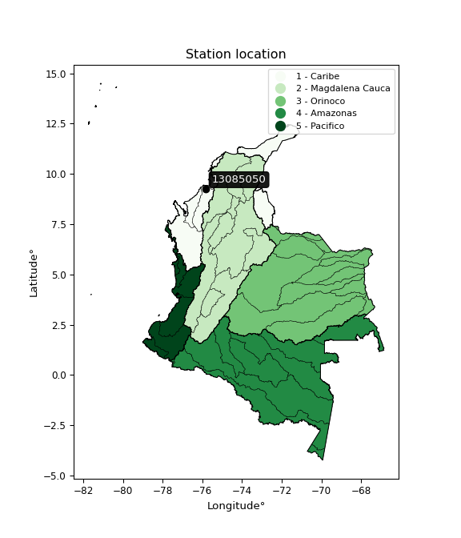</img>

</div>


## A. General information


### 1. General running parameters

• app_version: _v20260312_. • runtime: _2026-03-12 07:15:23.203550_. • Python version: _3.14.0_. • SciPy version: _1.16.3_. • Pandas version: _2.3.3_. • NumPy version: _2.3.5_. • Stations dataset (station_dataset_file): _dataset/pmax24h_in/automatic_colombia_2003_2025.csv_. • Stations catalog (station_catalog_file): _dataset/CNE.xls_. • Minimum year to eval til year_max (date_min): _1900_. • Maximum year to eval since year_min (date_max): _2025_. • Creates, save and include plots into reports (create_plot): _True_. • Plot only fit distributions with Δo > Δ (plot_only_fit): _True_. • Plot only simple graphs avoiding multiple CDFs and multiple Extreme values plots (plot_only_simple): _True_. • Eval low extreme values, if False, evaluates high extreme values (low_extreme): _False_. • Eval every SciPy distribution as logarithmic (pdist_logarithmic_on): _True_. • Standard deviation normalized (ddof): _1.0_. • Return periods to eval in years (Tr): _[2, 2.33, 5, 10, 15, 20, 25, 50, 75, 100, 200, 250, 500, 750, 1000]_. • Minimum data sample per station, 0 means any (minimum_sample): _5_. • Z-Score maximum threshold to adjust a value, 0 means disable (zscore_max): _3.5_. • Z-Score minimum threshold to adjust a value, 0 means disable (zscore_min): _-2.5_. • Avoid zeros, e.g. rain = 0 (avoid_zeros): _True_. • Avoid null values (avoid_nans): _True_. 

:file_folder:Table: [dataset.csv](../../dataset/pmax24h_in/automatic_colombia_2003_2025.csv)

> Delta Degrees of Freedom (DDOF): is a parameter used in the formulas for calculating variance and standard deviation. When ddof=0, the divisor is $N$ (the total number of observations) and this is used when your data set is the entire population. When ddof=1, the divisor is $N-1$ and this is used when your data set is a sample drawn from a larger population. Using $N-1$ provides an unbiased estimate of the population variance (known as Bessel´s correction).


### 2. Station info and location

|   id |   CODIGO | NOMBRE                       | CATEGORIA               | TECNOLOGIA                | ESTADO     | FECHA_INSTALACION   | FECHA_SUSPENSION   |   ALTITUD |   LATITUD |   LONGITUD | DEPARTAMENTO   | MUNICIPIO   | AREA_OPERATIVA                              | ENTIDAD                                                     | AREA_HIDROGRAFICA   | ZONA_HIDROGRAFICA   | SUBZONA_HIDROGRAFICA   |   CORRIENTE | Catalogo   |   Version |
|-----:|---------:|:-----------------------------|:------------------------|:--------------------------|:-----------|:--------------------|:-------------------|----------:|----------:|-----------:|:---------------|:------------|:--------------------------------------------|:------------------------------------------------------------|:--------------------|:--------------------|:-----------------------|------------:|:-----------|----------:|
|    0 | 13085050 | LORICA  ITA - AUT [13085050] | Climatológica Principal | Automática con Telemetría | Suspendida | 13/05/2005          | 02/10/2010         |        30 |   9.25272 |   -75.8444 | Cordoba        | Lorica      | Area Operativa 02 - Atlántico-Bolivar-Sucre | INSTITUTO DE HIDROLOGIA METEOROLOGIA Y ESTUDIOS AMBIENTALES | Caribe              | Sinú                | Bajo Sinú              |         nan | CNE_IDEAM  |  20251226 |

<div align="center">

Dynamic map: [:earth_americas:Google](http://maps.google.com/maps?q=9.252722222,-75.84441667) [:earth_americas:OSM](https://www.openstreetmap.org/#map=18/9.252722222/-75.84441667&layers=P) [:earth_americas:Bing](https://www.bing.com/maps?cp=9.252722222~-75.84441667&lvl=18) [:earth_americas:Apple](https://maps.apple.com/frame?center=9.252722222%2C-75.84441667&span=0.003%2C0.006)

</div>


<div align="center">

```geojson
{
  "type": "Feature",
  "geometry": {
    "type": "Point", 
    "coordinates": [-75.84441667, 9.252722222]
  }, 
  "properties": {
    "Name": "13085050"
  }
}
```

</div>


### 3. Discrete values table and plot

<div align="center">

|               |          0 |           1 |           2 |           3 |          4 |           5 |
|:--------------|-----------:|------------:|------------:|------------:|-----------:|------------:|
| Date          | 2005       | 2006        | 2007        | 2008        | 2009       | 2010        |
| Value         |   84.1     |   44.3      |   42.9      |   44.6      |   92       |   57.2      |
| Value_initial |   84.1     |   44.3      |   42.9      |   44.6      |   92       |   57.2      |
| count         |    6       |    6        |    6        |    6        |    6       |    6        |
| mean          |   60.85    |   60.85     |   60.85     |   60.85     |   60.85    |   60.85     |
| std           |   21.8375  |   21.8375   |   21.8375   |   21.8375   |   21.8375  |   21.8375   |
| zscore        |    1.06468 |   -0.757872 |   -0.821982 |   -0.744134 |    1.42645 |   -0.167144 |


</div>


<div align="center">

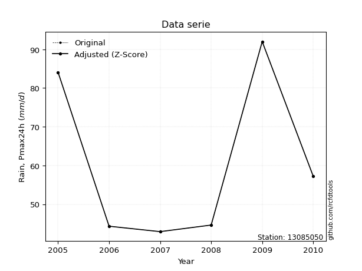</img>

</div>


> The initial value (value_initial) correspond to the initial obtained or null completed value, and value (value) is adjusted only when the initial value is outside the valid range (outlier) definite through the Z-Score value. If Z-Score is active, values out of range or outliers are replaced with the station mean value. A Z-Score (or standard score) measures how many standard deviations a data point is from the mean of a dataset, indicating its relative position; positive scores mean above the mean, negative mean below, and a score of zero is exactly at the mean, allowing for comparison of values from different distributions. It´s calculated using the formula $z=(x–μ)/σ$, where $x$ is the data point, $μ$ is the mean, and $σ$ is the standard deviation, helping identify outliers and understand probability.
>
> <sub>**Note**: In this study, "completing" (filling gaps in) and "extending" (forecasting or lengthening the historical record) rainfall data series are avoided for certain critical analyses because they introduce artificial bias and uncertainty, which can distort the statistics of rare events (extremes), alter day-to-day variability, and compromise the integrity and homogeneity of the original data. Some reasons against Completing/Extending rainfall data are: **Distortion of Extremes and Variability**: The primary issue is that most gap-filling or extension methods rely on averaging or regression with nearby stations, which inherently smooths the data. Rainfall is highly variable in space and time, with a large percentage of zero values and occasional large storms. Infilling methods often underestimate the highest values and overestimate the lowest (zero) values, which severely distorts analyses focused on flood frequency, drought severity, and intensity-duration-frequency (IDF) curves, **Loss of Data Homogeneity**: Infilled or extended data are synthetic estimates, not actual measurements. Combining these estimates with observed data can violate the assumption of data homogeneity, which requires that the data properties do not change over time. Inhomogeneity can lead to incorrect conclusions about long-term trends or changes in climate patterns, **Propagation of Errors**: Errors and biases from the original data (e.g., wind-induced undercatch, instrument errors, site changes) or the data used for imputation can propagate through the analysis, leading to unreliable hydrological models and inaccurate predictions, **Compromised Statistical Integrity**: For statistical analyses, especially those involving the frequency of events, using artificial data can introduce time bias or autocorrelation that doesn´t exist in reality, making it difficult to assess the true probability of events, **Difficulty in Validation**: It is difficult to accurately validate the quality of filled or extended data, especially for past periods where ground-truth measurements are unavailable. The reliability of imputation techniques heavily depends on the density of the surrounding station network and the complexity of the local topography.</sub>


### 4. Active continuous probability distributions from SciPy (80 of 104 available)

A Probability Density Function (PDF) describes the relative likelihood of a continuous random variable falling within a specific range, where the total area under its curve equals 1, and the area over any interval gives the actual probability for that range. Unlike discrete probabilities (like rolling a die), a PDF shows density, not direct probability for a single point (which is zero), with higher points indicating higher likelihood, often visualized as a bell curve for normal distributions.

A log of a probability density function (log-PDF) is simply the logarithm of the PDF´s value, denoted as $log(f(x))$, useful for converting multiplication of probabilities into addition, improving numerical stability with tiny numbers, and connecting to information theory concepts like entropy. Instead of dealing with very small probabilities (e.g., 0.000001), log-PDFs use negative numbers (e.g., $log(0.00001) ≈ -11.51$ that are easier for computers to handle, preventing underflow errors and simplifying complex calculations. In this study, each active probability distribution from SciPy is also evaluated in the $log$ form.

[scipy.stats](https://docs.scipy.org/doc/scipy/reference/stats.html) is a Python´s powerful submodule within the SciPy library for comprehensive statistical analysis, offering over 130 probability distributions (like Normal, Poisson, etc.), functions for descriptive stats (mean, variance), hypothesis testing (t-tests, chi-square), random variable generation, and statistical tests, making it essential for data science, modeling, and research. It provides tools to explore, model, and draw conclusions from data efficiently, working seamlessly with [NumPy](https://numpy.org/).

<div align="center">

|   id | p_dist           |   n_parameter | fit_method   | label                                                                       | active   | ref                                                                                                      |
|-----:|:-----------------|--------------:|:-------------|:----------------------------------------------------------------------------|:---------|:---------------------------------------------------------------------------------------------------------|
|    0 | alpha            |             3 | MLE          | Alpha                                                                       | True     | [:mortar_board:](https://docs.scipy.org/doc/scipy/reference/generated/scipy.stats.alpha.html)            |
|    1 | anglit           |             2 | MM           | Anglit                                                                      | True     | [:mortar_board:](https://docs.scipy.org/doc/scipy/reference/generated/scipy.stats.anglit.html)           |
|    2 | arcsine          |             2 | MM           | Arcsine                                                                     | True     | [:mortar_board:](https://docs.scipy.org/doc/scipy/reference/generated/scipy.stats.arcsine.html)          |
|    3 | argus            |             3 | MLE          | Argus                                                                       | True     | [:mortar_board:](https://docs.scipy.org/doc/scipy/reference/generated/scipy.stats.argus.html)            |
|    4 | beta             |             4 | MLE          | Beta                                                                        | True     | [:mortar_board:](https://docs.scipy.org/doc/scipy/reference/generated/scipy.stats.beta.html)             |
|    5 | betaprime        |             4 | MLE          | Beta prime                                                                  | True     | [:mortar_board:](https://docs.scipy.org/doc/scipy/reference/generated/scipy.stats.betaprime.html)        |
|    6 | bradford         |             3 | MLE          | Bradford                                                                    | True     | [:mortar_board:](https://docs.scipy.org/doc/scipy/reference/generated/scipy.stats.bradford.html)         |
|    7 | burr             |             4 | MLE          | Burr (Type III)                                                             | True     | [:mortar_board:](https://docs.scipy.org/doc/scipy/reference/generated/scipy.stats.burr.html)             |
|    8 | burr12           |             4 | MLE          | Burr (Type III) 12                                                          | True     | [:mortar_board:](https://docs.scipy.org/doc/scipy/reference/generated/scipy.stats.burr12.html)           |
|    9 | cosine           |             2 | MLE          | Cosine                                                                      | True     | [:mortar_board:](https://docs.scipy.org/doc/scipy/reference/generated/scipy.stats.cosine.html)           |
|   10 | crystalball      |             4 | MLE          | Crystalball                                                                 | True     | [:mortar_board:](https://docs.scipy.org/doc/scipy/reference/generated/scipy.stats.crystalball.html)      |
|   11 | dgamma           |             3 | MLE          | Double gamma                                                                | True     | [:mortar_board:](https://docs.scipy.org/doc/scipy/reference/generated/scipy.stats.dgamma.html)           |
|   12 | dweibull         |             3 | MLE          | Double Weibull                                                              | True     | [:mortar_board:](https://docs.scipy.org/doc/scipy/reference/generated/scipy.stats.dweibull.html)         |
|   13 | erlang           |             3 | MLE          | Erlang                                                                      | True     | [:mortar_board:](https://docs.scipy.org/doc/scipy/reference/generated/scipy.stats.erlang.html)           |
|   14 | exponnorm        |             3 | MLE          | Exponentially modified Normal                                               | True     | [:mortar_board:](https://docs.scipy.org/doc/scipy/reference/generated/scipy.stats.exponnorm.html)        |
|   15 | exponpow         |             3 | MLE          | Exponential power                                                           | True     | [:mortar_board:](https://docs.scipy.org/doc/scipy/reference/generated/scipy.stats.exponpow.html)         |
|   16 | exponweib        |             4 | MLE          | Exponentiated Weibull                                                       | True     | [:mortar_board:](https://docs.scipy.org/doc/scipy/reference/generated/scipy.stats.exponweib.html)        |
|   17 | f                |             4 | MLE          | F                                                                           | True     | [:mortar_board:](https://docs.scipy.org/doc/scipy/reference/generated/scipy.stats.f.html)                |
|   18 | fatiguelife      |             3 | MLE          | Fatigue-life (Birnbaum-Saunders)                                            | True     | [:mortar_board:](https://docs.scipy.org/doc/scipy/reference/generated/scipy.stats.fatiguelife.html)      |
|   19 | foldnorm         |             3 | MM           | Fold Normal                                                                 | True     | [:mortar_board:](https://docs.scipy.org/doc/scipy/reference/generated/scipy.stats.foldnorm.html)         |
|   20 | gamma            |             3 | MLE          | Gamma                                                                       | True     | [:mortar_board:](https://docs.scipy.org/doc/scipy/reference/generated/scipy.stats.gamma.html)            |
|   21 | gausshyper       |             6 | MLE          | Gauss hypergeometric                                                        | True     | [:mortar_board:](https://docs.scipy.org/doc/scipy/reference/generated/scipy.stats.gausshyper.html)       |
|   22 | genexpon         |             5 | MLE          | Generalized exponential                                                     | True     | [:mortar_board:](https://docs.scipy.org/doc/scipy/reference/generated/scipy.stats.genexpon.html)         |
|   23 | genextreme       |             3 | MLE          | Generalized exponential                                                     | True     | [:mortar_board:](https://docs.scipy.org/doc/scipy/reference/generated/scipy.stats.genextreme.html)       |
|   24 | gengamma         |             4 | MLE          | Generalized gamma                                                           | True     | [:mortar_board:](https://docs.scipy.org/doc/scipy/reference/generated/scipy.stats.gengamma.html)         |
|   25 | genhalflogistic  |             3 | MLE          | Generalized half-logistic                                                   | True     | [:mortar_board:](https://docs.scipy.org/doc/scipy/reference/generated/scipy.stats.genhalflogistic.html)  |
|   26 | genlogistic      |             3 | MLE          | Generalized logistic                                                        | True     | [:mortar_board:](https://docs.scipy.org/doc/scipy/reference/generated/scipy.stats.genlogistic.html)      |
|   27 | gennorm          |             3 | MLE          | Generalized Normal                                                          | True     | [:mortar_board:](https://docs.scipy.org/doc/scipy/reference/generated/scipy.stats.gennorm.html)          |
|   28 | genpareto        |             3 | MLE          | Generalized Pareto                                                          | True     | [:mortar_board:](https://docs.scipy.org/doc/scipy/reference/generated/scipy.stats.genpareto.html)        |
|   29 | gompertz         |             3 | MLE          | Gompertz (or truncated Gumbel)                                              | True     | [:mortar_board:](https://docs.scipy.org/doc/scipy/reference/generated/scipy.stats.gompertz.html)         |
|   30 | gumbel_l         |             2 | MM           | Gumbel Left Skew                                                            | True     | [:mortar_board:](https://docs.scipy.org/doc/scipy/reference/generated/scipy.stats.gumbel_l.html)         |
|   31 | gumbel_r         |             2 | MM           | Gumbel Right Skew                                                           | True     | [:mortar_board:](https://docs.scipy.org/doc/scipy/reference/generated/scipy.stats.gumbel_r.html)         |
|   32 | halfgennorm      |             3 | MLE          | Upper half of a generalized normal                                          | True     | [:mortar_board:](https://docs.scipy.org/doc/scipy/reference/generated/scipy.stats.halfgennorm.html)      |
|   33 | halflogistic     |             2 | MM           | Half-logistic                                                               | True     | [:mortar_board:](https://docs.scipy.org/doc/scipy/reference/generated/scipy.stats.halflogistic.html)     |
|   34 | halfnorm         |             2 | MM           | Half Normal                                                                 | True     | [:mortar_board:](https://docs.scipy.org/doc/scipy/reference/generated/scipy.stats.halfnorm.html)         |
|   35 | hypsecant        |             2 | MM           | hyperbolic secant                                                           | True     | [:mortar_board:](https://docs.scipy.org/doc/scipy/reference/generated/scipy.stats.hypsecant.html)        |
|   36 | invgamma         |             3 | MLE          | Inverted gamma                                                              | True     | [:mortar_board:](https://docs.scipy.org/doc/scipy/reference/generated/scipy.stats.invgamma.html)         |
|   37 | invgauss         |             3 | MLE          | Inverse Gaussian                                                            | True     | [:mortar_board:](https://docs.scipy.org/doc/scipy/reference/generated/scipy.stats.invgauss.html)         |
|   38 | invweibull       |             3 | MLE          | Inverted Weibull                                                            | True     | [:mortar_board:](https://docs.scipy.org/doc/scipy/reference/generated/scipy.stats.invweibull.html)       |
|   39 | johnsonsb        |             4 | MLE          | Johnson SB                                                                  | True     | [:mortar_board:](https://docs.scipy.org/doc/scipy/reference/generated/scipy.stats.johnsonsb.html)        |
|   40 | johnsonsu        |             4 | MLE          | Johnson Su                                                                  | True     | [:mortar_board:](https://docs.scipy.org/doc/scipy/reference/generated/scipy.stats.johnsonsu.html)        |
|   41 | kappa3           |             3 | MLE          | Kappa 3                                                                     | True     | [:mortar_board:](https://docs.scipy.org/doc/scipy/reference/generated/scipy.stats.kappa3.html)           |
|   42 | kappa4           |             4 | MLE          | Kappa 4                                                                     | True     | [:mortar_board:](https://docs.scipy.org/doc/scipy/reference/generated/scipy.stats.kappa4.html)           |
|   43 | ksone            |             3 | MLE          | Kolmogorov-Smirnov one-sided test statistic distribution                    | True     | [:mortar_board:](https://docs.scipy.org/doc/scipy/reference/generated/scipy.stats.ksone.html)            |
|   44 | kstwobign        |             2 | MLE          | Limiting distribution of scaled Kolmogorov-Smirnov two-sided test statistic | True     | [:mortar_board:](https://docs.scipy.org/doc/scipy/reference/generated/scipy.stats.kstwobign.html)        |
|   45 | laplace          |             2 | MM           | Laplace                                                                     | True     | [:mortar_board:](https://docs.scipy.org/doc/scipy/reference/generated/scipy.stats.laplace.html)          |
|   46 | levy_l           |             2 | MLE          | Left-skewed Levy                                                            | True     | [:mortar_board:](https://docs.scipy.org/doc/scipy/reference/generated/scipy.stats.levy_l.html)           |
|   47 | loggamma         |             3 | MLE          | Log gamma                                                                   | True     | [:mortar_board:](https://docs.scipy.org/doc/scipy/reference/generated/scipy.stats.loggamma.html)         |
|   48 | logistic         |             2 | MM           | Logistic (or Sech-squared)                                                  | True     | [:mortar_board:](https://docs.scipy.org/doc/scipy/reference/generated/scipy.stats.logistic.html)         |
|   49 | loglaplace       |             3 | MLE          | Log-Laplace                                                                 | True     | [:mortar_board:](https://docs.scipy.org/doc/scipy/reference/generated/scipy.stats.loglaplace.html)       |
|   50 | lomax            |             3 | MLE          | Lomax (Pareto of the second kind)                                           | True     | [:mortar_board:](https://docs.scipy.org/doc/scipy/reference/generated/scipy.stats.lomax.html)            |
|   51 | maxwell          |             2 | MM           | Maxwell                                                                     | True     | [:mortar_board:](https://docs.scipy.org/doc/scipy/reference/generated/scipy.stats.maxwell.html)          |
|   52 | mielke           |             4 | MLE          | Mielke Beta-Kappa / Dagum                                                   | True     | [:mortar_board:](https://docs.scipy.org/doc/scipy/reference/generated/scipy.stats.mielke.html)           |
|   53 | moyal            |             2 | MM           | Moyal                                                                       | True     | [:mortar_board:](https://docs.scipy.org/doc/scipy/reference/generated/scipy.stats.moyal.html)            |
|   54 | nakagami         |             3 | MLE          | Nakagami                                                                    | True     | [:mortar_board:](https://docs.scipy.org/doc/scipy/reference/generated/scipy.stats.nakagami.html)         |
|   55 | ncf              |             5 | MLE          | Non-central F distribution                                                  | True     | [:mortar_board:](https://docs.scipy.org/doc/scipy/reference/generated/scipy.stats.ncf.html)              |
|   56 | nct              |             4 | MLE          | Non-central Student’s t                                                     | True     | [:mortar_board:](https://docs.scipy.org/doc/scipy/reference/generated/scipy.stats.nct.html)              |
|   57 | norm             |             2 | MM           | Normal                                                                      | True     | [:mortar_board:](https://docs.scipy.org/doc/scipy/reference/generated/scipy.stats.norm.html)             |
|   58 | pearson3         |             3 | MM           | Pearson type III                                                            | True     | [:mortar_board:](https://docs.scipy.org/doc/scipy/reference/generated/scipy.stats.pearson3.html)         |
|   59 | powerlaw         |             3 | MLE          | Power-function                                                              | True     | [:mortar_board:](https://docs.scipy.org/doc/scipy/reference/generated/scipy.stats.powerlaw.html)         |
|   60 | rayleigh         |             2 | MM           | Rayleigh                                                                    | True     | [:mortar_board:](https://docs.scipy.org/doc/scipy/reference/generated/scipy.stats.rayleigh.html)         |
|   61 | rdist            |             3 | MLE          | R-distributed (symmetric beta)                                              | True     | [:mortar_board:](https://docs.scipy.org/doc/scipy/reference/generated/scipy.stats.rdist.html)            |
|   62 | rice             |             3 | MLE          | Rice                                                                        | True     | [:mortar_board:](https://docs.scipy.org/doc/scipy/reference/generated/scipy.stats.rice.html)             |
|   63 | semicircular     |             2 | MM           | Semicircular                                                                | True     | [:mortar_board:](https://docs.scipy.org/doc/scipy/reference/generated/scipy.stats.semicircular.html)     |
|   64 | skewnorm         |             3 | MLE          | Skew normal                                                                 | True     | [:mortar_board:](https://docs.scipy.org/doc/scipy/reference/generated/scipy.stats.skewnorm.html)         |
|   65 | t                |             3 | MLE          | Student’s t                                                                 | True     | [:mortar_board:](https://docs.scipy.org/doc/scipy/reference/generated/scipy.stats.t.html)                |
|   66 | trapezoid        |             4 | MLE          | Trapezoid                                                                   | True     | [:mortar_board:](https://docs.scipy.org/doc/scipy/reference/generated/scipy.stats.trapezoid.html)        |
|   67 | triang           |             3 | MLE          | Triangular                                                                  | True     | [:mortar_board:](https://docs.scipy.org/doc/scipy/reference/generated/scipy.stats.triang.html)           |
|   68 | truncexpon       |             3 | MLE          | Truncated exponential                                                       | True     | [:mortar_board:](https://docs.scipy.org/doc/scipy/reference/generated/scipy.stats.truncexpon.html)       |
|   69 | truncnorm        |             4 | MLE          | Truncated normal                                                            | True     | [:mortar_board:](https://docs.scipy.org/doc/scipy/reference/generated/scipy.stats.truncnorm.html)        |
|   70 | truncpareto      |             4 | MLE          | Upper truncated Pareto                                                      | True     | [:mortar_board:](https://docs.scipy.org/doc/scipy/reference/generated/scipy.stats.truncpareto.html)      |
|   71 | truncweibull_min |             5 | MLE          | Doubly truncated Weibull minimum                                            | True     | [:mortar_board:](https://docs.scipy.org/doc/scipy/reference/generated/scipy.stats.truncweibull_min.html) |
|   72 | tukeylambda      |             3 | MLE          | Tukey-Lamdba                                                                | True     | [:mortar_board:](https://docs.scipy.org/doc/scipy/reference/generated/scipy.stats.tukeylambda.html)      |
|   73 | uniform          |             2 | MLE          | Uniform                                                                     | True     | [:mortar_board:](https://docs.scipy.org/doc/scipy/reference/generated/scipy.stats.uniform.html)          |
|   74 | vonmises         |             3 | MLE          | Von Mises                                                                   | True     | [:mortar_board:](https://docs.scipy.org/doc/scipy/reference/generated/scipy.stats.vonmises.html)         |
|   75 | vonmises_line    |             3 | MLE          | Von Mises line                                                              | True     | [:mortar_board:](https://docs.scipy.org/doc/scipy/reference/generated/scipy.stats.vonmises_line.html)    |
|   76 | wald             |             2 | MM           | Wald                                                                        | True     | [:mortar_board:](https://docs.scipy.org/doc/scipy/reference/generated/scipy.stats.wald.html)             |
|   77 | weibull_max      |             3 | MLE          | Weibull maximum                                                             | True     | [:mortar_board:](https://docs.scipy.org/doc/scipy/reference/generated/scipy.stats.weibull_max.html)      |
|   78 | weibull_min      |             3 | MLE          | Weibull minimum                                                             | True     | [:mortar_board:](https://docs.scipy.org/doc/scipy/reference/generated/scipy.stats.weibull_min.html)      |
|   79 | wrapcauchy       |             3 | MLE          | Wrapped  Cauchy                                                             | True     | [:mortar_board:](https://docs.scipy.org/doc/scipy/reference/generated/scipy.stats.wrapcauchy.html)       |

</div>

> **n_parameter:** # arguments & localization & scale.
>
> **Fit methods:** (MLE) maximum likelihood, (MM) L-moments.
>
>**Inactive** (With the only purpose of prevent loops, zero divisions, infinite values, over high estimated values or horizontal trending for recurrence intervals estimations, the follow distributions were disabled.)**:** lognorm, norminvgauss, powernorm, powerlognorm, cauchy, halfcauchy, foldcauchy, skewcauchy, chi2, expon, fisk, genhyperbolic, geninvgauss, gibrat, kstwo, laplace_asymmetric, levy, levy_stable, ncx2, pareto, rel_breitwigner, recipinvgauss, studentized_range, loguniform, 


## B. Probability (PDF) vs. Empirical (EDF) distributions functions

A continuous probability distribution (CPD) describes probabilities for variables that can take any value within a range (like rain any time), unlike discrete variables with specific outcomes (like temperature). It uses a Probability Density Function (PDF), a curve where the total area under it equals 1, and the probability of the variable falling within an interval (a to b) is found by calculating the area under the curve between those points. A key feature is that the probability of hitting any single exact value is zero, so probabilities are always expressed for ranges, e.g., $P(a ≤ X ≤ b)$.

<div align="center">

Distributions parameters from station values
|     |   station | p_dist              |   n |              loc |          scale | shape                  | shape1                 | shape2                 | shape3             |
|----:|----------:|:--------------------|----:|-----------------:|---------------:|:-----------------------|:-----------------------|:-----------------------|:-------------------|
|   0 |  13085050 | alpha               |   6 |     40.468       |    4.47057     | 1.6976059279489885e-09 |                        |                        |                    |
|   1 |  13085050 | anglit              |   6 |     60.85        |   58.3172      |                        |                        |                        |                    |
|   2 |  13085050 | arcsine             |   6 |     32.6579      |   56.3841      |                        |                        |                        |                    |
|   3 |  13085050 | argus               |   6 |     20.5739      |   75.3285      | 3.0638721253947944e-06 |                        |                        |                    |
|   4 |  13085050 | beta                |   6 |     41.6882      |   50.3118      | 0.11964608341297633    | 0.2191038846070519     |                        |                    |
|   5 |  13085050 | betaprime           |   6 |     -0.388734    |    3.21718     | 204.87748401273166     | 11.80909190331323      |                        |                    |
|   6 |  13085050 | bradford            |   6 |     42.9         |   49.1001      | 0.9492489781551351     |                        |                        |                    |
|   7 |  13085050 | burr                |   6 |      5.13864     |   13.7685      | 3.751743051050915      | 85.74270255916679      |                        |                    |
|   8 |  13085050 | burr12              |   6 |     -5.70658     |   48.4234      | 1011.1077776879899     | 0.003584597284538229   |                        |                    |
|   9 |  13085050 | cosine              |   6 |     62.4778      |   15.8495      |                        |                        |                        |                    |
|  10 |  13085050 | crystalball         |   6 |     60.85        |   19.9348      | 53533.244850187824     | 4766.074958286929      |                        |                    |
|  11 |  13085050 | dgamma              |   6 |     53.3725      |    9.42723     | 1.7944459094815781     |                        |                        |                    |
|  12 |  13085050 | dweibull            |   6 |     54.321       |   18.6038      | 1.3893589392689039     |                        |                        |                    |
|  13 |  13085050 | erlang              |   6 |     42.9         |   14.4196      | 0.5012296895068415     |                        |                        |                    |
|  14 |  13085050 | exponnorm           |   6 |     42.8815      |    0.00536755  | 3332.531991986344      |                        |                        |                    |
|  15 |  13085050 | exponpow            |   6 |     42.9         |   51.8142      | 0.2622243396580123     |                        |                        |                    |
|  16 |  13085050 | exponweib           |   6 |     42.9         |   24.5611      | 0.6911673276693193     | 0.768486744296598      |                        |                    |
|  17 |  13085050 | f                   |   6 |     -1.73563     |   57.3926      | 412.4321692124776      | 24.501206712886322     |                        |                    |
|  18 |  13085050 | fatiguelife         |   6 |     42.9         |    3.0293e-06  | 2161.288255693634      |                        |                        |                    |
|  19 |  13085050 | foldnorm            |   6 |     30.2127      |   23.6727      | 1.1764741384495045     |                        |                        |                    |
|  20 |  13085050 | gamma               |   6 |     42.9         |   11.1647      | 0.7087081104177957     |                        |                        |                    |
|  21 |  13085050 | gausshyper          |   6 |     39.6376      |   52.3624      | 1.226462360102998      | 0.8157432041827332     | 1.0031726033575594     | 0.9294825956931716 |
|  22 |  13085050 | genexpon            |   6 |     42.9         |   60.1186      | 3.3492110237558705     | 0.8186083720156054     | 3.095800516107722e-09  |                    |
|  23 |  13085050 | genextreme          |   6 |     43.3044      |    2.53455     | -6.2681604430148425    |                        |                        |                    |
|  24 |  13085050 | gengamma            |   6 |     42.9         |   24.7264      | 0.5474121360566458     | 0.834005210829177      |                        |                    |
|  25 |  13085050 | genhalflogistic     |   6 |     41.8417      |   52.1086      | 1.0388830660537618     |                        |                        |                    |
|  26 |  13085050 | genlogistic         |   6 |    -51.683       |   14.2428      | 1412.4220145078498     |                        |                        |                    |
|  27 |  13085050 | gennorm             |   6 |     44.6         |   16.2742      | 0.8181149711820908     |                        |                        |                    |
|  28 |  13085050 | genpareto           |   6 |     -1.1422      |  154.694       | -1.660834469540999     |                        |                        |                    |
|  29 |  13085050 | gompertz            |   6 |     42.9         |   34.0386      | 0.8805383701513522     |                        |                        |                    |
|  30 |  13085050 | gumbel_l            |   6 |     69.8217      |   15.5431      |                        |                        |                        |                    |
|  31 |  13085050 | gumbel_r            |   6 |     51.8783      |   15.5431      |                        |                        |                        |                    |
|  32 |  13085050 | halfgennorm         |   6 |     42.9         |    1.99511     | 0.44125771797801816    |                        |                        |                    |
|  33 |  13085050 | halflogistic        |   6 |     37.2226      |   17.0435      |                        |                        |                        |                    |
|  34 |  13085050 | halfnorm            |   6 |     34.4642      |   33.0698      |                        |                        |                        |                    |
|  35 |  13085050 | hypsecant           |   6 |     60.85        |   12.6909      |                        |                        |                        |                    |
|  36 |  13085050 | invgamma            |   6 |     42.4637      |    0.89237     | 0.5081595638191856     |                        |                        |                    |
|  37 |  13085050 | invgauss            |   6 |     42.322       |    2.43691     | 7.603122555241612      |                        |                        |                    |
|  38 |  13085050 | invweibull          |   6 |     42.9         |    1.01692     | 0.048037085543423466   |                        |                        |                    |
|  39 |  13085050 | johnsonsb           |   6 |     42.9         |  106.002       | 1.370535804881972      | 0.16473937790573062    |                        |                    |
|  40 |  13085050 | johnsonsu           |   6 |      8.03542e+06 |    1.05865e+07 | 471103.9208280258      | 672673.604602735       |                        |                    |
|  41 |  13085050 | kappa3              |   6 |     42.8902      |   48.9453      | 618.304012284214       |                        |                        |                    |
|  42 |  13085050 | kappa4              |   6 |     28.8765      |   68.0393      | 1.2617360767755015     | 1.057750841900894      |                        |                    |
|  43 |  13085050 | ksone               |   6 |     26.3219      |   69.0561      | 1.0                    |                        |                        |                    |
|  44 |  13085050 | kstwobign           |   6 |      2.37279     |   67.0102      |                        |                        |                        |                    |
|  45 |  13085050 | laplace             |   6 |     60.85        |   14.096       |                        |                        |                        |                    |
|  46 |  13085050 | levy_l              |   6 |     94.5554      |   10.4708      |                        |                        |                        |                    |
|  47 |  13085050 | loggamma            |   6 |  -6295.84        |  851.166       | 1752.1020881877266     |                        |                        |                    |
|  48 |  13085050 | logistic            |   6 |     60.85        |   10.9906      |                        |                        |                        |                    |
|  49 |  13085050 | loglaplace          |   6 |     -0.115575    |   44.7156      | 3.637368556183871      |                        |                        |                    |
|  50 |  13085050 | lomax               |   6 |     42.9         | 1521.44        | 86.04246066216272      |                        |                        |                    |
|  51 |  13085050 | maxwell             |   6 |     13.6129      |   29.6015      |                        |                        |                        |                    |
|  52 |  13085050 | mielke              |   6 |      0.680267    |   13.6523      | 1094.5262374581234     | 4.312345744023153      |                        |                    |
|  53 |  13085050 | moyal               |   6 |     49.45        |    8.97381     |                        |                        |                        |                    |
|  54 |  13085050 | nakagami            |   6 |     42.9         |   38.496       | 0.24266973162722333    |                        |                        |                    |
|  55 |  13085050 | ncf                 |   6 |     -0.067917    |    0.00350095  | 0.00075011323552572    | 12.092854718638748     | 11.588614416396084     |                    |
|  56 |  13085050 | nct                 |   6 |     -0.351285    |    0.934772    | 6.330214295310169      | 57.33671866493813      |                        |                    |
|  57 |  13085050 | norm                |   6 |     60.85        |   19.9348      |                        |                        |                        |                    |
|  58 |  13085050 | pearson3            |   6 |     60.85        |   19.9348      | 0.5919765584963368     |                        |                        |                    |
|  59 |  13085050 | powerlaw            |   6 |     42.9         |   49.1         | 0.13392434330846467    |                        |                        |                    |
|  60 |  13085050 | rayleigh            |   6 |     22.7136      |   30.4285      |                        |                        |                        |                    |
|  61 |  13085050 | rdist               |   6 |     44.8111      |   12.3889      | 1.3096193278415837     |                        |                        |                    |
|  62 |  13085050 | rice                |   6 |     28.9852      |   26.5778      | 0.0005958296810373348  |                        |                        |                    |
|  63 |  13085050 | semicircular        |   6 |     60.85        |   39.8696      |                        |                        |                        |                    |
|  64 |  13085050 | skewnorm            |   6 |     42.9         |   26.8237      | 17685086.548867743     |                        |                        |                    |
|  65 |  13085050 | t                   |   6 |     60.8485      |   19.9368      | 10229063.369861785     |                        |                        |                    |
|  66 |  13085050 | trapezoid           |   6 |     37.99        |   58.92        | 1.0                    | 1.0                    |                        |                    |
|  67 |  13085050 | triang              |   6 |     15.3805      |   76.6195      | 0.9999999994426271     |                        |                        |                    |
|  68 |  13085050 | truncexpon          |   6 |     42.9         |   53.8234      | 0.9122420407111034     |                        |                        |                    |
|  69 |  13085050 | truncnorm           |   6 | -36705.6         |  856.612       | 42.89980046030325      | 96.0405337326759       |                        |                    |
|  70 |  13085050 | truncpareto         |   6 |     41.2155      |    1.68446     | 0.0028318383002622575  | 30.148894101921528     |                        |                    |
|  71 |  13085050 | truncweibull_min    |   6 |     42.2495      |   71.1438      | 0.222118336172641      | 0.009143790831797564   | 0.6992957189754325     |                    |
|  72 |  13085050 | tukeylambda         |   6 |     68.5317      |   29.143       | 1.1369892683907956     |                        |                        |                    |
|  73 |  13085050 | uniform             |   6 |     42.9         |   49.1         |                        |                        |                        |                    |
|  74 |  13085050 | vonmises            |   6 |      0.291949    |    1           | 0.6011243008036442     |                        |                        |                    |
|  75 |  13085050 | vonmises_line       |   6 |     67.7156      |    7.89912     | 4.083817669232112e-07  |                        |                        |                    |
|  76 |  13085050 | wald                |   6 |     40.9152      |   19.9348      |                        |                        |                        |                    |
|  77 |  13085050 | weibull_max         |   6 |     92           |    1.41854     | 0.27747720796046493    |                        |                        |                    |
|  78 |  13085050 | weibull_min         |   6 |     42.9         |    6.84812     | 0.6167886887385665     |                        |                        |                    |
|  79 |  13085050 | wrapcauchy          |   6 |     42.9         |    7.81451     | 0.8252927787207553     |                        |                        |                    |
|  80 |  13085050 | logalpha            |   6 |      2.03923     |   13.66        | 6.950424453173472      |                        |                        |                    |
|  81 |  13085050 | loganglit           |   6 |      4.05799     |    0.912382    |                        |                        |                        |                    |
|  82 |  13085050 | logarcsine          |   6 |      3.61695     |    0.882082    |                        |                        |                        |                    |
|  83 |  13085050 | logargus            |   6 |      3.43239     |    1.15332     | 2.14278278559594e-05   |                        |                        |                    |
|  84 |  13085050 | logbeta             |   6 |      3.5954      |    0.926384    | 0.14535714750889295    | 0.23619793290730434    |                        |                    |
|  85 |  13085050 | logbetaprime        |   6 |     -2.46732     |    5.64751     | 543.6824118843269      | 471.8962266439619      |                        |                    |
|  86 |  13085050 | logbradford         |   6 |      3.75887     |    0.762922    | 1.1210342303685301     |                        |                        |                    |
|  87 |  13085050 | logburr             |   6 |      1.84792     |    1.24156     | 9.67595246347621       | 123.41243304842283     |                        |                    |
|  88 |  13085050 | logburr12           |   6 |     -0.141319    |    5.34886     | 14.446099555345704     | 20.51621393143565      |                        |                    |
|  89 |  13085050 | logcosine           |   6 |      4.07885     |    0.246541    |                        |                        |                        |                    |
|  90 |  13085050 | logcrystalball      |   6 |      4.05799     |    0.311883    | 54.970012595974836     | 1032.6087723637374     |                        |                    |
|  91 |  13085050 | logdgamma           |   6 |      3.96649     |    0.106484    | 2.5868612408798786     |                        |                        |                    |
|  92 |  13085050 | logdweibull         |   6 |      3.98861     |    0.309753    | 1.7570048629923196     |                        |                        |                    |
|  93 |  13085050 | logerlang           |   6 |      3.75887     |    0.243937    | 0.3002755315411584     |                        |                        |                    |
|  94 |  13085050 | logexponnorm        |   6 |      3.75852     |    0.00010955  | 2719.8555136897667     |                        |                        |                    |
|  95 |  13085050 | logexponpow         |   6 |      3.75887     |    0.962152    | 0.3583130757476356     |                        |                        |                    |
|  96 |  13085050 | logexponweib        |   6 |      3.75887     |    0.385242    | 1.0844848774248521     | 0.32854523657390394    |                        |                    |
|  97 |  13085050 | logf                |   6 |      3.74496     |    0.050583    | 795.278767279192       | 1.2726933127837352     |                        |                    |
|  98 |  13085050 | logfatiguelife      |   6 |      3.75887     |    3.49171e-08 | 2637.733187507326      |                        |                        |                    |
|  99 |  13085050 | logfoldnorm         |   6 |      3.54986     |    0.354836    | 1.3502570996543328     |                        |                        |                    |
| 100 |  13085050 | loggamma            |   6 |      3.75887     |    0.198404    | 0.6097046536500474     |                        |                        |                    |
| 101 |  13085050 | loggausshyper       |   6 |      3.75887     |    0.778236    | 0.7416086735922445     | 1.1610326814218892     | 0.9892050612761385     | 1.1754510913077216 |
| 102 |  13085050 | loggenexpon         |   6 |      3.75887     |    0.612033    | 2.0462920793215984     | 6.89755771381774e-06   | 0.07521192545412504    |                    |
| 103 |  13085050 | loggenextreme       |   6 |      3.77452     |    0.105876    | -6.768039258282094     |                        |                        |                    |
| 104 |  13085050 | loggengamma         |   6 |      3.75887     |    0.385161    | 1.0843721566024378     | 0.3293359877468106     |                        |                    |
| 105 |  13085050 | loggenhalflogistic  |   6 |      3.7351      |    0.849378    | 1.0796853848414094     |                        |                        |                    |
| 106 |  13085050 | loggenlogistic      |   6 |      2.20577     |    0.231922    | 1565.4545834170497     |                        |                        |                    |
| 107 |  13085050 | loggennorm          |   6 |      3.79773     |    0.000236303 | 0.24529047475535712    |                        |                        |                    |
| 108 |  13085050 | loggenpareto        |   6 |     -0.0117137   |   13.5073      | -2.979445053537052     |                        |                        |                    |
| 109 |  13085050 | loggompertz         |   6 |      3.75725     |    2.29187     | 6.259241359904992      |                        |                        |                    |
| 110 |  13085050 | loggumbel_l         |   6 |      4.19835     |    0.243174    |                        |                        |                        |                    |
| 111 |  13085050 | loggumbel_r         |   6 |      3.91763     |    0.243174    |                        |                        |                        |                    |
| 112 |  13085050 | loghalfgennorm      |   6 |      3.75887     |    0.31686     | 0.9601051360730501     |                        |                        |                    |
| 113 |  13085050 | loghalflogistic     |   6 |      3.68834     |    0.266649    |                        |                        |                        |                    |
| 114 |  13085050 | loghalfnorm         |   6 |      3.64518     |    0.517381    |                        |                        |                        |                    |
| 115 |  13085050 | loghypsecant        |   6 |      4.05799     |    0.198551    |                        |                        |                        |                    |
| 116 |  13085050 | loginvgamma         |   6 |      1.23824     |  252.805       | 90.73607763368568      |                        |                        |                    |
| 117 |  13085050 | loginvgauss         |   6 |      3.7445      |    0.0620017   | 5.056208846004351      |                        |                        |                    |
| 118 |  13085050 | loginvweibull       |   6 |      3.75887     |    3.76626e-05 | 0.07581266999800595    |                        |                        |                    |
| 119 |  13085050 | logjohnsonsb        |   6 |      3.75887     |    0.770766    | -0.23286972665502115   | 0.10442876087900028    |                        |                    |
| 120 |  13085050 | logjohnsonsu        |   6 |      6.8636      |    0.000104625 | 109.98919471075936     | 10.10850551389585      |                        |                    |
| 121 |  13085050 | logkappa3           |   6 |      3.75887     |    0.762557    | 3796.297393082275      |                        |                        |                    |
| 122 |  13085050 | logkappa4           |   6 |      3.68972     |    0.93012     | 1.0584868517487251     | 1.1178356533728326     |                        |                    |
| 123 |  13085050 | logksone            |   6 |      3.51779     |    1.08039     | 1.0                    |                        |                        |                    |
| 124 |  13085050 | logkstwobign        |   6 |      3.11914     |    1.07402     |                        |                        |                        |                    |
| 125 |  13085050 | loglaplace          |   6 |      4.05799     |    0.220534    |                        |                        |                        |                    |
| 126 |  13085050 | loglevy_l           |   6 |      4.5558      |    0.138489    |                        |                        |                        |                    |
| 127 |  13085050 | logloggamma         |   6 |    -94.6299      |   13.2158      | 1750.6498101432207     |                        |                        |                    |
| 128 |  13085050 | loglogistic         |   6 |      4.05799     |    0.17195     |                        |                        |                        |                    |
| 129 |  13085050 | logloglaplace       |   6 |      0.0317896   |    3.76594     | 14.71928286736679      |                        |                        |                    |
| 130 |  13085050 | loglomax            |   6 |      3.75887     |   36.2997      | 122.4347586147457      |                        |                        |                    |
| 131 |  13085050 | logmaxwell          |   6 |      3.31896     |    0.463119    |                        |                        |                        |                    |
| 132 |  13085050 | logmielke           |   6 |      2.78595     |    0.468978    | 517.7662021882916      | 5.36829921173309       |                        |                    |
| 133 |  13085050 | logmoyal            |   6 |      3.87964     |    0.140397    |                        |                        |                        |                    |
| 134 |  13085050 | lognakagami         |   6 |      3.75887     |    0.391038    | 0.14336477718542712    |                        |                        |                    |
| 135 |  13085050 | logncf              |   6 |      1.62878     |    2.41847     | 176.45367529485787     | 473.8901653036952      | 1.3025110191330556e-08 |                    |
| 136 |  13085050 | lognct              |   6 |     -3.68483     |    0.214746    | 510.7818184649352      | 36.015043451996064     |                        |                    |
| 137 |  13085050 | lognorm             |   6 |      4.05799     |    0.311883    |                        |                        |                        |                    |
| 138 |  13085050 | logpearson3         |   6 |      4.05799     |    0.311883    | 0.48711843620741635    |                        |                        |                    |
| 139 |  13085050 | logpowerlaw         |   6 |      3.75887     |    0.762917    | 0.14175878235156475    |                        |                        |                    |
| 140 |  13085050 | lograyleigh         |   6 |      3.46134     |    0.476058    |                        |                        |                        |                    |
| 141 |  13085050 | logrdist            |   6 |      4.21605     |    0.457179    | 1.0848948983684021     |                        |                        |                    |
| 142 |  13085050 | logrice             |   6 |      3.55011     |    0.421433    | 0.0021606291731709943  |                        |                        |                    |
| 143 |  13085050 | logsemicircular     |   6 |      4.05799     |    0.623765    |                        |                        |                        |                    |
| 144 |  13085050 | logskewnorm         |   6 |      3.75887     |    0.432141    | 11747180.573432185     |                        |                        |                    |
| 145 |  13085050 | logt                |   6 |      4.05799     |    0.311881    | 2126763642.9591074     |                        |                        |                    |
| 146 |  13085050 | logtrapezoid        |   6 |      3.68258     |    0.9155      | 1.0                    | 1.0                    |                        |                    |
| 147 |  13085050 | logtriang           |   6 |      3.35695     |    1.16484     | 0.999999991790335      |                        |                        |                    |
| 148 |  13085050 | logtruncexpon       |   6 |      3.75887     |    1.04168     | 0.732399644930013      |                        |                        |                    |
| 149 |  13085050 | logtruncnorm        |   6 |     -3.0983      |    1.72359     | 3.9784159736923135     | 4.421051814578652      |                        |                    |
| 150 |  13085050 | logtruncpareto      |   6 |      3.68351     |    0.0753665   | 0.06187343373223482    | 11.122753169154768     |                        |                    |
| 151 |  13085050 | logtruncweibull_min |   6 |      3.75887     |    1.09776     | 0.3116632927739401     | 3.3751103620017214e-16 | 0.7953271602683005     |                    |
| 152 |  13085050 | logtukeylambda      |   6 |      4.13919     |    0.494821    | 1.2933199885441486     |                        |                        |                    |
| 153 |  13085050 | loguniform          |   6 |      3.75887     |    0.762917    |                        |                        |                        |                    |
| 154 |  13085050 | logvonmises         |   6 |     -2.22775     |    1           | 10.675320758969717     |                        |                        |                    |
| 155 |  13085050 | logvonmises_line    |   6 |      4.15198     |    0.125132    | 3.16745401671723e-05   |                        |                        |                    |
| 156 |  13085050 | logwald             |   6 |      3.74611     |    0.311883    |                        |                        |                        |                    |
| 157 |  13085050 | logweibull_max      |   6 |      4.52179     |    0.48265     | 0.8839235203812514     |                        |                        |                    |
| 158 |  13085050 | logweibull_min      |   6 |      3.75887     |    0.251328    | 0.7443334811337367     |                        |                        |                    |
| 159 |  13085050 | logwrapcauchy       |   6 |      3.75887     |    0.121612    | 0.7690708895689593     |                        |                        |                    |

</div>

> **loc** (Location parameter): This shifts the distribution along the x-axis. For many common distributions, like the normal (Gaussian) distribution, loc represents the mean $μ$. For others, like the uniform distribution, it might represent the minimum value, or for the beta distribution, the left end of the support interval.
>
> **scale** (Scale parameter): This determines the width or spread of the distribution. For the normal distribution, scale represents the standard deviation $σ$. For a uniform distribution, it defines the length of the interval (from $loc$ to $loc + scale$).
>
> **shape** (Shape parameters): Refers to parameters that define the specific form of a probability distribution, distinct from its location (loc) and scale (scale). These parameters are required arguments for most distribution functions. For example, a normal (Gaussian) distribution is fully defined by its location (mean) and scale (standard deviation), so it has no specific shape parameters beyond loc and scale. However, other distributions have intrinsic properties that need specification, as Gamma distribution that takes a shape parameter, often named $a$ or $alpha$.


### 0. Cumulative distribution values - CDF (160 evaluated)

Cumulative Distribution Function (CDF), denoted as $F$<sub>$X$</sub>$(x)$, is a function that gives the probability that a random variable $X$ will take a value less than or equal to a specific value, $x$ (i.e., $(P(X≥x)$. It essentially "accumulates" probabilities from a given point up to the far right (positive infinity), providing a complete picture of the distribution´s probabilities for both discrete (like rain) and continuous (like temperature) variables, helping to find probabilities over ranges or above certain values. Each station is evaluated separately ordering the $x$ values ascending, calculating the CDF and PDF values for the activated distributions and their logarithmic forms.

<div align="center">

CDF ordered by x ascending and calculating $log(f(x))$ separately
|   id |   Station |   date |    x |   count |   mean |     std |    zscore |   Value_initial |   station |   m |     alpha |   alpha_pdf |   anglit |   anglit_pdf |   arcsine |   arcsine_pdf |    argus |   argus_pdf |     beta |    beta_pdf |   betaprime |   betaprime_pdf |    bradford |   bradford_pdf |     burr |   burr_pdf |    burr12 |   burr12_pdf |   cosine |   cosine_pdf |   crystalball |   crystalball_pdf |   dgamma |   dgamma_pdf |   dweibull |   dweibull_pdf |      erlang |   erlang_pdf |   exponnorm |   exponnorm_pdf |    exponpow |   exponpow_pdf |   exponweib |   exponweib_pdf |        f |      f_pdf |   fatiguelife |   fatiguelife_pdf |   foldnorm |   foldnorm_pdf |      gamma |      gamma_pdf |   gausshyper |   gausshyper_pdf |    genexpon |   genexpon_pdf |   genextreme |   genextreme_pdf |    gengamma |   gengamma_pdf |   genhalflogistic |   genhalflogistic_pdf |   genlogistic |   genlogistic_pdf |   gennorm |   gennorm_pdf |   genpareto |   genpareto_pdf |    gompertz |   gompertz_pdf |   gumbel_l |   gumbel_l_pdf |   gumbel_r |   gumbel_r_pdf |   halfgennorm |   halfgennorm_pdf |   halflogistic |   halflogistic_pdf |   halfnorm |   halfnorm_pdf |   hypsecant |   hypsecant_pdf |   invgamma |   invgamma_pdf |   invgauss |   invgauss_pdf |   invweibull |   invweibull_pdf |   johnsonsb |   johnsonsb_pdf |   johnsonsu |   johnsonsu_pdf |      kappa3 |   kappa3_pdf |     kappa4 |   kappa4_pdf |    ksone |   ksone_pdf |   kstwobign |   kstwobign_pdf |   laplace |   laplace_pdf |   levy_l |   levy_l_pdf |    loggamma |   loggamma_pdf |   logistic |   logistic_pdf |   loglaplace |   loglaplace_pdf |       lomax |   lomax_pdf |   maxwell |   maxwell_pdf |   mielke |   mielke_pdf |    moyal |   moyal_pdf |    nakagami |   nakagami_pdf |      ncf |    ncf_pdf |      nct |    nct_pdf |     norm |   norm_pdf |   pearson3 |   pearson3_pdf |   powerlaw |   powerlaw_pdf |   rayleigh |   rayleigh_pdf |    rdist |    rdist_pdf |     rice |   rice_pdf |   semicircular |   semicircular_pdf |   skewnorm |   skewnorm_pdf |        t |      t_pdf |   trapezoid |   trapezoid_pdf |   triang |   triang_pdf |   truncexpon |   truncexpon_pdf |   truncnorm |   truncnorm_pdf |   truncpareto |   truncpareto_pdf |   truncweibull_min |   truncweibull_min_pdf |   tukeylambda |   tukeylambda_pdf |   uniform |   uniform_pdf |   vonmises |   vonmises_pdf |   vonmises_line |   vonmises_line_pdf |       wald |   wald_pdf |   weibull_max |   weibull_max_pdf |   weibull_min |   weibull_min_pdf |   wrapcauchy |   wrapcauchy_pdf |   logalpha |   logalpha_pdf |   loganglit |   loganglit_pdf |   logarcsine |   logarcsine_pdf |   logargus |   logargus_pdf |   logbeta |   logbeta_pdf |   logbetaprime |   logbetaprime_pdf |   logbradford |   logbradford_pdf |   logburr |   logburr_pdf |   logburr12 |   logburr12_pdf |   logcosine |   logcosine_pdf |   logcrystalball |   logcrystalball_pdf |   logdgamma |   logdgamma_pdf |   logdweibull |   logdweibull_pdf |   logerlang |   logerlang_pdf |   logexponnorm |   logexponnorm_pdf |   logexponpow |   logexponpow_pdf |   logexponweib |   logexponweib_pdf |      logf |   logf_pdf |   logfatiguelife |   logfatiguelife_pdf |   logfoldnorm |   logfoldnorm_pdf |   loggausshyper |   loggausshyper_pdf |   loggenexpon |   loggenexpon_pdf |   loggenextreme |   loggenextreme_pdf |   loggengamma |   loggengamma_pdf |   loggenhalflogistic |   loggenhalflogistic_pdf |   loggenlogistic |   loggenlogistic_pdf |   loggennorm |   loggennorm_pdf |   loggenpareto |   loggenpareto_pdf |   loggompertz |   loggompertz_pdf |   loggumbel_l |   loggumbel_l_pdf |   loggumbel_r |   loggumbel_r_pdf |   loghalfgennorm |   loghalfgennorm_pdf |   loghalflogistic |   loghalflogistic_pdf |   loghalfnorm |   loghalfnorm_pdf |   loghypsecant |   loghypsecant_pdf |   loginvgamma |   loginvgamma_pdf |   loginvgauss |   loginvgauss_pdf |   loginvweibull |   loginvweibull_pdf |   logjohnsonsb |   logjohnsonsb_pdf |   logjohnsonsu |   logjohnsonsu_pdf |   logkappa3 |   logkappa3_pdf |   logkappa4 |   logkappa4_pdf |   logksone |   logksone_pdf |   logkstwobign |   logkstwobign_pdf |   loglevy_l |   loglevy_l_pdf |   logloggamma |   logloggamma_pdf |   loglogistic |   loglogistic_pdf |   logloglaplace |   logloglaplace_pdf |    loglomax |   loglomax_pdf |   logmaxwell |   logmaxwell_pdf |   logmielke |   logmielke_pdf |   logmoyal |   logmoyal_pdf |   lognakagami |   lognakagami_pdf |   logncf |   logncf_pdf |   lognct |   lognct_pdf |   lognorm |   lognorm_pdf |   logpearson3 |   logpearson3_pdf |   logpowerlaw |   logpowerlaw_pdf |   lograyleigh |   lograyleigh_pdf |    logrdist |   logrdist_pdf |   logrice |   logrice_pdf |   logsemicircular |   logsemicircular_pdf |   logskewnorm |   logskewnorm_pdf |     logt |   logt_pdf |   logtrapezoid |   logtrapezoid_pdf |   logtriang |   logtriang_pdf |   logtruncexpon |   logtruncexpon_pdf |   logtruncnorm |   logtruncnorm_pdf |   logtruncpareto |   logtruncpareto_pdf |   logtruncweibull_min |   logtruncweibull_min_pdf |   logtukeylambda |   logtukeylambda_pdf |   loguniform |   loguniform_pdf |   logvonmises |   logvonmises_pdf |   logvonmises_line |   logvonmises_line_pdf |     logwald |   logwald_pdf |   logweibull_max |   logweibull_max_pdf |   logweibull_min |   logweibull_min_pdf |   logwrapcauchy |   logwrapcauchy_pdf |
|-----:|----------:|-------:|-----:|--------:|-------:|--------:|----------:|----------------:|----------:|----:|----------:|------------:|---------:|-------------:|----------:|--------------:|---------:|------------:|---------:|------------:|------------:|----------------:|------------:|---------------:|---------:|-----------:|----------:|-------------:|---------:|-------------:|--------------:|------------------:|---------:|-------------:|-----------:|---------------:|------------:|-------------:|------------:|----------------:|------------:|---------------:|------------:|----------------:|---------:|-----------:|--------------:|------------------:|-----------:|---------------:|-----------:|---------------:|-------------:|-----------------:|------------:|---------------:|-------------:|-----------------:|------------:|---------------:|------------------:|----------------------:|--------------:|------------------:|----------:|--------------:|------------:|----------------:|------------:|---------------:|-----------:|---------------:|-----------:|---------------:|--------------:|------------------:|---------------:|-------------------:|-----------:|---------------:|------------:|----------------:|-----------:|---------------:|-----------:|---------------:|-------------:|-----------------:|------------:|----------------:|------------:|----------------:|------------:|-------------:|-----------:|-------------:|---------:|------------:|------------:|----------------:|----------:|--------------:|---------:|-------------:|------------:|---------------:|-----------:|---------------:|-------------:|-----------------:|------------:|------------:|----------:|--------------:|---------:|-------------:|---------:|------------:|------------:|---------------:|---------:|-----------:|---------:|-----------:|---------:|-----------:|-----------:|---------------:|-----------:|---------------:|-----------:|---------------:|---------:|-------------:|---------:|-----------:|---------------:|-------------------:|-----------:|---------------:|---------:|-----------:|------------:|----------------:|---------:|-------------:|-------------:|-----------------:|------------:|----------------:|--------------:|------------------:|-------------------:|-----------------------:|--------------:|------------------:|----------:|--------------:|-----------:|---------------:|----------------:|--------------------:|-----------:|-----------:|--------------:|------------------:|--------------:|------------------:|-------------:|-----------------:|-----------:|---------------:|------------:|----------------:|-------------:|-----------------:|-----------:|---------------:|----------:|--------------:|---------------:|-------------------:|--------------:|------------------:|----------:|--------------:|------------:|----------------:|------------:|----------------:|-----------------:|---------------------:|------------:|----------------:|--------------:|------------------:|------------:|----------------:|---------------:|-------------------:|--------------:|------------------:|---------------:|-------------------:|----------:|-----------:|-----------------:|---------------------:|--------------:|------------------:|----------------:|--------------------:|--------------:|------------------:|----------------:|--------------------:|--------------:|------------------:|---------------------:|-------------------------:|-----------------:|---------------------:|-------------:|-----------------:|---------------:|-------------------:|--------------:|------------------:|--------------:|------------------:|--------------:|------------------:|-----------------:|---------------------:|------------------:|----------------------:|--------------:|------------------:|---------------:|-------------------:|--------------:|------------------:|--------------:|------------------:|----------------:|--------------------:|---------------:|-------------------:|---------------:|-------------------:|------------:|----------------:|------------:|----------------:|-----------:|---------------:|---------------:|-------------------:|------------:|----------------:|--------------:|------------------:|--------------:|------------------:|----------------:|--------------------:|------------:|---------------:|-------------:|-----------------:|------------:|----------------:|-----------:|---------------:|--------------:|------------------:|---------:|-------------:|---------:|-------------:|----------:|--------------:|--------------:|------------------:|--------------:|------------------:|--------------:|------------------:|------------:|---------------:|----------:|--------------:|------------------:|----------------------:|--------------:|------------------:|---------:|-----------:|---------------:|-------------------:|------------:|----------------:|----------------:|--------------------:|---------------:|-------------------:|-----------------:|---------------------:|----------------------:|--------------------------:|-----------------:|---------------------:|-------------:|-----------------:|--------------:|------------------:|-------------------:|-----------------------:|------------:|--------------:|-----------------:|---------------------:|-----------------:|---------------------:|----------------:|--------------------:|
|    0 |  13085050 |   2007 | 42.9 |       6 |  60.85 | 21.8375 | -0.821982 |            42.9 |  13085050 |   1 | 0.0660327 |  0.111334   | 0.211276 |   0.0139998  |  0.280297 |     0.0146422 | 0.128827 |   0.0112733 | 0.429643 | 0.0431467   |    0.166368 |      0.0207189  | 8.49939e-07 |      0.0289656 | 0.145866 | 0.027588   | 0.0136665 |   0.0719647  | 0.153128 |   0.0133483  |      0.183944 |        0.0133425  | 0.315672 |   0.020416   |   0.300942 |     0.0185862  | 2.39845e-08 |  1.69191e+06 |  0.00103424 |      0.0558312  | 6.92424e-05 |    2.55538e+09 | 5.57952e-09 | 417086          | 0.165498 | 0.0203584  |     0.0817308 |       3.15229e+11 |   0.217504 |     0.0176165  | 1.8668e-11 | 1861.98        |    0.0389375 |        0.0143514 | 5.08172e-11 |     0.05571    |   0.00074533 |    501.668       | 9.03303e-08 |    5.80399e+06 |         0.0102628 |            0.00980113 |      0.158269 |        0.0204716  |  0.457021 |    0.0235293  |    0.319896 |      0.00834002 | 9.81339e-12 |     0.0258689  |   0.162151 |     0.00953674 |   0.168331 |     0.019297   |   1.00307e-13 |        0.193384   |       0.165031 |         0.0285376  |   0.201348 |     0.0233549  |    0.1518   |      0.0115131  |   0.044182 |     0.244441   |  0.0455969 |     0.19595    |    0.0083434 |      2.69978e+11 | 9.46216e-07 |     1.08793e+08 |    0.182071 |      0.0133762  | 0.000198384 |    0.0202197 | 2.2649e-13 |   30.3886    | 0.240067 |    0.014481 |    0.142125 |      0.0201497  |  0.139938 |    0.00992748 | 0.347454 |   0.00314203 | 1.30655e-09 |    1.79381e+06 |   0.163391 |     0.0124374  |     0.128802 |         0.584044 | 3.28299e-13 |  0.0565532  |  0.193636 |    0.0161731  |      nan |          nan | 0.149742 |  0.0226921  | 1.80491e-08 |    1.23285e+06 | 0.406261 | 0.0114281  | 0.158507 | 0.0227926  | 0.183944 | 0.0133425  |   0.185518 |     0.0164978  | 0.00756322 |    1.42553e+11 |   0.197524 |     0.0174957  | 0.440912 |    0.0310907 | 0.128075 | 0.0171758  |       0.223383 |         0.0142577  |  0         |     0.0297455  | 0.183989 | 0.0133432  |  0.00694444 |      0.00282869 | 0.129004 |   0.00937545 |   2.4351e-08 |        0.0310494 | 2.00089e-11 |      0.050108   |   1.03575e-06 |        0.175133   |        3.45801e-11 |             0.27659    |   7.10543e-15 |         0.0339225 | 0         |     0.0203666 |    7.18924 |      0.163841  |     3.48208e-06 |           0.0201484 | 0.00398102 | 0.0108602  |     0.069     |       0.00104256  |   5.72862e-10 |    49727.4        |  5.48432e-09 |       0.212785   |   0.160327 |       1.12543  |    0.195148 |        0.868748 |     0.262755 |         0.982117 |   0.117763 |       0.70623  |  0.512303 |   0.518659    |       0.241379 |           0.796609 |   1.52901e-06 |          1.95423  |  0.151453 |      1.43644  |    0.191771 |        0.634079 |    0.140171 |        0.819553 |         0.168761 |             0.807574 |    0.293744 |        1.36182  |      0.276744 |          1.25195  | 4.17827e-05 |     2.82518e+10 |     0.00117991 |           3.34998  |   3.19884e-06 |       2.58098e+09 |    4.75838e-06 |        3.81772e+09 | 0.0465447 |   8.61369  |        0.0087259 |          3.16562e+13 |      0.197028 |          1.01298  |     1.29011e-11 |        10781.8      |   1.35057e-08 |          3.34343  |     0.000415299 |       32927         |   4.45414e-06 |       3.58186e+09 |            0.0142098 |                 0.606887 |         0.144822 |             1.20583  |     0.276771 |        2.37935   |       0.450162 |        0.241892    |    0.00443376 |          2.72089  |      0.151344 |          0.572698 |      0.146461 |          1.157    |      5.13328e-08 |             3.0993   |          0.131497 |              1.8427   |      0.173931 |           1.50537 |       0.138882 |           0.677495 |      0.157465 |          0.940768 |     0.0459321 |          8.09161  |      0.00167353 |         9.13205e+11 |    4.86377e-05 |        4.72107e+10 |       0.132332 |           0.697266 | 1.92137e-11 |         1.30853 |   0.0254924 |         1.34474 |   0.22314  |       0.925589 |       0.129996 |           1.21001  |    0.323224 |        0.191316 |      0.171444 |          0.799369 |      0.149368 |          0.738921 |        0.429201 |            1.69503  | 4.77818e-12 |       3.37289  |     0.175126 |         0.990068 |    0.149634 |        1.553    |   0.1242   |       1.33998  |   4.19786e-05 |       2.71038e+10 | 0.161534 |     0.902543 | 0.176576 |     0.832307 |  0.168761 |      0.807574 |      0.167788 |          0.96107  |    0.00692315 |       2.20996e+12 |      0.177418 |          1.07992  | 1.00132e-09 |    1.07012e+07 |  0.115463 |      1.0397   |          0.206859 |              0.895606 |     0         |          1.84635  | 0.168761 |   0.80758  |     0.00694444 |           0.18205  |    0.119057 |        0.592434 |      8.0869e-06 |            1.84881  |    5.15282e-06 |           2.84206  |      3.15284e-09 |             5.92858  |           1.44448e-06 |               1.84665e+10 |       0.00399564 |              1.68868 |    0         |          1.31076 |       1.17018 |          0.807902 |        2.33694e-06 |                1.27185 | 2.05166e-06 |    0.00203554 |         0.223383 |             0.387928 |      1.04477e-11 |         17511.2      |     5.79321e-08 |           10.0256   |
|    1 |  13085050 |   2006 | 44.3 |       6 |  60.85 | 21.8375 | -0.757872 |            44.3 |  13085050 |   2 | 0.24336   |  0.122999   | 0.231201 |   0.0144589  |  0.300291 |     0.0139469 | 0.145054 |   0.0119053 | 0.47212  | 0.022447    |    0.196339 |      0.0220532  | 0.0400136   |      0.0282023 | 0.186058 | 0.0296838  | 0.110059  |   0.0645018  | 0.172396 |   0.0141719  |      0.203211 |        0.0141785  | 0.344793 |   0.0211326  |   0.327427 |     0.0192181  | 0.339532    |  0.113899    |  0.0762386  |      0.0516427  | 0.377443    |    0.0666724   | 0.210247    |      0.0754353  | 0.194951 | 0.0216772  |     0.623445  |       0.042653    |   0.242255 |     0.0177408  | 0.23959    |    0.112625    |    0.0597234 |        0.015283  | 0.0750301   |     0.0515301  |   0.440318   |      0.0411574   | 0.293818    |    0.0902978   |         0.0241809 |            0.010084   |      0.188063 |        0.0220507  |  0.491908 |    0.026514   |    0.331639 |      0.00843657 | 0.0362964   |     0.0259766  |   0.176007 |     0.010263   |   0.196253 |     0.0205602  |   0.152423    |        0.0822186  |       0.204693 |         0.0281075  |   0.23386  |     0.0230834  |    0.168727 |      0.0126812  |   0.329547 |     0.133065   |  0.303356  |     0.136942   |    0.373529  |      0.0126213   | 0.745342    |     0.0382642   |    0.201396 |      0.0142289  | 0.0285059   |    0.0202197 | 0.0559956  |    0.0317244 | 0.26034  |    0.014481 |    0.17144  |      0.0216829  |  0.15455  |    0.0109641  | 0.351938 |   0.00326501 | 0.346765    |    5.94701     |   0.181558 |     0.0135201  |     0.148991 |         0.675593 | 0.0760876   |  0.0522021  |  0.216814 |    0.0169256  |      nan |          nan | 0.182744 |  0.0243826  | 0.156363    |    0.0541924   | 0.422143 | 0.011259   | 0.191551 | 0.0243482  | 0.203211 | 0.0141785  |   0.209264 |     0.0174092  | 0.621002   |    0.0594052   |   0.222472 |     0.0181275  | 0.484239 |    0.0308514 | 0.152969 | 0.0183642  |       0.243536 |         0.0145269  |  0.041625  |     0.029705   | 0.203257 | 0.014179   |  0.0114692  |      0.00363525 | 0.142463 |   0.0098524  |   0.0429087  |        0.0302522 | 0.0677483   |      0.046715   |   0.178306    |        0.0954786  |        0.223654    |             0.102216   |   0.0311017   |         0.0212165 | 0.0285132 |     0.0203666 |    7.50684 |      0.265716  |     0.0282113   |           0.0201484 | 0.0386894  | 0.0375794  |     0.0704908 |       0.00108758  |   0.313143    |        0.113667   |  0.239886    |       0.114062   |   0.198359 |       1.24008  |    0.223778 |        0.913598 |     0.293013 |         0.906779 |   0.14145  |       0.768689 |  0.527957 |   0.459807    |       0.267611 |           0.836481 |   0.0613219   |          1.86617  |  0.200244 |      1.59325  |    0.213002 |        0.688499 |    0.167772 |        0.898824 |         0.195969 |             0.88668  |    0.338416 |        1.41024  |      0.317535 |          1.28174  | 0.588384    |     4.96874     |     0.103231   |           3.0097   |   0.291168    |       3.14411     |    0.327534    |        2.88984     | 0.310157  |   6.08766  |        0.641911  |          2.11392     |      0.230009 |          1.04112  |     0.143203    |            3.20686  |   0.101804    |          3.00306  |     0.406901    |           1.68343   |   0.317646    |       2.83612     |            0.0341125 |                 0.632945 |         0.185902 |             1.34795  |     0.408022 |        8.0632    |       0.458041 |        0.248903    |    0.0886479  |          2.52588  |      0.170778 |          0.638581 |      0.185751 |          1.28584  |      0.0940936   |             2.77358  |          0.190136 |              1.80734  |      0.221914 |           1.48212 |       0.162293 |           0.782432 |      0.189289 |          1.04007  |     0.299886  |          6.10961  |      0.54907    |         0.777143    |    0.287633    |        1.15707     |       0.156167 |           0.787821 | 0.0420208   |         1.30853 |   0.0673649 |         1.27621 |   0.252863 |       0.925589 |       0.171229 |           1.35223  |    0.329548 |        0.202749 |      0.198347 |          0.875916 |      0.174681 |          0.838428 |        0.486971 |            1.90676  | 0.10261     |       3.02412  |     0.208144 |         1.06467  |    0.202265 |        1.71241  |   0.1703   |       1.52183  |   0.395203    |       3.52571     | 0.192005 |     0.994271 | 0.204512 |     0.907043 |  0.195969 |      0.88668  |      0.200091 |          1.04929  |    0.638217   |       2.81734     |      0.213169 |          1.14448  | 0.107627    |    1.83747     |  0.150698 |      1.15185  |          0.23606  |              0.922377 |     0.0592374 |          1.84126  | 0.195969 |   0.886687 |     0.014021   |           0.258679 |    0.138842 |        0.639769 |      0.0584729  |            1.79269  |    0.0879663   |           2.63855  |      0.156862    |             4.06693  |           0.467013    |               3.82058     |       0.0527204  |              1.4373  |    0.0420922 |          1.31076 |       1.19742 |          0.88833  |        0.0408452   |                1.27186 | 0.0214846   |    1.83576    |         0.236227 |             0.412286 |      0.19444     |             4.03718  |     0.252738    |            5.01344  |
|    2 |  13085050 |   2008 | 44.6 |       6 |  60.85 | 21.8375 | -0.744134 |            44.6 |  13085050 |   3 | 0.279284  |  0.116356   | 0.235553 |   0.014553   |  0.304456 |     0.013817  | 0.148645 |   0.012039  | 0.478552 | 0.0204988   |    0.202993 |      0.0223051  | 0.0484505   |      0.0280439 | 0.195014 | 0.0300212  | 0.129144  |   0.0627421  | 0.176673 |   0.0143444  |      0.207491 |        0.0143552  | 0.351149 |   0.0212409  |   0.333209 |     0.0193274  | 0.371718    |  0.101258    |  0.0916022  |      0.0507838  | 0.395944    |    0.057205    | 0.231685    |      0.067839   | 0.201492 | 0.0219276  |     0.635557  |       0.0382988   |   0.247581 |     0.0177667  | 0.271977   |    0.10361     |    0.0643325 |        0.0154422 | 0.0903607   |     0.0506761  |   0.451472   |      0.0336931   | 0.319281    |    0.0799634   |         0.0272154 |            0.0101462  |      0.194725 |        0.0223564  |  0.5      |    0.027544   |    0.334174 |      0.00845778 | 0.0440921   |     0.0259946  |   0.17911  |     0.0104236  |   0.202458 |     0.0208048  |   0.176153    |        0.076163   |       0.21311  |         0.0280043  |   0.240775 |     0.0230202  |    0.17257  |      0.0129416  |   0.366394 |     0.113393   |  0.341824  |     0.120037   |    0.376959  |      0.0103921   | 0.755644    |     0.0309163   |    0.205692 |      0.0144091  | 0.0345718   |    0.0202197 | 0.0653191  |    0.0304813 | 0.264684 |    0.014481 |    0.177989 |      0.0219751  |  0.157875 |    0.0111999  | 0.352922 |   0.0032924  | 0.384757    |    5.33569     |   0.185649 |     0.0137557  |     0.153622 |         0.696588 | 0.0916147   |  0.0513147  |  0.221914 |    0.0170769  |      nan |          nan | 0.190105 |  0.0246885  | 0.171808    |    0.0490315   | 0.425515 | 0.0112211  | 0.198898 | 0.0246299  | 0.207491 | 0.0143552  |   0.214514 |     0.0175926  | 0.637361   |    0.0502107   |   0.227928 |     0.0182504  | 0.493491 |    0.0308364 | 0.158514 | 0.0186014  |       0.247902 |         0.0145811  |  0.0505337 |     0.0296858  | 0.207537 | 0.0143556  |  0.0125857  |      0.00380808 | 0.145434 |   0.00995461 |   0.0519592  |        0.0300841 | 0.0816581   |      0.0460184  |   0.205637    |        0.0869925  |        0.252508    |             0.0906372  |   0.0374363   |         0.0210204 | 0.0346232 |     0.0203666 |    7.58567 |      0.257498  |     0.0342558   |           0.0201484 | 0.0506051  | 0.0417332  |     0.0708185 |       0.00109762  |   0.345194    |        0.100593   |  0.270922    |       0.0935489  |   0.206802 |       1.26162  |    0.229974 |        0.922456 |     0.299089 |         0.893963 |   0.146681 |       0.781563 |  0.531026 |   0.449843    |       0.273283 |           0.844367 |   0.0738577   |          1.84867  |  0.211086 |      1.61917  |    0.217688 |        0.70016  |    0.173893 |        0.914982 |         0.202009 |             0.903049 |    0.347941 |        1.41187  |      0.32619  |          1.28249  | 0.619291    |     4.22922     |     0.123315   |           2.9423   |   0.311028    |       2.76109     |    0.345583    |        2.4811      | 0.348581  |   5.32168  |        0.655406  |          1.8951      |      0.237055 |          1.04703  |     0.16419     |            3.01913  |   0.121845    |          2.93605  |     0.417197    |           1.38663   |   0.33537     |       2.43803     |            0.0384035 |                 0.638646 |         0.195089 |             1.37402  |     0.5      |       78.4825    |       0.459726 |        0.250442    |    0.105562   |          2.48631  |      0.175137 |          0.653102 |      0.19451  |          1.30962  |      0.112605    |             2.71236  |          0.202304 |              1.79838  |      0.231898 |           1.47656 |       0.167653 |           0.805881 |      0.196376 |          1.05993  |     0.33871   |          5.41369  |      0.553817   |         0.638428    |    0.294794    |        0.97608     |       0.161549 |           0.807289 | 0.0508523   |         1.30853 |   0.0759517 |         1.26853 |   0.25911  |       0.925589 |       0.180442 |           1.37763  |    0.330925 |        0.205298 |      0.204312 |          0.891765 |      0.180412 |          0.859923 |        0.5      |            1.95426  | 0.122788    |       2.95557  |     0.215378 |         1.07907  |    0.213905 |        1.73639  |   0.180677 |       1.55271  |   0.417398    |       3.07581     | 0.198778 |     1.01278  | 0.210685 |     0.922301 |  0.202009 |      0.903049 |      0.207231 |          1.06663  |    0.655711   |       2.39187     |      0.220933 |          1.15639  | 0.119507    |    1.68981     |  0.158544 |      1.17318  |          0.242302 |              0.927527 |     0.0716567 |          1.8389   | 0.202009 |   0.903056 |     0.0158212  |           0.274784 |    0.143193 |        0.649717 |      0.0705329  |            1.78111  |    0.105636    |           2.59756  |      0.183433    |             3.81224  |           0.490884    |               3.28287     |       0.0623567  |              1.41879 |    0.0509388 |          1.31076 |       1.20347 |          0.905005 |        0.0494292   |                1.27186 | 0.0355529   |    2.3181     |         0.239028 |             0.417623 |      0.22058     |             3.72024  |     0.283287    |            4.07514  |
|    3 |  13085050 |   2010 | 57.2 |       6 |  60.85 | 21.8375 | -0.167144 |            57.2 |  13085050 |   4 | 0.789326  |  0.0122943  | 0.437575 |   0.0170134  |  0.458673 |     0.0113866 | 0.332745 |   0.0169209 | 0.599382 | 0.00598343  |    0.505832 |      0.0228606  | 0.365711    |      0.0226921 | 0.559015 | 0.0233495  | 0.612636  |   0.0223183  | 0.394978 |   0.0195316  |      0.427361 |        0.0196797  | 0.546036 |   0.01857    |   0.536053 |     0.0167556  | 0.840485    |  0.0146093   |  0.550884   |      0.0251078  | 0.646934    |    0.00942854  | 0.604801    |      0.0158617  | 0.500944 | 0.02277    |     0.842617  |       0.00846028  |   0.475193 |     0.0179931  | 0.82518    |    0.0180244   |    0.28016   |        0.0180425 | 0.549165    |     0.025116   |   0.567696   |      0.0035858   | 0.712679    |    0.014851    |         0.174149  |            0.0134106  |      0.508784 |        0.0241328  |  0.72788  |    0.0122395  |    0.447212 |      0.0095643  | 0.368563    |     0.0248633  |   0.358502 |     0.0183228  |   0.491607 |     0.0224587  |   0.617808    |        0.0178135  |       0.527062 |         0.0211871  |   0.50824  |     0.0190489  |    0.409688 |      0.024079   |   0.734134 |     0.00880574 |  0.771058  |     0.0108177  |    0.414473  |      0.00122628  | 0.856427    |     0.00301501  |    0.427107 |      0.0198535  | 0.28934     |    0.0202197 | 0.355402   |    0.0198882 | 0.447144 |    0.014481 |    0.485153 |      0.0237659  |  0.385935 |    0.027379   | 0.403498 |   0.00491478 | 0.883415    |    0.696981    |   0.417729 |     0.0221308  |     0.474733 |         2.15265  | 0.552882    |  0.0250505  |  0.461751 |    0.0197655  |      nan |          nan | 0.516124 |  0.02338    | 0.479894    |    0.0158539   | 0.555443 | 0.00933216 | 0.522676 | 0.0232624  | 0.427361 | 0.0196797  |   0.465255 |     0.020643   | 0.847717   |    0.00793915  |   0.473894 |     0.0195957  | 1        | 4837.85      | 0.43078  | 0.0227362  |       0.4418   |         0.0159005  |  0.406043  |     0.0258051  | 0.427399 | 0.019678   |  0.106299   |      0.0110671  | 0.297906 |   0.0142472  |   0.389918   |        0.023805  | 0.511631    |      0.0244807  |   0.661702    |        0.0183385  |        0.686256    |             0.0169354  |   0.285398    |         0.019093  | 0.291242  |     0.0203666 |    9.5943  |      0.255756  |     0.288126    |           0.0201484 | 0.583793   | 0.0265541  |     0.0880297 |       0.00170568  |   0.792952    |        0.0140636  |  0.4766      |       0.00308677 |   0.557771 |       1.33826  |    0.487467 |        1.09569  |     0.491745 |         0.721967 |   0.393609 |       1.17244  |  0.619703 |   0.312675    |       0.50647  |           0.973047 |   0.468904    |          1.37359  |  0.613417 |      1.3167   |    0.44555  |        1.11194  |    0.458358 |        1.28557  |         0.485375 |             1.27828  |    0.538451 |        0.994592 |      0.525616 |          0.756473 | 0.934669    |     0.375786    |     0.61966    |           1.27648  |   0.598796    |       0.620326    |    0.571415    |        0.434251    | 0.742752  |   0.508197 |        0.861745  |          0.417383    |      0.516768 |          1.14855  |     0.620405    |            1.24749  |   0.617813    |          1.27782  |     0.521858    |           0.174313  |   0.559148    |       0.434185    |            0.229265  |                 0.923241 |         0.571683 |             1.3781   |     0.894535 |        0.316671  |       0.530929 |        0.33128     |    0.56922    |          1.33478  |      0.414721 |          1.28926  |      0.555162 |          1.34352  |      0.579431    |             1.24577  |          0.586099 |              1.231    |      0.562122 |           1.14141 |       0.481676 |           1.60051  |      0.516078 |          1.3481   |     0.770905  |          0.5983   |      0.60187    |         0.0805287   |    0.387057    |        0.221733    |       0.447289 |           1.41902  | 0.376442    |         1.30853 |   0.379587  |         1.207   |   0.489415 |       0.925589 |       0.554948 |           1.3818   |    0.397971 |        0.35659  |      0.48351  |          1.26144  |      0.483379 |          1.4523   |        0.805026 |            0.714833 | 0.619586    |       1.27301  |     0.518949 |         1.23783  |    0.621044 |        1.25671  |   0.581042 |       1.34664  |   0.734086    |       0.683545    | 0.506659 |     1.32163  | 0.491151 |     1.23289  |  0.485375 |      1.27828  |      0.51778  |          1.28344  |    0.870875   |       0.429134    |      0.530262 |          1.21297  | 0.372396    |    0.787934    |  0.50034  |      1.39665  |          0.488329 |              1.02044  |     0.494406  |          1.47938  | 0.485378 |   1.27829  |     0.15806    |           0.868527 |    0.350484 |        1.01648  |      0.464753   |            1.40266  |    0.595139    |           1.44277  |      0.669387    |             1.11665  |           0.796376    |               0.609576    |       0.385077   |              1.24524 |    0.377082  |          1.31076 |       1.48856 |          1.28696  |        0.3659      |                1.27192 | 0.653062    |    1.35192    |         0.372914 |             0.684182 |      0.66905     |             0.946867 |     0.483033    |            0.198809 |
|    4 |  13085050 |   2005 | 84.1 |       6 |  60.85 | 21.8375 |  1.06468  |            84.1 |  13085050 |   5 | 0.918391  |  0.00186385 | 0.857758 |   0.0119792  |  0.808656 |     0.0199635 | 0.844791 |   0.0180493 | 0.74966  | 0.00785688  |    0.887077 |      0.00669318 | 0.877752    |      0.0161232 | 0.884968 | 0.00513478 | 0.893404  |   0.00430201 | 0.872893 |   0.0121013  |      0.878254 |        0.0101373  | 0.934952 |   0.00560076 |   0.926877 |     0.00655871 | 0.983107    |  0.00133422  |  0.900173   |      0.00558083 | 0.790753    |    0.0032158   | 0.837878    |      0.00468815 | 0.884942 | 0.0068211  |     0.956027  |       0.00192666  |   0.864029 |     0.00924741 | 0.987522   |    0.00119018  |    0.796799  |        0.0214317 | 0.899264    |     0.005612   |   0.619885   |      0.0011479   | 0.90902     |    0.00340595  |         0.711182  |            0.030109   |      0.902813 |        0.00648049 |  0.911582 |    0.00349087 |    0.773624 |      0.0172535  | 0.874254    |     0.0109128  |   0.918393 |     0.0131566  |   0.881791 |     0.00713692 |   0.856881    |        0.00430956 |       0.879877 |         0.00662468 |   0.86663  |     0.00782191 |    0.898942 |      0.00782997 |   0.841107 |     0.00191184 |  0.899949  |     0.00220274 |    0.432966  |      0.00042258  | 0.9025      |     0.00112682  |    0.880549 |      0.0100919  | 0.833249    |    0.0202197 | 0.839036   |    0.0171222 | 0.836683 |    0.014481 |    0.897915 |      0.00742905 |  0.903918 |    0.00681628 | 0.683047 |   0.0231432  | 0.986996    |    0.0716798   |   0.892395 |     0.00873711 |     0.908288 |         0.415862 | 0.899641    |  0.00552598 |  0.87119  |    0.0089736  |      nan |          nan | 0.884665 |  0.00638127 | 0.766608    |    0.00720185  | 0.751009 | 0.00540977 | 0.885881 | 0.00610113 | 0.878254 | 0.0101373  |   0.874986 |     0.0084746  | 0.976781   |    0.00317511  |   0.869314 |     0.00866449 | 1        |    0         | 0.883533 | 0.00908727 |       0.848974 |         0.0129715  |  0.87545   |     0.00914402 | 0.878245 | 0.0101367  |  0.612442   |      0.0265644  | 0.804417 |   0.0234116  |   0.893889   |        0.0144416 | 0.873258    |      0.00635788 |   0.950587    |        0.00681629 |        0.954025    |             0.00634091 |   0.79598     |         0.0193474 | 0.839104  |     0.0203666 |   13.9103  |      0.106093  |     0.83012     |           0.0201484 | 0.902154   | 0.00458531 |     0.199804  |       0.0113017   |   0.951427    |        0.00219947 |  0.554512    |       0.0080726  |   0.8928   |       0.440386 |    0.865528 |        0.747842 |     0.822211 |         1.36187  |   0.875917 |       1.1245   |  0.766702 |   0.658654    |       0.823564 |           0.59583  |   0.91459     |          0.98247  |  0.902536 |      0.346412 |    0.868773 |        0.801488 |    0.885613 |        0.734587 |         0.884779 |             0.623207 |    0.934735 |        0.435269 |      0.923555 |          0.568894 | 0.991337    |     0.0426941   |     0.895684   |           0.350101 |   0.755991    |       0.275482    |    0.678356    |        0.185577    | 0.844128  |   0.140274 |        0.952     |          0.123427    |      0.871918 |          0.590579 |     0.952078    |            0.557903 |   0.894662    |          0.352191 |     0.563496    |           0.0709465 |   0.666601    |       0.187445    |            0.763741  |                 2.14935  |         0.899313 |             0.411498 |     0.954519 |        0.0763645 |       0.731876 |        1.00233     |    0.882674   |          0.43012  |      0.926752 |          0.787349 |      0.886389 |          0.439596 |      0.863863    |             0.394432 |          0.884152 |              0.409295 |      0.871687 |           0.48519 |       0.903956 |           0.476421 |      0.891819 |          0.529604 |     0.890646  |          0.163425 |      0.621248   |         0.0333069   |    0.487537    |        0.48837     |       0.91227  |           0.662361 | 0.88082     |         1.30853 |   0.86298   |         1.37131 |   0.846186 |       0.925589 |       0.899281 |           0.458353 |    0.709797 |        1.94821  |      0.881882 |          0.632169 |      0.897996 |          0.532711 |        0.949424 |            0.169183 | 0.89456     |       0.349162 |     0.876979 |         0.55412  |    0.892296 |        0.331425 |   0.888778 |       0.393523 |   0.900544    |       0.263412    | 0.887769 |     0.557013 | 0.872817 |     0.612492 |  0.884779 |      0.623207 |      0.880709 |          0.538505 |    0.982408   |       0.20689     |      0.874907 |          0.535778 | 0.665048    |    0.826567    |  0.888028 |      0.555991 |          0.857423 |              0.816784 |     0.880689  |          0.548833 | 0.884782 |   0.6232   |     0.670102   |           1.78831  |    0.851786 |        1.58463  |      0.916658   |            0.968835 |    0.955303    |           0.556843 |      0.956239    |             0.517902 |           0.951091    |               0.278042    |       0.870827   |              1.33936 |    0.882317  |          1.31076 |       1.88645 |          0.609392 |        0.856163    |                1.27187 | 0.90511     |    0.282824   |         0.79762  |             1.77568  |      0.875314    |             0.287048 |     0.602193    |            1.15216  |
|    5 |  13085050 |   2009 | 92   |       6 |  60.85 | 21.8375 |  1.42645  |            92   |  13085050 |   6 | 0.930868  |  0.00133818 | 0.93819  |   0.00825861 |  1        |     0         | 0.967937 |   0.0119967 | 0.999883 | 4.58085e+09 |    0.929438 |      0.0042074  | 0.999999    |      0.0148599 | 0.918081 | 0.00338752 | 0.921471  |   0.00291303 | 0.948875 |   0.00715234 |      0.940926 |        0.00590323 | 0.967509 |   0.00290571 |   0.96523  |     0.0034179  | 0.990898    |  0.000706797 |  0.935813   |      0.00358834 | 0.813712    |    0.00262941  | 0.870243    |      0.00357058 | 0.928162 | 0.00429708 |     0.968752  |       0.001335    |   0.924079 |     0.00604393 | 0.994107   |    0.000557339 |    1         |       12.6667    | 0.93513     |     0.00361393 |   0.62812    |      0.000949065 | 0.931823    |    0.00243273  |         1         |            0.151798   |      0.942977 |        0.00388719 |  0.935025 |    0.00250397 |    1        |  14412.8        | 0.941876    |     0.00636198 |   0.984482 |     0.00415913 |   0.927118 |     0.00451382 |   0.886136    |        0.00317307 |       0.922713 |         0.00435945 |   0.918112 |     0.00531129 |    0.945445 |      0.00427771 |   0.854367 |     0.00147619 |  0.915049  |     0.00165949 |    0.436018  |      0.000354091 | 0.910888    |     0.00100754  |    0.942668 |      0.00581763 | 0.992964    |    0.0199623 | 0.976724   |    0.0183784 | 0.951082 |    0.014481 |    0.944133 |      0.00446014 |  0.945141 |    0.0038918  | 0.957055 |   0.0407325  | 0.992055    |    0.0434157   |   0.944498 |     0.00476966 |     0.938959 |         0.276785 | 0.934969    |  0.00356272 |  0.928495 |    0.00567257 |      nan |          nan | 0.92558  |  0.00413446 | 0.818017    |    0.00585467  | 0.790197 | 0.00453412 | 0.924755 | 0.00390523 | 0.940926 | 0.00590323 |   0.928771 |     0.00530611 | 1          |    0.00272758  |   0.925162 |     0.00560031 | 1        |    0         | 0.939838 | 0.00536694 |       0.940667 |         0.00996629 |  0.93282   |     0.00556985 | 0.940916 | 0.00590339 |  0.840278   |      0.0311156  | 1        |   0.026103   |   1          |        0.0124702 | 0.914731    |      0.00427837 |   1           |        0.0057532  |        1           |             0.0053533  |   0.952882    |         0.0207781 | 1         |     0.0203666 |   15.0498  |      0.0887663 |     0.989292    |           0.0201484 | 0.931735   | 0.00302953 |     0.999842  |       1.54374e+09 |   0.965621    |        0.00145553 |  0.999999    |       0.212785   |   0.926194 |       0.309926 |    0.925182 |        0.576726 |     1        |         0        |   0.96462  |       0.806608 |  0.999932 |   1.55875e+11 |       0.871627 |           0.475831 |   0.999996    |          0.921362 |  0.928953 |      0.247667 |    0.929236 |        0.544679 |    0.941052 |        0.50102  |         0.931505 |             0.42336  |    0.964736 |        0.247812 |      0.962737 |          0.318848 | 0.994412    |     0.0270693   |     0.922823   |           0.259019 |   0.779058    |       0.239666    |    0.693941    |        0.162508    | 0.855545  |   0.115359 |        0.961811  |          0.0963772   |      0.917536 |          0.42885  |     0.995135    |            0.371423 |   0.921978    |          0.260862 |     0.569452    |           0.0620995 |   0.682355    |       0.164417    |            1         |                35.4361   |         0.930475 |             0.289099 |     0.960635 |        0.0607407 |       1        |        2.94533e+09 |    0.916129   |          0.319757 |      0.977206 |          0.354439 |      0.920012 |          0.315412 |      0.894994    |             0.30312  |          0.915877 |              0.302211 |      0.909795 |           0.36708 |       0.938616 |           0.307247 |      0.93156  |          0.36257  |     0.903875  |          0.132838 |      0.624048   |         0.0292409   |    0.596799    |        5.20351     |       0.958645 |           0.382167 | 0.998302    |         1.30647 |   1         |        51.6773  |   0.929287 |       0.925589 |       0.933996 |           0.321    |    0.956386 |        3.09041  |      0.929447 |          0.432663 |      0.936866 |          0.343982 |        0.962431 |            0.123158 | 0.92165     |       0.258827 |     0.919537 |         0.398542 |    0.917868 |        0.243166 |   0.919092 |       0.287153 |   0.92188     |       0.213478    | 0.929673 |     0.38291  | 0.919574 |     0.433725 |  0.931505 |      0.42336  |      0.92177  |          0.381769 |    1          |       0.185812    |      0.916342 |          0.391451 | 0.744642    |    0.965837    |  0.929913 |      0.383447 |          0.925121 |              0.682464 |     0.922509  |          0.388615 | 0.931507 |   0.423352 |     0.840278   |           2.00255  |    0.999998 |        1.71697  |      0.999999   |            0.888828 |    0.999998    |           0.442902 |      1           |             0.459204 |           0.974584    |               0.246515    |       1          |              2.02032 |    1         |          1.31076 |       1.93201 |          0.411783 |        0.970353    |                1.27185 | 0.926996    |    0.209074   |         1        |            94.0122   |      0.898257    |             0.22685  |     0.988014    |           10.0116   |


</div>

An Empirical Distribution Function (EDF) is a step-function estimate of a true cumulative distribution function (CDF) based on observed sample data, representing the proportion of data points less than or equal to a given value. It is calculated by ordering your data and jumping up by $1/n$ (where $n$ is sample size) at each unique data point, allowing analysis without assuming an underlying population distribution, and it gets closer to the true CDF as the sample size grows. For the empirical probability calculations, the parameter $m$ correspond to the order number which means the position of the $x$ values in an ascending order list.

The Kolmogorov-Smirnov (K-S) test is a non-parametric statistical test used to determine if a sample data set comes from a specific theoretical distribution (one-sample) or if two different samples come from the same underlying distribution (two-sample), by comparing their cumulative distribution functions (CDFs). It calculates the maximum vertical difference (D statistic) between these functions, with a small p-value indicating a significant difference and rejection of the null hypothesis (that the data/samples match).


### 1. EDF California (1923)

California´s estimates the true probability distribution of water-related data (like rainfall, streamflow) using observed samples, crucial for risk assessment.

<div align="center">


$P=m/n$


</div>


**1.1. Empirical values**

<div align="center">

|                | 0                   | 1                  | 2              | 3                  | 4                  | 5              |
|:---------------|:--------------------|:-------------------|:---------------|:-------------------|:-------------------|:---------------|
| date           | 2007                | 2006               | 2008           | 2010               | 2005               | 2009           |
| x              | 42.9                | 44.3               | 44.6           | 57.2               | 84.1               | 92.0           |
| m              | 1                   | 2                  | 3              | 4                  | 5                  | 6              |
| empirical_dist | edf_california      | edf_california     | edf_california | edf_california     | edf_california     | edf_california |
| empirical      | 0.16666666666666666 | 0.3333333333333333 | 0.5            | 0.6666666666666666 | 0.8333333333333334 | 1.0            |
| empirical_tr   | 1.2                 | 1.4999999999999998 | 2.0            | 2.9999999999999996 | 6.000000000000002  | inf            |

</div>


**1.2. Kolmogorov-Smirnov fit test (sorted by Δ)**


<div align="center">

|                | 0                  | 1                  | 2                   | 3                   | 4                   | 5                  | 6                  | 7                   | 8                   | 9                   | 10                 | 11                | 12                 | 13                | 14                  | 15                  | 16                  | 17                  | 18                  | 19                  | 20                  | 21                  | 22                  | 23                  | 24                  | 25                  | 26                 | 27                 | 28                  | 29                  | 30                 | 31                  | 32                  | 33                  | 34                 | 35                 | 36                 | 37                 | 38                  | 39                 | 40                  | 41                 | 42                 | 43                  | 44                  | 45                  | 46                  | 47                 | 48                 | 49                  | 50                  | 51                 | 52                | 53                 | 54                  | 55                 | 56                 | 57                 | 58                 | 59                 | 60                  | 61                 | 62                  | 63                  | 64                 | 65                  | 66                  | 67                 | 68                 | 69                  | 70                 | 71                 | 72               | 73                  | 74                  | 75                  | 76                 | 77                 | 78                 | 79                  | 80                 | 81                  | 82                  | 83                | 84                  | 85                 | 86                  | 87                  | 88                  | 89                  | 90                  | 91                 | 92                  | 93                  | 94                | 95                 | 96                 | 97                  | 98                 | 99                 | 100                 | 101                | 102                 | 103                 | 104                 | 105                 | 106                 | 107                 | 108                | 109                | 110                 | 111                 | 112                 | 113                | 114                | 115                 | 116                 | 117                 | 118                 | 119                 | 120                | 121                 | 122                | 123                | 124                | 125                | 126                 | 127                | 128                 | 129                 | 130                | 131                | 132                 | 133                 | 134                 | 135                | 136                | 137                 | 138                | 139                | 140                 | 141                 | 142                | 143                 | 144                | 145                 | 146                | 147              | 148                | 149               | 150                | 151               | 152                | 153                | 154                | 155                | 156                | 157                | 158                | 159            |
|:---------------|:-------------------|:-------------------|:--------------------|:--------------------|:--------------------|:-------------------|:-------------------|:--------------------|:--------------------|:--------------------|:-------------------|:------------------|:-------------------|:------------------|:--------------------|:--------------------|:--------------------|:--------------------|:--------------------|:--------------------|:--------------------|:--------------------|:--------------------|:--------------------|:--------------------|:--------------------|:-------------------|:-------------------|:--------------------|:--------------------|:-------------------|:--------------------|:--------------------|:--------------------|:-------------------|:-------------------|:-------------------|:-------------------|:--------------------|:-------------------|:--------------------|:-------------------|:-------------------|:--------------------|:--------------------|:--------------------|:--------------------|:-------------------|:-------------------|:--------------------|:--------------------|:-------------------|:------------------|:-------------------|:--------------------|:-------------------|:-------------------|:-------------------|:-------------------|:-------------------|:--------------------|:-------------------|:--------------------|:--------------------|:-------------------|:--------------------|:--------------------|:-------------------|:-------------------|:--------------------|:-------------------|:-------------------|:-----------------|:--------------------|:--------------------|:--------------------|:-------------------|:-------------------|:-------------------|:--------------------|:-------------------|:--------------------|:--------------------|:------------------|:--------------------|:-------------------|:--------------------|:--------------------|:--------------------|:--------------------|:--------------------|:-------------------|:--------------------|:--------------------|:------------------|:-------------------|:-------------------|:--------------------|:-------------------|:-------------------|:--------------------|:-------------------|:--------------------|:--------------------|:--------------------|:--------------------|:--------------------|:--------------------|:-------------------|:-------------------|:--------------------|:--------------------|:--------------------|:-------------------|:-------------------|:--------------------|:--------------------|:--------------------|:--------------------|:--------------------|:-------------------|:--------------------|:-------------------|:-------------------|:-------------------|:-------------------|:--------------------|:-------------------|:--------------------|:--------------------|:-------------------|:-------------------|:--------------------|:--------------------|:--------------------|:-------------------|:-------------------|:--------------------|:-------------------|:-------------------|:--------------------|:--------------------|:-------------------|:--------------------|:-------------------|:--------------------|:-------------------|:-----------------|:-------------------|:------------------|:-------------------|:------------------|:-------------------|:-------------------|:-------------------|:-------------------|:-------------------|:-------------------|:-------------------|:---------------|
| station        | 13085050           | 13085050           | 13085050            | 13085050            | 13085050            | 13085050           | 13085050           | 13085050            | 13085050            | 13085050            | 13085050           | 13085050          | 13085050           | 13085050          | 13085050            | 13085050            | 13085050            | 13085050            | 13085050            | 13085050            | 13085050            | 13085050            | 13085050            | 13085050            | 13085050            | 13085050            | 13085050           | 13085050           | 13085050            | 13085050            | 13085050           | 13085050            | 13085050            | 13085050            | 13085050           | 13085050           | 13085050           | 13085050           | 13085050            | 13085050           | 13085050            | 13085050           | 13085050           | 13085050            | 13085050            | 13085050            | 13085050            | 13085050           | 13085050           | 13085050            | 13085050            | 13085050           | 13085050          | 13085050           | 13085050            | 13085050           | 13085050           | 13085050           | 13085050           | 13085050           | 13085050            | 13085050           | 13085050            | 13085050            | 13085050           | 13085050            | 13085050            | 13085050           | 13085050           | 13085050            | 13085050           | 13085050           | 13085050         | 13085050            | 13085050            | 13085050            | 13085050           | 13085050           | 13085050           | 13085050            | 13085050           | 13085050            | 13085050            | 13085050          | 13085050            | 13085050           | 13085050            | 13085050            | 13085050            | 13085050            | 13085050            | 13085050           | 13085050            | 13085050            | 13085050          | 13085050           | 13085050           | 13085050            | 13085050           | 13085050           | 13085050            | 13085050           | 13085050            | 13085050            | 13085050            | 13085050            | 13085050            | 13085050            | 13085050           | 13085050           | 13085050            | 13085050            | 13085050            | 13085050           | 13085050           | 13085050            | 13085050            | 13085050            | 13085050            | 13085050            | 13085050           | 13085050            | 13085050           | 13085050           | 13085050           | 13085050           | 13085050            | 13085050           | 13085050            | 13085050            | 13085050           | 13085050           | 13085050            | 13085050            | 13085050            | 13085050           | 13085050           | 13085050            | 13085050           | 13085050           | 13085050            | 13085050            | 13085050           | 13085050            | 13085050           | 13085050            | 13085050           | 13085050         | 13085050           | 13085050          | 13085050           | 13085050          | 13085050           | 13085050           | 13085050           | 13085050           | 13085050           | 13085050           | 13085050           | 13085050       |
| empirical_dist | edf_california     | edf_california     | edf_california      | edf_california      | edf_california      | edf_california     | edf_california     | edf_california      | edf_california      | edf_california      | edf_california     | edf_california    | edf_california     | edf_california    | edf_california      | edf_california      | edf_california      | edf_california      | edf_california      | edf_california      | edf_california      | edf_california      | edf_california      | edf_california      | edf_california      | edf_california      | edf_california     | edf_california     | edf_california      | edf_california      | edf_california     | edf_california      | edf_california      | edf_california      | edf_california     | edf_california     | edf_california     | edf_california     | edf_california      | edf_california     | edf_california      | edf_california     | edf_california     | edf_california      | edf_california      | edf_california      | edf_california      | edf_california     | edf_california     | edf_california      | edf_california      | edf_california     | edf_california    | edf_california     | edf_california      | edf_california     | edf_california     | edf_california     | edf_california     | edf_california     | edf_california      | edf_california     | edf_california      | edf_california      | edf_california     | edf_california      | edf_california      | edf_california     | edf_california     | edf_california      | edf_california     | edf_california     | edf_california   | edf_california      | edf_california      | edf_california      | edf_california     | edf_california     | edf_california     | edf_california      | edf_california     | edf_california      | edf_california      | edf_california    | edf_california      | edf_california     | edf_california      | edf_california      | edf_california      | edf_california      | edf_california      | edf_california     | edf_california      | edf_california      | edf_california    | edf_california     | edf_california     | edf_california      | edf_california     | edf_california     | edf_california      | edf_california     | edf_california      | edf_california      | edf_california      | edf_california      | edf_california      | edf_california      | edf_california     | edf_california     | edf_california      | edf_california      | edf_california      | edf_california     | edf_california     | edf_california      | edf_california      | edf_california      | edf_california      | edf_california      | edf_california     | edf_california      | edf_california     | edf_california     | edf_california     | edf_california     | edf_california      | edf_california     | edf_california      | edf_california      | edf_california     | edf_california     | edf_california      | edf_california      | edf_california      | edf_california     | edf_california     | edf_california      | edf_california     | edf_california     | edf_california      | edf_california      | edf_california     | edf_california      | edf_california     | edf_california      | edf_california     | edf_california   | edf_california     | edf_california    | edf_california     | edf_california    | edf_california     | edf_california     | edf_california     | edf_california     | edf_california     | edf_california     | edf_california     | edf_california |
| p_dist         | invgamma           | dgamma             | logf                | logdgamma           | invgauss            | loginvgauss        | lognakagami        | logtruncweibull_min | weibull_min         | dweibull            | logdweibull        | erlang            | gengamma           | exponpow          | logarcsine          | arcsine             | loggamma            | loggamma            | genpareto           | alpha               | logexponpow         | logbetaprime        | loggennorm          | gamma               | logwrapcauchy       | ksone               | ncf                | logksone           | truncweibull_min    | semicircular        | foldnorm           | logsemicircular     | halfnorm            | logloglaplace       | logfoldnorm        | beta               | levy_l             | anglit             | logerlang           | loghalfnorm        | exponweib           | loglevy_l          | loganglit          | rayleigh            | maxwell             | wrapcauchy          | lograyleigh         | logweibull_min     | logburr12          | loggenpareto        | logmaxwell          | pearson3           | logmielke         | halflogistic       | powerlaw            | logburr            | lognct             | fatiguelife        | gennorm            | t                  | crystalball         | norm               | logpearson3         | logalpha            | logweibull_max     | johnsonsu           | truncpareto         | logloggamma        | betaprime          | gumbel_r            | loghalflogistic    | logt               | lognorm          | logcrystalball      | f                   | nct                 | logncf             | loginvgamma        | logpowerlaw        | loggenlogistic      | burr               | genlogistic         | loggumbel_r         | logexponweib      | logfatiguelife      | moyal              | logistic            | logtruncpareto      | loggengamma         | logmoyal            | logkstwobign        | loglogistic        | gumbel_l            | kstwobign           | cosine            | halfgennorm        | loggumbel_l        | logcosine           | hypsecant          | nakagami           | loghypsecant        | rdist              | loggausshyper       | logjohnsonsu        | logrice             | rice                | laplace             | logbeta             | loglaplace         | loglaplace         | argus               | logargus            | logtriang           | triang             | burr12             | genextreme          | loginvweibull       | logexponnorm        | loglomax            | loggenexpon         | logrdist           | loghalfgennorm      | logtruncnorm       | loggompertz        | logjohnsonsb       | lomax              | exponnorm           | genexpon           | johnsonsb           | truncnorm           | logkappa4          | logbradford        | logskewnorm         | logtruncexpon       | loggenextreme       | kappa4             | gausshyper         | logtukeylambda      | truncexpon         | loguniform         | logkappa3           | wald                | skewnorm           | logvonmises_line    | bradford           | gompertz            | loggenhalflogistic | tukeylambda      | logwald            | uniform           | kappa3             | vonmises_line     | genhalflogistic    | logtrapezoid       | trapezoid          | invweibull         | weibull_max        | logvonmises        | vonmises           | mielke         |
| delta          | 0.1456329597280437 | 0.1490053850726379 | 0.15141910459561203 | 0.15205900953748142 | 0.15817556392378168 | 0.1612897970772854 | 0.1666246880893759 | 0.1666652221885129  | 0.16666666609380498 | 0.16679098744575116 | 0.1738102844015572 | 0.173818764951576 | 0.1807191879474404 | 0.186287524611499 | 0.20091084173021234 | 0.20799393037081065 | 0.21674818960921527 | 0.21674818960921527 | 0.21945490636466952 | 0.22071589455346646 | 0.22094193960201713 | 0.22671685943208458 | 0.22786810698761073 | 0.22802285307435088 | 0.23114048862919223 | 0.23531579963319893 | 0.2395942539004914 | 0.2408900429384258 | 0.24749161291414773 | 0.25209825791656926 | 0.2524188984455574 | 0.25769767216778977 | 0.25922471205430775 | 0.26253434358047045 | 0.2629445229769871 | 0.2629767201229555 | 0.2631690067043494 | 0.2644469944187713 | 0.26800260761845485 | 0.2681016504589909 | 0.26831474106668546 | 0.2686957341718613 | 0.2700257408900253 | 0.27207161937968416 | 0.27808560931450443 | 0.27882118247389287 | 0.27906656705612753 | 0.2794197699685446 | 0.2823120636791792 | 0.28349550529309986 | 0.28462183517963946 | 0.2854859412272835 | 0.286094531019431 | 0.2868901923038837 | 0.28766884402583776 | 0.2889135631510064 | 0.2893148073129097 | 0.2901121297610651 | 0.2903539489164456 | 0.2924628407934701 | 0.29250901256663053 | 0.2925090169165361 | 0.29276882508032653 | 0.29319825008650663 | 0.2937524559062442 | 0.29430809506866334 | 0.29436278691134027 | 0.2956880754993557 | 0.2970071951307015 | 0.29754151556214975 | 0.2976955877973618 | 0.2979908980891538 | 0.29799122742111 | 0.29799137537896436 | 0.29850768909986014 | 0.30110158164948647 | 0.3012220248158207 | 0.3036243455739076 | 0.3048838756235393 | 0.30491147934806107 | 0.3049855720758714 | 0.30527545127110856 | 0.30548978848374675 | 0.306059369955176 | 0.30857744009259486 | 0.3098946327624683 | 0.31435086271618695 | 0.31656671917768264 | 0.31764453479112986 | 0.31932293898759734 | 0.31955796660970714 | 0.3195877231595232 | 0.32089026380830327 | 0.32201106172355143 | 0.323326586364232 | 0.3238473971180783 | 0.3248630021179582 | 0.32610692980362693 | 0.3274299257860843 | 0.3281917469816865 | 0.33234723631646157 | 0.3333333332926852 | 0.33581026642703576 | 0.33845062911489493 | 0.34145593379597594 | 0.34148648687610794 | 0.34212543530516104 | 0.34563591058885346 | 0.3463783563771675 | 0.3463783563771675 | 0.35135462635939163 | 0.35331857986025406 | 0.35680687176850523 | 0.3687606309406249 | 0.3708555033090506 | 0.37187955803741646 | 0.37595211557354613 | 0.37668469977548813 | 0.37721150016808047 | 0.37815462835933733 | 0.3804931523739454 | 0.38739461052499763 | 0.3943643143018413 | 0.3944382456846649 | 0.4032010168823187 | 0.4083852629069413 | 0.40839775367822373 | 0.4096393429787251 | 0.41200823466379316 | 0.41834192404981363 | 0.4240482541004965 | 0.4261422698783994 | 0.42834331013925797 | 0.42946707591727384 | 0.43054831556847795 | 0.4346808512138688 | 0.4356675218889139 | 0.43764330174844446 | 0.4480408396315639 | 0.4490612402529542 | 0.44914770330182996 | 0.44939494637070077 | 0.4494662913527812 | 0.45057079797955213 | 0.4515494783065518 | 0.45590787189163345 | 0.4615964767985332 | 0.46256371534718 | 0.4644471107968541 | 0.465376782077393 | 0.4654281522500108 | 0.465744170383865 | 0.4925180595089529 | 0.5086061754933416 | 0.5603676484482623 | 0.5639818528647395 | 0.6335293846793173 | 1.0531140564751764 | 14.049839048892702 | nan            |
| deltao         | 0.530385761606     | 0.530385761606     | 0.530385761606      | 0.530385761606      | 0.530385761606      | 0.530385761606     | 0.530385761606     | 0.530385761606      | 0.530385761606      | 0.530385761606      | 0.530385761606     | 0.530385761606    | 0.530385761606     | 0.530385761606    | 0.530385761606      | 0.530385761606      | 0.530385761606      | 0.530385761606      | 0.530385761606      | 0.530385761606      | 0.530385761606      | 0.530385761606      | 0.530385761606      | 0.530385761606      | 0.530385761606      | 0.530385761606      | 0.530385761606     | 0.530385761606     | 0.530385761606      | 0.530385761606      | 0.530385761606     | 0.530385761606      | 0.530385761606      | 0.530385761606      | 0.530385761606     | 0.530385761606     | 0.530385761606     | 0.530385761606     | 0.530385761606      | 0.530385761606     | 0.530385761606      | 0.530385761606     | 0.530385761606     | 0.530385761606      | 0.530385761606      | 0.530385761606      | 0.530385761606      | 0.530385761606     | 0.530385761606     | 0.530385761606      | 0.530385761606      | 0.530385761606     | 0.530385761606    | 0.530385761606     | 0.530385761606      | 0.530385761606     | 0.530385761606     | 0.530385761606     | 0.530385761606     | 0.530385761606     | 0.530385761606      | 0.530385761606     | 0.530385761606      | 0.530385761606      | 0.530385761606     | 0.530385761606      | 0.530385761606      | 0.530385761606     | 0.530385761606     | 0.530385761606      | 0.530385761606     | 0.530385761606     | 0.530385761606   | 0.530385761606      | 0.530385761606      | 0.530385761606      | 0.530385761606     | 0.530385761606     | 0.530385761606     | 0.530385761606      | 0.530385761606     | 0.530385761606      | 0.530385761606      | 0.530385761606    | 0.530385761606      | 0.530385761606     | 0.530385761606      | 0.530385761606      | 0.530385761606      | 0.530385761606      | 0.530385761606      | 0.530385761606     | 0.530385761606      | 0.530385761606      | 0.530385761606    | 0.530385761606     | 0.530385761606     | 0.530385761606      | 0.530385761606     | 0.530385761606     | 0.530385761606      | 0.530385761606     | 0.530385761606      | 0.530385761606      | 0.530385761606      | 0.530385761606      | 0.530385761606      | 0.530385761606      | 0.530385761606     | 0.530385761606     | 0.530385761606      | 0.530385761606      | 0.530385761606      | 0.530385761606     | 0.530385761606     | 0.530385761606      | 0.530385761606      | 0.530385761606      | 0.530385761606      | 0.530385761606      | 0.530385761606     | 0.530385761606      | 0.530385761606     | 0.530385761606     | 0.530385761606     | 0.530385761606     | 0.530385761606      | 0.530385761606     | 0.530385761606      | 0.530385761606      | 0.530385761606     | 0.530385761606     | 0.530385761606      | 0.530385761606      | 0.530385761606      | 0.530385761606     | 0.530385761606     | 0.530385761606      | 0.530385761606     | 0.530385761606     | 0.530385761606      | 0.530385761606      | 0.530385761606     | 0.530385761606      | 0.530385761606     | 0.530385761606      | 0.530385761606     | 0.530385761606   | 0.530385761606     | 0.530385761606    | 0.530385761606     | 0.530385761606    | 0.530385761606     | 0.530385761606     | 0.530385761606     | 0.530385761606     | 0.530385761606     | 0.530385761606     | 0.530385761606     | 0.530385761606 |
| eval           | Δo > Δ             | Δo > Δ             | Δo > Δ              | Δo > Δ              | Δo > Δ              | Δo > Δ             | Δo > Δ             | Δo > Δ              | Δo > Δ              | Δo > Δ              | Δo > Δ             | Δo > Δ            | Δo > Δ             | Δo > Δ            | Δo > Δ              | Δo > Δ              | Δo > Δ              | Δo > Δ              | Δo > Δ              | Δo > Δ              | Δo > Δ              | Δo > Δ              | Δo > Δ              | Δo > Δ              | Δo > Δ              | Δo > Δ              | Δo > Δ             | Δo > Δ             | Δo > Δ              | Δo > Δ              | Δo > Δ             | Δo > Δ              | Δo > Δ              | Δo > Δ              | Δo > Δ             | Δo > Δ             | Δo > Δ             | Δo > Δ             | Δo > Δ              | Δo > Δ             | Δo > Δ              | Δo > Δ             | Δo > Δ             | Δo > Δ              | Δo > Δ              | Δo > Δ              | Δo > Δ              | Δo > Δ             | Δo > Δ             | Δo > Δ              | Δo > Δ              | Δo > Δ             | Δo > Δ            | Δo > Δ             | Δo > Δ              | Δo > Δ             | Δo > Δ             | Δo > Δ             | Δo > Δ             | Δo > Δ             | Δo > Δ              | Δo > Δ             | Δo > Δ              | Δo > Δ              | Δo > Δ             | Δo > Δ              | Δo > Δ              | Δo > Δ             | Δo > Δ             | Δo > Δ              | Δo > Δ             | Δo > Δ             | Δo > Δ           | Δo > Δ              | Δo > Δ              | Δo > Δ              | Δo > Δ             | Δo > Δ             | Δo > Δ             | Δo > Δ              | Δo > Δ             | Δo > Δ              | Δo > Δ              | Δo > Δ            | Δo > Δ              | Δo > Δ             | Δo > Δ              | Δo > Δ              | Δo > Δ              | Δo > Δ              | Δo > Δ              | Δo > Δ             | Δo > Δ              | Δo > Δ              | Δo > Δ            | Δo > Δ             | Δo > Δ             | Δo > Δ              | Δo > Δ             | Δo > Δ             | Δo > Δ              | Δo > Δ             | Δo > Δ              | Δo > Δ              | Δo > Δ              | Δo > Δ              | Δo > Δ              | Δo > Δ              | Δo > Δ             | Δo > Δ             | Δo > Δ              | Δo > Δ              | Δo > Δ              | Δo > Δ             | Δo > Δ             | Δo > Δ              | Δo > Δ              | Δo > Δ              | Δo > Δ              | Δo > Δ              | Δo > Δ             | Δo > Δ              | Δo > Δ             | Δo > Δ             | Δo > Δ             | Δo > Δ             | Δo > Δ              | Δo > Δ             | Δo > Δ              | Δo > Δ              | Δo > Δ             | Δo > Δ             | Δo > Δ              | Δo > Δ              | Δo > Δ              | Δo > Δ             | Δo > Δ             | Δo > Δ              | Δo > Δ             | Δo > Δ             | Δo > Δ              | Δo > Δ              | Δo > Δ             | Δo > Δ              | Δo > Δ             | Δo > Δ              | Δo > Δ             | Δo > Δ           | Δo > Δ             | Δo > Δ            | Δo > Δ             | Δo > Δ            | Δo > Δ             | Δo > Δ             | Δo <= Δ            | Δo <= Δ            | Δo <= Δ            | Δo <= Δ            | Δo <= Δ            | Δo <= Δ        |
| fit            | 1                  | 1                  | 1                   | 1                   | 1                   | 1                  | 1                  | 1                   | 1                   | 1                   | 1                  | 1                 | 1                  | 1                 | 1                   | 1                   | 1                   | 1                   | 1                   | 1                   | 1                   | 1                   | 1                   | 1                   | 1                   | 1                   | 1                  | 1                  | 1                   | 1                   | 1                  | 1                   | 1                   | 1                   | 1                  | 1                  | 1                  | 1                  | 1                   | 1                  | 1                   | 1                  | 1                  | 1                   | 1                   | 1                   | 1                   | 1                  | 1                  | 1                   | 1                   | 1                  | 1                 | 1                  | 1                   | 1                  | 1                  | 1                  | 1                  | 1                  | 1                   | 1                  | 1                   | 1                   | 1                  | 1                   | 1                   | 1                  | 1                  | 1                   | 1                  | 1                  | 1                | 1                   | 1                   | 1                   | 1                  | 1                  | 1                  | 1                   | 1                  | 1                   | 1                   | 1                 | 1                   | 1                  | 1                   | 1                   | 1                   | 1                   | 1                   | 1                  | 1                   | 1                   | 1                 | 1                  | 1                  | 1                   | 1                  | 1                  | 1                   | 1                  | 1                   | 1                   | 1                   | 1                   | 1                   | 1                   | 1                  | 1                  | 1                   | 1                   | 1                   | 1                  | 1                  | 1                   | 1                   | 1                   | 1                   | 1                   | 1                  | 1                   | 1                  | 1                  | 1                  | 1                  | 1                   | 1                  | 1                   | 1                   | 1                  | 1                  | 1                   | 1                   | 1                   | 1                  | 1                  | 1                   | 1                  | 1                  | 1                   | 1                   | 1                  | 1                   | 1                  | 1                   | 1                  | 1                | 1                  | 1                 | 1                  | 1                 | 1                  | 1                  | 0                  | 0                  | 0                  | 0                  | 0                  | 0              |
| n              | 6                  | 6                  | 6                   | 6                   | 6                   | 6                  | 6                  | 6                   | 6                   | 6                   | 6                  | 6                 | 6                  | 6                 | 6                   | 6                   | 6                   | 6                   | 6                   | 6                   | 6                   | 6                   | 6                   | 6                   | 6                   | 6                   | 6                  | 6                  | 6                   | 6                   | 6                  | 6                   | 6                   | 6                   | 6                  | 6                  | 6                  | 6                  | 6                   | 6                  | 6                   | 6                  | 6                  | 6                   | 6                   | 6                   | 6                   | 6                  | 6                  | 6                   | 6                   | 6                  | 6                 | 6                  | 6                   | 6                  | 6                  | 6                  | 6                  | 6                  | 6                   | 6                  | 6                   | 6                   | 6                  | 6                   | 6                   | 6                  | 6                  | 6                   | 6                  | 6                  | 6                | 6                   | 6                   | 6                   | 6                  | 6                  | 6                  | 6                   | 6                  | 6                   | 6                   | 6                 | 6                   | 6                  | 6                   | 6                   | 6                   | 6                   | 6                   | 6                  | 6                   | 6                   | 6                 | 6                  | 6                  | 6                   | 6                  | 6                  | 6                   | 6                  | 6                   | 6                   | 6                   | 6                   | 6                   | 6                   | 6                  | 6                  | 6                   | 6                   | 6                   | 6                  | 6                  | 6                   | 6                   | 6                   | 6                   | 6                   | 6                  | 6                   | 6                  | 6                  | 6                  | 6                  | 6                   | 6                  | 6                   | 6                   | 6                  | 6                  | 6                   | 6                   | 6                   | 6                  | 6                  | 6                   | 6                  | 6                  | 6                   | 6                   | 6                  | 6                   | 6                  | 6                   | 6                  | 6                | 6                  | 6                 | 6                  | 6                 | 6                  | 6                  | 6                  | 6                  | 6                  | 6                  | 6                  | 6              |
| best_fit       | 1                  | 0                  | 0                   | 0                   | 0                   | 0                  | 0                  | 0                   | 0                   | 0                   | 0                  | 0                 | 0                  | 0                 | 0                   | 0                   | 0                   | 0                   | 0                   | 0                   | 0                   | 0                   | 0                   | 0                   | 0                   | 0                   | 0                  | 0                  | 0                   | 0                   | 0                  | 0                   | 0                   | 0                   | 0                  | 0                  | 0                  | 0                  | 0                   | 0                  | 0                   | 0                  | 0                  | 0                   | 0                   | 0                   | 0                   | 0                  | 0                  | 0                   | 0                   | 0                  | 0                 | 0                  | 0                   | 0                  | 0                  | 0                  | 0                  | 0                  | 0                   | 0                  | 0                   | 0                   | 0                  | 0                   | 0                   | 0                  | 0                  | 0                   | 0                  | 0                  | 0                | 0                   | 0                   | 0                   | 0                  | 0                  | 0                  | 0                   | 0                  | 0                   | 0                   | 0                 | 0                   | 0                  | 0                   | 0                   | 0                   | 0                   | 0                   | 0                  | 0                   | 0                   | 0                 | 0                  | 0                  | 0                   | 0                  | 0                  | 0                   | 0                  | 0                   | 0                   | 0                   | 0                   | 0                   | 0                   | 0                  | 0                  | 0                   | 0                   | 0                   | 0                  | 0                  | 0                   | 0                   | 0                   | 0                   | 0                   | 0                  | 0                   | 0                  | 0                  | 0                  | 0                  | 0                   | 0                  | 0                   | 0                   | 0                  | 0                  | 0                   | 0                   | 0                   | 0                  | 0                  | 0                   | 0                  | 0                  | 0                   | 0                   | 0                  | 0                   | 0                  | 0                   | 0                  | 0                | 0                  | 0                 | 0                  | 0                 | 0                  | 0                  | 0                  | 0                  | 0                  | 0                  | 0                  | 0              |
| best_fit_sort  | 1                  | 2                  | 3                   | 4                   | 5                   | 6                  | 7                  | 8                   | 9                   | 10                  | 11                 | 12                | 13                 | 14                | 15                  | 16                  | 17                  | 18                  | 19                  | 20                  | 21                  | 22                  | 23                  | 24                  | 25                  | 26                  | 27                 | 28                 | 29                  | 30                  | 31                 | 32                  | 33                  | 34                  | 35                 | 36                 | 37                 | 38                 | 39                  | 40                 | 41                  | 42                 | 43                 | 44                  | 45                  | 46                  | 47                  | 48                 | 49                 | 50                  | 51                  | 52                 | 53                | 54                 | 55                  | 56                 | 57                 | 58                 | 59                 | 60                 | 61                  | 62                 | 63                  | 64                  | 65                 | 66                  | 67                  | 68                 | 69                 | 70                  | 71                 | 72                 | 73               | 74                  | 75                  | 76                  | 77                 | 78                 | 79                 | 80                  | 81                 | 82                  | 83                  | 84                | 85                  | 86                 | 87                  | 88                  | 89                  | 90                  | 91                  | 92                 | 93                  | 94                  | 95                | 96                 | 97                 | 98                  | 99                 | 100                | 101                 | 102                | 103                 | 104                 | 105                 | 106                 | 107                 | 108                 | 109                | 110                | 111                 | 112                 | 113                 | 114                | 115                | 116                 | 117                 | 118                 | 119                 | 120                 | 121                | 122                 | 123                | 124                | 125                | 126                | 127                 | 128                | 129                 | 130                 | 131                | 132                | 133                 | 134                 | 135                 | 136                | 137                | 138                 | 139                | 140                | 141                 | 142                 | 143                | 144                 | 145                | 146                 | 147                | 148              | 149                | 150               | 151                | 152               | 153                | 154                | 155                | 156                | 157                | 158                | 159                | 160            |

</div>


**1.3. Best fit**

<div align="center">

|   id |   station | empirical_dist   | p_dist   |    delta |   deltao | eval   |   fit |   n |   best_fit |   best_fit_sort |
|-----:|----------:|:-----------------|:---------|---------:|---------:|:-------|------:|----:|-----------:|----------------:|
|    0 |  13085050 | edf_california   | invgamma | 0.145633 | 0.530386 | Δo > Δ |     1 |   6 |          1 |               1 |

</div>


<div align="center">

</img>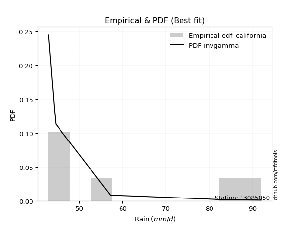</img>

</div>


### 2. EDF Hazen (1930)

Hazen method for plotting positions is a formula used to estimate the empirical cumulative probability distribution of flood events or other hydrological data. This formula often results in biased estimations, particularly when extrapolating to extreme events (high return periods).

<div align="center">


$P=(m-0.5)/n$


</div>


**2.1. Empirical values**

<div align="center">

|                | 0                   | 1                  | 2                  | 3                  | 4         | 5                  |
|:---------------|:--------------------|:-------------------|:-------------------|:-------------------|:----------|:-------------------|
| date           | 2007                | 2006               | 2008               | 2010               | 2005      | 2009               |
| x              | 42.9                | 44.3               | 44.6               | 57.2               | 84.1      | 92.0               |
| m              | 1                   | 2                  | 3                  | 4                  | 5         | 6                  |
| empirical_dist | edf_hazen           | edf_hazen          | edf_hazen          | edf_hazen          | edf_hazen | edf_hazen          |
| empirical      | 0.08333333333333333 | 0.25               | 0.4166666666666667 | 0.5833333333333334 | 0.75      | 0.9166666666666666 |
| empirical_tr   | 1.090909090909091   | 1.3333333333333333 | 1.7142857142857144 | 2.4000000000000004 | 4.0       | 11.999999999999995 |

</div>


**2.2. Kolmogorov-Smirnov fit test (sorted by Δ)**


<div align="center">

|                | 0                   | 1                   | 2                   | 3                   | 4                   | 5                   | 6                  | 7                   | 8                  | 9                  | 10                  | 11                  | 12                  | 13                 | 14                  | 15                 | 16                | 17                 | 18                  | 19                  | 20                  | 21                  | 22                  | 23                  | 24                  | 25                 | 26                  | 27                 | 28                  | 29                 | 30                  | 31                  | 32                  | 33                  | 34                  | 35                 | 36                  | 37                  | 38                 | 39                  | 40                  | 41                  | 42                 | 43                  | 44                  | 45                  | 46                  | 47                  | 48                  | 49                  | 50                  | 51                  | 52                  | 53                 | 54                  | 55                  | 56                  | 57                  | 58                  | 59                  | 60                  | 61                  | 62                  | 63                  | 64                  | 65                  | 66                | 67                  | 68                  | 69                  | 70                 | 71                  | 72                 | 73                  | 74                  | 75                  | 76                  | 77                 | 78                 | 79                  | 80                 | 81                 | 82                  | 83                  | 84                  | 85                  | 86                  | 87                 | 88                  | 89                 | 90                  | 91                 | 92                  | 93                  | 94                  | 95                 | 96                  | 97                  | 98                  | 99                  | 100                | 101                | 102                 | 103               | 104                 | 105                | 106                 | 107                 | 108                | 109               | 110                | 111               | 112                | 113                 | 114               | 115                | 116                | 117                 | 118                | 119                | 120                 | 121                | 122                | 123                 | 124                | 125                | 126                | 127                 | 128                 | 129                 | 130                 | 131                 | 132                 | 133                | 134                | 135                | 136                | 137                 | 138                 | 139                | 140                 | 141                | 142                | 143                 | 144                | 145                 | 146                | 147                | 148                 | 149                 | 150                | 151                | 152                 | 153                 | 154                | 155                | 156                | 157              | 158                | 159            |
|:---------------|:--------------------|:--------------------|:--------------------|:--------------------|:--------------------|:--------------------|:-------------------|:--------------------|:-------------------|:-------------------|:--------------------|:--------------------|:--------------------|:-------------------|:--------------------|:-------------------|:------------------|:-------------------|:--------------------|:--------------------|:--------------------|:--------------------|:--------------------|:--------------------|:--------------------|:-------------------|:--------------------|:-------------------|:--------------------|:-------------------|:--------------------|:--------------------|:--------------------|:--------------------|:--------------------|:-------------------|:--------------------|:--------------------|:-------------------|:--------------------|:--------------------|:--------------------|:-------------------|:--------------------|:--------------------|:--------------------|:--------------------|:--------------------|:--------------------|:--------------------|:--------------------|:--------------------|:--------------------|:-------------------|:--------------------|:--------------------|:--------------------|:--------------------|:--------------------|:--------------------|:--------------------|:--------------------|:--------------------|:--------------------|:--------------------|:--------------------|:------------------|:--------------------|:--------------------|:--------------------|:-------------------|:--------------------|:-------------------|:--------------------|:--------------------|:--------------------|:--------------------|:-------------------|:-------------------|:--------------------|:-------------------|:-------------------|:--------------------|:--------------------|:--------------------|:--------------------|:--------------------|:-------------------|:--------------------|:-------------------|:--------------------|:-------------------|:--------------------|:--------------------|:--------------------|:-------------------|:--------------------|:--------------------|:--------------------|:--------------------|:-------------------|:-------------------|:--------------------|:------------------|:--------------------|:-------------------|:--------------------|:--------------------|:-------------------|:------------------|:-------------------|:------------------|:-------------------|:--------------------|:------------------|:-------------------|:-------------------|:--------------------|:-------------------|:-------------------|:--------------------|:-------------------|:-------------------|:--------------------|:-------------------|:-------------------|:-------------------|:--------------------|:--------------------|:--------------------|:--------------------|:--------------------|:--------------------|:-------------------|:-------------------|:-------------------|:-------------------|:--------------------|:--------------------|:-------------------|:--------------------|:-------------------|:-------------------|:--------------------|:-------------------|:--------------------|:-------------------|:-------------------|:--------------------|:--------------------|:-------------------|:-------------------|:--------------------|:--------------------|:-------------------|:-------------------|:-------------------|:-----------------|:-------------------|:---------------|
| station        | 13085050            | 13085050            | 13085050            | 13085050            | 13085050            | 13085050            | 13085050           | 13085050            | 13085050           | 13085050           | 13085050            | 13085050            | 13085050            | 13085050           | 13085050            | 13085050           | 13085050          | 13085050           | 13085050            | 13085050            | 13085050            | 13085050            | 13085050            | 13085050            | 13085050            | 13085050           | 13085050            | 13085050           | 13085050            | 13085050           | 13085050            | 13085050            | 13085050            | 13085050            | 13085050            | 13085050           | 13085050            | 13085050            | 13085050           | 13085050            | 13085050            | 13085050            | 13085050           | 13085050            | 13085050            | 13085050            | 13085050            | 13085050            | 13085050            | 13085050            | 13085050            | 13085050            | 13085050            | 13085050           | 13085050            | 13085050            | 13085050            | 13085050            | 13085050            | 13085050            | 13085050            | 13085050            | 13085050            | 13085050            | 13085050            | 13085050            | 13085050          | 13085050            | 13085050            | 13085050            | 13085050           | 13085050            | 13085050           | 13085050            | 13085050            | 13085050            | 13085050            | 13085050           | 13085050           | 13085050            | 13085050           | 13085050           | 13085050            | 13085050            | 13085050            | 13085050            | 13085050            | 13085050           | 13085050            | 13085050           | 13085050            | 13085050           | 13085050            | 13085050            | 13085050            | 13085050           | 13085050            | 13085050            | 13085050            | 13085050            | 13085050           | 13085050           | 13085050            | 13085050          | 13085050            | 13085050           | 13085050            | 13085050            | 13085050           | 13085050          | 13085050           | 13085050          | 13085050           | 13085050            | 13085050          | 13085050           | 13085050           | 13085050            | 13085050           | 13085050           | 13085050            | 13085050           | 13085050           | 13085050            | 13085050           | 13085050           | 13085050           | 13085050            | 13085050            | 13085050            | 13085050            | 13085050            | 13085050            | 13085050           | 13085050           | 13085050           | 13085050           | 13085050            | 13085050            | 13085050           | 13085050            | 13085050           | 13085050           | 13085050            | 13085050           | 13085050            | 13085050           | 13085050           | 13085050            | 13085050            | 13085050           | 13085050           | 13085050            | 13085050            | 13085050           | 13085050           | 13085050           | 13085050         | 13085050           | 13085050       |
| empirical_dist | edf_hazen           | edf_hazen           | edf_hazen           | edf_hazen           | edf_hazen           | edf_hazen           | edf_hazen          | edf_hazen           | edf_hazen          | edf_hazen          | edf_hazen           | edf_hazen           | edf_hazen           | edf_hazen          | edf_hazen           | edf_hazen          | edf_hazen         | edf_hazen          | edf_hazen           | edf_hazen           | edf_hazen           | edf_hazen           | edf_hazen           | edf_hazen           | edf_hazen           | edf_hazen          | edf_hazen           | edf_hazen          | edf_hazen           | edf_hazen          | edf_hazen           | edf_hazen           | edf_hazen           | edf_hazen           | edf_hazen           | edf_hazen          | edf_hazen           | edf_hazen           | edf_hazen          | edf_hazen           | edf_hazen           | edf_hazen           | edf_hazen          | edf_hazen           | edf_hazen           | edf_hazen           | edf_hazen           | edf_hazen           | edf_hazen           | edf_hazen           | edf_hazen           | edf_hazen           | edf_hazen           | edf_hazen          | edf_hazen           | edf_hazen           | edf_hazen           | edf_hazen           | edf_hazen           | edf_hazen           | edf_hazen           | edf_hazen           | edf_hazen           | edf_hazen           | edf_hazen           | edf_hazen           | edf_hazen         | edf_hazen           | edf_hazen           | edf_hazen           | edf_hazen          | edf_hazen           | edf_hazen          | edf_hazen           | edf_hazen           | edf_hazen           | edf_hazen           | edf_hazen          | edf_hazen          | edf_hazen           | edf_hazen          | edf_hazen          | edf_hazen           | edf_hazen           | edf_hazen           | edf_hazen           | edf_hazen           | edf_hazen          | edf_hazen           | edf_hazen          | edf_hazen           | edf_hazen          | edf_hazen           | edf_hazen           | edf_hazen           | edf_hazen          | edf_hazen           | edf_hazen           | edf_hazen           | edf_hazen           | edf_hazen          | edf_hazen          | edf_hazen           | edf_hazen         | edf_hazen           | edf_hazen          | edf_hazen           | edf_hazen           | edf_hazen          | edf_hazen         | edf_hazen          | edf_hazen         | edf_hazen          | edf_hazen           | edf_hazen         | edf_hazen          | edf_hazen          | edf_hazen           | edf_hazen          | edf_hazen          | edf_hazen           | edf_hazen          | edf_hazen          | edf_hazen           | edf_hazen          | edf_hazen          | edf_hazen          | edf_hazen           | edf_hazen           | edf_hazen           | edf_hazen           | edf_hazen           | edf_hazen           | edf_hazen          | edf_hazen          | edf_hazen          | edf_hazen          | edf_hazen           | edf_hazen           | edf_hazen          | edf_hazen           | edf_hazen          | edf_hazen          | edf_hazen           | edf_hazen          | edf_hazen           | edf_hazen          | edf_hazen          | edf_hazen           | edf_hazen           | edf_hazen          | edf_hazen          | edf_hazen           | edf_hazen           | edf_hazen          | edf_hazen          | edf_hazen          | edf_hazen        | edf_hazen          | edf_hazen      |
| p_dist         | exponpow            | logexponpow         | logwrapcauchy       | lognakagami         | invgamma            | ksone               | logksone           | logbetaprime        | gengamma           | logf               | semicircular        | foldnorm            | logsemicircular     | halfnorm           | logarcsine          | logfoldnorm        | anglit            | loghalfnorm        | exponweib           | loganglit           | loginvgauss         | invgauss            | rayleigh            | logdweibull         | maxwell             | wrapcauchy         | lograyleigh         | logweibull_min     | arcsine             | logburr12          | logmaxwell          | pearson3            | logmielke           | halflogistic        | truncweibull_min    | logburr            | lognct              | alpha               | t                  | crystalball         | norm                | logpearson3         | weibull_min        | logalpha            | logdgamma           | logweibull_max      | johnsonsu           | truncpareto         | logloggamma         | betaprime           | gumbel_r            | loghalflogistic     | logt                | lognorm            | logcrystalball      | f                   | logtruncweibull_min | dweibull            | nct                 | logncf              | loginvgamma         | loggenlogistic      | burr                | genlogistic         | loggumbel_r         | logexponweib        | moyal             | logistic            | dgamma              | logtruncpareto      | loggengamma        | logmoyal            | logkstwobign       | loglogistic         | genpareto           | gumbel_l            | kstwobign           | loglevy_l          | cosine             | halfgennorm         | loggumbel_l        | gamma              | logcosine           | hypsecant           | nakagami            | loghypsecant        | loggausshyper       | logjohnsonsu       | erlang              | logrice            | rice                | laplace            | loglaplace          | loglaplace          | levy_l              | argus              | logargus            | logtriang           | triang              | burr12              | genextreme         | logexponnorm       | loglomax            | loggenexpon       | logrdist            | loginvweibull      | loggamma            | loggamma            | loghalfgennorm     | logtruncnorm      | loggompertz        | loggennorm        | logjohnsonsb       | ncf                 | lomax             | exponnorm          | genexpon           | truncnorm           | logkappa4          | logbradford        | logskewnorm         | logloglaplace      | logtruncexpon      | beta                | loggenextreme      | logerlang          | kappa4             | gausshyper          | logtukeylambda      | truncexpon          | loguniform          | logkappa3           | wald                | skewnorm           | loggenpareto       | logvonmises_line   | bradford           | powerlaw            | gompertz            | fatiguelife        | gennorm             | loggenhalflogistic | tukeylambda        | logwald             | uniform            | kappa3              | vonmises_line      | logpowerlaw        | logfatiguelife      | genhalflogistic     | rdist              | logtrapezoid       | logbeta             | trapezoid           | invweibull         | johnsonsb          | weibull_max        | logvonmises      | vonmises           | mielke         |
| delta          | 0.12744271386382566 | 0.13760860626868376 | 0.14780715529585886 | 0.15075223143781769 | 0.15080066951814464 | 0.15673321414876384 | 0.1575567096050925 | 0.15804594547558037 | 0.1590200935941105 | 0.1594182622373982 | 0.16876492458323594 | 0.16908556511222414 | 0.17436433883445646 | 0.1758913787209744 | 0.17942168369569295 | 0.1796111896436538 | 0.181113661085438 | 0.1847683171256576 | 0.18498140773335214 | 0.18669240755669195 | 0.18757152342267325 | 0.18772436580065355 | 0.18873828604635084 | 0.19341038207427003 | 0.19475227598117115 | 0.1954878491405595 | 0.19573323372279425 | 0.1960864366352113 | 0.19696403355826492 | 0.1989787303458459 | 0.20128850184630614 | 0.20215260789395018 | 0.20276119768609768 | 0.20355685897055034 | 0.20402504370030472 | 0.2055802298176731 | 0.20598147397957642 | 0.20599258543164545 | 0.2091295074601368 | 0.20917567923329722 | 0.20917568358320277 | 0.20943549174699322 | 0.2096189795523864 | 0.20986491675317331 | 0.21041100035805643 | 0.21041912257291095 | 0.21097476173533003 | 0.21102945357800695 | 0.21235474216602238 | 0.21367386179736816 | 0.21420818222881643 | 0.21436225446402848 | 0.21465756475582048 | 0.2146578940877767 | 0.21465804204563105 | 0.21517435576652683 | 0.21701340387402102 | 0.21760890312319836 | 0.21776824831615316 | 0.21788869148248743 | 0.22029101224057426 | 0.22157814601472778 | 0.22165223874253812 | 0.22194211793777524 | 0.22215645515041346 | 0.22272603662184265 | 0.226561299429135 | 0.23101752938285366 | 0.23233871840597126 | 0.23323338584434936 | 0.2343112014577965 | 0.23598960565426402 | 0.2362246332763738 | 0.23625438982618988 | 0.23656296315790215 | 0.23755693047496995 | 0.23867772839021809 | 0.2398902259734496 | 0.2399932530308987 | 0.24051406378474502 | 0.2415296687846249 | 0.2418464528699633 | 0.24277359647029362 | 0.24409659245275103 | 0.24485841364835317 | 0.24901390298312825 | 0.25247693309370245 | 0.2551172957815616 | 0.25715209828490926 | 0.2581226004626426 | 0.25815315354277457 | 0.2587921019718278 | 0.26304502304383426 | 0.26304502304383426 | 0.26412104671741415 | 0.2680212930260583 | 0.26998524652692074 | 0.27347353843517197 | 0.28542729760729163 | 0.28752216997571733 | 0.2885462247040831 | 0.2933513664421548 | 0.29387816683474716 | 0.294821295026004 | 0.29715981904061206 | 0.2990698880865167 | 0.30008152294254853 | 0.30008152294254853 | 0.3040612771916643 | 0.311030980968508 | 0.3111049123513316 | 0.311201440320944 | 0.3198676835489853 | 0.32292758723382475 | 0.325051929573608 | 0.3250644203448904 | 0.3263060096453918 | 0.33500859071648037 | 0.3407149207671632 | 0.3428089365450661 | 0.34500997680592466 | 0.3458676769138038 | 0.3461337425839406 | 0.34631005345628885 | 0.3472149822351446 | 0.3513359409517881 | 0.3513475178805355 | 0.35233418855558063 | 0.35430996841511114 | 0.36470750629823057 | 0.36572790691962087 | 0.36581436996849664 | 0.36606161303736745 | 0.3661329580194479 | 0.3668288386264332 | 0.3672374646462188 | 0.3682161449732184 | 0.37100217735917107 | 0.37257453855830014 | 0.3734454630943984 | 0.37368728224977893 | 0.3782631434651999 | 0.3792303820138467 | 0.38111377746352076 | 0.3820434487440597 | 0.38209481891667746 | 0.3824108370505317 | 0.3882172089568726 | 0.39191077342592817 | 0.40918472617561963 | 0.4166666666260185 | 0.4252728421600084 | 0.42896924392218677 | 0.47703431511492905 | 0.4806485195314061 | 0.4953415679971265 | 0.5501960513459839 | 1.13644738980851 | 14.133172382226036 | nan            |
| deltao         | 0.530385761606      | 0.530385761606      | 0.530385761606      | 0.530385761606      | 0.530385761606      | 0.530385761606      | 0.530385761606     | 0.530385761606      | 0.530385761606     | 0.530385761606     | 0.530385761606      | 0.530385761606      | 0.530385761606      | 0.530385761606     | 0.530385761606      | 0.530385761606     | 0.530385761606    | 0.530385761606     | 0.530385761606      | 0.530385761606      | 0.530385761606      | 0.530385761606      | 0.530385761606      | 0.530385761606      | 0.530385761606      | 0.530385761606     | 0.530385761606      | 0.530385761606     | 0.530385761606      | 0.530385761606     | 0.530385761606      | 0.530385761606      | 0.530385761606      | 0.530385761606      | 0.530385761606      | 0.530385761606     | 0.530385761606      | 0.530385761606      | 0.530385761606     | 0.530385761606      | 0.530385761606      | 0.530385761606      | 0.530385761606     | 0.530385761606      | 0.530385761606      | 0.530385761606      | 0.530385761606      | 0.530385761606      | 0.530385761606      | 0.530385761606      | 0.530385761606      | 0.530385761606      | 0.530385761606      | 0.530385761606     | 0.530385761606      | 0.530385761606      | 0.530385761606      | 0.530385761606      | 0.530385761606      | 0.530385761606      | 0.530385761606      | 0.530385761606      | 0.530385761606      | 0.530385761606      | 0.530385761606      | 0.530385761606      | 0.530385761606    | 0.530385761606      | 0.530385761606      | 0.530385761606      | 0.530385761606     | 0.530385761606      | 0.530385761606     | 0.530385761606      | 0.530385761606      | 0.530385761606      | 0.530385761606      | 0.530385761606     | 0.530385761606     | 0.530385761606      | 0.530385761606     | 0.530385761606     | 0.530385761606      | 0.530385761606      | 0.530385761606      | 0.530385761606      | 0.530385761606      | 0.530385761606     | 0.530385761606      | 0.530385761606     | 0.530385761606      | 0.530385761606     | 0.530385761606      | 0.530385761606      | 0.530385761606      | 0.530385761606     | 0.530385761606      | 0.530385761606      | 0.530385761606      | 0.530385761606      | 0.530385761606     | 0.530385761606     | 0.530385761606      | 0.530385761606    | 0.530385761606      | 0.530385761606     | 0.530385761606      | 0.530385761606      | 0.530385761606     | 0.530385761606    | 0.530385761606     | 0.530385761606    | 0.530385761606     | 0.530385761606      | 0.530385761606    | 0.530385761606     | 0.530385761606     | 0.530385761606      | 0.530385761606     | 0.530385761606     | 0.530385761606      | 0.530385761606     | 0.530385761606     | 0.530385761606      | 0.530385761606     | 0.530385761606     | 0.530385761606     | 0.530385761606      | 0.530385761606      | 0.530385761606      | 0.530385761606      | 0.530385761606      | 0.530385761606      | 0.530385761606     | 0.530385761606     | 0.530385761606     | 0.530385761606     | 0.530385761606      | 0.530385761606      | 0.530385761606     | 0.530385761606      | 0.530385761606     | 0.530385761606     | 0.530385761606      | 0.530385761606     | 0.530385761606      | 0.530385761606     | 0.530385761606     | 0.530385761606      | 0.530385761606      | 0.530385761606     | 0.530385761606     | 0.530385761606      | 0.530385761606      | 0.530385761606     | 0.530385761606     | 0.530385761606     | 0.530385761606   | 0.530385761606     | 0.530385761606 |
| eval           | Δo > Δ              | Δo > Δ              | Δo > Δ              | Δo > Δ              | Δo > Δ              | Δo > Δ              | Δo > Δ             | Δo > Δ              | Δo > Δ             | Δo > Δ             | Δo > Δ              | Δo > Δ              | Δo > Δ              | Δo > Δ             | Δo > Δ              | Δo > Δ             | Δo > Δ            | Δo > Δ             | Δo > Δ              | Δo > Δ              | Δo > Δ              | Δo > Δ              | Δo > Δ              | Δo > Δ              | Δo > Δ              | Δo > Δ             | Δo > Δ              | Δo > Δ             | Δo > Δ              | Δo > Δ             | Δo > Δ              | Δo > Δ              | Δo > Δ              | Δo > Δ              | Δo > Δ              | Δo > Δ             | Δo > Δ              | Δo > Δ              | Δo > Δ             | Δo > Δ              | Δo > Δ              | Δo > Δ              | Δo > Δ             | Δo > Δ              | Δo > Δ              | Δo > Δ              | Δo > Δ              | Δo > Δ              | Δo > Δ              | Δo > Δ              | Δo > Δ              | Δo > Δ              | Δo > Δ              | Δo > Δ             | Δo > Δ              | Δo > Δ              | Δo > Δ              | Δo > Δ              | Δo > Δ              | Δo > Δ              | Δo > Δ              | Δo > Δ              | Δo > Δ              | Δo > Δ              | Δo > Δ              | Δo > Δ              | Δo > Δ            | Δo > Δ              | Δo > Δ              | Δo > Δ              | Δo > Δ             | Δo > Δ              | Δo > Δ             | Δo > Δ              | Δo > Δ              | Δo > Δ              | Δo > Δ              | Δo > Δ             | Δo > Δ             | Δo > Δ              | Δo > Δ             | Δo > Δ             | Δo > Δ              | Δo > Δ              | Δo > Δ              | Δo > Δ              | Δo > Δ              | Δo > Δ             | Δo > Δ              | Δo > Δ             | Δo > Δ              | Δo > Δ             | Δo > Δ              | Δo > Δ              | Δo > Δ              | Δo > Δ             | Δo > Δ              | Δo > Δ              | Δo > Δ              | Δo > Δ              | Δo > Δ             | Δo > Δ             | Δo > Δ              | Δo > Δ            | Δo > Δ              | Δo > Δ             | Δo > Δ              | Δo > Δ              | Δo > Δ             | Δo > Δ            | Δo > Δ             | Δo > Δ            | Δo > Δ             | Δo > Δ              | Δo > Δ            | Δo > Δ             | Δo > Δ             | Δo > Δ              | Δo > Δ             | Δo > Δ             | Δo > Δ              | Δo > Δ             | Δo > Δ             | Δo > Δ              | Δo > Δ             | Δo > Δ             | Δo > Δ             | Δo > Δ              | Δo > Δ              | Δo > Δ              | Δo > Δ              | Δo > Δ              | Δo > Δ              | Δo > Δ             | Δo > Δ             | Δo > Δ             | Δo > Δ             | Δo > Δ              | Δo > Δ              | Δo > Δ             | Δo > Δ              | Δo > Δ             | Δo > Δ             | Δo > Δ              | Δo > Δ             | Δo > Δ              | Δo > Δ             | Δo > Δ             | Δo > Δ              | Δo > Δ              | Δo > Δ             | Δo > Δ             | Δo > Δ              | Δo > Δ              | Δo > Δ             | Δo > Δ             | Δo <= Δ            | Δo <= Δ          | Δo <= Δ            | Δo <= Δ        |
| fit            | 1                   | 1                   | 1                   | 1                   | 1                   | 1                   | 1                  | 1                   | 1                  | 1                  | 1                   | 1                   | 1                   | 1                  | 1                   | 1                  | 1                 | 1                  | 1                   | 1                   | 1                   | 1                   | 1                   | 1                   | 1                   | 1                  | 1                   | 1                  | 1                   | 1                  | 1                   | 1                   | 1                   | 1                   | 1                   | 1                  | 1                   | 1                   | 1                  | 1                   | 1                   | 1                   | 1                  | 1                   | 1                   | 1                   | 1                   | 1                   | 1                   | 1                   | 1                   | 1                   | 1                   | 1                  | 1                   | 1                   | 1                   | 1                   | 1                   | 1                   | 1                   | 1                   | 1                   | 1                   | 1                   | 1                   | 1                 | 1                   | 1                   | 1                   | 1                  | 1                   | 1                  | 1                   | 1                   | 1                   | 1                   | 1                  | 1                  | 1                   | 1                  | 1                  | 1                   | 1                   | 1                   | 1                   | 1                   | 1                  | 1                   | 1                  | 1                   | 1                  | 1                   | 1                   | 1                   | 1                  | 1                   | 1                   | 1                   | 1                   | 1                  | 1                  | 1                   | 1                 | 1                   | 1                  | 1                   | 1                   | 1                  | 1                 | 1                  | 1                 | 1                  | 1                   | 1                 | 1                  | 1                  | 1                   | 1                  | 1                  | 1                   | 1                  | 1                  | 1                   | 1                  | 1                  | 1                  | 1                   | 1                   | 1                   | 1                   | 1                   | 1                   | 1                  | 1                  | 1                  | 1                  | 1                   | 1                   | 1                  | 1                   | 1                  | 1                  | 1                   | 1                  | 1                   | 1                  | 1                  | 1                   | 1                   | 1                  | 1                  | 1                   | 1                   | 1                  | 1                  | 0                  | 0                | 0                  | 0              |
| n              | 6                   | 6                   | 6                   | 6                   | 6                   | 6                   | 6                  | 6                   | 6                  | 6                  | 6                   | 6                   | 6                   | 6                  | 6                   | 6                  | 6                 | 6                  | 6                   | 6                   | 6                   | 6                   | 6                   | 6                   | 6                   | 6                  | 6                   | 6                  | 6                   | 6                  | 6                   | 6                   | 6                   | 6                   | 6                   | 6                  | 6                   | 6                   | 6                  | 6                   | 6                   | 6                   | 6                  | 6                   | 6                   | 6                   | 6                   | 6                   | 6                   | 6                   | 6                   | 6                   | 6                   | 6                  | 6                   | 6                   | 6                   | 6                   | 6                   | 6                   | 6                   | 6                   | 6                   | 6                   | 6                   | 6                   | 6                 | 6                   | 6                   | 6                   | 6                  | 6                   | 6                  | 6                   | 6                   | 6                   | 6                   | 6                  | 6                  | 6                   | 6                  | 6                  | 6                   | 6                   | 6                   | 6                   | 6                   | 6                  | 6                   | 6                  | 6                   | 6                  | 6                   | 6                   | 6                   | 6                  | 6                   | 6                   | 6                   | 6                   | 6                  | 6                  | 6                   | 6                 | 6                   | 6                  | 6                   | 6                   | 6                  | 6                 | 6                  | 6                 | 6                  | 6                   | 6                 | 6                  | 6                  | 6                   | 6                  | 6                  | 6                   | 6                  | 6                  | 6                   | 6                  | 6                  | 6                  | 6                   | 6                   | 6                   | 6                   | 6                   | 6                   | 6                  | 6                  | 6                  | 6                  | 6                   | 6                   | 6                  | 6                   | 6                  | 6                  | 6                   | 6                  | 6                   | 6                  | 6                  | 6                   | 6                   | 6                  | 6                  | 6                   | 6                   | 6                  | 6                  | 6                  | 6                | 6                  | 6              |
| best_fit       | 1                   | 0                   | 0                   | 0                   | 0                   | 0                   | 0                  | 0                   | 0                  | 0                  | 0                   | 0                   | 0                   | 0                  | 0                   | 0                  | 0                 | 0                  | 0                   | 0                   | 0                   | 0                   | 0                   | 0                   | 0                   | 0                  | 0                   | 0                  | 0                   | 0                  | 0                   | 0                   | 0                   | 0                   | 0                   | 0                  | 0                   | 0                   | 0                  | 0                   | 0                   | 0                   | 0                  | 0                   | 0                   | 0                   | 0                   | 0                   | 0                   | 0                   | 0                   | 0                   | 0                   | 0                  | 0                   | 0                   | 0                   | 0                   | 0                   | 0                   | 0                   | 0                   | 0                   | 0                   | 0                   | 0                   | 0                 | 0                   | 0                   | 0                   | 0                  | 0                   | 0                  | 0                   | 0                   | 0                   | 0                   | 0                  | 0                  | 0                   | 0                  | 0                  | 0                   | 0                   | 0                   | 0                   | 0                   | 0                  | 0                   | 0                  | 0                   | 0                  | 0                   | 0                   | 0                   | 0                  | 0                   | 0                   | 0                   | 0                   | 0                  | 0                  | 0                   | 0                 | 0                   | 0                  | 0                   | 0                   | 0                  | 0                 | 0                  | 0                 | 0                  | 0                   | 0                 | 0                  | 0                  | 0                   | 0                  | 0                  | 0                   | 0                  | 0                  | 0                   | 0                  | 0                  | 0                  | 0                   | 0                   | 0                   | 0                   | 0                   | 0                   | 0                  | 0                  | 0                  | 0                  | 0                   | 0                   | 0                  | 0                   | 0                  | 0                  | 0                   | 0                  | 0                   | 0                  | 0                  | 0                   | 0                   | 0                  | 0                  | 0                   | 0                   | 0                  | 0                  | 0                  | 0                | 0                  | 0              |
| best_fit_sort  | 1                   | 2                   | 3                   | 4                   | 5                   | 6                   | 7                  | 8                   | 9                  | 10                 | 11                  | 12                  | 13                  | 14                 | 15                  | 16                 | 17                | 18                 | 19                  | 20                  | 21                  | 22                  | 23                  | 24                  | 25                  | 26                 | 27                  | 28                 | 29                  | 30                 | 31                  | 32                  | 33                  | 34                  | 35                  | 36                 | 37                  | 38                  | 39                 | 40                  | 41                  | 42                  | 43                 | 44                  | 45                  | 46                  | 47                  | 48                  | 49                  | 50                  | 51                  | 52                  | 53                  | 54                 | 55                  | 56                  | 57                  | 58                  | 59                  | 60                  | 61                  | 62                  | 63                  | 64                  | 65                  | 66                  | 67                | 68                  | 69                  | 70                  | 71                 | 72                  | 73                 | 74                  | 75                  | 76                  | 77                  | 78                 | 79                 | 80                  | 81                 | 82                 | 83                  | 84                  | 85                  | 86                  | 87                  | 88                 | 89                  | 90                 | 91                  | 92                 | 93                  | 94                  | 95                  | 96                 | 97                  | 98                  | 99                  | 100                 | 101                | 102                | 103                 | 104               | 105                 | 106                | 107                 | 108                 | 109                | 110               | 111                | 112               | 113                | 114                 | 115               | 116                | 117                | 118                 | 119                | 120                | 121                 | 122                | 123                | 124                 | 125                | 126                | 127                | 128                 | 129                 | 130                 | 131                 | 132                 | 133                 | 134                | 135                | 136                | 137                | 138                 | 139                 | 140                | 141                 | 142                | 143                | 144                 | 145                | 146                 | 147                | 148                | 149                 | 150                 | 151                | 152                | 153                 | 154                 | 155                | 156                | 157                | 158              | 159                | 160            |

</div>


**2.3. Best fit**

<div align="center">

|   id |   station | empirical_dist   | p_dist   |    delta |   deltao | eval   |   fit |   n |   best_fit |   best_fit_sort |
|-----:|----------:|:-----------------|:---------|---------:|---------:|:-------|------:|----:|-----------:|----------------:|
|    0 |  13085050 | edf_hazen        | exponpow | 0.127443 | 0.530386 | Δo > Δ |     1 |   6 |          1 |               1 |

</div>


<div align="center">

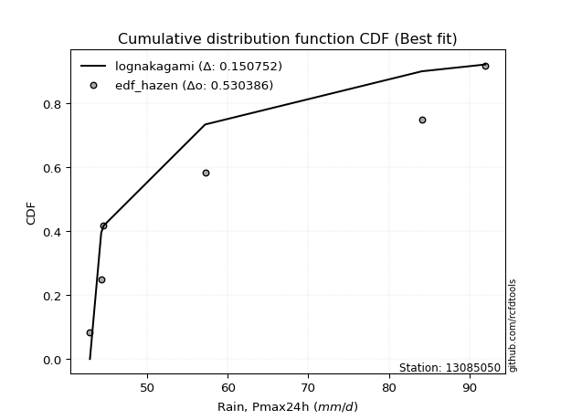</img>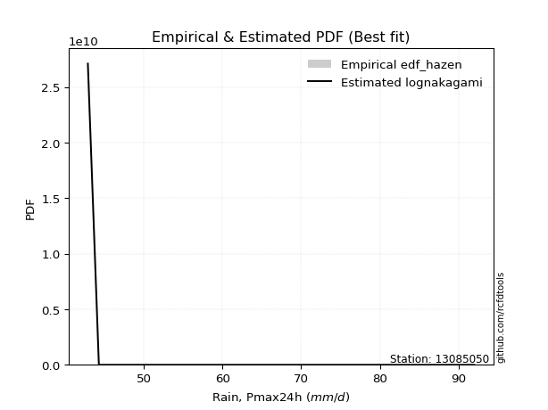</img>

</div>


### 3. EDF Weibull (1939)

Weibull plotting position formula is an empirical method used to estimate the non-exceedance probability or plotting position for a set of observed data, is often recommended or widely used in practice, particularly in flood frequency analysis.

<div align="center">


$P=m/(n+1)$


</div>


**3.1. Empirical values**

<div align="center">

|                | 0                   | 1                  | 2                   | 3                  | 4                  | 5                  |
|:---------------|:--------------------|:-------------------|:--------------------|:-------------------|:-------------------|:-------------------|
| date           | 2007                | 2006               | 2008                | 2010               | 2005               | 2009               |
| x              | 42.9                | 44.3               | 44.6                | 57.2               | 84.1               | 92.0               |
| m              | 1                   | 2                  | 3                   | 4                  | 5                  | 6                  |
| empirical_dist | edf_weibull         | edf_weibull        | edf_weibull         | edf_weibull        | edf_weibull        | edf_weibull        |
| empirical      | 0.14285714285714285 | 0.2857142857142857 | 0.42857142857142855 | 0.5714285714285714 | 0.7142857142857143 | 0.8571428571428571 |
| empirical_tr   | 1.1666666666666665  | 1.4                | 1.75                | 2.333333333333333  | 3.5                | 6.999999999999997  |

</div>


**3.2. Kolmogorov-Smirnov fit test (sorted by Δ)**


<div align="center">

|                | 0                   | 1                  | 2                  | 3                  | 4                   | 5                   | 6                  | 7                  | 8                   | 9                   | 10                  | 11                  | 12                  | 13                  | 14                  | 15                 | 16                | 17                  | 18                  | 19                  | 20                  | 21                  | 22                 | 23                  | 24                | 25                  | 26                 | 27                  | 28                  | 29                 | 30                  | 31                | 32                 | 33                  | 34                 | 35                  | 36                  | 37                | 38                  | 39                  | 40                 | 41                  | 42                  | 43                  | 44                  | 45                 | 46                  | 47                  | 48                  | 49                  | 50                  | 51                 | 52                  | 53                  | 54                 | 55                  | 56                  | 57                  | 58                 | 59                 | 60                  | 61                  | 62                 | 63                  | 64                  | 65                  | 66                 | 67                  | 68                  | 69                  | 70                 | 71                  | 72                  | 73                  | 74                  | 75                  | 76                  | 77                  | 78                  | 79                 | 80                  | 81                 | 82                  | 83                 | 84                 | 85                | 86                 | 87                 | 88                | 89                 | 90                 | 91                 | 92                  | 93                 | 94                  | 95                  | 96                 | 97                 | 98                 | 99                 | 100                | 101                 | 102                 | 103                | 104                | 105                 | 106                | 107                | 108               | 109                | 110                 | 111                | 112                | 113                | 114                | 115                | 116                 | 117                 | 118                 | 119                 | 120                | 121                | 122                | 123                 | 124                 | 125                | 126                 | 127               | 128                | 129                | 130                 | 131                | 132                 | 133                | 134               | 135                 | 136                 | 137                 | 138                | 139                | 140                 | 141                | 142                | 143               | 144                 | 145                 | 146                | 147                | 148                | 149                 | 150               | 151                | 152                 | 153                 | 154                | 155                | 156                | 157                | 158                | 159            |
|:---------------|:--------------------|:-------------------|:-------------------|:-------------------|:--------------------|:--------------------|:-------------------|:-------------------|:--------------------|:--------------------|:--------------------|:--------------------|:--------------------|:--------------------|:--------------------|:-------------------|:------------------|:--------------------|:--------------------|:--------------------|:--------------------|:--------------------|:-------------------|:--------------------|:------------------|:--------------------|:-------------------|:--------------------|:--------------------|:-------------------|:--------------------|:------------------|:-------------------|:--------------------|:-------------------|:--------------------|:--------------------|:------------------|:--------------------|:--------------------|:-------------------|:--------------------|:--------------------|:--------------------|:--------------------|:-------------------|:--------------------|:--------------------|:--------------------|:--------------------|:--------------------|:-------------------|:--------------------|:--------------------|:-------------------|:--------------------|:--------------------|:--------------------|:-------------------|:-------------------|:--------------------|:--------------------|:-------------------|:--------------------|:--------------------|:--------------------|:-------------------|:--------------------|:--------------------|:--------------------|:-------------------|:--------------------|:--------------------|:--------------------|:--------------------|:--------------------|:--------------------|:--------------------|:--------------------|:-------------------|:--------------------|:-------------------|:--------------------|:-------------------|:-------------------|:------------------|:-------------------|:-------------------|:------------------|:-------------------|:-------------------|:-------------------|:--------------------|:-------------------|:--------------------|:--------------------|:-------------------|:-------------------|:-------------------|:-------------------|:-------------------|:--------------------|:--------------------|:-------------------|:-------------------|:--------------------|:-------------------|:-------------------|:------------------|:-------------------|:--------------------|:-------------------|:-------------------|:-------------------|:-------------------|:-------------------|:--------------------|:--------------------|:--------------------|:--------------------|:-------------------|:-------------------|:-------------------|:--------------------|:--------------------|:-------------------|:--------------------|:------------------|:-------------------|:-------------------|:--------------------|:-------------------|:--------------------|:-------------------|:------------------|:--------------------|:--------------------|:--------------------|:-------------------|:-------------------|:--------------------|:-------------------|:-------------------|:------------------|:--------------------|:--------------------|:-------------------|:-------------------|:-------------------|:--------------------|:------------------|:-------------------|:--------------------|:--------------------|:-------------------|:-------------------|:-------------------|:-------------------|:-------------------|:---------------|
| station        | 13085050            | 13085050           | 13085050           | 13085050           | 13085050            | 13085050            | 13085050           | 13085050           | 13085050            | 13085050            | 13085050            | 13085050            | 13085050            | 13085050            | 13085050            | 13085050           | 13085050          | 13085050            | 13085050            | 13085050            | 13085050            | 13085050            | 13085050           | 13085050            | 13085050          | 13085050            | 13085050           | 13085050            | 13085050            | 13085050           | 13085050            | 13085050          | 13085050           | 13085050            | 13085050           | 13085050            | 13085050            | 13085050          | 13085050            | 13085050            | 13085050           | 13085050            | 13085050            | 13085050            | 13085050            | 13085050           | 13085050            | 13085050            | 13085050            | 13085050            | 13085050            | 13085050           | 13085050            | 13085050            | 13085050           | 13085050            | 13085050            | 13085050            | 13085050           | 13085050           | 13085050            | 13085050            | 13085050           | 13085050            | 13085050            | 13085050            | 13085050           | 13085050            | 13085050            | 13085050            | 13085050           | 13085050            | 13085050            | 13085050            | 13085050            | 13085050            | 13085050            | 13085050            | 13085050            | 13085050           | 13085050            | 13085050           | 13085050            | 13085050           | 13085050           | 13085050          | 13085050           | 13085050           | 13085050          | 13085050           | 13085050           | 13085050           | 13085050            | 13085050           | 13085050            | 13085050            | 13085050           | 13085050           | 13085050           | 13085050           | 13085050           | 13085050            | 13085050            | 13085050           | 13085050           | 13085050            | 13085050           | 13085050           | 13085050          | 13085050           | 13085050            | 13085050           | 13085050           | 13085050           | 13085050           | 13085050           | 13085050            | 13085050            | 13085050            | 13085050            | 13085050           | 13085050           | 13085050           | 13085050            | 13085050            | 13085050           | 13085050            | 13085050          | 13085050           | 13085050           | 13085050            | 13085050           | 13085050            | 13085050           | 13085050          | 13085050            | 13085050            | 13085050            | 13085050           | 13085050           | 13085050            | 13085050           | 13085050           | 13085050          | 13085050            | 13085050            | 13085050           | 13085050           | 13085050           | 13085050            | 13085050          | 13085050           | 13085050            | 13085050            | 13085050           | 13085050           | 13085050           | 13085050           | 13085050           | 13085050       |
| empirical_dist | edf_weibull         | edf_weibull        | edf_weibull        | edf_weibull        | edf_weibull         | edf_weibull         | edf_weibull        | edf_weibull        | edf_weibull         | edf_weibull         | edf_weibull         | edf_weibull         | edf_weibull         | edf_weibull         | edf_weibull         | edf_weibull        | edf_weibull       | edf_weibull         | edf_weibull         | edf_weibull         | edf_weibull         | edf_weibull         | edf_weibull        | edf_weibull         | edf_weibull       | edf_weibull         | edf_weibull        | edf_weibull         | edf_weibull         | edf_weibull        | edf_weibull         | edf_weibull       | edf_weibull        | edf_weibull         | edf_weibull        | edf_weibull         | edf_weibull         | edf_weibull       | edf_weibull         | edf_weibull         | edf_weibull        | edf_weibull         | edf_weibull         | edf_weibull         | edf_weibull         | edf_weibull        | edf_weibull         | edf_weibull         | edf_weibull         | edf_weibull         | edf_weibull         | edf_weibull        | edf_weibull         | edf_weibull         | edf_weibull        | edf_weibull         | edf_weibull         | edf_weibull         | edf_weibull        | edf_weibull        | edf_weibull         | edf_weibull         | edf_weibull        | edf_weibull         | edf_weibull         | edf_weibull         | edf_weibull        | edf_weibull         | edf_weibull         | edf_weibull         | edf_weibull        | edf_weibull         | edf_weibull         | edf_weibull         | edf_weibull         | edf_weibull         | edf_weibull         | edf_weibull         | edf_weibull         | edf_weibull        | edf_weibull         | edf_weibull        | edf_weibull         | edf_weibull        | edf_weibull        | edf_weibull       | edf_weibull        | edf_weibull        | edf_weibull       | edf_weibull        | edf_weibull        | edf_weibull        | edf_weibull         | edf_weibull        | edf_weibull         | edf_weibull         | edf_weibull        | edf_weibull        | edf_weibull        | edf_weibull        | edf_weibull        | edf_weibull         | edf_weibull         | edf_weibull        | edf_weibull        | edf_weibull         | edf_weibull        | edf_weibull        | edf_weibull       | edf_weibull        | edf_weibull         | edf_weibull        | edf_weibull        | edf_weibull        | edf_weibull        | edf_weibull        | edf_weibull         | edf_weibull         | edf_weibull         | edf_weibull         | edf_weibull        | edf_weibull        | edf_weibull        | edf_weibull         | edf_weibull         | edf_weibull        | edf_weibull         | edf_weibull       | edf_weibull        | edf_weibull        | edf_weibull         | edf_weibull        | edf_weibull         | edf_weibull        | edf_weibull       | edf_weibull         | edf_weibull         | edf_weibull         | edf_weibull        | edf_weibull        | edf_weibull         | edf_weibull        | edf_weibull        | edf_weibull       | edf_weibull         | edf_weibull         | edf_weibull        | edf_weibull        | edf_weibull        | edf_weibull         | edf_weibull       | edf_weibull        | edf_weibull         | edf_weibull         | edf_weibull        | edf_weibull        | edf_weibull        | edf_weibull        | edf_weibull        | edf_weibull    |
| p_dist         | exponpow            | logexponpow        | logarcsine         | arcsine            | logwrapcauchy       | logbetaprime        | wrapcauchy         | invgamma           | logexponweib        | ksone               | logksone            | logf                | loggengamma         | genpareto           | loglevy_l           | semicircular       | foldnorm          | lognakagami         | logsemicircular     | halfnorm            | logfoldnorm         | anglit              | gengamma           | loghalfnorm         | exponweib         | logweibull_max      | loganglit          | loginvgauss         | invgauss            | rayleigh           | levy_l              | maxwell           | lograyleigh        | logweibull_min      | logdweibull        | logburr12           | dweibull            | logmaxwell        | pearson3            | logmielke           | halflogistic       | logburr             | lognct              | alpha               | logdgamma           | dgamma             | t                   | crystalball         | norm                | logpearson3         | logalpha            | johnsonsu          | logloggamma         | betaprime           | gumbel_r           | loghalflogistic     | logt                | lognorm             | logcrystalball     | f                  | genextreme          | nct                 | logncf             | loginvgamma         | loggenlogistic      | burr                | genlogistic        | loggumbel_r         | truncpareto         | logtruncweibull_min | weibull_min        | moyal               | truncweibull_min    | logistic            | logtruncpareto      | logmoyal            | logkstwobign        | loglogistic         | gumbel_l            | kstwobign          | cosine              | halfgennorm        | loggumbel_l         | logcosine          | hypsecant          | nakagami          | logjohnsonsb       | loghypsecant       | loginvweibull     | ncf                | loggausshyper      | logjohnsonsu       | erlang              | logrice            | rice                | laplace             | gamma              | loglaplace         | loglaplace         | argus              | logargus           | triang              | logtriang           | logloglaplace      | beta               | loggenextreme       | burr12             | logexponnorm       | loglomax          | loggenexpon        | loggenpareto        | logrdist           | loggamma           | loggamma           | gennorm            | loghalfgennorm     | logtruncnorm        | loggompertz         | loggennorm          | powerlaw            | lomax              | exponnorm          | fatiguelife        | genexpon            | truncnorm           | logpowerlaw        | logkappa4           | logbradford       | logfatiguelife     | logskewnorm        | logtruncexpon       | logerlang          | kappa4              | gausshyper         | logtukeylambda    | logbeta             | truncexpon          | loguniform          | logkappa3          | wald               | skewnorm            | logvonmises_line   | bradford           | gompertz          | loggenhalflogistic  | tukeylambda         | logwald            | uniform            | kappa3             | vonmises_line       | genhalflogistic   | logtrapezoid       | invweibull          | rdist               | johnsonsb          | trapezoid          | weibull_max        | logvonmises        | vonmises           | mielke         |
| delta          | 0.14278790042356249 | 0.1428539440217738 | 0.1428571428571429 | 0.1428571428571429 | 0.14528412545565772 | 0.15528828800351313 | 0.1597735634262738 | 0.1627054314229066 | 0.16320222709803311 | 0.16388722820462748 | 0.16946147150985436 | 0.17132302414216016 | 0.17478739193398696 | 0.17703915363409262 | 0.18036641644964008 | 0.1806696864879978 | 0.180990327016986 | 0.18625819157977086 | 0.18626910073921832 | 0.18779614062573627 | 0.19151595154841566 | 0.19301842299019986 | 0.1947343793083962 | 0.19667307903041947 | 0.196886169638114 | 0.19851436066814898 | 0.1985971694614538 | 0.19947628532743522 | 0.19962912770541552 | 0.2006430479511127 | 0.20459723719360462 | 0.206657037885933 | 0.2076379956275561 | 0.20799119853997317 | 0.2092695553987881 | 0.21088349225060776 | 0.21259079411819448 | 0.213193263751068 | 0.21405736979871204 | 0.21466595959085955 | 0.2154616208753122 | 0.21748499172243496 | 0.21788623588433828 | 0.21789734733640742 | 0.22044948937412967 | 0.2206664132090398 | 0.22103426936489867 | 0.22108044113805908 | 0.22108044548796463 | 0.22134025365175508 | 0.22176967865793518 | 0.2228795236400919 | 0.22425950407078424 | 0.22557862370213003 | 0.2261129441335783 | 0.22626701636879035 | 0.22656232666058235 | 0.22656265599253855 | 0.2265628039503929 | 0.2270791176712887 | 0.22902241518027355 | 0.22967301022091502 | 0.2297934533872493 | 0.23219577414533613 | 0.23348290791948964 | 0.23355700064729998 | 0.2338468798425371 | 0.23406121705517532 | 0.23630156938715918 | 0.23680552012010692 | 0.2371408562605255 | 0.23846606133389686 | 0.23973932941459042 | 0.24292229128761553 | 0.24513814774911122 | 0.24789436755902589 | 0.24812939518113566 | 0.24815915173095174 | 0.24946169237973181 | 0.2505824902949799 | 0.25189801493566055 | 0.2524188256895069 | 0.25343443068938676 | 0.2546783583750555 | 0.2560013543575129 | 0.256763175553115 | 0.2603438740251758 | 0.2609186648878901 | 0.263355602372231 | 0.2634037777100152 | 0.2643816949984643 | 0.2670220576863235 | 0.26905686018967123 | 0.2700273623674045 | 0.27005791544753643 | 0.27069686387658964 | 0.2732360884056162 | 0.2749497849485961 | 0.2749497849485961 | 0.2799260549308202 | 0.2818900084316826 | 0.28313693081626834 | 0.28537830033993383 | 0.2863438673899943 | 0.2867862439324793 | 0.28769117271133504 | 0.2994269318804792 | 0.3052561283469167 | 0.305782928739509 | 0.3067260569307659 | 0.30730502910262364 | 0.3090645809453739 | 0.3119862848473105 | 0.3119862848473105 | 0.3141634727259694 | 0.3159660390964262 | 0.32293574287326987 | 0.32300967425609345 | 0.32310620222570596 | 0.33528789164488537 | 0.3369566914783699 | 0.3369691822496523 | 0.3377311773801127 | 0.33821077155015367 | 0.34691335262124223 | 0.3525029232425869 | 0.35261968267192506 | 0.354713698449828 | 0.3561964877116425 | 0.3569147387106865 | 0.35803850448870245 | 0.3632407028565501 | 0.36325227978529734 | 0.3642389504603425 | 0.366214730319873 | 0.36944543439837724 | 0.37661226820299243 | 0.37763266882438273 | 0.3777191318732585 | 0.3779663749421293 | 0.37803771992420976 | 0.3791422265509807 | 0.3801209068779803 | 0.384479300463062 | 0.39016790536996176 | 0.39113514391860854 | 0.3930185393682826 | 0.3939482106488216 | 0.3939995808214393 | 0.39431559895529356 | 0.401356027892216 | 0.4133680802552464 | 0.42112471000759655 | 0.42857142853078045 | 0.4596272822828408 | 0.4651295532101671 | 0.5144817656316982 | 1.1721616755227955 | 14.192696191749844 | nan            |
| deltao         | 0.530385761606      | 0.530385761606     | 0.530385761606     | 0.530385761606     | 0.530385761606      | 0.530385761606      | 0.530385761606     | 0.530385761606     | 0.530385761606      | 0.530385761606      | 0.530385761606      | 0.530385761606      | 0.530385761606      | 0.530385761606      | 0.530385761606      | 0.530385761606     | 0.530385761606    | 0.530385761606      | 0.530385761606      | 0.530385761606      | 0.530385761606      | 0.530385761606      | 0.530385761606     | 0.530385761606      | 0.530385761606    | 0.530385761606      | 0.530385761606     | 0.530385761606      | 0.530385761606      | 0.530385761606     | 0.530385761606      | 0.530385761606    | 0.530385761606     | 0.530385761606      | 0.530385761606     | 0.530385761606      | 0.530385761606      | 0.530385761606    | 0.530385761606      | 0.530385761606      | 0.530385761606     | 0.530385761606      | 0.530385761606      | 0.530385761606      | 0.530385761606      | 0.530385761606     | 0.530385761606      | 0.530385761606      | 0.530385761606      | 0.530385761606      | 0.530385761606      | 0.530385761606     | 0.530385761606      | 0.530385761606      | 0.530385761606     | 0.530385761606      | 0.530385761606      | 0.530385761606      | 0.530385761606     | 0.530385761606     | 0.530385761606      | 0.530385761606      | 0.530385761606     | 0.530385761606      | 0.530385761606      | 0.530385761606      | 0.530385761606     | 0.530385761606      | 0.530385761606      | 0.530385761606      | 0.530385761606     | 0.530385761606      | 0.530385761606      | 0.530385761606      | 0.530385761606      | 0.530385761606      | 0.530385761606      | 0.530385761606      | 0.530385761606      | 0.530385761606     | 0.530385761606      | 0.530385761606     | 0.530385761606      | 0.530385761606     | 0.530385761606     | 0.530385761606    | 0.530385761606     | 0.530385761606     | 0.530385761606    | 0.530385761606     | 0.530385761606     | 0.530385761606     | 0.530385761606      | 0.530385761606     | 0.530385761606      | 0.530385761606      | 0.530385761606     | 0.530385761606     | 0.530385761606     | 0.530385761606     | 0.530385761606     | 0.530385761606      | 0.530385761606      | 0.530385761606     | 0.530385761606     | 0.530385761606      | 0.530385761606     | 0.530385761606     | 0.530385761606    | 0.530385761606     | 0.530385761606      | 0.530385761606     | 0.530385761606     | 0.530385761606     | 0.530385761606     | 0.530385761606     | 0.530385761606      | 0.530385761606      | 0.530385761606      | 0.530385761606      | 0.530385761606     | 0.530385761606     | 0.530385761606     | 0.530385761606      | 0.530385761606      | 0.530385761606     | 0.530385761606      | 0.530385761606    | 0.530385761606     | 0.530385761606     | 0.530385761606      | 0.530385761606     | 0.530385761606      | 0.530385761606     | 0.530385761606    | 0.530385761606      | 0.530385761606      | 0.530385761606      | 0.530385761606     | 0.530385761606     | 0.530385761606      | 0.530385761606     | 0.530385761606     | 0.530385761606    | 0.530385761606      | 0.530385761606      | 0.530385761606     | 0.530385761606     | 0.530385761606     | 0.530385761606      | 0.530385761606    | 0.530385761606     | 0.530385761606      | 0.530385761606      | 0.530385761606     | 0.530385761606     | 0.530385761606     | 0.530385761606     | 0.530385761606     | 0.530385761606 |
| eval           | Δo > Δ              | Δo > Δ             | Δo > Δ             | Δo > Δ             | Δo > Δ              | Δo > Δ              | Δo > Δ             | Δo > Δ             | Δo > Δ              | Δo > Δ              | Δo > Δ              | Δo > Δ              | Δo > Δ              | Δo > Δ              | Δo > Δ              | Δo > Δ             | Δo > Δ            | Δo > Δ              | Δo > Δ              | Δo > Δ              | Δo > Δ              | Δo > Δ              | Δo > Δ             | Δo > Δ              | Δo > Δ            | Δo > Δ              | Δo > Δ             | Δo > Δ              | Δo > Δ              | Δo > Δ             | Δo > Δ              | Δo > Δ            | Δo > Δ             | Δo > Δ              | Δo > Δ             | Δo > Δ              | Δo > Δ              | Δo > Δ            | Δo > Δ              | Δo > Δ              | Δo > Δ             | Δo > Δ              | Δo > Δ              | Δo > Δ              | Δo > Δ              | Δo > Δ             | Δo > Δ              | Δo > Δ              | Δo > Δ              | Δo > Δ              | Δo > Δ              | Δo > Δ             | Δo > Δ              | Δo > Δ              | Δo > Δ             | Δo > Δ              | Δo > Δ              | Δo > Δ              | Δo > Δ             | Δo > Δ             | Δo > Δ              | Δo > Δ              | Δo > Δ             | Δo > Δ              | Δo > Δ              | Δo > Δ              | Δo > Δ             | Δo > Δ              | Δo > Δ              | Δo > Δ              | Δo > Δ             | Δo > Δ              | Δo > Δ              | Δo > Δ              | Δo > Δ              | Δo > Δ              | Δo > Δ              | Δo > Δ              | Δo > Δ              | Δo > Δ             | Δo > Δ              | Δo > Δ             | Δo > Δ              | Δo > Δ             | Δo > Δ             | Δo > Δ            | Δo > Δ             | Δo > Δ             | Δo > Δ            | Δo > Δ             | Δo > Δ             | Δo > Δ             | Δo > Δ              | Δo > Δ             | Δo > Δ              | Δo > Δ              | Δo > Δ             | Δo > Δ             | Δo > Δ             | Δo > Δ             | Δo > Δ             | Δo > Δ              | Δo > Δ              | Δo > Δ             | Δo > Δ             | Δo > Δ              | Δo > Δ             | Δo > Δ             | Δo > Δ            | Δo > Δ             | Δo > Δ              | Δo > Δ             | Δo > Δ             | Δo > Δ             | Δo > Δ             | Δo > Δ             | Δo > Δ              | Δo > Δ              | Δo > Δ              | Δo > Δ              | Δo > Δ             | Δo > Δ             | Δo > Δ             | Δo > Δ              | Δo > Δ              | Δo > Δ             | Δo > Δ              | Δo > Δ            | Δo > Δ             | Δo > Δ             | Δo > Δ              | Δo > Δ             | Δo > Δ              | Δo > Δ             | Δo > Δ            | Δo > Δ              | Δo > Δ              | Δo > Δ              | Δo > Δ             | Δo > Δ             | Δo > Δ              | Δo > Δ             | Δo > Δ             | Δo > Δ            | Δo > Δ              | Δo > Δ              | Δo > Δ             | Δo > Δ             | Δo > Δ             | Δo > Δ              | Δo > Δ            | Δo > Δ             | Δo > Δ              | Δo > Δ              | Δo > Δ             | Δo > Δ             | Δo > Δ             | Δo <= Δ            | Δo <= Δ            | Δo <= Δ        |
| fit            | 1                   | 1                  | 1                  | 1                  | 1                   | 1                   | 1                  | 1                  | 1                   | 1                   | 1                   | 1                   | 1                   | 1                   | 1                   | 1                  | 1                 | 1                   | 1                   | 1                   | 1                   | 1                   | 1                  | 1                   | 1                 | 1                   | 1                  | 1                   | 1                   | 1                  | 1                   | 1                 | 1                  | 1                   | 1                  | 1                   | 1                   | 1                 | 1                   | 1                   | 1                  | 1                   | 1                   | 1                   | 1                   | 1                  | 1                   | 1                   | 1                   | 1                   | 1                   | 1                  | 1                   | 1                   | 1                  | 1                   | 1                   | 1                   | 1                  | 1                  | 1                   | 1                   | 1                  | 1                   | 1                   | 1                   | 1                  | 1                   | 1                   | 1                   | 1                  | 1                   | 1                   | 1                   | 1                   | 1                   | 1                   | 1                   | 1                   | 1                  | 1                   | 1                  | 1                   | 1                  | 1                  | 1                 | 1                  | 1                  | 1                 | 1                  | 1                  | 1                  | 1                   | 1                  | 1                   | 1                   | 1                  | 1                  | 1                  | 1                  | 1                  | 1                   | 1                   | 1                  | 1                  | 1                   | 1                  | 1                  | 1                 | 1                  | 1                   | 1                  | 1                  | 1                  | 1                  | 1                  | 1                   | 1                   | 1                   | 1                   | 1                  | 1                  | 1                  | 1                   | 1                   | 1                  | 1                   | 1                 | 1                  | 1                  | 1                   | 1                  | 1                   | 1                  | 1                 | 1                   | 1                   | 1                   | 1                  | 1                  | 1                   | 1                  | 1                  | 1                 | 1                   | 1                   | 1                  | 1                  | 1                  | 1                   | 1                 | 1                  | 1                   | 1                   | 1                  | 1                  | 1                  | 0                  | 0                  | 0              |
| n              | 6                   | 6                  | 6                  | 6                  | 6                   | 6                   | 6                  | 6                  | 6                   | 6                   | 6                   | 6                   | 6                   | 6                   | 6                   | 6                  | 6                 | 6                   | 6                   | 6                   | 6                   | 6                   | 6                  | 6                   | 6                 | 6                   | 6                  | 6                   | 6                   | 6                  | 6                   | 6                 | 6                  | 6                   | 6                  | 6                   | 6                   | 6                 | 6                   | 6                   | 6                  | 6                   | 6                   | 6                   | 6                   | 6                  | 6                   | 6                   | 6                   | 6                   | 6                   | 6                  | 6                   | 6                   | 6                  | 6                   | 6                   | 6                   | 6                  | 6                  | 6                   | 6                   | 6                  | 6                   | 6                   | 6                   | 6                  | 6                   | 6                   | 6                   | 6                  | 6                   | 6                   | 6                   | 6                   | 6                   | 6                   | 6                   | 6                   | 6                  | 6                   | 6                  | 6                   | 6                  | 6                  | 6                 | 6                  | 6                  | 6                 | 6                  | 6                  | 6                  | 6                   | 6                  | 6                   | 6                   | 6                  | 6                  | 6                  | 6                  | 6                  | 6                   | 6                   | 6                  | 6                  | 6                   | 6                  | 6                  | 6                 | 6                  | 6                   | 6                  | 6                  | 6                  | 6                  | 6                  | 6                   | 6                   | 6                   | 6                   | 6                  | 6                  | 6                  | 6                   | 6                   | 6                  | 6                   | 6                 | 6                  | 6                  | 6                   | 6                  | 6                   | 6                  | 6                 | 6                   | 6                   | 6                   | 6                  | 6                  | 6                   | 6                  | 6                  | 6                 | 6                   | 6                   | 6                  | 6                  | 6                  | 6                   | 6                 | 6                  | 6                   | 6                   | 6                  | 6                  | 6                  | 6                  | 6                  | 6              |
| best_fit       | 1                   | 0                  | 0                  | 0                  | 0                   | 0                   | 0                  | 0                  | 0                   | 0                   | 0                   | 0                   | 0                   | 0                   | 0                   | 0                  | 0                 | 0                   | 0                   | 0                   | 0                   | 0                   | 0                  | 0                   | 0                 | 0                   | 0                  | 0                   | 0                   | 0                  | 0                   | 0                 | 0                  | 0                   | 0                  | 0                   | 0                   | 0                 | 0                   | 0                   | 0                  | 0                   | 0                   | 0                   | 0                   | 0                  | 0                   | 0                   | 0                   | 0                   | 0                   | 0                  | 0                   | 0                   | 0                  | 0                   | 0                   | 0                   | 0                  | 0                  | 0                   | 0                   | 0                  | 0                   | 0                   | 0                   | 0                  | 0                   | 0                   | 0                   | 0                  | 0                   | 0                   | 0                   | 0                   | 0                   | 0                   | 0                   | 0                   | 0                  | 0                   | 0                  | 0                   | 0                  | 0                  | 0                 | 0                  | 0                  | 0                 | 0                  | 0                  | 0                  | 0                   | 0                  | 0                   | 0                   | 0                  | 0                  | 0                  | 0                  | 0                  | 0                   | 0                   | 0                  | 0                  | 0                   | 0                  | 0                  | 0                 | 0                  | 0                   | 0                  | 0                  | 0                  | 0                  | 0                  | 0                   | 0                   | 0                   | 0                   | 0                  | 0                  | 0                  | 0                   | 0                   | 0                  | 0                   | 0                 | 0                  | 0                  | 0                   | 0                  | 0                   | 0                  | 0                 | 0                   | 0                   | 0                   | 0                  | 0                  | 0                   | 0                  | 0                  | 0                 | 0                   | 0                   | 0                  | 0                  | 0                  | 0                   | 0                 | 0                  | 0                   | 0                   | 0                  | 0                  | 0                  | 0                  | 0                  | 0              |
| best_fit_sort  | 1                   | 2                  | 3                  | 4                  | 5                   | 6                   | 7                  | 8                  | 9                   | 10                  | 11                  | 12                  | 13                  | 14                  | 15                  | 16                 | 17                | 18                  | 19                  | 20                  | 21                  | 22                  | 23                 | 24                  | 25                | 26                  | 27                 | 28                  | 29                  | 30                 | 31                  | 32                | 33                 | 34                  | 35                 | 36                  | 37                  | 38                | 39                  | 40                  | 41                 | 42                  | 43                  | 44                  | 45                  | 46                 | 47                  | 48                  | 49                  | 50                  | 51                  | 52                 | 53                  | 54                  | 55                 | 56                  | 57                  | 58                  | 59                 | 60                 | 61                  | 62                  | 63                 | 64                  | 65                  | 66                  | 67                 | 68                  | 69                  | 70                  | 71                 | 72                  | 73                  | 74                  | 75                  | 76                  | 77                  | 78                  | 79                  | 80                 | 81                  | 82                 | 83                  | 84                 | 85                 | 86                | 87                 | 88                 | 89                | 90                 | 91                 | 92                 | 93                  | 94                 | 95                  | 96                  | 97                 | 98                 | 99                 | 100                | 101                | 102                 | 103                 | 104                | 105                | 106                 | 107                | 108                | 109               | 110                | 111                 | 112                | 113                | 114                | 115                | 116                | 117                 | 118                 | 119                 | 120                 | 121                | 122                | 123                | 124                 | 125                 | 126                | 127                 | 128               | 129                | 130                | 131                 | 132                | 133                 | 134                | 135               | 136                 | 137                 | 138                 | 139                | 140                | 141                 | 142                | 143                | 144               | 145                 | 146                 | 147                | 148                | 149                | 150                 | 151               | 152                | 153                 | 154                 | 155                | 156                | 157                | 158                | 159                | 160            |

</div>


**3.3. Best fit**

<div align="center">

|   id |   station | empirical_dist   | p_dist   |    delta |   deltao | eval   |   fit |   n |   best_fit |   best_fit_sort |
|-----:|----------:|:-----------------|:---------|---------:|---------:|:-------|------:|----:|-----------:|----------------:|
|    0 |  13085050 | edf_weibull      | exponpow | 0.142788 | 0.530386 | Δo > Δ |     1 |   6 |          1 |               1 |

</div>


<div align="center">

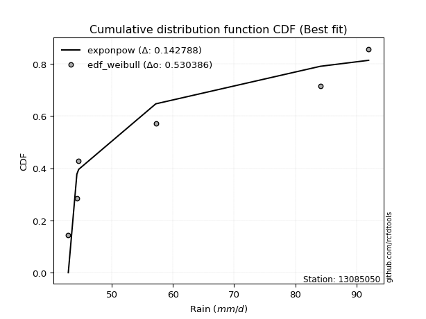</img></img>

</div>


### 4. EDF Beard (1943)

The Beard formula (or Beard´s plotting position formula) in hydrology is used to estimate the empirical non-exceedance probability _(P)_ of a flood event (or other extreme hydrological data point) within a given dataset.

<div align="center">


$P=(m-0.31)/(n+0.38)$


</div>


**4.1. Empirical values**

<div align="center">

|                | 0                   | 1                   | 2                  | 3                  | 4                  | 5                  |
|:---------------|:--------------------|:--------------------|:-------------------|:-------------------|:-------------------|:-------------------|
| date           | 2007                | 2006                | 2008               | 2010               | 2005               | 2009               |
| x              | 42.9                | 44.3                | 44.6               | 57.2               | 84.1               | 92.0               |
| m              | 1                   | 2                   | 3                  | 4                  | 5                  | 6                  |
| empirical_dist | edf_beard           | edf_beard           | edf_beard          | edf_beard          | edf_beard          | edf_beard          |
| empirical      | 0.10815047021943573 | 0.26489028213166144 | 0.4216300940438871 | 0.5783699059561128 | 0.7351097178683387 | 0.8918495297805643 |
| empirical_tr   | 1.1212653778558874  | 1.3603411513859276  | 1.7289972899728996 | 2.3717472118959106 | 3.7751479289940844 | 9.246376811594207  |

</div>


**4.2. Kolmogorov-Smirnov fit test (sorted by Δ)**


<div align="center">

|                | 0                   | 1                   | 2                  | 3                  | 4                   | 5                  | 6                   | 7                   | 8                   | 9                  | 10                  | 11                  | 12                  | 13                  | 14                 | 15                  | 16                  | 17                  | 18                  | 19                  | 20                  | 21                  | 22                 | 23                 | 24                 | 25                  | 26                 | 27                  | 28                 | 29                 | 30                 | 31                  | 32                  | 33                 | 34                 | 35                  | 36                  | 37                  | 38                  | 39                  | 40                  | 41                  | 42                | 43                  | 44                  | 45                  | 46                 | 47                  | 48                  | 49                  | 50                  | 51                 | 52                  | 53                  | 54                  | 55                 | 56                  | 57                  | 58                  | 59                  | 60                  | 61                 | 62                  | 63                 | 64                  | 65                 | 66                  | 67                  | 68                  | 69                 | 70                  | 71                 | 72                 | 73                  | 74                  | 75                  | 76                  | 77                 | 78                  | 79                  | 80                  | 81                  | 82                  | 83                  | 84                  | 85                 | 86                 | 87                 | 88                  | 89                 | 90                  | 91                | 92                  | 93                 | 94                 | 95                 | 96                  | 97                 | 98                 | 99                 | 100                 | 101                | 102               | 103                | 104                 | 105                | 106                 | 107                | 108                | 109                | 110                 | 111                 | 112                 | 113                 | 114                | 115                | 116                 | 117                 | 118                 | 119                 | 120                | 121                 | 122                 | 123                 | 124                | 125                | 126               | 127                 | 128                 | 129                | 130                 | 131               | 132                | 133               | 134                | 135                | 136                | 137                 | 138                 | 139                 | 140                | 141                 | 142                | 143                 | 144                | 145                | 146                 | 147                | 148                 | 149                 | 150                | 151                | 152                 | 153                 | 154                | 155                 | 156                | 157                | 158                | 159            |
|:---------------|:--------------------|:--------------------|:-------------------|:-------------------|:--------------------|:-------------------|:--------------------|:--------------------|:--------------------|:-------------------|:--------------------|:--------------------|:--------------------|:--------------------|:-------------------|:--------------------|:--------------------|:--------------------|:--------------------|:--------------------|:--------------------|:--------------------|:-------------------|:-------------------|:-------------------|:--------------------|:-------------------|:--------------------|:-------------------|:-------------------|:-------------------|:--------------------|:--------------------|:-------------------|:-------------------|:--------------------|:--------------------|:--------------------|:--------------------|:--------------------|:--------------------|:--------------------|:------------------|:--------------------|:--------------------|:--------------------|:-------------------|:--------------------|:--------------------|:--------------------|:--------------------|:-------------------|:--------------------|:--------------------|:--------------------|:-------------------|:--------------------|:--------------------|:--------------------|:--------------------|:--------------------|:-------------------|:--------------------|:-------------------|:--------------------|:-------------------|:--------------------|:--------------------|:--------------------|:-------------------|:--------------------|:-------------------|:-------------------|:--------------------|:--------------------|:--------------------|:--------------------|:-------------------|:--------------------|:--------------------|:--------------------|:--------------------|:--------------------|:--------------------|:--------------------|:-------------------|:-------------------|:-------------------|:--------------------|:-------------------|:--------------------|:------------------|:--------------------|:-------------------|:-------------------|:-------------------|:--------------------|:-------------------|:-------------------|:-------------------|:--------------------|:-------------------|:------------------|:-------------------|:--------------------|:-------------------|:--------------------|:-------------------|:-------------------|:-------------------|:--------------------|:--------------------|:--------------------|:--------------------|:-------------------|:-------------------|:--------------------|:--------------------|:--------------------|:--------------------|:-------------------|:--------------------|:--------------------|:--------------------|:-------------------|:-------------------|:------------------|:--------------------|:--------------------|:-------------------|:--------------------|:------------------|:-------------------|:------------------|:-------------------|:-------------------|:-------------------|:--------------------|:--------------------|:--------------------|:-------------------|:--------------------|:-------------------|:--------------------|:-------------------|:-------------------|:--------------------|:-------------------|:--------------------|:--------------------|:-------------------|:-------------------|:--------------------|:--------------------|:-------------------|:--------------------|:-------------------|:-------------------|:-------------------|:---------------|
| station        | 13085050            | 13085050            | 13085050           | 13085050           | 13085050            | 13085050           | 13085050            | 13085050            | 13085050            | 13085050           | 13085050            | 13085050            | 13085050            | 13085050            | 13085050           | 13085050            | 13085050            | 13085050            | 13085050            | 13085050            | 13085050            | 13085050            | 13085050           | 13085050           | 13085050           | 13085050            | 13085050           | 13085050            | 13085050           | 13085050           | 13085050           | 13085050            | 13085050            | 13085050           | 13085050           | 13085050            | 13085050            | 13085050            | 13085050            | 13085050            | 13085050            | 13085050            | 13085050          | 13085050            | 13085050            | 13085050            | 13085050           | 13085050            | 13085050            | 13085050            | 13085050            | 13085050           | 13085050            | 13085050            | 13085050            | 13085050           | 13085050            | 13085050            | 13085050            | 13085050            | 13085050            | 13085050           | 13085050            | 13085050           | 13085050            | 13085050           | 13085050            | 13085050            | 13085050            | 13085050           | 13085050            | 13085050           | 13085050           | 13085050            | 13085050            | 13085050            | 13085050            | 13085050           | 13085050            | 13085050            | 13085050            | 13085050            | 13085050            | 13085050            | 13085050            | 13085050           | 13085050           | 13085050           | 13085050            | 13085050           | 13085050            | 13085050          | 13085050            | 13085050           | 13085050           | 13085050           | 13085050            | 13085050           | 13085050           | 13085050           | 13085050            | 13085050           | 13085050          | 13085050           | 13085050            | 13085050           | 13085050            | 13085050           | 13085050           | 13085050           | 13085050            | 13085050            | 13085050            | 13085050            | 13085050           | 13085050           | 13085050            | 13085050            | 13085050            | 13085050            | 13085050           | 13085050            | 13085050            | 13085050            | 13085050           | 13085050           | 13085050          | 13085050            | 13085050            | 13085050           | 13085050            | 13085050          | 13085050           | 13085050          | 13085050           | 13085050           | 13085050           | 13085050            | 13085050            | 13085050            | 13085050           | 13085050            | 13085050           | 13085050            | 13085050           | 13085050           | 13085050            | 13085050           | 13085050            | 13085050            | 13085050           | 13085050           | 13085050            | 13085050            | 13085050           | 13085050            | 13085050           | 13085050           | 13085050           | 13085050       |
| empirical_dist | edf_beard           | edf_beard           | edf_beard          | edf_beard          | edf_beard           | edf_beard          | edf_beard           | edf_beard           | edf_beard           | edf_beard          | edf_beard           | edf_beard           | edf_beard           | edf_beard           | edf_beard          | edf_beard           | edf_beard           | edf_beard           | edf_beard           | edf_beard           | edf_beard           | edf_beard           | edf_beard          | edf_beard          | edf_beard          | edf_beard           | edf_beard          | edf_beard           | edf_beard          | edf_beard          | edf_beard          | edf_beard           | edf_beard           | edf_beard          | edf_beard          | edf_beard           | edf_beard           | edf_beard           | edf_beard           | edf_beard           | edf_beard           | edf_beard           | edf_beard         | edf_beard           | edf_beard           | edf_beard           | edf_beard          | edf_beard           | edf_beard           | edf_beard           | edf_beard           | edf_beard          | edf_beard           | edf_beard           | edf_beard           | edf_beard          | edf_beard           | edf_beard           | edf_beard           | edf_beard           | edf_beard           | edf_beard          | edf_beard           | edf_beard          | edf_beard           | edf_beard          | edf_beard           | edf_beard           | edf_beard           | edf_beard          | edf_beard           | edf_beard          | edf_beard          | edf_beard           | edf_beard           | edf_beard           | edf_beard           | edf_beard          | edf_beard           | edf_beard           | edf_beard           | edf_beard           | edf_beard           | edf_beard           | edf_beard           | edf_beard          | edf_beard          | edf_beard          | edf_beard           | edf_beard          | edf_beard           | edf_beard         | edf_beard           | edf_beard          | edf_beard          | edf_beard          | edf_beard           | edf_beard          | edf_beard          | edf_beard          | edf_beard           | edf_beard          | edf_beard         | edf_beard          | edf_beard           | edf_beard          | edf_beard           | edf_beard          | edf_beard          | edf_beard          | edf_beard           | edf_beard           | edf_beard           | edf_beard           | edf_beard          | edf_beard          | edf_beard           | edf_beard           | edf_beard           | edf_beard           | edf_beard          | edf_beard           | edf_beard           | edf_beard           | edf_beard          | edf_beard          | edf_beard         | edf_beard           | edf_beard           | edf_beard          | edf_beard           | edf_beard         | edf_beard          | edf_beard         | edf_beard          | edf_beard          | edf_beard          | edf_beard           | edf_beard           | edf_beard           | edf_beard          | edf_beard           | edf_beard          | edf_beard           | edf_beard          | edf_beard          | edf_beard           | edf_beard          | edf_beard           | edf_beard           | edf_beard          | edf_beard          | edf_beard           | edf_beard           | edf_beard          | edf_beard           | edf_beard          | edf_beard          | edf_beard          | edf_beard      |
| p_dist         | exponpow            | logexponpow         | logwrapcauchy      | logbetaprime       | logarcsine          | invgamma           | ksone               | logksone            | logf                | lognakagami        | arcsine             | semicircular        | gengamma            | foldnorm            | logsemicircular    | wrapcauchy          | halfnorm            | logfoldnorm         | anglit              | logdweibull         | loghalfnorm         | exponweib           | loganglit          | loginvgauss        | invgauss           | dweibull            | rayleigh           | logexponweib        | logdgamma          | maxwell            | lograyleigh        | logweibull_min      | logburr12           | logweibull_max     | logmaxwell         | pearson3            | dgamma              | logmielke           | halflogistic        | loggengamma         | logburr             | lognct              | alpha             | genpareto           | t                   | crystalball         | norm               | logpearson3         | logalpha            | loglevy_l           | johnsonsu           | truncpareto        | weibull_min         | logloggamma         | logtruncweibull_min | betaprime          | truncweibull_min    | gumbel_r            | loghalflogistic     | logt                | lognorm             | logcrystalball     | f                   | nct                | logncf              | loginvgamma        | loggenlogistic      | burr                | genlogistic         | loggumbel_r        | moyal               | logistic           | logtruncpareto     | levy_l              | logmoyal            | logkstwobign        | loglogistic         | gumbel_l           | kstwobign           | cosine              | halfgennorm         | loggumbel_l         | logcosine           | hypsecant           | nakagami            | gamma              | loghypsecant       | loggausshyper      | logjohnsonsu        | erlang             | logrice             | rice              | genextreme          | laplace            | loglaplace         | loglaplace         | argus               | logargus           | logtriang          | triang             | loginvweibull       | burr12             | logjohnsonsb      | ncf                | logexponnorm        | loglomax           | loggenexpon         | logrdist           | loggamma           | loggamma           | loghalfgennorm      | logtruncnorm        | loggompertz         | loggennorm          | logloglaplace      | beta               | loggenextreme       | lomax               | exponnorm           | genexpon            | truncnorm          | loggenpareto        | logkappa4           | logbradford         | gennorm            | logskewnorm        | logtruncexpon     | powerlaw            | logerlang           | kappa4             | gausshyper          | fatiguelife       | logtukeylambda     | truncexpon        | loguniform         | logkappa3          | wald               | skewnorm            | logvonmises_line    | bradford            | logpowerlaw        | logfatiguelife      | gompertz           | loggenhalflogistic  | tukeylambda        | logwald            | uniform             | kappa3             | vonmises_line       | logbeta             | genhalflogistic    | logtrapezoid       | rdist               | invweibull          | trapezoid          | johnsonsb           | weibull_max        | logvonmises        | vonmises           | mielke         |
| delta          | 0.11255243173216423 | 0.11279146938258144 | 0.1383427909281163 | 0.1483469534759717 | 0.15460454680959052 | 0.1557640968953652 | 0.15694589367708606 | 0.16252013698231293 | 0.16438168961461874 | 0.1654341879971465 | 0.17214689667216249 | 0.17372835196045638 | 0.17391037572577184 | 0.17404899248944458 | 0.1793277662116769 | 0.18059756700889817 | 0.18085480609819485 | 0.18457461702087424 | 0.18607708846265844 | 0.18844555181616374 | 0.18973174450287805 | 0.18994483511057259 | 0.1916558349339124 | 0.1925349507998938 | 0.1926877931778741 | 0.19279176623709593 | 0.1937017134235713 | 0.19790889973574033 | 0.1996254857915053 | 0.1997157033583916 | 0.2006966611000147 | 0.20104986401243174 | 0.20394215772306634 | 0.2054556951956904 | 0.2062519292235266 | 0.20711603527117062 | 0.20752158151986883 | 0.20772462506331812 | 0.20852028634777078 | 0.20949406457169417 | 0.21054365719489354 | 0.21094490135679686 | 0.210956012808866 | 0.21174582627179972 | 0.21409293483735725 | 0.21413910661051766 | 0.2141391109604232 | 0.21439891912421366 | 0.21482834413039376 | 0.21507308908734718 | 0.21593818911255047 | 0.2159928809552274 | 0.21631685267790113 | 0.21731816954324282 | 0.21800608410576505 | 0.2186372891745886 | 0.21891532583196605 | 0.21917160960603688 | 0.21932568184124893 | 0.21962099213304093 | 0.21962132146499713 | 0.2196214694228515 | 0.22013778314374727 | 0.2227316756933736 | 0.22285211885970788 | 0.2252544396177947 | 0.22654157339194822 | 0.22661566611975856 | 0.22690554531499568 | 0.2271198825276339 | 0.23152472680635544 | 0.2359809567600741 | 0.2381968132215698 | 0.23930390983131172 | 0.24095303303148446 | 0.24118806065359424 | 0.24121781720341032 | 0.2425203578521904 | 0.24364115576743853 | 0.24495668040811913 | 0.24547749116196546 | 0.24649309616184534 | 0.24773702384751406 | 0.24906001982997147 | 0.24982184102557362 | 0.2524120848229918 | 0.2539773303603487 | 0.2574403604709229 | 0.26008072315878206 | 0.2621155256621298 | 0.26308602783986307 | 0.263116580919995 | 0.26372908781798077 | 0.2637555293490482 | 0.2680084504210547 | 0.2680084504210547 | 0.27298472040327876 | 0.2749486739041412 | 0.2784369658123924 | 0.2804638702300711 | 0.28417960595485525 | 0.2924855973529378 | 0.295050546662883 | 0.2981104503477223 | 0.29831479381937526 | 0.2988415942119676 | 0.29978472240322446 | 0.3021232464178325 | 0.3050449503197691 | 0.3050449503197691 | 0.30902470456888476 | 0.31599440834572845 | 0.31606833972855203 | 0.31616486769816454 | 0.3210505400277014 | 0.3214929165701864 | 0.32239784534904226 | 0.33001535695082845 | 0.33002784772211086 | 0.33126943702261225 | 0.3399720180937008 | 0.34201170174033074 | 0.34567834814438364 | 0.34777236392228655 | 0.3488701453636765 | 0.3499734041831451 | 0.351097169961161 | 0.35611189522750963 | 0.35629936832900866 | 0.3563109452577559 | 0.35729761593280107 | 0.358555180962737 | 0.3592733957923316 | 0.369670933675451 | 0.3706913342968413 | 0.3707777973457171 | 0.3710250404145879 | 0.37109638539666834 | 0.37220089202343926 | 0.37317957235043886 | 0.3733269268252112 | 0.37702049129426674 | 0.3775379659355206 | 0.38322657084242034 | 0.3841938093910671 | 0.3860772048407412 | 0.38700687612128015 | 0.3870582462938979 | 0.38737426442775214 | 0.40415210703608434 | 0.4042212987983991 | 0.4203094147827878 | 0.42163009400323903 | 0.45583138264530376 | 0.4720708877377085 | 0.48045128586546504 | 0.5353057692143226 | 1.1513376719401713 | 14.157989519112137 | nan            |
| deltao         | 0.530385761606      | 0.530385761606      | 0.530385761606     | 0.530385761606     | 0.530385761606      | 0.530385761606     | 0.530385761606      | 0.530385761606      | 0.530385761606      | 0.530385761606     | 0.530385761606      | 0.530385761606      | 0.530385761606      | 0.530385761606      | 0.530385761606     | 0.530385761606      | 0.530385761606      | 0.530385761606      | 0.530385761606      | 0.530385761606      | 0.530385761606      | 0.530385761606      | 0.530385761606     | 0.530385761606     | 0.530385761606     | 0.530385761606      | 0.530385761606     | 0.530385761606      | 0.530385761606     | 0.530385761606     | 0.530385761606     | 0.530385761606      | 0.530385761606      | 0.530385761606     | 0.530385761606     | 0.530385761606      | 0.530385761606      | 0.530385761606      | 0.530385761606      | 0.530385761606      | 0.530385761606      | 0.530385761606      | 0.530385761606    | 0.530385761606      | 0.530385761606      | 0.530385761606      | 0.530385761606     | 0.530385761606      | 0.530385761606      | 0.530385761606      | 0.530385761606      | 0.530385761606     | 0.530385761606      | 0.530385761606      | 0.530385761606      | 0.530385761606     | 0.530385761606      | 0.530385761606      | 0.530385761606      | 0.530385761606      | 0.530385761606      | 0.530385761606     | 0.530385761606      | 0.530385761606     | 0.530385761606      | 0.530385761606     | 0.530385761606      | 0.530385761606      | 0.530385761606      | 0.530385761606     | 0.530385761606      | 0.530385761606     | 0.530385761606     | 0.530385761606      | 0.530385761606      | 0.530385761606      | 0.530385761606      | 0.530385761606     | 0.530385761606      | 0.530385761606      | 0.530385761606      | 0.530385761606      | 0.530385761606      | 0.530385761606      | 0.530385761606      | 0.530385761606     | 0.530385761606     | 0.530385761606     | 0.530385761606      | 0.530385761606     | 0.530385761606      | 0.530385761606    | 0.530385761606      | 0.530385761606     | 0.530385761606     | 0.530385761606     | 0.530385761606      | 0.530385761606     | 0.530385761606     | 0.530385761606     | 0.530385761606      | 0.530385761606     | 0.530385761606    | 0.530385761606     | 0.530385761606      | 0.530385761606     | 0.530385761606      | 0.530385761606     | 0.530385761606     | 0.530385761606     | 0.530385761606      | 0.530385761606      | 0.530385761606      | 0.530385761606      | 0.530385761606     | 0.530385761606     | 0.530385761606      | 0.530385761606      | 0.530385761606      | 0.530385761606      | 0.530385761606     | 0.530385761606      | 0.530385761606      | 0.530385761606      | 0.530385761606     | 0.530385761606     | 0.530385761606    | 0.530385761606      | 0.530385761606      | 0.530385761606     | 0.530385761606      | 0.530385761606    | 0.530385761606     | 0.530385761606    | 0.530385761606     | 0.530385761606     | 0.530385761606     | 0.530385761606      | 0.530385761606      | 0.530385761606      | 0.530385761606     | 0.530385761606      | 0.530385761606     | 0.530385761606      | 0.530385761606     | 0.530385761606     | 0.530385761606      | 0.530385761606     | 0.530385761606      | 0.530385761606      | 0.530385761606     | 0.530385761606     | 0.530385761606      | 0.530385761606      | 0.530385761606     | 0.530385761606      | 0.530385761606     | 0.530385761606     | 0.530385761606     | 0.530385761606 |
| eval           | Δo > Δ              | Δo > Δ              | Δo > Δ             | Δo > Δ             | Δo > Δ              | Δo > Δ             | Δo > Δ              | Δo > Δ              | Δo > Δ              | Δo > Δ             | Δo > Δ              | Δo > Δ              | Δo > Δ              | Δo > Δ              | Δo > Δ             | Δo > Δ              | Δo > Δ              | Δo > Δ              | Δo > Δ              | Δo > Δ              | Δo > Δ              | Δo > Δ              | Δo > Δ             | Δo > Δ             | Δo > Δ             | Δo > Δ              | Δo > Δ             | Δo > Δ              | Δo > Δ             | Δo > Δ             | Δo > Δ             | Δo > Δ              | Δo > Δ              | Δo > Δ             | Δo > Δ             | Δo > Δ              | Δo > Δ              | Δo > Δ              | Δo > Δ              | Δo > Δ              | Δo > Δ              | Δo > Δ              | Δo > Δ            | Δo > Δ              | Δo > Δ              | Δo > Δ              | Δo > Δ             | Δo > Δ              | Δo > Δ              | Δo > Δ              | Δo > Δ              | Δo > Δ             | Δo > Δ              | Δo > Δ              | Δo > Δ              | Δo > Δ             | Δo > Δ              | Δo > Δ              | Δo > Δ              | Δo > Δ              | Δo > Δ              | Δo > Δ             | Δo > Δ              | Δo > Δ             | Δo > Δ              | Δo > Δ             | Δo > Δ              | Δo > Δ              | Δo > Δ              | Δo > Δ             | Δo > Δ              | Δo > Δ             | Δo > Δ             | Δo > Δ              | Δo > Δ              | Δo > Δ              | Δo > Δ              | Δo > Δ             | Δo > Δ              | Δo > Δ              | Δo > Δ              | Δo > Δ              | Δo > Δ              | Δo > Δ              | Δo > Δ              | Δo > Δ             | Δo > Δ             | Δo > Δ             | Δo > Δ              | Δo > Δ             | Δo > Δ              | Δo > Δ            | Δo > Δ              | Δo > Δ             | Δo > Δ             | Δo > Δ             | Δo > Δ              | Δo > Δ             | Δo > Δ             | Δo > Δ             | Δo > Δ              | Δo > Δ             | Δo > Δ            | Δo > Δ             | Δo > Δ              | Δo > Δ             | Δo > Δ              | Δo > Δ             | Δo > Δ             | Δo > Δ             | Δo > Δ              | Δo > Δ              | Δo > Δ              | Δo > Δ              | Δo > Δ             | Δo > Δ             | Δo > Δ              | Δo > Δ              | Δo > Δ              | Δo > Δ              | Δo > Δ             | Δo > Δ              | Δo > Δ              | Δo > Δ              | Δo > Δ             | Δo > Δ             | Δo > Δ            | Δo > Δ              | Δo > Δ              | Δo > Δ             | Δo > Δ              | Δo > Δ            | Δo > Δ             | Δo > Δ            | Δo > Δ             | Δo > Δ             | Δo > Δ             | Δo > Δ              | Δo > Δ              | Δo > Δ              | Δo > Δ             | Δo > Δ              | Δo > Δ             | Δo > Δ              | Δo > Δ             | Δo > Δ             | Δo > Δ              | Δo > Δ             | Δo > Δ              | Δo > Δ              | Δo > Δ             | Δo > Δ             | Δo > Δ              | Δo > Δ              | Δo > Δ             | Δo > Δ              | Δo <= Δ            | Δo <= Δ            | Δo <= Δ            | Δo <= Δ        |
| fit            | 1                   | 1                   | 1                  | 1                  | 1                   | 1                  | 1                   | 1                   | 1                   | 1                  | 1                   | 1                   | 1                   | 1                   | 1                  | 1                   | 1                   | 1                   | 1                   | 1                   | 1                   | 1                   | 1                  | 1                  | 1                  | 1                   | 1                  | 1                   | 1                  | 1                  | 1                  | 1                   | 1                   | 1                  | 1                  | 1                   | 1                   | 1                   | 1                   | 1                   | 1                   | 1                   | 1                 | 1                   | 1                   | 1                   | 1                  | 1                   | 1                   | 1                   | 1                   | 1                  | 1                   | 1                   | 1                   | 1                  | 1                   | 1                   | 1                   | 1                   | 1                   | 1                  | 1                   | 1                  | 1                   | 1                  | 1                   | 1                   | 1                   | 1                  | 1                   | 1                  | 1                  | 1                   | 1                   | 1                   | 1                   | 1                  | 1                   | 1                   | 1                   | 1                   | 1                   | 1                   | 1                   | 1                  | 1                  | 1                  | 1                   | 1                  | 1                   | 1                 | 1                   | 1                  | 1                  | 1                  | 1                   | 1                  | 1                  | 1                  | 1                   | 1                  | 1                 | 1                  | 1                   | 1                  | 1                   | 1                  | 1                  | 1                  | 1                   | 1                   | 1                   | 1                   | 1                  | 1                  | 1                   | 1                   | 1                   | 1                   | 1                  | 1                   | 1                   | 1                   | 1                  | 1                  | 1                 | 1                   | 1                   | 1                  | 1                   | 1                 | 1                  | 1                 | 1                  | 1                  | 1                  | 1                   | 1                   | 1                   | 1                  | 1                   | 1                  | 1                   | 1                  | 1                  | 1                   | 1                  | 1                   | 1                   | 1                  | 1                  | 1                   | 1                   | 1                  | 1                   | 0                  | 0                  | 0                  | 0              |
| n              | 6                   | 6                   | 6                  | 6                  | 6                   | 6                  | 6                   | 6                   | 6                   | 6                  | 6                   | 6                   | 6                   | 6                   | 6                  | 6                   | 6                   | 6                   | 6                   | 6                   | 6                   | 6                   | 6                  | 6                  | 6                  | 6                   | 6                  | 6                   | 6                  | 6                  | 6                  | 6                   | 6                   | 6                  | 6                  | 6                   | 6                   | 6                   | 6                   | 6                   | 6                   | 6                   | 6                 | 6                   | 6                   | 6                   | 6                  | 6                   | 6                   | 6                   | 6                   | 6                  | 6                   | 6                   | 6                   | 6                  | 6                   | 6                   | 6                   | 6                   | 6                   | 6                  | 6                   | 6                  | 6                   | 6                  | 6                   | 6                   | 6                   | 6                  | 6                   | 6                  | 6                  | 6                   | 6                   | 6                   | 6                   | 6                  | 6                   | 6                   | 6                   | 6                   | 6                   | 6                   | 6                   | 6                  | 6                  | 6                  | 6                   | 6                  | 6                   | 6                 | 6                   | 6                  | 6                  | 6                  | 6                   | 6                  | 6                  | 6                  | 6                   | 6                  | 6                 | 6                  | 6                   | 6                  | 6                   | 6                  | 6                  | 6                  | 6                   | 6                   | 6                   | 6                   | 6                  | 6                  | 6                   | 6                   | 6                   | 6                   | 6                  | 6                   | 6                   | 6                   | 6                  | 6                  | 6                 | 6                   | 6                   | 6                  | 6                   | 6                 | 6                  | 6                 | 6                  | 6                  | 6                  | 6                   | 6                   | 6                   | 6                  | 6                   | 6                  | 6                   | 6                  | 6                  | 6                   | 6                  | 6                   | 6                   | 6                  | 6                  | 6                   | 6                   | 6                  | 6                   | 6                  | 6                  | 6                  | 6              |
| best_fit       | 1                   | 0                   | 0                  | 0                  | 0                   | 0                  | 0                   | 0                   | 0                   | 0                  | 0                   | 0                   | 0                   | 0                   | 0                  | 0                   | 0                   | 0                   | 0                   | 0                   | 0                   | 0                   | 0                  | 0                  | 0                  | 0                   | 0                  | 0                   | 0                  | 0                  | 0                  | 0                   | 0                   | 0                  | 0                  | 0                   | 0                   | 0                   | 0                   | 0                   | 0                   | 0                   | 0                 | 0                   | 0                   | 0                   | 0                  | 0                   | 0                   | 0                   | 0                   | 0                  | 0                   | 0                   | 0                   | 0                  | 0                   | 0                   | 0                   | 0                   | 0                   | 0                  | 0                   | 0                  | 0                   | 0                  | 0                   | 0                   | 0                   | 0                  | 0                   | 0                  | 0                  | 0                   | 0                   | 0                   | 0                   | 0                  | 0                   | 0                   | 0                   | 0                   | 0                   | 0                   | 0                   | 0                  | 0                  | 0                  | 0                   | 0                  | 0                   | 0                 | 0                   | 0                  | 0                  | 0                  | 0                   | 0                  | 0                  | 0                  | 0                   | 0                  | 0                 | 0                  | 0                   | 0                  | 0                   | 0                  | 0                  | 0                  | 0                   | 0                   | 0                   | 0                   | 0                  | 0                  | 0                   | 0                   | 0                   | 0                   | 0                  | 0                   | 0                   | 0                   | 0                  | 0                  | 0                 | 0                   | 0                   | 0                  | 0                   | 0                 | 0                  | 0                 | 0                  | 0                  | 0                  | 0                   | 0                   | 0                   | 0                  | 0                   | 0                  | 0                   | 0                  | 0                  | 0                   | 0                  | 0                   | 0                   | 0                  | 0                  | 0                   | 0                   | 0                  | 0                   | 0                  | 0                  | 0                  | 0              |
| best_fit_sort  | 1                   | 2                   | 3                  | 4                  | 5                   | 6                  | 7                   | 8                   | 9                   | 10                 | 11                  | 12                  | 13                  | 14                  | 15                 | 16                  | 17                  | 18                  | 19                  | 20                  | 21                  | 22                  | 23                 | 24                 | 25                 | 26                  | 27                 | 28                  | 29                 | 30                 | 31                 | 32                  | 33                  | 34                 | 35                 | 36                  | 37                  | 38                  | 39                  | 40                  | 41                  | 42                  | 43                | 44                  | 45                  | 46                  | 47                 | 48                  | 49                  | 50                  | 51                  | 52                 | 53                  | 54                  | 55                  | 56                 | 57                  | 58                  | 59                  | 60                  | 61                  | 62                 | 63                  | 64                 | 65                  | 66                 | 67                  | 68                  | 69                  | 70                 | 71                  | 72                 | 73                 | 74                  | 75                  | 76                  | 77                  | 78                 | 79                  | 80                  | 81                  | 82                  | 83                  | 84                  | 85                  | 86                 | 87                 | 88                 | 89                  | 90                 | 91                  | 92                | 93                  | 94                 | 95                 | 96                 | 97                  | 98                 | 99                 | 100                | 101                 | 102                | 103               | 104                | 105                 | 106                | 107                 | 108                | 109                | 110                | 111                 | 112                 | 113                 | 114                 | 115                | 116                | 117                 | 118                 | 119                 | 120                 | 121                | 122                 | 123                 | 124                 | 125                | 126                | 127               | 128                 | 129                 | 130                | 131                 | 132               | 133                | 134               | 135                | 136                | 137                | 138                 | 139                 | 140                 | 141                | 142                 | 143                | 144                 | 145                | 146                | 147                 | 148                | 149                 | 150                 | 151                | 152                | 153                 | 154                 | 155                | 156                 | 157                | 158                | 159                | 160            |

</div>


**4.3. Best fit**

<div align="center">

|   id |   station | empirical_dist   | p_dist   |    delta |   deltao | eval   |   fit |   n |   best_fit |   best_fit_sort |
|-----:|----------:|:-----------------|:---------|---------:|---------:|:-------|------:|----:|-----------:|----------------:|
|    0 |  13085050 | edf_beard        | exponpow | 0.112552 | 0.530386 | Δo > Δ |     1 |   6 |          1 |               1 |

</div>


<div align="center">

</img>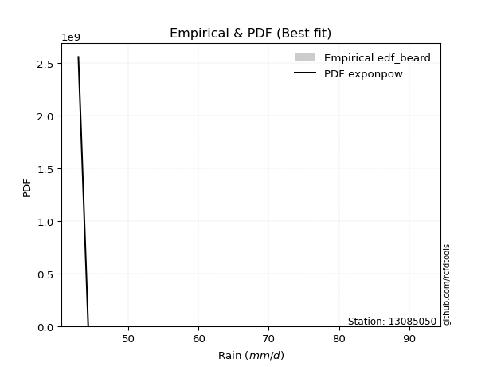</img>

</div>


### 5. EDF Chegodayev (1955)

The Chegodayev formula is an empirical plotting position formula used in hydrological frequency analysis to estimate the exceedance probability or return period of a specific event from a set of observed data. It is primarily used for plotting observed data points on probability paper to fit a theoretical distribution, particularly for analyzing extreme events like maximum flood flows or rainfall intensities. The constant _b_ value in the generalized plotting position formula is 0.3.

<div align="center">


$P=(m-b)/(n+1-2b)$


</div>


**5.1. Empirical values**

<div align="center">

|                | 0                   | 1                  | 2                  | 3                  | 4                 | 5                 |
|:---------------|:--------------------|:-------------------|:-------------------|:-------------------|:------------------|:------------------|
| date           | 2007                | 2006               | 2008               | 2010               | 2005              | 2009              |
| x              | 42.9                | 44.3               | 44.6               | 57.2               | 84.1              | 92.0              |
| m              | 1                   | 2                  | 3                  | 4                  | 5                 | 6                 |
| empirical_dist | edf_chegodayev      | edf_chegodayev     | edf_chegodayev     | edf_chegodayev     | edf_chegodayev    | edf_chegodayev    |
| empirical      | 0.10937499999999999 | 0.265625           | 0.421875           | 0.578125           | 0.734375          | 0.890625          |
| empirical_tr   | 1.1228070175438596  | 1.3617021276595744 | 1.7297297297297298 | 2.3703703703703702 | 3.764705882352941 | 9.142857142857142 |

</div>


**5.2. Kolmogorov-Smirnov fit test (sorted by Δ)**


<div align="center">

|                | 0                   | 1                   | 2                   | 3                   | 4                   | 5                 | 6                   | 7                  | 8                   | 9                   | 10                  | 11                  | 12                  | 13                 | 14                  | 15                 | 16                  | 17                  | 18                  | 19                 | 20                  | 21                  | 22                  | 23                  | 24                  | 25                  | 26                  | 27                  | 28                  | 29                  | 30                  | 31                  | 32                  | 33                  | 34                  | 35                  | 36                 | 37                | 38                  | 39                  | 40                  | 41                  | 42                  | 43                  | 44                  | 45                  | 46                  | 47                  | 48                  | 49                  | 50                  | 51                  | 52                 | 53                 | 54                  | 55                  | 56                  | 57                 | 58                  | 59                 | 60               | 61                  | 62                  | 63                  | 64                  | 65                  | 66                 | 67                  | 68                  | 69                  | 70                  | 71                  | 72                  | 73                  | 74                  | 75                  | 76                 | 77                  | 78                 | 79                | 80                  | 81                 | 82                  | 83                  | 84                 | 85                 | 86                  | 87                  | 88                  | 89                  | 90                  | 91                  | 92                  | 93                  | 94                 | 95                 | 96                  | 97                  | 98                  | 99                  | 100                | 101                | 102                | 103                 | 104                 | 105                 | 106                 | 107                | 108                | 109                | 110                 | 111                | 112                | 113                 | 114                 | 115                 | 116                 | 117                | 118                 | 119                | 120                 | 121                | 122                | 123                 | 124                | 125                 | 126                 | 127                 | 128                | 129                | 130                | 131                | 132                 | 133                | 134                | 135                 | 136                 | 137                | 138                 | 139                | 140                | 141                 | 142                 | 143                | 144              | 145                | 146               | 147                | 148               | 149                | 150                 | 151               | 152                 | 153                 | 154                | 155                | 156                | 157              | 158                | 159            |
|:---------------|:--------------------|:--------------------|:--------------------|:--------------------|:--------------------|:------------------|:--------------------|:-------------------|:--------------------|:--------------------|:--------------------|:--------------------|:--------------------|:-------------------|:--------------------|:-------------------|:--------------------|:--------------------|:--------------------|:-------------------|:--------------------|:--------------------|:--------------------|:--------------------|:--------------------|:--------------------|:--------------------|:--------------------|:--------------------|:--------------------|:--------------------|:--------------------|:--------------------|:--------------------|:--------------------|:--------------------|:-------------------|:------------------|:--------------------|:--------------------|:--------------------|:--------------------|:--------------------|:--------------------|:--------------------|:--------------------|:--------------------|:--------------------|:--------------------|:--------------------|:--------------------|:--------------------|:-------------------|:-------------------|:--------------------|:--------------------|:--------------------|:-------------------|:--------------------|:-------------------|:-----------------|:--------------------|:--------------------|:--------------------|:--------------------|:--------------------|:-------------------|:--------------------|:--------------------|:--------------------|:--------------------|:--------------------|:--------------------|:--------------------|:--------------------|:--------------------|:-------------------|:--------------------|:-------------------|:------------------|:--------------------|:-------------------|:--------------------|:--------------------|:-------------------|:-------------------|:--------------------|:--------------------|:--------------------|:--------------------|:--------------------|:--------------------|:--------------------|:--------------------|:-------------------|:-------------------|:--------------------|:--------------------|:--------------------|:--------------------|:-------------------|:-------------------|:-------------------|:--------------------|:--------------------|:--------------------|:--------------------|:-------------------|:-------------------|:-------------------|:--------------------|:-------------------|:-------------------|:--------------------|:--------------------|:--------------------|:--------------------|:-------------------|:--------------------|:-------------------|:--------------------|:-------------------|:-------------------|:--------------------|:-------------------|:--------------------|:--------------------|:--------------------|:-------------------|:-------------------|:-------------------|:-------------------|:--------------------|:-------------------|:-------------------|:--------------------|:--------------------|:-------------------|:--------------------|:-------------------|:-------------------|:--------------------|:--------------------|:-------------------|:-----------------|:-------------------|:------------------|:-------------------|:------------------|:-------------------|:--------------------|:------------------|:--------------------|:--------------------|:-------------------|:-------------------|:-------------------|:-----------------|:-------------------|:---------------|
| station        | 13085050            | 13085050            | 13085050            | 13085050            | 13085050            | 13085050          | 13085050            | 13085050           | 13085050            | 13085050            | 13085050            | 13085050            | 13085050            | 13085050           | 13085050            | 13085050           | 13085050            | 13085050            | 13085050            | 13085050           | 13085050            | 13085050            | 13085050            | 13085050            | 13085050            | 13085050            | 13085050            | 13085050            | 13085050            | 13085050            | 13085050            | 13085050            | 13085050            | 13085050            | 13085050            | 13085050            | 13085050           | 13085050          | 13085050            | 13085050            | 13085050            | 13085050            | 13085050            | 13085050            | 13085050            | 13085050            | 13085050            | 13085050            | 13085050            | 13085050            | 13085050            | 13085050            | 13085050           | 13085050           | 13085050            | 13085050            | 13085050            | 13085050           | 13085050            | 13085050           | 13085050         | 13085050            | 13085050            | 13085050            | 13085050            | 13085050            | 13085050           | 13085050            | 13085050            | 13085050            | 13085050            | 13085050            | 13085050            | 13085050            | 13085050            | 13085050            | 13085050           | 13085050            | 13085050           | 13085050          | 13085050            | 13085050           | 13085050            | 13085050            | 13085050           | 13085050           | 13085050            | 13085050            | 13085050            | 13085050            | 13085050            | 13085050            | 13085050            | 13085050            | 13085050           | 13085050           | 13085050            | 13085050            | 13085050            | 13085050            | 13085050           | 13085050           | 13085050           | 13085050            | 13085050            | 13085050            | 13085050            | 13085050           | 13085050           | 13085050           | 13085050            | 13085050           | 13085050           | 13085050            | 13085050            | 13085050            | 13085050            | 13085050           | 13085050            | 13085050           | 13085050            | 13085050           | 13085050           | 13085050            | 13085050           | 13085050            | 13085050            | 13085050            | 13085050           | 13085050           | 13085050           | 13085050           | 13085050            | 13085050           | 13085050           | 13085050            | 13085050            | 13085050           | 13085050            | 13085050           | 13085050           | 13085050            | 13085050            | 13085050           | 13085050         | 13085050           | 13085050          | 13085050           | 13085050          | 13085050           | 13085050            | 13085050          | 13085050            | 13085050            | 13085050           | 13085050           | 13085050           | 13085050         | 13085050           | 13085050       |
| empirical_dist | edf_chegodayev      | edf_chegodayev      | edf_chegodayev      | edf_chegodayev      | edf_chegodayev      | edf_chegodayev    | edf_chegodayev      | edf_chegodayev     | edf_chegodayev      | edf_chegodayev      | edf_chegodayev      | edf_chegodayev      | edf_chegodayev      | edf_chegodayev     | edf_chegodayev      | edf_chegodayev     | edf_chegodayev      | edf_chegodayev      | edf_chegodayev      | edf_chegodayev     | edf_chegodayev      | edf_chegodayev      | edf_chegodayev      | edf_chegodayev      | edf_chegodayev      | edf_chegodayev      | edf_chegodayev      | edf_chegodayev      | edf_chegodayev      | edf_chegodayev      | edf_chegodayev      | edf_chegodayev      | edf_chegodayev      | edf_chegodayev      | edf_chegodayev      | edf_chegodayev      | edf_chegodayev     | edf_chegodayev    | edf_chegodayev      | edf_chegodayev      | edf_chegodayev      | edf_chegodayev      | edf_chegodayev      | edf_chegodayev      | edf_chegodayev      | edf_chegodayev      | edf_chegodayev      | edf_chegodayev      | edf_chegodayev      | edf_chegodayev      | edf_chegodayev      | edf_chegodayev      | edf_chegodayev     | edf_chegodayev     | edf_chegodayev      | edf_chegodayev      | edf_chegodayev      | edf_chegodayev     | edf_chegodayev      | edf_chegodayev     | edf_chegodayev   | edf_chegodayev      | edf_chegodayev      | edf_chegodayev      | edf_chegodayev      | edf_chegodayev      | edf_chegodayev     | edf_chegodayev      | edf_chegodayev      | edf_chegodayev      | edf_chegodayev      | edf_chegodayev      | edf_chegodayev      | edf_chegodayev      | edf_chegodayev      | edf_chegodayev      | edf_chegodayev     | edf_chegodayev      | edf_chegodayev     | edf_chegodayev    | edf_chegodayev      | edf_chegodayev     | edf_chegodayev      | edf_chegodayev      | edf_chegodayev     | edf_chegodayev     | edf_chegodayev      | edf_chegodayev      | edf_chegodayev      | edf_chegodayev      | edf_chegodayev      | edf_chegodayev      | edf_chegodayev      | edf_chegodayev      | edf_chegodayev     | edf_chegodayev     | edf_chegodayev      | edf_chegodayev      | edf_chegodayev      | edf_chegodayev      | edf_chegodayev     | edf_chegodayev     | edf_chegodayev     | edf_chegodayev      | edf_chegodayev      | edf_chegodayev      | edf_chegodayev      | edf_chegodayev     | edf_chegodayev     | edf_chegodayev     | edf_chegodayev      | edf_chegodayev     | edf_chegodayev     | edf_chegodayev      | edf_chegodayev      | edf_chegodayev      | edf_chegodayev      | edf_chegodayev     | edf_chegodayev      | edf_chegodayev     | edf_chegodayev      | edf_chegodayev     | edf_chegodayev     | edf_chegodayev      | edf_chegodayev     | edf_chegodayev      | edf_chegodayev      | edf_chegodayev      | edf_chegodayev     | edf_chegodayev     | edf_chegodayev     | edf_chegodayev     | edf_chegodayev      | edf_chegodayev     | edf_chegodayev     | edf_chegodayev      | edf_chegodayev      | edf_chegodayev     | edf_chegodayev      | edf_chegodayev     | edf_chegodayev     | edf_chegodayev      | edf_chegodayev      | edf_chegodayev     | edf_chegodayev   | edf_chegodayev     | edf_chegodayev    | edf_chegodayev     | edf_chegodayev    | edf_chegodayev     | edf_chegodayev      | edf_chegodayev    | edf_chegodayev      | edf_chegodayev      | edf_chegodayev     | edf_chegodayev     | edf_chegodayev     | edf_chegodayev   | edf_chegodayev     | edf_chegodayev |
| p_dist         | logexponpow         | exponpow            | logwrapcauchy       | logbetaprime        | logarcsine          | invgamma          | ksone               | logksone           | logf                | lognakagami         | arcsine             | semicircular        | foldnorm            | gengamma           | logsemicircular     | wrapcauchy         | halfnorm            | logfoldnorm         | anglit              | logdweibull        | loghalfnorm         | exponweib           | loganglit           | dweibull            | loginvgauss         | invgauss            | rayleigh            | logexponweib        | maxwell             | logdgamma           | lograyleigh         | logweibull_min      | logburr12           | logweibull_max      | dgamma              | logmaxwell          | pearson3           | logmielke         | loggengamma         | halflogistic        | genpareto           | logburr             | lognct              | alpha               | loglevy_l           | t                   | crystalball         | norm                | logpearson3         | logalpha            | johnsonsu           | truncpareto         | weibull_min        | logloggamma        | logtruncweibull_min | betaprime           | gumbel_r            | loghalflogistic    | truncweibull_min    | logt               | lognorm          | logcrystalball      | f                   | nct                 | logncf              | loginvgamma         | loggenlogistic     | burr                | genlogistic         | loggumbel_r         | moyal               | logistic            | levy_l              | logtruncpareto      | logmoyal            | logkstwobign        | loglogistic        | gumbel_l            | kstwobign          | cosine            | halfgennorm         | loggumbel_l        | logcosine           | hypsecant           | nakagami           | gamma              | loghypsecant        | loggausshyper       | logjohnsonsu        | erlang              | genextreme          | logrice             | rice                | laplace             | loglaplace         | loglaplace         | argus               | logargus            | logtriang           | triang              | loginvweibull      | burr12             | logjohnsonsb       | ncf                 | logexponnorm        | loglomax            | loggenexpon         | logrdist           | loggamma           | loggamma           | loghalfgennorm      | logtruncnorm       | loggompertz        | loggennorm          | logloglaplace       | beta                | loggenextreme       | lomax              | exponnorm           | genexpon           | truncnorm           | loggenpareto       | logkappa4          | gennorm             | logbradford        | logskewnorm         | logtruncexpon       | powerlaw            | logerlang          | kappa4             | gausshyper         | fatiguelife        | logtukeylambda      | truncexpon         | loguniform         | logkappa3           | wald                | skewnorm           | logvonmises_line    | logpowerlaw        | bradford           | logfatiguelife      | gompertz            | loggenhalflogistic | tukeylambda      | logwald            | uniform           | kappa3             | vonmises_line     | logbeta            | genhalflogistic     | logtrapezoid      | rdist               | invweibull          | trapezoid          | johnsonsb          | weibull_max        | logvonmises      | vonmises           | mielke         |
| delta          | 0.11156693960201713 | 0.11181771386382566 | 0.13858769688422917 | 0.14859185943208458 | 0.15338001702902626 | 0.156009002851478 | 0.15719079963319893 | 0.1627650429384258 | 0.16462659557073156 | 0.16616890586548516 | 0.17092236689159823 | 0.17397325791656926 | 0.17429389844555745 | 0.1746450935941105 | 0.17957267216778977 | 0.1798628491405595 | 0.18109971205430772 | 0.18481952297698712 | 0.18632199441877131 | 0.1891802696845024 | 0.18997665045899093 | 0.19018974106668546 | 0.19190074089002526 | 0.19250150840390878 | 0.19277985675600662 | 0.19293269913398692 | 0.19394661937968416 | 0.19668436995517602 | 0.19996060931450446 | 0.20036020365984397 | 0.20094156705612756 | 0.20129476996854462 | 0.20418706367917921 | 0.20521078923957758 | 0.20629705173930457 | 0.20649683517963946 | 0.2073609412272835 | 0.207969531019431 | 0.20826953479112986 | 0.20876519230388366 | 0.21052129649123547 | 0.21078856315100641 | 0.21118980731290973 | 0.21120091876497882 | 0.21384855930678293 | 0.21433784079347012 | 0.21438401256663053 | 0.21438401691653608 | 0.21464382508032653 | 0.21507325008650663 | 0.21618309506866334 | 0.21623778691134027 | 0.2170515705462398 | 0.2175630754993557 | 0.21825099006187787 | 0.21888219513070148 | 0.21941651556214975 | 0.2195705877973618 | 0.21965004370030472 | 0.2198658980891538 | 0.21986622742111 | 0.21986637537896436 | 0.22038268909986014 | 0.22297658164948647 | 0.22309702481582075 | 0.22549934557390758 | 0.2267864793480611 | 0.22686057207587143 | 0.22715045127110856 | 0.22736478848374678 | 0.23176963276246831 | 0.23622586271618698 | 0.23807938005074747 | 0.23844171917768267 | 0.24119793898759734 | 0.24143296660970712 | 0.2414627231595232 | 0.24276526380830327 | 0.2438860617235514 | 0.245201586364232 | 0.24572239711807833 | 0.2467380021179582 | 0.24798192980362693 | 0.24930492578608435 | 0.2500667469816865 | 0.2531468026913305 | 0.25422223631646157 | 0.25768526642703576 | 0.26032562911489493 | 0.26236043161824263 | 0.26250455803741646 | 0.26333093379597594 | 0.26336148687610794 | 0.26400043530516104 | 0.2682533563771675 | 0.2682533563771675 | 0.27322962635939163 | 0.27519357986025406 | 0.27868187176850523 | 0.28021896427395826 | 0.2834448880865167 | 0.2927305033090506 | 0.2938260168823187 | 0.29688592056715807 | 0.29855969977548813 | 0.29908650016808047 | 0.30002962835933733 | 0.3023681523739454 | 0.3052898562758819 | 0.3052898562758819 | 0.30926961052499763 | 0.3162393143018413 | 0.3163132456846649 | 0.31640977365427736 | 0.31982601024713714 | 0.32026838678962216 | 0.32117331556847795 | 0.3302602629069413 | 0.33027275367822373 | 0.3315143429787251 | 0.34021692404981363 | 0.3407871719597665 | 0.3459232541004965 | 0.34764561558311224 | 0.3480172698783994 | 0.35021831013925797 | 0.35134207591727384 | 0.35537717735917107 | 0.3565442742851215 | 0.3565558512138688 | 0.3575425218889139 | 0.3578204630943984 | 0.35951830174844446 | 0.3699158396315639 | 0.3709362402529542 | 0.37102270330182996 | 0.37126994637070077 | 0.3713412913527812 | 0.37244579797955213 | 0.3725922089568726 | 0.3734244783065518 | 0.37628577342592817 | 0.37778287189163345 | 0.3834714767985332 | 0.38443871534718 | 0.3863221107968541 | 0.387251782077393 | 0.3873031522500108 | 0.387619170383865 | 0.4029275772555201 | 0.40397639284228626 | 0.420064508826675 | 0.42187499995935185 | 0.45460685286473945 | 0.4718259817815957 | 0.4797165679971265 | 0.5345710513459839 | 1.15207238980851 | 14.159214048892702 | nan            |
| deltao         | 0.530385761606      | 0.530385761606      | 0.530385761606      | 0.530385761606      | 0.530385761606      | 0.530385761606    | 0.530385761606      | 0.530385761606     | 0.530385761606      | 0.530385761606      | 0.530385761606      | 0.530385761606      | 0.530385761606      | 0.530385761606     | 0.530385761606      | 0.530385761606     | 0.530385761606      | 0.530385761606      | 0.530385761606      | 0.530385761606     | 0.530385761606      | 0.530385761606      | 0.530385761606      | 0.530385761606      | 0.530385761606      | 0.530385761606      | 0.530385761606      | 0.530385761606      | 0.530385761606      | 0.530385761606      | 0.530385761606      | 0.530385761606      | 0.530385761606      | 0.530385761606      | 0.530385761606      | 0.530385761606      | 0.530385761606     | 0.530385761606    | 0.530385761606      | 0.530385761606      | 0.530385761606      | 0.530385761606      | 0.530385761606      | 0.530385761606      | 0.530385761606      | 0.530385761606      | 0.530385761606      | 0.530385761606      | 0.530385761606      | 0.530385761606      | 0.530385761606      | 0.530385761606      | 0.530385761606     | 0.530385761606     | 0.530385761606      | 0.530385761606      | 0.530385761606      | 0.530385761606     | 0.530385761606      | 0.530385761606     | 0.530385761606   | 0.530385761606      | 0.530385761606      | 0.530385761606      | 0.530385761606      | 0.530385761606      | 0.530385761606     | 0.530385761606      | 0.530385761606      | 0.530385761606      | 0.530385761606      | 0.530385761606      | 0.530385761606      | 0.530385761606      | 0.530385761606      | 0.530385761606      | 0.530385761606     | 0.530385761606      | 0.530385761606     | 0.530385761606    | 0.530385761606      | 0.530385761606     | 0.530385761606      | 0.530385761606      | 0.530385761606     | 0.530385761606     | 0.530385761606      | 0.530385761606      | 0.530385761606      | 0.530385761606      | 0.530385761606      | 0.530385761606      | 0.530385761606      | 0.530385761606      | 0.530385761606     | 0.530385761606     | 0.530385761606      | 0.530385761606      | 0.530385761606      | 0.530385761606      | 0.530385761606     | 0.530385761606     | 0.530385761606     | 0.530385761606      | 0.530385761606      | 0.530385761606      | 0.530385761606      | 0.530385761606     | 0.530385761606     | 0.530385761606     | 0.530385761606      | 0.530385761606     | 0.530385761606     | 0.530385761606      | 0.530385761606      | 0.530385761606      | 0.530385761606      | 0.530385761606     | 0.530385761606      | 0.530385761606     | 0.530385761606      | 0.530385761606     | 0.530385761606     | 0.530385761606      | 0.530385761606     | 0.530385761606      | 0.530385761606      | 0.530385761606      | 0.530385761606     | 0.530385761606     | 0.530385761606     | 0.530385761606     | 0.530385761606      | 0.530385761606     | 0.530385761606     | 0.530385761606      | 0.530385761606      | 0.530385761606     | 0.530385761606      | 0.530385761606     | 0.530385761606     | 0.530385761606      | 0.530385761606      | 0.530385761606     | 0.530385761606   | 0.530385761606     | 0.530385761606    | 0.530385761606     | 0.530385761606    | 0.530385761606     | 0.530385761606      | 0.530385761606    | 0.530385761606      | 0.530385761606      | 0.530385761606     | 0.530385761606     | 0.530385761606     | 0.530385761606   | 0.530385761606     | 0.530385761606 |
| eval           | Δo > Δ              | Δo > Δ              | Δo > Δ              | Δo > Δ              | Δo > Δ              | Δo > Δ            | Δo > Δ              | Δo > Δ             | Δo > Δ              | Δo > Δ              | Δo > Δ              | Δo > Δ              | Δo > Δ              | Δo > Δ             | Δo > Δ              | Δo > Δ             | Δo > Δ              | Δo > Δ              | Δo > Δ              | Δo > Δ             | Δo > Δ              | Δo > Δ              | Δo > Δ              | Δo > Δ              | Δo > Δ              | Δo > Δ              | Δo > Δ              | Δo > Δ              | Δo > Δ              | Δo > Δ              | Δo > Δ              | Δo > Δ              | Δo > Δ              | Δo > Δ              | Δo > Δ              | Δo > Δ              | Δo > Δ             | Δo > Δ            | Δo > Δ              | Δo > Δ              | Δo > Δ              | Δo > Δ              | Δo > Δ              | Δo > Δ              | Δo > Δ              | Δo > Δ              | Δo > Δ              | Δo > Δ              | Δo > Δ              | Δo > Δ              | Δo > Δ              | Δo > Δ              | Δo > Δ             | Δo > Δ             | Δo > Δ              | Δo > Δ              | Δo > Δ              | Δo > Δ             | Δo > Δ              | Δo > Δ             | Δo > Δ           | Δo > Δ              | Δo > Δ              | Δo > Δ              | Δo > Δ              | Δo > Δ              | Δo > Δ             | Δo > Δ              | Δo > Δ              | Δo > Δ              | Δo > Δ              | Δo > Δ              | Δo > Δ              | Δo > Δ              | Δo > Δ              | Δo > Δ              | Δo > Δ             | Δo > Δ              | Δo > Δ             | Δo > Δ            | Δo > Δ              | Δo > Δ             | Δo > Δ              | Δo > Δ              | Δo > Δ             | Δo > Δ             | Δo > Δ              | Δo > Δ              | Δo > Δ              | Δo > Δ              | Δo > Δ              | Δo > Δ              | Δo > Δ              | Δo > Δ              | Δo > Δ             | Δo > Δ             | Δo > Δ              | Δo > Δ              | Δo > Δ              | Δo > Δ              | Δo > Δ             | Δo > Δ             | Δo > Δ             | Δo > Δ              | Δo > Δ              | Δo > Δ              | Δo > Δ              | Δo > Δ             | Δo > Δ             | Δo > Δ             | Δo > Δ              | Δo > Δ             | Δo > Δ             | Δo > Δ              | Δo > Δ              | Δo > Δ              | Δo > Δ              | Δo > Δ             | Δo > Δ              | Δo > Δ             | Δo > Δ              | Δo > Δ             | Δo > Δ             | Δo > Δ              | Δo > Δ             | Δo > Δ              | Δo > Δ              | Δo > Δ              | Δo > Δ             | Δo > Δ             | Δo > Δ             | Δo > Δ             | Δo > Δ              | Δo > Δ             | Δo > Δ             | Δo > Δ              | Δo > Δ              | Δo > Δ             | Δo > Δ              | Δo > Δ             | Δo > Δ             | Δo > Δ              | Δo > Δ              | Δo > Δ             | Δo > Δ           | Δo > Δ             | Δo > Δ            | Δo > Δ             | Δo > Δ            | Δo > Δ             | Δo > Δ              | Δo > Δ            | Δo > Δ              | Δo > Δ              | Δo > Δ             | Δo > Δ             | Δo <= Δ            | Δo <= Δ          | Δo <= Δ            | Δo <= Δ        |
| fit            | 1                   | 1                   | 1                   | 1                   | 1                   | 1                 | 1                   | 1                  | 1                   | 1                   | 1                   | 1                   | 1                   | 1                  | 1                   | 1                  | 1                   | 1                   | 1                   | 1                  | 1                   | 1                   | 1                   | 1                   | 1                   | 1                   | 1                   | 1                   | 1                   | 1                   | 1                   | 1                   | 1                   | 1                   | 1                   | 1                   | 1                  | 1                 | 1                   | 1                   | 1                   | 1                   | 1                   | 1                   | 1                   | 1                   | 1                   | 1                   | 1                   | 1                   | 1                   | 1                   | 1                  | 1                  | 1                   | 1                   | 1                   | 1                  | 1                   | 1                  | 1                | 1                   | 1                   | 1                   | 1                   | 1                   | 1                  | 1                   | 1                   | 1                   | 1                   | 1                   | 1                   | 1                   | 1                   | 1                   | 1                  | 1                   | 1                  | 1                 | 1                   | 1                  | 1                   | 1                   | 1                  | 1                  | 1                   | 1                   | 1                   | 1                   | 1                   | 1                   | 1                   | 1                   | 1                  | 1                  | 1                   | 1                   | 1                   | 1                   | 1                  | 1                  | 1                  | 1                   | 1                   | 1                   | 1                   | 1                  | 1                  | 1                  | 1                   | 1                  | 1                  | 1                   | 1                   | 1                   | 1                   | 1                  | 1                   | 1                  | 1                   | 1                  | 1                  | 1                   | 1                  | 1                   | 1                   | 1                   | 1                  | 1                  | 1                  | 1                  | 1                   | 1                  | 1                  | 1                   | 1                   | 1                  | 1                   | 1                  | 1                  | 1                   | 1                   | 1                  | 1                | 1                  | 1                 | 1                  | 1                 | 1                  | 1                   | 1                 | 1                   | 1                   | 1                  | 1                  | 0                  | 0                | 0                  | 0              |
| n              | 6                   | 6                   | 6                   | 6                   | 6                   | 6                 | 6                   | 6                  | 6                   | 6                   | 6                   | 6                   | 6                   | 6                  | 6                   | 6                  | 6                   | 6                   | 6                   | 6                  | 6                   | 6                   | 6                   | 6                   | 6                   | 6                   | 6                   | 6                   | 6                   | 6                   | 6                   | 6                   | 6                   | 6                   | 6                   | 6                   | 6                  | 6                 | 6                   | 6                   | 6                   | 6                   | 6                   | 6                   | 6                   | 6                   | 6                   | 6                   | 6                   | 6                   | 6                   | 6                   | 6                  | 6                  | 6                   | 6                   | 6                   | 6                  | 6                   | 6                  | 6                | 6                   | 6                   | 6                   | 6                   | 6                   | 6                  | 6                   | 6                   | 6                   | 6                   | 6                   | 6                   | 6                   | 6                   | 6                   | 6                  | 6                   | 6                  | 6                 | 6                   | 6                  | 6                   | 6                   | 6                  | 6                  | 6                   | 6                   | 6                   | 6                   | 6                   | 6                   | 6                   | 6                   | 6                  | 6                  | 6                   | 6                   | 6                   | 6                   | 6                  | 6                  | 6                  | 6                   | 6                   | 6                   | 6                   | 6                  | 6                  | 6                  | 6                   | 6                  | 6                  | 6                   | 6                   | 6                   | 6                   | 6                  | 6                   | 6                  | 6                   | 6                  | 6                  | 6                   | 6                  | 6                   | 6                   | 6                   | 6                  | 6                  | 6                  | 6                  | 6                   | 6                  | 6                  | 6                   | 6                   | 6                  | 6                   | 6                  | 6                  | 6                   | 6                   | 6                  | 6                | 6                  | 6                 | 6                  | 6                 | 6                  | 6                   | 6                 | 6                   | 6                   | 6                  | 6                  | 6                  | 6                | 6                  | 6              |
| best_fit       | 1                   | 0                   | 0                   | 0                   | 0                   | 0                 | 0                   | 0                  | 0                   | 0                   | 0                   | 0                   | 0                   | 0                  | 0                   | 0                  | 0                   | 0                   | 0                   | 0                  | 0                   | 0                   | 0                   | 0                   | 0                   | 0                   | 0                   | 0                   | 0                   | 0                   | 0                   | 0                   | 0                   | 0                   | 0                   | 0                   | 0                  | 0                 | 0                   | 0                   | 0                   | 0                   | 0                   | 0                   | 0                   | 0                   | 0                   | 0                   | 0                   | 0                   | 0                   | 0                   | 0                  | 0                  | 0                   | 0                   | 0                   | 0                  | 0                   | 0                  | 0                | 0                   | 0                   | 0                   | 0                   | 0                   | 0                  | 0                   | 0                   | 0                   | 0                   | 0                   | 0                   | 0                   | 0                   | 0                   | 0                  | 0                   | 0                  | 0                 | 0                   | 0                  | 0                   | 0                   | 0                  | 0                  | 0                   | 0                   | 0                   | 0                   | 0                   | 0                   | 0                   | 0                   | 0                  | 0                  | 0                   | 0                   | 0                   | 0                   | 0                  | 0                  | 0                  | 0                   | 0                   | 0                   | 0                   | 0                  | 0                  | 0                  | 0                   | 0                  | 0                  | 0                   | 0                   | 0                   | 0                   | 0                  | 0                   | 0                  | 0                   | 0                  | 0                  | 0                   | 0                  | 0                   | 0                   | 0                   | 0                  | 0                  | 0                  | 0                  | 0                   | 0                  | 0                  | 0                   | 0                   | 0                  | 0                   | 0                  | 0                  | 0                   | 0                   | 0                  | 0                | 0                  | 0                 | 0                  | 0                 | 0                  | 0                   | 0                 | 0                   | 0                   | 0                  | 0                  | 0                  | 0                | 0                  | 0              |
| best_fit_sort  | 1                   | 2                   | 3                   | 4                   | 5                   | 6                 | 7                   | 8                  | 9                   | 10                  | 11                  | 12                  | 13                  | 14                 | 15                  | 16                 | 17                  | 18                  | 19                  | 20                 | 21                  | 22                  | 23                  | 24                  | 25                  | 26                  | 27                  | 28                  | 29                  | 30                  | 31                  | 32                  | 33                  | 34                  | 35                  | 36                  | 37                 | 38                | 39                  | 40                  | 41                  | 42                  | 43                  | 44                  | 45                  | 46                  | 47                  | 48                  | 49                  | 50                  | 51                  | 52                  | 53                 | 54                 | 55                  | 56                  | 57                  | 58                 | 59                  | 60                 | 61               | 62                  | 63                  | 64                  | 65                  | 66                  | 67                 | 68                  | 69                  | 70                  | 71                  | 72                  | 73                  | 74                  | 75                  | 76                  | 77                 | 78                  | 79                 | 80                | 81                  | 82                 | 83                  | 84                  | 85                 | 86                 | 87                  | 88                  | 89                  | 90                  | 91                  | 92                  | 93                  | 94                  | 95                 | 96                 | 97                  | 98                  | 99                  | 100                 | 101                | 102                | 103                | 104                 | 105                 | 106                 | 107                 | 108                | 109                | 110                | 111                 | 112                | 113                | 114                 | 115                 | 116                 | 117                 | 118                | 119                 | 120                | 121                 | 122                | 123                | 124                 | 125                | 126                 | 127                 | 128                 | 129                | 130                | 131                | 132                | 133                 | 134                | 135                | 136                 | 137                 | 138                | 139                 | 140                | 141                | 142                 | 143                 | 144                | 145              | 146                | 147               | 148                | 149               | 150                | 151                 | 152               | 153                 | 154                 | 155                | 156                | 157                | 158              | 159                | 160            |

</div>


**5.3. Best fit**

<div align="center">

|   id |   station | empirical_dist   | p_dist      |    delta |   deltao | eval   |   fit |   n |   best_fit |   best_fit_sort |
|-----:|----------:|:-----------------|:------------|---------:|---------:|:-------|------:|----:|-----------:|----------------:|
|    0 |  13085050 | edf_chegodayev   | logexponpow | 0.111567 | 0.530386 | Δo > Δ |     1 |   6 |          1 |               1 |

</div>


<div align="center">

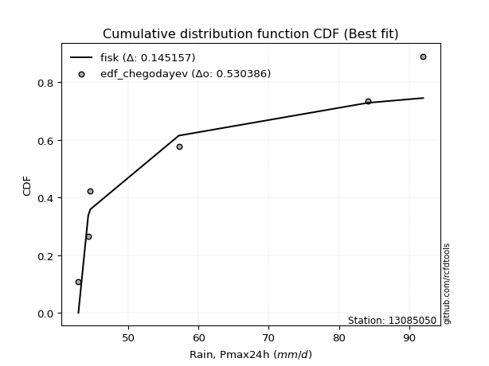</img>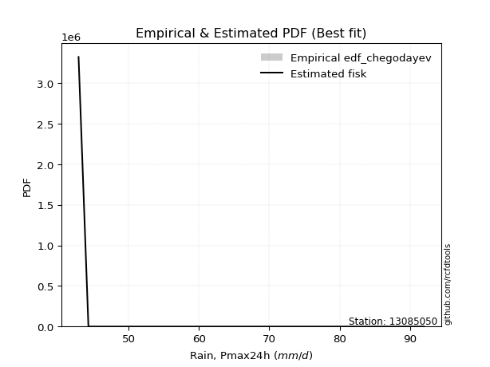</img>

</div>


### 6. EDF Blom (1958)

The Blom formula is a specific "plotting position" formula used in hydrology and statistical analysis to estimate the empirical cumulative probability (or non-exceedance probability) of a data series. It is particularly recommended for data that are approximately normally distributed. The constant _a_ is set to 0.375 (or 3/8).

<div align="center">


$P=(m-a)/(n+1-2a)$


</div>


**6.1. Empirical values**

<div align="center">

|                | 0                  | 1                  | 2                  | 3                 | 4                 | 5                  |
|:---------------|:-------------------|:-------------------|:-------------------|:------------------|:------------------|:-------------------|
| date           | 2007               | 2006               | 2008               | 2010              | 2005              | 2009               |
| x              | 42.9               | 44.3               | 44.6               | 57.2              | 84.1              | 92.0               |
| m              | 1                  | 2                  | 3                  | 4                 | 5                 | 6                  |
| empirical_dist | edf_blom           | edf_blom           | edf_blom           | edf_blom          | edf_blom          | edf_blom           |
| empirical      | 0.1                | 0.26               | 0.42               | 0.58              | 0.74              | 0.9                |
| empirical_tr   | 1.1111111111111112 | 1.3513513513513513 | 1.7241379310344827 | 2.380952380952381 | 3.846153846153846 | 10.000000000000002 |

</div>


**6.2. Kolmogorov-Smirnov fit test (sorted by Δ)**


<div align="center">

|                | 0                   | 1                   | 2                   | 3                   | 4                   | 5                   | 6                   | 7                  | 8                  | 9                   | 10                  | 11                  | 12                  | 13                  | 14                 | 15                  | 16                 | 17                  | 18                 | 19                 | 20                 | 21                  | 22                  | 23                  | 24                  | 25                  | 26                  | 27                  | 28                  | 29                 | 30                  | 31                 | 32                  | 33                  | 34                  | 35                  | 36                  | 37                  | 38                 | 39                  | 40                  | 41                 | 42                  | 43                  | 44                  | 45                 | 46                 | 47                  | 48                  | 49                  | 50                  | 51                  | 52                  | 53                  | 54                  | 55                  | 56                  | 57                  | 58               | 59                  | 60                  | 61                  | 62                  | 63                  | 64                  | 65                  | 66                  | 67                  | 68                  | 69                  | 70                 | 71                  | 72                  | 73                  | 74                 | 75                  | 76                  | 77                  | 78                | 79                  | 80                 | 81                  | 82                  | 83                  | 84                 | 85                  | 86                  | 87                  | 88                 | 89                  | 90                 | 91                  | 92                 | 93                  | 94                  | 95                 | 96                 | 97                  | 98                  | 99                 | 100                | 101                 | 102                | 103                 | 104                | 105                 | 106                | 107                 | 108                 | 109                 | 110                | 111                | 112                | 113                | 114                | 115                | 116                | 117                | 118                 | 119                 | 120                 | 121                | 122                | 123                 | 124                | 125                | 126                | 127                | 128                 | 129                 | 130                 | 131                 | 132                | 133                 | 134                 | 135                 | 136                 | 137                | 138                | 139                | 140                 | 141                | 142                | 143                 | 144              | 145                 | 146               | 147                 | 148               | 149                | 150                | 151                | 152                 | 153                | 154                 | 155                 | 156                | 157              | 158                | 159            |
|:---------------|:--------------------|:--------------------|:--------------------|:--------------------|:--------------------|:--------------------|:--------------------|:-------------------|:-------------------|:--------------------|:--------------------|:--------------------|:--------------------|:--------------------|:-------------------|:--------------------|:-------------------|:--------------------|:-------------------|:-------------------|:-------------------|:--------------------|:--------------------|:--------------------|:--------------------|:--------------------|:--------------------|:--------------------|:--------------------|:-------------------|:--------------------|:-------------------|:--------------------|:--------------------|:--------------------|:--------------------|:--------------------|:--------------------|:-------------------|:--------------------|:--------------------|:-------------------|:--------------------|:--------------------|:--------------------|:-------------------|:-------------------|:--------------------|:--------------------|:--------------------|:--------------------|:--------------------|:--------------------|:--------------------|:--------------------|:--------------------|:--------------------|:--------------------|:-----------------|:--------------------|:--------------------|:--------------------|:--------------------|:--------------------|:--------------------|:--------------------|:--------------------|:--------------------|:--------------------|:--------------------|:-------------------|:--------------------|:--------------------|:--------------------|:-------------------|:--------------------|:--------------------|:--------------------|:------------------|:--------------------|:-------------------|:--------------------|:--------------------|:--------------------|:-------------------|:--------------------|:--------------------|:--------------------|:-------------------|:--------------------|:-------------------|:--------------------|:-------------------|:--------------------|:--------------------|:-------------------|:-------------------|:--------------------|:--------------------|:-------------------|:-------------------|:--------------------|:-------------------|:--------------------|:-------------------|:--------------------|:-------------------|:--------------------|:--------------------|:--------------------|:-------------------|:-------------------|:-------------------|:-------------------|:-------------------|:-------------------|:-------------------|:-------------------|:--------------------|:--------------------|:--------------------|:-------------------|:-------------------|:--------------------|:-------------------|:-------------------|:-------------------|:-------------------|:--------------------|:--------------------|:--------------------|:--------------------|:-------------------|:--------------------|:--------------------|:--------------------|:--------------------|:-------------------|:-------------------|:-------------------|:--------------------|:-------------------|:-------------------|:--------------------|:-----------------|:--------------------|:------------------|:--------------------|:------------------|:-------------------|:-------------------|:-------------------|:--------------------|:-------------------|:--------------------|:--------------------|:-------------------|:-----------------|:-------------------|:---------------|
| station        | 13085050            | 13085050            | 13085050            | 13085050            | 13085050            | 13085050            | 13085050            | 13085050           | 13085050           | 13085050            | 13085050            | 13085050            | 13085050            | 13085050            | 13085050           | 13085050            | 13085050           | 13085050            | 13085050           | 13085050           | 13085050           | 13085050            | 13085050            | 13085050            | 13085050            | 13085050            | 13085050            | 13085050            | 13085050            | 13085050           | 13085050            | 13085050           | 13085050            | 13085050            | 13085050            | 13085050            | 13085050            | 13085050            | 13085050           | 13085050            | 13085050            | 13085050           | 13085050            | 13085050            | 13085050            | 13085050           | 13085050           | 13085050            | 13085050            | 13085050            | 13085050            | 13085050            | 13085050            | 13085050            | 13085050            | 13085050            | 13085050            | 13085050            | 13085050         | 13085050            | 13085050            | 13085050            | 13085050            | 13085050            | 13085050            | 13085050            | 13085050            | 13085050            | 13085050            | 13085050            | 13085050           | 13085050            | 13085050            | 13085050            | 13085050           | 13085050            | 13085050            | 13085050            | 13085050          | 13085050            | 13085050           | 13085050            | 13085050            | 13085050            | 13085050           | 13085050            | 13085050            | 13085050            | 13085050           | 13085050            | 13085050           | 13085050            | 13085050           | 13085050            | 13085050            | 13085050           | 13085050           | 13085050            | 13085050            | 13085050           | 13085050           | 13085050            | 13085050           | 13085050            | 13085050           | 13085050            | 13085050           | 13085050            | 13085050            | 13085050            | 13085050           | 13085050           | 13085050           | 13085050           | 13085050           | 13085050           | 13085050           | 13085050           | 13085050            | 13085050            | 13085050            | 13085050           | 13085050           | 13085050            | 13085050           | 13085050           | 13085050           | 13085050           | 13085050            | 13085050            | 13085050            | 13085050            | 13085050           | 13085050            | 13085050            | 13085050            | 13085050            | 13085050           | 13085050           | 13085050           | 13085050            | 13085050           | 13085050           | 13085050            | 13085050         | 13085050            | 13085050          | 13085050            | 13085050          | 13085050           | 13085050           | 13085050           | 13085050            | 13085050           | 13085050            | 13085050            | 13085050           | 13085050         | 13085050           | 13085050       |
| empirical_dist | edf_blom            | edf_blom            | edf_blom            | edf_blom            | edf_blom            | edf_blom            | edf_blom            | edf_blom           | edf_blom           | edf_blom            | edf_blom            | edf_blom            | edf_blom            | edf_blom            | edf_blom           | edf_blom            | edf_blom           | edf_blom            | edf_blom           | edf_blom           | edf_blom           | edf_blom            | edf_blom            | edf_blom            | edf_blom            | edf_blom            | edf_blom            | edf_blom            | edf_blom            | edf_blom           | edf_blom            | edf_blom           | edf_blom            | edf_blom            | edf_blom            | edf_blom            | edf_blom            | edf_blom            | edf_blom           | edf_blom            | edf_blom            | edf_blom           | edf_blom            | edf_blom            | edf_blom            | edf_blom           | edf_blom           | edf_blom            | edf_blom            | edf_blom            | edf_blom            | edf_blom            | edf_blom            | edf_blom            | edf_blom            | edf_blom            | edf_blom            | edf_blom            | edf_blom         | edf_blom            | edf_blom            | edf_blom            | edf_blom            | edf_blom            | edf_blom            | edf_blom            | edf_blom            | edf_blom            | edf_blom            | edf_blom            | edf_blom           | edf_blom            | edf_blom            | edf_blom            | edf_blom           | edf_blom            | edf_blom            | edf_blom            | edf_blom          | edf_blom            | edf_blom           | edf_blom            | edf_blom            | edf_blom            | edf_blom           | edf_blom            | edf_blom            | edf_blom            | edf_blom           | edf_blom            | edf_blom           | edf_blom            | edf_blom           | edf_blom            | edf_blom            | edf_blom           | edf_blom           | edf_blom            | edf_blom            | edf_blom           | edf_blom           | edf_blom            | edf_blom           | edf_blom            | edf_blom           | edf_blom            | edf_blom           | edf_blom            | edf_blom            | edf_blom            | edf_blom           | edf_blom           | edf_blom           | edf_blom           | edf_blom           | edf_blom           | edf_blom           | edf_blom           | edf_blom            | edf_blom            | edf_blom            | edf_blom           | edf_blom           | edf_blom            | edf_blom           | edf_blom           | edf_blom           | edf_blom           | edf_blom            | edf_blom            | edf_blom            | edf_blom            | edf_blom           | edf_blom            | edf_blom            | edf_blom            | edf_blom            | edf_blom           | edf_blom           | edf_blom           | edf_blom            | edf_blom           | edf_blom           | edf_blom            | edf_blom         | edf_blom            | edf_blom          | edf_blom            | edf_blom          | edf_blom           | edf_blom           | edf_blom           | edf_blom            | edf_blom           | edf_blom            | edf_blom            | edf_blom           | edf_blom         | edf_blom           | edf_blom       |
| p_dist         | exponpow            | logexponpow         | logwrapcauchy       | logbetaprime        | invgamma            | ksone               | lognakagami         | logksone           | logf               | logarcsine          | gengamma            | semicircular        | foldnorm            | logsemicircular     | halfnorm           | arcsine             | logfoldnorm        | logdweibull         | anglit             | wrapcauchy         | loghalfnorm        | exponweib           | loganglit           | loginvgauss         | invgauss            | rayleigh            | logdgamma           | maxwell             | lograyleigh         | logweibull_min     | dweibull            | logburr12          | logmaxwell          | pearson3            | logexponweib        | logmielke           | halflogistic        | logweibull_max      | logburr            | lognct              | alpha               | t                  | crystalball         | norm                | logpearson3         | weibull_min        | logalpha           | truncweibull_min    | johnsonsu           | truncpareto         | dgamma              | logloggamma         | logtruncweibull_min | betaprime           | gumbel_r            | loggengamma         | loghalflogistic     | logt                | lognorm          | logcrystalball      | f                   | genpareto           | nct                 | logncf              | loglevy_l           | loginvgamma         | loggenlogistic      | burr                | genlogistic         | loggumbel_r         | moyal              | logistic            | logtruncpareto      | logmoyal            | logkstwobign       | loglogistic         | gumbel_l            | kstwobign           | cosine            | halfgennorm         | loggumbel_l        | logcosine           | hypsecant           | levy_l              | gamma              | nakagami            | loghypsecant        | loggausshyper       | logjohnsonsu       | erlang              | logrice            | rice                | laplace            | loglaplace          | loglaplace          | argus              | genextreme         | logargus            | logtriang           | triang             | loginvweibull      | burr12              | logexponnorm       | loglomax            | loggenexpon        | logrdist            | logjohnsonsb       | loggamma            | loggamma            | ncf                 | loghalfgennorm     | logtruncnorm       | loggompertz        | loggennorm         | lomax              | exponnorm          | logloglaplace      | genexpon           | beta                | loggenextreme       | truncnorm           | logkappa4          | logbradford        | logskewnorm         | logtruncexpon      | loggenpareto       | logerlang          | kappa4             | gausshyper          | gennorm             | logtukeylambda      | powerlaw            | fatiguelife        | truncexpon          | loguniform          | logkappa3           | wald                | skewnorm           | logvonmises_line   | bradford           | gompertz            | logpowerlaw        | loggenhalflogistic | logfatiguelife      | tukeylambda      | logwald             | uniform           | kappa3              | vonmises_line     | genhalflogistic    | logbeta            | rdist              | logtrapezoid        | invweibull         | trapezoid           | johnsonsb           | weibull_max        | logvonmises      | vonmises           | mielke         |
| delta          | 0.11744271386382565 | 0.12094193960201716 | 0.13780715529585885 | 0.14671685943208457 | 0.15413400285147805 | 0.15531579963319891 | 0.16054390586548517 | 0.1608900429384258 | 0.1627515955707316 | 0.16275501702902626 | 0.16902009359411052 | 0.17209825791656924 | 0.17241889844555744 | 0.17769767216778976 | 0.1792247120543077 | 0.18029736689159823 | 0.1829445229769871 | 0.18355526968450242 | 0.1844469944187713 | 0.1854878491405595 | 0.1881016504589909 | 0.18831474106668544 | 0.19002574089002525 | 0.19090485675600666 | 0.19105769913398696 | 0.19207161937968414 | 0.19473520365984398 | 0.19808560931450445 | 0.19906656705612755 | 0.1994197699685446 | 0.20094223645653167 | 0.2023120636791792 | 0.20462183517963944 | 0.20548594122728348 | 0.20605936995517604 | 0.20609453101943098 | 0.20689019230388364 | 0.20708578923957754 | 0.2089135631510064 | 0.20931480731290972 | 0.20932591876497886 | 0.2124628407934701 | 0.21250901256663052 | 0.21250901691653606 | 0.21276882508032652 | 0.2129523128857198 | 0.2131982500865066 | 0.21402504370030473 | 0.21430809506866333 | 0.21436278691134025 | 0.21567205173930457 | 0.21568807549935567 | 0.2163759900618779  | 0.21700719513070146 | 0.21754151556214973 | 0.21764453479112988 | 0.21769558779736178 | 0.21799089808915378 | 0.21799122742111 | 0.21799137537896435 | 0.21850768909986013 | 0.21989629649123546 | 0.22110158164948646 | 0.22122202481582073 | 0.22322355930678292 | 0.22362434557390756 | 0.22491147934806108 | 0.22498557207587142 | 0.22527545127110854 | 0.22548978848374676 | 0.2298946327624683 | 0.23435086271618696 | 0.23656671917768266 | 0.23932293898759732 | 0.2395579666097071 | 0.23958772315952317 | 0.24089026380830325 | 0.24201106172355139 | 0.243326586364232 | 0.24384739711807832 | 0.2448630021179582 | 0.24610692980362692 | 0.24742992578608433 | 0.24745438005074746 | 0.2475218026913305 | 0.24819174698168647 | 0.25234723631646155 | 0.25581026642703575 | 0.2584506291148949 | 0.26048543161824267 | 0.2614559337959759 | 0.26148648687610787 | 0.2621254353051611 | 0.26637835637716756 | 0.26637835637716756 | 0.2713546263593916 | 0.2718795580374165 | 0.27331857986025404 | 0.27680687176850527 | 0.2820939642739582 | 0.2890698880865167 | 0.29085550330905063 | 0.2966846997754881 | 0.29721150016808046 | 0.2981546283593373 | 0.30049315237394536 | 0.3032010168823187 | 0.30341485627588194 | 0.30341485627588194 | 0.30626092056715803 | 0.3073946105249976 | 0.3143643143018413 | 0.3144382456846649 | 0.3145347736542774 | 0.3283852629069413 | 0.3283977536782237 | 0.3292010102471371 | 0.3296393429787251 | 0.32964338678962213 | 0.33054831556847797 | 0.33834192404981367 | 0.3440482541004965 | 0.3461422698783994 | 0.34834331013925796 | 0.3494670759172739 | 0.3501621719597665 | 0.3546692742851215 | 0.3546808512138688 | 0.35566752188891393 | 0.35702061558311227 | 0.35764330174844444 | 0.36100217735917106 | 0.3634454630943984 | 0.36804083963156387 | 0.36906124025295417 | 0.36914770330182994 | 0.36939494637070075 | 0.3694662913527812 | 0.3705707979795521 | 0.3715494783065517 | 0.37590787189163344 | 0.3782172089568726 | 0.3815964767985332 | 0.38191077342592816 | 0.38256371534718 | 0.38444711079685406 | 0.385376782077393 | 0.38542815225001076 | 0.385744170383865 | 0.4058513928422862 | 0.4123025772555201 | 0.4199999999593519 | 0.42193950882667497 | 0.4639818528647395 | 0.47370098178159564 | 0.48534156799712647 | 0.5401960513459839 | 1.14644738980851 | 14.149839048892701 | nan            |
| deltao         | 0.530385761606      | 0.530385761606      | 0.530385761606      | 0.530385761606      | 0.530385761606      | 0.530385761606      | 0.530385761606      | 0.530385761606     | 0.530385761606     | 0.530385761606      | 0.530385761606      | 0.530385761606      | 0.530385761606      | 0.530385761606      | 0.530385761606     | 0.530385761606      | 0.530385761606     | 0.530385761606      | 0.530385761606     | 0.530385761606     | 0.530385761606     | 0.530385761606      | 0.530385761606      | 0.530385761606      | 0.530385761606      | 0.530385761606      | 0.530385761606      | 0.530385761606      | 0.530385761606      | 0.530385761606     | 0.530385761606      | 0.530385761606     | 0.530385761606      | 0.530385761606      | 0.530385761606      | 0.530385761606      | 0.530385761606      | 0.530385761606      | 0.530385761606     | 0.530385761606      | 0.530385761606      | 0.530385761606     | 0.530385761606      | 0.530385761606      | 0.530385761606      | 0.530385761606     | 0.530385761606     | 0.530385761606      | 0.530385761606      | 0.530385761606      | 0.530385761606      | 0.530385761606      | 0.530385761606      | 0.530385761606      | 0.530385761606      | 0.530385761606      | 0.530385761606      | 0.530385761606      | 0.530385761606   | 0.530385761606      | 0.530385761606      | 0.530385761606      | 0.530385761606      | 0.530385761606      | 0.530385761606      | 0.530385761606      | 0.530385761606      | 0.530385761606      | 0.530385761606      | 0.530385761606      | 0.530385761606     | 0.530385761606      | 0.530385761606      | 0.530385761606      | 0.530385761606     | 0.530385761606      | 0.530385761606      | 0.530385761606      | 0.530385761606    | 0.530385761606      | 0.530385761606     | 0.530385761606      | 0.530385761606      | 0.530385761606      | 0.530385761606     | 0.530385761606      | 0.530385761606      | 0.530385761606      | 0.530385761606     | 0.530385761606      | 0.530385761606     | 0.530385761606      | 0.530385761606     | 0.530385761606      | 0.530385761606      | 0.530385761606     | 0.530385761606     | 0.530385761606      | 0.530385761606      | 0.530385761606     | 0.530385761606     | 0.530385761606      | 0.530385761606     | 0.530385761606      | 0.530385761606     | 0.530385761606      | 0.530385761606     | 0.530385761606      | 0.530385761606      | 0.530385761606      | 0.530385761606     | 0.530385761606     | 0.530385761606     | 0.530385761606     | 0.530385761606     | 0.530385761606     | 0.530385761606     | 0.530385761606     | 0.530385761606      | 0.530385761606      | 0.530385761606      | 0.530385761606     | 0.530385761606     | 0.530385761606      | 0.530385761606     | 0.530385761606     | 0.530385761606     | 0.530385761606     | 0.530385761606      | 0.530385761606      | 0.530385761606      | 0.530385761606      | 0.530385761606     | 0.530385761606      | 0.530385761606      | 0.530385761606      | 0.530385761606      | 0.530385761606     | 0.530385761606     | 0.530385761606     | 0.530385761606      | 0.530385761606     | 0.530385761606     | 0.530385761606      | 0.530385761606   | 0.530385761606      | 0.530385761606    | 0.530385761606      | 0.530385761606    | 0.530385761606     | 0.530385761606     | 0.530385761606     | 0.530385761606      | 0.530385761606     | 0.530385761606      | 0.530385761606      | 0.530385761606     | 0.530385761606   | 0.530385761606     | 0.530385761606 |
| eval           | Δo > Δ              | Δo > Δ              | Δo > Δ              | Δo > Δ              | Δo > Δ              | Δo > Δ              | Δo > Δ              | Δo > Δ             | Δo > Δ             | Δo > Δ              | Δo > Δ              | Δo > Δ              | Δo > Δ              | Δo > Δ              | Δo > Δ             | Δo > Δ              | Δo > Δ             | Δo > Δ              | Δo > Δ             | Δo > Δ             | Δo > Δ             | Δo > Δ              | Δo > Δ              | Δo > Δ              | Δo > Δ              | Δo > Δ              | Δo > Δ              | Δo > Δ              | Δo > Δ              | Δo > Δ             | Δo > Δ              | Δo > Δ             | Δo > Δ              | Δo > Δ              | Δo > Δ              | Δo > Δ              | Δo > Δ              | Δo > Δ              | Δo > Δ             | Δo > Δ              | Δo > Δ              | Δo > Δ             | Δo > Δ              | Δo > Δ              | Δo > Δ              | Δo > Δ             | Δo > Δ             | Δo > Δ              | Δo > Δ              | Δo > Δ              | Δo > Δ              | Δo > Δ              | Δo > Δ              | Δo > Δ              | Δo > Δ              | Δo > Δ              | Δo > Δ              | Δo > Δ              | Δo > Δ           | Δo > Δ              | Δo > Δ              | Δo > Δ              | Δo > Δ              | Δo > Δ              | Δo > Δ              | Δo > Δ              | Δo > Δ              | Δo > Δ              | Δo > Δ              | Δo > Δ              | Δo > Δ             | Δo > Δ              | Δo > Δ              | Δo > Δ              | Δo > Δ             | Δo > Δ              | Δo > Δ              | Δo > Δ              | Δo > Δ            | Δo > Δ              | Δo > Δ             | Δo > Δ              | Δo > Δ              | Δo > Δ              | Δo > Δ             | Δo > Δ              | Δo > Δ              | Δo > Δ              | Δo > Δ             | Δo > Δ              | Δo > Δ             | Δo > Δ              | Δo > Δ             | Δo > Δ              | Δo > Δ              | Δo > Δ             | Δo > Δ             | Δo > Δ              | Δo > Δ              | Δo > Δ             | Δo > Δ             | Δo > Δ              | Δo > Δ             | Δo > Δ              | Δo > Δ             | Δo > Δ              | Δo > Δ             | Δo > Δ              | Δo > Δ              | Δo > Δ              | Δo > Δ             | Δo > Δ             | Δo > Δ             | Δo > Δ             | Δo > Δ             | Δo > Δ             | Δo > Δ             | Δo > Δ             | Δo > Δ              | Δo > Δ              | Δo > Δ              | Δo > Δ             | Δo > Δ             | Δo > Δ              | Δo > Δ             | Δo > Δ             | Δo > Δ             | Δo > Δ             | Δo > Δ              | Δo > Δ              | Δo > Δ              | Δo > Δ              | Δo > Δ             | Δo > Δ              | Δo > Δ              | Δo > Δ              | Δo > Δ              | Δo > Δ             | Δo > Δ             | Δo > Δ             | Δo > Δ              | Δo > Δ             | Δo > Δ             | Δo > Δ              | Δo > Δ           | Δo > Δ              | Δo > Δ            | Δo > Δ              | Δo > Δ            | Δo > Δ             | Δo > Δ             | Δo > Δ             | Δo > Δ              | Δo > Δ             | Δo > Δ              | Δo > Δ              | Δo <= Δ            | Δo <= Δ          | Δo <= Δ            | Δo <= Δ        |
| fit            | 1                   | 1                   | 1                   | 1                   | 1                   | 1                   | 1                   | 1                  | 1                  | 1                   | 1                   | 1                   | 1                   | 1                   | 1                  | 1                   | 1                  | 1                   | 1                  | 1                  | 1                  | 1                   | 1                   | 1                   | 1                   | 1                   | 1                   | 1                   | 1                   | 1                  | 1                   | 1                  | 1                   | 1                   | 1                   | 1                   | 1                   | 1                   | 1                  | 1                   | 1                   | 1                  | 1                   | 1                   | 1                   | 1                  | 1                  | 1                   | 1                   | 1                   | 1                   | 1                   | 1                   | 1                   | 1                   | 1                   | 1                   | 1                   | 1                | 1                   | 1                   | 1                   | 1                   | 1                   | 1                   | 1                   | 1                   | 1                   | 1                   | 1                   | 1                  | 1                   | 1                   | 1                   | 1                  | 1                   | 1                   | 1                   | 1                 | 1                   | 1                  | 1                   | 1                   | 1                   | 1                  | 1                   | 1                   | 1                   | 1                  | 1                   | 1                  | 1                   | 1                  | 1                   | 1                   | 1                  | 1                  | 1                   | 1                   | 1                  | 1                  | 1                   | 1                  | 1                   | 1                  | 1                   | 1                  | 1                   | 1                   | 1                   | 1                  | 1                  | 1                  | 1                  | 1                  | 1                  | 1                  | 1                  | 1                   | 1                   | 1                   | 1                  | 1                  | 1                   | 1                  | 1                  | 1                  | 1                  | 1                   | 1                   | 1                   | 1                   | 1                  | 1                   | 1                   | 1                   | 1                   | 1                  | 1                  | 1                  | 1                   | 1                  | 1                  | 1                   | 1                | 1                   | 1                 | 1                   | 1                 | 1                  | 1                  | 1                  | 1                   | 1                  | 1                   | 1                   | 0                  | 0                | 0                  | 0              |
| n              | 6                   | 6                   | 6                   | 6                   | 6                   | 6                   | 6                   | 6                  | 6                  | 6                   | 6                   | 6                   | 6                   | 6                   | 6                  | 6                   | 6                  | 6                   | 6                  | 6                  | 6                  | 6                   | 6                   | 6                   | 6                   | 6                   | 6                   | 6                   | 6                   | 6                  | 6                   | 6                  | 6                   | 6                   | 6                   | 6                   | 6                   | 6                   | 6                  | 6                   | 6                   | 6                  | 6                   | 6                   | 6                   | 6                  | 6                  | 6                   | 6                   | 6                   | 6                   | 6                   | 6                   | 6                   | 6                   | 6                   | 6                   | 6                   | 6                | 6                   | 6                   | 6                   | 6                   | 6                   | 6                   | 6                   | 6                   | 6                   | 6                   | 6                   | 6                  | 6                   | 6                   | 6                   | 6                  | 6                   | 6                   | 6                   | 6                 | 6                   | 6                  | 6                   | 6                   | 6                   | 6                  | 6                   | 6                   | 6                   | 6                  | 6                   | 6                  | 6                   | 6                  | 6                   | 6                   | 6                  | 6                  | 6                   | 6                   | 6                  | 6                  | 6                   | 6                  | 6                   | 6                  | 6                   | 6                  | 6                   | 6                   | 6                   | 6                  | 6                  | 6                  | 6                  | 6                  | 6                  | 6                  | 6                  | 6                   | 6                   | 6                   | 6                  | 6                  | 6                   | 6                  | 6                  | 6                  | 6                  | 6                   | 6                   | 6                   | 6                   | 6                  | 6                   | 6                   | 6                   | 6                   | 6                  | 6                  | 6                  | 6                   | 6                  | 6                  | 6                   | 6                | 6                   | 6                 | 6                   | 6                 | 6                  | 6                  | 6                  | 6                   | 6                  | 6                   | 6                   | 6                  | 6                | 6                  | 6              |
| best_fit       | 1                   | 0                   | 0                   | 0                   | 0                   | 0                   | 0                   | 0                  | 0                  | 0                   | 0                   | 0                   | 0                   | 0                   | 0                  | 0                   | 0                  | 0                   | 0                  | 0                  | 0                  | 0                   | 0                   | 0                   | 0                   | 0                   | 0                   | 0                   | 0                   | 0                  | 0                   | 0                  | 0                   | 0                   | 0                   | 0                   | 0                   | 0                   | 0                  | 0                   | 0                   | 0                  | 0                   | 0                   | 0                   | 0                  | 0                  | 0                   | 0                   | 0                   | 0                   | 0                   | 0                   | 0                   | 0                   | 0                   | 0                   | 0                   | 0                | 0                   | 0                   | 0                   | 0                   | 0                   | 0                   | 0                   | 0                   | 0                   | 0                   | 0                   | 0                  | 0                   | 0                   | 0                   | 0                  | 0                   | 0                   | 0                   | 0                 | 0                   | 0                  | 0                   | 0                   | 0                   | 0                  | 0                   | 0                   | 0                   | 0                  | 0                   | 0                  | 0                   | 0                  | 0                   | 0                   | 0                  | 0                  | 0                   | 0                   | 0                  | 0                  | 0                   | 0                  | 0                   | 0                  | 0                   | 0                  | 0                   | 0                   | 0                   | 0                  | 0                  | 0                  | 0                  | 0                  | 0                  | 0                  | 0                  | 0                   | 0                   | 0                   | 0                  | 0                  | 0                   | 0                  | 0                  | 0                  | 0                  | 0                   | 0                   | 0                   | 0                   | 0                  | 0                   | 0                   | 0                   | 0                   | 0                  | 0                  | 0                  | 0                   | 0                  | 0                  | 0                   | 0                | 0                   | 0                 | 0                   | 0                 | 0                  | 0                  | 0                  | 0                   | 0                  | 0                   | 0                   | 0                  | 0                | 0                  | 0              |
| best_fit_sort  | 1                   | 2                   | 3                   | 4                   | 5                   | 6                   | 7                   | 8                  | 9                  | 10                  | 11                  | 12                  | 13                  | 14                  | 15                 | 16                  | 17                 | 18                  | 19                 | 20                 | 21                 | 22                  | 23                  | 24                  | 25                  | 26                  | 27                  | 28                  | 29                  | 30                 | 31                  | 32                 | 33                  | 34                  | 35                  | 36                  | 37                  | 38                  | 39                 | 40                  | 41                  | 42                 | 43                  | 44                  | 45                  | 46                 | 47                 | 48                  | 49                  | 50                  | 51                  | 52                  | 53                  | 54                  | 55                  | 56                  | 57                  | 58                  | 59               | 60                  | 61                  | 62                  | 63                  | 64                  | 65                  | 66                  | 67                  | 68                  | 69                  | 70                  | 71                 | 72                  | 73                  | 74                  | 75                 | 76                  | 77                  | 78                  | 79                | 80                  | 81                 | 82                  | 83                  | 84                  | 85                 | 86                  | 87                  | 88                  | 89                 | 90                  | 91                 | 92                  | 93                 | 94                  | 95                  | 96                 | 97                 | 98                  | 99                  | 100                | 101                | 102                 | 103                | 104                 | 105                | 106                 | 107                | 108                 | 109                 | 110                 | 111                | 112                | 113                | 114                | 115                | 116                | 117                | 118                | 119                 | 120                 | 121                 | 122                | 123                | 124                 | 125                | 126                | 127                | 128                | 129                 | 130                 | 131                 | 132                 | 133                | 134                 | 135                 | 136                 | 137                 | 138                | 139                | 140                | 141                 | 142                | 143                | 144                 | 145              | 146                 | 147               | 148                 | 149               | 150                | 151                | 152                | 153                 | 154                | 155                 | 156                 | 157                | 158              | 159                | 160            |

</div>


**6.3. Best fit**

<div align="center">

|   id |   station | empirical_dist   | p_dist   |    delta |   deltao | eval   |   fit |   n |   best_fit |   best_fit_sort |
|-----:|----------:|:-----------------|:---------|---------:|---------:|:-------|------:|----:|-----------:|----------------:|
|    0 |  13085050 | edf_blom         | exponpow | 0.117443 | 0.530386 | Δo > Δ |     1 |   6 |          1 |               1 |

</div>


<div align="center">

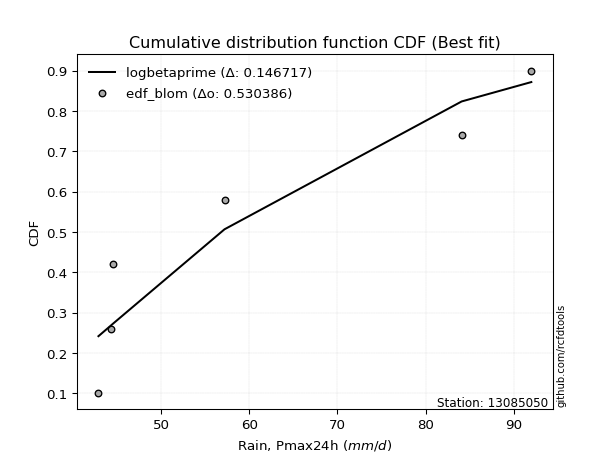</img>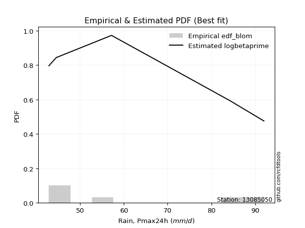</img>

</div>


### 7. EDF Tukey (1962)

In hydrology, the Tukey formula is used as a plotting position formula to estimate the empirical probability or frequency of a flood event (or other hydrological data). The formula parameter is given as _c=0.333_ (or 1/3).

<div align="center">


$P=(m-c)/(n+1-2c)$


</div>


**7.1. Empirical values**

<div align="center">

|                | 0                   | 1                  | 2                   | 3                  | 4                  | 5                  |
|:---------------|:--------------------|:-------------------|:--------------------|:-------------------|:-------------------|:-------------------|
| date           | 2007                | 2006               | 2008                | 2010               | 2005               | 2009               |
| x              | 42.9                | 44.3               | 44.6                | 57.2               | 84.1               | 92.0               |
| m              | 1                   | 2                  | 3                   | 4                  | 5                  | 6                  |
| empirical_dist | edf_tukey           | edf_tukey          | edf_tukey           | edf_tukey          | edf_tukey          | edf_tukey          |
| empirical      | 0.10526315789473684 | 0.2631578947368421 | 0.42105263157894735 | 0.5789473684210527 | 0.7368421052631579 | 0.8947368421052632 |
| empirical_tr   | 1.1176470588235294  | 1.357142857142857  | 1.7272727272727273  | 2.375              | 3.7999999999999994 | 9.5                |

</div>


**7.2. Kolmogorov-Smirnov fit test (sorted by Δ)**


<div align="center">

|                | 0                   | 1                  | 2                   | 3                   | 4                   | 5                   | 6                   | 7                   | 8                  | 9                  | 10                  | 11                 | 12                 | 13                 | 14                  | 15                  | 16                  | 17                  | 18                  | 19                  | 20                  | 21                 | 22                 | 23                  | 24                  | 25                 | 26                  | 27                  | 28                 | 29                 | 30                  | 31                  | 32                  | 33                 | 34                  | 35                  | 36                  | 37                | 38                  | 39                  | 40                  | 41                  | 42                  | 43                  | 44                  | 45                  | 46                  | 47                  | 48                  | 49                  | 50                 | 51                 | 52                  | 53                  | 54                  | 55                 | 56                  | 57                 | 58                  | 59                  | 60                  | 61                 | 62                  | 63                  | 64                 | 65                  | 66                  | 67                  | 68                 | 69                  | 70                  | 71                  | 72                  | 73                  | 74                  | 75                  | 76                 | 77                  | 78                  | 79                  | 80                  | 81                  | 82                  | 83                 | 84                  | 85                  | 86                 | 87                 | 88                 | 89               | 90                 | 91                 | 92                 | 93                 | 94                  | 95                  | 96                | 97                 | 98                 | 99                 | 100                | 101                 | 102                | 103                 | 104                | 105                | 106                 | 107                | 108                 | 109                 | 110               | 111                 | 112                 | 113                | 114                | 115                | 116                | 117                 | 118                | 119                 | 120               | 121                 | 122                 | 123                 | 124                | 125                | 126                | 127                | 128                 | 129                 | 130               | 131                | 132                | 133                | 134                 | 135                | 136                | 137                 | 138                | 139                 | 140                | 141                | 142                | 143                 | 144                 | 145                | 146                 | 147                | 148                 | 149                | 150                 | 151                 | 152                | 153                | 154                 | 155                | 156                | 157               | 158                | 159            |
|:---------------|:--------------------|:-------------------|:--------------------|:--------------------|:--------------------|:--------------------|:--------------------|:--------------------|:-------------------|:-------------------|:--------------------|:-------------------|:-------------------|:-------------------|:--------------------|:--------------------|:--------------------|:--------------------|:--------------------|:--------------------|:--------------------|:-------------------|:-------------------|:--------------------|:--------------------|:-------------------|:--------------------|:--------------------|:-------------------|:-------------------|:--------------------|:--------------------|:--------------------|:-------------------|:--------------------|:--------------------|:--------------------|:------------------|:--------------------|:--------------------|:--------------------|:--------------------|:--------------------|:--------------------|:--------------------|:--------------------|:--------------------|:--------------------|:--------------------|:--------------------|:-------------------|:-------------------|:--------------------|:--------------------|:--------------------|:-------------------|:--------------------|:-------------------|:--------------------|:--------------------|:--------------------|:-------------------|:--------------------|:--------------------|:-------------------|:--------------------|:--------------------|:--------------------|:-------------------|:--------------------|:--------------------|:--------------------|:--------------------|:--------------------|:--------------------|:--------------------|:-------------------|:--------------------|:--------------------|:--------------------|:--------------------|:--------------------|:--------------------|:-------------------|:--------------------|:--------------------|:-------------------|:-------------------|:-------------------|:-----------------|:-------------------|:-------------------|:-------------------|:-------------------|:--------------------|:--------------------|:------------------|:-------------------|:-------------------|:-------------------|:-------------------|:--------------------|:-------------------|:--------------------|:-------------------|:-------------------|:--------------------|:-------------------|:--------------------|:--------------------|:------------------|:--------------------|:--------------------|:-------------------|:-------------------|:-------------------|:-------------------|:--------------------|:-------------------|:--------------------|:------------------|:--------------------|:--------------------|:--------------------|:-------------------|:-------------------|:-------------------|:-------------------|:--------------------|:--------------------|:------------------|:-------------------|:-------------------|:-------------------|:--------------------|:-------------------|:-------------------|:--------------------|:-------------------|:--------------------|:-------------------|:-------------------|:-------------------|:--------------------|:--------------------|:-------------------|:--------------------|:-------------------|:--------------------|:-------------------|:--------------------|:--------------------|:-------------------|:-------------------|:--------------------|:-------------------|:-------------------|:------------------|:-------------------|:---------------|
| station        | 13085050            | 13085050           | 13085050            | 13085050            | 13085050            | 13085050            | 13085050            | 13085050            | 13085050           | 13085050           | 13085050            | 13085050           | 13085050           | 13085050           | 13085050            | 13085050            | 13085050            | 13085050            | 13085050            | 13085050            | 13085050            | 13085050           | 13085050           | 13085050            | 13085050            | 13085050           | 13085050            | 13085050            | 13085050           | 13085050           | 13085050            | 13085050            | 13085050            | 13085050           | 13085050            | 13085050            | 13085050            | 13085050          | 13085050            | 13085050            | 13085050            | 13085050            | 13085050            | 13085050            | 13085050            | 13085050            | 13085050            | 13085050            | 13085050            | 13085050            | 13085050           | 13085050           | 13085050            | 13085050            | 13085050            | 13085050           | 13085050            | 13085050           | 13085050            | 13085050            | 13085050            | 13085050           | 13085050            | 13085050            | 13085050           | 13085050            | 13085050            | 13085050            | 13085050           | 13085050            | 13085050            | 13085050            | 13085050            | 13085050            | 13085050            | 13085050            | 13085050           | 13085050            | 13085050            | 13085050            | 13085050            | 13085050            | 13085050            | 13085050           | 13085050            | 13085050            | 13085050           | 13085050           | 13085050           | 13085050         | 13085050           | 13085050           | 13085050           | 13085050           | 13085050            | 13085050            | 13085050          | 13085050           | 13085050           | 13085050           | 13085050           | 13085050            | 13085050           | 13085050            | 13085050           | 13085050           | 13085050            | 13085050           | 13085050            | 13085050            | 13085050          | 13085050            | 13085050            | 13085050           | 13085050           | 13085050           | 13085050           | 13085050            | 13085050           | 13085050            | 13085050          | 13085050            | 13085050            | 13085050            | 13085050           | 13085050           | 13085050           | 13085050           | 13085050            | 13085050            | 13085050          | 13085050           | 13085050           | 13085050           | 13085050            | 13085050           | 13085050           | 13085050            | 13085050           | 13085050            | 13085050           | 13085050           | 13085050           | 13085050            | 13085050            | 13085050           | 13085050            | 13085050           | 13085050            | 13085050           | 13085050            | 13085050            | 13085050           | 13085050           | 13085050            | 13085050           | 13085050           | 13085050          | 13085050           | 13085050       |
| empirical_dist | edf_tukey           | edf_tukey          | edf_tukey           | edf_tukey           | edf_tukey           | edf_tukey           | edf_tukey           | edf_tukey           | edf_tukey          | edf_tukey          | edf_tukey           | edf_tukey          | edf_tukey          | edf_tukey          | edf_tukey           | edf_tukey           | edf_tukey           | edf_tukey           | edf_tukey           | edf_tukey           | edf_tukey           | edf_tukey          | edf_tukey          | edf_tukey           | edf_tukey           | edf_tukey          | edf_tukey           | edf_tukey           | edf_tukey          | edf_tukey          | edf_tukey           | edf_tukey           | edf_tukey           | edf_tukey          | edf_tukey           | edf_tukey           | edf_tukey           | edf_tukey         | edf_tukey           | edf_tukey           | edf_tukey           | edf_tukey           | edf_tukey           | edf_tukey           | edf_tukey           | edf_tukey           | edf_tukey           | edf_tukey           | edf_tukey           | edf_tukey           | edf_tukey          | edf_tukey          | edf_tukey           | edf_tukey           | edf_tukey           | edf_tukey          | edf_tukey           | edf_tukey          | edf_tukey           | edf_tukey           | edf_tukey           | edf_tukey          | edf_tukey           | edf_tukey           | edf_tukey          | edf_tukey           | edf_tukey           | edf_tukey           | edf_tukey          | edf_tukey           | edf_tukey           | edf_tukey           | edf_tukey           | edf_tukey           | edf_tukey           | edf_tukey           | edf_tukey          | edf_tukey           | edf_tukey           | edf_tukey           | edf_tukey           | edf_tukey           | edf_tukey           | edf_tukey          | edf_tukey           | edf_tukey           | edf_tukey          | edf_tukey          | edf_tukey          | edf_tukey        | edf_tukey          | edf_tukey          | edf_tukey          | edf_tukey          | edf_tukey           | edf_tukey           | edf_tukey         | edf_tukey          | edf_tukey          | edf_tukey          | edf_tukey          | edf_tukey           | edf_tukey          | edf_tukey           | edf_tukey          | edf_tukey          | edf_tukey           | edf_tukey          | edf_tukey           | edf_tukey           | edf_tukey         | edf_tukey           | edf_tukey           | edf_tukey          | edf_tukey          | edf_tukey          | edf_tukey          | edf_tukey           | edf_tukey          | edf_tukey           | edf_tukey         | edf_tukey           | edf_tukey           | edf_tukey           | edf_tukey          | edf_tukey          | edf_tukey          | edf_tukey          | edf_tukey           | edf_tukey           | edf_tukey         | edf_tukey          | edf_tukey          | edf_tukey          | edf_tukey           | edf_tukey          | edf_tukey          | edf_tukey           | edf_tukey          | edf_tukey           | edf_tukey          | edf_tukey          | edf_tukey          | edf_tukey           | edf_tukey           | edf_tukey          | edf_tukey           | edf_tukey          | edf_tukey           | edf_tukey          | edf_tukey           | edf_tukey           | edf_tukey          | edf_tukey          | edf_tukey           | edf_tukey          | edf_tukey          | edf_tukey         | edf_tukey          | edf_tukey      |
| p_dist         | exponpow            | logexponpow        | logwrapcauchy       | logbetaprime        | invgamma            | ksone               | logarcsine          | logksone            | lognakagami        | logf               | gengamma            | semicircular       | foldnorm           | arcsine            | logsemicircular     | halfnorm            | wrapcauchy          | logfoldnorm         | anglit              | logdweibull         | loghalfnorm         | exponweib          | loganglit          | loginvgauss         | invgauss            | rayleigh           | dweibull            | logdgamma           | maxwell            | lograyleigh        | logweibull_min      | logexponweib        | logburr12           | logmaxwell         | logweibull_max      | pearson3            | logmielke           | halflogistic      | logburr             | lognct              | alpha               | dgamma              | loggengamma         | t                   | crystalball         | norm                | logpearson3         | logalpha            | weibull_min         | genpareto           | johnsonsu          | truncpareto        | logloggamma         | truncweibull_min    | logtruncweibull_min | loglevy_l          | betaprime           | gumbel_r           | loghalflogistic     | logt                | lognorm             | logcrystalball     | f                   | nct                 | logncf             | loginvgamma         | loggenlogistic      | burr                | genlogistic        | loggumbel_r         | moyal               | logistic            | logtruncpareto      | logmoyal            | logkstwobign        | loglogistic         | gumbel_l           | levy_l              | kstwobign           | cosine              | halfgennorm         | loggumbel_l         | logcosine           | hypsecant          | nakagami            | gamma               | loghypsecant       | loggausshyper      | logjohnsonsu       | erlang           | logrice            | rice               | laplace            | genextreme         | loglaplace          | loglaplace          | argus             | logargus           | logtriang          | triang             | loginvweibull      | burr12              | logexponnorm       | logjohnsonsb        | loglomax           | loggenexpon        | ncf                 | logrdist           | loggamma            | loggamma            | loghalfgennorm    | logtruncnorm        | loggompertz         | loggennorm         | logloglaplace      | beta               | loggenextreme      | lomax               | exponnorm          | genexpon            | truncnorm         | loggenpareto        | logkappa4           | logbradford         | logskewnorm        | logtruncexpon      | gennorm            | logerlang          | kappa4              | gausshyper          | powerlaw          | logtukeylambda     | fatiguelife        | truncexpon         | loguniform          | logkappa3          | wald               | skewnorm            | logvonmises_line   | bradford            | logpowerlaw        | gompertz           | logfatiguelife     | loggenhalflogistic  | tukeylambda         | logwald            | uniform             | kappa3             | vonmises_line       | genhalflogistic    | logbeta             | logtrapezoid        | rdist              | invweibull         | trapezoid           | johnsonsb          | weibull_max        | logvonmises       | vonmises           | mielke         |
| delta          | 0.11428481912698357 | 0.1156787817072803 | 0.13776532846317652 | 0.14776949101103193 | 0.15518663443042535 | 0.15636843121214627 | 0.15749185913428942 | 0.16194267451737315 | 0.1637018006023273 | 0.1638042271496789 | 0.17217798833095266 | 0.1731508894955166 | 0.1734715300245048 | 0.1750342089968614 | 0.17875030374673712 | 0.18027734363325507 | 0.18232995440371735 | 0.18399715455593446 | 0.18549962599771866 | 0.18671316442134456 | 0.18915428203793827 | 0.1893673726456328 | 0.1910783724689726 | 0.19195748833495396 | 0.19211033071293426 | 0.1931242509586315 | 0.19567907856179484 | 0.19789309839668612 | 0.1991382408934518 | 0.2001191986350749 | 0.20047240154749196 | 0.20079621206043918 | 0.20336469525812656 | 0.2056744667585868 | 0.20603315766063024 | 0.20653857280623084 | 0.20714716259837834 | 0.207942823882831 | 0.20996619472995376 | 0.21036743889185708 | 0.21037855034392616 | 0.21040889384456773 | 0.21238137689639303 | 0.21351547237241747 | 0.21356164414557788 | 0.21356164849548342 | 0.21382145665927388 | 0.21425088166545397 | 0.21458446528308195 | 0.21463313859649863 | 0.2153607266476107 | 0.2154154184902876 | 0.21674070707830304 | 0.21718293843714687 | 0.21742862164082521 | 0.2179604014120461 | 0.21805982670964882 | 0.2185941471410971 | 0.21874821937630914 | 0.21904352966810114 | 0.21904385900005735 | 0.2190440069579117 | 0.21956032067880749 | 0.22215421322843382 | 0.2222746563947681 | 0.22467697715285492 | 0.22596411092700844 | 0.22603820365481878 | 0.2263280828500559 | 0.22654242006269412 | 0.23094726434141566 | 0.23540349429513432 | 0.23761935075663002 | 0.24037557056654468 | 0.24061059818865446 | 0.24064035473847054 | 0.2419428953872506 | 0.24219122215601063 | 0.24306369330249875 | 0.24437921794317935 | 0.24490002869702568 | 0.24591563369690556 | 0.24715956138257428 | 0.2484825573650317 | 0.24924437856063383 | 0.25067969742817264 | 0.2533998678954089 | 0.2568628980059831 | 0.2595032606938423 | 0.26153806319719 | 0.2625085653749233 | 0.2625391184550553 | 0.2631780668841084 | 0.2666164001426796 | 0.26743098795611486 | 0.26743098795611486 | 0.272407257938339 | 0.2743712114392014 | 0.2778595033474526 | 0.2810413326950109 | 0.2859119933496746 | 0.29190813488799794 | 0.2977373313544355 | 0.29793785898758185 | 0.2982641317470278 | 0.2992072599382847 | 0.30099776267242123 | 0.3015457839528927 | 0.30446748785482924 | 0.30446748785482924 | 0.308447242103945 | 0.31541694588078867 | 0.31549087726361225 | 0.3155874052332247 | 0.3239378523524003 | 0.3243802288948853 | 0.3252851576737411 | 0.32943789448588867 | 0.3294503852571711 | 0.33069197455767246 | 0.339394555628761 | 0.34489901406502965 | 0.34510088567944386 | 0.34719490145734677 | 0.3493959417182053 | 0.3505197074962212 | 0.3517574576883754 | 0.3557219058640688 | 0.35573348279281614 | 0.35672015346786123 | 0.357844282622329 | 0.3586959333273918 | 0.3602875683575563 | 0.3690934712105112 | 0.37011387183190153 | 0.3702003348807773 | 0.3704475779496481 | 0.37051892293172856 | 0.3716234295584995 | 0.37260210988549913 | 0.3750593142200305 | 0.3769605034705808 | 0.3787528786890861 | 0.38264910837748056 | 0.38361634692612734 | 0.3854997423758014 | 0.38642941365634037 | 0.3864807838289581 | 0.38679680196281235 | 0.4047987612633389 | 0.40703941936078325 | 0.42088687724772766 | 0.4210526315382992 | 0.4587186949700026 | 0.47264835020264834 | 0.4821836732602844 | 0.5370381566091418 | 1.149605284545352 | 14.155102206787438 | nan            |
| deltao         | 0.530385761606      | 0.530385761606     | 0.530385761606      | 0.530385761606      | 0.530385761606      | 0.530385761606      | 0.530385761606      | 0.530385761606      | 0.530385761606     | 0.530385761606     | 0.530385761606      | 0.530385761606     | 0.530385761606     | 0.530385761606     | 0.530385761606      | 0.530385761606      | 0.530385761606      | 0.530385761606      | 0.530385761606      | 0.530385761606      | 0.530385761606      | 0.530385761606     | 0.530385761606     | 0.530385761606      | 0.530385761606      | 0.530385761606     | 0.530385761606      | 0.530385761606      | 0.530385761606     | 0.530385761606     | 0.530385761606      | 0.530385761606      | 0.530385761606      | 0.530385761606     | 0.530385761606      | 0.530385761606      | 0.530385761606      | 0.530385761606    | 0.530385761606      | 0.530385761606      | 0.530385761606      | 0.530385761606      | 0.530385761606      | 0.530385761606      | 0.530385761606      | 0.530385761606      | 0.530385761606      | 0.530385761606      | 0.530385761606      | 0.530385761606      | 0.530385761606     | 0.530385761606     | 0.530385761606      | 0.530385761606      | 0.530385761606      | 0.530385761606     | 0.530385761606      | 0.530385761606     | 0.530385761606      | 0.530385761606      | 0.530385761606      | 0.530385761606     | 0.530385761606      | 0.530385761606      | 0.530385761606     | 0.530385761606      | 0.530385761606      | 0.530385761606      | 0.530385761606     | 0.530385761606      | 0.530385761606      | 0.530385761606      | 0.530385761606      | 0.530385761606      | 0.530385761606      | 0.530385761606      | 0.530385761606     | 0.530385761606      | 0.530385761606      | 0.530385761606      | 0.530385761606      | 0.530385761606      | 0.530385761606      | 0.530385761606     | 0.530385761606      | 0.530385761606      | 0.530385761606     | 0.530385761606     | 0.530385761606     | 0.530385761606   | 0.530385761606     | 0.530385761606     | 0.530385761606     | 0.530385761606     | 0.530385761606      | 0.530385761606      | 0.530385761606    | 0.530385761606     | 0.530385761606     | 0.530385761606     | 0.530385761606     | 0.530385761606      | 0.530385761606     | 0.530385761606      | 0.530385761606     | 0.530385761606     | 0.530385761606      | 0.530385761606     | 0.530385761606      | 0.530385761606      | 0.530385761606    | 0.530385761606      | 0.530385761606      | 0.530385761606     | 0.530385761606     | 0.530385761606     | 0.530385761606     | 0.530385761606      | 0.530385761606     | 0.530385761606      | 0.530385761606    | 0.530385761606      | 0.530385761606      | 0.530385761606      | 0.530385761606     | 0.530385761606     | 0.530385761606     | 0.530385761606     | 0.530385761606      | 0.530385761606      | 0.530385761606    | 0.530385761606     | 0.530385761606     | 0.530385761606     | 0.530385761606      | 0.530385761606     | 0.530385761606     | 0.530385761606      | 0.530385761606     | 0.530385761606      | 0.530385761606     | 0.530385761606     | 0.530385761606     | 0.530385761606      | 0.530385761606      | 0.530385761606     | 0.530385761606      | 0.530385761606     | 0.530385761606      | 0.530385761606     | 0.530385761606      | 0.530385761606      | 0.530385761606     | 0.530385761606     | 0.530385761606      | 0.530385761606     | 0.530385761606     | 0.530385761606    | 0.530385761606     | 0.530385761606 |
| eval           | Δo > Δ              | Δo > Δ             | Δo > Δ              | Δo > Δ              | Δo > Δ              | Δo > Δ              | Δo > Δ              | Δo > Δ              | Δo > Δ             | Δo > Δ             | Δo > Δ              | Δo > Δ             | Δo > Δ             | Δo > Δ             | Δo > Δ              | Δo > Δ              | Δo > Δ              | Δo > Δ              | Δo > Δ              | Δo > Δ              | Δo > Δ              | Δo > Δ             | Δo > Δ             | Δo > Δ              | Δo > Δ              | Δo > Δ             | Δo > Δ              | Δo > Δ              | Δo > Δ             | Δo > Δ             | Δo > Δ              | Δo > Δ              | Δo > Δ              | Δo > Δ             | Δo > Δ              | Δo > Δ              | Δo > Δ              | Δo > Δ            | Δo > Δ              | Δo > Δ              | Δo > Δ              | Δo > Δ              | Δo > Δ              | Δo > Δ              | Δo > Δ              | Δo > Δ              | Δo > Δ              | Δo > Δ              | Δo > Δ              | Δo > Δ              | Δo > Δ             | Δo > Δ             | Δo > Δ              | Δo > Δ              | Δo > Δ              | Δo > Δ             | Δo > Δ              | Δo > Δ             | Δo > Δ              | Δo > Δ              | Δo > Δ              | Δo > Δ             | Δo > Δ              | Δo > Δ              | Δo > Δ             | Δo > Δ              | Δo > Δ              | Δo > Δ              | Δo > Δ             | Δo > Δ              | Δo > Δ              | Δo > Δ              | Δo > Δ              | Δo > Δ              | Δo > Δ              | Δo > Δ              | Δo > Δ             | Δo > Δ              | Δo > Δ              | Δo > Δ              | Δo > Δ              | Δo > Δ              | Δo > Δ              | Δo > Δ             | Δo > Δ              | Δo > Δ              | Δo > Δ             | Δo > Δ             | Δo > Δ             | Δo > Δ           | Δo > Δ             | Δo > Δ             | Δo > Δ             | Δo > Δ             | Δo > Δ              | Δo > Δ              | Δo > Δ            | Δo > Δ             | Δo > Δ             | Δo > Δ             | Δo > Δ             | Δo > Δ              | Δo > Δ             | Δo > Δ              | Δo > Δ             | Δo > Δ             | Δo > Δ              | Δo > Δ             | Δo > Δ              | Δo > Δ              | Δo > Δ            | Δo > Δ              | Δo > Δ              | Δo > Δ             | Δo > Δ             | Δo > Δ             | Δo > Δ             | Δo > Δ              | Δo > Δ             | Δo > Δ              | Δo > Δ            | Δo > Δ              | Δo > Δ              | Δo > Δ              | Δo > Δ             | Δo > Δ             | Δo > Δ             | Δo > Δ             | Δo > Δ              | Δo > Δ              | Δo > Δ            | Δo > Δ             | Δo > Δ             | Δo > Δ             | Δo > Δ              | Δo > Δ             | Δo > Δ             | Δo > Δ              | Δo > Δ             | Δo > Δ              | Δo > Δ             | Δo > Δ             | Δo > Δ             | Δo > Δ              | Δo > Δ              | Δo > Δ             | Δo > Δ              | Δo > Δ             | Δo > Δ              | Δo > Δ             | Δo > Δ              | Δo > Δ              | Δo > Δ             | Δo > Δ             | Δo > Δ              | Δo > Δ             | Δo <= Δ            | Δo <= Δ           | Δo <= Δ            | Δo <= Δ        |
| fit            | 1                   | 1                  | 1                   | 1                   | 1                   | 1                   | 1                   | 1                   | 1                  | 1                  | 1                   | 1                  | 1                  | 1                  | 1                   | 1                   | 1                   | 1                   | 1                   | 1                   | 1                   | 1                  | 1                  | 1                   | 1                   | 1                  | 1                   | 1                   | 1                  | 1                  | 1                   | 1                   | 1                   | 1                  | 1                   | 1                   | 1                   | 1                 | 1                   | 1                   | 1                   | 1                   | 1                   | 1                   | 1                   | 1                   | 1                   | 1                   | 1                   | 1                   | 1                  | 1                  | 1                   | 1                   | 1                   | 1                  | 1                   | 1                  | 1                   | 1                   | 1                   | 1                  | 1                   | 1                   | 1                  | 1                   | 1                   | 1                   | 1                  | 1                   | 1                   | 1                   | 1                   | 1                   | 1                   | 1                   | 1                  | 1                   | 1                   | 1                   | 1                   | 1                   | 1                   | 1                  | 1                   | 1                   | 1                  | 1                  | 1                  | 1                | 1                  | 1                  | 1                  | 1                  | 1                   | 1                   | 1                 | 1                  | 1                  | 1                  | 1                  | 1                   | 1                  | 1                   | 1                  | 1                  | 1                   | 1                  | 1                   | 1                   | 1                 | 1                   | 1                   | 1                  | 1                  | 1                  | 1                  | 1                   | 1                  | 1                   | 1                 | 1                   | 1                   | 1                   | 1                  | 1                  | 1                  | 1                  | 1                   | 1                   | 1                 | 1                  | 1                  | 1                  | 1                   | 1                  | 1                  | 1                   | 1                  | 1                   | 1                  | 1                  | 1                  | 1                   | 1                   | 1                  | 1                   | 1                  | 1                   | 1                  | 1                   | 1                   | 1                  | 1                  | 1                   | 1                  | 0                  | 0                 | 0                  | 0              |
| n              | 6                   | 6                  | 6                   | 6                   | 6                   | 6                   | 6                   | 6                   | 6                  | 6                  | 6                   | 6                  | 6                  | 6                  | 6                   | 6                   | 6                   | 6                   | 6                   | 6                   | 6                   | 6                  | 6                  | 6                   | 6                   | 6                  | 6                   | 6                   | 6                  | 6                  | 6                   | 6                   | 6                   | 6                  | 6                   | 6                   | 6                   | 6                 | 6                   | 6                   | 6                   | 6                   | 6                   | 6                   | 6                   | 6                   | 6                   | 6                   | 6                   | 6                   | 6                  | 6                  | 6                   | 6                   | 6                   | 6                  | 6                   | 6                  | 6                   | 6                   | 6                   | 6                  | 6                   | 6                   | 6                  | 6                   | 6                   | 6                   | 6                  | 6                   | 6                   | 6                   | 6                   | 6                   | 6                   | 6                   | 6                  | 6                   | 6                   | 6                   | 6                   | 6                   | 6                   | 6                  | 6                   | 6                   | 6                  | 6                  | 6                  | 6                | 6                  | 6                  | 6                  | 6                  | 6                   | 6                   | 6                 | 6                  | 6                  | 6                  | 6                  | 6                   | 6                  | 6                   | 6                  | 6                  | 6                   | 6                  | 6                   | 6                   | 6                 | 6                   | 6                   | 6                  | 6                  | 6                  | 6                  | 6                   | 6                  | 6                   | 6                 | 6                   | 6                   | 6                   | 6                  | 6                  | 6                  | 6                  | 6                   | 6                   | 6                 | 6                  | 6                  | 6                  | 6                   | 6                  | 6                  | 6                   | 6                  | 6                   | 6                  | 6                  | 6                  | 6                   | 6                   | 6                  | 6                   | 6                  | 6                   | 6                  | 6                   | 6                   | 6                  | 6                  | 6                   | 6                  | 6                  | 6                 | 6                  | 6              |
| best_fit       | 1                   | 0                  | 0                   | 0                   | 0                   | 0                   | 0                   | 0                   | 0                  | 0                  | 0                   | 0                  | 0                  | 0                  | 0                   | 0                   | 0                   | 0                   | 0                   | 0                   | 0                   | 0                  | 0                  | 0                   | 0                   | 0                  | 0                   | 0                   | 0                  | 0                  | 0                   | 0                   | 0                   | 0                  | 0                   | 0                   | 0                   | 0                 | 0                   | 0                   | 0                   | 0                   | 0                   | 0                   | 0                   | 0                   | 0                   | 0                   | 0                   | 0                   | 0                  | 0                  | 0                   | 0                   | 0                   | 0                  | 0                   | 0                  | 0                   | 0                   | 0                   | 0                  | 0                   | 0                   | 0                  | 0                   | 0                   | 0                   | 0                  | 0                   | 0                   | 0                   | 0                   | 0                   | 0                   | 0                   | 0                  | 0                   | 0                   | 0                   | 0                   | 0                   | 0                   | 0                  | 0                   | 0                   | 0                  | 0                  | 0                  | 0                | 0                  | 0                  | 0                  | 0                  | 0                   | 0                   | 0                 | 0                  | 0                  | 0                  | 0                  | 0                   | 0                  | 0                   | 0                  | 0                  | 0                   | 0                  | 0                   | 0                   | 0                 | 0                   | 0                   | 0                  | 0                  | 0                  | 0                  | 0                   | 0                  | 0                   | 0                 | 0                   | 0                   | 0                   | 0                  | 0                  | 0                  | 0                  | 0                   | 0                   | 0                 | 0                  | 0                  | 0                  | 0                   | 0                  | 0                  | 0                   | 0                  | 0                   | 0                  | 0                  | 0                  | 0                   | 0                   | 0                  | 0                   | 0                  | 0                   | 0                  | 0                   | 0                   | 0                  | 0                  | 0                   | 0                  | 0                  | 0                 | 0                  | 0              |
| best_fit_sort  | 1                   | 2                  | 3                   | 4                   | 5                   | 6                   | 7                   | 8                   | 9                  | 10                 | 11                  | 12                 | 13                 | 14                 | 15                  | 16                  | 17                  | 18                  | 19                  | 20                  | 21                  | 22                 | 23                 | 24                  | 25                  | 26                 | 27                  | 28                  | 29                 | 30                 | 31                  | 32                  | 33                  | 34                 | 35                  | 36                  | 37                  | 38                | 39                  | 40                  | 41                  | 42                  | 43                  | 44                  | 45                  | 46                  | 47                  | 48                  | 49                  | 50                  | 51                 | 52                 | 53                  | 54                  | 55                  | 56                 | 57                  | 58                 | 59                  | 60                  | 61                  | 62                 | 63                  | 64                  | 65                 | 66                  | 67                  | 68                  | 69                 | 70                  | 71                  | 72                  | 73                  | 74                  | 75                  | 76                  | 77                 | 78                  | 79                  | 80                  | 81                  | 82                  | 83                  | 84                 | 85                  | 86                  | 87                 | 88                 | 89                 | 90               | 91                 | 92                 | 93                 | 94                 | 95                  | 96                  | 97                | 98                 | 99                 | 100                | 101                | 102                 | 103                | 104                 | 105                | 106                | 107                 | 108                | 109                 | 110                 | 111               | 112                 | 113                 | 114                | 115                | 116                | 117                | 118                 | 119                | 120                 | 121               | 122                 | 123                 | 124                 | 125                | 126                | 127                | 128                | 129                 | 130                 | 131               | 132                | 133                | 134                | 135                 | 136                | 137                | 138                 | 139                | 140                 | 141                | 142                | 143                | 144                 | 145                 | 146                | 147                 | 148                | 149                 | 150                | 151                 | 152                 | 153                | 154                | 155                 | 156                | 157                | 158               | 159                | 160            |

</div>


**7.3. Best fit**

<div align="center">

|   id |   station | empirical_dist   | p_dist   |    delta |   deltao | eval   |   fit |   n |   best_fit |   best_fit_sort |
|-----:|----------:|:-----------------|:---------|---------:|---------:|:-------|------:|----:|-----------:|----------------:|
|    0 |  13085050 | edf_tukey        | exponpow | 0.114285 | 0.530386 | Δo > Δ |     1 |   6 |          1 |               1 |

</div>


<div align="center">

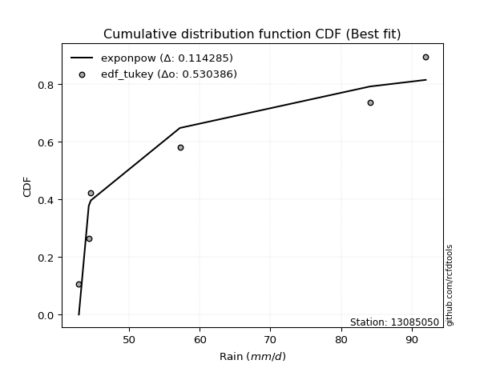</img></img>

</div>


### 8. EDF Gringorten (1963)

Gringorten plotting position formula is essential for estimating the probability and return periods of extreme events like floods and heavy rainfall. The constant _a=0.44_.

<div align="center">


$P=(m-a)/(n+1-2a)$


</div>


**8.1. Empirical values**

<div align="center">

|                | 0                   | 1                  | 2                   | 3                  | 4                  | 5                  |
|:---------------|:--------------------|:-------------------|:--------------------|:-------------------|:-------------------|:-------------------|
| date           | 2007                | 2006               | 2008                | 2010               | 2005               | 2009               |
| x              | 42.9                | 44.3               | 44.6                | 57.2               | 84.1               | 92.0               |
| m              | 1                   | 2                  | 3                   | 4                  | 5                  | 6                  |
| empirical_dist | edf_gringorten      | edf_gringorten     | edf_gringorten      | edf_gringorten     | edf_gringorten     | edf_gringorten     |
| empirical      | 0.09150326797385622 | 0.2549019607843137 | 0.41830065359477125 | 0.5816993464052288 | 0.7450980392156862 | 0.9084967320261437 |
| empirical_tr   | 1.1007194244604317  | 1.3421052631578947 | 1.7191011235955058  | 2.3906250000000004 | 3.9230769230769216 | 10.928571428571415 |

</div>


**8.2. Kolmogorov-Smirnov fit test (sorted by Δ)**


<div align="center">

|                | 0                   | 1                  | 2                   | 3                  | 4                  | 5                   | 6                   | 7                   | 8                   | 9                   | 10                 | 11                 | 12                  | 13                  | 14                  | 15                  | 16                  | 17                  | 18                  | 19                 | 20                  | 21                  | 22                  | 23                  | 24                  | 25                  | 26                  | 27                  | 28                  | 29                  | 30                  | 31                  | 32                  | 33                  | 34                 | 35                  | 36                | 37                  | 38                  | 39                  | 40                  | 41                  | 42                 | 43                  | 44                 | 45                  | 46                  | 47                 | 48                  | 49                  | 50                 | 51                  | 52                  | 53                | 54                  | 55                  | 56                  | 57                  | 58                 | 59                  | 60                | 61                  | 62                  | 63                  | 64                 | 65                  | 66                  | 67                  | 68                  | 69                  | 70                 | 71                  | 72                  | 73                 | 74                  | 75                  | 76                  | 77                  | 78                  | 79                 | 80                  | 81                  | 82                 | 83                 | 84                  | 85                 | 86                | 87                  | 88                 | 89                  | 90                 | 91                  | 92                  | 93                  | 94                  | 95                 | 96                 | 97                  | 98                  | 99                  | 100                | 101               | 102                | 103                | 104                | 105                 | 106                | 107                | 108                | 109                 | 110                | 111                 | 112                 | 113                 | 114                | 115               | 116                | 117                 | 118                | 119                 | 120                | 121                 | 122                | 123                | 124                 | 125                | 126                 | 127                | 128                | 129                 | 130               | 131                 | 132                 | 133                 | 134                | 135               | 136                 | 137                | 138                | 139               | 140                | 141                 | 142                 | 143                 | 144                | 145                | 146                 | 147                 | 148                 | 149                 | 150                 | 151                 | 152                | 153                | 154                | 155                 | 156                | 157                | 158                | 159            |
|:---------------|:--------------------|:-------------------|:--------------------|:-------------------|:-------------------|:--------------------|:--------------------|:--------------------|:--------------------|:--------------------|:-------------------|:-------------------|:--------------------|:--------------------|:--------------------|:--------------------|:--------------------|:--------------------|:--------------------|:-------------------|:--------------------|:--------------------|:--------------------|:--------------------|:--------------------|:--------------------|:--------------------|:--------------------|:--------------------|:--------------------|:--------------------|:--------------------|:--------------------|:--------------------|:-------------------|:--------------------|:------------------|:--------------------|:--------------------|:--------------------|:--------------------|:--------------------|:-------------------|:--------------------|:-------------------|:--------------------|:--------------------|:-------------------|:--------------------|:--------------------|:-------------------|:--------------------|:--------------------|:------------------|:--------------------|:--------------------|:--------------------|:--------------------|:-------------------|:--------------------|:------------------|:--------------------|:--------------------|:--------------------|:-------------------|:--------------------|:--------------------|:--------------------|:--------------------|:--------------------|:-------------------|:--------------------|:--------------------|:-------------------|:--------------------|:--------------------|:--------------------|:--------------------|:--------------------|:-------------------|:--------------------|:--------------------|:-------------------|:-------------------|:--------------------|:-------------------|:------------------|:--------------------|:-------------------|:--------------------|:-------------------|:--------------------|:--------------------|:--------------------|:--------------------|:-------------------|:-------------------|:--------------------|:--------------------|:--------------------|:-------------------|:------------------|:-------------------|:-------------------|:-------------------|:--------------------|:-------------------|:-------------------|:-------------------|:--------------------|:-------------------|:--------------------|:--------------------|:--------------------|:-------------------|:------------------|:-------------------|:--------------------|:-------------------|:--------------------|:-------------------|:--------------------|:-------------------|:-------------------|:--------------------|:-------------------|:--------------------|:-------------------|:-------------------|:--------------------|:------------------|:--------------------|:--------------------|:--------------------|:-------------------|:------------------|:--------------------|:-------------------|:-------------------|:------------------|:-------------------|:--------------------|:--------------------|:--------------------|:-------------------|:-------------------|:--------------------|:--------------------|:--------------------|:--------------------|:--------------------|:--------------------|:-------------------|:-------------------|:-------------------|:--------------------|:-------------------|:-------------------|:-------------------|:---------------|
| station        | 13085050            | 13085050           | 13085050            | 13085050           | 13085050           | 13085050            | 13085050            | 13085050            | 13085050            | 13085050            | 13085050           | 13085050           | 13085050            | 13085050            | 13085050            | 13085050            | 13085050            | 13085050            | 13085050            | 13085050           | 13085050            | 13085050            | 13085050            | 13085050            | 13085050            | 13085050            | 13085050            | 13085050            | 13085050            | 13085050            | 13085050            | 13085050            | 13085050            | 13085050            | 13085050           | 13085050            | 13085050          | 13085050            | 13085050            | 13085050            | 13085050            | 13085050            | 13085050           | 13085050            | 13085050           | 13085050            | 13085050            | 13085050           | 13085050            | 13085050            | 13085050           | 13085050            | 13085050            | 13085050          | 13085050            | 13085050            | 13085050            | 13085050            | 13085050           | 13085050            | 13085050          | 13085050            | 13085050            | 13085050            | 13085050           | 13085050            | 13085050            | 13085050            | 13085050            | 13085050            | 13085050           | 13085050            | 13085050            | 13085050           | 13085050            | 13085050            | 13085050            | 13085050            | 13085050            | 13085050           | 13085050            | 13085050            | 13085050           | 13085050           | 13085050            | 13085050           | 13085050          | 13085050            | 13085050           | 13085050            | 13085050           | 13085050            | 13085050            | 13085050            | 13085050            | 13085050           | 13085050           | 13085050            | 13085050            | 13085050            | 13085050           | 13085050          | 13085050           | 13085050           | 13085050           | 13085050            | 13085050           | 13085050           | 13085050           | 13085050            | 13085050           | 13085050            | 13085050            | 13085050            | 13085050           | 13085050          | 13085050           | 13085050            | 13085050           | 13085050            | 13085050           | 13085050            | 13085050           | 13085050           | 13085050            | 13085050           | 13085050            | 13085050           | 13085050           | 13085050            | 13085050          | 13085050            | 13085050            | 13085050            | 13085050           | 13085050          | 13085050            | 13085050           | 13085050           | 13085050          | 13085050           | 13085050            | 13085050            | 13085050            | 13085050           | 13085050           | 13085050            | 13085050            | 13085050            | 13085050            | 13085050            | 13085050            | 13085050           | 13085050           | 13085050           | 13085050            | 13085050           | 13085050           | 13085050           | 13085050       |
| empirical_dist | edf_gringorten      | edf_gringorten     | edf_gringorten      | edf_gringorten     | edf_gringorten     | edf_gringorten      | edf_gringorten      | edf_gringorten      | edf_gringorten      | edf_gringorten      | edf_gringorten     | edf_gringorten     | edf_gringorten      | edf_gringorten      | edf_gringorten      | edf_gringorten      | edf_gringorten      | edf_gringorten      | edf_gringorten      | edf_gringorten     | edf_gringorten      | edf_gringorten      | edf_gringorten      | edf_gringorten      | edf_gringorten      | edf_gringorten      | edf_gringorten      | edf_gringorten      | edf_gringorten      | edf_gringorten      | edf_gringorten      | edf_gringorten      | edf_gringorten      | edf_gringorten      | edf_gringorten     | edf_gringorten      | edf_gringorten    | edf_gringorten      | edf_gringorten      | edf_gringorten      | edf_gringorten      | edf_gringorten      | edf_gringorten     | edf_gringorten      | edf_gringorten     | edf_gringorten      | edf_gringorten      | edf_gringorten     | edf_gringorten      | edf_gringorten      | edf_gringorten     | edf_gringorten      | edf_gringorten      | edf_gringorten    | edf_gringorten      | edf_gringorten      | edf_gringorten      | edf_gringorten      | edf_gringorten     | edf_gringorten      | edf_gringorten    | edf_gringorten      | edf_gringorten      | edf_gringorten      | edf_gringorten     | edf_gringorten      | edf_gringorten      | edf_gringorten      | edf_gringorten      | edf_gringorten      | edf_gringorten     | edf_gringorten      | edf_gringorten      | edf_gringorten     | edf_gringorten      | edf_gringorten      | edf_gringorten      | edf_gringorten      | edf_gringorten      | edf_gringorten     | edf_gringorten      | edf_gringorten      | edf_gringorten     | edf_gringorten     | edf_gringorten      | edf_gringorten     | edf_gringorten    | edf_gringorten      | edf_gringorten     | edf_gringorten      | edf_gringorten     | edf_gringorten      | edf_gringorten      | edf_gringorten      | edf_gringorten      | edf_gringorten     | edf_gringorten     | edf_gringorten      | edf_gringorten      | edf_gringorten      | edf_gringorten     | edf_gringorten    | edf_gringorten     | edf_gringorten     | edf_gringorten     | edf_gringorten      | edf_gringorten     | edf_gringorten     | edf_gringorten     | edf_gringorten      | edf_gringorten     | edf_gringorten      | edf_gringorten      | edf_gringorten      | edf_gringorten     | edf_gringorten    | edf_gringorten     | edf_gringorten      | edf_gringorten     | edf_gringorten      | edf_gringorten     | edf_gringorten      | edf_gringorten     | edf_gringorten     | edf_gringorten      | edf_gringorten     | edf_gringorten      | edf_gringorten     | edf_gringorten     | edf_gringorten      | edf_gringorten    | edf_gringorten      | edf_gringorten      | edf_gringorten      | edf_gringorten     | edf_gringorten    | edf_gringorten      | edf_gringorten     | edf_gringorten     | edf_gringorten    | edf_gringorten     | edf_gringorten      | edf_gringorten      | edf_gringorten      | edf_gringorten     | edf_gringorten     | edf_gringorten      | edf_gringorten      | edf_gringorten      | edf_gringorten      | edf_gringorten      | edf_gringorten      | edf_gringorten     | edf_gringorten     | edf_gringorten     | edf_gringorten      | edf_gringorten     | edf_gringorten     | edf_gringorten     | edf_gringorten |
| p_dist         | exponpow            | logexponpow        | logwrapcauchy       | logbetaprime       | invgamma           | ksone               | lognakagami         | logksone            | logf                | gengamma            | semicircular       | foldnorm           | logarcsine          | logsemicircular     | halfnorm            | logfoldnorm         | anglit              | logdweibull         | loghalfnorm         | exponweib          | loganglit           | arcsine             | loginvgauss         | invgauss            | rayleigh            | wrapcauchy          | maxwell             | lograyleigh         | logweibull_min      | logburr12           | logdgamma           | logmaxwell          | pearson3            | logmielke           | halflogistic       | logburr             | lognct            | alpha               | logweibull_max      | truncweibull_min    | dweibull            | t                   | crystalball        | norm                | logpearson3        | weibull_min         | logalpha            | johnsonsu          | truncpareto         | logloggamma         | logexponweib       | logtruncweibull_min | betaprime           | gumbel_r          | loghalflogistic     | logt                | lognorm             | logcrystalball      | f                  | nct                 | logncf            | loginvgamma         | loggenlogistic      | burr                | genlogistic        | loggumbel_r         | dgamma              | loggengamma         | moyal               | genpareto           | loglevy_l          | logistic            | logtruncpareto      | logmoyal           | logkstwobign        | loglogistic         | gumbel_l            | kstwobign           | cosine              | halfgennorm        | loggumbel_l         | gamma               | logcosine          | hypsecant          | nakagami            | loghypsecant       | loggausshyper     | levy_l              | logjohnsonsu       | erlang              | logrice            | rice                | laplace             | loglaplace          | loglaplace          | argus              | logargus           | logtriang           | genextreme          | triang              | burr12             | loginvweibull     | logexponnorm       | loglomax           | loggenexpon        | logrdist            | loggamma           | loggamma           | loghalfgennorm     | logjohnsonsb        | logtruncnorm       | loggompertz         | loggennorm          | ncf                 | lomax              | exponnorm         | genexpon           | truncnorm           | logloglaplace      | beta                | loggenextreme      | logkappa4           | logbradford        | logskewnorm        | logtruncexpon       | logerlang          | kappa4              | gausshyper         | logtukeylambda     | loggenpareto        | gennorm           | powerlaw            | truncexpon          | loguniform          | logkappa3          | wald              | skewnorm            | fatiguelife        | logvonmises_line   | bradford          | gompertz           | loggenhalflogistic  | tukeylambda         | logwald             | logpowerlaw        | uniform            | kappa3              | vonmises_line       | logfatiguelife      | genhalflogistic     | rdist               | logbeta             | logtrapezoid       | invweibull         | trapezoid          | johnsonsb           | weibull_max        | logvonmises        | vonmises           | mielke         |
| delta          | 0.12254075307951195 | 0.1294386716281608 | 0.14290519451154504 | 0.1498760108350575 | 0.1524346564462492 | 0.15361645322797018 | 0.15544586664979898 | 0.15919069653319706 | 0.16105224916550276 | 0.16392205437842433 | 0.1703989115113405 | 0.1707195520403287 | 0.17125174905517004 | 0.17599832576256103 | 0.17752536564907898 | 0.18124517657175837 | 0.18274764801354257 | 0.18524044743374712 | 0.18640230405376218 | 0.1866153946614567 | 0.18832639448479652 | 0.18879409891774201 | 0.18920551035077782 | 0.18935835272875812 | 0.19037227297445541 | 0.19058588835624568 | 0.19638626290927572 | 0.19736722065089882 | 0.19772042356331587 | 0.20061271727395047 | 0.20224106571753353 | 0.20292248877441071 | 0.20378659482205475 | 0.20439518461420225 | 0.2051908458986549 | 0.20721421674577767 | 0.207615460907681 | 0.20762657235975002 | 0.20878513564480639 | 0.20892700448461854 | 0.20943896848267546 | 0.21076349438824138 | 0.2108096661614018 | 0.21080967051130733 | 0.2110694786750978 | 0.21125296648049097 | 0.21149890368127788 | 0.2126087486634346 | 0.21266344050611152 | 0.21398872909412694 | 0.2145561019813197 | 0.21467664365664907 | 0.21530784872547273 | 0.215842169156921 | 0.21599624139213305 | 0.21629155168392505 | 0.21629188101588126 | 0.21629202897373562 | 0.2168083426946314 | 0.21940223524425773 | 0.219522678410592 | 0.22192499916867883 | 0.22321213294283235 | 0.22328622567064269 | 0.2235761048658798 | 0.22379044207851803 | 0.22416878376544835 | 0.22614126681727353 | 0.22819528635723957 | 0.22839302851737925 | 0.2317202913329267 | 0.23265151631095823 | 0.23486737277245393 | 0.2376235925823686 | 0.23785862020447837 | 0.23788837675429444 | 0.23919091740307452 | 0.24031171531832266 | 0.24162723995900326 | 0.2421480507128496 | 0.24316365571272947 | 0.24348043979806788 | 0.2444075833983982 | 0.2457305793808556 | 0.24649240057645774 | 0.2506478899112328 | 0.254110920021807 | 0.25595111207689125 | 0.2567512827096662 | 0.25878608521301383 | 0.2597565873907472 | 0.25978714047087914 | 0.26042608889993235 | 0.26467900997193883 | 0.26467900997193883 | 0.2696552799541629 | 0.2716192334550253 | 0.27510752536327654 | 0.28037629006356013 | 0.28379331067918706 | 0.2891561569038219 | 0.294167927302203 | 0.2949853533702594 | 0.2955121537628517 | 0.2964552819541086 | 0.29879380596871663 | 0.3017155098706531 | 0.3017155098706531 | 0.3056952641197689 | 0.31169774890846236 | 0.3126649678966126 | 0.31273889927943616 | 0.31283542724904856 | 0.31475765259330185 | 0.3266859165017126 | 0.326698407272995 | 0.3279399965734964 | 0.33664257764458494 | 0.3376977422732809 | 0.33814011881576594 | 0.3390450475946216 | 0.34234890769526777 | 0.3444429234731707 | 0.3466439637340292 | 0.34776772951204515 | 0.3529699278798927 | 0.35298150480864005 | 0.3539681754836852 | 0.3559439553432157 | 0.35865890398591027 | 0.365517347609256 | 0.36610021657485736 | 0.36634149322633514 | 0.36736189384772544 | 0.3674483568966012 | 0.367695599965472 | 0.36776694494755247 | 0.3685435023100847 | 0.3688714515743234 | 0.369850131901323 | 0.3742085254864047 | 0.37989713039330447 | 0.38086436894195125 | 0.38274776439162533 | 0.3833152481725589 | 0.3836774356721643 | 0.38372880584478203 | 0.38404482397863626 | 0.38700881264161446 | 0.40755073924751506 | 0.41830065355412305 | 0.42079930928166387 | 0.4236388552319038 | 0.4724785848908831 | 0.4754003281868245 | 0.49043960721281277 | 0.5452940905616701 | 1.1413493505928236 | 14.141342316866558 | nan            |
| deltao         | 0.530385761606      | 0.530385761606     | 0.530385761606      | 0.530385761606     | 0.530385761606     | 0.530385761606      | 0.530385761606      | 0.530385761606      | 0.530385761606      | 0.530385761606      | 0.530385761606     | 0.530385761606     | 0.530385761606      | 0.530385761606      | 0.530385761606      | 0.530385761606      | 0.530385761606      | 0.530385761606      | 0.530385761606      | 0.530385761606     | 0.530385761606      | 0.530385761606      | 0.530385761606      | 0.530385761606      | 0.530385761606      | 0.530385761606      | 0.530385761606      | 0.530385761606      | 0.530385761606      | 0.530385761606      | 0.530385761606      | 0.530385761606      | 0.530385761606      | 0.530385761606      | 0.530385761606     | 0.530385761606      | 0.530385761606    | 0.530385761606      | 0.530385761606      | 0.530385761606      | 0.530385761606      | 0.530385761606      | 0.530385761606     | 0.530385761606      | 0.530385761606     | 0.530385761606      | 0.530385761606      | 0.530385761606     | 0.530385761606      | 0.530385761606      | 0.530385761606     | 0.530385761606      | 0.530385761606      | 0.530385761606    | 0.530385761606      | 0.530385761606      | 0.530385761606      | 0.530385761606      | 0.530385761606     | 0.530385761606      | 0.530385761606    | 0.530385761606      | 0.530385761606      | 0.530385761606      | 0.530385761606     | 0.530385761606      | 0.530385761606      | 0.530385761606      | 0.530385761606      | 0.530385761606      | 0.530385761606     | 0.530385761606      | 0.530385761606      | 0.530385761606     | 0.530385761606      | 0.530385761606      | 0.530385761606      | 0.530385761606      | 0.530385761606      | 0.530385761606     | 0.530385761606      | 0.530385761606      | 0.530385761606     | 0.530385761606     | 0.530385761606      | 0.530385761606     | 0.530385761606    | 0.530385761606      | 0.530385761606     | 0.530385761606      | 0.530385761606     | 0.530385761606      | 0.530385761606      | 0.530385761606      | 0.530385761606      | 0.530385761606     | 0.530385761606     | 0.530385761606      | 0.530385761606      | 0.530385761606      | 0.530385761606     | 0.530385761606    | 0.530385761606     | 0.530385761606     | 0.530385761606     | 0.530385761606      | 0.530385761606     | 0.530385761606     | 0.530385761606     | 0.530385761606      | 0.530385761606     | 0.530385761606      | 0.530385761606      | 0.530385761606      | 0.530385761606     | 0.530385761606    | 0.530385761606     | 0.530385761606      | 0.530385761606     | 0.530385761606      | 0.530385761606     | 0.530385761606      | 0.530385761606     | 0.530385761606     | 0.530385761606      | 0.530385761606     | 0.530385761606      | 0.530385761606     | 0.530385761606     | 0.530385761606      | 0.530385761606    | 0.530385761606      | 0.530385761606      | 0.530385761606      | 0.530385761606     | 0.530385761606    | 0.530385761606      | 0.530385761606     | 0.530385761606     | 0.530385761606    | 0.530385761606     | 0.530385761606      | 0.530385761606      | 0.530385761606      | 0.530385761606     | 0.530385761606     | 0.530385761606      | 0.530385761606      | 0.530385761606      | 0.530385761606      | 0.530385761606      | 0.530385761606      | 0.530385761606     | 0.530385761606     | 0.530385761606     | 0.530385761606      | 0.530385761606     | 0.530385761606     | 0.530385761606     | 0.530385761606 |
| eval           | Δo > Δ              | Δo > Δ             | Δo > Δ              | Δo > Δ             | Δo > Δ             | Δo > Δ              | Δo > Δ              | Δo > Δ              | Δo > Δ              | Δo > Δ              | Δo > Δ             | Δo > Δ             | Δo > Δ              | Δo > Δ              | Δo > Δ              | Δo > Δ              | Δo > Δ              | Δo > Δ              | Δo > Δ              | Δo > Δ             | Δo > Δ              | Δo > Δ              | Δo > Δ              | Δo > Δ              | Δo > Δ              | Δo > Δ              | Δo > Δ              | Δo > Δ              | Δo > Δ              | Δo > Δ              | Δo > Δ              | Δo > Δ              | Δo > Δ              | Δo > Δ              | Δo > Δ             | Δo > Δ              | Δo > Δ            | Δo > Δ              | Δo > Δ              | Δo > Δ              | Δo > Δ              | Δo > Δ              | Δo > Δ             | Δo > Δ              | Δo > Δ             | Δo > Δ              | Δo > Δ              | Δo > Δ             | Δo > Δ              | Δo > Δ              | Δo > Δ             | Δo > Δ              | Δo > Δ              | Δo > Δ            | Δo > Δ              | Δo > Δ              | Δo > Δ              | Δo > Δ              | Δo > Δ             | Δo > Δ              | Δo > Δ            | Δo > Δ              | Δo > Δ              | Δo > Δ              | Δo > Δ             | Δo > Δ              | Δo > Δ              | Δo > Δ              | Δo > Δ              | Δo > Δ              | Δo > Δ             | Δo > Δ              | Δo > Δ              | Δo > Δ             | Δo > Δ              | Δo > Δ              | Δo > Δ              | Δo > Δ              | Δo > Δ              | Δo > Δ             | Δo > Δ              | Δo > Δ              | Δo > Δ             | Δo > Δ             | Δo > Δ              | Δo > Δ             | Δo > Δ            | Δo > Δ              | Δo > Δ             | Δo > Δ              | Δo > Δ             | Δo > Δ              | Δo > Δ              | Δo > Δ              | Δo > Δ              | Δo > Δ             | Δo > Δ             | Δo > Δ              | Δo > Δ              | Δo > Δ              | Δo > Δ             | Δo > Δ            | Δo > Δ             | Δo > Δ             | Δo > Δ             | Δo > Δ              | Δo > Δ             | Δo > Δ             | Δo > Δ             | Δo > Δ              | Δo > Δ             | Δo > Δ              | Δo > Δ              | Δo > Δ              | Δo > Δ             | Δo > Δ            | Δo > Δ             | Δo > Δ              | Δo > Δ             | Δo > Δ              | Δo > Δ             | Δo > Δ              | Δo > Δ             | Δo > Δ             | Δo > Δ              | Δo > Δ             | Δo > Δ              | Δo > Δ             | Δo > Δ             | Δo > Δ              | Δo > Δ            | Δo > Δ              | Δo > Δ              | Δo > Δ              | Δo > Δ             | Δo > Δ            | Δo > Δ              | Δo > Δ             | Δo > Δ             | Δo > Δ            | Δo > Δ             | Δo > Δ              | Δo > Δ              | Δo > Δ              | Δo > Δ             | Δo > Δ             | Δo > Δ              | Δo > Δ              | Δo > Δ              | Δo > Δ              | Δo > Δ              | Δo > Δ              | Δo > Δ             | Δo > Δ             | Δo > Δ             | Δo > Δ              | Δo <= Δ            | Δo <= Δ            | Δo <= Δ            | Δo <= Δ        |
| fit            | 1                   | 1                  | 1                   | 1                  | 1                  | 1                   | 1                   | 1                   | 1                   | 1                   | 1                  | 1                  | 1                   | 1                   | 1                   | 1                   | 1                   | 1                   | 1                   | 1                  | 1                   | 1                   | 1                   | 1                   | 1                   | 1                   | 1                   | 1                   | 1                   | 1                   | 1                   | 1                   | 1                   | 1                   | 1                  | 1                   | 1                 | 1                   | 1                   | 1                   | 1                   | 1                   | 1                  | 1                   | 1                  | 1                   | 1                   | 1                  | 1                   | 1                   | 1                  | 1                   | 1                   | 1                 | 1                   | 1                   | 1                   | 1                   | 1                  | 1                   | 1                 | 1                   | 1                   | 1                   | 1                  | 1                   | 1                   | 1                   | 1                   | 1                   | 1                  | 1                   | 1                   | 1                  | 1                   | 1                   | 1                   | 1                   | 1                   | 1                  | 1                   | 1                   | 1                  | 1                  | 1                   | 1                  | 1                 | 1                   | 1                  | 1                   | 1                  | 1                   | 1                   | 1                   | 1                   | 1                  | 1                  | 1                   | 1                   | 1                   | 1                  | 1                 | 1                  | 1                  | 1                  | 1                   | 1                  | 1                  | 1                  | 1                   | 1                  | 1                   | 1                   | 1                   | 1                  | 1                 | 1                  | 1                   | 1                  | 1                   | 1                  | 1                   | 1                  | 1                  | 1                   | 1                  | 1                   | 1                  | 1                  | 1                   | 1                 | 1                   | 1                   | 1                   | 1                  | 1                 | 1                   | 1                  | 1                  | 1                 | 1                  | 1                   | 1                   | 1                   | 1                  | 1                  | 1                   | 1                   | 1                   | 1                   | 1                   | 1                   | 1                  | 1                  | 1                  | 1                   | 0                  | 0                  | 0                  | 0              |
| n              | 6                   | 6                  | 6                   | 6                  | 6                  | 6                   | 6                   | 6                   | 6                   | 6                   | 6                  | 6                  | 6                   | 6                   | 6                   | 6                   | 6                   | 6                   | 6                   | 6                  | 6                   | 6                   | 6                   | 6                   | 6                   | 6                   | 6                   | 6                   | 6                   | 6                   | 6                   | 6                   | 6                   | 6                   | 6                  | 6                   | 6                 | 6                   | 6                   | 6                   | 6                   | 6                   | 6                  | 6                   | 6                  | 6                   | 6                   | 6                  | 6                   | 6                   | 6                  | 6                   | 6                   | 6                 | 6                   | 6                   | 6                   | 6                   | 6                  | 6                   | 6                 | 6                   | 6                   | 6                   | 6                  | 6                   | 6                   | 6                   | 6                   | 6                   | 6                  | 6                   | 6                   | 6                  | 6                   | 6                   | 6                   | 6                   | 6                   | 6                  | 6                   | 6                   | 6                  | 6                  | 6                   | 6                  | 6                 | 6                   | 6                  | 6                   | 6                  | 6                   | 6                   | 6                   | 6                   | 6                  | 6                  | 6                   | 6                   | 6                   | 6                  | 6                 | 6                  | 6                  | 6                  | 6                   | 6                  | 6                  | 6                  | 6                   | 6                  | 6                   | 6                   | 6                   | 6                  | 6                 | 6                  | 6                   | 6                  | 6                   | 6                  | 6                   | 6                  | 6                  | 6                   | 6                  | 6                   | 6                  | 6                  | 6                   | 6                 | 6                   | 6                   | 6                   | 6                  | 6                 | 6                   | 6                  | 6                  | 6                 | 6                  | 6                   | 6                   | 6                   | 6                  | 6                  | 6                   | 6                   | 6                   | 6                   | 6                   | 6                   | 6                  | 6                  | 6                  | 6                   | 6                  | 6                  | 6                  | 6              |
| best_fit       | 1                   | 0                  | 0                   | 0                  | 0                  | 0                   | 0                   | 0                   | 0                   | 0                   | 0                  | 0                  | 0                   | 0                   | 0                   | 0                   | 0                   | 0                   | 0                   | 0                  | 0                   | 0                   | 0                   | 0                   | 0                   | 0                   | 0                   | 0                   | 0                   | 0                   | 0                   | 0                   | 0                   | 0                   | 0                  | 0                   | 0                 | 0                   | 0                   | 0                   | 0                   | 0                   | 0                  | 0                   | 0                  | 0                   | 0                   | 0                  | 0                   | 0                   | 0                  | 0                   | 0                   | 0                 | 0                   | 0                   | 0                   | 0                   | 0                  | 0                   | 0                 | 0                   | 0                   | 0                   | 0                  | 0                   | 0                   | 0                   | 0                   | 0                   | 0                  | 0                   | 0                   | 0                  | 0                   | 0                   | 0                   | 0                   | 0                   | 0                  | 0                   | 0                   | 0                  | 0                  | 0                   | 0                  | 0                 | 0                   | 0                  | 0                   | 0                  | 0                   | 0                   | 0                   | 0                   | 0                  | 0                  | 0                   | 0                   | 0                   | 0                  | 0                 | 0                  | 0                  | 0                  | 0                   | 0                  | 0                  | 0                  | 0                   | 0                  | 0                   | 0                   | 0                   | 0                  | 0                 | 0                  | 0                   | 0                  | 0                   | 0                  | 0                   | 0                  | 0                  | 0                   | 0                  | 0                   | 0                  | 0                  | 0                   | 0                 | 0                   | 0                   | 0                   | 0                  | 0                 | 0                   | 0                  | 0                  | 0                 | 0                  | 0                   | 0                   | 0                   | 0                  | 0                  | 0                   | 0                   | 0                   | 0                   | 0                   | 0                   | 0                  | 0                  | 0                  | 0                   | 0                  | 0                  | 0                  | 0              |
| best_fit_sort  | 1                   | 2                  | 3                   | 4                  | 5                  | 6                   | 7                   | 8                   | 9                   | 10                  | 11                 | 12                 | 13                  | 14                  | 15                  | 16                  | 17                  | 18                  | 19                  | 20                 | 21                  | 22                  | 23                  | 24                  | 25                  | 26                  | 27                  | 28                  | 29                  | 30                  | 31                  | 32                  | 33                  | 34                  | 35                 | 36                  | 37                | 38                  | 39                  | 40                  | 41                  | 42                  | 43                 | 44                  | 45                 | 46                  | 47                  | 48                 | 49                  | 50                  | 51                 | 52                  | 53                  | 54                | 55                  | 56                  | 57                  | 58                  | 59                 | 60                  | 61                | 62                  | 63                  | 64                  | 65                 | 66                  | 67                  | 68                  | 69                  | 70                  | 71                 | 72                  | 73                  | 74                 | 75                  | 76                  | 77                  | 78                  | 79                  | 80                 | 81                  | 82                  | 83                 | 84                 | 85                  | 86                 | 87                | 88                  | 89                 | 90                  | 91                 | 92                  | 93                  | 94                  | 95                  | 96                 | 97                 | 98                  | 99                  | 100                 | 101                | 102               | 103                | 104                | 105                | 106                 | 107                | 108                | 109                | 110                 | 111                | 112                 | 113                 | 114                 | 115                | 116               | 117                | 118                 | 119                | 120                 | 121                | 122                 | 123                | 124                | 125                 | 126                | 127                 | 128                | 129                | 130                 | 131               | 132                 | 133                 | 134                 | 135                | 136               | 137                 | 138                | 139                | 140               | 141                | 142                 | 143                 | 144                 | 145                | 146                | 147                 | 148                 | 149                 | 150                 | 151                 | 152                 | 153                | 154                | 155                | 156                 | 157                | 158                | 159                | 160            |

</div>


**8.3. Best fit**

<div align="center">

|   id |   station | empirical_dist   | p_dist   |    delta |   deltao | eval   |   fit |   n |   best_fit |   best_fit_sort |
|-----:|----------:|:-----------------|:---------|---------:|---------:|:-------|------:|----:|-----------:|----------------:|
|    0 |  13085050 | edf_gringorten   | exponpow | 0.122541 | 0.530386 | Δo > Δ |     1 |   6 |          1 |               1 |

</div>


<div align="center">

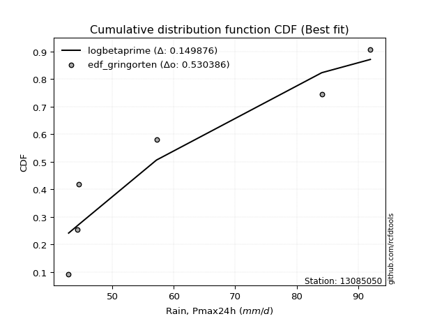</img></img>

</div>


### 9. EDF Filliben (1975)

The specific values of the constants (0.3175) (often denoted as $alpha$) and (0.365) are derived from a method proposed by James J. Filliben in a 1975 paper. This particular formula is the mean value of the $i$-th order statistic of the normal distribution and is considered a robust and effective plotting position formula for the normal probability plot correlation coefficient test for normality.

<div align="center">


$P=(m-0.3175)/(n+0.365)$


</div>


**9.1. Empirical values**

<div align="center">

|                | 0                   | 1                   | 2                  | 3                  | 4                  | 5                  |
|:---------------|:--------------------|:--------------------|:-------------------|:-------------------|:-------------------|:-------------------|
| date           | 2007                | 2006                | 2008               | 2010               | 2005               | 2009               |
| x              | 42.9                | 44.3                | 44.6               | 57.2               | 84.1               | 92.0               |
| m              | 1                   | 2                   | 3                  | 4                  | 5                  | 6                  |
| empirical_dist | edf_filliben        | edf_filliben        | edf_filliben       | edf_filliben       | edf_filliben       | edf_filliben       |
| empirical      | 0.10722702278083267 | 0.26433621366849963 | 0.4214454045561665 | 0.5785545954438335 | 0.7356637863315004 | 0.8927729772191673 |
| empirical_tr   | 1.1201055873295205  | 1.3593166043780034  | 1.7284453496266123 | 2.3727865796831313 | 3.783060921248143  | 9.326007326007321  |

</div>


**9.2. Kolmogorov-Smirnov fit test (sorted by Δ)**


<div align="center">

|                | 0                   | 1                  | 2                  | 3                  | 4                   | 5                   | 6                   | 7                   | 8                   | 9                   | 10                  | 11                 | 12                  | 13                  | 14                 | 15                  | 16                  | 17                  | 18                  | 19                | 20                  | 21                  | 22                 | 23                  | 24                  | 25                  | 26                | 27                  | 28                  | 29                | 30                 | 31                  | 32                  | 33                  | 34                  | 35                  | 36                  | 37                  | 38                 | 39                  | 40                  | 41                  | 42                  | 43                  | 44                  | 45                  | 46                 | 47                  | 48                  | 49                  | 50                  | 51                 | 52                  | 53                  | 54                  | 55                 | 56                | 57                  | 58                  | 59                  | 60                  | 61                 | 62                  | 63                | 64                  | 65                 | 66                  | 67                  | 68                  | 69                 | 70                  | 71                 | 72                 | 73                 | 74                  | 75                  | 76                  | 77                 | 78                  | 79                  | 80                  | 81                  | 82                  | 83                  | 84                | 85                 | 86                 | 87                 | 88                  | 89                  | 90                  | 91                  | 92                  | 93                 | 94                  | 95                  | 96                  | 97                 | 98                  | 99                  | 100                 | 101                | 102                 | 103                 | 104               | 105                | 106                 | 107                | 108                | 109                | 110                 | 111                 | 112                | 113                | 114                 | 115                | 116                | 117                 | 118                 | 119                 | 120                 | 121                | 122                 | 123                 | 124                | 125                 | 126                 | 127               | 128                | 129                 | 130                | 131               | 132                | 133                | 134                | 135                | 136                | 137                 | 138                 | 139                | 140               | 141             | 142                 | 143                 | 144                | 145                | 146                 | 147                | 148                 | 149                 | 150                | 151                | 152                | 153                | 154                 | 155                 | 156                | 157                | 158                | 159            |
|:---------------|:--------------------|:-------------------|:-------------------|:-------------------|:--------------------|:--------------------|:--------------------|:--------------------|:--------------------|:--------------------|:--------------------|:-------------------|:--------------------|:--------------------|:-------------------|:--------------------|:--------------------|:--------------------|:--------------------|:------------------|:--------------------|:--------------------|:-------------------|:--------------------|:--------------------|:--------------------|:------------------|:--------------------|:--------------------|:------------------|:-------------------|:--------------------|:--------------------|:--------------------|:--------------------|:--------------------|:--------------------|:--------------------|:-------------------|:--------------------|:--------------------|:--------------------|:--------------------|:--------------------|:--------------------|:--------------------|:-------------------|:--------------------|:--------------------|:--------------------|:--------------------|:-------------------|:--------------------|:--------------------|:--------------------|:-------------------|:------------------|:--------------------|:--------------------|:--------------------|:--------------------|:-------------------|:--------------------|:------------------|:--------------------|:-------------------|:--------------------|:--------------------|:--------------------|:-------------------|:--------------------|:-------------------|:-------------------|:-------------------|:--------------------|:--------------------|:--------------------|:-------------------|:--------------------|:--------------------|:--------------------|:--------------------|:--------------------|:--------------------|:------------------|:-------------------|:-------------------|:-------------------|:--------------------|:--------------------|:--------------------|:--------------------|:--------------------|:-------------------|:--------------------|:--------------------|:--------------------|:-------------------|:--------------------|:--------------------|:--------------------|:-------------------|:--------------------|:--------------------|:------------------|:-------------------|:--------------------|:-------------------|:-------------------|:-------------------|:--------------------|:--------------------|:-------------------|:-------------------|:--------------------|:-------------------|:-------------------|:--------------------|:--------------------|:--------------------|:--------------------|:-------------------|:--------------------|:--------------------|:-------------------|:--------------------|:--------------------|:------------------|:-------------------|:--------------------|:-------------------|:------------------|:-------------------|:-------------------|:-------------------|:-------------------|:-------------------|:--------------------|:--------------------|:-------------------|:------------------|:----------------|:--------------------|:--------------------|:-------------------|:-------------------|:--------------------|:-------------------|:--------------------|:--------------------|:-------------------|:-------------------|:-------------------|:-------------------|:--------------------|:--------------------|:-------------------|:-------------------|:-------------------|:---------------|
| station        | 13085050            | 13085050           | 13085050           | 13085050           | 13085050            | 13085050            | 13085050            | 13085050            | 13085050            | 13085050            | 13085050            | 13085050           | 13085050            | 13085050            | 13085050           | 13085050            | 13085050            | 13085050            | 13085050            | 13085050          | 13085050            | 13085050            | 13085050           | 13085050            | 13085050            | 13085050            | 13085050          | 13085050            | 13085050            | 13085050          | 13085050           | 13085050            | 13085050            | 13085050            | 13085050            | 13085050            | 13085050            | 13085050            | 13085050           | 13085050            | 13085050            | 13085050            | 13085050            | 13085050            | 13085050            | 13085050            | 13085050           | 13085050            | 13085050            | 13085050            | 13085050            | 13085050           | 13085050            | 13085050            | 13085050            | 13085050           | 13085050          | 13085050            | 13085050            | 13085050            | 13085050            | 13085050           | 13085050            | 13085050          | 13085050            | 13085050           | 13085050            | 13085050            | 13085050            | 13085050           | 13085050            | 13085050           | 13085050           | 13085050           | 13085050            | 13085050            | 13085050            | 13085050           | 13085050            | 13085050            | 13085050            | 13085050            | 13085050            | 13085050            | 13085050          | 13085050           | 13085050           | 13085050           | 13085050            | 13085050            | 13085050            | 13085050            | 13085050            | 13085050           | 13085050            | 13085050            | 13085050            | 13085050           | 13085050            | 13085050            | 13085050            | 13085050           | 13085050            | 13085050            | 13085050          | 13085050           | 13085050            | 13085050           | 13085050           | 13085050           | 13085050            | 13085050            | 13085050           | 13085050           | 13085050            | 13085050           | 13085050           | 13085050            | 13085050            | 13085050            | 13085050            | 13085050           | 13085050            | 13085050            | 13085050           | 13085050            | 13085050            | 13085050          | 13085050           | 13085050            | 13085050           | 13085050          | 13085050           | 13085050           | 13085050           | 13085050           | 13085050           | 13085050            | 13085050            | 13085050           | 13085050          | 13085050        | 13085050            | 13085050            | 13085050           | 13085050           | 13085050            | 13085050           | 13085050            | 13085050            | 13085050           | 13085050           | 13085050           | 13085050           | 13085050            | 13085050            | 13085050           | 13085050           | 13085050           | 13085050       |
| empirical_dist | edf_filliben        | edf_filliben       | edf_filliben       | edf_filliben       | edf_filliben        | edf_filliben        | edf_filliben        | edf_filliben        | edf_filliben        | edf_filliben        | edf_filliben        | edf_filliben       | edf_filliben        | edf_filliben        | edf_filliben       | edf_filliben        | edf_filliben        | edf_filliben        | edf_filliben        | edf_filliben      | edf_filliben        | edf_filliben        | edf_filliben       | edf_filliben        | edf_filliben        | edf_filliben        | edf_filliben      | edf_filliben        | edf_filliben        | edf_filliben      | edf_filliben       | edf_filliben        | edf_filliben        | edf_filliben        | edf_filliben        | edf_filliben        | edf_filliben        | edf_filliben        | edf_filliben       | edf_filliben        | edf_filliben        | edf_filliben        | edf_filliben        | edf_filliben        | edf_filliben        | edf_filliben        | edf_filliben       | edf_filliben        | edf_filliben        | edf_filliben        | edf_filliben        | edf_filliben       | edf_filliben        | edf_filliben        | edf_filliben        | edf_filliben       | edf_filliben      | edf_filliben        | edf_filliben        | edf_filliben        | edf_filliben        | edf_filliben       | edf_filliben        | edf_filliben      | edf_filliben        | edf_filliben       | edf_filliben        | edf_filliben        | edf_filliben        | edf_filliben       | edf_filliben        | edf_filliben       | edf_filliben       | edf_filliben       | edf_filliben        | edf_filliben        | edf_filliben        | edf_filliben       | edf_filliben        | edf_filliben        | edf_filliben        | edf_filliben        | edf_filliben        | edf_filliben        | edf_filliben      | edf_filliben       | edf_filliben       | edf_filliben       | edf_filliben        | edf_filliben        | edf_filliben        | edf_filliben        | edf_filliben        | edf_filliben       | edf_filliben        | edf_filliben        | edf_filliben        | edf_filliben       | edf_filliben        | edf_filliben        | edf_filliben        | edf_filliben       | edf_filliben        | edf_filliben        | edf_filliben      | edf_filliben       | edf_filliben        | edf_filliben       | edf_filliben       | edf_filliben       | edf_filliben        | edf_filliben        | edf_filliben       | edf_filliben       | edf_filliben        | edf_filliben       | edf_filliben       | edf_filliben        | edf_filliben        | edf_filliben        | edf_filliben        | edf_filliben       | edf_filliben        | edf_filliben        | edf_filliben       | edf_filliben        | edf_filliben        | edf_filliben      | edf_filliben       | edf_filliben        | edf_filliben       | edf_filliben      | edf_filliben       | edf_filliben       | edf_filliben       | edf_filliben       | edf_filliben       | edf_filliben        | edf_filliben        | edf_filliben       | edf_filliben      | edf_filliben    | edf_filliben        | edf_filliben        | edf_filliben       | edf_filliben       | edf_filliben        | edf_filliben       | edf_filliben        | edf_filliben        | edf_filliben       | edf_filliben       | edf_filliben       | edf_filliben       | edf_filliben        | edf_filliben        | edf_filliben       | edf_filliben       | edf_filliben       | edf_filliben   |
| p_dist         | exponpow            | logexponpow        | logwrapcauchy      | logbetaprime       | logarcsine          | invgamma            | ksone               | logksone            | logf                | lognakagami         | arcsine             | gengamma           | semicircular        | foldnorm            | logsemicircular    | halfnorm            | wrapcauchy          | logfoldnorm         | anglit              | logdweibull       | loghalfnorm         | exponweib           | loganglit          | loginvgauss         | invgauss            | rayleigh            | dweibull          | logexponweib        | logdgamma           | maxwell           | lograyleigh        | logweibull_min      | logburr12           | logweibull_max      | logmaxwell          | pearson3            | logmielke           | halflogistic        | dgamma             | logburr             | loggengamma         | lognct              | alpha               | genpareto           | t                   | crystalball         | norm               | logpearson3         | logalpha            | johnsonsu           | weibull_min         | truncpareto        | loglevy_l           | logloggamma         | logtruncweibull_min | truncweibull_min   | betaprime         | gumbel_r            | loghalflogistic     | logt                | lognorm             | logcrystalball     | f                   | nct               | logncf              | loginvgamma        | loggenlogistic      | burr                | genlogistic         | loggumbel_r        | moyal               | logistic           | logtruncpareto     | levy_l             | logmoyal            | logkstwobign        | loglogistic         | gumbel_l           | kstwobign           | cosine              | halfgennorm         | loggumbel_l         | logcosine           | hypsecant           | nakagami          | gamma              | loghypsecant       | loggausshyper      | logjohnsonsu        | erlang              | logrice             | rice                | laplace             | genextreme         | loglaplace          | loglaplace          | argus               | logargus           | logtriang           | triang              | loginvweibull       | burr12             | logjohnsonsb        | logexponnorm        | loglomax          | ncf                | loggenexpon         | logrdist           | loggamma           | loggamma           | loghalfgennorm      | logtruncnorm        | loggompertz        | loggennorm         | logloglaplace       | beta               | loggenextreme      | lomax               | exponnorm           | genexpon            | truncnorm           | loggenpareto       | logkappa4           | logbradford         | logskewnorm        | gennorm             | logtruncexpon       | logerlang         | kappa4             | powerlaw            | gausshyper         | logtukeylambda    | fatiguelife        | truncexpon         | loguniform         | logkappa3          | wald               | skewnorm            | logvonmises_line    | bradford           | logpowerlaw       | gompertz        | logfatiguelife      | loggenhalflogistic  | tukeylambda        | logwald            | uniform             | kappa3             | vonmises_line       | genhalflogistic     | logbeta            | logtrapezoid       | rdist              | invweibull         | trapezoid           | johnsonsb           | weibull_max        | logvonmises        | vonmises           | mielke         |
| delta          | 0.11310650019532603 | 0.1137149168211844 | 0.1381581014403957 | 0.1481622639882511 | 0.15552799424819358 | 0.15557940740764453 | 0.15676120418936546 | 0.16233544749459233 | 0.16419700012689808 | 0.16488011953398474 | 0.17307034411076555 | 0.1733563072626101 | 0.17354366247273578 | 0.17386430300172398 | 0.1791430767239563 | 0.18067011661047425 | 0.18115163547205992 | 0.18438992753315364 | 0.18589239897493784 | 0.187891483353002 | 0.18954705501515745 | 0.18976014562285198 | 0.1914711454461918 | 0.19235026131217314 | 0.19250310369015344 | 0.19351702393585068 | 0.193715213675699 | 0.19883234717434328 | 0.19907141732834355 | 0.199531013870671 | 0.2005119716122941 | 0.20086517452471114 | 0.20375746823534574 | 0.20564038468341106 | 0.20606723973580598 | 0.20693134578345002 | 0.20753993557559752 | 0.20833559686005018 | 0.2084450289584719 | 0.21035896770717294 | 0.21041751201029713 | 0.21076021186907626 | 0.21077132332114534 | 0.21266927371040278 | 0.21390824534963665 | 0.21395441712279706 | 0.2139544214727026 | 0.21421422963649306 | 0.21464365464267315 | 0.21575349962482987 | 0.21576278421473938 | 0.2158081914675068 | 0.21599653652595024 | 0.21713348005552222 | 0.2178213946180444  | 0.2183612573688043 | 0.218452599686868 | 0.21898692011831628 | 0.21914099235352832 | 0.21943630264532032 | 0.21943663197727653 | 0.2194367799351309 | 0.21995309365602667 | 0.222546986205653 | 0.22266742937198727 | 0.2250697501300741 | 0.22635688390422762 | 0.22643097663203796 | 0.22672085582727508 | 0.2269351930399133 | 0.23134003731863484 | 0.2357962672723535 | 0.2380121237338492 | 0.2402273572699148 | 0.24076834354376386 | 0.24100337116587364 | 0.24103312771568972 | 0.2423356683644698 | 0.24345646627971793 | 0.24477199092039853 | 0.24529280167424486 | 0.24630840667412474 | 0.24755233435979346 | 0.24887533034225087 | 0.249637151537853 | 0.2518580163598301 | 0.2537926408726281 | 0.2572556709832023 | 0.25989603367106145 | 0.26193083617440915 | 0.26290133835214247 | 0.26293189143227447 | 0.26357083986132757 | 0.2646525352565837 | 0.26782376093333404 | 0.26782376093333404 | 0.27280003091555816 | 0.2747639844164206 | 0.27825227632467175 | 0.28064855971779173 | 0.28473367441801706 | 0.2923009078652171 | 0.29597399410148595 | 0.29813010433165466 | 0.298656904724247 | 0.2990338977863254 | 0.29960003291550386 | 0.3019385569301119 | 0.3048602608320484 | 0.3048602608320484 | 0.30884001508116415 | 0.31580971885800785 | 0.3158836502408314 | 0.3159801782104439 | 0.32197398746630446 | 0.3224163640087895 | 0.3233212927876452 | 0.32983066746310785 | 0.32984315823439025 | 0.33108474753489164 | 0.33978732860598015 | 0.3429351491789338 | 0.34549365865666304 | 0.34758767443456595 | 0.3497887146954245 | 0.34979359280227956 | 0.35091248047344037 | 0.356114678841288 | 0.3561262557700353 | 0.35666596369067144 | 0.3571129264450804 | 0.359088706304611 | 0.3591092494258988 | 0.3694862441877304 | 0.3705066448091207 | 0.3705931078579965 | 0.3708403509268673 | 0.37091169590894774 | 0.37201620253571865 | 0.3729948828627183 | 0.373880995288373 | 0.3773532764478 | 0.37757455975742854 | 0.38304188135469974 | 0.3840091199033465 | 0.3858925153530206 | 0.38682218663355955 | 0.3868735568061773 | 0.38718957494003153 | 0.40440598828611973 | 0.4050755544746874 | 0.4204941042705085 | 0.4214454045155184 | 0.4567548300839067 | 0.47225557722542916 | 0.48100535432862684 | 0.5358598376774844 | 1.1507836034770094 | 14.157066071673535 | nan            |
| deltao         | 0.530385761606      | 0.530385761606     | 0.530385761606     | 0.530385761606     | 0.530385761606      | 0.530385761606      | 0.530385761606      | 0.530385761606      | 0.530385761606      | 0.530385761606      | 0.530385761606      | 0.530385761606     | 0.530385761606      | 0.530385761606      | 0.530385761606     | 0.530385761606      | 0.530385761606      | 0.530385761606      | 0.530385761606      | 0.530385761606    | 0.530385761606      | 0.530385761606      | 0.530385761606     | 0.530385761606      | 0.530385761606      | 0.530385761606      | 0.530385761606    | 0.530385761606      | 0.530385761606      | 0.530385761606    | 0.530385761606     | 0.530385761606      | 0.530385761606      | 0.530385761606      | 0.530385761606      | 0.530385761606      | 0.530385761606      | 0.530385761606      | 0.530385761606     | 0.530385761606      | 0.530385761606      | 0.530385761606      | 0.530385761606      | 0.530385761606      | 0.530385761606      | 0.530385761606      | 0.530385761606     | 0.530385761606      | 0.530385761606      | 0.530385761606      | 0.530385761606      | 0.530385761606     | 0.530385761606      | 0.530385761606      | 0.530385761606      | 0.530385761606     | 0.530385761606    | 0.530385761606      | 0.530385761606      | 0.530385761606      | 0.530385761606      | 0.530385761606     | 0.530385761606      | 0.530385761606    | 0.530385761606      | 0.530385761606     | 0.530385761606      | 0.530385761606      | 0.530385761606      | 0.530385761606     | 0.530385761606      | 0.530385761606     | 0.530385761606     | 0.530385761606     | 0.530385761606      | 0.530385761606      | 0.530385761606      | 0.530385761606     | 0.530385761606      | 0.530385761606      | 0.530385761606      | 0.530385761606      | 0.530385761606      | 0.530385761606      | 0.530385761606    | 0.530385761606     | 0.530385761606     | 0.530385761606     | 0.530385761606      | 0.530385761606      | 0.530385761606      | 0.530385761606      | 0.530385761606      | 0.530385761606     | 0.530385761606      | 0.530385761606      | 0.530385761606      | 0.530385761606     | 0.530385761606      | 0.530385761606      | 0.530385761606      | 0.530385761606     | 0.530385761606      | 0.530385761606      | 0.530385761606    | 0.530385761606     | 0.530385761606      | 0.530385761606     | 0.530385761606     | 0.530385761606     | 0.530385761606      | 0.530385761606      | 0.530385761606     | 0.530385761606     | 0.530385761606      | 0.530385761606     | 0.530385761606     | 0.530385761606      | 0.530385761606      | 0.530385761606      | 0.530385761606      | 0.530385761606     | 0.530385761606      | 0.530385761606      | 0.530385761606     | 0.530385761606      | 0.530385761606      | 0.530385761606    | 0.530385761606     | 0.530385761606      | 0.530385761606     | 0.530385761606    | 0.530385761606     | 0.530385761606     | 0.530385761606     | 0.530385761606     | 0.530385761606     | 0.530385761606      | 0.530385761606      | 0.530385761606     | 0.530385761606    | 0.530385761606  | 0.530385761606      | 0.530385761606      | 0.530385761606     | 0.530385761606     | 0.530385761606      | 0.530385761606     | 0.530385761606      | 0.530385761606      | 0.530385761606     | 0.530385761606     | 0.530385761606     | 0.530385761606     | 0.530385761606      | 0.530385761606      | 0.530385761606     | 0.530385761606     | 0.530385761606     | 0.530385761606 |
| eval           | Δo > Δ              | Δo > Δ             | Δo > Δ             | Δo > Δ             | Δo > Δ              | Δo > Δ              | Δo > Δ              | Δo > Δ              | Δo > Δ              | Δo > Δ              | Δo > Δ              | Δo > Δ             | Δo > Δ              | Δo > Δ              | Δo > Δ             | Δo > Δ              | Δo > Δ              | Δo > Δ              | Δo > Δ              | Δo > Δ            | Δo > Δ              | Δo > Δ              | Δo > Δ             | Δo > Δ              | Δo > Δ              | Δo > Δ              | Δo > Δ            | Δo > Δ              | Δo > Δ              | Δo > Δ            | Δo > Δ             | Δo > Δ              | Δo > Δ              | Δo > Δ              | Δo > Δ              | Δo > Δ              | Δo > Δ              | Δo > Δ              | Δo > Δ             | Δo > Δ              | Δo > Δ              | Δo > Δ              | Δo > Δ              | Δo > Δ              | Δo > Δ              | Δo > Δ              | Δo > Δ             | Δo > Δ              | Δo > Δ              | Δo > Δ              | Δo > Δ              | Δo > Δ             | Δo > Δ              | Δo > Δ              | Δo > Δ              | Δo > Δ             | Δo > Δ            | Δo > Δ              | Δo > Δ              | Δo > Δ              | Δo > Δ              | Δo > Δ             | Δo > Δ              | Δo > Δ            | Δo > Δ              | Δo > Δ             | Δo > Δ              | Δo > Δ              | Δo > Δ              | Δo > Δ             | Δo > Δ              | Δo > Δ             | Δo > Δ             | Δo > Δ             | Δo > Δ              | Δo > Δ              | Δo > Δ              | Δo > Δ             | Δo > Δ              | Δo > Δ              | Δo > Δ              | Δo > Δ              | Δo > Δ              | Δo > Δ              | Δo > Δ            | Δo > Δ             | Δo > Δ             | Δo > Δ             | Δo > Δ              | Δo > Δ              | Δo > Δ              | Δo > Δ              | Δo > Δ              | Δo > Δ             | Δo > Δ              | Δo > Δ              | Δo > Δ              | Δo > Δ             | Δo > Δ              | Δo > Δ              | Δo > Δ              | Δo > Δ             | Δo > Δ              | Δo > Δ              | Δo > Δ            | Δo > Δ             | Δo > Δ              | Δo > Δ             | Δo > Δ             | Δo > Δ             | Δo > Δ              | Δo > Δ              | Δo > Δ             | Δo > Δ             | Δo > Δ              | Δo > Δ             | Δo > Δ             | Δo > Δ              | Δo > Δ              | Δo > Δ              | Δo > Δ              | Δo > Δ             | Δo > Δ              | Δo > Δ              | Δo > Δ             | Δo > Δ              | Δo > Δ              | Δo > Δ            | Δo > Δ             | Δo > Δ              | Δo > Δ             | Δo > Δ            | Δo > Δ             | Δo > Δ             | Δo > Δ             | Δo > Δ             | Δo > Δ             | Δo > Δ              | Δo > Δ              | Δo > Δ             | Δo > Δ            | Δo > Δ          | Δo > Δ              | Δo > Δ              | Δo > Δ             | Δo > Δ             | Δo > Δ              | Δo > Δ             | Δo > Δ              | Δo > Δ              | Δo > Δ             | Δo > Δ             | Δo > Δ             | Δo > Δ             | Δo > Δ              | Δo > Δ              | Δo <= Δ            | Δo <= Δ            | Δo <= Δ            | Δo <= Δ        |
| fit            | 1                   | 1                  | 1                  | 1                  | 1                   | 1                   | 1                   | 1                   | 1                   | 1                   | 1                   | 1                  | 1                   | 1                   | 1                  | 1                   | 1                   | 1                   | 1                   | 1                 | 1                   | 1                   | 1                  | 1                   | 1                   | 1                   | 1                 | 1                   | 1                   | 1                 | 1                  | 1                   | 1                   | 1                   | 1                   | 1                   | 1                   | 1                   | 1                  | 1                   | 1                   | 1                   | 1                   | 1                   | 1                   | 1                   | 1                  | 1                   | 1                   | 1                   | 1                   | 1                  | 1                   | 1                   | 1                   | 1                  | 1                 | 1                   | 1                   | 1                   | 1                   | 1                  | 1                   | 1                 | 1                   | 1                  | 1                   | 1                   | 1                   | 1                  | 1                   | 1                  | 1                  | 1                  | 1                   | 1                   | 1                   | 1                  | 1                   | 1                   | 1                   | 1                   | 1                   | 1                   | 1                 | 1                  | 1                  | 1                  | 1                   | 1                   | 1                   | 1                   | 1                   | 1                  | 1                   | 1                   | 1                   | 1                  | 1                   | 1                   | 1                   | 1                  | 1                   | 1                   | 1                 | 1                  | 1                   | 1                  | 1                  | 1                  | 1                   | 1                   | 1                  | 1                  | 1                   | 1                  | 1                  | 1                   | 1                   | 1                   | 1                   | 1                  | 1                   | 1                   | 1                  | 1                   | 1                   | 1                 | 1                  | 1                   | 1                  | 1                 | 1                  | 1                  | 1                  | 1                  | 1                  | 1                   | 1                   | 1                  | 1                 | 1               | 1                   | 1                   | 1                  | 1                  | 1                   | 1                  | 1                   | 1                   | 1                  | 1                  | 1                  | 1                  | 1                   | 1                   | 0                  | 0                  | 0                  | 0              |
| n              | 6                   | 6                  | 6                  | 6                  | 6                   | 6                   | 6                   | 6                   | 6                   | 6                   | 6                   | 6                  | 6                   | 6                   | 6                  | 6                   | 6                   | 6                   | 6                   | 6                 | 6                   | 6                   | 6                  | 6                   | 6                   | 6                   | 6                 | 6                   | 6                   | 6                 | 6                  | 6                   | 6                   | 6                   | 6                   | 6                   | 6                   | 6                   | 6                  | 6                   | 6                   | 6                   | 6                   | 6                   | 6                   | 6                   | 6                  | 6                   | 6                   | 6                   | 6                   | 6                  | 6                   | 6                   | 6                   | 6                  | 6                 | 6                   | 6                   | 6                   | 6                   | 6                  | 6                   | 6                 | 6                   | 6                  | 6                   | 6                   | 6                   | 6                  | 6                   | 6                  | 6                  | 6                  | 6                   | 6                   | 6                   | 6                  | 6                   | 6                   | 6                   | 6                   | 6                   | 6                   | 6                 | 6                  | 6                  | 6                  | 6                   | 6                   | 6                   | 6                   | 6                   | 6                  | 6                   | 6                   | 6                   | 6                  | 6                   | 6                   | 6                   | 6                  | 6                   | 6                   | 6                 | 6                  | 6                   | 6                  | 6                  | 6                  | 6                   | 6                   | 6                  | 6                  | 6                   | 6                  | 6                  | 6                   | 6                   | 6                   | 6                   | 6                  | 6                   | 6                   | 6                  | 6                   | 6                   | 6                 | 6                  | 6                   | 6                  | 6                 | 6                  | 6                  | 6                  | 6                  | 6                  | 6                   | 6                   | 6                  | 6                 | 6               | 6                   | 6                   | 6                  | 6                  | 6                   | 6                  | 6                   | 6                   | 6                  | 6                  | 6                  | 6                  | 6                   | 6                   | 6                  | 6                  | 6                  | 6              |
| best_fit       | 1                   | 0                  | 0                  | 0                  | 0                   | 0                   | 0                   | 0                   | 0                   | 0                   | 0                   | 0                  | 0                   | 0                   | 0                  | 0                   | 0                   | 0                   | 0                   | 0                 | 0                   | 0                   | 0                  | 0                   | 0                   | 0                   | 0                 | 0                   | 0                   | 0                 | 0                  | 0                   | 0                   | 0                   | 0                   | 0                   | 0                   | 0                   | 0                  | 0                   | 0                   | 0                   | 0                   | 0                   | 0                   | 0                   | 0                  | 0                   | 0                   | 0                   | 0                   | 0                  | 0                   | 0                   | 0                   | 0                  | 0                 | 0                   | 0                   | 0                   | 0                   | 0                  | 0                   | 0                 | 0                   | 0                  | 0                   | 0                   | 0                   | 0                  | 0                   | 0                  | 0                  | 0                  | 0                   | 0                   | 0                   | 0                  | 0                   | 0                   | 0                   | 0                   | 0                   | 0                   | 0                 | 0                  | 0                  | 0                  | 0                   | 0                   | 0                   | 0                   | 0                   | 0                  | 0                   | 0                   | 0                   | 0                  | 0                   | 0                   | 0                   | 0                  | 0                   | 0                   | 0                 | 0                  | 0                   | 0                  | 0                  | 0                  | 0                   | 0                   | 0                  | 0                  | 0                   | 0                  | 0                  | 0                   | 0                   | 0                   | 0                   | 0                  | 0                   | 0                   | 0                  | 0                   | 0                   | 0                 | 0                  | 0                   | 0                  | 0                 | 0                  | 0                  | 0                  | 0                  | 0                  | 0                   | 0                   | 0                  | 0                 | 0               | 0                   | 0                   | 0                  | 0                  | 0                   | 0                  | 0                   | 0                   | 0                  | 0                  | 0                  | 0                  | 0                   | 0                   | 0                  | 0                  | 0                  | 0              |
| best_fit_sort  | 1                   | 2                  | 3                  | 4                  | 5                   | 6                   | 7                   | 8                   | 9                   | 10                  | 11                  | 12                 | 13                  | 14                  | 15                 | 16                  | 17                  | 18                  | 19                  | 20                | 21                  | 22                  | 23                 | 24                  | 25                  | 26                  | 27                | 28                  | 29                  | 30                | 31                 | 32                  | 33                  | 34                  | 35                  | 36                  | 37                  | 38                  | 39                 | 40                  | 41                  | 42                  | 43                  | 44                  | 45                  | 46                  | 47                 | 48                  | 49                  | 50                  | 51                  | 52                 | 53                  | 54                  | 55                  | 56                 | 57                | 58                  | 59                  | 60                  | 61                  | 62                 | 63                  | 64                | 65                  | 66                 | 67                  | 68                  | 69                  | 70                 | 71                  | 72                 | 73                 | 74                 | 75                  | 76                  | 77                  | 78                 | 79                  | 80                  | 81                  | 82                  | 83                  | 84                  | 85                | 86                 | 87                 | 88                 | 89                  | 90                  | 91                  | 92                  | 93                  | 94                 | 95                  | 96                  | 97                  | 98                 | 99                  | 100                 | 101                 | 102                | 103                 | 104                 | 105               | 106                | 107                 | 108                | 109                | 110                | 111                 | 112                 | 113                | 114                | 115                 | 116                | 117                | 118                 | 119                 | 120                 | 121                 | 122                | 123                 | 124                 | 125                | 126                 | 127                 | 128               | 129                | 130                 | 131                | 132               | 133                | 134                | 135                | 136                | 137                | 138                 | 139                 | 140                | 141               | 142             | 143                 | 144                 | 145                | 146                | 147                 | 148                | 149                 | 150                 | 151                | 152                | 153                | 154                | 155                 | 156                 | 157                | 158                | 159                | 160            |

</div>


**9.3. Best fit**

<div align="center">

|   id |   station | empirical_dist   | p_dist   |    delta |   deltao | eval   |   fit |   n |   best_fit |   best_fit_sort |
|-----:|----------:|:-----------------|:---------|---------:|---------:|:-------|------:|----:|-----------:|----------------:|
|    0 |  13085050 | edf_filliben     | exponpow | 0.113107 | 0.530386 | Δo > Δ |     1 |   6 |          1 |               1 |

</div>


<div align="center">

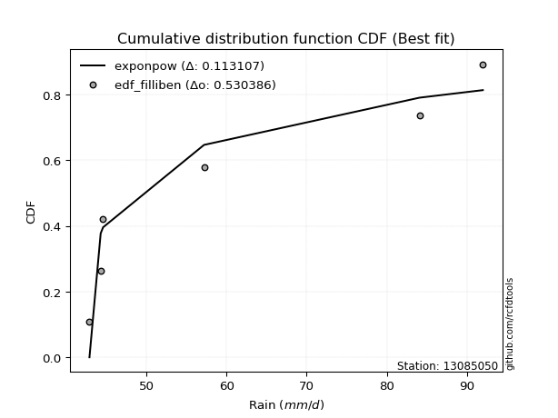</img>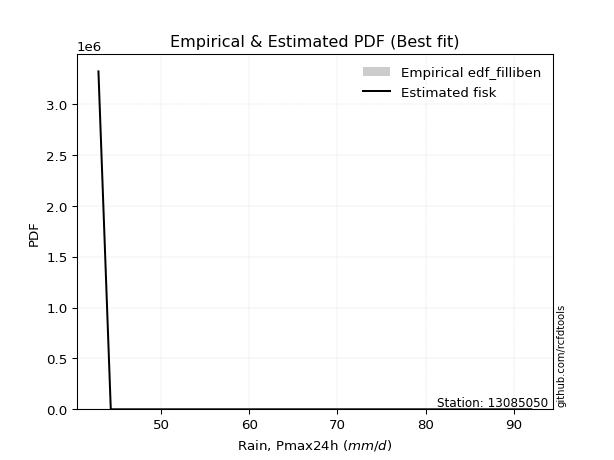</img>

</div>


### 10. EDF Jenkinson (1977)

The Jenkinson formula in hydrology is an empirical plotting position formula used to estimate the non-exceedance probability _(P)_ or return period _(T)_ of a given ordered observation within a sample. It is a widely used method in the frequency analysis of extreme events such as floods and rainfall, as it provides a distribution-free way to plot data. _a≈0.31_ and _b≈0.38_ are constants derived to approximate the median of the probability distribution for the given rank.

<div align="center">


$P=(m-a)/(n+b)$


</div>


**10.1. Empirical values**

<div align="center">

|                | 0                   | 1                   | 2                  | 3                  | 4                  | 5                  |
|:---------------|:--------------------|:--------------------|:-------------------|:-------------------|:-------------------|:-------------------|
| date           | 2007                | 2006                | 2008               | 2010               | 2005               | 2009               |
| x              | 42.9                | 44.3                | 44.6               | 57.2               | 84.1               | 92.0               |
| m              | 1                   | 2                   | 3                  | 4                  | 5                  | 6                  |
| empirical_dist | edf_jenkinson       | edf_jenkinson       | edf_jenkinson      | edf_jenkinson      | edf_jenkinson      | edf_jenkinson      |
| empirical      | 0.10815047021943573 | 0.26489028213166144 | 0.4216300940438871 | 0.5783699059561128 | 0.7351097178683387 | 0.8918495297805643 |
| empirical_tr   | 1.1212653778558874  | 1.3603411513859276  | 1.7289972899728996 | 2.3717472118959106 | 3.7751479289940844 | 9.246376811594207  |

</div>


**10.2. Kolmogorov-Smirnov fit test (sorted by Δ)**


<div align="center">

|                | 0                   | 1                   | 2                  | 3                  | 4                   | 5                  | 6                   | 7                   | 8                   | 9                  | 10                  | 11                  | 12                  | 13                  | 14                 | 15                  | 16                  | 17                  | 18                  | 19                  | 20                  | 21                  | 22                 | 23                 | 24                 | 25                  | 26                 | 27                  | 28                 | 29                 | 30                 | 31                  | 32                  | 33                 | 34                 | 35                  | 36                  | 37                  | 38                  | 39                  | 40                  | 41                  | 42                | 43                  | 44                  | 45                  | 46                 | 47                  | 48                  | 49                  | 50                  | 51                 | 52                  | 53                  | 54                  | 55                 | 56                  | 57                  | 58                  | 59                  | 60                  | 61                 | 62                  | 63                 | 64                  | 65                 | 66                  | 67                  | 68                  | 69                 | 70                  | 71                 | 72                 | 73                  | 74                  | 75                  | 76                  | 77                 | 78                  | 79                  | 80                  | 81                  | 82                  | 83                  | 84                  | 85                 | 86                 | 87                 | 88                  | 89                 | 90                  | 91                | 92                  | 93                 | 94                 | 95                 | 96                  | 97                 | 98                 | 99                 | 100                 | 101                | 102               | 103                | 104                 | 105                | 106                 | 107                | 108                | 109                | 110                 | 111                 | 112                 | 113                 | 114                | 115                | 116                 | 117                 | 118                 | 119                 | 120                | 121                 | 122                 | 123                 | 124                | 125                | 126               | 127                 | 128                 | 129                | 130                 | 131               | 132                | 133               | 134                | 135                | 136                | 137                 | 138                 | 139                 | 140                | 141                 | 142                | 143                 | 144                | 145                | 146                 | 147                | 148                 | 149                 | 150                | 151                | 152                 | 153                 | 154                | 155                 | 156                | 157                | 158                | 159            |
|:---------------|:--------------------|:--------------------|:-------------------|:-------------------|:--------------------|:-------------------|:--------------------|:--------------------|:--------------------|:-------------------|:--------------------|:--------------------|:--------------------|:--------------------|:-------------------|:--------------------|:--------------------|:--------------------|:--------------------|:--------------------|:--------------------|:--------------------|:-------------------|:-------------------|:-------------------|:--------------------|:-------------------|:--------------------|:-------------------|:-------------------|:-------------------|:--------------------|:--------------------|:-------------------|:-------------------|:--------------------|:--------------------|:--------------------|:--------------------|:--------------------|:--------------------|:--------------------|:------------------|:--------------------|:--------------------|:--------------------|:-------------------|:--------------------|:--------------------|:--------------------|:--------------------|:-------------------|:--------------------|:--------------------|:--------------------|:-------------------|:--------------------|:--------------------|:--------------------|:--------------------|:--------------------|:-------------------|:--------------------|:-------------------|:--------------------|:-------------------|:--------------------|:--------------------|:--------------------|:-------------------|:--------------------|:-------------------|:-------------------|:--------------------|:--------------------|:--------------------|:--------------------|:-------------------|:--------------------|:--------------------|:--------------------|:--------------------|:--------------------|:--------------------|:--------------------|:-------------------|:-------------------|:-------------------|:--------------------|:-------------------|:--------------------|:------------------|:--------------------|:-------------------|:-------------------|:-------------------|:--------------------|:-------------------|:-------------------|:-------------------|:--------------------|:-------------------|:------------------|:-------------------|:--------------------|:-------------------|:--------------------|:-------------------|:-------------------|:-------------------|:--------------------|:--------------------|:--------------------|:--------------------|:-------------------|:-------------------|:--------------------|:--------------------|:--------------------|:--------------------|:-------------------|:--------------------|:--------------------|:--------------------|:-------------------|:-------------------|:------------------|:--------------------|:--------------------|:-------------------|:--------------------|:------------------|:-------------------|:------------------|:-------------------|:-------------------|:-------------------|:--------------------|:--------------------|:--------------------|:-------------------|:--------------------|:-------------------|:--------------------|:-------------------|:-------------------|:--------------------|:-------------------|:--------------------|:--------------------|:-------------------|:-------------------|:--------------------|:--------------------|:-------------------|:--------------------|:-------------------|:-------------------|:-------------------|:---------------|
| station        | 13085050            | 13085050            | 13085050           | 13085050           | 13085050            | 13085050           | 13085050            | 13085050            | 13085050            | 13085050           | 13085050            | 13085050            | 13085050            | 13085050            | 13085050           | 13085050            | 13085050            | 13085050            | 13085050            | 13085050            | 13085050            | 13085050            | 13085050           | 13085050           | 13085050           | 13085050            | 13085050           | 13085050            | 13085050           | 13085050           | 13085050           | 13085050            | 13085050            | 13085050           | 13085050           | 13085050            | 13085050            | 13085050            | 13085050            | 13085050            | 13085050            | 13085050            | 13085050          | 13085050            | 13085050            | 13085050            | 13085050           | 13085050            | 13085050            | 13085050            | 13085050            | 13085050           | 13085050            | 13085050            | 13085050            | 13085050           | 13085050            | 13085050            | 13085050            | 13085050            | 13085050            | 13085050           | 13085050            | 13085050           | 13085050            | 13085050           | 13085050            | 13085050            | 13085050            | 13085050           | 13085050            | 13085050           | 13085050           | 13085050            | 13085050            | 13085050            | 13085050            | 13085050           | 13085050            | 13085050            | 13085050            | 13085050            | 13085050            | 13085050            | 13085050            | 13085050           | 13085050           | 13085050           | 13085050            | 13085050           | 13085050            | 13085050          | 13085050            | 13085050           | 13085050           | 13085050           | 13085050            | 13085050           | 13085050           | 13085050           | 13085050            | 13085050           | 13085050          | 13085050           | 13085050            | 13085050           | 13085050            | 13085050           | 13085050           | 13085050           | 13085050            | 13085050            | 13085050            | 13085050            | 13085050           | 13085050           | 13085050            | 13085050            | 13085050            | 13085050            | 13085050           | 13085050            | 13085050            | 13085050            | 13085050           | 13085050           | 13085050          | 13085050            | 13085050            | 13085050           | 13085050            | 13085050          | 13085050           | 13085050          | 13085050           | 13085050           | 13085050           | 13085050            | 13085050            | 13085050            | 13085050           | 13085050            | 13085050           | 13085050            | 13085050           | 13085050           | 13085050            | 13085050           | 13085050            | 13085050            | 13085050           | 13085050           | 13085050            | 13085050            | 13085050           | 13085050            | 13085050           | 13085050           | 13085050           | 13085050       |
| empirical_dist | edf_jenkinson       | edf_jenkinson       | edf_jenkinson      | edf_jenkinson      | edf_jenkinson       | edf_jenkinson      | edf_jenkinson       | edf_jenkinson       | edf_jenkinson       | edf_jenkinson      | edf_jenkinson       | edf_jenkinson       | edf_jenkinson       | edf_jenkinson       | edf_jenkinson      | edf_jenkinson       | edf_jenkinson       | edf_jenkinson       | edf_jenkinson       | edf_jenkinson       | edf_jenkinson       | edf_jenkinson       | edf_jenkinson      | edf_jenkinson      | edf_jenkinson      | edf_jenkinson       | edf_jenkinson      | edf_jenkinson       | edf_jenkinson      | edf_jenkinson      | edf_jenkinson      | edf_jenkinson       | edf_jenkinson       | edf_jenkinson      | edf_jenkinson      | edf_jenkinson       | edf_jenkinson       | edf_jenkinson       | edf_jenkinson       | edf_jenkinson       | edf_jenkinson       | edf_jenkinson       | edf_jenkinson     | edf_jenkinson       | edf_jenkinson       | edf_jenkinson       | edf_jenkinson      | edf_jenkinson       | edf_jenkinson       | edf_jenkinson       | edf_jenkinson       | edf_jenkinson      | edf_jenkinson       | edf_jenkinson       | edf_jenkinson       | edf_jenkinson      | edf_jenkinson       | edf_jenkinson       | edf_jenkinson       | edf_jenkinson       | edf_jenkinson       | edf_jenkinson      | edf_jenkinson       | edf_jenkinson      | edf_jenkinson       | edf_jenkinson      | edf_jenkinson       | edf_jenkinson       | edf_jenkinson       | edf_jenkinson      | edf_jenkinson       | edf_jenkinson      | edf_jenkinson      | edf_jenkinson       | edf_jenkinson       | edf_jenkinson       | edf_jenkinson       | edf_jenkinson      | edf_jenkinson       | edf_jenkinson       | edf_jenkinson       | edf_jenkinson       | edf_jenkinson       | edf_jenkinson       | edf_jenkinson       | edf_jenkinson      | edf_jenkinson      | edf_jenkinson      | edf_jenkinson       | edf_jenkinson      | edf_jenkinson       | edf_jenkinson     | edf_jenkinson       | edf_jenkinson      | edf_jenkinson      | edf_jenkinson      | edf_jenkinson       | edf_jenkinson      | edf_jenkinson      | edf_jenkinson      | edf_jenkinson       | edf_jenkinson      | edf_jenkinson     | edf_jenkinson      | edf_jenkinson       | edf_jenkinson      | edf_jenkinson       | edf_jenkinson      | edf_jenkinson      | edf_jenkinson      | edf_jenkinson       | edf_jenkinson       | edf_jenkinson       | edf_jenkinson       | edf_jenkinson      | edf_jenkinson      | edf_jenkinson       | edf_jenkinson       | edf_jenkinson       | edf_jenkinson       | edf_jenkinson      | edf_jenkinson       | edf_jenkinson       | edf_jenkinson       | edf_jenkinson      | edf_jenkinson      | edf_jenkinson     | edf_jenkinson       | edf_jenkinson       | edf_jenkinson      | edf_jenkinson       | edf_jenkinson     | edf_jenkinson      | edf_jenkinson     | edf_jenkinson      | edf_jenkinson      | edf_jenkinson      | edf_jenkinson       | edf_jenkinson       | edf_jenkinson       | edf_jenkinson      | edf_jenkinson       | edf_jenkinson      | edf_jenkinson       | edf_jenkinson      | edf_jenkinson      | edf_jenkinson       | edf_jenkinson      | edf_jenkinson       | edf_jenkinson       | edf_jenkinson      | edf_jenkinson      | edf_jenkinson       | edf_jenkinson       | edf_jenkinson      | edf_jenkinson       | edf_jenkinson      | edf_jenkinson      | edf_jenkinson      | edf_jenkinson  |
| p_dist         | exponpow            | logexponpow         | logwrapcauchy      | logbetaprime       | logarcsine          | invgamma           | ksone               | logksone            | logf                | lognakagami        | arcsine             | semicircular        | gengamma            | foldnorm            | logsemicircular    | wrapcauchy          | halfnorm            | logfoldnorm         | anglit              | logdweibull         | loghalfnorm         | exponweib           | loganglit          | loginvgauss        | invgauss           | dweibull            | rayleigh           | logexponweib        | logdgamma          | maxwell            | lograyleigh        | logweibull_min      | logburr12           | logweibull_max     | logmaxwell         | pearson3            | dgamma              | logmielke           | halflogistic        | loggengamma         | logburr             | lognct              | alpha             | genpareto           | t                   | crystalball         | norm               | logpearson3         | logalpha            | loglevy_l           | johnsonsu           | truncpareto        | weibull_min         | logloggamma         | logtruncweibull_min | betaprime          | truncweibull_min    | gumbel_r            | loghalflogistic     | logt                | lognorm             | logcrystalball     | f                   | nct                | logncf              | loginvgamma        | loggenlogistic      | burr                | genlogistic         | loggumbel_r        | moyal               | logistic           | logtruncpareto     | levy_l              | logmoyal            | logkstwobign        | loglogistic         | gumbel_l           | kstwobign           | cosine              | halfgennorm         | loggumbel_l         | logcosine           | hypsecant           | nakagami            | gamma              | loghypsecant       | loggausshyper      | logjohnsonsu        | erlang             | logrice             | rice              | genextreme          | laplace            | loglaplace         | loglaplace         | argus               | logargus           | logtriang          | triang             | loginvweibull       | burr12             | logjohnsonsb      | ncf                | logexponnorm        | loglomax           | loggenexpon         | logrdist           | loggamma           | loggamma           | loghalfgennorm      | logtruncnorm        | loggompertz         | loggennorm          | logloglaplace      | beta               | loggenextreme       | lomax               | exponnorm           | genexpon            | truncnorm          | loggenpareto        | logkappa4           | logbradford         | gennorm            | logskewnorm        | logtruncexpon     | powerlaw            | logerlang           | kappa4             | gausshyper          | fatiguelife       | logtukeylambda     | truncexpon        | loguniform         | logkappa3          | wald               | skewnorm            | logvonmises_line    | bradford            | logpowerlaw        | logfatiguelife      | gompertz           | loggenhalflogistic  | tukeylambda        | logwald            | uniform             | kappa3             | vonmises_line       | logbeta             | genhalflogistic    | logtrapezoid       | rdist               | invweibull          | trapezoid          | johnsonsb           | weibull_max        | logvonmises        | vonmises           | mielke         |
| delta          | 0.11255243173216423 | 0.11279146938258144 | 0.1383427909281163 | 0.1483469534759717 | 0.15460454680959052 | 0.1557640968953652 | 0.15694589367708606 | 0.16252013698231293 | 0.16438168961461874 | 0.1654341879971465 | 0.17214689667216249 | 0.17372835196045638 | 0.17391037572577184 | 0.17404899248944458 | 0.1793277662116769 | 0.18059756700889817 | 0.18085480609819485 | 0.18457461702087424 | 0.18607708846265844 | 0.18844555181616374 | 0.18973174450287805 | 0.18994483511057259 | 0.1916558349339124 | 0.1925349507998938 | 0.1926877931778741 | 0.19279176623709593 | 0.1937017134235713 | 0.19790889973574033 | 0.1996254857915053 | 0.1997157033583916 | 0.2006966611000147 | 0.20104986401243174 | 0.20394215772306634 | 0.2054556951956904 | 0.2062519292235266 | 0.20711603527117062 | 0.20752158151986883 | 0.20772462506331812 | 0.20852028634777078 | 0.20949406457169417 | 0.21054365719489354 | 0.21094490135679686 | 0.210956012808866 | 0.21174582627179972 | 0.21409293483735725 | 0.21413910661051766 | 0.2141391109604232 | 0.21439891912421366 | 0.21482834413039376 | 0.21507308908734718 | 0.21593818911255047 | 0.2159928809552274 | 0.21631685267790113 | 0.21731816954324282 | 0.21800608410576505 | 0.2186372891745886 | 0.21891532583196605 | 0.21917160960603688 | 0.21932568184124893 | 0.21962099213304093 | 0.21962132146499713 | 0.2196214694228515 | 0.22013778314374727 | 0.2227316756933736 | 0.22285211885970788 | 0.2252544396177947 | 0.22654157339194822 | 0.22661566611975856 | 0.22690554531499568 | 0.2271198825276339 | 0.23152472680635544 | 0.2359809567600741 | 0.2381968132215698 | 0.23930390983131172 | 0.24095303303148446 | 0.24118806065359424 | 0.24121781720341032 | 0.2425203578521904 | 0.24364115576743853 | 0.24495668040811913 | 0.24547749116196546 | 0.24649309616184534 | 0.24773702384751406 | 0.24906001982997147 | 0.24982184102557362 | 0.2524120848229918 | 0.2539773303603487 | 0.2574403604709229 | 0.26008072315878206 | 0.2621155256621298 | 0.26308602783986307 | 0.263116580919995 | 0.26372908781798077 | 0.2637555293490482 | 0.2680084504210547 | 0.2680084504210547 | 0.27298472040327876 | 0.2749486739041412 | 0.2784369658123924 | 0.2804638702300711 | 0.28417960595485525 | 0.2924855973529378 | 0.295050546662883 | 0.2981104503477223 | 0.29831479381937526 | 0.2988415942119676 | 0.29978472240322446 | 0.3021232464178325 | 0.3050449503197691 | 0.3050449503197691 | 0.30902470456888476 | 0.31599440834572845 | 0.31606833972855203 | 0.31616486769816454 | 0.3210505400277014 | 0.3214929165701864 | 0.32239784534904226 | 0.33001535695082845 | 0.33002784772211086 | 0.33126943702261225 | 0.3399720180937008 | 0.34201170174033074 | 0.34567834814438364 | 0.34777236392228655 | 0.3488701453636765 | 0.3499734041831451 | 0.351097169961161 | 0.35611189522750963 | 0.35629936832900866 | 0.3563109452577559 | 0.35729761593280107 | 0.358555180962737 | 0.3592733957923316 | 0.369670933675451 | 0.3706913342968413 | 0.3707777973457171 | 0.3710250404145879 | 0.37109638539666834 | 0.37220089202343926 | 0.37317957235043886 | 0.3733269268252112 | 0.37702049129426674 | 0.3775379659355206 | 0.38322657084242034 | 0.3841938093910671 | 0.3860772048407412 | 0.38700687612128015 | 0.3870582462938979 | 0.38737426442775214 | 0.40415210703608434 | 0.4042212987983991 | 0.4203094147827878 | 0.42163009400323903 | 0.45583138264530376 | 0.4720708877377085 | 0.48045128586546504 | 0.5353057692143226 | 1.1513376719401713 | 14.157989519112137 | nan            |
| deltao         | 0.530385761606      | 0.530385761606      | 0.530385761606     | 0.530385761606     | 0.530385761606      | 0.530385761606     | 0.530385761606      | 0.530385761606      | 0.530385761606      | 0.530385761606     | 0.530385761606      | 0.530385761606      | 0.530385761606      | 0.530385761606      | 0.530385761606     | 0.530385761606      | 0.530385761606      | 0.530385761606      | 0.530385761606      | 0.530385761606      | 0.530385761606      | 0.530385761606      | 0.530385761606     | 0.530385761606     | 0.530385761606     | 0.530385761606      | 0.530385761606     | 0.530385761606      | 0.530385761606     | 0.530385761606     | 0.530385761606     | 0.530385761606      | 0.530385761606      | 0.530385761606     | 0.530385761606     | 0.530385761606      | 0.530385761606      | 0.530385761606      | 0.530385761606      | 0.530385761606      | 0.530385761606      | 0.530385761606      | 0.530385761606    | 0.530385761606      | 0.530385761606      | 0.530385761606      | 0.530385761606     | 0.530385761606      | 0.530385761606      | 0.530385761606      | 0.530385761606      | 0.530385761606     | 0.530385761606      | 0.530385761606      | 0.530385761606      | 0.530385761606     | 0.530385761606      | 0.530385761606      | 0.530385761606      | 0.530385761606      | 0.530385761606      | 0.530385761606     | 0.530385761606      | 0.530385761606     | 0.530385761606      | 0.530385761606     | 0.530385761606      | 0.530385761606      | 0.530385761606      | 0.530385761606     | 0.530385761606      | 0.530385761606     | 0.530385761606     | 0.530385761606      | 0.530385761606      | 0.530385761606      | 0.530385761606      | 0.530385761606     | 0.530385761606      | 0.530385761606      | 0.530385761606      | 0.530385761606      | 0.530385761606      | 0.530385761606      | 0.530385761606      | 0.530385761606     | 0.530385761606     | 0.530385761606     | 0.530385761606      | 0.530385761606     | 0.530385761606      | 0.530385761606    | 0.530385761606      | 0.530385761606     | 0.530385761606     | 0.530385761606     | 0.530385761606      | 0.530385761606     | 0.530385761606     | 0.530385761606     | 0.530385761606      | 0.530385761606     | 0.530385761606    | 0.530385761606     | 0.530385761606      | 0.530385761606     | 0.530385761606      | 0.530385761606     | 0.530385761606     | 0.530385761606     | 0.530385761606      | 0.530385761606      | 0.530385761606      | 0.530385761606      | 0.530385761606     | 0.530385761606     | 0.530385761606      | 0.530385761606      | 0.530385761606      | 0.530385761606      | 0.530385761606     | 0.530385761606      | 0.530385761606      | 0.530385761606      | 0.530385761606     | 0.530385761606     | 0.530385761606    | 0.530385761606      | 0.530385761606      | 0.530385761606     | 0.530385761606      | 0.530385761606    | 0.530385761606     | 0.530385761606    | 0.530385761606     | 0.530385761606     | 0.530385761606     | 0.530385761606      | 0.530385761606      | 0.530385761606      | 0.530385761606     | 0.530385761606      | 0.530385761606     | 0.530385761606      | 0.530385761606     | 0.530385761606     | 0.530385761606      | 0.530385761606     | 0.530385761606      | 0.530385761606      | 0.530385761606     | 0.530385761606     | 0.530385761606      | 0.530385761606      | 0.530385761606     | 0.530385761606      | 0.530385761606     | 0.530385761606     | 0.530385761606     | 0.530385761606 |
| eval           | Δo > Δ              | Δo > Δ              | Δo > Δ             | Δo > Δ             | Δo > Δ              | Δo > Δ             | Δo > Δ              | Δo > Δ              | Δo > Δ              | Δo > Δ             | Δo > Δ              | Δo > Δ              | Δo > Δ              | Δo > Δ              | Δo > Δ             | Δo > Δ              | Δo > Δ              | Δo > Δ              | Δo > Δ              | Δo > Δ              | Δo > Δ              | Δo > Δ              | Δo > Δ             | Δo > Δ             | Δo > Δ             | Δo > Δ              | Δo > Δ             | Δo > Δ              | Δo > Δ             | Δo > Δ             | Δo > Δ             | Δo > Δ              | Δo > Δ              | Δo > Δ             | Δo > Δ             | Δo > Δ              | Δo > Δ              | Δo > Δ              | Δo > Δ              | Δo > Δ              | Δo > Δ              | Δo > Δ              | Δo > Δ            | Δo > Δ              | Δo > Δ              | Δo > Δ              | Δo > Δ             | Δo > Δ              | Δo > Δ              | Δo > Δ              | Δo > Δ              | Δo > Δ             | Δo > Δ              | Δo > Δ              | Δo > Δ              | Δo > Δ             | Δo > Δ              | Δo > Δ              | Δo > Δ              | Δo > Δ              | Δo > Δ              | Δo > Δ             | Δo > Δ              | Δo > Δ             | Δo > Δ              | Δo > Δ             | Δo > Δ              | Δo > Δ              | Δo > Δ              | Δo > Δ             | Δo > Δ              | Δo > Δ             | Δo > Δ             | Δo > Δ              | Δo > Δ              | Δo > Δ              | Δo > Δ              | Δo > Δ             | Δo > Δ              | Δo > Δ              | Δo > Δ              | Δo > Δ              | Δo > Δ              | Δo > Δ              | Δo > Δ              | Δo > Δ             | Δo > Δ             | Δo > Δ             | Δo > Δ              | Δo > Δ             | Δo > Δ              | Δo > Δ            | Δo > Δ              | Δo > Δ             | Δo > Δ             | Δo > Δ             | Δo > Δ              | Δo > Δ             | Δo > Δ             | Δo > Δ             | Δo > Δ              | Δo > Δ             | Δo > Δ            | Δo > Δ             | Δo > Δ              | Δo > Δ             | Δo > Δ              | Δo > Δ             | Δo > Δ             | Δo > Δ             | Δo > Δ              | Δo > Δ              | Δo > Δ              | Δo > Δ              | Δo > Δ             | Δo > Δ             | Δo > Δ              | Δo > Δ              | Δo > Δ              | Δo > Δ              | Δo > Δ             | Δo > Δ              | Δo > Δ              | Δo > Δ              | Δo > Δ             | Δo > Δ             | Δo > Δ            | Δo > Δ              | Δo > Δ              | Δo > Δ             | Δo > Δ              | Δo > Δ            | Δo > Δ             | Δo > Δ            | Δo > Δ             | Δo > Δ             | Δo > Δ             | Δo > Δ              | Δo > Δ              | Δo > Δ              | Δo > Δ             | Δo > Δ              | Δo > Δ             | Δo > Δ              | Δo > Δ             | Δo > Δ             | Δo > Δ              | Δo > Δ             | Δo > Δ              | Δo > Δ              | Δo > Δ             | Δo > Δ             | Δo > Δ              | Δo > Δ              | Δo > Δ             | Δo > Δ              | Δo <= Δ            | Δo <= Δ            | Δo <= Δ            | Δo <= Δ        |
| fit            | 1                   | 1                   | 1                  | 1                  | 1                   | 1                  | 1                   | 1                   | 1                   | 1                  | 1                   | 1                   | 1                   | 1                   | 1                  | 1                   | 1                   | 1                   | 1                   | 1                   | 1                   | 1                   | 1                  | 1                  | 1                  | 1                   | 1                  | 1                   | 1                  | 1                  | 1                  | 1                   | 1                   | 1                  | 1                  | 1                   | 1                   | 1                   | 1                   | 1                   | 1                   | 1                   | 1                 | 1                   | 1                   | 1                   | 1                  | 1                   | 1                   | 1                   | 1                   | 1                  | 1                   | 1                   | 1                   | 1                  | 1                   | 1                   | 1                   | 1                   | 1                   | 1                  | 1                   | 1                  | 1                   | 1                  | 1                   | 1                   | 1                   | 1                  | 1                   | 1                  | 1                  | 1                   | 1                   | 1                   | 1                   | 1                  | 1                   | 1                   | 1                   | 1                   | 1                   | 1                   | 1                   | 1                  | 1                  | 1                  | 1                   | 1                  | 1                   | 1                 | 1                   | 1                  | 1                  | 1                  | 1                   | 1                  | 1                  | 1                  | 1                   | 1                  | 1                 | 1                  | 1                   | 1                  | 1                   | 1                  | 1                  | 1                  | 1                   | 1                   | 1                   | 1                   | 1                  | 1                  | 1                   | 1                   | 1                   | 1                   | 1                  | 1                   | 1                   | 1                   | 1                  | 1                  | 1                 | 1                   | 1                   | 1                  | 1                   | 1                 | 1                  | 1                 | 1                  | 1                  | 1                  | 1                   | 1                   | 1                   | 1                  | 1                   | 1                  | 1                   | 1                  | 1                  | 1                   | 1                  | 1                   | 1                   | 1                  | 1                  | 1                   | 1                   | 1                  | 1                   | 0                  | 0                  | 0                  | 0              |
| n              | 6                   | 6                   | 6                  | 6                  | 6                   | 6                  | 6                   | 6                   | 6                   | 6                  | 6                   | 6                   | 6                   | 6                   | 6                  | 6                   | 6                   | 6                   | 6                   | 6                   | 6                   | 6                   | 6                  | 6                  | 6                  | 6                   | 6                  | 6                   | 6                  | 6                  | 6                  | 6                   | 6                   | 6                  | 6                  | 6                   | 6                   | 6                   | 6                   | 6                   | 6                   | 6                   | 6                 | 6                   | 6                   | 6                   | 6                  | 6                   | 6                   | 6                   | 6                   | 6                  | 6                   | 6                   | 6                   | 6                  | 6                   | 6                   | 6                   | 6                   | 6                   | 6                  | 6                   | 6                  | 6                   | 6                  | 6                   | 6                   | 6                   | 6                  | 6                   | 6                  | 6                  | 6                   | 6                   | 6                   | 6                   | 6                  | 6                   | 6                   | 6                   | 6                   | 6                   | 6                   | 6                   | 6                  | 6                  | 6                  | 6                   | 6                  | 6                   | 6                 | 6                   | 6                  | 6                  | 6                  | 6                   | 6                  | 6                  | 6                  | 6                   | 6                  | 6                 | 6                  | 6                   | 6                  | 6                   | 6                  | 6                  | 6                  | 6                   | 6                   | 6                   | 6                   | 6                  | 6                  | 6                   | 6                   | 6                   | 6                   | 6                  | 6                   | 6                   | 6                   | 6                  | 6                  | 6                 | 6                   | 6                   | 6                  | 6                   | 6                 | 6                  | 6                 | 6                  | 6                  | 6                  | 6                   | 6                   | 6                   | 6                  | 6                   | 6                  | 6                   | 6                  | 6                  | 6                   | 6                  | 6                   | 6                   | 6                  | 6                  | 6                   | 6                   | 6                  | 6                   | 6                  | 6                  | 6                  | 6              |
| best_fit       | 1                   | 0                   | 0                  | 0                  | 0                   | 0                  | 0                   | 0                   | 0                   | 0                  | 0                   | 0                   | 0                   | 0                   | 0                  | 0                   | 0                   | 0                   | 0                   | 0                   | 0                   | 0                   | 0                  | 0                  | 0                  | 0                   | 0                  | 0                   | 0                  | 0                  | 0                  | 0                   | 0                   | 0                  | 0                  | 0                   | 0                   | 0                   | 0                   | 0                   | 0                   | 0                   | 0                 | 0                   | 0                   | 0                   | 0                  | 0                   | 0                   | 0                   | 0                   | 0                  | 0                   | 0                   | 0                   | 0                  | 0                   | 0                   | 0                   | 0                   | 0                   | 0                  | 0                   | 0                  | 0                   | 0                  | 0                   | 0                   | 0                   | 0                  | 0                   | 0                  | 0                  | 0                   | 0                   | 0                   | 0                   | 0                  | 0                   | 0                   | 0                   | 0                   | 0                   | 0                   | 0                   | 0                  | 0                  | 0                  | 0                   | 0                  | 0                   | 0                 | 0                   | 0                  | 0                  | 0                  | 0                   | 0                  | 0                  | 0                  | 0                   | 0                  | 0                 | 0                  | 0                   | 0                  | 0                   | 0                  | 0                  | 0                  | 0                   | 0                   | 0                   | 0                   | 0                  | 0                  | 0                   | 0                   | 0                   | 0                   | 0                  | 0                   | 0                   | 0                   | 0                  | 0                  | 0                 | 0                   | 0                   | 0                  | 0                   | 0                 | 0                  | 0                 | 0                  | 0                  | 0                  | 0                   | 0                   | 0                   | 0                  | 0                   | 0                  | 0                   | 0                  | 0                  | 0                   | 0                  | 0                   | 0                   | 0                  | 0                  | 0                   | 0                   | 0                  | 0                   | 0                  | 0                  | 0                  | 0              |
| best_fit_sort  | 1                   | 2                   | 3                  | 4                  | 5                   | 6                  | 7                   | 8                   | 9                   | 10                 | 11                  | 12                  | 13                  | 14                  | 15                 | 16                  | 17                  | 18                  | 19                  | 20                  | 21                  | 22                  | 23                 | 24                 | 25                 | 26                  | 27                 | 28                  | 29                 | 30                 | 31                 | 32                  | 33                  | 34                 | 35                 | 36                  | 37                  | 38                  | 39                  | 40                  | 41                  | 42                  | 43                | 44                  | 45                  | 46                  | 47                 | 48                  | 49                  | 50                  | 51                  | 52                 | 53                  | 54                  | 55                  | 56                 | 57                  | 58                  | 59                  | 60                  | 61                  | 62                 | 63                  | 64                 | 65                  | 66                 | 67                  | 68                  | 69                  | 70                 | 71                  | 72                 | 73                 | 74                  | 75                  | 76                  | 77                  | 78                 | 79                  | 80                  | 81                  | 82                  | 83                  | 84                  | 85                  | 86                 | 87                 | 88                 | 89                  | 90                 | 91                  | 92                | 93                  | 94                 | 95                 | 96                 | 97                  | 98                 | 99                 | 100                | 101                 | 102                | 103               | 104                | 105                 | 106                | 107                 | 108                | 109                | 110                | 111                 | 112                 | 113                 | 114                 | 115                | 116                | 117                 | 118                 | 119                 | 120                 | 121                | 122                 | 123                 | 124                 | 125                | 126                | 127               | 128                 | 129                 | 130                | 131                 | 132               | 133                | 134               | 135                | 136                | 137                | 138                 | 139                 | 140                 | 141                | 142                 | 143                | 144                 | 145                | 146                | 147                 | 148                | 149                 | 150                 | 151                | 152                | 153                 | 154                 | 155                | 156                 | 157                | 158                | 159                | 160            |

</div>


**10.3. Best fit**

<div align="center">

|   id |   station | empirical_dist   | p_dist   |    delta |   deltao | eval   |   fit |   n |   best_fit |   best_fit_sort |
|-----:|----------:|:-----------------|:---------|---------:|---------:|:-------|------:|----:|-----------:|----------------:|
|    0 |  13085050 | edf_jenkinson    | exponpow | 0.112552 | 0.530386 | Δo > Δ |     1 |   6 |          1 |               1 |

</div>


<div align="center">

</img></img>

</div>


### 11. EDF Cunnane (1978)

Cunnane´s work in statistical hydrology has focused on the performance and evaluation of different probability distributions (such as GEV, Gumbel, Lognormal) for flood frequency estimation. _b_ is a constant, typically set to 0.4.

<div align="center">


$P=(m-b)/(n+1-2b)$


</div>


**11.1. Empirical values**

<div align="center">

|                | 0                  | 1                   | 2                   | 3                  | 4                  | 5                  |
|:---------------|:-------------------|:--------------------|:--------------------|:-------------------|:-------------------|:-------------------|
| date           | 2007               | 2006                | 2008                | 2010               | 2005               | 2009               |
| x              | 42.9               | 44.3                | 44.6                | 57.2               | 84.1               | 92.0               |
| m              | 1                  | 2                   | 3                   | 4                  | 5                  | 6                  |
| empirical_dist | edf_cunnane        | edf_cunnane         | edf_cunnane         | edf_cunnane        | edf_cunnane        | edf_cunnane        |
| empirical      | 0.0967741935483871 | 0.25806451612903225 | 0.41935483870967744 | 0.5806451612903226 | 0.7419354838709676 | 0.9032258064516128 |
| empirical_tr   | 1.1071428571428572 | 1.3478260869565217  | 1.7222222222222225  | 2.384615384615385  | 3.8749999999999982 | 10.333333333333318 |

</div>


**11.2. Kolmogorov-Smirnov fit test (sorted by Δ)**


<div align="center">

|                | 0                   | 1                  | 2                  | 3                   | 4                  | 5                   | 6                   | 7                   | 8                   | 9                   | 10                  | 11                 | 12                 | 13                 | 14                  | 15                  | 16                  | 17                  | 18                  | 19                  | 20                  | 21                 | 22                 | 23                | 24                 | 25                 | 26                  | 27                 | 28                | 29                  | 30                  | 31                 | 32                  | 33                  | 34                  | 35                 | 36                 | 37                  | 38                  | 39                 | 40                 | 41                  | 42                  | 43                  | 44                  | 45                  | 46                  | 47                  | 48                  | 49                 | 50                  | 51                  | 52                  | 53                  | 54                  | 55                  | 56                  | 57                 | 58                  | 59                  | 60                 | 61                  | 62                  | 63                | 64                  | 65                  | 66                  | 67                | 68                 | 69                  | 70                  | 71                  | 72                 | 73                  | 74                  | 75                  | 76                 | 77                  | 78                  | 79                  | 80                  | 81                  | 82                  | 83                  | 84                  | 85                  | 86                | 87                 | 88                  | 89               | 90                 | 91                 | 92                  | 93                | 94                | 95                  | 96                 | 97                 | 98                 | 99                 | 100                | 101                 | 102                 | 103                | 104                 | 105                | 106                | 107                | 108                 | 109                 | 110               | 111                 | 112                 | 113                 | 114                 | 115                 | 116                 | 117                 | 118                | 119                | 120                | 121                 | 122                 | 123                | 124                 | 125                 | 126                 | 127                | 128                | 129                | 130                | 131                | 132                 | 133                | 134                | 135                | 136                | 137                 | 138                 | 139                 | 140                | 141                 | 142                 | 143                 | 144                | 145                | 146                 | 147                | 148                 | 149                | 150                 | 151                 | 152                 | 153                | 154                | 155                | 156                | 157                | 158               | 159            |
|:---------------|:--------------------|:-------------------|:-------------------|:--------------------|:-------------------|:--------------------|:--------------------|:--------------------|:--------------------|:--------------------|:--------------------|:-------------------|:-------------------|:-------------------|:--------------------|:--------------------|:--------------------|:--------------------|:--------------------|:--------------------|:--------------------|:-------------------|:-------------------|:------------------|:-------------------|:-------------------|:--------------------|:-------------------|:------------------|:--------------------|:--------------------|:-------------------|:--------------------|:--------------------|:--------------------|:-------------------|:-------------------|:--------------------|:--------------------|:-------------------|:-------------------|:--------------------|:--------------------|:--------------------|:--------------------|:--------------------|:--------------------|:--------------------|:--------------------|:-------------------|:--------------------|:--------------------|:--------------------|:--------------------|:--------------------|:--------------------|:--------------------|:-------------------|:--------------------|:--------------------|:-------------------|:--------------------|:--------------------|:------------------|:--------------------|:--------------------|:--------------------|:------------------|:-------------------|:--------------------|:--------------------|:--------------------|:-------------------|:--------------------|:--------------------|:--------------------|:-------------------|:--------------------|:--------------------|:--------------------|:--------------------|:--------------------|:--------------------|:--------------------|:--------------------|:--------------------|:------------------|:-------------------|:--------------------|:-----------------|:-------------------|:-------------------|:--------------------|:------------------|:------------------|:--------------------|:-------------------|:-------------------|:-------------------|:-------------------|:-------------------|:--------------------|:--------------------|:-------------------|:--------------------|:-------------------|:-------------------|:-------------------|:--------------------|:--------------------|:------------------|:--------------------|:--------------------|:--------------------|:--------------------|:--------------------|:--------------------|:--------------------|:-------------------|:-------------------|:-------------------|:--------------------|:--------------------|:-------------------|:--------------------|:--------------------|:--------------------|:-------------------|:-------------------|:-------------------|:-------------------|:-------------------|:--------------------|:-------------------|:-------------------|:-------------------|:-------------------|:--------------------|:--------------------|:--------------------|:-------------------|:--------------------|:--------------------|:--------------------|:-------------------|:-------------------|:--------------------|:-------------------|:--------------------|:-------------------|:--------------------|:--------------------|:--------------------|:-------------------|:-------------------|:-------------------|:-------------------|:-------------------|:------------------|:---------------|
| station        | 13085050            | 13085050           | 13085050           | 13085050            | 13085050           | 13085050            | 13085050            | 13085050            | 13085050            | 13085050            | 13085050            | 13085050           | 13085050           | 13085050           | 13085050            | 13085050            | 13085050            | 13085050            | 13085050            | 13085050            | 13085050            | 13085050           | 13085050           | 13085050          | 13085050           | 13085050           | 13085050            | 13085050           | 13085050          | 13085050            | 13085050            | 13085050           | 13085050            | 13085050            | 13085050            | 13085050           | 13085050           | 13085050            | 13085050            | 13085050           | 13085050           | 13085050            | 13085050            | 13085050            | 13085050            | 13085050            | 13085050            | 13085050            | 13085050            | 13085050           | 13085050            | 13085050            | 13085050            | 13085050            | 13085050            | 13085050            | 13085050            | 13085050           | 13085050            | 13085050            | 13085050           | 13085050            | 13085050            | 13085050          | 13085050            | 13085050            | 13085050            | 13085050          | 13085050           | 13085050            | 13085050            | 13085050            | 13085050           | 13085050            | 13085050            | 13085050            | 13085050           | 13085050            | 13085050            | 13085050            | 13085050            | 13085050            | 13085050            | 13085050            | 13085050            | 13085050            | 13085050          | 13085050           | 13085050            | 13085050         | 13085050           | 13085050           | 13085050            | 13085050          | 13085050          | 13085050            | 13085050           | 13085050           | 13085050           | 13085050           | 13085050           | 13085050            | 13085050            | 13085050           | 13085050            | 13085050           | 13085050           | 13085050           | 13085050            | 13085050            | 13085050          | 13085050            | 13085050            | 13085050            | 13085050            | 13085050            | 13085050            | 13085050            | 13085050           | 13085050           | 13085050           | 13085050            | 13085050            | 13085050           | 13085050            | 13085050            | 13085050            | 13085050           | 13085050           | 13085050           | 13085050           | 13085050           | 13085050            | 13085050           | 13085050           | 13085050           | 13085050           | 13085050            | 13085050            | 13085050            | 13085050           | 13085050            | 13085050            | 13085050            | 13085050           | 13085050           | 13085050            | 13085050           | 13085050            | 13085050           | 13085050            | 13085050            | 13085050            | 13085050           | 13085050           | 13085050           | 13085050           | 13085050           | 13085050          | 13085050       |
| empirical_dist | edf_cunnane         | edf_cunnane        | edf_cunnane        | edf_cunnane         | edf_cunnane        | edf_cunnane         | edf_cunnane         | edf_cunnane         | edf_cunnane         | edf_cunnane         | edf_cunnane         | edf_cunnane        | edf_cunnane        | edf_cunnane        | edf_cunnane         | edf_cunnane         | edf_cunnane         | edf_cunnane         | edf_cunnane         | edf_cunnane         | edf_cunnane         | edf_cunnane        | edf_cunnane        | edf_cunnane       | edf_cunnane        | edf_cunnane        | edf_cunnane         | edf_cunnane        | edf_cunnane       | edf_cunnane         | edf_cunnane         | edf_cunnane        | edf_cunnane         | edf_cunnane         | edf_cunnane         | edf_cunnane        | edf_cunnane        | edf_cunnane         | edf_cunnane         | edf_cunnane        | edf_cunnane        | edf_cunnane         | edf_cunnane         | edf_cunnane         | edf_cunnane         | edf_cunnane         | edf_cunnane         | edf_cunnane         | edf_cunnane         | edf_cunnane        | edf_cunnane         | edf_cunnane         | edf_cunnane         | edf_cunnane         | edf_cunnane         | edf_cunnane         | edf_cunnane         | edf_cunnane        | edf_cunnane         | edf_cunnane         | edf_cunnane        | edf_cunnane         | edf_cunnane         | edf_cunnane       | edf_cunnane         | edf_cunnane         | edf_cunnane         | edf_cunnane       | edf_cunnane        | edf_cunnane         | edf_cunnane         | edf_cunnane         | edf_cunnane        | edf_cunnane         | edf_cunnane         | edf_cunnane         | edf_cunnane        | edf_cunnane         | edf_cunnane         | edf_cunnane         | edf_cunnane         | edf_cunnane         | edf_cunnane         | edf_cunnane         | edf_cunnane         | edf_cunnane         | edf_cunnane       | edf_cunnane        | edf_cunnane         | edf_cunnane      | edf_cunnane        | edf_cunnane        | edf_cunnane         | edf_cunnane       | edf_cunnane       | edf_cunnane         | edf_cunnane        | edf_cunnane        | edf_cunnane        | edf_cunnane        | edf_cunnane        | edf_cunnane         | edf_cunnane         | edf_cunnane        | edf_cunnane         | edf_cunnane        | edf_cunnane        | edf_cunnane        | edf_cunnane         | edf_cunnane         | edf_cunnane       | edf_cunnane         | edf_cunnane         | edf_cunnane         | edf_cunnane         | edf_cunnane         | edf_cunnane         | edf_cunnane         | edf_cunnane        | edf_cunnane        | edf_cunnane        | edf_cunnane         | edf_cunnane         | edf_cunnane        | edf_cunnane         | edf_cunnane         | edf_cunnane         | edf_cunnane        | edf_cunnane        | edf_cunnane        | edf_cunnane        | edf_cunnane        | edf_cunnane         | edf_cunnane        | edf_cunnane        | edf_cunnane        | edf_cunnane        | edf_cunnane         | edf_cunnane         | edf_cunnane         | edf_cunnane        | edf_cunnane         | edf_cunnane         | edf_cunnane         | edf_cunnane        | edf_cunnane        | edf_cunnane         | edf_cunnane        | edf_cunnane         | edf_cunnane        | edf_cunnane         | edf_cunnane         | edf_cunnane         | edf_cunnane        | edf_cunnane        | edf_cunnane        | edf_cunnane        | edf_cunnane        | edf_cunnane       | edf_cunnane    |
| p_dist         | exponpow            | logexponpow        | logwrapcauchy      | logbetaprime        | invgamma           | ksone               | lognakagami         | logksone            | logf                | logarcsine          | gengamma            | semicircular       | foldnorm           | logsemicircular    | halfnorm            | logdweibull         | logfoldnorm         | arcsine             | anglit              | wrapcauchy          | loghalfnorm         | exponweib          | loganglit          | loginvgauss       | invgauss           | rayleigh           | logdgamma           | maxwell            | lograyleigh       | logweibull_min      | logburr12           | logmaxwell         | dweibull            | pearson3            | logmielke           | halflogistic       | logweibull_max     | logburr             | lognct              | alpha              | logexponweib       | t                   | crystalball         | norm                | truncweibull_min    | logpearson3         | weibull_min         | logalpha            | johnsonsu           | truncpareto        | logloggamma         | logtruncweibull_min | betaprime           | gumbel_r            | loghalflogistic     | logt                | lognorm             | logcrystalball     | f                   | dgamma              | nct                | logncf              | loggengamma         | loginvgamma       | genpareto           | loggenlogistic      | burr                | genlogistic       | loggumbel_r        | loglevy_l           | moyal               | logistic            | logtruncpareto     | logmoyal            | logkstwobign        | loglogistic         | gumbel_l           | kstwobign           | cosine              | halfgennorm         | loggumbel_l         | logcosine           | gamma               | hypsecant           | nakagami            | levy_l              | loghypsecant      | loggausshyper      | logjohnsonsu        | erlang           | logrice            | rice               | laplace             | loglaplace        | loglaplace        | argus               | logargus           | genextreme         | logtriang          | triang             | burr12             | loginvweibull       | logexponnorm        | loglomax           | loggenexpon         | logrdist           | loggamma           | loggamma           | logjohnsonsb        | loghalfgennorm      | ncf               | logtruncnorm        | loggompertz         | loggennorm          | lomax               | exponnorm           | genexpon            | logloglaplace       | beta               | loggenextreme      | truncnorm          | logkappa4           | logbradford         | logskewnorm        | logtruncexpon       | loggenpareto        | logerlang           | kappa4             | gausshyper         | logtukeylambda     | gennorm            | powerlaw           | fatiguelife         | truncexpon         | loguniform         | logkappa3          | wald               | skewnorm            | logvonmises_line    | bradford            | gompertz           | logpowerlaw         | loggenhalflogistic  | tukeylambda         | logwald            | logfatiguelife     | uniform             | kappa3             | vonmises_line       | genhalflogistic    | logbeta             | rdist               | logtrapezoid        | invweibull         | trapezoid          | johnsonsb          | weibull_max        | logvonmises        | vonmises          | mielke         |
| delta          | 0.11937819773479341 | 0.1241677460536299 | 0.1397426391668265 | 0.14607169814176202 | 0.1534888415611554 | 0.15467063834287637 | 0.15860842199451752 | 0.16024488164810324 | 0.16210643428040894 | 0.16598082348063917 | 0.16708460972314287 | 0.1714530966262467 | 0.1717737371552349 | 0.1770525108774672 | 0.17857955076398516 | 0.18161978581353477 | 0.18229936168666455 | 0.18352317334321114 | 0.18380183312844875 | 0.18742333301152714 | 0.18745648916866836 | 0.1876695797763629 | 0.1893805795997027 | 0.190259695465684 | 0.1904125378436643 | 0.1914264580893616 | 0.19697014014300265 | 0.1974404480241819 | 0.198421405765805 | 0.19877460867822205 | 0.20166690238885665 | 0.2039766738893169 | 0.20416804290814458 | 0.20484077993696093 | 0.20544936972910843 | 0.2062450310135611 | 0.2077309505299002 | 0.20826840186068385 | 0.20866964602258717 | 0.2086807574746562 | 0.2092851764067888 | 0.21181767950314756 | 0.21186385127630797 | 0.21186385562621352 | 0.21208955982933708 | 0.21212366379000397 | 0.21230715159539715 | 0.21255308879618406 | 0.21366293377834078 | 0.2137176256210177 | 0.21504291420903313 | 0.21573082877155525 | 0.21636203384037891 | 0.21689635427182719 | 0.21705042650703923 | 0.21734573679883123 | 0.21734606613078744 | 0.2173462140886418 | 0.21786252780953758 | 0.21889785819091748 | 0.2204564203591639 | 0.22057686352549818 | 0.22087034124274263 | 0.222979184283585 | 0.22312210294284837 | 0.22426631805773853 | 0.22434041078554887 | 0.224630289980786 | 0.2248446271934242 | 0.22644936575839583 | 0.22924947147214575 | 0.23370570142586441 | 0.2359215578873601 | 0.23867777769727477 | 0.23891280531938455 | 0.23894256186920063 | 0.2402451025179807 | 0.24136590043322884 | 0.24268142507390944 | 0.24320223582775577 | 0.24421784082763565 | 0.24546176851330437 | 0.24558631882036286 | 0.24678476449576178 | 0.24754658569136392 | 0.25068018650236035 | 0.251702075026139 | 0.2551651051367132 | 0.25780546782457237 | 0.25984027032792 | 0.2608107725056534 | 0.2608413255857853 | 0.26148027401483853 | 0.265733195086845 | 0.265733195086845 | 0.27070946506906907 | 0.2726734185699315 | 0.2751053644890292 | 0.2761617104781827 | 0.2827391255642809 | 0.2902103420187281 | 0.29100537195748444 | 0.29603953848516557 | 0.2965663388777579 | 0.29750946706901477 | 0.2998479910836228 | 0.3027696949855593 | 0.3027696949855593 | 0.30642682333393145 | 0.30674944923467506 | 0.309486727018771 | 0.31371915301151876 | 0.31379308439434234 | 0.31388961236395474 | 0.32774010161661876 | 0.32775259238790116 | 0.32899418168840255 | 0.33242681669875007 | 0.3328691932412351 | 0.3337741220200907 | 0.3376967627594911 | 0.34340309281017395 | 0.34549710858807686 | 0.3476981488489354 | 0.34882191462695133 | 0.35338797841137937 | 0.35402411299479886 | 0.3540356899235462 | 0.3550223605985914 | 0.3569981404581219 | 0.3602464220347251 | 0.3629376612301388 | 0.36538094696536616 | 0.3673956783412413 | 0.3684160789626316 | 0.3685025420115074 | 0.3687497850803782 | 0.36882113006245865 | 0.36992563668922956 | 0.37090431701622917 | 0.3752627106013109 | 0.38015269282784037 | 0.38095131550821065 | 0.38191855405685743 | 0.3838019495065315 | 0.3838462572968959 | 0.38473162078707046 | 0.3847829909596882 | 0.38509900909354244 | 0.4064965541326089 | 0.41552838370713296 | 0.41935483866902923 | 0.42258467011699763 | 0.4672076593163522 | 0.4743461430719183 | 0.4872770518680942 | 0.5421315352169516 | 1.1445119059375424 | 14.14661324244109 | nan            |
| deltao         | 0.530385761606      | 0.530385761606     | 0.530385761606     | 0.530385761606      | 0.530385761606     | 0.530385761606      | 0.530385761606      | 0.530385761606      | 0.530385761606      | 0.530385761606      | 0.530385761606      | 0.530385761606     | 0.530385761606     | 0.530385761606     | 0.530385761606      | 0.530385761606      | 0.530385761606      | 0.530385761606      | 0.530385761606      | 0.530385761606      | 0.530385761606      | 0.530385761606     | 0.530385761606     | 0.530385761606    | 0.530385761606     | 0.530385761606     | 0.530385761606      | 0.530385761606     | 0.530385761606    | 0.530385761606      | 0.530385761606      | 0.530385761606     | 0.530385761606      | 0.530385761606      | 0.530385761606      | 0.530385761606     | 0.530385761606     | 0.530385761606      | 0.530385761606      | 0.530385761606     | 0.530385761606     | 0.530385761606      | 0.530385761606      | 0.530385761606      | 0.530385761606      | 0.530385761606      | 0.530385761606      | 0.530385761606      | 0.530385761606      | 0.530385761606     | 0.530385761606      | 0.530385761606      | 0.530385761606      | 0.530385761606      | 0.530385761606      | 0.530385761606      | 0.530385761606      | 0.530385761606     | 0.530385761606      | 0.530385761606      | 0.530385761606     | 0.530385761606      | 0.530385761606      | 0.530385761606    | 0.530385761606      | 0.530385761606      | 0.530385761606      | 0.530385761606    | 0.530385761606     | 0.530385761606      | 0.530385761606      | 0.530385761606      | 0.530385761606     | 0.530385761606      | 0.530385761606      | 0.530385761606      | 0.530385761606     | 0.530385761606      | 0.530385761606      | 0.530385761606      | 0.530385761606      | 0.530385761606      | 0.530385761606      | 0.530385761606      | 0.530385761606      | 0.530385761606      | 0.530385761606    | 0.530385761606     | 0.530385761606      | 0.530385761606   | 0.530385761606     | 0.530385761606     | 0.530385761606      | 0.530385761606    | 0.530385761606    | 0.530385761606      | 0.530385761606     | 0.530385761606     | 0.530385761606     | 0.530385761606     | 0.530385761606     | 0.530385761606      | 0.530385761606      | 0.530385761606     | 0.530385761606      | 0.530385761606     | 0.530385761606     | 0.530385761606     | 0.530385761606      | 0.530385761606      | 0.530385761606    | 0.530385761606      | 0.530385761606      | 0.530385761606      | 0.530385761606      | 0.530385761606      | 0.530385761606      | 0.530385761606      | 0.530385761606     | 0.530385761606     | 0.530385761606     | 0.530385761606      | 0.530385761606      | 0.530385761606     | 0.530385761606      | 0.530385761606      | 0.530385761606      | 0.530385761606     | 0.530385761606     | 0.530385761606     | 0.530385761606     | 0.530385761606     | 0.530385761606      | 0.530385761606     | 0.530385761606     | 0.530385761606     | 0.530385761606     | 0.530385761606      | 0.530385761606      | 0.530385761606      | 0.530385761606     | 0.530385761606      | 0.530385761606      | 0.530385761606      | 0.530385761606     | 0.530385761606     | 0.530385761606      | 0.530385761606     | 0.530385761606      | 0.530385761606     | 0.530385761606      | 0.530385761606      | 0.530385761606      | 0.530385761606     | 0.530385761606     | 0.530385761606     | 0.530385761606     | 0.530385761606     | 0.530385761606    | 0.530385761606 |
| eval           | Δo > Δ              | Δo > Δ             | Δo > Δ             | Δo > Δ              | Δo > Δ             | Δo > Δ              | Δo > Δ              | Δo > Δ              | Δo > Δ              | Δo > Δ              | Δo > Δ              | Δo > Δ             | Δo > Δ             | Δo > Δ             | Δo > Δ              | Δo > Δ              | Δo > Δ              | Δo > Δ              | Δo > Δ              | Δo > Δ              | Δo > Δ              | Δo > Δ             | Δo > Δ             | Δo > Δ            | Δo > Δ             | Δo > Δ             | Δo > Δ              | Δo > Δ             | Δo > Δ            | Δo > Δ              | Δo > Δ              | Δo > Δ             | Δo > Δ              | Δo > Δ              | Δo > Δ              | Δo > Δ             | Δo > Δ             | Δo > Δ              | Δo > Δ              | Δo > Δ             | Δo > Δ             | Δo > Δ              | Δo > Δ              | Δo > Δ              | Δo > Δ              | Δo > Δ              | Δo > Δ              | Δo > Δ              | Δo > Δ              | Δo > Δ             | Δo > Δ              | Δo > Δ              | Δo > Δ              | Δo > Δ              | Δo > Δ              | Δo > Δ              | Δo > Δ              | Δo > Δ             | Δo > Δ              | Δo > Δ              | Δo > Δ             | Δo > Δ              | Δo > Δ              | Δo > Δ            | Δo > Δ              | Δo > Δ              | Δo > Δ              | Δo > Δ            | Δo > Δ             | Δo > Δ              | Δo > Δ              | Δo > Δ              | Δo > Δ             | Δo > Δ              | Δo > Δ              | Δo > Δ              | Δo > Δ             | Δo > Δ              | Δo > Δ              | Δo > Δ              | Δo > Δ              | Δo > Δ              | Δo > Δ              | Δo > Δ              | Δo > Δ              | Δo > Δ              | Δo > Δ            | Δo > Δ             | Δo > Δ              | Δo > Δ           | Δo > Δ             | Δo > Δ             | Δo > Δ              | Δo > Δ            | Δo > Δ            | Δo > Δ              | Δo > Δ             | Δo > Δ             | Δo > Δ             | Δo > Δ             | Δo > Δ             | Δo > Δ              | Δo > Δ              | Δo > Δ             | Δo > Δ              | Δo > Δ             | Δo > Δ             | Δo > Δ             | Δo > Δ              | Δo > Δ              | Δo > Δ            | Δo > Δ              | Δo > Δ              | Δo > Δ              | Δo > Δ              | Δo > Δ              | Δo > Δ              | Δo > Δ              | Δo > Δ             | Δo > Δ             | Δo > Δ             | Δo > Δ              | Δo > Δ              | Δo > Δ             | Δo > Δ              | Δo > Δ              | Δo > Δ              | Δo > Δ             | Δo > Δ             | Δo > Δ             | Δo > Δ             | Δo > Δ             | Δo > Δ              | Δo > Δ             | Δo > Δ             | Δo > Δ             | Δo > Δ             | Δo > Δ              | Δo > Δ              | Δo > Δ              | Δo > Δ             | Δo > Δ              | Δo > Δ              | Δo > Δ              | Δo > Δ             | Δo > Δ             | Δo > Δ              | Δo > Δ             | Δo > Δ              | Δo > Δ             | Δo > Δ              | Δo > Δ              | Δo > Δ              | Δo > Δ             | Δo > Δ             | Δo > Δ             | Δo <= Δ            | Δo <= Δ            | Δo <= Δ           | Δo <= Δ        |
| fit            | 1                   | 1                  | 1                  | 1                   | 1                  | 1                   | 1                   | 1                   | 1                   | 1                   | 1                   | 1                  | 1                  | 1                  | 1                   | 1                   | 1                   | 1                   | 1                   | 1                   | 1                   | 1                  | 1                  | 1                 | 1                  | 1                  | 1                   | 1                  | 1                 | 1                   | 1                   | 1                  | 1                   | 1                   | 1                   | 1                  | 1                  | 1                   | 1                   | 1                  | 1                  | 1                   | 1                   | 1                   | 1                   | 1                   | 1                   | 1                   | 1                   | 1                  | 1                   | 1                   | 1                   | 1                   | 1                   | 1                   | 1                   | 1                  | 1                   | 1                   | 1                  | 1                   | 1                   | 1                 | 1                   | 1                   | 1                   | 1                 | 1                  | 1                   | 1                   | 1                   | 1                  | 1                   | 1                   | 1                   | 1                  | 1                   | 1                   | 1                   | 1                   | 1                   | 1                   | 1                   | 1                   | 1                   | 1                 | 1                  | 1                   | 1                | 1                  | 1                  | 1                   | 1                 | 1                 | 1                   | 1                  | 1                  | 1                  | 1                  | 1                  | 1                   | 1                   | 1                  | 1                   | 1                  | 1                  | 1                  | 1                   | 1                   | 1                 | 1                   | 1                   | 1                   | 1                   | 1                   | 1                   | 1                   | 1                  | 1                  | 1                  | 1                   | 1                   | 1                  | 1                   | 1                   | 1                   | 1                  | 1                  | 1                  | 1                  | 1                  | 1                   | 1                  | 1                  | 1                  | 1                  | 1                   | 1                   | 1                   | 1                  | 1                   | 1                   | 1                   | 1                  | 1                  | 1                   | 1                  | 1                   | 1                  | 1                   | 1                   | 1                   | 1                  | 1                  | 1                  | 0                  | 0                  | 0                 | 0              |
| n              | 6                   | 6                  | 6                  | 6                   | 6                  | 6                   | 6                   | 6                   | 6                   | 6                   | 6                   | 6                  | 6                  | 6                  | 6                   | 6                   | 6                   | 6                   | 6                   | 6                   | 6                   | 6                  | 6                  | 6                 | 6                  | 6                  | 6                   | 6                  | 6                 | 6                   | 6                   | 6                  | 6                   | 6                   | 6                   | 6                  | 6                  | 6                   | 6                   | 6                  | 6                  | 6                   | 6                   | 6                   | 6                   | 6                   | 6                   | 6                   | 6                   | 6                  | 6                   | 6                   | 6                   | 6                   | 6                   | 6                   | 6                   | 6                  | 6                   | 6                   | 6                  | 6                   | 6                   | 6                 | 6                   | 6                   | 6                   | 6                 | 6                  | 6                   | 6                   | 6                   | 6                  | 6                   | 6                   | 6                   | 6                  | 6                   | 6                   | 6                   | 6                   | 6                   | 6                   | 6                   | 6                   | 6                   | 6                 | 6                  | 6                   | 6                | 6                  | 6                  | 6                   | 6                 | 6                 | 6                   | 6                  | 6                  | 6                  | 6                  | 6                  | 6                   | 6                   | 6                  | 6                   | 6                  | 6                  | 6                  | 6                   | 6                   | 6                 | 6                   | 6                   | 6                   | 6                   | 6                   | 6                   | 6                   | 6                  | 6                  | 6                  | 6                   | 6                   | 6                  | 6                   | 6                   | 6                   | 6                  | 6                  | 6                  | 6                  | 6                  | 6                   | 6                  | 6                  | 6                  | 6                  | 6                   | 6                   | 6                   | 6                  | 6                   | 6                   | 6                   | 6                  | 6                  | 6                   | 6                  | 6                   | 6                  | 6                   | 6                   | 6                   | 6                  | 6                  | 6                  | 6                  | 6                  | 6                 | 6              |
| best_fit       | 1                   | 0                  | 0                  | 0                   | 0                  | 0                   | 0                   | 0                   | 0                   | 0                   | 0                   | 0                  | 0                  | 0                  | 0                   | 0                   | 0                   | 0                   | 0                   | 0                   | 0                   | 0                  | 0                  | 0                 | 0                  | 0                  | 0                   | 0                  | 0                 | 0                   | 0                   | 0                  | 0                   | 0                   | 0                   | 0                  | 0                  | 0                   | 0                   | 0                  | 0                  | 0                   | 0                   | 0                   | 0                   | 0                   | 0                   | 0                   | 0                   | 0                  | 0                   | 0                   | 0                   | 0                   | 0                   | 0                   | 0                   | 0                  | 0                   | 0                   | 0                  | 0                   | 0                   | 0                 | 0                   | 0                   | 0                   | 0                 | 0                  | 0                   | 0                   | 0                   | 0                  | 0                   | 0                   | 0                   | 0                  | 0                   | 0                   | 0                   | 0                   | 0                   | 0                   | 0                   | 0                   | 0                   | 0                 | 0                  | 0                   | 0                | 0                  | 0                  | 0                   | 0                 | 0                 | 0                   | 0                  | 0                  | 0                  | 0                  | 0                  | 0                   | 0                   | 0                  | 0                   | 0                  | 0                  | 0                  | 0                   | 0                   | 0                 | 0                   | 0                   | 0                   | 0                   | 0                   | 0                   | 0                   | 0                  | 0                  | 0                  | 0                   | 0                   | 0                  | 0                   | 0                   | 0                   | 0                  | 0                  | 0                  | 0                  | 0                  | 0                   | 0                  | 0                  | 0                  | 0                  | 0                   | 0                   | 0                   | 0                  | 0                   | 0                   | 0                   | 0                  | 0                  | 0                   | 0                  | 0                   | 0                  | 0                   | 0                   | 0                   | 0                  | 0                  | 0                  | 0                  | 0                  | 0                 | 0              |
| best_fit_sort  | 1                   | 2                  | 3                  | 4                   | 5                  | 6                   | 7                   | 8                   | 9                   | 10                  | 11                  | 12                 | 13                 | 14                 | 15                  | 16                  | 17                  | 18                  | 19                  | 20                  | 21                  | 22                 | 23                 | 24                | 25                 | 26                 | 27                  | 28                 | 29                | 30                  | 31                  | 32                 | 33                  | 34                  | 35                  | 36                 | 37                 | 38                  | 39                  | 40                 | 41                 | 42                  | 43                  | 44                  | 45                  | 46                  | 47                  | 48                  | 49                  | 50                 | 51                  | 52                  | 53                  | 54                  | 55                  | 56                  | 57                  | 58                 | 59                  | 60                  | 61                 | 62                  | 63                  | 64                | 65                  | 66                  | 67                  | 68                | 69                 | 70                  | 71                  | 72                  | 73                 | 74                  | 75                  | 76                  | 77                 | 78                  | 79                  | 80                  | 81                  | 82                  | 83                  | 84                  | 85                  | 86                  | 87                | 88                 | 89                  | 90               | 91                 | 92                 | 93                  | 94                | 95                | 96                  | 97                 | 98                 | 99                 | 100                | 101                | 102                 | 103                 | 104                | 105                 | 106                | 107                | 108                | 109                 | 110                 | 111               | 112                 | 113                 | 114                 | 115                 | 116                 | 117                 | 118                 | 119                | 120                | 121                | 122                 | 123                 | 124                | 125                 | 126                 | 127                 | 128                | 129                | 130                | 131                | 132                | 133                 | 134                | 135                | 136                | 137                | 138                 | 139                 | 140                 | 141                | 142                 | 143                 | 144                 | 145                | 146                | 147                 | 148                | 149                 | 150                | 151                 | 152                 | 153                 | 154                | 155                | 156                | 157                | 158                | 159               | 160            |

</div>


**11.3. Best fit**

<div align="center">

|   id |   station | empirical_dist   | p_dist   |    delta |   deltao | eval   |   fit |   n |   best_fit |   best_fit_sort |
|-----:|----------:|:-----------------|:---------|---------:|---------:|:-------|------:|----:|-----------:|----------------:|
|    0 |  13085050 | edf_cunnane      | exponpow | 0.119378 | 0.530386 | Δo > Δ |     1 |   6 |          1 |               1 |

</div>


<div align="center">

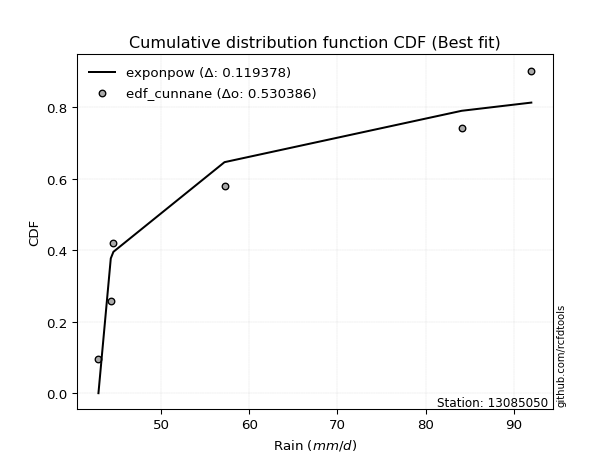</img>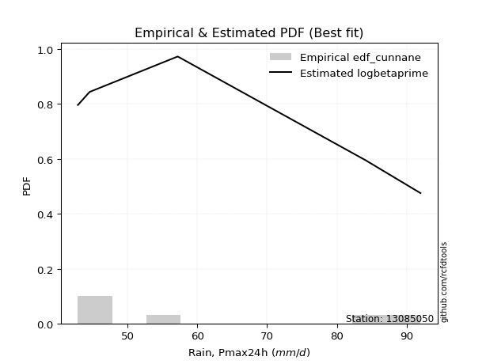</img>

</div>


### 12. EDF Adamowski (1981)

The Adamowski formula in hydrology refers to a specific plotting position formula used for estimating the non-parametric empirical distribution of hydrological events (like flood peaks) to calculate their return periods. This formula provides an alternative to traditional parametric methods (like the Gumbel or Log Pearson Type III distributions). 

<div align="center">


$P=(m-0.25)/(n+0.5)$


</div>


**12.1. Empirical values**

<div align="center">

|                | 0                   | 1                  | 2                  | 3                  | 4                  | 5                  |
|:---------------|:--------------------|:-------------------|:-------------------|:-------------------|:-------------------|:-------------------|
| date           | 2007                | 2006               | 2008               | 2010               | 2005               | 2009               |
| x              | 42.9                | 44.3               | 44.6               | 57.2               | 84.1               | 92.0               |
| m              | 1                   | 2                  | 3                  | 4                  | 5                  | 6                  |
| empirical_dist | edf_adamowski       | edf_adamowski      | edf_adamowski      | edf_adamowski      | edf_adamowski      | edf_adamowski      |
| empirical      | 0.11538461538461539 | 0.2692307692307692 | 0.4230769230769231 | 0.5769230769230769 | 0.7307692307692307 | 0.8846153846153846 |
| empirical_tr   | 1.1304347826086958  | 1.3684210526315788 | 1.7333333333333334 | 2.3636363636363633 | 3.7142857142857135 | 8.666666666666664  |

</div>


**12.2. Kolmogorov-Smirnov fit test (sorted by Δ)**


<div align="center">

|                | 0                   | 1                   | 2                   | 3                   | 4                   | 5                   | 6                 | 7                   | 8                   | 9                  | 10                  | 11                  | 12                  | 13                  | 14                  | 15                  | 16                 | 17                 | 18                 | 19                 | 20                | 21                  | 22                  | 23                  | 24                  | 25                  | 26                  | 27                  | 28                  | 29                  | 30                  | 31                 | 32                  | 33                  | 34                  | 35                  | 36                 | 37                  | 38                  | 39                  | 40                  | 41                  | 42                 | 43                 | 44                  | 45                 | 46                 | 47                  | 48                 | 49                 | 50                  | 51                  | 52                  | 53                  | 54                  | 55                  | 56                  | 57                  | 58                  | 59                  | 60                  | 61                 | 62                | 63                  | 64                  | 65                  | 66                  | 67                 | 68                  | 69                  | 70                  | 71                 | 72                  | 73                  | 74                 | 75                 | 76                  | 77                  | 78                  | 79                  | 80                 | 81                  | 82               | 83                  | 84                  | 85                  | 86                  | 87                  | 88                  | 89                | 90                  | 91                | 92                  | 93                  | 94                  | 95                  | 96                 | 97                  | 98                  | 99                  | 100                 | 101                 | 102                | 103                | 104                | 105                 | 106                | 107                 | 108               | 109               | 110                | 111                | 112                | 113                | 114                | 115               | 116                | 117                | 118                | 119                | 120                 | 121                 | 122                | 123                | 124                | 125                 | 126                 | 127                 | 128                | 129                | 130                 | 131               | 132                 | 133                | 134                 | 135                 | 136                 | 137                 | 138                | 139                 | 140                | 141                | 142                | 143                | 144                 | 145                 | 146                | 147                 | 148                | 149                 | 150                 | 151                | 152               | 153                 | 154                 | 155                 | 156                | 157               | 158                | 159            |
|:---------------|:--------------------|:--------------------|:--------------------|:--------------------|:--------------------|:--------------------|:------------------|:--------------------|:--------------------|:-------------------|:--------------------|:--------------------|:--------------------|:--------------------|:--------------------|:--------------------|:-------------------|:-------------------|:-------------------|:-------------------|:------------------|:--------------------|:--------------------|:--------------------|:--------------------|:--------------------|:--------------------|:--------------------|:--------------------|:--------------------|:--------------------|:-------------------|:--------------------|:--------------------|:--------------------|:--------------------|:-------------------|:--------------------|:--------------------|:--------------------|:--------------------|:--------------------|:-------------------|:-------------------|:--------------------|:-------------------|:-------------------|:--------------------|:-------------------|:-------------------|:--------------------|:--------------------|:--------------------|:--------------------|:--------------------|:--------------------|:--------------------|:--------------------|:--------------------|:--------------------|:--------------------|:-------------------|:------------------|:--------------------|:--------------------|:--------------------|:--------------------|:-------------------|:--------------------|:--------------------|:--------------------|:-------------------|:--------------------|:--------------------|:-------------------|:-------------------|:--------------------|:--------------------|:--------------------|:--------------------|:-------------------|:--------------------|:-----------------|:--------------------|:--------------------|:--------------------|:--------------------|:--------------------|:--------------------|:------------------|:--------------------|:------------------|:--------------------|:--------------------|:--------------------|:--------------------|:-------------------|:--------------------|:--------------------|:--------------------|:--------------------|:--------------------|:-------------------|:-------------------|:-------------------|:--------------------|:-------------------|:--------------------|:------------------|:------------------|:-------------------|:-------------------|:-------------------|:-------------------|:-------------------|:------------------|:-------------------|:-------------------|:-------------------|:-------------------|:--------------------|:--------------------|:-------------------|:-------------------|:-------------------|:--------------------|:--------------------|:--------------------|:-------------------|:-------------------|:--------------------|:------------------|:--------------------|:-------------------|:--------------------|:--------------------|:--------------------|:--------------------|:-------------------|:--------------------|:-------------------|:-------------------|:-------------------|:-------------------|:--------------------|:--------------------|:-------------------|:--------------------|:-------------------|:--------------------|:--------------------|:-------------------|:------------------|:--------------------|:--------------------|:--------------------|:-------------------|:------------------|:-------------------|:---------------|
| station        | 13085050            | 13085050            | 13085050            | 13085050            | 13085050            | 13085050            | 13085050          | 13085050            | 13085050            | 13085050           | 13085050            | 13085050            | 13085050            | 13085050            | 13085050            | 13085050            | 13085050           | 13085050           | 13085050           | 13085050           | 13085050          | 13085050            | 13085050            | 13085050            | 13085050            | 13085050            | 13085050            | 13085050            | 13085050            | 13085050            | 13085050            | 13085050           | 13085050            | 13085050            | 13085050            | 13085050            | 13085050           | 13085050            | 13085050            | 13085050            | 13085050            | 13085050            | 13085050           | 13085050           | 13085050            | 13085050           | 13085050           | 13085050            | 13085050           | 13085050           | 13085050            | 13085050            | 13085050            | 13085050            | 13085050            | 13085050            | 13085050            | 13085050            | 13085050            | 13085050            | 13085050            | 13085050           | 13085050          | 13085050            | 13085050            | 13085050            | 13085050            | 13085050           | 13085050            | 13085050            | 13085050            | 13085050           | 13085050            | 13085050            | 13085050           | 13085050           | 13085050            | 13085050            | 13085050            | 13085050            | 13085050           | 13085050            | 13085050         | 13085050            | 13085050            | 13085050            | 13085050            | 13085050            | 13085050            | 13085050          | 13085050            | 13085050          | 13085050            | 13085050            | 13085050            | 13085050            | 13085050           | 13085050            | 13085050            | 13085050            | 13085050            | 13085050            | 13085050           | 13085050           | 13085050           | 13085050            | 13085050           | 13085050            | 13085050          | 13085050          | 13085050           | 13085050           | 13085050           | 13085050           | 13085050           | 13085050          | 13085050           | 13085050           | 13085050           | 13085050           | 13085050            | 13085050            | 13085050           | 13085050           | 13085050           | 13085050            | 13085050            | 13085050            | 13085050           | 13085050           | 13085050            | 13085050          | 13085050            | 13085050           | 13085050            | 13085050            | 13085050            | 13085050            | 13085050           | 13085050            | 13085050           | 13085050           | 13085050           | 13085050           | 13085050            | 13085050            | 13085050           | 13085050            | 13085050           | 13085050            | 13085050            | 13085050           | 13085050          | 13085050            | 13085050            | 13085050            | 13085050           | 13085050          | 13085050           | 13085050       |
| empirical_dist | edf_adamowski       | edf_adamowski       | edf_adamowski       | edf_adamowski       | edf_adamowski       | edf_adamowski       | edf_adamowski     | edf_adamowski       | edf_adamowski       | edf_adamowski      | edf_adamowski       | edf_adamowski       | edf_adamowski       | edf_adamowski       | edf_adamowski       | edf_adamowski       | edf_adamowski      | edf_adamowski      | edf_adamowski      | edf_adamowski      | edf_adamowski     | edf_adamowski       | edf_adamowski       | edf_adamowski       | edf_adamowski       | edf_adamowski       | edf_adamowski       | edf_adamowski       | edf_adamowski       | edf_adamowski       | edf_adamowski       | edf_adamowski      | edf_adamowski       | edf_adamowski       | edf_adamowski       | edf_adamowski       | edf_adamowski      | edf_adamowski       | edf_adamowski       | edf_adamowski       | edf_adamowski       | edf_adamowski       | edf_adamowski      | edf_adamowski      | edf_adamowski       | edf_adamowski      | edf_adamowski      | edf_adamowski       | edf_adamowski      | edf_adamowski      | edf_adamowski       | edf_adamowski       | edf_adamowski       | edf_adamowski       | edf_adamowski       | edf_adamowski       | edf_adamowski       | edf_adamowski       | edf_adamowski       | edf_adamowski       | edf_adamowski       | edf_adamowski      | edf_adamowski     | edf_adamowski       | edf_adamowski       | edf_adamowski       | edf_adamowski       | edf_adamowski      | edf_adamowski       | edf_adamowski       | edf_adamowski       | edf_adamowski      | edf_adamowski       | edf_adamowski       | edf_adamowski      | edf_adamowski      | edf_adamowski       | edf_adamowski       | edf_adamowski       | edf_adamowski       | edf_adamowski      | edf_adamowski       | edf_adamowski    | edf_adamowski       | edf_adamowski       | edf_adamowski       | edf_adamowski       | edf_adamowski       | edf_adamowski       | edf_adamowski     | edf_adamowski       | edf_adamowski     | edf_adamowski       | edf_adamowski       | edf_adamowski       | edf_adamowski       | edf_adamowski      | edf_adamowski       | edf_adamowski       | edf_adamowski       | edf_adamowski       | edf_adamowski       | edf_adamowski      | edf_adamowski      | edf_adamowski      | edf_adamowski       | edf_adamowski      | edf_adamowski       | edf_adamowski     | edf_adamowski     | edf_adamowski      | edf_adamowski      | edf_adamowski      | edf_adamowski      | edf_adamowski      | edf_adamowski     | edf_adamowski      | edf_adamowski      | edf_adamowski      | edf_adamowski      | edf_adamowski       | edf_adamowski       | edf_adamowski      | edf_adamowski      | edf_adamowski      | edf_adamowski       | edf_adamowski       | edf_adamowski       | edf_adamowski      | edf_adamowski      | edf_adamowski       | edf_adamowski     | edf_adamowski       | edf_adamowski      | edf_adamowski       | edf_adamowski       | edf_adamowski       | edf_adamowski       | edf_adamowski      | edf_adamowski       | edf_adamowski      | edf_adamowski      | edf_adamowski      | edf_adamowski      | edf_adamowski       | edf_adamowski       | edf_adamowski      | edf_adamowski       | edf_adamowski      | edf_adamowski       | edf_adamowski       | edf_adamowski      | edf_adamowski     | edf_adamowski       | edf_adamowski       | edf_adamowski       | edf_adamowski      | edf_adamowski     | edf_adamowski      | edf_adamowski  |
| p_dist         | exponpow            | logexponpow         | logwrapcauchy       | logarcsine          | logbetaprime        | invgamma            | ksone             | logksone            | arcsine             | logf               | lognakagami         | semicircular        | foldnorm            | wrapcauchy          | gengamma            | logsemicircular     | halfnorm           | logfoldnorm        | anglit             | logexponweib       | loghalfnorm       | exponweib           | logdweibull         | loganglit           | loginvgauss         | invgauss            | rayleigh            | dweibull            | maxwell             | lograyleigh         | loggengamma         | logweibull_min     | logdgamma           | logweibull_max      | dgamma              | genpareto           | logburr12          | logmaxwell          | loglevy_l           | pearson3            | logmielke           | halflogistic        | logburr            | lognct             | alpha               | t                  | crystalball        | norm                | logpearson3        | logalpha           | johnsonsu           | logloggamma         | truncpareto         | betaprime           | logtruncweibull_min | gumbel_r            | weibull_min         | loghalflogistic     | logt                | lognorm             | logcrystalball      | f                  | truncweibull_min  | nct                 | logncf              | loginvgamma         | loggenlogistic      | burr               | genlogistic         | loggumbel_r         | levy_l              | moyal              | logistic            | logtruncpareto      | logmoyal           | logkstwobign       | loglogistic         | gumbel_l            | kstwobign           | cosine              | halfgennorm        | loggumbel_l         | logcosine        | hypsecant           | nakagami            | loghypsecant        | genextreme          | gamma               | loggausshyper       | logjohnsonsu      | erlang              | logrice           | rice                | laplace             | loglaplace          | loglaplace          | argus              | logargus            | triang              | loginvweibull       | logtriang           | logjohnsonsb        | ncf                | burr12             | logexponnorm       | loglomax            | loggenexpon        | logrdist            | loggamma          | loggamma          | loghalfgennorm     | logloglaplace      | beta               | loggenextreme      | logtruncnorm       | loggompertz       | loggennorm         | lomax              | exponnorm          | genexpon           | loggenpareto        | truncnorm           | gennorm            | logkappa4          | logbradford        | logskewnorm         | powerlaw            | logtruncexpon       | fatiguelife        | logerlang          | kappa4              | gausshyper        | logtukeylambda      | logpowerlaw        | truncexpon          | loguniform          | logkappa3           | wald                | skewnorm           | logfatiguelife      | logvonmises_line   | bradford           | gompertz           | loggenhalflogistic | tukeylambda         | logwald             | uniform            | kappa3              | vonmises_line      | logbeta             | genhalflogistic     | logtrapezoid       | rdist             | invweibull          | trapezoid           | johnsonsb           | weibull_max        | logvonmises       | vonmises           | mielke         |
| delta          | 0.11531537295103503 | 0.11538141654924633 | 0.13978961996115224 | 0.14737040164441087 | 0.14979378250900766 | 0.15721092592840114 | 0.158392722710122 | 0.16396696601534888 | 0.16491275150698284 | 0.1658285186476547 | 0.16977467509625443 | 0.17517518099349233 | 0.17549582152248053 | 0.17625707990979023 | 0.17825086282487979 | 0.18077459524471284 | 0.1823016351312308 | 0.1860214460539102 | 0.1875239174956944 | 0.1906747545705606 | 0.191178573535914 | 0.19139166414360853 | 0.19278603891527168 | 0.19310266396694833 | 0.19398177983292975 | 0.19413462221091005 | 0.19514854245660723 | 0.19610727763467806 | 0.20116253239142753 | 0.20214349013305064 | 0.20225991940651444 | 0.2024966930454677 | 0.20396597289061325 | 0.20400886616265446 | 0.20418289672552337 | 0.20451168110662007 | 0.2053889867561023 | 0.20769875825656253 | 0.20783894392216753 | 0.20856286430420656 | 0.20917145409635407 | 0.20996711538080673 | 0.2119904862279295 | 0.2123917303898328 | 0.21240284184190195 | 0.2155397638703932 | 0.2155859356435536 | 0.21558593999345915 | 0.2158457481572496 | 0.2162751731634297 | 0.21738501814558642 | 0.21876499857627876 | 0.21981805290364276 | 0.22008411820762455 | 0.2203220036365905  | 0.22061843863907282 | 0.22065733977700908 | 0.22077251087428487 | 0.22106782116607687 | 0.22106815049803308 | 0.22106829845588744 | 0.2215846121767832 | 0.223255812931074 | 0.22417850472640954 | 0.22429894789274382 | 0.22670126865083065 | 0.22798840242498417 | 0.2280624951527945 | 0.22835237434803163 | 0.22856671156066985 | 0.23206976466613208 | 0.2329715558393914 | 0.23742778579311005 | 0.23964364225460574 | 0.2423998620645204 | 0.2426348896866302 | 0.24266464623644626 | 0.24396718688522634 | 0.24508798480047447 | 0.24640350944115508 | 0.2469243201950014 | 0.24793992519488128 | 0.24918385288055 | 0.25050684886300745 | 0.25126867005860953 | 0.25542415939338464 | 0.25649494265280104 | 0.25675257192209977 | 0.25888718950395884 | 0.261527552191818 | 0.26356235469516576 | 0.264532856872899 | 0.26456340995303096 | 0.26520235838208417 | 0.26945527945409065 | 0.26945527945409065 | 0.2744315494363147 | 0.27639550293717713 | 0.27901704119703513 | 0.27983911885574747 | 0.27988379484542836 | 0.28781640149770327 | 0.2908763051825427 | 0.2939324263859737 | 0.2997616228524112 | 0.30028842324500354 | 0.3012315514362604 | 0.30357007545086845 | 0.306491779352805 | 0.306491779352805 | 0.3104715336019207 | 0.3138163948625218 | 0.3142587714050068 | 0.3151637001838625 | 0.3174412373787644 | 0.317515168761588 | 0.3176116967312005 | 0.3314621859838644 | 0.3314746767551468 | 0.3327162660556482 | 0.33477755657515107 | 0.34141884712673676 | 0.3416360001984968 | 0.3471251771774196 | 0.3492191929553225 | 0.35142023321618104 | 0.35177140812840185 | 0.35254399899419697 | 0.3542146938636292 | 0.3577461973620446 | 0.35775777429079186 | 0.358744444965837 | 0.36072022482536753 | 0.3689864397261034 | 0.37111776270848695 | 0.37213816332987726 | 0.37222462637875303 | 0.37247186944762384 | 0.3725432144297043 | 0.37268000419515895 | 0.3736477210564752 | 0.3746264013834748 | 0.3789847949685565 | 0.3846733998754563 | 0.38564063842410307 | 0.38752403387377715 | 0.3884537051543161 | 0.38850507532693385 | 0.3888210934607881 | 0.39691796187090467 | 0.40277446976536313 | 0.4188625857497519 | 0.423076923036275 | 0.44859723748012403 | 0.47062405870467255 | 0.47611079876635726 | 0.5309652821152147 | 1.155678159039279 | 14.165223664277317 | nan            |
| deltao         | 0.530385761606      | 0.530385761606      | 0.530385761606      | 0.530385761606      | 0.530385761606      | 0.530385761606      | 0.530385761606    | 0.530385761606      | 0.530385761606      | 0.530385761606     | 0.530385761606      | 0.530385761606      | 0.530385761606      | 0.530385761606      | 0.530385761606      | 0.530385761606      | 0.530385761606     | 0.530385761606     | 0.530385761606     | 0.530385761606     | 0.530385761606    | 0.530385761606      | 0.530385761606      | 0.530385761606      | 0.530385761606      | 0.530385761606      | 0.530385761606      | 0.530385761606      | 0.530385761606      | 0.530385761606      | 0.530385761606      | 0.530385761606     | 0.530385761606      | 0.530385761606      | 0.530385761606      | 0.530385761606      | 0.530385761606     | 0.530385761606      | 0.530385761606      | 0.530385761606      | 0.530385761606      | 0.530385761606      | 0.530385761606     | 0.530385761606     | 0.530385761606      | 0.530385761606     | 0.530385761606     | 0.530385761606      | 0.530385761606     | 0.530385761606     | 0.530385761606      | 0.530385761606      | 0.530385761606      | 0.530385761606      | 0.530385761606      | 0.530385761606      | 0.530385761606      | 0.530385761606      | 0.530385761606      | 0.530385761606      | 0.530385761606      | 0.530385761606     | 0.530385761606    | 0.530385761606      | 0.530385761606      | 0.530385761606      | 0.530385761606      | 0.530385761606     | 0.530385761606      | 0.530385761606      | 0.530385761606      | 0.530385761606     | 0.530385761606      | 0.530385761606      | 0.530385761606     | 0.530385761606     | 0.530385761606      | 0.530385761606      | 0.530385761606      | 0.530385761606      | 0.530385761606     | 0.530385761606      | 0.530385761606   | 0.530385761606      | 0.530385761606      | 0.530385761606      | 0.530385761606      | 0.530385761606      | 0.530385761606      | 0.530385761606    | 0.530385761606      | 0.530385761606    | 0.530385761606      | 0.530385761606      | 0.530385761606      | 0.530385761606      | 0.530385761606     | 0.530385761606      | 0.530385761606      | 0.530385761606      | 0.530385761606      | 0.530385761606      | 0.530385761606     | 0.530385761606     | 0.530385761606     | 0.530385761606      | 0.530385761606     | 0.530385761606      | 0.530385761606    | 0.530385761606    | 0.530385761606     | 0.530385761606     | 0.530385761606     | 0.530385761606     | 0.530385761606     | 0.530385761606    | 0.530385761606     | 0.530385761606     | 0.530385761606     | 0.530385761606     | 0.530385761606      | 0.530385761606      | 0.530385761606     | 0.530385761606     | 0.530385761606     | 0.530385761606      | 0.530385761606      | 0.530385761606      | 0.530385761606     | 0.530385761606     | 0.530385761606      | 0.530385761606    | 0.530385761606      | 0.530385761606     | 0.530385761606      | 0.530385761606      | 0.530385761606      | 0.530385761606      | 0.530385761606     | 0.530385761606      | 0.530385761606     | 0.530385761606     | 0.530385761606     | 0.530385761606     | 0.530385761606      | 0.530385761606      | 0.530385761606     | 0.530385761606      | 0.530385761606     | 0.530385761606      | 0.530385761606      | 0.530385761606     | 0.530385761606    | 0.530385761606      | 0.530385761606      | 0.530385761606      | 0.530385761606     | 0.530385761606    | 0.530385761606     | 0.530385761606 |
| eval           | Δo > Δ              | Δo > Δ              | Δo > Δ              | Δo > Δ              | Δo > Δ              | Δo > Δ              | Δo > Δ            | Δo > Δ              | Δo > Δ              | Δo > Δ             | Δo > Δ              | Δo > Δ              | Δo > Δ              | Δo > Δ              | Δo > Δ              | Δo > Δ              | Δo > Δ             | Δo > Δ             | Δo > Δ             | Δo > Δ             | Δo > Δ            | Δo > Δ              | Δo > Δ              | Δo > Δ              | Δo > Δ              | Δo > Δ              | Δo > Δ              | Δo > Δ              | Δo > Δ              | Δo > Δ              | Δo > Δ              | Δo > Δ             | Δo > Δ              | Δo > Δ              | Δo > Δ              | Δo > Δ              | Δo > Δ             | Δo > Δ              | Δo > Δ              | Δo > Δ              | Δo > Δ              | Δo > Δ              | Δo > Δ             | Δo > Δ             | Δo > Δ              | Δo > Δ             | Δo > Δ             | Δo > Δ              | Δo > Δ             | Δo > Δ             | Δo > Δ              | Δo > Δ              | Δo > Δ              | Δo > Δ              | Δo > Δ              | Δo > Δ              | Δo > Δ              | Δo > Δ              | Δo > Δ              | Δo > Δ              | Δo > Δ              | Δo > Δ             | Δo > Δ            | Δo > Δ              | Δo > Δ              | Δo > Δ              | Δo > Δ              | Δo > Δ             | Δo > Δ              | Δo > Δ              | Δo > Δ              | Δo > Δ             | Δo > Δ              | Δo > Δ              | Δo > Δ             | Δo > Δ             | Δo > Δ              | Δo > Δ              | Δo > Δ              | Δo > Δ              | Δo > Δ             | Δo > Δ              | Δo > Δ           | Δo > Δ              | Δo > Δ              | Δo > Δ              | Δo > Δ              | Δo > Δ              | Δo > Δ              | Δo > Δ            | Δo > Δ              | Δo > Δ            | Δo > Δ              | Δo > Δ              | Δo > Δ              | Δo > Δ              | Δo > Δ             | Δo > Δ              | Δo > Δ              | Δo > Δ              | Δo > Δ              | Δo > Δ              | Δo > Δ             | Δo > Δ             | Δo > Δ             | Δo > Δ              | Δo > Δ             | Δo > Δ              | Δo > Δ            | Δo > Δ            | Δo > Δ             | Δo > Δ             | Δo > Δ             | Δo > Δ             | Δo > Δ             | Δo > Δ            | Δo > Δ             | Δo > Δ             | Δo > Δ             | Δo > Δ             | Δo > Δ              | Δo > Δ              | Δo > Δ             | Δo > Δ             | Δo > Δ             | Δo > Δ              | Δo > Δ              | Δo > Δ              | Δo > Δ             | Δo > Δ             | Δo > Δ              | Δo > Δ            | Δo > Δ              | Δo > Δ             | Δo > Δ              | Δo > Δ              | Δo > Δ              | Δo > Δ              | Δo > Δ             | Δo > Δ              | Δo > Δ             | Δo > Δ             | Δo > Δ             | Δo > Δ             | Δo > Δ              | Δo > Δ              | Δo > Δ             | Δo > Δ              | Δo > Δ             | Δo > Δ              | Δo > Δ              | Δo > Δ             | Δo > Δ            | Δo > Δ              | Δo > Δ              | Δo > Δ              | Δo <= Δ            | Δo <= Δ           | Δo <= Δ            | Δo <= Δ        |
| fit            | 1                   | 1                   | 1                   | 1                   | 1                   | 1                   | 1                 | 1                   | 1                   | 1                  | 1                   | 1                   | 1                   | 1                   | 1                   | 1                   | 1                  | 1                  | 1                  | 1                  | 1                 | 1                   | 1                   | 1                   | 1                   | 1                   | 1                   | 1                   | 1                   | 1                   | 1                   | 1                  | 1                   | 1                   | 1                   | 1                   | 1                  | 1                   | 1                   | 1                   | 1                   | 1                   | 1                  | 1                  | 1                   | 1                  | 1                  | 1                   | 1                  | 1                  | 1                   | 1                   | 1                   | 1                   | 1                   | 1                   | 1                   | 1                   | 1                   | 1                   | 1                   | 1                  | 1                 | 1                   | 1                   | 1                   | 1                   | 1                  | 1                   | 1                   | 1                   | 1                  | 1                   | 1                   | 1                  | 1                  | 1                   | 1                   | 1                   | 1                   | 1                  | 1                   | 1                | 1                   | 1                   | 1                   | 1                   | 1                   | 1                   | 1                 | 1                   | 1                 | 1                   | 1                   | 1                   | 1                   | 1                  | 1                   | 1                   | 1                   | 1                   | 1                   | 1                  | 1                  | 1                  | 1                   | 1                  | 1                   | 1                 | 1                 | 1                  | 1                  | 1                  | 1                  | 1                  | 1                 | 1                  | 1                  | 1                  | 1                  | 1                   | 1                   | 1                  | 1                  | 1                  | 1                   | 1                   | 1                   | 1                  | 1                  | 1                   | 1                 | 1                   | 1                  | 1                   | 1                   | 1                   | 1                   | 1                  | 1                   | 1                  | 1                  | 1                  | 1                  | 1                   | 1                   | 1                  | 1                   | 1                  | 1                   | 1                   | 1                  | 1                 | 1                   | 1                   | 1                   | 0                  | 0                 | 0                  | 0              |
| n              | 6                   | 6                   | 6                   | 6                   | 6                   | 6                   | 6                 | 6                   | 6                   | 6                  | 6                   | 6                   | 6                   | 6                   | 6                   | 6                   | 6                  | 6                  | 6                  | 6                  | 6                 | 6                   | 6                   | 6                   | 6                   | 6                   | 6                   | 6                   | 6                   | 6                   | 6                   | 6                  | 6                   | 6                   | 6                   | 6                   | 6                  | 6                   | 6                   | 6                   | 6                   | 6                   | 6                  | 6                  | 6                   | 6                  | 6                  | 6                   | 6                  | 6                  | 6                   | 6                   | 6                   | 6                   | 6                   | 6                   | 6                   | 6                   | 6                   | 6                   | 6                   | 6                  | 6                 | 6                   | 6                   | 6                   | 6                   | 6                  | 6                   | 6                   | 6                   | 6                  | 6                   | 6                   | 6                  | 6                  | 6                   | 6                   | 6                   | 6                   | 6                  | 6                   | 6                | 6                   | 6                   | 6                   | 6                   | 6                   | 6                   | 6                 | 6                   | 6                 | 6                   | 6                   | 6                   | 6                   | 6                  | 6                   | 6                   | 6                   | 6                   | 6                   | 6                  | 6                  | 6                  | 6                   | 6                  | 6                   | 6                 | 6                 | 6                  | 6                  | 6                  | 6                  | 6                  | 6                 | 6                  | 6                  | 6                  | 6                  | 6                   | 6                   | 6                  | 6                  | 6                  | 6                   | 6                   | 6                   | 6                  | 6                  | 6                   | 6                 | 6                   | 6                  | 6                   | 6                   | 6                   | 6                   | 6                  | 6                   | 6                  | 6                  | 6                  | 6                  | 6                   | 6                   | 6                  | 6                   | 6                  | 6                   | 6                   | 6                  | 6                 | 6                   | 6                   | 6                   | 6                  | 6                 | 6                  | 6              |
| best_fit       | 1                   | 0                   | 0                   | 0                   | 0                   | 0                   | 0                 | 0                   | 0                   | 0                  | 0                   | 0                   | 0                   | 0                   | 0                   | 0                   | 0                  | 0                  | 0                  | 0                  | 0                 | 0                   | 0                   | 0                   | 0                   | 0                   | 0                   | 0                   | 0                   | 0                   | 0                   | 0                  | 0                   | 0                   | 0                   | 0                   | 0                  | 0                   | 0                   | 0                   | 0                   | 0                   | 0                  | 0                  | 0                   | 0                  | 0                  | 0                   | 0                  | 0                  | 0                   | 0                   | 0                   | 0                   | 0                   | 0                   | 0                   | 0                   | 0                   | 0                   | 0                   | 0                  | 0                 | 0                   | 0                   | 0                   | 0                   | 0                  | 0                   | 0                   | 0                   | 0                  | 0                   | 0                   | 0                  | 0                  | 0                   | 0                   | 0                   | 0                   | 0                  | 0                   | 0                | 0                   | 0                   | 0                   | 0                   | 0                   | 0                   | 0                 | 0                   | 0                 | 0                   | 0                   | 0                   | 0                   | 0                  | 0                   | 0                   | 0                   | 0                   | 0                   | 0                  | 0                  | 0                  | 0                   | 0                  | 0                   | 0                 | 0                 | 0                  | 0                  | 0                  | 0                  | 0                  | 0                 | 0                  | 0                  | 0                  | 0                  | 0                   | 0                   | 0                  | 0                  | 0                  | 0                   | 0                   | 0                   | 0                  | 0                  | 0                   | 0                 | 0                   | 0                  | 0                   | 0                   | 0                   | 0                   | 0                  | 0                   | 0                  | 0                  | 0                  | 0                  | 0                   | 0                   | 0                  | 0                   | 0                  | 0                   | 0                   | 0                  | 0                 | 0                   | 0                   | 0                   | 0                  | 0                 | 0                  | 0              |
| best_fit_sort  | 1                   | 2                   | 3                   | 4                   | 5                   | 6                   | 7                 | 8                   | 9                   | 10                 | 11                  | 12                  | 13                  | 14                  | 15                  | 16                  | 17                 | 18                 | 19                 | 20                 | 21                | 22                  | 23                  | 24                  | 25                  | 26                  | 27                  | 28                  | 29                  | 30                  | 31                  | 32                 | 33                  | 34                  | 35                  | 36                  | 37                 | 38                  | 39                  | 40                  | 41                  | 42                  | 43                 | 44                 | 45                  | 46                 | 47                 | 48                  | 49                 | 50                 | 51                  | 52                  | 53                  | 54                  | 55                  | 56                  | 57                  | 58                  | 59                  | 60                  | 61                  | 62                 | 63                | 64                  | 65                  | 66                  | 67                  | 68                 | 69                  | 70                  | 71                  | 72                 | 73                  | 74                  | 75                 | 76                 | 77                  | 78                  | 79                  | 80                  | 81                 | 82                  | 83               | 84                  | 85                  | 86                  | 87                  | 88                  | 89                  | 90                | 91                  | 92                | 93                  | 94                  | 95                  | 96                  | 97                 | 98                  | 99                  | 100                 | 101                 | 102                 | 103                | 104                | 105                | 106                 | 107                | 108                 | 109               | 110               | 111                | 112                | 113                | 114                | 115                | 116               | 117                | 118                | 119                | 120                | 121                 | 122                 | 123                | 124                | 125                | 126                 | 127                 | 128                 | 129                | 130                | 131                 | 132               | 133                 | 134                | 135                 | 136                 | 137                 | 138                 | 139                | 140                 | 141                | 142                | 143                | 144                | 145                 | 146                 | 147                | 148                 | 149                | 150                 | 151                 | 152                | 153               | 154                 | 155                 | 156                 | 157                | 158               | 159                | 160            |

</div>


**12.3. Best fit**

<div align="center">

|   id |   station | empirical_dist   | p_dist   |    delta |   deltao | eval   |   fit |   n |   best_fit |   best_fit_sort |
|-----:|----------:|:-----------------|:---------|---------:|---------:|:-------|------:|----:|-----------:|----------------:|
|    0 |  13085050 | edf_adamowski    | exponpow | 0.115315 | 0.530386 | Δo > Δ |     1 |   6 |          1 |               1 |

</div>


<div align="center">

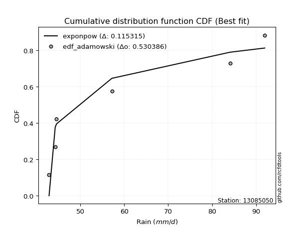</img>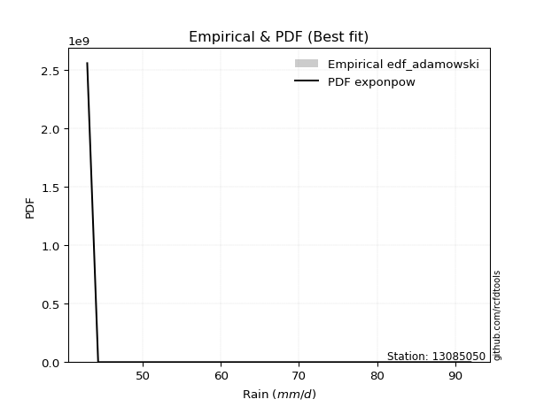</img>

</div>


## C. Best fit & Estimate extreme values for specific return periods - Tr

Best fit in probability distribution analysis means finding the theoretical distribution (like Normal, Poisson, Exponential, etc.) that most accurately mirrors your real-world data´s patterns (shape, center, spread) for better predictions, using methods like visual checks (Q-Q plots), goodness-of-fit tests (Kolmogorov-Smirnov, Chi-Squared), and information criteria (AIC) to score and select the simplest, most representative model.


### 1. Best fit (ordered by delta Δ)

:file_folder:Table: [bestfit_13085050.csv](table/bestfit_13085050.csv)

<div align="center">

|   id |   station | empirical_dist   | p_dist      |    delta |   deltao | eval   |   fit |   n |   best_fit |   best_fit_sort |
|-----:|----------:|:-----------------|:------------|---------:|---------:|:-------|------:|----:|-----------:|----------------:|
|    0 |  13085050 | edf_chegodayev   | logexponpow | 0.111567 | 0.530386 | Δo > Δ |     1 |   6 |          1 |               1 |
|    1 |  13085050 | edf_jenkinson    | exponpow    | 0.112552 | 0.530386 | Δo > Δ |     1 |   6 |          1 |               2 |
|    2 |  13085050 | edf_beard        | exponpow    | 0.112552 | 0.530386 | Δo > Δ |     1 |   6 |          1 |               3 |
|    3 |  13085050 | edf_filliben     | exponpow    | 0.113107 | 0.530386 | Δo > Δ |     1 |   6 |          1 |               4 |
|    4 |  13085050 | edf_tukey        | exponpow    | 0.114285 | 0.530386 | Δo > Δ |     1 |   6 |          1 |               5 |
|    5 |  13085050 | edf_adamowski    | exponpow    | 0.115315 | 0.530386 | Δo > Δ |     1 |   6 |          1 |               6 |
|    6 |  13085050 | edf_blom         | exponpow    | 0.117443 | 0.530386 | Δo > Δ |     1 |   6 |          1 |               7 |
|    7 |  13085050 | edf_cunnane      | exponpow    | 0.119378 | 0.530386 | Δo > Δ |     1 |   6 |          1 |               8 |
|    8 |  13085050 | edf_gringorten   | exponpow    | 0.122541 | 0.530386 | Δo > Δ |     1 |   6 |          1 |               9 |
|    9 |  13085050 | edf_hazen        | exponpow    | 0.127443 | 0.530386 | Δo > Δ |     1 |   6 |          1 |              10 |
|   10 |  13085050 | edf_weibull      | exponpow    | 0.142788 | 0.530386 | Δo > Δ |     1 |   6 |          1 |              11 |
|   11 |  13085050 | edf_california   | invgamma    | 0.145633 | 0.530386 | Δo > Δ |     1 |   6 |          1 |              12 |

</div>


### 2. Extreme values and % difference analysis

In hydrology, a return period (or recurrence interval $Tr$) is the statistical average time between extreme events like floods or droughts of a specific magnitude, indicating how rare an event is, with a 100-year flood, for example, having a 1% chance of occurring in any given year, not that it happens exactly every century. It is a key tool for infrastructure design (like bridges or dams) and risk assessment, calculated from historical data to determine the probability of future events, although it is important to remember it is statistical average, and events can cluster or be missed.

The extreme value porcentage difference is evaluated as $pdiff = 1 - (ETrBf / ETr) * 100$, where _ETrBf_ correspond to the bestfit extreme value for a specific recurrence interval and _ETr_ correspond to the extreme value for one of the most used PDFsused in hydrology.

> risk_rate: assuming the return period as the project useful life.

:file_folder:Table: [extreme_13085050.csv](table/extreme_13085050.csv), all PDFs.  
:file_folder:Table: [extremepdiff_13085050.csv](table/extremepdiff_13085050.csv), % difference between bestfit and most used PDFs in Hydrology.

<div align="center">

Extreme values table for only best fit PDFs
|   id |      tr |   prob_l |     prob_g |     alpha |   anglit |   arcsine |   argus |    beta |   betaprime |   bradford |     burr |   burr12 |   cosine |   crystalball |   dgamma |   dweibull |   erlang |   exponnorm |   exponpow |   exponweib |        f |   fatiguelife |   foldnorm |    gamma |   gausshyper |   genexpon |       genextreme |   gengamma |   genhalflogistic |   genlogistic |   gennorm |   genpareto |   gompertz |   gumbel_l |   gumbel_r |   halfgennorm |   halflogistic |   halfnorm |   hypsecant |    invgamma |   invgauss |       invweibull |   johnsonsb |   johnsonsu |   kappa3 |   kappa4 |   ksone |   kstwobign |   laplace |   levy_l |   loggamma |   logistic |   loglaplace |    lomax |   maxwell |   mielke |    moyal |   nakagami |      ncf |      nct |     norm |   pearson3 |   powerlaw |   rayleigh |   rdist |     rice |   semicircular |   skewnorm |        t |   trapezoid |   triang |   truncexpon |   truncnorm |   truncpareto |   truncweibull_min |   tukeylambda |   uniform |   vonmises |   vonmises_line |     wald |   weibull_max |   weibull_min |   wrapcauchy |   logalpha |   loganglit |   logarcsine |   logargus |   logbeta |   logbetaprime |   logbradford |   logburr |   logburr12 |   logcosine |   logcrystalball |   logdgamma |   logdweibull |   logerlang |   logexponnorm |   logexponpow |     logexponweib |             logf |   logfatiguelife |   logfoldnorm |   loggausshyper |   loggenexpon |   loggenextreme |      loggengamma |   loggenhalflogistic |   loggenlogistic |   loggennorm |   loggenpareto |   loggompertz |   loggumbel_l |   loggumbel_r |   loghalfgennorm |   loghalflogistic |   loghalfnorm |   loghypsecant |   loginvgamma |   loginvgauss |   loginvweibull |   logjohnsonsb |   logjohnsonsu |   logkappa3 |   logkappa4 |   logksone |   logkstwobign |   loglevy_l |   logloggamma |   loglogistic |   logloglaplace |   loglomax |   logmaxwell |   logmielke |   logmoyal |   lognakagami |   logncf |   lognct |   lognorm |   logpearson3 |   logpowerlaw |   lograyleigh |   logrdist |   logrice |   logsemicircular |   logskewnorm |     logt |   logtrapezoid |   logtriang |   logtruncexpon |   logtruncnorm |   logtruncpareto |   logtruncweibull_min |   logtukeylambda |   loguniform |   logvonmises |   logvonmises_line |   logwald |   logweibull_max |   logweibull_min |   logwrapcauchy |   station |   n |   risk_rate |
|-----:|--------:|---------:|-----------:|----------:|---------:|----------:|--------:|--------:|------------:|-----------:|---------:|---------:|---------:|--------------:|---------:|-----------:|---------:|------------:|-----------:|------------:|---------:|--------------:|-----------:|---------:|-------------:|-----------:|-----------------:|-----------:|------------------:|--------------:|----------:|------------:|-----------:|-----------:|-----------:|--------------:|---------------:|-----------:|------------:|------------:|-----------:|-----------------:|------------:|------------:|---------:|---------:|--------:|------------:|----------:|---------:|-----------:|-----------:|-------------:|---------:|----------:|---------:|---------:|-----------:|---------:|---------:|---------:|-----------:|-----------:|-----------:|--------:|---------:|---------------:|-----------:|---------:|------------:|---------:|-------------:|------------:|--------------:|-------------------:|--------------:|----------:|-----------:|----------------:|---------:|--------------:|--------------:|-------------:|-----------:|------------:|-------------:|-----------:|----------:|---------------:|--------------:|----------:|------------:|------------:|-----------------:|------------:|--------------:|------------:|---------------:|--------------:|-----------------:|-----------------:|-----------------:|--------------:|----------------:|--------------:|----------------:|-----------------:|---------------------:|-----------------:|-------------:|---------------:|--------------:|--------------:|--------------:|-----------------:|------------------:|--------------:|---------------:|--------------:|--------------:|----------------:|---------------:|---------------:|------------:|------------:|-----------:|---------------:|------------:|--------------:|--------------:|----------------:|-----------:|-------------:|------------:|-----------:|--------------:|---------:|---------:|----------:|--------------:|--------------:|--------------:|-----------:|----------:|------------------:|--------------:|---------:|---------------:|------------:|----------------:|---------------:|-----------------:|----------------------:|-----------------:|-------------:|--------------:|-------------------:|----------:|-----------------:|-----------------:|----------------:|----------:|----:|------------:|
|    0 |    2    | 0.5      | 0.5        |   47.096  |  60.85   |   60.85   | 66.3969 | 45.8142 |     56.9456 |    63.3912 |  54.8122 |  52.9223 |  62.4778 |       60.85   |  53.3725 |    54.321  |  46.1952 |     55.2802 |    47.3903 |     51.766  |  57.1585 |       42.9    |    58.5838 |  47.5392 |      69.1096 |    55.342  |     46.9225      |    48.0161 |           75.9797 |       56.8375 |   44.6    |     62.5432 |    62.6642 |    64.125  |    57.575  |       51.8896 |        55.9469 |    56.7694 |     60.85   |     46.2693 |    46.4306 |   2136.36        |     42.9258 |     60.8304 |  67.6186 |  64.7774 | 60.85   |     57.8286 |   60.85   |  71.5393 |    45.7526 |    60.85   |      57.8579 |  55.2061 |   59.145  |  54.3298 |  56.5178 |    58.5013 |  51.5339 |  56.2397 |  60.85   |    58.8937 |    43.1775 |    58.5404 | 44.8111 |  60.2782 |        60.85   |    60.9923 |  60.8485 |     79.6527 |  69.5587 |      62.0351 |     56.7305 |       50.4266 |            49.2676 |       68.5317 |   67.45   |   0.291949 |         67.7156 |  54.388  |       91.6214 |       46.6801 |      67.45   |    54.849  |     57.8579 |      57.858  |    62.4247 |   41.9439 |        56.8212 |       58.5253 |   52.8987 |     60.0019 |     59.0777 |          57.8579 |     52.7991 |       53.9797 |     43.6741 |        52.7229 |       50.3769 |     50.3759      |    46.3944       |          42.9    |       56.3726 |         52.4425 |       52.7829 |   51.7168       |     51.2411      |              72.3517 |          54.4199 |      44.6    |        51.7782 |       54.4864 |       60.8996 |       54.9681 |          53.9626 |           53.5856 |       54.2796 |        57.8579 |       56.5241 |       46.44   |         43.1037 |        86.039  |        59.3375 |     42.9    |     63.1788 |    57.8579 |        55.0352 |     70.2029 |       57.9521 |       57.8579 |         44.6    |    52.7182 |      56.335  |     52.5222 |    54.0663 |       46.1518 |  56.9128 |  57.6122 |   57.8579 |       56.4164 |       43.147  |       55.8045 |    67.7654 |   57.1861 |           57.8579 |       57.4174 |  57.8578 |        75.9395 |     65.4061 |         58.6736 |        53.8033 |          50.5942 |               44.7276 |          62.752  |      62.8236 |      0.107771 |            63.56   |   52.2945 |          66.8841 |          50.0225 |         62.8611 |  13085050 |   6 |    0.75     |
|    1 |    2.33 | 0.570815 | 0.429185   |   48.3546 |  64.9937 |   67.0704 | 70.0287 | 52.8445 |     60.1531 |    66.8864 |  57.7118 |  55.4455 |  66.0186 |       64.4074 |  58.4666 |    59.1317 |  47.4247 |     58.012  |    50.9129 |     55.1947 |  60.3926 |       43.3506 |    62.617  |  48.8493 |      72.8331 |    58.0834 |     58.0988      |    50.2086 |           78.9698 |       59.8587 |   47.5373 |     69.1425 |    65.8169 |    67.2199 |    60.8713 |       54.7959 |        59.336  |    60.6087 |     63.697  |     47.8284 |    47.7889 | 173104           |     42.9763 |     64.3562 |  71.1209 |  68.6745 | 65.7402 |     60.9594 |   63.0028 |  77.8028 |    46.6971 |    63.9843 |      59.8397 |  57.9308 |   62.8409 |  57.0376 |  59.6381 |    63.646  |  58.8714 |  59.3452 |  64.4074 |    62.453  |    43.6462 |    62.2909 | 47.0987 |  63.5541 |        65.2942 |    64.1065 |  64.4062 |     82.5054 |  73.2683 |      65.3921 |     59.777  |       52.9402 |            51.6554 |       72.2839 |   70.927  |   0.560321 |         71.2303 |  56.7206 |       91.8237 |       48.1204 |      85.7442 |    57.7645 |     61.733  |      63.7713 |    65.9942 |   49.3061 |        61.1548 |       61.7852 |   55.4504 |     63.7059 |     62.4228 |          61.1693 |     58.8699 |       60.0338 |     44.1506 |        55.1775 |       54.8351 |     57.1212      |    47.8566       |          43.2332 |       59.984  |         55.0657 |       55.2499 |   94.0748       |     58.8296      |              75.7894 |          57.164  |      44.7965 |        63.8863 |       57.2685 |       63.921  |       57.8772 |          56.8099 |           56.5035 |       57.6399 |        60.4932 |       59.6085 |       47.7763 |         46.3658 |        91.3699 |        62.2958 |     42.9    |     66.9448 |    62.4583 |        57.8673 |     76.2664 |       61.3102 |       60.7658 |         46.3866 |    55.1758 |      59.6884 |     55.078  |    56.7713 |       48.1936 |  60.0871 |  61.0527 |   61.1693 |       59.6551 |       43.5315 |       59.177  |    74.5574 |   60.2351 |           62.0239 |       60.3715 |  61.1692 |        79.3812 |     69.2008 |         61.8712 |        56.2625 |          52.9161 |               46.0194 |          66.4427 |      66.311  |      0.113899 |            67.1991 |   54.2381 |          71.5911 |          52.4355 |         81.1005 |  13085050 |   6 |    0.729209 |
|    2 |    5    | 0.8      | 0.2        |   58.114  |  79.6136 |   83.6579 | 81.6785 | 88.938  |     74.322  |    79.4006 |  72.3814 |  69.7863 |  78.7783 |       77.6275 |  70.3161 |    71.7903 |  54.7715 |     71.6704 |    87.0923 |     77.0291 |  74.6309 |       52.9231 |    78.0453 |  55.901  |      84.2491 |    71.7895 |   4939.99        |    64.7387 |           86.8832 |       72.983  |   64.2126 |     85.5691 |    78.2829 |    77.2184 |    75.192  |       73.6448 |        74.6711 |    76.8448 |     75.1168 |     68.7204 |    60.2782 |      3.69803e+13 |     47.0095 |     77.4591 |  82.4556 |  81.8198 | 81.5668 |     74.2579 |   73.7661 |  88.1799 |    52.3658 |    76.0862 |      70.8145 |  71.6267 |   77.3876 |  70.4724 |  74.092  |    89.0415 |  94.2167 |  73.7231 |  77.6275 |    76.8024 |    52.1782 |    77.306  | 53.8213 |  76.6691 |        80.4603 |    77.276  |  77.6277 |     90.6897 |  83.9111 |      77.9624 |     75.0054 |       66.8446 |            65.5404 |       84.3077 |   82.18   |   1.60177  |         82.6051 |  69.7786 |       91.9936 |       57.7133 |      90.9149 |    71.9057 |     77.5986 |      82.6654 |    78.8803 |   87.6577 |        80.9718 |       75.2078 |   68.8803 |     77.9235 |     76.1275 |          75.2245 |     70.0866 |       72.4811 |     48.0014 |        69.2738 |      101.014  |    279.998       |    66.8726       |          50.9555 |       75.7827 |         67.9211 |       69.4248 |    6.06198e+175 |    331.931       |              85.4916 |          70.7839 |      48.6413 |        88.615  |       72.363  |       74.7446 |       72.412  |          73.6734 |           71.8243 |       74.3089 |        72.3269 |       73.5119 |       60.4475 |        inf      |        92.7226 |        74.0957 |     42.9    |     80.245  |    80.0065 |        71.6144 |     87.4862 |       75.534  |       73.4322 |         56.8047 |    69.3517 |      74.9426 |     69.2815 |    71.1765 |       64.0143 |  74.1952 |  76.0379 |   75.2245 |       74.4717 |       50.2466 |       74.847  |    97.0131 |   74.1592 |           78.6334 |       74.6405 |  75.2242 |        90.1458 |     81.3543 |         75.043  |        68.0739 |          65.7721 |               57.5443 |          79.6906 |      78.9808 |      0.139989 |            80.4672 |   66.5317 |          84.2125 |          69.0753 |         90.0159 |  13085050 |   6 |    0.67232  |
|    3 |   10    | 0.9      | 0.1        |   76.0443 |  87.8886 |   87.6622 | 87.2962 | 91.8648 |     86.1472 |    85.4902 |  87.286  |  85.6968 |  86.4873 |       86.3975 |  79.0223 |    80.5244 |  62.4444 |     84.0691 |   145.014  |    101.712  |  86.4607 |       66.1402 |    88.4196 |  62.7041 |      88.6465 |    84.2316 | 540513           |    81.5966 |           89.6457 |       83.6718 |   80.9984 |     89.9662 |    86.6424 |    82.7852 |    86.8559 |       96.7576 |        87.4063 |    88.8591 |     84.2359 |    146.916  |    84.123  |      2.25137e+20 |     81.9247 |     86.1512 |  87.4013 |  87.6495 | 88.4725 |     84.3831 |   83.5367 |  90.6852 |    58.695  |    84.9989 |      82.5106 |  84.1651 |   87.6248 |  83.7428 |  86.6763 |   109.66   | 127.181  |  86.5803 |  86.3975 |    87.3255 |    65.2571 |    88.012  | 56.0045 |  86.0203 |        88.2423 |    87.0211 |  86.3986 |     93.8864 |  88.0681 |      84.5248 |     88.8238 |       77.2867 |            76.3716 |       89.3999 |   87.09   |   2.32428  |         87.5683 |  83.6361 |       91.9996 |       69.3748 |      91.5141 |    85.5318 |     88.3241 |      88.0096 |    85.9653 |   91.7555 |        98.2072 |       82.8671 |   83.4949 |     87.7149 |     85.8261 |          86.2874 |     78.762  |       81.0218 |     53.244  |        85.1655 |      208.437  |   9421.23        |   171.608        |          63.9353 |       88.5699 |         77.3037 |       85.4183 |  inf            |  14653.4         |              89.0362 |          84.241  |      58.2451 |        91.5637 |       87.8106 |       81.5461 |       86.9086 |          93.5705 |           87.6601 |       89.6753 |        83.4181 |       85.4515 |       89.4358 |        inf      |        92.725  |        82.6245 |     85.3418 |     86.3638 |    89.1346 |        84.2324 |     90.4336 |       86.6938 |       84.4199 |         68.9145 |    85.4564 |      87.9603 |     86.1636 |    86.6647 |       83.9269 |  86.0532 |  88.2677 |   86.2874 |       87.3917 |       61.6636 |       88.4948 |   104.079  |   86.0125 |           88.8143 |       87.3289 |  86.287  |        94.7365 |     86.6618 |         82.678  |        76.9678 |          76.0465 |               71.5364 |          85.9338 |      85.2422 |      0.160753 |            87.0492 |   82.6391 |          88.5836 |          92.7166 |         91.1653 |  13085050 |   6 |    0.651322 |
|    4 |   15    | 0.933333 | 0.0666667  |   93.9106 |  91.4223 |   88.426  | 89.432  | 91.9787 |     92.9524 |    87.612  |  97.1048 | inf      |  89.9988 |       90.7738 |  83.8143 |    85.1239 |  67.1898 |     91.3219 |   188.214  |    117.723  |  93.2488 |       74.7844 |    93.6084 |  66.7846 |      89.9527 |    91.5097 |      7.67934e+06 |    92.6291 |           90.4827 |       89.7021 |   91.3337 |     90.9628 |    90.7235 |    85.3062 |    93.4367 |      112.88   |        94.6133 |    95.1113 |     89.4401 |    275.165  |   105.478  |      1.51422e+24 |    115.867  |     90.4888 |  89.0498 |  89.568  | 90.7743 |     89.7583 |   89.2521 |  91.4421 |    62.9068 |    89.8549 |      90.2285 |  91.5466 |   92.8773 |  92.3131 |  93.9797 |   120.62   | 147.527  |  94.3444 |  90.7738 |    92.8844 |    72.2325 |    93.5283 | 56.5533 |  90.8385 |        91.2771 |    92.0924 |  90.7754 |     94.9121 |  89.402  |      86.903  |     96.9047 |       81.6422 |            80.9577 |       91.0504 |   88.7267 |   2.64845  |         89.2227 |  92.5349 |       91.9999 |       77.338  |      91.6821 |    94.2513 |     93.3445 |      89.0675 |    88.8227 |   91.956  |       108.361  |       85.7314 |   93.6987 |     92.7087 |     90.6445 |          92.4024 |     83.8321 |       85.6371 |     56.9993 |        96.1019 |      332.059  | 261947           |   608.321        |          74.164  |       95.7421 |         81.4314 |       96.4315 |  inf            | 514370           |              90.1113 |          92.9328 |      68.6679 |        91.8694 |       97.6342 |       84.8267 |       96.3332 |         107.73   |           98.1229 |       98.8904 |        90.4942 |       92.456  |      123.377  |        inf      |        92.725  |        87.0886 |     87.5437 |     88.3726 |    92.4031 |        91.811  |     91.3434 |       92.8483 |       91.0834 |         77.4939 |    96.6122 |      95.4939 |     98.8277 |    97.1552 |       97.4347 |  92.9034 |  95.1914 |   92.4024 |       95.0257 |       68.5665 |       96.4714 |   105.622  |   92.8414 |           93.1327 |       94.7633 |  92.4019 |        96.2585 |     88.4371 |         85.5724 |        80.996  |          80.5707 |               79.1185 |          88.0234 |      87.4378 |      0.172363 |            89.3608 |   94.9836 |          89.8686 |         111.853  |         91.4907 |  13085050 |   6 |    0.644736 |
|    5 |   20    | 0.95     | 0.05       |  111.761  |  93.5009 |   88.695  | 90.6042 | 91.9943 |     97.7841 |    88.6908 | 104.669  | inf      |  92.1584 |       93.6398 |  87.13   |    88.2296 |  70.6399 |     96.4678 |   222.432  |    129.67   |  98.0602 |       81.1844 |    97.0085 |  69.7123 |      90.5588 |    96.6736 |      4.92388e+07 |   100.89   |           90.8846 |       93.9244 |   98.8623 |     91.3568 |    93.3484 |    86.8754 |    98.0443 |      125.48   |        99.6627 |    99.2797 |     93.1114 |    452.802  |   124.327  |      7.24901e+26 |    132.04   |     93.3293 |  89.8741 |  90.5147 | 91.9253 |     93.3792 |   93.3073 |  91.8296 |    66.1317 |    93.2112 |      96.1384 |  96.8049 |   96.3633 |  98.8346 |  99.1521 |   127.969  | 162.573  | 100.021  |  93.6398 |    96.6374 |    76.3769 |    97.1947 | 56.7824 |  94.041  |        92.9603 |    95.4735 |  93.6417 |     95.4181 |  90.06   |      88.1327 |    102.637  |       84.0139 |            83.4699 |       91.8611 |   89.545  |   2.82986  |         90.0499 |  99.1662 |       92      |       83.4626 |      91.7631 |   100.876  |     96.4301 |      89.443  |    90.4313 |   91.987  |       115.662  |       87.2286 |  101.887  |     96.02   |     93.7411 |          96.6399 |     87.4829 |       88.8136 |     59.9702 |       104.703  |      467.7    |      5.5116e+06  |  2823.42         |          82.7776 |      100.752  |         83.7888 |      105.096  |  inf            |      1.323e+07   |              90.6245 |          99.547  |      79.6126 |        91.9446 |      104.962  |       86.9351 |      103.534  |         119.107  |          106.189  |      105.555  |        95.8442 |       97.487  |      161.774  |        inf      |        92.725  |        90.0866 |     88.6659 |     89.3541 |    94.082  |        97.2969 |     91.8128 |       97.1073 |       95.994  |         84.3885 |   105.426  |     100.847  |    109.511  |   105.344  |      107.789  |  97.7767 | 100.057  |   96.6399 |      100.526  |       72.9785 |      102.167  |   106.203  |   97.6777 |           95.6179 |      100.068  |  96.6393 |        97.0183 |     89.3262 |         87.0953 |        83.3123 |          83.1014 |               83.7715 |          89.0578 |      88.5567 |      0.180476 |            90.5395 |  105.367  |          90.4708 |         128.56   |         91.6481 |  13085050 |   6 |    0.641514 |
|    6 |   25    | 0.96     | 0.04       |  129.605  |  94.9096 |   88.8198 | 91.3602 | 91.9979 |    101.547  |    89.3438 | 110.917  | inf      |  93.6728 |       95.7496 |  89.6641 |    90.5639 |  73.3554 |    100.459  |   250.809  |    139.241  | 101.803  |       86.2695 |    99.5121 |  71.9986 |      90.9027 |   100.679  |      2.06015e+08 |   107.52   |           91.1201 |       97.1766 |  104.804  |     91.556  |    95.2535 |    87.9921 |   101.593  |      135.917  |       103.553  |   102.381  |     95.9527 |    679.365  |   141.116  |      8.40716e+28 |    139.309  |     95.4203 |  90.3687 |  91.0765 | 92.6158 |     96.0914 |   96.4527 |  92.0729 |    68.7735 |    95.7788 |     100.988  | 100.896  |   98.9512 | 104.172  | 103.161  |   133.449  | 174.633  | 104.537  |  95.7496 |    99.4576 |    79.0995 |    99.9189 | 56.9027 |  96.4204 |        94.0523 |    97.9892 |  95.7516 |     95.7196 |  90.452  |      88.8843 |    107.083  |       85.5035 |            85.0527 |       92.3412 |   90.036  |   2.94454  |         90.5462 | 104.478  |       92      |       88.4735 |      91.811  |   106.303  |     98.5789 |      89.6178 |    91.4841 |   91.9949 |       121.396  |       88.1487 |  108.871  |     98.479  |     95.9756 |          99.8829 |     90.3574 |       91.2366 |     62.4534 |       111.901  |      613.182  |      9.07565e+07 | 16619.8          |          90.3291 |      104.607  |         85.3267 |      112.35   |  inf            |      2.59922e+08 |              90.9231 |         104.961  |      91.0549 |        91.9715 |      110.853  |       88.4672 |      109.445  |         128.78   |          112.853  |      110.803  |       100.201  |      101.438  |      204.471  |        inf      |        92.725  |        92.331  |     89.3461 |     89.9309 |    95.104  |       101.62   |     92.1087 |      100.364  |       99.9286 |         90.2604 |   112.828  |     105.014  |    118.99   |   112.163  |      116.255  | 101.577  | 103.819  |   99.8829 |      104.854  |       76.0123 |      106.615  |   106.485  |  101.433  |           97.2655 |      104.207  |  99.8824 |        97.4738 |     89.8602 |         88.0348 |        84.8201 |          84.7161 |               86.9026 |          89.6721 |      89.2349 |      0.186725 |            91.2542 |  114.497  |          90.8167 |         143.683  |         91.7414 |  13085050 |   6 |    0.639603 |
|    7 |   50    | 0.98     | 0.02       |  218.799  |  98.3772 |   88.9864 | 93.0742 | 91.9999 |    113.394  |    90.6631 | 132.734  | inf      |  97.6383 |      101.791  |  97.3731 |    97.4754 |  81.9683 |    112.858  |   347.856  |    170.48   | 113.562  |      102.585  |   106.683  |  79.1705 |      91.5301 |   113.121  |      1.69326e+10 |   129.21   |           91.5762 |      107.195  |  123.777  |     91.8596 |   100.571  |    91.0233 |   112.526  |      172.045  |       115.54   |   111.396  |    104.762  |   2535.71   |   205.219  |      1.92309e+35 |    147.252  |    101.408  |  91.3578 |  92.1776 | 93.9969 |    104.056  |  106.223  |  92.6206 |    77.809  |   103.624  |     117.667  | 113.671  |  106.457  | 122.509  | 115.607  |   149.406  | 214.538  | 119.304  | 101.791  |   107.806  |    85.1248 |   107.827  | 57.0967 | 103.327  |        96.5469 |   105.301  | 101.794  |     96.3178 |  91.2299 |      90.4196 |    120.889  |       88.6403 |            88.3985 |       93.2814 |   91.018  |   3.18468  |         91.5388 | 121.82   |       92      |      105.422  |      91.9059 |   125.072  |    104.075  |      89.8518 |    93.9165 |   91.9997 |       139.701  |       90.0395 |  134.896  |    105.628  |    102.082  |         109.784  |     99.5885 |       98.6061 |     71.2123 |       137.571  |     1450.01   |      8.77253e+12 |     2.25686e+09  |         119.53   |      116.482  |         88.7859 |      138.232  |  inf            |      4.89243e+13 |              91.4945 |         123.56   |     156.245  |        91.9964 |      130.316  |       92.7638 |      129.862  |         164.31   |          136.131  |      127.586  |       115.008  |      114.06   |      480.761  |        inf      |        92.725  |        98.9329 |     90.7221 |     91.0401 |    97.1813 |       115.456  |     92.7784 |      110.288  |      112.977  |        111.975  |   139.413  |     118.098  |    157.295  |   136.275  |      144.977  | 113.567  | 115.504  |  109.784  |      118.715  |       83.134  |      120.656  |   106.887  |  113.174  |          101.137  |      117.235  | 109.784  |        98.3841 |     90.9293 |         89.9747 |        88.1519 |          88.1829 |               94.0727 |          90.8757 |      90.6069 |      0.206049 |            92.7005 |  150.186  |          91.4642 |         206.371  |         91.9263 |  13085050 |   6 |    0.63583  |
|    8 |   75    | 0.986667 | 0.0133333  |  307.98   |  99.9033 |   89.0173 | 93.7539 | 92      |    120.479  |    91.1068 | 147.426  | inf      |  99.5321 |      105.033  | 101.794  |   101.322  |  87.1071 |    120.111  |   409.994  |    189.702  | 120.578  |      112.41   |   110.532  |  83.4054 |      91.714  |   120.399  |      2.19632e+11 |   142.578  |           91.7229 |      113.018  |  135.205  |     91.9284 |   103.335  |    92.5562 |   118.881  |      195.789  |       122.508  |   116.303  |    109.91   |   5580.42   |   250.693  |      9.55645e+38 |    148.281  |    104.621  |  91.6875 |  92.5339 | 94.4573 |    108.438  |  111.939  |  92.8457 |    83.7189 |   108.154  |     128.674  | 121.192  |  110.537  | 134.625  | 122.885  |   158.094  | 239.794  | 128.535  | 105.033  |   112.453  |    87.3174 |   112.129  | 57.1444 | 107.085  |        97.5434 |   109.282  | 105.036  |     96.5159 |  91.4875 |      90.9413 |    128.963  |       89.7347 |            89.5696 |       93.586  |   91.3453 |   3.26706  |         91.8697 | 132.491  |       92      |      116.262  |      91.9373 |   137.65   |    106.589  |      89.8952 |    94.8991 |   92      |       150.81   |       90.6852 |  153.92   |    109.533  |    105.134  |         115.496  |    105.239  |      102.845  |     77.1208 |       155.237  |     2418.85   |      6.57593e+16 |     1.76605e+16  |         141.494  |      123.4    |         90.1042 |      156.055  |  inf            |      5.88603e+17 |              91.6746 |         135.849  |     236.134  |        91.9989 |      142.53   |       95.0153 |      143.437  |         189.61   |          151.81   |      137.767  |       124.654  |      121.738  |      860.837  |        inf      |        92.725  |       102.581  |     91.1855 |     91.3886 |    97.8838 |       123.856  |     93.055  |      116.001  |      121.277  |        127.634  |   157.869  |     125.884  |    188.283  |   152.71   |      163.512  | 120.752  | 122.381  |  115.496  |      127.163  |       85.8725 |      129.057  |   106.969  |  120.122  |          102.726  |      124.999  | 115.495  |        98.6873 |     91.286  |         90.64   |        89.3707 |          89.4142 |               96.7721 |          91.2649 |      91.0689 |      0.21738  |            93.1877 |  177.475  |          91.6622 |         257.808  |         91.9876 |  13085050 |   6 |    0.634587 |
|    9 |  100    | 0.99     | 0.01       |  397.158  | 100.811  |   89.0282 | 94.1334 | 92      |    125.591  |    91.3293 | 158.835  | inf      | 100.719  |      107.225  | 104.899  |   103.979  |  90.7896 |    125.257  |   456.13   |    203.724  | 125.633  |      119.48   |   113.135  |  86.4245 |      91.7989 |   125.563  |      1.34714e+12 |   152.333  |           91.7948 |      117.14   |  143.447  |     91.9556 |   105.169  |    93.5588 |   123.379  |      213.809  |       127.439  |   119.646  |    113.562  |   9797.63   |   286.25   |      3.94815e+41 |    148.582  |    106.794  |  91.8525 |  92.7087 | 94.6875 |    111.44   |  115.994  |  92.9772 |    88.2145 |   111.353  |     137.102  | 126.549  |  113.317  | 143.922  | 128.049  |   164.009  | 258.662  | 135.383  | 107.225  |   115.663  |    88.4502 |   115.06   | 57.1641 | 109.645  |        98.1015 |   111.993  | 107.228  |     96.6147 |  91.6159 |      91.204  |    134.69   |       90.2913 |            90.166  |       93.7358 |   91.509  |   3.30853  |         92.0351 | 140.272  |       92      |      124.35   |      91.953  |   147.429  |    108.114  |      89.9105 |    95.452  |   92      |       158.894  |       91.011  |  169.564  |    112.204  |    107.093  |         119.526  |    109.374  |      105.833  |     81.6943 |       169.131  |     3484.13   |      1.1208e+20  |     4.06242e+24  |         159.755  |      128.311  |         90.812  |      170.077  |  inf            |      1.45639e+21 |              91.7618 |         145.279  |     332.361  |        91.9995 |      151.571  |       96.5175 |      153.894  |         209.95   |          163.987  |      145.164  |       131.983  |      127.338  |     1345.47   |        inf      |        92.725  |       105.09   |     91.4181 |     91.5563 |    98.237  |       129.962  |     93.217  |      120.028  |      127.501  |        140.365  |   172.47   |     131.478  |    215.671  |   165.559  |      177.464  | 125.943  | 127.294  |  119.526  |      133.328  |       87.3194 |      135.112  |   107      |  125.098  |          103.627  |      130.581  | 119.526  |        98.8389 |     91.4645 |         90.9764 |        90.0031 |          90.045  |               98.1869 |          91.4559 |      91.3008 |      0.225465 |            93.4322 |  200.449  |          91.7564 |         303.252  |         92.0182 |  13085050 |   6 |    0.633968 |
|   10 |  200    | 0.995    | 0.005      |  753.862  | 102.525  |   89.0386 | 94.7929 | 92      |    138.247  |    91.6641 | 190.149  | inf      | 103.132  |      112.199  | 112.295  |   110.165  |  99.7656 |    137.655  |   573.288  |    238.707  | 138.123  |      136.786  |   119.041  |  93.7399 |      91.914  |   138.005  |      1.05479e+14 |   176.671  |           91.9004 |      127.048  |  163.73   |     91.986  |   109.219  |    95.7381 |   134.192  |      261.255  |       139.296  |   127.292  |    122.359  |  38205.8    |   382.044  |      7.68695e+47 |    148.831  |    111.723  |  92.1033 |  92.9644 | 95.0328 |    118.355  |  125.765  |  93.2265 |   100.166  |   119.027  |     159.747  | 139.532  |  119.676  | 168.998  | 140.49   |   177.521  | 307.678  | 153.012  | 112.199  |   123.147  |    90.1962 |   121.766  | 57.1876 | 115.503  |        99.0744 |   118.195  | 112.202  |     96.7625 |  91.8082 |      91.6005 |    148.487  |       91.1383 |            91.0746 |       93.9557 |   91.7545 |   3.37096  |         92.2833 | 159.653  |       92      |      145.139  |      91.9765 |   174.481  |    111.053  |      89.9251 |    96.4207 |   92      |       179.128  |       91.5034 |  216.618  |    118.358  |    111.19   |         129.198  |    119.816  |      112.997  |     94.1385 |       207.93   |     8410.35   |      4.59858e+29 |     8.8842e+69   |         215.025  |      140.188  |         91.9667 |      209.257  |  inf            |      1.66105e+31 |              91.8875 |         170.715  |     911.627  |        91.9999 |      174.653  |       99.865  |      182.259  |         268.612  |          197.41   |      163.61   |       151.458  |      141.411  |     4365.78   |        inf      |        92.725  |       110.904  |     91.7681 |     91.7953 |    98.7691 |       145.195  |     93.5249 |      129.673  |      143.764  |        177.881  |   213.623  |     145.232  |    308.528  |   201.133  |      213.91   | 138.812  | 139.285  |  129.198  |      148.821  |       89.5936 |      150.059  |   107.031  |  137.274  |          105.216  |      144.302  | 129.197  |        99.0662 |     91.7322 |         91.4854 |        90.9823 |          91.0105 |              100.396  |          91.7357 |      91.6497 |      0.245192 |            93.8002 |  271.449  |          91.889  |         454.837  |         92.0642 |  13085050 |   6 |    0.633042 |
|   11 |  250    | 0.996    | 0.004      |  932.213  | 102.961  |   89.0398 | 94.9472 | 92      |    142.434  |    91.7312 | 201.513  | inf      | 103.794  |      113.718  | 114.653  |   112.1    | 102.682  |    141.647  |   612.584  |    250.305  | 142.247  |      142.426  |   120.845  |  96.1056 |      91.9346 |   142.011  |      4.28528e+14 |   184.737  |           91.9211 |      130.233  |  170.379  |     91.9903 |   110.427  |    96.3793 |   137.668  |      277.746  |       143.107  |   129.644  |    125.191  |  59247.3    |   415.637  |      8.08522e+49 |    148.857  |    113.23   |  92.1561 |  93.0141 | 95.1018 |    120.495  |  128.91   |  93.2914 |   104.377  |   121.49   |     167.804  | 143.734  |  121.634  | 177.958  | 144.495  |   181.671  | 324.612  | 159.056  | 113.718  |   125.49   |    90.5523 |   123.83   | 57.1911 | 117.306  |        99.3026 |   120.103  | 113.722  |     96.792  |  91.8466 |      91.6802 |    152.927  |       91.3095 |            91.2583 |       93.9987 |   91.8036 |   3.38347  |         92.3329 | 166.064  |       92      |      152.211  |      91.9812 |   184.417  |    111.813  |      89.9269 |    96.6489 |   92      |       185.884  |       91.6024 |  235.259  |    120.266  |    112.34   |         132.307  |    123.332  |      115.299  |     98.6104 |       222.225  |    11166.3    |      2.26256e+33 |     4.44818e+98  |         236.888  |      144.032  |         92.2177 |      223.7    |  inf            |      1.17808e+35 |              91.9116 |         179.804  |    1340.71   |        92      |      182.478  |      100.872  |      192.446  |         290.86   |          209.541  |      169.743  |       158.32   |      146.131  |     6553.8    |        inf      |        92.725  |       112.714  |     91.8383 |     91.8404 |    98.8759 |       150.261  |     93.6051 |      132.768  |      149.413  |        192.437  |   228.917  |     149.748  |    349.72   |   214.138  |      226.524  | 143.075  | 143.2    |  132.307  |      154.015  |       90.064  |      154.984  |   107.035  |  141.256  |          105.592  |      148.806  | 132.306  |        99.1117 |     91.7858 |         91.5879 |        91.1827 |          91.2065 |              100.85   |          91.7904 |      91.7197 |      0.251637 |            93.874  |  300.091  |          91.9138 |         520.344  |         92.0734 |  13085050 |   6 |    0.632858 |
|   12 |  500    | 0.998    | 0.002      | 1823.96   | 104.043  |   89.0415 | 95.3021 | 92      |    155.828  |    91.8655 | 241.426  | inf      | 105.555  |      118.226  | 121.923  |   117.957  | 111.81   |    154.046  |   738.775  |    287.299  | 155.419  |      160.119  |   126.197  | 103.482  |      91.972  |   154.453  |      3.32363e+16 |   210.442  |           91.9616 |      140.12   |  191.378  |     91.9969 |   113.926  |    98.2174 |   148.457  |      332.782  |       154.938  |   136.657  |    133.988  | 231650      |   527.41   |      1.52536e+56 |    148.89   |    117.697  |  92.2754 |  93.1112 | 95.24   |    126.909  |  138.681  |  93.4589 |   118.7    |   129.13   |     195.52   | 156.855  |  127.475  | 208.919  | 156.935  |   194.028  | 381.175  | 179.102  | 118.226  |   132.595  |    91.2715 |   129.989  | 57.1969 | 122.686  |        99.8281 |   125.792  | 118.23   |     96.8511 |  91.9233 |      91.8399 |    166.716  |       91.6536 |            91.6278 |       94.0832 |   91.9018 |   3.4085   |         92.4322 | 186.451  |       92      |      175.314  |      91.9906 |   220.003  |    113.722  |      89.9292 |    97.1754 |   92      |       207.685  |       91.8011 |  307.782  |    126.006  |    115.459  |         141.973  |    134.775  |      122.455  |    114.125  |       273.204  |    26842      |      7.54338e+46 |     9.98285e+289 |         320.969  |      156.063  |         92.7545 |      275.234  |  inf            |      1.36416e+49 |              91.9582 |         211.21   |    5488.2    |        92      |      208.025  |      103.815  |      227.833  |         372.682  |          252.147  |      189.428  |       181.679  |      161.442  |    24911.8    |        inf      |        92.725  |       118.174  |     91.9787 |     91.9264 |    99.0897 |       166.528  |     93.8128 |      142.377  |      168.384  |        247.609  |   283.994  |     164.078  |    534.365  |   260.149  |      268.581  | 156.725  | 155.556  |  141.973  |      170.845  |       91.021  |      170.662  |   107.041  |  153.835  |          106.464  |      163.088  | 141.972  |        99.2026 |     91.8929 |         91.7936 |        91.5883 |          91.6013 |              101.773  |          91.8977 |      91.8597 |      0.27203  |            94.0218 |  412.833  |          91.9607 |         799.695  |         92.0917 |  13085050 |   6 |    0.632489 |
|   13 |  750    | 0.998667 | 0.00133333 | 2715.71   | 104.522  |   89.0418 | 95.4447 | 92      |    163.957  |    91.9104 | 268.417  | inf      | 106.408  |      120.729  | 126.141  |   121.287  | 117.192  |    161.298  |   815.109  |    309.576  | 163.397  |      170.573  |   129.17   | 107.814  |      91.983  |   161.731  |      4.2295e+17  |   225.902  |           91.9748 |      145.9    |  203.89   |     91.9984 |   115.818  |    99.1998 |   154.764  |      367.664  |       161.854  |   140.575  |    139.134  | 514419      |   597.416  |      7.11419e+59 |    148.896  |    120.178  |  92.3271 |  93.1425 | 95.286  |    130.511  |  144.396  |  93.5384 |   128.027  |   133.594  |     213.809  | 164.58   |  130.742  | 229.466  | 164.212  |   200.918  | 417.269  | 191.795  | 120.729  |   136.644  |    91.5133 |   133.434  | 57.1983 | 125.694  |       100.04   |   128.969  | 120.734  |     96.8707 |  91.9489 |      91.8932 |    174.78   |       91.7688 |            91.7515 |       94.1107 |   91.9345 |   3.41685  |         92.4653 | 198.675  |       92      |      189.602  |      91.9937 |   244.788  |    114.577  |      89.9297 |    97.3878 |   92      |       221.041  |       91.8674 |  363.449  |    129.251  |    117.002  |         147.645  |    141.859  |      126.654  |    124.457  |       308.287  |    44683.1    |      2.20968e+56 |   inf            |         384.067  |      163.175  |         92.9498 |      310.721  |  inf            |      8.90937e+58 |              91.973  |         232.054  |   14708.4    |        92      |      223.849  |      105.423  |      251.462  |         431.039  |          280.962  |      201.402  |       196.91   |      170.888  |    56947.7    |        inf      |        92.725  |       121.266  |     92.0257 |     91.9532 |    99.1611 |       176.428  |     93.9114 |      148.004  |      180.563  |        288.561  |   322.349  |     172.683  |    703.119  |   291.519  |      295.282  | 165.019  | 162.937  |  147.645  |      181.208  |       91.3448 |      180.111  |   107.042  |  161.351  |          106.817  |      171.655  | 147.644  |        99.2329 |     91.9286 |         91.8623 |        91.725  |          91.7337 |              102.085  |          91.9326 |      91.9065 |      0.28426  |            94.0711 |  499.837  |          91.9752 |        1036.37   |         92.0979 |  13085050 |   6 |    0.632366 |
|   14 | 1000    | 0.999    | 0.001      | 3607.46   | 104.808  |   89.0419 | 95.5248 | 92      |    169.865  |    91.9328 | 289.412  | inf      | 106.946  |      122.453  | 129.12   |   123.61   | 121.027  |    166.444  |   870.242  |    325.651  | 169.188  |      178.029  |   131.217  | 110.894  |      91.988  |   166.895  |      2.56968e+18 |   237.047  |           91.9813 |      149.999  |  212.865  |     91.999  |   117.099  |    99.861  |   159.238  |      393.625  |       166.76   |   143.281  |    142.785  | 906081      |   648.909  |      2.84783e+62 |    148.898  |    121.887  |  92.3593 |  93.1579 | 95.309  |    133.007  |  148.451  |  93.5883 |   135.108  |   136.76   |     227.813  | 170.083  |  133      | 245.259  | 169.375  |   205.671  | 444.339  | 201.272  | 122.453  |   139.474  |    91.6346 |   135.814  | 57.1989 | 127.773  |       100.158  |   131.164  | 122.458  |     96.8805 |  91.9617 |      91.9199 |    180.5    |       91.8265 |            91.8135 |       94.1243 |   91.9509 |   3.42102  |         92.4818 | 207.468  |       92      |      200.077  |      91.9953 |   264.523  |    115.09   |      89.9298 |    97.5073 |   92      |       230.803  |       91.9006 |  410.7    |    131.51   |    117.986  |         151.681  |    147.071  |      129.642  |    132.411  |       335.879  |    64025.2    |      6.48771e+63 |   inf            |         436.522  |      168.26   |         93.0527 |      338.64   |  inf            |      4.76717e+66 |              91.9802 |         248.074  |   32024      |        92      |      235.474  |      106.519  |      269.695  |         478      |          303.376  |      210.111  |       208.485  |      177.825  |   104250      |        inf      |        92.725  |       123.419  |     92.0495 |     91.9661 |    99.1969 |       183.629  |     93.9735 |      152.003  |      189.731  |        322.494  |   352.755  |     178.892  |    865.381  |   316.045  |      315.207  | 171.05   | 168.248  |  151.681  |      188.807  |       91.5077 |      186.944  |   107.042  |  166.758  |          107.016  |      177.833  | 151.68   |        99.2481 |     91.9465 |         91.8968 |        91.7936 |          91.8001 |              102.241  |          91.9499 |      91.9298 |      0.293091 |            94.0957 |  573.55   |          91.9821 |        1249.86   |         92.1009 |  13085050 |   6 |    0.632305 |


</div>


<div align="center">

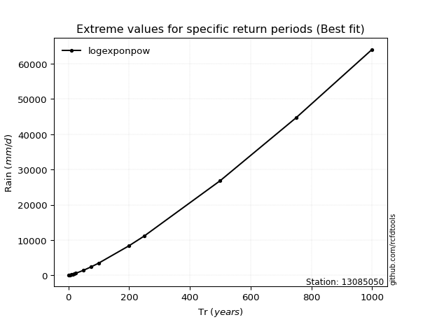</img>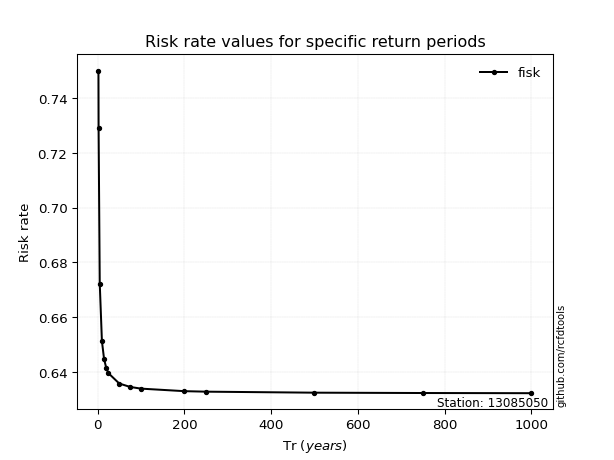</img>

</div>


<sub>**APP DISCLAIMER**: NO WARRANTY - This software is provided by [github.com/rcfdtools](https://github.com/rcfdtools) "as is", without any express or implied warranty, including warranties of merchantability, fitness for a particular purpose, or non-infringement. There is no guarantee that the software will be error-free or operate without interruption. LIMITATION OF LIABILITY - Neither the authors nor copyright holders will be liable for claims or damages arising from the software or its use. You are responsible for determining if the software is appropriate for your use and assume all associated risks, including errors, legal compliance, and data loss. NO PROFESSIONAL ADVICE - The software provides general information and does not offer professional advice. It should not replace consultation with professional advisors.</sub>